# camunda 7

**User:** Anonymous  
**Created:** 7/16/2026 9:37:06  
**Updated:** 7/16/2026 10:21:20  
**Exported:** 7/16/2026 10:26:36  
**Link:** [https://chatgpt.com/g/g-p-6a539ddc858881919467b6da20df4567-cheatsheet/c/6a5843cd-4860-83ec-8501-af5dc6ea5e0e](https://chatgpt.com/g/g-p-6a539ddc858881919467b6da20df4567-cheatsheet/c/6a5843cd-4860-83ec-8501-af5dc6ea5e0e)  

## Response:
7/16/2026, 9:38:28 AM

Saya akan susun sebagai peta domain praktis, bukan teori BPMN umum. Fokusnya Camunda 7 yang dipakai dari service Java/Jersey: embedding engine, REST orchestration, transaction boundary, persistence PostgreSQL, observability, dan deployment runtime.

## Introduction

Camunda 7 dalam konteks **Jakarta RESTful Web Service/Jersey microservice** sebaiknya dipahami sebagai **workflow/process engine yang mengelola state, transaksi, timer, human task, service task, external task, retry, incident, history, dan audit trail** di luar business controller biasa.

Catatan penting: **Camunda 7 sudah berada pada jalur End-of-Life**. Camunda menyatakan **Camunda 7.24 LTS adalah minor release terakhir** dan tidak ada feature-adding release baru untuk Camunda 7. ([Camunda 7 Documentation](https://docs.camunda.org/enterprise/announcement/)) Untuk Enterprise Edition, Camunda 7 masih didukung sampai 2030, tetapi **Community Edition tidak mendapat security patch/maintenance setelah final feature release 7.24**. ([Camunda](https://camunda.com/de/platform-7/)) Jadi onboarding Camunda 7 harus selalu dibarengi pemahaman operasional legacy/enterprise support dan rencana migrasi jangka panjang ke Camunda 8.

Secara teknis, Camunda 7 core adalah **BPMN 2.0 process engine berbasis JVM** yang bisa di-embed dalam aplikasi Java atau runtime container. ([GitHub](https://github.com/camunda/camunda-bpm-platform)) Dalam aplikasi Jersey, ada dua pola utama: **embedded engine inside service** atau **remote/shared Camunda engine yang diakses via REST API**. Camunda Java API menyediakan service utama seperti `RepositoryService`, `RuntimeService`, `TaskService`, `HistoryService`, `ManagementService`, `ExternalTaskService`, dan `DecisionService`; objek engine/service-nya thread-safe sehingga bisa disimpan sebagai singleton service reference dalam server. ([Camunda 7 Documentation](https://docs.camunda.org/manual/7.24/user-guide/process-engine/process-engine-api/))

---

## Diagram

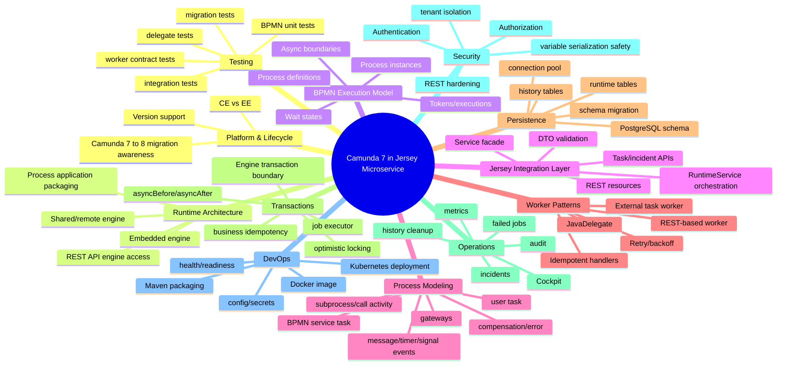

---

## Tabular Decomposition Map

| Area | Practical category / skill | Fokus yang perlu dikuasai | Output praktis yang harus bisa dibuat |
|---|---|---|---|
| 1 | **Camunda 7 lifecycle & version strategy** | Memahami status Camunda 7, 7.24 LTS, CE vs EE, kompatibilitas Java/PostgreSQL/container, dan konsekuensi production support. | Matriks versi: Camunda 7.x, Java, PostgreSQL, container runtime, Maven dependency, dan support risk. |
| 2 | **Runtime architecture choice** | Menentukan kapan memakai embedded engine di Jersey service, kapan memakai shared/remote Camunda engine, dan efeknya pada scaling, ownership, deployment, serta failure isolation. | Architecture Decision Record: embedded vs remote engine untuk microservice. |
| 3 | **Process engine bootstrapping** | Setup `ProcessEngineConfiguration`, datasource, transaction manager, job executor activation, schema update policy, plugin, history level. | Minimal Jersey service yang start process engine secara aman. |
| 4 | **Camunda Java API services** | Menguasai `RepositoryService`, `RuntimeService`, `TaskService`, `HistoryService`, `ManagementService`, `ExternalTaskService`, `DecisionService`. Java API adalah cara umum berinteraksi dengan engine, dan service object bersifat thread-safe. ([Camunda 7 Documentation](https://docs.camunda.org/manual/7.24/user-guide/process-engine/process-engine-api/)) | Service facade `WorkflowService` untuk deploy, start, correlate, query, complete task, dan inspect process. |
| 5 | **Camunda REST API integration** | Memakai REST API untuk akses interface engine, memahami URL/verb/body/response/error code, multi-engine path `/engine/{name}`, dan basic auth/filtering. REST API memang ditujukan untuk membuka interface engine yang relevan. ([Camunda 7 Documentation](https://docs.camunda.org/manual/7.24/reference/rest/overview/)) | Jersey client wrapper atau OpenAPI-generated client untuk Camunda REST. |
| 6 | **BPMN executable modeling** | Memahami process definition, process instance, token flow, BPMN XML deployment, dan hubungan diagram dengan runtime execution. Camunda deploy BPMN XML lalu menjalankannya sebagai process definition graph. ([Camunda 7 Documentation](https://docs.camunda.org/manual/7.24/user-guide/process-engine/process-engine-concepts/)) | BPMN model production-style: start event, service task, user task, timer, gateway, error boundary, end event. |
| 7 | **Jersey endpoint orchestration** | Mendesain endpoint seperti `POST /cases/{id}/submit`, `POST /tasks/{id}/complete`, `POST /processes/{key}/start`, `POST /messages/{name}/correlate`. | REST resource layer yang tidak langsung bocorkan detail Camunda internal ke API publik. |
| 8 | **Process variables & serialization** | Mengelola primitive, JSON, object variables, typed values, variable scope, local/global variable, payload size, dan serialization security. | Variable contract: naming convention, JSON schema, DTO mapper, allowed variable types. |
| 9 | **Transaction boundary & wait states** | Memahami bahwa engine berjalan sampai wait state lalu persist state ke DB dan commit. Wait state termasuk receive task, user task, message/timer/signal event, event-based gateway, dan external task. ([Camunda 7 Documentation](https://docs.camunda.org/manual/7.24/user-guide/process-engine/transactions-in-processes/)) | Checklist kapan harus menaruh wait state atau async boundary agar proses recoverable. |
| 10 | **Async continuation** | Memakai `camunda:asyncBefore` dan `camunda:asyncAfter` untuk memecah transaksi, mengaktifkan retry oleh job executor, dan menghindari long transaction. Async continuation membuat transaction boundary dan dijalankan oleh job executor. ([Camunda 7 Documentation](https://docs.camunda.org/manual/7.24/user-guide/process-engine/transactions-in-processes/)) | BPMN pattern untuk external API call, DB update, notification, dan compensation-safe step. |
| 11 | **Job executor & timers** | Mengelola async jobs, timer jobs, retry, acquisition, priority, exclusive jobs, cluster behavior, backoff, dan starvation. Embedded engine default-nya tidak otomatis mengaktifkan job executor kecuali dikonfigurasi. ([Camunda 7 Documentation](https://docs.camunda.org/manual/7.24/user-guide/process-engine/the-job-executor/)) | Job executor tuning profile untuk dev, staging, production, dan cluster. |
| 12 | **External task pattern** | Memahami perbedaan internal service task vs external task. External task mem-publish unit of work yang di-fetch/lock/complete oleh worker. ([Camunda 7 Documentation](https://docs.camunda.org/manual/7.24/user-guide/process-engine/external-tasks/)) | Java/Jersey external task worker dengan idempotency, retries, BPMN error, failure reporting, dan lock extension. |
| 13 | **Long polling worker design** | Menggunakan long polling agar worker tidak melakukan polling mahal berulang-ulang; server menahan request sampai task tersedia atau timeout. ([Camunda 7 Documentation](https://docs.camunda.org/manual/7.24/user-guide/process-engine/external-tasks/)) | Worker loop dengan `fetchAndLock`, backoff, graceful shutdown, metrics, dan unique `workerId`. |
| 14 | **Human task lifecycle** | Claim, assign, complete, candidate user/group, form variables, task query, delegation, escalation, SLA/timer boundary. | Task API facade untuk aplikasi front-end/internal ops. |
| 15 | **Error handling & BPMN errors** | Membedakan technical exception, failed job, incident, BPMN business error, escalation, compensation, retry exhausted, dan manual recovery. | Error taxonomy: retryable, non-retryable, BPMN error, incident, compensation. |
| 16 | **Incident & failed job operations** | Query incident, failed job, retry reset, unlock external task, modify/restart process instance, correlate message manually. External task management mencakup unlock, set retries, dan priority. ([Camunda 7 Documentation](https://docs.camunda.org/manual/7.24/user-guide/process-engine/external-tasks/)) | Runbook operasi: “payment worker down”, “timer backlog”, “stuck process”, “wrong variable”. |
| 17 | **PostgreSQL persistence** | Mengerti runtime/history table, schema update, index pressure, connection pool, transaction isolation, vacuum, table growth. `databaseSchemaUpdate` mengatur strategi schema saat engine boot; update schema versi tetap harus dipastikan cocok dengan versi engine. ([Camunda 7 Documentation](https://docs.camunda.org/manual/7.24/user-guide/process-engine/database/database-configuration/)) | PostgreSQL operational checklist untuk Camunda schema. |
| 18 | **History, audit, cleanup** | Menentukan history level, retention, cleanup job, audit needs, Cockpit dependency. Default history backend menulis event ke tabel history dan bisa di-query via `HistoryService` atau REST API. ([Camunda 7 Documentation](https://docs.camunda.org/manual/7.24/user-guide/process-engine/history/history-configuration/)) | Policy history TTL, cleanup window, dan audit query. |
| 19 | **Security & authorization** | REST authentication, authorization service, tenant-aware access, least privilege DB user, secure variable handling, secret masking. Basic auth tersedia di REST API tetapi default-nya off di REST webapp/prebuilt distribution. ([Camunda 7 Documentation](https://docs.camunda.org/manual/7.24/reference/rest/overview/)) | Security baseline untuk Camunda REST + Jersey service. |
| 20 | **Multi-tenancy** | Tenant ID, tenant-specific process definitions, authorization boundary, data isolation, query filtering, operational blast radius. | Tenant-aware workflow facade dan test cases untuk cross-tenant leakage. |
| 21 | **DMN integration** | Decision table, business rule task, `DecisionService`, FEEL/JUEL expression, versioning decision rules. | DMN decision table untuk eligibility/scoring/routing. |
| 22 | **Deployment & versioning** | BPMN/DMN deployment, process definition versioning, migration plan, rolling update, backward-compatible variable contracts. | CI/CD pipeline untuk deploy BPMN/DMN dan migration checklist. |
| 23 | **Testing strategy** | Unit test BPMN path, delegate test, worker test, REST integration test, database-backed test, migration regression test. | Test pyramid khusus Camunda + Jersey. |
| 24 | **Observability & SRE** | Metrics, job backlog, incident count, timer delay, external worker latency, DB connection pool, history cleanup lag, audit log. | Dashboard/runbook untuk production support. |
| 25 | **Performance & scaling** | Job executor threads, acquisition tuning, external worker concurrency, DB bottleneck, history level cost, process variable size, query pagination. | Load-test scenario: start process, complete tasks, external task throughput, timer storm. |
| 26 | **Docker/Kubernetes deployment** | Packaging embedded Jersey service, Camunda Run/shared engine, config map, secrets, probes, shutdown hooks, volume/logging strategy. | Deployment template untuk on-prem/Kubernetes/cloud. |
| 27 | **Enterprise migration awareness** | Menilai apa yang akan sulit dipindah ke Camunda 8: JavaDelegate, embedded engine, synchronous API usage, history queries, Cockpit ops habit, custom plugins. | Migration-readiness checklist Camunda 7 → Camunda 8. |

---

## Roadmap alur belajar yang direkomendasikan

1. **Start dari runtime architecture**: pilih mental model embedded engine vs remote/shared engine, lalu pahami process engine services.
2. **Masuk ke BPMN executable basics**: process definition, process instance, variable, wait state, gateway, event, service task, user task.
3. **Integrasikan dengan Jersey**: buat REST facade untuk start process, correlate message, complete task, query status, dan expose business-safe API.
4. **Dalami transaction & async**: wait state, `asyncBefore`, `asyncAfter`, job executor, retry, optimistic locking, incident.
5. **Bangun worker pattern**: external task worker, lock duration, long polling, retry, BPMN error, idempotency.
6. **Masuk production operations**: PostgreSQL schema, history cleanup, failed jobs, Cockpit, metrics, security, deployment, Kubernetes.
7. **Terakhir, migration awareness**: karena Camunda 7 sudah di jalur EOL, semua design baru sebaiknya dinilai juga dari sudut migrasi ke Camunda 8.

Rekomendasi materi selanjutnya: **seri praktis “Camunda 7 in Jersey Microservice - Runtime Architecture & Integration Pattern”**, mulai dari embedded vs remote engine, Maven dependency, process engine bootstrapping, datasource PostgreSQL, dan REST facade design.

---

**Sources:**

- [Support Announcements | docs.camunda.org](https://docs.camunda.org/enterprise/announcement/)
- [Camunda 7 End of Life and Next Steps | Camunda | Camunda](https://camunda.com/de/platform-7/)
- [GitHub - camunda/camunda-bpm-platform: Camunda 7 CE is End of Life (EoL). Please check out Camunda 8 instead (https://github.com/camunda/camunda) or read about Camunda 7 Enterprise End of Life (https://camunda.com/blog/2025/02/camunda-7-enterprise-end-of-life-extension/) – Camunda 7 CE was a flexible framework for workflow and decision automation using BPMN and DMN. · GitHub](https://github.com/camunda/camunda-bpm-platform)

## Response:
7/16/2026, 9:39:47 AM

Total saya rekomendasikan **18 seri** untuk **Camunda 7 in Jakarta RESTful Web Service/Jersey microservice-based application**.

| Seri | Judul |
|---:|---|
| 1 | **Camunda 7 Runtime Architecture in Jersey Microservice** |
| 2 | **Maven Setup, Dependency, Packaging, and Project Structure** |
| 3 | **Process Engine Bootstrapping with PostgreSQL Datasource** |
| 4 | **BPMN Executable Modeling for Microservice Workflow** |
| 5 | **Jersey REST Facade for Camunda Runtime API** |
| 6 | **Process Variables, DTO Mapping, Serialization, and Validation** |
| 7 | **Transaction Boundary, Wait State, AsyncBefore/AsyncAfter** |
| 8 | **Job Executor, Timer, Retry, Failed Job, and Incident Handling** |
| 9 | **JavaDelegate vs External Task Worker Pattern** |
| 10 | **External Task Worker Implementation with Jersey/Java Service** |
| 11 | **Human Task, Assignment, Claim, Completion, and SLA Pattern** |
| 12 | **Message, Signal, Timer, Error, Escalation, and Compensation Events** |
| 13 | **DMN Decision Table Integration in Camunda 7** |
| 14 | **PostgreSQL Persistence, History, Audit, Cleanup, and Performance** |
| 15 | **Security, Authorization, Tenant Isolation, and REST Hardening** |
| 16 | **Docker/Kubernetes Deployment for Camunda 7 Microservice Runtime** |
| 17 | **Testing Strategy: BPMN Unit Test, Delegate Test, Worker Test, Integration Test** |
| 18 | **Production Runbook, Observability, Migration Awareness Camunda 7 → Camunda 8** |

Urutannya sudah saya susun supaya praktis: dari **runtime setup → BPMN execution → Jersey integration → transaction/retry → worker pattern → operations → production readiness**.

## Response:
7/16/2026, 9:40:05 AM

Kita mulai **Seri 1/18**. Saya akan buat format cheatsheet praktis: keputusan arsitektur, pola implementasi Jersey, struktur komponen, failure model, dan checklist yang bisa langsung dipakai saat membaca/menulis service.

# Seri 1/18 - Camunda 7 Runtime Architecture in Jersey Microservice

## Tujuan seri ini

Seri ini membangun fondasi praktis: **bagaimana menempatkan Camunda 7 di dalam arsitektur microservice berbasis Java/Jersey**, bukan sekadar belajar BPMN.

Target akhirnya: saat melihat service yang memakai Camunda 7, kamu bisa cepat menjawab:

1. engine-nya **embedded** atau **remote/shared**?
2. siapa yang deploy BPMN/DMN?
3. siapa yang start process instance?
4. transaction boundary-nya di mana?
5. job executor jalan di service mana?
6. worker-nya internal `JavaDelegate` atau external worker?
7. data workflow masuk PostgreSQL schema siapa?
8. bagaimana service fail/restart/retry tanpa merusak state proses?

Camunda 7 sendiri adalah engine workflow/BPMN berbasis Java. Java API-nya dimulai dari `ProcessEngineConfiguration`, lalu engine menyediakan service seperti `RepositoryService`, `RuntimeService`, `TaskService`, dan service lain untuk operasi workflow. ([Camunda 7 Documentation](https://docs.camunda.org/manual/7.24/reference/javadoc/?utm_source=chatgpt.com))

---

# 1. Mental Model Praktis

Dalam microservice biasa, REST endpoint sering langsung menjalankan business flow:

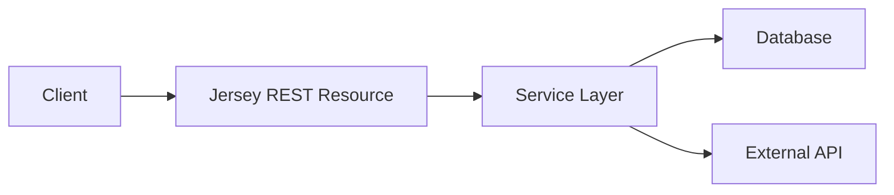

Dengan Camunda 7, business flow dipindahkan menjadi **durable process state**:

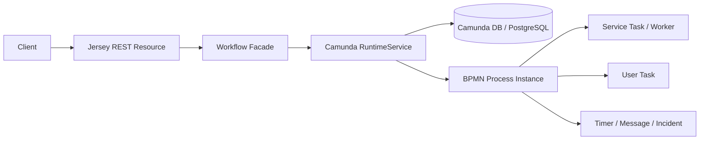

Perbedaannya penting:

| Tanpa Camunda | Dengan Camunda 7 |
|---|---|
| Flow hidup di kode Java | Flow hidup di BPMN process definition |
| State biasanya manual di tabel aplikasi | State workflow dikelola engine |
| Retry sering custom | Retry bisa lewat job executor / external task retry |
| Audit harus dibuat sendiri | History/audit bisa dicatat engine |
| Long-running process sulit | Long-running process menjadi use case utama |
| Error recovery custom | Ada failed job, incident, retry, modification |

---

# 2. Arsitektur Utama Camunda 7 di Jersey Microservice

Ada 3 pola utama.

## Pattern A - Embedded Camunda Engine inside Jersey Service

Engine Camunda dijalankan di dalam proses aplikasi Jersey.

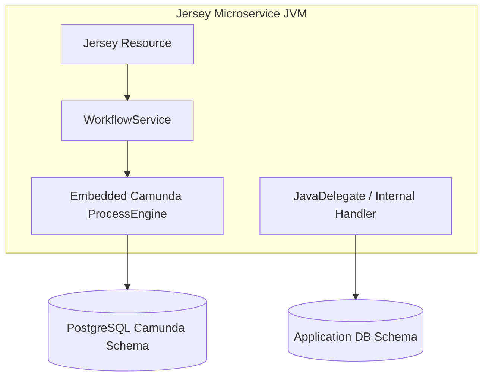

### Kapan cocok?

Gunakan pola ini kalau:

| Cocok jika | Penjelasan |
|---|---|
| Workflow owned by one service | Satu bounded context memiliki prosesnya sendiri |
| Butuh Java API langsung | Misalnya ingin pakai `RuntimeService`, `TaskService`, `RepositoryService` langsung |
| Deployment sederhana | Service + engine + process definition dalam satu artefak |
| Tim siap mengelola DB/job executor | Karena engine runtime berada di service tersebut |

### Risiko

| Risiko | Dampak |
|---|---|
| Service scaling = engine scaling | Kalau pod naik 5, berarti ada 5 engine instance |
| Job executor aktif di semua instance | Harus paham locking, acquisition, concurrency |
| BPMN tightly coupled ke service | Migrasi/modularisasi lebih sulit |
| DB Camunda menjadi bagian kritikal service | Tuning PostgreSQL wajib serius |

### Praktisnya

Embedded cocok untuk **domain workflow service**, misalnya:

```text
case-management-service
enforcement-workflow-service
approval-workflow-service
complaint-processing-service
```

Tidak cocok kalau service hanya sekadar CRUD kecil.

---

## Pattern B - Remote Camunda Engine via REST API

Jersey service tidak menjalankan engine. Service hanya memanggil Camunda REST API.

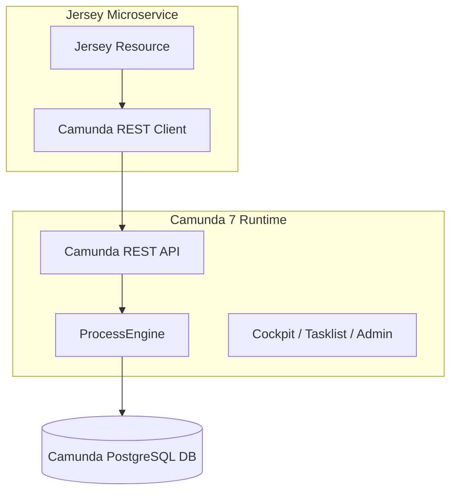

Camunda 7 memang menyediakan REST API untuk membuka interface process engine yang relevan ke client eksternal. ([Camunda 7 Documentation](https://docs.camunda.org/rest/camunda-bpm-platform/7.24/?utm_source=chatgpt.com))

### Kapan cocok?

| Cocok jika | Penjelasan |
|---|---|
| Engine dikelola platform team | App team cukup konsumsi REST |
| Banyak service perlu akses workflow | Engine menjadi shared workflow platform |
| Ingin pisahkan lifecycle app dan engine | Deploy service tidak selalu restart engine |
| Butuh Camunda webapps/operator tooling terpusat | Cockpit/Tasklist/Admin bisa dikelola bersama |

### Risiko

| Risiko | Dampak |
|---|---|
| Network dependency | REST call ke engine bisa gagal/timeout |
| Contract REST harus stabil | Perlu client wrapper/OpenAPI/generated client |
| Authorization lebih penting | Jangan expose Camunda REST mentah ke semua service |
| Query bisa mahal | Jangan jadikan REST API sebagai reporting query liar |

### Praktisnya

Remote cocok kalau perusahaan punya:

```text
workflow-platform
central-camunda-runtime
business-process-orchestration-service
```

---

## Pattern C - Shared Engine in Container

Beberapa aplikasi memakai process engine yang dikontrol oleh runtime/container. Camunda mendokumentasikan shared process engine sebagai engine yang dikendalikan independen dari aplikasi dan bisa dipakai beberapa aplikasi. ([Camunda 7 Documentation](https://docs.camunda.org/get-started/archive/spring/shared-process-engine/?utm_source=chatgpt.com))

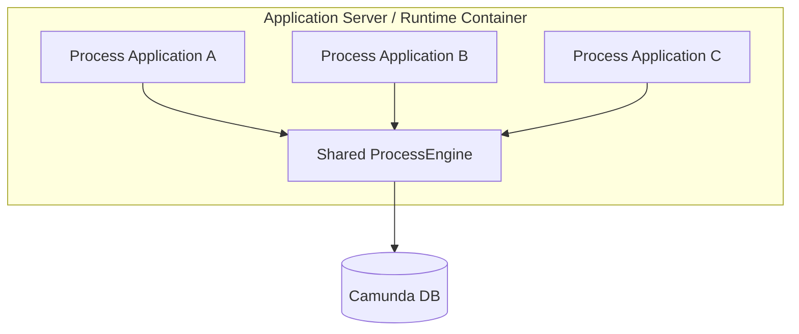

### Kapan cocok?

Biasanya muncul di instalasi Camunda 7 lama/enterprise/app-server style. Untuk microservice modern berbasis Docker/Kubernetes, pattern ini sering kurang natural dibanding embedded atau remote engine.

---

# 3. Rekomendasi Praktis untuk Jersey Microservice

Untuk stack kamu, saya rekomendasikan cara berpikir berikut:

## Default recommendation

| Kondisi | Pilih |
|---|---|
| Workflow milik satu bounded context dan tightly coupled dengan domain service | **Embedded engine** |
| Workflow lintas banyak service/domain dan perlu platform governance | **Remote Camunda engine via REST** |
| Legacy app-server environment | **Shared engine** |
| Worker perlu scalable, isolated, bisa retry mandiri | **External task worker** |
| Task sangat lokal, cepat, dan tidak butuh isolasi | **JavaDelegate**, tapi hati-hati coupling |

---

# 4. Architecture Decision Matrix

| Kriteria | Embedded Engine | Remote REST Engine | Shared Engine |
|---|---:|---:|---:|
| Setup awal | Medium | Medium/High | High |
| Cocok untuk Kubernetes | Good | Very good | Medium |
| Coupling ke service | High | Medium/Low | Medium |
| Latency | Low | Medium | Low/Medium |
| Operasional engine | Per service | Centralized | Centralized/container |
| Scaling worker | Terbatas kalau JavaDelegate | Baik kalau pakai external worker | Bergantung container |
| Cocok untuk multiple service | Kurang | Baik | Baik tapi legacy-style |
| Migration ke Camunda 8 | Perlu refactor jika banyak JavaDelegate | Lebih mudah jika sudah externalized | Perlu analisis besar |
| Blast radius | Per service | Platform-wide | Platform/container-wide |
| Debugging local | Mudah | Medium | Sulit |

---

# 5. Practical Reference Architecture untuk Jersey

## Opsi yang paling sehat untuk microservice modern

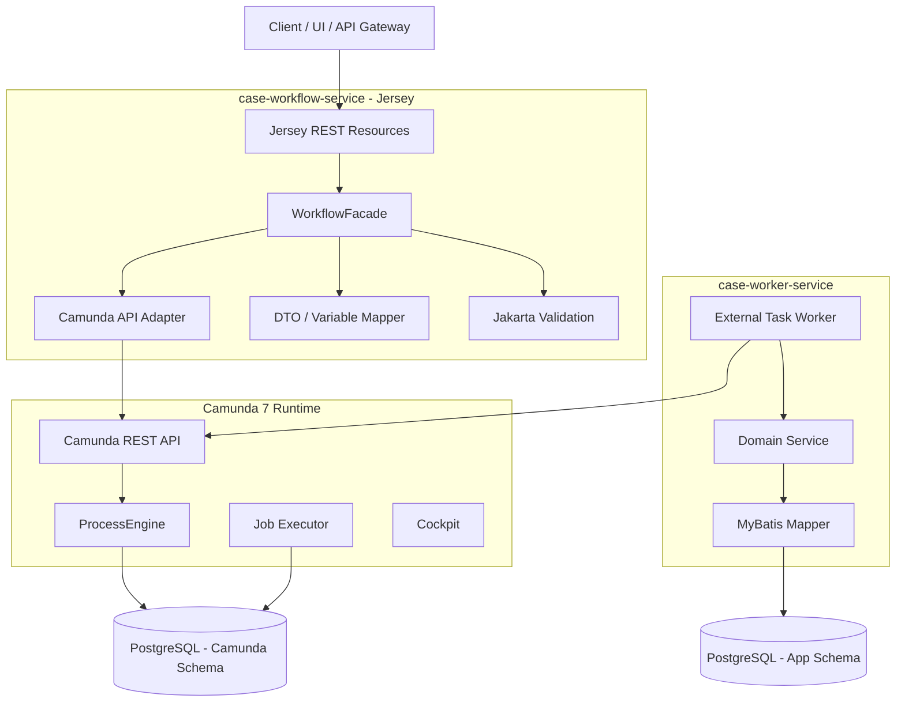

### Kenapa pattern ini bagus?

Karena ada pemisahan jelas:

| Komponen | Tanggung jawab |
|---|---|
| Jersey REST Resource | API boundary |
| WorkflowFacade | Business workflow use case |
| Camunda API Adapter | Menyembunyikan detail Java API/REST API |
| Variable Mapper | DTO ↔ process variables |
| External Worker | Eksekusi work item yang retryable |
| PostgreSQL Camunda Schema | State engine |
| PostgreSQL App Schema | State domain bisnis |
| Cockpit | Operasional workflow |

---

# 6. Embedded Engine - Minimal Implementation Sketch

## Maven dependency concept

Gunakan versi Camunda yang diset eksplisit oleh organisasi. Jangan pakai floating version.

```xml
<properties>
    <camunda.version>7.24.x</camunda.version>
    <postgresql.version>42.x.x</postgresql.version>
</properties>

<dependencies>
    <dependency>
        <groupId>org.camunda.bpm</groupId>
        <artifactId>camunda-engine</artifactId>
        <version>${camunda.version}</version>
    </dependency>

    <dependency>
        <groupId>org.camunda.bpm</groupId>
        <artifactId>camunda-engine-plugin-spin</artifactId>
        <version>${camunda.version}</version>
    </dependency>

    <dependency>
        <groupId>org.camunda.spin</groupId>
        <artifactId>camunda-spin-dataformat-json-jackson</artifactId>
        <version>${camunda.version}</version>
    </dependency>

    <dependency>
        <groupId>org.postgresql</groupId>
        <artifactId>postgresql</artifactId>
        <version>${postgresql.version}</version>
    </dependency>
</dependencies>
```

Catatan praktis: jangan langsung copy dependency ke production tanpa cek BOM/dependency tree internal perusahaan, karena Camunda 7 dapat membawa dependency lama yang perlu disejajarkan dengan Jersey/Jakarta stack.

---

## Process engine bootstrap

```java
public final class CamundaEngineProvider {

    private final ProcessEngine processEngine;

    public CamundaEngineProvider(DataSource dataSource) {
        this.processEngine =
            ProcessEngineConfiguration
                .createStandaloneProcessEngineConfiguration()
                .setDataSource(dataSource)
                .setDatabaseSchemaUpdate(ProcessEngineConfiguration.DB_SCHEMA_UPDATE_FALSE)
                .setHistory(ProcessEngineConfiguration.HISTORY_FULL)
                .setJobExecutorActivate(true)
                .buildProcessEngine();
    }

    public ProcessEngine getProcessEngine() {
        return processEngine;
    }

    public RuntimeService runtimeService() {
        return processEngine.getRuntimeService();
    }

    public RepositoryService repositoryService() {
        return processEngine.getRepositoryService();
    }

    public TaskService taskService() {
        return processEngine.getTaskService();
    }

    public HistoryService historyService() {
        return processEngine.getHistoryService();
    }

    public ManagementService managementService() {
        return processEngine.getManagementService();
    }

    public void shutdown() {
        processEngine.close();
    }
}
```

### Production warning

Di production, jangan sembarang pakai:

```java
.setDatabaseSchemaUpdate(ProcessEngineConfiguration.DB_SCHEMA_UPDATE_TRUE)
```

Lebih aman:

```java
.setDatabaseSchemaUpdate(ProcessEngineConfiguration.DB_SCHEMA_UPDATE_FALSE)
```

Lalu schema migration dilakukan eksplisit oleh pipeline DBA/Flyway/Liquibase/manual controlled migration. Camunda menyediakan konfigurasi database schema update, tetapi di production enterprise lebih aman menjadikannya controlled migration, bukan auto-update saat service boot. Camunda docs juga menempatkan database schema update sebagai bagian dari konfigurasi database engine. ([Camunda 7 Documentation](https://docs.camunda.org/enterprise/announcement/?utm_source=chatgpt.com))

---

# 7. Jersey Resource Pattern

Jangan biarkan REST resource langsung memanggil Camunda API secara acak. Buat facade.

## Bad pattern

```java
@Path("/process")
public class ProcessResource {

    private final RuntimeService runtimeService;

    @POST
    @Path("/start")
    public Response start(Map<String, Object> body) {
        runtimeService.startProcessInstanceByKey("case_process", body);
        return Response.ok().build();
    }
}
```

Masalah:

| Masalah | Dampak |
|---|---|
| REST resource tahu process key | Sulit rename/versioning |
| Variable mentah dari request | Risky, tidak tervalidasi |
| Tidak ada idempotency | Duplicate process instance |
| Tidak ada business key policy | Sulit trace |
| Tidak ada error mapping | Camunda exception bocor ke API |

---

## Good pattern

```java
@Path("/cases")
@Consumes(MediaType.APPLICATION_JSON)
@Produces(MediaType.APPLICATION_JSON)
public class CaseWorkflowResource {

    private final CaseWorkflowFacade workflowFacade;

    public CaseWorkflowResource(CaseWorkflowFacade workflowFacade) {
        this.workflowFacade = workflowFacade;
    }

    @POST
    @Path("/{caseId}/submit")
    public Response submitCase(
            @PathParam("caseId") String caseId,
            SubmitCaseRequest request
    ) {
        SubmitCaseResult result = workflowFacade.submitCase(caseId, request);
        return Response.accepted(result).build();
    }
}
```

Facade:

```java
public final class CaseWorkflowFacade {

    private static final String PROCESS_KEY = "case_enforcement_process";

    private final RuntimeService runtimeService;
    private final CaseVariableMapper variableMapper;

    public CaseWorkflowFacade(
            RuntimeService runtimeService,
            CaseVariableMapper variableMapper
    ) {
        this.runtimeService = runtimeService;
        this.variableMapper = variableMapper;
    }

    public SubmitCaseResult submitCase(String caseId, SubmitCaseRequest request) {
        String businessKey = "CASE-" + caseId;

        Map<String, Object> variables = variableMapper.toStartVariables(caseId, request);

        ProcessInstance instance =
            runtimeService.startProcessInstanceByKey(
                PROCESS_KEY,
                businessKey,
                variables
            );

        return new SubmitCaseResult(
            instance.getProcessInstanceId(),
            instance.getBusinessKey(),
            "SUBMITTED"
        );
    }
}
```

Variable mapper:

```java
public final class CaseVariableMapper {

    public Map<String, Object> toStartVariables(
            String caseId,
            SubmitCaseRequest request
    ) {
        Map<String, Object> variables = new HashMap<>();

        variables.put("caseId", caseId);
        variables.put("caseType", request.caseType());
        variables.put("submittedBy", request.submittedBy());
        variables.put("priority", request.priority());
        variables.put("submittedAt", Instant.now().toString());

        return variables;
    }
}
```

---

# 8. Business Key Strategy

Business key adalah salah satu hal kecil yang sangat penting.

## Recommended pattern

```text
<DOMAIN>-<BUSINESS_ID>
```

Contoh:

```text
CASE-12345
ENFORCEMENT-2026-00091
COMPLAINT-889201
LICENSE-REVOCATION-991
```

## Kenapa penting?

| Fungsi | Manfaat |
|---|---|
| Correlation | Cari process instance dari ID bisnis |
| Debugging | Operator tidak harus tahu UUID Camunda |
| Audit | Hubungkan workflow dengan entity domain |
| Idempotency | Bisa mencegah start process duplikat |
| Reporting | Query history lebih mudah |

## Anti-pattern

```java
runtimeService.startProcessInstanceByKey("process");
```

Tanpa business key, production debugging akan menyakitkan.

---

# 9. Deployment Model BPMN

Ada dua pilihan utama.

## Option 1 - BPMN packaged inside service

```text
src/main/resources/bpmn/case-enforcement.bpmn
src/main/resources/dmn/risk-scoring.dmn
```

Service deploy BPMN saat startup.

```java
repositoryService
    .createDeployment()
    .name("case-workflow-deployment")
    .addClasspathResource("bpmn/case-enforcement.bpmn")
    .addClasspathResource("dmn/risk-scoring.dmn")
    .deploy();
```

### Cocok jika

| Cocok | Alasan |
|---|---|
| BPMN tightly coupled dengan service code | Delegate/worker version ikut service |
| Deployment harus atomic | App code dan BPMN rilis bersama |
| Tim service owner mengelola process | Ownership jelas |

### Risiko

| Risiko | Dampak |
|---|---|
| Restart service bisa deploy berulang | Harus pakai duplicate filtering |
| BPMN hotfix perlu redeploy service | Kurang fleksibel |
| Banyak version process | Perlu migration policy |

---

## Option 2 - BPMN deployed separately

BPMN/DMN dideploy oleh pipeline terpisah atau Camunda platform team.

### Cocok jika

| Cocok | Alasan |
|---|---|
| Workflow managed by process/platform team | Business process lebih sering berubah |
| Service hanya menyediakan worker/API | Loose coupling |
| Butuh governance BPMN | Review/deploy process definition bisa dipisah |

### Risiko

| Risiko | Dampak |
|---|---|
| BPMN dan code bisa mismatch | Perlu compatibility contract |
| Variable contract harus disiplin | Kalau tidak, runtime error |
| Version governance lebih kompleks | Perlu deployment registry |

---

# 10. JavaDelegate vs External Task Worker

Ini keputusan arsitektur paling penting setelah embedded vs remote.

## JavaDelegate

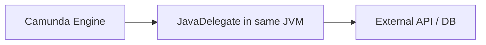

```java
public final class ValidateCaseDelegate implements JavaDelegate {

    @Override
    public void execute(DelegateExecution execution) {
        String caseId = (String) execution.getVariable("caseId");

        // domain logic here
        execution.setVariable("caseValid", true);
    }
}
```

### Cocok jika

| Cocok | Penjelasan |
|---|---|
| Logic ringan | Tidak lama, tidak blocking berat |
| Engine embedded di service yang sama | Semua dependency tersedia |
| Tidak perlu scaling terpisah | Delegate ikut lifecycle engine |

### Risiko

| Risiko | Dampak |
|---|---|
| Coupling tinggi | BPMN bergantung class Java |
| Error langsung mempengaruhi engine transaction | Bisa jadi failed job/incident |
| Deployment process dan code harus sinkron | Salah versi bisa runtime error |
| Migrasi Camunda 8 lebih sulit | Camunda 8 tidak memakai pola JavaDelegate yang sama |

---

## External Task Worker

External task memisahkan engine dan eksekutor. Camunda membuat work item; worker melakukan `fetchAndLock`, menjalankan logic, lalu `complete` atau `handleFailure`. Camunda mendokumentasikan external task sebagai unit kerja yang bisa diambil dan dikunci worker eksternal. ([Camunda 7 Documentation](https://docs.camunda.org/rest/camunda-bpm-platform/7.24/?utm_source=chatgpt.com))

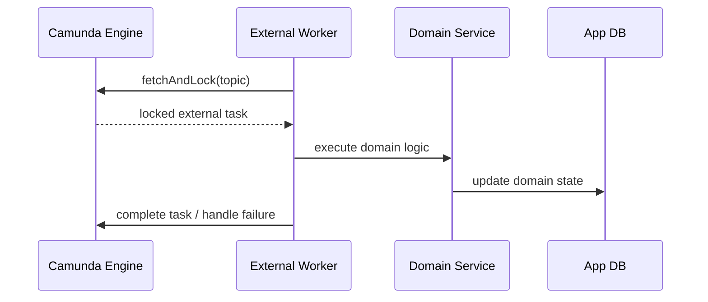

### Cocok jika

| Cocok | Penjelasan |
|---|---|
| Logic berat atau I/O-heavy | API call, DB update, file processing |
| Perlu scaling worker terpisah | Worker bisa horizontal scale |
| Ingin isolate failure | Engine tetap hidup meski worker down |
| Ingin migration-friendly | Lebih dekat ke Camunda 8 job worker model |

---

# 11. Transaction Boundary Model

Dalam Camunda 7, jangan berpikir semua BPMN dijalankan sebagai satu transaksi panjang.

Mental model-nya:

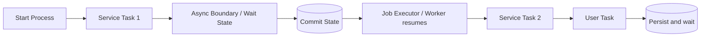

## Practical rule

| Situasi | Rekomendasi |
|---|---|
| Call external API | Pakai async boundary atau external task |
| Step butuh retry | Pakai async boundary/external task |
| Step update DB domain | Pastikan idempotent |
| Step bisa lama | Jangan jalankan inline dalam REST request |
| User approval | Pakai user task / wait state |
| Deadline/SLA | Pakai timer boundary/event |
| Business rejection | Pakai BPMN error |
| Technical failure | Failed job / external task failure |

---

# 12. REST API Design untuk Workflow Service

Jangan expose Camunda API mentah ke client bisnis. Buat API yang domain-oriented.

## Recommended API shape

| Use case | Endpoint |
|---|---|
| Start workflow | `POST /cases/{caseId}/submit` |
| Get workflow state | `GET /cases/{caseId}/workflow` |
| Complete manual decision | `POST /cases/{caseId}/tasks/{taskKey}/complete` |
| Correlate incoming event | `POST /cases/{caseId}/events/payment-received` |
| Cancel process | `POST /cases/{caseId}/cancel` |
| Retry failed workflow step | `POST /cases/{caseId}/workflow/retry` |
| List active human tasks | `GET /cases/{caseId}/tasks` |

## Avoid

| Avoid | Kenapa |
|---|---|
| `POST /camunda/runtime/process-instance` exposed to UI | Terlalu teknis |
| Client mengirim arbitrary variables | Security dan data quality risk |
| Client tahu process definition key | Coupling |
| Client tahu task ID internal sebagai primary API | Task ID Camunda bisa berubah dalam migration/retry scenario |
| Query history langsung dari UI | Bisa mahal dan bocor data |

---

# 13. Package Structure

Struktur praktis untuk Jersey microservice:

```text
com.company.caseworkflow
├── api
│   ├── CaseWorkflowResource.java
│   ├── request
│   │   ├── SubmitCaseRequest.java
│   │   └── CompleteTaskRequest.java
│   └── response
│       ├── SubmitCaseResult.java
│       └── WorkflowStatusResponse.java
│
├── workflow
│   ├── CaseWorkflowFacade.java
│   ├── CaseWorkflowQueries.java
│   ├── CaseVariableMapper.java
│   ├── ProcessKeys.java
│   └── TaskKeys.java
│
├── camunda
│   ├── CamundaEngineProvider.java
│   ├── CamundaDeploymentService.java
│   ├── CamundaExceptionMapper.java
│   └── CamundaConfiguration.java
│
├── worker
│   ├── ValidateCaseWorker.java
│   ├── NotifyStakeholderWorker.java
│   └── WorkerBootstrap.java
│
├── domain
│   ├── CaseService.java
│   ├── CaseRepository.java
│   └── CaseStatus.java
│
├── persistence
│   ├── mapper
│   │   └── CaseMapper.java
│   └── model
│       └── CaseRecord.java
│
└── resources
    ├── bpmn
    │   └── case-enforcement.bpmn
    └── dmn
        └── risk-scoring.dmn
```

---

# 14. Constants untuk Process Contract

Jangan sebar string BPMN di banyak class.

```java
public final class ProcessKeys {
    private ProcessKeys() {}

    public static final String CASE_ENFORCEMENT = "case_enforcement_process";
}

public final class VariableNames {
    private VariableNames() {}

    public static final String CASE_ID = "caseId";
    public static final String CASE_TYPE = "caseType";
    public static final String PRIORITY = "priority";
    public static final String SUBMITTED_BY = "submittedBy";
    public static final String RISK_SCORE = "riskScore";
}

public final class TaskDefinitionKeys {
    private TaskDefinitionKeys() {}

    public static final String REVIEW_CASE = "review_case";
    public static final String APPROVE_ENFORCEMENT = "approve_enforcement";
}

public final class MessageNames {
    private MessageNames() {}

    public static final String PAYMENT_RECEIVED = "payment_received";
    public static final String DOCUMENT_UPLOADED = "document_uploaded";
}
```

---

# 15. Failure Model

## Failure scenario map

| Scenario | Embedded JavaDelegate | External Task Worker | Recommended handling |
|---|---|---|---|
| DB app timeout | Exception dalam engine tx/job | Worker failure | Retry + idempotency |
| External API down | Failed job/incident | `handleFailure` dengan retries | Backoff + incident after exhausted |
| Service pod restart | Engine restart | Worker restart | Persist state di Camunda DB |
| Duplicate submit request | Duplicate process instance | Duplicate process instance | Business key + idempotency table |
| Worker crash after side effect | Risk duplicate side effect | Risk duplicate side effect | Idempotency key per task |
| BPMN variable missing | Delegate exception | Worker validation error | Fail fast + incident + contract test |
| Long-running operation | Bad if inline | Better | External task |
| Human approval delayed | Wait state | Wait state | User task + SLA timer |

---

# 16. Production Decision Checklist

Sebelum implementasi Camunda 7 di Jersey, jawab ini dulu:

| Pertanyaan | Jawaban yang harus jelas |
|---|---|
| Engine embedded atau remote? | Jangan campur tanpa alasan |
| BPMN dideploy bersama service atau terpisah? | Harus ada versioning policy |
| Process key naming? | Stabil dan domain-oriented |
| Business key format? | Wajib ada |
| Variable contract di mana? | DTO/schema/constant/test |
| Job executor aktif di mana? | Jangan accidental multi-runner |
| Worker pattern apa? | JavaDelegate atau external task |
| Retry policy? | Per task/topic |
| Incident owner siapa? | Tim service atau platform |
| PostgreSQL schema siapa yang maintain? | DBA/platform/service team |
| History level apa? | Audit vs performance trade-off |
| Cleanup policy? | Jangan tunggu DB membengkak |
| Security boundary? | Jangan expose Camunda REST mentah |
| Migration awareness? | Hindari design yang makin mengunci ke Camunda 7 |

---

# 17. Recommended Baseline Architecture untuk Onboarding

Untuk perusahaan dengan stack:

```text
Java 17+
Maven
Jersey/Jakarta REST
MyBatis
PostgreSQL
Docker/Kubernetes
On-prem/AWS/Azure
```

baseline paling aman biasanya:

```text
Jersey API service
    -> workflow facade
        -> Camunda API adapter
            -> Camunda 7 engine

Business execution
    -> external task worker
        -> domain service
            -> MyBatis/PostgreSQL
```

Dengan aturan:

| Rule | Alasan |
|---|---|
| REST API domain-oriented | Tidak bocorkan Camunda internal |
| Business key wajib | Traceability |
| External task untuk I/O-heavy step | Lebih scalable dan recoverable |
| JavaDelegate hanya untuk logic ringan | Hindari tight coupling |
| Variable contract eksplisit | Mengurangi runtime surprise |
| BPMN versioning controlled | Menghindari mismatch process-code |
| PostgreSQL Camunda schema dipisah dari app schema | Operational clarity |
| Semua side effect idempotent | Retry-safe |

---

# 18. Mini End-to-End Flow

Contoh use case: submit regulatory case.

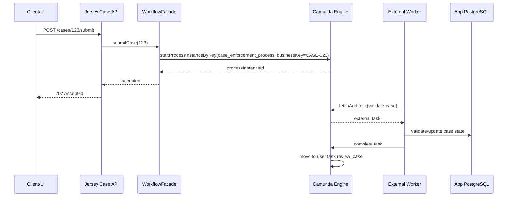

---

# 19. Anti-Patterns yang Harus Dihindari

| Anti-pattern | Kenapa berbahaya |
|---|---|
| Semua workflow logic tetap di Java, BPMN hanya dekorasi | Camunda tidak memberi banyak value |
| Satu process instance tanpa business key | Sulit trace/debug |
| REST client boleh kirim arbitrary variables | Security, audit, dan data quality buruk |
| JavaDelegate melakukan HTTP call panjang tanpa async boundary | REST/thread/transaction risk |
| Auto schema update di production | Risky saat deployment |
| Query Camunda history untuk reporting berat | Bisa membebani engine DB |
| External worker tanpa idempotency | Retry bisa menggandakan side effect |
| Semua service akses langsung Camunda DB | Melanggar ownership dan bisa corrupt assumption |
| Camunda REST API diekspos langsung ke frontend | Authorization/data leakage risk |
| Tidak punya incident runbook | Production recovery lambat |

---

# 20. Seri 1 Summary

## Yang harus kamu pegang

Camunda 7 di Jersey microservice bukan sekadar library BPMN. Ia adalah **stateful workflow runtime**. Arsitektur harus memutuskan:

```text
Where does the engine run?
Who owns the BPMN?
Who executes work?
Where is transaction boundary?
How does retry/recovery happen?
Who operates incidents?
```

## Pilihan default yang saya rekomendasikan

Untuk modern microservice:

```text
Remote/central Camunda runtime jika workflow lintas banyak service.
Embedded engine jika workflow benar-benar milik satu service.
External task worker untuk pekerjaan berat, I/O, retry, dan scaling.
JavaDelegate hanya untuk logic kecil/lokal.
```

---

# Status Seri

**Seri 1/18 selesai.**

Materi selanjutnya yang direkomendasikan: **Seri 2/18 - Maven Setup, Dependency, Packaging, and Project Structure for Camunda 7 + Jersey Microservice**.

---

**Sources:**

- [Overview (Camunda Platform Javadocs 7.24.8-ee)](https://docs.camunda.org/manual/7.24/reference/javadoc/?utm_source=chatgpt.com)

## Response:
7/16/2026, 9:41:49 AM

Lanjut ke **Seri 2/18**. Fokusnya bukan hanya daftar dependency, tetapi bagaimana menyusun Maven module, packaging, dependency boundary, resource BPMN/DMN, dan struktur project supaya siap production.

# Seri 2/18 - Maven Setup, Dependency, Packaging, and Project Structure  
## Camunda 7 + Jakarta RESTful Web Service/Jersey Microservice

## Tujuan seri ini

Seri ini membahas cara menyusun **Maven project** untuk aplikasi **Jersey/Jakarta REST microservice** yang memakai **Camunda 7**, baik sebagai:

1. **embedded process engine**, engine berada di JVM service;
2. **remote Camunda runtime client**, service hanya memanggil Camunda REST API;
3. **external task worker**, service khusus yang mengambil pekerjaan dari Camunda.

Camunda menyediakan **BOM `org.camunda.bpm:camunda-bom`** dan dokumentasinya menyarankan penggunaan BOM bila memakai beberapa artifact Camunda agar versi antar artifact tetap kompatibel. Untuk Camunda 7.24, dokumentasi Maven resmi mencantumkan `camunda-bom` versi `7.24.0` untuk Community Edition dan `7.24.0-ee` untuk Enterprise Edition. ([Camunda 7 Documentation](https://docs.camunda.org/get-started/apache-maven/))

---

# 1. Target Architecture untuk Maven Packaging

Untuk microservice production, jangan langsung campur semua class ke satu package besar. Pisahkan boundary:

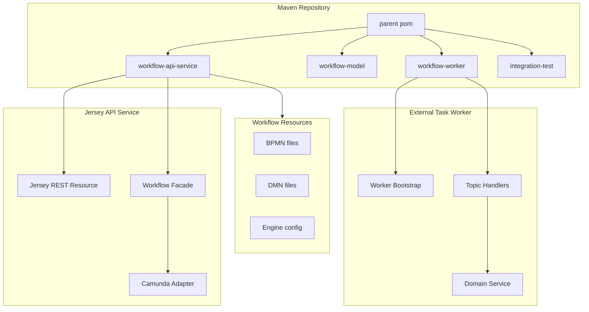

---

# 2. Recommended Maven Module Layout

## Option A - Simple single-module untuk onboarding awal

Cocok untuk belajar, PoC, atau service kecil.

```text
case-workflow-service
├── pom.xml
├── src/main/java
│   └── com/company/caseworkflow
│       ├── api
│       ├── workflow
│       ├── camunda
│       ├── worker
│       ├── domain
│       └── persistence
├── src/main/resources
│   ├── bpmn
│   │   └── case-enforcement.bpmn
│   ├── dmn
│   │   └── risk-scoring.dmn
│   ├── camunda
│   │   └── process-engine.properties
│   └── logback.xml
└── src/test/java
```

Kelebihan:

| Kelebihan | Penjelasan |
|---|---|
| Cepat dipahami | Cocok untuk onboarding awal |
| Debug mudah | Semua class dalam satu JVM |
| Build sederhana | Satu artifact |
| Local run cepat | Cocok untuk eksperimen BPMN |

Kekurangan:

| Kekurangan | Dampak |
|---|---|
| Boundary kabur | API, worker, engine, domain mudah tercampur |
| Sulit scale worker terpisah | Semua ikut satu deployment |
| Risiko dependency bloat | Semua dependency masuk satu artifact |
| Migration readiness lebih rendah | Code dan BPMN terlalu rapat |

---

## Option B - Multi-module untuk enterprise production

Cocok untuk service yang akan hidup lama.

```text
case-workflow-platform
├── pom.xml                              # parent
├── workflow-contract
│   └── pom.xml                          # DTO, variable names, process keys
├── workflow-api-service
│   └── pom.xml                          # Jersey API + Camunda facade
├── workflow-worker
│   └── pom.xml                          # external task workers
├── workflow-model
│   └── pom.xml                          # BPMN/DMN resources + validation
├── workflow-persistence
│   └── pom.xml                          # MyBatis mapper/domain DB
└── workflow-integration-test
    └── pom.xml                          # Testcontainers/integration tests
```

Kelebihan:

| Module | Tanggung jawab |
|---|---|
| `workflow-contract` | Constants, DTO, variable names, process keys, message names, topic names |
| `workflow-api-service` | Jersey REST API, workflow facade, Camunda Java API/REST adapter |
| `workflow-worker` | External task client/worker loop, topic handlers, retry policy |
| `workflow-model` | BPMN, DMN, process deployment metadata |
| `workflow-persistence` | MyBatis mapper dan domain database access |
| `workflow-integration-test` | DB-backed test, process execution test, worker test |

Rule praktis: **BPMN boleh tahu topic name, process key, message name; tetapi jangan biarkan BPMN bergantung pada arbitrary Java package kalau targetnya lebih migration-friendly.**

---

# 3. Parent POM Baseline

Gunakan parent POM untuk mengunci versi.

```xml
<project xmlns="http://maven.apache.org/POM/4.0.0"
         xmlns:xsi="http://www.w3.org/2001/XMLSchema-instance"
         xsi:schemaLocation="
             http://maven.apache.org/POM/4.0.0
             https://maven.apache.org/xsd/maven-4.0.0.xsd">

    <modelVersion>4.0.0</modelVersion>

    <groupId>com.company.workflow</groupId>
    <artifactId>case-workflow-platform</artifactId>
    <version>1.0.0-SNAPSHOT</version>
    <packaging>pom</packaging>

    <modules>
        <module>workflow-contract</module>
        <module>workflow-model</module>
        <module>workflow-persistence</module>
        <module>workflow-api-service</module>
        <module>workflow-worker</module>
        <module>workflow-integration-test</module>
    </modules>

    <properties>
        <java.version>17</java.version>

        <!-- Pin explicitly. Do not use floating versions. -->
        <camunda.version>7.24.0</camunda.version>

        <!-- Organization-controlled versions -->
        <jersey.version>PUT_ORG_APPROVED_VERSION_HERE</jersey.version>
        <jackson.version>PUT_ORG_APPROVED_VERSION_HERE</jackson.version>
        <postgresql.version>PUT_ORG_APPROVED_VERSION_HERE</postgresql.version>
        <mybatis.version>PUT_ORG_APPROVED_VERSION_HERE</mybatis.version>
        <hikari.version>PUT_ORG_APPROVED_VERSION_HERE</hikari.version>
        <slf4j.version>PUT_ORG_APPROVED_VERSION_HERE</slf4j.version>
        <junit.version>PUT_ORG_APPROVED_VERSION_HERE</junit.version>

        <project.build.sourceEncoding>UTF-8</project.build.sourceEncoding>
        <maven.compiler.release>${java.version}</maven.compiler.release>
    </properties>

    <dependencyManagement>
        <dependencies>
            <!-- Camunda BOM keeps Camunda artifacts version-aligned. -->
            <dependency>
                <groupId>org.camunda.bpm</groupId>
                <artifactId>camunda-bom</artifactId>
                <version>${camunda.version}</version>
                <type>pom</type>
                <scope>import</scope>
            </dependency>

            <!-- Optional: manage non-Camunda versions centrally. -->
            <dependency>
                <groupId>org.postgresql</groupId>
                <artifactId>postgresql</artifactId>
                <version>${postgresql.version}</version>
            </dependency>

            <dependency>
                <groupId>org.mybatis</groupId>
                <artifactId>mybatis</artifactId>
                <version>${mybatis.version}</version>
            </dependency>

            <dependency>
                <groupId>com.zaxxer</groupId>
                <artifactId>HikariCP</artifactId>
                <version>${hikari.version}</version>
            </dependency>
        </dependencies>
    </dependencyManagement>

    <build>
        <pluginManagement>
            <plugins>
                <plugin>
                    <groupId>org.apache.maven.plugins</groupId>
                    <artifactId>maven-compiler-plugin</artifactId>
                    <version>3.13.0</version>
                    <configuration>
                        <release>${java.version}</release>
                    </configuration>
                </plugin>

                <plugin>
                    <groupId>org.apache.maven.plugins</groupId>
                    <artifactId>maven-enforcer-plugin</artifactId>
                    <version>3.5.0</version>
                    <executions>
                        <execution>
                            <id>enforce-build-rules</id>
                            <goals>
                                <goal>enforce</goal>
                            </goals>
                            <configuration>
                                <rules>
                                    <requireJavaVersion>
                                        <version>[17,)</version>
                                    </requireJavaVersion>
                                    <dependencyConvergence/>
                                    <banDuplicatePomDependencyVersions/>
                                </rules>
                            </configuration>
                        </execution>
                    </executions>
                </plugin>

                <plugin>
                    <groupId>org.apache.maven.plugins</groupId>
                    <artifactId>maven-surefire-plugin</artifactId>
                    <version>3.3.1</version>
                </plugin>

                <plugin>
                    <groupId>org.apache.maven.plugins</groupId>
                    <artifactId>maven-failsafe-plugin</artifactId>
                    <version>3.3.1</version>
                </plugin>
            </plugins>
        </pluginManagement>
    </build>
</project>
```

Catatan penting: dokumentasi Camunda 7.24 juga menampilkan requirement Java `17/21` pada setup Java project modernnya. Untuk stack kamu yang memakai Java 17+, set `maven.compiler.release=17` adalah baseline aman. ([Camunda 7 Documentation](https://docs.camunda.org/get-started/spring-boot/project-setup/))

---

# 4. Community Edition vs Enterprise Edition

## Community Edition

```xml
<dependencyManagement>
    <dependencies>
        <dependency>
            <groupId>org.camunda.bpm</groupId>
            <artifactId>camunda-bom</artifactId>
            <version>7.24.0</version>
            <type>pom</type>
            <scope>import</scope>
        </dependency>
    </dependencies>
</dependencyManagement>
```

## Enterprise Edition

```xml
<repositories>
    <repository>
        <id>camunda-bpm-nexus-ee</id>
        <name>camunda-bpm-nexus</name>
        <url>https://artifacts.camunda.com/artifactory/private/</url>
    </repository>
</repositories>

<dependencyManagement>
    <dependencies>
        <dependency>
            <groupId>org.camunda.bpm</groupId>
            <artifactId>camunda-bom</artifactId>
            <version>7.24.0-ee</version>
            <type>pom</type>
            <scope>import</scope>
        </dependency>
    </dependencies>
</dependencyManagement>
```

Untuk Enterprise Edition, dokumentasi resmi menyatakan repository enterprise perlu ditambahkan dan credentials disimpan di Maven `settings.xml`. ([Camunda 7 Documentation](https://docs.camunda.org/get-started/apache-maven/))

Contoh `~/.m2/settings.xml`:

```xml
<settings>
    <servers>
        <server>
            <id>camunda-bpm-nexus-ee</id>
            <username>${env.CAMUNDA_REPO_USERNAME}</username>
            <password>${env.CAMUNDA_REPO_PASSWORD}</password>
        </server>
    </servers>
</settings>
```

Praktik production:

| Rule | Kenapa |
|---|---|
| Jangan taruh credential di `pom.xml` | Bisa bocor ke GitHub |
| Pakai CI secret | Audit dan rotation lebih mudah |
| Pin versi EE eksplisit | Build reproducible |
| Mirror internal artifact repository | Mengurangi risiko build gagal karena external outage |

---

# 5. Module: `workflow-contract`

Module ini kecil tapi penting. Isinya bukan logic Camunda, melainkan **contract** antara REST API, BPMN, worker, dan domain service.

## `workflow-contract/pom.xml`

```xml
<project>
    <modelVersion>4.0.0</modelVersion>

    <parent>
        <groupId>com.company.workflow</groupId>
        <artifactId>case-workflow-platform</artifactId>
        <version>1.0.0-SNAPSHOT</version>
    </parent>

    <artifactId>workflow-contract</artifactId>

    <dependencies>
        <dependency>
            <groupId>jakarta.validation</groupId>
            <artifactId>jakarta.validation-api</artifactId>
            <version>PUT_ORG_APPROVED_VERSION_HERE</version>
        </dependency>
    </dependencies>
</project>
```

## Isi module

```text
workflow-contract
└── src/main/java/com/company/workflow/contract
    ├── ProcessKeys.java
    ├── VariableNames.java
    ├── MessageNames.java
    ├── TopicNames.java
    ├── TaskDefinitionKeys.java
    ├── dto
    │   ├── SubmitCaseRequest.java
    │   ├── SubmitCaseResult.java
    │   └── WorkflowStatusResponse.java
    └── error
        ├── WorkflowErrorCode.java
        └── WorkflowException.java
```

## Constants

```java
package com.company.workflow.contract;

public final class ProcessKeys {
    private ProcessKeys() {}

    public static final String CASE_ENFORCEMENT = "case_enforcement_process";
}
```

```java
package com.company.workflow.contract;

public final class VariableNames {
    private VariableNames() {}

    public static final String CASE_ID = "caseId";
    public static final String CASE_TYPE = "caseType";
    public static final String PRIORITY = "priority";
    public static final String SUBMITTED_BY = "submittedBy";
    public static final String RISK_SCORE = "riskScore";
    public static final String DECISION = "decision";
}
```

```java
package com.company.workflow.contract;

public final class TopicNames {
    private TopicNames() {}

    public static final String VALIDATE_CASE = "validate-case";
    public static final String CALCULATE_RISK_SCORE = "calculate-risk-score";
    public static final String NOTIFY_STAKEHOLDER = "notify-stakeholder";
}
```

Practical rule: **string process key, topic name, message name, variable name tidak boleh tersebar random di resource/delegate/worker**.

---

# 6. Module: `workflow-model`

Module ini menyimpan BPMN/DMN. Ada dua pendekatan.

## Approach 1 - BPMN/DMN ikut API service

Cocok kalau deployment BPMN harus selalu bareng API service.

```text
workflow-api-service
└── src/main/resources
    ├── bpmn
    │   └── case-enforcement.bpmn
    └── dmn
        └── risk-scoring.dmn
```

## Approach 2 - BPMN/DMN module terpisah

Cocok kalau ingin validasi, versioning, dan deployment lifecycle lebih jelas.

```text
workflow-model
├── pom.xml
└── src/main/resources
    ├── bpmn
    │   └── case-enforcement.bpmn
    ├── dmn
    │   └── risk-scoring.dmn
    └── deployment
        └── deployment-manifest.json
```

## `workflow-model/pom.xml`

```xml
<project>
    <modelVersion>4.0.0</modelVersion>

    <parent>
        <groupId>com.company.workflow</groupId>
        <artifactId>case-workflow-platform</artifactId>
        <version>1.0.0-SNAPSHOT</version>
    </parent>

    <artifactId>workflow-model</artifactId>
    <packaging>jar</packaging>

    <dependencies>
        <!-- Optional for BPMN model validation/manipulation in tests/tools -->
        <dependency>
            <groupId>org.camunda.bpm.model</groupId>
            <artifactId>camunda-bpmn-model</artifactId>
        </dependency>

        <dependency>
            <groupId>org.camunda.bpm.model</groupId>
            <artifactId>camunda-dmn-model</artifactId>
        </dependency>
    </dependencies>
</project>
```

## Resource naming convention

```text
bpmn/
  case-enforcement.v1.bpmn
  case-enforcement.v2.bpmn

dmn/
  risk-scoring.v1.dmn
  routing-rule.v1.dmn
```

Practical rule:

| Item | Convention |
|---|---|
| BPMN filename | kebab-case + version |
| BPMN process id | stable snake_case |
| DMN decision id | stable snake_case |
| Topic name | kebab-case |
| Java constants | UPPER_SNAKE_CASE |
| Variable name | lower camelCase |

---

# 7. Module: `workflow-api-service` - Embedded Engine Variant

Gunakan ini kalau service Jersey menjalankan Camunda engine di JVM yang sama.

Camunda Maven coordinate resmi mencantumkan `org.camunda.bpm:camunda-engine`, dan dokumentasinya menyatakan `camunda-engine` sudah mengandung DMN engine sehingga dependency `camunda-engine-dmn` standalone tidak diperlukan kalau sudah memakai `camunda-engine`. ([Camunda 7 Documentation](https://docs.camunda.org/get-started/apache-maven/))

## `workflow-api-service/pom.xml`

```xml
<project>
    <modelVersion>4.0.0</modelVersion>

    <parent>
        <groupId>com.company.workflow</groupId>
        <artifactId>case-workflow-platform</artifactId>
        <version>1.0.0-SNAPSHOT</version>
    </parent>

    <artifactId>workflow-api-service</artifactId>
    <packaging>jar</packaging>

    <dependencies>
        <!-- Internal modules -->
        <dependency>
            <groupId>com.company.workflow</groupId>
            <artifactId>workflow-contract</artifactId>
            <version>${project.version}</version>
        </dependency>

        <dependency>
            <groupId>com.company.workflow</groupId>
            <artifactId>workflow-model</artifactId>
            <version>${project.version}</version>
        </dependency>

        <!-- Camunda embedded engine -->
        <dependency>
            <groupId>org.camunda.bpm</groupId>
            <artifactId>camunda-engine</artifactId>
        </dependency>

        <!-- Optional JSON variable support via Camunda Spin -->
        <dependency>
            <groupId>org.camunda.bpm</groupId>
            <artifactId>camunda-engine-plugin-spin</artifactId>
        </dependency>

        <dependency>
            <groupId>org.camunda.spin</groupId>
            <artifactId>camunda-spin-dataformat-json-jackson</artifactId>
        </dependency>

        <!-- Jersey/Jakarta REST -->
        <dependency>
            <groupId>org.glassfish.jersey.containers</groupId>
            <artifactId>jersey-container-grizzly2-http</artifactId>
            <version>${jersey.version}</version>
        </dependency>

        <dependency>
            <groupId>org.glassfish.jersey.inject</groupId>
            <artifactId>jersey-hk2</artifactId>
            <version>${jersey.version}</version>
        </dependency>

        <dependency>
            <groupId>jakarta.ws.rs</groupId>
            <artifactId>jakarta.ws.rs-api</artifactId>
            <version>PUT_ORG_APPROVED_VERSION_HERE</version>
        </dependency>

        <!-- PostgreSQL + pooling -->
        <dependency>
            <groupId>org.postgresql</groupId>
            <artifactId>postgresql</artifactId>
        </dependency>

        <dependency>
            <groupId>com.zaxxer</groupId>
            <artifactId>HikariCP</artifactId>
        </dependency>

        <!-- Logging -->
        <dependency>
            <groupId>org.slf4j</groupId>
            <artifactId>slf4j-api</artifactId>
            <version>${slf4j.version}</version>
        </dependency>

        <!-- Tests -->
        <dependency>
            <groupId>org.camunda.bpm</groupId>
            <artifactId>camunda-bpm-assert</artifactId>
            <scope>test</scope>
        </dependency>

        <dependency>
            <groupId>org.camunda.bpm.extension</groupId>
            <artifactId>camunda-bpm-assert-scenario</artifactId>
            <version>PUT_ORG_APPROVED_VERSION_HERE</version>
            <scope>test</scope>
        </dependency>
    </dependencies>
</project>
```

## Dependency boundary

| Dependency | Masuk ke module | Jangan masuk ke |
|---|---|---|
| `camunda-engine` | `workflow-api-service` kalau embedded | `workflow-contract` |
| `camunda-engine-plugin-spin` | module yang menjalankan engine | DTO-only module |
| Jersey | API service | worker-only module kalau tidak expose API |
| MyBatis | persistence/domain module | BPMN model module |
| PostgreSQL driver | runtime service/worker yang akses DB | contract/model module |
| BPMN model API | model validation/tooling | API runtime kalau tidak perlu |

---

# 8. Module: `workflow-api-service` - Remote REST Engine Variant

Gunakan ini kalau ada Camunda runtime terpisah, misalnya Camunda Tomcat/Run/container sendiri.

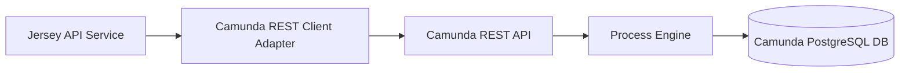

## POM untuk remote client

```xml
<dependencies>
    <dependency>
        <groupId>com.company.workflow</groupId>
        <artifactId>workflow-contract</artifactId>
        <version>${project.version}</version>
    </dependency>

    <!-- Jersey server -->
    <dependency>
        <groupId>org.glassfish.jersey.containers</groupId>
        <artifactId>jersey-container-grizzly2-http</artifactId>
        <version>${jersey.version}</version>
    </dependency>

    <!-- Jersey client to call Camunda REST -->
    <dependency>
        <groupId>org.glassfish.jersey.core</groupId>
        <artifactId>jersey-client</artifactId>
        <version>${jersey.version}</version>
    </dependency>

    <dependency>
        <groupId>org.glassfish.jersey.media</groupId>
        <artifactId>jersey-media-json-jackson</artifactId>
        <version>${jersey.version}</version>
    </dependency>

    <!-- JSON -->
    <dependency>
        <groupId>com.fasterxml.jackson.core</groupId>
        <artifactId>jackson-databind</artifactId>
        <version>${jackson.version}</version>
    </dependency>
</dependencies>
```

Untuk remote model, service tidak wajib membawa `camunda-engine`. Ia hanya perlu HTTP client dan contract. Camunda 7 menyediakan REST API resmi untuk mengakses process engine, jadi service bisa berinteraksi melalui adapter REST tanpa embedded engine. ([Camunda 8 Docs](https://docs.camunda.io/build-with-camunda/?utm_source=chatgpt.com))

---

# 9. Module: `workflow-worker`

Worker sebaiknya module terpisah agar bisa di-scale terpisah dari API service.

```text
workflow-worker
├── src/main/java
│   └── com/company/workflow/worker
│       ├── WorkerApplication.java
│       ├── WorkerBootstrap.java
│       ├── ExternalTaskClientFactory.java
│       ├── handler
│       │   ├── ValidateCaseHandler.java
│       │   ├── CalculateRiskScoreHandler.java
│       │   └── NotifyStakeholderHandler.java
│       └── retry
│           └── RetryPolicy.java
└── src/main/resources
    └── worker.properties
```

## Worker POM

```xml
<project>
    <modelVersion>4.0.0</modelVersion>

    <parent>
        <groupId>com.company.workflow</groupId>
        <artifactId>case-workflow-platform</artifactId>
        <version>1.0.0-SNAPSHOT</version>
    </parent>

    <artifactId>workflow-worker</artifactId>
    <packaging>jar</packaging>

    <dependencies>
        <dependency>
            <groupId>com.company.workflow</groupId>
            <artifactId>workflow-contract</artifactId>
            <version>${project.version}</version>
        </dependency>

        <dependency>
            <groupId>com.company.workflow</groupId>
            <artifactId>workflow-persistence</artifactId>
            <version>${project.version}</version>
        </dependency>

        <!-- Camunda external task client if using Camunda's Java client -->
        <dependency>
            <groupId>org.camunda.bpm</groupId>
            <artifactId>camunda-external-task-client</artifactId>
            <version>${camunda.version}</version>
        </dependency>

        <!-- Domain DB access -->
        <dependency>
            <groupId>org.mybatis</groupId>
            <artifactId>mybatis</artifactId>
        </dependency>

        <dependency>
            <groupId>org.postgresql</groupId>
            <artifactId>postgresql</artifactId>
        </dependency>

        <dependency>
            <groupId>com.zaxxer</groupId>
            <artifactId>HikariCP</artifactId>
        </dependency>
    </dependencies>
</project>
```

Practical rule: **worker dependency tidak perlu Jersey server kecuali worker juga expose admin/health endpoint.**

---

# 10. Module: `workflow-persistence`

Karena stack kamu memakai MyBatis + PostgreSQL, pisahkan persistence supaya tidak tercampur dengan Camunda runtime.

```text
workflow-persistence
├── src/main/java/com/company/workflow/persistence
│   ├── mapper
│   │   └── CaseMapper.java
│   ├── model
│   │   └── CaseRecord.java
│   ├── config
│   │   └── MyBatisFactory.java
│   └── repository
│       └── CaseRepository.java
└── src/main/resources
    └── mybatis
        ├── mybatis-config.xml
        └── mapper
            └── CaseMapper.xml
```

## POM

```xml
<project>
    <modelVersion>4.0.0</modelVersion>

    <parent>
        <groupId>com.company.workflow</groupId>
        <artifactId>case-workflow-platform</artifactId>
        <version>1.0.0-SNAPSHOT</version>
    </parent>

    <artifactId>workflow-persistence</artifactId>

    <dependencies>
        <dependency>
            <groupId>com.company.workflow</groupId>
            <artifactId>workflow-contract</artifactId>
            <version>${project.version}</version>
        </dependency>

        <dependency>
            <groupId>org.mybatis</groupId>
            <artifactId>mybatis</artifactId>
        </dependency>

        <dependency>
            <groupId>org.postgresql</groupId>
            <artifactId>postgresql</artifactId>
        </dependency>

        <dependency>
            <groupId>com.zaxxer</groupId>
            <artifactId>HikariCP</artifactId>
        </dependency>
    </dependencies>
</project>
```

Important boundary:

```text
Camunda DB schema != application DB schema
```

Walaupun bisa berada dalam PostgreSQL server yang sama, pisahkan schema/user/permission:

```text
camunda schema:
  ACT_RU_*
  ACT_HI_*
  ACT_RE_*
  ACT_GE_*

application schema:
  cases
  enforcement_actions
  documents
  audit_events
```

---

# 11. Packaging Strategy

## 11.1 Fat JAR

Cocok untuk Docker/Kubernetes service.

```xml
<plugin>
    <groupId>org.apache.maven.plugins</groupId>
    <artifactId>maven-shade-plugin</artifactId>
    <version>3.6.0</version>
    <executions>
        <execution>
            <phase>package</phase>
            <goals>
                <goal>shade</goal>
            </goals>
            <configuration>
                <createDependencyReducedPom>false</createDependencyReducedPom>
                <transformers>
                    <transformer implementation="org.apache.maven.plugins.shade.resource.ManifestResourceTransformer">
                        <mainClass>com.company.workflow.api.WorkflowApiApplication</mainClass>
                    </transformer>
                    <transformer implementation="org.apache.maven.plugins.shade.resource.ServicesResourceTransformer"/>
                </transformers>
            </configuration>
        </execution>
    </executions>
</plugin>
```

### Watch out

Fat JAR dengan Camunda/Jersey bisa bermasalah kalau service loader resource tertimpa. Karena itu tambahkan:

```xml
<transformer implementation="org.apache.maven.plugins.shade.resource.ServicesResourceTransformer"/>
```

---

## 11.2 Thin JAR + dependency directory

Cocok untuk enterprise runtime yang ingin dependency terlihat eksplisit.

```xml
<plugin>
    <groupId>org.apache.maven.plugins</groupId>
    <artifactId>maven-dependency-plugin</artifactId>
    <version>3.7.1</version>
    <executions>
        <execution>
            <id>copy-dependencies</id>
            <phase>package</phase>
            <goals>
                <goal>copy-dependencies</goal>
            </goals>
            <configuration>
                <outputDirectory>${project.build.directory}/lib</outputDirectory>
            </configuration>
        </execution>
    </executions>
</plugin>
```

Run:

```bash
java \
  -cp "target/workflow-api-service.jar:target/lib/*" \
  com.company.workflow.api.WorkflowApiApplication
```

---

## 11.3 WAR

Cocok jika perusahaan masih menjalankan app server/Tomcat-style deployment.

```xml
<packaging>war</packaging>
```

Camunda Docker image resmi untuk Camunda Platform dapat menerima process application WAR dengan menaruh/mount WAR ke deployment directory aplikasi server, misalnya `/camunda/webapps/` pada Tomcat distribution. ([GitHub](https://github.com/camunda/docker-camunda-bpm-platform/blob/7.24/README.md))

Untuk microservice modern, prefer:

```text
JAR + Docker image
```

kecuali platform internal memang standard-nya WAR.

---

# 12. Resource Packaging untuk BPMN/DMN

## Recommended layout

```text
src/main/resources
├── bpmn
│   ├── case-enforcement.bpmn
│   └── complaint-intake.bpmn
├── dmn
│   ├── risk-scoring.dmn
│   └── routing-rule.dmn
├── camunda
│   └── deployment-manifest.json
├── application.properties
└── logback.xml
```

## Deployment manifest

```json
{
  "deploymentName": "case-workflow",
  "resources": [
    "bpmn/case-enforcement.bpmn",
    "bpmn/complaint-intake.bpmn",
    "dmn/risk-scoring.dmn",
    "dmn/routing-rule.dmn"
  ],
  "duplicateFiltering": true,
  "deployChangedOnly": true
}
```

## Deployment service

```java
package com.company.workflow.camunda;

import org.camunda.bpm.engine.RepositoryService;
import org.camunda.bpm.engine.repository.DeploymentWithDefinitions;

public final class WorkflowDeploymentService {

    private final RepositoryService repositoryService;

    public WorkflowDeploymentService(RepositoryService repositoryService) {
        this.repositoryService = repositoryService;
    }

    public DeploymentWithDefinitions deployClasspathResources() {
        return repositoryService
            .createDeployment()
            .name("case-workflow")
            .enableDuplicateFiltering(true)
            .deployChangedOnly()
            .addClasspathResource("bpmn/case-enforcement.bpmn")
            .addClasspathResource("dmn/risk-scoring.dmn")
            .deployWithResult();
    }
}
```

Practical rule:

| Environment | Deployment behavior |
|---|---|
| Local dev | Deploy on startup allowed |
| CI integration test | Deploy on startup allowed |
| Staging | Prefer controlled deploy |
| Production | Prefer explicit deployment pipeline or tightly controlled startup deploy |

---

# 13. Configuration Files

## `application.properties`

```properties
service.name=case-workflow-service
service.port=8080

camunda.engine.mode=embedded
camunda.engine.name=default
camunda.job-executor.activate=true
camunda.history-level=full
camunda.database.schema-update=false

camunda.datasource.jdbc-url=jdbc:postgresql://localhost:5432/camunda
camunda.datasource.username=camunda
camunda.datasource.password=camunda
camunda.datasource.maximum-pool-size=20
camunda.datasource.minimum-idle=5

app.datasource.jdbc-url=jdbc:postgresql://localhost:5432/case_app
app.datasource.username=case_app
app.datasource.password=case_app
app.datasource.maximum-pool-size=20
app.datasource.minimum-idle=5

camunda.rest.base-url=http://localhost:8081/engine-rest
camunda.rest.connect-timeout-ms=3000
camunda.rest.read-timeout-ms=10000
```

## Environment override

```bash
CAMUNDA_DATASOURCE_JDBC_URL=jdbc:postgresql://postgres:5432/camunda
CAMUNDA_DATASOURCE_USERNAME=camunda
CAMUNDA_DATASOURCE_PASSWORD=secret
APP_DATASOURCE_JDBC_URL=jdbc:postgresql://postgres:5432/case_app
APP_DATASOURCE_USERNAME=case_app
APP_DATASOURCE_PASSWORD=secret
```

Rule:

```text
properties file = defaults
environment variables / secret manager = runtime secrets
```

---

# 14. Embedded Engine Bootstrap Dependency Wiring

```java
package com.company.workflow.camunda;

import com.zaxxer.hikari.HikariConfig;
import com.zaxxer.hikari.HikariDataSource;
import org.camunda.bpm.engine.ProcessEngine;
import org.camunda.bpm.engine.ProcessEngineConfiguration;
import org.camunda.bpm.engine.impl.cfg.StandaloneProcessEngineConfiguration;

import javax.sql.DataSource;

public final class EmbeddedCamundaFactory {

    private EmbeddedCamundaFactory() {}

    public static ProcessEngine create(ProcessEngineProperties properties) {
        DataSource dataSource = createDataSource(properties);

        StandaloneProcessEngineConfiguration cfg =
            (StandaloneProcessEngineConfiguration)
                ProcessEngineConfiguration.createStandaloneProcessEngineConfiguration();

        cfg.setProcessEngineName(properties.engineName());
        cfg.setDataSource(dataSource);
        cfg.setDatabaseSchemaUpdate(properties.databaseSchemaUpdate());
        cfg.setHistory(properties.historyLevel());
        cfg.setJobExecutorActivate(properties.jobExecutorActivate());

        return cfg.buildProcessEngine();
    }

    private static DataSource createDataSource(ProcessEngineProperties properties) {
        HikariConfig cfg = new HikariConfig();
        cfg.setJdbcUrl(properties.jdbcUrl());
        cfg.setUsername(properties.username());
        cfg.setPassword(properties.password());
        cfg.setMaximumPoolSize(properties.maximumPoolSize());
        cfg.setMinimumIdle(properties.minimumIdle());
        cfg.setPoolName("camunda-pool");
        return new HikariDataSource(cfg);
    }
}
```

Properties record:

```java
package com.company.workflow.camunda;

public record ProcessEngineProperties(
    String engineName,
    String jdbcUrl,
    String username,
    String password,
    int maximumPoolSize,
    int minimumIdle,
    String databaseSchemaUpdate,
    String historyLevel,
    boolean jobExecutorActivate
) {}
```

Production default:

```java
databaseSchemaUpdate = "false"
historyLevel = "full"
jobExecutorActivate = true
```

Untuk production, jangan mengandalkan auto schema update. Gunakan migration terkontrol.

---

# 15. Docker Packaging

## Dockerfile untuk API service

```dockerfile
FROM eclipse-temurin:17-jre

WORKDIR /app

COPY workflow-api-service/target/workflow-api-service.jar /app/app.jar

ENV JAVA_OPTS="-XX:MaxRAMPercentage=75.0 -XX:+ExitOnOutOfMemoryError"

EXPOSE 8080

ENTRYPOINT ["sh", "-c", "java $JAVA_OPTS -jar /app/app.jar"]
```

## Dockerfile untuk worker

```dockerfile
FROM eclipse-temurin:17-jre

WORKDIR /app

COPY workflow-worker/target/workflow-worker.jar /app/worker.jar

ENV JAVA_OPTS="-XX:MaxRAMPercentage=75.0 -XX:+ExitOnOutOfMemoryError"

ENTRYPOINT ["sh", "-c", "java $JAVA_OPTS -jar /app/worker.jar"]
```

Camunda Platform Docker image resmi versi 7.24 juga menggunakan Java 17 dan sudah menyertakan driver untuk H2, MySQL, dan PostgreSQL; untuk database lain, driver harus ditambahkan sendiri. ([GitHub](https://github.com/camunda/docker-camunda-bpm-platform/blob/7.24/README.md))

---

# 16. Docker Compose Local Development

```yaml
services:
  postgres:
    image: postgres:16
    container_name: case-workflow-postgres
    environment:
      POSTGRES_DB: camunda
      POSTGRES_USER: camunda
      POSTGRES_PASSWORD: camunda
    ports:
      - "5432:5432"

  camunda:
    image: camunda/camunda-bpm-platform:7.24.0
    container_name: camunda-7
    environment:
      DB_DRIVER: org.postgresql.Driver
      DB_URL: jdbc:postgresql://postgres:5432/camunda
      DB_USERNAME: camunda
      DB_PASSWORD: camunda
      WAIT_FOR: postgres:5432
      WAIT_FOR_TIMEOUT: 60
    depends_on:
      - postgres
    ports:
      - "8081:8080"

  workflow-api:
    build:
      context: .
      dockerfile: workflow-api-service/Dockerfile
    environment:
      CAMUNDA_REST_BASE_URL: http://camunda:8080/engine-rest
    depends_on:
      - camunda
    ports:
      - "8080:8080"

  workflow-worker:
    build:
      context: .
      dockerfile: workflow-worker/Dockerfile
    environment:
      CAMUNDA_REST_BASE_URL: http://camunda:8080/engine-rest
    depends_on:
      - camunda
```

Camunda Docker documentation menunjukkan konfigurasi PostgreSQL via `DB_DRIVER`, `DB_URL`, `DB_USERNAME`, `DB_PASSWORD`, dan `WAIT_FOR`; image juga menyediakan mekanisme `WAIT_FOR` agar container menunggu database siap. ([GitHub](https://github.com/camunda/docker-camunda-bpm-platform/blob/7.24/README.md))

---

# 17. Maven Profiles

Gunakan profile untuk membedakan local, CI, dan production build.

```xml
<profiles>
    <profile>
        <id>local</id>
        <properties>
            <camunda.database.schema-update>true</camunda.database.schema-update>
            <camunda.history-level>full</camunda.history-level>
        </properties>
    </profile>

    <profile>
        <id>ci</id>
        <properties>
            <camunda.database.schema-update>true</camunda.database.schema-update>
            <skip.integration.tests>false</skip.integration.tests>
        </properties>
    </profile>

    <profile>
        <id>prod</id>
        <properties>
            <camunda.database.schema-update>false</camunda.database.schema-update>
            <camunda.history-level>full</camunda.history-level>
        </properties>
    </profile>
</profiles>
```

Run:

```bash
mvn clean verify -Pci
mvn clean package -Pprod
```

Practical rule:

| Profile | Schema update | Use case |
|---|---:|---|
| `local` | true/controlled | Local sandbox |
| `ci` | true/controlled | Disposable test DB |
| `prod` | false | Production DB managed by migration |

---

# 18. Build Commands

## Full build

```bash
mvn clean verify
```

## Skip tests sementara

```bash
mvn clean package -DskipTests
```

## Build only API service and dependencies

```bash
mvn clean package -pl workflow-api-service -am
```

## Build only worker and dependencies

```bash
mvn clean package -pl workflow-worker -am
```

## Show dependency tree

```bash
mvn dependency:tree
```

## Check dependency convergence

```bash
mvn enforcer:enforce
```

## Find duplicate classes

```bash
mvn dependency:tree -Dverbose
```

---

# 19. Practical Dependency Risk Checklist

Camunda 7 + Jersey/Jakarta microservice punya beberapa titik rawan.

| Risk | Gejala | Mitigasi |
|---|---|---|
| Version mismatch antar Camunda artifact | Runtime `ClassNotFoundException`, weird engine error | Import `camunda-bom` |
| Jersey/Jakarta vs old Java EE dependency conflict | `javax.*` vs `jakarta.*` collision | Pisahkan module, cek dependency tree |
| Jackson version conflict | JSON serialization error | Manage Jackson version eksplisit |
| Logging binding ganda | Multiple SLF4J binding warning | Satu logging backend saja |
| Fat JAR service loader rusak | Jersey provider tidak terdeteksi | Shade service transformer |
| PostgreSQL driver tidak tersedia | DB connection fail | Tambahkan explicit driver dependency |
| Auto schema update production | Unexpected DDL saat boot | Set schema update false |
| BPMN tidak masuk artifact | Deployment gagal `resource not found` | Cek `target/classes/bpmn` |
| Worker membawa dependency API server | Image bloat | Pisahkan worker module |
| Contract string tersebar | Runtime mismatch | Constants + tests |

---

# 20. Build Output yang Diharapkan

Setelah build:

```text
workflow-api-service/target/
  workflow-api-service.jar

workflow-worker/target/
  workflow-worker.jar

workflow-model/target/
  workflow-model.jar
    bpmn/case-enforcement.bpmn
    dmn/risk-scoring.dmn
```

Validasi isi JAR:

```bash
jar tf workflow-model/target/workflow-model.jar | grep bpmn
jar tf workflow-model/target/workflow-model.jar | grep dmn
```

Expected:

```text
bpmn/case-enforcement.bpmn
dmn/risk-scoring.dmn
```

---

# 21. Practical Minimal Application Main

## Jersey API main

```java
package com.company.workflow.api;

import org.glassfish.grizzly.http.server.HttpServer;
import org.glassfish.jersey.grizzly2.httpserver.GrizzlyHttpServerFactory;
import org.glassfish.jersey.server.ResourceConfig;

import java.net.URI;

public final class WorkflowApiApplication {

    private WorkflowApiApplication() {}

    public static void main(String[] args) throws Exception {
        URI baseUri = URI.create("http://0.0.0.0:8080/");

        ResourceConfig config = new ResourceConfig()
            .packages("com.company.workflow.api")
            .register(new DependencyBinder());

        HttpServer server = GrizzlyHttpServerFactory.createHttpServer(baseUri, config);

        Runtime.getRuntime().addShutdownHook(new Thread(server::shutdownNow));

        Thread.currentThread().join();
    }
}
```

## Dependency binder sketch

```java
package com.company.workflow.api;

import org.glassfish.hk2.utilities.binding.AbstractBinder;

public final class DependencyBinder extends AbstractBinder {

    @Override
    protected void configure() {
        bindFactory(ProcessEngineFactory.class)
            .to(org.camunda.bpm.engine.ProcessEngine.class)
            .asSingleton();

        bind(CaseWorkflowFacade.class)
            .to(CaseWorkflowFacade.class);
    }
}
```

---

# 22. Production-grade `.gitignore`

```gitignore
target/
*.log
*.pid
*.tmp

.env
.env.*
!.env.example

.idea/
.vscode/
*.iml

.mvn/timing.properties

# Secrets
settings.xml
secrets/
```

---

# 23. Suggested Repository README Structure

```markdown
# Case Workflow Service

## Purpose
Jersey-based workflow microservice using Camunda 7.

## Runtime Mode
- Embedded engine / remote REST engine
- External task workers

## Modules
- workflow-contract
- workflow-model
- workflow-api-service
- workflow-worker
- workflow-persistence
- workflow-integration-test

## Local Run
```bash
docker compose up -d postgres camunda
mvn clean package
java -jar workflow-api-service/target/workflow-api-service.jar
```

## BPMN/DMN Deployment
Explain whether BPMN is deployed on startup or through pipeline.

## Configuration
List required environment variables.

## Operational Ownership
Explain incident owner, DB owner, worker owner.

## Production Notes
- schema update false
- explicit business key
- external task idempotency
- history cleanup policy
```

---

# 24. CI Pipeline Skeleton

```yaml
name: workflow-service-ci

on:
  pull_request:
  push:
    branches:
      - main

jobs:
  build:
    runs-on: ubuntu-latest

    steps:
      - uses: actions/checkout@v4

      - name: Set up Java
        uses: actions/setup-java@v4
        with:
          distribution: temurin
          java-version: '17'
          cache: maven

      - name: Build and test
        run: mvn clean verify -Pci

      - name: Dependency tree
        run: mvn dependency:tree

      - name: Package
        run: mvn clean package -Pprod -DskipTests
```

Practical extension:

| Stage | Check |
|---|---|
| Compile | Java 17, dependency convergence |
| Unit test | DTO, facade, mapper |
| BPMN validation | BPMN parse/deploy test |
| Integration test | PostgreSQL + Camunda engine |
| Worker test | mock external task + domain side effect |
| Docker build | API image + worker image |
| SBOM/security | dependency scan |

---

# 25. Maven Setup Decision Table

| Scenario | Recommended setup |
|---|---|
| Belajar cepat | Single module |
| Service baru production | Multi-module |
| Engine embedded | API service depends on `camunda-engine` |
| Engine remote | API service uses Jersey client / generated REST client |
| Worker scalable | Separate `workflow-worker` module |
| BPMN lifecycle independent | Separate `workflow-model` module |
| PostgreSQL domain access | Separate `workflow-persistence` |
| Enterprise Camunda | Use EE BOM + private repository |
| Kubernetes deployment | JAR + Docker image |
| App-server legacy | WAR packaging |

---

# 26. Anti-patterns

| Anti-pattern | Kenapa buruk |
|---|---|
| Semua dependency masuk semua module | Build besar, conflict sulit dilacak |
| Tidak pakai Camunda BOM | Risiko artifact version mismatch |
| Process key ditulis manual di banyak class | Runtime mismatch |
| BPMN hanya disimpan di wiki, bukan source repo | Tidak versioned, sulit audit |
| Auto deploy BPMN tanpa duplicate filtering | Deployment table cepat bengkak |
| Worker digabung API tanpa alasan | Scaling dan failure isolation buruk |
| Camunda schema dan app schema dicampur tanpa policy | Operasional DB kacau |
| Credential Maven EE ditaruh di POM | Secret leakage |
| Pakai `latest` Docker image di production | Build/deploy tidak reproducible |
| Tidak cek `mvn dependency:tree` | Conflict terlambat ketahuan |

---

# 27. Minimal “Definition of Done” untuk Seri Ini

Sebuah Camunda 7 + Jersey Maven setup dianggap sehat kalau:

```text
[ ] Java version dikunci minimal 17
[ ] Camunda BOM digunakan
[ ] CE/EE dependency source jelas
[ ] API, worker, model, persistence tidak tercampur sembarangan
[ ] BPMN/DMN masuk ke artifact
[ ] Process keys, variable names, topic names ada di contract module
[ ] Schema update production diset false
[ ] Dependency tree diperiksa
[ ] Docker image tidak memakai floating runtime secara sembarang
[ ] Local docker compose bisa menjalankan PostgreSQL + Camunda/API/worker
[ ] CI menjalankan compile, unit test, integration test, package
```

---

# Status Seri

**Seri 2/18 selesai.**

Rekomendasi materi selanjutnya: **Seri 3/18 - Process Engine Bootstrapping with PostgreSQL Datasource**, fokus ke konfigurasi `ProcessEngineConfiguration`, HikariCP, PostgreSQL schema, transaction factory, job executor activation, history level, startup/shutdown lifecycle, dan health check di Jersey service.

---

**Sources:**

- [Apache Maven Coordinates | docs.camunda.org](https://docs.camunda.org/get-started/apache-maven/)
- [Build with Camunda](https://docs.camunda.io/build-with-camunda/?utm_source=chatgpt.com)
- [docker-camunda-bpm-platform/README.md at 7.24 · camunda/docker-camunda-bpm-platform · GitHub](https://github.com/camunda/docker-camunda-bpm-platform/blob/7.24/README.md)

## Response:
7/16/2026, 9:43:52 AM

Lanjut ke **Seri 3/18**. Seri ini akan masuk ke bagian yang paling sering jadi sumber masalah production: engine bootstrap, datasource PostgreSQL, schema policy, lifecycle start/stop, dan health/readiness service.

# Seri 3/18 - Process Engine Bootstrapping with PostgreSQL Datasource  
## Camunda 7 + Jersey Microservice

## Tujuan seri ini

Seri ini fokus pada cara **menyalakan Camunda 7 process engine secara aman** di aplikasi **Java 17+ / Jersey / PostgreSQL**, khususnya untuk pola **embedded engine**.

Yang ingin dicapai:

```text
Jersey service start
  -> load config
  -> create Camunda datasource
  -> create ProcessEngineConfiguration
  -> build ProcessEngine
  -> expose RuntimeService/TaskService/etc
  -> deploy BPMN/DMN if enabled
  -> expose health/readiness endpoint
  -> shutdown gracefully
```

Camunda 7 mendukung **application-managed process engine**, yaitu process engine dikelola sebagai bagian dari aplikasi; konfigurasi bisa dilakukan lewat Java API, XML, atau Spring. Untuk Jersey non-Spring, pendekatan paling eksplisit adalah **programmatic Java API** dengan `ProcessEngineConfiguration`. ([Camunda 7 Documentation](https://docs.camunda.org/manual/7.24/user-guide/process-engine/process-engine-bootstrapping/))

---

# 1. Mental Model Bootstrapping

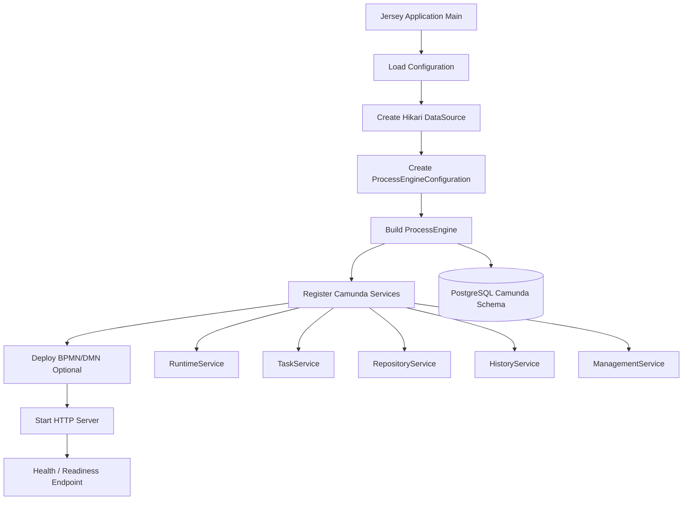

---

# 2. Practical Architecture

Dalam embedded mode, **Jersey service dan Camunda engine hidup dalam JVM yang sama**.

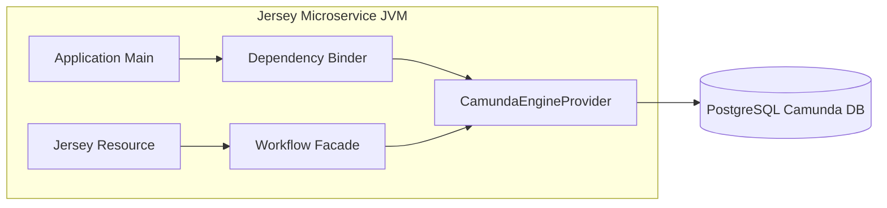

Prinsip penting:

| Concern | Keputusan praktis |
|---|---|
| Engine lifecycle | Dibuat saat service startup, ditutup saat shutdown |
| Datasource | Pakai HikariCP, bukan pool bawaan MyBatis Camunda |
| Schema policy | Production pakai controlled migration, bukan auto-create sembarangan |
| Job executor | Explicit `true/false`, jangan implicit |
| Health check | Pisahkan liveness dan readiness |
| BPMN deployment | Controlled: startup deploy hanya kalau memang policy-nya begitu |
| Error handling startup | Fail fast kalau DB/engine tidak siap |

---

# 3. ProcessEngineConfiguration yang Relevan

Camunda menyediakan beberapa subclass `ProcessEngineConfiguration`. Untuk aplikasi Jersey standalone, pilihan paling langsung adalah:

```java
org.camunda.bpm.engine.impl.cfg.StandaloneProcessEngineConfiguration
```

Dokumentasi Camunda menjelaskan bahwa `StandaloneProcessEngineConfiguration` dipakai ketika engine berjalan secara standalone dan engine sendiri mengurus transaksi. Camunda juga menyediakan `StandaloneInMemProcessEngineConfiguration` untuk unit test, `SpringProcessEngineConfiguration` untuk Spring, dan `JtaProcessEngineConfiguration` untuk JTA transaction environment. ([Camunda 7 Documentation](https://docs.camunda.org/manual/7.24/user-guide/process-engine/process-engine-bootstrapping/))

## Decision table

| Runtime style | Configuration class |
|---|---|
| Jersey standalone / Grizzly / embedded HTTP server | `StandaloneProcessEngineConfiguration` |
| Unit test ringan | `StandaloneInMemProcessEngineConfiguration` |
| Spring app | `SpringProcessEngineConfiguration` |
| Java EE / JTA-managed environment | `JtaProcessEngineConfiguration` |
| Shared container engine | biasanya via `bpm-platform.xml` / container config |

Untuk stack kamu, default praktis:

```text
Jersey standalone service
  -> StandaloneProcessEngineConfiguration
  -> HikariDataSource
  -> PostgreSQL
```

---

# 4. PostgreSQL Datasource Strategy

Camunda bisa dikonfigurasi dengan dua cara: langsung memakai properti JDBC seperti `jdbcUrl`, `jdbcDriver`, `jdbcUsername`, `jdbcPassword`, atau memakai `javax.sql.DataSource`. Dokumentasi Camunda juga menyebut engine memakai MyBatis secara internal untuk persistence. ([Camunda 7 Documentation](https://docs.camunda.org/manual/7.24/user-guide/process-engine/database/database-configuration/))

Untuk production, lebih baik pakai **DataSource eksplisit**:

```text
HikariDataSource
  -> ProcessEngineConfiguration.setDataSource(dataSource)
```

Bukan:

```text
setJdbcUrl(...)
setJdbcUsername(...)
setJdbcPassword(...)
```

Alasannya:

| DataSource explicit | JDBC properties langsung |
|---|---|
| Pooling lebih jelas | Pool bawaan lebih terbatas |
| Metrics lebih mudah | Observability lebih sulit |
| Timeout bisa dikontrol | Timeout sering default |
| Cocok Kubernetes | Kurang eksplisit |
| Bisa dipisah Camunda DB vs app DB | Mudah tercampur |

Camunda docs mencontohkan penggunaan `DataSource` sebagai alternatif JDBC properties, tetapi library datasource-nya harus tersedia sendiri di classpath. ([Camunda 7 Documentation](https://docs.camunda.org/manual/7.24/user-guide/process-engine/database/database-configuration/))

---

# 5. Configuration Properties

## `application.properties`

```properties
# service
service.name=case-workflow-service
service.port=8080

# camunda engine
camunda.engine.name=default
camunda.engine.enabled=true
camunda.engine.database-schema-update=false
camunda.engine.history-level=full
camunda.engine.job-executor-activate=true

# camunda datasource
camunda.datasource.jdbc-url=jdbc:postgresql://localhost:5432/camunda
camunda.datasource.username=camunda
camunda.datasource.password=camunda
camunda.datasource.maximum-pool-size=20
camunda.datasource.minimum-idle=5
camunda.datasource.connection-timeout-ms=3000
camunda.datasource.idle-timeout-ms=600000
camunda.datasource.max-lifetime-ms=1800000
camunda.datasource.validation-timeout-ms=1000

# deployment
camunda.deployment.enabled=true
camunda.deployment.name=case-workflow
camunda.deployment.duplicate-filtering=true
camunda.deployment.deploy-changed-only=true
```

## Environment variable override

```bash
CAMUNDA_DATASOURCE_JDBC_URL=jdbc:postgresql://postgres:5432/camunda
CAMUNDA_DATASOURCE_USERNAME=camunda
CAMUNDA_DATASOURCE_PASSWORD=secret
CAMUNDA_ENGINE_DATABASE_SCHEMA_UPDATE=false
CAMUNDA_ENGINE_JOB_EXECUTOR_ACTIVATE=true
```

Production rule:

```text
Properties file = safe defaults
Environment / secret manager = runtime values and secrets
```

---

# 6. Strongly Typed Configuration Record

```java
package com.company.workflow.config;

public record CamundaEngineProperties(
    String engineName,
    boolean enabled,
    String databaseSchemaUpdate,
    String historyLevel,
    boolean jobExecutorActivate,
    CamundaDataSourceProperties dataSource,
    DeploymentProperties deployment
) {}
```

```java
package com.company.workflow.config;

public record CamundaDataSourceProperties(
    String jdbcUrl,
    String username,
    String password,
    int maximumPoolSize,
    int minimumIdle,
    long connectionTimeoutMs,
    long idleTimeoutMs,
    long maxLifetimeMs,
    long validationTimeoutMs
) {}
```

```java
package com.company.workflow.config;

public record DeploymentProperties(
    boolean enabled,
    String deploymentName,
    boolean duplicateFiltering,
    boolean deployChangedOnly
) {}
```

Kenapa pakai typed config?

| Manfaat | Dampak |
|---|---|
| Fail fast saat config invalid | Error ketahuan saat startup |
| Mudah dites | Bisa unit test config parsing |
| Tidak sebar string property | Maintainability naik |
| Bisa validasi secret kosong | Mengurangi runtime outage |
| Lebih cocok untuk Kubernetes | Config/env lebih eksplisit |

---

# 7. DataSource Factory dengan HikariCP

```java
package com.company.workflow.camunda;

import com.company.workflow.config.CamundaDataSourceProperties;
import com.zaxxer.hikari.HikariConfig;
import com.zaxxer.hikari.HikariDataSource;

import javax.sql.DataSource;

public final class CamundaDataSourceFactory {

    private CamundaDataSourceFactory() {}

    public static HikariDataSource create(CamundaDataSourceProperties props) {
        requireNonBlank(props.jdbcUrl(), "camunda.datasource.jdbc-url");
        requireNonBlank(props.username(), "camunda.datasource.username");
        requireNonBlank(props.password(), "camunda.datasource.password");

        HikariConfig cfg = new HikariConfig();
        cfg.setPoolName("camunda-pool");
        cfg.setJdbcUrl(props.jdbcUrl());
        cfg.setUsername(props.username());
        cfg.setPassword(props.password());

        cfg.setMaximumPoolSize(props.maximumPoolSize());
        cfg.setMinimumIdle(props.minimumIdle());
        cfg.setConnectionTimeout(props.connectionTimeoutMs());
        cfg.setIdleTimeout(props.idleTimeoutMs());
        cfg.setMaxLifetime(props.maxLifetimeMs());
        cfg.setValidationTimeout(props.validationTimeoutMs());

        cfg.setAutoCommit(false);

        // PostgreSQL connection-level tuning. Adjust based on org standards.
        cfg.addDataSourceProperty("ApplicationName", "case-workflow-service-camunda");

        return new HikariDataSource(cfg);
    }

    private static void requireNonBlank(String value, String name) {
        if (value == null || value.isBlank()) {
            throw new IllegalArgumentException("Missing required config: " + name);
        }
    }
}
```

Catatan penting: `DataSource` masih ada di package `javax.sql` karena itu bagian dari Java SE, bukan Jakarta REST.

---

# 8. ProcessEngine Factory

Camunda Java API memungkinkan membuat engine secara programmatic dengan `ProcessEngineConfiguration.createStandaloneProcessEngineConfiguration()` lalu memanggil `buildProcessEngine()`. Dokumentasi resmi menunjukkan pattern ini, termasuk konfigurasi `databaseSchemaUpdate`, JDBC URL, dan `jobExecutorActivate`. ([Camunda 7 Documentation](https://docs.camunda.org/manual/7.24/user-guide/process-engine/process-engine-bootstrapping/))

```java
package com.company.workflow.camunda;

import com.company.workflow.config.CamundaEngineProperties;
import org.camunda.bpm.engine.ProcessEngine;
import org.camunda.bpm.engine.ProcessEngineConfiguration;
import org.camunda.bpm.engine.impl.cfg.StandaloneProcessEngineConfiguration;

import javax.sql.DataSource;

public final class CamundaProcessEngineFactory {

    private CamundaProcessEngineFactory() {}

    public static ProcessEngine create(
            CamundaEngineProperties props,
            DataSource dataSource
    ) {
        validate(props);

        StandaloneProcessEngineConfiguration cfg =
            (StandaloneProcessEngineConfiguration)
                ProcessEngineConfiguration.createStandaloneProcessEngineConfiguration();

        cfg.setProcessEngineName(props.engineName());
        cfg.setDataSource(dataSource);

        cfg.setDatabaseSchemaUpdate(props.databaseSchemaUpdate());
        cfg.setHistory(props.historyLevel());
        cfg.setJobExecutorActivate(props.jobExecutorActivate());

        /*
         * Optional production knobs.
         * Set only after measuring and understanding behavior.
         */
        cfg.setJdbcBatchProcessing(true);

        return cfg.buildProcessEngine();
    }

    private static void validate(CamundaEngineProperties props) {
        if (props.engineName() == null || props.engineName().isBlank()) {
            throw new IllegalArgumentException("camunda.engine.name is required");
        }

        if (!isValidSchemaUpdate(props.databaseSchemaUpdate())) {
            throw new IllegalArgumentException(
                "Invalid camunda.engine.database-schema-update: "
                    + props.databaseSchemaUpdate()
            );
        }

        if (!isValidHistoryLevel(props.historyLevel())) {
            throw new IllegalArgumentException(
                "Invalid camunda.engine.history-level: "
                    + props.historyLevel()
            );
        }
    }

    private static boolean isValidSchemaUpdate(String value) {
        return ProcessEngineConfiguration.DB_SCHEMA_UPDATE_TRUE.equals(value)
            || ProcessEngineConfiguration.DB_SCHEMA_UPDATE_FALSE.equals(value)
            || ProcessEngineConfiguration.DB_SCHEMA_UPDATE_CREATE_DROP.equals(value);
    }

    private static boolean isValidHistoryLevel(String value) {
        return ProcessEngineConfiguration.HISTORY_NONE.equals(value)
            || ProcessEngineConfiguration.HISTORY_ACTIVITY.equals(value)
            || ProcessEngineConfiguration.HISTORY_AUDIT.equals(value)
            || ProcessEngineConfiguration.HISTORY_FULL.equals(value)
            || ProcessEngineConfiguration.HISTORY_AUTO.equals(value);
    }
}
```

---

# 9. Schema Update Policy

Camunda property `databaseSchemaUpdate` menentukan strategi saat engine boot/shutdown. Nilai pentingnya: `true`, `false`, dan `create-drop`. Dokumentasi Camunda menjelaskan bahwa `true` akan mengecek tabel Camunda saat engine dibangun dan membuatnya jika belum ada, sedangkan update versi schema tetap perlu dilakukan manual sesuai update/migration guide; `false` tidak melakukan check dan mengasumsikan tabel Camunda sudah ada; `create-drop` membuat schema saat engine dibuat dan drop saat engine ditutup. ([Camunda 7 Documentation](https://docs.camunda.org/manual/7.24/user-guide/process-engine/database/database-configuration/))

## Practical policy

| Environment | Value | Alasan |
|---|---|---|
| Unit test | `create-drop` atau in-memory config | Disposable |
| Local dev | `true` boleh, asal DB lokal | Cepat |
| CI integration test | `true` / controlled migration | Disposable pipeline DB |
| Staging | `false` + migration pipeline | Mirip production |
| Production | `false` + migration pipeline + validation | Tidak ada DDL otomatis saat boot |

## Jangan lakukan ini di production

```java
cfg.setDatabaseSchemaUpdate(ProcessEngineConfiguration.DB_SCHEMA_UPDATE_TRUE);
```

Karena artinya service startup punya power untuk membuat schema jika belum ada. Untuk enterprise production, lebih aman:

```java
cfg.setDatabaseSchemaUpdate(ProcessEngineConfiguration.DB_SCHEMA_UPDATE_FALSE);
```

Tapi konsekuensinya: karena `false` mengasumsikan tabel sudah ada, kamu perlu **validasi schema terpisah** sebelum traffic masuk.

---

# 10. PostgreSQL Isolation Level

Camunda menyatakan isolation level yang dibutuhkan adalah **READ COMMITTED**, dan memakai level seperti `REPEATABLE READ` diketahui dapat menyebabkan deadlock sehingga harus hati-hati jika diubah. Saat engine initialization, Camunda melakukan check terhadap isolation level dan dapat melempar exception bila berbeda dari rekomendasi. ([Camunda 7 Documentation](https://docs.camunda.org/manual/7.24/user-guide/process-engine/database/database-configuration/))

## PostgreSQL check

```sql
SHOW transaction_isolation;
```

Expected:

```text
read committed
```

## Hikari note

Jangan override isolation ke `TRANSACTION_REPEATABLE_READ` atau `TRANSACTION_SERIALIZABLE` untuk Camunda datasource kecuali ada alasan kuat dan sudah diuji.

```java
// Usually do not set this for Camunda.
// Let PostgreSQL default READ COMMITTED apply.
// cfg.setTransactionIsolation("TRANSACTION_READ_COMMITTED");
```

---

# 11. History Level Policy

Camunda history level mengontrol seberapa banyak data history yang dihasilkan oleh engine. Built-in level meliputi `NONE`, `ACTIVITY`, `AUDIT`, `FULL`, dan `AUTO`; dokumentasi menjelaskan bahwa `AUDIT` menambahkan event variable instance, sedangkan `FULL` menambahkan event lebih lengkap lagi. ([Camunda 7 Documentation](https://docs.camunda.org/manual/7.24/user-guide/process-engine/history/history-configuration/))

Camunda juga mencatat bahwa history level bisa diset lewat Java code dengan `setHistory(...)`, dan pada default history backend, history level disimpan di database dan tidak bisa diubah kemudian secara sembarang. Cockpit bekerja paling baik dengan history level `FULL`; level yang lebih rendah dapat menonaktifkan sebagian fitur history-related. ([Camunda 7 Documentation](https://docs.camunda.org/manual/7.24/user-guide/process-engine/history/history-configuration/))

## Practical decision

| Use case | Recommended level |
|---|---|
| Local test cepat | `audit` atau `full` |
| Production dengan audit/regulatory need | `full` |
| High-throughput non-audit workflow | `audit`, jika disetujui ops/audit |
| Multi-engine same DB | pertimbangkan `auto` |
| Ultra minimal engine | `none`, jarang cocok untuk enterprise |

Untuk regulatory/case-management system, default saya:

```java
cfg.setHistory(ProcessEngineConfiguration.HISTORY_FULL);
```

Tapi wajib disertai:

```text
history cleanup policy
retention policy
PostgreSQL monitoring
index/vacuum strategy
```

---

# 12. Job Executor Activation

Job executor bertanggung jawab atas acquisition dan execution job. Camunda membuat job untuk async continuation, timer event, dan asynchronous BPMN event handling; job acquisition/execution menjadi tanggung jawab job executor. ([Camunda 7 Documentation](https://docs.camunda.org/manual/7.24/user-guide/process-engine/the-job-executor/))

Untuk embedded engine, job executor **tidak aktif secara default** saat engine boot. Jika ingin job executor aktif, konfigurasi `jobExecutorActivate=true`. Untuk shared engine, default-nya sebaliknya: job executor otomatis berjalan kecuali eksplisit dimatikan. ([Camunda 7 Documentation](https://docs.camunda.org/manual/7.24/user-guide/process-engine/the-job-executor/))

## Practical matrix

| Runtime | `jobExecutorActivate` |
|---|---|
| API service embedded engine dan harus menjalankan timer/async job | `true` |
| API service hanya start/query process, worker runtime terpisah menjalankan job | bisa `false`, tergantung desain |
| Dedicated job-executor pod/node | `true` hanya di pod tersebut |
| Cockpit/shared read-only node | biasanya `false` |
| Unit test | biasanya `false`; execute job manual via `ManagementService` |

## Warning

Kalau BPMN punya:

```xml
camunda:asyncBefore="true"
```

atau timer event:

```xml
<timerEventDefinition>...</timerEventDefinition>
```

tetapi `jobExecutorActivate=false`, job akan dibuat tetapi tidak otomatis dieksekusi oleh embedded service tersebut.

---

# 13. Full Engine Provider

```java
package com.company.workflow.camunda;

import com.company.workflow.config.CamundaEngineProperties;
import com.zaxxer.hikari.HikariDataSource;
import org.camunda.bpm.engine.*;

import java.util.concurrent.atomic.AtomicBoolean;

public final class CamundaEngineProvider implements AutoCloseable {

    private final HikariDataSource dataSource;
    private final ProcessEngine processEngine;
    private final AtomicBoolean closed = new AtomicBoolean(false);

    public CamundaEngineProvider(CamundaEngineProperties props) {
        this.dataSource = CamundaDataSourceFactory.create(props.dataSource());
        this.processEngine = CamundaProcessEngineFactory.create(props, dataSource);
    }

    public ProcessEngine processEngine() {
        ensureOpen();
        return processEngine;
    }

    public RepositoryService repositoryService() {
        return processEngine().getRepositoryService();
    }

    public RuntimeService runtimeService() {
        return processEngine().getRuntimeService();
    }

    public TaskService taskService() {
        return processEngine().getTaskService();
    }

    public HistoryService historyService() {
        return processEngine().getHistoryService();
    }

    public ManagementService managementService() {
        return processEngine().getManagementService();
    }

    public ExternalTaskService externalTaskService() {
        return processEngine().getExternalTaskService();
    }

    public DecisionService decisionService() {
        return processEngine().getDecisionService();
    }

    public boolean isReady() {
        if (closed.get()) {
            return false;
        }

        try {
            processEngine.getManagementService()
                .createJobQuery()
                .count();

            return true;
        } catch (RuntimeException ex) {
            return false;
        }
    }

    @Override
    public void close() {
        if (closed.compareAndSet(false, true)) {
            try {
                processEngine.close();
            } finally {
                dataSource.close();
            }
        }
    }

    private void ensureOpen() {
        if (closed.get()) {
            throw new IllegalStateException("Camunda process engine is already closed");
        }
    }
}
```

---

# 14. Dependency Injection dengan Jersey/HK2

```java
package com.company.workflow.api;

import com.company.workflow.camunda.CamundaEngineProvider;
import com.company.workflow.config.CamundaEngineProperties;
import org.glassfish.hk2.utilities.binding.AbstractBinder;

public final class DependencyBinder extends AbstractBinder {

    private final CamundaEngineProvider camundaEngineProvider;

    public DependencyBinder(CamundaEngineProperties props) {
        this.camundaEngineProvider = new CamundaEngineProvider(props);
    }

    @Override
    protected void configure() {
        bind(camundaEngineProvider)
            .to(CamundaEngineProvider.class);

        bind(camundaEngineProvider.runtimeService())
            .to(org.camunda.bpm.engine.RuntimeService.class);

        bind(camundaEngineProvider.repositoryService())
            .to(org.camunda.bpm.engine.RepositoryService.class);

        bind(camundaEngineProvider.taskService())
            .to(org.camunda.bpm.engine.TaskService.class);

        bind(camundaEngineProvider.historyService())
            .to(org.camunda.bpm.engine.HistoryService.class);

        bind(camundaEngineProvider.managementService())
            .to(org.camunda.bpm.engine.ManagementService.class);
    }

    public void shutdown() {
        camundaEngineProvider.close();
    }
}
```

---

# 15. Jersey Application Main with Graceful Shutdown

```java
package com.company.workflow.api;

import com.company.workflow.config.CamundaEngineProperties;
import com.company.workflow.config.ConfigurationLoader;
import org.glassfish.grizzly.http.server.HttpServer;
import org.glassfish.jersey.grizzly2.httpserver.GrizzlyHttpServerFactory;
import org.glassfish.jersey.server.ResourceConfig;

import java.net.URI;
import java.util.concurrent.CountDownLatch;

public final class WorkflowApiApplication {

    private WorkflowApiApplication() {}

    public static void main(String[] args) throws Exception {
        CamundaEngineProperties camundaProps =
            ConfigurationLoader.loadCamundaEngineProperties();

        DependencyBinder binder = new DependencyBinder(camundaProps);

        ResourceConfig resourceConfig = new ResourceConfig()
            .packages("com.company.workflow.api")
            .register(binder);

        URI baseUri = URI.create("http://0.0.0.0:8080/");
        HttpServer server = GrizzlyHttpServerFactory.createHttpServer(
            baseUri,
            resourceConfig,
            false
        );

        Runtime.getRuntime().addShutdownHook(new Thread(() -> {
            server.shutdownNow();
            binder.shutdown();
        }));

        server.start();

        new CountDownLatch(1).await();
    }
}
```

Shutdown order yang sehat:

```text
1. Stop accepting new HTTP request
2. Let in-flight request finish if server supports graceful shutdown
3. Close Camunda ProcessEngine
4. Close HikariDataSource
5. Exit JVM
```

---

# 16. BPMN/DMN Deployment on Startup

```java
package com.company.workflow.camunda;

import com.company.workflow.config.DeploymentProperties;
import org.camunda.bpm.engine.RepositoryService;
import org.camunda.bpm.engine.repository.DeploymentWithDefinitions;

public final class WorkflowDeploymentService {

    private final RepositoryService repositoryService;
    private final DeploymentProperties props;

    public WorkflowDeploymentService(
            RepositoryService repositoryService,
            DeploymentProperties props
    ) {
        this.repositoryService = repositoryService;
        this.props = props;
    }

    public DeploymentWithDefinitions deployIfEnabled() {
        if (!props.enabled()) {
            return null;
        }

        var builder = repositoryService
            .createDeployment()
            .name(props.deploymentName())
            .addClasspathResource("bpmn/case-enforcement.bpmn")
            .addClasspathResource("dmn/risk-scoring.dmn");

        if (props.duplicateFiltering()) {
            builder.enableDuplicateFiltering(props.deployChangedOnly());
        }

        return builder.deployWithResult();
    }
}
```

Practical policy:

| Environment | Deploy on startup? |
|---|---|
| Local dev | Yes |
| CI | Yes |
| Staging | Maybe, but controlled |
| Production | Prefer explicit pipeline unless team standard says otherwise |

---

# 17. Health and Readiness Endpoint

Liveness menjawab: **aplikasi masih hidup?**  
Readiness menjawab: **aplikasi siap menerima traffic workflow?**

## Health resource

```java
package com.company.workflow.api.health;

import com.company.workflow.camunda.CamundaEngineProvider;
import jakarta.ws.rs.GET;
import jakarta.ws.rs.Path;
import jakarta.ws.rs.Produces;
import jakarta.ws.rs.core.MediaType;
import jakarta.ws.rs.core.Response;

import java.time.Instant;
import java.util.Map;

@Path("/health")
@Produces(MediaType.APPLICATION_JSON)
public final class HealthResource {

    private final CamundaEngineProvider camunda;

    public HealthResource(CamundaEngineProvider camunda) {
        this.camunda = camunda;
    }

    @GET
    @Path("/live")
    public Response live() {
        return Response.ok(Map.of(
            "status", "UP",
            "time", Instant.now().toString()
        )).build();
    }

    @GET
    @Path("/ready")
    public Response ready() {
        boolean ready = camunda.isReady();

        if (ready) {
            return Response.ok(Map.of(
                "status", "READY",
                "camunda", "UP",
                "time", Instant.now().toString()
            )).build();
        }

        return Response.status(Response.Status.SERVICE_UNAVAILABLE)
            .entity(Map.of(
                "status", "NOT_READY",
                "camunda", "DOWN",
                "time", Instant.now().toString()
            ))
            .build();
    }
}
```

Readiness check jangan terlalu mahal. Hindari query history besar. Gunakan query ringan seperti:

```java
managementService.createJobQuery().count();
```

Atau query DB ringan:

```sql
SELECT 1;
```

---

# 18. Kubernetes Probe Example

```yaml
livenessProbe:
  httpGet:
    path: /health/live
    port: 8080
  initialDelaySeconds: 30
  periodSeconds: 10
  timeoutSeconds: 2
  failureThreshold: 3

readinessProbe:
  httpGet:
    path: /health/ready
    port: 8080
  initialDelaySeconds: 20
  periodSeconds: 10
  timeoutSeconds: 2
  failureThreshold: 3
```

Practical rule:

| Probe | Jangan terlalu sensitif terhadap |
|---|---|
| Liveness | DB transient failure |
| Readiness | DB/engine unavailability |
| Startup probe | engine migration/deployment delay |

Kalau boot Camunda bisa lama karena DB/network, tambahkan startup probe.

---

# 19. PostgreSQL Schema Separation

Recommended:

```text
Database: workflow
Schemas:
  camunda
  app_case
```

Atau:

```text
Database: camunda
  schema: public / camunda

Database: case_app
  schema: public / case
```

Yang penting: **jangan campur operational ownership**.

## Example user/schema

```sql
CREATE USER camunda_user WITH PASSWORD 'change_me';
CREATE DATABASE camunda OWNER camunda_user;
```

Kalau memakai schema khusus:

```sql
CREATE SCHEMA IF NOT EXISTS camunda AUTHORIZATION camunda_user;

ALTER ROLE camunda_user SET search_path TO camunda;
```

Minimal check:

```sql
SELECT current_database(), current_schema();
```

---

# 20. Business Key Uniqueness Constraint

Camunda docs memberikan contoh PostgreSQL constraint untuk uniqueness business key di runtime dan history table:

```sql
alter table ACT_RU_EXECUTION
add constraint ACT_UNIQ_RU_BUS_KEY
UNIQUE (PROC_DEF_ID_, BUSINESS_KEY_);

alter table ACT_HI_PROCINST
add constraint ACT_UNIQ_HI_BUS_KEY
UNIQUE (PROC_DEF_ID_, BUSINESS_KEY_);
```

Ini berguna bila kamu ingin mencegah process instance duplikat untuk process definition + business key. Camunda menampilkan contoh constraint PostgreSQL tersebut di dokumentasi database configuration. ([Camunda 7 Documentation](https://docs.camunda.org/manual/7.24/user-guide/process-engine/database/database-configuration/))

Practical caution:

| Hal | Catatan |
|---|---|
| Terapkan hanya jika sesuai business rule | Tidak semua process butuh unique business key |
| Test migration dulu | Bisa gagal kalau data existing sudah duplikat |
| Pahami efek versioning process definition | Constraint memakai `PROC_DEF_ID_`, bukan hanya process key |
| Jangan asal patch table production | Perlu DBA review |

---

# 21. Startup Validation

Karena production biasanya memakai:

```java
DB_SCHEMA_UPDATE_FALSE
```

tambahkan validation eksplisit.

```java
package com.company.workflow.camunda;

import javax.sql.DataSource;
import java.sql.Connection;
import java.sql.PreparedStatement;
import java.sql.ResultSet;

public final class CamundaSchemaValidator {

    private final DataSource dataSource;

    public CamundaSchemaValidator(DataSource dataSource) {
        this.dataSource = dataSource;
    }

    public void validate() {
        requireTable("ACT_GE_PROPERTY");
        requireTable("ACT_RE_PROCDEF");
        requireTable("ACT_RU_EXECUTION");
        requireTable("ACT_RU_JOB");
        requireTable("ACT_HI_PROCINST");
    }

    private void requireTable(String tableName) {
        String sql = """
            select exists (
                select 1
                from information_schema.tables
                where table_name = ?
            )
            """;

        try (
            Connection c = dataSource.getConnection();
            PreparedStatement ps = c.prepareStatement(sql)
        ) {
            ps.setString(1, tableName.toLowerCase());

            try (ResultSet rs = ps.executeQuery()) {
                rs.next();
                boolean exists = rs.getBoolean(1);

                if (!exists) {
                    throw new IllegalStateException(
                        "Required Camunda table not found: " + tableName
                    );
                }
            }
        } catch (Exception ex) {
            throw new IllegalStateException(
                "Failed to validate Camunda schema table: " + tableName,
                ex
            );
        }
    }
}
```

Jika schema PostgreSQL bukan `public`, tambahkan filter:

```sql
where table_schema = ?
  and table_name = ?
```

---

# 22. Engine Services Facade

Jangan inject semua service Camunda ke semua class. Buat facade.

```java
package com.company.workflow.workflow;

import org.camunda.bpm.engine.RepositoryService;
import org.camunda.bpm.engine.RuntimeService;
import org.camunda.bpm.engine.TaskService;
import org.camunda.bpm.engine.HistoryService;
import org.camunda.bpm.engine.ManagementService;

public final class CamundaServices {

    private final RepositoryService repository;
    private final RuntimeService runtime;
    private final TaskService task;
    private final HistoryService history;
    private final ManagementService management;

    public CamundaServices(
            RepositoryService repository,
            RuntimeService runtime,
            TaskService task,
            HistoryService history,
            ManagementService management
    ) {
        this.repository = repository;
        this.runtime = runtime;
        this.task = task;
        this.history = history;
        this.management = management;
    }

    public RepositoryService repository() {
        return repository;
    }

    public RuntimeService runtime() {
        return runtime;
    }

    public TaskService task() {
        return task;
    }

    public HistoryService history() {
        return history;
    }

    public ManagementService management() {
        return management;
    }
}
```

Lalu business facade memakai interface yang lebih kecil:

```java
public interface WorkflowRuntimeGateway {
    StartedWorkflow startCaseWorkflow(String caseId, Map<String, Object> variables);
}
```

---

# 23. Workflow Runtime Gateway

```java
package com.company.workflow.workflow;

import org.camunda.bpm.engine.RuntimeService;
import org.camunda.bpm.engine.runtime.ProcessInstance;

import java.util.Map;

import static com.company.workflow.contract.ProcessKeys.CASE_ENFORCEMENT;

public final class CamundaWorkflowRuntimeGateway implements WorkflowRuntimeGateway {

    private final RuntimeService runtimeService;

    public CamundaWorkflowRuntimeGateway(RuntimeService runtimeService) {
        this.runtimeService = runtimeService;
    }

    @Override
    public StartedWorkflow startCaseWorkflow(
            String caseId,
            Map<String, Object> variables
    ) {
        String businessKey = "CASE-" + caseId;

        ProcessInstance instance =
            runtimeService.startProcessInstanceByKey(
                CASE_ENFORCEMENT,
                businessKey,
                variables
            );

        return new StartedWorkflow(
            instance.getProcessInstanceId(),
            instance.getBusinessKey()
        );
    }
}
```

```java
package com.company.workflow.workflow;

public record StartedWorkflow(
    String processInstanceId,
    String businessKey
) {}
```

---

# 24. Idempotent Start Pattern

Problem umum:

```text
Client timeout
  -> client retry
  -> service start process dua kali
```

Minimal pattern:

```java
public StartedWorkflow submitCase(String caseId, SubmitCaseRequest request) {
    String businessKey = "CASE-" + caseId;

    var existing = runtimeService
        .createProcessInstanceQuery()
        .processInstanceBusinessKey(businessKey)
        .singleResult();

    if (existing != null) {
        return new StartedWorkflow(existing.getProcessInstanceId(), businessKey);
    }

    return gateway.startCaseWorkflow(caseId, variableMapper.toVariables(request));
}
```

Lebih production-grade:

```text
Use application idempotency table
  idempotency_key
  business_key
  process_instance_id
  request_hash
  status
```

Jangan hanya mengandalkan query Camunda kalau request sangat concurrent. Gunakan database unique constraint/idempotency table di app schema.

---

# 25. Job Executor Tuning Baseline

Jangan langsung tuning agresif sebelum ada metric. Baseline:

```java
cfg.setJobExecutorActivate(true);
```

Opsional setelah observability siap:

```java
cfg.setJobExecutorAcquireByPriority(true);
cfg.setJobExecutorPreferTimerJobs(true);
cfg.setJobExecutorAcquireByDueDate(true);
```

Camunda docs menjelaskan opsi acquisition seperti `jobExecutorAcquireByPriority`, `jobExecutorPreferTimerJobs`, dan `jobExecutorAcquireByDueDate`; semua default-nya `false` dan sebaiknya hanya diaktifkan jika use case membutuhkan karena mengubah query acquisition dan bisa memengaruhi performance. Camunda juga menyarankan index terkait jika opsi tersebut diaktifkan. ([Camunda 7 Documentation](https://docs.camunda.org/manual/7.24/user-guide/process-engine/the-job-executor/))

## Practical baseline

| Stage | Recommendation |
|---|---|
| Local | default acquisition |
| Early production | default acquisition + monitor backlog |
| SLA-heavy timer workflows | consider timer/due-date acquisition |
| Priority workflows | enable priority acquisition + index |
| Large cluster | tune acquisition + DB indexes + observe lock contention |

---

# 26. Transaction and DataSource Boundary

Dalam embedded standalone configuration:

```text
Camunda transaction
  -> managed by Camunda engine

Application DB transaction
  -> managed by your app/MyBatis layer
```

Jika delegate melakukan update app DB dan Camunda DB dalam satu method tanpa JTA, kamu tidak otomatis punya distributed transaction.

## Risk example

```text
Delegate:
  1. update app DB success
  2. set process variable
  3. Camunda commit fails

Result:
  app DB changed, process state rolled back
```

Practical mitigation:

| Risk | Pattern |
|---|---|
| Duplicate side effect | idempotency key |
| App DB update success but Camunda fail | outbox / reconciliation |
| External API called twice | external idempotency key |
| Long transaction | async boundary / external task |
| Strong consistency required | reconsider architecture, maybe single transaction boundary or compensation |

---

# 27. Recommended Boot Sequence

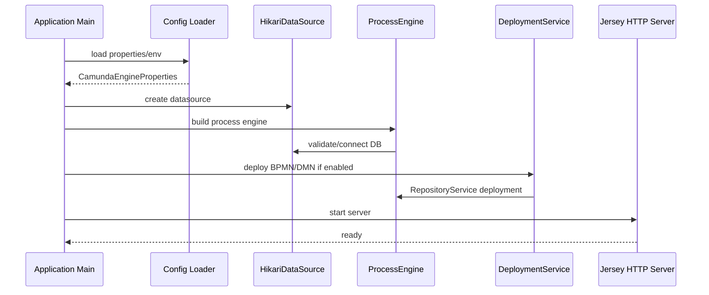

Order penting:

```text
Do not start HTTP listener before engine readiness if service requires engine.
```

Kalau HTTP sudah menerima traffic sebelum engine siap, endpoint workflow bisa gagal saat rollout.

---

# 28. Error Handling Saat Startup

| Error | Kemungkinan penyebab | Handling |
|---|---|---|
| `CannotCreateTransactionException` / DB connection fail | DB down, credential salah, network | Fail startup |
| Missing Camunda table | schema belum migrate | Fail startup |
| Schema version mismatch | engine version vs DB schema beda | Fail startup |
| BPMN parse error | invalid BPMN | Fail startup di local/CI/staging |
| Duplicate deployment issue | startup deploy tidak difilter | enable duplicate filtering |
| Job executor tidak jalan | `jobExecutorActivate=false` | cek config |
| Wrong isolation level | PostgreSQL/session config salah | fix DB config |

---

# 29. Logging Baseline

`logback.xml` contoh:

```xml
<configuration>
    <appender name="STDOUT" class="ch.qos.logback.core.ConsoleAppender">
        <encoder>
            <pattern>
                %d{yyyy-MM-dd'T'HH:mm:ss.SSSXXX} %-5level [%thread] %logger{36} - %msg%n
            </pattern>
        </encoder>
    </appender>

    <logger name="org.camunda.bpm.engine" level="INFO"/>
    <logger name="org.camunda.bpm.engine.jobexecutor" level="INFO"/>
    <logger name="com.zaxxer.hikari" level="INFO"/>

    <root level="INFO">
        <appender-ref ref="STDOUT"/>
    </root>
</configuration>
```

Saat incident debugging, sementara naikkan:

```xml
<logger name="org.camunda.bpm.engine.persistence" level="DEBUG"/>
<logger name="org.camunda.bpm.engine.jobexecutor" level="DEBUG"/>
```

Jangan biarkan SQL/persistence debug menyala permanen di production.

---

# 30. Configuration Checklist

| Config | Local | Production |
|---|---|---|
| `databaseSchemaUpdate` | `true` boleh | `false` |
| `history` | `full` | `full` untuk audit/regulatory |
| `jobExecutorActivate` | sesuai test | eksplisit |
| Hikari `maximumPoolSize` | kecil | berdasarkan load test |
| PostgreSQL isolation | default READ COMMITTED | READ COMMITTED |
| deployment on startup | boleh | controlled |
| duplicate filtering | true | true kalau startup deploy |
| readiness endpoint | optional | wajib |
| schema validation | optional | wajib kalau `schemaUpdate=false` |
| secret source | local env | secret manager/K8s secret |

---

# 31. Minimal Production Bootstrap Class

```java
package com.company.workflow.bootstrap;

import com.company.workflow.camunda.*;
import com.company.workflow.config.CamundaEngineProperties;
import com.zaxxer.hikari.HikariDataSource;
import org.camunda.bpm.engine.ProcessEngine;

public final class CamundaBootstrap implements AutoCloseable {

    private final HikariDataSource dataSource;
    private final ProcessEngine processEngine;

    public CamundaBootstrap(CamundaEngineProperties props) {
        this.dataSource = CamundaDataSourceFactory.create(props.dataSource());

        if (ProcessEngineConfigurationPolicy.requiresExternalValidation(props)) {
            new CamundaSchemaValidator(dataSource).validate();
        }

        this.processEngine = CamundaProcessEngineFactory.create(props, dataSource);

        new WorkflowDeploymentService(
            processEngine.getRepositoryService(),
            props.deployment()
        ).deployIfEnabled();
    }

    public ProcessEngine processEngine() {
        return processEngine;
    }

    @Override
    public void close() {
        try {
            processEngine.close();
        } finally {
            dataSource.close();
        }
    }
}
```

```java
package com.company.workflow.camunda;

import com.company.workflow.config.CamundaEngineProperties;
import org.camunda.bpm.engine.ProcessEngineConfiguration;

public final class ProcessEngineConfigurationPolicy {

    private ProcessEngineConfigurationPolicy() {}

    public static boolean requiresExternalValidation(CamundaEngineProperties props) {
        return ProcessEngineConfiguration.DB_SCHEMA_UPDATE_FALSE
            .equals(props.databaseSchemaUpdate());
    }
}
```

---

# 32. Common Anti-patterns

| Anti-pattern | Kenapa buruk |
|---|---|
| Engine dibuat lazy saat request pertama | First request bisa lambat/gagal |
| HTTP server start sebelum engine siap | Traffic masuk ke service belum siap |
| `databaseSchemaUpdate=true` di production | Startup punya side effect DDL |
| Tidak ada readiness check | Kubernetes bisa route traffic ke pod rusak |
| Camunda datasource dan app datasource dicampur | Pool starvation sulit dianalisis |
| Semua pod menjalankan job executor tanpa sadar | Job load sulit dikontrol |
| History `full` tanpa cleanup/retention | DB membesar tanpa batas |
| Tidak validate schema saat `schemaUpdate=false` | Error baru muncul saat request |
| BPMN deploy berulang tanpa duplicate filtering | Deployment table membengkak |
| Delegate melakukan external call tanpa async boundary | Transaction panjang dan retry kacau |

---

# 33. Practical “Definition of Done”

Seri ini dianggap selesai secara implementasi kalau kamu punya:

```text
[ ] CamundaEngineProperties typed config
[ ] HikariDataSource khusus Camunda
[ ] ProcessEngineFactory dengan StandaloneProcessEngineConfiguration
[ ] Explicit databaseSchemaUpdate policy
[ ] Explicit history level
[ ] Explicit jobExecutorActivate
[ ] Graceful shutdown processEngine + datasource
[ ] Health/live endpoint
[ ] Health/ready endpoint yang cek Camunda ringan
[ ] Optional BPMN/DMN deployment service
[ ] Startup validation untuk schema production
[ ] PostgreSQL isolation level READ COMMITTED
[ ] Tidak ada auto-DDL liar di production
```

---

# 34. Ringkasan Praktis

Untuk Jersey microservice embedded Camunda 7, baseline sehatnya:

```text
Jersey Main
  -> Load config
  -> HikariDataSource for Camunda
  -> StandaloneProcessEngineConfiguration
  -> databaseSchemaUpdate=false in production
  -> history=full for audit-heavy case management
  -> jobExecutorActivate=true only where jobs should execute
  -> deploy BPMN/DMN only by explicit policy
  -> readiness endpoint checks engine/DB
  -> graceful shutdown
```

Poin paling penting:

```text
Bootstrapping Camunda bukan hanya “buildProcessEngine”.
Bootstrapping adalah production lifecycle contract:
config, DB, schema, job executor, deployment, health, shutdown.
```

---

# Status Seri

**Seri 3/18 selesai.**

Rekomendasi materi selanjutnya: **Seri 4/18 - BPMN Executable Modeling for Microservice Workflow**, fokus ke BPMN executable yang benar-benar jalan di Camunda 7: process id/key, start event, service task, user task, external task, gateway, timer, message event, error boundary, async boundary, dan modeling pattern untuk regulatory/case-management workflow.

---

**Sources:**

- [Process Engine Bootstrapping | docs.camunda.org](https://docs.camunda.org/manual/7.24/user-guide/process-engine/process-engine-bootstrapping/)

## Response:
7/16/2026, 9:45:59 AM

# Seri 4/18 - BPMN Executable Modeling for Microservice Workflow  
## Camunda 7 + Jakarta RESTful Web Service/Jersey Microservice

## Tujuan seri ini

Seri ini fokus pada **cara membuat BPMN yang benar-benar executable di Camunda 7**, bukan hanya diagram proses bisnis. Targetnya: kamu bisa membaca BPMN dari project existing dan langsung tahu:

```text
1. process id/key-nya apa?
2. event mana yang memulai process?
3. task mana yang synchronous vs asynchronous?
4. task mana yang dikerjakan JavaDelegate vs external worker?
5. gateway mana yang rentan error karena missing default flow?
6. wait state-nya di mana?
7. SLA/timer/escalation dimodelkan bagaimana?
8. error bisnis vs error teknis dipisah atau tidak?
9. BPMN ini aman untuk microservice production atau tidak?
```

Di Camunda 7, BPMN XML yang dideploy akan diparse menjadi **process definition graph** dan graph inilah yang dieksekusi oleh engine. `process id` dalam elemen `<process>` menjadi **process definition key** yang dipakai API seperti `RuntimeService.startProcessInstanceByKey(...)`. Jika beberapa deployment memakai key yang sama, Camunda memperlakukannya sebagai versi berbeda dari process definition yang sama. ([Camunda 7 Documentation](https://docs.camunda.org/manual/7.24/user-guide/process-engine/process-engine-concepts/))

---

# 1. Mental Model: BPMN sebagai Executable State Machine

Untuk aplikasi Jersey/microservice, pikirkan BPMN seperti **state machine durable**:

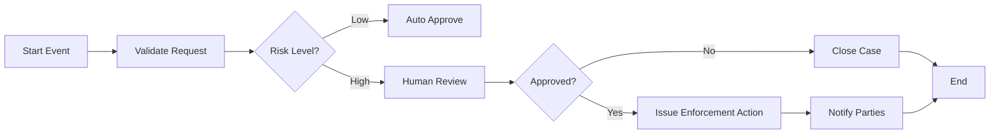

Mapping ke runtime Camunda:

| BPMN concept | Runtime meaning |
|---|---|
| Process definition | Template proses yang dideploy |
| Process instance | Satu eksekusi proses untuk satu case/business entity |
| Token/execution | Posisi aktif di dalam proses |
| User task | Wait state untuk pekerjaan manusia |
| External task | Wait state untuk pekerjaan worker eksternal |
| Timer event | Job yang dieksekusi job executor saat due |
| Gateway | Branching/merging logic |
| Message event | Cara process menunggu/menerima event dari luar |
| Error boundary | Jalur business error yang eksplisit |
| Async boundary | Save point/transaction boundary tambahan |

Camunda menyatakan process instance adalah eksekusi individual dari process definition, dan engine bertanggung jawab membuat serta menyimpan state instance di database saat mencapai wait state seperti user task. ([Camunda 7 Documentation](https://docs.camunda.org/manual/7.24/user-guide/process-engine/process-engine-concepts/))

---

# 2. Minimal Executable BPMN Anatomy

Contoh BPMN paling kecil yang executable:

```xml
<?xml version="1.0" encoding="UTF-8"?>
<bpmn:definitions
    xmlns:bpmn="http://www.omg.org/spec/BPMN/20100524/MODEL"
    xmlns:camunda="http://camunda.org/schema/1.0/bpmn"
    xmlns:xsi="http://www.w3.org/2001/XMLSchema-instance"
    id="Definitions_CaseWorkflow"
    targetNamespace="http://company.com/workflow/case">

  <bpmn:process
      id="case_enforcement_process"
      name="Case Enforcement Process"
      isExecutable="true">

    <bpmn:startEvent id="start_case_submitted" name="Case Submitted" />

    <bpmn:sequenceFlow
        id="flow_start_to_validate"
        sourceRef="start_case_submitted"
        targetRef="task_validate_case" />

    <bpmn:serviceTask
        id="task_validate_case"
        name="Validate Case"
        camunda:type="external"
        camunda:topic="validate-case" />

    <bpmn:sequenceFlow
        id="flow_validate_to_end"
        sourceRef="task_validate_case"
        targetRef="end_case_processed" />

    <bpmn:endEvent id="end_case_processed" name="Case Processed" />

  </bpmn:process>
</bpmn:definitions>
```

Hal penting:

| XML item | Fungsi |
|---|---|
| `definitions targetNamespace` | Namespace model, bukan Java package |
| `process id` | Process definition key |
| `isExecutable="true"` | Wajib agar bisa dieksekusi |
| `startEvent` | Titik mulai instance |
| `sequenceFlow` | Jalur token |
| `serviceTask camunda:type="external"` | Work item untuk external worker |
| `camunda:topic` | Topic yang diambil worker |

---

# 3. Naming Convention Praktis

## Recommended naming

| Element | Convention | Contoh |
|---|---|---|
| Process id | snake_case stabil | `case_enforcement_process` |
| BPMN element id | prefixed snake_case | `task_validate_case` |
| Task name | human-readable verb phrase | `Validate Case` |
| Message name | kebab/snake stabil | `case-document-uploaded` |
| External task topic | kebab-case | `validate-case` |
| Error code | UPPER_SNAKE / domain code | `CASE_NOT_ELIGIBLE` |
| Variable name | lowerCamelCase | `caseId`, `riskScore` |
| Sequence flow id | descriptive | `flow_validate_to_review` |

## Anti-pattern naming

| Bad | Problem |
|---|---|
| `Process_1`, `Task_0ab12` | Susah debug di Cockpit/log |
| `newProcess` | Tidak domain-specific |
| `serviceTask1` | Tidak menjelaskan side effect |
| `topic1` | Worker sulit dipetakan |
| Rename process id sembarangan | Membuat process definition key baru |

---

# 4. Recommended Process Shape untuk Case/Regulatory Workflow

Untuk regulatory/case-management process, baseline shape biasanya seperti ini:

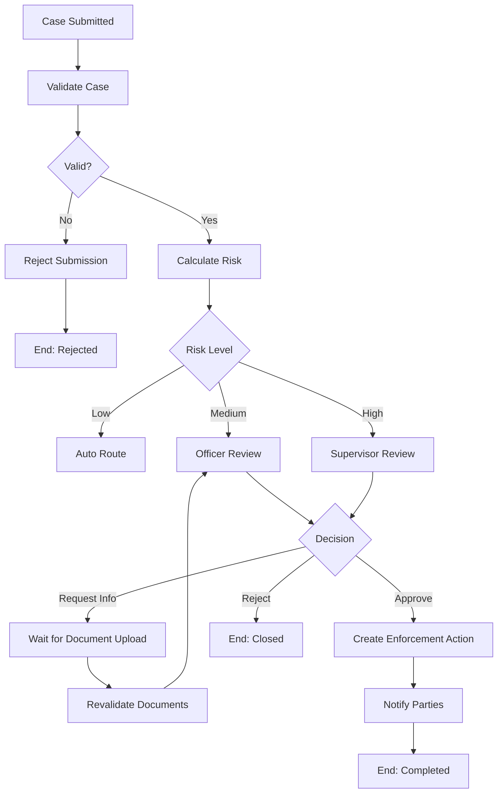

Dalam Camunda 7, elemen yang sering dipakai untuk model seperti ini:

| Need | BPMN element |
|---|---|
| Start dari REST API | None start event + `startProcessInstanceByKey` |
| Start dari event eksternal | Message start event |
| Validasi otomatis | External service task |
| Human review | User task |
| SLA review | Timer boundary event |
| Request document | Message intermediate catch event |
| Business rejection | BPMN error atau gateway |
| Technical retry | Async job / external task retry |
| Close case | End event |
| Cancel everything | Terminate end event, hati-hati |

---

# 5. Start Event Pattern

## Pattern A - REST starts process

Paling umum untuk Jersey API:

```java
runtimeService.startProcessInstanceByKey(
    "case_enforcement_process",
    "CASE-" + caseId,
    variables
);
```

BPMN:

```xml
<bpmn:startEvent id="start_case_submitted" name="Case Submitted" />
```

Cocok untuk:

```text
POST /cases/{caseId}/submit
POST /complaints/{complaintId}/register
POST /applications/{applicationId}/start-review
```

## Pattern B - Message start event

Cocok kalau proses dimulai oleh event bisnis dari luar, misalnya message broker, integration service, atau webhook.

```xml
<bpmn:message id="msg_case_received" name="case-received" />

<bpmn:process id="case_enforcement_process" isExecutable="true">
  <bpmn:startEvent id="start_case_received" name="Case Received">
    <bpmn:messageEventDefinition messageRef="msg_case_received" />
  </bpmn:startEvent>
</bpmn:process>
```

Message event di Camunda mengacu pada named message; berbeda dari signal, message selalu diarahkan ke satu recipient. ([Camunda 7 Documentation](https://docs.camunda.org/manual/7.24/reference/bpmn20/events/message-events/))

## Pattern C - Timer start event

Cocok untuk proses periodik:

```xml
<bpmn:startEvent id="start_daily_sla_scan" name="Daily SLA Scan">
  <bpmn:timerEventDefinition>
    <bpmn:timeCycle>R/PT24H</bpmn:timeCycle>
  </bpmn:timerEventDefinition>
</bpmn:startEvent>
```

Timer start event membuat process instance pada waktu tertentu atau interval tertentu, dan dijadwalkan saat process dideploy; tidak perlu dipanggil dengan `startProcessInstanceBy...` untuk jadwal tersebut. ([Camunda 7 Documentation](https://docs.camunda.org/manual/7.24/reference/bpmn20/events/timer-events/))

Practical warning: jangan gunakan timer start event untuk semua scheduler perusahaan tanpa governance, karena setiap deployment bisa punya efek scheduling.

---

# 6. Service Task Pattern

Camunda service task dipakai untuk memanggil service. Implementasinya bisa berupa Java code, expression, external task, atau connector. Dokumentasi Camunda menyebut service task dapat memanggil Java code, memberikan work item ke external worker secara asynchronous, atau memanggil logic berbentuk web service. ([Camunda 7 Documentation](https://docs.camunda.org/manual/7.24/reference/bpmn20/tasks/service-task/))

## Option A - JavaDelegate

```xml
<bpmn:serviceTask
    id="task_validate_case"
    name="Validate Case"
    camunda:class="com.company.workflow.delegate.ValidateCaseDelegate" />
```

```java
public final class ValidateCaseDelegate implements JavaDelegate {

    @Override
    public void execute(DelegateExecution execution) {
        String caseId = (String) execution.getVariable("caseId");

        boolean valid = validate(caseId);

        execution.setVariable("caseValid", valid);
    }

    private boolean validate(String caseId) {
        return caseId != null && !caseId.isBlank();
    }
}
```

Cocok untuk:

| Cocok | Contoh |
|---|---|
| Logic ringan | derive variable |
| Tidak I/O berat | simple calculation |
| Tidak perlu scale terpisah | embedded-only |
| Tidak memanggil external API lama | local rule |

Tidak cocok untuk:

| Tidak cocok | Kenapa |
|---|---|
| HTTP call lama | Mengikat engine transaction/thread |
| DB write domain yang riskan | Sulit rollback lintas datasource |
| Integrasi pihak ketiga | Retry/timeout lebih baik di worker |
| Logic yang harus language-agnostic | JavaDelegate mengikat ke JVM/Camunda 7 |

---

## Option B - External Task

```xml
<bpmn:serviceTask
    id="task_validate_case"
    name="Validate Case"
    camunda:type="external"
    camunda:topic="validate-case" />
```

External task memisahkan implementasi task dari process engine; engine menyediakan work item, lalu worker melakukan polling/fetch dan menyelesaikannya. Camunda menyatakan external task mendekopel implementasi task dari engine dan memungkinkan lintas system/technology boundary. ([Camunda 7 Documentation](https://docs.camunda.org/manual/7.24/reference/bpmn20/tasks/service-task/))

Cocok untuk:

| Cocok | Contoh |
|---|---|
| API call | call case registry service |
| DB update domain | update app schema via MyBatis |
| File/document processing | validate uploaded docs |
| Notification | send email/letter/SMS |
| Integrasi cloud/on-prem | AWS/Azure/on-prem adapter |
| Retry isolated | worker bisa retry/backoff |

Recommended default untuk microservice modern:

```text
I/O-heavy step => external task
pure lightweight logic => JavaDelegate boleh
business decision => DMN / gateway / service task
human decision => user task
```

---

# 7. User Task Pattern

User task dipakai untuk pekerjaan manusia. Saat execution mencapai user task, engine membuat task di task list user atau group yang ditugaskan. ([Camunda 7 Documentation](https://docs.camunda.org/manual/7.24/reference/bpmn20/tasks/user-task/))

```xml
<bpmn:userTask
    id="task_officer_review"
    name="Officer Review"
    camunda:candidateGroups="case-officer"
    camunda:dueDate="${reviewDueDate}" />
```

Camunda mendukung assignee, candidate users/groups, due date, follow-up date, dan assignment berbasis expression/variables. ([Camunda 7 Documentation](https://docs.camunda.org/manual/7.24/reference/bpmn20/tasks/user-task/))

## Practical model

| Field | Recommendation |
|---|---|
| `id` | Stabil, dipakai API/filter |
| `name` | Jelas untuk user |
| `candidateGroups` | Prefer group/role daripada hardcoded user |
| `assignee` | Pakai kalau task memang personal |
| `dueDate` | Pakai variable/expression dari policy |
| form key | Jangan terlalu coupling ke UI lama |
| task listener | Gunakan hati-hati, jangan business logic besar |

## Completion via Jersey

```java
@POST
@Path("/cases/{caseId}/tasks/{taskDefinitionKey}/complete")
public Response completeTask(
        @PathParam("caseId") String caseId,
        @PathParam("taskDefinitionKey") String taskDefinitionKey,
        CompleteTaskRequest request
) {
    workflowFacade.completeHumanTask(caseId, taskDefinitionKey, request);
    return Response.noContent().build();
}
```

Facade:

```java
public void completeHumanTask(
        String caseId,
        String taskDefinitionKey,
        CompleteTaskRequest request
) {
    String businessKey = "CASE-" + caseId;

    Task task = taskService.createTaskQuery()
        .processInstanceBusinessKey(businessKey)
        .taskDefinitionKey(taskDefinitionKey)
        .active()
        .singleResult();

    if (task == null) {
        throw new NotFoundException("Active task not found");
    }

    Map<String, Object> variables = Map.of(
        "reviewDecision", request.decision(),
        "reviewComment", request.comment(),
        "reviewedBy", request.reviewedBy(),
        "reviewedAt", Instant.now().toString()
    );

    taskService.complete(task.getId(), variables);
}
```

---

# 8. Gateway Pattern

## Exclusive Gateway / XOR

Dipakai untuk memilih **satu** jalur.

```xml
<bpmn:exclusiveGateway
    id="gw_case_valid"
    name="Case Valid?"
    default="flow_invalid" />

<bpmn:sequenceFlow
    id="flow_valid"
    sourceRef="gw_case_valid"
    targetRef="task_calculate_risk">
  <bpmn:conditionExpression xsi:type="bpmn:tFormalExpression">
    ${caseValid == true}
  </bpmn:conditionExpression>
</bpmn:sequenceFlow>

<bpmn:sequenceFlow
    id="flow_invalid"
    sourceRef="gw_case_valid"
    targetRef="task_reject_submission" />
```

Camunda mengevaluasi outgoing sequence flow pada exclusive gateway sesuai urutan di XML, memilih flow pertama yang condition-nya true; jika tidak ada yang match dan tidak ada default flow, terjadi runtime exception. ([Camunda 7 Documentation](https://docs.camunda.org/manual/7.24/reference/bpmn20/gateways/exclusive-gateway/))

Practical rule:

```text
Setiap exclusive gateway production sebaiknya punya default flow.
```

## Gateway decision table

| Gateway | Use case | Risiko |
|---|---|---|
| Exclusive/XOR | Pilih satu jalur | Missing default flow |
| Parallel | Jalankan semua jalur | Join bisa stuck kalau model salah |
| Inclusive | Jalankan beberapa jalur kondisional | Lebih sulit dipahami/dites |
| Event-based | Menunggu event pertama yang datang | Perlu paham event correlation |
| Complex | Hindari | Sulit maintain/debug |

---

# 9. Timer Pattern

Timer events bisa dipakai sebagai start event, intermediate event, atau boundary event. Boundary timer bisa interrupting atau non-interrupting. ([Camunda 7 Documentation](https://docs.camunda.org/manual/7.24/reference/bpmn20/events/timer-events/))

## SLA escalation non-interrupting

Use case: officer review masih berjalan, tapi setelah 2 hari kirim reminder.

```xml
<bpmn:userTask
    id="task_officer_review"
    name="Officer Review"
    camunda:candidateGroups="case-officer" />

<bpmn:boundaryEvent
    id="timer_review_reminder"
    attachedToRef="task_officer_review"
    cancelActivity="false">
  <bpmn:timerEventDefinition>
    <bpmn:timeDuration>PT48H</bpmn:timeDuration>
  </bpmn:timerEventDefinition>
</bpmn:boundaryEvent>

<bpmn:sequenceFlow
    id="flow_review_reminder"
    sourceRef="timer_review_reminder"
    targetRef="task_send_review_reminder" />
```

`cancelActivity="false"` berarti user task tetap aktif, sementara reminder berjalan di jalur tambahan.

## SLA timeout interrupting

Use case: kalau review tidak selesai dalam 7 hari, task review dibatalkan dan escalate ke supervisor.

```xml
<bpmn:boundaryEvent
    id="timer_review_timeout"
    attachedToRef="task_officer_review">
  <bpmn:timerEventDefinition>
    <bpmn:timeDuration>P7D</bpmn:timeDuration>
  </bpmn:timerEventDefinition>
</bpmn:boundaryEvent>
```

Default boundary timer adalah interrupting. Saat timer fired, activity yang ditempeli akan diinterupsi dan flow dari boundary event dilanjutkan. ([Camunda 7 Documentation](https://docs.camunda.org/manual/7.24/reference/bpmn20/events/timer-events/))

---

# 10. Message Event Pattern

Message event cocok untuk **menunggu event eksternal yang spesifik untuk satu process instance**, misalnya:

```text
document-uploaded
payment-received
external-agency-response-received
appeal-submitted
```

## BPMN

```xml
<bpmn:message
    id="msg_document_uploaded"
    name="case-document-uploaded" />

<bpmn:intermediateCatchEvent
    id="event_wait_document_uploaded"
    name="Wait for Document Upload">
  <bpmn:messageEventDefinition messageRef="msg_document_uploaded" />
</bpmn:intermediateCatchEvent>
```

## Jersey correlation

```java
@POST
@Path("/cases/{caseId}/events/document-uploaded")
public Response documentUploaded(
        @PathParam("caseId") String caseId,
        DocumentUploadedRequest request
) {
    workflowFacade.correlateDocumentUploaded(caseId, request);
    return Response.accepted().build();
}
```

```java
public void correlateDocumentUploaded(
        String caseId,
        DocumentUploadedRequest request
) {
    runtimeService.createMessageCorrelation("case-document-uploaded")
        .processInstanceBusinessKey("CASE-" + caseId)
        .setVariable("documentId", request.documentId())
        .setVariable("documentUploadedAt", Instant.now().toString())
        .correlateWithResult();
}
```

Practical rule:

| Rule | Reason |
|---|---|
| Correlate by business key | Lebih stabil daripada internal process instance id |
| Message name stabil | Dipakai oleh BPMN dan API |
| Jangan broadcast via signal kalau target satu case | Signal bisa diterima banyak instance |
| Simpan event payload minimal | Hindari variable besar |

---

# 11. Error Event Pattern

Gunakan BPMN error untuk **business error**, bukan semua technical exception.

Contoh business error:

```text
CASE_NOT_ELIGIBLE
DOCUMENT_INVALID
LICENSE_EXPIRED
DUPLICATE_APPLICATION
SANCTION_RULE_NOT_MET
```

Camunda error boundary event menangkap error yang dilempar dalam scope activity tempat boundary event dipasang; jika error ditangkap, activity yang ditempeli dihancurkan dan process lanjut melalui outgoing flow boundary event. ([Camunda 7 Documentation](https://docs.camunda.org/manual/7.24/reference/bpmn20/events/error-events/))

## BPMN

```xml
<bpmn:error
    id="err_case_not_eligible"
    name="Case Not Eligible"
    errorCode="CASE_NOT_ELIGIBLE" />

<bpmn:serviceTask
    id="task_validate_case"
    name="Validate Case"
    camunda:type="external"
    camunda:topic="validate-case" />

<bpmn:boundaryEvent
    id="boundary_case_not_eligible"
    attachedToRef="task_validate_case">
  <bpmn:errorEventDefinition errorRef="err_case_not_eligible" />
</bpmn:boundaryEvent>
```

## JavaDelegate throwing BPMN error

```java
public final class ValidateCaseDelegate implements JavaDelegate {

    @Override
    public void execute(DelegateExecution execution) {
        boolean eligible = checkEligibility(execution);

        if (!eligible) {
            throw new BpmnError("CASE_NOT_ELIGIBLE", "Case is not eligible");
        }

        execution.setVariable("caseValid", true);
    }
}
```

## External task worker reporting BPMN error

```java
client.subscribe("validate-case")
    .lockDuration(30_000)
    .handler((externalTask, externalTaskService) -> {
        try {
            ValidateResult result = validate(externalTask);

            if (!result.eligible()) {
                externalTaskService.handleBpmnError(
                    externalTask,
                    "CASE_NOT_ELIGIBLE",
                    "Case is not eligible",
                    Map.of("rejectionReason", result.reason())
                );
                return;
            }

            externalTaskService.complete(
                externalTask,
                Map.of("caseValid", true)
            );

        } catch (Exception ex) {
            externalTaskService.handleFailure(
                externalTask,
                ex.getMessage(),
                stackTrace(ex),
                3,
                60_000
            );
        }
    })
    .open();
```

## Business error vs technical error

| Type | Example | BPMN modeling |
|---|---|---|
| Business error | applicant not eligible | BPMN error / gateway |
| Validation outcome | risk score high | gateway |
| Missing required document | BPMN error or user task route |
| HTTP timeout | failed job / external task failure |
| DB deadlock | retry technical |
| Null pointer bug | incident |
| Unexpected mapping error | incident |

---

# 12. Async Boundary Pattern

Camunda process execution berjalan sampai mencapai wait state. Wait state selalu meliputi receive task, user task, message event, timer event, signal event, event-based gateway, dan external task; async continuation bisa menambahkan transaction boundary pada task lain. ([Camunda 7 Documentation](https://docs.camunda.org/manual/7.24/user-guide/process-engine/transactions-in-processes/))

## Use `asyncBefore` untuk step I/O atau risk-prone

```xml
<bpmn:serviceTask
    id="task_generate_notice"
    name="Generate Notice"
    camunda:asyncBefore="true"
    camunda:type="external"
    camunda:topic="generate-notice" />
```

## Use `asyncAfter` untuk commit setelah step sukses

```xml
<bpmn:serviceTask
    id="task_create_enforcement_action"
    name="Create Enforcement Action"
    camunda:asyncAfter="true"
    camunda:type="external"
    camunda:topic="create-enforcement-action" />
```

Async continuation dapat dipasang sebelum/after activity dan membuat transaction boundary; eksekusinya dilakukan oleh job executor. ([Camunda 7 Documentation](https://docs.camunda.org/manual/7.24/user-guide/process-engine/transactions-in-processes/))

Practical rule:

| Situation | Modeling recommendation |
|---|---|
| Setelah user task, ada service task berat | `asyncBefore` di service task |
| Service task update external system | external task + idempotency |
| Service task harus retry technical | async job/external task retry |
| Setelah side effect sukses, lanjut proses | `asyncAfter` bisa jadi save point |
| Step cepat dan pure computation | async tidak wajib |

---

# 13. Executable BPMN untuk Case Workflow - Skeleton

Berikut skeleton praktis untuk regulatory/case workflow:

```xml
<bpmn:definitions
    xmlns:bpmn="http://www.omg.org/spec/BPMN/20100524/MODEL"
    xmlns:camunda="http://camunda.org/schema/1.0/bpmn"
    xmlns:xsi="http://www.w3.org/2001/XMLSchema-instance"
    id="Definitions_CaseEnforcement"
    targetNamespace="http://company.com/workflow/case">

  <bpmn:error
      id="err_case_not_eligible"
      name="Case Not Eligible"
      errorCode="CASE_NOT_ELIGIBLE" />

  <bpmn:message
      id="msg_document_uploaded"
      name="case-document-uploaded" />

  <bpmn:process
      id="case_enforcement_process"
      name="Case Enforcement Process"
      isExecutable="true">

    <bpmn:startEvent id="start_case_submitted" name="Case Submitted" />

    <bpmn:sequenceFlow
        id="flow_start_validate"
        sourceRef="start_case_submitted"
        targetRef="task_validate_case" />

    <bpmn:serviceTask
        id="task_validate_case"
        name="Validate Case"
        camunda:asyncBefore="true"
        camunda:type="external"
        camunda:topic="validate-case" />

    <bpmn:boundaryEvent
        id="boundary_case_not_eligible"
        attachedToRef="task_validate_case">
      <bpmn:errorEventDefinition errorRef="err_case_not_eligible" />
    </bpmn:boundaryEvent>

    <bpmn:sequenceFlow
        id="flow_not_eligible"
        sourceRef="boundary_case_not_eligible"
        targetRef="task_reject_case" />

    <bpmn:sequenceFlow
        id="flow_validate_risk"
        sourceRef="task_validate_case"
        targetRef="task_calculate_risk" />

    <bpmn:serviceTask
        id="task_calculate_risk"
        name="Calculate Risk"
        camunda:type="external"
        camunda:topic="calculate-risk" />

    <bpmn:sequenceFlow
        id="flow_risk_gateway"
        sourceRef="task_calculate_risk"
        targetRef="gw_risk_level" />

    <bpmn:exclusiveGateway
        id="gw_risk_level"
        name="Risk Level?"
        default="flow_medium_risk" />

    <bpmn:sequenceFlow
        id="flow_low_risk"
        sourceRef="gw_risk_level"
        targetRef="task_auto_approve">
      <bpmn:conditionExpression xsi:type="bpmn:tFormalExpression">
        ${riskLevel == 'LOW'}
      </bpmn:conditionExpression>
    </bpmn:sequenceFlow>

    <bpmn:sequenceFlow
        id="flow_high_risk"
        sourceRef="gw_risk_level"
        targetRef="task_supervisor_review">
      <bpmn:conditionExpression xsi:type="bpmn:tFormalExpression">
        ${riskLevel == 'HIGH'}
      </bpmn:conditionExpression>
    </bpmn:sequenceFlow>

    <bpmn:sequenceFlow
        id="flow_medium_risk"
        sourceRef="gw_risk_level"
        targetRef="task_officer_review" />

    <bpmn:userTask
        id="task_officer_review"
        name="Officer Review"
        camunda:candidateGroups="case-officer"
        camunda:dueDate="${reviewDueDate}" />

    <bpmn:boundaryEvent
        id="timer_officer_review_reminder"
        attachedToRef="task_officer_review"
        cancelActivity="false">
      <bpmn:timerEventDefinition>
        <bpmn:timeDuration>PT48H</bpmn:timeDuration>
      </bpmn:timerEventDefinition>
    </bpmn:boundaryEvent>

    <bpmn:userTask
        id="task_supervisor_review"
        name="Supervisor Review"
        camunda:candidateGroups="case-supervisor"
        camunda:dueDate="${supervisorReviewDueDate}" />

    <bpmn:exclusiveGateway
        id="gw_review_decision"
        name="Review Decision?"
        default="flow_decision_reject" />

    <bpmn:intermediateCatchEvent
        id="event_wait_document_uploaded"
        name="Wait for Document Upload">
      <bpmn:messageEventDefinition messageRef="msg_document_uploaded" />
    </bpmn:intermediateCatchEvent>

    <bpmn:serviceTask
        id="task_create_enforcement_action"
        name="Create Enforcement Action"
        camunda:type="external"
        camunda:topic="create-enforcement-action" />

    <bpmn:serviceTask
        id="task_notify_parties"
        name="Notify Parties"
        camunda:type="external"
        camunda:topic="notify-parties" />

    <bpmn:serviceTask
        id="task_reject_case"
        name="Reject Case"
        camunda:type="external"
        camunda:topic="reject-case" />

    <bpmn:endEvent id="end_case_completed" name="Case Completed" />
    <bpmn:endEvent id="end_case_rejected" name="Case Rejected" />

  </bpmn:process>
</bpmn:definitions>
```

Catatan: skeleton di atas belum lengkap semua `sequenceFlow`, tapi menunjukkan pattern executable yang aman: external task, user task, error boundary, timer boundary, message catch, dan gateway default.

---

# 14. Jersey + BPMN Contract Constants

Agar BPMN dan Java tidak drift:

```java
public final class ProcessKeys {
    private ProcessKeys() {}

    public static final String CASE_ENFORCEMENT = "case_enforcement_process";
}
```

```java
public final class TopicNames {
    private TopicNames() {}

    public static final String VALIDATE_CASE = "validate-case";
    public static final String CALCULATE_RISK = "calculate-risk";
    public static final String CREATE_ENFORCEMENT_ACTION = "create-enforcement-action";
    public static final String NOTIFY_PARTIES = "notify-parties";
    public static final String REJECT_CASE = "reject-case";
}
```

```java
public final class MessageNames {
    private MessageNames() {}

    public static final String CASE_DOCUMENT_UPLOADED = "case-document-uploaded";
}
```

```java
public final class ErrorCodes {
    private ErrorCodes() {}

    public static final String CASE_NOT_ELIGIBLE = "CASE_NOT_ELIGIBLE";
    public static final String DOCUMENT_INVALID = "DOCUMENT_INVALID";
}
```

```java
public final class TaskDefinitionKeys {
    private TaskDefinitionKeys() {}

    public static final String OFFICER_REVIEW = "task_officer_review";
    public static final String SUPERVISOR_REVIEW = "task_supervisor_review";
}
```

---

# 15. Variable Contract untuk BPMN

BPMN sebaiknya tidak bergantung pada object Java kompleks. Pakai primitive/string/JSON minimal.

## Recommended variables

| Variable | Type | Producer | Consumer |
|---|---|---|---|
| `caseId` | String | REST start | all workers |
| `caseType` | String | REST start | validation/routing |
| `priority` | String | REST start | review assignment |
| `submittedBy` | String | REST start | audit/task assignment |
| `riskScore` | Integer/Double | risk worker | gateway |
| `riskLevel` | String | risk worker | gateway |
| `reviewDueDate` | ISO-8601 String/Date | policy worker | user task |
| `reviewDecision` | String | human task completion | gateway |
| `documentId` | String | message correlation | document worker |
| `rejectionReason` | String | validation/review | reject task |

## Avoid

| Avoid | Reason |
|---|---|
| Full DTO object as Java serialized variable | Class/version coupling |
| Huge JSON document | DB bloat/history bloat |
| Secrets/token | Audit/security leak |
| Unbounded list | Query/history overhead |
| Arbitrary client variables | Data quality/security risk |

---

# 16. Modeling Decision Table

| Business need | Recommended BPMN |
|---|---|
| API starts a workflow | None start event + `startProcessInstanceByKey` |
| Event starts workflow | Message start event |
| Scheduled workflow | Timer start event |
| Human approval | User task |
| External system integration | External service task |
| Lightweight local calculation | JavaDelegate service task |
| Business branching | Exclusive gateway + default |
| Multiple mandatory branches | Parallel gateway |
| Optional multiple branches | Inclusive gateway, test carefully |
| Wait for external event | Intermediate message catch event |
| SLA reminder | Non-interrupting timer boundary |
| SLA timeout | Interrupting timer boundary |
| Business rejection | BPMN error or explicit reject path |
| Technical failure | Retry/incident, not BPMN error |
| Reusable subprocess | Call activity |
| Local grouping/scope | Embedded subprocess |
| Cancel all active paths | Terminate end event, use carefully |

---

# 17. Practical Validation Checklist

Sebelum BPMN masuk production, cek:

```text
[ ] process id stabil dan domain-specific
[ ] isExecutable="true"
[ ] semua service task punya implementation: class/delegateExpression/expression/type
[ ] external task punya camunda:topic
[ ] semua exclusive gateway punya default flow
[ ] sequence flow condition pakai variable yang pasti ada
[ ] user task punya assignment/candidate group
[ ] SLA user task punya timer boundary jika dibutuhkan
[ ] message catch event punya message name stabil
[ ] correlation strategy jelas: businessKey atau variable
[ ] business errors dimodelkan eksplisit
[ ] technical errors tidak disamarkan sebagai business error
[ ] async boundary ada di step risk-prone
[ ] side-effect task idempotent
[ ] tidak ada object variable besar/berbahaya
[ ] BPMN bisa dideploy di integration test
[ ] happy path dan unhappy path punya test
```

---

# 18. Common Modeling Anti-patterns

| Anti-pattern | Dampak |
|---|---|
| BPMN hanya “gambar”, logic tetap penuh di Java | Workflow tidak transparan |
| Semua service task pakai JavaDelegate | Tight coupling ke Camunda 7/JVM |
| External API call synchronous tanpa async/wait state | Long transaction dan retry kacau |
| Gateway tanpa default flow | Runtime exception saat variable tidak sesuai |
| Business error dilempar sebagai RuntimeException | Jadi incident teknis, bukan jalur bisnis |
| Technical timeout dimodelkan sebagai BPMN error | Monitoring dan retry salah |
| User task tanpa candidate group/assignee | Task hilang dari operational queue |
| Timer tanpa policy timezone/duration jelas | SLA ambigu |
| Message event tanpa correlation key jelas | Event tidak match atau match salah |
| Process variable pakai object Java serialized | Versioning/migration sulit |
| Semua payload disimpan sebagai variable | History table membengkak |
| Rename activity id sembarangan | Migration/history/test break |
| Menggunakan signal untuk event per-case | Bisa trigger banyak instance |
| Parallel gateway tanpa paham join | Process stuck |
| Inclusive gateway dipakai karena “fleksibel” | Debug dan testing lebih sulit |

---

# 19. Production Modeling Rules untuk Jersey Microservice

Gunakan rule berikut sebagai default:

```text
1. API publik tetap domain-oriented, bukan Camunda-oriented.
2. BPMN id dan topic adalah contract, jangan rename tanpa migration plan.
3. External task untuk pekerjaan I/O-heavy.
4. JavaDelegate hanya untuk logic lokal ringan.
5. Business error pakai BPMN error atau explicit reject path.
6. Technical failure pakai retry/incident.
7. Gateway selalu punya default.
8. User task selalu punya assignment strategy.
9. Message correlation wajib pakai business key atau correlation variable stabil.
10. Async boundary dipasang di titik yang perlu save point/retry.
```

---

# 20. Mini End-to-End Example

## REST start process

```java
public StartedWorkflow submitCase(String caseId, SubmitCaseRequest request) {
    Map<String, Object> variables = Map.of(
        "caseId", caseId,
        "caseType", request.caseType(),
        "priority", request.priority(),
        "submittedBy", request.submittedBy(),
        "reviewDueDate", request.reviewDueDate()
    );

    ProcessInstance pi = runtimeService.startProcessInstanceByKey(
        ProcessKeys.CASE_ENFORCEMENT,
        "CASE-" + caseId,
        variables
    );

    return new StartedWorkflow(pi.getProcessInstanceId(), pi.getBusinessKey());
}
```

## Worker completes external task

```java
client.subscribe(TopicNames.CALCULATE_RISK)
    .lockDuration(30_000)
    .handler((task, service) -> {
        String caseId = task.getVariable("caseId");

        RiskResult risk = riskService.calculate(caseId);

        service.complete(task, Map.of(
            "riskScore", risk.score(),
            "riskLevel", risk.level()
        ));
    })
    .open();
```

## Complete review user task

```java
public void completeOfficerReview(String caseId, ReviewRequest request) {
    Task task = taskService.createTaskQuery()
        .processInstanceBusinessKey("CASE-" + caseId)
        .taskDefinitionKey(TaskDefinitionKeys.OFFICER_REVIEW)
        .active()
        .singleResult();

    if (task == null) {
        throw new NotFoundException("Officer review task not found");
    }

    taskService.complete(task.getId(), Map.of(
        "reviewDecision", request.decision(),
        "reviewComment", request.comment(),
        "reviewedBy", request.userId()
    ));
}
```

## Correlate document uploaded

```java
public void documentUploaded(String caseId, String documentId) {
    runtimeService.createMessageCorrelation(MessageNames.CASE_DOCUMENT_UPLOADED)
        .processInstanceBusinessKey("CASE-" + caseId)
        .setVariable("documentId", documentId)
        .setVariable("documentUploadedAt", Instant.now().toString())
        .correlateWithResult();
}
```

---

# 21. Ringkasan Praktis

BPMN executable di Camunda 7 harus diperlakukan sebagai **runtime contract**, bukan diagram dokumentasi.

Yang paling penting untuk microservice Jersey:

```text
process id         = API contract untuk start/query
activity id        = operational/debug/test contract
topic name         = worker contract
message name       = event correlation contract
variable name      = data contract
error code         = business exception contract
async boundary     = transaction/retry contract
user task key      = human workflow contract
```

Model yang sehat adalah model yang:

```text
bisa dijalankan,
bisa dites,
bisa dioperasikan,
bisa diretry,
bisa diaudit,
dan tidak terlalu mengunci business logic ke JavaDelegate.
```

---

# Status Seri

**Seri 4/18 selesai.**

Rekomendasi materi selanjutnya: **Seri 5/18 - Jersey REST Facade for Camunda Runtime API**, fokus ke desain endpoint production-style untuk start process, get workflow state, complete task, correlate message, cancel process, retry incident/job, dan mapping error Camunda ke HTTP response yang aman.

---

**Sources:**

- [Process Engine Concepts | docs.camunda.org](https://docs.camunda.org/manual/7.24/user-guide/process-engine/process-engine-concepts/)

## Response:
7/16/2026, 9:48:02 AM

Lanjut ke **Seri 5/18**. Di sini fokusnya API boundary: Jersey endpoint tetap domain-oriented, sementara detail Camunda seperti process instance id, task id, message correlation, dan exception dimapping rapi di service layer.

# Seri 5/18 - Jersey REST Facade for Camunda Runtime API  
## Camunda 7 + Jakarta RESTful Web Service/Jersey Microservice

## Tujuan seri ini

Seri ini fokus pada desain **REST facade** di aplikasi **Jersey/JAX-RS** agar client bisnis tidak langsung berinteraksi dengan detail internal Camunda.

Target praktisnya:

```text
Client / UI / API Gateway
  -> Jersey REST Resource
    -> Workflow Facade
      -> Camunda Gateway / Adapter
        -> RuntimeService / TaskService / ManagementService / REST API
```

Camunda Java API adalah cara umum untuk berinteraksi dengan process engine; dari `ProcessEngine`, aplikasi bisa mengambil service seperti `RuntimeService`, `TaskService`, `RepositoryService`, `HistoryService`, `ManagementService`, dan `ExternalTaskService`. Objek `ProcessEngine` dan service-service tersebut thread-safe, sehingga aman disimpan sebagai reference server-level/singleton. ([Camunda 7 Documentation](https://docs.camunda.org/manual/7.24/user-guide/process-engine/process-engine-api/))

---

# 1. Prinsip utama REST Facade

Jangan expose endpoint seperti ini ke client bisnis:

```text
POST /camunda/process-definition/key/{key}/start
POST /camunda/task/{taskId}/complete
POST /camunda/message
GET  /camunda/process-instance/{id}
```

Lebih baik expose API domain-oriented:

```text
POST /cases/{caseId}/submit
GET  /cases/{caseId}/workflow
GET  /cases/{caseId}/tasks
POST /cases/{caseId}/tasks/{taskKey}/complete
POST /cases/{caseId}/events/document-uploaded
POST /cases/{caseId}/workflow/cancel
POST /cases/{caseId}/workflow/retry
```

Alasannya:

| Concern | Jika expose Camunda mentah | Jika pakai domain facade |
|---|---|---|
| Security | Client tahu process key, task id, variable bebas | Client hanya lihat operasi bisnis |
| Versioning | BPMN rename bisa break client | Facade bisa adapt |
| Validation | Variables raw masuk engine | DTO tervalidasi dulu |
| Idempotency | Duplicate process mudah terjadi | Bisa enforce business key/idempotency |
| Error handling | `ProcessEngineException` bocor | HTTP error distandardkan |
| Observability | Log teknis sulit dipahami | Log berbasis case/business action |

---

# 2. REST API Surface yang Direkomendasikan

Untuk case-management/regulatory workflow:

| Use case | Endpoint | Camunda API di belakangnya |
|---|---|---|
| Submit/start workflow | `POST /cases/{caseId}/submit` | `RuntimeService.startProcessInstanceByKey` |
| Get workflow status | `GET /cases/{caseId}/workflow` | `RuntimeService`, `HistoryService`, `TaskService` |
| List active tasks | `GET /cases/{caseId}/tasks` | `TaskService.createTaskQuery` |
| Complete human task | `POST /cases/{caseId}/tasks/{taskKey}/complete` | `TaskService.complete` |
| Correlate external event | `POST /cases/{caseId}/events/{eventName}` | `RuntimeService.createMessageCorrelation` |
| Cancel workflow | `POST /cases/{caseId}/workflow/cancel` | `RuntimeService.deleteProcessInstance` |
| Retry failed job | `POST /cases/{caseId}/workflow/jobs/{jobId}/retry` | `ManagementService.setJobRetries` |
| Inspect incidents | `GET /cases/{caseId}/workflow/incidents` | `RuntimeService.createIncidentQuery` |
| Suspend/resume | `POST /cases/{caseId}/workflow/suspend` / `resume` | `RuntimeService.updateProcessInstanceSuspensionState` |

---

# 3. Layering

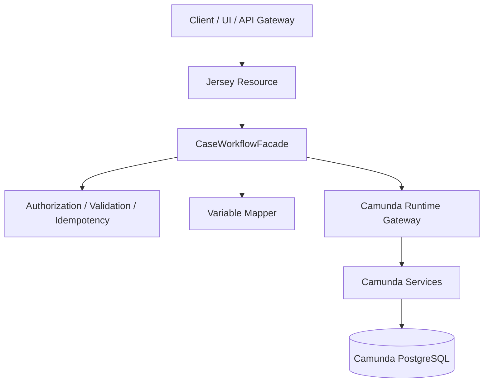

Package praktis:

```text
com.company.caseworkflow
├── api
│   ├── CaseWorkflowResource.java
│   ├── WorkflowAdminResource.java
│   ├── request
│   ├── response
│   └── error
├── workflow
│   ├── CaseWorkflowFacade.java
│   ├── CaseWorkflowQueryService.java
│   ├── CaseVariableMapper.java
│   ├── CamundaWorkflowGateway.java
│   └── WorkflowAuthorizationGuard.java
├── camunda
│   ├── CamundaExceptionMapper.java
│   ├── CamundaServices.java
│   └── CamundaRuntimeGateway.java
└── contract
    ├── ProcessKeys.java
    ├── VariableNames.java
    ├── MessageNames.java
    └── TaskDefinitionKeys.java
```

---

# 4. DTO Contract

## Submit request

```java
package com.company.caseworkflow.api.request;

import jakarta.validation.constraints.NotBlank;
import jakarta.validation.constraints.NotNull;
import jakarta.validation.constraints.Pattern;

public record SubmitCaseRequest(
    @NotBlank
    String caseType,

    @NotBlank
    String submittedBy,

    @NotNull
    @Pattern(regexp = "LOW|MEDIUM|HIGH")
    String priority,

    String initialComment
) {}
```

## Submit response

```java
package com.company.caseworkflow.api.response;

public record SubmitCaseResponse(
    String caseId,
    String businessKey,
    String processInstanceId,
    String status
) {}
```

## Complete task request

```java
package com.company.caseworkflow.api.request;

import jakarta.validation.constraints.NotBlank;
import java.util.Map;

public record CompleteTaskRequest(
    @NotBlank
    String action,

    @NotBlank
    String completedBy,

    String comment,

    Map<String, Object> additionalData
) {}
```

## Workflow status response

```java
package com.company.caseworkflow.api.response;

import java.time.Instant;
import java.util.List;

public record WorkflowStatusResponse(
    String caseId,
    String businessKey,
    String processInstanceId,
    String processDefinitionKey,
    String status,
    boolean active,
    boolean ended,
    boolean suspended,
    List<WorkflowTaskResponse> activeTasks,
    List<WorkflowIncidentResponse> incidents,
    Instant lastUpdatedAt
) {}
```

```java
package com.company.caseworkflow.api.response;

public record WorkflowTaskResponse(
    String taskDefinitionKey,
    String taskName,
    String assignee,
    String createdAt,
    String dueDate
) {}
```

```java
package com.company.caseworkflow.api.response;

public record WorkflowIncidentResponse(
    String incidentId,
    String incidentType,
    String activityId,
    String configuration,
    String message
) {}
```

---

# 5. Jersey Resource - Domain-Oriented API

```java
package com.company.caseworkflow.api;

import com.company.caseworkflow.api.request.CompleteTaskRequest;
import com.company.caseworkflow.api.request.DocumentUploadedRequest;
import com.company.caseworkflow.api.request.SubmitCaseRequest;
import com.company.caseworkflow.workflow.CaseWorkflowFacade;
import jakarta.validation.Valid;
import jakarta.ws.rs.*;
import jakarta.ws.rs.core.MediaType;
import jakarta.ws.rs.core.Response;

@Path("/cases/{caseId}/workflow")
@Consumes(MediaType.APPLICATION_JSON)
@Produces(MediaType.APPLICATION_JSON)
public final class CaseWorkflowResource {

    private final CaseWorkflowFacade facade;

    public CaseWorkflowResource(CaseWorkflowFacade facade) {
        this.facade = facade;
    }

    @POST
    @Path("/submit")
    public Response submit(
            @PathParam("caseId") String caseId,
            @Valid SubmitCaseRequest request
    ) {
        return Response
            .accepted(facade.submitCase(caseId, request))
            .build();
    }

    @GET
    public Response status(@PathParam("caseId") String caseId) {
        return Response.ok(facade.getWorkflowStatus(caseId)).build();
    }

    @GET
    @Path("/tasks")
    public Response activeTasks(@PathParam("caseId") String caseId) {
        return Response.ok(facade.getActiveTasks(caseId)).build();
    }

    @POST
    @Path("/tasks/{taskDefinitionKey}/complete")
    public Response completeTask(
            @PathParam("caseId") String caseId,
            @PathParam("taskDefinitionKey") String taskDefinitionKey,
            @Valid CompleteTaskRequest request
    ) {
        facade.completeTask(caseId, taskDefinitionKey, request);
        return Response.noContent().build();
    }

    @POST
    @Path("/events/document-uploaded")
    public Response documentUploaded(
            @PathParam("caseId") String caseId,
            @Valid DocumentUploadedRequest request
    ) {
        facade.correlateDocumentUploaded(caseId, request);
        return Response.accepted().build();
    }

    @POST
    @Path("/cancel")
    public Response cancel(@PathParam("caseId") String caseId) {
        facade.cancelWorkflow(caseId);
        return Response.accepted().build();
    }
}
```

Catatan endpoint: secara REST murni, `POST /cases/{caseId}/workflow/submit` bisa dianggap action endpoint. Untuk enterprise internal API workflow, ini masih lazim karena command workflow tidak selalu map sempurna ke CRUD resource.

---

# 6. Facade Layer

```java
package com.company.caseworkflow.workflow;

import com.company.caseworkflow.api.request.CompleteTaskRequest;
import com.company.caseworkflow.api.request.DocumentUploadedRequest;
import com.company.caseworkflow.api.request.SubmitCaseRequest;
import com.company.caseworkflow.api.response.SubmitCaseResponse;
import com.company.caseworkflow.api.response.WorkflowStatusResponse;
import com.company.caseworkflow.api.response.WorkflowTaskResponse;
import com.company.caseworkflow.contract.MessageNames;
import com.company.caseworkflow.contract.ProcessKeys;

import java.util.List;
import java.util.Map;

public final class CaseWorkflowFacade {

    private final WorkflowAuthorizationGuard authorizationGuard;
    private final CaseVariableMapper variableMapper;
    private final CamundaWorkflowGateway camunda;

    public CaseWorkflowFacade(
            WorkflowAuthorizationGuard authorizationGuard,
            CaseVariableMapper variableMapper,
            CamundaWorkflowGateway camunda
    ) {
        this.authorizationGuard = authorizationGuard;
        this.variableMapper = variableMapper;
        this.camunda = camunda;
    }

    public SubmitCaseResponse submitCase(String caseId, SubmitCaseRequest request) {
        authorizationGuard.canSubmit(caseId, request.submittedBy());

        String businessKey = BusinessKeys.caseBusinessKey(caseId);

        Map<String, Object> variables =
            variableMapper.toStartVariables(caseId, request);

        StartedWorkflow started = camunda.startIfAbsent(
            ProcessKeys.CASE_ENFORCEMENT,
            businessKey,
            variables
        );

        return new SubmitCaseResponse(
            caseId,
            businessKey,
            started.processInstanceId(),
            started.created() ? "STARTED" : "ALREADY_EXISTS"
        );
    }

    public WorkflowStatusResponse getWorkflowStatus(String caseId) {
        String businessKey = BusinessKeys.caseBusinessKey(caseId);
        return camunda.getStatusByBusinessKey(caseId, businessKey);
    }

    public List<WorkflowTaskResponse> getActiveTasks(String caseId) {
        String businessKey = BusinessKeys.caseBusinessKey(caseId);
        return camunda.getActiveTasks(businessKey);
    }

    public void completeTask(
            String caseId,
            String taskDefinitionKey,
            CompleteTaskRequest request
    ) {
        authorizationGuard.canCompleteTask(caseId, taskDefinitionKey, request.completedBy());

        String businessKey = BusinessKeys.caseBusinessKey(caseId);

        Map<String, Object> variables =
            variableMapper.toTaskCompletionVariables(request);

        camunda.completeActiveTask(
            businessKey,
            taskDefinitionKey,
            variables
        );
    }

    public void correlateDocumentUploaded(
            String caseId,
            DocumentUploadedRequest request
    ) {
        String businessKey = BusinessKeys.caseBusinessKey(caseId);

        Map<String, Object> variables =
            variableMapper.toDocumentUploadedVariables(request);

        camunda.correlateMessage(
            MessageNames.CASE_DOCUMENT_UPLOADED,
            businessKey,
            variables
        );
    }

    public void cancelWorkflow(String caseId) {
        String businessKey = BusinessKeys.caseBusinessKey(caseId);
        camunda.cancelActiveProcessInstance(businessKey, "Cancelled by API command");
    }
}
```

Business key helper:

```java
package com.company.caseworkflow.workflow;

public final class BusinessKeys {

    private BusinessKeys() {}

    public static String caseBusinessKey(String caseId) {
        if (caseId == null || caseId.isBlank()) {
            throw new IllegalArgumentException("caseId is required");
        }
        return "CASE-" + caseId;
    }
}
```

---

# 7. Camunda Gateway Interface

Tujuannya: facade tidak tahu detail `RuntimeService`, `TaskService`, `HistoryService`, atau remote REST implementation.

```java
package com.company.caseworkflow.workflow;

import com.company.caseworkflow.api.response.WorkflowStatusResponse;
import com.company.caseworkflow.api.response.WorkflowTaskResponse;

import java.util.List;
import java.util.Map;

public interface CamundaWorkflowGateway {

    StartedWorkflow startIfAbsent(
        String processDefinitionKey,
        String businessKey,
        Map<String, Object> variables
    );

    WorkflowStatusResponse getStatusByBusinessKey(
        String caseId,
        String businessKey
    );

    List<WorkflowTaskResponse> getActiveTasks(String businessKey);

    void completeActiveTask(
        String businessKey,
        String taskDefinitionKey,
        Map<String, Object> variables
    );

    void correlateMessage(
        String messageName,
        String businessKey,
        Map<String, Object> variables
    );

    void cancelActiveProcessInstance(
        String businessKey,
        String reason
    );
}
```

```java
package com.company.caseworkflow.workflow;

public record StartedWorkflow(
    String processInstanceId,
    String businessKey,
    boolean created
) {}
```

---

# 8. Embedded Engine Implementation

```java
package com.company.caseworkflow.camunda;

import com.company.caseworkflow.api.response.WorkflowStatusResponse;
import com.company.caseworkflow.api.response.WorkflowTaskResponse;
import com.company.caseworkflow.workflow.CamundaWorkflowGateway;
import com.company.caseworkflow.workflow.StartedWorkflow;
import jakarta.ws.rs.NotFoundException;
import jakarta.ws.rs.WebApplicationException;
import jakarta.ws.rs.core.Response;
import org.camunda.bpm.engine.HistoryService;
import org.camunda.bpm.engine.RuntimeService;
import org.camunda.bpm.engine.TaskService;
import org.camunda.bpm.engine.history.HistoricProcessInstance;
import org.camunda.bpm.engine.runtime.ProcessInstance;
import org.camunda.bpm.engine.task.Task;

import java.time.Instant;
import java.util.List;
import java.util.Map;

public final class EmbeddedCamundaWorkflowGateway implements CamundaWorkflowGateway {

    private final RuntimeService runtimeService;
    private final TaskService taskService;
    private final HistoryService historyService;

    public EmbeddedCamundaWorkflowGateway(
            RuntimeService runtimeService,
            TaskService taskService,
            HistoryService historyService
    ) {
        this.runtimeService = runtimeService;
        this.taskService = taskService;
        this.historyService = historyService;
    }

    @Override
    public StartedWorkflow startIfAbsent(
            String processDefinitionKey,
            String businessKey,
            Map<String, Object> variables
    ) {
        ProcessInstance existing = runtimeService
            .createProcessInstanceQuery()
            .processInstanceBusinessKey(businessKey)
            .active()
            .singleResult();

        if (existing != null) {
            return new StartedWorkflow(
                existing.getProcessInstanceId(),
                existing.getBusinessKey(),
                false
            );
        }

        ProcessInstance started = runtimeService.startProcessInstanceByKey(
            processDefinitionKey,
            businessKey,
            variables
        );

        return new StartedWorkflow(
            started.getProcessInstanceId(),
            started.getBusinessKey(),
            true
        );
    }

    @Override
    public WorkflowStatusResponse getStatusByBusinessKey(
            String caseId,
            String businessKey
    ) {
        ProcessInstance active = runtimeService
            .createProcessInstanceQuery()
            .processInstanceBusinessKey(businessKey)
            .singleResult();

        if (active != null) {
            return new WorkflowStatusResponse(
                caseId,
                businessKey,
                active.getProcessInstanceId(),
                active.getProcessDefinitionKey(),
                "ACTIVE",
                true,
                false,
                active.isSuspended(),
                getActiveTasks(businessKey),
                List.of(),
                Instant.now()
            );
        }

        HistoricProcessInstance historic = historyService
            .createHistoricProcessInstanceQuery()
            .processInstanceBusinessKey(businessKey)
            .singleResult();

        if (historic == null) {
            throw new NotFoundException("Workflow not found for businessKey=" + businessKey);
        }

        boolean ended = historic.getEndTime() != null;

        return new WorkflowStatusResponse(
            caseId,
            businessKey,
            historic.getId(),
            historic.getProcessDefinitionKey(),
            ended ? "ENDED" : "UNKNOWN",
            false,
            ended,
            false,
            List.of(),
            List.of(),
            Instant.now()
        );
    }

    @Override
    public List<WorkflowTaskResponse> getActiveTasks(String businessKey) {
        List<Task> tasks = taskService
            .createTaskQuery()
            .processInstanceBusinessKey(businessKey)
            .active()
            .list();

        return tasks.stream()
            .map(task -> new WorkflowTaskResponse(
                task.getTaskDefinitionKey(),
                task.getName(),
                task.getAssignee(),
                task.getCreateTime() == null ? null : task.getCreateTime().toInstant().toString(),
                task.getDueDate() == null ? null : task.getDueDate().toInstant().toString()
            ))
            .toList();
    }

    @Override
    public void completeActiveTask(
            String businessKey,
            String taskDefinitionKey,
            Map<String, Object> variables
    ) {
        Task task = taskService
            .createTaskQuery()
            .processInstanceBusinessKey(businessKey)
            .taskDefinitionKey(taskDefinitionKey)
            .active()
            .singleResult();

        if (task == null) {
            throw new NotFoundException(
                "Active task not found: businessKey=%s, taskDefinitionKey=%s"
                    .formatted(businessKey, taskDefinitionKey)
            );
        }

        taskService.complete(task.getId(), variables);
    }

    @Override
    public void correlateMessage(
            String messageName,
            String businessKey,
            Map<String, Object> variables
    ) {
        runtimeService
            .createMessageCorrelation(messageName)
            .processInstanceBusinessKey(businessKey)
            .setVariables(variables)
            .correlateWithResult();
    }

    @Override
    public void cancelActiveProcessInstance(String businessKey, String reason) {
        ProcessInstance active = runtimeService
            .createProcessInstanceQuery()
            .processInstanceBusinessKey(businessKey)
            .active()
            .singleResult();

        if (active == null) {
            throw new NotFoundException("Active workflow not found for businessKey=" + businessKey);
        }

        runtimeService.deleteProcessInstance(active.getProcessInstanceId(), reason);
    }
}
```

Catatan penting: message event di Camunda adalah named message dengan payload dan, berbeda dari signal, selalu diarahkan ke satu recipient. Pada embedded engine, penerimaan message dari REST/JMS/webhook tetap harus diimplementasikan oleh aplikasi/infrastruktur; setelah diterima, aplikasi memanggil correlation API engine. ([Camunda 7 Documentation](https://docs.camunda.org/manual/7.24/reference/bpmn20/events/message-events/))

---

# 9. Variable Mapper

Jangan passing request body mentah ke Camunda.

```java
package com.company.caseworkflow.workflow;

import com.company.caseworkflow.api.request.CompleteTaskRequest;
import com.company.caseworkflow.api.request.DocumentUploadedRequest;
import com.company.caseworkflow.api.request.SubmitCaseRequest;
import com.company.caseworkflow.contract.VariableNames;

import java.time.Instant;
import java.util.HashMap;
import java.util.Map;

public final class CaseVariableMapper {

    public Map<String, Object> toStartVariables(
            String caseId,
            SubmitCaseRequest request
    ) {
        Map<String, Object> variables = new HashMap<>();

        variables.put(VariableNames.CASE_ID, caseId);
        variables.put(VariableNames.CASE_TYPE, request.caseType());
        variables.put(VariableNames.PRIORITY, request.priority());
        variables.put(VariableNames.SUBMITTED_BY, request.submittedBy());
        variables.put("initialComment", request.initialComment());
        variables.put("submittedAt", Instant.now().toString());

        return variables;
    }

    public Map<String, Object> toTaskCompletionVariables(
            CompleteTaskRequest request
    ) {
        Map<String, Object> variables = new HashMap<>();

        variables.put("taskAction", request.action());
        variables.put("completedBy", request.completedBy());
        variables.put("taskComment", request.comment());
        variables.put("completedAt", Instant.now().toString());

        if (request.additionalData() != null) {
            request.additionalData().forEach((key, value) -> {
                if (isAllowedAdditionalVariable(key)) {
                    variables.put(key, value);
                }
            });
        }

        return variables;
    }

    public Map<String, Object> toDocumentUploadedVariables(
            DocumentUploadedRequest request
    ) {
        return Map.of(
            "documentId", request.documentId(),
            "documentType", request.documentType(),
            "uploadedBy", request.uploadedBy(),
            "documentUploadedAt", Instant.now().toString()
        );
    }

    private boolean isAllowedAdditionalVariable(String key) {
        return key != null && switch (key) {
            case "reviewDecision", "reviewOutcome", "riskOverrideReason" -> true;
            default -> false;
        };
    }
}
```

Rule production:

```text
Request DTO != process variables.
DTO harus divalidasi, dinormalisasi, lalu dimapping ke variable contract yang eksplisit.
```

---

# 10. Message Correlation Pattern

Camunda `RuntimeService.createMessageCorrelation(...)` menyediakan fluent API untuk correlate message ke process instance yang sedang menunggu atau ke process definition yang bisa distart oleh message. Matching existing execution bisa memakai `businessKey` dan correlation keys; variables yang diset saat correlation akan masuk ke process instance yang dikorelasikan. ([Camunda 7 Documentation](https://docs.camunda.org/manual/7.24/reference/bpmn20/events/message-events/))

## Recommended endpoint

```java
@POST
@Path("/cases/{caseId}/events/document-uploaded")
public Response documentUploaded(
        @PathParam("caseId") String caseId,
        @Valid DocumentUploadedRequest request
) {
    facade.correlateDocumentUploaded(caseId, request);
    return Response.accepted().build();
}
```

## Gateway call

```java
runtimeService
    .createMessageCorrelation("case-document-uploaded")
    .processInstanceBusinessKey("CASE-" + caseId)
    .setVariable("documentId", request.documentId())
    .setVariable("documentUploadedAt", Instant.now().toString())
    .correlateWithResult();
```

## Correlation decision table

| Scenario | Recommended correlation |
|---|---|
| Event untuk satu case | `processInstanceBusinessKey("CASE-" + caseId)` |
| Event punya correlation id lain | `.processInstanceVariableEquals("externalRef", ref)` |
| Event harus start process | `correlateStartMessage()` atau `startProcessInstanceByMessage` |
| Event bisa match banyak instance | Hindari, kecuali memang butuh `correlateAll` |
| Event datang sebelum process menunggu | Gunakan inbox/outbox/event buffer, jangan berharap message otomatis tersimpan |

---

# 11. Complete Human Task Pattern

## Jangan expose task ID internal sebagai API utama

Task ID Camunda berguna untuk operator/internal tooling, tapi API bisnis lebih stabil jika memakai:

```text
caseId + taskDefinitionKey + actor/action
```

Contoh:

```text
POST /cases/123/workflow/tasks/task_officer_review/complete
```

Facade mencari active task berdasarkan:

```java
taskService.createTaskQuery()
    .processInstanceBusinessKey("CASE-123")
    .taskDefinitionKey("task_officer_review")
    .active()
    .singleResult();
```

## Validasi sebelum complete

Checklist:

```text
[ ] case exists
[ ] process active
[ ] task active
[ ] actor allowed
[ ] action valid for task
[ ] request idempotency checked
[ ] variables allowed
[ ] complete task
[ ] audit command logged
```

## Idempotent completion option

Problem:

```text
Client calls complete task
Task completes
Client times out
Client retries
Task no longer exists
```

Jangan langsung return 404 kalau retry request yang sama valid. Gunakan command log/idempotency key:

```sql
create table workflow_command_log (
    idempotency_key text primary key,
    business_key text not null,
    command_type text not null,
    command_hash text not null,
    result_status text not null,
    created_at timestamptz not null default now()
);
```

---

# 12. Workflow Status Query

Status endpoint sebaiknya menggabungkan runtime dan history:

```text
RuntimeService  -> active process
TaskService     -> active human tasks
RuntimeService  -> incidents
HistoryService  -> ended process
```

Jangan jadikan status endpoint sebagai reporting berat. Untuk dashboard/reporting besar, gunakan projection table di app schema atau data warehouse.

## Example response

```json
{
  "caseId": "123",
  "businessKey": "CASE-123",
  "processInstanceId": "8d7c...",
  "processDefinitionKey": "case_enforcement_process",
  "status": "ACTIVE",
  "active": true,
  "ended": false,
  "suspended": false,
  "activeTasks": [
    {
      "taskDefinitionKey": "task_officer_review",
      "taskName": "Officer Review",
      "assignee": null,
      "createdAt": "2026-07-16T09:15:30Z",
      "dueDate": "2026-07-18T09:15:30Z"
    }
  ],
  "incidents": [],
  "lastUpdatedAt": "2026-07-16T09:20:00Z"
}
```

---

# 13. Admin Resource untuk Operations

Pisahkan endpoint bisnis dan endpoint operasional.

```java
package com.company.caseworkflow.api;

import com.company.caseworkflow.workflow.WorkflowAdminFacade;
import jakarta.ws.rs.*;
import jakarta.ws.rs.core.MediaType;
import jakarta.ws.rs.core.Response;

@Path("/ops/workflows")
@Consumes(MediaType.APPLICATION_JSON)
@Produces(MediaType.APPLICATION_JSON)
public final class WorkflowAdminResource {

    private final WorkflowAdminFacade facade;

    public WorkflowAdminResource(WorkflowAdminFacade facade) {
        this.facade = facade;
    }

    @GET
    @Path("/incidents")
    public Response incidents(
            @QueryParam("businessKey") String businessKey,
            @QueryParam("activityId") String activityId
    ) {
        return Response.ok(facade.findIncidents(businessKey, activityId)).build();
    }

    @POST
    @Path("/jobs/{jobId}/retry")
    public Response retryJob(
            @PathParam("jobId") String jobId,
            RetryJobRequest request
    ) {
        facade.retryJob(jobId, request.retries());
        return Response.accepted().build();
    }

    @POST
    @Path("/process-instances/{processInstanceId}/suspend")
    public Response suspend(@PathParam("processInstanceId") String processInstanceId) {
        facade.suspend(processInstanceId);
        return Response.accepted().build();
    }
}
```

Camunda error handling docs membedakan business error dan technical error: business error biasanya cocok dimodelkan eksplisit di BPMN, sedangkan technical malfunction sering lebih cocok ditangani generik lewat async failed jobs/retry/operations, agar diagram BPMN tidak penuh jalur error teknis. ([Camunda 7 Documentation](https://docs.camunda.org/manual/7.24/user-guide/process-engine/error-handling/))

---

# 14. Retry Failed Job

Camunda docs menunjukkan failed jobs bisa ditemukan melalui `ManagementService.createJobQuery().withException()` dan retry bisa diset lewat `ManagementService.setJobRetries(...)`. ([Camunda 7 Documentation](https://docs.camunda.org/manual/7.24/user-guide/process-engine/error-handling/))

```java
package com.company.caseworkflow.workflow;

import org.camunda.bpm.engine.ManagementService;
import org.camunda.bpm.engine.management.Job;

import java.util.List;

public final class WorkflowAdminFacade {

    private final ManagementService managementService;

    public WorkflowAdminFacade(ManagementService managementService) {
        this.managementService = managementService;
    }

    public List<FailedJobResponse> failedJobs() {
        return managementService
            .createJobQuery()
            .withException()
            .list()
            .stream()
            .map(job -> new FailedJobResponse(
                job.getId(),
                job.getProcessInstanceId(),
                job.getExecutionId(),
                job.getRetries(),
                job.getExceptionMessage(),
                job.getDueDate() == null ? null : job.getDueDate().toInstant().toString()
            ))
            .toList();
    }

    public void retryJob(String jobId, int retries) {
        if (retries < 1 || retries > 10) {
            throw new IllegalArgumentException("retries must be between 1 and 10");
        }

        Job job = managementService
            .createJobQuery()
            .jobId(jobId)
            .singleResult();

        if (job == null) {
            throw new jakarta.ws.rs.NotFoundException("Job not found: " + jobId);
        }

        managementService.setJobRetries(jobId, retries);
    }
}
```

```java
public record FailedJobResponse(
    String jobId,
    String processInstanceId,
    String executionId,
    int retries,
    String exceptionMessage,
    String dueDate
) {}
```

Rule:

```text
Retry endpoint harus restricted untuk operator/internal role.
Jangan expose ke public client.
```

---

# 15. Error Mapping ke HTTP Response

Camunda REST API sendiri mengembalikan error JSON dengan `type`, `message`, dan `code`; dokumentasi juga menyatakan error tak terdokumentasi seperti problem database biasanya diterjemahkan ke HTTP 500. Untuk aplikasi facade, jangan mentah-mentah forward message internal Camunda ke client publik. ([Camunda 7 Documentation](https://docs.camunda.org/manual/7.24/reference/rest/overview/))

## Standard API error body

```java
package com.company.caseworkflow.api.error;

import java.time.Instant;
import java.util.Map;

public record ApiErrorResponse(
    String errorCode,
    String message,
    String correlationId,
    Instant timestamp,
    Map<String, Object> details
) {}
```

## Exception mapper

```java
package com.company.caseworkflow.api.error;

import jakarta.ws.rs.NotFoundException;
import jakarta.ws.rs.WebApplicationException;
import jakarta.ws.rs.core.Response;
import jakarta.ws.rs.ext.ExceptionMapper;
import jakarta.ws.rs.ext.Provider;
import org.camunda.bpm.engine.BadUserRequestException;
import org.camunda.bpm.engine.MismatchingMessageCorrelationException;
import org.camunda.bpm.engine.OptimisticLockingException;
import org.camunda.bpm.engine.ProcessEngineException;

import java.time.Instant;
import java.util.Map;
import java.util.UUID;

@Provider
public final class WorkflowExceptionMapper implements ExceptionMapper<Throwable> {

    @Override
    public Response toResponse(Throwable ex) {
        String correlationId = UUID.randomUUID().toString();

        if (ex instanceof NotFoundException) {
            return error(
                Response.Status.NOT_FOUND,
                "WORKFLOW_NOT_FOUND",
                "Workflow resource was not found.",
                correlationId,
                null
            );
        }

        if (ex instanceof MismatchingMessageCorrelationException) {
            return error(
                Response.Status.CONFLICT,
                "MESSAGE_NOT_CORRELATED",
                "The workflow is not waiting for this event or the correlation key is invalid.",
                correlationId,
                null
            );
        }

        if (ex instanceof OptimisticLockingException) {
            return error(
                Response.Status.CONFLICT,
                "WORKFLOW_CONCURRENT_UPDATE",
                "Workflow was modified concurrently. Retry the command.",
                correlationId,
                null
            );
        }

        if (ex instanceof BadUserRequestException) {
            return error(
                Response.Status.BAD_REQUEST,
                "INVALID_WORKFLOW_COMMAND",
                "The workflow command is invalid for the current process state.",
                correlationId,
                null
            );
        }

        if (ex instanceof ProcessEngineException pe) {
            return error(
                Response.Status.INTERNAL_SERVER_ERROR,
                "WORKFLOW_ENGINE_ERROR",
                "Workflow engine failed to process the command.",
                correlationId,
                Map.of("camundaCode", pe.getCode())
            );
        }

        if (ex instanceof IllegalArgumentException) {
            return error(
                Response.Status.BAD_REQUEST,
                "INVALID_REQUEST",
                ex.getMessage(),
                correlationId,
                null
            );
        }

        return error(
            Response.Status.INTERNAL_SERVER_ERROR,
            "INTERNAL_ERROR",
            "Unexpected server error.",
            correlationId,
            null
        );
    }

    private Response error(
            Response.Status status,
            String errorCode,
            String message,
            String correlationId,
            Map<String, Object> details
    ) {
        ApiErrorResponse body = new ApiErrorResponse(
            errorCode,
            message,
            correlationId,
            Instant.now(),
            details == null ? Map.of() : details
        );

        return Response.status(status).entity(body).build();
    }
}
```

## Mapping table

| Camunda/Application condition | HTTP | API error code |
|---|---:|---|
| No workflow found | 404 | `WORKFLOW_NOT_FOUND` |
| Task not active | 404/409 | `TASK_NOT_ACTIVE` |
| Message cannot correlate | 409 | `MESSAGE_NOT_CORRELATED` |
| Optimistic locking | 409 | `WORKFLOW_CONCURRENT_UPDATE` |
| Invalid variable/request | 400 | `INVALID_WORKFLOW_COMMAND` |
| Unauthorized actor | 403 | `WORKFLOW_FORBIDDEN` |
| Engine/database failure | 500 | `WORKFLOW_ENGINE_ERROR` |
| Retryable infrastructure timeout | 503 | `WORKFLOW_TEMPORARILY_UNAVAILABLE` |

---

# 16. Remote Camunda REST Adapter Pattern

Kalau engine tidak embedded, resource/facade tetap sama. Yang berubah hanya implementation `CamundaWorkflowGateway`.

Camunda REST API bertujuan menyediakan akses ke interface engine yang relevan, dan endpoint untuk named engine bisa memakai prefix `/engine/{name}` seperti `/engine/myEngineName/task`. ([Camunda 7 Documentation](https://docs.camunda.org/manual/7.24/reference/rest/overview/))

## Adapter skeleton dengan Jersey Client

```java
package com.company.caseworkflow.camunda.remote;

import com.company.caseworkflow.workflow.CamundaWorkflowGateway;
import com.company.caseworkflow.workflow.StartedWorkflow;
import jakarta.ws.rs.client.Client;
import jakarta.ws.rs.client.Entity;
import jakarta.ws.rs.core.MediaType;

import java.util.Map;

public final class RemoteCamundaWorkflowGateway implements CamundaWorkflowGateway {

    private final Client client;
    private final String baseUrl;

    public RemoteCamundaWorkflowGateway(Client client, String baseUrl) {
        this.client = client;
        this.baseUrl = baseUrl;
    }

    @Override
    public StartedWorkflow startIfAbsent(
            String processDefinitionKey,
            String businessKey,
            Map<String, Object> variables
    ) {
        CamundaStartRequest body = CamundaStartRequest.from(businessKey, variables);

        CamundaStartResponse response = client
            .target(baseUrl)
            .path("/process-definition/key/" + processDefinitionKey + "/start")
            .request(MediaType.APPLICATION_JSON_TYPE)
            .post(Entity.json(body), CamundaStartResponse.class);

        return new StartedWorkflow(
            response.id(),
            response.businessKey(),
            true
        );
    }

    // Other methods omitted: implement status, tasks, complete, correlate, cancel.
}
```

Variable format untuk REST perlu mengikuti format Camunda REST variable object, bukan `Map<String,Object>` mentah.

```java
public record CamundaVariableValue(
    Object value,
    String type
) {}
```

```java
public record CamundaStartRequest(
    String businessKey,
    Map<String, CamundaVariableValue> variables
) {
    public static CamundaStartRequest from(
            String businessKey,
            Map<String, Object> plainVariables
    ) {
        return new CamundaStartRequest(
            businessKey,
            CamundaRestVariables.fromPlainMap(plainVariables)
        );
    }
}
```

---

# 17. Security Boundary

Camunda REST API ships with HTTP Basic Authentication support, but Camunda documents that it is off by default in the REST API webapp/pre-built distributions unless activated via servlet filter. ([Camunda 7 Documentation](https://docs.camunda.org/manual/7.24/reference/rest/overview/))

Practical security baseline:

| Layer | Rule |
|---|---|
| Public client | Never call Camunda REST directly |
| API Gateway | AuthN/AuthZ, rate limit, tenant guard |
| Jersey facade | Domain authorization and DTO validation |
| Camunda REST | Internal network only |
| Engine DB | Not accessible by app clients |
| Ops endpoints | Separate admin role, audit every command |
| Variables | No secrets, no arbitrary user payload |
| Task completion | Validate actor can complete task |

---

# 18. Authorization Guard Example

```java
package com.company.caseworkflow.workflow;

import jakarta.ws.rs.ForbiddenException;

public final class WorkflowAuthorizationGuard {

    public void canSubmit(String caseId, String actor) {
        if (actor == null || actor.isBlank()) {
            throw new ForbiddenException("Actor is required");
        }

        // Replace with RBAC/ABAC lookup.
    }

    public void canCompleteTask(
            String caseId,
            String taskDefinitionKey,
            String actor
    ) {
        if (actor == null || actor.isBlank()) {
            throw new ForbiddenException("Actor is required");
        }

        if ("task_supervisor_review".equals(taskDefinitionKey)
                && !hasRole(actor, "case-supervisor")) {
            throw new ForbiddenException("Supervisor role required");
        }
    }

    private boolean hasRole(String actor, String role) {
        // Plug into company IAM / directory / auth context.
        return true;
    }
}
```

---

# 19. Observability Logging Pattern

Setiap command workflow perlu log berbasis business key.

```java
log.info(
    "workflow.command submitCase caseId={} businessKey={} actor={} processKey={}",
    caseId,
    businessKey,
    request.submittedBy(),
    ProcessKeys.CASE_ENFORCEMENT
);
```

Log minimal:

| Field | Contoh |
|---|---|
| `caseId` | `123` |
| `businessKey` | `CASE-123` |
| `command` | `submitCase` |
| `actor` | `user-991` |
| `processDefinitionKey` | `case_enforcement_process` |
| `taskDefinitionKey` | `task_officer_review` |
| `messageName` | `case-document-uploaded` |
| `correlationId` | request correlation id |
| `result` | `STARTED`, `COMPLETED`, `CONFLICT`, `FAILED` |

---

# 20. API Design Anti-patterns

| Anti-pattern | Dampak |
|---|---|
| Client mengirim process key | Client coupling ke BPMN |
| Client mengirim arbitrary variables | Security/data-quality risk |
| UI menyimpan Camunda task ID sebagai domain state utama | Task ID bisa berubah/berakhir |
| Semua Camunda exception dikirim ke client | Leak internal engine/state |
| Status endpoint query history besar | Performance buruk |
| Retry endpoint public | Bisa abuse process execution |
| Cancel process tanpa reason/audit | Sulit forensik |
| Message correlation tanpa business key | Bisa tidak match atau match salah |
| Endpoint `GET /tasks` tanpa pagination/filter | Overload task query |
| Auth hanya di gateway, tidak di facade | Internal abuse risk |
| Command tidak idempotent | Duplicate process/task completion risk |

---

# 21. Practical Checklist

```text
[ ] API endpoint domain-oriented, bukan Camunda-oriented
[ ] Semua request DTO divalidasi
[ ] Variable mapper whitelist variable yang boleh masuk process
[ ] Business key wajib
[ ] Start process idempotent
[ ] Task complete memakai businessKey + taskDefinitionKey
[ ] Message correlation memakai businessKey/correlation key stabil
[ ] Camunda exception dimapping ke HTTP error aman
[ ] Admin/ops endpoints dipisah dari business endpoints
[ ] Retry/cancel/suspend diaudit
[ ] Tidak expose Camunda REST langsung ke frontend/public network
[ ] Status endpoint tidak menjadi reporting endpoint berat
[ ] Logs selalu punya businessKey dan correlationId
```

---

# 22. Ringkasan Praktis

REST facade yang sehat bukan hanya wrapper tipis di atas Camunda API. Ia adalah **domain command boundary**:

```text
Jersey Resource
  -> validate request
  -> authorize actor
  -> enforce idempotency
  -> map DTO to variables
  -> call Camunda gateway
  -> map result/error to stable API response
```

Pattern paling aman:

```text
Client tidak tahu processInstanceId/taskId kecuali untuk observability.
Client beroperasi pakai caseId, taskDefinitionKey, action, dan event name domain.
Camunda detail tetap berada di adapter/facade.
```

---

# Status Seri

**Seri 5/18 selesai.**

Rekomendasi materi selanjutnya: **Seri 6/18 - Process Variables, DTO Mapping, Serialization, and Validation**, fokus ke variable contract, typed values, JSON variables, whitelist variable, validation boundary, payload-size control, serialization security, dan mapping DTO ↔ Camunda variables untuk Jersey + MyBatis production service.

---

**Sources:**

- [Process Engine API | docs.camunda.org](https://docs.camunda.org/manual/7.24/user-guide/process-engine/process-engine-api/)

## Response:
7/16/2026, 9:49:54 AM

Lanjut ke **Seri 6/18**. Fokusnya variable contract: bagaimana data dari REST DTO masuk ke Camunda secara aman, tidak bocor, tidak besar, mudah divalidasi, dan tetap kompatibel saat BPMN/service berubah.

# Seri 6/18 - Process Variables, DTO Mapping, Serialization, and Validation  
## Camunda 7 + Jersey Microservice

## Tujuan seri ini

Seri ini fokus ke **variable contract**: bagaimana data dari REST DTO, worker, user task, message event, dan domain database masuk/keluar Camunda secara aman.

Dalam Camunda 7, process variable adalah data yang ditempelkan ke runtime state atau variable scope; variable punya **name** dan **value**, dan nama variable dipakai untuk mengakses data lintas elemen proses. Variable bisa berada di scope berbeda, misalnya process instance, execution, atau task. ([Camunda 7 Documentation](https://docs.camunda.org/manual/7.24/user-guide/process-engine/variables/))

Target praktis:

```text
REST DTO
  -> validate
  -> normalize
  -> whitelist
  -> map to process variables
  -> set into Camunda
  -> query/update safely
  -> serialize safely
  -> avoid DB/history bloat
```

---

# 1. Mental Model

Jangan anggap process variables sebagai “tempat taruh semua payload”.

Anggap process variables sebagai **workflow state contract**:

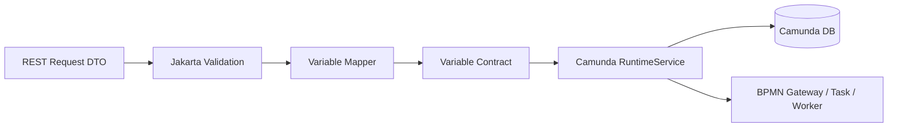

Rule utama:

```text
DTO != process variable
domain entity != process variable
process variable = minimal state yang diperlukan BPMN/worker/task
```

---

# 2. Variable Type di Camunda 7

Camunda 7 mendukung primitive variable seperti `boolean`, `bytes`, `short`, `integer`, `long`, `double`, `date`, `string`, dan `null`; primitive variable juga bisa dipakai sebagai filtering condition pada process instance query. Camunda juga punya `file` value dan `object` value; object value diserialisasi saat dipersist, dan serialization procedure-nya configurable. ([Camunda 7 Documentation](https://docs.camunda.org/manual/7.24/user-guide/process-engine/variables/))

| Type | Cocok untuk | Catatan praktis |
|---|---|---|
| `String` | ID, status, code, decision | Jaga panjang; jangan simpan JSON besar sebagai string |
| `Boolean` | flag kecil | Cocok untuk gateway sederhana |
| `Integer/Long/Double` | score, amount, counter | Cocok untuk query/filter |
| `Date` | due date, SLA, timestamp | Hindari timezone ambiguity |
| `Bytes` | jarang | Hindari untuk payload besar |
| `File` | file variable | Lebih baik simpan file di object storage/document service, Camunda simpan reference |
| `Object` | custom object | Hindari Java object serialized untuk contract antar service |
| `Json/Xml Spin` | structured document | Pakai hati-hati, kecil, schema jelas |
| transient | runtime temporary value | Hilang saat wait state |

---

# 3. String Length Warning

Camunda menyimpan `string` variable di kolom database bertipe `(n)varchar` dengan limit 4000 karakter, atau 2000 untuk Oracle. Camunda tidak memvalidasi panjang string sebelum dikirim ke database; jika melewati batas, exception terjadi di level database. ([Camunda 7 Documentation](https://docs.camunda.org/manual/7.24/user-guide/process-engine/variables/))

Implikasi production:

| Kasus | Risiko |
|---|---|
| Simpan JSON besar sebagai `String` | DB exception |
| Simpan komentar user tanpa limit | Incident/failed job |
| Simpan error stack trace sebagai variable | History bloat |
| Simpan payload API external | ACT_HI/ACT_RU membengkak |

Praktik aman:

```java id="jx0by2"
public final class VariableSizeGuard {

    private static final int CAMUNDA_STRING_SAFE_LIMIT = 3500;

    private VariableSizeGuard() {}

    public static String safeString(String name, String value) {
        if (value == null) {
            return null;
        }

        if (value.length() > CAMUNDA_STRING_SAFE_LIMIT) {
            throw new IllegalArgumentException(
                "Variable '%s' exceeds safe Camunda string limit: %d"
                    .formatted(name, value.length())
            );
        }

        return value;
    }
}
```

---

# 4. Recommended Variable Contract

Untuk regulatory/case workflow:

| Variable | Type | Source | Consumer | Queryable? | Persist? |
|---|---|---|---|---:|---:|
| `caseId` | String | REST start | all workers/tasks | yes | yes |
| `businessKey` | String | facade | logs/status | yes | maybe redundant |
| `caseType` | String | REST start | routing/worker | yes | yes |
| `priority` | String | REST start | SLA/task assignment | yes | yes |
| `submittedBy` | String | REST start | audit/task | yes | yes |
| `submittedAt` | Date/String | facade | audit | maybe | yes |
| `riskScore` | Integer/Double | worker/DMN | gateway/task | yes | yes |
| `riskLevel` | String | worker/DMN | gateway | yes | yes |
| `reviewDueDate` | Date/String | policy worker | user task | maybe | yes |
| `reviewDecision` | String | task complete | gateway | yes | yes |
| `reviewComment` | String | task complete | audit/display | no | yes, limited |
| `documentId` | String | message event | document worker | yes | yes |
| `documentMetadata` | JSON/Object | document service | worker | no | only if small |
| `externalCorrelationId` | String | integration | message correlation | yes | yes |
| `lastErrorCode` | String | worker | ops | maybe | yes |
| `largePayloadRef` | String | app/document store | worker | yes | yes |
| `accessToken` | String | API | external call | no | **no** |
| `rawRequestBody` | String/JSON | REST | none | no | **no** |

---

# 5. Variable Naming Convention

```java id="y697cu"
public final class VariableNames {
    private VariableNames() {}

    public static final String CASE_ID = "caseId";
    public static final String CASE_TYPE = "caseType";
    public static final String PRIORITY = "priority";
    public static final String SUBMITTED_BY = "submittedBy";
    public static final String SUBMITTED_AT = "submittedAt";

    public static final String RISK_SCORE = "riskScore";
    public static final String RISK_LEVEL = "riskLevel";

    public static final String REVIEW_DUE_DATE = "reviewDueDate";
    public static final String REVIEW_DECISION = "reviewDecision";
    public static final String REVIEW_COMMENT = "reviewComment";
    public static final String REVIEWED_BY = "reviewedBy";
    public static final String REVIEWED_AT = "reviewedAt";

    public static final String DOCUMENT_ID = "documentId";
    public static final String DOCUMENT_TYPE = "documentType";
    public static final String DOCUMENT_UPLOADED_AT = "documentUploadedAt";

    public static final String LARGE_PAYLOAD_REF = "largePayloadRef";
}
```

Rule:

| Rule | Alasan |
|---|---|
| lowerCamelCase | konsisten dengan Java DTO/JSON |
| jangan rename variable sembarang | BPMN gateway, worker, history query bisa break |
| gunakan constants | menghindari typo |
| bedakan variable bisnis vs teknis | operasional lebih mudah |
| hindari prefix random | `case.caseId` sering menyulitkan expression |

---

# 6. DTO Validation Boundary

Validasi pertama ada di REST DTO.

```java id="orw2zt"
package com.company.caseworkflow.api.request;

import jakarta.validation.constraints.NotBlank;
import jakarta.validation.constraints.Pattern;
import jakarta.validation.constraints.Size;

public record SubmitCaseRequest(

    @NotBlank
    @Pattern(regexp = "ENFORCEMENT|COMPLAINT|INSPECTION")
    String caseType,

    @NotBlank
    @Size(max = 100)
    String submittedBy,

    @NotBlank
    @Pattern(regexp = "LOW|MEDIUM|HIGH")
    String priority,

    @Size(max = 1000)
    String initialComment
) {}
```

Task completion DTO:

```java id="tk3vxk"
package com.company.caseworkflow.api.request;

import jakarta.validation.constraints.NotBlank;
import jakarta.validation.constraints.Pattern;
import jakarta.validation.constraints.Size;

public record CompleteReviewRequest(

    @NotBlank
    @Pattern(regexp = "APPROVE|REJECT|REQUEST_INFO")
    String decision,

    @NotBlank
    @Size(max = 100)
    String reviewedBy,

    @Size(max = 2000)
    String comment
) {}
```

Event DTO:

```java id="p61ksi"
package com.company.caseworkflow.api.request;

import jakarta.validation.constraints.NotBlank;
import jakarta.validation.constraints.Size;

public record DocumentUploadedRequest(

    @NotBlank
    @Size(max = 100)
    String documentId,

    @NotBlank
    @Size(max = 50)
    String documentType,

    @NotBlank
    @Size(max = 100)
    String uploadedBy
) {}
```

---

# 7. Variable Mapper Pattern

REST body tidak boleh langsung jadi Camunda variable map.

```java id="c7ns0e"
package com.company.caseworkflow.workflow;

import com.company.caseworkflow.api.request.SubmitCaseRequest;
import com.company.caseworkflow.contract.VariableNames;

import java.time.Clock;
import java.time.Instant;
import java.util.HashMap;
import java.util.Map;

public final class CaseStartVariableMapper {

    private final Clock clock;

    public CaseStartVariableMapper(Clock clock) {
        this.clock = clock;
    }

    public Map<String, Object> toVariables(String caseId, SubmitCaseRequest request) {
        Map<String, Object> variables = new HashMap<>();

        variables.put(VariableNames.CASE_ID, requireSafeString("caseId", caseId, 100));
        variables.put(VariableNames.CASE_TYPE, request.caseType());
        variables.put(VariableNames.PRIORITY, request.priority());
        variables.put(VariableNames.SUBMITTED_BY, request.submittedBy());
        variables.put(VariableNames.SUBMITTED_AT, Instant.now(clock).toString());

        if (request.initialComment() != null && !request.initialComment().isBlank()) {
            variables.put(
                "initialComment",
                requireSafeString("initialComment", request.initialComment(), 1000)
            );
        }

        return Map.copyOf(variables);
    }

    private String requireSafeString(String name, String value, int maxLength) {
        if (value == null || value.isBlank()) {
            throw new IllegalArgumentException(name + " is required");
        }

        if (value.length() > maxLength) {
            throw new IllegalArgumentException(name + " exceeds max length " + maxLength);
        }

        return value;
    }
}
```

Anti-pattern:

```java id="9s0nel"
// Jangan begini.
runtimeService.startProcessInstanceByKey(
    PROCESS_KEY,
    businessKey,
    objectMapper.convertValue(request, Map.class)
);
```

Masalahnya: semua field request, termasuk field internal/masa depan, bisa bocor ke Camunda variable dan tersimpan di runtime/history DB.

---

# 8. Typed Value API

Camunda menyediakan **Typed Value API** melalui class `org.camunda.bpm.engine.variable.Variables`; API ini berguna saat perlu metadata seperti serialization format, serialized representation, atau flag transient. ([Camunda 7 Documentation](https://docs.camunda.org/manual/7.24/user-guide/process-engine/variables/))

## Primitive typed variables

```java id="8ui2wu"
import org.camunda.bpm.engine.variable.VariableMap;

import static org.camunda.bpm.engine.variable.Variables.createVariables;
import static org.camunda.bpm.engine.variable.Variables.integerValue;
import static org.camunda.bpm.engine.variable.Variables.stringValue;

public final class TypedVariableMapper {

    public VariableMap riskVariables(RiskResult risk) {
        return createVariables()
            .putValueTyped("riskScore", integerValue(risk.score()))
            .putValueTyped("riskLevel", stringValue(risk.level()));
    }
}
```

## Kapan pakai plain `Map<String,Object>`?

| Situasi | Plain map cukup? |
|---|---:|
| Start process dengan primitive variables | yes |
| Complete user task dengan simple variables | yes |
| Correlate message dengan ID/status/date kecil | yes |
| Perlu JSON serialized object | pakai typed value |
| Perlu transient variable | pakai typed value |
| Perlu file variable | pakai typed value |
| Perlu disable deserialization | pakai typed value retrieval |

Camunda menyatakan Java Object API dan Typed Value API bisa dikombinasikan; gunakan Java-object-based API kalau class value pasti tersedia, dan gunakan Typed Value API kalau perlu metadata serialization atau transient variable. ([Camunda 7 Documentation](https://docs.camunda.org/manual/7.24/user-guide/process-engine/variables/))

---

# 9. Object Variable: Hindari Java Serialization

Camunda object value bisa diserialisasi, dan typed API memungkinkan menentukan serialization format. Namun Java serialization format **forbidden by default** saat memakai serialized representation; Camunda menyarankan format lain seperti JSON/XML atau explicitly enabling Java serialization dengan memperhatikan implikasi keamanan. ([Camunda 7 Documentation](https://docs.camunda.org/manual/7.24/user-guide/process-engine/variables/))

Rule production:

```text
Jangan pakai Java native serialization untuk process variable contract.
Prefer primitive variable atau JSON text-based serialized value.
```

## Bad

```java id="pgq9a4"
runtimeService.setVariable(
    executionId,
    "casePayload",
    new CasePayload(...)
);
```

Risiko:

| Risiko | Dampak |
|---|---|
| Java class berubah | deserialization error |
| Worker/service beda versi | runtime error |
| Non-Java client tidak bisa baca | REST integration buruk |
| Security risk | Java deserialization attack surface |
| Migration Camunda 8 sulit | contract terlalu JVM-specific |

## Better: primitive + payload reference

```java id="mvw0v3"
variables.put("caseId", caseId);
variables.put("caseType", request.caseType());
variables.put("documentBundleId", documentBundleId);
variables.put("largePayloadRef", "s3://bucket/path/or/document-service-id");
```

---

# 10. JSON Variable dengan Spin

Camunda Spin menyediakan abstraction untuk JSON/XML document processing; untuk JSON, entry point `Spin.JSON` atau `Spin.S` bisa digunakan, dan Spin wrapper mendukung manipulating, writing, serta mapping JSON ke Java. ([Camunda 7 Documentation](https://docs.camunda.org/manual/7.24/user-guide/data-formats/json/))

## Maven dependency

```xml id="ed04qh"
<dependency>
    <groupId>org.camunda.bpm</groupId>
    <artifactId>camunda-engine-plugin-spin</artifactId>
</dependency>

<dependency>
    <groupId>org.camunda.spin</groupId>
    <artifactId>camunda-spin-dataformat-json-jackson</artifactId>
</dependency>
```

## Store JSON as typed object serialized to JSON

```java id="t3k95i"
import com.fasterxml.jackson.databind.ObjectMapper;
import org.camunda.bpm.engine.variable.value.ObjectValue;

import static org.camunda.bpm.engine.variable.Variables.SerializationDataFormats.JSON;
import static org.camunda.bpm.engine.variable.Variables.serializedObjectValue;

public final class JsonVariableFactory {

    private final ObjectMapper objectMapper;

    public JsonVariableFactory(ObjectMapper objectMapper) {
        this.objectMapper = objectMapper;
    }

    public ObjectValue jsonObject(String typeName, Object value) {
        try {
            String json = objectMapper.writeValueAsString(value);

            if (json.length() > 3500) {
                throw new IllegalArgumentException(
                    "JSON variable too large for workflow state. Store reference instead."
                );
            }

            return serializedObjectValue(json)
                .serializationDataFormat(JSON)
                .objectTypeName(typeName)
                .create();

        } catch (Exception ex) {
            throw new IllegalArgumentException("Failed to serialize JSON variable", ex);
        }
    }
}
```

REST API juga merepresentasikan variables sebagai JSON object dengan `type`, `value`, dan `valueInfo`; untuk Object variable, dokumentasi REST menyarankan bekerja dengan serialized value, terutama jika client bukan aplikasi Java, dan JSON/XML adalah format text-based yang cocok. ([Camunda 7 Documentation](https://docs.camunda.org/manual/7.24/reference/rest/overview/variables/))

---

# 11. REST Variable Format

Kalau memakai remote Camunda REST API, jangan kirim plain map seperti:

```json id="x3znbm"
{
  "caseId": "123"
}
```

Camunda REST variable format:

```json id="53i9uu"
{
  "variables": {
    "caseId": {
      "type": "String",
      "value": "123",
      "valueInfo": {}
    },
    "riskScore": {
      "type": "Integer",
      "value": 87,
      "valueInfo": {}
    }
  }
}
```

Dalam REST API, type name dimulai dengan huruf kapital, misalnya `String`, bukan `string`. ([Camunda 7 Documentation](https://docs.camunda.org/manual/7.24/reference/rest/overview/variables/))

## Java mapper untuk remote REST

```java id="6dkl5z"
public record CamundaRestVariable(
    String type,
    Object value,
    Map<String, Object> valueInfo
) {
    public static CamundaRestVariable string(String value) {
        return new CamundaRestVariable("String", value, Map.of());
    }

    public static CamundaRestVariable integer(Integer value) {
        return new CamundaRestVariable("Integer", value, Map.of());
    }

    public static CamundaRestVariable bool(Boolean value) {
        return new CamundaRestVariable("Boolean", value, Map.of());
    }

    public static CamundaRestVariable date(String isoDateTime) {
        return new CamundaRestVariable("Date", isoDateTime, Map.of());
    }

    public static CamundaRestVariable jsonObject(
            String serializedJson,
            String objectTypeName
    ) {
        return new CamundaRestVariable(
            "Object",
            serializedJson,
            Map.of(
                "objectTypeName", objectTypeName,
                "serializationDataFormat", "application/json"
            )
        );
    }
}
```

```java id="c18qeu"
public record StartProcessRestRequest(
    String businessKey,
    Map<String, CamundaRestVariable> variables
) {}
```

---

# 12. `deserializeValues=false`

Saat mengambil object variable melalui REST atau Java API, jangan selalu minta deserialization.

Camunda docs menyatakan untuk REST API, serialized form bisa diambil dengan `deserializeValues=false`. Pada Java typed API, `getVariableTyped(..., false)` membuat engine tidak mencoba deserialization; akses tetap bisa dilakukan melalui `getValueSerialized()` dan `getObjectTypeName()`. ([Camunda 7 Documentation](https://docs.camunda.org/manual/7.24/reference/rest/overview/variables/))

## Remote REST query

```text id="p9xbqv"
GET /process-instance/{id}/variables?deserializeValues=false
```

## Java API

```java id="3l2n1k"
ObjectValue value = runtimeService.getVariableTyped(
    executionId,
    "documentMetadata",
    false
);

String json = value.getValueSerialized();
String objectTypeName = value.getObjectTypeName();
```

Practical rule:

```text
For status/query endpoints, avoid deserializing object variables.
Return selected primitive fields or serialized JSON only if explicitly needed.
```

---

# 13. Transient Variables

Transient variables hanya bisa dibuat melalui Typed Value API, tidak disimpan ke database, dan hanya hidup selama transaksi saat ini. Camunda memperingatkan bahwa setiap wait state-misalnya external service unavailable, user task, message/signal/condition wait-akan menyebabkan transient variable hilang. ([Camunda 7 Documentation](https://docs.camunda.org/manual/7.24/user-guide/process-engine/variables/))

## Contoh

```java id="c9jbwn"
import static org.camunda.bpm.engine.variable.Variables.stringValue;

runtimeService.startProcessInstanceByKey(
    "case_enforcement_process",
    "CASE-123",
    Variables.createVariables()
        .putValue("caseId", "123")
        .putValueTyped("requestAuthToken", stringValue("token-value", true))
);
```

Use case transient:

| Use case | Cocok? |
|---|---:|
| temporary auth token untuk delegate synchronous | yes, hati-hati |
| sensitive value yang tidak boleh persisted | maybe |
| variable untuk gateway setelah user task | no |
| variable untuk external task worker | no, karena external task adalah wait state |
| data yang harus audit | no |

Default recommendation:

```text
Di microservice workflow, hindari transient variable kecuali benar-benar paham transaction boundary.
```

---

# 14. Scope: Global vs Local Variables

Camunda variable scope mengikuti tree execution/task; variable parent bisa dibaca child, tetapi child variable tidak otomatis terlihat parent, dan local variable ditempelkan pada scope tertentu. ([Camunda 7 Documentation](https://docs.camunda.org/manual/7.24/user-guide/process-engine/variables/))

## Global process variable

```java id="06g2sw"
runtimeService.setVariable(processInstanceId, "riskLevel", "HIGH");
```

## Local execution variable

```java id="dt8xxz"
runtimeService.setVariableLocal(executionId, "temporaryRoute", "SUPERVISOR");
```

Rule:

| Data | Scope |
|---|---|
| `caseId`, `riskLevel`, `reviewDecision` | process/global |
| task form temporary input | task local until complete |
| subprocess-specific scratch data | local |
| worker internal response raw | local/transient/reference |
| correlation keys | global |

Anti-pattern:

```text
Semua variable diset global.
```

Dampaknya: name collision, gateway tak sengaja membaca variable lama, history membengkak, dan debugging sulit.

---

# 15. Input/Output Mapping di BPMN

Camunda mendukung input/output mapping dengan extension element `camunda:inputOutput`; `inputParameter` membuat local variable di activity, sedangkan `outputParameter` menulis ke luar activity. ([Camunda 7 Documentation](https://docs.camunda.org/manual/7.24/user-guide/process-engine/variables/))

## Contoh BPMN

```xml id="qbaxwu"
<bpmn:serviceTask
    id="task_calculate_risk"
    name="Calculate Risk"
    camunda:type="external"
    camunda:topic="calculate-risk">

  <bpmn:extensionElements>
    <camunda:inputOutput>
      <camunda:inputParameter name="caseId">${caseId}</camunda:inputParameter>
      <camunda:inputParameter name="caseType">${caseType}</camunda:inputParameter>
      <camunda:outputParameter name="riskLevel">${riskLevel}</camunda:outputParameter>
    </camunda:inputOutput>
  </bpmn:extensionElements>
</bpmn:serviceTask>
```

Use carefully:

| Benefit | Risiko |
|---|---|
| memperjelas contract activity | expression tersembunyi di XML |
| mengurangi variable leakage | mapping bisa sulit dibaca |
| localize worker input | salah output bisa overwrite |
| cocok untuk subprocess/call activity | perlu test BPMN path |

---

# 16. Validation Layering

```mermaid id="319dzy"
flowchart TB
    A[HTTP JSON Body] --> B[Jersey JSON binding]
    B --> C[Jakarta Bean Validation]
    C --> D[Business Validation]
    D --> E[Variable Mapper]
    E --> F[Variable Contract Guard]
    F --> G[Camunda RuntimeService]
    G --> H[BPMN Gateway / Worker / Task]
```

| Layer | Validasi |
|---|---|
| DTO | required, regex, size |
| Business validation | actor, state, permission, business rule |
| Mapper | whitelist field, normalize enum/date |
| Variable guard | size, type, forbidden names |
| BPMN test | gateway expression has needed variables |
| Worker test | worker handles missing/invalid variables |
| DB/history monitoring | detects variable bloat |

---

# 17. Variable Contract Guard

```java id="4rulpp"
package com.company.caseworkflow.workflow;

import java.util.Map;
import java.util.Set;

public final class VariableContractGuard {

    private static final int MAX_STRING_LENGTH = 3500;

    private static final Set<String> ALLOWED_START_VARIABLES = Set.of(
        "caseId",
        "caseType",
        "priority",
        "submittedBy",
        "submittedAt",
        "initialComment"
    );

    private static final Set<String> FORBIDDEN_VARIABLES = Set.of(
        "password",
        "accessToken",
        "refreshToken",
        "authorization",
        "secret",
        "rawRequestBody"
    );

    public void validateStartVariables(Map<String, Object> variables) {
        validateAllowedOnly(variables, ALLOWED_START_VARIABLES);
        validateCommonSafety(variables);
    }

    public void validateCommonSafety(Map<String, Object> variables) {
        for (Map.Entry<String, Object> entry : variables.entrySet()) {
            String name = entry.getKey();
            Object value = entry.getValue();

            if (name == null || name.isBlank()) {
                throw new IllegalArgumentException("Variable name must not be blank");
            }

            if (FORBIDDEN_VARIABLES.contains(name)) {
                throw new IllegalArgumentException("Forbidden workflow variable: " + name);
            }

            if (value instanceof String text && text.length() > MAX_STRING_LENGTH) {
                throw new IllegalArgumentException(
                    "Variable '%s' exceeds max string length".formatted(name)
                );
            }

            if (!isAllowedValueType(value)) {
                throw new IllegalArgumentException(
                    "Variable '%s' has unsupported type: %s"
                        .formatted(name, value == null ? "null" : value.getClass().getName())
                );
            }
        }
    }

    private void validateAllowedOnly(
            Map<String, Object> variables,
            Set<String> allowedNames
    ) {
        for (String name : variables.keySet()) {
            if (!allowedNames.contains(name)) {
                throw new IllegalArgumentException("Variable is not allowed here: " + name);
            }
        }
    }

    private boolean isAllowedValueType(Object value) {
        return value == null
            || value instanceof String
            || value instanceof Boolean
            || value instanceof Integer
            || value instanceof Long
            || value instanceof Double
            || value instanceof java.util.Date;
    }
}
```

---

# 18. Safe Start Process

```java id="e0l0xy"
public final class SafeWorkflowStarter {

    private final RuntimeService runtimeService;
    private final CaseStartVariableMapper variableMapper;
    private final VariableContractGuard variableGuard;

    public SafeWorkflowStarter(
            RuntimeService runtimeService,
            CaseStartVariableMapper variableMapper,
            VariableContractGuard variableGuard
    ) {
        this.runtimeService = runtimeService;
        this.variableMapper = variableMapper;
        this.variableGuard = variableGuard;
    }

    public StartedWorkflow startCase(String caseId, SubmitCaseRequest request) {
        String businessKey = "CASE-" + caseId;

        Map<String, Object> variables = variableMapper.toVariables(caseId, request);
        variableGuard.validateStartVariables(variables);

        ProcessInstance instance = runtimeService.startProcessInstanceByKey(
            ProcessKeys.CASE_ENFORCEMENT,
            businessKey,
            variables
        );

        return new StartedWorkflow(
            instance.getProcessInstanceId(),
            instance.getBusinessKey(),
            true
        );
    }
}
```

---

# 19. Safe Task Completion Variables

```java id="bdhlrm"
public final class ReviewVariableMapper {

    public Map<String, Object> toVariables(CompleteReviewRequest request) {
        return Map.of(
            VariableNames.REVIEW_DECISION, request.decision(),
            VariableNames.REVIEWED_BY, request.reviewedBy(),
            VariableNames.REVIEWED_AT, Instant.now().toString(),
            VariableNames.REVIEW_COMMENT,
            request.comment() == null ? "" : request.comment()
        );
    }
}
```

Guard:

```java id="t6v44v"
public void validateReviewVariables(Map<String, Object> variables) {
    Set<String> allowed = Set.of(
        "reviewDecision",
        "reviewedBy",
        "reviewedAt",
        "reviewComment"
    );

    for (String name : variables.keySet()) {
        if (!allowed.contains(name)) {
            throw new IllegalArgumentException("Unexpected review variable: " + name);
        }
    }

    validateCommonSafety(variables);
}
```

---

# 20. Worker Variable Access Pattern

External worker harus defensif terhadap missing/invalid variable.

```java id="9qk0df"
public final class ExternalTaskVariableReader {

    public String requiredString(ExternalTask task, String name) {
        Object value = task.getVariable(name);

        if (!(value instanceof String text) || text.isBlank()) {
            throw new IllegalArgumentException("Missing required string variable: " + name);
        }

        return text;
    }

    public int requiredInteger(ExternalTask task, String name) {
        Object value = task.getVariable(name);

        if (value instanceof Integer i) {
            return i;
        }

        if (value instanceof Number n) {
            return n.intValue();
        }

        throw new IllegalArgumentException("Missing required integer variable: " + name);
    }

    public String optionalString(ExternalTask task, String name, String defaultValue) {
        Object value = task.getVariable(name);
        return value instanceof String text ? text : defaultValue;
    }
}
```

Worker handler:

```java id="fugqmi"
client.subscribe("calculate-risk")
    .lockDuration(30_000)
    .handler((task, service) -> {
        try {
            String caseId = reader.requiredString(task, VariableNames.CASE_ID);
            String caseType = reader.requiredString(task, VariableNames.CASE_TYPE);

            RiskResult risk = riskService.calculate(caseId, caseType);

            service.complete(task, Map.of(
                VariableNames.RISK_SCORE, risk.score(),
                VariableNames.RISK_LEVEL, risk.level()
            ));

        } catch (IllegalArgumentException ex) {
            service.handleBpmnError(
                task,
                "INVALID_WORKFLOW_VARIABLE",
                ex.getMessage(),
                Map.of("lastErrorCode", "INVALID_WORKFLOW_VARIABLE")
            );

        } catch (Exception ex) {
            service.handleFailure(
                task,
                ex.getMessage(),
                stackTrace(ex),
                task.getRetries() == null ? 3 : Math.max(task.getRetries() - 1, 0),
                60_000
            );
        }
    })
    .open();
```

---

# 21. Large Payload Pattern

Jangan simpan dokumen, file, atau API response besar di Camunda.

```mermaid id="4z0jx2"
flowchart LR
    A[REST API receives payload] --> B[Document/Object Store]
    B --> C[documentId / payloadRef]
    C --> D[Camunda Variable]
    D --> E[Worker]
    E --> B
```

Pattern:

```java id="yfxat9"
String payloadRef = documentStore.save(request.largePayload());

Map<String, Object> variables = Map.of(
    "caseId", caseId,
    "largePayloadRef", payloadRef
);
```

Benefits:

| Benefit | Penjelasan |
|---|---|
| Camunda DB tetap kecil | runtime/history tidak bengkak |
| payload bisa lifecycle-managed | retention, encryption, access control |
| worker fetch on demand | tidak overload process variables |
| audit lebih jelas | document service jadi source of truth |

---

# 22. Secrets and Sensitive Data

Jangan simpan ini sebagai process variable:

```text
password
accessToken
refreshToken
authorization header
private key
API key
OTP
raw identity document
full PII payload
raw request body
```

Alternatif:

| Data | Pattern |
|---|---|
| token short-lived | fetch from secret manager in worker |
| API key | Kubernetes secret / vault |
| PII document | document service with access control |
| audit-sensitive field | masked/minimized variable |
| external payload | encrypted object store + reference |

Camunda history akan menyimpan banyak variable tergantung history level. Jika memakai history level `FULL`, variable updates akan makin terlihat di history; ini bagus untuk audit, tapi buruk jika variable berisi secret atau payload besar.

---

# 23. PostgreSQL/History Impact

Variable kecil sekalipun bisa masuk runtime dan history table. Dampak umum:

| Table family | Impact |
|---|---|
| `ACT_RU_VARIABLE` | active variables |
| `ACT_HI_VARINST` | historic variable instances |
| `ACT_GE_BYTEARRAY` | serialized object/blob/file data |
| `ACT_HI_DETAIL` | variable update details pada history level tinggi |

Operational rule:

```text
Setiap variable yang kamu tulis harus diasumsikan akan menjadi data operasional/audit.
```

Checklist:

```text
[ ] apakah variable ini benar-benar dibutuhkan BPMN?
[ ] apakah worker bisa fetch dari app DB saja?
[ ] apakah variable akan sering berubah?
[ ] apakah nilainya besar?
[ ] apakah mengandung PII/secret?
[ ] apakah perlu query/filter?
[ ] apakah ada retention/cleanup policy?
```

---

# 24. Variable Versioning

Process definition bisa punya banyak versi. Variable contract harus backward-compatible.

## Bad evolution

```text
v1 BPMN expects: riskLevel
v2 worker writes: riskCategory
old process instances still waiting at gateway ${riskLevel == 'HIGH'}
```

Akibat: old instance bisa stuck/error.

## Better evolution

```java id="td35o0"
variables.put("riskLevel", risk.level());       // old contract
variables.put("riskCategory", risk.category()); // new contract
```

Lalu setelah semua old instance selesai/migrated, baru deprecate `riskLevel`.

## Contract class dengan deprecation

```java id="qsja2a"
public final class VariableNames {
    private VariableNames() {}

    /**
     * @deprecated Use RISK_CATEGORY for new process definitions.
     * Keep writing this variable until all v1 process instances are completed.
     */
    @Deprecated
    public static final String RISK_LEVEL = "riskLevel";

    public static final String RISK_CATEGORY = "riskCategory";
}
```

---

# 25. Variable Contract Test

Minimal test untuk mapper:

```java id="4s2yz1"
class CaseStartVariableMapperTest {

    private final CaseStartVariableMapper mapper =
        new CaseStartVariableMapper(Clock.fixed(
            Instant.parse("2026-07-16T00:00:00Z"),
            ZoneOffset.UTC
        ));

    @Test
    void mapsOnlyAllowedStartVariables() {
        SubmitCaseRequest request = new SubmitCaseRequest(
            "ENFORCEMENT",
            "user-1",
            "HIGH",
            "initial comment"
        );

        Map<String, Object> variables = mapper.toVariables("123", request);

        assertThat(variables).containsEntry("caseId", "123");
        assertThat(variables).containsEntry("caseType", "ENFORCEMENT");
        assertThat(variables).containsEntry("priority", "HIGH");
        assertThat(variables).containsEntry("submittedBy", "user-1");
        assertThat(variables).containsKey("submittedAt");
        assertThat(variables).containsEntry("initialComment", "initial comment");
        assertThat(variables).doesNotContainKey("rawRequestBody");
    }
}
```

Test gateway expression safety:

```java id="e0eisd"
@Test
void riskGatewayVariablesArePresent() {
    Map<String, Object> variables = Map.of(
        "caseId", "123",
        "caseType", "ENFORCEMENT",
        "riskLevel", "HIGH"
    );

    ProcessInstance pi = runtimeService.startProcessInstanceByKey(
        ProcessKeys.CASE_ENFORCEMENT,
        "CASE-123",
        variables
    );

    assertThat(pi).isNotNull();
}
```

---

# 26. Recommended Variable Categories

| Category | Examples | Storage |
|---|---|---|
| identity | `caseId`, `documentId`, `externalRef` | Camunda variable |
| routing | `riskLevel`, `priority`, `caseType` | Camunda variable |
| human decision | `reviewDecision`, `reviewedBy` | Camunda variable |
| SLA | `reviewDueDate`, `escalationLevel` | Camunda variable |
| payload reference | `documentBundleId`, `largePayloadRef` | Camunda variable as reference |
| domain data | case details, entity snapshot | app DB |
| binary/file | PDF, image, archive | document/object store |
| secrets | token/key/password | vault/secret manager |
| raw integration response | vendor payload | app DB/object store, not Camunda |
| audit event | detailed audit | app audit table, Camunda only summary |

---

# 27. Practical Anti-patterns

| Anti-pattern | Dampak |
|---|---|
| `objectMapper.convertValue(request, Map.class)` langsung ke variables | field bocor, coupling, data bloat |
| Simpan Java object sebagai variable | version/deserialization/security risk |
| Simpan raw JSON besar sebagai string | DB exception/history bloat |
| Simpan secret/token | bocor ke history/log/Cockpit |
| Semua variable global | collision dan stale variable |
| Gateway expression pakai variable yang tidak dijamin ada | runtime exception |
| Worker asumsi variable selalu ada | incident/failure sulit debug |
| Rename variable tanpa support old process instance | process stuck |
| Simpan file di Camunda | DB bloat |
| Ambil variable object tanpa `deserializeValues=false` | classpath/deserialization error |
| Pakai transient variable melewati wait state | variable hilang |
| Tidak limit komentar user | DB exception |
| Tidak punya contract test | break baru ketahuan production |

---

# 28. Definition of Done

Variable handling dianggap production-ready kalau:

```text
[ ] variable names ada di constants
[ ] REST DTO tervalidasi dengan Jakarta Validation
[ ] DTO tidak langsung dikonversi menjadi variable map
[ ] variable mapper melakukan whitelist
[ ] string length guard ada
[ ] forbidden variable guard ada untuk secret/token/raw payload
[ ] object variable Java serialization tidak dipakai sebagai default
[ ] JSON variable hanya untuk payload kecil dan schema jelas
[ ] large payload disimpan sebagai reference
[ ] worker membaca variable secara defensif
[ ] BPMN gateway variable punya test
[ ] status endpoint tidak deserialize object variable sembarangan
[ ] variable contract versioning strategy jelas
[ ] history/storage impact dipertimbangkan
```

---

# 29. Ringkasan Praktis

Camunda variable adalah **state contract**, bukan data lake.

Baseline paling aman untuk Jersey + Camunda 7:

```text
Use primitive variables for routing/query/task.
Use references for large payload.
Use JSON typed value only for small structured data.
Avoid Java object serialization.
Never store secrets.
Validate before setting variables.
Whitelist every variable boundary.
Design for old process instances.
```

Yang paling penting:

```text
BPMN reads variables.
Workers write variables.
REST maps variables.
History stores variables.
Operations debug variables.

Jadi variable contract adalah bagian dari arsitektur, bukan detail kecil.
```

---

# Status Seri

**Seri 6/18 selesai.**

Rekomendasi materi selanjutnya: **Seri 7/18 - Transaction Boundary, Wait State, AsyncBefore/AsyncAfter**, fokus ke kapan Camunda commit state, kapan job executor mengambil alih, bagaimana menghindari long transaction, retry-safe side effect, idempotency, dan pola failure recovery di Jersey/Camunda microservice.

---

**Sources:**

- [Process Variables | docs.camunda.org](https://docs.camunda.org/manual/7.24/user-guide/process-engine/variables/)

## Response:
7/16/2026, 9:52:13 AM

# Seri 7/18 - Transaction Boundary, Wait State, AsyncBefore/AsyncAfter  
## Camunda 7 + Jersey Microservice

## Tujuan seri ini

Seri ini membahas bagian yang paling penting untuk production: **kapan Camunda commit state, kapan REST request selesai, kapan job executor mengambil alih, dan bagaimana menghindari side effect yang tidak aman saat retry/rollback**.

Camunda engine bekerja dengan model “borrow client thread”: saat aplikasi memanggil API seperti `runtimeService.startProcessInstanceByKey(...)` atau `taskService.complete(...)`, engine berjalan di thread pemanggil sampai mencapai wait state. Saat wait state tercapai, execution dipersist ke database, thread kembali ke caller, dan transaksi dapat commit. Camunda mendokumentasikan wait state seperti receive task, user task, message event, timer event, signal event, event-based gateway, dan external task. ([Camunda 7 Documentation](https://docs.camunda.org/manual/7.24/user-guide/process-engine/transactions-in-processes/))

---

# 1. Mental Model: Camunda Bukan “Step-by-Step Commit”

Kesalahan umum saat onboarding Camunda 7 adalah mengira setiap BPMN task otomatis commit sendiri.

Yang benar:

```text id="58v7dz"
External trigger
  -> engine masuk
  -> jalankan proses terus
  -> sampai semua active path mencapai wait state / process ended
  -> baru state dipersist dan transaction commit
```

Contoh:

```mermaid id="o1orfe"
flowchart LR
    A[POST /cases/123/tasks/review/complete] --> B[taskService.complete]
    B --> C[Gateway]
    C --> D[Service Task: Generate Notice]
    D --> E[Service Task: Notify Party]
    E --> F[User Task: Await Response]
    F --> G[(Commit at wait state)]
```

Jika `Generate Notice` gagal sebelum mencapai wait state berikutnya, maka completion user task bisa ikut rollback. Camunda menjelaskan bahwa transisi dari stable state ke stable state berikutnya berada dalam satu transaksi; jika exception terjadi, transaksi rollback ke stable state sebelumnya. ([Camunda 7 Documentation](https://docs.camunda.org/manual/7.24/user-guide/process-engine/transactions-in-processes/))

---

# 2. Wait State

Wait state adalah titik proses yang “berhenti dengan sengaja”, dipersist ke DB, lalu menunggu trigger berikutnya.

## BPMN elements yang selalu wait state

| BPMN element | Trigger berikutnya |
|---|---|
| User Task | user/operator complete task |
| Receive Task | signal/message dari aplikasi |
| Message Catch Event | message correlation |
| Timer Event | job executor saat due |
| Signal Event | signal trigger |
| Event-based Gateway | event pertama yang datang |
| External Task | external worker fetch/lock/complete |

Camunda menyatakan wait state adalah transaction boundary tempat process state disimpan ke database, thread kembali ke client, dan transaction commit. ([Camunda 7 Documentation](https://docs.camunda.org/manual/7.24/user-guide/process-engine/transactions-in-processes/))

---

# 3. Transaction Boundary Praktis

## Case A - Synchronous flow tanpa async boundary

```mermaid id="3dqn4e"
flowchart LR
    A[User Task Review] --> B[Service Task Validate]
    B --> C[Service Task Create Action]
    C --> D[User Task Supervisor Approval]
```

Saat API memanggil:

```java id="r2u778"
taskService.complete(reviewTaskId, variables);
```

Camunda akan:

```text id="qkqdrn"
1. complete User Task Review
2. execute Service Task Validate
3. execute Service Task Create Action
4. create User Task Supervisor Approval
5. commit transaction
```

Jika step 3 gagal, step 1 juga rollback. User task review bisa tetap terlihat aktif, karena completion belum commit.

## Case B - Ada `asyncBefore`

```mermaid id="w46dat"
flowchart LR
    A[User Task Review] --> B[[asyncBefore]]
    B --> C[Service Task Create Action]
    C --> D[User Task Supervisor Approval]
```

Saat API complete user task:

```text id="4ki1wf"
1. complete User Task Review
2. create async job before Create Action
3. commit
4. return HTTP response
5. job executor later runs Create Action
```

Jika `Create Action` gagal, user task review **tidak rollback**, karena sudah commit sebelum async job. Camunda mendokumentasikan asynchronous continuations sebagai cara mengontrol transaction boundaries; `camunda:asyncBefore` dan `camunda:asyncAfter` bisa dipasang sebelum/after activity, dan async continuation selalu dieksekusi oleh job executor. ([Camunda 7 Documentation](https://docs.camunda.org/manual/7.24/user-guide/process-engine/transactions-in-processes/))

---

# 4. `asyncBefore` vs `asyncAfter`

## `asyncBefore`

`asyncBefore` membuat save point **sebelum activity dieksekusi**.

```xml id="kobud2"
<bpmn:serviceTask
    id="task_create_enforcement_action"
    name="Create Enforcement Action"
    camunda:type="external"
    camunda:topic="create-enforcement-action"
    camunda:asyncBefore="true" />
```

Praktisnya:

```text id="ekac7h"
previous step commit
  -> job created
  -> HTTP caller return
  -> job executor / worker executes activity later
```

Gunakan saat:

| Use case | Alasan |
|---|---|
| Setelah user task, lanjut ke I/O-heavy service task | user tidak perlu menunggu |
| Step berikutnya bisa gagal | failure menjadi failed job/incident |
| Step berikutnya butuh retry | job executor/external worker bisa retry |
| Step berikutnya memanggil API eksternal | hindari long transaction di request thread |
| Step berikutnya mungkin lambat | API response tetap cepat |

---

## `asyncAfter`

`asyncAfter` membuat save point **setelah activity selesai**, sebelum lanjut ke next flow.

```xml id="kcpbmy"
<bpmn:serviceTask
    id="task_create_enforcement_action"
    name="Create Enforcement Action"
    camunda:type="external"
    camunda:topic="create-enforcement-action"
    camunda:asyncAfter="true" />
```

Praktisnya:

```text id="lqwlcm"
activity executed successfully
  -> result committed
  -> job created for continuation
  -> next step executed later
```

Gunakan saat:

| Use case | Alasan |
|---|---|
| Activity menghasilkan state penting | commit result dulu |
| Setelah side effect sukses, next path boleh retry terpisah | isolasi failure downstream |
| Activity berada sebelum parallel gateway/join | mengurangi konflik/rollback besar |
| Ingin memecah chain service task panjang | menghindari transaction terlalu panjang |

---

# 5. Quick Decision Table

| Situasi | Rekomendasi |
|---|---|
| REST endpoint start process lalu step pertama berat | `asyncBefore` di start event atau task pertama |
| Setelah human task ada API call eksternal | `asyncBefore` sebelum service task |
| Setelah service task sukses, lanjut banyak routing/gateway | pertimbangkan `asyncAfter` |
| Service task update domain DB via MyBatis | external task + idempotency |
| Service task hanya hitung variable kecil | boleh sync |
| Perlu user melihat error langsung di response | sync bisa dipilih |
| Error tidak boleh muncul ke end user | async + failed job/incident |
| Proses punya timer/message/user task setelah service task | wait state alami sudah ada, tapi service task sebelumnya tetap dalam transaksi caller |
| Ada parallel path yang update variable sama | hindari shared variable write atau pakai async/exclusive dengan hati-hati |
| External worker melakukan side effect | wajib idempotency |

---

# 6. BPMN XML Examples

## Service task synchronous

```xml id="u1odit"
<bpmn:serviceTask
    id="task_calculate_risk"
    name="Calculate Risk"
    camunda:class="com.company.workflow.delegate.CalculateRiskDelegate" />
```

Efek:

```text id="xhy6x7"
Dijalankan di thread pemanggil sampai wait state berikutnya.
Exception rollback transaksi saat ini.
```

---

## Service task async before

```xml id="snk8cm"
<bpmn:serviceTask
    id="task_generate_notice"
    name="Generate Notice"
    camunda:asyncBefore="true"
    camunda:class="com.company.workflow.delegate.GenerateNoticeDelegate" />
```

Efek:

```text id="jac2t7"
Job dibuat sebelum Generate Notice.
Generate Notice dijalankan job executor.
Jika gagal, job retry/failed job.
```

---

## Service task async after

```xml id="kyg3g9"
<bpmn:serviceTask
    id="task_generate_notice"
    name="Generate Notice"
    camunda:asyncAfter="true"
    camunda:class="com.company.workflow.delegate.GenerateNoticeDelegate" />
```

Efek:

```text id="ap1qy2"
Generate Notice dijalankan dulu.
Setelah sukses, continuation dijalankan job executor.
```

---

## External task dengan async

```xml id="dpxf44"
<bpmn:serviceTask
    id="task_create_enforcement_action"
    name="Create Enforcement Action"
    camunda:type="external"
    camunda:topic="create-enforcement-action"
    camunda:asyncBefore="true" />
```

Catatan: external task sendiri sudah wait state. `asyncBefore` sebelum external task berguna jika kamu ingin commit state **sebelum external task dibuat**. Tanpa itu, external task tetap akan menjadi wait state saat activity dicapai.

---

# 7. Start Process Synchronously vs Asynchronously

## Synchronous start

```java id="pvb573"
ProcessInstance pi = runtimeService.startProcessInstanceByKey(
    ProcessKeys.CASE_ENFORCEMENT,
    businessKey,
    variables
);
```

Jika BPMN setelah start langsung menjalankan 3 JavaDelegate sebelum user task, maka HTTP request bisa menunggu semua delegate itu selesai.

## Async start event

```xml id="n98xmn"
<bpmn:startEvent
    id="start_case_submitted"
    name="Case Submitted"
    camunda:asyncBefore="true" />
```

Camunda menjelaskan bahwa async instantiation pada process start event membuat process instance dibuat dan dipersist di database, tetapi execution didefer. Ini berguna misalnya di heterogeneous cluster saat class listener tidak tersedia di node yang memulai instance. ([Camunda 7 Documentation](https://docs.camunda.org/manual/7.24/user-guide/process-engine/transactions-in-processes/))

Praktis untuk Jersey:

```text id="8hvzry"
POST /cases/{caseId}/workflow/submit
  -> create process instance
  -> commit quickly
  -> return 202
  -> actual workflow continues via job executor
```

Cocok untuk API yang harus cepat dan tidak ingin business flow panjang dijalankan di request thread.

---

# 8. Retry Behavior: Sync vs Async

## Synchronous exception

```mermaid id="cbfgn1"
sequenceDiagram
    participant API as Jersey API
    participant Engine as Camunda Engine
    participant Delegate as JavaDelegate

    API->>Engine: taskService.complete()
    Engine->>Delegate: execute()
    Delegate--xEngine: RuntimeException
    Engine--xAPI: exception
```

Dampak:

```text id="xd9zeh"
HTTP response error
transaction rollback
end user/client melihat failure
tidak otomatis menjadi failed job unless async/job involved
```

## Async failed job

```mermaid id="6t5od5"
sequenceDiagram
    participant API as Jersey API
    participant Engine as Camunda Engine
    participant Job as Job Executor
    participant Delegate as JavaDelegate

    API->>Engine: taskService.complete()
    Engine-->>API: commit + return
    Job->>Engine: execute async job
    Engine->>Delegate: execute()
    Delegate--xEngine: RuntimeException
    Engine->>Engine: decrement retries / store exception
```

Camunda error handling docs menjelaskan bahwa jika service call dibuat async, exception disimpan di process engine DB dan background job ditandai failed dengan retry counter yang didecrement. ([Camunda 7 Documentation](https://docs.camunda.org/manual/7.24/user-guide/process-engine/error-handling/))

---

# 9. Custom Retry Time Cycle

Untuk async job, retry bisa dikonfigurasi di BPMN dengan extension element.

```xml id="enlvqn"
<bpmn:serviceTask
    id="task_generate_notice"
    name="Generate Notice"
    camunda:asyncBefore="true"
    camunda:type="external"
    camunda:topic="generate-notice">

  <bpmn:extensionElements>
    <camunda:failedJobRetryTimeCycle>
      R3/PT5M
    </camunda:failedJobRetryTimeCycle>
  </bpmn:extensionElements>
</bpmn:serviceTask>
```

Makna:

```text id="ud0cfv"
R3/PT5M = retry 3 kali, interval 5 menit
```

Camunda mendukung custom retry configuration untuk task dan juga event seperti timer start event, boundary timer event, intermediate timer catch event, dan intermediate throw event. ([Camunda 7 Documentation](https://docs.camunda.org/manual/7.24/user-guide/process-engine/the-job-executor/))

---

# 10. JavaDelegate Failure Pattern

## Bad pattern

```java id="grdrv8"
public final class NotifyPartyDelegate implements JavaDelegate {

    @Override
    public void execute(DelegateExecution execution) {
        String caseId = (String) execution.getVariable("caseId");

        notificationClient.sendEmail(caseId);

        execution.setVariable("notificationSent", true);
    }
}
```

Masalah:

| Masalah | Dampak |
|---|---|
| Email dikirim sebelum Camunda commit | kalau commit gagal, email tetap terkirim |
| Retry bisa kirim email dua kali | side effect tidak idempotent |
| Timeout ambiguous | email mungkin terkirim walau client timeout |
| Tidak ada idempotency key | sulit reconcile |

## Better pattern

```java id="zjvjqk"
public final class NotifyPartyDelegate implements JavaDelegate {

    private final NotificationClient notificationClient;

    @Override
    public void execute(DelegateExecution execution) {
        String caseId = requireString(execution, "caseId");
        String processInstanceId = execution.getProcessInstanceId();

        String idempotencyKey = "notify-party:" + processInstanceId;

        notificationClient.sendEmail(
            new NotificationCommand(caseId, idempotencyKey)
        );

        execution.setVariable("notificationSent", true);
    }

    private String requireString(DelegateExecution execution, String name) {
        Object value = execution.getVariable(name);

        if (!(value instanceof String text) || text.isBlank()) {
            throw new IllegalArgumentException("Missing variable: " + name);
        }

        return text;
    }
}
```

Lebih aman lagi: pakai **external task worker** untuk side effect I/O-heavy.

---

# 11. External Task Transaction Pattern

External task memecah eksekusi menjadi:

```text id="6ys3mr"
1. Camunda creates external task and commits
2. worker fetchAndLock
3. worker executes side effect / domain DB transaction
4. worker completes or reports failure/BPMN error
```

```mermaid id="dnzysm"
sequenceDiagram
    participant E as Camunda Engine
    participant W as External Worker
    participant DB as App PostgreSQL
    participant API as External API

    E->>E: create external task + commit
    W->>E: fetchAndLock(topic)
    W->>DB: begin tx
    W->>DB: write idempotency marker
    W->>API: call external API with idempotency key
    W->>DB: commit domain tx
    W->>E: complete external task
```

## Failure matrix

| Failure point | Risiko | Mitigasi |
|---|---|---|
| worker crash before side effect | task lock expires, retry safe | no side effect yet |
| worker crash after side effect before complete | side effect may repeat | idempotency key |
| worker complete fails after DB commit | Camunda retries task | idempotency table |
| external API timeout | unknown state | idempotency key + query/reconcile |
| app DB commit fails | no business state | report failure, retry |
| BPMN complete succeeds but app DB not updated | avoid by doing DB first, then complete |

---

# 12. Idempotency Table Pattern

Untuk setiap worker yang melakukan side effect:

```sql id="o2dju3"
create table workflow_side_effect_log (
    idempotency_key text primary key,
    business_key text not null,
    process_instance_id text not null,
    activity_id text not null,
    side_effect_type text not null,
    status text not null,
    external_reference text,
    request_hash text not null,
    created_at timestamptz not null default now(),
    updated_at timestamptz not null default now()
);
```

## Worker pseudo-code

```java id="x9r27y"
public void execute(ExternalTask task, ExternalTaskService service) {
    String businessKey = task.getBusinessKey();
    String processInstanceId = task.getProcessInstanceId();
    String activityId = task.getActivityId();

    String idempotencyKey = String.join(":",
        "create-action",
        processInstanceId,
        activityId
    );

    SideEffect existing = sideEffectRepository.find(idempotencyKey);

    if (existing != null && existing.status().equals("SUCCEEDED")) {
        service.complete(task, Map.of(
            "enforcementActionId", existing.externalReference()
        ));
        return;
    }

    try {
        sideEffectRepository.markStarted(
            idempotencyKey,
            businessKey,
            processInstanceId,
            activityId,
            "CREATE_ENFORCEMENT_ACTION"
        );

        EnforcementAction action =
            enforcementService.createAction(
                businessKey,
                idempotencyKey
            );

        sideEffectRepository.markSucceeded(
            idempotencyKey,
            action.id()
        );

        service.complete(task, Map.of(
            "enforcementActionId", action.id()
        ));

    } catch (BusinessRuleException ex) {
        service.handleBpmnError(
            task,
            ex.errorCode(),
            ex.getMessage(),
            Map.of("rejectionReason", ex.getMessage())
        );

    } catch (Exception ex) {
        service.handleFailure(
            task,
            ex.getMessage(),
            stackTrace(ex),
            retriesLeft(task),
            60_000
        );
    }
}
```

---

# 13. Transaction Boundary dengan MyBatis

Dalam Jersey + MyBatis + Camunda embedded standalone, hati-hati: **Camunda transaction dan app DB transaction belum tentu satu transaksi yang sama**.

```mermaid id="fp1i9d"
flowchart LR
    A[JavaDelegate] --> B[Camunda Tx]
    A --> C[MyBatis SqlSession Tx]
    C --> D[(App DB)]
    B --> E[(Camunda DB)]
```

Problem:

```text id="9oigao"
MyBatis commit success
Camunda commit fail
=> app DB berubah, process rollback
```

Pattern yang lebih aman:

| Pattern | Kapan |
|---|---|
| External task worker + app DB transaction | default untuk side effect |
| Outbox pattern | perlu publish event/domain changes |
| Idempotency table | semua side effect retryable |
| Async boundary sebelum side effect | isolate user/API transaction |
| Compensation path | kalau business perlu undo |
| JTA transaction | hanya jika environment benar-benar support dan kompleksitas diterima |

---

# 14. Outbox Pattern untuk Domain Event

Jika worker perlu update domain DB dan publish event:

```sql id="ymqp67"
create table outbox_event (
    id uuid primary key,
    aggregate_id text not null,
    event_type text not null,
    payload jsonb not null,
    status text not null default 'NEW',
    created_at timestamptz not null default now()
);
```

Worker:

```java id="nh653j"
try (SqlSession session = sqlSessionFactory.openSession(false)) {
    CaseMapper caseMapper = session.getMapper(CaseMapper.class);
    OutboxMapper outboxMapper = session.getMapper(OutboxMapper.class);

    caseMapper.updateCaseStatus(caseId, "ENFORCEMENT_ACTION_CREATED");

    outboxMapper.insert(new OutboxEvent(
        UUID.randomUUID(),
        caseId,
        "CaseEnforcementActionCreated",
        payload
    ));

    session.commit();
}

externalTaskService.complete(task, Map.of(
    "caseStatus", "ENFORCEMENT_ACTION_CREATED"
));
```

Lalu outbox publisher mengirim event secara terpisah.

---

# 15. Optimistic Locking

Camunda memakai optimistic locking untuk concurrency control. Jika beberapa thread mencoba mengubah data yang sama secara bersamaan, engine mendeteksi konflik saat update/delete tidak memengaruhi row yang diharapkan, lalu melempar `OptimisticLockingException`. Untuk job executor, optimistic locking akan otomatis diretry dan tidak mengurangi retry count; untuk external API call, transaksi rollback ke save point terakhir dan caller harus menentukan apakah retry aman. ([Camunda 7 Documentation](https://docs.camunda.org/manual/7.24/user-guide/process-engine/transactions-in-processes/))

## Common cases

| Kasus | Contoh |
|---|---|
| Double task completion | dua user/API complete task yang sama |
| Parallel gateway join | beberapa path tiba bersamaan |
| Multi-instance write variable sama | banyak branch update `approvalCount` |
| Concurrent message correlation | dua event masuk untuk instance sama |
| Async jobs dalam same process instance | jobs update execution yang sama |

## Handling di Jersey API

```java id="x3wpgb"
try {
    taskService.complete(task.getId(), variables);
} catch (OptimisticLockingException ex) {
    throw new WebApplicationException(
        Response.status(Response.Status.CONFLICT)
            .entity(new ApiError(
                "WORKFLOW_CONCURRENT_UPDATE",
                "Workflow was modified concurrently. Retry the command."
            ))
            .build()
    );
}
```

HTTP mapping:

```text id="a9157x"
OptimisticLockingException -> 409 Conflict
```

---

# 16. Exclusive Jobs

Camunda async continuations dan timer events adalah **exclusive jobs by default**. Exclusive jobs dari process instance yang sama dieksekusi sequential oleh job executor untuk mengurangi optimistic locking; ini tidak berarti semua process instance jadi serial, karena instance berbeda tetap bisa jalan paralel. ([Camunda 7 Documentation](https://docs.camunda.org/manual/7.24/user-guide/process-engine/the-job-executor/))

## Default

```xml id="p3uxdv"
<bpmn:serviceTask
    id="task_a"
    camunda:asyncBefore="true"
    camunda:class="com.company.TaskA" />
```

Implicit:

```text id="15wcus"
camunda:exclusive="true"
```

## Non-exclusive

```xml id="7b54ir"
<bpmn:serviceTask
    id="task_a"
    camunda:asyncBefore="true"
    camunda:exclusive="false"
    camunda:class="com.company.TaskA" />
```

Gunakan `exclusive="false"` hanya jika benar-benar paham model concurrency-nya.

| Setting | Efek |
|---|---|
| exclusive true | lebih aman untuk same instance |
| exclusive false | potensi throughput lebih tinggi, risiko conflict lebih besar |
| parallel multi-instance + shared variable | rawan optimistic locking |
| separate variable per branch | lebih aman |

---

# 17. Modeling Pattern: Human Task → Side Effect

## Bad

```mermaid id="nl8att"
flowchart LR
    A[User Task Review] --> B[JavaDelegate Call External API]
    B --> C[User Task Next]
```

Kenapa buruk:

```text id="kmki7i"
Complete user task bisa menunggu external API.
Kalau external API gagal, user task completion rollback.
Kalau retry manual, side effect bisa duplicate.
```

## Better

```mermaid id="a7b2va"
flowchart LR
    A[User Task Review] --> B[[asyncBefore]]
    B --> C[External Task Create Action]
    C --> D[User Task Next]
```

BPMN:

```xml id="jjrn1u"
<bpmn:userTask
    id="task_officer_review"
    name="Officer Review"
    camunda:candidateGroups="case-officer" />

<bpmn:serviceTask
    id="task_create_enforcement_action"
    name="Create Enforcement Action"
    camunda:asyncBefore="true"
    camunda:type="external"
    camunda:topic="create-enforcement-action" />
```

---

# 18. Modeling Pattern: API Start → Immediate Return

Untuk REST API submit case:

```mermaid id="v7yfn7"
flowchart LR
    A[Start Event asyncBefore] --> B[Validate Case]
    B --> C[Calculate Risk]
    C --> D[User Task Review]
```

BPMN:

```xml id="a3w7th"
<bpmn:startEvent
    id="start_case_submitted"
    name="Case Submitted"
    camunda:asyncBefore="true" />
```

REST:

```java id="wzgueh"
@POST
@Path("/cases/{caseId}/workflow/submit")
public Response submit(
        @PathParam("caseId") String caseId,
        SubmitCaseRequest request
) {
    SubmitCaseResponse response = facade.submitCase(caseId, request);
    return Response.accepted(response).build();
}
```

Effect:

```text id="06c9r7"
Process instance created and persisted.
HTTP returns 202.
Actual business execution happens after job executor picks job.
```

---

# 19. Modeling Pattern: Gateway After Parallel Work

Problem:

```mermaid id="13k15d"
flowchart LR
    A[Parallel Split] --> B[Task A writes variable]
    A --> C[Task B writes variable]
    B --> D[Parallel Join]
    C --> D
```

Risiko:

```text id="3r92lx"
Task A dan Task B update execution/variable bersamaan.
Parallel join bisa terkena optimistic locking.
```

Mitigasi:

| Strategy | Penjelasan |
|---|---|
| Jangan tulis variable global yang sama | pakai `taskAResult`, `taskBResult` |
| Pakai local variables | hindari collision |
| Join async | biarkan job executor retry conflict |
| Exclusive jobs default | jangan matikan tanpa alasan |
| Kurangi parallelism kalau tidak perlu | model simpler |
| Externalize aggregation | hitung hasil di satu task setelah join |

Example:

```xml id="tc2rza"
<bpmn:parallelGateway
    id="gw_join_results"
    name="Join Results"
    camunda:asyncAfter="true" />
```

Catatan: async di gateway bisa membantu menjadikan conflict retryable oleh job executor, tetapi bukan pengganti model data yang bersih.

---

# 20. API Idempotency untuk Start dan Complete

## Start process duplicate

```java id="c2b3rg"
public StartedWorkflow startIfAbsent(
        String processKey,
        String businessKey,
        Map<String, Object> variables
) {
    ProcessInstance existing = runtimeService
        .createProcessInstanceQuery()
        .processInstanceBusinessKey(businessKey)
        .active()
        .singleResult();

    if (existing != null) {
        return new StartedWorkflow(existing.getId(), businessKey, false);
    }

    ProcessInstance started = runtimeService.startProcessInstanceByKey(
        processKey,
        businessKey,
        variables
    );

    return new StartedWorkflow(started.getId(), businessKey, true);
}
```

Untuk concurrency tinggi, pakai idempotency table/unique constraint di app DB, bukan query-only.

## Complete task idempotency

```java id="crvt62"
public void completeReview(
        String caseId,
        String taskDefinitionKey,
        CompleteReviewRequest request,
        String idempotencyKey
) {
    WorkflowCommand existing =
        commandLog.findByIdempotencyKey(idempotencyKey);

    if (existing != null && existing.succeeded()) {
        return;
    }

    commandLog.insertStarted(idempotencyKey, caseId, "COMPLETE_REVIEW");

    camunda.completeActiveTask(
        "CASE-" + caseId,
        taskDefinitionKey,
        mapper.toVariables(request)
    );

    commandLog.markSucceeded(idempotencyKey);
}
```

---

# 21. REST Error Response Strategy

| Exception | HTTP | Client guidance |
|---|---:|---|
| `OptimisticLockingException` | 409 | retry same command with idempotency |
| task not found | 404/409 | refresh workflow state |
| message not correlated | 409 | event not expected or already consumed |
| sync delegate technical failure | 500 | retry if safe |
| async failed job | 202 initially, later incident | check workflow status/ops |
| validation failure | 400 | fix payload |
| unauthorized actor | 403 | no retry |

Example:

```json id="fbpm5k"
{
  "errorCode": "WORKFLOW_CONCURRENT_UPDATE",
  "message": "Workflow was modified concurrently. Retry the command with the same idempotency key.",
  "correlationId": "4e3d2d77-7b2a-4f9a-bf2a-9f0f0b4d77a1"
}
```

---

# 22. Where to Put Async Boundary: Practical Heuristics

```text id="z7xu82"
Put asyncBefore before things that may fail slowly.
Put asyncAfter after things whose result you want committed before downstream work.
Do not put async everywhere blindly.
```

## Recommended

| BPMN segment | Async placement |
|---|---|
| user task → service call | `asyncBefore` service call |
| service call → notification | `asyncAfter` service call or external task |
| start event → heavy validation | `asyncBefore` start event or validation task |
| external task | usually external task is enough; add async if previous commit needed |
| gateway with expensive next path | async on next service task |
| parallel join with conflicts | async around join, plus variable design |
| timer path | already job-based |
| message catch | already wait state |

## Avoid

| Anti-pattern | Why |
|---|---|
| async on every element | too many jobs, harder debug |
| async to hide bad model | incidents pile up |
| sync external API call after user task | bad UX and rollback side effects |
| JavaDelegate for long I/O without idempotency | duplicate/partial side effects |
| turning off exclusive jobs randomly | more optimistic locking |
| relying on Camunda rollback to undo external systems | impossible |

---

# 23. Full Example BPMN Fragment

```xml id="56bo2b"
<bpmn:userTask
    id="task_officer_review"
    name="Officer Review"
    camunda:candidateGroups="case-officer" />

<bpmn:sequenceFlow
    id="flow_review_to_create_action"
    sourceRef="task_officer_review"
    targetRef="task_create_enforcement_action" />

<bpmn:serviceTask
    id="task_create_enforcement_action"
    name="Create Enforcement Action"
    camunda:asyncBefore="true"
    camunda:type="external"
    camunda:topic="create-enforcement-action">

  <bpmn:extensionElements>
    <camunda:failedJobRetryTimeCycle>R3/PT5M</camunda:failedJobRetryTimeCycle>
  </bpmn:extensionElements>
</bpmn:serviceTask>

<bpmn:sequenceFlow
    id="flow_create_action_to_notify"
    sourceRef="task_create_enforcement_action"
    targetRef="task_notify_parties" />

<bpmn:serviceTask
    id="task_notify_parties"
    name="Notify Parties"
    camunda:asyncBefore="true"
    camunda:type="external"
    camunda:topic="notify-parties">

  <bpmn:extensionElements>
    <camunda:failedJobRetryTimeCycle>R5/PT10M</camunda:failedJobRetryTimeCycle>
  </bpmn:extensionElements>
</bpmn:serviceTask>
```

Catatan: untuk pure external task, retry external worker biasanya dikelola via `handleFailure` retries/timeout. `failedJobRetryTimeCycle` lebih relevan untuk async job execution oleh job executor. Tetap pahami perbedaan job executor job vs external task retry.

---

# 24. Worker Retry vs Job Executor Retry

| Aspect | Job Executor Retry | External Task Retry |
|---|---|---|
| Digunakan oleh | async continuation, timer, internal job | external task worker |
| API utama | `ManagementService`, Cockpit failed jobs | `ExternalTaskService.handleFailure` |
| Failure visible | failed job / incident | external task retries / incident when exhausted |
| Eksekutor | Camunda job executor | worker process |
| Cocok untuk | JavaDelegate, async jobs, timers | I/O-heavy external work |
| Tuning | job executor config + retry cycle | lock duration, retries, retry timeout |

---

# 25. Testing Transaction Boundary

## Test: sync delegate failure rolls back task completion

```java id="7o2gh0"
@Test
void syncFailureRollsBackUserTaskCompletion() {
    ProcessInstance pi = runtimeService.startProcessInstanceByKey(
        ProcessKeys.CASE_ENFORCEMENT,
        "CASE-123",
        Map.of("caseId", "123")
    );

    Task reviewTask = taskService.createTaskQuery()
        .processInstanceId(pi.getId())
        .taskDefinitionKey("task_officer_review")
        .singleResult();

    assertThrows(ProcessEngineException.class, () ->
        taskService.complete(reviewTask.getId(), Map.of("forceFailure", true))
    );

    Task stillThere = taskService.createTaskQuery()
        .processInstanceId(pi.getId())
        .taskDefinitionKey("task_officer_review")
        .singleResult();

    assertThat(stillThere).isNotNull();
}
```

## Test: async job failure does not rollback previous user task

```java id="f6grxh"
@Test
void asyncFailureCreatesFailedJobWithoutRestoringPreviousTask() {
    ProcessInstance pi = runtimeService.startProcessInstanceByKey(
        ProcessKeys.CASE_ENFORCEMENT,
        "CASE-123",
        Map.of("caseId", "123", "forceFailure", true)
    );

    Task reviewTask = taskService.createTaskQuery()
        .processInstanceId(pi.getId())
        .taskDefinitionKey("task_officer_review")
        .singleResult();

    taskService.complete(reviewTask.getId());

    Task oldTask = taskService.createTaskQuery()
        .processInstanceId(pi.getId())
        .taskDefinitionKey("task_officer_review")
        .singleResult();

    assertThat(oldTask).isNull();

    Job job = managementService.createJobQuery()
        .processInstanceId(pi.getId())
        .singleResult();

    assertThat(job).isNotNull();
}
```

---

# 26. Operational Queries

## Failed jobs

```java id="p4sx4z"
List<Job> failedJobs = managementService
    .createJobQuery()
    .withException()
    .list();
```

## Retry job

```java id="t3duj2"
managementService.setJobRetries(jobId, 3);
```

Camunda docs show failed jobs can be queried via `ManagementService.createJobQuery().withException()` and retried through `setJobRetries`. ([Camunda 7 Documentation](https://docs.camunda.org/manual/7.24/user-guide/process-engine/error-handling/))

## Incidents

```java id="v8jwgf"
List<Incident> incidents = runtimeService
    .createIncidentQuery()
    .processInstanceId(processInstanceId)
    .list();
```

---

# 27. Observability Metrics yang Wajib

| Metric | Kenapa |
|---|---|
| active process instances | load workflow |
| jobs due | backlog job executor |
| failed jobs | retry exhausted/error |
| incidents by activity id | hotspot BPMN |
| optimistic locking count | concurrency contention |
| external task lock expired | worker slowness/crash |
| external task retries remaining | failure trend |
| API 409 conflict rate | concurrent command issue |
| task completion latency | human workflow performance |
| timer delay | SLA risk |
| DB pool usage | Camunda DB bottleneck |

---

# 28. Production Checklist

```text id="mqalb8"
[ ] setiap external side effect punya idempotency key
[ ] external API call tidak dilakukan sync dalam REST transaction kecuali sengaja
[ ] user task completion tidak memblokir operasi panjang
[ ] asyncBefore dipasang sebelum step lambat/riskan
[ ] asyncAfter dipasang setelah step yang hasilnya harus commit dulu
[ ] job retry cycle didefinisikan untuk step penting
[ ] external task worker memakai retry + lock duration yang masuk akal
[ ] OptimisticLockingException dimapping ke 409 di REST
[ ] command API mendukung idempotency key
[ ] process variable update di parallel path tidak saling tabrak
[ ] exclusive jobs tidak dimatikan tanpa alasan
[ ] failed job/incident dashboard tersedia
[ ] recovery runbook tersedia
```

---

# 29. Anti-patterns

| Anti-pattern | Dampak |
|---|---|
| Menganggap setiap service task commit sendiri | rollback surprise |
| Call API eksternal dalam JavaDelegate sync setelah user task | UX buruk, duplicate side effect |
| Tidak pakai async boundary untuk step lama | REST request lambat dan fragile |
| Async di semua task tanpa desain | job explosion dan debugging sulit |
| Tidak pakai idempotency untuk worker | retry menggandakan side effect |
| Menangkap semua exception lalu gateway XOR | technical error jadi business flow palsu |
| Mengabaikan optimistic locking | random 500/incident |
| Mematikan exclusive jobs untuk “performance” | konflik meningkat |
| Mengandalkan rollback DB untuk undo email/API/file | tidak mungkin |
| Task completion tanpa idempotency key | double submit problem |
| Parallel branch update variable global sama | optimistic locking/stale state |

---

# 30. Ringkasan Praktis

Camunda transaction boundary adalah fondasi production workflow.

Yang harus diingat:

```text id="a7xb3a"
Engine berjalan di thread pemanggil sampai wait state.
Wait state adalah natural transaction boundary.
asyncBefore/asyncAfter menambahkan transaction boundary.
Async job dieksekusi oleh job executor.
External task adalah wait state dan cocok untuk side effect.
Rollback Camunda tidak membatalkan external API/email/file.
Idempotency wajib untuk semua side effect.
```

Rule paling praktis untuk Jersey microservice:

```text id="5ygo4i"
Jangan biarkan REST request menjalankan workflow panjang.
Jangan biarkan retry menggandakan side effect.
Jangan menganggap Camunda rollback bisa menyelamatkan sistem eksternal.
```

---

# Status Seri

**Seri 7/18 selesai.**

Rekomendasi materi selanjutnya: **Seri 8/18 - Job Executor, Timer, Retry, Failed Job, and Incident Handling**, fokus ke konfigurasi job executor, acquisition, retry cycle, timer behavior, failed job API, incident lifecycle, Cockpit/runbook, dan tuning untuk Docker/Kubernetes production.

---

**Sources:**

- [Transactions in Processes | docs.camunda.org](https://docs.camunda.org/manual/7.24/user-guide/process-engine/transactions-in-processes/)

## Response:
7/16/2026, 9:56:23 AM

Lanjut ke **Seri 8/18**. Fokusnya operasional: job executor, timer, retry, failed job, incident, dan runbook supaya workflow tidak hanya “jalan di dev”, tapi bisa dipulihkan saat production bermasalah.

# Seri 8/18 - Job Executor, Timer, Retry, Failed Job, and Incident Handling  
## Camunda 7 + Jersey Microservice

## Tujuan seri ini

Seri ini membahas sisi operasional Camunda 7: **bagaimana pekerjaan asynchronous dieksekusi, bagaimana timer berjalan, bagaimana retry terjadi, kapan failed job/incident muncul, dan bagaimana service Jersey menyediakan endpoint/runbook untuk monitoring serta recovery**.

Dalam Camunda 7, **job** dibuat untuk beberapa hal utama: asynchronous continuation, BPMN timer event, dan asynchronous BPMN event handling. Setelah job dibuat, proses **job acquisition** dan **job execution** menjadi tanggung jawab job executor. ([Camunda 7 Documentation](https://docs.camunda.org/manual/7.24/user-guide/process-engine/the-job-executor/))

---

# 1. Mental Model Job Executor

```mermaid id="cm7-job-executor"
flowchart LR
    A[BPMN reaches async/timer] --> B[Job created in Camunda DB]
    B --> C[(ACT_RU_JOB)]
    C --> D[Job Executor Acquisition]
    D --> E[Lock job]
    E --> F[Worker Thread Executes Job]
    F -->|success| G[Continue process]
    F -->|failure| H[Decrease retries / unlock]
    H -->|retries > 0| C
    H -->|retries = 0| I[Incident / Failed Job]
```

Secara praktis, job executor adalah **background executor** untuk pekerjaan Camunda yang tidak lagi berjalan di request thread Jersey.

| Dibuat oleh | Contoh |
|---|---|
| `camunda:asyncBefore` | service task dijalankan background |
| `camunda:asyncAfter` | continuation setelah activity dijalankan background |
| Timer start/intermediate/boundary event | SLA, reminder, timeout |
| Async event handling | event BPMN asynchronous |
| Batch/internal jobs | migration, restart, history cleanup, tergantung fitur |

---

# 2. Activation Rule

Untuk **embedded process engine**, job executor **tidak aktif secara default** saat engine boot; perlu konfigurasi eksplisit `jobExecutorActivate=true`. Untuk **shared process engine**, default-nya terbalik: job executor otomatis aktif kecuali dimatikan dengan `false`. ([Camunda 7 Documentation](https://docs.camunda.org/manual/7.24/user-guide/process-engine/the-job-executor/))

## Embedded Jersey service

```java id="8f07td"
StandaloneProcessEngineConfiguration cfg =
    (StandaloneProcessEngineConfiguration)
        ProcessEngineConfiguration.createStandaloneProcessEngineConfiguration();

cfg.setDataSource(camundaDataSource);
cfg.setDatabaseSchemaUpdate(ProcessEngineConfiguration.DB_SCHEMA_UPDATE_FALSE);
cfg.setHistory(ProcessEngineConfiguration.HISTORY_FULL);
cfg.setJobExecutorActivate(true);

ProcessEngine engine = cfg.buildProcessEngine();
```

## Decision table

| Runtime | `jobExecutorActivate` | Catatan |
|---|---:|---|
| Jersey embedded engine yang menjalankan timer/async | `true` | Default paling umum |
| Jersey API node hanya start/query process | `false` boleh | Kalau ada dedicated executor node |
| Dedicated job executor pod | `true` | Pola untuk isolasi load |
| Read-only/admin/Cockpit-like node | `false` | Hindari node ikut execute job |
| Unit test | `false` | Job dieksekusi manual via `ManagementService.executeJob` |

---

# 3. Embedded vs Dedicated Job Executor Node

## Option A - Semua pod API menjalankan job executor

```mermaid id="all-api-exec"
flowchart TB
    LB[Load Balancer]
    A1[Jersey API Pod 1 + Job Executor]
    A2[Jersey API Pod 2 + Job Executor]
    A3[Jersey API Pod 3 + Job Executor]
    DB[(Camunda PostgreSQL)]

    LB --> A1
    LB --> A2
    LB --> A3
    A1 --> DB
    A2 --> DB
    A3 --> DB
```

Cocok untuk setup awal, tetapi semua pod API ikut mengambil job.

## Option B - Pisahkan API pod dan executor pod

```mermaid id="dedicated-executor"
flowchart TB
    LB[Load Balancer]
    API1[Jersey API Pod 1 - jobExecutor=false]
    API2[Jersey API Pod 2 - jobExecutor=false]
    EX1[Executor Pod 1 - jobExecutor=true]
    EX2[Executor Pod 2 - jobExecutor=true]
    DB[(Camunda PostgreSQL)]

    LB --> API1
    LB --> API2
    API1 --> DB
    API2 --> DB
    EX1 --> DB
    EX2 --> DB
```

Rekomendasi production:

| Kondisi | Pilihan |
|---|---|
| Beban kecil/medium | semua API pod boleh execute job |
| Beban timer/async besar | dedicated executor pod |
| Ada workflow kritikal SLA | pisahkan executor pod dan tune khusus |
| API latency harus stabil | API pod `jobExecutor=false` |
| Banyak job lambat/berat | jangan campur dengan API pod |

---

# 4. Timer Event Behavior

Timer event di Camunda bisa dipakai sebagai **start event**, **intermediate event**, atau **boundary event**. Timer hanya akan fire kalau job executor aktif. Timer definition memakai format waktu ISO 8601 dan harus berisi tepat salah satu dari `timeDate`, `timeDuration`, atau `timeCycle`. ([Camunda 7 Documentation](https://docs.camunda.org/manual/7.24/reference/bpmn20/events/timer-events/))

## Timer date

Untuk waktu absolut:

```xml id="6y9z7q"
<bpmn:timerEventDefinition>
  <bpmn:timeDate>2026-07-20T09:00:00Z</bpmn:timeDate>
</bpmn:timerEventDefinition>
```

## Timer duration

Untuk durasi relatif dari saat token mencapai timer:

```xml id="k4hpl8"
<bpmn:timerEventDefinition>
  <bpmn:timeDuration>P3D</bpmn:timeDuration>
</bpmn:timerEventDefinition>
```

## Timer cycle

Untuk pengulangan:

```xml id="0bhdfs"
<bpmn:timerEventDefinition>
  <bpmn:timeCycle>R3/PT10H</bpmn:timeCycle>
</bpmn:timerEventDefinition>
```

Camunda juga mendukung cron expression untuk `timeCycle`, dan dokumentasinya mencatat bahwa simbol pertama adalah **seconds**, bukan minutes seperti Unix cron biasa. ([Camunda 7 Documentation](https://docs.camunda.org/manual/7.24/reference/bpmn20/events/timer-events/))

---

# 5. Practical Timer Patterns

## SLA reminder non-interrupting

User task tetap aktif, tetapi reminder dikirim setelah 48 jam.

```xml id="qy5b9e"
<bpmn:userTask
    id="task_officer_review"
    name="Officer Review"
    camunda:candidateGroups="case-officer" />

<bpmn:boundaryEvent
    id="timer_officer_review_reminder"
    attachedToRef="task_officer_review"
    cancelActivity="false">
  <bpmn:timerEventDefinition>
    <bpmn:timeDuration>PT48H</bpmn:timeDuration>
  </bpmn:timerEventDefinition>
</bpmn:boundaryEvent>

<bpmn:serviceTask
    id="task_send_review_reminder"
    name="Send Review Reminder"
    camunda:type="external"
    camunda:topic="send-review-reminder" />
```

## SLA timeout interrupting

User task dibatalkan lalu proses escalate.

```xml id="m8j105"
<bpmn:boundaryEvent
    id="timer_officer_review_timeout"
    attachedToRef="task_officer_review">
  <bpmn:timerEventDefinition>
    <bpmn:timeDuration>P7D</bpmn:timeDuration>
  </bpmn:timerEventDefinition>
</bpmn:boundaryEvent>

<bpmn:userTask
    id="task_supervisor_review"
    name="Supervisor Review"
    camunda:candidateGroups="case-supervisor" />
```

## Due date dari variable

```xml id="scwsz3"
<bpmn:timerEventDefinition>
  <bpmn:timeDate>${reviewDeadline}</bpmn:timeDate>
</bpmn:timerEventDefinition>
```

Praktik aman:

```text id="333cbx"
reviewDeadline harus ISO-8601 string/date yang divalidasi sebelum masuk Camunda.
Jangan biarkan user/client mengirim cron/timer expression bebas tanpa whitelist.
```

---

# 6. Failed Job Behavior

Saat job gagal, misalnya JavaDelegate melempar exception, Camunda akan retry job beberapa kali. Default-nya: job dicoba total tiga kali, artinya ada dua retry setelah percobaan pertama gagal. Saat gagal, `RETRIES_` dikurangi, lock job dilepas, lalu job bisa diambil lagi. Kalau retries habis (`RETRIES_ = 0`), engine berhenti di job tersebut dan menandakan proses tidak bisa lanjut. Optimistic locking exception adalah pengecualian: retry count tidak dikurangi untuk kasus itu. ([Camunda 7 Documentation](https://docs.camunda.org/manual/7.24/user-guide/process-engine/the-job-executor/))

```mermaid id="failed-job-flow"
flowchart TB
    A[Job execution starts] --> B{Success?}
    B -->|Yes| C[Process continues]
    B -->|No| D[Store exception]
    D --> E[Decrease RETRIES_]
    E --> F{Retries left?}
    F -->|Yes| G[Unlock job, retry later]
    F -->|No| H[Failed job / incident]
```

---

# 7. Default Retry vs Custom Retry

Secara default, failed job diretry tiga kali dan retry dilakukan segera setelah failure. Camunda memungkinkan retry strategy global dengan `failedJobRetryTimeCycle`, misalnya `R5/PT5M` berarti maksimum 5 retry dengan delay 5 menit. Format ini mengikuti ISO 8601 repeating interval. ([Camunda 7 Documentation](https://docs.camunda.org/manual/7.24/user-guide/process-engine/the-job-executor/))

## Global retry config

```xml id="u9hf6b"
<process-engine name="default">
  <properties>
    <property name="failedJobRetryTimeCycle">R5/PT5M</property>
  </properties>
</process-engine>
```

Untuk programmatic Jersey setup, property global bisa diset pada process engine configuration bila org kamu memakai custom config/plugin. Namun dalam praktik modern, retry sering lebih eksplisit di BPMN per activity.

## Per-task retry config

```xml id="7n57n2"
<bpmn:serviceTask
    id="task_generate_notice"
    name="Generate Notice"
    camunda:asyncBefore="true"
    camunda:class="com.company.workflow.delegate.GenerateNoticeDelegate">

  <bpmn:extensionElements>
    <camunda:failedJobRetryTimeCycle>R5/PT5M</camunda:failedJobRetryTimeCycle>
  </bpmn:extensionElements>
</bpmn:serviceTask>
```

## Per-timer retry config

Camunda juga mendukung retry configuration untuk timer start event, boundary timer event, intermediate timer catch event, dan intermediate throw event. ([Camunda 7 Documentation](https://docs.camunda.org/manual/7.24/user-guide/process-engine/the-job-executor/))

```xml id="ftve3s"
<bpmn:boundaryEvent
    id="timer_review_timeout"
    attachedToRef="task_officer_review">
  <bpmn:extensionElements>
    <camunda:failedJobRetryTimeCycle>R3/PT5M</camunda:failedJobRetryTimeCycle>
  </bpmn:extensionElements>
  <bpmn:timerEventDefinition>
    <bpmn:timeDuration>P7D</bpmn:timeDuration>
  </bpmn:timerEventDefinition>
</bpmn:boundaryEvent>
```

Catatan penting: retry timer bukan berarti timer fired berkali-kali untuk business meaning yang sama. Retry diperlukan kalau **transaction setelah timer fired gagal**, misalnya jalur setelah timer memanggil delegate/logic yang error.

---

# 8. Retry Strategy Matrix

| Step | Failure type | Recommended retry |
|---|---|---|
| Generate notice PDF | temporary file service down | `R5/PT5M` |
| Send notification | email/SMS gateway down | external task retry with backoff |
| Validate case | data invalid | BPMN error, no technical retry |
| Create enforcement action | DB transient failure | retry + idempotency |
| Call external agency | remote timeout | retry with long backoff + idempotency key |
| Calculate risk score | deterministic bug | low retry, incident fast |
| Timer escalation | downstream worker down | retry timer continuation |
| Human task completion | invalid action | reject request, no engine retry |
| Optimistic locking | concurrent path | let job executor retry |

---

# 9. Job Acquisition Ordering

Default acquisition order tidak deterministic karena Camunda menjaga query acquisition tetap sederhana dan cepat. Jika perlu, ada opsi seperti `jobExecutorAcquireByPriority`, `jobExecutorPreferTimerJobs`, dan `jobExecutorAcquireByDueDate`; kombinasi ketiganya membentuk ordering bertingkat, tetapi mengaktifkan semua opsi bukan selalu optimal. Untuk timer-heavy system, Camunda menyarankan kombinasi prefer timer jobs dan acquire by due date agar timer dieksekusi lebih cepat ketika due. ([Camunda 7 Documentation](https://docs.camunda.org/manual/7.24/user-guide/process-engine/the-job-executor/))

## Programmatic config sketch

```java id="nkgyen"
StandaloneProcessEngineConfiguration cfg =
    (StandaloneProcessEngineConfiguration)
        ProcessEngineConfiguration.createStandaloneProcessEngineConfiguration();

cfg.setJobExecutorActivate(true);

// Enable only if use case needs this and DB index strategy is reviewed.
cfg.setJobExecutorAcquireByPriority(true);
cfg.setJobExecutorPreferTimerJobs(true);
cfg.setJobExecutorAcquireByDueDate(true);
```

## Practical recommendation

| Use case | Config |
|---|---|
| Default small/medium workload | keep default acquisition |
| SLA-heavy timers | `preferTimerJobs=true`, `acquireByDueDate=true` |
| VIP/high-priority case processing | `acquireByPriority=true` |
| Mixed urgent and long-running jobs | priority ranges / dedicated executor |
| Unknown workload | measure first, do not tune blindly |

---

# 10. Backoff Strategy

Camunda job executor memakai backoff strategy untuk mengurangi konflik acquisition di cluster dan menurunkan beban database ketika tidak ada job yang due. Konsekuensinya, job baru bisa tertunda karena default acquisition delay dapat meningkat sampai maksimum 60 detik; parameter `maxWait` dapat diturunkan jika perlu respons lebih cepat. ([Camunda 7 Documentation](https://docs.camunda.org/manual/7.24/user-guide/process-engine/the-job-executor/))

Praktisnya:

| Gejala | Kemungkinan |
|---|---|
| Job baru tidak langsung jalan | normal karena acquisition backoff |
| Timer terlambat beberapa detik | normal |
| Timer terlambat menit/jam | executor overload, DB slow, job starvation, executor off |
| Job backlog naik terus | kapasitas executor/worker tidak cukup |
| DB CPU tinggi | acquisition query/index/polling terlalu agresif |

---

# 11. Exclusive Jobs dan Concurrency

Camunda mencoba memastikan job dari process instance yang sama tidak dieksekusi concurrent ketika job bersifat exclusive. Ini membantu menghindari optimistic locking, khususnya pada parallel gateway/join. Namun jika job punya side effect non-transactional, retry tetap bisa menggandakan side effect jika idempotency tidak ada. ([Camunda 7 Documentation](https://docs.camunda.org/manual/7.24/user-guide/process-engine/the-job-executor/))

## Default

```xml id="muwkr0"
<bpmn:serviceTask
    id="task_create_action"
    camunda:asyncBefore="true"
    camunda:class="com.company.CreateActionDelegate" />
```

Secara konsep, async job default-nya exclusive.

## Jangan sembarang matikan

```xml id="b90x2i"
<bpmn:serviceTask
    id="task_create_action"
    camunda:asyncBefore="true"
    camunda:exclusive="false"
    camunda:class="com.company.CreateActionDelegate" />
```

Gunakan `exclusive="false"` hanya jika:

```text id="kuj9fu"
1. activity benar-benar independent,
2. tidak update variable/global execution yang sama,
3. tidak perlu sequential consistency per process instance,
4. sudah load-tested.
```

---

# 12. External Task Retry Berbeda dari Job Retry

External task bukan job executor job biasa. External worker mengambil task lewat fetch-and-lock, melakukan pekerjaan, lalu memanggil `complete`, `handleFailure`, atau `handleBpmnError`.

External task dikunci dengan timestamp lock agar tidak diambil banyak worker bersamaan. Jika worker selesai, ia memberi sinyal ke process engine untuk melanjutkan. Worker bisa berada di proses/JVM/teknologi berbeda, dan worker bisa diskalakan terpisah dari engine. ([Camunda 7 Documentation](https://docs.camunda.org/manual/7.24/user-guide/process-engine/external-tasks/))

## External task failure

Untuk external task, worker melaporkan failure via `ExternalTaskService#handleFailure`. Worker menentukan `errorMessage`, `errorDetails`, `retries`, dan `retryTimeout`; jika `retries > 0`, task bisa diambil lagi setelah retry timeout. Error message dibatasi 666 karakter, sedangkan detail error diambil lewat API terpisah. ([Camunda 7 Documentation](https://docs.camunda.org/manual/7.24/user-guide/process-engine/external-tasks/))

```java id="q2iw8n"
externalTaskService.handleFailure(
    task,
    "External registry timeout",
    stackTrace(ex),
    retriesLeft(task),
    5 * 60 * 1000L
);
```

Camunda tidak otomatis menurunkan retries external task; worker perlu mengirim nilai retries baru, misalnya `task.getRetries() - 1`. ([Camunda 7 Documentation](https://docs.camunda.org/manual/7.24/user-guide/process-engine/external-tasks/))

```java id="8evn21"
private int retriesLeft(ExternalTask task) {
    Integer retries = task.getRetries();

    if (retries == null) {
        return 3;
    }

    return Math.max(retries - 1, 0);
}
```

---

# 13. External Task Lock Duration dan Extend Lock

Worker hanya bisa complete task yang sudah ia fetch dan lock. Jika task dikunci worker lain, completion akan gagal. Lock external task bisa diperpanjang oleh worker pemilik lock menggunakan `ExternalTaskService#extendLock`. ([Camunda 7 Documentation](https://docs.camunda.org/manual/7.24/user-guide/process-engine/external-tasks/))

## Fetch and lock

```java id="8x1rq6"
List<LockedExternalTask> tasks =
    externalTaskService.fetchAndLock(10, "case-worker-01", true)
        .topic("create-enforcement-action", 60_000L)
        .topic("notify-parties", 30_000L)
        .execute();
```

## Extend lock

```java id="0qwe1b"
externalTaskService.extendLock(
    externalTaskId,
    "case-worker-01",
    120_000L
);
```

Rule:

| Kondisi | Action |
|---|---|
| kerja normal < lock duration | no extend |
| kerja bisa lebih lama dari lock duration | extend lock periodically |
| worker crash | lock expires, task can be fetched again |
| task retry after failure | use `handleFailure` retryTimeout |
| retrying after unknown side effect | require idempotency |

---

# 14. Worker Retry Helper

```java id="9y7hqn"
public final class ExternalTaskRetryPolicy {

    private final int initialRetries;
    private final long retryTimeoutMs;

    public ExternalTaskRetryPolicy(int initialRetries, long retryTimeoutMs) {
        this.initialRetries = initialRetries;
        this.retryTimeoutMs = retryTimeoutMs;
    }

    public int nextRetries(ExternalTask task) {
        Integer current = task.getRetries();

        if (current == null) {
            return initialRetries;
        }

        return Math.max(current - 1, 0);
    }

    public long retryTimeoutMs() {
        return retryTimeoutMs;
    }
}
```

Worker usage:

```java id="aeg3hh"
client.subscribe("create-enforcement-action")
    .lockDuration(60_000)
    .handler((task, service) -> {
        try {
            String caseId = task.getVariable("caseId");

            EnforcementAction action =
                enforcementService.createAction(
                    caseId,
                    idempotencyKey(task)
                );

            service.complete(task, Map.of(
                "enforcementActionId", action.id()
            ));

        } catch (BusinessRuleException ex) {
            service.handleBpmnError(
                task,
                ex.errorCode(),
                ex.getMessage(),
                Map.of("businessErrorCode", ex.errorCode())
            );

        } catch (Exception ex) {
            service.handleFailure(
                task,
                shortMessage(ex),
                stackTrace(ex),
                retryPolicy.nextRetries(task),
                retryPolicy.retryTimeoutMs()
            );
        }
    })
    .open();
```

---

# 15. Failed Job Query via Java API

Camunda error handling docs menunjukkan failed jobs bisa ditemukan dengan `ManagementService.createJobQuery().withException()`, dan retry bisa dilakukan melalui `ManagementService`. ([Camunda 7 Documentation](https://docs.camunda.org/manual/7.24/user-guide/process-engine/error-handling/))

```java id="drhv90"
public List<FailedJobDto> findFailedJobs() {
    return managementService
        .createJobQuery()
        .withException()
        .list()
        .stream()
        .map(job -> new FailedJobDto(
            job.getId(),
            job.getProcessInstanceId(),
            job.getExecutionId(),
            job.getProcessDefinitionId(),
            job.getRetries(),
            job.getExceptionMessage(),
            job.getDueDate() == null ? null : job.getDueDate().toInstant()
        ))
        .toList();
}
```

```java id="gdquh7"
public record FailedJobDto(
    String jobId,
    String processInstanceId,
    String executionId,
    String processDefinitionId,
    int retries,
    String exceptionMessage,
    Instant dueDate
) {}
```

---

# 16. Retry Failed Job API di Jersey

```java id="syg1es"
@Path("/ops/workflow/jobs")
@Consumes(MediaType.APPLICATION_JSON)
@Produces(MediaType.APPLICATION_JSON)
public final class WorkflowJobOpsResource {

    private final WorkflowJobOpsFacade facade;

    public WorkflowJobOpsResource(WorkflowJobOpsFacade facade) {
        this.facade = facade;
    }

    @GET
    @Path("/failed")
    public Response failedJobs(
            @QueryParam("processInstanceId") String processInstanceId,
            @QueryParam("activityId") String activityId
    ) {
        return Response.ok(
            facade.findFailedJobs(processInstanceId, activityId)
        ).build();
    }

    @POST
    @Path("/{jobId}/retry")
    public Response retryJob(
            @PathParam("jobId") String jobId,
            RetryJobRequest request
    ) {
        facade.retryJob(jobId, request.retries());
        return Response.accepted().build();
    }

    @POST
    @Path("/{jobId}/due-date")
    public Response setDueDate(
            @PathParam("jobId") String jobId,
            SetJobDueDateRequest request
    ) {
        facade.setJobDueDate(jobId, request.dueDate());
        return Response.accepted().build();
    }
}
```

```java id="0rbdwh"
public record RetryJobRequest(int retries) {}
public record SetJobDueDateRequest(Instant dueDate) {}
```

Facade:

```java id="4rsihl"
public final class WorkflowJobOpsFacade {

    private final ManagementService managementService;

    public WorkflowJobOpsFacade(ManagementService managementService) {
        this.managementService = managementService;
    }

    public List<FailedJobDto> findFailedJobs(
            String processInstanceId,
            String activityId
    ) {
        JobQuery query = managementService.createJobQuery().withException();

        if (processInstanceId != null && !processInstanceId.isBlank()) {
            query.processInstanceId(processInstanceId);
        }

        if (activityId != null && !activityId.isBlank()) {
            query.activityId(activityId);
        }

        return query.list().stream()
            .map(this::toDto)
            .toList();
    }

    public void retryJob(String jobId, int retries) {
        if (retries < 1 || retries > 20) {
            throw new IllegalArgumentException("retries must be between 1 and 20");
        }

        Job job = managementService.createJobQuery()
            .jobId(jobId)
            .singleResult();

        if (job == null) {
            throw new NotFoundException("Job not found: " + jobId);
        }

        managementService.setJobRetries(jobId, retries);
    }

    public void setJobDueDate(String jobId, Instant dueDate) {
        Job job = managementService.createJobQuery()
            .jobId(jobId)
            .singleResult();

        if (job == null) {
            throw new NotFoundException("Job not found: " + jobId);
        }

        managementService.setJobDuedate(jobId, Date.from(dueDate));
    }

    private FailedJobDto toDto(Job job) {
        return new FailedJobDto(
            job.getId(),
            job.getProcessInstanceId(),
            job.getExecutionId(),
            job.getProcessDefinitionId(),
            job.getRetries(),
            job.getExceptionMessage(),
            job.getDueDate() == null ? null : job.getDueDate().toInstant()
        );
    }
}
```

Production rule:

```text id="11it5x"
Retry job endpoint harus internal/ops-only.
Setiap retry manual harus diaudit: siapa, kapan, kenapa, jobId, processInstanceId.
```

---

# 17. Incident Handling

Incident adalah sinyal operasional bahwa process tidak bisa melanjutkan secara normal. Untuk async job, incident biasanya muncul saat retry habis. Camunda error handling docs menjelaskan bahwa jika memakai jobs/async, Cockpit dapat dipakai untuk monitoring failed jobs; operator biasanya melihat failure ketika retries habis. ([Camunda 7 Documentation](https://docs.camunda.org/manual/7.24/user-guide/process-engine/error-handling/))

## Incident query

```java id="y4i8ns"
public List<IncidentDto> findIncidents(
        String businessKey,
        String processInstanceId,
        String activityId
) {
    IncidentQuery query = runtimeService
        .createIncidentQuery();

    if (processInstanceId != null && !processInstanceId.isBlank()) {
        query.processInstanceId(processInstanceId);
    }

    if (activityId != null && !activityId.isBlank()) {
        query.activityId(activityId);
    }

    return query.list().stream()
        .map(incident -> new IncidentDto(
            incident.getId(),
            incident.getIncidentType(),
            incident.getProcessInstanceId(),
            incident.getExecutionId(),
            incident.getActivityId(),
            incident.getConfiguration(),
            incident.getIncidentMessage(),
            incident.getIncidentTimestamp() == null
                ? null
                : incident.getIncidentTimestamp().toInstant()
        ))
        .toList();
}
```

```java id="ta3f9h"
public record IncidentDto(
    String incidentId,
    String incidentType,
    String processInstanceId,
    String executionId,
    String activityId,
    String configuration,
    String message,
    Instant timestamp
) {}
```

---

# 18. Incident API Resource

```java id="ztq5tz"
@Path("/ops/workflow/incidents")
@Produces(MediaType.APPLICATION_JSON)
public final class WorkflowIncidentOpsResource {

    private final WorkflowIncidentOpsFacade facade;

    public WorkflowIncidentOpsResource(WorkflowIncidentOpsFacade facade) {
        this.facade = facade;
    }

    @GET
    public Response find(
            @QueryParam("businessKey") String businessKey,
            @QueryParam("processInstanceId") String processInstanceId,
            @QueryParam("activityId") String activityId
    ) {
        return Response.ok(
            facade.findIncidents(businessKey, processInstanceId, activityId)
        ).build();
    }
}
```

Practical response:

```json id="k39wpb"
{
  "incidentId": "abc",
  "incidentType": "failedJob",
  "processInstanceId": "pi-123",
  "executionId": "exec-456",
  "activityId": "task_generate_notice",
  "configuration": "job-789",
  "message": "External notification timeout",
  "timestamp": "2026-07-16T10:20:00Z"
}
```

---

# 19. Failed Job vs Incident vs BPMN Error

| Type | Meaning | Who handles it? | BPMN path? |
|---|---|---|---|
| Failed job | technical async job failure | job executor/operator | no explicit business path |
| Incident | retries exhausted / process stuck | operator/SRE/workflow owner | no, unless manually fixed |
| BPMN error | modeled business error | process model | yes |
| External task failure | worker failed technical task | worker retry/operator | no, unless retries exhausted |
| External task BPMN error | business error from worker | BPMN model | yes |

Gunakan rule:

```text id="xai0rr"
Business expected outcome -> BPMN error/gateway.
Technical malfunction -> retry/failed job/incident.
```

---

# 20. Example BPMN: Retry + Incident-Friendly

```xml id="0yr7xr"
<bpmn:serviceTask
    id="task_generate_notice"
    name="Generate Notice"
    camunda:asyncBefore="true"
    camunda:type="external"
    camunda:topic="generate-notice">

  <bpmn:extensionElements>
    <camunda:failedJobRetryTimeCycle>R5/PT5M</camunda:failedJobRetryTimeCycle>
  </bpmn:extensionElements>
</bpmn:serviceTask>

<bpmn:serviceTask
    id="task_notify_parties"
    name="Notify Parties"
    camunda:asyncBefore="true"
    camunda:type="external"
    camunda:topic="notify-parties">
</bpmn:serviceTask>
```

Catatan penting: untuk **external task**, retry utama dikontrol worker lewat `handleFailure`, bukan sekadar `failedJobRetryTimeCycle`. `failedJobRetryTimeCycle` relevan untuk job executor jobs seperti async JavaDelegate/timer continuation. Tetap boleh ada async boundary sebelum external task untuk memisahkan transaction, tetapi retry work item external-nya tetap di worker.

---

# 21. Job Executor Health Check

Readiness check jangan query berat. Cukup cek engine bisa akses job table.

```java id="u7ee51"
public final class CamundaJobHealthCheck {

    private final ManagementService managementService;

    public CamundaJobHealthCheck(ManagementService managementService) {
        this.managementService = managementService;
    }

    public JobHealthStatus check() {
        long dueJobs = managementService
            .createJobQuery()
            .executable()
            .count();

        long failedJobs = managementService
            .createJobQuery()
            .withException()
            .count();

        return new JobHealthStatus(dueJobs, failedJobs);
    }
}
```

```java id="89tw53"
public record JobHealthStatus(
    long executableJobs,
    long failedJobs
) {}
```

Jangan menjadikan `failedJobs > 0` langsung liveness failure. Pod tidak harus restart hanya karena ada workflow incident.

| Signal | Liveness | Readiness | Alert |
|---|---:|---:|---:|
| JVM alive | yes | maybe | no |
| DB unreachable | no/maybe | yes | yes |
| failed jobs > 0 | no | no | yes |
| due jobs backlog high | no | maybe | yes |
| job executor off unexpectedly | no | yes | yes |
| incident count increasing | no | no | yes |

---

# 22. Operational SQL untuk PostgreSQL

Gunakan SQL read-only untuk observability cepat. Jangan update tabel Camunda manual di production kecuali instruksi vendor/DBA/runbook resmi.

## Count due jobs

```sql id="17nyh9"
select count(*) as due_jobs
from act_ru_job
where duedate_ is null or duedate_ <= now();
```

## Failed jobs

```sql id="w1czai"
select id_, proc_inst_id_, execution_id_, retries_, exception_msg_, duedate_
from act_ru_job
where retries_ = 0
   or exception_msg_ is not null
order by duedate_ nulls first;
```

## Job backlog by handler/type

```sql id="fizlln"
select handler_type_, count(*) as job_count
from act_ru_job
group by handler_type_
order by job_count desc;
```

## Locked jobs

```sql id="buvzhq"
select lock_owner_, count(*) as locked_jobs
from act_ru_job
where lock_owner_ is not null
group by lock_owner_
order by locked_jobs desc;
```

## Incident count by activity

```sql id="zqwx7v"
select activity_id_, incident_type_, count(*) as incident_count
from act_ru_incident
group by activity_id_, incident_type_
order by incident_count desc;
```

Operational rule:

```text id="9z03be"
Java/REST API untuk aksi.
SQL untuk observability/read-only diagnosis.
Jangan recovery dengan UPDATE act_ru_job SET retries_ = ... secara manual.
```

---

# 23. Metrics yang Wajib Dipantau

| Metric | Kenapa penting |
|---|---|
| `due_jobs_count` | backlog job siap jalan |
| `failed_jobs_count` | proses stuck/error |
| `incidents_count` | operational failure |
| `job_execution_duration` | step lambat |
| `job_acquisition_latency` | acquisition/backoff/DB bottleneck |
| `timer_delay_seconds` | SLA risk |
| `job_retries_remaining` | failure approaching incident |
| `external_task_backlog_by_topic` | worker underprovisioned |
| `external_task_lock_expired_count` | worker crash/too slow |
| `external_task_failure_count` | integration instability |
| `optimistic_locking_count` | concurrency contention |
| `camunda_db_pool_usage` | DB bottleneck |
| `act_ru_job_count_by_type` | timer vs async load mix |

---

# 24. Practical Dashboard Buckets

```text id="3jplsm"
Workflow Runtime
  - active process instances
  - active tasks
  - open incidents

Job Executor
  - executable jobs
  - failed jobs
  - locked jobs
  - due timer jobs
  - average job age

External Workers
  - backlog by topic
  - failures by topic
  - retries exhausted
  - lock extension count
  - completion latency

Database
  - Camunda pool usage
  - slow queries
  - deadlocks
  - table growth
  - vacuum lag

Business SLA
  - overdue reviews
  - timer delay
  - escalation count
  - cases stuck by activity
```

---

# 25. Runbook: Timer Tidak Jalan

## Symptoms

```text id="ez6ob5"
Timer boundary event tidak trigger.
SLA reminder tidak terkirim.
ACT_RU_JOB punya timer due date sudah lewat.
```

## Checks

```sql id="zb4rx7"
select id_, type_, handler_type_, duedate_, retries_, lock_owner_, lock_exp_time_
from act_ru_job
where duedate_ <= now()
order by duedate_;
```

## Diagnosis matrix

| Finding | Likely cause | Action |
|---|---|---|
| job due, no lock owner | job executor off/backoff/slow | cek `jobExecutorActivate`, logs |
| job locked lama | executor crash / long-running job | tunggu lock expire / inspect node |
| retries = 0 | failed job/incident | inspect exception, fix, retry |
| DB pool exhausted | executor tidak dapat connection | tune pool/load |
| due jobs sangat banyak | executor undercapacity | scale executor pod |
| timers delayed saat batch | starvation/load peak | tune acquisition or priority |

---

# 26. Runbook: Failed Job Karena External API Down

## Recovery pattern

```text id="631qod"
1. Confirm external API outage.
2. Stop unnecessary manual retries while dependency still down.
3. Fix dependency or route traffic.
4. Retry failed jobs.
5. Monitor incident count and backlog drain.
```

## API recovery

```java id="27kegl"
managementService.setJobRetries(jobId, 3);
managementService.setJobDuedate(jobId, new Date());
```

Camunda docs note that setting job due date to now/past can make the job executor pick it up immediately after retry is increased, instead of waiting for the next retry cycle. ([Camunda 7 Documentation](https://docs.camunda.org/manual/7.24/user-guide/process-engine/the-job-executor/))

---

# 27. Runbook: External Task Worker Down

## Symptoms

```text id="ladjry"
External task backlog grows.
No failed jobs in ACT_RU_JOB.
Process stuck at service task with camunda:type="external".
```

## Diagnosis

```java id="fnf56c"
long backlog = externalTaskService
    .createExternalTaskQuery()
    .topicName("create-enforcement-action")
    .notLocked()
    .count();

long locked = externalTaskService
    .createExternalTaskQuery()
    .topicName("create-enforcement-action")
    .locked()
    .count();
```

## Actions

| Finding | Action |
|---|---|
| worker deployment down | restart/scale worker |
| locked tasks but no progress | check lock duration, worker logs |
| retries = 0 external task | inspect external task error details |
| worker too slow | increase workers, tune lock duration |
| duplicate side effects | verify idempotency table |

---

# 28. Runbook: Incident di Specific Activity

## Step

```text id="ukgmdh"
1. Identify activityId.
2. Identify processInstanceId/businessKey.
3. Read exception message/details.
4. Classify: business data issue, technical dependency issue, model bug, code bug.
5. Fix cause.
6. Retry job or handle BPMN-level recovery.
7. Confirm process moved past activity.
8. Add regression test/runbook update.
```

## Query by activity

```java id="6b7lpc"
List<Incident> incidents = runtimeService
    .createIncidentQuery()
    .activityId("task_generate_notice")
    .list();
```

---

# 29. Jersey Ops API Safety

| Endpoint | Required protection |
|---|---|
| `GET /ops/workflow/jobs/failed` | internal authenticated |
| `POST /ops/workflow/jobs/{id}/retry` | operator role + audit |
| `POST /ops/workflow/jobs/{id}/due-date` | senior operator role |
| `GET /ops/workflow/incidents` | internal authenticated |
| `POST /ops/workflow/process-instances/{id}/cancel` | restricted, reason required |
| `POST /ops/workflow/process-instances/{id}/modify` | highly restricted |
| `POST /ops/workflow/messages/correlate` | restricted unless domain endpoint |

Audit table:

```sql id="c4glw7"
create table workflow_ops_audit (
    id bigserial primary key,
    actor text not null,
    action text not null,
    business_key text,
    process_instance_id text,
    job_id text,
    incident_id text,
    reason text not null,
    created_at timestamptz not null default now()
);
```

---

# 30. Common Anti-patterns

| Anti-pattern | Dampak |
|---|---|
| `jobExecutorActivate` lupa di embedded engine | timer/async tidak jalan |
| Mengira timer real-time guarantee | timer bisa delay karena load/acquisition |
| Retry terlalu cepat untuk external API outage | memperburuk dependency outage |
| Retry tanpa idempotency | duplicate email/API/DB side effect |
| Semua retry diset besar | incident terlambat, error tersembunyi |
| Semua retry diset kecil | incident noise |
| Memakai SQL update langsung untuk recovery | incident lifecycle/audit bisa kacau |
| Failed job dianggap harus restart pod | pod restart tidak memperbaiki data/model bug |
| Ops endpoint retry public | risiko abuse |
| Job executor dicampur API latency-sensitive tanpa kontrol | API latency naik |
| Tuning priority/acquisition tanpa index/measurement | DB load naik |
| External worker tidak decrement retries | infinite failure loop |
| Lock duration terlalu pendek | duplicate processing |
| Lock duration terlalu panjang | recovery lambat saat worker crash |

---

# 31. Definition of Done

Job executor/timer/retry handling dianggap production-ready kalau:

```text id="lodslx"
[ ] jobExecutorActivate eksplisit per runtime/pod
[ ] ada keputusan API pod vs executor pod
[ ] timer SLA dimodelkan dengan timeDate/timeDuration/timeCycle yang valid
[ ] retry strategy per critical activity jelas
[ ] external task retry dihandle worker dengan decrement retries
[ ] lock duration external task sesuai durasi kerja
[ ] semua side effect punya idempotency key
[ ] failed job query tersedia untuk ops
[ ] retry job endpoint internal-only dan audited
[ ] incident query tersedia untuk ops
[ ] dashboard memantau due jobs, failed jobs, incidents, external task backlog
[ ] runbook tersedia untuk timer delay, failed job, worker down, dependency outage
[ ] tidak ada manual DB update sebagai prosedur normal recovery
```

---

# 32. Ringkasan Praktis

Camunda job executor adalah **mesin background execution** untuk async continuation dan timer. Ia membuat workflow production menjadi recoverable, tetapi juga memperkenalkan kebutuhan operasional: retry policy, incident handling, monitoring, dan runbook.

Pegangan utamanya:

```text id="kb02tx"
Timer tidak jalan tanpa job executor.
Async failure menjadi failed job, bukan error langsung ke user.
Retries habis akan menghentikan process di titik job.
External task retry dikontrol worker, bukan otomatis oleh engine.
Retry tanpa idempotency adalah sumber duplicate side effect.
Incident bukan sekadar error; incident adalah operational state yang harus punya owner.
```

---

# Status Seri

**Seri 8/18 selesai.**

Rekomendasi materi selanjutnya: **Seri 9/18 - JavaDelegate vs External Task Worker Pattern**, fokus ke perbandingan implementasi internal delegate vs external worker, kapan memilih masing-masing, code pattern, transaction risk, idempotency, retry, deployment boundary, dan migration-readiness menuju Camunda 8.

---

**Sources:**

- [The Job Executor | docs.camunda.org](https://docs.camunda.org/manual/7.24/user-guide/process-engine/the-job-executor/)

## Response:
7/16/2026, 9:58:32 AM

# Seri 9/18 - JavaDelegate vs External Task Worker Pattern  
## Camunda 7 + Jersey Microservice

## Tujuan seri ini

Seri ini membahas keputusan arsitektur paling penting dalam Camunda 7 service task:

```text
Apakah logic dijalankan di dalam engine JVM sebagai JavaDelegate,
atau dipisahkan sebagai External Task Worker?
```

Camunda 7 mendukung service task dengan beberapa gaya: memanggil Java code, menyediakan work item untuk external worker, atau memanggil logic berbentuk web service. Untuk Java code, Camunda mendukung `camunda:class`, `camunda:delegateExpression`, method expression, dan value expression; untuk external task, service task memakai `camunda:type="external"` dan `camunda:topic="..."`. ([Camunda 7 Documentation](https://docs.camunda.org/manual/7.24/reference/bpmn20/tasks/service-task/))

---

# 1. Mental Model

```mermaid
flowchart TB
    subgraph JavaDelegatePattern[JavaDelegate Pattern]
        E1[Camunda Engine JVM] --> D1[JavaDelegate]
        D1 --> S1[Business Service]
        S1 --> DB1[(App DB / External API)]
    end

    subgraph ExternalTaskPattern[External Task Worker Pattern]
        E2[Camunda Engine] --> T2[(External Task)]
        W2[Worker Service] --> T2
        W2 --> S2[Business Service]
        S2 --> DB2[(App DB / External API)]
    end
```

Intinya:

| Pattern | Cara kerja |
|---|---|
| **JavaDelegate** | Engine langsung memanggil class Java di JVM yang sama |
| **External Task Worker** | Engine membuat work item; worker mengambil, lock, execute, lalu complete/fail |

Camunda menjelaskan external task pattern sebagai 3 tahap: engine membuat external task instance, worker melakukan fetch-and-lock, lalu worker menyelesaikan task instance. ([Camunda 7 Documentation](https://docs.camunda.org/manual/7.24/user-guide/process-engine/external-tasks/))

---

# 2. Decision Summary

Untuk **Jersey microservice production**, default recommendation saya:

```text
Gunakan External Task Worker untuk I/O-heavy, long-running, retryable, cloud/on-prem integration, dan side effect.
Gunakan JavaDelegate hanya untuk logic kecil, lokal, cepat, dan sangat dekat dengan process engine.
```

| Kondisi | Pilihan |
|---|---|
| Logic ringan, pure calculation | JavaDelegate boleh |
| Mapping variable sederhana | JavaDelegate boleh |
| Call external REST API | External Task Worker |
| Update app DB via MyBatis | External Task Worker |
| Kirim email/SMS/notification | External Task Worker |
| Integrasi on-prem/cloud berbeda network | External Task Worker |
| Butuh scale per task/topic | External Task Worker |
| Butuh polyglot worker | External Task Worker |
| Butuh synchronous response sangat cepat dalam satu JVM | JavaDelegate bisa dipertimbangkan |
| Migration-readiness ke Camunda 8 | External Task Worker lebih aman |

Camunda sendiri menyebut external task memberi temporal decoupling, polyglot architecture, scaling per topic, cloud/on-prem bridging, dan menghindari timeout untuk long-running service. ([Camunda 8 Docs](https://docs.camunda.io/docs/8.7/components/best-practices/development/invoking-services-from-the-process-c7/))

---

# 3. JavaDelegate Pattern

## BPMN

```xml
<bpmn:serviceTask
    id="task_validate_case"
    name="Validate Case"
    camunda:class="com.company.workflow.delegate.ValidateCaseDelegate" />
```

Atau lebih fleksibel dengan bean/delegate expression:

```xml
<bpmn:serviceTask
    id="task_validate_case"
    name="Validate Case"
    camunda:delegateExpression="${validateCaseDelegate}" />
```

Camunda documentation menunjukkan Java service task dapat dikaitkan dengan fully qualified class name melalui `camunda:class`; class tersebut mengimplementasikan `JavaDelegate`. ([Camunda 7 Documentation](https://docs.camunda.org/get-started/archive/java-process-app/service-task/))

## JavaDelegate implementation

```java
package com.company.workflow.delegate;

import org.camunda.bpm.engine.delegate.DelegateExecution;
import org.camunda.bpm.engine.delegate.JavaDelegate;

public final class ValidateCaseDelegate implements JavaDelegate {

    private final CaseValidationService validationService;

    public ValidateCaseDelegate(CaseValidationService validationService) {
        this.validationService = validationService;
    }

    @Override
    public void execute(DelegateExecution execution) {
        String caseId = requiredString(execution, "caseId");
        String caseType = requiredString(execution, "caseType");

        ValidationResult result = validationService.validate(caseId, caseType);

        execution.setVariable("caseValid", result.valid());
        execution.setVariable("validationCode", result.code());
    }

    private String requiredString(DelegateExecution execution, String name) {
        Object value = execution.getVariable(name);

        if (!(value instanceof String text) || text.isBlank()) {
            throw new IllegalArgumentException("Missing required variable: " + name);
        }

        return text;
    }
}
```

---

# 4. JavaDelegate yang Sehat

JavaDelegate sebaiknya hanya menjadi **adapter tipis** antara BPMN variable dan business service.

```mermaid
flowchart LR
    A[DelegateExecution] --> B[Input Mapping]
    B --> C[Business Service]
    C --> D[Output Mapping]
    D --> E[Process Variables]
```

Camunda best-practice docs juga menekankan agar business logic tidak diprogram langsung di JavaDelegate; delegate sebaiknya mengambil variable, memanggil business service, lalu melakukan output mapping atau menerjemahkan business exception ke BPMN error. ([Camunda 8 Docs](https://docs.camunda.io/docs/8.7/components/best-practices/development/invoking-services-from-the-process-c7/))

## Good JavaDelegate shape

```java
public final class CalculateRiskDelegate implements JavaDelegate {

    private final RiskScoringService riskScoringService;

    public CalculateRiskDelegate(RiskScoringService riskScoringService) {
        this.riskScoringService = riskScoringService;
    }

    @Override
    public void execute(DelegateExecution execution) {
        RiskInput input = RiskInput.fromExecution(execution);

        RiskResult result = riskScoringService.calculate(input);

        execution.setVariable("riskScore", result.score());
        execution.setVariable("riskLevel", result.level());
    }
}
```

## Bad JavaDelegate shape

```java
public final class BadDelegate implements JavaDelegate {

    @Override
    public void execute(DelegateExecution execution) {
        // terlalu banyak business rule
        // terlalu banyak SQL
        // terlalu banyak HTTP call
        // terlalu banyak branching
        // terlalu banyak side effect
    }
}
```

---

# 5. Risiko JavaDelegate

| Risiko | Penjelasan |
|---|---|
| Tight coupling | BPMN bergantung pada Java class/package |
| Classpath risk | Class harus tersedia di engine JVM |
| Transaction risk | Delegate berjalan dalam engine transaction saat ini |
| Long transaction | HTTP/API/DB call lambat bisa menahan request/job thread |
| Side effect duplicate | Retry/rollback tidak membatalkan email/API/file |
| Harder scaling | Scale delegate berarti scale engine/service |
| Harder migration | Camunda 8 tidak memakai JavaDelegate model yang sama |
| Testing bisa tricky | Perlu mock process engine/delegate execution |

Service task yang memanggil Java logic dilakukan sinkron oleh engine, sedangkan external task dikerjakan worker yang poll engine dan menyelesaikan work item secara terpisah. ([Camunda 7 Documentation](https://docs.camunda.org/manual/7.24/user-guide/process-engine/external-tasks/))

---

# 6. JavaDelegate dengan BPMN Error

Gunakan BPMN error untuk **business error**, bukan technical error.

```java
import org.camunda.bpm.engine.delegate.BpmnError;

public final class ValidateEligibilityDelegate implements JavaDelegate {

    private final EligibilityService eligibilityService;

    @Override
    public void execute(DelegateExecution execution) {
        String caseId = (String) execution.getVariable("caseId");

        EligibilityResult result = eligibilityService.check(caseId);

        if (!result.eligible()) {
            throw new BpmnError(
                "CASE_NOT_ELIGIBLE",
                result.reason()
            );
        }

        execution.setVariable("eligible", true);
    }
}
```

BPMN:

```xml
<bpmn:error
    id="err_case_not_eligible"
    name="Case Not Eligible"
    errorCode="CASE_NOT_ELIGIBLE" />

<bpmn:serviceTask
    id="task_validate_eligibility"
    name="Validate Eligibility"
    camunda:class="com.company.workflow.delegate.ValidateEligibilityDelegate" />

<bpmn:boundaryEvent
    id="boundary_case_not_eligible"
    attachedToRef="task_validate_eligibility">
  <bpmn:errorEventDefinition errorRef="err_case_not_eligible" />
</bpmn:boundaryEvent>
```

Camunda membedakan error bisnis dan error teknis: business error biasanya layak dimodelkan eksplisit di BPMN, sedangkan technical malfunction sering lebih baik ditangani dengan mekanisme generic seperti async failed job/retry. ([Camunda 7 Documentation](https://docs.camunda.org/manual/7.24/user-guide/process-engine/error-handling/))

---

# 7. External Task Worker Pattern

## BPMN

```xml
<bpmn:serviceTask
    id="task_create_enforcement_action"
    name="Create Enforcement Action"
    camunda:type="external"
    camunda:topic="create-enforcement-action" />
```

Atribut `camunda:topic` hanya valid saat `camunda:type="external"`, dan topic tersebut menjadi nama kategori work item yang diambil worker. ([Camunda 7 Documentation](https://docs.camunda.org/manual/7.24/reference/bpmn20/tasks/service-task/))

## External worker service

```mermaid
sequenceDiagram
    participant Engine as Camunda Engine
    participant Worker as External Task Worker
    participant Domain as Domain Service
    participant DB as App PostgreSQL

    Engine->>Engine: create external task
    Worker->>Engine: fetchAndLock(topic)
    Engine-->>Worker: locked task
    Worker->>Domain: execute business operation
    Domain->>DB: update app schema
    Worker->>Engine: complete / handleFailure / handleBpmnError
```

External task adalah instance yang dibuat ketika service-task-like activity dengan `camunda:type="external"` dieksekusi. Javadoc `ExternalTask` juga menyediakan metadata penting seperti business key, topic name, worker id, lock expiration time, process instance id, activity id, retries, dan priority. ([Camunda 7 Documentation](https://docs.camunda.org/javadoc/camunda-bpm-platform/7.24/org/camunda/bpm/engine/externaltask/ExternalTask.html))

---

# 8. Maven Dependency untuk Worker

```xml
<dependency>
    <groupId>org.camunda.bpm</groupId>
    <artifactId>camunda-external-task-client</artifactId>
    <version>${camunda.version}</version>
</dependency>
```

Worker module biasanya juga punya dependency domain:

```xml
<dependency>
    <groupId>org.mybatis</groupId>
    <artifactId>mybatis</artifactId>
</dependency>

<dependency>
    <groupId>org.postgresql</groupId>
    <artifactId>postgresql</artifactId>
</dependency>

<dependency>
    <groupId>com.zaxxer</groupId>
    <artifactId>HikariCP</artifactId>
</dependency>
```

---

# 9. External Task Client Bootstrap

```java
package com.company.workflow.worker;

import org.camunda.bpm.client.ExternalTaskClient;

public final class WorkerApplication {

    public static void main(String[] args) {
        ExternalTaskClient client = ExternalTaskClient.create()
            .baseUrl("http://camunda:8080/engine-rest")
            .workerId("case-worker-" + hostname())
            .maxTasks(10)
            .asyncResponseTimeout(20_000)
            .lockDuration(60_000)
            .build();

        client.subscribe("create-enforcement-action")
            .lockDuration(60_000)
            .handler(new CreateEnforcementActionHandler())
            .open();

        client.subscribe("notify-parties")
            .lockDuration(30_000)
            .handler(new NotifyPartiesHandler())
            .open();
    }

    private static String hostname() {
        return System.getenv().getOrDefault("HOSTNAME", "local");
    }
}
```

Practical notes:

| Setting | Fungsi |
|---|---|
| `baseUrl` | Camunda REST endpoint |
| `workerId` | identitas worker yang lock task |
| `maxTasks` | jumlah task maksimum per fetch |
| `asyncResponseTimeout` | long polling timeout |
| `lockDuration` | durasi lock agar task tidak diambil worker lain |
| per-topic `lockDuration` | bisa disesuaikan per jenis pekerjaan |

---

# 10. External Task Handler Production-style

```java
package com.company.workflow.worker.handler;

import org.camunda.bpm.client.task.ExternalTask;
import org.camunda.bpm.client.task.ExternalTaskHandler;
import org.camunda.bpm.client.task.ExternalTaskService;

import java.util.Map;

public final class CreateEnforcementActionHandler implements ExternalTaskHandler {

    private final EnforcementActionService enforcementActionService;
    private final ExternalTaskVariableReader variableReader;
    private final ExternalTaskRetryPolicy retryPolicy;

    public CreateEnforcementActionHandler(
            EnforcementActionService enforcementActionService,
            ExternalTaskVariableReader variableReader,
            ExternalTaskRetryPolicy retryPolicy
    ) {
        this.enforcementActionService = enforcementActionService;
        this.variableReader = variableReader;
        this.retryPolicy = retryPolicy;
    }

    @Override
    public void execute(ExternalTask task, ExternalTaskService service) {
        try {
            String caseId = variableReader.requiredString(task, "caseId");
            String businessKey = task.getBusinessKey();

            String idempotencyKey = "create-enforcement-action:"
                + task.getProcessInstanceId()
                + ":"
                + task.getActivityId();

            EnforcementAction action = enforcementActionService.createAction(
                caseId,
                businessKey,
                idempotencyKey
            );

            service.complete(task, Map.of(
                "enforcementActionId", action.id(),
                "enforcementActionCreated", true
            ));

        } catch (BusinessRuleException ex) {
            service.handleBpmnError(
                task,
                ex.errorCode(),
                ex.getMessage(),
                Map.of(
                    "businessErrorCode", ex.errorCode(),
                    "businessErrorMessage", ex.getMessage()
                )
            );

        } catch (Exception ex) {
            service.handleFailure(
                task,
                shortMessage(ex),
                stackTrace(ex),
                retryPolicy.nextRetries(task),
                retryPolicy.retryTimeoutMs()
            );
        }
    }

    private String shortMessage(Exception ex) {
        String message = ex.getMessage();
        if (message == null || message.isBlank()) {
            return ex.getClass().getSimpleName();
        }
        return message.length() > 600 ? message.substring(0, 600) : message;
    }

    private String stackTrace(Exception ex) {
        return StackTraceUtil.toString(ex);
    }
}
```

---

# 11. Worker Variable Reader

```java
package com.company.workflow.worker;

import org.camunda.bpm.client.task.ExternalTask;

public final class ExternalTaskVariableReader {

    public String requiredString(ExternalTask task, String name) {
        Object value = task.getVariable(name);

        if (!(value instanceof String text) || text.isBlank()) {
            throw new IllegalArgumentException("Missing required string variable: " + name);
        }

        return text;
    }

    public String optionalString(ExternalTask task, String name, String defaultValue) {
        Object value = task.getVariable(name);
        return value instanceof String text ? text : defaultValue;
    }

    public int requiredInt(ExternalTask task, String name) {
        Object value = task.getVariable(name);

        if (value instanceof Integer i) {
            return i;
        }

        if (value instanceof Number n) {
            return n.intValue();
        }

        throw new IllegalArgumentException("Missing required integer variable: " + name);
    }
}
```

---

# 12. Retry Policy untuk Worker

External task retry tidak otomatis didecrement oleh engine seperti job executor failed job. Worker harus mengirim nilai retry baru saat `handleFailure`.

```java
package com.company.workflow.worker;

import org.camunda.bpm.client.task.ExternalTask;

public final class ExternalTaskRetryPolicy {

    private final int initialRetries;
    private final long retryTimeoutMs;

    public ExternalTaskRetryPolicy(int initialRetries, long retryTimeoutMs) {
        this.initialRetries = initialRetries;
        this.retryTimeoutMs = retryTimeoutMs;
    }

    public int nextRetries(ExternalTask task) {
        Integer current = task.getRetries();

        if (current == null) {
            return initialRetries;
        }

        return Math.max(current - 1, 0);
    }

    public long retryTimeoutMs() {
        return retryTimeoutMs;
    }
}
```

Recommended defaults:

| Topic | Initial retries | Retry timeout |
|---|---:|---:|
| `validate-case` | 2 | 1 minute |
| `calculate-risk` | 3 | 2 minutes |
| `create-enforcement-action` | 5 | 5 minutes |
| `notify-parties` | 10 | 10 minutes |
| `external-agency-call` | 8 | 15 minutes |

---

# 13. JavaDelegate vs External Task - Comparison Table

| Dimension | JavaDelegate | External Task Worker |
|---|---|---|
| Execution location | Engine JVM | Separate worker process/service |
| Communication style | Engine pushes call to Java class | Worker pulls work from engine |
| Latency | Lower | Slightly higher |
| Coupling | High | Lower |
| Deployment | BPMN + classpath tightly coupled | BPMN topic + worker independently deployed |
| Scaling | Scale engine/service | Scale worker per topic |
| Failure isolation | Lower | Higher |
| Retry model | Sync exception or async failed job | Worker-controlled retries |
| Transaction risk | Higher for side effects | Easier to isolate |
| Polyglot | No | Yes |
| Kubernetes fit | Medium | High |
| On-prem/cloud bridging | Harder | Better |
| Migration to Camunda 8 | Harder | Easier conceptually |
| Best for | lightweight local logic | I/O-heavy enterprise integration |

---

# 14. Decision Matrix untuk Stack Jersey/MyBatis/PostgreSQL

| Use case | Pattern | Alasan |
|---|---|---|
| Normalize variable kecil | JavaDelegate | cepat, lokal |
| Compute simple SLA date | JavaDelegate | pure calculation |
| Validate DTO-derived variable | JavaDelegate boleh | tidak I/O berat |
| Query/update app DB via MyBatis | External Task | transaction/idempotency lebih jelas |
| Insert enforcement action | External Task | side effect penting |
| Call third-party REST API | External Task | timeout/retry/backoff |
| Call on-prem system from cloud Camunda | External Task | firewall-friendly pull model |
| Send notification | External Task | duplicate-safe/idempotency |
| Generate PDF | External Task | CPU/file/timeout risk |
| Process large document | External Task | resource isolation |
| Translate business exception to BPMN error | JavaDelegate or Worker | tergantung lokasi logic |
| Need immediate REST response based on all steps | JavaDelegate, but carefully | synchronous use case |

---

# 15. Transaction Boundary Difference

## JavaDelegate sync

```mermaid
sequenceDiagram
    participant API as Jersey API
    participant Engine as Camunda Engine
    participant D as JavaDelegate
    participant DB as App DB

    API->>Engine: taskService.complete()
    Engine->>D: execute()
    D->>DB: update app data
    DB-->>D: success
    D-->>Engine: set variables
    Engine-->>API: commit or exception
```

Risiko:

```text
App DB update success,
lalu Camunda transaction gagal,
maka app DB berubah tetapi workflow rollback.
```

## External task

```mermaid
sequenceDiagram
    participant Engine as Camunda Engine
    participant W as Worker
    participant DB as App DB

    Engine->>Engine: create external task + commit
    W->>Engine: fetch and lock
    W->>DB: execute app DB transaction
    W->>Engine: complete external task
```

Lebih mudah memberi idempotency karena worker transaction bisa didesain terpisah dari engine transaction.

---

# 16. Idempotency untuk External Worker

```sql
create table workflow_side_effect_log (
    idempotency_key text primary key,
    business_key text not null,
    process_instance_id text not null,
    activity_id text not null,
    topic_name text not null,
    status text not null,
    result_reference text,
    request_hash text,
    created_at timestamptz not null default now(),
    updated_at timestamptz not null default now()
);
```

Repository sketch:

```java
public interface WorkflowSideEffectRepository {

    SideEffectRecord find(String idempotencyKey);

    void markStarted(
        String idempotencyKey,
        String businessKey,
        String processInstanceId,
        String activityId,
        String topicName,
        String requestHash
    );

    void markSucceeded(
        String idempotencyKey,
        String resultReference
    );

    void markFailed(
        String idempotencyKey,
        String reason
    );
}
```

Worker pattern:

```java
public EnforcementAction createActionSafely(ExternalTask task) {
    String idempotencyKey = idempotencyKey(task);

    SideEffectRecord existing = sideEffectRepository.find(idempotencyKey);

    if (existing != null && "SUCCEEDED".equals(existing.status())) {
        return enforcementActionRepository.findById(existing.resultReference());
    }

    sideEffectRepository.markStarted(
        idempotencyKey,
        task.getBusinessKey(),
        task.getProcessInstanceId(),
        task.getActivityId(),
        task.getTopicName(),
        requestHash(task)
    );

    EnforcementAction action = enforcementActionService.create(
        task.getBusinessKey(),
        idempotencyKey
    );

    sideEffectRepository.markSucceeded(idempotencyKey, action.id());

    return action;
}

private String idempotencyKey(ExternalTask task) {
    return task.getTopicName()
        + ":"
        + task.getProcessInstanceId()
        + ":"
        + task.getActivityId();
}
```

---

# 17. JavaDelegate dengan Idempotency

Kalau tetap harus memakai JavaDelegate untuk side effect, minimal buat side effect idempotent.

```java
public final class SendNotificationDelegate implements JavaDelegate {

    private final NotificationService notificationService;

    @Override
    public void execute(DelegateExecution execution) {
        String caseId = (String) execution.getVariable("caseId");

        String idempotencyKey = "send-notification:"
            + execution.getProcessInstanceId()
            + ":"
            + execution.getCurrentActivityId();

        NotificationResult result = notificationService.send(
            caseId,
            idempotencyKey
        );

        execution.setVariable("notificationId", result.notificationId());
    }
}
```

Tapi untuk notification/API call production, external task tetap lebih disarankan.

---

# 18. BPMN Modeling Pair

## JavaDelegate task

```xml
<bpmn:serviceTask
    id="task_compute_review_due_date"
    name="Compute Review Due Date"
    camunda:class="com.company.workflow.delegate.ComputeReviewDueDateDelegate" />
```

Use when:

```text
pure calculation
fast
no external API
no app DB side effect
safe rollback
```

## External task

```xml
<bpmn:serviceTask
    id="task_create_enforcement_action"
    name="Create Enforcement Action"
    camunda:type="external"
    camunda:topic="create-enforcement-action" />
```

Use when:

```text
calls external system
updates app DB
sends notification
long-running
needs worker scaling
needs idempotency
```

---

# 19. Async Boundary dengan JavaDelegate

Jika JavaDelegate berpotensi gagal teknis, gunakan `asyncBefore` agar failure menjadi failed job, bukan langsung error ke user.

```xml
<bpmn:serviceTask
    id="task_generate_notice"
    name="Generate Notice"
    camunda:asyncBefore="true"
    camunda:class="com.company.workflow.delegate.GenerateNoticeDelegate">

  <bpmn:extensionElements>
    <camunda:failedJobRetryTimeCycle>R5/PT5M</camunda:failedJobRetryTimeCycle>
  </bpmn:extensionElements>
</bpmn:serviceTask>
```

Jika service call dibuat async, Camunda menyimpan exception di engine database, menandai background job sebagai failed, dan retry counter didecrement; operator atau retry strategy kemudian bisa memicu retry. ([Camunda 7 Documentation](https://docs.camunda.org/manual/7.24/user-guide/process-engine/error-handling/))

---

# 20. Business Error vs Technical Failure

| Situation | JavaDelegate | External Task Worker |
|---|---|---|
| Business not eligible | `throw new BpmnError(...)` | `handleBpmnError(...)` |
| Validation outcome | set variable + gateway | set variable + gateway |
| External API timeout | throw exception in async job | `handleFailure(...)` |
| DB deadlock | exception / async retry | `handleFailure(...)` |
| Invalid process variable | fail fast, maybe BPMN error if business | fail fast, maybe BPMN error |
| Bug/null pointer | failed job/incident | failure/incident |
| Duplicate side effect | idempotency service | idempotency table |

Rule:

```text
Business condition yang expected -> BPMN error/gateway.
Technical malfunction -> retry/failure/incident.
```

---

# 21. Worker Package Structure

```text
workflow-worker
├── src/main/java/com/company/workflow/worker
│   ├── WorkerApplication.java
│   ├── ExternalTaskClientFactory.java
│   ├── WorkerSubscriptionRegistry.java
│   ├── ExternalTaskVariableReader.java
│   ├── ExternalTaskRetryPolicy.java
│   ├── handler
│   │   ├── ValidateCaseHandler.java
│   │   ├── CalculateRiskHandler.java
│   │   ├── CreateEnforcementActionHandler.java
│   │   └── NotifyPartiesHandler.java
│   ├── idempotency
│   │   ├── WorkflowSideEffectRepository.java
│   │   └── WorkflowSideEffectRecord.java
│   └── health
│       └── WorkerHealthResource.java
└── src/main/resources
    ├── worker.properties
    └── logback.xml
```

---

# 22. Subscription Registry

```java
public final class WorkerSubscriptionRegistry {

    private final ExternalTaskClient client;
    private final CreateEnforcementActionHandler createActionHandler;
    private final NotifyPartiesHandler notifyPartiesHandler;

    public WorkerSubscriptionRegistry(
            ExternalTaskClient client,
            CreateEnforcementActionHandler createActionHandler,
            NotifyPartiesHandler notifyPartiesHandler
    ) {
        this.client = client;
        this.createActionHandler = createActionHandler;
        this.notifyPartiesHandler = notifyPartiesHandler;
    }

    public void start() {
        client.subscribe("create-enforcement-action")
            .lockDuration(60_000)
            .handler(createActionHandler)
            .open();

        client.subscribe("notify-parties")
            .lockDuration(30_000)
            .handler(notifyPartiesHandler)
            .open();
    }
}
```

---

# 23. Worker Health Endpoint

Kalau worker juga expose lightweight Jersey/HTTP health endpoint:

```java
@Path("/health")
@Produces(MediaType.APPLICATION_JSON)
public final class WorkerHealthResource {

    private final WorkerRuntimeState state;

    public WorkerHealthResource(WorkerRuntimeState state) {
        this.state = state;
    }

    @GET
    @Path("/live")
    public Response live() {
        return Response.ok(Map.of("status", "UP")).build();
    }

    @GET
    @Path("/ready")
    public Response ready() {
        if (state.subscriptionsStarted()) {
            return Response.ok(Map.of("status", "READY")).build();
        }

        return Response.status(Response.Status.SERVICE_UNAVAILABLE)
            .entity(Map.of("status", "NOT_READY"))
            .build();
    }
}
```

Worker readiness tidak harus query Camunda terlalu berat. Cukup pastikan config valid, subscriptions started, dan dependency penting siap.

---

# 24. Deployment Pattern di Kubernetes

## JavaDelegate embedded

```text
case-workflow-api
  contains:
    Jersey API
    Camunda engine
    JavaDelegate classes
    BPMN resources
```

Scaling:

```text
scale API pod = scale engine + delegates + job executor
```

## External worker

```text
case-workflow-api
  contains:
    Jersey API / Camunda facade

case-workflow-worker
  contains:
    external task subscriptions
    MyBatis domain access
    integration clients
```

Scaling:

```text
scale API pod independently
scale worker pod by topic/load
```

Example deployment strategy:

| Component | Replicas | Notes |
|---|---:|---|
| `case-workflow-api` | 2-4 | REST/API traffic |
| `camunda-runtime` | 1-3 | engine/Cockpit/REST |
| `case-worker-validation` | 2 | validation topic |
| `case-worker-action` | 3-10 | enforcement action topic |
| `case-worker-notification` | 2-5 | notification topic |

---

# 25. Performance Considerations

| Concern | JavaDelegate | External Task Worker |
|---|---|---|
| Call overhead | very low | HTTP/REST polling overhead |
| Throughput | good for small local logic | good for parallel I/O |
| Thread usage | engine/job executor thread | worker thread |
| DB pressure | engine transaction | engine + worker app DB |
| Backpressure | hard inside engine | worker-level scaling/backoff |
| Timeout isolation | weaker | stronger |
| Resource isolation | weak | strong |

External task is not “free”; it adds REST polling/fetch/complete calls. But for enterprise integrations, that overhead is usually worth the isolation and recoverability.

---

# 26. Testing Strategy

## JavaDelegate unit test

```java
class CalculateRiskDelegateTest {

    @Test
    void calculatesRiskAndSetsVariables() throws Exception {
        DelegateExecution execution = mock(DelegateExecution.class);

        when(execution.getVariable("caseId")).thenReturn("CASE-123");
        when(execution.getVariable("caseType")).thenReturn("ENFORCEMENT");

        RiskScoringService riskService = mock(RiskScoringService.class);
        when(riskService.calculate(any()))
            .thenReturn(new RiskResult(87, "HIGH"));

        CalculateRiskDelegate delegate =
            new CalculateRiskDelegate(riskService);

        delegate.execute(execution);

        verify(execution).setVariable("riskScore", 87);
        verify(execution).setVariable("riskLevel", "HIGH");
    }
}
```

## External worker handler test

```java
class CreateEnforcementActionHandlerTest {

    @Test
    void completesTaskWhenActionCreated() {
        ExternalTask task = mock(ExternalTask.class);
        ExternalTaskService service = mock(ExternalTaskService.class);

        when(task.getVariable("caseId")).thenReturn("123");
        when(task.getBusinessKey()).thenReturn("CASE-123");
        when(task.getProcessInstanceId()).thenReturn("pi-1");
        when(task.getActivityId()).thenReturn("task_create_enforcement_action");
        when(task.getTopicName()).thenReturn("create-enforcement-action");

        EnforcementActionService domainService = mock(EnforcementActionService.class);
        when(domainService.createAction(anyString(), anyString(), anyString()))
            .thenReturn(new EnforcementAction("EA-1"));

        CreateEnforcementActionHandler handler =
            new CreateEnforcementActionHandler(
                domainService,
                new ExternalTaskVariableReader(),
                new ExternalTaskRetryPolicy(3, 60_000)
            );

        handler.execute(task, service);

        verify(service).complete(eq(task), argThat(vars ->
            "EA-1".equals(vars.get("enforcementActionId"))
        ));
    }
}
```

---

# 27. Migration-readiness ke Camunda 8

Ini penting karena Camunda 7 berada di jalur EOL, dan Camunda 8 berfokus pada pola worker/job, bukan JavaDelegate seperti Camunda 7. Camunda best-practice docs menyebut external task pattern sebagai general recommendation karena membantu mindset/architecture yang lebih mudah dimanfaatkan saat menuju Camunda 8. ([Camunda 8 Docs](https://docs.camunda.io/docs/8.7/components/best-practices/development/invoking-services-from-the-process-c7/))

| Camunda 7 design | Migration impact |
|---|---|
| Banyak JavaDelegate berisi business logic | migration lebih berat |
| Delegate hanya adapter tipis | lebih mudah dipindah |
| External task per business capability | lebih migration-friendly |
| Topic naming stabil | mudah dipetakan ke job type |
| Variable contract primitive/JSON kecil | lebih mudah |
| Business logic di domain service terpisah | reusable |
| Side effect idempotent | tetap valid di Camunda 8 |
| BPMN sangat bergantung classpath Java | sulit |

---

# 28. Practical Rules

```text
1. JavaDelegate = adapter kecil, bukan tempat business logic besar.
2. External Worker = default untuk I/O, DB write, notification, file, API integration.
3. Semua side effect harus idempotent.
4. Worker harus decrement retries sendiri saat handleFailure.
5. Business error harus masuk BPMN error/gateway.
6. Technical error harus masuk retry/failure/incident.
7. Jangan expose arbitrary variables ke worker.
8. Worker harus defensif terhadap missing/invalid variables.
9. Topic name adalah contract, jangan rename sembarangan.
10. JavaDelegate class name adalah coupling, treat as migration risk.
```

---

# 29. Anti-patterns

| Anti-pattern | Dampak |
|---|---|
| Semua service task pakai JavaDelegate | coupling tinggi, scaling sulit |
| JavaDelegate berisi business logic penuh | sulit test/migrate |
| JavaDelegate call external API tanpa async/idempotency | timeout + duplicate side effect |
| External worker tanpa idempotency | retry menggandakan efek |
| External worker tidak decrement retries | failure loop |
| Topic name random/generic | worker ownership tidak jelas |
| Worker fetch semua variable besar | network/memory overhead |
| Worker lock duration terlalu pendek | duplicate processing |
| Worker lock duration terlalu panjang | recovery lambat saat worker mati |
| `handleFailure` untuk business rejection | BPMN tidak merepresentasikan business flow |
| `handleBpmnError` untuk network timeout | technical error jadi business path palsu |
| BPMN rename topic tanpa deploy worker | process stuck |
| Worker dan API dicampur tanpa alasan | scaling/failure isolation buruk |

---

# 30. Definition of Done

Pattern JavaDelegate vs External Task dianggap production-ready kalau:

```text
[ ] setiap service task punya keputusan eksplisit: delegate atau external task
[ ] JavaDelegate hanya adapter tipis
[ ] business service terpisah dari delegate/worker
[ ] I/O-heavy task memakai external worker
[ ] worker punya retry policy
[ ] worker punya idempotency key untuk side effect
[ ] worker membaca variable secara defensif
[ ] worker bisa handle BPMN error vs technical failure
[ ] lock duration disesuaikan per topic
[ ] topic name didefinisikan di constants
[ ] worker metrics/logging punya businessKey, processInstanceId, topicName
[ ] test tersedia untuk delegate dan worker handler
[ ] deployment boundary API/worker jelas
[ ] migration risk JavaDelegate didokumentasikan
```

---

# 31. Ringkasan Praktis

Untuk Camunda 7 di Jersey microservice, keputusan utamanya:

```text
JavaDelegate cocok untuk logic lokal kecil.
External Task Worker cocok untuk enterprise microservice integration.
```

Pola paling sehat:

```text
BPMN service task
  -> topic/adapter contract
  -> worker/delegate tipis
  -> domain service
  -> MyBatis/PostgreSQL/external API
  -> output variables minimal
```

Jangan jadikan Camunda sebagai tempat semua business code. Jadikan Camunda sebagai **workflow state machine**, sedangkan business capability tetap berada di service/domain layer.

---

# Status Seri

**Seri 9/18 selesai.**

Rekomendasi materi selanjutnya: **Seri 10/18 - External Task Worker Implementation with Jersey/Java Service**, fokus ke implementasi worker lengkap: project structure, external task client config, topic subscription, long polling, lock extension, retry/backoff, idempotency table, MyBatis transaction, graceful shutdown, health check, metrics, dan Kubernetes deployment.

---

**Sources:**

- [Service Task | docs.camunda.org](https://docs.camunda.org/manual/7.24/reference/bpmn20/tasks/service-task/)
- [Invoking services from a Camunda 7 process | Camunda 8 Docs](https://docs.camunda.io/docs/8.7/components/best-practices/development/invoking-services-from-the-process-c7/)

## Response:
7/16/2026, 10:00:33 AM

# Seri 10/18 - External Task Worker Implementation with Jersey/Java Service  
## Camunda 7 + Jersey Microservice

## Tujuan seri ini

Seri ini fokus ke implementasi **external task worker production-style** untuk Camunda 7: bukan hanya `client.subscribe(...).handler(...)`, tetapi lengkap dengan struktur project, config, retry, idempotency, MyBatis transaction, lock duration, graceful shutdown, health check, metrics, dan deployment.

External task worker adalah pola di mana Camunda engine membuat work item, lalu worker melakukan **fetch-and-lock**, mengerjakan task, kemudian memanggil `complete`, `handleFailure`, atau `handleBpmnError`. Camunda mendokumentasikan external task sebagai unit of work yang dipoll oleh worker, bukan invocation synchronous seperti internal JavaDelegate. ([Camunda 7 Documentation](https://docs.camunda.org/manual/7.24/user-guide/process-engine/external-tasks/))

---

# 1. Mental Model Worker

```mermaid id="camunda7-worker-mental-model"
sequenceDiagram
    participant E as Camunda Engine
    participant W as External Worker
    participant D as Domain Service
    participant DB as App PostgreSQL
    participant X as External System

    E->>E: BPMN reaches external task
    E->>E: create external task + commit
    W->>E: fetchAndLock(topic)
    E-->>W: locked external task
    W->>D: execute business operation
    D->>DB: read/write via MyBatis
    D->>X: optional external API call
    W->>E: complete / handleFailure / handleBpmnError
    E->>E: continue process
```

Worker harus dianggap sebagai **business execution runtime** yang berdiri sendiri. Camunda client berkomunikasi dengan engine melalui HTTP REST API, dan `baseUrl` REST API engine adalah informasi wajib saat bootstrapping external task client. ([Camunda 7 Documentation](https://docs.camunda.org/manual/7.24/user-guide/ext-client/))

---

# 2. Target Architecture

```mermaid id="worker-architecture"
flowchart TB
    subgraph Camunda[Camunda 7 Runtime]
        Engine[Process Engine]
        REST[Engine REST API]
        DB1[(Camunda PostgreSQL)]
    end

    subgraph Worker[case-workflow-worker]
        App[WorkerApplication]
        Client[ExternalTaskClient]
        Registry[Subscription Registry]
        Handler1[ValidateCaseHandler]
        Handler2[CreateActionHandler]
        Handler3[NotifyPartiesHandler]
        Retry[Retry Policy]
        Reader[Variable Reader]
        Idem[Idempotency Service]
        Health[Jersey Health API]
    end

    subgraph Domain[Domain Layer]
        Service[Domain Service]
        MyBatis[MyBatis Mapper]
        DB2[(App PostgreSQL)]
    end

    Client --> REST
    REST --> Engine
    Engine --> DB1
    Registry --> Handler1
    Registry --> Handler2
    Registry --> Handler3
    Handler2 --> Retry
    Handler2 --> Reader
    Handler2 --> Idem
    Handler2 --> Service
    Service --> MyBatis
    MyBatis --> DB2
    Health --> Worker
```

---

# 3. Worker Project Structure

```text id="worker-project-structure"
workflow-worker
├── pom.xml
├── Dockerfile
├── src/main/java/com/company/workflow/worker
│   ├── WorkerApplication.java
│   ├── WorkerProperties.java
│   ├── WorkerPropertiesLoader.java
│   ├── ExternalTaskClientFactory.java
│   ├── WorkerSubscriptionRegistry.java
│   ├── WorkerRuntimeState.java
│   │
│   ├── handler
│   │   ├── ValidateCaseHandler.java
│   │   ├── CalculateRiskHandler.java
│   │   ├── CreateEnforcementActionHandler.java
│   │   └── NotifyPartiesHandler.java
│   │
│   ├── support
│   │   ├── ExternalTaskVariableReader.java
│   │   ├── ExternalTaskRetryPolicy.java
│   │   ├── ExternalTaskErrorReporter.java
│   │   ├── ExternalTaskIdempotencyKey.java
│   │   └── StackTraceUtil.java
│   │
│   ├── idempotency
│   │   ├── WorkflowSideEffectService.java
│   │   ├── WorkflowSideEffectRepository.java
│   │   └── WorkflowSideEffectRecord.java
│   │
│   ├── domain
│   │   ├── EnforcementActionService.java
│   │   ├── NotificationService.java
│   │   └── RiskScoringService.java
│   │
│   ├── persistence
│   │   ├── MyBatisFactory.java
│   │   ├── mapper
│   │   │   ├── CaseMapper.java
│   │   │   ├── WorkflowSideEffectMapper.java
│   │   │   └── OutboxMapper.java
│   │   └── model
│   │       ├── CaseRecord.java
│   │       └── WorkflowSideEffectRecord.java
│   │
│   └── health
│       ├── WorkerHealthApplication.java
│       └── WorkerHealthResource.java
│
└── src/main/resources
    ├── worker.properties
    ├── mybatis/mybatis-config.xml
    ├── mybatis/mapper/CaseMapper.xml
    ├── mybatis/mapper/WorkflowSideEffectMapper.xml
    └── logback.xml
```

---

# 4. Maven Dependency

```xml id="worker-pom-dependencies"
<dependencies>
    <dependency>
        <groupId>org.camunda.bpm</groupId>
        <artifactId>camunda-external-task-client</artifactId>
        <version>${camunda.version}</version>
    </dependency>

    <dependency>
        <groupId>org.mybatis</groupId>
        <artifactId>mybatis</artifactId>
        <version>${mybatis.version}</version>
    </dependency>

    <dependency>
        <groupId>org.postgresql</groupId>
        <artifactId>postgresql</artifactId>
        <version>${postgresql.version}</version>
    </dependency>

    <dependency>
        <groupId>com.zaxxer</groupId>
        <artifactId>HikariCP</artifactId>
        <version>${hikari.version}</version>
    </dependency>

    <dependency>
        <groupId>org.glassfish.jersey.containers</groupId>
        <artifactId>jersey-container-grizzly2-http</artifactId>
        <version>${jersey.version}</version>
    </dependency>

    <dependency>
        <groupId>org.glassfish.jersey.inject</groupId>
        <artifactId>jersey-hk2</artifactId>
        <version>${jersey.version}</version>
    </dependency>

    <dependency>
        <groupId>jakarta.ws.rs</groupId>
        <artifactId>jakarta.ws.rs-api</artifactId>
        <version>${jakarta.ws.rs.version}</version>
    </dependency>

    <dependency>
        <groupId>jakarta.validation</groupId>
        <artifactId>jakarta.validation-api</artifactId>
        <version>${jakarta.validation.version}</version>
    </dependency>

    <dependency>
        <groupId>org.slf4j</groupId>
        <artifactId>slf4j-api</artifactId>
        <version>${slf4j.version}</version>
    </dependency>
</dependencies>
```

External task client menyediakan fitur seperti complete task, extend lock, unlock task, report BPMN errors/failures, dan share variables dengan workflow engine. ([Camunda 7 Documentation](https://docs.camunda.org/manual/7.24/user-guide/ext-client/))

---

# 5. Worker Configuration

## `worker.properties`

```properties id="worker-properties"
worker.name=case-workflow-worker
worker.id-prefix=case-worker
worker.health-port=8090

camunda.rest.base-url=http://camunda:8080/engine-rest
camunda.rest.connect-timeout-ms=3000
camunda.rest.socket-timeout-ms=30000

external-task.max-tasks=5
external-task.async-response-timeout-ms=60000
external-task.default-lock-duration-ms=60000
external-task.default-retries=3
external-task.default-retry-timeout-ms=300000

topic.validate-case.enabled=true
topic.validate-case.lock-duration-ms=30000
topic.validate-case.retries=2
topic.validate-case.retry-timeout-ms=60000

topic.calculate-risk.enabled=true
topic.calculate-risk.lock-duration-ms=60000
topic.calculate-risk.retries=3
topic.calculate-risk.retry-timeout-ms=120000

topic.create-enforcement-action.enabled=true
topic.create-enforcement-action.lock-duration-ms=120000
topic.create-enforcement-action.retries=5
topic.create-enforcement-action.retry-timeout-ms=300000

topic.notify-parties.enabled=true
topic.notify-parties.lock-duration-ms=60000
topic.notify-parties.retries=10
topic.notify-parties.retry-timeout-ms=600000

app.datasource.jdbc-url=jdbc:postgresql://postgres:5432/case_app
app.datasource.username=case_app
app.datasource.password=secret
app.datasource.maximum-pool-size=20
```

## Environment override

```bash id="worker-env"
CAMUNDA_REST_BASE_URL=http://camunda:8080/engine-rest
WORKER_ID_PREFIX=case-worker
APP_DATASOURCE_JDBC_URL=jdbc:postgresql://postgres:5432/case_app
APP_DATASOURCE_USERNAME=case_app
APP_DATASOURCE_PASSWORD=secret
```

---

# 6. Worker Properties Record

```java id="worker-properties-record"
package com.company.workflow.worker;

import java.util.Map;

public record WorkerProperties(
    String workerName,
    String workerIdPrefix,
    int healthPort,
    String camundaRestBaseUrl,
    int connectTimeoutMs,
    int socketTimeoutMs,
    int maxTasks,
    long asyncResponseTimeoutMs,
    long defaultLockDurationMs,
    int defaultRetries,
    long defaultRetryTimeoutMs,
    Map<String, TopicProperties> topics,
    AppDataSourceProperties dataSource
) {}
```

```java id="topic-properties-record"
package com.company.workflow.worker;

public record TopicProperties(
    boolean enabled,
    String topicName,
    long lockDurationMs,
    int retries,
    long retryTimeoutMs
) {}
```

```java id="datasource-properties-record"
package com.company.workflow.worker;

public record AppDataSourceProperties(
    String jdbcUrl,
    String username,
    String password,
    int maximumPoolSize
) {}
```

---

# 7. ExternalTaskClientFactory

```java id="external-task-client-factory"
package com.company.workflow.worker;

import org.apache.hc.client5.http.config.RequestConfig;
import org.apache.hc.core5.util.Timeout;
import org.camunda.bpm.client.ExternalTaskClient;

public final class ExternalTaskClientFactory {

    private ExternalTaskClientFactory() {}

    public static ExternalTaskClient create(WorkerProperties props) {
        String workerId = props.workerIdPrefix() + "-" + hostname();

        return ExternalTaskClient.create()
            .baseUrl(props.camundaRestBaseUrl())
            .workerId(workerId)
            .maxTasks(props.maxTasks())
            .asyncResponseTimeout(props.asyncResponseTimeoutMs())
            .lockDuration(props.defaultLockDurationMs())
            .customizeHttpClient(httpClientBuilder ->
                httpClientBuilder.setDefaultRequestConfig(
                    RequestConfig.custom()
                        .setConnectTimeout(Timeout.ofMilliseconds(props.connectTimeoutMs()))
                        .setResponseTimeout(Timeout.ofMilliseconds(props.socketTimeoutMs()))
                        .build()
                )
            )
            .build();
    }

    private static String hostname() {
        return System.getenv().getOrDefault("HOSTNAME", "local");
    }
}
```

Camunda menyatakan external task client mendukung customisasi internal Apache `HttpClientBuilder` melalui `customizeHttpClient`, berguna untuk timeout/HTTP behavior yang lebih spesifik. ([Camunda 7 Documentation](https://docs.camunda.org/manual/7.24/user-guide/ext-client/))

---

# 8. Long Polling dan Throughput

Long polling mengurangi polling berulang: request fetch-and-lock ditahan server ketika belum ada task, lalu dijawab saat task tersedia atau timeout. Ini lebih efisien dibanding polling pendek terus-menerus. ([Camunda 7 Documentation](https://docs.camunda.org/manual/7.24/user-guide/process-engine/external-tasks/))

Praktik konfigurasi:

| Workload | `maxTasks` | `asyncResponseTimeout` | Worker replicas |
|---|---:|---:|---:|
| Task cepat, banyak | 10-50 | 20-60s | beberapa |
| Task lambat >30 detik | 1-5 | ±60s | scale replicas |
| External API lambat | 1-5 | 60s | topic-specific |
| CPU-heavy | kecil | 30-60s | berdasarkan CPU |
| DB-heavy | kecil/medium | 30-60s | berdasarkan DB pool |

Camunda memberi rule of thumb untuk long-running task: fetch-and-lock satu per satu (`maxTasks = 1`) dan sesuaikan long-polling interval; Java client mendukung exponential backoff default 500 ms, factor 2, limit 60000 ms, dan external task client tidak memakai threading internal sehingga load bisa dibalance dengan jumlah client/process. ([Camunda 7 Documentation](https://docs.camunda.org/manual/7.24/user-guide/ext-client/))

---

# 9. BPMN External Task

```xml id="external-task-bpmn"
<bpmn:serviceTask
    id="task_create_enforcement_action"
    name="Create Enforcement Action"
    camunda:type="external"
    camunda:topic="create-enforcement-action" />
```

Jika BPMN service task bertipe `external`, topic name wajib ada, dan saat engine mencapai task tersebut, activity instance dibuat lalu menunggu client fetch-and-lock. ([Camunda 7 Documentation](https://docs.camunda.org/manual/7.24/user-guide/ext-client/))

---

# 10. Subscription Registry

```java id="subscription-registry"
package com.company.workflow.worker;

import com.company.workflow.worker.handler.CalculateRiskHandler;
import com.company.workflow.worker.handler.CreateEnforcementActionHandler;
import com.company.workflow.worker.handler.NotifyPartiesHandler;
import com.company.workflow.worker.handler.ValidateCaseHandler;
import org.camunda.bpm.client.ExternalTaskClient;

public final class WorkerSubscriptionRegistry {

    private final ExternalTaskClient client;
    private final WorkerProperties props;

    private final ValidateCaseHandler validateCaseHandler;
    private final CalculateRiskHandler calculateRiskHandler;
    private final CreateEnforcementActionHandler createActionHandler;
    private final NotifyPartiesHandler notifyPartiesHandler;

    public WorkerSubscriptionRegistry(
            ExternalTaskClient client,
            WorkerProperties props,
            ValidateCaseHandler validateCaseHandler,
            CalculateRiskHandler calculateRiskHandler,
            CreateEnforcementActionHandler createActionHandler,
            NotifyPartiesHandler notifyPartiesHandler
    ) {
        this.client = client;
        this.props = props;
        this.validateCaseHandler = validateCaseHandler;
        this.calculateRiskHandler = calculateRiskHandler;
        this.createActionHandler = createActionHandler;
        this.notifyPartiesHandler = notifyPartiesHandler;
    }

    public void start() {
        subscribe("validate-case", validateCaseHandler);
        subscribe("calculate-risk", calculateRiskHandler);
        subscribe("create-enforcement-action", createActionHandler);
        subscribe("notify-parties", notifyPartiesHandler);
    }

    private void subscribe(String topicName, org.camunda.bpm.client.task.ExternalTaskHandler handler) {
        TopicProperties topic = props.topics().get(topicName);

        if (topic == null || !topic.enabled()) {
            return;
        }

        client.subscribe(topic.topicName())
            .lockDuration(topic.lockDurationMs())
            .handler(handler)
            .open();
    }
}
```

Handlers dipanggil saat external task berhasil di-fetch dan di-lock; Camunda client documentation menyatakan handler dipanggil sequential untuk setiap external task yang sudah berhasil di-fetch-and-lock. ([Camunda 7 Documentation](https://docs.camunda.org/manual/7.24/user-guide/ext-client/))

---

# 11. Worker Application Main

```java id="worker-application-main"
package com.company.workflow.worker;

import com.company.workflow.worker.health.WorkerHealthApplication;
import org.camunda.bpm.client.ExternalTaskClient;
import org.slf4j.Logger;
import org.slf4j.LoggerFactory;

public final class WorkerApplication {

    private static final Logger log = LoggerFactory.getLogger(WorkerApplication.class);

    private WorkerApplication() {}

    public static void main(String[] args) throws Exception {
        WorkerProperties props = WorkerPropertiesLoader.load();

        WorkerRuntimeState runtimeState = new WorkerRuntimeState();

        MyBatisFactory myBatisFactory = MyBatisFactory.create(props.dataSource());

        WorkerDependencies dependencies = WorkerDependencies.create(
            props,
            myBatisFactory
        );

        ExternalTaskClient client = ExternalTaskClientFactory.create(props);

        WorkerSubscriptionRegistry registry = new WorkerSubscriptionRegistry(
            client,
            props,
            dependencies.validateCaseHandler(),
            dependencies.calculateRiskHandler(),
            dependencies.createActionHandler(),
            dependencies.notifyPartiesHandler()
        );

        WorkerHealthApplication healthApplication =
            new WorkerHealthApplication(props.healthPort(), runtimeState);

        Runtime.getRuntime().addShutdownHook(new Thread(() -> {
            log.info("Shutting down worker...");
            runtimeState.markShuttingDown();

            try {
                client.stop();
            } catch (Exception ex) {
                log.warn("Failed to stop external task client cleanly", ex);
            }

            try {
                healthApplication.stop();
            } catch (Exception ex) {
                log.warn("Failed to stop health server cleanly", ex);
            }

            try {
                myBatisFactory.close();
            } catch (Exception ex) {
                log.warn("Failed to close MyBatis factory cleanly", ex);
            }
        }));

        healthApplication.start();
        registry.start();
        runtimeState.markReady();

        log.info("Worker started successfully: {}", props.workerName());

        Thread.currentThread().join();
    }
}
```

---

# 12. Worker Runtime State

```java id="worker-runtime-state"
package com.company.workflow.worker;

import java.time.Instant;
import java.util.concurrent.atomic.AtomicBoolean;
import java.util.concurrent.atomic.AtomicReference;

public final class WorkerRuntimeState {

    private final AtomicBoolean ready = new AtomicBoolean(false);
    private final AtomicBoolean shuttingDown = new AtomicBoolean(false);
    private final AtomicReference<Instant> startedAt = new AtomicReference<>(Instant.now());

    public void markReady() {
        ready.set(true);
    }

    public void markShuttingDown() {
        shuttingDown.set(true);
        ready.set(false);
    }

    public boolean ready() {
        return ready.get() && !shuttingDown.get();
    }

    public boolean shuttingDown() {
        return shuttingDown.get();
    }

    public Instant startedAt() {
        return startedAt.get();
    }
}
```

---

# 13. Jersey Health Endpoint untuk Worker

```java id="worker-health-resource"
package com.company.workflow.worker.health;

import com.company.workflow.worker.WorkerRuntimeState;
import jakarta.ws.rs.GET;
import jakarta.ws.rs.Path;
import jakarta.ws.rs.Produces;
import jakarta.ws.rs.core.MediaType;
import jakarta.ws.rs.core.Response;

import java.time.Instant;
import java.util.Map;

@Path("/health")
@Produces(MediaType.APPLICATION_JSON)
public final class WorkerHealthResource {

    private final WorkerRuntimeState state;

    public WorkerHealthResource(WorkerRuntimeState state) {
        this.state = state;
    }

    @GET
    @Path("/live")
    public Response live() {
        return Response.ok(Map.of(
            "status", "UP",
            "time", Instant.now().toString()
        )).build();
    }

    @GET
    @Path("/ready")
    public Response ready() {
        if (state.ready()) {
            return Response.ok(Map.of(
                "status", "READY",
                "startedAt", state.startedAt().toString()
            )).build();
        }

        return Response.status(Response.Status.SERVICE_UNAVAILABLE)
            .entity(Map.of(
                "status", "NOT_READY",
                "shuttingDown", state.shuttingDown()
            ))
            .build();
    }
}
```

---

# 14. Health Server Bootstrap

```java id="worker-health-application"
package com.company.workflow.worker.health;

import com.company.workflow.worker.WorkerRuntimeState;
import org.glassfish.grizzly.http.server.HttpServer;
import org.glassfish.hk2.utilities.binding.AbstractBinder;
import org.glassfish.jersey.grizzly2.httpserver.GrizzlyHttpServerFactory;
import org.glassfish.jersey.server.ResourceConfig;

import java.net.URI;

public final class WorkerHealthApplication {

    private final int port;
    private final WorkerRuntimeState runtimeState;
    private HttpServer server;

    public WorkerHealthApplication(int port, WorkerRuntimeState runtimeState) {
        this.port = port;
        this.runtimeState = runtimeState;
    }

    public void start() {
        ResourceConfig config = new ResourceConfig()
            .register(WorkerHealthResource.class)
            .register(new AbstractBinder() {
                @Override
                protected void configure() {
                    bind(runtimeState).to(WorkerRuntimeState.class);
                }
            });

        server = GrizzlyHttpServerFactory.createHttpServer(
            URI.create("http://0.0.0.0:" + port + "/"),
            config
        );
    }

    public void stop() {
        if (server != null) {
            server.shutdownNow();
        }
    }
}
```

---

# 15. Variable Reader

```java id="external-task-variable-reader"
package com.company.workflow.worker.support;

import org.camunda.bpm.client.task.ExternalTask;

import java.util.Optional;

public final class ExternalTaskVariableReader {

    public String requiredString(ExternalTask task, String name) {
        Object value = task.getVariable(name);

        if (!(value instanceof String text) || text.isBlank()) {
            throw new IllegalArgumentException("Missing required string variable: " + name);
        }

        return text;
    }

    public Optional<String> optionalString(ExternalTask task, String name) {
        Object value = task.getVariable(name);
        return value instanceof String text && !text.isBlank()
            ? Optional.of(text)
            : Optional.empty();
    }

    public int requiredInt(ExternalTask task, String name) {
        Object value = task.getVariable(name);

        if (value instanceof Integer i) {
            return i;
        }

        if (value instanceof Number n) {
            return n.intValue();
        }

        throw new IllegalArgumentException("Missing required integer variable: " + name);
    }

    public boolean optionalBoolean(ExternalTask task, String name, boolean defaultValue) {
        Object value = task.getVariable(name);
        return value instanceof Boolean b ? b : defaultValue;
    }
}
```

Best practice: fetch variable yang diperlukan saja. Camunda Java API external task fetch-and-lock mendukung `.variables("address")`, dan kalau `variables()` dihilangkan maka semua variable diambil. ([Camunda 7 Documentation](https://docs.camunda.org/manual/7.24/user-guide/process-engine/external-tasks/))

---

# 16. Retry Policy

```java id="external-task-retry-policy"
package com.company.workflow.worker.support;

import org.camunda.bpm.client.task.ExternalTask;

public final class ExternalTaskRetryPolicy {

    private final int initialRetries;
    private final long retryTimeoutMs;

    public ExternalTaskRetryPolicy(int initialRetries, long retryTimeoutMs) {
        this.initialRetries = initialRetries;
        this.retryTimeoutMs = retryTimeoutMs;
    }

    public int nextRetries(ExternalTask task) {
        Integer current = task.getRetries();

        if (current == null) {
            return initialRetries;
        }

        return Math.max(current - 1, 0);
    }

    public long retryTimeoutMs() {
        return retryTimeoutMs;
    }
}
```

Camunda tidak menurunkan retry external task secara otomatis; worker harus mengirim nilai retries baru, misalnya `task.getRetries() - 1`, saat memanggil `handleFailure`. Jika retries diset `0`, task tidak bisa di-fetch lagi dan incident dibuat. ([Camunda 7 Documentation](https://docs.camunda.org/manual/7.24/user-guide/process-engine/external-tasks/))

---

# 17. Error Reporter

```java id="external-task-error-reporter"
package com.company.workflow.worker.support;

import org.camunda.bpm.client.task.ExternalTask;
import org.camunda.bpm.client.task.ExternalTaskService;

import java.util.Map;

public final class ExternalTaskErrorReporter {

    private static final int CAMUNDA_ERROR_MESSAGE_LIMIT = 666;

    private final ExternalTaskRetryPolicy retryPolicy;

    public ExternalTaskErrorReporter(ExternalTaskRetryPolicy retryPolicy) {
        this.retryPolicy = retryPolicy;
    }

    public void reportTechnicalFailure(
            ExternalTask task,
            ExternalTaskService service,
            Exception ex
    ) {
        service.handleFailure(
            task,
            shortMessage(ex),
            StackTraceUtil.toString(ex),
            retryPolicy.nextRetries(task),
            retryPolicy.retryTimeoutMs()
        );
    }

    public void reportBusinessError(
            ExternalTask task,
            ExternalTaskService service,
            String errorCode,
            String message,
            Map<String, Object> variables
    ) {
        service.handleBpmnError(
            task,
            errorCode,
            message,
            variables
        );
    }

    private String shortMessage(Exception ex) {
        String message = ex.getMessage();

        if (message == null || message.isBlank()) {
            message = ex.getClass().getSimpleName();
        }

        if (message.length() <= CAMUNDA_ERROR_MESSAGE_LIMIT) {
            return message;
        }

        return message.substring(0, CAMUNDA_ERROR_MESSAGE_LIMIT);
    }
}
```

`handleFailure` hanya bisa dipanggil oleh worker yang punya lock terbaru, membutuhkan `errorMessage`, `errorDetails`, `retries`, dan `retryTimeout`; `errorMessage` dibatasi 666 karakter, sedangkan `errorDetails` bisa panjang dan diambil melalui API terpisah. ([Camunda 7 Documentation](https://docs.camunda.org/manual/7.24/user-guide/process-engine/external-tasks/))

---

# 18. Handler Pattern - Validate Case

```java id="validate-case-handler"
package com.company.workflow.worker.handler;

import com.company.workflow.worker.domain.CaseValidationService;
import com.company.workflow.worker.support.ExternalTaskErrorReporter;
import com.company.workflow.worker.support.ExternalTaskVariableReader;
import org.camunda.bpm.client.task.ExternalTask;
import org.camunda.bpm.client.task.ExternalTaskHandler;
import org.camunda.bpm.client.task.ExternalTaskService;

import java.util.Map;

public final class ValidateCaseHandler implements ExternalTaskHandler {

    private final ExternalTaskVariableReader reader;
    private final ExternalTaskErrorReporter errorReporter;
    private final CaseValidationService validationService;

    public ValidateCaseHandler(
            ExternalTaskVariableReader reader,
            ExternalTaskErrorReporter errorReporter,
            CaseValidationService validationService
    ) {
        this.reader = reader;
        this.errorReporter = errorReporter;
        this.validationService = validationService;
    }

    @Override
    public void execute(ExternalTask task, ExternalTaskService service) {
        try {
            String caseId = reader.requiredString(task, "caseId");
            String caseType = reader.requiredString(task, "caseType");

            ValidationResult result = validationService.validate(caseId, caseType);

            if (!result.valid()) {
                errorReporter.reportBusinessError(
                    task,
                    service,
                    "CASE_NOT_ELIGIBLE",
                    result.reason(),
                    Map.of(
                        "caseValid", false,
                        "rejectionReason", result.reason()
                    )
                );
                return;
            }

            service.complete(task, Map.of(
                "caseValid", true,
                "validationCode", result.code()
            ));

        } catch (Exception ex) {
            errorReporter.reportTechnicalFailure(task, service, ex);
        }
    }
}
```

Gunakan `handleBpmnError` untuk business error yang memang dimodelkan dalam BPMN. Camunda menyatakan BPMN error bisa dilaporkan worker dengan `ExternalTaskService#handleBpmnError`, dan error code harus mengacu pada error yang didefinisikan agar bisa ditangkap boundary event. ([Camunda 7 Documentation](https://docs.camunda.org/manual/7.24/user-guide/process-engine/external-tasks/))

---

# 19. Handler Pattern - Create Enforcement Action with Idempotency

```java id="create-enforcement-action-handler"
package com.company.workflow.worker.handler;

import com.company.workflow.worker.domain.EnforcementAction;
import com.company.workflow.worker.domain.EnforcementActionService;
import com.company.workflow.worker.idempotency.WorkflowSideEffectService;
import com.company.workflow.worker.support.ExternalTaskErrorReporter;
import com.company.workflow.worker.support.ExternalTaskIdempotencyKey;
import com.company.workflow.worker.support.ExternalTaskVariableReader;
import org.camunda.bpm.client.task.ExternalTask;
import org.camunda.bpm.client.task.ExternalTaskHandler;
import org.camunda.bpm.client.task.ExternalTaskService;

import java.util.Map;

public final class CreateEnforcementActionHandler implements ExternalTaskHandler {

    private final ExternalTaskVariableReader reader;
    private final ExternalTaskErrorReporter errorReporter;
    private final WorkflowSideEffectService sideEffectService;
    private final EnforcementActionService enforcementActionService;

    public CreateEnforcementActionHandler(
            ExternalTaskVariableReader reader,
            ExternalTaskErrorReporter errorReporter,
            WorkflowSideEffectService sideEffectService,
            EnforcementActionService enforcementActionService
    ) {
        this.reader = reader;
        this.errorReporter = errorReporter;
        this.sideEffectService = sideEffectService;
        this.enforcementActionService = enforcementActionService;
    }

    @Override
    public void execute(ExternalTask task, ExternalTaskService service) {
        try {
            String caseId = reader.requiredString(task, "caseId");
            String businessKey = task.getBusinessKey();

            String idempotencyKey =
                ExternalTaskIdempotencyKey.from(task);

            EnforcementAction action =
                sideEffectService.executeOnce(
                    idempotencyKey,
                    task,
                    () -> enforcementActionService.createAction(
                        caseId,
                        businessKey,
                        idempotencyKey
                    )
                );

            service.complete(task, Map.of(
                "enforcementActionId", action.id(),
                "enforcementActionCreated", true
            ));

        } catch (BusinessRuleException ex) {
            errorReporter.reportBusinessError(
                task,
                service,
                ex.errorCode(),
                ex.getMessage(),
                Map.of(
                    "businessErrorCode", ex.errorCode(),
                    "businessErrorMessage", ex.getMessage()
                )
            );

        } catch (Exception ex) {
            errorReporter.reportTechnicalFailure(task, service, ex);
        }
    }
}
```

---

# 20. Idempotency Key

```java id="external-task-idempotency-key"
package com.company.workflow.worker.support;

import org.camunda.bpm.client.task.ExternalTask;

public final class ExternalTaskIdempotencyKey {

    private ExternalTaskIdempotencyKey() {}

    public static String from(ExternalTask task) {
        return String.join(":",
            task.getTopicName(),
            task.getProcessInstanceId(),
            task.getActivityId()
        );
    }
}
```

Untuk side effect yang bisa dipanggil ulang, gunakan key yang stabil:

```text id="idempotency-key-shape"
<topicName>:<processInstanceId>:<activityId>
```

Untuk multi-instance task atau task yang bisa muncul berkali-kali dalam satu process instance, tambahkan identifier lain seperti `executionId`, business operation id, atau input hash.

---

# 21. Idempotency Table

```sql id="workflow-side-effect-log-ddl"
create table workflow_side_effect_log (
    idempotency_key text primary key,
    business_key text not null,
    process_instance_id text not null,
    activity_id text not null,
    topic_name text not null,
    status text not null,
    result_reference text,
    request_hash text,
    error_message text,
    created_at timestamptz not null default now(),
    updated_at timestamptz not null default now()
);

create index idx_workflow_side_effect_business_key
on workflow_side_effect_log (business_key);

create index idx_workflow_side_effect_process_instance
on workflow_side_effect_log (process_instance_id);

create index idx_workflow_side_effect_status
on workflow_side_effect_log (status);
```

---

# 22. WorkflowSideEffectService

```java id="workflow-side-effect-service"
package com.company.workflow.worker.idempotency;

import com.company.workflow.worker.domain.BusinessResult;
import org.camunda.bpm.client.task.ExternalTask;

import java.util.function.Supplier;

public final class WorkflowSideEffectService {

    private final WorkflowSideEffectRepository repository;

    public WorkflowSideEffectService(WorkflowSideEffectRepository repository) {
        this.repository = repository;
    }

    public <T extends BusinessResult> T executeOnce(
            String idempotencyKey,
            ExternalTask task,
            Supplier<T> operation
    ) {
        WorkflowSideEffectRecord existing =
            repository.findByIdempotencyKey(idempotencyKey);

        if (existing != null && "SUCCEEDED".equals(existing.status())) {
            return operationResultFromExisting(existing);
        }

        if (existing == null) {
            repository.insertStarted(
                idempotencyKey,
                task.getBusinessKey(),
                task.getProcessInstanceId(),
                task.getActivityId(),
                task.getTopicName()
            );
        }

        try {
            T result = operation.get();

            repository.markSucceeded(
                idempotencyKey,
                result.id()
            );

            return result;

        } catch (RuntimeException ex) {
            repository.markFailed(
                idempotencyKey,
                ex.getMessage()
            );
            throw ex;
        }
    }

    @SuppressWarnings("unchecked")
    private <T extends BusinessResult> T operationResultFromExisting(
            WorkflowSideEffectRecord existing
    ) {
        return (T) new ExistingBusinessResult(existing.resultReference());
    }
}
```

---

# 23. MyBatis Mapper untuk Idempotency

```java id="workflow-side-effect-mapper-java"
package com.company.workflow.worker.persistence.mapper;

import com.company.workflow.worker.idempotency.WorkflowSideEffectRecord;
import org.apache.ibatis.annotations.Param;

public interface WorkflowSideEffectMapper {

    WorkflowSideEffectRecord findByIdempotencyKey(
        @Param("idempotencyKey") String idempotencyKey
    );

    int insertStarted(
        @Param("idempotencyKey") String idempotencyKey,
        @Param("businessKey") String businessKey,
        @Param("processInstanceId") String processInstanceId,
        @Param("activityId") String activityId,
        @Param("topicName") String topicName
    );

    int markSucceeded(
        @Param("idempotencyKey") String idempotencyKey,
        @Param("resultReference") String resultReference
    );

    int markFailed(
        @Param("idempotencyKey") String idempotencyKey,
        @Param("errorMessage") String errorMessage
    );
}
```

```xml id="workflow-side-effect-mapper-xml"
<mapper namespace="com.company.workflow.worker.persistence.mapper.WorkflowSideEffectMapper">

    <select id="findByIdempotencyKey" resultType="com.company.workflow.worker.idempotency.WorkflowSideEffectRecord">
        select
            idempotency_key as idempotencyKey,
            business_key as businessKey,
            process_instance_id as processInstanceId,
            activity_id as activityId,
            topic_name as topicName,
            status,
            result_reference as resultReference,
            request_hash as requestHash,
            error_message as errorMessage,
            created_at as createdAt,
            updated_at as updatedAt
        from workflow_side_effect_log
        where idempotency_key = #{idempotencyKey}
    </select>

    <insert id="insertStarted">
        insert into workflow_side_effect_log (
            idempotency_key,
            business_key,
            process_instance_id,
            activity_id,
            topic_name,
            status
        )
        values (
            #{idempotencyKey},
            #{businessKey},
            #{processInstanceId},
            #{activityId},
            #{topicName},
            'STARTED'
        )
        on conflict (idempotency_key) do nothing
    </insert>

    <update id="markSucceeded">
        update workflow_side_effect_log
        set
            status = 'SUCCEEDED',
            result_reference = #{resultReference},
            updated_at = now()
        where idempotency_key = #{idempotencyKey}
    </update>

    <update id="markFailed">
        update workflow_side_effect_log
        set
            status = 'FAILED',
            error_message = #{errorMessage},
            updated_at = now()
        where idempotency_key = #{idempotencyKey}
    </update>

</mapper>
```

---

# 24. MyBatis Transaction Pattern

```java id="mybatis-transaction-worker"
package com.company.workflow.worker.domain;

import com.company.workflow.worker.persistence.MyBatisFactory;
import com.company.workflow.worker.persistence.mapper.CaseMapper;
import com.company.workflow.worker.persistence.mapper.OutboxMapper;
import org.apache.ibatis.session.SqlSession;

import java.util.UUID;

public final class EnforcementActionService {

    private final MyBatisFactory myBatisFactory;

    public EnforcementActionService(MyBatisFactory myBatisFactory) {
        this.myBatisFactory = myBatisFactory;
    }

    public EnforcementAction createAction(
            String caseId,
            String businessKey,
            String idempotencyKey
    ) {
        try (SqlSession session = myBatisFactory.openSession(false)) {
            CaseMapper caseMapper = session.getMapper(CaseMapper.class);
            OutboxMapper outboxMapper = session.getMapper(OutboxMapper.class);

            String actionId = UUID.randomUUID().toString();

            caseMapper.insertEnforcementAction(
                actionId,
                caseId,
                businessKey,
                idempotencyKey
            );

            caseMapper.updateCaseStatus(
                caseId,
                "ENFORCEMENT_ACTION_CREATED"
            );

            outboxMapper.insertEvent(
                UUID.randomUUID().toString(),
                caseId,
                "EnforcementActionCreated",
                """
                {"caseId":"%s","actionId":"%s"}
                """.formatted(caseId, actionId)
            );

            session.commit();

            return new EnforcementAction(actionId);
        }
    }
}
```

Pattern ini membuat domain DB transaction eksplisit. Setelah domain operation commit, worker baru `complete` external task ke Camunda.

---

# 25. Failure Matrix Worker

| Failure point | Dampak | Mitigasi |
|---|---|---|
| Worker crash sebelum side effect | lock expire, task bisa diambil lagi | aman |
| Worker crash setelah DB commit, sebelum complete | task akan retry dan side effect bisa duplicate | idempotency table |
| Worker timeout external API | state external tidak jelas | idempotency key + reconciliation |
| `complete` gagal setelah domain commit | task di-fetch ulang | idempotency returns existing result |
| `handleFailure` gagal | lock akan expire | retry by fetch after lock expires |
| lock duration terlalu pendek | task bisa dikerjakan dua worker | lock duration + extend lock |
| lock duration terlalu panjang | recovery lambat saat worker mati | jangan terlalu panjang |
| retries jadi 0 | incident dibuat | ops runbook |

External task locking mencegah worker lain mengambil task selama lock valid; jika lock expired sebelum task selesai, worker lain bisa mengambilnya. Camunda juga menekankan lock duration tidak boleh lebih pendek dari expected execution time, tetapi juga tidak terlalu tinggi agar silent worker failure tidak terlalu lama menahan retry. ([Camunda 7 Documentation](https://docs.camunda.org/manual/7.24/user-guide/process-engine/external-tasks/))

---

# 26. Lock Extension Pattern

Untuk task yang bisa lama, extend lock secara periodik.

```java id="lock-extension-service"
package com.company.workflow.worker.support;

import org.camunda.bpm.client.task.ExternalTask;
import org.camunda.bpm.client.task.ExternalTaskService;

import java.util.concurrent.*;

public final class LockExtender implements AutoCloseable {

    private final ScheduledExecutorService scheduler =
        Executors.newSingleThreadScheduledExecutor();

    private ScheduledFuture<?> future;

    public void start(
            ExternalTask task,
            ExternalTaskService service,
            long extensionMs,
            long intervalMs
    ) {
        future = scheduler.scheduleAtFixedRate(
            () -> {
                try {
                    service.extendLock(task, extensionMs);
                } catch (Exception ignored) {
                    // Log in production; do not throw from scheduler.
                }
            },
            intervalMs,
            intervalMs,
            TimeUnit.MILLISECONDS
        );
    }

    @Override
    public void close() {
        if (future != null) {
            future.cancel(true);
        }
        scheduler.shutdownNow();
    }
}
```

Camunda external task lock hanya bisa diperpanjang oleh worker yang memiliki lock terhadap task tersebut. ([Camunda 7 Documentation](https://docs.camunda.org/manual/7.24/user-guide/process-engine/external-tasks/))

---

# 27. Handler dengan Lock Extension

```java id="handler-with-lock-extension"
@Override
public void execute(ExternalTask task, ExternalTaskService service) {
    try (LockExtender lockExtender = new LockExtender()) {
        lockExtender.start(
            task,
            service,
            120_000L,
            45_000L
        );

        String caseId = reader.requiredString(task, "caseId");

        LongRunningResult result =
            documentProcessingService.process(caseId);

        service.complete(task, Map.of(
            "documentProcessingResultId", result.id()
        ));

    } catch (Exception ex) {
        errorReporter.reportTechnicalFailure(task, service, ex);
    }
}
```

Gunakan lock extension hanya untuk task yang memang panjang. Untuk task pendek, lebih baik lock duration cukup dan tidak membuat scheduler tambahan.

---

# 28. Business Error vs Technical Failure in Worker

| Kondisi | Worker action |
|---|---|
| Case tidak eligible | `handleBpmnError("CASE_NOT_ELIGIBLE", ...)` |
| Document invalid | `handleBpmnError("DOCUMENT_INVALID", ...)` |
| External API timeout | `handleFailure(...)` |
| DB deadlock | `handleFailure(...)` |
| Missing variable karena model bug | `handleFailure(...)` atau incident cepat |
| Authorization domain failed | biasanya BPMN error kalau expected |
| NullPointerException bug | `handleFailure(...)` |
| Duplicate side effect detected | complete with existing result |

`handleBpmnError` merepresentasikan business error; jika boundary event dengan error code tersebut ada, BPMN error ditangkap dan variables optional akan diteruskan ke execution. ([Camunda 7 Documentation](https://docs.camunda.org/manual/7.24/user-guide/process-engine/external-tasks/))

---

# 29. Worker Metrics yang Wajib

Minimal metrics:

```text id="worker-metrics"
worker_task_fetched_total{topic}
worker_task_completed_total{topic}
worker_task_failed_total{topic,errorType}
worker_task_bpmn_error_total{topic,errorCode}
worker_task_duration_ms{topic}
worker_task_lock_extended_total{topic}
worker_task_retries_remaining{topic}
worker_task_idempotency_hit_total{topic}
worker_external_api_duration_ms{system}
worker_db_transaction_duration_ms
```

Log minimal per task:

```text id="worker-log-fields"
businessKey
processInstanceId
activityId
topicName
workerId
externalTaskId
idempotencyKey
retries
lockExpirationTime
durationMs
result
```

External task client sendiri mendukung logging event lifecycle seperti fetch-and-lock failure, exception di handler, deserialization variable, dan request interceptor. ([Camunda 7 Documentation](https://docs.camunda.org/manual/7.24/user-guide/ext-client/))

---

# 30. Structured Logging Example

```java id="worker-structured-logging"
log.info(
    "external_task_completed topic={} businessKey={} processInstanceId={} activityId={} taskId={} durationMs={} resultRef={}",
    task.getTopicName(),
    task.getBusinessKey(),
    task.getProcessInstanceId(),
    task.getActivityId(),
    task.getId(),
    durationMs,
    action.id()
);
```

Failure:

```java id="worker-failure-logging"
log.warn(
    "external_task_failed topic={} businessKey={} processInstanceId={} activityId={} taskId={} retriesLeft={} error={}",
    task.getTopicName(),
    task.getBusinessKey(),
    task.getProcessInstanceId(),
    task.getActivityId(),
    task.getId(),
    retryPolicy.nextRetries(task),
    ex.toString()
);
```

---

# 31. Kubernetes Deployment

```yaml id="worker-kubernetes-deployment"
apiVersion: apps/v1
kind: Deployment
metadata:
  name: case-workflow-worker
spec:
  replicas: 3
  selector:
    matchLabels:
      app: case-workflow-worker
  template:
    metadata:
      labels:
        app: case-workflow-worker
    spec:
      containers:
        - name: worker
          image: registry.company.com/case-workflow-worker:1.0.0
          ports:
            - containerPort: 8090
          env:
            - name: CAMUNDA_REST_BASE_URL
              value: "http://camunda:8080/engine-rest"
            - name: WORKER_ID_PREFIX
              value: "case-worker"
            - name: APP_DATASOURCE_JDBC_URL
              valueFrom:
                secretKeyRef:
                  name: case-app-db
                  key: jdbc-url
            - name: APP_DATASOURCE_USERNAME
              valueFrom:
                secretKeyRef:
                  name: case-app-db
                  key: username
            - name: APP_DATASOURCE_PASSWORD
              valueFrom:
                secretKeyRef:
                  name: case-app-db
                  key: password
          livenessProbe:
            httpGet:
              path: /health/live
              port: 8090
            initialDelaySeconds: 30
            periodSeconds: 10
          readinessProbe:
            httpGet:
              path: /health/ready
              port: 8090
            initialDelaySeconds: 10
            periodSeconds: 10
          resources:
            requests:
              cpu: "250m"
              memory: "512Mi"
            limits:
              cpu: "1000m"
              memory: "1Gi"
```

---

# 32. Horizontal Scaling Strategy

| Topic | Scaling trigger | Common bottleneck |
|---|---|---|
| `validate-case` | backlog count | DB read |
| `calculate-risk` | CPU/latency | risk service |
| `create-enforcement-action` | backlog + DB transaction time | app DB locks |
| `notify-parties` | external gateway latency | email/SMS provider |
| `document-processing` | CPU/file service | object storage/CPU |

Worker scaling tidak selalu berarti lebih cepat. Jika bottleneck ada di PostgreSQL atau external API, menambah replica bisa memperburuk contention.

---

# 33. Fetch Variable Strategy

```java id="topic-subscription-with-variables"
client.subscribe("create-enforcement-action")
    .lockDuration(120_000)
    .variables("caseId", "caseType", "priority")
    .handler(createActionHandler)
    .open();
```

Prinsip:

| Strategy | Kapan |
|---|---|
| Fetch selected variables | default production |
| Fetch all variables | dev/debug only |
| Fetch JSON/object variable | hati-hati deserialization |
| Large payload | fetch reference only |

Jika custom Java object variable perlu dideserialize saat fetch, Camunda Java API membutuhkan `enableCustomObjectDeserialization()`. Untuk production microservice, lebih aman hindari Java object variable dan pakai primitive/reference/JSON kecil. ([Camunda 7 Documentation](https://docs.camunda.org/manual/7.24/user-guide/process-engine/external-tasks/))

---

# 34. Graceful Shutdown Behavior

Saat pod terminate:

```text id="worker-shutdown-flow"
1. readiness -> NOT_READY
2. stop external task client polling
3. biarkan handler yang sedang berjalan selesai jika memungkinkan
4. jangan fetch task baru
5. close DB pool
6. exit
```

Kalau worker mati di tengah task:

```text id="worker-crash-behavior"
External task lock akan expire.
Task bisa diambil worker lain.
Idempotency wajib untuk mencegah duplicate side effect.
```

---

# 35. Worker Anti-patterns

| Anti-pattern | Dampak |
|---|---|
| Worker tanpa idempotency | retry menggandakan side effect |
| Lock duration terlalu pendek | duplicate processing |
| Lock duration terlalu panjang | recovery lambat |
| Fetch semua variable | memory/network overhead |
| Worker tidak decrement retries | infinite retry loop |
| Technical timeout dilaporkan sebagai BPMN error | business flow salah |
| Business rejection dilaporkan sebagai failure | incident noise |
| Tidak ada health endpoint | Kubernetes tidak bisa manage readiness |
| Worker logs tanpa businessKey | debugging sulit |
| Semua topic dalam satu worker besar | scaling tidak granular |
| Worker DB pool terlalu besar per replica | overload PostgreSQL |
| `maxTasks` besar untuk long-running task | worker memegang banyak lock terlalu lama |
| Tidak audit side effect | recovery sulit |
| Tidak punya runbook retries=0 | incident stuck |

---

# 36. Production Checklist

```text id="worker-production-checklist"
[ ] worker id unique per pod
[ ] baseUrl Camunda REST configurable
[ ] topic subscription configurable
[ ] selected variable fetch, bukan fetch semua
[ ] lock duration disesuaikan per topic
[ ] long-running task punya lock extension
[ ] retry policy per topic
[ ] worker decrement retries saat handleFailure
[ ] business error memakai handleBpmnError
[ ] technical error memakai handleFailure
[ ] idempotency table untuk side effect
[ ] domain DB transaction eksplisit
[ ] complete external task dilakukan setelah domain side effect aman
[ ] health live/ready endpoint tersedia
[ ] graceful shutdown stop polling
[ ] structured logs dengan businessKey/processInstanceId/topic
[ ] metrics per topic tersedia
[ ] Kubernetes resources/probes diset
[ ] ops runbook untuk backlog, lock expired, retries=0, duplicate side effect
```

---

# 37. Ringkasan Praktis

External task worker adalah pola paling sehat untuk enterprise Camunda 7 + Jersey microservice ketika task melakukan I/O, DB write, notification, file processing, atau integrasi external system.

Pegangan utama:

```text id="worker-summary"
Camunda engine owns workflow state.
Worker owns business execution.
PostgreSQL app schema owns domain state.
Idempotency owns retry safety.
Lock duration owns duplicate prevention window.
Retry policy owns failure recovery.
```

Worker yang production-ready bukan hanya bisa `complete`. Worker harus bisa:

```text id="worker-capabilities"
fetch safely,
lock appropriately,
read variables defensively,
execute idempotently,
write domain DB transactionally,
complete only after safe side effect,
report technical failure,
report BPMN business error,
extend lock when needed,
shutdown gracefully,
and expose operational signals.
```

---

# Status Seri

**Seri 10/18 selesai.**

Rekomendasi materi selanjutnya: **Seri 11/18 - Human Task, Assignment, Claim, Completion, and SLA Pattern**, fokus ke user task lifecycle, candidate group, assignee, claim/unclaim, task query, task completion via Jersey API, SLA due date, timer boundary, escalation, audit, dan authorization pattern.

---

**Sources:**

- [External Tasks | docs.camunda.org](https://docs.camunda.org/manual/7.24/user-guide/process-engine/external-tasks/)

## Response:
7/16/2026, 10:02:39 AM

Lanjut ke **Seri 11/18**. Fokusnya human task lifecycle: assignment, claim/unclaim, completion, SLA, escalation, authorization, dan cara membungkus semuanya lewat Jersey API yang aman.

# Seri 11/18 - Human Task, Assignment, Claim, Completion, and SLA Pattern  
## Camunda 7 + Jersey Microservice

## Tujuan seri ini

Seri ini fokus pada **human task lifecycle** di Camunda 7: bagaimana pekerjaan manusia dimodelkan, ditugaskan, di-claim, diselesaikan, dikawal SLA-nya, dan diekspos lewat **Jersey REST API** tanpa membocorkan detail internal Camunda.

Human task di Camunda 7 biasanya dikelola melalui `TaskService`; Javadoc Camunda menyebut operasi penting seperti `claim(...)` untuk mengambil tanggung jawab task dan `complete(...)` untuk menandai task selesai lalu melanjutkan process execution. ([Camunda 7 Documentation](https://docs.camunda.org/javadoc/camunda-bpm-platform/7.24/org/camunda/bpm/engine/impl/TaskServiceImpl.html?utm_source=chatgpt.com))

---

# 1. Mental Model Human Task

```mermaid
flowchart LR
    A[Process reaches User Task] --> B[Task created in Camunda DB]
    B --> C[Candidate Group / Candidate User]
    C --> D[User sees task in queue]
    D --> E[Claim Task]
    E --> F[Task assigned to user]
    F --> G[Complete Task with variables]
    G --> H[Process continues]
```

Dalam aplikasi case management/regulatory, user task biasanya mewakili:

| Human task | Contoh |
|---|---|
| Review submission | Officer mengecek case |
| Approve escalation | Supervisor menyetujui tindakan |
| Request information | Petugas meminta dokumen tambahan |
| Legal review | Legal/compliance memberi opini |
| Final decision | Authorized officer mengambil keputusan |
| Manual correction | Operator memperbaiki data/workflow |

---

# 2. BPMN User Task Baseline

```xml
<bpmn:userTask
    id="task_officer_review"
    name="Officer Review"
    camunda:candidateGroups="case-officer"
    camunda:dueDate="${reviewDueDate}" />
```

Elemen penting:

| Attribute | Fungsi |
|---|---|
| `id` | task definition key; stabil untuk API/query |
| `name` | nama yang muncul ke user/operator |
| `camunda:assignee` | user tertentu |
| `camunda:candidateUsers` | daftar user kandidat |
| `camunda:candidateGroups` | group/role kandidat |
| `camunda:dueDate` | deadline task |
| `camunda:followUpDate` | tanggal follow-up |
| form key / form reference | integrasi UI/form |

Prinsip penting: **jangan hardcode assignee individual di BPMN kecuali memang business rule-nya personal**. Untuk enterprise, lebih aman memakai `candidateGroups`, lalu user melakukan claim.

---

# 3. Candidate Group vs Assignee

```mermaid
flowchart TB
    A[User Task Created] --> B{Assignment Type}
    B -->|candidateGroups| C[Group Queue]
    B -->|candidateUsers| D[User Candidate Queue]
    B -->|assignee| E[Assigned Directly]
    C --> F[User Claim]
    D --> F
    F --> G[Assignee Set]
    E --> G
    G --> H[Complete Task]
```

| Pattern | Cocok untuk | Risiko |
|---|---|---|
| `candidateGroups` | role-based queue | butuh authorization external |
| `candidateUsers` | task hanya untuk beberapa user | list bisa stale |
| `assignee` | direct assignment | bottleneck jika user absent |
| dynamic assignment | rule/DMN/IAM-based | perlu test/observability |

Camunda REST/API operation tidak otomatis menggantikan authorization bisnis. Ada kasus umum: candidate group di model tidak cukup sebagai security boundary jika aplikasi tidak memvalidasi membership user terhadap group/role yang benar. Forum Camunda juga menunjukkan kebingungan umum soal candidate group vs authorization, sehingga aplikasi facade tetap perlu enforce authorization sendiri. ([Camunda Forum](https://forum.camunda.io/t/issue-with-task-assignment/39303?utm_source=chatgpt.com))

---

# 4. Recommended Human Task API Surface

Jangan expose Camunda task ID sebagai API utama untuk frontend bisnis. Gunakan domain identity:

```text
caseId + taskDefinitionKey + action
```

Recommended endpoints:

| Use case | Endpoint |
|---|---|
| List my tasks | `GET /workflow/tasks?assignee=me` |
| List group queue | `GET /workflow/tasks/queue?group=case-officer` |
| List case active tasks | `GET /cases/{caseId}/workflow/tasks` |
| Claim task | `POST /cases/{caseId}/workflow/tasks/{taskKey}/claim` |
| Unclaim task | `POST /cases/{caseId}/workflow/tasks/{taskKey}/unclaim` |
| Complete task | `POST /cases/{caseId}/workflow/tasks/{taskKey}/complete` |
| Reassign task | `POST /cases/{caseId}/workflow/tasks/{taskKey}/assign` |
| Get task detail | `GET /cases/{caseId}/workflow/tasks/{taskKey}` |
| Escalate task | `POST /cases/{caseId}/workflow/tasks/{taskKey}/escalate` |

Internal ops boleh memakai `taskId`, tapi public/business API sebaiknya tetap domain-oriented.

---

# 5. BPMN Example - Officer Review with SLA

```xml
<bpmn:userTask
    id="task_officer_review"
    name="Officer Review"
    camunda:candidateGroups="case-officer"
    camunda:dueDate="${reviewDueDate}" />

<bpmn:boundaryEvent
    id="timer_officer_review_reminder"
    name="Review Reminder"
    attachedToRef="task_officer_review"
    cancelActivity="false">
  <bpmn:timerEventDefinition>
    <bpmn:timeDuration>PT48H</bpmn:timeDuration>
  </bpmn:timerEventDefinition>
</bpmn:boundaryEvent>

<bpmn:serviceTask
    id="task_send_review_reminder"
    name="Send Review Reminder"
    camunda:type="external"
    camunda:topic="send-review-reminder" />
```

Non-interrupting timer boundary memakai `cancelActivity="false"`, artinya user task tetap aktif tetapi flow reminder berjalan. Timer boundary event adalah pola standar untuk timeout/reminder pada task manusia; Camunda documentation juga memberi contoh penggunaan timer pada human task timeout/reminder. ([Camunda 8 Docs](https://docs.camunda.io/docs/8.7/components/best-practices/architecture/extending-human-task-management-c7/?utm_source=chatgpt.com))

---

# 6. SLA Timeout Escalation Pattern

```xml
<bpmn:userTask
    id="task_officer_review"
    name="Officer Review"
    camunda:candidateGroups="case-officer"
    camunda:dueDate="${reviewDueDate}" />

<bpmn:boundaryEvent
    id="timer_officer_review_timeout"
    name="Officer Review Timeout"
    attachedToRef="task_officer_review">
  <bpmn:timerEventDefinition>
    <bpmn:timeDuration>P7D</bpmn:timeDuration>
  </bpmn:timerEventDefinition>
</bpmn:boundaryEvent>

<bpmn:userTask
    id="task_supervisor_review"
    name="Supervisor Review"
    camunda:candidateGroups="case-supervisor"
    camunda:dueDate="${supervisorReviewDueDate}" />
```

Karena `cancelActivity` tidak di-set ke `false`, boundary timer bersifat interrupting: ketika timer fired, task officer review dibatalkan dan flow pindah ke supervisor escalation. Timer boundary event adalah bagian dari timer event support Camunda, dan timer event berjalan melalui job executor. ([Camunda 8 Docs](https://docs.camunda.io/docs/components/modeler/bpmn/timer-events/?utm_source=chatgpt.com))

---

# 7. DTO untuk Task API

## Claim request

```java
package com.company.workflow.api.request;

import jakarta.validation.constraints.NotBlank;

public record ClaimTaskRequest(
    @NotBlank
    String actor
) {}
```

## Complete review request

```java
package com.company.workflow.api.request;

import jakarta.validation.constraints.NotBlank;
import jakarta.validation.constraints.Pattern;
import jakarta.validation.constraints.Size;

public record CompleteReviewTaskRequest(

    @NotBlank
    String actor,

    @NotBlank
    @Pattern(regexp = "APPROVE|REJECT|REQUEST_INFO|ESCALATE")
    String decision,

    @Size(max = 2000)
    String comment
) {}
```

## Assign request

```java
package com.company.workflow.api.request;

import jakarta.validation.constraints.NotBlank;

public record AssignTaskRequest(
    @NotBlank
    String actor,

    @NotBlank
    String assignee
) {}
```

---

# 8. Task Response DTO

```java
package com.company.workflow.api.response;

public record HumanTaskResponse(
    String caseId,
    String businessKey,
    String taskId,
    String taskDefinitionKey,
    String name,
    String assignee,
    String owner,
    String createdAt,
    String dueDate,
    String followUpDate,
    String priority,
    boolean claimed,
    boolean claimableByActor
) {}
```

Catatan: `taskId` boleh dikembalikan untuk observability/internal UI, tetapi **jangan jadikan satu-satunya identifier API publik**. API bisnis tetap harus bisa memakai `caseId + taskDefinitionKey`.

---

# 9. Jersey Resource

```java
package com.company.workflow.api;

import com.company.workflow.api.request.AssignTaskRequest;
import com.company.workflow.api.request.ClaimTaskRequest;
import com.company.workflow.api.request.CompleteReviewTaskRequest;
import com.company.workflow.workflow.HumanTaskFacade;
import jakarta.validation.Valid;
import jakarta.ws.rs.*;
import jakarta.ws.rs.core.MediaType;
import jakarta.ws.rs.core.Response;

@Path("/cases/{caseId}/workflow/tasks")
@Consumes(MediaType.APPLICATION_JSON)
@Produces(MediaType.APPLICATION_JSON)
public final class HumanTaskResource {

    private final HumanTaskFacade facade;

    public HumanTaskResource(HumanTaskFacade facade) {
        this.facade = facade;
    }

    @GET
    public Response activeTasks(@PathParam("caseId") String caseId) {
        return Response.ok(facade.findActiveTasks(caseId)).build();
    }

    @GET
    @Path("/{taskDefinitionKey}")
    public Response taskDetail(
            @PathParam("caseId") String caseId,
            @PathParam("taskDefinitionKey") String taskDefinitionKey,
            @QueryParam("actor") String actor
    ) {
        return Response.ok(
            facade.getTaskDetail(caseId, taskDefinitionKey, actor)
        ).build();
    }

    @POST
    @Path("/{taskDefinitionKey}/claim")
    public Response claim(
            @PathParam("caseId") String caseId,
            @PathParam("taskDefinitionKey") String taskDefinitionKey,
            @Valid ClaimTaskRequest request
    ) {
        facade.claimTask(caseId, taskDefinitionKey, request.actor());
        return Response.accepted().build();
    }

    @POST
    @Path("/{taskDefinitionKey}/unclaim")
    public Response unclaim(
            @PathParam("caseId") String caseId,
            @PathParam("taskDefinitionKey") String taskDefinitionKey,
            @Valid ClaimTaskRequest request
    ) {
        facade.unclaimTask(caseId, taskDefinitionKey, request.actor());
        return Response.accepted().build();
    }

    @POST
    @Path("/{taskDefinitionKey}/assign")
    public Response assign(
            @PathParam("caseId") String caseId,
            @PathParam("taskDefinitionKey") String taskDefinitionKey,
            @Valid AssignTaskRequest request
    ) {
        facade.assignTask(
            caseId,
            taskDefinitionKey,
            request.actor(),
            request.assignee()
        );
        return Response.accepted().build();
    }

    @POST
    @Path("/{taskDefinitionKey}/complete-review")
    public Response completeReview(
            @PathParam("caseId") String caseId,
            @PathParam("taskDefinitionKey") String taskDefinitionKey,
            @HeaderParam("Idempotency-Key") String idempotencyKey,
            @Valid CompleteReviewTaskRequest request
    ) {
        facade.completeReviewTask(
            caseId,
            taskDefinitionKey,
            request,
            idempotencyKey
        );
        return Response.noContent().build();
    }
}
```

---

# 10. HumanTaskFacade

```java
package com.company.workflow.workflow;

import com.company.workflow.api.request.CompleteReviewTaskRequest;
import com.company.workflow.api.response.HumanTaskResponse;

import java.util.List;
import java.util.Map;

public final class HumanTaskFacade {

    private final CamundaHumanTaskGateway taskGateway;
    private final HumanTaskAuthorizationGuard authorizationGuard;
    private final HumanTaskVariableMapper variableMapper;
    private final WorkflowCommandIdempotencyService idempotencyService;

    public HumanTaskFacade(
            CamundaHumanTaskGateway taskGateway,
            HumanTaskAuthorizationGuard authorizationGuard,
            HumanTaskVariableMapper variableMapper,
            WorkflowCommandIdempotencyService idempotencyService
    ) {
        this.taskGateway = taskGateway;
        this.authorizationGuard = authorizationGuard;
        this.variableMapper = variableMapper;
        this.idempotencyService = idempotencyService;
    }

    public List<HumanTaskResponse> findActiveTasks(String caseId) {
        String businessKey = BusinessKeys.caseBusinessKey(caseId);
        return taskGateway.findActiveTasks(caseId, businessKey);
    }

    public HumanTaskResponse getTaskDetail(
            String caseId,
            String taskDefinitionKey,
            String actor
    ) {
        String businessKey = BusinessKeys.caseBusinessKey(caseId);
        HumanTaskResponse task = taskGateway.getActiveTask(
            caseId,
            businessKey,
            taskDefinitionKey
        );

        return task;
    }

    public void claimTask(
            String caseId,
            String taskDefinitionKey,
            String actor
    ) {
        authorizationGuard.canClaim(caseId, taskDefinitionKey, actor);

        String businessKey = BusinessKeys.caseBusinessKey(caseId);

        taskGateway.claimActiveTask(
            businessKey,
            taskDefinitionKey,
            actor
        );
    }

    public void unclaimTask(
            String caseId,
            String taskDefinitionKey,
            String actor
    ) {
        authorizationGuard.canUnclaim(caseId, taskDefinitionKey, actor);

        String businessKey = BusinessKeys.caseBusinessKey(caseId);

        taskGateway.unclaimActiveTask(
            businessKey,
            taskDefinitionKey,
            actor
        );
    }

    public void assignTask(
            String caseId,
            String taskDefinitionKey,
            String actor,
            String assignee
    ) {
        authorizationGuard.canAssign(caseId, taskDefinitionKey, actor, assignee);

        String businessKey = BusinessKeys.caseBusinessKey(caseId);

        taskGateway.assignActiveTask(
            businessKey,
            taskDefinitionKey,
            assignee
        );
    }

    public void completeReviewTask(
            String caseId,
            String taskDefinitionKey,
            CompleteReviewTaskRequest request,
            String idempotencyKey
    ) {
        authorizationGuard.canComplete(caseId, taskDefinitionKey, request.actor());

        idempotencyService.executeOnce(
            idempotencyKey,
            "COMPLETE_HUMAN_TASK",
            BusinessKeys.caseBusinessKey(caseId),
            () -> {
                Map<String, Object> variables =
                    variableMapper.toReviewCompletionVariables(request);

                taskGateway.completeActiveTask(
                    BusinessKeys.caseBusinessKey(caseId),
                    taskDefinitionKey,
                    request.actor(),
                    variables
                );

                return null;
            }
        );
    }
}
```

---

# 11. CamundaHumanTaskGateway Interface

```java
package com.company.workflow.workflow;

import com.company.workflow.api.response.HumanTaskResponse;

import java.util.List;
import java.util.Map;

public interface CamundaHumanTaskGateway {

    List<HumanTaskResponse> findActiveTasks(
        String caseId,
        String businessKey
    );

    HumanTaskResponse getActiveTask(
        String caseId,
        String businessKey,
        String taskDefinitionKey
    );

    void claimActiveTask(
        String businessKey,
        String taskDefinitionKey,
        String actor
    );

    void unclaimActiveTask(
        String businessKey,
        String taskDefinitionKey,
        String actor
    );

    void assignActiveTask(
        String businessKey,
        String taskDefinitionKey,
        String assignee
    );

    void completeActiveTask(
        String businessKey,
        String taskDefinitionKey,
        String actor,
        Map<String, Object> variables
    );
}
```

---

# 12. Embedded Implementation with TaskService

```java
package com.company.workflow.camunda;

import com.company.workflow.api.response.HumanTaskResponse;
import com.company.workflow.workflow.CamundaHumanTaskGateway;
import jakarta.ws.rs.ConflictException;
import jakarta.ws.rs.NotFoundException;
import org.camunda.bpm.engine.TaskService;
import org.camunda.bpm.engine.task.Task;

import java.util.List;
import java.util.Map;

public final class EmbeddedCamundaHumanTaskGateway implements CamundaHumanTaskGateway {

    private final TaskService taskService;

    public EmbeddedCamundaHumanTaskGateway(TaskService taskService) {
        this.taskService = taskService;
    }

    @Override
    public List<HumanTaskResponse> findActiveTasks(
            String caseId,
            String businessKey
    ) {
        return taskService.createTaskQuery()
            .processInstanceBusinessKey(businessKey)
            .active()
            .list()
            .stream()
            .map(task -> toResponse(caseId, businessKey, task))
            .toList();
    }

    @Override
    public HumanTaskResponse getActiveTask(
            String caseId,
            String businessKey,
            String taskDefinitionKey
    ) {
        Task task = findSingleActiveTask(businessKey, taskDefinitionKey);
        return toResponse(caseId, businessKey, task);
    }

    @Override
    public void claimActiveTask(
            String businessKey,
            String taskDefinitionKey,
            String actor
    ) {
        Task task = findSingleActiveTask(businessKey, taskDefinitionKey);

        if (task.getAssignee() != null && !task.getAssignee().isBlank()) {
            throw new ConflictException("Task is already claimed");
        }

        taskService.claim(task.getId(), actor);
    }

    @Override
    public void unclaimActiveTask(
            String businessKey,
            String taskDefinitionKey,
            String actor
    ) {
        Task task = findSingleActiveTask(businessKey, taskDefinitionKey);

        if (task.getAssignee() == null || task.getAssignee().isBlank()) {
            return;
        }

        if (!actor.equals(task.getAssignee())) {
            throw new ConflictException("Only current assignee can unclaim this task");
        }

        taskService.setAssignee(task.getId(), null);
    }

    @Override
    public void assignActiveTask(
            String businessKey,
            String taskDefinitionKey,
            String assignee
    ) {
        Task task = findSingleActiveTask(businessKey, taskDefinitionKey);
        taskService.setAssignee(task.getId(), assignee);
    }

    @Override
    public void completeActiveTask(
            String businessKey,
            String taskDefinitionKey,
            String actor,
            Map<String, Object> variables
    ) {
        Task task = findSingleActiveTask(businessKey, taskDefinitionKey);

        if (task.getAssignee() != null && !actor.equals(task.getAssignee())) {
            throw new ConflictException("Task is assigned to another user");
        }

        if (task.getAssignee() == null) {
            taskService.claim(task.getId(), actor);
        }

        taskService.complete(task.getId(), variables);
    }

    private Task findSingleActiveTask(
            String businessKey,
            String taskDefinitionKey
    ) {
        Task task = taskService.createTaskQuery()
            .processInstanceBusinessKey(businessKey)
            .taskDefinitionKey(taskDefinitionKey)
            .active()
            .singleResult();

        if (task == null) {
            throw new NotFoundException(
                "Active task not found: businessKey=%s, taskDefinitionKey=%s"
                    .formatted(businessKey, taskDefinitionKey)
            );
        }

        return task;
    }

    private HumanTaskResponse toResponse(
            String caseId,
            String businessKey,
            Task task
    ) {
        return new HumanTaskResponse(
            caseId,
            businessKey,
            task.getId(),
            task.getTaskDefinitionKey(),
            task.getName(),
            task.getAssignee(),
            task.getOwner(),
            task.getCreateTime() == null ? null : task.getCreateTime().toInstant().toString(),
            task.getDueDate() == null ? null : task.getDueDate().toInstant().toString(),
            task.getFollowUpDate() == null ? null : task.getFollowUpDate().toInstant().toString(),
            String.valueOf(task.getPriority()),
            task.getAssignee() != null,
            true
        );
    }
}
```

`TaskService.claim(...)` menjadikan user sebagai assignee task, sedangkan `TaskService.complete(...)` menandai task selesai dan melanjutkan process execution. ([Camunda 7 Documentation](https://docs.camunda.org/javadoc/camunda-bpm-platform/7.24/org/camunda/bpm/engine/impl/TaskServiceImpl.html?utm_source=chatgpt.com))

---

# 13. Task Query Patterns

## Active task by case

```java
List<Task> tasks = taskService.createTaskQuery()
    .processInstanceBusinessKey("CASE-123")
    .active()
    .list();
```

## Active task by task definition key

```java
Task task = taskService.createTaskQuery()
    .processInstanceBusinessKey("CASE-123")
    .taskDefinitionKey("task_officer_review")
    .active()
    .singleResult();
```

## My assigned tasks

```java
List<Task> tasks = taskService.createTaskQuery()
    .taskAssignee("user-123")
    .active()
    .orderByTaskCreateTime()
    .desc()
    .listPage(0, 50);
```

## Candidate group queue

```java
List<Task> tasks = taskService.createTaskQuery()
    .taskCandidateGroup("case-officer")
    .active()
    .orderByTaskPriority()
    .desc()
    .orderByTaskDueDate()
    .asc()
    .listPage(0, 50);
```

## Due tasks

```java
List<Task> tasks = taskService.createTaskQuery()
    .dueBefore(new Date())
    .active()
    .list();
```

Production rule:

```text
Semua list endpoint wajib pagination.
Jangan expose query task tanpa limit.
```

---

# 14. Claim vs Assign vs Identity Link

| Operation | Meaning | Use case |
|---|---|---|
| `claim(taskId, userId)` | user mengambil task sebagai assignee | candidate mengambil pekerjaan |
| `setAssignee(taskId, userId)` | assign/reassign task ke user | supervisor/operator assignment |
| `setAssignee(taskId, null)` | unclaim/unassign | kembalikan ke queue |
| identity link candidate user/group | menambah kandidat | dynamic candidate |
| complete | menyelesaikan task | melanjutkan process |

Forum Camunda membahas perbedaan praktis antara claim, set assignee, dan identity links: identity link dipakai untuk menambah candidate user/group, sedangkan claim/set assignee mengatur siapa yang bertanggung jawab pada task. ([Camunda Forum](https://forum.camunda.io/t/claim-vs-set-assignee-vs-identity-links-rest-api/31678?utm_source=chatgpt.com))

---

# 15. Authorization Guard

Camunda candidate group **bukan pengganti authorization aplikasi**. Jersey facade tetap harus memeriksa apakah actor boleh melihat, claim, complete, atau reassign task.

```java
package com.company.workflow.workflow;

import jakarta.ws.rs.ForbiddenException;

public final class HumanTaskAuthorizationGuard {

    private final IdentityAccessService identityAccessService;

    public HumanTaskAuthorizationGuard(IdentityAccessService identityAccessService) {
        this.identityAccessService = identityAccessService;
    }

    public void canClaim(String caseId, String taskDefinitionKey, String actor) {
        if (!canAccessTask(caseId, taskDefinitionKey, actor)) {
            throw new ForbiddenException("Actor cannot claim this task");
        }
    }

    public void canUnclaim(String caseId, String taskDefinitionKey, String actor) {
        if (!canAccessTask(caseId, taskDefinitionKey, actor)) {
            throw new ForbiddenException("Actor cannot unclaim this task");
        }
    }

    public void canAssign(
            String caseId,
            String taskDefinitionKey,
            String actor,
            String assignee
    ) {
        if (!identityAccessService.hasRole(actor, "workflow-supervisor")) {
            throw new ForbiddenException("Only supervisor can assign task");
        }

        if (!canAccessTask(caseId, taskDefinitionKey, assignee)) {
            throw new ForbiddenException("Target assignee cannot access this task");
        }
    }

    public void canComplete(String caseId, String taskDefinitionKey, String actor) {
        if (!canAccessTask(caseId, taskDefinitionKey, actor)) {
            throw new ForbiddenException("Actor cannot complete this task");
        }
    }

    private boolean canAccessTask(
            String caseId,
            String taskDefinitionKey,
            String actor
    ) {
        return switch (taskDefinitionKey) {
            case "task_officer_review" ->
                identityAccessService.hasRole(actor, "case-officer");

            case "task_supervisor_review" ->
                identityAccessService.hasRole(actor, "case-supervisor");

            case "task_legal_review" ->
                identityAccessService.hasRole(actor, "legal-reviewer");

            default -> false;
        };
    }
}
```

---

# 16. Completion Variable Mapper

```java
package com.company.workflow.workflow;

import com.company.workflow.api.request.CompleteReviewTaskRequest;

import java.time.Clock;
import java.time.Instant;
import java.util.HashMap;
import java.util.Map;

public final class HumanTaskVariableMapper {

    private final Clock clock;

    public HumanTaskVariableMapper(Clock clock) {
        this.clock = clock;
    }

    public Map<String, Object> toReviewCompletionVariables(
            CompleteReviewTaskRequest request
    ) {
        Map<String, Object> variables = new HashMap<>();

        variables.put("reviewDecision", request.decision());
        variables.put("reviewedBy", request.actor());
        variables.put("reviewedAt", Instant.now(clock).toString());

        if (request.comment() != null && !request.comment().isBlank()) {
            variables.put("reviewComment", safeComment(request.comment()));
        }

        return Map.copyOf(variables);
    }

    private String safeComment(String comment) {
        if (comment.length() > 2000) {
            throw new IllegalArgumentException("reviewComment exceeds max length");
        }
        return comment;
    }
}
```

Rule:

```text
Completion variables harus whitelist.
Jangan forward request body mentah ke taskService.complete().
```

---

# 17. BPMN Gateway After Human Task

```xml
<bpmn:exclusiveGateway
    id="gw_review_decision"
    name="Review Decision?"
    default="flow_review_reject" />

<bpmn:sequenceFlow
    id="flow_review_approve"
    sourceRef="gw_review_decision"
    targetRef="task_create_enforcement_action">
  <bpmn:conditionExpression xsi:type="bpmn:tFormalExpression">
    ${reviewDecision == 'APPROVE'}
  </bpmn:conditionExpression>
</bpmn:sequenceFlow>

<bpmn:sequenceFlow
    id="flow_review_request_info"
    sourceRef="gw_review_decision"
    targetRef="task_request_more_info">
  <bpmn:conditionExpression xsi:type="bpmn:tFormalExpression">
    ${reviewDecision == 'REQUEST_INFO'}
  </bpmn:conditionExpression>
</bpmn:sequenceFlow>

<bpmn:sequenceFlow
    id="flow_review_reject"
    sourceRef="gw_review_decision"
    targetRef="task_reject_case" />
```

Practical rule:

```text
Setiap gateway setelah human task harus punya default flow.
Completion API harus memastikan variable yang dipakai gateway selalu ada.
```

---

# 18. Task Completion with Async Boundary

Setelah user task, biasanya jangan langsung menjalankan side effect berat di thread request.

```xml
<bpmn:userTask
    id="task_officer_review"
    name="Officer Review"
    camunda:candidateGroups="case-officer" />

<bpmn:serviceTask
    id="task_create_enforcement_action"
    name="Create Enforcement Action"
    camunda:asyncBefore="true"
    camunda:type="external"
    camunda:topic="create-enforcement-action" />
```

Saat Jersey memanggil `taskService.complete(...)`, Camunda akan menyelesaikan user task, membuat async job sebelum service task, commit, lalu response bisa kembali lebih cepat. Ini mengikuti model transaction boundary Camunda: engine berjalan sampai wait state atau async continuation, lalu state dipersist. Async continuation dijalankan oleh job executor. ([Camunda 7 Documentation](https://docs.camunda.org/javadoc/camunda-bpm-platform/7.24/org/camunda/bpm/engine/impl/TaskServiceImpl.html?utm_source=chatgpt.com))

---

# 19. Idempotent Task Completion

Problem:

```text
Client complete task
Camunda completes task
HTTP response timeout
Client retries same request
Task no longer active
```

Solusi: command idempotency table.

```sql
create table workflow_command_log (
    idempotency_key text primary key,
    business_key text not null,
    command_type text not null,
    command_hash text not null,
    result_status text not null,
    result_reference text,
    created_at timestamptz not null default now(),
    updated_at timestamptz not null default now()
);
```

Idempotency service:

```java
package com.company.workflow.workflow;

import java.util.function.Supplier;

public final class WorkflowCommandIdempotencyService {

    private final WorkflowCommandLogRepository repository;

    public WorkflowCommandIdempotencyService(
            WorkflowCommandLogRepository repository
    ) {
        this.repository = repository;
    }

    public <T> T executeOnce(
            String idempotencyKey,
            String commandType,
            String businessKey,
            Supplier<T> operation
    ) {
        if (idempotencyKey == null || idempotencyKey.isBlank()) {
            throw new IllegalArgumentException("Idempotency-Key header is required");
        }

        WorkflowCommandLog existing = repository.find(idempotencyKey);

        if (existing != null && "SUCCEEDED".equals(existing.resultStatus())) {
            return null;
        }

        repository.insertStarted(
            idempotencyKey,
            businessKey,
            commandType
        );

        try {
            T result = operation.get();

            repository.markSucceeded(idempotencyKey, null);

            return result;
        } catch (RuntimeException ex) {
            repository.markFailed(idempotencyKey, ex.getMessage());
            throw ex;
        }
    }
}
```

---

# 20. SLA and Due Date Calculation

Jangan biarkan UI menentukan due date mentah. Hitung SLA di service/policy layer.

```java
package com.company.workflow.workflow;

import java.time.Clock;
import java.time.Instant;
import java.time.temporal.ChronoUnit;

public final class ReviewSlaPolicy {

    private final Clock clock;

    public ReviewSlaPolicy(Clock clock) {
        this.clock = clock;
    }

    public Instant officerReviewDueDate(String priority) {
        Instant now = Instant.now(clock);

        return switch (priority) {
            case "HIGH" -> now.plus(1, ChronoUnit.DAYS);
            case "MEDIUM" -> now.plus(3, ChronoUnit.DAYS);
            case "LOW" -> now.plus(5, ChronoUnit.DAYS);
            default -> throw new IllegalArgumentException("Unknown priority: " + priority);
        };
    }

    public Instant supervisorReviewDueDate(String priority) {
        Instant now = Instant.now(clock);

        return switch (priority) {
            case "HIGH" -> now.plus(12, ChronoUnit.HOURS);
            case "MEDIUM" -> now.plus(1, ChronoUnit.DAYS);
            case "LOW" -> now.plus(2, ChronoUnit.DAYS);
            default -> throw new IllegalArgumentException("Unknown priority: " + priority);
        };
    }
}
```

Start variables:

```java
variables.put("reviewDueDate", slaPolicy.officerReviewDueDate(priority).toString());
variables.put("supervisorReviewDueDate", slaPolicy.supervisorReviewDueDate(priority).toString());
```

---

# 21. Dynamic Assignment Pattern

## Option A - Assignment by variable

```xml
<bpmn:userTask
    id="task_officer_review"
    name="Officer Review"
    camunda:assignee="${assignedOfficer}" />
```

Variable diset sebelum user task:

```java
variables.put("assignedOfficer", assignmentService.resolveOfficer(caseId));
```

## Option B - Candidate group by variable

```xml
<bpmn:userTask
    id="task_regional_review"
    name="Regional Review"
    camunda:candidateGroups="${regionalReviewGroup}" />
```

## Option C - DMN decides assignment

```mermaid
flowchart LR
    A[Calculate Routing] --> B[DMN Assignment Rule]
    B --> C[Set candidate group / assignee]
    C --> D[User Task]
```

Practical decision:

| Requirement | Pattern |
|---|---|
| queue-based work | candidate group |
| direct owner required | assignee |
| assignment depends on region/risk | DMN/policy service |
| assignment can change | external task sets variable before user task |
| workload balancing | custom assignment service, not BPMN expression only |

---

# 22. Task Listener: Use Carefully

Camunda user task supports task listeners such as create, assignment, complete, delete, and timeout-style extension examples exist in Camunda material. Use task listener only for small technical hooks, not heavy business logic. ([Camunda 8 Docs](https://docs.camunda.io/docs/8.7/components/best-practices/architecture/extending-human-task-management-c7/?utm_source=chatgpt.com))

Bad:

```text
Task listener sends email, updates app DB, calls external agency.
```

Better:

```text
Task listener sets simple audit variable or emits lightweight internal event.
Heavy work goes to external task after user task or non-interrupting timer path.
```

Rule:

| Listener use | Recommendation |
|---|---|
| set simple local metadata | okay |
| audit small event | okay if safe |
| send external email | prefer external task |
| update domain DB | prefer external worker |
| complex assignment | prefer DMN/policy service before task |
| timeout reminder | timer boundary or dedicated worker path |

---

# 23. Human Task Audit

Camunda history can record task and variable changes depending on history level, but enterprise case-management often still needs app-level audit.

```sql
create table human_task_audit (
    id bigserial primary key,
    business_key text not null,
    task_definition_key text not null,
    task_id text,
    action text not null,
    actor text not null,
    assignee text,
    decision text,
    comment text,
    created_at timestamptz not null default now()
);
```

Actions:

```text
TASK_CREATED
TASK_CLAIMED
TASK_UNCLAIMED
TASK_ASSIGNED
TASK_COMPLETED
TASK_ESCALATED
TASK_TIMED_OUT
```

Audit insert example:

```java
auditRepository.insert(new HumanTaskAudit(
    businessKey,
    taskDefinitionKey,
    task.getId(),
    "TASK_COMPLETED",
    actor,
    task.getAssignee(),
    variables.get("reviewDecision"),
    variables.get("reviewComment")
));
```

---

# 24. Queue Query Endpoint

```java
@GET
@Path("/workflow/task-queues/{groupId}")
@Produces(MediaType.APPLICATION_JSON)
public Response groupQueue(
        @PathParam("groupId") String groupId,
        @QueryParam("actor") String actor,
        @DefaultValue("0") @QueryParam("page") int page,
        @DefaultValue("50") @QueryParam("size") int size
) {
    return Response.ok(
        facade.findGroupQueue(groupId, actor, page, Math.min(size, 100))
    ).build();
}
```

Implementation:

```java
public List<HumanTaskResponse> findGroupQueue(
        String groupId,
        String actor,
        int page,
        int size
) {
    if (!identityAccessService.isMemberOf(actor, groupId)) {
        throw new ForbiddenException("Actor is not member of group: " + groupId);
    }

    int firstResult = page * size;

    return taskService.createTaskQuery()
        .taskCandidateGroup(groupId)
        .active()
        .orderByTaskPriority()
        .desc()
        .orderByTaskDueDate()
        .asc()
        .listPage(firstResult, size)
        .stream()
        .map(this::toQueueResponse)
        .toList();
}
```

---

# 25. Handling Task Already Claimed

Common race:

```text
User A and User B see same candidate task.
Both click Claim.
One succeeds, one fails.
```

REST mapping:

| Situation | HTTP |
|---|---:|
| task no longer active | 404 or 409 |
| task already claimed by another user | 409 |
| actor not allowed | 403 |
| duplicate completion idempotency hit | 200/204 |
| optimistic locking | 409 |

Example response:

```json
{
  "errorCode": "TASK_ALREADY_CLAIMED",
  "message": "Task has already been claimed by another user.",
  "correlationId": "req-123"
}
```

---

# 26. Optimistic Locking and Human Task

Human task actions can race:

| Race | Example |
|---|---|
| double claim | two users claim same task |
| claim vs assign | supervisor assigns while user claims |
| complete vs timer timeout | user completes near SLA timeout |
| complete vs cancel | operator cancels workflow |
| complete retry | client retry after timeout |

Handling:

```text
OptimisticLockingException -> 409 Conflict
Client should refresh workflow state.
Use Idempotency-Key for complete commands.
```

---

# 27. Complete Task and Process Continuation

`taskService.complete(...)` does not merely mark task as completed; it continues process execution. Jika setelah user task ada gateway dan service task synchronous, semua itu bisa berjalan dalam request thread. Karena itu, untuk production, letakkan `asyncBefore` pada step berat setelah user task.

```xml
<bpmn:userTask
    id="task_supervisor_review"
    name="Supervisor Review"
    camunda:candidateGroups="case-supervisor" />

<bpmn:serviceTask
    id="task_notify_approval"
    name="Notify Approval"
    camunda:asyncBefore="true"
    camunda:type="external"
    camunda:topic="notify-approval" />
```

---

# 28. Human Task State Machine

```mermaid
stateDiagram-v2
    [*] --> Created
    Created --> CandidateQueue
    CandidateQueue --> Claimed: claim
    Claimed --> CandidateQueue: unclaim
    CandidateQueue --> Assigned: assign
    Claimed --> Assigned: reassign
    Assigned --> Completed: complete
    CandidateQueue --> Completed: auto-claim + complete
    Created --> Cancelled: process cancelled
    CandidateQueue --> TimedOut: interrupting timer
    Claimed --> TimedOut: interrupting timer
    Assigned --> TimedOut: interrupting timer
    Completed --> [*]
    Cancelled --> [*]
    TimedOut --> [*]
```

---

# 29. Practical Modeling Patterns

## Maker-checker

```mermaid
flowchart LR
    A[Maker Submit] --> B[Checker Review]
    B --> C{Decision}
    C -->|Approve| D[Proceed]
    C -->|Reject| E[Return to Maker]
```

Rules:

```text
Maker cannot approve own submission.
Checker role required.
Completion facade validates actor != submittedBy.
```

## Four-eyes approval

```mermaid
flowchart LR
    A[Officer Review] --> B[Supervisor Review]
    B --> C[Final Decision]
```

Rules:

```text
Different actors required for officer and supervisor task.
Store reviewedBy and approvedBy.
Validate on complete.
```

## SLA escalation

```mermaid
flowchart LR
    A[Officer Review] --> B[Complete]
    A -.non-interrupting timer.-> C[Send Reminder]
    A -.interrupting timer.-> D[Supervisor Escalation]
```

Rules:

```text
Reminder does not cancel task.
Timeout cancels task and escalates.
```

---

# 30. Example: Four-Eyes Validation

```java
public void canComplete(String caseId, String taskDefinitionKey, String actor) {
    if (!canAccessTask(caseId, taskDefinitionKey, actor)) {
        throw new ForbiddenException("Actor cannot complete this task");
    }

    if ("task_supervisor_review".equals(taskDefinitionKey)) {
        String officerReviewer =
            workflowQueryService.getVariable(
                BusinessKeys.caseBusinessKey(caseId),
                "reviewedBy"
            );

        if (actor.equals(officerReviewer)) {
            throw new ForbiddenException(
                "Supervisor reviewer must be different from officer reviewer"
            );
        }
    }
}
```

---

# 31. Human Task Anti-patterns

| Anti-pattern | Dampak |
|---|---|
| Frontend langsung call Camunda REST task complete | authorization/data contract bocor |
| Task completion menerima arbitrary variables | gateway/variable pollution |
| Task ID menjadi satu-satunya identity publik | rapuh saat migration/retry |
| User task tanpa candidate group/assignee | task tidak muncul di queue |
| Hardcode assignee individual | bottleneck/user absent |
| No claim step untuk shared queue | double work/race |
| Complete task tanpa idempotency key | duplicate submit problem |
| No SLA timer | task bisa menggantung |
| Timer reminder interrupting padahal hanya reminder | task hilang tidak sengaja |
| Reminder pakai task listener berat | side effect di lifecycle hook |
| Authorization hanya mengandalkan candidate group | security risk |
| Query task tanpa pagination | performance risk |
| Complete task lalu langsung sync external call | request lambat/rollback risk |
| Tidak audit claim/complete/reassign | sulit forensic/regulatory |

---

# 32. Production Checklist

```text
[ ] setiap user task punya stable taskDefinitionKey
[ ] setiap user task punya assignment strategy
[ ] candidate group/assignee tidak hardcode sembarangan
[ ] claim/unclaim/assign/complete endpoint tersedia sesuai kebutuhan
[ ] authorization guard memvalidasi actor terhadap role/group
[ ] completion variables whitelist dan size-limited
[ ] completion endpoint memakai Idempotency-Key
[ ] task query memakai pagination
[ ] SLA dueDate dihitung server-side
[ ] reminder timer non-interrupting jika task tetap harus aktif
[ ] timeout escalation interrupting jika task harus dibatalkan
[ ] asyncBefore dipasang setelah user task sebelum side effect berat
[ ] audit app-level tersedia untuk claim/assign/complete/escalate
[ ] optimistic locking/task race dimapping ke HTTP 409
[ ] task queue UI tidak bergantung penuh pada Camunda internal task id
```

---

# 33. Ringkasan Praktis

Human task di Camunda 7 adalah **wait state untuk pekerjaan manusia**. Dalam Jersey microservice, human task harus dibungkus sebagai **domain command API**, bukan raw Camunda API.

Pegangan utama:

```text
User task = human decision point.
Candidate group = work queue.
Claim = mengambil tanggung jawab.
Complete = menyelesaikan task dan melanjutkan process.
Due date = metadata SLA.
Timer boundary = enforcement SLA.
Authorization tetap tanggung jawab aplikasi.
```

Pattern yang paling sehat:

```text
BPMN user task
  -> candidate group / assignee
  -> Jersey task facade
  -> authorization guard
  -> claim/complete command
  -> whitelisted variables
  -> async continuation
  -> audit record
```

---

# Status Seri

**Seri 11/18 selesai.**

Rekomendasi materi selanjutnya: **Seri 12/18 - Message, Signal, Timer, Error, Escalation, and Compensation Events**, fokus ke event-event BPMN yang paling sering dipakai dalam workflow case-management: message correlation, timer SLA, signal broadcast, BPMN error, escalation, compensation, event subprocess, dan pattern aman untuk Jersey API.

---

**Sources:**

- [TaskServiceImpl (Camunda Platform Javadocs 7.24.8-ee)](https://docs.camunda.org/javadoc/camunda-bpm-platform/7.24/org/camunda/bpm/engine/impl/TaskServiceImpl.html?utm_source=chatgpt.com)
- [Issue with Task Assignment - Discussion & Questions](https://forum.camunda.io/t/issue-with-task-assignment/39303?utm_source=chatgpt.com)
- [Extending human task management in Camunda 7](https://docs.camunda.io/docs/8.7/components/best-practices/architecture/extending-human-task-management-c7/?utm_source=chatgpt.com)

## Response:
7/16/2026, 10:04:23 AM

# Seri 12/18 - Message, Signal, Timer, Error, Escalation, and Compensation Events  
## Camunda 7 + Jersey Microservice

## Tujuan seri ini

Seri ini fokus pada **event-event BPMN yang paling sering dipakai dalam workflow case-management/regulatory system**:

```text
Message      -> event spesifik untuk satu process/case
Signal       -> broadcast event ke banyak listener
Timer        -> SLA, reminder, timeout, scheduler
Error        -> business error yang mengubah jalur proses
Escalation   -> naikkan perhatian tanpa selalu membatalkan flow
Compensation -> undo/kompensasi business action yang sudah terjadi
```

Di Camunda 7, event bukan hanya simbol diagram. Event adalah **runtime contract** antara BPMN, REST API, worker, job executor, dan operator. Message event misalnya mengacu pada **named message**; berbeda dari signal, message diarahkan ke satu recipient/process instance tertentu. ([GitHub](https://github.com/1and1/docs.camunda.org/blob/master/site/src/documents/api-references/bpmn20/30-events/30-message-events.html.md?utm_source=chatgpt.com))

---

# 1. Mental Model Event di Camunda 7

```mermaid
flowchart TB
    A[External World / Jersey API / Worker / Timer] --> B{Event Type}

    B -->|Message| C[Specific process instance]
    B -->|Signal| D[Broadcast to many listeners]
    B -->|Timer| E[Job executor fires at due time]
    B -->|Error| F[Business error caught by boundary/event subprocess]
    B -->|Escalation| G[Escalate to higher scope]
    B -->|Compensation| H[Run compensation handler for completed activity]

    C --> I[Process continues]
    D --> I
    E --> I
    F --> I
    G --> I
    H --> I
```

Practical rule:

```text
Message      = targeted correlation.
Signal       = broadcast notification.
Timer        = time-based job.
Error        = expected business exception.
Escalation   = non-fatal attention/escalation.
Compensation = business undo/reversal.
```

---

# 2. Event Decision Table

| Need | BPMN event | Example |
|---|---|---|
| Case menunggu dokumen tertentu | Message catch event | `case-document-uploaded` |
| Banyak process perlu tahu policy berubah | Signal event | `policy-updated` |
| Reminder setelah 48 jam | Non-interrupting timer boundary | reminder review |
| Timeout setelah 7 hari | Interrupting timer boundary | escalate review |
| Business validation gagal | Error boundary event | `CASE_NOT_ELIGIBLE` |
| Warning ke supervisor tanpa cancel task | Escalation event | `REVIEW_SLA_WARNING` |
| Undo action setelah cancel | Compensation event | cancel notice / reverse reservation |
| Event start dari webhook | Message start event | `case-received` |
| Broadcast start process | Signal start event | jarang, hati-hati |
| Periodic process | Timer start event | daily SLA scan |

---

# 3. Message Event

## 3.1 Kapan pakai Message

Gunakan message event kalau event-nya **ditujukan ke satu process instance / satu case tertentu**.

Contoh:

```text
case-document-uploaded
payment-received
appeal-submitted
external-agency-response-received
license-data-updated
case-correction-submitted
```

Message event cocok untuk Jersey endpoint seperti:

```text
POST /cases/{caseId}/events/document-uploaded
POST /cases/{caseId}/events/appeal-submitted
POST /cases/{caseId}/events/external-response
```

Message correlation di Camunda dapat melanjutkan process instance yang sedang menunggu message, atau memulai process instance baru bila message cocok dengan message start event. ([Camunda Forum](https://forum.camunda.io/t/question-about-message-correlations/473?utm_source=chatgpt.com))

---

## 3.2 BPMN Message Catch Event

```xml
<bpmn:message
    id="msg_case_document_uploaded"
    name="case-document-uploaded" />

<bpmn:intermediateCatchEvent
    id="event_wait_document_uploaded"
    name="Wait for Document Upload">
  <bpmn:messageEventDefinition messageRef="msg_case_document_uploaded" />
</bpmn:intermediateCatchEvent>
```

Pattern:

```mermaid
flowchart LR
    A[Request More Info] --> B[Wait for Document Uploaded Message]
    B --> C[Validate Document]
    C --> D[Continue Review]
```

---

## 3.3 Jersey Message Correlation Endpoint

```java
@Path("/cases/{caseId}/events")
@Consumes(MediaType.APPLICATION_JSON)
@Produces(MediaType.APPLICATION_JSON)
public final class CaseEventResource {

    private final CaseEventFacade facade;

    public CaseEventResource(CaseEventFacade facade) {
        this.facade = facade;
    }

    @POST
    @Path("/document-uploaded")
    public Response documentUploaded(
            @PathParam("caseId") String caseId,
            DocumentUploadedRequest request
    ) {
        facade.documentUploaded(caseId, request);
        return Response.accepted().build();
    }
}
```

Facade:

```java
public final class CaseEventFacade {

    private final RuntimeService runtimeService;
    private final CaseEventVariableMapper variableMapper;

    public CaseEventFacade(
            RuntimeService runtimeService,
            CaseEventVariableMapper variableMapper
    ) {
        this.runtimeService = runtimeService;
        this.variableMapper = variableMapper;
    }

    public void documentUploaded(
            String caseId,
            DocumentUploadedRequest request
    ) {
        String businessKey = "CASE-" + caseId;

        runtimeService.createMessageCorrelation("case-document-uploaded")
            .processInstanceBusinessKey(businessKey)
            .setVariables(variableMapper.toDocumentUploadedVariables(request))
            .correlateWithResult();
    }
}
```

Mapper:

```java
public final class CaseEventVariableMapper {

    public Map<String, Object> toDocumentUploadedVariables(
            DocumentUploadedRequest request
    ) {
        return Map.of(
            "documentId", request.documentId(),
            "documentType", request.documentType(),
            "documentUploadedBy", request.uploadedBy(),
            "documentUploadedAt", Instant.now().toString()
        );
    }
}
```

---

## 3.4 Message Correlation Strategy

| Strategy | Use case |
|---|---|
| `processInstanceBusinessKey(...)` | default untuk per-case event |
| `processInstanceVariableEquals(...)` | kalau event correlation key bukan business key |
| `correlateWithResult()` | ingin tahu hasil correlation |
| `correlate()` | cukup fire-and-continue |
| `correlateAll()` | jarang; hanya kalau memang event harus ke banyak matching instance |
| `startProcessInstanceByMessage(...)` | message start event |

Recommended default:

```java
runtimeService.createMessageCorrelation(MessageNames.DOCUMENT_UPLOADED)
    .processInstanceBusinessKey("CASE-" + caseId)
    .setVariable("documentId", documentId)
    .correlateWithResult();
```

---

## 3.5 Message Anti-patterns

| Anti-pattern | Dampak |
|---|---|
| Correlate message tanpa business key | bisa tidak match / salah match |
| Pakai signal untuk event per-case | broadcast tidak sengaja |
| Event datang sebelum process menunggu | message hilang kecuali disimpan di inbox |
| Message name dinamis sembarang | sulit test/debug |
| Client boleh kirim arbitrary variables | variable pollution |
| `correlateAll()` tanpa alasan kuat | banyak process lanjut tanpa sengaja |
| Tidak handle `MismatchingMessageCorrelationException` | user mendapat 500 tidak jelas |

---

# 4. Signal Event

## 4.1 Kapan pakai Signal

Gunakan signal jika event memang **broadcast** dan boleh diterima banyak process instance.

Contoh:

```text
policy-updated
system-maintenance-started
regulation-version-changed
mass-cancellation-triggered
reopen-all-pending-reviews
```

Signal events membentuk hubungan one-to-many; signal dapat memicu semua process instance yang sedang menunggu signal catch event yang sesuai, bahkan lintas process. ([Camunda 8 Docs](https://docs.camunda.io/docs/components/modeler/bpmn/message-events/?utm_source=chatgpt.com))

---

## 4.2 BPMN Signal Catch Event

```xml
<bpmn:signal
    id="signal_policy_updated"
    name="policy-updated" />

<bpmn:intermediateCatchEvent
    id="event_policy_updated"
    name="Policy Updated">
  <bpmn:signalEventDefinition signalRef="signal_policy_updated" />
</bpmn:intermediateCatchEvent>
```

Throw signal:

```java
runtimeService.signalEventReceived("policy-updated");
```

Signal with variables:

```java
runtimeService.createSignalEvent("policy-updated")
    .setVariable("policyVersion", "2026.07")
    .send();
```

---

## 4.3 Signal vs Message

| Dimension | Message | Signal |
|---|---|---|
| Delivery | targeted | broadcast |
| Recipient | one process/execution | many process instances |
| Correlation | business key / variables | signal name |
| Typical use | per-case event | global/domain broadcast |
| Risk | no match | too many matches |
| Jersey endpoint | `/cases/{id}/events/...` | `/ops/signals/...` or domain broadcast |
| Default choice | yes for case event | only if broadcast intended |

Rule:

```text
Kalau event punya caseId, hampir selalu Message, bukan Signal.
```

---

## 4.4 Signal Anti-patterns

| Anti-pattern | Dampak |
|---|---|
| Signal untuk `document-uploaded` per case | semua listener bisa kebangun |
| Signal name terlalu generic | accidental listener |
| Signal dipakai untuk command admin | terlalu kasar |
| Broadcast tanpa audit | sulit forensik |
| Signal start event tanpa governance | bisa start banyak instance |

---

# 5. Timer Event

## 5.1 Kapan pakai Timer

Timer dipakai untuk:

```text
SLA due date
review reminder
timeout escalation
periodic scan
delayed retry business path
waiting period / cooling-off period
```

Timer definition Camunda memakai `timeDate`, `timeDuration`, atau `timeCycle`; hanya salah satu yang dipakai dalam satu timer definition. Timer berjalan melalui job executor, sehingga job executor harus aktif agar timer fire. ([GitLab](https://git.evolenta.ru/github/camunda/camunda-docs-manual/-/blob/master/content/reference/bpmn20/events/timer-events.md?utm_source=chatgpt.com))

---

## 5.2 Timer Duration

```xml
<bpmn:timerEventDefinition>
  <bpmn:timeDuration>PT48H</bpmn:timeDuration>
</bpmn:timerEventDefinition>
```

Meaning:

```text
PT48H = 48 hours from token reaching timer
P7D   = 7 days
PT30M = 30 minutes
```

---

## 5.3 Timer Date

```xml
<bpmn:timerEventDefinition>
  <bpmn:timeDate>${reviewDeadline}</bpmn:timeDate>
</bpmn:timerEventDefinition>
```

Variable should be controlled by server-side policy:

```java
variables.put("reviewDeadline", slaPolicy.reviewDeadline(caseType, priority).toString());
```

---

## 5.4 Timer Cycle

```xml
<bpmn:timerEventDefinition>
  <bpmn:timeCycle>R3/PT24H</bpmn:timeCycle>
</bpmn:timerEventDefinition>
```

Meaning:

```text
R3/PT24H = repeat 3 times, every 24 hours
```

Use carefully. Repeating timers can create operational noise if not modeled cleanly.

---

## 5.5 Non-interrupting Reminder

```xml
<bpmn:userTask
    id="task_officer_review"
    name="Officer Review"
    camunda:candidateGroups="case-officer" />

<bpmn:boundaryEvent
    id="timer_officer_review_reminder"
    name="Officer Review Reminder"
    attachedToRef="task_officer_review"
    cancelActivity="false">
  <bpmn:timerEventDefinition>
    <bpmn:timeDuration>PT48H</bpmn:timeDuration>
  </bpmn:timerEventDefinition>
</bpmn:boundaryEvent>

<bpmn:serviceTask
    id="task_send_review_reminder"
    name="Send Review Reminder"
    camunda:type="external"
    camunda:topic="send-review-reminder" />
```

`cancelActivity="false"` means the original user task remains active.

---

## 5.6 Interrupting Timeout

```xml
<bpmn:boundaryEvent
    id="timer_review_timeout"
    name="Review Timeout"
    attachedToRef="task_officer_review">
  <bpmn:timerEventDefinition>
    <bpmn:timeDuration>P7D</bpmn:timeDuration>
  </bpmn:timerEventDefinition>
</bpmn:boundaryEvent>
```

Default boundary timer is interrupting: the attached activity is cancelled and the boundary flow continues.

---

## 5.7 Timer Anti-patterns

| Anti-pattern | Dampak |
|---|---|
| Job executor off | timer tidak jalan |
| Reminder interrupting padahal harus tetap review | task hilang |
| Timeout non-interrupting padahal harus escalate | duplicate/unclear work |
| Timer date dari client mentah | SLA bisa dimanipulasi |
| Cron/timer cycle terlalu sering | job storm |
| Tidak monitor due jobs | SLA delay tidak terlihat |
| Timer digunakan sebagai retry teknis | lebih baik job/external task retry |

---

# 6. Error Event

## 6.1 Kapan pakai BPMN Error

Gunakan BPMN error untuk **expected business error**.

Contoh:

```text
CASE_NOT_ELIGIBLE
DOCUMENT_INVALID
LICENSE_EXPIRED
DUPLICATE_APPLICATION
REGULATORY_RULE_NOT_MET
```

Jangan gunakan BPMN error untuk network timeout, DB deadlock, null pointer, atau service unavailable. Technical failure lebih cocok ke retry/failed job/incident.

Camunda membedakan business error dan technical error; business error biasanya dimodelkan eksplisit di BPMN, sedangkan technical error sering lebih baik ditangani dengan retry/incident. ([Camunda](https://camunda.com/blog/2012/06/where-is-the-retry-in-bpmn-2-0/?utm_source=chatgpt.com))

---

## 6.2 BPMN Error Boundary

```xml
<bpmn:error
    id="err_case_not_eligible"
    name="Case Not Eligible"
    errorCode="CASE_NOT_ELIGIBLE" />

<bpmn:serviceTask
    id="task_validate_case"
    name="Validate Case"
    camunda:type="external"
    camunda:topic="validate-case" />

<bpmn:boundaryEvent
    id="boundary_case_not_eligible"
    attachedToRef="task_validate_case">
  <bpmn:errorEventDefinition errorRef="err_case_not_eligible" />
</bpmn:boundaryEvent>

<bpmn:sequenceFlow
    id="flow_case_not_eligible_to_reject"
    sourceRef="boundary_case_not_eligible"
    targetRef="task_reject_case" />
```

---

## 6.3 JavaDelegate Throws BPMN Error

```java
public final class ValidateCaseDelegate implements JavaDelegate {

    @Override
    public void execute(DelegateExecution execution) {
        String caseId = (String) execution.getVariable("caseId");

        ValidationResult result = validate(caseId);

        if (!result.valid()) {
            throw new BpmnError("CASE_NOT_ELIGIBLE", result.reason());
        }

        execution.setVariable("caseValid", true);
    }
}
```

---

## 6.4 External Worker Reports BPMN Error

```java
client.subscribe("validate-case")
    .lockDuration(30_000)
    .handler((task, service) -> {
        ValidationResult result = validationService.validate(
            task.getVariable("caseId")
        );

        if (!result.valid()) {
            service.handleBpmnError(
                task,
                "CASE_NOT_ELIGIBLE",
                result.reason(),
                Map.of("rejectionReason", result.reason())
            );
            return;
        }

        service.complete(task, Map.of("caseValid", true));
    })
    .open();
```

---

## 6.5 Error vs Failure Matrix

| Condition | Use |
|---|---|
| Applicant not eligible | BPMN error |
| Required document invalid | BPMN error |
| Rule says case must be rejected | BPMN error or gateway |
| HTTP timeout | `handleFailure` / failed job |
| DB deadlock | retry / failed job |
| Coding bug | failed job / incident |
| Missing process variable due to model bug | technical failure |
| External API says “not found” as business result | depends: BPMN error if expected |

---

# 7. Escalation Event

## 7.1 Kapan pakai Escalation

Escalation cocok saat flow perlu memberi sinyal ke scope lebih tinggi, sering kali tanpa langsung dianggap fatal seperti error.

Contoh:

```text
REVIEW_SLA_WARNING
HIGH_RISK_CASE_ESCALATED
MANUAL_ATTENTION_REQUIRED
SUPERVISOR_NOTIFICATION_REQUIRED
```

Secara BPMN, escalation event mereferensikan named escalation dan dipakai untuk berkomunikasi ke flow scope yang lebih tinggi; berbeda dari error, escalation tidak selalu berarti failure fatal. ([Camunda 8 Docs](https://docs.camunda.io/docs/components/modeler/bpmn/escalation-events/?utm_source=chatgpt.com))

Catatan praktis: di banyak implementasi Camunda 7 enterprise, escalation lebih jarang dipakai dibanding timer + user task/service task explicit path, karena explicit path lebih mudah dibaca operator.

---

## 7.2 Escalation Pattern

```mermaid
flowchart TB
    A[Officer Review Subprocess] --> B[Review Work]
    B --> C[Escalation Throw: SLA Warning]
    C --> D[Continue Subprocess]

    A -.caught by boundary escalation.-> E[Supervisor Notification]
```

Pseudo BPMN:

```xml
<bpmn:escalation
    id="esc_review_sla_warning"
    name="Review SLA Warning"
    escalationCode="REVIEW_SLA_WARNING" />

<bpmn:boundaryEvent
    id="boundary_review_sla_warning"
    attachedToRef="subprocess_officer_review"
    cancelActivity="false">
  <bpmn:escalationEventDefinition escalationRef="esc_review_sla_warning" />
</bpmn:boundaryEvent>
```

---

## 7.3 Escalation vs Error

| Dimension | Error | Escalation |
|---|---|---|
| Meaning | business exception/failure path | higher attention/escalation |
| Often cancels activity | yes, boundary error interrupts | can be non-interrupting |
| Typical use | reject/ineligible/invalid | warn/supervisor attention |
| Operator readability | high | medium |
| Commonness in Camunda 7 projects | common | less common |

Practical recommendation:

```text
Gunakan Error untuk business failure.
Gunakan Timer + explicit task/service path untuk SLA escalation.
Gunakan Escalation event hanya jika tim sudah nyaman dan model tetap mudah dibaca.
```

---

# 8. Compensation Event

## 8.1 Kapan pakai Compensation

Compensation dipakai untuk **business undo** setelah suatu activity sudah selesai.

Contoh:

```text
cancel generated notice
reverse provisional reservation
void created enforcement action
release assigned quota
cancel scheduled inspection
```

Compensation bukan rollback database transaction. Ini adalah **proses bisnis untuk membalik efek yang sudah terjadi**.

---

## 8.2 Compensation Pattern

```mermaid
flowchart LR
    A[Create Enforcement Action] --> B[Notify Parties]
    B --> C{Later Cancel?}
    C -->|Yes| D[Throw Compensation]
    D --> E[Compensate Create Action]
    D --> F[Compensate Notification]
```

Camunda blog material menjelaskan hubungan transaction subprocess, cancel end event, dan compensation tasks sebagai pola untuk membatalkan pekerjaan yang sudah dilakukan secara business-level, bukan sekadar DB rollback. ([Camunda](https://camunda.com/blog/2015/08/brining-together-transactions-cancel/?utm_source=chatgpt.com))

---

## 8.3 BPMN Compensation Skeleton

```xml
<bpmn:serviceTask
    id="task_create_enforcement_action"
    name="Create Enforcement Action"
    camunda:type="external"
    camunda:topic="create-enforcement-action" />

<bpmn:boundaryEvent
    id="compensate_create_action"
    attachedToRef="task_create_enforcement_action">
  <bpmn:compensateEventDefinition />
</bpmn:boundaryEvent>

<bpmn:serviceTask
    id="task_void_enforcement_action"
    name="Void Enforcement Action"
    isForCompensation="true"
    camunda:type="external"
    camunda:topic="void-enforcement-action" />
```

Practical note: compensation modeling can become complex quickly. For regulatory systems, explicit reversal process is often clearer than hidden compensation handlers.

---

## 8.4 Compensation vs Explicit Reversal Process

| Approach | Cocok untuk |
|---|---|
| BPMN compensation handler | scoped undo inside transaction/subprocess |
| explicit reversal subprocess | audit-heavy regulatory reversal |
| separate cancellation workflow | complex cancellation approval |
| domain status reversal only | simple reversible action |
| no compensation, manual ops | rare, only low-risk internal |

Recommendation untuk case-management:

```text
Kalau reversal perlu audit, approval, reason, dan legal defensibility,
lebih baik explicit cancellation/reversal subprocess daripada compensation tersembunyi.
```

---

# 9. Event Subprocess

## 9.1 Kapan pakai Event Subprocess

Event subprocess cocok jika proses harus bisa menangkap event **di dalam scope** tanpa harus menggambar boundary event di setiap activity.

Use case:

```text
case cancelled any time
appeal submitted any time after decision
manual override requested
urgent policy hold
```

Pattern:

```mermaid
flowchart TB
    A[Main Case Process] --> B[Many Activities]
    A -.event subprocess: cancel message.-> C[Cancel Case Flow]
```

---

## 9.2 Event Subprocess with Message

```xml
<bpmn:subProcess id="event_subprocess_cancel_case" triggeredByEvent="true">
  <bpmn:startEvent id="start_cancel_case_event" isInterrupting="true">
    <bpmn:messageEventDefinition messageRef="msg_cancel_case" />
  </bpmn:startEvent>

  <bpmn:serviceTask
      id="task_mark_case_cancelled"
      name="Mark Case Cancelled"
      camunda:type="external"
      camunda:topic="mark-case-cancelled" />

  <bpmn:endEvent id="end_case_cancelled" />
</bpmn:subProcess>
```

Use interrupting if cancellation should stop current work. Use non-interrupting if event should create side path while main process continues.

---

# 10. Practical Event API Design

## Message event endpoint

```text
POST /cases/{caseId}/events/document-uploaded
POST /cases/{caseId}/events/appeal-submitted
POST /cases/{caseId}/events/cancel-requested
```

## Signal endpoint

```text
POST /ops/workflow/signals/policy-updated
```

## Timer

Normally no public endpoint. Timer is model/config.

## Error

Normally no public endpoint. Error is thrown by delegate/worker.

## Escalation

Normally no public endpoint. Escalation is modeled internally.

## Compensation

Usually internal command:

```text
POST /cases/{caseId}/workflow/reverse
POST /cases/{caseId}/workflow/cancel
```

---

# 11. Event Facade

```java
public final class WorkflowEventFacade {

    private final RuntimeService runtimeService;
    private final WorkflowEventAuditRepository auditRepository;

    public WorkflowEventFacade(
            RuntimeService runtimeService,
            WorkflowEventAuditRepository auditRepository
    ) {
        this.runtimeService = runtimeService;
        this.auditRepository = auditRepository;
    }

    public void correlateDocumentUploaded(
            String caseId,
            DocumentUploadedRequest request,
            String actor
    ) {
        String businessKey = "CASE-" + caseId;

        runtimeService.createMessageCorrelation("case-document-uploaded")
            .processInstanceBusinessKey(businessKey)
            .setVariable("documentId", request.documentId())
            .setVariable("documentType", request.documentType())
            .setVariable("documentUploadedBy", actor)
            .setVariable("documentUploadedAt", Instant.now().toString())
            .correlateWithResult();

        auditRepository.insert(
            businessKey,
            "MESSAGE_CORRELATED",
            "case-document-uploaded",
            actor
        );
    }

    public void broadcastPolicyUpdated(
            String policyVersion,
            String actor
    ) {
        runtimeService.createSignalEvent("policy-updated")
            .setVariable("policyVersion", policyVersion)
            .setVariable("policyUpdatedBy", actor)
            .send();

        auditRepository.insert(
            null,
            "SIGNAL_SENT",
            "policy-updated",
            actor
        );
    }
}
```

---

# 12. Event Audit Table

```sql
create table workflow_event_audit (
    id bigserial primary key,
    business_key text,
    event_type text not null,
    event_name text not null,
    actor text,
    payload_ref text,
    status text not null,
    error_message text,
    created_at timestamptz not null default now()
);

create index idx_workflow_event_audit_business_key
on workflow_event_audit (business_key);

create index idx_workflow_event_audit_event_name
on workflow_event_audit (event_name);

create index idx_workflow_event_audit_created_at
on workflow_event_audit (created_at);
```

Why useful:

| Reason | Value |
|---|---|
| Forensic audit | who sent/correlated event |
| Debug mismatch | event came before process waited |
| Reconciliation | retry failed correlation |
| Regulatory defensibility | event trail outside Camunda internals |

---

# 13. Event Inbox Pattern

Problem:

```text
Document uploaded event arrives
but process has not reached message catch event yet
=> message correlation fails
```

Solution: event inbox.

```mermaid
flowchart LR
    A[Jersey Event API] --> B[(workflow_event_inbox)]
    B --> C[Inbox Processor]
    C --> D[Camunda Message Correlation]
    D --> E[Mark Consumed]
```

DDL:

```sql
create table workflow_event_inbox (
    id bigserial primary key,
    business_key text not null,
    event_name text not null,
    event_key text not null,
    payload jsonb not null,
    status text not null default 'NEW',
    attempts int not null default 0,
    last_error text,
    created_at timestamptz not null default now(),
    updated_at timestamptz not null default now(),
    unique (event_name, event_key)
);
```

Processor pseudo-code:

```java
public void processInboxEvent(EventInboxRecord event) {
    try {
        runtimeService.createMessageCorrelation(event.eventName())
            .processInstanceBusinessKey(event.businessKey())
            .setVariables(event.payloadAsVariables())
            .correlateWithResult();

        inboxRepository.markConsumed(event.id());

    } catch (MismatchingMessageCorrelationException ex) {
        inboxRepository.markRetryLater(event.id(), ex.getMessage());

    } catch (Exception ex) {
        inboxRepository.markFailed(event.id(), ex.getMessage());
    }
}
```

Use inbox if:

| Condition | Use inbox? |
|---|---:|
| Event may arrive before wait state | yes |
| External system retries webhook | yes |
| Need deduplication | yes |
| Event is synchronous UI action and process surely waiting | maybe not |
| Event must never be lost | yes |

---

# 14. Event Constants

```java
public final class MessageNames {
    private MessageNames() {}

    public static final String CASE_DOCUMENT_UPLOADED = "case-document-uploaded";
    public static final String CASE_CANCEL_REQUESTED = "case-cancel-requested";
    public static final String APPEAL_SUBMITTED = "appeal-submitted";
}

public final class SignalNames {
    private SignalNames() {}

    public static final String POLICY_UPDATED = "policy-updated";
    public static final String SYSTEM_MAINTENANCE_STARTED = "system-maintenance-started";
}

public final class ErrorCodes {
    private ErrorCodes() {}

    public static final String CASE_NOT_ELIGIBLE = "CASE_NOT_ELIGIBLE";
    public static final String DOCUMENT_INVALID = "DOCUMENT_INVALID";
}

public final class EscalationCodes {
    private EscalationCodes() {}

    public static final String REVIEW_SLA_WARNING = "REVIEW_SLA_WARNING";
    public static final String HIGH_RISK_ATTENTION_REQUIRED = "HIGH_RISK_ATTENTION_REQUIRED";
}
```

---

# 15. Event Naming Convention

| Event type | Format | Example |
|---|---|---|
| message name | kebab-case business event | `case-document-uploaded` |
| signal name | kebab-case broadcast event | `policy-updated` |
| error code | UPPER_SNAKE business error | `CASE_NOT_ELIGIBLE` |
| escalation code | UPPER_SNAKE alert/escalation | `REVIEW_SLA_WARNING` |
| timer variable | lowerCamelCase | `reviewDeadline` |
| compensation topic | verb-object | `void-enforcement-action` |

---

# 16. Testing Event Behavior

## Message correlation success

```java
@Test
void correlatesDocumentUploadedMessage() {
    ProcessInstance pi = runtimeService.startProcessInstanceByKey(
        ProcessKeys.CASE_ENFORCEMENT,
        "CASE-123",
        Map.of("caseId", "123")
    );

    runtimeService.createMessageCorrelation("case-document-uploaded")
        .processInstanceBusinessKey("CASE-123")
        .setVariable("documentId", "DOC-1")
        .correlateWithResult();

    Object documentId = runtimeService.getVariable(pi.getId(), "documentId");
    assertThat(documentId).isEqualTo("DOC-1");
}
```

## Message correlation mismatch

```java
@Test
void throwsWhenMessageCannotBeCorrelated() {
    assertThrows(MismatchingMessageCorrelationException.class, () ->
        runtimeService.createMessageCorrelation("case-document-uploaded")
            .processInstanceBusinessKey("CASE-NOT-FOUND")
            .correlateWithResult()
    );
}
```

## BPMN error path

```java
@Test
void businessErrorMovesToRejectionPath() {
    ProcessInstance pi = runtimeService.startProcessInstanceByKey(
        ProcessKeys.CASE_ENFORCEMENT,
        "CASE-123",
        Map.of("caseId", "123", "forceNotEligible", true)
    );

    // Execute external task handler or JavaDelegate path.

    Task rejectionTask = taskService.createTaskQuery()
        .processInstanceId(pi.getId())
        .taskDefinitionKey("task_review_rejection")
        .singleResult();

    assertThat(rejectionTask).isNotNull();
}
```

---

# 17. Production Event Checklist

```text
[ ] message events use stable message names
[ ] message correlation uses businessKey or explicit correlation variable
[ ] signal events are only used for real broadcast
[ ] timer events have clear SLA policy and owner
[ ] job executor is active for timer/async events
[ ] BPMN errors are business errors, not technical failures
[ ] external worker uses handleBpmnError for modeled business errors
[ ] technical errors go to retry/failure/incident
[ ] event APIs validate actor and payload
[ ] event payload is whitelisted before variable mapping
[ ] event audit table exists for external events
[ ] event inbox exists if event may arrive before wait state
[ ] signal endpoints are internal/restricted
[ ] compensation/reversal is explicit for audit-heavy actions
[ ] tests cover message success, message mismatch, timer path, error path
```

---

# 18. Common Anti-patterns

| Anti-pattern | Dampak |
|---|---|
| Message without correlation key | wrong/no process match |
| Signal used for per-case event | accidental mass trigger |
| Timer without job executor monitoring | silent SLA failure |
| User-provided timer expression | SLA manipulation/job storm |
| Technical timeout modeled as BPMN error | fake business path |
| Business rejection modeled as failed job | noisy incident, bad UX |
| Compensation used where explicit reversal is required | weak audit clarity |
| Event arrives before wait state without inbox | event lost |
| Raw event payload stored as variable | DB/history bloat |
| `correlateAll()` used casually | many instances move accidentally |
| No audit for event correlation | forensic gap |
| Signal endpoint exposed publicly | dangerous broadcast command |

---

# 19. Ringkasan Praktis

Event di Camunda 7 adalah **workflow control contract**. Gunakan event sesuai semantik:

```text
Message      -> targeted per-case event.
Signal       -> broadcast event.
Timer        -> SLA/time-based trigger.
Error        -> expected business error.
Escalation   -> attention/escalation to higher scope.
Compensation -> business-level undo.
```

Untuk Jersey microservice, pattern paling aman:

```text
Jersey Event API
  -> validate actor/payload
  -> map to whitelisted variables
  -> correlate message / send signal
  -> audit event
  -> optionally use inbox if event can arrive early
```

Event yang dirancang baik membuat workflow tahan terhadap event ordering, retry, audit, dan production recovery.

---

# Status Seri

**Seri 12/18 selesai.**

Rekomendasi materi selanjutnya: **Seri 13/18 - DMN Decision Table Integration in Camunda 7**, fokus ke decision table, `DecisionService`, business rule task, FEEL/JUEL expression, versioning DMN, testing decision rules, dan integrasi Jersey/worker untuk scoring/routing/assignment.

---

**Sources:**

- [30-message-events.html.md](https://github.com/1and1/docs.camunda.org/blob/master/site/src/documents/api-references/bpmn20/30-events/30-message-events.html.md?utm_source=chatgpt.com)
- [Question about message correlations - Camunda Forum](https://forum.camunda.io/t/question-about-message-correlations/473?utm_source=chatgpt.com)
- [Message events | Camunda 8 Docs - Console](https://docs.camunda.io/docs/components/modeler/bpmn/message-events/?utm_source=chatgpt.com)
- [timer-events.md - Camunda Docs Manual](https://git.evolenta.ru/github/camunda/camunda-docs-manual/-/blob/master/content/reference/bpmn20/events/timer-events.md?utm_source=chatgpt.com)
- [Where is the "retry" in BPMN 2.0?](https://camunda.com/blog/2012/06/where-is-the-retry-in-bpmn-2-0/?utm_source=chatgpt.com)

## Response:
7/16/2026, 10:05:56 AM

# Seri 13/18 - DMN Decision Table Integration in Camunda 7  
## Camunda 7 + Jersey Microservice

## Tujuan seri ini

Seri ini fokus pada penggunaan **DMN Decision Table** di Camunda 7 untuk memisahkan **business rules** dari kode Java/BPMN flow.

Contoh use case DMN:

```text id="u1plz6"
risk scoring
case routing
assignment group selection
SLA duration selection
approval rule
eligibility check
document requirement rule
priority escalation rule
```

Camunda 7 menyediakan integrasi Camunda DMN engine untuk mengevaluasi business decision. Decision yang sudah dideploy bisa dievaluasi lewat **Services API** seperti `DecisionService`, atau direferensikan dari BPMN/CMMN; hasil evaluasi decision juga dapat tersimpan di history untuk kebutuhan audit/reporting. ([Camunda 7 Documentation](https://docs.camunda.org/manual/7.24/user-guide/process-engine/decisions/))

---

# 1. Mental Model DMN di Camunda 7

```mermaid id="dmn-mental-model"
flowchart LR
    A[REST DTO / Process Variables] --> B[Input Variables]
    B --> C[DMN Decision Table]
    C --> D[Decision Result]
    D --> E[Process Variables]
    E --> F[BPMN Gateway / User Task / Worker]
```

Intinya:

```text id="w7cqbx"
BPMN = orchestration flow
DMN  = business decision/rule
Java = implementation/integration
```

Contoh:

| Kebutuhan | Jangan taruh di | Lebih cocok |
|---|---|---|
| Risiko HIGH/MEDIUM/LOW | Java `if-else` panjang | DMN decision table |
| Group assignment berdasarkan region/risk/type | BPMN gateway banyak | DMN |
| SLA duration berdasarkan priority | hardcoded Java | DMN/policy service |
| Eligibility rule | service task penuh if-else | DMN + BPMN error/gateway |
| Routing case | banyak exclusive gateway | DMN result + gateway sederhana |

---

# 2. Kapan Pakai DMN vs BPMN Gateway vs Java

| Situasi | Pilihan |
|---|---|
| Rule bisnis berbentuk tabel | DMN |
| Rule sering berubah oleh business analyst | DMN |
| Rule perlu audit/decision history | DMN |
| Rule hanya 2 cabang sederhana | BPMN exclusive gateway |
| Rule membutuhkan query DB/API kompleks | Java/worker lalu hasilnya masuk DMN |
| Rule deterministic dari variable kecil | DMN |
| Rule perlu machine learning/scoring engine eksternal | worker/service, output ke BPMN |
| Rule perlu versioning bersama process | DMN dengan `decisionRefBinding="deployment"` |
| Rule harus selalu memakai versi terbaru | DMN dengan `decisionRefBinding="latest"` |

Prinsip praktis:

```text id="o9mlch"
DMN sebaiknya menerima input yang sudah bersih.
Jangan jadikan DMN tempat query DB, call API, atau transform payload besar.
```

---

# 3. Contoh DMN Use Case: Risk Routing

Misal workflow case enforcement perlu menentukan:

```text id="17m51c"
riskLevel
reviewGroup
slaDays
requiresSupervisor
```

Input:

| Input | Type | Example |
|---|---|---|
| `caseType` | string | `ENFORCEMENT` |
| `priority` | string | `HIGH` |
| `amount` | double | `15000000` |
| `hasViolationHistory` | boolean | `true` |

Output:

| Output | Type | Example |
|---|---|---|
| `riskLevel` | string | `HIGH` |
| `reviewGroup` | string | `case-supervisor` |
| `slaDays` | integer | `1` |
| `requiresSupervisor` | boolean | `true` |

---

# 4. DMN File Layout

```text id="bk440j"
src/main/resources
└── dmn
    ├── case-risk-routing.dmn
    ├── assignment-rule.dmn
    ├── sla-policy.dmn
    └── eligibility-rule.dmn
```

Recommended naming:

| Item | Convention | Example |
|---|---|---|
| DMN file | kebab-case | `case-risk-routing.dmn` |
| decision id/key | snake_case | `case_risk_routing` |
| decision name | readable | `Case Risk Routing` |
| input expression | lowerCamelCase | `caseType` |
| output name | lowerCamelCase | `riskLevel` |
| output values | UPPER enum/string | `HIGH`, `MEDIUM`, `LOW` |

Camunda DMN engine memakai `id` decision dalam XML sebagai **decision key**. Satu DMN XML bisa berisi beberapa decision, dan decision key dipakai untuk memilih decision yang dievaluasi. ([Camunda 7 Documentation](https://docs.camunda.org/manual/7.24/user-guide/dmn-engine/evaluate-decisions/))

---

# 5. Minimal DMN XML Skeleton

```xml id="ncq8r1"
<?xml version="1.0" encoding="UTF-8"?>
<definitions
    xmlns="https://www.omg.org/spec/DMN/20191111/MODEL/"
    id="definitions_case_risk"
    name="Case Risk Decisions"
    namespace="http://company.com/workflow/case/dmn">

  <decision id="case_risk_routing" name="Case Risk Routing">
    <decisionTable id="decisionTable_case_risk_routing" hitPolicy="FIRST">

      <input id="input_case_type" label="Case Type">
        <inputExpression id="input_expr_case_type" typeRef="string">
          <text>caseType</text>
        </inputExpression>
      </input>

      <input id="input_priority" label="Priority">
        <inputExpression id="input_expr_priority" typeRef="string">
          <text>priority</text>
        </inputExpression>
      </input>

      <input id="input_violation_history" label="Has Violation History">
        <inputExpression id="input_expr_violation_history" typeRef="boolean">
          <text>hasViolationHistory</text>
        </inputExpression>
      </input>

      <output id="output_risk_level" label="Risk Level" name="riskLevel" typeRef="string" />
      <output id="output_review_group" label="Review Group" name="reviewGroup" typeRef="string" />
      <output id="output_sla_days" label="SLA Days" name="slaDays" typeRef="integer" />

      <rule id="rule_high_risk">
        <inputEntry id="rule_high_case_type">
          <text>"ENFORCEMENT"</text>
        </inputEntry>
        <inputEntry id="rule_high_priority">
          <text>"HIGH"</text>
        </inputEntry>
        <inputEntry id="rule_high_history">
          <text>true</text>
        </inputEntry>
        <outputEntry id="rule_high_risk_level">
          <text>"HIGH"</text>
        </outputEntry>
        <outputEntry id="rule_high_review_group">
          <text>"case-supervisor"</text>
        </outputEntry>
        <outputEntry id="rule_high_sla_days">
          <text>1</text>
        </outputEntry>
      </rule>

    </decisionTable>
  </decision>
</definitions>
```

---

# 6. Hit Policy

Hit policy menentukan bagaimana hasil evaluasi decision table dibentuk. Camunda DMN engine mendukung `UNIQUE`, `ANY`, `FIRST`, `RULE ORDER`, dan `COLLECT`; default-nya adalah `UNIQUE` jika tidak ditentukan. Hit policy `UNIQUE`, `ANY`, dan `FIRST` maksimal mengembalikan satu satisfied rule, sedangkan `RULE ORDER` dan `COLLECT` bisa mengembalikan banyak rule. ([Camunda 7 Documentation](https://docs.camunda.org/manual/7.24/reference/dmn/decision-table/hit-policy/))

| Hit policy | Use case | Output |
|---|---|---|
| `UNIQUE` | satu rule harus match | satu result atau none |
| `ANY` | banyak rule boleh match jika output sama | satu result |
| `FIRST` | rule dievaluasi berurutan, ambil pertama | satu result |
| `RULE ORDER` | ambil semua match sesuai urutan rule | list |
| `COLLECT` | kumpulkan semua match | list/aggregate |

Rekomendasi praktis:

| Rule type | Recommended hit policy |
|---|---|
| Risk level | `FIRST` atau `UNIQUE` |
| Eligibility yes/no | `UNIQUE` |
| SLA policy | `FIRST` |
| Assignment group tunggal | `FIRST` |
| Multiple required documents | `COLLECT` |
| Multiple warnings | `COLLECT` |
| Ordered rule actions | `RULE ORDER` |

Anti-pattern:

```text id="5irtwv"
Memakai COLLECT padahal BPMN/Java mengharapkan single result.
Memakai UNIQUE tapi rule overlap dan runtime gagal saat lebih dari satu match.
Memakai FIRST tanpa mengurutkan rule dari paling spesifik ke paling umum.
```

---

# 7. Business Rule Task di BPMN

Business Rule Task bisa mengevaluasi DMN decision dengan atribut `camunda:decisionRef`. `camunda:decisionRefBinding` menentukan versi decision yang dievaluasi: `deployment`, `latest`, `version`, atau `versionTag`; default binding adalah `latest`. Output DMN tidak otomatis disimpan sebagai process variable kecuali dimapping dengan `camunda:mapDecisionResult` dan `camunda:resultVariable`. ([Camunda 7 Documentation](https://docs.camunda.org/manual/7.24/reference/bpmn20/tasks/business-rule-task/))

## BPMN XML

```xml id="pzij2h"
<bpmn:businessRuleTask
    id="task_evaluate_case_risk"
    name="Evaluate Case Risk"
    camunda:decisionRef="case_risk_routing"
    camunda:decisionRefBinding="deployment"
    camunda:mapDecisionResult="singleResult"
    camunda:resultVariable="riskRoutingResult" />
```

Kenapa `deployment` sering cocok?

```text id="oaggzw"
Process version dan DMN version yang dideploy bersama akan tetap konsisten.
Old process instance tidak tiba-tiba memakai rule terbaru.
```

---

# 8. Decision Binding Strategy

| Binding | Meaning | Cocok untuk |
|---|---|---|
| `deployment` | pakai decision yang dideploy bersama process version | production workflow stabil |
| `latest` | selalu pakai versi decision terbaru | rule real-time policy, hati-hati |
| `version` | pakai nomor versi spesifik | hotfix/control ketat |
| `versionTag` | pakai tag versi tertentu | release governance business rule |

Recommended default untuk workflow case-management:

```xml id="z3zdhq"
camunda:decisionRefBinding="deployment"
```

Gunakan `latest` hanya jika business memang menginginkan process lama memakai rule terbaru.

---

# 9. Map Decision Result

DMN result harus dimapping ke variable proses. Common mapping:

| `mapDecisionResult` | Output cocok |
|---|---|
| `singleEntry` | satu output column, satu matching rule |
| `singleResult` | beberapa output column, satu matching rule |
| `collectEntries` | satu output column, banyak matching rules |
| `resultList` | banyak output column, banyak matching rules |

Contoh single output:

```xml id="4s6k2v"
<bpmn:businessRuleTask
    id="task_evaluate_eligibility"
    name="Evaluate Eligibility"
    camunda:decisionRef="eligibility_rule"
    camunda:decisionRefBinding="deployment"
    camunda:mapDecisionResult="singleEntry"
    camunda:resultVariable="eligible" />
```

Contoh multiple output:

```xml id="rd4eqg"
<bpmn:businessRuleTask
    id="task_evaluate_routing"
    name="Evaluate Routing"
    camunda:decisionRef="case_risk_routing"
    camunda:decisionRefBinding="deployment"
    camunda:mapDecisionResult="singleResult"
    camunda:resultVariable="riskRoutingResult" />
```

Catatan penting: dokumentasi Camunda menyatakan `resultVariable` sebaiknya **tidak** bernama `decisionResult` karena decision result internal disimpan dengan nama tersebut dan bisa menyebabkan exception. ([Camunda 7 Documentation](https://docs.camunda.org/manual/7.24/reference/bpmn20/tasks/business-rule-task/))

---

# 10. Mapping Result ke Process Variables

Jika `singleResult`, hasilnya biasanya map-like object:

```text id="c8lkyp"
riskRoutingResult = {
  riskLevel: "HIGH",
  reviewGroup: "case-supervisor",
  slaDays: 1
}
```

BPMN gateway bisa pakai:

```xml id="pb4mco"
<bpmn:sequenceFlow
    id="flow_high_risk"
    sourceRef="gw_risk_level"
    targetRef="task_supervisor_review">
  <bpmn:conditionExpression xsi:type="bpmn:tFormalExpression">
    ${riskRoutingResult.riskLevel == 'HIGH'}
  </bpmn:conditionExpression>
</bpmn:sequenceFlow>
```

Namun untuk production, saya lebih suka memecah output DMN ke variable eksplisit dengan delegate/worker kecil setelah decision:

```java id="upwl6f"
@SuppressWarnings("unchecked")
public final class NormalizeRiskRoutingResultDelegate implements JavaDelegate {

    @Override
    public void execute(DelegateExecution execution) {
        Map<String, Object> result =
            (Map<String, Object>) execution.getVariable("riskRoutingResult");

        if (result == null) {
            throw new IllegalStateException("riskRoutingResult is required");
        }

        execution.setVariable("riskLevel", result.get("riskLevel"));
        execution.setVariable("reviewGroup", result.get("reviewGroup"));
        execution.setVariable("slaDays", result.get("slaDays"));
    }
}
```

Kenapa?

| Direct use `riskRoutingResult.riskLevel` | Normalize to `riskLevel` |
|---|---|
| lebih pendek model | lebih eksplisit |
| nested variable expression | variable contract jelas |
| raw DMN result bocor | output dikontrol |
| sulit versioning | bisa kompatibel antar versi |

---

# 11. DecisionService dari Java/Jersey

Selain Business Rule Task, kamu bisa mengevaluasi decision dari Java menggunakan `DecisionService`.

Camunda quick-start DMN menunjukkan pattern: ambil `DecisionService` dari `ProcessEngine`, buat `VariableMap`, lalu panggil `evaluateDecisionTableByKey(...)`; hasilnya bisa dibaca dengan `getSingleEntry()` untuk decision table yang menghasilkan satu entry. ([Camunda 7 Documentation](https://docs.camunda.org/get-started/dmn/deploy/))

```java id="0m7m5g"
package com.company.workflow.decision;

import org.camunda.bpm.engine.DecisionService;
import org.camunda.bpm.engine.variable.VariableMap;
import org.camunda.bpm.engine.variable.Variables;
import org.camunda.bpm.engine.variable.impl.value.StringValueImpl;
import org.camunda.bpm.dmn.engine.DmnDecisionTableResult;

public final class CaseDecisionService {

    private final DecisionService decisionService;

    public CaseDecisionService(DecisionService decisionService) {
        this.decisionService = decisionService;
    }

    public RiskRoutingDecision evaluateRiskRouting(RiskRoutingInput input) {
        VariableMap variables = Variables.createVariables()
            .putValue("caseType", input.caseType())
            .putValue("priority", input.priority())
            .putValue("hasViolationHistory", input.hasViolationHistory())
            .putValue("amount", input.amount());

        DmnDecisionTableResult result =
            decisionService.evaluateDecisionTableByKey(
                DecisionKeys.CASE_RISK_ROUTING,
                variables
            );

        var singleResult = result.getSingleResult();

        return new RiskRoutingDecision(
            (String) singleResult.get("riskLevel"),
            (String) singleResult.get("reviewGroup"),
            ((Number) singleResult.get("slaDays")).intValue()
        );
    }
}
```

DTO:

```java id="x7aqx8"
public record RiskRoutingInput(
    String caseType,
    String priority,
    boolean hasViolationHistory,
    double amount
) {}

public record RiskRoutingDecision(
    String riskLevel,
    String reviewGroup,
    int slaDays
) {}
```

---

# 12. Jersey Endpoint untuk Decision Preview

Endpoint ini berguna untuk admin/internal UI, testing rule, atau explaining decision. Jangan expose ke publik tanpa authorization.

```java id="snt4p5"
@Path("/ops/decisions")
@Consumes(MediaType.APPLICATION_JSON)
@Produces(MediaType.APPLICATION_JSON)
public final class DecisionOpsResource {

    private final CaseDecisionService decisionService;

    public DecisionOpsResource(CaseDecisionService decisionService) {
        this.decisionService = decisionService;
    }

    @POST
    @Path("/case-risk-routing/evaluate")
    public Response evaluateRiskRouting(RiskRoutingInput request) {
        RiskRoutingDecision decision =
            decisionService.evaluateRiskRouting(request);

        return Response.ok(decision).build();
    }
}
```

Use case:

```text id="4wm4bl"
business analyst ingin cek rule
QA ingin validate table
operator ingin explain kenapa case diarahkan ke supervisor
```

Security:

```text id="q9ocmf"
Ops decision evaluation endpoint wajib internal-only.
Input harus divalidasi.
Decision key jangan arbitrary dari client.
```

---

# 13. Decision Constants

```java id="qil2f6"
public final class DecisionKeys {
    private DecisionKeys() {}

    public static final String CASE_RISK_ROUTING = "case_risk_routing";
    public static final String ELIGIBILITY_RULE = "eligibility_rule";
    public static final String SLA_POLICY = "sla_policy";
    public static final String ASSIGNMENT_RULE = "assignment_rule";
}
```

```java id="ag33di"
public final class DecisionVariables {
    private DecisionVariables() {}

    public static final String CASE_TYPE = "caseType";
    public static final String PRIORITY = "priority";
    public static final String AMOUNT = "amount";
    public static final String HAS_VIOLATION_HISTORY = "hasViolationHistory";

    public static final String RISK_LEVEL = "riskLevel";
    public static final String REVIEW_GROUP = "reviewGroup";
    public static final String SLA_DAYS = "slaDays";
}
```

---

# 14. DMN untuk Assignment

Contoh rule:

| caseType | riskLevel | region | reviewGroup | requiresSupervisor |
|---|---|---|---|---|
| `ENFORCEMENT` | `HIGH` | `*` | `case-supervisor` | `true` |
| `COMPLAINT` | `MEDIUM` | `JKT` | `case-officer-jakarta` | `false` |
| `INSPECTION` | `LOW` | `*` | `inspection-officer` | `false` |

BPMN:

```xml id="36c1vf"
<bpmn:businessRuleTask
    id="task_evaluate_assignment"
    name="Evaluate Assignment"
    camunda:decisionRef="assignment_rule"
    camunda:decisionRefBinding="deployment"
    camunda:mapDecisionResult="singleResult"
    camunda:resultVariable="assignmentResult" />

<bpmn:userTask
    id="task_officer_review"
    name="Officer Review"
    camunda:candidateGroups="${assignmentResult.reviewGroup}" />
```

Saya lebih sarankan normalize dulu:

```xml id="mduftv"
<bpmn:serviceTask
    id="task_normalize_assignment"
    name="Normalize Assignment Result"
    camunda:class="com.company.workflow.delegate.NormalizeAssignmentDelegate" />

<bpmn:userTask
    id="task_officer_review"
    name="Officer Review"
    camunda:candidateGroups="${reviewGroup}" />
```

---

# 15. DMN untuk SLA

Decision output:

| priority | riskLevel | slaHours | reminderHours |
|---|---|---:|---:|
| `HIGH` | `HIGH` | 12 | 6 |
| `HIGH` | `MEDIUM` | 24 | 12 |
| `MEDIUM` | `*` | 72 | 48 |
| `LOW` | `*` | 120 | 72 |

Java normalize:

```java id="wlubfv"
public final class NormalizeSlaResultDelegate implements JavaDelegate {

    @Override
    public void execute(DelegateExecution execution) {
        @SuppressWarnings("unchecked")
        Map<String, Object> result =
            (Map<String, Object>) execution.getVariable("slaResult");

        int slaHours = ((Number) result.get("slaHours")).intValue();
        int reminderHours = ((Number) result.get("reminderHours")).intValue();

        Instant now = Instant.now();

        execution.setVariable("reviewDueDate", now.plus(slaHours, ChronoUnit.HOURS).toString());
        execution.setVariable("reviewReminderDate", now.plus(reminderHours, ChronoUnit.HOURS).toString());
    }
}
```

BPMN timer:

```xml id="6qdj1v"
<bpmn:boundaryEvent
    id="timer_review_reminder"
    attachedToRef="task_officer_review"
    cancelActivity="false">
  <bpmn:timerEventDefinition>
    <bpmn:timeDate>${reviewReminderDate}</bpmn:timeDate>
  </bpmn:timerEventDefinition>
</bpmn:boundaryEvent>
```

---

# 16. Direct DMN Engine API vs Process Engine DecisionService

Camunda DMN engine API bisa parse dan evaluate DMN dari `InputStream` atau `DmnModelInstance`; evaluasi membutuhkan input variables, dan hasil decision table berupa list matching rule results, yaitu mapping output name ke output value. ([Camunda 7 Documentation](https://docs.camunda.org/manual/7.24/user-guide/dmn-engine/evaluate-decisions/))

| API | Cocok untuk |
|---|---|
| `DecisionService` | decision sudah dideploy ke Camunda repository |
| DMN Engine API langsung | unit test ringan, tooling, offline validation |
| Business Rule Task | decision sebagai bagian dari BPMN flow |
| Remote REST decision API | engine remote, non-Java client, ops tooling |

## Direct DMN Engine test

```java id="dmn-direct-engine-test"
DmnEngine dmnEngine = DmnEngineConfiguration
    .createDefaultDmnEngineConfiguration()
    .buildEngine();

InputStream inputStream =
    getClass().getResourceAsStream("/dmn/case-risk-routing.dmn");

DmnDecision decision =
    dmnEngine.parseDecision("case_risk_routing", inputStream);

VariableMap variables = Variables.createVariables()
    .putValue("caseType", "ENFORCEMENT")
    .putValue("priority", "HIGH")
    .putValue("hasViolationHistory", true)
    .putValue("amount", 15_000_000D);

DmnDecisionResult result =
    dmnEngine.evaluateDecision(decision, variables);

String riskLevel =
    (String) result.getSingleResult().get("riskLevel");
```

Camunda DMN API juga menyediakan helper seperti `getSingleResult()`, `collectEntries(...)`, `getSingleEntry()`, dan `getFirstEntry()` untuk membaca result. ([Camunda 7 Documentation](https://docs.camunda.org/manual/7.24/user-guide/dmn-engine/evaluate-decisions/))

---

# 17. DMN Result Reading Patterns

| DMN shape | Java method |
|---|---|
| one matching rule, one output | `getSingleEntry()` |
| one matching rule, many outputs | `getSingleResult()` |
| many matching rules, one output | `collectEntries("outputName")` |
| many matching rules, many outputs | iterate result list |
| maybe no match | check `result.isEmpty()` |

Example:

```java id="0md97b"
DmnDecisionResult result = dmnEngine.evaluateDecision(decision, variables);

if (result.isEmpty()) {
    throw new IllegalStateException("No DMN rule matched");
}

DmnDecisionResultEntries entries = result.getSingleResult();

String riskLevel = (String) entries.get("riskLevel");
String reviewGroup = (String) entries.get("reviewGroup");
Integer slaDays = ((Number) entries.get("slaDays")).intValue();
```

---

# 18. Deployment Pattern

BPMN dan DMN bisa dideploy bersama:

```java id="e8jpkd"
repositoryService.createDeployment()
    .name("case-workflow")
    .enableDuplicateFiltering(true)
    .deployChangedOnly()
    .addClasspathResource("bpmn/case-enforcement.bpmn")
    .addClasspathResource("dmn/case-risk-routing.dmn")
    .addClasspathResource("dmn/assignment-rule.dmn")
    .addClasspathResource("dmn/sla-policy.dmn")
    .deployWithResult();
```

Recommended production pattern:

| Environment | DMN deployment |
|---|---|
| local | deploy on startup ok |
| CI | deploy on startup/test fixture |
| staging | controlled deployment |
| production | controlled pipeline, versioned artifacts |

---

# 19. DMN Versioning Governance

DMN is code. Treat it like code.

```text id="plm971"
dmn/case-risk-routing.v1.dmn
dmn/case-risk-routing.v2.dmn
```

Atau pakai same decision key dengan versioning dari Camunda deployment.

Guideline:

| Change | Safe? | Notes |
|---|---:|---|
| Add new non-overlapping rule | usually | test hit policy |
| Change output value enum | risky | BPMN/Java may depend on old value |
| Rename output column | breaking | code/gateway break |
| Rename decision id/key | breaking | BPMN `decisionRef` break |
| Change hit policy | risky | result mapping may break |
| Add new output column | usually | if mapper tolerates |
| Remove output column | breaking | mapper/gateway break |
| Change typeRef | risky | Java casting/gateway expressions break |

---

# 20. Rule Testing Matrix

Minimal test cases:

| Test | Purpose |
|---|---|
| every row matches expected input | catch typo/type issue |
| default/fallback rule works | avoid no-match incident |
| no overlapping rules for UNIQUE | avoid hit policy violation |
| FIRST rule ordering correct | specific before generic |
| output types match Java expectations | avoid cast error |
| all enum output values known | avoid gateway dead path |
| missing input produces expected behavior | fail fast |
| old process version with old DMN still works | version compatibility |

Example JUnit-style test:

```java id="oz3uzs"
class CaseRiskRoutingDmnTest {

    private DmnEngine dmnEngine;
    private DmnDecision decision;

    @BeforeEach
    void setUp() {
        dmnEngine = DmnEngineConfiguration
            .createDefaultDmnEngineConfiguration()
            .buildEngine();

        InputStream inputStream = getClass()
            .getResourceAsStream("/dmn/case-risk-routing.dmn");

        decision = dmnEngine.parseDecision(
            "case_risk_routing",
            inputStream
        );
    }

    @Test
    void highPriorityEnforcementWithHistoryRoutesToSupervisor() {
        VariableMap variables = Variables.createVariables()
            .putValue("caseType", "ENFORCEMENT")
            .putValue("priority", "HIGH")
            .putValue("hasViolationHistory", true)
            .putValue("amount", 15_000_000D);

        DmnDecisionResult result =
            dmnEngine.evaluateDecision(decision, variables);

        DmnDecisionResultEntries entries =
            result.getSingleResult();

        assertThat(entries.get("riskLevel")).isEqualTo("HIGH");
        assertThat(entries.get("reviewGroup")).isEqualTo("case-supervisor");
        assertThat(((Number) entries.get("slaDays")).intValue()).isEqualTo(1);
    }
}
```

---

# 21. BPMN Integration Pattern

Recommended pattern:

```mermaid id="bpmn-dmn-pattern"
flowchart LR
    A[Start Case] --> B[Prepare DMN Inputs]
    B --> C[Business Rule Task: Risk Routing]
    C --> D[Normalize Decision Result]
    D --> E{riskLevel?}
    E -->|HIGH| F[Supervisor Review]
    E -->|LOW/MEDIUM| G[Officer Review]
```

Why prepare input first?

```text id="9akxsz"
DMN input harus bersih dan predictable.
Jangan biarkan DMN membaca variable mentah yang ambigu.
```

BPMN fragment:

```xml id="on18qe"
<bpmn:serviceTask
    id="task_prepare_risk_input"
    name="Prepare Risk Input"
    camunda:class="com.company.workflow.delegate.PrepareRiskInputDelegate" />

<bpmn:businessRuleTask
    id="task_evaluate_case_risk"
    name="Evaluate Case Risk"
    camunda:decisionRef="case_risk_routing"
    camunda:decisionRefBinding="deployment"
    camunda:mapDecisionResult="singleResult"
    camunda:resultVariable="riskRoutingResult" />

<bpmn:serviceTask
    id="task_normalize_risk_output"
    name="Normalize Risk Output"
    camunda:class="com.company.workflow.delegate.NormalizeRiskRoutingResultDelegate" />
```

---

# 22. External Worker + DMN Pattern

Kadang DMN dievaluasi di worker/service, bukan BPMN Business Rule Task.

Cocok kalau:

| Condition | Reason |
|---|---|
| DMN needs data from app DB | worker loads data first |
| decision preview/explain needed | service endpoint easier |
| engine remote and rule service separate | lower coupling |
| rule result must be stored in app DB | service transaction |
| DMN not deployed in Camunda | external rule service |

Worker sketch:

```java id="external-worker-dmn"
client.subscribe("evaluate-risk-routing")
    .lockDuration(30_000)
    .handler((task, service) -> {
        try {
            RiskRoutingInput input =
                riskInputLoader.load(task.getBusinessKey());

            RiskRoutingDecision decision =
                caseDecisionService.evaluateRiskRouting(input);

            riskAuditRepository.insert(
                task.getBusinessKey(),
                input,
                decision
            );

            service.complete(task, Map.of(
                "riskLevel", decision.riskLevel(),
                "reviewGroup", decision.reviewGroup(),
                "slaDays", decision.slaDays()
            ));
        } catch (Exception ex) {
            service.handleFailure(
                task,
                ex.getMessage(),
                StackTraceUtil.toString(ex),
                retriesLeft(task),
                60_000
            );
        }
    })
    .open();
```

---

# 23. Decision Audit di App Schema

Walaupun Camunda bisa menyimpan evaluated decisions di history, banyak enterprise tetap membuat app-level audit agar lebih mudah query/reporting.

```sql id="1b3trr"
create table case_decision_audit (
    id bigserial primary key,
    business_key text not null,
    decision_key text not null,
    decision_version text,
    input_payload jsonb not null,
    output_payload jsonb not null,
    evaluated_by text,
    evaluated_at timestamptz not null default now()
);

create index idx_case_decision_audit_business_key
on case_decision_audit (business_key);

create index idx_case_decision_audit_decision_key
on case_decision_audit (decision_key);
```

Use case:

```text id="wl3fg3"
why was case routed to supervisor?
which rule version produced this SLA?
what input produced riskLevel HIGH?
```

---

# 24. Handling No Match

No match harus menjadi explicit behavior.

Options:

| Approach | Kapan |
|---|---|
| fallback/default rule in DMN | default recommended |
| throw technical failure | if no match means model bug |
| BPMN error | if no match is expected business outcome |
| route to manual review | safe fallback for regulatory process |

Fallback row example:

| caseType | priority | hasViolationHistory | riskLevel | reviewGroup | slaDays |
|---|---|---|---|---|---|
| `-` | `-` | `-` | `MEDIUM` | `case-officer` | `3` |

But be careful: fallback can hide rule gaps. Add metrics/audit for fallback usage.

---

# 25. FEEL/JUEL Practical Notes

Camunda DMN input expressions/rules can use FEEL, JUEL, or script in examples/documentation; in the quick-start, input expressions are configured in DMN and rules can use FEEL Expression Language, JUEL, or Script. ([Camunda 7 Documentation](https://docs.camunda.org/get-started/quick-start/decision-automation/))

Practical recommendation:

```text id="xoc89c"
Keep DMN expressions simple.
Prefer comparing normalized primitive variables.
Avoid complex script expressions in DMN.
```

Good:

```text id="3z9prr"
caseType = "ENFORCEMENT"
priority = "HIGH"
amount > 10000000
hasViolationHistory = true
```

Risky:

```text id="fa1c9n"
complex Java method calls
large JSON navigation
scripted side effects
date parsing in every rule
```

---

# 26. Decision Result Contract

Treat DMN output as public contract.

```java id="y4mk9t"
public record RiskRoutingDecision(
    String riskLevel,
    String reviewGroup,
    int slaDays
) {
    public RiskRoutingDecision {
        if (!Set.of("LOW", "MEDIUM", "HIGH").contains(riskLevel)) {
            throw new IllegalArgumentException("Invalid riskLevel: " + riskLevel);
        }

        if (reviewGroup == null || reviewGroup.isBlank()) {
            throw new IllegalArgumentException("reviewGroup is required");
        }

        if (slaDays < 1 || slaDays > 30) {
            throw new IllegalArgumentException("Invalid slaDays: " + slaDays);
        }
    }
}
```

Normalize and validate result after evaluation:

```java id="y4be6d"
RiskRoutingDecision decision =
    decisionResultMapper.toRiskRoutingDecision(result);

execution.setVariable("riskLevel", decision.riskLevel());
execution.setVariable("reviewGroup", decision.reviewGroup());
execution.setVariable("slaDays", decision.slaDays());
```

---

# 27. Error Handling

| Error | Cause | Handling |
|---|---|---|
| decision definition not found | DMN not deployed / wrong key | fail startup or incident |
| no matching rule | missing fallback / bad input | business fallback or error |
| multiple rules with UNIQUE | overlapping rules | fix DMN, test |
| output type mismatch | `slaDays` string instead of integer | mapper validation |
| missing output column | DMN changed | compatibility test |
| decisionRef latest unexpected behavior | new DMN changes old flow | use deployment binding |
| invalid input variable | mapper bug / DTO issue | fail fast before DMN |

---

# 28. Production Checklist

```text id="wq6vci"
[ ] every DMN decision has stable decision id/key
[ ] decision keys are constants in Java
[ ] BPMN businessRuleTask uses explicit decisionRefBinding
[ ] production default is decisionRefBinding=deployment unless intentionally latest
[ ] mapDecisionResult matches hit policy/output shape
[ ] resultVariable is not named decisionResult
[ ] DMN input variables are normalized before evaluation
[ ] DMN output is validated before use
[ ] fallback/no-match behavior is explicit
[ ] hit policy is tested
[ ] UNIQUE/FIRST/COLLECT semantics are understood
[ ] decision result contract is versioned
[ ] decision audit exists if regulatory/explainability needed
[ ] CI test evaluates DMN with representative input matrix
[ ] rule changes require review like code changes
```

---

# 29. Common Anti-patterns

| Anti-pattern | Dampak |
|---|---|
| DMN reads raw REST payload | brittle, security/data-quality risk |
| `decisionRefBinding` omitted | default `latest`, old flow may use new rule |
| `COLLECT` output treated as single value | runtime cast/result error |
| `UNIQUE` with overlapping rules | hit policy violation |
| output column renamed without code update | gateway/mapper break |
| no fallback rule | process incident/no match |
| business analyst edits DMN directly in prod without tests | uncontrolled rule behavior |
| storing huge payload in DMN result | variable/history bloat |
| putting side effects in decision logic | violates decision purity |
| using script-heavy DMN | hard to test/maintain |
| no audit for regulatory decision | cannot explain result |
| rule version not tied to process version | reproducibility issue |

---

# 30. Ringkasan Praktis

DMN di Camunda 7 adalah tempat yang tepat untuk **business decision yang eksplisit, tabel-driven, dan bisa diaudit**.

Pattern paling sehat:

```text id="x91vsm"
Prepare clean inputs
  -> evaluate DMN
  -> normalize/validate output
  -> store minimal process variables
  -> route BPMN via simple gateway/user task/worker
```

Rule penting:

```text id="aqlt43"
BPMN mengatur alur.
DMN mengambil keputusan.
Java/Jersey/worker menjalankan integrasi.
PostgreSQL menyimpan domain state/audit.
```

Untuk enterprise case workflow, gunakan `decisionRefBinding="deployment"` sebagai default agar process version dan decision version tetap konsisten, kecuali ada kebutuhan bisnis eksplisit untuk selalu memakai decision terbaru.

---

# Status Seri

**Seri 13/18 selesai.**

Rekomendasi materi selanjutnya: **Seri 14/18 - PostgreSQL Persistence, History, Audit, Cleanup, and Performance**, fokus ke schema Camunda, ACT_RU/ACT_HI table family, history level, audit/decision history, history cleanup, query performance, index awareness, PostgreSQL operational checklist, dan batasan query langsung ke Camunda DB.

---

**Sources:**

- [Decisions in the Process Engine | docs.camunda.org](https://docs.camunda.org/manual/7.24/user-guide/process-engine/decisions/)

## Response:
7/16/2026, 10:08:06 AM

Lanjut ke **Seri 14/18**. Fokusnya persistence dan operasional database: schema Camunda, tabel runtime/history, history cleanup, audit, query performance, PostgreSQL checklist, dan batas aman query langsung ke database Camunda.

# Seri 14/18 - PostgreSQL Persistence, History, Audit, Cleanup, and Performance  
## Camunda 7 + Jersey Microservice

## Tujuan seri ini

Seri ini fokus ke bagian yang sangat penting untuk production:

```text id="4s0ave"
Camunda runtime DB
Camunda history DB
PostgreSQL operational behavior
history level
history cleanup
audit strategy
query performance
safe reporting
runbook diagnosis
```

Camunda 7 menyimpan state proses, task, variable, job, event subscription, deployment, dan history di tabel-tabel database dengan prefix `ACT_*`. Dokumentasi Camunda membagi tabel menjadi keluarga `ACT_RE_*` untuk repository, `ACT_RU_*` untuk runtime, `ACT_ID_*` untuk identity, `ACT_HI_*` untuk history, dan `ACT_GE_*` untuk general data. `ACT_RU_*` hanya menyimpan runtime data selama process instance berjalan, sedangkan `ACT_HI_*` menyimpan data historis seperti process instance, variable, dan task masa lalu. ([Camunda 7 Documentation](https://docs.camunda.org/manual/7.24/user-guide/process-engine/database/database-schema/))

---

# 1. Mental Model Persistence Camunda 7

```mermaid id="camunda-db-mental"
flowchart TB
    subgraph App[Jersey / Worker Application]
        API[Jersey API]
        Worker[External Worker]
        Domain[Domain Service]
    end

    subgraph Camunda[Camunda Engine]
        Runtime[RuntimeService]
        Task[TaskService]
        History[HistoryService]
        Mgmt[ManagementService]
        Repo[RepositoryService]
    end

    subgraph CDB[Camunda PostgreSQL Schema]
        RE[ACT_RE_* Repository]
        RU[ACT_RU_* Runtime]
        HI[ACT_HI_* History]
        GE[ACT_GE_* General]
        ID[ACT_ID_* Identity]
    end

    subgraph ADB[Application PostgreSQL Schema]
        CASE[case table]
        AUDIT[domain audit table]
        IDEM[idempotency table]
        OUTBOX[outbox table]
        PROJ[workflow projection table]
    end

    API --> Runtime
    API --> Task
    Worker --> Runtime
    Worker --> Task
    Runtime --> RU
    Task --> RU
    History --> HI
    Mgmt --> RU
    Repo --> RE
    Repo --> GE

    Domain --> CASE
    Domain --> AUDIT
    Domain --> IDEM
    Domain --> OUTBOX
    Domain --> PROJ
```

Rule utama:

```text id="c0ai6u"
Camunda DB = workflow engine state.
Application DB = domain/business state.
Jangan mencampur dua tanggung jawab ini.
```

---

# 2. Tabel Keluarga Camunda

| Prefix | Meaning | Contoh isi | Operasional |
|---|---|---|---|
| `ACT_RE_*` | Repository | process definitions, deployments, BPMN/DMN resources | relatif stabil, bertambah saat deployment |
| `ACT_RU_*` | Runtime | running instances, open tasks, variables, jobs, event subscriptions | harus kecil dan cepat |
| `ACT_HI_*` | History | completed/ongoing historic records, variable history, task history | bisa tumbuh sangat besar |
| `ACT_GE_*` | General | byte array, properties, schema log | dipakai lintas fitur |
| `ACT_ID_*` | Identity | users, groups, memberships | sering tidak dipakai jika identity external |

Main runtime tables yang sering kamu lihat:

| Table | Fungsi |
|---|---|
| `ACT_RE_PROCDEF` | deployed process definitions |
| `ACT_RU_EXECUTION` | current executions/process instance state |
| `ACT_RU_TASK` | open human tasks |
| `ACT_RU_VARIABLE` | current process/task variables |
| `ACT_RU_JOB` | async jobs, timers, retries |
| `ACT_RU_EVENT_SUBSCR` | message/signal/event subscriptions |
| `ACT_RU_EXT_TASK` | external tasks |
| `ACT_RU_INCIDENT` | runtime incidents |
| `ACT_GE_BYTEARRAY` | serialized resources/large values |
| `ACT_GE_SCHEMA_LOG` | schema version log |

Dokumentasi Camunda menyebut `ACT_RE_PROCDEF` menyimpan deployed process definitions; `ACT_RU_EXECUTION` menyimpan current executions termasuk business key/current activity; `ACT_RU_TASK` menyimpan open tasks; `ACT_RU_VARIABLE` menyimpan current variables; dan `ACT_RU_EVENT_SUBSCR` menyimpan event subscriptions yang sedang menunggu event. ([Camunda 7 Documentation](https://docs.camunda.org/manual/7.24/user-guide/process-engine/database/database-schema/))

---

# 3. Runtime vs History

## Runtime data

Runtime data adalah state aktif:

```text id="tf7im0"
running process instance
active execution
open user task
current process variable
due timer job
locked external task
open incident
```

Saat process instance selesai, sebagian runtime row akan dihapus oleh engine. Tujuannya agar runtime table tetap kecil dan cepat. ([Camunda 7 Documentation](https://docs.camunda.org/manual/7.24/user-guide/process-engine/database/database-schema/))

## History data

History data adalah catatan historis:

```text id="4p9idz"
historic process instance
historic activity instance
historic task instance
historic variable instance
historic detail
historic job log
historic incident
historic decision instance
```

Camunda history configuration docs menyatakan default history database menulis history events ke tabel yang sesuai, lalu data itu bisa di-query lewat `HistoryService` atau REST API. ([Camunda 7 Documentation](https://docs.camunda.org/manual/7.24/user-guide/process-engine/history/history-configuration/))

---

# 4. Recommended PostgreSQL Separation

Untuk production, pisahkan Camunda schema dan app schema.

## Option A - Separate database

```text id="20nmm7"
Database: camunda
  schema: camunda
  owner: camunda_user

Database: case_app
  schema: case_app
  owner: case_app_user
```

## Option B - Same database, separate schema

```text id="6g4pik"
Database: workflow
  schema: camunda
  schema: case_app
```

Recommendation:

| Environment | Recommended |
|---|---|
| Local dev | same PostgreSQL instance ok |
| CI | disposable DB ok |
| Staging | separate schema/user minimum |
| Production | separate database or strict schema/user separation |

Minimal grants:

```sql id="yvgcth"
create user camunda_user with password 'change_me';
create user case_app_user with password 'change_me';

create database camunda owner camunda_user;
create database case_app owner case_app_user;
```

Jika satu database:

```sql id="ghl0wy"
create schema camunda authorization camunda_user;
create schema case_app authorization case_app_user;

alter role camunda_user set search_path to camunda;
alter role case_app_user set search_path to case_app;
```

---

# 5. PostgreSQL Isolation Level

Camunda membutuhkan isolation level **READ COMMITTED**. Dokumentasi Camunda menyatakan `READ COMMITTED` adalah isolation level yang diperlukan, sedangkan `REPEATABLE READ` diketahui dapat menyebabkan deadlock; engine juga melakukan check saat initialization dan dapat melempar exception jika isolation level berbeda dari rekomendasi. ([Camunda 7 Documentation](https://docs.camunda.org/manual/7.24/user-guide/process-engine/database/database-configuration/))

Check:

```sql id="av0tls"
show transaction_isolation;
```

Expected:

```text id="a2n8c5"
read committed
```

Practical rule:

```text id="t22mu2"
Jangan ubah Camunda datasource ke REPEATABLE READ atau SERIALIZABLE untuk “lebih aman”.
Untuk Camunda, itu justru bisa memperbesar risiko deadlock.
```

---

# 6. Schema Update Policy

Untuk production, gunakan controlled migration.

```java id="vkza67"
cfg.setDatabaseSchemaUpdate(ProcessEngineConfiguration.DB_SCHEMA_UPDATE_FALSE);
```

Camunda menyediakan property `databaseSchemaUpdate` untuk menentukan strategi handling schema saat engine boot/shutdown. ([Camunda 7 Documentation](https://docs.camunda.org/manual/7.24/user-guide/process-engine/database/database-configuration/))

Policy praktis:

| Environment | `databaseSchemaUpdate` | Notes |
|---|---|---|
| Unit test | `create-drop` | disposable |
| Local dev | `true` boleh | hanya DB lokal |
| CI integration test | `true` atau migration script | disposable |
| Staging | `false` | mirip production |
| Production | `false` | schema via DBA/Flyway/Liquibase/manual controlled migration |

Startup validation:

```java id="5c41sh"
public final class CamundaSchemaValidator {

    private final DataSource dataSource;

    public CamundaSchemaValidator(DataSource dataSource) {
        this.dataSource = dataSource;
    }

    public void validate() {
        requireTable("ACT_GE_PROPERTY");
        requireTable("ACT_GE_SCHEMA_LOG");
        requireTable("ACT_RE_PROCDEF");
        requireTable("ACT_RU_EXECUTION");
        requireTable("ACT_RU_TASK");
        requireTable("ACT_RU_JOB");
        requireTable("ACT_HI_PROCINST");
    }

    private void requireTable(String tableName) {
        String sql = """
            select exists (
                select 1
                from information_schema.tables
                where table_schema = current_schema()
                  and table_name = lower(?)
            )
            """;

        try (
            Connection c = dataSource.getConnection();
            PreparedStatement ps = c.prepareStatement(sql)
        ) {
            ps.setString(1, tableName);

            try (ResultSet rs = ps.executeQuery()) {
                rs.next();

                if (!rs.getBoolean(1)) {
                    throw new IllegalStateException(
                        "Required Camunda table not found: " + tableName
                    );
                }
            }
        } catch (SQLException ex) {
            throw new IllegalStateException(
                "Failed to validate Camunda schema",
                ex
            );
        }
    }
}
```

---

# 7. History Level

History level mengontrol seberapa banyak history event yang dihasilkan engine. Camunda menyediakan level `NONE`, `ACTIVITY`, `AUDIT`, dan `FULL`; `ACTIVITY` mencatat process/activity/task lifecycle, `AUDIT` menambahkan variable instance events, dan `FULL` menambahkan detail yang lebih lengkap. Dokumentasi juga mencatat bahwa saat memakai default history backend, history level disimpan di database dan tidak bisa diubah begitu saja setelahnya. ([Camunda 7 Documentation](https://docs.camunda.org/manual/7.24/user-guide/process-engine/history/history-configuration/))

| History level | Data yang tersedia | Cocok untuk |
|---|---|---|
| `none` | hampir tidak ada history | jarang cocok untuk enterprise |
| `activity` | process/activity/task lifecycle | basic monitoring |
| `audit` | activity + variable latest state | audit sedang |
| `full` | audit + detail update lebih lengkap | regulatory/case-management |

Camunda Cockpit bekerja paling baik dengan history level `FULL`; level yang lebih rendah dapat menonaktifkan sebagian fitur history-related. ([Camunda 7 Documentation](https://docs.camunda.org/manual/7.24/user-guide/process-engine/history/history-configuration/))

Recommendation untuk case-management/regulatory:

```java id="temfge"
cfg.setHistory(ProcessEngineConfiguration.HISTORY_FULL);
```

Tetapi konsekuensinya:

```text id="g9j0mv"
history table akan tumbuh cepat
variable update detail bisa banyak
cleanup policy wajib
retention policy wajib
jangan simpan secret/payload besar sebagai variable
```

---

# 8. History Tables yang Sering Dipakai

| Table | Isi | Catatan |
|---|---|---|
| `ACT_HI_PROCINST` | historic process instances | start/end/duration/business key |
| `ACT_HI_ACTINST` | historic activity instances | activity lifecycle |
| `ACT_HI_TASKINST` | historic user tasks | assignee/due/complete |
| `ACT_HI_VARINST` | latest historic variable state | latest value per variable |
| `ACT_HI_DETAIL` | detailed variable/form events | besar jika `FULL` |
| `ACT_HI_INCIDENT` | historic incidents | ops/debug |
| `ACT_HI_JOB_LOG` | historic job logs | retry/failure analysis |
| `ACT_HI_OP_LOG` | user operation log | admin/op audit |
| `ACT_HI_DECINST` | decision instances | DMN audit |
| `ACT_HI_DEC_IN` | decision inputs | DMN input audit |
| `ACT_HI_DEC_OUT` | decision outputs | DMN output audit |
| `ACT_HI_EXT_TASK_LOG` | external task logs | worker failure/retry audit |

Operational warning:

```text id="3rfaia"
ACT_HI_DETAIL dan ACT_GE_BYTEARRAY sering menjadi sumber growth besar.
```

---

# 9. Camunda History vs Application Audit

Jangan mengandalkan Camunda history sebagai satu-satunya audit bisnis.

| Need | Camunda history | App audit table |
|---|---:|---:|
| process path audit | bagus | bisa ringkas |
| task lifecycle | bagus | bagus |
| variable latest state | bagus | optional |
| regulatory business decision explanation | cukup, tapi raw | lebih baik curated |
| who clicked API command | tidak selalu cukup | wajib |
| external side effect | tidak lengkap | wajib |
| idempotency/retry record | tidak cukup | wajib |
| domain event/outbox | bukan tugas Camunda | wajib |
| reporting dashboard | bisa, tapi berat | projection lebih baik |

Recommended app audit tables:

```text id="x4pmq1"
workflow_command_log
human_task_audit
workflow_event_audit
workflow_side_effect_log
case_decision_audit
workflow_status_projection
outbox_event
```

---

# 10. Application Audit Table Examples

## Command audit / idempotency

```sql id="6dr7oi"
create table workflow_command_log (
    idempotency_key text primary key,
    business_key text not null,
    command_type text not null,
    command_hash text,
    actor text,
    result_status text not null,
    result_reference text,
    error_message text,
    created_at timestamptz not null default now(),
    updated_at timestamptz not null default now()
);

create index idx_workflow_command_business_key
on workflow_command_log (business_key);

create index idx_workflow_command_created_at
on workflow_command_log (created_at);
```

## Human task audit

```sql id="t6tg7l"
create table human_task_audit (
    id bigserial primary key,
    business_key text not null,
    task_definition_key text not null,
    camunda_task_id text,
    action text not null,
    actor text not null,
    assignee text,
    decision text,
    comment text,
    created_at timestamptz not null default now()
);

create index idx_human_task_audit_business_key
on human_task_audit (business_key);

create index idx_human_task_audit_task_key
on human_task_audit (task_definition_key);
```

## Decision audit

```sql id="mdeuex"
create table case_decision_audit (
    id bigserial primary key,
    business_key text not null,
    decision_key text not null,
    decision_version text,
    input_payload jsonb not null,
    output_payload jsonb not null,
    evaluated_by text,
    evaluated_at timestamptz not null default now()
);

create index idx_case_decision_audit_business_key
on case_decision_audit (business_key);

create index idx_case_decision_audit_decision_key
on case_decision_audit (decision_key);
```

## Workflow projection

```sql id="67v0zo"
create table workflow_status_projection (
    business_key text primary key,
    case_id text not null,
    process_instance_id text,
    process_definition_key text not null,
    current_status text not null,
    current_activity_id text,
    active_task_key text,
    active_task_name text,
    assignee text,
    due_date timestamptz,
    incident_count int not null default 0,
    last_event_at timestamptz not null default now(),
    updated_at timestamptz not null default now()
);

create index idx_workflow_projection_case_id
on workflow_status_projection (case_id);

create index idx_workflow_projection_status
on workflow_status_projection (current_status);

create index idx_workflow_projection_due_date
on workflow_status_projection (due_date);
```

---

# 11. History Cleanup

Camunda history cleanup menghapus historic data berdasarkan configurable time-to-live atau TTL. Dokumentasi menyatakan history cleanup digunakan untuk menghapus historic data yang bisa sangat besar, dan TTL menentukan berapa lama historic data tetap berada di database sebelum cleanup. ([Camunda 7 Documentation](https://docs.camunda.org/manual/7.24/user-guide/process-engine/history/history-cleanup/))

## BPMN TTL

```xml id="s8gp9o"
<bpmn:process
    id="case_enforcement_process"
    name="Case Enforcement Process"
    isExecutable="true"
    camunda:historyTimeToLive="P365D">
```

Atau hari numerik:

```xml id="naxymg"
<bpmn:process
    id="case_enforcement_process"
    name="Case Enforcement Process"
    isExecutable="true"
    camunda:historyTimeToLive="365">
```

Camunda 7.24 docs menyatakan history time to live mandatory untuk deployment/redeployment model resource yang TTL-nya null, kecuali feature enforcement itu dinonaktifkan. TTL bisa didefinisikan di XML dan juga diupdate via Java/REST API setelah deployment. ([Camunda 7 Documentation](https://docs.camunda.org/manual/7.24/user-guide/process-engine/history/history-cleanup/))

---

# 12. Cleanup Strategy

Camunda menyediakan dua strategi cleanup utama:

| Strategy | Meaning | Recommendation |
|---|---|---|
| removal-time-based | delete data jika `REMOVAL_TIME_` sudah expired | default dan umum lebih efisien |
| end-time-based | hitung cleanup dari end time + TTL saat cleanup berjalan | berguna untuk legacy/TTL change behavior |

Removal-time-based strategy menghapus data berdasarkan `REMOVAL_TIME_` yang sudah expired, dan dokumentasi Camunda menyebut ini lebih efisien karena setiap history table memiliki removal time sehingga cleanup dapat memakai delete statement sederhana berdasarkan `REMOVAL_TIME_`. End-time-based strategy bisa menghapus data dari berbagai versi Camunda, tetapi lebih tidak efisien karena end time hanya ada di instance tables dan cleanup perlu select/join/delete pada tabel terkait. ([Camunda 7 Documentation](https://docs.camunda.org/manual/7.24/user-guide/process-engine/history/history-cleanup/))

Recommended:

```text id="t1lk2g"
Use removal-time-based cleanup for new Camunda 7.24 deployments.
Use end-time-based only if you have legacy/compatibility reason.
```

---

# 13. Cleanup Window

History cleanup dijalankan sebagai jobs oleh job executor, sehingga ia berkompetisi dengan job lain seperti BPMN timers. Cleanup bisa dikontrol dengan cleanup window, batch size, dan degree of parallelism; default-nya tidak ada cleanup window sehingga cleanup tidak otomatis berjalan, batch size default 500, dan degree of parallelism default 1. ([Camunda 7 Documentation](https://docs.camunda.org/manual/7.24/user-guide/process-engine/history/history-cleanup/))

Contoh config XML:

```xml id="6pbi4h"
<property name="historyCleanupBatchWindowStartTime">20:00</property>
<property name="historyCleanupBatchWindowEndTime">06:00</property>
```

Practical config policy:

| Environment | Cleanup |
|---|---|
| Local | optional |
| CI | usually not needed |
| Staging | enable, smaller window |
| Production | enable nightly/weekend window |
| High-volume production | dedicated executor node for cleanup |

Operational caution:

```text id="f4oggh"
History cleanup memakai job executor.
Kalau cleanup berjalan di jam sibuk, timer/job bisnis bisa ikut terdampak.
```

---

# 14. Cleanup Participation per Node

Untuk cluster, tidak semua node harus ikut cleanup.

Recommended pattern:

```text id="3x72zb"
API pods             -> jobExecutor=false or cleanup disabled
workflow executor    -> jobExecutor=true
cleanup executor     -> cleanup enabled during window
```

Dalam Kubernetes:

| Pod type | Job executor | Cleanup |
|---|---:|---:|
| API pod | maybe false | no |
| workflow executor pod | true | maybe |
| cleanup dedicated pod | true | yes |
| worker pod external task | no Camunda engine | no |

---

# 15. PostgreSQL Growth Hotspots

| Table | Growth cause | Mitigation |
|---|---|---|
| `ACT_HI_DETAIL` | variable/form updates under `FULL` | reduce variable churn, cleanup |
| `ACT_HI_VARINST` | many variables/instances | variable minimization |
| `ACT_GE_BYTEARRAY` | serialized object, BPMN/DMN resources, large values | avoid large variables |
| `ACT_HI_JOB_LOG` | many retries/timers | fix failure loops, cleanup |
| `ACT_HI_TASKINST` | many user tasks | cleanup/projection |
| `ACT_RU_JOB` | due job backlog | executor capacity/tuning |
| `ACT_RU_EXT_TASK` | worker backlog | scale/fix workers |
| `ACT_RU_INCIDENT` | unresolved failures | ops runbook |
| `ACT_RE_DEPLOYMENT` | frequent duplicate deploy | duplicate filtering/deploy governance |

---

# 16. Read-only Operational SQL

Gunakan SQL untuk diagnosis cepat, bukan untuk update/recovery normal.

## Runtime process count

```sql id="dv9q0c"
select count(*) as active_process_instances
from act_ru_execution
where proc_inst_id_ = id_;
```

## Open user tasks by key

```sql id="5dcs1e"
select task_def_key_, count(*) as task_count
from act_ru_task
group by task_def_key_
order by task_count desc;
```

## Due jobs

```sql id="cfri62"
select count(*) as due_jobs
from act_ru_job
where duedate_ is null or duedate_ <= now();
```

## Failed jobs

```sql id="99x1uk"
select id_, proc_inst_id_, execution_id_, retries_, exception_msg_, duedate_
from act_ru_job
where retries_ = 0
   or exception_msg_ is not null
order by duedate_ nulls first;
```

## Incidents by activity

```sql id="k2ayil"
select activity_id_, incident_type_, count(*) as incident_count
from act_ru_incident
group by activity_id_, incident_type_
order by incident_count desc;
```

## History table size

```sql id="86cq9x"
select
    schemaname,
    relname as table_name,
    pg_size_pretty(pg_total_relation_size(relid)) as total_size,
    pg_size_pretty(pg_relation_size(relid)) as table_size,
    pg_size_pretty(pg_total_relation_size(relid) - pg_relation_size(relid)) as index_size
from pg_catalog.pg_statio_user_tables
where relname like 'act\_%' escape '\'
order by pg_total_relation_size(relid) desc;
```

## Oldest history records

```sql id="frgx3h"
select
    min(start_time_) as oldest_start,
    max(start_time_) as newest_start,
    count(*) as total
from act_hi_procinst;
```

## Removal time distribution

```sql id="2kf32v"
select
    date_trunc('month', removal_time_) as removal_month,
    count(*) as rows
from act_hi_procinst
where removal_time_ is not null
group by 1
order by 1;
```

---

# 17. Use API for Recovery, Not Manual SQL Update

Good:

```java id="32vrd4"
managementService.setJobRetries(jobId, 3);
managementService.setJobDuedate(jobId, new Date());
```

Good:

```java id="b8pomr"
runtimeService.deleteProcessInstance(processInstanceId, "Cancelled by ops runbook");
```

Risky:

```sql id="lmzw9r"
-- Jangan jadikan ini runbook normal
update act_ru_job
set retries_ = 3
where id_ = '...';
```

Rule:

```text id="8mj8hb"
SQL read-only untuk observability.
Camunda Java/REST API untuk mutation/recovery.
Manual update ACT_* hanya dengan approval DBA/vendor/runbook khusus.
```

---

# 18. Reporting Pattern

Jangan jadikan Camunda history tables sebagai dashboard utama untuk query berat.

Bad pattern:

```text id="poq7oc"
Dashboard every 10 seconds:
  join ACT_HI_PROCINST
  join ACT_HI_TASKINST
  join ACT_HI_VARINST
  filter by variable values
  group by status
```

Better pattern:

```mermaid id="reporting-pattern"
flowchart LR
    Camunda[Camunda Events / API / History] --> Projector[Projection Updater]
    AppDB[(workflow_status_projection)]
    Dashboard[Dashboard / Report API]

    Projector --> AppDB
    Dashboard --> AppDB
```

Projection update sources:

| Source | Pattern |
|---|---|
| Jersey command facade | update projection after start/complete/correlate |
| external worker | update projection after side effect |
| scheduled reconciler | repair projection from Camunda API |
| ops incident watcher | update incident count |
| history query batch | periodic reporting ETL |

---

# 19. Projection Updater Example

```java id="2n43kf"
public final class WorkflowProjectionService {

    private final WorkflowProjectionMapper mapper;

    public WorkflowProjectionService(WorkflowProjectionMapper mapper) {
        this.mapper = mapper;
    }

    public void markStarted(
            String businessKey,
            String caseId,
            String processInstanceId,
            String processDefinitionKey
    ) {
        mapper.upsert(new WorkflowProjectionRecord(
            businessKey,
            caseId,
            processInstanceId,
            processDefinitionKey,
            "ACTIVE",
            null,
            null,
            null,
            null,
            null,
            0
        ));
    }

    public void markTaskActive(
            String businessKey,
            String taskKey,
            String taskName,
            String assignee,
            Instant dueDate
    ) {
        mapper.updateActiveTask(
            businessKey,
            taskKey,
            taskName,
            assignee,
            dueDate
        );
    }

    public void markCompleted(String businessKey) {
        mapper.updateStatus(businessKey, "COMPLETED");
    }

    public void updateIncidentCount(String businessKey, int incidentCount) {
        mapper.updateIncidentCount(businessKey, incidentCount);
    }
}
```

MyBatis upsert:

```xml id="5ewtkr"
<insert id="upsert">
    insert into workflow_status_projection (
        business_key,
        case_id,
        process_instance_id,
        process_definition_key,
        current_status,
        current_activity_id,
        active_task_key,
        active_task_name,
        assignee,
        due_date,
        incident_count,
        last_event_at,
        updated_at
    )
    values (
        #{businessKey},
        #{caseId},
        #{processInstanceId},
        #{processDefinitionKey},
        #{currentStatus},
        #{currentActivityId},
        #{activeTaskKey},
        #{activeTaskName},
        #{assignee},
        #{dueDate},
        #{incidentCount},
        now(),
        now()
    )
    on conflict (business_key)
    do update set
        process_instance_id = excluded.process_instance_id,
        process_definition_key = excluded.process_definition_key,
        current_status = excluded.current_status,
        current_activity_id = excluded.current_activity_id,
        active_task_key = excluded.active_task_key,
        active_task_name = excluded.active_task_name,
        assignee = excluded.assignee,
        due_date = excluded.due_date,
        incident_count = excluded.incident_count,
        last_event_at = excluded.last_event_at,
        updated_at = now()
</insert>
```

---

# 20. Business Key Indexing Pattern

Camunda tables already include indexes from schema scripts, but app-level query often starts with business key. Use Camunda API first:

```java id="rxnirc"
runtimeService.createProcessInstanceQuery()
    .processInstanceBusinessKey("CASE-123")
    .singleResult();
```

For app projection:

```sql id="5efbzh"
create unique index ux_workflow_projection_business_key
on workflow_status_projection (business_key);
```

For app audit:

```sql id="m43qkk"
create index idx_human_task_audit_business_created
on human_task_audit (business_key, created_at desc);

create index idx_workflow_event_audit_business_created
on workflow_event_audit (business_key, created_at desc);
```

---

# 21. PostgreSQL Vacuum and Bloat Awareness

Camunda runtime/history tables can see many inserts, updates, and deletes:

```text id="7erqq4"
ACT_RU_JOB       -> lock/retry updates
ACT_RU_VARIABLE  -> variable updates
ACT_RU_TASK      -> task lifecycle
ACT_HI_DETAIL    -> high insert volume at FULL history
ACT_HI_JOB_LOG   -> retry/job logs
```

Monitoring queries:

```sql id="z7hcm2"
select
    relname,
    n_live_tup,
    n_dead_tup,
    last_vacuum,
    last_autovacuum,
    last_analyze,
    last_autoanalyze
from pg_stat_user_tables
where relname like 'act\_%' escape '\'
order by n_dead_tup desc;
```

Long-running transactions:

```sql id="rcn3ku"
select
    pid,
    usename,
    state,
    now() - xact_start as xact_age,
    query
from pg_stat_activity
where xact_start is not null
order by xact_age desc;
```

Practical rule:

```text id="9xheah"
Jika ACT_HI_* tumbuh cepat dan autovacuum tertinggal,
masalahnya bukan hanya storage, tetapi juga query latency dan bloat.
```

---

# 22. Partitioning / Archival Notes

Camunda docs menyebut removal time disimpan di semua history tables, dan removal-time calculation bisa dimanfaatkan untuk custom cleanup di luar engine, termasuk dengan database capabilities seperti partitioning by removal time. ([Camunda 7 Documentation](https://docs.camunda.org/manual/7.24/user-guide/process-engine/history/history-cleanup/))

Practical caution:

```text id="51l5c2"
Partitioning tabel ACT_HI_* bukan perubahan ringan.
Harus diuji dengan schema Camunda, migration, upgrade, index, FK, dan vendor/DBA policy.
```

Safer sequence:

```text id="skx8bg"
1. Enable TTL.
2. Enable history cleanup window.
3. Reduce variable/payload bloat.
4. Add app projection for reports.
5. Tune PostgreSQL vacuum/index.
6. Only then consider partitioning/archive strategy.
```

---

# 23. HikariCP Pool Sizing

Pisahkan pool:

```text id="drfjiu"
camundaDataSource -> Camunda engine tables
appDataSource     -> application domain tables
```

Example:

```properties id="5mh4v6"
camunda.datasource.maximum-pool-size=20
app.datasource.maximum-pool-size=20
```

Practical sizing heuristic:

| Component | Pool notes |
|---|---|
| API service embedded engine | Camunda pool for engine operations |
| worker service | app DB pool, not Camunda DB unless embedded |
| dedicated job executor | Camunda pool must support job concurrency |
| cleanup executor | Camunda pool must handle cleanup batch load |
| reporting API | prefer app projection pool |

Danger:

```text id="8fpom8"
Menyatukan Camunda DB pool dan app DB pool membuat analisis bottleneck sulit.
```

---

# 24. Query Performance Do/Don’t

| Do | Don’t |
|---|---|
| Use Camunda API for workflow mutation | Update ACT_* directly |
| Use pagination for task/history queries | Query all tasks/history |
| Filter by business key/process instance id | Scan huge history tables |
| Keep runtime tables small | Let incidents/jobs pile up |
| Use app projection for dashboard | Join ACT_HI_* live for dashboard |
| Cleanup old history | Keep FULL history forever |
| Keep variables small | Store raw JSON/file/secret |
| Monitor table sizes | Wait until disk almost full |
| Use `EXPLAIN ANALYZE` in staging | Tune blindly in prod |
| Coordinate index changes with DBA | Add random index to Camunda tables |

---

# 25. Safe History Query via Java API

```java id="x7tye3"
public WorkflowHistoryDto getHistoryByBusinessKey(String businessKey) {
    HistoricProcessInstance processInstance =
        historyService.createHistoricProcessInstanceQuery()
            .processInstanceBusinessKey(businessKey)
            .singleResult();

    if (processInstance == null) {
        throw new NotFoundException("Historic process not found");
    }

    List<HistoricTaskInstance> tasks =
        historyService.createHistoricTaskInstanceQuery()
            .processInstanceId(processInstance.getId())
            .orderByHistoricTaskInstanceEndTime()
            .desc()
            .listPage(0, 100);

    return WorkflowHistoryDto.from(processInstance, tasks);
}
```

Rule:

```text id="ndle12"
Always paginate history.
Never expose unbounded history query from REST.
```

---

# 26. REST Endpoint for Lightweight History

```java id="4j9kr4"
@Path("/cases/{caseId}/workflow/history")
@Produces(MediaType.APPLICATION_JSON)
public final class WorkflowHistoryResource {

    private final WorkflowHistoryFacade facade;

    public WorkflowHistoryResource(WorkflowHistoryFacade facade) {
        this.facade = facade;
    }

    @GET
    public Response history(
            @PathParam("caseId") String caseId,
            @DefaultValue("0") @QueryParam("page") int page,
            @DefaultValue("50") @QueryParam("size") int size
    ) {
        return Response.ok(
            facade.getCaseHistory(caseId, page, Math.min(size, 100))
        ).build();
    }
}
```

Facade should return curated events, not raw ACT_HI rows.

---

# 27. Reconciliation Job

Projection can drift. Add reconciler.

```java id="1zdn9j"
public final class WorkflowProjectionReconciler {

    private final RuntimeService runtimeService;
    private final TaskService taskService;
    private final HistoryService historyService;
    private final WorkflowProjectionService projectionService;

    public void reconcile(String businessKey) {
        ProcessInstance active =
            runtimeService.createProcessInstanceQuery()
                .processInstanceBusinessKey(businessKey)
                .singleResult();

        if (active != null) {
            Task activeTask =
                taskService.createTaskQuery()
                    .processInstanceId(active.getId())
                    .active()
                    .singleResult();

            projectionService.syncActive(active, activeTask);
            return;
        }

        HistoricProcessInstance historic =
            historyService.createHistoricProcessInstanceQuery()
                .processInstanceBusinessKey(businessKey)
                .singleResult();

        if (historic != null && historic.getEndTime() != null) {
            projectionService.markCompleted(businessKey);
        }
    }
}
```

Run pattern:

```text id="si23nd"
hourly/daily reconciler
limited batch size
business_key range/page
emit drift metrics
```

---

# 28. Runbook: History Tables Growing Too Fast

Symptoms:

```text id="hsh3ss"
disk usage naik cepat
ACT_HI_DETAIL besar
ACT_GE_BYTEARRAY besar
queries melambat
backup duration meningkat
```

Checks:

```sql id="yyr9t6"
select
    relname,
    pg_size_pretty(pg_total_relation_size(relid)) as total_size
from pg_catalog.pg_statio_user_tables
where relname like 'act\_hi\_%' escape '\'
   or relname = 'act_ge_bytearray'
order by pg_total_relation_size(relid) desc;
```

Diagnosis:

| Finding | Action |
|---|---|
| `ACT_HI_DETAIL` huge | reduce variable churn, review `FULL`, cleanup |
| `ACT_GE_BYTEARRAY` huge | stop storing large object variables |
| no TTL | add `historyTimeToLive` |
| cleanup not running | configure cleanup window/job executor |
| cleanup too slow | adjust batch/window/parallelism carefully |
| dashboard scans history | move to app projection |

---

# 29. Runbook: Runtime Tables Growing

Symptoms:

```text id="cqrmls"
ACT_RU_JOB grows
ACT_RU_EXT_TASK grows
ACT_RU_INCIDENT grows
ACT_RU_TASK grows
```

Queries:

```sql id="zsk76c"
select count(*) from act_ru_job;
select count(*) from act_ru_ext_task;
select count(*) from act_ru_incident;
select count(*) from act_ru_task;
```

Diagnosis:

| Table | Likely cause | Action |
|---|---|---|
| `ACT_RU_JOB` | job executor off/slow, failed retries | check executor, failed jobs |
| `ACT_RU_EXT_TASK` | workers down/slow | scale/fix worker |
| `ACT_RU_INCIDENT` | unresolved failures | ops runbook |
| `ACT_RU_TASK` | human task backlog | SLA/task queue management |
| `ACT_RU_VARIABLE` | many running instances/large variables | variable review |

---

# 30. Runbook: Slow Workflow Status API

Symptoms:

```text id="6zj4xt"
GET /cases/{id}/workflow lambat
DB CPU tinggi
slow query di ACT_HI_* atau ACT_RU_*
```

Fix sequence:

```text id="n6zxj9"
1. Check if endpoint queries Camunda history directly.
2. Add pagination.
3. Use business key/process instance id filter.
4. Remove variable LIKE/search from hot path.
5. Move dashboard/status to projection table.
6. Add app-side indexes to projection.
7. Check PostgreSQL vacuum/bloat.
8. Review Camunda table size and cleanup.
```

---

# 31. Production Metrics

| Metric | Source |
|---|---|
| active process count | `RuntimeService` / `ACT_RU_EXECUTION` |
| open task count by key | `TaskService` / `ACT_RU_TASK` |
| due jobs | `ManagementService` / `ACT_RU_JOB` |
| failed jobs | `ManagementService` |
| incident count | `RuntimeService` |
| external task backlog by topic | `ExternalTaskService` |
| history table size | PostgreSQL |
| cleanup job duration | logs/metrics |
| DB pool usage | Hikari metrics |
| slow query count | PostgreSQL |
| dead tuples/vacuum lag | PostgreSQL |
| projection drift count | reconciler |
| history cleanup deleted rows | cleanup logs/metrics |

---

# 32. Alert Rules

| Alert | Severity |
|---|---|
| DB connection pool exhausted | critical |
| due jobs backlog growing for >15 min | warning/critical |
| failed jobs > threshold | warning |
| incidents increasing | warning/critical |
| external task backlog by topic growing | warning |
| history cleanup not running for N days | warning |
| disk usage >80% | warning |
| disk usage >90% | critical |
| autovacuum lag high on ACT_* | warning |
| task SLA overdue count high | business critical |
| projection reconciler drift >0 | warning |

---

# 33. Anti-patterns

| Anti-pattern | Dampak |
|---|---|
| Camunda DB dan app DB dicampur tanpa schema/user separation | operational confusion |
| `databaseSchemaUpdate=true` di production | uncontrolled DDL |
| History `FULL` tanpa TTL/cleanup | storage bloat |
| Store raw payload/file/secret as variable | DB bloat/security risk |
| Reporting langsung join ACT_HI_* realtime | slow dashboard, DB load |
| Manual SQL update ACT_RU_* sebagai runbook normal | corrupt lifecycle/audit risk |
| Tidak monitor ACT_RU_JOB | timer/async stuck unnoticed |
| Tidak monitor ACT_RU_EXT_TASK | worker outage unnoticed |
| Tidak audit command di app DB | forensic gap |
| Tidak punya projection table | API/reporting terlalu tergantung engine schema |
| Cleanup jalan di jam sibuk | timer/job bisnis ikut lambat |
| Semua node ikut cleanup | noisy DB load |
| Random index ke Camunda tables tanpa review | upgrade/performance risk |
| Tidak test schema migration sebelum deploy | engine startup failure |

---

# 34. Definition of Done

Persistence/history/audit dianggap production-ready kalau:

```text id="6i380s"
[ ] Camunda schema/user terpisah dari app schema/user
[ ] PostgreSQL isolation level READ COMMITTED
[ ] databaseSchemaUpdate=false di production
[ ] schema validation saat startup
[ ] history level dipilih sadar, biasanya FULL untuk regulatory
[ ] historyTimeToLive diset di BPMN/DMN
[ ] history cleanup window dikonfigurasi
[ ] cleanup tidak mengganggu job bisnis
[ ] app audit table tersedia untuk command/task/event/decision/side effect
[ ] workflow projection table tersedia untuk dashboard/status
[ ] direct SQL hanya read-only untuk diagnosis
[ ] recovery mutation memakai Camunda API
[ ] table size/vacuum/job/incident metrics tersedia
[ ] runbook tersedia untuk history growth, runtime backlog, slow API
[ ] variable payload size dan secret policy enforced
```

---

# 35. Ringkasan Praktis

Camunda PostgreSQL bukan sekadar storage. Ia adalah **workflow runtime state store**. Perlakukan dengan disiplin operasional.

Pegangan utama:

```text id="xywhe7"
ACT_RU_* harus kecil dan cepat.
ACT_HI_* akan tumbuh dan wajib cleanup.
ACT_GE_BYTEARRAY harus diawasi.
Camunda history bukan pengganti app-level business audit.
Dashboard berat harus pakai projection table.
Mutation recovery harus lewat Camunda API, bukan manual SQL.
```

Baseline paling sehat untuk Jersey + Camunda 7 + PostgreSQL:

```text id="woiutr"
Separate Camunda DB/schema
  -> controlled schema migration
  -> READ COMMITTED
  -> history FULL if audit-heavy
  -> TTL + cleanup window
  -> app audit/projection tables
  -> read-only SQL diagnostics
  -> API-based recovery
  -> PostgreSQL monitoring
```

---

# Status Seri

**Seri 14/18 selesai.**

Rekomendasi materi selanjutnya: **Seri 15/18 - Security, Authorization, Tenant Isolation, and REST Hardening**, fokus ke securing Jersey facade, Camunda REST isolation, authorization model, tenant/business-key isolation, variable security, secret handling, ops endpoint hardening, audit, dan safe exposure pattern untuk frontend/API gateway.

---

**Sources:**

- [Database Schema | docs.camunda.org](https://docs.camunda.org/manual/7.24/user-guide/process-engine/database/database-schema/)

## Response:
7/16/2026, 10:11:02 AM

Lanjut ke **Seri 15/18**. Fokusnya hardening: siapa boleh melakukan apa, bagaimana isolasi tenant/case, bagaimana mengamankan Jersey facade dan Camunda REST, serta bagaimana mencegah variable/ops endpoint menjadi celah keamanan.

# Seri 15/18 - Security, Authorization, Tenant Isolation, and REST Hardening  
## Camunda 7 + Jersey Microservice

## Tujuan seri ini

Seri ini fokus ke security layer untuk Camunda 7 di aplikasi **Jakarta RESTful Web Service/Jersey**:

```text id="lmqov1"
Authentication
Authorization
Tenant / business isolation
Camunda REST isolation
Jersey API hardening
Variable security
Secret handling
Ops endpoint hardening
Audit
```

Prinsip utamanya:

```text id="ff1j7m"
Client tidak boleh berinteraksi bebas dengan Camunda engine.
Client hanya boleh menjalankan command bisnis yang divalidasi oleh Jersey facade.
```

Camunda docs menjelaskan bahwa authorization engine dibutuhkan terutama ketika pihak tidak tepercaya dapat langsung berinteraksi dengan Process Engine API, Camunda REST API, atau web application. Jika engine embedded di aplikasi Java dan aplikasi sepenuhnya mengontrol API yang dipanggil, aplikasi dapat menegakkan access control sendiri. ([Camunda 7 Documentation](https://docs.camunda.org/manual/7.24/user-guide/process-engine/authorization-service/))

---

# 1. Target Security Architecture

```mermaid id="security-architecture"
flowchart TB
    U[User / Client / Frontend]
    G[API Gateway / IAM / OIDC]
    F[Jersey Workflow Facade]
    A[AuthN Filter]
    Z[Authorization Guard]
    V[DTO + Variable Guard]
    C[Camunda Adapter]
    E[Camunda Engine / REST]
    DB[(Camunda PostgreSQL)]
    APP[(Application PostgreSQL)]
    OPS[Ops API]

    U --> G
    G --> F
    F --> A
    A --> Z
    Z --> V
    V --> C
    C --> E
    E --> DB
    F --> APP

    OPS --> A
    OPS --> Z
    OPS --> C
```

Boundary yang sehat:

| Layer | Tanggung jawab |
|---|---|
| API Gateway | TLS, auth token verification, coarse route policy, rate limit |
| Jersey Auth Filter | parse actor, tenant, roles, correlation id |
| Authorization Guard | business permission per command |
| DTO/Variable Guard | whitelist input, prevent secret/large payload |
| Camunda Adapter | only safe Camunda API calls |
| Camunda REST | internal-only, not public |
| Ops API | restricted, audited, rate-limited |
| DB | schema/user separation, no direct public access |

---

# 2. Threat Model Praktis

| Threat | Contoh | Mitigasi |
|---|---|---|
| Direct Camunda REST abuse | user query all tasks/processes | jangan expose REST; authN/authZ jika exposed |
| Task hijacking | user complete task orang lain | guard actor vs role/group/assignee |
| Tenant leakage | tenant A melihat tenant B | tenant filter wajib |
| Variable injection | client set arbitrary process variable | whitelist mapper |
| Secret leakage | token disimpan sebagai variable | forbid secret variable |
| Mass operation abuse | retry/cancel/suspend exposed | ops-only + audit |
| Query DoS | unbounded task/history query | pagination + max result |
| Deserialization attack | Java object variable dari untrusted source | disable Java serialization, whitelist types |
| Signal broadcast accident | public endpoint sends signal all tenants | restrict signal endpoint |
| Stack trace leak | Camunda exception returned raw | safe exception mapper |
| Duplicate command | client retry complete task | idempotency key |

---

# 3. Camunda REST: Jangan Expose ke Frontend

Camunda REST API menyediakan akses HTTP ke core engine APIs. Jika REST API diakses langsung oleh user, Camunda docs menyarankan konfigurasi authentication, authorization, dan HTTPS; basic auth bawaan REST API off by default dan perlu diaktifkan via servlet filter. ([Camunda 7 Documentation](https://docs.camunda.org/manual/7.24/user-guide/security/))

## Recommended

```text id="yqgluf"
Frontend / Client
  -> API Gateway
  -> Jersey Domain API
  -> Camunda Java API / internal Camunda REST
```

## Avoid

```text id="pml1d3"
Frontend
  -> Camunda REST API directly
```

Kenapa?

| Raw Camunda REST exposure | Risiko |
|---|---|
| `/task` query bebas | user bisa enumerasi task |
| `/process-instance` query bebas | data leakage |
| `/message` correlation bebas | event injection |
| `/process-definition/key/start` bebas | start process tanpa rule bisnis |
| `/job/{id}/retries` bebas | ops abuse |
| `/process-instance/{id}/modification` bebas | corrupt workflow state |

Camunda docs memberi contoh: jika REST API langsung diekspos, malicious user yang sudah authenticated bisa mengirim query semua tasks kecuali authorization engine diaktifkan; jika engine embedded dan API tidak langsung diekspos, aplikasi bisa membatasi query sesuai user. ([Camunda 7 Documentation](https://docs.camunda.org/manual/7.24/user-guide/process-engine/authorization-service/))

---

# 4. Authentication Pattern di Jersey

Biasanya authentication dilakukan oleh API Gateway/OIDC provider. Jersey service tetap perlu membaca identity yang sudah diverifikasi, misalnya dari JWT claims atau trusted headers internal.

## Actor Context

```java id="actor-context"
package com.company.workflow.security;

import java.util.Set;

public record ActorContext(
    String userId,
    Set<String> roles,
    Set<String> groups,
    Set<String> tenantIds,
    String correlationId
) {
    public boolean hasRole(String role) {
        return roles != null && roles.contains(role);
    }

    public boolean hasGroup(String group) {
        return groups != null && groups.contains(group);
    }

    public boolean hasTenant(String tenantId) {
        return tenantIds != null && tenantIds.contains(tenantId);
    }
}
```

## Request-scoped holder

```java id="actor-context-holder"
package com.company.workflow.security;

public final class ActorContextHolder {

    private static final ThreadLocal<ActorContext> CURRENT = new ThreadLocal<>();

    private ActorContextHolder() {}

    public static void set(ActorContext context) {
        CURRENT.set(context);
    }

    public static ActorContext getRequired() {
        ActorContext context = CURRENT.get();
        if (context == null) {
            throw new SecurityException("Actor context is missing");
        }
        return context;
    }

    public static void clear() {
        CURRENT.remove();
    }
}
```

---

# 5. Jersey Authentication Filter

```java id="jersey-auth-filter"
package com.company.workflow.security;

import jakarta.annotation.Priority;
import jakarta.ws.rs.Priorities;
import jakarta.ws.rs.container.ContainerRequestContext;
import jakarta.ws.rs.container.ContainerRequestFilter;
import jakarta.ws.rs.core.Response;
import jakarta.ws.rs.ext.Provider;

import java.io.IOException;
import java.util.Set;
import java.util.UUID;

@Provider
@Priority(Priorities.AUTHENTICATION)
public final class AuthenticationFilter implements ContainerRequestFilter {

    private final TokenVerifier tokenVerifier;

    public AuthenticationFilter(TokenVerifier tokenVerifier) {
        this.tokenVerifier = tokenVerifier;
    }

    @Override
    public void filter(ContainerRequestContext requestContext) throws IOException {
        try {
            String authorization = requestContext.getHeaderString("Authorization");

            VerifiedToken token = tokenVerifier.verifyBearerToken(authorization);

            String correlationId = firstNonBlank(
                requestContext.getHeaderString("X-Correlation-Id"),
                UUID.randomUUID().toString()
            );

            ActorContext actor = new ActorContext(
                token.subject(),
                token.roles(),
                token.groups(),
                token.tenantIds(),
                correlationId
            );

            ActorContextHolder.set(actor);

        } catch (Exception ex) {
            requestContext.abortWith(
                Response.status(Response.Status.UNAUTHORIZED)
                    .entity(new ApiError("UNAUTHORIZED", "Authentication required"))
                    .build()
            );
        }
    }

    private String firstNonBlank(String value, String fallback) {
        return value == null || value.isBlank() ? fallback : value;
    }
}
```

Cleanup filter:

```java id="auth-cleanup-filter"
@Provider
@Priority(Priorities.USER + 1000)
public final class ActorContextCleanupFilter implements ContainerRequestFilter {

    @Override
    public void filter(ContainerRequestContext requestContext) {
        // For real cleanup, prefer ContainerResponseFilter.
    }
}
```

Lebih baik gunakan `ContainerResponseFilter` untuk `clear()` setelah request selesai:

```java id="auth-response-cleanup"
@Provider
public final class ActorContextResponseCleanupFilter
        implements jakarta.ws.rs.container.ContainerResponseFilter {

    @Override
    public void filter(
            ContainerRequestContext requestContext,
            jakarta.ws.rs.container.ContainerResponseContext responseContext
    ) {
        ActorContextHolder.clear();
    }
}
```

---

# 6. Authorization Guard

Authorization harus berbasis **command bisnis**, bukan hanya berdasarkan Camunda task candidate group.

```java id="workflow-authorization-guard"
package com.company.workflow.security;

import jakarta.ws.rs.ForbiddenException;

public final class WorkflowAuthorizationGuard {

    private final CaseAccessService caseAccessService;

    public WorkflowAuthorizationGuard(CaseAccessService caseAccessService) {
        this.caseAccessService = caseAccessService;
    }

    public void canSubmitCase(String caseId, ActorContext actor) {
        requireTenantAccess(caseId, actor);

        if (!actor.hasRole("case-submit")) {
            throw new ForbiddenException("Actor cannot submit case workflow");
        }
    }

    public void canViewWorkflow(String caseId, ActorContext actor) {
        requireTenantAccess(caseId, actor);

        if (!actor.hasRole("case-view") && !actor.hasRole("case-operator")) {
            throw new ForbiddenException("Actor cannot view workflow");
        }
    }

    public void canClaimTask(
            String caseId,
            String taskDefinitionKey,
            ActorContext actor
    ) {
        requireTenantAccess(caseId, actor);

        String requiredRole = switch (taskDefinitionKey) {
            case "task_officer_review" -> "case-officer";
            case "task_supervisor_review" -> "case-supervisor";
            case "task_legal_review" -> "legal-reviewer";
            default -> throw new ForbiddenException("Unknown task type");
        };

        if (!actor.hasRole(requiredRole)) {
            throw new ForbiddenException("Actor cannot claim this task");
        }
    }

    public void canCompleteTask(
            String caseId,
            String taskDefinitionKey,
            ActorContext actor
    ) {
        canClaimTask(caseId, taskDefinitionKey, actor);
    }

    public void canRetryJob(ActorContext actor) {
        if (!actor.hasRole("workflow-operator")) {
            throw new ForbiddenException("Only workflow operator can retry jobs");
        }
    }

    public void canCancelWorkflow(String caseId, ActorContext actor) {
        requireTenantAccess(caseId, actor);

        if (!actor.hasRole("workflow-admin")) {
            throw new ForbiddenException("Only workflow admin can cancel workflow");
        }
    }

    private void requireTenantAccess(String caseId, ActorContext actor) {
        String tenantId = caseAccessService.resolveTenantId(caseId);

        if (!actor.hasTenant(tenantId)) {
            throw new ForbiddenException("Actor cannot access tenant");
        }
    }
}
```

Camunda authorization resource model mencakup permissions seperti read/update/create/delete/access dan resources seperti process definition, process instance, task, historic task, historic process instance, tenant, batch, deployment, decision definition, dan lain-lain. Ini berguna jika Camunda REST/webapps perlu diekspos ke user/operator, tetapi domain facade tetap perlu guard bisnis sendiri. ([Camunda 7 Documentation](https://docs.camunda.org/manual/7.24/user-guide/process-engine/authorization-service/))

---

# 7. Camunda Authorization Engine: Kapan Diaktifkan?

| Scenario | `authorizationEnabled` |
|---|---:|
| Embedded engine, semua akses lewat Jersey facade | optional, facade bisa enforce |
| Camunda REST exposed ke internal users/operators | enable |
| Cockpit/Tasklist accessible ke users | enable |
| Untrusted user bisa construct Camunda query/command | wajib enable |
| Dedicated platform engine multi-team | biasanya enable |
| Pure backend internal engine with strict network isolation | optional defense-in-depth |

Camunda authorization checks aktif jika `authorizationEnabled=true` dan ada authenticated user; jika tidak ada authenticated user, engine tidak melakukan authorization checks. ([Camunda 7 Documentation](https://docs.camunda.org/manual/7.24/user-guide/process-engine/authorization-service/))

Programmatic config:

```java id="camunda-auth-config"
cfg.setAuthorizationEnabled(true);
```

Tetapi jangan salah paham:

```text id="r1u01e"
authorizationEnabled=true bukan pengganti authentication.
Engine harus tahu siapa current authenticated user.
```

---

# 8. Setting Camunda Authentication Context

Jika ingin Camunda authorization/tenant checks bekerja dari embedded Jersey app, bungkus Camunda API call dengan `IdentityService.setAuthentication(...)`.

```java id="camunda-auth-context"
package com.company.workflow.camunda;

import com.company.workflow.security.ActorContext;
import org.camunda.bpm.engine.IdentityService;

import java.util.List;
import java.util.function.Supplier;

public final class CamundaAuthenticationExecutor {

    private final IdentityService identityService;

    public CamundaAuthenticationExecutor(IdentityService identityService) {
        this.identityService = identityService;
    }

    public <T> T runAs(ActorContext actor, Supplier<T> operation) {
        try {
            identityService.setAuthentication(
                actor.userId(),
                List.copyOf(actor.groups()),
                List.copyOf(actor.tenantIds())
            );

            return operation.get();

        } finally {
            identityService.clearAuthentication();
        }
    }

    public void runAs(ActorContext actor, Runnable operation) {
        runAs(actor, () -> {
            operation.run();
            return null;
        });
    }
}
```

Camunda multi-tenancy docs menunjukkan bahwa `identityService.setAuthentication(user, groups, tenants)` dapat membuat API calls di dalam block tersebut transparently restricted ke tenant list yang diberikan, dan `clearAuthentication()` harus dipanggil setelahnya. ([Camunda 7 Documentation](https://docs.camunda.org/manual/7.24/user-guide/process-engine/multi-tenancy/))

---

# 9. Tenant Isolation Strategy

Camunda mendukung dua pola multi-tenancy: satu process engine per tenant, atau satu process engine dengan tenant identifiers. Tenant identifier disimpan di data dan dapat dipakai untuk filter query/command; pendekatan ini punya tradeoff isolation, maintenance, dan scalability. ([Camunda 7 Documentation](https://docs.camunda.org/manual/7.24/user-guide/process-engine/multi-tenancy/))

## Option A - One engine/database per tenant

| Kelebihan | Kekurangan |
|---|---|
| isolasi kuat | operasional banyak |
| backup/restore per tenant mudah | biaya lebih tinggi |
| blast radius kecil | deployment governance lebih kompleks |
| cocok regulated tenant | scaling management lebih berat |

## Option B - Single engine with tenant id

| Kelebihan | Kekurangan |
|---|---|
| deployment lebih sederhana | isolasi logical, bukan fisik |
| shared definitions mudah | wajib tenant filter disiplin |
| biaya lebih rendah | API tertentu tidak transparently isolated |
| cocok banyak tenant kecil | risiko leakage jika guard salah |

Camunda docs secara eksplisit memperingatkan bahwa transparent tenant separation tidak diimplementasikan untuk semua API; deployment API adalah contoh yang tidak aman untuk diekspos langsung ke tenants, sehingga custom access checking di atas Camunda API tetap dibutuhkan. ([Camunda 7 Documentation](https://docs.camunda.org/manual/7.24/user-guide/process-engine/multi-tenancy/))

---

# 10. Tenant-Aware Start Process

Jika process definition dideploy per tenant, start process harus menyertakan tenant id.

```java id="tenant-start-process"
public StartedWorkflow startCaseWorkflow(
        String caseId,
        String processKey,
        String tenantId,
        Map<String, Object> variables
) {
    String businessKey = "CASE-" + caseId;

    ProcessInstance pi = runtimeService
        .createProcessInstanceByKey(processKey)
        .processDefinitionTenantId(tenantId)
        .businessKey(businessKey)
        .setVariables(variables)
        .execute();

    return new StartedWorkflow(
        pi.getProcessInstanceId(),
        pi.getBusinessKey(),
        true
    );
}
```

Camunda docs menyatakan bahwa ketika definition deployed untuk beberapa tenants, command seperti start process instance by key bisa ambiguous; tenant identifier harus diberikan agar command berhasil. ([Camunda 7 Documentation](https://docs.camunda.org/manual/7.24/user-guide/process-engine/multi-tenancy/))

---

# 11. Tenant-Aware Query

```java id="tenant-aware-query"
public WorkflowStatusResponse getWorkflowStatus(
        String caseId,
        String tenantId
) {
    String businessKey = "CASE-" + caseId;

    ProcessInstance active = runtimeService
        .createProcessInstanceQuery()
        .tenantIdIn(tenantId)
        .processInstanceBusinessKey(businessKey)
        .singleResult();

    // fallback to history, also tenant-aware
}
```

Untuk shared definitions, query definitions dapat memakai `tenantIdIn(...)` plus `includeProcessDefinitionsWithoutTenantId()` agar definisi milik tenant dan definisi shared ikut terlihat. ([Camunda 7 Documentation](https://docs.camunda.org/manual/7.24/user-guide/process-engine/multi-tenancy/))

---

# 12. Tenant-Aware Message and Signal

## Message correlation

```java id="tenant-message-correlation"
runtimeService.createMessageCorrelation("case-document-uploaded")
    .tenantId(tenantId)
    .processInstanceBusinessKey("CASE-" + caseId)
    .setVariables(variables)
    .correlateWithResult();
```

Jika message dapat cocok ke definitions/executions dari beberapa tenants, Camunda docs menyatakan tenant id perlu diberikan; jika tidak, `MismatchingMessageCorrelationException` dapat terjadi. ([Camunda 7 Documentation](https://docs.camunda.org/manual/7.24/user-guide/process-engine/multi-tenancy/))

## Signal

```java id="tenant-signal"
runtimeService.createSignalEvent("policy-updated")
    .tenantId(tenantId)
    .setVariable("policyVersion", "2026.07")
    .send();
```

Jika signal dikirim tanpa tenant identifier, signal dikirim ke semua tenants. Karena signal adalah broadcast, endpoint signal harus ops/internal-only. ([Camunda 7 Documentation](https://docs.camunda.org/manual/7.24/user-guide/process-engine/multi-tenancy/))

---

# 13. Business-Key Isolation

Walaupun tenant id dipakai, tetap gunakan business key yang mengandung domain context.

```text id="business-key-pattern"
TENANT-<tenantId>:CASE-<caseId>
```

atau jika tenant sudah field terpisah:

```text id="business-key-pattern2"
CASE-<caseId>
tenantId=<tenantId>
```

Recommended app-level uniqueness:

```sql id="case-workflow-unique"
create table workflow_case_ref (
    tenant_id text not null,
    case_id text not null,
    business_key text not null,
    process_instance_id text,
    status text not null,
    created_at timestamptz not null default now(),
    primary key (tenant_id, case_id),
    unique (tenant_id, business_key)
);
```

Rule:

```text id="ektdjq"
Selalu resolve tenant dari app domain/source of truth.
Jangan percaya tenantId dari client path/header tanpa verifikasi actor access.
```

---

# 14. Variable Security Policy

Camunda security docs memperingatkan bahwa process variables dari untrusted sources dapat menjadi risiko serius, terutama object variables yang dideserialize di server. Java serialization format `application/x-java-serialized-object` disabled by default sejak Camunda 7.9; mengaktifkannya dapat membuka risiko deserialization attack. Untuk JSON/XML serialized objects, Camunda merekomendasikan deserialization type validation/whitelist. ([Camunda 7 Documentation](https://docs.camunda.org/manual/7.24/user-guide/security/))

## Forbidden variables

```java id="forbidden-variable-guard"
public final class ForbiddenWorkflowVariables {

    private static final Set<String> FORBIDDEN_NAMES = Set.of(
        "password",
        "accessToken",
        "refreshToken",
        "authorization",
        "apiKey",
        "secret",
        "privateKey",
        "rawRequestBody",
        "rawJwt",
        "sessionCookie"
    );

    public void validate(Map<String, Object> variables) {
        for (String name : variables.keySet()) {
            if (FORBIDDEN_NAMES.contains(name)) {
                throw new IllegalArgumentException(
                    "Forbidden workflow variable: " + name
                );
            }
        }
    }
}
```

## Type guard

```java id="variable-type-guard"
public final class WorkflowVariableTypeGuard {

    public void validateValue(String name, Object value) {
        if (value == null) {
            return;
        }

        if (value instanceof String s) {
            if (s.length() > 3500) {
                throw new IllegalArgumentException(
                    "Variable too large: " + name
                );
            }
            return;
        }

        if (value instanceof Boolean
            || value instanceof Integer
            || value instanceof Long
            || value instanceof Double
            || value instanceof java.util.Date) {
            return;
        }

        throw new IllegalArgumentException(
            "Unsupported workflow variable type: "
                + name
                + " -> "
                + value.getClass().getName()
        );
    }
}
```

---

# 15. Secure Variable Mapper

```java id="secure-variable-mapper"
public final class SecureStartVariableMapper {

    private final ForbiddenWorkflowVariables forbiddenGuard;
    private final WorkflowVariableTypeGuard typeGuard;

    public SecureStartVariableMapper(
            ForbiddenWorkflowVariables forbiddenGuard,
            WorkflowVariableTypeGuard typeGuard
    ) {
        this.forbiddenGuard = forbiddenGuard;
        this.typeGuard = typeGuard;
    }

    public Map<String, Object> toStartVariables(
            String caseId,
            SubmitCaseRequest request,
            ActorContext actor,
            String tenantId
    ) {
        Map<String, Object> variables = new HashMap<>();

        variables.put("caseId", caseId);
        variables.put("tenantId", tenantId);
        variables.put("caseType", request.caseType());
        variables.put("priority", request.priority());
        variables.put("submittedBy", actor.userId());
        variables.put("submittedAt", Instant.now().toString());

        forbiddenGuard.validate(variables);
        variables.forEach(typeGuard::validateValue);

        return Map.copyOf(variables);
    }
}
```

Rule:

```text id="ojroto"
Request DTO -> validated -> normalized -> whitelisted -> variables.
Tidak ada raw Map dari client ke Camunda.
```

---

# 16. REST Hardening Checklist

Camunda security docs menyarankan HTTPS/SSL untuk REST API dan webapps, session timeout, cookie hardening, maximum POST size, generic error handling, dan mencegah disclosure detail server. ([Camunda 7 Documentation](https://docs.camunda.org/manual/7.24/user-guide/security/))

Untuk Jersey facade:

| Area | Hardening |
|---|---|
| TLS | terminate di gateway/ingress, internal mTLS jika perlu |
| Auth | bearer JWT/OIDC or mTLS service identity |
| CORS | restrict origin, jangan `*` untuk credentialed API |
| Request size | limit JSON body size |
| Pagination | max `size`, default page |
| Rate limit | per actor/client/tenant |
| Idempotency | required untuk command mutating |
| Error response | no stack trace, correlation id |
| Logging | no secrets, mask PII |
| Timeout | request timeout + downstream timeout |
| Content type | require `application/json` |
| Ops endpoints | internal network + role + audit |
| Query endpoints | no unbounded history/task query |

Camunda security docs juga menyatakan query tanpa result limit dapat menyebabkan high memory consumption atau out-of-memory; engine menyediakan `queryMaxResultsLimit` untuk mitigasi. Native queries harus dipakai hati-hati karena risiko SQL injection. ([Camunda 7 Documentation](https://docs.camunda.org/manual/7.24/user-guide/security/))

---

# 17. Safe Exception Mapper

```java id="safe-exception-mapper"
@Provider
public final class SecureWorkflowExceptionMapper implements ExceptionMapper<Throwable> {

    @Override
    public Response toResponse(Throwable ex) {
        String correlationId = ActorContextHolder.getRequired().correlationId();

        if (ex instanceof ForbiddenException) {
            return error(403, "FORBIDDEN", "Access denied", correlationId);
        }

        if (ex instanceof NotAuthorizedException) {
            return error(401, "UNAUTHORIZED", "Authentication required", correlationId);
        }

        if (ex instanceof NotFoundException) {
            return error(404, "NOT_FOUND", "Resource not found", correlationId);
        }

        if (ex instanceof ConflictException) {
            return error(409, "CONFLICT", "Workflow state conflict", correlationId);
        }

        if (ex instanceof IllegalArgumentException) {
            return error(400, "BAD_REQUEST", ex.getMessage(), correlationId);
        }

        // Log internal details server-side only.
        return error(500, "INTERNAL_ERROR", "Unexpected server error", correlationId);
    }

    private Response error(
            int status,
            String code,
            String message,
            String correlationId
    ) {
        return Response.status(status)
            .entity(new ApiErrorResponse(
                code,
                message,
                correlationId,
                Instant.now()
            ))
            .build();
    }
}
```

Camunda security guidance highlights avoiding disclosure of technical details such as stack traces in error handling. ([Camunda 7 Documentation](https://docs.camunda.org/manual/7.24/user-guide/security/))

---

# 18. Ops Endpoint Hardening

Ops endpoints berbahaya karena bisa mengubah workflow state.

| Endpoint | Risk | Protection |
|---|---|---|
| retry job | duplicate side effect | operator role + audit |
| set job due date | force execution | senior operator role |
| cancel process | business state loss | admin role + reason |
| suspend/resume | process outage | admin role + audit |
| process modification | corrupt model path | highly restricted |
| message correlate | event injection | domain-specific endpoint only |
| signal send | broadcast all instances | ops-only + tenant scope |
| migration/restart | mass state change | admin + change ticket |

## Require reason

```java id="ops-reason"
public record RetryJobRequest(
    int retries,
    @NotBlank String reason
) {}
```

## Ops guard

```java id="ops-guard"
public final class WorkflowOpsGuard {

    public void requireOperator(ActorContext actor) {
        if (!actor.hasRole("workflow-operator")) {
            throw new ForbiddenException("Workflow operator role required");
        }
    }

    public void requireAdmin(ActorContext actor) {
        if (!actor.hasRole("workflow-admin")) {
            throw new ForbiddenException("Workflow admin role required");
        }
    }

    public void requireReason(String reason) {
        if (reason == null || reason.isBlank() || reason.length() < 10) {
            throw new IllegalArgumentException("Meaningful reason is required");
        }
    }
}
```

---

# 19. Ops Audit Table

```sql id="workflow-ops-audit"
create table workflow_ops_audit (
    id bigserial primary key,
    tenant_id text,
    business_key text,
    process_instance_id text,
    job_id text,
    incident_id text,
    action text not null,
    actor text not null,
    reason text not null,
    request_payload jsonb,
    created_at timestamptz not null default now()
);

create index idx_workflow_ops_audit_business_key
on workflow_ops_audit (business_key);

create index idx_workflow_ops_audit_actor_created
on workflow_ops_audit (actor, created_at desc);

create index idx_workflow_ops_audit_action_created
on workflow_ops_audit (action, created_at desc);
```

Audit wrapper:

```java id="ops-audit-wrapper"
public final class WorkflowOpsAuditService {

    private final WorkflowOpsAuditMapper mapper;

    public void record(
            ActorContext actor,
            String action,
            String tenantId,
            String businessKey,
            String processInstanceId,
            String jobId,
            String reason
    ) {
        mapper.insert(new WorkflowOpsAuditRecord(
            tenantId,
            businessKey,
            processInstanceId,
            jobId,
            action,
            actor.userId(),
            reason,
            Instant.now()
        ));
    }
}
```

---

# 20. Secure Retry Job Endpoint

```java id="secure-retry-job"
@Path("/ops/workflow/jobs")
@Consumes(MediaType.APPLICATION_JSON)
@Produces(MediaType.APPLICATION_JSON)
public final class SecureWorkflowJobOpsResource {

    private final WorkflowOpsGuard guard;
    private final WorkflowOpsAuditService audit;
    private final ManagementService managementService;

    @POST
    @Path("/{jobId}/retry")
    public Response retryJob(
            @PathParam("jobId") String jobId,
            RetryJobRequest request
    ) {
        ActorContext actor = ActorContextHolder.getRequired();

        guard.requireOperator(actor);
        guard.requireReason(request.reason());

        if (request.retries() < 1 || request.retries() > 10) {
            throw new IllegalArgumentException("retries must be between 1 and 10");
        }

        Job job = managementService.createJobQuery()
            .jobId(jobId)
            .singleResult();

        if (job == null) {
            throw new NotFoundException("Job not found");
        }

        managementService.setJobRetries(jobId, request.retries());

        audit.record(
            actor,
            "RETRY_JOB",
            null,
            null,
            job.getProcessInstanceId(),
            jobId,
            request.reason()
        );

        return Response.accepted().build();
    }
}
```

---

# 21. Secure Task Completion

Task completion harus memvalidasi:

```text id="task-completion-checklist"
actor authenticated
actor tenant access
actor role/group access
task active
task belongs to case/business key
task belongs to tenant
task assignee compatible
completion action valid
variables whitelisted
Idempotency-Key present
```

```java id="secure-task-completion"
public void completeReviewTask(
        String caseId,
        String taskDefinitionKey,
        CompleteReviewRequest request,
        String idempotencyKey
) {
    ActorContext actor = ActorContextHolder.getRequired();

    authorizationGuard.canCompleteTask(caseId, taskDefinitionKey, actor);

    String tenantId = caseAccessService.resolveTenantId(caseId);
    String businessKey = BusinessKeys.caseBusinessKey(caseId);

    idempotencyService.executeOnce(
        idempotencyKey,
        "COMPLETE_REVIEW_TASK",
        tenantId,
        businessKey,
        () -> camundaAuthExecutor.runAs(actor, () -> {
            Task task = taskService.createTaskQuery()
                .tenantIdIn(tenantId)
                .processInstanceBusinessKey(businessKey)
                .taskDefinitionKey(taskDefinitionKey)
                .active()
                .singleResult();

            if (task == null) {
                throw new NotFoundException("Active task not found");
            }

            Map<String, Object> variables =
                reviewVariableMapper.toVariables(request, actor);

            variableGuard.validate(variables);

            taskService.complete(task.getId(), variables);
            return null;
        })
    );
}
```

---

# 22. Secure Message Correlation

```java id="secure-message-correlation"
public void documentUploaded(
        String caseId,
        DocumentUploadedRequest request
) {
    ActorContext actor = ActorContextHolder.getRequired();

    authorizationGuard.canSendCaseEvent(caseId, "case-document-uploaded", actor);

    String tenantId = caseAccessService.resolveTenantId(caseId);
    String businessKey = BusinessKeys.caseBusinessKey(caseId);

    Map<String, Object> variables =
        eventVariableMapper.toDocumentUploadedVariables(request, actor);

    variableGuard.validate(variables);

    camundaAuthExecutor.runAs(actor, () -> {
        runtimeService.createMessageCorrelation("case-document-uploaded")
            .tenantId(tenantId)
            .processInstanceBusinessKey(businessKey)
            .setVariables(variables)
            .correlateWithResult();
    });

    eventAudit.record(
        tenantId,
        businessKey,
        "MESSAGE_CORRELATED",
        "case-document-uploaded",
        actor.userId()
    );
}
```

---

# 23. Deployment Security

Deployment adalah high-risk operation karena BPMN/DMN bisa berisi executable expressions, delegates, scripts, connectors, timers, and listeners.

| Deployment surface | Risk |
|---|---|
| BPMN upload | malicious script/expression |
| DMN upload | rule manipulation |
| forms | injection/UI risk |
| process application classpath | arbitrary code |
| duplicate deploy | unexpected version |
| tenant deployment | cross-tenant leak |

Hardening:

```text id="deployment-hardening"
Do not expose deployment API to tenants/users.
Deployment only through CI/CD.
Validate BPMN/DMN in CI.
Require code review for workflow models.
Disable or tightly control script tasks/connectors.
Track deployment artifact checksum.
Audit who deployed what and when.
```

Camunda multi-tenancy docs note that deployment API is an example where transparent tenant separation is not implemented for all APIs, and it is not a supported use case to expose such endpoints directly to tenants. ([Camunda 7 Documentation](https://docs.camunda.org/manual/7.24/user-guide/process-engine/multi-tenancy/))

---

# 24. Script / Custom Code Security

Camunda security docs list custom code and scripts as security-relevant configuration inside Camunda. ([Camunda 7 Documentation](https://docs.camunda.org/manual/7.24/user-guide/security/))

Practical policy:

| Feature | Recommendation |
|---|---|
| Script task | avoid in production unless approved |
| Execution listener | small technical hook only |
| Task listener | no heavy business side effect |
| Connectors | prefer external worker/client library |
| Expression language | do not expose user-controlled expression |
| BPMN upload | CI/CD only |
| Delegate class | allowlist packages |
| External worker | service identity + least privilege |

Recommended model validation rule:

```text id="model-policy"
Reject BPMN containing:
- scriptTask
- camunda:script
- camunda:expression from unapproved source
- connector invocation
- unknown delegate class package
- external task topic not in allowlist
```

---

# 25. BPMN Model Security Validator

```java id="bpmn-security-validator"
public final class BpmnSecurityValidator {

    private static final Set<String> ALLOWED_DELEGATE_PACKAGES = Set.of(
        "com.company.workflow.delegate"
    );

    private static final Set<String> ALLOWED_TOPICS = Set.of(
        "validate-case",
        "calculate-risk",
        "create-enforcement-action",
        "notify-parties"
    );

    public void validate(BpmnModelInstance model) {
        rejectScriptTasks(model);
        validateServiceTasks(model);
    }

    private void rejectScriptTasks(BpmnModelInstance model) {
        Collection<ScriptTask> scriptTasks =
            model.getModelElementsByType(ScriptTask.class);

        if (!scriptTasks.isEmpty()) {
            throw new IllegalStateException("Script tasks are not allowed");
        }
    }

    private void validateServiceTasks(BpmnModelInstance model) {
        for (ServiceTask task : model.getModelElementsByType(ServiceTask.class)) {
            String type = task.getCamundaType();
            String topic = task.getCamundaTopic();
            String clazz = task.getCamundaClass();

            if ("external".equals(type)) {
                if (!ALLOWED_TOPICS.contains(topic)) {
                    throw new IllegalStateException(
                        "External task topic not allowed: " + topic
                    );
                }
            }

            if (clazz != null && ALLOWED_DELEGATE_PACKAGES.stream()
                    .noneMatch(clazz::startsWith)) {
                throw new IllegalStateException(
                    "Delegate package not allowed: " + clazz
                );
            }
        }
    }
}
```

---

# 26. Network Security

## Kubernetes NetworkPolicy sketch

```yaml id="network-policy-camunda"
apiVersion: networking.k8s.io/v1
kind: NetworkPolicy
metadata:
  name: camunda-rest-internal-only
spec:
  podSelector:
    matchLabels:
      app: camunda-runtime
  policyTypes:
    - Ingress
  ingress:
    - from:
        - podSelector:
            matchLabels:
              app: workflow-api
        - podSelector:
            matchLabels:
              app: workflow-worker
      ports:
        - protocol: TCP
          port: 8080
```

Recommended:

| Component | Exposure |
|---|---|
| Jersey public API | via API Gateway/Ingress |
| Camunda REST | cluster-internal only |
| Camunda Cockpit | internal VPN/admin only |
| Camunda DB | only Camunda runtime pods |
| App DB | only app/worker pods |
| Ops endpoints | internal-only, separate auth role |
| External worker | outbound to Camunda REST only |

---

# 27. Database Security

Camunda security guidance mentions securing DB connection/credentials and data encryption as environment responsibilities. ([Camunda 7 Documentation](https://docs.camunda.org/manual/7.24/user-guide/security/))

Recommended:

```text id="db-security"
Separate DB users:
  camunda_user -> Camunda schema only
  app_user     -> app schema only
  reporting_user -> read-only projection/report schema

No application user should have superuser.
No public network access to DB.
Use TLS to DB where required.
Secrets via Kubernetes Secret/Vault, not Git.
Rotate credentials.
Audit privileged DB access.
```

PostgreSQL grants sketch:

```sql id="db-grants"
create user camunda_user with password '...';
create user case_app_user with password '...';

grant usage on schema camunda to camunda_user;
grant select, insert, update, delete on all tables in schema camunda to camunda_user;

grant usage on schema case_app to case_app_user;
grant select, insert, update, delete on all tables in schema case_app to case_app_user;

revoke all on schema camunda from case_app_user;
revoke all on schema case_app from camunda_user;
```

---

# 28. Query Hardening

Jersey list endpoints must always use bounded pagination.

```java id="pagination-guard"
public record PageRequest(int page, int size) {

    private static final int MAX_SIZE = 100;

    public PageRequest {
        if (page < 0) {
            throw new IllegalArgumentException("page must be >= 0");
        }

        if (size < 1 || size > MAX_SIZE) {
            throw new IllegalArgumentException("size must be between 1 and " + MAX_SIZE);
        }
    }

    public int offset() {
        return page * size;
    }
}
```

Camunda engine also has `queryMaxResultsLimit` to mitigate unbounded queries from REST/webapps. ([Camunda 7 Documentation](https://docs.camunda.org/manual/7.24/user-guide/security/))

---

# 29. CORS and Browser API Policy

If Jersey API is called by browser frontend:

```text id="cors-policy"
Allowed origins: explicit domains only
Allowed methods: GET, POST, PUT, DELETE as needed
Allowed headers: Authorization, Content-Type, X-Correlation-Id, Idempotency-Key
Credentials: avoid unless cookie-based auth required
Preflight cache: controlled
```

Avoid:

```text id="cors-avoid"
Access-Control-Allow-Origin: *
Access-Control-Allow-Credentials: true
exposing ops endpoints to browser origin
allowing arbitrary headers without review
```

---

# 30. Secure Logging

Log enough for audit, never log secrets.

Good:

```java id="secure-logging"
log.info(
    "workflow_command action={} actor={} tenantId={} businessKey={} correlationId={}",
    "COMPLETE_TASK",
    actor.userId(),
    tenantId,
    businessKey,
    actor.correlationId()
);
```

Avoid:

```java id="bad-logging"
log.info("request={}", rawRequestBody);
log.info("authorization={}", authorizationHeader);
log.info("variables={}", variables);
```

Log fields:

| Field | Safe? |
|---|---|
| `actor` | yes |
| `tenantId` | yes |
| `businessKey` | yes |
| `processInstanceId` | internal yes |
| `taskDefinitionKey` | yes |
| `decision` | yes |
| `comment` | maybe mask/limit |
| raw request body | no |
| token/header | no |
| password/secret | no |
| full PII document | no |

---

# 31. Security Test Cases

```text id="security-tests"
[ ] unauthenticated request -> 401
[ ] user without role submit -> 403
[ ] user from tenant A cannot view tenant B case -> 403/404
[ ] user cannot complete task for wrong role -> 403
[ ] user cannot complete already assigned task -> 409/403
[ ] arbitrary variable rejected -> 400
[ ] forbidden variable name rejected -> 400
[ ] large string variable rejected -> 400
[ ] ops retry without operator role -> 403
[ ] ops retry without reason -> 400
[ ] message correlation wrong tenant -> 403/409
[ ] signal endpoint not accessible externally
[ ] list endpoint size > max rejected -> 400
[ ] raw Camunda REST not reachable from public network
```

---

# 32. Security Review Checklist

```text id="security-review"
[ ] Camunda REST internal-only or protected with authN/authZ/HTTPS
[ ] Jersey API has authentication filter
[ ] ActorContext includes user, roles/groups, tenantIds, correlationId
[ ] Authorization guard exists per command
[ ] Tenant id resolved server-side, not trusted blindly from client
[ ] Camunda API calls are tenant-aware
[ ] identityService.setAuthentication used if engine auth/tenant checks enabled
[ ] Task query/complete validates businessKey + tenant + actor role
[ ] Message correlation validates tenant + actor + event
[ ] Signal endpoints ops-only
[ ] Ops endpoints role-protected and audited
[ ] Variables are whitelisted and size-limited
[ ] Java serialization for variables not enabled
[ ] Deserialization type validation configured if object variables used
[ ] No secrets in variables/logs/history
[ ] BPMN/DMN deployment only through CI/CD
[ ] BPMN model validator rejects risky constructs
[ ] Query endpoints bounded by pagination
[ ] `queryMaxResultsLimit` configured if direct REST/webapps used
[ ] Error mapper hides stack traces
[ ] DB users/schemas separated
[ ] Secrets come from Vault/Kubernetes Secret/secret manager
[ ] Security tests cover negative access cases
```

---

# 33. Common Anti-patterns

| Anti-pattern | Dampak |
|---|---|
| Frontend calls Camunda REST directly | task/process data leakage |
| Authentication only, no authorization | authenticated user can overreach |
| Tenant id trusted from request header | tenant spoofing |
| Query task by candidate group only | role spoofing if not checked |
| Complete task by taskId only | cross-case/cross-tenant risk |
| Arbitrary process variables from client | variable injection |
| Storing JWT/access token as variable | secret in history/Cockpit/log |
| Java object variable from untrusted source | deserialization risk |
| Ops retry/cancel endpoint public | workflow corruption |
| Signal endpoint exposed to business client | accidental mass trigger |
| Deployment API exposed | malicious BPMN/DMN deployment |
| No request size limit | memory/DoS risk |
| Unbounded history query | DB/memory exhaustion |
| Stack traces returned to client | internal disclosure |
| Camunda DB user reused by app | privilege leakage |

---

# 34. Recommended Baseline

Untuk stack kamu: **Jersey + Camunda 7 + PostgreSQL + Docker/Kubernetes**, baseline paling aman:

```text id="security-baseline"
Public access:
  API Gateway -> Jersey domain API only

Internal access:
  Jersey -> Camunda Java API or internal REST
  Worker -> Camunda internal REST
  Ops -> restricted internal API/Cockpit

Data isolation:
  tenantId resolved from app domain
  businessKey mandatory
  Camunda commands tenant-aware
  app DB schema separated from Camunda schema

Input security:
  DTO validation
  variable whitelist
  no secrets
  size limit
  no Java serialization

Operations:
  retry/cancel/suspend/migrate ops-only
  reason required
  audit required
  no manual SQL update as normal recovery
```

---

# 35. Ringkasan Praktis

Security di Camunda 7 bukan hanya “pasang login”. Yang perlu diamankan adalah **akses ke workflow state machine**.

Pegangan utama:

```text id="il8vw9"
Authentication menjawab: siapa?
Authorization menjawab: boleh melakukan apa?
Tenant isolation menjawab: boleh melihat data tenant mana?
Variable guard menjawab: data apa yang boleh masuk engine?
REST hardening menjawab: endpoint mana yang aman diekspos?
Ops audit menjawab: siapa mengubah state production?
```

Untuk microservice production, jadikan Jersey facade sebagai **policy enforcement point**. Camunda engine tetap menjadi runtime workflow, tetapi client tidak diberi kemampuan mentah untuk query, modify, signal, retry, atau deploy tanpa kontrol domain.

---

# Status Seri

**Seri 15/18 selesai.**

Rekomendasi materi selanjutnya: **Seri 16/18 - Docker/Kubernetes Deployment for Camunda 7 Microservice Runtime**, fokus ke deployment topology, embedded vs remote engine, Dockerfile, Kubernetes manifests, config/secrets, probes, job executor pod, external worker scaling, network policy, rolling update, dan production runbook.

---

**Sources:**

- [Authorization Service | docs.camunda.org](https://docs.camunda.org/manual/7.24/user-guide/process-engine/authorization-service/)

## Response:
7/16/2026, 10:13:25 AM

# Seri 16/18 - Docker/Kubernetes Deployment for Camunda 7 Microservice Runtime  
## Camunda 7 + Jersey Microservice

## Tujuan seri ini

Seri ini fokus ke deployment production-style untuk stack:

```text id="uu2zfw"
Java 17+
Jersey / Jakarta RESTful Web Service
Camunda 7
PostgreSQL
Docker
Kubernetes
External Task Worker
On-prem / AWS / Azure
```

Target akhirnya: kamu bisa menentukan topology deployment, membuat container image, memisahkan API/worker/job executor, mengelola config/secrets, readiness/liveness probe, rolling update, network policy, dan runbook production.

Camunda Docker image official mendukung distribusi `tomcat`, `wildfly`, dan `run`; untuk Camunda 7.20 ke atas, image berbasis OpenJDK 17, dan REST API berada di `/engine-rest`. Dokumentasi image juga mencatat REST API tidak membutuhkan authentication secara default, sehingga jangan pernah expose mentah ke public network tanpa hardening. ([GitHub](https://github.com/camunda/docker-camunda-bpm-platform/blob/7.24/README.md))

---

# 1. Deployment Topology Besar

Ada 4 topology yang umum:

```mermaid id="r0eoq8"
flowchart TB
    A[Client / API Gateway]

    subgraph T1[Topology A: Embedded Engine]
        API1[Jersey API + Embedded Camunda Engine]
        DB1[(Camunda PostgreSQL)]
        API1 --> DB1
    end

    subgraph T2[Topology B: Remote Camunda Runtime]
        API2[Jersey API]
        CAM2[Camunda Runtime REST/Webapps]
        DB2[(Camunda PostgreSQL)]
        API2 --> CAM2
        CAM2 --> DB2
    end

    subgraph T3[Topology C: Dedicated Job Executor]
        API3[Jersey API]
        EX3[Executor Pod with Camunda Engine]
        DB3[(Camunda PostgreSQL)]
        API3 --> DB3
        EX3 --> DB3
    end

    subgraph T4[Topology D: External Workers]
        CAM4[Camunda Runtime]
        W4[External Task Worker Pods]
        APPDB[(App PostgreSQL)]
        CAMDB[(Camunda PostgreSQL)]
        CAM4 --> CAMDB
        W4 --> CAM4
        W4 --> APPDB
    end

    A --> API1
    A --> API2
    A --> API3
```

---

# 2. Recommended Production Topology

Untuk microservice enterprise yang kamu sebutkan, baseline paling sehat:

```text id="9qgx56"
API Gateway
  -> Jersey Workflow API
      -> Camunda Runtime internal REST / embedded adapter
  -> External Task Worker
      -> Camunda Runtime REST
      -> App PostgreSQL via MyBatis
  -> Camunda PostgreSQL dedicated schema/database
```

```mermaid id="prod-topology"
flowchart TB
    Client[Client / Frontend]
    Gateway[API Gateway / Ingress]
    API[Jersey Workflow API]
    Camunda[Camunda 7 Runtime: REST + Webapps]
    WorkerA[Worker: validation/risk]
    WorkerB[Worker: action/notification]
    CamDB[(Camunda PostgreSQL)]
    AppDB[(Application PostgreSQL)]
    Ops[Ops / Cockpit Internal]

    Client --> Gateway
    Gateway --> API
    API --> Camunda
    Camunda --> CamDB
    WorkerA --> Camunda
    WorkerB --> Camunda
    WorkerA --> AppDB
    WorkerB --> AppDB
    Ops --> Camunda
```

Default recommendation:

| Component | Deployment |
|---|---|
| Jersey Workflow API | Deployment, stateless |
| Camunda Runtime | Deployment/Stateful-ish app with external PostgreSQL |
| External Workers | Deployment per worker group/topic |
| PostgreSQL Camunda | Managed PostgreSQL or dedicated DB |
| PostgreSQL App | Separate DB/schema from Camunda |
| Camunda REST | Cluster-internal only |
| Cockpit/Admin | Internal/VPN/admin only |
| Ops endpoints | Internal-only + role/audit |

---

# 3. Decision Matrix

| Requirement | Recommended topology |
|---|---|
| Simple bounded workflow owned by one service | Embedded engine inside Jersey |
| Cross-service orchestration | Remote Camunda Runtime |
| Need Cockpit/Tasklist/Admin centrally | Remote Camunda Runtime |
| API latency must be stable | API pod without job executor |
| Heavy async/timer workload | Dedicated executor pod |
| I/O-heavy tasks | External Task Workers |
| On-prem/cloud bridging | External Task Workers |
| Easier Camunda 8 migration mindset | External Task Workers |
| Strict tenant isolation | Separate runtime/database per tenant or strong tenant-aware facade |
| Regulated audit | External DB audit/projection + Camunda history |

---

# 4. Docker Image Strategy

## 4.1 Jersey API image

```dockerfile id="dockerfile-api"
FROM eclipse-temurin:17-jre

WORKDIR /app

COPY target/workflow-api-service.jar /app/app.jar

ENV JAVA_OPTS="-XX:MaxRAMPercentage=75.0 -XX:+ExitOnOutOfMemoryError"

EXPOSE 8080

ENTRYPOINT ["sh", "-c", "java $JAVA_OPTS -jar /app/app.jar"]
```

## 4.2 External Worker image

```dockerfile id="dockerfile-worker"
FROM eclipse-temurin:17-jre

WORKDIR /app

COPY target/workflow-worker.jar /app/worker.jar

ENV JAVA_OPTS="-XX:MaxRAMPercentage=75.0 -XX:+ExitOnOutOfMemoryError"

EXPOSE 8090

ENTRYPOINT ["sh", "-c", "java $JAVA_OPTS -jar /app/worker.jar"]
```

## 4.3 Camunda runtime image

Untuk remote Camunda Runtime, gunakan official image dan **pin versi**, jangan `latest` untuk production. Docker image docs menjelaskan tag schema mendukung `${VERSION}` dan `${DISTRO}-${VERSION}`, dengan distro seperti `tomcat`, `wildfly`, dan `run`; jika distro tidak disebut, default-nya `tomcat`. ([GitHub](https://github.com/camunda/docker-camunda-bpm-platform/blob/7.24/README.md))

Contoh:

```text id="image-tags"
camunda/camunda-bpm-platform:run-7.24.0
camunda/camunda-bpm-platform:tomcat-7.24.0
```

---

# 5. Docker Compose Local Development

```yaml id="docker-compose-local"
services:
  postgres-camunda:
    image: postgres:16
    container_name: postgres-camunda
    environment:
      POSTGRES_DB: camunda
      POSTGRES_USER: camunda
      POSTGRES_PASSWORD: camunda
    ports:
      - "5433:5432"
    volumes:
      - camunda_pg_data:/var/lib/postgresql/data

  postgres-app:
    image: postgres:16
    container_name: postgres-app
    environment:
      POSTGRES_DB: case_app
      POSTGRES_USER: case_app
      POSTGRES_PASSWORD: case_app
    ports:
      - "5434:5432"
    volumes:
      - app_pg_data:/var/lib/postgresql/data

  camunda:
    image: camunda/camunda-bpm-platform:run-7.24.0
    container_name: camunda-runtime
    ports:
      - "8088:8080"
    environment:
      DB_DRIVER: org.postgresql.Driver
      DB_URL: jdbc:postgresql://postgres-camunda:5432/camunda
      DB_USERNAME: camunda
      DB_PASSWORD: camunda
      WAIT_FOR: postgres-camunda:5432
      WAIT_FOR_TIMEOUT: 60
    depends_on:
      - postgres-camunda

  workflow-api:
    build:
      context: ./workflow-api-service
    container_name: workflow-api
    ports:
      - "8080:8080"
    environment:
      CAMUNDA_REST_BASE_URL: http://camunda:8080/engine-rest
      APP_DATASOURCE_JDBC_URL: jdbc:postgresql://postgres-app:5432/case_app
      APP_DATASOURCE_USERNAME: case_app
      APP_DATASOURCE_PASSWORD: case_app
    depends_on:
      - camunda
      - postgres-app

  workflow-worker:
    build:
      context: ./workflow-worker
    container_name: workflow-worker
    ports:
      - "8090:8090"
    environment:
      CAMUNDA_REST_BASE_URL: http://camunda:8080/engine-rest
      APP_DATASOURCE_JDBC_URL: jdbc:postgresql://postgres-app:5432/case_app
      APP_DATASOURCE_USERNAME: case_app
      APP_DATASOURCE_PASSWORD: case_app
    depends_on:
      - camunda
      - postgres-app

volumes:
  camunda_pg_data:
  app_pg_data:
```

Camunda Docker image mendukung database config via `DB_DRIVER`, `DB_URL`, `DB_USERNAME`, `DB_PASSWORD`, dan `DB_PASSWORD_FILE`; image juga menyediakan `WAIT_FOR` dan `WAIT_FOR_TIMEOUT` agar container menunggu dependency seperti PostgreSQL sebelum start. ([GitHub](https://github.com/camunda/docker-camunda-bpm-platform/blob/7.24/README.md))

---

# 6. Config Strategy

Gunakan 3 sumber config:

```text id="config-strategy"
1. image artifact        -> immutable code
2. ConfigMap            -> non-secret environment config
3. Secret / Vault       -> password, token, certificate
```

Jangan bake secret ke image.

## API config

```properties id="api-config"
service.port=8080

camunda.mode=remote
camunda.rest.base-url=http://camunda-runtime:8080/engine-rest
camunda.rest.connect-timeout-ms=3000
camunda.rest.read-timeout-ms=30000

app.datasource.jdbc-url=jdbc:postgresql://case-app-postgres:5432/case_app
app.datasource.maximum-pool-size=20

workflow.idempotency.required=true
workflow.tenant-isolation.enabled=true
```

## Worker config

```properties id="worker-config"
worker.health-port=8090
camunda.rest.base-url=http://camunda-runtime:8080/engine-rest

external-task.max-tasks=5
external-task.async-response-timeout-ms=60000

topic.create-enforcement-action.lock-duration-ms=120000
topic.create-enforcement-action.retries=5
topic.create-enforcement-action.retry-timeout-ms=300000
```

---

# 7. Kubernetes Namespace Layout

Recommended namespace separation:

```text id="namespace-layout"
workflow-prod
  - workflow-api
  - workflow-worker
  - camunda-runtime
  - camunda-ops-ingress/internal

database-prod
  - managed externally or DB operator

monitoring
  - prometheus/grafana/logging
```

For larger enterprise:

```text id="namespace-enterprise"
workflow-platform-prod
  - camunda-runtime
  - camunda-cockpit
  - executor pods

case-service-prod
  - workflow-api
  - workflow-workers
```

---

# 8. Kubernetes ConfigMap

```yaml id="k8s-configmap"
apiVersion: v1
kind: ConfigMap
metadata:
  name: workflow-config
data:
  CAMUNDA_REST_BASE_URL: "http://camunda-runtime:8080/engine-rest"
  SERVICE_PORT: "8080"
  WORKER_HEALTH_PORT: "8090"
  EXTERNAL_TASK_MAX_TASKS: "5"
  EXTERNAL_TASK_ASYNC_RESPONSE_TIMEOUT_MS: "60000"
```

---

# 9. Kubernetes Secret

```yaml id="k8s-secret"
apiVersion: v1
kind: Secret
metadata:
  name: workflow-secrets
type: Opaque
stringData:
  CAMUNDA_DB_USERNAME: "camunda"
  CAMUNDA_DB_PASSWORD: "change-me"
  APP_DB_USERNAME: "case_app"
  APP_DB_PASSWORD: "change-me"
```

Production:

```text id="secret-prod-rule"
Gunakan external secret manager jika tersedia:
- AWS Secrets Manager / Parameter Store
- Azure Key Vault
- HashiCorp Vault
- Kubernetes External Secrets
```

---

# 10. Camunda Runtime Deployment

```yaml id="k8s-camunda-runtime"
apiVersion: apps/v1
kind: Deployment
metadata:
  name: camunda-runtime
spec:
  replicas: 2
  selector:
    matchLabels:
      app: camunda-runtime
  template:
    metadata:
      labels:
        app: camunda-runtime
    spec:
      containers:
        - name: camunda
          image: camunda/camunda-bpm-platform:run-7.24.0
          imagePullPolicy: IfNotPresent
          ports:
            - containerPort: 8080
          env:
            - name: DB_DRIVER
              value: "org.postgresql.Driver"
            - name: DB_URL
              value: "jdbc:postgresql://camunda-postgres:5432/camunda"
            - name: DB_USERNAME
              valueFrom:
                secretKeyRef:
                  name: workflow-secrets
                  key: CAMUNDA_DB_USERNAME
            - name: DB_PASSWORD
              valueFrom:
                secretKeyRef:
                  name: workflow-secrets
                  key: CAMUNDA_DB_PASSWORD
            - name: WAIT_FOR
              value: "camunda-postgres:5432"
            - name: WAIT_FOR_TIMEOUT
              value: "120"
            - name: JAVA_OPTS
              value: "-XX:MaxRAMPercentage=75.0 -XX:+ExitOnOutOfMemoryError"
          readinessProbe:
            httpGet:
              path: /engine-rest/engine
              port: 8080
            initialDelaySeconds: 40
            periodSeconds: 10
            timeoutSeconds: 5
            failureThreshold: 6
          livenessProbe:
            httpGet:
              path: /engine-rest/engine
              port: 8080
            initialDelaySeconds: 90
            periodSeconds: 20
            timeoutSeconds: 5
            failureThreshold: 3
          resources:
            requests:
              cpu: "500m"
              memory: "1Gi"
            limits:
              cpu: "2"
              memory: "2Gi"
```

Catatan: probe `/engine-rest/engine` cocok sebagai probe sederhana jika REST API internal aktif. Untuk runtime yang REST-nya dimatikan atau sangat dikunci, buat health endpoint custom di wrapper service.

---

# 11. Camunda Service

```yaml id="k8s-camunda-service"
apiVersion: v1
kind: Service
metadata:
  name: camunda-runtime
spec:
  type: ClusterIP
  selector:
    app: camunda-runtime
  ports:
    - name: http
      port: 8080
      targetPort: 8080
```

Jangan pakai `LoadBalancer` untuk Camunda REST public. Camunda Docker docs menyatakan REST API tidak membutuhkan authentication by default, sehingga eksposur harus dikendalikan melalui network/auth layer. ([GitHub](https://github.com/camunda/docker-camunda-bpm-platform/blob/7.24/README.md))

---

# 12. Jersey API Deployment

```yaml id="k8s-workflow-api"
apiVersion: apps/v1
kind: Deployment
metadata:
  name: workflow-api
spec:
  replicas: 3
  selector:
    matchLabels:
      app: workflow-api
  template:
    metadata:
      labels:
        app: workflow-api
    spec:
      containers:
        - name: workflow-api
          image: registry.company.com/workflow-api-service:1.0.0
          imagePullPolicy: IfNotPresent
          ports:
            - containerPort: 8080
          env:
            - name: CAMUNDA_REST_BASE_URL
              valueFrom:
                configMapKeyRef:
                  name: workflow-config
                  key: CAMUNDA_REST_BASE_URL
            - name: APP_DATASOURCE_JDBC_URL
              value: "jdbc:postgresql://case-app-postgres:5432/case_app"
            - name: APP_DATASOURCE_USERNAME
              valueFrom:
                secretKeyRef:
                  name: workflow-secrets
                  key: APP_DB_USERNAME
            - name: APP_DATASOURCE_PASSWORD
              valueFrom:
                secretKeyRef:
                  name: workflow-secrets
                  key: APP_DB_PASSWORD
            - name: JAVA_OPTS
              value: "-XX:MaxRAMPercentage=75.0 -XX:+ExitOnOutOfMemoryError"
          readinessProbe:
            httpGet:
              path: /health/ready
              port: 8080
            initialDelaySeconds: 20
            periodSeconds: 10
            timeoutSeconds: 3
          livenessProbe:
            httpGet:
              path: /health/live
              port: 8080
            initialDelaySeconds: 60
            periodSeconds: 20
            timeoutSeconds: 3
          resources:
            requests:
              cpu: "300m"
              memory: "512Mi"
            limits:
              cpu: "1"
              memory: "1Gi"
```

---

# 13. Workflow API Service

```yaml id="k8s-workflow-api-service"
apiVersion: v1
kind: Service
metadata:
  name: workflow-api
spec:
  type: ClusterIP
  selector:
    app: workflow-api
  ports:
    - name: http
      port: 8080
      targetPort: 8080
```

Ingress hanya untuk `workflow-api`, bukan untuk `camunda-runtime`.

---

# 14. External Worker Deployment

```yaml id="k8s-workflow-worker"
apiVersion: apps/v1
kind: Deployment
metadata:
  name: workflow-worker-action
spec:
  replicas: 3
  selector:
    matchLabels:
      app: workflow-worker-action
  template:
    metadata:
      labels:
        app: workflow-worker-action
    spec:
      containers:
        - name: worker
          image: registry.company.com/workflow-worker:1.0.0
          ports:
            - containerPort: 8090
          env:
            - name: CAMUNDA_REST_BASE_URL
              valueFrom:
                configMapKeyRef:
                  name: workflow-config
                  key: CAMUNDA_REST_BASE_URL
            - name: WORKER_ID_PREFIX
              value: "action-worker"
            - name: ENABLE_TOPICS
              value: "create-enforcement-action,notify-parties"
            - name: APP_DATASOURCE_JDBC_URL
              value: "jdbc:postgresql://case-app-postgres:5432/case_app"
            - name: APP_DATASOURCE_USERNAME
              valueFrom:
                secretKeyRef:
                  name: workflow-secrets
                  key: APP_DB_USERNAME
            - name: APP_DATASOURCE_PASSWORD
              valueFrom:
                secretKeyRef:
                  name: workflow-secrets
                  key: APP_DB_PASSWORD
            - name: JAVA_OPTS
              value: "-XX:MaxRAMPercentage=75.0 -XX:+ExitOnOutOfMemoryError"
          readinessProbe:
            httpGet:
              path: /health/ready
              port: 8090
            initialDelaySeconds: 15
            periodSeconds: 10
          livenessProbe:
            httpGet:
              path: /health/live
              port: 8090
            initialDelaySeconds: 45
            periodSeconds: 20
          resources:
            requests:
              cpu: "300m"
              memory: "512Mi"
            limits:
              cpu: "1"
              memory: "1Gi"
```

External task client mendukung long polling melalui `asyncResponseTimeout`; bila timeout diberikan, fetch-and-lock response bisa menunggu task tersedia, bukan polling pendek terus-menerus. ([Camunda 7 Documentation](https://docs.camunda.org/manual/7.24/reference/javadoc/org/camunda/bpm/client/spring/annotation/EnableExternalTaskClient.html?utm_source=chatgpt.com))

---

# 15. Dedicated Executor Pod Pattern

Jika memakai embedded engine atau ingin memisahkan job executor dari API traffic:

```text id="dedicated-executor-pattern"
workflow-api:
  jobExecutorActivate=false

workflow-executor:
  jobExecutorActivate=true
  no public API route
```

Camunda operating guide menyebut ada situasi cluster startup di mana job execution perlu dimatikan dulu dengan `jobExecutorActivate=false`, lalu dinyalakan manual setelah sistem siap; guide yang sama juga menyebut operator dapat men-stop/start job execution dan mensuspend job definitions/processes saat dependency bermasalah. ([Camunda 8 Docs](https://docs.camunda.io/docs/8.7/components/best-practices/operations/operating-camunda-c7/))

Deployment executor:

```yaml id="k8s-workflow-executor"
apiVersion: apps/v1
kind: Deployment
metadata:
  name: workflow-executor
spec:
  replicas: 2
  selector:
    matchLabels:
      app: workflow-executor
  template:
    metadata:
      labels:
        app: workflow-executor
    spec:
      containers:
        - name: executor
          image: registry.company.com/workflow-api-service:1.0.0
          env:
            - name: SERVICE_MODE
              value: "executor"
            - name: CAMUNDA_ENGINE_EMBEDDED
              value: "true"
            - name: CAMUNDA_JOB_EXECUTOR_ACTIVATE
              value: "true"
            - name: CAMUNDA_REST_SERVER_ENABLED
              value: "false"
          readinessProbe:
            httpGet:
              path: /health/ready
              port: 8080
```

---

# 16. Job Executor Deployment Rules

| Scenario | Rule |
|---|---|
| Remote Camunda Runtime owns job executor | enable in Camunda runtime pods |
| API only starts/query workflows | API does not need job executor |
| Heavy timer/async workload | dedicated executor pods |
| History cleanup heavy | separate cleanup window/executor |
| Rolling update | avoid all job executors down too long |
| Dependency outage | suspend specific job definitions/processes if needed |

Important:

```text id="job-executor-rule"
Jangan semua pod execute job tanpa sadar.
Tentukan dengan eksplisit pod mana yang boleh menjalankan job executor.
```

---

# 17. Kubernetes NetworkPolicy

## Allow API and Worker to call Camunda

```yaml id="networkpolicy-camunda"
apiVersion: networking.k8s.io/v1
kind: NetworkPolicy
metadata:
  name: camunda-runtime-internal-only
spec:
  podSelector:
    matchLabels:
      app: camunda-runtime
  policyTypes:
    - Ingress
  ingress:
    - from:
        - podSelector:
            matchLabels:
              app: workflow-api
        - podSelector:
            matchLabels:
              app: workflow-worker-action
        - podSelector:
            matchLabels:
              app: workflow-worker-validation
      ports:
        - protocol: TCP
          port: 8080
```

## Allow API ingress only from gateway namespace

```yaml id="networkpolicy-api"
apiVersion: networking.k8s.io/v1
kind: NetworkPolicy
metadata:
  name: workflow-api-from-gateway
spec:
  podSelector:
    matchLabels:
      app: workflow-api
  policyTypes:
    - Ingress
  ingress:
    - from:
        - namespaceSelector:
            matchLabels:
              name: ingress-gateway
      ports:
        - protocol: TCP
          port: 8080
```

---

# 18. Ingress Pattern

Only expose workflow API:

```yaml id="ingress-workflow-api"
apiVersion: networking.k8s.io/v1
kind: Ingress
metadata:
  name: workflow-api
  annotations:
    nginx.ingress.kubernetes.io/proxy-body-size: "2m"
spec:
  rules:
    - host: workflow.company.com
      http:
        paths:
          - path: /cases
            pathType: Prefix
            backend:
              service:
                name: workflow-api
                port:
                  number: 8080
```

Do not expose:

```text id="dont-expose"
camunda-runtime:8080/engine-rest
camunda-runtime:8080/camunda
camunda-runtime:8080/camunda-welcome
```

Expose Cockpit only through internal admin ingress/VPN if needed.

---

# 19. Probes

## API probes

```text id="api-probes"
GET /health/live
  -> JVM/server alive

GET /health/ready
  -> can reach Camunda runtime
  -> can reach app DB
  -> config loaded
```

## Worker probes

```text id="worker-probes"
GET /health/live
  -> JVM/server alive

GET /health/ready
  -> subscriptions started
  -> app DB ready
  -> not shutting down
```

## Camunda runtime probes

```text id="camunda-probes"
GET /engine-rest/engine
  -> REST available and engine list accessible

Alternative:
custom health endpoint if wrapped
```

Do not make liveness fail simply because there are failed jobs/incidents. Failed jobs require operator recovery, not automatic pod restart.

---

# 20. Resource Sizing Heuristics

| Component | CPU | Memory | Notes |
|---|---:|---:|---|
| Camunda runtime small | 500m-1 CPU | 1-2Gi | dev/low traffic |
| Camunda runtime medium | 1-2 CPU | 2-4Gi | production baseline |
| Jersey API | 300m-1 CPU | 512Mi-1Gi | mostly REST/facade |
| Worker light I/O | 300m-1 CPU | 512Mi-1Gi | scale by backlog |
| Worker CPU-heavy | 1-4 CPU | 1-4Gi | PDF/doc processing |
| Executor pod | 1-2 CPU | 1-2Gi | depends job volume |

Rule:

```text id="zkuus3"
Scale workers by topic backlog and downstream capacity.
Scale Camunda runtime by DB/job/API pressure.
Scale API by HTTP traffic.
```

---

# 21. HPA Strategy

Worker HPA by CPU is often insufficient. Better signals:

```text id="hpa-signals"
external task backlog by topic
task completion latency
worker task duration
DB pool usage
external API latency
```

CPU-based HPA example:

```yaml id="hpa-worker-cpu"
apiVersion: autoscaling/v2
kind: HorizontalPodAutoscaler
metadata:
  name: workflow-worker-action
spec:
  scaleTargetRef:
    apiVersion: apps/v1
    kind: Deployment
    name: workflow-worker-action
  minReplicas: 2
  maxReplicas: 10
  metrics:
    - type: Resource
      resource:
        name: cpu
        target:
          type: Utilization
          averageUtilization: 70
```

For mature setup, use custom metrics:

```text id="custom-hpa"
external_task_backlog{topic="create-enforcement-action"}
```

---

# 22. Rolling Update Strategy

For API/Worker:

```yaml id="rolling-update"
strategy:
  type: RollingUpdate
  rollingUpdate:
    maxUnavailable: 0
    maxSurge: 1
```

For Camunda runtime:

```text id="camunda-rollout-rule"
1. Backup database before version upgrade.
2. Apply Camunda schema update scripts when required.
3. Roll pods one by one.
4. Watch logs, jobs, incidents.
5. Verify Cockpit/API.
```

Camunda operating docs state that Camunda state is stored in the database and should be backed up with database vendor tools; container installation and process app deployments should be recoverable by script-based automated installation. The same guide mentions Camunda’s rolling update capability introduced in 7.6, allowing clustered application servers to be updated one by one after database update, rather than stopping all nodes at once. ([Camunda 8 Docs](https://docs.camunda.io/docs/8.7/components/best-practices/operations/operating-camunda-c7/))

---

# 23. Graceful Shutdown

## API pod

```text id="api-shutdown"
1. readiness -> false
2. stop accepting traffic
3. wait for in-flight requests
4. close HTTP server
5. close Camunda/DB clients
6. exit
```

## Worker pod

```text id="worker-shutdown"
1. readiness -> false
2. stop external task client polling
3. let active handler finish if possible
4. do not fetch new tasks
5. close DB pool
6. exit
```

## Camunda runtime pod

```text id="runtime-shutdown"
1. readiness -> false
2. stop receiving traffic
3. allow job execution to finish within terminationGracePeriod
4. shutdown engine/app server
5. rely on DB lock expiry for unfinished external work
```

Kubernetes config:

```yaml id="termination-grace"
terminationGracePeriodSeconds: 60
```

---

# 24. Deployment Manifests: Config Safety

Use explicit env names:

```text id="env-conventions"
CAMUNDA_REST_BASE_URL
CAMUNDA_JOB_EXECUTOR_ACTIVATE
CAMUNDA_HISTORY_LEVEL
CAMUNDA_SCHEMA_UPDATE
APP_DATASOURCE_JDBC_URL
APP_DATASOURCE_USERNAME
APP_DATASOURCE_PASSWORD
EXTERNAL_TASK_MAX_TASKS
EXTERNAL_TASK_ASYNC_RESPONSE_TIMEOUT_MS
```

Avoid:

```text id="bad-env"
hardcoded credentials
floating image tags
DB schema update true in production
debug enabled
swagger exposed publicly
REST API exposed publicly
```

Camunda image docs note the Run distribution supports startup options to enable only webapps, REST API, or Swagger UI, and `--production` disables Swagger UI by default. ([GitHub](https://github.com/camunda/docker-camunda-bpm-platform/blob/7.24/README.md))

---

# 25. Production `databaseSchemaUpdate`

For embedded engine custom app:

```properties id="prod-schema-update"
CAMUNDA_DATABASE_SCHEMA_UPDATE=false
```

For local/dev:

```properties id="dev-schema-update"
CAMUNDA_DATABASE_SCHEMA_UPDATE=true
```

Rule:

| Environment | Schema update |
|---|---|
| local | true ok |
| CI disposable | true ok |
| staging | false |
| production | false |

Schema migration should be controlled by DBA/Flyway/Liquibase/manual script.

---

# 26. History Cleanup Deployment

History cleanup uses job executor capacity. Do not let it starve business timers/jobs.

Deployment option:

```text id="cleanup-option"
camunda-runtime general pods:
  cleanup window disabled or limited

camunda-cleanup-executor pod:
  cleanup window enabled
  runs outside business peak hours
```

Camunda operating guidance warns that operators should monitor incidents and performance indicators generically, while business-specific SLAs often require dedicated monitoring jobs. ([Camunda 8 Docs](https://docs.camunda.io/docs/8.7/components/best-practices/operations/operating-camunda-c7/))

---

# 27. Monitoring Baseline

Minimum signals:

```text id="monitoring-baseline"
Camunda:
  active process instances
  open tasks
  due jobs
  failed jobs
  incidents
  external task backlog by topic
  timer delay
  history cleanup status

API:
  request rate
  latency
  error rate by endpoint
  409 conflict rate
  idempotency hit rate
  DB pool usage

Worker:
  fetched/completed/failed tasks by topic
  BPMN errors by errorCode
  technical failures by topic
  retries remaining
  lock extension count
  task duration

PostgreSQL:
  connections
  slow queries
  locks/deadlocks
  table size ACT_RU/ACT_HI
  vacuum/autovacuum
  disk usage
```

---

# 28. Logging Baseline

Use structured logs.

```text id="log-fields"
correlationId
tenantId
businessKey
processInstanceId
taskDefinitionKey
externalTaskId
topicName
jobId
incidentId
actor
action
durationMs
result
```

Do not log:

```text id="do-not-log"
raw request body
JWT/access token
password
secret
large variable payload
full PII documents
```

---

# 29. Backup and Restore

Camunda operating docs are explicit: Camunda stores all state information in its database; backup the database with vendor tools, while container installation and process deployments should be reproducible through automated scripts/artifacts. ([Camunda 8 Docs](https://docs.camunda.io/docs/8.7/components/best-practices/operations/operating-camunda-c7/))

Backup scope:

| Asset | Backup strategy |
|---|---|
| Camunda PostgreSQL | database backup/PITR |
| App PostgreSQL | database backup/PITR |
| BPMN/DMN artifacts | Git + artifact repository |
| Docker images | registry |
| Kubernetes manifests | GitOps |
| Secrets | secret manager backup/export policy |
| ConfigMap | GitOps |
| Cockpit config/custom plugin | artifact repository |

Restore sequence:

```text id="restore-sequence"
1. restore PostgreSQL Camunda DB
2. restore app DB
3. deploy same container versions
4. deploy same config/secrets
5. start Camunda runtime
6. start API
7. start workers
8. verify incidents/jobs/tasks
9. reconcile app projection
```

---

# 30. Runbook: Camunda Pod CrashLoop

Checks:

```bash id="runbook-crashloop"
kubectl logs deploy/camunda-runtime
kubectl describe pod -l app=camunda-runtime
kubectl get events --sort-by=.metadata.creationTimestamp
```

Common causes:

| Symptom | Likely cause | Action |
|---|---|---|
| DB connection refused | DB unavailable / wrong service | check DB/service/secret |
| schema missing | migration not applied | run controlled schema migration |
| auth failure | secret wrong | rotate/fix secret |
| OOMKilled | memory limit too low / large workload | adjust memory, check queries |
| REST ready fails | engine not booted | inspect logs |
| startup waits long | WAIT_FOR dependency not available | check dependency/network |

---

# 31. Runbook: Timers/Async Jobs Not Running

Checks:

```bash id="runbook-jobs"
kubectl logs deploy/camunda-runtime | grep -i job
```

SQL diagnosis:

```sql id="sql-due-jobs"
select count(*) as due_jobs
from act_ru_job
where duedate_ is null or duedate_ <= now();

select id_, retries_, exception_msg_, duedate_, lock_owner_
from act_ru_job
where retries_ = 0 or exception_msg_ is not null
order by duedate_ nulls first;
```

Diagnosis:

| Finding | Action |
|---|---|
| job executor disabled | enable/start executor |
| no runtime pods active | restart runtime |
| jobs locked forever | wait lock expiry / inspect crashed pod |
| retries = 0 | fix cause, retry job |
| due jobs growing | scale executor/runtime |
| DB slow | check PostgreSQL load/index/vacuum |

---

# 32. Runbook: External Worker Backlog

Checks:

```sql id="sql-ext-task-backlog"
select topic_name_, count(*) as task_count
from act_ru_ext_task
group by topic_name_
order by task_count desc;
```

Kubernetes:

```bash id="worker-kubectl"
kubectl get deploy | grep workflow-worker
kubectl logs deploy/workflow-worker-action
kubectl top pods
```

Diagnosis:

| Finding | Action |
|---|---|
| worker pods down | restart/rollback |
| backlog one topic only | scale topic worker |
| technical failures | inspect logs/retries |
| lock duration too short | increase lock/extend lock |
| downstream API slow | reduce concurrency/backoff |
| app DB saturated | reduce replicas/pool, tune DB |

---

# 33. Runbook: Rolling Update Failed

Sequence:

```text id="rolling-failure-runbook"
1. stop rollout
2. inspect new pod logs
3. rollback deployment if app-level issue
4. do not rollback DB schema casually
5. check Camunda schema compatibility
6. verify incidents/jobs
7. run smoke tests
```

Commands:

```bash id="kubectl-rollout"
kubectl rollout status deploy/workflow-api
kubectl rollout undo deploy/workflow-api

kubectl rollout status deploy/workflow-worker-action
kubectl rollout undo deploy/workflow-worker-action

kubectl rollout status deploy/camunda-runtime
```

For Camunda version upgrades, DB schema migration compatibility must be treated carefully. Camunda operating docs recommend executing unit tests, checking running processes/incidents, backing up, applying database update scripts, updating applications/containers, checking logs, Cockpit, and repeating in stages. ([Camunda 8 Docs](https://docs.camunda.io/docs/8.7/components/best-practices/operations/operating-camunda-c7/))

---

# 34. Cloud / On-Prem Notes

## AWS

| Area | Option |
|---|---|
| Kubernetes | EKS |
| PostgreSQL | RDS PostgreSQL / Aurora PostgreSQL |
| Secrets | AWS Secrets Manager |
| Ingress | ALB/NLB ingress |
| Logs | CloudWatch / OpenSearch |
| Metrics | Prometheus/Grafana / CloudWatch |
| Image registry | ECR |

## Azure

| Area | Option |
|---|---|
| Kubernetes | AKS |
| PostgreSQL | Azure Database for PostgreSQL |
| Secrets | Azure Key Vault |
| Ingress | Application Gateway / NGINX |
| Logs | Azure Monitor / Log Analytics |
| Image registry | ACR |

## On-prem

| Area | Option |
|---|---|
| Kubernetes | OpenShift / Rancher / vanilla K8s |
| PostgreSQL | Patroni / vendor-managed / enterprise PostgreSQL |
| Secrets | Vault / sealed secrets |
| Ingress | NGINX / HAProxy / F5 |
| Logs | ELK/OpenSearch/Splunk |
| Metrics | Prometheus/Grafana |

Common rule:

```text id="cloud-rule"
Camunda runtime state depends on PostgreSQL reliability.
Prioritize DB backup, latency, connection pool, and migration discipline.
```

---

# 35. Common Anti-patterns

| Anti-pattern | Dampak |
|---|---|
| using `latest` image tag in production | unpredictable rollout |
| exposing `/engine-rest` publicly | security risk |
| Camunda REST no auth behind public ingress | severe data/control risk |
| API/worker/Camunda all share same DB user | privilege leakage |
| `databaseSchemaUpdate=true` in production | uncontrolled DDL |
| all API pods execute jobs accidentally | API latency/noisy job load |
| no readiness probe | traffic to unready pod |
| failed jobs trigger liveness restart | restart loop, no recovery |
| worker lock duration too short | duplicate processing |
| worker maxTasks too high for long tasks | too many locked tasks |
| no graceful shutdown | duplicate/partial work |
| no network policy | lateral movement risk |
| no idempotency in workers | duplicate side effect |
| dashboard queries Camunda history live | DB pressure |
| no DB backup before upgrade | recovery risk |
| no versioned BPMN/DMN artifact | rollback impossible |

---

# 36. Production Checklist

```text id="prod-checklist"
[ ] image tags pinned, no latest
[ ] Camunda REST cluster-internal only
[ ] Cockpit/Admin internal-only
[ ] DB credentials from Secret/Vault
[ ] Camunda DB/schema separated from app DB/schema
[ ] databaseSchemaUpdate=false in production
[ ] job executor placement explicit
[ ] worker deployments separated by topic/capability
[ ] readiness/liveness probes defined
[ ] liveness does not fail on incidents/failed jobs
[ ] external workers implement graceful shutdown
[ ] worker lock duration/retry policy configured per topic
[ ] network policies restrict Camunda REST and DB
[ ] ingress exposes only Jersey API
[ ] resource requests/limits defined
[ ] metrics/logging dashboard available
[ ] due jobs, failed jobs, incidents alerted
[ ] backup/restore tested
[ ] rolling update runbook tested
[ ] app projection/reconciler exists for dashboard/status
[ ] ops endpoints internal-only and audited
```

---

# 37. Ringkasan Praktis

Deployment Camunda 7 di Kubernetes bukan hanya soal menjalankan container. Yang penting adalah **runtime topology**:

```text id="summary-topology"
Jersey API     -> business command boundary
Camunda Runtime -> workflow state machine
Job Executor   -> async/timer execution
External Worker -> business side effect executor
PostgreSQL     -> durable state
```

Baseline paling aman:

```text id="summary-baseline"
Pin image versions.
Expose only Jersey API.
Keep Camunda REST internal.
Separate API, runtime, worker, and DB responsibilities.
Control job executor placement.
Use probes and graceful shutdown.
Protect DB/secrets/network.
Monitor jobs, incidents, workers, and table growth.
Backup DB and version BPMN/DMN artifacts.
```

---

# Status Seri

**Seri 16/18 selesai.**

Rekomendasi materi selanjutnya: **Seri 17/18 - Testing Strategy: BPMN Unit Test, Delegate Test, Worker Test, Integration Test**, fokus ke test pyramid untuk Camunda 7 + Jersey: BPMN path test, DMN test, JavaDelegate test, external worker test, REST facade test, Testcontainers PostgreSQL, integration test, idempotency/failure test, dan CI pipeline.

---

**Sources:**

- [docker-camunda-bpm-platform/README.md at 7.24 · camunda/docker-camunda-bpm-platform · GitHub](https://github.com/camunda/docker-camunda-bpm-platform/blob/7.24/README.md)
- [Annotation Interface EnableExternalTaskClient](https://docs.camunda.org/manual/7.24/reference/javadoc/org/camunda/bpm/client/spring/annotation/EnableExternalTaskClient.html?utm_source=chatgpt.com)
- [Operating Camunda 7 | Camunda 8 Docs](https://docs.camunda.io/docs/8.7/components/best-practices/operations/operating-camunda-c7/)

## Response:
7/16/2026, 10:15:40 AM

# Seri 17/18 - Testing Strategy: BPMN Unit Test, Delegate Test, Worker Test, Integration Test  
## Camunda 7 + Jersey Microservice

## Tujuan seri ini

Seri ini fokus ke **test strategy production-grade** untuk Camunda 7 + Jersey + MyBatis + PostgreSQL:

```text id="2ne9pe"
BPMN path test
DMN decision test
JavaDelegate unit test
External worker handler test
Jersey REST facade test
MyBatis integration test
Camunda engine integration test
Failure/retry/idempotency test
CI pipeline
```

Camunda merekomendasikan testing process definitions dengan JUnit, in-memory process engine dengan job executor dimatikan, `@Deployment` untuk deploy process definitions per test, dan `camunda-bpm-assert` untuk assertion state process. ([docs.camunda.io](https://docs.camunda.io/docs/8.7/components/best-practices/development/testing-process-definitions-c7/))

---

# 1. Test Pyramid untuk Camunda 7

```mermaid id="test-pyramid"
flowchart TB
    E2E[E2E / Smoke Test<br/>API + Camunda + Worker + DB]
    IT[Integration Test<br/>Jersey + Camunda + PostgreSQL]
    PT[BPMN Path Test<br/>ProcessEngineExtension + camunda-bpm-assert]
    WT[Worker Handler Test<br/>mock ExternalTaskService + app DB]
    DT[Delegate / DMN / Mapper Unit Test]
    UT[Pure Unit Test<br/>DTO, mapper, guard, policy]

    E2E --> IT
    IT --> PT
    PT --> WT
    WT --> DT
    DT --> UT
```

Praktisnya:

| Layer | Tujuan |
|---|---|
| Unit test | cek mapper, validation guard, SLA policy, idempotency key |
| DMN test | cek rule table result |
| Delegate test | cek JavaDelegate adapter behavior |
| Worker handler test | cek `complete`, `handleFailure`, `handleBpmnError` |
| BPMN path test | cek proses mencapai task/event/gateway yang benar |
| REST facade test | cek endpoint, auth, variable mapping, error response |
| Integration test | Camunda + PostgreSQL + MyBatis + REST |
| Smoke test | deploy artifact, start process, complete minimal flow |

---

# 2. Testing Principles

```text id="qkp81e"
Test BPMN path, not only Java code.
Test variable contract, not only happy path.
Test retry/idempotency, not only success.
Test tenant/security negative cases.
Test with PostgreSQL for database behavior.
```

Rule praktis:

| Jangan hanya test | Harus test juga |
|---|---|
| delegate class | BPMN path yang memanggilnya |
| worker success | failure + retry + idempotency |
| DMN one row | edge/default/overlap/no-match |
| REST 200 | 400/401/403/409 |
| Camunda in-memory only | PostgreSQL integration |
| task complete happy path | duplicate complete / idempotency |
| one process version | versioning/migration-aware behavior |

---

# 3. Maven Dependencies

```xml id="maven-test-deps"
<dependencies>
    <!-- Camunda Engine Test -->
    <dependency>
        <groupId>org.camunda.bpm</groupId>
        <artifactId>camunda-engine</artifactId>
        <scope>test</scope>
    </dependency>

    <dependency>
        <groupId>org.camunda.bpm</groupId>
        <artifactId>camunda-engine-plugin-spin</artifactId>
        <scope>test</scope>
    </dependency>

    <dependency>
        <groupId>org.camunda.spin</groupId>
        <artifactId>camunda-spin-dataformat-json-jackson</artifactId>
        <scope>test</scope>
    </dependency>

    <!-- Camunda JUnit 5 -->
    <dependency>
        <groupId>org.camunda.bpm</groupId>
        <artifactId>camunda-engine-plugin-connect</artifactId>
        <scope>test</scope>
    </dependency>

    <!-- Assertion library -->
    <dependency>
        <groupId>org.camunda.bpm.extension</groupId>
        <artifactId>camunda-bpm-assert</artifactId>
        <version>${camunda.assert.version}</version>
        <scope>test</scope>
    </dependency>

    <!-- JUnit 5 -->
    <dependency>
        <groupId>org.junit.jupiter</groupId>
        <artifactId>junit-jupiter</artifactId>
        <scope>test</scope>
    </dependency>

    <!-- AssertJ / Mockito -->
    <dependency>
        <groupId>org.assertj</groupId>
        <artifactId>assertj-core</artifactId>
        <scope>test</scope>
    </dependency>

    <dependency>
        <groupId>org.mockito</groupId>
        <artifactId>mockito-junit-jupiter</artifactId>
        <scope>test</scope>
    </dependency>

    <!-- Testcontainers PostgreSQL -->
    <dependency>
        <groupId>org.testcontainers</groupId>
        <artifactId>postgresql</artifactId>
        <scope>test</scope>
    </dependency>

    <dependency>
        <groupId>org.testcontainers</groupId>
        <artifactId>junit-jupiter</artifactId>
        <scope>test</scope>
    </dependency>
</dependencies>
```

Catatan: untuk JUnit 5, Camunda menyediakan `ProcessEngineExtension` untuk membuat dan meng-inject `ProcessEngine` ke test class; extension ini memakai `camunda.cfg.xml` di classpath jika tersedia. ([docs.camunda.org](https://docs.camunda.org/javadoc/camunda-bpm-platform/7.18/org/camunda/bpm/engine/test/junit5/ProcessEngineExtension.html))

---

# 4. Test Resource Layout

```text id="test-resource-layout"
src/test/resources
├── camunda.cfg.xml
├── bpmn
│   └── case-enforcement.bpmn
├── dmn
│   ├── case-risk-routing.dmn
│   └── sla-policy.dmn
├── db
│   ├── migration
│   │   ├── V001__app_schema.sql
│   │   └── V002__idempotency_tables.sql
│   └── test-data
│       └── case-fixtures.sql
└── logback-test.xml
```

---

# 5. `camunda.cfg.xml` untuk BPMN Unit Test

Untuk BPMN unit test cepat, gunakan in-memory engine dan job executor off.

```xml id="camunda-test-cfg"
<?xml version="1.0" encoding="UTF-8"?>
<beans xmlns="http://www.springframework.org/schema/beans"
       xmlns:xsi="http://www.w3.org/2001/XMLSchema-instance"
       xsi:schemaLocation="
         http://www.springframework.org/schema/beans
         http://www.springframework.org/schema/beans/spring-beans.xsd">

  <bean id="processEngineConfiguration"
        class="org.camunda.bpm.engine.impl.cfg.StandaloneInMemProcessEngineConfiguration">

    <property name="databaseSchemaUpdate" value="true" />
    <property name="jobExecutorActivate" value="false" />
    <property name="history" value="full" />

  </bean>
</beans>
```

Camunda best-practice testing docs menyarankan in-memory process engine untuk process tests, dengan job executor dimatikan agar test dapat mengontrol job execution secara deterministik. ([docs.camunda.io](https://docs.camunda.io/docs/8.7/components/best-practices/development/testing-process-definitions-c7/))

---

# 6. BPMN Path Test Baseline

```java id="bpmn-path-test-baseline"
package com.company.workflow.bpmn;

import org.camunda.bpm.engine.ProcessEngine;
import org.camunda.bpm.engine.RuntimeService;
import org.camunda.bpm.engine.TaskService;
import org.camunda.bpm.engine.runtime.ProcessInstance;
import org.camunda.bpm.engine.test.Deployment;
import org.camunda.bpm.engine.test.junit5.ProcessEngineExtension;
import org.junit.jupiter.api.Test;
import org.junit.jupiter.api.extension.ExtendWith;

import java.util.Map;

import static org.assertj.core.api.Assertions.assertThat;

@ExtendWith(ProcessEngineExtension.class)
class CaseEnforcementProcessTest {

    ProcessEngine processEngine;
    RuntimeService runtimeService;
    TaskService taskService;

    @Test
    @Deployment(resources = {
        "bpmn/case-enforcement.bpmn",
        "dmn/case-risk-routing.dmn"
    })
    void startsAndWaitsAtOfficerReview() {
        ProcessInstance pi = runtimeService.startProcessInstanceByKey(
            "case_enforcement_process",
            "CASE-123",
            Map.of(
                "caseId", "123",
                "caseType", "ENFORCEMENT",
                "priority", "MEDIUM"
            )
        );

        assertThat(pi).isNotNull();

        var task = taskService.createTaskQuery()
            .processInstanceId(pi.getId())
            .taskDefinitionKey("task_officer_review")
            .singleResult();

        assertThat(task).isNotNull();
        assertThat(task.getTaskDefinitionKey()).isEqualTo("task_officer_review");
    }
}
```

Camunda testing docs menyebut `@Deployment` dapat dipakai untuk deploy dan undeploy process definitions yang sedang dites pada satu test method. ([docs.camunda.io](https://docs.camunda.io/docs/8.7/components/best-practices/development/testing-process-definitions-c7/))

---

# 7. BPMN Assertion dengan Camunda Assert

Camunda Platform Assert membantu membuat assertion status BPMN process dalam unit test. ([camunda.com](https://camunda.com/blog/2021/04/more-from-the-camunda-platform-assert-external-task-client/))

Contoh:

```java id="camunda-assert-test"
import static org.camunda.bpm.engine.test.assertions.bpmn.BpmnAwareTests.*;

@Test
@Deployment(resources = "bpmn/case-enforcement.bpmn")
void highRiskCaseGoesToSupervisorReview() {
    ProcessInstance pi = runtimeService.startProcessInstanceByKey(
        "case_enforcement_process",
        "CASE-123",
        Map.of(
            "caseId", "123",
            "caseType", "ENFORCEMENT",
            "priority", "HIGH",
            "riskLevel", "HIGH"
        )
    );

    assertThat(pi).isStarted();
    assertThat(pi).isWaitingAt("task_supervisor_review");
    assertThat(task()).hasDefinitionKey("task_supervisor_review");
}
```

---

# 8. Test Manual Job Execution

Karena job executor dimatikan di unit test, async continuation harus dieksekusi manual.

```java id="manual-job-execution-test"
@Test
@Deployment(resources = "bpmn/case-enforcement.bpmn")
void asyncTaskCreatesJobAndCanBeExecutedManually() {
    ProcessInstance pi = runtimeService.startProcessInstanceByKey(
        "case_enforcement_process",
        "CASE-123",
        Map.of("caseId", "123")
    );

    var job = managementService.createJobQuery()
        .processInstanceId(pi.getId())
        .singleResult();

    assertThat(job).isNotNull();

    managementService.executeJob(job.getId());

    assertThat(runtimeService.createProcessInstanceQuery()
        .processInstanceId(pi.getId())
        .singleResult()).isNotNull();
}
```

Test async dengan cara ini membuat failure/retry deterministic dan tidak bergantung timing thread background.

---

# 9. Test Timer Event

Timer test juga memakai job query + manual execution.

```java id="timer-test"
@Test
@Deployment(resources = "bpmn/case-review-sla.bpmn")
void reviewReminderTimerCreatesReminderPath() {
    ProcessInstance pi = runtimeService.startProcessInstanceByKey(
        "case_review_process",
        "CASE-123",
        Map.of("caseId", "123")
    );

    var task = taskService.createTaskQuery()
        .processInstanceId(pi.getId())
        .taskDefinitionKey("task_officer_review")
        .singleResult();

    assertThat(task).isNotNull();

    var timerJob = managementService.createJobQuery()
        .processInstanceId(pi.getId())
        .timers()
        .singleResult();

    assertThat(timerJob).isNotNull();

    managementService.executeJob(timerJob.getId());

    assertThat(taskService.createTaskQuery()
        .processInstanceId(pi.getId())
        .taskDefinitionKey("task_officer_review")
        .singleResult()).isNotNull();

    // non-interrupting reminder means original task still exists
}
```

---

# 10. Test Message Correlation

```java id="message-correlation-test"
@Test
@Deployment(resources = "bpmn/case-document-wait.bpmn")
void documentUploadedMessageContinuesProcess() {
    ProcessInstance pi = runtimeService.startProcessInstanceByKey(
        "case_document_process",
        "CASE-123",
        Map.of("caseId", "123")
    );

    runtimeService.createMessageCorrelation("case-document-uploaded")
        .processInstanceBusinessKey("CASE-123")
        .setVariable("documentId", "DOC-1")
        .correlateWithResult();

    Object documentId = runtimeService.getVariable(pi.getId(), "documentId");

    assertThat(documentId).isEqualTo("DOC-1");
}
```

Negative test:

```java id="message-mismatch-test"
@Test
void messageCorrelationFailsWhenNoMatchingInstance() {
    assertThatThrownBy(() ->
        runtimeService.createMessageCorrelation("case-document-uploaded")
            .processInstanceBusinessKey("CASE-NOT-FOUND")
            .correlateWithResult()
    ).isInstanceOf(MismatchingMessageCorrelationException.class);
}
```

---

# 11. Test BPMN Error Path

```java id="bpmn-error-path-test"
@Test
@Deployment(resources = "bpmn/case-validation.bpmn")
void notEligibleCaseGoesToRejectionPath() {
    ProcessInstance pi = runtimeService.startProcessInstanceByKey(
        "case_validation_process",
        "CASE-123",
        Map.of(
            "caseId", "123",
            "caseType", "ENFORCEMENT",
            "forceNotEligible", true
        )
    );

    var task = taskService.createTaskQuery()
        .processInstanceId(pi.getId())
        .taskDefinitionKey("task_review_rejection")
        .singleResult();

    assertThat(task).isNotNull();
}
```

---

# 12. DMN Unit Test

Camunda menyediakan `DmnEngineExtension` untuk JUnit 5 agar `DmnEngine` bisa dibuat dan di-inject dalam test class. ([docs.camunda.org](https://docs.camunda.org/javadoc/camunda-bpm-platform/7.23/org/camunda/bpm/dmn/engine/test/junit5/DmnEngineExtension.html))

```java id="dmn-unit-test"
package com.company.workflow.dmn;

import org.camunda.bpm.dmn.engine.DmnDecision;
import org.camunda.bpm.dmn.engine.DmnDecisionResult;
import org.camunda.bpm.dmn.engine.DmnEngine;
import org.camunda.bpm.dmn.engine.test.junit5.DmnEngineExtension;
import org.camunda.bpm.engine.variable.VariableMap;
import org.camunda.bpm.engine.variable.Variables;
import org.junit.jupiter.api.Test;
import org.junit.jupiter.api.extension.ExtendWith;

import java.io.InputStream;

import static org.assertj.core.api.Assertions.assertThat;

@ExtendWith(DmnEngineExtension.class)
class CaseRiskRoutingDmnTest {

    DmnEngine dmnEngine;

    @Test
    void highPriorityEnforcementRoutesToSupervisor() {
        InputStream dmn = getClass()
            .getResourceAsStream("/dmn/case-risk-routing.dmn");

        DmnDecision decision =
            dmnEngine.parseDecision("case_risk_routing", dmn);

        VariableMap variables = Variables.createVariables()
            .putValue("caseType", "ENFORCEMENT")
            .putValue("priority", "HIGH")
            .putValue("hasViolationHistory", true);

        DmnDecisionResult result =
            dmnEngine.evaluateDecision(decision, variables);

        var row = result.getSingleResult();

        assertThat(row.get("riskLevel")).isEqualTo("HIGH");
        assertThat(row.get("reviewGroup")).isEqualTo("case-supervisor");
    }
}
```

Camunda DMN evaluation returns matching rule results where output names map to output values, and helper methods such as `getSingleResult()` / `getSingleEntry()` are available depending on table shape. ([docs.camunda.org](https://docs.camunda.org/manual/7.24/user-guide/dmn-engine/evaluate-decisions/))

---

# 13. DMN Test Matrix

Minimal matrix:

| Test case | Purpose |
|---|---|
| high risk path | specific rule match |
| medium risk path | normal rule match |
| low risk path | default path |
| no violation history | boolean input behavior |
| unknown case type | fallback/no-match |
| overlapping rules | hit policy safety |
| output type | Java casting safety |
| missing input | fail-fast behavior |

Example parameterized test:

```java id="dmn-parameterized-test"
@ParameterizedTest
@CsvSource({
    "ENFORCEMENT,HIGH,true,HIGH,case-supervisor",
    "COMPLAINT,MEDIUM,false,MEDIUM,case-officer",
    "INSPECTION,LOW,false,LOW,inspection-officer"
})
void evaluatesRiskRouting(
        String caseType,
        String priority,
        boolean hasViolationHistory,
        String expectedRisk,
        String expectedGroup
) {
    VariableMap variables = Variables.createVariables()
        .putValue("caseType", caseType)
        .putValue("priority", priority)
        .putValue("hasViolationHistory", hasViolationHistory);

    DmnDecisionResult result =
        dmnEngine.evaluateDecision(decision, variables);

    var row = result.getSingleResult();

    assertThat(row.get("riskLevel")).isEqualTo(expectedRisk);
    assertThat(row.get("reviewGroup")).isEqualTo(expectedGroup);
}
```

---

# 14. JavaDelegate Unit Test

Delegate sebaiknya tipis, sehingga unit test fokus ke:

```text id="delegate-test-goals"
reads expected variables
calls domain service
sets expected output variables
throws BpmnError for business error
throws exception for technical error
```

```java id="delegate-unit-test"
@ExtendWith(MockitoExtension.class)
class ValidateCaseDelegateTest {

    @Mock
    CaseValidationService validationService;

    @Mock
    DelegateExecution execution;

    @Test
    void setsCaseValidWhenValidationPasses() throws Exception {
        when(execution.getVariable("caseId")).thenReturn("123");
        when(execution.getVariable("caseType")).thenReturn("ENFORCEMENT");

        when(validationService.validate("123", "ENFORCEMENT"))
            .thenReturn(new ValidationResult(true, "OK", null));

        ValidateCaseDelegate delegate =
            new ValidateCaseDelegate(validationService);

        delegate.execute(execution);

        verify(execution).setVariable("caseValid", true);
        verify(execution).setVariable("validationCode", "OK");
    }

    @Test
    void throwsBpmnErrorWhenCaseNotEligible() {
        when(execution.getVariable("caseId")).thenReturn("123");
        when(execution.getVariable("caseType")).thenReturn("ENFORCEMENT");

        when(validationService.validate("123", "ENFORCEMENT"))
            .thenReturn(new ValidationResult(false, "NOT_ELIGIBLE", "Case not eligible"));

        ValidateCaseDelegate delegate =
            new ValidateCaseDelegate(validationService);

        assertThatThrownBy(() -> delegate.execute(execution))
            .isInstanceOf(BpmnError.class)
            .hasMessageContaining("Case not eligible");
    }
}
```

---

# 15. External Worker Handler Test

Test external worker handler dengan mock `ExternalTask` dan `ExternalTaskService`.

```java id="worker-handler-test"
@ExtendWith(MockitoExtension.class)
class CreateEnforcementActionHandlerTest {

    @Mock
    ExternalTask task;

    @Mock
    ExternalTaskService externalTaskService;

    @Mock
    EnforcementActionService actionService;

    @Test
    void completesTaskWhenActionCreated() {
        when(task.getVariable("caseId")).thenReturn("123");
        when(task.getBusinessKey()).thenReturn("CASE-123");
        when(task.getProcessInstanceId()).thenReturn("pi-1");
        when(task.getActivityId()).thenReturn("task_create_enforcement_action");
        when(task.getTopicName()).thenReturn("create-enforcement-action");

        when(actionService.createAction(eq("123"), eq("CASE-123"), anyString()))
            .thenReturn(new EnforcementAction("EA-1"));

        CreateEnforcementActionHandler handler =
            new CreateEnforcementActionHandler(
                new ExternalTaskVariableReader(),
                new ExternalTaskErrorReporter(new ExternalTaskRetryPolicy(3, 60_000)),
                new NoopSideEffectService(),
                actionService
            );

        handler.execute(task, externalTaskService);

        verify(externalTaskService).complete(eq(task), argThat(vars ->
            "EA-1".equals(vars.get("enforcementActionId"))
        ));
    }
}
```

---

# 16. Test Worker Technical Failure

```java id="worker-technical-failure-test"
@Test
void reportsTechnicalFailureWhenServiceThrows() {
    when(task.getVariable("caseId")).thenReturn("123");
    when(task.getRetries()).thenReturn(3);

    when(actionService.createAction(anyString(), anyString(), anyString()))
        .thenThrow(new RuntimeException("DB timeout"));

    handler.execute(task, externalTaskService);

    verify(externalTaskService).handleFailure(
        eq(task),
        contains("DB timeout"),
        anyString(),
        eq(2),
        eq(60_000L)
    );
}
```

Camunda external task docs state the worker reports a failure via `handleFailure`, including error message, details, retries, and retry timeout; Camunda does not automatically decrement external task retries, so the worker must pass the new retry value. ([docs.camunda.org](https://docs.camunda.org/manual/7.24/user-guide/process-engine/external-tasks/))

---

# 17. Test Worker Business Error

```java id="worker-business-error-test"
@Test
void reportsBpmnErrorForBusinessRuleFailure() {
    when(task.getVariable("caseId")).thenReturn("123");

    when(actionService.createAction(anyString(), anyString(), anyString()))
        .thenThrow(new BusinessRuleException(
            "CASE_NOT_ELIGIBLE",
            "Case is not eligible"
        ));

    handler.execute(task, externalTaskService);

    verify(externalTaskService).handleBpmnError(
        eq(task),
        eq("CASE_NOT_ELIGIBLE"),
        contains("Case is not eligible"),
        anyMap()
    );
}
```

---

# 18. Test Idempotency

```java id="idempotency-test"
class WorkflowSideEffectServiceTest {

    @Test
    void returnsExistingResultWhenAlreadySucceeded() {
        WorkflowSideEffectRepository repository =
            mock(WorkflowSideEffectRepository.class);

        when(repository.findByIdempotencyKey("key-1"))
            .thenReturn(new WorkflowSideEffectRecord(
                "key-1",
                "CASE-123",
                "pi-1",
                "task_create_action",
                "create-enforcement-action",
                "SUCCEEDED",
                "EA-1"
            ));

        WorkflowSideEffectService service =
            new WorkflowSideEffectService(repository);

        BusinessResult result = service.executeOnce(
            "key-1",
            task,
            () -> {
                throw new AssertionError("operation must not be called");
            }
        );

        assertThat(result.id()).isEqualTo("EA-1");
    }
}
```

---

# 19. Jersey Resource Test

Test resource/facade tanpa Camunda engine penuh bisa memakai mock facade.

```java id="jersey-resource-test"
class HumanTaskResourceTest extends JerseyTest {

    private HumanTaskFacade facade;

    @Override
    protected Application configure() {
        facade = mock(HumanTaskFacade.class);

        return new ResourceConfig()
            .register(new HumanTaskResource(facade))
            .register(new AuthenticationFilter(new TestTokenVerifier()))
            .register(new SecureWorkflowExceptionMapper());
    }

    @Test
    void completeReviewReturnsNoContent() {
        Response response = target("/cases/123/workflow/tasks/task_officer_review/complete-review")
            .request()
            .header("Authorization", "Bearer test-token")
            .header("Idempotency-Key", "idem-1")
            .post(Entity.json("""
                {
                  "decision": "APPROVE",
                  "comment": "Looks good"
                }
                """));

        assertThat(response.getStatus()).isEqualTo(204);

        verify(facade).completeReviewTask(
            eq("123"),
            eq("task_officer_review"),
            any(),
            eq("idem-1")
        );
    }
}
```

Test cases REST:

| Case | Expected |
|---|---|
| missing token | 401 |
| missing role | 403 |
| invalid DTO | 400 |
| missing idempotency key | 400 |
| duplicate idempotency | 200/204 |
| task already claimed | 409 |
| task not found | 404 |
| Camunda conflict | 409 |
| unexpected engine error | 500 safe message |

---

# 20. MyBatis Integration Test with PostgreSQL

Testcontainers menyediakan lightweight throwaway containers untuk dependency seperti database, dan modul PostgreSQL menyediakan `PostgreSQLContainer` maupun JDBC URL `jdbc:tc:postgresql:...` untuk test. ([java.testcontainers.org](https://java.testcontainers.org/modules/databases/postgres/))

```java id="mybatis-testcontainers-test"
@Testcontainers
class WorkflowSideEffectMapperIT {

    @Container
    static PostgreSQLContainer<?> postgres =
        new PostgreSQLContainer<>("postgres:16")
            .withDatabaseName("case_app")
            .withUsername("case_app")
            .withPassword("case_app");

    static SqlSessionFactory sqlSessionFactory;

    @BeforeAll
    static void setUp() {
        DataSource dataSource = DataSourceFactory.from(
            postgres.getJdbcUrl(),
            postgres.getUsername(),
            postgres.getPassword()
        );

        MigrationRunner.run(dataSource, "db/migration");

        sqlSessionFactory = MyBatisFactory.create(dataSource);
    }

    @Test
    void insertStartedIsIdempotent() {
        try (SqlSession session = sqlSessionFactory.openSession(false)) {
            WorkflowSideEffectMapper mapper =
                session.getMapper(WorkflowSideEffectMapper.class);

            mapper.insertStarted(
                "key-1",
                "CASE-123",
                "pi-1",
                "task_create_action",
                "create-enforcement-action"
            );

            mapper.insertStarted(
                "key-1",
                "CASE-123",
                "pi-1",
                "task_create_action",
                "create-enforcement-action"
            );

            session.commit();
        }

        try (SqlSession session = sqlSessionFactory.openSession(true)) {
            WorkflowSideEffectMapper mapper =
                session.getMapper(WorkflowSideEffectMapper.class);

            var record = mapper.findByIdempotencyKey("key-1");

            assertThat(record).isNotNull();
            assertThat(record.status()).isEqualTo("STARTED");
        }
    }
}
```

---

# 21. Camunda + PostgreSQL Integration Test

Gunakan PostgreSQL asli untuk test yang ingin menangkap behavior DB production: constraint, transaction, isolation, SQL syntax, JSONB, migration, dan MyBatis.

```java id="camunda-postgres-it"
@Testcontainers
class CamundaPostgresIntegrationTest {

    @Container
    static PostgreSQLContainer<?> postgres =
        new PostgreSQLContainer<>("postgres:16")
            .withDatabaseName("camunda")
            .withUsername("camunda")
            .withPassword("camunda");

    ProcessEngine processEngine;
    RuntimeService runtimeService;
    TaskService taskService;

    @BeforeEach
    void setUp() {
        HikariConfig hikari = new HikariConfig();
        hikari.setJdbcUrl(postgres.getJdbcUrl());
        hikari.setUsername(postgres.getUsername());
        hikari.setPassword(postgres.getPassword());
        hikari.setMaximumPoolSize(5);

        HikariDataSource dataSource = new HikariDataSource(hikari);

        StandaloneProcessEngineConfiguration cfg =
            (StandaloneProcessEngineConfiguration)
                ProcessEngineConfiguration
                    .createStandaloneProcessEngineConfiguration();

        cfg.setDataSource(dataSource);
        cfg.setDatabaseSchemaUpdate(ProcessEngineConfiguration.DB_SCHEMA_UPDATE_TRUE);
        cfg.setHistory(ProcessEngineConfiguration.HISTORY_FULL);
        cfg.setJobExecutorActivate(false);

        processEngine = cfg.buildProcessEngine();
        runtimeService = processEngine.getRuntimeService();
        taskService = processEngine.getTaskService();

        processEngine.getRepositoryService()
            .createDeployment()
            .addClasspathResource("bpmn/case-enforcement.bpmn")
            .addClasspathResource("dmn/case-risk-routing.dmn")
            .deploy();
    }

    @AfterEach
    void tearDown() {
        processEngine.close();
    }

    @Test
    void startsProcessOnPostgreSQL() {
        ProcessInstance pi = runtimeService.startProcessInstanceByKey(
            "case_enforcement_process",
            "CASE-123",
            Map.of("caseId", "123")
        );

        assertThat(pi).isNotNull();

        Task task = taskService.createTaskQuery()
            .processInstanceId(pi.getId())
            .singleResult();

        assertThat(task).isNotNull();
    }
}
```

---

# 22. External Task Integration Test

Test external task creation and manual lock/complete via engine API.

```java id="external-task-it"
@Test
void externalTaskCanBeFetchedAndCompleted() {
    ProcessInstance pi = runtimeService.startProcessInstanceByKey(
        "case_enforcement_process",
        "CASE-123",
        Map.of("caseId", "123")
    );

    List<LockedExternalTask> tasks =
        externalTaskService.fetchAndLock(1, "test-worker")
            .topic("validate-case", 30_000)
            .execute();

    assertThat(tasks).hasSize(1);

    LockedExternalTask task = tasks.get(0);

    externalTaskService.complete(
        task.getId(),
        "test-worker",
        Map.of("caseValid", true)
    );

    assertThat(externalTaskService.createExternalTaskQuery()
        .processInstanceId(pi.getId())
        .count()).isZero();
}
```

External task is created when an activity with `camunda:type="external"` is executed, then worker fetches and locks it before completion. ([docs.camunda.org](https://docs.camunda.org/javadoc/camunda-bpm-platform/7.24/org/camunda/bpm/engine/externaltask/ExternalTask.html))

---

# 23. Integration Test for Failure and Incident

```java id="failed-job-it"
@Test
void asyncDelegateFailureCreatesFailedJob() {
    ProcessInstance pi = runtimeService.startProcessInstanceByKey(
        "case_failure_process",
        "CASE-123",
        Map.of("forceFailure", true)
    );

    Job job = managementService.createJobQuery()
        .processInstanceId(pi.getId())
        .singleResult();

    assertThat(job).isNotNull();

    assertThatThrownBy(() -> managementService.executeJob(job.getId()))
        .isInstanceOf(ProcessEngineException.class);

    Job failedJob = managementService.createJobQuery()
        .processInstanceId(pi.getId())
        .singleResult();

    assertThat(failedJob.getExceptionMessage()).isNotBlank();
}
```

---

# 24. Test Transaction Boundary

```java id="transaction-boundary-test"
@Test
void syncFailureRollsBackUserTaskCompletion() {
    ProcessInstance pi = runtimeService.startProcessInstanceByKey(
        "case_sync_failure_process",
        "CASE-123",
        Map.of("caseId", "123")
    );

    Task reviewTask = taskService.createTaskQuery()
        .processInstanceId(pi.getId())
        .taskDefinitionKey("task_officer_review")
        .singleResult();

    assertThatThrownBy(() ->
        taskService.complete(reviewTask.getId(), Map.of("forceFailure", true))
    ).isInstanceOf(ProcessEngineException.class);

    Task stillActive = taskService.createTaskQuery()
        .processInstanceId(pi.getId())
        .taskDefinitionKey("task_officer_review")
        .singleResult();

    assertThat(stillActive).isNotNull();
}
```

---

# 25. Test Security Negative Cases

```java id="security-negative-test"
@Test
void userFromDifferentTenantCannotCompleteTask() {
    Response response = target("/cases/tenant-b-case-123/workflow/tasks/task_officer_review/complete-review")
        .request()
        .header("Authorization", "Bearer tenant-a-user")
        .header("Idempotency-Key", "idem-1")
        .post(Entity.json("""
            {
              "decision": "APPROVE",
              "comment": "ok"
            }
            """));

    assertThat(response.getStatus()).isEqualTo(403);
}
```

Security regression test matrix:

| Test | Expected |
|---|---|
| no token | 401 |
| wrong role | 403 |
| wrong tenant | 403/404 |
| forbidden variable | 400 |
| large variable | 400 |
| ops retry without operator | 403 |
| signal endpoint external access | 403 |
| unbounded size query | 400 |

---

# 26. Test Variable Contract

```java id="variable-contract-test"
class CaseVariableMapperTest {

    @Test
    void mapsOnlyWhitelistedVariables() {
        SubmitCaseRequest request = new SubmitCaseRequest(
            "ENFORCEMENT",
            "HIGH",
            "initial comment"
        );

        Map<String, Object> vars =
            mapper.toStartVariables("123", request, actor, "tenant-1");

        assertThat(vars).containsKeys(
            "caseId",
            "tenantId",
            "caseType",
            "priority",
            "submittedBy",
            "submittedAt"
        );

        assertThat(vars).doesNotContainKeys(
            "accessToken",
            "rawRequestBody",
            "authorization"
        );
    }

    @Test
    void rejectsLargeStringVariable() {
        Map<String, Object> vars = Map.of(
            "comment",
            "x".repeat(5000)
        );

        assertThatThrownBy(() -> variableGuard.validate(vars))
            .isInstanceOf(IllegalArgumentException.class);
    }
}
```

---

# 27. BPMN Static Validation Test

Parse BPMN and enforce team policy.

```java id="bpmn-static-validation-test"
class BpmnPolicyTest {

    @Test
    void bpmnDoesNotContainScriptTasks() {
        BpmnModelInstance model =
            Bpmn.readModelFromStream(
                getClass().getResourceAsStream("/bpmn/case-enforcement.bpmn")
            );

        Collection<ScriptTask> scriptTasks =
            model.getModelElementsByType(ScriptTask.class);

        assertThat(scriptTasks).isEmpty();
    }

    @Test
    void allExternalTopicsAreAllowed() {
        BpmnModelInstance model =
            Bpmn.readModelFromStream(
                getClass().getResourceAsStream("/bpmn/case-enforcement.bpmn")
            );

        Set<String> allowedTopics = Set.of(
            "validate-case",
            "calculate-risk",
            "create-enforcement-action",
            "notify-parties"
        );

        for (ServiceTask task : model.getModelElementsByType(ServiceTask.class)) {
            if ("external".equals(task.getCamundaType())) {
                assertThat(allowedTopics).contains(task.getCamundaTopic());
            }
        }
    }

    @Test
    void everyExclusiveGatewayHasDefaultFlow() {
        BpmnModelInstance model =
            Bpmn.readModelFromStream(
                getClass().getResourceAsStream("/bpmn/case-enforcement.bpmn")
            );

        for (ExclusiveGateway gateway :
                model.getModelElementsByType(ExclusiveGateway.class)) {
            assertThat(gateway.getDefault()).as(gateway.getId()).isNotNull();
        }
    }
}
```

---

# 28. Test Coverage for BPMN Paths

Minimal BPMN path coverage:

```text id="bpmn-path-coverage"
[ ] happy path approve
[ ] reject path
[ ] request info path
[ ] document uploaded message path
[ ] timer reminder path
[ ] timer timeout/escalation path
[ ] BPMN error path
[ ] external task technical failure path
[ ] high risk supervisor route
[ ] low risk officer route
[ ] cancel/event subprocess path
```

Camunda’s best-practice testing material recommends testing both model coverage and end-to-end process behavior, and mentions assertion/scenario libraries for process path tests. ([docs.camunda.io](https://docs.camunda.io/docs/8.7/components/best-practices/development/testing-process-definitions-c7/))

---

# 29. Test Data Builders

```java id="test-data-builders"
public final class WorkflowTestData {

    private WorkflowTestData() {}

    public static Map<String, Object> mediumRiskCaseVariables() {
        return Map.of(
            "caseId", "123",
            "caseType", "ENFORCEMENT",
            "priority", "MEDIUM",
            "submittedBy", "user-1"
        );
    }

    public static Map<String, Object> highRiskCaseVariables() {
        return Map.of(
            "caseId", "123",
            "caseType", "ENFORCEMENT",
            "priority", "HIGH",
            "hasViolationHistory", true,
            "submittedBy", "user-1"
        );
    }

    public static String businessKey(String caseId) {
        return "CASE-" + caseId;
    }
}
```

---

# 30. CI Pipeline

```yaml id="github-actions-camunda-tests"
name: workflow-service-ci

on:
  pull_request:
  push:
    branches: [ main ]

jobs:
  test:
    runs-on: ubuntu-latest

    services:
      docker:
        image: docker:dind

    steps:
      - uses: actions/checkout@v4

      - uses: actions/setup-java@v4
        with:
          distribution: temurin
          java-version: '17'
          cache: maven

      - name: Compile
        run: mvn -B clean compile

      - name: Unit tests
        run: mvn -B test

      - name: Integration tests
        run: mvn -B verify -P integration-test

      - name: Dependency tree
        run: mvn -B dependency:tree -DskipTests

      - name: Package
        run: mvn -B package -DskipTests
```

Recommended split:

| Stage | Command |
|---|---|
| compile | `mvn clean compile` |
| unit | `mvn test` |
| integration | `mvn verify -P integration-test` |
| static BPMN/DMN validation | part of test |
| package | `mvn package` |
| image build | after tests pass |
| smoke deploy | staging environment |

---

# 31. Maven Surefire/Failsafe Split

```xml id="surefire-failsafe"
<build>
  <plugins>
    <plugin>
      <groupId>org.apache.maven.plugins</groupId>
      <artifactId>maven-surefire-plugin</artifactId>
      <version>${maven.surefire.version}</version>
      <configuration>
        <includes>
          <include>**/*Test.java</include>
        </includes>
      </configuration>
    </plugin>

    <plugin>
      <groupId>org.apache.maven.plugins</groupId>
      <artifactId>maven-failsafe-plugin</artifactId>
      <version>${maven.failsafe.version}</version>
      <configuration>
        <includes>
          <include>**/*IT.java</include>
        </includes>
      </configuration>
      <executions>
        <execution>
          <goals>
            <goal>integration-test</goal>
            <goal>verify</goal>
          </goals>
        </execution>
      </executions>
    </plugin>
  </plugins>
</build>
```

Naming convention:

```text id="test-naming"
*Test.java -> unit/BPMN in-memory test
*IT.java   -> integration test with PostgreSQL/Testcontainers
```

---

# 32. What Not to Test Too Much

| Don’t overtest | Why |
|---|---|
| Camunda engine internals | vendor behavior |
| exact database rows in ACT_* for normal flow | brittle |
| generated task IDs | non-deterministic |
| timestamps exact equality | flaky |
| thread timing/job executor background timing | flaky |
| Cockpit UI | not your app logic |
| every Camunda API method | focus on your adapter behavior |

Test instead:

```text id="test-instead"
process reaches expected BPMN state
variables are mapped safely
commands are idempotent
failures become retry/incident/business error
security restrictions hold
database writes are transactional
```

---

# 33. Common Flaky Test Causes

| Flaky cause | Fix |
|---|---|
| job executor active in unit test | disable and execute jobs manually |
| relying on wall-clock timers | query and execute timer job manually |
| test order dependency | clean deployment/DB per test |
| static process engine cache confusion | explicit config/test isolation |
| same business key across tests | unique business key per test |
| external task lock timeout | use deterministic fetch/lock |
| async worker thread | test handler directly |
| PostgreSQL container not ready | rely on Testcontainers lifecycle |
| random timezone | use `Clock.fixed` |
| real external API | mock/stub or Testcontainers-compatible fake |

---

# 34. Definition of Done

Testing strategy dianggap production-ready kalau:

```text id="dod-testing"
[ ] mapper/variable guard unit tests
[ ] DMN decision table tests with edge cases
[ ] JavaDelegate unit tests
[ ] external worker handler success/failure/BPMN error tests
[ ] BPMN path tests for happy/reject/timer/message/error paths
[ ] async jobs tested manually with ManagementService.executeJob
[ ] PostgreSQL integration tests via Testcontainers
[ ] MyBatis mapper tests against PostgreSQL
[ ] Jersey REST tests for auth/validation/error mapping
[ ] idempotency duplicate-command tests
[ ] security negative tests
[ ] static BPMN policy tests
[ ] CI runs unit + integration tests
[ ] no flaky reliance on job executor background timing
[ ] coverage matrix maintained per process definition
```

---

# 35. Ringkasan Praktis

Testing Camunda 7 tidak cukup dengan unit test Java. Yang harus dijamin adalah:

```text id="summary-testing"
BPMN path benar.
DMN rule benar.
Variable contract aman.
Delegate/worker tipis dan testable.
External side effect idempotent.
REST facade enforce security.
PostgreSQL behavior sesuai production.
Retry/failure path bisa dipulihkan.
```

Baseline paling sehat:

```text id="baseline-testing"
Unit test for pure code
  + DMN tests
  + BPMN in-memory path tests
  + worker handler tests
  + Jersey facade tests
  + PostgreSQL Testcontainers integration tests
  + CI coverage matrix
```

Dengan pendekatan ini, perubahan BPMN/DMN/worker/API tidak lagi “percaya saja”, tetapi punya guardrail teknis sebelum masuk staging/production.

---

# Status Seri

**Seri 17/18 selesai.**

Rekomendasi materi terakhir: **Seri 18/18 - Production Runbook, Observability, Migration Awareness Camunda 7 → Camunda 8**, fokus ke dashboard, alert, incident response, retry/cancel/restart playbook, migration-readiness, desain yang memudahkan transisi dari Camunda 7 ke Camunda 8, dan checklist final production readiness.

## Response:
7/16/2026, 10:17:36 AM

# Seri 18/18 - Production Runbook, Observability, Migration Awareness Camunda 7 → Camunda 8  
## Camunda 7 + Jersey Microservice

## Tujuan seri ini

Seri terakhir ini merangkum **cara mengoperasikan Camunda 7 di production** dan sekaligus menjaga desain tetap **migration-ready** menuju Camunda 8.

Camunda menyatakan Camunda 7 CE mencapai EOL pada Oktober 2025 dengan final release v7.24 pada 14 Oktober 2025, sedangkan Camunda 7 EE masih mendapat security patches dan bug fixes sampai setidaknya 2030. Camunda 8 juga bukan drop-in replacement; solusi Camunda 7 perlu diadaptasi, bukan sekadar ganti dependency. ([Camunda](https://camunda.com/blog/2025/02/migrating-solutions-camunda-7-camunda-8-strategy-update/))

---

# 1. Production Operating Model

```mermaid id="prod-operating-model"
flowchart TB
    API[Jersey Workflow API]
    CAM[Camunda 7 Runtime]
    JOB[Job Executor]
    W[External Workers]
    DB[(Camunda PostgreSQL)]
    APP[(App PostgreSQL)]
    OBS[Observability Stack]
    OPS[Operator / SRE / Workflow Owner]

    API --> CAM
    CAM --> DB
    JOB --> DB
    W --> CAM
    W --> APP

    API --> OBS
    CAM --> OBS
    JOB --> OBS
    W --> OBS
    DB --> OBS

    OBS --> OPS
    OPS --> API
    OPS --> CAM
```

Production ownership:

| Area | Owner utama |
|---|---|
| BPMN/DMN correctness | workflow/product engineering |
| Java/Jersey facade | backend team |
| External workers | backend/integration team |
| Job executor / incidents | platform/SRE + workflow owner |
| PostgreSQL | DBA/platform |
| Business SLA | product/operations |
| Migration roadmap | architecture/platform + app team |

---

# 2. Golden Signals untuk Camunda 7

Camunda operations guidance menekankan monitoring dan observability sebagai dasar tuning/performance; indikator performa perlu dicatat dari waktu ke waktu agar bottleneck bisa dinilai sebelum overload terjadi. ([Camunda Documentation](https://unsupported.docs.camunda.io/8.3/docs/components/best-practices/operations/performance-tuning-camunda-c7/))

| Signal | Metric |
|---|---|
| Workflow load | active process instances |
| Human work | open tasks by task definition key |
| Async backlog | due jobs, executable jobs |
| Failure | failed jobs, incidents |
| External worker health | external task backlog by topic |
| SLA | overdue tasks, timer delay |
| DB pressure | Camunda DB pool usage, slow query, locks |
| API health | request latency/error rate |
| Worker health | completion/failure duration by topic |
| Storage | ACT_RU/ACT_HI/ACT_GE table growth |

---

# 3. Minimum Dashboard

## 3.1 Workflow Runtime

```text id="workflow-runtime-dashboard"
active_process_instances
open_user_tasks_by_task_key
open_incidents_by_process_definition
process_instances_started_per_hour
process_instances_completed_per_hour
cases_stuck_by_activity_id
```

## 3.2 Job Executor

```text id="job-executor-dashboard"
due_jobs_count
failed_jobs_count
locked_jobs_count
job_age_p95
job_execution_duration_p95
job_acquisition_delay
timer_jobs_due_count
```

## 3.3 External Worker

```text id="worker-dashboard"
external_task_backlog_by_topic
external_task_completed_total_by_topic
external_task_failed_total_by_topic
external_task_bpmn_error_total_by_error_code
external_task_duration_p95_by_topic
external_task_lock_expired_count
idempotency_hit_count
```

## 3.4 PostgreSQL

```text id="postgres-dashboard"
active_connections
connection_pool_usage
slow_queries
deadlocks
table_size_act_ru
table_size_act_hi
table_size_act_ge_bytearray
autovacuum_lag
disk_usage
```

---

# 4. Alert Rules

| Alert | Severity | Contoh trigger |
|---|---:|---|
| Camunda DB unreachable | Critical | readiness failed > 2 min |
| due jobs growing | Warning/Critical | due jobs naik terus 15-30 min |
| failed jobs > threshold | Warning | failed jobs > 0 untuk process critical |
| incidents increasing | Critical | incident baru pada critical process |
| external task backlog by topic | Warning | backlog > threshold selama 15 min |
| worker failure rate high | Warning | failure rate > 5% |
| task SLA overdue | Business critical | overdue review > threshold |
| history table growth abnormal | Warning | ACT_HI size naik tajam |
| disk > 85% | Warning | storage pressure |
| disk > 95% | Critical | risk outage |
| DB deadlocks | Warning | deadlock detected |
| API 409 conflict spike | Warning | concurrent command/race issue |

Camunda operating guidance menjelaskan incidents sebagai failed jobs yang tidak bisa dipulihkan otomatis lagi; operator perlu mengambil tindakan seperti edit variables, modify process instance, atau trigger retries. ([Camunda Documentation](https://unsupported.docs.camunda.io/8.3/docs/components/best-practices/operations/operating-camunda-c7/))

---

# 5. Runbook - Failed Job / Incident

## Symptoms

```text id="incident-symptoms"
incident muncul di Cockpit
failed job retries = 0
process stuck di activity tertentu
business case tidak lanjut
```

## Diagnosis checklist

```text id="incident-diagnosis"
1. Identify processInstanceId / businessKey.
2. Identify activityId / jobId.
3. Read exception message and stack trace.
4. Classify failure:
   - dependency outage
   - invalid business data
   - code bug
   - BPMN/variable contract bug
   - DB deadlock/timeout
   - external API timeout
5. Confirm whether side effect already happened.
6. Decide recovery action.
```

## Recovery decision table

| Cause | Action |
|---|---|
| external dependency down | wait/fix dependency, then retry job |
| transient DB issue | retry job |
| invalid process variable | correct variable, then retry |
| BPMN model bug | deploy fix, migrate/modify instance carefully |
| code bug | deploy fixed worker/API, retry |
| duplicate side effect risk | verify idempotency table before retry |
| business rejection expected | model as BPMN error next time |
| incident in subprocess | retry bottom-up; cancel top-down if cancelling whole parent |

---

# 6. Ops API Skeleton

```java id="ops-api-skeleton"
@Path("/ops/workflows")
@Consumes(MediaType.APPLICATION_JSON)
@Produces(MediaType.APPLICATION_JSON)
public final class WorkflowOpsResource {

    private final WorkflowOpsGuard guard;
    private final WorkflowOpsAuditService audit;
    private final ManagementService managementService;
    private final RuntimeService runtimeService;

    @POST
    @Path("/jobs/{jobId}/retry")
    public Response retryJob(
            @PathParam("jobId") String jobId,
            RetryJobRequest request
    ) {
        ActorContext actor = ActorContextHolder.getRequired();

        guard.requireOperator(actor);
        guard.requireReason(request.reason());

        Job job = managementService.createJobQuery()
            .jobId(jobId)
            .singleResult();

        if (job == null) {
            throw new NotFoundException("Job not found");
        }

        managementService.setJobRetries(jobId, request.retries());

        audit.record(
            actor,
            "RETRY_JOB",
            job.getProcessInstanceId(),
            jobId,
            request.reason()
        );

        return Response.accepted().build();
    }

    @POST
    @Path("/process-instances/{processInstanceId}/cancel")
    public Response cancelProcessInstance(
            @PathParam("processInstanceId") String processInstanceId,
            CancelProcessRequest request
    ) {
        ActorContext actor = ActorContextHolder.getRequired();

        guard.requireAdmin(actor);
        guard.requireReason(request.reason());

        runtimeService.deleteProcessInstance(
            processInstanceId,
            request.reason()
        );

        audit.record(
            actor,
            "CANCEL_PROCESS_INSTANCE",
            processInstanceId,
            null,
            request.reason()
        );

        return Response.accepted().build();
    }
}
```

Rule ops endpoint:

```text id="ops-rule"
Internal-only.
Role-protected.
Reason required.
Audited.
Never expose to normal frontend.
```

---

# 7. Runbook - External Worker Backlog

## Symptoms

```text id="worker-backlog-symptoms"
ACT_RU_EXT_TASK grows
process stuck at external service task
worker logs show timeout/failure
external task backlog by topic increasing
```

## Diagnosis SQL

```sql id="worker-backlog-sql"
select topic_name_, count(*) as task_count
from act_ru_ext_task
group by topic_name_
order by task_count desc;
```

## Actions

| Finding | Action |
|---|---|
| worker pods down | restart/rollback deployment |
| backlog only one topic | scale worker for that topic |
| downstream API slow | reduce concurrency, add backoff |
| app DB saturated | reduce worker replicas/pool, tune SQL |
| retries exhausted | inspect error details, fix, retry |
| duplicate side effect risk | verify idempotency records |
| lock duration too short | increase lock duration / add lock extension |

---

# 8. Runbook - Timer/SLA Not Firing

## Symptoms

```text id="timer-symptoms"
timer due date passed
SLA reminder not sent
timeout escalation not triggered
ACT_RU_JOB has due timer jobs
```

## Diagnosis SQL

```sql id="timer-sql"
select id_, type_, handler_type_, duedate_, retries_, lock_owner_, exception_msg_
from act_ru_job
where duedate_ <= now()
order by duedate_;
```

## Actions

| Finding | Action |
|---|---|
| no job executor running | enable/start executor pod |
| jobs locked by dead pod | wait lock expiry / check pod |
| retries = 0 | failed job runbook |
| due jobs growing | scale executor or tune DB |
| cleanup job competing | move cleanup window |
| DB slow | inspect PostgreSQL load/vacuum/locks |

---

# 9. Runbook - Slow Workflow API

## Symptoms

```text id="slow-api-symptoms"
GET /cases/{id}/workflow slow
task queue slow
history endpoint slow
DB CPU high
```

## Diagnosis

```text id="slow-api-diagnosis"
1. Check endpoint: runtime query, history query, or app projection?
2. Check pagination.
3. Check query filters: businessKey/processInstanceId available?
4. Check PostgreSQL slow query log.
5. Check table size ACT_HI_DETAIL / ACT_HI_VARINST / ACT_GE_BYTEARRAY.
6. Check app projection freshness.
```

## Fix order

```text id="slow-api-fix"
1. Add pagination and max size.
2. Avoid unbounded history queries.
3. Use app projection for dashboards.
4. Remove variable LIKE/filter from hot path.
5. Add app-side projection indexes.
6. Tune worker/API DB pools.
7. Review history cleanup and variable bloat.
```

---

# 10. Runbook - History Growth

## Symptoms

```text id="history-growth"
ACT_HI_* grows quickly
ACT_GE_BYTEARRAY large
backup takes too long
disk alert fires
history cleanup not reducing size
```

## Diagnosis SQL

```sql id="history-size-sql"
select
    relname as table_name,
    pg_size_pretty(pg_total_relation_size(relid)) as total_size
from pg_catalog.pg_statio_user_tables
where relname like 'act\_hi\_%' escape '\'
   or relname = 'act_ge_bytearray'
order by pg_total_relation_size(relid) desc;
```

## Actions

| Finding | Action |
|---|---|
| no TTL | set `historyTimeToLive` |
| cleanup window missing | configure cleanup window |
| ACT_HI_DETAIL huge | reduce variable churn / review history level |
| ACT_GE_BYTEARRAY huge | remove large object variables |
| dashboard scans history | move to projection |
| cleanup too slow | tune batch/window carefully |
| retention legally long | archive/projection strategy |

---

# 11. Observability Implementation Notes

For Jersey + Worker:

```text id="obs-impl"
Use structured logging.
Expose Prometheus metrics if platform supports.
Export HikariCP metrics.
Emit businessKey/processInstanceId/topic/jobId/incidentId.
Keep logs free from secrets and raw payloads.
```

Example log:

```java id="ops-log-example"
log.info(
    "workflow_command action={} actor={} tenantId={} businessKey={} processInstanceId={} correlationId={}",
    "COMPLETE_TASK",
    actor.userId(),
    tenantId,
    businessKey,
    processInstanceId,
    actor.correlationId()
);
```

---

# 12. Migration Awareness: Camunda 7 → Camunda 8

Camunda 8 uses a different engine architecture and API; Zeebe API is redesigned and not compatible with Camunda 7 APIs. Camunda 8 also does not provide the same embedded/Jakarta EE integration style as Camunda 7; Jakarta EE apps need to add the Zeebe client library manually. ([Camunda Documentation](https://unsupported.docs.camunda.io/8.5/docs/guides/migrating-from-camunda-7/adjusting-source-code/))

## Key conceptual differences

| Camunda 7 | Camunda 8 migration implication |
|---|---|
| Embedded engine possible | no same embedded engine model |
| JavaDelegate can run in engine JVM | Camunda 8 cannot directly execute custom Java code |
| External Task topic | maps conceptually to Camunda 8 job worker task type |
| RuntimeService/TaskService APIs | Zeebe/Tasklist/Operate APIs differ |
| Cockpit plugin | not directly migratable |
| Process engine plugin | not available in same way |
| Camunda 7 variable types | Camunda 8 JSON-oriented variable model |
| JUEL expressions common | FEEL is primary in Camunda 8 |
| DB accessible relational engine state | Camunda 8 architecture differs; do not rely on Camunda 7 DB internals |

Camunda migration docs explicitly note that Camunda 7 external task workers are conceptually comparable to Camunda 8 job workers, while JavaDelegate/class/delegateExpression/expression service tasks require refactoring because Camunda 8 cannot directly execute custom Java code from the model. ([Camunda Documentation](https://unsupported.docs.camunda.io/8.5/docs/guides/migrating-from-camunda-7/adjusting-source-code/))

---

# 13. Migration-Ready Design Rules

Mulai sekarang desain Camunda 7 dengan prinsip ini:

```text id="migration-ready-rules"
1. Prefer External Task Worker over JavaDelegate for business execution.
2. Keep JavaDelegate as thin adapter only.
3. Put business logic in domain services, not BPMN delegates.
4. Use stable topic names.
5. Use primitive/JSON-small variables.
6. Avoid Java serialized object variables.
7. Avoid script tasks and complex JUEL.
8. Keep BPMN executable but simple.
9. Keep process variable contract explicit.
10. Keep app audit/projection outside Camunda internals.
```

Camunda 8 data-handling best practices recommend storing only relevant data in process variables and using references where leading systems already store business data; this aligns well with migration-ready Camunda 7 design. ([Camunda 8 Docs](https://docs.camunda.io/docs/components/best-practices/development/handling-data-in-processes/))

---

# 14. Migration Risk Matrix

| Current Camunda 7 design | Migration risk | Recommendation |
|---|---:|---|
| Many JavaDelegates with business logic | High | move logic to worker/domain service |
| External task workers per topic | Low/Medium | map topic to job type |
| Arbitrary process variables | High | define variable contract |
| Java serialized variables | High | move to primitive/JSON/reference |
| Large payload in variables | High | store reference only |
| Script tasks | High | replace with worker/DMN |
| JUEL-heavy gateways | Medium/High | simplify, prepare FEEL |
| Custom process engine plugin | High | find exporter/interceptor/app alternative |
| Cockpit plugin dependency | High | replace with app ops dashboard |
| Direct ACT_* reporting | High | use app projection |
| DMN with stable inputs/outputs | Medium | convert/test |
| REST facade abstraction | Low | swap adapter later |

---

# 15. Migration Tooling Awareness

Camunda provides migration tooling: Migration Analyzer & Diagram Converter, Data Migrator, and code conversion utilities. The analyzer/converter can analyze BPMN/DMN models, generate action items with severity, and convert common XML/namespaces/properties; results can be downloaded as XLSX/CSV. ([Camunda 8 Docs](https://docs.camunda.io/docs/8.7/guides/migrating-from-camunda-7/migration-tooling/))

Use migration tooling in this order:

```text id="migration-tooling-order"
1. Inventory all BPMN/DMN.
2. Run Migration Analyzer.
3. Export XLSX/CSV findings.
4. Categorize issues: INFO, REVIEW, WARNING, TASK.
5. Fix high-risk Camunda 7 patterns first.
6. Convert models in a branch.
7. Refactor code: API adapter, workers, variables.
8. Test migrated processes in Camunda 8 environment.
```

---

# 16. Data Migrator Awareness

Camunda migration docs describe Data Migrator modes for runtime instance migration and history migration. Runtime migration copies running Camunda 7 process instances that are waiting in a persisted wait state so they can continue in Camunda 8; history migration copies audit/history data. ([Camunda 8 Docs](https://docs.camunda.io/docs/8.7/guides/migrating-from-camunda-7/migration-tooling/))

Important limitations to plan around:

| Area | Limitation / preparation |
|---|---|
| Running instances | must be in migratable wait states |
| History level | runtime migration requires historic process instance; minimum history level is `ACTIVITY` |
| Incidents | resolve incidents before runtime migration |
| Multiple instance | limitations exist; may need moving instances out first |
| Variables | unsupported variable types can cause skip |
| Identity/auth | users/groups/authorizations need migration planning |
| Forms | not all form types/bindings supported |
| Jobs/incidents history | coverage has limitations |

Camunda 8.9 variable migration docs show direct migration support for primitive types like String/Boolean/Integer/Long/Double, conversion of Date to ISO string, JSON/Spin JSON to map-like JSON objects, and unsupported handling for types such as byte arrays, files, and Java serialized objects. ([Camunda 8 Docs](https://docs.camunda.io/docs/guides/migrating-from-camunda-7/migration-tooling/data-migrator/variables/))

---

# 17. Migration-Ready Variable Contract

## Good

```json id="good-vars"
{
  "caseId": "123",
  "tenantId": "tenant-a",
  "caseType": "ENFORCEMENT",
  "priority": "HIGH",
  "riskLevel": "HIGH",
  "documentId": "DOC-123",
  "payloadRef": "document-service://DOC-123"
}
```

## Bad

```text id="bad-vars"
Java serialized object
FileValue
byte array
raw PDF
raw request body
access token
large nested DTO
unbounded JSON
```

Camunda 8 migration limitations state unsupported variable types can cause process instance migration to be skipped, and variables must also follow Camunda 8 variable name restrictions to avoid FEEL expression issues. ([Camunda 8 Docs](https://docs.camunda.io/docs/guides/migrating-from-camunda-7/migration-tooling/data-migrator/limitations/))

---

# 18. Practical Migration Roadmap

## Phase 0 - Stabilize Camunda 7

```text id="phase0"
[ ] resolve existing incidents
[ ] enable dashboards/alerts
[ ] reduce failed jobs
[ ] ensure history cleanup
[ ] enforce variable guard
[ ] document all BPMN/DMN/process keys/topics
```

## Phase 1 - Make Camunda 7 migration-ready

```text id="phase1"
[ ] move heavy JavaDelegate logic to external workers
[ ] eliminate Java serialized variables
[ ] replace raw payload variables with references
[ ] simplify gateway expressions
[ ] remove script tasks
[ ] externalize ops/reporting into app projection
[ ] add BPMN/DMN tests
```

## Phase 2 - Analyze and convert

```text id="phase2"
[ ] run Migration Analyzer
[ ] review TASK/WARNING items
[ ] convert BPMN/DMN in branch
[ ] map external task topics to job types
[ ] rewrite APIs behind adapter interfaces
[ ] convert variable expressions to Camunda 8-compatible expressions
```

## Phase 3 - Build Camunda 8 parallel runtime

```text id="phase3"
[ ] deploy Camunda 8 dev/staging
[ ] implement Zeebe client adapter
[ ] implement job workers
[ ] implement Tasklist/Operate integration if needed
[ ] run new instances in Camunda 8 for selected processes
```

## Phase 4 - Migrate or drain

```text id="phase4"
Option A: Drain
  stop starting new Camunda 7 instances
  let old instances finish
  start new instances in Camunda 8

Option B: Big-bang/runtime migration
  stop Camunda 7 solution
  run Data Migrator runtime mode
  start Camunda 8 solution
  run history migration if needed
```

## Phase 5 - Decommission

```text id="phase5"
[ ] archive Camunda 7 history/export
[ ] keep read-only audit access if required
[ ] remove old workers
[ ] remove old engine runtime
[ ] update runbooks and ownership
```

---

# 19. Drain vs Runtime Migration

| Strategy | Pros | Cons |
|---|---|---|
| Drain old Camunda 7 instances | safer, simpler | long dual-run if long processes |
| Runtime migration | faster cutover | more preparation, tool limitations |
| Process-by-process migration | controlled risk | longer program |
| Big-bang all processes | shorter cutover | high risk |
| Hybrid | practical for enterprise | requires governance |

Recommendation untuk enterprise:

```text id="migration-recommendation"
Use process-by-process migration.
Prefer draining for short-lived processes.
Use Data Migrator only for long-running critical processes after analysis.
```

---

# 20. Final Production Readiness Checklist

## Runtime

```text id="runtime-ready"
[ ] Camunda REST internal-only
[ ] job executor placement explicit
[ ] failed job/incident dashboard exists
[ ] retry/cancel/suspend ops API audited
[ ] history cleanup configured
[ ] PostgreSQL monitored
[ ] backup/restore tested
```

## API

```text id="api-ready"
[ ] Jersey facade exposes domain commands only
[ ] no raw Camunda API to frontend
[ ] authentication + authorization guard
[ ] tenant isolation enforced
[ ] idempotency key for mutating commands
[ ] safe exception mapper
[ ] pagination limits
```

## Variables

```text id="vars-ready"
[ ] variable constants defined
[ ] whitelist mapper
[ ] no secrets
[ ] no raw payload/file
[ ] no Java serialization
[ ] JSON only if small/stable
[ ] app DB/document store holds business payload
```

## BPMN/DMN

```text id="model-ready"
[ ] process keys stable
[ ] business keys mandatory
[ ] gateways have default flows
[ ] timers have owner/SLA meaning
[ ] business errors modeled explicitly
[ ] technical failures use retry/incident
[ ] DMN tested
[ ] BPMN path tests exist
```

## Worker

```text id="worker-ready"
[ ] external tasks for I/O-heavy work
[ ] topic names stable
[ ] worker retry policy per topic
[ ] idempotency table for side effects
[ ] lock duration configured
[ ] structured logs/metrics
[ ] graceful shutdown
```

## Migration

```text id="migration-ready"
[ ] external worker pattern preferred
[ ] JavaDelegate usage documented and minimized
[ ] no unsupported variable types for migration
[ ] BPMN/DMN inventory available
[ ] analyzer report generated
[ ] app projection/audit independent from ACT_* tables
[ ] migration strategy chosen: drain/migrate/hybrid
```

---

# 21. Anti-patterns Final

| Anti-pattern | Dampak |
|---|---|
| Camunda REST exposed publicly | severe security/control risk |
| No incident owner | process stuck silently |
| Retry without idempotency | duplicate side effects |
| FULL history without cleanup | database growth/outage |
| Dashboard queries ACT_HI live | slow DB/API |
| Business logic inside JavaDelegate | hard to migrate/test |
| Java serialized variables | migration/security risk |
| Raw payload as process variable | DB/history bloat |
| No BPMN/DMN tests | regression in workflow path |
| No ops audit | weak forensic trail |
| Treating Camunda 8 as dependency swap | migration failure |

---

# 22. Final Ringkasan

Camunda 7 production yang sehat memiliki empat fondasi:

```text id="final-summary"
1. Operationally observable
   jobs, incidents, workers, DB, SLA visible

2. Recoverable
   retry/cancel/modify runbooks, idempotency, audit

3. Secure
   Jersey facade controls access; Camunda REST internal only

4. Migration-ready
   external workers, clean variables, minimal JavaDelegate, tested BPMN/DMN
```

Untuk stack kamu, baseline arsitektur yang paling aman:

```text id="baseline-final"
Jersey API
  -> domain workflow facade
  -> Camunda adapter
  -> Camunda 7 runtime

External Worker
  -> topic-based business execution
  -> MyBatis/PostgreSQL
  -> idempotency/outbox/audit

PostgreSQL
  -> Camunda schema for workflow state
  -> app schema for domain state/projection/audit

Ops
  -> dashboards
  -> alerts
  -> runbooks
  -> audited recovery
```

---

# Status Seri

**Seri 18/18 selesai.**

Dengan ini, seri **Camunda 7 in Jakarta RESTful Web Service/Jersey Microservice-based Application** sudah selesai dari Seri **1/18 sampai 18/18**.

Rekomendasi lanjutan setelah seri ini: buat **Cheatsheet Camunda 7 - APIs/classes/methods/config/properties/runbooks lengkap** atau **Template project skeleton Camunda 7 + Jersey + External Worker + PostgreSQL + MyBatis**.

---

**Sources:**

- [Migrating Solutions from Camunda 7 to Camunda 8—A Strategy Update | Camunda | Camunda](https://camunda.com/blog/2025/02/migrating-solutions-camunda-7-camunda-8-strategy-update/)
- [Performance tuning Camunda 7 | Camunda 8 Docs](https://unsupported.docs.camunda.io/8.3/docs/components/best-practices/operations/performance-tuning-camunda-c7/)
- [Handling data in processes | Camunda 8 Docs](https://docs.camunda.io/docs/components/best-practices/development/handling-data-in-processes/)

## Response:
7/16/2026, 10:19:25 AM

Saya lanjutkan dengan **Cheatsheet Camunda 7 — APIs/classes/methods/config/properties/runbooks lengkap** sebagai follow-up pertama. Saya akan fokus ke yang paling praktis untuk Jersey microservice: Java API, REST-facing facade, external task worker, PostgreSQL config, job/incident ops, security, dan deployment.

# Cheatsheet Camunda 7 - APIs, Classes, Methods, Config, Properties, Runbooks  
## Untuk Java 17+ / Maven / Jersey / PostgreSQL / Docker-Kubernetes

> Fokus: practical usage untuk **Jakarta RESTful Web Service/Jersey microservice**.  
> Versi referensi: **Camunda 7.24**. Camunda 7.24 adalah LTS terakhir untuk Camunda 7 dan tidak ada minor release baru yang menambah fitur setelahnya. ([Camunda 7 Documentation](https://docs.camunda.org/enterprise/announcement/?utm_source=chatgpt.com))

---

# 1. Mental Model Cepat

```text
Jersey API
  -> Workflow Facade
  -> Camunda Adapter
  -> Camunda Runtime / Process Engine
  -> PostgreSQL Camunda schema

External Worker
  -> fetchAndLock external task
  -> execute domain logic
  -> MyBatis / App PostgreSQL / External API
  -> complete / handleFailure / handleBpmnError
```

Camunda Java API adalah cara umum untuk berinteraksi dengan engine. Entry point-nya adalah `ProcessEngine`, lalu dari sana aplikasi mengambil services seperti `RepositoryService`, `RuntimeService`, `TaskService`, `HistoryService`, dan `ManagementService`. `ProcessEngine` dan service objects bersifat thread-safe, sehingga bisa disimpan sebagai singleton di server/Jersey app. ([Camunda 7 Documentation](https://docs.camunda.org/manual/7.24/user-guide/process-engine/process-engine-api/))

---

# 2. Core Maven Dependencies

## Embedded engine

```xml
<dependencyManagement>
  <dependencies>
    <dependency>
      <groupId>org.camunda.bpm</groupId>
      <artifactId>camunda-bom</artifactId>
      <version>${camunda.version}</version>
      <scope>import</scope>
      <type>pom</type>
    </dependency>
  </dependencies>
</dependencyManagement>

<dependencies>
  <dependency>
    <groupId>org.camunda.bpm</groupId>
    <artifactId>camunda-engine</artifactId>
  </dependency>

  <dependency>
    <groupId>org.camunda.bpm</groupId>
    <artifactId>camunda-engine-plugin-spin</artifactId>
  </dependency>

  <dependency>
    <groupId>org.camunda.spin</groupId>
    <artifactId>camunda-spin-dataformat-json-jackson</artifactId>
  </dependency>

  <dependency>
    <groupId>org.postgresql</groupId>
    <artifactId>postgresql</artifactId>
  </dependency>
</dependencies>
```

## External worker

```xml
<dependency>
  <groupId>org.camunda.bpm</groupId>
  <artifactId>camunda-external-task-client</artifactId>
  <version>${camunda.version}</version>
</dependency>
```

## Testing

```xml
<dependency>
  <groupId>org.camunda.bpm</groupId>
  <artifactId>camunda-engine</artifactId>
  <scope>test</scope>
</dependency>

<dependency>
  <groupId>org.camunda.bpm.extension</groupId>
  <artifactId>camunda-bpm-assert</artifactId>
  <version>${camunda.assert.version}</version>
  <scope>test</scope>
</dependency>
```

---

# 3. Core Classes dan Interfaces

| Class / Interface | Package | Fungsi |
|---|---|---|
| `ProcessEngine` | `org.camunda.bpm.engine` | entry point engine |
| `ProcessEngines` | `org.camunda.bpm.engine` | helper untuk default engine |
| `ProcessEngineConfiguration` | `org.camunda.bpm.engine` | konfigurasi engine |
| `StandaloneProcessEngineConfiguration` | `org.camunda.bpm.engine.impl.cfg` | config standalone/embedded |
| `RepositoryService` | `org.camunda.bpm.engine` | deployment BPMN/DMN |
| `RuntimeService` | `org.camunda.bpm.engine` | process instance runtime |
| `TaskService` | `org.camunda.bpm.engine` | human task |
| `HistoryService` | `org.camunda.bpm.engine` | historic process/task/variable |
| `ManagementService` | `org.camunda.bpm.engine` | jobs, incidents, admin ops |
| `DecisionService` | `org.camunda.bpm.engine` | evaluate DMN |
| `ExternalTaskService` | `org.camunda.bpm.engine` | engine-side external task ops |
| `IdentityService` | `org.camunda.bpm.engine` | authenticated user/tenant context |
| `JavaDelegate` | `org.camunda.bpm.engine.delegate` | internal service task code |
| `DelegateExecution` | `org.camunda.bpm.engine.delegate` | execution context for delegate |
| `BpmnError` | `org.camunda.bpm.engine.delegate` | modeled business error |
| `ExternalTaskClient` | `org.camunda.bpm.client` | client worker polling engine |
| `ExternalTaskHandler` | `org.camunda.bpm.client.task` | worker handler |
| `ExternalTask` | `org.camunda.bpm.client.task` | locked task payload |
| `ExternalTaskService` | `org.camunda.bpm.client.task` | client-side complete/fail/error |

---

# 4. Process Engine Bootstrap

```java
StandaloneProcessEngineConfiguration cfg =
    (StandaloneProcessEngineConfiguration)
        ProcessEngineConfiguration.createStandaloneProcessEngineConfiguration();

cfg.setDataSource(camundaDataSource);
cfg.setDatabaseSchemaUpdate(ProcessEngineConfiguration.DB_SCHEMA_UPDATE_FALSE);
cfg.setHistory(ProcessEngineConfiguration.HISTORY_FULL);
cfg.setJobExecutorActivate(true);

ProcessEngine processEngine = cfg.buildProcessEngine();

RepositoryService repositoryService = processEngine.getRepositoryService();
RuntimeService runtimeService = processEngine.getRuntimeService();
TaskService taskService = processEngine.getTaskService();
HistoryService historyService = processEngine.getHistoryService();
ManagementService managementService = processEngine.getManagementService();
DecisionService decisionService = processEngine.getDecisionService();
```

Production baseline:

```text
databaseSchemaUpdate=false
history=full, jika regulatory/audit-heavy
jobExecutorActivate=true hanya di pod/node yang memang boleh execute jobs
PostgreSQL isolation level READ COMMITTED
```

Camunda membutuhkan isolation level `READ COMMITTED`; `REPEATABLE READ` diketahui dapat menyebabkan deadlock dan engine melakukan check saat initialization. ([Camunda 7 Documentation](https://docs.camunda.org/manual/7.24/user-guide/process-engine/database/database-configuration/))

---

# 5. Process Engine Configuration Cheatsheet

| Property / Setter | Recommended | Notes |
|---|---:|---|
| `databaseSchemaUpdate` | `false` prod | schema migration dikontrol DBA/Flyway/Liquibase |
| `history` | `full` untuk audit | `none`, `activity`, `audit`, `full` |
| `jobExecutorActivate` | explicit | embedded default `false`, shared engine default `true` |
| `jobExecutorDeploymentAware` | optional | penting kalau cluster heterogen |
| `failedJobRetryTimeCycle` | explicit | global retry cycle |
| `historyCleanupEnabled` | controlled | bisa dimatikan per node |
| `historyTimeToLive` | wajib/default | default TTL jika model tidak set TTL |
| `enforceHistoryTimeToLive` | `true` default | deployment tanpa TTL dicegah |
| `historyCleanupBatchWindowStartTime` | malam | cleanup window |
| `historyCleanupBatchWindowEndTime` | pagi | cleanup window |
| `historyCleanupBatchSize` | default 500 | turunkan jika timeout |
| `historyCleanupDegreeOfParallelism` | 1-4 | max 8; hati-hati DB load |
| `authorizationEnabled` | depends | wajib jika REST/webapps exposed |
| `queryMaxResultsLimit` | set | mitigasi query tak terbatas |

`jobExecutorActivate` mengontrol apakah engine start dengan job executor aktif; default-nya `true` untuk shared process engine dan `false` untuk embedded process engine. ([Camunda 7 Documentation](https://docs.camunda.org/manual/7.24/reference/deployment-descriptors/tags/process-engine/))

---

# 6. RepositoryService Cheatsheet

`RepositoryService` dipakai untuk deployment dan query static resources. Deployment adalah unit packaging engine; bisa berisi BPMN, DMN, forms, dan resource lain. Setelah deploy, process definition dapat distart. ([Camunda 7 Documentation](https://docs.camunda.org/manual/7.24/user-guide/process-engine/process-engine-api/))

## Common methods

```java
repositoryService.createDeployment()
    .name("case-workflow")
    .enableDuplicateFiltering(true)
    .deployChangedOnly()
    .addClasspathResource("bpmn/case-enforcement.bpmn")
    .addClasspathResource("dmn/case-risk-routing.dmn")
    .deployWithResult();
```

```java
repositoryService.createProcessDefinitionQuery()
    .processDefinitionKey("case_enforcement_process")
    .latestVersion()
    .singleResult();
```

```java
repositoryService.suspendProcessDefinitionByKey("case_enforcement_process");
repositoryService.activateProcessDefinitionByKey("case_enforcement_process");
```

```java
repositoryService.updateProcessDefinitionHistoryTimeToLive(
    processDefinitionId,
    365
);
```

## Practical usage

| Use case | Method |
|---|---|
| deploy BPMN/DMN | `createDeployment()` |
| deploy changed resources only | `enableDuplicateFiltering(true).deployChangedOnly()` |
| query process definition | `createProcessDefinitionQuery()` |
| suspend process definition | `suspendProcessDefinitionByKey(...)` |
| activate process definition | `activateProcessDefinitionByKey(...)` |
| set TTL after deploy | `updateProcessDefinitionHistoryTimeToLive(...)` |
| get deployed BPMN/XML/resource | `getResourceAsStream(...)` |

---

# 7. RuntimeService Cheatsheet

`RuntimeService` menangani process instances, executions, variables, message/signal, dan external triggers. RuntimeService juga digunakan untuk variable process dan query process instance/execution. ([Camunda 7 Documentation](https://docs.camunda.org/manual/7.24/user-guide/process-engine/process-engine-api/))

## Start process

```java
ProcessInstance pi = runtimeService.startProcessInstanceByKey(
    "case_enforcement_process",
    "CASE-123",
    Map.of(
        "caseId", "123",
        "caseType", "ENFORCEMENT",
        "priority", "HIGH"
    )
);
```

## Fluent start with tenant

```java
ProcessInstance pi = runtimeService
    .createProcessInstanceByKey("case_enforcement_process")
    .processDefinitionTenantId("tenant-a")
    .businessKey("CASE-123")
    .setVariables(variables)
    .execute();
```

## Query active process

```java
ProcessInstance active = runtimeService
    .createProcessInstanceQuery()
    .processInstanceBusinessKey("CASE-123")
    .active()
    .singleResult();
```

## Variables

```java
runtimeService.setVariable(processInstanceId, "riskLevel", "HIGH");
runtimeService.setVariables(processInstanceId, Map.of(
    "reviewDecision", "APPROVE",
    "reviewedBy", "user-1"
));
```

## Message correlation

```java
runtimeService.createMessageCorrelation("case-document-uploaded")
    .processInstanceBusinessKey("CASE-123")
    .setVariable("documentId", "DOC-1")
    .correlateWithResult();
```

## Signal

```java
runtimeService.createSignalEvent("policy-updated")
    .setVariable("policyVersion", "2026.07")
    .send();
```

## Cancel process

```java
runtimeService.deleteProcessInstance(
    processInstanceId,
    "Cancelled by operator request"
);
```

## Practical methods

| Use case | Method |
|---|---|
| start process | `startProcessInstanceByKey(...)` |
| fluent start | `createProcessInstanceByKey(...).businessKey(...).execute()` |
| query instance | `createProcessInstanceQuery()` |
| set variable | `setVariable(...)` |
| set many variables | `setVariables(...)` |
| message correlation | `createMessageCorrelation(...)` |
| signal broadcast | `createSignalEvent(...).send()` |
| cancel instance | `deleteProcessInstance(...)` |
| incident query | `createIncidentQuery()` |

---

# 8. TaskService Cheatsheet

## Query active task by business key + task key

```java
Task task = taskService.createTaskQuery()
    .processInstanceBusinessKey("CASE-123")
    .taskDefinitionKey("task_officer_review")
    .active()
    .singleResult();
```

## Claim

```java
taskService.claim(task.getId(), "officer-1");
```

## Unclaim

```java
taskService.setAssignee(task.getId(), null);
```

## Assign/reassign

```java
taskService.setAssignee(task.getId(), "supervisor-1");
```

## Complete

```java
taskService.complete(task.getId(), Map.of(
    "reviewDecision", "APPROVE",
    "reviewedBy", "officer-1",
    "reviewedAt", Instant.now().toString()
));
```

## Candidate group queue

```java
List<Task> tasks = taskService.createTaskQuery()
    .taskCandidateGroup("case-officer")
    .active()
    .orderByTaskPriority()
    .desc()
    .orderByTaskDueDate()
    .asc()
    .listPage(0, 50);
```

## Practical methods

| Use case | Method |
|---|---|
| active task query | `createTaskQuery().active()` |
| task by definition key | `taskDefinitionKey(...)` |
| candidate group queue | `taskCandidateGroup(...)` |
| assigned tasks | `taskAssignee(...)` |
| claim | `claim(taskId, userId)` |
| unclaim | `setAssignee(taskId, null)` |
| complete | `complete(taskId, variables)` |
| task-local variables | `setVariableLocal(...)` |
| due task query | `dueBefore(...)` |

Production rule:

```text
Task completion endpoint harus validate:
actor, role/group, tenant, businessKey, taskDefinitionKey, assignee, idempotency key, completion variables.
```

---

# 9. DecisionService / DMN Cheatsheet

## Evaluate decision table

```java
VariableMap variables = Variables.createVariables()
    .putValue("caseType", "ENFORCEMENT")
    .putValue("priority", "HIGH")
    .putValue("hasViolationHistory", true);

DmnDecisionTableResult result =
    decisionService.evaluateDecisionTableByKey(
        "case_risk_routing",
        variables
    );

var row = result.getSingleResult();

String riskLevel = (String) row.get("riskLevel");
String reviewGroup = (String) row.get("reviewGroup");
int slaDays = ((Number) row.get("slaDays")).intValue();
```

## BPMN Business Rule Task

```xml
<bpmn:businessRuleTask
    id="task_evaluate_case_risk"
    name="Evaluate Case Risk"
    camunda:decisionRef="case_risk_routing"
    camunda:decisionRefBinding="deployment"
    camunda:mapDecisionResult="singleResult"
    camunda:resultVariable="riskRoutingResult" />
```

## Practical DMN mapping

| Need | DMN output shape |
|---|---|
| one boolean | `singleEntry` |
| multiple fields one row | `singleResult` |
| multiple rows one column | `collectEntries` |
| multiple rows many columns | `resultList` |

Production rule:

```text
Prefer decisionRefBinding="deployment" agar BPMN version dan DMN version konsisten.
```

---

# 10. ManagementService Cheatsheet

`ManagementService` dipakai untuk job operations, failed jobs, manual execution, due date, dan stacktrace.

## Failed jobs

```java
List<Job> failedJobs = managementService
    .createJobQuery()
    .withException()
    .list();
```

## Get stacktrace

```java
String stacktrace = managementService.getJobExceptionStacktrace(jobId);
```

## Retry job

```java
managementService.setJobRetries(jobId, 3);
```

## Retry and set due date

```java
managementService.setJobRetries(jobId, 3);
managementService.setJobDuedate(jobId, new Date());
```

## Manual execute job

```java
managementService.executeJob(jobId);
```

Use `executeJob` mainly for tests, admin tooling, or controlled runbook.

## Practical methods

| Use case | Method |
|---|---|
| query jobs | `createJobQuery()` |
| failed jobs | `withException()` |
| executable jobs | `executable()` |
| timers | `timers()` |
| retry job | `setJobRetries(...)` |
| set due date | `setJobDuedate(...)` |
| stacktrace | `getJobExceptionStacktrace(...)` |
| manual run | `executeJob(...)` |

Failed jobs are retried by decreasing `RETRIES_`; when retries reach `0`, the engine stops at that job and can create an incident. Default behavior tries the job three times in total, and retry cycle can be configured globally or per BPMN element. ([Camunda 7 Documentation](https://docs.camunda.org/manual/7.24/user-guide/process-engine/the-job-executor/))

---

# 11. HistoryService Cheatsheet

## Historic process by business key

```java
HistoricProcessInstance hpi = historyService
    .createHistoricProcessInstanceQuery()
    .processInstanceBusinessKey("CASE-123")
    .singleResult();
```

## Historic tasks

```java
List<HistoricTaskInstance> tasks = historyService
    .createHistoricTaskInstanceQuery()
    .processInstanceBusinessKey("CASE-123")
    .orderByHistoricTaskInstanceEndTime()
    .desc()
    .listPage(0, 100);
```

## Historic variables

```java
List<HistoricVariableInstance> vars = historyService
    .createHistoricVariableInstanceQuery()
    .processInstanceId(processInstanceId)
    .list();
```

## Historic incidents

```java
List<HistoricIncident> incidents = historyService
    .createHistoricIncidentQuery()
    .processInstanceId(processInstanceId)
    .list();
```

## Cleanup jobs

```java
List<Job> cleanupJobs = historyService.findHistoryCleanupJobs();
```

History cleanup removes historic data based on TTL and can delete historic process, decision, case, and batch data plus dependent history records. It is executed by job executor jobs, so it competes with other jobs such as BPMN timer events. ([Camunda 7 Documentation](https://docs.camunda.org/manual/7.24/user-guide/process-engine/history/history-cleanup/))

---

# 12. External Task Worker Cheatsheet

## BPMN

```xml
<bpmn:serviceTask
    id="task_create_enforcement_action"
    name="Create Enforcement Action"
    camunda:type="external"
    camunda:topic="create-enforcement-action" />
```

External task execution is conceptually: engine creates an external task, worker fetches and locks it, then worker completes it. Locking prevents multiple workers from taking the same task until the lock expires. ([Camunda 7 Documentation](https://docs.camunda.org/manual/7.24/user-guide/process-engine/external-tasks/))

## Client bootstrap

```java
ExternalTaskClient client = ExternalTaskClient.create()
    .baseUrl("http://camunda-runtime:8080/engine-rest")
    .workerId("case-worker-" + hostname())
    .maxTasks(5)
    .asyncResponseTimeout(60_000)
    .lockDuration(60_000)
    .build();
```

## Subscribe

```java
client.subscribe("create-enforcement-action")
    .lockDuration(120_000)
    .variables("caseId", "caseType", "priority")
    .handler((task, service) -> {
        try {
            String caseId = task.getVariable("caseId");

            EnforcementAction action =
                enforcementService.createAction(
                    caseId,
                    idempotencyKey(task)
                );

            service.complete(task, Map.of(
                "enforcementActionId", action.id()
            ));

        } catch (BusinessRuleException ex) {
            service.handleBpmnError(
                task,
                ex.errorCode(),
                ex.getMessage(),
                Map.of("businessErrorCode", ex.errorCode())
            );

        } catch (Exception ex) {
            service.handleFailure(
                task,
                shortMessage(ex),
                stackTrace(ex),
                retriesLeft(task),
                5 * 60 * 1000L
            );
        }
    })
    .open();
```

## Retry helper

```java
private int retriesLeft(ExternalTask task) {
    Integer current = task.getRetries();

    if (current == null) {
        return 3;
    }

    return Math.max(current - 1, 0);
}
```

For external tasks, `handleFailure` receives `errorMessage`, `errorDetails`, `retries`, and `retryTimeout`; setting retries to `0` makes the task non-fetchable and creates an incident. Camunda does **not** decrement external task retries automatically, so the worker must pass the new value. ([Camunda 7 Documentation](https://docs.camunda.org/manual/7.24/user-guide/process-engine/external-tasks/))

---

# 13. External Task Client Settings

| Setting | Meaning | Practical default |
|---|---|---|
| `baseUrl` | Camunda REST URL | internal service URL |
| `workerId` | unique worker identity | prefix + hostname/pod |
| `maxTasks` | tasks per fetch | 1-5 for long task, 10+ for quick |
| `asyncResponseTimeout` | long polling timeout | 20-60s |
| `lockDuration` | default task lock | > expected task duration |
| per-topic `lockDuration` | override per task | required for long work |
| `.variables(...)` | selected variables | avoid fetch all |
| `handleFailure` retries | worker-controlled | decrement manually |
| `handleBpmnError` | business error | only modeled business path |

---

# 14. JavaDelegate Cheatsheet

## BPMN

```xml
<bpmn:serviceTask
    id="task_calculate_due_date"
    name="Calculate Due Date"
    camunda:class="com.company.workflow.delegate.CalculateDueDateDelegate" />
```

## Delegate

```java
public final class CalculateDueDateDelegate implements JavaDelegate {

    @Override
    public void execute(DelegateExecution execution) {
        String priority = (String) execution.getVariable("priority");

        Instant dueDate = switch (priority) {
            case "HIGH" -> Instant.now().plus(1, ChronoUnit.DAYS);
            case "MEDIUM" -> Instant.now().plus(3, ChronoUnit.DAYS);
            case "LOW" -> Instant.now().plus(5, ChronoUnit.DAYS);
            default -> throw new IllegalArgumentException("Unknown priority");
        };

        execution.setVariable("reviewDueDate", dueDate.toString());
    }
}
```

## BPMN Error

```java
throw new BpmnError("CASE_NOT_ELIGIBLE", "Case does not meet criteria");
```

Production rule:

```text
JavaDelegate hanya untuk adapter tipis / logic lokal cepat.
Untuk I/O, DB write, notification, file, external API: prefer External Task Worker.
```

---

# 15. BPMN Extension Attributes Cheatsheet

| Attribute / Element | Example | Purpose |
|---|---|---|
| `camunda:class` | JavaDelegate FQCN | internal Java service task |
| `camunda:delegateExpression` | `${myDelegate}` | resolved bean delegate |
| `camunda:type="external"` | external task | worker pattern |
| `camunda:topic` | `create-action` | external task topic |
| `camunda:asyncBefore` | `true` | transaction boundary before activity |
| `camunda:asyncAfter` | `true` | transaction boundary after activity |
| `camunda:exclusive` | `true/false` | job concurrency control |
| `camunda:failedJobRetryTimeCycle` | `R5/PT5M` | retry policy |
| `camunda:candidateGroups` | `case-officer` | human task queue |
| `camunda:assignee` | `${assignedUser}` | direct assignment |
| `camunda:dueDate` | `${reviewDueDate}` | task due date |
| `camunda:decisionRef` | `risk_rule` | DMN decision |
| `camunda:decisionRefBinding` | `deployment` | DMN version binding |
| `camunda:mapDecisionResult` | `singleResult` | DMN result mapping |
| `camunda:resultVariable` | `riskResult` | output variable |
| `camunda:historyTimeToLive` | `P365D` | history retention |

---

# 16. Job / Retry BPMN Cheatsheet

## Async JavaDelegate with retry

```xml
<bpmn:serviceTask
    id="task_generate_notice"
    name="Generate Notice"
    camunda:asyncBefore="true"
    camunda:class="com.company.workflow.delegate.GenerateNoticeDelegate">

  <bpmn:extensionElements>
    <camunda:failedJobRetryTimeCycle>R5/PT5M</camunda:failedJobRetryTimeCycle>
  </bpmn:extensionElements>
</bpmn:serviceTask>
```

## Retry interval list

```xml
<property name="failedJobRetryTimeCycle">PT10M,PT17M,PT20M</property>
```

`R5/PT5M` means maximum retries 5 and retry delay 5 minutes; Camunda also supports retry interval lists such as `PT10M,PT17M,PT20M`. ([Camunda 7 Documentation](https://docs.camunda.org/manual/7.24/user-guide/process-engine/the-job-executor/))

---

# 17. Timer Cheatsheet

## Duration

```xml
<bpmn:timerEventDefinition>
  <bpmn:timeDuration>PT48H</bpmn:timeDuration>
</bpmn:timerEventDefinition>
```

## Date

```xml
<bpmn:timerEventDefinition>
  <bpmn:timeDate>${reviewDeadline}</bpmn:timeDate>
</bpmn:timerEventDefinition>
```

## Cycle

```xml
<bpmn:timerEventDefinition>
  <bpmn:timeCycle>R3/PT24H</bpmn:timeCycle>
</bpmn:timerEventDefinition>
```

## Non-interrupting reminder

```xml
<bpmn:boundaryEvent
    id="timer_review_reminder"
    attachedToRef="task_officer_review"
    cancelActivity="false">
  <bpmn:timerEventDefinition>
    <bpmn:timeDuration>PT48H</bpmn:timeDuration>
  </bpmn:timerEventDefinition>
</bpmn:boundaryEvent>
```

## Interrupting timeout

```xml
<bpmn:boundaryEvent
    id="timer_review_timeout"
    attachedToRef="task_officer_review">
  <bpmn:timerEventDefinition>
    <bpmn:timeDuration>P7D</bpmn:timeDuration>
  </bpmn:timerEventDefinition>
</bpmn:boundaryEvent>
```

---

# 18. Message / Signal Cheatsheet

## Message correlation

```java
runtimeService.createMessageCorrelation("case-document-uploaded")
    .processInstanceBusinessKey("CASE-123")
    .setVariable("documentId", "DOC-1")
    .correlateWithResult();
```

## Tenant-aware message

```java
runtimeService.createMessageCorrelation("case-document-uploaded")
    .tenantId("tenant-a")
    .processInstanceBusinessKey("CASE-123")
    .setVariables(variables)
    .correlateWithResult();
```

## Signal

```java
runtimeService.createSignalEvent("policy-updated")
    .setVariable("policyVersion", "2026.07")
    .send();
```

Rule:

```text
Message = targeted per case/process.
Signal = broadcast, ops/internal-only.
```

---

# 19. Variable Cheatsheet

## Safe variable types

```text
String
Boolean
Integer
Long
Double
Date
small JSON string/object if controlled
payload reference ID
```

## Avoid

```text
password
access token
refresh token
raw JWT
raw request body
large JSON payload
file content
PDF bytes
Java serialized object
```

## Mapper pattern

```java
Map<String, Object> variables = new HashMap<>();

variables.put("caseId", caseId);
variables.put("tenantId", tenantId);
variables.put("caseType", request.caseType());
variables.put("priority", request.priority());
variables.put("submittedBy", actor.userId());
variables.put("submittedAt", Instant.now().toString());

variableGuard.validate(variables);
```

Production rule:

```text
Never pass raw Map from client directly to Camunda.
Always DTO -> validation -> whitelist mapper -> variable guard.
```

---

# 20. PostgreSQL / Database Config Cheatsheet

| Item | Recommended |
|---|---|
| isolation level | `READ COMMITTED` |
| schema update prod | `false` |
| Camunda schema | separate from app schema |
| app DB | separate schema/database |
| pool | separate Camunda pool and app pool |
| history cleanup | enabled with window |
| reporting | app projection table |
| mutation | use Camunda API, not manual SQL |
| dashboard | avoid live heavy joins on `ACT_HI_*` |

## Check isolation

```sql
show transaction_isolation;
```

Expected:

```text
read committed
```

## Table families

| Prefix | Meaning |
|---|---|
| `ACT_RE_*` | repository/deployment |
| `ACT_RU_*` | runtime state |
| `ACT_HI_*` | history |
| `ACT_GE_*` | general data/byte arrays |
| `ACT_ID_*` | identity |

---

# 21. History Cleanup Cheatsheet

## BPMN TTL

```xml
<bpmn:process
    id="case_enforcement_process"
    isExecutable="true"
    camunda:historyTimeToLive="P365D">
```

## Config window

```xml
<property name="historyCleanupBatchWindowStartTime">20:00</property>
<property name="historyCleanupBatchWindowEndTime">06:00</property>
```

## Config knobs

| Property | Meaning |
|---|---|
| `historyCleanupBatchWindowStartTime` | daily start |
| `historyCleanupBatchWindowEndTime` | daily end |
| `historyCleanupBatchSize` | rows per cleanup transaction |
| `historyCleanupDegreeOfParallelism` | number of cleanup jobs |
| `historyCleanupEnabled` | node participates or not |
| `historyTimeToLive` | default TTL |
| `batchOperationHistoryTimeToLive` | TTL for batch ops |
| `historyCleanupJobLogTimeToLive` | TTL for cleanup job logs |

History cleanup defaults: no cleanup window means automatic cleanup does not run; default batch size is 500; default parallelism is 1. Higher cleanup parallelism can speed cleanup but consumes job executor threads and DB connections. ([Camunda 7 Documentation](https://docs.camunda.org/manual/7.24/user-guide/process-engine/history/history-cleanup/))

---

# 22. Jersey Facade API Pattern

Do not expose raw Camunda operations.

## Recommended endpoints

```text
POST /cases/{caseId}/submit
GET  /cases/{caseId}/workflow
GET  /cases/{caseId}/workflow/tasks
POST /cases/{caseId}/workflow/tasks/{taskKey}/claim
POST /cases/{caseId}/workflow/tasks/{taskKey}/complete
POST /cases/{caseId}/events/document-uploaded
POST /ops/workflows/jobs/{jobId}/retry
GET  /ops/workflows/incidents
```

## Facade skeleton

```java
public final class CaseWorkflowFacade {

    private final RuntimeService runtimeService;
    private final TaskService taskService;
    private final WorkflowAuthorizationGuard authGuard;
    private final VariableMapper variableMapper;

    public StartedWorkflow submitCase(
            String caseId,
            SubmitCaseRequest request,
            ActorContext actor
    ) {
        authGuard.canSubmitCase(caseId, actor);

        String businessKey = "CASE-" + caseId;

        Map<String, Object> variables =
            variableMapper.toStartVariables(caseId, request, actor);

        ProcessInstance pi = runtimeService.startProcessInstanceByKey(
            "case_enforcement_process",
            businessKey,
            variables
        );

        return new StartedWorkflow(pi.getId(), businessKey);
    }
}
```

---

# 23. Security Cheatsheet

| Surface | Rule |
|---|---|
| Camunda REST | internal-only |
| Cockpit/Admin | VPN/internal/admin-only |
| Jersey API | auth + authorization guard |
| task completion | actor/tenant/role/assignee check |
| message correlation | actor/tenant/event check |
| signal | ops-only |
| retry/cancel/suspend | ops-only + reason + audit |
| variables | whitelist + size limit |
| deployment | CI/CD only |
| logs | no secrets/raw payload |
| DB | separate users/schemas |

## Camunda auth context

```java
identityService.setAuthentication(
    actor.userId(),
    List.copyOf(actor.groups()),
    List.copyOf(actor.tenantIds())
);

try {
    // Camunda API call
} finally {
    identityService.clearAuthentication();
}
```

---

# 24. Testing Cheatsheet

## BPMN path test

```java
@ExtendWith(ProcessEngineExtension.class)
class CaseProcessTest {

    RuntimeService runtimeService;
    TaskService taskService;

    @Test
    @Deployment(resources = {
        "bpmn/case-enforcement.bpmn",
        "dmn/case-risk-routing.dmn"
    })
    void startsAndWaitsAtOfficerReview() {
        ProcessInstance pi = runtimeService.startProcessInstanceByKey(
            "case_enforcement_process",
            "CASE-123",
            Map.of("caseId", "123", "priority", "MEDIUM")
        );

        Task task = taskService.createTaskQuery()
            .processInstanceId(pi.getId())
            .taskDefinitionKey("task_officer_review")
            .singleResult();

        assertThat(task).isNotNull();
    }
}
```

## Manual job execution

```java
Job job = managementService.createJobQuery()
    .processInstanceId(pi.getId())
    .singleResult();

managementService.executeJob(job.getId());
```

## Worker handler test

```java
verify(externalTaskService).complete(eq(task), anyMap());

verify(externalTaskService).handleFailure(
    eq(task),
    anyString(),
    anyString(),
    eq(2),
    eq(60_000L)
);

verify(externalTaskService).handleBpmnError(
    eq(task),
    eq("CASE_NOT_ELIGIBLE"),
    anyString(),
    anyMap()
);
```

---

# 25. Operational SQL - Read-only

## Active process instances

```sql
select count(*) as active_process_instances
from act_ru_execution
where proc_inst_id_ = id_;
```

## Open tasks by key

```sql
select task_def_key_, count(*) as task_count
from act_ru_task
group by task_def_key_
order by task_count desc;
```

## Due jobs

```sql
select count(*) as due_jobs
from act_ru_job
where duedate_ is null or duedate_ <= now();
```

## Failed jobs

```sql
select id_, proc_inst_id_, execution_id_, retries_, exception_msg_, duedate_
from act_ru_job
where retries_ = 0
   or exception_msg_ is not null
order by duedate_ nulls first;
```

## External task backlog

```sql
select topic_name_, count(*) as task_count
from act_ru_ext_task
group by topic_name_
order by task_count desc;
```

## Incidents by activity

```sql
select activity_id_, incident_type_, count(*) as incident_count
from act_ru_incident
group by activity_id_, incident_type_
order by incident_count desc;
```

## Table size

```sql
select
    relname as table_name,
    pg_size_pretty(pg_total_relation_size(relid)) as total_size
from pg_catalog.pg_statio_user_tables
where relname like 'act\_%' escape '\'
order by pg_total_relation_size(relid) desc;
```

Rule:

```text
SQL for diagnosis/read-only.
Camunda Java/REST API for mutation/recovery.
```

---

# 26. Runbook - Failed Job

## Detect

```java
List<Job> failedJobs = managementService
    .createJobQuery()
    .withException()
    .list();
```

## Diagnose

```java
String stacktrace = managementService.getJobExceptionStacktrace(jobId);
```

## Recover

```java
managementService.setJobRetries(jobId, 3);
managementService.setJobDuedate(jobId, new Date());
```

## Checklist

```text
[ ] identify businessKey / processInstanceId
[ ] identify activityId / jobId
[ ] inspect exception
[ ] classify: transient, data bug, code bug, dependency outage
[ ] verify side effect idempotency
[ ] fix root cause
[ ] retry job
[ ] verify process moves forward
[ ] record ops audit
```

---

# 27. Runbook - External Worker Backlog

## Detect

```sql
select topic_name_, count(*)
from act_ru_ext_task
group by topic_name_;
```

## Common causes

| Symptom | Action |
|---|---|
| worker pod down | restart/rollback |
| one topic backlog | scale that worker |
| DB saturated | reduce concurrency/tune SQL |
| external API slow | backoff/retry |
| lock expires often | increase lock duration |
| retries = 0 | inspect error details, set retries |

## Worker recovery

```java
externalTaskService.setRetries(externalTaskId, 3);
externalTaskService.unlock(externalTaskId);
```

---

# 28. Runbook - Timer Not Firing

## Detect

```sql
select id_, duedate_, retries_, lock_owner_, exception_msg_
from act_ru_job
where duedate_ <= now()
order by duedate_;
```

## Actions

| Finding | Action |
|---|---|
| no job executor | enable/start executor |
| job locked by dead pod | wait lock expiration / inspect pod |
| retries = 0 | failed job runbook |
| due jobs growing | scale executor |
| cleanup competing | move cleanup window |
| DB slow | inspect PostgreSQL |

---

# 29. Runbook - History Growth

## Detect

```sql
select
    relname,
    pg_size_pretty(pg_total_relation_size(relid)) as total_size
from pg_catalog.pg_statio_user_tables
where relname like 'act\_hi\_%' escape '\'
   or relname = 'act_ge_bytearray'
order by pg_total_relation_size(relid) desc;
```

## Actions

| Finding | Action |
|---|---|
| no TTL | add `camunda:historyTimeToLive` |
| cleanup disabled | set cleanup window |
| `ACT_HI_DETAIL` huge | reduce variable churn |
| `ACT_GE_BYTEARRAY` huge | remove large variables |
| reports query history | move to projection |
| cleanup slow | tune batch/window/parallelism carefully |

---

# 30. Production Checklist

```text
[ ] Camunda version pinned
[ ] Camunda REST internal-only
[ ] Jersey facade exposes domain commands only
[ ] PostgreSQL isolation READ COMMITTED
[ ] databaseSchemaUpdate=false in production
[ ] Camunda schema separated from app schema
[ ] jobExecutorActivate explicit per pod
[ ] external workers have retry/idempotency
[ ] variable whitelist enforced
[ ] no secrets / raw payload in process variables
[ ] historyTimeToLive set
[ ] history cleanup window configured
[ ] task/message/signal ops tenant-aware
[ ] failed job/incident dashboard exists
[ ] runbooks tested
[ ] app projection for dashboards
[ ] BPMN/DMN tests in CI
[ ] backup/restore tested
```

---

# 31. Anti-patterns

| Anti-pattern | Dampak |
|---|---|
| Frontend direct ke Camunda REST | data/control leakage |
| `databaseSchemaUpdate=true` di prod | uncontrolled schema mutation |
| semua pod job executor aktif tanpa plan | noisy execution/API latency |
| JavaDelegate untuk external API/DB write berat | transaction/rollback risk |
| external worker tanpa idempotency | duplicate side effects |
| arbitrary variables dari client | variable pollution/security risk |
| raw file/JSON besar di variables | DB/history bloat |
| FULL history tanpa cleanup | storage outage |
| reporting langsung join `ACT_HI_*` | slow DB/report |
| manual SQL update `ACT_RU_*` | lifecycle/audit corruption |
| signal endpoint public | accidental mass trigger |
| `decisionRefBinding` default/latest tanpa sadar | old process pakai rule baru |

---

# 32. Quick Reference - What to Use When

| Need | Use |
|---|---|
| deploy BPMN/DMN | `RepositoryService` |
| start process | `RuntimeService.startProcessInstanceByKey` |
| correlate external event | `RuntimeService.createMessageCorrelation` |
| broadcast event | `RuntimeService.createSignalEvent` |
| claim/complete human task | `TaskService` |
| evaluate DMN | `DecisionService` or Business Rule Task |
| query history | `HistoryService` |
| retry failed job | `ManagementService.setJobRetries` |
| inspect job failure | `ManagementService.getJobExceptionStacktrace` |
| execute external work | External Task Worker |
| business error from worker | `handleBpmnError` |
| technical error from worker | `handleFailure` |
| large business payload | App DB/document store + reference variable |
| dashboard | app projection table |
| recovery mutation | Camunda API, not SQL |

---

# Status

**Cheatsheet Camunda 7 - APIs/classes/methods/config/properties/runbooks selesai.**

Rekomendasi lanjutan: **Template project skeleton Camunda 7 + Jersey + External Worker + PostgreSQL + MyBatis** dengan folder structure, Maven modules, Docker Compose, Kubernetes manifest, dan sample BPMN/DMN/worker/API code.

---

**Sources:**

- [Support Announcements | docs.camunda.org](https://docs.camunda.org/enterprise/announcement/?utm_source=chatgpt.com)


---
Powered by [ChatGPT Exporter](https://www.chatgptexporter.com)