# camunda 8

**User:** Anonymous  
**Created:** 7/16/2026 9:40:34  
**Updated:** 7/16/2026 10:22:14  
**Exported:** 7/16/2026 10:26:54  
**Link:** [https://chatgpt.com/g/g-p-6a539ddc858881919467b6da20df4567-cheatsheet/c/6a58449d-0d68-83ec-935b-152af4156915](https://chatgpt.com/g/g-p-6a539ddc858881919467b6da20df4567-cheatsheet/c/6a58449d-0d68-83ec-935b-152af4156915)  

## Response:
7/16/2026, 9:41:08 AM

Saya akan bedakan Camunda 8 dari Camunda 7: fokusnya bukan embedded process engine di aplikasi Java, tetapi orchestration runtime eksternal yang diakses microservice lewat Zeebe/gRPC atau REST client.

## Introduction

Camunda 8 untuk aplikasi **Jakarta RESTful Web Service/Jersey** sebaiknya dipahami sebagai **external process orchestration platform**, bukan engine yang ditanam langsung di dalam aplikasi seperti pola umum Camunda 7. Aplikasi Jersey berperan sebagai API boundary, command handler, process starter, message correlator, dan/atau job worker yang berkomunikasi dengan Camunda 8 Orchestration Cluster melalui **Camunda Java Client**, REST, atau gRPC. Dokumentasi resmi Camunda yang saya cek memakai referensi **Camunda 8.9**, dengan 8.10 masih ditandai unreleased pada indeks docs saat ini. ([Camunda 8 Docs](https://docs.camunda.io/docs/self-managed/deployment/helm/install/))

Poin penting untuk stack Java/Jersey: sejak Camunda 8.8, **Camunda Java Client menggantikan Zeebe Java Client**, memakai REST sebagai default communication protocol, gRPC masih bisa dikonfigurasi, dan Zeebe Java Client direncanakan dihapus pada 8.10. Jadi untuk onboarding baru, jangan mulai dari pola lama `zeebe-client-java` kecuali sedang maintenance legacy. ([Camunda 8 Docs](https://docs.camunda.io/docs/apis-tools/java-client/getting-started/))

---

## Diagram

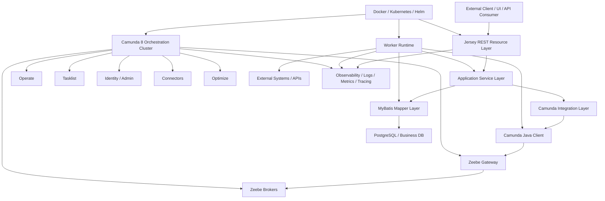

### Mental model praktis

```text
Jersey API
  ├─ menerima command dari client
  ├─ validasi request
  ├─ simpan business state bila perlu
  ├─ start process / publish message ke Camunda 8
  └─ expose query endpoint untuk status aplikasi

Camunda 8
  ├─ menyimpan orchestration state
  ├─ menentukan next step dalam BPMN
  ├─ membuat job untuk service task
  ├─ membuat/menyediakan user task
  ├─ mengelola incident, retry, timer, message correlation
  └─ memberi observability via Operate/Tasklist/Optimize

Worker Service
  ├─ subscribe job type tertentu
  ├─ jalankan business logic
  ├─ panggil DB/API eksternal
  ├─ complete/fail/throw BPMN error
  └─ harus idempotent dan observable
```

Camunda 8 Zeebe architecture memiliki empat komponen inti: **clients, gateways, brokers, exporters**. Client applications dapat melakukan deploy process, start instance, publish message, activate/complete/fail jobs, update variables, dan resolve incidents; business logic tetap dijalankan di client/worker, bukan di broker. ([Camunda 8 Docs](https://docs.camunda.io/docs/components/zeebe/technical-concepts/architecture/))

---

## Decomposition Map - Practical Categories / Domains / Skills

| No | Domain / Skill Area | Yang Perlu Dikuasai | Praktik di Jersey Microservice | Output yang Diharapkan |
|---:|---|---|---|---|
| 1 | **Camunda 8 Platform Mental Model** | Bedakan Camunda 8 dari Camunda 7: orchestration cluster eksternal, Zeebe, Operate, Tasklist, Identity/Admin, Connectors, Optimize. | Jangan desain seperti embedded engine. Buat boundary layer `CamundaProcessService` di aplikasi Jersey. | Paham kapan aplikasi memanggil Camunda dan kapan worker dipanggil Camunda. |
| 2 | **Camunda Java Client** | Dependency Maven `io.camunda:camunda-client-java`, konfigurasi REST/gRPC address, auth, timeout, retry, lifecycle client. | Buat singleton/factory client yang dikelola saat aplikasi start/stop. Hindari membuat client per request. | Reusable `CamundaClientProvider`. |
| 3 | **Jersey Resource as Process Command API** | Endpoint seperti `POST /cases/{id}/submit`, `POST /orders/{id}/cancel`, `POST /claims/{id}/approve`. | Resource layer validasi input, panggil service, lalu `start process` atau `publish message`. | REST API yang tidak bocor detail BPMN ke consumer. |
| 4 | **Process Instance Start Pattern** | `bpmnProcessId`, version/latest, variables, business key/correlation key strategy. | Start process dari command endpoint setelah validasi dan optional DB write. | Pattern command → persist → start workflow. |
| 5 | **Message Correlation Pattern** | Message name, `correlationKey`, receive task, intermediate catch event. | Endpoint bisnis mem-publish message untuk melanjutkan proses yang sedang menunggu event eksternal. | Pattern `POST /cases/{id}/events/payment-received`. |
| 6 | **BPMN Executable Modeling** | Service task, user task, receive task, timer event, boundary event, call activity, event subprocess, compensation jika relevan. | Model BPMN sebagai orchestration contract antar microservice, bukan sekadar diagram dokumentasi. | BPMN yang bisa di-run, diuji, dan diobservasi. |
| 7 | **Service Task / Job Type Design** | `taskDefinition.type`, retries, task headers, input/output mapping. | Setiap service task punya job type stabil seperti `case-risk-score`, `notify-applicant`, `sync-ledger`. | Worker contract jelas antara BPMN dan Java code. |
| 8 | **Job Worker Runtime** | Polling job, max active jobs, timeout, retry, backoff, completion, failure, BPMN error. | Jalankan worker sebagai bagian aplikasi Jersey atau service terpisah; untuk production, biasanya worker bisa diskalakan terpisah. | Worker idempotent, resilient, dan scalable. |
| 9 | **Worker Handler Design** | Handler per job type, validasi variable, call business service, complete/fail/throw error. | Struktur: `JobHandler -> ApplicationService -> MyBatis/API -> Completion`. | Handler kecil, testable, tidak berisi orchestration branching kompleks. |
| 10 | **Variable Modeling** | JSON variables, local vs global variable, input/output mapping, payload minimization. | Jangan dump seluruh entity DB ke process variable. Simpan ID/reference, ambil detail dari PostgreSQL saat dibutuhkan. | Variable kecil, stabil, aman, mudah di-audit. |
| 11 | **PostgreSQL/MyBatis Boundary** | Business state tetap di DB aplikasi; process state di Camunda. | Gunakan MyBatis untuk domain persistence; Camunda hanya menyimpan orchestration state dan process variables yang diperlukan. | Boundary jelas antara workflow state dan business state. |
| 12 | **Transaction + Workflow Consistency** | Problem dual-write: DB commit sukses tapi start process gagal, atau sebaliknya. | Gunakan transactional outbox/inbox, idempotency key, retry publisher, atau reconciliation job. | Tidak ada phantom process / orphan business record. |
| 13 | **Idempotency & Duplicate Handling** | Worker bisa menerima retry; external calls bisa timeout lalu sukses di sisi remote. | Gunakan business idempotency key, unique constraint, outbox status, request hash, dan safe retry. | Worker aman terhadap retry dan duplicate event. |
| 14 | **Error Handling Model** | Bedakan retry technical failure, BPMN error untuk business alternative path, dan incident untuk manual intervention. | Technical failure: `fail job`. Business rejection: `throw BPMN error`. Unknown unrecoverable: incident/runbook. | Error semantics tidak kacau. |
| 15 | **Human Task Integration** | Camunda user task, Tasklist, assignment, candidate users/groups, due date, forms, custom task app. | Bisa pakai Tasklist bawaan atau custom UI yang memanggil Orchestration Cluster REST API. | Human workflow jelas: claim, complete, escalate. |
| 16 | **Authorization & Identity** | Basic auth untuk local/dev, OIDC/enterprise IdP untuk production, tenant/user/group mapping. | Jersey API tetap punya auth sendiri; Camunda API access pakai service account/client credential. | Security boundary rapi antara user API dan Camunda cluster API. |
| 17 | **Connectors vs Custom Workers** | Connectors cocok untuk integration sederhana; custom worker cocok untuk logic kompleks, transaction, MyBatis, compliance, audit. | Untuk enterprise Java/Jersey, critical business logic biasanya lebih aman di custom worker. | Keputusan build-vs-config yang defensible. |
| 18 | **DMN / Business Rule Task** | Decision table, FEEL expression, decision result mapping. | Rule sederhana/stabil bisa di DMN; rule yang butuh DB/API kompleks tetap di Java service. | Rule ownership jelas antara business dan engineering. |
| 19 | **Testing Strategy** | Unit test handler, integration test Camunda client, BPMN deployment validation, testcontainers/local Camunda 8. | Test worker behavior tanpa harus selalu boot full platform; lakukan integration smoke test untuk BPMN utama. | Confidence sebelum deploy workflow. |
| 20 | **CI/CD for BPMN + Java** | Versioning BPMN, deployment artifact, environment config, backward compatibility. | Deploy BPMN bersama service atau via pipeline terpisah; pastikan running instance tetap kompatibel. | Controlled process release. |
| 21 | **Docker/Kubernetes Runtime** | Container image, env vars, secrets, probes, graceful shutdown worker, scaling. | Worker harus shutdown dengan aman agar job tidak timeout berlebihan. | Worker production-ready di Kubernetes. |
| 22 | **Self-Managed / SaaS / On-Prem / Cloud Decision** | SaaS vs self-managed, Helm, storage backend, OIDC, TLS, monitoring, backup. | Untuk on-prem/AWS/Azure, biasanya fokus Helm, external DB/storage, IdP, ingress, secrets. | Deployment architecture sesuai constraint perusahaan. |
| 23 | **Operate / Tasklist / Optimize Usage** | Operate untuk instance/incident visibility, Tasklist untuk human task, Optimize untuk analytics. | Support/devops pakai Operate untuk debug process; business user pakai Tasklist/Optimize sesuai role. | Operational visibility tidak hanya dari log aplikasi. |
| 24 | **Operational Runbook** | Incident resolution, retry, stuck process, failed worker, message not correlated, version mismatch. | Buat runbook: gejala → query/log → Operate action → remediation → prevention. | Tim support bisa recover tanpa menebak-nebak. |

Service task di Camunda 8 membuat job saat token masuk ke task; process instance menunggu sampai job diselesaikan oleh worker. Job type adalah kontrak utama antara BPMN dan worker, sedangkan retries, task headers, dan input/output mappings menentukan behavior teknis worker. ([Camunda 8 Docs](https://docs.camunda.io/docs/components/modeler/bpmn/service-tasks/))

Job worker adalah service yang polling job berdasarkan type, menjalankan business logic, lalu melaporkan completion/failure ke cluster; Java client menyediakan worker abstraction, termasuk polling, backoff, dan konfigurasi seperti `maxJobsActive`. Untuk long-polling REST pada job activation, dokumentasi Camunda menyebut ada limitasi tertentu dan menyarankan gRPC bila mengalami issue throughput/koneksi. ([Camunda 8 Docs](https://docs.camunda.io/docs/apis-tools/java-client/job-worker/))

---

## Roadmap Alur Belajar yang Direkomendasikan

### 1. Foundation: Camunda 8 mental model
Mulai dari perbedaan fundamental Camunda 8 vs Camunda 7: external orchestration runtime, Zeebe gateway/broker, Java client, worker, Operate, Tasklist, Identity/Admin.

### 2. Model executable BPMN kecil
Buat proses sederhana:

```text
Start Event
  → Validate Request Service Task
  → Manual Review User Task
  → Approve/Reject Gateway
  → Notify Result Service Task
  → End Event
```

Fokus dulu pada `service task`, `user task`, `exclusive gateway`, `message`, `timer`, dan `boundary error`.

### 3. Integrasi Jersey REST API
Buat endpoint Jersey untuk:

```text
POST /applications
POST /applications/{id}/submit
POST /applications/{id}/cancel
GET  /applications/{id}/workflow-status
```

Endpoint ini tidak menjalankan workflow logic langsung, tetapi mengirim command ke Camunda 8.

### 4. Worker implementation
Buat worker Java untuk job type seperti:

```text
validate-application
calculate-risk-score
send-notification
sync-case-status
```

Setiap worker harus idempotent, punya structured logging, retry-safe, dan jelas kapan harus `complete`, `fail`, atau `throw BPMN error`.

### 5. Data boundary dengan PostgreSQL/MyBatis
Tentukan mana yang disimpan di process variable dan mana yang tetap di database aplikasi.

Rule praktis:

```text
Camunda variable:
  - caseId
  - applicantId
  - decision
  - correlationKey
  - small routing data

PostgreSQL:
  - full case payload
  - audit detail
  - documents metadata
  - transaction records
  - enforcement/business lifecycle state
```

### 6. Error, incident, retry, dan compensation
Latih pola:

```text
temporary API failure      → fail job + retry
business rejection         → BPMN error
manual correction needed   → incident
external side effect done  → idempotency / compensation
```

Error event di Camunda 8 cocok untuk reaksi proses terhadap error yang memang bermakna secara bisnis; technical retry sebaiknya tidak selalu dimodelkan sebagai cabang BPMN agar diagram tidak bloat. ([Camunda 8 Docs](https://docs.camunda.io/docs/components/modeler/bpmn/error-events/))

### 7. Human task dan custom task app
Pelajari Camunda user task, assignment, candidate user/group, due date, form, dan integrasi dengan Tasklist atau custom UI. Camunda user task adalah implementation type yang direkomendasikan sejak 8.6; job-worker-based user task sudah deprecated dan punya limitasi dibanding Camunda user task. ([Camunda 8 Docs](https://docs.camunda.io/docs/components/modeler/bpmn/user-tasks/))

### 8. Production deployment
Masuk ke Docker/Kubernetes/Helm, secrets, OIDC, TLS, metrics, graceful shutdown, and runbook. Camunda merekomendasikan Kubernetes dan Helm untuk production self-managed deployment, dan default Helm install mencakup Orchestration Cluster components seperti Zeebe, Operate, Tasklist, dan Admin; Web Modeler/Console butuh konfigurasi tambahan dan external IdP. ([Camunda 8 Docs](https://docs.camunda.io/docs/self-managed/deployment/helm/))

Untuk production, panduan Helm resmi membedakan quick install untuk testing, RDBMS-based production, dan high-scale production dengan Elasticsearch/OpenSearch atau RDBMS; production guide juga menekankan TLS, OIDC, monitoring, external dependencies, dan Kubernetes baseline. ([Camunda 8 Docs](https://docs.camunda.io/docs/self-managed/deployment/helm/install/))

---

## Rekomendasi materi selanjutnya

Lanjut paling efektif ke:

**“Camunda 8 Series Plan for Java 17 + Maven + Jersey + MyBatis + PostgreSQL Microservice: total seri, urutan belajar, dan scope praktis tiap seri.”**

---

**Sources:**

- [Install Camunda with Helm | Camunda 8 Docs](https://docs.camunda.io/docs/self-managed/deployment/helm/install/)

## Response:
7/16/2026, 9:42:41 AM

Total saya rekomendasikan: **16 seri** untuk **Camunda 8 in Jakarta RESTful Web Service/Jersey microservice-based application**.

Rinciannya:

| Seri | Topik |
|---:|---|
| 1 | Camunda 8 Mental Model for Java/Jersey Engineers |
| 2 | Camunda 8 Architecture: Zeebe, Gateway, Broker, Operate, Tasklist, Identity |
| 3 | Maven + Java 17 Setup for Camunda Java Client in Jersey App |
| 4 | Jersey REST API as Workflow Command Boundary |
| 5 | Starting Process Instance Pattern from REST Endpoint |
| 6 | Message Correlation Pattern from Jersey Microservice |
| 7 | BPMN Practical Modeling for Service-Based Microservices |
| 8 | Service Task & Job Type Contract Design |
| 9 | Java Job Worker Implementation Pattern |
| 10 | Variables, Payload Design, and PostgreSQL/MyBatis Boundary |
| 11 | Transaction Consistency: DB + Workflow Dual-Write Problem |
| 12 | Error Handling: Retry, BPMN Error, Incident, Escalation |
| 13 | Human Task Integration: Tasklist vs Custom Task UI |
| 14 | Testing Strategy: Unit, Integration, BPMN, Worker Testing |
| 15 | Docker/Kubernetes Deployment Pattern for Camunda 8 Workers |
| 16 | Production Runbook: Observability, Incident Recovery, Scaling, Security |

Tambahan opsional setelah 16 seri utama:

| Opsional | Topik |
|---:|---|
| A | DMN / Decision Table Integration |
| B | Connectors vs Custom Java Workers |
| C | Camunda 8 Self-Managed on Kubernetes/Helm |
| D | Camunda 8 SaaS vs On-Prem/AWS/Azure Architecture Decision |
| E | Cheatsheet Camunda 8 Java Client: classes, methods, config, worker APIs |

Jadi inti onboarding praktisnya: **16 seri utama + 5 seri opsional/lanjutan**.

## Response:
7/16/2026, 9:42:58 AM

Saya akan mulai dari **Seri 1/16**, fokus pada mental model praktis supaya nanti implementasi Jersey, worker, database boundary, retry, dan deployment tidak salah arah sejak awal.

# Cheatsheet Camunda 8 + Java/Jersey Microservice  
## Seri 1/16 - Camunda 8 Mental Model for Java/Jersey Engineers

## 1. Tujuan seri ini

Seri pertama ini membentuk **mental model implementasi**: bagaimana aplikasi **Jakarta RESTful Web Service/Jersey** harus berinteraksi dengan **Camunda 8** tanpa membawa pola Camunda 7 embedded engine ke arsitektur baru.

Kesimpulan utamanya:

> Dalam Camunda 8, aplikasi Jersey bukan “host process engine”. Aplikasi Jersey adalah **client/service boundary** yang mengirim command ke Camunda 8 dan/atau menjalankan business logic sebagai **job worker**.

Camunda Java Client adalah library resmi untuk Java process application di Camunda 8. Dokumentasi resmi Camunda 8.9 menyebut Java Client dipakai untuk deploy process/decision, start/manage process, implement job worker, dan query/manage process data melalui Orchestration Cluster API. Sejak Camunda 8.8, **Camunda Java Client menggantikan Zeebe Java Client**, memakai REST sebagai default, gRPC masih bisa dikonfigurasi, dan Zeebe Java Client direncanakan dihapus di 8.10. ([Camunda 8 Docs](https://docs.camunda.io/docs/apis-tools/java-client/getting-started/))

---

# 2. Mental model besar

## 2.1 Komponen yang perlu dipahami

```text
[Jersey REST API]
    |
    | command: start process / publish message / query status
    v
[Camunda Java Client]
    |
    | REST / gRPC
    v
[Camunda 8 Gateway]
    |
    v
[Zeebe Brokers / Orchestration Engine]
    |
    | creates jobs
    v
[Java Job Workers]
    |
    | business logic
    v
[PostgreSQL / MyBatis / External APIs]
```

Zeebe architecture di Camunda 8 terdiri dari **clients, gateways, brokers, dan exporters**. Client mengirim command seperti deploy process, start process instance, publish message, activate job, complete job, fail job, update variables, dan resolve incident. Broker menyimpan state process instance dan assign job ke worker, tetapi **tidak menjalankan business logic aplikasi**. ([Camunda 8 Docs](https://docs.camunda.io/docs/components/zeebe/technical-concepts/architecture/))

---

# 3. Peran aplikasi Jersey dalam Camunda 8

Dalam stack kamu, aplikasi Jersey bisa punya beberapa peran sekaligus.

| Peran | Tanggung Jawab | Contoh Endpoint / Class |
|---|---|---|
| **Command API** | Menerima request bisnis dari client lalu memulai/melanjutkan workflow | `POST /cases/{caseId}/submit` |
| **Process Starter** | Start process instance dengan variable minimum | `CaseWorkflowService.startCaseProcess()` |
| **Message Publisher** | Publish event eksternal ke process yang sedang menunggu | `POST /cases/{caseId}/payment-received` |
| **Query API** | Menampilkan status bisnis dari DB aplikasi, bukan sekadar raw workflow state | `GET /cases/{caseId}` |
| **Worker Host** | Menjalankan job worker untuk service task tertentu | `RiskScoringWorker`, `NotificationWorker` |
| **Integration Adapter** | Memanggil external API, legacy system, file service, notification service | `ExternalRegistryClient` |
| **Persistence Boundary** | Simpan business state ke PostgreSQL via MyBatis | `CaseMapper`, `CaseRepository` |

Pola yang sehat:

```text
REST Resource
  -> Application Service
     -> PostgreSQL/MyBatis transaction
     -> Outbox / Camunda command
     -> Response to client
```

Pola yang perlu dihindari:

```text
REST Resource
  -> direct Camunda client call everywhere
  -> no application service boundary
  -> no idempotency
  -> process variables contain full business object
  -> worker updates DB without duplicate protection
```

---

# 4. Camunda 8 bukan database bisnis

Camunda menyimpan **workflow state**, bukan menggantikan domain database aplikasi.

## 4.1 Simpan di Camunda variable

Gunakan variable untuk data kecil yang dibutuhkan routing proses.

```json
{
  "caseId": "CASE-2026-000123",
  "applicantId": "APL-9981",
  "riskLevel": "HIGH",
  "correlationKey": "CASE-2026-000123",
  "requiresManualReview": true
}
```

## 4.2 Simpan di PostgreSQL

Gunakan PostgreSQL untuk state bisnis lengkap.

```text
case table:
  - case_id
  - applicant_id
  - status
  - submission_payload
  - risk_score
  - assigned_team
  - created_at
  - updated_at

case_event table:
  - event_id
  - case_id
  - event_type
  - event_payload
  - created_at

outbox table:
  - outbox_id
  - aggregate_id
  - event_type
  - payload
  - status
  - retry_count
  - next_retry_at
```

Rule praktis:

| Jenis Data | Lokasi Utama |
|---|---|
| Business entity lengkap | PostgreSQL |
| Audit bisnis detail | PostgreSQL |
| Document metadata | PostgreSQL |
| Routing decision kecil | Camunda variable |
| Correlation key | Camunda variable + DB |
| Human task status operasional | Camunda / Tasklist |
| Business-visible status | PostgreSQL, disinkronkan oleh worker/event |

---

# 5. Camunda 8 command yang paling sering dipakai dari Jersey

## 5.1 Start process instance

Dipakai saat ada command bisnis yang memulai lifecycle baru.

Contoh:

```text
POST /cases
POST /applications
POST /claims
POST /investigations
```

Pseudo-flow:

```text
1. Validate request
2. Insert business record ke PostgreSQL
3. Start Camunda process dengan caseId
4. Return 202 Accepted / 201 Created
```

Contoh service boundary:

```java
public final class CaseWorkflowService {

    private final CamundaClient camundaClient;

    public CaseWorkflowService(CamundaClient camundaClient) {
        this.camundaClient = camundaClient;
    }

    public void startCaseWorkflow(String caseId, String applicantId) {
        camundaClient
            .newCreateInstanceCommand()
            .bpmnProcessId("case_enforcement_lifecycle")
            .latestVersion()
            .variables(Map.of(
                "caseId", caseId,
                "applicantId", applicantId,
                "correlationKey", caseId
            ))
            .send()
            .join();
    }
}
```

Catatan implementasi: gunakan `caseId` atau business ID stabil sebagai correlation key. Jangan memakai generated internal process instance key sebagai identitas bisnis utama.

---

## 5.2 Publish message

Dipakai saat process sedang menunggu event eksternal.

Contoh:

```text
POST /cases/{caseId}/documents-received
POST /cases/{caseId}/payment-confirmed
POST /cases/{caseId}/appeal-submitted
POST /cases/{caseId}/external-check-completed
```

Pseudo-flow:

```text
1. Validate event
2. Persist event ke PostgreSQL
3. Publish message ke Camunda dengan correlationKey = caseId
4. Return 202 Accepted
```

Contoh:

```java
public void publishDocumentReceived(String caseId, String documentBatchId) {
    camundaClient
        .newPublishMessageCommand()
        .messageName("DocumentReceived")
        .correlationKey(caseId)
        .variables(Map.of(
            "caseId", caseId,
            "documentBatchId", documentBatchId
        ))
        .send()
        .join();
}
```

---

## 5.3 Complete / fail job

Dipakai oleh worker, bukan biasanya oleh REST resource.

Java Client menyediakan job worker yang polling job, menjalankan logic, lalu melaporkan completion/failure. Dokumentasi Camunda menjelaskan worker melakukan polling berdasarkan job type, menjalankan business logic, dan melaporkan hasil ke cluster; service task dengan job type seperti `send-email` atau `process-payment` akan diproses oleh worker yang subscribe ke type tersebut. ([Camunda 8 Docs](https://docs.camunda.io/docs/apis-tools/java-client/job-worker/))

Contoh worker sederhana:

```java
public final class RiskScoringWorker {

    private final CamundaClient camundaClient;
    private final RiskScoringService riskScoringService;

    public RiskScoringWorker(
            CamundaClient camundaClient,
            RiskScoringService riskScoringService
    ) {
        this.camundaClient = camundaClient;
        this.riskScoringService = riskScoringService;
    }

    public JobWorker open() {
        return camundaClient
            .newWorker()
            .jobType("calculate-risk-score")
            .handler((jobClient, job) -> {
                Map<String, Object> vars = job.getVariablesAsMap();
                String caseId = (String) vars.get("caseId");

                RiskResult result = riskScoringService.calculate(caseId);

                jobClient
                    .newCompleteCommand(job.getKey())
                    .variables(Map.of(
                        "riskLevel", result.level(),
                        "riskScore", result.score()
                    ))
                    .send()
                    .join();
            })
            .open();
    }
}
```

---

# 6. Perbedaan command, event, dan job

Ini penting supaya desain workflow tidak rancu.

| Konsep | Sumber | Arah Komunikasi | Contoh |
|---|---|---|---|
| **Command** | Client/API user | Jersey → Camunda | Start process, cancel process |
| **Message/Event** | External system/user action | Jersey → Camunda waiting process | Payment received, document uploaded |
| **Job** | Camunda process engine | Camunda → Worker | Calculate risk, send notification |
| **Variable update** | Worker/API | Client → Camunda | Set `riskLevel=HIGH` |
| **Incident** | Camunda runtime | Camunda → operator | Worker failed after retries exhausted |

Mental model sederhana:

```text
Command:
  "Start or change workflow intentionally."

Message:
  "Something happened outside the workflow."

Job:
  "Workflow asks a worker to do work."

Incident:
  "Workflow cannot safely continue without intervention."
```

---

# 7. Worker bukan controller

Dalam aplikasi Jersey, jangan samakan worker dengan REST controller.

## REST controller/resource

```text
- dipanggil oleh client
- request/response oriented
- validasi API contract
- biasanya synchronous
- return HTTP status
```

## Worker

```text
- dipanggil oleh Camunda melalui job polling
- asynchronous
- retryable
- wajib idempotent
- tidak return HTTP response ke user
- complete/fail/throw BPMN error
```

Camunda best-practice docs menjelaskan ada tiga respons utama setelah worker selesai bekerja: `CompleteJob` jika service task berhasil, `FailJob` jika task gagal dan perlu retry/incident, atau `ThrowError` jika ingin melaporkan BPMN error yang ditangani di level process. Dokumen yang sama menekankan tidak ada technical ACID transaction yang mencakup worker dan workflow engine sekaligus dalam sistem terdistribusi. ([Camunda 8 Docs](https://docs.camunda.io/docs/components/best-practices/development/dealing-with-problems-and-exceptions/))

---

# 8. Error semantics yang wajib dipahami sejak awal

## 8.1 Technical failure

Contoh:

```text
- external API timeout
- PostgreSQL temporarily unavailable
- network failure
- downstream 503
```

Respons:

```text
Fail job + decrement retry + retry backoff
```

## 8.2 Business error

Contoh:

```text
- applicant blacklisted
- document invalid
- payment rejected
- eligibility failed
```

Respons:

```text
Throw BPMN error
```

## 8.3 Unrecoverable / manual intervention

Contoh:

```text
- invalid process variable due to bug
- downstream contract changed
- data corruption
- retry exhausted
```

Respons:

```text
Incident + Operate runbook
```

Dokumentasi Camunda menyebut fail job dengan remaining retries lebih dari nol akan diretry, sedangkan retries nol atau negatif akan membuat incident; retry backoff bisa dipakai agar worker tidak langsung retry ketika external system sedang down. Dokumentasi juga menegaskan job timeout bisa membuat job dikerjakan lebih dari sekali, sehingga worker harus idempotent. ([Camunda 8 Docs](https://docs.camunda.io/docs/components/concepts/job-workers/))

---

# 9. Practical design rules untuk Java/Jersey engineer

## Rule 1 - Jangan expose BPMN detail ke public API

Kurang bagus:

```http
POST /workflow/start/case_enforcement_lifecycle
```

Lebih bagus:

```http
POST /cases
POST /cases/{caseId}/submit
POST /cases/{caseId}/cancel
```

Alasannya: API consumer seharusnya tahu command bisnis, bukan nama process definition.

---

## Rule 2 - Jangan pakai process variable sebagai database

Kurang bagus:

```json
{
  "case": {
    "id": "CASE-1",
    "applicant": { "...": "..." },
    "documents": [ "...large payload..." ],
    "history": [ "...many events..." ]
  }
}
```

Lebih bagus:

```json
{
  "caseId": "CASE-1",
  "correlationKey": "CASE-1",
  "riskLevel": "LOW"
}
```

Business detail tetap di PostgreSQL.

---

## Rule 3 - Setiap job type harus punya owner dan contract

Contoh job type contract:

```yaml
jobType: calculate-risk-score
owner: risk-service-team
inputVariables:
  - caseId
outputVariables:
  - riskScore
  - riskLevel
failureMode:
  technical:
    action: fail-job
    retries: decrement
  business:
    action: throw-bpmn-error
    errorCode: RISK_RULE_REJECTED
idempotencyKey:
  - caseId
  - jobType
```

---

## Rule 4 - Worker harus idempotent

Karena job bisa dikerjakan lebih dari sekali, worker perlu guard.

Contoh DB constraint:

```sql
create table case_worker_execution (
    execution_id bigserial primary key,
    case_id text not null,
    job_type text not null,
    idempotency_key text not null,
    status text not null,
    created_at timestamptz not null default now(),
    completed_at timestamptz,

    constraint uk_case_worker_idempotency
        unique (idempotency_key)
);
```

Contoh idempotency key:

```text
caseId + ":" + jobType + ":" + processInstanceKey
```

Untuk external side effect seperti payment, notification, atau document generation, gunakan idempotency key yang juga dikirim ke downstream jika downstream mendukungnya.

---

## Rule 5 - Pisahkan process status dan business status

Process status:

```text
- active
- completed
- incident
- waiting at user task
- waiting at message event
```

Business status:

```text
- DRAFT
- SUBMITTED
- UNDER_REVIEW
- APPROVED
- REJECTED
- ENFORCEMENT_PENDING
- CLOSED
```

Jangan memaksa user membaca status teknis workflow. Untuk UI/API bisnis, expose business status dari PostgreSQL.

---

# 10. Reference architecture minimal

```text
src/main/java/com/company/caseapp
  ├── api
  │   ├── CaseResource.java
  │   └── CaseEventResource.java
  │
  ├── application
  │   ├── CaseCommandService.java
  │   ├── CaseWorkflowService.java
  │   └── CaseQueryService.java
  │
  ├── workflow
  │   ├── CamundaClientFactory.java
  │   ├── CamundaLifecycle.java
  │   ├── ProcessDefinitions.java
  │   └── JobTypes.java
  │
  ├── worker
  │   ├── RiskScoringWorker.java
  │   ├── NotificationWorker.java
  │   └── WorkerRegistry.java
  │
  ├── persistence
  │   ├── CaseMapper.java
  │   ├── OutboxMapper.java
  │   └── WorkerExecutionMapper.java
  │
  └── domain
      ├── Case.java
      ├── CaseStatus.java
      └── RiskResult.java
```

---

# 11. Minimal Maven dependency

Camunda docs memakai artifact berikut untuk Java Client: ([Camunda 8 Docs](https://docs.camunda.io/docs/apis-tools/java-client/getting-started/))

```xml
<dependency>
  <groupId>io.camunda</groupId>
  <artifactId>camunda-client-java</artifactId>
  <version>${camunda.version}</version>
</dependency>
```

Untuk project enterprise, version dikelola di parent POM atau dependency management:

```xml
<properties>
  <camunda.version>8.9.x</camunda.version>
</properties>
```

Gunakan versi patch yang sesuai dengan platform Camunda 8 perusahaan. Jangan hardcode berdasarkan tutorial lama tanpa mengecek compatibility internal platform.

---

# 12. Minimal client factory untuk Jersey app

```java
package com.company.caseapp.workflow;

import io.camunda.client.CamundaClient;

import java.net.URI;

public final class CamundaClientFactory {

    private CamundaClientFactory() {
    }

    public static CamundaClient create(CamundaConfig config) {
        return CamundaClient.newClientBuilder()
            .restAddress(URI.create(config.restAddress()))
            .grpcAddress(URI.create(config.grpcAddress()))
            .build();
    }
}
```

Contoh config object:

```java
package com.company.caseapp.workflow;

public record CamundaConfig(
    String restAddress,
    String grpcAddress,
    String clientId,
    String clientSecret,
    String audience
) {
}
```

Catatan praktis:

```text
Development:
  restAddress = http://localhost:8080
  grpcAddress = http://localhost:26500

Production:
  restAddress = https://camunda.company.internal
  grpcAddress = https://zeebe-gateway.company.internal:26500
  auth       = OIDC / service account / platform-specific credential
```

---

# 13. Jersey resource contoh: start process

```java
package com.company.caseapp.api;

import com.company.caseapp.application.CaseCommandService;
import jakarta.ws.rs.Consumes;
import jakarta.ws.rs.POST;
import jakarta.ws.rs.Path;
import jakarta.ws.rs.Produces;
import jakarta.ws.rs.core.MediaType;
import jakarta.ws.rs.core.Response;

@Path("/cases")
@Consumes(MediaType.APPLICATION_JSON)
@Produces(MediaType.APPLICATION_JSON)
public class CaseResource {

    private final CaseCommandService caseCommandService;

    public CaseResource(CaseCommandService caseCommandService) {
        this.caseCommandService = caseCommandService;
    }

    @POST
    public Response createCase(CreateCaseRequest request) {
        CreateCaseResult result = caseCommandService.createCase(request);

        return Response
            .status(Response.Status.ACCEPTED)
            .entity(new CreateCaseResponse(
                result.caseId(),
                "SUBMITTED"
            ))
            .build();
    }
}
```

Application service:

```java
package com.company.caseapp.application;

public class CaseCommandService {

    private final CaseRepository caseRepository;
    private final CaseWorkflowService caseWorkflowService;

    public CaseCommandService(
            CaseRepository caseRepository,
            CaseWorkflowService caseWorkflowService
    ) {
        this.caseRepository = caseRepository;
        this.caseWorkflowService = caseWorkflowService;
    }

    public CreateCaseResult createCase(CreateCaseRequest request) {
        String caseId = caseRepository.insertNewCase(request);

        caseWorkflowService.startCaseWorkflow(
            caseId,
            request.applicantId()
        );

        return new CreateCaseResult(caseId);
    }
}
```

Catatan penting: contoh di atas masih punya risiko **dual-write** karena DB insert dan Camunda start process adalah dua sistem berbeda. Seri khusus transaction consistency akan membahas outbox pattern.

---

# 14. Worker contoh: complete, fail, BPMN error

```java
public final class ValidateCaseWorker {

    private final CamundaClient camundaClient;
    private final CaseValidationService validationService;

    public ValidateCaseWorker(
            CamundaClient camundaClient,
            CaseValidationService validationService
    ) {
        this.camundaClient = camundaClient;
        this.validationService = validationService;
    }

    public JobWorker open() {
        return camundaClient
            .newWorker()
            .jobType("validate-case")
            .handler((client, job) -> {
                String caseId = (String) job.getVariablesAsMap().get("caseId");

                try {
                    ValidationResult result = validationService.validate(caseId);

                    if (!result.valid()) {
                        client.newThrowErrorCommand(job.getKey())
                            .errorCode("CASE_VALIDATION_FAILED")
                            .errorMessage(result.reason())
                            .send()
                            .join();
                        return;
                    }

                    client.newCompleteCommand(job.getKey())
                        .variables(Map.of(
                            "caseValid", true
                        ))
                        .send()
                        .join();

                } catch (TransientDownstreamException ex) {
                    client.newFailCommand(job.getKey())
                        .retries(job.getRetries() - 1)
                        .errorMessage("Temporary validation failure: " + ex.getMessage())
                        .send()
                        .join();
                }
            })
            .open();
    }
}
```

Mapping semantik:

| Kondisi | Command |
|---|---|
| Validasi sukses | `complete job` |
| Rule bisnis gagal | `throw BPMN error` |
| API/DB/network temporary error | `fail job` |
| Retry habis | incident |
| Bug/data corrupt | fail sampai incident + runbook |

---

# 15. Anti-pattern yang sering terjadi

| Anti-pattern | Risiko | Koreksi |
|---|---|---|
| Menaruh semua business payload di process variable | Variable besar, sulit migrasi, data sensitif tersebar | Simpan ID/reference saja |
| Worker tidak idempotent | Duplicate update/call saat retry | Unique key, idempotency table, status check |
| Semua error jadi BPMN branch | BPMN bloat dan sulit dibaca | Technical error pakai retry/incident |
| Semua error jadi retry | Business rejection tidak terlihat di process | Business error pakai BPMN error |
| REST resource langsung berisi Camunda code | Tight coupling, sulit test | Buat `CaseWorkflowService` |
| Process instance key dipakai sebagai business ID | Sulit integrasi dengan DB/domain | Pakai `caseId` sebagai business key/correlation key |
| Worker dan API diskalakan tanpa kontrol | Worker load mengganggu API latency | Pisah deployment atau thread/resource pool |
| Start process sebelum DB commit | Process jalan untuk entity yang belum durable | DB-first + outbox/reconciliation |
| DB update sukses, complete job gagal | Worker bisa retry dan duplicate side effect | Idempotency + execution log |

---

# 16. Checklist onboarding Seri 1

Gunakan checklist ini untuk membaca codebase perusahaan.

```text
[ ] Apakah aplikasi memakai Camunda Java Client atau Zeebe Java Client lama?
[ ] Apakah Camunda client dibuat singleton/lifecycle-managed?
[ ] Apakah REST endpoint expose command bisnis, bukan detail BPMN?
[ ] Apakah ada service boundary khusus untuk workflow command?
[ ] Apakah job type didefinisikan sebagai constant/contract?
[ ] Apakah worker idempotent?
[ ] Apakah variable Camunda kecil dan tidak berisi full entity?
[ ] Apakah business status tetap ada di PostgreSQL?
[ ] Apakah message correlation memakai business key stabil?
[ ] Apakah technical failure dan business error dibedakan?
[ ] Apakah incident punya runbook?
[ ] Apakah ada strategi dual-write DB + Camunda?
```

---

# 17. Ringkasan mental model

```text
Camunda 8:
  owns orchestration state

Jersey API:
  owns API contract and command boundary

PostgreSQL:
  owns business state

MyBatis:
  owns persistence mapping

Worker:
  owns executable business action

Operate:
  owns operational visibility and incident handling

Tasklist:
  owns human task execution

Optimize:
  owns process analytics
```

Formula praktis:

```text
Business command masuk lewat Jersey
  -> business state disimpan di PostgreSQL
  -> workflow dikomando via Camunda Java Client
  -> Camunda membuat jobs
  -> workers menjalankan business logic
  -> workers update DB/API
  -> workers complete/fail/throw BPMN error
  -> Operate/Tasklist dipakai untuk visibility dan human task
```

---

# Seri 1/16 selesai

Seri ini selesai: **Camunda 8 Mental Model for Java/Jersey Engineers**.

Rekomendasi materi berikutnya:

**Seri 2/16 - Camunda 8 Architecture: Zeebe Gateway, Broker, Partition, Exporter, Operate, Tasklist, Identity, dan implikasinya untuk Java/Jersey microservice deployment.**

---

**Sources:**

- [Java client | Camunda 8 Docs](https://docs.camunda.io/docs/apis-tools/java-client/getting-started/)

## Response:
7/16/2026, 9:44:20 AM

Saya lanjut ke **Seri 2/16**. Fokusnya arsitektur runtime Camunda 8 dan dampaknya ke desain aplikasi Jersey: client/gateway/broker/partition/exporter, lalu mapping ke deployment dan failure mode.

# Cheatsheet Camunda 8 + Java/Jersey Microservice  
## Seri 2/16 - Camunda 8 Architecture: Gateway, Broker, Partition, Exporter, Operate, Tasklist, Identity

## 1. Fokus seri ini

Seri ini membahas **arsitektur runtime Camunda 8** dari sudut pandang engineer Java/Jersey:

> Aplikasi Jersey tidak berkomunikasi langsung dengan broker. Aplikasi berkomunikasi ke **Gateway / Orchestration Cluster API**, sedangkan broker mengelola workflow state, partition, replication, dan job creation.

Yang perlu kamu bawa ke implementasi:

```text
Jersey API / Worker
  -> Camunda Java Client
     -> Zeebe Gateway / Orchestration Cluster API
        -> Zeebe Brokers
           -> Partitions
              -> Process instances, jobs, variables, incidents
```

Secara konsep, Zeebe terdiri dari **clients, gateways, brokers, dan exporters**. Broker adalah distributed workflow engine yang melacak state process instance aktif; gateway menjadi contact point untuk client; broker bisa dipartisi untuk horizontal scalability dan direplikasi untuk fault tolerance. ([Camunda 8 Docs](https://docs.camunda.io/docs/components/zeebe/technical-concepts/architecture/))

---

# 2. Diagram arsitektur praktis

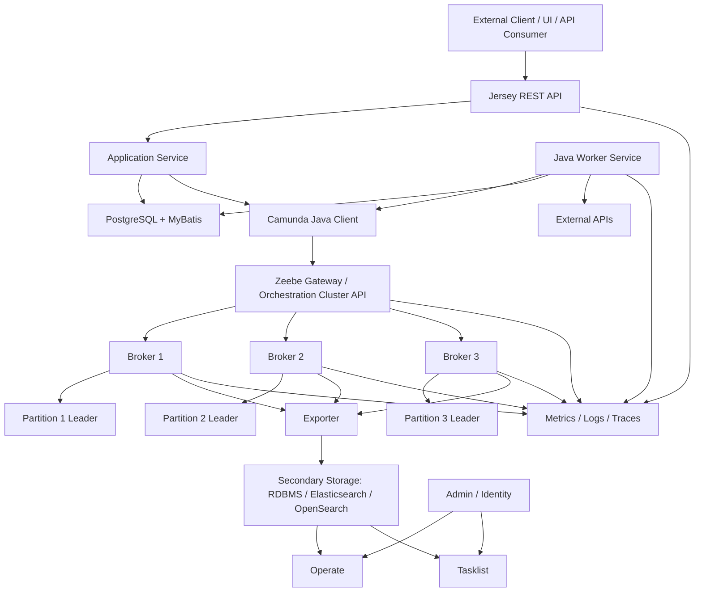

---

# 3. Komponen utama dan mental model

| Komponen | Fungsi | Dampak ke Java/Jersey |
|---|---|---|
| **Camunda Java Client** | Library Java untuk mengirim command, start process, publish message, deploy resource, dan worker polling. | Buat client lifecycle-managed, bukan dibuat per request. |
| **Gateway** | Entry point client ke Zeebe cluster; router/load balancer ke partition leader. | Semua Jersey API dan worker connect ke gateway/API endpoint, bukan broker langsung. |
| **Broker** | Distributed workflow engine yang menyimpan dan memproses state workflow. | Jangan taruh business logic di broker; logic tetap di Java worker. |
| **Partition** | Shard/logical data grouping untuk scaling process processing. | Process instance/job tersebar ke partition; desain worker harus stateless dan horizontally scalable. |
| **Replication / RAFT** | Fault tolerance antar broker. | Failure broker tidak otomatis berarti workflow hilang, tetapi latency/failover bisa terjadi. |
| **Exporter** | Mengirim runtime data ke secondary storage untuk query/visibility. | Operate/Tasklist/query visibility bergantung pada pipeline export/storage. |
| **Operate** | Observability operasional process instance dan incident. | Dipakai support/devops untuk debug stuck process dan resolve incident. |
| **Tasklist** | UI/API untuk human task. | Bisa dipakai langsung atau diganti custom task UI. |
| **Admin / Identity** | Access control untuk user/client/API/runtime components. | Service account aplikasi harus punya permission minimal yang sesuai. |
| **Optimize** | Analytics/business intelligence untuk process execution. | Bukan dependency utama worker; lebih untuk reporting dan improvement. |

Dalam Camunda 8 Self-Managed modern, dokumentasi menyebut **Orchestration Cluster** sebagai core component yang mencakup Zeebe, Tasklist, Operate, dan Identity/Admin; Connectors, Optimize, Web Modeler, Console, dan Management Identity adalah komponen/platform capability tambahan di luar core tersebut. ([Camunda 8 Docs](https://docs.camunda.io/docs/self-managed/about-self-managed/))

---

# 4. Gateway: contact point untuk aplikasi Java

## 4.1 Apa yang dilakukan Gateway?

Gateway adalah contact point yang membuat client bisa berkomunikasi dengan broker di dalam Zeebe cluster. Gateway bertindak sebagai load balancer/router antar partition, menerjemahkan request client, dan meneruskan command ke partition leader yang tepat. Untuk gRPC default port yang disebut dokumentasi adalah `26500`, sedangkan REST API default port `8080`. ([Camunda 8 Docs](https://docs.camunda.io/docs/self-managed/components/orchestration-cluster/zeebe/zeebe-gateway/overview/))

Mental model:

```text
Java client tidak perlu tahu:
  - broker mana leader saat ini
  - process instance ada di partition mana
  - bagaimana topology cluster berubah

Gateway yang tahu dan merutekan command.
```

## 4.2 Implikasi desain Jersey

### Benar

```text
Jersey API / Worker
  -> Camunda Java Client
     -> Gateway endpoint
```

### Salah

```text
Jersey API / Worker
  -> Broker pod/service langsung
```

## 4.3 Contoh config environment

```properties
CAMUNDA_REST_ADDRESS=http://camunda-zeebe-gateway:8080
CAMUNDA_GRPC_ADDRESS=http://camunda-zeebe-gateway:26500
CAMUNDA_AUTH_MODE=oidc
CAMUNDA_CLIENT_ID=case-service
CAMUNDA_CLIENT_SECRET=${secret}
CAMUNDA_AUDIENCE=camunda-api
```

Untuk local/dev sederhana:

```properties
CAMUNDA_REST_ADDRESS=http://localhost:8080
CAMUNDA_GRPC_ADDRESS=http://localhost:26500
CAMUNDA_AUTH_MODE=basic
```

---

# 5. Broker: workflow state, bukan business logic

Broker adalah distributed workflow engine yang melacak state process instance aktif. Broker bisa dipartisi untuk horizontal scalability dan direplikasi untuk fault tolerance, tetapi dokumentasi menegaskan **tidak ada application business logic di broker**. ([Camunda 8 Docs](https://docs.camunda.io/docs/components/zeebe/technical-concepts/architecture/))

## 5.1 Yang broker lakukan

```text
- deploy process definition
- create process instance
- persist workflow state
- evaluate BPMN flow
- create jobs
- manage timers
- manage messages/correlation
- manage incidents
- replicate and export records
```

## 5.2 Yang broker tidak lakukan

```text
- query PostgreSQL business table
- call external REST API bisnis
- send email sendiri via custom Java logic
- run MyBatis mapper
- execute application transaction
- enforce business domain invariants di Java
```

Itu tugas **worker service** atau aplikasi domain.

---

# 6. Partition: konsep paling penting untuk scaling

Partition adalah cara Zeebe membagi process processing. Dokumentasi Camunda menjelaskan bahwa partition didistribusikan secara dinamis dalam cluster, dan untuk setiap partition hanya ada **satu leading broker** pada satu waktu; leader tersebut menerima request dan melakukan event processing untuk partition itu. ([Camunda 8 Docs](https://docs.camunda.io/docs/components/zeebe/technical-concepts/partitions/))

## 6.1 Mental model

```text
Partition 1 -> Leader: Broker A
Partition 2 -> Leader: Broker B
Partition 3 -> Leader: Broker C
```

Kalau broker gagal, leadership bisa berpindah.

```text
Before failure:
  Partition 1 leader = Broker A

After Broker A failure:
  Partition 1 leader = Broker B or C
```

## 6.2 Dampak ke aplikasi Jersey/worker

| Area | Dampak |
|---|---|
| REST command | Start process bisa tersebar ke partition berbeda. |
| Message correlation | Gateway harus route ke partition tempat instance berada. |
| Worker polling | Worker tidak perlu tahu partition; cukup subscribe job type. |
| Scaling | Tambah worker replica untuk job type yang bottleneck. |
| Idempotency | Failover/retry bisa membuat job dieksekusi ulang. Worker harus idempotent. |
| Observability | Incident bisa tersebar lintas partition; gunakan Operate, metrics, dan logs. |

---

# 7. Exporter dan secondary storage

Camunda runtime event/state diekspor untuk kebutuhan query dan visibility. Dalam deployment modern, secondary storage bisa berupa **RDBMS, Elasticsearch, atau OpenSearch**, tergantung konfigurasi. Pada quick developer install Camunda 8.9, dokumentasi menyebut Helm chart tidak lagi mem-provision Elasticsearch secara default dan secondary storage harus eksplisit diaktifkan: RDBMS, Elasticsearch, atau OpenSearch. ([Camunda 8 Docs](https://docs.camunda.io/docs/self-managed/deployment/helm/install/quick-install/))

## 7.1 Implikasi praktis

```text
Zeebe broker state:
  - authoritative runtime workflow state

Secondary storage:
  - query/visibility/read model untuk Operate, Tasklist, search, reporting
```

Jangan salah paham:

```text
Jika Operate terlambat menampilkan update,
belum tentu process instance tidak berjalan.

Bisa jadi exporter/secondary storage/read model sedang lag.
```

## 7.2 Hal yang harus dimonitor

```text
- exporter lag
- broker disk usage
- secondary storage health
- Operate/Tasklist query latency
- incident count
- job activation latency
- worker completion/failure rate
```

---

# 8. 8.8+ Orchestration Cluster: perubahan cara membaca deployment

Mulai Camunda 8.8, dokumentasi resource planning menyebut arsitektur lebih streamlined karena broker, gateway, Operate, Tasklist, dan Identity dikonsolidasikan ke dalam satu aplikasi bernama **Orchestration Cluster**. Ini mengubah cara memikirkan resource consumption dibanding versi sebelum 8.8. ([Camunda 8 Docs](https://docs.camunda.io/docs/components/best-practices/architecture/sizing-self-managed/))

Artinya:

```text
Secara logical:
  - Zeebe
  - Gateway
  - Operate
  - Tasklist
  - Identity/Admin

Secara deployment packaging 8.8+:
  - bisa dikemas sebagai Orchestration Cluster application
```

Jangan kacaukan dua level ini:

| Level | Cara Membaca |
|---|---|
| **Logical architecture** | Gateway, broker, partition, exporter, Operate, Tasklist, Identity |
| **Deployment architecture** | Pod/container/chart/app packaging aktual sesuai versi Helm/platform |
| **Application architecture** | Jersey API, worker service, PostgreSQL/MyBatis, external systems |

Untuk onboarding codebase perusahaan, selalu cek:

```text
- versi Camunda cluster
- mode deployment: SaaS / Self-Managed / Helm / docker-compose / manual
- version chart Helm
- apakah masih pre-8.8 style atau 8.8+ Orchestration Cluster packaging
- secondary storage yang dipakai
- authentication mode
```

---

# 9. Operate, Tasklist, Identity/Admin: jangan dianggap optional secara operasional

## 9.1 Operate

Operate adalah alat utama untuk melihat process instance, state, incident, dan troubleshooting workflow runtime.

Pola penggunaan:

```text
Developer:
  - cek variable
  - cek token position
  - cek incident
  - verify BPMN path

Support / Ops:
  - retry incident
  - inspect stuck process
  - escalate ke tim owner worker

Business analyst:
  - validate process path
  - cek high-level operational behavior
```

## 9.2 Tasklist

Tasklist dipakai untuk human task execution. Kalau perusahaan membangun custom task UI, Tasklist tetap berguna sebagai reference dan operational fallback.

Pola umum:

```text
Internal ops user:
  -> Tasklist bawaan

Public/customer-facing user:
  -> Custom UI
     -> Backend Jersey API
        -> Camunda API / Task API
```

## 9.3 Identity / Admin

Camunda 8 membedakan authentication dan authorization. Authentication memverifikasi siapa user/client, sedangkan authorization menentukan resource/action yang boleh diakses. Untuk production, OIDC-based authentication direkomendasikan untuk Self-Managed dan diwajibkan untuk SaaS; basic authentication tidak direkomendasikan untuk production. ([Camunda 8 Docs](https://docs.camunda.io/docs/components/concepts/access-control/access-control-overview/))

Orchestration Cluster authorization memakai prinsip least privilege: jika authorization aktif, tidak ada akses default, permission harus diberikan eksplisit, dan tidak ada deny rule; tanpa explicit grant, akses ditolak. ([Camunda 8 Docs](https://docs.camunda.io/docs/components/concepts/access-control/authorizations/))

---

# 10. Deployment topology untuk Java/Jersey microservice

## 10.1 Local development

```text
Developer laptop
  ├─ Jersey app
  ├─ Worker app
  ├─ PostgreSQL local/container
  └─ Camunda local/dev cluster
```

Cocok untuk:

```text
- model BPMN smoke test
- start process from endpoint
- worker complete/fail job
- message correlation test
```

Tidak cocok untuk:

```text
- HA validation
- partition/failover testing
- production auth model
- performance sizing
```

Quick Helm developer install resmi Camunda ditujukan untuk testing/development. Dokumentasi juga mengingatkan embedded H2 bersifat non-production dan hanya valid untuk single broker/single partition; menjalankan H2 embedded dengan multi-broker topology dapat menyebabkan query result tidak lengkap atau tidak konsisten. ([Camunda 8 Docs](https://docs.camunda.io/docs/self-managed/deployment/helm/install/quick-install/))

---

## 10.2 Integration environment

```text
Kubernetes namespace: case-system-dev
  ├─ case-api deployment
  ├─ case-worker deployment
  ├─ PostgreSQL
  ├─ Camunda Orchestration Cluster
  ├─ Operate / Tasklist / Admin
  └─ monitoring stack
```

Tujuan:

```text
- validate endpoint to workflow
- validate worker scaling
- validate incident behavior
- validate DB + workflow consistency
- validate auth/service account
```

---

## 10.3 Production

```text
Kubernetes / OpenShift / EKS / AKS
  ├─ Ingress / API Gateway
  ├─ Jersey API deployment
  ├─ Worker deployment(s)
  ├─ PostgreSQL business DB
  ├─ Outbox publisher
  ├─ Camunda 8 Orchestration Cluster
  ├─ Secondary storage
  ├─ OIDC / IdP integration
  ├─ Secrets manager
  └─ Observability stack
```

Camunda menyediakan reference architecture untuk Self-Managed di Kubernetes, yang cocok saat ingin memanfaatkan containerization, self-healing, scalability, dan resilience melalui multi-zone deployment. ([Camunda 8 Docs](https://docs.camunda.io/docs/self-managed/reference-architecture/kubernetes/))

---

# 11. Deployment pattern: API dan worker dipisah atau digabung?

## Option A - API dan worker dalam satu deployment

```text
case-service
  ├─ Jersey REST API
  └─ Camunda workers
```

### Cocok untuk

```text
- service kecil
- low throughput
- early development
- worker ringan
```

### Risiko

```text
- worker CPU/memory mengganggu API latency
- scaling API ikut scaling worker
- shutdown lebih rumit
- incident worker bisa memengaruhi serving traffic
```

---

## Option B - API dan worker dipisah

```text
case-api
  └─ Jersey REST API

case-worker
  └─ Camunda workers
```

### Cocok untuk production enterprise

```text
- worker bisa diskalakan per job type
- API latency lebih stabil
- failure isolation lebih baik
- resource limit lebih jelas
- rolling deployment lebih aman
```

### Rekomendasi praktis

Untuk enterprise workflow dengan PostgreSQL/MyBatis dan external API calls, gunakan:

```text
API deployment:
  - menerima command
  - validasi
  - persist business state
  - enqueue/start workflow

Worker deployment:
  - subscribe job
  - execute business logic
  - update DB/API
  - complete/fail job
```

---

# 12. Kubernetes deployment sketch

## 12.1 Jersey API deployment

```yaml
apiVersion: apps/v1
kind: Deployment
metadata:
  name: case-api
spec:
  replicas: 3
  selector:
    matchLabels:
      app: case-api
  template:
    metadata:
      labels:
        app: case-api
    spec:
      containers:
        - name: case-api
          image: registry.company.internal/case-api:1.0.0
          ports:
            - containerPort: 8080
          env:
            - name: CAMUNDA_REST_ADDRESS
              value: "http://camunda-zeebe-gateway:8080"
            - name: CAMUNDA_GRPC_ADDRESS
              value: "http://camunda-zeebe-gateway:26500"
            - name: DB_URL
              valueFrom:
                secretKeyRef:
                  name: case-db-secret
                  key: jdbc-url
          readinessProbe:
            httpGet:
              path: /health/ready
              port: 8080
          livenessProbe:
            httpGet:
              path: /health/live
              port: 8080
```

## 12.2 Worker deployment

```yaml
apiVersion: apps/v1
kind: Deployment
metadata:
  name: case-worker
spec:
  replicas: 4
  selector:
    matchLabels:
      app: case-worker
  template:
    metadata:
      labels:
        app: case-worker
    spec:
      containers:
        - name: case-worker
          image: registry.company.internal/case-worker:1.0.0
          env:
            - name: CAMUNDA_REST_ADDRESS
              value: "http://camunda-zeebe-gateway:8080"
            - name: CAMUNDA_GRPC_ADDRESS
              value: "http://camunda-zeebe-gateway:26500"
            - name: WORKER_ENABLED
              value: "true"
            - name: WORKER_MAX_JOBS_ACTIVE
              value: "32"
            - name: DB_URL
              valueFrom:
                secretKeyRef:
                  name: case-db-secret
                  key: jdbc-url
          readinessProbe:
            httpGet:
              path: /health/ready
              port: 8080
```

Prinsipnya: **replica worker boleh banyak**, tetapi setiap worker harus idempotent karena job retry/failover/timeout bisa menyebabkan eksekusi ulang.

---

# 13. Failure mode architecture

| Failure | Gejala | Dampak | Mitigasi |
|---|---|---|---|
| Gateway down | Java client gagal connect/send command | API start process/publish message gagal | Multiple gateway replicas, retry with backoff, circuit breaker |
| Broker leader failover | Latency meningkat sementara | Job/command bisa tertunda | Idempotent workers, retry, monitor topology |
| Worker down | Job tidak selesai, eventually timeout/retry | Process stuck di service task | HPA/replica, readiness/liveness, alert job backlog |
| Worker complete command gagal setelah side effect | External side effect sudah terjadi tapi Camunda belum complete | Job bisa retry dan duplicate side effect | Idempotency table + side-effect idempotency key |
| Secondary storage lag | Operate/Tasklist telat menampilkan state | Operator mengira process stuck | Monitor exporter lag, jangan hanya percaya UI delay |
| PostgreSQL app DB down | Worker/API gagal business persistence | Job fail/retry atau API command gagal | Fail job technical, retry backoff, DB HA |
| Auth token expired | API call ke Camunda 401/403 | Worker/API gagal command | Token refresh, service account config, permission audit |
| Message correlation salah key | Process tidak lanjut | Event lost secara bisnis | Persist event dulu, retry correlation, correlation key convention |
| Partition hot spot | Latency/job backlog di subset workflow | Throughput tidak rata | Review process distribution, partition count, worker throughput |
| Bad BPMN deployment | Running instance incompatible | Incident/failure saat execution | Versioning, migration strategy, compatibility checks |

---

# 14. Architecture decision: REST vs gRPC dari Java client

Camunda Java Client modern memakai REST sebagai default, namun gRPC masih dapat dikonfigurasi. Untuk arsitektur, pilih berdasarkan karakter workload:

| Kriteria | REST | gRPC |
|---|---|---|
| Setup jaringan | Lebih mudah lewat HTTP infra umum | Perlu dukungan gRPC di ingress/proxy |
| Compatibility enterprise gateway | Biasanya lebih mudah | Kadang perlu konfigurasi tambahan |
| High-throughput worker activation | Bisa cukup, tetapi perlu validasi | Sering lebih cocok untuk throughput tinggi |
| Debugging | Lebih mudah dengan HTTP tooling | Perlu gRPC tooling |
| Local onboarding | Lebih mudah | Sedikit lebih teknis |

Praktik aman:

```text
Development:
  pakai REST dulu agar onboarding cepat

Performance-sensitive worker:
  benchmark REST vs gRPC

Production:
  ikuti platform standard perusahaan dan rekomendasi Camunda version yang dipakai
```

---

# 15. Practical mapping ke kode Java/Jersey

## 15.1 Jangan biarkan resource tahu topology Camunda

Kurang bagus:

```java
@Path("/cases")
public class CaseResource {

    @POST
    public Response submit(CreateCaseRequest request) {
        CamundaClient client = CamundaClient.newClientBuilder()
            .restAddress(URI.create("http://camunda-zeebe-gateway:8080"))
            .build();

        client.newCreateInstanceCommand()
            .bpmnProcessId("case_process")
            .latestVersion()
            .variables(Map.of("caseId", request.caseId()))
            .send()
            .join();

        return Response.accepted().build();
    }
}
```

Masalah:

```text
- client dibuat per request
- config hardcoded
- tidak ada boundary service
- tidak ada idempotency
- tidak ada transaction strategy
```

## 15.2 Lebih baik: topology disembunyikan di adapter

```java
public interface WorkflowCommandGateway {
    void startCaseProcess(String caseId, String applicantId);
    void publishCaseEvent(String messageName, String correlationKey, Map<String, Object> variables);
}
```

Implementation:

```java
public final class CamundaWorkflowCommandGateway implements WorkflowCommandGateway {

    private final CamundaClient camundaClient;

    public CamundaWorkflowCommandGateway(CamundaClient camundaClient) {
        this.camundaClient = camundaClient;
    }

    @Override
    public void startCaseProcess(String caseId, String applicantId) {
        camundaClient.newCreateInstanceCommand()
            .bpmnProcessId("case_enforcement_lifecycle")
            .latestVersion()
            .variables(Map.of(
                "caseId", caseId,
                "applicantId", applicantId,
                "correlationKey", caseId
            ))
            .send()
            .join();
    }

    @Override
    public void publishCaseEvent(
            String messageName,
            String correlationKey,
            Map<String, Object> variables
    ) {
        camundaClient.newPublishMessageCommand()
            .messageName(messageName)
            .correlationKey(correlationKey)
            .variables(variables)
            .send()
            .join();
    }
}
```

Application service:

```java
public final class CaseCommandService {

    private final CaseRepository caseRepository;
    private final WorkflowCommandGateway workflowCommandGateway;

    public CaseCommandService(
            CaseRepository caseRepository,
            WorkflowCommandGateway workflowCommandGateway
    ) {
        this.caseRepository = caseRepository;
        this.workflowCommandGateway = workflowCommandGateway;
    }

    public String submitCase(SubmitCaseCommand command) {
        String caseId = caseRepository.createSubmittedCase(command);

        workflowCommandGateway.startCaseProcess(
            caseId,
            command.applicantId()
        );

        return caseId;
    }
}
```

Dengan pattern ini, Jersey resource tidak peduli apakah Camunda ada di SaaS, on-prem, Kubernetes, REST, atau gRPC.

---

# 16. Architecture smell yang harus dicari saat membaca codebase

| Smell | Kenapa berbahaya | Refactor target |
|---|---|---|
| Camunda client dibuat di setiap endpoint | Connection/resource waste | Singleton/lifecycle-managed client |
| Endpoint menyebut `bpmnProcessId` dari request user | API bocor detail workflow | Business command endpoint |
| Worker menjalankan side effect tanpa idempotency | Duplicate saat retry | Idempotency table/key |
| Process variable menyimpan payload besar | Performance/security/migration issue | Store reference ID only |
| Worker dan API satu deployment tanpa resource isolation | API latency terganggu | Separate worker deployment |
| Tidak ada Operate runbook | Incident recovery lambat | Incident taxonomy + SOP |
| Basic auth production | Risiko security | OIDC/service account |
| Local H2 dianggap production-like | False confidence | External secondary storage untuk staging/prod |
| Tidak tahu versi cluster/chart | Salah asumsi fitur | Version inventory |

---

# 17. Checklist arsitektur Camunda 8 untuk project

```text
[ ] Versi Camunda cluster diketahui?
[ ] Deployment mode: SaaS / Self-Managed / Helm / Docker Compose / manual?
[ ] Apakah memakai 8.8+ Orchestration Cluster packaging?
[ ] Gateway/API endpoint untuk aplikasi sudah jelas?
[ ] Aplikasi tidak connect langsung ke broker?
[ ] Camunda Java Client dikelola lifecycle-nya?
[ ] Auth mode dev/staging/prod terdokumentasi?
[ ] Service account permission mengikuti least privilege?
[ ] Secondary storage yang dipakai jelas?
[ ] Exporter lag dimonitor?
[ ] Operate digunakan untuk incident/debugging?
[ ] Tasklist/custom task UI decision jelas?
[ ] Worker deployment dipisah dari API untuk production?
[ ] Worker replica dan max active jobs dikontrol?
[ ] Idempotency strategy tersedia?
[ ] DB + workflow consistency strategy tersedia?
[ ] Runbook broker/gateway/worker/storage/auth tersedia?
```

---

# 18. Mini-lab praktis Seri 2

Tujuan lab: memastikan kamu paham jalur command dari Jersey sampai broker dan balik ke worker.

## Lab topology

```text
1 Jersey API
1 Worker service
1 PostgreSQL
1 Camunda dev cluster
Operate enabled
Tasklist enabled if human task exists
```

## BPMN minimal

```text
Start Event
  -> Service Task: validate-case
  -> User Task: manual-review
  -> Service Task: notify-result
  -> End Event
```

## Endpoint

```http
POST /cases
```

Request:

```json
{
  "applicantId": "APL-1001",
  "caseType": "LICENSE_REVIEW"
}
```

Expected flow:

```text
1. Jersey inserts case row into PostgreSQL.
2. Jersey starts process instance.
3. Camunda creates job type validate-case.
4. Worker activates validate-case.
5. Worker reads caseId variable.
6. Worker queries PostgreSQL via MyBatis.
7. Worker completes job.
8. Process moves to user task.
9. Operate shows token at user task.
10. Tasklist shows manual review task.
```

## Validation points

```text
[ ] API response does not expose process instance internals unnecessarily.
[ ] Operate can find process instance by variable/business key.
[ ] Worker logs include caseId, processInstanceKey, jobKey, jobType.
[ ] PostgreSQL case status is business-friendly.
[ ] Worker can be restarted without corrupting case state.
```

---

# 19. Ringkasan inti Seri 2

```text
Gateway:
  contact point + router + load balancer ke partition leader

Broker:
  distributed workflow engine; owns workflow state, not business logic

Partition:
  scaling unit for workflow processing; one leader per partition

Exporter:
  pushes records to secondary storage for visibility/query

Operate:
  operational debugging and incident visibility

Tasklist:
  human task execution

Identity/Admin:
  authentication + authorization for users and clients

Jersey API:
  command boundary

Worker:
  executable business action

PostgreSQL/MyBatis:
  business state and durable domain data
```

Kesimpulan praktis:

> Desain aplikasi Java/Jersey harus menganggap Camunda 8 sebagai **distributed orchestration platform**. Karena itu, semua worker harus idempotent, semua command harus punya correlation/business key yang stabil, deployment worker harus bisa diskalakan terpisah, dan observability tidak boleh hanya mengandalkan log aplikasi.

---

# Seri 2/16 selesai

Seri ini selesai: **Camunda 8 Architecture: Zeebe Gateway, Broker, Partition, Exporter, Operate, Tasklist, Identity, dan dampaknya untuk Java/Jersey microservice deployment.**

Rekomendasi materi berikutnya:

**Seri 3/16 - Maven + Java 17 Setup for Camunda Java Client in Jersey App: dependency, config class, lifecycle startup/shutdown, REST/gRPC address, auth placeholder, dan struktur package production-style.**

---

**Sources:**

- [Architecture | Camunda 8 Docs](https://docs.camunda.io/docs/components/zeebe/technical-concepts/architecture/)

## Response:
7/16/2026, 9:46:03 AM

Saya lanjut ke **Seri 3/16**. Fokusnya setup implementasi: Maven dependency, Java 17, struktur package, konfigurasi client, lifecycle di Jersey, dan baseline production-ready.

# Cheatsheet Camunda 8 + Java/Jersey Microservice  
## Seri 3/16 - Maven + Java 17 Setup for Camunda Java Client in Jersey App

## 1. Fokus seri ini

Seri ini fokus pada **setup implementasi awal** untuk aplikasi **Java 17 + Maven + Jakarta RESTful Web Service/Jersey** yang akan terhubung ke Camunda 8.

Target akhirnya:

```text
Jersey REST API
  -> Application Service
     -> WorkflowCommandGateway
        -> Camunda Java Client
           -> Camunda 8 Orchestration Cluster

Worker Runtime
  -> Job Worker Registry
     -> Camunda Java Client
        -> Camunda 8 Orchestration Cluster
```

Untuk aplikasi Jersey non-Spring Boot, pendekatan yang paling bersih adalah memakai **Camunda Java Client langsung**, bukan memaksakan Spring Boot Starter. Camunda Java Client adalah library resmi untuk process application Camunda 8; ia mendukung deploy process/decision, start/manage process, job worker, query/manage process data, REST/gRPC, authentication, dan retry mechanism. Sejak Camunda 8.8, Camunda Java Client menggantikan Zeebe Java Client; REST menjadi default communication protocol, gRPC masih configurable, dan Zeebe Java Client direncanakan dihapus di 8.10. ([Camunda 8 Docs](https://docs.camunda.io/docs/apis-tools/java-client/getting-started/))

---

# 2. Recommended Maven setup

## 2.1 Parent-level properties

```xml
<properties>
    <maven.compiler.release>17</maven.compiler.release>

    <!-- Sesuaikan dengan versi Camunda platform perusahaan -->
    <camunda.version>8.9.0</camunda.version>

    <!-- Contoh variable; isi sesuai standard internal -->
    <jersey.version>${company.jersey.version}</jersey.version>
    <jackson.version>${company.jackson.version}</jackson.version>
    <mybatis.version>${company.mybatis.version}</mybatis.version>
    <postgresql.version>${company.postgresql.driver.version}</postgresql.version>

    <project.build.sourceEncoding>UTF-8</project.build.sourceEncoding>
</properties>
```

Catatan penting:

```text
Jangan asal hardcode versi dari blog/tutorial.
Gunakan versi yang match dengan:
  - Camunda cluster version
  - dependency baseline perusahaan
  - security scanning result
  - compatibility matrix internal
```

---

## 2.2 Camunda Java Client dependency

Dokumentasi resmi Camunda memakai dependency Maven berikut: `io.camunda:camunda-client-java` dengan version property `${camunda.version}`. ([Camunda 8 Docs](https://docs.camunda.io/docs/apis-tools/java-client/getting-started/))

```xml
<dependency>
    <groupId>io.camunda</groupId>
    <artifactId>camunda-client-java</artifactId>
    <version>${camunda.version}</version>
</dependency>
```

Kalau perusahaan memakai dependency management:

```xml
<dependencyManagement>
    <dependencies>
        <dependency>
            <groupId>io.camunda</groupId>
            <artifactId>camunda-client-java</artifactId>
            <version>${camunda.version}</version>
        </dependency>
    </dependencies>
</dependencyManagement>
```

Lalu di module app:

```xml
<dependency>
    <groupId>io.camunda</groupId>
    <artifactId>camunda-client-java</artifactId>
</dependency>
```

---

## 2.3 Maven Compiler + Enforcer

Gunakan `release=17`, bukan hanya `source/target`, supaya compilation mengikuti Java 17 API surface.

```xml
<build>
    <plugins>
        <plugin>
            <groupId>org.apache.maven.plugins</groupId>
            <artifactId>maven-compiler-plugin</artifactId>
            <version>${maven.compiler.plugin.version}</version>
            <configuration>
                <release>17</release>
            </configuration>
        </plugin>

        <plugin>
            <groupId>org.apache.maven.plugins</groupId>
            <artifactId>maven-enforcer-plugin</artifactId>
            <version>${maven.enforcer.plugin.version}</version>
            <executions>
                <execution>
                    <id>enforce-java</id>
                    <goals>
                        <goal>enforce</goal>
                    </goals>
                    <configuration>
                        <rules>
                            <requireJavaVersion>
                                <version>[17,)</version>
                            </requireJavaVersion>
                            <requireMavenVersion>
                                <version>[3.9,)</version>
                            </requireMavenVersion>
                        </rules>
                    </configuration>
                </execution>
            </executions>
        </plugin>
    </plugins>
</build>
```

---

# 3. Recommended module structure

Untuk microservice enterprise, pisahkan API, application service, workflow adapter, worker, persistence, dan domain.

```text
case-service/
  ├── pom.xml
  └── src/main/
      ├── java/com/company/caseapp/
      │   ├── Main.java
      │   │
      │   ├── api/
      │   │   ├── CaseResource.java
      │   │   ├── CaseEventResource.java
      │   │   └── HealthResource.java
      │   │
      │   ├── application/
      │   │   ├── CaseCommandService.java
      │   │   ├── CaseQueryService.java
      │   │   └── CaseWorkflowApplicationService.java
      │   │
      │   ├── workflow/
      │   │   ├── CamundaConfig.java
      │   │   ├── CamundaClientFactory.java
      │   │   ├── CamundaLifecycle.java
      │   │   ├── WorkflowCommandGateway.java
      │   │   ├── CamundaWorkflowCommandGateway.java
      │   │   ├── ProcessDefinitions.java
      │   │   ├── MessageNames.java
      │   │   └── JobTypes.java
      │   │
      │   ├── worker/
      │   │   ├── WorkerRegistry.java
      │   │   ├── ValidateCaseWorker.java
      │   │   ├── CalculateRiskWorker.java
      │   │   └── NotifyResultWorker.java
      │   │
      │   ├── persistence/
      │   │   ├── mapper/
      │   │   │   ├── CaseMapper.java
      │   │   │   └── OutboxMapper.java
      │   │   └── repository/
      │   │       ├── CaseRepository.java
      │   │       └── OutboxRepository.java
      │   │
      │   └── domain/
      │       ├── CaseStatus.java
      │       ├── CaseId.java
      │       └── RiskResult.java
      │
      └── resources/
          ├── application.properties
          ├── logback.xml
          └── bpmn/
              └── case-enforcement-lifecycle.bpmn
```

Prinsipnya:

```text
api          = HTTP contract
application  = use case orchestration inside app
workflow     = Camunda adapter, constants, client lifecycle
worker       = Camunda job handlers
persistence  = MyBatis/PostgreSQL access
domain       = business model/invariants
```

---

# 4. Configuration model

## 4.1 Environment variables

Gunakan environment variable sebagai baseline agar cocok dengan Docker/Kubernetes.

```bash
CAMUNDA_REST_ADDRESS=http://localhost:8088/v2
CAMUNDA_GRPC_ADDRESS=http://localhost:26500

CAMUNDA_AUTH_MODE=none
CAMUNDA_BASIC_AUTH_USERNAME=demo
CAMUNDA_BASIC_AUTH_PASSWORD=demo

CAMUNDA_AUTHORIZATION_SERVER_URL=
CAMUNDA_ISSUER_URL=
CAMUNDA_WELL_KNOWN_CONFIGURATION_URL=
CAMUNDA_TOKEN_AUDIENCE=
CAMUNDA_CLIENT_ID=
CAMUNDA_CLIENT_SECRET=

CAMUNDA_WORKER_ENABLED=true
CAMUNDA_WORKER_MAX_JOBS_ACTIVE=32
CAMUNDA_WORKER_NAME=case-worker
```

Dokumentasi Camunda menyebut client dapat membaca environment variables seperti `CAMUNDA_GRPC_ADDRESS` dan `CAMUNDA_REST_ADDRESS`, dan address harus memakai absolute URI format `scheme://host(:port)`. ([Camunda 8 Docs](https://docs.camunda.io/docs/apis-tools/java-client/getting-started/))

---

## 4.2 Java config record

```java
package com.company.caseapp.workflow;

import java.net.URI;
import java.time.Duration;
import java.util.Optional;

public record CamundaConfig(
    URI restAddress,
    URI grpcAddress,
    AuthMode authMode,

    Optional<String> basicUsername,
    Optional<String> basicPassword,

    Optional<String> authorizationServerUrl,
    Optional<String> issuerUrl,
    Optional<String> wellKnownConfigurationUrl,
    Optional<String> audience,
    Optional<String> scope,
    Optional<String> clientId,
    Optional<String> clientSecret,

    boolean workerEnabled,
    String workerName,
    int workerMaxJobsActive,
    Duration requestTimeout
) {
    public enum AuthMode {
        NONE,
        BASIC,
        OIDC
    }
}
```

---

## 4.3 Config loader sederhana

```java
package com.company.caseapp.workflow;

import java.net.URI;
import java.time.Duration;
import java.util.Optional;

public final class CamundaConfigLoader {

    private CamundaConfigLoader() {
    }

    public static CamundaConfig fromEnv() {
        return new CamundaConfig(
            uri("CAMUNDA_REST_ADDRESS", "http://localhost:8088/v2"),
            uri("CAMUNDA_GRPC_ADDRESS", "http://localhost:26500"),
            authMode(),

            optional("CAMUNDA_BASIC_AUTH_USERNAME"),
            optional("CAMUNDA_BASIC_AUTH_PASSWORD"),

            optional("CAMUNDA_AUTHORIZATION_SERVER_URL"),
            optional("CAMUNDA_ISSUER_URL"),
            optional("CAMUNDA_WELL_KNOWN_CONFIGURATION_URL"),
            optional("CAMUNDA_TOKEN_AUDIENCE"),
            optional("CAMUNDA_SCOPE"),
            optional("CAMUNDA_CLIENT_ID"),
            optional("CAMUNDA_CLIENT_SECRET"),

            bool("CAMUNDA_WORKER_ENABLED", true),
            str("CAMUNDA_WORKER_NAME", "case-worker"),
            integer("CAMUNDA_WORKER_MAX_JOBS_ACTIVE", 32),
            Duration.parse(str("CAMUNDA_REQUEST_TIMEOUT", "PT10S"))
        );
    }

    private static URI uri(String key, String defaultValue) {
        return URI.create(str(key, defaultValue));
    }

    private static String str(String key, String defaultValue) {
        String value = System.getenv(key);
        return value == null || value.isBlank() ? defaultValue : value;
    }

    private static Optional<String> optional(String key) {
        String value = System.getenv(key);
        return value == null || value.isBlank()
            ? Optional.empty()
            : Optional.of(value);
    }

    private static boolean bool(String key, boolean defaultValue) {
        String value = System.getenv(key);
        return value == null || value.isBlank()
            ? defaultValue
            : Boolean.parseBoolean(value);
    }

    private static int integer(String key, int defaultValue) {
        String value = System.getenv(key);
        return value == null || value.isBlank()
            ? defaultValue
            : Integer.parseInt(value);
    }

    private static CamundaConfig.AuthMode authMode() {
        String value = str("CAMUNDA_AUTH_MODE", "none");
        return switch (value.toLowerCase()) {
            case "basic" -> CamundaConfig.AuthMode.BASIC;
            case "oidc" -> CamundaConfig.AuthMode.OIDC;
            case "none" -> CamundaConfig.AuthMode.NONE;
            default -> throw new IllegalArgumentException(
                "Unsupported CAMUNDA_AUTH_MODE: " + value
            );
        };
    }
}
```

---

# 5. Camunda client factory

## 5.1 No-auth local client

Untuk local development sederhana:

```java
package com.company.caseapp.workflow;

import io.camunda.client.CamundaClient;

public final class CamundaClientFactory {

    private CamundaClientFactory() {
    }

    public static CamundaClient create(CamundaConfig config) {
        return switch (config.authMode()) {
            case NONE -> noAuthClient(config);
            case BASIC -> basicAuthClient(config);
            case OIDC -> oidcClient(config);
        };
    }

    private static CamundaClient noAuthClient(CamundaConfig config) {
        return CamundaClient.newClientBuilder()
            .restAddress(config.restAddress())
            .grpcAddress(config.grpcAddress())
            .build();
    }

    private static CamundaClient basicAuthClient(CamundaConfig config) {
        throw new UnsupportedOperationException("Implemented below");
    }

    private static CamundaClient oidcClient(CamundaConfig config) {
        throw new UnsupportedOperationException("Implemented below");
    }
}
```

Dokumentasi resmi menampilkan pola `CamundaClient.newClientBuilder().grpcAddress(...).restAddress(...).build()` untuk self-managed cluster, lalu melakukan test dengan `newTopologyRequest().execute()`. ([Camunda 8 Docs](https://docs.camunda.io/docs/apis-tools/java-client/getting-started/))

---

## 5.2 Basic auth client

Basic auth cocok untuk development/testing dengan username/password, bukan default production posture.

```java
package com.company.caseapp.workflow;

import io.camunda.client.CamundaClient;
import io.camunda.client.api.command.ClientException;
import io.camunda.client.impl.oauth.BasicAuthCredentialsProviderBuilder;
import io.camunda.client.impl.oauth.CredentialsProvider;

public final class CamundaClientFactory {

    private CamundaClientFactory() {
    }

    public static CamundaClient create(CamundaConfig config) {
        return switch (config.authMode()) {
            case NONE -> noAuthClient(config);
            case BASIC -> basicAuthClient(config);
            case OIDC -> oidcClient(config);
        };
    }

    private static CamundaClient noAuthClient(CamundaConfig config) {
        return CamundaClient.newClientBuilder()
            .restAddress(config.restAddress())
            .grpcAddress(config.grpcAddress())
            .build();
    }

    private static CamundaClient basicAuthClient(CamundaConfig config) {
        CredentialsProvider credentialsProvider =
            new BasicAuthCredentialsProviderBuilder()
                .username(required(config.basicUsername(), "CAMUNDA_BASIC_AUTH_USERNAME"))
                .password(required(config.basicPassword(), "CAMUNDA_BASIC_AUTH_PASSWORD"))
                .build();

        return CamundaClient.newClientBuilder()
            .restAddress(config.restAddress())
            .grpcAddress(config.grpcAddress())
            .credentialsProvider(credentialsProvider)
            .build();
    }

    private static CamundaClient oidcClient(CamundaConfig config) {
        throw new UnsupportedOperationException("Implemented below");
    }

    private static String required(java.util.Optional<String> value, String name) {
        return value.orElseThrow(() -> new IllegalArgumentException(name + " is required"));
    }
}
```

Camunda docs menunjukkan `BasicAuthCredentialsProviderBuilder` dengan username/password, lalu client builder diberi `.credentialsProvider(...)`; docs juga menyebut environment variables dapat dipakai untuk basic auth dan client akan otomatis membaca konfigurasi tersebut. ([Camunda 8 Docs](https://docs.camunda.io/docs/apis-tools/java-client/getting-started/))

---

## 5.3 OIDC client untuk production/self-managed

Untuk production, gunakan OIDC/service account/client credentials. Dokumentasi Orchestration Cluster REST API menyebut OIDC-based authentication direkomendasikan untuk production dan required untuk SaaS; access token dikirim sebagai OAuth 2.0 Bearer Token dan subject token tetap harus punya authorization yang sesuai, kalau tidak request bisa gagal `403 Forbidden`. ([Camunda 8 Docs](https://docs.camunda.io/docs/apis-tools/orchestration-cluster-api-rest/orchestration-cluster-api-rest-authentication/))

```java
package com.company.caseapp.workflow;

import io.camunda.client.CamundaClient;
import io.camunda.client.impl.oauth.CredentialsProvider;
import io.camunda.client.impl.oauth.OAuthCredentialsProviderBuilder;

public final class CamundaClientFactory {

    private CamundaClientFactory() {
    }

    public static CamundaClient create(CamundaConfig config) {
        return switch (config.authMode()) {
            case NONE -> noAuthClient(config);
            case BASIC -> basicAuthClient(config);
            case OIDC -> oidcClient(config);
        };
    }

    private static CamundaClient noAuthClient(CamundaConfig config) {
        return CamundaClient.newClientBuilder()
            .restAddress(config.restAddress())
            .grpcAddress(config.grpcAddress())
            .build();
    }

    private static CamundaClient basicAuthClient(CamundaConfig config) {
        CredentialsProvider credentialsProvider =
            new io.camunda.client.impl.oauth.BasicAuthCredentialsProviderBuilder()
                .username(required(config.basicUsername(), "CAMUNDA_BASIC_AUTH_USERNAME"))
                .password(required(config.basicPassword(), "CAMUNDA_BASIC_AUTH_PASSWORD"))
                .build();

        return CamundaClient.newClientBuilder()
            .restAddress(config.restAddress())
            .grpcAddress(config.grpcAddress())
            .credentialsProvider(credentialsProvider)
            .build();
    }

    private static CamundaClient oidcClient(CamundaConfig config) {
        OAuthCredentialsProviderBuilder builder = new OAuthCredentialsProviderBuilder()
            .audience(required(config.audience(), "CAMUNDA_TOKEN_AUDIENCE"))
            .clientId(required(config.clientId(), "CAMUNDA_CLIENT_ID"))
            .clientSecret(required(config.clientSecret(), "CAMUNDA_CLIENT_SECRET"));

        config.scope().ifPresent(builder::scope);
        config.authorizationServerUrl().ifPresent(builder::authorizationServerUrl);
        config.issuerUrl().ifPresent(builder::issuerUrl);
        config.wellKnownConfigurationUrl().ifPresent(builder::wellKnownConfigurationUrl);

        CredentialsProvider credentialsProvider = builder.build();

        return CamundaClient.newClientBuilder()
            .restAddress(config.restAddress())
            .grpcAddress(config.grpcAddress())
            .credentialsProvider(credentialsProvider)
            .build();
    }

    private static String required(java.util.Optional<String> value, String name) {
        return value.orElseThrow(() -> new IllegalArgumentException(name + " is required"));
    }
}
```

Camunda docs menunjukkan `OAuthCredentialsProviderBuilder` dengan `authorizationServerUrl`, `issuerUrl`, `wellKnownConfigurationUrl`, `audience`, `scope`, `clientId`, dan `clientSecret`; docs juga menjelaskan token URL dapat ditentukan langsung, lewat well-known configuration, atau lewat issuer URL. ([Camunda 8 Docs](https://docs.camunda.io/docs/apis-tools/java-client/getting-started/))

Catatan keamanan yang penting: jangan kirim credential/token lewat koneksi insecure. Dokumentasi Camunda memperingatkan bahwa Java client tidak mencegah credential ditambahkan ke request melalui koneksi tidak aman; token bisa terekspos bila dikirim plaintext. ([Camunda 8 Docs](https://docs.camunda.io/docs/self-managed/components/orchestration-cluster/zeebe/security/client-authorization/))

---

# 6. Client lifecycle di Jersey app

## 6.1 Prinsip lifecycle

Camunda client harus dibuat **sekali** saat aplikasi start dan ditutup saat aplikasi shutdown.

```text
Jangan:
  - new CamundaClient per HTTP request
  - hardcode endpoint di resource
  - worker dibuka tanpa close hook

Lakukan:
  - create client saat bootstrap
  - inject ke workflow adapter dan worker registry
  - close client saat shutdown
```

---

## 6.2 Lifecycle class

```java
package com.company.caseapp.workflow;

import io.camunda.client.CamundaClient;

import java.util.concurrent.atomic.AtomicBoolean;

public final class CamundaLifecycle implements AutoCloseable {

    private final CamundaConfig config;
    private final AtomicBoolean started = new AtomicBoolean(false);

    private CamundaClient client;
    private WorkerRegistry workerRegistry;

    public CamundaLifecycle(CamundaConfig config) {
        this.config = config;
    }

    public void start() {
        if (!started.compareAndSet(false, true)) {
            return;
        }

        this.client = CamundaClientFactory.create(config);

        verifyConnection();

        if (config.workerEnabled()) {
            this.workerRegistry = new WorkerRegistry(client, config);
            this.workerRegistry.openAll();
        }
    }

    public CamundaClient client() {
        if (client == null) {
            throw new IllegalStateException("Camunda client is not started");
        }
        return client;
    }

    private void verifyConnection() {
        client.newTopologyRequest()
            .execute();
    }

    @Override
    public void close() {
        if (!started.compareAndSet(true, false)) {
            return;
        }

        if (workerRegistry != null) {
            workerRegistry.close();
        }

        if (client != null) {
            client.close();
        }
    }
}
```

---

## 6.3 Integrasi dengan Jersey bootstrap

Jika menggunakan HK2 injection bawaan Jersey:

```java
package com.company.caseapp;

import com.company.caseapp.workflow.CamundaConfig;
import com.company.caseapp.workflow.CamundaConfigLoader;
import com.company.caseapp.workflow.CamundaLifecycle;
import jakarta.inject.Singleton;
import org.glassfish.hk2.utilities.binding.AbstractBinder;
import org.glassfish.jersey.server.ResourceConfig;

public class CaseApplication extends ResourceConfig {

    public CaseApplication() {
        packages("com.company.caseapp.api");

        CamundaConfig camundaConfig = CamundaConfigLoader.fromEnv();
        CamundaLifecycle camundaLifecycle = new CamundaLifecycle(camundaConfig);
        camundaLifecycle.start();

        register(new AbstractBinder() {
            @Override
            protected void configure() {
                bind(camundaConfig).to(CamundaConfig.class);
                bind(camundaLifecycle).to(CamundaLifecycle.class).in(Singleton.class);
                bind(camundaLifecycle.client())
                    .to(io.camunda.client.CamundaClient.class)
                    .in(Singleton.class);
            }
        });

        register(new AppShutdownHook(camundaLifecycle));
    }
}
```

Shutdown hook sederhana:

```java
package com.company.caseapp;

import com.company.caseapp.workflow.CamundaLifecycle;
import jakarta.annotation.PreDestroy;

public final class AppShutdownHook {

    private final CamundaLifecycle camundaLifecycle;

    public AppShutdownHook(CamundaLifecycle camundaLifecycle) {
        this.camundaLifecycle = camundaLifecycle;
    }

    @PreDestroy
    public void destroy() {
        camundaLifecycle.close();
    }
}
```

Catatan: mekanisme shutdown aktual bisa berbeda tergantung runtime: embedded Jetty/Grizzly, WAR di app server, atau framework internal perusahaan. Prinsipnya tetap sama: **worker ditutup dulu, baru client ditutup**.

---

# 7. Workflow constants

Jangan sebar string BPMN process id, message name, dan job type di banyak class.

```java
package com.company.caseapp.workflow;

public final class ProcessDefinitions {

    private ProcessDefinitions() {
    }

    public static final String CASE_ENFORCEMENT_LIFECYCLE =
        "case_enforcement_lifecycle";
}
```

```java
package com.company.caseapp.workflow;

public final class MessageNames {

    private MessageNames() {
    }

    public static final String DOCUMENT_RECEIVED = "DocumentReceived";
    public static final String PAYMENT_CONFIRMED = "PaymentConfirmed";
    public static final String APPEAL_SUBMITTED = "AppealSubmitted";
}
```

```java
package com.company.caseapp.workflow;

public final class JobTypes {

    private JobTypes() {
    }

    public static final String VALIDATE_CASE = "validate-case";
    public static final String CALCULATE_RISK = "calculate-risk";
    public static final String NOTIFY_RESULT = "notify-result";
}
```

Lebih bagus lagi untuk enterprise: pindahkan contract ke dokumen YAML/JSON dan generate constants, tapi untuk onboarding awal, constants class sudah cukup.

---

# 8. WorkflowCommandGateway abstraction

## 8.1 Interface

```java
package com.company.caseapp.workflow;

import java.util.Map;

public interface WorkflowCommandGateway {

    long startCaseLifecycle(
        String caseId,
        String applicantId,
        String caseType
    );

    void publishMessage(
        String messageName,
        String correlationKey,
        Map<String, Object> variables
    );
}
```

## 8.2 Camunda implementation

```java
package com.company.caseapp.workflow;

import io.camunda.client.CamundaClient;

import java.util.Map;

public final class CamundaWorkflowCommandGateway implements WorkflowCommandGateway {

    private final CamundaClient client;

    public CamundaWorkflowCommandGateway(CamundaClient client) {
        this.client = client;
    }

    @Override
    public long startCaseLifecycle(
            String caseId,
            String applicantId,
            String caseType
    ) {
        var event = client.newCreateInstanceCommand()
            .bpmnProcessId(ProcessDefinitions.CASE_ENFORCEMENT_LIFECYCLE)
            .latestVersion()
            .variables(Map.of(
                "caseId", caseId,
                "applicantId", applicantId,
                "caseType", caseType,
                "correlationKey", caseId
            ))
            .execute();

        return event.getProcessInstanceKey();
    }

    @Override
    public void publishMessage(
            String messageName,
            String correlationKey,
            Map<String, Object> variables
    ) {
        client.newPublishMessageCommand()
            .messageName(messageName)
            .correlationKey(correlationKey)
            .variables(variables)
            .execute();
    }
}
```

Camunda docs menampilkan operation dasar seperti deploy resource dari classpath dan start process instance dengan `newCreateInstanceCommand()`, `bpmnProcessId(...)`, `latestVersion()`, dan variables map. ([Camunda 8 Docs](https://docs.camunda.io/docs/apis-tools/java-client/getting-started/))

---

# 9. Jersey resource example

## 9.1 API request/response

```java
package com.company.caseapp.api;

public record SubmitCaseRequest(
    String applicantId,
    String caseType
) {
}
```

```java
package com.company.caseapp.api;

public record SubmitCaseResponse(
    String caseId,
    String status
) {
}
```

## 9.2 Resource

```java
package com.company.caseapp.api;

import com.company.caseapp.application.CaseCommandService;
import jakarta.ws.rs.Consumes;
import jakarta.ws.rs.POST;
import jakarta.ws.rs.Path;
import jakarta.ws.rs.Produces;
import jakarta.ws.rs.core.MediaType;
import jakarta.ws.rs.core.Response;

@Path("/cases")
@Consumes(MediaType.APPLICATION_JSON)
@Produces(MediaType.APPLICATION_JSON)
public final class CaseResource {

    private final CaseCommandService commandService;

    public CaseResource(CaseCommandService commandService) {
        this.commandService = commandService;
    }

    @POST
    public Response submit(SubmitCaseRequest request) {
        var result = commandService.submit(request);

        return Response
            .accepted(new SubmitCaseResponse(
                result.caseId(),
                result.status()
            ))
            .build();
    }
}
```

## 9.3 Application service

```java
package com.company.caseapp.application;

import com.company.caseapp.api.SubmitCaseRequest;
import com.company.caseapp.persistence.repository.CaseRepository;
import com.company.caseapp.workflow.WorkflowCommandGateway;

public final class CaseCommandService {

    private final CaseRepository caseRepository;
    private final WorkflowCommandGateway workflowGateway;

    public CaseCommandService(
            CaseRepository caseRepository,
            WorkflowCommandGateway workflowGateway
    ) {
        this.caseRepository = caseRepository;
        this.workflowGateway = workflowGateway;
    }

    public SubmitCaseResult submit(SubmitCaseRequest request) {
        String caseId = caseRepository.insertSubmittedCase(
            request.applicantId(),
            request.caseType()
        );

        workflowGateway.startCaseLifecycle(
            caseId,
            request.applicantId(),
            request.caseType()
        );

        return new SubmitCaseResult(caseId, "SUBMITTED");
    }
}
```

```java
package com.company.caseapp.application;

public record SubmitCaseResult(
    String caseId,
    String status
) {
}
```

Catatan penting: contoh di atas belum menyelesaikan problem **dual-write DB + Camunda**. Untuk production-grade, nanti gunakan transactional outbox atau reconciliation. Seri 11 akan membahas itu khusus.

---

# 10. Worker registry baseline

Camunda job workers melakukan polling job berdasarkan job type, menjalankan business logic, lalu melaporkan completion/failure ke cluster. Docs menjelaskan worker adalah service yang polling job dari cluster, execute business logic, report completion/failure, dan handle retries/error scenarios. ([Camunda 8 Docs](https://docs.camunda.io/docs/apis-tools/java-client/job-worker/))

## 10.1 WorkerRegistry

```java
package com.company.caseapp.workflow;

import io.camunda.client.CamundaClient;
import io.camunda.client.api.worker.JobWorker;

import java.util.ArrayList;
import java.util.List;

public final class WorkerRegistry implements AutoCloseable {

    private final CamundaClient client;
    private final CamundaConfig config;
    private final List<JobWorker> workers = new ArrayList<>();

    public WorkerRegistry(CamundaClient client, CamundaConfig config) {
        this.client = client;
        this.config = config;
    }

    public void openAll() {
        workers.add(openValidateCaseWorker());
        workers.add(openCalculateRiskWorker());
        workers.add(openNotifyResultWorker());
    }

    private JobWorker openValidateCaseWorker() {
        return client.newWorker()
            .jobType(JobTypes.VALIDATE_CASE)
            .name(config.workerName() + "-validate-case")
            .maxJobsActive(config.workerMaxJobsActive())
            .handler((jobClient, job) -> {
                String caseId = (String) job.getVariablesAsMap().get("caseId");

                // TODO: call application service, not heavy logic inline
                boolean valid = caseId != null && !caseId.isBlank();

                if (!valid) {
                    jobClient.newThrowErrorCommand(job.getKey())
                        .errorCode("CASE_VALIDATION_FAILED")
                        .errorMessage("caseId is missing")
                        .send()
                        .join();
                    return;
                }

                jobClient.newCompleteCommand(job.getKey())
                    .variables(java.util.Map.of("caseValid", true))
                    .send()
                    .join();
            })
            .open();
    }

    private JobWorker openCalculateRiskWorker() {
        return client.newWorker()
            .jobType(JobTypes.CALCULATE_RISK)
            .name(config.workerName() + "-calculate-risk")
            .maxJobsActive(config.workerMaxJobsActive())
            .handler((jobClient, job) -> {
                // TODO: delegate to RiskScoringService
                jobClient.newCompleteCommand(job.getKey())
                    .variables(java.util.Map.of(
                        "riskScore", 42,
                        "riskLevel", "LOW"
                    ))
                    .send()
                    .join();
            })
            .open();
    }

    private JobWorker openNotifyResultWorker() {
        return client.newWorker()
            .jobType(JobTypes.NOTIFY_RESULT)
            .name(config.workerName() + "-notify-result")
            .maxJobsActive(config.workerMaxJobsActive())
            .handler((jobClient, job) -> {
                // TODO: delegate to NotificationService
                jobClient.newCompleteCommand(job.getKey())
                    .variables(java.util.Map.of("notificationSent", true))
                    .send()
                    .join();
            })
            .open();
    }

    @Override
    public void close() {
        for (int i = workers.size() - 1; i >= 0; i--) {
            workers.get(i).close();
        }
        workers.clear();
    }
}
```

Dokumentasi job worker juga menjelaskan behavior polling: saat `open`, worker menunggu `pollInterval`, polling hingga `maxJobsActive`, lalu submit setiap activated job ke handler. Docs juga mencatat limitasi long-polling REST untuk job activation dan menyarankan mempertimbangkan gRPC jika mengalami throughput/connection issue. ([Camunda 8 Docs](https://docs.camunda.io/docs/apis-tools/java-client/job-worker/))

---

# 11. Worker handler jangan inline terlalu gemuk

Contoh di atas praktis untuk bootstrap, tapi production style sebaiknya seperti ini:

```text
WorkerRegistry
  -> open job type
     -> handler delegates to JobHandler class
        -> handler calls ApplicationService
           -> ApplicationService calls Repository/API Client
```

Contoh:

```java
package com.company.caseapp.worker;

import io.camunda.client.api.response.ActivatedJob;
import io.camunda.client.api.worker.JobClient;
import io.camunda.client.api.worker.JobHandler;

public final class ValidateCaseJobHandler implements JobHandler {

    private final CaseValidationService validationService;

    public ValidateCaseJobHandler(CaseValidationService validationService) {
        this.validationService = validationService;
    }

    @Override
    public void handle(JobClient client, ActivatedJob job) {
        String caseId = (String) job.getVariablesAsMap().get("caseId");

        try {
            ValidationResult result = validationService.validate(caseId);

            if (!result.valid()) {
                client.newThrowErrorCommand(job.getKey())
                    .errorCode("CASE_VALIDATION_FAILED")
                    .errorMessage(result.reason())
                    .send()
                    .join();
                return;
            }

            client.newCompleteCommand(job.getKey())
                .variables(java.util.Map.of("caseValid", true))
                .send()
                .join();

        } catch (TemporaryDependencyException ex) {
            client.newFailCommand(job.getKey())
                .retries(job.getRetries() - 1)
                .errorMessage(ex.getMessage())
                .send()
                .join();
        }
    }
}
```

---

# 12. Local dev Docker Compose expectation

Untuk local development, Camunda menyediakan Docker Compose quickstart. Dokumentasi menyebut lightweight configuration berisi Orchestration Cluster, Connectors, dan Elasticsearch; full configuration menambahkan Optimize, Console, Management Identity, Web Modeler, Keycloak, dan PostgreSQL. Docker Compose ditujukan untuk local developer environment dan bukan production; untuk production, gunakan Kubernetes dengan Helm. ([Camunda 8 Docs](https://docs.camunda.io/docs/8.8/self-managed/quickstart/developer-quickstart/docker-compose/))

Practical expectation local:

```text
Local Camunda lightweight:
  REST API   = http://localhost:8088/v2
  gRPC API   = localhost:26500
  Operate    = http://localhost:8088/operate
  Tasklist   = http://localhost:8088/tasklist

Local app:
  CAMUNDA_REST_ADDRESS=http://localhost:8088/v2
  CAMUNDA_GRPC_ADDRESS=http://localhost:26500
  CAMUNDA_AUTH_MODE=none
```

Jangan jadikan local Docker Compose sebagai bukti production-readiness. Ia hanya cukup untuk:

```text
- deploy BPMN
- start process
- verify worker picks job
- complete/fail job
- inspect process in Operate
- test happy path and simple failure path
```

---

# 13. Minimal BPMN resource deployment

Untuk bootstrap internal dev, kamu bisa deploy BPMN dari classpath saat startup. Untuk production, biasanya deployment lebih baik lewat pipeline release agar versioning BPMN lebih terkontrol.

```java
package com.company.caseapp.workflow;

import io.camunda.client.CamundaClient;

public final class BpmnDeploymentService {

    private final CamundaClient client;

    public BpmnDeploymentService(CamundaClient client) {
        this.client = client;
    }

    public void deployCaseLifecycle() {
        client.newDeployResourceCommand()
            .addResourceFromClasspath("bpmn/case-enforcement-lifecycle.bpmn")
            .execute();
    }
}
```

Camunda docs menyebut `.bpmn` dapat ditempatkan di `src/main/resources` dan dideploy dengan `newDeployResourceCommand().addResourceFromClasspath("process.bpmn").execute()`. ([Camunda 8 Docs](https://docs.camunda.io/docs/apis-tools/java-client/getting-started/))

Practical decision:

| Environment | Deploy BPMN dari app startup? | Rekomendasi |
|---|---:|---|
| Local dev | Ya | Boleh untuk onboarding cepat |
| Integration env | Tergantung | Boleh jika pipeline belum matang |
| Staging | Sebaiknya pipeline | Butuh traceability |
| Production | Hindari auto-deploy diam-diam | Gunakan controlled release |

---

# 14. Readiness and liveness checks

## 14.1 Liveness

Liveness jangan terlalu agresif memeriksa Camunda, karena restart app tidak selalu menyelesaikan masalah cluster.

```java
@Path("/health/live")
public final class LivenessResource {

    @GET
    @Produces(MediaType.APPLICATION_JSON)
    public Response live() {
        return Response.ok(Map.of("status", "UP")).build();
    }
}
```

## 14.2 Readiness

Readiness boleh cek dependency utama, termasuk Camunda topology, tetapi gunakan timeout pendek.

```java
@Path("/health/ready")
public final class ReadinessResource {

    private final CamundaLifecycle camundaLifecycle;

    public ReadinessResource(CamundaLifecycle camundaLifecycle) {
        this.camundaLifecycle = camundaLifecycle;
    }

    @GET
    @Produces(MediaType.APPLICATION_JSON)
    public Response ready() {
        try {
            camundaLifecycle.client()
                .newTopologyRequest()
                .execute();

            return Response.ok(Map.of(
                "status", "UP",
                "camunda", "UP"
            )).build();

        } catch (Exception ex) {
            return Response.status(Response.Status.SERVICE_UNAVAILABLE)
                .entity(Map.of(
                    "status", "DOWN",
                    "camunda", "DOWN"
                ))
                .build();
        }
    }
}
```

Production nuance:

```text
API service:
  readiness may depend on DB + Camunda if all commands require both.

Worker service:
  readiness should depend on DB + Camunda if worker cannot process without both.

Liveness:
  should usually mean JVM/process alive, not all downstreams healthy.
```

---

# 15. Recommended configuration matrix

| Env | Auth | REST/gRPC | Worker enabled | BPMN deploy | Notes |
|---|---|---|---:|---|---|
| Local dev | none/basic | localhost | true | app startup ok | Fast onboarding |
| Dev namespace | basic/OIDC | service DNS | true | pipeline/app startup | Validate integration |
| SIT/UAT | OIDC | internal DNS/TLS | true | pipeline | Match production posture |
| Production | OIDC/mTLS if required | TLS endpoint | true/separate deployment | controlled pipeline | Least privilege + audit |
| API-only deployment | OIDC | REST mostly | false | no | Only command/query API |
| Worker-only deployment | OIDC | gRPC preferred for high throughput if needed | true | no | Worker isolation |

---

# 16. Common setup mistakes

| Mistake | Dampak | Koreksi |
|---|---|---|
| Memakai Zeebe Java Client lama untuk project baru | Upgrade risk ke 8.10 | Pakai `camunda-client-java` |
| Client dibuat per request | Resource leak / latency | Singleton lifecycle |
| Worker dibuka tapi tidak pernah ditutup | Job timeout/retry aneh saat shutdown | Close `JobWorker`, lalu close client |
| Semua config hardcoded | Sulit deploy multi-env | Env vars / config provider |
| Basic auth dipakai production | Security risk | OIDC/client credentials |
| REST long polling dipaksa untuk high-throughput worker tanpa test | Worker throughput tidak stabil | Benchmark; pertimbangkan gRPC |
| BPMN auto-deploy di production diam-diam | Versioning kacau | Release pipeline |
| Resource class tahu process id/job type detail | Coupling tinggi | Workflow gateway abstraction |
| Worker handler berisi semua logic | Sulit test dan retry-safe | Delegate ke application service |
| Readiness terlalu berat | Pod sering keluar masuk service | Timeout pendek + dependency policy jelas |

---

# 17. Minimal end-to-end smoke test

## 17.1 Start local Camunda

```bash
docker compose up -d
```

Gunakan Docker Compose hanya untuk local/dev, bukan production. ([Camunda 8 Docs](https://docs.camunda.io/docs/8.8/self-managed/quickstart/developer-quickstart/docker-compose/))

## 17.2 Set env

```bash
export CAMUNDA_REST_ADDRESS=http://localhost:8088/v2
export CAMUNDA_GRPC_ADDRESS=http://localhost:26500
export CAMUNDA_AUTH_MODE=none
export CAMUNDA_WORKER_ENABLED=true
```

## 17.3 Run app

```bash
mvn clean verify
java -jar target/case-service.jar
```

## 17.4 Hit API

```bash
curl -X POST http://localhost:8080/cases \
  -H 'Content-Type: application/json' \
  -d '{
    "applicantId": "APL-1001",
    "caseType": "LICENSE_REVIEW"
  }'
```

Expected:

```json
{
  "caseId": "CASE-2026-000001",
  "status": "SUBMITTED"
}
```

## 17.5 Validate

```text
[ ] Process instance created in Camunda
[ ] Worker activated expected job type
[ ] Worker completed first service task
[ ] Operate shows process moving
[ ] PostgreSQL business row created
[ ] Logs contain caseId + processInstanceKey + jobKey
```

---

# 18. Production baseline checklist

```text
[ ] Using io.camunda:camunda-client-java, not legacy Zeebe Java Client
[ ] Java 17 enforced by Maven compiler/enforcer
[ ] Camunda version controlled by parent POM/dependency management
[ ] Camunda client created once at startup
[ ] Client closed during shutdown
[ ] Worker registry opens/closes workers explicitly
[ ] API and worker can be disabled/enabled separately
[ ] Config comes from env/secret/config map
[ ] Auth mode is OIDC for production
[ ] No secrets in source code or logs
[ ] REST/gRPC addresses are absolute URI format
[ ] Process IDs/message names/job types centralized
[ ] Jersey resource does not call Camunda client directly
[ ] Workflow gateway abstraction exists
[ ] Worker handler delegates to service layer
[ ] Readiness/liveness strategy separated
[ ] Local Docker Compose not treated as production architecture
```

---

# 19. Ringkasan Seri 3

```text
Maven:
  add io.camunda:camunda-client-java
  enforce Java 17
  centralize versions

Config:
  CAMUNDA_REST_ADDRESS
  CAMUNDA_GRPC_ADDRESS
  CAMUNDA_AUTH_MODE
  OIDC/basic/no-auth variables
  worker toggles

Runtime:
  create CamundaClient once
  verify topology at startup/readiness
  open workers only when worker mode enabled
  close workers before closing client

Architecture:
  Jersey Resource
    -> Application Service
       -> WorkflowCommandGateway
          -> Camunda Java Client

Worker:
  JobWorker
    -> JobHandler
       -> Application Service
          -> PostgreSQL/MyBatis/API
```

Kesimpulan praktis:

> Setup yang benar bukan sekadar “bisa connect ke Camunda”, tetapi membuat boundary yang aman untuk multi-environment, testable, idempotent, dan siap dipisah antara API deployment dan worker deployment.

---

# Seri 3/16 selesai

Seri ini selesai: **Maven + Java 17 Setup for Camunda Java Client in Jersey App**.

Rekomendasi materi berikutnya:

**Seri 4/16 - Jersey REST API as Workflow Command Boundary: desain endpoint command/event/query, HTTP status, idempotency key, validation, correlation key, dan anti-pattern agar REST API tidak bocor menjadi API teknis BPMN.**

---

**Sources:**

- [Java client | Camunda 8 Docs](https://docs.camunda.io/docs/apis-tools/java-client/getting-started/)

## Response:
7/16/2026, 9:48:11 AM

Saya lanjut ke **Seri 4/16**. Fokusnya desain REST boundary: endpoint bisnis yang stabil, bukan endpoint yang membocorkan detail BPMN/Camunda ke consumer.

# Cheatsheet Camunda 8 + Java/Jersey Microservice  
## Seri 4/16 - Jersey REST API as Workflow Command Boundary

## 1. Fokus seri ini

Seri ini membahas bagaimana mendesain **REST API Jersey** sebagai **business command boundary** untuk Camunda 8.

Intinya:

> Public/internal REST API tidak seharusnya menjadi wrapper mentah untuk Camunda API. REST API harus merepresentasikan **aksi bisnis**, sedangkan detail Camunda seperti `bpmnProcessId`, `processInstanceKey`, `jobType`, dan message name disembunyikan di application/workflow layer.

Camunda 8 menyediakan Java Client resmi untuk process application dan Orchestration Cluster REST API untuk start/manage/query process instance, complete user task, resolve incident, dan manage variables. Tetapi di aplikasi enterprise, API consumer sebaiknya tidak langsung “berbicara Camunda”; mereka berbicara dalam bahasa domain aplikasi. Camunda Java Client adalah official Java library untuk berinteraksi dengan Camunda 8 Orchestration Cluster, sedangkan REST API Camunda bisa dipakai untuk operasi programmatic seperti start/manage process instance dan manage variables. ([Camunda 8 Docs](https://docs.camunda.io/docs/apis-tools/java-client/getting-started/?utm_source=chatgpt.com))

---

# 2. Mental model

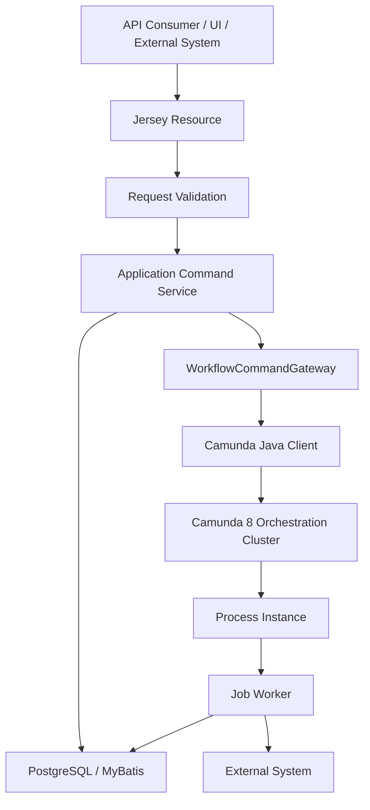

REST boundary yang benar:

```text id="w4e9j3"
Client says:
  "Submit this case."

Jersey says:
  "Validate request, persist command, start or signal workflow."

Camunda says:
  "Move process instance according to BPMN."

Worker says:
  "Execute service task and report result."
```

REST boundary yang salah:

```text id="1neotg"
Client says:
  "Start BPMN process id X version latest with variables Y."

Jersey says:
  "Forward raw request to Camunda."

Problem:
  API consumer now depends on internal workflow implementation.
```

---

# 3. Prinsip desain endpoint

## 3.1 Endpoint harus berbasis domain command

Kurang bagus:

```http id="jyyj2b"
POST /camunda/process-instances
POST /workflow/start/case_enforcement_lifecycle
POST /workflow/message/DocumentReceived
POST /jobs/complete
```

Lebih bagus:

```http id="kjaj47"
POST /cases
POST /cases/{caseId}/submit
POST /cases/{caseId}/documents
POST /cases/{caseId}/appeals
POST /cases/{caseId}/cancel
POST /cases/{caseId}/manual-review/decision
```

Kenapa?

| Prinsip | Penjelasan |
|---|---|
| API stabil | BPMN bisa berubah tanpa memaksa API consumer berubah. |
| Domain-first | Consumer tahu aksi bisnis, bukan detail orchestration engine. |
| Security lebih jelas | Authorization berdasarkan domain action, bukan technical operation. |
| Observability lebih baik | Log/audit bisa membaca command bisnis. |
| Testability lebih baik | API test tidak perlu tahu internal BPMN flow. |

---

# 4. Kategori endpoint dalam workflow application

| Kategori | Tujuan | Contoh |
|---|---|---|
| **Command endpoint** | Memulai atau mengubah lifecycle bisnis | `POST /cases`, `POST /cases/{id}/submit` |
| **Event endpoint** | Menerima fakta/event eksternal lalu publish/correlate message | `POST /cases/{id}/documents-received` |
| **Query endpoint** | Mengambil business state dari DB aplikasi | `GET /cases/{id}` |
| **Task endpoint** | Custom task UI untuk claim/complete user task | `POST /tasks/{taskId}/complete` |
| **Admin/support endpoint** | Internal operation terbatas | `POST /cases/{id}/reconcile-workflow` |
| **Webhook endpoint** | Entry point dari external system | `POST /webhooks/payment/provider-x` |

Rule praktis:

```text id="tqdp8h"
Command endpoint:
  intent from user/system

Event endpoint:
  fact that already happened

Query endpoint:
  read model/business state

Task endpoint:
  human work action

Admin endpoint:
  restricted remediation operation
```

---

# 5. Command endpoint pattern

## 5.1 Contoh: create/submit case

```http id="e2y2rc"
POST /cases
Idempotency-Key: CASE-CREATE-20260716-0001
Content-Type: application/json
```

Request:

```json id="wy7c1p"
{
  "applicantId": "APL-1001",
  "caseType": "LICENSE_REVIEW",
  "submittedBy": "user-123",
  "payload": {
    "licenseNo": "LIC-88991",
    "region": "JKT"
  }
}
```

Response:

```http id="egj6si"
202 Accepted
```

```json id="6yoywu"
{
  "caseId": "CASE-2026-000123",
  "status": "SUBMITTED",
  "workflowAccepted": true
}
```

Kenapa `202 Accepted`?

Karena workflow berjalan asynchronous. REST call hanya menerima command, bukan menyelesaikan seluruh process.

---

## 5.2 Jersey resource

```java id="aswqaz"
package com.company.caseapp.api;

import com.company.caseapp.application.CaseCommandService;
import jakarta.ws.rs.Consumes;
import jakarta.ws.rs.HeaderParam;
import jakarta.ws.rs.POST;
import jakarta.ws.rs.Path;
import jakarta.ws.rs.Produces;
import jakarta.ws.rs.core.MediaType;
import jakarta.ws.rs.core.Response;

@Path("/cases")
@Consumes(MediaType.APPLICATION_JSON)
@Produces(MediaType.APPLICATION_JSON)
public final class CaseResource {

    private final CaseCommandService commandService;

    public CaseResource(CaseCommandService commandService) {
        this.commandService = commandService;
    }

    @POST
    public Response createCase(
            @HeaderParam("Idempotency-Key") String idempotencyKey,
            CreateCaseRequest request
    ) {
        CreateCaseResult result = commandService.createCase(
            idempotencyKey,
            request
        );

        return Response
            .accepted(new CreateCaseResponse(
                result.caseId(),
                result.status(),
                result.workflowAccepted()
            ))
            .build();
    }
}
```

DTO:

```java id="5ir58l"
package com.company.caseapp.api;

import java.util.Map;

public record CreateCaseRequest(
    String applicantId,
    String caseType,
    String submittedBy,
    Map<String, Object> payload
) {
}
```

```java id="bk2a99"
package com.company.caseapp.api;

public record CreateCaseResponse(
    String caseId,
    String status,
    boolean workflowAccepted
) {
}
```

---

## 5.3 Application service

```java id="uuyh0o"
package com.company.caseapp.application;

import com.company.caseapp.api.CreateCaseRequest;
import com.company.caseapp.persistence.repository.CaseRepository;
import com.company.caseapp.workflow.WorkflowCommandGateway;

public final class CaseCommandService {

    private final CaseRepository caseRepository;
    private final WorkflowCommandGateway workflowGateway;

    public CaseCommandService(
            CaseRepository caseRepository,
            WorkflowCommandGateway workflowGateway
    ) {
        this.caseRepository = caseRepository;
        this.workflowGateway = workflowGateway;
    }

    public CreateCaseResult createCase(
            String idempotencyKey,
            CreateCaseRequest request
    ) {
        validateIdempotencyKey(idempotencyKey);
        validateRequest(request);

        CaseCreationResult dbResult = caseRepository.createCaseIfAbsent(
            idempotencyKey,
            request
        );

        if (dbResult.alreadyProcessed()) {
            return new CreateCaseResult(
                dbResult.caseId(),
                dbResult.status(),
                true
            );
        }

        workflowGateway.startCaseLifecycle(
            dbResult.caseId(),
            request.applicantId(),
            request.caseType()
        );

        return new CreateCaseResult(
            dbResult.caseId(),
            "SUBMITTED",
            true
        );
    }

    private void validateIdempotencyKey(String value) {
        if (value == null || value.isBlank()) {
            throw new BadRequestException("Idempotency-Key header is required");
        }
    }

    private void validateRequest(CreateCaseRequest request) {
        if (request.applicantId() == null || request.applicantId().isBlank()) {
            throw new BadRequestException("applicantId is required");
        }
        if (request.caseType() == null || request.caseType().isBlank()) {
            throw new BadRequestException("caseType is required");
        }
    }
}
```

Catatan penting: contoh ini masih direct DB → Camunda. Untuk production-grade, seri 11 akan menguatkan ini dengan **transactional outbox** supaya tidak terjadi dual-write inconsistency.

---

# 6. Workflow gateway pattern

## 6.1 Interface

```java id="d6ckdb"
package com.company.caseapp.workflow;

import java.util.Map;

public interface WorkflowCommandGateway {

    long startCaseLifecycle(
        String caseId,
        String applicantId,
        String caseType
    );

    void publishCaseMessage(
        String messageName,
        String correlationKey,
        Map<String, Object> variables
    );
}
```

## 6.2 Implementation

```java id="83qgai"
package com.company.caseapp.workflow;

import io.camunda.client.CamundaClient;

import java.util.Map;

public final class CamundaWorkflowCommandGateway implements WorkflowCommandGateway {

    private final CamundaClient client;

    public CamundaWorkflowCommandGateway(CamundaClient client) {
        this.client = client;
    }

    @Override
    public long startCaseLifecycle(
            String caseId,
            String applicantId,
            String caseType
    ) {
        var event = client.newCreateInstanceCommand()
            .bpmnProcessId(ProcessDefinitions.CASE_ENFORCEMENT_LIFECYCLE)
            .latestVersion()
            .variables(Map.of(
                "caseId", caseId,
                "applicantId", applicantId,
                "caseType", caseType,
                "correlationKey", caseId
            ))
            .execute();

        return event.getProcessInstanceKey();
    }

    @Override
    public void publishCaseMessage(
            String messageName,
            String correlationKey,
            Map<String, Object> variables
    ) {
        client.newPublishMessageCommand()
            .messageName(messageName)
            .correlationKey(correlationKey)
            .variables(variables)
            .execute();
    }
}
```

Camunda Orchestration Cluster REST API juga menyediakan endpoint create process instance. Process definition dapat ditentukan memakai process definition key atau BPMN process id dan version. Untuk Java/Jersey service, biasanya Java Client lebih nyaman karena API-nya typed dan langsung cocok untuk worker/process application. ([Camunda 8 Docs](https://docs.camunda.io/docs/apis-tools/orchestration-cluster-api-rest/specifications/create-process-instance/?utm_source=chatgpt.com))

---

# 7. Event endpoint pattern

Event endpoint berbeda dari command endpoint.

Command:

```text id="vpy0vz"
"User wants to submit case."
```

Event:

```text id="3ya5qw"
"Document has been received."
"Payment has been confirmed."
"External verification completed."
```

## 7.1 Contoh endpoint

```http id="xi1qub"
POST /cases/{caseId}/documents-received
Idempotency-Key: DOC-EVT-20260716-0001
Content-Type: application/json
```

Request:

```json id="x4ua6i"
{
  "documentBatchId": "DOCB-9911",
  "receivedAt": "2026-07-16T10:30:00+07:00",
  "source": "DOCUMENT_PORTAL"
}
```

Response:

```http id="diyqu9"
202 Accepted
```

```json id="lj2z42"
{
  "caseId": "CASE-2026-000123",
  "eventAccepted": true
}
```

## 7.2 Jersey resource

```java id="7k484r"
@Path("/cases/{caseId}/documents-received")
@Consumes(MediaType.APPLICATION_JSON)
@Produces(MediaType.APPLICATION_JSON)
public final class CaseDocumentEventResource {

    private final CaseEventService eventService;

    public CaseDocumentEventResource(CaseEventService eventService) {
        this.eventService = eventService;
    }

    @POST
    public Response documentReceived(
            @PathParam("caseId") String caseId,
            @HeaderParam("Idempotency-Key") String idempotencyKey,
            DocumentReceivedRequest request
    ) {
        eventService.acceptDocumentReceivedEvent(
            caseId,
            idempotencyKey,
            request
        );

        return Response
            .accepted(Map.of(
                "caseId", caseId,
                "eventAccepted", true
            ))
            .build();
    }
}
```

## 7.3 Application service

```java id="borznx"
public final class CaseEventService {

    private final CaseEventRepository eventRepository;
    private final WorkflowCommandGateway workflowGateway;

    public CaseEventService(
            CaseEventRepository eventRepository,
            WorkflowCommandGateway workflowGateway
    ) {
        this.eventRepository = eventRepository;
        this.workflowGateway = workflowGateway;
    }

    public void acceptDocumentReceivedEvent(
            String caseId,
            String idempotencyKey,
            DocumentReceivedRequest request
    ) {
        validate(caseId, idempotencyKey, request);

        boolean inserted = eventRepository.insertIfAbsent(
            idempotencyKey,
            caseId,
            "DOCUMENT_RECEIVED",
            request
        );

        if (!inserted) {
            return;
        }

        workflowGateway.publishCaseMessage(
            MessageNames.DOCUMENT_RECEIVED,
            caseId,
            Map.of(
                "caseId", caseId,
                "documentBatchId", request.documentBatchId(),
                "documentReceived", true
            )
        );
    }

    private void validate(
            String caseId,
            String idempotencyKey,
            DocumentReceivedRequest request
    ) {
        if (caseId == null || caseId.isBlank()) {
            throw new BadRequestException("caseId is required");
        }
        if (idempotencyKey == null || idempotencyKey.isBlank()) {
            throw new BadRequestException("Idempotency-Key is required");
        }
        if (request.documentBatchId() == null || request.documentBatchId().isBlank()) {
            throw new BadRequestException("documentBatchId is required");
        }
    }
}
```

---

# 8. Publish message vs correlate message

Camunda 8 membedakan **publish message** dan **correlate message** dalam Orchestration Cluster API.

| Operation | Behavior | Cocok untuk |
|---|---|---|
| **Publish message** | Message dapat dibuffer; endpoint tidak menunggu hasil correlation. | Event asynchronous biasa. |
| **Correlate message** | Publish dan correlate ke subscription; jika sukses mengembalikan process instance key pertama yang correlated; message tidak dibuffer. | Saat caller butuh feedback langsung bahwa message benar-benar correlated. |

Dokumentasi Camunda menyebut publish message mengirim message ke partition yang dihitung dari correlation key, message bisa dibuffer, dan endpoint tidak menunggu hasil correlation; untuk feedback langsung gunakan correlate message. Correlate message akan mengembalikan process instance key jika correlation sukses, tetapi message tidak dibuffer. ([Camunda 8 Docs](https://docs.camunda.io/docs/apis-tools/orchestration-cluster-api-rest/specifications/publish-message/?utm_source=chatgpt.com))

## Rule praktis

```text id="8h70gn"
Gunakan publish message:
  - webhook eksternal
  - event eventual consistency
  - process mungkin belum sampai catch event
  - caller tidak perlu tahu langsung correlated atau tidak

Gunakan correlate message:
  - UI/admin action butuh feedback langsung
  - operation harus gagal kalau process tidak sedang menunggu message
  - support tool / internal operation
```

---

# 9. Query endpoint pattern

Query endpoint sebaiknya membaca **business read model** dari PostgreSQL, bukan menjadikan Camunda sebagai query backend utama untuk UI bisnis.

## 9.1 Contoh

```http id="t3z0fq"
GET /cases/CASE-2026-000123
```

Response:

```json id="i1yyxn"
{
  "caseId": "CASE-2026-000123",
  "status": "UNDER_REVIEW",
  "caseType": "LICENSE_REVIEW",
  "applicantId": "APL-1001",
  "riskLevel": "HIGH",
  "currentStage": "MANUAL_REVIEW",
  "createdAt": "2026-07-16T10:00:00+07:00",
  "updatedAt": "2026-07-16T10:45:00+07:00"
}
```

Kenapa bukan langsung query Camunda?

| Alasan | Penjelasan |
|---|---|
| Business status ≠ workflow token position | User butuh status domain, bukan internal BPMN state. |
| Query shape berbeda | UI butuh aggregated data dari DB aplikasi. |
| Security | Tidak semua user boleh melihat raw variables/process state. |
| Performance | Query bisnis lebih cocok di read model DB aplikasi. |
| Stability | BPMN bisa berubah tanpa mengubah API response. |

Camunda API tetap berguna untuk admin/support/observability, tetapi domain API sebaiknya memakai business read model.

---

# 10. HTTP status code convention

| Kondisi | Status | Contoh |
|---|---:|---|
| Command diterima untuk async workflow | `202 Accepted` | `POST /cases` |
| Resource bisnis dibuat dan langsung tersedia | `201 Created` | `POST /draft-cases` |
| Query sukses | `200 OK` | `GET /cases/{id}` |
| Command duplicate idempotent | `200 OK` atau `202 Accepted` | Retry dengan same key |
| Request invalid | `400 Bad Request` | missing field |
| Unauthorized | `401 Unauthorized` | no/invalid token |
| Forbidden | `403 Forbidden` | user tidak boleh submit case |
| Resource tidak ditemukan | `404 Not Found` | unknown caseId |
| Conflict domain state | `409 Conflict` | submit case yang sudah closed |
| Validation semantic gagal | `422 Unprocessable Entity` | payload valid JSON tapi rule bisnis gagal |
| Dependency unavailable | `503 Service Unavailable` | Camunda/PostgreSQL unavailable |
| Unexpected error | `500 Internal Server Error` | bug |

Practical rule:

```text id="frn61k"
202:
  workflow accepted, processing continues async

409:
  command valid, but current business state does not allow it

422:
  request shape valid, but business validation rejects it

503:
  infrastructure dependency unavailable; caller may retry
```

---

# 11. Idempotency key design

Idempotency wajib untuk command/event endpoint yang bisa di-retry oleh client, API gateway, load balancer, webhook provider, atau user.

## 11.1 Header convention

```http id="lq37mc"
Idempotency-Key: CASE-SUBMIT-CASE-2026-000123-001
```

## 11.2 DB table

```sql id="b7wbzy"
create table api_idempotency_key (
    idempotency_key text primary key,
    endpoint text not null,
    request_hash text not null,
    resource_id text,
    response_status int,
    response_body jsonb,
    status text not null,
    created_at timestamptz not null default now(),
    completed_at timestamptz,
    expires_at timestamptz
);

create index idx_api_idempotency_expires_at
    on api_idempotency_key (expires_at);
```

## 11.3 State

```text id="j3s4tl"
RECEIVED
PROCESSING
COMPLETED
FAILED_RETRYABLE
FAILED_FINAL
```

## 11.4 Rule

| Scenario | Behavior |
|---|---|
| Same key + same request hash + completed | Return stored response. |
| Same key + different request hash | `409 Conflict` |
| Same key still processing | `202 Accepted` or `409 Conflict`, tergantung API policy |
| Missing key for unsafe command | `400 Bad Request` |
| Expired key | Treat as new or reject, sesuai policy |

## 11.5 Repository sketch

```java id="u2p80v"
public interface IdempotencyRepository {

    IdempotencyRecord tryStart(
        String idempotencyKey,
        String endpoint,
        String requestHash
    );

    void markCompleted(
        String idempotencyKey,
        int responseStatus,
        String responseBody,
        String resourceId
    );

    void markFailedRetryable(
        String idempotencyKey,
        String reason
    );
}
```

---

# 12. Correlation key strategy

Correlation key adalah penghubung antara event eksternal dan process instance yang sedang menunggu message.

## 12.1 Rule praktis

Gunakan business ID stabil:

```text id="3d4zmc"
caseId
applicationId
claimId
orderId
investigationId
```

Hindari memakai:

```text id="37m4io"
processInstanceKey sebagai public correlation key
random UUID yang tidak dikenal domain
email/phone sebagai correlation key utama
payload hash yang sulit di-debug
```

## 12.2 Naming convention

```text id="qf6yf6"
correlationKey = caseId

Message names:
  DocumentReceived
  PaymentConfirmed
  AppealSubmitted
  ExternalVerificationCompleted

Variables:
  caseId
  eventId
  documentBatchId
  paymentId
  appealId
```

## 12.3 Constants

```java id="vul2rg"
public final class MessageNames {

    private MessageNames() {
    }

    public static final String DOCUMENT_RECEIVED = "DocumentReceived";
    public static final String PAYMENT_CONFIRMED = "PaymentConfirmed";
    public static final String APPEAL_SUBMITTED = "AppealSubmitted";
    public static final String EXTERNAL_VERIFICATION_COMPLETED =
        "ExternalVerificationCompleted";
}
```

---

# 13. Jangan leak processInstanceKey ke public API kecuali ada alasan

`processInstanceKey` berguna untuk internal observability, tapi tidak ideal sebagai public identifier.

## Public response yang aman

```json id="0cdrhs"
{
  "caseId": "CASE-2026-000123",
  "status": "SUBMITTED"
}
```

## Internal log boleh menyimpan

```text id="ak9frv"
caseId=CASE-2026-000123
processInstanceKey=2251799813699999
bpmnProcessId=case_enforcement_lifecycle
```

## Internal support response boleh include optional debug info

```json id="ghfo9w"
{
  "caseId": "CASE-2026-000123",
  "status": "UNDER_REVIEW",
  "workflow": {
    "processInstanceKey": "2251799813699999",
    "bpmnProcessId": "case_enforcement_lifecycle"
  }
}
```

Rule:

```text id="c97kyx"
Public/business API:
  expose business ID

Internal/support API:
  may expose workflow technical ID with authorization
```

---

# 14. Request validation layers

Gunakan beberapa lapis validation.

| Layer | Validasi | Contoh |
|---|---|---|
| HTTP/schema | JSON shape, required fields, type | `applicantId required` |
| Security | caller identity/action permission | user boleh submit case? |
| Domain state | lifecycle state transition allowed | DRAFT → SUBMITTED valid |
| Business rule | semantic validation | document lengkap? |
| Workflow precondition | process/message state expectation | process exists? waiting message? |

## Example domain state guard

```java id="g13um1"
public void submitCase(String caseId, SubmitCaseRequest request) {
    CaseRecord record = caseRepository.findById(caseId)
        .orElseThrow(() -> new NotFoundException("Case not found"));

    if (!record.status().equals("DRAFT")) {
        throw new ConflictException(
            "Case cannot be submitted from status " + record.status()
        );
    }

    caseRepository.markSubmitted(caseId);

    workflowGateway.publishCaseMessage(
        MessageNames.CASE_SUBMITTED,
        caseId,
        Map.of("caseId", caseId)
    );
}
```

---

# 15. Error response format

Gunakan format error konsisten.

```json id="obgxvl"
{
  "errorCode": "CASE_INVALID_STATE",
  "message": "Case cannot be submitted from status CLOSED",
  "correlationId": "req-6d5a7c",
  "details": {
    "caseId": "CASE-2026-000123",
    "currentStatus": "CLOSED",
    "expectedStatus": "DRAFT"
  }
}
```

## Exception mapper Jersey

```java id="969cdk"
@Provider
public final class ApiExceptionMapper implements ExceptionMapper<ApiException> {

    @Override
    public Response toResponse(ApiException ex) {
        ErrorResponse response = new ErrorResponse(
            ex.errorCode(),
            ex.getMessage(),
            RequestCorrelation.currentId(),
            ex.details()
        );

        return Response.status(ex.httpStatus())
            .type(MediaType.APPLICATION_JSON)
            .entity(response)
            .build();
    }
}
```

Base exception:

```java id="w8is2e"
public abstract class ApiException extends RuntimeException {

    private final int httpStatus;
    private final String errorCode;
    private final Map<String, Object> details;

    protected ApiException(
            int httpStatus,
            String errorCode,
            String message,
            Map<String, Object> details
    ) {
        super(message);
        this.httpStatus = httpStatus;
        this.errorCode = errorCode;
        this.details = details;
    }

    public int httpStatus() {
        return httpStatus;
    }

    public String errorCode() {
        return errorCode;
    }

    public Map<String, Object> details() {
        return details;
    }
}
```

---

# 16. REST API tidak boleh complete job langsung dari public user action

Anti-pattern:

```http id="p9u2dz"
POST /jobs/{jobKey}/complete
```

Kenapa buruk?

```text id="nsil74"
- jobKey adalah internal runtime detail
- public caller bisa coupling ke worker implementation
- authorization sulit berdasarkan domain
- user action bisa bypass domain validation
```

Lebih baik:

```http id="yldk6h"
POST /cases/{caseId}/manual-review/decision
```

Request:

```json id="mkdfe0"
{
  "decision": "APPROVE",
  "reason": "All checks passed"
}
```

Lalu application service:

```text id="d7zgn5"
1. Validate user boleh approve.
2. Validate case sedang UNDER_REVIEW.
3. Persist decision ke PostgreSQL.
4. Complete user task / publish message / update workflow sesuai design.
```

Untuk human task, nanti dibahas khusus di Seri 13. Prinsipnya tetap sama: expose **business task action**, bukan raw Camunda operation.

---

# 17. Command/event/query endpoint catalogue

Contoh katalog untuk case lifecycle:

| Endpoint | Type | Camunda Operation | DB Operation |
|---|---|---|---|
| `POST /cases` | Command | Start process instance | Insert case |
| `POST /cases/{id}/submit` | Command | Publish `CaseSubmitted` atau start process | Update case status |
| `POST /cases/{id}/cancel` | Command | Publish `CaseCancelled` / cancel workflow internally | Mark cancelled |
| `POST /cases/{id}/documents-received` | Event | Publish `DocumentReceived` | Insert event/document metadata |
| `POST /cases/{id}/payment-confirmed` | Event | Publish `PaymentConfirmed` | Insert payment event |
| `POST /cases/{id}/appeals` | Command/Event | Start appeal subprocess or publish message | Insert appeal |
| `GET /cases/{id}` | Query | None usually | Read case projection |
| `GET /cases/{id}/timeline` | Query | None usually | Read event/audit table |
| `GET /cases/{id}/workflow-debug` | Internal query | Camunda query maybe | Read process metadata |
| `POST /cases/{id}/reconcile-workflow` | Admin command | Start/publish/retry according to policy | Reconciliation log |

---

# 18. OpenAPI contract sketch

```yaml id="d0ft81"
paths:
  /cases:
    post:
      summary: Create and submit a new case
      operationId: createCase
      parameters:
        - in: header
          name: Idempotency-Key
          required: true
          schema:
            type: string
      requestBody:
        required: true
        content:
          application/json:
            schema:
              $ref: '#/components/schemas/CreateCaseRequest'
      responses:
        '202':
          description: Case accepted for asynchronous workflow processing
          content:
            application/json:
              schema:
                $ref: '#/components/schemas/CreateCaseResponse'
        '400':
          description: Invalid request
        '409':
          description: Duplicate idempotency key with different request or invalid state
        '503':
          description: Dependency temporarily unavailable
```

Schema:

```yaml id="x6jmaw"
components:
  schemas:
    CreateCaseRequest:
      type: object
      required:
        - applicantId
        - caseType
      properties:
        applicantId:
          type: string
        caseType:
          type: string
          enum:
            - LICENSE_REVIEW
            - COMPLIANCE_CHECK
            - ENFORCEMENT_CASE
        payload:
          type: object
          additionalProperties: true

    CreateCaseResponse:
      type: object
      required:
        - caseId
        - status
        - workflowAccepted
      properties:
        caseId:
          type: string
        status:
          type: string
        workflowAccepted:
          type: boolean
```

---

# 19. Logging and trace context

Setiap command/event harus punya log fields minimal.

```text id="7e6d1e"
requestId
correlationId
idempotencyKey
caseId
commandName
messageName
bpmnProcessId
processInstanceKey
caller
status
durationMs
```

Contoh structured log:

```json id="5sdxbr"
{
  "event": "workflow.command.accepted",
  "requestId": "req-123",
  "idempotencyKey": "CASE-CREATE-20260716-0001",
  "caseId": "CASE-2026-000123",
  "commandName": "CreateCase",
  "bpmnProcessId": "case_enforcement_lifecycle",
  "processInstanceKey": "2251799813699999",
  "durationMs": 84
}
```

Jangan log:

```text id="p88ls5"
- access token
- client secret
- full sensitive payload
- personal data tanpa masking
- full Camunda variable map jika berisi data sensitif
```

---

# 20. Security model

REST API harus authorize berdasarkan domain action.

| Domain Action | Permission Example |
|---|---|
| Create case | `case:create` |
| Submit case | `case:submit` |
| Cancel case | `case:cancel` |
| Upload document event | `case:document:add` |
| Approve manual review | `case:review:approve` |
| View workflow debug | `case:workflow:debug` |
| Reconcile workflow | `case:workflow:reconcile` |

Jangan expose Camunda service account credential ke frontend/client. Jersey backend menggunakan service account/client credentials untuk berkomunikasi dengan Camunda.

---

# 21. Practical anti-patterns

| Anti-pattern | Contoh | Risiko | Koreksi |
|---|---|---|---|
| Raw Camunda wrapper API | `POST /camunda/process/start` | Consumer coupling ke BPMN | Domain command API |
| Public API menerima `bpmnProcessId` | request body berisi process id | Security/coupling risk | Server-side mapping |
| Public API menerima `jobKey` | complete job dari frontend | Bypass validation | Task/domain endpoint |
| Process variable full payload | semua request disimpan ke Camunda | Sensitive data, bloat | Store ID/reference |
| Tanpa idempotency | retry create case bikin duplicate | Data corruption | Idempotency-Key + unique constraint |
| Correlation pakai random technical ID | sulit debug/retry | Event tidak match | Business key |
| Semua endpoint return `200` | caller tidak tahu async/error | Semantik HTTP buruk | Pakai 202/409/422/503 |
| Query UI langsung ke Camunda | API tergantung process structure | Brittle | Business read model |
| Endpoint langsung panggil Camunda client | sulit test, coupling | Gateway abstraction |
| Tidak persist event sebelum publish message | event hilang saat Camunda down | Data loss | Event table/outbox |

---

# 22. Minimal DB schema untuk command/event boundary

## 22.1 Case table

```sql id="khnp4o"
create table case_record (
    case_id text primary key,
    applicant_id text not null,
    case_type text not null,
    status text not null,
    payload jsonb not null,
    created_at timestamptz not null default now(),
    updated_at timestamptz not null default now()
);

create index idx_case_record_status
    on case_record (status);

create index idx_case_record_applicant_id
    on case_record (applicant_id);
```

## 22.2 Event table

```sql id="2gls1s"
create table case_event (
    event_id bigserial primary key,
    idempotency_key text not null unique,
    case_id text not null references case_record(case_id),
    event_type text not null,
    event_payload jsonb not null,
    created_at timestamptz not null default now()
);

create index idx_case_event_case_id_created_at
    on case_event (case_id, created_at);
```

## 22.3 Workflow metadata table

```sql id="vwt2m7"
create table case_workflow_instance (
    case_id text primary key references case_record(case_id),
    bpmn_process_id text not null,
    process_instance_key text,
    workflow_status text not null,
    started_at timestamptz,
    completed_at timestamptz,
    last_synced_at timestamptz,
    created_at timestamptz not null default now()
);
```

## 22.4 Outbox preview

```sql id="jbqf6c"
create table workflow_outbox (
    outbox_id bigserial primary key,
    aggregate_id text not null,
    event_type text not null,
    payload jsonb not null,
    status text not null,
    retry_count int not null default 0,
    next_retry_at timestamptz,
    created_at timestamptz not null default now(),
    published_at timestamptz
);
```

Outbox akan dibahas mendalam di Seri 11.

---

# 23. MyBatis mapper sketch

```java id="1xga10"
public interface CaseMapper {

    int insertCase(CaseRecord record);

    Optional<CaseRecord> findById(String caseId);

    int updateStatus(
        @Param("caseId") String caseId,
        @Param("status") String status
    );

    int insertEvent(CaseEventRecord event);

    int insertWorkflowInstance(CaseWorkflowInstanceRecord workflow);
}
```

XML contoh:

```xml id="2jkefz"
<insert id="insertCase">
    insert into case_record (
        case_id,
        applicant_id,
        case_type,
        status,
        payload
    ) values (
        #{caseId},
        #{applicantId},
        #{caseType},
        #{status},
        #{payload, typeHandler=com.company.JsonbTypeHandler}
    )
</insert>
```

```xml id="bo85i4"
<insert id="insertEvent">
    insert into case_event (
        idempotency_key,
        case_id,
        event_type,
        event_payload
    ) values (
        #{idempotencyKey},
        #{caseId},
        #{eventType},
        #{eventPayload, typeHandler=com.company.JsonbTypeHandler}
    )
</insert>
```

---

# 24. Recommended layering

```text id="ihp0qy"
CaseResource
  - HTTP mapping only
  - header/path/body extraction
  - response status

CaseCommandService
  - validation
  - authorization decision call
  - idempotency
  - domain state transition
  - repository calls
  - workflow gateway call

WorkflowCommandGateway
  - Camunda command translation
  - process/message constants
  - variables minimalization

CaseRepository
  - PostgreSQL/MyBatis
  - transaction boundary

Camunda Java Client
  - technical integration
```

Jangan jadikan `CaseResource` sebagai tempat semua logic.

---

# 25. Mini-lab Seri 4

## Goal

Buat API:

```text id="wx0uc1"
POST /cases
POST /cases/{caseId}/documents-received
GET  /cases/{caseId}
```

## Expected behavior

```text id="fqsgsl"
POST /cases:
  - requires Idempotency-Key
  - inserts case
  - starts Camunda process
  - returns 202

POST /cases/{caseId}/documents-received:
  - requires Idempotency-Key
  - inserts event
  - publishes DocumentReceived message
  - returns 202

GET /cases/{caseId}:
  - reads PostgreSQL
  - returns business status
  - does not expose raw Camunda variables
```

## Validation checklist

```text id="pvhf0b"
[ ] Duplicate POST /cases with same idempotency key returns same caseId.
[ ] Duplicate key with different request returns 409.
[ ] POST /cases does not accept bpmnProcessId from client.
[ ] POST /documents-received uses caseId as correlationKey.
[ ] GET /cases reads DB, not raw Camunda state.
[ ] Logs include requestId, idempotencyKey, caseId, processInstanceKey.
[ ] API returns 202 for async workflow command.
```

---

# 26. Ringkasan Seri 4

```text id="1c4k77"
REST API:
  speaks business language

Application Service:
  validates command, persists state, invokes workflow

Workflow Gateway:
  translates business command/event into Camunda command

Camunda:
  orchestrates process, creates jobs, waits for messages/tasks

PostgreSQL:
  stores business state, events, idempotency, read model
```

Formula praktis:

```text id="0xpsvz"
Do not expose:
  bpmnProcessId
  jobType
  jobKey
  processInstanceKey
  raw variables
  raw Camunda operations

Expose:
  caseId
  business command
  business event
  business status
  stable API contract
```

---

# Seri 4/16 selesai

Seri ini selesai: **Jersey REST API as Workflow Command Boundary**.

Rekomendasi materi berikutnya:

**Seri 5/16 - Starting Process Instance Pattern from REST Endpoint: start process, variables, business key/correlation key, idempotency, DB-first vs workflow-first, response design, dan failure handling saat Camunda unavailable.**

---

**Sources:**

- [Java client | Camunda 8 Docs](https://docs.camunda.io/docs/apis-tools/java-client/getting-started/?utm_source=chatgpt.com)

## Response:
7/16/2026, 9:50:01 AM

Saya lanjut ke **Seri 5/16**. Fokusnya pola paling sering dipakai: REST endpoint menerima command, lalu memulai process instance dengan variable minimal dan failure handling yang aman.

# Cheatsheet Camunda 8 + Java/Jersey Microservice  
## Seri 5/16 - Starting Process Instance Pattern from REST Endpoint

## 1. Fokus seri ini

Seri ini membahas pattern saat **Jersey REST endpoint menerima business command**, lalu aplikasi memulai **Camunda 8 process instance**.

Contoh nyata:

```text
POST /cases
POST /applications
POST /claims
POST /investigations
POST /enforcement-cases
```

Pattern dasarnya:

```text
HTTP Command
  -> validate request
  -> enforce idempotency
  -> persist business record
  -> start Camunda process instance
  -> return business response
```

Camunda 8 mendukung pembuatan process instance dengan command yang menentukan **BPMN process ID** atau **unique process definition key**; mode umum adalah asynchronous create, yaitu instance dibuat dan response dikembalikan segera, sementara eksekusi process berjalan setelah response dikirim. Camunda juga menyediakan mode `awaitCompletion`, tetapi itu lebih cocok untuk proses pendek dan harus dirancang hati-hati karena retry client dapat membuat instance baru bila command dikirim ulang. ([Camunda 8 Docs](https://docs.camunda.io/docs/components/concepts/process-instance-creation/))

---

# 2. Mental model

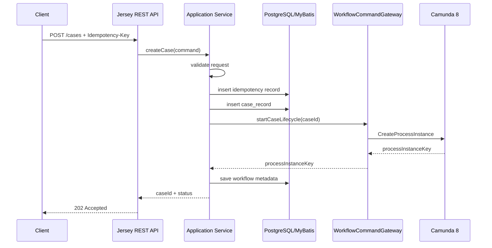

Core rule:

```text
REST caller should receive:
  - business ID
  - business status
  - accepted/created result

REST caller should not need:
  - BPMN process id
  - process definition key
  - job type
  - raw process variable map
```

---

# 3. Kapan REST endpoint harus start process?

Gunakan `start process instance` saat command menciptakan lifecycle bisnis baru.

| Use Case | Endpoint | Process Start? | Reason |
|---|---|---:|---|
| Create enforcement case | `POST /cases` | Ya | Lifecycle baru dimulai |
| Submit application | `POST /applications/{id}/submit` | Ya / tergantung | Jika draft sebelumnya belum punya workflow |
| Receive document | `POST /cases/{id}/documents-received` | Tidak | Biasanya publish message ke existing process |
| Approve manual task | `POST /cases/{id}/review/decision` | Tidak | Biasanya complete task / publish event |
| Retry failed worker | internal ops | Tidak | Resolve incident/retry job |
| Scheduled nightly check | timer start event | Tidak dari REST | Process dimulai oleh timer |

Rule praktis:

```text
Start process:
  untuk lifecycle baru

Publish/correlate message:
  untuk event pada lifecycle yang sudah berjalan

Complete user task:
  untuk human task action

Resolve/retry incident:
  untuk support/ops action
```

Camunda 8 juga bisa membuat process instance lewat **message start event** atau **timer start event**, bukan hanya explicit create command. Message start event membuat instance ketika message dengan nama yang cocok dipublish, sedangkan timer start event membuat instance saat timer trigger. ([Camunda 8 Docs](https://docs.camunda.io/docs/components/concepts/process-instance-creation/))

---

# 4. Recommended endpoint contract

## 4.1 Endpoint

```http
POST /cases
Idempotency-Key: CASE-CREATE-20260716-0001
Content-Type: application/json
```

## 4.2 Request

```json
{
  "applicantId": "APL-1001",
  "caseType": "LICENSE_REVIEW",
  "submittedBy": "user-123",
  "region": "JKT",
  "payload": {
    "licenseNo": "LIC-88991",
    "businessUnit": "REGULATORY"
  }
}
```

## 4.3 Response

```http
202 Accepted
```

```json
{
  "caseId": "CASE-2026-000123",
  "status": "SUBMITTED",
  "workflow": {
    "accepted": true
  }
}
```

Kenapa `202 Accepted`?

Karena REST call hanya menerima command dan memulai lifecycle. Proses sebenarnya asynchronous dan akan lanjut lewat service task, user task, message, timer, dan worker.

---

# 5. Variable design saat start process

Camunda best practice menyarankan process variables digunakan secara **lightweight dan meaningful**, hanya menyimpan data yang relevan untuk process instance. Variables di Camunda 8 disimpan sebagai JSON, dan process variables tidak dideklarasikan di BPMN model sehingga perlu disiplin naming/type handling di aplikasi. ([Camunda 8 Docs](https://docs.camunda.io/docs/components/best-practices/development/handling-data-in-processes/))

## 5.1 Variable yang disarankan

```json
{
  "caseId": "CASE-2026-000123",
  "applicantId": "APL-1001",
  "caseType": "LICENSE_REVIEW",
  "region": "JKT",
  "correlationKey": "CASE-2026-000123"
}
```

## 5.2 Variable yang perlu dihindari

```json
{
  "fullCasePayload": {
    "large": "...",
    "sensitive": "...",
    "nested": "...",
    "documents": ["..."],
    "auditHistory": ["..."]
  }
}
```

## 5.3 Practical rule

| Data | Taruh di Camunda variable? | Taruh di PostgreSQL? |
|---|---:|---:|
| `caseId` | Ya | Ya |
| `applicantId` | Ya, jika routing/task butuh | Ya |
| `caseType` | Ya | Ya |
| full request payload | Tidak | Ya |
| document metadata lengkap | Tidak | Ya |
| risk score/risk level | Ya, jika gateway butuh | Ya |
| audit event detail | Tidak | Ya |
| correlation key | Ya | Ya |
| sensitive PII | Hindari | Ya, dengan kontrol akses/enkripsi/masking |

---

# 6. Business ID di Camunda 8.9+

Ini penting dan relatif baru.

Camunda 8.9 menambahkan **Business ID** untuk process instance. Business ID adalah identifier immutable yang merepresentasikan entity bisnis seperti order ID, claim number, atau case reference. Fitur uniqueness validation dapat diaktifkan di level cluster untuk menolak duplicate active root process instance dengan Business ID yang sama untuk process definition dan tenant yang sama. ([Camunda 8 Docs](https://docs.camunda.io/docs/reference/announcements-release-notes/890/890-release-notes/))

Dokumentasi konsep process creation juga menjelaskan Business ID di-set saat process instance creation lewat field `businessId`, tidak bisa diubah sepanjang lifetime instance, panjang maksimum 256 karakter, dan uniqueness control hanya mengecek active root process instances; jika instance sudah completed/terminated, Business ID yang sama bisa dipakai lagi. ([Camunda 8 Docs](https://docs.camunda.io/docs/components/concepts/process-instance-creation/))

## 6.1 Rekomendasi

Untuk kasus seperti enforcement/case management:

```text
businessId = caseId
correlationKey = caseId
primary DB key = caseId
```

Contoh mapping:

| Concept | Value |
|---|---|
| Business ID | `CASE-2026-000123` |
| Correlation key | `CASE-2026-000123` |
| Camunda variable `caseId` | `CASE-2026-000123` |
| PostgreSQL PK | `CASE-2026-000123` |
| Public API ID | `CASE-2026-000123` |

## 6.2 Business ID bukan pengganti total untuk idempotency DB

Tetap pakai idempotency table di aplikasi karena:

```text
Business ID uniqueness:
  - bergantung pada fitur/version/config cluster
  - berlaku untuk active root process instance
  - scope-nya process definition + tenant + businessId
  - tidak menyimpan request/response API idempotency
  - tidak menyelesaikan DB insert duplicate sepenuhnya

API idempotency table:
  - melindungi endpoint dari retry HTTP
  - menyimpan request hash
  - bisa return same response untuk duplicate retry
  - bisa mendeteksi same key different payload
```

---

# 7. Start process dengan Camunda Java Client

Camunda Java Client adalah official Java library untuk membangun process application yang terintegrasi dengan Camunda 8; library ini bisa deploy process/decision, start/manage process, implement job worker, dan query/manage process data. Sejak 8.8, Camunda Java Client menggantikan Zeebe Java Client, memakai REST sebagai default communication protocol, dan gRPC tetap configurable. ([Camunda 8 Docs](https://docs.camunda.io/docs/apis-tools/java-client/getting-started/))

## 7.1 Constants

```java
package com.company.caseapp.workflow;

public final class ProcessDefinitions {

    private ProcessDefinitions() {
    }

    public static final String CASE_ENFORCEMENT_LIFECYCLE =
        "case_enforcement_lifecycle";
}
```

```java
package com.company.caseapp.workflow;

public final class WorkflowVariables {

    private WorkflowVariables() {
    }

    public static final String CASE_ID = "caseId";
    public static final String APPLICANT_ID = "applicantId";
    public static final String CASE_TYPE = "caseType";
    public static final String REGION = "region";
    public static final String CORRELATION_KEY = "correlationKey";
}
```

---

## 7.2 Workflow gateway interface

```java
package com.company.caseapp.workflow;

public interface WorkflowCommandGateway {

    StartWorkflowResult startCaseLifecycle(StartCaseWorkflowCommand command);
}
```

```java
package com.company.caseapp.workflow;

public record StartCaseWorkflowCommand(
    String caseId,
    String applicantId,
    String caseType,
    String region
) {
}
```

```java
package com.company.caseapp.workflow;

public record StartWorkflowResult(
    long processInstanceKey,
    String bpmnProcessId,
    String businessId
) {
}
```

---

## 7.3 Implementation - baseline async start

```java
package com.company.caseapp.workflow;

import io.camunda.client.CamundaClient;

import java.util.Map;

public final class CamundaWorkflowCommandGateway implements WorkflowCommandGateway {

    private final CamundaClient client;

    public CamundaWorkflowCommandGateway(CamundaClient client) {
        this.client = client;
    }

    @Override
    public StartWorkflowResult startCaseLifecycle(StartCaseWorkflowCommand command) {
        var variables = Map.<String, Object>of(
            WorkflowVariables.CASE_ID, command.caseId(),
            WorkflowVariables.APPLICANT_ID, command.applicantId(),
            WorkflowVariables.CASE_TYPE, command.caseType(),
            WorkflowVariables.REGION, command.region(),
            WorkflowVariables.CORRELATION_KEY, command.caseId()
        );

        var event = client.newCreateInstanceCommand()
            .bpmnProcessId(ProcessDefinitions.CASE_ENFORCEMENT_LIFECYCLE)
            .latestVersion()
            .variables(variables)
            .execute();

        return new StartWorkflowResult(
            event.getProcessInstanceKey(),
            ProcessDefinitions.CASE_ENFORCEMENT_LIFECYCLE,
            command.caseId()
        );
    }
}
```

## 7.4 Jika memakai Business ID Camunda 8.9+

Pada Camunda 8.9+, Business ID tersedia di API resmi. Untuk Java Client, gunakan method builder yang tersedia di versi client perusahaan; umumnya pattern-nya berada di create instance command. Validasi method final lewat IDE/Javadoc versi dependency yang dipakai, karena API minor bisa berbeda antar versi.

Conceptual Java style:

```java
var event = client.newCreateInstanceCommand()
    .bpmnProcessId(ProcessDefinitions.CASE_ENFORCEMENT_LIFECYCLE)
    .latestVersion()
    .businessId(command.caseId())
    .variables(variables)
    .execute();
```

REST request shape resminya memakai field `businessId`:

```json
{
  "processDefinitionId": "case_enforcement_lifecycle",
  "processDefinitionVersion": -1,
  "businessId": "CASE-2026-000123",
  "variables": {
    "caseId": "CASE-2026-000123",
    "applicantId": "APL-1001",
    "caseType": "LICENSE_REVIEW"
  }
}
```

Jika cluster belum 8.9 atau uniqueness control belum aktif, tetap gunakan idempotency DB dan unique constraint di business table.

---

# 8. DB-first vs workflow-first

Ini adalah keputusan arsitektur penting.

## Option A - DB-first lalu start workflow

```text
1. Insert case_record
2. Insert idempotency record
3. Start Camunda process
4. Save processInstanceKey
5. Return 202
```

### Kelebihan

```text
- caseId sudah durable sebelum workflow berjalan
- worker bisa query PostgreSQL by caseId
- API response bisa stabil
- mudah audit command masuk
```

### Risiko

```text
DB commit sukses, start Camunda gagal.
Hasil: business record ada, workflow belum jalan.
```

### Mitigasi

```text
- transactional outbox
- workflow_start_status = PENDING/STARTED/FAILED
- retry publisher
- reconciliation job
```

---

## Option B - workflow-first lalu insert DB

```text
1. Start Camunda process
2. Insert case_record dengan processInstanceKey
3. Return 202
```

### Kelebihan

```text
- workflow pasti dibuat dulu
```

### Risiko

```text
Camunda start sukses, DB insert gagal.
Hasil: workflow jalan tanpa business record.
Worker pertama bisa gagal karena caseId tidak ditemukan.
```

### Biasanya lebih berbahaya untuk enterprise business system.

---

## Rekomendasi practical

Untuk Jersey + MyBatis + PostgreSQL enterprise app:

```text
Preferred:
  DB-first + outbox/reconciliation

Avoid:
  workflow-first untuk entity bisnis utama
```

Tetapi untuk seri ini, kita mulai dengan baseline DB-first sederhana. Nanti Seri 11 akan memperkuat dengan transactional outbox.

---

# 9. Minimal schema untuk start process pattern

## 9.1 Business table

```sql
create table case_record (
    case_id text primary key,
    applicant_id text not null,
    case_type text not null,
    region text not null,
    status text not null,
    payload jsonb not null,
    created_by text not null,
    created_at timestamptz not null default now(),
    updated_at timestamptz not null default now(),

    constraint chk_case_status
        check (status in (
            'SUBMITTED',
            'WORKFLOW_START_PENDING',
            'UNDER_REVIEW',
            'APPROVED',
            'REJECTED',
            'CANCELLED',
            'CLOSED'
        ))
);

create index idx_case_record_status
    on case_record (status);

create index idx_case_record_applicant_id
    on case_record (applicant_id);
```

## 9.2 API idempotency table

```sql
create table api_idempotency_key (
    idempotency_key text primary key,
    endpoint text not null,
    request_hash text not null,
    resource_id text,
    response_status int,
    response_body jsonb,
    status text not null,
    created_at timestamptz not null default now(),
    completed_at timestamptz,
    expires_at timestamptz,

    constraint chk_api_idempotency_status
        check (status in (
            'PROCESSING',
            'COMPLETED',
            'FAILED_RETRYABLE',
            'FAILED_FINAL'
        ))
);
```

## 9.3 Workflow metadata table

```sql
create table case_workflow_instance (
    case_id text primary key references case_record(case_id),
    bpmn_process_id text not null,
    business_id text not null,
    process_instance_key text,
    workflow_status text not null,
    start_attempt_count int not null default 0,
    last_start_error text,
    started_at timestamptz,
    created_at timestamptz not null default now(),
    updated_at timestamptz not null default now(),

    constraint chk_case_workflow_status
        check (workflow_status in (
            'START_PENDING',
            'STARTED',
            'START_FAILED',
            'COMPLETED',
            'TERMINATED'
        ))
);

create unique index uk_case_workflow_process_instance_key
    on case_workflow_instance (process_instance_key)
    where process_instance_key is not null;
```

---

# 10. MyBatis mapper sketch

## 10.1 Mapper interface

```java
package com.company.caseapp.persistence.mapper;

import org.apache.ibatis.annotations.Param;

import java.util.Optional;

public interface CaseMapper {

    int insertCase(CaseRecordRow row);

    int insertIdempotencyStart(ApiIdempotencyRow row);

    Optional<ApiIdempotencyRow> findIdempotencyByKey(
        @Param("idempotencyKey") String idempotencyKey
    );

    int completeIdempotency(ApiIdempotencyCompletionRow row);

    int insertWorkflowStartPending(CaseWorkflowInstanceRow row);

    int markWorkflowStarted(
        @Param("caseId") String caseId,
        @Param("processInstanceKey") String processInstanceKey
    );

    int markWorkflowStartFailed(
        @Param("caseId") String caseId,
        @Param("error") String error
    );
}
```

## 10.2 XML insert case

```xml
<insert id="insertCase">
    insert into case_record (
        case_id,
        applicant_id,
        case_type,
        region,
        status,
        payload,
        created_by
    ) values (
        #{caseId},
        #{applicantId},
        #{caseType},
        #{region},
        #{status},
        #{payload, typeHandler=com.company.caseapp.persistence.JsonbTypeHandler},
        #{createdBy}
    )
</insert>
```

## 10.3 XML workflow metadata

```xml
<insert id="insertWorkflowStartPending">
    insert into case_workflow_instance (
        case_id,
        bpmn_process_id,
        business_id,
        workflow_status
    ) values (
        #{caseId},
        #{bpmnProcessId},
        #{businessId},
        'START_PENDING'
    )
</insert>
```

```xml
<update id="markWorkflowStarted">
    update case_workflow_instance
    set workflow_status = 'STARTED',
        process_instance_key = #{processInstanceKey},
        started_at = now(),
        updated_at = now(),
        start_attempt_count = start_attempt_count + 1,
        last_start_error = null
    where case_id = #{caseId}
</update>
```

```xml
<update id="markWorkflowStartFailed">
    update case_workflow_instance
    set workflow_status = 'START_FAILED',
        start_attempt_count = start_attempt_count + 1,
        last_start_error = #{error},
        updated_at = now()
    where case_id = #{caseId}
</update>
```

---

# 11. Application service baseline

## 11.1 Command DTO

```java
package com.company.caseapp.application;

import java.util.Map;

public record CreateCaseCommand(
    String idempotencyKey,
    String applicantId,
    String caseType,
    String region,
    String submittedBy,
    Map<String, Object> payload
) {
}
```

## 11.2 Result DTO

```java
package com.company.caseapp.application;

public record CreateCaseResult(
    String caseId,
    String status,
    boolean workflowAccepted
) {
}
```

---

## 11.3 Service implementation

```java
package com.company.caseapp.application;

import com.company.caseapp.persistence.repository.CaseRepository;
import com.company.caseapp.workflow.ProcessDefinitions;
import com.company.caseapp.workflow.StartCaseWorkflowCommand;
import com.company.caseapp.workflow.WorkflowCommandGateway;

public final class CaseCommandService {

    private final CaseRepository caseRepository;
    private final WorkflowCommandGateway workflowGateway;
    private final RequestHashService requestHashService;
    private final CaseIdGenerator caseIdGenerator;

    public CaseCommandService(
            CaseRepository caseRepository,
            WorkflowCommandGateway workflowGateway,
            RequestHashService requestHashService,
            CaseIdGenerator caseIdGenerator
    ) {
        this.caseRepository = caseRepository;
        this.workflowGateway = workflowGateway;
        this.requestHashService = requestHashService;
        this.caseIdGenerator = caseIdGenerator;
    }

    public CreateCaseResult createCase(CreateCaseCommand command) {
        validate(command);

        String requestHash = requestHashService.hash(command);
        var existing = caseRepository.findIdempotency(command.idempotencyKey());

        if (existing.isPresent()) {
            return handleExistingIdempotency(existing.get(), requestHash);
        }

        String caseId = caseIdGenerator.next();

        caseRepository.createCaseAndWorkflowStartPending(
            command.idempotencyKey(),
            requestHash,
            caseId,
            command,
            ProcessDefinitions.CASE_ENFORCEMENT_LIFECYCLE
        );

        try {
            var workflowResult = workflowGateway.startCaseLifecycle(
                new StartCaseWorkflowCommand(
                    caseId,
                    command.applicantId(),
                    command.caseType(),
                    command.region()
                )
            );

            caseRepository.markWorkflowStarted(
                caseId,
                String.valueOf(workflowResult.processInstanceKey())
            );

            caseRepository.completeIdempotency(
                command.idempotencyKey(),
                202,
                """
                {
                  "caseId": "%s",
                  "status": "SUBMITTED",
                  "workflow": { "accepted": true }
                }
                """.formatted(caseId),
                caseId
            );

            return new CreateCaseResult(
                caseId,
                "SUBMITTED",
                true
            );

        } catch (Exception ex) {
            caseRepository.markWorkflowStartFailed(
                caseId,
                sanitizeError(ex)
            );

            /*
             * Baseline behavior:
             * - business record exists
             * - workflow start failed
             * - caller can retry or reconciliation can start it later
             *
             * Production-grade:
             * - prefer transactional outbox so this method does not directly
             *   call Camunda inside the command transaction path.
             */
            throw new DependencyUnavailableException(
                "Camunda workflow start failed; case was recorded for retry",
                ex
            );
        }
    }

    private void validate(CreateCaseCommand command) {
        if (command.idempotencyKey() == null || command.idempotencyKey().isBlank()) {
            throw new BadRequestException("Idempotency-Key is required");
        }
        if (command.applicantId() == null || command.applicantId().isBlank()) {
            throw new BadRequestException("applicantId is required");
        }
        if (command.caseType() == null || command.caseType().isBlank()) {
            throw new BadRequestException("caseType is required");
        }
        if (command.region() == null || command.region().isBlank()) {
            throw new BadRequestException("region is required");
        }
    }

    private CreateCaseResult handleExistingIdempotency(
            ApiIdempotency existing,
            String requestHash
    ) {
        if (!existing.requestHash().equals(requestHash)) {
            throw new ConflictException(
                "Idempotency-Key already used with a different request"
            );
        }

        if ("COMPLETED".equals(existing.status())) {
            return new CreateCaseResult(
                existing.resourceId(),
                "SUBMITTED",
                true
            );
        }

        if ("PROCESSING".equals(existing.status())) {
            return new CreateCaseResult(
                existing.resourceId(),
                "PROCESSING",
                false
            );
        }

        throw new ConflictException(
            "Idempotency-Key is in status " + existing.status()
        );
    }

    private String sanitizeError(Exception ex) {
        String message = ex.getMessage();
        if (message == null || message.isBlank()) {
            return ex.getClass().getSimpleName();
        }
        return message.length() > 1000 ? message.substring(0, 1000) : message;
    }
}
```

---

# 12. Jersey resource

```java
package com.company.caseapp.api;

import com.company.caseapp.application.CaseCommandService;
import com.company.caseapp.application.CreateCaseCommand;
import jakarta.ws.rs.Consumes;
import jakarta.ws.rs.HeaderParam;
import jakarta.ws.rs.POST;
import jakarta.ws.rs.Path;
import jakarta.ws.rs.Produces;
import jakarta.ws.rs.core.MediaType;
import jakarta.ws.rs.core.Response;

@Path("/cases")
@Consumes(MediaType.APPLICATION_JSON)
@Produces(MediaType.APPLICATION_JSON)
public final class CaseResource {

    private final CaseCommandService commandService;

    public CaseResource(CaseCommandService commandService) {
        this.commandService = commandService;
    }

    @POST
    public Response createCase(
            @HeaderParam("Idempotency-Key") String idempotencyKey,
            CreateCaseRequest request
    ) {
        var result = commandService.createCase(
            new CreateCaseCommand(
                idempotencyKey,
                request.applicantId(),
                request.caseType(),
                request.region(),
                request.submittedBy(),
                request.payload()
            )
        );

        return Response.accepted(
            new CreateCaseResponse(
                result.caseId(),
                result.status(),
                new WorkflowAcceptedResponse(result.workflowAccepted())
            )
        ).build();
    }
}
```

```java
package com.company.caseapp.api;

import java.util.Map;

public record CreateCaseRequest(
    String applicantId,
    String caseType,
    String region,
    String submittedBy,
    Map<String, Object> payload
) {
}
```

```java
package com.company.caseapp.api;

public record CreateCaseResponse(
    String caseId,
    String status,
    WorkflowAcceptedResponse workflow
) {
}
```

```java
package com.company.caseapp.api;

public record WorkflowAcceptedResponse(
    boolean accepted
) {
}
```

---

# 13. Failure handling saat Camunda unavailable

Create process instance REST API resmi Camunda dapat mengembalikan error seperti `400`, `409`, `500`, `503`, dan `504`; `409` dapat terjadi jika Business ID uniqueness control aktif dan active root process instance dengan Business ID yang sama sudah ada. ([Camunda 8 Docs](https://docs.camunda.io/docs/apis-tools/orchestration-cluster-api-rest/specifications/create-process-instance/))

## 13.1 Failure taxonomy

| Failure | Kemungkinan Penyebab | API Response | DB State | Next Action |
|---|---|---:|---|---|
| Camunda unreachable | network/gateway down | `503` | case recorded, workflow `START_FAILED` | retry/reconcile |
| Timeout after send | response lost, unknown if started | `503` / `202 pending` | ambiguous | search by businessId/caseId or reconcile |
| Duplicate Business ID | active process already exists | `409` or idempotent success | depends | map to existing case |
| Invalid process ID | bad deployment/config | `500` / internal config error | failed | fix deployment/config |
| Invalid variables | serialization/schema issue | `400`/internal error | failed | fix app payload |
| Auth failure | bad service account/token | `503` or `500` internal dependency | failed | fix secret/permission |

## 13.2 Response strategy

Ada dua style yang umum.

### Style A - Strict failure

Jika workflow start gagal, return `503`.

```json
{
  "errorCode": "WORKFLOW_START_UNAVAILABLE",
  "message": "Case was recorded but workflow start is pending retry",
  "correlationId": "req-123",
  "details": {
    "caseId": "CASE-2026-000123",
    "workflowStatus": "START_FAILED"
  }
}
```

Cocok jika caller perlu tahu command belum sepenuhnya accepted.

### Style B - Accepted with pending workflow

Return `202`, tetapi status menunjukkan workflow pending.

```json
{
  "caseId": "CASE-2026-000123",
  "status": "WORKFLOW_START_PENDING",
  "workflow": {
    "accepted": false,
    "retryScheduled": true
  }
}
```

Cocok jika command sudah durable di DB dan ada reliable outbox/reconciliation.

## Rekomendasi

Untuk enterprise system:

```text
Jika sudah punya outbox/retry reliable:
  return 202 + WORKFLOW_START_PENDING

Jika belum punya outbox/retry reliable:
  return 503 agar caller tahu perlu retry
```

---

# 14. Idempotency handling

## 14.1 Kenapa wajib?

Tanpa idempotency:

```text
Client timeout setelah workflow sebenarnya berhasil dibuat
  -> client retry POST /cases
  -> aplikasi membuat case/process kedua
  -> duplicate lifecycle
```

Dokumentasi Camunda secara eksplisit mencatat pada mode create-and-await-result bahwa jika client mengirim ulang command, instance baru akan dibuat. Ini memperkuat alasan bahwa idempotency harus ditangani di application boundary, terutama untuk endpoint REST yang bisa di-retry. ([Camunda 8 Docs](https://docs.camunda.io/docs/components/concepts/process-instance-creation/))

## 14.2 Request hash

Hash harus dibuat dari canonical request, bukan raw string body yang bisa berubah spacing/order field.

Pseudo:

```java
public final class RequestHashService {

    private final ObjectMapper objectMapper;

    public RequestHashService(ObjectMapper objectMapper) {
        this.objectMapper = objectMapper;
    }

    public String hash(CreateCaseCommand command) {
        try {
            var canonical = Map.of(
                "applicantId", command.applicantId(),
                "caseType", command.caseType(),
                "region", command.region(),
                "submittedBy", command.submittedBy(),
                "payload", command.payload()
            );

            byte[] json = objectMapper
                .writer()
                .with(SerializationFeature.ORDER_MAP_ENTRIES_BY_KEYS)
                .writeValueAsBytes(canonical);

            MessageDigest digest = MessageDigest.getInstance("SHA-256");
            byte[] hashed = digest.digest(json);

            return HexFormat.of().formatHex(hashed);
        } catch (Exception ex) {
            throw new IllegalStateException("Failed to hash request", ex);
        }
    }
}
```

---

# 15. Business ID + DB idempotency combined pattern

```text
Layer 1: API Idempotency-Key
  protects HTTP command retries

Layer 2: DB unique case_id
  protects business entity duplication

Layer 3: Camunda Business ID uniqueness
  protects active duplicate process instance

Layer 4: Worker idempotency
  protects side effects after workflow starts
```

Recommended constraints:

```sql
alter table case_record
    add constraint uk_case_record_external_request
    unique (applicant_id, case_type, created_at);
```

Lebih baik jika ada natural business key:

```sql
create unique index uk_case_record_business_reference
    on case_record (case_type, applicant_id, (payload ->> 'licenseNo'))
    where case_type = 'LICENSE_REVIEW';
```

Namun hati-hati: natural uniqueness harus benar secara domain. Jangan membuat unique constraint yang terlihat bagus tapi memblokir lifecycle yang valid, misalnya applicant bisa punya beberapa case dalam periode berbeda.

---

# 16. Start process with result: kapan dipakai?

Camunda menyediakan mode create-and-await-results, di mana response dikirim setelah process execution selesai dan variables tertentu bisa dikembalikan. Dokumentasi menyebut mode ini umumnya berguna untuk short-running processes dan proses yang mengumpulkan informasi; bila process mengubah state sistem atau operasi berikutnya bergantung pada outcome, desain failure states dan retry harus dipikirkan. ([Camunda 8 Docs](https://docs.camunda.io/docs/components/concepts/process-instance-creation/))

## 16.1 Cocok

```text
- synchronous validation process pendek
- decision/rule evaluation sederhana
- process segment yang tidak melakukan side effect besar
- internal admin utility
```

## 16.2 Tidak cocok

```text
- lifecycle case management panjang
- human task
- timer/wait state
- external API side effect
- process dengan retry/incident manual
- regulatory/enforcement lifecycle
```

## 16.3 Untuk use case kamu

Untuk enforcement/case management platform:

```text
Default:
  create async process instance

Avoid:
  awaitCompletion untuk main lifecycle
```

---

# 17. Logging fields saat start process

Minimum structured log:

```json
{
  "event": "workflow.process.start.requested",
  "requestId": "req-123",
  "idempotencyKey": "CASE-CREATE-20260716-0001",
  "caseId": "CASE-2026-000123",
  "businessId": "CASE-2026-000123",
  "bpmnProcessId": "case_enforcement_lifecycle",
  "applicantId": "APL-1001",
  "caseType": "LICENSE_REVIEW"
}
```

Saat sukses:

```json
{
  "event": "workflow.process.started",
  "requestId": "req-123",
  "caseId": "CASE-2026-000123",
  "businessId": "CASE-2026-000123",
  "bpmnProcessId": "case_enforcement_lifecycle",
  "processInstanceKey": "2251799813690746",
  "durationMs": 84
}
```

Saat gagal:

```json
{
  "event": "workflow.process.start.failed",
  "requestId": "req-123",
  "caseId": "CASE-2026-000123",
  "bpmnProcessId": "case_enforcement_lifecycle",
  "errorClass": "ClientException",
  "workflowStatus": "START_FAILED"
}
```

Jangan log:

```text
- access token
- client secret
- full PII payload
- document binary/content
- full variable map tanpa masking
```

---

# 18. OpenAPI contract

```yaml
paths:
  /cases:
    post:
      summary: Create a case and start its workflow lifecycle
      operationId: createCase
      parameters:
        - in: header
          name: Idempotency-Key
          required: true
          schema:
            type: string
            minLength: 16
            maxLength: 128
      requestBody:
        required: true
        content:
          application/json:
            schema:
              $ref: '#/components/schemas/CreateCaseRequest'
      responses:
        '202':
          description: Case accepted for asynchronous workflow processing
          content:
            application/json:
              schema:
                $ref: '#/components/schemas/CreateCaseResponse'
        '400':
          description: Invalid request
        '409':
          description: Duplicate idempotency key with different payload or business conflict
        '422':
          description: Business validation failed
        '503':
          description: Workflow platform or database temporarily unavailable
```

```yaml
components:
  schemas:
    CreateCaseRequest:
      type: object
      required:
        - applicantId
        - caseType
        - region
        - submittedBy
      properties:
        applicantId:
          type: string
        caseType:
          type: string
          enum:
            - LICENSE_REVIEW
            - COMPLIANCE_CHECK
            - ENFORCEMENT_CASE
        region:
          type: string
        submittedBy:
          type: string
        payload:
          type: object
          additionalProperties: true

    CreateCaseResponse:
      type: object
      required:
        - caseId
        - status
        - workflow
      properties:
        caseId:
          type: string
        status:
          type: string
        workflow:
          type: object
          required:
            - accepted
          properties:
            accepted:
              type: boolean
```

---

# 19. Anti-patterns

| Anti-pattern | Contoh | Risiko | Koreksi |
|---|---|---|---|
| Start process dari resource langsung | `CaseResource` memanggil `CamundaClient` | Coupling dan sulit test | Gunakan `WorkflowCommandGateway` |
| Tanpa idempotency | retry membuat process duplikat | duplicate case/process | `Idempotency-Key` + DB table |
| Payload besar jadi variable | full request masuk Camunda | variable bloat, PII risk | simpan payload di PostgreSQL |
| Workflow-first | Camunda start dulu, DB belakangan | orphan workflow | DB-first + outbox |
| Response expose `processInstanceKey` public | consumer tergantung internal ID | coupling/security | expose `caseId` |
| Memakai `awaitCompletion` untuk long-running process | HTTP hang/timeouts | brittle | async `202 Accepted` |
| Hardcode process ID di banyak class | sulit rename/version | constants/registry |
| Tidak simpan workflow metadata | sulit reconcile/debug | table `case_workflow_instance` |
| Menelan exception Camunda | command terlihat sukses padahal workflow gagal | silent data inconsistency | mark failed + retry/runbook |
| Mengandalkan Business ID saja | tidak cover request replay dan completed instance | duplicate edge case | combine with API idempotency |

---

# 20. Mini-lab Seri 5

## Goal

Implement endpoint:

```http
POST /cases
```

Dengan behavior:

```text
1. Require Idempotency-Key.
2. Insert case_record.
3. Insert case_workflow_instance START_PENDING.
4. Start Camunda process instance.
5. Save processInstanceKey.
6. Return 202.
```

## BPMN minimal

```text
Start Event
  -> Service Task: validate-case
  -> Service Task: calculate-risk
  -> User Task: manual-review
  -> End Event
```

## Variables at start

```json
{
  "caseId": "CASE-2026-000123",
  "applicantId": "APL-1001",
  "caseType": "LICENSE_REVIEW",
  "region": "JKT",
  "correlationKey": "CASE-2026-000123"
}
```

## Test cases

```text
[ ] First POST /cases returns 202 and creates case.
[ ] Same Idempotency-Key + same payload returns same caseId.
[ ] Same Idempotency-Key + different payload returns 409.
[ ] Camunda unavailable marks workflow START_FAILED.
[ ] Workflow metadata stores processInstanceKey after success.
[ ] Operate can find process by variable/businessId.
[ ] Worker can read caseId and query PostgreSQL.
[ ] API response does not expose bpmnProcessId by default.
[ ] Full request payload is not stored in Camunda variable.
```

---

# 21. Production checklist

```text
[ ] Endpoint uses business command name, not /camunda/start.
[ ] Idempotency-Key is mandatory for unsafe POST.
[ ] Request hash is canonicalized.
[ ] caseId is generated before workflow start.
[ ] caseId is stored in PostgreSQL.
[ ] caseId is sent as Camunda variable.
[ ] caseId is used as correlationKey.
[ ] Camunda 8.9+ businessId is used when available.
[ ] Business ID uniqueness config is understood, not assumed.
[ ] processInstanceKey is stored internally.
[ ] response uses 202 Accepted for async lifecycle.
[ ] Camunda start failure is persisted.
[ ] reconciliation strategy exists.
[ ] variables are lightweight.
[ ] no sensitive payload is logged.
[ ] application has structured logs for start request/success/failure.
```

---

# 22. Ringkasan Seri 5

```text
REST endpoint:
  receives business command

Application service:
  validates, idempotency-checks, persists business record

Workflow gateway:
  starts Camunda process instance

Camunda:
  owns workflow runtime state

PostgreSQL:
  owns business state and idempotency state

Business ID:
  maps process instance to business entity

Correlation key:
  maps future messages/events to the same lifecycle
```

Formula praktis:

```text
caseId is the anchor:
  API response ID
  PostgreSQL primary key
  Camunda variable
  Camunda Business ID when available
  message correlation key
  log/audit search key
```

---

# Seri 5/16 selesai

Seri ini selesai: **Starting Process Instance Pattern from REST Endpoint**.

Rekomendasi materi berikutnya:

**Seri 6/16 - Message Correlation Pattern from Jersey Microservice: publish message vs correlate message, message name, correlation key, buffering, idempotent event endpoint, event table/outbox, dan failure handling saat process belum siap menerima message.**

---

**Sources:**

- [Process instance creation | Camunda 8 Docs](https://docs.camunda.io/docs/components/concepts/process-instance-creation/)

## Response:
7/16/2026, 9:52:26 AM

Saya lanjut ke **Seri 6/16**. Fokusnya event-driven continuation: kapan endpoint Jersey harus publish/correlate message, bagaimana memilih correlation key, dan bagaimana menghindari event hilang atau duplicate.

# Cheatsheet Camunda 8 + Java/Jersey Microservice  
## Seri 6/16 - Message Correlation Pattern from Jersey Microservice

## 1. Fokus seri ini

Seri ini membahas pattern saat **Jersey microservice menerima event eksternal atau command lanjutan**, lalu mengirim **message** ke Camunda 8 agar process instance yang sedang menunggu bisa lanjut.

Contoh use case:

```text id="wbm74f"
POST /cases/{caseId}/documents-received
POST /cases/{caseId}/payment-confirmed
POST /cases/{caseId}/external-verification-completed
POST /cases/{caseId}/appeal-submitted
POST /webhooks/payment/provider-x
```

Inti pattern-nya:

```text id="a5ksxq"
External event / domain action
  -> Jersey endpoint
  -> validate + idempotency
  -> persist event to PostgreSQL
  -> publish/correlate message to Camunda
  -> process instance continues
```

Dalam Camunda 8, message correlation bekerja dengan kombinasi **message name** dan **correlation key**. Intermediate message catch event akan membuat subscription ketika process token masuk ke event tersebut; message yang cocok akan correlated dan process lanjut. Dokumentasi Camunda juga menyebut variable dari message secara default digabungkan ke process instance, tetapi perilaku ini bisa dikontrol dengan output mapping. ([Camunda 8 Docs](https://docs.camunda.io/docs/components/modeler/bpmn/message-events/))

---

# 2. Mental model

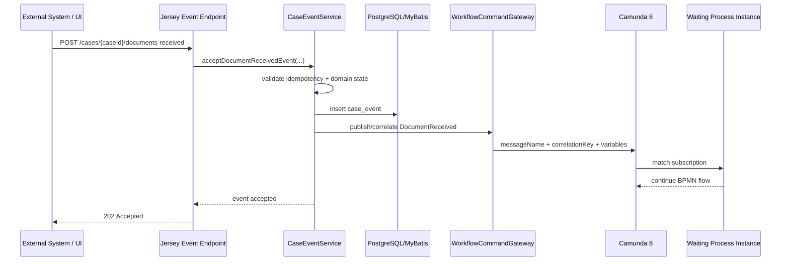

Core idea:

```text id="c27jbi"
Message name:
  "What happened?"

Correlation key:
  "Which process/business entity should receive it?"

Variables:
  "What small data should be merged into the process?"
```

---

# 3. Publish message vs correlate message

Camunda 8 punya dua operation yang sering dianggap sama, padahal behavior-nya berbeda.

| Operation | Behavior | Buffered? | Response tahu process instance? | Cocok untuk |
|---|---|---:|---:|---|
| **Publish message** | Mengirim message ke partition berdasarkan correlation key; tidak menunggu hasil correlation. | Ya, jika TTL mendukung | Tidak | Event asynchronous, webhook, event bisa datang sebelum process siap |
| **Correlate message** | Publish sekaligus mencoba correlate ke subscription saat itu juga. | Tidak | Ya, jika sukses | UI/admin action yang butuh feedback langsung |

Dokumentasi Orchestration Cluster API menyebut **publish message** mengirim message ke partition yang dihitung dari correlation key, message bisa di-buffer, dan endpoint tidak menunggu hasil correlation. Jika butuh hasil correlation, gunakan endpoint correlate message. ([Camunda 8 Docs](https://docs.camunda.io/docs/apis-tools/orchestration-cluster-api-rest/specifications/publish-message/))

Dokumentasi **correlate message** menyebut endpoint ini akan mengembalikan process instance key pertama jika correlation berhasil, tetapi message **tidak di-buffer**; untuk message yang perlu buffering, gunakan publish message. ([Camunda 8 Docs](https://docs.camunda.io/docs/apis-tools/orchestration-cluster-api-rest/specifications/correlate-message/))

---

# 4. Rule praktis pemilihan operation

## 4.1 Gunakan publish message untuk event asynchronous

Contoh:

```text id="n6gs7g"
- document received
- payment confirmed
- external verification completed
- webhook callback
- file scan completed
- background job result received
```

Karakteristik:

```text id="xds6eo"
- event memang sudah terjadi
- caller tidak harus tahu process langsung lanjut atau belum
- event boleh datang sedikit lebih awal dari process subscription
- event bisa disimpan dan diretry
```

API response:

```http id="81nrrb"
202 Accepted
```

---

## 4.2 Gunakan correlate message untuk feedback langsung

Contoh:

```text id="z898q6"
- internal support tool: lanjutkan process yang pasti sedang waiting
- admin action: force continue from waiting state
- UI internal yang perlu tahu message benar-benar matched
- test/debug endpoint
```

API response saat sukses:

```http id="ez3cej"
200 OK
```

Response:

```json id="ssx347"
{
  "caseId": "CASE-2026-000123",
  "messageName": "DocumentReceived",
  "correlated": true,
  "processInstanceKey": "2251799813699999"
}
```

Response saat tidak ada subscription:

```http id="djy7j2"
409 Conflict
```

atau:

```http id="r8tnfm"
404 Not Found
```

Tergantung API policy internal.

---

# 5. BPMN modeling pattern

## 5.1 Intermediate message catch event

```text id="ekaa0d"
Start
  -> Validate Case
  -> Wait for DocumentReceived
  -> Continue Review
  -> End
```

Message definition:

```text id="lf1tw9"
message name       = DocumentReceived
correlation key    = = caseId
```

Saat process token masuk ke intermediate catch event, Camunda membuat message subscription. Process instance berhenti sampai message yang cocok diterima. ([Camunda 8 Docs](https://docs.camunda.io/docs/components/modeler/bpmn/message-events/))

---

## 5.2 Receive task

Receive task mirip intermediate message catch event, tetapi lebih cocok saat kamu ingin activity berbentuk task dan bisa memakai boundary event.

```text id="zz03dv"
Start
  -> Wait for External Verification Result Receive Task
  -> Continue
```

Dokumentasi Camunda menyebut receive task adalah alternatif intermediate message catch event dan dapat digunakan bersama boundary event. ([Camunda 8 Docs](https://docs.camunda.io/docs/components/modeler/bpmn/message-events/))

---

## 5.3 Message boundary event

Cocok untuk event yang bisa datang saat activity tertentu masih berjalan.

Contoh:

```text id="c8pjhv"
Manual Review User Task
  boundary message: AppealSubmitted
  boundary timer: ReviewDeadlineReached
```

Use case:

```text id="mnx1pm"
- cancel request while waiting for review
- new document uploaded during review
- appeal submitted while enforcement action active
```

Message boundary event bisa interrupting atau non-interrupting. Non-interrupting boundary event tidak menghentikan activity utama dan bisa menerima multiple messages. ([Camunda 8 Docs](https://docs.camunda.io/docs/components/modeler/bpmn/message-events/))

---

## 5.4 Message start event

Cocok jika event eksternal sendiri yang memulai process.

Contoh:

```text id="cs1e9h"
PaymentWebhookReceived
  -> Start payment reconciliation process
```

Jika message start event menerima correlation key, Camunda dapat menggunakannya untuk mencegah active process instance duplikat untuk key yang sama; jika correlation key kosong, message dapat membuat process instance baru tanpa mengecek active instance existing. ([Camunda 8 Docs](https://docs.camunda.io/docs/components/modeler/bpmn/message-events/))

---

# 6. Message naming convention

Gunakan nama message berbasis **fakta/event**, bukan command teknis.

## Bagus

```text id="ue68mz"
DocumentReceived
PaymentConfirmed
ExternalVerificationCompleted
AppealSubmitted
CustomerResponded
RiskAssessmentCompleted
```

## Kurang bagus

```text id="scqqga"
ContinueProcess
TriggerNextStep
Message1
CallbackReceived
CaseEvent
```

Rule:

```text id="hbms89"
Message name should answer:
  "What happened in the domain?"
```

Bukan:

```text id="br0civ"
"What should Camunda do next?"
```

---

# 7. Correlation key strategy

## 7.1 Default untuk case lifecycle

Untuk lifecycle berbasis case/enforcement/application:

```text id="s5k3zh"
correlationKey = caseId
```

Contoh:

```json id="i90cxb"
{
  "messageName": "DocumentReceived",
  "correlationKey": "CASE-2026-000123",
  "variables": {
    "caseId": "CASE-2026-000123",
    "documentBatchId": "DOCB-9911"
  }
}
```

## 7.2 Request-reply unik

Untuk request-reply yang bisa ada banyak instance aktif per user/entity, jangan pakai key statis seperti `userId`.

Contoh buruk:

```text id="4gri12"
correlationKey = userId
```

Kalau user punya banyak process menunggu reply, message bisa ambigu.

Gunakan unique correlation key:

```text id="3cztyt"
correlationKey = caseId + ":" + externalRequestId
```

Camunda docs merekomendasikan unique correlation key untuk send-and-wait interaction agar reply masuk ke instance yang benar, misalnya service task mengirim outbound message, menyertakan correlation key ke external system, lalu external system mengembalikannya saat reply. ([Camunda 8 Docs](https://docs.camunda.io/docs/components/concepts/messages/))

---

# 8. TTL dan message buffering

Message buffering penting untuk event yang bisa datang sebelum process sampai ke catch event.

## 8.1 TTL = 0

```text id="tv1wq4"
Message hanya correlated jika subscription sudah aktif saat message datang.
Jika belum aktif, message tidak menunggu.
```

Cocok untuk:

```text id="6rdt63"
- command yang harus match saat itu juga
- support/admin operation
- event yang harus ditolak jika process belum waiting
```

## 8.2 TTL > 0

```text id="v0dbvu"
Message bisa disimpan sementara dan correlated saat subscription muncul selama TTL masih valid.
```

Cocok untuk:

```text id="6w9n0d"
- webhook callback cepat
- event yang boleh datang sebelum BPMN token siap
- race condition antara DB/API/external system dan process wait state
```

Dokumentasi Camunda menyebut kombinasi correlation key, message ID, TTL, dan receiver type menentukan apakah message langsung correlated, buffered, atau discarded; misalnya untuk intermediate event dengan TTL > 0, message dapat correlated selama lifetime message jika matching subscription aktif, dan equal messages dapat buffered. ([Camunda 8 Docs](https://docs.camunda.io/docs/components/concepts/messages/))

---

# 9. Event endpoint design

## 9.1 Endpoint

```http id="ii3mnd"
POST /cases/{caseId}/documents-received
Idempotency-Key: DOC-EVT-20260716-0001
Content-Type: application/json
```

## 9.2 Request

```json id="tqc99l"
{
  "documentBatchId": "DOCB-9911",
  "receivedAt": "2026-07-16T10:30:00+07:00",
  "source": "DOCUMENT_PORTAL",
  "documentCount": 4
}
```

## 9.3 Response

```http id="71jv95"
202 Accepted
```

```json id="tq6ba1"
{
  "caseId": "CASE-2026-000123",
  "eventType": "DOCUMENT_RECEIVED",
  "accepted": true
}
```

---

# 10. Java constants

```java id="x4so0k"
package com.company.caseapp.workflow;

public final class MessageNames {

    private MessageNames() {
    }

    public static final String DOCUMENT_RECEIVED = "DocumentReceived";
    public static final String PAYMENT_CONFIRMED = "PaymentConfirmed";
    public static final String EXTERNAL_VERIFICATION_COMPLETED =
        "ExternalVerificationCompleted";
    public static final String APPEAL_SUBMITTED = "AppealSubmitted";
}
```

```java id="jbs46s"
package com.company.caseapp.workflow;

public final class WorkflowVariables {

    private WorkflowVariables() {
    }

    public static final String CASE_ID = "caseId";
    public static final String CORRELATION_KEY = "correlationKey";
    public static final String DOCUMENT_BATCH_ID = "documentBatchId";
    public static final String PAYMENT_ID = "paymentId";
    public static final String EXTERNAL_CHECK_ID = "externalCheckId";
}
```

---

# 11. Workflow gateway interface

```java id="aspgpo"
package com.company.caseapp.workflow;

import java.time.Duration;
import java.util.Map;

public interface WorkflowMessageGateway {

    void publishMessage(PublishWorkflowMessageCommand command);

    CorrelateWorkflowMessageResult correlateMessage(
        CorrelateWorkflowMessageCommand command
    );
}
```

```java id="om94fa"
package com.company.caseapp.workflow;

import java.time.Duration;
import java.util.Map;

public record PublishWorkflowMessageCommand(
    String messageName,
    String correlationKey,
    String messageId,
    Duration timeToLive,
    Map<String, Object> variables
) {
}
```

```java id="ia5188"
package com.company.caseapp.workflow;

import java.util.Map;

public record CorrelateWorkflowMessageCommand(
    String messageName,
    String correlationKey,
    Map<String, Object> variables
) {
}
```

```java id="80ri8m"
package com.company.caseapp.workflow;

public record CorrelateWorkflowMessageResult(
    boolean correlated,
    long processInstanceKey
) {
}
```

---

# 12. Camunda Java Client implementation

## 12.1 Publish message

```java id="fzf6td"
package com.company.caseapp.workflow;

import io.camunda.client.CamundaClient;

public final class CamundaWorkflowMessageGateway implements WorkflowMessageGateway {

    private final CamundaClient client;

    public CamundaWorkflowMessageGateway(CamundaClient client) {
        this.client = client;
    }

    @Override
    public void publishMessage(PublishWorkflowMessageCommand command) {
        client.newPublishMessageCommand()
            .messageName(command.messageName())
            .correlationKey(command.correlationKey())
            .messageId(command.messageId())
            .timeToLive(command.timeToLive())
            .variables(command.variables())
            .execute();
    }

    @Override
    public CorrelateWorkflowMessageResult correlateMessage(
            CorrelateWorkflowMessageCommand command
    ) {
        /*
         * Validate exact method names against the Camunda Java Client
         * version used in your company. The concept maps to the
         * Orchestration Cluster API /messages/correlation endpoint.
         */
        var result = client.newCorrelateMessageCommand()
            .messageName(command.messageName())
            .correlationKey(command.correlationKey())
            .variables(command.variables())
            .execute();

        return new CorrelateWorkflowMessageResult(
            true,
            result.getProcessInstanceKey()
        );
    }
}
```

Catatan implementasi: untuk Java Client, method fluent API bisa sedikit berbeda antar versi minor. Konsep yang harus stabil adalah `messageName`, `correlationKey`, optional `messageId`, optional `timeToLive`, dan variables. Validasi lewat IDE/Javadoc versi dependency internal.

---

# 13. Event table design

Event harus dipersist **sebelum** publish message, supaya event tidak hilang jika Camunda unavailable.

```sql id="zu87vg"
create table case_event (
    event_id bigserial primary key,
    idempotency_key text not null unique,
    case_id text not null,
    event_type text not null,
    event_payload jsonb not null,
    message_name text not null,
    correlation_key text not null,
    message_id text not null unique,
    publish_status text not null,
    publish_attempt_count int not null default 0,
    last_publish_error text,
    received_at timestamptz not null,
    created_at timestamptz not null default now(),
    published_at timestamptz,

    constraint chk_case_event_publish_status
        check (publish_status in (
            'PENDING',
            'PUBLISHED',
            'FAILED_RETRYABLE',
            'FAILED_FINAL'
        ))
);

create index idx_case_event_case_id_created_at
    on case_event (case_id, created_at);

create index idx_case_event_publish_status_next
    on case_event (publish_status, created_at);
```

Recommended `message_id`:

```text id="k6dn1c"
messageId = eventType + ":" + idempotencyKey
```

atau:

```text id="1h8pu7"
messageId = caseId + ":" + eventType + ":" + externalEventId
```

---

# 14. MyBatis mapper sketch

```java id="kw61cy"
package com.company.caseapp.persistence.mapper;

import org.apache.ibatis.annotations.Param;

import java.util.List;
import java.util.Optional;

public interface CaseEventMapper {

    int insertEvent(CaseEventRow row);

    Optional<CaseEventRow> findByIdempotencyKey(
        @Param("idempotencyKey") String idempotencyKey
    );

    int markPublished(
        @Param("eventId") long eventId
    );

    int markPublishFailed(
        @Param("eventId") long eventId,
        @Param("error") String error
    );

    List<CaseEventRow> findPendingEventsForPublish(
        @Param("limit") int limit
    );
}
```

XML insert:

```xml id="gvlqix"
<insert id="insertEvent">
    insert into case_event (
        idempotency_key,
        case_id,
        event_type,
        event_payload,
        message_name,
        correlation_key,
        message_id,
        publish_status,
        received_at
    ) values (
        #{idempotencyKey},
        #{caseId},
        #{eventType},
        #{eventPayload, typeHandler=com.company.caseapp.persistence.JsonbTypeHandler},
        #{messageName},
        #{correlationKey},
        #{messageId},
        'PENDING',
        #{receivedAt}
    )
</insert>
```

XML mark published:

```xml id="hv26pu"
<update id="markPublished">
    update case_event
    set publish_status = 'PUBLISHED',
        publish_attempt_count = publish_attempt_count + 1,
        published_at = now(),
        last_publish_error = null
    where event_id = #{eventId}
</update>
```

XML pending query:

```xml id="fy0srg"
<select id="findPendingEventsForPublish" resultMap="CaseEventRowMap">
    select
        event_id,
        idempotency_key,
        case_id,
        event_type,
        event_payload,
        message_name,
        correlation_key,
        message_id,
        publish_status,
        publish_attempt_count,
        last_publish_error,
        received_at,
        created_at,
        published_at
    from case_event
    where publish_status in ('PENDING', 'FAILED_RETRYABLE')
    order by created_at
    limit #{limit}
</select>
```

---

# 15. Jersey endpoint implementation

## 15.1 DTO

```java id="yxxh5o"
package com.company.caseapp.api;

import java.time.OffsetDateTime;

public record DocumentReceivedRequest(
    String documentBatchId,
    OffsetDateTime receivedAt,
    String source,
    int documentCount
) {
}
```

```java id="ghfmkj"
package com.company.caseapp.api;

public record EventAcceptedResponse(
    String caseId,
    String eventType,
    boolean accepted
) {
}
```

---

## 15.2 Resource

```java id="6vjt8u"
package com.company.caseapp.api;

import com.company.caseapp.application.CaseEventService;
import jakarta.ws.rs.Consumes;
import jakarta.ws.rs.HeaderParam;
import jakarta.ws.rs.POST;
import jakarta.ws.rs.Path;
import jakarta.ws.rs.PathParam;
import jakarta.ws.rs.Produces;
import jakarta.ws.rs.core.MediaType;
import jakarta.ws.rs.core.Response;

@Path("/cases/{caseId}/documents-received")
@Consumes(MediaType.APPLICATION_JSON)
@Produces(MediaType.APPLICATION_JSON)
public final class CaseDocumentEventResource {

    private final CaseEventService eventService;

    public CaseDocumentEventResource(CaseEventService eventService) {
        this.eventService = eventService;
    }

    @POST
    public Response documentsReceived(
            @PathParam("caseId") String caseId,
            @HeaderParam("Idempotency-Key") String idempotencyKey,
            DocumentReceivedRequest request
    ) {
        eventService.acceptDocumentReceived(
            caseId,
            idempotencyKey,
            request
        );

        return Response.accepted(
            new EventAcceptedResponse(
                caseId,
                "DOCUMENT_RECEIVED",
                true
            )
        ).build();
    }
}
```

---

# 16. Application service baseline

```java id="y80xy4"
package com.company.caseapp.application;

import com.company.caseapp.api.DocumentReceivedRequest;
import com.company.caseapp.persistence.repository.CaseEventRepository;
import com.company.caseapp.persistence.repository.CaseRepository;
import com.company.caseapp.workflow.MessageNames;
import com.company.caseapp.workflow.PublishWorkflowMessageCommand;
import com.company.caseapp.workflow.WorkflowMessageGateway;
import com.company.caseapp.workflow.WorkflowVariables;

import java.time.Duration;
import java.util.Map;

public final class CaseEventService {

    private final CaseRepository caseRepository;
    private final CaseEventRepository eventRepository;
    private final WorkflowMessageGateway workflowMessageGateway;

    public CaseEventService(
            CaseRepository caseRepository,
            CaseEventRepository eventRepository,
            WorkflowMessageGateway workflowMessageGateway
    ) {
        this.caseRepository = caseRepository;
        this.eventRepository = eventRepository;
        this.workflowMessageGateway = workflowMessageGateway;
    }

    public void acceptDocumentReceived(
            String caseId,
            String idempotencyKey,
            DocumentReceivedRequest request
    ) {
        validate(caseId, idempotencyKey, request);

        var caseRecord = caseRepository.findById(caseId)
            .orElseThrow(() -> new NotFoundException("Case not found"));

        if (!caseRecord.canAcceptDocumentEvent()) {
            throw new ConflictException(
                "Case cannot accept document event from status "
                    + caseRecord.status()
            );
        }

        String messageName = MessageNames.DOCUMENT_RECEIVED;
        String correlationKey = caseId;
        String messageId = "DOCUMENT_RECEIVED:" + idempotencyKey;

        boolean inserted = eventRepository.insertIfAbsent(
            idempotencyKey,
            caseId,
            "DOCUMENT_RECEIVED",
            request,
            messageName,
            correlationKey,
            messageId
        );

        if (!inserted) {
            return;
        }

        workflowMessageGateway.publishMessage(
            new PublishWorkflowMessageCommand(
                messageName,
                correlationKey,
                messageId,
                Duration.ofHours(2),
                Map.of(
                    WorkflowVariables.CASE_ID, caseId,
                    WorkflowVariables.DOCUMENT_BATCH_ID, request.documentBatchId(),
                    "documentCount", request.documentCount(),
                    "documentReceived", true
                )
            )
        );

        eventRepository.markPublishedByMessageId(messageId);
    }

    private void validate(
            String caseId,
            String idempotencyKey,
            DocumentReceivedRequest request
    ) {
        if (caseId == null || caseId.isBlank()) {
            throw new BadRequestException("caseId is required");
        }
        if (idempotencyKey == null || idempotencyKey.isBlank()) {
            throw new BadRequestException("Idempotency-Key is required");
        }
        if (request.documentBatchId() == null || request.documentBatchId().isBlank()) {
            throw new BadRequestException("documentBatchId is required");
        }
        if (request.documentCount() <= 0) {
            throw new BadRequestException("documentCount must be positive");
        }
    }
}
```

Catatan: baseline ini masih direct publish setelah insert event. Production-grade yang lebih aman adalah **event/outbox publisher** yang retry asynchronous. Pola itu dibahas lebih kuat di Seri 11, tetapi untuk message endpoint sudah sebaiknya desain tabel event-nya siap ke sana.

---

# 17. Publisher retry worker

Untuk menghindari event hilang saat Camunda unavailable, publish bisa dipindahkan ke background publisher.

```text id="6s8zdo"
POST /cases/{caseId}/documents-received
  -> insert case_event status PENDING
  -> return 202

Scheduled/worker publisher
  -> find PENDING events
  -> publish message to Camunda
  -> mark PUBLISHED
```

Contoh publisher loop:

```java id="ki56qy"
package com.company.caseapp.workflow;

import com.company.caseapp.persistence.repository.CaseEventRepository;

import java.time.Duration;
import java.util.Map;

public final class WorkflowEventPublisher {

    private final CaseEventRepository eventRepository;
    private final WorkflowMessageGateway workflowMessageGateway;

    public WorkflowEventPublisher(
            CaseEventRepository eventRepository,
            WorkflowMessageGateway workflowMessageGateway
    ) {
        this.eventRepository = eventRepository;
        this.workflowMessageGateway = workflowMessageGateway;
    }

    public void publishPending(int limit) {
        var events = eventRepository.findPendingEventsForPublish(limit);

        for (var event : events) {
            try {
                workflowMessageGateway.publishMessage(
                    new PublishWorkflowMessageCommand(
                        event.messageName(),
                        event.correlationKey(),
                        event.messageId(),
                        Duration.ofHours(2),
                        Map.of(
                            "caseId", event.caseId(),
                            "eventId", event.eventId(),
                            "eventType", event.eventType()
                        )
                    )
                );

                eventRepository.markPublished(event.eventId());

            } catch (Exception ex) {
                eventRepository.markPublishFailed(
                    event.eventId(),
                    sanitizeError(ex)
                );
            }
        }
    }

    private String sanitizeError(Exception ex) {
        String message = ex.getMessage();
        if (message == null || message.isBlank()) {
            return ex.getClass().getSimpleName();
        }
        return message.length() > 1000 ? message.substring(0, 1000) : message;
    }
}
```

---

# 18. Failure handling matrix

| Failure | Example | API behavior | DB behavior | Camunda behavior | Mitigation |
|---|---|---|---|---|---|
| Duplicate event retry | same `Idempotency-Key` | return previous accepted result | no new row | no duplicate message if same messageId | idempotency table/unique key |
| Same key different payload | bad client retry | `409 Conflict` | no change | no message | request hash |
| Case not found | wrong caseId | `404 Not Found` | no event | no message | validate case |
| Case invalid state | CLOSED case gets document | `409 Conflict` | no event | no message | domain state guard |
| Camunda unavailable | gateway down | `202 pending` or `503` | event PENDING/FAILED_RETRYABLE | no/unknown publish | publisher retry |
| Message arrives too early | BPMN not waiting yet | `202 Accepted` | event persisted | buffered if TTL > 0 | TTL + outbox |
| Message never consumed | wrong message name/key | accepted but stuck | event published | not correlated | Operate + subscription search + runbook |
| Correlate endpoint no match | process not waiting | `409/404` | optional event | not buffered | use publish if buffering expected |
| Backpressure | Camunda RESOURCE_EXHAUSTED | retry later | FAILED_RETRYABLE | no publish | exponential backoff |

Publish/correlate APIs can return `503` for backpressure/resource exhaustion, and Camunda recommends clients eventually retry after a backoff period. ([Camunda 8 Docs](https://docs.camunda.io/docs/apis-tools/orchestration-cluster-api-rest/specifications/publish-message/))

---

# 19. Variable mapping safety

By default, message variables are merged into process instance variables. Ini praktis, tetapi bisa berbahaya kalau payload besar atau sensitive ikut masuk ke process state. ([Camunda 8 Docs](https://docs.camunda.io/docs/components/modeler/bpmn/message-events/))

## 19.1 Jangan kirim full event payload

Kurang bagus:

```json id="3ffkmq"
{
  "caseId": "CASE-2026-000123",
  "fullDocumentPayload": {
    "documents": [
      {
        "name": "passport.pdf",
        "base64": "..."
      }
    ],
    "pii": {
      "identityNumber": "..."
    }
  }
}
```

Lebih bagus:

```json id="qsdcw1"
{
  "caseId": "CASE-2026-000123",
  "documentBatchId": "DOCB-9911",
  "documentReceived": true
}
```

Full payload tetap di PostgreSQL/object storage.

---

# 20. Message correlation anti-patterns

| Anti-pattern | Contoh | Risiko | Koreksi |
|---|---|---|---|
| Message name generik | `Continue`, `Callback` | sulit debug, collision | domain event name |
| Correlation key salah | pakai random requestId | process tidak lanjut | pakai business key stabil |
| Correlation key terlalu umum | pakai `userId` | duplicate subscription ambiguity | pakai `caseId` atau unique request key |
| No idempotency | retry webhook publish duplicate | duplicate side effects/variables | `Idempotency-Key` + `messageId` |
| TTL selalu 0 | event awal hilang | stuck process | TTL > 0 untuk async callbacks |
| TTL terlalu panjang | stale event correlated belakangan | process salah lanjut | TTL sesuai business SLA |
| Full payload as variables | PII/large state | security/performance issue | store reference only |
| Public API expose message name | client coupling ke BPMN | fragile API | server-side mapping |
| Correlate untuk async webhook | no buffer; event gagal kalau process belum waiting | lost event | publish message |
| Tidak persist event | Camunda down = data loss | audit gap | event table/outbox |

---

# 21. API contract examples

## 21.1 Document received

```yaml id="zefawh"
paths:
  /cases/{caseId}/documents-received:
    post:
      summary: Accept a document received event for a case
      operationId: acceptDocumentReceived
      parameters:
        - in: path
          name: caseId
          required: true
          schema:
            type: string
        - in: header
          name: Idempotency-Key
          required: true
          schema:
            type: string
            minLength: 16
            maxLength: 128
      requestBody:
        required: true
        content:
          application/json:
            schema:
              $ref: '#/components/schemas/DocumentReceivedRequest'
      responses:
        '202':
          description: Event accepted for asynchronous workflow correlation
        '400':
          description: Invalid request
        '404':
          description: Case not found
        '409':
          description: Duplicate idempotency key with different payload or invalid case state
        '503':
          description: Dependency unavailable
```

## 21.2 Schema

```yaml id="oml8v7"
components:
  schemas:
    DocumentReceivedRequest:
      type: object
      required:
        - documentBatchId
        - receivedAt
        - source
        - documentCount
      properties:
        documentBatchId:
          type: string
        receivedAt:
          type: string
          format: date-time
        source:
          type: string
          enum:
            - DOCUMENT_PORTAL
            - BACK_OFFICE_UPLOAD
            - EXTERNAL_PARTNER
        documentCount:
          type: integer
          minimum: 1
```

---

# 22. Observability fields

Log event accepted:

```json id="czs52b"
{
  "event": "case.event.accepted",
  "requestId": "req-123",
  "idempotencyKey": "DOC-EVT-20260716-0001",
  "caseId": "CASE-2026-000123",
  "eventType": "DOCUMENT_RECEIVED",
  "messageName": "DocumentReceived",
  "correlationKey": "CASE-2026-000123",
  "messageId": "DOCUMENT_RECEIVED:DOC-EVT-20260716-0001"
}
```

Log message published:

```json id="qgl8eo"
{
  "event": "workflow.message.published",
  "caseId": "CASE-2026-000123",
  "messageName": "DocumentReceived",
  "correlationKey": "CASE-2026-000123",
  "messageId": "DOCUMENT_RECEIVED:DOC-EVT-20260716-0001",
  "ttlSeconds": 7200,
  "durationMs": 47
}
```

Log correlation failure:

```json id="5lfz1f"
{
  "event": "workflow.message.publish.failed",
  "caseId": "CASE-2026-000123",
  "messageName": "DocumentReceived",
  "correlationKey": "CASE-2026-000123",
  "messageId": "DOCUMENT_RECEIVED:DOC-EVT-20260716-0001",
  "errorClass": "ClientException",
  "retryable": true
}
```

---

# 23. Runbook debugging

## 23.1 Process tidak lanjut setelah event diterima

Checklist:

```text id="wpebr4"
[ ] Cek case_event: event sudah tersimpan?
[ ] Cek publish_status: PENDING, PUBLISHED, FAILED_RETRYABLE?
[ ] Cek messageName: sama persis dengan BPMN?
[ ] Cek correlationKey: sama dengan nilai variable di process?
[ ] Cek TTL: apakah message expired sebelum subscription aktif?
[ ] Cek Operate: token sedang di catch event/receive task yang benar?
[ ] Cek variable mapping: apakah variable overwritten?
[ ] Cek deployment version: apakah latest BPMN punya message subscription yang benar?
[ ] Cek duplicate messageId: apakah message dianggap duplicate?
[ ] Cek backpressure/503 logs dari Camunda?
```

## 23.2 Message published tapi tidak correlated

Kemungkinan:

```text id="lc3d8e"
- process belum sampai catch event dan TTL = 0
- message name typo
- correlation key expression di BPMN salah
- process instance punya variable caseId berbeda
- event dikirim ke tenant/cluster/environment salah
- message expired sebelum subscription aktif
- process sudah completed/terminated
```

---

# 24. Mini-lab Seri 6

## Goal

Implement:

```http id="9rx3p0"
POST /cases/{caseId}/documents-received
```

Dengan behavior:

```text id="zu7kmw"
1. Require Idempotency-Key.
2. Validate case exists.
3. Validate case can accept document.
4. Insert case_event with PENDING/PUBLISHED status.
5. Publish DocumentReceived message with correlationKey = caseId.
6. Use TTL > 0.
7. Return 202.
```

## BPMN

```text id="un7r6y"
Start
  -> Service Task: validate-case
  -> Intermediate Message Catch Event: DocumentReceived
  -> Service Task: classify-documents
  -> User Task: manual-review
  -> End
```

## Message config

```text id="v5xorx"
message name:
  DocumentReceived

correlation key:
  = caseId
```

## Test cases

```text id="od3aqp"
[ ] Event sent after process reaches catch event -> process continues.
[ ] Event sent before catch event with TTL > 0 -> process continues when subscription opens.
[ ] Event sent with wrong correlationKey -> process stays waiting.
[ ] Duplicate Idempotency-Key same payload -> no duplicate event row.
[ ] Duplicate Idempotency-Key different payload -> 409.
[ ] Camunda unavailable -> event remains PENDING/FAILED_RETRYABLE.
[ ] Full event payload is not copied into Camunda variables.
[ ] Operate shows process passed DocumentReceived catch event.
```

---

# 25. Production checklist

```text id="6t1zim"
[ ] Message names are domain event names.
[ ] Correlation key convention is documented.
[ ] caseId is used for normal case lifecycle correlation.
[ ] Unique correlation key is used for concurrent request-reply.
[ ] Event endpoint requires Idempotency-Key.
[ ] Event is persisted before publish/correlation.
[ ] messageId is deterministic and unique.
[ ] TTL is chosen intentionally.
[ ] Publish vs correlate decision is explicit.
[ ] Full payload is stored in PostgreSQL/object storage, not Camunda variable.
[ ] Output mapping is used where variable merge should be constrained.
[ ] Camunda 503/backpressure is retried with backoff.
[ ] Event publisher has retry/reconciliation.
[ ] Operate/debug runbook includes messageName + correlationKey.
[ ] API does not expose raw BPMN message names to public clients.
```

---

# 26. Ringkasan Seri 6

```text id="lj6x71"
Publish message:
  asynchronous
  can be buffered
  does not tell whether correlation happened
  best for webhook/event callback

Correlate message:
  synchronous correlation attempt
  not buffered
  returns process instance key when successful
  best for internal/admin/direct feedback cases

Message name:
  domain event name

Correlation key:
  business entity key or unique request-reply key

Message variables:
  small routing/update data only

PostgreSQL event table:
  durable source of accepted external events
```

Formula praktis:

```text id="tflr3q"
Event endpoint should not mean:
  "Force Camunda to move."

It should mean:
  "Persist the fact that something happened,
   then notify the matching process instance safely."
```

---

# Seri 6/16 selesai

Seri ini selesai: **Message Correlation Pattern from Jersey Microservice**.

Rekomendasi materi berikutnya:

**Seri 7/16 - BPMN Practical Modeling for Service-Based Microservices: service task, user task, receive task, timer, gateway, boundary event, call activity, event subprocess, dan cara membuat BPMN executable tapi tetap readable untuk microservice architecture.**

---

**Sources:**

- [Message events | Camunda 8 Docs](https://docs.camunda.io/docs/components/modeler/bpmn/message-events/)

## Response:
7/16/2026, 9:56:29 AM

Saya lanjut ke **Seri 7/16**. Fokusnya BPMN yang practical: executable, readable, dan cocok untuk microservice orchestration—bukan diagram yang terlalu teknis atau terlalu abstrak.

# Cheatsheet Camunda 8 + Java/Jersey Microservice  
## Seri 7/16 - BPMN Practical Modeling for Service-Based Microservices

## 1. Fokus seri ini

Seri ini membahas cara membuat **BPMN Camunda 8** yang:

```text id="ua4x66"
- executable
- readable oleh engineer dan business analyst
- cocok untuk microservice orchestration
- tidak terlalu teknis
- tidak terlalu abstrak
- aman untuk production workflow
```

Target mental model:

> BPMN bukan tempat menaruh seluruh business logic. BPMN adalah **orchestration map**: siapa melakukan apa, kapan menunggu, kapan retry, kapan human review, kapan timeout, dan kapan process pindah jalur.

Untuk aplikasi **Java 17 + Jersey + MyBatis + PostgreSQL**, BPMN sebaiknya mengorkestrasi:

```text id="114l6f"
- service task -> Java worker
- user task -> human/operator decision
- message/receive task -> event eksternal
- timer -> deadline/SLA/waiting period
- gateway -> routing decision berdasarkan variable kecil
- call activity -> reusable child process
- event subprocess -> global interruption/escalation/cancellation
```

Camunda 8 service task membuat job yang akan diambil worker berdasarkan **job type**; input/output mapping bisa dipakai untuk mengubah variable yang masuk/keluar task, dan tanpa output mapping semua job variables akan merge ke process instance. ([Camunda 8 Docs](https://docs.camunda.io/docs/components/modeler/bpmn/service-tasks/?utm_source=chatgpt.com))

---

# 2. Diagram mental model BPMN microservice

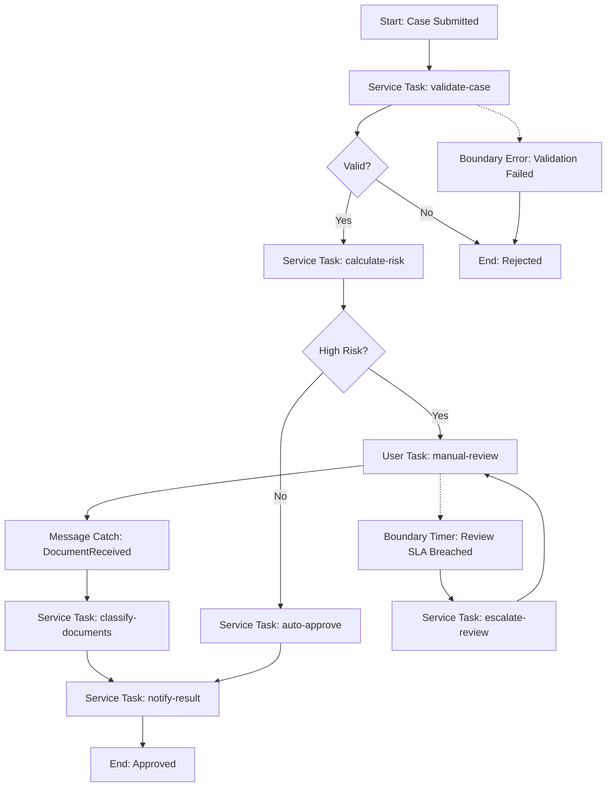

Practical interpretation:

```text id="4zssct"
BPMN:
  menentukan alur lifecycle

Java worker:
  menjalankan business action

PostgreSQL:
  menyimpan business state

Jersey API:
  menerima command/event dari luar

Operate:
  melihat posisi token, incident, dan failed activity
```

---

# 3. Prinsip utama modeling BPMN untuk microservice

| Prinsip | Penjelasan | Dampak Implementasi |
|---|---|---|
| **Model orchestration, not implementation** | BPMN menunjukkan langkah bisnis dan integrasi utama, bukan detail SQL/API call kecil. | Logic detail tetap di Java service/worker. |
| **Use stable domain names** | Nama task/message harus pakai bahasa domain. | `calculate-risk`, bukan `call-service-2`. |
| **One service task = one meaningful business action** | Jangan terlalu granular, jangan terlalu besar. | Worker lebih mudah diobservasi dan di-retry. |
| **Wait state harus eksplisit** | Human task, message event, timer harus terlihat jelas. | Support tahu process sedang menunggu apa. |
| **Technical retry jangan membuat diagram bloat** | Retry technical cukup pakai job retries/backoff/incident. | BPMN tetap readable. |
| **Business exception boleh dimodelkan** | Rejection, invalid document, failed eligibility bisa jadi BPMN error/path. | Jalur bisnis terlihat eksplisit. |
| **Variables harus kecil** | BPMN pakai ID/status/routing data, bukan full payload. | Data detail tetap di PostgreSQL. |
| **Gateway hanya untuk routing yang jelas** | Gateway harus punya kondisi yang mudah dibaca. | Hindari spaghetti process. |
| **Escalation/cancel global pakai event subprocess** | Lebih bersih daripada boundary event berulang di banyak task. | Cancellation/escalation lebih maintainable. |
| **Subprocess/call activity untuk modularisasi** | Pecah proses besar menjadi unit reusable. | BPMN utama tetap readable. |

Camunda best practice untuk data process menekankan variable harus dipakai secara lightweight dan meaningful, hanya menyimpan data yang relevan untuk process instance. ([Camunda 8 Docs](https://docs.camunda.io/docs/components/best-practices/development/handling-data-in-processes/?utm_source=chatgpt.com))

---

# 4. Service Task Pattern

## 4.1 Kapan memakai service task?

Gunakan service task untuk aktivitas yang dikerjakan sistem/worker.

Contoh:

```text id="3fv7g6"
- validate-case
- calculate-risk-score
- sync-to-registry
- generate-notification
- classify-documents
- update-case-status
- check-payment-status
- create-enforcement-action
```

Service task dalam Camunda 8 memerlukan worker yang subscribe ke job type tertentu; best practice Camunda menyatakan service task membutuhkan task type dan job worker yang menjalankan pekerjaan tersebut. ([Camunda 8 Docs](https://docs.camunda.io/docs/components/best-practices/development/writing-good-workers/?utm_source=chatgpt.com))

---

## 4.2 Job type naming

Gunakan naming stabil dan domain-oriented.

```text id="3o53i8"
Good:
  validate-case
  calculate-risk-score
  classify-documents
  notify-case-result
  sync-case-status

Bad:
  task1
  java-worker
  call-api
  process-data
  service-task
```

Constants Java:

```java id="dd0xd0"
package com.company.caseapp.workflow;

public final class JobTypes {

    private JobTypes() {
    }

    public static final String VALIDATE_CASE = "validate-case";
    public static final String CALCULATE_RISK_SCORE = "calculate-risk-score";
    public static final String CLASSIFY_DOCUMENTS = "classify-documents";
    public static final String NOTIFY_CASE_RESULT = "notify-case-result";
    public static final String SYNC_CASE_STATUS = "sync-case-status";
}
```

---

## 4.3 Service task contract

Setiap service task harus punya contract.

```yaml id="f7van7"
jobType: calculate-risk-score
owner: risk-service-team
inputVariables:
  - caseId
  - applicantId
  - caseType
outputVariables:
  - riskScore
  - riskLevel
businessErrors:
  - RISK_POLICY_REJECTED
technicalFailures:
  - DB_UNAVAILABLE
  - REGISTRY_TIMEOUT
idempotencyKey:
  - caseId
  - jobType
  - processInstanceKey
```

---

## 4.4 Worker implementation sketch

```java id="nqlyfn"
public final class CalculateRiskScoreJobHandler implements JobHandler {

    private final RiskScoringService riskScoringService;

    public CalculateRiskScoreJobHandler(RiskScoringService riskScoringService) {
        this.riskScoringService = riskScoringService;
    }

    @Override
    public void handle(JobClient client, ActivatedJob job) {
        Map<String, Object> variables = job.getVariablesAsMap();
        String caseId = (String) variables.get("caseId");

        try {
            RiskResult result = riskScoringService.calculate(caseId);

            client.newCompleteCommand(job.getKey())
                .variables(Map.of(
                    "riskScore", result.score(),
                    "riskLevel", result.level()
                ))
                .send()
                .join();

        } catch (RiskPolicyRejectedException ex) {
            client.newThrowErrorCommand(job.getKey())
                .errorCode("RISK_POLICY_REJECTED")
                .errorMessage(ex.getMessage())
                .send()
                .join();

        } catch (TemporaryDependencyException ex) {
            client.newFailCommand(job.getKey())
                .retries(job.getRetries() - 1)
                .errorMessage(ex.getMessage())
                .send()
                .join();
        }
    }
}
```

---

# 5. Service Task Granularity

## 5.1 Terlalu kecil

```text id="7vp58r"
Service Task: read-case-from-db
Service Task: validate-field-a
Service Task: validate-field-b
Service Task: update-column-x
Service Task: insert-audit-row
```

Masalah:

```text id="u1u1ml"
- BPMN jadi terlalu teknis
- banyak job overhead
- sulit dibaca business
- transaction boundary pecah berlebihan
```

## 5.2 Terlalu besar

```text id="iro39t"
Service Task: process-case
```

Masalah:

```text id="ojzx5c"
- tidak terlihat apa yang terjadi
- observability buruk
- retry terlalu luas
- incident tidak informatif
```

## 5.3 Lebih baik

```text id="tldabs"
Service Task: validate-case
Service Task: calculate-risk-score
Service Task: classify-documents
Service Task: notify-case-result
```

Rule praktis:

```text id="npyvxq"
Satu service task = satu business action yang layak diobservasi, di-retry, dan diberi ownership.
```

---

# 6. User Task Pattern

## 6.1 Kapan memakai user task?

Gunakan user task ketika pekerjaan harus dilakukan manusia.

Contoh:

```text id="qfuj8k"
- manual-review
- approve-enforcement-action
- verify-documents
- assign-investigator
- decide-appeal
- legal-signoff
```

Camunda docs menyebut job-worker implementation untuk user task sudah deprecated dan merekomendasikan **Camunda user tasks** untuk functionality dan best practice yang lebih baik. ([Camunda 8 Docs](https://docs.camunda.io/docs/components/modeler/bpmn/user-tasks/?utm_source=chatgpt.com))

---

## 6.2 Naming user task

Gunakan kata kerja + objek bisnis.

```text id="a8amuz"
Good:
  Review Case
  Approve Enforcement Action
  Verify Submitted Documents
  Decide Appeal

Bad:
  User Task
  Manual Step
  Approval
  Task for Officer
```

---

## 6.3 Assignment model

Practical fields:

```text id="hd0yp0"
assignee:
  specific user, jika sudah tahu

candidateGroups:
  regulatory-reviewer
  enforcement-manager
  legal-approver

dueDate:
  SLA target

followUpDate:
  kapan task muncul sebagai actionable
```

Contoh conceptual mapping:

```yaml id="cklm2x"
userTask: Review Case
candidateGroups:
  - regulatory-reviewer
dueDate: = reviewDueAt
form:
  - decision
  - reason
  - requiredFollowUp
outputVariables:
  - reviewDecision
  - reviewReason
```

---

## 6.4 User task result jangan terlalu bebas

Kurang bagus:

```json id="cya0t2"
{
  "action": "ok",
  "notes": "done"
}
```

Lebih bagus:

```json id="8ph1q0"
{
  "reviewDecision": "APPROVE",
  "reviewReason": "Documents complete and risk accepted",
  "requiredFollowUp": false
}
```

Gateway setelah user task:

```text id="iexr86"
reviewDecision = "APPROVE" -> continue approval path
reviewDecision = "REJECT"  -> rejection path
reviewDecision = "NEED_MORE_INFO" -> wait for document/message path
```

---

# 7. Message Event / Receive Task Pattern

## 7.1 Kapan memakai message event?

Gunakan message event ketika satu process instance menunggu event dari luar.

Contoh:

```text id="l0stmy"
- DocumentReceived
- PaymentConfirmed
- ExternalVerificationCompleted
- AppealSubmitted
- ApplicantResponded
```

Camunda docs menjelaskan message event dipakai ketika satu process instance perlu menunggu message dari secondary process atau external system; message bersifat hubungan 1 sender ke 1 recipient, berbeda dari signal yang broadcast ke banyak listener. ([Camunda 8 Docs](https://docs.camunda.io/docs/components/modeler/bpmn/message-events/?utm_source=chatgpt.com))

---

## 7.2 Intermediate message catch event

```text id="mubhzj"
Validate Case
  -> Wait for DocumentReceived
  -> Classify Documents
```

Cocok untuk:

```text id="ors0pi"
- process harus berhenti sampai event tertentu datang
- event hanya relevant untuk satu process instance
- correlation key jelas
```

Message config:

```yaml id="hvyu1y"
messageName: DocumentReceived
correlationKey: = caseId
```

---

## 7.3 Receive task

Receive task bisa dipakai sebagai alternatif message catch event jika ingin bentuknya seperti task/activity.

```text id="6o55pa"
Receive Task: Wait for External Verification Result
```

Cocok untuk:

```text id="hlqk58"
- waiting step ingin terlihat sebagai activity
- perlu boundary timer/error di activity tersebut
- model ingin konsisten dengan task-centric flow
```

Camunda docs menyebut receive task adalah alternatif intermediate message catch event dan dapat digunakan dengan boundary event. ([Camunda 8 Docs](https://docs.camunda.io/docs/components/modeler/bpmn/message-events/?utm_source=chatgpt.com))

---

## 7.4 Message boundary event

Cocok untuk event yang bisa datang saat activity masih berjalan.

```text id="5n8ct4"
User Task: Manual Review
  boundary message: AppealSubmitted
  boundary timer: ReviewDeadlineReached
```

Pattern:

```text id="c7grdr"
Manual Review sedang aktif
  -> AppealSubmitted datang
  -> jalankan appeal handling path
```

Boundary event dapat bersifat interrupting atau non-interrupting. Camunda docs menjelaskan intermediate catch event dapat berada di normal flow atau attached ke activity sebagai boundary event. ([Camunda 8 Docs](https://docs.camunda.io/docs/components/modeler/bpmn/events/?utm_source=chatgpt.com))

---

# 8. Timer Pattern

## 8.1 Kapan memakai timer?

Gunakan timer untuk waktu, deadline, SLA, reminder, wait period.

Contoh:

```text id="xt7us8"
- wait 7 days for applicant response
- escalate if manual review > 2 days
- remind reviewer every 24 hours
- auto-close if no response after 30 days
- schedule periodic compliance check
```

Camunda timer boundary event non-interrupting sering dipakai untuk model notification/reminder, misalnya menghubungi support jika processing lebih lama dari satu jam. ([Camunda 8 Docs](https://docs.camunda.io/docs/components/modeler/bpmn/timer-events/?utm_source=chatgpt.com))

---

## 8.2 Timer catch event

```text id="553kya"
Ask Applicant for More Info
  -> Timer Catch Event: wait 7 days
  -> Check Response
```

Cocok untuk explicit waiting period.

---

## 8.3 Timer boundary event

Interrupting:

```text id="s0vic7"
User Task: Applicant Response
  interrupting timer: 14 days
    -> Auto Close Case
```

Non-interrupting:

```text id="hohtx7"
User Task: Manual Review
  non-interrupting timer: every 1 day
    -> Send Reminder
```

Rule:

```text id="6m21rt"
Interrupting timer:
  deadline habis, activity dihentikan

Non-interrupting timer:
  activity tetap berjalan, side path dijalankan
```

---

## 8.4 Timer modeling anti-pattern

Kurang bagus:

```text id="w82nym"
Service Task: sleep-7-days
```

Lebih bagus:

```text id="bajhbd"
Timer Catch Event: PT7D
```

Alasan:

```text id="2kwdid"
- worker tidak ditahan 7 hari
- process wait state terlihat jelas
- Operate bisa menunjukkan token sedang menunggu timer
- timeout/cancellation lebih natural
```

---

# 9. Gateway Pattern

Camunda 8 mendukung gateway umum seperti **exclusive**, **parallel**, **event-based**, dan **inclusive** gateway. Gateway dipakai untuk routing token lebih kompleks daripada sequence flow biasa. ([Camunda 8 Docs](https://docs.camunda.io/docs/components/modeler/bpmn/gateways/?utm_source=chatgpt.com))

## 9.1 Exclusive gateway / XOR

Pakai ketika hanya satu jalur boleh dipilih.

```text id="nzu5vp"
Risk Level?
  LOW    -> auto approve
  MEDIUM -> manual review
  HIGH   -> senior review
```

Camunda docs menjelaskan exclusive gateway memilih satu outgoing sequence flow berdasarkan data seperti process variables. ([Camunda 8 Docs](https://docs.camunda.io/docs/components/modeler/bpmn/exclusive-gateways/?utm_source=chatgpt.com))

Contoh condition:

```text id="fvs9g2"
= riskLevel = "LOW"
= riskLevel = "MEDIUM"
= riskLevel = "HIGH"
```

Rule:

```text id="qzjhut"
Selalu sediakan default flow untuk kondisi tak terduga.
```

---

## 9.2 Parallel gateway / AND

Pakai ketika beberapa jalur berjalan paralel dan semuanya harus selesai.

```text id="a8i49n"
After case submission:
  parallel:
    - check sanctions list
    - check payment status
    - check document completeness
  join:
    continue after all complete
```

Camunda docs menjelaskan parallel gateway dengan multiple outgoing sequence flows akan mengambil semua flows; join parallel gateway menunggu setiap incoming sequence diambil. ([Camunda 8 Docs](https://docs.camunda.io/docs/components/modeler/bpmn/parallel-gateways/?utm_source=chatgpt.com))

Practical caution:

```text id="rb4yej"
Jika salah satu branch bisa gagal/stuck,
seluruh join akan menunggu.
```

---

## 9.3 Event-based gateway

Pakai ketika jalur dipilih berdasarkan event mana yang datang dulu.

```text id="qvxt4o"
Wait for:
  - ApplicantResponded
  - TimeoutReached
  - CaseCancelled
```

Camunda docs menyebut event-based gateway membuat keputusan berdasarkan event dan harus memiliki minimal dua outgoing sequence flows. ([Camunda 8 Docs](https://docs.camunda.io/docs/components/modeler/bpmn/event-based-gateways/?utm_source=chatgpt.com))

Pattern:

```text id="a7nswu"
Event-based Gateway
  -> Message Catch: ApplicantResponded
  -> Timer Catch: ResponseDeadlineReached
```

---

## 9.4 Inclusive gateway / OR

Pakai ketika satu atau lebih jalur bisa diambil berdasarkan kondisi.

```text id="iu5qhw"
If risk high:
  perform senior review

If document incomplete:
  request missing documents

If payment issue:
  request payment confirmation
```

Camunda docs menjelaskan inclusive gateway memungkinkan multiple decisions berdasarkan data/process variables. ([Camunda 8 Docs](https://docs.camunda.io/docs/components/modeler/bpmn/inclusive-gateways/?utm_source=chatgpt.com))

Practical caution:

```text id="de55nx"
Inclusive gateway sering membuat model lebih sulit dibaca.
Gunakan hanya jika memang beberapa branch independen bisa aktif.
```

---

# 10. Call Activity Pattern

## 10.1 Kapan memakai call activity?

Gunakan call activity untuk memanggil process lain yang reusable atau cukup kompleks.

Contoh:

```text id="6tt8r5"
Parent process:
  Case Enforcement Lifecycle

Call activities:
  - Run Document Verification Process
  - Run Payment Reconciliation Process
  - Run Appeal Process
  - Run External Investigation Process
```

Camunda docs menyebut call activity harus mendefinisikan BPMN process ID dari process yang dipanggil melalui `processId`, bisa static atau expression. `bindingType` menentukan versi called process yang diinstansiasi. ([Camunda 8 Docs](https://docs.camunda.io/docs/components/modeler/bpmn/call-activities/?utm_source=chatgpt.com))

---

## 10.2 Kapan tidak memakai call activity?

Jangan pecah menjadi child process kalau hanya 2-3 task sederhana dan tidak reusable.

Kurang bagus:

```text id="siphfe"
Parent process
  -> Call Activity: Validate Case Process
       -> one service task only
```

Lebih bagus:

```text id="pm4n81"
Parent process
  -> Service Task: validate-case
```

---

## 10.3 Variable propagation

Call activity perlu hati-hati soal variable yang dikirim ke child dan balik ke parent.

Practical rule:

```text id="s8qhgl"
Jangan propagate semua variable jika child process hanya butuh sedikit data.
Gunakan input/output mapping eksplisit untuk contract yang jelas.
```

Camunda variable docs menjelaskan variables memiliki scope, dan input/output mapping bisa dipakai untuk mengatur bagaimana variable dibuat atau di-merge ke process instance. Jika output mapping didefinisikan, variable yang tidak dimapping tidak otomatis merged ke parent scope. ([Camunda 8 Docs](https://docs.camunda.io/docs/components/concepts/variables/?utm_source=chatgpt.com))

---

## 10.4 Business ID propagation

Pada Camunda 8.9, jika process instance dengan Business ID membuat child process via call activity, Business ID otomatis dipropagasi ke child instance sehingga seluruh hierarchy bisa ditelusuri dengan satu domain identifier. ([Camunda 8 Docs](https://docs.camunda.io/docs/components/concepts/process-instance-creation/?utm_source=chatgpt.com))

Practical mapping:

```text id="jpu7ub"
Parent businessId:
  CASE-2026-000123

Child process:
  document-verification
  businessId inherited:
    CASE-2026-000123
```

---

# 11. Embedded Subprocess Pattern

## 11.1 Kapan memakai embedded subprocess?

Gunakan embedded subprocess untuk mengelompokkan bagian dari process yang masih bagian dari lifecycle parent.

Contoh:

```text id="1he3pn"
Subprocess: Document Handling
  - wait for document
  - classify document
  - validate completeness
  - ask for correction if incomplete
```

Embedded subprocess berguna untuk readability.

Camunda docs menyebut input mapping pada embedded subprocess dapat membuat local variables di scope subprocess, dan local variables secara default tidak dipropagasi keluar saat scope selesai kecuali output mapping didefinisikan. ([Camunda 8 Docs](https://docs.camunda.io/docs/components/modeler/bpmn/embedded-subprocesses/?utm_source=chatgpt.com))

---

## 11.2 Kapan embedded subprocess lebih cocok daripada call activity?

| Situation | Pilih |
|---|---|
| Bagian masih sangat melekat ke parent process | Embedded subprocess |
| Perlu reusable antar process | Call activity |
| Perlu versioning independent child process | Call activity |
| Hanya ingin menyederhanakan visual diagram | Embedded subprocess |
| Perlu isolate variable scope lokal | Embedded subprocess / call activity dengan mapping |

---

# 12. Event Subprocess Pattern

## 12.1 Kapan memakai event subprocess?

Gunakan event subprocess untuk event yang bisa terjadi di dalam scope tertentu tanpa harus menempel boundary event di banyak activity.

Contoh:

```text id="pxkclq"
Selama case active:
  - CaseCancelled
  - AppealSubmitted
  - LegalHoldApplied
  - FraudAlertReceived
```

Camunda docs menyebut event subprocess berperilaku seperti boundary event, tetapi berada di dalam scope, bukan attached ke scope; seperti boundary event, event subprocess bisa interrupting atau non-interrupting. ([Camunda 8 Docs](https://docs.camunda.io/docs/components/modeler/bpmn/event-subprocesses/?utm_source=chatgpt.com))

---

## 12.2 Interrupting event subprocess

Cocok untuk cancellation.

```text id="cf3l64"
Event Subprocess:
  Start Event: CaseCancelled
  -> Service Task: mark-case-cancelled
  -> End
```

Efek:

```text id="mnq7e7"
- parent scope dihentikan
- cancellation path berjalan
```

---

## 12.3 Non-interrupting event subprocess

Cocok untuk side event yang tidak menghentikan main flow.

```text id="6llsgk"
Event Subprocess:
  Start Event: NewEvidenceReceived
  -> Service Task: attach-evidence
  -> User Task: review-new-evidence
```

Efek:

```text id="ybdho4"
- main process tetap berjalan
- side path dijalankan sebagai tambahan
```

---

# 13. Boundary Event Pattern

Boundary event cocok untuk exception/timeout pada activity tertentu.

## 13.1 Boundary timer pada user task

```text id="rmhdqv"
User Task: Manual Review
  non-interrupting timer every 1 day:
    -> send-review-reminder

  interrupting timer after 5 days:
    -> escalate-to-manager
```

## 13.2 Boundary error pada service task

```text id="nchgyc"
Service Task: validate-case
  boundary error: CASE_VALIDATION_FAILED
    -> Reject Case
```

## 13.3 Boundary message pada user task

```text id="s6ij8a"
User Task: Wait for Applicant Response
  boundary message: ApplicantWithdrawn
    -> Close Case
```

Rule praktis:

```text id="721z23"
Boundary event:
  exception/timeout/event scoped to one activity

Event subprocess:
  exception/timeout/event scoped to whole subprocess/process
```

---

# 14. Error Modeling Pattern

## 14.1 Technical failure jangan dimodelkan sebagai business branch

Contoh technical failure:

```text id="0cgs6w"
- PostgreSQL unavailable
- external API timeout
- network failure
- temporary 503
```

Gunakan:

```text id="imdbs9"
fail job + retries + incident
```

Jangan buat BPMN seperti ini:

```text id="ubpue2"
External API timeout?
  yes -> wait 1 minute
  retry?
  yes -> call again
  retry?
  ...
```

BPMN akan bloat.

---

## 14.2 Business error boleh dimodelkan

Contoh business error:

```text id="6p2utm"
- document invalid
- applicant not eligible
- risk policy rejected
- payment rejected
```

Gunakan:

```text id="2gwc0p"
throw BPMN error -> boundary error path
```

Example:

```text id="4hf0mj"
Service Task: validate-eligibility
  boundary error: APPLICANT_NOT_ELIGIBLE
    -> User Task: Review Rejection
    -> End: Rejected
```

---

# 15. Data / Variable Modeling in BPMN

Camunda process data berupa variables dengan JSON value dan scope tertentu. BPMN process tidak punya explicit schema; variables tercipta saat instance start, job complete, message correlation, atau input/output mapping diterapkan. ([Camunda 8 Docs](https://docs.camunda.io/docs/components/modeler/data-handling/?utm_source=chatgpt.com))

## 15.1 Variable minimal

```json id="xe7o8b"
{
  "caseId": "CASE-2026-000123",
  "applicantId": "APL-1001",
  "caseType": "LICENSE_REVIEW",
  "riskLevel": "HIGH",
  "reviewDecision": "APPROVE"
}
```

## 15.2 Jangan taruh full aggregate

```json id="6kk51z"
{
  "case": {
    "allFields": "...",
    "documents": ["..."],
    "auditTrail": ["..."],
    "pii": "..."
  }
}
```

## 15.3 Input/output mapping untuk task boundary

Service task output mapping:

```text id="u0g2dy"
Worker returns:
  riskScore
  riskLevel
  debugPayload

Output mapping:
  riskScore -> riskScore
  riskLevel -> riskLevel

debugPayload tidak merge ke parent process.
```

Ini penting karena default merge bisa membuat variable liar masuk ke process. Variable docs menjelaskan output mapping bisa membatasi variable mana yang merged; jika output mapping ada, variable tanpa mapping tidak ikut merged. ([Camunda 8 Docs](https://docs.camunda.io/docs/components/concepts/variables/?utm_source=chatgpt.com))

---

# 16. BPMN Modeling Decision Table

| Kebutuhan | BPMN Element | Java/Jersey Implication |
|---|---|---|
| Jalankan logic sistem | Service Task | Implement job worker |
| Tunggu manusia | User Task | Tasklist/custom task UI |
| Tunggu event eksternal 1:1 | Message Catch Event / Receive Task | Jersey event endpoint publish message |
| Broadcast ke banyak process | Signal Event | Hati-hati; semua subscriber bisa triggered |
| Tunggu durasi/deadline | Timer Event | Tidak pakai worker sleep |
| Pilih satu jalur | Exclusive Gateway | FEEL condition dari variable |
| Jalankan semua jalur | Parallel Gateway | Worker branch harus idempotent |
| Pilih berdasarkan event pertama | Event-Based Gateway | Race antara message/timer |
| Pilih beberapa jalur kondisional | Inclusive Gateway | Pastikan join semantics dimengerti |
| Reusable child process | Call Activity | Versioning + variable mapping |
| Grouping dalam process | Embedded Subprocess | Local scope + readability |
| Global cancel/escalation | Event Subprocess | Interrupting/non-interrupting |
| Exception pada satu activity | Boundary Event | Scoped handling |
| Multi item processing | Multi-instance | Worker idempotency per item |

---

# 17. Practical BPMN Template untuk Case Lifecycle

```text id="qdiav6"
Process: case_enforcement_lifecycle

Start Event: Case Submitted
  -> Service Task: validate-case
      jobType = validate-case
      boundary error = CASE_VALIDATION_FAILED

  -> Service Task: calculate-risk-score
      jobType = calculate-risk-score

  -> Exclusive Gateway: Risk Level?
      LOW:
        -> Service Task: auto-approve-case
      MEDIUM/HIGH:
        -> User Task: manual-review

  -> Event-Based Gateway: Wait for Review Outcome or Timeout
      Message Catch: ReviewCompleted
      Timer Catch: PT5D

  -> Exclusive Gateway: Review Decision?
      APPROVE:
        -> Service Task: notify-approval
        -> End: Approved
      REJECT:
        -> Service Task: notify-rejection
        -> End: Rejected
      NEED_MORE_INFO:
        -> Message Catch: DocumentReceived
        -> Service Task: classify-documents
        -> back to manual-review

Event Subprocess:
  Start Message: CaseCancelled
    -> Service Task: mark-case-cancelled
    -> End: Cancelled
```

---

# 18. BPMN Naming Convention

## 18.1 Process ID

```text id="x3t2s8"
case_enforcement_lifecycle
document_verification
appeal_review
payment_reconciliation
```

## 18.2 Task name

Use readable display name:

```text id="xp1c7u"
Validate Case
Calculate Risk Score
Review Case
Notify Applicant
```

## 18.3 Job type

Use kebab-case technical contract:

```text id="ftrvml"
validate-case
calculate-risk-score
review-case-output-sync
notify-applicant
```

## 18.4 Message name

Use PascalCase event name:

```text id="j8hpxd"
DocumentReceived
PaymentConfirmed
AppealSubmitted
CaseCancelled
```

## 18.5 Variable name

Use camelCase:

```text id="h9fbyg"
caseId
applicantId
riskLevel
reviewDecision
documentBatchId
```

---

# 19. BPMN + Java Worker Contract Example

## BPMN service task

```yaml id="ot0sju"
name: Calculate Risk Score
jobType: calculate-risk-score
retries: 3
inputVariables:
  - caseId
  - applicantId
outputVariables:
  - riskScore
  - riskLevel
```

## Worker registration

```java id="rvnm31"
client.newWorker()
    .jobType(JobTypes.CALCULATE_RISK_SCORE)
    .name("case-worker-calculate-risk-score")
    .maxJobsActive(32)
    .handler(new CalculateRiskScoreJobHandler(riskScoringService))
    .open();
```

## Handler input validation

```java id="rduzlv"
private String requireString(ActivatedJob job, String variableName) {
    Object value = job.getVariablesAsMap().get(variableName);

    if (!(value instanceof String stringValue) || stringValue.isBlank()) {
        throw new InvalidWorkflowVariableException(
            "Missing or invalid variable: " + variableName
        );
    }

    return stringValue;
}
```

## Complete command

```java id="ohwbex"
client.newCompleteCommand(job.getKey())
    .variables(Map.of(
        "riskScore", result.score(),
        "riskLevel", result.level()
    ))
    .send()
    .join();
```

---

# 20. BPMN Complexity Control

## 20.1 Kalau diagram terlalu besar

Gunakan:

```text id="kq25kp"
- collapsed subprocess
- call activity
- event subprocess
- consistent labels
- explicit milestones
```

## 20.2 Hindari spaghetti gateway

Kurang bagus:

```text id="eyc6f0"
Gateway
  -> Gateway
    -> Gateway
      -> Gateway
```

Lebih bagus:

```text id="il48hr"
Service Task: evaluate-case-routing
  output:
    routingDecision

Exclusive Gateway: Routing Decision?
  -> AUTO_APPROVE
  -> MANUAL_REVIEW
  -> REJECT
```

Catatan: jangan semua decision dipindah ke Java. Pindahkan hanya decision yang terlalu kompleks untuk gateway condition dan sulit dibaca di BPMN.

---

# 21. Process Versioning Considerations

Model BPMN harus aman terhadap running instances.

Practical rules:

```text id="j8xpx8"
Aman:
  - tambah path baru setelah gateway dengan default jelas
  - tambah service task baru di path yang belum dicapai oleh instance lama
  - tambah output variable baru yang optional

Berisiko:
  - rename job type tanpa deploy worker baru
  - rename message name tanpa compatibility
  - hapus wait state yang masih dipakai running instance
  - ubah variable name yang dipakai gateway
  - ubah call activity processId tanpa versioning plan
```

Checklist sebelum deploy BPMN:

```text id="j12yku"
[ ] Apakah job type baru sudah ada worker-nya?
[ ] Apakah message name baru sudah dipublish API?
[ ] Apakah variable baru tersedia sebelum gateway?
[ ] Apakah old running instances masih bisa lanjut?
[ ] Apakah Operate bisa dipakai untuk memonitor incident setelah deploy?
```

---

# 22. Anti-pattern BPMN di Camunda 8 Microservice

| Anti-pattern | Contoh | Risiko | Koreksi |
|---|---|---|---|
| BPMN terlalu teknis | `select-case-db`, `update-column` | diagram tidak readable | task = business action |
| BPMN terlalu abstrak | `Process Case` | observability buruk | pecah meaningful steps |
| Worker sleep untuk deadline | `sleep-7-days` | worker resource waste | timer event |
| Semua error jadi gateway | `apiTimeout? retry?` | diagram bloat | job retries/incident |
| Semua business reject jadi technical fail | `fail job` untuk invalid document | incident salah makna | BPMN error/business path |
| Message name generik | `Continue` | sulit debug | domain event name |
| Correlation key ambiguous | `userId` | wrong correlation | `caseId`/unique request key |
| Full payload in variables | document/PII di Camunda | security/performance risk | store reference only |
| Gateway tanpa default | unknown state incident | brittle | default flow |
| Parallel join tanpa failure plan | stuck branch menahan join | process stuck | boundary/error/retry/runbook |
| Call activity untuk satu task | over-modular | complexity | service task langsung |
| Event subprocess untuk event lokal | terlalu global | unexpected interruption | boundary event |
| Boundary event berulang di banyak task | diagram noisy | sulit maintain | event subprocess scoped |

---

# 23. Mini-lab Seri 7

## Goal

Buat BPMN executable untuk case lifecycle sederhana.

## Process

```text id="ejs3aa"
Start Event: Case Submitted

Service Task: Validate Case
  jobType = validate-case
  boundary error = CASE_VALIDATION_FAILED

Service Task: Calculate Risk Score
  jobType = calculate-risk-score

Exclusive Gateway: Risk Level?
  LOW -> Service Task: Auto Approve Case
  HIGH -> User Task: Manual Review

User Task: Manual Review
  boundary non-interrupting timer PT1D -> Send Reminder
  boundary interrupting timer P5D -> Escalate Review

Message Catch Event: DocumentReceived
  messageName = DocumentReceived
  correlationKey = = caseId

Service Task: Notify Result
  jobType = notify-case-result

End Event
```

## Java side

Implement worker:

```text id="n1mii6"
- validate-case
- calculate-risk-score
- auto-approve-case
- notify-case-result
- send-review-reminder
- escalate-review
```

Implement Jersey endpoint:

```text id="9pbe4l"
POST /cases
POST /cases/{caseId}/documents-received
```

## Variables

```json id="862tll"
{
  "caseId": "CASE-2026-000123",
  "applicantId": "APL-1001",
  "caseType": "LICENSE_REVIEW",
  "riskLevel": "HIGH",
  "reviewDecision": "APPROVE",
  "documentBatchId": "DOCB-9911"
}
```

## Validation checklist

```text id="xhw5w2"
[ ] BPMN deploys successfully.
[ ] POST /cases starts process.
[ ] validate-case worker completes.
[ ] calculate-risk-score worker sets riskLevel.
[ ] exclusive gateway routes correctly.
[ ] high risk enters manual review.
[ ] timer reminder triggers without cancelling review.
[ ] document received message correlates by caseId.
[ ] notify-case-result worker completes.
[ ] Operate shows clean process path.
[ ] No full case payload stored as process variable.
```

---

# 24. Production BPMN Review Checklist

```text id="b22oq9"
[ ] Process ID uses stable snake_case.
[ ] Task names are readable business actions.
[ ] Job types are stable kebab-case contracts.
[ ] Every service task has worker owner.
[ ] Every service task has defined input/output variables.
[ ] Every gateway has clear conditions and default flow.
[ ] Message names are domain event names.
[ ] Correlation key is documented.
[ ] Timers represent real SLA/waiting rules.
[ ] Technical failures use retry/incident, not BPMN spaghetti.
[ ] Business errors use BPMN error/path when meaningful.
[ ] User task assignment/candidate group is defined.
[ ] User task output variables are constrained.
[ ] Call activity variable mapping is explicit.
[ ] Event subprocess is used for global cancel/escalation.
[ ] Boundary events are scoped to specific activity exceptions.
[ ] Variables are lightweight.
[ ] BPMN is understandable without reading Java code.
[ ] BPMN can be tested with local Camunda + workers.
[ ] Existing running instances considered before deploy.
```

---

# 25. Ringkasan Seri 7

```text id="bzwq16"
Service task:
  system work by Java worker

User task:
  human work, preferably Camunda user task

Message/receive task:
  wait for external event

Timer:
  wait/deadline/reminder/SLA

Gateway:
  route based on variable/event/parallel condition

Call activity:
  reusable child process

Embedded subprocess:
  local grouping/readability

Event subprocess:
  global cancellation/escalation/side event

Boundary event:
  exception/timeout/event attached to one activity
```

Formula praktis:

```text id="d6lhp8"
Good BPMN in microservice architecture:
  readable enough for business
  executable enough for engineers
  stable enough for production
  explicit enough for support
  small enough to maintain
```

---

# Seri 7/16 selesai

Seri ini selesai: **BPMN Practical Modeling for Service-Based Microservices**.

Rekomendasi materi berikutnya:

**Seri 8/16 - Service Task & Job Type Contract Design: job type naming, retries, timeout, headers, variables, worker ownership, idempotency contract, BPMN error contract, dan mapping ke Java worker implementation.**

---

**Sources:**

- [Service tasks](https://docs.camunda.io/docs/components/modeler/bpmn/service-tasks/?utm_source=chatgpt.com)

## Response:
7/16/2026, 9:58:45 AM

Saya lanjut ke **Seri 8/16**. Fokusnya kontrak antara BPMN service task dan Java worker: job type, retries, timeout, headers, variables, ownership, idempotency, dan BPMN error.

# Cheatsheet Camunda 8 + Java/Jersey Microservice  
## Seri 8/16 - Service Task & Job Type Contract Design

## 1. Fokus seri ini

Seri ini membahas kontrak antara **BPMN service task** dan **Java worker**.

Dalam Camunda 8, service task bukan memanggil method Java langsung. Service task membuat **job**. Job tersebut kemudian diambil oleh **job worker** berdasarkan **job type**. Jadi desain service task yang production-grade harus memperjelas:

```text
- job type
- owner worker
- input variables
- output variables
- custom headers
- retries
- job timeout
- BPMN error contract
- technical failure behavior
- idempotency strategy
- observability fields
```

Dokumentasi Camunda 8.9 menyebut service task memiliki `type` yang dipakai worker untuk mengambil job, `retries` yang default-nya tiga, `taskHeaders` sebagai metadata statis untuk worker, serta input/output mapping untuk mengontrol variable yang masuk dan keluar dari task. ([Camunda 8 Docs](https://docs.camunda.io/docs/components/modeler/bpmn/service-tasks/))

---

# 2. Mental model

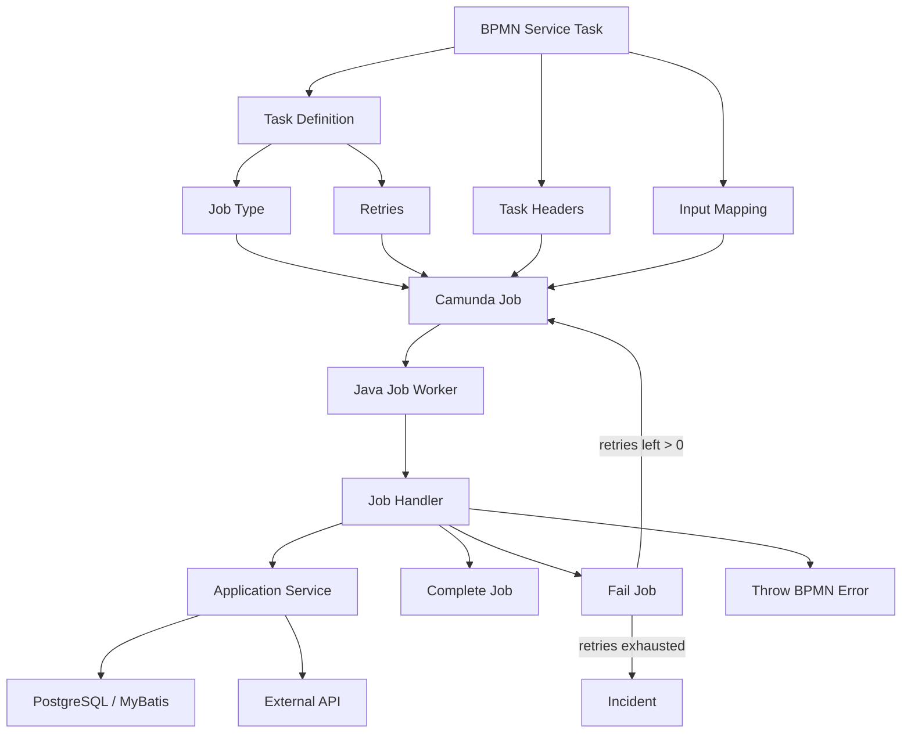

Ringkasnya:

```text
BPMN service task:
  mendefinisikan kontrak pekerjaan

Camunda job:
  instance konkret dari pekerjaan itu

Java worker:
  mengambil job berdasarkan job type

Job handler:
  menjalankan business logic

Complete/fail/error:
  menentukan bagaimana process lanjut
```

Job worker adalah service yang melakukan polling dan mengeksekusi job. Job punya type, headers, key, variables, dan tags; type bersifat case-sensitive, sehingga `orderProcess` dan `OrderProcess` dianggap berbeda bila backend/OS mendukung case sensitivity. Camunda juga mencatat job type memiliki limit panjang berbeda tergantung secondary storage, dan bila memakai atau berpotensi migrasi ke RDBMS sebaiknya job type dijaga maksimal 256 karakter. ([Camunda 8 Docs](https://docs.camunda.io/docs/components/concepts/job-workers/))

---

# 3. Anatomy service task contract

Contoh kontrak lengkap:

```yaml
serviceTask:
  id: calculate-risk-score
  name: Calculate Risk Score

taskDefinition:
  type: calculate-risk-score
  retries: 3

owner:
  team: risk-platform
  service: case-worker
  package: com.company.caseapp.worker.risk

inputVariables:
  required:
    - caseId
    - applicantId
    - caseType
  optional:
    - region

outputVariables:
  required:
    - riskScore
    - riskLevel
  optional:
    - riskReasonCode

headers:
  operation: calculateRiskScore
  downstream: risk-engine
  idempotencyScope: case-job

technicalFailures:
  - RISK_ENGINE_TIMEOUT
  - DB_UNAVAILABLE
  - TEMPORARY_NETWORK_FAILURE

businessErrors:
  - RISK_POLICY_REJECTED
  - APPLICANT_BLACKLISTED

idempotency:
  key: caseId + jobType + processInstanceKey
  storage: case_worker_execution
  behavior: return previous result if already completed

observability:
  logFields:
    - caseId
    - jobType
    - jobKey
    - processInstanceKey
    - bpmnProcessId
    - workerName
```

---

# 4. Job type design

## 4.1 Naming convention

Gunakan **kebab-case**, domain-oriented, stabil.

```text
Good:
  validate-case
  calculate-risk-score
  classify-documents
  notify-case-result
  sync-enforcement-action
  create-regulatory-notice

Bad:
  task1
  worker
  java-service
  execute
  process-case
  call-api
  serviceTaskA
```

Kenapa?

| Prinsip | Alasan |
|---|---|
| Stable | Job type adalah kontrak antara BPMN dan worker. |
| Domain-readable | Operate/logs lebih mudah dibaca. |
| Ownership jelas | Tim tahu worker mana yang harus handle. |
| Tidak terlalu teknis | Jangan ikat ke class/method/internal endpoint. |
| Tidak terlalu generik | `process-case` tidak memberi observability cukup. |

---

## 4.2 Jangan pakai dynamic job type kecuali benar-benar perlu

Camunda service task type bisa berupa static value atau FEEL expression yang menghasilkan string. Ini powerful, tapi bisa membuat routing worker sulit diaudit. ([Camunda 8 Docs](https://docs.camunda.io/docs/components/modeler/bpmn/service-tasks/))

Contoh dynamic type:

```text
= "notify-" + notificationChannel
```

Bisa menghasilkan:

```text
notify-email
notify-sms
notify-whatsapp
```

Gunakan dynamic job type hanya jika:

```text
- variasi worker memang sengaja dipisahkan
- semua kemungkinan type terdokumentasi
- deployment worker tersedia untuk semua type
- monitoring per job type siap
```

Hindari dynamic type jika:

```text
- hanya untuk menghindari gateway
- nilai variable bisa datang dari user input bebas
- tidak ada allowlist
- sulit tahu worker mana yang harus deployed
```

Lebih aman:

```text
Service Task: send-notification
Header:
  channel = EMAIL / SMS / WHATSAPP
```

Worker tetap satu job type, variasi action dibaca dari header/variable yang tervalidasi.

---

# 5. Retries design

## 5.1 Apa arti retries?

Di service task, `retries` menentukan berapa kali job dapat dicoba ulang saat worker melakukan fail. Default Camunda untuk service task retries adalah tiga. ([Camunda 8 Docs](https://docs.camunda.io/docs/components/modeler/bpmn/service-tasks/))

Contoh XML:

```xml
<bpmn:serviceTask id="calculate-risk-score" name="Calculate Risk Score">
  <bpmn:extensionElements>
    <zeebe:taskDefinition type="calculate-risk-score" retries="3" />
  </bpmn:extensionElements>
</bpmn:serviceTask>
```

## 5.2 Retries bukan pengganti idempotency

Retry berarti worker bisa menjalankan logic yang sama lebih dari sekali. Karena itu, worker tetap harus idempotent.

```text
Retry handles:
  temporary technical failure

Idempotency handles:
  duplicate execution and side effects
```

## 5.3 Rekomendasi retries per task

| Jenis Task | Contoh | Retries | Catatan |
|---|---|---:|---|
| Pure computation | calculate local risk | 1-3 | Kalau deterministic dan cepat, retry sedikit cukup. |
| DB update internal | sync case status | 3 | Pastikan idempotent. |
| External API read | check registry | 3-5 | Pakai backoff. |
| External API write | send notice/payment/action | 1-3 | Wajib idempotency key. |
| Notification | send email/SMS | 3-5 | Hindari duplicate message. |
| File/document generation | generate PDF | 2-3 | Simpan artifact idempotently. |
| Long-running external operation | submit investigation request | 1-2 | Lebih baik request-reply/message callback. |

---

# 6. Fail job vs throw BPMN error vs complete job

Camunda best practice membedakan tiga respons utama worker: `CompleteJob` untuk sukses, `FailJob` untuk technical failure yang perlu retry/incident, dan `ThrowError` untuk BPMN error yang ditangani di level process. Jika remaining retries lebih dari nol, job akan diretry; jika retries habis, incident dibuat. ([Camunda 8 Docs](https://docs.camunda.io/docs/components/best-practices/development/dealing-with-problems-and-exceptions/?utm_source=chatgpt.com))

| Kondisi | Worker Action | BPMN Lanjut? | Contoh |
|---|---|---:|---|
| Sukses | Complete job | Ya | risk score berhasil dihitung |
| Temporary technical failure | Fail job | Belum, retry | API timeout |
| Permanent technical/config failure | Fail job sampai incident | Tidak sampai incident resolved | invalid downstream config |
| Business rejection | Throw BPMN error | Ya, ke boundary error path | applicant blacklisted |
| Data contract invalid karena bug | Fail job/incident | Tidak | missing required variable |
| Already processed idempotently | Complete job dengan stored result | Ya | retry setelah complete command gagal |

BPMN error event dipakai agar process model bisa bereaksi terhadap deviation dalam task; error memiliki `errorCode`, dan catch event menggunakan `errorCode` tersebut untuk menangkap thrown error. ([Camunda 8 Docs](https://docs.camunda.io/docs/components/modeler/bpmn/error-events/))

---

# 7. Job timeout design

Job activation timeout adalah durasi broker menunggu worker mengirim complete/fail setelah job diaktifkan. Jika worker tidak merespons dalam waktu itu, job bisa tersedia lagi untuk worker lain. Glossary Camunda menjelaskan uncompleted job mencegah Zeebe melanjutkan process execution ke step berikutnya. ([Camunda 8 Docs](https://docs.camunda.io/docs/reference/glossary/?utm_source=chatgpt.com))

## 7.1 Rule praktis

```text
jobTimeout should be:
  lebih panjang dari expected processing time
  lebih pendek dari waktu stuck yang masih bisa diterima
  disesuaikan dengan downstream timeout
  tidak dipakai untuk long wait business process
```

## 7.2 Contoh rekomendasi

| Worker Action | Expected Time | Job Timeout |
|---|---:|---:|
| Validasi local/DB | < 2s | 30s |
| Call external API read | 1-10s | 60s |
| Generate small document | 5-30s | 2-5m |
| Send notification | 1-10s | 60s |
| Heavy batch processing | minutes | Pertimbangkan async callback, bukan single job panjang |
| Wait 7 days | 7 days | Jangan worker timeout; pakai timer/message |

## 7.3 Anti-pattern

```text
Service Task: wait-for-payment
Worker:
  sleep until payment arrives
```

Harus diganti:

```text
Service Task: create-payment-request
  -> Message Catch Event: PaymentConfirmed
```

---

# 8. Custom task headers

Task headers adalah metadata statis yang didefinisikan di BPMN dan dikirim bersama job ke worker. Camunda menyebut headers dapat dipakai sebagai configuration parameters untuk worker. ([Camunda 8 Docs](https://docs.camunda.io/docs/components/modeler/bpmn/service-tasks/))

## 8.1 Contoh BPMN XML

```xml
<bpmn:serviceTask id="notify-result" name="Notify Result">
  <bpmn:extensionElements>
    <zeebe:taskDefinition type="send-notification" retries="3" />
    <zeebe:taskHeaders>
      <zeebe:header key="channel" value="EMAIL" />
      <zeebe:header key="template" value="CASE_RESULT_V1" />
      <zeebe:header key="priority" value="NORMAL" />
    </zeebe:taskHeaders>
  </bpmn:extensionElements>
</bpmn:serviceTask>
```

## 8.2 Good use of headers

| Header | Contoh | Catatan |
|---|---|---|
| `operation` | `calculateRiskScore` | Worker reusable tahu operasi. |
| `channel` | `EMAIL` | Untuk notification worker. |
| `template` | `CASE_APPROVED_V1` | Hindari hardcode template di BPMN name. |
| `downstream` | `risk-engine` | Observability/debug. |
| `idempotencyScope` | `case-job` | Menentukan strategi dedup. |
| `slaClass` | `NORMAL/HIGH` | Untuk priority internal worker. |

## 8.3 Jangan taruh secret di headers

Jangan:

```xml
<zeebe:header key="apiKey" value="secret-value" />
```

Gunakan secret/config manager di worker runtime.

---

# 9. Input/output variables

Secara default, semua job variables yang dikirim worker saat complete akan merge ke process instance. Camunda menyarankan output mapping untuk mengubah behavior ini; input mapping juga bisa digunakan untuk mengubah variable ke format yang diterima worker. ([Camunda 8 Docs](https://docs.camunda.io/docs/components/modeler/bpmn/service-tasks/))

## 9.1 Input contract

Contoh `calculate-risk-score`:

```yaml
inputVariables:
  required:
    caseId: string
    applicantId: string
    caseType: string
  optional:
    region: string
```

Worker harus validasi input.

```java
private String requiredString(ActivatedJob job, String name) {
    Object value = job.getVariablesAsMap().get(name);

    if (!(value instanceof String stringValue) || stringValue.isBlank()) {
        throw new InvalidWorkflowVariableException(
            "Missing or invalid workflow variable: " + name
        );
    }

    return stringValue;
}
```

## 9.2 Output contract

```yaml
outputVariables:
  riskScore: number
  riskLevel: LOW | MEDIUM | HIGH
  riskReasonCode: string optional
```

Complete job:

```java
client.newCompleteCommand(job.getKey())
    .variables(Map.of(
        "riskScore", result.score(),
        "riskLevel", result.level(),
        "riskReasonCode", result.reasonCode()
    ))
    .send()
    .join();
```

## 9.3 Fetch variables

Saat aktivasi job, API REST menyediakan `fetchVariable` untuk mengambil subset variables; jika kosong, semua visible variables pada scope job dikembalikan. ([Camunda 8 Docs](https://docs.camunda.io/docs/apis-tools/orchestration-cluster-api-rest/specifications/activate-jobs/))

Praktik:

```text
Good:
  fetch only caseId, applicantId, caseType

Risky:
  fetch all variables by default in large workflow
```

Dalam Java client, gunakan kemampuan fetch variable sesuai method builder versi client internal. Validasi nama method dengan IDE/Javadoc dependency perusahaan.

---

# 10. Worker ownership contract

Setiap job type harus punya owner.

```yaml
jobType: calculate-risk-score
owner:
  team: risk-platform
  slack: "#risk-platform-alerts"
  service: case-worker
  deployment: case-worker
  runbook: runbooks/camunda/calculate-risk-score.md
  oncall: risk-platform-oncall
```

Tanpa owner, incident akan menjadi “misteri operasional”.

## Ownership table

| Job Type | Worker Service | Team | Data Owner | Runbook |
|---|---|---|---|---|
| `validate-case` | `case-worker` | case-platform | case domain | `rb-validate-case` |
| `calculate-risk-score` | `case-worker` / `risk-worker` | risk-platform | risk domain | `rb-risk-score` |
| `classify-documents` | `document-worker` | document-platform | document domain | `rb-classify-documents` |
| `notify-case-result` | `notification-worker` | platform-notification | notification | `rb-notify-case-result` |
| `sync-enforcement-action` | `enforcement-worker` | enforcement-platform | enforcement | `rb-sync-enforcement` |

---

# 11. Java contract classes

## 11.1 Job type constants

```java
package com.company.caseapp.workflow;

public final class JobTypes {

    private JobTypes() {
    }

    public static final String VALIDATE_CASE = "validate-case";
    public static final String CALCULATE_RISK_SCORE = "calculate-risk-score";
    public static final String CLASSIFY_DOCUMENTS = "classify-documents";
    public static final String NOTIFY_CASE_RESULT = "notify-case-result";
    public static final String SYNC_ENFORCEMENT_ACTION = "sync-enforcement-action";
}
```

## 11.2 Variable constants

```java
package com.company.caseapp.workflow;

public final class WorkflowVariables {

    private WorkflowVariables() {
    }

    public static final String CASE_ID = "caseId";
    public static final String APPLICANT_ID = "applicantId";
    public static final String CASE_TYPE = "caseType";
    public static final String RISK_SCORE = "riskScore";
    public static final String RISK_LEVEL = "riskLevel";
    public static final String RISK_REASON_CODE = "riskReasonCode";
}
```

## 11.3 BPMN error constants

```java
package com.company.caseapp.workflow;

public final class BpmnErrorCodes {

    private BpmnErrorCodes() {
    }

    public static final String CASE_VALIDATION_FAILED = "CASE_VALIDATION_FAILED";
    public static final String RISK_POLICY_REJECTED = "RISK_POLICY_REJECTED";
    public static final String APPLICANT_BLACKLISTED = "APPLICANT_BLACKLISTED";
    public static final String DOCUMENT_INVALID = "DOCUMENT_INVALID";
}
```

## 11.4 Header constants

```java
package com.company.caseapp.workflow;

public final class TaskHeaders {

    private TaskHeaders() {
    }

    public static final String OPERATION = "operation";
    public static final String DOWNSTREAM = "downstream";
    public static final String IDEMPOTENCY_SCOPE = "idempotencyScope";
    public static final String TEMPLATE = "template";
    public static final String CHANNEL = "channel";
}
```

---

# 12. Worker registry

Java Client job worker melakukan polling berdasarkan `maxJobsActive`, submit job ke handler, dan akan polling lagi ketika jumlah unhandled jobs turun di bawah threshold 30% dari `maxJobsActive`. Jika poll gagal, worker menerapkan backoff strategy; default-nya exponential backoff dan dapat dikustomisasi dengan `backoffSupplier`. ([Camunda 8 Docs](https://docs.camunda.io/docs/apis-tools/java-client/job-worker/))

```java
package com.company.caseapp.worker;

import com.company.caseapp.workflow.JobTypes;
import io.camunda.client.CamundaClient;
import io.camunda.client.api.worker.JobWorker;

import java.time.Duration;
import java.util.ArrayList;
import java.util.List;

public final class WorkerRegistry implements AutoCloseable {

    private final CamundaClient client;
    private final ValidateCaseJobHandler validateCaseHandler;
    private final CalculateRiskScoreJobHandler calculateRiskHandler;
    private final List<JobWorker> workers = new ArrayList<>();

    public WorkerRegistry(
            CamundaClient client,
            ValidateCaseJobHandler validateCaseHandler,
            CalculateRiskScoreJobHandler calculateRiskHandler
    ) {
        this.client = client;
        this.validateCaseHandler = validateCaseHandler;
        this.calculateRiskHandler = calculateRiskHandler;
    }

    public void openAll() {
        workers.add(client.newWorker()
            .jobType(JobTypes.VALIDATE_CASE)
            .name("case-worker-validate-case")
            .maxJobsActive(32)
            .timeout(Duration.ofSeconds(30))
            .handler(validateCaseHandler)
            .open());

        workers.add(client.newWorker()
            .jobType(JobTypes.CALCULATE_RISK_SCORE)
            .name("case-worker-calculate-risk-score")
            .maxJobsActive(16)
            .timeout(Duration.ofSeconds(60))
            .handler(calculateRiskHandler)
            .open());
    }

    @Override
    public void close() {
        for (int i = workers.size() - 1; i >= 0; i--) {
            workers.get(i).close();
        }
        workers.clear();
    }
}
```

Catatan: nama method seperti `.timeout(...)`, `.maxJobsActive(...)`, dan `.name(...)` perlu divalidasi pada versi `camunda-client-java` yang dipakai perusahaan. Pola konseptualnya stabil, tetapi detail fluent API bisa berubah antar versi minor.

---

# 13. Handler structure

## 13.1 Jangan taruh semua logic di lambda

Kurang bagus:

```java
client.newWorker()
    .jobType("calculate-risk-score")
    .handler((client, job) -> {
        // 200 lines of validation, DB, external API, error mapping
    })
    .open();
```

Lebih bagus:

```java
client.newWorker()
    .jobType(JobTypes.CALCULATE_RISK_SCORE)
    .handler(new CalculateRiskScoreJobHandler(riskScoringService, executionRepository))
    .open();
```

## 13.2 Handler production-style

```java
package com.company.caseapp.worker;

import com.company.caseapp.application.RiskScoringService;
import com.company.caseapp.workflow.BpmnErrorCodes;
import com.company.caseapp.workflow.WorkflowVariables;
import io.camunda.client.api.response.ActivatedJob;
import io.camunda.client.api.worker.JobClient;
import io.camunda.client.api.worker.JobHandler;

import java.time.Duration;
import java.util.Map;

public final class CalculateRiskScoreJobHandler implements JobHandler {

    private final RiskScoringService riskScoringService;
    private final WorkerExecutionRepository executionRepository;

    public CalculateRiskScoreJobHandler(
            RiskScoringService riskScoringService,
            WorkerExecutionRepository executionRepository
    ) {
        this.riskScoringService = riskScoringService;
        this.executionRepository = executionRepository;
    }

    @Override
    public void handle(JobClient client, ActivatedJob job) {
        String caseId = requiredString(job, WorkflowVariables.CASE_ID);
        String idempotencyKey = idempotencyKey(job, caseId);

        try {
            var previous = executionRepository.findCompleted(idempotencyKey);
            if (previous.isPresent()) {
                completeWithPreviousResult(client, job, previous.get());
                return;
            }

            executionRepository.markStarted(
                idempotencyKey,
                caseId,
                job.getType(),
                String.valueOf(job.getKey()),
                String.valueOf(job.getProcessInstanceKey())
            );

            RiskResult result = riskScoringService.calculate(caseId);

            executionRepository.markCompleted(
                idempotencyKey,
                Map.of(
                    WorkflowVariables.RISK_SCORE, result.score(),
                    WorkflowVariables.RISK_LEVEL, result.level(),
                    WorkflowVariables.RISK_REASON_CODE, result.reasonCode()
                )
            );

            client.newCompleteCommand(job.getKey())
                .variables(Map.of(
                    WorkflowVariables.RISK_SCORE, result.score(),
                    WorkflowVariables.RISK_LEVEL, result.level(),
                    WorkflowVariables.RISK_REASON_CODE, result.reasonCode()
                ))
                .send()
                .join();

        } catch (RiskPolicyRejectedException ex) {
            client.newThrowErrorCommand(job.getKey())
                .errorCode(BpmnErrorCodes.RISK_POLICY_REJECTED)
                .errorMessage(ex.getMessage())
                .send()
                .join();

        } catch (TemporaryDependencyException ex) {
            client.newFailCommand(job.getKey())
                .retries(Math.max(job.getRetries() - 1, 0))
                .retryBackoff(Duration.ofSeconds(30))
                .errorMessage(ex.getMessage())
                .send()
                .join();

        } catch (InvalidWorkflowVariableException ex) {
            client.newFailCommand(job.getKey())
                .retries(0)
                .errorMessage(ex.getMessage())
                .send()
                .join();
        }
    }

    private String requiredString(ActivatedJob job, String name) {
        Object value = job.getVariablesAsMap().get(name);
        if (!(value instanceof String stringValue) || stringValue.isBlank()) {
            throw new InvalidWorkflowVariableException(
                "Missing or invalid variable: " + name
            );
        }
        return stringValue;
    }

    private String idempotencyKey(ActivatedJob job, String caseId) {
        return caseId + ":" + job.getType() + ":" + job.getProcessInstanceKey();
    }

    private void completeWithPreviousResult(
            JobClient client,
            ActivatedJob job,
            WorkerExecution previous
    ) {
        client.newCompleteCommand(job.getKey())
            .variables(previous.outputVariables())
            .send()
            .join();
    }
}
```

Fail job API mendukung `retries`, `errorMessage`, `retryBackOff`, dan variables; `retryBackOff` membuat job tidak retryable sebelum waktu sekarang plus backoff. ([Camunda 8 Docs](https://docs.camunda.io/docs/apis-tools/orchestration-cluster-api-rest/specifications/fail-job/?utm_source=chatgpt.com))

---

# 14. Idempotency contract

## 14.1 Kenapa worker idempotency wajib?

Worker bisa mengeksekusi ulang karena:

```text
- job failed lalu retry
- worker crash setelah external side effect
- complete command gagal setelah DB/API update sukses
- job timeout lalu diambil worker lain
- deployment restart
- network timeout ambiguous
```

## 14.2 Idempotency key pattern

Untuk internal DB update:

```text
idempotencyKey = caseId + ":" + jobType + ":" + processInstanceKey
```

Untuk external API write:

```text
idempotencyKey = caseId + ":" + businessOperation + ":" + externalReferenceId
```

Untuk notification:

```text
idempotencyKey = caseId + ":" + template + ":" + recipient + ":" + notificationPurpose
```

## 14.3 DB schema

```sql
create table case_worker_execution (
    execution_id bigserial primary key,
    idempotency_key text not null unique,
    case_id text not null,
    job_type text not null,
    job_key text,
    process_instance_key text not null,
    status text not null,
    output_variables jsonb,
    error_code text,
    error_message text,
    attempt_count int not null default 0,
    started_at timestamptz not null default now(),
    completed_at timestamptz,
    updated_at timestamptz not null default now(),

    constraint chk_case_worker_execution_status
        check (status in (
            'STARTED',
            'COMPLETED',
            'FAILED_RETRYABLE',
            'FAILED_FINAL',
            'BUSINESS_ERROR'
        ))
);

create index idx_case_worker_execution_case_id
    on case_worker_execution (case_id);

create index idx_case_worker_execution_job_type_status
    on case_worker_execution (job_type, status);
```

---

# 15. MyBatis mapper pattern

```java
package com.company.caseapp.persistence.mapper;

import org.apache.ibatis.annotations.Param;

import java.util.Map;
import java.util.Optional;

public interface WorkerExecutionMapper {

    Optional<WorkerExecutionRow> findCompleted(
        @Param("idempotencyKey") String idempotencyKey
    );

    int insertStarted(WorkerExecutionRow row);

    int incrementAttempt(
        @Param("idempotencyKey") String idempotencyKey
    );

    int markCompleted(
        @Param("idempotencyKey") String idempotencyKey,
        @Param("outputVariables") Map<String, Object> outputVariables
    );

    int markFailedRetryable(
        @Param("idempotencyKey") String idempotencyKey,
        @Param("errorMessage") String errorMessage
    );

    int markBusinessError(
        @Param("idempotencyKey") String idempotencyKey,
        @Param("errorCode") String errorCode,
        @Param("errorMessage") String errorMessage
    );
}
```

XML upsert start:

```xml
<insert id="insertStarted">
    insert into case_worker_execution (
        idempotency_key,
        case_id,
        job_type,
        job_key,
        process_instance_key,
        status,
        attempt_count
    ) values (
        #{idempotencyKey},
        #{caseId},
        #{jobType},
        #{jobKey},
        #{processInstanceKey},
        'STARTED',
        1
    )
    on conflict (idempotency_key)
    do update set
        attempt_count = case_worker_execution.attempt_count + 1,
        updated_at = now()
</insert>
```

XML mark completed:

```xml
<update id="markCompleted">
    update case_worker_execution
    set status = 'COMPLETED',
        output_variables = #{outputVariables, typeHandler=com.company.caseapp.persistence.JsonbTypeHandler},
        completed_at = now(),
        updated_at = now()
    where idempotency_key = #{idempotencyKey}
</update>
```

---

# 16. BPMN error contract

## 16.1 Error code naming

Gunakan UPPER_SNAKE_CASE.

```text
CASE_VALIDATION_FAILED
RISK_POLICY_REJECTED
APPLICANT_BLACKLISTED
DOCUMENT_INVALID
PAYMENT_REJECTED
```

## 16.2 Contract example

```yaml
businessErrors:
  - errorCode: RISK_POLICY_REJECTED
    thrownBy: calculate-risk-score
    caughtBy: boundary error on Calculate Risk Score
    processPath: Manual Rejection Review
    variables:
      - riskReasonCode
      - riskLevel
```

## 16.3 Java throw error

```java
client.newThrowErrorCommand(job.getKey())
    .errorCode(BpmnErrorCodes.RISK_POLICY_REJECTED)
    .errorMessage("Applicant rejected by risk policy")
    .variables(Map.of(
        "riskLevel", "HIGH",
        "riskReasonCode", "BLACKLIST_MATCH"
    ))
    .send()
    .join();
```

## 16.4 BPMN modeling

```text
Service Task: Calculate Risk Score
  boundary error:
    errorCode = RISK_POLICY_REJECTED
      -> User Task: Review Risk Rejection
      -> End: Rejected
```

Jangan gunakan BPMN error untuk temporary timeout/downstream 503. Itu technical failure dan sebaiknya menjadi fail job + retry/incident.

---

# 17. Technical failure taxonomy

| Failure | Example | Worker Action | Retries | Notes |
|---|---|---|---:|---|
| DB unavailable | connection timeout | fail job | decrement | retry backoff |
| External API 503 | risk engine overload | fail job | decrement | retry backoff |
| External API 400 due to bad request from app bug | invalid payload | fail job | 0 | incident, fix app/model |
| Missing required variable | no `caseId` | fail job | 0 | incident/data contract issue |
| Duplicate already completed | retry after complete fail | complete job | same output | idempotent recovery |
| Business reject | blacklisted applicant | throw BPMN error | n/a | process handles |
| Unauthorized service account | 401/403 to downstream | fail job | 0 or low | config/security fix |
| Rate limit | 429 | fail job | decrement | longer backoff |

---

# 18. Worker concurrency and backpressure

Camunda worker docs menyarankan worker dapat mengambil lebih dari satu job sekaligus; pada sistem sibuk, mengambil 20 hingga 50 job per remote request bisa masuk akal, sementara long polling membantu sistem dengan load rendah agar worker tidak terus-menerus bertanya. ([Camunda 8 Docs](https://docs.camunda.io/docs/components/best-practices/development/writing-good-workers/))

## 18.1 Tuning dimensions

| Parameter | Dampak |
|---|---|
| `maxJobsActive` | Jumlah job aktif yang bisa dibuffer/ditangani worker. |
| worker replica | Jumlah pod/instance yang mengambil job. |
| thread pool / virtual threads | Paralelisme handler lokal. |
| job timeout | Lama job dianggap aktif sebelum tersedia lagi. |
| retry backoff | Delay sebelum retry setelah failure. |
| downstream rate limit | Batas real di external system. |

## 18.2 Simple sizing formula

```text
effectiveConcurrency =
  workerReplicas * maxJobsActive
```

Tapi jangan set tinggi tanpa melihat downstream.

```text
If:
  5 replicas
  maxJobsActive = 50

Then:
  potential active jobs = 250

Pertanyaan:
  Apakah PostgreSQL/API eksternal sanggup?
```

## 18.3 Practical recommendation

```text
Start conservative:
  maxJobsActive = 16 or 32

Increase only after measuring:
  job activation rate
  job completion rate
  handler duration p95/p99
  DB pool saturation
  external API rate limit
  incident/fail count
```

---

# 19. Worker logging contract

Minimum log fields:

```json
{
  "event": "camunda.job.started",
  "jobType": "calculate-risk-score",
  "jobKey": "2251799813699999",
  "processInstanceKey": "2251799813688888",
  "bpmnProcessId": "case_enforcement_lifecycle",
  "caseId": "CASE-2026-000123",
  "workerName": "case-worker-calculate-risk-score"
}
```

On complete:

```json
{
  "event": "camunda.job.completed",
  "jobType": "calculate-risk-score",
  "jobKey": "2251799813699999",
  "caseId": "CASE-2026-000123",
  "riskLevel": "HIGH",
  "durationMs": 418
}
```

On fail:

```json
{
  "event": "camunda.job.failed",
  "jobType": "calculate-risk-score",
  "jobKey": "2251799813699999",
  "caseId": "CASE-2026-000123",
  "remainingRetries": 2,
  "retryBackoffMs": 30000,
  "errorClass": "TemporaryDependencyException"
}
```

Jangan log:

```text
- full variable map
- access token
- client secret
- raw PII payload
- document content
- external API credential
```

---

# 20. Job contract document template

Gunakan template ini untuk setiap service task penting.

```yaml
jobContract:
  jobType: calculate-risk-score
  displayName: Calculate Risk Score
  bpmnProcessId: case_enforcement_lifecycle
  ownerTeam: risk-platform
  workerService: case-worker
  version: 1

  input:
    required:
      caseId: string
      applicantId: string
      caseType: string
    optional:
      region: string

  output:
    required:
      riskScore: number
      riskLevel: string
    optional:
      riskReasonCode: string

  headers:
    downstream: risk-engine
    operation: calculateRiskScore

  retries:
    bpmnRetries: 3
    retryBackoff: PT30S
    incidentAfterRetriesExhausted: true

  timeout:
    jobActivationTimeout: PT60S
    downstreamTimeout: PT5S

  idempotency:
    keyExpression: caseId + ":" + jobType + ":" + processInstanceKey
    table: case_worker_execution

  completeWhen:
    - risk score calculated
    - output variables persisted

  failWhen:
    - temporary dependency error
    - network timeout
    - database unavailable
    - invalid workflow variable

  throwBpmnErrorWhen:
    - applicant rejected by risk policy
    - applicant blacklisted

  bpmnErrors:
    - RISK_POLICY_REJECTED
    - APPLICANT_BLACKLISTED

  observability:
    dashboards:
      - job completion rate by type
      - job failure rate by type
      - p95 handler duration
    logs:
      - caseId
      - jobKey
      - processInstanceKey
      - idempotencyKey
```

---

# 21. Complete/fail/error helper abstraction

Untuk mengurangi boilerplate:

```java
package com.company.caseapp.worker;

import io.camunda.client.api.worker.JobClient;
import io.camunda.client.api.response.ActivatedJob;

import java.time.Duration;
import java.util.Map;

public final class JobResultReporter {

    public void complete(
            JobClient client,
            ActivatedJob job,
            Map<String, Object> variables
    ) {
        client.newCompleteCommand(job.getKey())
            .variables(variables)
            .send()
            .join();
    }

    public void failRetryable(
            JobClient client,
            ActivatedJob job,
            Exception ex,
            Duration backoff
    ) {
        client.newFailCommand(job.getKey())
            .retries(Math.max(job.getRetries() - 1, 0))
            .retryBackoff(backoff)
            .errorMessage(safeMessage(ex))
            .send()
            .join();
    }

    public void failFinal(
            JobClient client,
            ActivatedJob job,
            String message
    ) {
        client.newFailCommand(job.getKey())
            .retries(0)
            .errorMessage(message)
            .send()
            .join();
    }

    public void throwBpmnError(
            JobClient client,
            ActivatedJob job,
            String errorCode,
            String errorMessage,
            Map<String, Object> variables
    ) {
        client.newThrowErrorCommand(job.getKey())
            .errorCode(errorCode)
            .errorMessage(errorMessage)
            .variables(variables)
            .send()
            .join();
    }

    private String safeMessage(Exception ex) {
        String message = ex.getMessage();
        if (message == null || message.isBlank()) {
            return ex.getClass().getSimpleName();
        }
        return message.length() > 1000 ? message.substring(0, 1000) : message;
    }
}
```

---

# 22. Anti-patterns

| Anti-pattern | Contoh | Risiko | Koreksi |
|---|---|---|---|
| Job type generik | `process`, `service-task` | observability buruk | domain job type |
| Job type terlalu teknis | `com.company.RiskWorker.calculate` | coupling ke code | stable contract name |
| Dynamic job type bebas | `= userInput` | worker routing liar | allowlist/header |
| Tidak ada owner | incident tidak jelas | owner/runbook per job type |
| Variable full payload | full case JSON/PII | performance/security issue | ID/reference only |
| Output merge semua variable | debug/internal data masuk process | variable pollution | output mapping |
| Semua error `fail job` | business rejection jadi incident | proses tidak punya path bisnis | BPMN error |
| Semua error BPMN error | timeout jadi business path | diagram kacau | fail job retry |
| Retries tinggi tanpa idempotency | side effect duplicate | data corruption | execution table |
| Timeout terlalu panjang | stuck lama tidak terlihat | delayed recovery | timeout sesuai SLA teknis |
| Worker sleep untuk wait state | resource waste | scale buruk | timer/message event |
| maxJobsActive terlalu tinggi | DB/API overload | cascading failure | tune gradually |
| No structured logs | sulit debug incident | slow recovery | log contract |

---

# 23. Mini-lab Seri 8

## Goal

Buat dan uji kontrak untuk dua service task:

```text
validate-case
calculate-risk-score
```

## BPMN

```text
Start
  -> Service Task: Validate Case
       type = validate-case
       retries = 2
       boundary error = CASE_VALIDATION_FAILED

  -> Service Task: Calculate Risk Score
       type = calculate-risk-score
       retries = 3
       headers:
         downstream = risk-engine
         operation = calculateRiskScore

  -> Exclusive Gateway: Risk Level?
       LOW -> Auto Approve
       HIGH -> Manual Review
```

## Worker requirements

```text
validate-case:
  input:
    caseId
  output:
    caseValid
  business error:
    CASE_VALIDATION_FAILED
  technical failure:
    DB_UNAVAILABLE

calculate-risk-score:
  input:
    caseId, applicantId, caseType
  output:
    riskScore, riskLevel
  business errors:
    RISK_POLICY_REJECTED
    APPLICANT_BLACKLISTED
  technical failures:
    RISK_ENGINE_TIMEOUT
    DB_UNAVAILABLE
```

## Test cases

```text
[ ] Worker completes validate-case with caseValid=true.
[ ] validate-case throws CASE_VALIDATION_FAILED for business invalid case.
[ ] calculate-risk-score completes with riskScore and riskLevel.
[ ] calculate-risk-score fails retryable when risk engine timeout occurs.
[ ] Retry does not duplicate DB side effects.
[ ] Missing caseId causes final fail/incident, not infinite retry.
[ ] Headers are readable by worker.
[ ] Logs include caseId, jobType, jobKey, processInstanceKey.
[ ] maxJobsActive can be tuned without code change.
```

---

# 24. Production checklist

```text
[ ] Every service task has stable job type.
[ ] Job type follows kebab-case domain convention.
[ ] Job type length is safe for RDBMS-backed storage.
[ ] Every job type has owner team and runbook.
[ ] Input variables are documented.
[ ] Output variables are documented.
[ ] Required variables are validated in worker.
[ ] Output mapping prevents variable pollution.
[ ] Headers are used only for static non-secret config.
[ ] Retries are intentionally set per task.
[ ] Retry backoff is defined for technical failure.
[ ] Worker idempotency key is defined.
[ ] External side effects use idempotency keys.
[ ] Business errors have BPMN error codes.
[ ] Technical failures use fail job.
[ ] Missing/invalid workflow contract creates incident quickly.
[ ] Worker logs have standard fields.
[ ] maxJobsActive is tuned against DB/API capacity.
[ ] Worker shutdown closes JobWorker cleanly.
```

---

# 25. Ringkasan Seri 8

```text
Service task contract:
  BPMN-side definition of work

Job type:
  stable routing key from BPMN to worker

Retries:
  technical retry budget

Timeout:
  maximum activation window before job can be retried by another worker

Headers:
  static metadata/config for reusable worker

Input variables:
  data required by worker

Output variables:
  data allowed to merge back to process

Complete job:
  success path

Fail job:
  technical failure path, retry/incident

Throw BPMN error:
  business exception path

Idempotency:
  protection against duplicate execution
```

Formula praktis:

```text
A good service task is not just a box in BPMN.

It is a contract:
  job type
  data in
  data out
  failure semantics
  owner
  retry policy
  idempotency policy
  observability policy
```

---

# Seri 8/16 selesai

Seri ini selesai: **Service Task & Job Type Contract Design**.

Rekomendasi materi berikutnya:

**Seri 9/16 - Java Job Worker Implementation Pattern: worker registry, handler abstraction, typed variable extraction, idempotent execution table, complete/fail/throw error helper, graceful shutdown, concurrency tuning, dan integration dengan MyBatis/PostgreSQL.**

---

**Sources:**

- [Service tasks | Camunda 8 Docs](https://docs.camunda.io/docs/components/modeler/bpmn/service-tasks/)

## Response:
7/16/2026, 10:00:42 AM

Saya lanjut ke **Seri 9/16**. Fokusnya implementasi worker Java yang benar-benar siap dipakai: registry, handler, typed variable extraction, idempotency, MyBatis/PostgreSQL, error reporting, concurrency, dan graceful shutdown.

# Cheatsheet Camunda 8 + Java/Jersey Microservice  
## Seri 9/16 - Java Job Worker Implementation Pattern

## 1. Fokus seri ini

Seri ini membahas implementasi **Java Job Worker** untuk Camunda 8 dalam aplikasi **Java 17 + Maven + Jersey + MyBatis + PostgreSQL**.

Target praktisnya:

```text id="9nw12s"
BPMN Service Task
  -> creates Camunda job

Java Worker
  -> polls job by job type
  -> extracts typed variables
  -> validates job contract
  -> executes application service
  -> writes PostgreSQL via MyBatis
  -> completes / fails / throws BPMN error
```

Di Camunda 8, job worker melakukan polling job berdasarkan job type, mengeksekusi handler, lalu melaporkan hasil ke cluster. Job punya activation timeout; jika worker tidak complete/fail dalam timeout tersebut, Zeebe dapat membuat job tersedia lagi untuk worker lain, sehingga worker harus idempotent. ([Camunda 8 Docs](https://docs.camunda.io/docs/components/concepts/job-workers/?utm_source=chatgpt.com))

---

# 2. Mental model worker

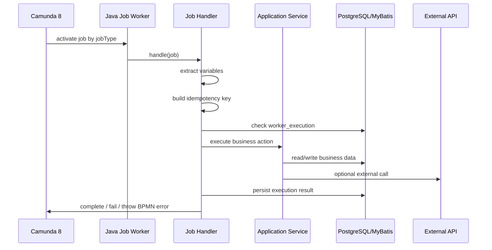

Worker bukan REST controller. Worker bersifat **asynchronous, retryable, potentially duplicated**, dan harus aman jika dipanggil ulang.

---

# 3. Worker implementation goals

Worker production-grade harus memenuhi ini:

```text id="e00bws"
[ ] Registered by stable job type.
[ ] Handler kecil dan testable.
[ ] Variable extraction typed dan defensive.
[ ] Idempotency key jelas.
[ ] PostgreSQL execution log tersedia.
[ ] External side effect dilindungi dedup/idempotency.
[ ] Complete/fail/BPMN error semantics konsisten.
[ ] Retry backoff dipakai untuk temporary failure.
[ ] Missing contract variable menjadi incident cepat.
[ ] Structured logging standar.
[ ] Worker bisa graceful shutdown.
[ ] Concurrency tidak menghancurkan DB/downstream.
```

Camunda docs menjelaskan worker bisa mengambil lebih dari satu job sekaligus; untuk sistem sibuk, mengambil sekitar 20 sampai 50 job dalam satu remote request bisa masuk akal, sedangkan long polling membantu agar worker tidak terus menerus polling saat load rendah. ([Camunda 8 Docs](https://docs.camunda.io/docs/components/best-practices/development/writing-good-workers/?utm_source=chatgpt.com))

---

# 4. Recommended package structure

```text id="qg70xr"
src/main/java/com/company/caseapp
  ├── workflow/
  │   ├── JobTypes.java
  │   ├── WorkflowVariables.java
  │   ├── BpmnErrorCodes.java
  │   ├── CamundaLifecycle.java
  │   └── WorkerRuntimeConfig.java
  │
  ├── worker/
  │   ├── WorkerRegistry.java
  │   ├── JobResultReporter.java
  │   ├── JobVariableReader.java
  │   ├── JobExecutionContext.java
  │   ├── ValidateCaseJobHandler.java
  │   ├── CalculateRiskScoreJobHandler.java
  │   └── NotifyCaseResultJobHandler.java
  │
  ├── application/
  │   ├── CaseValidationService.java
  │   ├── RiskScoringService.java
  │   └── NotificationService.java
  │
  ├── persistence/
  │   ├── mapper/
  │   │   └── WorkerExecutionMapper.java
  │   └── repository/
  │       └── WorkerExecutionRepository.java
  │
  └── domain/
      ├── RiskResult.java
      ├── ValidationResult.java
      └── NotificationResult.java
```

Layering rule:

```text id="5s8gza"
WorkerRegistry:
  registers job workers

JobHandler:
  handles one job type

ApplicationService:
  owns business action

Repository/Mapper:
  owns persistence

JobResultReporter:
  owns Camunda complete/fail/error command

JobVariableReader:
  owns typed variable extraction
```

---

# 5. Job type constants

```java id="455p50"
package com.company.caseapp.workflow;

public final class JobTypes {

    private JobTypes() {
    }

    public static final String VALIDATE_CASE = "validate-case";
    public static final String CALCULATE_RISK_SCORE = "calculate-risk-score";
    public static final String CLASSIFY_DOCUMENTS = "classify-documents";
    public static final String NOTIFY_CASE_RESULT = "notify-case-result";
    public static final String SYNC_CASE_STATUS = "sync-case-status";
}
```

Job type adalah routing key antara BPMN service task dan worker. Job type bersifat case-sensitive; dokumentasi juga memberi catatan panjang job type perlu dijaga aman, terutama jika memakai atau mungkin migrasi ke RDBMS-backed storage. ([Camunda 8 Docs](https://docs.camunda.io/docs/components/concepts/job-workers/?utm_source=chatgpt.com))

---

# 6. Variable constants

```java id="j9fk7b"
package com.company.caseapp.workflow;

public final class WorkflowVariables {

    private WorkflowVariables() {
    }

    public static final String CASE_ID = "caseId";
    public static final String APPLICANT_ID = "applicantId";
    public static final String CASE_TYPE = "caseType";

    public static final String CASE_VALID = "caseValid";

    public static final String RISK_SCORE = "riskScore";
    public static final String RISK_LEVEL = "riskLevel";
    public static final String RISK_REASON_CODE = "riskReasonCode";

    public static final String NOTIFICATION_SENT = "notificationSent";
    public static final String NOTIFICATION_ID = "notificationId";
}
```

Praktisnya: **jangan akses string variable mentah tersebar di handler**. Simpan di constants agar refactor dan review BPMN-worker contract lebih aman.

---

# 7. BPMN error constants

```java id="qq9eid"
package com.company.caseapp.workflow;

public final class BpmnErrorCodes {

    private BpmnErrorCodes() {
    }

    public static final String CASE_VALIDATION_FAILED = "CASE_VALIDATION_FAILED";
    public static final String RISK_POLICY_REJECTED = "RISK_POLICY_REJECTED";
    public static final String APPLICANT_BLACKLISTED = "APPLICANT_BLACKLISTED";
    public static final String DOCUMENT_INVALID = "DOCUMENT_INVALID";
    public static final String NOTIFICATION_BLOCKED = "NOTIFICATION_BLOCKED";
}
```

BPMN error dipakai untuk business exception yang memang punya jalur proses. Untuk technical failure seperti timeout, DB unavailable, atau temporary downstream error, gunakan fail job + retry/backoff. Camunda best-practice docs membedakan complete job, fail job, dan throw error sebagai respons worker utama. ([Camunda 8 Docs](https://docs.camunda.io/docs/components/best-practices/development/dealing-with-problems-and-exceptions/?utm_source=chatgpt.com))

---

# 8. Worker runtime config

```java id="ue2i81"
package com.company.caseapp.workflow;

import java.time.Duration;

public record WorkerRuntimeConfig(
    boolean enabled,
    String workerNamePrefix,
    int validateCaseMaxJobsActive,
    int calculateRiskMaxJobsActive,
    int notifyResultMaxJobsActive,
    Duration validateCaseTimeout,
    Duration calculateRiskTimeout,
    Duration notifyResultTimeout,
    Duration retryBackoff
) {
    public static WorkerRuntimeConfig fromEnv() {
        return new WorkerRuntimeConfig(
            bool("CAMUNDA_WORKER_ENABLED", true),
            str("CAMUNDA_WORKER_NAME_PREFIX", "case-worker"),
            integer("WORKER_VALIDATE_CASE_MAX_JOBS_ACTIVE", 32),
            integer("WORKER_CALCULATE_RISK_MAX_JOBS_ACTIVE", 16),
            integer("WORKER_NOTIFY_RESULT_MAX_JOBS_ACTIVE", 16),
            duration("WORKER_VALIDATE_CASE_TIMEOUT", "PT30S"),
            duration("WORKER_CALCULATE_RISK_TIMEOUT", "PT60S"),
            duration("WORKER_NOTIFY_RESULT_TIMEOUT", "PT60S"),
            duration("WORKER_RETRY_BACKOFF", "PT30S")
        );
    }

    private static String str(String key, String defaultValue) {
        String value = System.getenv(key);
        return value == null || value.isBlank() ? defaultValue : value;
    }

    private static boolean bool(String key, boolean defaultValue) {
        String value = System.getenv(key);
        return value == null || value.isBlank()
            ? defaultValue
            : Boolean.parseBoolean(value);
    }

    private static int integer(String key, int defaultValue) {
        String value = System.getenv(key);
        return value == null || value.isBlank()
            ? defaultValue
            : Integer.parseInt(value);
    }

    private static Duration duration(String key, String defaultValue) {
        return Duration.parse(str(key, defaultValue));
    }
}
```

Kenapa per job type?

```text id="v1akpt"
validate-case:
  cepat, DB-heavy, boleh maxJobsActive lebih tinggi

calculate-risk-score:
  external API-heavy, maxJobsActive harus ikut rate limit downstream

notify-case-result:
  external side effect, wajib idempotent, concurrency dibatasi
```

---

# 9. WorkerRegistry

## 9.1 Baseline registry

```java id="x0t8d2"
package com.company.caseapp.worker;

import com.company.caseapp.workflow.JobTypes;
import com.company.caseapp.workflow.WorkerRuntimeConfig;
import io.camunda.client.CamundaClient;
import io.camunda.client.api.worker.JobWorker;

import java.util.ArrayList;
import java.util.List;

public final class WorkerRegistry implements AutoCloseable {

    private final CamundaClient client;
    private final WorkerRuntimeConfig config;
    private final ValidateCaseJobHandler validateCaseHandler;
    private final CalculateRiskScoreJobHandler calculateRiskHandler;
    private final NotifyCaseResultJobHandler notifyResultHandler;
    private final List<JobWorker> workers = new ArrayList<>();

    public WorkerRegistry(
            CamundaClient client,
            WorkerRuntimeConfig config,
            ValidateCaseJobHandler validateCaseHandler,
            CalculateRiskScoreJobHandler calculateRiskHandler,
            NotifyCaseResultJobHandler notifyResultHandler
    ) {
        this.client = client;
        this.config = config;
        this.validateCaseHandler = validateCaseHandler;
        this.calculateRiskHandler = calculateRiskHandler;
        this.notifyResultHandler = notifyResultHandler;
    }

    public void openAll() {
        if (!config.enabled()) {
            return;
        }

        workers.add(client.newWorker()
            .jobType(JobTypes.VALIDATE_CASE)
            .name(config.workerNamePrefix() + "-validate-case")
            .maxJobsActive(config.validateCaseMaxJobsActive())
            .timeout(config.validateCaseTimeout())
            .handler(validateCaseHandler)
            .open());

        workers.add(client.newWorker()
            .jobType(JobTypes.CALCULATE_RISK_SCORE)
            .name(config.workerNamePrefix() + "-calculate-risk-score")
            .maxJobsActive(config.calculateRiskMaxJobsActive())
            .timeout(config.calculateRiskTimeout())
            .handler(calculateRiskHandler)
            .open());

        workers.add(client.newWorker()
            .jobType(JobTypes.NOTIFY_CASE_RESULT)
            .name(config.workerNamePrefix() + "-notify-case-result")
            .maxJobsActive(config.notifyResultMaxJobsActive())
            .timeout(config.notifyResultTimeout())
            .handler(notifyResultHandler)
            .open());
    }

    @Override
    public void close() {
        for (int i = workers.size() - 1; i >= 0; i--) {
            workers.get(i).close();
        }
        workers.clear();
    }
}
```

Java Client worker melakukan polling saat worker dibuka, mengirim activated job ke handler, lalu melakukan polling lagi ketika jumlah unhandled jobs turun di bawah threshold tertentu dari `maxJobsActive`; jika polling error, worker memakai backoff strategy. ([Camunda 8 Docs](https://docs.camunda.io/docs/apis-tools/java-client/job-worker/?utm_source=chatgpt.com))

---

## 9.2 Runtime mode split

Untuk production, pisahkan API dan worker deployment.

```text id="nlo0ni"
case-api:
  WORKER_ENABLED=false

case-worker:
  WORKER_ENABLED=true
```

Manfaat:

```text id="i0ockb"
- API latency tidak terganggu worker load
- worker bisa diskalakan per throughput job
- deployment worker tidak memutus traffic API
- resource limit lebih jelas
```

---

# 10. Typed variable extraction

## 10.1 Problem

Jangan lakukan ini di setiap handler:

```java id="9csn8m"
String caseId = (String) job.getVariablesAsMap().get("caseId");
Integer score = (Integer) job.getVariablesAsMap().get("riskScore");
```

Risiko:

```text id="tq0zd5"
- ClassCastException
- null pointer
- variable typo
- silent wrong type
- handler sulit dites
```

## 10.2 JobVariableReader

```java id="3bszkk"
package com.company.caseapp.worker;

import io.camunda.client.api.response.ActivatedJob;

import java.math.BigDecimal;
import java.util.Map;

public final class JobVariableReader {

    private final ActivatedJob job;
    private final Map<String, Object> variables;

    private JobVariableReader(ActivatedJob job) {
        this.job = job;
        this.variables = job.getVariablesAsMap();
    }

    public static JobVariableReader from(ActivatedJob job) {
        return new JobVariableReader(job);
    }

    public String requiredString(String name) {
        Object value = variables.get(name);

        if (!(value instanceof String stringValue) || stringValue.isBlank()) {
            throw new InvalidWorkflowVariableException(
                "Missing or invalid string variable: " + name
            );
        }

        return stringValue;
    }

    public String optionalString(String name, String defaultValue) {
        Object value = variables.get(name);

        if (value == null) {
            return defaultValue;
        }

        if (!(value instanceof String stringValue)) {
            throw new InvalidWorkflowVariableException(
                "Invalid string variable: " + name
            );
        }

        return stringValue;
    }

    public boolean requiredBoolean(String name) {
        Object value = variables.get(name);

        if (!(value instanceof Boolean booleanValue)) {
            throw new InvalidWorkflowVariableException(
                "Missing or invalid boolean variable: " + name
            );
        }

        return booleanValue;
    }

    public BigDecimal requiredNumber(String name) {
        Object value = variables.get(name);

        if (value instanceof Number number) {
            return BigDecimal.valueOf(number.doubleValue());
        }

        if (value instanceof String text && !text.isBlank()) {
            try {
                return new BigDecimal(text);
            } catch (NumberFormatException ex) {
                throw new InvalidWorkflowVariableException(
                    "Invalid numeric variable: " + name
                );
            }
        }

        throw new InvalidWorkflowVariableException(
            "Missing or invalid numeric variable: " + name
        );
    }

    public Map<String, Object> raw() {
        return variables;
    }

    public long jobKey() {
        return job.getKey();
    }

    public long processInstanceKey() {
        return job.getProcessInstanceKey();
    }

    public String jobType() {
        return job.getType();
    }
}
```

## 10.3 Contract exception

```java id="o15qii"
package com.company.caseapp.worker;

public final class InvalidWorkflowVariableException extends RuntimeException {

    public InvalidWorkflowVariableException(String message) {
        super(message);
    }

    public InvalidWorkflowVariableException(String message, Throwable cause) {
        super(message, cause);
    }
}
```

Practical rule:

```text id="rrly8o"
Missing required variable:
  fail job with retries = 0

Reason:
  ini bukan temporary error.
  ini contract/model/code bug.
  incident harus muncul cepat.
```

---

# 11. Job execution context

Buat context object supaya handler tidak passing parameter acak.

```java id="s5jqd7"
package com.company.caseapp.worker;

import io.camunda.client.api.response.ActivatedJob;

public record JobExecutionContext(
    long jobKey,
    String jobType,
    long processInstanceKey,
    String bpmnProcessId,
    String elementId,
    String caseId,
    String idempotencyKey
) {
    public static JobExecutionContext from(ActivatedJob job, String caseId) {
        String idempotencyKey =
            caseId + ":" + job.getType() + ":" + job.getProcessInstanceKey();

        return new JobExecutionContext(
            job.getKey(),
            job.getType(),
            job.getProcessInstanceKey(),
            job.getBpmnProcessId(),
            job.getElementId(),
            caseId,
            idempotencyKey
        );
    }
}
```

Idempotency key default ini cocok untuk **satu business operation per process instance**. Untuk notification atau external API write yang punya natural external reference, gunakan key yang lebih spesifik.

---

# 12. Result reporter

## 12.1 Helper untuk complete/fail/error

```java id="yrynjd"
package com.company.caseapp.worker;

import io.camunda.client.api.response.ActivatedJob;
import io.camunda.client.api.worker.JobClient;

import java.time.Duration;
import java.util.Map;

public final class JobResultReporter {

    public void complete(
            JobClient client,
            ActivatedJob job,
            Map<String, Object> variables
    ) {
        client.newCompleteCommand(job.getKey())
            .variables(variables)
            .send()
            .join();
    }

    public void failRetryable(
            JobClient client,
            ActivatedJob job,
            Exception ex,
            Duration retryBackoff
    ) {
        client.newFailCommand(job.getKey())
            .retries(Math.max(job.getRetries() - 1, 0))
            .retryBackoff(retryBackoff)
            .errorMessage(safeMessage(ex))
            .send()
            .join();
    }

    public void failFinal(
            JobClient client,
            ActivatedJob job,
            String message
    ) {
        client.newFailCommand(job.getKey())
            .retries(0)
            .errorMessage(message)
            .send()
            .join();
    }

    public void throwBpmnError(
            JobClient client,
            ActivatedJob job,
            String errorCode,
            String errorMessage,
            Map<String, Object> variables
    ) {
        client.newThrowErrorCommand(job.getKey())
            .errorCode(errorCode)
            .errorMessage(errorMessage)
            .variables(variables)
            .send()
            .join();
    }

    private String safeMessage(Exception ex) {
        String message = ex.getMessage();

        if (message == null || message.isBlank()) {
            return ex.getClass().getSimpleName();
        }

        return message.length() > 1000
            ? message.substring(0, 1000)
            : message;
    }
}
```

Fail job mendukung `retries`, `errorMessage`, optional retry backoff, dan variables. Retry backoff membuat job tidak bisa di-retry sebelum waktu saat ini plus backoff tersebut. ([Camunda 8 Docs](https://docs.camunda.io/docs/apis-tools/orchestration-cluster-api-rest/specifications/fail-job/?utm_source=chatgpt.com))

---

# 13. PostgreSQL worker execution table

Worker harus punya durable execution log untuk idempotency dan audit.

```sql id="x9zls6"
create table case_worker_execution (
    execution_id bigserial primary key,
    idempotency_key text not null unique,

    case_id text not null,
    job_type text not null,
    job_key text,
    process_instance_key text not null,
    bpmn_process_id text,
    element_id text,

    status text not null,
    attempt_count int not null default 0,

    input_variables jsonb,
    output_variables jsonb,

    error_code text,
    error_message text,

    started_at timestamptz not null default now(),
    completed_at timestamptz,
    updated_at timestamptz not null default now(),

    constraint chk_case_worker_execution_status
        check (status in (
            'STARTED',
            'COMPLETED',
            'FAILED_RETRYABLE',
            'FAILED_FINAL',
            'BUSINESS_ERROR'
        ))
);

create index idx_case_worker_execution_case_id
    on case_worker_execution (case_id);

create index idx_case_worker_execution_job_type_status
    on case_worker_execution (job_type, status);

create index idx_case_worker_execution_process_instance
    on case_worker_execution (process_instance_key);
```

Kenapa `idempotency_key unique` penting?

```text id="6aiw7x"
Jika job timeout / worker crash / complete command ambiguous:
  worker bisa menjalankan handler lagi

Unique idempotency key:
  mencegah side effect ganda
  memungkinkan complete ulang dengan output yang sama
```

Timeout job memang bisa menyebabkan dua worker mengerjakan job yang sama; hanya satu complete yang akan berhasil, dan complete lain bisa ditolak. Karena itu dedup di sisi business action tetap wajib. ([Camunda 8 Docs](https://docs.camunda.io/docs/components/concepts/job-workers/?utm_source=chatgpt.com))

---

# 14. MyBatis mapper

## 14.1 Row model

```java id="owqptj"
package com.company.caseapp.persistence.mapper;

import java.time.OffsetDateTime;
import java.util.Map;

public record WorkerExecutionRow(
    Long executionId,
    String idempotencyKey,
    String caseId,
    String jobType,
    String jobKey,
    String processInstanceKey,
    String bpmnProcessId,
    String elementId,
    String status,
    int attemptCount,
    Map<String, Object> inputVariables,
    Map<String, Object> outputVariables,
    String errorCode,
    String errorMessage,
    OffsetDateTime startedAt,
    OffsetDateTime completedAt,
    OffsetDateTime updatedAt
) {
}
```

## 14.2 Mapper interface

```java id="79wvgi"
package com.company.caseapp.persistence.mapper;

import org.apache.ibatis.annotations.Param;

import java.util.Map;
import java.util.Optional;

public interface WorkerExecutionMapper {

    Optional<WorkerExecutionRow> findByIdempotencyKey(
        @Param("idempotencyKey") String idempotencyKey
    );

    Optional<WorkerExecutionRow> findCompleted(
        @Param("idempotencyKey") String idempotencyKey
    );

    int insertStarted(WorkerExecutionRow row);

    int markCompleted(
        @Param("idempotencyKey") String idempotencyKey,
        @Param("outputVariables") Map<String, Object> outputVariables
    );

    int markFailedRetryable(
        @Param("idempotencyKey") String idempotencyKey,
        @Param("errorMessage") String errorMessage
    );

    int markFailedFinal(
        @Param("idempotencyKey") String idempotencyKey,
        @Param("errorMessage") String errorMessage
    );

    int markBusinessError(
        @Param("idempotencyKey") String idempotencyKey,
        @Param("errorCode") String errorCode,
        @Param("errorMessage") String errorMessage
    );
}
```

## 14.3 Mapper XML

```xml id="1dr2ni"
<insert id="insertStarted">
    insert into case_worker_execution (
        idempotency_key,
        case_id,
        job_type,
        job_key,
        process_instance_key,
        bpmn_process_id,
        element_id,
        status,
        attempt_count,
        input_variables
    ) values (
        #{idempotencyKey},
        #{caseId},
        #{jobType},
        #{jobKey},
        #{processInstanceKey},
        #{bpmnProcessId},
        #{elementId},
        'STARTED',
        1,
        #{inputVariables, typeHandler=com.company.caseapp.persistence.JsonbTypeHandler}
    )
    on conflict (idempotency_key)
    do update set
        attempt_count = case_worker_execution.attempt_count + 1,
        updated_at = now()
</insert>
```

```xml id="p1615u"
<select id="findCompleted" resultMap="WorkerExecutionRowMap">
    select
        execution_id,
        idempotency_key,
        case_id,
        job_type,
        job_key,
        process_instance_key,
        bpmn_process_id,
        element_id,
        status,
        attempt_count,
        input_variables,
        output_variables,
        error_code,
        error_message,
        started_at,
        completed_at,
        updated_at
    from case_worker_execution
    where idempotency_key = #{idempotencyKey}
      and status = 'COMPLETED'
</select>
```

```xml id="9zeql2"
<update id="markCompleted">
    update case_worker_execution
    set status = 'COMPLETED',
        output_variables = #{outputVariables, typeHandler=com.company.caseapp.persistence.JsonbTypeHandler},
        completed_at = now(),
        updated_at = now()
    where idempotency_key = #{idempotencyKey}
</update>
```

```xml id="drrq2j"
<update id="markFailedRetryable">
    update case_worker_execution
    set status = 'FAILED_RETRYABLE',
        error_message = #{errorMessage},
        updated_at = now()
    where idempotency_key = #{idempotencyKey}
</update>
```

```xml id="tvm378"
<update id="markFailedFinal">
    update case_worker_execution
    set status = 'FAILED_FINAL',
        error_message = #{errorMessage},
        updated_at = now()
    where idempotency_key = #{idempotencyKey}
</update>
```

```xml id="s7pse9"
<update id="markBusinessError">
    update case_worker_execution
    set status = 'BUSINESS_ERROR',
        error_code = #{errorCode},
        error_message = #{errorMessage},
        updated_at = now()
    where idempotency_key = #{idempotencyKey}
</update>
```

---

# 15. Repository abstraction

```java id="ekmve8"
package com.company.caseapp.persistence.repository;

import com.company.caseapp.persistence.mapper.WorkerExecutionMapper;
import com.company.caseapp.persistence.mapper.WorkerExecutionRow;

import java.util.Map;
import java.util.Optional;

public final class WorkerExecutionRepository {

    private final WorkerExecutionMapper mapper;

    public WorkerExecutionRepository(WorkerExecutionMapper mapper) {
        this.mapper = mapper;
    }

    public Optional<WorkerExecutionRow> findCompleted(String idempotencyKey) {
        return mapper.findCompleted(idempotencyKey);
    }

    public void markStarted(WorkerExecutionRow row) {
        mapper.insertStarted(row);
    }

    public void markCompleted(
            String idempotencyKey,
            Map<String, Object> outputVariables
    ) {
        mapper.markCompleted(idempotencyKey, outputVariables);
    }

    public void markFailedRetryable(
            String idempotencyKey,
            String errorMessage
    ) {
        mapper.markFailedRetryable(idempotencyKey, errorMessage);
    }

    public void markFailedFinal(
            String idempotencyKey,
            String errorMessage
    ) {
        mapper.markFailedFinal(idempotencyKey, errorMessage);
    }

    public void markBusinessError(
            String idempotencyKey,
            String errorCode,
            String errorMessage
    ) {
        mapper.markBusinessError(idempotencyKey, errorCode, errorMessage);
    }
}
```

---

# 16. Handler pattern: ValidateCase

## 16.1 Business service

```java id="nk6w3n"
package com.company.caseapp.application;

public final class CaseValidationService {

    private final CaseRepository caseRepository;

    public CaseValidationService(CaseRepository caseRepository) {
        this.caseRepository = caseRepository;
    }

    public ValidationResult validate(String caseId) {
        var caseRecord = caseRepository.findById(caseId)
            .orElseThrow(() -> new CaseValidationFailedException(
                "Case not found: " + caseId
            ));

        if (!caseRecord.hasRequiredApplicantData()) {
            return ValidationResult.invalid("MISSING_APPLICANT_DATA");
        }

        if (!caseRecord.hasRequiredDocuments()) {
            return ValidationResult.invalid("MISSING_REQUIRED_DOCUMENTS");
        }

        return ValidationResult.valid();
    }
}
```

```java id="ah6ey6"
package com.company.caseapp.domain;

public record ValidationResult(
    boolean valid,
    String reasonCode
) {
    public static ValidationResult valid() {
        return new ValidationResult(true, null);
    }

    public static ValidationResult invalid(String reasonCode) {
        return new ValidationResult(false, reasonCode);
    }
}
```

## 16.2 Handler

```java id="e7c5kj"
package com.company.caseapp.worker;

import com.company.caseapp.application.CaseValidationService;
import com.company.caseapp.domain.ValidationResult;
import com.company.caseapp.persistence.mapper.WorkerExecutionRow;
import com.company.caseapp.persistence.repository.WorkerExecutionRepository;
import com.company.caseapp.workflow.BpmnErrorCodes;
import com.company.caseapp.workflow.WorkflowVariables;
import io.camunda.client.api.response.ActivatedJob;
import io.camunda.client.api.worker.JobClient;
import io.camunda.client.api.worker.JobHandler;

import java.time.Duration;
import java.util.Map;

public final class ValidateCaseJobHandler implements JobHandler {

    private final CaseValidationService validationService;
    private final WorkerExecutionRepository executionRepository;
    private final JobResultReporter reporter;
    private final Duration retryBackoff;

    public ValidateCaseJobHandler(
            CaseValidationService validationService,
            WorkerExecutionRepository executionRepository,
            JobResultReporter reporter,
            Duration retryBackoff
    ) {
        this.validationService = validationService;
        this.executionRepository = executionRepository;
        this.reporter = reporter;
        this.retryBackoff = retryBackoff;
    }

    @Override
    public void handle(JobClient client, ActivatedJob job) {
        JobVariableReader variables = JobVariableReader.from(job);
        String caseId = variables.requiredString(WorkflowVariables.CASE_ID);
        JobExecutionContext context = JobExecutionContext.from(job, caseId);

        try {
            var completed = executionRepository.findCompleted(context.idempotencyKey());
            if (completed.isPresent()) {
                reporter.complete(client, job, completed.get().outputVariables());
                return;
            }

            executionRepository.markStarted(new WorkerExecutionRow(
                null,
                context.idempotencyKey(),
                context.caseId(),
                context.jobType(),
                String.valueOf(context.jobKey()),
                String.valueOf(context.processInstanceKey()),
                context.bpmnProcessId(),
                context.elementId(),
                "STARTED",
                1,
                variables.raw(),
                null,
                null,
                null,
                null,
                null,
                null
            ));

            ValidationResult result = validationService.validate(caseId);

            if (!result.valid()) {
                executionRepository.markBusinessError(
                    context.idempotencyKey(),
                    BpmnErrorCodes.CASE_VALIDATION_FAILED,
                    result.reasonCode()
                );

                reporter.throwBpmnError(
                    client,
                    job,
                    BpmnErrorCodes.CASE_VALIDATION_FAILED,
                    "Case validation failed: " + result.reasonCode(),
                    Map.of(
                        WorkflowVariables.CASE_VALID, false,
                        "validationReasonCode", result.reasonCode()
                    )
                );
                return;
            }

            Map<String, Object> output = Map.of(
                WorkflowVariables.CASE_VALID, true
            );

            executionRepository.markCompleted(context.idempotencyKey(), output);
            reporter.complete(client, job, output);

        } catch (InvalidWorkflowVariableException ex) {
            executionRepository.markFailedFinal(
                context.idempotencyKey(),
                ex.getMessage()
            );
            reporter.failFinal(client, job, ex.getMessage());

        } catch (TemporaryDependencyException ex) {
            executionRepository.markFailedRetryable(
                context.idempotencyKey(),
                ex.getMessage()
            );
            reporter.failRetryable(client, job, ex, retryBackoff);
        }
    }
}
```

---

# 17. Handler pattern: CalculateRiskScore

```java id="0kyr1y"
package com.company.caseapp.worker;

import com.company.caseapp.application.RiskScoringService;
import com.company.caseapp.domain.RiskResult;
import com.company.caseapp.persistence.mapper.WorkerExecutionRow;
import com.company.caseapp.persistence.repository.WorkerExecutionRepository;
import com.company.caseapp.workflow.BpmnErrorCodes;
import com.company.caseapp.workflow.WorkflowVariables;
import io.camunda.client.api.response.ActivatedJob;
import io.camunda.client.api.worker.JobClient;
import io.camunda.client.api.worker.JobHandler;

import java.time.Duration;
import java.util.Map;

public final class CalculateRiskScoreJobHandler implements JobHandler {

    private final RiskScoringService riskScoringService;
    private final WorkerExecutionRepository executionRepository;
    private final JobResultReporter reporter;
    private final Duration retryBackoff;

    public CalculateRiskScoreJobHandler(
            RiskScoringService riskScoringService,
            WorkerExecutionRepository executionRepository,
            JobResultReporter reporter,
            Duration retryBackoff
    ) {
        this.riskScoringService = riskScoringService;
        this.executionRepository = executionRepository;
        this.reporter = reporter;
        this.retryBackoff = retryBackoff;
    }

    @Override
    public void handle(JobClient client, ActivatedJob job) {
        JobVariableReader variables = JobVariableReader.from(job);

        String caseId = variables.requiredString(WorkflowVariables.CASE_ID);
        String applicantId = variables.requiredString(WorkflowVariables.APPLICANT_ID);
        String caseType = variables.requiredString(WorkflowVariables.CASE_TYPE);

        JobExecutionContext context = JobExecutionContext.from(job, caseId);

        try {
            var previous = executionRepository.findCompleted(context.idempotencyKey());
            if (previous.isPresent()) {
                reporter.complete(client, job, previous.get().outputVariables());
                return;
            }

            executionRepository.markStarted(new WorkerExecutionRow(
                null,
                context.idempotencyKey(),
                caseId,
                context.jobType(),
                String.valueOf(context.jobKey()),
                String.valueOf(context.processInstanceKey()),
                context.bpmnProcessId(),
                context.elementId(),
                "STARTED",
                1,
                variables.raw(),
                null,
                null,
                null,
                null,
                null,
                null
            ));

            RiskResult risk = riskScoringService.calculate(
                caseId,
                applicantId,
                caseType
            );

            if (risk.rejectedByPolicy()) {
                executionRepository.markBusinessError(
                    context.idempotencyKey(),
                    BpmnErrorCodes.RISK_POLICY_REJECTED,
                    risk.reasonCode()
                );

                reporter.throwBpmnError(
                    client,
                    job,
                    BpmnErrorCodes.RISK_POLICY_REJECTED,
                    "Risk policy rejected case: " + risk.reasonCode(),
                    Map.of(
                        WorkflowVariables.RISK_LEVEL, risk.level(),
                        WorkflowVariables.RISK_REASON_CODE, risk.reasonCode()
                    )
                );
                return;
            }

            Map<String, Object> output = Map.of(
                WorkflowVariables.RISK_SCORE, risk.score(),
                WorkflowVariables.RISK_LEVEL, risk.level(),
                WorkflowVariables.RISK_REASON_CODE, risk.reasonCode()
            );

            executionRepository.markCompleted(context.idempotencyKey(), output);
            reporter.complete(client, job, output);

        } catch (InvalidWorkflowVariableException ex) {
            executionRepository.markFailedFinal(
                context.idempotencyKey(),
                ex.getMessage()
            );
            reporter.failFinal(client, job, ex.getMessage());

        } catch (TemporaryDependencyException ex) {
            executionRepository.markFailedRetryable(
                context.idempotencyKey(),
                ex.getMessage()
            );
            reporter.failRetryable(client, job, ex, retryBackoff);
        }
    }
}
```

---

# 18. Handler pattern: Notification with external side effect

Notification/email/SMS adalah contoh side effect yang rawan duplicate.

## 18.1 Idempotency key khusus notification

```text id="ewvz46"
notificationIdempotencyKey =
  caseId + ":" + template + ":" + recipient + ":" + purpose
```

Bukan hanya:

```text id="9zu61v"
caseId + jobType + processInstanceKey
```

Kenapa? Karena notification bisa dipicu ulang dari path berbeda, atau template sama tidak boleh dikirim dua kali untuk purpose yang sama.

## 18.2 Handler sketch

```java id="xsxw5i"
package com.company.caseapp.worker;

import com.company.caseapp.application.NotificationService;
import com.company.caseapp.domain.NotificationResult;
import com.company.caseapp.persistence.repository.WorkerExecutionRepository;
import com.company.caseapp.workflow.WorkflowVariables;
import io.camunda.client.api.response.ActivatedJob;
import io.camunda.client.api.worker.JobClient;
import io.camunda.client.api.worker.JobHandler;

import java.time.Duration;
import java.util.Map;

public final class NotifyCaseResultJobHandler implements JobHandler {

    private final NotificationService notificationService;
    private final WorkerExecutionRepository executionRepository;
    private final JobResultReporter reporter;
    private final Duration retryBackoff;

    public NotifyCaseResultJobHandler(
            NotificationService notificationService,
            WorkerExecutionRepository executionRepository,
            JobResultReporter reporter,
            Duration retryBackoff
    ) {
        this.notificationService = notificationService;
        this.executionRepository = executionRepository;
        this.reporter = reporter;
        this.retryBackoff = retryBackoff;
    }

    @Override
    public void handle(JobClient client, ActivatedJob job) {
        JobVariableReader variables = JobVariableReader.from(job);

        String caseId = variables.requiredString(WorkflowVariables.CASE_ID);
        String riskLevel = variables.optionalString(
            WorkflowVariables.RISK_LEVEL,
            "UNKNOWN"
        );

        String template = job.getCustomHeaders()
            .getOrDefault("template", "CASE_RESULT_V1");

        String notificationIdempotencyKey =
            caseId + ":" + template + ":case-result";

        JobExecutionContext context = JobExecutionContext.from(job, caseId);

        try {
            var previous = executionRepository.findCompleted(notificationIdempotencyKey);
            if (previous.isPresent()) {
                reporter.complete(client, job, previous.get().outputVariables());
                return;
            }

            NotificationResult result = notificationService.sendCaseResult(
                caseId,
                template,
                riskLevel,
                notificationIdempotencyKey
            );

            Map<String, Object> output = Map.of(
                WorkflowVariables.NOTIFICATION_SENT, true,
                WorkflowVariables.NOTIFICATION_ID, result.notificationId()
            );

            executionRepository.markCompleted(notificationIdempotencyKey, output);
            reporter.complete(client, job, output);

        } catch (TemporaryDependencyException ex) {
            executionRepository.markFailedRetryable(
                context.idempotencyKey(),
                ex.getMessage()
            );
            reporter.failRetryable(client, job, ex, retryBackoff);
        }
    }
}
```

Catatan: `job.getCustomHeaders()` perlu divalidasi terhadap versi Java Client internal. Konsep custom headers berasal dari BPMN task headers yang dikirim ke worker sebagai metadata statis. Service task docs menjelaskan headers sebagai metadata tambahan untuk worker. ([Camunda 8 Docs](https://docs.camunda.io/docs/components/concepts/job-workers/?utm_source=chatgpt.com))

---

# 19. Transaction boundary

Worker tidak punya distributed transaction dengan Camunda.

Practical reality:

```text id="kkucza"
DB update succeeds,
then complete job fails.

Result:
  Camunda may retry job.
  Worker must detect DB action already completed.
  Then complete job with same output.
```

Camunda best-practice docs menekankan tidak ada technical ACID transaction yang meliputi worker dan workflow engine sekaligus dalam sistem terdistribusi. Karena itu, idempotency dan recovery logic harus ada di aplikasi. ([Camunda 8 Docs](https://docs.camunda.io/docs/components/best-practices/development/dealing-with-problems-and-exceptions/?utm_source=chatgpt.com))

## 19.1 Safe sequence

```text id="0yxrvy"
1. Read job variables.
2. Build idempotency key.
3. Check if completed.
4. If completed, complete job with stored output.
5. If not, mark execution started.
6. Execute business action idempotently.
7. Store output.
8. Complete job.
```

## 19.2 Risky sequence

```text id="93d3sj"
1. Execute external side effect.
2. Complete job.
3. Store execution log.

Problem:
  if complete succeeds but DB store fails,
  audit/idempotency state is missing.
```

---

# 20. Worker error taxonomy

| Error Type | Example | Camunda Action | DB Execution Status |
|---|---|---|---|
| Success | Risk calculated | Complete job | `COMPLETED` |
| Already completed | Retry after ambiguous complete | Complete job with stored output | `COMPLETED` |
| Business rejection | Applicant blacklisted | Throw BPMN error | `BUSINESS_ERROR` |
| Temporary technical | DB timeout, API 503 | Fail job with retries-1 + backoff | `FAILED_RETRYABLE` |
| Contract bug | Missing `caseId` | Fail job with retries 0 | `FAILED_FINAL` |
| Security/config issue | downstream 401 | Usually fail final or low retry | `FAILED_FINAL` |
| Unexpected bug | Null pointer | fail job; often low retry or incident | `FAILED_RETRYABLE` or `FAILED_FINAL` |

Jika job gagal dengan retry count 0, Camunda membuat incident yang biasanya butuh human intervention via Operate. ([Camunda 8 Docs](https://docs.camunda.io/docs/components/best-practices/development/dealing-with-problems-and-exceptions/?utm_source=chatgpt.com))

---

# 21. Fetch variables strategy

Aktivasi job dapat mengambil subset variable. Jika tidak dibatasi, worker bisa menerima semua visible variables pada scope job. REST activate jobs docs menjelaskan `fetchVariable` berisi daftar variable yang perlu diambil, dan jika kosong maka semua variable visible pada job scope dikembalikan. ([Camunda 8 Docs](https://docs.camunda.io/docs/apis-tools/orchestration-cluster-api-rest/specifications/activate-jobs/?utm_source=chatgpt.com))

Practical policy:

```text id="ylb65l"
Simple workflow:
  fetch all masih bisa diterima saat awal.

Production workflow:
  fetch hanya variable yang dibutuhkan:
    caseId
    applicantId
    caseType
    riskLevel
```

Kenapa?

```text id="0uusg4"
- mengurangi payload
- menghindari PII bocor ke log/handler
- memperjelas contract
- mengurangi coupling antar task
```

---

# 22. Concurrency tuning

## 22.1 Parameter utama

| Parameter | Fungsi | Risiko jika terlalu tinggi |
|---|---|---|
| `maxJobsActive` | Jumlah job aktif per worker | DB/API overload |
| `worker replicas` | Jumlah pod worker | Duplicate pressure pada downstream |
| job timeout | Lama worker memegang job | duplicate execution jika terlalu pendek |
| retry backoff | Delay retry setelah fail | retry storm jika terlalu pendek |
| DB pool size | Koneksi DB tersedia | pool exhaustion |
| downstream timeout | Batas call external API | handler stuck jika terlalu panjang |

## 22.2 Formula kasar

```text id="hn5l4s"
potential active jobs =
  worker replicas * maxJobsActive per worker
```

Contoh:

```text id="199e7p"
5 replicas * 32 maxJobsActive = 160 active jobs
```

Pertanyaan sebelum menaikkan:

```text id="eb4vpw"
[ ] DB pool sanggup?
[ ] External API rate limit sanggup?
[ ] Handler CPU/memory sanggup?
[ ] Job timeout masih cukup?
[ ] Retry storm terkendali?
```

## 22.3 Rekomendasi awal

```text id="o43kib"
validate-case:
  maxJobsActive = 32
  timeout = PT30S

calculate-risk-score:
  maxJobsActive = 16
  timeout = PT60S

notify-case-result:
  maxJobsActive = 8-16
  timeout = PT60S
```

Tuning harus berdasarkan metric, bukan feeling.

---

# 23. Graceful shutdown

## 23.1 Shutdown order

```text id="844avh"
1. Stop accepting new HTTP traffic if same app hosts API.
2. Close JobWorker instances.
3. Wait in-flight handlers if runtime supports it.
4. Close CamundaClient.
5. Close DB pool.
```

## 23.2 Lifecycle class

```java id="tnvd43"
package com.company.caseapp.workflow;

import com.company.caseapp.worker.WorkerRegistry;
import io.camunda.client.CamundaClient;

import java.util.concurrent.atomic.AtomicBoolean;

public final class CamundaWorkerLifecycle implements AutoCloseable {

    private final CamundaClient client;
    private final WorkerRegistry workerRegistry;
    private final AtomicBoolean started = new AtomicBoolean(false);

    public CamundaWorkerLifecycle(
            CamundaClient client,
            WorkerRegistry workerRegistry
    ) {
        this.client = client;
        this.workerRegistry = workerRegistry;
    }

    public void start() {
        if (!started.compareAndSet(false, true)) {
            return;
        }

        workerRegistry.openAll();
    }

    @Override
    public void close() {
        if (!started.compareAndSet(true, false)) {
            return;
        }

        workerRegistry.close();
        client.close();
    }
}
```

## 23.3 Kubernetes termination

```yaml id="dy52jx"
apiVersion: apps/v1
kind: Deployment
metadata:
  name: case-worker
spec:
  template:
    spec:
      terminationGracePeriodSeconds: 60
      containers:
        - name: case-worker
          image: registry.company.internal/case-worker:1.0.0
          lifecycle:
            preStop:
              exec:
                command:
                  - /bin/sh
                  - -c
                  - "sleep 10"
```

`preStop sleep` memberi waktu load balancer/readiness state berubah sebelum process benar-benar terminate. Tetapi ini bukan pengganti close worker dengan benar.

---

# 24. Health checks for worker

## 24.1 Liveness

```java id="fzxp31"
@Path("/health/live")
public final class LivenessResource {

    @GET
    @Produces(MediaType.APPLICATION_JSON)
    public Response live() {
        return Response.ok(Map.of("status", "UP")).build();
    }
}
```

## 24.2 Readiness

Worker readiness harus mengecek dependency yang wajib untuk memproses job.

```java id="092g6u"
@Path("/health/ready")
public final class WorkerReadinessResource {

    private final CamundaClient camundaClient;
    private final DatabaseHealthCheck databaseHealthCheck;

    public WorkerReadinessResource(
            CamundaClient camundaClient,
            DatabaseHealthCheck databaseHealthCheck
    ) {
        this.camundaClient = camundaClient;
        this.databaseHealthCheck = databaseHealthCheck;
    }

    @GET
    @Produces(MediaType.APPLICATION_JSON)
    public Response ready() {
        try {
            databaseHealthCheck.check();
            camundaClient.newTopologyRequest().execute();

            return Response.ok(Map.of(
                "status", "UP",
                "database", "UP",
                "camunda", "UP"
            )).build();

        } catch (Exception ex) {
            return Response.status(Response.Status.SERVICE_UNAVAILABLE)
                .entity(Map.of(
                    "status", "DOWN",
                    "reason", ex.getClass().getSimpleName()
                ))
                .build();
        }
    }
}
```

Caution:

```text id="053byc"
Jangan buat liveness bergantung pada Camunda/DB.
Kalau dependency down, restart pod terus-menerus biasanya tidak memperbaiki dependency.
```

---

# 25. Observability

## 25.1 Required log fields

```text id="y3m8a9"
jobType
jobKey
processInstanceKey
bpmnProcessId
elementId
caseId
idempotencyKey
workerName
attempt/retries
durationMs
status
```

## 25.2 Job started log

```json id="a5o17o"
{
  "event": "camunda.job.started",
  "jobType": "calculate-risk-score",
  "jobKey": "2251799813699999",
  "processInstanceKey": "2251799813688888",
  "bpmnProcessId": "case_enforcement_lifecycle",
  "elementId": "Activity_CalculateRisk",
  "caseId": "CASE-2026-000123",
  "idempotencyKey": "CASE-2026-000123:calculate-risk-score:2251799813688888"
}
```

## 25.3 Job completed log

```json id="pe3xnp"
{
  "event": "camunda.job.completed",
  "jobType": "calculate-risk-score",
  "caseId": "CASE-2026-000123",
  "processInstanceKey": "2251799813688888",
  "durationMs": 381,
  "output": {
    "riskLevel": "HIGH"
  }
}
```

## 25.4 Job failed log

```json id="cvqnat"
{
  "event": "camunda.job.failed",
  "jobType": "calculate-risk-score",
  "caseId": "CASE-2026-000123",
  "remainingRetries": 2,
  "retryBackoffMs": 30000,
  "errorClass": "TemporaryDependencyException",
  "durationMs": 5001
}
```

Jangan log full variable map jika berisi PII, token, document payload, atau sensitive business data.

---

# 26. Metrics

Minimum metrics:

```text id="smlzvz"
camunda_worker_job_started_total{jobType}
camunda_worker_job_completed_total{jobType}
camunda_worker_job_failed_total{jobType,errorType}
camunda_worker_job_bpmn_error_total{jobType,errorCode}
camunda_worker_job_duration_ms{jobType}
camunda_worker_active_jobs{jobType}
camunda_worker_idempotency_hit_total{jobType}
camunda_worker_downstream_error_total{jobType,downstream}
```

Dashboard yang berguna:

```text id="xlbse2"
- job completion rate by jobType
- job failure rate by jobType
- p95/p99 handler duration
- retry count trend
- incident count by elementId/jobType
- idempotency hit count
- downstream timeout rate
- DB pool usage vs worker active jobs
```

---

# 27. Testing strategy

## 27.1 Unit test handler

Test tanpa Camunda real cluster.

```text id="drlf4n"
Given:
  ActivatedJob mock with variables

When:
  handler executes

Then:
  reporter.complete/fail/error called with expected payload
```

## 27.2 Test cases per handler

```text id="8939m9"
[ ] missing caseId -> fail final
[ ] business invalid -> throw BPMN error
[ ] temporary DB error -> fail retryable
[ ] successful action -> complete
[ ] duplicate completed execution -> complete with stored output
[ ] external side effect already done -> no duplicate side effect
```

## 27.3 Integration test

Gunakan Camunda local/dev cluster untuk validasi:

```text id="szl4gj"
[ ] BPMN deployed
[ ] process started
[ ] worker activates job
[ ] worker completes job
[ ] process moves to next element
[ ] fail job creates retry/incident when retries exhausted
[ ] BPMN error boundary path works
```

---

# 28. Anti-patterns

| Anti-pattern | Risiko | Koreksi |
|---|---|---|
| Handler lambda 300 baris | Sulit test dan maintain | Dedicated `JobHandler` class |
| Tidak ada typed variable extraction | Runtime ClassCast/null bug | `JobVariableReader` |
| Missing variable di-retry terus | Incident lambat, retry waste | fail final `retries=0` |
| Technical timeout jadi BPMN error | Diagram salah makna | fail job + backoff |
| Business rejection jadi fail job | Incident padahal jalur bisnis | throw BPMN error |
| Tidak ada idempotency | Duplicate DB/API side effect | execution table + unique key |
| Complete job sebelum persist output | retry kehilangan result | persist output dulu |
| maxJobsActive tinggi tanpa DB sizing | DB/downstream collapse | tune per job type |
| Worker sleep untuk wait state | Resource waste | BPMN timer/message |
| Worker dan API satu deployment untuk heavy load | API latency terganggu | split deployment |
| No structured logs | Operate incident sulit ditelusuri | standard log fields |
| Close client sebelum worker | in-flight job kacau | close workers first |

---

# 29. Mini-lab Seri 9

## Goal

Implement worker runtime untuk:

```text id="477hnc"
validate-case
calculate-risk-score
notify-case-result
```

## Required components

```text id="qpsej9"
[ ] WorkerRegistry
[ ] JobVariableReader
[ ] JobExecutionContext
[ ] JobResultReporter
[ ] WorkerExecutionRepository
[ ] WorkerExecutionMapper
[ ] case_worker_execution table
[ ] ValidateCaseJobHandler
[ ] CalculateRiskScoreJobHandler
[ ] NotifyCaseResultJobHandler
```

## Test scenarios

```text id="cr3jlb"
[ ] Happy path validate-case completes.
[ ] Missing caseId fails final and creates incident.
[ ] Business validation failure throws CASE_VALIDATION_FAILED.
[ ] Risk API timeout fails retryable with backoff.
[ ] Retried calculate-risk-score does not duplicate DB execution.
[ ] Notification retry does not send duplicate notification.
[ ] Worker shutdown closes JobWorker before CamundaClient.
[ ] maxJobsActive can be changed via env.
[ ] Logs include caseId/jobKey/processInstanceKey/idempotencyKey.
```

---

# 30. Production checklist

```text id="wip1oy"
[ ] API deployment can disable workers.
[ ] Worker deployment can run without public API traffic.
[ ] Every job type has a dedicated handler.
[ ] Every handler validates required variables.
[ ] Every handler builds idempotency key.
[ ] Every handler checks completed execution before side effect.
[ ] Every handler stores output variables before complete job.
[ ] Every business rejection maps to BPMN error code.
[ ] Every technical temporary failure maps to fail job + backoff.
[ ] Every contract bug fails final with retries=0.
[ ] Worker execution table has unique idempotency key.
[ ] External API calls use idempotency key where supported.
[ ] maxJobsActive is tuned per job type.
[ ] Job timeout is longer than expected handler duration.
[ ] Readiness checks DB + Camunda.
[ ] Liveness does not depend heavily on downstreams.
[ ] Shutdown closes worker registry then client.
[ ] Metrics exist per jobType/status/errorCode.
[ ] Runbook links jobType to owner team.
```

---

# 31. Ringkasan Seri 9

```text id="t7jqm8"
WorkerRegistry:
  opens/closes workers per job type

JobHandler:
  executes one business action

JobVariableReader:
  protects variable contract

JobExecutionContext:
  standardizes job metadata and idempotency key

WorkerExecutionRepository:
  gives idempotency and audit trail

JobResultReporter:
  standardizes complete/fail/BPMN error

ApplicationService:
  owns domain behavior

MyBatis/PostgreSQL:
  owns durable business state
```

Formula praktis:

```text id="ejjm9n"
A production Camunda worker is not just:
  "some Java code that completes a job."

It is:
  a retry-safe,
  idempotent,
  observable,
  contract-validating,
  failure-aware,
  horizontally scalable business executor.
```

---

# Seri 9/16 selesai

Seri ini selesai: **Java Job Worker Implementation Pattern**.

Rekomendasi materi berikutnya:

**Seri 10/16 - Variables, Payload Design, and PostgreSQL/MyBatis Boundary: variable scope, input/output mapping, payload minimization, JSON serialization, PostgreSQL as system of record, process variable schema discipline, dan anti-pattern menyimpan business aggregate penuh di Camunda.**

---

**Sources:**

- [Job workers](https://docs.camunda.io/docs/components/concepts/job-workers/?utm_source=chatgpt.com)

## Response:
7/16/2026, 10:02:57 AM

Saya lanjut ke **Seri 10/16**. Fokusnya boundary data: variable Camunda harus kecil dan terkontrol, sedangkan business aggregate tetap di PostgreSQL/MyBatis sebagai system of record.

# Cheatsheet Camunda 8 + Java/Jersey Microservice  
## Seri 10/16 - Variables, Payload Design, and PostgreSQL/MyBatis Boundary

## 1. Fokus seri ini

Seri ini membahas **desain data boundary** antara:

```text
Camunda 8 process variables
PostgreSQL business database
MyBatis persistence layer
Jersey API request/response payload
Java worker input/output variables
```

Kesimpulan paling penting:

> Camunda variable bukan pengganti business database. Gunakan Camunda variable untuk **routing, correlation, decision, dan workflow context kecil**. Gunakan PostgreSQL/MyBatis sebagai **system of record** untuk business aggregate, audit, document metadata, dan data sensitif.

Camunda best practice menyarankan process variables digunakan secara **lightweight dan meaningful**, hanya menyimpan data yang relevan untuk process instance. Camunda menyediakan dynamic map of process variables, termasuk local scopes untuk user task atau parallel flows, tetapi data tersebut sebaiknya tidak dijadikan tempat menyimpan semua business payload. ([Camunda 8 Docs](https://docs.camunda.io/docs/components/best-practices/development/handling-data-in-processes/?utm_source=chatgpt.com))

---

# 2. Mental model data boundary

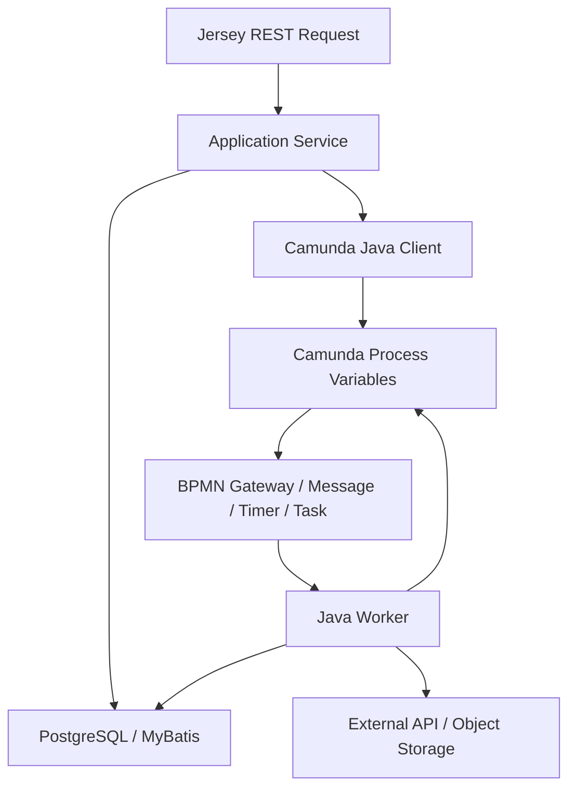

Practical rule:

```text
Jersey request:
  full input from client

PostgreSQL:
  durable business data

Camunda variables:
  small process-relevant data

Worker:
  reads variable IDs, loads detail from DB

BPMN:
  routes based on compact variables
```

---

# 3. Apa yang boleh masuk Camunda variable?

## 3.1 Good process variables

```json
{
  "caseId": "CASE-2026-000123",
  "applicantId": "APL-1001",
  "caseType": "LICENSE_REVIEW",
  "region": "JKT",
  "riskLevel": "HIGH",
  "reviewDecision": "APPROVE",
  "documentBatchId": "DOCB-9911",
  "correlationKey": "CASE-2026-000123"
}
```

Karakteristik:

```text
- kecil
- mudah dipahami
- tidak berisi payload besar
- cukup untuk routing BPMN
- cukup untuk message correlation
- cukup untuk worker lookup ke DB
```

## 3.2 Bad process variables

```json
{
  "caseAggregate": {
    "applicant": {
      "fullName": "....",
      "identityNumber": "....",
      "address": "....",
      "phone": "....",
      "email": "...."
    },
    "documents": [
      {
        "fileName": "passport.pdf",
        "base64": "...."
      }
    ],
    "auditTrail": [
      {
        "timestamp": "...",
        "actor": "...",
        "payload": "..."
      }
    ],
    "largeExternalResponse": {
      "raw": "..."
    }
  }
}
```

Risiko:

| Risiko | Dampak |
|---|---|
| Variable bloat | Process state membesar, performa turun. |
| Sensitive data exposure | Operate/API/log/debug bisa melihat data yang tidak perlu. |
| Migration sulit | Perubahan schema aggregate memengaruhi running process. |
| Coupling tinggi | BPMN dan worker tergantung struktur payload besar. |
| Query/reporting buruk | Business query lebih cocok di DB/read model. |
| Audit kacau | Data tersebar antara Camunda dan PostgreSQL. |

Camunda docs juga menekankan bahwa variables di BPMN tidak dideklarasikan dengan schema formal; variables dibuat saat instance start, job complete, message correlation, atau input/output mapping. Ini berarti disiplin naming/type harus dijaga oleh aplikasi dan kontrak worker. ([Camunda 8 Docs](https://docs.camunda.io/docs/components/concepts/variables/?utm_source=chatgpt.com))

---

# 4. Boundary table: Camunda vs PostgreSQL

| Data | Camunda Variable | PostgreSQL/MyBatis | Catatan |
|---|---:|---:|---|
| `caseId` | Ya | Ya | Anchor utama. |
| `businessId` | Ya/metadata | Ya | Gunakan sama dengan `caseId` bila cocok. |
| `correlationKey` | Ya | Ya | Untuk message correlation. |
| `applicantId` | Ya jika routing/task butuh | Ya | Jangan full applicant profile. |
| `caseType` | Ya | Ya | Dipakai gateway/routing. |
| `region` | Ya jika routing | Ya | Misalnya assignment region. |
| Full request payload | Tidak | Ya | Simpan di `jsonb`/normalized table. |
| PII/sensitive data | Hindari | Ya, controlled | Masking/encryption/audit. |
| Document binary | Tidak | Object storage | DB hanya metadata/reference. |
| Document metadata lengkap | Tidak/kecil saja | Ya | Variable cukup `documentBatchId`. |
| Risk score | Ya jika gateway butuh | Ya | Simpan juga di DB untuk query bisnis. |
| Raw external API response | Tidak | Ya / object storage | Bisa besar/sensitif. |
| Audit trail | Tidak | Ya | Gunakan event/audit table. |
| Human decision result | Ya | Ya | Variable untuk routing, DB untuk audit. |
| Worker execution log | Tidak | Ya | Idempotency/audit worker. |

---

# 5. Variable scope di Camunda 8

Camunda variables punya konsep **scope**. Variable bisa berada di process instance scope atau local scope pada activity/subprocess/parallel branch. Output mapping menentukan apakah data local akan di-merge ke parent scope. ([Camunda 8 Docs](https://docs.camunda.io/docs/components/concepts/variables/?utm_source=chatgpt.com))

Mental model:

```text
Process instance scope:
  caseId
  caseType
  riskLevel
  reviewDecision

Subprocess local scope:
  documentValidationResult
  temporaryClassification

Service task local/job variables:
  input untuk worker
  output dari worker sebelum mapping
```

## 5.1 Problem umum

Jika semua output worker otomatis merge ke process instance:

```json
{
  "debugPayload": "...",
  "rawRiskEngineResponse": "...",
  "temporaryScoreBreakdown": "...",
  "internalHttpStatus": 200
}
```

Variable process jadi kotor.

## 5.2 Solusi

Gunakan output mapping di BPMN untuk hanya merge variable yang memang dibutuhkan process.

Camunda service task docs menyebut secara default semua job variables di-merge ke process instance, dan output mapping dapat digunakan untuk mengubah behavior ini. Input mapping dapat dipakai untuk mentransform variable ke format yang diterima worker. ([Camunda 8 Docs](https://docs.camunda.io/docs/components/modeler/bpmn/service-tasks/?utm_source=chatgpt.com))

---

# 6. Input/output mapping pattern

## 6.1 Service task: Calculate Risk Score

Worker mungkin menghasilkan output lengkap:

```json
{
  "riskScore": 87,
  "riskLevel": "HIGH",
  "riskReasonCode": "BLACKLIST_MATCH",
  "riskDebugPayload": {
    "ruleHits": ["R001", "R019"],
    "rawScoreBreakdown": {
      "a": 10,
      "b": 77
    }
  }
}
```

Yang perlu masuk process variable hanya:

```json
{
  "riskScore": 87,
  "riskLevel": "HIGH",
  "riskReasonCode": "BLACKLIST_MATCH"
}
```

`riskDebugPayload` harus disimpan ke PostgreSQL/object storage jika perlu audit internal, bukan process variable.

## 6.2 Practical BPMN mapping

Conceptual output mapping:

```text
riskScore      -> riskScore
riskLevel      -> riskLevel
riskReasonCode -> riskReasonCode
```

Tidak mapping:

```text
riskDebugPayload
rawRiskEngineResponse
internalHttpHeaders
```

---

# 7. Variable naming convention

Gunakan naming yang konsisten.

| Jenis | Convention | Contoh |
|---|---|---|
| Variable name | camelCase | `caseId`, `riskLevel` |
| Message name | PascalCase event name | `DocumentReceived` |
| Job type | kebab-case | `calculate-risk-score` |
| BPMN process ID | snake_case | `case_enforcement_lifecycle` |
| BPMN error code | UPPER_SNAKE_CASE | `RISK_POLICY_REJECTED` |
| DB column | snake_case | `case_id`, `risk_level` |
| Java constant | UPPER_SNAKE_CASE | `CASE_ID` |

Java constants:

```java
package com.company.caseapp.workflow;

public final class WorkflowVariables {

    private WorkflowVariables() {
    }

    public static final String CASE_ID = "caseId";
    public static final String APPLICANT_ID = "applicantId";
    public static final String CASE_TYPE = "caseType";
    public static final String REGION = "region";

    public static final String RISK_SCORE = "riskScore";
    public static final String RISK_LEVEL = "riskLevel";
    public static final String RISK_REASON_CODE = "riskReasonCode";

    public static final String REVIEW_DECISION = "reviewDecision";
    public static final String REVIEW_REASON = "reviewReason";

    public static final String DOCUMENT_BATCH_ID = "documentBatchId";
    public static final String CORRELATION_KEY = "correlationKey";
}
```

---

# 8. Variable type discipline

Camunda variables memakai JSON value. Karena BPMN process tidak mendeklarasikan schema formal, aplikasi harus menjaga contract type.

## 8.1 Recommended variable types

| Variable | Type | Example |
|---|---|---|
| `caseId` | string | `"CASE-2026-000123"` |
| `applicantId` | string | `"APL-1001"` |
| `caseType` | string enum | `"LICENSE_REVIEW"` |
| `riskScore` | number | `87` |
| `riskLevel` | string enum | `"HIGH"` |
| `requiresManualReview` | boolean | `true` |
| `documentBatchId` | string | `"DOCB-9911"` |
| `reviewDecision` | string enum | `"APPROVE"` |
| `dueAt` | ISO date-time string | `"2026-07-16T10:30:00+07:00"` |

## 8.2 Avoid ambiguous types

Kurang bagus:

```json
{
  "riskScore": "87",
  "requiresManualReview": "true",
  "documentCount": "4"
}
```

Lebih bagus:

```json
{
  "riskScore": 87,
  "requiresManualReview": true,
  "documentCount": 4
}
```

---

# 9. Java typed variable extraction

Gunakan utility pembaca variable yang defensive.

```java
package com.company.caseapp.worker;

import io.camunda.client.api.response.ActivatedJob;

import java.math.BigDecimal;
import java.time.OffsetDateTime;
import java.util.Map;

public final class JobVariableReader {

    private final Map<String, Object> variables;

    private JobVariableReader(ActivatedJob job) {
        this.variables = job.getVariablesAsMap();
    }

    public static JobVariableReader from(ActivatedJob job) {
        return new JobVariableReader(job);
    }

    public String requiredString(String name) {
        Object value = variables.get(name);

        if (!(value instanceof String text) || text.isBlank()) {
            throw new InvalidWorkflowVariableException(
                "Missing or invalid string variable: " + name
            );
        }

        return text;
    }

    public String optionalString(String name, String defaultValue) {
        Object value = variables.get(name);

        if (value == null) {
            return defaultValue;
        }

        if (!(value instanceof String text)) {
            throw new InvalidWorkflowVariableException(
                "Invalid string variable: " + name
            );
        }

        return text;
    }

    public int requiredInt(String name) {
        Object value = variables.get(name);

        if (value instanceof Integer intValue) {
            return intValue;
        }

        if (value instanceof Number number) {
            return number.intValue();
        }

        throw new InvalidWorkflowVariableException(
            "Missing or invalid int variable: " + name
        );
    }

    public BigDecimal requiredDecimal(String name) {
        Object value = variables.get(name);

        if (value instanceof Number number) {
            return BigDecimal.valueOf(number.doubleValue());
        }

        if (value instanceof String text && !text.isBlank()) {
            return new BigDecimal(text);
        }

        throw new InvalidWorkflowVariableException(
            "Missing or invalid decimal variable: " + name
        );
    }

    public boolean requiredBoolean(String name) {
        Object value = variables.get(name);

        if (!(value instanceof Boolean bool)) {
            throw new InvalidWorkflowVariableException(
                "Missing or invalid boolean variable: " + name
            );
        }

        return bool;
    }

    public OffsetDateTime requiredOffsetDateTime(String name) {
        String value = requiredString(name);

        try {
            return OffsetDateTime.parse(value);
        } catch (Exception ex) {
            throw new InvalidWorkflowVariableException(
                "Invalid date-time variable: " + name,
                ex
            );
        }
    }

    public Map<String, Object> raw() {
        return variables;
    }
}
```

Exception:

```java
package com.company.caseapp.worker;

public final class InvalidWorkflowVariableException extends RuntimeException {

    public InvalidWorkflowVariableException(String message) {
        super(message);
    }

    public InvalidWorkflowVariableException(String message, Throwable cause) {
        super(message, cause);
    }
}
```

Rule:

```text
Missing required variable:
  fail job with retries = 0

Reason:
  ini contract bug, bukan temporary failure.
```

---

# 10. PostgreSQL sebagai system of record

## 10.1 Core case table

```sql
create table case_record (
    case_id text primary key,
    applicant_id text not null,
    case_type text not null,
    region text not null,
    status text not null,

    request_payload jsonb not null,
    current_risk_score numeric,
    current_risk_level text,
    current_review_decision text,

    created_by text not null,
    created_at timestamptz not null default now(),
    updated_at timestamptz not null default now(),

    constraint chk_case_status
        check (status in (
            'SUBMITTED',
            'UNDER_VALIDATION',
            'UNDER_REVIEW',
            'APPROVED',
            'REJECTED',
            'CANCELLED',
            'CLOSED'
        ))
);

create index idx_case_record_status
    on case_record (status);

create index idx_case_record_applicant_id
    on case_record (applicant_id);

create index idx_case_record_case_type_status
    on case_record (case_type, status);
```

## 10.2 Event/audit table

```sql
create table case_event (
    event_id bigserial primary key,
    case_id text not null references case_record(case_id),
    event_type text not null,
    event_payload jsonb not null,
    actor_id text,
    source_system text,
    idempotency_key text,
    created_at timestamptz not null default now()
);

create unique index uk_case_event_idempotency
    on case_event (idempotency_key)
    where idempotency_key is not null;

create index idx_case_event_case_id_created_at
    on case_event (case_id, created_at);
```

## 10.3 Workflow metadata table

```sql
create table case_workflow_instance (
    case_id text primary key references case_record(case_id),
    bpmn_process_id text not null,
    business_id text,
    process_instance_key text,
    workflow_status text not null,

    started_at timestamptz,
    completed_at timestamptz,
    last_synced_at timestamptz,
    created_at timestamptz not null default now(),
    updated_at timestamptz not null default now(),

    constraint chk_case_workflow_status
        check (workflow_status in (
            'START_PENDING',
            'STARTED',
            'COMPLETED',
            'TERMINATED',
            'START_FAILED'
        ))
);

create unique index uk_case_workflow_instance_key
    on case_workflow_instance (process_instance_key)
    where process_instance_key is not null;
```

## 10.4 Worker execution table

```sql
create table case_worker_execution (
    execution_id bigserial primary key,
    idempotency_key text not null unique,

    case_id text not null references case_record(case_id),
    job_type text not null,
    job_key text,
    process_instance_key text not null,

    status text not null,
    input_variables jsonb,
    output_variables jsonb,

    error_code text,
    error_message text,
    attempt_count int not null default 0,

    started_at timestamptz not null default now(),
    completed_at timestamptz,
    updated_at timestamptz not null default now(),

    constraint chk_worker_execution_status
        check (status in (
            'STARTED',
            'COMPLETED',
            'FAILED_RETRYABLE',
            'FAILED_FINAL',
            'BUSINESS_ERROR'
        ))
);
```

---

# 11. MyBatis mapping pattern

## 11.1 Domain-facing repository

```java
package com.company.caseapp.persistence.repository;

import com.company.caseapp.persistence.mapper.CaseMapper;

import java.util.Map;
import java.util.Optional;

public final class CaseRepository {

    private final CaseMapper mapper;

    public CaseRepository(CaseMapper mapper) {
        this.mapper = mapper;
    }

    public Optional<CaseRecord> findById(String caseId) {
        return mapper.findById(caseId);
    }

    public void updateRiskResult(
            String caseId,
            int riskScore,
            String riskLevel,
            String riskReasonCode,
            Map<String, Object> rawAuditPayload
    ) {
        mapper.updateRiskResult(
            caseId,
            riskScore,
            riskLevel,
            riskReasonCode
        );

        mapper.insertCaseEvent(
            caseId,
            "RISK_SCORE_CALCULATED",
            rawAuditPayload
        );
    }

    public void updateReviewDecision(
            String caseId,
            String decision,
            String reason,
            String actorId
    ) {
        mapper.updateReviewDecision(caseId, decision);
        mapper.insertCaseEvent(
            caseId,
            "REVIEW_DECISION_RECORDED",
            Map.of(
                "decision", decision,
                "reason", reason,
                "actorId", actorId
            )
        );
    }
}
```

## 11.2 Mapper interface

```java
package com.company.caseapp.persistence.mapper;

import org.apache.ibatis.annotations.Param;

import java.util.Map;
import java.util.Optional;

public interface CaseMapper {

    Optional<CaseRecord> findById(
        @Param("caseId") String caseId
    );

    int updateRiskResult(
        @Param("caseId") String caseId,
        @Param("riskScore") int riskScore,
        @Param("riskLevel") String riskLevel,
        @Param("riskReasonCode") String riskReasonCode
    );

    int updateReviewDecision(
        @Param("caseId") String caseId,
        @Param("reviewDecision") String reviewDecision
    );

    int insertCaseEvent(
        @Param("caseId") String caseId,
        @Param("eventType") String eventType,
        @Param("eventPayload") Map<String, Object> eventPayload
    );
}
```

## 11.3 XML mapper

```xml
<select id="findById" resultMap="CaseRecordMap">
    select
        case_id,
        applicant_id,
        case_type,
        region,
        status,
        request_payload,
        current_risk_score,
        current_risk_level,
        current_review_decision,
        created_by,
        created_at,
        updated_at
    from case_record
    where case_id = #{caseId}
</select>
```

```xml
<update id="updateRiskResult">
    update case_record
    set current_risk_score = #{riskScore},
        current_risk_level = #{riskLevel},
        updated_at = now()
    where case_id = #{caseId}
</update>
```

```xml
<insert id="insertCaseEvent">
    insert into case_event (
        case_id,
        event_type,
        event_payload
    ) values (
        #{caseId},
        #{eventType},
        #{eventPayload, typeHandler=com.company.caseapp.persistence.JsonbTypeHandler}
    )
</insert>
```

---

# 12. JSONB TypeHandler pattern

Untuk PostgreSQL `jsonb`, biasanya perlu custom type handler.

```java
package com.company.caseapp.persistence;

import com.fasterxml.jackson.core.type.TypeReference;
import com.fasterxml.jackson.databind.ObjectMapper;
import org.apache.ibatis.type.BaseTypeHandler;
import org.apache.ibatis.type.JdbcType;
import org.postgresql.util.PGobject;

import java.sql.CallableStatement;
import java.sql.PreparedStatement;
import java.sql.ResultSet;
import java.sql.SQLException;
import java.util.Map;

public final class JsonbTypeHandler extends BaseTypeHandler<Map<String, Object>> {

    private static final TypeReference<Map<String, Object>> MAP_TYPE =
        new TypeReference<>() {
        };

    private final ObjectMapper objectMapper;

    public JsonbTypeHandler(ObjectMapper objectMapper) {
        this.objectMapper = objectMapper;
    }

    @Override
    public void setNonNullParameter(
            PreparedStatement ps,
            int i,
            Map<String, Object> parameter,
            JdbcType jdbcType
    ) throws SQLException {
        try {
            PGobject jsonObject = new PGobject();
            jsonObject.setType("jsonb");
            jsonObject.setValue(objectMapper.writeValueAsString(parameter));
            ps.setObject(i, jsonObject);
        } catch (Exception ex) {
            throw new SQLException("Failed to serialize JSONB parameter", ex);
        }
    }

    @Override
    public Map<String, Object> getNullableResult(
            ResultSet rs,
            String columnName
    ) throws SQLException {
        return parse(rs.getString(columnName));
    }

    @Override
    public Map<String, Object> getNullableResult(
            ResultSet rs,
            int columnIndex
    ) throws SQLException {
        return parse(rs.getString(columnIndex));
    }

    @Override
    public Map<String, Object> getNullableResult(
            CallableStatement cs,
            int columnIndex
    ) throws SQLException {
        return parse(cs.getString(columnIndex));
    }

    private Map<String, Object> parse(String value) throws SQLException {
        if (value == null) {
            return null;
        }

        try {
            return objectMapper.readValue(value, MAP_TYPE);
        } catch (Exception ex) {
            throw new SQLException("Failed to parse JSONB value", ex);
        }
    }
}
```

---

# 13. Process variable schema discipline

Karena Camunda variable schema tidak formal, buat schema contract sendiri.

## 13.1 YAML contract contoh

```yaml
processVariables:
  case_enforcement_lifecycle:
    requiredAtStart:
      caseId:
        type: string
        source: PostgreSQL case_record.case_id
      applicantId:
        type: string
        source: PostgreSQL case_record.applicant_id
      caseType:
        type: string
        allowed:
          - LICENSE_REVIEW
          - COMPLIANCE_CHECK
          - ENFORCEMENT_CASE
      correlationKey:
        type: string
        sameAs: caseId

    producedByWorkers:
      calculate-risk-score:
        riskScore:
          type: number
          persistedTo: case_record.current_risk_score
        riskLevel:
          type: string
          allowed:
            - LOW
            - MEDIUM
            - HIGH
          persistedTo: case_record.current_risk_level

      manual-review:
        reviewDecision:
          type: string
          allowed:
            - APPROVE
            - REJECT
            - NEED_MORE_INFO
```

## 13.2 Why useful?

```text
- onboarding lebih cepat
- BPMN review lebih mudah
- worker contract lebih jelas
- regression test bisa generate validation
- mencegah variable typo
```

---

# 14. Worker output pattern: persist first, then complete

## 14.1 Safe pattern

```java
public final class CalculateRiskScoreJobHandler implements JobHandler {

    private final RiskScoringService riskScoringService;
    private final CaseRepository caseRepository;
    private final WorkerExecutionRepository executionRepository;
    private final JobResultReporter reporter;

    @Override
    public void handle(JobClient client, ActivatedJob job) {
        JobVariableReader reader = JobVariableReader.from(job);
        String caseId = reader.requiredString(WorkflowVariables.CASE_ID);

        String idempotencyKey =
            caseId + ":" + job.getType() + ":" + job.getProcessInstanceKey();

        var completed = executionRepository.findCompleted(idempotencyKey);
        if (completed.isPresent()) {
            reporter.complete(client, job, completed.get().outputVariables());
            return;
        }

        RiskResult risk = riskScoringService.calculate(caseId);

        Map<String, Object> output = Map.of(
            WorkflowVariables.RISK_SCORE, risk.score(),
            WorkflowVariables.RISK_LEVEL, risk.level(),
            WorkflowVariables.RISK_REASON_CODE, risk.reasonCode()
        );

        caseRepository.updateRiskResult(
            caseId,
            risk.score(),
            risk.level(),
            risk.reasonCode(),
            Map.of(
                "riskScore", risk.score(),
                "riskLevel", risk.level(),
                "riskReasonCode", risk.reasonCode()
            )
        );

        executionRepository.markCompleted(idempotencyKey, output);

        reporter.complete(client, job, output);
    }
}
```

Why this order?

```text
If DB update succeeds but Camunda complete fails:
  job may retry
  worker sees completed execution
  worker completes job again with same output
```

Camunda best-practice docs emphasize there is no distributed ACID transaction covering worker and workflow engine; workers therefore need explicit recovery/idempotency logic for ambiguous failures. ([Camunda 8 Docs](https://docs.camunda.io/docs/components/best-practices/best-practices-overview/?utm_source=chatgpt.com))

---

# 15. Start process variable design

When starting process from Jersey:

```java
public StartWorkflowResult startCaseLifecycle(StartCaseWorkflowCommand command) {
    Map<String, Object> variables = Map.of(
        WorkflowVariables.CASE_ID, command.caseId(),
        WorkflowVariables.APPLICANT_ID, command.applicantId(),
        WorkflowVariables.CASE_TYPE, command.caseType(),
        WorkflowVariables.REGION, command.region(),
        WorkflowVariables.CORRELATION_KEY, command.caseId()
    );

    var event = client.newCreateInstanceCommand()
        .bpmnProcessId(ProcessDefinitions.CASE_ENFORCEMENT_LIFECYCLE)
        .latestVersion()
        .variables(variables)
        .execute();

    return new StartWorkflowResult(
        event.getProcessInstanceKey(),
        ProcessDefinitions.CASE_ENFORCEMENT_LIFECYCLE,
        command.caseId()
    );
}
```

Do not:

```java
.variables(Map.of(
    "fullRequest", request,
    "fullCase", caseAggregate,
    "documents", documents,
    "auditTrail", events
))
```

Use:

```text
caseId as lookup reference.
```

---

# 16. Message variable design

## 16.1 Document received event

Message variables:

```json
{
  "caseId": "CASE-2026-000123",
  "documentBatchId": "DOCB-9911",
  "documentReceived": true
}
```

PostgreSQL event payload:

```json
{
  "documentBatchId": "DOCB-9911",
  "receivedAt": "2026-07-16T10:30:00+07:00",
  "source": "DOCUMENT_PORTAL",
  "documentCount": 4,
  "documentMetadata": [
    {
      "documentId": "DOC-1",
      "fileName": "passport.pdf",
      "mimeType": "application/pdf",
      "storageKey": "s3://bucket/path/passport.pdf"
    }
  ]
}
```

Camunda message event docs state that message variables are merged into the process instance by default unless controlled with output mapping. This is convenient but should be constrained to avoid leaking large or sensitive event payloads into workflow state. ([Camunda 8 Docs](https://docs.camunda.io/docs/components/concepts/variables/?utm_source=chatgpt.com))

---

# 17. Human task variable design

Human task output should be compact and typed.

## 17.1 Good task completion variables

```json
{
  "reviewDecision": "APPROVE",
  "reviewReasonCode": "DOCUMENTS_COMPLETE",
  "reviewedBy": "user-123",
  "reviewedAt": "2026-07-16T11:00:00+07:00"
}
```

## 17.2 Store rich details in PostgreSQL

```sql
create table case_review_decision (
    review_id bigserial primary key,
    case_id text not null references case_record(case_id),
    task_id text,
    decision text not null,
    reason_code text,
    comment text,
    reviewed_by text not null,
    reviewed_at timestamptz not null default now(),
    payload jsonb not null
);

create index idx_case_review_decision_case_id
    on case_review_decision (case_id);
```

Reasoning:

```text
Camunda variable:
  reviewDecision for BPMN routing

PostgreSQL:
  full review form, comment, actor, audit trail
```

---

# 18. Query API should read PostgreSQL, not Camunda variables

## 18.1 Good API

```http
GET /cases/CASE-2026-000123
```

Response:

```json
{
  "caseId": "CASE-2026-000123",
  "status": "UNDER_REVIEW",
  "caseType": "LICENSE_REVIEW",
  "riskLevel": "HIGH",
  "reviewDecision": null,
  "createdAt": "2026-07-16T10:00:00+07:00",
  "updatedAt": "2026-07-16T10:45:00+07:00"
}
```

Data source:

```text
PostgreSQL case_record + read model
```

## 18.2 Internal workflow debug API

For support/admin only:

```http
GET /internal/cases/CASE-2026-000123/workflow-debug
```

Response:

```json
{
  "caseId": "CASE-2026-000123",
  "bpmnProcessId": "case_enforcement_lifecycle",
  "processInstanceKey": "2251799813688888",
  "workflowStatus": "STARTED",
  "businessVariables": {
    "caseId": "CASE-2026-000123",
    "riskLevel": "HIGH"
  }
}
```

Rule:

```text
Business API:
  PostgreSQL read model

Support/debug API:
  may include Camunda metadata with strict authorization
```

---

# 19. Data synchronization patterns

## Pattern A - Worker updates DB and Camunda variable

Use when worker result affects both:

```text
Risk worker:
  update PostgreSQL current_risk_level
  complete job with riskLevel variable
```

## Pattern B - Camunda variable only

Use sparingly for temporary routing data:

```text
requiresManualReview = true
```

Only if not needed in business query/audit.

## Pattern C - DB only

Use for large or sensitive data:

```text
document metadata
raw external API response
full review form payload
audit events
```

Worker can query DB when needed.

## Pattern D - Derived read model

Use when UI needs stable status:

```text
case_status_projection
case_timeline_projection
case_dashboard_summary
```

Camunda should not become your UI query database.

---

# 20. Serialization rules

## 20.1 Java → Camunda variables

Use only JSON-friendly primitives:

```text
String
Integer/Long/Double/BigDecimal carefully
Boolean
Map<String, Object>
List<Object>
ISO date-time String
```

Avoid:

```text
JPA entities
MyBatis row objects directly
Java records with internal fields
Big object graphs
byte[]
InputStream
File
```

## 20.2 Date/time

Use ISO-8601 string with offset.

```json
{
  "reviewDueAt": "2026-07-16T17:00:00+07:00"
}
```

Avoid ambiguous:

```json
{
  "reviewDueAt": "16/07/2026 17:00"
}
```

## 20.3 Money/decimal

For money, prefer string or minor units, depending on convention.

```json
{
  "penaltyAmountMinor": 12500000,
  "currency": "IDR"
}
```

or:

```json
{
  "penaltyAmount": "125000.00",
  "currency": "IDR"
}
```

Avoid floating imprecision for money-critical logic.

---

# 21. Variable size guard

Add application-level guard before sending variables to Camunda.

```java
package com.company.caseapp.workflow;

import com.fasterxml.jackson.databind.ObjectMapper;

import java.util.Map;

public final class WorkflowVariableGuard {

    private static final int MAX_VARIABLE_PAYLOAD_BYTES = 16 * 1024;

    private final ObjectMapper objectMapper;

    public WorkflowVariableGuard(ObjectMapper objectMapper) {
        this.objectMapper = objectMapper;
    }

    public void validate(Map<String, Object> variables) {
        try {
            byte[] json = objectMapper.writeValueAsBytes(variables);

            if (json.length > MAX_VARIABLE_PAYLOAD_BYTES) {
                throw new IllegalArgumentException(
                    "Workflow variable payload too large: " + json.length + " bytes"
                );
            }

            rejectSensitiveKeys(variables, "");
        } catch (IllegalArgumentException ex) {
            throw ex;
        } catch (Exception ex) {
            throw new IllegalArgumentException(
                "Workflow variables are not JSON serializable",
                ex
            );
        }
    }

    private void rejectSensitiveKeys(Map<String, Object> map, String path) {
        for (var entry : map.entrySet()) {
            String key = entry.getKey();
            String normalized = key.toLowerCase();

            if (normalized.contains("password")
                    || normalized.contains("secret")
                    || normalized.contains("token")
                    || normalized.contains("base64")
                    || normalized.contains("documentcontent")) {
                throw new IllegalArgumentException(
                    "Sensitive or large key not allowed in workflow variables: "
                        + path + key
                );
            }

            Object value = entry.getValue();
            if (value instanceof Map<?, ?> nested) {
                rejectSensitiveKeys(
                    nested.entrySet().stream()
                        .filter(e -> e.getKey() instanceof String)
                        .collect(java.util.stream.Collectors.toMap(
                            e -> (String) e.getKey(),
                            Map.Entry::getValue
                        )),
                    path + key + "."
                );
            }
        }
    }
}
```

Use it in gateway:

```java
public void publishMessage(PublishWorkflowMessageCommand command) {
    variableGuard.validate(command.variables());

    client.newPublishMessageCommand()
        .messageName(command.messageName())
        .correlationKey(command.correlationKey())
        .messageId(command.messageId())
        .timeToLive(command.timeToLive())
        .variables(command.variables())
        .execute();
}
```

---

# 22. FEEL/gateway variable discipline

Gateway conditions should be simple.

Good:

```text
= riskLevel = "LOW"
= riskLevel = "HIGH"
= reviewDecision = "APPROVE"
```

Risky:

```text
= case.applicant.profile.income.sources[0].verified = true
```

Why risky?

```text
- depends on deep object structure
- breaks when payload schema changes
- difficult for business/support to understand
- encourages storing full aggregate in Camunda
```

Better:

```text
Worker:
  computes requiresManualReview = true

Gateway:
  = requiresManualReview = true
```

---

# 23. Document/file handling boundary

Documents should not be process variables.

## 23.1 Store in object storage

```text
Object storage:
  s3://case-documents/CASE-2026-000123/DOC-9911/passport.pdf

PostgreSQL:
  document_id
  case_id
  document_batch_id
  file_name
  mime_type
  storage_key
  checksum
  uploaded_by
  uploaded_at

Camunda variable:
  documentBatchId
  documentReceived = true
```

## 23.2 Table

```sql
create table case_document (
    document_id text primary key,
    case_id text not null references case_record(case_id),
    document_batch_id text not null,
    file_name text not null,
    mime_type text not null,
    storage_key text not null,
    checksum text,
    uploaded_by text,
    uploaded_at timestamptz not null default now()
);

create index idx_case_document_case_id
    on case_document (case_id);

create index idx_case_document_batch
    on case_document (document_batch_id);
```

---

# 24. Data privacy/security rules

| Rule | Implementation |
|---|---|
| Do not put secrets in variables | Guard sensitive keys. |
| Do not put full PII in variables | Store in PostgreSQL with access control. |
| Do not log full variable maps | Log selected safe fields. |
| Mask sensitive event payload | Structured logger filters. |
| Limit debug endpoint access | Internal role only. |
| Encrypt sensitive DB fields if required | Column encryption / app-layer crypto. |
| Avoid raw external response in Camunda | Store in DB/object storage. |

---

# 25. Variable migration/versioning

Running process instances may hold old variable names.

## 25.1 Safe changes

```text
- add optional variable
- add new worker output not used by old gateway
- add fallback/default in worker
- support old and new variable names temporarily
```

## 25.2 Risky changes

```text
- rename caseId to caseReference
- change riskLevel values from HIGH/LOW to 1/2/3
- change reviewDecision enum without gateway update
- remove variable used by message correlation
```

## 25.3 Compatibility worker pattern

```java
String caseId = firstNonBlank(
    reader.optionalString("caseId", null),
    reader.optionalString("caseReference", null)
);

if (caseId == null) {
    throw new InvalidWorkflowVariableException(
        "Missing caseId/caseReference"
    );
}
```

Use this only as temporary compatibility bridge; standardize back to one variable name.

---

# 26. Anti-patterns

| Anti-pattern | Example | Risk | Correction |
|---|---|---|---|
| Full aggregate in variable | `caseAggregate` JSON | Bloat/security/migration | Store ID/reference |
| Query UI from Camunda vars | dashboard calls workflow API | Brittle/performance | PostgreSQL read model |
| Deep FEEL over JSON | `case.applicant.profile...` | Schema coupling | Worker computes simple variable |
| No output mapping | debug data merged | Variable pollution | Explicit output mapping |
| Raw external response in vars | API response body | Sensitive/large | DB/object storage |
| Dates in local format | `16/07/2026` | Parse ambiguity | ISO-8601 offset |
| Money as floating number | `125000.10` | Precision risk | minor units/string decimal |
| Worker uses raw casts | `(String) vars.get()` | runtime bug | typed variable reader |
| Multiple names for same concept | `caseId`, `case_id`, `id` | confusion | constants/schema |
| Store document base64 | huge variable | performance/security | object storage reference |
| Business status only in Camunda | API query hard | no DB read model | store status in PostgreSQL |
| No variable contract doc | onboarding slow | hidden coupling | YAML/schema contract |

---

# 27. Mini-lab Seri 10

## Goal

Refactor variable and payload design untuk case lifecycle.

## Tasks

```text
[ ] Start process with only:
    caseId, applicantId, caseType, region, correlationKey

[ ] Store full request payload in case_record.request_payload.

[ ] Document event:
    Camunda variables:
      caseId, documentBatchId, documentReceived

    PostgreSQL:
      full document metadata in case_document/case_event.

[ ] Risk worker:
    reads caseId
    loads detail from PostgreSQL
    writes risk result to PostgreSQL
    completes job with riskScore, riskLevel, riskReasonCode only.

[ ] Review task:
    stores full decision/comment in PostgreSQL
    completes task/workflow with reviewDecision only.

[ ] Add JsonbTypeHandler for Map<String,Object>.

[ ] Add WorkflowVariableGuard before start/publish/complete variable construction.
```

## Validation checklist

```text
[ ] No full request payload in Operate variables.
[ ] No document binary/base64 in Camunda variables.
[ ] Gateway conditions use simple variables.
[ ] Worker missing caseId fails final.
[ ] Risk result exists in PostgreSQL and Camunda variable.
[ ] Query API reads status from PostgreSQL.
[ ] Variable names use constants.
[ ] JSONB payload is persisted and readable through MyBatis.
[ ] Logs do not print full variable map.
```

---

# 28. Production checklist

```text
[ ] Camunda variables are lightweight.
[ ] PostgreSQL is system of record for business data.
[ ] Variables contain IDs/references, not full aggregates.
[ ] Sensitive data is not stored in Camunda variables.
[ ] Documents are stored outside Camunda variables.
[ ] Every variable has name/type/owner documented.
[ ] Java constants exist for variable names.
[ ] Worker uses typed variable reader.
[ ] Missing required variable fails final quickly.
[ ] Output mapping prevents variable pollution.
[ ] Query API reads PostgreSQL/read model.
[ ] Workflow debug API is internal-only.
[ ] JSONB TypeHandler is tested.
[ ] Date/time variables use ISO-8601 with offset.
[ ] Money values avoid floating precision issues.
[ ] Variable payload guard exists.
[ ] Migration compatibility for old variable names is planned.
```

---

# 29. Ringkasan Seri 10

```text
Camunda variables:
  routing, correlation, task decision, compact workflow context

PostgreSQL:
  durable business aggregate, audit, events, document metadata, sensitive data

MyBatis:
  controlled persistence boundary

Jersey API:
  receives full command/event payload

Worker:
  reads IDs from variables, loads full data from DB, writes durable result, completes with compact output

BPMN:
  routes on simple variables
```

Formula praktis:

```text
Do not ask:
  "Can I store this in Camunda variable?"

Ask:
  "Does BPMN need this exact value to route or correlate?"

If no:
  store it in PostgreSQL/object storage and pass only the reference.
```

---

# Seri 10/16 selesai

Seri ini selesai: **Variables, Payload Design, and PostgreSQL/MyBatis Boundary**.

Rekomendasi materi berikutnya:

**Seri 11/16 - Transaction Consistency: DB + Workflow Dual-Write Problem.**  
Materinya akan fokus pada transactional outbox/inbox, workflow start retry, message publish retry, idempotency, reconciliation job, dan failure mode saat PostgreSQL sukses tetapi Camunda gagal, atau sebaliknya.

---

**Sources:**

- [Handling data in processes](https://docs.camunda.io/docs/components/best-practices/development/handling-data-in-processes/?utm_source=chatgpt.com)

## Response:
7/16/2026, 10:04:42 AM

Saya lanjut ke **Seri 11/16**. Ini salah satu seri paling penting untuk production: mencegah inkonsistensi antara PostgreSQL transaction dan Camunda workflow command.

# Cheatsheet Camunda 8 + Java/Jersey Microservice  
## Seri 11/16 - Transaction Consistency: DB + Workflow Dual-Write Problem

## 1. Fokus seri ini

Seri ini membahas masalah paling penting saat aplikasi **Jersey + MyBatis + PostgreSQL** berinteraksi dengan **Camunda 8**:

```text
Satu business command sering perlu menulis ke PostgreSQL
DAN
mengirim command ke Camunda.

Masalahnya:
PostgreSQL transaction dan Camunda command bukan satu ACID transaction.
```

Camunda best-practice docs menegaskan bahwa technical ACID transaction hanya berlaku di business application; worker/application tetap harus menangani exception, retry, dan business transaction di level process/application. Jadi jangan mengasumsikan “DB commit + Camunda command” bisa otomatis atomic. ([Camunda 8 Docs](https://docs.camunda.io/docs/components/best-practices/development/dealing-with-problems-and-exceptions/?utm_source=chatgpt.com))

---

# 2. Mental model dual-write

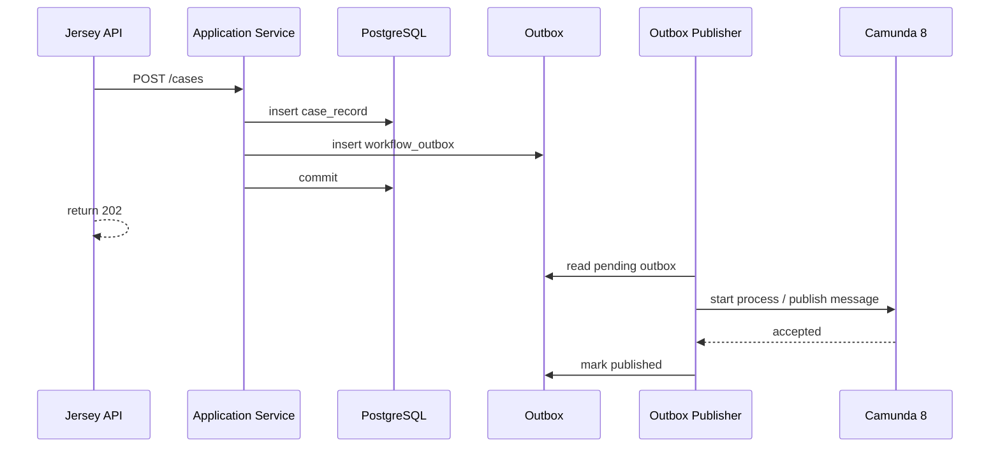

Intinya:

```text
Jangan langsung berpikir:
  DB write + Camunda call = satu operasi atomic.

Pikirkan sebagai:
  DB write durable dulu.
  Workflow command disimpan sebagai outbox.
  Publisher mengirim ke Camunda secara retryable.
  Idempotency mencegah duplicate.
  Reconciliation memperbaiki state yang tertinggal.
```

---

# 3. Failure scenarios yang wajib dimodelkan

| Scenario | Contoh | Risiko | Solusi |
|---|---|---|---|
| DB commit sukses, Camunda start gagal | `case_record` sudah ada, process belum jalan | Orphan business record | Transactional outbox + retry publisher |
| Camunda start sukses, DB update metadata gagal | Process jalan, DB tidak tahu `processInstanceKey` | Debug/reconcile sulit | Save metadata from publisher, query/reconcile by `businessId`/caseId |
| Event masuk, DB event sukses, publish message gagal | Event tercatat tapi process tidak lanjut | Stuck process | Event outbox + retry |
| Message publish sukses, mark outbox gagal | Retry publish lagi | Duplicate message risk | Deterministic `messageId` |
| Worker DB update sukses, complete job gagal | Job retry, side effect duplicate | Duplicate update/API call | Worker execution idempotency |
| Worker complete sukses, DB update belum dilakukan | Process lanjut tapi business DB tertinggal | Business inconsistency | Persist business result before complete job |
| Process instance duplicated | Client retry / publisher retry | Duplicate lifecycle | API idempotency + Camunda businessId/messageId |
| Message datang sebelum process waiting | Message tidak correlated jika tidak buffered | Event lost | `publishMessage` + TTL + outbox |

Camunda publish-message API menyebut message dikirim ke partition berdasarkan correlation key, bisa di-buffer, dan endpoint tidak menunggu hasil correlation. Untuk kebutuhan yang perlu tahu message benar-benar correlated, gunakan correlate-message, tetapi publish-message lebih cocok untuk event asynchronous dan race condition antara event dan process wait state. ([Camunda 8 Docs](https://docs.camunda.io/docs/apis-tools/orchestration-cluster-api-rest/specifications/publish-message/?utm_source=chatgpt.com))

---

# 4. Core pattern: Transactional Outbox

## 4.1 Masalah tanpa outbox

```text
POST /cases
  -> insert case_record
  -> commit
  -> start Camunda process
  -> Camunda timeout

Sekarang:
  case sudah ada
  process belum jelas berhasil atau gagal
  client bisa retry
  duplicate risk muncul
```

## 4.2 Dengan outbox

```text
POST /cases
  -> begin DB transaction
  -> insert case_record
  -> insert workflow_outbox(type=START_PROCESS)
  -> commit
  -> return 202

Outbox publisher
  -> read pending outbox
  -> call Camunda
  -> mark published / retry
```

Keuntungan:

```text
DB transaction hanya mencakup PostgreSQL.
Camunda call dipindahkan ke reliable async publisher.
Jika Camunda down, data command tidak hilang.
```

---

# 5. Recommended outbox table

```sql
create table workflow_outbox (
    outbox_id bigserial primary key,

    aggregate_type text not null,
    aggregate_id text not null,

    command_type text not null,
    command_key text not null,

    bpmn_process_id text,
    message_name text,
    correlation_key text,
    business_id text,
    message_id text,

    payload jsonb not null,

    status text not null,
    attempt_count int not null default 0,
    max_attempts int not null default 20,

    next_attempt_at timestamptz not null default now(),
    locked_by text,
    locked_at timestamptz,

    last_error text,
    published_at timestamptz,

    created_at timestamptz not null default now(),
    updated_at timestamptz not null default now(),

    constraint chk_workflow_outbox_command_type
        check (command_type in (
            'START_PROCESS',
            'PUBLISH_MESSAGE',
            'CORRELATE_MESSAGE',
            'CANCEL_PROCESS'
        )),

    constraint chk_workflow_outbox_status
        check (status in (
            'PENDING',
            'PROCESSING',
            'PUBLISHED',
            'FAILED_RETRYABLE',
            'FAILED_FINAL'
        ))
);

create unique index uk_workflow_outbox_command_key
    on workflow_outbox (command_key);

create index idx_workflow_outbox_pending
    on workflow_outbox (status, next_attempt_at, outbox_id);

create index idx_workflow_outbox_aggregate
    on workflow_outbox (aggregate_type, aggregate_id);
```

`command_key` adalah idempotency key internal untuk workflow command.

Contoh:

```text
START_PROCESS:
  command_key = START_PROCESS:case_enforcement_lifecycle:CASE-2026-000123

PUBLISH_MESSAGE:
  command_key = MESSAGE:DocumentReceived:CASE-2026-000123:DOC-EVT-001
```

---

# 6. Workflow metadata table

```sql
create table case_workflow_instance (
    case_id text primary key,
    bpmn_process_id text not null,
    business_id text,
    process_instance_key text,

    workflow_status text not null,
    start_outbox_id bigint references workflow_outbox(outbox_id),

    started_at timestamptz,
    completed_at timestamptz,
    last_synced_at timestamptz,

    created_at timestamptz not null default now(),
    updated_at timestamptz not null default now(),

    constraint chk_case_workflow_status
        check (workflow_status in (
            'START_PENDING',
            'STARTING',
            'STARTED',
            'START_FAILED',
            'COMPLETED',
            'TERMINATED'
        ))
);

create unique index uk_case_workflow_process_instance_key
    on case_workflow_instance (process_instance_key)
    where process_instance_key is not null;
```

State yang disarankan:

```text
START_PENDING:
  outbox sudah dibuat, belum dikirim ke Camunda

STARTING:
  publisher sedang mencoba start process

STARTED:
  Camunda process instance berhasil dibuat

START_FAILED:
  retry habis atau failure final

COMPLETED:
  process selesai

TERMINATED:
  process dibatalkan/terminated
```

---

# 7. Start process dengan DB-first + outbox

## 7.1 Endpoint flow

```text
POST /cases
  1. validate request
  2. validate Idempotency-Key
  3. begin DB transaction
  4. insert api_idempotency_key
  5. insert case_record
  6. insert case_workflow_instance START_PENDING
  7. insert workflow_outbox START_PROCESS
  8. commit
  9. return 202 Accepted
```

## 7.2 Response

```http
202 Accepted
```

```json
{
  "caseId": "CASE-2026-000123",
  "status": "SUBMITTED",
  "workflow": {
    "status": "START_PENDING",
    "accepted": true
  }
}
```

Pola ini lebih jujur daripada mengatakan workflow sudah berjalan padahal command baru durable di outbox.

---

# 8. Java service: create case + outbox

```java
public final class CaseCommandService {

    private final CaseRepository caseRepository;
    private final WorkflowOutboxRepository outboxRepository;
    private final IdempotencyRepository idempotencyRepository;
    private final CaseIdGenerator caseIdGenerator;
    private final RequestHashService requestHashService;

    public CreateCaseResult createCase(
            String idempotencyKey,
            CreateCaseRequest request
    ) {
        validate(idempotencyKey, request);

        String requestHash = requestHashService.hash(request);

        var existing = idempotencyRepository.find(idempotencyKey);
        if (existing.isPresent()) {
            return handleExisting(existing.get(), requestHash);
        }

        String caseId = caseIdGenerator.next();

        /*
         * Must run in one PostgreSQL transaction.
         * Transaction management can be handled by your internal framework,
         * JTA, manual SqlSession, or service transaction wrapper.
         */
        caseRepository.insertCase(new CaseRecord(
            caseId,
            request.applicantId(),
            request.caseType(),
            request.region(),
            "SUBMITTED",
            request.payload(),
            request.submittedBy()
        ));

        String commandKey =
            "START_PROCESS:case_enforcement_lifecycle:" + caseId;

        long outboxId = outboxRepository.insert(new WorkflowOutboxCommand(
            "CASE",
            caseId,
            "START_PROCESS",
            commandKey,
            "case_enforcement_lifecycle",
            null,
            caseId,
            caseId,
            null,
            Map.of(
                "caseId", caseId,
                "applicantId", request.applicantId(),
                "caseType", request.caseType(),
                "region", request.region(),
                "correlationKey", caseId
            )
        ));

        caseRepository.insertWorkflowInstance(
            caseId,
            "case_enforcement_lifecycle",
            caseId,
            outboxId,
            "START_PENDING"
        );

        idempotencyRepository.markCompleted(
            idempotencyKey,
            requestHash,
            caseId,
            202,
            Map.of(
                "caseId", caseId,
                "status", "SUBMITTED",
                "workflowStatus", "START_PENDING"
            )
        );

        return new CreateCaseResult(
            caseId,
            "SUBMITTED",
            "START_PENDING"
        );
    }
}
```

---

# 9. MyBatis mapper: insert outbox

```java
public interface WorkflowOutboxMapper {

    int insert(WorkflowOutboxRow row);

    List<WorkflowOutboxRow> lockNextBatch(
        @Param("workerId") String workerId,
        @Param("limit") int limit
    );

    int markPublished(
        @Param("outboxId") long outboxId
    );

    int markFailedRetryable(
        @Param("outboxId") long outboxId,
        @Param("lastError") String lastError,
        @Param("nextAttemptAt") OffsetDateTime nextAttemptAt
    );

    int markFailedFinal(
        @Param("outboxId") long outboxId,
        @Param("lastError") String lastError
    );
}
```

XML insert:

```xml
<insert id="insert" useGeneratedKeys="true" keyProperty="outboxId">
    insert into workflow_outbox (
        aggregate_type,
        aggregate_id,
        command_type,
        command_key,
        bpmn_process_id,
        message_name,
        correlation_key,
        business_id,
        message_id,
        payload,
        status
    ) values (
        #{aggregateType},
        #{aggregateId},
        #{commandType},
        #{commandKey},
        #{bpmnProcessId},
        #{messageName},
        #{correlationKey},
        #{businessId},
        #{messageId},
        #{payload, typeHandler=com.company.caseapp.persistence.JsonbTypeHandler},
        'PENDING'
    )
</insert>
```

---

# 10. Locking pending outbox safely

Untuk multiple publisher pods, gunakan locking pattern.

```xml
<select id="lockNextBatch" resultMap="WorkflowOutboxRowMap">
    update workflow_outbox
    set status = 'PROCESSING',
        locked_by = #{workerId},
        locked_at = now(),
        attempt_count = attempt_count + 1,
        updated_at = now()
    where outbox_id in (
        select outbox_id
        from workflow_outbox
        where status in ('PENDING', 'FAILED_RETRYABLE')
          and next_attempt_at <= now()
          and attempt_count < max_attempts
        order by outbox_id
        limit #{limit}
        for update skip locked
    )
    returning
        outbox_id,
        aggregate_type,
        aggregate_id,
        command_type,
        command_key,
        bpmn_process_id,
        message_name,
        correlation_key,
        business_id,
        message_id,
        payload,
        status,
        attempt_count,
        max_attempts,
        next_attempt_at,
        locked_by,
        locked_at,
        last_error,
        published_at,
        created_at,
        updated_at
</select>
```

Kenapa `for update skip locked`?

```text
Agar beberapa publisher bisa jalan paralel
tanpa mengambil outbox row yang sama.
```

---

# 11. Outbox publisher

```java
public final class WorkflowOutboxPublisher {

    private final String workerId;
    private final WorkflowOutboxRepository outboxRepository;
    private final WorkflowCommandGateway workflowGateway;
    private final CaseRepository caseRepository;
    private final RetryPolicy retryPolicy;

    public void publishBatch(int limit) {
        List<WorkflowOutboxRow> batch =
            outboxRepository.lockNextBatch(workerId, limit);

        for (WorkflowOutboxRow row : batch) {
            try {
                publishOne(row);
                outboxRepository.markPublished(row.outboxId());

            } catch (RetryableWorkflowException ex) {
                outboxRepository.markFailedRetryable(
                    row.outboxId(),
                    safeMessage(ex),
                    retryPolicy.nextAttemptAt(row.attemptCount())
                );

            } catch (NonRetryableWorkflowException ex) {
                outboxRepository.markFailedFinal(
                    row.outboxId(),
                    safeMessage(ex)
                );
            }
        }
    }

    private void publishOne(WorkflowOutboxRow row) {
        switch (row.commandType()) {
            case "START_PROCESS" -> startProcess(row);
            case "PUBLISH_MESSAGE" -> publishMessage(row);
            case "CORRELATE_MESSAGE" -> correlateMessage(row);
            default -> throw new NonRetryableWorkflowException(
                "Unsupported command type: " + row.commandType()
            );
        }
    }

    private void startProcess(WorkflowOutboxRow row) {
        StartWorkflowResult result = workflowGateway.startProcess(
            new StartProcessCommand(
                row.bpmnProcessId(),
                row.businessId(),
                row.payload()
            )
        );

        caseRepository.markWorkflowStarted(
            row.aggregateId(),
            String.valueOf(result.processInstanceKey())
        );
    }

    private void publishMessage(WorkflowOutboxRow row) {
        workflowGateway.publishMessage(
            new PublishMessageCommand(
                row.messageName(),
                row.correlationKey(),
                row.messageId(),
                Duration.ofHours(2),
                row.payload()
            )
        );
    }

    private void correlateMessage(WorkflowOutboxRow row) {
        workflowGateway.correlateMessage(
            new CorrelateMessageCommand(
                row.messageName(),
                row.correlationKey(),
                row.payload()
            )
        );
    }
}
```

Camunda create-process-instance supports an optional `businessId`; if uniqueness enforcement is enabled, the engine rejects creating another active root instance with the same business ID for the same process definition and tenant. Use that as an additional duplicate guard, not as a replacement for API/outbox idempotency. ([Camunda 8 Docs](https://docs.camunda.io/docs/apis-tools/orchestration-cluster-api-rest/specifications/create-process-instance/?utm_source=chatgpt.com))

---

# 12. Workflow gateway with idempotent identifiers

## 12.1 Start process

```java
public StartWorkflowResult startProcess(StartProcessCommand command) {
    Map<String, Object> variables = command.variables();

    var event = client.newCreateInstanceCommand()
        .bpmnProcessId(command.bpmnProcessId())
        .latestVersion()
        /*
         * If your Camunda Java Client version supports businessId builder,
         * set it here. Validate exact method name against company dependency.
         */
        .variables(variables)
        .execute();

    return new StartWorkflowResult(event.getProcessInstanceKey());
}
```

Untuk Camunda 8.9+, gunakan `businessId` jika tersedia di Java client versi perusahaan. Business ID membantu operator dan juga dapat menolak duplicate active root instance bila uniqueness enforcement aktif. ([Camunda 8 Docs](https://docs.camunda.io/docs/apis-tools/orchestration-cluster-api-rest/specifications/create-process-instance/?utm_source=chatgpt.com))

## 12.2 Publish message

```java
public void publishMessage(PublishMessageCommand command) {
    client.newPublishMessageCommand()
        .messageName(command.messageName())
        .correlationKey(command.correlationKey())
        .messageId(command.messageId())
        .timeToLive(command.timeToLive())
        .variables(command.variables())
        .execute();
}
```

Untuk message event, Camunda correlation menggunakan **message name** dan **correlation key**; message tidak dikirim langsung ke instance tertentu, melainkan dicocokkan ke subscription yang memiliki nama dan correlation key yang sama. ([Camunda 8 Docs](https://docs.camunda.io/docs/components/concepts/messages/?utm_source=chatgpt.com))

---

# 13. Message idempotency

Untuk event endpoint, selalu gunakan deterministic `messageId`.

```text
messageId = eventType + ":" + idempotencyKey
```

Contoh:

```text
DocumentReceived:DOC-EVT-20260716-0001
```

Kenapa penting?

```text
Jika publish message sukses,
tetapi mark outbox PUBLISHED gagal,
publisher akan retry.

Dengan messageId deterministik,
duplicate publish dapat dicegah/dideteksi oleh Camunda selama message masih buffered.
```

Camunda message docs menjelaskan message correlation bergantung pada message name dan correlation key, dan API publish-message juga mendukung `messageId` untuk use case idempotency/buffering. ([Camunda 8 Docs](https://docs.camunda.io/docs/components/concepts/messages/?utm_source=chatgpt.com))

---

# 14. Inbox pattern untuk inbound events

Outbox menyelesaikan outbound command dari DB ke Camunda. Untuk event masuk dari luar, gunakan **inbox/event table** agar webhook retry tidak membuat duplicate.

```sql
create table case_inbox_event (
    inbox_id bigserial primary key,
    source_system text not null,
    external_event_id text not null,
    event_type text not null,
    aggregate_id text not null,
    payload jsonb not null,

    processing_status text not null,
    processed_at timestamptz,
    last_error text,

    created_at timestamptz not null default now(),

    constraint uk_case_inbox_external_event
        unique (source_system, external_event_id),

    constraint chk_case_inbox_status
        check (processing_status in (
            'RECEIVED',
            'PROCESSED',
            'FAILED_RETRYABLE',
            'FAILED_FINAL'
        ))
);
```

Webhook flow:

```text
POST /webhooks/payment/provider-x
  -> insert case_inbox_event if absent
  -> insert workflow_outbox PUBLISH_MESSAGE
  -> commit
  -> return 202
```

Dengan ini:

```text
External system retry:
  tidak membuat event duplicate

Camunda down:
  event tetap durable di DB

Process belum waiting:
  publish message dengan TTL bisa buffered
```

---

# 15. Event endpoint with inbox + outbox

```java
public void acceptDocumentReceived(
        String caseId,
        String idempotencyKey,
        DocumentReceivedRequest request
) {
    validate(caseId, idempotencyKey, request);

    String externalEventId = request.documentBatchId();

    boolean inserted = inboxRepository.insertIfAbsent(
        "DOCUMENT_PORTAL",
        externalEventId,
        "DOCUMENT_RECEIVED",
        caseId,
        request
    );

    if (!inserted) {
        return;
    }

    String messageId = "DOCUMENT_RECEIVED:" + idempotencyKey;

    outboxRepository.insert(new WorkflowOutboxCommand(
        "CASE",
        caseId,
        "PUBLISH_MESSAGE",
        "MESSAGE:DocumentReceived:" + caseId + ":" + idempotencyKey,
        null,
        "DocumentReceived",
        caseId,
        null,
        messageId,
        Map.of(
            "caseId", caseId,
            "documentBatchId", request.documentBatchId(),
            "documentReceived", true
        )
    ));
}
```

---

# 16. Retry policy

## 16.1 Exponential backoff

```java
public final class RetryPolicy {

    public OffsetDateTime nextAttemptAt(int attemptCount) {
        long seconds = switch (attemptCount) {
            case 0, 1 -> 10;
            case 2 -> 30;
            case 3 -> 60;
            case 4 -> 300;
            default -> 900;
        };

        return OffsetDateTime.now().plusSeconds(seconds);
    }
}
```

## 16.2 Failure classification

| Error | Retry? | Reason |
|---|---:|---|
| Camunda gateway timeout | Ya | Temporary infra |
| Camunda 503/backpressure | Ya | Temporary capacity |
| Network timeout | Ya | Ambiguous |
| Auth 401/403 | Tidak / low retry | Config/security issue |
| BPMN process ID missing | Tidak | Deployment/config bug |
| Serialization failure | Tidak | Application bug |
| Duplicate businessId | Treat as idempotency/reconcile | Could mean process already started |
| Message duplicate | Treat as success if intended | Idempotency |

Camunda job-worker docs warn that job timeout may lead to two workers working on the same job and only one completion succeeding, reinforcing the need for idempotent business behavior and retry-safe command handling. ([Camunda 8 Docs](https://docs.camunda.io/docs/components/concepts/job-workers/?utm_source=chatgpt.com))

---

# 17. Reconciliation job

Outbox retry is not enough. Add periodic reconciliation.

## 17.1 What to reconcile?

```text
Case START_PENDING too long:
  outbox stuck or publisher down

Outbox PROCESSING too long:
  publisher crashed while holding lock

Case STARTED but processInstanceKey null:
  Camunda may have started, metadata update failed

Event PUBLISHED but process not moving:
  wrong messageName/correlationKey, expired TTL, process not waiting

Worker execution COMPLETED but process still at same service task:
  complete job may have failed; job may retry
```

## 17.2 SQL examples

Find stale outbox locks:

```sql
select *
from workflow_outbox
where status = 'PROCESSING'
  and locked_at < now() - interval '10 minutes';
```

Reset stale processing rows:

```sql
update workflow_outbox
set status = 'FAILED_RETRYABLE',
    locked_by = null,
    locked_at = null,
    next_attempt_at = now(),
    updated_at = now()
where status = 'PROCESSING'
  and locked_at < now() - interval '10 minutes';
```

Find workflow start stuck:

```sql
select cwi.*
from case_workflow_instance cwi
where cwi.workflow_status in ('START_PENDING', 'STARTING')
  and cwi.created_at < now() - interval '5 minutes';
```

---

# 18. Worker-side consistency pattern

Worker consistency is the mirror of API/outbox consistency.

## 18.1 Safe worker sequence

```text
1. Activate job.
2. Extract caseId.
3. Build idempotency key.
4. Check worker_execution COMPLETED.
5. If completed, complete Camunda job with stored output.
6. Execute business action.
7. Persist business result.
8. Persist worker_execution COMPLETED + output variables.
9. Complete Camunda job.
```

## 18.2 Why this order?

```text
If step 9 fails:
  Camunda retries job.

On retry:
  worker sees step 8 already completed.
  worker sends complete job again with same output.
```

Camunda docs describe worker timeout/reassignment behavior; a timeout can cause another worker to work on the same job, and only one completion succeeds. This is why your DB/external side effects must be guarded independently of Camunda job completion. ([Camunda 8 Docs](https://docs.camunda.io/docs/components/concepts/job-workers/?utm_source=chatgpt.com))

---

# 19. Worker execution table recap

```sql
create table case_worker_execution (
    execution_id bigserial primary key,
    idempotency_key text not null unique,

    case_id text not null,
    job_type text not null,
    job_key text,
    process_instance_key text not null,

    status text not null,
    output_variables jsonb,

    error_code text,
    error_message text,
    attempt_count int not null default 0,

    started_at timestamptz not null default now(),
    completed_at timestamptz,
    updated_at timestamptz not null default now()
);
```

Core unique key:

```text
idempotency_key = caseId + ":" + jobType + ":" + processInstanceKey
```

For external side effect:

```text
notification:
  caseId + ":" + template + ":" + recipient + ":" + purpose

payment:
  caseId + ":" + paymentInstructionId

document generation:
  caseId + ":" + documentType + ":" + version
```

---

# 20. API response strategy

## Option A - Return `202 START_PENDING`

Recommended when outbox exists.

```json
{
  "caseId": "CASE-2026-000123",
  "status": "SUBMITTED",
  "workflow": {
    "status": "START_PENDING",
    "accepted": true
  }
}
```

Meaning:

```text
Business command accepted and durable.
Workflow command queued.
```

## Option B - Return `503`

Recommended if no reliable outbox exists.

```json
{
  "errorCode": "WORKFLOW_START_FAILED",
  "message": "Unable to start workflow. Please retry.",
  "details": {
    "caseId": "CASE-2026-000123"
  }
}
```

But with outbox, `202 START_PENDING` is usually better because the system can self-recover.

---

# 21. State model

```text
API command:
  RECEIVED
  COMPLETED
  FAILED

Case workflow:
  START_PENDING
  STARTING
  STARTED
  START_FAILED
  COMPLETED
  TERMINATED

Outbox:
  PENDING
  PROCESSING
  PUBLISHED
  FAILED_RETRYABLE
  FAILED_FINAL

Worker execution:
  STARTED
  COMPLETED
  FAILED_RETRYABLE
  FAILED_FINAL
  BUSINESS_ERROR
```

Avoid ambiguous status like:

```text
DONE
ERROR
IN_PROGRESS
```

Use statuses that explain **which subsystem** is in which state.

---

# 22. Observability fields

Minimum logs for outbox publisher:

```json
{
  "event": "workflow.outbox.publish.started",
  "outboxId": 10001,
  "commandType": "START_PROCESS",
  "commandKey": "START_PROCESS:case_enforcement_lifecycle:CASE-2026-000123",
  "aggregateId": "CASE-2026-000123",
  "bpmnProcessId": "case_enforcement_lifecycle",
  "businessId": "CASE-2026-000123",
  "attemptCount": 1
}
```

Success:

```json
{
  "event": "workflow.outbox.publish.succeeded",
  "outboxId": 10001,
  "commandType": "START_PROCESS",
  "aggregateId": "CASE-2026-000123",
  "processInstanceKey": "2251799813688888",
  "durationMs": 82
}
```

Failure:

```json
{
  "event": "workflow.outbox.publish.failed",
  "outboxId": 10001,
  "commandType": "START_PROCESS",
  "aggregateId": "CASE-2026-000123",
  "attemptCount": 3,
  "nextAttemptAt": "2026-07-16T10:35:00+07:00",
  "errorClass": "RetryableWorkflowException"
}
```

---

# 23. Operational runbook

## 23.1 Case stuck in `START_PENDING`

Check:

```sql
select *
from case_workflow_instance
where workflow_status = 'START_PENDING'
order by created_at;
```

Then:

```sql
select *
from workflow_outbox
where aggregate_id = 'CASE-2026-000123'
order by created_at;
```

Possible causes:

```text
- publisher pod down
- row stuck PROCESSING due to crash
- next_attempt_at in future
- max_attempts reached
- Camunda auth/config error
```

Action:

```text
- restart/fix publisher if down
- reset stale PROCESSING rows
- inspect last_error
- fix config/auth
- requeue FAILED_FINAL only after root cause fixed
```

---

## 23.2 Outbox published but process not visible

Possible causes:

```text
- process started but metadata update failed
- businessId not set / uniqueness not active
- wrong Camunda environment
- Operate/exporter lag
- command actually failed after ambiguous timeout
```

Action:

```text
- search Camunda by businessId/caseId if supported
- inspect publisher logs by commandKey
- inspect workflow_outbox published_at
- reconcile case_workflow_instance.process_instance_key
```

---

## 23.3 Event published but process not moving

Possible causes:

```text
- wrong messageName
- wrong correlationKey
- message TTL expired
- process not at catch event
- process completed/terminated
- event sent to wrong tenant/environment
```

Action:

```text
- inspect BPMN message name
- inspect caseId/correlationKey in payload
- inspect Operate token position
- check message publish logs
- requeue with correct key only if safe
```

---

# 24. Anti-patterns

| Anti-pattern | Risiko | Koreksi |
|---|---|---|
| DB write then direct Camunda call inside request path | DB/Camunda inconsistency | Transactional outbox |
| Camunda start then DB insert | Orphan process if DB fails | DB-first |
| No idempotency key | Duplicate cases/processes | API idempotency table |
| No command key | Duplicate outbox commands | unique `command_key` |
| No messageId | Duplicate message publish | deterministic `messageId` |
| Publisher single instance only, no locking | Scaling blocked | `for update skip locked` |
| Stale PROCESSING rows never reset | Outbox stuck forever | reconciliation job |
| Worker completes before DB persist | Process ahead of DB | persist result first |
| Worker side effect not idempotent | Duplicate external action | execution table + external idempotency |
| Treat all failures as final | Temporary outage becomes manual work | retry/backoff |
| Retry forever | Poison messages hide bugs | max attempts + FAILED_FINAL |
| Expose STARTED before Camunda ack | misleading API state | START_PENDING / STARTED split |

---

# 25. Mini-lab Seri 11

## Goal

Implement reliable workflow start and message publish.

## Tasks

```text
[ ] Create workflow_outbox table.
[ ] Create case_workflow_instance table.
[ ] Modify POST /cases:
    - insert case_record
    - insert case_workflow_instance START_PENDING
    - insert workflow_outbox START_PROCESS
    - return 202

[ ] Build WorkflowOutboxPublisher:
    - lock pending batch
    - start process
    - mark workflow STARTED
    - mark outbox PUBLISHED
    - retry on temporary failure

[ ] Modify document event endpoint:
    - insert inbox/event row
    - insert workflow_outbox PUBLISH_MESSAGE
    - use deterministic messageId
    - return 202

[ ] Add reconciliation:
    - reset stale PROCESSING rows
    - find START_PENDING too long
    - find FAILED_FINAL needing support action
```

## Validation checklist

```text
[ ] Camunda down: POST /cases still records case + outbox.
[ ] Camunda returns: publisher starts process later.
[ ] Publisher crash after Camunda success: retry does not create duplicate active process.
[ ] Duplicate POST with same Idempotency-Key returns same case.
[ ] Duplicate event with same externalEventId does not create duplicate message command.
[ ] Message publish retry uses same messageId.
[ ] Stale PROCESSING outbox rows can be recovered.
[ ] Worker DB update succeeds but complete fails: retry completes using stored output.
```

---

# 26. Production checklist

```text
[ ] API idempotency exists for unsafe POST endpoints.
[ ] Business entity is committed before workflow command.
[ ] Workflow command is written to outbox in same DB transaction.
[ ] Outbox command_key is unique and deterministic.
[ ] Process start uses businessId when supported.
[ ] Message publish uses deterministic messageId.
[ ] Outbox publisher supports retry with backoff.
[ ] Publisher supports multiple replicas with row locking.
[ ] Stale PROCESSING rows are reconciled.
[ ] FAILED_FINAL rows have runbook and alert.
[ ] Worker execution table protects side effects.
[ ] Worker persists business result before completing job.
[ ] Query API distinguishes business status and workflow status.
[ ] Logs include commandKey, outboxId, caseId, processInstanceKey.
[ ] Dashboard tracks pending/retry/final outbox counts.
```

---

# 27. Ringkasan Seri 11

```text
Problem:
  PostgreSQL and Camunda are separate systems.
  There is no shared ACID transaction.

Solution:
  DB-first
  transactional outbox
  deterministic command keys
  deterministic message IDs
  Camunda businessId where available
  retry publisher
  worker idempotency
  reconciliation job
  operational runbook
```

Formula praktis:

```text
Never rely on:
  "DB write and Camunda command will both succeed together."

Always design for:
  DB succeeded, Camunda failed.
  Camunda succeeded, DB metadata failed.
  Publish succeeded, mark published failed.
  Worker side effect succeeded, complete job failed.
```

---

# Seri 11/16 selesai

Seri ini selesai: **Transaction Consistency: DB + Workflow Dual-Write Problem**.

Rekomendasi materi berikutnya:

**Seri 12/16 - Error Handling: Retry, BPMN Error, Incident, Escalation.**  
Materinya akan fokus pada taxonomy error, mapping exception Java ke `complete job`, `fail job`, `throw BPMN error`, incident handling di Operate, retry backoff, escalation path, dan runbook production.

---

**Sources:**

- [Dealing with problems and exceptions](https://docs.camunda.io/docs/components/best-practices/development/dealing-with-problems-and-exceptions/?utm_source=chatgpt.com)

## Response:
7/16/2026, 10:06:22 AM

Saya lanjut ke **Seri 12/16**. Fokusnya taxonomy error yang tegas: mana yang retry technical, mana yang BPMN business error, mana yang harus menjadi incident, dan bagaimana escalation/runbook production.

# Cheatsheet Camunda 8 + Java/Jersey Microservice  
## Seri 12/16 - Error Handling: Retry, BPMN Error, Incident, Escalation

## 1. Fokus seri ini

Seri ini membahas bagaimana mendesain error handling untuk aplikasi **Java 17 + Jersey + MyBatis + PostgreSQL + Camunda 8** secara production-grade.

Inti utamanya:

```text
Tidak semua error harus diperlakukan sama.

Technical failure:
  fail job + retry/backoff + incident bila habis

Business exception:
  throw BPMN error + process path eksplisit

Contract/config/data bug:
  fail final cepat + incident + runbook

Operational mass failure:
  fix root cause + retry incident/batch retry
```

Dalam Camunda 8, worker biasanya punya tiga respons utama: **complete job** untuk sukses, **fail job** untuk technical failure, dan **throw BPMN error** untuk business exception yang ingin ditangani oleh BPMN. Jika job gagal dan remaining retries masih lebih dari nol, job akan diretry; jika retries habis, incident dibuat dan process tidak lanjut sampai incident diselesaikan. Retry backoff dapat digunakan supaya retry tidak langsung terjadi saat dependency eksternal sedang down. ([Camunda 8 Docs](https://docs.camunda.io/docs/components/concepts/job-workers/?utm_source=chatgpt.com))

---

# 2. Mental model error handling

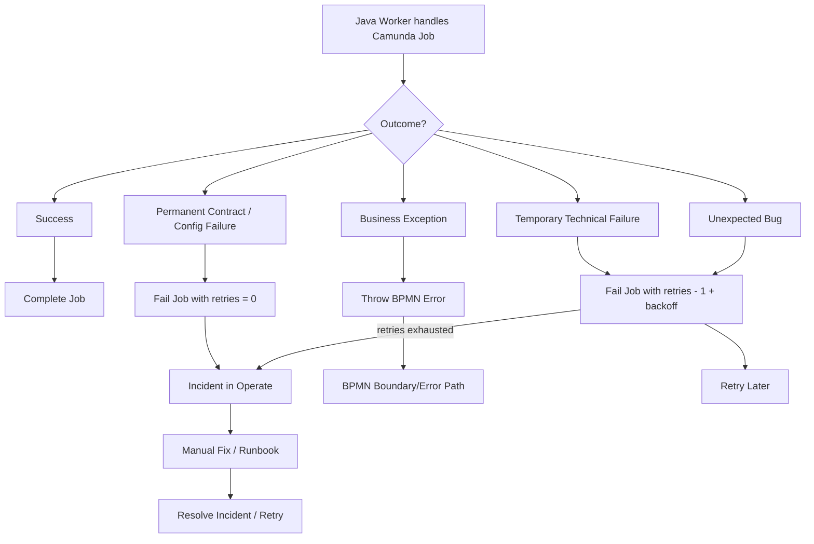

Rule praktis:

```text
Complete job:
  worker berhasil menjalankan action

Fail job:
  worker gagal karena technical/dependency issue

Throw BPMN error:
  worker menemukan kondisi bisnis yang memang harus mengubah jalur process

Incident:
  process tidak bisa lanjut tanpa perbaikan manusia/sistem
```

---

# 3. Taxonomy error utama

| Kategori | Contoh | Camunda Action | DB Status | Operator Action |
|---|---|---|---|---|
| **Success** | Risk score berhasil dihitung | `complete job` | `COMPLETED` | Tidak ada |
| **Business rejection** | Applicant blacklisted, document invalid | `throw BPMN error` | `BUSINESS_ERROR` | Biasanya tidak perlu incident |
| **Temporary dependency failure** | DB timeout, API 503, network glitch | `fail job` + retry/backoff | `FAILED_RETRYABLE` | Monitor, retry otomatis |
| **Backpressure/rate limit** | External API 429, Camunda 503 | `fail job` + longer backoff | `FAILED_RETRYABLE` | Tune/backoff |
| **Contract bug** | Missing `caseId`, wrong variable type | `fail job` retries `0` | `FAILED_FINAL` | Fix BPMN/worker/data |
| **Config/security failure** | Invalid API key, 401/403 downstream | Usually fail final / low retry | `FAILED_FINAL` | Fix secret/permission |
| **Permanent external rejection** | Payment account invalid | BPMN error jika business path; fail final jika config/data bug | depends | depends |
| **Unknown bug** | NullPointerException | fail retryable first or fail final depending severity | `FAILED_RETRYABLE` / `FAILED_FINAL` | Inspect logs |
| **Poison job** | Same job always fails due to invalid data | incident | `FAILED_FINAL` | Correct data/variable, resolve incident |

---

# 4. Complete job

Gunakan `complete job` hanya jika action worker sudah benar-benar selesai dan durable.

## 4.1 Safe complete pattern

```text
1. Extract variables.
2. Validate contract.
3. Check idempotency table.
4. Execute business action.
5. Persist business result to PostgreSQL.
6. Persist worker execution output.
7. Complete Camunda job with compact variables.
```

Camunda job completion dapat mengirim variables, dan variables tersebut akan di-merge ke process instance. Karena complete command dan DB transaction bukan satu ACID transaction, hasil bisnis sebaiknya disimpan ke PostgreSQL terlebih dahulu, lalu job di-complete; bila complete gagal dan job retry, worker bisa membaca output lama dari idempotency table dan complete ulang dengan hasil yang sama. ([Camunda 8 Docs](https://docs.camunda.io/docs/components/best-practices/development/dealing-with-problems-and-exceptions/?utm_source=chatgpt.com))

## 4.2 Java helper

```java
public final class JobResultReporter {

    public void complete(
            JobClient client,
            ActivatedJob job,
            Map<String, Object> variables
    ) {
        client.newCompleteCommand(job.getKey())
            .variables(variables)
            .send()
            .join();
    }
}
```

---

# 5. Fail job untuk technical failure

`fail job` cocok untuk error teknis yang **mungkin pulih**.

Contoh:

```text
- PostgreSQL temporarily unavailable
- downstream API timeout
- external service 503
- network failure
- rate limit 429
- Camunda gateway temporary unavailable
```

Fail job membawa jumlah remaining retries. Jika remaining retries lebih dari nol, job akan dicoba lagi; jika retries nol atau negatif, incident dibuat. Retry backoff menunda retry agar dependency eksternal punya waktu untuk pulih. ([Camunda 8 Docs](https://docs.camunda.io/docs/components/concepts/job-workers/?utm_source=chatgpt.com))

## 5.1 Java fail retryable

```java
public void failRetryable(
        JobClient client,
        ActivatedJob job,
        Exception ex,
        Duration retryBackoff
) {
    client.newFailCommand(job.getKey())
        .retries(Math.max(job.getRetries() - 1, 0))
        .retryBackoff(retryBackoff)
        .errorMessage(safeMessage(ex))
        .send()
        .join();
}
```

## 5.2 Retry backoff policy

```java
public final class WorkerRetryPolicy {

    public Duration backoffFor(Exception ex, int remainingRetries) {
        if (ex instanceof RateLimitedException) {
            return Duration.ofMinutes(5);
        }

        if (ex instanceof DownstreamUnavailableException) {
            return Duration.ofMinutes(2);
        }

        if (ex instanceof TemporaryDatabaseException) {
            return Duration.ofSeconds(30);
        }

        return Duration.ofSeconds(30);
    }
}
```

## 5.3 Recommended retry strategy

| Error | Retries | Backoff | Notes |
|---|---:|---:|---|
| DB connection timeout | 3 | 30s-2m | Depends on DB HA/failover |
| External API 503 | 3-5 | 1m-5m | Avoid retry storm |
| External API 429 | 3-5 | based on `Retry-After` | Respect downstream |
| Network timeout | 3 | 30s-1m | Ambiguous result |
| Invalid variable | 0 | none | Contract bug |
| Missing secret/config | 0-1 | none/short | Needs config fix |
| Serialization bug | 0 | none | Code/data bug |

---

# 6. Throw BPMN error untuk business exception

Gunakan `throw BPMN error` jika error tersebut adalah kondisi bisnis yang memang harus terlihat di BPMN.

Contoh:

```text
- CASE_VALIDATION_FAILED
- DOCUMENT_INVALID
- RISK_POLICY_REJECTED
- APPLICANT_BLACKLISTED
- PAYMENT_REJECTED
- REVIEW_REQUIRES_ESCALATION
```

BPMN error punya `errorCode`, dan catch/boundary error event menggunakan `errorCode` tersebut untuk mencocokkan thrown error ke jalur penanganan. ([Camunda 8 Docs](https://docs.camunda.io/docs/components/modeler/bpmn/error-events/?utm_source=chatgpt.com))

## 6.1 BPMN modeling

```text
Service Task: Validate Case
  boundary error:
    errorCode = CASE_VALIDATION_FAILED
      -> User Task: Review Rejection
      -> End: Rejected
```

## 6.2 Java throw BPMN error

```java
public void throwBpmnError(
        JobClient client,
        ActivatedJob job,
        String errorCode,
        String errorMessage,
        Map<String, Object> variables
) {
    client.newThrowErrorCommand(job.getKey())
        .errorCode(errorCode)
        .errorMessage(errorMessage)
        .variables(variables)
        .send()
        .join();
}
```

## 6.3 Example: business rejection

```java
try {
    ValidationResult result = validationService.validate(caseId);

    if (!result.valid()) {
        executionRepository.markBusinessError(
            idempotencyKey,
            BpmnErrorCodes.CASE_VALIDATION_FAILED,
            result.reasonCode()
        );

        reporter.throwBpmnError(
            client,
            job,
            BpmnErrorCodes.CASE_VALIDATION_FAILED,
            "Case validation failed: " + result.reasonCode(),
            Map.of(
                "caseValid", false,
                "validationReasonCode", result.reasonCode()
            )
        );
        return;
    }

    reporter.complete(client, job, Map.of("caseValid", true));

} catch (TemporaryDatabaseException ex) {
    reporter.failRetryable(client, job, ex, Duration.ofSeconds(30));
}
```

---

# 7. Incident: kapan harus terjadi?

Incident adalah tanda bahwa process tidak bisa lanjut secara aman tanpa intervensi. Dalam Camunda, incident dapat diselesaikan dengan mengidentifikasi dan memperbaiki masalah, lalu menandai incident sebagai resolved sehingga execution dicoba lagi; jika masalah masih ada, incident baru bisa muncul lagi. ([Camunda 8 Docs](https://docs.camunda.io/docs/components/concepts/incidents/?utm_source=chatgpt.com))

Incident cocok untuk:

```text
- retries exhausted
- missing required workflow variable
- invalid BPMN/worker contract
- external dependency down terlalu lama
- auth/config error
- malformed data
- worker bug
- message correlation/config mismatch
```

Incident **tidak cocok** untuk business rejection normal seperti “dokumen tidak valid” jika rejection tersebut memang bagian dari jalur bisnis.

---

# 8. Error decision matrix

Gunakan matrix ini saat menulis handler.

| Pertanyaan | Jika Ya | Action |
|---|---|---|
| Action berhasil? | Ya | `complete job` |
| Kondisi ini bagian dari proses bisnis normal/expected alternative path? | Ya | `throw BPMN error` |
| Error kemungkinan temporary? | Ya | `fail job` + retries - 1 + backoff |
| Error karena variable contract/model/code salah? | Ya | `fail job` retries = 0 |
| Error karena secret/config/permission salah? | Ya | `fail final` atau retry rendah, incident |
| External side effect mungkin sudah terjadi? | Ya | cek idempotency sebelum retry/complete |
| Error terjadi massal di banyak instance? | Ya | fix root cause + batch retry/operate |
| Tidak tahu kategori error? | Ya | fail retryable sedikit + alert/log detail |

---

# 9. Java exception taxonomy

Buat exception taxonomy internal supaya mapping konsisten.

```java
public abstract class WorkflowWorkerException extends RuntimeException {
    protected WorkflowWorkerException(String message) {
        super(message);
    }

    protected WorkflowWorkerException(String message, Throwable cause) {
        super(message, cause);
    }
}
```

```java
public final class TemporaryDependencyException extends WorkflowWorkerException {
    public TemporaryDependencyException(String message, Throwable cause) {
        super(message, cause);
    }
}
```

```java
public final class BusinessRuleException extends WorkflowWorkerException {

    private final String bpmnErrorCode;
    private final Map<String, Object> variables;

    public BusinessRuleException(
            String bpmnErrorCode,
            String message,
            Map<String, Object> variables
    ) {
        super(message);
        this.bpmnErrorCode = bpmnErrorCode;
        this.variables = variables;
    }

    public String bpmnErrorCode() {
        return bpmnErrorCode;
    }

    public Map<String, Object> variables() {
        return variables;
    }
}
```

```java
public final class WorkflowContractException extends WorkflowWorkerException {
    public WorkflowContractException(String message) {
        super(message);
    }
}
```

```java
public final class PermanentConfigurationException extends WorkflowWorkerException {
    public PermanentConfigurationException(String message, Throwable cause) {
        super(message, cause);
    }
}
```

---

# 10. Centralized error mapper

Jangan mapping error tersebar di setiap handler.

```java
public final class WorkerErrorHandler {

    private final WorkerExecutionRepository executionRepository;
    private final JobResultReporter reporter;
    private final WorkerRetryPolicy retryPolicy;

    public WorkerErrorHandler(
            WorkerExecutionRepository executionRepository,
            JobResultReporter reporter,
            WorkerRetryPolicy retryPolicy
    ) {
        this.executionRepository = executionRepository;
        this.reporter = reporter;
        this.retryPolicy = retryPolicy;
    }

    public void handle(
            JobClient client,
            ActivatedJob job,
            JobExecutionContext context,
            Exception ex
    ) {
        if (ex instanceof BusinessRuleException business) {
            executionRepository.markBusinessError(
                context.idempotencyKey(),
                business.bpmnErrorCode(),
                safeMessage(business)
            );

            reporter.throwBpmnError(
                client,
                job,
                business.bpmnErrorCode(),
                safeMessage(business),
                business.variables()
            );
            return;
        }

        if (ex instanceof WorkflowContractException contract) {
            executionRepository.markFailedFinal(
                context.idempotencyKey(),
                safeMessage(contract)
            );

            reporter.failFinal(
                client,
                job,
                safeMessage(contract)
            );
            return;
        }

        if (ex instanceof PermanentConfigurationException config) {
            executionRepository.markFailedFinal(
                context.idempotencyKey(),
                safeMessage(config)
            );

            reporter.failFinal(
                client,
                job,
                safeMessage(config)
            );
            return;
        }

        if (ex instanceof TemporaryDependencyException temporary) {
            Duration backoff = retryPolicy.backoffFor(
                temporary,
                job.getRetries()
            );

            executionRepository.markFailedRetryable(
                context.idempotencyKey(),
                safeMessage(temporary)
            );

            reporter.failRetryable(
                client,
                job,
                temporary,
                backoff
            );
            return;
        }

        executionRepository.markFailedRetryable(
            context.idempotencyKey(),
            "Unexpected worker error: " + ex.getClass().getSimpleName()
        );

        reporter.failRetryable(
            client,
            job,
            ex,
            Duration.ofSeconds(30)
        );
    }

    private String safeMessage(Exception ex) {
        String message = ex.getMessage();

        if (message == null || message.isBlank()) {
            return ex.getClass().getSimpleName();
        }

        return message.length() > 1000
            ? message.substring(0, 1000)
            : message;
    }
}
```

---

# 11. Handler pattern with centralized error handling

```java
public final class CalculateRiskScoreJobHandler implements JobHandler {

    private final RiskScoringService riskScoringService;
    private final WorkerExecutionRepository executionRepository;
    private final WorkerErrorHandler errorHandler;
    private final JobResultReporter reporter;

    @Override
    public void handle(JobClient client, ActivatedJob job) {
        JobVariableReader reader = JobVariableReader.from(job);
        String caseId = reader.requiredString(WorkflowVariables.CASE_ID);
        JobExecutionContext context = JobExecutionContext.from(job, caseId);

        try {
            var previous = executionRepository.findCompleted(
                context.idempotencyKey()
            );

            if (previous.isPresent()) {
                reporter.complete(client, job, previous.get().outputVariables());
                return;
            }

            executionRepository.markStarted(context, reader.raw());

            RiskResult risk = riskScoringService.calculate(caseId);

            if (risk.rejectedByPolicy()) {
                throw new BusinessRuleException(
                    BpmnErrorCodes.RISK_POLICY_REJECTED,
                    "Risk policy rejected case: " + risk.reasonCode(),
                    Map.of(
                        WorkflowVariables.RISK_LEVEL, risk.level(),
                        WorkflowVariables.RISK_REASON_CODE, risk.reasonCode()
                    )
                );
            }

            Map<String, Object> output = Map.of(
                WorkflowVariables.RISK_SCORE, risk.score(),
                WorkflowVariables.RISK_LEVEL, risk.level(),
                WorkflowVariables.RISK_REASON_CODE, risk.reasonCode()
            );

            executionRepository.markCompleted(
                context.idempotencyKey(),
                output
            );

            reporter.complete(client, job, output);

        } catch (Exception ex) {
            errorHandler.handle(client, job, context, ex);
        }
    }
}
```

---

# 12. BPMN error contract

Buat kontrak error eksplisit per job type.

```yaml
jobType: calculate-risk-score
businessErrors:
  - errorCode: RISK_POLICY_REJECTED
    reason: Applicant or case violates configured risk policy
    handledBy: Boundary error on Calculate Risk Score
    processPath: Manual Risk Rejection Review
    variables:
      - riskLevel
      - riskReasonCode

  - errorCode: APPLICANT_BLACKLISTED
    reason: Applicant matched blacklist
    handledBy: Boundary error on Calculate Risk Score
    processPath: Reject Case
    variables:
      - riskReasonCode

technicalFailures:
  - RISK_ENGINE_TIMEOUT
  - RISK_ENGINE_503
  - DB_UNAVAILABLE

contractFailures:
  - MISSING_CASE_ID
  - INVALID_CASE_TYPE
```

BPMN error code harus stabil. Jangan rename error code tanpa migrasi BPMN dan worker bersama.

---

# 13. BPMN modeling examples

## 13.1 Business validation error

```text
Start
  -> Service Task: Validate Case
       boundary error: CASE_VALIDATION_FAILED
          -> User Task: Review Invalid Submission
          -> End: Rejected
  -> Service Task: Calculate Risk
  -> ...
```

## 13.2 Technical failure

Jangan modelkan timeout API sebagai gateway.

Buruk:

```text
Call Risk API
  -> Gateway: Timeout?
     -> Timer 1m
     -> Retry
```

Lebih baik:

```text
Service Task: Calculate Risk
  retries = 3
  worker fail job with retryBackoff = PT2M
  incident if retries exhausted
```

## 13.3 Escalation after incident is not the same as BPMN escalation

Operational incident:

```text
Operate incident:
  risk-engine down
  many instances stuck at calculate-risk-score
```

Business escalation:

```text
User task deadline exceeded:
  boundary timer -> Escalate to Manager
```

Jangan campur keduanya.

---

# 14. Incident lifecycle

```text
Job fails with retries > 0
  -> retry later

Job fails with retries = 0
  -> incident created

Operator investigates
  -> fix root cause
  -> optionally update variable/job retries
  -> resolve incident / retry

If root cause still exists
  -> incident appears again
```

Camunda incident docs menyebut penyelesaian incident dilakukan dengan memperbaiki masalah lalu menandai incident sebagai resolved, yang memicu retry process execution; jika problem masih ada, incident baru akan dibuat. ([Camunda 8 Docs](https://docs.camunda.io/docs/components/concepts/incidents/?utm_source=chatgpt.com))

---

# 15. Operate usage pattern

Operate dipakai untuk:

```text
- melihat process instance yang incident
- melihat activity tempat incident terjadi
- melihat variables yang relevan
- retry incident setelah root cause diperbaiki
- batch retry untuk banyak instance yang terdampak
- update variables dalam skenario recovery tertentu
```

Operate mendukung batch operation seperti retry/cancel banyak process instance, berguna saat banyak process terkena root cause yang sama, misalnya microservice down lama lalu sudah kembali pulih. ([Camunda 8 Docs](https://docs.camunda.io/docs/components/operate/userguide/selections-operations/?utm_source=chatgpt.com))

## 15.1 Batch retry policy

Jangan langsung batch retry semua incident tanpa root cause analysis.

Urutan yang benar:

```text
1. Identifikasi incident group.
2. Identifikasi root cause.
3. Fix root cause.
4. Validasi satu instance retry sukses.
5. Batch retry secara bertahap.
6. Monitor failure rate.
```

---

# 16. REST API incident handling

Camunda Orchestration Cluster REST API memiliki endpoint resolve incident. Dokumentasi menyebut resolve incident menandai incident sebagai resolved, dan biasanya perlu update job untuk reset retries sebelum resolve. ([Camunda 8 Docs](https://docs.camunda.io/docs/apis-tools/orchestration-cluster-api-rest/specifications/resolve-incident/?utm_source=chatgpt.com))

Practical implication:

```text
Jika incident berasal dari failed job dengan retries habis:
  1. fix root cause
  2. update job retries jika diperlukan
  3. resolve incident
```

Jangan expose endpoint ini ke public API. Buat support/admin-only tooling jika diperlukan.

---

# 17. Worker execution status model

```sql
create table case_worker_execution (
    execution_id bigserial primary key,
    idempotency_key text not null unique,

    case_id text not null,
    job_type text not null,
    job_key text,
    process_instance_key text not null,

    status text not null,
    output_variables jsonb,

    error_category text,
    error_code text,
    error_message text,

    attempt_count int not null default 0,

    started_at timestamptz not null default now(),
    completed_at timestamptz,
    updated_at timestamptz not null default now(),

    constraint chk_worker_execution_status
        check (status in (
            'STARTED',
            'COMPLETED',
            'FAILED_RETRYABLE',
            'FAILED_FINAL',
            'BUSINESS_ERROR'
        )),

    constraint chk_worker_error_category
        check (
            error_category is null
            or error_category in (
                'BUSINESS',
                'TEMPORARY_TECHNICAL',
                'CONTRACT',
                'CONFIGURATION',
                'UNKNOWN'
            )
        )
);
```

Update examples:

```sql
update case_worker_execution
set status = 'FAILED_RETRYABLE',
    error_category = 'TEMPORARY_TECHNICAL',
    error_code = 'RISK_ENGINE_TIMEOUT',
    error_message = 'Risk engine timeout',
    updated_at = now()
where idempotency_key = :idempotencyKey;
```

```sql
update case_worker_execution
set status = 'BUSINESS_ERROR',
    error_category = 'BUSINESS',
    error_code = 'RISK_POLICY_REJECTED',
    error_message = 'Blacklist match',
    updated_at = now()
where idempotency_key = :idempotencyKey;
```

---

# 18. Error response dari Jersey API

Workflow command endpoint juga perlu error taxonomy.

## 18.1 API command error matrix

| Error | HTTP Status | Example |
|---|---:|---|
| Invalid request shape | `400` | missing required field |
| Unauthorized | `401` | invalid token |
| Forbidden | `403` | user cannot submit case |
| Resource not found | `404` | caseId unknown |
| Invalid state transition | `409` | submit CLOSED case |
| Semantic business validation failed before workflow | `422` | invalid case type |
| DB unavailable | `503` | PostgreSQL down |
| Outbox accepted but workflow pending | `202` | command durable |
| Unexpected bug | `500` | application error |

## 18.2 Error body

```json
{
  "errorCode": "CASE_INVALID_STATE",
  "message": "Case cannot be submitted from status CLOSED",
  "correlationId": "req-123",
  "details": {
    "caseId": "CASE-2026-000123",
    "currentStatus": "CLOSED",
    "expectedStatus": "DRAFT"
  }
}
```

---

# 19. PostgreSQL + MyBatis error classification

## 19.1 Repository exceptions

```java
public final class RepositoryExceptionClassifier {

    public RuntimeException classify(Exception ex) {
        if (isConnectionProblem(ex)) {
            return new TemporaryDependencyException(
                "Database temporarily unavailable",
                ex
            );
        }

        if (isUniqueViolation(ex)) {
            return new BusinessConflictException(
                "Duplicate business key",
                ex
            );
        }

        if (isSerializationFailure(ex) || isDeadlock(ex)) {
            return new TemporaryDependencyException(
                "Database transaction conflict",
                ex
            );
        }

        return new TemporaryDependencyException(
            "Unexpected database error",
            ex
        );
    }

    private boolean isConnectionProblem(Exception ex) {
        return message(ex).contains("connection");
    }

    private boolean isUniqueViolation(Exception ex) {
        return message(ex).contains("duplicate key");
    }

    private boolean isSerializationFailure(Exception ex) {
        return message(ex).contains("could not serialize access");
    }

    private boolean isDeadlock(Exception ex) {
        return message(ex).contains("deadlock detected");
    }

    private String message(Exception ex) {
        return String.valueOf(ex.getMessage()).toLowerCase();
    }
}
```

In production, prefer checking SQLState codes rather than message text. Message-based classification is shown only as a conceptual sketch.

## 19.2 SQLState examples to commonly classify

```text
23505:
  unique_violation -> conflict/idempotency/domain duplicate

40001:
  serialization_failure -> retryable

40P01:
  deadlock_detected -> retryable

08006 / 08001:
  connection failure -> retryable
```

---

# 20. External API error classification

| Downstream Response | Classification | Worker Action |
|---|---|---|
| `200/201/204` | success | complete job |
| `400` from invalid request generated by our app | contract/config bug | fail final |
| `401/403` | config/security failure | fail final or low retry |
| `404` for expected missing business entity | business error or final, depends domain | BPMN error / fail final |
| `409` business conflict | business error if modeled | throw BPMN error |
| `429` rate limit | temporary | fail retryable + longer backoff |
| `500/502/503/504` | temporary | fail retryable + backoff |
| timeout | ambiguous temporary | fail retryable + idempotency check |
| connection refused | temporary/dependency down | fail retryable |

---

# 21. Handling ambiguous side effects

Ambiguous failure:

```text
Worker calls external API to create notice.
External API times out.
Did the notice get created?
Unknown.
```

Safe pattern:

```text
1. Generate deterministic external idempotency key.
2. Send it to downstream.
3. Store it in PostgreSQL.
4. On retry, check local execution/outbox/downstream status.
5. Avoid creating duplicate notice.
```

Example:

```java
String externalIdempotencyKey =
    "NOTICE:" + caseId + ":" + noticeType + ":" + processInstanceKey;

NoticeResult result = noticeClient.createNotice(
    new CreateNoticeRequest(
        caseId,
        noticeType,
        externalIdempotencyKey
    )
);
```

---

# 22. Incident runbook template

```yaml
incidentRunbook:
  jobType: calculate-risk-score
  ownerTeam: risk-platform
  service: case-worker
  dashboard: camunda-worker-risk
  logs:
    queryFields:
      - caseId
      - jobKey
      - processInstanceKey
      - idempotencyKey

  symptoms:
    - incidents at Calculate Risk Score
    - error_code = RISK_ENGINE_TIMEOUT
    - job retries exhausted

  firstChecks:
    - check risk-engine health
    - check case-worker logs
    - check PostgreSQL connectivity
    - check error category in case_worker_execution
    - check downstream rate limit

  safeRetryWhen:
    - risk-engine is healthy
    - DB is healthy
    - failed jobs are idempotent
    - one test instance retry succeeds

  doNotRetryWhen:
    - missing caseId variable
    - unknown BPMN version mismatch
    - downstream still failing
    - external side effect idempotency is not verified

  remediation:
    - fix risk-engine
    - reset job retries if needed
    - resolve incident in Operate
    - batch retry gradually
```

---

# 23. Escalation design

Ada dua jenis escalation yang perlu dibedakan.

## 23.1 Business escalation

Contoh:

```text
Manual review not completed after 3 days
  -> boundary timer
  -> escalate to manager
```

BPMN:

```text
User Task: Manual Review
  non-interrupting timer PT24H -> Send Reminder
  interrupting timer P3D -> Escalate Review
```

## 23.2 Operational escalation

Contoh:

```text
calculate-risk-score incident count > 50
  -> alert on-call
  -> fix service
  -> retry incidents
```

Ini bukan BPMN branch; ini monitoring/runbook.

---

# 24. Alerting rules

Minimum alert:

```text
camunda_incident_count{jobType} > threshold
workflow_outbox_failed_final_count > 0
workflow_outbox_pending_age_p95 > SLA
camunda_worker_job_failure_rate{jobType} > threshold
camunda_worker_job_duration_p95{jobType} > timeout risk
case_workflow_start_pending_age > threshold
```

Operational signals:

| Signal | Meaning |
|---|---|
| incident count rising | worker/downstream/contract issue |
| retry count rising | dependency unstable |
| failed final count > 0 | human intervention needed |
| outbox pending age rising | publisher/Camunda issue |
| same error across many instances | systemic outage |
| missing variable incidents | BPMN/worker deployment mismatch |
| idempotency hit spike | complete-job ambiguity/retry storm |

---

# 25. BPMN error vs incident: practical examples

| Scenario | Correct Handling | Why |
|---|---|---|
| Applicant blacklisted | BPMN error `APPLICANT_BLACKLISTED` | Expected business alternative |
| Document missing required page | BPMN error `DOCUMENT_INVALID` | Process can request correction |
| Risk API timeout | fail job + retry/backoff | Technical temporary |
| Risk API unavailable all day | incident after retries | Needs operator/system fix |
| `caseId` missing | fail final → incident | Contract bug |
| Wrong message name in BPMN | incident/stuck process/runbook | Model/config issue |
| Notification service returns 429 | fail retryable with longer backoff | Rate limit |
| Notification recipient opted out | BPMN error or complete with skipped status | Business policy |
| DB deadlock | fail retryable | Transaction conflict |
| DB unique violation in idempotent insert | treat as idempotency hit/conflict | Not necessarily failure |

---

# 26. BPMN modeling anti-patterns

| Anti-pattern | Problem | Better |
|---|---|---|
| Model every technical retry as BPMN loop | BPMN bloat | job retries/backoff |
| Throw BPMN error for API timeout | business diagram polluted | fail job |
| Fail job for business rejection | incident for normal business path | BPMN error |
| Ignore retries and rely on manual retry | operational toil | configured retries/backoff |
| Infinite retry | poison jobs never surface | max retries + incident |
| Catch all BPMN error with generic path | loses semantics | explicit error codes |
| No boundary error where worker throws error | unhandled behavior | model boundary path |
| Retry mass incidents before root cause fixed | repeated failures | fix first, retry gradually |
| Resolve incident without updating bad variable | incident returns | fix data/variable first |
| Log full variables on error | PII/security risk | selected safe fields |

---

# 27. Mini-lab Seri 12

## Goal

Implement consistent error handling for these job types:

```text
validate-case
calculate-risk-score
notify-case-result
```

## BPMN requirements

```text
Validate Case:
  boundary error CASE_VALIDATION_FAILED
    -> Review Invalid Submission

Calculate Risk Score:
  boundary error RISK_POLICY_REJECTED
    -> Manual Risk Rejection Review

Notify Case Result:
  no BPMN error for temporary notification API failure
  fail job + retry/backoff
```

## Java requirements

```text
[ ] Add WorkflowWorkerException taxonomy.
[ ] Add WorkerErrorHandler.
[ ] Add JobResultReporter complete/fail/error methods.
[ ] Add WorkerRetryPolicy.
[ ] Add error_category/error_code to worker execution table.
[ ] Map BusinessRuleException to throwBpmnError.
[ ] Map TemporaryDependencyException to failRetryable.
[ ] Map WorkflowContractException to failFinal retries=0.
[ ] Add structured logs for job completed/failed/business error.
```

## Test cases

```text
[ ] validate-case invalid business data -> BPMN error CASE_VALIDATION_FAILED.
[ ] validate-case missing caseId -> fail final, incident.
[ ] calculate-risk-score risk policy reject -> BPMN error RISK_POLICY_REJECTED.
[ ] calculate-risk-score downstream timeout -> fail retryable + backoff.
[ ] notify-case-result 429 -> fail retryable with long backoff.
[ ] notification already sent -> complete idempotently.
[ ] retries exhausted -> incident visible in Operate.
[ ] after fixing root cause, incident retry succeeds.
```

---

# 28. Production checklist

```text
[ ] Every worker has explicit error taxonomy.
[ ] Business exceptions throw BPMN error.
[ ] Technical temporary failures fail job with retry/backoff.
[ ] Contract bugs fail final with retries=0.
[ ] Incidents have owner/runbook.
[ ] Retry policy avoids retry storm.
[ ] Worker execution table records error_category/error_code.
[ ] External side effects are idempotent before retry.
[ ] BPMN boundary errors match worker errorCode exactly.
[ ] Operate batch retry is used only after root cause is fixed.
[ ] Incident dashboards exist by jobType/errorCode.
[ ] Alerting exists for incident spike and failed-final rows.
[ ] Logs include caseId/jobKey/processInstanceKey/idempotencyKey.
[ ] Full variables and sensitive payload are not logged.
```

---

# 29. Ringkasan Seri 12

```text
Complete job:
  success, durable business result already persisted

Fail job:
  technical failure, retry/backoff, incident after retries exhausted

Throw BPMN error:
  expected business exception with modeled process path

Incident:
  process cannot safely continue without intervention

Escalation:
  business escalation belongs in BPMN
  operational escalation belongs in monitoring/runbook
```

Formula praktis:

```text
Do not ask:
  "How do I catch all exceptions?"

Ask:
  "Is this failure business, technical, contract, config, or unknown?"

Then map it deliberately:
  business -> BPMN error
  temporary technical -> fail retryable
  contract/config -> incident fast
  success -> complete job
```

---

# Seri 12/16 selesai

Seri ini selesai: **Error Handling: Retry, BPMN Error, Incident, Escalation**.

Rekomendasi materi berikutnya:

**Seri 13/16 - Human Task Integration: Tasklist vs Custom Task UI.**  
Materinya akan fokus pada Camunda user task, candidate groups, assignee, task lifecycle, form/task variables, custom Jersey task API, authorization, audit trail, SLA/timer escalation, dan PostgreSQL read model untuk worklist.

---

**Sources:**

- [Job workers - Camunda 8 Docs](https://docs.camunda.io/docs/components/concepts/job-workers/?utm_source=chatgpt.com)

## Response:
7/16/2026, 10:08:20 AM

Saya lanjut ke **Seri 13/16**. Fokusnya human task integration: kapan pakai Tasklist bawaan, kapan custom task UI, dan bagaimana desain Jersey API + PostgreSQL audit/read model agar approval/review defensible.

# Cheatsheet Camunda 8 + Java/Jersey Microservice  
## Seri 13/16 - Human Task Integration: Tasklist vs Custom Task UI

## 1. Fokus seri ini

Seri ini membahas integrasi **human task** di Camunda 8 untuk aplikasi **Java 17 + Jersey + MyBatis + PostgreSQL**.

Target praktisnya:

```text id="wi70qw"
BPMN User Task
  -> muncul sebagai work item untuk manusia
  -> assigned / claimed oleh user atau group
  -> user mengisi form / decision
  -> Jersey API memvalidasi authorization + state
  -> decision disimpan ke PostgreSQL
  -> task diselesaikan di Camunda
  -> process lanjut ke gateway berikutnya
```

Camunda 8 mendukung **Camunda user tasks** dengan assignment, scheduling, task updates, variable mappings, dan form. Untuk project baru, pakai **Camunda user task**, bukan job-worker-based user task lama; dokumentasi migrasi Camunda menyebut Camunda 8.7 memperkenalkan implementation type ini dan job-worker-based user task sudah menjadi jalur yang perlu dimigrasikan. ([Camunda 8 Docs](https://docs.camunda.io/docs/components/modeler/bpmn/user-tasks/?utm_source=chatgpt.com))

---

# 2. Mental model human task

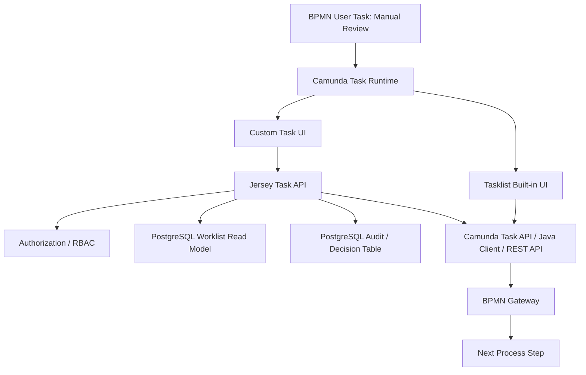

Human task bukan sekadar “form”. Dalam sistem enterprise, human task adalah kombinasi dari:

```text id="bdr21y"
- work assignment
- authorization
- task state
- business decision
- audit trail
- SLA/deadline
- escalation
- process continuation
```

---

# 3. Tasklist bawaan vs Custom Task UI

## 3.1 Pakai Tasklist bawaan jika

```text id="f0qyoi"
- user internal/back-office
- proses approval/review sederhana sampai menengah
- form bisa dimodelkan dengan Camunda Form
- tidak perlu UI domain yang sangat custom
- butuh cepat onboarding dan operasi
- ingin memanfaatkan Tasklist untuk claim/complete task
```

Tasklist API dirancang untuk membangun task applications untuk human-centered processes; API-nya memungkinkan query user task, assign user ke task, dan complete task, dengan authentication sebelum akses. ([Camunda 8 Docs](https://docs.camunda.io/docs/apis-tools/tasklist-api-rest/tasklist-api-rest-overview/?utm_source=chatgpt.com))

## 3.2 Pakai Custom Task UI jika

```text id="3qu9us"
- UI harus sangat domain-specific
- perlu menggabungkan data banyak tabel PostgreSQL
- perlu authorization domain yang lebih kompleks
- perlu audit/regulatory defensibility kuat
- perlu worklist khusus per role/team/region
- perlu integrasi document viewer, notes, case timeline, enforcement history
- task action harus melewati business service Jersey terlebih dahulu
```

## 3.3 Rekomendasi untuk case management/regulatory system

Untuk sistem enforcement/case management enterprise:

```text id="kioxth"
Internal ops sederhana:
  Tasklist bawaan bisa cukup

Regulatory case review kompleks:
  Custom Task UI + Jersey API + PostgreSQL read model lebih defensible
```

Alasannya: reviewer biasanya butuh konteks domain lengkap, timeline, document evidence, history, role constraints, dual control, dan audit trail yang tidak cukup hanya dari raw task variables.

---

# 4. Human task lifecycle

Lifecycle praktis:

```text id="8u4c99"
CREATED
  -> task tersedia untuk candidate user/group

CLAIMED / ASSIGNED
  -> task dipegang user tertentu

IN_PROGRESS
  -> user sedang mengerjakan

COMPLETED
  -> decision/form submitted, task selesai

CANCELLED / TERMINATED
  -> process path berubah atau parent process cancelled
```

Tasklist complete-task API menyebut complete task dapat gagal bila task tidak active, belum assigned/claimed, atau tidak assigned ke current user. Ini penting: custom UI harus menghormati lifecycle assignment sebelum complete. ([Camunda 8 Docs](https://docs.camunda.io/docs/apis-tools/tasklist-api-rest/specifications/complete-task/?utm_source=chatgpt.com))

---

# 5. BPMN user task design

## 5.1 Naming

Gunakan nama task yang merepresentasikan pekerjaan manusia.

```text id="c1q2dl"
Good:
  Review Case
  Verify Documents
  Approve Enforcement Action
  Decide Appeal
  Perform Legal Sign-off

Bad:
  User Task
  Manual Step
  Approval
  Human Activity
```

## 5.2 Assignment fields

Model task assignment secara eksplisit.

```yaml id="nqfxa3"
userTask:
  name: Review Case
  candidateGroups:
    - regulatory-reviewer
  assignee: null
  dueDate: = reviewDueAt
  followUpDate: = reviewFollowUpAt
  form:
    id: review-case-form
  outputVariables:
    - reviewDecision
    - reviewReasonCode
    - reviewedBy
    - reviewedAt
```

Camunda user tasks mendukung assignments, scheduling, variable mappings, dan form. `dueDate` dan `followUpDate` berguna untuk deadline dan kapan task mulai harus ditindaklanjuti. ([Camunda 8 Docs](https://docs.camunda.io/docs/components/modeler/bpmn/user-tasks/?utm_source=chatgpt.com))

---

# 6. Assignment model

## 6.1 Candidate group

Gunakan candidate group untuk work queue.

```text id="0w9hoo"
candidateGroups:
  - regulatory-reviewer
  - enforcement-manager
  - legal-approver
```

Cocok untuk:

```text id="v5ykhh"
- pool reviewer
- task bisa diambil siapa saja dalam role/group
- manager bisa memonitor backlog
```

## 6.2 Assignee

Gunakan assignee saat task sudah dialokasikan ke user tertentu.

```text id="szz2ad"
assignee = user-123
```

Cocok untuk:

```text id="sodjz4"
- task sudah claimed
- assignment by supervisor
- workload balancing manual/automatic
```

## 6.3 Jangan pakai assignee untuk role

Kurang bagus:

```text id="oj85so"
assignee = "regulatory-reviewer"
```

Lebih baik:

```text id="j0b67h"
candidateGroups = ["regulatory-reviewer"]
assignee = null
```

---

# 7. Authorization model

Human task authorization perlu dua lapis:

```text id="a5yyqs"
Camunda authorization:
  siapa boleh melihat/assign/complete task di Camunda

Application/domain authorization:
  siapa boleh melakukan business action pada case tertentu
```

Camunda 8 memiliki fine-grained authorization untuk Orchestration Cluster. Role adalah kumpulan authorization dan dapat diberikan langsung ke user atau melalui group. Tasklist V2 menggunakan authorization-based access control, sedangkan Tasklist V1 memiliki user task access restrictions. ([Camunda 8 Docs](https://docs.camunda.io/docs/components/concepts/access-control/authorizations/?utm_source=chatgpt.com))

Practical rule:

```text id="mtkabr"
Jangan hanya mengandalkan frontend hiding.

Saat complete task via Jersey API:
  validate user identity
  validate group/role
  validate domain state
  validate task assignment
  validate maker-checker rule jika ada
```

---

# 8. Tasklist bawaan pattern

## 8.1 Flow

```text id="qw3y6p"
User opens Tasklist
  -> sees candidate/assigned tasks
  -> claims task
  -> opens form
  -> submits decision
  -> Camunda completes task
  -> BPMN continues
```

## 8.2 Cocok untuk

```text id="eiyp2y"
- internal user
- standard review form
- low custom UI requirement
- team cepat butuh operational task inbox
```

## 8.3 Limitasi umum untuk enterprise case UI

```text id="x6dswm"
- context business detail sering perlu query PostgreSQL
- document/evidence viewer mungkin custom
- audit trail domain perlu disimpan sendiri
- maker-checker dan segregation of duties sering lebih kompleks
- reporting worklist biasanya perlu DB read model
```

---

# 9. Custom Task UI pattern

## 9.1 Recommended architecture

```text id="75pb0e"
Frontend Custom Task UI
  -> Jersey Task API
     -> AuthN/AuthZ
     -> PostgreSQL worklist/read model
     -> PostgreSQL audit/decision write
     -> Camunda task complete/assign API
```

## 9.2 Jangan langsung frontend → Camunda

Kurang bagus:

```text id="30wtf1"
Browser frontend
  -> Camunda Task API directly
```

Risiko:

```text id="dr96hj"
- service account/credential exposure
- domain validation bypass
- audit trail incomplete
- authorization sulit
- UI coupling ke Camunda API
```

Lebih baik:

```text id="eir08g"
Browser frontend
  -> Jersey backend
     -> domain validation
     -> audit
     -> Camunda
```

---

# 10. Endpoint design untuk custom task UI

## 10.1 Worklist

```http id="1w58n6"
GET /worklist/tasks?status=AVAILABLE&group=regulatory-reviewer
```

Response:

```json id="rz4j8u"
{
  "items": [
    {
      "taskId": "task-123",
      "caseId": "CASE-2026-000123",
      "taskName": "Review Case",
      "caseType": "LICENSE_REVIEW",
      "priority": "HIGH",
      "status": "AVAILABLE",
      "candidateGroups": ["regulatory-reviewer"],
      "assignee": null,
      "dueAt": "2026-07-18T17:00:00+07:00",
      "createdAt": "2026-07-16T10:00:00+07:00"
    }
  ]
}
```

Data source:

```text id="h7e7bn"
PostgreSQL task read model
+ optionally Camunda task query sync
```

---

## 10.2 Claim task

```http id="cdpffx"
POST /worklist/tasks/{taskId}/claim
```

Response:

```json id="bo9x7k"
{
  "taskId": "task-123",
  "assignee": "user-123",
  "status": "ASSIGNED"
}
```

---

## 10.3 Unclaim task

```http id="s2mxy9"
POST /worklist/tasks/{taskId}/unclaim
```

---

## 10.4 Complete task

```http id="vygt5u"
POST /worklist/tasks/{taskId}/complete
Idempotency-Key: TASK-COMPLETE-20260716-001
Content-Type: application/json
```

Request:

```json id="ip854e"
{
  "caseId": "CASE-2026-000123",
  "decision": "APPROVE",
  "reasonCode": "DOCUMENTS_COMPLETE",
  "comment": "All required documents are valid.",
  "formVersion": "review-case-v1"
}
```

Response:

```json id="fbqhl8"
{
  "taskId": "task-123",
  "caseId": "CASE-2026-000123",
  "completed": true,
  "decision": "APPROVE"
}
```

---

# 11. Task output variable design

Task completion variables harus kecil.

## Good Camunda variables

```json id="wzdl5g"
{
  "reviewDecision": "APPROVE",
  "reviewReasonCode": "DOCUMENTS_COMPLETE",
  "reviewedBy": "user-123",
  "reviewedAt": "2026-07-16T11:30:00+07:00"
}
```

## Store full form in PostgreSQL

```json id="jx1zt9"
{
  "decision": "APPROVE",
  "reasonCode": "DOCUMENTS_COMPLETE",
  "comment": "All required documents are valid.",
  "attachmentsReviewed": ["DOC-1", "DOC-2"],
  "checklist": {
    "identityVerified": true,
    "licenseValid": true,
    "riskAccepted": true
  },
  "actor": {
    "userId": "user-123",
    "groups": ["regulatory-reviewer"]
  }
}
```

Rule:

```text id="6x9fye"
Camunda:
  variables for routing

PostgreSQL:
  full decision, form payload, audit, actor, evidence
```

---

# 12. PostgreSQL schema untuk task read model

## 12.1 Task projection

```sql id="b206uj"
create table case_task_projection (
    task_id text primary key,
    case_id text not null,
    process_instance_key text not null,

    task_name text not null,
    task_definition_id text,
    bpmn_process_id text,

    status text not null,
    assignee text,
    candidate_groups text[] not null default '{}',

    priority text,
    due_at timestamptz,
    follow_up_at timestamptz,

    created_at timestamptz not null,
    completed_at timestamptz,
    synced_at timestamptz not null default now(),

    constraint chk_case_task_projection_status
        check (status in (
            'AVAILABLE',
            'ASSIGNED',
            'COMPLETED',
            'CANCELLED'
        ))
);

create index idx_case_task_projection_case_id
    on case_task_projection (case_id);

create index idx_case_task_projection_status_due
    on case_task_projection (status, due_at);

create index idx_case_task_projection_assignee_status
    on case_task_projection (assignee, status);

create index idx_case_task_projection_candidate_groups
    on case_task_projection using gin (candidate_groups);
```

## 12.2 Decision audit table

```sql id="9gnl26"
create table case_task_decision (
    decision_id bigserial primary key,
    idempotency_key text not null unique,

    task_id text not null,
    case_id text not null,

    decision text not null,
    reason_code text,
    comment text,

    form_version text,
    form_payload jsonb not null,

    decided_by text not null,
    decided_at timestamptz not null default now(),

    created_at timestamptz not null default now()
);

create index idx_case_task_decision_case_id
    on case_task_decision (case_id);

create index idx_case_task_decision_task_id
    on case_task_decision (task_id);
```

## 12.3 Task event/audit table

```sql id="u8cgq8"
create table case_task_event (
    event_id bigserial primary key,
    task_id text not null,
    case_id text not null,
    event_type text not null,
    actor_id text,
    payload jsonb not null,
    created_at timestamptz not null default now()
);

create index idx_case_task_event_task_id_created_at
    on case_task_event (task_id, created_at);
```

---

# 13. Worklist query dengan MyBatis

## 13.1 Mapper

```java id="lcwlcg"
public interface WorklistMapper {

    List<WorklistTaskRow> findAvailableTasksForUser(
        @Param("userId") String userId,
        @Param("groups") List<String> groups,
        @Param("limit") int limit,
        @Param("offset") int offset
    );

    Optional<WorklistTaskRow> findTaskById(
        @Param("taskId") String taskId
    );

    int markAssigned(
        @Param("taskId") String taskId,
        @Param("assignee") String assignee
    );

    int markCompleted(
        @Param("taskId") String taskId
    );

    int insertDecision(TaskDecisionRow row);

    int insertTaskEvent(TaskEventRow row);
}
```

## 13.2 XML query

```xml id="1juxen"
<select id="findAvailableTasksForUser" resultMap="WorklistTaskRowMap">
    select
        task_id,
        case_id,
        process_instance_key,
        task_name,
        task_definition_id,
        bpmn_process_id,
        status,
        assignee,
        candidate_groups,
        priority,
        due_at,
        follow_up_at,
        created_at,
        completed_at,
        synced_at
    from case_task_projection
    where status in ('AVAILABLE', 'ASSIGNED')
      and (
          assignee = #{userId}
          or (
              assignee is null
              and candidate_groups && #{groups, typeHandler=com.company.StringArrayTypeHandler}
          )
      )
    order by
      due_at nulls last,
      created_at
    limit #{limit}
    offset #{offset}
</select>
```

Catatan: untuk PostgreSQL array overlap operator `&&`, gunakan type handler array atau bangun SQL sesuai pattern MyBatis internal perusahaan.

---

# 14. Complete task flow dengan Jersey

## 14.1 Service flow

```text id="tk6irq"
POST /worklist/tasks/{taskId}/complete

1. Validate Idempotency-Key.
2. Load task projection.
3. Validate task status active.
4. Validate user is assignee or allowed group.
5. Validate task belongs to caseId in request.
6. Validate domain state.
7. Persist case_task_decision.
8. Persist case_task_event.
9. Update business case status if needed.
10. Complete Camunda user task with compact variables.
11. Mark task projection completed.
12. Return success.
```

## 14.2 Tasklist API behavior

Tasklist complete-task API returns errors if task is not active, not claimed/assigned before completion, or not assigned to current user. That means your custom API should either enforce the same lifecycle or explicitly perform claim/assign before complete under a controlled rule. ([Camunda 8 Docs](https://docs.camunda.io/docs/apis-tools/tasklist-api-rest/specifications/complete-task/?utm_source=chatgpt.com))

---

# 15. Java service: complete review task

```java id="gr75al"
public final class ReviewTaskService {

    private final WorklistRepository worklistRepository;
    private final CaseRepository caseRepository;
    private final CamundaTaskGateway taskGateway;
    private final AuthorizationService authorizationService;
    private final RequestHashService requestHashService;

    public CompleteTaskResult completeReviewTask(
            String taskId,
            String idempotencyKey,
            AuthenticatedUser user,
            CompleteReviewTaskRequest request
    ) {
        validate(idempotencyKey, request);

        String requestHash = requestHashService.hash(request);

        var existing = worklistRepository.findDecisionByIdempotencyKey(
            idempotencyKey
        );

        if (existing.isPresent()) {
            if (!existing.get().requestHash().equals(requestHash)) {
                throw new ConflictException(
                    "Idempotency-Key already used with different request"
                );
            }

            return new CompleteTaskResult(
                taskId,
                existing.get().caseId(),
                true,
                existing.get().decision()
            );
        }

        WorklistTask task = worklistRepository.findTaskById(taskId)
            .orElseThrow(() -> new NotFoundException("Task not found"));

        if (!task.caseId().equals(request.caseId())) {
            throw new BadRequestException("Task does not belong to caseId");
        }

        if (!task.isActive()) {
            throw new ConflictException("Task is not active");
        }

        authorizationService.requireCanCompleteTask(user, task);

        CaseRecord caseRecord = caseRepository.findById(task.caseId())
            .orElseThrow(() -> new NotFoundException("Case not found"));

        if (!caseRecord.canBeReviewed()) {
            throw new ConflictException(
                "Case cannot be reviewed from status " + caseRecord.status()
            );
        }

        worklistRepository.insertDecision(
            idempotencyKey,
            requestHash,
            taskId,
            task.caseId(),
            request.decision(),
            request.reasonCode(),
            request.comment(),
            request.formVersion(),
            request.toPayload(),
            user.userId()
        );

        worklistRepository.insertTaskEvent(
            taskId,
            task.caseId(),
            "TASK_COMPLETED",
            user.userId(),
            Map.of(
                "decision", request.decision(),
                "reasonCode", request.reasonCode()
            )
        );

        caseRepository.recordReviewDecision(
            task.caseId(),
            request.decision(),
            request.reasonCode(),
            user.userId()
        );

        taskGateway.completeTask(
            taskId,
            Map.of(
                "reviewDecision", request.decision(),
                "reviewReasonCode", request.reasonCode(),
                "reviewedBy", user.userId(),
                "reviewedAt", OffsetDateTime.now().toString()
            )
        );

        worklistRepository.markCompleted(taskId);

        return new CompleteTaskResult(
            taskId,
            task.caseId(),
            true,
            request.decision()
        );
    }
}
```

Important caveat:

```text id="8atbcb"
DB decision insert + Camunda task complete is also dual-write.

Production-safe option:
  persist decision + workflow_outbox COMPLETE_TASK command
  complete task asynchronously
  or make complete operation idempotent and reconcile.
```

Untuk task completion yang regulatory-critical, gunakan outbox juga agar decision tidak hilang jika Camunda unavailable.

---

# 16. Camunda task gateway

Ada dua pilihan implementasi:

```text id="kf4gps"
A. Call Camunda/Tasklist API from Jersey backend
B. Use Camunda Java Client if task operations supported by your client/version
```

Tasklist API punya endpoint untuk search, assign, unassign, dan complete tasks. Search task endpoint mengembalikan task berdasarkan filter request; complete task endpoint menyelesaikan task dan dapat mengembalikan error saat task tidak active, belum claimed, atau bukan milik current user. ([Camunda 8 Docs](https://docs.camunda.io/docs/apis-tools/tasklist-api-rest/controllers/tasklist-api-rest-task-controller/?utm_source=chatgpt.com))

Interface:

```java id="b61kqa"
public interface CamundaTaskGateway {

    List<CamundaTaskSummary> searchTasks(TaskSearchCriteria criteria);

    void assignTask(String taskId, String assignee);

    void unassignTask(String taskId);

    void completeTask(String taskId, Map<String, Object> variables);
}
```

REST implementation sketch:

```java id="uau4wj"
public final class CamundaTaskApiGateway implements CamundaTaskGateway {

    private final HttpClient httpClient;
    private final URI taskApiBaseUri;
    private final AccessTokenProvider tokenProvider;
    private final ObjectMapper objectMapper;

    @Override
    public void completeTask(String taskId, Map<String, Object> variables) {
        Map<String, Object> body = Map.of(
            "variables", variables
        );

        HttpRequest request = HttpRequest.newBuilder()
            .uri(taskApiBaseUri.resolve("/v1/tasks/" + taskId + "/complete"))
            .header("Authorization", "Bearer " + tokenProvider.getToken())
            .header("Content-Type", "application/json")
            .POST(HttpRequest.BodyPublishers.ofString(toJson(body)))
            .build();

        HttpResponse<String> response = send(request);

        if (response.statusCode() == 200) {
            return;
        }

        if (response.statusCode() == 404) {
            throw new NotFoundException("Camunda task not found");
        }

        if (response.statusCode() == 403) {
            throw new ForbiddenException("No permission to complete task");
        }

        if (response.statusCode() == 400) {
            throw new ConflictException("Task cannot be completed: " + response.body());
        }

        throw new DependencyUnavailableException(
            "Failed to complete Camunda task, status=" + response.statusCode()
        );
    }

    private String toJson(Object body) {
        try {
            return objectMapper.writeValueAsString(body);
        } catch (Exception ex) {
            throw new IllegalArgumentException("Failed to serialize task request", ex);
        }
    }
}
```

Sesuaikan path API dengan versi API yang dipakai perusahaan. Camunda sedang mengarah ke API yang lebih unified; dokumentasi Camunda menyarankan migrasi dari component REST APIs V1 ke Orchestration Cluster REST API bila relevan. ([Camunda 8 Docs](https://docs.camunda.io/docs/apis-tools/tasklist-api-rest/tasklist-api-rest-overview/?utm_source=chatgpt.com))

---

# 17. Claim / assign task

## 17.1 Claim semantics

Claim berarti user mengambil task dari candidate pool.

```text id="8tmbix"
AVAILABLE
  -> claim by user-123
ASSIGNED to user-123
```

## 17.2 Service flow

```text id="xil5j2"
POST /worklist/tasks/{taskId}/claim

1. Load task projection.
2. Validate task active.
3. Validate assignee is null or same user.
4. Validate user belongs to candidate group.
5. Assign task in Camunda.
6. Update task projection assignee.
7. Insert audit event TASK_CLAIMED.
```

## 17.3 Java sketch

```java id="2p0l74"
public void claimTask(String taskId, AuthenticatedUser user) {
    WorklistTask task = worklistRepository.findTaskById(taskId)
        .orElseThrow(() -> new NotFoundException("Task not found"));

    if (!task.isAvailable()) {
        throw new ConflictException("Task is not available");
    }

    authorizationService.requireCanClaimTask(user, task);

    taskGateway.assignTask(taskId, user.userId());

    worklistRepository.markAssigned(taskId, user.userId());

    worklistRepository.insertTaskEvent(
        taskId,
        task.caseId(),
        "TASK_CLAIMED",
        user.userId(),
        Map.of("assignee", user.userId())
    );
}
```

---

# 18. Maker-checker / segregation of duties

Regulatory systems sering perlu rule seperti:

```text id="nffxjx"
User who created/submitted case
  must not approve the same case.

User who performed first review
  must not perform final approval.

Legal approver must belong to legal group.
```

## 18.1 DB support

```sql id="mrqfdb"
create table case_actor_history (
    actor_event_id bigserial primary key,
    case_id text not null,
    actor_id text not null,
    actor_role text not null,
    action text not null,
    created_at timestamptz not null default now()
);

create index idx_case_actor_history_case_actor
    on case_actor_history (case_id, actor_id);
```

## 18.2 Authorization check

```java id="0hwl1b"
public void requireCanCompleteTask(
        AuthenticatedUser user,
        WorklistTask task
) {
    if (!user.hasAnyGroup(task.candidateGroups())
            && !user.userId().equals(task.assignee())) {
        throw new ForbiddenException("User cannot complete this task");
    }

    if (actorHistoryRepository.hasAction(
            task.caseId(),
            user.userId(),
            "SUBMITTED_CASE"
    )) {
        throw new ForbiddenException(
            "Maker-checker violation: submitter cannot approve case"
        );
    }
}
```

This is why custom Jersey API is often necessary for regulatory workflow.

---

# 19. SLA, due date, follow-up date, escalation

## 19.1 dueDate vs followUpDate

```text id="0mmbpl"
followUpDate:
  kapan task mulai harus diperhatikan / dikerjakan

dueDate:
  deadline task selesai
```

Camunda user task docs describe scheduling support, including follow-up date and due date behavior for user tasks. ([Camunda 8 Docs](https://docs.camunda.io/docs/components/modeler/bpmn/user-tasks/?utm_source=chatgpt.com))

## 19.2 BPMN timer escalation

```text id="q803xk"
User Task: Review Case
  non-interrupting timer PT24H:
    -> Send Reminder

  interrupting timer P3D:
    -> Escalate to Manager
```

## 19.3 DB worklist SLA query

```sql id="1q7l47"
select *
from case_task_projection
where status in ('AVAILABLE', 'ASSIGNED')
  and due_at < now()
order by due_at;
```

Near due:

```sql id="msshpx"
select *
from case_task_projection
where status in ('AVAILABLE', 'ASSIGNED')
  and due_at between now() and now() + interval '4 hours'
order by due_at;
```

---

# 20. Task synchronization strategy

Jika custom UI memakai PostgreSQL task projection, kamu perlu menjaga projection sinkron.

## Option A - Query Camunda live

```text id="e2rn2e"
GET /worklist/tasks
  -> call Camunda Task API
  -> enrich with PostgreSQL case data
  -> return UI result
```

Pros:

```text id="vfb1n2"
- simpler data freshness
- no projection sync process
```

Cons:

```text id="3gknf7"
- latency dependency ke Camunda
- complex joins/enrichment
- harder custom filters/reporting
```

## Option B - PostgreSQL task projection

```text id="9ggc79"
Background sync/exporter
  -> updates case_task_projection

GET /worklist/tasks
  -> query PostgreSQL projection
```

Pros:

```text id="zkn5q1"
- fast worklist
- rich domain filters
- easier reporting
- stable UI query
```

Cons:

```text id="pyjif0"
- eventual consistency
- projection sync needs reconciliation
```

## Rekomendasi

```text id="gy17fy"
Small/internal:
  live Camunda query + enrichment may be enough

Enterprise/regulatory:
  PostgreSQL task projection + reconciliation is usually better
```

---

# 21. Task completion dual-write

Task completion is also a dual-write problem.

```text id="d2b7dx"
Write decision to PostgreSQL
AND
complete Camunda task
```

Failure cases:

| Scenario | Result | Mitigation |
|---|---|---|
| DB decision saved, Camunda complete failed | task still open but decision exists | idempotency + retry complete |
| Camunda complete succeeded, DB decision failed | process moves but audit missing | avoid by DB-first |
| complete retried | duplicate decision risk | idempotency key |
| user double-clicks submit | duplicate completion attempt | idempotency + UI lock |
| projection update fails | UI still shows task | reconciliation sync |

Production-safe pattern:

```text id="pjim8d"
1. Save decision in DB with idempotency key.
2. Insert workflow_outbox COMPLETE_TASK.
3. Return accepted or completed based on policy.
4. Publisher completes task.
5. Projection sync marks completed.
```

For highly regulated actions, outbox is safer than direct complete inside request path.

---

# 22. COMPLETE_TASK outbox command

Extend `workflow_outbox`:

```text id="j91bbh"
command_type = COMPLETE_TASK
aggregate_type = CASE
aggregate_id = caseId
command_key = COMPLETE_TASK:{taskId}:{idempotencyKey}
payload = {
  taskId,
  variables
}
```

SQL check update:

```sql id="r00c0r"
alter table workflow_outbox
drop constraint chk_workflow_outbox_command_type;

alter table workflow_outbox
add constraint chk_workflow_outbox_command_type
check (command_type in (
    'START_PROCESS',
    'PUBLISH_MESSAGE',
    'CORRELATE_MESSAGE',
    'COMPLETE_TASK',
    'CANCEL_PROCESS'
));
```

Publisher branch:

```java id="7ol413"
private void publishOne(WorkflowOutboxRow row) {
    switch (row.commandType()) {
        case "START_PROCESS" -> startProcess(row);
        case "PUBLISH_MESSAGE" -> publishMessage(row);
        case "COMPLETE_TASK" -> completeTask(row);
        default -> throw new NonRetryableWorkflowException(
            "Unsupported command type: " + row.commandType()
        );
    }
}

private void completeTask(WorkflowOutboxRow row) {
    String taskId = (String) row.payload().get("taskId");
    Map<String, Object> variables =
        (Map<String, Object>) row.payload().get("variables");

    taskGateway.completeTask(taskId, variables);
}
```

---

# 23. Human task decision modeling

## 23.1 Gateway after task

```text id="dbh24n"
User Task: Review Case
  output:
    reviewDecision

Exclusive Gateway: Review Decision?
  APPROVE -> Continue
  REJECT -> Reject Case
  NEED_MORE_INFO -> Wait for DocumentReceived
```

Gateway condition:

```text id="8cyx7g"
= reviewDecision = "APPROVE"
= reviewDecision = "REJECT"
= reviewDecision = "NEED_MORE_INFO"
```

## 23.2 Decision enum

```java id="u5sr3n"
public enum ReviewDecision {
    APPROVE,
    REJECT,
    NEED_MORE_INFO,
    ESCALATE
}
```

Never let free-text decision drive gateway.

Bad:

```json id="xsrbzy"
{
  "decision": "looks good"
}
```

Good:

```json id="uqlj49"
{
  "decision": "APPROVE",
  "comment": "Looks good"
}
```

---

# 24. Form versioning

Task forms evolve. Store form version.

```json id="sd3f57"
{
  "formVersion": "review-case-v3",
  "decision": "APPROVE",
  "reasonCode": "DOCUMENTS_COMPLETE"
}
```

DB:

```sql id="x3nx17"
form_version text not null,
form_payload jsonb not null
```

Rule:

```text id="t50hi5"
Never assume old running tasks use the latest form schema.
```

Custom UI should support:

```text id="hucc1e"
- old form version display
- migration/fallback fields
- validation by formVersion
```

---

# 25. Audit requirements

For regulatory defensibility, every human action should capture:

```text id="et3g3j"
- taskId
- caseId
- actor userId
- actor groups/roles at decision time
- decision
- reason code
- comment
- timestamp
- form version
- payload submitted
- task assignment state
- request correlationId
- idempotency key
```

Audit event example:

```json id="ndsfyq"
{
  "eventType": "TASK_COMPLETED",
  "taskId": "task-123",
  "caseId": "CASE-2026-000123",
  "actorId": "user-123",
  "actorGroups": ["regulatory-reviewer"],
  "decision": "APPROVE",
  "reasonCode": "DOCUMENTS_COMPLETE",
  "formVersion": "review-case-v1",
  "correlationId": "req-abc"
}
```

---

# 26. Security anti-bypass rules

```text id="tolr21"
[ ] Frontend must not complete Camunda task directly.
[ ] Backend must not trust user-provided assignee/candidateGroups.
[ ] Backend must re-load task from trusted source.
[ ] Backend must check domain authorization.
[ ] Backend must check task active state.
[ ] Backend must check maker-checker rule.
[ ] Backend must persist audit before completing task.
[ ] Backend must use service account to call Camunda.
[ ] Backend must not expose Camunda service account token.
```

---

# 27. Human task anti-patterns

| Anti-pattern | Risiko | Koreksi |
|---|---|---|
| Public UI calls Camunda Task API directly | credential/security bypass | UI → Jersey → Camunda |
| No PostgreSQL audit | weak regulatory trail | decision/audit table |
| Free-text decision drives gateway | unpredictable process | enum decision |
| No idempotency on complete | duplicate decision/double submit | Idempotency-Key |
| Complete Camunda before DB audit | process moves, audit missing | DB-first/outbox |
| Assign role as assignee | role/user confusion | candidateGroups |
| No maker-checker check | regulatory violation | domain authorization |
| Query all work from Camunda only | weak custom filtering/reporting | task projection |
| Store full form in Camunda variables | variable bloat/PII risk | DB form_payload |
| No form version | old task incompatibility | formVersion |
| No due/follow-up strategy | SLA invisible | dueAt/followUpAt |
| No escalation path | task stuck | timer/escalation |

---

# 28. Mini-lab Seri 13

## Goal

Implement custom review task API.

## BPMN

```text id="n91n2f"
Service Task: Calculate Risk Score
  -> User Task: Review Case
       candidateGroups = regulatory-reviewer
       dueDate = reviewDueAt
       form = review-case-v1
  -> Exclusive Gateway: Review Decision?
       APPROVE -> Notify Approval
       REJECT -> Notify Rejection
       NEED_MORE_INFO -> Wait for DocumentReceived
```

## API

```text id="67sx0z"
GET  /worklist/tasks
POST /worklist/tasks/{taskId}/claim
POST /worklist/tasks/{taskId}/unclaim
POST /worklist/tasks/{taskId}/complete
GET  /cases/{caseId}/task-history
```

## DB

```text id="xslqce"
case_task_projection
case_task_decision
case_task_event
case_actor_history
```

## Test cases

```text id="ckgjd8"
[ ] Candidate group user can see available task.
[ ] Unauthorized user cannot see/claim/complete task.
[ ] User can claim available task.
[ ] Other user cannot complete claimed task.
[ ] Submitter cannot approve same case.
[ ] Complete task persists decision before Camunda complete.
[ ] Duplicate complete request with same Idempotency-Key returns same result.
[ ] Different payload with same Idempotency-Key returns 409.
[ ] reviewDecision routes BPMN correctly.
[ ] Full form payload stored in PostgreSQL, not Camunda variable.
[ ] Overdue task appears in SLA query.
```

---

# 29. Production checklist

```text id="h13tct"
[ ] Camunda user task implementation is used for new processes.
[ ] Candidate groups and assignee semantics are documented.
[ ] Tasklist vs custom UI decision is explicit.
[ ] Custom UI calls Jersey backend, not Camunda directly.
[ ] Task completion uses Idempotency-Key.
[ ] Decision audit is stored in PostgreSQL.
[ ] Full form payload is stored in PostgreSQL.
[ ] Camunda variables contain compact routing fields only.
[ ] Maker-checker / segregation-of-duties rules are enforced.
[ ] Task projection or live enrichment strategy is defined.
[ ] Task completion dual-write has mitigation/outbox.
[ ] dueDate/followUpDate are defined for SLA tasks.
[ ] Timer escalation exists for overdue work.
[ ] Form version is stored.
[ ] Authorization is checked both in Camunda and application domain.
[ ] Support/debug APIs are internal-only.
```

---

# 30. Ringkasan Seri 13

```text id="wfcoup"
Tasklist:
  fast built-in UI for internal human work

Custom Task UI:
  better for domain-heavy, regulatory, audit-heavy workflows

Camunda user task:
  runtime representation of human work

Jersey Task API:
  domain validation, authorization, audit, task completion gateway

PostgreSQL:
  worklist projection, decision audit, task history, maker-checker evidence

Camunda variables:
  compact decision/routing data only
```

Formula praktis:

```text id="4fcg0v"
Human task is not just:
  "user fills a form."

It is:
  assignment + authorization + decision + audit + SLA + process continuation.
```

---

# Seri 13/16 selesai

Seri ini selesai: **Human Task Integration: Tasklist vs Custom Task UI**.

Rekomendasi materi berikutnya:

**Seri 14/16 - Testing Strategy: Unit, Integration, BPMN, Worker Testing.**  
Materinya akan fokus pada unit test handler, BPMN deployment validation, Camunda local/integration test, worker idempotency test, message correlation test, outbox/reconciliation test, dan regression strategy untuk process versioning.

---

**Sources:**

- [User tasks | Camunda 8 Docs](https://docs.camunda.io/docs/components/modeler/bpmn/user-tasks/?utm_source=chatgpt.com)

## Response:
7/16/2026, 10:11:17 AM

# Cheatsheet Camunda 8 + Java/Jersey Microservice  
## Seri 14/16 - Testing Strategy: Unit, Integration, BPMN, Worker Testing

## 1. Fokus seri ini

Seri ini membahas strategi testing untuk aplikasi **Java 17 + Jersey + MyBatis + PostgreSQL + Camunda 8**.

Targetnya bukan hanya “test jalan”, tetapi memastikan:

```text id="x7oj3f"
- BPMN executable benar
- worker handler benar
- variable contract benar
- message correlation benar
- outbox/retry/reconciliation benar
- task completion aman
- failure path dan incident path dapat diprediksi
- process versioning tidak merusak running instances
```

Camunda menyarankan executable BPMN process dites seperti software. Testing process solution biasanya dibagi ke beberapa scope: unit test untuk glue code/programming code, automated process tests untuk BPMN, dan integration tests yang dekat dengan environment nyata. ([docs.camunda.io](https://docs.camunda.io/docs/components/best-practices/development/testing-process-definitions/))

---

# 2. Testing pyramid untuk Camunda microservice

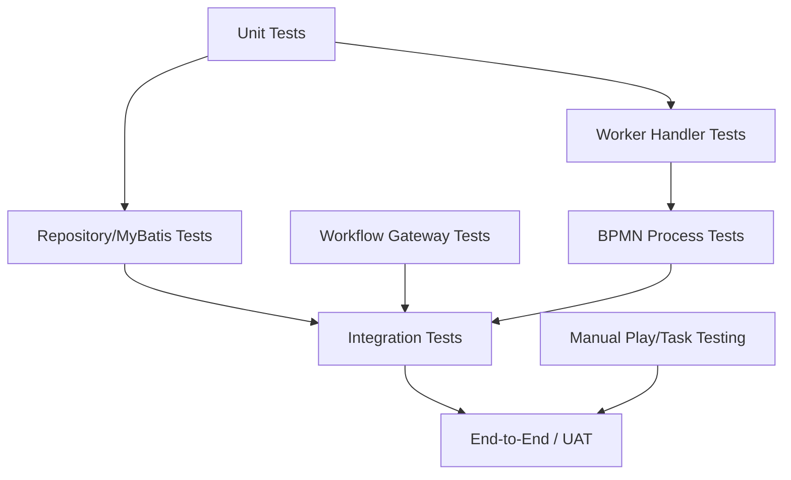

Practical split:

| Layer | Fokus | Tools / Approach |
|---|---|---|
| Unit test | Pure Java logic | JUnit 5, Mockito/fakes |
| Worker handler test | complete/fail/error mapping | Mock/fake `JobClient`, fake repositories |
| Repository test | SQL/MyBatis correctness | Testcontainers PostgreSQL |
| BPMN process test | path, gateway, message, task behavior | Camunda Process Test / runtime test |
| Integration test | Jersey + DB + Camunda + worker | Testcontainers / dev cluster |
| Outbox test | retry, locking, idempotency | PostgreSQL + fake Camunda gateway |
| E2E/UAT | real user journey | env integration/UAT |
| Manual modeling test | rapid validation | Web Modeler Play / Task testing |

Camunda Process Test adalah library Java untuk mengetes BPMN process dan process application. Runtime-nya bisa memakai Testcontainers runtime secara default atau remote runtime seperti Camunda 8 Run. ([docs.camunda.io](https://docs.camunda.io/docs/apis-tools/testing/getting-started/))

---

# 3. Testing goals by artifact

| Artifact | Harus dites apa? |
|---|---|
| BPMN file | deployable, path benar, gateway benar, message/timer/user task benar |
| Jersey resource | HTTP status, validation, idempotency, error response |
| Application service | domain state transition, outbox insert, authorization |
| Workflow gateway | command shape, variables, messageName/correlationKey |
| Worker handler | variable extraction, idempotency, complete/fail/BPMN error |
| MyBatis mapper | SQL benar, JSONB type handler, locking, unique constraint |
| Outbox publisher | retry, backoff, stale processing recovery, duplicate-safe |
| Task API | claim/complete, maker-checker, audit, idempotency |
| Reconciliation job | detect stuck state, reset safe rows, no destructive retry |
| Deployment config | env vars, auth, endpoints, worker enabled/disabled |

---

# 4. Test scope matrix

| Scenario | Unit | Worker | BPMN | Integration | E2E |
|---|---:|---:|---:|---:|---:|
| Request validation | Ya | Tidak | Tidak | Ya | Ya |
| Start process variables | Ya | Tidak | Ya | Ya | Ya |
| Service task happy path | Tidak | Ya | Ya | Ya | Ya |
| BPMN gateway routing | Tidak | Tidak | Ya | Ya | Ya |
| Message correlation | Tidak | Tidak | Ya | Ya | Ya |
| Worker DB idempotency | Ya | Ya | Tidak | Ya | Ya |
| Outbox retry | Ya | Tidak | Tidak | Ya | Ya |
| Incident path | Tidak | Ya | Ya | Ya | Optional |
| Human task complete | Ya | Tidak | Ya | Ya | Ya |
| Authorization/maker-checker | Ya | Tidak | Tidak | Ya | Ya |
| SQL lock `skip locked` | Tidak | Tidak | Tidak | Ya | Tidak |
| Process version compatibility | Tidak | Tidak | Ya | Ya | UAT |

---

# 5. Unit tests untuk application service

## 5.1 Example: create case should insert outbox, not call Camunda directly

Goal:

```text id="zbbysb"
POST /cases command path:
  - inserts case_record
  - inserts workflow_outbox START_PROCESS
  - returns START_PENDING
  - does not call Camunda directly
```

Pseudo-test:

```java id="koe75s"
class CaseCommandServiceTest {

    private final CaseRepository caseRepository = mock(CaseRepository.class);
    private final WorkflowOutboxRepository outboxRepository = mock(WorkflowOutboxRepository.class);
    private final IdempotencyRepository idempotencyRepository = mock(IdempotencyRepository.class);
    private final CaseIdGenerator caseIdGenerator = () -> "CASE-2026-000123";
    private final RequestHashService requestHashService = new RequestHashService();

    private final CaseCommandService service = new CaseCommandService(
        caseRepository,
        outboxRepository,
        idempotencyRepository,
        caseIdGenerator,
        requestHashService
    );

    @Test
    void createCase_insertsOutboxAndReturnsStartPending() {
        when(idempotencyRepository.find("idem-1")).thenReturn(Optional.empty());
        when(outboxRepository.insert(any())).thenReturn(1001L);

        CreateCaseResult result = service.createCase(
            "idem-1",
            new CreateCaseRequest(
                "APL-1001",
                "LICENSE_REVIEW",
                "JKT",
                "user-123",
                Map.of("licenseNo", "LIC-001")
            )
        );

        assertEquals("CASE-2026-000123", result.caseId());
        assertEquals("START_PENDING", result.workflowStatus());

        verify(caseRepository).insertCase(any());
        verify(outboxRepository).insert(argThat(command ->
            command.commandType().equals("START_PROCESS")
                && command.aggregateId().equals("CASE-2026-000123")
                && command.payload().get("caseId").equals("CASE-2026-000123")
        ));
    }
}
```

Test ini memastikan boundary transaction consistency dari Seri 11 dipatuhi.

---

# 6. Unit tests untuk variable guard

## 6.1 Test variable kecil valid

```java id="twfvyl"
@Test
void validate_allowsSmallSafeVariables() {
    WorkflowVariableGuard guard = new WorkflowVariableGuard(objectMapper);

    assertDoesNotThrow(() -> guard.validate(Map.of(
        "caseId", "CASE-2026-000123",
        "riskLevel", "HIGH",
        "requiresManualReview", true
    )));
}
```

## 6.2 Test reject sensitive/large key

```java id="5fg0z6"
@Test
void validate_rejectsTokenKey() {
    WorkflowVariableGuard guard = new WorkflowVariableGuard(objectMapper);

    assertThrows(IllegalArgumentException.class, () ->
        guard.validate(Map.of(
            "caseId", "CASE-2026-000123",
            "accessToken", "secret"
        ))
    );
}
```

---

# 7. Worker handler testing

Camunda worker test harus memastikan mapping outcome benar:

```text id="f9m6vu"
Success:
  complete job

Business error:
  throw BPMN error

Temporary technical error:
  fail job with retries - 1 and backoff

Contract error:
  fail job with retries = 0

Duplicate completed execution:
  complete with stored output, no side effect
```

Camunda job worker adalah service yang polling dan mengeksekusi job; uncompleted job mencegah process lanjut. Job activation timeout juga berarti job bisa tersedia lagi jika worker tidak complete/fail tepat waktu, sehingga idempotency harus diuji. ([docs.camunda.io](https://docs.camunda.io/docs/reference/glossary/))

---

## 7.1 Fake reporter pattern

Agar test tidak tergantung Camunda real client, abstract reporter.

```java id="3fv7ot"
public interface JobOutcomeRecorder {
    void completed(Map<String, Object> variables);
    void failed(int retries, Duration backoff, String message);
    void bpmnError(String errorCode, String message, Map<String, Object> variables);
}
```

Test reporter:

```java id="cp5v3x"
public final class RecordingJobOutcomeRecorder implements JobOutcomeRecorder {

    String outcome;
    Map<String, Object> variables;
    String errorCode;
    String message;
    int retries;
    Duration backoff;

    @Override
    public void completed(Map<String, Object> variables) {
        this.outcome = "COMPLETED";
        this.variables = variables;
    }

    @Override
    public void failed(int retries, Duration backoff, String message) {
        this.outcome = "FAILED";
        this.retries = retries;
        this.backoff = backoff;
        this.message = message;
    }

    @Override
    public void bpmnError(
            String errorCode,
            String message,
            Map<String, Object> variables
    ) {
        this.outcome = "BPMN_ERROR";
        this.errorCode = errorCode;
        this.message = message;
        this.variables = variables;
    }
}
```

---

## 7.2 Test calculate-risk-score success

```java id="zjeouc"
@Test
void calculateRiskScore_success_completesJobWithRiskVariables() {
    var riskService = mock(RiskScoringService.class);
    var executionRepository = new InMemoryWorkerExecutionRepository();
    var recorder = new RecordingJobOutcomeRecorder();

    when(riskService.calculate("CASE-1", "APL-1", "LICENSE_REVIEW"))
        .thenReturn(new RiskResult(87, "HIGH", "RULE_HIT", false));

    var handler = new CalculateRiskScoreHandlerForTest(
        riskService,
        executionRepository,
        recorder
    );

    handler.handle(fakeJob(Map.of(
        "caseId", "CASE-1",
        "applicantId", "APL-1",
        "caseType", "LICENSE_REVIEW"
    )));

    assertEquals("COMPLETED", recorder.outcome);
    assertEquals("HIGH", recorder.variables.get("riskLevel"));
    assertEquals(87, recorder.variables.get("riskScore"));
}
```

---

## 7.3 Test business error

```java id="5e96qx"
@Test
void calculateRiskScore_policyRejected_throwsBpmnError() {
    var riskService = mock(RiskScoringService.class);
    var executionRepository = new InMemoryWorkerExecutionRepository();
    var recorder = new RecordingJobOutcomeRecorder();

    when(riskService.calculate("CASE-1", "APL-1", "LICENSE_REVIEW"))
        .thenReturn(new RiskResult(99, "HIGH", "BLACKLIST_MATCH", true));

    var handler = new CalculateRiskScoreHandlerForTest(
        riskService,
        executionRepository,
        recorder
    );

    handler.handle(fakeJob(Map.of(
        "caseId", "CASE-1",
        "applicantId", "APL-1",
        "caseType", "LICENSE_REVIEW"
    )));

    assertEquals("BPMN_ERROR", recorder.outcome);
    assertEquals("RISK_POLICY_REJECTED", recorder.errorCode);
    assertEquals("HIGH", recorder.variables.get("riskLevel"));
}
```

---

## 7.4 Test contract error

```java id="9zbjjy"
@Test
void calculateRiskScore_missingCaseId_failsFinal() {
    var riskService = mock(RiskScoringService.class);
    var recorder = new RecordingJobOutcomeRecorder();

    var handler = new CalculateRiskScoreHandlerForTest(
        riskService,
        new InMemoryWorkerExecutionRepository(),
        recorder
    );

    handler.handle(fakeJob(Map.of(
        "applicantId", "APL-1",
        "caseType", "LICENSE_REVIEW"
    )));

    assertEquals("FAILED", recorder.outcome);
    assertEquals(0, recorder.retries);
    assertTrue(recorder.message.contains("caseId"));
}
```

---

# 8. Repository/MyBatis tests

Gunakan PostgreSQL test database, bukan H2, karena fitur berikut PostgreSQL-specific:

```text id="q69mf4"
- jsonb
- array overlap operator
- for update skip locked
- generated keys
- partial index
- SQLState behavior
- timestamptz
```

## 8.1 Testcontainers PostgreSQL example

```java id="jpxo1x"
@Testcontainers
class WorkflowOutboxMapperIT {

    @Container
    static PostgreSQLContainer<?> postgres =
        new PostgreSQLContainer<>("postgres:16")
            .withDatabaseName("case_test")
            .withUsername("test")
            .withPassword("test");

    private SqlSessionFactory sqlSessionFactory;

    @BeforeEach
    void setup() {
        sqlSessionFactory = MyBatisTestFactory.create(
            postgres.getJdbcUrl(),
            postgres.getUsername(),
            postgres.getPassword()
        );

        MigrationRunner.run(postgres.getJdbcUrl());
    }

    @Test
    void lockNextBatch_locksPendingRowsOnlyOnce() {
        WorkflowOutboxMapper mapper = openMapper();

        mapper.insert(outbox("cmd-1"));
        mapper.insert(outbox("cmd-2"));

        List<WorkflowOutboxRow> workerA =
            mapper.lockNextBatch("worker-a", 1);

        List<WorkflowOutboxRow> workerB =
            mapper.lockNextBatch("worker-b", 10);

        assertEquals(1, workerA.size());
        assertEquals(1, workerB.size());
        assertNotEquals(workerA.get(0).outboxId(), workerB.get(0).outboxId());
    }
}
```

## 8.2 Test JSONB TypeHandler

```java id="83ffaw"
@Test
void insertAndReadJsonbPayload_roundTripsMap() {
    CaseMapper mapper = openMapper();

    mapper.insertCaseEvent(
        "CASE-1",
        "DOCUMENT_RECEIVED",
        Map.of(
            "documentBatchId", "DOCB-1",
            "documentCount", 3
        )
    );

    CaseEvent event = mapper.findLatestEvent("CASE-1");

    assertEquals("DOCB-1", event.payload().get("documentBatchId"));
    assertEquals(3, event.payload().get("documentCount"));
}
```

---

# 9. Outbox publisher tests

Outbox publisher harus diuji tanpa Camunda real dulu.

## 9.1 Fake workflow gateway

```java id="cewusq"
public final class FakeWorkflowGateway implements WorkflowCommandGateway {

    private final Set<String> startedBusinessIds = new HashSet<>();
    private boolean failNext;

    public void failNext() {
        this.failNext = true;
    }

    @Override
    public StartWorkflowResult startProcess(StartProcessCommand command) {
        if (failNext) {
            failNext = false;
            throw new RetryableWorkflowException("Camunda unavailable");
        }

        startedBusinessIds.add(command.businessId());
        return new StartWorkflowResult(2251799813688888L);
    }

    public boolean started(String businessId) {
        return startedBusinessIds.contains(businessId);
    }
}
```

## 9.2 Test retryable failure marks retry

```java id="jwgn3m"
@Test
void publisher_whenCamundaUnavailable_marksFailedRetryable() {
    var gateway = new FakeWorkflowGateway();
    gateway.failNext();

    outboxRepository.insert(startProcessOutbox("CASE-1"));

    publisher.publishBatch(10);

    WorkflowOutboxRow row = outboxRepository.findByCommandKey(
        "START_PROCESS:case_enforcement_lifecycle:CASE-1"
    );

    assertEquals("FAILED_RETRYABLE", row.status());
    assertTrue(row.attemptCount() > 0);
    assertNotNull(row.nextAttemptAt());
}
```

## 9.3 Test retry success

```java id="wzmdcs"
@Test
void publisher_retryAfterFailure_startsProcessAndMarksPublished() {
    outboxRepository.insert(startProcessOutbox("CASE-1"));

    gateway.failNext();
    publisher.publishBatch(10);

    publisher.publishBatch(10);

    WorkflowOutboxRow row = outboxRepository.findByAggregateId("CASE-1");

    assertEquals("PUBLISHED", row.status());
    assertTrue(gateway.started("CASE-1"));
}
```

---

# 10. BPMN process tests

BPMN tests harus mengecek process path, bukan detail Java implementation.

Camunda Process Test menyediakan assertion untuk process instance, misalnya assert elements completed, active, terminated, atau completed in order. ([docs.camunda.io](https://docs.camunda.io/docs/apis-tools/testing/assertions/))

## 10.1 Test happy path

Pseudo using Camunda Process Test style:

```java id="bs1k6m"
@CamundaProcessTest
class CaseLifecycleProcessTest {

    @CamundaClient
    CamundaClient client;

    @Test
    void lowRiskCase_autoApproves() {
        deploy("bpmn/case-enforcement-lifecycle.bpmn");

        var processInstance = client.newCreateInstanceCommand()
            .bpmnProcessId("case_enforcement_lifecycle")
            .latestVersion()
            .variables(Map.of(
                "caseId", "CASE-1",
                "applicantId", "APL-1",
                "caseType", "LICENSE_REVIEW",
                "riskLevel", "LOW"
            ))
            .send()
            .join();

        completeJob("validate-case", Map.of("caseValid", true));
        completeJob("calculate-risk-score", Map.of(
            "riskScore", 12,
            "riskLevel", "LOW"
        ));
        completeJob("auto-approve-case", Map.of("approved", true));

        assertThat(processInstance)
            .hasCompletedElementsInOrder(
                "Activity_ValidateCase",
                "Activity_CalculateRiskScore",
                "Gateway_RiskLevel",
                "Activity_AutoApproveCase"
            );
    }
}
```

Catatan: exact annotations/API dapat berubah sesuai versi CPT. Gunakan dokumentasi versi Camunda perusahaan sebagai source of truth.

---

## 10.2 Test high risk goes to user task

```java id="0wbkf2"
@Test
void highRiskCase_entersManualReview() {
    var processInstance = startCase("CASE-2");

    completeJob("validate-case", Map.of("caseValid", true));
    completeJob("calculate-risk-score", Map.of(
        "riskScore", 91,
        "riskLevel", "HIGH"
    ));

    assertThat(processInstance)
        .hasCompletedElements("Activity_CalculateRiskScore")
        .hasActiveElements("UserTask_ManualReview");
}
```

---

## 10.3 Test BPMN error path

```java id="f5k1pr"
@Test
void invalidCase_goesToInvalidSubmissionReview() {
    var processInstance = startCase("CASE-3");

    throwBpmnError(
        "validate-case",
        "CASE_VALIDATION_FAILED",
        Map.of("validationReasonCode", "MISSING_DOCUMENT")
    );

    assertThat(processInstance)
        .hasCompletedElements("BoundaryError_CaseValidationFailed")
        .hasActiveElements("UserTask_ReviewInvalidSubmission");
}
```

---

## 10.4 Test message correlation path

```java id="rkb0wl"
@Test
void documentReceivedMessage_continuesProcess() {
    var processInstance = startCase("CASE-4");

    completeJob("validate-case", Map.of("caseValid", true));

    assertThat(processInstance)
        .hasActiveElements("MessageCatch_DocumentReceived");

    client.newPublishMessageCommand()
        .messageName("DocumentReceived")
        .correlationKey("CASE-4")
        .timeToLive(Duration.ofMinutes(10))
        .variables(Map.of(
            "caseId", "CASE-4",
            "documentBatchId", "DOCB-1"
        ))
        .send()
        .join();

    assertThat(processInstance)
        .hasCompletedElements("MessageCatch_DocumentReceived");
}
```

Camunda message correlation uses message name and correlation key; message can be buffered depending on TTL and matching subscription behavior. ([docs.camunda.io](https://docs.camunda.io/docs/components/concepts/messages/))

---

# 11. Web Modeler Play dan Task Testing

Untuk cepat validasi manual:

```text id="6qmv55"
Web Modeler Play:
  useful untuk explorative validation dan demo ke stakeholder

Task Testing:
  useful untuk test satu BPMN activity dengan variables tertentu
```

Task testing di Web Modeler memberi feedback langsung pada implementation, variable mappings, dan configuration; selected element berjalan pada connected Camunda 8 engine seperti normal execution. ([docs.camunda.io](https://docs.camunda.io/docs/components/modeler/task-testing/))

Play mode memberi playground untuk iterate dan manual test process di Web Modeler; ini berguna untuk debug process logic, tester manual test, dan demo, tetapi bukan pengganti automated CI tests. ([docs.camunda.io](https://docs.camunda.io/docs/components/modeler/web-modeler/validation/play-your-process/))

---

# 12. Integration tests: Jersey + PostgreSQL + Camunda

## 12.1 What to include

```text id="0v1d2f"
- Jersey app/resource running locally
- PostgreSQL Testcontainer
- Camunda test runtime / remote dev cluster
- Worker registry enabled
- BPMN deployed
- Outbox publisher running
```

## 12.2 Happy path E2E

```text id="w4xgqe"
1. POST /cases
2. Verify case_record inserted
3. Verify workflow_outbox START_PROCESS inserted
4. Run outbox publisher
5. Verify process instance started
6. Worker completes validate-case
7. Worker completes calculate-risk-score
8. Process reaches manual-review user task
9. POST /worklist/tasks/{taskId}/complete
10. Verify decision audit inserted
11. Verify process continues to notify-result
```

## 12.3 Sample test skeleton

```java id="mj2lhh"
@Test
void createCaseToManualReview_e2e() {
    HttpResponse<String> response = http.post(
        "/cases",
        headers("Idempotency-Key", "CASE-E2E-001"),
        json(Map.of(
            "applicantId", "APL-1",
            "caseType", "LICENSE_REVIEW",
            "region", "JKT",
            "submittedBy", "user-1",
            "payload", Map.of("licenseNo", "LIC-1")
        ))
    );

    assertEquals(202, response.statusCode());

    String caseId = jsonPath(response.body(), "$.caseId");

    assertDbCaseExists(caseId);
    assertOutboxExists("START_PROCESS", caseId);

    outboxPublisher.publishBatch(10);

    assertWorkflowStarted(caseId);

    await().untilAsserted(() ->
        assertTaskActive(caseId, "Review Case")
    );
}
```

---

# 13. Message correlation tests

## 13.1 Event before subscription

Critical test:

```text id="cdms7v"
Given:
  process not yet at DocumentReceived catch event

When:
  publish DocumentReceived with TTL > 0

Then:
  message is buffered
  process continues when subscription opens
```

## 13.2 Event with wrong correlation key

```text id="adizgx"
Given:
  process waiting with caseId CASE-1

When:
  publish DocumentReceived correlationKey CASE-OTHER

Then:
  process remains waiting
```

## 13.3 Duplicate message publish

```text id="l05zvb"
Given:
  outbox publisher retries same message

When:
  same messageId is used

Then:
  no duplicate business effect
```

Camunda publish-message supports `messageId`, which is important for duplicate-safe publishing scenarios. ([docs.camunda.io](https://docs.camunda.io/docs/apis-tools/orchestration-cluster-api-rest/specifications/publish-message/))

---

# 14. Human task tests

## 14.1 Tasklist/custom API behavior

Test:

```text id="rdx6kz"
[ ] candidate group user can see task
[ ] unauthorized user cannot see task
[ ] user can claim task
[ ] other user cannot complete claimed task
[ ] submitter cannot approve own case
[ ] complete task stores decision before Camunda completion
[ ] duplicate complete with same Idempotency-Key returns same result
[ ] same Idempotency-Key with different payload returns 409
[ ] reviewDecision routes process correctly
```

Tasklist complete-task API can fail if the task is not active, not claimed/assigned, or not assigned to current user; your custom API should test those lifecycle constraints too. ([docs.camunda.io](https://docs.camunda.io/docs/apis-tools/tasklist-api-rest/specifications/complete-task/))

---

# 15. Error and incident tests

## 15.1 Technical failure retry

```text id="8tshg0"
Given:
  risk engine timeout

When:
  calculate-risk-score worker handles job

Then:
  fail job with retries decremented
  retryBackoff set
  worker_execution status FAILED_RETRYABLE
```

## 15.2 Retries exhausted → incident

```text id="xzj636"
Given:
  job retries = 1

When:
  worker fails retryable

Then:
  fail job with retries = 0
  incident is created
```

Camunda incidents occur when a process cannot continue, commonly when a job failed and retries are exhausted; resolving incident should happen after fixing root cause. ([docs.camunda.io](https://docs.camunda.io/docs/components/concepts/incidents/))

## 15.3 Business error should not create incident

```text id="6a4z77"
Given:
  applicant blacklisted

When:
  risk worker throws RISK_POLICY_REJECTED

Then:
  boundary error path is taken
  no incident
  worker_execution status BUSINESS_ERROR
```

---

# 16. Reconciliation tests

Reconciliation logic wajib dites karena sering menjadi penyelamat production.

## 16.1 Stale PROCESSING outbox reset

```java id="vf8fbd"
@Test
void reconciliation_resetsStaleProcessingOutboxRows() {
    outboxRepository.insertProcessingRow(
        "cmd-1",
        OffsetDateTime.now().minusMinutes(30)
    );

    reconciliationJob.resetStaleProcessingRows();

    WorkflowOutboxRow row = outboxRepository.findByCommandKey("cmd-1");

    assertEquals("FAILED_RETRYABLE", row.status());
    assertNull(row.lockedBy());
    assertNull(row.lockedAt());
}
```

## 16.2 START_PENDING too long detected

```java id="gc3odi"
@Test
void reconciliation_detectsWorkflowStartPendingTooLong() {
    caseRepository.insertWorkflowInstance(
        "CASE-1",
        "case_enforcement_lifecycle",
        "CASE-1",
        1001L,
        "START_PENDING",
        OffsetDateTime.now().minusMinutes(30)
    );

    List<StuckWorkflow> stuck = reconciliationJob.findStartPendingTooLong();

    assertEquals(1, stuck.size());
    assertEquals("CASE-1", stuck.get(0).caseId());
}
```

---

# 17. Contract tests for BPMN-worker compatibility

Test agar BPMN dan Java constants sinkron.

## 17.1 Extract job types from BPMN

Conceptual:

```java id="yw4zqo"
@Test
void bpmnJobTypes_areHandledByWorkerRegistry() {
    Set<String> bpmnJobTypes = BpmnContractReader.extractServiceTaskTypes(
        Path.of("src/main/resources/bpmn/case-enforcement-lifecycle.bpmn")
    );

    Set<String> registeredJobTypes = WorkerRegistry.supportedJobTypes();

    assertTrue(
        registeredJobTypes.containsAll(bpmnJobTypes),
        "Every BPMN job type must have worker registration"
    );
}
```

## 17.2 Message names are mapped

```java id="8drx35"
@Test
void bpmnMessageNames_areKnownByApplication() {
    Set<String> bpmnMessages = BpmnContractReader.extractMessageNames(
        bpmnPath
    );

    assertTrue(MessageNames.all().containsAll(bpmnMessages));
}
```

## 17.3 BPMN errors are known

```java id="lkr7ss"
@Test
void bpmnErrorCodes_areKnownByWorker() {
    Set<String> bpmnErrors = BpmnContractReader.extractErrorCodes(
        bpmnPath
    );

    assertTrue(BpmnErrorCodes.all().containsAll(bpmnErrors));
}
```

Ini sangat berguna untuk mencegah deployment BPMN yang punya job type/message/error code typo.

---

# 18. Process versioning regression tests

Saat BPMN berubah, test regression harus menjawab:

```text id="jkzo4n"
[ ] Apakah instance baru happy path tetap jalan?
[ ] Apakah old variables masih kompatibel?
[ ] Apakah job type lama masih punya worker?
[ ] Apakah message name lama masih dipublish?
[ ] Apakah gateway condition masih aman dengan variable lama?
[ ] Apakah user task form version lama masih bisa diselesaikan?
```

## 18.1 Old variable compatibility test

```java id="dm750c"
@Test
void worker_supportsOldCaseReferenceVariableDuringMigration() {
    var job = fakeJob(Map.of(
        "caseReference", "CASE-OLD-1",
        "applicantId", "APL-1",
        "caseType", "LICENSE_REVIEW"
    ));

    handler.handle(job);

    assertEquals("COMPLETED", recorder.outcome);
}
```

## 18.2 New BPMN path test

```java id="vnmmee"
@Test
void newHighRiskEscalationPath_works() {
    var instance = startCase("CASE-NEW-1");

    completeJob("validate-case", Map.of("caseValid", true));
    completeJob("calculate-risk-score", Map.of(
        "riskScore", 99,
        "riskLevel", "CRITICAL"
    ));

    assertThat(instance)
        .hasActiveElements("UserTask_SeniorRiskReview");
}
```

---

# 19. Performance and load tests

Testing functional correctness belum cukup.

## 19.1 What to load test

```text id="5aboc2"
- POST /cases throughput
- outbox publisher throughput
- worker maxJobsActive tuning
- DB connection pool saturation
- message publish volume
- task worklist query latency
- incident spike behavior
```

## 19.2 Metrics to observe

```text id="rx66zm"
- job activation latency
- job completion rate
- worker handler duration p95/p99
- outbox pending age p95/p99
- PostgreSQL CPU/locks/connections
- external API rate-limit errors
- Camunda incidents count
- Tasklist/worklist query latency
```

---

# 20. CI pipeline recommendation

```text id="v5yqbk"
Stage 1:
  compile + unit tests

Stage 2:
  BPMN static contract tests
    job types
    message names
    error codes
    process IDs

Stage 3:
  MyBatis/PostgreSQL integration tests

Stage 4:
  BPMN process tests with Camunda Process Test

Stage 5:
  Jersey integration tests with PostgreSQL + Camunda runtime

Stage 6:
  package Docker image

Stage 7:
  deploy to integration namespace

Stage 8:
  smoke tests against deployed service
```

Camunda docs state Zeebe Process Test is deprecated as of Camunda 8.8 and will be removed in 8.10; new projects should prefer Camunda Process Test. ([docs.camunda.io](https://docs.camunda.io/docs/apis-tools/testing/zeebe-process-test/))

---

# 21. Test data strategy

## 21.1 Use deterministic IDs

```text id="6mqc7b"
caseId:
  CASE-TEST-001

idempotencyKey:
  TEST-IDEM-001

messageId:
  TEST-MESSAGE-DOCUMENT-001

businessId:
  CASE-TEST-001
```

## 21.2 Avoid random-only tests

Random IDs make debugging harder. Use random suffix only when parallel test isolation requires it.

```java id="0u1z7s"
String caseId = "CASE-TEST-" + testRunId + "-001";
```

## 21.3 Fixture builder

```java id="2pg4by"
public final class CaseTestFixtures {

    public static CreateCaseRequest licenseReviewRequest() {
        return new CreateCaseRequest(
            "APL-TEST-001",
            "LICENSE_REVIEW",
            "JKT",
            "tester",
            Map.of("licenseNo", "LIC-TEST-001")
        );
    }

    public static Map<String, Object> startVariables(String caseId) {
        return Map.of(
            "caseId", caseId,
            "applicantId", "APL-TEST-001",
            "caseType", "LICENSE_REVIEW",
            "region", "JKT",
            "correlationKey", caseId
        );
    }
}
```

---

# 22. Negative test catalogue

| Area | Negative Test |
|---|---|
| API | Missing Idempotency-Key returns 400 |
| API | Same Idempotency-Key different payload returns 409 |
| Start process | Camunda unavailable keeps outbox pending/retryable |
| Variables | Full payload rejected by variable guard |
| Worker | Missing caseId fails final |
| Worker | DB timeout fails retryable |
| Worker | Business rejection throws BPMN error |
| Message | Wrong correlationKey does not continue process |
| Message | TTL expired event does not correlate |
| Outbox | Publisher crash leaves PROCESSING and reconciliation resets it |
| Task | Unauthorized user cannot complete |
| Task | Maker-checker violation returns 403 |
| BPMN | Gateway default flow handles unknown riskLevel |
| BPMN | Boundary error path works |
| Versioning | Old variable names still supported during migration |

---

# 23. Test environment strategy

| Environment | Purpose | Notes |
|---|---|---|
| Local unit | Fast feedback | No external Camunda required |
| Local Docker/Testcontainers | DB/Camunda integration | Best for developer regression |
| Shared dev cluster | Integration with auth/network | Watch test data isolation |
| SIT/UAT | Business scenario validation | Include human task and manual checks |
| Performance env | Throughput/load | Similar topology to prod |
| Production smoke | Post-deploy health only | No destructive workflow tests |

---

# 24. Manual test scripts for onboarding

## 24.1 Happy path

```text id="naom72"
1. Start local Camunda.
2. Start PostgreSQL.
3. Start case-api with worker enabled.
4. Deploy BPMN.
5. POST /cases.
6. Run outbox publisher or wait scheduler.
7. Check Operate: process started.
8. Worker validate-case completes.
9. Worker calculate-risk-score completes.
10. Confirm task appears in Tasklist/worklist.
11. Complete review task.
12. Confirm process ends.
```

## 24.2 Failure path

```text id="31vrir"
1. Force risk service timeout.
2. Start case.
3. Observe calculate-risk-score fail retryable.
4. Let retries exhaust.
5. Confirm incident in Operate.
6. Fix risk service.
7. Resolve/retry incident.
8. Confirm process continues.
```

---

# 25. Anti-patterns

| Anti-pattern | Risiko | Koreksi |
|---|---|---|
| Only manual test in Modeler | Regression lepas | Automated BPMN/process tests |
| Only unit tests, no BPMN tests | BPMN typo tidak ketahuan | Contract + process tests |
| Use H2 for PostgreSQL logic | SQL mismatch | Testcontainers PostgreSQL |
| Mock all Camunda calls forever | Integration gap | Add process/integration tests |
| Test only happy path | incident path tidak siap | Negative/failure tests |
| No idempotency tests | duplicate side effects | retry/duplicate tests |
| No message timing tests | event race bug | event-before-subscription tests |
| No versioning tests | running instance break | old variable/form tests |
| No outbox crash tests | stale PROCESSING rows | reconciliation tests |
| No authorization tests | task/security bypass | custom task API tests |
| Random data without trace | debug sulit | deterministic test IDs |
| Assert only HTTP 202 | workflow may not start | verify DB + outbox + Camunda state |

---

# 26. Mini-lab Seri 14

## Goal

Bangun test suite minimal untuk `case_enforcement_lifecycle`.

## Required tests

```text id="pj1a4q"
Unit:
  [ ] CaseCommandService creates case + START_PROCESS outbox.
  [ ] WorkflowVariableGuard rejects sensitive/large variables.
  [ ] WorkerErrorHandler maps business/technical/contract errors.

Worker:
  [ ] validate-case success complete.
  [ ] validate-case business invalid throws CASE_VALIDATION_FAILED.
  [ ] calculate-risk-score timeout fails retryable.
  [ ] missing caseId fails final.
  [ ] duplicate worker execution completes with stored output.

Repository:
  [ ] JSONB TypeHandler roundtrip.
  [ ] workflow_outbox command_key unique.
  [ ] lockNextBatch skip-locked behavior.
  [ ] stale PROCESSING reset.

BPMN:
  [ ] happy path low risk auto approves.
  [ ] high risk enters manual review.
  [ ] CASE_VALIDATION_FAILED boundary path works.
  [ ] DocumentReceived message correlation works.
  [ ] wrong correlationKey does not continue.

Integration:
  [ ] POST /cases -> outbox -> process started.
  [ ] document event endpoint -> outbox -> message published.
  [ ] complete review task -> decision audit -> process continues.
```

---

# 27. Production checklist

```text id="9xvmkr"
[ ] BPMN process definitions have automated tests.
[ ] Zeebe Process Test is not used for new Camunda 8.8+ projects; Camunda Process Test is preferred.
[ ] Worker handlers have unit tests for complete/fail/error.
[ ] Worker idempotency is tested.
[ ] PostgreSQL/MyBatis tests run against real PostgreSQL.
[ ] Outbox locking and retry are tested.
[ ] Reconciliation job is tested.
[ ] Message correlation tests include event-before-subscription.
[ ] Human task tests include auth, claim, complete, maker-checker.
[ ] BPMN-worker contract tests validate job types/message names/error codes.
[ ] Process versioning regression tests exist.
[ ] CI pipeline runs unit, mapper, BPMN, and integration tests.
[ ] Smoke tests run after deployment.
[ ] Test data uses deterministic IDs.
[ ] Failure path tests are part of release criteria.
```

---

# 28. Ringkasan Seri 14

```text id="l7ez52"
Unit tests:
  validate Java/domain logic quickly

Worker tests:
  validate variable extraction, idempotency, complete/fail/error semantics

Repository tests:
  validate PostgreSQL/MyBatis behavior

BPMN process tests:
  validate executable process path

Integration tests:
  validate Jersey + DB + Camunda + workers together

Outbox/reconciliation tests:
  validate production recovery behavior

Human task tests:
  validate authorization, audit, and completion path
```

Formula praktis:

```text id="fiw6wi"
Do not only test:
  "Can I start the process?"

Test:
  "Can this process survive retries, duplicate events, worker crashes,
   Camunda downtime, bad variables, human task authorization,
   and BPMN version changes?"
```

---

# Seri 14/16 selesai

Seri ini selesai: **Testing Strategy: Unit, Integration, BPMN, Worker Testing**.

Rekomendasi materi berikutnya:

**Seri 15/16 - Docker/Kubernetes Deployment Pattern for Camunda 8 Workers.**  
Materinya akan fokus pada container image, API-worker split deployment, env config, readiness/liveness, resource limits, graceful shutdown, HPA, secrets, network policy, dan deployment topology di on-prem/AWS/Azure.

## Response:
7/16/2026, 10:13:33 AM

Saya lanjut ke **Seri 15/16**. Fokusnya deployment worker di Docker/Kubernetes: split API-worker, env config, probes, secrets, resource tuning, shutdown, HPA, dan topology on-prem/AWS/Azure.

# Cheatsheet Camunda 8 + Java/Jersey Microservice  
## Seri 15/16 - Docker/Kubernetes Deployment Pattern for Camunda 8 Workers

## 1. Fokus seri ini

Seri ini membahas deployment pattern untuk aplikasi **Java 17 + Jersey + MyBatis + PostgreSQL + Camunda 8 worker** di **Docker/Kubernetes**, baik untuk **on-prem**, **AWS EKS**, **Azure AKS**, maupun platform Kubernetes lain.

Target praktisnya:

```text id="v5h8z6"
case-api deployment:
  expose REST API
  no worker polling
  stable HTTP latency

case-worker deployment:
  no public API traffic
  runs Camunda job workers
  scales by job throughput

workflow-outbox-publisher deployment:
  publishes START_PROCESS / PUBLISH_MESSAGE / COMPLETE_TASK commands
  retryable and horizontally scalable
```

Camunda merekomendasikan Kubernetes + Helm untuk menjalankan Camunda 8 Self-Managed di production; Docker Compose ditujukan untuk local development/evaluation, bukan production. Camunda juga menekankan arsitektur perlu memutuskan apakah workers berjalan di dalam Kubernetes cluster atau eksternal. ([Camunda 8 Docs](https://docs.camunda.io/docs/self-managed/deployment/helm/?utm_source=chatgpt.com))

---

# 2. Deployment mental model

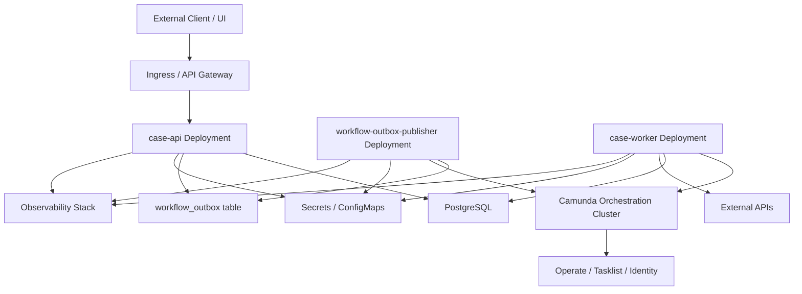

Practical runtime roles:

| Deployment | Tugas | Worker enabled? | Public HTTP? |
|---|---|---:|---:|
| `case-api` | REST command/query/task API | Tidak | Ya |
| `case-worker` | Camunda job worker | Ya | Tidak / hanya health |
| `workflow-outbox-publisher` | publish command dari DB ke Camunda | Tidak, kecuali scheduler internal | Tidak / hanya health |
| `task-sync` optional | sync Camunda tasks ke PostgreSQL projection | Tidak | Tidak |
| `reconciliation-job` | repair stuck outbox/workflow states | Tidak | Tidak |

---

# 3. Kenapa API dan worker sebaiknya dipisah?

## 3.1 Combined deployment

```text id="ik4stj"
case-service:
  REST API + worker dalam satu pod
```

Cocok untuk:

```text id="ky1jwu"
- local dev
- proof of concept
- traffic kecil
- onboarding cepat
```

Risiko production:

```text id="vmtuv2"
- worker load mengganggu REST latency
- scaling API berarti scaling worker juga
- worker incident bisa memengaruhi API availability
- shutdown lebih sulit
- resource profile berbeda dicampur
```

## 3.2 Split deployment

```text id="jrlgca"
case-api:
  REST only

case-worker:
  worker only

workflow-outbox-publisher:
  outbox publishing only
```

Rekomendasi untuk enterprise production:

```text id="8y6bsy"
Split API, worker, dan publisher.
```

Manfaat:

```text id="y3dxq5"
- API scale berdasarkan HTTP traffic
- worker scale berdasarkan job backlog/throughput
- publisher scale berdasarkan outbox pending age
- resource limit lebih presisi
- rolling deployment lebih aman
- incident blast radius lebih kecil
```

---

# 4. Container image baseline

## 4.1 Dockerfile multi-stage

```dockerfile id="kf1lov"
# syntax=docker/dockerfile:1

FROM eclipse-temurin:17-jdk AS build
WORKDIR /workspace

COPY .mvn .mvn
COPY mvnw pom.xml ./
COPY src ./src

RUN ./mvnw -B -DskipTests package

FROM eclipse-temurin:17-jre
WORKDIR /app

RUN useradd --system --uid 10001 appuser

COPY --from=build /workspace/target/case-service.jar /app/app.jar

USER 10001

ENV JAVA_OPTS="-XX:MaxRAMPercentage=75.0 -XX:+ExitOnOutOfMemoryError"

EXPOSE 8080

ENTRYPOINT ["sh", "-c", "java $JAVA_OPTS -jar /app/app.jar"]
```

Production notes:

```text id="vkgf3m"
[ ] Pakai non-root user.
[ ] Jangan bake secret ke image.
[ ] Image immutable per release.
[ ] Java memory config aware container limit.
[ ] Health endpoint tersedia.
[ ] Log ke stdout/stderr structured JSON.
```

---

# 5. Runtime modes

Gunakan satu image yang sama, tetapi mode berbeda lewat env.

```text id="l6f1ce"
APP_MODE=api
APP_MODE=worker
APP_MODE=outbox-publisher
APP_MODE=reconciliation
```

Atau:

```text id="gi840z"
HTTP_ENABLED=true/false
CAMUNDA_WORKER_ENABLED=true/false
OUTBOX_PUBLISHER_ENABLED=true/false
RECONCILIATION_ENABLED=true/false
```

Rekomendasi:

```text id="m7ls8i"
Untuk simplicity:
  satu image, beberapa deployment, env beda.

Untuk strict separation:
  image berbeda per module jika codebase/module juga terpisah.
```

---

# 6. Environment configuration

## 6.1 Common env

```yaml id="ct3crm"
env:
  - name: APP_ENV
    value: "prod"

  - name: DB_JDBC_URL
    valueFrom:
      secretKeyRef:
        name: case-db-secret
        key: jdbc-url

  - name: DB_USERNAME
    valueFrom:
      secretKeyRef:
        name: case-db-secret
        key: username

  - name: DB_PASSWORD
    valueFrom:
      secretKeyRef:
        name: case-db-secret
        key: password

  - name: CAMUNDA_REST_ADDRESS
    value: "https://camunda-orchestration.company.internal/v2"

  - name: CAMUNDA_GRPC_ADDRESS
    value: "https://camunda-zeebe-gateway.company.internal:26500"

  - name: CAMUNDA_AUTH_MODE
    value: "oidc"

  - name: CAMUNDA_CLIENT_ID
    valueFrom:
      secretKeyRef:
        name: camunda-client-secret
        key: client-id

  - name: CAMUNDA_CLIENT_SECRET
    valueFrom:
      secretKeyRef:
        name: camunda-client-secret
        key: client-secret

  - name: CAMUNDA_TOKEN_AUDIENCE
    valueFrom:
      secretKeyRef:
        name: camunda-client-secret
        key: audience
```

Camunda Java Client dapat dikonfigurasi dengan REST/gRPC address; REST menjadi default di Camunda Java Client modern, dan gRPC masih bisa dipakai/configurable. Untuk production, gunakan auth/service account sesuai setup Identity/OIDC. ([Camunda 8 Docs](https://docs.camunda.io/docs/apis-tools/java-client/job-worker/?utm_source=chatgpt.com))

---

## 6.2 Worker-specific env

```yaml id="eid4a1"
env:
  - name: HTTP_ENABLED
    value: "true"

  - name: PUBLIC_API_ENABLED
    value: "false"

  - name: CAMUNDA_WORKER_ENABLED
    value: "true"

  - name: OUTBOX_PUBLISHER_ENABLED
    value: "false"

  - name: WORKER_NAME_PREFIX
    valueFrom:
      fieldRef:
        fieldPath: metadata.name

  - name: WORKER_VALIDATE_CASE_MAX_JOBS_ACTIVE
    value: "32"

  - name: WORKER_CALCULATE_RISK_MAX_JOBS_ACTIVE
    value: "16"

  - name: WORKER_NOTIFY_RESULT_MAX_JOBS_ACTIVE
    value: "8"

  - name: WORKER_RETRY_BACKOFF
    value: "PT30S"
```

Kenapa `WORKER_NAME_PREFIX` dari pod name?

```text id="fq8po7"
Agar log/Operate/debug bisa mengaitkan job worker ke pod tertentu.
```

---

## 6.3 API-specific env

```yaml id="l8iz3b"
env:
  - name: HTTP_ENABLED
    value: "true"

  - name: PUBLIC_API_ENABLED
    value: "true"

  - name: CAMUNDA_WORKER_ENABLED
    value: "false"

  - name: OUTBOX_PUBLISHER_ENABLED
    value: "false"
```

---

## 6.4 Outbox publisher env

```yaml id="5fc1lh"
env:
  - name: HTTP_ENABLED
    value: "true"

  - name: PUBLIC_API_ENABLED
    value: "false"

  - name: CAMUNDA_WORKER_ENABLED
    value: "false"

  - name: OUTBOX_PUBLISHER_ENABLED
    value: "true"

  - name: OUTBOX_BATCH_SIZE
    value: "50"

  - name: OUTBOX_POLL_INTERVAL
    value: "PT2S"

  - name: OUTBOX_WORKER_ID
    valueFrom:
      fieldRef:
        fieldPath: metadata.name
```

---

# 7. Kubernetes Deployment - case-api

```yaml id="la8h67"
apiVersion: apps/v1
kind: Deployment
metadata:
  name: case-api
  labels:
    app: case-api
spec:
  replicas: 3
  selector:
    matchLabels:
      app: case-api
  template:
    metadata:
      labels:
        app: case-api
    spec:
      containers:
        - name: case-api
          image: registry.company.internal/case-service:1.0.0
          ports:
            - name: http
              containerPort: 8080

          env:
            - name: APP_MODE
              value: "api"
            - name: PUBLIC_API_ENABLED
              value: "true"
            - name: CAMUNDA_WORKER_ENABLED
              value: "false"
            - name: OUTBOX_PUBLISHER_ENABLED
              value: "false"

          envFrom:
            - configMapRef:
                name: case-service-config
            - secretRef:
                name: case-service-secret

          readinessProbe:
            httpGet:
              path: /health/ready
              port: http
            initialDelaySeconds: 10
            periodSeconds: 10
            timeoutSeconds: 3
            failureThreshold: 3

          livenessProbe:
            httpGet:
              path: /health/live
              port: http
            initialDelaySeconds: 30
            periodSeconds: 20
            timeoutSeconds: 3
            failureThreshold: 3

          resources:
            requests:
              cpu: "250m"
              memory: "512Mi"
            limits:
              cpu: "1"
              memory: "1Gi"
```

Kubernetes menyediakan readiness/liveness/startup probes untuk menentukan apakah container siap menerima traffic, masih hidup, atau butuh waktu startup lebih lama. Readiness API service sebaiknya mengecek dependency yang benar-benar wajib untuk menerima request, sedangkan liveness jangan terlalu bergantung pada dependency eksternal agar pod tidak restart-loop saat DB/Camunda sedang outage. ([Kubernetes](https://kubernetes.io/?utm_source=chatgpt.com))

---

# 8. Kubernetes Service - case-api

```yaml id="s1t1fh"
apiVersion: v1
kind: Service
metadata:
  name: case-api
spec:
  type: ClusterIP
  selector:
    app: case-api
  ports:
    - name: http
      port: 80
      targetPort: http
```

Ingress/API Gateway biasanya mengarah ke `case-api` service, bukan ke worker.

```text id="kznosr"
External traffic:
  Ingress/API Gateway -> case-api Service -> case-api Pods

No external traffic:
  case-worker
  workflow-outbox-publisher
  reconciliation-job
```

---

# 9. Kubernetes Deployment - case-worker

```yaml id="9s7w2f"
apiVersion: apps/v1
kind: Deployment
metadata:
  name: case-worker
  labels:
    app: case-worker
spec:
  replicas: 3
  selector:
    matchLabels:
      app: case-worker
  template:
    metadata:
      labels:
        app: case-worker
    spec:
      terminationGracePeriodSeconds: 90

      containers:
        - name: case-worker
          image: registry.company.internal/case-service:1.0.0
          ports:
            - name: http
              containerPort: 8080

          env:
            - name: APP_MODE
              value: "worker"
            - name: PUBLIC_API_ENABLED
              value: "false"
            - name: CAMUNDA_WORKER_ENABLED
              value: "true"
            - name: OUTBOX_PUBLISHER_ENABLED
              value: "false"
            - name: WORKER_NAME_PREFIX
              valueFrom:
                fieldRef:
                  fieldPath: metadata.name

          envFrom:
            - configMapRef:
                name: case-service-config
            - secretRef:
                name: case-service-secret

          readinessProbe:
            httpGet:
              path: /health/ready
              port: http
            initialDelaySeconds: 10
            periodSeconds: 10
            timeoutSeconds: 3
            failureThreshold: 3

          livenessProbe:
            httpGet:
              path: /health/live
              port: http
            initialDelaySeconds: 30
            periodSeconds: 20
            timeoutSeconds: 3
            failureThreshold: 3

          lifecycle:
            preStop:
              exec:
                command:
                  - /bin/sh
                  - -c
                  - "sleep 10"

          resources:
            requests:
              cpu: "500m"
              memory: "1Gi"
            limits:
              cpu: "2"
              memory: "2Gi"
```

Kubernetes menjalankan `preStop` sebelum mengirim TERM, dan default `terminationGracePeriodSeconds` adalah 30 detik jika tidak diubah. Untuk worker, grace period harus cukup untuk berhenti mengambil job baru dan memberi waktu handler yang sedang berjalan selesai atau gagal secara aman. ([Kubernetes](https://kubernetes.io/docs/concepts/workloads/pods/pod-lifecycle/?utm_source=chatgpt.com))

---

# 10. Worker graceful shutdown

## 10.1 Shutdown sequence

```text id="v09d5c"
1. Pod receives termination signal.
2. readiness becomes false / pod removed from Service endpoints.
3. app stops accepting public work if any.
4. close JobWorker instances.
5. let in-flight handlers finish if runtime supports it.
6. close CamundaClient.
7. close DB pool.
8. JVM exits.
```

## 10.2 Java lifecycle

```java id="rzpzpe"
public final class WorkerApplicationLifecycle implements AutoCloseable {

    private final WorkerRegistry workerRegistry;
    private final CamundaClient camundaClient;
    private final DataSource dataSource;
    private final AtomicBoolean closing = new AtomicBoolean(false);

    public WorkerApplicationLifecycle(
            WorkerRegistry workerRegistry,
            CamundaClient camundaClient,
            DataSource dataSource
    ) {
        this.workerRegistry = workerRegistry;
        this.camundaClient = camundaClient;
        this.dataSource = dataSource;
    }

    public void start() {
        Runtime.getRuntime().addShutdownHook(new Thread(this::close));
        workerRegistry.openAll();
    }

    public boolean isReady() {
        return !closing.get();
    }

    @Override
    public void close() {
        if (!closing.compareAndSet(false, true)) {
            return;
        }

        workerRegistry.close();
        camundaClient.close();

        closeDataSource();
    }

    private void closeDataSource() {
        if (dataSource instanceof AutoCloseable closeable) {
            try {
                closeable.close();
            } catch (Exception ignored) {
                // log in real implementation
            }
        }
    }
}
```

## 10.3 Readiness flips during shutdown

```java id="z6xn1w"
@Path("/health/ready")
public final class ReadinessResource {

    private final WorkerApplicationLifecycle lifecycle;
    private final DatabaseHealthCheck databaseHealthCheck;
    private final CamundaHealthCheck camundaHealthCheck;

    @GET
    public Response ready() {
        if (!lifecycle.isReady()) {
            return Response.status(503)
                .entity(Map.of("status", "SHUTTING_DOWN"))
                .build();
        }

        databaseHealthCheck.check();
        camundaHealthCheck.check();

        return Response.ok(Map.of("status", "UP")).build();
    }
}
```

---

# 11. Job timeout vs pod termination

Camunda job timeout penting di Kubernetes.

Camunda menjelaskan jika job tidak completed/failed dalam activation timeout, Zeebe bisa reassign job ke worker lain; ini dapat menyebabkan dua worker mengerjakan job yang sama, dan hanya satu complete command yang berhasil. Karena itu deployment shutdown dan worker handler harus idempotent. ([Camunda 8 Docs](https://docs.camunda.io/docs/components/concepts/job-workers/?utm_source=chatgpt.com))

Practical rules:

```text id="jx8u0v"
job timeout:
  harus lebih panjang dari p99 handler duration

terminationGracePeriodSeconds:
  harus cukup untuk close worker dan in-flight handler normal

worker idempotency:
  wajib, karena duplicate execution tetap mungkin
```

Example:

| Job Type | p95 Duration | Job Timeout | Pod Grace |
|---|---:|---:|---:|
| `validate-case` | 500ms | 30s | 60s |
| `calculate-risk-score` | 5s | 60s | 90s |
| `notify-case-result` | 3s | 60s | 90s |
| `generate-document` | 45s | 5m | 6m |

---

# 12. Worker concurrency tuning

Camunda Java worker dapat mengatur `maxJobsActive`, timeout, poll/backoff behavior. Saat poll error, worker menerapkan backoff strategy supaya cluster punya waktu recovery; polling dan activation juga dipengaruhi oleh request timeout/long polling. ([Camunda 8 Docs](https://docs.camunda.io/docs/apis-tools/java-client/job-worker/?utm_source=chatgpt.com))

## 12.1 Effective concurrency

```text id="h2mfmh"
potential active jobs =
  replicas * maxJobsActive
```

Contoh:

```text id="i56b2f"
case-worker replicas = 4
calculate-risk-score maxJobsActive = 16

Potential active calculate-risk jobs = 64
```

## 12.2 Jangan scale worker tanpa melihat downstream

Checklist sebelum menaikkan replica/maxJobsActive:

```text id="l9wr72"
[ ] PostgreSQL connection pool cukup?
[ ] External API rate limit cukup?
[ ] Camunda cluster capacity cukup?
[ ] Job timeout cukup untuk p99 duration?
[ ] Retry storm terkendali?
[ ] Worker idempotency sudah proven?
```

## 12.3 Suggested starting values

| Job Type | maxJobsActive | Notes |
|---|---:|---|
| `validate-case` | 16-32 | DB-heavy, biasanya cepat |
| `calculate-risk-score` | 8-16 | external API risk engine |
| `notify-case-result` | 4-16 | side effect, avoid duplicates/rate limit |
| `classify-documents` | 4-8 | CPU/external service heavy |
| `sync-case-status` | 16-32 | internal DB/API |

---

# 13. HPA strategy

Kubernetes Horizontal Pod Autoscaler mengatur jumlah replica workload berdasarkan metric seperti CPU/memory atau custom/external metrics. HPA bekerja pada workload yang punya scale subresource seperti Deployment atau StatefulSet. ([Kubernetes](https://kubernetes.io/docs/concepts/workloads/autoscaling/horizontal-pod-autoscale/?utm_source=chatgpt.com))

## 13.1 API HPA

API bisa scale berdasarkan CPU/RPS/latency.

```yaml id="i1x1rx"
apiVersion: autoscaling/v2
kind: HorizontalPodAutoscaler
metadata:
  name: case-api-hpa
spec:
  scaleTargetRef:
    apiVersion: apps/v1
    kind: Deployment
    name: case-api
  minReplicas: 3
  maxReplicas: 10
  metrics:
    - type: Resource
      resource:
        name: cpu
        target:
          type: Utilization
          averageUtilization: 60
```

## 13.2 Worker HPA

Worker lebih baik scale berdasarkan **job/backlog metrics**, bukan CPU saja.

Useful metrics:

```text id="oe7h36"
- active jobs by jobType
- job completion rate
- job activation latency
- incident count
- worker handler duration p95
- outbox pending age
- outbox pending count
```

Example conceptual HPA with custom metric:

```yaml id="a6ynfp"
apiVersion: autoscaling/v2
kind: HorizontalPodAutoscaler
metadata:
  name: case-worker-hpa
spec:
  scaleTargetRef:
    apiVersion: apps/v1
    kind: Deployment
    name: case-worker
  minReplicas: 2
  maxReplicas: 12
  metrics:
    - type: Pods
      pods:
        metric:
          name: camunda_worker_active_jobs
        target:
          type: AverageValue
          averageValue: "20"
```

## 13.3 Caution

```text id="gfudf4"
Scaling worker replicas increases:
  job activation pressure
  DB connection usage
  downstream API calls
  possible duplicate retry pressure
```

Jadi HPA worker harus dipasangkan dengan:

```text id="r1h9p6"
- maxJobsActive limit
- DB pool sizing
- downstream rate limit
- circuit breaker/backoff
- idempotency
```

---

# 14. Outbox publisher deployment

```yaml id="vzvjyo"
apiVersion: apps/v1
kind: Deployment
metadata:
  name: workflow-outbox-publisher
  labels:
    app: workflow-outbox-publisher
spec:
  replicas: 2
  selector:
    matchLabels:
      app: workflow-outbox-publisher
  template:
    metadata:
      labels:
        app: workflow-outbox-publisher
    spec:
      containers:
        - name: workflow-outbox-publisher
          image: registry.company.internal/case-service:1.0.0
          ports:
            - name: http
              containerPort: 8080

          env:
            - name: APP_MODE
              value: "outbox-publisher"
            - name: PUBLIC_API_ENABLED
              value: "false"
            - name: CAMUNDA_WORKER_ENABLED
              value: "false"
            - name: OUTBOX_PUBLISHER_ENABLED
              value: "true"
            - name: OUTBOX_WORKER_ID
              valueFrom:
                fieldRef:
                  fieldPath: metadata.name
            - name: OUTBOX_BATCH_SIZE
              value: "50"
            - name: OUTBOX_POLL_INTERVAL
              value: "PT2S"

          envFrom:
            - configMapRef:
                name: case-service-config
            - secretRef:
                name: case-service-secret

          readinessProbe:
            httpGet:
              path: /health/ready
              port: http

          livenessProbe:
            httpGet:
              path: /health/live
              port: http

          resources:
            requests:
              cpu: "250m"
              memory: "512Mi"
            limits:
              cpu: "1"
              memory: "1Gi"
```

Outbox publisher boleh multi-replica jika query locking memakai `for update skip locked` seperti di Seri 11.

---

# 15. Reconciliation as CronJob

```yaml id="a3sr9u"
apiVersion: batch/v1
kind: CronJob
metadata:
  name: workflow-reconciliation
spec:
  schedule: "*/5 * * * *"
  concurrencyPolicy: Forbid
  successfulJobsHistoryLimit: 3
  failedJobsHistoryLimit: 3
  jobTemplate:
    spec:
      template:
        spec:
          restartPolicy: Never
          containers:
            - name: reconciliation
              image: registry.company.internal/case-service:1.0.0
              env:
                - name: APP_MODE
                  value: "reconciliation"
                - name: RECONCILIATION_ENABLED
                  value: "true"
              envFrom:
                - configMapRef:
                    name: case-service-config
                - secretRef:
                    name: case-service-secret
```

Reconciliation job responsibilities:

```text id="k5jpaj"
[ ] reset stale PROCESSING outbox rows
[ ] detect START_PENDING too long
[ ] detect workflow STARTED but processInstanceKey missing
[ ] detect task projection stale
[ ] produce alerts / repair safe states
```

---

# 16. ConfigMap vs Secret

## 16.1 ConfigMap

Use for non-sensitive config:

```yaml id="1hay4s"
apiVersion: v1
kind: ConfigMap
metadata:
  name: case-service-config
data:
  APP_ENV: "prod"
  CAMUNDA_REST_ADDRESS: "https://camunda-orchestration.company.internal/v2"
  CAMUNDA_GRPC_ADDRESS: "https://camunda-zeebe-gateway.company.internal:26500"
  OUTBOX_BATCH_SIZE: "50"
  OUTBOX_POLL_INTERVAL: "PT2S"
  WORKER_VALIDATE_CASE_MAX_JOBS_ACTIVE: "32"
  WORKER_CALCULATE_RISK_MAX_JOBS_ACTIVE: "16"
```

## 16.2 Secret

Use for sensitive config:

```yaml id="6b6bln"
apiVersion: v1
kind: Secret
metadata:
  name: case-service-secret
type: Opaque
stringData:
  DB_JDBC_URL: "jdbc:postgresql://postgres.company.internal:5432/casedb"
  DB_USERNAME: "case_app"
  DB_PASSWORD: "replace-me"
  CAMUNDA_CLIENT_ID: "case-service"
  CAMUNDA_CLIENT_SECRET: "replace-me"
  CAMUNDA_TOKEN_AUDIENCE: "camunda-api"
```

Kubernetes Secrets dan ConfigMaps bisa digunakan untuk memasukkan konfigurasi ke Pod; data Secret dimaksudkan untuk data sensitif seperti credentials, tetapi tetap perlu setup security cluster yang benar seperti encryption at rest/RBAC/secret manager integration. ([Wikipedia](https://en.wikipedia.org/wiki/Kubernetes?utm_source=chatgpt.com))

Practical production note:

```text id="6k7z2y"
Lebih baik integrasikan:
  - AWS Secrets Manager / External Secrets Operator
  - Azure Key Vault CSI Provider
  - HashiCorp Vault
  - sealed-secrets / SOPS
```

Jangan commit secret plaintext ke GitHub.

---

# 17. Network policy

## 17.1 Worker allowed egress

```text id="vga04o"
case-worker should access:
  - Camunda gateway/orchestration API
  - PostgreSQL
  - required external APIs
  - observability endpoints

case-worker should not access:
  - public internet broadly
  - unrelated internal systems
```

Example conceptual NetworkPolicy:

```yaml id="xbxdec"
apiVersion: networking.k8s.io/v1
kind: NetworkPolicy
metadata:
  name: case-worker-egress
spec:
  podSelector:
    matchLabels:
      app: case-worker
  policyTypes:
    - Egress
  egress:
    - to:
        - namespaceSelector:
            matchLabels:
              name: camunda
      ports:
        - protocol: TCP
          port: 8080
        - protocol: TCP
          port: 26500
    - to:
        - namespaceSelector:
            matchLabels:
              name: database
      ports:
        - protocol: TCP
          port: 5432
```

Sesuaikan dengan CNI/network policy implementation di platform perusahaan.

---

# 18. Service account and RBAC

Untuk aplikasi worker biasa, Kubernetes service account biasanya hanya perlu akses minimal ke API Kubernetes, atau tidak perlu akses sama sekali.

```yaml id="sb3yqu"
apiVersion: v1
kind: ServiceAccount
metadata:
  name: case-worker
```

Pod:

```yaml id="a721bw"
spec:
  serviceAccountName: case-worker
  automountServiceAccountToken: false
```

Gunakan `automountServiceAccountToken: false` jika aplikasi tidak perlu memanggil Kubernetes API.

---

# 19. Pod security baseline

```yaml id="l8hzmn"
securityContext:
  runAsNonRoot: true
  runAsUser: 10001
  fsGroup: 10001

containers:
  - name: case-worker
    securityContext:
      allowPrivilegeEscalation: false
      readOnlyRootFilesystem: true
      capabilities:
        drop:
          - ALL
```

Jika aplikasi butuh temporary directory:

```yaml id="bviksh"
volumeMounts:
  - name: tmp
    mountPath: /tmp

volumes:
  - name: tmp
    emptyDir: {}
```

---

# 20. JVM and resource sizing

## 20.1 Java container memory

Set JVM aware of container memory:

```yaml id="3t52g1"
env:
  - name: JAVA_OPTS
    value: >-
      -XX:MaxRAMPercentage=75.0
      -XX:+ExitOnOutOfMemoryError
      -Dfile.encoding=UTF-8
```

## 20.2 Worker resource sizing

| Component | CPU | Memory | Scaling Driver |
|---|---:|---:|---|
| `case-api` | medium | medium | RPS/latency |
| `case-worker` DB-heavy | medium | medium | job throughput |
| `case-worker` CPU-heavy | high | medium/high | CPU/job duration |
| `outbox-publisher` | low/medium | low | outbox pending age/count |
| `reconciliation` | low | low | scheduled |

## 20.3 DB pool formula

```text id="b79t8m"
total potential DB connections =
  replicas * maxPoolSize
```

Example:

```text id="ld11d6"
case-worker replicas = 6
Hikari maxPoolSize = 20

Potential DB connections = 120
```

Check PostgreSQL max connections and other apps before scaling.

---

# 21. Kubernetes probes by role

## 21.1 API readiness

Should check:

```text id="qysflq"
- application initialized
- DB reachable
- required config loaded
```

Maybe check Camunda?

```text id="2l1o5q"
If API only writes outbox and does not synchronously call Camunda:
  Camunda may not be required for readiness.

If API directly completes task/calls Camunda:
  Camunda may be required for readiness.
```

## 21.2 Worker readiness

Should check:

```text id="f5taq4"
- app not shutting down
- DB reachable
- Camunda reachable
- worker registry opened
```

## 21.3 Publisher readiness

Should check:

```text id="yhitk9"
- DB reachable
- Camunda reachable
- not shutting down
```

## 21.4 Liveness

Should usually check:

```text id="grxolt"
- JVM alive
- app main loop not deadlocked
```

Avoid heavy downstream checks in liveness.

---

# 22. Health endpoints

```java id="7j4mgn"
@Path("/health/live")
public final class LivenessResource {

    @GET
    @Produces(MediaType.APPLICATION_JSON)
    public Response live() {
        return Response.ok(Map.of(
            "status", "UP"
        )).build();
    }
}
```

```java id="6cxdip"
@Path("/health/ready")
public final class ReadinessResource {

    private final AppMode appMode;
    private final DatabaseHealthCheck database;
    private final CamundaHealthCheck camunda;
    private final ShutdownState shutdownState;

    @GET
    @Produces(MediaType.APPLICATION_JSON)
    public Response ready() {
        if (shutdownState.isShuttingDown()) {
            return down("SHUTTING_DOWN");
        }

        try {
            database.check();

            if (appMode.requiresCamundaForReadiness()) {
                camunda.check();
            }

            return Response.ok(Map.of(
                "status", "UP",
                "mode", appMode.name()
            )).build();

        } catch (Exception ex) {
            return Response.status(503)
                .entity(Map.of(
                    "status", "DOWN",
                    "mode", appMode.name(),
                    "reason", ex.getClass().getSimpleName()
                ))
                .build();
        }
    }

    private Response down(String reason) {
        return Response.status(503)
            .entity(Map.of(
                "status", "DOWN",
                "reason", reason
            ))
            .build();
    }
}
```

---

# 23. Rolling update strategy

```yaml id="55f2hz"
strategy:
  type: RollingUpdate
  rollingUpdate:
    maxUnavailable: 0
    maxSurge: 1
```

For worker:

```text id="yzbpdp"
Use rolling update carefully:
  old worker and new worker may run at the same time.
```

Backward compatibility requirements:

```text id="61zhes"
[ ] new BPMN job types have workers deployed before process reaches them
[ ] old job types remain supported while old process instances exist
[ ] variable names remain backward-compatible
[ ] task form versions remain supported
```

Deployment ordering example:

```text id="4qd16f"
1. Deploy worker supporting old + new job types.
2. Deploy BPMN new version.
3. Deploy API changes that start/use new path.
4. Monitor incidents.
5. Remove old worker compatibility only after old instances complete/migrate.
```

---

# 24. Blue/green and canary

## 24.1 API canary

API canary is common:

```text id="gixb2c"
route 5% traffic to new case-api
monitor latency/errors
increase gradually
```

## 24.2 Worker canary

Worker canary is trickier:

```text id="8y67ve"
Camunda dispatches jobs by job type.
If old and new workers subscribe same job type,
both may process jobs.
```

Safer worker canary options:

```text id="b4kqlg"
Option A:
  deploy new worker code that is backward-compatible
  same job type

Option B:
  use new job type in BPMN v2
  deploy worker v2 for new job type
  only new process version uses it

Option C:
  feature flag inside worker
  but keep idempotency and observability strong
```

---

# 25. Camunda deployment topology

## 25.1 Camunda Self-Managed on Kubernetes

Camunda reference architecture says Kubernetes deployment is suited to containerization, self-healing, scalability, and resilience through multi-zone deployments. Helm is the recommended production deployment path for Camunda Self-Managed. ([Camunda 8 Docs](https://docs.camunda.io/docs/self-managed/reference-architecture/kubernetes/?utm_source=chatgpt.com))

Topology:

```text id="7krxte"
Kubernetes namespace: camunda-orchestration
  - Orchestration Cluster
  - Gateway/API
  - Identity/Auth
  - Tasklist/Operate
  - secondary storage

Kubernetes namespace: case-platform
  - case-api
  - case-worker
  - outbox-publisher
  - task-sync
```

## 25.2 SaaS Camunda

```text id="299zdx"
case-platform cluster:
  - case-api
  - case-worker
  - outbox-publisher

Camunda SaaS:
  - external endpoint
  - OIDC credentials
  - network egress required
```

## 25.3 Workers external to Camunda cluster

Camunda Helm docs explicitly mention the architectural decision of whether workers run inside the Kubernetes cluster or externally; networking and cluster configuration must match that decision. ([Camunda 8 Docs](https://docs.camunda.io/docs/self-managed/deployment/helm/?utm_source=chatgpt.com))

---

# 26. On-prem / AWS / Azure notes

## 26.1 On-prem Kubernetes / OpenShift

Watch:

```text id="3eh7yc"
- internal DNS and TLS
- corporate proxy
- private image registry
- network policy/firewall
- DB managed by DBA team
- secret rotation process
- storage class and backup
- certificate truststore in Java image
```

Camunda states Self-Managed production can run on certified Kubernetes distributions, including providers like Red Hat OpenShift and Amazon EKS. ([Camunda 8 Docs](https://docs.camunda.io/docs/self-managed/setup/overview/?utm_source=chatgpt.com))

## 26.2 AWS EKS

Common integrations:

```text id="ss2n71"
- ECR for images
- IRSA for AWS service permissions
- Secrets Manager / External Secrets
- RDS PostgreSQL
- OpenSearch if used by Camunda setup
- ALB Ingress Controller
- CloudWatch/Prometheus/Grafana
```

Camunda provides an EKS Helm installation guide and mentions optional AWS-managed services such as OpenSearch and PostgreSQL in that context. ([Camunda 8 Docs](https://docs.camunda.io/docs/8.7/self-managed/setup/deploy/amazon/amazon-eks/eks-helm/?utm_source=chatgpt.com))

## 26.3 Azure AKS

Common integrations:

```text id="3ddcs5"
- ACR for images
- Workload Identity
- Azure Key Vault CSI Provider
- Azure Database for PostgreSQL
- Azure Blob Storage for document handling
- Application Gateway Ingress Controller
- Azure Monitor / managed Prometheus
```

Camunda document handling docs list Azure Blob Storage as a supported storage option, and warn that in-memory document storage is not suitable for production because data is lost when applications stop and memory is not shared across components. ([Camunda 8 Docs](https://docs.camunda.io/docs/self-managed/concepts/document-handling/configuration/helm/?utm_source=chatgpt.com))

---

# 27. Observability

## 27.1 Required logs

Every app role should log:

```text id="m8osd3"
- appMode
- podName
- namespace
- version/gitSha
- caseId
- processInstanceKey
- jobType
- jobKey
- outboxId
- commandKey
- idempotencyKey
- durationMs
- errorCategory/errorCode
```

## 27.2 Metrics

API:

```text id="33cm2r"
http_requests_total
http_request_duration_seconds
api_idempotency_hit_total
api_errors_total
```

Worker:

```text id="ixetbb"
camunda_worker_job_started_total{jobType}
camunda_worker_job_completed_total{jobType}
camunda_worker_job_failed_total{jobType,errorCategory}
camunda_worker_job_duration_seconds{jobType}
camunda_worker_idempotency_hit_total{jobType}
```

Outbox:

```text id="vrndzq"
workflow_outbox_pending_count
workflow_outbox_failed_final_count
workflow_outbox_pending_age_seconds
workflow_outbox_publish_duration_seconds
workflow_outbox_retry_total
```

Task:

```text id="y886to"
worklist_active_tasks_count
worklist_overdue_tasks_count
task_completion_total
task_completion_error_total
```

## 27.3 Alerts

```text id="vycr80"
[ ] outbox pending age p95 > SLA
[ ] failed final outbox count > 0
[ ] Camunda incident count > threshold
[ ] worker job failure rate > threshold
[ ] worker p99 duration near job timeout
[ ] DB pool usage high
[ ] API 5xx rate high
[ ] task overdue count high
```

---

# 28. Deployment smoke tests

After deploy:

```text id="n4qflj"
[ ] /health/live returns UP.
[ ] /health/ready returns UP.
[ ] case-api can connect to PostgreSQL.
[ ] outbox-publisher can connect to PostgreSQL + Camunda.
[ ] case-worker can connect to PostgreSQL + Camunda.
[ ] POST /cases creates case + outbox.
[ ] outbox-publisher starts process.
[ ] worker completes validate-case.
[ ] Operate shows process instance.
[ ] logs contain pod/version/caseId.
```

Do not run destructive production workflow tests unless specifically designed with test tenant/process and cleanup.

---

# 29. Failure mode table

| Failure | Symptom | Mitigation |
|---|---|---|
| Camunda unavailable | outbox pending grows, worker readiness down | outbox retry, alert, do not lose commands |
| PostgreSQL unavailable | API/worker/publisher readiness down | fail fast, no partial writes |
| Worker pod killed | job may timeout/reassign | idempotency + graceful shutdown |
| Worker version mismatch | incidents for unknown job type/variable | deploy order + contract tests |
| DB pool exhausted | API/worker latency, failures | reduce maxJobsActive/replicas, tune pool |
| Downstream rate limit | worker failures 429 | backoff, lower concurrency |
| Secret expired | 401/403 to Camunda/downstream | secret rotation alert/runbook |
| Outbox publisher crash | PROCESSING rows stuck | reconciliation resets stale locks |
| HPA over-scales worker | downstream overload | custom metrics + maxJobsActive caps |
| Rolling update during long jobs | duplicate execution | timeout/grace/idempotency |

---

# 30. Anti-patterns

| Anti-pattern | Risiko | Koreksi |
|---|---|---|
| API and worker always combined in prod | scaling/latency coupling | split deployments |
| Docker Compose for production | unsupported topology risk | Kubernetes + Helm for Camunda |
| Worker liveness checks DB/Camunda deeply | restart storm during outage | keep liveness lightweight |
| No graceful shutdown | job timeout/duplicate processing spike | close JobWorker before client |
| maxJobsActive high by default | DB/API overload | tune by job type |
| HPA worker on CPU only | wrong scaling signal | use job/backlog/custom metrics |
| Secrets in ConfigMap/Git | credential leak | Secret/external secret manager |
| No NetworkPolicy | broad lateral movement | least-privilege network |
| No resource limits | noisy neighbor/OOM | requests/limits |
| Remove old job type too soon | old process incidents | backward-compatible deployment |
| Worker canary same job type without plan | mixed behavior | versioned job type or compatibility |
| No outbox publisher separation | API path blocks on Camunda | outbox-publisher deployment |
| No reconciliation CronJob | stuck PROCESSING forever | scheduled reconciliation |

---

# 31. Mini-lab Seri 15

## Goal

Deploy `case-api`, `case-worker`, dan `workflow-outbox-publisher` secara terpisah di Kubernetes.

## Tasks

```text id="z4n8mj"
[ ] Build Docker image.
[ ] Create ConfigMap.
[ ] Create Secret.
[ ] Deploy case-api with workers disabled.
[ ] Deploy case-worker with API disabled and workers enabled.
[ ] Deploy workflow-outbox-publisher.
[ ] Add readiness/liveness endpoints.
[ ] Add graceful shutdown hook.
[ ] Configure maxJobsActive per job type.
[ ] Add HPA for case-api.
[ ] Add worker HPA using custom metric if available.
[ ] Add reconciliation CronJob.
[ ] Add resource requests/limits.
[ ] Add NetworkPolicy.
```

## Validation checklist

```text id="c8vx6p"
[ ] case-api pod ready.
[ ] case-worker pod ready.
[ ] outbox-publisher pod ready.
[ ] POST /cases inserts case + outbox.
[ ] publisher starts Camunda process.
[ ] worker completes first service task.
[ ] Scale case-worker replicas up/down safely.
[ ] Terminate worker pod during job and verify idempotency.
[ ] Camunda down: outbox grows but API command remains durable.
[ ] Camunda recovers: publisher drains outbox.
[ ] Rolling update does not create incidents from missing job type.
```

---

# 32. Production checklist

```text id="6wrr8y"
[ ] Camunda Self-Managed uses Kubernetes/Helm for production.
[ ] Docker Compose is only used for local/dev/evaluation.
[ ] API and workers are separate deployments.
[ ] Outbox publisher is separate and horizontally safe.
[ ] Worker and publisher use service account credentials securely.
[ ] ConfigMaps contain non-sensitive config only.
[ ] Secrets/external secret manager holds credentials.
[ ] Readiness/liveness are role-specific.
[ ] Worker graceful shutdown closes workers before client.
[ ] terminationGracePeriodSeconds fits job duration.
[ ] maxJobsActive is tuned per job type.
[ ] DB pool sizing matches replicas.
[ ] HPA strategy is defined for API and worker.
[ ] NetworkPolicy restricts egress.
[ ] Pod security context uses non-root and no privilege escalation.
[ ] Resource requests/limits are set.
[ ] Observability includes job/outbox/task metrics.
[ ] Rolling update order supports old and new BPMN versions.
[ ] Reconciliation CronJob exists.
[ ] Smoke tests run after deploy.
```

---

# 33. Ringkasan Seri 15

```text id="nqionc"
case-api:
  public REST boundary
  workers disabled
  scales by HTTP traffic

case-worker:
  Camunda job executor
  public API disabled
  scales by job throughput and downstream capacity

workflow-outbox-publisher:
  reliable bridge from PostgreSQL outbox to Camunda
  scales with row locking and pending age metrics

Kubernetes:
  probes, resource limits, secrets, network policy, HPA, graceful shutdown

Camunda:
  workers must be idempotent because timeout/reassignment and shutdown can duplicate execution
```

Formula praktis:

```text id="i4yw6s"
Do not deploy Camunda workers like ordinary stateless HTTP apps.

Deploy them as:
  retry-safe,
  idempotent,
  gracefully shutting down,
  backpressure-aware,
  separately scalable process executors.
```

---

# Seri 15/16 selesai

Seri ini selesai: **Docker/Kubernetes Deployment Pattern for Camunda 8 Workers**.

Rekomendasi materi berikutnya:

**Seri 16/16 - Production Runbook: Observability, Incident Recovery, Scaling, Security.**  
Materinya akan fokus pada dashboard, alert, incident triage, retry/resolve incident, stuck process, outbox backlog, worker overload, security checklist, disaster recovery posture, dan daily/weekly operational checks.

---

**Sources:**

- [Camunda Helm chart](https://docs.camunda.io/docs/self-managed/deployment/helm/?utm_source=chatgpt.com)
- [Kubernetes](https://kubernetes.io/?utm_source=chatgpt.com)
- [Kubernetes](https://en.wikipedia.org/wiki/Kubernetes?utm_source=chatgpt.com)

## Response:
7/16/2026, 10:15:59 AM

Saya lanjut ke **Seri 16/16** sebagai penutup seri utama. Fokusnya runbook production: dashboard, alert, triage incident, recovery stuck process/outbox, scaling, security, dan checklist operasi harian/mingguan.

# Cheatsheet Camunda 8 + Java/Jersey Microservice  
## Seri 16/16 - Production Runbook: Observability, Incident Recovery, Scaling, Security

## 1. Fokus seri ini

Seri terakhir ini merangkum **runbook production** untuk aplikasi:

```text id="dyx9l0"
Java 17+
Jersey / Jakarta REST
MyBatis
PostgreSQL
Camunda 8
Docker / Kubernetes
On-Prem / AWS / Azure
```

Tujuannya: saat sistem production mengalami masalah, tim tidak hanya “lihat log”, tetapi punya alur jelas untuk menjawab:

```text id="6n3yyz"
Apa yang gagal?
Di mana gagal?
Apakah ini business error, technical failure, incident, outbox backlog, worker overload, atau security/config issue?
Apa yang aman untuk di-retry?
Apa yang tidak boleh di-retry?
Data mana yang harus dicek?
Dashboard apa yang dilihat?
Runbook apa yang dijalankan?
```

Dalam Camunda 8, incident harus diselesaikan dengan memperbaiki root cause terlebih dahulu, lalu incident ditandai resolved agar process execution dicoba lagi; jika masalah masih ada, incident baru akan muncul lagi. Ini sangat penting: **jangan resolve/retry incident sebelum root cause diperbaiki**. ([Camunda 8 Docs](https://docs.camunda.io/docs/components/concepts/incidents/?utm_source=chatgpt.com))

---

# 2. Production mental model

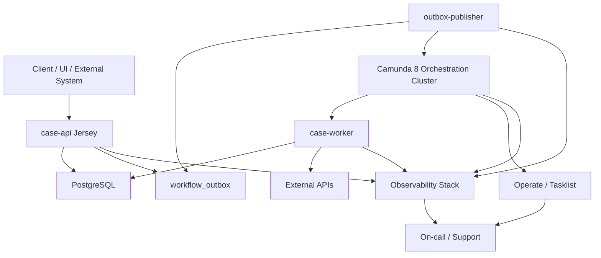

Core production view:

```text id="m53xwt"
case-api:
  menerima command/event/query/task action

PostgreSQL:
  system of record untuk business state, audit, outbox, idempotency

outbox-publisher:
  reliable bridge dari DB ke Camunda

Camunda:
  runtime orchestration state

case-worker:
  executor business action dari service task

Operate:
  operational tool untuk inspect process, variables, incidents, retry/cancel/batch operations

Tasklist/custom task UI:
  human work execution
```

Operate digunakan untuk melihat process instance, mendiagnosis incident, update variable tertentu, retry/cancel banyak process instance, dan operasi batch saat banyak instance terdampak root cause yang sama. ([Camunda 8 Docs](https://docs.camunda.io/docs/components/operate/operate-introduction/?utm_source=chatgpt.com))

---

# 3. Golden signals yang wajib dimonitor

## 3.1 API signals

```text id="1ilbjl"
http_request_rate
http_error_rate_4xx_5xx
http_request_duration_p95_p99
api_idempotency_hit_total
api_idempotency_conflict_total
db_connection_pool_usage
```

## 3.2 Outbox signals

```text id="s4kmgw"
workflow_outbox_pending_count
workflow_outbox_processing_count
workflow_outbox_failed_retryable_count
workflow_outbox_failed_final_count
workflow_outbox_oldest_pending_age_seconds
workflow_outbox_publish_success_rate
workflow_outbox_publish_failure_rate
```

## 3.3 Worker signals

```text id="mgdu1o"
camunda_worker_job_started_total{jobType}
camunda_worker_job_completed_total{jobType}
camunda_worker_job_failed_total{jobType,errorCategory}
camunda_worker_job_bpmn_error_total{jobType,errorCode}
camunda_worker_job_duration_p95_p99{jobType}
camunda_worker_idempotency_hit_total{jobType}
worker_active_jobs{jobType}
worker_downstream_error_total{downstream}
```

Camunda Java job workers adalah backbone service-task automation; mereka polling job, menjalankan business logic, lalu melaporkan complete/fail/error. Worker tuning, retries, timeout, dan metrics perlu dipantau karena job yang tidak selesai bisa memblokir process execution. ([Camunda 8 Docs](https://docs.camunda.io/docs/apis-tools/java-client/job-worker/?utm_source=chatgpt.com))

## 3.4 Camunda platform signals

```text id="tvkix9"
incident_count
incident_count_by_process
incident_count_by_element
job_activation_latency
gateway_error_rate
broker_health
partition_health
exporter_lag
backpressure_rejections
Operate/Tasklist availability
```

Camunda Self-Managed menyediakan monitoring/metrics melalui Spring Boot Actuator dan Micrometer, dengan integrasi ke Prometheus, OpenTelemetry, Datadog, dan Dynatrace. Metrics memberi insight lebih baik untuk broker/gateway/partition health dibanding hanya health endpoint. ([Camunda 8 Docs](https://docs.camunda.io/docs/self-managed/components/orchestration-cluster/core-settings/concepts/monitoring/?utm_source=chatgpt.com))

## 3.5 Human task signals

```text id="8ngfec"
active_tasks_count
available_tasks_count
assigned_tasks_count
overdue_tasks_count
task_completion_rate
task_completion_error_rate
maker_checker_violation_total
task_projection_sync_lag
```

---

# 4. Dashboard minimum

## 4.1 Executive operational dashboard

```text id="btv1ms"
[ ] Total active process instances
[ ] Total incidents
[ ] Incident trend 1h / 24h / 7d
[ ] Oldest incident age
[ ] Outbox pending count
[ ] Oldest outbox pending age
[ ] Worker success/failure rate
[ ] API 5xx rate
[ ] Overdue human tasks
```

## 4.2 Workflow platform dashboard

```text id="2sfnc4"
[ ] Camunda gateway availability
[ ] Broker/partition health
[ ] Backpressure events
[ ] Exporter lag / secondary storage lag
[ ] Operate/Tasklist availability
[ ] Incident count by BPMN process id
[ ] Incident count by element id
```

Backpressure di Zeebe adalah mekanisme proteksi agar broker tidak overload; jika backpressure aktif, request client dapat ditolak untuk menjaga stabilitas cluster. Ini harus masuk dashboard/alert karena impact-nya bisa terlihat sebagai failure pada API/worker/publisher. ([Camunda 8 Docs](https://docs.camunda.io/docs/reference/glossary/?utm_source=chatgpt.com))

## 4.3 Worker dashboard

```text id="op5kjd"
[ ] Job started/completed/failed by jobType
[ ] p95/p99 handler duration by jobType
[ ] Remaining retries distribution
[ ] Failure category distribution
[ ] Idempotency hit count
[ ] Downstream timeout/rate limit count
[ ] DB pool usage
[ ] Worker pod restarts
```

## 4.4 Outbox dashboard

```text id="tezv3m"
[ ] PENDING count
[ ] PROCESSING count
[ ] FAILED_RETRYABLE count
[ ] FAILED_FINAL count
[ ] Oldest pending age
[ ] Publish attempts by command_type
[ ] Publish duration p95/p99
[ ] Stale PROCESSING rows
```

## 4.5 Human task dashboard

```text id="g9vkhb"
[ ] Available tasks by candidate group
[ ] Assigned tasks by assignee
[ ] Overdue tasks by group
[ ] Task completion rate
[ ] Rework / NEED_MORE_INFO rate
[ ] Escalation count
[ ] Maker-checker violation attempts
```

---

# 5. Alert rules

## 5.1 Critical alerts

```text id="tx6ymz"
[CRITICAL] incident_count > threshold for 10m
[CRITICAL] workflow_outbox_failed_final_count > 0
[CRITICAL] workflow_outbox_oldest_pending_age > SLA
[CRITICAL] Camunda gateway unavailable
[CRITICAL] PostgreSQL unavailable
[CRITICAL] case-api 5xx rate > threshold
[CRITICAL] worker job failure rate > threshold
[CRITICAL] auth failures to Camunda spike
```

## 5.2 Warning alerts

```text id="qn3dl2"
[WARN] outbox pending count rising
[WARN] worker p99 duration near job timeout
[WARN] DB pool usage > 80%
[WARN] downstream 429 / rate-limit increasing
[WARN] overdue human tasks increasing
[WARN] exporter/secondary storage lag increasing
[WARN] worker pod restart count increasing
```

## 5.3 Business SLA alerts

```text id="hde8o7"
[WARN] Review Case overdue > 4 hours
[CRITICAL] High risk case unreviewed > SLA
[WARN] DocumentReceived waiting > SLA
[WARN] Case stuck START_PENDING > 5 minutes
[WARN] Case stuck UNDER_REVIEW > business SLA
```

---

# 6. Incident triage decision tree

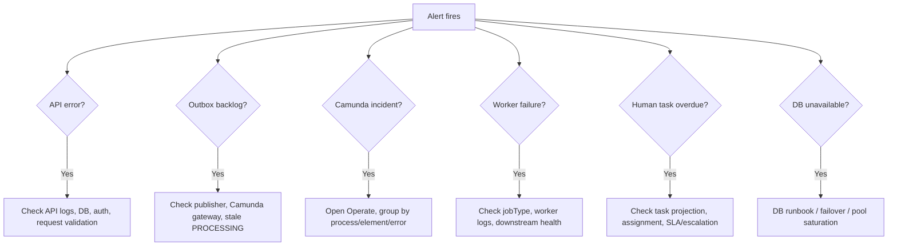

Practical first question:

```text id="9ql3pd"
Apakah process stuck karena:
  command belum sampai Camunda?
  Camunda incident?
  worker gagal?
  message tidak correlated?
  human task belum selesai?
  read model/projection telat?
```

---

# 7. Runbook: process incident di Operate

## 7.1 Symptoms

```text id="d0bsqt"
Operate shows incident at service task:
  calculate-risk-score
  validate-case
  notify-case-result
```

## 7.2 First checks

```text id="041us2"
[ ] Buka Operate.
[ ] Filter by process id.
[ ] Group incidents by BPMN element id.
[ ] Check incident message/error.
[ ] Check process variables: caseId, riskLevel, reviewDecision.
[ ] Check worker logs by jobKey/processInstanceKey/caseId.
[ ] Check case_worker_execution by idempotencyKey.
[ ] Check downstream API health.
[ ] Check DB connectivity/pool.
```

## 7.3 SQL checks

```sql id="0tre63"
select *
from case_worker_execution
where process_instance_key = :processInstanceKey
order by updated_at desc;
```

```sql id="ntm9i1"
select *
from case_record
where case_id = :caseId;
```

## 7.4 Safe resolution steps

```text id="p4ty1n"
1. Identify root cause.
2. Fix root cause.
3. If variable/data is wrong, correct data only via approved support path.
4. If failed job has retries exhausted, reset retries if needed.
5. Resolve incident in Operate or via API.
6. Verify process moves to next element.
7. Monitor recurrence.
```

Camunda REST API supports resolving an incident; documentation notes that for job-related incidents, updating the job to reset retries may be necessary before resolving the incident. ([Camunda 8 Docs](https://docs.camunda.io/docs/apis-tools/orchestration-cluster-api-rest/specifications/resolve-incident/?utm_source=chatgpt.com))

## 7.5 Do not

```text id="8xigc3"
[ ] Jangan resolve incident sebelum root cause fix.
[ ] Jangan update variable tanpa audit/support ticket.
[ ] Jangan batch retry semua instance tanpa test satu instance.
[ ] Jangan cancel process instance tanpa business approval.
```

---

# 8. Runbook: mass incidents

## 8.1 Symptoms

```text id="5gylmi"
100+ incidents at same service task
Example:
  calculate-risk-score incidents after risk-engine outage
```

## 8.2 Triage

```text id="sa6hvs"
[ ] Confirm same root cause.
[ ] Check downstream service recovered.
[ ] Check worker deployment healthy.
[ ] Check errorCategory in worker execution table.
[ ] Retry one process instance manually.
[ ] If successful, batch retry in controlled batches.
```

Operate supports batch operations such as retrying or canceling many process instances when many instances are stuck due to the same underlying issue. Camunda also provides batch-operation concepts/API paths for creating and monitoring batch operations. ([Camunda 8 Docs](https://docs.camunda.io/docs/components/operate/userguide/selections-operations/?utm_source=chatgpt.com))

## 8.3 Batch retry safety checklist

```text id="c9qy8l"
[ ] Root cause fixed.
[ ] One sample instance retry succeeded.
[ ] Worker idempotency verified.
[ ] Downstream capacity ready.
[ ] Retry batch size controlled.
[ ] Metrics monitored during retry.
[ ] Rollback/stop plan defined.
```

---

# 9. Runbook: outbox backlog

## 9.1 Symptoms

```text id="3uhvwl"
workflow_outbox_pending_count rising
oldest_pending_age > SLA
case_workflow_instance stuck START_PENDING
events accepted but process not moving
```

## 9.2 SQL checks

```sql id="1kjhvu"
select status, command_type, count(*), min(created_at) as oldest
from workflow_outbox
group by status, command_type
order by status, command_type;
```

```sql id="9kowrm"
select *
from workflow_outbox
where status in ('PENDING', 'FAILED_RETRYABLE')
order by created_at
limit 50;
```

```sql id="1xxy4m"
select *
from workflow_outbox
where status = 'PROCESSING'
  and locked_at < now() - interval '10 minutes'
order by locked_at;
```

## 9.3 Common causes

| Cause | Evidence | Fix |
|---|---|---|
| Publisher pod down | no publisher logs, deployment unavailable | restart/fix deployment |
| Camunda gateway unavailable | publisher errors | fix Camunda/network/auth |
| Auth secret expired | 401/403 logs | rotate secret |
| Stale PROCESSING rows | locked_at old | reconciliation reset |
| Poison command | same command fails repeatedly | mark final after root cause analysis |
| Backpressure | 503/resource exhausted | backoff, reduce publish rate |

## 9.4 Reset stale processing rows

```sql id="9evz1v"
update workflow_outbox
set status = 'FAILED_RETRYABLE',
    locked_by = null,
    locked_at = null,
    next_attempt_at = now(),
    updated_at = now()
where status = 'PROCESSING'
  and locked_at < now() - interval '10 minutes';
```

## 9.5 Do not

```text id="n4jk5s"
[ ] Jangan delete outbox rows manual.
[ ] Jangan mark PUBLISHED tanpa memastikan command sukses.
[ ] Jangan replay START_PROCESS tanpa duplicate guard/businessId/idempotency.
[ ] Jangan publish message dengan messageId baru untuk event yang sama kecuali sudah dianalisis.
```

---

# 10. Runbook: case stuck START_PENDING

## 10.1 Symptoms

```text id="y4342f"
API returned 202
case_record exists
case_workflow_instance.workflow_status = START_PENDING
no process visible in Operate
```

## 10.2 Checks

```sql id="myzo6o"
select *
from case_workflow_instance
where case_id = :caseId;
```

```sql id="af7dap"
select *
from workflow_outbox
where aggregate_type = 'CASE'
  and aggregate_id = :caseId
order by created_at;
```

## 10.3 Decision

```text id="mr1byy"
Outbox PENDING:
  publisher not picking it up or next_attempt_at future

Outbox FAILED_RETRYABLE:
  publisher tried but temporary failure

Outbox FAILED_FINAL:
  needs manual/root cause fix

Outbox PUBLISHED but workflow START_PENDING:
  metadata update failed or reconciliation missing
```

## 10.4 Recovery

```text id="i931yl"
[ ] Fix publisher/Camunda issue.
[ ] Requeue FAILED_RETRYABLE if needed.
[ ] For PUBLISHED but metadata missing, search Camunda by businessId/caseId.
[ ] Reconcile processInstanceKey into case_workflow_instance.
[ ] If no process exists, requeue START_PROCESS with same commandKey/businessId.
```

---

# 11. Runbook: message event accepted but process not moving

## 11.1 Symptoms

```text id="nuoktz"
POST /cases/{caseId}/documents-received returns 202
case_event exists
message outbox PUBLISHED
process still waiting or stuck
```

## 11.2 Checks

```sql id="0l1a96"
select *
from case_event
where case_id = :caseId
order by created_at desc;
```

```sql id="mk4y3e"
select *
from workflow_outbox
where aggregate_id = :caseId
  and command_type = 'PUBLISH_MESSAGE'
order by created_at desc;
```

Check in Operate:

```text id="5jj6bg"
[ ] Is process at the expected message catch event?
[ ] Does BPMN message name match?
[ ] Does correlationKey equal caseId?
[ ] Did message TTL expire?
[ ] Was event sent to correct environment/tenant?
```

Message correlation in Camunda uses message name and correlation key; `publish message` can buffer messages depending on TTL and does not wait for correlation result, while correlate-message is immediate and not buffered. ([Camunda 8 Docs](https://docs.camunda.io/docs/self-managed/components/management-identity/configuration/connect-to-an-oidc-provider/?utm_source=chatgpt.com))

## 11.3 Recovery

```text id="h2rcly"
If messageName/correlationKey wrong:
  create corrected event/outbox only with support approval

If TTL expired:
  republish with same business event semantics, deterministic messageId policy reviewed

If process not waiting:
  inspect BPMN path and variables

If process completed/terminated:
  do not republish blindly
```

---

# 12. Runbook: worker overload / slow jobs

## 12.1 Symptoms

```text id="l9jpc0"
worker p99 duration rising
job activation latency rising
DB pool usage high
downstream 429/503 rising
incidents at service tasks
worker pod CPU/memory high
```

## 12.2 Checks

```text id="doh53h"
[ ] Which jobType is slow?
[ ] Is slowness DB, CPU, external API, or Camunda?
[ ] Did HPA scale worker recently?
[ ] Is maxJobsActive too high?
[ ] Is DB pool exhausted?
[ ] Is downstream rate-limiting?
[ ] Are retries causing storm?
```

## 12.3 Quick mitigations

```text id="s5ecgc"
[ ] Reduce maxJobsActive for offending jobType.
[ ] Scale down worker if downstream overloaded.
[ ] Increase retry backoff for 429/503.
[ ] Temporarily disable specific worker if unsafe.
[ ] Add circuit breaker around downstream.
[ ] Increase DB pool only if DB capacity supports it.
```

Camunda docs recommend using retry backoff when external systems are down, because immediate retries can exhaust retries and create incidents before the dependency has time to recover. ([Camunda 8 Docs](https://docs.camunda.io/docs/components/concepts/job-workers/?utm_source=chatgpt.com))

---

# 13. Runbook: API 5xx spike

## 13.1 Symptoms

```text id="fs99y1"
case-api 5xx rate high
POST /cases failing
task complete endpoint failing
query endpoint slow
```

## 13.2 Decision tree

```text id="y0uvo3"
If DB unavailable:
  API cannot persist command -> return 503

If Camunda unavailable but API uses outbox:
  create command still returns 202 if DB is healthy

If task completion directly calls Camunda:
  endpoint may return 503 or write decision + COMPLETE_TASK outbox

If validation errors:
  should be 400/409/422, not 500
```

## 13.3 Checks

```text id="prj8ks"
[ ] API logs by correlationId.
[ ] DB connection pool.
[ ] PostgreSQL locks/deadlocks.
[ ] Idempotency conflicts.
[ ] Outbox insert errors.
[ ] Auth token/secret errors.
[ ] Downstream/Camunda sync call errors.
```

---

# 14. Runbook: human task overdue / stuck

## 14.1 Symptoms

```text id="4s2ex8"
case_task_projection overdue_tasks_count rising
review task stuck assigned to absent user
Tasklist/custom UI shows backlog
business SLA breached
```

## 14.2 Checks

```sql id="lhb98d"
select *
from case_task_projection
where status in ('AVAILABLE', 'ASSIGNED')
  and due_at < now()
order by due_at;
```

```sql id="ub2d5v"
select assignee, count(*)
from case_task_projection
where status = 'ASSIGNED'
group by assignee
order by count(*) desc;
```

## 14.3 Recovery

```text id="b1a6pt"
[ ] Reassign task if allowed.
[ ] Trigger escalation path if BPMN timer did not run.
[ ] Check task projection sync lag.
[ ] Check candidate group mapping.
[ ] Check user/group authorization.
[ ] For custom UI, check complete-task outbox if used.
```

Camunda user tasks support assignment and scheduling concepts like due dates/follow-up dates; for custom UI, PostgreSQL projection and SLA queries are often used to operationalize those concepts. ([Camunda Documentation](https://unsupported.docs.camunda.io/1.3/docs/self-managed/tasklist-deployment/configuration/?utm_source=chatgpt.com))

---

# 15. Runbook: cancel process instance

## 15.1 When allowed

```text id="llsx30"
Use cancellation only if:
  business owner approves
  process instance is truly invalid/duplicate
  downstream side effects are understood
  audit record is written
  rollback/compensation is considered
```

Camunda REST API supports canceling a running process instance, but cancellation is more than deleting a resource and may involve listener-related processing; gateway timeout can happen, so retry/backoff and inspection are needed if repeated failures occur. ([Camunda 8 Docs](https://docs.camunda.io/docs/apis-tools/orchestration-cluster-api-rest/specifications/cancel-process-instance/?utm_source=chatgpt.com))

## 15.2 Do not cancel if

```text id="f3w8h3"
[ ] There is a modeled business cancellation path available.
[ ] Worker side effects have already occurred and require compensation.
[ ] You only want to “hide” an incident.
[ ] Root cause is unknown.
```

Preferred business pattern:

```text id="mo0igo"
POST /cases/{caseId}/cancel
  -> persist cancellation request
  -> publish CaseCancelled message
  -> BPMN event subprocess handles cancellation
```

Use direct process cancellation mainly for operational/support cases with approval.

---

# 16. Security runbook

## 16.1 Authentication and authorization

For Camunda 8 production, OIDC-based authentication is recommended for Self-Managed and required for SaaS; no authentication is only for local development, and Basic authentication is not recommended for production. ([Camunda 8 Docs](https://docs.camunda.io/docs/components/concepts/access-control/access-control-overview/?utm_source=chatgpt.com))

Production checklist:

```text id="gmj4of"
[ ] OIDC/service account configured.
[ ] Service account has least privilege.
[ ] API tokens/secrets stored in secret manager.
[ ] Secrets rotate regularly.
[ ] Basic/no-auth disabled in production.
[ ] Management/Admin access restricted.
[ ] Operate/Tasklist access controlled by role/group.
[ ] Custom task API validates domain authorization.
```

## 16.2 Authorization

Camunda authorization uses roles, groups, mappings, and permissions; Tasklist V2 uses authorization-based access control. Application/domain authorization should still be enforced inside Jersey service because domain rules such as maker-checker, region, ownership, and regulatory policy usually go beyond raw Camunda permissions. ([Camunda 8 Docs](https://docs.camunda.io/docs/components/concepts/access-control/access-control-overview/?utm_source=chatgpt.com))

## 16.3 Secret leak checks

```text id="x8xgz2"
[ ] No secret in ConfigMap.
[ ] No secret in container image.
[ ] No token/client secret in logs.
[ ] No full process variables logged.
[ ] No PII in Camunda variables unless explicitly approved.
[ ] No public endpoint exposes processInstanceKey/jobKey unless internal/support only.
```

---

# 17. Data privacy and audit runbook

## 17.1 Data location policy

| Data | Location |
|---|---|
| Business aggregate | PostgreSQL |
| Full request payload | PostgreSQL JSONB |
| Full form payload | PostgreSQL |
| Document binary | Object storage |
| Document metadata | PostgreSQL |
| Routing data | Camunda variables |
| Sensitive PII | PostgreSQL with controlled access |
| Worker execution audit | PostgreSQL |
| Support/debug metadata | restricted internal API |

## 17.2 Audit checks

```text id="aocjia"
[ ] Every command has idempotency key.
[ ] Every human decision has actor, role/group, timestamp, formVersion, payload.
[ ] Every support action has ticket/reference.
[ ] Every manual variable update has approval and audit.
[ ] Every process cancellation has business reason.
[ ] Every incident retry batch has operator and timestamp.
```

---

# 18. Scaling runbook

## 18.1 Scaling API

Scale `case-api` when:

```text id="mn56j7"
- HTTP RPS increases
- latency p95/p99 high
- CPU high
- request queue high
```

But first check:

```text id="dqvr05"
[ ] DB pool capacity.
[ ] PostgreSQL CPU/connections.
[ ] downstream dependencies.
```

## 18.2 Scaling worker

Scale `case-worker` when:

```text id="1jbb1y"
- job backlog/activation latency rising
- worker CPU saturated
- job duration stable
- downstream has capacity
```

Do not scale worker if:

```text id="k5x7e0"
- downstream is rate-limiting
- DB pool is saturated
- failures are due to config/contract bug
- retries are already storming
```

## 18.3 Scaling outbox publisher

Scale publisher when:

```text id="djqugg"
- outbox pending age rising
- Camunda healthy
- DB healthy
- publisher CPU/network is bottleneck
```

Do not scale publisher when:

```text id="6qa25c"
- Camunda is applying backpressure
- auth/config error
- poison messages dominate
```

---

# 19. Deployment rollback runbook

## 19.1 When rollback worker

Rollback if:

```text id="3dd68u"
- new worker causes incidents
- new variable contract broken
- downstream payload bug
- idempotency broken
```

Before rollback:

```text id="kwzt5w"
[ ] Confirm old worker supports current BPMN job types.
[ ] Confirm new BPMN did not introduce only-new job types.
[ ] Check process instances already entered new path.
```

## 19.2 When rollback BPMN

BPMN rollback is not always simple because already-started instances keep their deployed process definition version.

Safer deployment order:

```text id="c8lx1a"
1. Deploy backward-compatible worker.
2. Deploy BPMN new version.
3. Start new instances on new version.
4. Keep old worker compatibility until old instances finish.
```

## 19.3 Emergency mitigation

```text id="yh3v1f"
[ ] Stop starting new affected process version.
[ ] Disable API command path if necessary.
[ ] Pause/reduce worker for dangerous side effect.
[ ] Patch worker to handle both old/new variables.
[ ] Use Operate/support runbook for stuck instances.
```

---

# 20. Disaster recovery posture

## 20.1 PostgreSQL

```text id="gqpxwm"
[ ] PITR/backups enabled.
[ ] Restore tested.
[ ] RPO/RTO documented.
[ ] Outbox/inbox/worker_execution included.
[ ] Audit tables included.
```

## 20.2 Camunda

For Self-Managed, include platform backup/recovery posture for Zeebe primary state and secondary storage. Secondary storage supports search/Operate/Tasklist-style capabilities, while Zeebe primary state is the runtime workflow state. Camunda docs distinguish primary storage from secondary storage, so DR planning must consider both. ([Camunda 8 Docs](https://docs.camunda.io/docs/8.8/self-managed/concepts/no-secondary-storage/?utm_source=chatgpt.com))

Checklist:

```text id="njj6w4"
[ ] Camunda cluster HA design documented.
[ ] Backups/snapshots configured where applicable.
[ ] Restore procedure tested.
[ ] Secondary storage health monitored.
[ ] Operate/Tasklist recovery considered.
[ ] Service account/secrets backup/rotation plan exists.
```

## 20.3 Application

```text id="8xwa1u"
[ ] Images immutable and reproducible.
[ ] Config stored declaratively.
[ ] Secrets recoverable via secret manager.
[ ] DB migrations versioned.
[ ] BPMN deployments versioned.
[ ] Runbooks stored in repo/wiki.
```

---

# 21. Daily operational checklist

```text id="q5cdbu"
[ ] Check incident count and oldest incident age.
[ ] Check outbox pending/failed-final count.
[ ] Check outbox oldest pending age.
[ ] Check worker failure rate by jobType.
[ ] Check API 5xx and latency.
[ ] Check DB pool and PostgreSQL health.
[ ] Check overdue human tasks.
[ ] Check deployment restarts.
[ ] Check auth/secret expiry alerts.
[ ] Review any manual support actions from last 24h.
```

---

# 22. Weekly operational checklist

```text id="kajahq"
[ ] Review top incident causes.
[ ] Review top slow job types.
[ ] Review outbox retry trends.
[ ] Review worker concurrency/maxJobsActive tuning.
[ ] Review overdue task trends.
[ ] Review failed-final records and closure status.
[ ] Review BPMN/worker version compatibility.
[ ] Review access logs for privileged actions.
[ ] Test one non-prod incident recovery flow.
[ ] Validate backup/restore evidence per policy.
```

---

# 23. Release readiness checklist

Before releasing BPMN/worker/API changes:

```text id="gh11c8"
[ ] BPMN deploys.
[ ] Worker supports all BPMN job types.
[ ] Message names match API constants.
[ ] BPMN error codes match worker constants.
[ ] New variables documented.
[ ] Old variables still supported if old instances exist.
[ ] Outbox command types supported.
[ ] Idempotency behavior tested.
[ ] Migration scripts tested.
[ ] Rollback plan documented.
[ ] Dashboard/alert updated for new jobType/process.
[ ] Runbook updated.
```

---

# 24. Support SQL toolbox

## 24.1 Find case by process instance

```sql id="wgm4ev"
select *
from case_workflow_instance
where process_instance_key = :processInstanceKey;
```

## 24.2 Find outbox for case

```sql id="fb6cxb"
select *
from workflow_outbox
where aggregate_id = :caseId
order by created_at;
```

## 24.3 Find worker executions for case

```sql id="g2gvga"
select *
from case_worker_execution
where case_id = :caseId
order by updated_at desc;
```

## 24.4 Find active tasks for case

```sql id="cgsejm"
select *
from case_task_projection
where case_id = :caseId
  and status in ('AVAILABLE', 'ASSIGNED')
order by created_at;
```

## 24.5 Find decisions for case

```sql id="oqu5cr"
select *
from case_task_decision
where case_id = :caseId
order by decided_at desc;
```

## 24.6 Find stuck workflow starts

```sql id="srz2ip"
select *
from case_workflow_instance
where workflow_status in ('START_PENDING', 'STARTING')
  and created_at < now() - interval '5 minutes'
order by created_at;
```

## 24.7 Find failed final outbox rows

```sql id="z5aa8s"
select *
from workflow_outbox
where status = 'FAILED_FINAL'
order by updated_at desc;
```

---

# 25. Incident communication template

Gunakan format singkat ini saat eskalasi:

```text id="glws7x"
Incident:
  calculate-risk-score incidents increased

Impact:
  high-risk case review delayed; no data loss observed

Scope:
  87 process instances affected
  BPMN element: Activity_CalculateRiskScore
  jobType: calculate-risk-score

Start time:
  2026-07-16 10:15 WIB

Current status:
  risk-engine recovered at 10:42 WIB
  sample retry succeeded

Actions:
  batch retry in progress, 20 instances per batch
  monitoring worker failure rate and DB pool

Risk:
  duplicate side effect protected by worker_execution idempotency

Owner:
  risk-platform on-call + case-platform on-call
```

---

# 26. Common production anti-patterns

| Anti-pattern | Risiko | Koreksi |
|---|---|---|
| Resolve incident without fixing root cause | incident returns | fix root cause first |
| Batch retry all incidents blindly | overload/duplicate side effects | retry sample, then controlled batch |
| Delete outbox rows manually | data loss | requeue/mark final with audit |
| Mark outbox PUBLISHED manually | process may never receive command | only after proof command succeeded |
| Store full payload in Camunda variables | PII/performance/migration risk | PostgreSQL/object storage |
| No failed-final alert | silent stuck commands | alert immediately |
| Worker scaled by CPU only | overload downstream | custom job/backlog metrics |
| No idempotency | duplicate process/side effects | API/outbox/worker idempotency |
| Public API exposes Camunda internals | coupling/security risk | business IDs only |
| Direct browser → Camunda API | auth/audit bypass | browser → Jersey → Camunda |
| Basic/no-auth in prod | security risk | OIDC/service accounts |
| Old worker removed too early | old instances incident | backward compatibility window |
| No task audit | weak regulatory evidence | decision/event tables |
| No reconciliation job | stuck PROCESSING/START_PENDING | scheduled reconciliation |

---

# 27. Final production checklist

```text id="l0j6b5"
Observability:
  [ ] Dashboards exist for API, worker, outbox, Camunda, human task.
  [ ] Alerts exist for incidents, outbox age, failed-final, API 5xx, worker failures.
  [ ] Logs include caseId, processInstanceKey, jobType, jobKey, outboxId, commandKey.

Incident recovery:
  [ ] Operate runbook exists.
  [ ] Batch retry procedure exists.
  [ ] Incident root cause must be fixed before retry.
  [ ] Support SQL toolbox approved.

Outbox:
  [ ] Pending age monitored.
  [ ] FAILED_FINAL alerted.
  [ ] Stale PROCESSING reconciliation exists.
  [ ] commandKey/messageId deterministic.

Workers:
  [ ] Worker execution idempotency exists.
  [ ] Job failure taxonomy exists.
  [ ] Retry backoff configured.
  [ ] maxJobsActive tuned per jobType.
  [ ] Graceful shutdown tested.

Human tasks:
  [ ] Task audit exists.
  [ ] Maker-checker enforced.
  [ ] Overdue task alert exists.
  [ ] Complete-task idempotency exists.

Security:
  [ ] OIDC/service account configured.
  [ ] Secrets stored securely.
  [ ] Least privilege enforced.
  [ ] No sensitive variables/logs.

Release:
  [ ] BPMN-worker contract tests pass.
  [ ] Rollback plan exists.
  [ ] Old running instances considered.
  [ ] Runbook updated.
```

---

# 28. Ringkasan Seri 16

```text id="uuywok"
Production runbook harus menjawab:

What happened?
  incident, outbox backlog, worker failure, API failure, task SLA, security/config issue

Where did it happen?
  API, PostgreSQL, outbox, Camunda, worker, external API, human task

Is retry safe?
  only if idempotency and root cause are verified

What is source of truth?
  PostgreSQL for business/audit
  Camunda for runtime orchestration
  Operate for process/incident visibility

What is recovery path?
  fix root cause
  reconcile data
  retry/resolve carefully
  audit manual actions
```

Formula praktis terakhir:

```text id="t6od0y"
Production Camunda system yang sehat bukan sistem yang tidak pernah gagal.

Production Camunda system yang sehat adalah sistem yang:
  mendeteksi failure cepat,
  mengklasifikasikan failure dengan benar,
  tidak kehilangan command/event,
  aman di-retry,
  punya audit trail,
  dan punya runbook recovery yang jelas.
```

---

# Seri 16/16 selesai

Seri utama **Camunda 8 in Jakarta RESTful Web Service/Jersey Microservice-Based Application** sudah selesai.

Total seri utama yang selesai:

```text id="wsszt6"
1. Camunda 8 Mental Model for Java/Jersey Engineers
2. Camunda 8 Architecture: Zeebe, Gateway, Broker, Operate, Tasklist, Identity
3. Maven + Java 17 Setup for Camunda Java Client in Jersey App
4. Jersey REST API as Workflow Command Boundary
5. Starting Process Instance Pattern from REST Endpoint
6. Message Correlation Pattern from Jersey Microservice
7. BPMN Practical Modeling for Service-Based Microservices
8. Service Task & Job Type Contract Design
9. Java Job Worker Implementation Pattern
10. Variables, Payload Design, and PostgreSQL/MyBatis Boundary
11. Transaction Consistency: DB + Workflow Dual-Write Problem
12. Error Handling: Retry, BPMN Error, Incident, Escalation
13. Human Task Integration: Tasklist vs Custom Task UI
14. Testing Strategy: Unit, Integration, BPMN, Worker Testing
15. Docker/Kubernetes Deployment Pattern for Camunda 8 Workers
16. Production Runbook: Observability, Incident Recovery, Scaling, Security
```

Rekomendasi materi lanjutan setelah seri utama:

**Cheatsheet Camunda 8 Java Client + Orchestration REST API - classes, builders, methods, configs, job worker APIs, command APIs, auth, REST/gRPC usage, dan production usage notes untuk Jersey-based service.**

---

**Sources:**

- [Incidents | Camunda 8 Docs](https://docs.camunda.io/docs/components/concepts/incidents/?utm_source=chatgpt.com)
- [Configuration | Camunda 8 Docs](https://unsupported.docs.camunda.io/1.3/docs/self-managed/tasklist-deployment/configuration/?utm_source=chatgpt.com)

## Response:
7/16/2026, 10:18:28 AM

Saya buatkan **cheatsheet lanjutan** sesuai rekomendasi: fokus pada Camunda 8 Java Client + Orchestration REST API untuk service Jersey production-style, dengan penekanan class/builder/method/config dan pola pemakaian aman.

# Cheatsheet Camunda 8 Java Client + Orchestration REST API  
## Untuk Java 17 + Jersey/Jakarta REST + MyBatis + PostgreSQL

## 1. Version & migration note

Untuk project baru, gunakan dependency **`io.camunda:camunda-client-java`**, bukan `zeebe-client-java`. Camunda Java Client adalah official Java library untuk deploy process/decision, start/manage process, implement job workers, dan query/manage process data via Orchestration Cluster API. Sejak Camunda 8.8, Java Client menggantikan Zeebe Java Client, memakai **REST sebagai default** dan **gRPC tetap configurable**. Zeebe Java Client dijadwalkan/ditandai untuk removal di 8.10, jadi untuk codebase baru jangan mulai dari `ZeebeClient`. ([Camunda 8 Docs](https://docs.camunda.io/docs/apis-tools/java-client/getting-started/))

---

# 2. Maven dependency

```xml id="mh6lta"
<properties>
    <maven.compiler.release>17</maven.compiler.release>
    <camunda.version>8.9.0</camunda.version>
</properties>

<dependencies>
    <dependency>
        <groupId>io.camunda</groupId>
        <artifactId>camunda-client-java</artifactId>
        <version>${camunda.version}</version>
    </dependency>
</dependencies>
```

Gunakan versi yang sama dengan target Camunda cluster perusahaan atau versi yang disetujui platform team. Dokumentasi resmi menunjukkan dependency Maven `io.camunda:camunda-client-java:${camunda.version}` untuk Java Client. ([Camunda 8 Docs](https://docs.camunda.io/docs/apis-tools/java-client/getting-started/?utm_source=chatgpt.com))

---

# 3. Core class / concept map

| Area | Java Client Concept | Kegunaan Praktis |
|---|---|---|
| Client root | `CamundaClient` | Entry point command API dan worker registration |
| Builder | `CamundaClient.newClientBuilder()` | Setup REST/gRPC address, auth, protocol preference |
| Client builder | `CamundaClientBuilder` | Pengganti `ZeebeClientBuilder` |
| Future | `CamundaFuture` | Pengganti `ZeebeFuture` |
| Job worker | `client.newWorker()` | Subscribe job by `jobType` |
| Deploy resource | `newDeployResourceCommand()` | Deploy BPMN/DMN/forms/resources |
| Start process | `newCreateInstanceCommand()` | Start process instance |
| Publish message | `newPublishMessageCommand()` | Async buffered-capable message |
| Correlate message | `newCorrelateMessageCommand()` | Immediate message correlation attempt |
| Complete job | `newCompleteCommand(jobKey)` | Worker success |
| Fail job | `newFailCommand(jobKey)` | Technical failure/retry/incident |
| Throw BPMN error | `newThrowErrorCommand(jobKey)` | Business exception path |
| User task commands | `newAssignUserTaskCommand`, `newCompleteUserTaskCommand`, etc. | Camunda user task lifecycle |
| Topology/health | `newTopologyRequest()` | Smoke/readiness check |

Migration guide resmi mencatat renamed classes seperti `ZeebeClientBuilder` → `CamundaClientBuilder`, `ZeebeFuture` → `CamundaFuture`, dan user task command names seperti `newUserTaskCompleteCommand()` → `newCompleteUserTaskCommand()`. ([Camunda 8 Docs](https://docs.camunda.io/docs/apis-tools/migration-manuals/migrate-to-camunda-java-client/))

---

# 4. Client setup pattern

## 4.1 Local/dev no-auth

```java id="rbbug0"
package com.company.caseapp.workflow;

import io.camunda.client.CamundaClient;

import java.net.URI;

public final class CamundaClientFactory {

    public CamundaClient createLocalClient() {
        return CamundaClient.newClientBuilder()
            .restAddress(URI.create("http://localhost:8080"))
            .grpcAddress(URI.create("http://localhost:26500"))
            .build();
    }
}
```

## 4.2 Explicit REST default

```java id="q5c950"
CamundaClient client = CamundaClient.newClientBuilder()
    .restAddress(URI.create(System.getenv("CAMUNDA_REST_ADDRESS")))
    .grpcAddress(URI.create(System.getenv("CAMUNDA_GRPC_ADDRESS")))
    .build();
```

## 4.3 Prefer gRPC explicitly

```java id="973s37"
CamundaClient client = CamundaClient.newClientBuilder()
    .restAddress(URI.create("http://localhost:8080"))
    .grpcAddress(URI.create("http://localhost:26500"))
    .preferRestOverGrpc(false)
    .build();
```

Camunda Java Client uses REST by default; if you want gRPC as the preferred protocol, configure `grpcAddress` and set `preferRestOverGrpc(false)`. ([Camunda 8 Docs](https://docs.camunda.io/docs/apis-tools/migration-manuals/migrate-to-camunda-java-client/))

---

# 5. Recommended config object

```java id="3oi5qi"
package com.company.caseapp.workflow;

import java.net.URI;
import java.time.Duration;

public record CamundaClientConfig(
    URI restAddress,
    URI grpcAddress,
    AuthMode authMode,
    String clientId,
    String clientSecret,
    String audience,
    String tokenUrl,
    Duration requestTimeout
) {
    public enum AuthMode {
        NONE,
        OAUTH
    }

    public static CamundaClientConfig fromEnv() {
        return new CamundaClientConfig(
            URI.create(required("CAMUNDA_REST_ADDRESS")),
            URI.create(required("CAMUNDA_GRPC_ADDRESS")),
            AuthMode.valueOf(env("CAMUNDA_AUTH_MODE", "NONE")),
            env("CAMUNDA_CLIENT_ID", null),
            env("CAMUNDA_CLIENT_SECRET", null),
            env("CAMUNDA_TOKEN_AUDIENCE", null),
            env("CAMUNDA_TOKEN_URL", null),
            Duration.parse(env("CAMUNDA_REQUEST_TIMEOUT", "PT10S"))
        );
    }

    private static String required(String key) {
        String value = System.getenv(key);
        if (value == null || value.isBlank()) {
            throw new IllegalStateException("Missing env: " + key);
        }
        return value;
    }

    private static String env(String key, String defaultValue) {
        String value = System.getenv(key);
        return value == null || value.isBlank() ? defaultValue : value;
    }
}
```

Untuk production, hindari no-auth/basic style dan gunakan OIDC/OAuth/service account sesuai setup cluster. Dokumentasi client authorization menjelaskan penggunaan OAuth credential provider dan memperingatkan bahwa mengirim credential melalui koneksi tidak aman dapat mengekspos access token. ([Camunda 8 Docs](https://docs.camunda.io/docs/self-managed/components/orchestration-cluster/zeebe/security/client-authorization/))

---

# 6. Lifecycle: create once, close once

```java id="yyfn9w"
package com.company.caseapp.workflow;

import io.camunda.client.CamundaClient;

import java.util.concurrent.atomic.AtomicBoolean;

public final class CamundaLifecycle implements AutoCloseable {

    private final CamundaClient client;
    private final AtomicBoolean started = new AtomicBoolean(false);

    public CamundaLifecycle(CamundaClient client) {
        this.client = client;
    }

    public void start() {
        if (!started.compareAndSet(false, true)) {
            return;
        }

        client.newTopologyRequest().execute();
    }

    public CamundaClient client() {
        return client;
    }

    @Override
    public void close() {
        client.close();
    }
}
```

Rule production:

```text id="k24k87"
Do:
  create CamundaClient once at app startup
  inject it into workflow gateway / worker registry
  close it during shutdown

Do not:
  create CamundaClient per request
  create worker inside Jersey resource method
```

---

# 7. Deploy resource command

```java id="rpul49"
public void deployCaseLifecycle() {
    client.newDeployResourceCommand()
        .addResourceFromClasspath("bpmn/case-enforcement-lifecycle.bpmn")
        .execute();
}
```

Production note:

```text id="tkt39u"
Local/dev:
  boleh deploy BPMN saat startup

Production:
  sebaiknya BPMN deploy lewat release pipeline,
  bukan otomatis setiap app pod start.
```

---

# 8. Start process instance

## 8.1 Async start

```java id="t84eeb"
public StartWorkflowResult startCaseLifecycle(StartCaseWorkflowCommand command) {
    var variables = Map.<String, Object>of(
        "caseId", command.caseId(),
        "applicantId", command.applicantId(),
        "caseType", command.caseType(),
        "region", command.region(),
        "correlationKey", command.caseId()
    );

    var event = client.newCreateInstanceCommand()
        .bpmnProcessId("case_enforcement_lifecycle")
        .latestVersion()
        .variables(variables)
        .execute();

    return new StartWorkflowResult(
        event.getProcessInstanceKey(),
        "case_enforcement_lifecycle",
        command.caseId()
    );
}
```

## 8.2 Practical rule

```text id="3b1a1u"
Use async start for:
  long-running case lifecycle
  human task
  timer/wait state
  external service orchestration

Avoid await-completion for:
  regulatory/case lifecycle utama
```

Orchestration Cluster API supports starting and managing process instances, while Java Client provides programmatic process interaction. ([Camunda 8 Docs](https://docs.camunda.io/docs/apis-tools/java-client/getting-started/))

---

# 9. Publish message vs correlate message

## 9.1 Publish message: async, can buffer

```java id="gmram1"
public void publishDocumentReceived(
        String caseId,
        String documentBatchId,
        String messageId
) {
    client.newPublishMessageCommand()
        .messageName("DocumentReceived")
        .correlationKey(caseId)
        .messageId(messageId)
        .timeToLive(Duration.ofHours(2))
        .variables(Map.of(
            "caseId", caseId,
            "documentBatchId", documentBatchId,
            "documentReceived", true
        ))
        .execute();
}
```

Use for:

```text id="w386m2"
webhook
external event
event can arrive before BPMN catch event
caller does not need immediate correlation result
```

Publish-message sends a message to a partition computed from the correlation key, messages can be buffered, and the endpoint does not wait for correlation result. ([Camunda 8 Docs](https://docs.camunda.io/docs/apis-tools/orchestration-cluster-api-rest/specifications/publish-message/))

## 9.2 Correlate message: immediate correlation attempt

```java id="4syohz"
public long correlateReviewCompleted(
        String caseId,
        String decision
) {
    var result = client.newCorrelateMessageCommand()
        .messageName("ReviewCompleted")
        .correlationKey(caseId)
        .variables(Map.of(
            "caseId", caseId,
            "reviewDecision", decision
        ))
        .execute();

    return result.getProcessInstanceKey();
}
```

Use for:

```text id="2fqc7l"
internal admin action
support tool
caller must know whether message matched a waiting instance
```

Correlate-message publishes and correlates immediately; it returns the first process instance key if successful, and the message is **not buffered**. ([Camunda 8 Docs](https://docs.camunda.io/docs/apis-tools/orchestration-cluster-api-rest/specifications/correlate-message/))

---

# 10. Job worker registration

```java id="zgd328"
public JobWorker openCalculateRiskWorker(
        CamundaClient client,
        JobHandler handler
) {
    return client.newWorker()
        .jobType("calculate-risk-score")
        .name("case-worker-calculate-risk-score")
        .maxJobsActive(16)
        .timeout(Duration.ofSeconds(60))
        .handler(handler)
        .open();
}
```

Job worker behavior yang penting: worker polls jobs, sends activated jobs to handler, polls again when unhandled jobs drop below 30% of `maxJobsActive`, and applies backoff when polling fails. Streaming can also be enabled, but memory estimate must consider `maxJobsActive × max message size`. ([Camunda 8 Docs](https://docs.camunda.io/docs/apis-tools/java-client/job-worker/))

---

# 11. Worker handler pattern

```java id="zixd1s"
public final class CalculateRiskScoreJobHandler implements JobHandler {

    private final RiskScoringService riskScoringService;
    private final WorkerExecutionRepository executionRepository;
    private final JobResultReporter reporter;

    @Override
    public void handle(JobClient client, ActivatedJob job) {
        var variables = job.getVariablesAsMap();
        String caseId = requireString(variables, "caseId");

        String idempotencyKey =
            caseId + ":" + job.getType() + ":" + job.getProcessInstanceKey();

        try {
            var completed = executionRepository.findCompleted(idempotencyKey);
            if (completed.isPresent()) {
                reporter.complete(client, job, completed.get().outputVariables());
                return;
            }

            RiskResult result = riskScoringService.calculate(caseId);

            if (result.rejectedByPolicy()) {
                reporter.throwBpmnError(
                    client,
                    job,
                    "RISK_POLICY_REJECTED",
                    "Risk policy rejected",
                    Map.of(
                        "riskLevel", result.level(),
                        "riskReasonCode", result.reasonCode()
                    )
                );
                return;
            }

            Map<String, Object> output = Map.of(
                "riskScore", result.score(),
                "riskLevel", result.level(),
                "riskReasonCode", result.reasonCode()
            );

            executionRepository.markCompleted(idempotencyKey, output);
            reporter.complete(client, job, output);

        } catch (TemporaryDependencyException ex) {
            reporter.failRetryable(client, job, ex, Duration.ofSeconds(30));

        } catch (WorkflowContractException ex) {
            reporter.failFinal(client, job, ex.getMessage());
        }
    }

    private String requireString(Map<String, Object> variables, String name) {
        Object value = variables.get(name);
        if (!(value instanceof String text) || text.isBlank()) {
            throw new WorkflowContractException("Missing variable: " + name);
        }
        return text;
    }
}
```

Worker code must be idempotent because job timeout can cause the same job to be worked on more than once; Camunda describes job delivery as at-least-once from the worker perspective. ([Camunda 8 Docs](https://docs.camunda.io/docs/components/concepts/job-workers/))

---

# 12. Complete / fail / throw error helper

```java id="z68uen"
public final class JobResultReporter {

    public void complete(
            JobClient client,
            ActivatedJob job,
            Map<String, Object> variables
    ) {
        client.newCompleteCommand(job.getKey())
            .variables(variables)
            .execute();
    }

    public void failRetryable(
            JobClient client,
            ActivatedJob job,
            Exception ex,
            Duration backoff
    ) {
        client.newFailCommand(job.getKey())
            .retries(Math.max(job.getRetries() - 1, 0))
            .retryBackoff(backoff)
            .errorMessage(safeMessage(ex))
            .execute();
    }

    public void failFinal(
            JobClient client,
            ActivatedJob job,
            String message
    ) {
        client.newFailCommand(job.getKey())
            .retries(0)
            .errorMessage(message)
            .execute();
    }

    public void throwBpmnError(
            JobClient client,
            ActivatedJob job,
            String errorCode,
            String errorMessage,
            Map<String, Object> variables
    ) {
        client.newThrowErrorCommand(job.getKey())
            .errorCode(errorCode)
            .errorMessage(errorMessage)
            .variables(variables)
            .execute();
    }

    private String safeMessage(Exception ex) {
        String message = ex.getMessage();
        if (message == null || message.isBlank()) {
            return ex.getClass().getSimpleName();
        }
        return message.length() > 1000 ? message.substring(0, 1000) : message;
    }
}
```

REST fail-job supports retries, error message, retry backoff, and variables; 503 can indicate backpressure/resource exhaustion and clients should retry after backoff. Throw-error is the BPMN business-error command for activated jobs. ([Camunda 8 Docs](https://docs.camunda.io/docs/apis-tools/orchestration-cluster-api-rest/specifications/fail-job/))

---

# 13. Orchestration REST API endpoint map

| Use Case | REST API Concept | Endpoint Pattern |
|---|---|---|
| Start process | Create process instance | `POST /process-instances` |
| Publish message | Buffered-capable event publish | `POST /messages/publication` |
| Correlate message | Immediate correlation | `POST /messages/correlation` |
| Activate jobs | Worker activation | `POST /jobs/activation` |
| Complete job | Worker success | `POST /jobs/{jobKey}/completion` |
| Fail job | Technical failure | `POST /jobs/{jobKey}/failure` |
| Throw BPMN error | Business exception | `POST /jobs/{jobKey}/error` |
| User task complete | Human task completion | user task command/API |
| Resolve incident | Operational recovery | incident resolve endpoint |
| Search/query | Process/task/job queries | search APIs |

The Orchestration Cluster REST API is the programmatic API for process orchestration capabilities, including process lifecycle management, user task operations, variable management, incident resolution, and search/filtering; it is part of Camunda 8 public API with SemVer stability guarantees except clearly marked alpha endpoints. ([Camunda 8 Docs](https://docs.camunda.io/docs/apis-tools/orchestration-cluster-api-rest/orchestration-cluster-api-rest-overview/))

---

# 14. Java Client vs REST API: kapan pakai mana?

| Situation | Prefer |
|---|---|
| Java/Jersey service starts process | Java Client |
| Java worker implementation | Java Client |
| Internal support tool in Java | Java Client or REST |
| Non-Java service integration | REST API |
| Custom UI backend | REST API or Java Client gateway |
| Low-level operational automation | REST API |
| Need public API stability surface | Orchestration REST API |
| Legacy Zeebe client code | Migrate to Camunda Java Client |

Practical recommendation untuk stack kamu:

```text id="p78gi4"
Jersey microservice:
  use Camunda Java Client behind WorkflowGateway interface

Frontend/custom UI:
  never call Camunda directly
  call Jersey backend

Non-Java batch/support automation:
  use Orchestration REST API with service account
```

---

# 15. Production gateway abstraction

```java id="dggj1j"
public interface WorkflowGateway {

    StartWorkflowResult startProcess(StartProcessCommand command);

    void publishMessage(PublishMessageCommand command);

    CorrelateMessageResult correlateMessage(CorrelateMessageCommand command);

    void deployResource(DeployResourceCommand command);
}
```

Implementation:

```java id="48iyok"
public final class CamundaWorkflowGateway implements WorkflowGateway {

    private final CamundaClient client;
    private final WorkflowVariableGuard variableGuard;

    public CamundaWorkflowGateway(
            CamundaClient client,
            WorkflowVariableGuard variableGuard
    ) {
        this.client = client;
        this.variableGuard = variableGuard;
    }

    @Override
    public StartWorkflowResult startProcess(StartProcessCommand command) {
        variableGuard.validate(command.variables());

        var event = client.newCreateInstanceCommand()
            .bpmnProcessId(command.bpmnProcessId())
            .latestVersion()
            .variables(command.variables())
            .execute();

        return new StartWorkflowResult(
            event.getProcessInstanceKey(),
            command.bpmnProcessId(),
            command.businessId()
        );
    }

    @Override
    public void publishMessage(PublishMessageCommand command) {
        variableGuard.validate(command.variables());

        client.newPublishMessageCommand()
            .messageName(command.messageName())
            .correlationKey(command.correlationKey())
            .messageId(command.messageId())
            .timeToLive(command.timeToLive())
            .variables(command.variables())
            .execute();
    }

    @Override
    public CorrelateMessageResult correlateMessage(
            CorrelateMessageCommand command
    ) {
        variableGuard.validate(command.variables());

        var result = client.newCorrelateMessageCommand()
            .messageName(command.messageName())
            .correlationKey(command.correlationKey())
            .variables(command.variables())
            .execute();

        return new CorrelateMessageResult(result.getProcessInstanceKey());
    }
}
```

Reasoning:

```text id="y2r91s"
Jersey Resource should not know:
  bpmnProcessId
  messageName
  jobType
  raw Camunda commands

Application/WorkflowGateway should own:
  Camunda command mapping
  variable guard
  error mapping
  idempotency hooks
```

---

# 16. Worker registry production-style

```java id="1c16f0"
public final class WorkerRegistry implements AutoCloseable {

    private final CamundaClient client;
    private final WorkerRuntimeConfig config;
    private final List<JobWorker> workers = new ArrayList<>();

    private final ValidateCaseJobHandler validateCaseHandler;
    private final CalculateRiskScoreJobHandler calculateRiskScoreHandler;

    public void openAll() {
        if (!config.enabled()) {
            return;
        }

        workers.add(client.newWorker()
            .jobType("validate-case")
            .name(config.workerNamePrefix() + "-validate-case")
            .maxJobsActive(config.validateCaseMaxJobsActive())
            .timeout(config.validateCaseTimeout())
            .handler(validateCaseHandler)
            .open());

        workers.add(client.newWorker()
            .jobType("calculate-risk-score")
            .name(config.workerNamePrefix() + "-calculate-risk-score")
            .maxJobsActive(config.calculateRiskMaxJobsActive())
            .timeout(config.calculateRiskTimeout())
            .handler(calculateRiskScoreHandler)
            .open());
    }

    @Override
    public void close() {
        for (int i = workers.size() - 1; i >= 0; i--) {
            workers.get(i).close();
        }
        workers.clear();
    }
}
```

---

# 17. Important builder/options cheat sheet

| Builder / Option | Area | Practical Meaning |
|---|---|---|
| `restAddress(URI)` | Client | Orchestration REST endpoint |
| `grpcAddress(URI)` | Client | gRPC endpoint if used |
| `preferRestOverGrpc(false)` | Client | Prefer gRPC instead of default REST |
| `credentialsProvider(...)` | Client | OAuth/custom auth provider |
| `newWorker()` | Worker | Create job worker |
| `.jobType(String)` | Worker | BPMN service task type |
| `.name(String)` | Worker | Worker owner/name for observability |
| `.maxJobsActive(int)` | Worker | Concurrency/buffer limit |
| `.timeout(Duration)` | Worker | Activation timeout |
| `.handler(JobHandler)` | Worker | Business executor |
| `.backoffSupplier(...)` | Worker | Poll failure backoff behavior |
| `.open()` | Worker | Start polling |
| `.variables(Map)` | Commands | Variables passed to process/job/message |
| `.retries(int)` | Fail job | Remaining retry count |
| `.retryBackoff(Duration)` | Fail job | Delay next retry |
| `.errorCode(String)` | BPMN error | Boundary error matching code |
| `.messageId(String)` | Message | Duplicate-safe message identifier |
| `.timeToLive(Duration)` | Message | Buffering lifetime |

Job worker docs mention `backoffSupplier`, exponential backoff default, custom metrics interface, polling behavior, and `streamEnabled`; use these intentionally, not as random defaults. ([Camunda 8 Docs](https://docs.camunda.io/docs/apis-tools/java-client/job-worker/))

---

# 18. Error mapping cheat sheet

| Java Condition | Camunda Command | Why |
|---|---|---|
| Business action success | `complete job` | Process can continue |
| Business rejection expected by BPMN | `throw BPMN error` | Modeled business path |
| DB/API temporary failure | `fail job` + retry/backoff | Retry later |
| Invalid workflow variable | `fail job` retries `0` | Contract bug → incident |
| External API 429 | `fail job` + long backoff | Avoid rate-limit storm |
| Complete command timeout after DB write | retry-safe complete from stored output | At-least-once worker delivery |
| Duplicate execution detected | `complete job` with stored output | Idempotent recovery |

Complete-job/fail-job commands may return 503 when the system creates backpressure; Camunda recommends retrying after backoff in those cases. ([Camunda 8 Docs](https://docs.camunda.io/docs/apis-tools/orchestration-cluster-api-rest/specifications/fail-job/))

---

# 19. REST API payload examples

## 19.1 Publish message

```http id="gk9y7q"
POST /messages/publication
Content-Type: application/json
Authorization: Bearer <token>
```

```json id="wm92l7"
{
  "name": "DocumentReceived",
  "correlationKey": "CASE-2026-000123",
  "messageId": "DOCUMENT_RECEIVED:DOC-EVT-001",
  "timeToLive": 7200000,
  "variables": {
    "caseId": "CASE-2026-000123",
    "documentBatchId": "DOCB-001"
  }
}
```

## 19.2 Correlate message

```http id="t6rohw"
POST /messages/correlation
Content-Type: application/json
Authorization: Bearer <token>
```

```json id="caaq6m"
{
  "name": "ReviewCompleted",
  "correlationKey": "CASE-2026-000123",
  "variables": {
    "reviewDecision": "APPROVE"
  }
}
```

## 19.3 Fail job

```http id="whm7je"
POST /jobs/2251799813699999/failure
Content-Type: application/json
Authorization: Bearer <token>
```

```json id="t4d6it"
{
  "retries": 2,
  "errorMessage": "Risk engine timeout",
  "retryBackOff": 30000,
  "variables": {
    "lastFailureCategory": "TEMPORARY_TECHNICAL"
  }
}
```

---

# 20. Jersey integration rules

```text id="sx4py6"
Resource layer:
  HTTP validation only
  no raw CamundaClient usage

Application service:
  business command/event semantics
  DB transaction
  idempotency
  outbox insert

Workflow gateway:
  maps business command to Camunda command

Worker:
  handles job type
  validates variables
  updates PostgreSQL
  completes/fails/throws error

Repository/MyBatis:
  owns PostgreSQL persistence
```

Bad:

```java id="m9ffnt"
@Path("/cases")
public class CaseResource {
    @POST
    public Response create(CreateCaseRequest request) {
        camundaClient.newCreateInstanceCommand()
            .bpmnProcessId(request.bpmnProcessId())
            .latestVersion()
            .variables(request.payload())
            .execute();

        return Response.accepted().build();
    }
}
```

Good:

```java id="frd9up"
@Path("/cases")
public class CaseResource {
    @POST
    public Response create(
            @HeaderParam("Idempotency-Key") String idempotencyKey,
            CreateCaseRequest request
    ) {
        CreateCaseResult result = caseCommandService.createCase(
            idempotencyKey,
            request
        );

        return Response.accepted(result).build();
    }
}
```

---

# 21. Production gotchas

| Gotcha | Impact | Prevention |
|---|---|---|
| `CamundaClient` per request | connection/resource waste | singleton lifecycle |
| no idempotency | duplicate process/event/side effect | API/outbox/worker idempotency |
| full payload as variables | PII/performance/migration risk | variable guard + DB reference |
| worker not idempotent | duplicate side effects | worker execution table |
| no retry backoff | retry storm/backpressure | backoff policy |
| gRPC assumed by default | wrong protocol expectation after migration | explicitly configure |
| old Zeebe client | upgrade risk | use `camunda-client-java` |
| wrong message operation | lost event/no feedback | publish vs correlate rule |
| worker maxJobsActive too high | DB/downstream overload | tune per job type |
| no output mapping | variable pollution | explicit output mapping |
| public UI calls Camunda | auth/audit bypass | UI → Jersey backend |
| no close on shutdown | stuck/duplicate jobs | close `JobWorker`, then client |

---

# 22. Minimal production checklist

```text id="o8enzn"
[ ] Use io.camunda:camunda-client-java.
[ ] No new code uses ZeebeClient.
[ ] CamundaClient created once and closed on shutdown.
[ ] REST/gRPC endpoint configured explicitly.
[ ] OAuth/service account configured for production.
[ ] No credentials over insecure connection.
[ ] WorkflowGateway wraps all Camunda commands.
[ ] Jersey resources do not call Camunda directly.
[ ] API start/event commands use outbox.
[ ] Message publish uses deterministic messageId.
[ ] Worker registry opens/closes JobWorker instances cleanly.
[ ] Worker handlers are idempotent.
[ ] Fail job uses retryBackoff for temporary failures.
[ ] BPMN business exceptions use throw error.
[ ] maxJobsActive tuned per job type.
[ ] Logs include caseId, jobType, jobKey, processInstanceKey, outboxId.
[ ] Metrics added for jobs, failures, duration, outbox, idempotency.
```

---

# 23. Ringkasan

```text id="2e24gb"
Camunda Java Client:
  best default for Java/Jersey microservice integration

Orchestration REST API:
  stable public API for non-Java clients, custom tools, and operational automation

Jersey app:
  should expose business API, not raw Camunda API

Worker:
  must be idempotent because job delivery is at-least-once

Outbox:
  safest bridge between PostgreSQL transaction and Camunda command

REST vs gRPC:
  REST default in Camunda Java Client
  gRPC only when explicitly configured and justified
```

Formula praktis:

```text id="dh9s4n"
Do not design your service around Camunda commands.

Design your service around business commands,
then map them to Camunda through a small, tested WorkflowGateway.
```

Rekomendasi lanjutan berikutnya: **Cheatsheet Camunda 8 BPMN XML Extensions & Properties - service task/taskDefinition, headers, user task, form, message, timer, error, call activity, input/output mapping, retries, dan contoh XML production-style.**

---

**Sources:**

- [Java client | Camunda 8 Docs](https://docs.camunda.io/docs/apis-tools/java-client/getting-started/)

## Response:
7/16/2026, 10:20:19 AM

Saya lanjutkan dengan **Cheatsheet Camunda 8 BPMN XML Extensions & Properties**. Fokusnya properti BPMN yang sering dipakai di Modeler/XML: service task, task headers, user task, form, message, timer, error, call activity, dan input/output mapping.

# Cheatsheet Camunda 8 BPMN XML Extensions & Properties  
## Service Task, User Task, Message, Timer, Error, Call Activity, I/O Mapping

## 1. Fokus cheatsheet

Cheatsheet ini fokus pada properti XML BPMN Camunda 8 yang sering muncul ketika kita bekerja dengan:

```text
Java 17+
Jersey / Jakarta REST
Camunda 8
Java Job Worker
PostgreSQL / MyBatis
Docker / Kubernetes
```

Gunakan ini untuk membaca/men-review BPMN XML, melakukan code review, membuat contract test, dan memastikan BPMN yang dibuat di Modeler tetap cocok dengan worker Java. Di praktik harian, sebaiknya edit model lewat Camunda Modeler, lalu gunakan XML untuk review, automation, dan contract validation.

Camunda 8 service task memakai `zeebe:taskDefinition` untuk menentukan job type yang akan diambil job worker; `retries` default-nya tiga, `zeebe:taskHeaders` adalah metadata statis untuk worker, dan input/output mapping dapat mengontrol variable yang masuk/keluar task. ([Camunda 8 Docs](https://docs.camunda.io/docs/components/modeler/bpmn/service-tasks/))

---

# 2. Namespace dasar BPMN Camunda 8

Contoh skeleton BPMN XML:

```xml
<?xml version="1.0" encoding="UTF-8"?>
<bpmn:definitions
    xmlns:bpmn="http://www.omg.org/spec/BPMN/20100524/MODEL"
    xmlns:bpmndi="http://www.omg.org/spec/BPMN/20100524/DI"
    xmlns:dc="http://www.omg.org/spec/DD/20100524/DC"
    xmlns:di="http://www.omg.org/spec/DD/20100524/DI"
    xmlns:zeebe="http://camunda.org/schema/zeebe/1.0"
    xmlns:xsi="http://www.w3.org/2001/XMLSchema-instance"
    id="Definitions_Case"
    targetNamespace="http://company.com/case">

  <bpmn:process id="case_enforcement_lifecycle"
                name="Case Enforcement Lifecycle"
                isExecutable="true">

    <!-- BPMN elements here -->

  </bpmn:process>
</bpmn:definitions>
```

Practical rule:

```text
bpmn:*  = standard BPMN elements
zeebe:* = Camunda 8 extension elements
```

---

# 3. Quick map: element → Camunda extension

| BPMN Element | Camunda Extension | Purpose |
|---|---|---|
| Service task | `zeebe:taskDefinition` | Job type + retries |
| Service task | `zeebe:taskHeaders` | Static metadata to worker |
| Task/activity/event | `zeebe:ioMapping` | Input/output variable mapping |
| User task | `zeebe:userTask` | Marks Camunda user task implementation |
| User task | `zeebe:assignmentDefinition` | Assignee/candidate users/groups |
| User task | `zeebe:taskSchedule` | Due date / follow-up date |
| User task | `zeebe:formDefinition` | Camunda/custom form reference |
| User task | `zeebe:priorityDefinition` | User task priority |
| User task | `zeebe:taskListeners` | Listener jobs for task lifecycle events |
| Message | `zeebe:subscription` | Correlation key expression |
| Call activity | `zeebe:calledElement` | Called BPMN process id + binding |
| Business rule task | `zeebe:calledDecision` | DMN decision id + result variable |
| Business rule task | `zeebe:taskDefinition` | Alternative job-worker implementation |
| Multi-instance | `zeebe:loopCharacteristics` | Input/output collection config |

---

# 4. Service Task XML

## 4.1 Minimal service task

```xml
<bpmn:serviceTask id="Activity_ValidateCase" name="Validate Case">
  <bpmn:extensionElements>
    <zeebe:taskDefinition type="validate-case" retries="3" />
  </bpmn:extensionElements>
</bpmn:serviceTask>
```

Meaning:

```text
type="validate-case"
  Java worker harus subscribe jobType validate-case

retries="3"
  job boleh gagal/retry sampai retry count habis

Jika worker fail job sampai retries = 0:
  incident muncul
```

Service task `type` bisa static value atau FEEL expression yang menghasilkan string; `retries` optional dan default-nya tiga. ([Camunda 8 Docs](https://docs.camunda.io/docs/components/modeler/bpmn/service-tasks/))

---

## 4.2 Service task dengan headers

```xml
<bpmn:serviceTask id="Activity_NotifyResult" name="Notify Case Result">
  <bpmn:extensionElements>
    <zeebe:taskDefinition type="send-notification" retries="5" />

    <zeebe:taskHeaders>
      <zeebe:header key="channel" value="EMAIL" />
      <zeebe:header key="template" value="CASE_RESULT_V1" />
      <zeebe:header key="priority" value="NORMAL" />
    </zeebe:taskHeaders>
  </bpmn:extensionElements>
</bpmn:serviceTask>
```

Good header usage:

```text
channel
template
operation
downstream
idempotencyScope
slaClass
```

Bad header usage:

```text
apiKey
password
clientSecret
accessToken
raw payload
```

Task headers adalah metadata statis yang diberikan ke worker bersama job, cocok sebagai parameter konfigurasi non-secret. ([Camunda 8 Docs](https://docs.camunda.io/docs/components/modeler/bpmn/service-tasks/))

---

## 4.3 Service task dengan input/output mapping

```xml
<bpmn:serviceTask id="Activity_CalculateRisk" name="Calculate Risk Score">
  <bpmn:extensionElements>
    <zeebe:taskDefinition type="calculate-risk-score" retries="3" />

    <zeebe:ioMapping>
      <zeebe:input source="= caseId" target="caseId" />
      <zeebe:input source="= applicantId" target="applicantId" />
      <zeebe:input source="= caseType" target="caseType" />

      <zeebe:output source="= riskScore" target="riskScore" />
      <zeebe:output source="= riskLevel" target="riskLevel" />
      <zeebe:output source="= riskReasonCode" target="riskReasonCode" />
    </zeebe:ioMapping>
  </bpmn:extensionElements>
</bpmn:serviceTask>
```

Kenapa output mapping penting?

```text
Tanpa output mapping:
  semua variable hasil complete job bisa merge ke process instance.

Dengan output mapping:
  hanya variable yang dimapping yang dipropagasi.
```

Camunda docs menyebut secara default semua job variables akan merge ke process instance, dan output mapping dapat mengubah behavior ini; input mapping dipakai untuk mentransform variable ke format yang diterima worker. ([Camunda 8 Docs](https://docs.camunda.io/docs/components/modeler/bpmn/service-tasks/))

---

# 5. Service Task contract convention

## 5.1 XML

```xml
<bpmn:serviceTask id="Activity_ClassifyDocuments" name="Classify Documents">
  <bpmn:extensionElements>
    <zeebe:taskDefinition type="classify-documents" retries="3" />

    <zeebe:taskHeaders>
      <zeebe:header key="downstream" value="document-classifier" />
      <zeebe:header key="operation" value="classifyDocuments" />
    </zeebe:taskHeaders>

    <zeebe:ioMapping>
      <zeebe:input source="= caseId" target="caseId" />
      <zeebe:input source="= documentBatchId" target="documentBatchId" />
      <zeebe:output source="= documentClassificationResult" target="documentClassificationResult" />
      <zeebe:output source="= documentComplete" target="documentComplete" />
    </zeebe:ioMapping>
  </bpmn:extensionElements>
</bpmn:serviceTask>
```

## 5.2 Matching Java constants

```java
public final class JobTypes {
    public static final String CLASSIFY_DOCUMENTS = "classify-documents";
}

public final class WorkflowVariables {
    public static final String CASE_ID = "caseId";
    public static final String DOCUMENT_BATCH_ID = "documentBatchId";
    public static final String DOCUMENT_CLASSIFICATION_RESULT = "documentClassificationResult";
    public static final String DOCUMENT_COMPLETE = "documentComplete";
}
```

---

# 6. User Task XML

## 6.1 Camunda user task minimal

```xml
<bpmn:userTask id="UserTask_ReviewCase" name="Review Case">
  <bpmn:extensionElements>
    <zeebe:userTask />
  </bpmn:extensionElements>
</bpmn:userTask>
```

Camunda user task adalah implementation type default/recommended untuk user task modern; jika `zeebe:userTask` dihapus, user task dapat diperlakukan sebagai job-worker-based user task, tetapi jalur job-worker implementation untuk user task memiliki limitasi dan direkomendasikan untuk dimigrasikan ke Camunda user task. ([Camunda 8 Docs](https://docs.camunda.io/docs/components/modeler/bpmn/user-tasks/))

---

## 6.2 User task dengan assignment

```xml
<bpmn:userTask id="UserTask_ReviewCase" name="Review Case">
  <bpmn:extensionElements>
    <zeebe:assignmentDefinition
        candidateGroups="regulatory-reviewer"
        candidateUsers="user-a,user-b" />

    <zeebe:userTask />
  </bpmn:extensionElements>
</bpmn:userTask>
```

Practical rule:

```text
candidateGroups:
  group work queue

candidateUsers:
  specific allowed users

assignee:
  one specific assigned user
```

Camunda user task mendukung assignment melalui `zeebe:assignmentDefinition`, termasuk `assignee`, `candidateUsers`, dan `candidateGroups`; mulai Camunda 8.8, candidate group sebaiknya mereferensikan group ID, dan username/group ID bersifat case-sensitive. ([Camunda 8 Docs](https://docs.camunda.io/docs/components/modeler/bpmn/user-tasks/))

---

## 6.3 User task dengan assignee expression

```xml
<bpmn:userTask id="UserTask_ManagerApproval" name="Manager Approval">
  <bpmn:extensionElements>
    <zeebe:assignmentDefinition
        assignee="= assignedManagerUserId"
        candidateGroups="= reviewerGroups" />

    <zeebe:userTask />
  </bpmn:extensionElements>
</bpmn:userTask>
```

Expression result expectation:

```text
assignee:
  string

candidateUsers:
  list of strings

candidateGroups:
  list of strings
```

Assignment values can be static or expression-based; expressions are evaluated on activating the user task. ([Camunda 8 Docs](https://docs.camunda.io/docs/components/modeler/bpmn/user-tasks/))

---

## 6.4 User task dengan dueDate dan followUpDate

```xml
<bpmn:userTask id="UserTask_ReviewCase" name="Review Case">
  <bpmn:extensionElements>
    <zeebe:assignmentDefinition candidateGroups="regulatory-reviewer" />

    <zeebe:taskSchedule
        followUpDate="= now() + duration(&#34;PT4H&#34;)"
        dueDate="= reviewDueAt" />

    <zeebe:userTask />
  </bpmn:extensionElements>
</bpmn:userTask>
```

Practical meaning:

```text
followUpDate:
  kapan user sebaiknya mulai memperhatikan task

dueDate:
  deadline task selesai
```

User task scheduling mendukung `dueDate` dan `followUpDate`; nilainya bisa static ISO-8601 date-time atau expression yang menghasilkan string ISO-8601 combined date-time dengan timezone. ([Camunda 8 Docs](https://docs.camunda.io/docs/components/modeler/bpmn/user-tasks/))

---

## 6.5 User task dengan Camunda Form

```xml
<bpmn:userTask id="UserTask_ReviewCase" name="Review Case">
  <bpmn:extensionElements>
    <zeebe:formDefinition
        formId="review-case-form"
        bindingType="deployment" />

    <zeebe:assignmentDefinition candidateGroups="regulatory-reviewer" />
    <zeebe:userTask />
  </bpmn:extensionElements>
</bpmn:userTask>
```

Binding type penting:

| `bindingType` | Arti Praktis |
|---|---|
| `latest` | Pakai latest form saat task aktif |
| `deployment` | Pakai form yang dideploy bersama process version |
| `versionTag` | Pakai latest form dengan version tag tertentu |

Jika `bindingType` tidak diset, default-nya `latest`; untuk production/regulatory workflow, `deployment` sering lebih aman karena form terikat ke process version yang sedang berjalan. ([Camunda 8 Docs](https://docs.camunda.io/docs/components/modeler/bpmn/user-tasks/))

---

## 6.6 User task dengan custom form reference

```xml
<bpmn:userTask id="UserTask_ReviewCase" name="Review Case">
  <bpmn:extensionElements>
    <zeebe:formDefinition externalReference="custom-review-case-v1" />
    <zeebe:assignmentDefinition candidateGroups="regulatory-reviewer" />
    <zeebe:userTask />
  </bpmn:extensionElements>
</bpmn:userTask>
```

Use case:

```text
Custom Task UI:
  externalReference dipakai backend/frontend untuk memilih route/form custom.
```

Camunda docs menyebut `externalReference` dapat digunakan untuk custom form reference, route ke custom application, atau URL; custom form reference tidak ditampilkan di Tasklist seperti Camunda Forms. ([Camunda 8 Docs](https://docs.camunda.io/docs/components/modeler/bpmn/user-tasks/))

---

## 6.7 User task priority

```xml
<bpmn:userTask id="UserTask_ReviewCase" name="Review Case">
  <bpmn:extensionElements>
    <zeebe:priorityDefinition priority="80" />
    <zeebe:assignmentDefinition candidateGroups="regulatory-reviewer" />
    <zeebe:userTask />
  </bpmn:extensionElements>
</bpmn:userTask>
```

Priority rule:

```text
0   = lowest
50  = default
100 = highest
```

User task priority harus integer antara 0 dan 100; jika tidak diisi, default-nya 50, dan value bisa static atau expression. ([Camunda 8 Docs](https://docs.camunda.io/docs/components/modeler/bpmn/user-tasks/))

---

## 6.8 User task listeners

```xml
<bpmn:userTask id="UserTask_ReviewCase" name="Review Case">
  <bpmn:extensionElements>
    <zeebe:assignmentDefinition candidateGroups="regulatory-reviewer" />

    <zeebe:taskListeners>
      <zeebe:taskListener
          eventType="assigning"
          type="review-task-assigning-listener"
          retries="3" />

      <zeebe:taskListener
          eventType="completing"
          type="review-task-completing-listener"
          retries="3" />
    </zeebe:taskListeners>

    <zeebe:userTask />
  </bpmn:extensionElements>
</bpmn:userTask>
```

Use case praktis:

```text
assigning:
  validate assignee, sync projection, audit assignment

completing:
  validate completion payload, enforce domain checks, audit
```

User task listener mendukung event type seperti `creating`, `assigning`, `updating`, `completing`, dan `canceling`, serta menggunakan listener job `type` dan optional `retries`. ([Camunda 8 Docs](https://docs.camunda.io/docs/components/modeler/bpmn/user-tasks/))

---

# 7. Message Event XML

## 7.1 Message definition + intermediate catch

```xml
<bpmn:message id="Message_DocumentReceived" name="DocumentReceived">
  <bpmn:extensionElements>
    <zeebe:subscription correlationKey="= caseId" />
  </bpmn:extensionElements>
</bpmn:message>

<bpmn:intermediateCatchEvent
    id="Event_WaitDocumentReceived"
    name="Wait for Document Received">

  <bpmn:messageEventDefinition messageRef="Message_DocumentReceived" />
</bpmn:intermediateCatchEvent>
```

Meaning:

```text
message name:
  DocumentReceived

correlation key expression:
  = caseId

Application must publish:
  messageName = DocumentReceived
  correlationKey = value of caseId
```

Message events dipakai saat satu process instance menunggu message dari external system/process lain; message harus punya name, dan untuk catch event biasanya punya `correlationKey` expression yang dievaluasi saat event aktif. ([Camunda 8 Docs](https://docs.camunda.io/docs/components/modeler/bpmn/message-events/))

---

## 7.2 Message start event

```xml
<bpmn:message id="Message_CaseSubmitted" name="CaseSubmitted" />

<bpmn:startEvent id="StartEvent_CaseSubmitted" name="Case Submitted">
  <bpmn:messageEventDefinition messageRef="Message_CaseSubmitted" />
</bpmn:startEvent>
```

Catatan penting:

```text
Message start event:
  tidak mendefinisikan correlationKey di BPMN model.

Publisher:
  bisa mengirim correlationKey untuk idempotency process start.
```

Camunda docs menyebut message start event tidak menentukan `correlationKey` di BPMN model; aplikasi yang mengirim message dapat menyertakan correlation key, dan key tersebut dapat memastikan hanya satu active process instance per key untuk message start scenario. ([Camunda 8 Docs](https://docs.camunda.io/docs/components/modeler/bpmn/message-events/))

---

## 7.3 Message boundary event

```xml
<bpmn:userTask id="UserTask_ManualReview" name="Manual Review">
  <bpmn:extensionElements>
    <zeebe:assignmentDefinition candidateGroups="regulatory-reviewer" />
    <zeebe:userTask />
  </bpmn:extensionElements>
</bpmn:userTask>

<bpmn:message id="Message_CaseCancelled" name="CaseCancelled">
  <bpmn:extensionElements>
    <zeebe:subscription correlationKey="= caseId" />
  </bpmn:extensionElements>
</bpmn:message>

<bpmn:boundaryEvent
    id="Boundary_CaseCancelled"
    name="Case Cancelled"
    attachedToRef="UserTask_ManualReview"
    cancelActivity="true">

  <bpmn:messageEventDefinition messageRef="Message_CaseCancelled" />
</bpmn:boundaryEvent>
```

`cancelActivity="true"` berarti interrupting boundary event. Jika non-interrupting, gunakan:

```xml
cancelActivity="false"
```

Message boundary event membuat subscription saat activity aktif; jika non-interrupting boundary message triggered, activity tidak dihentikan dan multiple messages dapat dikorelasikan. ([Camunda 8 Docs](https://docs.camunda.io/docs/components/modeler/bpmn/message-events/))

---

# 8. Timer Event XML

## 8.1 Intermediate timer catch event - duration

```xml
<bpmn:intermediateCatchEvent id="Event_Wait7Days" name="Wait 7 Days">
  <bpmn:timerEventDefinition>
    <bpmn:timeDuration xsi:type="bpmn:tFormalExpression">P7D</bpmn:timeDuration>
  </bpmn:timerEventDefinition>
</bpmn:intermediateCatchEvent>
```

## 8.2 Timer boundary event - timeout

```xml
<bpmn:userTask id="UserTask_ApplicantResponse" name="Wait for Applicant Response">
  <bpmn:extensionElements>
    <zeebe:userTask />
  </bpmn:extensionElements>
</bpmn:userTask>

<bpmn:boundaryEvent
    id="Boundary_ResponseTimeout"
    name="Response Timeout"
    attachedToRef="UserTask_ApplicantResponse"
    cancelActivity="true">

  <bpmn:timerEventDefinition>
    <bpmn:timeDuration xsi:type="bpmn:tFormalExpression">P14D</bpmn:timeDuration>
  </bpmn:timerEventDefinition>
</bpmn:boundaryEvent>
```

## 8.3 Non-interrupting reminder timer

```xml
<bpmn:boundaryEvent
    id="Boundary_DailyReminder"
    name="Daily Reminder"
    attachedToRef="UserTask_ManualReview"
    cancelActivity="false">

  <bpmn:timerEventDefinition>
    <bpmn:timeCycle xsi:type="bpmn:tFormalExpression">R/P1D</bpmn:timeCycle>
  </bpmn:timerEventDefinition>
</bpmn:boundaryEvent>
```

Timer dapat didefinisikan dengan date, duration, atau cycle; timer boundary interrupting biasanya untuk timeout, sedangkan non-interrupting boundary timer sering untuk notification/reminder. Camunda juga menegaskan Zeebe bersifat asynchronous sehingga timer tidak dijamin trigger tepat pada configured time, tetapi tidak akan trigger lebih awal dari due date. ([Camunda 8 Docs](https://docs.camunda.io/docs/components/modeler/bpmn/timer-events/))

---

# 9. Error Event XML

## 9.1 Define BPMN error

```xml
<bpmn:error id="Error_RiskPolicyRejected"
            name="Risk Policy Rejected"
            errorCode="RISK_POLICY_REJECTED" />
```

## 9.2 Boundary error event

```xml
<bpmn:serviceTask id="Activity_CalculateRisk" name="Calculate Risk Score">
  <bpmn:extensionElements>
    <zeebe:taskDefinition type="calculate-risk-score" retries="3" />
  </bpmn:extensionElements>
</bpmn:serviceTask>

<bpmn:boundaryEvent
    id="Boundary_RiskPolicyRejected"
    name="Risk Policy Rejected"
    attachedToRef="Activity_CalculateRisk">

  <bpmn:errorEventDefinition errorRef="Error_RiskPolicyRejected" />
</bpmn:boundaryEvent>
```

Java worker:

```java
client.newThrowErrorCommand(job.getKey())
    .errorCode("RISK_POLICY_REJECTED")
    .errorMessage("Applicant rejected by risk policy")
    .variables(Map.of(
        "riskLevel", "HIGH",
        "riskReasonCode", "BLACKLIST_MATCH"
    ))
    .execute();
```

Error must define `errorCode`, and `errorCode` determines which catch event catches a thrown error. Camunda docs also distinguish modeled business reactions from generic technical reactions such as retries/incidents; technical retry loops should not bloat BPMN. ([Camunda 8 Docs](https://docs.camunda.io/docs/components/modeler/bpmn/error-events/))

---

## 9.3 Catch-all error boundary

```xml
<bpmn:boundaryEvent
    id="Boundary_GenericBusinessError"
    name="Generic Business Error"
    attachedToRef="Activity_ProcessPayment">

  <bpmn:errorEventDefinition />
</bpmn:boundaryEvent>
```

Gunakan catch-all dengan hati-hati.

```text
Good:
  fallback business error handling yang memang diinginkan

Risky:
  menelan errorCode penting sehingga root cause kabur
```

Unhandled thrown errors can create incidents; if multiple error catch events exist, matching by error code has priority, while catch-all can catch otherwise uncaught errors within the scope rules. ([Camunda 8 Docs](https://docs.camunda.io/docs/components/modeler/bpmn/error-events/))

---

# 10. Call Activity XML

## 10.1 Minimal call activity

```xml
<bpmn:callActivity id="Call_DocumentVerification"
                   name="Run Document Verification">
  <bpmn:extensionElements>
    <zeebe:calledElement processId="document_verification" />
  </bpmn:extensionElements>
</bpmn:callActivity>
```

`bindingType` default:

```text
latest
```

Call activity membuat process instance baru dari referenced process; child process dimulai dari none start event, dan ketika child selesai, call activity selesai dan parent lanjut. ([Camunda 8 Docs](https://docs.camunda.io/docs/components/modeler/bpmn/call-activities/))

---

## 10.2 Call activity dengan deployment binding

```xml
<bpmn:callActivity id="Call_DocumentVerification"
                   name="Run Document Verification">
  <bpmn:extensionElements>
    <zeebe:calledElement
        processId="document_verification"
        bindingType="deployment" />
  </bpmn:extensionElements>
</bpmn:callActivity>
```

Use case:

```text
Production version safety:
  parent process version memanggil child process version yang dideploy bersama.
```

`bindingType` menentukan versi called process: `latest`, `deployment`, atau `versionTag`; jika tidak diset, default-nya `latest`. ([Camunda 8 Docs](https://docs.camunda.io/docs/components/modeler/bpmn/call-activities/))

---

## 10.3 Call activity dengan versionTag

```xml
<bpmn:callActivity id="Call_AppealReview"
                   name="Run Appeal Review">
  <bpmn:extensionElements>
    <zeebe:calledElement
        processId="appeal_review"
        bindingType="versionTag"
        versionTag="v1.0" />
  </bpmn:extensionElements>
</bpmn:callActivity>
```

Use case:

```text
Pin child process to tagged version:
  useful saat child process lifecycle/versioning dikelola terpisah.
```

---

## 10.4 Call activity dengan variable propagation terbatas

```xml
<bpmn:callActivity id="Call_DocumentVerification"
                   name="Run Document Verification">
  <bpmn:extensionElements>
    <zeebe:calledElement
        processId="document_verification"
        bindingType="deployment"
        propagateAllParentVariables="false"
        propagateAllChildVariables="false" />

    <zeebe:ioMapping>
      <zeebe:input source="= caseId" target="caseId" />
      <zeebe:input source="= documentBatchId" target="documentBatchId" />

      <zeebe:output source="= documentVerificationResult" target="documentVerificationResult" />
      <zeebe:output source="= documentsComplete" target="documentsComplete" />
    </zeebe:ioMapping>
  </bpmn:extensionElements>
</bpmn:callActivity>
```

Rekomendasi production:

```text
propagateAllParentVariables="false"
propagateAllChildVariables="false"
+ explicit input/output mapping
```

Call activity docs menjelaskan parent variables dapat dipropagasikan ke child dan child variables kembali ke parent; Camunda merekomendasikan menonaktifkan all-child propagation atau memakai output mapping, terutama pada parallel flow, agar variable tidak tertimpa tanpa sengaja. ([Camunda 8 Docs](https://docs.camunda.io/docs/components/modeler/bpmn/call-activities/))

---

# 11. Business Rule Task / DMN XML

## 11.1 Business rule task dengan DMN decision

```xml
<bpmn:businessRuleTask id="BusinessRule_DetermineRisk"
                       name="Determine Risk Level">
  <bpmn:extensionElements>
    <zeebe:calledDecision
        decisionId="determine_risk_level"
        bindingType="deployment"
        resultVariable="riskDecision" />
  </bpmn:extensionElements>
</bpmn:businessRuleTask>
```

Meaning:

```text
decisionId:
  DMN decision id

bindingType:
  version selection

resultVariable:
  process variable untuk hasil decision
```

Business rule task dengan DMN menggunakan `zeebe:calledDecision`; `decisionId` bisa static atau expression, `bindingType` menentukan versi decision, dan `resultVariable` adalah nama variable tempat hasil decision disimpan. ([Camunda 8 Docs](https://docs.camunda.io/docs/components/modeler/bpmn/business-rule-tasks/))

---

## 11.2 Business rule task dengan versionTag

```xml
<bpmn:businessRuleTask id="BusinessRule_DetermineRisk"
                       name="Determine Risk Level">
  <bpmn:extensionElements>
    <zeebe:calledDecision
        decisionId="determine_risk_level"
        bindingType="versionTag"
        versionTag="risk-v1"
        resultVariable="riskDecision" />
  </bpmn:extensionElements>
</bpmn:businessRuleTask>
```

## 11.3 Business rule task sebagai job worker

```xml
<bpmn:businessRuleTask id="BusinessRule_CalculateRisk"
                       name="Calculate Risk">
  <bpmn:extensionElements>
    <zeebe:taskDefinition type="calculate-risk-score" retries="3" />

    <zeebe:taskHeaders>
      <zeebe:header key="decisionRef" value="risk" />
    </zeebe:taskHeaders>
  </bpmn:extensionElements>
</bpmn:businessRuleTask>
```

Camunda docs menyebut business rule task bisa memakai job worker implementation dengan `zeebe:taskDefinition`, dan dalam mode ini behavior-nya sama seperti service task, hanya berbeda visual marker dan semantik model. ([Camunda 8 Docs](https://docs.camunda.io/docs/components/modeler/bpmn/business-rule-tasks/))

---

# 12. FEEL expressions in XML

Common expression pattern:

```xml
<zeebe:input source="= caseId" target="caseId" />
<zeebe:input source="= now() + duration(&#34;PT4H&#34;)" target="reviewDueAt" />
<zeebe:calledElement processId="= childProcessId" />
<zeebe:subscription correlationKey="= caseId" />
```

Practical rules:

```text
Expression starts with:
  =

XML escaping:
  quotes inside XML attribute often need &#34;

Variable names:
  use camelCase or snake_case
  avoid kebab-case for variables
```

Camunda variable names are case-sensitive; docs recommend camelCase or snake_case, and explicitly disallow kebab-case for variable names because `-` is an operator. Variable values are JSON values, and large payloads should not be stored in process context. ([Camunda 8 Docs](https://docs.camunda.io/docs/components/concepts/variables/))

---

# 13. Input/output mapping patterns

## 13.1 Rename variable for worker input

```xml
<zeebe:ioMapping>
  <zeebe:input source="= caseId" target="caseReference" />
</zeebe:ioMapping>
```

Worker receives:

```json
{
  "caseReference": "CASE-2026-000123"
}
```

## 13.2 Compute simple input

```xml
<zeebe:ioMapping>
  <zeebe:input source="= riskLevel = &#34;HIGH&#34;" target="requiresManualReview" />
</zeebe:ioMapping>
```

## 13.3 Restrict output

```xml
<zeebe:ioMapping>
  <zeebe:output source="= riskScore" target="riskScore" />
  <zeebe:output source="= riskLevel" target="riskLevel" />
</zeebe:ioMapping>
```

Avoid this:

```text
Worker completes with:
  rawExternalResponse
  debugPayload
  fullDocumentPayload

No output mapping:
  all can pollute root process variables.
```

Variable propagation rules depend on scope; variables merged from job completion or message correlation propagate upward unless controlled by mappings/scopes. ([Camunda 8 Docs](https://docs.camunda.io/docs/components/concepts/variables/))

---

# 14. Production-style case lifecycle XML fragment

```xml
<bpmn:process id="case_enforcement_lifecycle"
              name="Case Enforcement Lifecycle"
              isExecutable="true">

  <bpmn:startEvent id="Start_CaseSubmitted" name="Case Submitted" />

  <bpmn:serviceTask id="Activity_ValidateCase" name="Validate Case">
    <bpmn:extensionElements>
      <zeebe:taskDefinition type="validate-case" retries="2" />
      <zeebe:ioMapping>
        <zeebe:input source="= caseId" target="caseId" />
        <zeebe:output source="= caseValid" target="caseValid" />
      </zeebe:ioMapping>
    </bpmn:extensionElements>
  </bpmn:serviceTask>

  <bpmn:error id="Error_CaseValidationFailed"
              name="Case Validation Failed"
              errorCode="CASE_VALIDATION_FAILED" />

  <bpmn:boundaryEvent id="Boundary_CaseValidationFailed"
                      name="Case Validation Failed"
                      attachedToRef="Activity_ValidateCase">
    <bpmn:errorEventDefinition errorRef="Error_CaseValidationFailed" />
  </bpmn:boundaryEvent>

  <bpmn:serviceTask id="Activity_CalculateRisk" name="Calculate Risk Score">
    <bpmn:extensionElements>
      <zeebe:taskDefinition type="calculate-risk-score" retries="3" />
      <zeebe:taskHeaders>
        <zeebe:header key="downstream" value="risk-engine" />
        <zeebe:header key="operation" value="calculateRiskScore" />
      </zeebe:taskHeaders>
      <zeebe:ioMapping>
        <zeebe:input source="= caseId" target="caseId" />
        <zeebe:input source="= applicantId" target="applicantId" />
        <zeebe:input source="= caseType" target="caseType" />
        <zeebe:output source="= riskScore" target="riskScore" />
        <zeebe:output source="= riskLevel" target="riskLevel" />
        <zeebe:output source="= riskReasonCode" target="riskReasonCode" />
      </zeebe:ioMapping>
    </bpmn:extensionElements>
  </bpmn:serviceTask>

  <bpmn:userTask id="UserTask_ManualReview" name="Manual Review">
    <bpmn:extensionElements>
      <zeebe:formDefinition
          externalReference="custom-review-case-v1" />

      <zeebe:assignmentDefinition
          candidateGroups="regulatory-reviewer" />

      <zeebe:taskSchedule
          followUpDate="= now() + duration(&#34;PT4H&#34;)"
          dueDate="= reviewDueAt" />

      <zeebe:priorityDefinition priority="80" />

      <zeebe:ioMapping>
        <zeebe:output source="= reviewDecision" target="reviewDecision" />
        <zeebe:output source="= reviewReasonCode" target="reviewReasonCode" />
      </zeebe:ioMapping>

      <zeebe:userTask />
    </bpmn:extensionElements>
  </bpmn:userTask>

  <bpmn:message id="Message_DocumentReceived" name="DocumentReceived">
    <bpmn:extensionElements>
      <zeebe:subscription correlationKey="= caseId" />
    </bpmn:extensionElements>
  </bpmn:message>

  <bpmn:intermediateCatchEvent
      id="Event_DocumentReceived"
      name="Document Received">
    <bpmn:messageEventDefinition messageRef="Message_DocumentReceived" />
  </bpmn:intermediateCatchEvent>

  <bpmn:serviceTask id="Activity_NotifyResult" name="Notify Result">
    <bpmn:extensionElements>
      <zeebe:taskDefinition type="notify-case-result" retries="5" />
      <zeebe:taskHeaders>
        <zeebe:header key="channel" value="EMAIL" />
        <zeebe:header key="template" value="CASE_RESULT_V1" />
      </zeebe:taskHeaders>
    </bpmn:extensionElements>
  </bpmn:serviceTask>

</bpmn:process>
```

Catatan: fragment ini belum menyertakan sequence flow dan BPMN DI layout. Untuk model deployable lengkap, gunakan Camunda Modeler agar XML menyertakan diagram interchange dan sequence flow valid.

---

# 15. XML contract test checklist

Saat CI membaca BPMN XML, minimal validasi ini:

```text
[ ] Semua bpmn:process id sesuai naming convention snake_case.
[ ] Semua service task punya zeebe:taskDefinition.
[ ] Semua taskDefinition type terdaftar di WorkerRegistry.
[ ] Semua job type pakai kebab-case.
[ ] Semua retries explicit untuk service task penting.
[ ] Tidak ada secret/token di zeebe:taskHeaders.
[ ] Semua message name terdaftar di MessageNames.java.
[ ] Semua message catch event punya correlationKey kecuali start event.
[ ] Semua BPMN error code terdaftar di BpmnErrorCodes.java.
[ ] Semua user task memakai zeebe:userTask.
[ ] Semua candidateGroups memakai group ID yang benar.
[ ] Semua user task critical punya dueDate/followUpDate.
[ ] Semua call activity production-critical pakai bindingType eksplisit.
[ ] Call activity parallel flow tidak propagate all variables sembarangan.
[ ] Variable mapping tidak memasukkan full payload/PII.
```

---

# 16. Common anti-patterns

| Anti-pattern | XML Symptom | Koreksi |
|---|---|---|
| Job type typo | `type="caluclate-risk"` | Contract test against Java constants |
| Generic job type | `type="worker"` | Use domain job type |
| Retries omitted everywhere | no `retries` | Set intentionally for critical tasks |
| Header contains secret | `<zeebe:header key="apiKey"...>` | Use Kubernetes Secret/runtime config |
| Output mapping missing | no `zeebe:ioMapping` | Explicit output mapping |
| Message name mismatch | BPMN `DocumentRecieved` | Java constant + contract test |
| Correlation key wrong | `correlationKey="= applicantId"` | Usually use `caseId` |
| User task job-worker implementation by accident | missing `<zeebe:userTask />` | Add Camunda user task extension |
| Candidate group uses display name | `candidateGroups="Reviewers"` | Use Identity group ID |
| Call activity uses default latest unintentionally | no `bindingType` | Use `deployment` or `versionTag` |
| Propagate all variables in parallel child | default propagation | Disable propagation + map explicitly |
| Timer used for precise scheduling | exact-time assumption | Treat timer as asynchronous |
| Technical retry modeled as BPMN loop | timer loop after service task | Use job retries/backoff |

---

# 17. Practical naming convention

```text
Process ID:
  case_enforcement_lifecycle

Service task id:
  Activity_CalculateRisk

Job type:
  calculate-risk-score

Message name:
  DocumentReceived

BPMN error code:
  RISK_POLICY_REJECTED

User task id:
  UserTask_ManualReview

Variable:
  caseId
  riskLevel
  reviewDecision

DB column:
  case_id
  risk_level
  review_decision
```

---

# 18. Production review checklist

```text
[ ] XML generated/validated by Camunda Modeler.
[ ] BPMN deploys to target Camunda 8 version.
[ ] Extension namespace exists.
[ ] No Camunda 7-specific extension accidentally remains.
[ ] All service task job types have Java worker.
[ ] All user tasks use Camunda user task implementation.
[ ] Task form binding strategy is explicit.
[ ] Message correlation strategy is documented.
[ ] Timer expressions use ISO-8601 duration/date/cycle.
[ ] Business errors have explicit errorCode.
[ ] Technical failures rely on retries/incidents, not BPMN spaghetti.
[ ] Call activities use explicit variable propagation.
[ ] DMN bindingType chosen intentionally.
[ ] Variable payload stays small.
[ ] Contract tests parse XML in CI.
```

---

# 19. Ringkasan

```text
zeebe:taskDefinition:
  service task / job worker contract

zeebe:taskHeaders:
  static non-secret metadata for worker

zeebe:ioMapping:
  variable input/output control

zeebe:userTask:
  Camunda user task implementation

zeebe:assignmentDefinition:
  assignee/candidate users/groups

zeebe:taskSchedule:
  dueDate/followUpDate

zeebe:formDefinition:
  Camunda/custom form reference

zeebe:subscription:
  message correlation key

zeebe:calledElement:
  call activity child process binding

zeebe:calledDecision:
  DMN decision binding

bpmn:error errorCode:
  business error routing
```

Formula praktis:

```text
BPMN XML is the executable contract.

If a property affects worker routing, user assignment, message correlation,
decision binding, or variable propagation, put it under review and test it in CI.
```

Rekomendasi lanjutan berikutnya: **Cheatsheet Camunda 8 DMN Integration + Business Rule Task - DMN decision table, hit policy, resultVariable, bindingType, FEEL input, Java/Jersey usage, and PostgreSQL audit pattern.**

---

**Sources:**

- [Service tasks | Camunda 8 Docs](https://docs.camunda.io/docs/components/modeler/bpmn/service-tasks/)


---
Powered by [ChatGPT Exporter](https://www.chatgptexporter.com)