# ☑ domain

**User:** Anonymous  
**Created:** 7/12/2026 23:40:36  
**Updated:** 7/13/2026 20:55:15  
**Exported:** 7/14/2026 21:32:38  
**Link:** [https://chatgpt.com/g/g-p-6a539ddc858881919467b6da20df4567-cheatsheet/c/6a53c380-4a54-83ec-8c83-1a7138cfed7a](https://chatgpt.com/g/g-p-6a539ddc858881919467b6da20df4567-cheatsheet/c/6a53c380-4a54-83ec-8c83-1a7138cfed7a)  

## Response:
7/13/2026, 8:28:52 AM

Saya akan pisahkan antara **domain CPQ/Order Management yang umum** dan **konteks CSG sebagai vendor/platform**, supaya tidak mencampur fakta produk spesifik dengan pola industri yang generik.

## Introduction

Yang Anda butuhkan bukan hanya tahu “CSG CPQ itu aplikasi untuk bikin quotation”, tetapi memahami **domain Quote-to-Cash B2B enterprise**: bagaimana produk dikatalogkan, dikonfigurasi, dihitung harganya, di-quote, divalidasi, dikonversi menjadi order, dipecah menjadi fulfillment task, lalu disinkronkan ke provisioning, inventory, billing, dan revenue process.

Dalam konteks publik CSG, produk yang relevan adalah **CSG Quote & Order**, yang diposisikan sebagai platform **CPQ + order management** untuk complex B2B, terutama telco, financial services, dan complex enterprise. CSG menekankan kemampuan multi-line, multi-site, multi-partner deals, tailored pricing, enterprise agreements, catalog-driven configuration, API interoperability, dan quote-to-fulfillment flow. ([CSG](https://www.csgi.com/products/quote-and-order))

Poin penting untuk software engineer: domain ini adalah **stateful business orchestration platform**, bukan sekadar CRUD. Fokus utamanya adalah menjaga konsistensi antara **what was sold**, **what is deliverable**, **what must be fulfilled**, dan **what will be billed**. CSG sendiri juga menekankan bahwa CPQ dan order management perlu berjalan sebagai satu alur agar handoff quote-to-order tidak menjadi sumber error, rework, dan margin leakage. ([CSG](https://www.csgi.com/insights/why-telecom-order-management-and-cpq-systems-need-to-work-as-one-to-win-b2b))

---

## Diagram

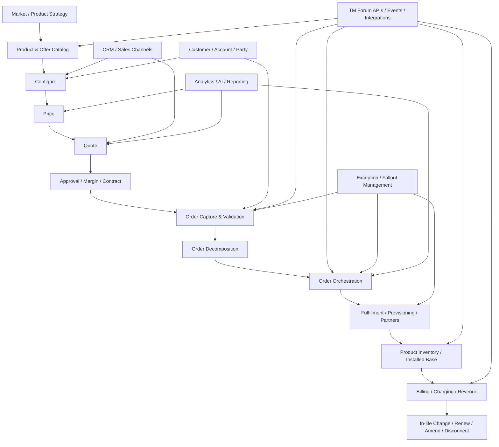

Mental model sederhananya:

```text
Catalog defines what can be sold
Configuration defines what is valid
Pricing defines what it costs and earns
Quote defines what is promised
Order defines what must be delivered
Orchestration defines who does what, when
Inventory defines what the customer actually has
Billing defines what can be charged
```

---

## Decomposition Map of Practical Categories / Domain / Skills

| No | Area / Skill Domain | Yang Perlu Dipahami Software Engineer | Kenapa Penting |
|---:|---|---|---|
| 1 | **Quote-to-Cash Mental Model** | Alur dari configure → price → quote → contract → order → orchestrate → fulfill → bill. CSG menjelaskan quote-to-cash sebagai workflow terhubung antara CPQ, order management, billing, dan revenue recognition. ([CSG](https://www.csgi.com/solutions/quote-to-cash)) | Supaya Anda tidak melihat CPQ dan order management sebagai modul terpisah, tetapi sebagai lifecycle revenue end-to-end. |
| 2 | **Product Catalog** | Product offering, product specification, bundle, option, eligibility, compatibility, dependency, lifecycle versioning. TM Forum Product Ordering API juga mendefinisikan order berdasarkan product offering dari catalog. ([TM Forum](https://www.tmforum.org/open-digital-architecture/open-apis/product-ordering-management-api-TMF622/v5.0)) | Hampir semua rule CPQ dan order validation bergantung pada catalog. Catalog yang buruk menyebabkan quote salah dan fulfillment gagal. |
| 3 | **Layered / Telco-native Catalog** | CSG Quote & Order dijelaskan oleh TM Forum sebagai telco-native platform dengan single catalog dan layered catalog untuk merepresentasikan kompleksitas service composition. ([TM Forum](https://www.tmforum.org/oda/directory/software-providers/directory/csg/products/csg-quote-and-order)) | Penting untuk telco/BSS karena produk bisnis sering tersusun dari product, service, resource, network capability, partner component, dan billing component. |
| 4 | **Configure Domain** | Validasi pilihan customer: produk mana boleh dibeli, kombinasi mana valid, add-on apa kompatibel, lokasi mana eligible, dependency antar service. | Ini area rule-heavy. Engineer perlu memahami rule evaluation, validation error, explainability, dan versioned decision logic. |
| 5 | **Pricing Domain** | Recurring charge, one-time charge, usage charge, discount, promotion, contract price, enterprise agreement, margin, cost visibility. CSG menekankan tailored pricing, real-time visibility into cost, margin, and profitability. ([CSG](https://www.csgi.com/products/quote-and-order)) | Pricing adalah titik rawan revenue leakage. Kesalahan kecil bisa berdampak langsung ke margin, approval, dan billing. |
| 6 | **Quote Management** | Quote lifecycle: draft, configured, priced, submitted, approved, presented, accepted, expired, rejected, revised. | Quote adalah “promise object”. Semua downstream order dan billing harus traceable ke apa yang dijanjikan. |
| 7 | **Complex B2B Deal Structure** | Multi-line, multi-site, multi-partner, phased rollout, bundle enterprise, custom terms. CSG secara eksplisit menyebut dukungan untuk multi-line, multi-site, dan multi-partner deals. ([CSG](https://www.csgi.com/products/quote-and-order)) | Struktur order tidak selalu satu customer-satu produk. Bisa ratusan site, banyak service, banyak tanggal aktivasi, banyak partner. |
| 8 | **Approval & Commercial Governance** | Approval berdasarkan margin, discount threshold, contract exception, legal term, risk, SLA, credit, delivery feasibility. | Banyak perubahan harga/order tidak boleh langsung lolos. Engineer perlu paham workflow, delegation, audit, dan SLA approval. |
| 9 | **Contract / Agreement Domain** | Enterprise agreement, contract term, renewal, amendment, minimum commitment, special pricing, billing compliance. CSG menyebut enterprise agreements dan customer-specific pricing untuk accurate billing. ([CSG](https://www.csgi.com/products/quote-and-order)) | Contract menjadi pengikat antara quote, order, billing, entitlement, dan dispute handling. |
| 10 | **Order Capture & Validation** | Convert accepted quote menjadi order; validasi customer, product, account, site, billing account, appointment, eligibility. TM Forum TMFC002 menjelaskan order capture sebagai proses menangkap kebutuhan customer berdasarkan product catalog, menyediakan quote, mengecek eligibility, dan melengkapi order info. ([TM Forum](https://www.tmforum.org/oda/directory/components-map/core-commerce-management/TMFC002)) | Ini boundary penting antara sales promise dan operational delivery. |
| 11 | **Product Ordering API Model** | Product order, order item, action add/modify/delete/no-change, related party, billing account, product offering, characteristic, appointment. TMF622 menyediakan mekanisme standar untuk placing product order dengan parameter order yang dibutuhkan. ([TM Forum](https://www.tmforum.org/open-digital-architecture/open-apis/product-ordering-management-api-TMF622/v5.0)) | Sangat relevan jika platform Anda integrasi dengan CRM, portal, BSS/OSS, atau partner menggunakan TM Forum Open APIs. |
| 12 | **Order Decomposition** | Memecah commercial product order menjadi service order, resource order, network task, partner task, billing task, inventory update. TMFC003 menjelaskan orchestration delivery order berdasarkan relasi product specification ke CFS/resource specification. ([TM Forum](https://www.tmforum.org/oda/directory/components-map/core-commerce-management/TMFC003)) | Order enterprise jarang fulfilled oleh satu sistem. Decomposition menentukan dependency graph fulfillment. |
| 13 | **Order Orchestration** | Sequencing task, dependency, parallel execution, compensation, retry, manual task, SLA, milestone, fallout. CSG memosisikan order management sebagai engine yang memecah order menjadi task dan menjaga team tetap sinkron. ([CSG](https://www.csgi.com/solutions/quote-to-cash/order-management)) | Ini dekat dengan state machine dan workflow engine. Camunda knowledge Anda akan sangat relevan di sini. |
| 14 | **Fulfillment / Provisioning Integration** | Integrasi ke network, IT, provisioning, field service, partner, ERP, billing, activation. CSG menyatakan order management mengoordinasikan existing network, IT, dan partner systems, bukan selalu mengganti semuanya. ([CSG](https://www.csgi.com/solutions/quote-to-cash/order-management)) | Engineer perlu desain idempotency, correlation ID, async callback, timeout, compensation, dan reconciliation. |
| 15 | **Product Inventory / Installed Base** | Record produk yang benar-benar aktif/dimiliki customer: status, start/end date, tariff, discount, asset, site, relationship. TMFC002 menyebut update Product Inventory setelah delivery order item. ([TM Forum](https://www.tmforum.org/oda/directory/components-map/core-commerce-management/TMFC002)) | Inventory adalah source untuk amend, upgrade, downgrade, disconnect, renew, dan billing eligibility. |
| 16 | **Billing / Charging / Revenue Handoff** | Handoff order result ke billing: charge activation, recurring billing, usage billing, discount, tax, revenue recognition, invoice accuracy. | Quote/order tidak selesai saat service aktif; selesai saat bisa ditagih dengan benar. |
| 17 | **In-life Change Management** | Modify, suspend, resume, relocate, upgrade, downgrade, renew, terminate, disconnect, cancellation, rollback. CSG menyebut update quotes/orders as customer needs change dan change/in-life sebagai bagian order management. ([CSG](https://www.csgi.com/products/quote-and-order)) | Banyak kompleksitas nyata muncul setelah produk aktif, bukan saat order pertama. |
| 18 | **Fallout / Exception Management** | Handling order gagal: invalid data, provisioning reject, partner timeout, site unavailable, price mismatch, inventory conflict, billing failure. | Platform harus bisa recover, bukan hanya throw error. Penting untuk operational defensibility. |
| 19 | **Multi-channel Order Management** | Order dari sales team, CRM, web, mobile, partner portal, store, self-service. CSG mendefinisikan multi-channel order management sebagai pemrosesan order dari banyak channel melalui unified system. ([CSG](https://www.csgi.com/solutions/quote-to-cash/order-management)) | Menjaga konsistensi rule dan status antar channel. |
| 20 | **API & Event-driven Integration** | REST API, event synchronization, error handling, TM Forum API alignment, ODA component model. CSG menyebut ODA-compliant APIs, RESTful interfaces, event-driven synchronization, dan scalable integration patterns. ([CSG](https://www.csgi.com/insights/cpq-api-build-integrations-scale-business)) | Relevan langsung dengan stack Java/Jersey, Kafka/RabbitMQ, Camunda, PostgreSQL, dan Kubernetes. |
| 21 | **TM Forum / ODA Awareness** | TM Forum Open APIs, ODA component boundaries, product catalog, product ordering, product inventory, service/resource ordering. TM Forum menyebut 70+ REST/event/domain-specific Open APIs dikembangkan untuk interoperability industri. ([TM Forum](https://www.tmforum.org/open-digital-architecture/about-open-apis/)) | Untuk telco/BSS, standar ini sering menjadi bahasa integrasi lintas vendor. |
| 22 | **State Machine & Lifecycle Governance** | Quote state, order state, order item state, fulfillment task state, inventory state, billing state. | Engineer perlu bisa membedakan state bisnis, state teknis, dan state integrasi. Ini krusial untuk audit dan troubleshooting. |
| 23 | **Data Consistency & Reconciliation** | Quote vs order vs inventory vs billing consistency, duplicate prevention, retry safety, eventual consistency, reconciliation job. | Sistem CPQ/OM biasanya terdistribusi; tidak semua perubahan terjadi sinkron. |
| 24 | **Auditability & Traceability** | Siapa mengubah harga, rule mana dipakai, quote versi berapa, approval siapa, order item mana gagal, event mana terkirim. | Domain enterprise membutuhkan bukti keputusan, terutama untuk dispute, compliance, dan revenue assurance. |
| 25 | **Reporting / Margin / Operational Analytics** | Quote conversion, cycle time, approval bottleneck, order fallout, SLA breach, margin leakage, time-to-activate. CSG menekankan visibility ke cost, margin, profitability, dan issue detection. ([CSG](https://www.csgi.com/products/quote-and-order)) | Analytics membantu engineer memahami dampak teknis terhadap revenue dan operasi. |

---

## Practical Domain Model yang Perlu Anda Hafal

| Object | Makna Bisnis | State / Lifecycle yang Umum |
|---|---|---|
| **Product Offering** | Produk/penawaran yang bisa dijual ke customer | draft, active, retired |
| **Product Specification** | Definisi teknis/komersial produk | versioned, reusable |
| **Price / Charge** | Harga produk, discount, recurring/one-time/usage charge | active, expired, overridden |
| **Quote** | Proposal harga dan konfigurasi ke customer | draft, priced, submitted, approved, accepted, expired |
| **Quote Item** | Baris produk/service dalam quote | configured, priced, invalid, approved |
| **Agreement / Contract** | Komitmen legal/komersial | draft, signed, active, renewed, terminated |
| **Product Order** | Instruksi resmi untuk deliver apa yang sudah dijual | captured, validated, accepted, in progress, completed, cancelled, failed |
| **Order Item** | Unit granular dari order | pending, in progress, completed, failed, cancelled |
| **Fulfillment Task** | Aktivitas delivery/provisioning | ready, running, waiting, completed, failed |
| **Product Inventory Item** | Produk aktif yang dimiliki customer | pending active, active, suspended, terminated |
| **Billing Account** | Account penagihan customer | active, blocked, closed |
| **Service / Resource Order** | Turunan teknis dari product order | issued, acknowledged, completed, failed |

---

## Boundary yang Harus Jelas untuk Software Engineer

| Boundary | Jangan Dicampur |
|---|---|
| **Catalog vs Inventory** | Catalog = apa yang bisa dijual; Inventory = apa yang sudah dimiliki customer. |
| **Quote vs Order** | Quote = promise/proposal; Order = delivery commitment. |
| **Product Order vs Service Order** | Product order = commercial intent; service order = technical fulfillment. |
| **Price vs Bill** | Price = perhitungan penawaran; bill = tagihan aktual setelah order/usage. |
| **Validation vs Orchestration** | Validation memastikan order masuk akal; orchestration memastikan order dieksekusi. |
| **State bisnis vs state teknis** | “Order accepted” tidak sama dengan “provisioning completed”. |
| **Synchronous API vs async fulfillment** | Order capture bisa sync; delivery hampir selalu async/event-driven. |

---

## Roadmap Alur Belajar yang Direkomendasikan

### Phase 1 - Business Mental Model

Mulai dari **Quote-to-Cash**, bukan dari teknologi. Pahami alur:

```text
Product → Offer → Configure → Price → Quote → Contract → Order → Fulfill → Inventory → Bill
```

Target pemahaman: Anda bisa menjelaskan bagaimana satu enterprise customer membeli bundle multi-site, bagaimana harga dihitung, bagaimana quote berubah menjadi order, dan bagaimana order akhirnya menjadi billing.

---

### Phase 2 - CPQ Core

Pelajari:

```text
Catalog
Configuration rules
Pricing rules
Discounts
Approvals
Quote lifecycle
Enterprise agreements
```

Target pemahaman: Anda bisa membaca issue seperti “discount tidak muncul”, “quote invalid”, “bundle tidak eligible”, atau “margin approval salah route” tanpa langsung melihat source code.

---

### Phase 3 - Order Management Core

Pelajari:

```text
Order capture
Order validation
Order decomposition
Order orchestration
Fulfillment task
Fallout handling
Inventory update
```

Target pemahaman: Anda bisa memodelkan order sebagai graph/state machine, bukan sebagai satu record datar.

---

### Phase 4 - Integration & TM Forum

Pelajari:

```text
TMF620 Product Catalog
TMF622 Product Ordering
Product Inventory
Service Ordering
Event notification
Correlation ID
Idempotency
Reconciliation
```

Target pemahaman: Anda bisa memahami boundary antara CSG, CRM, billing, provisioning, partner system, dan internal microservices.

---

### Phase 5 - Engineering Deep Dive

Hubungkan domain ke stack perusahaan Anda:

```text
Java/Jersey REST APIs
Camunda workflow/state orchestration
PostgreSQL transactional model
Kafka/RabbitMQ events
Docker/Kubernetes deployment
Observability and audit trail
```

Target pemahaman: Anda bisa mendesain endpoint, event, state transition, retry, compensation, dan audit model yang cocok untuk CPQ/order management.

---

## Rekomendasi Materi Selanjutnya

Lanjut paling bagus ke:

**Cheatsheet: CPQ & Order Management Core Entity Model - Quote, Quote Item, Product Order, Order Item, Catalog, Inventory, Billing Account, dan State Lifecycle**

Materi itu akan sangat membantu sebelum masuk ke API design, database schema, Camunda workflow, atau integration pattern.

---

**Sources:**

- [CSG Quote & Order | CSG](https://www.csgi.com/products/quote-and-order)
- [Product Ordering Management API TMF622-v5.0](https://www.tmforum.org/open-digital-architecture/open-apis/product-ordering-management-api-TMF622/v5.0)

## Response:
7/13/2026, 8:30:12 AM

Saya rekomendasikan **18 seri** untuk topik **CSG Enterprise CPQ & Order Management Platform** agar cukup lengkap untuk onboarding software engineer tanpa terlalu melebar.

| Seri | Topik |
|---:|---|
| 1 | Quote-to-Cash Mental Model |
| 2 | Customer, Account, Party, Site, Billing Account |
| 3 | Product Catalog, Offering, Specification, Bundle |
| 4 | Configuration Rules, Eligibility, Compatibility |
| 5 | Pricing, Discount, Promotion, Margin |
| 6 | Quote Lifecycle & Quote Item Model |
| 7 | Approval Workflow & Commercial Governance |
| 8 | Contract / Agreement / Enterprise Deal Model |
| 9 | Order Capture & Order Validation |
| 10 | Product Order & Order Item Lifecycle |
| 11 | Order Decomposition |
| 12 | Order Orchestration & State Machine |
| 13 | Fulfillment, Provisioning, Partner Integration |
| 14 | Product Inventory / Installed Base |
| 15 | Billing / Charging / Revenue Handoff |
| 16 | In-life Change: Amend, Suspend, Resume, Terminate, Renew |
| 17 | Fallout, Exception Handling, Reconciliation |
| 18 | TM Forum APIs, Integration, Audit, Observability & Analytics |

Urutan belajar yang saya sarankan:

```text
Business flow
→ Core entities
→ CPQ
→ Order management
→ Fulfillment/inventory/billing
→ Integration/fallout/observability
```

Jadi totalnya: **18 seri**.  
Materi berikutnya yang paling tepat: **Seri 1 — Quote-to-Cash Mental Model for CSG CPQ & Order Management**.

## Response:
7/13/2026, 8:30:32 AM

Saya mulai dari **Seri 1** dengan fokus membangun mental model end-to-end, bukan detail teknis dulu. Saya akan pakai rujukan vendor/standar publik untuk menjaga istilahnya tetap akurat.

# Seri 1 - Quote-to-Cash Mental Model for CSG CPQ & Order Management

## 1. Tujuan Seri Ini

Seri pertama ini menjawab pertanyaan inti:

> **Dalam platform CSG Enterprise CPQ & Order Management, sebenarnya bisnis sedang mengalirkan apa dari awal sampai akhir?**

Jawabannya: bisnis sedang mengalirkan **intent penjualan** menjadi **komitmen delivery**, lalu menjadi **layanan aktif**, lalu menjadi **revenue yang bisa ditagih dan dipertanggungjawabkan**.

Dalam bahasa sederhana:

```text
Apa yang ingin dijual
→ apa yang valid untuk customer
→ berapa harganya
→ apa yang dijanjikan
→ apa yang harus dikerjakan
→ apa yang berhasil diaktifkan
→ apa yang boleh ditagihkan
```

CSG mendeskripsikan quote-to-cash sebagai workflow yang menghubungkan CPQ, order management, billing, dan revenue recognition; tahapannya meliputi configure, price, quote, contract, order, orchestrate/automate, fulfill, dan bill. ([CSG](https://www.csgi.com/solutions/quote-to-cash))

---

## 2. Mental Model Utama

Quote-to-Cash bukan satu aplikasi tunggal. Ini adalah **business lifecycle**.

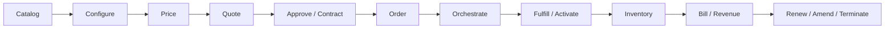

Versi mental model untuk engineer:

```text
Catalog = definisi apa yang boleh dijual
Configure = validasi kombinasi produk
Price = hitung nilai komersial
Quote = proposal / promise ke customer
Contract = komitmen legal-komersial
Order = instruksi delivery resmi
Orchestration = koordinasi pekerjaan lintas sistem
Fulfillment = aktivasi / provisioning nyata
Inventory = catatan layanan yang benar-benar dimiliki customer
Billing = konversi layanan aktif menjadi tagihan
```

CSG menekankan pentingnya **one connected workflow** agar sales, operations, dan finance melihat data yang sama, mengikuti proses yang sama, dan melayani customer yang sama dari quote sampai revenue. ([CSG](https://www.csgi.com/solutions/quote-to-cash))

---

## 3. Kenapa Ini Penting untuk Software Engineer

Di sistem biasa, flow sering terlihat seperti ini:

```text
REST endpoint → service → database → response
```

Di CPQ & Order Management enterprise, flow sebenarnya lebih dekat ke:

```text
business intent
→ validation
→ pricing decision
→ approval state
→ contract obligation
→ order graph
→ async orchestration
→ external system coordination
→ reconciliation
→ billing impact
```

Jadi problem yang Anda hadapi bukan hanya:

> “Kenapa API gagal?”

Tetapi juga:

> “Apakah promise komersial, order operasional, fulfillment status, inventory, dan billing masih konsisten?”

Ini sangat relevan untuk stack Anda: **Java/Jersey**, **Camunda**, **PostgreSQL**, **Kafka/RabbitMQ**, **Docker/Kubernetes**, dan deployment hybrid **on-prem/AWS/Azure**.

---

## 4. End-to-End Domain Flow

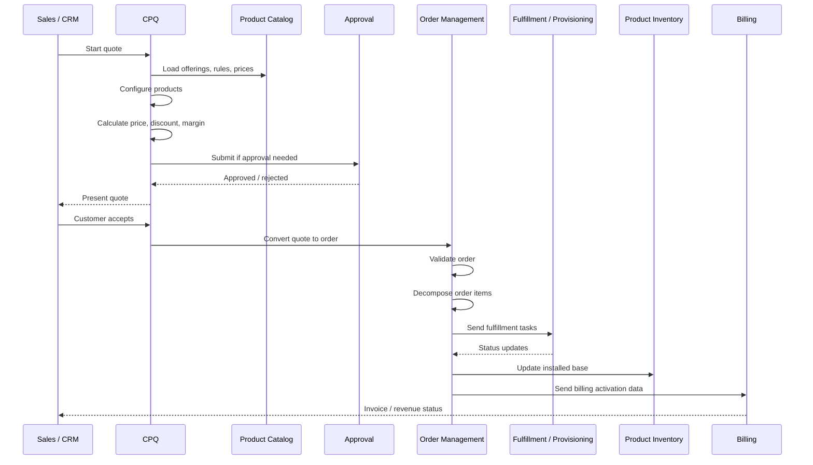

---

## 5. Decomposition Table - Quote-to-Cash Layer

| Layer | Business Question | Main Objects | Engineer Concern |
|---|---|---|---|
| **Catalog** | Produk apa yang boleh dijual? | Product offering, product spec, bundle, price, eligibility rule | Versioning, rule lookup, cache, compatibility |
| **Configure** | Kombinasi produk ini valid atau tidak? | Configuration, option, characteristic, dependency | Validation engine, explainable error, deterministic rules |
| **Price** | Berapa harga dan margin deal ini? | Charge, discount, promotion, cost, margin | Calculation order, rounding, currency, override audit |
| **Quote** | Apa yang dijanjikan ke customer? | Quote, quote item, quote version | State lifecycle, quote revision, expiration |
| **Approval** | Apakah deal ini boleh dilanjutkan? | Approval request, approver, threshold, policy | Workflow routing, SLA, delegation, audit |
| **Contract** | Apa komitmen legal-komersialnya? | Agreement, term, commitment, renewal | Traceability ke quote/order/billing |
| **Order Capture** | Apa yang benar-benar customer beli? | Product order, order item, related party, billing account | Idempotency, validation, duplicate prevention |
| **Order Decomposition** | Pekerjaan apa saja yang harus dilakukan? | Fulfillment plan, task, dependency graph | DAG modeling, sequencing, parallelism |
| **Orchestration** | Siapa mengerjakan apa dan kapan? | Workflow instance, task, milestone | Camunda/state machine, retry, timeout, compensation |
| **Fulfillment** | Apakah layanan sudah aktif? | Service order, resource order, provisioning request | External integration, async callback, correlation ID |
| **Inventory** | Customer sekarang punya layanan apa? | Product inventory item, service instance, asset | Source of truth, amendment, consistency |
| **Billing** | Apa yang boleh ditagihkan? | Billing account, charge activation, invoice item | Revenue leakage, reconciliation, tax/usage/discount |
| **In-life Change** | Bagaimana jika customer amend/renew/terminate? | Change order, renewal, disconnect, suspension | Delta order, dependency to installed base |

---

## 6. Canonical Flow: From Quote to Revenue

### Step 1 - Product is defined in catalog

Business ingin menjual produk/bundle tertentu. Produk ini tidak boleh hanya hidup di spreadsheet atau hardcoded rule.

```text
Product offering
Product specification
Product characteristic
Product price
Eligibility rule
Compatibility rule
Lifecycle status
```

TM Forum TMF620 mendefinisikan Product Catalog Management API untuk mengelola lifecycle catalog elements dan memungkinkan catalog dikonsultasikan dalam proses seperti ordering, campaign, dan sales management. ([TM Forum](https://www.tmforum.org/resources/specifications/tmf620-product-catalog-management-api-user-guide-v5-0-0/))

### Step 2 - Sales configures the offer

Sales memilih produk, site, quantity, bandwidth, SLA, add-on, device, contract term, dan sebagainya.

Yang dicek:

```text
Apakah customer eligible?
Apakah lokasi/site eligible?
Apakah kombinasi produk valid?
Apakah add-on compatible?
Apakah existing product di inventory memengaruhi pilihan?
```

### Step 3 - System calculates price

CPQ menghitung:

```text
one-time charge
recurring charge
usage charge
discount
promotion
cost
margin
contract-specific pricing
```

CSG Quote & Order diposisikan untuk mengotomasi konfigurasi, pricing rules, dan quoting workflow; juga memberi visibility atas cost, margin, dan profitability sepanjang deal lifecycle. ([CSG](https://www.csgi.com/resources/csg-quote-and-order))

### Step 4 - Quote is approved and accepted

Quote bukan sekadar PDF. Quote adalah **commercial promise**.

Quote harus menjawab:

```text
Apa yang dijual?
Untuk customer/account/site mana?
Harga dan diskonnya apa?
Term kontraknya apa?
Berlaku sampai kapan?
Siapa yang approve?
Versi quote mana yang diterima?
```

### Step 5 - Quote becomes product order

Setelah customer accept, sistem membuat **product order**.

TM Forum TMF622 menyebut Product Ordering API sebagai mekanisme standar untuk placing product order dengan parameter order yang diperlukan; product order dibuat berdasarkan product offer yang didefinisikan di catalog dan mencakup karakteristik seperti pricing, options, dan market. ([TM Forum](https://www.tmforum.org/resources/specifications/tmf622-product-ordering-management-api-user-guide-v5-0-0/))

### Step 6 - Order is decomposed

Order enterprise jarang satu langkah.

Contoh order:

```text
Install enterprise connectivity for 50 branches
```

Bisa terdekomposisi menjadi:

```text
validate customer/account
validate site
reserve resource
create access service
order CPE/device
schedule field engineer
configure network
activate service
update inventory
notify billing
```

### Step 7 - Order is orchestrated

Order Management mengatur urutan, parallelism, dependency, dan recovery.

```text
Task A harus selesai sebelum Task B
Task C dan D bisa parallel
Task E menunggu callback partner
Task F perlu manual approval
Task G gagal dan perlu retry / fallout
```

### Step 8 - Fulfillment updates inventory

Setelah layanan aktif, sistem harus memperbarui installed base:

```text
Customer X now owns Product Y
Site = Jakarta
Bandwidth = 1 Gbps
Contract term = 36 months
Billing start date = 2026-07-13
Status = Active
```

### Step 9 - Billing receives chargeable facts

Billing tidak boleh menagih hanya karena quote accepted. Billing idealnya menagih berdasarkan fakta:

```text
order completed
service activated
charge effective date
billing account valid
contract terms attached
discount and price committed
```

---

## 7. State Machine View

### Quote Lifecycle

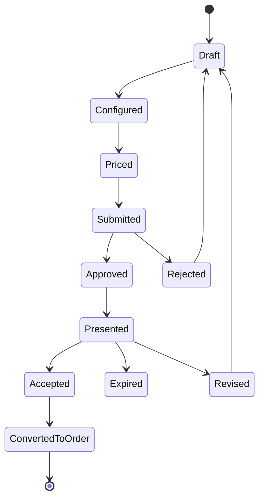

### Product Order Lifecycle

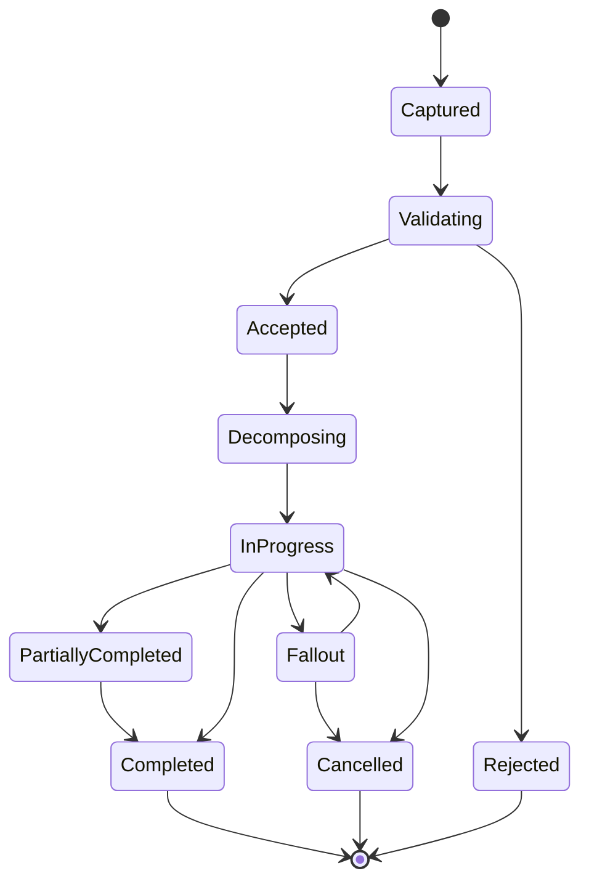

### Fulfillment Task Lifecycle

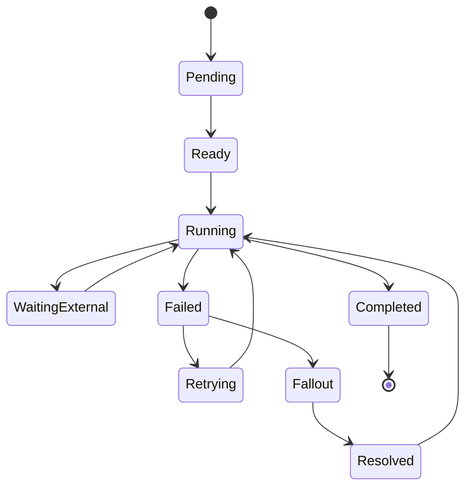

---

## 8. Key Invariants

Ini bagian paling penting untuk engineer.

| Invariant | Makna |
|---|---|
| **Order harus traceable ke quote yang accepted** | Jangan sampai order dibuat dari quote yang sudah expired/revised tanpa kontrol. |
| **Harga order harus konsisten dengan quote/contract** | Kalau ada recalculation, harus jelas rule-nya. |
| **Catalog version harus diketahui** | Produk yang valid hari ini belum tentu valid saat quote dibuat. |
| **Order item harus punya action jelas** | Add, modify, delete, no-change, suspend, resume, disconnect. |
| **Billing tidak boleh aktif sebelum chargeable event valid** | Mencegah invoice salah dan dispute. |
| **Inventory harus merepresentasikan kondisi aktual** | In-life change bergantung pada installed base yang benar. |
| **Retry harus idempotent** | Jangan sampai retry membuat provisioning ganda atau billing ganda. |
| **State transition harus auditable** | Harus bisa menjawab siapa/apa/kapan/kenapa state berubah. |
| **External callback harus correlated** | Setiap event dari provisioning/partner harus match ke order/task yang benar. |
| **Manual override harus governance-aware** | Override harga, status, atau approval harus tercatat dan dibatasi. |

---

## 9. Failure Modes yang Sering Terjadi

| Failure Mode | Contoh | Dampak |
|---|---|---|
| **Quote-order mismatch** | Quote accepted berisi discount 20%, order masuk tanpa discount | Revenue dispute, margin/report salah |
| **Catalog drift** | Quote dibuat dengan catalog v10, order diproses saat catalog v11 | Validation gagal atau produk berubah diam-diam |
| **Invalid decomposition** | Order bundle gagal dipecah menjadi task teknis yang lengkap | Fulfillment stuck |
| **Async callback lost** | Provisioning sukses, tapi callback tidak sampai | Order terlihat stuck, billing tidak aktif |
| **Duplicate order submission** | User klik submit dua kali / retry API | Double provisioning, double billing |
| **Partial fulfillment** | 49 dari 50 site aktif | Status order ambigu, billing partial perlu aturan |
| **Billing activation too early** | Tagihan mulai sebelum service aktif | Customer complaint |
| **Inventory not updated** | Service aktif tapi installed base kosong | Amend/terminate berikutnya gagal |
| **Approval bypass** | Discount besar tidak melewati approval | Margin leakage |
| **Manual fix without audit** | Ops mengubah status langsung di DB | Tidak defensible saat audit/troubleshooting |

---

## 10. Engineering Mapping ke Stack Anda

| Domain Concern | Stack Relevance |
|---|---|
| REST API untuk quote/order | Java 17+, Jakarta REST/Jersey |
| Workflow approval/order orchestration | Camunda |
| Product/order persistence | PostgreSQL, MyBatis |
| Long-running async integration | Kafka/RabbitMQ |
| Retry, timeout, idempotency | Java service layer + DB constraints + workflow state |
| Deployment runtime | Docker/Kubernetes |
| Enterprise integration | REST, events, TM Forum-aligned APIs |
| Observability | logs, metrics, traces, audit event |
| Reconciliation | scheduled jobs, SQL reports, event replay |
| Multi-environment deployment | On-prem, AWS, Azure |

---

## 11. Minimal Data Model View

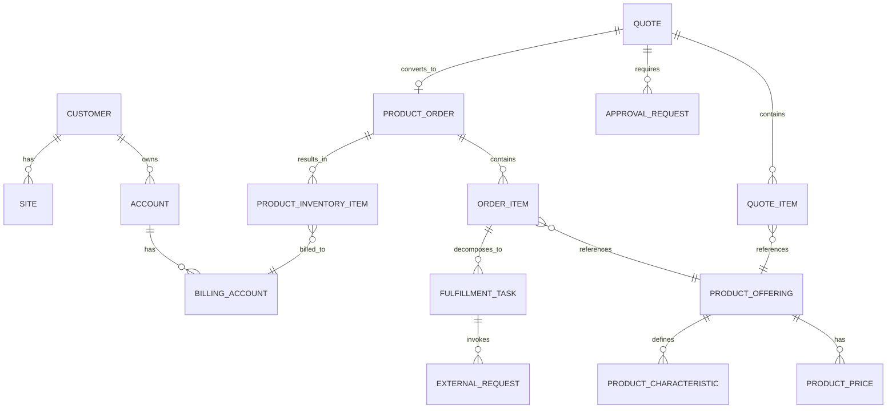

---

## 12. How to Think When Debugging

Gunakan checklist berurutan ini:

```text
1. Customer/account/site mana?
2. Quote mana dan versi berapa?
3. Catalog version mana yang dipakai?
4. Product offering dan configuration apa?
5. Harga dihitung dari rule mana?
6. Approval apa yang terjadi?
7. Quote accepted kapan?
8. Product order dibuat dari quote mana?
9. Order item action apa?
10. Decomposition menghasilkan task apa saja?
11. Task mana yang gagal/stuck?
12. External system response apa?
13. Inventory sudah update atau belum?
14. Billing sudah menerima chargeable fact atau belum?
15. Ada reconciliation gap atau tidak?
```

Jangan mulai dari “service mana error” dulu. Mulai dari **business object mana yang lifecycle-nya tidak konsisten**.

---

## 13. Practical Example

### Scenario

Customer enterprise membeli:

```text
50 branch internet connections
1 head office dedicated link
managed router add-on
36-month contract
special discount 18%
phased activation over 3 months
```

### CPQ View

```text
Configure:
- branch package valid?
- head office package valid?
- managed router compatible?
- locations serviceable?

Price:
- recurring charge per branch
- one-time installation charge
- router rental
- enterprise discount
- contract term adjustment
- margin check

Quote:
- customer-facing commercial proposal
- valid until date
- approved discount
```

### Order Management View

```text
Order:
- create one product order
- many order items
- per-site delivery plan

Decomposition:
- site survey task
- resource reservation
- device shipment
- field installation
- network provisioning
- service activation
- inventory update
- billing activation
```

### Engineering View

```text
API:
POST /quotes
POST /quotes/{id}/submit
POST /quotes/{id}/accept
POST /orders

Workflow:
QuoteApprovalProcess
OrderFulfillmentProcess

Events:
QuoteAccepted
ProductOrderCreated
OrderItemCompleted
FulfillmentFailed
ProductInventoryUpdated
BillingActivationRequested

Database:
quote
quote_item
approval_request
product_order
order_item
fulfillment_task
external_request
product_inventory_item
billing_activation_event
```

---

## 14. Red Flags Saat Membaca Codebase

| Red Flag | Kenapa Berbahaya |
|---|---|
| Harga dihitung ulang tanpa referensi quote version | Bisa menyebabkan price drift. |
| Order dibuat langsung dari request UI tanpa accepted quote | Menghilangkan commercial traceability. |
| Status order hanya satu field global | Tidak cukup untuk partial fulfillment. |
| Tidak ada idempotency key | Rawan duplicate order/provisioning. |
| External callback update langsung ke order completed | Mengabaikan dependency task lain. |
| Inventory dibuat sebelum fulfillment sukses | Installed base tidak mencerminkan fakta. |
| Billing event dikirim dari quote accepted | Billing terlalu awal. |
| Tidak ada audit untuk approval/override | Sulit dipertanggungjawabkan. |
| Catalog rule hardcoded di service | Sulit versioning dan change management. |
| Manual DB update menjadi operational habit | State machine rusak dan tidak defensible. |

---

## 15. Ringkasan Seri 1

Quote-to-Cash dalam konteks CSG CPQ & Order Management adalah lifecycle:

```text
Catalog
→ Configure
→ Price
→ Quote
→ Approve / Contract
→ Order
→ Decompose
→ Orchestrate
→ Fulfill
→ Inventory
→ Bill
→ Renew / Amend / Terminate
```

Sebagai software engineer, cara berpikir yang benar adalah:

```text
Jangan hanya pikirkan endpoint, table, dan service.
Pikirkan lifecycle, state transition, business invariant, traceability, dan failure recovery.
```

CSG Quote & Order secara publik diposisikan untuk kompleksitas telco seperti multi-line, multi-site, multi-partner deals, catalog-driven CPQ, order management, monetization, dan API-powered self-service/CRM quoting. ([CSG](https://www.csgi.com/resources/csg-quote-and-order))

---

# Status Seri

✅ **Seri 1 - Quote-to-Cash Mental Model selesai.**

## Rekomendasi Materi Selanjutnya

Lanjut ke:

**Seri 2 - Customer, Account, Party, Site, dan Billing Account Model**

Kenapa ini penting: sebelum masuk catalog, quote, atau order, Anda harus paham dulu **siapa customer-nya, struktur account-nya seperti apa, site mana yang dilayani, dan account mana yang akan ditagih**.

---

**Sources:**

- [Quote to Cash Software for Enterprise Deals | CSG](https://www.csgi.com/solutions/quote-to-cash)
- [TMF620 Product Catalog Management API User Guide v5.0.0 – TM Forum](https://www.tmforum.org/resources/specifications/tmf620-product-catalog-management-api-user-guide-v5-0-0/)

## Response:
7/13/2026, 8:12:42 PM

Saya lanjut ke **Seri 2**: fondasi customer/account/site/billing account. Fokusnya membedakan identitas pihak, struktur customer, lokasi layanan, dan tujuan penagihan—karena kesalahan boundary di sini biasanya merembet ke quote, order, fulfillment, dan billing.

# Seri 2 - Customer, Account, Party, Site, dan Billing Account Model

## 1. Tujuan Seri Ini

Seri ini membahas fondasi data bisnis sebelum masuk ke catalog, quote, pricing, atau order.

Pertanyaan intinya:

> **Siapa customer-nya, siapa pihak legalnya, struktur organisasinya seperti apa, lokasi mana yang dilayani, dan account mana yang akan ditagih?**

Dalam CPQ & Order Management enterprise, kesalahan memahami area ini akan menyebabkan masalah downstream:

```text id="t5s5pq"
Quote salah customer
Order salah site
Billing salah account
Approval salah hierarchy
Inventory salah owner
Contract salah party
```

TM Forum membedakan beberapa domain penting: **Party Management** untuk individu/organisasi yang berelasi dengan enterprise, **Account Management** untuk billing/settlement/financial account, dan **Product Ordering** untuk order yang mereferensikan related party, billing account, dan product/order item. Party dapat berupa individu atau organisasi yang punya hubungan dengan enterprise. ([TM Forum](https://www.tmforum.org/open-digital-architecture/open-apis/party-management-api-TMF632/v5.0?utm_source=chatgpt.com))

---

## 2. Mental Model

Jangan samakan semua istilah ini sebagai “customer”.

```text id="8ogp31"
Party             = siapa entitasnya
Party Role        = entitas itu berperan sebagai apa
Customer          = party yang membeli/menggunakan produk
Account           = struktur relasi/komersial/operasional customer
Billing Account   = tujuan penagihan
Site              = lokasi layanan
Contact           = orang yang bisa dihubungi
User              = login identity di sistem
```

Versi ringkas:

```text id="ly3jr5"
Party menjawab: siapa?
Role menjawab: sebagai apa?
Customer menjawab: relasi komersial dengan provider
Site menjawab: di mana layanan diberikan?
Billing account menjawab: tagihan masuk ke mana?
Contact menjawab: siapa yang dihubungi?
User menjawab: siapa yang login?
```

---

## 3. Diagram Konseptual

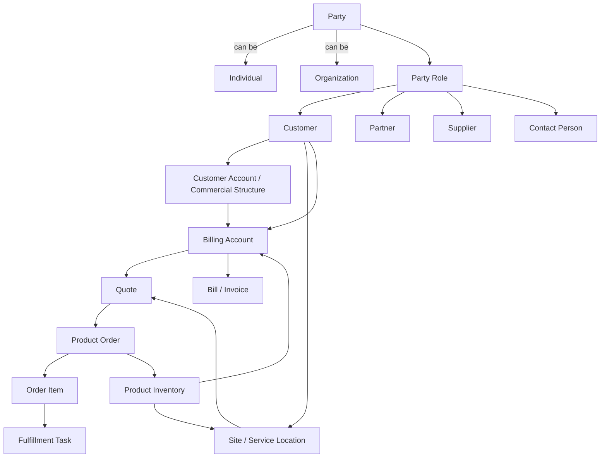

---

## 4. Object Boundary Table

| Object | Definisi Praktis | Contoh | Jangan Dicampur Dengan |
|---|---|---|---|
| **Party** | Entitas dasar: individu atau organisasi. | PT Nusantara Digital, John Doe. | Customer, user login, account. |
| **Party Role** | Peran party dalam relasi bisnis. | Customer, partner, payer, technical contact. | Party identity itu sendiri. |
| **Customer** | Party/party role yang membeli, menggunakan, atau berkontrak atas layanan. | PT Nusantara sebagai enterprise customer. | Billing account. |
| **Customer Account** | Struktur komersial/operasional yang mengelompokkan customer relationship. | Enterprise parent account, branch account, department account. | Billing account murni. |
| **Billing Account** | Account finansial untuk menerima recurring, one-time, usage charge, invoice, payment allocation. | BA-001 Jakarta HQ, BA-002 regional branches. | Customer identity atau site. |
| **Site** | Lokasi fisik/logis tempat layanan dipasang/digunakan. | Head office Jakarta, branch Surabaya, data center Bekasi. | Billing address. |
| **Service Address** | Alamat teknis untuk delivery/provisioning. | Gedung, lantai, room, coordinates, coverage area. | Legal address atau invoice address. |
| **Billing Address** | Alamat invoice/pajak/surat tagihan. | NPWP/tax registered office. | Service location. |
| **Contact** | Orang/role untuk komunikasi bisnis/teknis. | Procurement contact, technical PIC, billing PIC. | User account. |
| **User / Identity** | Akun login aplikasi/portal. | user@customer.com login ke self-service portal. | Contact atau party role. |
| **Related Party** | Reference ke party/role di quote/order/product. | requester, approver, owner, payer. | Hardcoded customer field. |

---

## 5. Kenapa Boundary Ini Penting

### Case 1 - Customer ≠ Billing Account

Satu customer bisa punya banyak billing account.

```text id="yx9u9g"
Customer: PT Nusantara Digital
Billing Account 1: Jakarta HQ
Billing Account 2: Surabaya Branch
Billing Account 3: Data Center Division
```

TMF666 Account Management menyediakan mekanisme standar untuk mengelola billing dan settlement accounts, serta financial accounting/account receivable di konteks B2B atau B2B2C. ([TM Forum](https://www.tmforum.org/resources/specifications/tmf666-account-management-api-user-guide-v5-0-0/?utm_source=chatgpt.com))

Implikasi engineering:

```text id="oxfgy7"
Jangan taruh semua charge ke customer_id saja.
Order item perlu tahu billing_account_id.
Inventory item idealnya tahu billing account efektif.
Billing handoff harus membawa account finansial yang benar.
```

---

### Case 2 - Site ≠ Billing Address

Layanan dipasang di site A, tapi invoice dikirim ke billing address B.

```text id="0fsrr1"
Service Site:
Jl. Sudirman, Jakarta, lantai 18

Billing Address:
Head Office Finance Department, Tangerang

Tax Address:
Registered legal address, Jakarta Selatan
```

Implikasi engineering:

```text id="lndrki"
Serviceability check pakai service site.
Tax/invoice mungkin pakai billing/tax address.
Field service appointment pakai service address.
Contract party address bisa berbeda lagi.
```

---

### Case 3 - Party ≠ User Login

Orang yang menjadi billing contact belum tentu punya user login. User login juga belum tentu party legal.

```text id="7u1ixg"
Party/Contact: Budi, Finance Manager
User/Login: budi.finance@customer.com
Role: billing contact
Permission: can view invoices, cannot approve quote
```

Implikasi engineering:

```text id="0hgqru"
Identity & Access Management tidak boleh menggantikan party model.
Authorization harus mempertimbangkan role terhadap customer/account/site.
Audit actor perlu bedakan human login vs represented business party.
```

---

### Case 4 - Customer Hierarchy ≠ Legal Hierarchy

Enterprise B2B sering punya struktur:

```text id="zcuxzy"
Parent company
→ subsidiary
→ division
→ region
→ branch
→ site
```

Namun legal contract bisa berada di parent company, sementara billing di subsidiary, dan service delivery di branch.

Implikasi engineering:

```text id="zgmm9b"
Quote approval bisa berdasarkan parent account.
Credit limit bisa berdasarkan legal entity.
Billing bisa per subsidiary.
Fulfillment bisa per branch/site.
Reporting bisa aggregate ke group account.
```

---

## 6. Practical Domain Decomposition

| No | Domain / Skill | Yang Perlu Dipahami | Engineering Concern |
|---:|---|---|---|
| 1 | **Party Model** | Party sebagai individu/organisasi sebelum diberi peran bisnis. TMF632 menyediakan mekanisme standardized party management. ([TM Forum](https://www.tmforum.org/open-digital-architecture/open-apis/party-management-api-TMF632/v5.0?utm_source=chatgpt.com)) | Master data, deduplication, external CRM sync, stable identifiers. |
| 2 | **Party Role Model** | Satu party dapat berperan sebagai customer, contact, partner, payer, supplier. TMF669 memosisikan Party Role sebagai generalisasi Customer Management ketika role tidak hanya customer. ([TM Forum](https://www.tmforum.org/resources/specifications/tmf669-party-role-management-api-user-guide-v5-0-0/?utm_source=chatgpt.com)) | Role-specific validation, relationship modeling, relatedParty references. |
| 3 | **Customer Model** | Customer sebagai party dalam relasi komersial. | Customer lifecycle, segmentation, enterprise/B2B structure. |
| 4 | **Organization Hierarchy** | Parent-child organization, subsidiary, department, legal entity. | Recursive tree, effective ownership, hierarchy traversal, reporting rollup. |
| 5 | **Customer Account** | Account sebagai grouping commercial/operational relationship. | Account ownership, sales territory, quote ownership, permissions. |
| 6 | **Billing Account** | Account finansial untuk invoice/charge/payment. Account Management API fokus pada billing/settlement/financial accounts. ([TM Forum](https://www.tmforum.org/resources/specifications/tmf666-account-management-api-user-guide-v5-0-0/?utm_source=chatgpt.com)) | Charge assignment, invoice grouping, payment responsibility, tax treatment. |
| 7 | **Settlement Account** | Account untuk settlement, biasanya partner/supplier payable. | Partner order, revenue share, supplier settlement. |
| 8 | **Site / Location** | Lokasi tempat layanan diberikan atau asset dipasang. | Serviceability, geocoding, address validation, coverage check. |
| 9 | **Service Address** | Alamat teknis untuk activation/field work. | Provisioning parameters, field appointment, access constraints. |
| 10 | **Billing Address** | Alamat invoice/pajak/payment communication. | Invoice generation, tax jurisdiction, compliance. |
| 11 | **Contact Model** | Billing PIC, technical PIC, authorized signer, delivery contact. | Notification routing, approvals, emergency escalation. |
| 12 | **Related Party Pattern** | Quote/order/product membawa reference ke party dengan role tertentu. | Avoid schema explosion; maintain flexible relationship modeling. |
| 13 | **Entitlement & Permission Scope** | User boleh akses customer/account/site/billing account tertentu. | ACL, RBAC/ABAC, tenant isolation, audit. |
| 14 | **Customer Data Quality** | Duplicate customer, invalid address, stale contact, wrong tax ID. | Data validation, reconciliation, CRM integration, survivorship rule. |
| 15 | **Lifecycle & Status** | Prospect, active, suspended, terminated, bankrupt, blacklisted. | Eligibility, order blocking, quote restrictions. |
| 16 | **Credit / Risk Context** | Credit limit, payment history, risk score. | Approval routing, upfront payment, order hold. |
| 17 | **Contracting Party** | Party yang secara legal menandatangani agreement. | Legal traceability, contract linkage, signature authority. |
| 18 | **Payer / Bill Receiver** | Party/account yang bertanggung jawab membayar. | Split billing, third-party payer, billing dispute. |
| 19 | **Multi-tenant / Enterprise Partitioning** | Data visibility antar enterprise customer. | Row-level isolation, authz, safe APIs. |
| 20 | **Audit & Master Data Governance** | Siapa mengubah customer/site/account/contact. | Defensibility, history table, event log, approval evidence. |

---

## 7. Relationship Model untuk Enterprise Customer

Contoh B2B enterprise:

```text id="i8y6gr"
Party Organization:
PT Nusantara Digital

Customer:
PT Nusantara Digital as Enterprise Customer

Customer Account:
- Enterprise Account
- Public Sector Division
- Commercial Division

Sites:
- Jakarta HQ
- Surabaya Branch
- Bandung Branch
- Bekasi Data Center

Billing Accounts:
- BA-HQ-FINANCE
- BA-REGIONAL-JAVA
- BA-DATACENTER

Contacts:
- Authorized signer
- Procurement PIC
- Technical PIC per site
- Billing PIC
```

Diagram:

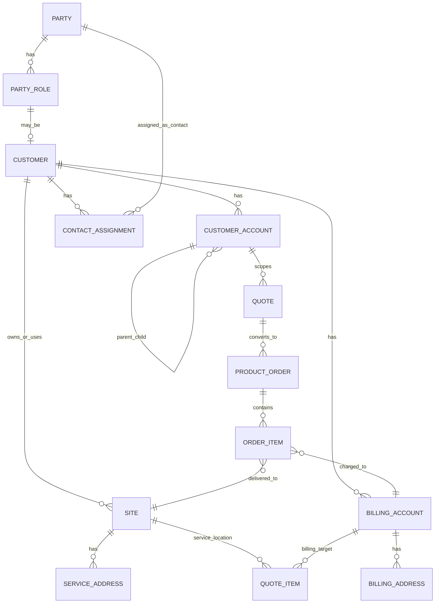

---

## 8. Minimal Canonical Data Model

Ini bukan schema final, tetapi cukup untuk membaca codebase.

```sql
-- Party: base identity
party (
  id,
  party_type, -- INDIVIDUAL, ORGANIZATION
  legal_name,
  display_name,
  registration_number,
  tax_identifier,
  status,
  created_at,
  updated_at
)

party_role (
  id,
  party_id,
  role_type, -- CUSTOMER, PARTNER, CONTACT, PAYER, SUPPLIER
  status,
  valid_from,
  valid_to
)

customer (
  id,
  party_role_id,
  customer_number,
  segment, -- ENTERPRISE, SME, CONSUMER
  status,
  lifecycle_state
)

customer_account (
  id,
  customer_id,
  parent_account_id,
  account_number,
  account_type, -- ENTERPRISE, DIVISION, DEPARTMENT, BRANCH
  name,
  status
)

billing_account (
  id,
  customer_id,
  account_number,
  bill_cycle,
  currency,
  payment_term,
  status
)

site (
  id,
  customer_id,
  site_code,
  name,
  site_type, -- HQ, BRANCH, DATA_CENTER, REMOTE_SITE
  status
)

address (
  id,
  address_type, -- SERVICE, BILLING, LEGAL, SHIPPING
  line1,
  city,
  province,
  postal_code,
  country,
  latitude,
  longitude
)

site_address (
  site_id,
  address_id,
  role -- PRIMARY_SERVICE, INSTALLATION, ACCESS
)

billing_account_address (
  billing_account_id,
  address_id,
  role -- BILLING, TAX
)

contact_assignment (
  id,
  customer_id,
  account_id,
  site_id,
  billing_account_id,
  party_id,
  contact_role, -- TECHNICAL, BILLING, AUTHORIZED_SIGNER
  valid_from,
  valid_to
)
```

---

## 9. Domain Rules yang Harus Dijaga

| Rule | Penjelasan |
|---|---|
| **Party bisa ada tanpa menjadi customer** | Misalnya partner, supplier, atau calon customer. |
| **Customer harus punya party/party role yang jelas** | Customer bukan sekadar string nama. |
| **Billing account harus terkait customer/payer yang valid** | Charge tidak boleh diarahkan ke account finansial invalid. |
| **Site harus terkait customer/account scope** | Jangan order service ke lokasi yang tidak terkait dengan customer. |
| **Quote item harus membawa site jika produk location-dependent** | Connectivity, branch service, hardware installation perlu site. |
| **Quote/order item harus membawa billing account jika chargeable** | Agar billing handoff tidak ambigu. |
| **Contact role harus scoped** | Billing contact untuk BA-001 belum tentu technical contact untuk site Surabaya. |
| **Legal party harus jelas untuk contract** | Contract tidak boleh hanya mengacu ke display name. |
| **Hierarchy traversal harus deterministic** | Parent/child account tidak boleh circular. |
| **Status customer/account/site memengaruhi eligibility** | Suspended/terminated/blacklisted customer bisa memblokir quote/order. |

---

## 10. Quote Impact

Saat membuat quote, CPQ butuh konteks:

```text id="angr4a"
Customer:
- siapa pembeli
- segment dan eligibility
- parent account / enterprise agreement

Site:
- lokasi layanan
- serviceability
- coverage
- installation constraint

Billing Account:
- account yang akan ditagih
- currency
- bill cycle
- tax/payment terms

Contact:
- requester
- approver
- billing PIC
- technical PIC
```

Contoh payload konseptual:

```json
{
  "customerId": "CUST-10001",
  "customerAccountId": "ACC-ENT-001",
  "quoteItems": [
    {
      "productOfferingId": "PO-FIBER-1G",
      "siteId": "SITE-JKT-HQ",
      "billingAccountId": "BA-HQ-FINANCE",
      "quantity": 1,
      "characteristics": {
        "bandwidth": "1Gbps",
        "sla": "Gold"
      }
    },
    {
      "productOfferingId": "PO-MANAGED-ROUTER",
      "siteId": "SITE-JKT-HQ",
      "billingAccountId": "BA-HQ-FINANCE",
      "quantity": 1
    }
  ],
  "relatedParties": [
    {
      "partyId": "P-9001",
      "role": "requester"
    },
    {
      "partyId": "P-9002",
      "role": "authorizedSigner"
    }
  ]
}
```

---

## 11. Order Impact

Saat quote dikonversi menjadi order, struktur ini ikut turun.

```text id="477qre"
Quote customer → Product order related party
Quote item site → Order item delivery location
Quote item billing account → Order item billing target
Quote contact → Fulfillment contact / notification route
Quote contract party → Agreement / legal reference
```

Contoh order item:

```json
{
  "productOrderId": "PO-20260713-001",
  "customerId": "CUST-10001",
  "orderItems": [
    {
      "action": "add",
      "productOfferingId": "PO-FIBER-1G",
      "siteId": "SITE-JKT-HQ",
      "billingAccountId": "BA-HQ-FINANCE",
      "relatedParties": [
        {
          "partyId": "P-9003",
          "role": "technicalContact"
        }
      ]
    }
  ]
}
```

TM Forum Product Ordering API diposisikan sebagai mekanisme untuk placing product order dengan parameter order yang dibutuhkan; dalam model ordering, object seperti related party dan billing account biasanya menjadi referensi penting untuk menjaga konteks order lintas sistem. ([TM Forum](https://www.tmforum.org/open-digital-architecture/open-apis?utm_source=chatgpt.com))

---

## 12. Billing Impact

Billing account menentukan bagaimana charge masuk ke invoice.

```text id="xiw4qn"
Recurring charge → Billing account A
One-time installation charge → Billing account A
Usage charge → Billing account B
Device rental → Billing account C
```

Pattern umum:

```text id="anf9ho"
Same customer, multiple billing accounts
Same order, multiple billing accounts
Same site, different billing accounts by product
Same billing account, multiple sites
```

Engineering risk:

| Risk | Contoh |
|---|---|
| **Billing account null** | Order completed tapi billing activation gagal. |
| **Wrong billing account** | Branch charge masuk ke HQ padahal harus regional. |
| **Billing account inactive** | Quote valid, tapi order stuck saat billing handoff. |
| **Currency mismatch** | Quote USD, billing account IDR. |
| **Bill cycle mismatch** | Activation date tidak sesuai expected invoice cycle. |

---

## 13. Site Impact

Site adalah domain yang sering diremehkan.

Untuk enterprise/telco order, site memengaruhi:

```text id="shqevw"
serviceability
coverage
available product
installation feasibility
field appointment
network resource
tax/regulatory area
SLA
delivery milestone
```

Contoh site object:

```json
{
  "siteId": "SITE-SBY-001",
  "customerId": "CUST-10001",
  "name": "Surabaya Branch",
  "siteType": "BRANCH",
  "serviceAddress": {
    "line1": "Jl. Pemuda No. 10",
    "city": "Surabaya",
    "province": "East Java",
    "postalCode": "60271",
    "country": "ID"
  },
  "contacts": [
    {
      "partyId": "P-9100",
      "role": "siteTechnicalContact"
    }
  ],
  "status": "ACTIVE"
}
```

---

## 14. State Lifecycle

### Customer Lifecycle

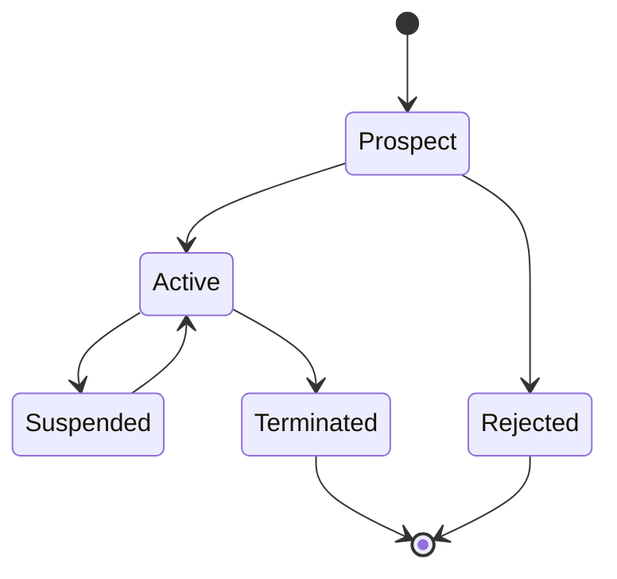

### Billing Account Lifecycle

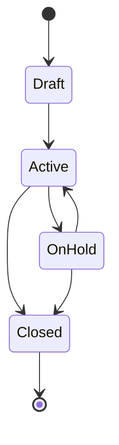

### Site Lifecycle

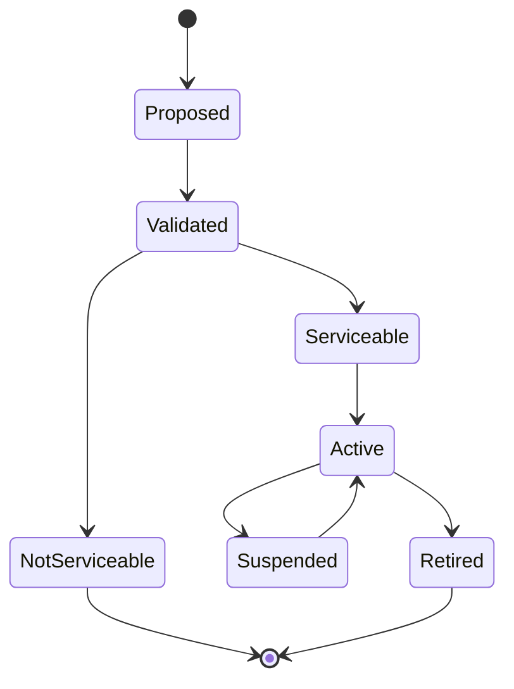

---

## 15. Common Failure Modes

| Failure Mode | Gejala | Root Cause Umum |
|---|---|---|
| **Duplicate customer** | Quote/order tersebar di dua customer berbeda | CRM sync buruk, fuzzy matching tidak ada |
| **Wrong party role** | Contact dianggap legal signer | Party vs party role tidak dipisah |
| **Billing account salah** | Invoice masuk ke divisi salah | Order item tidak membawa billing account eksplisit |
| **Site tidak valid** | Produk dijual ke lokasi yang tidak serviceable | Site eligibility tidak dicek saat configure |
| **Hierarchy salah** | Approval route salah manager/business unit | Parent-child account salah atau circular |
| **Contact stale** | Appointment gagal karena PIC sudah tidak aktif | Contact assignment tidak punya validity |
| **User access leak** | User branch A bisa lihat invoice branch B | Authz tidak scoped ke account/site/billing account |
| **Tax address salah** | Invoice compliance issue | Billing address disamakan dengan service address |
| **Inventory owner salah** | Amend/terminate gagal | Product inventory tidak mengacu ke customer/account/site yang benar |
| **Order orphan** | Order tidak bisa ditelusuri ke customer legal | Related party/customer reference tidak lengkap |

---

## 16. Engineering Pattern

### A. Use Explicit Scope

Jangan hanya:

```text id="rmp1n5"
customer_id
```

Lebih aman:

```text id="pvjmw1"
customer_id
customer_account_id
site_id
billing_account_id
contracting_party_id
payer_party_id
requester_party_id
technical_contact_party_id
```

Tidak semua field wajib untuk semua produk, tapi boundary-nya harus tersedia.

---

### B. Validate Context at Quote and Order

Validasi quote:

```text id="4d2e44"
customer active?
site belongs to customer?
billing account active?
product allowed for site?
contact valid?
contracting party authorized?
```

Validasi order:

```text id="dri8ye"
quote accepted?
billing account unchanged or approved?
site still valid?
customer not suspended?
credit/risk check passed?
order not duplicate?
```

---

### C. Store Snapshot + Reference

Untuk data penting, gunakan kombinasi:

```text id="2af8gq"
reference id  = link ke master data
snapshot      = nilai saat quote/order dibuat
```

Contoh:

```json
{
  "customerId": "CUST-10001",
  "customerNameSnapshot": "PT Nusantara Digital",
  "billingAccountId": "BA-HQ-FINANCE",
  "billingAccountNumberSnapshot": "BA-000123",
  "siteId": "SITE-JKT-HQ",
  "serviceAddressSnapshot": {
    "line1": "Jl. Sudirman No. 1",
    "city": "Jakarta"
  }
}
```

Kenapa perlu snapshot?

```text id="39xbpf"
Master data bisa berubah.
Quote/order historis harus tetap bisa diaudit.
Invoice dispute butuh bukti konteks saat transaksi terjadi.
```

---

### D. Use Relationship Table for Flexible Related Parties

Daripada menambah kolom terus:

```sql
quote_related_party (
  quote_id,
  party_id,
  role,
  valid_from,
  valid_to
)

order_related_party (
  product_order_id,
  party_id,
  role
)

site_contact_assignment (
  site_id,
  party_id,
  contact_role,
  valid_from,
  valid_to
)
```

Pattern ini cocok untuk:

```text id="ssj7op"
requester
approver
authorized signer
billing contact
technical contact
delivery contact
payer
legal representative
partner contact
```

---

## 17. Debugging Checklist

Saat ada issue CPQ/order terkait customer/account/site/billing, urutkan pertanyaan seperti ini:

```text id="msjxg8"
1. Party legalnya siapa?
2. Party tersebut berperan sebagai customer, payer, contact, atau partner?
3. Customer account mana yang menjadi scope quote/order?
4. Apakah ada parent account atau enterprise agreement?
5. Site mana yang dipakai untuk quote item/order item?
6. Apakah site itu milik customer/account yang benar?
7. Apakah site masih active/serviceable?
8. Billing account mana yang dipakai?
9. Apakah billing account active dan currency/payment term cocok?
10. Contact mana yang dipakai untuk approval/delivery/billing?
11. Apakah user yang melakukan action punya authority atas account/site tersebut?
12. Apakah quote/order menyimpan snapshot data historis?
13. Apakah order item dan inventory item menunjuk scope yang sama?
14. Apakah billing handoff memakai billing account yang sama dengan order item?
```

---

## 18. Red Flags di Codebase

| Red Flag | Kenapa Bahaya |
|---|---|
| `customer_name` disimpan bebas tanpa `customer_id` | Tidak traceable ke master data. |
| Semua hal pakai `account_id` tanpa tipe jelas | Bisa mencampur customer account dan billing account. |
| `site_address` dan `billing_address` memakai field yang sama | Risiko invoice/tax/serviceability salah. |
| Contact disimpan sebagai string nama/email di quote item | Tidak bisa lifecycle, permission, atau audit. |
| Tidak ada validity period untuk contact/site/account | Data historis sulit dipertanggungjawabkan. |
| Billing account hanya level order, bukan order item | Sulit mendukung multi-site/multi-billing order. |
| Customer hierarchy tanpa anti-cycle constraint | Recursive reporting/approval bisa rusak. |
| User permission hanya berdasarkan customer_id | Tidak cukup untuk enterprise multi-branch. |
| Inventory item tidak menyimpan site | In-life change dan service impact analysis sulit. |
| Tidak ada snapshot di quote/order | Master data change bisa merusak audit historis. |

---

## 19. Mini Example End-to-End

### Business Scenario

```text id="z4q8kp"
PT Nusantara Digital membeli connectivity untuk 3 lokasi:
- Jakarta HQ
- Surabaya Branch
- Bekasi Data Center

Tagihan:
- HQ dan Branch masuk ke BA-HQ-FINANCE
- Data Center masuk ke BA-DATACENTER

Kontak:
- Procurement PIC untuk quote
- Technical PIC per site
- Billing PIC per billing account
```

### CPQ Mapping

```text id="c0kj7f"
Quote:
customer = PT Nusantara Digital
customer account = Enterprise Account

Quote Item 1:
product = Fiber 1Gbps
site = Jakarta HQ
billing account = BA-HQ-FINANCE

Quote Item 2:
product = Fiber 500Mbps
site = Surabaya Branch
billing account = BA-HQ-FINANCE

Quote Item 3:
product = Dedicated Internet 10Gbps
site = Bekasi Data Center
billing account = BA-DATACENTER
```

### Order Mapping

```text id="7u2qys"
Product Order:
customer = PT Nusantara Digital
related party requester = Procurement PIC
related party authorized signer = Legal Director

Order Item 1:
deliver to Jakarta HQ
charge to BA-HQ-FINANCE
technical contact = Jakarta IT PIC

Order Item 2:
deliver to Surabaya Branch
charge to BA-HQ-FINANCE
technical contact = Surabaya IT PIC

Order Item 3:
deliver to Bekasi Data Center
charge to BA-DATACENTER
technical contact = Data Center Ops PIC
```

### Billing / Inventory Result

```text id="myvf47"
Inventory Item 1:
customer = PT Nusantara Digital
site = Jakarta HQ
billing account = BA-HQ-FINANCE
status = Active

Inventory Item 2:
customer = PT Nusantara Digital
site = Surabaya Branch
billing account = BA-HQ-FINANCE
status = Active

Inventory Item 3:
customer = PT Nusantara Digital
site = Bekasi Data Center
billing account = BA-DATACENTER
status = Active
```

---

## 20. Ringkasan Seri 2

Core takeaway:

```text id="n8w8ad"
Party adalah identitas.
Role adalah peran.
Customer adalah relasi komersial.
Account adalah struktur relasi.
Billing account adalah tujuan finansial.
Site adalah lokasi layanan.
Contact adalah pihak komunikasi.
User adalah identitas login.
```

Untuk engineer, invariant paling penting:

```text id="xg3obu"
Quote item, order item, fulfillment task, inventory item, dan billing event harus konsisten menunjuk customer/account/site/billing account yang benar.
```

Kalau boundary ini kacau, downstream flow akan terlihat seperti bug teknis, padahal akar masalahnya adalah **domain model salah**.

---

# Status Seri

✅ **Seri 2 - Customer, Account, Party, Site, dan Billing Account Model selesai.**

Sisa seri: **16 dari 18**.

## Rekomendasi Materi Selanjutnya

Lanjut ke:

**Seri 3 - Product Catalog, Product Offering, Product Specification, Bundle, dan Catalog Versioning**

Ini fondasi sebelum membahas configuration rules, pricing, quote item, dan order decomposition.

---

**Sources:**

- [Party Management API TMF632-v5.0](https://www.tmforum.org/open-digital-architecture/open-apis/party-management-api-TMF632/v5.0?utm_source=chatgpt.com)

## Response:
7/13/2026, 8:14:46 PM

Saya lanjut ke **Seri 3**: Product Catalog, Offering, Specification, Bundle, dan Catalog Versioning. Fokusnya: catalog sebagai “source of sellable truth” yang mengendalikan konfigurasi, pricing, order decomposition, fulfillment, inventory, dan billing.

# Seri 3 - Product Catalog, Product Offering, Product Specification, Bundle, dan Catalog Versioning

## 1. Tujuan Seri Ini

Seri ini membahas fondasi paling penting dalam CPQ & Order Management:

> **Catalog adalah sumber kebenaran tentang apa yang bisa dijual, bagaimana produk dikonfigurasi, bagaimana harga diterapkan, dan bagaimana order nantinya dipecah untuk fulfillment dan billing.**

Dalam konteks CSG, ini sangat penting karena CSG Quote & Order diposisikan sebagai flow **quote-to-order** yang digerakkan oleh **single catalog**, dengan layered catalog untuk merepresentasikan kompleksitas telco/service composition. ([TM Forum](https://www.tmforum.org/oda/directory/software-providers/directory/csg/products/csg-quote-and-order?utm_source=chatgpt.com))

Mental model-nya:

```text id="jq7gud"
Catalog bukan daftar produk.
Catalog adalah model bisnis yang menghubungkan:
sellable offer
→ configurable option
→ price
→ eligibility
→ order decomposition
→ fulfillment
→ billing
```

TM Forum TMF620 juga memosisikan Product Catalog Management API sebagai mekanisme untuk mengelola lifecycle catalog elements dan mengonsultasikan catalog saat ordering, campaign, dan sales management. ([TM Forum](https://www.tmforum.org/resources/specifications/tmf620-product-catalog-management-api-user-guide-v5-0-0/?utm_source=chatgpt.com))

---

## 2. Diagram Besar

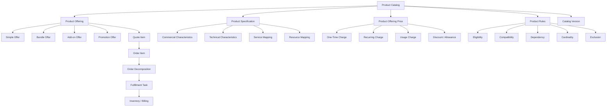

Versi paling praktis:

```text id="hd9mie"
Product Specification = what the product is
Product Offering      = how the product is sold
Product Price         = how the product is charged
Product Rule          = when/how it is valid
Catalog Version       = which truth applied at transaction time
```

---

## 3. Core Vocabulary

| Istilah | Makna Praktis | Contoh |
|---|---|---|
| **Product Catalog** | Kumpulan definisi produk, offering, harga, rules, lifecycle, dan relasi produk. | Enterprise Connectivity Catalog 2026 |
| **Product Specification** | Definisi dasar produk: karakteristik, struktur, technical/commercial attributes. | Fiber Internet Service, Managed Router, Static IP |
| **Product Offering** | Bentuk produk yang benar-benar dijual ke customer/market/channel tertentu. | Fiber Internet 1Gbps Gold SLA - Enterprise |
| **Product Offering Price** | Model harga untuk offering. | MRC IDR 15 juta/bulan, OTC IDR 5 juta, usage charge |
| **Bundle** | Paket yang terdiri dari beberapa product offering/specification. | Internet + Managed Router + Static IP |
| **Add-on** | Produk tambahan yang melekat pada base product. | Extra IP block, premium SLA, managed firewall |
| **Characteristic** | Parameter produk yang bisa dikonfigurasi. | bandwidth, SLA, contract term, IP count |
| **Eligibility Rule** | Menentukan apakah customer/site/channel boleh membeli produk. | hanya enterprise, hanya coverage area tertentu |
| **Compatibility Rule** | Menentukan kombinasi valid/tidak valid antar produk/option. | Gold SLA butuh fiber access, static IP butuh internet service |
| **Catalog Version** | Versi catalog yang berlaku saat quote/order dibuat. | catalog v2026.07 |
| **Lifecycle Status** | Status catalog item. | draft, active, retired, obsolete |

---

## 4. Kenapa Catalog Sangat Penting

Dalam CPQ/order management, catalog memengaruhi semua layer downstream.

| Downstream Area | Ketergantungan ke Catalog |
|---|---|
| **Configure** | Product option, valid value, dependency, exclusion, cardinality. |
| **Price** | Recurring charge, one-time charge, usage charge, discount, promotion. |
| **Quote** | Quote item harus menunjuk product offering dan catalog version. |
| **Approval** | Discount, margin, exception, dan special pricing bergantung pada offering/price policy. |
| **Order** | Order item biasanya berasal dari quote item yang menunjuk product offering. |
| **Decomposition** | Bundle/product perlu dipecah menjadi fulfillment task/service/resource order. |
| **Inventory** | Produk aktif customer harus traceable ke product specification/offering. |
| **Billing** | Billing membutuhkan charge definition, billing frequency, taxability, effective date. |
| **Reporting** | Revenue, product performance, margin, dan adoption bergantung pada product hierarchy. |

TMF622 Product Ordering menyatakan product order dibuat berdasarkan product offer yang didefinisikan dalam catalog, dan product offer mengidentifikasi produk atau set produk yang tersedia untuk customer, termasuk characteristic seperti pricing, options, dan market. ([TM Forum](https://www.tmforum.org/resources/specifications/tmf622-product-ordering-management-api-user-guide-v5-0-0/?utm_source=chatgpt.com))

---

## 5. Decomposition Map - Practical Categories / Skills

| No | Domain / Skill | Yang Perlu Dipahami | Engineering Concern |
|---:|---|---|---|
| 1 | **Catalog Mental Model** | Catalog adalah source of sellable truth, bukan sekadar tabel produk. | Jangan hardcode rule/harga di service layer. |
| 2 | **Product Specification** | Definisi produk reusable: karakteristik, tipe produk, teknis/komersial. | Model extensible, characteristic schema, versioning. |
| 3 | **Product Offering** | Cara produk dijual ke market/customer/channel tertentu. | Offering bisa banyak untuk satu specification. |
| 4 | **Offering vs Specification Boundary** | Specification menjelaskan “produk apa”; offering menjelaskan “dijual sebagai apa”. | Hindari mencampur definisi teknis dengan campaign komersial. |
| 5 | **Product Offering Price** | MRC, OTC, usage charge, discount, allowance, penalty, installation fee. | Rounding, currency, effective date, price override audit. |
| 6 | **Bundle Modeling** | Paket berisi beberapa component product/offering. | Parent-child item, cardinality, mandatory/optional item. |
| 7 | **Add-on Modeling** | Produk tambahan yang butuh parent/base product. | Dependency ke installed base atau current cart. |
| 8 | **Product Characteristics** | Attribute configurable seperti bandwidth, SLA, router type, contract term. | Validation, allowed values, default values, mapping ke fulfillment. |
| 9 | **Eligibility Rules** | Siapa/lokasi/channel yang boleh membeli. | Customer segment, site coverage, contract, risk, region. |
| 10 | **Compatibility Rules** | Kombinasi produk/option valid atau tidak. | Rule engine, deterministic validation, explainable error. |
| 11 | **Cardinality Rules** | Minimum/maximum jumlah component. | Bundle harus punya 1 access, maksimal 5 add-on, dsb. |
| 12 | **Exclusion Rules** | Produk/option yang tidak boleh digabung. | Conflict detection saat configure. |
| 13 | **Dependency Rules** | Produk A membutuhkan produk B. | Add-on, prerequisite product, installed base lookup. |
| 14 | **Catalog Lifecycle** | Draft, active, retired, obsolete. | Quote/order historical compatibility. |
| 15 | **Catalog Versioning** | Quote/order harus tahu catalog version yang dipakai. | Snapshot, effective dating, backward compatibility. |
| 16 | **Market / Channel Scoping** | Offering bisa berbeda untuk channel/market/segment. | B2B sales, partner portal, self-service, internal CRM. |
| 17 | **Geography / Serviceability** | Produk hanya tersedia di lokasi tertentu. | Site validation, coverage API, network resource check. |
| 18 | **Commercial vs Technical Layering** | Commercial product bisa map ke service/resource layer. | Order decomposition, provisioning mapping. |
| 19 | **Partner Product Modeling** | Partner offering masuk ke catalog internal. TMF620 v5 overview menyebut standardized solution untuk menambahkan partner products ke existing catalog. ([TM Forum](https://www.tmforum.org/open-digital-architecture/open-apis/product-catalog-management-api-TMF620/v5.0?utm_source=chatgpt.com)) | Partner lifecycle, supplier dependency, settlement. |
| 20 | **Catalog Governance** | Siapa boleh publish, retire, override, atau ubah product. | Approval, audit, release management. |
| 21 | **Catalog API Integration** | Catalog dipakai CRM, CPQ, order management, billing, self-service. | REST API, caching, contract-first API, event sync. |
| 22 | **Catalog Performance** | CPQ perlu query cepat saat configure/price. | Cache, read model, denormalization, invalidation. |
| 23 | **Catalog Data Quality** | Missing price, invalid rule, circular bundle, stale offering. | Validation pipeline sebelum publish. |
| 24 | **Catalog Testing** | Test rule, price, bundle, lifecycle, compatibility. | Golden test case, regression suite, simulation. |
| 25 | **Traceability** | Setiap quote/order harus tahu product offering, price, rule, dan version. | Audit, dispute, revenue assurance. |

---

## 6. Product Specification vs Product Offering

Ini boundary yang wajib benar.

### Product Specification

Menjawab:

```text id="u0e3hi"
Produk ini secara konseptual/teknis apa?
Apa karakteristiknya?
Apa komponen teknisnya?
Apa behavior/service capability-nya?
```

Contoh:

```text id="82cg6p"
Product Specification:
- Internet Access Service
- Managed Router
- Static IP Block
- Premium SLA
```

### Product Offering

Menjawab:

```text id="9d07ag"
Produk ini dijual ke siapa?
Dalam paket apa?
Di channel mana?
Dengan harga apa?
Dalam periode berlaku apa?
```

Contoh:

```text id="3ecfl6"
Product Offering:
- Enterprise Fiber Internet 1Gbps Gold SLA
- SME Fiber Internet 500Mbps
- Managed Router Add-on for Enterprise Internet
- Static IP /29 Add-on
```

### Rule Praktis

```text id="o2jgul"
Satu product specification bisa punya banyak product offering.
Satu product offering bisa membungkus satu atau banyak specification.
Offering adalah objek komersial.
Specification adalah objek definisional/teknis.
```

Contoh:

| Product Specification | Product Offering |
|---|---|
| Internet Access Service | Enterprise Fiber 1Gbps Gold |
| Internet Access Service | Enterprise Fiber 500Mbps Silver |
| Internet Access Service | Promo Fiber 1Gbps 36 Months |
| Managed Router | Managed Router Rental Enterprise |
| Static IP Block | Static IP /29 Add-on |

---

## 7. Bundle Modeling

Bundle adalah sumber kompleksitas besar di CPQ.

Contoh bundle:

```text id="2iewuh"
Enterprise Branch Connectivity Bundle
├── Fiber Internet Access
├── Managed Router
├── Static IP Block
├── Premium SLA
└── Installation Service
```

Dalam CPQ, bundle harus menjawab:

```text id="bvcw4b"
Mana component mandatory?
Mana optional?
Berapa minimum/maximum quantity?
Component mana yang mutually exclusive?
Component mana yang dependent?
Harga dihitung per component atau bundle-level?
Discount berlaku ke semua item atau hanya parent?
```

Diagram:

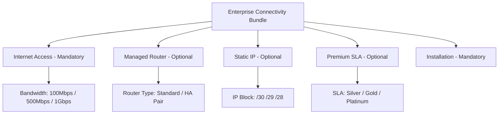

---

## 8. Catalog Layering

Dalam enterprise/telco-style systems, catalog sering berlapis.

```text id="w1r3uz"
Commercial Product Catalog
→ Service Catalog
→ Resource Catalog
→ Fulfillment / Provisioning Template
→ Billing Product / Charge Mapping
```

CSG Quote & Order disebut sebagai telco-native platform dengan **layered catalog** untuk merepresentasikan service composition dan menyelaraskan quote-order-bill. ([TM Forum](https://www.tmforum.org/oda/directory/software-providers/directory/csg/products/csg-quote-and-order?utm_source=chatgpt.com))

Practical mapping:

| Layer | Fokus | Contoh |
|---|---|---|
| **Commercial Product** | Apa yang dijual ke customer | Enterprise Internet 1Gbps |
| **Customer Facing Service** | Service yang dipahami customer | Internet Access Service |
| **Resource Facing Service** | Service teknis internal | IP Transit, Access Circuit |
| **Resource** | Asset/network/resource nyata | Port, router, VLAN, IP block |
| **Billing Product** | Objek yang bisa ditagih | MRC Internet 1Gbps, OTC Installation |

Kenapa ini penting?

```text id="rzkku6"
Sales menjual product.
Fulfillment mengaktifkan service/resource.
Billing menagih charge.
Inventory menyimpan installed product/service.
```

Jangan paksa satu objek “product” menanggung semua makna ini.

---

## 9. Catalog Versioning

Catalog versioning adalah salah satu topik paling penting untuk software engineer.

### Problem

Quote dibuat hari Senin dengan catalog v1:

```text id="to6wtz"
Fiber 1Gbps = IDR 15 juta/bulan
Discount max = 20%
Router add-on compatible
```

Hari Jumat catalog berubah ke v2:

```text id="0irukm"
Fiber 1Gbps = IDR 17 juta/bulan
Discount max = 15%
Router add-on replaced by new model
```

Pertanyaan:

```text id="ioy6x2"
Quote lama harus pakai harga/rule lama atau ikut catalog baru?
Order dari quote lama harus divalidasi terhadap versi mana?
Billing harus pakai price yang mana?
```

### Jawaban Praktis

```text id="2qk78v"
Quote harus menyimpan catalog version.
Quote item harus menyimpan product offering version.
Price harus tersnapshot.
Rule result harus auditable.
Order dari accepted quote harus preserve commercial commitment.
```

### Versioning Model

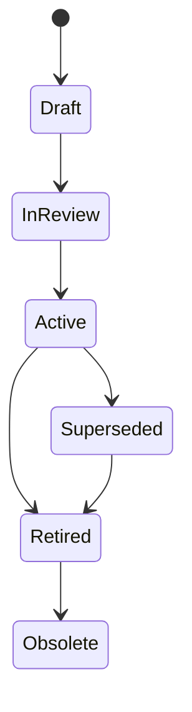

### Effective Dating

```text id="iiuj17"
valid_from
valid_to
sales_start_date
sales_end_date
fulfillment_start_date
billing_effective_date
retirement_date
```

Poin penting:

| Date | Makna |
|---|---|
| **valid_from / valid_to** | Periode definisi catalog valid. |
| **sales_start / sales_end** | Periode offering boleh dijual. |
| **fulfillment_start** | Kapan produk bisa mulai di-deliver. |
| **billing_effective_date** | Kapan charge bisa diberlakukan. |
| **retirement_date** | Kapan offering tidak boleh dipakai untuk new sale. |

---

## 10. Catalog Snapshot vs Reference

Untuk quote/order, jangan hanya simpan reference ID.

### Reference

```json id="s30l8l"
{
  "productOfferingId": "PO-FIBER-1G",
  "catalogVersion": "2026.07"
}
```

### Snapshot

```json id="1uoph9"
{
  "productOfferingId": "PO-FIBER-1G",
  "productOfferingNameSnapshot": "Enterprise Fiber Internet 1Gbps Gold SLA",
  "catalogVersion": "2026.07",
  "priceSnapshot": {
    "mrc": 15000000,
    "otc": 5000000,
    "currency": "IDR"
  },
  "characteristicsSnapshot": {
    "bandwidth": "1Gbps",
    "sla": "Gold",
    "contractTerm": "36 months"
  }
}
```

Pattern yang aman:

```text id="nhj6bf"
Reference untuk integrasi dan query current master data.
Snapshot untuk audit, dispute, dan historical truth.
```

---

## 11. Product Characteristics

Product characteristic adalah attribute yang membuat produk configurable.

Contoh:

| Characteristic | Type | Contoh Value |
|---|---|---|
| bandwidth | enum | 100Mbps, 500Mbps, 1Gbps |
| SLA | enum | Silver, Gold, Platinum |
| contractTerm | integer/months | 12, 24, 36 |
| staticIpBlock | enum | /30, /29, /28 |
| routerType | enum | Standard, HA Pair |
| installationType | enum | New Install, Migration, Relocation |
| activationDate | date | 2026-08-01 |
| serviceClass | enum | Best Effort, Business Critical |

Engineering concern:

```text id="96gvly"
characteristic type
allowed values
default value
mandatory/optional
validation rule
mapping to provisioning
mapping to billing
visibility to customer
editable after order or not
```

---

## 12. Product Rules

### A. Eligibility Rule

Menjawab:

```text id="tvf91d"
Apakah customer/site/channel ini boleh membeli offering ini?
```

Contoh:

```text id="qpe3pj"
Only ENTERPRISE segment
Only Jakarta/Surbaya coverage area
Only customers with active billing account
Only for 36-month contract
```

### B. Compatibility Rule

Menjawab:

```text id="q9w03t"
Apakah kombinasi produk/option ini valid?
```

Contoh:

```text id="ic8qxf"
Gold SLA requires Fiber Internet
Static IP requires Internet Access
HA Router requires Managed Router Service
Premium SLA cannot be combined with Best Effort service class
```

### C. Cardinality Rule

Menjawab:

```text id="we3ls2"
Berapa banyak component yang boleh/wajib ada?
```

Contoh:

```text id="go3lvx"
Bundle must contain exactly 1 internet access
Bundle may contain 0..1 managed router
Bundle may contain 0..5 static IP blocks
Order must contain at least 1 site
```

### D. Dependency Rule

Menjawab:

```text id="773xh3"
Produk ini bergantung pada produk lain atau installed base tertentu?
```

Contoh:

```text id="pue2pu"
Managed Firewall requires Internet Access
Additional IP Block requires active Internet service
Upgrade to Gold SLA requires existing SLA <= Gold
```

### E. Exclusion Rule

Menjawab:

```text id="g4tmj2"
Produk/option mana yang tidak boleh dibeli bersama?
```

Contoh:

```text id="jsegc3"
Standard Router and HA Router are mutually exclusive
Promo A cannot be combined with Enterprise Agreement Discount
Month-to-month contract cannot use 36-month loyalty discount
```

---

## 13. Pricing in Catalog

Catalog biasanya menyimpan price definition, bukan selalu final calculated price.

Jenis harga:

| Price Type | Makna | Contoh |
|---|---|---|
| **One-Time Charge / OTC** | Dibayar sekali | Installation fee |
| **Monthly Recurring Charge / MRC** | Dibayar periodik | Internet monthly fee |
| **Usage Charge** | Berdasarkan pemakaian | Per GB, per minute |
| **Discount** | Pengurang harga | 15% enterprise discount |
| **Allowance** | Kuota/benefit | 1TB included usage |
| **Penalty / Early Termination Fee** | Biaya kondisi khusus | Termination before contract end |
| **Deposit / Upfront Fee** | Pembayaran awal | Security deposit |

CSG menekankan CPQ untuk configure, price, quote complex deals dengan real-time margin visibility. ([CSG](https://www.csgi.com/solutions/quote-to-cash/configure-price-quote?utm_source=chatgpt.com))

Engineering concern:

```text id="fsdbrw"
price effective date
currency
tax inclusive/exclusive
rounding mode
discount stacking
contract-specific override
approval threshold
margin calculation
billing mapping
```

---

## 14. Catalog to Quote Mapping

Saat sales membuat quote:

```text id="rmizkz"
Product Offering → Quote Item
Product Price → Quote Item Price
Product Characteristic → Quote Item Characteristic
Eligibility Rule → Validation Result
Compatibility Rule → Validation Result
Catalog Version → Quote Version Context
```

Contoh quote item:

```json id="ztc4kx"
{
  "quoteItemId": "QI-001",
  "catalogVersion": "2026.07",
  "productOfferingId": "PO-FIBER-1G-GOLD",
  "productOfferingNameSnapshot": "Enterprise Fiber 1Gbps Gold SLA",
  "action": "add",
  "quantity": 1,
  "characteristics": {
    "bandwidth": "1Gbps",
    "sla": "Gold",
    "contractTerm": "36"
  },
  "prices": [
    {
      "type": "MRC",
      "amount": 15000000,
      "currency": "IDR"
    },
    {
      "type": "OTC",
      "amount": 5000000,
      "currency": "IDR"
    }
  ]
}
```

---

## 15. Catalog to Order Mapping

Saat quote accepted menjadi order:

```text id="zjot6z"
Quote Item → Order Item
Offering reference → Order Item product reference
Characteristics → Order Item product characteristic
Price snapshot → Billing activation payload
Catalog version → Order audit context
Bundle hierarchy → Decomposition input
```

Product Ordering API TMF622 menjelaskan bahwa product order dibuat berdasarkan product offer yang didefinisikan dalam catalog. ([TM Forum](https://www.tmforum.org/resources/interface/tmf622-product-ordering-api-rest-specification-r14-5-0/?utm_source=chatgpt.com))

Contoh order item:

```json id="z2xx79"
{
  "orderItemId": "OI-001",
  "action": "add",
  "sourceQuoteItemId": "QI-001",
  "catalogVersion": "2026.07",
  "productOfferingId": "PO-FIBER-1G-GOLD",
  "product": {
    "characteristics": {
      "bandwidth": "1Gbps",
      "sla": "Gold",
      "contractTerm": "36"
    }
  },
  "billingAccountId": "BA-HQ-FINANCE",
  "siteId": "SITE-JKT-HQ"
}
```

---

## 16. Catalog to Decomposition Mapping

Decomposition adalah saat commercial order dipecah menjadi work item teknis.

Contoh:

```text id="unzw74"
Commercial Product Offering:
Enterprise Fiber 1Gbps Gold SLA
```

Bisa terpecah menjadi:

```text id="8hum7k"
Service Order:
- Create Internet Access Service
- Create SLA Monitoring Service

Resource Order:
- Reserve access port
- Allocate VLAN
- Allocate IP block
- Assign CPE/router

Billing Task:
- Activate MRC
- Activate OTC
- Attach discount

Inventory Task:
- Create product inventory item
- Link to site and billing account
```

Diagram:

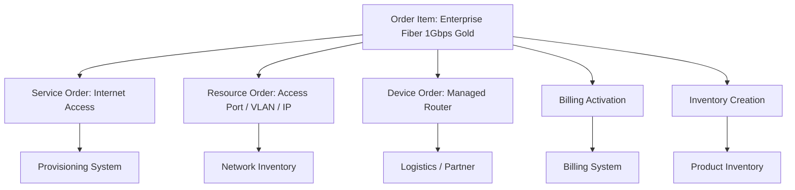

---

## 17. Catalog Governance

Catalog change adalah production-risk event.

| Governance Area | Pertanyaan |
|---|---|
| **Authoring** | Siapa boleh membuat/ubah offering? |
| **Validation** | Apakah bundle/rule/price lengkap dan valid? |
| **Approval** | Siapa approve product launch atau price change? |
| **Publishing** | Kapan catalog version aktif? |
| **Rollback** | Bisa revert catalog publish? |
| **Retirement** | Apa dampak ke quote aktif dan installed base? |
| **Audit** | Siapa mengubah harga/rule dan kapan? |
| **Impact Analysis** | Quote/order/customer mana terdampak? |

Pattern aman:

```text id="it8yl6"
draft catalog
→ validate
→ simulate
→ approve
→ publish version
→ notify consuming systems
→ monitor fallout
```

---

## 18. Catalog Release Strategy

### A. Big Bang Release

```text id="d9gswx"
Semua perubahan catalog dipublish sekaligus.
```

Kelebihan:

```text id="2cq6kh"
mudah koordinasi
satu version jelas
```

Risiko:

```text id="mz6vyj"
blast radius besar
rollback sulit
```

### B. Incremental Release

```text id="jwhg35"
Offering/rule/price dipublish bertahap.
```

Kelebihan:

```text id="ms2hxx"
lebih aman
bisa feature-flag per market/channel
```

Risiko:

```text id="t004k9"
version matrix lebih kompleks
```

### C. Effective-Dated Release

```text id="gvki9t"
Catalog sudah dipublish, tapi berlaku pada tanggal tertentu.
```

Kelebihan:

```text id="o0fmqv"
cocok untuk price change, promo, retirement
```

Risiko:

```text id="fm06k8"
timezone, date boundary, quote validity harus rapi
```

---

## 19. Data Quality Checks Before Catalog Publish

Checklist minimal:

```text id="ba2a4f"
1. Semua active offering punya product specification.
2. Semua sellable offering punya price atau price policy.
3. Semua mandatory characteristic punya default atau required validation.
4. Semua allowed value valid.
5. Bundle tidak circular.
6. Dependency tidak circular.
7. Mutually exclusive rule tidak konflik dengan mandatory component.
8. Price currency valid.
9. Effective date tidak overlap secara salah.
10. Retired product tidak dipakai oleh new offering.
11. Fulfillment mapping tersedia.
12. Billing mapping tersedia.
13. Order decomposition template tersedia.
14. Catalog version unik dan immutable setelah publish.
15. Quote/order regression test lulus.
```

---

## 20. Minimal Table Model

Ini bukan schema final, tetapi mental model untuk membaca codebase.

```sql id="rtkw9c"
product_catalog (
  id,
  code,
  name,
  version,
  status, -- DRAFT, ACTIVE, RETIRED
  valid_from,
  valid_to,
  created_at,
  published_at
);

product_specification (
  id,
  catalog_id,
  code,
  name,
  product_type,
  lifecycle_status,
  version
);

product_characteristic_spec (
  id,
  product_specification_id,
  name,
  value_type,
  required,
  default_value,
  allowed_values_json
);

product_offering (
  id,
  catalog_id,
  product_specification_id,
  code,
  name,
  market_segment,
  channel,
  sellable,
  lifecycle_status,
  sales_start_date,
  sales_end_date
);

product_offering_price (
  id,
  product_offering_id,
  price_type, -- MRC, OTC, USAGE, DISCOUNT
  amount,
  currency,
  recurrence_period,
  valid_from,
  valid_to
);

product_offering_relationship (
  id,
  parent_offering_id,
  child_offering_id,
  relationship_type, -- BUNDLE_COMPONENT, ADDON, DEPENDENCY, EXCLUSION
  min_quantity,
  max_quantity,
  mandatory
);

product_rule (
  id,
  catalog_id,
  rule_type, -- ELIGIBILITY, COMPATIBILITY, CARDINALITY, EXCLUSION
  scope_type,
  scope_id,
  expression,
  error_message,
  severity,
  valid_from,
  valid_to
);
```

---

## 21. Engineering Patterns

### Pattern 1 - Immutable Published Catalog

```text id="zhdd4n"
Setelah catalog version published, jangan mutate record yang sama.
Buat version baru.
```

Kenapa:

```text id="we27h7"
Quote lama harus tetap bisa diaudit.
Order dari quote lama harus konsisten.
Dispute perlu historical truth.
```

---

### Pattern 2 - Catalog Read Model

CPQ butuh lookup cepat. Jangan selalu query normalized schema kompleks.

```text id="zs2b6m"
Normalized catalog tables
→ publish event
→ denormalized catalog read model
→ CPQ configure/price lookup
```

Contoh read model:

```json id="a6p3zz"
{
  "offeringId": "PO-FIBER-1G-GOLD",
  "catalogVersion": "2026.07",
  "name": "Enterprise Fiber 1Gbps Gold SLA",
  "characteristics": {
    "bandwidth": ["1Gbps"],
    "sla": ["Gold"],
    "contractTerm": ["12", "24", "36"]
  },
  "prices": {
    "mrc": 15000000,
    "otc": 5000000
  },
  "rules": [
    "CUSTOMER_SEGMENT_ENTERPRISE_ONLY",
    "SITE_MUST_BE_SERVICEABLE"
  ]
}
```

---

### Pattern 3 - Rule Result Snapshot

Saat rule dievaluasi, simpan hasilnya.

```json id="6ceel2"
{
  "ruleId": "RULE-ELIGIBILITY-001",
  "ruleVersion": "2026.07",
  "result": "PASSED",
  "input": {
    "customerSegment": "ENTERPRISE",
    "siteCity": "Jakarta"
  },
  "evaluatedAt": "2026-07-13T10:15:00+07:00"
}
```

Manfaat:

```text id="1o3l7e"
debug lebih mudah
approval defensible
audit jelas
tidak tergantung rule current version
```

---

### Pattern 4 - Decomposition Template by Offering

```text id="njs75t"
Product Offering
→ decomposition template
→ fulfillment task graph
```

Contoh:

```json id="ep8qpn"
{
  "productOfferingId": "PO-FIBER-1G-GOLD",
  "decompositionTemplate": [
    {
      "taskType": "SERVICEABILITY_CHECK",
      "sequence": 1
    },
    {
      "taskType": "RESOURCE_RESERVATION",
      "sequence": 2
    },
    {
      "taskType": "NETWORK_PROVISIONING",
      "sequence": 3
    },
    {
      "taskType": "BILLING_ACTIVATION",
      "sequence": 4
    }
  ]
}
```

---

## 22. Common Failure Modes

| Failure Mode | Gejala | Root Cause |
|---|---|---|
| **Catalog drift** | Quote lama berubah harga saat order dibuat. | Quote tidak snapshot catalog/price. |
| **Circular bundle** | Configure loop atau stack overflow. | Parent-child relationship tidak divalidasi. |
| **Missing price** | Product bisa dipilih tapi tidak bisa dihitung. | Offering active tanpa price. |
| **Invalid rule overlap** | Customer eligible dan not eligible sekaligus. | Rule priority/effective date tidak jelas. |
| **Retired product still sellable** | Sales masih bisa quote produk lama. | Lifecycle status tidak dicek. |
| **Fulfillment mapping missing** | Order accepted tapi decomposition gagal. | Catalog hanya commercial, tidak map ke service/resource. |
| **Billing mapping missing** | Service aktif tapi charge tidak muncul. | Price/offering tidak map ke billing product. |
| **Hardcoded compatibility** | Rule berubah tapi butuh deploy Java service. | Rule tidak externalized/versioned. |
| **Cache stale** | CPQ masih pakai harga lama. | Catalog publish tidak invalidate read model/cache. |
| **Wrong channel scope** | Partner bisa menjual internal-only product. | Channel/market scoping tidak enforced. |
| **Characteristic mismatch** | bandwidth valid di CPQ tapi provisioning reject. | Characteristic tidak map ke technical domain. |
| **Price override lost** | Billing pakai standard price, bukan negotiated price. | Quote price snapshot tidak diteruskan ke order/billing. |

---

## 23. Debugging Checklist

Saat ada issue terkait catalog, urutan cek:

```text id="f86x47"
1. Product offering ID apa?
2. Catalog version mana?
3. Offering status active atau retired?
4. Sales date masih dalam sales_start/sales_end?
5. Product specification mana yang direferensikan?
6. Characteristic apa yang dipilih?
7. Allowed values sesuai atau tidak?
8. Price definition ada atau tidak?
9. Price effective date cocok dengan quote date?
10. Discount/promo rule apa yang berlaku?
11. Eligibility rule apa yang dievaluasi?
12. Compatibility rule apa yang gagal?
13. Bundle parent-child lengkap?
14. Mandatory component terpenuhi?
15. Decomposition template tersedia?
16. Billing mapping tersedia?
17. Quote menyimpan snapshot atau hanya reference?
18. Cache/read model sudah sinkron dengan published catalog?
```

---

## 24. Red Flags di Codebase

| Red Flag | Kenapa Berbahaya |
|---|---|
| Product hanya satu tabel `product` untuk semua makna | Commercial, technical, billing, inventory tercampur. |
| Tidak ada catalog version di quote/order | Historical audit rusak. |
| Harga dihitung dari current product price saat order | Price drift dari quote accepted. |
| Bundle disimpan sebagai JSON bebas tanpa constraint | Susah validasi dependency/cardinality. |
| Rule eligibility hardcoded di Java | Perubahan product launch butuh deployment. |
| Catalog active tapi tidak punya fulfillment mapping | Order bisa accepted tapi tidak bisa delivered. |
| Catalog active tapi tidak punya billing mapping | Revenue leakage. |
| Cache catalog tanpa invalidation strategy | CPQ bisa pakai product/harga lama. |
| Retired product dihapus fisik dari DB | Quote/order lama kehilangan referensi. |
| Characteristic tidak punya type/allowed values | Provisioning dan billing rawan reject. |
| Tidak ada simulation test sebelum publish | Catalog bug baru ketahuan di production order. |
| Catalog change tanpa audit | Sulit tahu siapa mengubah price/rule. |

---

## 25. Mini End-to-End Example

### Product Catalog

```text id="5n2yvl"
Catalog: Enterprise Connectivity Catalog
Version: 2026.07
Status: Active
```

### Product Specification

```text id="u4f9gh"
Internet Access Service
Characteristics:
- bandwidth
- SLA
- accessType
```

### Product Offering

```text id="5lhiyi"
Enterprise Fiber Internet 1Gbps Gold SLA
Market: Enterprise
Channel: Direct Sales
Sales Period: 2026-07-01 to 2026-12-31
```

### Price

```text id="ifajxz"
MRC: IDR 15,000,000
OTC: IDR 5,000,000
Discount: up to 20% without executive approval
```

### Rules

```text id="kuqza8"
Eligibility:
- customer segment must be ENTERPRISE
- site must be serviceable
- billing account must be active

Compatibility:
- Gold SLA requires Fiber access
- Managed Router optional
- Static IP optional

Cardinality:
- exactly 1 Internet Access
- 0..1 Managed Router
- 0..3 Static IP Block
```

### Quote Result

```text id="w7b85h"
Quote item references:
- productOfferingId = PO-FIBER-1G-GOLD
- catalogVersion = 2026.07
- priceSnapshot = IDR 15M MRC, IDR 5M OTC
- selected bandwidth = 1Gbps
- selected SLA = Gold
```

### Order Result

```text id="dl038p"
Order item:
- action = add
- source quote item = QI-001
- offering = PO-FIBER-1G-GOLD
- catalog version = 2026.07
- decomposition template = FIBER_ENTERPRISE_INSTALL
```

### Fulfillment Result

```text id="6o3e8w"
Tasks:
1. serviceability check
2. resource reservation
3. field installation
4. network provisioning
5. inventory creation
6. billing activation
```

---

## 26. Ringkasan Seri 3

Core takeaway:

```text id="x1st4t"
Catalog menentukan apa yang bisa dijual.
Product specification menentukan apa produknya.
Product offering menentukan bagaimana produk dijual.
Product price menentukan bagaimana produk dihargai.
Product rule menentukan kapan produk valid.
Catalog version menentukan kebenaran historis.
```

Untuk engineer, invariant terpenting:

```text id="3r4fel"
Quote, order, fulfillment, inventory, dan billing harus selalu traceable ke product offering, price, rule, dan catalog version yang benar.
```

Kalau catalog model lemah, downstream system akan terlihat seperti penuh bug, padahal akar masalahnya adalah:

```text id="38prl5"
produk tidak termodelkan dengan benar
harga tidak versioned
rules tidak auditable
bundle tidak deterministik
fulfillment/billing mapping tidak lengkap
```

---

# Status Seri

✅ **Seri 3 - Product Catalog, Product Offering, Product Specification, Bundle, dan Catalog Versioning selesai.**

Sisa seri: **15 dari 18**.

## Rekomendasi Materi Selanjutnya

Lanjut ke:

**Seri 4 - Configuration Rules, Eligibility, Compatibility, Dependency, Cardinality, dan Explainable Validation**

Ini akan membahas bagaimana CPQ menentukan apakah kombinasi produk/customer/site/contract valid sebelum pricing dan quote dibuat.

---

**Sources:**

- [Csg Quote and Order | TM Forum ODA Component Directory](https://www.tmforum.org/oda/directory/software-providers/directory/csg/products/csg-quote-and-order?utm_source=chatgpt.com)
- [Configure, Price, Quote – CPQ Software for Enterprise Deals](https://www.csgi.com/solutions/quote-to-cash/configure-price-quote?utm_source=chatgpt.com)

## Response:
7/13/2026, 8:17:30 PM

Saya lanjut ke **Seri 4**: configuration rules dan validation. Fokusnya cara CPQ memastikan kombinasi customer, site, product, option, contract, dan installed base valid sebelum harga/quote dianggap layak.

# Seri 4 - Configuration Rules, Eligibility, Compatibility, Dependency, Cardinality, dan Explainable Validation

## 1. Tujuan Seri Ini

Seri ini membahas bagian CPQ yang menjawab:

> **Apakah kombinasi customer, site, product, option, installed base, contract, dan billing context ini valid untuk dijadikan quote/order?**

Dalam CPQ enterprise, konfigurasi bukan sekadar memilih produk dari dropdown. Konfigurasi adalah proses validasi domain:

```text id="9jpj8l"
Customer ini boleh beli produk apa?
Produk ini tersedia di site mana?
Option ini compatible dengan base product apa?
Add-on ini butuh installed product apa?
Bundle ini wajib punya component apa?
Diskon ini boleh digabung dengan promo apa?
Order modify ini valid terhadap installed base yang mana?
```

CSG Quote & Order diposisikan sebagai platform CPQ dan order management B2B telecom yang mendukung faster quotes, tailored pricing, dan seamless order management. Dalam directory TM Forum, CSG Quote & Order juga dijelaskan sebagai platform telco-native dengan quote-to-order flow yang ditenagai single catalog dan layered catalog untuk service composition. ([CSG](https://www.csgi.com/products/quote-and-order?utm_source=chatgpt.com))

---

## 2. Mental Model

Configuration validation adalah “gate” sebelum pricing dan quote dianggap benar.

```text id="ee2v3r"
Catalog defines what can be sold.
Qualification checks whether it can be sold here.
Configuration validates whether chosen options make sense together.
Pricing calculates commercial value.
Quote captures the promise.
Order executes the promise.
```

Diagram:

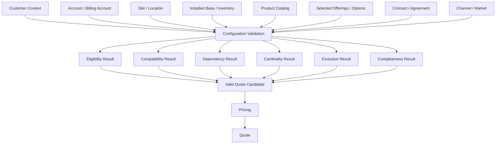

TMF679 Product Offering Qualification API secara eksplisit ditujukan untuk memberikan **commercial eligibility** product offering sebelum ordering; versi v5.0-nya tercatat sebagai stable, dan goal API ini adalah menyediakan kelayakan komersial product offering. ([TM Forum](https://www.tmforum.org/open-digital-architecture/open-apis/product-offering-qualification-management-api-TMF679/v5.0?utm_source=chatgpt.com))

---

## 3. Core Vocabulary

| Istilah | Makna Praktis | Contoh |
|---|---|---|
| **Eligibility** | Apakah product offering boleh dijual ke customer/site/channel tertentu. | Fiber 1Gbps hanya untuk enterprise customer dan site yang serviceable. |
| **Qualification** | Proses mengecek eligibility/availability sebelum order. | Check apakah customer/site eligible untuk offering tertentu. |
| **Compatibility** | Apakah produk/option bisa digabung. | Static IP compatible dengan Internet Access. |
| **Dependency** | Produk/option membutuhkan produk lain. | Managed Firewall butuh active Internet Service. |
| **Exclusion** | Produk/option tidak boleh digabung. | Promo 36 bulan tidak boleh digabung dengan month-to-month plan. |
| **Cardinality** | Batas minimum/maksimum jumlah component. | Bundle wajib punya 1 access, boleh 0..1 router. |
| **Completeness** | Semua informasi wajib sudah diisi. | Bandwidth, SLA, site, billing account wajib ada. |
| **Validation Severity** | Tingkat hasil validasi. | error, warning, info, approval-required. |
| **Explainable Validation** | Sistem bisa menjelaskan rule mana gagal dan kenapa. | “Gold SLA requires Fiber Access.” |
| **Rule Context** | Input yang dipakai rule. | customer segment, site city, installed products, contract term. |

---

## 4. Decomposition Map - Practical Categories / Skills

| No | Domain / Skill | Yang Perlu Dipahami | Engineering Concern |
|---:|---|---|---|
| 1 | **Configuration Mental Model** | Konfigurasi adalah validasi kombinasi product/customer/site/context. | Jangan perlakukan CPQ sebagai cart sederhana. |
| 2 | **Commercial Eligibility** | Apakah offering boleh dijual secara komersial. TMF679 berfokus pada product offering commercial eligibility. ([TM Forum](https://www.tmforum.org/open-digital-architecture/open-apis/product-offering-qualification-management-api-TMF679/v5.0?utm_source=chatgpt.com)) | Customer segment, channel, agreement, market, credit/risk. |
| 3 | **Serviceability / Location Eligibility** | Apakah site bisa dilayani produk tertentu. | Coverage, network availability, field service, partner reach. |
| 4 | **Customer Eligibility** | Apakah customer/account memenuhi syarat. | Customer status, blacklist, risk, segment, active billing account. |
| 5 | **Channel Eligibility** | Apakah offering boleh dijual lewat channel tertentu. | CRM, partner portal, self-service, internal sales. |
| 6 | **Installed Base Eligibility** | Apakah produk existing memungkinkan add/modify/delete. | Product inventory lookup, active product, pending order conflict. |
| 7 | **Compatibility Rule** | Kombinasi produk/option valid atau tidak. | Conflict matrix, feature model, explainable errors. |
| 8 | **Dependency Rule** | Produk A membutuhkan produk B. | Cart dependency + installed-base dependency. |
| 9 | **Exclusion Rule** | Produk A tidak boleh bersama produk B. | Mutually exclusive options, promotion conflict. |
| 10 | **Cardinality Rule** | Minimum/maksimum component dalam bundle. | Mandatory component, max quantity, min quantity. |
| 11 | **Completeness Rule** | Required field/characteristic harus lengkap. | Required characteristic, null safety, defaulting. |
| 12 | **Action-based Rule** | Rule berbeda untuk add, modify, delete, no-change. TMF622 menyebut action product order item dapat berupa add, modify, delete, noChange. ([tmf-open-api-table-documents.s3.eu-west-1.amazonaws.com](https://tmf-open-api-table-documents.s3.eu-west-1.amazonaws.com/OpenApiTable/TMF622_Product_Ordering/4.0.0/user_guides/TMF622_Product_Ordering_Management_API_v4.0.0_specification.pdf?utm_source=chatgpt.com)) | Delta order, in-life change, disconnect, upgrade/downgrade. |
| 13 | **Temporal Rule** | Validasi berdasarkan tanggal efektif. | Quote date, order date, activation date, contract start/end. |
| 14 | **Pricing Precondition Rule** | Rule yang menentukan apakah pricing bisa dihitung. | Missing charge, invalid term, discount conflict. |
| 15 | **Approval-trigger Rule** | Konfigurasi valid tapi perlu approval. | Severity approval-required, workflow trigger. |
| 16 | **Rule Priority & Conflict Resolution** | Kalau dua rule bertentangan, mana yang menang. | Deterministic evaluation, priority, specificity. |
| 17 | **Rule Versioning** | Rule yang berlaku harus sesuai catalog version. | Audit, replay, quote/order consistency. |
| 18 | **Explainable Validation** | Hasil validasi harus bisa dipahami user/dev/ops. | Error code, violated rule, remediation hint. |
| 19 | **Validation Snapshot** | Simpan hasil evaluasi rule saat quote/order dibuat. | Dispute, audit, debugging, deterministic replay. |
| 20 | **Performance & Caching** | Validasi konfigurasi bisa mahal. | Catalog read model, rule cache, inventory lookup batching. |
| 21 | **Partial Validity** | Beberapa item valid, beberapa invalid. | Multi-site quote, partial fulfillment, per-item validation. |
| 22 | **Manual Override** | Rule bisa di-override dengan governance. | Approval, audit, scope, expiry, reason code. |
| 23 | **Rule Testing** | Rule harus punya regression suite. | Golden scenarios, combinatorial tests, mutation testing. |
| 24 | **Rule Ownership** | Siapa pemilik rule bisnis. | Product manager, pricing team, operations, legal, engineering. |
| 25 | **Operational Diagnostics** | Bisa menjawab kenapa quote/order ditolak. | Logs, metrics, trace, rule evaluation report. |

---

## 5. Rule Taxonomy

### A. Eligibility Rules

Menjawab:

```text id="xzchgm"
Apakah offering ini boleh dijual untuk konteks ini?
```

Contoh:

```text id="cbjuao"
Customer segment must be ENTERPRISE.
Customer status must be ACTIVE.
Billing account must be ACTIVE.
Site must be serviceable.
Channel must be DIRECT_SALES.
Offering must be within sales period.
```

Source input:

```text id="sy8aix"
customer
account
billing account
site
channel
market
contract
catalog
date
```

---

### B. Compatibility Rules

Menjawab:

```text id="nsrzf0"
Apakah pilihan produk/option ini bisa digabung?
```

Contoh:

```text id="g3r859"
Gold SLA compatible only with Fiber Access.
HA Router compatible only with Managed Router Service.
Static IP compatible only with Internet Access.
Premium Support compatible only with Business plan.
```

Model sederhana:

```text id="t5f0n4"
selectedProducts = [InternetAccess, ManagedRouter, StaticIP]
valid if:
  StaticIP requires InternetAccess
  ManagedRouter requires InternetAccess
  GoldSLA requires accessType = Fiber
```

---

### C. Dependency Rules

Menjawab:

```text id="th87qb"
Produk/option ini membutuhkan apa?
```

Ada dua jenis dependency:

| Dependency Type | Contoh |
|---|---|
| **Cart dependency** | Add-on dipilih bersama base product dalam quote yang sama. |
| **Installed-base dependency** | Add-on hanya boleh dibeli jika customer sudah punya active base product. |

Contoh:

```text id="vk2fpb"
Additional Static IP requires:
- Internet Access in current cart, OR
- active Internet Access in installed base.
```

---

### D. Exclusion Rules

Menjawab:

```text id="a69bfr"
Apa yang tidak boleh dipilih bersama?
```

Contoh:

```text id="1p0734"
Standard Router and HA Router are mutually exclusive.
Promo 36M and Enterprise Agreement Discount cannot stack.
Basic SLA and Gold SLA cannot both be selected.
Legacy product and new replacement product cannot both be active on same site.
```

---

### E. Cardinality Rules

Menjawab:

```text id="85cqmf"
Berapa jumlah minimum/maksimum item/component?
```

Contoh:

```text id="0596yd"
Enterprise Connectivity Bundle:
- exactly 1 Internet Access
- 0..1 Managed Router
- 0..3 Static IP Block
- 1..n Sites
```

---

### F. Completeness Rules

Menjawab:

```text id="x4ojgq"
Apakah semua informasi wajib sudah tersedia?
```

Contoh:

```text id="8v05u4"
For Fiber Internet:
- bandwidth is required
- SLA is required
- site is required
- billing account is required
- contract term is required
- technical contact is required
```

---

### G. Action-based Rules

Menjawab:

```text id="92l4jj"
Apakah action add/modify/delete/no-change valid terhadap installed base?
```

TMF622 Product Ordering API menyebut action product order item dapat berupa **add, modify, delete, noChange**, sehingga rule tidak boleh hanya memvalidasi produk baru; rule juga harus paham in-life change. ([tmf-open-api-table-documents.s3.eu-west-1.amazonaws.com](https://tmf-open-api-table-documents.s3.eu-west-1.amazonaws.com/OpenApiTable/TMF622_Product_Ordering/4.0.0/user_guides/TMF622_Product_Ordering_Management_API_v4.0.0_specification.pdf?utm_source=chatgpt.com))

Contoh:

| Action | Rule |
|---|---|
| **add** | Product belum aktif di site yang sama, atau boleh multiple. |
| **modify** | Product inventory item harus active dan modifiable. |
| **delete** | Product inventory item harus active atau suspended. |
| **noChange** | Item tetap menjadi bagian bundle tapi tidak diubah. |

---

## 6. Validation Flow

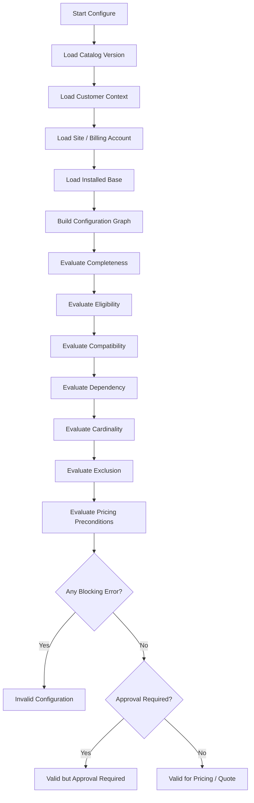

---

## 7. Configuration Graph Mental Model

Jangan hanya pikir “list of quote items”. Pikirkan sebagai graph.

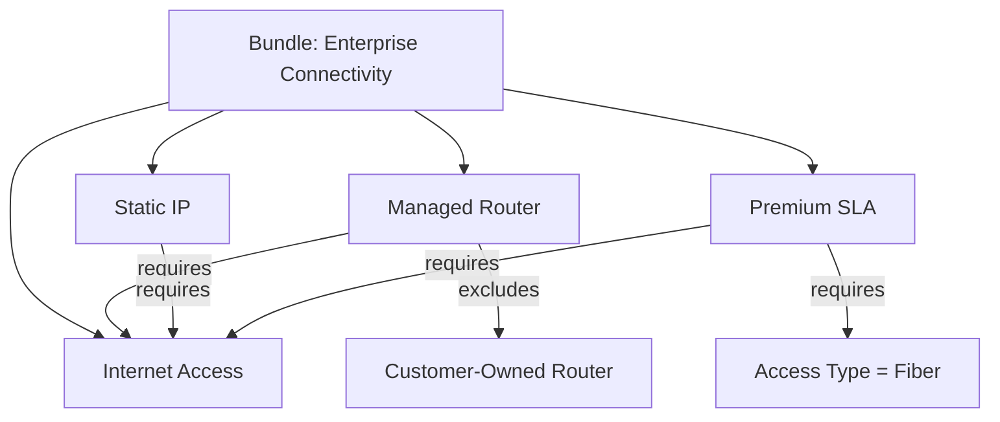

Dalam code, graph ini bisa muncul sebagai:

```text id="eyb4r9"
quote
quote_item
quote_item_relationship
quote_item_characteristic
validation_result
```

---

## 8. Rule Severity Model

Tidak semua rule failure harus memblokir.

| Severity | Makna | Contoh |
|---|---|---|
| **ERROR** | Blocking; quote/order tidak boleh lanjut. | Site not serviceable. |
| **WARNING** | Bisa lanjut, tapi user harus tahu risiko. | Activation date dekat dengan holiday freeze. |
| **INFO** | Informasi tambahan. | Product will be retired in 90 days. |
| **APPROVAL_REQUIRED** | Valid secara teknis, tapi perlu approval. | Discount di atas threshold. |
| **AUTO_FIXABLE** | Sistem bisa memperbaiki otomatis. | Missing default SLA bisa diisi Silver. |

Pattern output:

```json id="ydy9ku"
{
  "status": "INVALID",
  "results": [
    {
      "severity": "ERROR",
      "code": "SITE_NOT_SERVICEABLE",
      "message": "Fiber Internet 1Gbps is not serviceable at SITE-SBY-001.",
      "ruleId": "RULE-SERVICEABILITY-001",
      "affectedItemId": "QI-002",
      "remediation": "Choose another access product or request feasibility study."
    }
  ]
}
```

---

## 9. Explainable Validation

Validation yang baik tidak hanya berkata:

```text id="bnxval"
Invalid configuration.
```

Validation yang baik berkata:

```text id="0enwo9"
Gold SLA cannot be selected because selected access type is Wireless.
Gold SLA requires Fiber Access.
Affected item: QI-003.
Rule: COMPAT-SLA-FIBER-001.
Fix: choose Silver SLA or change access type to Fiber.
```

Minimum fields:

```text id="s3drdk"
validation_result_id
severity
code
message
rule_id
rule_version
affected_object_type
affected_object_id
input_snapshot
remediation_hint
evaluated_at
```

---

## 10. Rule Evaluation Context

Rule perlu input yang eksplisit.

```json id="mx497n"
{
  "catalogVersion": "2026.07",
  "quoteId": "Q-10001",
  "customer": {
    "id": "CUST-001",
    "segment": "ENTERPRISE",
    "status": "ACTIVE"
  },
  "site": {
    "id": "SITE-JKT-HQ",
    "city": "Jakarta",
    "serviceability": {
      "fiber": true,
      "wireless": true
    }
  },
  "billingAccount": {
    "id": "BA-001",
    "status": "ACTIVE",
    "currency": "IDR"
  },
  "installedBase": [
    {
      "productInventoryId": "PI-001",
      "productOfferingId": "PO-INTERNET-1G",
      "status": "ACTIVE",
      "siteId": "SITE-JKT-HQ"
    }
  ],
  "cart": [
    {
      "quoteItemId": "QI-001",
      "productOfferingId": "PO-STATIC-IP",
      "action": "add",
      "characteristics": {
        "ipBlock": "/29"
      }
    }
  ]
}
```

---

## 11. Installed Base Validation

Installed base adalah sumber rule untuk in-life change.

Contoh use case:

```text id="puj9wj"
Customer ingin add Static IP.
Rule:
- harus punya active Internet Access di site yang sama, ATAU
- sedang membeli Internet Access dalam quote yang sama.
```

Pseudo rule:

```text id="cv5kx5"
canAddStaticIp(item, context):
  return exists(context.cart, product = InternetAccess, site = item.site)
      or exists(context.installedBase, product = InternetAccess, status = ACTIVE, site = item.site)
```

Failure mode umum:

| Failure | Contoh |
|---|---|
| Inventory tidak update | CPQ menolak add-on padahal service sudah aktif. |
| Pending order tidak dicek | Customer order add-on saat base product masih provisioning. |
| Site mismatch | Add-on dipasang di site berbeda dari base product. |
| Product replacement tidak diketahui | Legacy Internet product tidak dianggap memenuhi dependency. |

---

## 12. Multi-site Validation

Enterprise order sering multi-site.

Contoh:

```text id="ntzmu3"
Quote untuk 50 branch:
- 45 branch serviceable
- 3 branch perlu feasibility study
- 2 branch not serviceable
```

Jangan jadikan hasilnya satu boolean global saja.

Model yang lebih baik:

```json id="phxwi2"
{
  "quoteId": "Q-20001",
  "overallStatus": "PARTIALLY_VALID",
  "siteResults": [
    {
      "siteId": "SITE-001",
      "status": "VALID"
    },
    {
      "siteId": "SITE-046",
      "status": "APPROVAL_REQUIRED",
      "reason": "Feasibility study required"
    },
    {
      "siteId": "SITE-049",
      "status": "INVALID",
      "reason": "Fiber not serviceable"
    }
  ]
}
```

Engineering concern:

```text id="yequkc"
per-site result
per-item result
partial quote
alternative product suggestion
split order possibility
fallback fulfillment path
```

---

## 13. Product Offering Qualification vs Configuration Validation

Keduanya mirip, tapi tidak sama.

| Area | Product Offering Qualification | Configuration Validation |
|---|---|---|
| Fokus | Apakah offering tersedia/eligible untuk konteks. | Apakah kombinasi item/options valid. |
| Timing | Pre-order / pre-quote / product discovery. | Saat configure quote/cart/order. |
| Input | Customer, site, offering candidate, inventory. | Cart graph, selected options, quantities, action. |
| Output | Eligible / not eligible / alternative. | Valid / invalid / warning / approval required. |
| Standard relevance | TMF679. | Bisa internal CPQ/rule engine; berhubungan dengan catalog/order APIs. |

TMF679 menyediakan mekanisme standardized untuk melakukan qualification request guna mengecek commercial eligibility product offering dengan parameter yang diperlukan; API ini berinteraksi dengan catalog dan inventory secara konsisten. ([tmf-open-api-table-documents.s3.eu-west-1.amazonaws.com](https://tmf-open-api-table-documents.s3.eu-west-1.amazonaws.com/OpenApiTable/TMF679_Product_Offering_Qualification/5.0.0/user_guides/TMF679_ProductOfferingQualification_v5.0.0.pdf?utm_source=chatgpt.com))

---

## 14. Rule Implementation Options

### Option 1 - Hardcoded Rules

```java id="pj3vya"
if (product.equals("GOLD_SLA") && !accessType.equals("FIBER")) {
    return invalid("Gold SLA requires Fiber Access");
}
```

Kelebihan:

```text id="oaek0y"
simple
fast
type-safe
easy to debug for small systems
```

Kekurangan:

```text id="mfo8et"
perubahan rule butuh deploy
rule tidak mudah diaudit business user
sulit versioning
sulit simulasi catalog
```

Cocok untuk:

```text id="cv4yi9"
technical invariant
non-negotiable platform constraint
low-change rule
```

---

### Option 2 - Database-driven Rules

```sql id="fse0fp"
rule (
  id,
  type,
  scope,
  expression,
  severity,
  message,
  valid_from,
  valid_to,
  version
)
```

Kelebihan:

```text id="ap7j33"
bisa diubah tanpa deploy
bisa versioned
bisa diaudit
```

Kekurangan:

```text id="d77b72"
butuh expression language
debug bisa sulit
perlu governance kuat
```

Cocok untuk:

```text id="a9z0lb"
eligibility
compatibility
pricing precondition
market/channel rule
```

---

### Option 3 - Rule Engine / Decision Table

Contoh konsep decision table:

| Customer Segment | Site Fiber | Product | Result |
|---|---:|---|---|
| ENTERPRISE | true | Fiber 1Gbps | eligible |
| ENTERPRISE | false | Fiber 1Gbps | not eligible |
| SME | true | Fiber 1Gbps Enterprise | not eligible |

Kelebihan:

```text id="qwdu69"
business-friendly
testable
good for matrix decision
```

Kekurangan:

```text id="0d7u2u"
rule explosion
priority conflict
harder to model graph dependencies
```

---

### Option 4 - Hybrid

Pattern enterprise yang paling realistis:

```text id="e4iuus"
Hardcoded invariants
+ catalog-driven metadata
+ database decision rules
+ workflow approval rules
+ integration-based qualification
```

Contoh:

| Rule Type | Implementation |
|---|---|
| Null/required field | Java validation |
| Catalog lifecycle | Catalog service |
| Eligibility | Rule table / decision table |
| Serviceability | External service/API |
| Installed base dependency | Inventory query |
| Approval trigger | Workflow/rule engine |
| Technical invariant | Java domain service |

---

## 15. Validation Architecture

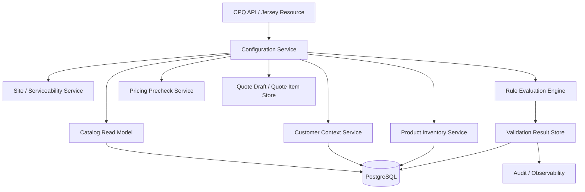

Dalam stack Anda:

| Concern | Implementasi yang Masuk Akal |
|---|---|
| API endpoint | Java/Jersey |
| Rule orchestration | Java service layer |
| Long-running qualification | Camunda atau async job |
| Catalog read model | PostgreSQL + cache |
| Inventory lookup | PostgreSQL/API integration |
| Serviceability check | REST client/event integration |
| Validation result persistence | PostgreSQL |
| Observability | structured logs + trace ID + rule evaluation report |

---

## 16. Data Model untuk Validation Result

```sql id="ak5qms"
configuration_validation_run (
  id,
  quote_id,
  product_order_id,
  catalog_version,
  status, -- VALID, INVALID, PARTIALLY_VALID, APPROVAL_REQUIRED
  started_at,
  completed_at,
  triggered_by,
  correlation_id
);

configuration_validation_result (
  id,
  validation_run_id,
  rule_id,
  rule_version,
  severity, -- ERROR, WARNING, INFO, APPROVAL_REQUIRED
  code,
  message,
  affected_object_type, -- QUOTE, QUOTE_ITEM, SITE, BILLING_ACCOUNT
  affected_object_id,
  remediation_hint,
  input_snapshot_json,
  result_snapshot_json,
  created_at
);

configuration_validation_override (
  id,
  validation_result_id,
  approved_by,
  reason_code,
  reason_text,
  valid_until,
  created_at
);
```

Invariant:

```text id="6n4nbv"
Setiap quote/order yang lanjut meskipun ada warning/approval-required harus punya evidence:
- rule mana
- siapa override/approve
- kapan
- alasan
- scope override
```

---

## 17. Example: Bundle Validation

### Bundle

```text id="0dqbak"
Enterprise Connectivity Bundle
- Internet Access: mandatory, exactly 1
- Managed Router: optional, max 1
- Static IP Block: optional, max 3
- SLA: mandatory, exactly 1
```

### Selected Configuration

```json id="f8nwpi"
{
  "bundle": "Enterprise Connectivity Bundle",
  "items": [
    {
      "product": "Internet Access",
      "characteristics": {
        "accessType": "Wireless",
        "bandwidth": "100Mbps"
      }
    },
    {
      "product": "Static IP Block",
      "characteristics": {
        "size": "/29"
      }
    },
    {
      "product": "Gold SLA"
    }
  ]
}
```

### Validation Output

```json id="vvcsm8"
{
  "status": "INVALID",
  "results": [
    {
      "severity": "ERROR",
      "code": "SLA_REQUIRES_FIBER",
      "message": "Gold SLA requires Fiber access, but selected accessType is Wireless.",
      "affectedItem": "Gold SLA",
      "remediation": "Choose Silver SLA or change access type to Fiber."
    },
    {
      "severity": "WARNING",
      "code": "STATIC_IP_ON_WIRELESS_REVIEW",
      "message": "Static IP Block on Wireless access requires technical feasibility review.",
      "affectedItem": "Static IP Block",
      "remediation": "Submit feasibility review or choose Fiber access."
    }
  ]
}
```

---

## 18. Example: Installed Base Dependency

### Installed Base

```text id="6d0hw0"
Customer has:
- Internet Access 500Mbps at SITE-JKT-HQ, status ACTIVE
```

### Requested Quote

```text id="7ab7v3"
Add:
- Static IP /29 at SITE-JKT-HQ
```

### Result

```text id="14uphu"
VALID
Reason:
Static IP requires active Internet Access at same site.
Dependency satisfied by ProductInventory PI-001.
```

### Bad Case

```text id="gxdsbh"
Add:
- Static IP /29 at SITE-SBY-001
```

Result:

```text id="cmd6im"
INVALID
Reason:
No active Internet Access exists at SITE-SBY-001 and no Internet Access is being added in this quote.
```

---

## 19. Example: Action-based Modify Rule

### Installed Product

```json id="m0wyte"
{
  "productInventoryId": "PI-1001",
  "productOffering": "Enterprise Fiber Internet",
  "status": "ACTIVE",
  "characteristics": {
    "bandwidth": "500Mbps",
    "sla": "Silver"
  }
}
```

### Requested Change

```json id="9dknm0"
{
  "action": "modify",
  "targetProductInventoryId": "PI-1001",
  "characteristics": {
    "bandwidth": "1Gbps",
    "sla": "Gold"
  }
}
```

### Rules

```text id="22p4t9"
Modify allowed only if product inventory status = ACTIVE.
Upgrade bandwidth requires resource capacity check.
Gold SLA requires Fiber access.
Upgrade may trigger price recalculation.
```

### Result

```json id="92zsep"
{
  "status": "APPROVAL_REQUIRED",
  "results": [
    {
      "severity": "APPROVAL_REQUIRED",
      "code": "CAPACITY_CHECK_REQUIRED",
      "message": "Bandwidth upgrade to 1Gbps requires capacity confirmation.",
      "remediation": "Start feasibility/capacity check workflow."
    }
  ]
}
```

---

## 20. Validation Timing

Validation tidak hanya sekali.

| Timing | Apa yang Dicek |
|---|---|
| **Product discovery** | Offering apa yang available/eligible. |
| **Configure** | Kombinasi product/option valid. |
| **Price** | Harga bisa dihitung; discount/promo valid. |
| **Submit quote** | Semua blocking error selesai. |
| **Approve quote** | Exception dan override punya approval. |
| **Accept quote** | Quote belum expired/revised. |
| **Convert to order** | Customer/site/billing account masih valid. |
| **Before fulfillment** | Resource/serviceability masih valid. |
| **Before billing activation** | Chargeable fact lengkap. |

Rule penting:

```text id="tcc8mv"
Valid saat quote dibuat belum tentu valid saat order dieksekusi.
Karena itu perlu revalidation dengan policy yang jelas.
```

---

## 21. Revalidation Policy

Saat quote lama dikonversi menjadi order, pilih policy secara eksplisit.

| Policy | Makna | Cocok Untuk |
|---|---|---|
| **Strict historical** | Pakai rule/catalog versi quote. | Commercial promise preservation. |
| **Current operational check** | Pakai current operational data. | Serviceability, inventory conflict, credit hold. |
| **Hybrid** | Commercial terms preserved, operational feasibility rechecked. | Paling realistis untuk enterprise CPQ/order. |

Pattern yang disarankan:

```text id="sv4fp0"
Commercial validation:
- preserve quote catalog version
- preserve price snapshot
- preserve accepted discount

Operational validation:
- recheck customer status
- recheck site/serviceability if needed
- recheck billing account status
- recheck pending order conflict
- recheck inventory state
```

---

## 22. Rule Conflict Handling

Contoh konflik:

```text id="2cf6pi"
Rule A:
Enterprise customers get promo eligibility.

Rule B:
Customers under credit hold cannot use promo.

Rule C:
Strategic account override allows promo with director approval.
```

Jangan biarkan hasil bergantung pada urutan query database yang tidak deterministik.

Model conflict resolution:

```text id="6tpfaz"
1. Blocking compliance/risk rule wins.
2. More specific rule wins over general rule.
3. Higher priority wins.
4. Newer effective version wins only when same specificity.
5. Manual override requires explicit authority and audit.
```

Simpan hasil:

```json id="m9mc3j"
{
  "ruleConflict": true,
  "winningRule": "CREDIT_HOLD_BLOCKS_PROMO",
  "suppressedRules": [
    "ENTERPRISE_PROMO_ELIGIBILITY"
  ],
  "reason": "Blocking credit policy has higher priority than commercial promo rule."
}
```

---

## 23. Performance Considerations

Rule validation bisa mahal karena perlu:

```text id="5mqxma"
catalog lookup
customer lookup
site/serviceability lookup
inventory lookup
pending order lookup
contract lookup
pricing precheck
rule evaluation
```

Optimisasi:

| Pattern | Penjelasan |
|---|---|
| **Catalog read model** | Denormalized catalog untuk CPQ lookup cepat. |
| **Batch validation** | Validasi 50 site sekaligus, bukan 50 round-trip. |
| **Cache static rules** | Cache rule/catalog yang published dan immutable. |
| **Avoid stale operational cache** | Inventory/customer/billing status harus hati-hati dicache. |
| **Short-circuit blocking errors** | Tidak perlu evaluasi semua rule jika context invalid total. |
| **Explainability sampling?** | Untuk UX, tetap perlu hasil lengkap; untuk backend batch bisa mode fast-fail. |
| **Async qualification** | Untuk feasibility/serviceability yang lama, gunakan pending/async result. |

---

## 24. Observability untuk Rule Validation

Log yang berguna:

```json id="1i78lr"
{
  "event": "configuration.validation.completed",
  "correlationId": "corr-123",
  "quoteId": "Q-10001",
  "catalogVersion": "2026.07",
  "customerId": "CUST-001",
  "status": "INVALID",
  "ruleCount": 42,
  "errorCount": 2,
  "warningCount": 3,
  "durationMs": 187,
  "topErrorCodes": [
    "SITE_NOT_SERVICEABLE",
    "MISSING_BILLING_ACCOUNT"
  ]
}
```

Metrics:

```text id="3ivhmy"
validation_duration_ms
validation_error_count
validation_warning_count
rule_failure_by_code
qualification_external_call_latency
serviceability_timeout_count
approval_required_count
invalid_quote_rate
```

Trace:

```text id="vlu0tr"
POST /quotes/{id}/validate
→ catalog-service
→ inventory-service
→ serviceability-service
→ rule-engine
→ validation-result-store
```

---

## 25. Testing Strategy

### A. Golden Scenarios

```text id="awnz6e"
Enterprise customer + serviceable site + valid bundle = VALID
SME customer + enterprise-only offering = INVALID
Gold SLA + Wireless Access = INVALID
Static IP + no Internet Access = INVALID
Discount above threshold = APPROVAL_REQUIRED
```

### B. Boundary Tests

```text id="2867im"
sales_start_date exactly today
sales_end_date exactly yesterday
max quantity reached
min mandatory component missing
billing account on hold
customer suspended
site not serviceable
```

### C. Regression Tests

Setiap catalog/rule publish harus punya test:

```text id="5zdajr"
existing valid quotes remain valid where expected
retired offering not sellable for new quote
legacy quote can still convert if policy allows
bundle decomposition still available
billing mapping still available
```

### D. Combinatorial Tests

Untuk banyak option:

```text id="2laqdc"
bandwidth x SLA x accessType x routerType x contractTerm x segment x siteType
```

Gunakan sampling strategis, bukan brute force semua kombinasi.

---

## 26. Red Flags di Codebase

| Red Flag | Kenapa Berbahaya |
|---|---|
| Validation hanya return true/false | Tidak explainable, susah debug. |
| Rule error message hardcoded tanpa rule ID | Tidak traceable ke rule/catalog version. |
| Quote valid tanpa menyimpan validation result | Tidak auditable. |
| Installed base tidak dilibatkan | Add/modify/delete bisa salah. |
| Action add/modify/delete diperlakukan sama | In-life change akan rusak. |
| Multi-site quote punya satu status global saja | Tidak bisa partial validity. |
| Eligibility dicek hanya di UI | API bisa bypass. |
| Cache inventory terlalu lama | CPQ bisa approve konfigurasi stale. |
| Rule version tidak disimpan | Quote/order replay tidak deterministik. |
| Override tidak punya reason/approver | Governance lemah. |
| Serviceability timeout dianggap valid | Fulfillment fallout meningkat. |
| Missing characteristic diberi default diam-diam | Customer bisa menerima produk yang tidak diminta. |

---

## 27. Practical Checklist Saat Membaca Feature/Bug

Gunakan urutan ini:

```text id="p2u629"
1. Ini add, modify, delete, atau no-change?
2. Product offering dan catalog version apa?
3. Customer segment/status apa?
4. Site mana dan serviceability status apa?
5. Billing account active atau tidak?
6. Product existing di installed base apa?
7. Ada pending order yang konflik?
8. Bundle component lengkap?
9. Characteristic wajib sudah diisi?
10. Dependency terpenuhi dari cart atau installed base?
11. Ada exclusion/promo conflict?
12. Ada cardinality breach?
13. Ada rule approval-required?
14. Rule mana yang menghasilkan error/warning?
15. Validation result disimpan atau tidak?
16. Apakah quote/order lanjut lewat override?
17. Override siapa, kapan, reason apa?
18. Saat convert to order, rule direvalidasi dengan policy apa?
```

---

## 28. Mini Design Pattern untuk Java/Jersey

### Endpoint

```http id="in9gek"
POST /quotes/{quoteId}/validation-runs
```

### Request

```json id="e7jv25"
{
  "mode": "FULL",
  "includeExplanation": true,
  "revalidateOperationalContext": true
}
```

### Response

```json id="lo0eou"
{
  "validationRunId": "VR-10001",
  "status": "INVALID",
  "summary": {
    "errors": 2,
    "warnings": 1,
    "approvalRequired": 0
  },
  "results": [
    {
      "code": "SITE_NOT_SERVICEABLE",
      "severity": "ERROR",
      "message": "Fiber Internet 1Gbps is not serviceable at Surabaya Branch.",
      "affectedObjectType": "QUOTE_ITEM",
      "affectedObjectId": "QI-002",
      "ruleId": "RULE-SERVICEABILITY-FIBER-001",
      "remediation": "Choose Wireless Access or request feasibility study."
    }
  ]
}
```

### Service Shape

```java id="jsbjtp"
public interface ConfigurationValidationService {
    ValidationRunResult validateQuote(
        QuoteId quoteId,
        ValidationMode mode,
        ValidationOptions options
    );
}
```

### Rule Result Shape

```java id="pg4nvo"
public record ValidationResult(
    String ruleId,
    String ruleVersion,
    Severity severity,
    String code,
    String message,
    String affectedObjectType,
    String affectedObjectId,
    String remediationHint,
    Map<String, Object> inputSnapshot
) {}
```

---

## 29. Ringkasan Seri 4

Core takeaway:

```text id="a05gbr"
Configuration validation memastikan bahwa produk yang dipilih:
- boleh dijual ke customer tersebut
- tersedia di site tersebut
- compatible dengan pilihan lain
- memenuhi dependency
- tidak melanggar exclusion
- memenuhi cardinality
- lengkap datanya
- valid terhadap installed base
- valid untuk action add/modify/delete/no-change
```

Untuk software engineer, invariant paling penting:

```text id="22009s"
Setiap konfigurasi yang masuk ke pricing, quote approval, order capture, fulfillment, dan billing harus punya validation evidence yang explainable, versioned, auditable, dan traceable ke catalog/context yang dipakai.
```

Kalau validation hanya boolean, sistem akan sulit dipertahankan saat terjadi dispute, failed order, billing mismatch, atau product-rule conflict.

---

# Status Seri

✅ **Seri 4 - Configuration Rules, Eligibility, Compatibility, Dependency, Cardinality, dan Explainable Validation selesai.**

Sisa seri: **14 dari 18**.

## Rekomendasi Materi Selanjutnya

Lanjut ke:

**Seri 5 - Pricing, Discount, Promotion, Margin, Price Override, dan Revenue Leakage Prevention**

Ini akan membahas bagaimana CPQ menghitung harga, menjaga konsistensi quote-to-order-to-billing, dan mencegah margin/revenue leakage.

---

**Sources:**

- [CSG Quote & Order](https://www.csgi.com/products/quote-and-order?utm_source=chatgpt.com)
- [Product Offering Qualification Management API TMF679-v5.0](https://www.tmforum.org/open-digital-architecture/open-apis/product-offering-qualification-management-api-TMF679/v5.0?utm_source=chatgpt.com)
- [TMF622 Product Ordering API REST Specification](https://tmf-open-api-table-documents.s3.eu-west-1.amazonaws.com/OpenApiTable/TMF622_Product_Ordering/4.0.0/user_guides/TMF622_Product_Ordering_Management_API_v4.0.0_specification.pdf?utm_source=chatgpt.com)

## Response:
7/13/2026, 8:20:37 PM

# Seri 5 - Pricing, Discount, Promotion, Margin, Price Override, dan Revenue Leakage Prevention

## 1. Tujuan Seri Ini

Seri ini membahas bagian **Price** dalam CPQ:

> **Bagaimana sistem menghitung harga yang benar, menerapkan discount/promotion secara terkendali, menjaga margin, dan memastikan harga yang sudah disepakati tidak bocor atau berubah saat masuk ke order dan billing?**

Dalam quote-to-cash, pricing adalah area yang langsung berdampak ke revenue. CSG mendefinisikan quote-to-cash sebagai alur configure, price, quote, contract, order, orchestrate, fulfill, dan bill; CSG juga menekankan bahwa workflow catalog-driven membantu menjaga konsistensi product dan pricing information di setiap tahap untuk mengurangi rework dan revenue leakage. ([CSG](https://www.csgi.com/solutions/quote-to-cash?utm_source=chatgpt.com))

Mental model:

```text id="qfsdkx"
Catalog price      = harga standar / definisi harga
Calculated price   = hasil perhitungan untuk konteks quote tertentu
Negotiated price   = harga setelah discount / approval / override
Committed price    = harga yang sudah dijanjikan ke customer
Billable price     = harga yang benar-benar dikirim ke billing
```

Kesalahan besar yang sering terjadi:

```text id="yeip8i"
Engineer menganggap price = angka.
Padahal price adalah keputusan komersial yang punya:
source, rule, effective date, currency, discount, approval, margin, contract, tax, billing behavior, dan audit trail.
```

---

## 2. Diagram Besar Pricing Flow

```mermaid id="e4raik"
flowchart TD
    A[Product Catalog Price] --> B[Pricing Context]
    B --> C[Base Price Calculation]
    C --> D[Charge Calculation]
    D --> E[Discount / Promotion Evaluation]
    E --> F[Tax / Fee / Surcharge Context]
    F --> G[Cost / Margin Calculation]
    G --> H{Within Guardrail?}

    H -->|Yes| I[Quote Price]
    H -->|No| J[Approval Required]

    J --> K[Commercial Approval]
    K --> I

    I --> L[Accepted Quote Price Snapshot]
    L --> M[Product Order Price]
    M --> N[Billing Activation]
    N --> O[Invoice / Revenue]

    P[Audit / Price Trace] --> C
    P --> E
    P --> G
    P --> K
    P --> N
```

Pricing bukan hanya satu function `calculatePrice()`. Lebih tepat dipahami sebagai pipeline:

```text id="us2lse"
load catalog price
→ build pricing context
→ calculate base charges
→ apply quantity/term/site rules
→ apply discount/promo
→ validate margin
→ trigger approval if needed
→ snapshot committed price
→ propagate to order
→ activate billing charge
```

---

## 3. Core Vocabulary

| Istilah | Makna Praktis | Contoh |
|---|---|---|
| **List Price** | Harga standar dari catalog sebelum diskon. | IDR 15 juta MRC. |
| **Base Price** | Harga awal berdasarkan offering/characteristic. | 1Gbps Gold SLA = IDR 15 juta. |
| **Calculated Price** | Harga setelah rule quantity, term, region, component, usage. | IDR 15 juta + router rental + installation. |
| **Discount** | Pengurang harga, bisa percentage atau amount. | 15% discount. |
| **Promotion** | Offer komersial berbatas periode/segment/channel. | Free installation until Q3. |
| **Override** | Harga/discount manual di luar rule standar. | Sales override MRC ke IDR 12 juta. |
| **Floor Price** | Harga minimum yang boleh diberikan. | Tidak boleh di bawah IDR 11 juta. |
| **Cost** | Estimasi biaya delivery/service. | Network cost, CPE cost, partner cost. |
| **Margin** | Selisih revenue dan cost. | Gross margin 35%. |
| **Approval Threshold** | Batas yang memicu approval. | Discount > 20% perlu director approval. |
| **Price Snapshot** | Salinan harga saat quote/order dibuat. | Quote item price JSON. |
| **Billing Mapping** | Mapping harga CPQ ke charge billing. | MRC product charge code. |
| **Revenue Leakage** | Revenue hilang karena harga/order/billing tidak konsisten. | Discount hilang, billing tidak aktif, wrong account. |

---

## 4. Decomposition Map - Practical Categories / Skills

| No | Domain / Skill | Yang Perlu Dipahami | Engineering Concern |
|---:|---|---|---|
| 1 | **Pricing Mental Model** | Harga adalah keputusan komersial yang versioned, contextual, dan auditable. | Jangan simpan hanya final amount tanpa breakdown. |
| 2 | **Product Offering Price** | Price melekat ke product offering/catalog. TMF622 menyebut product offer dari catalog mencakup characteristic seperti pricing, product options, dan market. ([TM Forum](https://www.tmforum.org/resources/interface/tmf622-product-ordering-api-rest-specification-r14-5-0/?utm_source=chatgpt.com)) | Catalog version, price version, effective date. |
| 3 | **Charge Types** | OTC, MRC, usage, discount, allowance, surcharge, penalty. | Billing handoff perlu charge type jelas. |
| 4 | **Base Price Calculation** | Harga awal berdasarkan product, characteristic, quantity, term, site. | Calculation order, deterministic result. |
| 5 | **Recurring Charge / MRC** | Biaya periodik. | Billing cycle, proration, effective date. |
| 6 | **One-Time Charge / OTC** | Biaya sekali bayar. | Trigger condition: order submit, activation, installation complete. |
| 7 | **Usage Charge** | Harga berdasarkan consumption. | Rating unit, allowance, billing integration. |
| 8 | **Discount Model** | Percentage, amount, recurring-only, one-time-only, component-level, quote-level. | Discount stacking, scope, rounding. |
| 9 | **Promotion Model** | Promo berdasarkan campaign, periode, channel, segment, product. | Eligibility, effective date, conflict rule. |
| 10 | **Enterprise Agreement Pricing** | Customer-specific price berdasarkan agreement. | Contract lookup, precedence, renewal/amendment. |
| 11 | **Price Override** | Manual negotiated price. | Approval, reason code, audit, expiration. |
| 12 | **Margin Calculation** | Revenue minus cost; margin guardrail. CSG CPQ messaging menekankan real-time margin visibility untuk complex enterprise deals. ([CSG](https://www.csgi.com/solutions/quote-to-cash/configure-price-quote?utm_source=chatgpt.com)) | Cost source, margin threshold, approval trigger. |
| 13 | **Cost Model** | Internal cost, partner cost, device cost, install cost, recurring service cost. | Partial/missing cost should not silently pass. |
| 14 | **Approval Threshold** | Discount/margin/override memicu workflow. | Camunda approval workflow, SLA, delegation. |
| 15 | **Price Versioning** | Harga yang dipakai harus sesuai quote/catalog effective date. | Prevent price drift. |
| 16 | **Price Snapshot** | Simpan final committed price dan breakdown. | Audit, dispute, billing consistency. |
| 17 | **Tax / Fee Context** | Pajak, surcharge, regulatory fee. | Biasanya billing/tax engine final authority; CPQ bisa estimate. |
| 18 | **Currency Handling** | Multi-currency, FX, rounding, precision. | BigDecimal, currency minor unit, exchange rate snapshot. |
| 19 | **Proration** | Charge sebagian periode. | Activation date, billing cycle alignment. |
| 20 | **Bundle Pricing** | Harga bundle-level vs component-level. | Allocation to billing/inventory items. |
| 21 | **Multi-site Pricing** | Harga per site, volume discount, regional cost. | Site-level breakdown, partial order. |
| 22 | **Price Traceability** | Bisa jelaskan angka berasal dari rule mana. | Price explanation tree. |
| 23 | **Billing Handoff** | Harga committed dikirim ke billing dengan charge code benar. | Prevent billing mismatch. |
| 24 | **Revenue Leakage Prevention** | Mencegah selisih quote/order/billing. | Reconciliation, invariant checks, alerts. |
| 25 | **Pricing Test Strategy** | Golden cases, edge cases, regression. | Harga salah = defect finansial. |

---

## 5. Price Object Model

Jangan modelkan price sebagai satu angka.

### Minimal Price Breakdown

```json id="qvax4z"
{
  "quoteItemId": "QI-001",
  "currency": "IDR",
  "prices": [
    {
      "priceType": "MRC",
      "name": "Monthly Recurring Charge",
      "listAmount": 15000000,
      "discountAmount": 3000000,
      "netAmount": 12000000,
      "recurrence": "MONTHLY",
      "source": "CATALOG",
      "catalogPriceId": "POP-001",
      "priceVersion": "2026.07"
    },
    {
      "priceType": "OTC",
      "name": "Installation Charge",
      "listAmount": 5000000,
      "discountAmount": 5000000,
      "netAmount": 0,
      "source": "PROMOTION",
      "promotionId": "PROMO-FREE-INSTALL-Q3"
    }
  ]
}
```

Price harus menjawab:

```text id="o5q54j"
Harga awalnya berapa?
Diskonnya berapa?
Net amount berapa?
Recurring atau one-time?
Untuk item mana?
Rule/promo/override mana yang menghasilkan angka ini?
Apakah perlu approval?
Apakah sudah committed?
Apa mapping ke billing?
```

---

## 6. Charge Type Taxonomy

| Charge Type | Makna | Contoh | Billing Concern |
|---|---|---|---|
| **MRC** | Monthly recurring charge | Internet 1Gbps monthly fee | Bill cycle, proration, start/end date |
| **NRC / OTC** | Non-recurring / one-time charge | Installation fee | Trigger on order/activation/completion |
| **Usage** | Charge berdasarkan pemakaian | per GB, per API call, per minute | Rating, mediation, usage feed |
| **Discount** | Pengurang charge | 20% MRC discount | Scope, duration, stacking |
| **Allowance** | Included usage/benefit | 1TB included | Usage rating dependency |
| **Surcharge** | Tambahan biaya | regulatory fee, remote site fee | Taxability, invoice display |
| **Deposit** | Pembayaran awal/security | device deposit | Refund/settlement logic |
| **Penalty** | Biaya kondisi tertentu | early termination fee | Contract/in-life change dependency |
| **Credit** | Adjustment negatif | service credit | Approval and billing adjustment |

---

## 7. Pricing Context

Harga tidak bisa dihitung hanya dari product offering.

Pricing context minimal:

```json id="bt8esm"
{
  "catalogVersion": "2026.07",
  "quoteDate": "2026-07-13",
  "customer": {
    "id": "CUST-001",
    "segment": "ENTERPRISE",
    "tier": "STRATEGIC"
  },
  "site": {
    "id": "SITE-JKT-HQ",
    "city": "Jakarta",
    "serviceabilityClass": "ON_NET"
  },
  "billingAccount": {
    "id": "BA-001",
    "currency": "IDR",
    "billCycle": "MONTHLY"
  },
  "agreement": {
    "id": "AGR-2026-001",
    "contractTermMonths": 36,
    "specialPricing": true
  },
  "items": [
    {
      "productOfferingId": "PO-FIBER-1G-GOLD",
      "quantity": 1,
      "characteristics": {
        "bandwidth": "1Gbps",
        "sla": "Gold"
      }
    }
  ]
}
```

Rule penting:

```text id="3y5q1a"
Harga yang sama bisa berbeda karena:
customer segment
contract term
site geography
sales channel
agreement
quantity
bundle composition
promotion period
installed base
```

---

## 8. Pricing Pipeline

```mermaid id="m6r9vv"
flowchart TD
    A[Build Pricing Context] --> B[Load Catalog Prices]
    B --> C[Resolve Price Applicability]
    C --> D[Calculate List Price]
    D --> E[Apply Quantity / Term Rules]
    E --> F[Apply Agreement Pricing]
    F --> G[Apply Promotion]
    G --> H[Apply Discount]
    H --> I[Apply Manual Override]
    I --> J[Calculate Cost]
    J --> K[Calculate Margin]
    K --> L[Evaluate Approval Rules]
    L --> M[Generate Price Explanation]
    M --> N[Persist Price Snapshot]
```

Pipeline harus deterministic.

```text id="t47eo1"
Input sama + catalog/rule version sama = output sama.
```

Kalau tidak deterministic, audit dan dispute akan sulit.

---

## 9. Price Precedence

Masalah umum: harga mana yang menang?

Contoh sumber harga:

```text id="8fx69i"
standard catalog price
market price
customer agreement price
campaign promotion
volume discount
manual override
retention offer
```

Precedence yang umum:

```text id="3pyru4"
1. Contract / enterprise agreement price
2. Approved manual override
3. Promotion / campaign price
4. Volume / term discount
5. Standard catalog price
```

Namun ini harus eksplisit, bukan asumsi.

Contoh price decision:

```json id="5ph5zi"
{
  "priceDecision": {
    "winningSource": "ENTERPRISE_AGREEMENT",
    "winningRuleId": "AGR-PRICE-2026-001",
    "suppressedSources": [
      "STANDARD_CATALOG_PRICE",
      "PROMO-Q3-10PCT"
    ],
    "reason": "Customer-specific agreement price has higher precedence than promotion."
  }
}
```

---

## 10. Discount Model

Discount harus punya scope.

| Scope | Contoh | Risiko |
|---|---|---|
| **Quote-level** | 10% seluruh quote | Sulit dialokasikan ke billing item. |
| **Bundle-level** | 15% bundle enterprise | Perlu allocation ke component. |
| **Item-level** | 20% Internet MRC | Lebih traceable. |
| **Charge-level** | Free OTC only | Aman untuk billing mapping. |
| **Customer-level** | Strategic account discount | Harus terikat agreement. |
| **Term-level** | 36-month discount | Harus expire saat contract term berubah. |

Rule discount:

```text id="pux1qb"
Discount harus tahu:
- percentage atau amount
- applies to MRC/OTC/usage
- applies to which item
- duration
- stackable atau exclusive
- approval threshold
- floor price constraint
- margin impact
```

Contoh discount object:

```json id="wc7dmb"
{
  "discountId": "DISC-001",
  "type": "PERCENTAGE",
  "value": 20,
  "scope": "CHARGE",
  "appliesTo": "MRC",
  "durationMonths": 36,
  "stackable": false,
  "requiresApproval": false
}
```

---

## 11. Promotion Model

Promotion bukan discount biasa. Promotion biasanya punya campaign context.

```text id="9vmuh0"
Promotion:
- valid period
- eligible customer segment
- eligible channel
- eligible product
- max redemption
- conflict with other promotions
- marketing campaign reference
```

Contoh:

```json id="gguh8r"
{
  "promotionId": "PROMO-FREE-INSTALL-Q3",
  "name": "Free Installation Q3 Enterprise",
  "validFrom": "2026-07-01",
  "validTo": "2026-09-30",
  "eligibleSegments": ["ENTERPRISE"],
  "eligibleChannels": ["DIRECT_SALES"],
  "appliesToChargeType": "OTC",
  "discountType": "PERCENTAGE",
  "discountValue": 100,
  "stackable": false
}
```

Failure mode umum:

```text id="3vwvbr"
Promo expired tapi masih dipakai.
Promo stack dengan agreement discount padahal tidak boleh.
Promo berlaku di quote tapi hilang saat billing.
Promo applied ke OTC padahal harus MRC.
Promo eligible di UI tapi tidak divalidasi di API.
```

---

## 12. Margin Model

Margin sederhana:

```text id="0xddwv"
margin_amount = net_revenue - cost
margin_percent = margin_amount / net_revenue * 100
```

Tetapi di enterprise CPQ, cost bisa kompleks:

```text id="584194"
access cost
network recurring cost
partner wholesale cost
device/CPE cost
field installation cost
support/SLA cost
cloud/resource cost
license cost
commission cost
```

CSG menekankan CPQ untuk complex enterprise deals dengan **real-time margin visibility**, sementara CSG Quote & Order juga diposisikan untuk membantu kontrol margin dan profitability dari bid to bill. ([CSG](https://www.csgi.com/solutions/quote-to-cash/configure-price-quote?utm_source=chatgpt.com))

Contoh margin calculation:

```json id="u4f5xv"
{
  "netRevenueMonthly": 12000000,
  "estimatedMonthlyCost": 7200000,
  "marginAmount": 4800000,
  "marginPercent": 40.0,
  "floorMarginPercent": 30.0,
  "status": "WITHIN_GUARDRAIL"
}
```

Red flag:

```text id="ko2692"
Cost missing dianggap 0.
Ini membuat margin terlihat tinggi palsu.
Lebih aman: cost missing = approval required / pricing incomplete.
```

---

## 13. Price Override

Price override adalah area rawan fraud, margin leakage, dan audit issue.

Override bisa berupa:

```text id="qv2yir"
override list price
override discount
override net price
override installation fee
override contract term
override billing start date
```

Minimal governance:

```text id="5ya5xg"
who requested
who approved
reason code
old value
new value
affected item/charge
validity period
approval threshold
margin impact
audit timestamp
```

Contoh:

```json id="l7s3wr"
{
  "overrideId": "OVR-001",
  "quoteItemId": "QI-001",
  "chargeType": "MRC",
  "field": "netAmount",
  "oldValue": 15000000,
  "newValue": 12000000,
  "reasonCode": "STRATEGIC_DEAL",
  "requestedBy": "sales-123",
  "approvalStatus": "APPROVED",
  "approvedBy": "sales-director-001",
  "approvedAt": "2026-07-13T10:30:00+07:00"
}
```

---

## 14. Approval Triggers

Approval bisa dipicu oleh beberapa hal:

| Trigger | Contoh |
|---|---|
| **Discount threshold** | Discount > 20%. |
| **Below floor price** | Net price < minimum allowed price. |
| **Margin threshold** | Margin < 30%. |
| **Manual override** | Sales override standard price. |
| **Non-standard term** | Contract 18 bulan padahal standar 12/24/36. |
| **Free OTC** | Installation waived. |
| **Promotion exception** | Promo dipakai di luar periode/channel. |
| **High-value quote** | Total contract value > threshold. |
| **Risk/credit issue** | Customer on watchlist. |
| **Legal exception** | Custom clause or SLA penalty. |

Approval result harus memengaruhi lifecycle quote:

```mermaid id="d7x2jr"
stateDiagram-v2
    [*] --> Priced
    Priced --> ApprovalRequired
    ApprovalRequired --> Approved
    ApprovalRequired --> Rejected
    Rejected --> Repriced
    Repriced --> ApprovalRequired
    Approved --> Presented
    Presented --> Accepted
```

---

## 15. Price Snapshot

Ini invariant paling penting.

Setelah quote accepted:

```text id="ifibp4"
Harga yang dijanjikan harus disnapshot.
Jangan hitung ulang dari current catalog price saat order/billing.
```

Snapshot minimal:

```json id="4hoc3p"
{
  "quoteId": "Q-10001",
  "quoteVersion": 3,
  "acceptedAt": "2026-07-13T11:00:00+07:00",
  "catalogVersion": "2026.07",
  "priceSnapshot": {
    "totalMrc": 12000000,
    "totalOtc": 0,
    "currency": "IDR",
    "items": [
      {
        "quoteItemId": "QI-001",
        "productOfferingId": "PO-FIBER-1G-GOLD",
        "charges": [
          {
            "chargeType": "MRC",
            "listAmount": 15000000,
            "discountAmount": 3000000,
            "netAmount": 12000000,
            "billingChargeCode": "BILL-FIBER-1G-MRC"
          },
          {
            "chargeType": "OTC",
            "listAmount": 5000000,
            "discountAmount": 5000000,
            "netAmount": 0,
            "billingChargeCode": "BILL-INSTALL-OTC"
          }
        ]
      }
    ]
  }
}
```

CSG menyebut quote-to-cash automation menghubungkan CPQ, order management, billing, dan revenue recognition dalam workflow seamless untuk menghilangkan manual handoff antara quoting, approval, provisioning, dan invoicing; ini sejalan dengan kebutuhan menjaga price snapshot agar tidak hilang antar tahap. ([CSG](https://www.csgi.com/solutions/quote-to-cash?utm_source=chatgpt.com))

---

## 16. Quote-to-Order-to-Billing Price Propagation

```mermaid id="mb7xi0"
flowchart LR
    A[Quote Item Price Snapshot] --> B[Order Item Price]
    B --> C[Fulfillment Chargeable Event]
    C --> D[Billing Activation Request]
    D --> E[Billing Charge Instance]
    E --> F[Invoice Line]

    A --> X[Price Audit]
    B --> X
    D --> X
    F --> X
```

Boundary:

| Stage | Price Meaning |
|---|---|
| **Catalog** | Definition of possible price. |
| **Quote** | Calculated and negotiated price. |
| **Accepted Quote** | Commercially committed price. |
| **Order** | Delivery instruction carrying committed price. |
| **Fulfillment** | Determines when charge becomes effective. |
| **Billing** | Activates charge according to committed price and effective date. |
| **Invoice** | Financial output visible to customer. |

---

## 17. Billing Mapping

CPQ price harus bisa diterjemahkan ke billing.

Contoh mapping:

```json id="jzja0z"
{
  "productOfferingId": "PO-FIBER-1G-GOLD",
  "charges": [
    {
      "cpqChargeType": "MRC",
      "billingChargeCode": "BILL-FIBER-1G-GOLD-MRC",
      "recurrence": "MONTHLY",
      "proratable": true
    },
    {
      "cpqChargeType": "OTC",
      "billingChargeCode": "BILL-FIBER-INSTALL-OTC",
      "trigger": "INSTALLATION_COMPLETED",
      "proratable": false
    }
  ]
}
```

Failure mode:

```text id="8ny5sc"
CPQ bisa quote produk.
Order bisa fulfilled.
Tapi billing tidak punya charge code.
Akibatnya service aktif tapi tidak tertagih.
```

Ini revenue leakage klasik.

---

## 18. Revenue Leakage Prevention

Revenue leakage terjadi saat ada selisih antara:

```text id="c8ejpq"
what was quoted
what was ordered
what was fulfilled
what was activated in billing
what was invoiced
```

CSG secara eksplisit mengaitkan quote-to-cash automation dengan pencegahan revenue leakage melalui pengurangan manual handoff dan aliran data otomatis antar quoting, approval, provisioning, dan invoicing. ([CSG](https://www.csgi.com/solutions/quote-to-cash?utm_source=chatgpt.com))

### Leakage Patterns

| Pattern | Contoh |
|---|---|
| **Price drift** | Order memakai catalog price baru, bukan accepted quote price. |
| **Discount lost** | Quote discount tidak ikut ke billing. |
| **Wrong charge code** | Billing charge salah product. |
| **Missing billing activation** | Service aktif tapi billing tidak aktif. |
| **Wrong effective date** | Billing terlambat/terlalu cepat. |
| **Partial site billing gap** | Multi-site order sebagian aktif tapi billing tidak partial. |
| **Free OTC unintended** | Installation fee waived tanpa approval. |
| **Currency mismatch** | Quote IDR, billing USD. |
| **Manual override not approved** | Harga rendah lolos tanpa governance. |
| **Promotion expired but billed forever** | Discount tidak punya end date. |

---

## 19. Reconciliation Invariants

Buat invariant yang bisa dicek otomatis:

| Invariant | Query / Check |
|---|---|
| Accepted quote price = order item committed price | Compare quote_item_price_snapshot vs order_item_price. |
| Every chargeable order item has billing mapping | Product offering + charge type → billing charge code exists. |
| Completed order item has billing activation event | Order item completed but no billing event = leakage risk. |
| Billing charge matches committed net amount | Billing amount != order committed price = mismatch. |
| Discount duration has end date | Discount without duration/contract link = risk. |
| Override has approval | Override exists but approval missing = governance breach. |
| Margin below threshold has approval | Margin < floor and no approval = policy breach. |
| Currency consistent | Quote/order/billing account currency mismatch. |

Contoh SQL mental model:

```sql id="60onio"
select oi.id as order_item_id
from order_item oi
left join billing_activation_event bae
  on bae.order_item_id = oi.id
where oi.status = 'COMPLETED'
  and oi.chargeable = true
  and bae.id is null;
```

---

## 20. Pricing Data Model

Minimal schema mental model:

```sql id="1vrhc9"
product_offering_price (
  id,
  product_offering_id,
  price_type, -- MRC, OTC, USAGE, DISCOUNT
  amount,
  currency,
  recurrence_period,
  valid_from,
  valid_to,
  lifecycle_status
);

quote_item_price (
  id,
  quote_item_id,
  price_type,
  list_amount,
  discount_amount,
  net_amount,
  currency,
  recurrence_period,
  source_type, -- CATALOG, PROMOTION, AGREEMENT, OVERRIDE
  source_id,
  billing_charge_code,
  price_snapshot_json
);

price_adjustment (
  id,
  quote_item_price_id,
  adjustment_type, -- DISCOUNT, PROMOTION, OVERRIDE
  amount,
  percentage,
  source_id,
  reason_code,
  approval_required,
  approval_id
);

quote_margin (
  id,
  quote_id,
  quote_item_id,
  net_revenue,
  estimated_cost,
  margin_amount,
  margin_percent,
  threshold_percent,
  status
);

order_item_price (
  id,
  order_item_id,
  source_quote_item_price_id,
  price_type,
  committed_net_amount,
  currency,
  recurrence_period,
  billing_charge_code,
  effective_date_policy
);
```

Important:

```text id="7zv21m"
order_item_price harus berasal dari quote_item_price yang accepted,
bukan dihitung ulang dari product_offering_price current.
```

---

## 21. Java Engineering Concern

### A. Use BigDecimal

Jangan pakai `double` untuk uang.

```java id="w09iis"
public record Money(
    BigDecimal amount,
    Currency currency
) {
    public Money {
        Objects.requireNonNull(amount);
        Objects.requireNonNull(currency);
    }
}
```

### B. Explicit Rounding

```java id="zzn23k"
BigDecimal net = listAmount
    .subtract(discountAmount)
    .setScale(2, RoundingMode.HALF_UP);
```

Untuk IDR, minor unit praktis bisa 0 digit tergantung policy internal; tetap jadikan rounding rule eksplisit.

### C. Deterministic Price Engine

```java id="nlsr9e"
public interface PricingService {
    PriceCalculationResult calculate(PricingContext context);
}
```

### D. Price Explanation Tree

```java id="9k8hwo"
public record PriceExplanation(
    String step,
    String source,
    Money before,
    Money adjustment,
    Money after,
    String ruleId
) {}
```

---

## 22. Price Explanation Example

Output ideal:

```json id="mxewra"
{
  "productOfferingId": "PO-FIBER-1G-GOLD",
  "chargeType": "MRC",
  "currency": "IDR",
  "steps": [
    {
      "step": "LIST_PRICE",
      "source": "CATALOG_PRICE_POP-001",
      "amount": 15000000
    },
    {
      "step": "TERM_DISCOUNT",
      "source": "RULE-TERM-36M-001",
      "adjustment": -1500000,
      "amount": 13500000
    },
    {
      "step": "ENTERPRISE_DISCOUNT",
      "source": "DISC-ENT-001",
      "adjustment": -1500000,
      "amount": 12000000
    }
  ],
  "finalNetAmount": 12000000
}
```

Kegunaan:

```text id="gr7az0"
Sales tahu kenapa harga segitu.
Approver tahu dampak discount.
Engineer bisa debug.
Finance bisa audit.
Billing bisa reconcile.
```

---

## 23. Multi-site Pricing

Contoh:

```text id="pzwh23"
50 branches:
- 30 on-net sites
- 15 near-net sites
- 5 off-net partner sites
```

Harga bisa berbeda:

| Site Type | MRC | OTC | Cost |
|---|---:|---:|---:|
| On-net | 10M | 2M | Low |
| Near-net | 14M | 5M | Medium |
| Off-net partner | 20M | 8M | High |

Jangan hanya total quote-level. Simpan breakdown per site/order item:

```text id="6oish5"
site-level price
site-level cost
site-level margin
site-level billing account
site-level activation date
```

Karena nanti fulfillment dan billing bisa partial.

---

## 24. Bundle Pricing

Ada dua model utama.

### A. Component Pricing

```text id="1ie7be"
Internet Access MRC = 15M
Router MRC = 2M
Static IP MRC = 1M
Total = 18M
```

Kelebihan:

```text id="q1t3qy"
mudah billing per component
mudah margin analysis
mudah partial cancellation
```

### B. Bundle Pricing

```text id="2dincr"
Enterprise Connectivity Bundle MRC = 16M
Components included
```

Kelebihan:

```text id="wpbe14"
lebih mudah dipahami customer
lebih fleksibel komersial
```

Risiko:

```text id="ie1qux"
harus alokasi revenue ke component
billing mapping lebih sulit
partial termination lebih kompleks
```

Pattern aman:

```text id="8l550s"
Customer-facing bundle price boleh bundle-level,
tapi internal allocation tetap harus ada untuk billing, revenue, inventory, dan margin.
```

---

## 25. Temporal Pricing

Harga punya waktu.

| Time Concept | Contoh |
|---|---|
| **Quote date** | Tanggal harga dihitung. |
| **Quote expiry** | Harga valid sampai kapan. |
| **Order date** | Tanggal order dibuat. |
| **Activation date** | Tanggal service aktif. |
| **Billing start date** | Tanggal charge mulai ditagih. |
| **Discount end date** | Diskon selesai setelah 12/24/36 bulan. |
| **Contract end date** | Term agreement berakhir. |

Failure mode:

```text id="fyyje1"
Quote accepted sebelum expiry,
tapi order fulfillment terlambat 2 bulan.
Harga lama masih berlaku atau harus repricing?
```

Policy harus jelas:

```text id="mw1cs9"
Commercial commitment preserved if quote accepted before expiry.
Operational fees may be revalidated if activation delayed beyond policy.
Promotion discount duration starts at activation date or contract start date?
```

---

## 26. Pricing vs Billing Authority

CPQ dan billing punya peran berbeda.

| Area | CPQ | Billing |
|---|---|---|
| Product price estimate | Ya | Kadang |
| Negotiated price | Ya | Harus menerima/menyimpan |
| Tax final calculation | Biasanya estimate | Biasanya authority |
| Invoice generation | Tidak | Ya |
| Proration final | Bisa estimate | Authority |
| Usage rating | Biasanya tidak | Ya |
| Charge activation | Kirim instruction | Eksekusi |
| Adjustment/credit | Bisa request | Eksekusi finansial |

Invariant:

```text id="2uoqka"
CPQ menentukan commercial commitment.
Billing menentukan financial execution.
Keduanya harus reconcile.
```

---

## 27. Observability

Structured log untuk pricing:

```json id="wbdtfp"
{
  "event": "quote.pricing.completed",
  "correlationId": "corr-123",
  "quoteId": "Q-10001",
  "catalogVersion": "2026.07",
  "currency": "IDR",
  "totalMrc": 12000000,
  "totalOtc": 0,
  "discountAmount": 8000000,
  "marginPercent": 40.0,
  "approvalRequired": false,
  "durationMs": 94
}
```

Metrics:

```text id="d5kc80"
pricing_duration_ms
pricing_error_count
discount_rate_average
override_count
approval_required_count
below_margin_threshold_count
missing_cost_count
missing_billing_mapping_count
quote_to_billing_price_mismatch_count
```

Alerts:

```text id="yr0leh"
completed_order_without_billing_activation
billing_amount_mismatch
override_without_approval
margin_below_threshold_without_approval
discount_expired_but_still_active
```

---

## 28. Testing Strategy

### Golden Pricing Cases

```text id="gg932q"
Standard product without discount.
Product with 36-month term discount.
Product with enterprise agreement price.
Product with free installation promo.
Product with manual override requiring approval.
Product below margin threshold.
Multi-site quote with mixed site types.
Bundle with component allocation.
```

### Boundary Cases

```text id="z792r2"
promo valid_from exactly today
promo valid_to yesterday
discount exactly threshold
discount just above threshold
floor price exactly reached
zero OTC
negative adjustment
currency mismatch
missing cost
missing billing mapping
```

### Regression Invariants

```text id="tgl6tg"
Accepted quote price must not change after catalog price update.
Order item price must equal accepted quote item price.
Billing activation amount must equal order item committed amount.
Override must require approval if threshold exceeded.
Discount must not exceed floor price unless approved.
```

---

## 29. Debugging Checklist

Saat ada issue pricing:

```text id="xs6zsw"
1. Quote ID dan quote version berapa?
2. Catalog version berapa?
3. Product offering price ID mana?
4. Charge type apa: MRC, OTC, usage, discount?
5. Currency apa?
6. Price effective date cocok?
7. Customer agreement price ada?
8. Promotion apa yang diterapkan?
9. Discount scope item/bundle/quote/charge?
10. Discount stackable atau exclusive?
11. Ada manual override?
12. Approval required atau tidak?
13. Cost tersedia atau missing?
14. Margin berapa dan threshold berapa?
15. Price snapshot tersimpan?
16. Order item price mengambil dari snapshot atau recalculate?
17. Billing charge code ada?
18. Billing activation amount sama dengan committed price?
19. Billing start date benar?
20. Invoice line cocok dengan billing activation?
```

---

## 30. Red Flags di Codebase

| Red Flag | Kenapa Bahaya |
|---|---|
| Price disimpan sebagai `double` | Precision error finansial. |
| Quote hanya simpan total price | Tidak bisa audit item/charge/discount. |
| Order menghitung ulang harga dari catalog current | Price drift. |
| Discount tidak punya scope | Sulit billing dan reconciliation. |
| Promotion tidak punya end date | Discount bisa berjalan selamanya. |
| Override tidak punya approval/reason | Governance dan fraud risk. |
| Cost missing dianggap nol | Margin palsu. |
| Billing charge code nullable untuk sellable product | Revenue leakage. |
| Price explanation tidak ada | Susah debug dispute. |
| Bundle price tanpa allocation | Partial cancel/amend/billing sulit. |
| Currency tidak eksplisit di setiap amount | Multi-currency bug. |
| Rounding rule tersebar di banyak tempat | Invoice mismatch. |
| Pricing hanya divalidasi di UI | API/batch bisa bypass. |
| Accepted quote mutable | Commercial commitment bisa berubah. |

---

## 31. Mini End-to-End Example

### Scenario

```text id="5mljfs"
Customer: PT Nusantara Digital
Product: Enterprise Fiber Internet 1Gbps Gold SLA
Contract term: 36 months
List MRC: IDR 15,000,000
OTC Installation: IDR 5,000,000
Term discount: 10%
Strategic account discount: 10%
Promotion: Free installation
Estimated monthly cost: IDR 7,200,000
```

### Calculation

```text id="5x37uc"
MRC list price: 15,000,000
Term discount 10%: -1,500,000
Strategic discount 10%: -1,500,000
MRC net: 12,000,000

OTC list price: 5,000,000
Free installation promo: -5,000,000
OTC net: 0

Monthly revenue: 12,000,000
Monthly cost: 7,200,000
Margin: 4,800,000
Margin %: 40%
```

### Result

```json id="ymole5"
{
  "pricingStatus": "VALID",
  "approvalRequired": false,
  "totalMrc": 12000000,
  "totalOtc": 0,
  "currency": "IDR",
  "marginPercent": 40.0,
  "priceSnapshotRequired": true
}
```

### Downstream

```text id="48t05q"
Quote accepted:
- snapshot MRC 12M
- snapshot OTC 0
- promotion ID captured
- discount duration 36 months
- billing charge code attached

Order created:
- order item carries committed price

Fulfillment completed:
- billing activation event sent

Billing:
- activates MRC 12M monthly
- OTC waived
- discount end aligned to contract term
```

---

## 32. Ringkasan Seri 5

Core takeaway:

```text id="x6fpv4"
Pricing bukan hanya angka final.
Pricing adalah pipeline keputusan:
catalog price
→ contextual calculation
→ discount/promotion
→ override
→ margin validation
→ approval
→ committed snapshot
→ billing activation
→ reconciliation
```

Invariant paling penting:

```text id="eepwz7"
Harga yang sudah accepted di quote harus tetap traceable dan konsisten sampai order, fulfillment, billing activation, dan invoice.
```

Revenue leakage biasanya terjadi bukan karena satu bug besar, tetapi karena mismatch kecil:

```text id="q5c9ic"
discount tidak ikut ke order
charge code kosong
billing start date salah
override tidak approved
cost missing
catalog price berubah
accepted quote direcalculate
```

---

# Status Seri

✅ **Seri 5 - Pricing, Discount, Promotion, Margin, Price Override, dan Revenue Leakage Prevention selesai.**

Sisa seri: **13 dari 18**.

## Rekomendasi Materi Selanjutnya

Lanjut ke:

**Seri 6 - Quote Lifecycle & Quote Item Model**

Materi berikutnya akan membahas quote sebagai **commercial promise object**: state lifecycle, quote versioning, quote item hierarchy, accepted quote snapshot, expiration, revision, dan conversion ke product order.

---

**Sources:**

- [Quote to Cash Software for Enterprise Deals](https://www.csgi.com/solutions/quote-to-cash?utm_source=chatgpt.com)
- [TMF622 Product Ordering API REST Specification R14.5.1](https://www.tmforum.org/resources/interface/tmf622-product-ordering-api-rest-specification-r14-5-0/?utm_source=chatgpt.com)

## Response:
7/13/2026, 8:23:00 PM

# Seri 6 - Quote Lifecycle & Quote Item Model

## 1. Tujuan Seri Ini

Seri ini membahas **Quote** sebagai objek bisnis inti dalam CPQ:

> **Quote adalah commercial promise object: representasi resmi tentang apa yang ditawarkan ke customer, dengan konfigurasi, harga, diskon, term, approval, validity, dan versi yang bisa diaudit.**

Dalam quote-to-cash, CSG menjelaskan alur end-to-end sebagai configure, price, quote, contract, order, orchestrate, fulfill, dan bill; proses ini menghubungkan CPQ, order management, billing, dan revenue recognition dalam workflow yang mengurangi manual handoff dan revenue leakage. ([CSG](https://www.csgi.com/solutions/quote-to-cash?utm_source=chatgpt.com))

TM Forum TMF648 Quote Management API juga memosisikan quote sebagai salah satu **Pre-Ordering Management APIs** yang menyediakan mekanisme standar untuk membuat customer quote dengan parameter quote yang diperlukan; quote dibuat berdasarkan product offer yang didefinisikan di catalog. ([TM Forum](https://www.tmforum.org/open-digital-architecture/open-apis/quote-management-api-TMF648/v4.0?utm_source=chatgpt.com))

Mental model:

```text id="ueklvf"
Catalog + configuration + price + customer context
→ quote draft
→ validation
→ pricing
→ approval
→ presentation
→ customer acceptance
→ order conversion
```

---

## 2. Quote sebagai Commercial Promise

Quote bukan sekadar:

```text id="g7zzfl"
header + line items + total price
```

Quote adalah:

```text id="q8qr67"
commercial proposal
+ customer-specific configuration
+ price commitment
+ discount/override evidence
+ validity period
+ approval evidence
+ quote version
+ conversion source for product order
```

Jika quote accepted, downstream system harus bisa menjawab:

```text id="nujafi"
Apa yang dijanjikan?
Harga mana yang dijanjikan?
Versi catalog mana yang dipakai?
Siapa customer/account/site/billing account-nya?
Siapa yang approve?
Kapan quote diterima?
Apakah quote masih valid saat diterima?
Order mana yang dibuat dari quote ini?
```

---

## 3. Diagram Besar Quote Lifecycle

```mermaid id="zt5mp6"
stateDiagram-v2
    [*] --> Draft
    Draft --> Configuring
    Configuring --> ValidationFailed
    ValidationFailed --> Configuring

    Configuring --> Validated
    Validated --> Pricing
    Pricing --> Priced

    Priced --> ApprovalRequired
    ApprovalRequired --> Approved
    ApprovalRequired --> Rejected
    Rejected --> Configuring

    Priced --> Presented
    Approved --> Presented

    Presented --> Accepted
    Presented --> Expired
    Presented --> Revised
    Revised --> Draft

    Accepted --> ConvertedToOrder
    ConvertedToOrder --> [*]

    Draft --> Cancelled
    Configuring --> Cancelled
    Priced --> Cancelled
    Presented --> Cancelled
    Cancelled --> [*]
```

Lifecycle praktis:

```text id="zsun4v"
Draft
→ Configuring
→ Validated
→ Priced
→ Approval Required / Approved
→ Presented
→ Accepted / Rejected / Expired / Revised
→ Converted to Order
```

---

## 4. Decomposition Map - Practical Categories / Skills

| No | Domain / Skill | Yang Perlu Dipahami | Engineering Concern |
|---:|---|---|---|
| 1 | **Quote Mental Model** | Quote adalah proposal/komitmen komersial sebelum order. | Jangan perlakukan quote sebagai cart sementara saja. |
| 2 | **Quote Header** | Customer, account, channel, owner, validity, currency, status. | Header harus cukup untuk audit dan routing approval. |
| 3 | **Quote Item** | Baris produk/offering yang dikonfigurasi dan dihargai. | Item harus punya action, offering, characteristics, site, billing account. |
| 4 | **Quote Item Hierarchy** | Bundle parent-child, add-on, component, dependency. | Jangan flatten semua item jika bundle penting. |
| 5 | **Quote Versioning** | Quote bisa direvisi berkali-kali sebelum accepted. | Accepted version harus immutable. |
| 6 | **Quote Status Lifecycle** | Draft, priced, approved, presented, accepted, expired, revised. | State transition harus eksplisit dan auditable. |
| 7 | **Quote Validity / Expiry** | Quote hanya berlaku sampai tanggal tertentu. | Jangan convert expired quote tanpa policy/approval. |
| 8 | **Quote Configuration Snapshot** | Product choice dan characteristic saat quote dibuat. | Mencegah drift saat catalog berubah. |
| 9 | **Quote Price Snapshot** | List price, discount, promotion, override, net amount. | Mencegah price drift saat order/billing. |
| 10 | **Approval Evidence** | Approval untuk discount, margin, legal, risk, non-standard term. | Camunda workflow, approval audit, SLA. |
| 11 | **Quote Presentation** | Quote dipresentasikan ke customer, sering via PDF/portal/CRM. | Output harus sesuai snapshot, bukan current recalculation. |
| 12 | **Acceptance** | Customer menerima quote tertentu. | Harus lock version, timestamp, signer/actor. |
| 13 | **Revision** | Perubahan quote menghasilkan versi baru. | Jangan mutate accepted/presented version sembarangan. |
| 14 | **Quote-to-Order Conversion** | Accepted quote menjadi product order. | Mapping quote item → order item harus deterministic. |
| 15 | **Quote Item Action** | Add, modify, delete, no-change untuk in-life change. | Harus align dengan order item action. |
| 16 | **Related Party** | Requester, buyer, approver, signer, payer, technical contact. | Flexible role mapping, audit, authz. |
| 17 | **Site & Billing Context** | Quote item harus tahu delivery site dan billing account. | Multi-site/multi-billing quote. |
| 18 | **Quote Validation Result** | Evidence rule validation. | Explainable validation, versioned rule result. |
| 19 | **Quote Pricing Result** | Evidence price calculation. | Price explanation tree. |
| 20 | **Quote Governance** | Siapa boleh edit, approve, accept, revise, cancel. | RBAC/ABAC, segregation of duties. |
| 21 | **Quote Concurrency** | Multiple user edit quote bersamaan. | Optimistic locking, version conflict. |
| 22 | **Quote Audit Trail** | Semua perubahan penting tercatat. | Event log, history table, diff. |
| 23 | **Quote Search & Reporting** | Pipeline, conversion rate, cycle time, discount trend. | Query model, indexing, reporting snapshot. |
| 24 | **Quote Expiry Automation** | Quote otomatis expired setelah validity. | Scheduled job, event-driven expiry. |
| 25 | **Quote API Design** | Create/update/validate/price/submit/accept/convert. | REST contract, idempotency, state guard. |

---

## 5. Quote Header Model

Quote header menjawab:

```text id="35rqzn"
Quote ini untuk siapa?
Dibuat oleh siapa?
Channel apa?
Mata uang apa?
Berlaku sampai kapan?
Statusnya apa?
Versinya berapa?
Apakah sudah dipresentasikan/diterima?
```

Minimal model:

```json id="aw5bd4"
{
  "quoteId": "Q-10001",
  "quoteNumber": "QT-2026-000123",
  "quoteVersion": 3,
  "status": "PRESENTED",
  "customerId": "CUST-001",
  "customerAccountId": "ACC-ENT-001",
  "currency": "IDR",
  "salesChannel": "DIRECT_SALES",
  "quoteOwner": "sales-123",
  "validFrom": "2026-07-13",
  "validUntil": "2026-08-12",
  "catalogVersion": "2026.07",
  "createdAt": "2026-07-13T09:00:00+07:00",
  "pricedAt": "2026-07-13T09:30:00+07:00",
  "presentedAt": "2026-07-13T10:00:00+07:00"
}
```

Important:

```text id="zqu92w"
Quote header tidak cukup untuk delivery.
Delivery/billing context sering ada di quote item.
```

---

## 6. Quote Item Model

Quote item adalah unit utama CPQ.

Quote item menjawab:

```text id="mjqlju"
Produk/offering apa?
Action apa?
Quantity berapa?
Site mana?
Billing account mana?
Characteristic apa?
Harga apa?
Parent bundle mana?
Validation/pricing result apa?
```

Contoh:

```json id="arv18h"
{
  "quoteItemId": "QI-001",
  "quoteId": "Q-10001",
  "lineNumber": 1,
  "action": "add",
  "productOfferingId": "PO-FIBER-1G-GOLD",
  "productOfferingNameSnapshot": "Enterprise Fiber Internet 1Gbps Gold SLA",
  "catalogVersion": "2026.07",
  "quantity": 1,
  "siteId": "SITE-JKT-HQ",
  "billingAccountId": "BA-HQ-FINANCE",
  "characteristics": {
    "bandwidth": "1Gbps",
    "sla": "Gold",
    "contractTerm": "36"
  },
  "itemStatus": "PRICED",
  "prices": [
    {
      "priceType": "MRC",
      "listAmount": 15000000,
      "discountAmount": 3000000,
      "netAmount": 12000000,
      "currency": "IDR",
      "billingChargeCode": "BILL-FIBER-1G-MRC"
    }
  ]
}
```

TMF648 Quote API menyediakan mekanisme standar untuk customer quote, dan dalam model quote, quote dibuat berbasis product offer dari catalog; TM Forum juga menyebut Quote API sebagai bagian pre-ordering, sehingga quote item perlu dipahami sebagai calon order item, bukan hanya cart display. ([TM Forum](https://www.tmforum.org/open-digital-architecture/open-apis/quote-management-api-TMF648/v4.0?utm_source=chatgpt.com))

---

## 7. Quote Item Hierarchy

Untuk bundle, quote item harus bisa punya struktur.

```mermaid id="b5qn5p"
flowchart TD
    A[QI-001 Bundle: Enterprise Connectivity] --> B[QI-002 Internet Access]
    A --> C[QI-003 Managed Router]
    A --> D[QI-004 Static IP]
    A --> E[QI-005 Premium SLA]

    B --> B1[Bandwidth = 1Gbps]
    C --> C1[Router Type = HA Pair]
    D --> D1[IP Block = /29]
    E --> E1[SLA = Gold]
```

Representasi relational:

```sql id="5u1xog"
quote_item (
  id,
  quote_id,
  parent_quote_item_id,
  line_number,
  action,
  product_offering_id,
  quantity,
  site_id,
  billing_account_id,
  item_status
);
```

Kenapa hierarchy penting:

```text id="j5hmcn"
Bundle pricing
Bundle validation
Cardinality rule
Parent-child dependency
Decomposition
Partial order conversion
Partial cancellation/amendment
```

---

## 8. Quote Item Action

Untuk new sale, biasanya action = `add`.

Untuk in-life change, quote item action bisa:

| Action | Makna | Contoh |
|---|---|---|
| **add** | Tambah produk baru. | Tambah Static IP. |
| **modify** | Ubah produk existing. | Upgrade bandwidth 500Mbps → 1Gbps. |
| **delete** | Hapus/terminate produk existing. | Disconnect managed router. |
| **no-change** | Item tetap ada sebagai bagian bundle/context tapi tidak diubah. | Bundle parent tetap ada, hanya child berubah. |

TMF622 Product Ordering API mendefinisikan Product Ordering sebagai mekanisme standar untuk placing product order berbasis product offering dari catalog, dan referensi TM Forum juga menjelaskan action product order item biasanya seperti add, modify, delete, atau noChange; ini penting karena quote item sebaiknya sudah membawa intent action yang akan turun ke order item. ([TM Forum](https://www.tmforum.org/resources/interface/tmf622-product-ordering-api-rest-specification-r14-5-0/?utm_source=chatgpt.com))

Contoh modify:

```json id="kzj1gu"
{
  "quoteItemId": "QI-010",
  "action": "modify",
  "targetProductInventoryId": "PI-1001",
  "productOfferingId": "PO-FIBER-INTERNET",
  "characteristicsBefore": {
    "bandwidth": "500Mbps",
    "sla": "Silver"
  },
  "characteristicsAfter": {
    "bandwidth": "1Gbps",
    "sla": "Gold"
  }
}
```

---

## 9. Quote Versioning

Quote hampir selalu berubah sebelum deal final.

Contoh:

```text id="8l3t84"
v1: Sales membuat quote awal
v2: Customer minta tambah site
v3: Discount dinaikkan, perlu approval
v4: Legal term berubah
v5: Customer accept
```

Rule penting:

```text id="q3xe3g"
Draft/revisable quote boleh berubah.
Presented quote harus punya snapshot.
Accepted quote harus immutable.
Order harus dibuat dari accepted quote version tertentu.
```

Diagram:

```mermaid id="qcb2so"
flowchart LR
    Q1[Quote v1 Draft] --> Q2[Quote v2 Revised]
    Q2 --> Q3[Quote v3 Priced]
    Q3 --> Q4[Quote v4 Presented]
    Q4 --> Q5[Quote v5 Accepted]
    Q5 --> O[Product Order]

    Q1 -.not converted.-> X[Historical]
    Q2 -.not converted.-> X
    Q3 -.not converted.-> X
    Q4 -.not converted.-> X
```

Model:

```sql id="327ryh"
quote (
  id,
  quote_number,
  current_version,
  status
);

quote_version (
  id,
  quote_id,
  version_number,
  status,
  catalog_version,
  valid_until,
  created_at,
  accepted_at,
  immutable
);
```

---

## 10. Snapshot Strategy

Quote perlu menyimpan snapshot, bukan hanya reference.

### Reference

```json id="q3f6s9"
{
  "customerId": "CUST-001",
  "productOfferingId": "PO-FIBER-1G-GOLD",
  "billingAccountId": "BA-001"
}
```

### Snapshot

```json id="4i8w31"
{
  "customerNameSnapshot": "PT Nusantara Digital",
  "productOfferingNameSnapshot": "Enterprise Fiber Internet 1Gbps Gold SLA",
  "catalogVersion": "2026.07",
  "billingAccountNumberSnapshot": "BA-000123",
  "serviceAddressSnapshot": {
    "city": "Jakarta",
    "line1": "Jl. Sudirman No. 1"
  },
  "priceSnapshot": {
    "mrc": 12000000,
    "otc": 0,
    "currency": "IDR"
  }
}
```

Pattern:

```text id="bhrnqn"
Reference = link ke current master data.
Snapshot = bukti historis saat quote dibuat/accepted.
```

---

## 11. Quote State Transition Guard

Jangan izinkan transition bebas.

| From | To | Guard / Rule |
|---|---|---|
| Draft | Configuring | Customer/account valid. |
| Configuring | Validated | Blocking validation error = 0. |
| Validated | Priced | Pricing preconditions complete. |
| Priced | ApprovalRequired | Discount/margin/term exception. |
| ApprovalRequired | Approved | All required approvals complete. |
| Priced/Approved | Presented | Quote output generated from same version. |
| Presented | Accepted | Not expired, not superseded, acceptance authority valid. |
| Presented | Revised | Create new version; old version remains historical. |
| Accepted | ConvertedToOrder | Idempotent conversion; no existing order unless retry. |
| Any non-final | Cancelled | Authorized actor and reason. |

State guard pseudo-code:

```java id="lp778a"
void acceptQuote(QuoteVersion quoteVersion, Actor actor) {
    requireStatus(quoteVersion, PRESENTED);
    requireNotExpired(quoteVersion);
    requireNotSuperseded(quoteVersion);
    requireAcceptanceAuthority(actor, quoteVersion.customerId());
    requireNoBlockingValidationErrors(quoteVersion);
    requireRequiredApprovalsCompleted(quoteVersion);
    quoteVersion.accept(actor, clock.now());
}
```

---

## 12. Quote Expiry

Quote validity adalah bagian dari commercial control.

Quote bisa expired karena:

```text id="0d1j9f"
price validity ended
promotion ended
catalog changed materially
customer did not accept in time
capacity/serviceability reservation expired
```

Expiry policy:

```text id="ecscyv"
Jika quote expired:
- tidak boleh accepted secara normal
- perlu revise/reprice
- atau perlu approval exception
```

Automasi expiry:

```text id="f0br96"
daily/hourly job
→ find presented quotes where valid_until < today
→ mark EXPIRED
→ publish QuoteExpired event
→ notify sales/customer
```

---

## 13. Quote Acceptance

Acceptance harus mengunci:

```text id="rwydlb"
quote id
quote version
accepted timestamp
accepted by
acceptance channel
terms acknowledged
price snapshot
configuration snapshot
approval snapshot
```

Contoh:

```json id="sydkqc"
{
  "quoteId": "Q-10001",
  "quoteVersion": 5,
  "acceptedAt": "2026-07-13T14:00:00+07:00",
  "acceptedByPartyId": "P-9002",
  "acceptedByUserId": "user-782",
  "acceptanceChannel": "CUSTOMER_PORTAL",
  "acceptanceEvidenceId": "DOC-SIGN-001",
  "status": "ACCEPTED"
}
```

Red flag:

```text id="2al4zt"
System hanya menyimpan quote.status = ACCEPTED,
tanpa tahu version mana yang diterima.
```

---

## 14. Quote-to-Order Conversion

Setelah accepted, quote menjadi product order.

```mermaid id="urh4gr"
flowchart TD
    A[Accepted Quote Version] --> B[Conversion Service]
    B --> C[Create Product Order]
    B --> D[Create Order Items]
    B --> E[Copy Price Snapshot]
    B --> F[Copy Characteristics]
    B --> G[Copy Site/Billing Context]
    B --> H[Copy Related Parties]
    B --> I[Link Source Quote]

    C --> J[Order Validation]
    J --> K[Order Decomposition]
```

TMF622 Product Ordering API menjelaskan product order dibuat berdasarkan product offering yang didefinisikan dalam catalog dan membawa parameter order yang diperlukan; product offering mencakup pricing, product options, dan market. ([TM Forum](https://www.tmforum.org/resources/interface/tmf622-product-ordering-api-rest-specification-r14-5-0/?utm_source=chatgpt.com))

Mapping:

| Quote | Product Order |
|---|---|
| Quote accepted version | Source quote reference |
| Quote item | Order item |
| Quote item action | Order item action |
| Product offering | Product offering reference |
| Characteristics | Product characteristics |
| Price snapshot | Order item committed price |
| Site | Delivery/service location |
| Billing account | Billing target |
| Related party | Related party / contact |
| Approval evidence | Commercial governance evidence |

---

## 15. Idempotent Conversion

User bisa klik dua kali, API bisa retry, network bisa timeout.

Rule:

```text id="wjx6bq"
Accepted quote version hanya boleh menghasilkan satu product order aktif,
kecuali ada explicit split-order policy.
```

Pattern:

```sql id="q9ou08"
create unique index uq_order_source_quote_version
on product_order(source_quote_id, source_quote_version)
where status not in ('CANCELLED', 'REJECTED');
```

API:

```http id="s9mdzd"
POST /quotes/Q-10001/versions/5/convert-to-order
Idempotency-Key: q-10001-v5-order-conversion
```

Response retry harus mengembalikan order yang sama, bukan membuat order baru.

---

## 16. Quote Revision

Revision bukan update bebas.

Saat quote direvisi:

```text id="e2p7sr"
buat quote version baru
copy previous items
apply changes
invalidate previous presented version if needed
clear approval yang tidak lagi valid
rerun validation/pricing
```

Contoh revision reason:

```text id="o4ilv4"
customer requested additional site
price renegotiation
product replacement
promotion expired
approval rejected
legal term changed
```

Approval invalidation:

| Perubahan | Approval Lama Masih Valid? |
|---|---|
| Tambah discount | Biasanya tidak. |
| Tambah site | Mungkin perlu revalidation/repricing. |
| Ubah contract term | Biasanya tidak. |
| Ubah technical contact | Mungkin valid. |
| Ubah billing account | Perlu billing/credit validation. |
| Ubah product offering | Tidak. |

---

## 17. Quote Item Status

Quote item bisa punya status sendiri.

```mermaid id="ddssrj"
stateDiagram-v2
    [*] --> Draft
    Draft --> Configured
    Configured --> Invalid
    Invalid --> Configured
    Configured --> Priced
    Priced --> ApprovalRequired
    ApprovalRequired --> Approved
    Priced --> Ready
    Approved --> Ready
    Ready --> Accepted
    Ready --> Removed
    Accepted --> Converted
    Removed --> [*]
    Converted --> [*]
```

Kenapa item status penting:

```text id="u0w8a4"
Multi-site quote bisa sebagian valid.
Bundle component bisa invalid.
Sebagian item perlu approval, sebagian tidak.
Sebagian item bisa removed saat revision.
```

---

## 18. Quote Data Model

Minimal relational mental model:

```sql id="xmfhel"
quote (
  id,
  quote_number,
  customer_id,
  customer_account_id,
  sales_channel,
  owner_user_id,
  current_version,
  status,
  created_at,
  updated_at
);

quote_version (
  id,
  quote_id,
  version_number,
  status,
  catalog_version,
  currency,
  valid_from,
  valid_until,
  presented_at,
  accepted_at,
  accepted_by_party_id,
  accepted_by_user_id,
  immutable,
  created_at
);

quote_item (
  id,
  quote_version_id,
  parent_quote_item_id,
  line_number,
  action, -- ADD, MODIFY, DELETE, NO_CHANGE
  product_offering_id,
  product_offering_version,
  target_product_inventory_id,
  quantity,
  site_id,
  billing_account_id,
  item_status,
  configuration_snapshot_json,
  product_snapshot_json,
  created_at
);

quote_item_characteristic (
  id,
  quote_item_id,
  name,
  value,
  value_type,
  source
);

quote_item_price (
  id,
  quote_item_id,
  price_type, -- MRC, OTC, USAGE, DISCOUNT
  list_amount,
  discount_amount,
  net_amount,
  currency,
  recurrence_period,
  source_type,
  source_id,
  billing_charge_code,
  price_explanation_json
);

quote_related_party (
  id,
  quote_version_id,
  quote_item_id,
  party_id,
  role,
  valid_from,
  valid_to
);

quote_approval (
  id,
  quote_version_id,
  approval_type,
  status,
  requested_by,
  approved_by,
  reason_code,
  created_at,
  decided_at
);
```

---

## 19. Quote Events

Quote harus event-friendly.

```text id="csp58m"
QuoteCreated
QuoteConfigured
QuoteValidationFailed
QuoteValidated
QuotePriced
QuoteApprovalRequested
QuoteApproved
QuoteRejected
QuotePresented
QuoteExpired
QuoteRevised
QuoteAccepted
QuoteConvertedToOrder
QuoteCancelled
```

Event payload minimal:

```json id="gqzxm6"
{
  "eventType": "QuoteAccepted",
  "quoteId": "Q-10001",
  "quoteVersion": 5,
  "customerId": "CUST-001",
  "acceptedAt": "2026-07-13T14:00:00+07:00",
  "correlationId": "corr-123"
}
```

Untuk Kafka/RabbitMQ:

```text id="up2ofl"
event harus immutable
punya event id
punya occurred_at
punya aggregate id
punya version
punya correlation id
```

---

## 20. Quote API Design

REST endpoint konseptual:

```http id="b1y1pd"
POST   /quotes
GET    /quotes/{quoteId}
POST   /quotes/{quoteId}/versions
PATCH  /quotes/{quoteId}/versions/{version}
POST   /quotes/{quoteId}/versions/{version}/validate
POST   /quotes/{quoteId}/versions/{version}/price
POST   /quotes/{quoteId}/versions/{version}/submit-approval
POST   /quotes/{quoteId}/versions/{version}/present
POST   /quotes/{quoteId}/versions/{version}/accept
POST   /quotes/{quoteId}/versions/{version}/revise
POST   /quotes/{quoteId}/versions/{version}/convert-to-order
POST   /quotes/{quoteId}/cancel
```

Guard utama:

```text id="6qrwel"
Jangan satu endpoint PATCH bisa mengubah semua status.
Pisahkan command berdasarkan lifecycle.
```

---

## 21. Optimistic Locking

Quote sering diedit banyak pihak.

Gunakan version conflict:

```http id="ct85ye"
PATCH /quotes/Q-10001/versions/3
If-Match: "revision-17"
```

Atau field:

```sql id="nod7m7"
row_version bigint not null
```

Jika conflict:

```json id="iyml03"
{
  "error": "QUOTE_VERSION_CONFLICT",
  "message": "Quote was modified by another user. Reload latest version before applying changes.",
  "currentRowVersion": 18
}
```

Red flag:

```text id="47s7lr"
Last write wins untuk quote pricing/discount.
```

---

## 22. Authorization Model

Aksi quote butuh role berbeda.

| Action | Typical Authority |
|---|---|
| Create draft | Sales / partner / portal user |
| Edit configuration | Quote owner / sales engineer |
| Apply discount | Sales within threshold |
| Override price | Authorized sales manager |
| Approve margin exception | Commercial approver |
| Approve legal exception | Legal |
| Present quote | Sales owner |
| Accept quote | Customer authorized signer |
| Convert to order | System / sales ops |
| Cancel quote | Owner / admin |

Invariant:

```text id="p5e4y7"
Actor yang accept quote belum tentu sama dengan user login.
Acceptance harus merekam business party dan technical user.
```

---

## 23. Audit Trail

Quote audit harus menjawab:

```text id="vxryg6"
siapa mengubah apa
kapan
dari nilai apa ke nilai apa
kenapa
berdasarkan approval/rule apa
```

Audit event contoh:

```json id="8jleqy"
{
  "auditType": "QUOTE_PRICE_OVERRIDE",
  "quoteId": "Q-10001",
  "quoteVersion": 3,
  "quoteItemId": "QI-001",
  "field": "mrc.netAmount",
  "oldValue": 15000000,
  "newValue": 12000000,
  "changedBy": "sales-123",
  "reasonCode": "STRATEGIC_DEAL",
  "approvalId": "APR-001",
  "changedAt": "2026-07-13T10:30:00+07:00"
}
```

---

## 24. Quote Reporting Metrics

Useful metrics:

```text id="i9crbx"
quote_count
quote_conversion_rate
average_quote_cycle_time
average_discount_percent
approval_required_rate
approval_cycle_time
expired_quote_rate
quote_revision_count
quote_to_order_conversion_time
price_override_rate
margin_exception_rate
```

Operational insight:

| Metric | Artinya |
|---|---|
| High revision count | Product/pricing unclear atau customer negotiation berat. |
| High approval cycle time | Bottleneck commercial governance. |
| High expired quote rate | Sales follow-up lemah atau quote validity terlalu pendek. |
| High quote-to-order failure | Conversion/order validation boundary bermasalah. |
| High price override rate | Catalog price kurang realistis atau governance longgar. |

---

## 25. Common Failure Modes

| Failure Mode | Gejala | Root Cause |
|---|---|---|
| **Accepted quote mutable** | Harga berubah setelah acceptance. | Tidak ada immutable accepted version. |
| **Quote version ambiguity** | Order tidak tahu dibuat dari versi quote mana. | Source quote version tidak disimpan. |
| **Expired quote accepted** | Customer accept setelah validity habis. | State guard lemah. |
| **Approval stale** | Approval lama dipakai setelah discount berubah. | Approval invalidation tidak ada. |
| **Quote-order mismatch** | Order item berbeda dari quote item. | Conversion mapping tidak deterministic. |
| **Lost discount** | Billing tidak menerima discount quote. | Price snapshot tidak dipropagate. |
| **Bundle flattened incorrectly** | Decomposition salah. | Quote item hierarchy hilang. |
| **Concurrent edit lost** | Sales A overwrite perubahan Sales B. | Tidak ada optimistic locking. |
| **Wrong site/billing account** | Fulfillment/billing salah target. | Quote item context tidak eksplisit. |
| **Duplicate order** | Retry conversion membuat dua order. | Conversion tidak idempotent. |
| **No audit for override** | Sulit jelaskan harga. | Audit/approval model lemah. |
| **Quote PDF mismatch** | PDF beda dengan data quote. | Presentation dibuat dari recalculation/current data. |

---

## 26. Debugging Checklist

Saat ada bug quote:

```text id="j70z8y"
1. Quote ID dan quote version mana?
2. Status quote saat action dilakukan apa?
3. Quote expired atau masih valid?
4. Catalog version apa?
5. Quote item mana yang terdampak?
6. Product offering dan action apa?
7. Quote item parent-child benar?
8. Site dan billing account benar?
9. Characteristics snapshot apa?
10. Validation result terakhir apa?
11. Pricing result terakhir apa?
12. Ada discount/promo/override?
13. Approval mana yang required dan completed?
14. Ada revision setelah approval?
15. Acceptance dilakukan oleh party/user siapa?
16. Accepted version immutable atau tidak?
17. Product order source quote version apa?
18. Order item count sama dengan quote item eligible?
19. Price snapshot ikut ke order?
20. Idempotency conversion bekerja?
```

---

## 27. Red Flags di Codebase

| Red Flag | Kenapa Bahaya |
|---|---|
| `quote.status` satu-satunya lifecycle tanpa quote version | Versi accepted tidak jelas. |
| Quote item tidak punya action | In-life change sulit dimodelkan. |
| Quote item tidak punya site/billing account | Multi-site/multi-billing gagal. |
| Quote accepted masih bisa diedit | Commercial promise tidak aman. |
| Quote price dihitung ulang saat PDF dibuat | PDF bisa beda dari approved price. |
| Approval tidak terkait quote version | Approval stale bisa dipakai. |
| Convert quote to order tanpa unique constraint | Duplicate order risk. |
| Quote item hierarchy hilang saat order | Bundle decomposition salah. |
| Snapshot tidak disimpan | Audit/dispute tergantung current master data. |
| PATCH quote bisa mengubah status dan harga sekaligus | State guard bypass. |
| Tidak ada row version | Concurrent edit lost update. |
| Quote expiry hanya di UI | API bisa accept expired quote. |

---

## 28. Mini End-to-End Example

### Scenario

```text id="0bwoiv"
Customer: PT Nusantara Digital
Quote: Enterprise connectivity for 3 sites
Product:
- Fiber 1Gbps Gold at Jakarta HQ
- Fiber 500Mbps Silver at Surabaya Branch
- Managed Router add-on for both sites
Discount: 15%
Validity: 30 days
```

### Quote Version 1

```text id="nqimrx"
Status: Draft
Items:
- Jakarta Fiber 1Gbps
- Surabaya Fiber 500Mbps
Validation: Surabaya requires feasibility warning
Pricing: not final
```

### Quote Version 2

```text id="g1axgy"
Status: Priced
Changes:
- Managed Router added
- Discount 15%
Validation: valid with warning
Pricing: completed
Approval: not required
```

### Quote Version 3

```text id="f0fuwf"
Status: Presented
Generated customer proposal
Snapshot locked for presentation
Valid until: 2026-08-12
```

### Acceptance

```text id="xi7zpx"
Customer accepts Quote v3.
System records:
- acceptedAt
- acceptedBy
- price snapshot
- configuration snapshot
- approval evidence
```

### Conversion

```text id="06bkd4"
Quote v3 → Product Order PO-10001

Quote Item 1 → Order Item 1
Quote Item 2 → Order Item 2
Quote Item 3 → Order Item 3
Price snapshots copied.
Site and billing accounts copied.
Source quote version linked.
```

---

## 29. Engineering Pattern untuk Java/Jersey + Camunda

### Command-style Service

```java id="xpb5aj"
public interface QuoteCommandService {
    QuoteId createQuote(CreateQuoteCommand command);
    QuoteVersionId reviseQuote(ReviseQuoteCommand command);
    ValidationRunId validateQuote(ValidateQuoteCommand command);
    PriceRunId priceQuote(PriceQuoteCommand command);
    ApprovalRequestId submitForApproval(SubmitQuoteApprovalCommand command);
    void presentQuote(PresentQuoteCommand command);
    void acceptQuote(AcceptQuoteCommand command);
    ProductOrderId convertToOrder(ConvertQuoteToOrderCommand command);
}
```

### State Guard

```java id="wx29kt"
public final class QuoteLifecycleGuard {
    public void ensureCanAccept(QuoteVersion quote) {
        if (!quote.status().equals(QuoteStatus.PRESENTED)) {
            throw new DomainException("QUOTE_NOT_PRESENTED");
        }
        if (quote.isExpired()) {
            throw new DomainException("QUOTE_EXPIRED");
        }
        if (quote.hasBlockingValidationErrors()) {
            throw new DomainException("QUOTE_INVALID");
        }
        if (quote.hasPendingApprovals()) {
            throw new DomainException("QUOTE_APPROVAL_PENDING");
        }
    }
}
```

### Camunda Fit

Camunda cocok untuk:

```text id="g1x1us"
approval workflow
quote exception review
legal/commercial approval
quote expiry notification
quote-to-order conversion orchestration
```

Namun jangan taruh semua domain invariant hanya di BPMN.

```text id="x4rukj"
BPMN mengorkestrasi proses.
Domain service tetap menjaga invariant.
```

---

## 30. Ringkasan Seri 6

Core takeaway:

```text id="gtbd78"
Quote adalah commercial promise object.
Quote harus versioned, validated, priced, approved, presented, accepted, dan converted secara terkontrol.
```

Invariant paling penting:

```text id="6vxq7i"
Product order harus dibuat dari accepted quote version yang immutable,
dengan configuration snapshot, price snapshot, site, billing account,
related party, dan approval evidence yang konsisten.
```

Jangan modelkan quote sebagai cart transient. Dalam CPQ enterprise, quote adalah salah satu artefak bisnis paling penting untuk audit, dispute, margin control, dan quote-to-order consistency.

---

# Status Seri

✅ **Seri 6 - Quote Lifecycle & Quote Item Model selesai.**

Sisa seri: **12 dari 18**.

## Rekomendasi Materi Selanjutnya

Lanjut ke:

**Seri 7 - Approval Workflow & Commercial Governance**

Materi berikutnya membahas approval untuk discount, margin exception, override, legal term, credit/risk, SLA exception, delegation, SLA approval, dan audit trail.

---

**Sources:**

- [Quote to Cash Software for Enterprise Deals](https://www.csgi.com/solutions/quote-to-cash?utm_source=chatgpt.com)
- [Quote Management API TMF648-v4.0](https://www.tmforum.org/open-digital-architecture/open-apis/quote-management-api-TMF648/v4.0?utm_source=chatgpt.com)

## Response:
7/13/2026, 8:25:10 PM

# Seri 7 - Approval Workflow & Commercial Governance

## 1. Tujuan Seri Ini

Seri ini membahas **approval** sebagai mekanisme governance dalam CPQ & Order Management:

> **Kapan quote/order boleh lanjut, siapa yang berwenang menyetujui exception, bagaimana approval dirutekan, dan bagaimana bukti keputusan disimpan agar defensible secara bisnis, finansial, dan audit.**

Dalam quote-to-cash, approval bukan fitur tambahan. CSG menjelaskan quote-to-cash automation sebagai workflow yang menghubungkan quoting, approval, provisioning, invoicing, billing, dan revenue recognition untuk mengurangi manual handoff dan revenue leakage. ([CSG](https://www.csgi.com/solutions/quote-to-cash?utm_source=chatgpt.com))

Mental model:

```text id="gf1fj9"
Configuration valid
+ price calculated
+ commercial exception detected
→ approval workflow
→ approval decision
→ quote can be presented / accepted / converted
```

Approval menjawab:

```text id="sbsddn"
Apakah deal ini boleh dijual dengan kondisi seperti ini?
Siapa yang boleh menyetujui?
Apa alasan bisnisnya?
Apakah margin masih aman?
Apakah risiko legal/credit/fulfillment dapat diterima?
Apakah keputusan ini bisa diaudit nanti?
```

---

## 2. Approval Bukan Sekadar “Approve Button”

Approval dalam CPQ enterprise adalah kombinasi dari:

```text id="grawjq"
policy detection
→ approval routing
→ evidence collection
→ decision
→ audit
→ state transition
→ downstream enforcement
```

Diagram besar:

```mermaid id="hxsmb2"
flowchart TD
    A[Quote Priced] --> B[Evaluate Governance Policies]
    B --> C{Exception?}

    C -->|No| D[Ready to Present]
    C -->|Yes| E[Create Approval Request]

    E --> F[Route to Approver]
    F --> G[Approver Review]
    G --> H{Decision}

    H -->|Approved| I[Approval Evidence Stored]
    H -->|Rejected| J[Quote Requires Revision]
    H -->|More Info| K[Return to Sales / Analyst]

    I --> L[Quote Approved]
    L --> M[Present / Accept / Convert]

    J --> N[Reconfigure / Reprice]
    K --> N
    N --> B
```

---

## 3. Core Vocabulary

| Istilah | Makna Praktis | Contoh |
|---|---|---|
| **Approval Policy** | Aturan yang menentukan kapan approval diperlukan. | Discount > 20% perlu director approval. |
| **Approval Request** | Instance permintaan approval untuk quote/order tertentu. | APR-10001 untuk quote Q-10001 v3. |
| **Approval Task** | Tugas approval untuk satu approver/group. | Finance approval, Legal approval. |
| **Approver** | Orang/role yang berwenang memutuskan. | Sales Manager, Finance Controller, Legal. |
| **Approval Matrix** | Pemetaan threshold ke level approver. | 0-10% auto, 10-20% manager, >20% director. |
| **Delegation** | Approver dialihkan sementara. | Manager cuti, delegate ke acting manager. |
| **Escalation** | Approval naik level karena SLA lewat atau risiko tinggi. | Pending > 2 hari naik ke director. |
| **Segregation of Duties** | Pemohon dan approver tidak boleh orang yang sama. | Sales yang override harga tidak boleh approve sendiri. |
| **Approval Evidence** | Bukti keputusan approval. | approver, timestamp, reason, comment, rule trigger. |
| **Override** | Perubahan di luar policy standar. | Harga di bawah floor price. |
| **Governance Breach** | Quote/order lanjut tanpa approval yang wajib. | Margin exception tidak approved. |

---

## 4. Decomposition Map - Practical Categories / Skills

| No | Domain / Skill | Yang Perlu Dipahami | Engineering Concern |
|---:|---|---|---|
| 1 | **Approval Mental Model** | Approval mengontrol exception bisnis, bukan mengganti validation. | Validation dan approval harus dipisah. |
| 2 | **Commercial Policy Detection** | Sistem mendeteksi discount, margin, override, promo conflict, term exception. | Rule engine, price result, validation result. |
| 3 | **Discount Approval** | Discount melewati threshold butuh approval. | Threshold, scope, stacking, item/quote-level approval. |
| 4 | **Margin Approval** | Margin di bawah floor butuh approval. CSG CPQ menekankan real-time margin visibility untuk complex enterprise deals. ([CSG](https://www.csgi.com/solutions/quote-to-cash/configure-price-quote?utm_source=chatgpt.com)) | Cost completeness, margin calculation, threshold. |
| 5 | **Price Override Approval** | Manual override harus controlled. | Reason code, old/new value, approval chain. |
| 6 | **Promotion Exception Approval** | Promo dipakai di luar eligibility/periode/channel. | Promo conflict, expiry, campaign control. |
| 7 | **Legal Term Approval** | Non-standard SLA, penalty, liability, custom clause. | Legal workflow, document version, contract link. |
| 8 | **Credit / Risk Approval** | Customer under credit hold, bad payment history, high exposure. | Credit service integration, order hold, release approval. |
| 9 | **Fulfillment Feasibility Approval** | Produk bisa dijual tapi delivery berisiko/khusus. | Feasibility check, capacity approval, partner dependency. |
| 10 | **Approval Matrix** | Threshold menentukan approver level. | Deterministic routing, hierarchy lookup. |
| 11 | **Parallel Approval** | Beberapa approval berjalan bersamaan. | Finance + Legal + Technical feasibility. |
| 12 | **Sequential Approval** | Approval harus urut. | Sales manager dulu, lalu director. |
| 13 | **Conditional Approval** | Approved dengan syarat. | Condition tracking, enforcement before conversion/order. |
| 14 | **Delegation** | Approver bisa diganti dalam periode tertentu. | Validity, audit, permission. |
| 15 | **Escalation** | Approval naik level bila SLA lewat. | Timer, reminder, Camunda escalation. |
| 16 | **Re-approval Policy** | Perubahan quote bisa invalidate approval lama. | Diff detection, approval invalidation. |
| 17 | **Segregation of Duties** | Requester tidak boleh approve exception sendiri. | Authz, actor/role validation. |
| 18 | **Approval State Machine** | pending, approved, rejected, cancelled, expired. | State guard, finality, audit. |
| 19 | **Approval Evidence** | Siapa/apa/kapan/kenapa disetujui. | Immutable event log. |
| 20 | **Approval SLA** | Target waktu approval. | Metrics, reminder, escalation. |
| 21 | **Approval UX/API** | Approver perlu melihat ringkasan risiko, margin, diff, evidence. | Read model, decision payload. |
| 22 | **Camunda Workflow Fit** | Approval cocok dimodelkan sebagai process/user task. | BPMN orchestration + domain invariant. |
| 23 | **Audit & Compliance** | Keputusan harus bisa dipertanggungjawabkan. | Audit trail, immutable history. |
| 24 | **Downstream Enforcement** | Quote/order tidak boleh lanjut jika approval required belum selesai. | State guard, DB constraints, command validation. |
| 25 | **Operational Analytics** | Approval bottleneck, reject rate, exception trend. | Metrics/reporting. |

---

## 5. Jenis Approval dalam CPQ / Order Management

### A. Discount Approval

Contoh policy:

```text id="y4r587"
Discount <= 10%       → auto allowed
Discount > 10% <= 20% → Sales Manager approval
Discount > 20% <= 30% → Sales Director approval
Discount > 30%        → VP approval + Finance approval
```

Approval trigger:

```json id="houu90"
{
  "policy": "DISCOUNT_THRESHOLD",
  "quoteId": "Q-10001",
  "quoteVersion": 3,
  "quoteItemId": "QI-001",
  "discountPercent": 25,
  "thresholdPercent": 20,
  "requiredApprovalLevel": "SALES_DIRECTOR"
}
```

---

### B. Margin Approval

Margin approval lebih penting daripada discount approval.

Contoh:

```text id="e1i0e2"
Discount 25% bisa aman jika cost rendah.
Discount 10% bisa berbahaya jika cost tinggi.
```

Policy:

```text id="2a7w8z"
Margin >= 35%         → allowed
Margin 25% - 35%      → Finance approval
Margin 15% - 25%      → Finance + Director approval
Margin < 15%          → Executive approval or reject
```

CSG Quote & Order diposisikan untuk membantu kontrol margin dan profitability dari bid to bill, serta CPQ CSG menekankan visibility atas margin untuk enterprise deals. ([CSG](https://www.csgi.com/resources/csg-quote-and-order?utm_source=chatgpt.com))

---

### C. Price Override Approval

Manual override harus selalu dianggap risk event.

Contoh override:

```text id="lx9dkr"
List MRC: IDR 15,000,000
Calculated MRC after normal discount: IDR 13,500,000
Sales override MRC: IDR 11,000,000
```

Approval harus menyimpan:

```text id="5xte9n"
old price
new price
delta amount
delta percent
reason
requester
approver
validity
affected item
margin impact
```

---

### D. Legal / Contract Approval

Trigger:

```text id="wy5ef7"
custom liability clause
non-standard SLA penalty
termination clause exception
longer payment term
customer-specific service credit
data residency / compliance clause
```

Legal approval berbeda dari commercial approval:

```text id="jwe85b"
Commercial approval = boleh secara harga/margin.
Legal approval = boleh secara kontrak/risiko hukum.
```

Keduanya bisa wajib.

---

### E. Credit / Risk Approval

Trigger:

```text id="sm6t5m"
customer payment overdue
billing account on hold
credit exposure exceeded
large upfront delivery cost
high TCV with weak payment history
```

Approval bisa menghasilkan:

```text id="07pegr"
approved
approved with deposit
approved with shorter payment term
approved only after payment received
rejected / order hold
```

---

### F. Technical / Fulfillment Approval

Kadang CPQ valid secara catalog, tapi fulfillment berisiko.

Trigger:

```text id="fnn3jl"
site needs feasibility study
network capacity uncertain
off-net partner required
custom CPE required
delivery date aggressive
manual survey required
```

Result:

```text id="dy5g6w"
approved to quote
approved with longer lead time
approved with additional OTC
rejected / suggest alternative product
```

---

## 6. Approval Matrix

Approval matrix harus eksplisit.

| Policy Area | Condition | Required Approval |
|---|---|---|
| Discount | 10-20% | Sales Manager |
| Discount | 20-30% | Sales Director |
| Discount | >30% | VP Sales + Finance |
| Margin | <35% | Finance |
| Margin | <25% | Finance Director |
| Price Override | Any manual net price override | Sales Manager |
| Legal | Non-standard contract clause | Legal |
| Credit | Customer on hold | Credit Risk |
| Fulfillment | Feasibility required | Technical Delivery |
| SLA | Custom penalty / Platinum SLA exception | Product + Legal |
| Billing | Non-standard billing cycle/payment term | Finance Ops |

Pattern rule:

```text id="yv56gd"
Approval matrix should evaluate:
- policy area
- severity
- quote total value
- customer tier
- product family
- discount/margin delta
- geography
- business unit
- requester authority
```

---

## 7. Parallel vs Sequential Approval

### Parallel Approval

Cocok ketika decision independent.

```mermaid id="zs5za9"
flowchart TD
    A[Approval Required] --> B[Finance Approval]
    A --> C[Legal Approval]
    A --> D[Technical Feasibility Approval]

    B --> E[All Approved?]
    C --> E
    D --> E
    E --> F[Quote Approved]
```

Contoh:

```text id="mnajge"
Finance cek margin.
Legal cek custom clause.
Technical cek delivery feasibility.
```

### Sequential Approval

Cocok ketika lower-level approval diperlukan sebelum higher-level.

```mermaid id="jqbnis"
flowchart TD
    A[Discount > 25%] --> B[Sales Manager]
    B --> C{Approved?}
    C -->|Yes| D[Sales Director]
    C -->|No| E[Rejected]
    D --> F{Approved?}
    F -->|Yes| G[Approved]
    F -->|No| E
```

---

## 8. Approval State Machine

```mermaid id="d46srl"
stateDiagram-v2
    [*] --> Created
    Created --> Pending
    Pending --> Approved
    Pending --> Rejected
    Pending --> MoreInfoRequested
    MoreInfoRequested --> Pending
    Pending --> Escalated
    Escalated --> Approved
    Escalated --> Rejected
    Pending --> Cancelled
    Pending --> Expired
    Approved --> [*]
    Rejected --> [*]
    Cancelled --> [*]
    Expired --> [*]
```

Approval finality:

```text id="16u6hi"
Approved/rejected/cancelled/expired approval tidak boleh diedit.
Jika quote berubah, buat approval request baru atau mark stale.
```

---

## 9. Quote State Impact

Approval memengaruhi quote lifecycle.

```mermaid id="lq72i0"
stateDiagram-v2
    [*] --> Priced
    Priced --> ApprovalRequired
    ApprovalRequired --> Approved
    ApprovalRequired --> Rejected
    Rejected --> RevisionRequired
    RevisionRequired --> Priced
    Approved --> Presented
    Presented --> Accepted
```

State guard:

```text id="t7ehhk"
Quote tidak boleh Presented jika required approval belum Approved.
Quote tidak boleh Accepted jika required approval menjadi stale.
Quote tidak boleh ConvertedToOrder jika conditional approval belum terpenuhi.
```

---

## 10. Approval Invalidation / Re-approval

Approval lama tidak selalu valid setelah quote berubah.

| Perubahan Quote | Perlu Re-approval? | Alasan |
|---|---|---|
| Discount naik | Ya | Commercial risk berubah. |
| Net price turun | Ya | Margin berubah. |
| Product ditambah | Biasanya ya | TCV/margin/scope berubah. |
| Site ditambah | Biasanya ya | Cost/feasibility berubah. |
| Billing account berubah | Mungkin ya | Credit/payment risk berubah. |
| Contract term berubah | Ya | Pricing/legal risk berubah. |
| Technical contact berubah | Biasanya tidak | Tidak mengubah commercial risk. |
| Description typo | Tidak | Tidak material. |
| Activation date maju signifikan | Mungkin ya | Fulfillment risk berubah. |
| Legal clause berubah | Ya | Legal risk berubah. |

Pattern:

```text id="o4rrmv"
approval_scope_hash = hash(material fields)
Jika material fields berubah, approval becomes STALE.
```

Contoh scope hash input:

```json id="1bzjfz"
{
  "quoteVersion": 3,
  "totalMrc": 12000000,
  "totalOtc": 0,
  "discountPercent": 25,
  "marginPercent": 28,
  "contractTerm": 36,
  "productOfferingIds": ["PO-FIBER-1G-GOLD"],
  "siteIds": ["SITE-JKT-HQ"]
}
```

---

## 11. Conditional Approval

Approver bisa menyetujui dengan syarat.

Contoh:

```text id="2dqxhv"
Approved if customer pays deposit.
Approved if delivery date is moved by 30 days.
Approved if free installation is removed.
Approved if legal clause X is replaced.
```

Model:

```json id="kops4f"
{
  "approvalDecision": "APPROVED_WITH_CONDITIONS",
  "conditions": [
    {
      "conditionId": "COND-001",
      "type": "REQUIRE_DEPOSIT",
      "status": "OPEN",
      "description": "Customer must pay 30% deposit before order submission."
    }
  ]
}
```

Invariant:

```text id="x567i6"
Conditional approval belum sama dengan quote fully approved.
Condition harus closed/enforced sebelum accept atau convert to order, sesuai policy.
```

---

## 12. Segregation of Duties

Segregation of duties mencegah self-approval.

Rule umum:

```text id="627up9"
Requester tidak boleh approve request sendiri.
Sales owner tidak boleh approve own price override.
Approver harus punya authority atas customer/account/business unit.
Delegate tidak boleh melanggar role boundary.
```

Contoh check:

```text id="l156fb"
requester_user_id != approver_user_id
approver_role contains required_role
approver_limit >= exception_amount
approver_scope includes business_unit/customer_segment
```

Red flag:

```text id="5cewu7"
Approval hanya berdasarkan “user punya role APPROVER” tanpa scope dan threshold.
```

---

## 13. Delegation

Delegation perlu governance juga.

```text id="zng6r4"
Approver A delegate ke Approver B
valid from 2026-07-01
valid to 2026-07-15
scope: discount approval up to 20%
reason: annual leave
```

Model:

```json id="0bzlyz"
{
  "delegatorUserId": "manager-001",
  "delegateUserId": "manager-002",
  "validFrom": "2026-07-01",
  "validTo": "2026-07-15",
  "approvalTypes": ["DISCOUNT_APPROVAL"],
  "maxThreshold": 20,
  "reason": "Annual leave"
}
```

Invariant:

```text id="frouen"
Delegate tidak boleh mendapat authority lebih besar daripada delegator.
```

---

## 14. Escalation & SLA

Approval yang pending terlalu lama harus dimonitor.

Policy:

```text id="g7b74p"
Finance approval SLA: 1 business day
Legal approval SLA: 3 business days
Technical feasibility SLA: 5 business days
High-value quote: priority escalation
```

Escalation flow:

```mermaid id="yzsgic"
flowchart TD
    A[Approval Pending] --> B{SLA Breached?}
    B -->|No| C[Wait]
    B -->|Yes| D[Send Reminder]
    D --> E{Still Pending?}
    E -->|Yes| F[Escalate to Manager]
    E -->|No| G[Decision Completed]
```

Camunda cocok untuk timer boundary event, reminder, escalation, dan user task assignment.

---

## 15. Camunda Workflow Fit

Approval adalah salah satu area yang cocok untuk Camunda.

```mermaid id="zoaimn"
flowchart TD
    A[Quote Priced] --> B[Evaluate Approval Need]
    B --> C{Approval Required?}
    C -->|No| D[Mark Quote Ready]
    C -->|Yes| E[Start Approval Process]

    E --> F[Create User Task: Sales Approval]
    F --> G{Decision}
    G -->|Approved| H[Check More Approvals]
    G -->|Rejected| I[Mark Quote Rejected]
    G -->|More Info| J[Return to Sales]

    H --> K{All Complete?}
    K -->|No| F
    K -->|Yes| L[Mark Quote Approved]
```

Rule penting:

```text id="83csuv"
Camunda mengatur workflow.
Domain service tetap menjaga invariant:
- canPresentQuote
- canAcceptQuote
- canConvertQuoteToOrder
```

Jangan bergantung hanya pada BPMN path untuk keamanan bisnis.

---

## 16. Approval Data Model

Minimal schema:

```sql id="ywr6e2"
approval_request (
  id,
  quote_id,
  quote_version,
  status, -- CREATED, PENDING, APPROVED, REJECTED, CANCELLED, EXPIRED, STALE
  approval_type, -- DISCOUNT, MARGIN, LEGAL, CREDIT, TECHNICAL
  severity,
  requested_by_user_id,
  requested_at,
  due_at,
  scope_hash,
  reason_code,
  reason_text,
  correlation_id
);

approval_policy_trigger (
  id,
  approval_request_id,
  policy_id,
  policy_version,
  trigger_code,
  trigger_snapshot_json,
  created_at
);

approval_task (
  id,
  approval_request_id,
  approver_user_id,
  approver_role,
  status, -- PENDING, APPROVED, REJECTED, DELEGATED, ESCALATED
  assigned_at,
  decided_at,
  decision_comment
);

approval_decision (
  id,
  approval_request_id,
  decision, -- APPROVED, REJECTED, APPROVED_WITH_CONDITIONS
  decided_by_user_id,
  decided_at,
  comment,
  decision_snapshot_json
);

approval_condition (
  id,
  approval_request_id,
  condition_type,
  description,
  status, -- OPEN, SATISFIED, WAIVED, FAILED
  required_before_stage -- PRESENT, ACCEPT, CONVERT_TO_ORDER, BILLING_ACTIVATION
);
```

---

## 17. Approval Evidence Snapshot

Approval harus menyimpan konteks saat diputuskan.

```json id="dmcn33"
{
  "approvalRequestId": "APR-10001",
  "quoteId": "Q-10001",
  "quoteVersion": 3,
  "approvalType": "MARGIN",
  "trigger": {
    "policyId": "POL-MARGIN-001",
    "policyVersion": "2026.07",
    "marginPercent": 24.5,
    "thresholdPercent": 30
  },
  "quoteSnapshot": {
    "totalMrc": 12000000,
    "totalOtc": 0,
    "currency": "IDR",
    "discountPercent": 25,
    "contractTerm": 36
  },
  "decision": {
    "status": "APPROVED",
    "approvedBy": "finance-director-001",
    "approvedAt": "2026-07-13T11:15:00+07:00",
    "comment": "Approved due to strategic account expansion."
  }
}
```

---

## 18. API Design

Command-style endpoints:

```http id="xjv9v0"
POST /quotes/{quoteId}/versions/{version}/approval-evaluation
POST /approval-requests/{approvalRequestId}/submit
POST /approval-requests/{approvalRequestId}/decisions
POST /approval-requests/{approvalRequestId}/delegate
POST /approval-requests/{approvalRequestId}/escalate
POST /approval-requests/{approvalRequestId}/cancel
GET  /approval-requests?status=PENDING&assignedTo=me
```

Decision payload:

```json id="vh87cw"
{
  "decision": "APPROVED",
  "comment": "Approved for strategic account retention.",
  "conditions": []
}
```

Reject payload:

```json id="s8fvau"
{
  "decision": "REJECTED",
  "comment": "Margin below acceptable threshold. Revise discount to max 15%."
}
```

Conditional approval payload:

```json id="guu0p7"
{
  "decision": "APPROVED_WITH_CONDITIONS",
  "comment": "Approved only if customer pays deposit before order submission.",
  "conditions": [
    {
      "type": "REQUIRE_DEPOSIT",
      "description": "30% deposit required before order conversion.",
      "requiredBeforeStage": "CONVERT_TO_ORDER"
    }
  ]
}
```

---

## 19. Domain Service Guard

Pseudo-code:

```java id="p42d96"
public void presentQuote(QuoteVersion quote) {
    if (quote.hasBlockingValidationErrors()) {
        throw new DomainException("QUOTE_INVALID");
    }

    if (quote.hasPendingRequiredApprovals()) {
        throw new DomainException("QUOTE_APPROVAL_PENDING");
    }

    if (quote.hasStaleApprovals()) {
        throw new DomainException("QUOTE_APPROVAL_STALE");
    }

    if (quote.hasOpenConditionsRequiredBeforePresent()) {
        throw new DomainException("QUOTE_APPROVAL_CONDITION_OPEN");
    }

    quote.present();
}
```

Untuk convert-to-order:

```java id="m88d2j"
public ProductOrderId convertToOrder(QuoteVersion quote) {
    requireStatus(quote, ACCEPTED);
    requireNoPendingApprovals(quote);
    requireNoStaleApprovals(quote);
    requireConditionsSatisfiedBefore(CONVERT_TO_ORDER);
    return orderConversionService.convert(quote);
}
```

---

## 20. Approval Read Model untuk Approver

Approver butuh ringkasan, bukan dump JSON.

```text id="1d88ve"
Quote: Q-10001 v3
Customer: PT Nusantara Digital
Total MRC: IDR 120,000,000
Total OTC: IDR 0
Discount: 25%
Margin: 24.5%
Required approval: Finance Director
Reason: margin below 30%
Previous approved margin: none
Recommended action: approve/reject/request revision
Risk: 5 off-net sites with high partner cost
```

Approver view sebaiknya menampilkan:

```text id="49985s"
trigger reason
threshold breached
before/after price
margin/cost impact
customer tier
contract term
approval history
quote diff since last approval
attachments/evidence
recommended remediation
```

---

## 21. Approval Events

Event penting:

```text id="q47zep"
ApprovalRequiredDetected
ApprovalRequestCreated
ApprovalTaskAssigned
ApprovalReminderSent
ApprovalEscalated
ApprovalDelegated
ApprovalApproved
ApprovalRejected
ApprovalConditionCreated
ApprovalConditionSatisfied
ApprovalRequestStale
ApprovalRequestCancelled
```

Event payload minimal:

```json id="qsm8an"
{
  "eventType": "ApprovalApproved",
  "approvalRequestId": "APR-10001",
  "quoteId": "Q-10001",
  "quoteVersion": 3,
  "approvalType": "MARGIN",
  "approvedBy": "finance-director-001",
  "approvedAt": "2026-07-13T11:15:00+07:00",
  "correlationId": "corr-123"
}
```

---

## 22. Common Failure Modes

| Failure Mode | Gejala | Root Cause |
|---|---|---|
| **Approval bypass** | Quote presented tanpa approval wajib. | State guard hanya di UI, bukan domain service. |
| **Stale approval reused** | Approval lama dipakai setelah discount berubah. | Tidak ada scope hash / invalidation. |
| **Self-approval** | Sales approve override sendiri. | Segregation of duties tidak dicek. |
| **Wrong approver** | Approval masuk ke orang yang tidak punya authority. | Matrix tidak memperhitungkan threshold/scope. |
| **Approval stuck** | Quote pending berhari-hari. | Tidak ada SLA/escalation. |
| **Conditional approval ignored** | Order dibuat tanpa deposit yang disyaratkan. | Condition tidak enforced di conversion guard. |
| **Approval evidence missing** | Tidak bisa jelaskan kenapa margin rendah disetujui. | Snapshot/comment/rule trigger tidak disimpan. |
| **Manual DB fix** | Status quote diubah ke approved langsung. | Workflow/domain invariant bisa dibypass. |
| **Parallel approval race** | Satu reject, satu approve, quote tetap lanjut. | Aggregation rule salah. |
| **Delegation over-authorized** | Delegate approve di atas limit delegator. | Delegation scope tidak dibatasi. |
| **Policy version drift** | Audit tidak tahu policy mana yang dipakai. | Policy version tidak disimpan. |
| **Approval not linked to quote version** | Quote v4 pakai approval v3. | Approval key hanya quote_id, bukan quote_version. |

---

## 23. Debugging Checklist

Saat ada masalah approval:

```text id="2gu6w4"
1. Quote ID dan version mana?
2. Approval type apa: discount, margin, legal, credit, technical?
3. Policy mana yang trigger approval?
4. Policy version mana?
5. Threshold yang dilanggar berapa?
6. Snapshot saat approval dibuat apa?
7. Approval request status apa?
8. Assigned approver siapa dan berdasarkan matrix apa?
9. Approver punya authority/scope yang benar?
10. Requester dan approver orang yang sama atau tidak?
11. Ada delegation? Valid pada tanggal keputusan?
12. Ada escalation? SLA breached?
13. Decision approved/rejected/conditional?
14. Ada condition yang masih open?
15. Quote berubah setelah approval?
16. Scope hash berubah atau tidak?
17. Approval menjadi stale atau tidak?
18. Quote presented/accepted/converted lewat guard yang benar?
19. Ada manual update database?
20. Event approval lengkap atau hilang?
```

---

## 24. Red Flags di Codebase

| Red Flag | Kenapa Berbahaya |
|---|---|
| Approval hanya boolean `approved=true` di quote | Tidak tahu apa yang disetujui dan oleh siapa. |
| Approval tidak terkait quote version | Stale approval risk. |
| Tidak ada policy trigger snapshot | Audit tidak defensible. |
| Tidak ada scope hash | Perubahan quote tidak invalidate approval. |
| Approver hanya role global | Tidak mempertimbangkan threshold/business unit/customer. |
| Self-approval tidak dicegah | Fraud/governance risk. |
| Conditional approval hanya comment text | Tidak bisa enforce otomatis. |
| Approval state hanya di Camunda, tidak di domain DB | Sulit query, audit, recovery. |
| Quote bisa presented dari endpoint lain | Approval bypass. |
| Manual override tidak otomatis trigger approval | Margin leakage. |
| Approval reject tidak mengunci/revise quote | Sales bisa lanjut dengan quote yang sama. |
| SLA/escalation tidak ada | Approval bottleneck tidak terlihat. |

---

## 25. Testing Strategy

### Golden Cases

```text id="te0xs6"
Discount 5% → no approval.
Discount 15% → Sales Manager approval.
Discount 25% → Sales Director approval.
Margin 24% → Finance Director approval.
Manual override → approval required.
Legal clause custom → Legal approval.
Credit hold → Credit Risk approval.
All approvals complete → quote can be presented.
One approval pending → quote cannot be presented.
```

### Boundary Cases

```text id="l8c3u7"
discount exactly 10%
discount 10.01%
margin exactly threshold
approver limit exactly equal exception
delegation valid_until today
quote changed after approval
approval rejected then quote revised
parallel approval with one reject
conditional approval with open condition
```

### Security / Governance Cases

```text id="yc6fqq"
requester cannot approve own request
approver outside business unit cannot approve
delegate cannot exceed delegator authority
approval API cannot decide already-final request
manual DB state mismatch detected by invariant job
```

---

## 26. Observability & Metrics

Structured log:

```json id="6aqq48"
{
  "event": "approval.request.created",
  "correlationId": "corr-123",
  "quoteId": "Q-10001",
  "quoteVersion": 3,
  "approvalType": "MARGIN",
  "policyId": "POL-MARGIN-001",
  "severity": "HIGH",
  "requiredRole": "FINANCE_DIRECTOR",
  "dueAt": "2026-07-14T17:00:00+07:00"
}
```

Metrics:

```text id="r6b5ui"
approval_request_count
approval_pending_count
approval_cycle_time_seconds
approval_sla_breach_count
approval_reject_rate
approval_stale_count
approval_escalation_count
approval_bypass_attempt_count
conditional_approval_open_count
```

Useful dashboards:

```text id="7o4sao"
Approval bottleneck by team
Approval SLA breach by type
Discount approval rate by sales team
Margin exception trend
Rejected quotes by reason
Stale approval count
```

---

## 27. Reconciliation / Invariant Jobs

Periodic checks:

```sql id="c3g8uq"
-- Presented quote with pending required approval
select qv.id
from quote_version qv
where qv.status in ('PRESENTED', 'ACCEPTED', 'CONVERTED_TO_ORDER')
  and exists (
    select 1
    from approval_request ar
    where ar.quote_id = qv.quote_id
      and ar.quote_version = qv.version_number
      and ar.status in ('PENDING', 'STALE')
  );
```

```sql id="s2e4vk"
-- Override without approval
select po.id
from price_override po
left join approval_request ar
  on ar.id = po.approval_request_id
where po.requires_approval = true
  and (ar.id is null or ar.status <> 'APPROVED');
```

```sql id="d41tna"
-- Conditional approval still open but quote converted
select qv.id, ac.id
from quote_version qv
join approval_condition ac
  on ac.quote_id = qv.quote_id
 and ac.quote_version = qv.version_number
where qv.status = 'CONVERTED_TO_ORDER'
  and ac.required_before_stage = 'CONVERT_TO_ORDER'
  and ac.status = 'OPEN';
```

---

## 28. Mini End-to-End Example

### Scenario

```text id="8omr79"
Customer: PT Nusantara Digital
Quote: Q-10001 v3
Product: Enterprise Fiber 1Gbps Gold SLA
List MRC: IDR 15,000,000
Requested net MRC: IDR 10,500,000
Discount: 30%
Estimated margin: 22%
Contract term: 36 months
```

### Policy Evaluation

```text id="p8xf34"
Discount 30%:
- requires Sales Director approval

Margin 22%:
- requires Finance Director approval

Free installation:
- requires Sales Manager approval

No legal exception:
- no Legal approval
```

### Approval Flow

```mermaid id="c0jkp7"
flowchart TD
    A[Quote Priced] --> B[Approval Required]
    B --> C[Sales Manager: Free Installation]
    B --> D[Sales Director: 30% Discount]
    B --> E[Finance Director: 22% Margin]

    C --> F[Approved]
    D --> G[Approved]
    E --> H[Approved with Condition]

    H --> I[Condition: 30% Deposit Before Order]
    F --> J[Quote Approved Conditionally]
    G --> J
    I --> J
```

### Result

```text id="vzhz7a"
Quote can be presented.
Quote can be accepted.
Quote cannot be converted to order until deposit condition is satisfied.
```

---

## 29. Engineering Mapping ke Stack Anda

| Concern | Implementasi |
|---|---|
| Approval evaluation API | Java/Jersey |
| Policy/rule evaluation | Java service + DB-driven policies |
| Approval workflow | Camunda user task, gateway, timer, escalation |
| Approval persistence | PostgreSQL |
| Query/read model | PostgreSQL views/materialized views |
| Notification | Kafka/RabbitMQ/event + email/task inbox |
| Audit | append-only approval events |
| Authz | RBAC/ABAC scoped by customer/account/business unit |
| Reconciliation | scheduled job + SQL checks |
| Observability | structured logs, metrics, trace ID |

Critical design principle:

```text id="r7bfew"
Camunda boleh mengatur perjalanan approval,
tetapi domain service harus tetap menjadi penjaga invariant.
```

---

## 30. Ringkasan Seri 7

Core takeaway:

```text id="kl29w1"
Approval workflow adalah governance layer untuk exception:
discount
margin
price override
promotion conflict
legal term
credit risk
fulfillment feasibility
non-standard commercial condition
```

Invariant paling penting:

```text id="m9x4q9"
Quote/order tidak boleh lanjut ke present, accept, convert, fulfillment, atau billing
jika required approval belum approved, approval sudah stale,
atau conditional approval belum dipenuhi sesuai stage-nya.
```

Approval yang baik harus:

```text id="e4fmui"
policy-driven
versioned
scope-aware
segregation-of-duties aware
auditable
enforceable downstream
observable
resilient terhadap retry dan concurrency
```

---

# Status Seri

✅ **Seri 7 - Approval Workflow & Commercial Governance selesai.**

Sisa seri: **11 dari 18**.

## Rekomendasi Materi Selanjutnya

Lanjut ke:

**Seri 8 - Contract / Agreement / Enterprise Deal Model**

Materi berikutnya membahas enterprise agreement, contract term, commitment, amendment, renewal, custom pricing, contract-to-quote linkage, dan dampaknya ke order, inventory, dan billing.

---

**Sources:**

- [Quote to Cash Software for Enterprise Deals](https://www.csgi.com/solutions/quote-to-cash?utm_source=chatgpt.com)

## Response:
7/13/2026, 8:27:25 PM

Saya lanjut ke **Seri 8**: Contract / Agreement / Enterprise Deal Model. Fokusnya bagaimana quote yang sudah disetujui berubah menjadi komitmen kontraktual yang mengikat pricing, term, entitlement, order, inventory, renewal, amendment, dan billing.

# Seri 8 - Contract / Agreement / Enterprise Deal Model

## 1. Tujuan Seri Ini

Seri ini membahas **contract / agreement** sebagai pengikat antara **quote, order, pricing, entitlement, inventory, billing, renewal, dan amendment**.

Pertanyaan intinya:

> **Setelah quote disetujui dan diterima customer, apa yang secara legal/komersial mengikat provider dan customer, dan bagaimana komitmen itu dipakai oleh order management, billing, dan in-life change?**

Dalam quote-to-cash, contract bukan dokumen pasif. Contract adalah **source of commercial obligation**.

CSG menjelaskan quote-to-cash sebagai proses configure, price, quote, contract, order, orchestrate, fulfill, dan bill; CSG juga menekankan bahwa workflow yang terhubung antara CPQ, order management, billing, dan revenue recognition mengurangi manual handoff dan revenue leakage. ([CSG](https://www.csgi.com/solutions/quote-to-cash?utm_source=chatgpt.com))

Mental model:

```text
Quote      = proposal / promise
Approval   = governance decision
Contract   = binding commercial/legal commitment
Order      = execution instruction
Inventory  = actual installed entitlement
Billing    = monetization of committed/active service
```

---

## 2. Posisi Contract dalam Quote-to-Cash

```mermaid
flowchart LR
    A[Configure] --> B[Price]
    B --> C[Quote]
    C --> D[Approval]
    D --> E[Customer Acceptance]
    E --> F[Agreement / Contract]
    F --> G[Product Order]
    G --> H[Fulfillment]
    H --> I[Product Inventory]
    I --> J[Billing]
    J --> K[Renew / Amend / Terminate]
    K --> F
```

Dalam enterprise CPQ/order management, contract menjawab:

```text
Apa yang dibeli?
Oleh siapa?
Dengan harga apa?
Untuk periode berapa lama?
Dengan commitment apa?
Diskon berlaku sampai kapan?
Apa SLA dan penalty-nya?
Bagaimana amendment dilakukan?
Bagaimana renewal dilakukan?
Bagaimana termination dihitung?
Apa yang boleh ditagihkan?
```

CSG Quote & Order secara publik menyebut kemampuan untuk mengelola **enterprise agreements** dengan customer-specific pricing dan detailed tracking untuk accurate billing. Ini penting karena enterprise agreement sering menjadi sumber harga khusus yang harus turun konsisten ke quote, order, dan billing. ([CSG](https://www.csgi.com/products/quote-and-order?utm_source=chatgpt.com))

---

## 3. Agreement vs Quote vs Order

| Object | Makna | Fokus |
|---|---|---|
| **Quote** | Proposal komersial yang ditawarkan ke customer. | Apa yang ditawarkan. |
| **Accepted Quote** | Quote version tertentu yang diterima customer. | Apa yang disetujui. |
| **Agreement / Contract** | Komitmen legal/komersial yang mengikat. | Hak, kewajiban, term, price, commitment. |
| **Product Order** | Instruksi operasional untuk deliver produk/service. | Apa yang harus dikerjakan. |
| **Product Inventory** | Produk/service yang benar-benar aktif/dimiliki customer. | Apa yang customer punya saat ini. |
| **Billing Account / Charge** | Mekanisme penagihan. | Apa yang ditagihkan dan ke mana. |

Boundary penting:

```text
Quote belum tentu contract.
Contract belum tentu semua item langsung fulfilled.
Order belum tentu semua charge langsung billable.
Inventory belum tentu semua term contract sudah terpenuhi.
```

---

## 4. Diagram Domain Model

```mermaid
erDiagram
    CUSTOMER ||--o{ AGREEMENT : signs
    AGREEMENT ||--o{ AGREEMENT_ITEM : contains
    AGREEMENT ||--o{ CONTRACT_TERM : defines
    AGREEMENT ||--o{ COMMITMENT : has
    AGREEMENT ||--o{ AGREEMENT_PRICE : defines

    QUOTE_VERSION ||--o| AGREEMENT : becomes_or_references
    QUOTE_VERSION ||--o{ QUOTE_ITEM : contains

    AGREEMENT_ITEM ||--o{ PRODUCT_ORDER_ITEM : constrains
    PRODUCT_ORDER ||--o{ PRODUCT_ORDER_ITEM : contains

    PRODUCT_ORDER_ITEM ||--o{ PRODUCT_INVENTORY_ITEM : results_in
    PRODUCT_INVENTORY_ITEM }o--|| AGREEMENT_ITEM : governed_by

    AGREEMENT_PRICE ||--o{ BILLING_CHARGE : maps_to
    BILLING_ACCOUNT ||--o{ BILLING_CHARGE : receives
```

Mental model:

```text
Agreement adalah bridge antara commercial promise dan operational execution.
```

---

## 5. Core Vocabulary

| Istilah | Makna Praktis | Contoh |
|---|---|---|
| **Agreement** | Kontrak/komitmen antara pihak-pihak. | Enterprise Master Service Agreement. |
| **Agreement Specification** | Template/jenis agreement. | Standard 36-month Enterprise Connectivity Agreement. |
| **Agreement Item** | Line/item dalam agreement. | Fiber 1Gbps Jakarta HQ, Managed Router. |
| **Contract Term** | Klausul atau syarat kontrak. | 36 months, auto-renewal, payment 30 days. |
| **Commitment** | Komitmen minimum customer/provider. | Minimum monthly spend IDR 500 juta. |
| **Entitlement** | Hak customer berdasarkan agreement. | Gold SLA, free installation, support level. |
| **Special Pricing** | Harga khusus berdasarkan agreement. | Customer-specific MRC. |
| **Term Start / End** | Periode berlaku contract. | 2026-08-01 sampai 2029-07-31. |
| **Renewal** | Perpanjangan agreement. | Extend 24 months. |
| **Amendment** | Perubahan terhadap agreement aktif. | Tambah site, ubah bandwidth, ubah SLA. |
| **Addendum** | Dokumen tambahan untuk mengubah/menambah term. | Site expansion addendum. |
| **Termination** | Pengakhiran agreement. | Disconnect sebelum term selesai. |
| **Early Termination Fee** | Penalti terminasi sebelum waktunya. | Sisa 6 bulan × MRC tertentu. |
| **SLA** | Service level agreement. | 99.9% uptime, response 4 jam. |
| **Liability / Penalty** | Risiko hukum/finansial. | Service credit jika SLA breach. |

TM Forum TMF651 Agreement Management API menyediakan mekanisme standar untuk membuat, mengubah, dan mencari agreement instances serta agreement specifications sebagai template agreement instances. ([TM Forum](https://www.tmforum.org/resources/specification/tmf651-agreement-management-api-rest-specification-r16-0-0/?utm_source=chatgpt.com))

---

## 6. Decomposition Map - Practical Categories / Skills

| No | Domain / Skill | Yang Perlu Dipahami | Engineering Concern |
|---:|---|---|---|
| 1 | **Agreement Mental Model** | Agreement adalah binding commercial/legal commitment. | Jangan simpan hanya contract PDF tanpa structured data. |
| 2 | **Agreement Specification** | Template agreement yang reusable. | Versioning, lifecycle, clause template. |
| 3 | **Agreement Instance** | Contract aktual untuk customer tertentu. | Customer, party, effective date, status. |
| 4 | **Agreement Item** | Product/service/commitment per item. | Link ke quote item, order item, inventory item. |
| 5 | **Contract Term** | Term legal/komersial. | Structured clauses, validity, approval. |
| 6 | **Enterprise Agreement Pricing** | Harga khusus customer/agreement. | Price precedence, quote pricing, billing mapping. |
| 7 | **Commitment Model** | Minimum spend, volume, quantity, term. | Measurement, shortfall charge, compliance. |
| 8 | **Entitlement Model** | Hak customer berdasarkan contract. | SLA, support, discount, feature entitlement. |
| 9 | **Contract Lifecycle** | Draft, negotiated, approved, signed, active, expired, terminated. | State machine, audit, immutability. |
| 10 | **Quote-to-Contract Mapping** | Accepted quote menjadi contract/agreement. | Snapshot, quote version, legal evidence. |
| 11 | **Contract-to-Order Constraint** | Order harus patuh terhadap agreement. | Order validation, term check, price check. |
| 12 | **Contract-to-Billing Mapping** | Contract menentukan price, duration, billing terms. | Charge activation, discount duration, bill cycle. |
| 13 | **Contract-to-Inventory Link** | Inventory item harus tahu agreement yang mengatur. | In-life change, termination, renewal. |
| 14 | **Amendment** | Perubahan contract aktif. | Delta modeling, addendum, re-approval. |
| 15 | **Renewal** | Perpanjangan contract. | New term, repricing, carry-forward entitlement. |
| 16 | **Co-terming** | Menyamakan end date beberapa service. | Billing/proration complexity. |
| 17 | **Ramp Deal** | Harga/quantity berubah per periode. | Time-based charge schedule. |
| 18 | **SLA / Service Credit** | Komitmen service dan kompensasi jika breach. | Assurance/billing integration. |
| 19 | **Early Termination** | Termination sebelum contract end. | Penalty, remaining commitment, approval. |
| 20 | **Legal Approval** | Non-standard clause perlu approval. | Camunda workflow, clause diff, audit. |
| 21 | **Contract Document Management** | PDF/doc/signature evidence. | Store reference + structured metadata. |
| 22 | **Contract Versioning** | Contract berubah via amendment/addendum. | Immutable signed version. |
| 23 | **Party & Signatory** | Siapa legal party dan signer. | Authorization, authority, evidence. |
| 24 | **Compliance & Audit** | Bukti term, approval, signature, acceptance. | Event log, snapshot, history. |
| 25 | **Contract Analytics** | Renewal risk, commitment utilization, leakage. | Reporting, dashboard, reconciliation. |

---

## 7. Contract Lifecycle

```mermaid
stateDiagram-v2
    [*] --> Draft
    Draft --> Negotiation
    Negotiation --> InternalReview
    InternalReview --> Approved
    InternalReview --> Rejected
    Rejected --> Negotiation

    Approved --> SentForSignature
    SentForSignature --> Signed
    Signed --> Active

    Active --> Amended
    Amended --> Active

    Active --> RenewalPending
    RenewalPending --> Renewed
    Renewed --> Active

    Active --> Suspended
    Suspended --> Active

    Active --> Expired
    Active --> Terminated

    Expired --> [*]
    Terminated --> [*]
```

Lifecycle praktis:

```text
Draft
→ Negotiation
→ Internal Review
→ Approved
→ Signed
→ Active
→ Amended / Renewed / Expired / Terminated
```

State guard penting:

| Transition | Guard |
|---|---|
| Draft → Negotiation | Quote/term draft lengkap. |
| Negotiation → InternalReview | Semua required clause tersedia. |
| InternalReview → Approved | Legal/commercial/finance approval selesai. |
| Approved → Signed | Signer valid dan document final. |
| Signed → Active | Effective date tercapai atau activation policy terpenuhi. |
| Active → Amended | Amendment approved dan signed. |
| Active → Renewed | Renewal accepted sebelum/after expiry sesuai policy. |
| Active → Terminated | Termination policy/penalty dievaluasi. |

---

## 8. Agreement Header Model

Agreement header menjawab:

```text
Agreement ini milik siapa?
Berlaku kapan?
Statusnya apa?
Sumbernya quote mana?
Legal party-nya siapa?
Billing/account scope-nya apa?
```

Contoh:

```json
{
  "agreementId": "AGR-2026-0001",
  "agreementNumber": "MSA-PTND-2026",
  "agreementType": "MASTER_SERVICE_AGREEMENT",
  "status": "ACTIVE",
  "customerId": "CUST-001",
  "contractingPartyId": "PARTY-LEGAL-001",
  "sourceQuoteId": "Q-10001",
  "sourceQuoteVersion": 5,
  "effectiveDate": "2026-08-01",
  "endDate": "2029-07-31",
  "termMonths": 36,
  "currency": "IDR",
  "signedAt": "2026-07-20T14:00:00+07:00",
  "signedByPartyId": "PARTY-SIGNER-001"
}
```

Rule utama:

```text
Agreement harus link ke accepted quote version,
bukan hanya quote number.
```

---

## 9. Agreement Item Model

Agreement item adalah line-level commitment.

Contoh:

```json
{
  "agreementItemId": "AGRI-001",
  "agreementId": "AGR-2026-0001",
  "sourceQuoteItemId": "QI-001",
  "productOfferingId": "PO-FIBER-1G-GOLD",
  "siteId": "SITE-JKT-HQ",
  "billingAccountId": "BA-HQ-FINANCE",
  "quantity": 1,
  "termStartDate": "2026-08-01",
  "termEndDate": "2029-07-31",
  "committedPrices": [
    {
      "priceType": "MRC",
      "netAmount": 12000000,
      "currency": "IDR",
      "recurrence": "MONTHLY",
      "discountDurationMonths": 36
    }
  ]
}
```

Agreement item harus bisa mengikat:

```text
product offering
site
billing account
term
price
discount
commitment
SLA
order item
inventory item
```

---

## 10. Agreement Pricing

Enterprise agreement sering punya customer-specific pricing.

CSG Quote & Order menyebut kemampuan untuk mengelola enterprise agreements dengan customer-specific pricing dan tracking untuk accurate billing; artinya harga contract bukan hanya angka quote, tetapi harus bisa diteruskan dan dicek sampai billing. ([CSG](https://www.csgi.com/products/quote-and-order?utm_source=chatgpt.com))

### Price Precedence dengan Agreement

Umum:

```text
1. Approved contract / agreement price
2. Approved manual override
3. Customer-specific promotion
4. Standard promotion
5. Catalog price
```

Contoh:

```json
{
  "pricingSource": "AGREEMENT",
  "agreementId": "AGR-2026-0001",
  "agreementItemId": "AGRI-001",
  "productOfferingId": "PO-FIBER-1G-GOLD",
  "mrc": 12000000,
  "currency": "IDR",
  "validFrom": "2026-08-01",
  "validTo": "2029-07-31"
}
```

Invariant:

```text
Jika agreement price sudah signed,
order dan billing tidak boleh mengambil current catalog price secara diam-diam.
```

---

## 11. Commitment Model

Commitment adalah janji minimum atau obligation.

Jenis commitment:

| Commitment | Contoh |
|---|---|
| **Term commitment** | Customer berkomitmen 36 bulan. |
| **Spend commitment** | Minimum spend IDR 500 juta/bulan. |
| **Volume commitment** | Minimum 100 sites atau 10Gbps aggregate. |
| **Product commitment** | Customer wajib maintain base connectivity. |
| **Revenue commitment** | Minimum annual recurring revenue. |
| **Ramp commitment** | Year 1: 30 sites, Year 2: 60 sites, Year 3: 100 sites. |

Contoh model:

```json
{
  "commitmentId": "COM-001",
  "agreementId": "AGR-2026-0001",
  "commitmentType": "MINIMUM_MONTHLY_SPEND",
  "amount": 500000000,
  "currency": "IDR",
  "measurementPeriod": "MONTHLY",
  "validFrom": "2026-08-01",
  "validTo": "2029-07-31",
  "shortfallPolicy": "BILL_SHORTFALL"
}
```

Engineering concern:

```text
Commitment harus bisa diukur.
Kalau tidak measurable, billing/revenue assurance tidak bisa enforce.
```

---

## 12. Entitlement Model

Entitlement adalah hak customer berdasarkan agreement.

Contoh entitlement:

```text
Gold SLA
24/7 support
dedicated account manager
free installation
waived relocation fee
priority provisioning
custom billing cycle
discount 20% for 36 months
service credit if SLA breached
```

Model:

```json
{
  "entitlementId": "ENT-001",
  "agreementId": "AGR-2026-0001",
  "entitlementType": "SLA",
  "value": "GOLD",
  "appliesToProductOfferingId": "PO-FIBER-1G-GOLD",
  "appliesToSiteScope": "ALL_SITES",
  "validFrom": "2026-08-01",
  "validTo": "2029-07-31"
}
```

Entitlement dipakai oleh:

| Area | Pemakaian |
|---|---|
| **CPQ** | Menentukan produk/discount yang boleh dipilih. |
| **Order Management** | Menentukan priority, lead time, delivery path. |
| **Fulfillment** | Menentukan provisioning/SLA configuration. |
| **Assurance** | Menentukan SLA monitoring dan breach. |
| **Billing** | Menentukan discount/service credit. |
| **Support** | Menentukan support level. |

---

## 13. Contract Term Types

| Term Type | Contoh | Engineering Impact |
|---|---|---|
| **Duration Term** | 36 months. | End date, renewal, termination fee. |
| **Pricing Term** | MRC IDR 12M for 36 months. | Price snapshot, billing charge schedule. |
| **Payment Term** | Net 30. | Billing/account/payment integration. |
| **SLA Term** | 99.9% uptime. | Assurance, service credit. |
| **Renewal Term** | Auto-renew unless cancelled 60 days before expiry. | Renewal job, notification. |
| **Termination Term** | ETF if terminate early. | Penalty calculation. |
| **Usage Term** | 1TB included usage. | Rating/billing. |
| **Volume Term** | Minimum 50 sites. | Commitment tracking. |
| **Legal Term** | Liability cap, data residency. | Legal approval, compliance. |
| **Operational Term** | Activation within 60 days. | Order SLA, fulfillment KPI. |

---

## 14. Quote-to-Contract Mapping

Accepted quote bisa menghasilkan:

```text
1 quote → 1 agreement
1 quote → master agreement + order form
1 quote → agreement amendment
1 quote → renewal agreement
1 quote → multiple agreements by legal entity
```

Mapping:

| Quote Object | Agreement Object |
|---|---|
| Quote version | Agreement source reference |
| Quote related party | Contracting party / signer / payer |
| Quote item | Agreement item |
| Quote item price | Agreement price |
| Quote discount | Contractual discount |
| Quote validity | Offer acceptance window |
| Approval evidence | Contract approval evidence |
| Quote document | Contract/order form attachment |
| Acceptance evidence | Signature/acceptance evidence |

TMF648 Quote API is a pre-ordering API for placing customer quotes with needed quote parameters, while TMF651 covers agreement instances/specifications; practically, quote and agreement should remain distinct lifecycle objects with explicit links. ([TM Forum](https://www.tmforum.org/open-digital-architecture/open-apis/quote-management-api-TMF648/v4.0?utm_source=chatgpt.com))

---

## 15. Contract-to-Order Constraint

Order harus patuh pada agreement.

Validasi order berdasarkan agreement:

```text
Apakah product termasuk agreement?
Apakah price sesuai agreement?
Apakah site masuk scope agreement?
Apakah billing account valid?
Apakah contract masih active?
Apakah order action allowed?
Apakah term start/end valid?
Apakah commitment/entitlement terpenuhi?
```

Contoh order validation:

```json
{
  "orderItemId": "OI-001",
  "agreementId": "AGR-2026-0001",
  "agreementItemId": "AGRI-001",
  "validation": {
    "agreementActive": true,
    "priceMatchesAgreement": true,
    "siteInScope": true,
    "billingAccountInScope": true,
    "termValid": true
  }
}
```

TMF622 Product Ordering API menjelaskan product order sebagai mekanisme standar untuk placing product order dengan parameter order yang diperlukan, berdasarkan product offer dalam catalog yang mencakup pricing, product options, dan market; dalam desain enterprise, order sering perlu membawa referensi agreement untuk memastikan commercial terms tetap konsisten. ([TM Forum](https://www.tmforum.org/resources/specifications/tmf622-product-ordering-management-api-user-guide-v5-0-0/?utm_source=chatgpt.com))

---

## 16. Contract-to-Inventory Link

Product inventory harus tahu agreement mana yang mengatur produk aktif.

Contoh:

```json
{
  "productInventoryId": "PI-1001",
  "customerId": "CUST-001",
  "productOfferingId": "PO-FIBER-1G-GOLD",
  "siteId": "SITE-JKT-HQ",
  "billingAccountId": "BA-HQ-FINANCE",
  "agreementId": "AGR-2026-0001",
  "agreementItemId": "AGRI-001",
  "termStartDate": "2026-08-01",
  "termEndDate": "2029-07-31",
  "status": "ACTIVE"
}
```

Kenapa penting:

```text
Amendment butuh tahu contract item mana yang diubah.
Renewal butuh tahu installed base mana yang diperpanjang.
Termination butuh hitung remaining term.
Billing butuh tahu discount duration.
SLA assurance butuh tahu entitlement yang berlaku.
```

---

## 17. Contract-to-Billing Mapping

Billing perlu tahu:

```text
billing account
charge code
net amount
currency
recurrence
billing start date
discount duration
contract term
price effective date
tax/payment term
termination penalty policy
```

Contoh:

```json
{
  "billingActivationRequest": {
    "agreementId": "AGR-2026-0001",
    "agreementItemId": "AGRI-001",
    "productInventoryId": "PI-1001",
    "billingAccountId": "BA-HQ-FINANCE",
    "charges": [
      {
        "chargeType": "MRC",
        "billingChargeCode": "BILL-FIBER-1G-MRC",
        "amount": 12000000,
        "currency": "IDR",
        "startDate": "2026-08-01",
        "endDate": "2029-07-31"
      }
    ]
  }
}
```

Revenue leakage risk:

```text
Contract discount signed,
order fulfilled,
but billing receives standard catalog price.
```

---

## 18. Amendment Model

Amendment adalah perubahan terhadap agreement aktif.

Jenis amendment:

| Amendment Type | Contoh |
|---|---|
| **Add product/site** | Tambah 10 branch baru. |
| **Modify product** | Upgrade 500Mbps ke 1Gbps. |
| **Remove product** | Disconnect managed router. |
| **Change pricing** | Tambah discount untuk remaining term. |
| **Change term** | Extend dari 36 ke 48 bulan. |
| **Change billing account** | Pindah billing ke regional account. |
| **Change SLA** | Silver ke Gold. |
| **Legal addendum** | Tambah data residency clause. |

Amendment flow:

```mermaid
flowchart TD
    A[Active Agreement] --> B[Amendment Request]
    B --> C[Quote / Change Proposal]
    C --> D[Validate Against Installed Base]
    D --> E[Price Delta]
    E --> F[Approval]
    F --> G[Customer Acceptance / Signature]
    G --> H[Agreement Addendum]
    H --> I[Change Product Order]
    I --> J[Update Inventory]
    J --> K[Update Billing]
```

Rule penting:

```text
Amendment sebaiknya delta-based,
bukan membuat agreement baru tanpa link ke agreement lama.
```

---

## 19. Renewal Model

Renewal memperpanjang agreement.

Jenis renewal:

```text
same products, same price
same products, new price
expanded scope
reduced scope
auto-renewal
manual renewal
early renewal
```

Renewal flow:

```text
detect renewal window
→ create renewal opportunity/quote
→ reprice based on current/agreement policy
→ approval
→ customer acceptance/signature
→ new agreement version/renewal agreement
→ update inventory term
→ update billing charge end date/price
```

Renewal policy questions:

| Question | Dampak |
|---|---|
| Apakah price lama carry forward? | Pricing and margin. |
| Apakah discount diperpanjang? | Billing duration. |
| Apakah installed base ikut semua? | Inventory scope. |
| Apakah term start setelah old end date? | Co-terming/proration. |
| Apakah renewal butuh signature? | Legal workflow. |
| Apakah expired contract masih bisa renew? | State guard. |

---

## 20. Co-terming

Co-terming berarti menyamakan end date beberapa product/service.

Contoh:

```text
Agreement utama end date: 2029-07-31
Produk baru ditambahkan: 2027-01-01
Produk baru ikut end date agreement: 2029-07-31
```

Dampak:

```text
term produk baru = 31 bulan, bukan 36 bulan
pricing mungkin prorated atau adjusted
discount duration harus mengikuti remaining term
termination fee mengikuti co-termed end date
```

Model:

```json
{
  "agreementItemId": "AGRI-NEW-010",
  "termStartDate": "2027-01-01",
  "termEndDate": "2029-07-31",
  "coTermedWithAgreementId": "AGR-2026-0001",
  "remainingTermMonths": 31
}
```

---

## 21. Ramp Deal

Ramp deal adalah contract dengan schedule perubahan quantity/price.

Contoh:

```text
Year 1: 30 sites, MRC IDR 300M
Year 2: 60 sites, MRC IDR 550M
Year 3: 100 sites, MRC IDR 850M
```

Model:

```json
{
  "agreementId": "AGR-2026-0001",
  "rampSchedule": [
    {
      "period": "YEAR_1",
      "startDate": "2026-08-01",
      "endDate": "2027-07-31",
      "minimumSites": 30,
      "minimumMrc": 300000000
    },
    {
      "period": "YEAR_2",
      "startDate": "2027-08-01",
      "endDate": "2028-07-31",
      "minimumSites": 60,
      "minimumMrc": 550000000
    }
  ]
}
```

Engineering concern:

```text
Ramp deal tidak bisa dimodelkan hanya sebagai single MRC.
Butuh time-based schedule.
```

---

## 22. Early Termination Fee

ETF muncul jika customer terminate sebelum term selesai.

Contoh formula:

```text
ETF = remaining months × discounted MRC × penalty percentage
```

Model:

```json
{
  "terminationPolicy": {
    "type": "EARLY_TERMINATION_FEE",
    "formula": "REMAINING_MONTHS_X_MRC_X_PERCENTAGE",
    "percentage": 50,
    "waiverApprovalRequired": true
  }
}
```

Termination validation:

```text
Apakah agreement masih dalam term?
Berapa remaining months?
Produk mana yang terminate?
Apakah partial termination allowed?
Apakah ETF waived?
Siapa approve waiver?
Billing charge penalty apa?
```

---

## 23. Contract Versioning

Signed contract harus immutable.

Pattern:

```text
Agreement v1 signed
→ Amendment A signed
→ Agreement effective view updated
→ Agreement v1 tetap immutable
→ Amendment A immutable
```

Jangan update contract lama secara destruktif.

Model:

```sql
agreement (
  id,
  agreement_number,
  current_version,
  status
);

agreement_version (
  id,
  agreement_id,
  version_number,
  version_type, -- ORIGINAL, AMENDMENT, RENEWAL
  status,
  effective_date,
  end_date,
  signed_at,
  immutable
);

agreement_item_version (
  id,
  agreement_version_id,
  previous_agreement_item_id,
  action, -- ADD, MODIFY, DELETE, NO_CHANGE
  product_offering_id,
  site_id,
  billing_account_id,
  term_start_date,
  term_end_date
);
```

---

## 24. Contract Document vs Structured Contract

PDF/doc contract penting, tapi tidak cukup.

| Contract PDF | Structured Contract Data |
|---|---|
| Bukti legal. | Bisa dipakai sistem. |
| Dibaca manusia. | Dipakai validation/pricing/billing. |
| Sulit query. | Bisa query/report/reconcile. |
| Tidak cukup untuk automation. | Mendukung order/billing automation. |

Pattern aman:

```text
Store document reference + signature evidence.
Extract/maintain structured terms separately.
Keep both linked by agreement version.
```

Contoh:

```json
{
  "agreementVersionId": "AGRV-001",
  "documentId": "DOC-888",
  "documentType": "SIGNED_CONTRACT",
  "signatureProvider": "DOCUSIGN_OR_INTERNAL",
  "signedAt": "2026-07-20T14:00:00+07:00",
  "structuredTermsHash": "sha256:abc123"
}
```

---

## 25. Legal Approval & Clause Governance

Non-standard clauses harus trigger approval.

Contoh trigger:

```text
custom SLA penalty
custom liability cap
data residency clause
non-standard payment term
customer-favorable termination clause
service credit exception
unusual indemnity wording
```

Clause governance:

```text
clause template
clause version
standard/non-standard flag
risk level
required approver
approval evidence
document section reference
```

Red flag:

```text
Legal exception hanya berupa comment di approval,
tidak terhubung ke clause/contract version.
```

---

## 26. Agreement Data Model

Minimal schema mental model:

```sql
agreement (
  id,
  agreement_number,
  agreement_type,
  customer_id,
  contracting_party_id,
  source_quote_id,
  source_quote_version,
  current_version,
  status,
  created_at,
  updated_at
);

agreement_version (
  id,
  agreement_id,
  version_number,
  version_type, -- ORIGINAL, AMENDMENT, RENEWAL
  status,
  effective_date,
  end_date,
  term_months,
  signed_at,
  signed_by_party_id,
  immutable,
  created_at
);

agreement_item (
  id,
  agreement_version_id,
  source_quote_item_id,
  product_offering_id,
  site_id,
  billing_account_id,
  action,
  quantity,
  term_start_date,
  term_end_date,
  status
);

agreement_price (
  id,
  agreement_item_id,
  price_type,
  net_amount,
  currency,
  recurrence_period,
  discount_amount,
  discount_duration_months,
  billing_charge_code,
  valid_from,
  valid_to
);

agreement_term (
  id,
  agreement_version_id,
  term_type,
  term_code,
  structured_value_json,
  clause_reference,
  risk_level,
  approval_id
);

agreement_commitment (
  id,
  agreement_version_id,
  commitment_type,
  amount,
  currency,
  quantity,
  measurement_period,
  valid_from,
  valid_to,
  shortfall_policy
);

agreement_entitlement (
  id,
  agreement_version_id,
  entitlement_type,
  applies_to_scope,
  value_json,
  valid_from,
  valid_to
);
```

---

## 27. API Design

Conceptual REST endpoints:

```http
POST   /agreements
GET    /agreements/{agreementId}
GET    /agreements/{agreementId}/versions
POST   /agreements/{agreementId}/amendments
POST   /agreements/{agreementId}/renewals
POST   /agreements/{agreementId}/terminate
POST   /agreements/{agreementId}/activate
GET    /agreements/{agreementId}/items
GET    /agreements/{agreementId}/entitlements
GET    /agreements/{agreementId}/commitments
POST   /quotes/{quoteId}/versions/{version}/create-agreement
```

Command-style operations lebih aman daripada generic PATCH untuk lifecycle penting.

---

## 28. Agreement Events

Event penting:

```text
AgreementCreated
AgreementSubmittedForReview
AgreementApproved
AgreementSigned
AgreementActivated
AgreementAmendmentRequested
AgreementAmended
AgreementRenewalStarted
AgreementRenewed
AgreementExpired
AgreementTerminated
AgreementPriceChanged
AgreementCommitmentBreached
AgreementEntitlementUpdated
```

Payload minimal:

```json
{
  "eventType": "AgreementActivated",
  "agreementId": "AGR-2026-0001",
  "agreementVersion": 1,
  "customerId": "CUST-001",
  "effectiveDate": "2026-08-01",
  "sourceQuoteId": "Q-10001",
  "sourceQuoteVersion": 5,
  "correlationId": "corr-123"
}
```

---

## 29. Agreement Reconciliation

Checks penting:

| Reconciliation Check | Kenapa |
|---|---|
| Agreement active tapi tidak ada signed evidence | Legal/audit risk. |
| Agreement item tanpa source quote item | Traceability gap. |
| Inventory item tanpa agreement untuk contracted product | In-life change sulit. |
| Billing charge amount beda dari agreement price | Revenue leakage/dispute. |
| Discount masih aktif setelah agreement end | Leakage. |
| Agreement expired tapi billing masih recurring | Overbilling/dispute. |
| Agreement active tapi order belum dibuat | Delivery gap. |
| Commitment shortfall tidak dihitung | Revenue leakage. |
| Termination tanpa ETF evaluation | Revenue loss. |
| Amendment tidak update inventory/billing | State inconsistency. |

Contoh SQL mental model:

```sql
select bc.id as billing_charge_id
from billing_charge bc
join agreement_price ap
  on ap.billing_charge_code = bc.charge_code
 and ap.agreement_item_id = bc.agreement_item_id
where bc.amount <> ap.net_amount
  and bc.status = 'ACTIVE';
```

---

## 30. Common Failure Modes

| Failure Mode | Gejala | Root Cause |
|---|---|---|
| **Contract not linked to quote version** | Sulit tahu quote mana yang disepakati. | Agreement hanya simpan quote number. |
| **Signed contract mutable** | Term berubah tanpa addendum. | Tidak ada immutable agreement version. |
| **Agreement price not propagated** | Billing pakai standard price. | Billing mapping tidak pakai agreement price. |
| **Discount overrun** | Discount tetap aktif setelah term habis. | Discount duration tidak disimpan. |
| **Renewal missed** | Contract expired tanpa action. | Tidak ada renewal window/job. |
| **Amendment overwrites original** | Audit hilang. | Amendment tidak dimodelkan sebagai version/addendum. |
| **Inventory not linked to agreement** | Termination fee/amendment sulit dihitung. | Product inventory tidak punya agreement reference. |
| **Legal approval not tied to clause** | Sulit audit non-standard term. | Approval hanya quote-level comment. |
| **Commitment unmeasurable** | Minimum spend tidak pernah dicek. | Commitment tidak structured. |
| **Contract/order mismatch** | Order item tidak sesuai agreement. | Order validation tidak cek agreement constraint. |
| **Co-terming wrong** | End date produk baru salah. | Remaining term tidak dihitung. |
| **ETF not calculated** | Customer terminate tanpa penalty. | Termination policy tidak structured. |

---

## 31. Debugging Checklist

Saat ada issue contract/agreement:

```text
1. Agreement ID dan version mana?
2. Source quote ID dan quote version mana?
3. Agreement status apa?
4. Signed evidence ada?
5. Effective date dan end date apa?
6. Contracting party siapa?
7. Authorized signer siapa?
8. Agreement item mana yang terkait product/order/inventory?
9. Product offering dan site sesuai quote/order?
10. Billing account sesuai agreement?
11. Agreement price berapa?
12. Billing charge amount sama atau tidak?
13. Discount duration benar?
14. Contract term masih active atau expired?
15. Ada amendment/renewal?
16. Amendment mengubah item mana?
17. Inventory item link ke agreement item mana?
18. Termination policy ada?
19. Commitment sudah diukur?
20. Legal/commercial approval evidence lengkap?
```

---

## 32. Red Flags di Codebase

| Red Flag | Kenapa Bahaya |
|---|---|
| Contract hanya PDF upload tanpa structured terms | Tidak bisa dipakai validation/billing. |
| Agreement tidak punya version | Amendment merusak audit. |
| Agreement tidak link ke quote version | Commercial traceability lemah. |
| Agreement price tidak punya billing charge code | Billing handoff rawan salah. |
| Inventory tidak link ke agreement | Renewal/amend/terminate sulit. |
| Discount tidak punya end date | Revenue leakage. |
| Termination policy free-text | ETF tidak bisa dihitung otomatis. |
| Legal approval tidak link ke clause | Audit tidak defensible. |
| Renewal hanya reminder manual | Expiry mudah terlewat. |
| Amendment update agreement lama langsung | Signed truth hilang. |
| Order tidak validate agreement status | Order bisa dibuat dari expired contract. |
| Billing tidak reconcile agreement price | Invoice mismatch. |

---

## 33. Mini End-to-End Example

### Scenario

```text
Customer: PT Nusantara Digital
Quote: Q-10001 v5 accepted
Products:
- Fiber 1Gbps Jakarta HQ
- Fiber 500Mbps Surabaya Branch
- Managed Router add-on

Contract:
- 36 months
- Discount 20%
- Free installation
- Gold SLA for HQ
- Minimum monthly spend IDR 100M
```

### Agreement

```text
Agreement AGR-2026-0001
Source: Q-10001 v5
Status: Active
Effective: 2026-08-01
End: 2029-07-31
```

### Agreement Items

```text
AGRI-001: Fiber 1Gbps Jakarta HQ
AGRI-002: Fiber 500Mbps Surabaya Branch
AGRI-003: Managed Router Jakarta HQ
AGRI-004: Managed Router Surabaya Branch
```

### Order

```text
Product Order PO-10001
Source Agreement: AGR-2026-0001
Order items copy:
- product
- site
- billing account
- committed price
- term
- SLA entitlement
```

### Inventory

```text
PI-001: Fiber 1Gbps Jakarta HQ
Agreement Item: AGRI-001
Term end: 2029-07-31
Status: Active
```

### Billing

```text
Billing activates:
- MRC with 20% discount
- OTC installation waived
- discount valid until 2029-07-31
```

### Later Amendment

```text
Customer adds 10 new sites in 2027.
System creates amendment quote.
Amendment is co-termed to 2029-07-31.
New agreement items created.
New order created.
Inventory and billing updated.
```

---

## 34. Engineering Mapping ke Stack Anda

| Concern | Stack Fit |
|---|---|
| Agreement API | Java 17+, Jakarta REST/Jersey |
| Agreement persistence | PostgreSQL + MyBatis |
| Approval / legal review | Camunda |
| Contract lifecycle | Domain state machine + workflow orchestration |
| Amendment / renewal process | Camunda + domain services |
| Agreement events | Kafka/RabbitMQ |
| Billing handoff | REST/event integration |
| Document evidence | Document service / object storage / metadata DB |
| Reconciliation | SQL jobs, scheduled workers, materialized views |
| Audit | Append-only event/audit table |
| Deployment | Docker/Kubernetes |

Prinsip desain:

```text
Camunda mengorkestrasi review, signature, amendment, renewal.
Domain service menjaga invariant agreement, pricing, order, inventory, dan billing.
```

---

## 35. Ringkasan Seri 8

Core takeaway:

```text
Contract / agreement adalah binding commercial/legal commitment
yang menghubungkan accepted quote ke order, inventory, billing,
renewal, amendment, termination, entitlement, dan commitment tracking.
```

Invariant paling penting:

```text
Agreement harus versioned, auditable, linked ke accepted quote version,
dan semua order/inventory/billing yang berasal darinya harus traceable
ke agreement item dan agreement price yang benar.
```

Jangan modelkan contract hanya sebagai attachment PDF. Untuk CPQ/order management enterprise, contract harus punya **structured data** yang bisa dipakai sistem untuk validation, pricing, fulfillment, billing, renewal, amendment, dan dispute resolution.

---

# Status Seri

✅ **Seri 8 - Contract / Agreement / Enterprise Deal Model selesai.**

Sisa seri: **10 dari 18**.

## Rekomendasi Materi Selanjutnya

Lanjut ke:

**Seri 9 - Order Capture & Order Validation**

Materi berikutnya akan membahas bagaimana accepted quote/agreement berubah menjadi product order yang valid: customer/site/billing validation, duplicate prevention, agreement constraint, order action, idempotency, dan pre-decomposition checks.

---

**Sources:**

- [Quote to Cash Software for Enterprise Deals](https://www.csgi.com/solutions/quote-to-cash?utm_source=chatgpt.com)
- [TMF651 Agreement Management API REST Specification ...](https://www.tmforum.org/resources/specification/tmf651-agreement-management-api-rest-specification-r16-0-0/?utm_source=chatgpt.com)

## Response:
7/13/2026, 8:30:12 PM

# Seri 9 - Order Capture & Order Validation

## 1. Tujuan Seri Ini

Seri ini membahas fase ketika **accepted quote / agreement** mulai berubah menjadi **product order** yang bisa diproses oleh order management.

Pertanyaan intinya:

> **Bagaimana sistem menangkap order yang benar, memastikan order itu valid, mencegah duplikasi, menjaga konsistensi dengan quote/agreement, dan memastikan order siap didekomposisi ke fulfillment?**

Dalam quote-to-cash, CSG menjelaskan flow end-to-end sebagai **configure, price, quote, contract, order, orchestrate/automate, fulfill, dan bill**; data mengalir antar tahap agar product/pricing tetap konsisten, rework berkurang, dan revenue recognition lebih akurat. ([CSG](https://www.csgi.com/solutions/quote-to-cash?utm_source=chatgpt.com))

TM Forum TMF622 Product Ordering API mendefinisikan Product Ordering API sebagai mekanisme standar untuk membuat product order dengan parameter order yang diperlukan; product order dibuat berdasarkan product offer di catalog, dan product offer memuat karakteristik seperti pricing, product options, dan market. ([TM Forum](https://www.tmforum.org/resources/specifications/tmf622-product-ordering-management-api-user-guide-v5-0-0/?utm_source=chatgpt.com))

---

## 2. Mental Model

Order capture bukan sekadar `POST /orders`.

Order capture adalah boundary antara:

```text id="x8sbl8"
Commercial promise
→ operational commitment
```

Atau:

```text id="4pg8ae"
Accepted quote / signed agreement
→ product order
→ order item
→ validation
→ accepted order
→ decomposition
→ orchestration
→ fulfillment
```

Mental model untuk engineer:

```text id="fvowxv"
Quote menjawab: apa yang dijanjikan?
Agreement menjawab: apa yang mengikat?
Product order menjawab: apa yang harus dikerjakan?
Order validation menjawab: apakah order ini boleh dan siap dikerjakan?
```

TMFC002 Product Order Capture and Validation menjelaskan component ini sebagai proses menangkap apa yang customer ingin order berdasarkan product catalog, mengizinkan konfigurasi product offering/product yang diinginkan, menyediakan quote, mengecek eligibility customer order, dan melengkapi informasi seperti related parties, billing account, dan delivery appointment jika dibutuhkan. ([TM Forum](https://www.tmforum.org/resources/technical-specification/tmfc002-product-order-capture-and-validation-v2-2-0/?utm_source=chatgpt.com))

---

## 3. Diagram Besar

```mermaid id="sqk67n"
flowchart TD
    A[Accepted Quote Version] --> B[Order Capture]
    C[Agreement / Contract] --> B
    D[Customer / Account / Party] --> B
    E[Site / Service Location] --> B
    F[Billing Account] --> B
    G[Product Catalog Version] --> B
    H[Product Inventory / Installed Base] --> B

    B --> I[Create Product Order Draft]
    I --> J[Order Validation]

    J --> K{Valid?}
    K -->|No| L[Rejected / Correction Required]
    K -->|Yes| M[Order Accepted]

    M --> N[Pre-Decomposition Checks]
    N --> O[Order Decomposition]
    O --> P[Order Orchestration]
    P --> Q[Fulfillment]
    Q --> R[Inventory / Billing]
```

Order capture mengubah **dokumen komersial** menjadi **struktur operasional**.

```text id="1lao68"
Quote item → Order item
Quote price snapshot → Committed order price
Quote site → Delivery/service location
Quote billing account → Billing target
Quote related party → Order related party/contact
Agreement item → Contract constraint
```

---

## 4. Product Order vs Product Order Item

| Object | Makna | Contoh |
|---|---|---|
| **Product Order** | Container order level; mewakili permintaan customer/CRM/CPQ untuk melakukan perubahan produk. | Order PO-10001 untuk PT Nusantara Digital. |
| **Product Order Item** | Unit granular dalam order. Biasanya satu action atas satu product/offering/site/inventory item. | Add Fiber 1Gbps di Jakarta HQ. |
| **Order Item Action** | Intent perubahan. | add, modify, delete, no-change. |
| **Order Related Party** | Pihak terkait order. | requester, buyer, technical contact, payer. |
| **Order Price** | Harga committed dari quote/agreement. | MRC IDR 12 juta. |
| **Order Appointment** | Jadwal delivery/installation jika perlu. | Field installation 2026-08-05. |
| **Order Validation Result** | Bukti bahwa order valid atau tidak. | Billing account active, quote accepted, site serviceable. |

TMF622 menyatakan product order dibuat berdasarkan product offer dalam catalog, dan API ini berinteraksi dengan CRM/order negotiation systems secara konsisten. ([TM Forum](https://www.tmforum.org/resources/specifications/tmf622-product-ordering-management-api-user-guide-v5-0-0/?utm_source=chatgpt.com))

---

## 5. Decomposition Map - Practical Categories / Skills

| No | Domain / Skill | Yang Perlu Dipahami | Engineering Concern |
|---:|---|---|---|
| 1 | **Order Capture Mental Model** | Order capture adalah transformasi accepted commercial intent menjadi operational order. | Jangan bypass quote/agreement traceability. |
| 2 | **Product Order Header** | Customer, account, source quote, agreement, channel, requested date, status. | Header harus cukup untuk correlation dan audit. |
| 3 | **Product Order Item** | Unit kerja granular: product, action, site, billing, characteristic, price. | Harus siap untuk decomposition. |
| 4 | **Source Traceability** | Order harus tahu source quote version/agreement item. | Mencegah quote-order mismatch. |
| 5 | **Order Action Model** | Add, modify, delete, no-change. | In-life change dan installed base validation. |
| 6 | **Customer Validation** | Customer/account masih valid saat order dibuat. | Suspended, terminated, credit hold. |
| 7 | **Party / Contact Validation** | Related party lengkap dan role benar. | Requester, signer, technical contact, billing contact. |
| 8 | **Site Validation** | Site aktif, milik customer, serviceable, alamat lengkap. | Fulfillment dan appointment dependency. |
| 9 | **Billing Account Validation** | Billing account aktif, currency sesuai, payment term valid. | Billing activation readiness. |
| 10 | **Agreement Validation** | Contract active, item in scope, price/term sesuai. | Order tidak boleh melanggar agreement. |
| 11 | **Quote Validation** | Source quote accepted, not expired at acceptance, immutable. | Commercial promise consistency. |
| 12 | **Catalog Validation** | Offering masih dikenal, version valid untuk order. | Avoid catalog drift. |
| 13 | **Inventory Validation** | Untuk modify/delete, target installed product harus valid. | Product inventory lookup. |
| 14 | **Pending Order Conflict** | Cegah dua order aktif mengubah product/site yang sama. | Concurrency dan race condition. |
| 15 | **Idempotency** | Retry order capture tidak membuat duplicate order. | Idempotency key, unique constraint. |
| 16 | **Duplicate Prevention** | Cegah double submission dari quote yang sama. | Unique source quote version constraint. |
| 17 | **Completeness Check** | Semua data mandatory tersedia. | Site, billing, contact, appointment, characteristics. |
| 18 | **Price Consistency Check** | Order price harus sama dengan accepted quote/agreement. | Prevent price drift. |
| 19 | **Appointment Validation** | Delivery appointment valid jika diperlukan. | Slot, calendar, field service integration. |
| 20 | **Order Acceptance Policy** | Kapan order dianggap accepted vs rejected. | State guard. |
| 21 | **Pre-Decomposition Readiness** | Order item punya data cukup untuk decomposition. | Template, fulfillment mapping, billing mapping. |
| 22 | **Validation Evidence** | Simpan hasil validation per order/order item. | Audit, troubleshooting. |
| 23 | **Order API Contract** | REST endpoint command-style. | Jersey API, idempotency, error model. |
| 24 | **Transactional Boundary** | Capture order harus atomic pada data inti. | PostgreSQL transaction + outbox. |
| 25 | **Operational Observability** | Trace order dari capture sampai fulfillment. | Correlation ID, audit event, metrics. |

---

## 6. Order Capture Sources

Product order bisa berasal dari beberapa source:

| Source | Contoh | Concern |
|---|---|---|
| **Accepted Quote** | CPQ quote diterima customer. | Source quote version wajib. |
| **Agreement Amendment** | Tambah site dari contract aktif. | Agreement item/delta wajib. |
| **CRM / Sales Ops** | Manual order entry. | Governance dan validation lebih ketat. |
| **Customer Portal** | Self-service add-on. | Authz, entitlement, idempotency. |
| **Partner Portal** | Partner menjual service. | Partner authorization, settlement, external correlation. |
| **Migration Batch** | Data migration membuat order. | Bulk validation, duplicate handling. |
| **System-generated** | Renewal, suspension, resume, cancellation. | Source event/reference wajib. |

Rule:

```text id="a4g816"
Setiap product order harus punya source context:
- source type
- source id
- source version
- source system
- correlation id
```

---

## 7. Product Order Header Model

Product order header menjawab:

```text id="9w2hdb"
Order ini milik customer mana?
Berasal dari quote/agreement apa?
Channel/source apa?
Statusnya apa?
Kapan diminta?
Siapa requester-nya?
```

Contoh:

```json id="41pqif"
{
  "productOrderId": "PO-2026-000123",
  "externalId": "CRM-ORD-778899",
  "sourceType": "ACCEPTED_QUOTE",
  "sourceQuoteId": "Q-10001",
  "sourceQuoteVersion": 5,
  "agreementId": "AGR-2026-0001",
  "customerId": "CUST-001",
  "customerAccountId": "ACC-ENT-001",
  "orderDate": "2026-07-13T15:00:00+07:00",
  "requestedCompletionDate": "2026-08-15",
  "priority": "NORMAL",
  "status": "CAPTURED",
  "correlationId": "corr-123"
}
```

Header tidak cukup untuk fulfillment. Data operasional utama biasanya ada di **order item**.

---

## 8. Product Order Item Model

Order item menjawab:

```text id="vwngwo"
Action apa?
Product/offering apa?
Site mana?
Billing account mana?
Target installed product mana?
Characteristic apa?
Harga committed apa?
Fulfillment mapping apa?
```

Contoh `add`:

```json id="luf4qr"
{
  "orderItemId": "OI-001",
  "action": "add",
  "sourceQuoteItemId": "QI-001",
  "agreementItemId": "AGRI-001",
  "productOfferingId": "PO-FIBER-1G-GOLD",
  "catalogVersion": "2026.07",
  "siteId": "SITE-JKT-HQ",
  "billingAccountId": "BA-HQ-FINANCE",
  "quantity": 1,
  "characteristics": {
    "bandwidth": "1Gbps",
    "sla": "Gold",
    "contractTerm": "36"
  },
  "committedPrices": [
    {
      "priceType": "MRC",
      "netAmount": 12000000,
      "currency": "IDR",
      "billingChargeCode": "BILL-FIBER-1G-MRC"
    }
  ],
  "status": "CAPTURED"
}
```

Contoh `modify`:

```json id="nngfgd"
{
  "orderItemId": "OI-010",
  "action": "modify",
  "targetProductInventoryId": "PI-1001",
  "productOfferingId": "PO-FIBER-INTERNET",
  "siteId": "SITE-JKT-HQ",
  "characteristicsBefore": {
    "bandwidth": "500Mbps",
    "sla": "Silver"
  },
  "characteristicsAfter": {
    "bandwidth": "1Gbps",
    "sla": "Gold"
  }
}
```

---

## 9. Order Capture Flow

```mermaid id="4r8c3o"
sequenceDiagram
    participant CPQ as CPQ / Quote
    participant OC as Order Capture
    participant CUST as Customer Service
    participant CAT as Catalog
    participant AGR as Agreement
    participant INV as Product Inventory
    participant BILL as Billing Account
    participant DB as Order DB

    CPQ->>OC: Convert accepted quote to order
    OC->>DB: Check idempotency / duplicate source
    OC->>CUST: Validate customer/account/party
    OC->>BILL: Validate billing account
    OC->>CAT: Validate offering/catalog version
    OC->>AGR: Validate agreement constraints
    OC->>INV: Validate installed base / pending conflicts
    OC->>OC: Build product order + order items
    OC->>DB: Persist order, items, validation evidence
    OC-->>CPQ: Product order created / rejected
```

Capture harus menghasilkan salah satu:

```text id="fl08o5"
ORDER_ACCEPTED
ORDER_REJECTED
ORDER_NEEDS_CORRECTION
ORDER_PENDING_ADDITIONAL_VALIDATION
```

---

## 10. Order Validation Layers

Order validation harus berlapis.

```text id="1ietp6"
Syntactic validation
→ reference validation
→ lifecycle validation
→ commercial validation
→ operational validation
→ readiness validation
```

| Layer | Contoh Check |
|---|---|
| **Syntactic** | Field mandatory ada, format tanggal valid. |
| **Reference** | customer_id, site_id, billing_account_id valid. |
| **Lifecycle** | quote accepted, agreement active, customer active. |
| **Commercial** | price sesuai quote/agreement, approval complete. |
| **Operational** | site serviceable, inventory valid, no pending conflict. |
| **Readiness** | decomposition template dan billing mapping tersedia. |

---

## 11. Source Quote Validation

Jika order berasal dari quote:

```text id="rp4k1k"
Quote harus accepted.
Quote version harus jelas.
Accepted quote harus immutable.
Quote tidak boleh superseded.
Approval required harus completed.
Conditional approval harus satisfied sesuai stage.
Quote item yang dikonversi harus valid.
```

Checklist:

```text id="fcw9sb"
source_quote_id present?
source_quote_version present?
quote status = ACCEPTED?
quote version immutable?
accepted_at present?
accepted_by present?
approval evidence complete?
price snapshot complete?
configuration snapshot complete?
already converted?
```

Red flag:

```text id="2dgl3h"
Order dibuat dari quote_id saja tanpa quote_version.
```

---

## 12. Agreement Validation

Jika order berasal dari agreement:

```text id="jvc2al"
Agreement active?
Agreement effective date valid?
Agreement item exists?
Product offering allowed by agreement?
Site in agreement scope?
Billing account in agreement scope?
Price matches agreement price?
Term/start/end date valid?
```

Contoh validation result:

```json id="f3uuv4"
{
  "code": "AGREEMENT_PRICE_MISMATCH",
  "severity": "ERROR",
  "message": "Order item MRC does not match signed agreement price.",
  "agreementPrice": 12000000,
  "orderItemPrice": 15000000,
  "affectedOrderItemId": "OI-001"
}
```

Rule:

```text id="l5w1kz"
Agreement price/term yang sudah signed harus menang atas current catalog price,
kecuali ada amendment/override yang approved.
```

---

## 13. Customer / Party Validation

Order harus memastikan customer context masih valid.

Checks:

```text id="bir5ax"
customer exists
customer status active
customer account active
contracting party valid
payer party valid
requester authorized
technical contact valid
billing contact valid
customer not blocked for order
```

Contoh failure:

```json id="jrygk7"
{
  "code": "CUSTOMER_SUSPENDED",
  "severity": "ERROR",
  "message": "Customer CUST-001 is suspended and cannot place new product orders."
}
```

Boundary:

```text id="gw3msd"
Quote bisa dibuat saat customer active.
Saat order dibuat, customer bisa saja sudah suspended.
Order capture perlu revalidate operational customer status.
```

---

## 14. Site Validation

Site validation penting untuk enterprise/telco order.

Checks:

```text id="ioasbz"
site exists
site belongs to customer/account
site status active/serviceable
service address complete
coverage/serviceability still valid
installation access constraints known
site contact available
no active conflicting order at same site/product
```

Contoh:

```json id="euukd1"
{
  "code": "SITE_NOT_SERVICEABLE",
  "severity": "ERROR",
  "message": "Selected product is not serviceable at SITE-SBY-001.",
  "affectedOrderItemId": "OI-002"
}
```

TMFC002 menyebut order capture melengkapi informasi yang diperlukan seperti related parties, associated billing account, dan delivery appointment jika dibutuhkan; dalam praktik enterprise, site/service location termasuk bagian dari readiness order sebelum fulfillment. ([TM Forum](https://www.tmforum.org/resources/technical-specification/tmfc002-product-order-capture-and-validation-v2-2-0/?utm_source=chatgpt.com))

---

## 15. Billing Account Validation

Billing account adalah readiness check sebelum order lanjut.

Checks:

```text id="5it83n"
billing account exists
billing account belongs to customer/payer
billing account active
currency matches order price
payment term valid
bill cycle known
tax/invoice address complete
not on billing hold
```

Failure:

```json id="ydgjal"
{
  "code": "BILLING_ACCOUNT_ON_HOLD",
  "severity": "ERROR",
  "message": "Billing account BA-HQ-FINANCE is on hold and cannot receive new recurring charges."
}
```

Rule:

```text id="fa0tph"
Order item chargeable harus punya billing account yang valid.
Jangan hanya billing account di order header jika order multi-site/multi-billing.
```

---

## 16. Product / Catalog Validation

Order capture harus menjaga catalog traceability.

Checks:

```text id="ym6mg8"
product offering exists
catalog version known
offering is valid for accepted quote/order policy
offering has decomposition mapping
offering has billing mapping
characteristics valid
product lifecycle not physically deleted
```

Policy penting:

```text id="1c0b05"
Commercial terms pakai quote catalog version.
Operational mapping boleh perlu current compatibility check,
tetapi tidak boleh mengubah committed price diam-diam.
```

Failure:

```json id="xh53zq"
{
  "code": "MISSING_DECOMPOSITION_TEMPLATE",
  "severity": "ERROR",
  "message": "Product offering PO-FIBER-1G-GOLD has no decomposition template for order fulfillment."
}
```

---

## 17. Inventory Validation for Modify/Delete

Untuk `modify` dan `delete`, order harus menunjuk installed product.

Checks:

```text id="4rij6x"
target product inventory exists
belongs to customer
site matches
status allows modification/deletion
not already pending modification
term/contract allows change
termination fee evaluated if delete
```

Contoh:

```json id="927jlp"
{
  "action": "modify",
  "targetProductInventoryId": "PI-1001",
  "validation": {
    "inventoryExists": true,
    "inventoryStatus": "ACTIVE",
    "siteMatches": true,
    "pendingConflict": false
  }
}
```

Failure:

```json id="k6ul5n"
{
  "code": "TARGET_INVENTORY_NOT_ACTIVE",
  "severity": "ERROR",
  "message": "Product inventory PI-1001 is not active and cannot be modified."
}
```

---

## 18. Pending Order Conflict

Ini salah satu failure paling sering di systems yang event-driven.

Contoh:

```text id="5wqefa"
Order A sedang upgrade bandwidth 500Mbps → 1Gbps.
Order B masuk untuk terminate service yang sama.
```

Tanpa conflict detection:

```text id="10iksm"
fulfillment task bentrok
billing double adjustment
inventory state corrupt
customer mendapat status ambigu
```

Conflict dimensions:

| Dimension | Contoh |
|---|---|
| Same inventory item | Dua modify pada PI-1001. |
| Same site/product | Add duplicate service di site yang sama. |
| Same billing account action | Simultan move billing account. |
| Same resource | Reserve port/VLAN sama. |
| Same bundle hierarchy | Modify child saat parent terminating. |

Pattern:

```sql id="fumz23"
select 1
from order_item oi
where oi.target_product_inventory_id = :inventoryId
  and oi.status in ('CAPTURED', 'ACCEPTED', 'IN_PROGRESS', 'FALLOUT');
```

---

## 19. Idempotency & Duplicate Prevention

Order capture harus idempotent.

Scenario:

```text id="5dfylv"
CPQ calls convert-to-order.
Network timeout.
CPQ retries.
System must return same product order, not create duplicate.
```

Mechanisms:

```text id="eq350t"
Idempotency-Key header
source quote version unique constraint
external order ID unique constraint
request hash
transactional insert
idempotent response store
```

Example:

```http id="aqo3tb"
POST /quotes/Q-10001/versions/5/convert-to-order
Idempotency-Key: quote-Q-10001-v5-conversion
```

Unique constraint:

```sql id="sqs2cz"
create unique index uq_product_order_source_quote
on product_order(source_quote_id, source_quote_version)
where status not in ('CANCELLED', 'REJECTED');
```

Rule:

```text id="ci4px8"
Retry harus mengembalikan existing order jika command sudah sukses sebelumnya.
```

---

## 20. Price Consistency Validation

Order item price harus berasal dari accepted quote/agreement.

Checks:

```text id="81aeoz"
order item price exists
source quote item price exists
amount matches accepted quote/agreement
currency matches billing account
discount duration present
billing charge code present
tax/payment metadata complete if required
```

Failure:

```json id="qs4zo5"
{
  "code": "ORDER_PRICE_DRIFT",
  "severity": "ERROR",
  "message": "Order item price differs from accepted quote item price.",
  "acceptedQuotePrice": 12000000,
  "orderItemPrice": 15000000
}
```

Invariant:

```text id="89cnxi"
Order capture tidak boleh recalculate harga dari current catalog
untuk menggantikan accepted quote price.
```

---

## 21. Order Status Lifecycle

```mermaid id="1ro1gy"
stateDiagram-v2
    [*] --> Captured
    Captured --> Validating
    Validating --> ValidationFailed
    ValidationFailed --> CorrectionRequired
    CorrectionRequired --> Captured

    Validating --> Accepted
    Accepted --> ReadyForDecomposition
    ReadyForDecomposition --> DecompositionStarted

    Captured --> Rejected
    ValidationFailed --> Rejected

    Accepted --> Cancelled
    ReadyForDecomposition --> Cancelled

    DecompositionStarted --> [*]
    Rejected --> [*]
    Cancelled --> [*]
```

State meaning:

| State | Makna |
|---|---|
| **Captured** | Order request diterima dan persisted. |
| **Validating** | Sistem sedang mengecek readiness. |
| **ValidationFailed** | Ada error validasi. |
| **CorrectionRequired** | Perlu koreksi data/manual action. |
| **Rejected** | Order tidak boleh diproses. |
| **Accepted** | Order valid secara capture-level. |
| **ReadyForDecomposition** | Semua precondition untuk decomposition lengkap. |
| **DecompositionStarted** | Order sudah masuk order management orchestration. |

---

## 22. Order Item Status Lifecycle

```mermaid id="5i6sib"
stateDiagram-v2
    [*] --> Captured
    Captured --> Validated
    Captured --> Invalid
    Invalid --> Corrected
    Corrected --> Validated
    Validated --> Accepted
    Accepted --> ReadyForDecomposition
    ReadyForDecomposition --> Decomposed
    Accepted --> Cancelled
    Decomposed --> [*]
    Cancelled --> [*]
```

Kenapa item-level status penting?

```text id="hj600w"
Multi-site order bisa sebagian valid.
Satu order bisa punya add + modify + delete.
Bundle parent bisa valid tapi child invalid.
Beberapa item bisa butuh appointment, beberapa tidak.
```

---

## 23. Validation Result Model

Jangan hanya simpan boolean.

```sql id="no76b1"
order_validation_run (
  id,
  product_order_id,
  status, -- VALID, INVALID, PARTIALLY_VALID
  started_at,
  completed_at,
  correlation_id
);

order_validation_result (
  id,
  validation_run_id,
  order_item_id,
  severity, -- ERROR, WARNING, INFO
  code,
  message,
  affected_object_type,
  affected_object_id,
  rule_id,
  input_snapshot_json,
  remediation_hint,
  created_at
);
```

Contoh result:

```json id="my4a1b"
{
  "validationRunId": "OVR-10001",
  "status": "INVALID",
  "results": [
    {
      "severity": "ERROR",
      "code": "BILLING_ACCOUNT_INACTIVE",
      "message": "Billing account BA-001 is inactive.",
      "affectedObjectType": "ORDER_ITEM",
      "affectedObjectId": "OI-001",
      "remediation": "Select an active billing account or resolve billing hold."
    }
  ]
}
```

---

## 24. Product Order Data Model

Minimal relational mental model:

```sql id="kxb5fd"
product_order (
  id,
  order_number,
  external_id,
  source_type,
  source_quote_id,
  source_quote_version,
  agreement_id,
  customer_id,
  customer_account_id,
  order_date,
  requested_completion_date,
  priority,
  status,
  correlation_id,
  idempotency_key,
  created_at,
  updated_at
);

product_order_item (
  id,
  product_order_id,
  parent_order_item_id,
  line_number,
  action, -- ADD, MODIFY, DELETE, NO_CHANGE
  source_quote_item_id,
  agreement_item_id,
  target_product_inventory_id,
  product_offering_id,
  catalog_version,
  site_id,
  billing_account_id,
  quantity,
  status,
  characteristics_json,
  created_at,
  updated_at
);

product_order_item_price (
  id,
  product_order_item_id,
  source_quote_item_price_id,
  price_type,
  committed_net_amount,
  currency,
  recurrence_period,
  billing_charge_code,
  effective_date_policy
);

product_order_related_party (
  id,
  product_order_id,
  product_order_item_id,
  party_id,
  role
);
```

---

## 25. Transaction Boundary

Order capture harus hati-hati dengan transaction boundary.

Satu transaction idealnya mencakup:

```text id="k7t2pj"
insert product_order
insert product_order_item
insert committed price
insert related party
insert validation summary/result
insert outbox event
```

Jangan langsung publish event eksternal sebelum DB commit.

Pattern:

```text id="8a8m7s"
DB transaction
→ persist order
→ persist outbox event
→ commit
→ outbox publisher emits ProductOrderAccepted
```

Ini mencegah:

```text id="v4fx1a"
event terkirim tapi order tidak tersimpan
order tersimpan tapi event hilang
duplicate event saat retry
```

---

## 26. API Design

### Convert Accepted Quote to Order

```http id="n70pns"
POST /quotes/{quoteId}/versions/{version}/convert-to-order
Idempotency-Key: quote-Q-10001-v5-conversion
```

Response:

```json id="x087ie"
{
  "productOrderId": "PO-2026-000123",
  "orderNumber": "ORD-2026-000123",
  "status": "ACCEPTED",
  "sourceQuoteId": "Q-10001",
  "sourceQuoteVersion": 5
}
```

### Direct Product Order Capture

```http id="m10e6v"
POST /product-orders
Idempotency-Key: external-CRM-ORD-778899
```

### Validate Order

```http id="uk15yf"
POST /product-orders/{orderId}/validation-runs
```

### Accept Order

```http id="2t1w77"
POST /product-orders/{orderId}/accept
```

### Reject Order

```http id="5suglb"
POST /product-orders/{orderId}/reject
```

Design principle:

```text id="o5f28s"
Lifecycle action sebaiknya command endpoint,
bukan generic PATCH status.
```

---

## 27. Error Model

Error harus actionable.

Bad:

```json id="e5jhof"
{
  "error": "Invalid order"
}
```

Better:

```json id="xuw5ks"
{
  "error": "ORDER_VALIDATION_FAILED",
  "productOrderId": "PO-2026-000123",
  "validationRunId": "OVR-10001",
  "blockingErrors": [
    {
      "code": "BILLING_ACCOUNT_INACTIVE",
      "message": "Billing account BA-001 is inactive.",
      "affectedOrderItemId": "OI-001",
      "remediation": "Select an active billing account or resolve billing hold."
    },
    {
      "code": "PENDING_ORDER_CONFLICT",
      "message": "Product inventory PI-1001 already has an active modification order.",
      "affectedOrderItemId": "OI-002",
      "remediation": "Wait for the existing order to complete or cancel it."
    }
  ]
}
```

---

## 28. Order Events

Important events:

```text id="n90mgt"
ProductOrderCaptureRequested
ProductOrderCaptured
ProductOrderValidationStarted
ProductOrderValidationFailed
ProductOrderAccepted
ProductOrderRejected
ProductOrderReadyForDecomposition
ProductOrderDuplicateDetected
ProductOrderCorrectionRequired
```

Event payload minimal:

```json id="v2d8j5"
{
  "eventType": "ProductOrderAccepted",
  "productOrderId": "PO-2026-000123",
  "customerId": "CUST-001",
  "sourceQuoteId": "Q-10001",
  "sourceQuoteVersion": 5,
  "agreementId": "AGR-2026-0001",
  "occurredAt": "2026-07-13T15:10:00+07:00",
  "correlationId": "corr-123"
}
```

---

## 29. Order Capture vs Order Decomposition

Jangan campur dua tahap ini.

| Area | Order Capture / Validation | Order Decomposition |
|---|---|---|
| Fokus | Apakah order valid dan siap diproses. | Pekerjaan apa saja yang harus dibuat. |
| Input | Quote/agreement/order request. | Accepted product order. |
| Output | Accepted product order. | Service/resource/billing/fulfillment tasks. |
| Failure | Missing billing account, invalid quote, duplicate order. | Missing decomposition template, resource path conflict. |
| Ownership | CPQ/order capture domain. | Order management/orchestration domain. |

Rule:

```text id="8wdsri"
Order capture tidak harus mengeksekusi fulfillment.
Tetapi order capture harus memastikan order punya cukup data untuk didekomposisi.
```

---

## 30. Common Failure Modes

| Failure Mode | Gejala | Root Cause |
|---|---|---|
| **Duplicate order** | Quote menghasilkan dua product order. | Idempotency/unique source constraint tidak ada. |
| **Quote-order mismatch** | Order item beda dari accepted quote. | Conversion mapping salah atau quote mutable. |
| **Price drift** | Order memakai harga catalog current. | Tidak copy price snapshot. |
| **Missing billing account** | Order accepted tapi billing activation gagal. | Billing validation lemah. |
| **Wrong site** | Fulfillment ke lokasi salah. | Quote item/site mapping hilang. |
| **Agreement violation** | Order dibuat dari expired/out-of-scope agreement. | Agreement validation tidak ada. |
| **Modify without inventory** | Upgrade gagal karena target product tidak jelas. | target_product_inventory_id missing. |
| **Pending conflict** | Dua order mengubah service sama. | Conflict detection tidak ada. |
| **Validation only in UI** | API/batch bisa submit invalid order. | Domain validation tidak enforced. |
| **Order accepted too early** | Decomposition gagal langsung. | Readiness check kurang. |
| **Event before commit** | Consumer menerima order yang belum tersimpan. | Tidak pakai outbox/transactional event. |
| **Header-only billing account** | Multi-billing order salah charge. | Billing account tidak di item-level. |

---

## 31. Debugging Checklist

Saat ada bug order capture:

```text id="xk9unu"
1. Product order ID apa?
2. Source type apa: quote, agreement, CRM, portal, batch?
3. Source quote ID dan version mana?
4. Agreement ID dan agreement item mana?
5. Customer/account status apa saat capture?
6. Order item action apa: add, modify, delete, no-change?
7. Product offering dan catalog version apa?
8. Site ID benar dan serviceable?
9. Billing account benar dan active?
10. Related parties/contact lengkap?
11. Price copied dari quote/agreement atau recalculated?
12. Billing charge code ada?
13. Target product inventory ada untuk modify/delete?
14. Ada pending order conflict?
15. Idempotency key apa?
16. Ada duplicate external ID/source quote?
17. Validation run terakhir status apa?
18. Blocking error apa?
19. Order sudah accepted atau rejected?
20. Event ProductOrderAccepted terkirim setelah commit?
```

---

## 32. Red Flags di Codebase

| Red Flag | Kenapa Bahaya |
|---|---|
| `POST /orders` bebas tanpa source quote/agreement | Traceability hilang. |
| Order hanya punya `quote_id`, tidak `quote_version` | Bisa salah versi accepted. |
| Order item tidak punya action | In-life change tidak jelas. |
| Modify/delete tidak menunjuk inventory item | Target perubahan ambigu. |
| Billing account hanya di order header | Multi-site/multi-billing tidak aman. |
| Order price dihitung ulang dari current catalog | Price drift. |
| Tidak ada unique constraint source quote version | Duplicate order. |
| Idempotency key tidak disimpan | Retry rawan double order. |
| Validation result tidak persisted | Debug/audit sulit. |
| Accepted order masih bisa diedit bebas | Operational commitment rusak. |
| State transition via generic status update | Lifecycle guard bisa bypass. |
| Publish event sebelum DB commit | Race dan ghost event. |
| No pending conflict check | Inventory corruption. |
| Missing decomposition readiness check | Order accepted tapi langsung fallout. |

---

## 33. Testing Strategy

### Golden Cases

```text id="q1glan"
Accepted quote v5 converts to exactly one product order.
Quote item add becomes order item add.
Quote item modify carries target product inventory.
Price snapshot is copied exactly.
Site and billing account are copied exactly.
Agreement item is linked.
Duplicate retry returns same order.
Order accepted only when validation passes.
```

### Boundary Cases

```text id="zmjd8f"
quote accepted but already converted
quote accepted then customer suspended
billing account active at quote but on hold at order
catalog current version changed after acceptance
modify target inventory is suspended
delete target inventory has pending order
price currency differs from billing account
same idempotency key different payload
```

### Failure Cases

```text id="7zt21r"
missing billing account
missing site
missing source quote version
expired agreement
inactive customer
invalid related party role
missing billing charge code
missing decomposition template
duplicate external order id
```

---

## 34. Engineering Mapping ke Stack Anda

| Concern | Stack Fit |
|---|---|
| Order capture API | Java 17+, Jakarta REST/Jersey |
| Domain validation | Java service layer |
| Persistence | PostgreSQL + MyBatis |
| Idempotency | DB unique constraints + idempotency table |
| State transition | Domain state machine |
| Approval/exception correction | Camunda if human workflow needed |
| Events | Kafka/RabbitMQ + outbox pattern |
| Reconciliation | SQL jobs/materialized views |
| Observability | structured logs, metrics, trace ID |
| Deployment | Docker/Kubernetes |

Design principle:

```text id="r6lemf"
Order capture harus transactional, idempotent, auditable,
dan tidak boleh kehilangan source traceability dari quote/agreement.
```

---

## 35. Mini End-to-End Example

### Scenario

```text id="3w3q0h"
Quote Q-10001 v5 accepted.
Agreement AGR-2026-0001 active.
Customer membeli:
- Fiber 1Gbps Jakarta HQ
- Managed Router Jakarta HQ
Billing account: BA-HQ-FINANCE
```

### Capture

```text id="vj3u7e"
System receives convert-to-order command:
sourceQuoteId = Q-10001
sourceQuoteVersion = 5
idempotencyKey = quote-Q-10001-v5-conversion
```

### Validation

```text id="eiax8x"
Quote accepted? yes
Already converted? no
Agreement active? yes
Customer active? yes
Site active/serviceable? yes
Billing account active? yes
Price matches quote/agreement? yes
Billing charge code exists? yes
Pending conflict? no
Decomposition template exists? yes
```

### Result

```text id="92ce94"
Product Order PO-2026-000123 created.
Status = ACCEPTED.
Order items created.
ProductOrderAccepted event emitted via outbox.
Order ready for decomposition.
```

---

## 36. Ringkasan Seri 9

Core takeaway:

```text id="c0fnzz"
Order capture adalah boundary dari commercial promise ke operational commitment.
```

Order capture yang benar harus memastikan:

```text id="rjbsfk"
accepted quote version jelas
agreement constraint valid
customer/site/billing context valid
order item action jelas
price snapshot konsisten
inventory target valid untuk modify/delete
pending conflict dicegah
idempotency aman
validation evidence tersimpan
order siap didekomposisi
```

Invariant paling penting:

```text id="xujc4n"
Product order tidak boleh menjadi operational commitment
jika belum traceable ke source quote/agreement yang valid,
belum lolos validation, atau belum aman dari duplicate/conflict.
```

---

# Status Seri

✅ **Seri 9 - Order Capture & Order Validation selesai.**

Sisa seri: **9 dari 18**.

## Rekomendasi Materi Selanjutnya

Lanjut ke:

**Seri 10 - Product Order & Order Item Lifecycle**

Materi berikutnya akan membahas lifecycle product order/order item secara lebih dalam: captured, accepted, acknowledged, in-progress, partially completed, fallout, cancelled, completed, state transition guard, partial order, cancellation, dan amendment/change order behavior.

---

**Sources:**

- [Quote to Cash Software for Enterprise Deals](https://www.csgi.com/solutions/quote-to-cash?utm_source=chatgpt.com)
- [TMF622 Product Ordering Management API User Guide v5 ...](https://www.tmforum.org/resources/specifications/tmf622-product-ordering-management-api-user-guide-v5-0-0/?utm_source=chatgpt.com)

## Response:
7/13/2026, 8:32:26 PM

# Seri 10 - Product Order & Order Item Lifecycle

## 1. Tujuan Seri Ini

Seri ini membahas **lifecycle Product Order dan Product Order Item** setelah order berhasil di-capture dan lolos validasi awal.

Pertanyaan intinya:

> **Setelah product order dinyatakan valid, bagaimana state order dan order item bergerak dari accepted sampai completed, cancelled, atau fallout secara konsisten dan auditable?**

Dalam konteks CSG Order Management, order management diposisikan untuk **capture, validate, dan orchestrate** complex B2B orders dari quote sampai fulfillment, sehingga janji ke customer bisa dijaga dan rework berkurang. ([CSG](https://www.csgi.com/solutions/quote-to-cash/order-management?utm_source=chatgpt.com))

TMF622 Product Ordering API menyediakan mekanisme standar untuk membuat product order dengan semua parameter order yang diperlukan; TMFC002 Product Order Capture and Validation juga menjelaskan order capture sebagai proses menangkap kebutuhan customer berdasarkan product catalog, mengecek eligibility, dan melengkapi order dengan informasi seperti related parties, billing account, dan delivery appointment. ([TM Forum](https://www.tmforum.org/resources/specifications/tmf622-product-ordering-management-api-user-guide-v5-0-0/?utm_source=chatgpt.com))

Mental model:

```text
Order capture menjawab:
"Apakah order ini valid untuk diterima?"

Order lifecycle menjawab:
"Order ini sekarang berada di tahap mana, apa yang boleh dilakukan berikutnya,
dan bagaimana state header, item, fulfillment task, inventory, dan billing tetap konsisten?"
```

---

## 2. Product Order Lifecycle Mental Model

Product order bukan satu status tunggal yang bisa diubah bebas.

Lebih tepat:

```text
Product Order Header State
+ Product Order Item State
+ Fulfillment Task State
+ Cancellation State
+ Fallout State
+ Billing Activation State
+ Inventory Update State
```

Diagram sederhana:

```mermaid
stateDiagram-v2
    [*] --> Captured
    Captured --> Validating
    Validating --> Rejected
    Validating --> Accepted
    Accepted --> Acknowledged
    Acknowledged --> InProgress
    InProgress --> PartiallyCompleted
    InProgress --> Fallout
    Fallout --> InProgress
    Fallout --> Cancelled
    PartiallyCompleted --> InProgress
    PartiallyCompleted --> Completed
    InProgress --> Completed
    Accepted --> CancellationRequested
    Acknowledged --> CancellationRequested
    InProgress --> CancellationRequested
    CancellationRequested --> AssessingCancellation
    AssessingCancellation --> PendingCancellation
    AssessingCancellation --> InProgress
    PendingCancellation --> Cancelled
    Completed --> [*]
    Cancelled --> [*]
    Rejected --> [*]
```

Poin penting: state product order sebaiknya dikontrol oleh **order engine/domain service**, bukan di-patch bebas oleh consumer. Diskusi komunitas TM Forum tentang TMF622 juga menekankan pemahaman bahwa state product order bukan atribut yang seharusnya digerakkan langsung oleh consumer; state dikontrol oleh product order engine. ([engage.tmforum.org](https://engage.tmforum.org/communities/community-home/digestviewer/viewthread?CommunityKey=d543b8ba-9d3a-4121-85ce-5b68e6c31ce5&GroupId=31&MessageKey=c64e0dad-a3f3-4235-babe-79689ecedc45&hlmlt=VT&tab=digestviewer&utm_source=chatgpt.com))

---

## 3. Product Order Header vs Order Item Lifecycle

Jangan samakan status order header dengan semua item.

Contoh:

```text
Order Header: IN_PROGRESS

Order Item 1: COMPLETED
Order Item 2: IN_PROGRESS
Order Item 3: FALLOUT
Order Item 4: PENDING_DEPENDENCY
```

Maknanya:

```text
Order secara keseluruhan belum selesai,
tetapi sebagian item sudah selesai,
sebagian sedang berjalan,
dan sebagian gagal/stuck.
```

Tabel boundary:

| Layer | Makna State | Contoh |
|---|---|---|
| **Product Order Header** | Status agregat keseluruhan order. | accepted, in_progress, partially_completed, completed. |
| **Product Order Item** | Status per line/action/product/site. | pending, in_progress, completed, failed. |
| **Fulfillment Task** | Status aktivitas teknis hasil decomposition. | ready, running, waiting_external, completed. |
| **Cancellation Task** | Status request pembatalan. | acknowledged, in_progress, terminated_with_error. |
| **Billing Activation** | Status charge activation. | pending, sent, activated, failed. |
| **Inventory Update** | Status installed base update. | pending, created, updated, failed. |

---

## 4. Decomposition Map - Practical Categories / Skills

| No | Domain / Skill | Yang Perlu Dipahami | Engineering Concern |
|---:|---|---|---|
| 1 | **Order Lifecycle Mental Model** | Order bergerak melalui state bisnis-operasional, bukan status CRUD. | State machine, allowed transition, audit. |
| 2 | **Header vs Item State** | Header adalah agregat; item adalah granular execution unit. | Partial completion, aggregation rules. |
| 3 | **Order Item Action** | add, modify, delete, no-change. | Lifecycle berbeda per action. |
| 4 | **Acknowledgement** | Order diterima engine untuk diproses. | Distinguish accepted vs acknowledged. |
| 5 | **In Progress** | Order/item sedang dieksekusi. | Dependency, task progress, external calls. |
| 6 | **Partial Completion** | Sebagian item selesai, sebagian belum. | Multi-site order, billing partial, customer update. |
| 7 | **Completion** | Semua required item/task selesai. | Inventory and billing consistency. |
| 8 | **Cancellation** | Cancel order atau item sebelum selesai. | Assess cancellation, compensation, billing rollback. |
| 9 | **Fallout** | Order stuck/gagal karena exception. | Manual recovery, retry, correction. |
| 10 | **Suspension / Hold** | Order ditahan sementara. | Credit hold, customer hold, dependency hold. |
| 11 | **Pending Dependency** | Item menunggu item/task lain. | DAG dependency, ordering constraint. |
| 12 | **State Aggregation** | Header state dihitung dari item/task states. | Deterministic aggregation. |
| 13 | **State Transition Guard** | Transition hanya boleh jika precondition terpenuhi. | Domain service guard. |
| 14 | **State Audit Trail** | Semua transition tercatat. | who/what/when/why/correlation ID. |
| 15 | **Order Event Model** | State changes dipublish sebagai event. | Kafka/RabbitMQ, outbox pattern. |
| 16 | **Idempotent Transition** | Retry transition tidak merusak state. | command idempotency, optimistic locking. |
| 17 | **Concurrency Control** | Dua command tidak boleh merusak state. | row version, lock, state guard. |
| 18 | **Item-level Cancellation** | Cancel satu item dalam order multi-item. | Partial cancel, dependency impact. |
| 19 | **Dependency-aware State** | State item dipengaruhi parent/child/dependency. | Bundle and task graph. |
| 20 | **Compensation** | Undo/adjust work yang sudah terjadi. | external system rollback, credit/reversal. |
| 21 | **Reconciliation** | Detect mismatch state order/task/inventory/billing. | SQL jobs, materialized views. |
| 22 | **Customer-visible State** | Status internal perlu diterjemahkan ke customer-friendly state. | UI/API abstraction. |
| 23 | **Operational SLA** | State duration memicu escalation. | timers, alerts, Camunda. |
| 24 | **Manual Intervention** | Ops bisa recover fallout dengan governance. | task assignment, audit, permission. |
| 25 | **State Model Testing** | Semua transition dan edge case harus diuji. | state transition matrix tests. |

---

## 5. Product Order State Semantics

Berikut state praktis yang umum dipakai dalam enterprise order management.

| State | Makna | Boleh Melakukan |
|---|---|---|
| **CAPTURED** | Order request sudah diterima dan disimpan. | Validate, reject, correct. |
| **VALIDATING** | Order sedang dicek. | Tunggu hasil validation. |
| **REJECTED** | Order tidak valid dan tidak akan diproses. | Create new corrected order. |
| **ACCEPTED** | Order valid dan diterima untuk proses lanjut. | Acknowledge, decompose, cancel if allowed. |
| **ACKNOWLEDGED** | Order engine/orchestrator sudah mengambil order. | Start decomposition/orchestration. |
| **IN_PROGRESS** | Fulfillment/order execution berjalan. | Monitor, update item/task, request cancel. |
| **PARTIALLY_COMPLETED** | Sebagian item selesai, sebagian belum. | Continue remaining, bill partial if policy allows. |
| **COMPLETED** | Semua required item selesai dan downstream update selesai. | Close order, notify customer, reconcile. |
| **CANCELLATION_REQUESTED** | Ada permintaan cancel. | Assess cancellation. |
| **ASSESSING_CANCELLATION** | Sistem mengecek apakah cancel masih mungkin. | Approve/reject cancellation. |
| **PENDING_CANCELLATION** | Cancel disetujui dan sedang dieksekusi. | Execute compensation/cancel tasks. |
| **CANCELLED** | Order dibatalkan. | Close with cancellation reason. |
| **FALLOUT** | Order stuck/gagal dan butuh recovery. | Retry, correct data, manual task, cancel. |
| **ON_HOLD** | Order ditahan sementara. | Release hold, cancel if policy allows. |

---

## 6. Product Order Item State Semantics

Order item lebih granular.

```mermaid
stateDiagram-v2
    [*] --> Pending
    Pending --> Ready
    Ready --> InProgress
    InProgress --> WaitingExternal
    WaitingExternal --> InProgress
    InProgress --> Completed
    InProgress --> Failed
    Failed --> Fallout
    Fallout --> Ready
    Fallout --> Cancelled
    Pending --> Cancelled
    Ready --> Cancelled
    Completed --> [*]
    Cancelled --> [*]
```

| Item State | Makna |
|---|---|
| **PENDING** | Item belum bisa mulai karena menunggu dependency/header state. |
| **READY** | Semua precondition item siap. |
| **IN_PROGRESS** | Item sedang diproses. |
| **WAITING_EXTERNAL** | Menunggu partner/provisioning/billing callback. |
| **COMPLETED** | Item selesai secara operasional. |
| **FAILED** | Eksekusi gagal secara teknis/bisnis. |
| **FALLOUT** | Gagal/stuck dan perlu recovery. |
| **CANCELLED** | Item dibatalkan. |
| **SKIPPED** | Item tidak perlu dieksekusi karena rule/dependency. |

---

## 7. Header State Aggregation

Header state sebaiknya dihitung dari item/task state dengan rule eksplisit.

Contoh aggregation:

```text
If all items COMPLETED
→ order COMPLETED

If at least one item IN_PROGRESS and none in FALLOUT
→ order IN_PROGRESS

If some items COMPLETED and some IN_PROGRESS/PENDING
→ order PARTIALLY_COMPLETED or IN_PROGRESS, sesuai policy

If any required item in FALLOUT
→ order FALLOUT

If all non-cancelled items completed and cancelled items allowed
→ order COMPLETED_WITH_CANCELLATION or PARTIALLY_COMPLETED, sesuai model

If all items CANCELLED
→ order CANCELLED
```

Contoh function konseptual:

```java
OrderState aggregate(Collection<OrderItemState> itemStates) {
    if (itemStates.stream().allMatch(s -> s == COMPLETED)) {
        return COMPLETED;
    }
    if (itemStates.stream().anyMatch(s -> s == FALLOUT)) {
        return FALLOUT;
    }
    if (itemStates.stream().anyMatch(s -> s == COMPLETED)) {
        return PARTIALLY_COMPLETED;
    }
    if (itemStates.stream().anyMatch(s -> s == IN_PROGRESS || s == WAITING_EXTERNAL)) {
        return IN_PROGRESS;
    }
    return ACCEPTED;
}
```

Catatan penting:

```text
Aggregation rule harus business-aware.
Tidak semua cancelled item berarti order gagal.
Tidak semua optional item failure harus membuat order gagal.
```

---

## 8. Action-specific Lifecycle

### A. Add Item

```text
PENDING
→ READY
→ IN_PROGRESS
→ FULFILLED
→ INVENTORY_CREATED
→ BILLING_ACTIVATED
→ COMPLETED
```

Contoh:

```text
Add Fiber 1Gbps at Jakarta HQ
→ provision service
→ create inventory
→ activate recurring charge
```

### B. Modify Item

```text
PENDING
→ READY
→ IN_PROGRESS
→ CHANGE_APPLIED
→ INVENTORY_UPDATED
→ BILLING_ADJUSTED
→ COMPLETED
```

Contoh:

```text
Upgrade bandwidth 500Mbps → 1Gbps
→ modify network config
→ update inventory characteristics
→ adjust MRC
```

### C. Delete Item

```text
PENDING
→ READY
→ IN_PROGRESS
→ SERVICE_DISCONNECTED
→ INVENTORY_TERMINATED
→ BILLING_STOPPED
→ COMPLETED
```

Contoh:

```text
Terminate managed router
→ deprovision
→ recover device if needed
→ stop recurring charge
```

### D. No-change Item

```text
PENDING
→ VALIDATED
→ COMPLETED / SKIPPED
```

No-change biasanya digunakan dalam bundle/amendment context:

```text
Parent bundle tetap ada.
Child tertentu berubah.
Child lain tetap sebagai context.
```

---

## 9. State Transition Guard

State transition guard wajib ada di domain service.

Contoh matrix:

| From | To | Guard |
|---|---|---|
| CAPTURED | VALIDATING | Order has mandatory header and items. |
| VALIDATING | ACCEPTED | No blocking validation errors. |
| VALIDATING | REJECTED | Blocking validation error unrecoverable. |
| ACCEPTED | ACKNOWLEDGED | Order engine acquired order. |
| ACKNOWLEDGED | IN_PROGRESS | Decomposition started or first task started. |
| IN_PROGRESS | PARTIALLY_COMPLETED | At least one required item completed, not all done. |
| IN_PROGRESS | COMPLETED | All required item/task/inventory/billing steps done. |
| IN_PROGRESS | FALLOUT | Blocking task failure or unrecoverable timeout. |
| FALLOUT | IN_PROGRESS | Recovery action completed. |
| IN_PROGRESS | CANCELLATION_REQUESTED | Cancellation policy allows assessment. |
| ASSESSING_CANCELLATION | PENDING_CANCELLATION | Cancellation approved. |
| ASSESSING_CANCELLATION | IN_PROGRESS | Cancellation rejected. |
| PENDING_CANCELLATION | CANCELLED | Compensation/cancel tasks completed. |

Pseudo-code:

```java
public void transition(ProductOrder order, OrderState target, TransitionContext ctx) {
    if (!transitionPolicy.isAllowed(order.state(), target, ctx)) {
        throw new DomainException("INVALID_ORDER_STATE_TRANSITION");
    }

    transitionPolicy.validateGuard(order, target, ctx);
    order.transitionTo(target, ctx.reason(), ctx.actor(), ctx.occurredAt());
    auditLog.record(order.stateChangedEvent());
}
```

---

## 10. Cancellation Lifecycle

Cancellation bukan sekadar ubah status menjadi `CANCELLED`.

Dalam TMF622 discussion, cancellation sering dipahami sebagai task/request terpisah yang bergerak saat sistem menilai apakah cancellation bisa dilakukan; jika approved, order bergerak ke pending cancellation, jika rejected order kembali ke state sebelumnya. ([engage.tmforum.org](https://engage.tmforum.org/discussion/tmf-622-product-order-cancellation?utm_source=chatgpt.com))

Cancellation harus menjawab:

```text
Order sudah sejauh mana?
Item mana yang sudah fulfilled?
External system mana yang sudah dipanggil?
Billing sudah aktif atau belum?
Inventory sudah dibuat atau belum?
Apakah perlu compensation?
Apakah ada cancellation fee?
Apakah cancellation partial allowed?
```

Flow:

```mermaid
flowchart TD
    A[Cancel Requested] --> B[Assess Current Progress]
    B --> C{Can Cancel?}
    C -->|No| D[Reject Cancellation]
    C -->|Yes| E[Approve Cancellation]
    E --> F[Stop Pending Tasks]
    F --> G[Compensate Completed Tasks]
    G --> H[Reverse Billing if Needed]
    H --> I[Update Inventory if Needed]
    I --> J[Order Cancelled]
```

Cancellation result bisa:

| Result | Makna |
|---|---|
| **Rejected** | Order terlalu jauh / tidak boleh cancel. |
| **Accepted full cancel** | Semua remaining dan completed work bisa dibatalkan/compensated. |
| **Accepted partial cancel** | Hanya sebagian item bisa dibatalkan. |
| **Cancel with charge** | Ada cancellation/termination fee. |
| **Cancel pending manual review** | Butuh approval/ops decision. |

---

## 11. Partial Completion

Enterprise B2B order sering multi-site.

Contoh:

```text
Order: install service at 50 branches

45 completed
3 in progress
2 fallout
```

Pertanyaan bisnis:

```text
Apakah customer boleh mulai ditagih untuk 45 site?
Apakah order header completed atau partially completed?
Apakah failed sites dibuat order baru?
Apakah SLA delivery dihitung per-site atau order-level?
```

Policy harus eksplisit:

| Policy | Makna |
|---|---|
| **All-or-nothing** | Order completed hanya jika semua item completed. |
| **Partial completion allowed** | Item completed bisa inventory/billing aktif meskipun order belum full completed. |
| **Split failed items** | Item gagal dipisah ke recovery order/new order. |
| **Milestone-based billing** | Billing mulai per site/per milestone. |

Order state model bisa punya:

```text
PARTIALLY_COMPLETED
COMPLETED_WITH_EXCEPTIONS
COMPLETED_PARTIAL
```

Pilih sesuai kebutuhan domain, tetapi jangan biarkan ambigu.

---

## 12. Fallout Lifecycle

Fallout adalah kondisi ketika order/item/task tidak bisa lanjut normal.

Contoh penyebab:

```text
external provisioning rejected
missing resource
partner timeout
billing activation failed
inventory update conflict
customer data mismatch
appointment missed
manual feasibility rejected
```

Flow:

```mermaid
stateDiagram-v2
    [*] --> Detected
    Detected --> Classified
    Classified --> Assigned
    Assigned --> InRecovery
    InRecovery --> Resolved
    InRecovery --> Cancelled
    InRecovery --> Escalated
    Escalated --> InRecovery
    Resolved --> [*]
    Cancelled --> [*]
```

Fallout record harus menyimpan:

```text
fallout type
affected order/order item/task
root cause category
external system
error payload/reference
severity
owner/team
SLA
recovery action
resolution
audit trail
```

Fallout bukan hanya exception log. Fallout adalah **business recovery object**.

---

## 13. Hold / Suspension State

Order bisa ditahan sementara.

Jenis hold:

| Hold Type | Contoh |
|---|---|
| **Credit Hold** | Customer gagal credit check. |
| **Customer Hold** | Customer minta pause delivery. |
| **Dependency Hold** | Menunggu order lain selesai. |
| **Resource Hold** | Resource belum tersedia. |
| **Legal Hold** | Contract/signature issue. |
| **Billing Hold** | Billing account problem. |
| **Manual Review Hold** | Butuh ops review. |

Flow:

```text
IN_PROGRESS → ON_HOLD → IN_PROGRESS
```

Guard:

```text
Order hanya bisa keluar dari hold jika reason hold sudah resolved.
```

Data model:

```sql
order_hold (
  id,
  product_order_id,
  order_item_id,
  hold_type,
  reason_code,
  status, -- ACTIVE, RELEASED, CANCELLED
  placed_by,
  placed_at,
  released_by,
  released_at
);
```

---

## 14. Dependency-aware Lifecycle

Order item sering punya dependency.

Contoh:

```text
Managed Router depends on Internet Access.
Billing Activation depends on Inventory Created.
Static IP depends on Internet Access Provisioned.
```

Diagram:

```mermaid
flowchart TD
    A[OI-001 Internet Access] --> B[OI-002 Managed Router]
    A --> C[OI-003 Static IP]
    A --> D[Inventory Creation]
    D --> E[Billing Activation]
    B --> E
    C --> E
```

State consequence:

```text
OI-002 cannot become READY until OI-001 reaches required milestone.
Billing task cannot start until inventory item exists.
Order header cannot complete until all required terminal dependencies complete.
```

---

## 15. Customer-visible vs Internal State

Internal state terlalu detail untuk customer.

| Internal State | Customer-visible State |
|---|---|
| CAPTURED / VALIDATING | Order received |
| ACCEPTED / ACKNOWLEDGED | Order confirmed |
| IN_PROGRESS / WAITING_EXTERNAL | In progress |
| ON_HOLD | Action needed / delayed |
| FALLOUT | Delayed / under review |
| PARTIALLY_COMPLETED | Partially delivered |
| COMPLETED | Completed |
| CANCELLATION_REQUESTED / ASSESSING | Cancellation under review |
| CANCELLED | Cancelled |

Rule:

```text
Jangan expose internal fallout reason mentah ke customer jika berisiko.
Tetapi customer-facing status harus tetap jujur dan actionable.
```

---

## 16. Data Model - Lifecycle & Audit

Minimal tables:

```sql
product_order_state_history (
  id,
  product_order_id,
  from_state,
  to_state,
  reason_code,
  reason_text,
  actor_type, -- SYSTEM, USER, EXTERNAL_SYSTEM
  actor_id,
  correlation_id,
  occurred_at
);

product_order_item_state_history (
  id,
  product_order_item_id,
  from_state,
  to_state,
  reason_code,
  reason_text,
  actor_type,
  actor_id,
  correlation_id,
  occurred_at
);

order_lifecycle_event (
  id,
  aggregate_type, -- ORDER, ORDER_ITEM
  aggregate_id,
  event_type,
  payload_json,
  correlation_id,
  occurred_at
);
```

Important:

```text
Current state untuk query cepat.
State history untuk audit.
Domain event untuk integration.
```

Jangan hanya simpan history tanpa current state, dan jangan hanya current state tanpa history.

---

## 17. Order Events

Event lifecycle penting:

```text
ProductOrderAccepted
ProductOrderAcknowledged
ProductOrderInProgress
ProductOrderPartiallyCompleted
ProductOrderCompleted
ProductOrderFalloutDetected
ProductOrderHoldPlaced
ProductOrderHoldReleased
ProductOrderCancellationRequested
ProductOrderCancellationAccepted
ProductOrderCancellationRejected
ProductOrderCancelled

ProductOrderItemReady
ProductOrderItemInProgress
ProductOrderItemWaitingExternal
ProductOrderItemCompleted
ProductOrderItemFailed
ProductOrderItemFallout
ProductOrderItemCancelled
```

Event payload minimal:

```json
{
  "eventType": "ProductOrderItemCompleted",
  "productOrderId": "PO-2026-000123",
  "orderItemId": "OI-001",
  "action": "add",
  "productOfferingId": "PO-FIBER-1G-GOLD",
  "siteId": "SITE-JKT-HQ",
  "occurredAt": "2026-07-13T17:00:00+07:00",
  "correlationId": "corr-123"
}
```

Use outbox pattern agar event dan DB state konsisten.

---

## 18. Concurrency Control

State transition rawan race.

Contoh race:

```text
Thread A: fulfillment callback marks item COMPLETED.
Thread B: cancellation request marks item CANCELLATION_REQUESTED.
Thread C: timeout job marks item FALLOUT.
```

Pattern:

| Pattern | Kegunaan |
|---|---|
| **Optimistic locking** | Mencegah lost update pada order/order item. |
| **Command idempotency** | Retry callback tidak double transition. |
| **Transition guard** | Cegah transition ilegal. |
| **Serialized command per aggregate** | Satu order/item diproses berurutan. |
| **Correlation ID** | Trace lintas system. |
| **External event dedup** | Callback duplicate aman. |

Pseudo update:

```sql
update product_order_item
set state = :newState,
    row_version = row_version + 1
where id = :itemId
  and state = :expectedState
  and row_version = :expectedVersion;
```

Jika affected row = 0, reload state dan evaluasi ulang.

---

## 19. Idempotent State Transition

External systems sering mengirim callback duplicate.

Contoh:

```text
ProvisioningCompleted callback dikirim 2 kali.
```

Transition harus aman:

```text
If current state already COMPLETED and event id already processed:
→ return success/no-op

If current state already COMPLETED but event id different:
→ check semantic duplicate
→ record duplicate or ignore based on policy
```

Dedup table:

```sql
processed_external_event (
  id,
  external_system,
  external_event_id,
  aggregate_type,
  aggregate_id,
  processed_at,
  payload_hash
);
```

---

## 20. Completion Criteria

Order completed bukan hanya semua task teknis selesai.

Completion criteria harus eksplisit:

```text
all required order items terminal
all required fulfillment tasks completed
inventory updated
billing activation sent/confirmed if required
no blocking fallout
no open conditions required before completion
customer notification sent if policy requires
```

Contoh completion check:

```text
Order Item Add completed if:
- provisioning completed
- inventory item created
- billing activation request accepted
- completion event published
```

Untuk delete:

```text
Order Item Delete completed if:
- service disconnected
- inventory item terminated
- billing charge stopped
- device recovery task handled if required
```

---

## 21. Cancellation Criteria

Cancellation completed bukan hanya status cancelled.

Completion criteria:

```text
pending tasks stopped
external requests cancelled if possible
completed tasks compensated if required
billing activation reversed/stopped
inventory not created or marked cancelled
customer notified
cancellation reason stored
cancellation fee evaluated if required
```

Cancellation yang buruk:

```text
Order status = CANCELLED
tetapi provisioning tetap jalan,
inventory dibuat,
billing aktif.
```

Ini mismatch serius.

---

## 22. Reconciliation Checks

Lifecycle reconciliation mendeteksi state mismatch.

| Check | Gejala |
|---|---|
| Order completed but item not completed | Header aggregation bug. |
| Item completed but required task failed | Incorrect completion criteria. |
| Item completed but inventory missing | Installed base gap. |
| Item completed but billing activation missing | Revenue leakage. |
| Order cancelled but external task still running | Cancellation compensation gap. |
| Item fallout but order header in_progress | Aggregation bug or hidden fallout. |
| Billing active while order cancelled | Overbilling/dispute risk. |
| Inventory active while add order cancelled | Inventory corruption. |

SQL mental model:

```sql
select oi.id
from product_order_item oi
left join product_inventory_item pii
  on pii.source_order_item_id = oi.id
where oi.action = 'ADD'
  and oi.state = 'COMPLETED'
  and pii.id is null;
```

```sql
select po.id
from product_order po
where po.state = 'COMPLETED'
  and exists (
    select 1
    from product_order_item oi
    where oi.product_order_id = po.id
      and oi.state not in ('COMPLETED', 'SKIPPED', 'CANCELLED')
  );
```

---

## 23. API Design - Lifecycle Commands

Gunakan command endpoint untuk lifecycle penting.

```http
POST /product-orders/{orderId}/acknowledge
POST /product-orders/{orderId}/start
POST /product-orders/{orderId}/request-cancellation
POST /product-orders/{orderId}/assess-cancellation
POST /product-orders/{orderId}/place-hold
POST /product-orders/{orderId}/release-hold
POST /product-orders/{orderId}/mark-fallout
POST /product-orders/{orderId}/recover-fallout
POST /product-orders/{orderId}/complete

POST /product-orders/{orderId}/items/{itemId}/start
POST /product-orders/{orderId}/items/{itemId}/complete
POST /product-orders/{orderId}/items/{itemId}/mark-fallout
POST /product-orders/{orderId}/items/{itemId}/cancel
```

Hindari:

```http
PATCH /product-orders/{id}
{ "state": "COMPLETED" }
```

Karena itu bypass guard dan completion criteria.

---

## 24. State Transition Matrix

Contoh ringkas:

| Current | Allowed Next | Not Allowed |
|---|---|---|
| CAPTURED | VALIDATING, REJECTED | COMPLETED, IN_PROGRESS |
| VALIDATING | ACCEPTED, REJECTED | COMPLETED |
| ACCEPTED | ACKNOWLEDGED, CANCELLATION_REQUESTED | COMPLETED |
| ACKNOWLEDGED | IN_PROGRESS, CANCELLATION_REQUESTED | REJECTED |
| IN_PROGRESS | PARTIALLY_COMPLETED, COMPLETED, FALLOUT, ON_HOLD, CANCELLATION_REQUESTED | REJECTED |
| FALLOUT | IN_PROGRESS, CANCELLED, ON_HOLD | ACCEPTED |
| ON_HOLD | IN_PROGRESS, CANCELLED | COMPLETED |
| CANCELLATION_REQUESTED | ASSESSING_CANCELLATION | COMPLETED |
| ASSESSING_CANCELLATION | PENDING_CANCELLATION, IN_PROGRESS | ACCEPTED |
| PENDING_CANCELLATION | CANCELLED | COMPLETED |
| COMPLETED | final | any state |
| CANCELLED | final | any state |
| REJECTED | final | any state |

Final state sebaiknya immutable kecuali ada administrative correction process yang sangat controlled.

---

## 25. Java Domain Model Sketch

```java
public enum ProductOrderState {
    CAPTURED,
    VALIDATING,
    REJECTED,
    ACCEPTED,
    ACKNOWLEDGED,
    IN_PROGRESS,
    PARTIALLY_COMPLETED,
    ON_HOLD,
    FALLOUT,
    CANCELLATION_REQUESTED,
    ASSESSING_CANCELLATION,
    PENDING_CANCELLATION,
    CANCELLED,
    COMPLETED
}
```

```java
public final class ProductOrder {
    private ProductOrderId id;
    private ProductOrderState state;
    private long rowVersion;
    private List<ProductOrderItem> items;

    public void transitionTo(ProductOrderState target, TransitionContext ctx) {
        if (!ProductOrderTransitionPolicy.isAllowed(this.state, target, ctx)) {
            throw new DomainException("INVALID_ORDER_STATE_TRANSITION");
        }

        ProductOrderTransitionPolicy.validateGuard(this, target, ctx);

        ProductOrderState previous = this.state;
        this.state = target;

        this.recordEvent(new ProductOrderStateChanged(
            this.id, previous, target, ctx.reasonCode(), ctx.correlationId()
        ));
    }
}
```

```java
public final class ProductOrderItem {
    private ProductOrderItemId id;
    private OrderItemAction action;
    private ProductOrderItemState state;

    public boolean isTerminal() {
        return state == ProductOrderItemState.COMPLETED
            || state == ProductOrderItemState.CANCELLED
            || state == ProductOrderItemState.SKIPPED;
    }
}
```

---

## 26. Camunda Fit

Camunda cocok untuk orchestration, tapi state invariant tetap domain.

| Concern | Cocok di Camunda? | Catatan |
|---|---|---|
| Long-running workflow | Ya | Order orchestration, approval, manual task. |
| Timer/SLA | Ya | Hold, escalation, timeout. |
| Human recovery | Ya | Fallout handling. |
| External service orchestration | Ya | Service task/callback. |
| Core state invariant | Jangan hanya BPMN | Tetap di domain service. |
| Aggregation rules | Sebaiknya domain/read model | Jangan tersebar di gateway BPMN. |
| Audit state transition | Domain DB + event | BPMN history saja tidak cukup untuk domain audit. |

Prinsip:

```text
BPMN mengorkestrasi pekerjaan.
Domain model menjaga legal state transition.
Database menyimpan source of truth.
Event menghubungkan sistem.
```

---

## 27. Observability

Structured log untuk transition:

```json
{
  "event": "product_order.state_changed",
  "productOrderId": "PO-2026-000123",
  "fromState": "IN_PROGRESS",
  "toState": "FALLOUT",
  "reasonCode": "PROVISIONING_REJECTED",
  "correlationId": "corr-123",
  "actorType": "SYSTEM",
  "actorId": "provisioning-adapter",
  "occurredAt": "2026-07-13T18:30:00+07:00"
}
```

Metrics:

```text
order_state_transition_count
order_age_by_state
order_in_progress_duration
order_fallout_count
order_cancellation_requested_count
order_partial_completion_count
order_completion_duration
order_hold_duration
invalid_transition_attempt_count
duplicate_callback_count
```

Alerts:

```text
order stuck in accepted too long
order item waiting external too long
fallout count spike
completed order missing billing activation
cancelled order with active external task
invalid transition attempts spike
```

---

## 28. Common Failure Modes

| Failure Mode | Gejala | Root Cause |
|---|---|---|
| **Header completed too early** | Order completed tapi item/task belum selesai. | Aggregation rule salah. |
| **Item completed without billing** | Service aktif tapi tidak tertagih. | Completion criteria kurang. |
| **Order stuck in accepted** | Tidak pernah di-decompose. | Acknowledgement/decomposition trigger gagal. |
| **Cancellation unsafe** | Order cancelled tapi provisioning tetap jalan. | Cancellation tidak assess/compensate external task. |
| **Fallout hidden** | Item gagal tapi header tetap in_progress. | Aggregation tidak memperhitungkan fallout. |
| **Duplicate callback corrupts state** | Completed event double trigger billing. | Event dedup/idempotency tidak ada. |
| **Manual status update** | Status DB berubah tanpa task/inventory/billing. | Lifecycle guard bypass. |
| **Partial completion ambiguous** | Customer/billing bingung status multi-site order. | Tidak ada partial policy. |
| **Race transition** | Cancel dan complete terjadi bersamaan. | Concurrency control lemah. |
| **No state history** | Sulit audit kenapa order berubah. | Hanya simpan current state. |
| **Customer sees internal state** | UX membingungkan atau disclosure risk. | Tidak ada customer-visible state mapping. |
| **On hold forgotten** | Order tidak pernah lanjut. | Hold SLA/alert tidak ada. |

---

## 29. Debugging Checklist

Saat ada issue lifecycle order:

```text
1. Product order ID apa?
2. Current header state apa?
3. Current item states apa?
4. State history terakhir apa?
5. Transition terakhir dipicu oleh siapa/apa?
6. Correlation ID apa?
7. Ada invalid transition attempt?
8. Ada item/task fallout?
9. Ada hold aktif?
10. Ada cancellation request?
11. Ada external callback duplicate?
12. Semua required item terminal?
13. Semua completed item punya inventory update?
14. Semua chargeable item punya billing activation?
15. Ada item waiting external terlalu lama?
16. Header state dihitung atau di-set manual?
17. Ada manual DB update?
18. Ada race antara cancel/complete/fallout?
19. Customer-visible status mapping benar?
20. Event state change terkirim lewat outbox?
```

---

## 30. Red Flags di Codebase

| Red Flag | Kenapa Bahaya |
|---|---|
| Status order diubah via generic PATCH | State guard bisa bypass. |
| Header state manual, bukan hasil controlled transition | Aggregation inconsistency. |
| Tidak ada order item state | Partial completion mustahil dikelola. |
| Tidak ada state history | Audit/troubleshooting lemah. |
| Completed tidak mengecek inventory/billing | Revenue/inventory mismatch. |
| Cancellation langsung set cancelled | External work bisa tetap berjalan. |
| Fallout hanya exception log | Tidak bisa dioperasikan/recover. |
| No idempotency for callbacks | Duplicate event bisa double update. |
| No optimistic locking | Race condition. |
| Customer-visible state = internal state | UX buruk dan disclosure risk. |
| Final state masih bisa diedit bebas | Audit tidak defensible. |
| Hold tanpa due date/SLA | Order bisa stuck tanpa terlihat. |

---

## 31. Testing Strategy

### Golden Cases

```text
Captured → validating → accepted.
Accepted → acknowledged → in_progress.
All items completed → order completed.
One item completed, one in progress → order partially completed.
One required item fallout → order fallout.
Fallout recovered → order in_progress.
Cancellation requested before progress → cancelled.
Cancellation requested after partial fulfillment → assessed and partially cancelled.
Duplicate completion callback → no-op/idempotent.
```

### Boundary Cases

```text
Complete order with one optional item cancelled.
Cancel order while item waiting_external.
Release hold after dependency resolved.
Reject cancellation when fulfillment already irreversible.
Complete item but billing activation failed.
Complete item but inventory update failed.
Concurrent cancel and complete.
```

### Negative Cases

```text
captured → completed should fail
rejected → in_progress should fail
completed → cancelled should fail
cancelled → in_progress should fail
complete order with active fallout should fail
manual transition without reason code should fail
```

---

## 32. Mini End-to-End Example

### Scenario

```text
Product Order PO-2026-000123
Items:
- OI-001 Add Fiber 1Gbps Jakarta HQ
- OI-002 Add Managed Router Jakarta HQ
- OI-003 Add Static IP Jakarta HQ
```

### Lifecycle

```text
PO captured
→ validated
→ accepted
→ acknowledged
→ in_progress
```

Item state:

```text
OI-001 Internet Access: in_progress → completed
OI-002 Managed Router: pending → ready → in_progress → completed
OI-003 Static IP: pending → ready → fallout
```

Header state:

```text
PO = fallout
because OI-003 required item is fallout.
```

Recovery:

```text
Ops fixes IP allocation issue.
OI-003 fallout → ready → in_progress → completed.
All items completed.
Inventory updated.
Billing activation accepted.
PO → completed.
```

---

## 33. Engineering Mapping ke Stack Anda

| Concern | Stack Fit |
|---|---|
| Lifecycle API | Java 17+, Jakarta REST/Jersey |
| State machine guard | Java domain service |
| Persistence | PostgreSQL + MyBatis |
| State history | PostgreSQL append/history tables |
| Workflow/orchestration | Camunda |
| Async callbacks | Kafka/RabbitMQ/REST callbacks |
| Idempotency | DB constraints + processed event table |
| Concurrency | optimistic locking / row version |
| Reconciliation | SQL jobs/materialized views |
| Observability | structured logs, metrics, traces |
| Deployment | Docker/Kubernetes |

---

## 34. Ringkasan Seri 10

Core takeaway:

```text
Product order lifecycle adalah controlled state machine.
Order header, order item, fulfillment task, inventory, billing, cancellation,
dan fallout harus bergerak konsisten.
```

Invariant paling penting:

```text
Order tidak boleh completed hanya karena workflow selesai.
Order completed hanya valid jika semua required item/task selesai,
inventory/billing downstream konsisten,
dan tidak ada blocking fallout/hold/cancellation condition.
```

Jangan desain lifecycle sebagai satu field `status` yang bisa diubah bebas. Untuk enterprise CPQ & Order Management, state adalah **kontrak operasional** yang mengontrol apa yang boleh dilakukan, kapan customer boleh diberi update, kapan billing boleh aktif, dan kapan order bisa ditutup.

---

# Status Seri

✅ **Seri 10 - Product Order & Order Item Lifecycle selesai.**

Sisa seri: **8 dari 18**.

## Rekomendasi Materi Selanjutnya

Lanjut ke:

**Seri 11 - Order Decomposition**

Materi berikutnya membahas bagaimana product order/order item dipecah menjadi service order, resource order, fulfillment task, billing task, inventory task, dependency graph, decomposition template, dan decomposition failure handling.

---

**Sources:**

- [Order Management Software | Built for Complex B2B](https://www.csgi.com/solutions/quote-to-cash/order-management?utm_source=chatgpt.com)
- [TMF622 Product Ordering Management API User Guide v5 ...](https://www.tmforum.org/resources/specifications/tmf622-product-ordering-management-api-user-guide-v5-0-0/?utm_source=chatgpt.com)
- [Product Ordering Management API | Open APIs](https://engage.tmforum.org/communities/community-home/digestviewer/viewthread?CommunityKey=d543b8ba-9d3a-4121-85ce-5b68e6c31ce5&GroupId=31&MessageKey=c64e0dad-a3f3-4235-babe-79689ecedc45&hlmlt=VT&tab=digestviewer&utm_source=chatgpt.com)

## Response:
7/13/2026, 8:34:44 PM

Saya lanjut ke **Seri 11 — Order Decomposition**. Fokusnya bagaimana product order yang bersifat komersial dipecah menjadi service/resource/billing/inventory tasks yang bisa dieksekusi secara terkontrol.

# Seri 11 - Order Decomposition

## 1. Tujuan Seri Ini

Seri ini membahas tahap ketika **Product Order** yang sudah accepted dipecah menjadi pekerjaan yang bisa dieksekusi oleh sistem fulfillment, provisioning, inventory, billing, partner, atau manual operations.

Pertanyaan intinya:

> **Bagaimana order komersial seperti “jual enterprise connectivity untuk 50 site” dipecah menjadi service order, resource order, billing task, inventory task, partner task, dan dependency graph yang bisa dieksekusi secara aman?**

Dalam CSG Order Management, CSG memosisikan order management sebagai platform untuk **capture, validate, dan orchestrate** complex B2B orders dari quote sampai fulfillment agar promise ke customer tetap terjaga, rework berkurang, dan path contract-to-go-live lebih smooth. ([CSG](https://www.csgi.com/solutions/quote-to-cash/order-management?utm_source=chatgpt.com))

TM Forum TMFC003 Product Order Delivery Orchestration and Management menjelaskan komponen yang mengorkestrasi delivery untuk **accepted Product Orders**. Berdasarkan informasi product specification di catalog, termasuk prerequisite antar product specification dan link ke CFS/resource specification, komponen ini menentukan urutan delivery dan menyiapkan service/resource order ke production system yang bertanggung jawab. ([TM Forum](https://www.tmforum.org/resources/technical-specification/tmfc003-product-order-delivery-orchestration-and-management-v3-0-0/?utm_source=chatgpt.com))

---

## 2. Mental Model

Order decomposition adalah translasi dari:

```text id="jgoihs"
Commercial intent
→ operational execution graph
```

Atau:

```text id="3cbsia"
Product Order
→ Product Order Item
→ Commercial Product
→ Customer-facing Service
→ Resource-facing Service
→ Resource / Network / Device / Partner / Billing / Inventory Task
```

Versi sederhana:

```text id="cgzl7c"
CPQ menjual product.
Order Management memecah product menjadi pekerjaan.
Fulfillment system mengerjakan service/resource.
Inventory menyimpan hasil aktif.
Billing menagih charge yang valid.
```

Product order tidak boleh langsung dianggap fulfillment task. Product order masih terlalu komersial. Decomposition menjawab:

```text id="gh3a5d"
Untuk deliver item ini, task apa saja yang harus dibuat?
Task mana harus jalan dulu?
Task mana bisa parallel?
Task mana butuh external system?
Task mana butuh manual action?
Task mana menghasilkan inventory?
Task mana menghasilkan billing activation?
```

---

## 3. Diagram Besar

```mermaid id="f5urs2"
flowchart TD
    A[Accepted Product Order] --> B[Order Decomposition Engine]

    B --> C[Service Order]
    B --> D[Resource Order]
    B --> E[Partner Order]
    B --> F[Field Work Task]
    B --> G[Inventory Task]
    B --> H[Billing Task]
    B --> I[Notification Task]

    C --> C1[Customer-facing Service]
    D --> D1[Network / Device / IP / VLAN]
    E --> E1[Third-party Provider]
    F --> F1[Installation / Survey]
    G --> G1[Create / Update Installed Base]
    H --> H1[Activate / Adjust / Stop Charges]
    I --> I1[Customer / Sales / Ops Update]

    C1 --> J[Order Orchestration Graph]
    D1 --> J
    E1 --> J
    F1 --> J
    G1 --> J
    H1 --> J
    I1 --> J
```

Decomposition output bukan list datar. Output yang benar adalah **graph**:

```text id="no4fdr"
nodes = tasks/orders
edges = dependencies
metadata = owner, system, retry policy, compensation policy, SLA, correlation
```

---

## 4. Decomposition Map - Practical Categories / Skills

| No | Domain / Skill | Yang Perlu Dipahami | Engineering Concern |
|---:|---|---|---|
| 1 | **Decomposition Mental Model** | Product order dipecah menjadi execution graph. | Jangan ubah order item langsung menjadi satu task datar. |
| 2 | **Commercial vs Technical Layer** | Product offering tidak sama dengan service/resource. | Layer mapping catalog harus jelas. |
| 3 | **Product-to-Service Mapping** | Product order item menghasilkan customer-facing service order. | Catalog-driven mapping. |
| 4 | **Service-to-Resource Mapping** | Service membutuhkan resource/network/device. | Resource inventory, provisioning template. |
| 5 | **Billing Task Mapping** | Charge dari quote/order harus diaktifkan/diubah/dihentikan. | Charge code, effective date, committed price. |
| 6 | **Inventory Task Mapping** | Add/modify/delete harus update installed base. | Product inventory consistency. |
| 7 | **Partner Task Mapping** | Off-net/third-party service butuh partner order. | External correlation, SLA, fallout. |
| 8 | **Field Work Task** | Survey/installation/appointment. | Scheduling, appointment, technician dependency. |
| 9 | **Dependency Graph** | Urutan task harus deterministic. | DAG, cycle detection, topological sort. |
| 10 | **Parallelization** | Task independent bisa jalan bersamaan. | Performance, concurrency, external capacity. |
| 11 | **Sequencing** | Task tertentu wajib menunggu task lain. | Provisioning before billing, inventory before activation. |
| 12 | **Action-aware Decomposition** | Add/modify/delete/no-change menghasilkan task berbeda. | In-life change correctness. |
| 13 | **Bundle Decomposition** | Parent/child quote/order item harus dipecah konsisten. | Mandatory/optional child, dependency. |
| 14 | **Multi-site Decomposition** | Satu order bisa menjadi banyak per-site execution branches. | Partial completion, per-site fallout. |
| 15 | **Template-driven Decomposition** | Mapping berdasarkan decomposition template. | Versioning, catalog release, testing. |
| 16 | **Rule-driven Decomposition** | Task berbeda berdasarkan site/product/partner/context. | Decision table, explainability. |
| 17 | **Dynamic Decomposition** | Task baru muncul berdasarkan hasil task sebelumnya. | Late binding, callback-driven expansion. |
| 18 | **Failure-aware Decomposition** | Decomposition bisa gagal sebelum orchestration. | Missing template, invalid mapping, data gap. |
| 19 | **Compensation Planning** | Setiap task perlu tahu apakah bisa di-undo. | Cancellation, rollback, partial recovery. |
| 20 | **Idempotency** | Decomposition retry tidak membuat duplicate task. | Unique source order item/task type. |
| 21 | **Correlation Model** | Semua task harus traceable ke order/order item. | correlation ID, external ID. |
| 22 | **Task Ownership** | Setiap task punya owner/system/team. | Routing, SLA, observability. |
| 23 | **Readiness Check** | Order accepted belum tentu decomposable. | Mapping, billing, inventory, appointment. |
| 24 | **Audit & Explainability** | Bisa jelaskan kenapa task dibuat. | Decomposition result snapshot. |
| 25 | **Decomposition Testing** | Template/rule harus diuji seperti code. | Golden graph, regression, cycle test. |

---

## 5. Core Vocabulary

| Istilah | Makna Praktis | Contoh |
|---|---|---|
| **Decomposition** | Proses memecah product order item menjadi execution units. | Fiber order → survey, resource reserve, provisioning, billing. |
| **Decomposition Template** | Template graph/task untuk product/action tertentu. | Template `FIBER_ENTERPRISE_ADD`. |
| **Execution Graph** | Graph task beserta dependency. | Survey → Reserve → Install → Activate → Bill. |
| **Task Node** | Unit pekerjaan yang bisa dieksekusi/dimonitor. | `RESOURCE_RESERVATION`, `BILLING_ACTIVATION`. |
| **Dependency Edge** | Relasi “task B menunggu task A”. | Billing activation waits for inventory creation. |
| **Customer-facing Service / CFS** | Service yang dikenali customer. | Internet Access Service. |
| **Resource-facing Service / RFS** | Service teknis internal. | IP Transit, Access Circuit. |
| **Resource Order** | Order ke sistem resource/network/device. | Allocate VLAN, reserve port. |
| **Service Order** | Order ke sistem service/provisioning. | Create internet service. |
| **Partner Order** | Order ke pihak ketiga. | Off-net last-mile provider order. |
| **Inventory Task** | Update installed base. | Create product inventory item. |
| **Billing Task** | Activate/adjust/stop charge. | Start MRC on activation date. |
| **Compensation Task** | Task untuk membatalkan/undo. | Stop provisioning, reverse billing. |

---

## 6. Commercial Product vs Service vs Resource

Ini boundary paling penting.

```text id="j4jej8"
Product Offering = apa yang dijual.
Customer-facing Service = layanan yang customer pahami.
Resource-facing Service = layanan teknis internal.
Resource = asset/network/device/port/IP/VLAN/cloud resource.
```

Contoh:

| Layer | Contoh |
|---|---|
| **Product Offering** | Enterprise Fiber Internet 1Gbps Gold SLA |
| **CFS** | Internet Access Service |
| **RFS** | Fiber Access Circuit, IP Transit, SLA Monitoring |
| **Resource** | OLT port, VLAN, router, IP block, access circuit |
| **Billing Product** | MRC Internet 1Gbps, OTC Installation |
| **Inventory Item** | Active product at Jakarta HQ |

Diagram:

```mermaid id="a9gkz5"
flowchart TD
    A[Product Offering: Enterprise Fiber 1Gbps Gold] --> B[CFS: Internet Access Service]
    A --> C[CFS: SLA Monitoring Service]
    A --> D[Billing Charge: MRC 1Gbps Gold]

    B --> E[RFS: Fiber Access]
    B --> F[RFS: IP Transit]
    B --> G[Resource: VLAN / IP / Port]
    C --> H[Resource: Monitoring Profile]

    D --> I[Billing Activation Task]
    B --> J[Product Inventory Task]
```

TMFC003 menjelaskan bahwa delivery orchestration menggunakan informasi product specification dari product catalog, termasuk link antara product dan CFS/resource specification, untuk menentukan urutan delivery dan production system yang harus menerima service/resource order. ([TM Forum](https://www.tmforum.org/resources/technical-specification/tmfc003-product-order-delivery-orchestration-and-management-v3-0-0/?utm_source=chatgpt.com))

---

## 7. Decomposition Input

Decomposition engine perlu input lengkap.

```json id="sbd7zn"
{
  "productOrderId": "PO-2026-000123",
  "orderItemId": "OI-001",
  "action": "add",
  "productOfferingId": "PO-FIBER-1G-GOLD",
  "catalogVersion": "2026.07",
  "siteId": "SITE-JKT-HQ",
  "billingAccountId": "BA-HQ-FINANCE",
  "agreementItemId": "AGRI-001",
  "characteristics": {
    "bandwidth": "1Gbps",
    "sla": "Gold",
    "contractTerm": "36"
  },
  "committedPrices": [
    {
      "priceType": "MRC",
      "netAmount": 12000000,
      "billingChargeCode": "BILL-FIBER-1G-MRC"
    }
  ]
}
```

Input wajib:

```text id="o9n7pc"
order item action
product offering/specification
catalog/decomposition template version
site/service location
billing account
characteristics
agreement/contract reference
price/charge mapping
target inventory item for modify/delete
```

Jika input ini tidak lengkap, decomposition harus gagal cepat dengan error explainable.

---

## 8. Decomposition Output

Output decomposition ideal:

```json id="y0umui"
{
  "decompositionRunId": "DEC-10001",
  "productOrderId": "PO-2026-000123",
  "orderItemId": "OI-001",
  "status": "SUCCESS",
  "tasks": [
    {
      "taskId": "TASK-001",
      "taskType": "SERVICEABILITY_CONFIRMATION",
      "ownerSystem": "SERVICEABILITY",
      "dependsOn": []
    },
    {
      "taskId": "TASK-002",
      "taskType": "RESOURCE_RESERVATION",
      "ownerSystem": "RESOURCE_INVENTORY",
      "dependsOn": ["TASK-001"]
    },
    {
      "taskId": "TASK-003",
      "taskType": "FIELD_INSTALLATION",
      "ownerSystem": "FIELD_SERVICE",
      "dependsOn": ["TASK-002"]
    },
    {
      "taskId": "TASK-004",
      "taskType": "NETWORK_PROVISIONING",
      "ownerSystem": "PROVISIONING",
      "dependsOn": ["TASK-003"]
    },
    {
      "taskId": "TASK-005",
      "taskType": "PRODUCT_INVENTORY_CREATE",
      "ownerSystem": "PRODUCT_INVENTORY",
      "dependsOn": ["TASK-004"]
    },
    {
      "taskId": "TASK-006",
      "taskType": "BILLING_ACTIVATION",
      "ownerSystem": "BILLING",
      "dependsOn": ["TASK-005"]
    }
  ]
}
```

Output harus menjawab:

```text id="tn66qz"
task apa
untuk order item mana
owner system mana
dependency apa
input payload apa
SLA apa
retry policy apa
compensation task apa
correlation ID apa
```

---

## 9. Decomposition Template

Template adalah cara umum memodelkan task graph per product/action.

Contoh:

```text id="fhormq"
Template: FIBER_ENTERPRISE_ADD
Applies to:
- product family = ENTERPRISE_CONNECTIVITY
- access type = FIBER
- action = ADD
```

Template graph:

```mermaid id="uw1j1w"
flowchart TD
    A[Validate Site Readiness] --> B[Reserve Network Resource]
    B --> C[Schedule Field Installation]
    C --> D[Install CPE]
    D --> E[Provision Network Service]
    E --> F[Create Product Inventory]
    F --> G[Activate Billing]
    G --> H[Notify Customer]
```

Template metadata:

```json id="fuyad2"
{
  "templateId": "TPL-FIBER-ADD-001",
  "templateVersion": "2026.07",
  "productFamily": "ENTERPRISE_CONNECTIVITY",
  "action": "ADD",
  "nodes": [
    {
      "nodeKey": "RESERVE_RESOURCE",
      "taskType": "RESOURCE_RESERVATION",
      "ownerSystem": "RESOURCE_INVENTORY",
      "retryPolicy": "STANDARD_RETRY",
      "compensatable": true
    },
    {
      "nodeKey": "ACTIVATE_BILLING",
      "taskType": "BILLING_ACTIVATION",
      "ownerSystem": "BILLING",
      "retryPolicy": "BILLING_RETRY",
      "compensatable": true
    }
  ],
  "edges": [
    {
      "from": "RESERVE_RESOURCE",
      "to": "ACTIVATE_BILLING",
      "condition": "after inventory created"
    }
  ]
}
```

---

## 10. Action-aware Decomposition

### A. Add

```text id="33jx14"
Add product
→ reserve resources
→ provision service
→ create inventory
→ activate billing
```

Example:

```text id="695vr0"
ADD Fiber 1Gbps:
1. serviceability confirmation
2. resource reservation
3. field installation
4. network provisioning
5. product inventory create
6. billing activation
```

### B. Modify

```text id="jvau9t"
Modify product
→ validate current inventory
→ calculate delta
→ modify service/resource
→ update inventory
→ adjust billing
```

Example:

```text id="5p168q"
MODIFY bandwidth 500Mbps → 1Gbps:
1. lock product inventory
2. capacity check
3. resource modification
4. network reprovisioning
5. inventory characteristic update
6. billing charge adjustment
```

### C. Delete

```text id="ycb5jx"
Delete product
→ evaluate termination policy
→ disconnect/deprovision service
→ release resources
→ terminate inventory
→ stop billing
→ calculate penalty if needed
```

Example:

```text id="7t83vi"
DELETE Managed Router:
1. check contract/ETF
2. schedule device recovery
3. deprovision service
4. release resource
5. terminate inventory
6. stop recurring charge
```

### D. No-change

```text id="vbdvbe"
No-change item
→ validate relationship/context
→ no fulfillment task or only dependency marker
```

No-change berguna untuk bundle context.

---

## 11. Bundle Decomposition

Bundle tidak boleh dipecah sembarangan.

Contoh order item hierarchy:

```text id="qlhy6m"
OI-001 Enterprise Connectivity Bundle
├── OI-002 Internet Access
├── OI-003 Managed Router
├── OI-004 Static IP
└── OI-005 Premium SLA
```

Decomposition graph:

```mermaid id="fwocd2"
flowchart TD
    B[Bundle Context] --> I[Internet Access Tasks]
    B --> R[Managed Router Tasks]
    B --> S[Static IP Tasks]
    B --> L[SLA Monitoring Tasks]

    I --> Inv[Inventory Create]
    R --> Inv
    S --> Inv
    L --> Inv

    Inv --> Bill[Billing Activation]
```

Bundle-specific concerns:

```text id="2e1e87"
parent bundle inventory dibuat atau tidak?
child item inventory dibuat semua atau sebagian?
billing charge di parent atau child?
optional child failure membuat bundle gagal atau degraded?
dependency antar child apa?
```

Policy harus jelas:

| Concern | Pilihan |
|---|---|
| Bundle inventory | Parent inventory + child inventory, atau child only. |
| Billing | Parent bundle charge atau component charge. |
| Optional item failure | Continue without optional item atau fail whole bundle. |
| Parent completion | Semua mandatory child completed. |
| Child cancellation | Apakah parent tetap active? |

---

## 12. Multi-site Decomposition

Enterprise order sering multi-site.

Example:

```text id="4epfkb"
Order: Install Fiber Internet for 50 branches.
```

Decomposition:

```text id="tlrx62"
For each site:
- site readiness
- resource reservation
- installation
- provisioning
- inventory
- billing

Global tasks:
- enterprise agreement validation
- bulk customer notification
- consolidated billing setup
- project milestone tracking
```

Diagram:

```mermaid id="94ux1p"
flowchart TD
    A[Product Order: 50 Sites] --> G[Global Coordination Task]

    A --> S1[Site 1 Branch]
    A --> S2[Site 2 Branch]
    A --> S3[Site N Branch]

    S1 --> T11[Reserve]
    T11 --> T12[Install]
    T12 --> T13[Provision]
    T13 --> T14[Inventory]
    T14 --> T15[Billing]

    S2 --> T21[Reserve]
    T21 --> T22[Install]
    T22 --> T23[Provision]
    T23 --> T24[Inventory]
    T24 --> T25[Billing]

    S3 --> T31[Reserve]
    T31 --> T32[Install]
    T32 --> T33[Provision]
    T33 --> T34[Inventory]
    T34 --> T35[Billing]
```

Important:

```text id="o8ypwl"
Multi-site decomposition harus mendukung:
- per-site tracking
- per-site fallout
- per-site billing activation
- partial completion
- per-site appointment
```

---

## 13. Dependency Graph / DAG

Decomposition output harus bebas cycle.

Contoh dependency valid:

```text id="4mn78b"
Serviceability Check
→ Resource Reservation
→ Field Installation
→ Network Provisioning
→ Inventory Create
→ Billing Activation
```

Invalid cycle:

```text id="rjn5kr"
Billing Activation waits for Inventory Create.
Inventory Create waits for Billing Activation.
```

Graph validation:

```text id="bmgmv2"
all nodes reachable
no cycles
all dependencies exist
no orphan mandatory task
terminal tasks defined
compensation path defined where needed
```

Pseudo-code:

```java id="hlv8qu"
public DecompositionGraph validateGraph(DecompositionGraph graph) {
    if (graph.hasCycle()) {
        throw new DomainException("DECOMPOSITION_GRAPH_CYCLE");
    }
    if (graph.hasMissingDependency()) {
        throw new DomainException("DECOMPOSITION_MISSING_DEPENDENCY");
    }
    if (graph.hasOrphanMandatoryTask()) {
        throw new DomainException("DECOMPOSITION_ORPHAN_TASK");
    }
    return graph;
}
```

---

## 14. Static vs Dynamic Decomposition

### Static Decomposition

Task graph diketahui dari awal.

```text id="q15j4d"
Fiber Add always creates:
survey → reserve → install → provision → inventory → billing
```

Kelebihan:

```text id="88hzxd"
mudah diuji
mudah divisualisasikan
deterministik
```

Risiko:

```text id="y6w8hn"
kurang fleksibel untuk kondisi lapangan/partner
```

### Dynamic Decomposition

Task baru dibuat berdasarkan hasil task sebelumnya.

Contoh:

```text id="xzr6vr"
Serviceability check returns OFF_NET.
System adds Partner Order task.
```

Flow:

```mermaid id="627or2"
flowchart TD
    A[Serviceability Check] --> B{On-net?}
    B -->|Yes| C[Internal Resource Reservation]
    B -->|No| D[Partner Feasibility Task]
    D --> E[Partner Order]
    C --> F[Provisioning]
    E --> F
```

Risiko dynamic decomposition:

```text id="8nksj3"
graph berubah saat runtime
audit lebih sulit
retry harus hati-hati
completion criteria harus update
```

Pattern aman:

```text id="jy32ii"
initial graph + expansion point
expansion must be audited
new nodes must reference source decision/result
```

---

## 15. Readiness Before Decomposition

Order accepted belum tentu decomposable.

Readiness checks:

```text id="yddjch"
product offering has decomposition template
catalog version available
action supported
site present if required
billing account present if chargeable
target inventory present for modify/delete
price has billing charge code
agreement constraints resolved
appointment info present if field task required
partner mapping present if off-net
```

Failure example:

```json id="3jq5q8"
{
  "code": "DECOMPOSITION_TEMPLATE_NOT_FOUND",
  "severity": "ERROR",
  "message": "No decomposition template found for productOfferingId=PO-FIBER-1G-GOLD, action=ADD, catalogVersion=2026.07.",
  "remediation": "Create/publish decomposition template or block order capture for this offering."
}
```

---

## 16. Decomposition Failure Handling

Decomposition can fail before fulfillment starts.

Common failures:

| Failure | Meaning |
|---|---|
| **Missing template** | Product/order action has no decomposition template. |
| **Missing billing mapping** | Charge cannot be translated to billing task. |
| **Missing service mapping** | Product cannot map to service/resource spec. |
| **Invalid graph** | Cycle/missing dependency. |
| **Unsupported action** | Modify/delete not supported for product. |
| **Missing inventory target** | Modify/delete no target installed product. |
| **Missing partner mapping** | Off-net path has no partner. |
| **Invalid characteristic mapping** | CPQ characteristic cannot map to provisioning param. |

Handling:

```text id="7kz27f"
Do not start partial fulfillment if graph is invalid.
Mark order/order item as decomposition_failed or fallout.
Create operational task to fix template/data.
Do not hide as generic system error.
```

---

## 17. Decomposition Result Snapshot

Simpan hasil decomposition.

Kenapa?

```text id="b1dv1s"
Catalog/template bisa berubah.
Order yang berjalan harus tetap memakai graph yang sudah dihasilkan.
Audit perlu tahu kenapa task dibuat.
Retry/recovery butuh graph yang sama.
```

Model:

```sql id="yk5vzu"
decomposition_run (
  id,
  product_order_id,
  order_item_id,
  template_id,
  template_version,
  status,
  started_at,
  completed_at,
  correlation_id
);

decomposition_task (
  id,
  decomposition_run_id,
  product_order_id,
  order_item_id,
  task_key,
  task_type,
  owner_system,
  status,
  input_payload_json,
  compensation_payload_json,
  sla_due_at,
  created_at
);

decomposition_task_dependency (
  id,
  decomposition_run_id,
  predecessor_task_id,
  successor_task_id,
  dependency_type
);
```

---

## 18. Idempotent Decomposition

Retry decomposition tidak boleh membuat duplicate task.

Mechanisms:

```text id="xf9b6b"
unique key on product_order_item_id + decomposition_run_type
unique task key per order item
idempotency key per decomposition command
template version snapshot
decomposition status check
```

Example constraint:

```sql id="tvowx8"
create unique index uq_decomposition_task
on decomposition_task(product_order_id, order_item_id, task_key);
```

Retry behavior:

```text id="syqvkw"
If decomposition already successful:
→ return existing decomposition graph.

If previous decomposition failed before task creation:
→ retry after fix.

If partial task created:
→ resume/idempotently complete missing tasks,
not recreate existing tasks.
```

---

## 19. Compensation Planning

Decomposition harus memikirkan cancellation/rollback sejak awal.

For each task:

```text id="an1n9q"
Can it be cancelled before start?
Can it be cancelled while running?
Can it be compensated after completed?
What is compensation task?
Who owns compensation?
Does compensation require approval?
```

Example:

| Task | Compensation |
|---|---|
| Resource reservation | Release reserved resource. |
| Field installation scheduled | Cancel appointment. |
| Network provisioning completed | Deprovision service. |
| Inventory created | Terminate/reverse inventory item. |
| Billing activated | Stop/reverse charge. |
| Partner order submitted | Submit partner cancellation. |

Important:

```text id="v8l3ed"
Not every task is fully compensatable.
If task is irreversible, cancellation policy must know.
```

---

## 20. Task Ownership and Routing

Every task needs owner.

| Task Type | Owner |
|---|---|
| Serviceability check | Serviceability system/team |
| Resource reservation | Resource inventory / network planning |
| Field installation | Field service |
| CPE shipment | Logistics |
| Network provisioning | Provisioning system |
| Partner order | Partner management adapter |
| Inventory update | Product inventory service |
| Billing activation | Billing integration |
| Customer notification | Notification/CRM |
| Manual fallout | Operations team |

Task should include:

```text id="zm5qur"
owner_system
owner_team
SLA
priority
required capability
input payload
correlation id
external id
retry policy
manual fallback
```

---

## 21. Decomposition and Camunda

Camunda biasanya cocok untuk **orchestration graph execution**, tetapi decomposition decision bisa ada di domain service/catalog service.

Pattern:

```text id="cnqykx"
Domain decomposition service:
- reads order
- resolves template
- generates graph
- validates graph
- persists graph

Camunda:
- executes graph/workflow
- handles user tasks
- handles timers/callbacks
- coordinates retries/escalations
```

Jangan hardcode semua decomposition di BPMN jika catalog sering berubah.

Better pattern:

```text id="ex43do"
BPMN = generic orchestration shell
Decomposition graph = data-driven execution plan
Task workers = execute specific task types
```

---

## 22. Task Graph Execution Pattern

```mermaid id="gxjufn"
flowchart TD
    A[Load Decomposition Graph] --> B[Find Ready Tasks]
    B --> C[Dispatch Ready Tasks]
    C --> D[Wait for Completion/Callback]
    D --> E[Update Task State]
    E --> F{More Ready Tasks?}
    F -->|Yes| B
    F -->|No| G{All Terminal?}
    G -->|Yes| H[Complete Order Item]
    G -->|No| I[Wait / Fallout / Timeout]
```

Execution engine rule:

```text id="2sj1np"
A task is READY if:
- all predecessor tasks are completed/skipped as required
- no active hold
- no cancellation in progress
- task-specific preconditions are satisfied
```

---

## 23. Observability

Structured log:

```json id="g5us7g"
{
  "event": "order.decomposition.completed",
  "productOrderId": "PO-2026-000123",
  "orderItemId": "OI-001",
  "decompositionRunId": "DEC-10001",
  "templateId": "TPL-FIBER-ADD-001",
  "templateVersion": "2026.07",
  "taskCount": 6,
  "edgeCount": 5,
  "correlationId": "corr-123",
  "durationMs": 145
}
```

Metrics:

```text id="fj7x0r"
decomposition_duration_ms
decomposition_failure_count
decomposition_template_missing_count
decomposition_graph_cycle_count
tasks_created_count
tasks_by_type_count
dynamic_expansion_count
decomposition_retry_count
```

Alerts:

```text id="ym3lkd"
template missing for active product
graph cycle detected
decomposition failure spike
billing task missing for chargeable product
inventory task missing for add product
```

---

## 24. Decomposition Reconciliation

Checks:

| Check | Why |
|---|---|
| Accepted order item without decomposition run | Orchestration never started. |
| Add order item without inventory task | Installed base gap. |
| Chargeable item without billing task | Revenue leakage. |
| Task dependency references missing task | Invalid graph. |
| Decomposition run success but zero tasks | Bad template or bug. |
| Completed task with incomplete predecessor | Execution dependency breach. |
| Delete item without billing stop task | Overbilling risk. |
| Modify item without inventory update task | Installed base mismatch. |
| Dynamic expansion without audit source | Explainability gap. |

SQL mental model:

```sql id="r2u650"
select oi.id
from product_order_item oi
left join decomposition_run dr
  on dr.order_item_id = oi.id
where oi.status = 'ACCEPTED'
  and dr.id is null;
```

```sql id="2nnsh6"
select oi.id
from product_order_item oi
where oi.action = 'ADD'
  and not exists (
    select 1
    from decomposition_task dt
    where dt.order_item_id = oi.id
      and dt.task_type = 'PRODUCT_INVENTORY_CREATE'
  );
```

---

## 25. Data Model

Minimal schema:

```sql id="q2i14s"
decomposition_template (
  id,
  code,
  version,
  product_family,
  product_offering_id,
  action,
  status,
  valid_from,
  valid_to
);

decomposition_template_node (
  id,
  template_id,
  node_key,
  task_type,
  owner_system,
  required,
  compensatable,
  retry_policy,
  sla_policy
);

decomposition_template_edge (
  id,
  template_id,
  from_node_key,
  to_node_key,
  dependency_type,
  condition_expression
);

decomposition_run (
  id,
  product_order_id,
  order_item_id,
  template_id,
  template_version,
  status,
  input_snapshot_json,
  output_snapshot_json,
  started_at,
  completed_at,
  correlation_id
);

fulfillment_task (
  id,
  decomposition_run_id,
  product_order_id,
  order_item_id,
  task_key,
  task_type,
  owner_system,
  external_system,
  external_reference,
  status,
  input_payload_json,
  output_payload_json,
  compensation_payload_json,
  retry_count,
  sla_due_at,
  created_at,
  updated_at
);

fulfillment_task_dependency (
  id,
  decomposition_run_id,
  predecessor_task_id,
  successor_task_id,
  dependency_type
);
```

---

## 26. API Design

Command-style endpoints:

```http id="vx2zod"
POST /product-orders/{orderId}/decomposition-runs
GET  /product-orders/{orderId}/decomposition-runs/{runId}
GET  /product-orders/{orderId}/execution-graph

POST /product-orders/{orderId}/items/{itemId}/decompose
GET  /product-orders/{orderId}/items/{itemId}/tasks

POST /decomposition-templates
POST /decomposition-templates/{templateId}/validate
POST /decomposition-templates/{templateId}/publish
```

Example request:

```json id="2ve2bq"
{
  "mode": "FULL",
  "templateVersionPolicy": "MATCH_ORDER_CATALOG_VERSION",
  "idempotencyKey": "decompose-PO-2026-000123-OI-001"
}
```

Example response:

```json id="4678kw"
{
  "decompositionRunId": "DEC-10001",
  "status": "SUCCESS",
  "taskCount": 6,
  "readyTaskCount": 1,
  "graphValid": true
}
```

---

## 27. Error Model

Bad:

```json id="9cl8b3"
{
  "error": "Decomposition failed"
}
```

Better:

```json id="oxz6t0"
{
  "error": "DECOMPOSITION_FAILED",
  "productOrderId": "PO-2026-000123",
  "orderItemId": "OI-001",
  "details": [
    {
      "code": "MISSING_BILLING_MAPPING",
      "message": "Charge type MRC for product offering PO-FIBER-1G-GOLD has no billing charge code.",
      "affectedObject": "quoteItemPrice:QIP-001",
      "remediation": "Publish billing charge mapping before accepting/decomposing this order."
    }
  ]
}
```

---

## 28. Common Failure Modes

| Failure Mode | Gejala | Root Cause |
|---|---|---|
| **Missing decomposition template** | Order accepted tapi tidak bisa mulai fulfillment. | Catalog/product launch tidak lengkap. |
| **Graph cycle** | Orchestration stuck atau cannot start. | Template dependency salah. |
| **Missing billing task** | Service aktif tapi tidak tertagih. | Charge mapping tidak ada. |
| **Missing inventory task** | Service aktif tapi installed base kosong. | Template tidak include inventory update. |
| **Wrong action template** | Delete order malah create service. | Action-aware mapping salah. |
| **Bundle flattened incorrectly** | Parent/child dependency hilang. | Bundle decomposition lemah. |
| **Dynamic task not audited** | Tidak tahu kenapa partner task muncul. | Expansion result tidak disimpan. |
| **Duplicate task on retry** | External system menerima order ganda. | Decomposition tidak idempotent. |
| **Optional item failure blocks entire order** | Order stuck padahal optional. | Required/optional semantics tidak jelas. |
| **Billing before inventory** | Billing aktif tanpa installed base. | Dependency edge salah. |
| **No compensation task** | Cancellation tidak bisa aman. | Compensation tidak direncanakan. |
| **Template changed mid-order** | Running order berubah graph. | Tidak snapshot template version. |

---

## 29. Debugging Checklist

Saat ada issue decomposition:

```text id="jkzmz3"
1. Product order ID dan order item ID apa?
2. Action item apa: add, modify, delete, no-change?
3. Product offering dan catalog version apa?
4. Decomposition template mana yang dipilih?
5. Template version mana?
6. Input snapshot decomposition apa?
7. Graph berhasil dibuat atau gagal?
8. Task count dan edge count berapa?
9. Ada missing template?
10. Ada missing billing mapping?
11. Ada missing inventory mapping?
12. Ada graph cycle?
13. Ada orphan task?
14. Required/optional task benar?
15. Bundle parent-child terjaga?
16. Multi-site branch mana yang gagal?
17. Dynamic expansion terjadi? Berdasarkan result apa?
18. Task duplicate terjadi?
19. Dependency billing setelah inventory benar?
20. Compensation task tersedia?
```

---

## 30. Red Flags di Codebase

| Red Flag | Kenapa Berbahaya |
|---|---|
| Order item langsung memanggil provisioning tanpa graph | Sulit orchestration, retry, compensation. |
| Template tidak versioned | Running order bisa berubah saat template berubah. |
| Tidak ada task dependency table | Sequencing tersebar di code/BPMN. |
| Billing activation hardcoded setelah provisioning | Risiko inventory/billing mismatch. |
| Add/modify/delete memakai template sama | In-life change salah. |
| Bundle di-flatten tanpa parent-child semantics | Dependency dan billing allocation rusak. |
| Decomposition failure jadi generic 500 | Ops tidak tahu data/template apa yang harus diperbaiki. |
| Retry decomposition membuat task baru | Duplicate provisioning/partner order. |
| Dynamic task creation tidak diaudit | Sulit explainability. |
| Task tidak punya owner_system | Tidak jelas siapa eksekusi/recover. |
| No graph validation | Cycle/orphan task baru ketahuan runtime. |
| No compensation metadata | Cancellation/fallout sulit aman. |

---

## 31. Testing Strategy

### Golden Graph Tests

```text id="fxbp1n"
ADD Fiber 1Gbps creates:
serviceability → resource reservation → field install → provisioning → inventory → billing.

MODIFY bandwidth creates:
capacity check → resource modify → provisioning update → inventory update → billing adjustment.

DELETE service creates:
termination check → deprovision → release resource → terminate inventory → stop billing.
```

### Graph Integrity Tests

```text id="rn8ygr"
no cycles
no missing dependency
all required tasks reachable
all chargeable items have billing task
all add items have inventory create/update task
all delete items have billing stop task
all external tasks have owner/correlation
```

### Regression Tests

```text id="dp6jym"
Published product cannot be accepted if decomposition template missing.
Template version change does not affect already decomposed order.
Retry decomposition does not duplicate tasks.
Dynamic expansion records source decision.
Optional task failure does not block parent unless policy says so.
```

---

## 32. Mini End-to-End Example

### Scenario

```text id="roa2jh"
Product Order PO-2026-000123
Order Item OI-001
Action: ADD
Product: Enterprise Fiber Internet 1Gbps Gold SLA
Site: Jakarta HQ
Billing Account: BA-HQ-FINANCE
```

### Decomposition

```text id="mi8m60"
1. Confirm serviceability
2. Reserve fiber/network resource
3. Schedule field installation
4. Install CPE/router
5. Provision internet service
6. Configure SLA monitoring
7. Create product inventory item
8. Activate MRC and waive OTC in billing
9. Notify customer
```

### Dependency

```text id="ln4dpa"
Serviceability must complete before reservation.
Reservation must complete before installation.
Installation must complete before provisioning.
Provisioning must complete before inventory.
Inventory must complete before billing.
Billing and notification complete before order item completed.
```

### Failure Example

```text id="swcq68"
Billing mapping missing for MRC charge.
Decomposition fails before fulfillment starts.
Order item enters decomposition fallout.
No provisioning is started.
Ops fixes billing mapping and retries decomposition idempotently.
```

---

## 33. Engineering Mapping ke Stack Anda

| Concern | Stack Fit |
|---|---|
| Decomposition API | Java 17+, Jakarta REST/Jersey |
| Decomposition logic | Java domain service |
| Template storage | PostgreSQL + MyBatis |
| Graph validation | Java graph utility / domain library |
| Execution orchestration | Camunda |
| Async task dispatch | Kafka/RabbitMQ |
| Task state persistence | PostgreSQL |
| Idempotency | unique constraints + idempotency table |
| External integration | REST clients / event adapters |
| Reconciliation | SQL jobs/materialized views |
| Observability | logs, metrics, traces |

Prinsip desain:

```text id="i6zxyd"
Decomposition harus catalog-driven, versioned, idempotent,
graph-based, auditable, dan action-aware.
```

---

## 34. Ringkasan Seri 11

Core takeaway:

```text id="kjr1qm"
Order decomposition adalah proses mengubah product order komersial
menjadi execution graph yang terdiri dari service/resource/partner/field/
inventory/billing tasks.
```

Invariant paling penting:

```text id="bmwwet"
Order item tidak boleh masuk fulfillment jika decomposition graph belum valid,
belum versioned, belum idempotent, belum punya dependency jelas,
dan belum punya task wajib untuk inventory serta billing.
```

Decomposition yang baik mencegah banyak masalah downstream:

```text id="f4k7cj"
order stuck
duplicate provisioning
missing billing
missing inventory
wrong partner order
unsafe cancellation
unexplainable fallout
```

---

# Status Seri

✅ **Seri 11 - Order Decomposition selesai.**

Sisa seri: **7 dari 18**.

## Rekomendasi Materi Selanjutnya

Lanjut ke:

**Seri 12 - Order Orchestration & State Machine**

Materi berikutnya membahas bagaimana decomposition graph dieksekusi: task scheduling, dependency resolution, Camunda workflow, async callback, retry, timeout, compensation, cancellation, fallout recovery, dan completion criteria.

---

**Sources:**

- [Order Management Software | Built for Complex B2B](https://www.csgi.com/solutions/quote-to-cash/order-management?utm_source=chatgpt.com)
- [TMFC003 Product Order Delivery Orchestration and ...](https://www.tmforum.org/resources/technical-specification/tmfc003-product-order-delivery-orchestration-and-management-v3-0-0/?utm_source=chatgpt.com)

## Response:
7/13/2026, 8:37:21 PM

# Seri 12 - Order Orchestration & State Machine

## 1. Tujuan Seri Ini

Seri ini membahas tahap setelah **Order Decomposition** selesai:

> **Bagaimana execution graph hasil decomposition dijalankan secara aman, terukur, idempotent, auditable, dan recoverable sampai order item/order selesai?**

Kalau Seri 11 membahas:

```text id="o8uldy"
Product Order → decomposition graph
```

maka Seri 12 membahas:

```text id="thndid"
Decomposition graph → running orchestration → task execution → callback → retry/fallout → completion
```

Dalam konteks CSG, order management diposisikan untuk **capture, validate, orchestrate, and manage fulfillment** atas complex B2B orders dari quote sampai fulfillment. ([csgi.com](https://www.csgi.com/solutions/quote-to-cash/order-management?utm_source=chatgpt.com))

TM Forum TMFC003 juga menjelaskan komponen Product Order Delivery Orchestration sebagai komponen yang mengorkestrasi delivery untuk **accepted Product Orders**, menentukan urutan delivery berdasarkan product specification/catalog relationship, dan menyiapkan service/resource order ke production system terkait. ([tmforum.org](https://www.tmforum.org/resources/technical-specification/tmfc003-product-order-delivery-orchestration-and-management-v3-0-0/?utm_source=chatgpt.com))

---

## 2. Mental Model

Order orchestration bukan sekadar “menjalankan workflow”.

Order orchestration adalah **control plane** untuk long-running distributed business execution.

```text id="zmk843"
Accepted Order
→ Decomposition Graph
→ Ready Task Selection
→ Task Dispatch
→ External Execution
→ Callback / Polling / Event
→ State Transition
→ Retry / Timeout / Fallout / Compensation
→ Inventory + Billing Completion
→ Order Completion
```

Cara berpikir sebagai software engineer:

```text id="4l1xqh"
Order = business aggregate
Task = executable unit
Workflow = orchestration of tasks
State machine = legal transition control
Event = integration signal
Audit = defensibility record
```

Jangan desain order orchestration seperti synchronous request-response.

```text id="17j4xp"
Bad mental model:
POST /orders → call provisioning → call billing → done

Correct mental model:
order accepted → tasks scheduled → external systems execute asynchronously
→ callbacks/events update state → orchestration advances when dependencies are satisfied
```

---

## 3. Diagram Besar Orchestration

```mermaid id="m5t3z1"
flowchart TD
    A[Accepted Product Order] --> B[Decomposition Graph]
    B --> C[Orchestration Engine]

    C --> D[Find Ready Tasks]
    D --> E[Dispatch Task]
    E --> F{Task Type}

    F -->|REST/Event| G[External System]
    F -->|Manual| H[Ops User Task]
    F -->|Timer| I[Wait / SLA Timer]
    F -->|Internal| J[Domain Service]

    G --> K[Callback / Event / Poll Result]
    H --> K
    I --> K
    J --> K

    K --> L[Update Task State]
    L --> M{Task Completed?}
    M -->|Yes| N[Unlock Dependent Tasks]
    M -->|Failed| O[Retry / Fallout / Compensation]
    M -->|Waiting| P[Continue Waiting]

    N --> D
    O --> Q[Recovery / Manual Intervention]
    Q --> D

    D --> R{All Required Tasks Terminal?}
    R -->|Yes| S[Complete Order Item]
    S --> T[Aggregate Order State]
```

---

## 4. Decomposition Map - Practical Categories / Skills

| No | Domain / Skill | Yang Perlu Dipahami | Engineering Concern |
|---:|---|---|---|
| 1 | **Orchestration Mental Model** | Orchestration adalah control plane untuk task graph. | Jangan buat synchronous chain panjang. |
| 2 | **Execution Graph Runtime** | Task nodes dan dependency edges dieksekusi bertahap. | DAG runtime, ready task selection. |
| 3 | **Task State Machine** | Task punya lifecycle sendiri. | pending, ready, running, waiting, completed, failed. |
| 4 | **Order Item State Aggregation** | Order item selesai jika required tasks terminal. | Completion criteria. |
| 5 | **Dependency Resolution** | Task baru jalan jika predecessor selesai. | Topological execution, dependency policy. |
| 6 | **Parallel Execution** | Task independent bisa berjalan bersamaan. | Concurrency, rate limit, external capacity. |
| 7 | **Async Callback Handling** | External system memberi hasil via callback/event. | Correlation ID, dedup, idempotency. |
| 8 | **Polling Pattern** | Jika external tidak push callback, sistem poll status. | Scheduler, timeout, backoff. |
| 9 | **Retry Strategy** | Failure sementara bisa retry. | Retry limit, exponential backoff, idempotent request. |
| 10 | **Timeout Handling** | Task waiting terlalu lama harus diputuskan. | SLA, escalation, fallout. |
| 11 | **Fallout Recovery** | Task/order stuck perlu recovery workflow. | Manual task, correction, resume. |
| 12 | **Compensation** | Jika cancel/rollback perlu undo side effects. | Saga-like compensation. |
| 13 | **Cancellation Orchestration** | Cancel order harus hentikan/compensate tasks. | Cancellation assessment. |
| 14 | **Hold / Resume** | Order bisa ditahan dan dilanjutkan. | Credit hold, customer hold, dependency hold. |
| 15 | **Manual Task Handling** | Ops/human intervention bagian dari orchestration. | Assignment, SLA, audit. |
| 16 | **External System Adapter** | Adapter translate internal task ke external API/event. | REST/Jersey client, Kafka/RabbitMQ. |
| 17 | **Idempotent Dispatch** | Retry dispatch tidak menciptakan duplicate work. | External reference, idempotency key. |
| 18 | **Event Deduplication** | Callback/event duplicate aman. | processed_event table. |
| 19 | **State Transition Guard** | Task/order state tidak boleh loncat ilegal. | Domain state machine. |
| 20 | **Transactional Outbox** | Event dan state commit harus konsisten. | PostgreSQL outbox. |
| 21 | **Workflow Engine Fit** | Camunda cocok untuk long-running process. | BPMN, timers, user task, workers. |
| 22 | **Observability** | Bisa lihat order stuck di mana. | Logs, metrics, traces, dashboards. |
| 23 | **Reconciliation** | Detect mismatch task/order/inventory/billing. | SQL jobs/materialized views. |
| 24 | **Scalability** | Banyak order/task parallel. | Worker scaling, partitioning, backpressure. |
| 25 | **Operational Defensibility** | Bisa jelaskan setiap transition. | Audit, event history, reason code. |

---

## 5. Orchestration vs Decomposition vs Fulfillment

Boundary ini penting.

| Area | Pertanyaan | Output |
|---|---|---|
| **Decomposition** | Task apa saja yang perlu dibuat? | Execution graph. |
| **Orchestration** | Task mana dijalankan kapan, bagaimana state bergerak? | Running process + state transitions. |
| **Fulfillment** | External/internal system melakukan pekerjaan nyata apa? | Provisioned service, activated resource, completed installation. |
| **Inventory** | Apa yang sekarang aktif/dimiliki customer? | Product inventory/service inventory record. |
| **Billing** | Apa yang boleh ditagih? | Charge activation/adjustment/termination. |

Rule praktis:

```text id="wirrg5"
Decomposition creates the plan.
Orchestration executes the plan.
Fulfillment performs the work.
Inventory records the result.
Billing monetizes the result.
```

---

## 6. Task State Machine

Task lifecycle minimal:

```mermaid id="zujeli"
stateDiagram-v2
    [*] --> Pending
    Pending --> Ready
    Ready --> Dispatching
    Dispatching --> Running
    Running --> WaitingExternal
    WaitingExternal --> Running
    Running --> Completed
    Running --> Failed
    WaitingExternal --> Timeout
    Timeout --> Retrying
    Failed --> Retrying
    Retrying --> Dispatching
    Failed --> Fallout
    Timeout --> Fallout
    Fallout --> Ready
    Fallout --> Cancelled
    Ready --> Cancelled
    Running --> Cancelling
    Cancelling --> Cancelled
    Completed --> [*]
    Cancelled --> [*]
```

State semantics:

| State | Makna |
|---|---|
| **PENDING** | Belum bisa jalan karena dependency belum selesai. |
| **READY** | Semua dependency terpenuhi. |
| **DISPATCHING** | Sistem sedang mengirim task ke worker/external system. |
| **RUNNING** | Task sedang diproses. |
| **WAITING_EXTERNAL** | Menunggu callback/event/poll result. |
| **COMPLETED** | Task sukses dan output tersimpan. |
| **FAILED** | Task gagal secara teknis/bisnis. |
| **TIMEOUT** | Menunggu terlalu lama. |
| **RETRYING** | Task dijadwalkan ulang. |
| **FALLOUT** | Task tidak bisa lanjut otomatis. |
| **CANCELLING** | Task sedang dibatalkan/di-compensate. |
| **CANCELLED** | Task dibatalkan. |

---

## 7. Ready Task Selection

Task ready jika:

```text id="xs40c5"
semua predecessor task completed/skipped sesuai dependency policy
order/item tidak on hold
order/item tidak cancellation in progress
task belum terminal
task precondition terpenuhi
worker capacity tersedia jika dibatasi
```

Pseudo-code:

```java id="65hbfb"
List<FulfillmentTask> findReadyTasks(ExecutionGraph graph) {
    return graph.tasks().stream()
        .filter(task -> task.state() == PENDING)
        .filter(task -> graph.predecessorsCompleted(task.id()))
        .filter(task -> !graph.orderContext().isOnHold())
        .filter(task -> !graph.orderContext().isCancellationInProgress())
        .filter(task -> task.preconditionsSatisfied())
        .toList();
}
```

Important:

```text id="7zfspe"
Ready task selection harus deterministic.
Jika tidak, debugging orchestration menjadi sangat sulit.
```

---

## 8. Dependency Resolution

Dependency tidak selalu hanya “completed”.

Jenis dependency:

| Dependency Type | Makna | Contoh |
|---|---|---|
| **SUCCESS_REQUIRED** | Success predecessor wajib. | Billing waits for inventory created. |
| **TERMINAL_REQUIRED** | Predecessor cukup terminal. | Notify customer after success/failure branch. |
| **OPTIONAL_SUCCESS** | Jika predecessor optional gagal, successor masih boleh jalan. | Optional add-on failed but base product continues. |
| **CONDITIONAL** | Bergantung output predecessor. | If off-net, create partner order. |
| **MANUAL_RELEASE** | Butuh human release. | Legal hold release before provisioning. |

Contoh:

```text id="57444f"
Billing activation depends on:
- Product inventory create = COMPLETED
- Charge mapping = available
- No cancellation in progress
```

---

## 9. Parallel Execution

Jika graph memungkinkan, task bisa parallel.

Contoh:

```mermaid id="nab88y"
flowchart TD
    A[Order Accepted] --> B[Site 1 Branch]
    A --> C[Site 2 Branch]
    A --> D[Site 3 Branch]

    B --> B1[Provision Site 1]
    C --> C1[Provision Site 2]
    D --> D1[Provision Site 3]

    B1 --> E[Consolidated Completion]
    C1 --> E
    D1 --> E
```

Risiko parallel execution:

```text id="3fqxty"
external system rate limit
resource contention
duplicate resource reservation
harder cancellation
partial completion complexity
```

Control mechanism:

```text id="2v4e1c"
max concurrent tasks per order
max concurrent tasks per external system
partition by customer/site/product
resource lock
backpressure queue
```

---

## 10. External Task Dispatch Pattern

Untuk task external:

```text id="3etk6t"
task READY
→ build external request
→ assign external correlation ID
→ send via REST/event
→ persist external request
→ task WAITING_EXTERNAL
→ receive callback/event
→ validate correlation
→ complete/fail task
```

Example dispatch payload:

```json id="txp690"
{
  "externalRequestId": "EXT-REQ-10001",
  "taskId": "TASK-004",
  "productOrderId": "PO-2026-000123",
  "orderItemId": "OI-001",
  "taskType": "NETWORK_PROVISIONING",
  "operation": "CREATE_INTERNET_SERVICE",
  "siteId": "SITE-JKT-HQ",
  "parameters": {
    "bandwidth": "1Gbps",
    "sla": "Gold"
  },
  "correlationId": "corr-123"
}
```

Rule:

```text id="vcrolo"
External request harus punya stable externalRequestId/idempotencyKey.
```

---

## 11. Callback Handling

Callback harus diperlakukan sebagai command/event yang tidak selalu terpercaya.

Validation:

```text id="b9bwkj"
externalRequestId dikenal?
task masih menunggu callback?
event duplicate?
payload valid?
external status terminal atau intermediate?
correlation cocok?
signature/auth valid jika public callback?
```

Callback example:

```json id="54l7cp"
{
  "externalRequestId": "EXT-REQ-10001",
  "externalStatus": "COMPLETED",
  "externalServiceId": "SVC-778899",
  "completedAt": "2026-07-13T18:10:00+07:00",
  "correlationId": "corr-123"
}
```

Handler behavior:

```text id="61btme"
duplicate completed callback → no-op success
completed after cancellation → evaluate compensation/mismatch
failed callback → retry/fallout based on failure category
unknown correlation → quarantine/manual review
```

---

## 12. Polling Pattern

Jika external system tidak support callback:

```text id="ddgqum"
dispatch request
→ store external reference
→ schedule poll
→ poll status periodically
→ complete/fail/timeout
```

Polling concerns:

```text id="2sz0p9"
poll interval
max poll duration
backoff
external rate limit
status mapping
timeout-to-fallout policy
```

Example:

```text id="0j9viw"
Poll every 5 minutes for first hour.
Then every 30 minutes.
Timeout after 48 hours.
Escalate to fallout if no terminal status.
```

---

## 13. Retry Strategy

Tidak semua error boleh retry.

| Error Type | Retry? | Contoh |
|---|---|---|
| **Transient technical** | Ya | Timeout, 503, network issue. |
| **Rate limited** | Ya dengan backoff | HTTP 429. |
| **Business validation** | Tidak otomatis | Invalid address, missing resource. |
| **Conflict** | Tergantung | Resource locked by another order. |
| **Unknown** | Terbatas lalu fallout | Unexpected response. |
| **Non-idempotent external accepted** | Hati-hati | Request mungkin sudah diproses. |

Retry metadata:

```json id="u5e4ii"
{
  "retryPolicy": "EXPONENTIAL_BACKOFF",
  "maxAttempts": 5,
  "attempt": 2,
  "nextAttemptAt": "2026-07-13T18:20:00+07:00",
  "lastErrorCode": "PROVISIONING_TIMEOUT"
}
```

Rule penting:

```text id="ek2tya"
Retry hanya aman jika external request idempotent
atau sistem bisa mendeteksi request sebelumnya sudah diterima.
```

---

## 14. Timeout Handling

Timeout bukan selalu failure final.

Timeout bisa berarti:

```text id="zktyct"
external system lambat
callback hilang
task benar-benar stuck
status sudah completed tapi event tidak sampai
```

Handling options:

| Option | Kapan |
|---|---|
| **Poll status** | External punya query API. |
| **Retry dispatch** | Request belum acknowledged. |
| **Escalate to manual** | Butuh human check. |
| **Mark fallout** | Tidak aman lanjut otomatis. |
| **Compensate** | Jika partial side effect terjadi dan order cancel. |

Timeout state:

```text id="cpnkp5"
WAITING_EXTERNAL → TIMEOUT → RETRYING / FALLOUT / MANUAL_CHECK
```

---

## 15. Fallout Recovery

Fallout harus menjadi workflow operasional.

Fallout record:

```json id="x0y72l"
{
  "falloutId": "FO-10001",
  "productOrderId": "PO-2026-000123",
  "orderItemId": "OI-001",
  "taskId": "TASK-004",
  "category": "PROVISIONING_REJECTED",
  "severity": "HIGH",
  "ownerTeam": "Network Provisioning Ops",
  "status": "OPEN",
  "errorPayload": {
    "externalCode": "VLAN_NOT_AVAILABLE",
    "message": "No VLAN available for selected access node."
  }
}
```

Recovery actions:

```text id="id4erl"
correct data and retry
choose alternative resource
send manual provisioning request
split order item
cancel item
request customer change
escalate to engineering/product/catalog
```

Fallout lifecycle:

```mermaid id="upl2ps"
stateDiagram-v2
    [*] --> Open
    Open --> Assigned
    Assigned --> InRecovery
    InRecovery --> Resolved
    InRecovery --> Cancelled
    InRecovery --> Escalated
    Escalated --> InRecovery
    Resolved --> ResumeTask
    ResumeTask --> [*]
    Cancelled --> [*]
```

---

## 16. Compensation / Saga Thinking

Order orchestration sering seperti saga: beberapa step punya side effect, dan rollback bukan DB rollback biasa.

```text id="ihbbbn"
Reserve resource
→ schedule installation
→ provision service
→ create inventory
→ activate billing
```

Jika cancel setelah provisioning:

```text id="h6ist7"
cannot just rollback DB transaction.
Need compensation:
- deprovision service
- release resource
- terminate inventory
- stop/reverse billing
```

Compensation table:

| Completed Task | Compensation |
|---|---|
| Resource reserved | Release resource. |
| Appointment scheduled | Cancel appointment. |
| Device shipped | Return/recover device. |
| Network provisioned | Deprovision network. |
| Inventory created | Terminate/reverse inventory. |
| Billing activated | Stop/reverse charge. |
| Customer notified | Send correction/cancel notification. |

BPMN punya konsep compensation/cancel events; Camunda BPMN reference menjelaskan compensation sebagai event untuk undo/compensate completed activities, dan cancel event digunakan dalam konteks transaction. ([camunda.com](https://camunda.com/en/bpmn/reference/?utm_source=chatgpt.com))

Practical warning:

```text id="w2u6y1"
Compensation bukan magic rollback.
Anda tetap harus mendesain compensation action per task dan external system.
```

---

## 17. Cancellation Orchestration

Cancellation harus assess progress.

```mermaid id="xbip7z"
flowchart TD
    A[Cancellation Requested] --> B[Freeze New Task Dispatch]
    B --> C[Inspect Running Tasks]
    C --> D[Inspect Completed Tasks]
    D --> E{Can Cancel?}
    E -->|No| F[Reject Cancellation]
    E -->|Yes| G[Create Cancellation Plan]
    G --> H[Cancel Pending Tasks]
    H --> I[Cancel/Stop Running External Tasks]
    I --> J[Run Compensation for Completed Tasks]
    J --> K[Update Inventory/Billing]
    K --> L[Mark Cancelled / Partially Cancelled]
```

Cancellation plan must know:

```text id="leayk5"
which tasks not started
which tasks running
which tasks completed
which tasks non-compensatable
which charges already active
which inventory records created
whether cancellation fee applies
```

---

## 18. Hold / Resume Orchestration

Hold means pause progression.

Hold examples:

```text id="f6l4c0"
credit hold
customer requested hold
legal hold
resource hold
billing hold
manual review hold
```

Behavior:

```text id="cqvok2"
Do not dispatch new ready tasks while hold active.
Already running external tasks may continue unless hold policy says stop.
Timers/SLA may pause or continue depending policy.
```

Resume:

```text id="7ksfkc"
hold released
→ recompute ready tasks
→ continue orchestration
```

---

## 19. Manual Task Handling

Some orchestration steps require humans.

Examples:

```text id="p7t5lw"
manual feasibility review
manual fallout correction
legal exception clearance
field appointment confirmation
partner escalation
manual provisioning
```

Manual task must include:

```text id="srf3zz"
owner team
assignee
due date
instructions
context snapshot
input form
allowed outcomes
audit log
```

Outcomes:

```text id="zwyy4s"
approved / rejected
data corrected
retry
cancel
escalate
request customer input
```

---

## 20. Workflow Engine Fit: Camunda

Camunda is useful for:

```text id="9jivor"
long-running process
human tasks
timers and escalation
async service tasks
message correlation
boundary events
compensation / cancellation modeling
```

But there are two common implementation styles:

### A. BPMN as Full Process Model

```text id="69x45c"
Each product flow has its own BPMN:
Fiber Add Process
Router Add Process
Static IP Add Process
```

Pros:

```text id="dgit7h"
visual
business-readable
good for stable flows
```

Cons:

```text id="q6hn03"
many BPMNs
hard when catalog changes often
versioning complexity
duplication
```

### B. Generic Graph Executor + BPMN Shell

```text id="gtxhj1"
BPMN controls high-level lifecycle.
Data-driven graph controls task dependencies.
Workers execute task types.
```

Pros:

```text id="z10ni7"
catalog-driven
scalable across products
less BPMN duplication
```

Cons:

```text id="4dlfbh"
requires stronger custom runtime logic
less purely visual
```

Recommended enterprise pattern:

```text id="ubhc7c"
Use Camunda for orchestration shell, timers, user tasks, message correlation.
Keep product/task graph data-driven and versioned.
Keep domain state machine outside BPMN as source of truth.
```

---

## 21. Orchestration Runtime Architecture

```mermaid id="w5sx0d"
flowchart TD
    A[Jersey API] --> B[Order Domain Service]
    B --> C[(PostgreSQL Order DB)]
    B --> D[(Outbox)]

    D --> E[Event Publisher]
    E --> F[Kafka/RabbitMQ]

    F --> G[Orchestration Worker]
    G --> H[Camunda / Workflow Engine]
    G --> I[Task Dispatcher]

    I --> J[Provisioning Adapter]
    I --> K[Billing Adapter]
    I --> L[Inventory Service]
    I --> M[Field Service Adapter]
    I --> N[Partner Adapter]

    J --> O[Callbacks / Events]
    K --> O
    L --> O
    M --> O
    N --> O

    O --> B
```

Key principle:

```text id="wg3t6w"
Database state + state history are source of truth.
Workflow engine coordinates process.
Events integrate systems.
Adapters isolate external APIs.
```

---

## 22. Transactional Outbox

Outbox protects state-event consistency.

Bad:

```text id="8kl4gl"
update task state to COMPLETED
publish TaskCompleted event
crash before/after inconsistent
```

Good:

```text id="du70qm"
DB transaction:
- update task state
- insert state history
- insert outbox event
commit

Outbox publisher:
- reads unsent event
- publishes to Kafka/RabbitMQ
- marks sent
```

Outbox schema:

```sql id="ofxzwx"
outbox_event (
  id,
  aggregate_type,
  aggregate_id,
  event_type,
  payload_json,
  correlation_id,
  status, -- NEW, PUBLISHED, FAILED
  created_at,
  published_at
);
```

---

## 23. Idempotency and Deduplication

### Dispatch Idempotency

```text id="72q5ml"
Same task dispatch retried
→ external system should see same externalRequestId
→ no duplicate provisioning
```

### Callback Deduplication

```sql id="m6mqj6"
processed_external_event (
  id,
  external_system,
  external_event_id,
  external_request_id,
  task_id,
  payload_hash,
  processed_at
);
```

### Command Idempotency

```sql id="jubntu"
idempotency_record (
  idempotency_key,
  command_type,
  aggregate_id,
  request_hash,
  response_json,
  status,
  created_at
);
```

Rule:

```text id="zic3bi"
Same idempotency key + same request → return same result.
Same idempotency key + different request → reject.
```

---

## 24. Completion Criteria

Task completion is not enough. Order item completion requires business criteria.

For ADD:

```text id="v7b3rk"
network/service provisioned
product inventory created
billing activation accepted or completed
customer notification sent if required
no blocking fallout
```

For MODIFY:

```text id="hgrhkm"
service/resource changed
inventory characteristics updated
billing adjusted
old and new state reconciled
```

For DELETE:

```text id="brs1es"
service disconnected
resource released
inventory terminated
billing stopped
ETF/penalty handled if applicable
```

Header completion:

```text id="ydg0pu"
all required order items terminal
no blocking open fallout
no open mandatory manual task
billing/inventory criteria satisfied
completion event published
```

---

## 25. Orchestration Data Model

Minimal runtime model:

```sql id="jqdn78"
orchestration_instance (
  id,
  product_order_id,
  process_instance_id,
  status,
  started_at,
  completed_at,
  correlation_id
);

fulfillment_task (
  id,
  product_order_id,
  order_item_id,
  task_key,
  task_type,
  owner_system,
  status,
  external_request_id,
  external_reference,
  retry_count,
  max_retries,
  next_retry_at,
  timeout_at,
  input_payload_json,
  output_payload_json,
  created_at,
  updated_at
);

fulfillment_task_state_history (
  id,
  task_id,
  from_state,
  to_state,
  reason_code,
  reason_text,
  actor_type,
  actor_id,
  correlation_id,
  occurred_at
);

task_dependency (
  id,
  task_id,
  depends_on_task_id,
  dependency_type
);

fallout_case (
  id,
  product_order_id,
  order_item_id,
  task_id,
  category,
  severity,
  owner_team,
  status,
  error_payload_json,
  resolution_payload_json,
  created_at,
  resolved_at
);
```

---

## 26. API Design

Command-style API:

```http id="5hb1n3"
POST /product-orders/{orderId}/orchestration/start
POST /product-orders/{orderId}/orchestration/pause
POST /product-orders/{orderId}/orchestration/resume
POST /product-orders/{orderId}/orchestration/cancel

POST /tasks/{taskId}/dispatch
POST /tasks/{taskId}/complete
POST /tasks/{taskId}/fail
POST /tasks/{taskId}/retry
POST /tasks/{taskId}/mark-fallout
POST /tasks/{taskId}/cancel

POST /external-callbacks/provisioning
POST /external-callbacks/billing
POST /external-callbacks/field-service
```

Avoid:

```http id="lsd5y3"
PATCH /tasks/{taskId}
{ "status": "COMPLETED" }
```

because it bypasses transition guard and completion rules.

---

## 27. Error Handling Model

Task failure should be classified.

```json id="zptnco"
{
  "taskId": "TASK-004",
  "failure": {
    "category": "TRANSIENT_TECHNICAL",
    "code": "PROVISIONING_TIMEOUT",
    "message": "Provisioning API timed out.",
    "retryable": true,
    "nextAction": "RETRY",
    "attempt": 2,
    "maxAttempts": 5
  }
}
```

Business failure:

```json id="94fxdq"
{
  "taskId": "TASK-004",
  "failure": {
    "category": "BUSINESS_REJECTION",
    "code": "VLAN_NOT_AVAILABLE",
    "message": "No VLAN available at selected access node.",
    "retryable": false,
    "nextAction": "FALLOUT",
    "ownerTeam": "Network Provisioning Ops"
  }
}
```

---

## 28. Observability

Structured logs:

```json id="z1ct1a"
{
  "event": "fulfillment_task.state_changed",
  "productOrderId": "PO-2026-000123",
  "orderItemId": "OI-001",
  "taskId": "TASK-004",
  "taskType": "NETWORK_PROVISIONING",
  "fromState": "WAITING_EXTERNAL",
  "toState": "COMPLETED",
  "externalRequestId": "EXT-REQ-10001",
  "correlationId": "corr-123",
  "durationMs": 480000
}
```

Metrics:

```text id="2l48uv"
task_duration_seconds
task_retry_count
task_timeout_count
task_fallout_count
task_completion_rate
order_orchestration_duration
ready_task_queue_depth
external_callback_lag_seconds
duplicate_callback_count
invalid_transition_attempt_count
```

Dashboards:

```text id="ua8orp"
Orders by state
Tasks by owner system
Fallout by category
SLA breach by task type
External system latency
Retry rate by adapter
Stuck tasks waiting external
Completed orders missing billing/inventory
```

---

## 29. Reconciliation Checks

| Check | Why |
|---|---|
| Task completed but predecessor not completed | Dependency breach. |
| Order item completed but required task not terminal | Completion bug. |
| Billing task completed but inventory missing | Billing too early. |
| Inventory created but order item not completed/fallout | Partial mismatch. |
| External callback received for unknown request | Correlation gap. |
| Task waiting external beyond timeout | Stuck task. |
| Task failed retryable but no retry scheduled | Retry bug. |
| Order completed with open fallout | State aggregation bug. |
| Cancelled order with running task | Cancellation bug. |

SQL mental model:

```sql id="jc3zbe"
select t.id
from fulfillment_task t
join task_dependency d
  on d.task_id = t.id
join fulfillment_task p
  on p.id = d.depends_on_task_id
where t.status = 'COMPLETED'
  and p.status <> 'COMPLETED';
```

```sql id="etaj2a"
select t.id
from fulfillment_task t
where t.status = 'WAITING_EXTERNAL'
  and t.timeout_at < now();
```

---

## 30. Common Failure Modes

| Failure Mode | Gejala | Root Cause |
|---|---|---|
| **Synchronous chain timeout** | API order timeout tapi external work mungkin jalan. | Orchestration tidak async. |
| **Duplicate provisioning** | Service dibuat dua kali. | Dispatch tidak idempotent. |
| **Callback lost** | Task stuck waiting external. | Tidak ada polling/reconciliation. |
| **Callback duplicate** | Billing/inventory update double. | Dedup tidak ada. |
| **Billing too early** | Charge aktif sebelum service/inventory. | Dependency edge salah. |
| **Order completed too early** | Header completed padahal task open. | Completion criteria lemah. |
| **Compensation impossible** | Cancel order merusak state. | Compensation tidak dirancang. |
| **Fallout invisible** | Ops tidak tahu order stuck. | Error hanya log, bukan case. |
| **Manual task no SLA** | Order berhenti lama. | No due date/escalation. |
| **Workflow state differs from DB** | Camunda says complete, DB says in-progress. | Source of truth tidak jelas. |
| **No outbox** | Event hilang atau ghost event. | Publish tidak transactional. |
| **Retry non-idempotent call** | External side effect double. | No external idempotency key. |

---

## 31. Debugging Checklist

Saat order orchestration bermasalah:

```text id="r4dnr6"
1. Product order ID apa?
2. Order item mana yang stuck?
3. Decomposition run mana?
4. Task graph valid?
5. Current task states apa?
6. Task mana READY tapi tidak dispatched?
7. Task mana WAITING_EXTERNAL terlalu lama?
8. External request ID apa?
9. Callback sudah diterima?
10. Callback duplicate atau unknown?
11. Retry count berapa?
12. Failure category apa?
13. Ada active hold?
14. Ada cancellation request?
15. Ada open fallout case?
16. Dependency predecessor sudah completed?
17. Billing task menunggu inventory atau tidak?
18. Order item completion criteria terpenuhi?
19. Camunda process instance state apa?
20. DB state, workflow state, dan event history konsisten?
```

---

## 32. Red Flags di Codebase

| Red Flag | Kenapa Berbahaya |
|---|---|
| Fulfillment dipanggil synchronous dari API order | Timeout dan partial side effect. |
| Task tidak punya externalRequestId | Sulit idempotency/correlation. |
| Callback langsung update order completed | Bypass dependency dan item-level state. |
| Retry tanpa idempotency key | Duplicate external work. |
| Timeout hanya log warning | Task stuck tidak recover. |
| Fallout hanya exception table | Tidak operasional/recoverable. |
| Workflow engine sebagai satu-satunya source of truth | DB/report/reconciliation sulit. |
| No task dependency model | Orchestration tersebar dan tidak explainable. |
| No compensation metadata | Cancellation unsafe. |
| Completion criteria hanya “last task done” | Inventory/billing bisa mismatch. |
| Generic PATCH status | State guard bypass. |
| No outbox | Lost/ghost events. |
| No processed event table | Duplicate callback corrupts state. |

---

## 33. Testing Strategy

### Golden Cases

```text id="at047t"
Graph executes tasks in dependency order.
Independent tasks run parallel.
Callback completes waiting task.
Completed predecessor unlocks successor.
All required tasks completed → order item completed.
Inventory completed before billing activation.
```

### Failure Cases

```text id="2f2y5a"
Provisioning timeout triggers retry.
Max retry exceeded creates fallout.
Business rejection creates fallout without retry.
Duplicate callback is ignored/no-op.
Unknown callback is quarantined.
Billing task cannot start before inventory task.
Cancellation stops pending tasks and compensates completed tasks.
```

### Concurrency Cases

```text id="mq7i15"
callback arrives while cancellation requested
retry fires while callback completes
two workers dispatch same ready task
manual recovery and timeout job update same task
hold placed while ready tasks exist
```

### Recovery Cases

```text id="05a3d9"
fallout resolved resumes task
external callback lost but polling completes task
compensation succeeds after cancel
compensation fails and creates fallout
```

---

## 34. Mini End-to-End Example

### Scenario

```text id="m0uyy8"
Order Item:
ADD Enterprise Fiber 1Gbps Jakarta HQ

Tasks:
1. Serviceability confirmation
2. Resource reservation
3. Field installation
4. Network provisioning
5. Product inventory create
6. Billing activation
7. Customer notification
```

### Execution

```text id="i0z6ja"
Task 1 completed.
Task 2 completed.
Task 3 waits for field appointment callback.
Task 3 completed after technician update.
Task 4 dispatched to provisioning.
Provisioning callback timeout.
System polls provisioning status.
Poll returns completed.
Task 4 completed.
Task 5 creates inventory.
Task 6 activates billing.
Task 7 notifies customer.
Order item completed.
Order header aggregation checks all items completed.
Product order completed.
```

### Failure Branch

```text id="ful9e7"
If Task 4 returns VLAN_NOT_AVAILABLE:
- Task 4 moves to fallout.
- Fallout case assigned to Network Ops.
- Ops selects alternative VLAN.
- Task 4 retried with corrected payload.
- Orchestration resumes from Task 4.
```

---

## 35. Engineering Mapping ke Stack Anda

| Concern | Stack Fit |
|---|---|
| Command API | Java 17+, Jakarta REST/Jersey |
| Domain state machine | Java domain service |
| Persistence | PostgreSQL + MyBatis |
| Workflow engine | Camunda |
| Task workers | Java workers / services |
| Messaging | Kafka/RabbitMQ |
| External adapters | Jersey Client / REST clients |
| Idempotency | DB constraints + idempotency records |
| Outbox | PostgreSQL outbox publisher |
| Callback dedup | processed_event table |
| Reconciliation | SQL jobs/materialized views |
| Observability | structured logs, metrics, traces |
| Deployment | Docker/Kubernetes |

---

## 36. Ringkasan Seri 12

Core takeaway:

```text id="i3u99s"
Order orchestration adalah runtime control plane untuk menjalankan
decomposition graph secara async, dependency-aware, idempotent,
observable, recoverable, dan auditable.
```

Invariant paling penting:

```text id="q4ka2o"
Order/task state tidak boleh bergerak hanya karena external callback atau workflow path.
Setiap transition harus melewati domain guard, dependency check,
idempotency check, dan completion criteria yang jelas.
```

Desain orchestration yang baik mencegah:

```text id="29eyt7"
duplicate provisioning
lost callback
billing terlalu awal
inventory mismatch
unsafe cancellation
hidden fallout
order completed too early
workflow/database state mismatch
```

---

# Status Seri

✅ **Seri 12 - Order Orchestration & State Machine selesai.**

Sisa seri: **6 dari 18**.

## Rekomendasi Materi Selanjutnya

Lanjut ke:

**Seri 13 - Fulfillment, Provisioning, dan Partner Integration**

Materi berikutnya akan membahas external system integration: provisioning adapters, partner order, field service, resource inventory, callback contract, polling, API/event mapping, external correlation, fallback manual process, dan failure handling.

## Response:
7/13/2026, 8:40:39 PM

# Seri 13 - Fulfillment, Provisioning, dan Partner Integration

## 1. Tujuan Seri Ini

Seri ini membahas bagian paling “operasional” dalam CPQ & Order Management:

> **Bagaimana order yang sudah didekomposisi benar-benar dieksekusi oleh provisioning system, field service, resource inventory, partner system, billing, dan manual operations sampai layanan aktif?**

Kalau seri sebelumnya membahas:

```text
Seri 11: Order Decomposition
Product order → execution graph

Seri 12: Order Orchestration
Execution graph → task runtime
```

maka seri ini membahas:

```text
Seri 13: Fulfillment & Provisioning Integration
Task runtime → external/internal delivery systems → real-world service activation
```

Dalam konteks CSG, Order Management diposisikan untuk **capture, validate, orchestrate, dan manage fulfillment** complex B2B orders dari quote sampai delivery, termasuk koordinasi lintas existing network, IT, dan partner systems. CSG juga menekankan bahwa order management modern tidak selalu mengganti semua sistem lama, tetapi mengorkestrasi proses across systems agar sales, ops, dan delivery tetap sinkron. ([TM Forum](https://www.tmforum.org/open-digital-architecture/open-apis?utm_source=chatgpt.com))

---

## 2. Mental Model

Fulfillment bukan satu sistem tunggal.

Fulfillment adalah **eksekusi operasional lintas domain**:

```text
Order Management
→ Service Ordering
→ Resource Ordering
→ Resource Reservation
→ Provisioning / Activation
→ Field Service
→ Partner Order
→ Inventory Update
→ Billing Activation
→ Customer Notification
```

Cara berpikir yang benar:

```text
CPQ menjanjikan produk.
Order Management mengatur pekerjaan.
Fulfillment systems mengaktifkan layanan.
Provisioning systems mengubah technical state.
Inventory menyimpan fakta aktif.
Billing menagih berdasarkan fakta aktif.
Partner systems menangani bagian yang tidak dikerjakan internal.
```

TM Forum TMFC003 menjelaskan Product Order Delivery Orchestration sebagai komponen yang mengorkestrasi delivery untuk **accepted Product Orders**, menentukan urutan delivery berdasarkan product specification di catalog, dan menyiapkan service/resource order ke production system yang bertanggung jawab. ([TM Forum](https://www.tmforum.org/resources/technical-specification/tmfc003-product-order-delivery-orchestration-and-management-v2-0-1/?utm_source=chatgpt.com))

---

## 3. Diagram Besar

```mermaid
flowchart TD
    A[Accepted Product Order] --> B[Order Decomposition]
    B --> C[Order Orchestration]

    C --> D[Service Order]
    C --> E[Resource Order]
    C --> F[Provisioning Request]
    C --> G[Field Service Task]
    C --> H[Partner Order]
    C --> I[Inventory Task]
    C --> J[Billing Task]

    D --> D1[Service Ordering / Service Activation]
    E --> E1[Resource Inventory / Reservation]
    F --> F1[Network / Platform Provisioning]
    G --> G1[Technician / Installation]
    H --> H1[External Partner / Off-net Provider]
    I --> I1[Product / Service Inventory]
    J --> J1[Billing / Charging]

    D1 --> K[Callback / Event / Polling]
    E1 --> K
    F1 --> K
    G1 --> K
    H1 --> K
    I1 --> K
    J1 --> K

    K --> L[Task State Update]
    L --> M[Order Item Completion]
    M --> N[Product Order Completion]
```

---

## 4. Decomposition Map - Practical Categories / Skills

| No | Domain / Skill | Yang Perlu Dipahami | Engineering Concern |
|---:|---|---|---|
| 1 | **Fulfillment Mental Model** | Fulfillment adalah eksekusi delivery lintas sistem, bukan satu API call. | Long-running, async, recoverable process. |
| 2 | **Provisioning Model** | Provisioning mengaktifkan konfigurasi teknis/service/resource. | Adapter, idempotency, rollback, callback. |
| 3 | **Service Ordering** | Service order menginstruksikan perubahan pada service. TMF641 menyediakan mekanisme standardized untuk membuat, mengubah, retrieve service order, dan service order item mereferensikan action atas existing/future service. ([TM Forum](https://www.tmforum.org/resources/specification/tmf641-service-ordering-api-rest-specification-r18-5-0/?utm_source=chatgpt.com)) | CFS/RFS mapping, service lifecycle, order item action. |
| 4 | **Resource Ordering** | Resource order menginstruksikan perubahan resource/network/device. TM Forum Open API directory mencantumkan Resource Order Management API TMF652 untuk resource order management. ([TM Forum](https://www.tmforum.org/open-digital-architecture/open-apis?utm_source=chatgpt.com)) | Resource reservation, allocation, release. |
| 5 | **Resource Reservation** | Reserve resource sebelum provisioning. | Race condition, lock, expiry, compensation. |
| 6 | **Network Provisioning** | Configure network/platform/service runtime. | External request ID, retry, callback, technical rollback. |
| 7 | **Service Activation** | Activate service setelah resource siap. | Activation status, service ID, operational readiness. |
| 8 | **Field Service Integration** | Survey, installation, appointment, technician work. | Appointment lifecycle, missed visit, reschedule. |
| 9 | **CPE / Device Logistics** | Device shipment, install, return, replacement. | Asset tracking, serial number, inventory sync. |
| 10 | **Partner Order** | Off-net/third-party delivery. | Partner SLA, external correlation, manual fallback. |
| 11 | **Billing Activation** | Start/adjust/stop charge setelah fulfillment fact valid. | Avoid early billing, charge code, effective date. |
| 12 | **Inventory Update** | Create/update/terminate product/service inventory. | Installed base consistency. |
| 13 | **Callback Contract** | External system mengirim status balik. | Correlation, dedup, auth, status mapping. |
| 14 | **Polling Contract** | Jika callback tidak tersedia, sistem poll status. | Timeout, backoff, rate limit. |
| 15 | **External Status Mapping** | Status partner/provisioning diterjemahkan ke internal state. | Mapping table, terminal/intermediate status. |
| 16 | **Idempotent Adapter** | Retry tidak membuat duplicate external work. | Idempotency key, external reference. |
| 17 | **Timeout & Retry** | Failure sementara diperlakukan berbeda dari business rejection. | Retry policy, fallout classification. |
| 18 | **Fallout Handling** | Delivery gagal/stuck perlu recovery. | Fallout case, owner, SLA, remediation. |
| 19 | **Compensation** | Cancel/rollback side effect external. | Deprovision, release resource, reverse billing. |
| 20 | **Manual Fulfillment** | Beberapa step perlu human operation. | User task, approval, audit, SLA. |
| 21 | **Fulfillment SLA** | Delivery target per task/order/site. | Timers, escalation, dashboard. |
| 22 | **Partial Fulfillment** | Multi-site order bisa sebagian completed. | Per-site status, partial billing, customer comms. |
| 23 | **Partner Governance** | Partner punya SLA, contract, retry/cancel capability berbeda. | Partner capability matrix. |
| 24 | **Observability** | Bisa lihat order stuck di sistem mana. | Logs, metrics, traces, correlation ID. |
| 25 | **Reconciliation** | Detect mismatch order/provisioning/inventory/billing. | SQL jobs, event replay, operational dashboard. |

---

## 5. Fulfillment Layering

Fulfillment biasanya terdiri dari beberapa layer.

| Layer | Fokus | Contoh |
|---|---|---|
| **Product Fulfillment** | Menyelesaikan commercial product order item. | Add Enterprise Fiber 1Gbps. |
| **Service Fulfillment** | Membuat/mengubah service yang customer pahami. | Create Internet Access Service. |
| **Resource Fulfillment** | Mengalokasikan resource teknis. | VLAN, IP block, port, router. |
| **Provisioning / Activation** | Mengaktifkan konfigurasi teknis. | Push config ke network/provisioning platform. |
| **Field Fulfillment** | Pekerjaan fisik/lapangan. | Site survey, installation, CPE setup. |
| **Partner Fulfillment** | Pekerjaan oleh third party. | Off-net access provider. |
| **Inventory Fulfillment** | Merekam installed base. | Create product inventory item. |
| **Billing Fulfillment** | Menyiapkan monetization. | Activate MRC, waive OTC, stop charge. |

Boundary penting:

```text
Provisioning sukses belum tentu order completed.
Order completed butuh inventory dan billing criteria juga terpenuhi.
```

---

## 6. Service Order vs Resource Order vs Provisioning Request

| Object | Makna | Contoh |
|---|---|---|
| **Service Order** | Instruksi untuk create/modify/delete service. | Create Internet Access Service. |
| **Resource Order** | Instruksi untuk reserve/allocate/release resource. | Allocate VLAN, reserve port, assign IP block. |
| **Provisioning Request** | Instruksi teknis ke platform/network. | Push config, activate circuit, create profile. |
| **Field Task** | Instruksi pekerjaan fisik. | Install router, site survey. |
| **Partner Order** | Instruksi ke external provider. | Request last-mile access. |
| **Billing Task** | Instruksi monetization. | Activate recurring charge. |
| **Inventory Task** | Instruksi record installed base. | Create product inventory. |

TMF641 Service Ordering Management API menyebut service order item dapat mereferensikan action atas existing atau future service, termasuk customer-facing service maupun resource-facing service. Ini penting karena product order decomposition sering menghasilkan service order sebelum turun ke resource/provisioning. ([TM Forum](https://www.tmforum.org/resources/specification/tmf641-service-ordering-api-rest-specification-r18-5-0/?utm_source=chatgpt.com))

---

## 7. Fulfillment Integration Pattern

### Pattern Umum

```text
Internal task created
→ adapter builds external request
→ external request sent
→ task waits
→ external callback/event/poll result received
→ adapter maps external status
→ task state updated
→ orchestration advances
```

Diagram:

```mermaid
sequenceDiagram
    participant OM as Order Management
    participant Adapter as Provisioning Adapter
    participant Ext as External Provisioning
    participant DB as Order DB
    participant Bus as Event Bus

    OM->>DB: Mark task DISPATCHING
    OM->>Adapter: Dispatch task
    Adapter->>Ext: Create provisioning request
    Ext-->>Adapter: Accepted + externalRequestId
    Adapter->>DB: Store external reference
    Adapter->>Bus: TaskWaitingExternal
    Ext-->>Adapter: Callback COMPLETED
    Adapter->>DB: Dedup callback + update task COMPLETED
    Adapter->>Bus: TaskCompleted
    OM->>OM: Unlock dependent tasks
```

---

## 8. Adapter Responsibilities

External adapter tidak boleh hanya menjadi HTTP client tipis.

Adapter harus melakukan:

```text
translate internal task → external payload
attach externalRequestId / idempotency key
call external API or publish event
store external correlation
map external status → internal task status
classify errors
sanitize external payload
deduplicate callbacks
support retry/poll/cancel if possible
emit observability events
```

Adapter boundary:

| Adapter Concern | Jangan Bocor ke Domain |
|---|---|
| External HTTP endpoint | Domain tidak perlu tahu URL. |
| External enum/status | Domain pakai normalized status. |
| External error code | Domain pakai classified error. |
| External auth/token | Adapter concern. |
| External retry quirks | Adapter concern, tapi policy dari domain/orchestration. |
| External payload shape | Domain pakai canonical task model. |

---

## 9. External Correlation Model

Setiap request ke external system harus bisa dilacak.

Minimal correlation:

```json
{
  "productOrderId": "PO-2026-000123",
  "orderItemId": "OI-001",
  "taskId": "TASK-004",
  "taskType": "NETWORK_PROVISIONING",
  "externalSystem": "PROVISIONING_PLATFORM_A",
  "externalRequestId": "EXT-REQ-10001",
  "externalOrderId": "PROV-778899",
  "correlationId": "corr-123"
}
```

Invariant:

```text
Tidak boleh ada external request tanpa:
- task id
- external request id
- correlation id
- owner system
- status mapping
```

Tanpa correlation, callback dari external system akan sulit dipasangkan ke order/task yang benar.

---

## 10. Callback Contract

Callback contract harus eksplisit.

Example callback:

```json
{
  "externalRequestId": "EXT-REQ-10001",
  "externalOrderId": "PROV-778899",
  "status": "COMPLETED",
  "completedAt": "2026-07-13T18:10:00+07:00",
  "serviceId": "SVC-778899",
  "resourceReferences": [
    {
      "type": "VLAN",
      "value": "VLAN-2101"
    },
    {
      "type": "IP_BLOCK",
      "value": "10.20.30.0/29"
    }
  ],
  "correlationId": "corr-123"
}
```

Callback validation:

```text
externalRequestId dikenal?
external system authorized?
payload schema valid?
status known?
event duplicate?
task masih menunggu?
terminal status konsisten?
correlation id cocok?
```

Callback result handling:

| External Callback | Internal Action |
|---|---|
| accepted | task → waiting_external |
| in_progress | task stays waiting/running |
| completed | task → completed |
| failed_retryable | retry policy |
| failed_business | fallout |
| cancelled | task → cancelled |
| unknown status | quarantine/manual review |

---

## 11. Polling Pattern

Tidak semua external system punya callback.

Polling pattern:

```text
dispatch external request
→ store external reference
→ schedule poll
→ query external status
→ map status
→ update task
→ repeat until terminal or timeout
```

Polling metadata:

```json
{
  "taskId": "TASK-004",
  "externalRequestId": "EXT-REQ-10001",
  "pollPolicy": {
    "initialDelaySeconds": 60,
    "intervalSeconds": 300,
    "maxDurationHours": 48,
    "backoff": "LINEAR"
  },
  "nextPollAt": "2026-07-13T18:15:00+07:00"
}
```

Risk:

```text
Polling terlalu sering → external system overload.
Polling terlalu jarang → order terlihat lambat.
Polling tanpa timeout → task stuck selamanya.
```

---

## 12. Status Mapping

External status tidak boleh dipakai mentah sebagai internal state.

Example mapping:

| External Status | Normalized Status | Meaning |
|---|---|---|
| `RECEIVED` | WAITING_EXTERNAL | External accepted request. |
| `PROCESSING` | WAITING_EXTERNAL | Still running. |
| `DONE` | COMPLETED | Terminal success. |
| `FAILED_TEMP` | FAILED_RETRYABLE | Retry allowed. |
| `FAILED_VALIDATION` | FALLOUT | Business correction needed. |
| `REJECTED` | FALLOUT | External rejected request. |
| `CANCELLED` | CANCELLED | External cancelled. |
| `UNKNOWN` | QUARANTINE | Needs manual classification. |

Pattern:

```text
external_status_mapping (
  external_system,
  external_status,
  internal_status,
  terminal,
  retryable,
  fallout_category
)
```

---

## 13. Provisioning Integration

Provisioning is usually responsible for technical activation.

Typical tasks:

```text
create service profile
configure bandwidth
assign VLAN
assign IP block
activate port
configure router/CPE
configure SLA monitoring
activate cloud/network service
```

Provisioning request example:

```json
{
  "operation": "CREATE_INTERNET_ACCESS",
  "externalRequestId": "EXT-REQ-10001",
  "customerRef": "CUST-001",
  "siteRef": "SITE-JKT-HQ",
  "serviceParameters": {
    "bandwidth": "1Gbps",
    "sla": "Gold",
    "accessType": "Fiber"
  },
  "resourceParameters": {
    "vlan": "AUTO_ALLOCATE",
    "ipBlock": "/29"
  }
}
```

Provisioning response example:

```json
{
  "externalRequestId": "EXT-REQ-10001",
  "status": "ACCEPTED",
  "externalServiceOrderId": "SO-778899"
}
```

Important invariant:

```text
Provisioning adapter must be idempotent.
Same internal task retry must not create duplicate service.
```

---

## 14. Resource Reservation / Allocation

Resource reservation happens before provisioning.

Examples:

```text
reserve port
reserve VLAN
reserve IP block
reserve CPE serial number
reserve access capacity
reserve cloud/network capacity
```

Reservation lifecycle:

```mermaid
stateDiagram-v2
    [*] --> Requested
    Requested --> Reserved
    Requested --> Rejected
    Reserved --> Confirmed
    Reserved --> Expired
    Reserved --> Released
    Confirmed --> Consumed
    Consumed --> [*]
    Released --> [*]
    Expired --> [*]
    Rejected --> [*]
```

Key risks:

| Risk | Example |
|---|---|
| Race condition | Two orders reserve same resource. |
| Reservation expiry | Resource reserved but fulfillment delayed. |
| Orphan reservation | Order cancelled but resource not released. |
| Reservation-confirm mismatch | Provisioning uses different resource than reserved. |

---

## 15. Field Service Integration

Field service appears when physical work is required.

Typical tasks:

```text
site survey
installation appointment
technician dispatch
CPE installation
cabling
onsite testing
customer sign-off
missed appointment handling
```

Field service task model:

```json
{
  "taskType": "FIELD_INSTALLATION",
  "siteId": "SITE-JKT-HQ",
  "appointmentWindow": {
    "start": "2026-08-05T09:00:00+07:00",
    "end": "2026-08-05T12:00:00+07:00"
  },
  "contactPartyId": "P-TECH-001",
  "requiredSkills": ["FIBER_INSTALLATION", "CPE_SETUP"],
  "equipment": ["ROUTER_MODEL_X"]
}
```

Failure modes:

```text
customer unavailable
site access denied
wrong address
device not delivered
technician no-show
installation failed
reschedule needed
```

Do not mark product order completed just because field task is completed. Field task completion still needs downstream provisioning, inventory, and billing checks.

---

## 16. Partner Integration

Partner integration is common for off-net, last-mile, wholesale, logistics, or managed service delivery.

Partner task examples:

```text
off-net feasibility request
partner quote/order
last-mile installation
third-party CPE shipment
managed firewall provisioning by supplier
partner service activation confirmation
```

Partner order model:

```json
{
  "partnerOrderId": "PARTNER-ORD-10001",
  "partnerId": "PARTNER-LASTMILE-01",
  "sourceTaskId": "TASK-007",
  "operation": "ORDER_LAST_MILE_ACCESS",
  "siteId": "SITE-SBY-001",
  "requestedCompletionDate": "2026-08-20",
  "serviceParameters": {
    "bandwidth": "500Mbps",
    "accessType": "Fiber"
  }
}
```

Partner capability matrix:

| Capability | Why It Matters |
|---|---|
| Supports callback | Determines event vs polling. |
| Supports cancellation | Affects cancellation safety. |
| Supports modification | Affects in-flight amendment. |
| Supports reservation | Affects resource certainty. |
| Supports status query | Needed for reconciliation. |
| Supports idempotency key | Prevents duplicate partner orders. |
| SLA class | Determines escalation. |

---

## 17. Billing Activation as Fulfillment Step

Billing activation should happen after chargeable facts exist.

Chargeable facts:

```text
service activated
inventory created/updated
billing account valid
committed price present
charge code present
effective date known
contract/agreement reference known
```

Billing activation request:

```json
{
  "taskType": "BILLING_ACTIVATION",
  "productOrderId": "PO-2026-000123",
  "orderItemId": "OI-001",
  "productInventoryId": "PI-1001",
  "billingAccountId": "BA-HQ-FINANCE",
  "agreementId": "AGR-2026-0001",
  "charges": [
    {
      "chargeType": "MRC",
      "chargeCode": "BILL-FIBER-1G-MRC",
      "amount": 12000000,
      "currency": "IDR",
      "startDate": "2026-08-01"
    }
  ]
}
```

Red flag:

```text
Billing activation sent from quote accepted event.
```

That is too early for many fulfillment-heavy products.

---

## 18. Inventory Update as Fulfillment Step

Inventory is the factual installed base.

For `add`:

```text
create product inventory item
link customer/account/site/billing account
link agreement item
store service/resource references
status = active or pending active
```

For `modify`:

```text
update characteristics
store before/after
update effective date
preserve history
adjust billing reference if needed
```

For `delete`:

```text
terminate inventory item
set termination date
stop billing
release resources if applicable
```

Inventory update example:

```json
{
  "productInventoryId": "PI-1001",
  "sourceOrderItemId": "OI-001",
  "customerId": "CUST-001",
  "siteId": "SITE-JKT-HQ",
  "billingAccountId": "BA-HQ-FINANCE",
  "productOfferingId": "PO-FIBER-1G-GOLD",
  "status": "ACTIVE",
  "serviceReferences": [
    {
      "type": "PROVISIONING_SERVICE_ID",
      "value": "SVC-778899"
    }
  ]
}
```

---

## 19. Error Classification

Fulfillment errors must be classified.

| Category | Retry? | Example | Next Action |
|---|---|---|---|
| **Transient technical** | Yes | Timeout, 503 | Retry/backoff |
| **External rate limit** | Yes | 429 | Retry later |
| **Business rejection** | No automatic | Site not serviceable | Fallout |
| **Data mismatch** | No automatic | Address invalid | Correction task |
| **Resource unavailable** | Maybe | VLAN unavailable | Alternative resource / fallout |
| **Partner delay** | No immediate retry | Partner pending | SLA monitor |
| **Irreversible side effect** | Careful | Service already activated | Reconcile/compensate |
| **Unknown** | Limited retry | Unexpected payload | Quarantine/fallout |

Error payload:

```json
{
  "category": "BUSINESS_REJECTION",
  "code": "RESOURCE_NOT_AVAILABLE",
  "message": "No VLAN available at selected node.",
  "retryable": false,
  "nextAction": "FALLOUT",
  "ownerTeam": "Network Ops"
}
```

---

## 20. Fallout Patterns

Fulfillment fallout examples:

| Fallout | Example |
|---|---|
| **Provisioning rejected** | External system rejects config. |
| **Resource unavailable** | No available port/VLAN/IP. |
| **Partner timeout** | Partner does not respond within SLA. |
| **Field service failed** | Technician cannot access site. |
| **Billing rejected** | Charge code invalid. |
| **Inventory conflict** | Inventory already active for same product/site. |
| **Callback mismatch** | External callback references unknown request. |
| **Partial activation** | Service active but monitoring/billing failed. |

Fallout case should include:

```text
affected order / item / task
external system
external reference
failure category
severity
owner team
SLA
customer impact
safe retry options
manual recovery instructions
```

---

## 21. Compensation Patterns

If order is cancelled or failed after side effects, compensation is required.

| Completed Side Effect | Compensation |
|---|---|
| Resource reserved | Release resource. |
| Field appointment scheduled | Cancel appointment. |
| Device shipped | Return/recover device. |
| Service provisioned | Deprovision service. |
| Inventory created | Terminate/reverse inventory. |
| Billing activated | Stop/reverse charge. |
| Partner order placed | Submit partner cancellation. |

Important:

```text
Compensation must be task-specific.
A generic rollback flag is not enough.
```

Camunda BPMN has support for compensation/cancel modeling concepts, but the actual compensation behavior still has to be implemented for each external side effect. ([docs.camunda.org](https://docs.camunda.org/javadoc/camunda-bpm-platform/7.15/org/camunda/bpm/client/task/ExternalTaskService.html?utm_source=chatgpt.com))

---

## 22. Data Model

Minimal tables:

```sql
external_fulfillment_request (
  id,
  task_id,
  product_order_id,
  order_item_id,
  external_system,
  external_request_id,
  external_order_id,
  request_payload_json,
  response_payload_json,
  status,
  retry_count,
  next_retry_at,
  timeout_at,
  created_at,
  updated_at
);

external_status_mapping (
  id,
  external_system,
  external_status,
  internal_task_status,
  terminal,
  retryable,
  fallout_category
);

external_callback_event (
  id,
  external_system,
  external_event_id,
  external_request_id,
  payload_json,
  payload_hash,
  received_at,
  processed_at,
  processing_status
);

partner_order (
  id,
  task_id,
  partner_id,
  partner_order_number,
  status,
  requested_completion_date,
  partner_sla_due_at,
  payload_json,
  created_at,
  updated_at
);

fulfillment_fallout_case (
  id,
  product_order_id,
  order_item_id,
  task_id,
  category,
  severity,
  owner_team,
  status,
  error_payload_json,
  resolution_payload_json,
  created_at,
  resolved_at
);
```

---

## 23. API Design

Internal fulfillment task APIs:

```http
POST /fulfillment-tasks/{taskId}/dispatch
POST /fulfillment-tasks/{taskId}/complete
POST /fulfillment-tasks/{taskId}/fail
POST /fulfillment-tasks/{taskId}/retry
POST /fulfillment-tasks/{taskId}/mark-fallout
POST /fulfillment-tasks/{taskId}/cancel
```

External callback APIs:

```http
POST /callbacks/provisioning
POST /callbacks/resource-inventory
POST /callbacks/field-service
POST /callbacks/partner-orders
POST /callbacks/billing
```

Polling APIs:

```http
POST /fulfillment-tasks/{taskId}/poll
POST /external-requests/{externalRequestId}/refresh-status
```

Adapter APIs should not expose raw external status directly to the domain. Normalize first.

---

## 24. Event Model

Important events:

```text
FulfillmentTaskDispatched
ExternalRequestAccepted
ExternalCallbackReceived
FulfillmentTaskCompleted
FulfillmentTaskFailed
FulfillmentTaskTimedOut
FulfillmentFalloutCreated
FulfillmentFalloutResolved
PartnerOrderCreated
PartnerOrderCompleted
InventoryUpdateCompleted
BillingActivationCompleted
```

Example event:

```json
{
  "eventType": "FulfillmentTaskCompleted",
  "productOrderId": "PO-2026-000123",
  "orderItemId": "OI-001",
  "taskId": "TASK-004",
  "taskType": "NETWORK_PROVISIONING",
  "externalSystem": "PROVISIONING_PLATFORM_A",
  "externalRequestId": "EXT-REQ-10001",
  "correlationId": "corr-123",
  "occurredAt": "2026-07-13T18:30:00+07:00"
}
```

---

## 25. Observability

Structured log:

```json
{
  "event": "external_fulfillment_request.completed",
  "productOrderId": "PO-2026-000123",
  "orderItemId": "OI-001",
  "taskId": "TASK-004",
  "externalSystem": "PROVISIONING_PLATFORM_A",
  "externalRequestId": "EXT-REQ-10001",
  "durationMs": 480000,
  "correlationId": "corr-123"
}
```

Metrics:

```text
external_request_count_by_system
external_request_latency_seconds
external_callback_lag_seconds
external_timeout_count
external_retry_count
partner_sla_breach_count
provisioning_failure_count
billing_activation_failure_count
inventory_update_failure_count
fallout_count_by_category
```

Dashboards:

```text
Orders stuck by external system
Provisioning success/failure rate
Partner order SLA status
Billing activation failures
Inventory update failures
Callback lag
Retry/fallout trend
```

---

## 26. Reconciliation Checks

| Check | Why |
|---|---|
| Provisioning completed but task not completed | Callback processing gap. |
| Task completed but external status failed | Status mapping bug. |
| Service active but inventory missing | Installed base gap. |
| Inventory active but billing missing | Revenue leakage. |
| Billing active but provisioning failed | Overbilling risk. |
| Partner order completed but internal task waiting | Partner callback gap. |
| External callback unknown | Correlation issue. |
| Request timed out but external completed | Poll/reconciliation needed. |
| Cancelled order with active external service | Compensation failure. |

SQL mental model:

```sql
select t.id
from fulfillment_task t
join external_fulfillment_request r
  on r.task_id = t.id
where r.status = 'COMPLETED'
  and t.status not in ('COMPLETED', 'CANCELLED');
```

```sql
select pii.id
from product_inventory_item pii
left join billing_charge bc
  on bc.product_inventory_id = pii.id
where pii.status = 'ACTIVE'
  and pii.chargeable = true
  and bc.id is null;
```

---

## 27. Common Failure Modes

| Failure Mode | Gejala | Root Cause |
|---|---|---|
| **Duplicate provisioning** | Service dibuat dua kali. | No idempotency key / duplicate dispatch. |
| **Lost callback** | Task stuck waiting. | No polling/reconciliation. |
| **Unknown callback** | Callback tidak bisa diproses. | Missing external correlation. |
| **Billing too early** | Customer ditagih sebelum service aktif. | Wrong dependency sequence. |
| **Inventory missing** | Service active tapi installed base kosong. | Inventory task missing/failed. |
| **Partner SLA breach invisible** | Delivery terlambat tanpa alert. | No partner SLA tracking. |
| **Cancel unsafe** | Order cancelled tapi external service tetap aktif. | Compensation missing. |
| **External status mismatch** | Internal completed, external failed. | Bad status mapping. |
| **Retry creates duplicate order** | Partner/provisioning menerima request ganda. | Retry not idempotent. |
| **Manual fix not audited** | Ops memperbaiki external state tanpa trace. | No manual recovery workflow. |
| **Partial fulfillment unmanaged** | Multi-site order kacau statusnya. | No per-site/per-item tracking. |
| **Adapter leaks external model** | Domain penuh status vendor-specific. | No canonical status mapping. |

---

## 28. Debugging Checklist

Saat fulfillment/provisioning bermasalah:

```text
1. Product order ID apa?
2. Order item mana?
3. Fulfillment task mana?
4. Task type apa?
5. Owner external system siapa?
6. External request ID apa?
7. External order/reference ID apa?
8. Task state sekarang apa?
9. External status terakhir apa?
10. Status mapping apa?
11. Callback sudah diterima?
12. Callback duplicate atau unknown?
13. Polling status terakhir apa?
14. Retry count berapa?
15. Error category apa?
16. Fallout case ada?
17. Resource sudah reserved?
18. Service sudah provisioned?
19. Inventory sudah update?
20. Billing sudah aktif/adjust/stop?
21. Ada partner SLA breach?
22. Ada cancellation/compensation?
23. Ada manual intervention?
24. Correlation ID konsisten end-to-end?
```

---

## 29. Red Flags di Codebase

| Red Flag | Kenapa Bahaya |
|---|---|
| Adapter hanya fire-and-forget tanpa external reference | Tidak bisa recovery/reconcile. |
| Retry external call tanpa idempotency key | Duplicate provisioning/partner order. |
| Callback langsung mark order completed | Bypass dependency/completion criteria. |
| External status dipakai mentah | Domain terikat vendor/system tertentu. |
| No processed callback table | Duplicate callback corrupts state. |
| Billing activation tidak menunggu inventory | Revenue/inventory mismatch. |
| Partner task tidak punya SLA | Delay tidak terlihat. |
| Manual recovery via DB update | Audit dan state machine rusak. |
| No compensation metadata | Cancellation tidak aman. |
| No polling for systems without callback | Task stuck selamanya. |
| No reconciliation job | Lost callback/mismatch tidak terdeteksi. |
| One order-level status only | Multi-site/partial fulfillment tidak bisa dijelaskan. |

---

## 30. Testing Strategy

### Golden Cases

```text
Provisioning request accepted → callback completed → task completed.
Field installation completed → provisioning unlocked.
Inventory created before billing activation.
Partner order completed → internal task completed.
Billing activation completed → order item completion criteria satisfied.
```

### Failure Cases

```text
Provisioning timeout → retry.
Max retry exceeded → fallout.
Business rejection → fallout without retry.
Unknown callback → quarantine.
Duplicate callback → no-op.
Billing rejected → billing fallout.
Inventory conflict → inventory fallout.
Partner SLA breach → escalation.
```

### Cancellation / Compensation Cases

```text
Cancel before dispatch → task cancelled.
Cancel while waiting external → send external cancel request.
Cancel after provisioning complete → deprovision + reverse inventory/billing.
Compensation failure → fallout.
```

### Concurrency Cases

```text
Callback arrives while retry scheduled.
Callback arrives after cancellation.
Two workers dispatch same task.
Manual recovery and external callback happen together.
Partner callback arrives before external reference persisted.
```

---

## 31. Mini End-to-End Example

### Scenario

```text
Order Item:
ADD Enterprise Fiber 1Gbps Jakarta HQ
```

### Fulfillment Flow

```text
1. Resource reservation reserves VLAN and IP block.
2. Field service installs CPE/router.
3. Provisioning activates internet service.
4. SLA monitoring profile is configured.
5. Product inventory item is created with service/resource references.
6. Billing activation starts MRC based on committed quote/agreement price.
7. Customer notification is sent.
```

### Failure Branch

```text
Provisioning returns VLAN_NOT_AVAILABLE.
Task moves to fallout.
Network Ops selects alternative VLAN.
Provisioning task retries with corrected payload.
Callback completed.
Inventory and billing proceed.
Order item completed.
```

### Partner Branch

```text
If site is off-net:
1. Internal serviceability check returns OFF_NET.
2. Partner order task is created.
3. Partner confirms feasibility and delivery date.
4. Internal provisioning waits for partner completion.
5. Partner completion unlocks internal activation and billing.
```

---

## 32. Engineering Mapping ke Stack Anda

| Concern | Stack Fit |
|---|---|
| Fulfillment API | Java 17+, Jakarta REST/Jersey |
| External adapters | Jersey Client / REST clients |
| Orchestration | Camunda |
| Async integration | Kafka/RabbitMQ |
| State persistence | PostgreSQL + MyBatis |
| Callback dedup | PostgreSQL processed event table |
| Idempotency | idempotency key + unique constraints |
| Polling jobs | scheduled workers / Kubernetes CronJob if appropriate |
| Fallout workflow | Camunda user tasks + domain DB |
| Reconciliation | SQL jobs/materialized views |
| Observability | structured logs, metrics, tracing |
| Deployment | Docker/Kubernetes, on-prem/AWS/Azure |

Design principle:

```text
External systems are unreliable and heterogeneous.
Your platform must normalize, correlate, deduplicate, retry, timeout,
reconcile, and compensate around them.
```

---

## 33. Ringkasan Seri 13

Core takeaway:

```text
Fulfillment, provisioning, dan partner integration adalah tahap ketika
commercial/order intent menjadi real operational state:
service aktif, resource dialokasikan, inventory updated, billing activated.
```

Invariant paling penting:

```text
Tidak boleh menganggap order selesai hanya karena satu provisioning callback sukses.
Order item selesai hanya jika service/resource work, inventory update,
billing activation, dan required partner/manual tasks sudah memenuhi completion criteria.
```

Desain fulfillment yang baik harus:

```text
idempotent
async-first
correlated end-to-end
status-normalized
retry-aware
timeout-aware
fallout-aware
compensation-aware
observable
reconcilable
```

---

# Status Seri

✅ **Seri 13 - Fulfillment, Provisioning, dan Partner Integration selesai.**

Sisa seri: **5 dari 18**.

## Rekomendasi Materi Selanjutnya

Lanjut ke:

**Seri 14 - Product Inventory / Installed Base**

Materi berikutnya membahas inventory sebagai source of truth untuk layanan aktif customer: product inventory item, service/resource references, lifecycle active/suspended/terminated, amend/renew/terminate dependency, reconciliation dengan provisioning dan billing, serta installed-base driven CPQ.

---

**Sources:**

- [OpenAPI Directory](https://www.tmforum.org/open-digital-architecture/open-apis?utm_source=chatgpt.com)
- [ExternalTaskService (Camunda Platform Javadocs 7.15.19 ...](https://docs.camunda.org/javadoc/camunda-bpm-platform/7.15/org/camunda/bpm/client/task/ExternalTaskService.html?utm_source=chatgpt.com)

## Response:
7/13/2026, 8:43:16 PM

# Seri 14 - Product Inventory / Installed Base

## 1. Tujuan Seri Ini

Seri ini membahas **Product Inventory / Installed Base** sebagai sumber kebenaran tentang produk/layanan yang benar-benar aktif, pernah aktif, sedang berubah, atau sudah terminated milik customer.

Pertanyaan intinya:

> **Setelah order fulfilled, bagaimana sistem tahu customer sekarang punya produk apa, di site mana, dengan konfigurasi apa, kontrak mana, harga/billing mana, dan status lifecycle apa?**

Dalam quote-to-cash, CSG menekankan bahwa proses configure, price, quote, contract, order, orchestrate, fulfill, dan bill harus terhubung agar data product/pricing konsisten di setiap tahap, mengurangi rework, dan mencegah revenue leakage. Product inventory adalah salah satu titik penting untuk menjaga konsistensi antara fulfillment dan billing. ([CSG](https://www.csgi.com/solutions/quote-to-cash?utm_source=chatgpt.com))

TM Forum TMF637 Product Inventory Management API menyediakan mekanisme standar untuk **create, update, retrieve** representasi product dalam inventory, termasuk event notification terkait product lifecycle. Versi v5.0.0 juga mendefinisikan operasi create, update, dan retrieve Product dalam Product Inventory Management. ([TM Forum](https://www.tmforum.org/open-digital-architecture/open-apis/product-inventory-management-api-TMF637/v5.0?utm_source=chatgpt.com))

Mental model:

```text id="arj6wm"
Catalog       = apa yang bisa dijual
Quote         = apa yang dijanjikan
Order         = apa yang harus dikerjakan
Fulfillment   = apa yang diaktifkan
Inventory     = apa yang customer benar-benar punya
Billing       = apa yang boleh ditagihkan
```

---

## 2. Inventory Bukan Catalog

Kesalahan umum:

```text id="41c6ft"
Product catalog dan product inventory dianggap sama.
```

Padahal:

| Area | Makna |
|---|---|
| **Product Catalog** | Definisi produk/offering yang bisa dijual. |
| **Product Inventory** | Instance produk yang customer miliki/gunakan. |
| **Service Inventory** | Instance service teknis/customer-facing yang aktif. |
| **Resource Inventory** | Resource fisik/logis yang dialokasikan. |

TMF637 adalah untuk Product Inventory, sedangkan TMF639 Resource Inventory API ditujukan untuk query/manipulate Resource Inventory. Ini menunjukkan boundary penting antara “produk customer” dan “resource teknis”. ([TM Forum](https://www.tmforum.org/open-digital-architecture/open-apis/product-inventory-management-api-TMF637/v5.0?utm_source=chatgpt.com))

Contoh:

```text id="tmi0bj"
Catalog:
Enterprise Fiber Internet 1Gbps Gold SLA

Product Inventory:
PT Nusantara Digital memiliki Enterprise Fiber Internet 1Gbps Gold SLA
di Jakarta HQ, aktif sejak 2026-08-01, billing account BA-HQ-FINANCE.

Service Inventory:
Internet Access Service SVC-778899 aktif.

Resource Inventory:
Port PON-001, VLAN 2101, IP block 10.20.30.0/29, router SN-ABC123.
```

---

## 3. Diagram Besar

```mermaid id="f9vq9o"
flowchart TD
    A[Product Catalog] --> B[Quote Item]
    B --> C[Order Item]
    C --> D[Fulfillment Task]
    D --> E[Service / Resource Activation]
    E --> F[Product Inventory Item]
    F --> G[Billing Charge]
    F --> H[In-life Change]
    H --> I[Amend / Upgrade / Suspend / Resume / Terminate / Renew]

    J[Agreement Item] --> F
    K[Site] --> F
    L[Billing Account] --> F
    M[Service Inventory] --> F
    N[Resource Inventory] --> M
```

Inventory adalah bridge antara:

```text id="1cr2ny"
what was delivered
→ what customer owns
→ what can be changed
→ what can be billed
```

---

## 4. Decomposition Map - Practical Categories / Skills

| No | Domain / Skill | Yang Perlu Dipahami | Engineering Concern |
|---:|---|---|---|
| 1 | **Inventory Mental Model** | Inventory adalah installed base customer, bukan catalog. | Jangan query catalog untuk tahu customer punya apa. |
| 2 | **Product Inventory Item** | Instance produk milik customer. | Link ke customer, site, agreement, billing, order. |
| 3 | **Installed Base** | Kumpulan active/previous product inventory customer. | CPQ in-life change bergantung pada installed base. |
| 4 | **Inventory Lifecycle** | Pending active, active, suspended, terminated, cancelled. | State machine, history, audit. |
| 5 | **Inventory Creation** | Add order sukses membuat inventory item. | Completion criteria, idempotency. |
| 6 | **Inventory Modification** | Modify order mengubah characteristics/relationship. | Before/after, effective date, history. |
| 7 | **Inventory Termination** | Delete order mengakhiri inventory item. | End date, billing stop, resource release. |
| 8 | **Inventory Suspension** | Service temporarily disabled. | Billing policy, service policy, customer state. |
| 9 | **Inventory Relationship** | Product item bisa punya parent/child/dependency. | Bundle, add-on, prerequisite. |
| 10 | **Product-Service-Resource Link** | Product inventory link ke service/resource references. | Traceability to technical activation. |
| 11 | **Agreement Link** | Inventory item tahu agreement/agreement item. | Renewal, amendment, ETF, entitlement. |
| 12 | **Billing Link** | Inventory item tahu billing account/charge. | Charge activation, adjustment, stop. |
| 13 | **Site Link** | Inventory item tahu lokasi service. | Impact analysis, relocation, serviceability. |
| 14 | **Characteristic Snapshot** | Inventory menyimpan configured values. | Bandwidth, SLA, router type, IP block. |
| 15 | **Effective Dating** | Perubahan berlaku sejak tanggal tertentu. | Billing/proration, audit, backdated change. |
| 16 | **Inventory History** | Riwayat perubahan installed product. | Audit, dispute, troubleshooting. |
| 17 | **Inventory-driven CPQ** | Add-on/upgrade/downgrade bergantung installed base. | Eligibility, dependency, conflict. |
| 18 | **Pending Order Conflict** | Inventory item tidak boleh diubah dua order bersamaan tanpa policy. | Locking, pending action. |
| 19 | **Partial Fulfillment** | Sebagian site/item aktif lebih dulu. | Per-item inventory, partial billing. |
| 20 | **Inventory Reconciliation** | Inventory harus cocok dengan provisioning dan billing. | SQL checks, event replay, repair workflow. |
| 21 | **Inventory API Design** | Query installed products by customer/site/account. | Filtering, pagination, history. |
| 22 | **Inventory Event Model** | ProductInventoryCreated/Updated/Terminated. | Kafka/RabbitMQ, outbox. |
| 23 | **Inventory Authorization** | User hanya boleh lihat inventory yang berhak. | Account/site/customer scoped authz. |
| 24 | **Inventory Reporting** | Active base, churn, upgrades, renewals. | Materialized views, analytics. |
| 25 | **Inventory Data Quality** | Duplicate, orphan, stale, billing mismatch. | Reconciliation and correction governance. |

---

## 5. Core Vocabulary

| Istilah | Makna Praktis | Contoh |
|---|---|---|
| **Product Inventory Item** | Instance produk customer. | Fiber 1Gbps aktif di Jakarta HQ. |
| **Installed Base** | Semua product inventory item milik customer. | Semua layanan aktif PT Nusantara Digital. |
| **Product Instance** | Sinonim praktis product inventory item. | Managed Router instance. |
| **Service Reference** | Link ke service teknis/customer-facing. | SVC-778899. |
| **Resource Reference** | Link ke resource teknis. | VLAN 2101, IP block /29, router serial. |
| **Inventory Relationship** | Relasi antar product inventory item. | Add-on Static IP depends on Internet Access. |
| **Lifecycle Status** | State inventory. | pending_active, active, suspended, terminated. |
| **Effective Date** | Tanggal status/karakteristik mulai berlaku. | Active since 2026-08-01. |
| **Termination Date** | Tanggal produk berakhir. | Terminated on 2028-02-01. |
| **Agreement Reference** | Contract yang mengatur inventory item. | AGR-2026-0001 / AGRI-001. |
| **Billing Reference** | Billing account/charge yang menagih inventory item. | BA-HQ-FINANCE, charge CHG-001. |
| **Source Order Item** | Order item yang membuat/mengubah inventory. | OI-001. |

---

## 6. Product Inventory Item Model

Minimal product inventory item:

```json id="pztzqr"
{
  "productInventoryId": "PI-1001",
  "customerId": "CUST-001",
  "customerAccountId": "ACC-ENT-001",
  "siteId": "SITE-JKT-HQ",
  "billingAccountId": "BA-HQ-FINANCE",
  "agreementId": "AGR-2026-0001",
  "agreementItemId": "AGRI-001",
  "productOfferingId": "PO-FIBER-1G-GOLD",
  "productSpecificationId": "PS-INTERNET-ACCESS",
  "sourceOrderId": "PO-2026-000123",
  "sourceOrderItemId": "OI-001",
  "status": "ACTIVE",
  "startDate": "2026-08-01",
  "endDate": null,
  "characteristics": {
    "bandwidth": "1Gbps",
    "sla": "Gold",
    "contractTerm": "36"
  },
  "serviceReferences": [
    {
      "type": "SERVICE_ID",
      "value": "SVC-778899"
    }
  ],
  "resourceReferences": [
    {
      "type": "VLAN",
      "value": "2101"
    },
    {
      "type": "IP_BLOCK",
      "value": "10.20.30.0/29"
    }
  ]
}
```

Wajib punya:

```text id="eoal4q"
customer
product/offering/specification
status
source order item
site jika location-dependent
billing account jika chargeable
agreement jika contract-bound
effective dates
characteristics
service/resource references jika sudah activated
```

---

## 7. Inventory Lifecycle

```mermaid id="vu7zcf"
stateDiagram-v2
    [*] --> PendingActive
    PendingActive --> Active
    PendingActive --> Cancelled

    Active --> Suspended
    Suspended --> Active

    Active --> PendingChange
    PendingChange --> Active
    PendingChange --> Fallout

    Active --> PendingTerminate
    Suspended --> PendingTerminate
    PendingTerminate --> Terminated
    PendingTerminate --> Fallout

    Fallout --> PendingChange
    Fallout --> Active
    Fallout --> Terminated

    Active --> Terminated
    Terminated --> [*]
    Cancelled --> [*]
```

Status praktis:

| Status | Makna |
|---|---|
| **PENDING_ACTIVE** | Fulfillment hampir selesai atau menunggu activation confirmation. |
| **ACTIVE** | Produk aktif dan usable/billable sesuai policy. |
| **SUSPENDED** | Produk sementara dinonaktifkan, tetapi belum terminated. |
| **PENDING_CHANGE** | Ada modify order sedang berjalan. |
| **PENDING_TERMINATE** | Ada disconnect/termination order berjalan. |
| **TERMINATED** | Produk sudah berakhir. |
| **CANCELLED** | Produk tidak pernah aktif karena order dibatalkan. |
| **FALLOUT** | State inventory tidak bisa diselesaikan otomatis. |

---

## 8. Inventory Creation for ADD Order

Flow:

```mermaid id="a80x0f"
flowchart TD
    A[Order Item ADD] --> B[Provisioning Completed]
    B --> C[Service / Resource References Available]
    C --> D[Create Product Inventory Item]
    D --> E[Set Status ACTIVE or PENDING_ACTIVE]
    E --> F[Billing Activation]
    F --> G[Order Item Completed]
```

Rule:

```text id="b4yv4b"
Product inventory item harus dibuat dari fulfillment fact,
bukan hanya dari accepted quote.
```

Contoh creation event:

```json id="ccayc0"
{
  "eventType": "ProductInventoryCreated",
  "productInventoryId": "PI-1001",
  "sourceOrderItemId": "OI-001",
  "customerId": "CUST-001",
  "siteId": "SITE-JKT-HQ",
  "status": "ACTIVE",
  "startDate": "2026-08-01",
  "correlationId": "corr-123"
}
```

---

## 9. Inventory Modification for MODIFY Order

Modify order harus mengubah inventory secara controlled.

Contoh upgrade:

```text id="i0lqmt"
Before:
Bandwidth = 500Mbps
SLA = Silver
MRC = IDR 8M

After:
Bandwidth = 1Gbps
SLA = Gold
MRC = IDR 12M
```

Inventory update:

```json id="pid8oy"
{
  "productInventoryId": "PI-1001",
  "sourceOrderItemId": "OI-010",
  "changeType": "MODIFY",
  "effectiveDate": "2026-09-01",
  "before": {
    "bandwidth": "500Mbps",
    "sla": "Silver"
  },
  "after": {
    "bandwidth": "1Gbps",
    "sla": "Gold"
  }
}
```

Important:

```text id="w9zuow"
Jangan overwrite characteristics tanpa history.
Modify harus punya before/after, effective date, source order item, dan audit.
```

---

## 10. Inventory Termination for DELETE Order

Delete/terminate order mengakhiri inventory.

Flow:

```mermaid id="f69erc"
flowchart TD
    A[Order Item DELETE] --> B[Termination Policy Check]
    B --> C[Deprovision Service]
    C --> D[Release Resources]
    D --> E[Stop Billing]
    E --> F[Terminate Product Inventory]
    F --> G[Order Item Completed]
```

Inventory termination payload:

```json id="2uyeqw"
{
  "productInventoryId": "PI-1001",
  "sourceOrderItemId": "OI-020",
  "status": "TERMINATED",
  "terminationDate": "2027-03-01",
  "terminationReason": "CUSTOMER_REQUEST",
  "billingStopDate": "2027-03-01"
}
```

Rule:

```text id="z17r8f"
Terminated inventory jangan dihapus fisik.
Ia tetap dibutuhkan untuk audit, dispute, historical reporting, dan ETF calculation.
```

---

## 11. Suspension / Resume

Suspension bukan termination.

Use cases:

```text id="cfbn8v"
non-payment suspension
customer requested temporary suspend
fraud/risk suspension
technical/admin hold
regulatory/legal hold
```

Status:

```text id="j5388x"
ACTIVE → SUSPENDED → ACTIVE
```

Questions:

| Question | Impact |
|---|---|
| Apakah billing tetap berjalan saat suspended? | Billing policy. |
| Apakah SLA berlaku saat suspended? | Assurance policy. |
| Apakah customer bisa modify service saat suspended? | CPQ/order rule. |
| Apakah resource tetap reserved? | Resource management. |
| Apakah contract term tetap berjalan? | Agreement/legal. |

Suspension event:

```json id="h1hfzo"
{
  "eventType": "ProductInventorySuspended",
  "productInventoryId": "PI-1001",
  "reasonCode": "NON_PAYMENT",
  "suspendedAt": "2026-10-01T00:00:00+07:00"
}
```

---

## 12. Product Inventory Relationship

Inventory item bisa punya relationship.

Examples:

```text id="lqga87"
Managed Router depends on Internet Access.
Static IP add-on depends on Internet Access.
SLA Monitoring attached to Internet Access.
Bundle parent contains child products.
```

Relationship model:

```json id="ooy6bd"
{
  "sourceProductInventoryId": "PI-STATIC-IP-001",
  "relationshipType": "DEPENDS_ON",
  "targetProductInventoryId": "PI-INTERNET-001"
}
```

Relationship types:

| Type | Meaning |
|---|---|
| **BUNDLE_PARENT** | Parent bundle contains child. |
| **BUNDLE_CHILD** | Child belongs to bundle. |
| **DEPENDS_ON** | Add-on requires base product. |
| **REPLACES** | New inventory replaces old product. |
| **UPGRADED_FROM** | Upgrade lineage. |
| **MIGRATED_FROM** | Migration from legacy product. |
| **USES_SERVICE** | Product uses service inventory item. |
| **USES_RESOURCE** | Product/service uses resource. |

---

## 13. Product-Service-Resource Traceability

Traceability penting untuk troubleshooting.

```mermaid id="dlv7n7"
flowchart TD
    A[Product Inventory: PI-1001] --> B[Service Inventory: SVC-778899]
    B --> C[Resource: VLAN 2101]
    B --> D[Resource: IP Block /29]
    B --> E[Resource: Router SN-ABC123]
    A --> F[Billing Charge: CHG-001]
    A --> G[Agreement Item: AGRI-001]
    A --> H[Source Order Item: OI-001]
```

Troubleshooting example:

```text id="lsfqce"
Customer says service down.
Support queries product inventory by customer/site.
Inventory links to service id.
Service links to resource id.
Resource links to network element/device.
Billing links to active charge.
```

---

## 14. Inventory-driven CPQ

Installed base memengaruhi konfigurasi dan quote.

Use cases:

```text id="nkvsn1"
Customer wants Static IP add-on.
System checks active Internet Access at same site.

Customer wants bandwidth upgrade.
System checks current bandwidth and upgrade path.

Customer wants terminate service.
System checks contract term and early termination fee.

Customer wants renew contract.
System checks active inventory under agreement.
```

CPQ validation example:

```text id="bbqigw"
Can add Static IP if:
- active Internet Access exists at same site, OR
- Internet Access is being added in same quote/order.
```

Inventory is not just downstream. It becomes upstream for in-life sales.

---

## 15. Pending Order Conflict

Inventory item should know if there is active pending change.

Example:

```text id="ely7xe"
PI-1001 currently ACTIVE.
Order OI-010 is modifying bandwidth.
New order OI-011 tries to terminate PI-1001.
```

Conflict policy:

```text id="9wtfh5"
block new change
queue new change
allow compatible changes
merge changes
require manual review
```

Simple conflict check:

```sql id="o0u6fb"
select 1
from product_order_item oi
where oi.target_product_inventory_id = :productInventoryId
  and oi.status in ('ACCEPTED', 'IN_PROGRESS', 'FALLOUT', 'PENDING_CHANGE');
```

Avoid:

```text id="woxr92"
Two in-flight orders modifying the same inventory item without explicit sequencing.
```

---

## 16. Inventory and Billing

Inventory and billing must reconcile.

Typical link:

```text id="zzt2gh"
Product Inventory Item
→ Billing Account
→ Billing Charge Instance
→ Invoice Line
```

Billing activation should reference product inventory:

```json id="t3nzi2"
{
  "productInventoryId": "PI-1001",
  "billingAccountId": "BA-HQ-FINANCE",
  "chargeCode": "BILL-FIBER-1G-MRC",
  "amount": 12000000,
  "startDate": "2026-08-01"
}
```

Important policies:

| Inventory Status | Billing Behavior |
|---|---|
| **PENDING_ACTIVE** | Usually not billed yet, unless policy says pre-bill. |
| **ACTIVE** | Bill recurring charges. |
| **SUSPENDED** | Continue, pause, reduce, or stop billing depending policy. |
| **TERMINATED** | Stop recurring charges. |
| **CANCELLED** | No charge, or reverse if charged. |

Revenue leakage checks:

```text id="zj324d"
active inventory with no billing charge
terminated inventory with active recurring charge
billing charge amount differs from agreement/order price
billing account mismatch
discount active beyond inventory/agreement end date
```

---

## 17. Inventory and Agreement

Inventory must link to agreement/agreement item.

Why:

```text id="hu4t3t"
renewal needs active inventory under contract
amendment changes agreement-backed inventory
termination requires remaining term calculation
ETF depends on contract term
discount duration depends on agreement item
entitlement depends on agreement
```

Example:

```json id="uilz69"
{
  "productInventoryId": "PI-1001",
  "agreementId": "AGR-2026-0001",
  "agreementItemId": "AGRI-001",
  "termStartDate": "2026-08-01",
  "termEndDate": "2029-07-31",
  "entitlements": [
    {
      "type": "SLA",
      "value": "GOLD"
    }
  ]
}
```

Red flag:

```text id="wlnr2q"
Inventory item active tapi tidak tahu contract/agreement mana yang mengaturnya.
```

---

## 18. Inventory and Site

For enterprise orders, inventory is often site-specific.

Example:

```text id="7hfdre"
Customer has:
- Fiber 1Gbps at Jakarta HQ
- Fiber 500Mbps at Surabaya Branch
- Managed Router at both sites
```

Site-level inventory enables:

```text id="ew9cbi"
service impact analysis
relocation
site termination
per-site billing
per-site SLA
per-site fault handling
multi-site partial fulfillment
```

Query examples:

```http id="e2ypv6"
GET /product-inventory?customerId=CUST-001&siteId=SITE-JKT-HQ&status=ACTIVE
```

---

## 19. Inventory History

Inventory should not be current-state-only.

History should answer:

```text id="4zrnyz"
When did product become active?
What changed?
Who/what changed it?
Source order item?
Before/after values?
Effective date?
Was billing adjusted?
```

History table:

```sql id="7h31gg"
product_inventory_history (
  id,
  product_inventory_id,
  source_order_id,
  source_order_item_id,
  change_type, -- CREATE, MODIFY, SUSPEND, RESUME, TERMINATE
  from_status,
  to_status,
  effective_date,
  before_snapshot_json,
  after_snapshot_json,
  actor_type,
  actor_id,
  correlation_id,
  occurred_at
);
```

Do not lose history when modifying characteristics.

---

## 20. Effective Dating

Effective dating is critical.

Examples:

```text id="b6imq8"
Service activated on 2026-08-01.
Inventory record created on 2026-08-02.
Billing starts on 2026-08-01.
Upgrade requested on 2026-09-20.
Upgrade effective on 2026-10-01.
```

Dates to distinguish:

| Date | Meaning |
|---|---|
| **created_at** | DB record creation time. |
| **start_date** | Product effective start date. |
| **activation_date** | Service technical activation date. |
| **billing_start_date** | Charge start date. |
| **change_effective_date** | Modify effective date. |
| **termination_date** | Product end date. |
| **billing_stop_date** | Charge stop date. |

Rule:

```text id="tlb0bz"
Do not assume created_at = activation date = billing start date.
```

---

## 21. Data Model

Minimal schema:

```sql id="mekpry"
product_inventory_item (
  id,
  product_inventory_number,
  customer_id,
  customer_account_id,
  site_id,
  billing_account_id,
  agreement_id,
  agreement_item_id,
  product_offering_id,
  product_specification_id,
  source_order_id,
  source_order_item_id,
  status,
  start_date,
  activation_date,
  end_date,
  billing_start_date,
  billing_stop_date,
  created_at,
  updated_at,
  row_version
);

product_inventory_characteristic (
  id,
  product_inventory_id,
  name,
  value,
  value_type,
  effective_from,
  effective_to,
  source_order_item_id
);

product_inventory_relationship (
  id,
  source_product_inventory_id,
  relationship_type,
  target_product_inventory_id,
  valid_from,
  valid_to
);

product_inventory_reference (
  id,
  product_inventory_id,
  reference_type, -- SERVICE_ID, RESOURCE_ID, VLAN, IP_BLOCK, ROUTER_SERIAL
  reference_value,
  external_system,
  valid_from,
  valid_to
);

product_inventory_history (
  id,
  product_inventory_id,
  source_order_id,
  source_order_item_id,
  change_type,
  from_status,
  to_status,
  before_snapshot_json,
  after_snapshot_json,
  effective_date,
  correlation_id,
  occurred_at
);
```

---

## 22. API Design

Useful APIs:

```http id="eiy03q"
GET  /product-inventory/{id}
GET  /product-inventory?customerId=...&status=ACTIVE
GET  /product-inventory?customerId=...&siteId=...
GET  /product-inventory?agreementId=...
GET  /product-inventory/{id}/history
GET  /product-inventory/{id}/relationships
GET  /product-inventory/{id}/references

POST /product-inventory/{id}/suspend
POST /product-inventory/{id}/resume
POST /product-inventory/{id}/terminate
```

But in many designs:

```text id="b7sk5k"
Direct mutation APIs should be restricted.
Normal inventory changes should come from order fulfillment events.
```

Safer command pattern:

```text id="n427q9"
Order item completed
→ inventory service applies inventory mutation
→ inventory event emitted
```

---

## 23. Inventory Events

Important events:

```text id="wbc6mr"
ProductInventoryCreated
ProductInventoryActivated
ProductInventoryModified
ProductInventorySuspended
ProductInventoryResumed
ProductInventoryTerminated
ProductInventoryCancelled
ProductInventoryRelationshipCreated
ProductInventoryReferenceUpdated
ProductInventoryReconciled
```

Example:

```json id="47hbnx"
{
  "eventType": "ProductInventoryModified",
  "productInventoryId": "PI-1001",
  "sourceOrderItemId": "OI-010",
  "changeType": "BANDWIDTH_UPGRADE",
  "effectiveDate": "2026-10-01",
  "correlationId": "corr-123",
  "occurredAt": "2026-09-30T23:59:00+07:00"
}
```

Use outbox pattern so state and event remain consistent.

---

## 24. Authorization / Visibility

Inventory access must be scoped.

Rules:

```text id="2p4r1a"
customer portal user can see only authorized customer/account/site inventory
billing user may see inventory tied to billing account
technical user may see service/site inventory
partner can see only partner-owned delivery slice
internal ops can see based on role/team
```

Do not expose:

```text id="3oi2p5"
internal resource details
network topology
partner confidential info
sensitive billing terms
```

unless actor is authorized.

---

## 25. Reconciliation

Inventory reconciliation is mandatory in distributed fulfillment.

Key checks:

| Check | Meaning |
|---|---|
| Completed ADD order item but no inventory | Fulfillment → inventory gap. |
| Active inventory but no service reference | Inventory incomplete. |
| Active inventory but provisioning inactive | False active state. |
| Active inventory but no billing charge | Revenue leakage. |
| Terminated inventory but billing active | Overbilling risk. |
| Suspended inventory but service active | Policy mismatch. |
| Inventory references missing agreement | Contract traceability gap. |
| Duplicate active product at same site when not allowed | Data quality issue. |
| Pending change too long | Stuck order/conflict. |

SQL mental model:

```sql id="5i1knb"
select oi.id
from product_order_item oi
left join product_inventory_item pii
  on pii.source_order_item_id = oi.id
where oi.action = 'ADD'
  and oi.status = 'COMPLETED'
  and pii.id is null;
```

```sql id="jwk8h4"
select pii.id
from product_inventory_item pii
left join billing_charge bc
  on bc.product_inventory_id = pii.id
where pii.status = 'ACTIVE'
  and pii.billing_account_id is not null
  and bc.id is null;
```

```sql id="hklh1o"
select pii.id
from product_inventory_item pii
join billing_charge bc
  on bc.product_inventory_id = pii.id
where pii.status = 'TERMINATED'
  and bc.status = 'ACTIVE';
```

---

## 26. Data Quality Problems

Common inventory data issues:

| Problem | Impact |
|---|---|
| **Duplicate active inventory** | Double billing, wrong CPQ eligibility. |
| **Orphan inventory** | No source order/agreement. |
| **Missing site** | Cannot do impact analysis or relocation. |
| **Missing billing account** | Billing activation fails. |
| **Missing service reference** | Cannot troubleshoot technical issue. |
| **Wrong status** | CPQ/order validation wrong. |
| **No history** | Dispute impossible to resolve. |
| **Stale resource reference** | Provisioning/reconciliation mismatch. |
| **Agreement missing** | Renewal/termination/ETF broken. |
| **Terminated item deleted** | Historical audit lost. |

---

## 27. Common Failure Modes

| Failure Mode | Gejala | Root Cause |
|---|---|---|
| **Inventory not created** | Service aktif tapi customer installed base kosong. | Inventory task missing/failed. |
| **Inventory created too early** | Inventory active padahal provisioning gagal. | Wrong dependency sequence. |
| **Billing without inventory** | Charge active tapi no installed product. | Billing triggered too early. |
| **Inventory without billing** | Revenue leakage. | Billing activation failed/missing. |
| **Modify overwrites history** | Tidak tahu old bandwidth/SLA. | No history/effective dating. |
| **Terminate deletes row** | Cannot audit past service. | Hard delete instead of lifecycle termination. |
| **Duplicate installed product** | Customer terlihat punya dua service yang sama. | No uniqueness/conflict policy. |
| **Suspension unclear** | Billing/service behavior inconsistent. | No suspension policy. |
| **Inventory not linked to agreement** | Renewal/ETF fails. | Agreement reference missing. |
| **Inventory not linked to service/resource** | Troubleshooting impossible. | Missing references from provisioning. |
| **Inventory stale vs provisioning** | Inventory active, external service inactive. | No reconciliation. |

---

## 28. Debugging Checklist

Saat ada issue Product Inventory / Installed Base:

```text id="l9oarc"
1. Product inventory ID apa?
2. Customer/account/site mana?
3. Product offering/specification apa?
4. Current status apa?
5. Source order item mana?
6. Agreement/agreement item mana?
7. Billing account mana?
8. Billing charge aktif atau tidak?
9. Service reference apa?
10. Resource references apa?
11. Activation date dan billing start date apa?
12. Characteristics current apa?
13. History before/after lengkap?
14. Ada pending order conflict?
15. Ada suspension/hold?
16. Termination date ada?
17. Provisioning external status apa?
18. Inventory event terakhir apa?
19. Reconciliation check mana yang gagal?
20. Apakah ada manual DB update?
```

---

## 29. Red Flags di Codebase

| Red Flag | Kenapa Bahaya |
|---|---|
| Inventory item dibuat saat quote accepted | Terlalu awal; belum fulfilled. |
| Inventory dan catalog satu tabel | Definisi produk bercampur dengan instance customer. |
| Inventory active tanpa source order item | Tidak traceable. |
| Inventory active tanpa billing account untuk chargeable product | Revenue leakage risk. |
| Inventory active tanpa service/resource reference | Troubleshooting sulit. |
| Terminated inventory dihapus | Audit hilang. |
| Modify langsung overwrite characteristics | History hilang. |
| Tidak ada effective date | Billing/proration dispute. |
| Tidak ada relationship antar inventory item | Add-on/bundle/in-life change sulit. |
| Tidak ada pending conflict check | Race antar order. |
| Inventory update manual via DB | State machine rusak. |
| Tidak ada reconciliation job | Mismatch tidak terdeteksi. |

---

## 30. Testing Strategy

### Golden Cases

```text id="exoj5o"
ADD order completed → product inventory created active.
MODIFY order completed → inventory characteristics updated with history.
DELETE order completed → inventory terminated, not deleted.
SUSPEND command → inventory suspended and billing policy applied.
RESUME command → inventory active again.
Inventory links source order item, agreement item, billing account, site.
```

### Boundary Cases

```text id="c7hihd"
activation date differs from created_at
billing start date differs from activation date
modify effective date in future
termination backdated
suspension with billing continue policy
bundle parent/child inventory
duplicate add at same site/product
```

### Failure Cases

```text id="k0g7h4"
provisioning completed but inventory create fails
inventory created but billing activation fails
billing active but inventory terminated
modify order without target inventory
delete order for already terminated inventory
active inventory missing agreement
```

---

## 31. Mini End-to-End Example

### Scenario

```text id="2j8e2l"
Customer: PT Nusantara Digital
Order: Add Enterprise Fiber 1Gbps Gold SLA at Jakarta HQ
Agreement: AGR-2026-0001
Billing Account: BA-HQ-FINANCE
```

### Fulfillment Result

```text id="rznrba"
Provisioning completed.
Service ID = SVC-778899
VLAN = 2101
IP block = 10.20.30.0/29
Router serial = SN-ABC123
```

### Inventory Created

```text id="rzxst5"
Product Inventory PI-1001
Status: ACTIVE
Customer: PT Nusantara Digital
Site: Jakarta HQ
Product: Enterprise Fiber 1Gbps Gold SLA
Agreement Item: AGRI-001
Billing Account: BA-HQ-FINANCE
Service reference: SVC-778899
Resource references: VLAN/IP/router
```

### Later Upgrade

```text id="odwvpq"
Customer upgrades bandwidth 1Gbps → 2Gbps.
Modify order targets PI-1001.
Inventory history records:
before bandwidth = 1Gbps
after bandwidth = 2Gbps
effective date = 2027-01-01
billing adjustment linked.
```

### Later Termination

```text id="c8fsmb"
Customer terminates service.
Delete order targets PI-1001.
Provisioning deactivates service.
Billing stops recurring charge.
Inventory status becomes TERMINATED.
Row remains for audit.
```

---

## 32. Engineering Mapping ke Stack Anda

| Concern | Stack Fit |
|---|---|
| Inventory API | Java 17+, Jakarta REST/Jersey |
| Inventory persistence | PostgreSQL + MyBatis |
| State transition | Java domain service |
| History/effective dating | PostgreSQL tables/views |
| Inventory events | Kafka/RabbitMQ + outbox |
| Fulfillment integration | REST/event callbacks |
| Billing reconciliation | SQL jobs/materialized views |
| CPQ installed-base query | REST/query API/read model |
| Authorization | RBAC/ABAC scoped by customer/account/site |
| Deployment | Docker/Kubernetes/on-prem/cloud |

Prinsip desain:

```text id="nspq72"
Inventory should be event-driven from fulfillment,
query-optimized for CPQ/support/billing,
history-preserving for audit,
and reconciled continuously against provisioning and billing.
```

---

## 33. Ringkasan Seri 14

Core takeaway:

```text id="tw6mfr"
Product Inventory / Installed Base adalah source of truth
tentang produk yang customer benar-benar punya,
di site mana, dengan status apa, kontrak mana,
service/resource reference apa, dan billing account mana.
```

Invariant paling penting:

```text id="ruetfl"
Inventory item harus traceable ke source order item,
agreement item, site, billing account, service/resource references,
dan lifecycle history yang lengkap.
```

Inventory yang baik memungkinkan:

```text id="8sw4dl"
accurate in-life change
safe upgrade/downgrade
correct termination/ETF
billing consistency
support troubleshooting
impact analysis
renewal/amendment
revenue assurance
```

Inventory yang buruk akan membuat downstream terlihat seperti bug teknis, padahal akar masalahnya adalah **installed base tidak merepresentasikan real operational state**.

---

# Status Seri

✅ **Seri 14 - Product Inventory / Installed Base selesai.**

Sisa seri: **4 dari 18**.

## Rekomendasi Materi Selanjutnya

Lanjut ke:

**Seri 15 - Billing / Charging / Revenue Handoff**

Materi berikutnya membahas bagaimana order fulfillment dan product inventory menghasilkan chargeable facts: billing activation, recurring/one-time/usage charge, discount duration, proration, billing account, invoice readiness, revenue leakage prevention, dan reconciliation quote-order-inventory-billing.

---

**Sources:**

- [Quote to Cash Software for Enterprise Deals](https://www.csgi.com/solutions/quote-to-cash?utm_source=chatgpt.com)
- [Product Inventory Management API TMF637-v5.0](https://www.tmforum.org/open-digital-architecture/open-apis/product-inventory-management-api-TMF637/v5.0?utm_source=chatgpt.com)

## Response:
7/13/2026, 8:45:40 PM

Saya lanjut ke **Seri 15 — Billing / Charging / Revenue Handoff**. Fokusnya bagaimana fulfillment dan inventory berubah menjadi fakta yang aman untuk ditagihkan tanpa price drift, missing charge, atau overbilling.

# Seri 15 - Billing / Charging / Revenue Handoff

## 1. Tujuan Seri Ini

Seri ini membahas transisi dari **fulfilled product / active inventory** menjadi **chargeable facts** yang aman dikirim ke billing.

Pertanyaan intinya:

> **Kapan sebuah produk boleh mulai ditagih, dengan harga berapa, ke billing account mana, sejak tanggal apa, sampai kapan, dan bagaimana memastikan quote-order-inventory-billing tetap konsisten?**

Dalam quote-to-cash, CSG menjelaskan bahwa proses configure, price, quote, contract, order, orchestrate, fulfill, dan bill harus terhubung agar product/pricing information konsisten di setiap tahap, mengurangi rework, mencegah revenue leakage, dan membantu revenue recognition lebih akurat. ([CSG](https://www.csgi.com/solutions/quote-to-cash?utm_source=chatgpt.com))

Mental model:

```text
Quote Price        = harga yang dijanjikan
Order Price        = harga committed untuk execution
Inventory          = bukti service/product aktif
Billing Activation = instruksi menagih
Customer Bill      = invoice/bill yang diterbitkan
Revenue            = pengakuan finansial sesuai policy
```

Billing handoff bukan sekadar:

```text
send amount to billing
```

Billing handoff adalah proses memastikan:

```text
what to bill
who to bill
when to bill
how much to bill
for how long
under which agreement
based on which fulfilled product
with which discount / promotion / tax / proration policy
```

---

## 2. Diagram Besar Billing Handoff

```mermaid
flowchart TD
    A[Accepted Quote Price Snapshot] --> B[Product Order Item Price]
    B --> C[Order Fulfillment]
    C --> D[Product Inventory Item Active]
    D --> E[Chargeable Fact]
    E --> F[Billing Activation Request]
    F --> G[Billing Charge Instance]
    G --> H[Customer Bill / Invoice]
    H --> I[Payment / Revenue Recognition]

    J[Agreement / Contract] --> E
    K[Billing Account] --> F
    L[Product Catalog Charge Mapping] --> F
    M[Discount / Promotion Duration] --> F
    N[Tax / Fee Context] --> G
    O[Reconciliation] --> B
    O --> D
    O --> G
    O --> H
```

Core invariant:

```text
Billing tidak boleh hanya percaya quote.
Billing harus menerima chargeable fact yang traceable ke fulfilled order item dan active inventory.
```

---

## 3. Billing Handoff dalam Quote-to-Cash

Boundary antar tahap:

| Tahap | Makna |
|---|---|
| **Quote** | Harga dinegosiasikan dan disetujui. |
| **Agreement** | Harga/term menjadi komitmen kontraktual. |
| **Order** | Instruksi delivery membawa committed price. |
| **Fulfillment** | Service/resource benar-benar diaktifkan. |
| **Inventory** | Installed product tercatat sebagai active/suspended/terminated. |
| **Billing Activation** | Charge dibuat/diubah/dihentikan di billing. |
| **Customer Bill** | Invoice/bill diterbitkan ke customer. |

TMF666 Account Management API menyediakan mekanisme standar untuk mengelola **billing account**, settlement account, dan financial accounting/account receivable di konteks B2B maupun B2B2C; ini relevan karena order item chargeable harus punya billing account yang valid sebelum charge dikirim ke billing. ([TM Forum](https://www.tmforum.org/resources/specifications/tmf666-account-management-api-user-guide-v5-0-0/?utm_source=chatgpt.com))

TMF678 Customer Bill Management API menyediakan interface standar untuk menemukan dan mengambil customer bill/invoice dan detail applied customer billing rates pada bill; ini relevan untuk downstream invoice visibility dan reconciliation. ([TM Forum](https://www.tmforum.org/resources/specifications/tmf678-customer-bill-management-api-user-guide-v5-0-0/?utm_source=chatgpt.com))

---

## 4. Decomposition Map - Practical Categories / Skills

| No | Domain / Skill | Yang Perlu Dipahami | Engineering Concern |
|---:|---|---|---|
| 1 | **Billing Handoff Mental Model** | Billing handoff mengubah fulfillment fact menjadi chargeable fact. | Jangan trigger billing dari quote accepted saja. |
| 2 | **Chargeable Fact** | Bukti bahwa produk/service boleh ditagih. | Source order item, inventory item, activation date. |
| 3 | **Billing Account** | Account tujuan penagihan. | Active, currency, payer, bill cycle, tax address. |
| 4 | **Charge Type** | MRC, OTC/NRC, usage, discount, credit, penalty. | Mapping ke billing charge code. |
| 5 | **Recurring Charge / MRC** | Biaya periodik. | Start date, end date, bill cycle, proration. |
| 6 | **One-time Charge / OTC** | Biaya sekali bayar. | Trigger: order submit, install complete, activation complete. |
| 7 | **Usage Charge** | Charge berdasarkan pemakaian. | Rating, mediation, allowance, usage feed. |
| 8 | **Discount Duration** | Diskon berlaku sampai kapan. | End date, contract term, renewal behavior. |
| 9 | **Promotion Handoff** | Promo dari quote harus diterjemahkan ke billing. | Expiry, eligibility, stackability. |
| 10 | **Price Snapshot Propagation** | Accepted quote price harus sampai billing. | Prevent price drift. |
| 11 | **Billing Charge Code Mapping** | Product/price CPQ harus punya billing code. | Missing code = revenue leakage. |
| 12 | **Effective Date Policy** | Tanggal charge mulai/berhenti. | Activation date vs order date vs contract date. |
| 13 | **Proration** | Charge sebagian periode. | Billing cycle alignment. |
| 14 | **Tax / Fee Context** | Pajak, surcharge, regulatory fee. | Billing/tax engine authority. |
| 15 | **Billing Activation Request** | Instruksi membuat charge instance. | Idempotency, validation, external correlation. |
| 16 | **Billing Adjustment** | Modify order mengubah charge. | Upgrade/downgrade, credit/debit adjustment. |
| 17 | **Billing Stop / Termination** | Delete order menghentikan recurring charge. | Stop date, final bill, ETF. |
| 18 | **Suspension Billing Policy** | Saat suspended, charge lanjut/pause/reduce? | Contract and billing policy. |
| 19 | **Invoice Readiness** | Charge sudah siap muncul di bill. | Bill cycle, account status, charge status. |
| 20 | **Revenue Leakage Prevention** | Cegah missing charge / wrong charge / expired discount. | Reconciliation jobs and alerts. |
| 21 | **Overbilling Prevention** | Cegah customer ditagih terlalu awal/terlalu lama. | Inventory vs billing reconciliation. |
| 22 | **Quote-Order-Billing Reconciliation** | Harga dan charge harus match. | SQL checks, billing audit. |
| 23 | **Billing Event Model** | BillingActivationRequested/Completed/Failed. | Kafka/RabbitMQ + outbox. |
| 24 | **Idempotency & Retry** | Retry activation tidak membuat double charge. | External request ID, idempotency key. |
| 25 | **Operational Observability** | Bisa lihat billing failure/leakage cepat. | Logs, metrics, dashboards, alerts. |

---

## 5. Core Vocabulary

| Istilah | Makna Praktis | Contoh |
|---|---|---|
| **Chargeable Fact** | Fakta bahwa charge boleh dibuat. | Inventory item PI-1001 active sejak 2026-08-01. |
| **Billing Account** | Account tujuan invoice/tagihan. | BA-HQ-FINANCE. |
| **Billing Charge Code** | Kode charge di billing system. | BILL-FIBER-1G-MRC. |
| **Charge Instance** | Instance charge aktif di billing. | MRC IDR 12 juta/bulan untuk PI-1001. |
| **MRC** | Monthly recurring charge. | Internet 1Gbps monthly fee. |
| **NRC / OTC** | Non-recurring / one-time charge. | Installation fee. |
| **Usage Charge** | Charge berdasarkan konsumsi. | Per GB, per API call, per minute. |
| **Discount** | Pengurang harga. | 20% MRC selama 36 bulan. |
| **Credit** | Adjustment negatif. | Service credit karena SLA breach. |
| **Proration** | Hitung biaya sebagian periode. | Aktif tanggal 15, ditagih setengah bulan. |
| **Billing Activation** | Membuat/mengaktifkan charge di billing. | Start recurring charge. |
| **Billing Adjustment** | Mengubah charge existing. | Upgrade bandwidth menaikkan MRC. |
| **Billing Termination** | Menghentikan charge. | Stop MRC saat disconnect. |
| **Customer Bill / Invoice** | Bill/invoice yang diterbitkan ke customer. | Invoice bulan Agustus. |
| **Revenue Leakage** | Revenue hilang karena charge tidak benar. | Service aktif tapi tidak tertagih. |
| **Overbilling** | Customer ditagih lebih dari yang seharusnya. | Charge tetap aktif setelah terminate. |

---

## 6. Chargeable Fact

Chargeable fact adalah event/fakta yang membuat sistem boleh menagih.

Contoh chargeable fact untuk ADD:

```json
{
  "chargeableFactId": "CF-10001",
  "factType": "PRODUCT_ACTIVATED",
  "productOrderId": "PO-2026-000123",
  "orderItemId": "OI-001",
  "productInventoryId": "PI-1001",
  "customerId": "CUST-001",
  "billingAccountId": "BA-HQ-FINANCE",
  "agreementId": "AGR-2026-0001",
  "effectiveDate": "2026-08-01",
  "occurredAt": "2026-08-01T10:00:00+07:00"
}
```

Chargeable fact untuk MODIFY:

```json
{
  "factType": "PRODUCT_MODIFIED",
  "productInventoryId": "PI-1001",
  "changeType": "BANDWIDTH_UPGRADE",
  "before": {
    "bandwidth": "500Mbps",
    "mrc": 8000000
  },
  "after": {
    "bandwidth": "1Gbps",
    "mrc": 12000000
  },
  "effectiveDate": "2026-09-01"
}
```

Chargeable fact untuk DELETE:

```json
{
  "factType": "PRODUCT_TERMINATED",
  "productInventoryId": "PI-1001",
  "billingAccountId": "BA-HQ-FINANCE",
  "terminationDate": "2027-03-01",
  "stopRecurringCharges": true,
  "evaluateEarlyTerminationFee": true
}
```

Rule:

```text
Billing activation harus berdasarkan chargeable fact,
bukan berdasarkan niat komersial semata.
```

---

## 7. Billing Account Validation

Sebelum mengirim charge ke billing:

```text
billing account exists
billing account belongs to customer/payer
billing account active
billing account not on hold
currency matches charge
bill cycle known
tax/invoice address complete
payment terms valid
```

TMF666 secara eksplisit berhubungan dengan billing account, settlement account, dan financial accounting/account receivable; karena itu billing account bukan sekadar foreign key, tetapi objek finansial yang memengaruhi invoice, payment, settlement, dan AR downstream. ([TM Forum](https://www.tmforum.org/open-digital-architecture/open-apis/account-management-api-TMF666/v5.0?utm_source=chatgpt.com))

Contoh validation failure:

```json
{
  "code": "BILLING_ACCOUNT_ON_HOLD",
  "severity": "ERROR",
  "message": "Billing account BA-HQ-FINANCE is on hold and cannot receive new recurring charges.",
  "affectedObject": "productInventoryId:PI-1001"
}
```

---

## 8. Charge Type Taxonomy

| Charge Type | Trigger | Example |
|---|---|---|
| **MRC / Recurring** | Product active. | Monthly internet access fee. |
| **OTC / NRC** | Installation/order milestone. | Installation charge. |
| **Usage** | Usage event/rating period. | Data usage, minutes, API calls. |
| **Discount** | Contract/promo eligibility. | 20% MRC discount for 36 months. |
| **Allowance** | Included usage/benefit. | 1TB included data. |
| **Credit** | Adjustment/service credit. | SLA breach credit. |
| **Surcharge** | Policy/regulatory/remote location. | Remote site surcharge. |
| **Penalty** | Contract violation/termination. | Early termination fee. |
| **Deposit** | Risk/payment requirement. | 30% deposit before activation. |
| **Refund/Reversal** | Cancellation/overbilling correction. | Reverse incorrect OTC. |

---

## 9. MRC / Recurring Charge

Recurring charge harus punya:

```text
billing account
product inventory item
agreement item
charge code
net amount
currency
recurrence period
start date
end date or continuation policy
discount duration
tax/fee context
```

Example:

```json
{
  "chargeType": "MRC",
  "billingChargeCode": "BILL-FIBER-1G-MRC",
  "productInventoryId": "PI-1001",
  "billingAccountId": "BA-HQ-FINANCE",
  "amount": 12000000,
  "currency": "IDR",
  "recurrence": "MONTHLY",
  "startDate": "2026-08-01",
  "endDate": "2029-07-31",
  "agreementId": "AGR-2026-0001"
}
```

Failure mode:

```text
Product active, but MRC activation failed.
Result: revenue leakage.
```

---

## 10. OTC / One-Time Charge

OTC bisa ditagih pada trigger berbeda.

| OTC Trigger | Contoh |
|---|---|
| **Order accepted** | Admin fee. |
| **Installation scheduled** | Booking fee. |
| **Installation completed** | Installation charge. |
| **Activation completed** | Activation fee. |
| **Device shipped** | Equipment fee. |
| **Contract signed** | Setup fee. |

Contoh:

```json
{
  "chargeType": "OTC",
  "billingChargeCode": "BILL-INSTALL-OTC",
  "amount": 5000000,
  "currency": "IDR",
  "trigger": "INSTALLATION_COMPLETED",
  "waivedByPromotion": true,
  "promotionId": "PROMO-FREE-INSTALL-Q3"
}
```

Red flag:

```text
OTC dikirim ke billing tanpa trigger policy jelas.
```

---

## 11. Usage Charge

Usage charge biasanya tidak dibuat sebagai fixed charge instance sederhana.

Usage flow:

```text
usage event
→ mediation
→ rating
→ allowance / discount
→ billable usage charge
→ invoice
```

Contoh usage context:

```json
{
  "productInventoryId": "PI-1001",
  "usageType": "DATA_TRANSFER",
  "unit": "GB",
  "includedAllowance": 1000,
  "ratingPlan": "RP-ENTERPRISE-DATA-001",
  "billingAccountId": "BA-HQ-FINANCE"
}
```

Engineering concern:

```text
CPQ/order biasanya mengirim rating plan / allowance / entitlement,
bukan menghitung setiap usage invoice line.
```

---

## 12. Discount & Promotion Handoff

Discount dari quote harus diterjemahkan ke billing dengan duration dan scope yang jelas.

```json
{
  "discountId": "DISC-001",
  "scope": "CHARGE",
  "appliesToChargeCode": "BILL-FIBER-1G-MRC",
  "discountType": "PERCENTAGE",
  "discountValue": 20,
  "validFrom": "2026-08-01",
  "validTo": "2029-07-31",
  "source": "AGREEMENT",
  "agreementId": "AGR-2026-0001"
}
```

CSG juga menyoroti bahwa revenue/margin leakage bisa muncul di gap antara quoting, ordering, dan billing, misalnya discount yang disepakati di quote tidak align dengan billing system, one-time credit tidak expire, atau partner charges tidak align dengan customer invoice. ([CSG](https://www.csgi.com/insights/why-telecom-order-management-and-cpq-systems-need-to-work-as-one-to-win-b2b?utm_source=chatgpt.com))

Common failure:

```text
Discount 20% disetujui untuk 36 bulan,
tetapi billing menerima discount tanpa end date.
```

---

## 13. Price Snapshot Propagation

Harga di billing harus berasal dari accepted quote/agreement/order committed price.

Flow:

```text
quote_item_price
→ order_item_price
→ agreement_price
→ billing_activation_request
→ billing_charge_instance
→ invoice line
```

Invariant:

```text
Do not recalculate billing price from current catalog during activation.
Use committed price snapshot unless explicit repricing/amendment exists.
```

Contoh mismatch:

```json
{
  "code": "BILLING_PRICE_MISMATCH",
  "quoteNetMrc": 12000000,
  "orderCommittedMrc": 12000000,
  "billingActivatedMrc": 15000000,
  "severity": "ERROR"
}
```

---

## 14. Billing Charge Code Mapping

Product/price harus punya mapping ke billing.

Example:

```json
{
  "productOfferingId": "PO-FIBER-1G-GOLD",
  "priceType": "MRC",
  "cpqChargeCode": "CPQ-FIBER-1G-MRC",
  "billingChargeCode": "BILL-FIBER-1G-MRC",
  "recurrence": "MONTHLY",
  "proratable": true,
  "taxCategory": "TELECOM_SERVICE"
}
```

Pre-billing readiness:

```text
product offering known
price type known
billing charge code exists
billing product/rate plan exists
currency supported
tax category known
billing account valid
```

Failure:

```text
Service aktif, inventory aktif, tetapi no billingChargeCode.
Result: billing activation cannot be created.
```

---

## 15. Effective Date Policy

Billing date concepts:

| Date | Meaning |
|---|---|
| **Order date** | Tanggal order dibuat. |
| **Contract effective date** | Tanggal kontrak mulai berlaku. |
| **Activation date** | Tanggal service aktif secara teknis. |
| **Inventory start date** | Tanggal product inventory mulai active. |
| **Billing start date** | Tanggal charge mulai ditagih. |
| **Bill cycle date** | Siklus invoice customer. |
| **Discount start/end date** | Periode discount aktif. |
| **Termination date** | Tanggal service diakhiri. |
| **Billing stop date** | Tanggal recurring charge dihentikan. |

Important:

```text
created_at != activation_date != billing_start_date.
```

Example policy:

```text
MRC billing starts on activation_date.
OTC installation charge triggers on installation_completed.
Discount starts on billing_start_date and ends after contract term.
Billing stop date equals termination effective date.
```

---

## 16. Proration

Proration muncul ketika service aktif/berhenti di tengah bill cycle.

Example:

```text
Monthly MRC = IDR 12,000,000
Bill cycle = 1-30
Activation = 16 August
Prorated charge roughly half month, depending billing rule.
```

Data required:

```text
billing cycle
activation date
billing start date
charge recurrence
proration policy
rounding rule
timezone
```

Red flag:

```text
CPQ menghitung proration final berbeda dari billing.
```

Safer pattern:

```text
CPQ may estimate proration.
Billing should be final authority for invoice proration.
But CPQ/order must send correct effective dates and committed recurring amount.
```

---

## 17. Billing Activation Request

Minimal activation request:

```json
{
  "billingActivationRequestId": "BAR-10001",
  "idempotencyKey": "billing-activate-OI-001-MRC",
  "productOrderId": "PO-2026-000123",
  "orderItemId": "OI-001",
  "productInventoryId": "PI-1001",
  "customerId": "CUST-001",
  "billingAccountId": "BA-HQ-FINANCE",
  "agreementId": "AGR-2026-0001",
  "agreementItemId": "AGRI-001",
  "charges": [
    {
      "chargeType": "MRC",
      "billingChargeCode": "BILL-FIBER-1G-MRC",
      "amount": 12000000,
      "currency": "IDR",
      "recurrence": "MONTHLY",
      "startDate": "2026-08-01",
      "endDate": "2029-07-31"
    }
  ],
  "correlationId": "corr-123"
}
```

Must include:

```text
idempotency key
source order item
product inventory item
billing account
charge code
committed amount
effective date
agreement reference
correlation id
```

---

## 18. Idempotency for Billing Activation

Retry billing activation must not create double charge.

Mechanisms:

```text
stable billingActivationRequestId
idempotencyKey per productInventoryId + chargeCode + effectiveDate
external billing reference stored
processed callback/event table
unique internal activation record
```

Constraint example:

```sql
create unique index uq_billing_activation
on billing_activation_request(product_inventory_id, billing_charge_code, start_date)
where status not in ('CANCELLED', 'FAILED_FINAL');
```

Retry behavior:

```text
same idempotency key + same payload → return existing result
same idempotency key + different payload → reject
billing already activated → no-op success or reconcile
```

---

## 19. Billing Adjustment for MODIFY

Modify order can create:

```text
new charge
change existing charge amount
end old charge and start new charge
apply credit/debit adjustment
change discount duration
change billing account
```

Upgrade example:

```json
{
  "adjustmentType": "REPLACE_RECURRING_CHARGE",
  "productInventoryId": "PI-1001",
  "oldCharge": {
    "chargeCode": "BILL-FIBER-500M-MRC",
    "amount": 8000000,
    "endDate": "2026-09-30"
  },
  "newCharge": {
    "chargeCode": "BILL-FIBER-1G-MRC",
    "amount": 12000000,
    "startDate": "2026-10-01"
  }
}
```

Downgrade/upgrade concerns:

```text
proration
effective date
contract term
discount carry-forward
billing account
tax category
invoice timing
```

---

## 20. Billing Stop for DELETE / Termination

Termination must stop recurring charges.

Termination request:

```json
{
  "billingTerminationRequestId": "BTR-10001",
  "productInventoryId": "PI-1001",
  "orderItemId": "OI-020",
  "billingAccountId": "BA-HQ-FINANCE",
  "stopDate": "2027-03-01",
  "stopRecurringCharges": true,
  "evaluateEarlyTerminationFee": true,
  "terminationReason": "CUSTOMER_REQUEST"
}
```

Potential outputs:

```text
recurring charge stopped
final invoice scheduled
early termination fee created
credit/refund created
deposit released/settled
```

Red flag:

```text
Inventory terminated but recurring charge still active.
```

---

## 21. Early Termination Fee / Penalty

ETF depends on agreement and remaining term.

Example:

```text
ETF = remaining months × discounted MRC × penalty percentage
```

Payload:

```json
{
  "penaltyType": "EARLY_TERMINATION_FEE",
  "productInventoryId": "PI-1001",
  "agreementId": "AGR-2026-0001",
  "remainingMonths": 12,
  "monthlyCharge": 12000000,
  "penaltyPercentage": 50,
  "amount": 72000000,
  "currency": "IDR"
}
```

Governance:

```text
ETF waiver should require approval.
Waiver evidence must be linked to termination order item.
```

---

## 22. Suspension Billing Policy

Suspension does not automatically mean stop billing.

Policy examples:

| Suspension Type | Billing Behavior |
|---|---|
| **Non-payment suspension** | Billing may continue. |
| **Customer requested vacation hold** | Billing paused or reduced. |
| **Fraud hold** | Billing may continue or pause by policy. |
| **Provider-caused outage** | Credit/service adjustment possible. |
| **Legal hold** | Case-specific. |

Suspension billing instruction:

```json
{
  "productInventoryId": "PI-1001",
  "suspensionReason": "NON_PAYMENT",
  "billingPolicy": "CONTINUE_BILLING",
  "effectiveDate": "2026-10-01"
}
```

Important:

```text
Inventory status alone is not enough.
Billing policy must be explicit.
```

---

## 23. Customer Bill / Invoice Visibility

After billing activation, invoice/bill is downstream output.

TMF678 Customer Bill Management API focuses on retrieving customer bills/invoices and applied customer billing rates; it is useful for customer care, portal, and reconciliation use cases where order/inventory teams need to inspect what actually appeared on the customer bill. ([TM Forum](https://www.tmforum.org/resources/specifications/tmf678-customer-bill-management-api-user-guide-v5-0-0/?utm_source=chatgpt.com))

Useful links:

```text
billing charge instance → customer bill line
product inventory item → bill line reference
order item → billing activation request
agreement item → billing rate/discount
```

Questions support should answer:

```text
Why was customer billed this amount?
Which product inventory item generated this charge?
Which order created/changed it?
Which agreement/discount applied?
When did billing start/stop?
```

---

## 24. Data Model

Minimal internal handoff model:

```sql
billing_activation_request (
  id,
  idempotency_key,
  product_order_id,
  order_item_id,
  product_inventory_id,
  customer_id,
  billing_account_id,
  agreement_id,
  agreement_item_id,
  status, -- PENDING, SENT, ACCEPTED, ACTIVATED, FAILED, CANCELLED
  effective_date,
  external_billing_request_id,
  external_billing_reference,
  payload_json,
  response_json,
  correlation_id,
  created_at,
  updated_at
);

billing_activation_charge (
  id,
  billing_activation_request_id,
  charge_type, -- MRC, OTC, USAGE, DISCOUNT, CREDIT, PENALTY
  billing_charge_code,
  amount,
  currency,
  recurrence_period,
  start_date,
  end_date,
  discount_id,
  promotion_id,
  tax_category,
  source_quote_item_price_id,
  source_order_item_price_id
);

billing_charge_instance (
  id,
  product_inventory_id,
  billing_account_id,
  billing_charge_code,
  external_charge_id,
  amount,
  currency,
  status, -- ACTIVE, SUSPENDED, TERMINATED
  start_date,
  end_date,
  created_at,
  updated_at
);

billing_reconciliation_result (
  id,
  product_order_id,
  order_item_id,
  product_inventory_id,
  check_type,
  status, -- PASS, FAIL, WARNING
  expected_json,
  actual_json,
  created_at
);
```

---

## 25. Billing Event Model

Important events:

```text
BillingActivationRequested
BillingActivationSent
BillingActivationAccepted
BillingActivationCompleted
BillingActivationFailed
BillingAdjustmentRequested
BillingAdjustmentCompleted
BillingTerminationRequested
BillingTerminationCompleted
BillingChargeCreated
BillingChargeStopped
BillingReconciliationFailed
CustomerBillGenerated
```

Example:

```json
{
  "eventType": "BillingActivationCompleted",
  "productOrderId": "PO-2026-000123",
  "orderItemId": "OI-001",
  "productInventoryId": "PI-1001",
  "billingAccountId": "BA-HQ-FINANCE",
  "externalChargeId": "CHG-778899",
  "billingChargeCode": "BILL-FIBER-1G-MRC",
  "amount": 12000000,
  "currency": "IDR",
  "startDate": "2026-08-01",
  "correlationId": "corr-123"
}
```

Use outbox pattern so billing events and DB state remain consistent.

---

## 26. Billing API / Integration Design

Internal APIs:

```http
POST /billing-activation-requests
GET  /billing-activation-requests/{id}
POST /billing-activation-requests/{id}/send
POST /billing-activation-requests/{id}/retry
POST /billing-activation-requests/{id}/cancel

POST /billing-adjustment-requests
POST /billing-termination-requests
GET  /billing-charges?productInventoryId=...
GET  /billing-reconciliation-results?productOrderId=...
```

External callback APIs:

```http
POST /callbacks/billing/activation
POST /callbacks/billing/adjustment
POST /callbacks/billing/termination
```

Avoid:

```text
Order service directly calls billing and assumes success.
```

Better:

```text
Order orchestration creates billing task.
Billing adapter sends request.
Billing callback/event confirms activation.
Task completes only after accepted/completed response per policy.
```

---

## 27. Revenue Leakage Patterns

CSG states revenue leakage often occurs in gaps between quoting, ordering, and billing systems; examples include discounts not aligning with billing, one-time credits not expiring, and partner charges misaligned with customer invoices. ([CSG](https://www.csgi.com/insights/why-telecom-order-management-and-cpq-systems-need-to-work-as-one-to-win-b2b?utm_source=chatgpt.com))

Common leakage patterns:

| Pattern | Example |
|---|---|
| **Missing MRC** | Service active but recurring charge not activated. |
| **Missing OTC** | Installation completed but OTC not billed. |
| **Expired discount still active** | 12-month discount continues forever. |
| **Wrong price** | Billing uses catalog price instead of accepted quote price. |
| **Wrong billing account** | Charge goes to wrong subsidiary/account. |
| **Partner cost not billed** | Off-net partner cost not reflected in customer invoice. |
| **Usage not rated** | Usage feed missing or rating plan wrong. |
| **Upgrade not adjusted** | Customer upgraded but old MRC still billed. |
| **Termination not stopped** | Recurring charge continues after disconnect. |
| **Credit not controlled** | One-time credit repeats or never expires. |

---

## 28. Overbilling Patterns

Overbilling is as dangerous as leakage.

| Pattern | Example |
|---|---|
| **Billing before activation** | Customer charged before service live. |
| **Duplicate charge** | Retry creates second MRC. |
| **Charge after termination** | Recurring charge active after disconnect. |
| **Wrong proration** | Full month charged for partial period. |
| **Discount missing** | Customer agreed 20% discount but invoice full price. |
| **OTC charged despite waiver** | Free installation promo lost. |
| **Suspension policy wrong** | Customer charged despite pause policy. |
| **Billing wrong site/account** | Charge appears on wrong branch invoice. |

---

## 29. Reconciliation Invariants

Critical checks:

| Invariant | Purpose |
|---|---|
| Active chargeable inventory has active billing charge | Prevent leakage. |
| Terminated inventory has stopped recurring charge | Prevent overbilling. |
| Billing amount equals committed order/agreement price | Prevent price drift. |
| Discount end date exists and matches term | Prevent endless discount. |
| Billing account matches order/inventory | Prevent misbilling. |
| Billing charge code exists for all chargeable items | Prevent failed activation. |
| Billing activation only after inventory/activation criteria | Prevent early billing. |
| Completed order item has billing result | Prevent silent gap. |
| Billing external charge maps to internal product inventory | Traceability. |

SQL mental models:

```sql
-- Active inventory without billing
select pii.id
from product_inventory_item pii
left join billing_charge_instance bci
  on bci.product_inventory_id = pii.id
 and bci.status = 'ACTIVE'
where pii.status = 'ACTIVE'
  and pii.billing_account_id is not null
  and bci.id is null;
```

```sql
-- Terminated inventory with active recurring charge
select pii.id, bci.id as charge_id
from product_inventory_item pii
join billing_charge_instance bci
  on bci.product_inventory_id = pii.id
where pii.status = 'TERMINATED'
  and bci.status = 'ACTIVE'
  and bci.charge_type = 'MRC';
```

```sql
-- Billing amount differs from committed order price
select bci.id, oip.committed_net_amount, bci.amount
from billing_charge_instance bci
join product_order_item_price oip
  on oip.product_order_item_id = bci.source_order_item_id
where bci.amount <> oip.committed_net_amount;
```

---

## 30. Billing Failure Handling

Billing failure should produce fallout, not silent log.

Failure categories:

| Category | Example | Action |
|---|---|---|
| **Missing mapping** | Billing charge code not found. | Catalog/billing config fallout. |
| **Account invalid** | Billing account on hold. | Billing ops/customer care. |
| **Duplicate charge** | External says charge already exists. | Reconcile/idempotent success or conflict. |
| **Validation rejected** | Tax category invalid. | Data correction. |
| **Timeout** | Billing API unavailable. | Retry/backoff. |
| **Price mismatch** | Billing rejects amount. | Commercial/billing config review. |
| **Currency mismatch** | Billing account currency differs. | Correction/approval. |

Fallout example:

```json
{
  "falloutType": "BILLING_ACTIVATION_FAILED",
  "productOrderId": "PO-2026-000123",
  "orderItemId": "OI-001",
  "productInventoryId": "PI-1001",
  "category": "MISSING_BILLING_MAPPING",
  "message": "Billing charge code BILL-FIBER-1G-MRC not found in billing system.",
  "ownerTeam": "Billing Operations",
  "severity": "HIGH"
}
```

---

## 31. Observability

Structured log:

```json
{
  "event": "billing.activation.completed",
  "productOrderId": "PO-2026-000123",
  "orderItemId": "OI-001",
  "productInventoryId": "PI-1001",
  "billingAccountId": "BA-HQ-FINANCE",
  "billingChargeCode": "BILL-FIBER-1G-MRC",
  "amount": 12000000,
  "currency": "IDR",
  "externalChargeId": "CHG-778899",
  "correlationId": "corr-123",
  "durationMs": 3500
}
```

Metrics:

```text
billing_activation_count
billing_activation_failure_count
billing_activation_latency_seconds
billing_adjustment_failure_count
billing_termination_failure_count
active_inventory_without_billing_count
terminated_inventory_with_active_charge_count
billing_price_mismatch_count
discount_without_end_date_count
duplicate_billing_activation_count
```

Alerts:

```text
active inventory without billing > threshold
billing activation failure spike
price mismatch detected
discount ending soon / discount no end date
terminated product still billed
billing callback lag too high
```

---

## 32. Common Failure Modes

| Failure Mode | Gejala | Root Cause |
|---|---|---|
| **Billing triggered too early** | Customer ditagih sebelum service aktif. | Trigger dari quote/order, bukan inventory/activation. |
| **Missing billing activation** | Service aktif tapi tidak tertagih. | Billing task failed/missing. |
| **Duplicate charge** | Dua MRC untuk product sama. | Retry tidak idempotent. |
| **Wrong amount** | Invoice beda dari quote/agreement. | Price snapshot tidak dipropagate. |
| **Wrong account** | Charge ke billing account salah. | Billing account header/item mismatch. |
| **Discount lost** | Invoice full price. | Discount handoff missing. |
| **Discount never expires** | Revenue leakage jangka panjang. | Discount end date missing. |
| **OTC wrongly charged** | Free installation promo ignored. | Promo mapping missing. |
| **Termination not billed correctly** | Charge tidak stop / ETF tidak dibuat. | Termination billing policy missing. |
| **Usage not rated** | Usage event tidak muncul di bill. | Rating plan/feed missing. |
| **Manual billing fix not reconciled** | DB order/inventory beda dari billing. | No reconciliation feedback. |

---

## 33. Debugging Checklist

Saat ada issue billing handoff:

```text
1. Product order ID apa?
2. Order item ID apa?
3. Product inventory ID apa?
4. Billing account ID apa?
5. Agreement/agreement item mana?
6. Charge type apa: MRC, OTC, usage, discount, penalty?
7. Billing charge code apa?
8. Source quote item price dan order item price mana?
9. Committed price berapa?
10. Billing amount aktual berapa?
11. Currency sama?
12. Effective date apa?
13. Billing start/stop date apa?
14. Discount/promo ID apa?
15. Discount end date ada?
16. Billing activation request status apa?
17. External billing request/charge ID apa?
18. Billing callback diterima?
19. Billing failure/fallout ada?
20. Invoice/customer bill line sudah muncul?
21. Active inventory punya charge aktif?
22. Terminated inventory masih punya charge aktif?
23. Ada duplicate activation?
24. Ada manual billing adjustment?
```

---

## 34. Red Flags di Codebase

| Red Flag | Kenapa Bahaya |
|---|---|
| Billing activation dari quote accepted | Terlalu awal; fulfillment belum pasti. |
| Billing charge code nullable untuk chargeable product | Missing charge. |
| Order price dihitung ulang saat billing | Price drift. |
| Discount tanpa end date | Revenue leakage. |
| Billing account hanya di order header | Multi-site/multi-account salah. |
| Billing request tanpa productInventoryId | Tidak traceable ke installed base. |
| Retry billing tanpa idempotency key | Duplicate charge. |
| Billing failure hanya log | Revenue leakage silent. |
| No reconciliation active inventory vs billing | Leakage tidak terdeteksi. |
| Termination tidak stop recurring charge | Overbilling. |
| Manual invoice adjustment tidak linked | Audit gap. |
| Billing status dianggap sama dengan invoice generated | Charge activation dan invoice generation berbeda. |

---

## 35. Testing Strategy

### Golden Cases

```text
ADD fulfilled → inventory active → MRC activated.
Installation completed → OTC charged or waived correctly.
Promotion free installation → OTC net zero in billing.
Accepted quote discount → discount applied with correct end date.
MODIFY upgrade → old MRC stopped, new MRC started.
DELETE terminate → recurring charge stopped.
```

### Boundary Cases

```text
activation mid-cycle
termination mid-cycle
discount end date equals contract end date
billing account on hold
currency mismatch
billing charge code missing
duplicate retry
billing callback duplicate
quote price differs from current catalog price
```

### Failure Cases

```text
inventory active but billing activation rejected
billing activated but inventory creation failed
terminated inventory still billed
discount without end date
billing amount mismatch
billing account changed after quote
external billing timeout
```

---

## 36. Mini End-to-End Example

### Scenario

```text
Customer: PT Nusantara Digital
Product: Enterprise Fiber Internet 1Gbps Gold SLA
Agreement: AGR-2026-0001
Committed MRC: IDR 12,000,000
Installation OTC: IDR 5,000,000 waived by promo
Billing Account: BA-HQ-FINANCE
Activation Date: 2026-08-01
```

### Fulfillment

```text
Provisioning completed.
Product Inventory PI-1001 becomes ACTIVE.
Service reference SVC-778899 stored.
```

### Billing Handoff

```text
Billing activation request created:
- MRC IDR 12,000,000 monthly
- start date 2026-08-01
- end date 2029-07-31
- OTC waived
- agreement reference included
- product inventory reference included
```

### Billing Result

```text
Billing returns externalChargeId CHG-778899.
Billing activation task completed.
Order item completion criteria satisfied.
Reconciliation confirms:
- active inventory has active charge
- amount matches committed price
- discount/waiver captured
```

---

## 37. Engineering Mapping ke Stack Anda

| Concern | Stack Fit |
|---|---|
| Billing handoff API | Java 17+, Jakarta REST/Jersey |
| Billing adapter | Jersey Client / REST client |
| Persistence | PostgreSQL + MyBatis |
| Billing tasks | Camunda orchestration task |
| Async events | Kafka/RabbitMQ + outbox |
| Idempotency | unique constraints + idempotency table |
| Callback dedup | processed event table |
| Reconciliation | SQL jobs/materialized views |
| Observability | structured logs, metrics, traces |
| Deployment | Docker/Kubernetes/on-prem/cloud |

Prinsip desain:

```text
Billing handoff harus inventory-aware, agreement-aware, price-snapshot-aware,
idempotent, auditable, dan continuously reconciled.
```

---

## 38. Ringkasan Seri 15

Core takeaway:

```text
Billing / Charging / Revenue Handoff adalah proses mengubah fulfilled product
dan active inventory menjadi chargeable facts yang aman ditagihkan.
```

Invariant paling penting:

```text
Tidak boleh ada active chargeable inventory tanpa billing charge aktif,
dan tidak boleh ada recurring billing aktif untuk inventory yang sudah terminated.
```

Billing handoff yang baik mencegah:

```text
missing MRC
wrong amount
lost discount
duplicate charge
billing too early
billing after termination
wrong billing account
unexpired credit
revenue leakage
customer dispute
```

---

# Status Seri

✅ **Seri 15 - Billing / Charging / Revenue Handoff selesai.**

Sisa seri: **3 dari 18**.

## Rekomendasi Materi Selanjutnya

Lanjut ke:

**Seri 16 - In-life Change: Amend, Suspend, Resume, Terminate, Renew**

Materi berikutnya membahas change order di atas installed base: upgrade/downgrade, add-on, relocation, suspend/resume, terminate, renewal, amendment, ETF, billing adjustment, inventory history, dan conflict handling.

---

**Sources:**

- [Quote to Cash Software for Enterprise Deals](https://www.csgi.com/solutions/quote-to-cash?utm_source=chatgpt.com)
- [TMF666 Account Management API User Guide v5.0.0](https://www.tmforum.org/resources/specifications/tmf666-account-management-api-user-guide-v5-0-0/?utm_source=chatgpt.com)

## Response:
7/13/2026, 8:48:11 PM

# Seri 16 - In-life Change: Amend, Suspend, Resume, Terminate, Renew

## 1. Tujuan Seri Ini

Seri ini membahas **perubahan setelah produk aktif** atau sudah menjadi **installed base**.

Pertanyaan intinya:

> **Setelah customer punya produk aktif, bagaimana sistem menangani add-on, upgrade, downgrade, relocation, suspend, resume, terminate, renewal, dan amendment secara aman terhadap inventory, agreement, billing, order, dan fulfillment?**

Dalam quote-to-cash, CSG menekankan bahwa proses configure, price, quote, contract, order, orchestrate, fulfill, dan bill harus terhubung agar data product/pricing konsisten lintas tahap dan mencegah revenue leakage. In-life change adalah area yang paling mudah menyebabkan leakage karena perubahan inventory, agreement, dan billing terjadi setelah layanan sudah aktif. ([CSG](https://www.csgi.com/solutions/quote-to-cash?utm_source=chatgpt.com))

Mental model:

```text id="zinw4f"
New sale:
Customer does not have product yet
→ add product

In-life change:
Customer already has installed product
→ change product state, configuration, contract, billing, or lifecycle
```

---

## 2. Mental Model Besar

In-life change adalah perubahan terhadap **existing product inventory item**.

```text id="tuv2k7"
Installed Base
→ Change Intent
→ Eligibility / Contract / Billing Validation
→ Change Quote / Amendment
→ Change Product Order
→ Decomposition
→ Fulfillment
→ Inventory Update
→ Billing Adjustment
```

Diagram:

```mermaid id="br40ha"
flowchart TD
    A[Product Inventory / Installed Base] --> B[Change Intent]

    B --> C{Change Type}
    C -->|Add-on| D[Add Product Order Item]
    C -->|Upgrade / Downgrade| E[Modify Product Order Item]
    C -->|Suspend| F[Suspend Order / Command]
    C -->|Resume| G[Resume Order / Command]
    C -->|Terminate| H[Delete / Disconnect Order Item]
    C -->|Renew| I[Renewal Quote / Agreement]
    C -->|Amend| J[Agreement Amendment]

    D --> K[Validation]
    E --> K
    F --> K
    G --> K
    H --> K
    I --> K
    J --> K

    K --> L[Pricing / Adjustment / Approval]
    L --> M[Change Order]
    M --> N[Decomposition & Orchestration]
    N --> O[Fulfillment]
    O --> P[Inventory History Update]
    P --> Q[Billing Adjustment]
```

TMF622 Product Ordering API menyediakan mekanisme standar untuk membuat product order dengan order parameters yang diperlukan, dan product order dibuat berdasarkan product offer di catalog. Untuk in-life change, product order item harus membawa action seperti add/modify/delete/no-change agar perubahan terhadap installed product bisa dimodelkan secara jelas. ([TM Forum](https://www.tmforum.org/resources/specifications/tmf622-product-ordering-management-api-user-guide-v5-0-0/?utm_source=chatgpt.com))

---

## 3. Core Vocabulary

| Istilah | Makna Praktis | Contoh |
|---|---|---|
| **Installed Base** | Produk aktif/terpasang milik customer. | Fiber 1Gbps aktif di Jakarta HQ. |
| **In-life Change** | Perubahan setelah produk aktif. | Upgrade, suspend, terminate, renew. |
| **Change Intent** | Niat perubahan dari customer/sistem. | “Upgrade bandwidth ke 2Gbps.” |
| **Change Quote** | Quote untuk perubahan terhadap existing inventory. | Quote upgrade bandwidth. |
| **Change Order** | Product order untuk modify/delete/add-on. | Modify PI-1001. |
| **Target Product Inventory** | Inventory item yang diubah. | PI-1001. |
| **Amendment** | Perubahan terhadap agreement aktif. | Addendum tambah 10 site. |
| **Renewal** | Perpanjangan agreement/term. | Extend 24 bulan. |
| **Suspend** | Menonaktifkan sementara. | Non-payment suspension. |
| **Resume** | Mengaktifkan kembali setelah suspend. | Payment received, resume service. |
| **Terminate** | Mengakhiri produk. | Disconnect service. |
| **ETF** | Early termination fee. | Penalti sisa kontrak. |
| **Co-terming** | Menyamakan end date product baru dengan contract existing. | Add site baru ikut end date 2029-07-31. |
| **Billing Adjustment** | Perubahan charge karena change. | MRC naik, charge stop, credit. |

---

## 4. Decomposition Map - Practical Categories / Skills

| No | Domain / Skill | Yang Perlu Dipahami | Engineering Concern |
|---:|---|---|---|
| 1 | **In-life Mental Model** | Semua change harus mulai dari installed base. | Jangan modify product tanpa target inventory. |
| 2 | **Change Intent Classification** | Add-on, modify, suspend, resume, terminate, renew, amend. | Routing dan validation berbeda. |
| 3 | **Target Inventory Validation** | Existing product harus valid untuk diubah. | Active/suspended/terminated status guard. |
| 4 | **Action-based Order Item** | add, modify, delete, no-change. | Align quote item/order item/action. |
| 5 | **Add-on Flow** | Menambah produk bergantung base product. | Dependency ke installed base. |
| 6 | **Upgrade / Downgrade** | Mengubah characteristic/price/resource. | Before/after, capacity, billing adjustment. |
| 7 | **Relocation / Move** | Pindah site/service address. | Disconnect + reconnect atau modify site. |
| 8 | **Suspend** | Disable sementara. | Service state, billing policy, agreement impact. |
| 9 | **Resume** | Re-enable service. | Re-provisioning, billing resume, status guard. |
| 10 | **Terminate / Disconnect** | Mengakhiri product. | Deprovision, inventory terminate, billing stop. |
| 11 | **Renewal** | Perpanjang contract/product term. | Reprice, signature, billing extension. |
| 12 | **Amendment** | Perubahan kontrak aktif. | Agreement version/addendum. |
| 13 | **Co-terming** | Product baru ikut end date contract lama. | Term/proration/discount duration. |
| 14 | **ETF / Penalty** | Penalti early termination. | Remaining term, waiver approval. |
| 15 | **Billing Adjustment** | Change memengaruhi charge. | Stop old charge, start new charge, credit/debit. |
| 16 | **Inventory History** | Semua change tersimpan. | Before/after, effective date, source order. |
| 17 | **Pending Conflict Control** | Jangan dua change bentrok atas inventory sama. | Locking, queueing, conflict policy. |
| 18 | **Eligibility Revalidation** | Existing base memengaruhi rule. | Installed-base aware CPQ. |
| 19 | **Agreement Constraint** | Change harus sesuai contract. | Term, commitment, entitlement, approval. |
| 20 | **Approval Governance** | Discount/ETF waiver/legal exception perlu approval. | Camunda approval. |
| 21 | **Partial Change** | Multi-site change bisa sebagian sukses. | Per-item status, partial billing. |
| 22 | **Rollback / Compensation** | Change gagal setelah partial side effect. | Restore service, reverse billing. |
| 23 | **Customer-visible State** | Customer perlu tahu change status. | Actionable status. |
| 24 | **Reconciliation** | Inventory, billing, provisioning harus align. | Scheduled checks/materialized views. |
| 25 | **Auditability** | Semua change harus defensible. | Event history, reason, actor, source. |

---

## 5. Installed Base as Starting Point

In-life change harus selalu dimulai dari inventory.

Bad:

```text id="3lq3bi"
Customer requests upgrade.
System creates order with productOfferingId only.
No targetProductInventoryId.
```

Good:

```json id="zabvop"
{
  "changeType": "UPGRADE",
  "targetProductInventoryId": "PI-1001",
  "currentProductOfferingId": "PO-FIBER-1G",
  "newCharacteristics": {
    "bandwidth": "2Gbps"
  },
  "requestedEffectiveDate": "2026-10-01"
}
```

TMF637 Product Inventory Management API menyediakan mekanisme standar untuk create, update, dan retrieve representasi product di inventory serta event notification terkait lifecycle product; ini relevan karena in-life change bergantung pada product inventory sebagai state aktual customer. ([TM Forum](https://www.tmforum.org/open-digital-architecture/open-apis/product-inventory-management-api-TMF637/v5.0?utm_source=chatgpt.com))

---

## 6. Change Type Taxonomy

| Change Type | Order Action | Target Inventory | Billing Impact |
|---|---|---|---|
| **Add new product** | add | Tidak selalu ada | Start new charges. |
| **Add-on** | add | Base inventory sebagai dependency | Start add-on charge. |
| **Upgrade** | modify | Required | Increase/change charge. |
| **Downgrade** | modify | Required | Decrease/change charge. |
| **Relocation** | modify / delete+add | Required | Proration, site charge, install fee. |
| **Suspend** | custom / modify | Required | Continue/pause/reduce billing. |
| **Resume** | custom / modify | Required | Resume billing/service. |
| **Terminate** | delete | Required | Stop recurring, ETF maybe. |
| **Renew** | no-change/modify + agreement | Required or agreement scope | Extend term/discount/charge. |
| **Amend agreement** | add/modify/delete/no-change | Depends | Price/term/commitment update. |

---

## 7. Add-on Flow

Add-on adalah product baru yang bergantung pada installed base.

Contoh:

```text id="ac9uzk"
Customer already has Internet Access at Jakarta HQ.
Customer wants Static IP /29.
```

Validation:

```text id="2b1su3"
base Internet Access exists
base status ACTIVE
same customer/site
no pending terminate on base
add-on compatible with base product
agreement allows add-on
billing account valid
```

Flow:

```mermaid id="yiq5ug"
flowchart TD
    A[Installed Base: Internet Access ACTIVE] --> B[Request Add-on Static IP]
    B --> C[Validate Dependency]
    C --> D[Price Add-on]
    D --> E[Quote / Approval if needed]
    E --> F[Product Order Item ADD]
    F --> G[Provision Add-on]
    G --> H[Create Add-on Inventory]
    H --> I[Activate Add-on Billing]
```

Inventory relationship:

```json id="6kfavc"
{
  "sourceProductInventoryId": "PI-STATIC-IP-001",
  "relationshipType": "DEPENDS_ON",
  "targetProductInventoryId": "PI-INTERNET-001"
}
```

---

## 8. Upgrade / Downgrade Flow

Upgrade/downgrade adalah modify terhadap existing product.

Contoh:

```text id="toih8a"
Bandwidth 500Mbps → 1Gbps
SLA Silver → Gold
```

Modify order harus menyimpan before/after.

```json id="6bfd8w"
{
  "orderItemAction": "modify",
  "targetProductInventoryId": "PI-1001",
  "before": {
    "bandwidth": "500Mbps",
    "sla": "Silver",
    "mrc": 8000000
  },
  "after": {
    "bandwidth": "1Gbps",
    "sla": "Gold",
    "mrc": 12000000
  },
  "effectiveDate": "2026-10-01"
}
```

Flow:

```mermaid id="op1j73"
flowchart TD
    A[Inventory ACTIVE] --> B[Request Upgrade]
    B --> C[Validate Upgrade Path]
    C --> D[Capacity / Compatibility Check]
    D --> E[Calculate Delta Price]
    E --> F[Approval if Required]
    F --> G[Modify Order]
    G --> H[Provision Change]
    H --> I[Update Inventory History]
    I --> J[Billing Adjustment]
```

Engineering concern:

```text id="s5ayuy"
Modify must not overwrite old value without history.
It must record before/after and effective date.
```

---

## 9. Relocation / Move

Relocation means moving service from one site/address to another.

Two common models:

| Model | Meaning | When |
|---|---|---|
| **Modify site** | Same product inventory changes site/service address. | Logical/cloud/simple service. |
| **Disconnect + Reconnect** | Terminate old site and add new site. | Physical access, fiber, field install. |

Relocation flow for physical access:

```mermaid id="bjk9f0"
flowchart TD
    A[Current Site Active] --> B[Relocation Request]
    B --> C[Validate New Site Serviceability]
    C --> D[Quote Relocation / Charges]
    D --> E[Provision New Site]
    E --> F[Activate New Inventory]
    F --> G[Disconnect Old Site]
    G --> H[Stop/Adjust Old Billing]
```

Risks:

```text id="f1vke0"
service gap
double billing
old service not disconnected
new site not serviceable
agreement site scope mismatch
CPE logistics
```

---

## 10. Suspend

Suspension is temporary disablement, not termination.

Types:

```text id="pvu71r"
non-payment suspension
customer-requested suspension
fraud/risk suspension
legal/regulatory suspension
technical/admin suspension
```

Flow:

```mermaid id="ezj9c4"
flowchart TD
    A[Inventory ACTIVE] --> B[Suspend Request]
    B --> C[Validate Suspension Policy]
    C --> D[Provision Suspend / Disable Service]
    D --> E[Inventory Status SUSPENDED]
    E --> F[Apply Billing Policy]
    F --> G[Notify Customer]
```

Billing policy must be explicit:

| Suspension Type | Billing Policy |
|---|---|
| Non-payment | Usually continue billing. |
| Customer vacation hold | Pause/reduce billing if policy allows. |
| Provider-caused issue | Credit/adjustment possible. |
| Fraud/legal | Case-specific. |

Suspension payload:

```json id="z06pt4"
{
  "targetProductInventoryId": "PI-1001",
  "changeType": "SUSPEND",
  "reasonCode": "NON_PAYMENT",
  "effectiveDate": "2026-10-01",
  "billingPolicy": "CONTINUE_BILLING"
}
```

---

## 11. Resume

Resume reactivates a suspended product.

Validation:

```text id="m4p4z7"
inventory status = SUSPENDED
suspension reason resolved
billing account allowed
service/resource can be reactivated
agreement still active or policy allows resume
no pending terminate
```

Flow:

```mermaid id="kpn7kp"
flowchart TD
    A[Inventory SUSPENDED] --> B[Resume Request]
    B --> C[Validate Reason Resolved]
    C --> D[Provision Resume / Re-enable Service]
    D --> E[Inventory Status ACTIVE]
    E --> F[Resume / Adjust Billing]
    F --> G[Notify Customer]
```

Resume failure example:

```text id="fi40yh"
Payment received, but resource was released during suspension.
Resume cannot simply flip status.
Need re-provisioning or manual fallout.
```

---

## 12. Terminate / Disconnect

Termination ends product lifecycle.

Flow:

```mermaid id="qm3bmr"
flowchart TD
    A[Inventory ACTIVE or SUSPENDED] --> B[Terminate Request]
    B --> C[Check Agreement / ETF]
    C --> D[Approval if ETF Waiver]
    D --> E[Deprovision Service]
    E --> F[Release Resource]
    F --> G[Terminate Inventory]
    G --> H[Stop Recurring Billing]
    H --> I[Final Bill / Penalty / Credit]
```

Termination validation:

```text id="2i3q55"
target inventory exists
status allows termination
agreement term checked
remaining term calculated
ETF calculated if applicable
dependent add-ons identified
billing stop date determined
resource release planned
```

Termination payload:

```json id="wzd8rp"
{
  "orderItemAction": "delete",
  "targetProductInventoryId": "PI-1001",
  "terminationReason": "CUSTOMER_REQUEST",
  "requestedTerminationDate": "2027-03-01",
  "evaluateEarlyTerminationFee": true
}
```

---

## 13. Early Termination Fee / Waiver

ETF depends on agreement and remaining commitment.

Example:

```text id="3zgko5"
Contract term: 36 months
Active for: 24 months
Remaining: 12 months
MRC: IDR 12,000,000
Penalty: 50%
ETF = 12 × 12,000,000 × 50% = IDR 72,000,000
```

ETF waiver requires governance:

```text id="wdrsi8"
waiver reason
approval request
approver
waived amount
customer impact
final billing instruction
```

Red flag:

```text id="zc9vyu"
Terminate order stops billing without evaluating agreement term.
```

---

## 14. Renewal

Renewal extends agreement/product term.

Flow:

```mermaid id="ma4x14"
flowchart TD
    A[Agreement / Inventory Near Expiry] --> B[Renewal Window]
    B --> C[Renewal Quote]
    C --> D[Reprice / Apply New Terms]
    D --> E[Approval]
    E --> F[Customer Acceptance / Signature]
    F --> G[Agreement Renewal Version]
    G --> H[Extend Inventory Term]
    H --> I[Extend / Adjust Billing]
```

Renewal questions:

```text id="e6wi3p"
same product or new product?
same price or reprice?
discount extended or ended?
all inventory included or subset?
same billing account?
new agreement version or new agreement?
auto-renew or manual renewal?
```

TMF651 Agreement Management API covers creation, update, and query of agreement instances and agreement specifications as templates, which is relevant for renewal/amendment lifecycle modeling. ([TM Forum](https://www.tmforum.org/resources/specification/tmf651-agreement-management-api-rest-specification-r16-0-0/?utm_source=chatgpt.com))

---

## 15. Amendment

Amendment modifies active agreement.

Examples:

```text id="t4bo8r"
add 10 sites
change price for remaining term
upgrade SLA across all sites
change payment term
add custom legal clause
change commitment
```

Amendment pattern:

```text id="af3n0v"
active agreement
→ amendment request
→ quote/change proposal
→ approval
→ signature/acceptance
→ agreement version/addendum
→ change order
→ inventory/billing update
```

Amendment should be versioned:

```text id="pj0ep5"
Original agreement remains immutable.
Amendment creates new agreement version/addendum.
Effective view is updated from original + amendments.
```

---

## 16. Co-terming

Co-terming aligns new product end date with existing agreement.

Example:

```text id="mlx9pe"
Agreement end date: 2029-07-31
New site added: 2027-01-01
New site term: 31 months, not 36 months
```

Impact:

```text id="srcdlm"
discount duration
billing end date
ETF calculation
renewal scope
price proration
sales approval
```

Co-term payload:

```json id="ce8rme"
{
  "newAgreementItemId": "AGRI-010",
  "termStartDate": "2027-01-01",
  "termEndDate": "2029-07-31",
  "coTermedWithAgreementId": "AGR-2026-0001"
}
```

---

## 17. Billing Adjustment Patterns

### Upgrade

```text id="kb54v6"
stop old lower MRC
start new higher MRC
prorate if mid-cycle
```

### Downgrade

```text id="kl8lfh"
stop old higher MRC
start new lower MRC
possibly issue credit
```

### Suspend

```text id="qx4hxa"
continue, pause, or reduce billing depending policy
```

### Resume

```text id="kvbb25"
resume normal charge or prorate
```

### Terminate

```text id="vldr5f"
stop recurring charge
calculate final bill
apply ETF/credit/refund if needed
```

### Renew

```text id="pnn8b9"
extend charge end date
change price if renewal repriced
extend or end discount
```

---

## 18. Pending Change Conflict

Installed base must be protected from conflicting changes.

Examples:

```text id="nt0yqm"
upgrade in progress + terminate request
suspend request + resume request concurrently
renewal quote + termination order
relocation + add-on order
billing account change + upgrade order
```

Conflict strategies:

| Strategy | Meaning |
|---|---|
| **Block** | Reject new change until current completes. |
| **Queue** | Accept but process after current change. |
| **Merge** | Combine compatible changes. |
| **Supersede** | New change replaces pending change. |
| **Manual review** | Human decides sequence. |

Simple rule:

```text id="u1j8lp"
For same targetProductInventoryId,
allow only one active structural change unless compatibility policy explicitly allows more.
```

---

## 19. Inventory History and Effective Dating

Every change must produce history.

```json id="z210an"
{
  "productInventoryId": "PI-1001",
  "sourceOrderItemId": "OI-010",
  "changeType": "UPGRADE",
  "effectiveDate": "2026-10-01",
  "before": {
    "bandwidth": "500Mbps",
    "mrc": 8000000
  },
  "after": {
    "bandwidth": "1Gbps",
    "mrc": 12000000
  }
}
```

Important:

```text id="07tt3x"
effective_date answers when business change applies.
occurred_at answers when system recorded it.
billing_start_date answers when charge applies.
Do not collapse them into one timestamp.
```

---

## 20. In-life Change State Machine

```mermaid id="jx2qb4"
stateDiagram-v2
    [*] --> Requested
    Requested --> Validating
    Validating --> Rejected
    Validating --> Priced
    Priced --> ApprovalRequired
    ApprovalRequired --> Approved
    ApprovalRequired --> Rejected
    Priced --> Accepted
    Approved --> Accepted
    Accepted --> Ordered
    Ordered --> InProgress
    InProgress --> Completed
    InProgress --> Fallout
    Fallout --> InProgress
    InProgress --> Cancelled
    Completed --> [*]
    Cancelled --> [*]
    Rejected --> [*]
```

State guard examples:

| Transition | Guard |
|---|---|
| Requested → Validating | target inventory exists. |
| Validating → Priced | eligible change and no blocking conflict. |
| Priced → ApprovalRequired | discount/ETF/legal/term exception. |
| Accepted → Ordered | quote/agreement accepted. |
| InProgress → Completed | fulfillment, inventory, billing done. |
| Fallout → InProgress | recovery action completed. |

---

## 21. Data Model

Minimal tables:

```sql id="p4tnw8"
inlife_change_request (
  id,
  customer_id,
  target_product_inventory_id,
  change_type,
  requested_effective_date,
  status,
  source_channel,
  requested_by,
  reason_code,
  correlation_id,
  created_at,
  updated_at
);

inlife_change_item (
  id,
  change_request_id,
  target_product_inventory_id,
  order_item_action, -- ADD, MODIFY, DELETE, NO_CHANGE
  product_offering_id,
  before_snapshot_json,
  after_snapshot_json,
  effective_date,
  status
);

inlife_change_pricing (
  id,
  change_item_id,
  old_charge_json,
  new_charge_json,
  adjustment_json,
  etf_json,
  approval_required,
  approval_id
);

inventory_change_lock (
  id,
  product_inventory_id,
  change_request_id,
  lock_type,
  status,
  acquired_at,
  released_at
);

product_inventory_history (
  id,
  product_inventory_id,
  source_change_request_id,
  source_order_item_id,
  change_type,
  before_snapshot_json,
  after_snapshot_json,
  effective_date,
  occurred_at
);
```

---

## 22. API Design

Command-style APIs:

```http id="c3k74g"
POST /in-life-changes
GET  /in-life-changes/{changeId}
POST /in-life-changes/{changeId}/validate
POST /in-life-changes/{changeId}/price
POST /in-life-changes/{changeId}/submit-approval
POST /in-life-changes/{changeId}/accept
POST /in-life-changes/{changeId}/convert-to-order
POST /in-life-changes/{changeId}/cancel

POST /product-inventory/{inventoryId}/suspend
POST /product-inventory/{inventoryId}/resume
POST /product-inventory/{inventoryId}/terminate
POST /product-inventory/{inventoryId}/renew
POST /product-inventory/{inventoryId}/upgrade
```

Avoid generic mutation:

```http id="noc0a3"
PATCH /product-inventory/{id}
{ "status": "TERMINATED" }
```

It bypasses validation, ETF, deprovisioning, billing stop, and audit.

---

## 23. Event Model

Important events:

```text id="vp3td1"
InLifeChangeRequested
InLifeChangeValidated
InLifeChangeRejected
InLifeChangePriced
InLifeChangeApprovalRequired
InLifeChangeAccepted
InLifeChangeConvertedToOrder
ProductUpgradeRequested
ProductSuspensionRequested
ProductSuspended
ProductResumed
ProductTerminationRequested
ProductTerminated
AgreementRenewalRequested
AgreementRenewed
AgreementAmended
BillingAdjustmentRequested
BillingAdjustmentCompleted
```

Example:

```json id="to7v1q"
{
  "eventType": "ProductUpgradeRequested",
  "changeRequestId": "CHG-10001",
  "productInventoryId": "PI-1001",
  "customerId": "CUST-001",
  "fromBandwidth": "500Mbps",
  "toBandwidth": "1Gbps",
  "requestedEffectiveDate": "2026-10-01",
  "correlationId": "corr-123"
}
```

---

## 24. Reconciliation Checks

| Check | Why |
|---|---|
| Modify order completed but inventory unchanged | Installed base stale. |
| Inventory changed but billing not adjusted | Revenue leakage/overbilling. |
| Termination completed but charge active | Overbilling. |
| Suspension active but service still enabled | Policy mismatch. |
| Resume completed but billing still paused | Revenue leakage. |
| Renewal signed but billing end date not extended | Future leakage. |
| ETF waived without approval | Governance breach. |
| Two active changes on same inventory | Conflict. |
| Agreement amended but inventory still old term | Contract mismatch. |

SQL mental model:

```sql id="m19ny6"
select oi.id
from product_order_item oi
join product_inventory_item pii
  on pii.id = oi.target_product_inventory_id
where oi.action = 'MODIFY'
  and oi.status = 'COMPLETED'
  and not exists (
    select 1
    from product_inventory_history h
    where h.source_order_item_id = oi.id
  );
```

```sql id="n0t3f2"
select pii.id
from product_inventory_item pii
join billing_charge_instance bci
  on bci.product_inventory_id = pii.id
where pii.status = 'TERMINATED'
  and bci.status = 'ACTIVE';
```

---

## 25. Common Failure Modes

| Failure Mode | Gejala | Root Cause |
|---|---|---|
| **Modify without target inventory** | Upgrade tidak tahu produk mana yang diubah. | targetProductInventoryId missing. |
| **Pending conflict ignored** | Upgrade dan terminate berjalan bersamaan. | No change lock/conflict policy. |
| **Billing not adjusted** | Upgrade sukses tapi MRC lama tetap. | Billing adjustment missing. |
| **Terminate without ETF** | Customer disconnect early tanpa penalty. | Agreement term not evaluated. |
| **Suspend equals terminate** | Resume gagal karena resource dilepas. | Suspension model salah. |
| **Resume just flips status** | Service masih disabled di provisioning. | No provisioning resume task. |
| **Renewal not linked to inventory** | Billing end date tidak extend. | Agreement/inventory disconnect. |
| **Amendment overwrites contract** | Audit legal hilang. | No agreement version/addendum. |
| **No before/after history** | Dispute sulit. | Inventory overwrite. |
| **Discount carry-forward wrong** | Renewal memakai discount lama/expired. | Renewal pricing policy unclear. |
| **Relocation double billing** | Old site and new site both billed incorrectly. | No transition/billing stop-start policy. |

---

## 26. Debugging Checklist

Saat ada issue in-life change:

```text id="ecl50j"
1. Change request ID apa?
2. Change type apa?
3. Target product inventory ID apa?
4. Current inventory status apa?
5. Agreement/agreement item mana?
6. Billing account dan charge aktif apa?
7. Existing pending order/change ada?
8. Requested effective date apa?
9. Before snapshot apa?
10. After snapshot apa?
11. Price delta apa?
12. Approval required/approved?
13. ETF calculated?
14. Waiver approval ada?
15. Product order item action apa?
16. Fulfillment task mana yang gagal?
17. Inventory history updated?
18. Billing adjustment/stop/resume done?
19. Service/resource external state sesuai?
20. Reconciliation check mana yang gagal?
```

---

## 27. Red Flags di Codebase

| Red Flag | Kenapa Bahaya |
|---|---|
| Upgrade hanya mengubah productOfferingId | Tidak ada before/after dan target inventory. |
| Suspend hanya set status DB | Provisioning/billing tidak ikut. |
| Resume hanya set status ACTIVE | Service mungkin masih disabled. |
| Terminate hard delete inventory | Audit dan billing reconciliation hilang. |
| ETF dihitung manual di luar sistem | Governance/leakage risk. |
| Renewal tidak mengubah agreement version | Contract audit lemah. |
| Amendment overwrite agreement lama | Signed truth hilang. |
| No lock per inventory item | Concurrent change corrupts state. |
| Billing adjustment tidak idempotent | Duplicate charge/credit. |
| In-life CPQ tidak cek installed base | Add-on/upgrade invalid bisa lolos. |
| No effective dates | Proration/dispute sulit. |
| Approval tidak linked ke change scope | Stale approval risk. |

---

## 28. Testing Strategy

### Golden Cases

```text id="jqx8u9"
Add-on valid when base inventory active.
Upgrade records before/after and adjusts billing.
Downgrade issues correct billing adjustment.
Suspend changes inventory/service and applies billing policy.
Resume re-enables service and billing.
Terminate deprovisions service, terminates inventory, stops billing.
Renewal extends agreement/inventory/billing end date.
Amendment creates version/addendum.
```

### Boundary Cases

```text id="94t5vs"
upgrade effective in future
terminate mid-cycle
suspend with continue billing
suspend with pause billing
resume after resource released
renewal after expiry
co-termed add-on
ETF exactly zero remaining months
discount expires on renewal date
```

### Failure Cases

```text id="h2h719"
modify target inventory terminated
two changes same inventory
billing adjustment rejected
ETF waiver missing approval
provisioning resume fails
termination stops billing but inventory remains active
inventory terminated but billing active
```

---

## 29. Mini End-to-End Example

### Scenario

```text id="6fd5nz"
Customer: PT Nusantara Digital
Installed product: PI-1001
Current product: Fiber Internet 500Mbps Silver
Site: Jakarta HQ
MRC: IDR 8,000,000
Agreement end: 2029-07-31
Request: upgrade to 1Gbps Gold effective 2026-10-01
```

### Flow

```text id="b4d2i5"
1. CPQ loads installed base PI-1001.
2. Validates upgrade path 500Mbps → 1Gbps.
3. Checks capacity and agreement.
4. Calculates new MRC IDR 12,000,000.
5. Creates change quote.
6. Customer accepts.
7. Product order item action = modify, targetProductInventoryId = PI-1001.
8. Provisioning updates bandwidth/SLA.
9. Inventory history records before/after.
10. Billing stops old MRC and starts new MRC from effective date.
```

### Result

```text id="rd0amw"
PI-1001 remains same installed product identity,
but characteristics and billing changed effective 2026-10-01.
Audit can show old state, new state, order, price, approval, and billing adjustment.
```

---

## 30. Engineering Mapping ke Stack Anda

| Concern | Stack Fit |
|---|---|
| In-life APIs | Java 17+, Jakarta REST/Jersey |
| Installed base query | Product Inventory API/read model |
| Validation | Java domain service + rule engine |
| Approval | Camunda |
| Change order orchestration | Camunda + decomposition graph |
| Persistence | PostgreSQL + MyBatis |
| Lock/conflict | PostgreSQL constraints/locks/row version |
| Events | Kafka/RabbitMQ + outbox |
| Billing adjustment | Billing adapter/task |
| Reconciliation | SQL jobs/materialized views |
| Observability | logs, metrics, traces |

Design principle:

```text id="4t26a5"
Every in-life change must be inventory-targeted, agreement-aware,
billing-aware, effective-dated, conflict-controlled, and audit-preserving.
```

---

## 31. Ringkasan Seri 16

Core takeaway:

```text id="s3qqp6"
In-life change adalah lifecycle management atas installed base:
add-on, upgrade, downgrade, relocation, suspend, resume, terminate,
renewal, dan amendment.
```

Invariant paling penting:

```text id="ngth3u"
Tidak boleh ada in-life change tanpa target inventory,
before/after state, effective date, agreement/billing impact,
conflict control, dan audit history.
```

In-life change yang buruk biasanya menyebabkan:

```text id="e9cd22"
billing mismatch
inventory stale
contract breach
duplicate change
unsafe termination
failed resume
lost discount
ETF leakage
customer dispute
```

---

# Status Seri

✅ **Seri 16 - In-life Change: Amend, Suspend, Resume, Terminate, Renew selesai.**

Sisa seri: **2 dari 18**.

## Rekomendasi Materi Selanjutnya

Lanjut ke:

**Seri 17 - Fallout, Exception Handling, Reconciliation**

Materi berikutnya membahas operational recovery: fallout case model, retry vs manual correction, reconciliation quote-order-inventory-billing, exception ownership, SLA, root cause classification, audit, dan production support playbook.

---

**Sources:**

- [Quote to Cash Software for Enterprise Deals](https://www.csgi.com/solutions/quote-to-cash?utm_source=chatgpt.com)
- [TMF622 Product Ordering Management API User Guide v5 ...](https://www.tmforum.org/resources/specifications/tmf622-product-ordering-management-api-user-guide-v5-0-0/?utm_source=chatgpt.com)

## Response:
7/13/2026, 8:50:32 PM

# Seri 17 - Fallout, Exception Handling, Reconciliation, dan Production Recovery

## 1. Tujuan Seri Ini

Seri ini membahas bagian yang sangat penting di sistem CPQ & Order Management enterprise:

> **Bagaimana sistem mendeteksi, mengklasifikasikan, memulihkan, dan mencegah exception/fallout agar quote, order, fulfillment, inventory, dan billing tetap konsisten?**

Dalam order management, tidak semua failure bisa diselesaikan dengan retry teknis. Banyak failure adalah **business exception**:

```text
site tidak serviceable
billing account on hold
partner tidak merespons
provisioning reject
inventory mismatch
billing charge missing
discount tidak sesuai agreement
order completed tapi inventory belum active
```

TM Forum TMFC003 menjelaskan bahwa Product Order Delivery Orchestration mengorkestrasi delivery untuk **accepted Product Orders**, menentukan urutan delivery berdasarkan product/catalog relationship, lalu menyiapkan service/resource order ke production system terkait. Ini berarti exception bisa muncul di banyak titik: catalog mapping, decomposition, service/resource order, production system, inventory, dan billing. ([TM Forum](https://www.tmforum.org/resources/technical-specification/tmfc003-product-order-delivery-orchestration-and-management-v3-0-0/?utm_source=chatgpt.com))

---

## 2. Mental Model

Fallout bukan sekadar error log.

```text
Error log      = catatan teknis
Exception      = kondisi tidak normal
Fallout case   = business recovery object
Reconciliation = proses menemukan mismatch
Recovery       = tindakan memperbaiki dan melanjutkan/menutup proses
```

Mental model utama:

```text
Order / Task gagal atau mismatch
→ classify root cause
→ create fallout case
→ assign owner
→ decide recovery action
→ retry / correct / compensate / cancel / split
→ resume orchestration
→ reconcile downstream state
→ close with audit evidence
```

Diagram:

```mermaid
flowchart TD
    A[Order / Task / Billing / Inventory Exception] --> B[Detect]
    B --> C[Classify]
    C --> D[Create Fallout Case]
    D --> E[Assign Owner / Team]
    E --> F[Investigate]
    F --> G{Recovery Action}

    G -->|Retry| H[Retry Task]
    G -->|Correct Data| I[Fix Data / Config]
    G -->|Manual Fulfillment| J[Manual Task]
    G -->|Compensate| K[Compensation]
    G -->|Cancel| L[Cancel Order / Item]
    G -->|Split| M[Split / Partial Completion]

    H --> N[Resume Orchestration]
    I --> N
    J --> N
    K --> N
    L --> O[Close Cancelled]
    M --> N

    N --> P[Reconcile]
    P --> Q[Close Fallout]
```

---

## 3. Kenapa Fallout Management Penting?

Dalam sistem enterprise, failure jarang selesai hanya dengan `try-catch`.

Tanpa fallout management, yang terjadi biasanya:

```text
order stuck tanpa owner
service aktif tapi billing tidak aktif
billing aktif tapi service belum aktif
inventory tidak sesuai provisioning
customer dispute meningkat
manual DB update tanpa audit
root cause berulang
ops tidak tahu prioritas
developer sulit debug production issue
```

CSG menekankan bahwa gap antara quoting, ordering, fulfillment, dan billing bisa menyebabkan revenue leakage; contoh yang sering muncul adalah diskon yang tidak align dengan billing, one-time credit yang tidak expire, atau partner charges yang tidak sinkron dengan customer invoice. ([CSG](https://www.csgi.com/?utm_source=chatgpt.com))

---

## 4. Decomposition Map - Practical Categories / Skills

| No | Domain / Skill | Yang Perlu Dipahami | Engineering Concern |
|---:|---|---|---|
| 1 | **Fallout Mental Model** | Fallout adalah objek recovery bisnis, bukan sekadar exception. | Harus ada owner, status, SLA, root cause, action. |
| 2 | **Exception Classification** | Bedakan technical, business, data, integration, commercial, billing. | Determines retry/manual/cancel path. |
| 3 | **Detection Mechanism** | Exception bisa dari task failure, timeout, reconciliation, customer complaint. | Event, polling, SQL checks, alerts. |
| 4 | **Fallout Case Model** | Record formal untuk issue operasional. | Status, owner, severity, evidence. |
| 5 | **Root Cause Category** | Kenapa failure terjadi. | Product catalog, inventory, partner, billing, provisioning. |
| 6 | **Severity & Priority** | Dampak ke customer/revenue/SLA. | P1/P2/P3, business impact. |
| 7 | **Ownership Routing** | Siapa harus memperbaiki. | Billing ops, network ops, catalog team, dev team. |
| 8 | **Retry vs Manual Correction** | Tidak semua failure boleh retry. | Retry policy, idempotency, side effect. |
| 9 | **Timeout Handling** | Waiting external terlalu lama harus ditangani. | Escalation, polling, fallout. |
| 10 | **Data Correction Workflow** | Data salah perlu koreksi terkontrol. | No direct DB patch without audit. |
| 11 | **Compensation** | Undo/reverse side effect. | Deprovision, billing reversal, release resource. |
| 12 | **Partial Recovery** | Sebagian order bisa selesai, sebagian gagal. | Multi-site partial fulfillment. |
| 13 | **Reconciliation Mental Model** | Cari mismatch antar system/state. | Order vs task vs inventory vs billing. |
| 14 | **Quote-Order Reconciliation** | Accepted quote harus match order. | Price/config/action mismatch. |
| 15 | **Order-Fulfillment Reconciliation** | Completed order item harus punya fulfilled task. | Missing task/callback. |
| 16 | **Fulfillment-Inventory Reconciliation** | Provisioned service harus ada inventory. | Installed base correctness. |
| 17 | **Inventory-Billing Reconciliation** | Active inventory harus punya charge; terminated harus stop charge. | Revenue leakage / overbilling. |
| 18 | **Partner Reconciliation** | Partner status harus cocok internal task. | SLA, callback, external reference. |
| 19 | **Idempotent Recovery** | Retry/recovery tidak boleh double side effect. | Idempotency key, processed event table. |
| 20 | **Audit Trail** | Semua recovery harus defensible. | who/what/when/why/before-after. |
| 21 | **SLA & Escalation** | Fallout harus punya due date/escalation. | Ops dashboard, alerts. |
| 22 | **Runbook / Playbook** | Recovery action harus distandardisasi. | Production support readiness. |
| 23 | **Observability** | Bisa tahu stuck di mana. | Logs, metrics, traces, correlation ID. |
| 24 | **Root Cause Analytics** | Temukan recurring systemic issue. | Top fallout causes, leakage trend. |
| 25 | **Prevention Loop** | Fallout harus memperbaiki rule/template/test. | Feedback ke catalog, validation, CI tests. |

---

## 5. Core Vocabulary

| Istilah | Makna Praktis |
|---|---|
| **Exception** | Kondisi tidak normal yang mengganggu flow. |
| **Fallout** | Exception operasional yang perlu recovery formal. |
| **Fallout Case** | Record yang melacak issue, owner, SLA, root cause, dan recovery. |
| **Retryable Error** | Error sementara yang aman diulang. |
| **Non-retryable Error** | Error bisnis/data yang perlu koreksi. |
| **Compensation** | Aksi membalik/mengoreksi side effect yang sudah terjadi. |
| **Reconciliation** | Membandingkan expected vs actual antar sistem. |
| **Mismatch** | Perbedaan state/data antar tahap/sistem. |
| **Quarantine** | Menahan event/callback yang tidak bisa diproses aman. |
| **Recovery Action** | Retry, correct, compensate, cancel, split, manual complete. |
| **Runbook** | Instruksi operasional standar untuk menangani fallout. |
| **Root Cause** | Penyebab utama yang harus dicegah berulang. |

---

## 6. Exception Taxonomy

### A. Technical Exception

```text
timeout
HTTP 503
database deadlock
Kafka publish failed
external API unavailable
network error
```

Biasanya:

```text
retryable
butuh backoff
butuh idempotency
bisa auto-recover
```

---

### B. Business Exception

```text
site not serviceable
customer suspended
billing account on hold
contract expired
product not eligible
resource unavailable
```

Biasanya:

```text
tidak boleh blind retry
butuh data/business correction
butuh owner business/ops
```

---

### C. Data Quality Exception

```text
missing billing charge code
missing decomposition template
invalid product characteristic
wrong site mapping
duplicate inventory
missing agreement reference
```

Biasanya:

```text
butuh master data/config fix
butuh catalog/billing/product ops
harus dicegah lewat pre-publish validation
```

---

### D. Integration Exception

```text
unknown callback
duplicate callback
external status unknown
external request ID missing
partner returns unsupported status
payload schema mismatch
```

Biasanya:

```text
butuh adapter normalization
deduplication
quarantine/manual classification
```

---

### E. Commercial / Pricing Exception

```text
order price differs from accepted quote
discount missing
margin approval missing
agreement price mismatch
ETF not calculated
```

Biasanya:

```text
high business risk
butuh approval/audit
bisa memengaruhi revenue leakage atau dispute
```

---

### F. Billing Exception

```text
billing activation failed
billing charge missing
terminated inventory still billed
discount without end date
wrong billing account
duplicate charge
```

Biasanya:

```text
langsung berdampak revenue/customer dispute
wajib reconciliation dan alert
```

---

## 7. Fallout Case Model

Fallout case harus cukup kaya untuk recovery.

```json
{
  "falloutCaseId": "FO-10001",
  "status": "OPEN",
  "severity": "HIGH",
  "category": "BILLING_ACTIVATION_FAILED",
  "rootCauseCategory": "MISSING_BILLING_MAPPING",
  "productOrderId": "PO-2026-000123",
  "orderItemId": "OI-001",
  "taskId": "TASK-006",
  "productInventoryId": "PI-1001",
  "externalSystem": "BILLING",
  "externalReference": "BILL-REQ-778899",
  "ownerTeam": "Billing Operations",
  "slaDueAt": "2026-07-14T17:00:00+07:00",
  "errorCode": "CHARGE_CODE_NOT_FOUND",
  "errorMessage": "Billing charge code BILL-FIBER-1G-MRC not found.",
  "correlationId": "corr-123"
}
```

Minimal fields:

```text
case id
status
severity
category
root cause
affected aggregate
owner
SLA
error evidence
recovery action
resolution
audit trail
correlation id
```

---

## 8. Fallout Lifecycle

```mermaid
stateDiagram-v2
    [*] --> Detected
    Detected --> Classified
    Classified --> Open
    Open --> Assigned
    Assigned --> InInvestigation
    InInvestigation --> InRecovery
    InRecovery --> Resolved
    InRecovery --> Escalated
    Escalated --> InRecovery
    InRecovery --> Cancelled
    Resolved --> Verified
    Verified --> Closed
    Cancelled --> Closed
    Closed --> [*]
```

State semantics:

| State | Makna |
|---|---|
| **Detected** | Exception ditemukan. |
| **Classified** | Category/severity/root cause awal ditentukan. |
| **Open** | Fallout case aktif. |
| **Assigned** | Owner/team sudah ditentukan. |
| **In Investigation** | Sedang dicari penyebab. |
| **In Recovery** | Recovery sedang dilakukan. |
| **Escalated** | SLA/risk butuh escalation. |
| **Resolved** | Recovery action selesai. |
| **Verified** | Reconciliation memastikan state benar. |
| **Closed** | Case final dengan resolution evidence. |

Rule:

```text
Fallout case tidak boleh closed hanya karena task di-retry.
Harus diverifikasi bahwa downstream state sudah konsisten.
```

---

## 9. Severity Model

| Severity | Makna | Contoh |
|---|---|---|
| **P1 / Critical** | Major customer/revenue impact, many orders affected. | Billing activation failure global. |
| **P2 / High** | Single strategic customer / high revenue risk. | Enterprise order stuck before go-live. |
| **P3 / Medium** | Limited impact, recoverable. | One site partner callback delayed. |
| **P4 / Low** | Non-urgent data cleanup. | Missing optional notification event. |

Severity factors:

```text
customer tier
revenue amount
SLA breach risk
number of orders affected
billing impact
regulatory/legal impact
go-live commitment
public/customer visibility
```

---

## 10. Ownership Routing

Fallout harus diarahkan ke owner yang tepat.

| Fallout Category | Likely Owner |
|---|---|
| Missing decomposition template | Product / Catalog Ops |
| Missing billing mapping | Billing Ops / Product Config |
| Provisioning rejected | Network Provisioning Ops |
| Resource unavailable | Network Planning / Resource Inventory |
| Partner timeout | Partner Operations |
| Billing account on hold | Billing / Credit Ops |
| Agreement mismatch | Contract Ops / Legal / Sales Ops |
| Duplicate inventory | Inventory Ops / Engineering |
| Unknown callback | Integration Engineering |
| State transition bug | Engineering |
| Price mismatch | Commercial Ops / CPQ Team |

Routing bisa berdasarkan:

```text
category
product family
external system
customer segment
region
severity
business unit
```

---

## 11. Retry vs Fallout Decision

Tidak semua failure otomatis fallout; tidak semua failure boleh retry.

```mermaid
flowchart TD
    A[Task Failed] --> B{Transient Technical?}
    B -->|Yes| C{Retry Attempts Left?}
    C -->|Yes| D[Schedule Retry]
    C -->|No| E[Create Fallout]

    B -->|No| F{Business/Data Error?}
    F -->|Yes| E
    F -->|No| G{Unknown?}
    G -->|Yes| H[Limited Retry / Quarantine]
    H --> E
```

Decision table:

| Error | Retry? | Next |
|---|---|---|
| Timeout | Yes | Retry with backoff. |
| HTTP 503 | Yes | Retry. |
| HTTP 400 invalid payload | No | Fallout/data correction. |
| Resource unavailable | Maybe | Alternative resource/manual review. |
| Billing charge code missing | No | Billing config fallout. |
| Duplicate external request | No blind retry | Reconcile existing external state. |
| Unknown callback | No | Quarantine/manual classification. |

---

## 12. Timeout Fallout

Timeout adalah salah satu sumber fallout paling umum.

Contoh:

```text
task WAITING_EXTERNAL selama 48 jam
partner belum callback
billing activation tidak memberi response
provisioning request accepted tapi tidak ada terminal status
```

Handling:

```text
1. poll external status if possible
2. check whether callback lost
3. check external request exists
4. retry only if dispatch not accepted
5. create fallout if state unknown
6. assign owner
7. reconcile before resume
```

Red flag:

```text
Timeout job langsung retry request baru tanpa memeriksa externalRequestId lama.
```

Risikonya duplicate provisioning/duplicate billing.

---

## 13. Quarantine Pattern

Quarantine dipakai saat event/callback tidak aman diproses.

Contoh:

```text
callback untuk externalRequestId tidak dikenal
callback payload schema invalid
callback status unknown
callback datang setelah order cancelled
callback signature invalid
```

Quarantine record:

```json
{
  "quarantineId": "QTN-10001",
  "sourceSystem": "PARTNER_A",
  "eventType": "PartnerOrderStatusChanged",
  "reasonCode": "UNKNOWN_EXTERNAL_REQUEST_ID",
  "payloadHash": "sha256:abc123",
  "receivedAt": "2026-07-13T18:30:00+07:00",
  "status": "PENDING_REVIEW"
}
```

Rule:

```text
Unknown callback jangan dibuang.
Simpan, klasifikasikan, dan jadikan evidence untuk reconciliation.
```

---

## 14. Reconciliation Mental Model

Reconciliation membandingkan **expected state** dengan **actual state**.

```text
Expected:
Order item completed → inventory active → billing charge active

Actual:
Order item completed → inventory active → billing charge missing

Result:
Revenue leakage risk
```

Diagram:

```mermaid
flowchart TD
    A[Quote] --> B[Order]
    B --> C[Fulfillment Task]
    C --> D[Inventory]
    D --> E[Billing]
    E --> F[Invoice]

    R[Reconciliation Engine] --> A
    R --> B
    R --> C
    R --> D
    R --> E
    R --> F

    R --> X[Mismatch / Fallout / Alert]
```

TMF622 Product Ordering API menjelaskan product order sebagai mekanisme standar untuk placing product order berdasarkan product offer di catalog, sedangkan TMF637 Product Inventory API menyediakan mekanisme untuk create/update/retrieve product representation di inventory. Boundary ini penting untuk reconciliation karena order dan inventory adalah lifecycle object yang berbeda. ([TM Forum](https://www.tmforum.org/resources/specifications/tmf622-product-ordering-management-api-user-guide-v5-0-0/?utm_source=chatgpt.com))

---

## 15. Reconciliation Types

| Type | Expected vs Actual |
|---|---|
| **Quote ↔ Order** | Accepted quote item/price/config equals order item/price/config. |
| **Order ↔ Decomposition** | Accepted order item has decomposition run/tasks. |
| **Task ↔ External System** | Internal task status matches external request status. |
| **Order ↔ Inventory** | Completed add/modify/delete reflected in inventory. |
| **Inventory ↔ Billing** | Active/terminated inventory matches billing charge state. |
| **Agreement ↔ Billing** | Agreement price/discount/term matches active billing charge. |
| **Partner ↔ Internal Task** | Partner order status matches internal task. |
| **Invoice ↔ Billing Charge** | Invoice line reflects expected charge. |

---

## 16. Quote ↔ Order Reconciliation

Checks:

```text
order source quote id/version exists
accepted quote version immutable
order items match quote items
order item action matches quote item action
order price equals accepted quote price
billing account/site copied correctly
agreement references consistent
```

SQL mental model:

```sql
select oi.id
from product_order_item oi
join quote_item qi
  on qi.id = oi.source_quote_item_id
where oi.product_offering_id <> qi.product_offering_id
   or oi.action <> qi.action;
```

Price drift check:

```sql
select oip.id
from product_order_item_price oip
join quote_item_price qip
  on qip.id = oip.source_quote_item_price_id
where oip.committed_net_amount <> qip.net_amount
   or oip.currency <> qip.currency;
```

---

## 17. Order ↔ Decomposition Reconciliation

Checks:

```text
accepted order item has decomposition run
decomposition run success before orchestration
all chargeable items have billing task
all ADD items have inventory create task
all DELETE items have billing stop task
task graph has no orphan/cycle
```

SQL:

```sql
select oi.id
from product_order_item oi
left join decomposition_run dr
  on dr.order_item_id = oi.id
where oi.status in ('ACCEPTED', 'IN_PROGRESS')
  and dr.id is null;
```

```sql
select oi.id
from product_order_item oi
where oi.action = 'ADD'
  and not exists (
    select 1
    from fulfillment_task t
    where t.order_item_id = oi.id
      and t.task_type = 'PRODUCT_INVENTORY_CREATE'
  );
```

---

## 18. Task ↔ External System Reconciliation

Checks:

```text
task WAITING_EXTERNAL has external request id
external request exists in external system
external terminal status mapped internally
callback processed
duplicate callbacks deduplicated
timeout tasks escalated
```

SQL:

```sql
select t.id
from fulfillment_task t
where t.status = 'WAITING_EXTERNAL'
  and t.external_request_id is null;
```

```sql
select t.id
from fulfillment_task t
where t.status = 'WAITING_EXTERNAL'
  and t.timeout_at < now();
```

Recovery:

```text
poll external status
reprocess callback from quarantine
manually classify unknown status
mark task completed/failed only through guarded command
```

---

## 19. Order ↔ Inventory Reconciliation

Checks:

```text
completed ADD order item has product inventory
completed MODIFY order item has inventory history
completed DELETE order item has terminated inventory
inventory source order item exists
inventory status matches order outcome
```

TMF637 v5.0 defines Product Inventory operations for create, update, and retrieve Product representation in inventory, including lifecycle event notification, so inventory reconciliation should treat inventory as an explicit stateful object, not just derived UI data. ([TM Forum](https://www.tmforum.org/open-digital-architecture/open-apis/product-inventory-management-api-TMF637/v5.0?utm_source=chatgpt.com))

SQL:

```sql
select oi.id
from product_order_item oi
left join product_inventory_item pii
  on pii.source_order_item_id = oi.id
where oi.action = 'ADD'
  and oi.status = 'COMPLETED'
  and pii.id is null;
```

```sql
select oi.id
from product_order_item oi
where oi.action = 'MODIFY'
  and oi.status = 'COMPLETED'
  and not exists (
    select 1
    from product_inventory_history h
    where h.source_order_item_id = oi.id
  );
```

---

## 20. Inventory ↔ Billing Reconciliation

Checks:

```text
active chargeable inventory has active billing charge
terminated inventory has no active recurring charge
billing amount equals committed order/agreement price
discount has valid end date
billing account matches inventory/order
```

SQL:

```sql
-- Active inventory without billing charge
select pii.id
from product_inventory_item pii
left join billing_charge_instance bci
  on bci.product_inventory_id = pii.id
 and bci.status = 'ACTIVE'
where pii.status = 'ACTIVE'
  and pii.billing_account_id is not null
  and bci.id is null;
```

```sql
-- Terminated inventory still billed
select pii.id, bci.id as charge_id
from product_inventory_item pii
join billing_charge_instance bci
  on bci.product_inventory_id = pii.id
where pii.status = 'TERMINATED'
  and bci.status = 'ACTIVE'
  and bci.charge_type = 'MRC';
```

```sql
-- Billing amount mismatch
select bci.id, oip.committed_net_amount, bci.amount
from billing_charge_instance bci
join product_order_item_price oip
  on oip.product_order_item_id = bci.source_order_item_id
where bci.amount <> oip.committed_net_amount;
```

---

## 21. Agreement ↔ Billing Reconciliation

Checks:

```text
active billing charge amount matches agreement price
discount duration matches agreement term
agreement expired but charge still active?
renewal signed but billing end date not extended?
ETF waiver has approval?
```

Example:

```sql
select bci.id
from billing_charge_instance bci
join agreement_price ap
  on ap.agreement_item_id = bci.agreement_item_id
where bci.amount <> ap.net_amount
  and bci.status = 'ACTIVE';
```

```sql
select bci.id
from billing_charge_instance bci
join agreement_item ai
  on ai.id = bci.agreement_item_id
where ai.term_end_date < current_date
  and bci.status = 'ACTIVE'
  and bci.end_date is null;
```

---

## 22. Partner Reconciliation

Partner integration perlu reconciliation khusus.

Checks:

```text
partner order exists for off-net task
partner status matches internal task status
partner completed but internal task still waiting
internal task completed but partner says failed
partner SLA breached
partner cancellation acknowledged
```

Example:

```sql
select po.id
from partner_order po
join fulfillment_task t
  on t.id = po.task_id
where po.status = 'COMPLETED'
  and t.status <> 'COMPLETED';
```

---

## 23. Reconciliation Result Model

```json
{
  "reconciliationResultId": "REC-10001",
  "checkType": "ACTIVE_INVENTORY_WITHOUT_BILLING",
  "severity": "HIGH",
  "status": "FAIL",
  "productInventoryId": "PI-1001",
  "productOrderId": "PO-2026-000123",
  "orderItemId": "OI-001",
  "expected": {
    "billingChargeStatus": "ACTIVE"
  },
  "actual": {
    "billingChargeStatus": "MISSING"
  },
  "recommendedAction": "CREATE_BILLING_FALLOUT",
  "detectedAt": "2026-07-13T23:00:00+07:00"
}
```

Possible outcomes:

```text
PASS
WARNING
FAIL
AUTO_REPAIRED
FALLOUT_CREATED
SUPPRESSED_BY_POLICY
```

---

## 24. Fallout from Reconciliation

Reconciliation failure should create or update fallout.

```mermaid
flowchart TD
    A[Reconciliation Check Failed] --> B{Existing Fallout?}
    B -->|Yes| C[Update Existing Case]
    B -->|No| D[Create New Fallout Case]
    C --> E[Assign / Escalate]
    D --> E
    E --> F[Recovery Workflow]
```

Dedup key example:

```text
check_type + product_inventory_id + order_item_id + billing_charge_code
```

Rule:

```text
Jangan create duplicate fallout case setiap kali reconciliation job berjalan.
Gunakan dedup key dan update existing open case.
```

---

## 25. Recovery Actions

| Recovery Action | Kapan Dipakai |
|---|---|
| **Retry Task** | Transient failure, idempotent operation. |
| **Replay Event** | Event lost or consumer failed. |
| **Reprocess Callback** | Callback quarantined or failed processing. |
| **Correct Master Data** | Missing mapping/template/charge code. |
| **Correct Transaction Data** | Wrong billing account/site/contact. |
| **Manual Complete** | External completed but callback lost; evidence verified. |
| **Manual Fail/Fallout** | External confirms failure. |
| **Compensate** | Side effect must be reversed. |
| **Cancel Item/Order** | Recovery impossible or customer cancelled. |
| **Split Order** | Partial completion accepted, failed part moved separately. |
| **Create Adjustment** | Billing correction/credit/debit. |

---

## 26. Manual Correction Governance

Manual correction is sometimes necessary, but must be controlled.

Bad:

```text
update product_order_item set status = 'COMPLETED'
where id = 'OI-001';
```

Good:

```text
POST /fallout-cases/{id}/recovery-actions
{
  "actionType": "MANUAL_COMPLETE_TASK",
  "evidence": "...",
  "reasonCode": "EXTERNAL_COMPLETED_CALLBACK_LOST"
}
```

Required evidence:

```text
who performed action
why
before state
after state
external evidence
approval if risky
correlation id
timestamp
```

Rule:

```text
Manual recovery must use domain command, not direct DB update.
```

---

## 27. Compensation Recovery

Compensation is needed when actual external state must be reversed.

Examples:

| Problem | Compensation |
|---|---|
| Billing active but order cancelled | Stop/reverse charge. |
| Inventory active but provisioning failed | Terminate inventory. |
| Resource reserved for cancelled order | Release resource. |
| Partner order active after internal cancel | Submit partner cancellation. |
| Duplicate charge | Reverse duplicate charge. |
| Service provisioned twice | Deprovision duplicate service. |

Warning:

```text
Compensation should also be reconciled.
A failed compensation can itself create fallout.
```

---

## 28. Runbook / Playbook Structure

Every common fallout category should have a playbook.

Example format:

```text
Fallout Category:
BILLING_ACTIVATION_FAILED

Symptoms:
Order item completed provisioning, inventory active, billing task failed.

Impact:
Revenue leakage if not resolved.

Initial Checks:
- productInventoryId exists?
- billingAccount active?
- billingChargeCode exists?
- committed price present?
- external billing request status?

Recovery Options:
1. Fix billing charge mapping, retry billing task.
2. If billing already active externally, reconcile and mark task completed.
3. If wrong amount, create billing adjustment.

Escalation:
Billing Ops if charge mapping missing.
Engineering if adapter mapping bug.

Closure Criteria:
Active billing charge exists.
Amount matches committed price.
Reconciliation passes.
```

---

## 29. Operational Dashboards

Useful dashboards:

```text
Open fallout by severity
Open fallout by owner team
Fallout age / SLA breach
Top root cause categories
Orders stuck by state
Tasks waiting external beyond SLA
Active inventory without billing
Terminated inventory still billed
Partner SLA breaches
Price mismatch count
Duplicate callback count
Manual recovery actions
```

Metrics:

```text
fallout_open_count
fallout_created_count
fallout_resolved_count
fallout_age_seconds
fallout_sla_breach_count
reconciliation_failure_count
auto_recovery_success_count
manual_recovery_count
retry_success_rate
compensation_failure_count
revenue_leakage_risk_amount
overbilling_risk_amount
```

---

## 30. Observability Requirements

Every major object should share correlation.

```text
quoteId
quoteVersion
productOrderId
orderItemId
decompositionRunId
taskId
externalRequestId
productInventoryId
billingActivationRequestId
billingChargeId
falloutCaseId
correlationId
```

Structured log example:

```json
{
  "event": "fallout.case.created",
  "falloutCaseId": "FO-10001",
  "category": "BILLING_ACTIVATION_FAILED",
  "severity": "HIGH",
  "productOrderId": "PO-2026-000123",
  "orderItemId": "OI-001",
  "taskId": "TASK-006",
  "productInventoryId": "PI-1001",
  "ownerTeam": "Billing Operations",
  "correlationId": "corr-123"
}
```

---

## 31. Data Model

Minimal schema:

```sql
fallout_case (
  id,
  case_number,
  status,
  severity,
  category,
  root_cause_category,
  product_order_id,
  order_item_id,
  task_id,
  product_inventory_id,
  billing_activation_request_id,
  external_system,
  external_reference,
  owner_team,
  assigned_to,
  sla_due_at,
  error_code,
  error_message,
  evidence_json,
  correlation_id,
  created_at,
  updated_at,
  closed_at
);

fallout_action (
  id,
  fallout_case_id,
  action_type,
  status,
  requested_by,
  executed_by,
  reason_code,
  before_snapshot_json,
  after_snapshot_json,
  evidence_json,
  created_at,
  completed_at
);

reconciliation_check (
  id,
  check_code,
  description,
  severity,
  enabled,
  schedule_expression,
  owner_team
);

reconciliation_result (
  id,
  check_code,
  status,
  severity,
  aggregate_type,
  aggregate_id,
  expected_json,
  actual_json,
  fallout_case_id,
  detected_at,
  resolved_at
);

quarantine_event (
  id,
  source_system,
  event_type,
  reason_code,
  payload_json,
  payload_hash,
  status,
  received_at,
  processed_at
);
```

---

## 32. API Design

Command-style APIs:

```http
GET  /fallout-cases
GET  /fallout-cases/{caseId}
POST /fallout-cases/{caseId}/assign
POST /fallout-cases/{caseId}/escalate
POST /fallout-cases/{caseId}/recovery-actions
POST /fallout-cases/{caseId}/resolve
POST /fallout-cases/{caseId}/close

GET  /reconciliation-results
POST /reconciliation-checks/{checkCode}/run
POST /reconciliation-results/{resultId}/create-fallout

GET  /quarantine-events
POST /quarantine-events/{eventId}/reprocess
POST /quarantine-events/{eventId}/discard
```

Avoid generic status patch:

```http
PATCH /fallout-cases/{id}
{ "status": "CLOSED" }
```

Better:

```http
POST /fallout-cases/{id}/close
```

with closure evidence and reconciliation result.

---

## 33. Event Model

Important events:

```text
FalloutCaseCreated
FalloutCaseAssigned
FalloutCaseEscalated
FalloutRecoveryStarted
FalloutRecoveryCompleted
FalloutCaseResolved
FalloutCaseClosed

ReconciliationCheckFailed
ReconciliationCheckPassed
ReconciliationAutoRepairSucceeded
ReconciliationFalloutCreated

QuarantineEventCreated
QuarantineEventReprocessed
```

Example:

```json
{
  "eventType": "ReconciliationCheckFailed",
  "checkCode": "ACTIVE_INVENTORY_WITHOUT_BILLING",
  "productInventoryId": "PI-1001",
  "orderItemId": "OI-001",
  "severity": "HIGH",
  "recommendedAction": "CREATE_BILLING_FALLOUT",
  "correlationId": "corr-123"
}
```

---

## 34. Prevention Loop

Fallout management is not complete until recurring issues are prevented.

For each closed fallout:

```text
Was this caused by missing validation?
Was it caused by missing catalog mapping?
Was it caused by missing automated test?
Was it caused by weak external adapter?
Was reconciliation too late?
Was alerting missing?
Was runbook unclear?
```

Prevention actions:

| Root Cause | Prevention |
|---|---|
| Missing billing mapping | Add catalog publish validation. |
| Missing decomposition template | Block product launch until template exists. |
| Unknown partner status | Update status mapping and tests. |
| Duplicate callback | Add processed event dedup. |
| Price mismatch | Add quote-order-billing reconciliation. |
| Manual DB fix | Add domain recovery command. |
| Timeout without owner | Add SLA escalation. |
| Repeated data issue | Add validation rule at order capture. |

---

## 35. Common Failure Modes

| Failure Mode | Gejala | Root Cause |
|---|---|---|
| **Fallout only as log** | Ops tidak tahu harus action apa. | No fallout case model. |
| **No owner** | Case open lama. | Routing missing. |
| **Blind retry** | Duplicate provisioning/billing. | Retry without idempotency/state check. |
| **Manual DB fix** | Audit hilang, downstream inconsistent. | No recovery command/playbook. |
| **Reconciliation too late** | Leakage ditemukan setelah invoice. | No frequent checks/alerts. |
| **Duplicate fallout cases** | Dashboard noisy. | No dedup key. |
| **Closed without verification** | Issue muncul lagi. | No closure criteria. |
| **Unknown callbacks discarded** | External completion lost. | No quarantine. |
| **Root cause not captured** | Issue berulang. | Case closure weak. |
| **No prevention loop** | Same fallout repeats every release. | No link to tests/validation/catalog governance. |

---

## 36. Debugging Checklist

Saat menangani fallout/reconciliation:

```text
1. Fallout case ID apa?
2. Product order/order item/task mana?
3. Customer/site/billing account mana?
4. Current state order/item/task apa?
5. External system/reference apa?
6. Error category apa?
7. Retryable atau tidak?
8. Sudah berapa retry?
9. Ada side effect external?
10. Ada inventory item created/updated?
11. Billing sudah aktif/adjust/stop?
12. Agreement/price/discount terkait apa?
13. Ada reconciliation result?
14. Expected vs actual apa?
15. Owner team siapa?
16. SLA due kapan?
17. Recovery action apa yang aman?
18. Apakah compensation diperlukan?
19. Apakah manual evidence cukup?
20. Setelah recovery, reconciliation pass?
21. Apa root cause final?
22. Prevention action apa?
```

---

## 37. Red Flags di Codebase

| Red Flag | Kenapa Bahaya |
|---|---|
| Exception hanya masuk log | Tidak operasional. |
| Tidak ada fallout table/case lifecycle | Recovery tidak terstruktur. |
| Retry semua error otomatis | Business error bisa makin rusak. |
| Tidak ada idempotency recovery | Duplicate external side effect. |
| Callback unknown langsung discard | Kehilangan evidence. |
| Reconciliation hanya manual query ad hoc | Leakage terlambat ditemukan. |
| Fallout close tanpa evidence | Audit lemah. |
| Manual repair via DB update | State machine dan event hilang. |
| Tidak ada owner/SLA | Case stuck. |
| Tidak ada root cause category | Tidak bisa prevention analytics. |
| Tidak ada dedup case | Case spam setiap job. |
| Tidak ada runbook | Knowledge hanya di kepala engineer/ops. |

---

## 38. Testing Strategy

### Golden Cases

```text
retryable timeout → retry → success → no fallout
non-retryable billing mapping error → fallout created
reconciliation active inventory without billing → fallout created
unknown callback → quarantine event
duplicate callback → no-op/dedup
manual recovery action records audit
fallout resolved only after reconciliation passes
```

### Failure Cases

```text
retry max exceeded → fallout
fallout recovery fails → case remains open/escalated
compensation fails → compensation fallout
closed case with failing reconciliation should be rejected
same reconciliation failure should update existing case, not create duplicate
```

### Governance Cases

```text
P1 fallout requires escalation
manual complete requires evidence
billing correction requires approval above threshold
ETF waiver fallout requires commercial approval
manual DB patch detected by reconciliation
```

---

## 39. Mini End-to-End Example

### Scenario

```text
Order Item OI-001:
ADD Enterprise Fiber 1Gbps

Fulfillment:
Provisioning completed.
Inventory PI-1001 created ACTIVE.
Billing activation failed:
BILL-FIBER-1G-MRC not found in billing system.
```

### Fallout

```text
Fallout created:
category = BILLING_ACTIVATION_FAILED
root cause = MISSING_BILLING_MAPPING
owner = Billing Operations
severity = HIGH
```

### Recovery

```text
Billing Ops adds billing charge mapping.
Engineer/Ops retries billing activation via recovery command.
Billing returns externalChargeId CHG-778899.
Billing activation task completes.
Reconciliation confirms:
- PI-1001 active
- billing charge active
- amount matches committed order price
Fallout closed.
```

### Prevention

```text
Add catalog publish validation:
Every chargeable product offering must have billing charge mapping
before it can be sold/ordered.
```

---

## 40. Engineering Mapping ke Stack Anda

| Concern | Stack Fit |
|---|---|
| Fallout APIs | Java 17+, Jakarta REST/Jersey |
| Fallout lifecycle | Java domain service + PostgreSQL |
| Recovery workflow | Camunda user tasks/timers/escalation |
| Reconciliation checks | SQL jobs, scheduled workers, materialized views |
| Events | Kafka/RabbitMQ + outbox |
| External callback quarantine | PostgreSQL table + replay command |
| Idempotency/dedup | Unique keys, idempotency table, processed event table |
| Observability | Structured logs, metrics, tracing |
| Dashboards | Grafana/BI/internal ops dashboard |
| Deployment | Docker/Kubernetes/on-prem/cloud |

Prinsip desain:

```text
Fallout and reconciliation are production control systems.
They must be first-class domain capabilities, not afterthought scripts.
```

---

## 41. Ringkasan Seri 17

Core takeaway:

```text
Fallout management adalah mekanisme formal untuk mendeteksi,
mengklasifikasikan, memulihkan, dan mencegah exception operasional
di CPQ, order management, fulfillment, inventory, partner, dan billing.
```

Invariant paling penting:

```text
Setiap mismatch penting antara quote, order, task, external system,
inventory, agreement, dan billing harus terdeteksi oleh reconciliation,
dibuka sebagai fallout jika perlu, dipulihkan dengan command yang auditable,
dan ditutup hanya setelah state diverifikasi konsisten.
```

Tanpa fallout dan reconciliation yang matang, sistem akan tampak “jalan” di happy path, tetapi production akan penuh dengan:

```text
stuck order
lost callback
manual DB patch
billing leakage
overbilling
inventory mismatch
partner delay
untraceable customer dispute
```

---

# Status Seri

✅ **Seri 17 - Fallout, Exception Handling, Reconciliation selesai.**

Sisa seri: **1 dari 18**.

## Rekomendasi Materi Selanjutnya

Lanjut ke:

**Seri 18 - TM Forum APIs, Integration, Audit, Observability & Analytics**

Materi terakhir akan merangkum integrasi standar TMF/Open API, event-driven architecture, audit trail end-to-end, observability, analytics, KPI, dan operational readiness untuk platform CPQ & Order Management enterprise.

---

**Sources:**

- [TMFC003 Product Order Delivery Orchestration and ...](https://www.tmforum.org/resources/technical-specification/tmfc003-product-order-delivery-orchestration-and-management-v3-0-0/?utm_source=chatgpt.com)
- [CSG | Customer Engagement, Billing & Payment Solutions](https://www.csgi.com/?utm_source=chatgpt.com)

## Response:
7/13/2026, 8:53:08 PM

Saya lanjut ke **Seri 18**, seri penutup. Fokusnya merangkum standar integrasi TM Forum/Open API, event-driven architecture, audit trail, observability, analytics, KPI, dan operational readiness untuk CPQ & Order Management enterprise.

# Seri 18 - TM Forum APIs, Integration, Audit, Observability & Analytics

## 1. Tujuan Seri Ini

Seri terakhir ini merangkum bagaimana platform **CPQ & Order Management enterprise** sebaiknya dipahami dari sisi:

```text id="4sodlv"
standardized API boundaries
integration architecture
event-driven flow
audit trail
observability
analytics / KPI
operational readiness
```

CSG menggambarkan quote-to-cash sebagai proses end-to-end yang mencakup **configure, price, quote, contract, order, orchestrate/automate, fulfill, dan bill**, dengan data mengalir antar sistem agar product/pricing tetap konsisten dan revenue recognition lebih akurat. Itu sejalan dengan mental model yang sudah kita bangun dari Seri 1 sampai Seri 17. ([CSG](https://www.csgi.com/solutions/quote-to-cash?utm_source=chatgpt.com))

Seri ini menjawab:

> **Bagaimana seluruh domain CPQ, quote, agreement, order, inventory, billing, fallout, dan analytics disambungkan secara standar, traceable, observable, dan siap produksi?**

---

## 2. Big Picture Architecture

```mermaid id="hj7m0p"
flowchart TD
    A[Product Catalog / TMF620] --> B[Qualification / TMF679]
    B --> C[Quote / TMF648]
    C --> D[Agreement / TMF651]
    D --> E[Product Order / TMF622]
    E --> F[Order Decomposition]
    F --> G[Order Orchestration]
    G --> H[Service Order / TMF641]
    G --> I[Resource Order / TMF652]
    G --> J[Partner / External Fulfillment]
    G --> K[Product Inventory / TMF637]
    K --> L[Billing Account / TMF666]
    K --> M[Billing Activation / Charging]
    M --> N[Customer Bill / TMF678]
    G --> O[Fallout / Reconciliation]
    O --> P[Operational Analytics]
    A --> P
    C --> P
    E --> P
    K --> P
    M --> P
```

Mental model:

```text id="buefkn"
TM Forum APIs define standardized boundaries.
Internal domain services enforce invariants.
Events connect long-running workflows.
Audit explains what happened.
Observability shows what is happening.
Analytics explains how the business/process performs.
```

TM Forum Open APIs are REST-based, technology-agnostic, and intended for digital service scenarios including B2B, IoT, NFV, OSS/BSS, and more. ([TM Forum](https://www.tmforum.org/open-digital-architecture/implementation/open-apis/?utm_source=chatgpt.com))

---

## 3. ODA / TM Forum Mental Model

TM Forum ODA defines a modular, component-based architecture with interoperable software and standardized data orchestrated through a common canvas. ([TM Forum](https://www.tmforum.org/oda/about-oda?utm_source=chatgpt.com))

Dalam konteks CPQ & Order Management, ini berarti:

```text id="en47yb"
Jangan buat satu monolith domain besar bernama "order".
Pisahkan boundary:
catalog
qualification
quote
agreement
product order
service/resource order
inventory
billing account
customer bill
fallout/reconciliation
```

Boundary yang baik membuat sistem:

```text id="lc6x9d"
lebih mudah diintegrasikan
lebih mudah diaudit
lebih mudah dites
lebih mudah diganti komponennya
lebih mudah scale
lebih mudah dioperasikan
```

---

## 4. Decomposition Map - Practical Categories / Skills

| No | Domain / Skill | Yang Perlu Dipahami | Engineering Concern |
|---:|---|---|---|
| 1 | **TM Forum API Landscape** | API standar untuk catalog, quote, order, inventory, agreement, billing account. | Boundary alignment, anti-corruption layer. |
| 2 | **Open API Contract Mapping** | Internal domain model tidak selalu 1:1 dengan TMF payload. | DTO mapping, versioning, compatibility. |
| 3 | **API Gateway / Facade** | Channel/CRM/partner masuk lewat boundary API. | Auth, rate limit, idempotency, schema validation. |
| 4 | **Canonical Domain Model** | Model internal yang stabil. | Jangan biarkan vendor payload bocor ke core domain. |
| 5 | **Event-driven Architecture** | Long-running order flow butuh async event. | Kafka/RabbitMQ, outbox, dedup. |
| 6 | **Command vs Event Separation** | Command meminta perubahan; event menyatakan fakta sudah terjadi. | Prevent accidental coupling. |
| 7 | **Idempotency** | Retry command/event tidak boleh double effect. | Idempotency key, unique constraint. |
| 8 | **Correlation ID** | Trace end-to-end dari quote sampai bill. | Logs, events, DB records. |
| 9 | **Audit Trail** | Semua decision/change harus defensible. | Immutable history, actor, reason. |
| 10 | **State Machine Governance** | Status tidak boleh dipatch bebas. | Domain guard, allowed transition. |
| 11 | **Data Lineage** | Quote price → order price → billing charge. | Traceability and reconciliation. |
| 12 | **Observability** | Lihat request, event, task, failure, latency. | Traces, metrics, logs. |
| 13 | **OpenTelemetry** | Instrumentasi vendor-neutral untuk traces, metrics, logs. | Java agent/SDK, context propagation. |
| 14 | **Operational Dashboards** | Monitor stuck order, fallout, billing leakage. | KPI and alert design. |
| 15 | **Business Analytics** | Quote conversion, order cycle time, leakage, approval bottleneck. | Data mart, materialized views. |
| 16 | **KPI Framework** | Mengukur health platform dan business flow. | SLA, lead time, error rate. |
| 17 | **Reconciliation Analytics** | Mismatch quote-order-inventory-billing. | Automated checks. |
| 18 | **Security & Authorization** | Customer/account/site scoped access. | RBAC/ABAC, audit. |
| 19 | **API Versioning** | Integrasi enterprise panjang umur. | Backward compatibility. |
| 20 | **Schema Governance** | Event/API schema harus controlled. | Contract tests, schema registry. |
| 21 | **Data Quality Governance** | Catalog, billing mapping, inventory data harus valid. | Pre-publish checks. |
| 22 | **Resilience Pattern** | Timeout, retry, circuit breaker, bulkhead. | External system reliability. |
| 23 | **Migration / Legacy Integration** | On-prem, legacy BSS/OSS, partner systems. | Adapter and reconciliation. |
| 24 | **Operational Readiness** | Runbook, alerts, fallback, support playbook. | Production support. |
| 25 | **Executive Reporting** | Revenue, fulfillment, leakage, SLA, backlog. | Analytics layer. |

---

## 5. TM Forum API Map untuk CPQ & Order Management

| Domain | TM Forum API | Peran Praktis |
|---|---|---|
| **Product Catalog** | **TMF620** | Manage catalog lifecycle dan consultation selama ordering, campaign, sales. ([TM Forum](https://www.tmforum.org/resources/specifications/tmf620-product-catalog-management-api-user-guide-v5-0-0/?utm_source=chatgpt.com)) |
| **Product Offering Qualification** | **TMF679** | Mengecek eligibility/qualification product offering sebelum quote/order. |
| **Quote** | **TMF648** | Standardized mechanism untuk customer quote sebagai bagian dari pre-ordering APIs. ([TM Forum](https://www.tmforum.org/open-digital-architecture/open-apis/quote-management-api-TMF648/v4.0?utm_source=chatgpt.com)) |
| **Agreement / Contract** | **TMF651** | Manage agreement instances dan agreement specifications/templates. ([TM Forum](https://www.tmforum.org/resources/specification/tmf651-agreement-management-api-rest-specification-r16-0-0/?utm_source=chatgpt.com)) |
| **Product Order** | **TMF622** | Product ordering management; product order dibuat berdasarkan product offer di catalog. |
| **Service Order** | **TMF641** | Service ordering untuk service-level delivery. |
| **Resource Order** | **TMF652** | Resource order management untuk resource-level execution. |
| **Product Inventory** | **TMF637** | Product inventory management; directory mencantumkan Product Inventory Management API TMF637 v4/v5. ([TM Forum](https://www.tmforum.org/open-digital-architecture/open-apis?utm_source=chatgpt.com)) |
| **Account / Billing Account** | **TMF666** | Management billing/settlement accounts dan financial accounting/account receivable. ([TM Forum](https://www.tmforum.org/resources/specification/tmf666-account-management-api-rest-specification-r17-0-1/?utm_source=chatgpt.com)) |
| **Customer Bill** | **TMF678** | Customer bill/invoice visibility dan applied billing rates. |
| **Party** | **TMF632** | Individual/organization party. |
| **Party Role** | **TMF669** | Role party dalam konteks bisnis. |
| **Customer** | **TMF629** | Customer entity/context. |
| **Trouble Ticket** | **TMF621** | Bisa dipakai untuk customer-facing issue/ticket, berbeda dari internal fallout. |

Catatan penting:

```text id="9tlp79"
TMF API bukan berarti internal database harus sama persis dengan TMF schema.
Gunakan TMF sebagai boundary contract, lalu map ke internal canonical domain model.
```

---

## 6. Integration Boundary Pattern

Pattern yang aman:

```mermaid id="r1c8sm"
flowchart LR
    A[External CRM / Channel / Partner] --> B[API Gateway]
    B --> C[TMF-compatible API Facade]
    C --> D[Anti-corruption Layer / Mapper]
    D --> E[Internal Domain Service]
    E --> F[(PostgreSQL Domain DB)]
    E --> G[(Outbox)]
    G --> H[Event Bus]
    H --> I[Downstream Consumers]
```

Kenapa perlu anti-corruption layer?

```text id="3phafn"
External API contract berubah.
Vendor payload berbeda.
Internal domain butuh invariant lebih kuat.
TMF payload bersifat integration model, bukan selalu domain aggregate model.
```

Rule:

```text id="mkd3fi"
Never let external payload directly mutate core domain state.
Always validate, map, command, transition, audit.
```

---

## 7. Command vs Event

Command:

```text id="dlux95"
Minta sistem melakukan sesuatu.
```

Example:

```text id="v1vnbd"
CreateQuote
SubmitQuoteForApproval
AcceptQuote
ConvertQuoteToOrder
StartOrderOrchestration
ActivateBilling
TerminateProduct
```

Event:

```text id="eo0ua3"
Menyatakan sesuatu sudah terjadi.
```

Example:

```text id="cqh99h"
QuoteAccepted
ProductOrderCreated
FulfillmentTaskCompleted
ProductInventoryActivated
BillingActivationCompleted
FalloutCaseCreated
```

Rule:

```text id="zsrsgc"
Command can fail.
Event should be factual.
Do not name event as a command.
```

Bad:

```text id="8zuvh0"
Event: ActivateBilling
```

Good:

```text id="eb4maz"
Command: ActivateBilling
Event: BillingActivationCompleted
```

---

## 8. End-to-End Event Flow

```mermaid id="w15567"
sequenceDiagram
    participant CPQ as CPQ
    participant Quote as Quote Service
    participant Order as Order Service
    participant Orch as Orchestration
    participant Fulfill as Fulfillment
    participant Inv as Inventory
    participant Bill as Billing
    participant Rec as Reconciliation

    CPQ->>Quote: AcceptQuote command
    Quote-->>Order: QuoteAccepted event
    Order->>Order: Create Product Order
    Order-->>Orch: ProductOrderAccepted event
    Orch->>Fulfill: Dispatch tasks
    Fulfill-->>Orch: FulfillmentTaskCompleted event
    Orch->>Inv: Create/Update Inventory command
    Inv-->>Bill: ProductInventoryActivated event
    Bill->>Bill: Activate Charge
    Bill-->>Rec: BillingActivationCompleted event
    Rec->>Rec: Reconcile quote-order-inventory-billing
```

Design principle:

```text id="szz2lp"
Events should carry references and facts,
not giant mutable object snapshots unless needed for audit/read model.
```

---

## 9. Correlation ID & Traceability

Setiap flow harus punya correlation.

Minimum identifiers:

```text id="a0cfd9"
correlationId
causationId
idempotencyKey
quoteId
quoteVersion
agreementId
productOrderId
orderItemId
decompositionRunId
taskId
externalRequestId
productInventoryId
billingActivationRequestId
billingChargeId
falloutCaseId
```

Example event metadata:

```json id="6e9slk"
{
  "eventId": "EVT-10001",
  "eventType": "ProductInventoryActivated",
  "correlationId": "corr-123",
  "causationId": "EVT-9999",
  "aggregateType": "ProductInventory",
  "aggregateId": "PI-1001",
  "occurredAt": "2026-07-13T20:10:00+07:00",
  "sourceService": "inventory-service"
}
```

Rule:

```text id="7kcmvk"
Correlation ID is not optional.
If you cannot trace quote → order → task → inventory → billing,
production debugging will be painful.
```

---

## 10. Audit Trail Model

Audit harus menjawab:

```text id="eb2bt0"
Who did what?
When?
Why?
From what value to what value?
Based on which rule/approval/order?
What downstream effect happened?
```

Audit categories:

| Category | Example |
|---|---|
| **Commercial audit** | Discount override, margin approval. |
| **Lifecycle audit** | Quote accepted, order completed, inventory terminated. |
| **Configuration audit** | Product characteristic changed. |
| **Pricing audit** | Price snapshot, discount, promotion. |
| **Approval audit** | Approver, reason, timestamp, threshold. |
| **Fulfillment audit** | External request/response. |
| **Billing audit** | Charge activated/stopped/adjusted. |
| **Manual recovery audit** | Fallout recovery action. |

Audit event example:

```json id="sjgxpr"
{
  "auditType": "PRICE_OVERRIDE_APPROVED",
  "aggregateType": "QuoteVersion",
  "aggregateId": "Q-10001:v5",
  "actorType": "USER",
  "actorId": "finance-director-001",
  "reasonCode": "STRATEGIC_ACCOUNT",
  "before": {
    "mrc": 15000000
  },
  "after": {
    "mrc": 12000000
  },
  "approvalId": "APR-10001",
  "occurredAt": "2026-07-13T12:00:00+07:00"
}
```

---

## 11. Audit vs Event vs Log

| Object | Purpose | Audience |
|---|---|---|
| **Audit record** | Defensible business/history evidence. | Compliance, support, dispute, ops. |
| **Domain event** | Integration and state propagation. | Systems/services. |
| **Application log** | Debug runtime behavior. | Engineering/SRE. |
| **Metric** | Aggregate measurement. | Ops/SRE/business. |
| **Trace** | Distributed request/path analysis. | Engineering/SRE. |

Rule:

```text id="dgb18t"
Do not rely on application logs as audit trail.
Logs are operational diagnostics; audit is business evidence.
```

---

## 12. Observability Model

OpenTelemetry is a vendor-neutral open-source observability framework for generating, collecting, and exporting telemetry data such as traces, metrics, and logs. ([OpenTelemetry](https://opentelemetry.io/docs/?utm_source=chatgpt.com))

For CPQ & Order Management, observability harus mencakup:

```text id="4v4qoz"
API latency
order lifecycle duration
task execution time
external system latency
callback lag
fallout count
billing activation failure
inventory-billing mismatch
approval bottleneck
event consumer lag
```

OpenTelemetry juga menekankan korelasi traces, metrics, dan logs dengan shared context di sepanjang request path; ini sangat cocok untuk end-to-end quote-to-cash flow yang melintasi banyak service. ([OpenTelemetry](https://opentelemetry.io/?utm_source=chatgpt.com))

---

## 13. Observability Diagram

```mermaid id="d1svpu"
flowchart TD
    A[Jersey API] --> B[Domain Service]
    B --> C[(PostgreSQL)]
    B --> D[Outbox]
    D --> E[Kafka/RabbitMQ]
    E --> F[Worker]
    F --> G[External Adapter]
    G --> H[External System]

    A -.trace.-> O[OpenTelemetry Collector]
    B -.trace/log/metric.-> O
    F -.trace/log/metric.-> O
    G -.trace/log/metric.-> O

    O --> P[Metrics Dashboard]
    O --> Q[Trace Backend]
    O --> R[Log Store]
    P --> S[Alerts]
```

Minimum telemetry:

```text id="qb0dor"
HTTP server/client spans
DB query spans
Kafka/RabbitMQ publish/consume spans
external adapter spans
task state transition logs
business metrics
correlation ID propagation
```

---

## 14. Key Metrics

### CPQ Metrics

```text id="ql9jqj"
quote_created_count
quote_conversion_rate
quote_average_cycle_time
quote_expiry_rate
approval_required_rate
approval_cycle_time
discount_override_rate
margin_exception_rate
```

### Order Metrics

```text id="6ququg"
product_order_created_count
order_acceptance_rate
order_cycle_time
order_completed_count
order_cancelled_count
order_fallout_rate
order_partial_completion_rate
order_stuck_count
```

### Fulfillment Metrics

```text id="c4axam"
task_duration_seconds
task_retry_count
task_timeout_count
task_fallout_count
external_request_latency
callback_lag_seconds
partner_sla_breach_count
```

### Inventory Metrics

```text id="yuapqd"
active_inventory_count
inventory_created_count
inventory_terminated_count
inventory_without_billing_count
duplicate_inventory_count
inventory_update_failure_count
```

### Billing Metrics

```text id="n1b5al"
billing_activation_success_rate
billing_activation_failure_count
active_inventory_without_billing_count
terminated_inventory_with_active_charge_count
billing_price_mismatch_count
discount_without_end_date_count
revenue_leakage_risk_amount
overbilling_risk_amount
```

### Fallout Metrics

```text id="v7cymn"
fallout_open_count
fallout_age_seconds
fallout_sla_breach_count
fallout_by_category
fallout_reopen_rate
manual_recovery_count
auto_recovery_success_rate
```

---

## 15. KPI Framework

| KPI | Formula / Meaning | Owner |
|---|---|---|
| **Quote Conversion Rate** | accepted quotes / presented quotes | Sales / CPQ |
| **Quote Cycle Time** | quote created → accepted | Sales Ops |
| **Approval Cycle Time** | approval requested → approved/rejected | Commercial Governance |
| **Order Cycle Time** | order accepted → completed | Order Ops |
| **Fulfillment Cycle Time** | orchestration start → fulfillment complete | Delivery Ops |
| **Fallout Rate** | orders with fallout / total orders | Ops / Engineering |
| **First-time-right Rate** | orders completed without fallout/rework | Product/Ops |
| **Billing Activation Success Rate** | successful billing activations / attempts | Billing Ops |
| **Revenue Leakage Risk** | estimated missing charge amount | Finance Ops |
| **Overbilling Risk** | estimated wrong/extra charge amount | Billing/Support |
| **Inventory Accuracy** | inventory records matching external/service/billing state | Inventory Ops |
| **Partner SLA Compliance** | partner tasks completed within SLA | Partner Ops |

---

## 16. Analytics Data Model

Operational systems are normalized. Analytics usually needs curated read models.

```mermaid id="b5o75c"
flowchart LR
    A[Quote DB] --> F[Quote-to-Cash Analytics Mart]
    B[Order DB] --> F
    C[Inventory DB] --> F
    D[Billing DB] --> F
    E[Fallout DB] --> F

    F --> G[Dashboards]
    F --> H[KPI Reports]
    F --> I[Executive Review]
    F --> J[Root Cause Analytics]
```

Recommended facts:

```text id="ivck1j"
fact_quote
fact_approval
fact_product_order
fact_order_item
fact_fulfillment_task
fact_product_inventory
fact_billing_activation
fact_fallout_case
fact_reconciliation_result
```

Recommended dimensions:

```text id="r8xs4m"
dim_customer
dim_account
dim_site
dim_product_offering
dim_product_family
dim_channel
dim_sales_owner
dim_region
dim_external_system
dim_partner
dim_time
```

---

## 17. Data Lineage

A mature platform can answer:

```text id="vvyj6b"
This invoice line came from which product inventory item?
That inventory item came from which order item?
That order item came from which accepted quote item?
That quote item used which catalog version and price rule?
That discount was approved by whom?
That fulfillment task was executed by which external system?
```

Lineage chain:

```text id="sqwj8a"
catalogVersion
→ quoteItem
→ quoteItemPrice
→ approval
→ acceptedQuoteVersion
→ productOrderItem
→ fulfillmentTask
→ productInventoryItem
→ billingActivationRequest
→ billingChargeInstance
→ customerBillLine
```

Rule:

```text id="wpiwlm"
Every financial output must be traceable back to commercial commitment and fulfillment fact.
```

---

## 18. API Versioning Strategy

Enterprise integrations live for years.

Recommended practices:

```text id="htt4kk"
version public APIs explicitly
avoid breaking changes
add fields backward-compatibly
support deprecation windows
contract test consumers
use schema validation
keep mapping layer separate from domain
```

Bad:

```text id="89tn6c"
Change enum/status meaning without consumer migration.
```

Good:

```text id="jbo4bm"
Introduce new status.
Keep old status mapping.
Publish migration guide.
Run compatibility tests.
Deprecate with timeline.
```

---

## 19. Event Schema Governance

Events need governance like APIs.

Event envelope:

```json id="2j5j6a"
{
  "eventId": "EVT-10001",
  "eventType": "ProductOrderAccepted",
  "eventVersion": "1.0",
  "occurredAt": "2026-07-13T20:00:00+07:00",
  "sourceService": "order-service",
  "correlationId": "corr-123",
  "causationId": "EVT-9999",
  "aggregateType": "ProductOrder",
  "aggregateId": "PO-2026-000123",
  "payload": {}
}
```

Governance checklist:

```text id="y3z6w8"
event name past tense
event version present
schema registered
backward compatibility checked
PII classification known
retention policy known
consumer contract tested
idempotency/dedup strategy defined
```

---

## 20. Security & Authorization

Authorization must be domain-scoped.

Scopes:

```text id="ztigz3"
customer
customer account
billing account
site
agreement
product family
sales region
partner
role
action
```

Example rules:

```text id="7bud48"
Sales user can edit quote only for assigned account.
Finance approver can approve discount only within threshold.
Customer portal user can view only own account/site inventory.
Partner can view only partner-owned order tasks.
Ops user can recover fallout only for assigned owner team.
```

Audit for security-sensitive actions:

```text id="r4pxyw"
price override
approval decision
manual recovery
billing adjustment
ETF waiver
contract amendment
inventory termination
```

---

## 21. Resilience Patterns

| Pattern | Use Case |
|---|---|
| **Timeout** | External API should not hang order worker. |
| **Retry with backoff** | Transient external failure. |
| **Circuit breaker** | External system outage. |
| **Bulkhead** | Isolate partner/billing/provisioning failures. |
| **Rate limiting** | Protect external systems. |
| **Idempotency key** | Safe retry. |
| **Outbox pattern** | Atomic DB state + event. |
| **Inbox / processed event table** | Deduplicate consumed events. |
| **Dead letter queue** | Unprocessable messages. |
| **Quarantine** | Unknown external callback. |
| **Reconciliation** | Detect eventual mismatch. |

---

## 22. Operational Readiness Checklist

Before production:

```text id="tsfx2i"
1. All lifecycle state machines documented.
2. All command APIs enforce domain guards.
3. All external calls have timeout/retry/idempotency.
4. All events have schema/version/correlation ID.
5. Outbox implemented for critical events.
6. Callback dedup implemented.
7. Fallout case model and runbooks exist.
8. Reconciliation jobs exist for quote-order-inventory-billing.
9. Metrics and dashboards exist.
10. Alerts have owners and thresholds.
11. Manual recovery uses audited commands, not DB patches.
12. Data migration has validation and reconciliation.
13. Catalog publish checks include billing/decomposition mapping.
14. Security scopes and audit logging tested.
15. Load/backpressure tested for batch/multi-site orders.
```

---

## 23. Production Support Playbook

For each incident, support should ask:

```text id="p7w7gk"
Where is the order stuck?
Which object is source of truth?
What is expected vs actual?
Is this retryable?
Was there an external side effect?
Is compensation needed?
Is billing impacted?
Is customer impacted?
Is this isolated or systemic?
What reconciliation check detects it?
What prevention action stops recurrence?
```

Minimum support views:

```text id="xig5id"
Quote timeline
Order timeline
Task graph view
External request/callback view
Inventory view
Billing view
Fallout view
Audit trail
Reconciliation results
```

---

## 24. Recommended Dashboard Set

### Executive Dashboard

```text id="7l4g3f"
quote conversion rate
order completion rate
average quote-to-live time
revenue leakage risk
fallout trend
partner SLA compliance
billing activation success
```

### Operations Dashboard

```text id="qywj34"
orders by state
orders stuck by age
tasks waiting external
fallout by owner/severity
SLA breaches
manual recovery queue
partner delayed tasks
```

### Engineering Dashboard

```text id="k5b5hb"
API latency/error rate
DB latency
event consumer lag
retry count
timeout count
duplicate callback count
invalid transition attempts
outbox publish lag
```

### Revenue Assurance Dashboard

```text id="ya1xrs"
active inventory without billing
terminated inventory still billed
billing amount mismatch
discount without end date
wrong billing account
missing OTC
duplicate charge
```

---

## 25. Red Flags di Platform

| Red Flag | Kenapa Bahaya |
|---|---|
| TMF payload langsung masuk database domain | Coupling dan invariant lemah. |
| Quote/order/billing tidak punya lineage | Dispute dan reconciliation sulit. |
| Status diubah via generic PATCH | State machine bypass. |
| Event tanpa correlation ID | Debugging end-to-end sulit. |
| Tidak ada outbox | Event hilang/ghost event. |
| Tidak ada callback dedup | Duplicate side effect. |
| Observability hanya logs | Tidak cukup untuk distributed workflow. |
| Fallout tanpa owner/SLA | Case stuck. |
| Billing activation tidak inventory-aware | Early billing/leakage. |
| Catalog publish tanpa validation mapping | Missing billing/decomposition di production. |
| Manual DB patch sebagai runbook | Audit dan state rusak. |
| Analytics langsung query OLTP kompleks | Performance dan definisi KPI kacau. |

---

## 26. Testing Strategy

### Contract Tests

```text id="2o8p2r"
TMF API payload validation
consumer compatibility
event schema compatibility
enum/status mapping
backward compatibility
```

### End-to-End Tests

```text id="dd06hi"
catalog → quote → approval → agreement → order → decomposition
→ fulfillment → inventory → billing → customer bill
```

### Resilience Tests

```text id="u5iqod"
external timeout
duplicate callback
lost callback
Kafka consumer retry
outbox publisher failure
DB deadlock
partner SLA breach
billing activation failure
```

### Reconciliation Tests

```text id="rmml5d"
active inventory without billing detected
terminated inventory still billed detected
price mismatch detected
order completed without inventory detected
duplicate inventory detected
```

### Security Tests

```text id="j57yim"
user cannot view other customer inventory
sales cannot approve own discount
partner cannot see internal task detail
manual recovery requires permission
billing adjustment requires audit
```

---

## 27. Mini End-to-End Example

Scenario:

```text id="mnd8qv"
Customer accepts quote Q-10001 v5.
Agreement AGR-2026-0001 is signed.
Product Order PO-2026-000123 is created.
Order item OI-001 adds Enterprise Fiber 1Gbps at Jakarta HQ.
```

Flow:

```text id="bmnnv5"
1. TMF-like Quote API receives accepted quote context.
2. Internal quote domain emits QuoteAccepted.
3. Order service creates ProductOrder with sourceQuoteId/sourceQuoteVersion.
4. Decomposition service creates task graph.
5. Camunda/workers orchestrate provisioning, field service, inventory, billing.
6. ProductInventoryActivated event is emitted.
7. Billing activation creates MRC charge with committed quote/agreement price.
8. Reconciliation validates active inventory has active billing charge.
9. Analytics updates quote-to-live cycle time and revenue assurance metrics.
10. Audit can trace invoice line back to quote price and approval.
```

Result:

```text id="h9ys5r"
Business sees deal delivered.
Ops sees order completed.
Finance sees charge activated.
Support can trace customer issue.
Engineering can trace distributed flow.
Audit can prove what was promised, delivered, and billed.
```

---

## 28. Recommended Final Learning Roadmap

Untuk onboarding cepat sebagai Senior Software Engineer, urutan praktis setelah semua seri ini:

| Phase | Fokus | Target |
|---:|---|---|
| 1 | **Domain Object Mastery** | Catalog, Quote, Agreement, Product Order, Inventory, Billing Account. |
| 2 | **Lifecycle Mastery** | Quote lifecycle, order lifecycle, inventory lifecycle, billing lifecycle. |
| 3 | **Integration Mastery** | TMF APIs, REST contracts, events, outbox, idempotency. |
| 4 | **Orchestration Mastery** | Decomposition graph, Camunda, task state, callback, retry, compensation. |
| 5 | **Production Mastery** | Fallout, reconciliation, dashboards, runbooks, audit. |
| 6 | **Business Impact Mastery** | Conversion rate, cycle time, revenue leakage, SLA, partner performance. |

---

## 29. Final Summary Semua Seri

Seluruh 18 seri membentuk satu peta besar:

```text id="s3sp1a"
1. Quote-to-Cash Mental Model
2. Customer, Account, Party, Site, Billing Account
3. Product Catalog, Offering, Specification, Bundle
4. Configuration Rules, Eligibility, Compatibility
5. Pricing, Discount, Promotion, Margin
6. Quote Lifecycle & Quote Item Model
7. Approval Workflow & Commercial Governance
8. Contract / Agreement / Enterprise Deal Model
9. Order Capture & Order Validation
10. Product Order & Order Item Lifecycle
11. Order Decomposition
12. Order Orchestration & State Machine
13. Fulfillment, Provisioning, Partner Integration
14. Product Inventory / Installed Base
15. Billing / Charging / Revenue Handoff
16. In-life Change
17. Fallout, Exception Handling, Reconciliation
18. TM Forum APIs, Integration, Audit, Observability & Analytics
```

Core mental model terakhir:

```text id="rov4b3"
Catalog defines what can be sold.
Quote defines what is promised.
Approval governs exceptions.
Agreement binds the promise.
Order executes the promise.
Decomposition creates the execution graph.
Orchestration runs the graph.
Fulfillment activates the service.
Inventory records what exists.
Billing monetizes what is active.
Fallout recovers what breaks.
Reconciliation proves consistency.
Analytics shows performance and risk.
```

---

# Status Seri

✅ **Seri 18 - TM Forum APIs, Integration, Audit, Observability & Analytics selesai.**

✅ **Seluruh seri CSG Enterprise CPQ & Order Management Platform selesai: 18 dari 18.**

## Rekomendasi Materi Lanjutan

Materi terbaik berikutnya adalah:

**“End-to-End Technical Architecture Blueprint untuk CPQ & Order Management di Java/Jersey + PostgreSQL + Camunda + Kafka/RabbitMQ + Kubernetes.”**

Itu akan mengubah semua domain yang sudah kita bahas menjadi blueprint teknis: service boundaries, database schema, event contracts, API contracts, Camunda process, worker model, outbox, reconciliation jobs, dan observability stack.

---

**Sources:**

- [Quote to Cash Software for Enterprise Deals](https://www.csgi.com/solutions/quote-to-cash?utm_source=chatgpt.com)
- [Open Digital Architecture | Open APIs](https://www.tmforum.org/open-digital-architecture/implementation/open-apis/?utm_source=chatgpt.com)
- [Documentation](https://opentelemetry.io/docs/?utm_source=chatgpt.com)


---
Powered by [ChatGPT Exporter](https://www.chatgptexporter.com)