# ☑ camunda

**User:** Anonymous  
**Created:** 7/12/2026 22:45:59  
**Updated:** 7/15/2026 13:51:40  
**Exported:** 7/15/2026 14:43:47  
**Link:** [https://chatgpt.com/g/g-p-6a539ddc858881919467b6da20df4567-cheatsheet/c/6a53b69f-e3d8-83ec-9bca-d665bfb7b372](https://chatgpt.com/g/g-p-6a539ddc858881919467b6da20df4567-cheatsheet/c/6a53b69f-e3d8-83ec-9bca-d665bfb7b372)  

## Response:
7/13/2026, 3:00:22 AM

Saya akan susun sebagai peta onboarding praktis, bukan teori BPMN murni: fokus pada integrasi Jersey/JAX-RS, Java worker/delegate, persistence, observability, deployment, dan migration Camunda 7 → 8.

Hasil pengecekan terbaru: Camunda 7 sudah berada di fase legacy/LTS, sementara Camunda 8 adalah arah utama untuk pengembangan baru. Saya akan tetap memetakan keduanya karena di enterprise sering keduanya coexist selama masa migrasi.

# Decomposition Map of Practical Categories / Domain / Skills  
## Java BPMN, Camunda 7, Camunda 8 dalam Jersey/JAX-RS Based Application

## 1. Introduction

Inti onboarding untuk **Java BPMN + Camunda + Jersey/JAX-RS** adalah memahami bahwa **BPMN bukan sekadar diagram**, melainkan model eksekusi proses bisnis yang mengatur state, routing, retry, human task, compensation, timeout, dan integrasi antar sistem. BPMN sendiri adalah standar OMG untuk memodelkan proses bisnis dengan notasi yang dapat dipahami business stakeholder sekaligus cukup presisi untuk diterjemahkan menjadi komponen eksekusi software. ([OMG](https://www.omg.org/spec/BPMN/2.0.2/About-BPMN?utm_source=chatgpt.com))

Dalam aplikasi **Jersey/JAX-RS**, REST layer biasanya berperan sebagai **API facade** untuk start process, correlate message, query status, expose task action, callback endpoint, atau worker endpoint. Jakarta RESTful Web Services sendiri adalah foundational API untuk membangun REST-style web services. ([Jakarta EE](https://jakarta.ee/specifications/restful-ws/4.0/?utm_source=chatgpt.com))

Secara platform, perlu dibedakan:

- **Camunda 7**: engine klasik berbasis relational DB, sering embedded di Java app atau remote via REST/external task. Camunda 7.24 LTS adalah minor release terakhir dan tidak ada feature-adding release baru. ([Camunda Documentation](https://docs.camunda.org/enterprise/announcement/?utm_source=chatgpt.com))  
- **Camunda 8**: arsitektur modern berbasis Zeebe/orchestration cluster, job worker, REST/gRPC API, dan Camunda Java Client. Versi maintained terbaru yang terlihat di dokumentasi resmi adalah **Camunda 8.9**, rilis 14 April 2026, dengan end of maintenance 13 Oktober 2027. ([Camunda 8 Docs](https://docs.camunda.io/docs/reference/announcements-release-notes/overview/?utm_source=chatgpt.com))  
- **Migration mindset**: jangan menganggap Camunda 8 sebagai drop-in replacement Camunda 7. Model runtime, API, job execution, transaction model, dan operational model berbeda.

---

## 2. Diagram

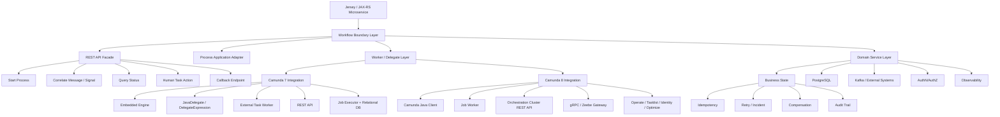

Mental model yang paling aman:

```text
JAX-RS API menerima intent
        ↓
Workflow adapter menerjemahkan intent menjadi process command
        ↓
Camunda menyimpan dan menggerakkan process state
        ↓
Worker/delegate menjalankan business capability
        ↓
Domain service menjaga invariant bisnis
        ↓
Observability + audit menjelaskan apa yang terjadi
```

---

## 3. Tabular Decomposition Map

| Area | Practical Skill / Domain | Camunda 7 | Camunda 8 | Relevansi di Jersey/JAX-RS App |
|---|---|---:|---:|---|
| 1 | **BPMN mental model** | Ya | Ya | Memahami process instance, token flow, wait state, event, gateway, task, dan boundary event. Ini fondasi sebelum coding worker/delegate. |
| 2 | **Process decomposition** | Ya | Ya | Menentukan mana yang jadi workflow, mana yang tetap domain service. Jangan semua business logic dipindahkan ke BPMN. |
| 3 | **Executable BPMN modeling** | Ya | Ya | Menggunakan service task, user task, receive task, message event, timer event, escalation, error event, compensation. |
| 4 | **BPMN vs domain state** | Ya | Ya | Process state bukan pengganti aggregate/domain state. Process engine mengatur lifecycle; database aplikasi tetap sumber kebenaran domain. |
| 5 | **JAX-RS process facade** | Ya | Ya | Endpoint seperti `POST /orders/{id}/submit`, `POST /cases/{id}/approve`, `GET /processes/{id}/status`. REST API jangan bocorkan detail internal engine terlalu banyak. |
| 6 | **Start process pattern** | Ya | Ya | API menerima command, validasi auth/domain invariant, lalu start process dengan business key/correlation key. |
| 7 | **Correlation pattern** | Ya | Ya | Callback/event dari sistem luar masuk ke JAX-RS endpoint, lalu dikorelasikan ke process instance/message subscription. |
| 8 | **Process variable design** | Ya | Ya | Menentukan variable kecil, stabil, serializable, versioned. Hindari menyimpan payload besar atau mutable object graph Java ke engine. |
| 9 | **Business key / correlation key** | Ya | Ya | Kunci untuk tracing, idempotency, audit, dan query. Biasanya pakai orderId/caseId/applicationId. |
| 10 | **Camunda 7 embedded engine** | Kuat | Tidak | Engine hidup dalam JVM aplikasi. Praktis, tapi coupling tinggi terhadap transaction, classpath, deployment, dan database engine. |
| 11 | **Camunda 7 JavaDelegate** | Kuat | Tidak | Service task bisa menjalankan Java code di JVM engine. Cocok untuk monolith/process app, tapi rawan coupling kalau delegate terlalu banyak logic. |
| 12 | **Camunda 7 External Task Worker** | Kuat | Konsep berbeda | Worker menarik pekerjaan dari engine. Camunda 7 mendukung external task client atau REST API untuk mengambil work item. ([Camunda 8 Docs](https://docs.camunda.io/docs/8.7/components/best-practices/development/invoking-services-from-the-process-c7/?utm_source=chatgpt.com)) |
| 13 | **Camunda 7 REST API** | Kuat | Berbeda | Dipakai untuk start process, query task, complete task, manage process instance, external task, incident, deployment. |
| 14 | **Camunda 7 job executor** | Kuat | Tidak sama | Memahami async continuation, retry, failed job, incident, lock, acquisition, dan DB transaction boundary. |
| 15 | **Camunda 7 database/runtime tables** | Kuat | Tidak sama | Penting untuk troubleshooting, performance, cleanup history, migration, dan incident analysis. |
| 16 | **Camunda 8 architecture** | Tidak | Kuat | Memahami Zeebe brokers, gateway, orchestration cluster, Operate, Tasklist, Identity, Optimize, exporters/storage. |
| 17 | **Camunda 8 Java Client** | Tidak | Kuat | Camunda Java Client adalah official Java library untuk integrate dengan Camunda 8, termasuk deploy/start/manage process dan implement job worker. ([Camunda 8 Docs](https://docs.camunda.io/docs/apis-tools/java-client/getting-started/?utm_source=chatgpt.com)) |
| 18 | **Camunda 8 Job Worker** | Tidak | Kuat | Worker subscribe/poll job type dan menjalankan business logic. Di Camunda 8, service task dieksekusi oleh job worker yang menangani job dari process. ([Camunda 8 Docs](https://docs.camunda.io/docs/apis-tools/java-client/job-worker/?utm_source=chatgpt.com)) |
| 19 | **Camunda 8 REST/gRPC API choice** | Tidak | Kuat | Camunda 8 Java Client mendukung REST dan gRPC. Zeebe/gRPC historically penting, tetapi arah baru Camunda 8 memperkuat unified REST API. ([Camunda 8 Docs](https://docs.camunda.io/docs/apis-tools/java-client/getting-started/?utm_source=chatgpt.com)) |
| 20 | **Unified Orchestration Cluster REST API** | Tidak | Kuat | Sejak Camunda 8.8, unified REST API menjadi integration point yang direkomendasikan untuk process orchestration capabilities. ([Camunda 8 Docs](https://docs.camunda.io/docs/reference/announcements-release-notes/880/whats-new-in-88/?utm_source=chatgpt.com)) |
| 21 | **Zeebe Java Client migration awareness** | Tidak | Kuat | Zeebe Java Client deprecated dan dijadwalkan removal di Camunda 8.10; gunakan Camunda Java Client untuk onboarding baru. ([Camunda 8 Docs](https://docs.camunda.io/docs/8.8/apis-tools/migration-manuals/?utm_source=chatgpt.com)) |
| 22 | **Human task lifecycle** | Ya | Ya, berbeda | Assignment, claim, complete, form data, authorization, SLA, escalation. Jangan desain human task hanya sebagai CRUD task list. |
| 23 | **DMN / decision automation** | Ya | Ya | Decision table untuk rule yang berubah-ubah: approval matrix, eligibility, routing, risk category. Pisahkan decision logic dari flow control. |
| 24 | **Error vs business rejection** | Ya | Ya | Bedakan technical failure, BPMN error, business rejection, validation failure, incident, compensation trigger. |
| 25 | **Retry strategy** | Ya | Ya | Retry harus idempotent. Jangan retry operasi non-idempotent tanpa deduplication key/outbox/transactional guard. |
| 26 | **Incident management** | Ya | Ya | Incident bukan sekadar error log; incident adalah operational state yang perlu ownership, dashboard, SLA, dan remediation path. |
| 27 | **Idempotency pattern** | Ya | Ya | Worker/delegate harus aman dijalankan ulang. Gunakan idempotency key, unique constraint, status machine, atau outbox/inbox table. |
| 28 | **Compensation pattern** | Ya | Ya | Untuk long-running transaction, rollback DB biasa tidak cukup. Gunakan compensating action: cancel reservation, reverse booking, release hold. |
| 29 | **Saga orchestration** | Ya | Ya | Camunda cocok sebagai orchestrator saga lintas service: step, wait, timeout, compensate, escalate. |
| 30 | **Transaction boundary design** | Sangat penting | Sangat penting, model berbeda | Tentukan kapan state domain commit, kapan process lanjut, kapan event dikirim. Hindari distributed transaction kalau bisa. |
| 31 | **Outbox/inbox integration** | Ya | Ya | Untuk sinkronisasi DB app, Kafka/event, dan workflow command. Penting agar process command dan domain state tidak divergen. |
| 32 | **Security model** | Ya | Ya | AuthN/AuthZ di JAX-RS, engine API, task access, tenant boundary, service credential, mTLS/OAuth/client credential. |
| 33 | **Multi-tenancy** | Ada | Ada | Penting untuk enterprise/regulatory platform. Harus jelas tenant isolation di API, variable, task, worker, query, dan audit. |
| 34 | **Testing BPMN** | Ya | Ya | Unit test model, worker test, delegate test, integration test dengan engine/testcontainer/local cluster, incident-path test. |
| 35 | **Model versioning** | Ya | Ya | Deployment versi baru tidak otomatis menyelesaikan instance lama. Perlu strategi migration, compatibility, dan process definition lifecycle. |
| 36 | **Operational observability** | Ya | Ya | Trace dari REST request → process instance → worker job → DB write → external call. Correlation ID wajib. |
| 37 | **Performance & scaling** | Ya | Ya, berbeda | Camunda 7 bottleneck sering DB/job executor. Camunda 8 bottleneck bisa worker throughput, partitioning, exporter/storage, backpressure. |
| 38 | **Deployment topology** | Ya | Ya | Docker/Kubernetes, config, secret, healthcheck, readiness, worker scaling, blue-green/canary, rollback. |
| 39 | **Process governance** | Ya | Ya | Review BPMN sebagai executable artifact: naming, versioning, ownership, approval, regression tests, compatibility. |
| 40 | **Camunda 7 → 8 migration** | Source | Target | Mapping BPMN extension, JavaDelegate → worker, external task → job worker, REST API changes, user task differences, incident/ops changes. |

---

## 4. Practical Category Map

### A. BPMN & Process Modeling

Fokusnya bukan menggambar diagram yang cantik, tetapi membuat **process model yang executable, diagnosable, dan defensible**.

Skill utama:

- process instance, token, activity, wait state
- start event, end event, message event, timer event
- exclusive/inclusive/parallel/event-based gateway
- service task, user task, receive task, send task
- subprocess, event subprocess, call activity
- boundary event: timeout, error, escalation
- compensation event
- process variable dan payload boundary
- DMN untuk decision table
- process versioning dan migration impact

Failure mode yang harus dipahami:

- process terlalu granular sehingga jadi spaghetti BPMN
- process terlalu coarse sehingga engine hanya jadi log wrapper
- business state disimpan hanya di variable engine
- variable berubah tanpa schema/versioning
- gateway condition tidak deterministic
- timer dan retry tidak punya ownership operational

---

### B. Jersey/JAX-RS Integration Layer

Dalam arsitektur Jersey/JAX-RS, jangan biarkan resource class langsung penuh dengan Camunda API call. Lebih aman pakai boundary seperti:

```text
Resource Class
   → Application Service
      → Workflow Adapter
         → Camunda 7 / Camunda 8 Client
```

Kategori skill:

| Skill | Tujuan |
|---|---|
| REST command endpoint | Start/cancel/escalate process berdasarkan business intent |
| Callback endpoint | Menerima hasil async dari sistem luar lalu correlate ke process |
| Task action endpoint | Claim/complete/approve/reject task |
| Status endpoint | Query process/business status tanpa mengekspos engine internals |
| Error mapping | Mapping engine error ke HTTP status yang benar |
| Security boundary | Pastikan user hanya bisa act pada task/process yang authorized |
| Correlation ID propagation | Trace lintas REST, process instance, worker, DB, dan event |

Contoh endpoint praktis:

```text
POST /cases/{caseId}/submit
POST /cases/{caseId}/approve
POST /cases/{caseId}/reject
POST /cases/{caseId}/callbacks/payment-confirmed
POST /cases/{caseId}/callbacks/document-verified
GET  /cases/{caseId}/workflow-status
GET  /tasks/my
POST /tasks/{taskId}/complete
```

---

### C. Camunda 7 Practical Skills

Camunda 7 masih sangat sering muncul di enterprise karena stabil, matang, dan banyak sistem lama dibangun di atasnya. Namun untuk onboarding baru, posisikan Camunda 7 sebagai **legacy-critical runtime**: harus bisa maintain, debug, dan migrate, bukan dijadikan default untuk greenfield tanpa alasan kuat.

Kategori penting:

| Area Camunda 7 | Yang Perlu Dikuasai |
|---|---|
| Engine bootstrap | Embedded engine, shared engine, process application |
| RuntimeService | Start process, correlate message, signal, variable operation |
| TaskService | Query, claim, complete, delegate human task |
| RepositoryService | Deploy BPMN/DMN, query definition/version |
| HistoryService | Audit, historic variable, process trace |
| ManagementService | Jobs, incidents, retries |
| JavaDelegate | In-JVM service task implementation |
| DelegateExpression | Wiring delegate via bean/container |
| External Task | Worker pull model untuk decouple engine dan service |
| Async continuation | Transaction boundary dan safe point |
| Incident handling | Failed job, retry exhausted, manual remediation |
| History cleanup | Mengontrol ukuran history tables |
| Authorization | User/group/tenant/resource permission |
| REST API | Remote control/admin/query/integration |

Practical warning: **JavaDelegate terasa cepat untuk development**, tetapi coupling-nya tinggi. Untuk microservice architecture, external task atau remote interaction sering lebih aman karena worker bisa diskalakan, dideploy, dan diobservasi secara terpisah.

---

### D. Camunda 8 Practical Skills

Camunda 8 perlu dipahami sebagai **distributed orchestration platform**, bukan Camunda 7 dengan API baru. Worker adalah first-class runtime unit.

Kategori penting:

| Area Camunda 8 | Yang Perlu Dikuasai |
|---|---|
| Orchestration cluster | Runtime utama Camunda 8 |
| Zeebe broker/gateway | Workflow execution dan command gateway |
| Camunda Java Client | Java integration utama untuk deploy/start/query/job worker |
| Job Worker | Eksekusi service task berbasis job type |
| REST API | Start/manage/query process dan task via Orchestration Cluster API |
| gRPC | Masih relevan untuk Zeebe protocol dan beberapa deployment |
| Operate | Monitoring process instance dan incident |
| Tasklist | Human task execution |
| Identity | Access control untuk komponen/API |
| Optimize | Process analytics |
| Connector | Integrasi eksternal declarative |
| Exporter/storage | Operational/query data projection |
| Backpressure | Sinyal load/runtime pressure |
| Partitioning | Scaling execution |
| Multi-tenancy | Tenant-aware orchestration |

Practical warning: di Camunda 8, jangan memigrasikan JavaDelegate secara literal. Biasanya mapping-nya adalah:

```text
Camunda 7 JavaDelegate
        ↓
Camunda 8 Job Worker
        ↓
Domain service call
        ↓
Complete / fail / throw BPMN error
```

---

### E. Worker / Delegate Engineering

Ini area paling penting untuk software engineer.

| Skill | Kenapa Penting |
|---|---|
| Idempotent worker | Job bisa retry; worker harus aman dieksekusi ulang |
| Timeout-aware execution | Jangan worker menggantung tanpa heartbeat/timeout strategy |
| Error classification | Bedakan technical retryable, business BPMN error, validation rejection |
| External call wrapper | Circuit breaker, timeout, retry, response mapping |
| Variable contract | Input/output variable harus jelas dan versioned |
| Correlation ID | Semua log/trace harus bisa ditarik ke process instance |
| Safe completion | Complete job hanya setelah side effect aman/committed |
| Fail semantics | Fail job untuk retry; BPMN error untuk jalur bisnis alternatif |
| Deduplication | Cegah double charge, double booking, double notification |
| Metrics | Job duration, failure rate, retry count, incident rate |

Invariant utama:

```text
Worker boleh gagal.
Worker boleh diulang.
Worker boleh timeout.
Tetapi domain state tidak boleh rusak.
```

---

### F. BPMN Error, Incident, Retry, Compensation

Kategori ini sering membedakan engineer biasa dengan engineer yang siap produksi.

| Scenario | Mekanisme yang Cocok |
|---|---|
| Service temporary down | Technical retry |
| Invalid business condition | BPMN error atau business rejection path |
| SLA timeout | Timer boundary event |
| Human tidak action | Escalation atau timer event |
| Payment success tapi next step gagal | Compensation atau reconciliation |
| External system callback terlambat | Message correlation + timeout branch |
| Duplicate callback | Idempotency key |
| Partial success multi-service | Saga orchestration |
| Worker bug | Incident + manual remediation |
| Data mismatch | Incident + repair workflow |

---

### G. Production Operations

Untuk production, skill Camunda bukan hanya BPMN dan Java API. Harus bisa menjawab:

```text
Process mana yang stuck?
Kenapa stuck?
Siapa owner-nya?
Apakah aman retry?
Apakah perlu compensation?
Apakah data domain sudah commit?
Apakah incident memengaruhi SLA/regulatory obligation?
```

Kategori operasional:

| Area | Yang Dicek |
|---|---|
| Healthcheck | Engine/cluster, DB, gateway, worker |
| Readiness | Worker siap menerima job atau tidak |
| Metrics | Job throughput, incident count, latency, backlog |
| Logs | Correlation ID, processInstanceId, businessKey |
| Tracing | REST → worker → DB → external service |
| Alerting | Incident spike, retry exhaustion, stuck process |
| Dashboard | SLA, active instance, failed job, task aging |
| Cleanup | History retention, log retention, variable payload size |
| Backup/restore | Engine DB / cluster state / exported state |
| Security audit | Who completed task, who changed state, who retried |

---

## 5. Recommended Learning Roadmap

### Phase 1 - BPMN Execution Mental Model

Pelajari:

1. process instance vs business entity  
2. token flow  
3. wait state  
4. service task vs user task vs receive task  
5. message/timer/error/boundary event  
6. gateway correctness  
7. process variable contract  

Target: bisa membaca BPMN dan menjelaskan “state apa yang sedang ditunggu”.

---

### Phase 2 - Jersey/JAX-RS + Workflow Boundary

Pelajari:

1. REST endpoint untuk start process  
2. REST endpoint untuk callback/correlation  
3. workflow adapter pattern  
4. business key/correlation key  
5. error mapping ke HTTP  
6. idempotent command endpoint  

Target: bisa membuat REST API yang aman untuk menggerakkan workflow tanpa expose engine detail berlebihan.

---

### Phase 3 - Camunda 7 Maintenance Skill

Pelajari:

1. RuntimeService, TaskService, RepositoryService, HistoryService  
2. JavaDelegate dan DelegateExpression  
3. External Task Worker  
4. async continuation  
5. job executor  
6. failed job dan incident  
7. deployment/versioning  
8. history cleanup  

Target: bisa debug production issue di Camunda 7.

---

### Phase 4 - Camunda 8 Development Skill

Pelajari:

1. Camunda 8 architecture  
2. Camunda Java Client  
3. job worker  
4. REST/gRPC integration  
5. Operate/Tasklist/Identity  
6. worker scaling  
7. retry/fail/BPMN error  
8. process testing  

Target: bisa membuat process application baru dengan Camunda 8 secara production-ready.

---

### Phase 5 - Reliability, Migration, and Governance

Pelajari:

1. idempotency  
2. saga orchestration  
3. compensation  
4. outbox/inbox  
5. observability  
6. incident remediation  
7. Camunda 7 → 8 migration mapping  
8. BPMN governance/review checklist  

Target: bisa mendesain workflow enterprise yang aman untuk long-running business process.

---

## Rekomendasi Materi Selanjutnya

Urutan lanjutan yang paling berguna:

1. **Cheatsheet BPMN 2.0 Practical Modeling for Engineers**  
2. **Cheatsheet Camunda 7 Core Runtime, JavaDelegate, External Task, Job Executor**  
3. **Cheatsheet Camunda 8 Architecture, Camunda Java Client, Job Worker**  
4. **Cheatsheet Workflow Error Handling: Retry, Incident, BPMN Error, Compensation**  
5. **Cheatsheet Camunda 7 → Camunda 8 Migration Strategy for Java/JAX-RS Microservices**

---

**Sources:**

- [BPMN - Business Process Model and Notation](https://www.omg.org/spec/BPMN/2.0.2/About-BPMN?utm_source=chatgpt.com)
- [Jakarta RESTful Web Services 4.0](https://jakarta.ee/specifications/restful-ws/4.0/?utm_source=chatgpt.com)
- [Support Announcements | docs.camunda.org](https://docs.camunda.org/enterprise/announcement/?utm_source=chatgpt.com)
- [Release announcements and release notes](https://docs.camunda.io/docs/reference/announcements-release-notes/overview/?utm_source=chatgpt.com)

## Response:
7/13/2026, 3:06:16 AM

Saya akan mulai dari materi pertama: **BPMN 2.0 Practical Modeling for Engineers**. Fokusnya bukan semua simbol BPMN, tetapi subset yang paling sering dipakai untuk membangun workflow production-grade di Java/JAX-RS/Camunda.

# Cheatsheet 1 - BPMN 2.0 Practical Modeling for Engineers  
## Untuk Java / Jersey / JAX-RS / Camunda 7 / Camunda 8

## 1. Purpose

BPMN 2.0 adalah notasi standar untuk memodelkan proses bisnis. Target praktisnya: satu model dapat dibaca oleh business stakeholder, dianalisis oleh engineer, dan dieksekusi oleh workflow engine seperti Camunda. OMG mendeskripsikan BPMN sebagai standar de facto untuk diagram proses bisnis dan ditujukan agar dapat digunakan langsung oleh stakeholder proses. ([OMG](https://www.omg.org/spec/BPMN/2.0.2/About-BPMN?utm_source=chatgpt.com))

Untuk engineer, BPMN harus dipahami sebagai **state machine visual untuk long-running business process**, bukan sekadar flowchart.

```text
REST command / external event
        ↓
Process instance bergerak
        ↓
Wait state / service task / human task / timer
        ↓
Worker / delegate / user action
        ↓
Process lanjut, gagal, retry, compensate, atau selesai
```

Dalam konteks **Jersey/JAX-RS**, BPMN biasanya tidak menggantikan REST API. REST API menjadi boundary untuk menerima command, callback, query, dan task action. Jakarta RESTful Web Services sendiri adalah spesifikasi Jakarta untuk membangun REST-style web services. ([Camunda 8 Docs](https://docs.camunda.io/docs/components/modeler/bpmn/?utm_source=chatgpt.com))

---

# 2. Core Mental Model

## 2.1 BPMN adalah orchestration layer

BPMN cocok untuk mengatur:

| Cocok Dimodelkan di BPMN | Sebaiknya Tidak Dimodelkan di BPMN |
|---|---|
| Long-running business process | Algoritma domain detail |
| Approval flow | Perhitungan kompleks |
| Human task lifecycle | Validasi field-level sederhana |
| Timeout dan escalation | CRUD biasa |
| Retry dan incident path | Mapping DTO |
| Cross-service orchestration | Query/reporting logic |
| Saga dan compensation | Semua if-else kecil di domain service |

Rule praktis:

```text
BPMN mengatur urutan, state, dan keputusan proses.
Domain service menjaga invariant bisnis.
Database aplikasi tetap menyimpan state bisnis utama.
```

---

## 2.2 Process instance ≠ business entity

Contoh:

```text
Order       = entity bisnis
OrderProcess = instance workflow yang mengatur lifecycle order
```

Satu `Order` bisa punya:

| Bentuk | Contoh |
|---|---|
| 1 process instance | order fulfillment sederhana |
| Beberapa process instance | fulfillment, refund, dispute, cancellation |
| Process instance parent-child | main order process memanggil subprocess shipment/payment |

Jangan menganggap `processInstanceId` sebagai primary key domain. Pakai `businessKey` / `correlationKey` seperti:

```text
orderId
caseId
applicationId
customerRequestId
enforcementCaseId
```

---

## 2.3 Token flow

Token adalah “posisi eksekusi” dalam proses.

```text
Start Event → Task A → Gateway → Task B → End Event
```

Kalau token berhenti di user task, process instance masih hidup, tetapi menunggu human action.

Kalau token berhenti di receive task/message catch event, process menunggu external event.

Kalau token berhenti di timer event, process menunggu waktu tertentu.

---

# 3. High-Level BPMN Diagram Anatomy

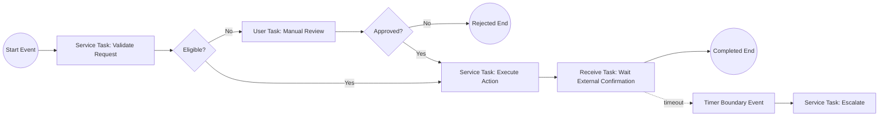

Yang harus dibaca engineer dari diagram:

| Elemen | Pertanyaan Engineering |
|---|---|
| Start event | Apa trigger prosesnya? API, message, schedule, manual? |
| Service task | Siapa worker/delegate-nya? Idempotent atau tidak? |
| Gateway | Kondisi deterministik atau ambigu? |
| User task | Siapa assignee/candidate group? Apa SLA-nya? |
| Receive/message event | Event apa yang ditunggu? Correlation key apa? |
| Timer | Apakah timeout punya konsekuensi bisnis? |
| Error/boundary event | Failure mana yang ditangkap? |
| End event | Apakah end state cocok dengan domain state? |

---

# 4. BPMN Elements: Practical Engineer View

## 4.1 Events

Event adalah sesuatu yang **terjadi** atau **ditunggu**.

| Event | Fungsi Praktis | Contoh |
|---|---|---|
| Start event | Memulai process instance | Submit order |
| End event | Mengakhiri jalur proses | Approved, rejected, cancelled |
| Message event | Menunggu/mengirim pesan spesifik | Payment confirmed |
| Timer event | Delay, SLA, timeout, reminder | Wait 3 days |
| Error event | Business/technical error yang dimodelkan | Credit check failed |
| Escalation event | Naikkan isu tanpa selalu membatalkan proses | SLA breach |
| Signal event | Broadcast ke banyak listener | System-wide reprocess trigger |
| Compensation event | Undo business action yang sudah sukses | Release reservation |
| Conditional event | Menunggu kondisi terpenuhi | Amount > threshold |

Camunda 8 mendokumentasikan bahwa support eksekusi BPMN perlu dicek per element, karena tidak semua element yang bisa dimodelkan otomatis didukung untuk execution. ([Camunda 8 Docs](https://docs.camunda.io/docs/components/modeler/bpmn/bpmn-coverage/?utm_source=chatgpt.com))

---

## 4.2 Task

Task adalah unit pekerjaan.

| Task | Kapan Dipakai | Implementasi Praktis |
|---|---|---|
| Service task | Sistem melakukan kerja otomatis | JavaDelegate, external task, Camunda 8 job worker |
| User task | Manusia harus mengambil keputusan/action | Tasklist/custom UI/JAX-RS task API |
| Receive task | Proses menunggu external message | Callback endpoint + correlation |
| Send task | Proses mengirim message/command | Kafka/API call/outbox |
| Business rule task | Evaluasi rule/decision | DMN decision |
| Script task | Logic kecil/scripting | Hindari untuk logic penting |
| Manual task | Aktivitas manual di luar sistem | Jarang dieksekusi engine |
| Call activity | Memanggil reusable subprocess | Shared approval/payment process |

Untuk Camunda 8, service task memerlukan `task type`, lalu job worker mengimplementasikan pekerjaan tersebut. ([Camunda 8 Docs](https://docs.camunda.io/docs/components/modeler/bpmn/?utm_source=chatgpt.com))

---

## 4.3 Gateways

Gateway mengatur routing token. Camunda menjelaskan gateway sebagai elemen yang merutekan token dalam pola yang lebih kompleks dibanding sequence flow biasa. ([Camunda 8 Docs](https://docs.camunda.io/docs/components/modeler/bpmn/gateways/?utm_source=chatgpt.com))

| Gateway | Makna | Kapan Dipakai | Risiko |
|---|---|---|---|
| Exclusive / XOR | Pilih satu jalur | Approved vs rejected | Kondisi overlap / tidak ada default |
| Parallel / AND | Jalankan semua jalur | Notify + reserve + audit | Join deadlock kalau tidak sinkron |
| Inclusive / OR | Pilih satu atau lebih jalur | Optional checks | Sulit dibaca dan rawan salah |
| Event-based | Tunggu event mana yang datang duluan | Payment received vs timeout | Korelasi event harus jelas |

Rule praktis:

```text
Default gateway untuk engineer: Exclusive.
Gunakan Parallel hanya kalau semua cabang memang wajib.
Gunakan Inclusive dengan hati-hati.
Gunakan Event-based hanya untuk race antar event.
```

---

# 5. Engineer’s BPMN Subset: Yang Wajib Dikuasai Dulu

Tidak perlu mulai dari seluruh BPMN 2.0. Untuk production microservice, urutan prioritasnya:

| Prioritas | Elemen | Kenapa Penting |
|---:|---|---|
| 1 | Start/end event | Boundary lifecycle |
| 2 | Service task | Integrasi Java/domain service |
| 3 | User task | Human approval/manual handling |
| 4 | Exclusive gateway | Decision branch paling umum |
| 5 | Message catch event | Async callback/correlation |
| 6 | Timer boundary event | Timeout/SLA |
| 7 | Error boundary event | Business failure path |
| 8 | Call activity | Reusable subprocess |
| 9 | Parallel gateway | Fan-out/fan-in |
| 10 | Compensation | Saga/undo long-running transaction |

---

# 6. Practical Modeling Patterns

## 6.1 Command Starts Process

Gunakan ketika user/API mengirim intent bisnis.

```mermaid
flowchart LR
    A[POST /cases/{id}/submit] --> B((Start Process))
    B --> C[Validate Case]
    C --> D[Create Review Task]
    D --> E((Waiting for Reviewer))
```

JAX-RS resource sebaiknya tidak langsung berisi banyak logic BPMN.

```text
CaseResource
  → CaseApplicationService
    → WorkflowAdapter
      → Camunda client/runtime service
```

Contoh endpoint:

```http
POST /cases/C-1001/submit
Idempotency-Key: submit-C-1001-v1
```

Payload minimal:

```json
{
  "submittedBy": "user-123",
  "reason": "initial_submission"
}
```

Process variable minimal:

```json
{
  "caseId": "C-1001",
  "submittedBy": "user-123",
  "submissionVersion": 1
}
```

Anti-pattern:

```json
{
  "entireCaseObject": { "...": "huge mutable payload" }
}
```

---

## 6.2 Callback Correlation Pattern

Gunakan ketika external system memberi hasil async.

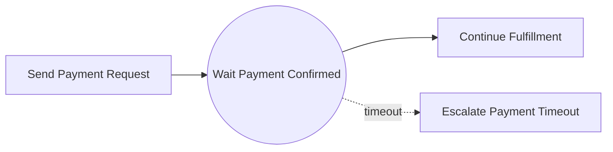

JAX-RS endpoint:

```http
POST /payments/callbacks/confirmed
```

Correlation key:

```json
{
  "orderId": "ORD-9001",
  "paymentReference": "PAY-777"
}
```

Engineering rule:

```text
Callback harus idempotent.
Correlation harus berdasarkan business key, bukan hanya processInstanceId.
Duplicate callback tidak boleh membuat proses/side effect dobel.
```

---

## 6.3 Human Approval Pattern

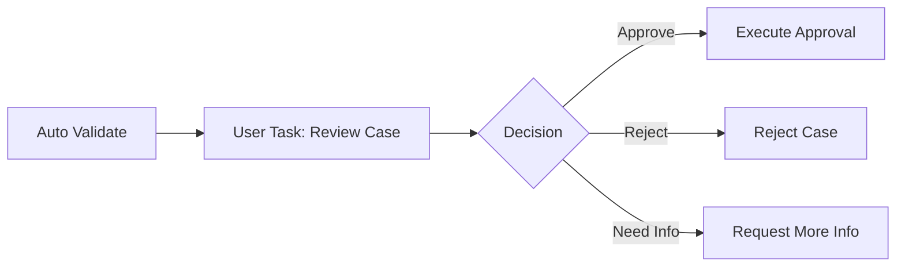

Task design minimal:

| Field | Contoh |
|---|---|
| assignee | specific user |
| candidateGroup | compliance-reviewer |
| dueDate | SLA 2 hari |
| priority | high |
| formKey/formRef | review-case-form |
| variables | caseId, riskScore, requestedAction |

Jangan jadikan user task hanya “button approval”. Task harus punya konteks, ownership, SLA, dan audit trail.

---

## 6.4 SLA Timeout Pattern

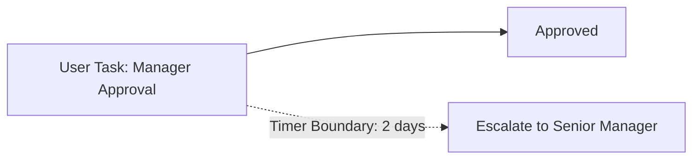

Gunakan timer boundary event ketika:

| Kondisi | Contoh |
|---|---|
| Human task terlalu lama | Approval > 2 hari |
| External response terlambat | Payment callback > 30 menit |
| Reminder periodik | Kirim reminder setiap 24 jam |
| Expiry | Offer expired |

Timer bukan sekadar delay teknis. Timer biasanya punya arti bisnis.

---

## 6.5 Error Boundary Pattern

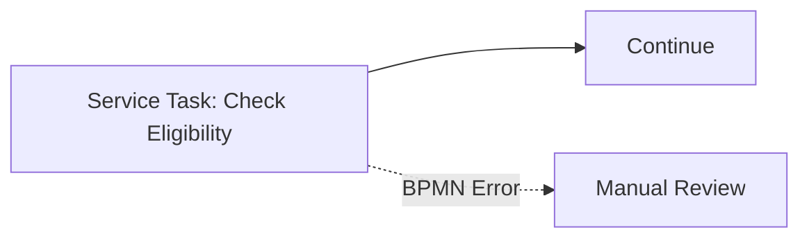

Gunakan BPMN error untuk kondisi yang memang bagian dari business flow.

| Kondisi | Pakai |
|---|---|
| External system temporary down | technical retry |
| Data invalid karena bug | incident |
| Customer not eligible | BPMN error / rejection branch |
| Fraud score inconclusive | BPMN error menuju manual review |
| Timeout SLA | timer boundary |

Bedakan:

```text
Technical failure → retry / incident
Business alternative → BPMN error / gateway path
Business rejection → modeled process outcome
```

---

## 6.6 Saga + Compensation Pattern

Camunda mendeskripsikan compensation event sebagai mekanisme untuk undo langkah yang sudah berhasil ketika hasilnya tidak lagi diinginkan. ([Camunda 8 Docs](https://docs.camunda.io/docs/components/modeler/bpmn/compensation-events/?utm_source=chatgpt.com))

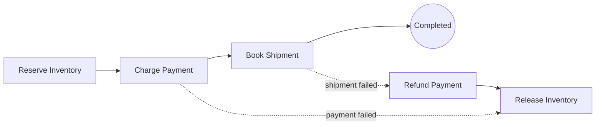

Gunakan compensation ketika:

| Step Sukses | Step Setelahnya Gagal | Compensation |
|---|---|---|
| reserve inventory | payment failed | release inventory |
| charge payment | shipment failed | refund payment |
| create account | KYC failed | deactivate account |
| allocate quota | approval rejected | release quota |

Rule penting:

```text
Compensation juga harus idempotent.
Compensation bukan rollback database.
Compensation adalah business action baru.
```

---

## 6.7 Call Activity / Reusable Subprocess

Gunakan untuk reusable process.

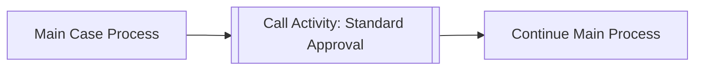

Cocok untuk:

| Reusable Process | Contoh |
|---|---|
| Approval | manager approval, compliance approval |
| Notification | notify customer/internal team |
| Payment | authorize/capture/refund |
| KYC | identity verification |
| Document validation | validate uploaded documents |

Risiko:

```text
Kalau subprocess berubah, instance lama dan caller process harus tetap kompatibel.
```

---

# 7. BPMN Modeling Decision Table

| Problem | BPMN Element / Pattern | Catatan |
|---|---|---|
| User submit request | Start event + service task | Trigger dari REST command |
| Need one of several decisions | Exclusive gateway | Beri default path |
| Need all actions run | Parallel gateway | Pastikan join valid |
| Need optional checks | Inclusive gateway | Pakai hati-hati |
| Wait callback | Message catch event / receive task | Butuh correlation key |
| Wait human decision | User task | Butuh assignee/group/SLA |
| Wait until date | Timer event | Gunakan ISO duration/date |
| External call may fail temporarily | Retry | Jangan jadi BPMN branch kalau teknis |
| Business exception | BPMN error | Contoh not eligible |
| SLA breach | Timer boundary + escalation | Jangan hanya log |
| Undo previous action | Compensation | Saga pattern |
| Reuse process | Call activity | Perhatikan versioning |
| Need rule table | DMN/business rule task | Cocok untuk decision matrix |
| Need audit | History + domain audit table | Jangan hanya andalkan log |
| Need manual repair | Incident + remediation task | Harus ada owner |

---

# 8. Naming Convention

## 8.1 Process

Gunakan nama berbasis business lifecycle.

```text
Good:
- Order Fulfillment Process
- Case Investigation Process
- Customer Onboarding Process
- Refund Handling Process

Bad:
- Process1
- SubmitFlow
- MainProcess
- NewWorkflow
```

## 8.2 Activity

Gunakan verb + object.

```text
Good:
- Validate Application
- Calculate Risk Score
- Request Manager Approval
- Send Payment Instruction
- Wait for Payment Confirmation
- Release Reserved Quota

Bad:
- Validation
- API Call
- Task 1
- Check
- Do Stuff
```

## 8.3 Gateway

Gateway harus berupa pertanyaan.

```text
Good:
- Application Eligible?
- Approval Required?
- Payment Confirmed?
- Risk Score High?

Bad:
- Decision
- Gateway 1
- Check Status
```

## 8.4 Message

Gunakan past-tense event name.

```text
Good:
- PaymentConfirmed
- DocumentVerified
- CustomerRejectedOffer
- ShipmentBooked

Bad:
- Payment
- Callback
- Update
- Done
```

---

# 9. Variable Design

## 9.1 Prinsip

Process variable harus:

| Prinsip | Penjelasan |
|---|---|
| Minimal | Simpan referensi, bukan semua object |
| Stable | Jangan sering berubah format |
| Serializable | Aman untuk engine/runtime |
| Versioned | Payload event/command berubah secara eksplisit |
| Queryable | Variable penting bisa dicari |
| Non-sensitive by default | Jangan sembarang simpan PII/secret |

Contoh baik:

```json
{
  "caseId": "CASE-123",
  "customerId": "CUST-88",
  "riskScore": 72,
  "approvalRequired": true,
  "requestVersion": 3
}
```

Contoh buruk:

```json
{
  "accessToken": "secret",
  "fullCustomerProfile": { "...": "large PII object" },
  "entireHttpRequest": { "...": "unstable object" }
}
```

## 9.2 Variable Boundary

```text
BPMN variable:
- routing decision
- correlation key
- small process state
- task context

Domain DB:
- canonical business state
- full entity
- audit detail
- financial/legal record
- large payload
```

---

# 10. BPMN and Domain State

Workflow engine boleh tahu bahwa proses berada di “Waiting for Approval”.

Tetapi domain database tetap harus tahu status bisnis:

```text
case.status = UNDER_REVIEW
case.workflowInstanceId = 2251799813685251
case.lastWorkflowState = WAITING_MANAGER_APPROVAL
case.version = 12
```

Jangan hanya mengandalkan engine history sebagai satu-satunya sumber status bisnis, terutama untuk aplikasi regulatory, audit-heavy, atau customer-facing.

---

# 11. BPMN for REST/JAX-RS Application

## 11.1 Endpoint Categories

| Endpoint Category | Contoh | Mapping ke BPMN |
|---|---|---|
| Command | `POST /orders/{id}/submit` | start process |
| Human action | `POST /tasks/{id}/complete` | complete user task |
| Callback | `POST /payments/callbacks` | correlate message |
| Query | `GET /orders/{id}/status` | domain + workflow status |
| Admin | `POST /processes/{id}/retry` | incident remediation |
| Cancellation | `POST /orders/{id}/cancel` | cancel process / send cancellation message |

## 11.2 Resource Class Boundary

```java
@Path("/cases")
public class CaseResource {

  private final CaseApplicationService service;

  @POST
  @Path("/{caseId}/submit")
  public Response submit(@PathParam("caseId") String caseId, SubmitCaseRequest request) {
    service.submitCase(caseId, request);
    return Response.accepted().build();
  }
}
```

Application service:

```java
public class CaseApplicationService {

  private final CaseRepository caseRepository;
  private final WorkflowAdapter workflowAdapter;

  public void submitCase(String caseId, SubmitCaseRequest request) {
    CaseRecord record = caseRepository.getForUpdate(caseId);

    record.validateSubmittable();
    record.markSubmitted();

    caseRepository.save(record);

    workflowAdapter.startCaseReview(caseId, request.submittedBy());
  }
}
```

Workflow adapter:

```java
public interface WorkflowAdapter {
  void startCaseReview(String caseId, String submittedBy);
  void correlatePaymentConfirmed(String orderId, String paymentReference);
  void cancelCaseProcess(String caseId, String reason);
}
```

Tujuannya: business code tidak tersebar di resource class atau BPMN delegate/worker secara liar.

---

# 12. Camunda 7 vs Camunda 8 Modeling Impact

| Concern | Camunda 7 | Camunda 8 |
|---|---|---|
| Service task implementation | JavaDelegate, delegate expression, external task | Job worker |
| Runtime style | Embedded/shared engine atau remote engine | Distributed orchestration cluster |
| State storage | Relational DB engine tables | Zeebe log/runtime + exporters/projections |
| Worker model | JavaDelegate in-JVM atau external task polling | Job worker berdasarkan task type |
| REST integration | Camunda 7 REST API | Camunda 8 Orchestration Cluster REST API / client |
| Migration | BPMN XML mirip tetapi extension berbeda | Tidak drop-in replacement |
| Best practical abstraction | `WorkflowAdapter` | `WorkflowAdapter` |

Abstraksi yang aman:

```text
Domain service tidak peduli Camunda 7 atau 8.
JAX-RS resource tidak peduli Camunda 7 atau 8.
Yang berubah hanya WorkflowAdapter + worker/delegate implementation.
```

---

# 13. Common Anti-Patterns

| Anti-Pattern | Kenapa Berbahaya | Perbaikan |
|---|---|---|
| BPMN jadi tempat semua business logic | Sulit test, sulit versioning | Logic tetap di domain service |
| Diagram terlalu detail | Sulit dibaca, mudah rusak | Model hanya lifecycle penting |
| Semua task dinamai “Service Task” | Tidak komunikatif | Gunakan verb + object |
| Gateway tanpa default | Token bisa stuck | Tambahkan default/error path |
| Variable menyimpan object besar | Performance dan compatibility buruk | Simpan ID + small context |
| Callback tanpa idempotency | Double side effect | Idempotency key + unique constraint |
| Technical error dimodelkan sebagai branch bisnis | Diagram noisy | Gunakan retry/incident |
| User task tanpa SLA | Work item menumpuk | Due date + timer escalation |
| Compensation dianggap rollback | Salah secara bisnis | Buat compensating action eksplisit |
| Process status jadi satu-satunya domain status | Query bisnis rapuh | Mirror status penting ke DB aplikasi |
| Worker complete sebelum side effect aman | State divergen | Commit side effect dulu, lalu complete |
| BPMN tidak dites | Error baru muncul di runtime | Unit/integration test BPMN path |

---

# 14. Modeling Checklist Sebelum BPMN Dianggap Production-Ready

## 14.1 Business Correctness

```text
[ ] Start trigger jelas
[ ] End states jelas
[ ] Semua approval/rejection path eksplisit
[ ] Semua timeout penting dimodelkan
[ ] Semua external callback punya correlation key
[ ] Semua business error punya path yang disengaja
[ ] Semua manual task punya owner
[ ] Semua process outcome sinkron dengan domain state
```

## 14.2 Engineering Correctness

```text
[ ] Worker/delegate idempotent
[ ] Retry policy jelas
[ ] Incident path jelas
[ ] Variable kecil dan versioned
[ ] No secret/large PII in process variables
[ ] Gateway condition deterministic
[ ] Parallel join tidak deadlock
[ ] External call punya timeout
[ ] Correlation ID dipropagasikan
[ ] BPMN model punya automated test
```

## 14.3 Operational Readiness

```text
[ ] Ada dashboard active/stuck/failed instances
[ ] Ada alert incident spike
[ ] Ada retry/remediation procedure
[ ] Ada ownership per process
[ ] Ada history retention policy
[ ] Ada audit trail untuk user task
[ ] Ada deployment/versioning strategy
[ ] Ada rollback/migration strategy
```

---

# 15. Practical Review Questions

Gunakan pertanyaan ini saat membaca BPMN di codebase baru:

1. Proses ini dimulai oleh siapa/apa?
2. Apa business key-nya?
3. Apa entity domain utama yang dikontrol?
4. State bisnis mana yang disimpan di DB aplikasi?
5. Step mana yang synchronous dan asynchronous?
6. External system mana yang dipanggil?
7. Step mana yang bisa diulang?
8. Apa yang terjadi kalau worker mati?
9. Apa yang terjadi kalau callback datang dua kali?
10. Apa yang terjadi kalau user tidak approve?
11. Apa yang terjadi kalau SLA lewat?
12. Apa yang terjadi kalau step ke-3 sukses tapi step ke-4 gagal?
13. Bagaimana proses ini di-cancel?
14. Bagaimana incident diperbaiki?
15. Bagaimana versi baru BPMN memengaruhi instance lama?

---

# 16. Minimal BPMN Pattern untuk Microservice

Untuk banyak use case enterprise, pola minimal ini cukup kuat:

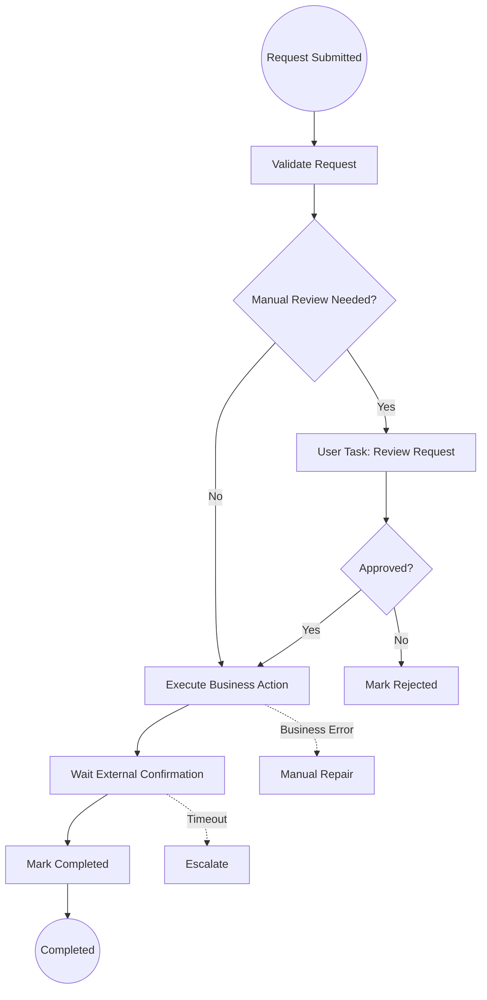

Mapping ke Java/JAX-RS:

| BPMN Step | Java/JAX-RS Component |
|---|---|
| Request Submitted | `POST /requests/{id}/submit` |
| Validate Request | domain service / worker |
| Manual Review | task API / Tasklist / custom UI |
| Execute Business Action | worker/delegate |
| Wait External Confirmation | callback endpoint + correlation |
| Timeout | timer boundary |
| Escalate | notification/escalation service |
| Manual Repair | incident/remediation task |

---

# 17. Ringkasan Praktis

BPMN production-grade harus memenuhi 5 hal:

```text
1. Clear lifecycle
2. Clear ownership
3. Clear wait states
4. Clear failure paths
5. Clear mapping to domain state
```

Untuk engineer Java/JAX-RS:

```text
Resource class menerima intent.
Application service menjaga invariant.
Workflow adapter menggerakkan process.
Worker/delegate menjalankan capability.
Domain DB menyimpan state bisnis.
Camunda menyimpan state proses.
Observability menghubungkan semuanya.
```

---

# 18. Roadmap Belajar Singkat

1. Kuasai subset BPMN: event, task, gateway, subprocess, message, timer, error, compensation.  
2. Latih membaca token flow: “proses sekarang sedang menunggu apa?”  
3. Buat satu flow sederhana: submit → validate → approve → execute → complete.  
4. Tambahkan callback async dan timer timeout.  
5. Tambahkan error boundary dan compensation.  
6. Mapping setiap BPMN step ke Java component: resource, service, workflow adapter, worker/delegate.  
7. Tambahkan test untuk happy path, rejection path, timeout path, retry path, duplicate callback.  
8. Review observability: correlation ID, business key, process instance ID, worker log, domain audit.

---

## Rekomendasi Materi Selanjutnya

Lanjut ke urutan nomor 2:

**Cheatsheet Camunda 7 Core Runtime, JavaDelegate, External Task, Job Executor**.

---

**Sources:**

- [BPMN - Business Process Model and Notation](https://www.omg.org/spec/BPMN/2.0.2/About-BPMN?utm_source=chatgpt.com)
- [BPMN in Modeler](https://docs.camunda.io/docs/components/modeler/bpmn/?utm_source=chatgpt.com)

## Response:
7/13/2026, 3:10:11 AM

Saya lanjut ke materi nomor 2: **Camunda 7 Core Runtime, JavaDelegate, External Task, Job Executor**. Fokusnya untuk kemampuan maintain/debug production system, karena Camunda 7 sering masih dipakai di enterprise walaupun arahnya sudah legacy/LTS.

# Cheatsheet 2 - Camunda 7 Core Runtime  
## JavaDelegate, External Task, Job Executor dalam Jersey/JAX-RS Based Application

## 1. Positioning

Camunda 7 masih penting untuk enterprise system karena banyak workflow production dibangun di atasnya. Tetapi status strategisnya perlu dipahami dengan benar: **Camunda 7.24 LTS adalah minor release terakhir Camunda 7, dan tidak akan ada feature-adding release baru**. Dokumentasi resmi juga mencatat Camunda 7.24 LTS memiliki end of maintenance pada **13 April 2030**, dengan extended support sampai April 2032. ([Camunda Documentation](https://docs.camunda.org/enterprise/announcement/))

Jadi untuk onboarding:

```text id="cx9jqg"
Camunda 7 = skill maintenance, debugging, stabilization, migration readiness.
Camunda 8 = arah utama untuk greenfield / modernization.
```

Dalam aplikasi **Jersey/JAX-RS**, Camunda 7 biasanya muncul dalam beberapa bentuk:

1. **Embedded engine** di aplikasi Java/Jakarta.
2. **Shared/container-managed engine** di application server.
3. **Remote engine via REST API**.
4. **External task worker** yang berjalan sebagai service terpisah.
5. **Hybrid**, misalnya JAX-RS API start process, lalu worker/delegate menjalankan step.

---

# 2. Mental Model Camunda 7 Runtime

Camunda 7 adalah **BPMN process engine di dalam JVM** yang menyimpan runtime state ke relational database. Secara praktis, engine menjalankan process instance sampai mencapai **wait state**, **async continuation**, **timer**, **user task**, atau **external task**.

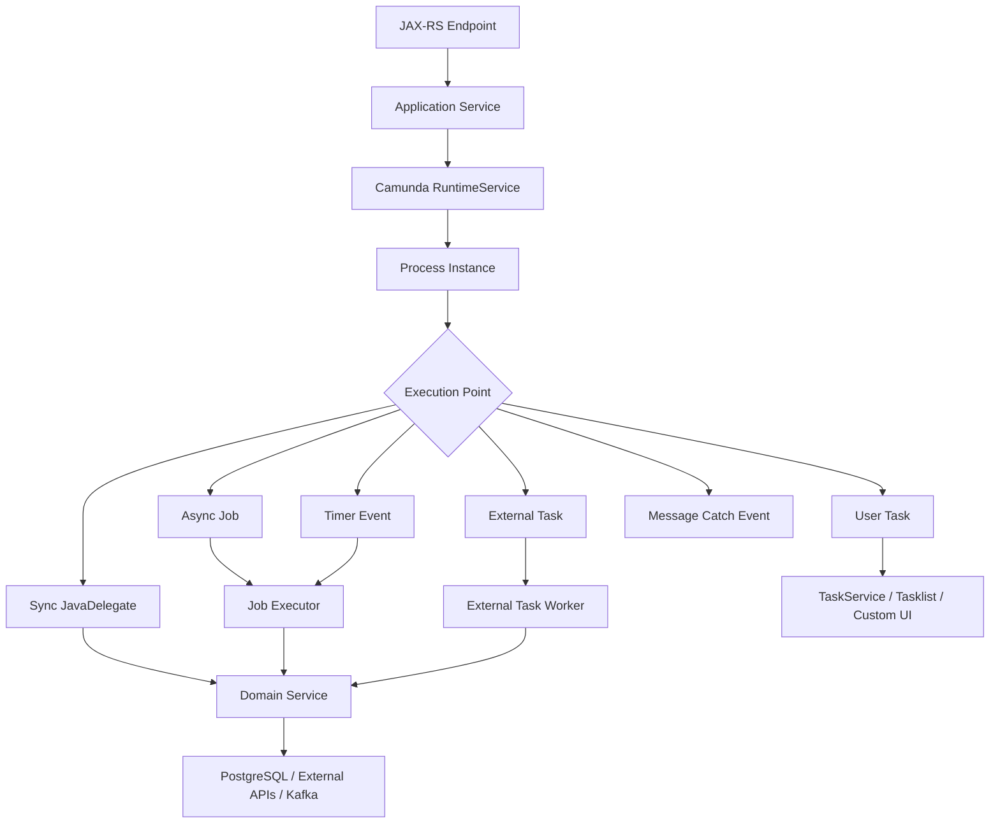

Kunci mental model:

```text id="1brbgx"
Application thread menjalankan process sampai wait state.
Job executor thread menjalankan deferred work.
External worker menjalankan work di luar engine JVM.
Relational DB menyimpan runtime state, jobs, tasks, variables, incidents, history.
```

Camunda sendiri menjelaskan bahwa application thread dapat memanggil Java API seperti `RuntimeService#startProcessInstanceByKey`, lalu proses berjalan sampai wait state; sementara job executor thread menangani work yang tertunda seperti async continuation dan timer. ([Camunda](https://camunda.com/blog/2019/10/job-executor-what-is-going-on-in-my-process-engine/))

---

# 3. Core Engine Services

Camunda 7 expose API melalui beberapa service utama. `ProcessEngineServices` adalah base interface yang memberi akses ke public API services engine. ([Camunda Documentation](https://docs.camunda.org/javadoc/camunda-bpm-platform/7.3/org/camunda/bpm/engine/ProcessEngineServices.html?utm_source=chatgpt.com))

| Service | Fungsi Praktis | Contoh Pemakaian |
|---|---|---|
| `RepositoryService` | Deploy/query process definition, BPMN, DMN | deploy BPMN, cari process definition version |
| `RuntimeService` | Start/query process instance, message correlation, variables | start process dari JAX-RS command |
| `TaskService` | Human task lifecycle | claim, assign, complete, query task |
| `HistoryService` | Audit/history process | cek historic process, variable, activity |
| `ManagementService` | Jobs, incidents, maintenance/admin | retry job, query failed jobs |
| `ExternalTaskService` | External task lifecycle | fetch/lock/complete/fail external task |
| `IdentityService` | User/group identity | user/group authorization |
| `AuthorizationService` | Resource permission | task/process access |
| `FormService` | Start/task form data | legacy form integration |
| `DecisionService` | DMN evaluation | rule/decision execution |

Untuk Jersey/JAX-RS app, service yang paling sering disentuh adalah:

```text id="d89vuo"
RuntimeService  → start/correlate/cancel/query process
TaskService     → claim/complete human task
HistoryService  → audit/status/reporting
ManagementService → failed job / incident troubleshooting
ExternalTaskService → external worker integration
```

---

# 4. Runtime Execution Model

## 4.1 Synchronous execution

Ketika endpoint JAX-RS memanggil `startProcessInstanceByKey`, thread HTTP bisa langsung mengeksekusi beberapa langkah BPMN sampai menemukan wait state.

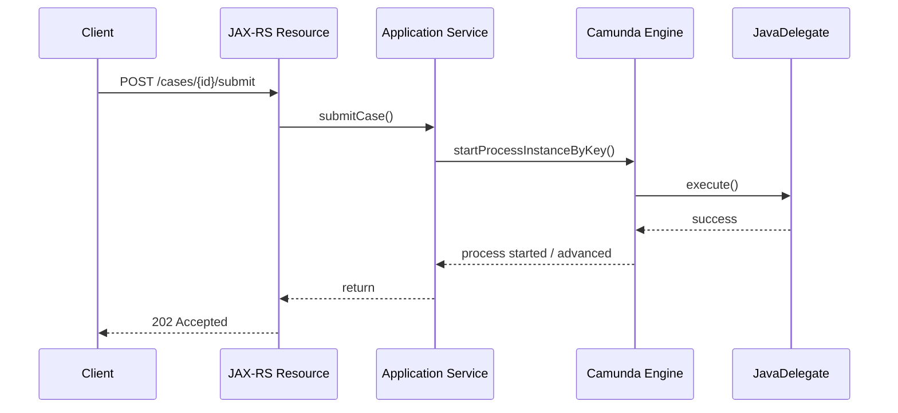

Konsekuensi:

| Kelebihan | Risiko |
|---|---|
| Simple mental model | HTTP request bisa lama |
| Error langsung terlihat | Delegate failure bisa rollback start process |
| Mudah debug | Coupling tinggi ke engine transaction |
| Cocok untuk step ringan | Tidak cocok untuk remote call lambat |

---

## 4.2 Wait state

Wait state adalah titik aman di mana process state sudah persisted dan engine menunggu sesuatu.

Contoh wait state:

| Wait State | Menunggu Apa |
|---|---|
| User task | Human action |
| Receive task | External signal/message |
| Message catch event | Message correlation |
| Timer event | Waktu tertentu |
| External task | Worker mengambil dan menyelesaikan task |
| Async continuation | Job executor melanjutkan eksekusi |

---

## 4.3 Async continuation

Async continuation adalah breakpoint transaksi. Camunda menjelaskan async continuation sebagai breakpoint dalam process execution yang digunakan sebagai transaction boundary dan memungkinkan thread lain melanjutkan eksekusi. ([Camunda](https://camunda.com/blog/2014/07/advanced-asynchronous-continuations/?utm_source=chatgpt.com))

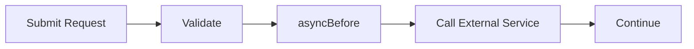

Makna praktis:

```text id="lqrpc7"
Sebelum async boundary:
- state process di-commit
- HTTP call bisa selesai
- step berikutnya dikerjakan job executor

Sesudah async boundary:
- failure tidak rollback sampai awal
- failed job bisa retry
- incident bisa muncul kalau retry habis
```

Gunakan `asyncBefore` / `asyncAfter` untuk:

| Situasi | Kenapa |
|---|---|
| Sebelum remote API call | Supaya start process tidak rollback kalau API gagal |
| Setelah user task | Supaya user tidak melihat error internal step berikutnya |
| Sebelum step berat | Supaya diproses background |
| Sebelum step retryable | Supaya job executor bisa retry |
| Sebelum boundary operasional penting | Supaya ada safe point di DB |

---

# 5. JavaDelegate

## 5.1 Fungsi

`JavaDelegate` dipakai ketika BPMN activity perlu menjalankan Java code, misalnya service task atau event listener. Interface ini memiliki method utama `execute(DelegateExecution execution)` dan dokumentasi menyebutkan JavaDelegate digunakan untuk delegasi Java dalam proses BPMN, misalnya memanggil custom business logic. ([Camunda Documentation](https://docs.camunda.org/javadoc/camunda-bpm-platform/7.3/org/camunda/bpm/engine/delegate/JavaDelegate.html))

```java id="kpwqsl"
public class ValidateCaseDelegate implements JavaDelegate {

  private final CaseService caseService;

  public ValidateCaseDelegate(CaseService caseService) {
    this.caseService = caseService;
  }

  @Override
  public void execute(DelegateExecution execution) throws Exception {
    String caseId = (String) execution.getVariable("caseId");

    ValidationResult result = caseService.validate(caseId);

    execution.setVariable("valid", result.valid());
    execution.setVariable("riskScore", result.riskScore());
  }
}
```

## 5.2 Practical responsibility

JavaDelegate sebaiknya menjadi **thin adapter**, bukan tempat business logic utama.

```text id="vhn87n"
BPMN Service Task
    → JavaDelegate
        → Domain/Application Service
            → Repository / External Client
```

| Jangan di JavaDelegate | Letakkan di |
|---|---|
| business rule besar | domain service / DMN |
| SQL detail | repository |
| HTTP client raw | external client wrapper |
| retry custom liar | engine retry / resilience layer |
| DTO mapping besar | mapper/service |
| authorization user-facing | JAX-RS/application boundary |

## 5.3 JavaDelegate lifecycle concern

Hal yang sering menjebak:

| Concern | Penjelasan |
|---|---|
| Object lifecycle | Delegate bisa dibuat oleh engine/container; pastikan dependency injection jelas |
| Transaction boundary | Delegate berjalan dalam engine command/transaction context |
| Exception behavior | Exception bisa rollback transaksi dan memicu retry kalau async |
| Variable serialization | Object Java kompleks bisa menyulitkan compatibility |
| Thread safety | Jangan simpan mutable state per execution di field singleton |
| Flow control | JavaDelegate tidak ideal untuk memanipulasi control flow secara langsung; gunakan variable + gateway atau BPMN error |

## 5.4 Error handling di JavaDelegate

```java id="e8pb0d"
@Override
public void execute(DelegateExecution execution) throws Exception {
  String caseId = (String) execution.getVariable("caseId");

  try {
    caseService.performCheck(caseId);
  } catch (BusinessNotEligibleException e) {
    throw new BpmnError("CASE_NOT_ELIGIBLE", e.getMessage());
  } catch (TemporaryRemoteException e) {
    throw e; // biarkan engine/job executor retry jika async
  }
}
```

Mapping:

| Failure | Handling |
|---|---|
| Business rejection | `BpmnError` + boundary event |
| Validation branch | variable + gateway |
| Temporary technical error | throw exception, retry via job executor |
| Permanent technical/data bug | incident + manual repair |
| Duplicate request | idempotent guard di domain service |

---

# 6. External Task

## 6.1 Fungsi

External task adalah work item yang diproses oleh worker eksternal secara independen dari process engine. Dokumentasi Camunda menyebut external task menunggu diselesaikan oleh external service worker; task dikonfigurasi dengan topic, lalu worker polling Camunda API untuk mengambil task terbuka dan memberi tahu engine saat task selesai. ([Camunda 8 Docs](https://docs.camunda.io/docs/8.7/components/best-practices/development/invoking-services-from-the-process-c7/))

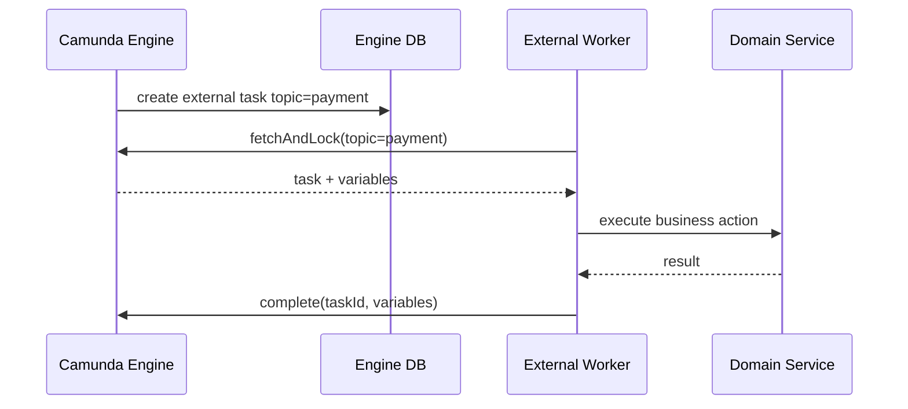

Camunda juga menjelaskan external task pattern memberi keuntungan seperti temporal decoupling, polyglot architecture, dan scaling worker per topic. ([Camunda 8 Docs](https://docs.camunda.io/docs/8.7/components/best-practices/development/invoking-services-from-the-process-c7/))

## 6.2 ExternalTaskService

`ExternalTaskService` memberikan akses ke external task instance; dokumentasinya menyebut external task sebagai work item yang diproses secara eksternal dan independen dari process engine. API ini juga menyediakan operasi seperti `complete(...)` untuk menyelesaikan task atas nama worker. ([Camunda Documentation](https://docs.camunda.org/javadoc/camunda-bpm-platform/7.9/org/camunda/bpm/engine/ExternalTaskService.html))

## 6.3 Kapan pakai External Task dibanding JavaDelegate?

| Pilih JavaDelegate jika | Pilih External Task jika |
|---|---|
| Engine dan business logic satu JVM | Worker harus scalable terpisah |
| Step cepat dan lokal | Step memanggil remote service |
| Coupling acceptable | Ingin decoupling deployment |
| Tim Java sama mengelola engine | Polyglot / service berbeda |
| Tidak butuh horizontal scaling per task | Butuh scale per topic |
| Latency rendah dan reliable | Task bisa lama atau retry-heavy |

Rule praktis:

```text id="nmdq1e"
JavaDelegate = in-process adapter.
External Task = distributed worker pattern.
```

## 6.4 Worker skeleton

```java id="ll7dd6"
ExternalTaskClient client = ExternalTaskClient.create()
    .baseUrl("http://camunda-engine:8080/engine-rest")
    .asyncResponseTimeout(10000)
    .build();

client.subscribe("payment-charge")
    .lockDuration(30_000)
    .handler((externalTask, externalTaskService) -> {
      String orderId = externalTask.getVariable("orderId");

      try {
        PaymentResult result = paymentService.charge(orderId);

        Map<String, Object> variables = new HashMap<>();
        variables.put("paymentId", result.paymentId());
        variables.put("paymentStatus", result.status());

        externalTaskService.complete(externalTask, variables);

      } catch (PaymentRejectedException e) {
        externalTaskService.handleBpmnError(
            externalTask,
            "PAYMENT_REJECTED",
            e.getMessage()
        );

      } catch (Exception e) {
        externalTaskService.handleFailure(
            externalTask,
            e.getMessage(),
            stackTrace(e),
            3,
            60_000
        );
      }
    })
    .open();
```

## 6.5 External task invariants

```text id="8ntchb"
Worker may crash.
Worker may timeout.
Worker may execute twice.
Network may fail after business side effect but before complete().
Therefore: worker operation must be idempotent.
```

Practical guard:

| Risk | Guard |
|---|---|
| Worker double execution | idempotency key |
| Payment double charge | provider idempotency key + DB unique constraint |
| Complete call failed after side effect | reconcile by business key |
| Lock expired while worker still running | lock extension or shorter operation |
| Huge variables | fetch only needed variables |
| Topic overloaded | scale worker by topic |

---

# 7. Job Executor

## 7.1 Fungsi

Job executor adalah komponen engine yang menjalankan pekerjaan deferred seperti async continuation dan timer event. Camunda menggambarkan job executor sebagai thread pool yang mengambil dan mengeksekusi jobs saat tersedia; pipeline-nya melibatkan table `ACT_RU_JOB`, job acquisition thread, dan thread pool. ([Camunda](https://camunda.com/blog/2019/10/job-executor-what-is-going-on-in-my-process-engine/))

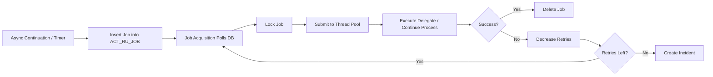

## 7.2 Job executor components

| Component | Fungsi |
|---|---|
| `ACT_RU_JOB` | Menyimpan runtime job |
| acquisition thread | Polling job yang due/available |
| DB lock | Mencegah job dieksekusi double oleh node lain |
| thread pool | Mengeksekusi job |
| retry metadata | Menentukan apakah job dicoba ulang |
| incident | Dibuat saat job gagal permanen/no retries |

Camunda menjelaskan job dibuat misalnya saat process mencapai async continuation, disimpan di `ACT_RU_JOB`, diambil oleh acquisition thread, dikunci berbasis waktu di database agar tidak acquired lebih dari sekali, lalu dieksekusi thread pool dan dihapus jika selesai. ([Camunda](https://camunda.com/blog/2019/10/job-executor-what-is-going-on-in-my-process-engine/))

---

# 8. Retry and Incident

## 8.1 Default retry

Dalam best-practice operasi Camunda 7, Camunda menyebut service call yang gagal akan memakai retry strategy; secara default service task di-retry tiga kali, dan jika problem tetap terjadi setelah retry, incident dibuat dan tidak recover tanpa intervensi operator. ([Camunda Documentation](https://unsupported.docs.camunda.io/8.3/docs/components/best-practices/operations/operating-camunda-c7/))

```text id="a3jme6"
Failure in async job
    → retry count decreases
    → job retried based on retry cycle
    → retries reach 0
    → incident created
    → human/operator must remediate
```

## 8.2 Incident meaning

Incident adalah failure dalam eksekusi process instance. Dokumentasi Javadoc menyebut contoh incident adalah failed job ketika `job.retries == 0`; incident type-nya menjadi `failedJobs`. ([Camunda Documentation](https://docs.camunda.org/javadoc/camunda-bpm-platform/7.16/org/camunda/bpm/engine/runtime/Incident.html))

## 8.3 Failure classification

| Failure | Engine Behavior | Recommended Handling |
|---|---|---|
| Temporary remote API failure | retry | throw exception from async delegate/job |
| DB deadlock/timeout | retry | retry + idempotent command |
| Business not eligible | BPMN error | boundary event / rejection path |
| Bad process variable serialization | incident | fix data/model, retry |
| NPE/bug in delegate | incident after retries | deploy fix, retry failed jobs |
| External task worker failure | external task failure/retry | `handleFailure` |
| External task business error | BPMN error | `handleBpmnError` |
| Unknown stuck job | operational investigation | job query, DB check, logs |

---

# 9. Camunda 7 Database Table Mental Model

Camunda schema prefix membantu troubleshooting. Dokumentasi database schema menjelaskan `ACT_RE_*` untuk repository/static info seperti process definitions dan resources; `ACT_RU_*` untuk runtime data seperti process instances, user tasks, variables, jobs, dan runtime data dihapus saat process instance selesai agar runtime table tetap kecil dan cepat. ([Cibseven Docs](https://docs.cibseven.org/manual/latest/user-guide/process-engine/database/database-schema/?utm_source=chatgpt.com))

| Prefix | Makna | Contoh Isi |
|---|---|---|
| `ACT_RE_*` | Repository | deployment, process definition |
| `ACT_RU_*` | Runtime | execution, task, variable, job, event subscription |
| `ACT_HI_*` | History | historic process, activity, variable, task |
| `ACT_ID_*` | Identity | user, group, membership |
| `ACT_GE_*` | General | byte array, properties |

Tabel yang sering penting saat incident:

| Table | Kegunaan Praktis |
|---|---|
| `ACT_RU_EXECUTION` | runtime execution/token |
| `ACT_RU_TASK` | active user task |
| `ACT_RU_VARIABLE` | runtime variable |
| `ACT_RU_JOB` | async jobs/timers |
| `ACT_RU_INCIDENT` | active incidents |
| `ACT_RU_EXT_TASK` | external tasks |
| `ACT_RU_EVENT_SUBSCR` | message/signal subscription |
| `ACT_RE_PROCDEF` | process definition metadata |
| `ACT_HI_PROCINST` | historic process instance |
| `ACT_HI_ACTINST` | historic activity path |
| `ACT_HI_VARINST` | historic variable |

Practical warning:

```text id="n91szf"
Jangan update table Camunda langsung kecuali prosedur resmi/DB migration script.
Gunakan API engine/REST/ManagementService untuk operational action.
```

---

# 10. Jersey/JAX-RS Integration Pattern

## 10.1 Boundary design

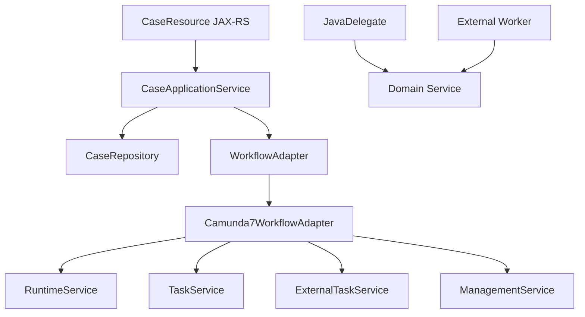

## 10.2 Start process from JAX-RS

```java id="9rsq5v"
@Path("/cases")
public class CaseResource {

  private final CaseApplicationService service;

  @POST
  @Path("/{caseId}/submit")
  public Response submit(
      @PathParam("caseId") String caseId,
      SubmitCaseRequest request,
      @HeaderParam("Idempotency-Key") String idempotencyKey) {

    service.submit(caseId, request, idempotencyKey);
    return Response.accepted().build();
  }
}
```

Application service:

```java id="rk6nz2"
public class CaseApplicationService {

  private final CaseRepository caseRepository;
  private final WorkflowAdapter workflowAdapter;

  public void submit(String caseId, SubmitCaseRequest request, String idempotencyKey) {
    CaseRecord record = caseRepository.getForUpdate(caseId);

    record.ensureSubmittable();
    record.markSubmitted(request.submittedBy());

    caseRepository.save(record);

    workflowAdapter.startCaseReview(caseId, request.submittedBy(), idempotencyKey);
  }
}
```

Workflow adapter:

```java id="o6c0yo"
public class Camunda7WorkflowAdapter implements WorkflowAdapter {

  private final RuntimeService runtimeService;

  public void startCaseReview(String caseId, String submittedBy, String idempotencyKey) {
    Map<String, Object> variables = Map.of(
        "caseId", caseId,
        "submittedBy", submittedBy,
        "idempotencyKey", idempotencyKey
    );

    runtimeService.startProcessInstanceByKey(
        "case-review-process",
        caseId,
        variables
    );
  }
}
```

## 10.3 Correlate callback

```java id="8nf0fj"
@POST
@Path("/{caseId}/callbacks/document-verified")
public Response documentVerified(
    @PathParam("caseId") String caseId,
    DocumentVerifiedCallback callback) {

  service.handleDocumentVerified(caseId, callback);
  return Response.accepted().build();
}
```

```java id="qdbz5w"
public void correlateDocumentVerified(String caseId, String documentId) {
  runtimeService
      .createMessageCorrelation("DocumentVerified")
      .processInstanceBusinessKey(caseId)
      .setVariable("documentId", documentId)
      .correlate();
}
```

Practical rule:

```text id="395z1t"
Callback endpoint harus idempotent.
Correlation harus pakai business key.
Jangan bergantung hanya pada processInstanceId dari caller eksternal.
```

---

# 11. Human Task Operations

## 11.1 Query tasks

```java id="c92pw9"
List<Task> tasks = taskService.createTaskQuery()
    .processInstanceBusinessKey(caseId)
    .taskCandidateGroup("compliance-reviewer")
    .active()
    .list();
```

## 11.2 Complete task

```java id="j4x0le"
Map<String, Object> variables = Map.of(
    "approved", true,
    "approvedBy", userId,
    "approvalComment", request.comment()
);

taskService.complete(taskId, variables);
```

Design checklist:

| Concern | Rule |
|---|---|
| Authorization | User boleh complete task ini atau tidak? |
| Assignment | Task claimed atau candidate group? |
| Idempotency | Complete task dua kali harus aman |
| Audit | Simpan actor, decision, timestamp |
| Domain state | Update business state juga, bukan hanya complete task |
| Error after completion | Pertimbangkan `asyncAfter` user task |

Practical pattern setelah human task:

```text id="jzp360"
User completes task
    → process state persisted
    → asyncAfter boundary
    → job executor continues heavy/remote work
```

Ini menghindari user melihat error internal dari service task berikutnya saat klik approve.

---

# 12. JavaDelegate vs External Task vs REST Remote

| Dimension | JavaDelegate | External Task | Remote REST API |
|---|---|---|---|
| Coupling | Tinggi | Medium/rendah | Rendah |
| Deployment | Bersama engine | Terpisah | Terpisah |
| Scaling | Mengikuti engine app | Per worker/topic | Per service |
| Language | Java/JVM | Polyglot | Polyglot |
| Failure model | Engine transaction/job retry | External task retry/failure | Client/server retry |
| Observability | Butuh log correlation | Worker-specific metrics | API metrics |
| Best for | local/fast code | async worker tasks | service-to-service integration |
| Risk | engine overload | lock expiry/duplicate work | network complexity |

Rekomendasi praktis untuk microservice:

```text id="rr9m5e"
Greenfield Camunda 7 microservice-style:
- gunakan JAX-RS API sebagai command boundary
- gunakan External Task untuk remote/heavy work
- gunakan JavaDelegate hanya sebagai adapter tipis untuk local operation
- gunakan async boundary sebelum step yang retryable/remote
```

---

# 13. Transaction Boundary Pattern

## 13.1 Bad pattern

```text id="fiedax"
HTTP request
  → start process
  → JavaDelegate calls payment API
  → JavaDelegate writes DB
  → JavaDelegate sends Kafka event
  → response
```

Masalah:

| Masalah | Dampak |
|---|---|
| terlalu banyak side effect dalam satu call | rollback/retry sulit |
| remote API dalam engine transaction | timeout dan lock risk |
| Kafka event tanpa outbox | state bisa divergen |
| tidak idempotent | retry bisa double effect |
| no async boundary | user request ikut gagal |

## 13.2 Better pattern

```text id="bnx8n4"
HTTP request
  → validate command
  → update domain DB
  → start process
  → asyncBefore service task
  → job executor / worker executes side effect
  → outbox/inbox/idempotency guard
  → complete step
```

Prinsip:

```text id="un3o7x"
Commit domain intent first.
Let workflow orchestrate long-running work.
Make every side-effect step idempotent.
Use async boundary before risky execution.
```

---

# 14. Retry Configuration Mental Model

BPMN async job retry biasanya dikontrol di model/config. Contoh konsep:

```xml id="zu0n46"
<camunda:failedJobRetryTimeCycle>R3/PT5M</camunda:failedJobRetryTimeCycle>
```

Makna:

```text id="p00fgy"
R3/PT5M = retry 3 times, wait 5 minutes between attempts
```

Contoh strategi:

| Step | Retry Strategy |
|---|---|
| payment provider timeout | `R5/PT2M` |
| email notification | `R3/PT1M` |
| document verification API | `R6/PT10M` |
| internal DB deadlock | `R3/PT30S` |
| business not eligible | no retry, BPMN error |
| validation failed | no retry, route to rejection/manual review |

Rule:

```text id="jy9ne4"
Retry technical failures.
Do not retry business decisions.
Never retry non-idempotent side effects without guard.
```

---

# 15. Operational Troubleshooting

## 15.1 Process stuck after start

Check:

```text id="uhr3ib"
[ ] Is token waiting at user task?
[ ] Is token waiting at message catch event?
[ ] Is job executor active?
[ ] Is there a job in ACT_RU_JOB?
[ ] Is the job locked by another node?
[ ] Are retries exhausted?
[ ] Is there an incident?
[ ] Is async continuation configured?
[ ] Is delegate throwing exception?
[ ] Is external task worker running?
```

## 15.2 Job not executing

Camunda notes jobs may be delayed/stuck around async continuations or timer events where job executor takes over, and problems often arise in the interaction among DB, application server, process applications, and the job executor. ([Camunda](https://camunda.com/blog/2019/10/job-executor-what-is-going-on-in-my-process-engine/))

Check:

| Area | Investigation |
|---|---|
| Job table | job due date, retries, lock owner, lock expiration |
| Acquisition | acquisition thread running? |
| Thread pool | pool exhausted? |
| DB | slow query, lock contention, deadlock |
| Deployment | delegate class available on node? |
| Multi-node | clock skew, lock ownership |
| Incident | failed job incident exists? |
| Logs | exception stack trace |
| Metrics | backlog increasing? |

## 15.3 External task not picked up

Check:

```text id="hxqz7p"
[ ] Topic name matches BPMN topic?
[ ] Worker baseUrl points to correct engine REST?
[ ] Worker has authorization?
[ ] Task is already locked?
[ ] Lock duration too long?
[ ] Worker long-polling timeout configured?
[ ] Variables deserialize correctly?
[ ] BPMN reached the external task?
[ ] Incident occurred before task?
```

## 15.4 Human task cannot complete

Check:

```text id="7oplwp"
[ ] Task still active?
[ ] User authorized?
[ ] Task already completed by someone else?
[ ] Required variables supplied?
[ ] Form validation passed?
[ ] Next service task fails synchronously?
[ ] Need asyncAfter on user task?
```

---

# 16. Observability Checklist

Setiap log dari JAX-RS, delegate, worker, repository, external client harus punya:

```text id="pc99ex"
correlationId
businessKey
processInstanceId
processDefinitionKey
activityId
taskId / externalTaskId / jobId
tenantId
```

Contoh log context:

```json id="gf0kal"
{
  "correlationId": "req-abc-123",
  "businessKey": "CASE-9001",
  "processInstanceId": "aProcessInstanceId",
  "activityId": "charge-payment",
  "workerType": "external-task",
  "topic": "payment-charge",
  "attempt": 2
}
```

Metrics minimal:

| Metric | Tujuan |
|---|---|
| active process instances | load runtime |
| active user tasks by age | SLA / task backlog |
| failed jobs | technical failure |
| incidents by process definition | stability |
| external task backlog by topic | worker scaling |
| job executor queue depth | throughput |
| delegate duration | bottleneck |
| callback duplicate count | idempotency issue |
| process completion duration | business SLA |

---

# 17. Security and Authorization

Dalam JAX-RS app, jangan mengandalkan task ID saja.

Bad:

```http id="sw8lja"
POST /tasks/123/complete
```

Better:

```http id="qa8w3z"
POST /cases/CASE-9001/tasks/manager-approval/complete
```

Lalu validate:

```text id="pmixev"
[ ] user authenticated
[ ] user belongs to candidate group / assignee
[ ] task belongs to business entity
[ ] business entity belongs to tenant/user scope
[ ] requested transition allowed
[ ] domain state still compatible
```

Camunda authorization bisa membantu, tetapi di microservice enterprise biasanya tetap perlu domain-level authorization di application layer.

---

# 18. Testing Strategy

## 18.1 Unit test

| Target | Test |
|---|---|
| JavaDelegate | variable input/output, exception mapping |
| Domain service | invariant bisnis |
| WorkflowAdapter | process key, variables, business key |
| REST resource | status code, auth, validation |
| External worker handler | complete/fail/BPMN error path |

## 18.2 BPMN path test

Test minimal:

```text id="py0a18"
[ ] happy path
[ ] rejection path
[ ] BPMN error path
[ ] retryable technical failure
[ ] incident after retries exhausted
[ ] timer timeout
[ ] duplicate callback
[ ] user task completion
[ ] cancellation
```

## 18.3 Integration test

Untuk Jersey/JAX-RS + Camunda 7:

```text id="b0gj7e"
JAX-RS test container
  + process engine test configuration
  + PostgreSQL/Testcontainers if needed
  + fake external services
  + worker test harness
```

---

# 19. Production Anti-Patterns

| Anti-Pattern | Dampak | Perbaikan |
|---|---|---|
| Semua logic di JavaDelegate | sulit test/migrate | delegate tipis, domain service tebal |
| No async before remote call | HTTP/transaction coupling | asyncBefore |
| External task tanpa idempotency | duplicate side effect | unique key + business guard |
| Variable menyimpan object besar | serialization/performance issue | simpan ID + small context |
| Direct DB update ke Camunda table | corrupt runtime | pakai API resmi |
| User task tanpa due date | backlog tak terlihat | dueDate + escalation |
| Retry semua error | business rejection diulang terus | classify error |
| Tidak monitor incident | process stuck lama | alert incident |
| Task complete langsung lanjut heavy work | user kena error internal | asyncAfter |
| Topic external task terlalu umum | scaling sulit | topic per capability |
| Tidak ada businessKey | tracing sulit | wajib businessKey |
| Menganggap history sebagai domain DB | query bisnis rapuh | mirror status ke domain table |
| Tidak pikir migration Camunda 8 | future modernization mahal | adapter boundary |

---

# 20. Practical Design Template

Untuk setiap service task / external task, dokumentasikan:

```text id="pxsb60"
Activity ID:
Business capability:
Input variables:
Output variables:
Business key:
Idempotency key:
Side effects:
Retry strategy:
BPMN error codes:
Incident owner:
Timeout:
Compensation:
Observability fields:
```

Contoh:

```text id="43ogh7"
Activity ID: charge-payment
Business capability: Charge customer payment
Input variables: orderId, paymentAttemptId, amount
Output variables: paymentId, paymentStatus
Business key: orderId
Idempotency key: paymentAttemptId
Side effects: payment provider charge
Retry strategy: R5/PT2M for technical timeout
BPMN error codes: PAYMENT_REJECTED, PAYMENT_METHOD_EXPIRED
Incident owner: Payments squad
Timeout: 30s per API call
Compensation: refund-payment
Observability: correlationId, orderId, processInstanceId, externalTaskId
```

---

# 21. Minimal Production-Ready Flow in Camunda 7

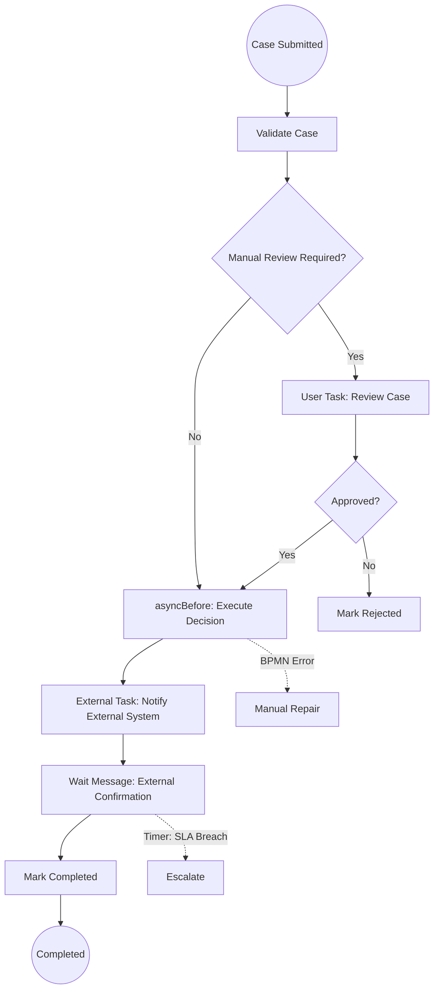

Mapping:

| BPMN Step | Camunda 7 Mechanism | Java/JAX-RS Component |
|---|---|---|
| Case Submitted | `RuntimeService.startProcessInstanceByKey` | `POST /cases/{id}/submit` |
| Validate Case | JavaDelegate | domain service |
| Manual Review | User task | Task API/custom UI |
| Execute Decision | async job | job executor |
| Notify External System | External task | worker service |
| External Confirmation | message catch | callback endpoint |
| SLA Breach | timer event | job executor |
| Manual Repair | user task/incident handling | ops UI/API |

---

# 22. Quick Debug Commands / Queries Conceptual

Melalui Java API:

```java id="puhqzn"
List<Incident> incidents = runtimeService.createIncidentQuery()
    .processInstanceId(processInstanceId)
    .list();
```

```java id="5y61ti"
List<Job> failedJobs = managementService.createJobQuery()
    .processInstanceId(processInstanceId)
    .noRetriesLeft()
    .list();
```

```java id="j6zxxx"
managementService.setJobRetries(jobId, 1);
```

```java id="h3a3se"
managementService.executeJob(jobId);
```

Human task:

```java id="6b1h46"
taskService.createTaskQuery()
    .processInstanceBusinessKey(caseId)
    .active()
    .list();
```

External task:

```java id="ck7gl5"
externalTaskService.createExternalTaskQuery()
    .processInstanceId(processInstanceId)
    .list();
```

Practical warning:

```text id="6fmyht"
Retry job hanya setelah root cause dipahami.
Kalau delegate masih bug, retry hanya akan menciptakan incident ulang.
```

---

# 23. Camunda 7 Onboarding Checklist

## Runtime

```text id="tm0mxv"
[ ] Tahu engine embedded/remote/shared
[ ] Tahu DB engine yang dipakai
[ ] Tahu process application deployment model
[ ] Tahu lokasi BPMN/DMN artifacts
[ ] Tahu history level
[ ] Tahu job executor config
[ ] Tahu incident handling process
```

## Code

```text id="f6qq1p"
[ ] Bisa menemukan JavaDelegate dari BPMN activity
[ ] Bisa menemukan external task worker dari topic
[ ] Bisa menemukan JAX-RS endpoint yang start/correlate process
[ ] Bisa menemukan WorkflowAdapter
[ ] Bisa menemukan domain table status
[ ] Bisa menemukan error code/BPMN error mapping
```

## Operation

```text id="88yo6z"
[ ] Bisa query process by businessKey
[ ] Bisa cek active task
[ ] Bisa cek failed job
[ ] Bisa cek incident
[ ] Bisa retry job dengan aman
[ ] Bisa trace REST request ke process instance
[ ] Bisa cek worker backlog
[ ] Bisa menjelaskan stuck process
```

---

# 24. Ringkasan Praktis

Camunda 7 runtime perlu dipahami sebagai kombinasi:

```text id="9pz5e6"
BPMN model
+ process engine services
+ JavaDelegate / External Task
+ job executor
+ relational DB
+ transaction boundary
+ retry / incident
+ human operational procedure
```

Untuk Jersey/JAX-RS microservice:

```text id="j4htk5"
JAX-RS Resource       = menerima command/callback/task action
Application Service  = validasi domain invariant
WorkflowAdapter      = isolasi Camunda API
JavaDelegate         = adapter tipis in-engine
External Worker      = adapter scalable di luar engine
Job Executor         = background retry/deferred execution
Domain DB            = canonical business state
Camunda DB           = canonical process state
```

Invariant utama:

```text id="cau3hf"
Business state must remain correct even if:
- delegate throws exception
- job executor retries
- worker runs twice
- callback arrives twice
- incident is retried manually
- process version changes
```

---

# 25. Roadmap Belajar Singkat

1. Pahami `RuntimeService`, `TaskService`, `HistoryService`, `ManagementService`.  
2. Trace satu process dari REST endpoint sampai process instance aktif.  
3. Buka BPMN dan mapping setiap service task ke JavaDelegate/external task.  
4. Pelajari async continuation dan job executor.  
5. Simulasikan failure: delegate throw exception, external task fail, callback duplicate.  
6. Pelajari incident: query, root cause, fix, retry.  
7. Review variable design dan business key.  
8. Tambahkan observability: correlation ID, processInstanceId, activityId, jobId/taskId.  
9. Evaluasi bagian yang akan sulit dimigrasikan ke Camunda 8: JavaDelegate, engine API, custom listener, DB dependency.

---

## Rekomendasi Materi Selanjutnya

Lanjut ke urutan nomor 3:

**Cheatsheet Camunda 8 Architecture, Camunda Java Client, Job Worker**.

---

**Sources:**

- [Support Announcements | docs.camunda.org](https://docs.camunda.org/enterprise/announcement/)
- [The Job Executor: What Is Going on in My Process Engine? | Camunda | Camunda](https://camunda.com/blog/2019/10/job-executor-what-is-going-on-in-my-process-engine/)
- [Invoking services from a Camunda 7 process | Camunda 8 Docs](https://docs.camunda.io/docs/8.7/components/best-practices/development/invoking-services-from-the-process-c7/)
- [Operating Camunda 7 | Camunda 8 Docs](https://unsupported.docs.camunda.io/8.3/docs/components/best-practices/operations/operating-camunda-c7/)
- [Database Schema | docs.cibseven.org](https://docs.cibseven.org/manual/latest/user-guide/process-engine/database/database-schema/?utm_source=chatgpt.com)

## Response:
7/13/2026, 3:12:37 AM

Saya lanjut ke materi nomor 3: **Camunda 8 Architecture, Camunda Java Client, dan Job Worker**. Saya akan tekankan perbedaan runtime dari Camunda 7 supaya tidak keliru menganggap ini sekadar upgrade API.

# Cheatsheet 3 - Camunda 8 Architecture, Camunda Java Client, Job Worker  
## Untuk Java SE 17+, Jersey/JAX-RS Microservice Application

## 1. Positioning

Camunda 8 bukan “Camunda 7 dengan API baru”. Ini adalah platform orchestration yang runtime utamanya berbasis **Zeebe / Orchestration Cluster**, dengan worker eksternal yang mengambil dan menyelesaikan job. Untuk aplikasi **Jersey/JAX-RS**, pola paling sehat adalah menjadikan Camunda 8 sebagai **workflow orchestration runtime**, sementara JAX-RS tetap menjadi API boundary untuk command, callback, task action, dan query.

Camunda Java Client adalah client resmi untuk membangun job worker, integration service, dan aplikasi yang berinteraksi dengan process orchestration Camunda 8. Dokumentasi resminya menyebut client ini dapat dipakai untuk job workers, integration services, dan data processing applications. ([Camunda 8 Docs](https://docs.camunda.io/docs/apis-tools/java-client/getting-started/?utm_source=chatgpt.com))

Sejak Camunda 8.8, **Camunda Java Client** dan **Camunda Spring Boot Starter** menggantikan Zeebe Java Client dan Spring Zeebe SDK. `CamundaClient` menggantikan `ZeebeClient`, sementara Zeebe Java Client dideprecate di 8.8 dan dijadwalkan dihapus pada 8.10. ([Camunda 8 Docs](https://docs.camunda.io/docs/reference/announcements-release-notes/880/880-announcements/?utm_source=chatgpt.com))

---

# 2. Core Mental Model

```text
JAX-RS API menerima business intent
        ↓
Application service validasi invariant domain
        ↓
Workflow adapter mengirim command ke Camunda 8
        ↓
Camunda 8 membuat/menjalankan process instance
        ↓
Service task menghasilkan job
        ↓
Job worker Java mengambil job berdasarkan task type
        ↓
Worker memanggil domain service / external system
        ↓
Worker complete, fail, atau throw BPMN error
```

Perbedaan paling penting dari Camunda 7:

| Concern | Camunda 7 | Camunda 8 |
|---|---|---|
| Runtime style | Embedded/shared engine atau remote engine | Distributed orchestration cluster |
| Service task implementation | JavaDelegate / External Task | Job Worker |
| Process state | Relational DB engine tables | Zeebe runtime/log + exported/read-model data |
| Worker execution | Bisa in-JVM delegate | Worker eksternal by design |
| API client lama | `ZeebeClient` | `CamundaClient` |
| REST direction | Camunda 7 REST API | Orchestration Cluster REST API |
| Best abstraction | Workflow adapter | Workflow adapter |

Camunda 8 architecture menjelaskan **gateway** sebagai entry point ke Zeebe cluster yang meneruskan request ke broker; gateway bersifat stateless dan sessionless sehingga dapat ditambah untuk load balancing dan high availability. ([Camunda 8 Docs](https://docs.camunda.io/docs/components/zeebe/technical-concepts/architecture/?utm_source=chatgpt.com))

---

# 3. Architecture Diagram

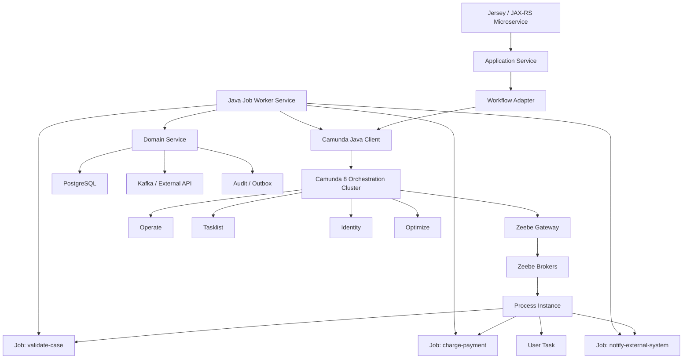

Self-managed Camunda 8 terdiri dari beberapa komponen seperti **Zeebe Broker and Gateway, Operate, Tasklist, Connectors, Optimize, Identity, Web Modeler, dan Console**; tidak semua komponen selalu wajib dipakai tergantung kebutuhan deployment. ([Camunda 8 Docs](https://docs.camunda.io/docs/8.7/self-managed/about-self-managed/?utm_source=chatgpt.com))

---

# 4. Main Components

| Component | Fungsi Praktis | Relevansi untuk Java/JAX-RS |
|---|---|---|
| **Orchestration Cluster** | Runtime orchestration utama | Target command dari Java client / REST API |
| **Zeebe Broker** | Menjalankan process instance, job, timer, command processing | Runtime execution |
| **Zeebe Gateway** | Entry point client ke broker cluster | Endpoint client/worker |
| **Camunda Java Client** | Java API untuk deploy/start process, job worker, command interaction | Dipakai oleh workflow adapter dan worker |
| **Job Worker** | Service yang mengambil dan menyelesaikan job | Pengganti JavaDelegate style Camunda 7 |
| **Operate** | Monitoring process instance dan incident | Debug production process |
| **Tasklist** | Human task execution | Bisa dipakai langsung atau diganti custom UI |
| **Identity** | AuthN/AuthZ platform | Penting untuk secure API/component access |
| **Optimize** | Analytics process | SLA, throughput, bottleneck |
| **Connectors** | Declarative external integration | Alternatif worker custom untuk beberapa integrasi |
| **Orchestration Cluster REST API** | Unified REST API untuk interaction programmatic | Berguna untuk non-Java integration/custom app |

Orchestration Cluster REST API digunakan untuk berinteraksi secara programmatic dengan process orchestration capabilities, misalnya start process. Sejak 8.8, unified Orchestration Cluster REST API menggantikan deprecated V1 component APIs sebagai interface terpadu untuk Orchestration Cluster. ([Camunda 8 Docs](https://docs.camunda.io/docs/apis-tools/orchestration-cluster-api-rest/orchestration-cluster-api-rest-overview/?utm_source=chatgpt.com))

---

# 5. Camunda Java Client

## 5.1 Fungsi utama

Camunda Java Client biasanya dipakai untuk:

| Use Case | API Concept |
|---|---|
| Deploy BPMN/DMN | deploy resource command |
| Start process | create process instance command |
| Publish/correlate message | publish message command |
| Complete job | complete command |
| Fail job | fail command |
| Throw BPMN error | throw error command |
| Create worker | worker subscription by job type |
| Query / operation tertentu | client / REST-backed APIs, tergantung versi dan capability |

Camunda Java Client mendukung integrasi dengan Camunda 8 API, dan dokumentasi Camunda menegaskan client ini menangani job worker polling agar developer fokus menulis handler untuk activated jobs. ([Camunda 8 Docs](https://docs.camunda.io/docs/apis-tools/java-client/job-worker/?utm_source=chatgpt.com))

## 5.2 Dependency positioning

Untuk project Jersey/JAX-RS non-Spring, gunakan **Camunda Java Client langsung**, bukan Spring Boot Starter.

```text
Jersey / HK2 / CDI
    → provide singleton CamundaClient
    → inject ke WorkflowAdapter
    → inject ke JobWorkerBootstrap
```

Spring Boot Starter tetap relevan untuk project Spring Boot, tetapi untuk stack Jersey/JAX-RS murni, starter Spring biasanya tidak menjadi pilihan utama. Camunda Spring Boot Starter adalah official integration untuk Spring Boot project, bukan requirement umum untuk semua Java project. ([Camunda 8 Docs](https://docs.camunda.io/docs/apis-tools/camunda-spring-boot-starter/getting-started/?utm_source=chatgpt.com))

---

# 6. Workflow Adapter Pattern

Jangan panggil `CamundaClient` langsung dari resource class.

## 6.1 Struktur yang disarankan

```text
CaseResource
  → CaseApplicationService
    → WorkflowAdapter interface
      → Camunda8WorkflowAdapter
        → CamundaClient
```

## 6.2 Interface

```java
public interface WorkflowAdapter {

  void startCaseReview(String caseId, String submittedBy);

  void publishDocumentVerified(
      String caseId,
      String documentId,
      String verificationResult
  );

  void cancelCaseProcess(String caseId, String reason);
}
```

## 6.3 Implementation concept

```java
public final class Camunda8WorkflowAdapter implements WorkflowAdapter {

  private final CamundaClient camundaClient;

  public Camunda8WorkflowAdapter(CamundaClient camundaClient) {
    this.camundaClient = camundaClient;
  }

  @Override
  public void startCaseReview(String caseId, String submittedBy) {
    Map<String, Object> variables = Map.of(
        "caseId", caseId,
        "submittedBy", submittedBy
    );

    camundaClient
        .newCreateInstanceCommand()
        .bpmnProcessId("case-review-process")
        .latestVersion()
        .variables(variables)
        .send()
        .join();
  }

  @Override
  public void publishDocumentVerified(
      String caseId,
      String documentId,
      String verificationResult
  ) {
    camundaClient
        .newPublishMessageCommand()
        .messageName("DocumentVerified")
        .correlationKey(caseId)
        .variables(Map.of(
            "documentId", documentId,
            "verificationResult", verificationResult
        ))
        .send()
        .join();
  }

  @Override
  public void cancelCaseProcess(String caseId, String reason) {
    // biasanya butuh query/search process instance dulu,
    // atau desain BPMN dengan cancellation message by correlation key.
  }
}
```

Prinsip:

```text
JAX-RS tidak tahu detail Camunda.
Domain service tidak tahu detail Camunda.
WorkflowAdapter adalah anti-corruption layer.
```

---

# 7. JAX-RS Endpoint Mapping

| Endpoint | Intent | Camunda 8 Mapping |
|---|---|---|
| `POST /cases/{caseId}/submit` | Mulai workflow | create process instance |
| `POST /cases/{caseId}/callbacks/document-verified` | External callback | publish/correlate message |
| `POST /cases/{caseId}/cancel` | Cancel process | cancellation message / terminate instance |
| `GET /cases/{caseId}/workflow-status` | Status proses | domain DB + Operate/exported/query layer |
| `GET /tasks/my` | Human task list | Tasklist API/custom read model |
| `POST /tasks/{taskId}/complete` | Complete user task | Task completion API |
| `POST /admin/processes/{id}/retry` | Remediation | operation/admin API, tergantung capability |

Contoh resource:

```java
@Path("/cases")
@Produces(MediaType.APPLICATION_JSON)
@Consumes(MediaType.APPLICATION_JSON)
public class CaseResource {

  private final CaseApplicationService service;

  public CaseResource(CaseApplicationService service) {
    this.service = service;
  }

  @POST
  @Path("/{caseId}/submit")
  public Response submit(
      @PathParam("caseId") String caseId,
      SubmitCaseRequest request,
      @HeaderParam("Idempotency-Key") String idempotencyKey
  ) {
    service.submit(caseId, request, idempotencyKey);
    return Response.accepted().build();
  }

  @POST
  @Path("/{caseId}/callbacks/document-verified")
  public Response documentVerified(
      @PathParam("caseId") String caseId,
      DocumentVerifiedCallback callback
  ) {
    service.handleDocumentVerified(caseId, callback);
    return Response.accepted().build();
  }
}
```

---

# 8. Service Task → Job Worker

Di Camunda 8, service task membutuhkan **task type**, lalu job worker mengimplementasikan pekerjaan tersebut. Dokumentasi best practice Camunda menyatakan service task dalam Camunda 8 mengharuskan task type dan implementasi job worker untuk melakukan pekerjaan yang diperlukan. ([Camunda 8 Docs](https://docs.camunda.io/docs/components/best-practices/development/writing-good-workers/?utm_source=chatgpt.com))

## 8.1 BPMN model concept

```text
Service Task: Validate Case
  task type = validate-case

Service Task: Charge Payment
  task type = charge-payment

Service Task: Notify External System
  task type = notify-external-system
```

## 8.2 Worker skeleton

```java
public final class ValidateCaseWorker {

  private final CamundaClient camundaClient;
  private final CaseService caseService;

  public ValidateCaseWorker(
      CamundaClient camundaClient,
      CaseService caseService
  ) {
    this.camundaClient = camundaClient;
    this.caseService = caseService;
  }

  public JobWorker open() {
    return camundaClient
        .newWorker()
        .jobType("validate-case")
        .handler((client, job) -> {
          String caseId = (String) job.getVariablesAsMap().get("caseId");

          try {
            ValidationResult result = caseService.validate(caseId);

            client
                .newCompleteCommand(job)
                .variables(Map.of(
                    "valid", result.valid(),
                    "riskScore", result.riskScore(),
                    "manualReviewRequired", result.manualReviewRequired()
                ))
                .send()
                .join();

          } catch (BusinessNotEligibleException e) {
            client
                .newThrowErrorCommand(job)
                .errorCode("CASE_NOT_ELIGIBLE")
                .errorMessage(e.getMessage())
                .send()
                .join();

          } catch (Exception e) {
            int remainingRetries = Math.max(job.getRetries() - 1, 0);

            client
                .newFailCommand(job)
                .retries(remainingRetries)
                .errorMessage(e.getMessage())
                .send()
                .join();
          }
        })
        .open();
  }
}
```

## 8.3 Complete vs fail vs BPMN error

| Worker Outcome | Kapan Dipakai | Efek |
|---|---|---|
| **Complete job** | Work sukses | Process lanjut |
| **Fail job** | Technical failure retryable/non-business | Retry berkurang; bisa jadi incident |
| **Throw BPMN error** | Business exception yang dimodelkan | Ditangkap error boundary event |
| **No response / worker crash** | Worker mati/network error | Job bisa timeout dan diambil lagi |
| **Reject/validation variable** | Decision biasa | Gateway lanjut berdasarkan variable |

Rule penting:

```text
Technical failure → fail job
Business alternative → BPMN error atau variable + gateway
Successful side effect → complete job
Unknown/bug → fail, alert, incident
```

---

# 9. Job Worker Mental Model

Job worker adalah service yang mengambil job dari cluster, menjalankan handler, lalu menyelesaikan atau menggagalkan job. Dokumentasi Camunda menyatakan Java client menyediakan worker yang menangani polling job yang tersedia; ini membiarkan developer fokus pada handler logic. ([Camunda 8 Docs](https://docs.camunda.io/docs/apis-tools/java-client/job-worker/?utm_source=chatgpt.com))

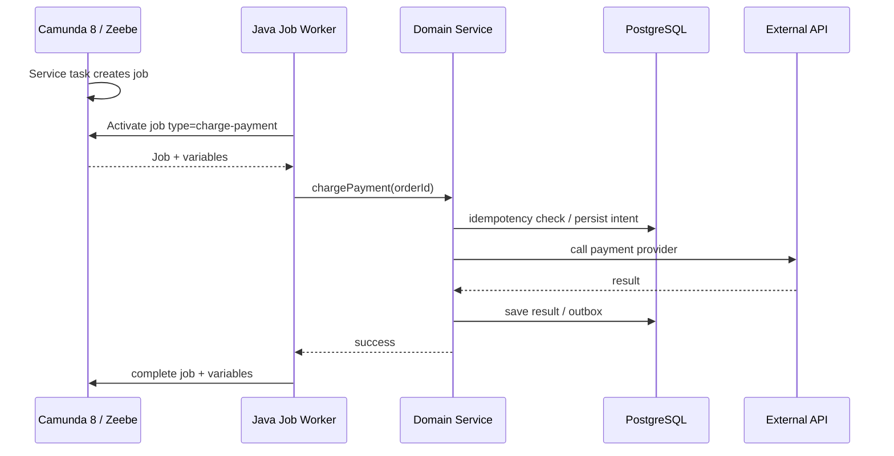

## 9.1 Worker invariants

```text
Worker boleh crash.
Worker boleh timeout.
Worker boleh menerima job yang sama lagi.
Network bisa gagal setelah side effect sukses tetapi sebelum complete job.
Karena itu semua worker harus idempotent.
```

## 9.2 Worker design checklist

| Concern | Checklist |
|---|---|
| Job type | Stabil, deskriptif, tidak terlalu generic |
| Input variables | Minimal dan versioned |
| Output variables | Hanya data yang dibutuhkan process |
| Timeout | Handler tidak boleh menggantung |
| Retries | Sesuai failure type |
| Idempotency | Mandatory untuk side effect |
| Logging | businessKey, processInstanceKey, jobKey, jobType |
| Metrics | duration, success, failure, retries |
| Error classification | complete/fail/BPMN error jelas |
| Backpressure | worker scale dan max jobs active disesuaikan |
| Security | worker credential scoped sesuai kebutuhan |

---

# 10. Job Type Design

Job type adalah contract antara BPMN dan worker.

## 10.1 Good job type

```text
validate-case
calculate-risk-score
reserve-inventory
charge-payment
send-approval-notification
sync-customer-profile
create-regulatory-filing
```

## 10.2 Bad job type

```text
service-task
java-worker
process-step
do-work
api-call
handler
```

## 10.3 Granularity rule

| Terlalu Coarse | Terlalu Fine | Seimbang |
|---|---|---|
| `process-order` | `set-order-status-to-x` | `reserve-inventory` |
| `handle-case` | `read-customer-name` | `calculate-risk-score` |
| `execute-flow` | `map-field-a-to-b` | `charge-payment` |

Rule:

```text
Satu job type = satu business capability yang bisa diobservasi, di-retry, dan di-scale.
```

---

# 11. Variable Contract

## 11.1 Prinsip

```text
Process variables adalah kontrak antar activity, bukan database domain.
```

Simpan:

```json
{
  "caseId": "CASE-1001",
  "customerId": "CUST-2001",
  "riskScore": 78,
  "manualReviewRequired": true,
  "requestVersion": 3
}
```

Hindari:

```json
{
  "accessToken": "secret",
  "fullCustomerProfile": {},
  "entireHttpRequest": {},
  "largeDocumentPayload": "..."
}
```

## 11.2 Variable boundary

| Taruh di Camunda variable | Taruh di domain DB |
|---|---|
| business key | canonical entity |
| routing flag | financial/legal record |
| small decision result | full customer profile |
| external reference ID | PII-heavy payload |
| process-local status | audit detail |
| retry/context hint | large documents |

---

# 12. Business Key / Correlation Key

Camunda 8 menggunakan **correlation key** untuk message correlation. Dalam aplikasi domain, tetap gunakan key bisnis stabil:

```text
caseId
orderId
applicationId
paymentAttemptId
documentVerificationId
```

Contoh callback:

```java
public void handlePaymentConfirmed(String orderId, String paymentReference) {
  camundaClient
      .newPublishMessageCommand()
      .messageName("PaymentConfirmed")
      .correlationKey(orderId)
      .variables(Map.of(
          "paymentReference", paymentReference,
          "paymentConfirmed", true
      ))
      .send()
      .join();
}
```

Rule:

```text
External caller sebaiknya tidak perlu tahu processInstanceKey.
Gunakan business/correlation key yang domain-stable.
```

---

# 13. Error Handling

## 13.1 Classification table

| Scenario | Worker Action | BPMN Model |
|---|---|---|
| External API timeout | fail job | retry / incident |
| DB deadlock | fail job | retry |
| Customer not eligible | throw BPMN error | error boundary → rejection/manual review |
| Payment rejected | throw BPMN error | payment rejected path |
| Risk score high | complete with variable | exclusive gateway |
| Bug / NPE | fail job | incident after retries |
| Duplicate callback | ignore/idempotent success | no duplicate process move |
| Invalid input command | reject at JAX-RS | no process command |

## 13.2 BPMN Error pattern

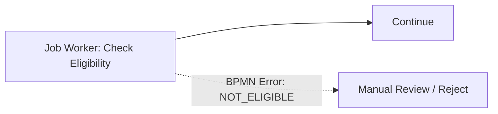

## 13.3 Incident mindset

```text
Incident bukan hanya error log.
Incident adalah process state yang perlu owner, remediation, dan audit.
```

---

# 14. Retry Strategy

Camunda 8 worker retry harus dipikirkan sebagai bagian dari business reliability.

| Failure | Retry? | Catatan |
|---|---:|---|
| HTTP 503 external service | Ya | exponential/backoff di worker atau retry cycle |
| Network timeout | Ya | pastikan idempotent |
| Validation failed | Tidak | business path |
| Payment rejected | Tidak | BPMN error |
| Duplicate request | Tidak | idempotent no-op |
| Serialization bug | Tidak sampai fix | incident/remediation |
| Rate limit | Ya, dengan delay | jangan hammer external API |

Practical rule:

```text
Retry hanya aman kalau side effect idempotent.
Kalau tidak idempotent, retry harus dikunci oleh idempotency key.
```

---

# 15. Idempotency Pattern for Workers

## 15.1 Worker side effect risk

```text
Worker calls payment provider
        ↓
Payment succeeds
        ↓
Worker crashes before complete job
        ↓
Job becomes available again
        ↓
Worker may charge again unless protected
```

## 15.2 Guard pattern

```text
paymentAttemptId = deterministic idempotency key
unique(paymentAttemptId)
external provider idempotency key = paymentAttemptId
domain DB stores operation result
worker checks existing result before calling provider again
```

## 15.3 Example domain service

```java
public PaymentResult chargePayment(String orderId, String paymentAttemptId) {
  Optional<PaymentRecord> existing =
      paymentRepository.findByAttemptId(paymentAttemptId);

  if (existing.isPresent()) {
    return existing.get().toResult();
  }

  PaymentRecord record = paymentRepository.createPending(
      orderId,
      paymentAttemptId
  );

  PaymentProviderResult providerResult =
      paymentProvider.charge(orderId, paymentAttemptId);

  record.markCompleted(providerResult.paymentId(), providerResult.status());
  paymentRepository.save(record);

  return record.toResult();
}
```

Invariant:

```text
Camunda retry boleh terjadi.
External side effect tidak boleh dobel.
```

---

# 16. JAX-RS + Camunda Client Lifecycle

## 16.1 Singleton client

`CamundaClient` sebaiknya dibuat sebagai singleton application-scoped object.

```java
public final class CamundaClientFactory {

  public CamundaClient create() {
    return CamundaClient.newClientBuilder()
        .grpcAddress(URI.create(System.getenv("CAMUNDA_GRPC_ADDRESS")))
        .restAddress(URI.create(System.getenv("CAMUNDA_REST_ADDRESS")))
        .build();
  }
}
```

Catatan: konfigurasi detail client bisa berbeda tergantung deployment SaaS/self-managed, auth, TLS, dan versi library. Jangan hardcode credential di code.

## 16.2 Worker bootstrap

```java
public final class WorkerBootstrap implements AutoCloseable {

  private final List<JobWorker> workers = new ArrayList<>();

  public WorkerBootstrap(
      CamundaClient camundaClient,
      CaseService caseService,
      PaymentService paymentService
  ) {
    workers.add(new ValidateCaseWorker(camundaClient, caseService).open());
    workers.add(new ChargePaymentWorker(camundaClient, paymentService).open());
  }

  @Override
  public void close() {
    workers.forEach(JobWorker::close);
  }
}
```

## 16.3 Jersey lifecycle concern

| Concern | Recommendation |
|---|---|
| Client creation | singleton |
| Worker startup | app startup hook |
| Worker shutdown | graceful shutdown |
| Secrets | env/secret manager |
| TLS/Auth | environment-specific config |
| Backpressure | configure max active jobs |
| Healthcheck | report worker/client readiness |

---

# 17. REST vs gRPC in Camunda 8

Camunda 8 punya REST dan gRPC integration surface. Dokumentasi Camunda menyebut Zeebe clients menggunakan gRPC untuk berkomunikasi dengan cluster, termasuk activate jobs dan create/cancel process instances. Di sisi lain, Camunda 8 juga menyediakan Orchestration Cluster REST API sebagai API terpadu untuk process orchestration. ([Camunda 8 Docs](https://docs.camunda.io/docs/8.7/apis-tools/working-with-apis-tools/?utm_source=chatgpt.com))

Practical interpretation:

| Use Case | Prefer |
|---|---|
| Java worker | Camunda Java Client |
| Job activation/polling | Java Client worker mechanism |
| Non-Java integration | REST API jika capability tersedia |
| Admin/custom portal | Orchestration Cluster REST API |
| Legacy Zeebe client code | Migrate ke Camunda Java Client |
| High-throughput worker | Perhatikan protocol/support versi client |

Camunda docs juga mencatat limitation: Java client tidak dapat menjaga long-lived polling connection yang dibutuhkan job polling via Orchestration Cluster REST API dalam beberapa kondisi, sehingga pemilihan transport harus disesuaikan dengan worker/job polling behavior. ([Camunda 8 Docs](https://docs.camunda.io/docs/apis-tools/java-client/job-worker/?utm_source=chatgpt.com))

---

# 18. Camunda 8 Deployment Model

## 18.1 SaaS vs Self-Managed

| Mode | Kapan Cocok |
|---|---|
| Camunda SaaS | ingin managed platform, lebih cepat mulai |
| Self-Managed Kubernetes | enterprise/on-prem/cloud sendiri, kontrol infra/security |
| Local dev bundle/docker | development dan learning |
| Hybrid | enterprise migration/segmented deployment |

## 18.2 Self-managed components

```text
Zeebe Broker/Gateway
Operate
Tasklist
Identity
Connectors
Optimize
Web Modeler
Console
Elasticsearch/OpenSearch or supported storage layer depending deployment/version
```

Untuk self-managed, komponen dan dependency perlu dicek per versi karena Camunda 8 berkembang aktif. Dokumentasi self-managed menyebut komponen seperti Zeebe Broker/Gateway, Operate, Tasklist, Connectors, Optimize, Identity, Web Modeler, dan Console. ([Camunda 8 Docs](https://docs.camunda.io/docs/8.7/self-managed/about-self-managed/?utm_source=chatgpt.com))

## 18.3 Kubernetes concerns

| Concern | What to Think About |
|---|---|
| Gateway endpoint | worker/client connectivity |
| Broker persistence | persistent volume / disk IO |
| Partitions | scaling execution |
| Replication | HA / fault tolerance |
| Identity/auth | OAuth/client credentials |
| TLS/mTLS | secure transport |
| Ingress | REST/web/gRPC routing |
| Worker deployment | separate Deployment per capability |
| Autoscaling | based on job backlog/latency |
| Observability | logs, metrics, traces |
| Backup/restore | stateful runtime |
| Upgrade | version compatibility and migration notes |

---

# 19. Operate, Tasklist, Identity, Optimize

| Component | Practical Use |
|---|---|
| **Operate** | lihat process instance, incident, stuck flow, variable, activity path |
| **Tasklist** | human task inbox/execution |
| **Identity** | user, group, permission, auth integration |
| **Optimize** | process analytics, SLA, bottleneck |
| **Connectors** | declarative integration untuk beberapa external service |
| **Web/Desktop Modeler** | membuat BPMN/DMN |

Dalam onboarding, **Operate** biasanya paling penting untuk engineer karena membantu menjawab:

```text
Process mana yang stuck?
Activity apa yang gagal?
Variable apa yang masuk?
Incident-nya apa?
Worker/job type mana yang bermasalah?
```

---

# 20. Process Query and Status Strategy

Jangan mengandalkan Camunda sebagai satu-satunya source untuk status bisnis user-facing.

Recommended model:

```text
Camunda = process state
Domain DB = business state
Projection/read model = query-friendly workflow status
```

Contoh domain table:

```text
case_workflow_status
- case_id
- process_instance_key
- process_definition_id
- current_stage
- business_status
- last_event
- last_updated_at
- incident_flag
- tenant_id
```

Update source:

| Source | Update |
|---|---|
| JAX-RS command | initial submitted status |
| Worker success | progress domain status |
| Worker fail/incident event | incident flag |
| Callback | confirmation status |
| User task complete | decision status |
| Exporter/event stream | advanced projection, if used |

Practical rule:

```text
Untuk customer-facing query, jangan query engine berat terus-menerus.
Bangun read model yang domain-relevant.
```

---

# 21. Human Task Design

Camunda 8 Tasklist dapat menangani human task, tetapi enterprise app sering punya custom UI/API untuk task action.

| Concern | Design |
|---|---|
| Assignment | assignee / candidate group |
| Authorization | user/role/tenant/domain permission |
| SLA | due date / timer escalation |
| Form | Camunda Form atau custom frontend |
| Audit | actor, decision, timestamp, comment |
| Domain transition | update domain status |
| Process transition | complete task |
| Duplicate action | idempotent complete |
| Race condition | optimistic lock / task state check |

Endpoint contoh:

```http
GET  /tasks/my
POST /cases/{caseId}/tasks/{taskId}/complete
POST /cases/{caseId}/tasks/{taskId}/claim
```

---

# 22. Worker Observability

Minimal log fields:

```json
{
  "correlationId": "req-123",
  "caseId": "CASE-1001",
  "processInstanceKey": 2251799813685251,
  "jobKey": 2251799814000001,
  "jobType": "validate-case",
  "bpmnProcessId": "case-review-process",
  "tenantId": "tenant-a",
  "attempt": 2
}
```

Metrics minimal:

| Metric | Purpose |
|---|---|
| worker job activated count | throughput |
| worker job completed count | success |
| worker job failed count | technical failure |
| BPMN error count | business exception volume |
| handler duration | bottleneck |
| retries remaining distribution | risk |
| job timeout count | worker slowness/crash |
| incident count by process | operational health |
| process duration | SLA |
| task aging | human workload |

Tracing:

```text
JAX-RS request
  → application service
  → Camunda command
  → process instance
  → job worker
  → domain DB
  → external API/Kafka
```

---

# 23. Production Worker Configuration Checklist

| Config | Why It Matters |
|---|---|
| `jobType` | contract with BPMN |
| worker name | debug/observability |
| max active jobs | backpressure |
| timeout | job lock duration |
| poll interval / long polling | latency/load |
| request timeout | avoid hanging calls |
| retry strategy | resilience |
| tenant IDs | multi-tenancy |
| fetch variables | avoid huge payload |
| graceful shutdown | no abandoned in-flight jobs |
| auth credential | secure cluster access |
| TLS | secure transport |
| health/readiness | Kubernetes safe rollout |

---

# 24. Camunda 8 vs Camunda 7 Migration Mapping

| Camunda 7 Concept | Camunda 8 Equivalent / Direction |
|---|---|
| JavaDelegate | Job Worker |
| DelegateExpression | Worker routing by job type |
| External Task | Job Worker model |
| RuntimeService start process | CamundaClient create instance command / REST |
| RuntimeService message correlation | publish message with correlation key |
| TaskService | Tasklist/user task APIs |
| ManagementService failed job retry | Camunda 8 operation/incident tooling |
| ACT_RU_* direct DB troubleshooting | Operate/exported/read model/query APIs |
| Embedded engine | external orchestration cluster |
| Engine transaction boundary | job completion/command boundary |
| BPMN extension attributes | Camunda 8 extension model |
| Job executor | Zeebe broker/job activation model |

Migration warning:

```text
Camunda 8 bukan drop-in replacement.
Refactor JavaDelegate-heavy code menjadi worker-heavy architecture.
```

---

# 25. Common Anti-Patterns

| Anti-Pattern | Risiko | Perbaikan |
|---|---|---|
| Treat Camunda 8 like embedded library | coupling mental model salah | desain sebagai remote orchestration platform |
| JAX-RS resource langsung panggil client everywhere | sulit test/migrate | workflow adapter |
| Job type terlalu generic | observability buruk | capability-based job type |
| Worker tidak idempotent | duplicate side effect | idempotency key + unique constraint |
| Simpan full domain object di variable | payload besar/compat issue | simpan ID + small context |
| Semua failure jadi BPMN error | diagram noisy dan salah retry | classify failure |
| Semua failure di-retry | business rejection berulang | BPMN error/gateway |
| Query status langsung dari engine untuk semua API | latency/coupling | domain read model |
| Worker startup tanpa graceful shutdown | abandoned jobs | lifecycle hook |
| Tidak punya process versioning strategy | instance lama rusak | compatibility and migration plan |
| Menggunakan Zeebe Java Client untuk project baru | technical debt | gunakan Camunda Java Client |
| No correlation ID | debug sulit | propagate correlation context |

---

# 26. Practical Example Flow

## BPMN shape

```mermaid
flowchart TD
    A((Case Submitted)) --> B[Job: validate-case]
    B --> C{Manual Review Required?}

    C -- Yes --> D[User Task: Review Case]
    D --> E{Approved?}
    E -- No --> F[Job: mark-case-rejected]
    E -- Yes --> G[Job: execute-case-action]

    C -- No --> G

    G --> H[Wait Message: External Confirmation]
    H --> I[Job: mark-case-completed]
    I --> J((Completed))

    H -. Timer: SLA Breach .-> K[Job: escalate-case]
    G -. BPMN Error .-> L[User Task: Manual Repair]
```

## Java/JAX-RS mapping

| BPMN | Java/JAX-RS |
|---|---|
| Case Submitted | `POST /cases/{caseId}/submit` |
| `validate-case` | `ValidateCaseWorker` |
| User Task | Tasklist/custom task API |
| `execute-case-action` | domain worker |
| Message wait | callback endpoint + publish message |
| Timer SLA | BPMN timer |
| Manual Repair | human task / ops UI |
| Completed | domain status update |

---

# 27. Minimal Project Structure

```text
src/main/java/com/company/caseapp
  api/
    CaseResource.java
    TaskResource.java
    CallbackResource.java

  application/
    CaseApplicationService.java
    WorkflowAdapter.java

  workflow/
    Camunda8WorkflowAdapter.java
    CamundaClientFactory.java
    WorkerBootstrap.java

  workflow/workers/
    ValidateCaseWorker.java
    ExecuteCaseActionWorker.java
    MarkCaseCompletedWorker.java
    EscalateCaseWorker.java

  domain/
    CaseService.java
    CaseRecord.java
    CaseRepository.java

  infrastructure/
    postgres/
    external/
    observability/
```

Boundary rule:

```text
api → application → workflow/domain
workflow worker → domain service
domain service → repository/external client
```

---

# 28. Onboarding Checklist

## Architecture

```text
[ ] Tahu deployment mode: SaaS atau self-managed
[ ] Tahu endpoint gateway/REST
[ ] Tahu auth mechanism
[ ] Tahu version Camunda 8 yang dipakai
[ ] Tahu komponen aktif: Operate, Tasklist, Identity, Optimize
[ ] Tahu process definition yang aktif
```

## Code

```text
[ ] Bisa menemukan WorkflowAdapter
[ ] Bisa menemukan semua job worker by job type
[ ] Bisa mapping BPMN service task ke worker class
[ ] Bisa mapping message event ke JAX-RS callback
[ ] Bisa mapping user task ke UI/API
[ ] Bisa melihat variable contract
[ ] Bisa melihat retry/error handling
```

## Runtime

```text
[ ] Bisa start process dari API
[ ] Bisa publish message callback
[ ] Bisa inspect instance di Operate
[ ] Bisa lihat incident
[ ] Bisa lihat worker logs
[ ] Bisa trace processInstanceKey/jobKey
[ ] Bisa identify stuck token
[ ] Bisa distinguish retry vs BPMN error
```

## Reliability

```text
[ ] Worker idempotent
[ ] External side effect guarded
[ ] Duplicate callback aman
[ ] Timeout jelas
[ ] Retry jelas
[ ] Compensation jelas
[ ] Domain DB status sinkron
[ ] Observability lengkap
```

---

# 29. Ringkasan Praktis

Camunda 8 untuk Java/JAX-RS microservice harus dipahami sebagai:

```text
Remote orchestration runtime
+ Java client command API
+ job worker execution model
+ message correlation
+ human task runtime
+ Operate/Tasklist/Identity/Optimize ecosystem
+ production observability
```

Design invariant:

```text
JAX-RS API menerima intent.
Application service menjaga invariant.
WorkflowAdapter mengisolasi Camunda.
Camunda menyimpan process state.
Worker menjalankan capability.
Domain DB menyimpan business state.
Worker harus idempotent.
Incident harus operable.
```

Yang paling penting untuk engineer:

```text
Jangan migrasi mental model JavaDelegate ke Camunda 8.
Berpikir dalam job type, worker, idempotency, correlation key, dan operational visibility.
```

---

# 30. Roadmap Belajar Singkat

1. Pahami Camunda 8 architecture: orchestration cluster, gateway, broker, Operate, Tasklist, Identity.  
2. Pelajari Camunda Java Client: create instance, publish message, worker, complete/fail/error.  
3. Mapping BPMN service task ke job type.  
4. Implement worker sederhana: validate-case.  
5. Tambahkan failure handling: fail job vs BPMN error.  
6. Tambahkan idempotency untuk worker side effect.  
7. Tambahkan callback endpoint dan message correlation.  
8. Tambahkan observability: processInstanceKey, jobKey, jobType, business key.  
9. Review deployment: config, auth, TLS, Kubernetes, graceful shutdown.  
10. Bandingkan dengan Camunda 7 untuk persiapan migration.

---

## Rekomendasi Materi Selanjutnya

Lanjut ke urutan nomor 4:

**Cheatsheet Workflow Error Handling: Retry, Incident, BPMN Error, Compensation**.

---

**Sources:**

- [Java client | Camunda 8 Docs](https://docs.camunda.io/docs/apis-tools/java-client/getting-started/?utm_source=chatgpt.com)

## Response:
7/13/2026, 3:14:33 AM

Saya lanjut ke materi nomor 4: **Workflow Error Handling — Retry, Incident, BPMN Error, Compensation**. Ini bagian paling penting untuk production karena workflow biasanya gagal bukan di happy path, tetapi di timeout, duplicate event, partial success, dan manual recovery.

# Cheatsheet 4 - Workflow Error Handling  
## Retry, Incident, BPMN Error, Compensation dalam Java / Jersey / JAX-RS / Camunda 7 / Camunda 8

## 1. Purpose

Workflow error handling bukan sekadar `try-catch`. Dalam BPMN/Camunda, error handling harus membedakan:

```text
1. Technical failure
2. Business error
3. Business rejection
4. Timeout / SLA breach
5. Partial success
6. Duplicate event
7. Incident yang butuh operator
8. Compensation / undo bisnis
```

Camunda sendiri membedakan error teknis yang ditangani worker/retry dari error yang perlu dinaikkan ke level proses bisnis. Dalam best practice Camunda 8, job worker biasanya menangani exception di level teknis, misalnya mengontrol retry behavior, atau meneruskannya ke process level jika perlu menjadi bagian dari business transaction. ([Camunda 8 Docs](https://docs.camunda.io/docs/components/best-practices/development/dealing-with-problems-and-exceptions/?utm_source=chatgpt.com))

Mental model utama:

```text
Technical failure  → retry / fail job / incident
Business error     → BPMN error boundary event
Business decision  → variable + gateway
Timeout / SLA      → timer event / escalation
Partial success    → compensation / reconciliation
Duplicate event    → idempotency guard
Unknown failure    → incident + manual remediation
```

---

# 2. Diagram Besar Error Handling

```mermaid id="8eoubm"
flowchart TD
    A[Worker / Delegate Executes Step] --> B{What Happened?}

    B -- Success --> C[Complete Job / Continue Process]

    B -- Temporary Technical Failure --> D[Retry]
    D --> E{Retries Left?}
    E -- Yes --> A
    E -- No --> F[Incident]

    B -- Business Error --> G[BPMN Error]
    G --> H[Boundary Event / Alternative Flow]

    B -- Business Decision --> I[Set Variable]
    I --> J[Gateway Routing]

    B -- SLA Timeout --> K[Timer Boundary Event]
    K --> L[Escalate / Cancel / Manual Review]

    B -- Partial Success --> M[Compensation]
    M --> N[Undo / Reverse Business Action]

    B -- Duplicate Event --> O[Idempotent No-op]
    O --> C

    F --> P[Operator Investigation]
    P --> Q{Safe to Retry?}
    Q -- Yes --> A
    Q -- No --> R[Manual Repair / Cancel / Migrate]
```

---

# 3. Core Classification Table

| Failure Type | Example | Should Retry? | BPMN Modeling | Java Handling |
|---|---|---:|---|---|
| Temporary technical failure | HTTP 503, network timeout, DB deadlock | Ya | Retry / incident if exhausted | throw exception / fail job |
| Permanent technical bug | NPE, bad serialization, missing config | Tidak sampai fix | Incident | fail job, alert |
| Business error | Payment rejected, customer not eligible | Tidak | BPMN error boundary | throw BPMN error |
| Business decision | Risk score high, approval required | Tidak | Gateway | set variable |
| Business rejection | Application rejected | Tidak | explicit rejection path | complete with rejected status |
| SLA timeout | Approval > 2 days | Tidak sebagai retry | Timer boundary | process-level escalation |
| Duplicate callback | Payment confirmed twice | Tidak | usually no process move | idempotent no-op |
| Partial success | Payment charged, shipment failed | Tidak | Compensation | compensating action |
| External inconsistency | Provider says paid, DB says pending | Tidak langsung | Incident / reconciliation | manual/automated repair |

Rule paling penting:

```text
Jangan semua error dibuat retry.
Jangan semua error dibuat BPMN error.
Jangan semua error dibuat incident.
```

---

# 4. Error Handling Vocabulary

## 4.1 Retry

Retry adalah mencoba ulang technical operation yang gagal.

Cocok untuk:

```text
- network timeout
- HTTP 429 / 503
- temporary DB lock
- transient dependency outage
- external service temporarily unavailable
```

Tidak cocok untuk:

```text
- payment rejected
- user not eligible
- validation failed
- duplicate command
- business rule says no
```

Di Camunda 8, job worker dapat gagal mengerjakan job dan menentukan retry/backoff; dokumentasi job workers menyebut fail job dapat memakai retry backoff agar job menunggu sebelum dicoba lagi. ([Camunda 8 Docs](https://docs.camunda.io/docs/components/concepts/job-workers/?utm_source=chatgpt.com))

---

## 4.2 Incident

Incident adalah state operasional bahwa process instance tidak bisa lanjut tanpa investigasi/remediation.

Contoh:

```text
- retry habis
- worker bug
- variable tidak bisa deserialize
- external system down lama
- credential expired
- process model error
```

Untuk Camunda 7, dokumentasi operasi menyebut ketika service call gagal, default service task retry digunakan; jika problem tetap terjadi setelah retry, incident dibuat dan tidak recover tanpa intervensi operator. ([Camunda 8 Docs](https://docs.camunda.io/docs/8.7/components/best-practices/operations/operating-camunda-c7/?utm_source=chatgpt.com))

Incident harus punya:

```text
- owner
- severity
- business impact
- safe retry procedure
- manual repair path
- audit trail
```

---

## 4.3 BPMN Error

BPMN error adalah error bisnis yang memang dimodelkan sebagai bagian dari process flow. Dokumentasi Camunda 8 menyebut BPMN error event memungkinkan process model bereaksi terhadap error dalam task. ([Camunda 8 Docs](https://docs.camunda.io/docs/components/modeler/bpmn/error-events/?utm_source=chatgpt.com))

Contoh:

```text
- CASE_NOT_ELIGIBLE
- PAYMENT_REJECTED
- DOCUMENT_INVALID
- CREDIT_CHECK_FAILED
- KYC_FAILED
```

BPMN error cocok jika business stakeholder bisa berkata:

```text
"Kalau kondisi ini terjadi, proses harus pindah ke jalur alternatif tertentu."
```

---

## 4.4 Compensation

Compensation adalah undo/reversal bisnis untuk step yang sudah sukses, bukan rollback database. Camunda mendeskripsikan compensation event sebagai mekanisme untuk membatalkan atau membalik hasil step yang sudah berhasil ketika hasilnya tidak lagi diinginkan. ([Camunda 8 Docs](https://docs.camunda.io/docs/components/modeler/bpmn/compensation-events/?utm_source=chatgpt.com))

Contoh:

```text
Reserve inventory succeeded, payment failed → release inventory
Charge payment succeeded, shipment failed → refund payment
Create account succeeded, KYC failed → deactivate account
Allocate quota succeeded, approval rejected → release quota
```

---

# 5. Decision Matrix: Harus Di-handle Sebagai Apa?

| Pertanyaan | Jika Ya | Handling |
|---|---|---|
| Apakah error bersifat sementara? | Ya | Retry |
| Apakah error disebabkan dependency down? | Ya | Retry lalu incident jika habis |
| Apakah error adalah hasil keputusan bisnis? | Ya | BPMN error / gateway |
| Apakah user/domain perlu melihat jalur alternatif? | Ya | BPMN error boundary |
| Apakah step sebelumnya sudah melakukan side effect sukses? | Ya | Compensation / reconciliation |
| Apakah proses menunggu terlalu lama? | Ya | Timer boundary / escalation |
| Apakah operator perlu intervensi? | Ya | Incident |
| Apakah event bisa datang ulang? | Ya | Idempotency |
| Apakah root cause belum jelas? | Ya | Incident, jangan auto-retry membabi buta |

---

# 6. BPMN Pattern: Retry + Incident

```mermaid id="3dhcqc"
flowchart LR
    A[Service Task: Call External System] --> B[Continue]
    A -. Technical Failure .-> C[Retry by Engine / Worker]
    C -. Retries Exhausted .-> D[Incident]
    D --> E[Operator Fix]
    E --> F[Retry Failed Job]
```

Prinsip:

```text
Retry adalah mekanisme teknis.
Incident adalah mekanisme operasional.
BPMN diagram tidak perlu menggambar semua retry teknis.
```

Jangan membuat BPMN seperti ini untuk retry teknis sederhana:

```text
Call API → Failed? → Wait 1 minute → Call API again → Failed? → Wait...
```

Kecuali retry tersebut punya makna bisnis eksplisit, misalnya reminder, dunning, atau scheduled reattempt yang perlu terlihat di proses.

---

# 7. BPMN Pattern: BPMN Error Boundary

```mermaid id="a9v69g"
flowchart LR
    A[Service Task: Check Eligibility] --> B[Continue Process]
    A -. BPMN Error: NOT_ELIGIBLE .-> C[Reject Application]
    A -. BPMN Error: NEED_MANUAL_REVIEW .-> D[User Task: Manual Review]
```

Gunakan BPMN error jika:

```text
- error adalah bagian dari business outcome
- proses punya jalur alternatif yang valid
- error code bisa distandarkan
- stakeholder perlu melihat jalur itu di BPMN
```

Jangan gunakan BPMN error untuk:

```text
- NullPointerException
- HTTP timeout
- bad config
- temporary DB lock
- worker crash
```

---

# 8. BPMN Pattern: Timer Boundary untuk SLA

```mermaid id="bc2ypa"
flowchart LR
    A[User Task: Compliance Review] --> B[Review Completed]
    A -. Timer: P2D .-> C[Escalate to Supervisor]
    C --> D[Notify Reviewer Group]
```

Timer boundary cocok untuk:

| Scenario | Timer Action |
|---|---|
| User task terlambat | escalate |
| External callback tidak datang | cancel / compensate / manual review |
| Payment pending terlalu lama | expire payment |
| Document verification lama | notify ops |
| Regulatory SLA near breach | alert supervisor |

Rule:

```text
Timeout bukan technical retry.
Timeout adalah business event.
```

---

# 9. BPMN Pattern: Compensation

```mermaid id="77mial"
flowchart TD
    A[Reserve Inventory] --> B[Charge Payment]
    B --> C[Book Shipment]
    C --> D((Completed))

    B -. Payment Failed .-> E[Compensate: Release Inventory]
    C -. Shipment Failed .-> F[Compensate: Refund Payment]
    F --> E
    E --> G((Compensated End))
```

Compensation harus dianggap sebagai command bisnis baru.

| Original Action | Compensation Action |
|---|---|
| reserve inventory | release inventory |
| charge payment | refund payment |
| create user account | deactivate account |
| allocate quota | release quota |
| send approval to external registry | send cancellation/amendment |
| provision resource | deprovision resource |

Invariant:

```text
Compensation juga harus idempotent.
Compensation bisa gagal.
Compensation juga perlu retry, incident, dan audit.
```

---

# 10. Camunda 7 Handling

## 10.1 JavaDelegate

Contoh classification di `JavaDelegate`:

```java id="nvkbr7"
public final class CheckEligibilityDelegate implements JavaDelegate {

  private final EligibilityService eligibilityService;

  @Override
  public void execute(DelegateExecution execution) throws Exception {
    String caseId = (String) execution.getVariable("caseId");

    try {
      EligibilityResult result = eligibilityService.check(caseId);

      if (!result.eligible()) {
        throw new BpmnError("CASE_NOT_ELIGIBLE", result.reason());
      }

      execution.setVariable("riskScore", result.riskScore());
      execution.setVariable("manualReviewRequired", result.manualReviewRequired());

    } catch (EligibilityServiceUnavailableException e) {
      // technical failure: let Camunda retry if this task is async
      throw e;

    } catch (DataIntegrityException e) {
      // likely non-transient technical problem
      throw e;
    }
  }
}
```

Practical rule Camunda 7:

```text
JavaDelegate + asyncBefore/asyncAfter = retryable job.
JavaDelegate tanpa async boundary = failure bisa rollback command yang sedang berjalan.
```

## 10.2 External Task Worker

```java id="rssv2e"
client.subscribe("charge-payment")
    .lockDuration(30_000)
    .handler((externalTask, service) -> {
      String orderId = externalTask.getVariable("orderId");
      String paymentAttemptId = externalTask.getVariable("paymentAttemptId");

      try {
        PaymentResult result = paymentService.charge(orderId, paymentAttemptId);

        service.complete(externalTask, Map.of(
            "paymentId", result.paymentId(),
            "paymentStatus", result.status()
        ));

      } catch (PaymentRejectedException e) {
        service.handleBpmnError(
            externalTask,
            "PAYMENT_REJECTED",
            e.getMessage()
        );

      } catch (Exception e) {
        service.handleFailure(
            externalTask,
            e.getMessage(),
            stackTrace(e),
            Math.max(externalTask.getRetries() - 1, 0),
            60_000
        );
      }
    })
    .open();
```

External task failure harus memperhatikan:

```text
- remaining retries
- retry timeout
- lock duration
- idempotency
- duplicate side effect
- failure after side effect but before complete
```

---

# 11. Camunda 8 Handling

## 11.1 Job Worker Complete / Fail / BPMN Error

```java id="fh44sc"
public final class ChargePaymentWorker {

  private final PaymentService paymentService;

  public void handle(JobClient client, ActivatedJob job) {
    Map<String, Object> vars = job.getVariablesAsMap();

    String orderId = (String) vars.get("orderId");
    String paymentAttemptId = (String) vars.get("paymentAttemptId");

    try {
      PaymentResult result = paymentService.charge(orderId, paymentAttemptId);

      client.newCompleteCommand(job)
          .variables(Map.of(
              "paymentId", result.paymentId(),
              "paymentStatus", result.status()
          ))
          .send()
          .join();

    } catch (PaymentRejectedException e) {
      client.newThrowErrorCommand(job)
          .errorCode("PAYMENT_REJECTED")
          .errorMessage(e.getMessage())
          .send()
          .join();

    } catch (Exception e) {
      int remainingRetries = Math.max(job.getRetries() - 1, 0);

      client.newFailCommand(job)
          .retries(remainingRetries)
          .errorMessage(e.getMessage())
          .retryBackoff(Duration.ofMinutes(1))
          .send()
          .join();
    }
  }
}
```

Camunda 8 job worker menangani polling job, dan dokumentasi client menyebut worker akan menerapkan backoff strategy ketika polling gagal. Untuk kegagalan pekerjaan, worker perlu mengirim command yang sesuai seperti complete/fail/error berdasarkan outcome. ([Camunda 8 Docs](https://docs.camunda.io/docs/apis-tools/java-client/job-worker/?utm_source=chatgpt.com))

---

# 12. Complete vs Fail vs Throw BPMN Error

| Action | Meaning | Use When | Process Result |
|---|---|---|---|
| Complete | Step sukses | side effect sukses / decision selesai | token lanjut |
| Fail | Technical failure | timeout, 503, DB deadlock, bug | retry / incident |
| Throw BPMN Error | Business error | payment rejected, not eligible | boundary event |
| Set variable + Complete | Business decision | risk score high, approval needed | gateway decides |
| Ignore / No-op + Complete | Duplicate safe event | already processed | process remains consistent |

Rule:

```text
Jangan throw BPMN error untuk technical failure.
Jangan fail job untuk business rejection yang expected.
Jangan complete job kalau side effect belum aman.
```

---

# 13. Idempotency: Mandatory, Bukan Optional

## 13.1 Problem

```mermaid id="t6afp7"
sequenceDiagram
    participant W as Worker
    participant P as Payment Provider
    participant C as Camunda

    W->>P: charge(orderId, attemptId)
    P-->>W: success
    W--xC: complete job fails / network timeout
    C->>C: job becomes available again
    W->>P: charge(orderId, attemptId) again?
```

Tanpa idempotency, retry bisa membuat double charge.

## 13.2 Idempotency Guard

```text
idempotency_key = deterministic business operation key
```

Contoh:

```text
charge-payment: orderId + paymentAttemptId
reserve-inventory: orderId + reservationAttemptId
send-notification: notificationId
create-filing: filingRequestId
```

## 13.3 Database Guard

```sql id="1nwqiz"
CREATE TABLE payment_attempt (
    payment_attempt_id TEXT PRIMARY KEY,
    order_id TEXT NOT NULL,
    status TEXT NOT NULL,
    provider_payment_id TEXT,
    created_at TIMESTAMP NOT NULL,
    updated_at TIMESTAMP NOT NULL
);
```

Pseudo-flow:

```text
1. Check payment_attempt_id.
2. If completed, return existing result.
3. If pending and safe to resume, continue/reconcile.
4. If not found, create pending record.
5. Call external provider with same idempotency key.
6. Persist result.
7. Complete Camunda job.
```

---

# 14. Compensation vs Retry vs Reconciliation

| Mechanism | Tujuan | Example |
|---|---|---|
| Retry | Mencoba ulang step yang belum pasti sukses | call payment API timeout |
| Compensation | Membalik step yang sudah sukses | refund payment |
| Reconciliation | Menyamakan state setelah uncertainty | provider says paid, DB unknown |
| Incident | Meminta operator menyelesaikan kondisi abnormal | retry exhausted |
| BPMN Error | Jalur bisnis alternatif | payment rejected |

Rule penting:

```text
Kalau tidak tahu apakah side effect sukses, jangan langsung retry buta.
Lakukan reconciliation terlebih dahulu.
```

Contoh:

```text
Worker call payment provider.
Timeout terjadi.
Tidak tahu apakah charge sukses.
Langkah benar:
  1. Query provider by paymentAttemptId.
  2. Jika sukses, persist result lalu complete job.
  3. Jika tidak ada, retry charge.
  4. Jika provider inconsistent, create incident.
```

---

# 15. Error Code Taxonomy

Gunakan error code yang stabil dan semantic.

## 15.1 BPMN Error Code

```text
PAYMENT_REJECTED
PAYMENT_METHOD_EXPIRED
CASE_NOT_ELIGIBLE
DOCUMENT_INVALID
KYC_FAILED
APPROVAL_REJECTED
LIMIT_EXCEEDED
```

## 15.2 Technical Error Category

```text
DEPENDENCY_TIMEOUT
DEPENDENCY_UNAVAILABLE
RATE_LIMITED
DB_DEADLOCK
DB_TIMEOUT
SERIALIZATION_FAILED
CONFIGURATION_ERROR
AUTH_TOKEN_EXPIRED
UNKNOWN_WORKER_ERROR
```

## 15.3 Incident Category

```text
RETRY_EXHAUSTED
MANUAL_REPAIR_REQUIRED
DATA_INCONSISTENCY
COMPENSATION_FAILED
MISSING_CORRELATION
STUCK_PROCESS
```

Rule:

```text
BPMN error code harus business-readable.
Technical error code harus ops-readable.
Incident code harus remediation-readable.
```

---

# 16. JAX-RS Error Boundary

JAX-RS API harus menolak error command sebelum masuk workflow jika masalahnya adalah request/API-level.

| API Condition | HTTP Response | Camunda Command? |
|---|---:|---|
| invalid JSON | 400 | No |
| missing required field | 400 | No |
| unauthenticated | 401 | No |
| unauthorized | 403 | No |
| entity not found | 404 | No |
| duplicate idempotency key with same payload | 202/200 | Maybe no-op |
| duplicate idempotency key with different payload | 409 | No |
| domain state not submittable | 409 | No or business-specific |
| accepted command | 202 | Yes |

Contoh:

```java id="gbrxuj"
@POST
@Path("/{caseId}/submit")
public Response submit(
    @PathParam("caseId") String caseId,
    SubmitCaseRequest request,
    @HeaderParam("Idempotency-Key") String idempotencyKey
) {
  SubmitResult result = service.submit(caseId, request, idempotencyKey);

  if (result.alreadyProcessed()) {
    return Response.accepted().build();
  }

  return Response.accepted().build();
}
```

Rule:

```text
Jangan mulai process instance jika command invalid.
Jangan pakai BPMN untuk menggantikan API validation.
```

---

# 17. Message Correlation Failure

Callback/event correlation adalah sumber bug umum.

## 17.1 Failure scenarios

| Scenario | Handling |
|---|---|
| Callback datang sebelum process menunggu | buffer/inbox table |
| Callback datang dua kali | idempotent no-op |
| Callback correlation key salah | reject / incident / dead-letter |
| Callback terlambat setelah timeout | check domain state, maybe ignore/reconcile |
| Callback valid tapi process sudah cancelled | ignore/reconcile |
| Callback payload invalid | 400 / dead-letter |
| External sends conflicting status | incident / manual review |

## 17.2 Inbox pattern

```sql id="y0i5s4"
CREATE TABLE workflow_inbox_event (
    event_id TEXT PRIMARY KEY,
    correlation_key TEXT NOT NULL,
    event_type TEXT NOT NULL,
    payload JSONB NOT NULL,
    status TEXT NOT NULL,
    received_at TIMESTAMP NOT NULL,
    processed_at TIMESTAMP
);
```

Flow:

```text
1. Receive callback.
2. Store event by event_id.
3. If duplicate, return success/no-op.
4. Validate domain state.
5. Publish/correlate message to Camunda.
6. Mark processed.
7. If correlation unavailable, leave pending/retry/reconcile.
```

---

# 18. Timeout Handling Pattern

## 18.1 External callback timeout

```mermaid id="9fg1zr"
flowchart LR
    A[Send Verification Request] --> B[Wait Message: VerificationCompleted]
    B --> C[Continue]
    B -. Timer: PT30M .-> D[Mark Verification Timeout]
    D --> E[User Task: Manual Check]
```

## 18.2 Human task timeout

```mermaid id="m8jjrf"
flowchart LR
    A[User Task: Manager Approval] --> B[Approved]
    A -. Timer: P2D .-> C[Escalate to Senior Manager]
```

Rule:

```text
Timer event harus punya business consequence.
Kalau tidak ada consequence, timer hanya dekorasi.
```

---

# 19. Incident Operations Runbook

Untuk setiap incident, operator harus bisa menjawab:

```text
1. Process instance apa?
2. Business entity apa?
3. Activity apa yang gagal?
4. Error technical atau business?
5. Side effect sudah terjadi atau belum?
6. Aman retry atau tidak?
7. Perlu compensation?
8. Perlu manual data repair?
9. Perlu notify user/customer?
10. Perlu postmortem?
```

## 19.1 Safe retry checklist

```text
[ ] Root cause sudah diketahui
[ ] Bug/config/dependency sudah diperbaiki
[ ] Worker/delegate idempotent
[ ] Side effect status sudah diketahui
[ ] Tidak akan double charge/double create/double notify
[ ] Domain DB konsisten
[ ] Process variable benar
[ ] Retry dilakukan di activity yang tepat
[ ] Operator action tercatat
```

## 19.2 Unsafe retry indicators

```text
[ ] Tidak tahu apakah external side effect sukses
[ ] Tidak ada idempotency key
[ ] Error terkait data corruption
[ ] Compensation sedang berjalan
[ ] Process version sudah berubah signifikan
[ ] Variable payload rusak
[ ] Worker code belum diperbaiki
```

---

# 20. Compensation Runbook

Compensation harus diperlakukan seperti workflow tersendiri.

```text
Compensation action:
- punya idempotency key
- punya retry policy
- punya incident handling
- punya audit
- punya owner
- bisa gagal
```

Contoh compensation checklist:

```text
[ ] Original action benar-benar sukses?
[ ] Compensation action tersedia?
[ ] Compensation aman diulang?
[ ] Compensation butuh approval?
[ ] Compensation memengaruhi customer?
[ ] Compensation memerlukan external API?
[ ] Compensation result disimpan di domain DB?
[ ] Compensation failure membuat incident?
```

---

# 21. Outbox / Inbox untuk Workflow Reliability

## 21.1 Outbox

Gunakan outbox jika domain DB update dan event/command keluar harus konsisten.

```text
Domain transaction:
  - update case status
  - insert outbox event

Outbox publisher:
  - publish event / call workflow command
  - mark outbox sent
```

## 21.2 Inbox

Gunakan inbox untuk callback/event masuk.

```text
Inbound callback:
  - store event
  - deduplicate
  - validate
  - correlate to workflow
  - mark processed
```

## 21.3 Kenapa penting

```text
Tanpa outbox/inbox:
- process lanjut tapi DB gagal
- DB commit tapi process command gagal
- event duplicate bikin process double move
- callback datang sebelum process wait state
```

---

# 22. Observability for Error Handling

Minimal fields:

```json id="sjy8xf"
{
  "correlationId": "req-123",
  "businessKey": "CASE-1001",
  "processInstanceKey": "2251799813685251",
  "activityId": "charge-payment",
  "jobType": "charge-payment",
  "jobKey": "2251799814000001",
  "errorCategory": "DEPENDENCY_TIMEOUT",
  "bpmnErrorCode": null,
  "remainingRetries": 2,
  "idempotencyKey": "payment-attempt-777",
  "tenantId": "tenant-a"
}
```

Metrics:

| Metric | Why |
|---|---|
| technical failure count | dependency health |
| BPMN error count | business rejection/alternative flow volume |
| retry count by job type | unstable integration |
| incident count by process | production health |
| compensation count | partial success risk |
| compensation failure count | high severity |
| duplicate callback count | upstream issue |
| correlation failure count | integration contract issue |
| stuck process count | SLA risk |
| task timeout count | human/ops bottleneck |

---

# 23. Practical Java Error Mapping

## 23.1 Domain exception hierarchy

```java id="a3a1kf"
public abstract class WorkflowStepException extends RuntimeException {
  private final String code;

  protected WorkflowStepException(String code, String message) {
    super(message);
    this.code = code;
  }

  public String code() {
    return code;
  }
}

public final class RetryableTechnicalException extends WorkflowStepException {
  public RetryableTechnicalException(String code, String message) {
    super(code, message);
  }
}

public final class NonRetryableTechnicalException extends WorkflowStepException {
  public NonRetryableTechnicalException(String code, String message) {
    super(code, message);
  }
}

public final class BusinessWorkflowException extends WorkflowStepException {
  public BusinessWorkflowException(String code, String message) {
    super(code, message);
  }
}
```

## 23.2 Camunda 8 mapper

```java id="2b1nes"
public final class Camunda8JobErrorHandler {

  public void handle(JobClient client, ActivatedJob job, Exception exception) {
    if (exception instanceof BusinessWorkflowException business) {
      client.newThrowErrorCommand(job)
          .errorCode(business.code())
          .errorMessage(business.getMessage())
          .send()
          .join();
      return;
    }

    int retries = Math.max(job.getRetries() - 1, 0);

    client.newFailCommand(job)
        .retries(retries)
        .errorMessage(exception.getMessage())
        .retryBackoff(Duration.ofMinutes(1))
        .send()
        .join();
  }
}
```

## 23.3 Camunda 7 mapper

```java id="exsh5m"
public final class Camunda7DelegateErrorMapper {

  public RuntimeException map(Exception exception) {
    if (exception instanceof BusinessWorkflowException business) {
      return new BpmnError(business.code(), business.getMessage());
    }

    if (exception instanceof RuntimeException runtime) {
      return runtime;
    }

    return new RuntimeException(exception);
  }
}
```

---

# 24. Anti-Patterns

| Anti-Pattern | Dampak | Perbaikan |
|---|---|---|
| Semua exception di-catch lalu complete job | process terlihat sukses padahal gagal | fail/BPMN error sesuai jenis |
| Semua error dibuat BPMN error | diagram penuh technical noise | technical failure = retry/incident |
| Semua error di-retry | business rejection berulang | classify error |
| Retry tanpa idempotency | double side effect | idempotency key |
| Compensation dianggap DB rollback | salah secara bisnis | explicit reverse action |
| Incident tidak punya owner | process stuck lama | incident ownership |
| Timer tanpa konsekuensi | model dekoratif | escalation/cancel/manual review |
| Callback langsung correlate tanpa inbox | duplicate/race condition | inbox + dedup |
| Query provider tidak dilakukan setelah timeout | double charge risk | reconciliation first |
| Manual retry tanpa checklist | memperparah data | safe retry runbook |
| Simpan secret di variable error context | security leak | sanitize variables/logs |
| Error code tidak standar | sulit observability | taxonomy |

---

# 25. Production Checklist

## 25.1 Untuk setiap service task / worker

```text
[ ] Input variable jelas
[ ] Output variable jelas
[ ] Error business terdaftar
[ ] Technical failure classification jelas
[ ] Retry policy jelas
[ ] Timeout jelas
[ ] Idempotency key jelas
[ ] Side effect diketahui
[ ] Compensation action tersedia jika perlu
[ ] Incident owner jelas
[ ] Log fields lengkap
[ ] Metrics tersedia
```

## 25.2 Untuk setiap callback/message

```text
[ ] eventId tersedia
[ ] correlationKey tersedia
[ ] duplicate event aman
[ ] event datang terlalu awal aman
[ ] event datang terlambat aman
[ ] invalid payload ditolak
[ ] conflicting event jadi incident
[ ] inbox/reconciliation tersedia
```

## 25.3 Untuk setiap compensation

```text
[ ] original action tercatat
[ ] compensation idempotent
[ ] compensation punya retry
[ ] compensation failure jadi incident
[ ] audit trail lengkap
[ ] user/customer impact jelas
```

---

# 26. Minimal Error Handling Architecture

```mermaid id="4okzfx"
flowchart TD
    A[JAX-RS Resource] --> B[Application Service]
    B --> C[Domain State Validation]
    B --> D[Workflow Adapter]

    D --> E[Camunda Process]

    E --> F[Worker / Delegate]
    F --> G[Domain Service]
    G --> H[PostgreSQL]
    G --> I[External API]
    G --> J[Outbox]

    K[Callback Endpoint] --> L[Inbox]
    L --> D

    F --> M{Outcome}
    M -- Success --> N[Complete]
    M -- Technical Failure --> O[Retry / Incident]
    M -- Business Error --> P[BPMN Error]
    M -- Partial Success --> Q[Compensation]
    M -- Unknown State --> R[Reconciliation]
```

---

# 27. Practical Example: Payment Flow

```mermaid id="zgh6gk"
flowchart TD
    A[Reserve Inventory] --> B[Charge Payment]
    B --> C{Payment Result}

    C -- Success --> D[Book Shipment]
    C -- Rejected --> E[Release Inventory]
    C -- Timeout --> F[Reconcile Payment Status]

    F --> G{Provider Status}
    G -- Paid --> D
    G -- Not Found --> B
    G -- Unknown --> H[Incident: Payment Unclear]

    D --> I{Shipment Result}
    I -- Success --> J((Completed))
    I -- Failed --> K[Refund Payment]
    K --> E
    E --> L((Cancelled / Compensated))
```

Mapping:

| Step | Handling |
|---|---|
| Reserve inventory succeeds | record reservation |
| Payment rejected | BPMN error / release inventory |
| Payment timeout | reconciliation |
| Provider paid but worker failed | complete using existing result |
| Shipment failed after payment | compensation: refund |
| Refund failed | incident |
| Duplicate payment callback | idempotent no-op |

---

# 28. Ringkasan Praktis

Workflow error handling yang baik punya prinsip berikut:

```text
1. Classify before handling.
2. Retry only technical/transient failures.
3. Model business alternatives explicitly.
4. Use BPMN error for expected business exceptions.
5. Use timer for SLA/time-based business events.
6. Use compensation for successful side effects that must be reversed.
7. Use incident for abnormal states requiring operator action.
8. Make every worker/delegate idempotent.
9. Reconcile before retrying uncertain side effects.
10. Keep domain state and process state consistent.
```

Kalimat kunci untuk production:

```text
Workflow boleh gagal.
Worker boleh mati.
Callback boleh datang dua kali.
External system boleh timeout.
Operator boleh retry.

Tetapi business state tidak boleh rusak.
```

---

# 29. Roadmap Belajar Singkat

1. Kuasai klasifikasi: technical failure vs business error vs business decision.  
2. Implement fail job / throw BPMN error / complete job secara benar.  
3. Tambahkan retry policy per worker/task.  
4. Tambahkan idempotency key untuk semua side effect.  
5. Tambahkan timer boundary untuk SLA.  
6. Tambahkan compensation untuk partial success.  
7. Tambahkan inbox/outbox untuk event reliability.  
8. Buat incident runbook dan safe retry checklist.  
9. Tambahkan metrics/logs untuk retry, incident, BPMN error, compensation.  
10. Simulasikan failure: timeout, duplicate callback, worker crash, compensation failure.

---

## Rekomendasi Materi Selanjutnya

Lanjut ke urutan nomor 5:

**Cheatsheet Camunda 7 → Camunda 8 Migration Strategy for Java/JAX-RS Microservices**.

---

**Sources:**

- [Dealing with problems and exceptions](https://docs.camunda.io/docs/components/best-practices/development/dealing-with-problems-and-exceptions/?utm_source=chatgpt.com)

## Response:
7/13/2026, 3:16:46 AM

Saya lanjut ke materi nomor 5: **Camunda 7 → Camunda 8 Migration Strategy untuk Java/JAX-RS Microservices**. Fokusnya strategi praktis: inventory, mapping konsep, refactor JavaDelegate ke worker, compatibility BPMN, data/process migration, dan coexistence.

# Cheatsheet 5 - Camunda 7 → Camunda 8 Migration Strategy  
## Untuk Java / Jersey / JAX-RS Microservices

## 1. Positioning

Migrasi **Camunda 7 ke Camunda 8** bukan upgrade minor, bukan sekadar ganti dependency Maven, dan bukan “rename API”. Dokumentasi resmi Camunda menegaskan bahwa **Camunda 8 is not a drop-in replacement for Camunda 7**. Artinya, migrasi perlu diperlakukan sebagai **architecture migration**, bukan hanya library migration. ([Camunda 8 Docs](https://docs.camunda.io/docs/guides/migrating-from-camunda-7/?utm_source=chatgpt.com))

Status Camunda 7 juga perlu dipahami secara strategis: **Camunda 7.24 LTS adalah minor release terakhir Camunda 7**, dengan end of maintenance 13 April 2030 dan extended support sampai April 2032. ([Camunda Documentation](https://docs.camunda.org/enterprise/announcement/?utm_source=chatgpt.com))

Untuk aplikasi **Jersey/JAX-RS**, target migrasi ideal adalah:

```text
Before:
JAX-RS app + Camunda 7 embedded/shared/REST
  + JavaDelegate / External Task
  + relational engine DB

After:
JAX-RS app + WorkflowAdapter
  + Camunda 8 Orchestration Cluster
  + Camunda Java Client
  + Job Workers
  + Operate / Tasklist / Identity / Optimize
```

---

# 2. Migration Mental Model

```mermaid
flowchart TD
    A[Camunda 7 Existing System] --> B[Inventory]
    B --> C[Classify Processes]
    C --> D[Choose Migration Strategy]

    D --> E[Leave Running Instances on C7]
    D --> F[Greenfield New Processes on C8]
    D --> G[Side-by-side Coexistence]
    D --> H[Instance/Data Migration]

    C --> I[Refactor BPMN]
    C --> J[Refactor JavaDelegate]
    C --> K[Refactor External Task]
    C --> L[Refactor REST/API Integration]
    C --> M[Refactor Variables]
    C --> N[Refactor Operations]

    I --> O[Camunda 8 Compatible BPMN]
    J --> P[Job Worker]
    K --> P
    L --> Q[WorkflowAdapter + Camunda Java Client]
    M --> R[JSON / Primitive Variable Contract]
    N --> S[Operate / Tasklist / Metrics / Runbook]

    O --> T[Production Rollout]
    P --> T
    Q --> T
    R --> T
    S --> T
```

Core idea:

```text
Do not migrate blindly.
First classify what exists.
Then choose per-process strategy.
Then refactor runtime boundary.
Then migrate operations.
Then rollout gradually.
```

---

# 3. Strategic Migration Options

Tidak semua process harus dimigrasikan dengan cara yang sama.

| Strategy | Kapan Cocok | Risiko | Rekomendasi |
|---|---|---|---|
| **Leave as-is on Camunda 7** | Process stabil, low change, masih dalam support window | Technical debt tetap ada | Cocok untuk low-risk legacy |
| **New process only on Camunda 8** | Fitur baru / greenfield | Dual platform sementara | Sering paling aman |
| **Side-by-side coexistence** | Beberapa process di C7, beberapa di C8 | Operasi lebih kompleks | Cocok untuk enterprise migration bertahap |
| **Migrate model only** | Instance lama dibiarkan selesai di C7 | Perlu maintain dua versi | Sangat umum dan aman |
| **Migrate running instances** | Instance long-running tidak bisa menunggu selesai | Kompleks, butuh tooling dan validasi berat | Hanya jika benar-benar perlu |
| **Big bang migration** | Sistem kecil, instance sedikit, downtime acceptable | Risiko tinggi | Hindari untuk core enterprise workflow |

Camunda menyediakan tooling seperti **Diagram Converter** untuk memahami/membantu konversi model, dan **Data Migrator** untuk menyalin runtime instances dan history/audit log dari Camunda 7 ke Camunda 8. Namun tooling bukan pengganti desain migration strategy. ([Camunda 8 Docs](https://docs.camunda.io/docs/guides/migrating-from-camunda-7/migration-tooling/?utm_source=chatgpt.com))

---

# 4. High-Level Concept Mapping

| Camunda 7 | Camunda 8 | Migration Meaning |
|---|---|---|
| Embedded process engine | Orchestration Cluster | Runtime dipisah dari aplikasi |
| `RuntimeService` | `CamundaClient` / REST API | Command API berubah |
| `TaskService` | Tasklist / user task APIs | Human task integration berubah |
| `JavaDelegate` | Job Worker | Refactor execution model |
| Delegate expression | Job type | Binding berubah dari bean/delegate ke task type |
| External Task Worker | Job Worker | Konsep paling dekat, biasanya lebih mudah dimigrasikan |
| Job Executor | Zeebe job activation / worker model | Retry/runtime behavior berubah |
| `ACT_RU_*` tables | Operate/exported/query model | Jangan bergantung ke DB internal |
| Java serialized variables | JSON / primitives | Variable contract perlu dibersihkan |
| Camunda 7 REST API | Camunda 8 Orchestration Cluster REST API | API surface berubah |
| Process application | Deployment resource ke C8 | Deployment lifecycle berubah |
| Incident / failed job | Incident / Operate / job failure | Operasi berubah |
| AuthorizationService | Identity / app-level auth | Security model perlu didesain ulang |
| Cockpit | Operate | Monitoring berubah |
| Tasklist C7/custom task UI | Tasklist C8/custom task UI | UI/task API perlu evaluasi |

---

# 5. Critical Difference: Runtime Architecture

## Camunda 7

```text
JAX-RS App
  → Camunda 7 Engine
    → JavaDelegate
    → Job Executor
    → Relational DB
```

Dalam banyak sistem, engine bisa embedded di JVM aplikasi. Ini membuat integration terasa sederhana, tetapi coupling tinggi.

## Camunda 8

```text
JAX-RS App
  → Camunda Java Client
    → Camunda 8 Orchestration Cluster
      → Job created
        → External Job Worker executes
```

Camunda 8 lebih natural untuk microservice:

```text
Process engine remote.
Worker external.
State orchestration terpisah.
Domain state tetap di aplikasi.
```

Konsekuensi migration:

| Area | Perubahan |
|---|---|
| Transaction | Tidak lagi satu transaction JVM/engine seperti embedded C7 |
| Delegate | Harus jadi worker atau adapter |
| Error handling | Complete/fail/BPMN error command |
| Variables | JSON/primitive contract |
| Operations | Operate, metrics, incident runbook |
| Testing | Worker integration test + cluster/test runtime |
| Deployment | Worker lifecycle dan cluster lifecycle terpisah |

---

# 6. Java Client Direction

Untuk project baru atau hasil migrasi ke Camunda 8, gunakan **Camunda Java Client**, bukan Zeebe Java Client lama. Dokumentasi resmi menyebut **Camunda Java Client menggantikan Zeebe Java Client sejak Camunda 8.8**, Zeebe Java Client deprecated di 8.8, dan dijadwalkan dihapus pada 8.10. ([Camunda 8 Docs](https://docs.camunda.io/docs/8.8/apis-tools/migration-manuals/?utm_source=chatgpt.com))

Practical implication untuk Java/JAX-RS:

```text
Do:
- gunakan io.camunda.client.CamundaClient
- wrap dalam WorkflowAdapter
- bootstrap worker sebagai service lifecycle

Avoid:
- menyebar CamundaClient langsung ke semua resource class
- memakai ZeebeClient untuk development baru
- bergantung ke internal Zeebe API kalau tidak perlu
```

---

# 7. Migration Inventory

Sebelum refactor, buat inventory.

## 7.1 Process Inventory

| Item | Yang Dicatat |
|---|---|
| Process definition key | `order-fulfillment`, `case-review`, dll |
| Version aktif | versi yang sedang dipakai production |
| Instance aktif | jumlah running instance |
| Durasi rata-rata | menit, hari, bulan |
| Business criticality | low/medium/high/regulatory |
| SLA | deadline dan dampak breach |
| External dependency | payment, document service, Kafka, etc |
| Human task | jumlah task, assignee/group |
| Incident history | failure paling sering |
| Volume | process started per day |
| Migration priority | high/medium/low |

## 7.2 BPMN Feature Inventory

| BPMN Feature | Risiko Migrasi |
|---|---|
| Service task | Perlu job worker |
| JavaDelegate expression | Perlu refactor |
| Execution listener | Perlu replacement pattern |
| Task listener | Perlu replacement/custom handling |
| Script task | Perlu evaluasi ulang |
| External task | Relatif mudah ke job worker |
| Message event | Perlu correlation key mapping |
| Timer event | Perlu validasi behavior |
| Error boundary event | Perlu error code mapping |
| Compensation | Perlu test ulang |
| Call activity | Perlu versioning strategy |
| Multi-instance | Perlu compatibility check |
| DMN | Perlu migration/compatibility check |
| Forms | Perlu C8 form/custom UI mapping |

## 7.3 Code Inventory

```text
[ ] JavaDelegate classes
[ ] DelegateExpression bean names
[ ] ExecutionListener
[ ] TaskListener
[ ] ExternalTaskHandler
[ ] RuntimeService usage
[ ] TaskService usage
[ ] HistoryService usage
[ ] ManagementService usage
[ ] Direct ACT_* table reads
[ ] Custom Cockpit/Tasklist integration
[ ] REST API calls to engine-rest
[ ] Variable serialization/deserialization
[ ] Custom retry logic
[ ] Incident repair scripts
```

---

# 8. Migration Readiness Score

Gunakan scoring sederhana untuk menentukan urutan migrasi.

| Factor | Low Risk | Medium Risk | High Risk |
|---|---|---|---|
| JavaDelegate count | 0-5 | 6-20 | >20 |
| Direct engine API usage | minimal | beberapa service | tersebar luas |
| Direct DB access | tidak ada | read-only reporting | operational dependency |
| Variable type | primitive/JSON | mixed | Java serialized objects |
| Running instance duration | minutes/hours | days | weeks/months |
| Human task complexity | simple | custom assignment | complex custom task lifecycle |
| Error handling | explicit | partial | implicit/tribal knowledge |
| External integrations | few | moderate | many critical systems |
| Test coverage | good | partial | weak |
| Process criticality | low | medium | regulatory/financial high |

Prioritization rule:

```text
Migrate low-risk, high-learning processes first.
Do not start with the most critical process unless forced.
```

---

# 9. BPMN Model Migration

Camunda menyediakan **Diagram Converter** sebagai tooling untuk membantu memahami pekerjaan migration pada diagram, tetapi tetap perlu review manual karena semantic runtime bisa berbeda. ([Camunda 8 Docs](https://docs.camunda.io/docs/guides/migrating-from-camunda-7/migration-tooling/?utm_source=chatgpt.com))

## 9.1 Yang perlu dicek di BPMN XML

| Camunda 7 Pattern | Camunda 8 Migration Action |
|---|---|
| `camunda:class` | ubah ke job type |
| `camunda:delegateExpression` | ubah ke job type |
| `camunda:expression` | evaluasi ulang |
| `camunda:topic` external task | mapping ke `zeebe:taskDefinition type` / job type |
| `camunda:inputOutput` | mapping ke C8 I/O |
| execution listener | ganti worker/event pattern |
| task listener | ganti task handling pattern |
| script task | refactor ke worker/DMN |
| Java object variable | ubah ke JSON/primitive |
| forms | mapping ke Camunda Forms/custom UI |
| custom extension | cek support / redesign |

## 9.2 BPMN migration rule

```text
Jangan hanya membuat BPMN valid secara XML.
Pastikan semantics-nya sama:
- route sama
- wait state sama
- error path sama
- timer behavior sama
- variable contract sama
- compensation sama
- observability sama
```

---

# 10. JavaDelegate → Job Worker

Camunda migration docs menyebut contoh bahwa mengubah JavaDelegate ke Job Worker bisa cepat jika hanya refactor sederhana, tetapi bisa lebih mahal bila delegate memakai internal Camunda API. ([Camunda 8 Docs](https://docs.camunda.io/docs/guides/migrating-from-camunda-7/migration-journey/?utm_source=chatgpt.com))

## 10.1 Camunda 7 style

```java
public class ValidateCaseDelegate implements JavaDelegate {

  private final CaseService caseService;

  @Override
  public void execute(DelegateExecution execution) {
    String caseId = (String) execution.getVariable("caseId");

    ValidationResult result = caseService.validate(caseId);

    execution.setVariable("valid", result.valid());
    execution.setVariable("riskScore", result.riskScore());
  }
}
```

## 10.2 Camunda 8 style

```java
public final class ValidateCaseWorker {

  private final CaseService caseService;

  public void handle(JobClient client, ActivatedJob job) {
    Map<String, Object> variables = job.getVariablesAsMap();
    String caseId = (String) variables.get("caseId");

    try {
      ValidationResult result = caseService.validate(caseId);

      client.newCompleteCommand(job)
          .variables(Map.of(
              "valid", result.valid(),
              "riskScore", result.riskScore()
          ))
          .send()
          .join();

    } catch (BusinessNotEligibleException e) {
      client.newThrowErrorCommand(job)
          .errorCode("CASE_NOT_ELIGIBLE")
          .errorMessage(e.getMessage())
          .send()
          .join();

    } catch (Exception e) {
      client.newFailCommand(job)
          .retries(Math.max(job.getRetries() - 1, 0))
          .errorMessage(e.getMessage())
          .send()
          .join();
    }
  }
}
```

## 10.3 Migration checklist per delegate

```text
[ ] Activity ID diketahui
[ ] Delegate class diketahui
[ ] Input variables diketahui
[ ] Output variables diketahui
[ ] Business exceptions diketahui
[ ] Technical exceptions diketahui
[ ] Retry behavior diketahui
[ ] Side effect diketahui
[ ] Idempotency key tersedia
[ ] Domain service sudah terpisah dari Camunda API
[ ] Tidak memakai DelegateExecution untuk business logic tersembunyi
```

---

# 11. External Task Worker → Job Worker

External task worker di Camunda 7 paling dekat dengan job worker Camunda 8. Dokumentasi migration Camunda menyebut external task workers secara konseptual comparable dengan job workers di Camunda 8 sehingga biasanya lebih mudah dimigrasikan. ([Camunda 8 Docs](https://docs.camunda.io/docs/8.6/guides/migrating-from-camunda-7/code-conversion/?utm_source=chatgpt.com))

## 11.1 Camunda 7 external task

```java
client.subscribe("payment-charge")
    .handler((externalTask, externalTaskService) -> {
      String orderId = externalTask.getVariable("orderId");

      PaymentResult result = paymentService.charge(orderId);

      externalTaskService.complete(externalTask, Map.of(
          "paymentStatus", result.status()
      ));
    })
    .open();
```

## 11.2 Camunda 8 job worker

```java
camundaClient.newWorker()
    .jobType("payment-charge")
    .handler((client, job) -> {
      String orderId = (String) job.getVariablesAsMap().get("orderId");

      PaymentResult result = paymentService.charge(orderId);

      client.newCompleteCommand(job)
          .variables(Map.of("paymentStatus", result.status()))
          .send()
          .join();
    })
    .open();
```

## 11.3 Mapping

| Camunda 7 External Task | Camunda 8 Job Worker |
|---|---|
| topic | job type |
| fetch and lock | activate job |
| lock duration | job timeout/activation behavior |
| complete external task | complete job |
| handle failure | fail job |
| handle BPMN error | throw BPMN error |
| worker ID | worker name / observability field |
| retries | job retries |

---

# 12. RuntimeService Usage Migration

## 12.1 Start process

Camunda 7:

```java
runtimeService.startProcessInstanceByKey(
    "case-review-process",
    caseId,
    variables
);
```

Camunda 8:

```java
camundaClient
    .newCreateInstanceCommand()
    .bpmnProcessId("case-review-process")
    .latestVersion()
    .variables(variables)
    .send()
    .join();
```

## 12.2 Message correlation

Camunda 7:

```java
runtimeService
    .createMessageCorrelation("DocumentVerified")
    .processInstanceBusinessKey(caseId)
    .setVariable("documentId", documentId)
    .correlate();
```

Camunda 8:

```java
camundaClient
    .newPublishMessageCommand()
    .messageName("DocumentVerified")
    .correlationKey(caseId)
    .variables(Map.of("documentId", documentId))
    .send()
    .join();
```

## 12.3 Practical advice

```text
Do not expose Camunda 7/8 API directly to Resource classes.
Hide both behind WorkflowAdapter.
```

Interface:

```java
public interface WorkflowAdapter {
  void startCaseReview(String caseId, Map<String, Object> variables);
  void publishDocumentVerified(String caseId, String documentId);
  void cancelCase(String caseId, String reason);
}
```

Implementations:

```text
Camunda7WorkflowAdapter
Camunda8WorkflowAdapter
```

Ini memungkinkan coexistence:

```text
case-review-v1 → Camunda 7
case-review-v2 → Camunda 8
```

---

# 13. Variable Migration

Salah satu risiko besar adalah variable serialization. Dokumentasi perbedaan konseptual Camunda 7 vs 8 menyebut Camunda 7 dapat menyimpan berbagai data type termasuk serialized Java objects, sedangkan Camunda 8 hanya menyimpan primary data types atau JSON sebagai process variables. ([Camunda Documentation](https://unsupported.docs.camunda.io/8.2/docs/guides/migrating-from-camunda-7/conceptual-differences/?utm_source=chatgpt.com))

## 13.1 Bad Camunda 7 pattern

```java
execution.setVariable("customer", customerEntity);
execution.setVariable("request", httpServletRequest);
execution.setVariable("payload", hugeDto);
```

## 13.2 Better migration target

```json
{
  "caseId": "CASE-1001",
  "customerId": "CUST-777",
  "riskScore": 82,
  "manualReviewRequired": true,
  "requestVersion": 3
}
```

## 13.3 Variable migration checklist

```text
[ ] Semua Java object variable diidentifikasi
[ ] Semua variable besar dipindah ke domain DB/object storage
[ ] Semua secret/token dihapus dari variable
[ ] Semua variable routing distandarkan
[ ] Semua variable punya schema/version
[ ] Semua worker hanya fetch variable yang dibutuhkan
[ ] Semua callback pakai correlation key stabil
```

---

# 14. Human Task Migration

## 14.1 Yang perlu dipetakan

| Camunda 7 | Camunda 8 / Target |
|---|---|
| TaskService query | Tasklist API / custom task read model |
| task assignee | assignee |
| candidate groups | candidate groups / Identity mapping |
| task variables | task context / process variables |
| form key | Camunda Form / custom form |
| task listener | custom task lifecycle handling |
| complete task | Tasklist/user task completion API |
| authorization | Identity + domain authorization |

## 14.2 Enterprise recommendation

Untuk aplikasi regulatory/case-management, jangan hanya bergantung ke task engine UI. Biasanya lebih aman punya:

```text
custom task API
custom task read model
domain-level authorization
audit table
Camunda task as orchestration state
```

Contoh endpoint:

```http
GET  /tasks/my
POST /cases/{caseId}/tasks/{taskId}/claim
POST /cases/{caseId}/tasks/{taskId}/complete
POST /cases/{caseId}/tasks/{taskId}/reject
```

---

# 15. Incident and Operations Migration

## 15.1 Camunda 7 operations

```text
Cockpit
ACT_RU_JOB
ACT_RU_INCIDENT
ManagementService
engine-rest
custom SQL/reporting
```

## 15.2 Camunda 8 operations

```text
Operate
Tasklist
Identity
Optimize
worker logs
worker metrics
cluster metrics
exported/read model
```

## 15.3 Migration risk

| Existing Dependency | Risk |
|---|---|
| Direct query to `ACT_RU_JOB` | Tidak berlaku di C8 |
| Direct query to `ACT_RU_TASK` | Perlu Tasklist/read model |
| Incident retry via ManagementService | Perlu mekanisme C8 |
| Custom Cockpit plugin | Perlu rebuild |
| Reporting dari history table | Perlu Optimize/export/read model |
| Manual repair SQL | Harus diganti API/runbook |

Rule:

```text
If ops currently depends on ACT_* tables, migration is not ready.
```

---

# 16. Coexistence Architecture

Enterprise migration paling realistis biasanya side-by-side.

```mermaid
flowchart TD
    A[Jersey / JAX-RS API] --> B[Application Service]
    B --> C[Workflow Router]

    C --> D[Camunda 7 Adapter]
    C --> E[Camunda 8 Adapter]

    D --> F[Camunda 7 Engine]
    E --> G[Camunda 8 Cluster]

    F --> H[Camunda 7 Delegates / External Workers]
    G --> I[Camunda 8 Job Workers]

    H --> J[Domain Services]
    I --> J

    J --> K[PostgreSQL]
    J --> L[Kafka / External APIs]
    J --> M[Audit / Outbox / Inbox]
```

Routing options:

| Routing Basis | Example |
|---|---|
| Process key | `refund-process` stays C7, `new-case-review` goes C8 |
| Version | v1 C7, v2 C8 |
| Tenant | tenant A C7, tenant B C8 |
| Feature flag | selected cohort to C8 |
| Date cutover | new instances after date go C8 |
| Business unit | department-specific migration |

Practical invariant:

```text
One business entity should not be controlled by two active process instances unless explicitly designed.
```

---

# 17. Running Instance Strategy

## Option A - Let old instances finish in Camunda 7

Best default for most systems.

```text
New instances → Camunda 8
Existing instances → Camunda 7 until completion
```

Pros:

```text
- Lower risk
- No runtime instance migration complexity
- Easier rollback
```

Cons:

```text
- Need operate C7 and C8 together
- Need dual monitoring temporarily
```

## Option B - Migrate running instances

Use only when:

```text
- process duration sangat panjang
- C7 shutdown deadline ketat
- instance count manageable
- model mapping clear
- data migration validated
- business accepts risk
```

Camunda menyediakan Data Migrator untuk menyalin runtime instances dan history/audit log, tetapi ini tetap perlu validation dan runbook kuat. ([Camunda 8 Docs](https://docs.camunda.io/docs/guides/migrating-from-camunda-7/migration-tooling/?utm_source=chatgpt.com))

## Option C - Cancel and restart semantically

```text
Close/cancel C7 process with explicit business reason
Start equivalent C8 process at known milestone
Link both in audit trail
```

Cocok jika direct runtime migration terlalu berisiko tetapi business state bisa dipetakan ke milestone.

---

# 18. Data and Audit Migration

## 18.1 Apa yang perlu dipertahankan

| Data | Source | Target |
|---|---|---|
| Business state | domain DB | tetap domain DB |
| Process instance identity | C7/C8 engine | cross-reference table |
| Task history | C7 history | archive/reporting/read model |
| Audit trail | domain audit + engine history | consolidated audit |
| Incident history | C7 incident/log | migration evidence |
| Variables | engine variables | normalized JSON/domain DB |
| Attachments/forms | app storage/form store | app storage/form store |

## 18.2 Cross-reference table

```sql
CREATE TABLE workflow_migration_ref (
    business_key TEXT PRIMARY KEY,
    camunda7_process_instance_id TEXT,
    camunda7_process_definition_key TEXT,
    camunda8_process_instance_key TEXT,
    camunda8_bpmn_process_id TEXT,
    migration_strategy TEXT NOT NULL,
    migrated_at TIMESTAMP,
    migrated_by TEXT,
    notes TEXT
);
```

Tujuan:

```text
Trace audit lama dan baru.
Debug coexistence.
Mencegah double process.
Membuktikan migration lineage.
```

---

# 19. API Migration for Jersey/JAX-RS

## 19.1 Before

```java
@Path("/cases")
public class CaseResource {

  private final RuntimeService runtimeService;

  @POST
  @Path("/{caseId}/submit")
  public Response submit(@PathParam("caseId") String caseId) {
    runtimeService.startProcessInstanceByKey(
        "case-review-process",
        caseId,
        Map.of("caseId", caseId)
    );

    return Response.accepted().build();
  }
}
```

Masalah:

```text
Resource class bergantung langsung ke Camunda 7 API.
Sulit coexistence.
Sulit test.
Sulit migrate.
```

## 19.2 After

```java
@Path("/cases")
public class CaseResource {

  private final CaseApplicationService service;

  @POST
  @Path("/{caseId}/submit")
  public Response submit(
      @PathParam("caseId") String caseId,
      SubmitCaseRequest request
  ) {
    service.submit(caseId, request);
    return Response.accepted().build();
  }
}
```

```java
public class CaseApplicationService {

  private final WorkflowAdapter workflowAdapter;
  private final CaseRepository caseRepository;

  public void submit(String caseId, SubmitCaseRequest request) {
    CaseRecord record = caseRepository.getForUpdate(caseId);
    record.ensureSubmittable();
    record.markSubmitted();

    caseRepository.save(record);

    workflowAdapter.startCaseReview(caseId, Map.of(
        "caseId", caseId,
        "submittedBy", request.submittedBy()
    ));
  }
}
```

```java
public interface WorkflowAdapter {
  void startCaseReview(String caseId, Map<String, Object> variables);
  void publishMessage(String messageName, String correlationKey, Map<String, Object> variables);
}
```

Now migration is hidden behind implementation:

```text
Camunda7WorkflowAdapter
Camunda8WorkflowAdapter
DualRoutingWorkflowAdapter
```

---

# 20. Worker Migration Architecture

## 20.1 Recommended package structure

```text
src/main/java/com/company/workflow
  adapter/
    WorkflowAdapter.java
    Camunda7WorkflowAdapter.java
    Camunda8WorkflowAdapter.java
    WorkflowRouter.java

  workers/
    ValidateCaseWorker.java
    ChargePaymentWorker.java
    NotifyExternalSystemWorker.java
    CompleteCaseWorker.java

  migration/
    WorkflowMigrationRegistry.java
    MigrationReadinessChecker.java
    VariableMapper.java

  error/
    WorkflowErrorMapper.java
    BpmnErrorCodes.java
    TechnicalErrorCodes.java
```

## 20.2 Worker design after migration

```text
Job Worker
  → parse variables
  → validate variable contract
  → call domain service
  → complete / fail / BPMN error
```

Worker should not:

```text
- hold business logic directly
- query Camunda history for domain state
- store large variables
- mutate domain state without idempotency
- swallow error then complete
```

---

# 21. Error Handling Migration

| Camunda 7 | Camunda 8 |
|---|---|
| `throw new BpmnError(...)` in JavaDelegate | `newThrowErrorCommand(job)` |
| exception in async delegate | fail job/retry |
| external task `handleFailure` | `newFailCommand(job)` |
| external task `handleBpmnError` | `newThrowErrorCommand(job)` |
| ManagementService retry | Operate/API/operation pattern |
| failed job incident | C8 incident/Operate |

Error taxonomy harus distandarkan sebelum migration:

```text
Business BPMN errors:
- PAYMENT_REJECTED
- CASE_NOT_ELIGIBLE
- DOCUMENT_INVALID

Technical failures:
- DEPENDENCY_TIMEOUT
- DB_DEADLOCK
- CONFIG_ERROR

Incident categories:
- RETRY_EXHAUSTED
- DATA_INCONSISTENCY
- COMPENSATION_FAILED
```

---

# 22. Testing Migration

## 22.1 Golden path comparison

Untuk setiap process:

```text
Run Camunda 7 happy path.
Record:
- input command
- variables
- task sequence
- external calls
- final domain state

Run Camunda 8 equivalent.
Compare:
- business outcome
- domain state
- audit trail
- error path
- SLA behavior
```

## 22.2 Test matrix

| Test Type | Purpose |
|---|---|
| BPMN model test | path correctness |
| Worker unit test | variable/error mapping |
| Workflow adapter test | command mapping |
| JAX-RS integration test | API compatibility |
| Callback duplicate test | idempotency |
| Timeout test | timer behavior |
| BPMN error test | business alternative |
| Retry test | technical failure |
| Incident test | operator path |
| Compensation test | partial success reversal |
| Migration regression test | C7 vs C8 behavior parity |

## 22.3 Minimal scenario set

```text
[ ] happy path
[ ] user rejection
[ ] business error path
[ ] technical retry succeeds
[ ] technical retry exhausted
[ ] callback arrives twice
[ ] callback arrives late
[ ] worker crashes after side effect
[ ] compensation succeeds
[ ] compensation fails
```

---

# 23. Observability Migration

## 23.1 Required correlation fields

```json
{
  "correlationId": "req-123",
  "businessKey": "CASE-1001",
  "camunda7ProcessInstanceId": "legacy-id",
  "camunda8ProcessInstanceKey": "2251799813685251",
  "bpmnProcessId": "case-review-process",
  "activityId": "validate-case",
  "jobType": "validate-case",
  "jobKey": "2251799814000001",
  "tenantId": "tenant-a"
}
```

## 23.2 Metrics to compare C7 vs C8

| Metric | Why |
|---|---|
| process started count | adoption/cutover |
| process completion duration | SLA parity |
| incident count | migration stability |
| worker failure count | code quality |
| BPMN error count | business parity |
| task aging | human task parity |
| callback correlation failure | integration quality |
| duplicate callback count | idempotency |
| compensation count | partial failure risk |
| process cancellation count | migration regression |

---

# 24. Security Migration

## 24.1 Areas to review

| Area | Camunda 7 | Camunda 8 |
|---|---|---|
| Engine API auth | container/basic/custom | Identity/OAuth/client credentials |
| Task access | TaskService/auth/custom | Tasklist/Identity/custom domain auth |
| Worker credentials | maybe internal network | scoped client credentials |
| Tenant isolation | tenant IDs/custom | tenant-aware config |
| REST endpoint security | JAX-RS filters | same, plus C8 API credentials |
| Secrets | app config | secret manager/K8s secrets |
| Audit | history/domain audit | domain audit + C8 history/read model |

Rule:

```text
Never assume Camunda task permission equals domain permission.
Always enforce domain authorization in JAX-RS/application layer.
```

---

# 25. Deployment Migration

## 25.1 Camunda 7 deployment

```text
App deploys BPMN with process application
or
BPMN deployed via REST/modeler
or
engine embedded in app
```

## 25.2 Camunda 8 deployment

```text
BPMN/DMN deployed to orchestration cluster
workers deployed as separate services
JAX-RS app deployed independently
```

## 25.3 Kubernetes impact

| Concern | Migration Impact |
|---|---|
| Worker deployment | separate Deployment per worker group |
| Autoscaling | based on job backlog/latency |
| Healthcheck | worker readiness separate from API readiness |
| Graceful shutdown | stop taking jobs before pod termination |
| Config | cluster endpoint, auth, TLS |
| Secret rotation | client credentials |
| Network policy | worker → Camunda cluster |
| Observability | logs/metrics/traces per worker |
| Rollback | worker version and BPMN version compatibility |

---

# 26. Rollout Strategy

## 26.1 Recommended phased rollout

```text
Phase 0 - Inventory and readiness
Phase 1 - Adapter boundary introduced in current Camunda 7 app
Phase 2 - Process model compatibility analysis
Phase 3 - Worker refactor for one low-risk process
Phase 4 - Run Camunda 7 and 8 side-by-side
Phase 5 - Route new instances to Camunda 8
Phase 6 - Let Camunda 7 instances drain
Phase 7 - Migrate/report/archive old history
Phase 8 - Decommission Camunda 7 dependencies
```

## 26.2 Cutover pattern

```mermaid
flowchart LR
    A[All traffic Camunda 7] --> B[Introduce WorkflowAdapter]
    B --> C[Deploy Camunda 8 Equivalent Process]
    C --> D[Shadow / Test]
    D --> E[Feature Flag 5% New Instances]
    E --> F[Increase to 25%]
    F --> G[Increase to 100% New Instances]
    G --> H[Drain Old C7 Instances]
    H --> I[Archive / Decommission]
```

---

# 27. Rollback Strategy

Migration tanpa rollback plan belum production-ready.

| Failure | Rollback |
|---|---|
| C8 process start fails | route new starts back to C7 |
| worker bug | rollback worker image |
| BPMN model bug | deploy fixed version; stop routing new instances |
| callback correlation failure | buffer in inbox; replay after fix |
| incident spike | pause routing; investigate |
| human task UI issue | fallback task path/custom admin |
| data mismatch | reconciliation job |
| side effect duplicate | idempotency + provider reconciliation |

Important:

```text
Rollback process definition is not always enough.
If process instance already moved and side effects happened, rollback may require compensation or manual repair.
```

---

# 28. Common Migration Anti-Patterns

| Anti-Pattern | Dampak | Solusi |
|---|---|---|
| Treat C8 as drop-in replacement | runtime mismatch | architecture migration |
| Start from most critical process | high blast radius | start low-risk |
| Keep business logic inside delegates | hard to migrate | extract domain service |
| Direct Resource → RuntimeService | tight coupling | WorkflowAdapter |
| Java serialized variables | incompatible/fragile | JSON/primitive contract |
| Direct ACT_* table dependency | breaks in C8 | read model/API/exporter |
| No coexistence plan | forced big bang | dual routing |
| No running instance strategy | stuck migration | drain/migrate/restart plan |
| No incident runbook | ops confusion | C8 runbook |
| No idempotency | duplicate side effects | operation key |
| No golden path comparison | behavior regression | C7 vs C8 test suite |
| Reuse old ZeebeClient | future breakage | Camunda Java Client |
| Migrate BPMN XML only | semantic bugs | test all paths |

---

# 29. Practical Migration Checklist

## 29.1 Before migration

```text
[ ] All process definitions inventoried
[ ] Running instances counted
[ ] Long-running processes identified
[ ] JavaDelegate classes mapped
[ ] External task topics mapped
[ ] RuntimeService/TaskService usage mapped
[ ] ACT_* direct queries identified
[ ] Variable types audited
[ ] Business keys standardized
[ ] Error codes standardized
[ ] Incident procedures documented
[ ] Test coverage assessed
```

## 29.2 During migration

```text
[ ] WorkflowAdapter introduced
[ ] Domain logic extracted from delegates
[ ] Job workers implemented
[ ] Variables converted to JSON/primitive
[ ] BPMN extensions adjusted
[ ] Message correlation tested
[ ] Human task strategy tested
[ ] Retry/BPMN error mapping tested
[ ] Observability fields added
[ ] C7/C8 coexistence tested
```

## 29.3 Before production cutover

```text
[ ] Cutover plan approved
[ ] Rollback plan approved
[ ] Runbook ready
[ ] Metrics dashboard ready
[ ] Incident alert ready
[ ] Support team trained
[ ] Feature flag/routing ready
[ ] Data reconciliation ready
[ ] Security credentials configured
[ ] Worker graceful shutdown tested
[ ] Load/performance tested
```

## 29.4 After cutover

```text
[ ] Monitor incident spike
[ ] Monitor worker failure rate
[ ] Monitor task aging
[ ] Monitor process duration
[ ] Monitor callback failures
[ ] Compare C7 vs C8 outcome parity
[ ] Drain old C7 instances
[ ] Archive C7 history/audit
[ ] Remove unused delegates
[ ] Remove direct engine DB dependencies
```

---

# 30. Example Migration Plan for One Process

## Existing

```text
Process: case-review-process
Camunda 7:
- REST endpoint starts process
- JavaDelegate validates case
- User task manager approval
- External task sends notification
- Message callback document verified
- Timer escalates after 2 days
```

## Target

```text
Camunda 8:
- JAX-RS endpoint calls WorkflowAdapter
- CamundaClient starts process
- validate-case job worker
- user task via Tasklist/custom API
- notify-case-review job worker
- callback publishes message with correlationKey=caseId
- timer boundary remains BPMN
```

## Migration sequence

```text
1. Extract WorkflowAdapter from existing RuntimeService usage.
2. Extract CaseService from JavaDelegate.
3. Convert JavaDelegate to validate-case worker.
4. Convert external task topic to job type.
5. Convert variables to JSON contract.
6. Adjust BPMN extension attributes.
7. Implement Camunda8WorkflowAdapter.
8. Add integration tests.
9. Deploy C8 process and workers.
10. Route only new low-risk cases to C8.
11. Monitor incidents and task aging.
12. Expand rollout.
13. Let old C7 instances finish.
```

---

# 31. Architecture Target

```mermaid
flowchart TD
    A[JAX-RS API] --> B[Application Service]
    B --> C[Domain DB]
    B --> D[WorkflowAdapter]

    D --> E{Routing}
    E --> F[Camunda 7 Adapter]
    E --> G[Camunda 8 Adapter]

    F --> H[Camunda 7 Engine]
    G --> I[Camunda 8 Cluster]

    H --> J[Legacy Delegate / External Task]
    I --> K[Job Workers]

    J --> L[Domain Services]
    K --> L

    L --> M[PostgreSQL]
    L --> N[External APIs]
    L --> O[Kafka / Outbox]
    P[Callback API] --> Q[Inbox]
    Q --> D
```

Target akhir setelah decommission:

```text
JAX-RS API
  → Application Service
    → Camunda8WorkflowAdapter
      → Camunda Java Client
        → Camunda 8 Cluster
          → Job Workers
            → Domain Services
```

---

# 32. Key Migration Invariants

```text
1. Domain state remains source of truth for business state.
2. Camunda state remains source of truth for process execution state.
3. WorkflowAdapter hides engine-specific API.
4. Workers are idempotent.
5. Variables are JSON/primitive and versioned.
6. Business key/correlation key is stable.
7. Error taxonomy is explicit.
8. Running instance strategy is decided per process.
9. Operations runbook exists before cutover.
10. Migration preserves auditability.
```

---

# 33. Ringkasan Praktis

Camunda 7 → 8 migration paling aman jika diperlakukan sebagai **strangler migration**:

```text
Introduce boundary.
Extract domain logic.
Convert delegates/workers.
Migrate low-risk processes first.
Run C7 and C8 side-by-side.
Route new instances gradually.
Drain old instances.
Decommission only after observability and audit are safe.
```

Kalimat penting:

```text
Camunda 7 migration is not mainly about BPMN XML.
It is about runtime semantics, worker architecture, variable contracts, operations, and business continuity.
```

---

# 34. Roadmap Belajar Singkat

1. Inventory semua process, delegate, worker, variable, dan engine API usage.  
2. Tambahkan `WorkflowAdapter` sebelum menyentuh Camunda 8.  
3. Pisahkan business logic dari `JavaDelegate`.  
4. Convert external task / delegate menjadi job worker.  
5. Bersihkan variable menjadi JSON/primitive.  
6. Adjust BPMN model dan extension attributes.  
7. Buat test parity Camunda 7 vs Camunda 8.  
8. Jalankan coexistence dengan routing/feature flag.  
9. Route new process instance secara bertahap.  
10. Drain atau migrate running instances sesuai risiko.  
11. Decommission Camunda 7 setelah audit, monitoring, dan support siap.

---

## Rekomendasi Materi Selanjutnya

Urutan utama Java BPMN / Camunda 7 / Camunda 8 sudah selesai.

Materi lanjutan yang paling relevan:

1. **Cheatsheet BPMN Testing Strategy: Happy Path, Error Path, Timer, Compensation, Migration Regression**  
2. **Cheatsheet Camunda Worker Production Pattern: Idempotency, Backpressure, Retry, Metrics, Graceful Shutdown**  
3. **Cheatsheet Human Task & Case Management Pattern in Camunda + JAX-RS**  
4. **Cheatsheet BPMN Governance: Versioning, Review Checklist, Auditability, Regulatory Defensibility**

---

**Sources:**

- [Camunda 7 to Camunda 8 migration guide - Camunda 8 Docs](https://docs.camunda.io/docs/guides/migrating-from-camunda-7/?utm_source=chatgpt.com)
- [Support Announcements | docs.camunda.org](https://docs.camunda.org/enterprise/announcement/?utm_source=chatgpt.com)
- [Conceptual differences with Camunda 7 and Camunda 8](https://unsupported.docs.camunda.io/8.2/docs/guides/migrating-from-camunda-7/conceptual-differences/?utm_source=chatgpt.com)

## Response:
7/13/2026, 3:19:49 AM

Saya akan lanjut dengan rekomendasi pertama: **BPMN Testing Strategy**. Saya akan susun sebagai strategi test praktis dari level model, worker/delegate, REST boundary, sampai migration regression Camunda 7/8.

# Cheatsheet 6 - BPMN Testing Strategy  
## Happy Path, Error Path, Timer, Compensation, Migration Regression  
### Untuk Java / Jersey / JAX-RS / Camunda 7 / Camunda 8

## 1. Purpose

BPMN harus dites seperti software, bukan hanya direview sebagai diagram. Camunda sendiri menyarankan executable BPMN processes diuji sebagai software: unit test cepat untuk proses, lalu integration test yang mendekati environment nyata sebelum release. ([Camunda 8 Docs](https://docs.camunda.io/docs/8.7/components/best-practices/development/testing-process-definitions/?utm_source=chatgpt.com))

Dalam aplikasi **Java/Jersey/JAX-RS + Camunda**, testing harus membuktikan 5 hal:

```text
1. BPMN route benar
2. Worker/delegate benar
3. REST boundary benar
4. Failure handling benar
5. Domain state tetap konsisten
```

Target akhirnya bukan “process bisa start”, tetapi:

```text
Process bisa selesai dengan benar,
gagal dengan benar,
retry dengan benar,
timeout dengan benar,
compensate dengan benar,
dan bisa di-debug saat production incident.
```

---

# 2. Testing Pyramid untuk BPMN Application

```mermaid
flowchart TD
    A[Unit Test: Domain Service] --> B[Worker / Delegate Test]
    B --> C[Workflow Adapter Test]
    C --> D[BPMN Path Test]
    D --> E[JAX-RS Integration Test]
    E --> F[End-to-End Workflow Test]
    F --> G[Migration Regression Test]
    G --> H[Operational Drill / Incident Simulation]
```

| Layer | Yang Dites | Tujuan |
|---|---|---|
| Domain unit test | business invariant | business logic benar tanpa Camunda |
| Worker/delegate test | variable mapping, complete/fail/error | runtime adapter benar |
| Workflow adapter test | start process, publish message | JAX-RS tidak tergantung engine detail |
| BPMN path test | happy/reject/error/timer path | diagram executable benar |
| JAX-RS integration test | API command/callback/task action | boundary behavior benar |
| E2E test | API → process → worker → DB | flow realistis |
| Migration regression | Camunda 7 behavior vs Camunda 8 behavior | parity saat migration |
| Operational drill | incident, retry, stuck process | production readiness |

---

# 3. Camunda 8 Testing Tools

Untuk Camunda 8 modern, **Camunda Process Test** adalah library Java untuk menguji BPMN process dan process application. Dokumentasi resmi menyebut CPT menyediakan runtime berbasis **Testcontainers** secara default dan juga dapat memakai remote runtime seperti Camunda 8 Run. ([Camunda 8 Docs](https://docs.camunda.io/docs/apis-tools/testing/getting-started/?utm_source=chatgpt.com))

Camunda Process Test diperkenalkan pada Camunda 8.8, dan dokumentasi best practice menyebut test class harus memakai **JUnit 5**. ([Camunda 8 Docs](https://docs.camunda.io/docs/components/best-practices/development/testing-process-definitions/?utm_source=chatgpt.com))

Catatan penting: Zeebe Process Test masih ada pada dokumentasi versi lama, tetapi dokumentasi menyebut Zeebe Process Test tidak mendukung REST API baru dan fitur terkait seperti Camunda user tasks pada konteks tertentu; untuk strategi baru, Camunda Process Test adalah arah yang lebih relevan. ([Camunda 8 Docs](https://docs.camunda.io/docs/8.7/apis-tools/java-client/zeebe-process-test/?utm_source=chatgpt.com))

---

# 4. Camunda 7 Testing Tools

Camunda 7 juga mendukung testing proses menggunakan Java. Dokumentasi Camunda menjelaskan pendekatan testing process definition di Camunda 7, termasuk ide test scope dan testing in chunks. ([Camunda 8 Docs](https://docs.camunda.io/docs/8.7/components/best-practices/development/testing-process-definitions-c7/?utm_source=chatgpt.com))

Untuk Camunda 7, biasanya test setup melibatkan:

```text
- JUnit
- Camunda BPM Assert
- ProcessEngineRule / extension
- in-memory H2 untuk unit/integration ringan
- mock delegate / service
- deployment BPMN per test
```

Prinsipnya tetap sama:

```text
Test process behavior,
bukan hanya test bahwa BPMN XML valid.
```

---

# 5. BPMN Test Coverage Mindset

Testing BPMN harus melihat diagram sebagai graph:

```text
Node  = event, task, gateway, subprocess
Edge  = sequence flow
Path  = business scenario
State = wait state / task / incident / completed
```

Coverage minimal:

| Coverage Type | Pertanyaan |
|---|---|
| Node coverage | Semua task/event pernah dilewati test? |
| Edge coverage | Semua sequence flow pernah dilewati? |
| Gateway branch coverage | Semua cabang decision sudah diuji? |
| Error path coverage | Semua BPMN error boundary diuji? |
| Timer coverage | Semua timeout/escalation diuji? |
| Compensation coverage | Semua undo path diuji? |
| Incident coverage | Retry exhausted pernah disimulasikan? |
| Message correlation coverage | Callback valid/duplicate/late diuji? |

Camunda Process Test juga mendukung process test coverage report dalam bentuk HTML dan JSON menurut dokumentasi konfigurasi. ([Camunda 8 Docs](https://docs.camunda.io/docs/apis-tools/testing/configuration/?utm_source=chatgpt.com))

---

# 6. Test Scenario Matrix

Gunakan matrix ini untuk setiap process production.

| Scenario | Harus Ada? | Contoh |
|---|---:|---|
| Happy path | Wajib | submit → validate → approve → complete |
| Rejection path | Wajib | submit → review → reject |
| Business error path | Wajib jika ada | payment rejected → release inventory |
| Technical retry success | Wajib untuk worker external call | API timeout sekali lalu sukses |
| Technical retry exhausted | Wajib | dependency down → incident |
| Timer timeout | Wajib jika ada SLA | approval > 2 hari → escalate |
| Duplicate callback | Wajib untuk async integration | payment confirmed dua kali |
| Late callback | Wajib untuk timeout flow | callback datang setelah process cancelled |
| Callback before wait state | Wajib jika race mungkin | event masuk terlalu cepat |
| Worker crash after side effect | Wajib untuk side effect kritis | payment sukses tapi complete job gagal |
| Compensation success | Wajib jika ada saga | refund berhasil |
| Compensation failure | Wajib untuk high-risk flow | refund gagal → incident |
| Cancel process | Jika fitur ada | user cancel request |
| Manual repair | Jika incident path ada | operator retry setelah fix |
| Migration parity | Jika C7→C8 | C7 dan C8 outcome sama |

---

# 7. Testing Scope per Component

## 7.1 Domain Service Test

Domain service harus bisa dites tanpa Camunda.

```java
class PaymentServiceTest {

  @Test
  void shouldNotDoubleChargeWhenAttemptAlreadyCompleted() {
    // given existing paymentAttemptId completed
    // when chargePayment called again
    // then return existing result without provider call
  }
}
```

Yang diuji:

```text
[ ] invariant bisnis
[ ] idempotency
[ ] validation
[ ] state transition
[ ] repository interaction
[ ] external client wrapper
```

Rule:

```text
Kalau business rule hanya bisa dites lewat BPMN,
berarti business logic terlalu banyak bocor ke workflow layer.
```

---

## 7.2 Worker / Delegate Test

Worker/delegate harus dites sebagai adapter.

| Test | Camunda 7 JavaDelegate | Camunda 8 Job Worker |
|---|---|---|
| input variable valid | read `DelegateExecution` | read job variables |
| output variable benar | `setVariable` | complete job variables |
| business error | throw `BpmnError` | throw BPMN error command |
| technical failure | throw exception | fail job |
| retry metadata | async job behavior | retries/backoff |
| idempotency | domain service guard | domain service guard |

Contoh expected behavior:

```text
Given payment provider rejects payment
When charge-payment worker runs
Then worker throws BPMN error PAYMENT_REJECTED
And process follows payment rejected boundary path
```

---

## 7.3 Workflow Adapter Test

Workflow adapter adalah boundary penting agar JAX-RS tidak tergantung engine detail.

```java
interface WorkflowAdapter {
  void startCaseReview(String caseId, Map<String, Object> variables);
  void publishMessage(String messageName, String correlationKey, Map<String, Object> variables);
}
```

Test yang wajib:

```text
[ ] process key benar
[ ] business key / correlation key benar
[ ] variable minimal dan benar
[ ] tidak mengirim object besar
[ ] error dari engine dimapping dengan benar
[ ] idempotency behavior jelas
```

---

## 7.4 JAX-RS Resource Test

JAX-RS test memastikan API tidak salah menggerakkan workflow.

| API Test | Expected |
|---|---|
| invalid payload | 400, process tidak start |
| unauthorized | 401/403, process tidak start |
| entity not found | 404, process tidak start |
| invalid domain state | 409, process tidak start |
| valid submit | 202, process started |
| duplicate idempotency same payload | 200/202 no-op |
| duplicate idempotency different payload | 409 |
| valid callback | 202, message published |
| duplicate callback | 200/202 no-op |
| late callback | no-op/reconciliation/incident sesuai desain |

Rule:

```text
Jangan start process kalau command invalid.
Jangan pakai BPMN untuk menggantikan API validation.
```

---

# 8. BPMN Path Testing Strategy

## 8.1 Happy Path

```mermaid
flowchart LR
    A((Submitted)) --> B[Validate]
    B --> C[Approve]
    C --> D[Execute]
    D --> E((Completed))
```

Test:

```text
Given valid case
When submit command is accepted
Then process reaches completed end event
And domain case status is COMPLETED
And audit records submit + approval + execution
```

Assertions:

```text
[ ] process started
[ ] expected tasks executed
[ ] expected variables created
[ ] expected end state reached
[ ] domain DB status correct
[ ] no incident
```

---

## 8.2 Gateway Branch Test

```mermaid
flowchart LR
    A[Validate] --> B{Manual Review Required?}
    B -- Yes --> C[User Task: Review]
    B -- No --> D[Auto Execute]
```

Test both branches:

```text
Case riskScore = 30 → no manual review
Case riskScore = 90 → manual review task created
```

Checklist:

```text
[ ] every gateway condition tested
[ ] default branch tested
[ ] overlapping condition tested if possible
[ ] missing condition tested if possible
```

---

## 8.3 Business Error Path

```mermaid
flowchart LR
    A[Charge Payment] --> B[Ship Order]
    A -. BPMN Error: PAYMENT_REJECTED .-> C[Cancel Order]
```

Test:

```text
Given payment provider rejects card
When charge-payment worker runs
Then BPMN error PAYMENT_REJECTED is thrown
And process moves to cancel order
And order status becomes PAYMENT_REJECTED
And no incident is created
```

Important:

```text
Business error path should not create incident.
Business rejection should be expected and observable.
```

---

## 8.4 Technical Retry Path

```mermaid
flowchart LR
    A[Call External Service] --> B[Continue]
    A -. timeout .-> C[Retry]
    C -. retries exhausted .-> D[Incident]
```

Test two cases:

```text
1. Fail once, then succeed:
   - first worker execution fails
   - retry occurs
   - second attempt completes
   - process continues

2. Fail until retries exhausted:
   - worker keeps failing
   - incident created
   - process does not silently complete
```

Assertions:

```text
[ ] retry count reduced
[ ] incident created only after retries exhausted
[ ] no duplicate side effect
[ ] logs include business key and job key
```

---

## 8.5 Timer Timeout Test

```mermaid
flowchart LR
    A[User Task: Review] --> B[Approved]
    A -. Timer: P2D .-> C[Escalate]
```

Test:

```text
Given review task is active
When process time advances by 2 days
Then escalation path is triggered
And supervisor notification is created
```

Checklist:

```text
[ ] timer duration benar
[ ] escalation path benar
[ ] original task behavior jelas: remain/cancel?
[ ] audit event tercatat
[ ] domain status berubah sesuai desain
```

---

## 8.6 Message Correlation Test

```mermaid
flowchart LR
    A[Send Verification Request] --> B((Wait DocumentVerified))
    B --> C[Continue]
```

Test cases:

| Case | Expected |
|---|---|
| valid message | process continues |
| wrong correlation key | not correlated / rejected |
| duplicate message | idempotent no-op |
| message before wait state | inbox buffer or retry |
| message after timeout | ignore/reconcile/incident |
| conflicting message | incident/manual review |

Practical rule:

```text
Message correlation tests harus pakai business key,
bukan process instance internal ID.
```

---

## 8.7 Compensation Test

```mermaid
flowchart TD
    A[Reserve Inventory] --> B[Charge Payment]
    B --> C[Book Shipment]
    C --> D((Completed))

    B -. failed .-> E[Release Inventory]
    C -. failed .-> F[Refund Payment]
    F --> E
```

Test:

```text
Given inventory reserved
And payment charged
When shipment booking fails
Then refund payment is triggered
And inventory is released
And order status is COMPENSATED
```

Compensation test checklist:

```text
[ ] original side effect recorded
[ ] compensation called once
[ ] compensation idempotent
[ ] compensation failure creates incident
[ ] audit records original and compensation action
```

---

# 9. Testing Idempotency

Idempotency wajib dites, bukan hanya didesain.

## 9.1 Worker idempotency test

```text
Given paymentAttemptId already completed
When charge-payment worker runs again
Then payment provider is not called again
And existing payment result is returned
And job completes safely
```

## 9.2 Callback idempotency test

```text
Given callback eventId already processed
When same callback arrives again
Then API returns success/no-op
And workflow message is not published again
And domain state remains unchanged
```

## 9.3 Command idempotency test

```text
Given submit command already accepted with same Idempotency-Key
When client retries same request
Then API returns accepted/current result
And no second process instance is created
```

---

# 10. Testing Race Conditions

Workflow systems sering gagal karena ordering event tidak sesuai asumsi.

| Race | Test |
|---|---|
| callback before process waits | store in inbox, replay later |
| callback after timeout | ignore/reconcile |
| two users complete same task | one succeeds, one conflict/no-op |
| worker completes after timeout branch | domain guard prevents invalid transition |
| process cancelled while worker running | worker side effect still reconciled |
| duplicate start request | only one process instance |
| retry after external success | no duplicate side effect |

Rule:

```text
Kalau race condition mungkin terjadi di production,
buat test eksplisit.
```

---

# 11. Migration Regression Test: Camunda 7 vs Camunda 8

Untuk migrasi Camunda 7 → 8, test tidak boleh hanya membuktikan model C8 “jalan”. Harus membuktikan **business behavior parity**.

## 11.1 Golden Scenario Approach

```text
1. Jalankan scenario di Camunda 7.
2. Catat:
   - input command
   - process path
   - output variables
   - domain DB final state
   - task decisions
   - external calls
   - audit events

3. Jalankan scenario yang sama di Camunda 8.
4. Bandingkan business outcome.
```

## 11.2 Regression Matrix

| Scenario | Camunda 7 Expected | Camunda 8 Expected |
|---|---|---|
| happy path | completed | completed |
| rejection | rejected | rejected |
| manual review | task created | task created |
| payment rejected | BPMN error path | BPMN error path |
| external timeout then retry | eventually completed | eventually completed |
| retry exhausted | incident | incident |
| duplicate callback | no-op | no-op |
| timer escalation | escalated | escalated |
| compensation | compensated | compensated |

Rule:

```text
Exact internal IDs may differ.
Business outcome must match.
```

---

# 12. Test Data Strategy

Workflow test data harus eksplisit.

| Data Type | Example |
|---|---|
| business key | `CASE-TEST-001` |
| tenant | `tenant-a` |
| user | `reviewer-1` |
| idempotency key | `submit-CASE-TEST-001-v1` |
| correlation key | `CASE-TEST-001` |
| callback event ID | `evt-doc-verified-001` |
| payment attempt ID | `pay-attempt-001` |
| risk score | `85` |
| SLA duration | `P2D` |

Avoid:

```text
- random UUID tanpa dicatat
- shared mutable test data
- test bergantung urutan
- test mengandalkan current clock tanpa control
```

---

# 13. Test Environment Strategy

| Environment | Tujuan |
|---|---|
| In-memory/lightweight engine | fast unit/path test |
| Testcontainers runtime | realistic integration test |
| Local Camunda 8 Run | manual/exploratory dev |
| Remote test cluster | staging-like integration |
| Full staging | E2E + operational drill |

Camunda Process Test menyediakan runtime Testcontainers secara default dan remote runtime untuk runtime sendiri seperti Camunda 8 Run. ([Camunda 8 Docs](https://docs.camunda.io/docs/apis-tools/testing/getting-started/?utm_source=chatgpt.com))

---

# 14. What to Mock vs What Not to Mock

| Component | Unit Test | Integration Test |
|---|---|---|
| Domain service | real | real |
| Repository | fake/in-memory | real PostgreSQL/Testcontainers |
| External API | mock/fake | contract stub |
| Camunda engine/cluster | mock adapter only | real test runtime |
| Worker handler | direct call/mock client | real job activation |
| JAX-RS resource | mocked service | deployed test container |
| Message broker | fake | test broker/container if needed |

Rule:

```text
Mock Camunda only when testing your adapter logic.
Use real Camunda runtime when testing BPMN behavior.
```

---

# 15. Assertions That Matter

Bad assertion:

```text
Process started successfully.
```

Better assertions:

```text
[ ] process reached expected wait state
[ ] expected user task exists
[ ] expected service task completed
[ ] expected BPMN error path taken
[ ] expected timer fired
[ ] expected compensation executed
[ ] expected incident exists
[ ] domain state matches process outcome
[ ] no duplicate side effect
[ ] audit trail complete
```

---

# 16. Minimal Test Suite per Process

Untuk setiap BPMN production, minimal punya:

```text
[ ] happy path
[ ] each gateway branch
[ ] each BPMN error path
[ ] each timer path
[ ] each message correlation path
[ ] retry success
[ ] retry exhausted / incident
[ ] duplicate command
[ ] duplicate callback
[ ] worker crash / re-execution
[ ] compensation path
[ ] cancellation path if supported
[ ] migration parity if C7→C8
```

---

# 17. Example Test Case Catalogue

## Process: Case Review

| ID | Scenario | Expected |
|---|---|---|
| CR-001 | Submit low-risk case | auto approved |
| CR-002 | Submit high-risk case | manual review task |
| CR-003 | Reviewer approves | execute action |
| CR-004 | Reviewer rejects | case rejected |
| CR-005 | Reviewer inactive 2 days | escalation |
| CR-006 | Document verified callback | process continues |
| CR-007 | Duplicate document callback | no-op |
| CR-008 | Document callback before wait state | inbox pending |
| CR-009 | Worker external timeout once | retry then success |
| CR-010 | Worker timeout until retries exhausted | incident |
| CR-011 | Action executed but completion failed | retry safe |
| CR-012 | Action needs reversal | compensation |
| CR-013 | Compensation fails | incident |

---

# 18. CI/CD Integration

Testing BPMN harus masuk pipeline.

```text
Pull Request:
  - BPMN syntax/model validation
  - unit tests
  - worker/delegate tests
  - BPMN path tests
  - coverage report

Pre-merge:
  - integration tests
  - PostgreSQL/Testcontainers
  - fake external services

Pre-release:
  - E2E tests
  - migration regression
  - performance smoke
  - incident drill
```

Checklist pipeline:

```text
[ ] BPMN files included in test deployment
[ ] all worker handlers tested
[ ] all process paths covered
[ ] test coverage report generated
[ ] migration test scenarios versioned
[ ] failed test shows process path clearly
```

---

# 19. Observability in Tests

Test juga harus memverifikasi observability.

```text
[ ] logs contain correlationId
[ ] logs contain businessKey
[ ] logs contain processInstanceId/processInstanceKey
[ ] logs contain activityId/jobType
[ ] logs contain taskId/jobKey
[ ] technical failure logs are sanitized
[ ] BPMN error code visible
[ ] incident metric emitted
```

Kenapa penting:

```text
Kalau test gagal tapi tidak bisa didiagnosis,
production incident juga akan sulit didiagnosis.
```

---

# 20. Common Anti-Patterns

| Anti-Pattern | Dampak | Perbaikan |
|---|---|---|
| Hanya test happy path | error production tidak terdeteksi | test all branches |
| BPMN tidak masuk CI | diagram bisa rusak diam-diam | BPMN path tests |
| Semua Camunda dimock | model behavior tidak dites | real runtime integration |
| Domain logic hanya dites via process | test lambat/rapuh | domain unit test |
| Worker tidak dites idempotency | duplicate side effect | explicit duplicate tests |
| Timer tidak dites | SLA bug muncul production | time control test |
| Callback race tidak dites | event hilang/stuck | inbox/race tests |
| Compensation tidak dites | rollback bisnis gagal | compensation tests |
| Migration hanya compare XML | semantic mismatch | golden scenario parity |
| No incident test | operator tidak siap | retry exhausted simulation |
| No observability assertion | incident sulit debug | log/metric verification |

---

# 21. Production Readiness Checklist

Sebelum BPMN dianggap siap production:

```text
[ ] Happy path tested
[ ] All gateway branches tested
[ ] All BPMN error paths tested
[ ] All timer paths tested
[ ] All compensation paths tested
[ ] All external callback cases tested
[ ] Worker idempotency tested
[ ] Duplicate command tested
[ ] Duplicate callback tested
[ ] Retry success tested
[ ] Retry exhausted tested
[ ] Incident runbook tested
[ ] Domain DB consistency tested
[ ] Audit trail tested
[ ] Observability tested
[ ] Migration parity tested if relevant
```

---

# 22. Practical Test Design Template

Gunakan format ini untuk setiap test case.

```text
Test ID:
Business scenario:
BPMN path:
Initial domain state:
Input command/event:
Mocked external behavior:
Expected process state:
Expected domain state:
Expected variables:
Expected task/incident:
Expected audit:
Expected logs/metrics:
Idempotency/race condition:
```

Contoh:

```text
Test ID: PAY-004
Business scenario: Payment provider timeout once then succeeds
BPMN path: charge-payment → retry → complete
Initial domain state: order PENDING_PAYMENT
Input command/event: submit order
Mocked external behavior: first call timeout, second call success
Expected process state: waiting shipment booking
Expected domain state: payment CHARGED
Expected variables: paymentStatus=CHARGED
Expected task/incident: no incident
Expected audit: payment attempt created, payment charged
Expected logs/metrics: retry count incremented
Idempotency/race condition: same paymentAttemptId reused
```

---

# 23. Ringkasan Praktis

BPMN testing yang matang harus membuktikan:

```text
1. Diagram benar secara flow.
2. Worker/delegate benar secara contract.
3. REST API benar secara boundary.
4. Domain state tetap konsisten.
5. Error path bukan asumsi.
6. Retry aman.
7. Callback duplicate aman.
8. Timer/SLA benar.
9. Compensation benar.
10. Migration tidak mengubah business outcome.
```

Kalimat kunci:

```text
A workflow is production-ready only when its failure paths are as tested as its happy path.
```

---

## Roadmap Belajar Singkat

1. Mulai dari satu BPMN sederhana dan buat happy path test.  
2. Tambahkan gateway branch test.  
3. Tambahkan BPMN error test.  
4. Tambahkan retry success dan retry exhausted test.  
5. Tambahkan timer test.  
6. Tambahkan duplicate callback dan inbox test.  
7. Tambahkan compensation test.  
8. Tambahkan JAX-RS integration test.  
9. Tambahkan process test coverage report.  
10. Untuk migration, buat golden scenario comparison Camunda 7 vs Camunda 8.

---

## Rekomendasi Materi Selanjutnya

Lanjut ke rekomendasi nomor 2:

**Cheatsheet Camunda Worker Production Pattern: Idempotency, Backpressure, Retry, Metrics, Graceful Shutdown**.

---

**Sources:**

- [Testing process definitions](https://docs.camunda.io/docs/8.7/components/best-practices/development/testing-process-definitions/?utm_source=chatgpt.com)

## Response:
7/13/2026, 3:21:33 AM

# Cheatsheet 7 - Camunda Worker Production Pattern  
## Idempotency, Backpressure, Retry, Metrics, Graceful Shutdown  
### Untuk Java SE 17+, Jersey/JAX-RS, Camunda 8 Job Worker, dan Camunda 7 External Task Worker

## 1. Purpose

Worker adalah titik paling berisiko dalam workflow production karena worker menjalankan **side effect**: update database, call external API, publish event, charge payment, reserve resource, send notification, atau complete business operation.

Dalam Camunda 8, job worker mengambil job berdasarkan job type, menjalankan handler, lalu menyelesaikan job, menggagalkan job, atau melempar BPMN error. Dokumentasi Camunda menjelaskan job worker sebagai client yang mengambil dan mengeksekusi job yang tersedia; job yang belum selesai akan menahan process execution pada step tersebut. ([Camunda 8 Docs](https://docs.camunda.io/docs/reference/glossary/?utm_source=chatgpt.com))

Prinsip utama:

```text
Worker boleh retry.
Worker boleh crash.
Worker boleh menerima job yang sama lagi.
Worker boleh gagal complete setelah side effect sukses.
Tetapi domain state tidak boleh rusak.
```

---

# 2. Worker Production Mental Model

```mermaid
flowchart TD
    A[Camunda Process Instance] --> B[Service Task Creates Job]
    B --> C[Worker Activates Job]
    C --> D[Read Variables]
    D --> E[Validate Contract]
    E --> F[Idempotency Guard]
    F --> G[Execute Domain Capability]
    G --> H{Outcome}

    H -- Success --> I[Complete Job]
    H -- Business Error --> J[Throw BPMN Error]
    H -- Technical Failure --> K[Fail Job / Retry]
    H -- Unknown Side Effect State --> L[Reconcile]
    H -- Retry Exhausted --> M[Incident]

    G --> N[PostgreSQL]
    G --> O[External API]
    G --> P[Kafka / Outbox]
    G --> Q[Audit Log]
```

Worker bukan tempat business logic utama. Worker adalah adapter:

```text
Job Worker
  → parse process variables
  → validate job contract
  → call domain/application service
  → map result to complete/fail/BPMN error
```

---

# 3. Production Worker Responsibilities

| Responsibility | Penjelasan |
|---|---|
| Variable contract | Worker tahu input/output variable yang valid |
| Idempotency | Worker aman dijalankan ulang |
| Error classification | Worker membedakan success, business error, technical failure |
| Retry control | Worker menentukan retry/backoff yang masuk akal |
| Timeout control | Worker tidak menggantung tanpa batas |
| Backpressure awareness | Worker tidak mengambil job lebih banyak dari kapasitasnya |
| Graceful shutdown | Worker berhenti mengambil job baru sebelum service mati |
| Observability | Worker mencatat job type, business key, process key, retry, latency |
| Security | Worker hanya punya credential dan permission yang dibutuhkan |
| Auditability | Side effect penting tercatat di domain audit |

---

# 4. Complete vs Fail vs BPMN Error

| Outcome | Camunda 8 Action | Camunda 7 External Task Action | Kapan Dipakai |
|---|---|---|---|
| Sukses | `complete job` | `complete external task` | Side effect sukses dan aman |
| Technical failure | `fail job` | `handleFailure` | Timeout, 503, DB deadlock, transient error |
| Business error | `throw BPMN error` | `handleBpmnError` | Payment rejected, not eligible, document invalid |
| Duplicate safe operation | complete/no-op | complete/no-op | Sudah diproses sebelumnya |
| Unknown state | fail/reconcile | fail/reconcile | Tidak tahu side effect sukses atau gagal |
| Permanent bug | fail sampai incident | fail sampai incident | NPE, bad config, serialization error |

Rule:

```text
Technical failure → fail/retry
Business alternative → BPMN error
Business decision → complete with variable + gateway
Successful side effect → complete
Unknown side effect → reconcile before retry
```

Camunda best practice juga menekankan bahwa worker umumnya menangani exception teknis untuk mengontrol retry behavior, atau meneruskan error ke level proses bila itu bagian dari business transaction. ([Camunda 8 Docs](https://docs.camunda.io/docs/components/best-practices/development/dealing-with-problems-and-exceptions/?utm_source=chatgpt.com))

---

# 5. Worker Idempotency

## 5.1 Problem

```mermaid
sequenceDiagram
    participant W as Worker
    participant DB as Domain DB
    participant API as External API
    participant C as Camunda

    W->>DB: create payment attempt
    W->>API: charge payment
    API-->>W: success
    W--xC: complete job fails / network timeout
    C->>C: job timeout expires
    C-->>W: same job activated again
    W->>API: charge again?
```

Tanpa idempotency, retry bisa menyebabkan:

```text
- double payment
- double notification
- duplicate account creation
- duplicate Kafka event
- duplicate regulatory filing
- inconsistent domain state
```

---

## 5.2 Idempotency Key Design

| Operation | Idempotency Key |
|---|---|
| charge payment | `paymentAttemptId` |
| reserve inventory | `reservationAttemptId` |
| send email/SMS | `notificationId` |
| create external filing | `filingRequestId` |
| sync customer profile | `syncRequestId` |
| provision resource | `provisioningRequestId` |
| complete case action | `caseId + actionType + actionVersion` |

Good key:

```text
stable
deterministic
business meaningful
unique per side effect attempt
stored in domain DB
passed to external provider if supported
```

Bad key:

```text
random per retry
processInstanceKey only
jobKey only
timestamp only
worker pod name
```

`jobKey` boleh dipakai untuk trace, tetapi biasanya buruk sebagai idempotency key karena retry/reprocessing semantik bisnis sering perlu key yang stabil dari domain operation.

---

## 5.3 Database Idempotency Guard

```sql
CREATE TABLE payment_attempt (
    payment_attempt_id TEXT PRIMARY KEY,
    order_id TEXT NOT NULL,
    status TEXT NOT NULL,
    provider_payment_id TEXT,
    provider_status TEXT,
    created_at TIMESTAMP NOT NULL,
    updated_at TIMESTAMP NOT NULL
);
```

Pseudo-flow:

```text
1. Worker receives orderId + paymentAttemptId.
2. Check payment_attempt by paymentAttemptId.
3. If COMPLETED, return existing result and complete job.
4. If PENDING, reconcile external provider before retrying.
5. If not found, create PENDING.
6. Call provider with paymentAttemptId as idempotency key.
7. Persist provider result.
8. Complete Camunda job.
```

---

## 5.4 Java Pattern

```java
public final class PaymentService {

  private final PaymentAttemptRepository repository;
  private final PaymentProviderClient provider;

  public PaymentResult charge(String orderId, String paymentAttemptId) {
    Optional<PaymentAttempt> existing = repository.findById(paymentAttemptId);

    if (existing.isPresent() && existing.get().isCompleted()) {
      return existing.get().toResult();
    }

    if (existing.isPresent() && existing.get().isPending()) {
      return reconcileOrRetry(existing.get());
    }

    PaymentAttempt attempt = repository.createPending(orderId, paymentAttemptId);

    PaymentProviderResult result =
        provider.charge(orderId, paymentAttemptId);

    attempt.markCompleted(result.providerPaymentId(), result.status());
    repository.save(attempt);

    return attempt.toResult();
  }

  private PaymentResult reconcileOrRetry(PaymentAttempt attempt) {
    PaymentProviderStatus status =
        provider.findByIdempotencyKey(attempt.paymentAttemptId());

    if (status.isPaid()) {
      attempt.markCompleted(status.paymentId(), status.status());
      repository.save(attempt);
      return attempt.toResult();
    }

    if (status.isNotFound()) {
      PaymentProviderResult result =
          provider.charge(attempt.orderId(), attempt.paymentAttemptId());

      attempt.markCompleted(result.providerPaymentId(), result.status());
      repository.save(attempt);
      return attempt.toResult();
    }

    throw new RetryableTechnicalException(
        "PAYMENT_STATUS_UNKNOWN",
        "Payment provider state is unclear"
    );
  }
}
```

---

# 6. Worker Error Mapper

## 6.1 Exception Classification

```java
public sealed interface WorkflowStepFailure
    permits RetryableFailure, BusinessFailure, NonRetryableFailure {
  String code();
  String message();
}

public record RetryableFailure(String code, String message)
    implements WorkflowStepFailure {}

public record BusinessFailure(String code, String message)
    implements WorkflowStepFailure {}

public record NonRetryableFailure(String code, String message)
    implements WorkflowStepFailure {}
```

## 6.2 Camunda 8 Handler Pattern

```java
public final class ChargePaymentWorker {

  private final PaymentService paymentService;

  public void handle(JobClient client, ActivatedJob job) {
    Map<String, Object> vars = job.getVariablesAsMap();

    String orderId = requireString(vars, "orderId");
    String paymentAttemptId = requireString(vars, "paymentAttemptId");

    try {
      PaymentResult result = paymentService.charge(orderId, paymentAttemptId);

      client.newCompleteCommand(job)
          .variables(Map.of(
              "paymentStatus", result.status(),
              "providerPaymentId", result.providerPaymentId()
          ))
          .send()
          .join();

    } catch (PaymentRejectedException e) {
      client.newThrowErrorCommand(job)
          .errorCode("PAYMENT_REJECTED")
          .errorMessage(e.getMessage())
          .send()
          .join();

    } catch (Exception e) {
      int remainingRetries = Math.max(job.getRetries() - 1, 0);

      client.newFailCommand(job)
          .retries(remainingRetries)
          .errorMessage(safeMessage(e))
          .retryBackoff(Duration.ofMinutes(1))
          .send()
          .join();
    }
  }

  private static String requireString(Map<String, Object> vars, String name) {
    Object value = vars.get(name);
    if (!(value instanceof String string) || string.isBlank()) {
      throw new IllegalArgumentException("Missing required variable: " + name);
    }
    return string;
  }

  private static String safeMessage(Exception e) {
    return e.getClass().getSimpleName() + ": " + e.getMessage();
  }
}
```

Camunda 8 job worker timeout berarti job ditugaskan ke worker untuk waktu tertentu; jika tidak selesai dalam waktu itu, job bisa ditugaskan ulang ke worker lain. ([Camunda 8 Docs](https://docs.camunda.io/docs/components/concepts/job-workers/?utm_source=chatgpt.com))

---

# 7. Retry Strategy

## 7.1 Retry Classification

| Failure | Retry? | Backoff |
|---|---:|---|
| HTTP 503 | Ya | 1-5 menit |
| HTTP 429 rate limit | Ya | sesuai `Retry-After` jika ada |
| network timeout | Ya | exponential/backoff |
| DB deadlock | Ya | pendek, misalnya detik |
| payment rejected | Tidak | BPMN error |
| not eligible | Tidak | BPMN error/gateway |
| invalid variable contract | Tidak sampai fix | incident |
| missing config | Tidak sampai fix | incident |
| provider state unclear | Reconcile dulu | retry jika masih unclear |
| duplicate operation | Tidak | idempotent complete/no-op |

---

## 7.2 Backoff Pattern

```java
private Duration computeBackoff(int retriesLeft) {
  int attemptNumber = Math.max(1, 5 - retriesLeft);

  return switch (attemptNumber) {
    case 1 -> Duration.ofSeconds(30);
    case 2 -> Duration.ofMinutes(1);
    case 3 -> Duration.ofMinutes(5);
    default -> Duration.ofMinutes(15);
  };
}
```

Practical guidance:

```text
Short retry untuk DB deadlock.
Medium retry untuk temporary API error.
Long retry untuk rate limit/dependency outage.
No retry untuk business rejection.
Incident untuk permanent technical defect.
```

---

## 7.3 Retry Budget

Retry tidak gratis. Retry bisa memperparah outage.

| Concern | Risiko |
|---|---|
| retry terlalu agresif | dependency makin overload |
| retry terlalu lama | SLA breach |
| retry tanpa idempotency | duplicate side effect |
| retry semua error | business rejection diproses ulang |
| retry tanpa metric | tidak terlihat sampai incident besar |

Gunakan retry budget:

```text
Max retries per job type.
Max concurrent active jobs.
Max request rate to external dependency.
Circuit breaker jika dependency down.
Alert jika retry rate naik.
```

---

# 8. Backpressure

## 8.1 Apa Itu Backpressure?

Backpressure adalah mekanisme agar runtime tidak menerima/mengeksekusi beban lebih dari kapasitas. Dokumentasi Camunda menyebut tujuan backpressure adalah menjaga processing latency tetap rendah; metric yang relevan termasuk `zeebe_stream_processor_latency_bucket`, dropped request count, received request count, dan backpressure request limit. ([Camunda 8 Docs](https://docs.camunda.io/docs/self-managed/components/orchestration-cluster/zeebe/operations/backpressure/?utm_source=chatgpt.com))

Dalam kondisi backpressure, broker dapat menolak request tertentu; dokumentasi internal processing mencatat bahwa `CompleteJob` dan `FailJob` tetap diterima walaupun backpressure aktif. ([Camunda 8 Docs](https://docs.camunda.io/docs/components/zeebe/technical-concepts/internal-processing/?utm_source=chatgpt.com))

---

## 8.2 Worker-Level Backpressure

Worker mengontrol pressure dengan:

| Control | Fungsi |
|---|---|
| `maxJobsActive` | batas jumlah job aktif yang diambil worker |
| worker concurrency | jumlah job diproses paralel |
| fetch variables | ambil hanya variable yang diperlukan |
| timeout | cegah job menggantung terlalu lama |
| rate limiter | batasi request ke dependency |
| circuit breaker | stop call dependency yang sedang down |
| pod replicas | scale horizontal |
| graceful shutdown | kurangi abandoned job saat deploy |

Dokumentasi Camunda “writing good workers” menjelaskan worker dapat mengontrol jumlah job yang diambil sekaligus; pada sistem sibuk worker mungkin mengambil 20 sampai 50 job per request, sedangkan long polling membantu sistem yang lebih sepi agar tidak terus-menerus polling. ([Camunda 8 Docs](https://docs.camunda.io/docs/components/best-practices/development/writing-good-workers/?utm_source=chatgpt.com))

---

## 8.3 Sizing Rule of Thumb

```text
maxJobsActive ≈ concurrency × expected in-flight multiplier
```

Contoh:

| Worker Type | Concurrency | maxJobsActive | Catatan |
|---|---:|---:|---|
| CPU-heavy calculation | 4 | 4-8 | jangan ambil terlalu banyak |
| DB-heavy operation | 8 | 8-16 | jaga connection pool |
| external API call | 16 | 16-32 | batasi dengan rate limiter |
| notification sender | 32 | 32-64 | asal provider kuat |
| payment worker | 4-8 | 4-8 | konservatif karena side effect sensitif |

Memory juga penting: jika variable payload besar dan `maxJobsActive` besar, worker bisa boros memory. Dokumentasi worker Camunda untuk streaming/backpressure memberi contoh bahwa `MaxJobsActive` dan concurrency bisa dipakai untuk membatasi penggunaan memory worker. ([Camunda Documentation](https://unsupported.docs.camunda.io/8.5/docs/apis-tools/go-client/job-worker/?utm_source=chatgpt.com))

---

# 9. Timeout Design

## 9.1 Timeout Layers

| Layer | Timeout |
|---|---|
| Camunda job activation timeout | berapa lama job assigned ke worker |
| Worker handler timeout | batas internal handler |
| HTTP client timeout | connect/read/request timeout |
| DB timeout | query/transaction timeout |
| external provider timeout | SLA dependency |
| Kubernetes termination grace | waktu shutdown pod |
| process timer | business SLA |

Camunda glossary mendefinisikan job activation timeout sebagai waktu broker menunggu complete/fail response setelah job diberikan ke worker, sebelum job tersedia lagi untuk worker lain. ([Camunda 8 Docs](https://docs.camunda.io/docs/reference/glossary/?utm_source=chatgpt.com))

---

## 9.2 Timeout Rule

```text
HTTP client timeout < worker handler timeout < job activation timeout < business SLA
```

Contoh:

```text
External API read timeout: 10s
Worker handler timeout:    20s
Job activation timeout:    60s
Business SLA:              30m
```

Kenapa?

```text
Kalau HTTP timeout lebih lama dari job activation timeout,
job bisa diambil worker lain saat worker pertama masih memproses.
```

---

# 10. Fetch Variables Strategy

Default mengambil semua variable sering berbahaya.

| Strategy | Dampak |
|---|---|
| fetch all variables | simple tapi boros payload/memory |
| fetch required variables only | lebih aman dan cepat |
| store full payload in DB/object storage | variable kecil |
| version variable contract | backward compatible |
| validate required variables | fail early |

Contoh variable contract:

```text
Job Type: charge-payment

Required input:
- orderId: string
- paymentAttemptId: string
- amount: decimal/string
- currency: string

Output:
- paymentStatus: string
- providerPaymentId: string
```

---

# 11. Worker Metrics

## 11.1 Minimal Metrics

| Metric | Type | Kenapa Penting |
|---|---|---|
| `worker_jobs_activated_total` | counter | throughput masuk |
| `worker_jobs_completed_total` | counter | success |
| `worker_jobs_failed_total` | counter | technical failure |
| `worker_bpmn_errors_total` | counter | business error |
| `worker_job_duration_seconds` | histogram | latency worker |
| `worker_external_call_duration_seconds` | histogram | dependency latency |
| `worker_retries_remaining` | gauge/histogram | risk incident |
| `worker_duplicate_operations_total` | counter | idempotency activity |
| `worker_reconciliation_total` | counter | uncertain side effect |
| `worker_incident_total` | counter | operational failure |
| `worker_in_flight_jobs` | gauge | pressure |
| `worker_shutdown_inflight_jobs` | gauge | graceful shutdown quality |

Camunda backpressure docs juga menyarankan memantau metric seperti stream processor latency, dropped request count, received request count, dan request limit untuk memahami backpressure cluster. ([Camunda 8 Docs](https://docs.camunda.io/docs/self-managed/components/orchestration-cluster/zeebe/operations/backpressure/?utm_source=chatgpt.com))

---

## 11.2 Metric Labels

Gunakan label secukupnya, jangan terlalu high-cardinality.

Good labels:

```text
job_type
worker_name
process_id
tenant_id
outcome
error_category
```

Avoid sebagai metric label:

```text
businessKey
processInstanceKey
jobKey
userId
email
orderId
caseId
```

Gunakan high-cardinality fields di logs/traces, bukan metric labels.

---

# 12. Logging Pattern

Minimal log context:

```json
{
  "correlationId": "req-abc-123",
  "businessKey": "CASE-1001",
  "processInstanceKey": "2251799813685251",
  "jobKey": "2251799814000001",
  "jobType": "charge-payment",
  "bpmnProcessId": "case-review-process",
  "tenantId": "tenant-a",
  "attempt": 2,
  "remainingRetries": 3,
  "idempotencyKey": "pay-attempt-001"
}
```

Log events:

| Event | Level |
|---|---|
| job activated | DEBUG/INFO depending volume |
| job completed | INFO/DEBUG |
| BPMN error thrown | INFO |
| technical retryable failure | WARN |
| retry exhausted/incident likely | ERROR |
| compensation started | WARN/INFO |
| duplicate operation detected | INFO |
| reconciliation required | WARN |
| invalid variable contract | ERROR |
| graceful shutdown started | INFO |

Rule:

```text
Log cukup detail untuk incident.
Jangan log secret, token, full PII, atau payload besar.
```

---

# 13. Tracing Pattern

Distributed trace:

```text
JAX-RS request
  → ApplicationService
  → Camunda command
  → Job worker
  → Domain service
  → PostgreSQL
  → External API
  → Kafka/outbox
```

Trace attributes:

```text
workflow.engine = camunda8
workflow.process_id = case-review-process
workflow.process_instance_key = 2251799813685251
workflow.job_type = charge-payment
workflow.job_key = 2251799814000001
workflow.business_key = CASE-1001
workflow.tenant_id = tenant-a
```

Untuk Camunda 7 external task, ganti:

```text
external_task_id
topic_name
process_instance_id
activity_id
```

---

# 14. Graceful Shutdown

## 14.1 Problem

Saat Kubernetes rolling update:

```text
Pod receives SIGTERM
    ↓
worker may still have active jobs
    ↓
if process exits abruptly, jobs remain locked until timeout
    ↓
process latency increases
    ↓
duplicate execution risk after timeout
```

---

## 14.2 Shutdown Goal

```text
1. Stop accepting/activating new jobs.
2. Finish in-flight jobs if possible.
3. Complete/fail jobs explicitly.
4. Close worker/client.
5. Exit before termination grace expires.
```

---

## 14.3 Java Lifecycle Pattern

```java
public final class WorkerRuntime implements AutoCloseable {

  private final List<JobWorker> workers = new ArrayList<>();
  private final ExecutorService executorService;
  private final AtomicBoolean shuttingDown = new AtomicBoolean(false);

  public WorkerRuntime(ExecutorService executorService) {
    this.executorService = executorService;
  }

  public void register(JobWorker worker) {
    workers.add(worker);
  }

  public boolean isShuttingDown() {
    return shuttingDown.get();
  }

  public void shutdownGracefully(Duration timeout) {
    if (!shuttingDown.compareAndSet(false, true)) {
      return;
    }

    workers.forEach(JobWorker::close);

    executorService.shutdown();

    try {
      boolean finished =
          executorService.awaitTermination(timeout.toSeconds(), TimeUnit.SECONDS);

      if (!finished) {
        executorService.shutdownNow();
      }
    } catch (InterruptedException e) {
      Thread.currentThread().interrupt();
      executorService.shutdownNow();
    }
  }

  @Override
  public void close() {
    shutdownGracefully(Duration.ofSeconds(30));
  }
}
```

---

## 14.4 Kubernetes Shutdown Checklist

```text
[ ] readiness probe fails before shutdown
[ ] worker stops activating new jobs
[ ] terminationGracePeriodSeconds > max expected handler time
[ ] HTTP client timeout shorter than grace period
[ ] job activation timeout not too short
[ ] in-flight jobs tracked
[ ] shutdown logs emitted
[ ] interrupted jobs are idempotent
```

---

# 15. Health Checks and Readiness

## 15.1 Liveness

Liveness menjawab:

```text
Apakah proses JVM masih sehat?
```

Jangan terlalu agresif. Liveness yang salah bisa membunuh pod saat dependency sedang lambat.

## 15.2 Readiness

Readiness menjawab:

```text
Apakah worker siap menerima job baru?
```

Readiness harus false jika:

```text
- service sedang shutdown
- Camunda client tidak bisa connect
- DB unavailable
- required external dependency hard-down
- config/secret invalid
- migration lock active
```

## 15.3 Worker-Specific Readiness

```json
{
  "status": "UP",
  "workers": {
    "validate-case": "UP",
    "charge-payment": "UP",
    "notify-external-system": "DEGRADED"
  },
  "camunda": "UP",
  "database": "UP",
  "shuttingDown": false
}
```

---

# 16. Concurrency and Thread Pool

## 16.1 Worker Thread Pool Design

| Worker Type | Recommended Execution |
|---|---|
| CPU-heavy | fixed thread pool near CPU core count |
| IO-heavy | larger bounded pool |
| payment/financial | small bounded pool |
| notification | larger pool + rate limit |
| DB-heavy | bounded by DB connection pool |

Rule:

```text
worker concurrency <= safe capacity of downstream dependency
```

Example:

```text
DB connection pool = 20
Other app traffic uses = 10
Worker max DB concurrency should be <= 10
```

---

## 16.2 Don’t Over-Activate Jobs

If worker activates 100 jobs but can only process 5 concurrently:

```text
- jobs wait locally
- job activation timeout may expire
- another worker can pick them later
- duplicate execution risk increases
- memory usage increases
```

Better:

```text
maxJobsActive close to actual processing capacity
```

---

# 17. Circuit Breaker and Rate Limiter

## 17.1 External API Protection

Worker should not hammer a failing dependency.

```text
If provider starts returning 503:
  - fail current jobs with backoff
  - open circuit after threshold
  - stop new calls temporarily
  - let Camunda retry later
  - alert owner
```

## 17.2 Rate Limiting

Use rate limiter per dependency:

```text
payment provider: 20 requests/sec
document service: 50 requests/sec
notification provider: 100 requests/sec
```

Do not rely only on Camunda job activation as dependency protection.

---

# 18. Outbox Pattern in Worker

Use outbox when worker updates DB and publishes event.

```text
Worker:
  - update domain state
  - insert outbox event
  - commit DB transaction
  - complete Camunda job

Outbox Publisher:
  - publish event to Kafka
  - mark event sent
```

Why:

```text
If worker updates DB then crashes before publishing Kafka,
outbox still contains event.
```

Example:

```sql
CREATE TABLE outbox_event (
    event_id TEXT PRIMARY KEY,
    aggregate_id TEXT NOT NULL,
    event_type TEXT NOT NULL,
    payload JSONB NOT NULL,
    status TEXT NOT NULL,
    created_at TIMESTAMP NOT NULL,
    published_at TIMESTAMP
);
```

---

# 19. Inbox Pattern for Callback Workers

When callback endpoint publishes message to Camunda:

```text
Callback API:
  - store inbound event
  - deduplicate by eventId
  - validate domain state
  - publish message to Camunda
  - mark processed
```

Why:

```text
callback can arrive twice
callback can arrive before process reaches wait state
callback can arrive after timeout
callback can have conflicting payload
```

---

# 20. Worker Contract Template

Untuk setiap worker, dokumentasikan ini:

```text
Worker name:
Job type:
Business capability:
Input variables:
Output variables:
Required domain state:
Idempotency key:
External dependencies:
Timeout:
Retries:
Backoff:
BPMN error codes:
Technical error categories:
Compensation:
Metrics:
Logs:
Owner:
Runbook:
```

Contoh:

```text
Worker name: ChargePaymentWorker
Job type: charge-payment
Business capability: Charge customer payment
Input variables: orderId, paymentAttemptId, amount, currency
Output variables: paymentStatus, providerPaymentId
Required domain state: order.status = PENDING_PAYMENT
Idempotency key: paymentAttemptId
External dependencies: Payment Provider API
Timeout: API 10s, handler 20s, job 60s
Retries: 5
Backoff: 30s, 1m, 5m, 15m, 30m
BPMN error codes: PAYMENT_REJECTED, PAYMENT_METHOD_EXPIRED
Technical errors: DEPENDENCY_TIMEOUT, RATE_LIMITED, PROVIDER_UNAVAILABLE
Compensation: refund-payment
Metrics: duration, fail count, bpmn error count, duplicate count
Owner: Payments squad
Runbook: payment-worker-runbook.md
```

---

# 21. Camunda 7 External Task Production Pattern

Camunda 7 external task worker punya pola mirip, tetapi terminologinya berbeda.

| Concern | Camunda 7 External Task |
|---|---|
| job type | topic |
| activation | fetch and lock |
| timeout | lock duration |
| complete | `complete()` |
| fail | `handleFailure()` |
| BPMN error | `handleBpmnError()` |
| duplicate risk | lock expiry / retry |
| scaling | worker per topic |
| backpressure | fetch size, worker concurrency, lock duration |

Example:

```java
client.subscribe("charge-payment")
    .lockDuration(60_000)
    .handler((task, service) -> {
      String orderId = task.getVariable("orderId");
      String paymentAttemptId = task.getVariable("paymentAttemptId");

      try {
        PaymentResult result = paymentService.charge(orderId, paymentAttemptId);

        service.complete(task, Map.of(
            "paymentStatus", result.status(),
            "providerPaymentId", result.providerPaymentId()
        ));

      } catch (PaymentRejectedException e) {
        service.handleBpmnError(
            task,
            "PAYMENT_REJECTED",
            e.getMessage()
        );

      } catch (Exception e) {
        service.handleFailure(
            task,
            safeMessage(e),
            stackTrace(e),
            Math.max(task.getRetries() - 1, 0),
            60_000
        );
      }
    })
    .open();
```

Same invariant:

```text
External task worker must also be idempotent.
Lock expiration can cause re-processing.
```

---

# 22. Worker Security

## 22.1 Credential Scope

Worker credential should be scoped by:

```text
- environment
- tenant if needed
- process/job capability if possible
- least privilege
```

Avoid:

```text
- shared admin credential
- credential hardcoded in config file
- logging token
- using user credential for worker service
```

## 22.2 Secret Rotation

Worker must survive secret rotation:

```text
[ ] credentials loaded from secret manager/K8s secret
[ ] restart/rollout process defined
[ ] old and new credentials overlap if possible
[ ] readiness fails if credential invalid
```

---

# 23. Worker Deployment Pattern

## 23.1 One Worker Service per Capability Group

Good grouping:

```text
case-review-worker
payment-worker
notification-worker
document-verification-worker
regulatory-filing-worker
```

Avoid one giant worker:

```text
all-workflow-worker
```

Why:

```text
- scale independently
- isolate incidents
- separate ownership
- separate dependency config
- safer deploy/rollback
```

---

## 23.2 Kubernetes Deployment Checklist

```text
[ ] resource requests/limits set
[ ] readiness/liveness configured
[ ] terminationGracePeriodSeconds set
[ ] config from environment/secret
[ ] network policy allows Camunda + dependencies
[ ] logs structured
[ ] metrics exposed
[ ] HPA based on safe signal
[ ] pod disruption budget if critical
[ ] graceful shutdown tested
```

---

# 24. Scaling Strategy

## 24.1 Scale by Bottleneck

| Bottleneck | Scaling Action |
|---|---|
| job backlog high, CPU low | increase worker replicas/concurrency |
| CPU high | increase CPU / reduce concurrency |
| DB saturated | reduce worker concurrency |
| external API rate limited | add rate limiter, not replicas |
| Camunda backpressure high | reduce request rate / investigate cluster |
| memory high | reduce `maxJobsActive`, fetch fewer variables |
| incident spike | pause scaling, fix root cause |

## 24.2 HPA Signals

Good signals:

```text
- worker in-flight jobs
- job backlog by type if available
- job duration p95/p99
- CPU/memory
- external API latency
```

Risky signals:

```text
- only CPU for IO-heavy worker
- only pod count
- high retries causing scale-up
```

If retry storm triggers autoscaling blindly, you can overload dependency further.

---

# 25. Incident Runbook for Worker

When worker incident occurs:

```text
1. Identify job type.
2. Identify business key.
3. Identify process instance key.
4. Read worker error category.
5. Check remaining retries.
6. Check domain state.
7. Check external side effect state.
8. Decide: retry, reconcile, compensate, or manual repair.
9. Record operator action.
10. Add regression test if bug.
```

Safe retry checklist:

```text
[ ] Root cause fixed
[ ] Side effect status known
[ ] Idempotency key exists
[ ] Domain state compatible
[ ] Process variable valid
[ ] Worker version fixed/deployed
[ ] Retry will not duplicate external operation
```

Unsafe retry:

```text
[ ] payment/provider state unknown
[ ] no idempotency key
[ ] variable corrupted
[ ] worker still buggy
[ ] compensation already running
[ ] process migrated/version changed unexpectedly
```

---

# 26. Worker Testing Checklist

```text
[ ] success completes job
[ ] business error throws BPMN error
[ ] technical error fails job
[ ] retries decremented correctly
[ ] retry backoff set correctly
[ ] missing variable handled safely
[ ] duplicate operation completes no-op
[ ] external timeout reconciles before retry
[ ] side effect succeeds but complete fails scenario tested
[ ] graceful shutdown stops new jobs
[ ] metrics emitted
[ ] logs contain correlation fields
```

---

# 27. Common Anti-Patterns

| Anti-Pattern | Dampak | Perbaikan |
|---|---|---|
| Worker berisi business logic besar | sulit test dan reuse | domain service |
| Tidak ada idempotency | duplicate side effect | idempotency table/key |
| `maxJobsActive` terlalu besar | memory/timeout risk | tune by capacity |
| Retry semua error | business error berulang | classify error |
| Complete job sebelum DB commit | process maju tapi state hilang | commit domain state dulu |
| Publish Kafka tanpa outbox | event hilang saat crash | outbox |
| Fetch semua variables | payload/memory besar | fetch required variables |
| No graceful shutdown | abandoned jobs | close worker + drain |
| No rate limiter | overload dependency | dependency-level limiter |
| Metric label pakai orderId/caseId | cardinality explosion | put IDs in logs/traces |
| Tidak test duplicate execution | bug production | explicit idempotency test |
| Worker credential admin | security risk | least privilege |

---

# 28. Production-Ready Worker Checklist

```text
[ ] Job type named by business capability
[ ] Worker owner jelas
[ ] Input/output variable contract documented
[ ] Idempotency key mandatory for side effect
[ ] Domain service handles duplicate execution
[ ] Complete/fail/BPMN error mapping explicit
[ ] Retry strategy per error category
[ ] Timeout hierarchy defined
[ ] `maxJobsActive` tuned
[ ] Concurrency bounded
[ ] External dependency protected by timeout/rate limiter/circuit breaker
[ ] Metrics emitted
[ ] Structured logs emitted
[ ] Trace context propagated
[ ] Health/readiness endpoint available
[ ] Graceful shutdown tested
[ ] Incident runbook available
[ ] Compensation/reconciliation path defined
[ ] Load test or benchmark done for high-volume worker
```

---

# 29. Practical Reference Architecture

```mermaid
flowchart TD
    A[Camunda Job] --> B[Worker Handler]
    B --> C[Variable Contract Validator]
    C --> D[Idempotency Service]
    D --> E[Domain Application Service]

    E --> F[PostgreSQL Transaction]
    E --> G[External Client]
    E --> H[Outbox Writer]
    E --> I[Audit Writer]

    G --> J[Timeout]
    G --> K[Rate Limiter]
    G --> L[Circuit Breaker]

    E --> M{Result}
    M -- Success --> N[Complete Job]
    M -- Business Error --> O[Throw BPMN Error]
    M -- Technical Failure --> P[Fail Job with Backoff]
    M -- Unknown --> Q[Reconciliation]

    B --> R[Metrics]
    B --> S[Structured Logs]
    B --> T[Trace Context]
```

---

# 30. Ringkasan Praktis

Worker production-grade harus memenuhi invariant ini:

```text
1. Tidak mengambil lebih banyak job dari kapasitasnya.
2. Tidak menjalankan side effect tanpa idempotency.
3. Tidak retry business rejection.
4. Tidak complete job sebelum state aman.
5. Tidak menggantung lebih lama dari job timeout.
6. Tidak mati tanpa graceful shutdown.
7. Tidak membuat incident yang tidak bisa di-debug.
8. Tidak menyimpan business logic besar di handler.
9. Tidak menyembunyikan error.
10. Tidak membuat domain state rusak walau job dieksekusi ulang.
```

Kalimat kunci:

```text
A worker is not production-ready until duplicate execution is safe.
```

---

## Roadmap Belajar Singkat

1. Pahami worker lifecycle: activate → handle → complete/fail/error.  
2. Desain job type sebagai business capability.  
3. Buat variable contract per worker.  
4. Tambahkan idempotency key untuk semua side effect.  
5. Tambahkan timeout hierarchy.  
6. Tambahkan retry classification dan backoff.  
7. Tune concurrency dan `maxJobsActive`.  
8. Tambahkan metrics, logs, traces.  
9. Tambahkan graceful shutdown.  
10. Uji duplicate execution, timeout, retry exhausted, dan worker crash.

---

## Rekomendasi Materi Selanjutnya

Lanjut ke rekomendasi nomor 3:

**Cheatsheet Human Task & Case Management Pattern in Camunda + JAX-RS**.

---

**Sources:**

- [Glossary - Camunda 8 Docs](https://docs.camunda.io/docs/reference/glossary/?utm_source=chatgpt.com)
- [Job worker | Camunda 8 Docs](https://unsupported.docs.camunda.io/8.5/docs/apis-tools/go-client/job-worker/?utm_source=chatgpt.com)

## Response:
7/13/2026, 3:23:53 AM

Saya lanjut ke rekomendasi nomor 3: **Human Task & Case Management Pattern in Camunda + JAX-RS**. Fokusnya task lifecycle, assignment, authorization, SLA, audit, custom task API, dan hubungan antara process state vs case/domain state.

# Cheatsheet 8 - Human Task & Case Management Pattern  
## Camunda + Jersey/JAX-RS Based Application

## 1. Purpose

Human task adalah titik temu antara **workflow engine**, **user action**, **authorization**, **SLA**, **audit**, dan **domain state**. Dalam sistem enterprise/case management, human task tidak boleh diperlakukan hanya sebagai “button approve/reject”. Ia adalah work item yang harus punya ownership, assignment model, deadline, visibility, audit trail, dan failure handling.

Camunda 8 mendukung user task dengan atribut seperti assignee, candidate users/groups, priority, due date, dan follow-up date; dokumentasi Tasklist juga menjelaskan bahwa due date adalah deadline penyelesaian task, sedangkan follow-up date adalah waktu paling lambat user sebaiknya mulai mengerjakan task. ([Camunda 8 Docs](https://docs.camunda.io/docs/components/modeler/bpmn/user-tasks/?utm_source=chatgpt.com))

Dalam aplikasi **Jersey/JAX-RS**, pola yang sehat adalah:

```text
JAX-RS Task API
  → Application Service
    → Domain Authorization
      → Task Adapter
        → Camunda 7 TaskService / Camunda 8 Tasklist API
          → Process continues
```

Prinsip utama:

```text
Camunda task = process work item.
Domain case = business record.
Task API = controlled action boundary.
Audit DB = defensible history.
```

---

# 2. Core Mental Model

```mermaid
flowchart TD
    A[Case Process Instance] --> B[User Task Created]
    B --> C[Task Assignment Model]

    C --> C1[Assignee]
    C --> C2[Candidate User]
    C --> C3[Candidate Group]
    C --> C4[Priority]
    C --> C5[Due Date / Follow-up Date]

    B --> D[JAX-RS Task API]
    D --> E[Authentication]
    E --> F[Domain Authorization]
    F --> G[Claim / Assign / Complete / Delegate]

    G --> H[Update Domain Case State]
    H --> I[Complete Camunda Task]
    I --> J[Process Continues]

    G --> K[Audit Trail]
    B --> L[Timer Boundary / SLA Escalation]
    L --> M[Escalate / Reassign / Notify]
```

Engineer harus selalu membedakan:

| Concept | Makna |
|---|---|
| **Case** | entity bisnis, misalnya regulatory case, order, application, dispute |
| **Process instance** | lifecycle orchestration untuk case |
| **User task** | unit kerja manusia dalam process |
| **Task assignment** | siapa yang boleh/mesti mengerjakan |
| **Task completion** | action yang membuat process lanjut |
| **Domain transition** | perubahan state bisnis di database aplikasi |
| **Audit trail** | bukti siapa melakukan apa, kapan, dan dengan alasan apa |

---

# 3. Human Task Lifecycle

## 3.1 Generic Lifecycle

```mermaid
stateDiagram-v2
    [*] --> Created
    Created --> Available
    Available --> Claimed
    Claimed --> InProgress
    InProgress --> Completed
    Claimed --> Released
    Released --> Available
    Available --> Reassigned
    Claimed --> Reassigned
    Reassigned --> Available
    Available --> Escalated
    Claimed --> Escalated
    Escalated --> Completed
    Completed --> [*]
```

Camunda 7 `TaskService.complete(...)` menandai task sebagai selesai dan melanjutkan process execution; ini biasanya dipanggil oleh task list UI setelah form dikirim oleh assignee dengan parameter yang dibutuhkan. ([Camunda Documentation](https://docs.camunda.org/javadoc/camunda-bpm-platform/7.3/org/camunda/bpm/engine/TaskService.html?utm_source=chatgpt.com))

Camunda 8 Tasklist API menyediakan kemampuan query, assign, dan complete user task untuk membangun task application; API task completion menerima `taskId` dan optional variables. ([Camunda 8 Docs](https://docs.camunda.io/docs/apis-tools/tasklist-api-rest/tasklist-api-rest-overview/?utm_source=chatgpt.com))

---

# 4. Task Operation Map

| Operation | Tujuan | Domain Check Wajib |
|---|---|---|
| Query my tasks | user melihat pekerjaan yang bisa/harus dikerjakan | tenant, role, group, visibility |
| Claim task | user mengambil task dari candidate group | task masih available, user eligible |
| Assign task | supervisor/system assign ke user tertentu | assigner authorized |
| Release/unclaim | user melepas task | user assignee atau supervisor |
| Complete task | user menyelesaikan action | decision valid, domain state compatible |
| Reject task | business rejection | reason/comment required |
| Escalate task | SLA/priority handling | escalation policy |
| Delegate task | pindahkan ownership sementara | delegation policy |
| Reassign task | supervisor pindahkan task | audit reason |
| Cancel task/process | business cancellation | cancellation rule |
| Add comment | audit/collaboration | comment visibility |
| Attach document | evidence/context | file authorization |

---

# 5. JAX-RS Task API Design

## 5.1 Endpoint Categories

```http
GET  /tasks/my
GET  /tasks/available
GET  /cases/{caseId}/tasks
GET  /cases/{caseId}/tasks/{taskId}

POST /cases/{caseId}/tasks/{taskId}/claim
POST /cases/{caseId}/tasks/{taskId}/release
POST /cases/{caseId}/tasks/{taskId}/complete
POST /cases/{caseId}/tasks/{taskId}/reject
POST /cases/{caseId}/tasks/{taskId}/reassign
POST /cases/{caseId}/tasks/{taskId}/escalate
```

Better than exposing engine-native task IDs directly without business context:

```http
POST /tasks/{taskId}/complete
```

Prefer:

```http
POST /cases/{caseId}/tasks/{taskId}/complete
```

Kenapa?

```text
taskId alone is not enough for domain authorization.
caseId allows application layer to verify task belongs to the correct business entity.
```

---

## 5.2 Resource Boundary

```java
@Path("/cases/{caseId}/tasks")
@Produces(MediaType.APPLICATION_JSON)
@Consumes(MediaType.APPLICATION_JSON)
public class CaseTaskResource {

  private final CaseTaskApplicationService service;

  @POST
  @Path("/{taskId}/complete")
  public Response completeTask(
      @PathParam("caseId") String caseId,
      @PathParam("taskId") String taskId,
      CompleteTaskRequest request,
      @Context SecurityContext securityContext
  ) {
    String userId = securityContext.getUserPrincipal().getName();

    service.completeTask(caseId, taskId, userId, request);

    return Response.accepted().build();
  }
}
```

Application service:

```java
public final class CaseTaskApplicationService {

  private final CaseRepository caseRepository;
  private final TaskAdapter taskAdapter;
  private final AuthorizationService authorizationService;
  private final AuditService auditService;

  public void completeTask(
      String caseId,
      String taskId,
      String userId,
      CompleteTaskRequest request
  ) {
    CaseRecord caseRecord = caseRepository.getForUpdate(caseId);

    authorizationService.ensureCanCompleteTask(userId, caseRecord, taskId);

    caseRecord.ensureTaskCompletionAllowed(taskId, request.decision());
    caseRecord.applyTaskDecision(taskId, request.decision(), userId);

    caseRepository.save(caseRecord);

    taskAdapter.completeTask(taskId, Map.of(
        "decision", request.decision(),
        "completedBy", userId,
        "comment", request.comment()
    ));

    auditService.recordTaskCompleted(caseId, taskId, userId, request);
  }
}
```

Pola ini menjaga urutan:

```text
1. Validate domain state.
2. Validate authorization.
3. Update domain state.
4. Complete Camunda task.
5. Record audit.
```

Untuk side effect yang sangat kritikal, pertimbangkan outbox atau transactional command pattern agar domain update dan workflow command tidak divergen.

---

# 6. Camunda 7 Human Task Pattern

## 6.1 TaskService Operations

Camunda 7 best-practice human task management menjelaskan operasi seperti create, set candidate, claim, dan assignment; candidate group biasanya dipakai agar anggota group bisa claim task, dan `taskService.claim(taskId, userId)` dipakai saat individual user mengambil task. ([Camunda 8 Docs](https://docs.camunda.io/docs/8.7/components/best-practices/architecture/extending-human-task-management-c7/?utm_source=chatgpt.com))

| Operation | Camunda 7 API Concept |
|---|---|
| query task | `taskService.createTaskQuery()` |
| claim | `taskService.claim(taskId, userId)` |
| complete | `taskService.complete(taskId, variables)` |
| assign | `taskService.setAssignee(taskId, userId)` |
| add candidate group | `taskService.addCandidateGroup(taskId, groupId)` |
| set due date | task metadata / BPMN expression |
| form submit | task form / complete task variables |

Example:

```java
List<Task> tasks = taskService.createTaskQuery()
    .taskCandidateGroup("compliance-reviewer")
    .processVariableValueEquals("caseId", caseId)
    .active()
    .list();
```

Claim:

```java
taskService.claim(taskId, userId);
```

Complete:

```java
taskService.complete(taskId, Map.of(
    "approved", true,
    "approvedBy", userId,
    "approvalComment", comment
));
```

---

## 6.2 Camunda 7 Risks

| Risk | Penjelasan | Guard |
|---|---|---|
| Task completed by unauthorized user | engine/task permission tidak sama dengan domain permission | enforce authorization di application layer |
| Task belongs to different case | taskId bisa ditebak/tercampur | verify business key/caseId |
| Complete task triggers heavy sync work | user click approval bisa gagal karena service task berikutnya | use `asyncAfter` after user task |
| TaskService spread everywhere | tight coupling | use `TaskAdapter` |
| Task variables become source of truth | domain state tidak jelas | mirror important state to domain DB |
| No task audit | tidak defensible | domain audit table |

---

# 7. Camunda 8 Human Task Pattern

## 7.1 Tasklist / Task API

Camunda 8 Tasklist REST API dirancang untuk membangun task application untuk human-centered processes, termasuk query user tasks, assign users, dan complete tasks; API membutuhkan authentication. ([Camunda 8 Docs](https://docs.camunda.io/docs/apis-tools/tasklist-api-rest/tasklist-api-rest-overview/?utm_source=chatgpt.com))

Camunda 8 user task model mendukung assignment metadata seperti assignee, candidate users, candidate groups, due date, follow-up date, dan priority; user task listener juga dapat mengoreksi atribut seperti assignee, due date, candidate users/groups, dan priority sebelum lifecycle transition final. ([Camunda 8 Docs](https://docs.camunda.io/docs/components/modeler/bpmn/user-tasks/?utm_source=chatgpt.com))

## 7.2 Task Adapter Interface

```java
public interface TaskAdapter {

  List<UserTaskView> findTasksForUser(String userId, TaskQuery query);

  UserTaskDetail getTask(String taskId);

  void claimTask(String taskId, String userId);

  void releaseTask(String taskId, String userId);

  void completeTask(String taskId, Map<String, Object> variables);

  void assignTask(String taskId, String assignee, String assignedBy);
}
```

Implementation bisa berbeda:

```text
Camunda7TaskAdapter  → TaskService
Camunda8TaskAdapter  → Tasklist API / Orchestration Cluster API
CustomTaskAdapter    → app-owned task read model
```

---

# 8. Assignment Model

## 8.1 Assignment Types

| Type | Meaning | Use Case |
|---|---|---|
| Assignee | task assigned ke user tertentu | specialist review |
| Candidate user | user tertentu boleh mengambil task | named backup reviewer |
| Candidate group | group boleh claim task | compliance-reviewer |
| Unassigned pool | task tersedia untuk queue | shared operations queue |
| System assignment | rule-based assignment | workload balancing |
| Supervisor reassignment | manager pindahkan task | absence/escalation |

## 8.2 Practical Assignment Rule

```text
Assign to group first when ownership is shared.
Claim when one user starts working.
Assign directly only when business rule demands named ownership.
```

Bad:

```text
All tasks assigned directly to one hardcoded user.
```

Better:

```text
candidateGroup = compliance-reviewer
priority = high
dueDate = now + 2 business days
followUpDate = now + 4 hours
```

---

# 9. Task State vs Case State

Jangan menyamakan task state dan case state.

```text
Task state:
- available
- claimed
- completed
- escalated

Case state:
- submitted
- under_review
- approved
- rejected
- waiting_documents
- closed
```

Contoh mapping:

| Task Event | Domain Case State |
|---|---|
| Review task created | `UNDER_REVIEW` |
| Task claimed | maybe unchanged, or `REVIEW_IN_PROGRESS` |
| Task completed approve | `APPROVED_PENDING_EXECUTION` |
| Task completed reject | `REJECTED` |
| Task escalated | `ESCALATED` |
| Task cancelled | `CANCELLED` |

Rule:

```text
Camunda task tells what work is pending.
Domain case tells what the business state is.
```

---

# 10. Domain Case Table Pattern

```sql
CREATE TABLE case_record (
    case_id TEXT PRIMARY KEY,
    status TEXT NOT NULL,
    workflow_engine TEXT NOT NULL,
    process_instance_id TEXT,
    process_definition_key TEXT,
    current_stage TEXT,
    current_task_id TEXT,
    current_task_name TEXT,
    assigned_to TEXT,
    assigned_group TEXT,
    priority TEXT,
    due_at TIMESTAMP,
    tenant_id TEXT NOT NULL,
    version BIGINT NOT NULL,
    created_at TIMESTAMP NOT NULL,
    updated_at TIMESTAMP NOT NULL
);
```

Task audit:

```sql
CREATE TABLE case_task_audit (
    audit_id TEXT PRIMARY KEY,
    case_id TEXT NOT NULL,
    task_id TEXT NOT NULL,
    task_name TEXT NOT NULL,
    action TEXT NOT NULL,
    actor_user_id TEXT NOT NULL,
    previous_assignee TEXT,
    new_assignee TEXT,
    decision TEXT,
    comment TEXT,
    occurred_at TIMESTAMP NOT NULL,
    tenant_id TEXT NOT NULL
);
```

Kenapa perlu domain audit?

```text
Engine history helps process debugging.
Domain audit proves business action defensibility.
```

---

# 11. Authorization Pattern

## 11.1 Authorization Layers

```mermaid
flowchart TD
    A[User Request] --> B[Authentication]
    B --> C[Platform Role]
    C --> D[Domain Permission]
    D --> E[Task Eligibility]
    E --> F[Case State Compatibility]
    F --> G[Allowed Action]
```

Cek minimal sebelum complete task:

```text
[ ] user authenticated
[ ] user belongs to tenant
[ ] user can access case
[ ] user belongs to candidate group or is assignee
[ ] task belongs to case
[ ] task is active
[ ] task action allowed by domain state
[ ] submitted decision is valid
[ ] optimistic lock/version still valid
```

Camunda permissions membantu, tetapi di aplikasi case management enterprise, domain-level authorization tetap harus ditegakkan di application layer.

---

## 11.2 Example Authorization

```java
public void ensureCanCompleteTask(
    String userId,
    CaseRecord caseRecord,
    String taskId
) {
  if (!caseRecord.hasActiveTask(taskId)) {
    throw new ForbiddenException("Task does not belong to this case");
  }

  if (!caseRecord.isUserAllowed(userId, "COMPLETE_REVIEW")) {
    throw new ForbiddenException("User cannot complete this task");
  }

  if (!caseRecord.isReviewState()) {
    throw new ConflictException("Case is not in review state");
  }
}
```

---

# 12. SLA, Due Date, Follow-up Date

Camunda 8 Tasklist documentation describes follow-up date as the latest time the task should start being worked on and due date as the deadline for finishing it; Tasklist can order tasks by creation date, due date, follow-up date, and priority. ([Camunda 8 Docs](https://docs.camunda.io/docs/components/tasklist/userguide/using-tasklist/?utm_source=chatgpt.com))

## 12.1 Practical Meaning

| Field | Meaning | Example |
|---|---|---|
| follow-up date | latest start time | reviewer should start within 4 hours |
| due date | deadline finish | review must finish in 2 days |
| priority | urgency | high, medium, low / numeric |
| escalation timer | process action if SLA missed | reassign, notify supervisor |

## 12.2 SLA Pattern

```mermaid
flowchart LR
    A[User Task: Compliance Review] --> B[Review Completed]
    A -. Timer: P2D .-> C[Escalate to Supervisor]
    C --> D[Notify Supervisor]
    D --> E[Reassign Task]
```

SLA decision table:

| SLA Condition | Action |
|---|---|
| follow-up date reached | notify assignee |
| due date near | warn supervisor |
| due date missed | escalate |
| high priority task idle | auto-reassign |
| regulatory deadline near | alert compliance lead |
| task stuck after escalation | incident/manual intervention |

---

# 13. Task Completion Pattern

## 13.1 Complete Request

```json
{
  "decision": "APPROVE",
  "comment": "Evidence verified and risk accepted.",
  "formVersion": 3,
  "variables": {
    "approved": true,
    "riskAccepted": true
  }
}
```

## 13.2 Application Flow

```text
1. Receive complete request.
2. Load case with lock.
3. Load task detail.
4. Verify task belongs to case.
5. Verify user can complete.
6. Validate decision/form payload.
7. Update domain case state.
8. Complete Camunda task with variables.
9. Write audit event.
10. Return 202/200.
```

## 13.3 Race Condition Handling

| Race | Handling |
|---|---|
| two users complete same task | optimistic lock / one succeeds, other gets 409 |
| task completed in engine but DB update failed | reconciliation/outbox needed |
| DB updated but task completion failed | retry workflow command / outbox |
| task reassigned while user submits | version check |
| process cancelled while user submits | conflict response |
| escalation timer fires while user completes | deterministic policy |

---

# 14. Async After User Task

Human task completion often triggers automated work. Avoid making the user wait for heavy downstream work.

```mermaid
flowchart LR
    A[User Task: Approve Case] --> B((asyncAfter))
    B --> C[Service Task: Execute Approval]
    C --> D[Notify Customer]
```

Benefit:

```text
User action can complete cleanly.
Heavy/remote work runs as job/worker.
Failure becomes retry/incident instead of UI error.
```

Camunda 7 equivalent:

```text
Use asyncAfter on user task or asyncBefore on next service task.
```

Camunda 8 equivalent:

```text
User task completes, then service task creates job for worker.
```

---

# 15. Human Task Forms

## 15.1 Form Options

| Option | Kapan Cocok |
|---|---|
| Camunda Tasklist + Camunda Forms | standard workflow UI cukup |
| Custom frontend + Task API | enterprise UX/domain-heavy app |
| Custom case management UI | regulatory/case platform |
| Hybrid | Tasklist untuk ops, custom UI untuk domain users |

## 15.2 Form Validation

Validation harus ada di dua layer:

```text
Frontend validation = user experience.
Backend validation = actual enforcement.
```

Backend must validate:

```text
[ ] required fields
[ ] allowed decision values
[ ] comment required for rejection
[ ] attachment required for evidence
[ ] formVersion compatible
[ ] domain state compatible
[ ] authorization compatible
```

---

# 16. Case Management Pattern

## 16.1 Case vs Process

```text
Case = business container.
Process = lifecycle orchestration.
Task = work item inside process.
Event = input/output that changes process or case.
Document = evidence/context.
Audit = defensibility.
```

## 16.2 Case Management Aggregate

```mermaid
flowchart TD
    A[Case] --> B[Workflow Instance]
    A --> C[Tasks]
    A --> D[Documents]
    A --> E[Comments]
    A --> F[Audit Events]
    A --> G[Parties]
    A --> H[Deadlines]
    A --> I[Permissions]
    A --> J[Decisions]
```

Case management app usually needs more than Camunda Tasklist:

| Capability | Reason |
|---|---|
| case timeline | business audit |
| evidence/document view | reviewer context |
| party/customer profile | decision context |
| notes/comments | collaboration |
| SLA dashboard | workload management |
| assignment dashboard | operations |
| permission model | domain security |
| decision history | regulatory defensibility |
| manual repair tools | production operations |

---

# 17. Task Read Model

For high-volume enterprise UI, do not query engine/tasklist for every screen if domain-specific filtering is heavy.

```sql
CREATE TABLE case_task_read_model (
    task_id TEXT PRIMARY KEY,
    case_id TEXT NOT NULL,
    task_name TEXT NOT NULL,
    task_type TEXT NOT NULL,
    assignee TEXT,
    candidate_groups TEXT[],
    status TEXT NOT NULL,
    priority TEXT,
    due_at TIMESTAMP,
    follow_up_at TIMESTAMP,
    created_at TIMESTAMP NOT NULL,
    completed_at TIMESTAMP,
    tenant_id TEXT NOT NULL,
    search_text TEXT
);
```

Update strategies:

| Strategy | Source |
|---|---|
| synchronous update | when app creates/completes task through API |
| engine/export event | projection from Camunda events |
| periodic sync | scheduled reconciliation |
| hybrid | best for complex systems |

Trade-off:

```text
Engine/Tasklist query = simpler.
Custom read model = faster/domain-specific but requires sync/reconciliation.
```

---

# 18. Task Inbox Design

## 18.1 User Inbox Filters

```text
My assigned tasks
Available to my groups
Overdue tasks
High priority tasks
Follow-up due soon
Escalated tasks
Tasks by case type
Tasks by tenant/business unit
Tasks waiting on me
Tasks I delegated
```

## 18.2 Sorting

Recommended order:

```text
1. escalated
2. overdue
3. due soon
4. high priority
5. oldest created
```

Tasklist supports ordering tasks by creation date, due date, follow-up date, or priority. ([Camunda 8 Docs](https://docs.camunda.io/docs/components/tasklist/userguide/using-tasklist/?utm_source=chatgpt.com))

---

# 19. Task Assignment Algorithms

## 19.1 Simple Assignment

```text
candidateGroup = compliance-reviewer
```

## 19.2 Skill-Based Assignment

```text
caseType = AML
requiredSkill = sanctions-review
candidateGroup = sanctions-team
```

## 19.3 Load-Based Assignment

```text
assign to reviewer with lowest active workload
```

## 19.4 Region/Tenant-Based Assignment

```text
tenantId = ID
region = APAC
candidateGroup = apac-compliance-reviewer
```

## 19.5 Separation of Duties

```text
creator cannot approve own case
previous reviewer cannot final approve
same user cannot perform maker and checker task
```

Separation-of-duties rule is usually domain authorization, not just task assignment.

---

# 20. Maker-Checker Pattern

```mermaid
flowchart LR
    A[Maker: Prepare Change] --> B[Checker: Review Change]
    B --> C{Approved?}
    C -- Yes --> D[Apply Change]
    C -- No --> E[Return to Maker]
```

Rules:

```text
maker != checker
checker must have permission
rejection reason required
returned task preserves context
audit links maker and checker actions
```

Database guard:

```sql
CREATE TABLE case_approval (
    approval_id TEXT PRIMARY KEY,
    case_id TEXT NOT NULL,
    maker_user_id TEXT NOT NULL,
    checker_user_id TEXT,
    decision TEXT,
    comment TEXT,
    created_at TIMESTAMP NOT NULL,
    decided_at TIMESTAMP,
    CONSTRAINT maker_checker_different
      CHECK (checker_user_id IS NULL OR checker_user_id <> maker_user_id)
);
```

---

# 21. Four-Eyes / Multi-Level Approval

```mermaid
flowchart TD
    A[Submit Request] --> B[First Approval]
    B --> C{Amount > Threshold?}
    C -- No --> D[Execute]
    C -- Yes --> E[Second Approval]
    E --> D
```

Design concerns:

| Concern | Rule |
|---|---|
| same approver twice | disallow unless policy allows |
| approval threshold | use DMN/decision table |
| escalation | timer boundary |
| rejection | explicit rejection path |
| approval audit | actor, role, level, timestamp |
| delegation | must preserve original owner and delegate |

---

# 22. Manual Review Pattern

```mermaid
flowchart LR
    A[Auto Validation] --> B{Confident?}
    B -- Yes --> C[Auto Approve]
    B -- No --> D[User Task: Manual Review]
    D --> E{Decision}
    E -- Approve --> F[Proceed]
    E -- Reject --> G[Reject]
    E -- Need Info --> H[Request Information]
```

Manual review task should include:

```text
case summary
reason for manual review
risk indicators
documents/evidence
previous decisions
SLA
allowed actions
required comments/attachments
```

---

# 23. Need More Information Pattern

```mermaid
flowchart TD
    A[Reviewer Task] --> B{Decision}
    B -- Need Info --> C[Request Information]
    C --> D[Wait Customer Response]
    D --> E[Information Received]
    E --> A
    B -- Approve --> F[Approve]
    B -- Reject --> G[Reject]
```

Important:

```text
Need-info loop must have max attempts or timeout.
Otherwise process can loop forever.
```

Add:

```text
request count
last requested at
response due date
timer escalation
auto-close rule
```

---

# 24. Escalation Pattern

```mermaid
flowchart TD
    A[User Task: Review] --> B[Completed]
    A -. Timer P1D .-> C[Reminder]
    A -. Timer P2D .-> D[Escalate to Supervisor]
    D --> E[Reassign / Notify]
```

Escalation types:

| Type | Example |
|---|---|
| reminder | notify assignee |
| functional escalation | notify team lead |
| hierarchical escalation | assign supervisor |
| priority escalation | priority high |
| regulatory escalation | compliance lead |
| operational incident | create ops incident |

---

# 25. Delegation and Reassignment

| Operation | Meaning | Audit Required |
|---|---|---|
| claim | user takes task | yes |
| release | user releases task | yes |
| assign | supervisor/system assigns | yes |
| delegate | user gives task to another user temporarily | yes |
| reassign | supervisor changes owner | reason required |
| escalate | system changes visibility/owner due SLA | yes |

Audit fields:

```text
taskId
caseId
fromAssignee
toAssignee
actorUserId
reason
timestamp
source = user/system/timer/admin
```

---

# 26. Task Comments and Attachments

Human decisions often require context and evidence.

Comment rules:

```text
[ ] comment required for rejection
[ ] comment required for escalation/manual override
[ ] comment visibility controlled
[ ] comment immutable after submit, or edits audited
```

Attachment rules:

```text
[ ] attachment stored outside process variable
[ ] process variable stores documentId only
[ ] document access authorized by case permission
[ ] virus scan / content validation if needed
[ ] audit who uploaded/downloaded
```

Avoid:

```text
Storing binary document content in process variables.
```

---

# 27. Task Completion Variables

## 27.1 Good Variables

```json
{
  "reviewDecision": "APPROVED",
  "reviewedBy": "user-123",
  "reviewCompletedAt": "2026-07-13T09:15:00+07:00",
  "riskAccepted": true
}
```

## 27.2 Bad Variables

```json
{
  "fullReviewerProfile": {},
  "accessToken": "secret",
  "entireFormSubmission": {},
  "uploadedDocumentBinary": "..."
}
```

Rule:

```text
Process variables should drive process routing.
Domain DB should store full business/audit data.
```

---

# 28. Task Completion and Domain Transaction

## 28.1 Risk

```text
Domain DB updated → task complete fails
```

Result:

```text
case says APPROVED
process still waits at user task
```

Or:

```text
task complete succeeds → domain DB update fails
```

Result:

```text
process moved forward
case still says UNDER_REVIEW
```

## 28.2 Safer Patterns

| Pattern | Description |
|---|---|
| transactional outbox | write domain decision + workflow command event |
| retryable command table | background worker completes task |
| reconciliation job | detect mismatch between task/process and domain state |
| idempotent complete | repeat completion safely |
| async after task | reduce synchronous downstream failure |

Command table example:

```sql
CREATE TABLE workflow_command_outbox (
    command_id TEXT PRIMARY KEY,
    case_id TEXT NOT NULL,
    command_type TEXT NOT NULL,
    task_id TEXT,
    payload JSONB NOT NULL,
    status TEXT NOT NULL,
    created_at TIMESTAMP NOT NULL,
    processed_at TIMESTAMP
);
```

---

# 29. Custom Task UI vs Camunda Tasklist

| Use Camunda Tasklist When | Use Custom Task UI When |
|---|---|
| standard approval/work queue enough | domain UX is complex |
| quick internal ops usage | case timeline/evidence-heavy |
| forms are simple | advanced authorization |
| low customization | regulatory audit required |
| team accepts Camunda UI | integrated enterprise portal required |

Hybrid is common:

```text
Camunda Tasklist for ops/internal fallback.
Custom case UI for business users.
```

---

# 30. Human Task Observability

Metrics:

| Metric | Purpose |
|---|---|
| active tasks by group | workload |
| active tasks by assignee | individual load |
| overdue tasks | SLA breach |
| task age p50/p95/p99 | bottleneck |
| claim-to-complete duration | work duration |
| create-to-claim duration | queue wait |
| reassignment count | ownership instability |
| escalation count | SLA/process issue |
| rejection count | quality/business issue |
| need-info loop count | upstream data quality |
| task completion error count | API/process mismatch |

Logs:

```json
{
  "correlationId": "req-123",
  "caseId": "CASE-1001",
  "taskId": "task-777",
  "taskName": "Compliance Review",
  "action": "COMPLETE",
  "actorUserId": "user-123",
  "decision": "APPROVE",
  "tenantId": "tenant-a"
}
```

Avoid metric labels with high cardinality like taskId/caseId/userId; put them in logs/traces.

---

# 31. Human Task Testing

Test cases:

```text
[ ] user can see assigned task
[ ] user can see group candidate task
[ ] unauthorized user cannot see task
[ ] unauthorized user cannot complete task
[ ] user can claim available task
[ ] second user cannot claim already claimed task
[ ] assignee can complete task
[ ] non-assignee cannot complete task unless policy allows
[ ] rejection requires comment
[ ] task completion updates domain state
[ ] task completion continues process
[ ] duplicate completion is safe/conflict
[ ] escalation timer fires
[ ] reassignment writes audit
[ ] task belongs to case validation works
[ ] process cancellation blocks task completion
```

Race tests:

```text
[ ] two users claim same task
[ ] two users complete same task
[ ] escalation fires while user completes
[ ] task reassigned while user submits
[ ] process cancelled while task UI is open
```

---

# 32. Anti-Patterns

| Anti-Pattern | Dampak | Perbaikan |
|---|---|---|
| Expose raw task complete endpoint without case context | authorization bug | include caseId and domain validation |
| Treat task ID as permission proof | privilege escalation risk | check tenant/group/case |
| Store full form payload in variables | variable bloat/security risk | domain DB + minimal routing vars |
| No task audit | not defensible | immutable audit table |
| Direct engine API from resource class | coupling | TaskAdapter/ApplicationService |
| Complete user task then run heavy sync work | bad UX/failures | async after / job worker |
| No due date | tasks rot silently | due date + escalation |
| Hardcoded assignee | bottleneck | group/assignment rules |
| Tasklist as domain DB | query/reporting fragile | case/task read model |
| No race handling | double completion bugs | optimistic lock/version |
| No separation of duties | fraud/control weakness | domain authorization rule |
| Comments mutable without audit | audit gap | immutable/versioned comments |
| Attachments in process variables | performance/security issue | document store + reference ID |

---

# 33. Production Checklist

```text
[ ] Task ownership model defined
[ ] Candidate groups mapped to enterprise roles
[ ] Assignee/candidate/due/follow-up/priority strategy defined
[ ] Domain authorization enforced before action
[ ] Task belongs-to-case validation exists
[ ] Domain state transition validated
[ ] Task completion is idempotent/conflict-safe
[ ] Task audit table exists
[ ] Reassignment/delegation audit exists
[ ] Due date and escalation modeled
[ ] Async continuation after user task where needed
[ ] Custom read model strategy decided
[ ] Task metrics dashboard exists
[ ] Race condition tests exist
[ ] Manual repair/admin procedure exists
[ ] PII/secret not stored in variables
```

---

# 34. Reference Architecture

```mermaid
flowchart TD
    A[User / Reviewer UI] --> B[JAX-RS Task Resource]
    B --> C[CaseTaskApplicationService]

    C --> D[Authentication Context]
    C --> E[Domain Authorization]
    C --> F[Case Repository]
    C --> G[Task Adapter]
    C --> H[Audit Service]

    G --> I{Engine}
    I --> J[Camunda 7 TaskService]
    I --> K[Camunda 8 Tasklist API]

    F --> L[PostgreSQL Case State]
    H --> M[PostgreSQL Task Audit]

    C --> N[Workflow Command Outbox]
    N --> G

    J --> O[Process Continues]
    K --> O

    O --> P[Worker / Delegate]
    P --> Q[Domain Service]
```

---

# 35. Ringkasan Praktis

Human task production-grade harus memenuhi 7 hal:

```text
1. Clear ownership
2. Clear authorization
3. Clear deadline
4. Clear domain transition
5. Clear process continuation
6. Clear audit trail
7. Clear escalation path
```

Kalimat kunci:

```text
A human task is not just a workflow pause.
It is a controlled business decision point.
```

Untuk Jersey/JAX-RS app:

```text
Resource menerima action.
Application service memvalidasi domain.
Authorization service menentukan boleh/tidak.
TaskAdapter bicara ke Camunda.
Domain DB menyimpan state bisnis.
Audit DB menyimpan bukti keputusan.
Camunda melanjutkan process.
```

---

## Roadmap Belajar Singkat

1. Pahami lifecycle task: created → available → claimed → completed/escalated.  
2. Desain endpoint task dengan `caseId + taskId`, bukan taskId saja.  
3. Implement domain authorization sebelum claim/complete.  
4. Pisahkan `TaskAdapter` untuk Camunda 7/8.  
5. Mirror task/case state penting ke domain DB/read model.  
6. Tambahkan due date, follow-up date, priority, escalation.  
7. Tambahkan audit immutable untuk claim, complete, reject, reassign, escalate.  
8. Tambahkan race-condition tests.  
9. Tambahkan task metrics dashboard.  
10. Review apakah custom UI, Tasklist, atau hybrid paling cocok.

---

## Rekomendasi Materi Selanjutnya

Lanjut ke rekomendasi nomor 4:

**Cheatsheet BPMN Governance: Versioning, Review Checklist, Auditability, Regulatory Defensibility**.

---

**Sources:**

- [User tasks | Camunda 8 Docs - Login](https://docs.camunda.io/docs/components/modeler/bpmn/user-tasks/?utm_source=chatgpt.com)
- [TaskService (camunda BPM Javadocs 7.3.7-ee)](https://docs.camunda.org/javadoc/camunda-bpm-platform/7.3/org/camunda/bpm/engine/TaskService.html?utm_source=chatgpt.com)

## Response:
7/13/2026, 3:26:28 AM

Saya lanjut ke rekomendasi nomor 4: **BPMN Governance — Versioning, Review Checklist, Auditability, Regulatory Defensibility**. Fokusnya supaya BPMN tidak hanya “jalan”, tetapi aman untuk perubahan, audit, review arsitektur, dan pembuktian keputusan proses.

# Cheatsheet 9 - BPMN Governance  
## Versioning, Review Checklist, Auditability, Regulatory Defensibility  
### Untuk Java / Jersey-JAX-RS / Camunda 7 / Camunda 8

## 1. Purpose

BPMN governance adalah disiplin untuk memastikan process model tidak hanya **bisa dieksekusi**, tetapi juga:

```text
1. aman diubah,
2. mudah direview,
3. bisa dites,
4. bisa diaudit,
5. bisa dioperasikan,
6. bisa dipertanggungjawabkan saat incident/regulatory review.
```

Dalam sistem enterprise, BPMN adalah **production artifact**, setara pentingnya dengan source code, database migration, API contract, dan deployment manifest.

Camunda sendiri menekankan pentingnya memahami bagaimana process definition berevolusi melalui versioning. Best practice resminya menyarankan secara umum yang di-version adalah **process dan decision model**, bukan artifact lain seperti code class atau script; dan bila tidak ingin menjalankan beberapa versi model sekaligus, running process instance perlu dipikirkan apakah harus dimigrasikan ke versi baru. ([Camunda 8 Docs](https://docs.camunda.io/docs/components/best-practices/operations/versioning-process-definitions/?utm_source=chatgpt.com))

Mental model governance:

```text
BPMN model
  + variable contract
  + worker/delegate contract
  + API boundary
  + versioning rule
  + test evidence
  + deployment evidence
  + audit trail
  + incident runbook
= governable workflow system
```

---

# 2. Governance Scope

```mermaid id="za5swg"
flowchart TD
    A[BPMN Governance] --> B[Model Quality]
    A --> C[Versioning]
    A --> D[Change Review]
    A --> E[Testing]
    A --> F[Auditability]
    A --> G[Operational Readiness]
    A --> H[Security & Compliance]
    A --> I[Migration & Compatibility]

    B --> B1[Naming]
    B --> B2[Modeling Pattern]
    B --> B3[Element Usage]
    B --> B4[Variable Design]

    C --> C1[Process Definition Version]
    C --> C2[Model Version Tag]
    C --> C3[Running Instance Strategy]

    D --> D1[Business Review]
    D --> D2[Engineering Review]
    D --> D3[Ops Review]
    D --> D4[Security Review]

    E --> E1[Happy Path]
    E --> E2[Error Path]
    E --> E3[Timer]
    E --> E4[Compensation]
    E --> E5[Migration Regression]

    F --> F1[Task Audit]
    F --> F2[Decision Audit]
    F --> F3[Incident Audit]
    F --> F4[Data Lineage]

    G --> G1[Monitoring]
    G --> G2[Runbook]
    G --> G3[Retry Procedure]
    G --> G4[Rollback Plan]
```

Governance tidak hanya berlaku untuk diagram `.bpmn`, tetapi untuk seluruh **workflow solution**:

| Artifact | Harus Di-govern? | Kenapa |
|---|---:|---|
| BPMN model | Ya | process lifecycle |
| DMN model | Ya | decision/rule logic |
| Camunda Forms | Ya | human input contract |
| Worker/delegate code | Ya | side effect execution |
| REST API endpoint | Ya | command/callback/task boundary |
| Process variables | Ya | runtime contract |
| Error codes | Ya | failure semantics |
| Task assignment rules | Ya | responsibility/security |
| Migration scripts | Ya | production continuity |
| Runbooks | Ya | operational defensibility |
| Audit table schema | Ya | evidence retention |

---

# 3. Versioning Mental Model

## 3.1 Apa yang Di-version?

| Artifact | Versioning Strategy |
|---|---|
| BPMN process model | semantic version / deployment version / model tag |
| DMN decision model | decision version / rule version |
| Worker code | app/service version |
| REST API contract | API version if breaking |
| Process variables | schema version |
| Task form | form version |
| Error taxonomy | error catalog version |
| Migration plan | migration version |
| Runbook | runbook version |

Practical rule:

```text
Process model version ≠ worker code version ≠ API version.
Tetapi compatibility antar-version harus dijaga.
```

Camunda 8 mendukung process instance migration untuk menyesuaikan process instance terhadap process model baru; dokumentasi Operate juga menjelaskan instance dapat dimigrasikan dari satu process definition version ke version lain. ([Camunda 8 Docs](https://docs.camunda.io/docs/components/concepts/process-instance-migration/?utm_source=chatgpt.com))

---

## 3.2 Semantic Versioning untuk BPMN

Gunakan format:

```text
MAJOR.MINOR.PATCH
```

| Change Type | Contoh | Version Impact |
|---|---|---|
| Patch | rename label, fix typo, layout only | PATCH |
| Minor | tambah optional task non-breaking | MINOR |
| Minor | tambah variable optional | MINOR |
| Major | ubah gateway condition | MAJOR |
| Major | hapus activity yang mungkin aktif | MAJOR |
| Major | ubah meaning variable | MAJOR |
| Major | ubah correlation key | MAJOR |
| Major | ubah compensation behavior | MAJOR |
| Major | ubah task assignment rule | MAJOR |

Rule:

```text
Kalau running instance lama bisa rusak oleh perubahan,
anggap breaking change.
```

---

# 4. Process Versioning Strategy

## 4.1 Default Safe Strategy

Untuk banyak enterprise system:

```text
Existing running instances → tetap di process version lama
New instances              → process version baru
```

Ini paling aman karena tidak memaksa migrasi instance yang sedang berjalan.

```mermaid id="nqs7ek"
flowchart LR
    A[Version 1 Running Instances] --> B[Continue on V1]
    C[New Requests] --> D[Start on V2]
    B --> E[Drain V1]
    D --> F[Operate V2]
```

Pros:

```text
- risiko rendah
- tidak perlu mapping active token
- rollback lebih sederhana
- audit lebih jelas
```

Cons:

```text
- harus support beberapa versi sementara
- worker harus backward-compatible
- reporting harus paham multiple versions
```

---

## 4.2 When to Migrate Running Instances

Migrate running instances hanya jika:

```text
[ ] bug di versi lama memengaruhi instance aktif
[ ] business requirement berubah dan wajib berlaku ke instance aktif
[ ] process duration terlalu panjang untuk menunggu drain
[ ] Camunda 7 decommission deadline memaksa
[ ] mapping old activity → new activity jelas
[ ] rollback/repair plan tersedia
[ ] business owner menerima risiko
```

Process instance migration berguna untuk menyesuaikan instance aktif dengan requirement baru, tetapi tetap perlu memahami limitasi dan mapping antar process version sebelum eksekusi. ([Camunda 8 Docs](https://docs.camunda.io/docs/components/concepts/process-instance-migration/?utm_source=chatgpt.com))

---

## 4.3 Version Compatibility Rules

| Area | Compatibility Rule |
|---|---|
| Job type | Jangan rename tanpa worker compatibility |
| Variable name | Jangan ubah meaning diam-diam |
| Message name | Jangan ubah tanpa callback/API update |
| Correlation key | Hindari breaking change |
| BPMN error code | Harus stabil |
| Task form field | Additive lebih aman daripada breaking |
| DMN output | Harus versioned |
| REST callback payload | Harus backward-compatible |
| Worker output | Harus support process lama sampai drain |
| Compensation | Jangan ubah semantics tanpa migration review |

---

# 5. Naming Governance

Naming yang buruk membuat audit dan incident response kacau.

## 5.1 Process Naming

Good:

```text
Case Investigation Process
Order Fulfillment Process
Customer Onboarding Process
Refund Handling Process
Regulatory Filing Process
```

Bad:

```text
MainProcess
Process1
FlowNew
CaseFlowLatest
SubmitWorkflow
```

Naming rule:

```text
Process name = business lifecycle.
Process ID/key = stable technical identifier.
```

Example:

```text
Name: Case Investigation Process
ID: case-investigation-process
Version Tag: 2.3.0
```

---

## 5.2 Activity Naming

Use verb + object.

Good:

```text
Validate Application
Calculate Risk Score
Request Manager Approval
Wait for Payment Confirmation
Release Reserved Quota
Notify Compliance Supervisor
```

Bad:

```text
Task 1
Check
Do API
Service Task
Validation
```

---

## 5.3 Gateway Naming

Gateway harus berupa pertanyaan.

Good:

```text
Application Eligible?
Manual Review Required?
Payment Confirmed?
Risk Score High?
```

Bad:

```text
Decision
Check
Gateway 1
Result
```

---

## 5.4 Message and Error Naming

Message event names should describe business events, usually past tense:

```text
PaymentConfirmed
DocumentVerified
CustomerInformationReceived
ExternalFilingAccepted
```

BPMN error code should be stable and business-readable:

```text
PAYMENT_REJECTED
CASE_NOT_ELIGIBLE
DOCUMENT_INVALID
KYC_FAILED
LIMIT_EXCEEDED
```

---

# 6. Model Quality Governance

Camunda 8 BPMN coverage documentation notes that some BPMN elements are supported for modeling while others are supported for execution; this distinction matters during review because a model that can be drawn is not automatically executable in the target runtime. ([Camunda 8 Docs](https://docs.camunda.io/docs/components/modeler/bpmn/bpmn-coverage/?utm_source=chatgpt.com))

## 6.1 Model Quality Checklist

```text
[ ] Process has one clear business purpose
[ ] Start event trigger is explicit
[ ] End states are explicit
[ ] Gateway conditions are deterministic
[ ] Default gateway path exists where needed
[ ] User tasks have assignment and SLA
[ ] Service tasks map to known worker/delegate
[ ] Message events have stable correlation key
[ ] Timer events have business consequence
[ ] BPMN errors have defined error code
[ ] Compensation path is explicit if side effects require undo
[ ] Variables are minimal and versioned
[ ] Process does not contain hidden business logic in scripts
[ ] BPMN element is executable in target Camunda version
```

---

## 6.2 Complexity Smell

| Smell | Risk | Correction |
|---|---|---|
| Too many gateways | process unreadable | extract subprocess/DMN |
| Too many technical steps | BPMN becomes implementation diagram | move detail to worker/domain service |
| Huge variables | performance/security/versioning risk | store in DB/object storage |
| Unnamed events/tasks | audit/debug poor | naming standard |
| No default path | stuck process | add default/error path |
| Infinite loop | process never ends | max attempts/timer |
| No end-state distinction | reporting unclear | explicit end events |
| All errors modeled as branches | diagram noisy | technical retry/incident |
| No compensation | partial success risk | model compensation/reconciliation |
| Human task without due date | work silently rots | due date/escalation |

---

# 7. Element Template Governance

Camunda element templates let teams extend Modeler with domain-specific diagram elements such as service and user tasks, and customize how BPMN elements are displayed/configured by process developers. ([Camunda 8 Docs](https://docs.camunda.io/docs/components/modeler/element-templates/about-templates/?utm_source=chatgpt.com))

Use element templates to standardize:

```text
- job type
- required variables
- retry policy
- error codes
- connector configuration
- assignment groups
- due date expressions
- documentation fields
```

Example template purpose:

| Template | Enforces |
|---|---|
| Payment Charge Task | `jobType=charge-payment`, required `paymentAttemptId` |
| Compliance Review User Task | candidate group, due date, priority |
| Document Verification Wait | message name + correlation key |
| Regulatory Filing Task | audit fields + retry policy |
| Compensation Refund Task | idempotency key + error codes |

Governance rule:

```text
For common enterprise steps, prefer element templates over free-form manual configuration.
```

---

# 8. Variable Governance

## 8.1 Variable Policy

Process variables must be:

```text
minimal
typed
versioned
non-sensitive by default
documented
backward-compatible when possible
```

Good:

```json
{
  "caseId": "CASE-1001",
  "tenantId": "tenant-a",
  "riskScore": 82,
  "manualReviewRequired": true,
  "requestVersion": 3
}
```

Bad:

```json
{
  "fullCustomerProfile": {},
  "accessToken": "secret",
  "uploadedDocumentBinary": "...",
  "entireHttpRequest": {}
}
```

---

## 8.2 Variable Contract Template

```text
Variable name:
Type:
Required/optional:
Producer activity:
Consumer activity:
Default value:
Allowed values:
Version introduced:
PII classification:
Retention rule:
Example:
```

Example:

```text
Variable name: reviewDecision
Type: string
Required/optional: required after Compliance Review task
Producer activity: Compliance Review User Task
Consumer activity: Review Decision Gateway
Allowed values: APPROVE, REJECT, NEED_INFO
Version introduced: 2.1.0
PII classification: non-PII
Example: APPROVE
```

---

## 8.3 Variable Review Checklist

```text
[ ] No secret/token
[ ] No large binary/document payload
[ ] No unstable Java object
[ ] No full domain aggregate unless explicitly justified
[ ] Variable has clear producer and consumer
[ ] Variable type is stable
[ ] Variable value set is documented
[ ] Variable is needed for routing/task/trace
[ ] PII classification known
[ ] Retention impact known
```

---

# 9. Worker / Delegate Governance

Every BPMN service task must map to an owned execution capability.

## 9.1 Worker Contract

```text
Activity ID:
Job type / delegate class:
Owner team:
Business capability:
Input variables:
Output variables:
Idempotency key:
Side effects:
Retry policy:
BPMN error codes:
Compensation:
Timeout:
Observability fields:
Runbook:
```

Example:

```text
Activity ID: charge-payment
Job type: charge-payment
Owner team: Payments
Business capability: Charge customer payment
Input variables: orderId, paymentAttemptId, amount, currency
Output variables: paymentStatus, providerPaymentId
Idempotency key: paymentAttemptId
Side effects: payment provider charge
Retry policy: R5 with backoff
BPMN error codes: PAYMENT_REJECTED, PAYMENT_METHOD_EXPIRED
Compensation: refund-payment
Timeout: API 10s, worker 20s, job 60s
Runbook: payment-worker-runbook.md
```

---

## 9.2 Worker Review Checklist

```text
[ ] Worker/delegate exists
[ ] Owner known
[ ] Input variables validated
[ ] Output variables documented
[ ] Idempotency key present for side effect
[ ] Complete/fail/BPMN error mapping explicit
[ ] Retry policy documented
[ ] Timeout documented
[ ] Metrics/logging implemented
[ ] Compensation/reconciliation defined
[ ] Test exists for duplicate execution
```

---

# 10. Human Task Governance

Human task is a controlled business decision point.

## 10.1 Human Task Contract

```text
Task name:
Business decision:
Candidate group:
Assignee rule:
Due date:
Follow-up date:
Priority:
Allowed actions:
Required fields:
Required comments:
Required documents:
Authorization rule:
Audit fields:
Escalation rule:
```

Camunda 8 user tasks support assignment, scheduling, variable mappings, and task configuration fields such as assignee/candidate groups/due dates. ([Camunda 8 Docs](https://docs.camunda.io/docs/components/modeler/bpmn/user-tasks/?utm_source=chatgpt.com))

---

## 10.2 Human Task Review Checklist

```text
[ ] Candidate group is not hardcoded incorrectly
[ ] Domain authorization exists
[ ] Task belongs-to-case validation exists
[ ] Due date defined
[ ] Escalation path defined
[ ] Rejection reason required where appropriate
[ ] Maker-checker rule enforced if needed
[ ] Task completion updates domain state
[ ] Task completion writes audit
[ ] Async-after exists before heavy downstream work
[ ] Race condition tested
```

---

# 11. Review Workflow

## 11.1 Required Reviewers

| Reviewer | Focus |
|---|---|
| Business owner | business lifecycle and decisions |
| Backend engineer | worker/API/domain correctness |
| BPMN/process engineer | modeling correctness |
| QA/test engineer | scenario coverage |
| Operations/SRE | monitoring, incident, runbook |
| Security | authorization, PII, secrets |
| Data/audit owner | evidence, retention, reporting |
| Migration owner | compatibility, running instances |

---

## 11.2 BPMN Pull Request Checklist

```text
[ ] BPMN diff reviewed visually
[ ] XML diff reviewed for extension changes
[ ] Process version updated
[ ] Change type classified: patch/minor/major
[ ] Running instance strategy documented
[ ] Worker/delegate changes linked
[ ] Variable contract changes linked
[ ] DMN/form changes linked
[ ] API changes linked
[ ] Migration plan included if needed
[ ] Test evidence included
[ ] Rollback plan included
[ ] Operational impact documented
```

---

## 11.3 Change Classification

| Change | Review Level |
|---|---|
| label/layout only | lightweight review |
| add optional branch | business + engineering |
| change gateway condition | full review |
| change human task assignment | business + security |
| change message correlation | engineering + integration |
| change error handling | engineering + ops |
| change compensation | business + ops + audit |
| remove activity | full review + migration |
| change variable meaning | full review |
| migrate running instances | full review + approval |

---

# 12. Auditability

Auditability answers:

```text
Who did what?
When?
Why?
Under what process version?
Based on what data?
With what outcome?
Was it changed, retried, escalated, or overridden?
```

Camunda 7 has user operation log entries for user operations such as creating a task, completing a task, or canceling a process instance. ([Camunda Documentation](https://docs.camunda.org/javadoc/camunda-bpm-platform/7.3/org/camunda/bpm/engine/history/UserOperationLogEntry.html?utm_source=chatgpt.com))

But for enterprise/regulatory systems, do not rely only on engine history. Keep **domain audit** for business decisions.

---

## 12.1 Audit Event Types

| Event Type | Example |
|---|---|
| PROCESS_STARTED | case submitted |
| TASK_CREATED | compliance review task created |
| TASK_CLAIMED | reviewer claimed task |
| TASK_COMPLETED | reviewer approved |
| TASK_REJECTED | reviewer rejected |
| DECISION_EVALUATED | DMN risk result |
| MESSAGE_RECEIVED | payment confirmed callback |
| TIMER_FIRED | SLA breached |
| WORKER_FAILED | payment worker timeout |
| INCIDENT_CREATED | retry exhausted |
| INCIDENT_RETRIED | operator retried job |
| COMPENSATION_STARTED | refund started |
| COMPENSATION_COMPLETED | refund done |
| PROCESS_CANCELLED | case withdrawn |
| PROCESS_COMPLETED | case closed |

---

## 12.2 Audit Table Pattern

```sql
CREATE TABLE workflow_audit_event (
    audit_event_id TEXT PRIMARY KEY,
    business_key TEXT NOT NULL,
    process_engine TEXT NOT NULL,
    process_definition_key TEXT NOT NULL,
    process_definition_version TEXT,
    process_instance_id TEXT,
    activity_id TEXT,
    task_id TEXT,
    event_type TEXT NOT NULL,
    actor_type TEXT NOT NULL,
    actor_id TEXT,
    decision TEXT,
    reason TEXT,
    payload JSONB,
    occurred_at TIMESTAMP NOT NULL,
    tenant_id TEXT NOT NULL
);
```

Actor types:

```text
USER
SYSTEM
WORKER
TIMER
EXTERNAL_SYSTEM
OPERATOR
MIGRATION_TOOL
```

---

## 12.3 Audit Checklist

```text
[ ] Process start audited
[ ] Human task claim/complete/reject audited
[ ] Decision result audited
[ ] Message/callback audited
[ ] Timer/escalation audited
[ ] Worker side effect audited
[ ] Incident and retry audited
[ ] Compensation audited
[ ] Process cancellation audited
[ ] Process completion audited
[ ] Process version recorded
[ ] Actor identity recorded
[ ] Reason/comment captured where required
```

---

# 13. Regulatory Defensibility

A workflow is defensible if you can explain and prove:

```text
1. The process followed the approved model.
2. The model version was approved before use.
3. The right user/system performed each action.
4. Required checks were executed.
5. Decisions were based on recorded data.
6. Exceptions were handled according to policy.
7. Manual overrides were authorized.
8. Incidents were remediated safely.
9. Changes were reviewed and tested.
10. Records were retained according to policy.
```

---

## 13.1 Defensibility Evidence Pack

For every major BPMN version, retain:

```text
[ ] BPMN file
[ ] DMN file
[ ] form definitions
[ ] version tag
[ ] change summary
[ ] approval record
[ ] test report
[ ] migration plan
[ ] rollback plan
[ ] runbook
[ ] deployment record
[ ] production activation timestamp
[ ] deprecation/drain plan
```

---

## 13.2 Regulatory Review Questions

```text
1. Which process version handled this case?
2. Who approved that process version?
3. What decision rules were active?
4. Who completed the human task?
5. Was the user authorized?
6. Was SLA breached?
7. Were there incidents?
8. Was any manual override performed?
9. Were callbacks/events received?
10. Was compensation triggered?
11. Were data changes consistent with process events?
12. Was the process changed during the case lifecycle?
```

---

# 14. Change Impact Analysis

Before modifying BPMN, answer:

```text
[ ] Are there active instances?
[ ] Which activity are active instances waiting at?
[ ] Does the change affect active activities?
[ ] Does the change affect future path only?
[ ] Does the change affect variables?
[ ] Does the change affect worker job type?
[ ] Does the change affect message correlation?
[ ] Does the change affect task assignment?
[ ] Does the change affect audit/retention?
[ ] Does the change require migration?
```

Impact matrix:

| Change | Running Instance Impact |
|---|---|
| rename label only | low |
| add future branch | low/medium |
| change gateway condition | medium/high |
| remove active task | high |
| rename job type | high |
| change variable meaning | high |
| change message name | high |
| change correlation key | high |
| change compensation | high |
| change task assignment | medium/high |

---

# 15. Release Governance

## 15.1 BPMN Release Checklist

```text
[ ] BPMN valid
[ ] BPMN executable in target Camunda version
[ ] Version tag updated
[ ] Changelog updated
[ ] Worker compatibility confirmed
[ ] Variable compatibility confirmed
[ ] API compatibility confirmed
[ ] Human task assignment reviewed
[ ] Error/incident path reviewed
[ ] Compensation path reviewed
[ ] Tests passed
[ ] Migration strategy documented
[ ] Rollback strategy documented
[ ] Monitoring dashboard ready
[ ] Runbook updated
```

---

## 15.2 Deployment Strategy

| Strategy | Kapan Cocok |
|---|---|
| deploy new version only | normal change |
| feature flag start routing | cautious rollout |
| tenant-based rollout | multi-tenant platform |
| cohort rollout | controlled adoption |
| blue/green worker deployment | worker change |
| drain old instances | safe version transition |
| instance migration | required for active process changes |
| emergency patch | production incident fix |

---

## 15.3 Rollback Strategy

Rollback must consider:

```text
[ ] BPMN deployment rollback
[ ] worker rollback
[ ] API rollback
[ ] variable compatibility
[ ] already-started instances
[ ] already-completed side effects
[ ] compensation needs
[ ] audit continuity
```

Important:

```text
BPMN rollback does not undo side effects.
If process advanced and external actions occurred, rollback may require compensation or manual repair.
```

---

# 16. Migration Governance

## 16.1 Camunda 7 → 8 Governance

Because Camunda 8 is not a drop-in replacement for Camunda 7, migration requires model, code, data, test, and operation governance. Camunda’s migration guidance explicitly frames migration as a journey that includes model adjustment, source code adjustment, data migration, testing/validation, deployment/rollout, and post-migration work. ([Camunda](https://camunda.com/blog/2025/07/camunda-7-to-8-migration-checklist/?utm_source=chatgpt.com))

Migration governance checklist:

```text
[ ] Process inventory complete
[ ] JavaDelegate inventory complete
[ ] External task topic inventory complete
[ ] REST/engine API usage inventory complete
[ ] ACT_* direct dependency identified
[ ] Variable serialization audited
[ ] BPMN conversion reviewed manually
[ ] Worker migration done
[ ] Human task migration done
[ ] Incident runbook updated
[ ] Golden scenario regression passed
[ ] Coexistence strategy approved
[ ] Decommission criteria defined
```

---

## 16.2 Migration Evidence

Store:

```text
[ ] source Camunda 7 process key/version
[ ] target Camunda 8 process ID/version
[ ] migration mapping
[ ] unsupported element handling
[ ] variable mapping
[ ] test result
[ ] operator approval
[ ] migration timestamp
[ ] rollback/repair plan
```

Cross-reference table:

```sql
CREATE TABLE workflow_version_lineage (
    lineage_id TEXT PRIMARY KEY,
    business_process_name TEXT NOT NULL,
    source_engine TEXT NOT NULL,
    source_process_key TEXT NOT NULL,
    source_version TEXT,
    target_engine TEXT NOT NULL,
    target_process_key TEXT NOT NULL,
    target_version TEXT,
    migration_strategy TEXT NOT NULL,
    approved_by TEXT,
    approved_at TIMESTAMP,
    notes TEXT
);
```

---

# 17. Security Governance

## 17.1 Security Review Checklist

```text
[ ] No secrets in process variables
[ ] No sensitive PII unless justified
[ ] Human task authorization enforced in app layer
[ ] Worker credential uses least privilege
[ ] Task assignment does not leak cases across tenant
[ ] Callback endpoint authenticated/signed
[ ] Correlation key cannot be abused
[ ] Admin retry/cancel/migrate operation restricted
[ ] Audit log immutable or tamper-evident
[ ] Data retention policy defined
```

---

## 17.2 Sensitive Data Policy

| Data | Store in Process Variable? | Recommended Location |
|---|---:|---|
| caseId | Yes | process variable |
| customerId | Usually yes | process variable |
| riskScore | Yes | process variable |
| access token | No | secret manager |
| full customer profile | Avoid | domain DB |
| uploaded document | No | document storage |
| payment card data | No | payment provider/vault |
| legal evidence | reference only | secure document store |
| reviewer comment | maybe minimal | domain audit DB |

---

# 18. Operational Governance

## 18.1 Runbook Requirement

Every production process must have a runbook:

```text
Process name:
Owner:
Business criticality:
SLA:
How to find instance:
How to identify business key:
Common incidents:
Safe retry procedure:
Unsafe retry conditions:
Compensation procedure:
Manual repair procedure:
Escalation contact:
Rollback notes:
```

---

## 18.2 Incident Governance

Incident review checklist:

```text
[ ] business impact assessed
[ ] affected process version identified
[ ] affected instance count known
[ ] root cause classified
[ ] retry safety checked
[ ] compensation need checked
[ ] audit event written
[ ] regression test created
[ ] runbook updated
[ ] BPMN/worker fix reviewed
```

---

## 18.3 Metrics Governance

Every process should expose or be measurable by:

| Metric | Why |
|---|---|
| started count | volume |
| completed count | throughput |
| completion duration | SLA |
| active instances | backlog |
| active tasks | human workload |
| overdue tasks | SLA risk |
| incident count | reliability |
| retry count | dependency health |
| BPMN error count | business outcome |
| compensation count | partial failure |
| cancellation count | process quality |
| migration count | version transition |

---

# 19. Documentation Standard

Each BPMN model should include documentation fields.

## 19.1 Process Documentation

```text
Business purpose:
Owner:
Trigger:
Business key:
Main entity:
Start conditions:
End states:
SLA:
Critical dependencies:
Security classification:
Data classification:
```

## 19.2 Activity Documentation

```text
Activity purpose:
Owner:
Input variables:
Output variables:
Worker/delegate:
Failure behavior:
Retry behavior:
Audit event:
```

## 19.3 Gateway Documentation

```text
Decision question:
Input variables:
Decision source:
Default path:
Expected values:
```

## 19.4 Message Event Documentation

```text
Message name:
Producer:
Consumer:
Correlation key:
Payload schema:
Duplicate handling:
Late event handling:
```

---

# 20. BPMN Review Template

Use this for review sessions.

```text
Process:
Version:
Reviewer:
Review date:

Business review:
[ ] flow matches business policy
[ ] end states are correct
[ ] manual decisions are clear
[ ] escalation policy correct

Engineering review:
[ ] service tasks map to workers/delegates
[ ] variables documented
[ ] correlation keys stable
[ ] error paths correct
[ ] idempotency defined

Operations review:
[ ] incidents observable
[ ] retries safe
[ ] runbook updated
[ ] dashboards/alerts exist

Security review:
[ ] permissions defined
[ ] PII/secrets not exposed
[ ] tenant isolation considered

Testing review:
[ ] happy path
[ ] rejection path
[ ] error path
[ ] timer path
[ ] compensation path
[ ] migration regression if needed
```

---

# 21. Regulatory Defensibility Checklist

```text
[ ] Process version approved before production
[ ] Change request linked to business requirement
[ ] Reviewers recorded
[ ] Test evidence attached
[ ] Deployment timestamp recorded
[ ] Active instance strategy documented
[ ] User task authorization enforced
[ ] Decision data captured
[ ] Human decision comments retained
[ ] Incident handling retained
[ ] Manual override retained
[ ] Compensation retained
[ ] Audit data retention policy defined
[ ] Reports can reconstruct case lifecycle
```

---

# 22. Example Governance Policy

```text
Policy: Any BPMN change affecting gateway condition, human task assignment,
message correlation, compensation, or process variable semantics requires
full business + engineering + operations review.

Patch-level layout or label changes may use lightweight review if they do not
change executable semantics.

Any change affecting active running instances must include:
- active instance count,
- migration/drain strategy,
- rollback plan,
- test evidence,
- business owner approval.
```

---

# 23. Common Anti-Patterns

| Anti-Pattern | Dampak | Perbaikan |
|---|---|---|
| BPMN changed without version note | audit gap | changelog/version tag |
| No running instance strategy | production regression | drain/migrate plan |
| Gateway changed silently | business outcome drift | full review |
| Worker job type renamed casually | process stuck | compatibility review |
| Variable meaning changed | worker/runtime bugs | variable schema version |
| No audit outside engine | weak defensibility | domain audit table |
| Task assignment hardcoded | operational bottleneck | assignment policy |
| No review from ops | incident unhandled | ops sign-off |
| No test evidence | regression risk | path tests |
| No rollback plan | unsafe deployment | rollback/compensation plan |
| Direct ACT_* dependency | migration blocker | API/read model |
| No model owner | orphan process | ownership registry |
| PII in variables | compliance/security risk | references + domain store |

---

# 24. Production Governance Checklist

```text
[ ] Process owner assigned
[ ] Technical owner assigned
[ ] Versioning policy applied
[ ] BPMN naming standards followed
[ ] Variable contract documented
[ ] Worker/delegate contract documented
[ ] Human task contract documented
[ ] Error taxonomy documented
[ ] Compensation documented
[ ] Audit events documented
[ ] Security classification done
[ ] Test suite complete
[ ] Runbook complete
[ ] Dashboard/alerts ready
[ ] Release approval recorded
[ ] Running instance strategy defined
[ ] Rollback strategy defined
```

---

# 25. Reference Governance Architecture

```mermaid id="a38677"
flowchart TD
    A[BPMN/DMN Repository] --> B[Pull Request]
    B --> C[Automated Validation]
    C --> D[Review Board]

    D --> E[Business Review]
    D --> F[Engineering Review]
    D --> G[Security Review]
    D --> H[Ops Review]

    E --> I[Approved Release]
    F --> I
    G --> I
    H --> I

    I --> J[Deploy BPMN Version]
    J --> K[Start New Instances]
    J --> L[Drain / Migrate Old Instances]

    K --> M[Runtime Monitoring]
    L --> M

    M --> N[Audit Store]
    M --> O[Incident Runbook]
    M --> P[Metrics Dashboard]

    N --> Q[Regulatory Evidence]
    O --> Q
    P --> Q
```

---

# 26. Ringkasan Praktis

BPMN governance yang baik memastikan:

```text
1. Model bisa dipahami.
2. Model bisa diubah dengan aman.
3. Model bisa dites.
4. Model bisa dioperasikan.
5. Model bisa diaudit.
6. Model bisa dimigrasikan.
7. Model bisa dipertanggungjawabkan.
```

Kalimat kunci:

```text
A BPMN model is not production-ready until its change impact, runtime behavior,
audit evidence, and incident procedure are governed.
```

Untuk konteks Java/JAX-RS:

```text
JAX-RS Resource = command/task/callback boundary
Application Service = domain invariant
WorkflowAdapter = engine abstraction
BPMN = process lifecycle
Worker/Delegate = side effect executor
Domain DB = business state
Audit DB = evidence
Runbook = operational defensibility
```

---

## Roadmap Belajar Singkat

1. Tetapkan process owner dan technical owner.  
2. Terapkan naming standard untuk process, task, gateway, message, error.  
3. Buat versioning policy BPMN/DMN/form/variable.  
4. Buat review checklist untuk business, engineering, security, ops.  
5. Dokumentasikan variable contract dan worker contract.  
6. Tambahkan audit table untuk decision, task, incident, compensation.  
7. Buat running instance strategy untuk setiap release.  
8. Tambahkan automated BPMN path test dan regression test.  
9. Buat runbook per process.  
10. Buat evidence pack per release untuk audit/regulatory review.

---

## Rekomendasi Materi Selanjutnya

Saya sarankan lanjut ke:

**Cheatsheet BPMN + Camunda Operational Troubleshooting: Stuck Process, Failed Job, Incident, Message Correlation, Worker Backlog, and Data Repair.**

---

**Sources:**

- [Versioning process definitions | Camunda 8 Docs](https://docs.camunda.io/docs/components/best-practices/operations/versioning-process-definitions/?utm_source=chatgpt.com)
- [UserOperationLogEntry (camunda BPM Javadocs 7.3.7-ee)](https://docs.camunda.org/javadoc/camunda-bpm-platform/7.3/org/camunda/bpm/engine/history/UserOperationLogEntry.html?utm_source=chatgpt.com)
- [Camunda 7 to 8 Migration Checklist](https://camunda.com/blog/2025/07/camunda-7-to-8-migration-checklist/?utm_source=chatgpt.com)

## Response:
7/13/2026, 3:29:06 AM

Saya lanjut ke materi tambahan: **BPMN + Camunda Operational Troubleshooting**. Fokusnya investigasi production: stuck process, failed job, incident, message correlation, worker backlog, dan data repair yang aman.

# Cheatsheet 10 - BPMN + Camunda Operational Troubleshooting  
## Stuck Process, Failed Job, Incident, Message Correlation, Worker Backlog, Data Repair  
### Untuk Java / Jersey-JAX-RS / Camunda 7 / Camunda 8

## 1. Purpose

Operational troubleshooting adalah kemampuan menjawab dengan cepat:

```text
Process ini stuck di mana?
Kenapa tidak lanjut?
Apakah ini technical failure, business error, atau data inconsistency?
Apakah aman retry?
Apakah perlu compensation?
Apakah perlu manual repair?
Apakah domain state dan process state masih konsisten?
```

Di Camunda 8, incident dapat muncul ketika job gagal dan tidak punya retry tersisa, condition expression tidak menghasilkan boolean, timer expression salah type, decision tidak bisa dievaluasi, atau BPMN error dilempar tetapi tidak ditangkap oleh boundary/error event subprocess. Tidak semua error otomatis menjadi incident, jadi observability worker tetap wajib. ([Camunda 8 Docs](https://docs.camunda.io/docs/components/concepts/incidents/?utm_source=chatgpt.com))

Untuk Camunda 7, service task yang gagal biasanya mengikuti retry strategy; default service task retry adalah tiga kali, dan jika masalah tetap terjadi setelah retry, incident dibuat dan tidak recover tanpa intervensi operator. ([Camunda 8 Docs](https://docs.camunda.io/docs/8.7/components/best-practices/operations/operating-camunda-c7/?utm_source=chatgpt.com))

---

# 2. Troubleshooting Mental Model

```mermaid
flowchart TD
    A[Alert / User Report / SLA Breach] --> B[Identify Business Key]
    B --> C[Find Process Instance]
    C --> D[Find Current Activity / Wait State]

    D --> E{Current State?}

    E -- User Task --> F[Check Assignment / Authorization / SLA]
    E -- Service Task / Job --> G[Check Worker / Delegate / Retry]
    E -- Message Wait --> H[Check Correlation / Inbox / Callback]
    E -- Timer --> I[Check Due Date / Clock / Timer Job]
    E -- Incident --> J[Classify Incident]
    E -- Completed but Domain Wrong --> K[Data Reconciliation]

    G --> L{Safe to Retry?}
    H --> L
    J --> L
    K --> L

    L -- Yes --> M[Retry / Replay / Resume]
    L -- No --> N[Manual Repair / Compensation / Cancel]
    M --> O[Audit Operator Action]
    N --> O
```

Core principle:

```text
Troubleshooting workflow bukan langsung “retry”.
Troubleshooting workflow = identify state → classify failure → verify side effect → choose safe action.
```

---

# 3. First 10-Minute Triage Checklist

Saat ada workflow production issue, jangan langsung buka database dan update manual. Mulai dari checklist ini.

```text
[ ] Business key diketahui? caseId/orderId/applicationId?
[ ] Process engine diketahui? Camunda 7 atau Camunda 8?
[ ] Process definition key/id diketahui?
[ ] Process instance id/key ditemukan?
[ ] Current activity/wait state ditemukan?
[ ] Ada active incident?
[ ] Ada failed job / job retries exhausted?
[ ] Ada active user task?
[ ] Ada message/timer wait state?
[ ] Worker/delegate log ditemukan?
[ ] Domain DB status cocok dengan process state?
[ ] External side effect sudah terjadi atau belum?
[ ] Aman retry atau perlu reconcile dulu?
```

Minimal fields yang harus dicari:

```text
businessKey / correlationKey
processInstanceId / processInstanceKey
processDefinitionKey / bpmnProcessId
activityId
jobId / jobKey / externalTaskId
taskId
tenantId
correlationId
```

---

# 4. Common Symptom → Likely Cause

| Symptom | Kemungkinan Penyebab | Area Investigasi |
|---|---|---|
| Process tidak lanjut setelah submit | stuck di user task, async job gagal, worker tidak jalan | current activity, incident, worker logs |
| API return 202 tapi tidak ada efek | process started tapi worker gagal / message belum correlated | process instance, job backlog |
| User task tidak muncul | assignment salah, tasklist/read model sync gagal, tenant/role salah | task query, identity, read model |
| User tidak bisa complete task | unauthorized, task sudah completed, stale UI, case state conflict | task state, domain state |
| Worker backlog naik | worker down, dependency lambat, maxJobsActive kecil, backpressure | worker metrics, cluster metrics |
| Incident spike | dependency outage, bug deploy, variable contract change | error category, release diff |
| Message callback 202 tapi process tetap menunggu | correlation key salah, message name salah, process belum wait state | inbox, correlation logs |
| Duplicate side effect | missing idempotency, retry after partial success | domain operation table |
| Process completed tapi case status salah | domain update/workflow command inconsistency | reconciliation |
| Case approved tapi process masih waiting | task complete command failed after DB update | workflow command outbox |
| Timer tidak fire | timer expression salah, clock/timezone, job executor/cluster issue | timer/job state |
| Retry tidak jalan | retries = 0, incident active, backoff belum habis | retry metadata |

---

# 5. Process Stuck Diagnosis

## 5.1 Stuck bukan selalu error

Process bisa “stuck” karena memang sedang menunggu:

```text
- user task
- message event
- receive task
- timer event
- external task/job worker
- async continuation
- incident remediation
```

Pertanyaan pertama:

```text
Apakah proses stuck karena gagal, atau memang sedang berada di wait state yang valid?
```

## 5.2 Wait State Classification

| Wait State | Normal? | Yang Dicek |
|---|---:|---|
| User task | Ya | assignee, candidate group, due date, user action |
| Message catch event | Ya | message name, correlation key, callback/inbox |
| Receive task | Ya | external event source |
| Timer event | Ya | due date/timer expression |
| Service task job | Sementara | worker running, job retry, job timeout |
| External task | Sementara | worker topic, lock, retries |
| Incident | Tidak normal | root cause, safe retry |

---

# 6. Camunda 8 Incident Troubleshooting

## 6.1 Incident Causes

Camunda 8 incidents can occur when a job has no retries left, a condition expression returns invalid result, timer expression is invalid, decision evaluation fails, or uncaught BPMN error is thrown. ([Camunda 8 Docs](https://docs.camunda.io/docs/components/concepts/incidents/?utm_source=chatgpt.com))

Triage:

```text
[ ] Open instance in Operate
[ ] Identify failed activity
[ ] Read incident message
[ ] Check job type
[ ] Check variables used by failed activity
[ ] Check worker logs by jobKey/processInstanceKey
[ ] Check retries/backoff
[ ] Check recent deployments
[ ] Check dependency health
[ ] Check domain side effect state
```

## 6.2 Camunda 8 Job Failure Model

Job worker dapat fail job dan menentukan retry backoff; backoff membuat job menunggu sebelum dicoba lagi. ([Camunda 8 Docs](https://docs.camunda.io/docs/components/concepts/job-workers/?utm_source=chatgpt.com))

Typical incident path:

```text
Worker activates job
    ↓
Worker fails job with retries = retries - 1
    ↓
If retries > 0: job retryable after backoff
    ↓
If retries <= 0: incident
```

Safe action matrix:

| Incident Cause | Safe Action |
|---|---|
| dependency outage fixed | retry job |
| bad variable value | repair variable if supported + retry |
| worker bug fixed | deploy fix + retry |
| BPMN expression bug | deploy corrected model; assess instance migration |
| uncaught BPMN error | add/model boundary if future; handle current instance manually |
| side effect unknown | reconcile before retry |
| idempotency missing | do not retry blindly |

---

# 7. Camunda 7 Failed Job / Incident Troubleshooting

## 7.1 Camunda 7 Runtime Areas

Camunda 7 production issue biasanya ada di:

```text
RuntimeService
TaskService
ManagementService
ExternalTaskService
Job Executor
ACT_RU_JOB
ACT_RU_INCIDENT
ACT_RU_EXT_TASK
ACT_RU_TASK
ACT_RU_EVENT_SUBSCR
```

## 7.2 Failed Job Triage

```text
[ ] Query incident by businessKey/processInstanceId
[ ] Get failed job id/configuration
[ ] Check retries
[ ] Check exception stacktrace
[ ] Check activityId
[ ] Check job due date
[ ] Check job lock owner/expiration
[ ] Check job executor active
[ ] Check delegate class availability
[ ] Check DB lock/deadlock logs
[ ] Check deployment version
```

Camunda 7 job executor is responsible for async continuations and timers; when service calls fail, retries happen and incidents require human intervention after retries are exhausted. ([Camunda 8 Docs](https://docs.camunda.io/docs/8.7/components/best-practices/operations/operating-camunda-c7/?utm_source=chatgpt.com))

## 7.3 Camunda 7 Common Root Causes

| Root Cause | Symptom |
|---|---|
| delegate throws exception | failed job incident |
| class not found after deployment | job fails on specific node |
| async job locked by dead node | job not executed until lock expires |
| DB contention | slow job acquisition / deadlocks |
| external API timeout | repeated failed jobs |
| variable serialization issue | deserialize failure |
| no async boundary | user/API gets error instead of retryable job |
| external task worker down | external task backlog |
| topic mismatch | worker never picks task |

---

# 8. Worker Backlog Troubleshooting

## 8.1 Camunda 8 Worker Backlog

Worker backlog means jobs are produced faster than workers complete them.

Possible causes:

| Cause | Signal |
|---|---|
| worker pods down | no completions |
| worker concurrency too low | active jobs low, backlog high |
| dependency slow | job duration p95/p99 high |
| retry storm | fail count high |
| backpressure | request drops/latency |
| variable payload too large | memory/GC high |
| job type mismatch | jobs never activated |
| auth/connectivity issue | worker cannot connect |
| new BPMN job type not deployed in worker | unknown job type backlog |

Camunda backpressure aims to keep processing latency low; relevant metrics include stream processor latency, dropped request count, received request count, and backpressure request limit. ([Camunda 8 Docs](https://docs.camunda.io/docs/self-managed/components/orchestration-cluster/zeebe/operations/backpressure/?utm_source=chatgpt.com))

## 8.2 Worker Backlog Checklist

```text
[ ] Is worker process running?
[ ] Is worker connected to correct Camunda cluster?
[ ] Is job type exactly matching BPMN?
[ ] Is tenant/auth config correct?
[ ] Is maxJobsActive too low?
[ ] Is concurrency too low?
[ ] Is downstream dependency slow/down?
[ ] Is retry rate high?
[ ] Is job timeout too short?
[ ] Are jobs stuck due to large variables?
[ ] Did recent deploy rename job type?
[ ] Is cluster under backpressure?
```

## 8.3 Scale or Fix?

| Observation | Action |
|---|---|
| CPU high, dependency healthy | scale worker / increase CPU |
| CPU low, backlog high | check connection/job type/auth |
| external API slow | do not blindly scale; rate limit/circuit break |
| DB saturated | reduce concurrency |
| retry rate high | fix root cause before scaling |
| memory high | reduce maxJobsActive/fetch fewer variables |
| backpressure high | investigate cluster capacity/load |

---

# 9. Message Correlation Troubleshooting

Message correlation bugs are common because they involve async ordering.

## 9.1 Common Symptoms

| Symptom | Likely Cause |
|---|---|
| callback accepted but process waits | wrong message name/correlation key |
| correlation failure | process not waiting yet |
| duplicate process movement | duplicate callback not deduped |
| event lost | no inbox/outbox |
| late callback changes completed/cancelled case | missing domain state guard |
| wrong instance receives event | correlation key not unique enough |

## 9.2 Correlation Checklist

```text
[ ] Message name matches BPMN exactly
[ ] Correlation key matches process variable/subscription
[ ] Process is currently waiting for that message
[ ] Tenant matches
[ ] Event has eventId/idempotency key
[ ] Callback stored in inbox before correlation
[ ] Duplicate callback is no-op
[ ] Late callback policy exists
[ ] Conflicting callback creates incident/manual review
```

## 9.3 Inbox Pattern for Troubleshooting

```sql
CREATE TABLE workflow_inbox_event (
    event_id TEXT PRIMARY KEY,
    correlation_key TEXT NOT NULL,
    event_type TEXT NOT NULL,
    payload JSONB NOT NULL,
    status TEXT NOT NULL,
    failure_reason TEXT,
    received_at TIMESTAMP NOT NULL,
    processed_at TIMESTAMP
);
```

Statuses:

```text
RECEIVED
CORRELATED
DUPLICATE
WAIT_STATE_NOT_READY
CORRELATION_FAILED
IGNORED_LATE
CONFLICTING
MANUAL_REVIEW
```

Why it matters:

```text
Tanpa inbox, callback failure hanya hidup di log.
Dengan inbox, event bisa di-replay, diaudit, dan direconcile.
```

---

# 10. User Task Troubleshooting

## 10.1 User Task Not Visible

Checklist:

```text
[ ] Task exists in engine/tasklist?
[ ] Task active?
[ ] Task belongs to expected case/process?
[ ] Candidate group correct?
[ ] Assignee correct?
[ ] Tenant correct?
[ ] User group membership correct?
[ ] Task read model synced?
[ ] Due/follow-up filter hiding task?
[ ] Authorization filter too strict?
```

## 10.2 User Cannot Complete Task

Checklist:

```text
[ ] Task still active?
[ ] User is assignee or allowed candidate?
[ ] User has domain permission?
[ ] Case state still compatible?
[ ] Task belongs to caseId in URL?
[ ] Required form fields valid?
[ ] Required comment/attachment present?
[ ] Task was already completed by another user?
[ ] Escalation/cancellation happened concurrently?
[ ] Next service task failing synchronously?
```

If completing a task triggers heavy downstream work, use an async boundary or job worker after the user task so UI action does not fail because the next automated step fails.

---

# 11. Timer / SLA Troubleshooting

## 11.1 Timer Did Not Fire

Possible causes:

| Cause | Check |
|---|---|
| timer expression invalid | incident/expression error |
| timer due date not reached | timezone/clock |
| job executor/cluster issue | job acquisition/cluster metrics |
| process not at timer activity | current activity |
| timer cancelled by path change | process history |
| deployment/model changed | version |
| retries exhausted | incident |

## 11.2 Timer Fired Unexpectedly

Checklist:

```text
[ ] Timer expression uses correct duration/date
[ ] Business timezone handled?
[ ] Boundary event interrupting or non-interrupting?
[ ] User task still expected to remain?
[ ] Escalation path correct?
[ ] Process version correct?
[ ] Test coverage exists for timer branch?
```

---

# 12. Data Repair and Reconciliation

## 12.1 Never Repair Blindly

Before manual repair:

```text
[ ] Know process state
[ ] Know domain state
[ ] Know external side effect state
[ ] Know active worker/task/message/timer
[ ] Know whether retry is safe
[ ] Know audit impact
[ ] Know compensation impact
```

## 12.2 Common Inconsistency Patterns

| Process State | Domain State | Meaning |
|---|---|---|
| waiting approval | approved | task completion command failed after DB update |
| completed | pending | domain update failed or read model stale |
| payment job failed | payment charged | complete failed after provider success |
| waiting callback | callback received | correlation failed/inbox pending |
| cancelled | external system completed | late callback/side effect race |
| incident | domain state okay | retry may be safe after variable/incident fix |
| process active | case closed | cancellation/reconciliation missing |

## 12.3 Repair Options

| Option | When |
|---|---|
| retry job | root cause fixed, side effect safe |
| replay inbox event | correlation failed but event valid |
| complete task again | idempotent and still active |
| update domain read model | projection stale only |
| compensate | side effect must be reversed |
| cancel process | business no longer valid |
| migrate process instance | model/version issue |
| manual repair task | human judgment required |
| admin script | last resort with approval/audit |

Rule:

```text
Direct database update ke engine table adalah last resort dan harus mengikuti vendor-supported procedure.
Prefer engine API, admin operation, or explicit repair workflow.
```

---

# 13. Safe Retry Runbook

Use this before retrying failed job/incident.

```text
[ ] Root cause identified
[ ] Fix deployed or dependency recovered
[ ] Domain entity state checked
[ ] External side effect state checked
[ ] Idempotency key exists
[ ] Retry will not duplicate side effect
[ ] Process variables valid
[ ] Process version compatible
[ ] No compensation already running
[ ] Operator action will be audited
```

Unsafe retry indicators:

```text
[ ] Payment/provider state unknown
[ ] No idempotency key
[ ] Worker still running old buggy version
[ ] Variable is corrupted
[ ] Business state already moved past this step
[ ] Late callback may still arrive
[ ] Multiple repair attempts already made
```

---

# 14. Incident Classification

| Incident Class | Example | Primary Action |
|---|---|---|
| Dependency outage | payment API down | wait/retry after recovery |
| Worker bug | NPE in worker | deploy fix + retry |
| Variable contract | missing `caseId` | repair variable or cancel |
| BPMN model bug | gateway expression invalid | model fix + migration/repair |
| Correlation failure | callback unmatched | replay/inbox/manual review |
| Data inconsistency | DB says approved, process waiting | reconcile |
| Compensation failure | refund failed | retry compensation/manual repair |
| Security/authorization | worker credential expired | rotate credential + retry |
| Capacity/backpressure | backlog/latency high | scale/tune/fix pressure |
| Business exception unhandled | BPMN error uncaught | model future fix + manual current fix |

---

# 15. Operational Queries / Checks - Conceptual

## Camunda 7 Java API Concepts

```java
runtimeService.createProcessInstanceQuery()
    .processInstanceBusinessKey(caseId)
    .singleResult();
```

```java
taskService.createTaskQuery()
    .processInstanceBusinessKey(caseId)
    .active()
    .list();
```

```java
runtimeService.createIncidentQuery()
    .processInstanceId(processInstanceId)
    .list();
```

```java
managementService.createJobQuery()
    .processInstanceId(processInstanceId)
    .noRetriesLeft()
    .list();
```

```java
externalTaskService.createExternalTaskQuery()
    .processInstanceId(processInstanceId)
    .list();
```

## Camunda 8 Operational Concepts

```text
Operate:
- find process by business key / process instance key
- inspect current activity
- inspect incident
- inspect variables
- retry/resolve depending available operation and permissions

Worker logs:
- search by processInstanceKey
- search by jobKey
- search by jobType
- search by businessKey

Domain DB:
- verify business entity state
- verify idempotency operation table
- verify inbox/outbox event status
```

Operate is the primary tool for inspecting and resolving process incidents in Camunda 8; Camunda’s materials describe Operate as providing options to resolve incidents and exceptions for in-flight process instances. ([Camunda](https://camunda.com/blog/2023/09/resolving-process-incidents-exceptions-operate/?utm_source=chatgpt.com))

---

# 16. Observability Requirements for Troubleshooting

## 16.1 Required Log Fields

```json
{
  "correlationId": "req-abc-123",
  "businessKey": "CASE-1001",
  "processEngine": "camunda8",
  "processInstanceKey": "2251799813685251",
  "bpmnProcessId": "case-review-process",
  "activityId": "charge-payment",
  "jobType": "charge-payment",
  "jobKey": "2251799814000001",
  "taskId": null,
  "tenantId": "tenant-a",
  "errorCategory": "DEPENDENCY_TIMEOUT",
  "remainingRetries": 2,
  "idempotencyKey": "payment-attempt-001"
}
```

## 16.2 Metrics for Troubleshooting

| Metric | Use |
|---|---|
| active process instances | backlog |
| active incidents | failure health |
| incidents by process/activity | hotspot |
| worker job duration p95/p99 | bottleneck |
| worker failure count | reliability |
| BPMN error count | business exception volume |
| job retry count | unstable dependency |
| worker backlog by job type | capacity |
| message correlation failures | integration issue |
| duplicate callback count | upstream/idempotency |
| task age p95/p99 | human bottleneck |
| overdue task count | SLA breach |
| compensation failure count | high severity |
| outbox pending age | integration lag |
| inbox pending age | callback replay needed |

---

# 17. Data Repair Audit

Every manual repair should create audit evidence.

```sql
CREATE TABLE workflow_repair_audit (
    repair_id TEXT PRIMARY KEY,
    business_key TEXT NOT NULL,
    process_engine TEXT NOT NULL,
    process_instance_id TEXT,
    activity_id TEXT,
    repair_type TEXT NOT NULL,
    reason TEXT NOT NULL,
    before_state JSONB,
    after_state JSONB,
    performed_by TEXT NOT NULL,
    approved_by TEXT,
    occurred_at TIMESTAMP NOT NULL,
    tenant_id TEXT NOT NULL
);
```

Repair types:

```text
RETRY_JOB
REPLAY_MESSAGE
REPAIR_VARIABLE
SYNC_DOMAIN_STATUS
COMPENSATE_SIDE_EFFECT
CANCEL_PROCESS
MIGRATE_INSTANCE
MANUAL_COMPLETE
ADMIN_OVERRIDE
```

Governance rule:

```text
No silent repair.
Every repair must be explainable later.
```

---

# 18. Troubleshooting by Scenario

## 18.1 Process Started but Nothing Happens

```text
[ ] Was process instance created?
[ ] Did it reach first service task?
[ ] Is service task async/job-based?
[ ] Is worker running?
[ ] Is job type correct?
[ ] Are variables valid?
[ ] Is there incident?
[ ] Is process actually waiting at user task/message/timer?
```

Likely fixes:

```text
- start worker
- deploy correct worker version
- fix job type mismatch
- repair variable
- retry job
- complete required user task
- correlate pending message
```

---

## 18.2 Payment Charged but Process Incident

```text
[ ] Check paymentAttemptId
[ ] Query payment provider by idempotency key
[ ] Verify domain payment_attempt table
[ ] If charged, persist result if missing
[ ] Retry job only if worker will detect existing charge
[ ] If duplicate risk exists, do not retry blindly
```

Correct outcome:

```text
Worker re-runs
  → sees payment already completed
  → returns existing result
  → completes job
```

---

## 18.3 Callback Received but Process Still Waiting

```text
[ ] Check inbox event status
[ ] Check eventId duplicate
[ ] Check message name
[ ] Check correlation key
[ ] Check tenant
[ ] Check process current wait state
[ ] Check callback arrived before wait state
[ ] Replay after wait state if valid
```

---

## 18.4 User Says “I Approved But It’s Still Pending”

```text
[ ] Check task audit
[ ] Check task active/completed
[ ] Check domain case status
[ ] Check process current activity
[ ] Check async job after approval
[ ] Check incident after user task
[ ] Check read model stale
```

Often:

```text
User task completed.
Next worker failed.
Case UI still shows pending because projection/read model did not update or process is incidented after approval.
```

---

## 18.5 Worker Backlog After Deployment

```text
[ ] Did job type change?
[ ] Is new worker subscribed to correct type?
[ ] Is worker auth valid?
[ ] Is config pointing to correct cluster?
[ ] Is readiness true but worker not actually active?
[ ] Did maxJobsActive/concurrency change?
[ ] Is dependency failing after deploy?
[ ] Are variables incompatible with new worker?
```

---

# 19. Production Runbook Template

```text
Runbook: <Process Name>

1. Ownership
- Business owner:
- Technical owner:
- Ops owner:
- Escalation channel:

2. Identification
- Business key:
- Process key/id:
- Main domain table:
- Main worker job types:
- Main message names:

3. Common states
- Waiting user task:
- Waiting callback:
- Waiting timer:
- Service task jobs:
- Compensation steps:

4. Common incidents
- Incident:
- Likely root cause:
- How to verify:
- Safe action:
- Unsafe action:

5. Retry procedure
- Preconditions:
- API/tool:
- Post-check:

6. Message replay procedure
- Inbox query:
- Validation:
- Replay command:
- Post-check:

7. Data repair procedure
- Approval required:
- Script/tool:
- Audit event:

8. Compensation procedure
- When:
- How:
- Owner:

9. Rollback/cancel procedure
- When safe:
- Required approval:
```

---

# 20. Anti-Patterns

| Anti-Pattern | Dampak | Perbaikan |
|---|---|---|
| Retry first, investigate later | duplicate side effect/data corruption | safe retry checklist |
| No business key in logs | incident sulit dicari | correlation fields |
| No inbox for callback | event lost | inbox + replay |
| Direct DB update engine table | corrupt runtime | use supported API/repair workflow |
| No idempotency table | unsafe retry | operation key/table |
| Worker swallows error and completes | false success | complete/fail/error mapping |
| No task audit | user action not defensible | domain audit |
| Scaling retry storm | dependency overload | circuit breaker/rate limiter |
| No process/domain reconciliation | hidden mismatch | reconciliation job/dashboard |
| No repair audit | no accountability | repair audit table |
| Same alert for all incidents | noisy ops | classify severity/owner |
| No runbook | tribal knowledge | process-specific runbook |

---

# 21. Production Troubleshooting Checklist

```text
[ ] Can find process by business key
[ ] Can find current BPMN activity
[ ] Can find active task/job/message/timer
[ ] Can find incident details
[ ] Can find worker logs by job key
[ ] Can find domain state
[ ] Can find external side effect state
[ ] Can classify technical vs business failure
[ ] Can determine retry safety
[ ] Can replay callback safely
[ ] Can repair read model/domain mismatch
[ ] Can audit operator action
[ ] Can prove final state after repair
```

---

# 22. Ringkasan Praktis

Operational troubleshooting yang baik mengikuti urutan:

```text
1. Identify business entity.
2. Locate process instance.
3. Locate current wait state/activity.
4. Classify failure.
5. Verify domain state.
6. Verify external side effect state.
7. Decide safe action: retry, replay, compensate, repair, cancel.
8. Audit the action.
9. Add regression test or runbook update.
```

Kalimat kunci:

```text
A failed workflow is not repaired when the incident disappears.
It is repaired when process state, domain state, external side effects, and audit evidence are consistent.
```

---

## Roadmap Belajar Singkat

1. Latih mencari process instance dari business key.  
2. Latih membaca current activity/wait state.  
3. Latih membedakan user task, message wait, timer, job, dan incident.  
4. Simulasikan worker failure dan retry exhausted.  
5. Simulasikan callback correlation failure dan replay inbox.  
6. Simulasikan side effect sukses tapi job complete gagal.  
7. Buat safe retry checklist per worker.  
8. Buat repair audit table.  
9. Buat dashboard incident, backlog, overdue task, inbox/outbox pending.  
10. Buat runbook per critical process.

---

## Rekomendasi Materi Selanjutnya

Saya sarankan lanjut ke:

**Cheatsheet Camunda + PostgreSQL Data Model Pattern: Domain State, Workflow State, Audit, Outbox/Inbox, and Reconciliation.**

---

**Sources:**

- [Incidents](https://docs.camunda.io/docs/components/concepts/incidents/?utm_source=chatgpt.com)
- [Resolving Process Incidents and Exceptions with Operate](https://camunda.com/blog/2023/09/resolving-process-incidents-exceptions-operate/?utm_source=chatgpt.com)

## Response:
7/13/2026, 3:31:32 AM

Saya lanjut ke materi berikutnya: **Camunda + PostgreSQL Data Model Pattern**. Fokusnya bagaimana memisahkan state domain, state workflow, audit, outbox/inbox, dan reconciliation supaya process engine dan database aplikasi tidak saling menggantikan secara keliru.

# Cheatsheet 11 - Camunda + PostgreSQL Data Model Pattern  
## Domain State, Workflow State, Audit, Outbox/Inbox, Reconciliation  
### Untuk Java / Jersey-JAX-RS / Camunda 7 / Camunda 8

## 1. Purpose

Kesalahan umum dalam aplikasi Camunda adalah memperlakukan process engine sebagai **database domain**, atau sebaliknya memperlakukan PostgreSQL domain table sebagai pengganti workflow engine. Keduanya punya tanggung jawab berbeda.

```text id="98yewx"
PostgreSQL domain DB = source of truth untuk business state.
Camunda engine       = source of truth untuk process execution state.
Audit DB             = source of truth untuk evidence.
Outbox/Inbox         = reliability bridge untuk event/command.
Read model           = query-friendly projection.
Reconciliation       = mekanisme memperbaiki divergence.
```

Di Camunda 8, process data direpresentasikan sebagai variables; variable punya nama dan JSON value, dan BPMN process tidak punya explicit data model/schema sehingga variable bisa terbentuk saat process start, job completion, message correlation, atau variable mapping. Karena itu, schema governance harus dibuat oleh aplikasi, bukan diasumsikan otomatis dari BPMN. ([Camunda 8 Docs](https://docs.camunda.io/docs/components/modeler/data-handling/?utm_source=chatgpt.com))

---

# 2. Core Mental Model

```mermaid id="p0jgxz"
flowchart TD
    A[JAX-RS API] --> B[Application Service]
    B --> C[PostgreSQL Domain Tables]
    B --> D[Workflow Adapter]

    D --> E{Camunda Runtime}
    E --> E1[Camunda 7 Engine DB]
    E --> E2[Camunda 8 Orchestration Cluster]

    E --> F[Worker / Delegate]
    F --> G[Domain Service]
    G --> C

    G --> H[Outbox]
    I[Callback Endpoint] --> J[Inbox]
    J --> D

    C --> K[Domain Audit]
    F --> K
    D --> K
    J --> K

    E --> L[Workflow Monitoring]
    C --> M[Business Read Model]
    H --> N[Kafka / External Events]
```

Interpretasi:

```text id="81rwq2"
API menerima command.
Application service menjaga invariant.
PostgreSQL menyimpan entity dan business status.
Camunda mengatur lifecycle process.
Worker menjalankan capability.
Outbox/inbox menjaga event reliability.
Audit menyimpan bukti.
Read model membuat query cepat.
Reconciliation menjaga konsistensi lintas state.
```

---

# 3. State Ownership Map

| State / Data | Source of Truth | Kenapa |
|---|---|---|
| Case/order/application canonical state | PostgreSQL domain DB | business reporting, consistency, authorization |
| Current process token/wait state | Camunda | engine execution state |
| Human task pending/active/completed | Camunda + optional task read model | engine controls task lifecycle; read model untuk UI |
| User decision evidence | Domain audit DB | regulatory/business defensibility |
| Worker side effect result | Domain DB | idempotency and reconciliation |
| Process variables | Camunda | routing/process-local context |
| Large payload/document | Object/document store + DB reference | jangan disimpan di variable |
| Callback received | Inbox table | dedup/replay/audit |
| Event to publish | Outbox table | reliable event publishing |
| SLA dashboard | Read model / analytics | query optimized |
| Incident repair action | Repair audit table | accountability |

Rule:

```text id="tic7o1"
Process variable boleh membantu routing.
Process variable tidak boleh menjadi satu-satunya record bisnis penting.
```

---

# 4. Camunda Variable Boundary

Camunda 8 stores values as JSON; Camunda 7 handles variables differently and can support different variable value types. Untuk migration dan compatibility, lebih aman mendesain process variable sebagai **small JSON/primitive contract**, bukan Java object graph. ([Camunda 8 Docs](https://docs.camunda.io/docs/components/best-practices/development/handling-data-in-processes/?utm_source=chatgpt.com))

## 4.1 Good Process Variables

```json id="7o2qcg"
{
  "caseId": "CASE-1001",
  "tenantId": "tenant-a",
  "customerId": "CUST-501",
  "riskScore": 82,
  "manualReviewRequired": true,
  "requestVersion": 3
}
```

## 4.2 Bad Process Variables

```json id="hdm86u"
{
  "fullCaseAggregate": {},
  "accessToken": "secret-token",
  "uploadedDocumentBinary": "base64...",
  "entireHttpRequest": {},
  "jdbcEntityObject": {}
}
```

## 4.3 Variable Placement Rule

| Put in Camunda Variable | Put in PostgreSQL |
|---|---|
| `caseId`, `orderId`, `applicationId` | full case/order/application entity |
| routing flags | canonical business status |
| small decision outputs | full decision evidence |
| correlation key | callback payload history |
| task decision summary | immutable task audit |
| external reference ID | full external response |
| process-local counter | long-term business timeline |

---

# 5. Recommended PostgreSQL Schema Layers

```text id="eicy76"
1. domain tables
2. workflow reference tables
3. task read model
4. audit tables
5. outbox table
6. inbox table
7. idempotency/operation tables
8. reconciliation tables
9. repair audit tables
```

These layers should not all be mixed into one giant table.

---

# 6. Domain State Table Pattern

Example: case management.

```sql id="dtkm1p"
CREATE TABLE case_record (
    case_id TEXT PRIMARY KEY,
    tenant_id TEXT NOT NULL,

    status TEXT NOT NULL,
    status_reason TEXT,

    customer_id TEXT,
    case_type TEXT NOT NULL,
    priority TEXT NOT NULL,

    current_stage TEXT,
    assigned_group TEXT,
    assigned_user_id TEXT,

    workflow_engine TEXT,
    process_definition_key TEXT,
    process_instance_id TEXT,

    version BIGINT NOT NULL DEFAULT 0,

    created_at TIMESTAMPTZ NOT NULL,
    updated_at TIMESTAMPTZ NOT NULL,

    CONSTRAINT case_status_check CHECK (
        status IN (
            'DRAFT',
            'SUBMITTED',
            'UNDER_REVIEW',
            'WAITING_INFORMATION',
            'APPROVED',
            'REJECTED',
            'CANCELLED',
            'COMPLETED',
            'ESCALATED',
            'INCIDENT'
        )
    )
);
```

## 6.1 Purpose

`case_record` menyimpan status bisnis yang digunakan oleh:

```text id="20tzpp"
- REST API query
- authorization
- dashboards
- reporting
- SLA
- customer-facing status
- domain validation
```

Jangan hanya query process engine untuk menentukan business status user-facing.

---

# 7. Workflow Reference Table

Untuk memisahkan domain entity dari workflow runtime metadata:

```sql id="qm1vix"
CREATE TABLE workflow_instance_ref (
    ref_id TEXT PRIMARY KEY,
    tenant_id TEXT NOT NULL,
    business_key TEXT NOT NULL,

    workflow_engine TEXT NOT NULL,
    process_definition_key TEXT NOT NULL,
    process_definition_version TEXT,
    process_instance_id TEXT NOT NULL,

    status TEXT NOT NULL,
    started_at TIMESTAMPTZ NOT NULL,
    completed_at TIMESTAMPTZ,
    cancelled_at TIMESTAMPTZ,

    created_by TEXT,
    last_activity_id TEXT,
    last_activity_name TEXT,

    UNIQUE (workflow_engine, process_instance_id),
    UNIQUE (tenant_id, business_key, process_definition_key, process_instance_id)
);
```

## 7.1 Why This Helps

```text id="uv2bnb"
- supports Camunda 7 and 8 coexistence
- tracks old and new process instances during migration
- avoids storing multiple workflow columns directly on every domain table
- helps audit and troubleshooting
```

Camunda 7 stores runtime and historical state in engine tables such as runtime executions, tasks, variables, event subscriptions, history, and repository process definitions; those tables are engine-owned and should not become the application’s domain model. ([Cibseven Docs](https://docs.cibseven.org/manual/1.1/user-guide/process-engine/database/database-schema/?utm_source=chatgpt.com))

---

# 8. Task Read Model

Human task UI often needs fast domain filtering, search, SLA sorting, tenant filtering, assignment visibility, and business context. Engine/Tasklist query can be enough for simple apps, but enterprise case management often needs a task read model.

```sql id="zsh1u7"
CREATE TABLE case_task_read_model (
    task_id TEXT PRIMARY KEY,
    tenant_id TEXT NOT NULL,
    case_id TEXT NOT NULL,

    workflow_engine TEXT NOT NULL,
    process_instance_id TEXT NOT NULL,
    process_definition_key TEXT NOT NULL,

    task_name TEXT NOT NULL,
    task_type TEXT NOT NULL,

    status TEXT NOT NULL,
    assignee TEXT,
    candidate_groups TEXT[],

    priority TEXT,
    due_at TIMESTAMPTZ,
    follow_up_at TIMESTAMPTZ,

    created_at TIMESTAMPTZ NOT NULL,
    claimed_at TIMESTAMPTZ,
    completed_at TIMESTAMPTZ,

    search_text TEXT,

    CONSTRAINT task_status_check CHECK (
        status IN (
            'AVAILABLE',
            'CLAIMED',
            'COMPLETED',
            'CANCELLED',
            'ESCALATED'
        )
    )
);
```

## 8.1 Sync Strategies

| Strategy | Description | Risk |
|---|---|---|
| Sync on API action | app updates read model when claim/complete | missed external changes |
| Engine/export projection | consume engine events | projection lag |
| Scheduled reconciliation | periodic compare | eventual consistency |
| Hybrid | recommended for complex systems | more moving parts |

Camunda 8 self-managed supports exporters and data projections into systems such as Elasticsearch/OpenSearch; exporters can be used for existing setups, Optimize, or custom use cases, but app-specific business read models still need explicit design. ([Camunda 8 Docs](https://docs.camunda.io/docs/self-managed/components/orchestration-cluster/zeebe/exporters/opensearch-exporter/?utm_source=chatgpt.com))

---

# 9. Audit Table Pattern

Audit table is not just logs. It is evidence.

```sql id="443s7y"
CREATE TABLE workflow_audit_event (
    audit_event_id TEXT PRIMARY KEY,
    tenant_id TEXT NOT NULL,
    business_key TEXT NOT NULL,

    workflow_engine TEXT,
    process_definition_key TEXT,
    process_definition_version TEXT,
    process_instance_id TEXT,
    activity_id TEXT,
    task_id TEXT,

    event_type TEXT NOT NULL,
    actor_type TEXT NOT NULL,
    actor_id TEXT,

    decision TEXT,
    reason TEXT,
    payload JSONB,

    occurred_at TIMESTAMPTZ NOT NULL,

    CONSTRAINT actor_type_check CHECK (
        actor_type IN (
            'USER',
            'SYSTEM',
            'WORKER',
            'TIMER',
            'EXTERNAL_SYSTEM',
            'OPERATOR',
            'MIGRATION_TOOL'
        )
    )
);
```

## 9.1 Events to Audit

| Event | Example |
|---|---|
| `PROCESS_STARTED` | case submitted |
| `TASK_CREATED` | review task created |
| `TASK_CLAIMED` | reviewer claimed task |
| `TASK_COMPLETED` | reviewer approved |
| `DECISION_EVALUATED` | risk decision result |
| `MESSAGE_RECEIVED` | callback received |
| `WORKER_COMPLETED` | payment charged |
| `WORKER_FAILED` | dependency timeout |
| `INCIDENT_CREATED` | retry exhausted |
| `INCIDENT_RETRIED` | operator retried |
| `COMPENSATION_STARTED` | refund started |
| `COMPENSATION_COMPLETED` | refund completed |
| `PROCESS_CANCELLED` | case withdrawn |
| `PROCESS_COMPLETED` | case closed |

## 9.2 Audit Design Rule

```text id="k5x0b8"
Engine history helps debug process execution.
Domain audit proves business accountability.
Use both, but do not confuse them.
```

---

# 10. Outbox Pattern

Outbox solves the problem:

```text id="tyrzb6"
PostgreSQL transaction succeeds,
but Kafka/event/API command fails after commit.
```

## 10.1 Outbox Table

```sql id="c5xiwc"
CREATE TABLE outbox_event (
    event_id TEXT PRIMARY KEY,
    tenant_id TEXT NOT NULL,

    aggregate_type TEXT NOT NULL,
    aggregate_id TEXT NOT NULL,

    event_type TEXT NOT NULL,
    payload JSONB NOT NULL,

    status TEXT NOT NULL,
    attempts INT NOT NULL DEFAULT 0,

    next_attempt_at TIMESTAMPTZ,
    created_at TIMESTAMPTZ NOT NULL,
    published_at TIMESTAMPTZ,
    last_error TEXT,

    CONSTRAINT outbox_status_check CHECK (
        status IN (
            'PENDING',
            'PUBLISHING',
            'PUBLISHED',
            'FAILED',
            'DEAD_LETTERED'
        )
    )
);
```

## 10.2 Outbox Flow

```mermaid id="4kim34"
sequenceDiagram
    participant API as JAX-RS API
    participant APP as Application Service
    participant DB as PostgreSQL
    participant OUT as Outbox Publisher
    participant BUS as Kafka / External Event Bus

    API->>APP: submit case
    APP->>DB: update case status
    APP->>DB: insert outbox event
    APP-->>API: 202 Accepted

    OUT->>DB: fetch pending event
    OUT->>BUS: publish event
    BUS-->>OUT: ack
    OUT->>DB: mark published
```

## 10.3 Use Cases

| Use Case | Outbox Event |
|---|---|
| Start workflow after domain commit | `WORKFLOW_START_REQUESTED` |
| Publish domain event | `CASE_SUBMITTED` |
| Notify another service | `DOCUMENT_REVIEW_REQUESTED` |
| Complete workflow command async | `TASK_COMPLETION_REQUESTED` |
| Emit audit integration | `AUDIT_EVENT_CREATED` |

---

# 11. Inbox Pattern

Inbox solves the problem:

```text id="k4w3l6"
External callback/event arrives twice,
arrives too early,
arrives too late,
or fails during correlation.
```

## 11.1 Inbox Table

```sql id="56xqyu"
CREATE TABLE workflow_inbox_event (
    event_id TEXT PRIMARY KEY,
    tenant_id TEXT NOT NULL,

    correlation_key TEXT NOT NULL,
    event_type TEXT NOT NULL,
    source_system TEXT NOT NULL,

    payload JSONB NOT NULL,

    status TEXT NOT NULL,
    attempts INT NOT NULL DEFAULT 0,

    received_at TIMESTAMPTZ NOT NULL,
    processed_at TIMESTAMPTZ,
    next_attempt_at TIMESTAMPTZ,
    last_error TEXT,

    CONSTRAINT inbox_status_check CHECK (
        status IN (
            'RECEIVED',
            'PROCESSING',
            'CORRELATED',
            'DUPLICATE',
            'WAIT_STATE_NOT_READY',
            'IGNORED_LATE',
            'CONFLICTING',
            'FAILED',
            'MANUAL_REVIEW'
        )
    )
);
```

## 11.2 Inbox Flow

```mermaid id="p43818"
sequenceDiagram
    participant EXT as External System
    participant API as Callback API
    participant DB as PostgreSQL Inbox
    participant WF as Workflow Adapter
    participant CAM as Camunda

    EXT->>API: callback event
    API->>DB: insert event by eventId
    API-->>EXT: 202 Accepted

    WF->>DB: fetch RECEIVED event
    WF->>CAM: publish/correlate message
    CAM-->>WF: accepted
    WF->>DB: mark CORRELATED
```

## 11.3 Why Not Correlate Directly?

Direct correlation is simple but fragile:

```text id="afgqvc"
callback arrives
  → publish message to Camunda
  → correlation fails
  → response/log lost
```

With inbox:

```text id="qy8kiu"
callback arrives
  → persist event
  → deduplicate
  → retry/replay/reconcile
  → audit
```

---

# 12. Workflow Command Outbox

Sometimes you want to update domain DB and then tell Camunda to start/complete/correlate process. If Camunda command fails after DB commit, use a command outbox.

```sql id="vjzdcj"
CREATE TABLE workflow_command_outbox (
    command_id TEXT PRIMARY KEY,
    tenant_id TEXT NOT NULL,

    business_key TEXT NOT NULL,
    command_type TEXT NOT NULL,

    workflow_engine TEXT NOT NULL,
    process_definition_key TEXT,
    process_instance_id TEXT,
    task_id TEXT,
    message_name TEXT,
    correlation_key TEXT,

    payload JSONB NOT NULL,

    status TEXT NOT NULL,
    attempts INT NOT NULL DEFAULT 0,
    next_attempt_at TIMESTAMPTZ,
    created_at TIMESTAMPTZ NOT NULL,
    processed_at TIMESTAMPTZ,
    last_error TEXT,

    CONSTRAINT command_status_check CHECK (
        status IN (
            'PENDING',
            'PROCESSING',
            'PROCESSED',
            'FAILED',
            'DEAD_LETTERED'
        )
    )
);
```

## 12.1 Command Types

| Command Type | Meaning |
|---|---|
| `START_PROCESS` | start process after domain commit |
| `PUBLISH_MESSAGE` | correlate callback/event |
| `COMPLETE_TASK` | complete human task after domain decision |
| `CANCEL_PROCESS` | cancel workflow |
| `RETRY_INCIDENT` | operator-driven retry |
| `MIGRATE_INSTANCE` | controlled migration |
| `REPAIR_VARIABLE` | controlled admin repair |

---

# 13. Idempotency Operation Table

Every critical side effect needs an operation table.

```sql id="1q7f6i"
CREATE TABLE workflow_operation (
    operation_id TEXT PRIMARY KEY,
    tenant_id TEXT NOT NULL,

    business_key TEXT NOT NULL,
    operation_type TEXT NOT NULL,

    status TEXT NOT NULL,
    external_reference_id TEXT,
    result_payload JSONB,

    created_at TIMESTAMPTZ NOT NULL,
    updated_at TIMESTAMPTZ NOT NULL,

    CONSTRAINT operation_status_check CHECK (
        status IN (
            'PENDING',
            'COMPLETED',
            'FAILED',
            'UNKNOWN',
            'COMPENSATED'
        )
    )
);
```

## 13.1 Examples

| Worker | Operation ID |
|---|---|
| `charge-payment` | `paymentAttemptId` |
| `reserve-inventory` | `reservationAttemptId` |
| `send-notification` | `notificationId` |
| `create-filing` | `filingRequestId` |
| `provision-resource` | `provisioningRequestId` |

Rule:

```text id="hftztu"
Worker retry must reuse the same operation_id.
Never generate a fresh idempotency key per retry.
```

---

# 14. Compensation Table Pattern

```sql id="2ljjul"
CREATE TABLE workflow_compensation (
    compensation_id TEXT PRIMARY KEY,
    tenant_id TEXT NOT NULL,

    business_key TEXT NOT NULL,
    original_operation_id TEXT NOT NULL,
    compensation_type TEXT NOT NULL,

    status TEXT NOT NULL,
    attempts INT NOT NULL DEFAULT 0,

    external_reference_id TEXT,
    result_payload JSONB,

    created_at TIMESTAMPTZ NOT NULL,
    completed_at TIMESTAMPTZ,
    last_error TEXT,

    CONSTRAINT compensation_status_check CHECK (
        status IN (
            'PENDING',
            'IN_PROGRESS',
            'COMPLETED',
            'FAILED',
            'INCIDENT'
        )
    )
);
```

Use this when:

```text id="fesp4n"
original side effect succeeded,
but later process path requires reversal.
```

Example:

| Original Operation | Compensation |
|---|---|
| payment charged | refund payment |
| inventory reserved | release inventory |
| external filing created | file amendment/cancellation |
| account created | deactivate account |
| quota allocated | release quota |

---

# 15. Reconciliation Table Pattern

Reconciliation detects and repairs divergence.

```sql id="wd10tm"
CREATE TABLE workflow_reconciliation_case (
    reconciliation_id TEXT PRIMARY KEY,
    tenant_id TEXT NOT NULL,

    business_key TEXT NOT NULL,
    reconciliation_type TEXT NOT NULL,

    process_state JSONB,
    domain_state JSONB,
    external_state JSONB,

    status TEXT NOT NULL,
    finding TEXT,
    repair_action TEXT,

    detected_at TIMESTAMPTZ NOT NULL,
    resolved_at TIMESTAMPTZ,
    resolved_by TEXT,

    CONSTRAINT reconciliation_status_check CHECK (
        status IN (
            'OPEN',
            'INVESTIGATING',
            'REPAIRED',
            'IGNORED_EXPECTED',
            'ESCALATED'
        )
    )
);
```

## 15.1 Reconciliation Types

| Type | Example |
|---|---|
| `PROCESS_DOMAIN_STATUS_MISMATCH` | process completed but case still pending |
| `PAYMENT_STATE_UNKNOWN` | provider charged but workflow incident |
| `TASK_READ_MODEL_STALE` | task completed in engine but shown active |
| `INBOX_PENDING_TOO_LONG` | callback not correlated |
| `OUTBOX_PENDING_TOO_LONG` | event not published |
| `COMPENSATION_FAILED` | refund failed |
| `MIGRATION_LINEAGE_MISSING` | C7/C8 cross-ref incomplete |

---

# 16. Repair Audit Table

Manual repair must be auditable.

```sql id="7ylrtv"
CREATE TABLE workflow_repair_audit (
    repair_id TEXT PRIMARY KEY,
    tenant_id TEXT NOT NULL,

    business_key TEXT NOT NULL,
    process_instance_id TEXT,
    process_definition_key TEXT,
    activity_id TEXT,

    repair_type TEXT NOT NULL,
    reason TEXT NOT NULL,

    before_state JSONB,
    after_state JSONB,

    performed_by TEXT NOT NULL,
    approved_by TEXT,
    occurred_at TIMESTAMPTZ NOT NULL
);
```

Repair types:

```text id="ypiu83"
RETRY_JOB
REPLAY_MESSAGE
SYNC_READ_MODEL
SYNC_DOMAIN_STATUS
COMPENSATE_SIDE_EFFECT
CANCEL_PROCESS
MIGRATE_INSTANCE
REPAIR_VARIABLE
ADMIN_OVERRIDE
```

Rule:

```text id="0jngl3"
No silent data repair.
Every repair must leave evidence.
```

---

# 17. Consistency Patterns

## 17.1 Strong Consistency Within PostgreSQL

Use one DB transaction for domain changes and local outbox/audit.

```text id="zyj0ov"
BEGIN
  update case_record
  insert workflow_audit_event
  insert outbox_event / workflow_command_outbox
COMMIT
```

## 17.2 Eventual Consistency with Camunda

Do not pretend PostgreSQL and Camunda are one ACID transaction.

```text id="z0ui9l"
Domain DB commit succeeds
Camunda command might fail
Worker might retry
Message might arrive late
External system might timeout
```

Therefore:

```text id="z7tt4d"
Use outbox, inbox, idempotency, and reconciliation.
```

---

# 18. Transaction Boundary Patterns

## 18.1 Bad Pattern

```text id="jxxdxc"
HTTP request:
  update DB
  call Camunda
  call external API
  publish Kafka
  return success
```

Problems:

```text id="p3ey18"
- partial failure difficult
- retry unsafe
- no dedup
- no audit boundary
- request latency high
```

## 18.2 Better Pattern

```text id="4jy6eh"
HTTP request:
  validate command
  update DB
  insert audit
  insert workflow command/outbox
  commit
  return 202

Background publisher/adapter:
  send Camunda command
  retry if needed
  mark processed
```

## 18.3 Worker Pattern

```text id="7hvn64"
Worker:
  read variables
  check idempotency operation
  execute side effect
  persist result
  insert audit/outbox
  commit DB
  complete Camunda job
```

Critical ordering:

```text id="xvk3gp"
Persist side effect result before completing job.
If complete fails, retry can safely detect existing result.
```

---

# 19. Read Model Pattern

A read model is optimized for query, not canonical truth.

```sql id="0iw82d"
CREATE TABLE case_workflow_read_model (
    case_id TEXT PRIMARY KEY,
    tenant_id TEXT NOT NULL,

    business_status TEXT NOT NULL,
    workflow_status TEXT NOT NULL,
    current_stage TEXT,
    current_activity_id TEXT,
    current_task_id TEXT,

    active_incident BOOLEAN NOT NULL DEFAULT FALSE,
    incident_count INT NOT NULL DEFAULT 0,

    active_task_count INT NOT NULL DEFAULT 0,
    overdue_task_count INT NOT NULL DEFAULT 0,

    last_event_type TEXT,
    last_event_at TIMESTAMPTZ,

    updated_at TIMESTAMPTZ NOT NULL
);
```

Use for:

```text id="opwj8i"
- UI dashboard
- search
- SLA report
- active workload
- incident overview
```

Do not use as sole canonical source:

```text id="t8mntv"
Read model can lag.
Domain table and engine state remain canonical for their own concerns.
```

---

# 20. Migration Lineage Table: Camunda 7 → 8

For coexistence/migration:

```sql id="8854yn"
CREATE TABLE workflow_migration_lineage (
    lineage_id TEXT PRIMARY KEY,
    tenant_id TEXT NOT NULL,
    business_key TEXT NOT NULL,

    source_engine TEXT NOT NULL,
    source_process_definition_key TEXT NOT NULL,
    source_process_instance_id TEXT,
    source_version TEXT,

    target_engine TEXT NOT NULL,
    target_process_definition_key TEXT NOT NULL,
    target_process_instance_id TEXT,
    target_version TEXT,

    migration_strategy TEXT NOT NULL,
    status TEXT NOT NULL,

    migrated_at TIMESTAMPTZ,
    migrated_by TEXT,
    notes TEXT
);
```

Strategies:

```text id="2mvtxp"
DRAIN_C7
NEW_INSTANCES_ON_C8
RUNTIME_INSTANCE_MIGRATION
CANCEL_AND_RESTART
SIDE_BY_SIDE
```

---

# 21. Indexing Recommendations

## 21.1 Domain Table

```sql id="s89iam"
CREATE INDEX idx_case_record_tenant_status
ON case_record (tenant_id, status);

CREATE INDEX idx_case_record_process_instance
ON case_record (workflow_engine, process_instance_id);

CREATE INDEX idx_case_record_assigned
ON case_record (tenant_id, assigned_group, assigned_user_id);
```

## 21.2 Outbox

```sql id="f9zm1k"
CREATE INDEX idx_outbox_pending
ON outbox_event (status, next_attempt_at, created_at)
WHERE status IN ('PENDING', 'FAILED');
```

## 21.3 Inbox

```sql id="87mlhr"
CREATE INDEX idx_inbox_status_retry
ON workflow_inbox_event (status, next_attempt_at, received_at)
WHERE status IN ('RECEIVED', 'WAIT_STATE_NOT_READY', 'FAILED');

CREATE INDEX idx_inbox_correlation
ON workflow_inbox_event (tenant_id, correlation_key, event_type);
```

## 21.4 Audit

```sql id="q7430f"
CREATE INDEX idx_workflow_audit_business_time
ON workflow_audit_event (tenant_id, business_key, occurred_at DESC);

CREATE INDEX idx_workflow_audit_process
ON workflow_audit_event (workflow_engine, process_instance_id);
```

---

# 22. JSONB Usage Guidance

JSONB is useful for payload snapshots and flexible event data, but don’t make everything JSONB.

| Use JSONB For | Use Typed Columns For |
|---|---|
| event payload | status |
| callback raw payload | tenant_id |
| before/after repair state | business_key |
| external response snapshot | created_at |
| optional metadata | due_at |
| audit detail | event_type |
| variable snapshots | process_instance_id |

Rule:

```text id="dp23h2"
Columns for filtering/joining.
JSONB for evidence/context.
```

---

# 23. Status Machine Governance

PostgreSQL domain state should be controlled like a state machine.

```text id="zn7tqa"
DRAFT
  → SUBMITTED
  → UNDER_REVIEW
  → APPROVED
  → COMPLETED

UNDER_REVIEW
  → REJECTED
  → WAITING_INFORMATION
  → ESCALATED
```

Guard invalid transitions in domain service:

```java id="s52xsd"
public void approve(String actorUserId) {
  if (!status.equals(CaseStatus.UNDER_REVIEW)) {
    throw new ConflictException("Case is not under review");
  }

  this.status = CaseStatus.APPROVED;
  this.updatedAt = Instant.now();
}
```

Do not rely only on BPMN gateway to enforce domain invariant.

---

# 24. Data Flow Examples

## 24.1 Start Process After Domain Commit

```mermaid id="kim6vd"
sequenceDiagram
    participant API as JAX-RS
    participant APP as Application Service
    participant DB as PostgreSQL
    participant CMD as Command Publisher
    participant CAM as Camunda

    API->>APP: submit case
    APP->>DB: lock case
    APP->>DB: update status=SUBMITTED
    APP->>DB: insert audit PROCESS_START_REQUESTED
    APP->>DB: insert workflow_command START_PROCESS
    APP-->>API: 202

    CMD->>DB: fetch START_PROCESS
    CMD->>CAM: start process
    CAM-->>CMD: processInstanceId/key
    CMD->>DB: insert workflow_instance_ref
    CMD->>DB: mark command PROCESSED
```

## 24.2 Complete User Task Safely

```mermaid id="tj66wj"
sequenceDiagram
    participant UI as User UI
    participant API as JAX-RS Task API
    participant APP as Application Service
    participant DB as PostgreSQL
    participant CMD as Command Outbox
    participant CAM as Camunda

    UI->>API: approve task
    API->>APP: completeTask(caseId, taskId)
    APP->>DB: lock case
    APP->>DB: validate authorization/state
    APP->>DB: update case status
    APP->>DB: insert audit TASK_COMPLETED
    APP->>DB: insert command COMPLETE_TASK
    APP-->>UI: 202

    CMD->>CAM: complete task
    CAM-->>CMD: accepted
    CMD->>DB: mark command PROCESSED
```

## 24.3 Worker Side Effect

```mermaid id="t3dbqd"
sequenceDiagram
    participant CAM as Camunda
    participant W as Worker
    participant DB as PostgreSQL
    participant EXT as External API

    CAM->>W: activate job charge-payment
    W->>DB: check paymentAttemptId
    W->>DB: create PENDING operation
    W->>EXT: charge with idempotency key
    EXT-->>W: success
    W->>DB: mark operation COMPLETED
    W->>DB: insert audit WORKER_COMPLETED
    W->>CAM: complete job
```

---

# 25. Reconciliation Jobs

## 25.1 What to Reconcile

```text id="dso801"
[ ] case_record status vs workflow_instance_ref status
[ ] task read model vs active engine task
[ ] inbox pending too long
[ ] outbox pending too long
[ ] operation PENDING too long
[ ] compensation FAILED
[ ] process completed but domain not completed
[ ] domain completed but process still active
[ ] incident active but case not marked incident
```

## 25.2 Reconciliation Query Examples

Pending outbox too long:

```sql id="1w1w1t"
SELECT *
FROM outbox_event
WHERE status IN ('PENDING', 'FAILED')
  AND created_at < now() - interval '10 minutes'
ORDER BY created_at;
```

Inbox waiting too long:

```sql id="9i5qu7"
SELECT *
FROM workflow_inbox_event
WHERE status IN ('RECEIVED', 'WAIT_STATE_NOT_READY', 'FAILED')
  AND received_at < now() - interval '10 minutes'
ORDER BY received_at;
```

Operations unknown:

```sql id="2yq0l0"
SELECT *
FROM workflow_operation
WHERE status IN ('PENDING', 'UNKNOWN')
  AND updated_at < now() - interval '15 minutes';
```

---

# 26. Data Repair Policy

## 26.1 Allowed Repair Channels

| Repair Type | Preferred Channel |
|---|---|
| retry failed job | Camunda operation/API |
| replay callback | inbox replay tool |
| republish event | outbox replay tool |
| sync read model | projection rebuild |
| domain state correction | approved admin service |
| variable repair | supported engine operation/admin tool |
| compensation | compensation workflow |
| process cancel | workflow adapter/admin endpoint |

## 26.2 Avoid

```text id="v6im13"
- direct update to Camunda engine tables
- direct update without audit
- repair by ad-hoc SQL in production
- retry without side-effect verification
- deleting inbox/outbox rows to hide issue
```

---

# 27. Observability Tables and Dashboards

## 27.1 Dashboard Views

| Dashboard | Source |
|---|---|
| Active cases by status | `case_record` |
| Active workflow instances | `workflow_instance_ref` |
| Active tasks by group | `case_task_read_model` |
| Overdue tasks | `case_task_read_model` |
| Pending outbox age | `outbox_event` |
| Pending inbox age | `workflow_inbox_event` |
| Active incidents | Camunda + read model |
| Compensation failures | `workflow_compensation` |
| Manual repairs | `workflow_repair_audit` |
| Reconciliation open items | `workflow_reconciliation_case` |

Camunda 8 Operate uses Elasticsearch or OpenSearch for stored/read operational data in self-managed setups; application dashboards may still need app-owned PostgreSQL read models when the query is business/domain-specific. ([Camunda 8 Docs](https://docs.camunda.io/docs/8.7/self-managed/operate-deployment/operate-configuration/?utm_source=chatgpt.com))

---

# 28. Common Anti-Patterns

| Anti-Pattern | Dampak | Perbaikan |
|---|---|---|
| Treat Camunda variable as domain DB | reporting/audit fragile | domain tables |
| Store full entity in process variable | payload/version/security risk | store ID/reference |
| Directly query Camunda engine DB for business UI | tight coupling | read model/API |
| No outbox | lost event after commit | outbox publisher |
| No inbox | duplicate/lost callback | inbox + replay |
| No idempotency table | unsafe retry | operation table |
| Complete job before DB commit | process advances but state lost | commit first, complete after |
| No repair audit | no accountability | repair audit table |
| JSONB everything | slow/unclear schema | typed columns for key fields |
| No reconciliation | divergence hidden | scheduled reconciliation |
| Delete failed events | audit loss | dead-letter with reason |
| Use processInstanceId as only business identifier | hard tracing | businessKey/correlationKey |
| No migration lineage | C7/C8 audit gap | lineage table |

---

# 29. Production Checklist

```text id="b05519"
[ ] Domain entity table has explicit status machine
[ ] Workflow instance reference table exists
[ ] Process variables are small and versioned
[ ] Human task read model strategy decided
[ ] Domain audit table exists
[ ] Outbox exists for outbound events/commands
[ ] Inbox exists for inbound callbacks/events
[ ] Idempotency operation table exists for side effects
[ ] Compensation table exists for reversible side effects
[ ] Reconciliation jobs exist
[ ] Repair audit exists
[ ] Indexes support operational queries
[ ] JSONB usage is controlled
[ ] No secret/large payload in process variables
[ ] No direct dependency on Camunda internal DB tables for business logic
[ ] Dashboards exist for inbox/outbox/incident/task aging
```

---

# 30. Reference Data Architecture

```mermaid id="hwjlkd"
flowchart TD
    A[Domain Tables] --> A1[case_record]
    A --> A2[case_party]
    A --> A3[case_document_ref]

    B[Workflow Tables] --> B1[workflow_instance_ref]
    B --> B2[case_task_read_model]
    B --> B3[case_workflow_read_model]

    C[Reliability Tables] --> C1[outbox_event]
    C --> C2[workflow_inbox_event]
    C --> C3[workflow_command_outbox]
    C --> C4[workflow_operation]

    D[Audit / Repair] --> D1[workflow_audit_event]
    D --> D2[workflow_repair_audit]
    D --> D3[workflow_reconciliation_case]
    D --> D4[workflow_compensation]

    E[Camunda Runtime] --> F[Process State]
    E --> G[Task State]
    E --> H[Incident State]

    F --> B
    G --> B
    H --> B

    A --> D
    C --> D
```

---

# 31. Ringkasan Praktis

Data model yang sehat untuk Camunda + PostgreSQL mengikuti prinsip:

```text id="b0rh61"
1. Domain DB owns business state.
2. Camunda owns process execution state.
3. Audit DB owns evidence.
4. Outbox owns reliable outbound delivery.
5. Inbox owns reliable inbound delivery.
6. Operation table owns idempotency.
7. Read model owns query performance.
8. Reconciliation owns consistency repair.
```

Kalimat kunci:

```text id="hl9hjs"
A workflow system is reliable not because every step succeeds,
but because every partial failure has a durable record and a safe recovery path.
```

---

## Roadmap Belajar Singkat

1. Pisahkan domain state vs process state vs audit state.  
2. Desain process variable sebagai small JSON contract.  
3. Buat `workflow_instance_ref` untuk trace Camunda 7/8.  
4. Buat audit table untuk human decision, worker, incident, compensation.  
5. Tambahkan outbox untuk outbound event/command.  
6. Tambahkan inbox untuk callback/event inbound.  
7. Tambahkan operation table untuk idempotency worker.  
8. Tambahkan task/read model untuk UI dan SLA dashboard.  
9. Tambahkan reconciliation job dan repair audit.  
10. Review semua direct dependency ke Camunda internal DB/table.

---

## Rekomendasi Materi Selanjutnya

Saya sarankan lanjut ke:

**Cheatsheet Camunda + Kafka/Event-Driven Architecture Pattern: Workflow Commands, Domain Events, Outbox/Inbox, Message Correlation, and Saga Orchestration.**

---

**Sources:**

- [Data handling - Modeler](https://docs.camunda.io/docs/components/modeler/data-handling/?utm_source=chatgpt.com)
- [Database Schema](https://docs.cibseven.org/manual/1.1/user-guide/process-engine/database/database-schema/?utm_source=chatgpt.com)

## Response:
7/13/2026, 3:33:32 AM

Saya lanjut ke materi berikutnya: **Camunda + Kafka/Event-Driven Architecture Pattern**. Fokusnya integrasi workflow command, domain event, outbox/inbox, message correlation, dan saga orchestration agar Camunda tidak dipakai sebagai message broker dan Kafka tidak dipakai sebagai workflow engine.

# Cheatsheet 12 - Camunda + Kafka / Event-Driven Architecture Pattern  
## Workflow Commands, Domain Events, Outbox/Inbox, Message Correlation, Saga Orchestration  
### Untuk Java / Jersey-JAX-RS / Camunda 7 / Camunda 8 / PostgreSQL / Kafka

## 1. Purpose

Integrasi **Camunda + Kafka** harus dimodelkan dengan batas tanggung jawab yang jelas:

```text
Camunda = workflow orchestration / process state / long-running transaction
Kafka   = event streaming / pub-sub / event log / integration backbone
PostgreSQL = domain state / audit / outbox / inbox / idempotency
JAX-RS = command, callback, task, query boundary
```

Kesalahan umum adalah menjadikan Kafka sebagai workflow engine, atau menjadikan Camunda sebagai message broker. Kafka cocok untuk menyebarkan fakta/event antar service; Camunda cocok untuk mengatur urutan langkah, timeout, human task, retry, incident, dan compensation.

Camunda 8 menyediakan Kafka connector: Kafka Producer Connector untuk menghasilkan message ke Kafka dari BPMN, dan Kafka Consumer Connector untuk mengonsumsi message dari Kafka ke proses. Namun untuk sistem enterprise, connector bukan pengganti desain reliability seperti outbox, inbox, idempotency, dan reconciliation. Dokumentasi Camunda juga menjelaskan built-in connector Kafka Producer sebagai outbound connector dan Kafka Consumer sebagai inbound connector. ([Camunda 8 Docs](https://docs.camunda.io/docs/components/connectors/out-of-the-box-connectors/kafka/?utm_source=chatgpt.com))

---

# 2. Core Mental Model

```mermaid
flowchart TD
    A[JAX-RS API] --> B[Application Service]
    B --> C[PostgreSQL Domain DB]
    B --> D[Workflow Adapter]
    D --> E[Camunda Process]

    E --> F[Job Worker / Delegate]
    F --> G[Domain Service]
    G --> C

    G --> H[Outbox Table]
    H --> I[Kafka Producer / Outbox Publisher]
    I --> J[Kafka Topic]

    J --> K[Kafka Consumer]
    K --> L[Inbox Table]
    L --> M[Workflow Message Correlator]
    M --> E

    E --> N[Human Task / Timer / Incident / Compensation]
```

Interpretasi:

```text
Business command masuk via REST.
Domain state dicatat di PostgreSQL.
Camunda mengatur workflow.
Worker menjalankan capability.
Outbox menerbitkan domain event ke Kafka.
Kafka consumer menyimpan inbound event ke inbox.
Inbox correlator menggerakkan Camunda message event.
```

---

# 3. Responsibility Boundary

| Concern | Camunda | Kafka | PostgreSQL | JAX-RS |
|---|---:|---:|---:|---:|
| Long-running process | Ya | Tidak | Tidak langsung | Tidak |
| Human task | Ya | Tidak | audit/read model | API action |
| Timer/SLA | Ya | Tidak | SLA projection | Tidak |
| Process incident | Ya | Tidak | incident read model/audit | admin API |
| Domain state | Tidak utama | Tidak | Ya | command/query |
| Event fan-out | Tidak utama | Ya | outbox source | Tidak |
| Event replay | Terbatas | Ya | inbox/reconciliation | Tidak |
| Message correlation | Ya | event source | inbox bridge | callback/consumer bridge |
| Saga orchestration | Ya | event notification | state/idempotency | command boundary |
| Audit defensibility | Sebagian | Tidak cukup | Ya | actor/source |

Rule penting:

```text
Kafka menyebarkan event.
Camunda memutuskan langkah berikutnya.
PostgreSQL menyimpan state yang bisa dipertanggungjawabkan.
```

---

# 4. Event Types: Jangan Disamakan

## 4.1 Domain Event

Fakta bisnis yang sudah terjadi.

```json
{
  "eventId": "evt-001",
  "eventType": "CaseSubmitted",
  "caseId": "CASE-1001",
  "occurredAt": "2026-07-13T09:00:00+07:00"
}
```

Makna:

```text
CaseSubmitted = case benar-benar sudah submitted di domain DB.
```

## 4.2 Workflow Command

Instruksi untuk workflow.

```json
{
  "commandId": "cmd-001",
  "commandType": "StartCaseReviewProcess",
  "caseId": "CASE-1001"
}
```

Makna:

```text
StartCaseReviewProcess = minta workflow dimulai.
```

## 4.3 Integration Event

Event untuk integrasi antar bounded context.

```json
{
  "eventId": "evt-doc-001",
  "eventType": "DocumentVerified",
  "caseId": "CASE-1001",
  "documentId": "DOC-777",
  "result": "VALID"
}
```

## 4.4 Process Message

Message yang dikorelasikan ke BPMN process instance.

```text
Message name: DocumentVerified
Correlation key: CASE-1001
Variables:
  documentId = DOC-777
  verificationResult = VALID
```

Camunda 8 message correlation bekerja ketika message name dan correlation key cocok dengan subscription process; jika tidak ada subscription yang cocok, message dapat tidak dikorelasikan. Dokumentasi Camunda juga mencatat subscription ditutup ketika element/scope ditinggalkan, dan subscription tidak diperbarui setelah dibuka. ([Camunda 8 Docs](https://docs.camunda.io/docs/components/concepts/messages/?utm_source=chatgpt.com))

---

# 5. Key Design Rule: Event ≠ Command

| Type | Meaning | Naming |
|---|---|---|
| Command | “Do this” | imperative |
| Event | “This happened” | past tense |
| Message | “Correlate this process event” | business event name |
| Query | “Tell me current state” | read-only |

Examples:

| Bad | Better |
|---|---|
| `SubmitCaseEvent` untuk meminta submit | `SubmitCaseCommand` |
| `StartWorkflowEvent` | `StartCaseReviewCommand` |
| `PaymentCommanded` | `PaymentChargeRequested` atau `PaymentCharged` sesuai makna |
| `UpdateStatus` | `CaseApproved`, `CaseRejected`, `CaseEscalated` |

Rule:

```text
Command boleh gagal/ditolak.
Event seharusnya merepresentasikan fakta yang sudah terjadi.
```

---

# 6. Architecture Pattern 1 - REST Command Starts Workflow

```mermaid
sequenceDiagram
    participant Client
    participant API as JAX-RS API
    participant APP as Application Service
    participant DB as PostgreSQL
    participant WF as Workflow Adapter
    participant CAM as Camunda

    Client->>API: POST /cases/{caseId}/submit
    API->>APP: submitCase()
    APP->>DB: validate + update status SUBMITTED
    APP->>DB: insert audit
    APP->>WF: start process
    WF->>CAM: create process instance
    CAM-->>WF: processInstanceId/key
    WF->>DB: save workflow_instance_ref
    API-->>Client: 202 Accepted
```

Praktis untuk:

```text
- user-driven command
- API-driven workflow start
- case/order/application lifecycle
```

Risk:

```text
DB commit berhasil, tapi start process gagal.
```

Mitigasi:

```text
Gunakan workflow_command_outbox untuk START_PROCESS jika butuh reliability tinggi.
```

---

# 7. Architecture Pattern 2 - Domain Event via Outbox to Kafka

```mermaid
sequenceDiagram
    participant APP as Domain Service
    participant DB as PostgreSQL
    participant OUT as Outbox Publisher
    participant K as Kafka

    APP->>DB: update case status
    APP->>DB: insert outbox event CaseSubmitted
    APP-->>APP: commit

    OUT->>DB: fetch pending outbox
    OUT->>K: produce CaseSubmitted
    K-->>OUT: ack
    OUT->>DB: mark published
```

Transactional outbox solves a classic microservice problem: the service writes business data and also needs to send a message, without relying on distributed transaction across DB and broker. The pattern stores the message in the database transaction that updates the business entity, then a relay publishes it later. ([microservices.io](https://microservices.io/patterns/data/transactional-outbox.html?utm_source=chatgpt.com))

Use when:

```text
- domain state update must be atomic with “event to publish”
- Kafka publish failure must be retryable
- event must be auditable
- service must not lose events after DB commit
```

---

# 8. Architecture Pattern 3 - Kafka Event to Camunda Message Correlation

```mermaid
sequenceDiagram
    participant K as Kafka Topic
    participant CON as Kafka Consumer
    participant DB as Inbox Table
    participant COR as Message Correlator
    participant CAM as Camunda

    K->>CON: DocumentVerified event
    CON->>DB: insert inbox event by eventId
    CON->>K: commit offset after DB commit

    COR->>DB: fetch RECEIVED event
    COR->>CAM: publish/correlate message DocumentVerified
    CAM-->>COR: accepted
    COR->>DB: mark CORRELATED
```

Why not directly correlate from Kafka consumer?

```text
Kafka consumer consumes event.
Consumer calls Camunda.
Correlation fails because process not waiting yet.
Consumer commits offset.
Event is lost from workflow perspective.
```

Dengan inbox:

```text
Event disimpan durable.
Bisa retry.
Bisa replay.
Bisa audit.
Bisa detect duplicate.
```

---

# 9. Kafka Consumer Offset Rule

Kafka consumer offset adalah posisi konsumsi dalam partition. Kafka documentation menjelaskan committed position adalah offset terakhir yang disimpan aman; setelah consumer restart, ia recover dari committed offset tersebut. Consumer bisa auto-commit atau manual commit offset. ([Apache Kafka](https://kafka.apache.org/25/javadoc/org/apache/kafka/clients/consumer/KafkaConsumer.html?utm_source=chatgpt.com))

Rule untuk workflow event consumer:

```text
Commit Kafka offset hanya setelah event berhasil disimpan ke inbox.
Jangan commit offset setelah correlate ke Camunda tanpa durable inbox.
```

Recommended flow:

```text
poll Kafka
  → validate envelope
  → insert inbox_event(eventId unique)
  → commit DB
  → commit Kafka offset
  → async correlator handles Camunda message
```

---

# 10. Delivery Semantics Reality Check

Kafka punya fitur idempotent producer dan transactions, tetapi application-level exactly-once tetap perlu hati-hati. Kafka producer config `enable.idempotence=true` memastikan hanya satu copy dari setiap message ditulis ke stream saat producer retry, dengan requirement seperti `acks=all`, retries > 0, dan batas `max.in.flight.requests.per.connection`. ([Apache Kafka](https://kafka.apache.org/41/configuration/producer-configs/?utm_source=chatgpt.com))

Kafka transactions dapat memberikan atomic write ke beberapa topic/partition dan committed consumer offset dalam pola tertentu; dokumentasi Kafka menjelaskan producer yang transactional dapat membuat update transactional terhadap committed offset consumer sehingga mendukung exactly-once processing pattern. ([Apache Kafka](https://kafka.apache.org/43/design/design/?utm_source=chatgpt.com))

Namun untuk integrasi dengan PostgreSQL + Camunda:

```text
Kafka transaction ≠ PostgreSQL transaction.
Kafka transaction ≠ Camunda transaction.
```

Karena itu tetap perlu:

```text
outbox
inbox
idempotency key
operation table
reconciliation
```

---

# 11. Pattern: Kafka Event Starts a Process

```mermaid
flowchart LR
    A[Kafka Topic: case-submitted] --> B[Consumer]
    B --> C[Inbox]
    C --> D[Workflow Command: Start Process]
    D --> E[Camunda Start Event / Create Instance]
```

Use when:

```text
- process is triggered by event from another service
- event is authoritative fact
- current service does not own initial command API
```

Example:

```json
{
  "eventId": "evt-case-submitted-001",
  "eventType": "CaseSubmitted",
  "caseId": "CASE-1001",
  "tenantId": "tenant-a",
  "occurredAt": "2026-07-13T09:00:00+07:00",
  "schemaVersion": 1
}
```

Caution:

```text
If same event is consumed twice, only one process instance should start.
```

Guard:

```sql
CREATE UNIQUE INDEX ux_workflow_start_event
ON workflow_inbox_event (event_id);
```

And/or:

```sql
CREATE UNIQUE INDEX ux_case_process_once
ON workflow_instance_ref (tenant_id, business_key, process_definition_key)
WHERE status IN ('ACTIVE', 'COMPLETED');
```

---

# 12. Pattern: Workflow Publishes Domain Event

```mermaid
flowchart TD
    A[Camunda Service Task] --> B[Worker: Complete Case]
    B --> C[Update Domain DB]
    C --> D[Insert Outbox: CaseCompleted]
    D --> E[Complete Job]
    E --> F[Outbox Publisher Sends Kafka Event]
```

Important ordering:

```text
Worker updates domain DB + outbox first.
Then worker completes Camunda job.
If complete fails, retry sees domain state already updated and completes safely.
```

Avoid:

```text
Complete Camunda job first,
then update DB,
then publish Kafka.
```

Because if DB/event fails after process moves forward, process and domain state diverge.

---

# 13. Pattern: Workflow Waits for Kafka Event

```mermaid
flowchart LR
    A[Send Document Verification Request] --> B((Wait Message: DocumentVerified))
    B --> C[Continue Process]
    B -. Timer PT30M .-> D[Escalate / Manual Review]

    E[Kafka: DocumentVerified] --> F[Inbox]
    F --> G[Correlate Message]
    G --> B
```

Camunda message event should use stable correlation key:

```text
messageName = DocumentVerified
correlationKey = caseId
```

Do not use:

```text
correlationKey = random request ID generated per retry
```

Use event ID for deduplication, correlation key for routing to process.

---

# 14. Pattern: Saga Orchestration with Kafka Events

```mermaid
flowchart TD
    A[Start Order Process] --> B[Reserve Inventory]
    B --> C[Charge Payment]
    C --> D[Book Shipment]
    D --> E((Completed))

    B --> B1[Outbox: InventoryReserved]
    C --> C1[Outbox: PaymentCharged]
    D --> D1[Outbox: ShipmentBooked]

    C -. Payment Rejected .-> F[Release Inventory]
    D -. Shipment Failed .-> G[Refund Payment]
    G --> F
    F --> H((Compensated))
```

Camunda role:

```text
- menentukan urutan langkah
- menunggu event/callback
- mengatur timeout
- menjalankan compensation
- membuat incident jika retry habis
```

Kafka role:

```text
- menyebarkan fakta ke service lain
- menyimpan stream event
- memungkinkan consumer lain bereaksi
```

PostgreSQL role:

```text
- operation idempotency
- domain status
- audit
- outbox/inbox
```

---

# 15. Orchestration vs Choreography

| Dimension | Orchestration with Camunda | Choreography with Kafka |
|---|---|---|
| Control flow | explicit in BPMN | emergent across services |
| Visibility | high: process instance | distributed across topics |
| Human task | natural | awkward |
| Timer/SLA | natural | custom logic |
| Compensation | explicit | distributed and harder |
| Coupling | orchestrator knows steps | services know events |
| Debugging | easier path view | harder causal trace |
| Scalability | depends on engine/workers | high event fan-out |
| Good for | complex long-running process | simple reactive propagation |

Rule:

```text
Use Camunda when the business process needs explicit lifecycle control.
Use Kafka when services need to react to facts asynchronously.
Often use both.
```

---

# 16. Topic Design for Workflow Events

## 16.1 Topic Categories

| Topic Type | Example | Purpose |
|---|---|---|
| Domain event | `case.events` | facts from case domain |
| Integration event | `document-verification.events` | external service result |
| Workflow command | `workflow.commands` | command to start/correlate if using async bridge |
| Audit event | `audit.events` | central audit pipeline |
| Dead-letter | `workflow.events.dlq` | poison/unprocessable events |

## 16.2 Topic Naming

Good:

```text
case.events.v1
payment.events.v1
document-verification.events.v1
workflow.commands.v1
```

Bad:

```text
events
topic1
camunda-topic
everything
```

Rule:

```text
Topic name should reveal domain boundary and event category.
```

---

# 17. Kafka Key Design

Kafka key affects partitioning and ordering. For workflow-related events, choose key based on ordering boundary.

| Event | Kafka Key |
|---|---|
| case events | `caseId` |
| order events | `orderId` |
| payment attempt events | `paymentAttemptId` or `orderId`, depending ordering need |
| document verification events | `caseId` if process waits by case |
| customer events | `customerId` |
| workflow commands | `businessKey` |

Rule:

```text
If Camunda correlation key is caseId,
Kafka key is often also caseId to preserve per-case ordering.
```

Caution:

```text
Do not key everything by tenantId.
It creates hot partitions and poor parallelism.
```

---

# 18. Event Envelope Standard

Use a consistent envelope.

```json
{
  "eventId": "evt-20260713-000001",
  "eventType": "DocumentVerified",
  "schemaVersion": 1,
  "occurredAt": "2026-07-13T09:15:00+07:00",
  "publishedAt": "2026-07-13T09:15:03+07:00",
  "source": "document-service",
  "tenantId": "tenant-a",
  "correlationId": "req-abc-123",
  "causationId": "cmd-doc-verify-777",
  "businessKey": "CASE-1001",
  "payload": {
    "caseId": "CASE-1001",
    "documentId": "DOC-777",
    "verificationResult": "VALID"
  }
}
```

Fields:

| Field | Purpose |
|---|---|
| `eventId` | deduplication |
| `eventType` | routing |
| `schemaVersion` | compatibility |
| `occurredAt` | business time |
| `publishedAt` | technical publish time |
| `source` | producer system |
| `tenantId` | multi-tenancy |
| `correlationId` | trace |
| `causationId` | causal chain |
| `businessKey` | workflow/domain trace |
| `payload` | event-specific data |

---

# 19. Schema Governance

## 19.1 Compatibility Rules

| Change | Compatibility |
|---|---|
| add optional field | usually backward-compatible |
| remove field | breaking |
| rename field | breaking |
| change type | breaking |
| change meaning | breaking |
| add enum value | can be breaking for strict consumers |
| make optional field required | breaking |
| change eventType meaning | breaking |

## 19.2 Version Strategy

```text
eventType = DocumentVerified
schemaVersion = 1
```

or:

```text
topic = document-verification.events.v1
```

Practical rule:

```text
For enterprise workflow, include schemaVersion in the event envelope even if topic is versioned.
```

---

# 20. Inbox Table for Kafka Events

```sql
CREATE TABLE kafka_inbox_event (
    event_id TEXT PRIMARY KEY,
    tenant_id TEXT NOT NULL,

    topic TEXT NOT NULL,
    partition_no INT NOT NULL,
    offset_no BIGINT NOT NULL,

    event_type TEXT NOT NULL,
    schema_version INT NOT NULL,
    business_key TEXT NOT NULL,
    correlation_key TEXT,

    payload JSONB NOT NULL,

    status TEXT NOT NULL,
    attempts INT NOT NULL DEFAULT 0,
    next_attempt_at TIMESTAMPTZ,

    received_at TIMESTAMPTZ NOT NULL,
    processed_at TIMESTAMPTZ,
    last_error TEXT,

    UNIQUE (topic, partition_no, offset_no),

    CONSTRAINT kafka_inbox_status_check CHECK (
        status IN (
            'RECEIVED',
            'PROCESSING',
            'CORRELATED',
            'DUPLICATE',
            'WAIT_STATE_NOT_READY',
            'IGNORED_LATE',
            'CONFLICTING',
            'FAILED',
            'DEAD_LETTERED',
            'MANUAL_REVIEW'
        )
    )
);
```

Why store `topic`, `partition`, `offset`?

```text
- trace Kafka source
- replay/debug
- detect consumer behavior
- audit exact source position
```

---

# 21. Outbox Table for Kafka Publishing

```sql
CREATE TABLE kafka_outbox_event (
    event_id TEXT PRIMARY KEY,
    tenant_id TEXT NOT NULL,

    topic TEXT NOT NULL,
    event_key TEXT NOT NULL,

    event_type TEXT NOT NULL,
    schema_version INT NOT NULL,
    business_key TEXT NOT NULL,

    payload JSONB NOT NULL,
    headers JSONB,

    status TEXT NOT NULL,
    attempts INT NOT NULL DEFAULT 0,
    next_attempt_at TIMESTAMPTZ,

    created_at TIMESTAMPTZ NOT NULL,
    published_at TIMESTAMPTZ,
    last_error TEXT,

    CONSTRAINT kafka_outbox_status_check CHECK (
        status IN (
            'PENDING',
            'PUBLISHING',
            'PUBLISHED',
            'FAILED',
            'DEAD_LETTERED'
        )
    )
);
```

Recommended indexes:

```sql
CREATE INDEX idx_kafka_outbox_pending
ON kafka_outbox_event (status, next_attempt_at, created_at)
WHERE status IN ('PENDING', 'FAILED');

CREATE INDEX idx_kafka_outbox_business
ON kafka_outbox_event (tenant_id, business_key, created_at DESC);
```

---

# 22. Java Kafka Producer from Outbox

```java
public final class KafkaOutboxPublisher {

  private final KafkaProducer<String, String> producer;
  private final OutboxRepository outboxRepository;
  private final ObjectMapper objectMapper;

  public void publishBatch() {
    List<OutboxEvent> events = outboxRepository.lockNextPendingBatch(100);

    for (OutboxEvent event : events) {
      try {
        ProducerRecord<String, String> record = new ProducerRecord<>(
            event.topic(),
            event.eventKey(),
            objectMapper.writeValueAsString(event.payload())
        );

        record.headers().add("eventId", event.eventId().getBytes(StandardCharsets.UTF_8));
        record.headers().add("eventType", event.eventType().getBytes(StandardCharsets.UTF_8));
        record.headers().add("schemaVersion", String.valueOf(event.schemaVersion()).getBytes(StandardCharsets.UTF_8));
        record.headers().add("correlationId", event.correlationId().getBytes(StandardCharsets.UTF_8));

        producer.send(record).get(10, TimeUnit.SECONDS);

        outboxRepository.markPublished(event.eventId());

      } catch (Exception e) {
        outboxRepository.markFailed(
            event.eventId(),
            safeMessage(e),
            computeNextAttemptAt(event.attempts())
        );
      }
    }
  }

  private Instant computeNextAttemptAt(int attempts) {
    long seconds = switch (attempts) {
      case 0 -> 30;
      case 1 -> 60;
      case 2 -> 300;
      default -> 900;
    };
    return Instant.now().plusSeconds(seconds);
  }

  private String safeMessage(Exception e) {
    return e.getClass().getSimpleName() + ": " + e.getMessage();
  }
}
```

Producer config:

```properties
bootstrap.servers=kafka:9092
acks=all
enable.idempotence=true
retries=2147483647
delivery.timeout.ms=120000
request.timeout.ms=30000
linger.ms=10
compression.type=zstd
```

`enable.idempotence=true` protects producer retries from producing duplicates into Kafka for the producer session, but it does not remove the need for application-level `eventId` and outbox deduplication. ([Apache Kafka](https://kafka.apache.org/41/configuration/producer-configs/?utm_source=chatgpt.com))

---

# 23. Java Kafka Consumer to Inbox

```java
public final class KafkaInboxConsumer {

  private final KafkaConsumer<String, String> consumer;
  private final InboxRepository inboxRepository;
  private final ObjectMapper objectMapper;

  public void pollLoop() {
    while (!Thread.currentThread().isInterrupted()) {
      ConsumerRecords<String, String> records =
          consumer.poll(Duration.ofSeconds(1));

      for (ConsumerRecord<String, String> record : records) {
        try {
          EventEnvelope envelope =
              objectMapper.readValue(record.value(), EventEnvelope.class);

          inboxRepository.insertIfAbsent(
              InboxEvent.from(record, envelope)
          );

        } catch (DuplicateEventException duplicate) {
          // eventId already stored, safe to continue
        } catch (Exception e) {
          // poison event: store technical failure if possible, or DLQ
          handlePoisonRecord(record, e);
        }
      }

      consumer.commitSync();
    }
  }
}
```

Important:

```text
commitSync() dilakukan setelah insert inbox berhasil.
Jika consumer mati sebelum commit, record bisa dibaca ulang.
Insert inbox harus idempotent by eventId.
```

---

# 24. Inbox Correlator to Camunda

## 24.1 Camunda 8

```java
public final class Camunda8InboxCorrelator {

  private final CamundaClient camundaClient;
  private final InboxRepository inboxRepository;

  public void correlatePendingEvents() {
    List<InboxEvent> events = inboxRepository.lockNextReceivedBatch(100);

    for (InboxEvent event : events) {
      try {
        camundaClient
            .newPublishMessageCommand()
            .messageName(event.eventType())
            .correlationKey(event.correlationKey())
            .variables(event.workflowVariables())
            .send()
            .join();

        inboxRepository.markCorrelated(event.eventId());

      } catch (Exception e) {
        inboxRepository.markFailedOrRetry(
            event.eventId(),
            safeMessage(e)
        );
      }
    }
  }
}
```

Camunda 8 REST publish-message endpoint publishes a single message, uses correlation key to compute partition, and may buffer messages; it does not necessarily wait for a correlation result in the publication endpoint. ([Camunda 8 Docs](https://docs.camunda.io/docs/apis-tools/orchestration-cluster-api-rest/specifications/publish-message/?utm_source=chatgpt.com))

## 24.2 Camunda 7

```java
public final class Camunda7InboxCorrelator {

  private final RuntimeService runtimeService;
  private final InboxRepository inboxRepository;

  public void correlate(InboxEvent event) {
    runtimeService
        .createMessageCorrelation(event.eventType())
        .processInstanceBusinessKey(event.correlationKey())
        .setVariables(event.workflowVariables())
        .correlate();

    inboxRepository.markCorrelated(event.eventId());
  }
}
```

---

# 25. Correlation Failure Handling

| Failure | Handling |
|---|---|
| process not waiting yet | mark `WAIT_STATE_NOT_READY`, retry later |
| wrong message name | mark `FAILED`, fix mapping |
| wrong correlation key | mark `FAILED` or `MANUAL_REVIEW` |
| duplicate event | mark `DUPLICATE` / no-op |
| late event after timeout | mark `IGNORED_LATE` or reconcile |
| conflicting event | mark `CONFLICTING`, create manual review |
| Camunda unavailable | retry |
| auth failure | incident/config fix |

Do not drop events silently.

```text
Every consumed Kafka event must end in:
CORRELATED, DUPLICATE, IGNORED_LATE, DEAD_LETTERED, or MANUAL_REVIEW.
```

---

# 26. Camunda Kafka Connector vs Custom Worker

| Approach | Use When | Watch Out |
|---|---|---|
| Kafka Producer Connector | simple BPMN-to-Kafka publish | credential/secrets, retry, audit, outbox gap |
| Kafka Consumer Connector | simple Kafka-to-process trigger | dedup, replay, correlation failure |
| Custom Java Worker + Outbox | critical domain event publishing | more code but stronger reliability |
| Custom Kafka Consumer + Inbox | critical inbound event correlation | more code but auditable |
| Hybrid | connector for low-risk, custom for critical | governance needed |

Recommendation:

```text
For critical financial/regulatory workflow:
prefer outbox/inbox + custom publisher/consumer.
For simple low-risk integration:
connector can be acceptable.
```

---

# 27. Saga Pattern: Command + Event + Workflow

```mermaid
sequenceDiagram
    participant CAM as Camunda
    participant W as Worker
    participant DB as PostgreSQL
    participant K as Kafka
    participant PAY as Payment Service
    participant SHIP as Shipment Service

    CAM->>W: job charge-payment
    W->>DB: create operation paymentAttemptId
    W->>PAY: charge
    PAY-->>W: charged
    W->>DB: mark payment charged + outbox PaymentCharged
    W->>CAM: complete job

    DB->>K: outbox publishes PaymentCharged
    CAM->>W: job book-shipment
    W->>SHIP: book shipment
    SHIP-->>W: failed
    W->>CAM: throw BPMN error SHIPMENT_FAILED
    CAM->>W: job refund-payment
```

Design rules:

```text
Each side effect has operation_id.
Each event has event_id.
Each compensation has compensation_id.
Each workflow step can be retried safely.
```

---

# 28. When Kafka Should Trigger Camunda vs Worker Should Poll Kafka

## Prefer Kafka → Inbox → Camunda Message when:

```text
- external service emits event asynchronously
- process is explicitly waiting for that event
- event maps to BPMN message/timer/receive step
```

## Prefer Worker Calling Service/API when:

```text
- workflow owns the next command
- result is needed immediately for next process step
- interaction is request/response
```

## Prefer Kafka Event Only, No Camunda Message when:

```text
- event is just notification to other services
- workflow does not need to wait
- event is for analytics/audit/projection only
```

---

# 29. Ordering and Partitioning

## 29.1 Per-Entity Ordering

If process expects event ordering per case:

```text
topic: case.events.v1
key: caseId
```

Then events for same case go to same partition and preserve relative order within that key.

## 29.2 Cross-Entity Ordering

Do not rely on global ordering across partitions.

```text
Kafka order is partition-local.
Workflow design should not assume global event order.
```

## 29.3 Out-of-Order Handling

Use event metadata:

```json
{
  "eventId": "evt-002",
  "businessKey": "CASE-1001",
  "sequence": 12,
  "occurredAt": "2026-07-13T09:15:00+07:00"
}
```

Inbox can detect:

```text
sequence gap
late event
duplicate event
conflicting event
```

---

# 30. Dead Letter Queue Strategy

DLQ is for events that cannot be processed after controlled attempts.

```text
Dead-letter is not deletion.
Dead-letter is a durable queue for manual/automated repair.
```

DLQ payload should include:

```json
{
  "eventId": "evt-001",
  "originalTopic": "document-verification.events.v1",
  "originalPartition": 3,
  "originalOffset": 9912,
  "failureReason": "Missing required field documentId",
  "failedAt": "2026-07-13T09:20:00+07:00",
  "payload": {}
}
```

DLQ policies:

| Failure | DLQ? |
|---|---:|
| invalid JSON | yes |
| schema incompatible | yes/manual |
| missing required field | yes/manual |
| process not waiting yet | no, retry/inbox |
| Camunda temporarily down | no, retry |
| duplicate event | no, mark duplicate |
| late expected event | no, mark ignored/reconcile |
| conflicting event | maybe manual review |

---

# 31. Observability

## 31.1 Required IDs

```text
correlationId
causationId
eventId
commandId
businessKey
processInstanceId / processInstanceKey
jobId / jobKey
topic
partition
offset
tenantId
```

## 31.2 Logs

```json
{
  "correlationId": "req-abc-123",
  "eventId": "evt-doc-001",
  "eventType": "DocumentVerified",
  "businessKey": "CASE-1001",
  "topic": "document-verification.events.v1",
  "partition": 2,
  "offset": 45512,
  "processInstanceKey": "2251799813685251",
  "messageName": "DocumentVerified",
  "correlationKey": "CASE-1001",
  "status": "CORRELATED"
}
```

## 31.3 Metrics

| Metric | Purpose |
|---|---|
| outbox pending count | event publishing backlog |
| outbox pending age p95 | stuck publisher |
| inbox pending count | unprocessed inbound events |
| inbox wait-state-not-ready count | race/order issue |
| inbox failed count | schema/correlation issue |
| Kafka consumer lag | consumer health |
| Kafka producer error rate | broker/network issue |
| message correlation success/failure | workflow integration |
| duplicate event count | upstream retry behavior |
| DLQ count | poison event quality |
| saga compensation count | partial failure volume |

---

# 32. Security

## 32.1 Kafka Security Checklist

```text
[ ] TLS enabled where required
[ ] SASL/OAuth/mTLS configured
[ ] producer ACL scoped to required topics
[ ] consumer ACL scoped to required topics + group
[ ] no secret in event payload/header
[ ] PII minimized or encrypted/tokenized
[ ] topic access reviewed by tenant/domain
[ ] DLQ access restricted
[ ] audit event immutable enough for compliance
```

## 32.2 Camunda Message Security

```text
[ ] Kafka consumer validates event source
[ ] event signature/schema validated if needed
[ ] tenantId checked before correlation
[ ] correlation key cannot cross tenant boundary
[ ] message correlation goes through application adapter
[ ] admin replay requires authorization
```

---

# 33. Testing Matrix

| Scenario | Expected |
|---|---|
| outbox publish success | event marked PUBLISHED |
| Kafka publish fails | outbox remains retryable |
| duplicate outbox event | not published twice semantically |
| consumer receives valid event | inbox stored, offset committed |
| consumer crashes before offset commit | event reconsumed, inbox dedup works |
| event arrives before process wait state | inbox retry later |
| event arrives after timeout | ignored/reconciled |
| duplicate event | marked duplicate |
| wrong correlation key | failed/manual review |
| Camunda unavailable | inbox retry |
| worker side effect then complete fails | worker retry idempotent |
| saga compensation | compensation event emitted |
| DLQ poison message | event captured with reason |

---

# 34. Anti-Patterns

| Anti-Pattern | Dampak | Perbaikan |
|---|---|---|
| Direct Kafka consumer → Camunda correlate without inbox | event loss on correlation failure | inbox + correlator |
| Direct DB update + Kafka publish without outbox | event loss after DB commit | transactional outbox |
| Treat Kafka event as command | semantic confusion | separate command/event |
| No eventId | duplicate impossible to detect | standard envelope |
| Use processInstanceId as Kafka key | bad external coupling | businessKey |
| Assume Kafka exactly-once covers DB/Camunda | false safety | idempotency + outbox/inbox |
| Store full payload in Camunda variables | variable bloat/security risk | store reference |
| One topic for everything | poor governance | domain topic strategy |
| No DLQ | poison event loops forever | DLQ/manual review |
| Commit offset before durable inbox insert | event loss | DB first, offset after |
| Scale consumer blindly during failure | retry storm | classify failure |
| No schema version | breaking consumers | envelope schemaVersion |
| No tenant check before correlation | data leak/cross-tenant bug | tenant-aware correlation |

---

# 35. Production Checklist

```text
[ ] Event envelope standard defined
[ ] eventId mandatory
[ ] businessKey/correlationKey mandatory for workflow events
[ ] schemaVersion mandatory
[ ] Kafka key strategy defined
[ ] topic naming standard defined
[ ] outbox implemented for outbound events
[ ] inbox implemented for inbound events
[ ] Kafka offset committed after inbox persistence
[ ] inbox correlator idempotent
[ ] message correlation failure states modeled
[ ] DLQ policy defined
[ ] worker side effects idempotent
[ ] saga compensation defined
[ ] metrics for outbox/inbox/consumer lag/correlation exist
[ ] security ACLs configured
[ ] replay/admin tools audited
[ ] tests cover duplicate, late, early, poison, and retry cases
```

---

# 36. Reference Architecture

```mermaid
flowchart TD
    A[JAX-RS API] --> B[Application Service]
    B --> C[PostgreSQL Domain DB]
    B --> D[Workflow Command Outbox]

    D --> E[Workflow Command Publisher]
    E --> F[Camunda 7/8 Adapter]
    F --> G[Camunda Process]

    G --> H[Worker / Delegate]
    H --> I[Domain Service]
    I --> C
    I --> J[Kafka Outbox]
    J --> K[Kafka Producer]
    K --> L[Kafka Topics]

    L --> M[Kafka Consumer]
    M --> N[Kafka Inbox]
    N --> O[Inbox Correlator]
    O --> F

    C --> P[Audit Tables]
    N --> P
    J --> P
    H --> P

    Q[DLQ / Manual Review] --> P
    N --> Q
```

---

# 37. Ringkasan Praktis

Integrasi Camunda + Kafka yang sehat mengikuti prinsip:

```text
1. Camunda orchestrates process.
2. Kafka distributes events.
3. PostgreSQL owns domain state and reliability records.
4. Outbox protects outbound delivery.
5. Inbox protects inbound delivery.
6. eventId protects deduplication.
7. businessKey/correlationKey protects workflow routing.
8. idempotency protects side effects.
9. DLQ protects poison-event handling.
10. Reconciliation protects eventual consistency.
```

Kalimat kunci:

```text
Kafka makes events durable and distributed.
Camunda makes business processes explicit and controllable.
Outbox/inbox make the boundary between them safe.
```

---

## Roadmap Belajar Singkat

1. Bedakan command, event, message, query.  
2. Standarkan event envelope: `eventId`, `eventType`, `schemaVersion`, `businessKey`, `correlationId`.  
3. Desain topic dan Kafka key berdasarkan domain ordering.  
4. Implement outbox untuk publish Kafka.  
5. Implement inbox untuk consume Kafka.  
6. Commit Kafka offset hanya setelah inbox insert berhasil.  
7. Implement inbox correlator ke Camunda message.  
8. Tambahkan idempotency operation table untuk worker side effect.  
9. Tambahkan DLQ dan manual review.  
10. Test duplicate, late, early, poison, retry, and compensation scenarios.

---

## Rekomendasi Materi Selanjutnya

Saya sarankan lanjut ke:

**Cheatsheet Camunda Deployment & Runtime Topology: Local Dev, Docker, Kubernetes, On-Prem, AWS/Azure, Secrets, Scaling, and Upgrade Strategy.**

---

**Sources:**

- [Kafka connector](https://docs.camunda.io/docs/components/connectors/out-of-the-box-connectors/kafka/?utm_source=chatgpt.com)
- [Pattern: Transactional outbox](https://microservices.io/patterns/data/transactional-outbox.html?utm_source=chatgpt.com)
- [KafkaConsumer (kafka 2.5.0 API)](https://kafka.apache.org/25/javadoc/org/apache/kafka/clients/consumer/KafkaConsumer.html?utm_source=chatgpt.com)

## Response:
7/13/2026, 3:36:31 AM

# Cheatsheet 13 - Camunda Deployment & Runtime Topology  
## Local Dev, Docker, Kubernetes, On-Prem, AWS/Azure, Secrets, Scaling, Upgrade Strategy  
### Untuk Java / Jersey-JAX-RS / Camunda 7 / Camunda 8

## 1. Purpose

Deployment Camunda bukan hanya “jalan di Docker”. Untuk production enterprise, terutama stack **Java/JAX-RS + PostgreSQL + Kafka + Kubernetes + On-Prem/AWS/Azure**, yang perlu dipikirkan adalah:

```text id="w8g8mp"
1. runtime topology
2. network boundary
3. worker placement
4. persistence
5. secrets
6. scaling
7. observability
8. backup/restore
9. upgrade
10. rollback
11. incident recovery
```

Untuk Camunda 8 Self-Managed, pendekatan production yang direkomendasikan resmi adalah **Kubernetes + Helm chart**. Dokumentasi Camunda menyebut Helm sebagai cara yang direkomendasikan untuk deploy dan menjalankan Camunda 8 Self-Managed di production environment. Camunda 8 Self-Managed juga bisa berjalan di Kubernetes cloud maupun on-prem selama distribusinya certified/supported dan dikonfigurasi benar. ([Camunda 8 Docs](https://docs.camunda.io/docs/self-managed/deployment/helm/?utm_source=chatgpt.com))

---

# 2. Runtime Topology Mental Model

```mermaid id="0f3px6"
flowchart TD
    A[JAX-RS Microservice] --> B[Workflow Adapter]
    B --> C[Camunda Client / REST API]

    C --> D[Camunda 8 Gateway / Orchestration API]
    D --> E[Camunda 8 Cluster]

    E --> F[Zeebe Brokers]
    E --> G[Operate]
    E --> H[Tasklist]
    E --> I[Identity]
    E --> J[Optimize]
    E --> K[Connectors]

    L[Job Worker Services] --> D
    L --> M[Domain Services]
    M --> N[PostgreSQL]
    M --> O[Kafka]
    M --> P[External APIs]

    E --> Q[Elasticsearch / OpenSearch]
    E --> R[Persistent Volumes / Storage]
    E --> S[Metrics / Logs / Traces]
```

Interpretasi:

```text id="69k8t8"
Camunda 8 cluster menjalankan process orchestration.
JAX-RS app mengirim command/query lewat adapter.
Worker services menjalankan job type.
PostgreSQL tetap menyimpan domain state.
Kafka tetap event backbone.
Operate/Tasklist/Identity/Optimize adalah platform services.
```

Camunda 8 Self-Managed mencakup komponen seperti Zeebe Broker/Gateway, Operate, Tasklist, Identity, Optimize, Connectors, Web Modeler, dan Console, tetapi komponen mana yang dipakai bergantung pada deployment dan kebutuhan organisasi. ([Camunda 8 Docs](https://docs.camunda.io/docs/self-managed/about-self-managed/?utm_source=chatgpt.com))

---

# 3. Deployment Mode Map

| Mode | Kapan Dipakai | Cocok Untuk | Risiko |
|---|---|---|---|
| Local dev | development cepat | engineer onboarding | tidak merepresentasikan HA/scaling |
| Docker Compose / Camunda Run | local integration test, demo | laptop/dev VM | bukan production baseline |
| Kubernetes Self-Managed | production/self-hosted | enterprise/on-prem/cloud | perlu ops maturity |
| Camunda SaaS | managed orchestration | cepat start, rendah ops burden | cloud/data/regulatory constraint |
| On-Prem Kubernetes | strict data locality/control | regulated enterprise | infra complexity tinggi |
| AWS EKS | cloud managed Kubernetes | AWS enterprise | cloud-specific networking/storage/IAM |
| Azure AKS | cloud managed Kubernetes | Azure enterprise | cloud-specific networking/storage/identity |
| Hybrid | gradual migration/coexistence | enterprise migration | dual operations |

Camunda documentation menyebut Self-Managed bisa dipakai sebagai self-hosted alternative untuk Camunda 8 SaaS, dengan quickstart dan deployment options untuk membangun process automation platform di infrastruktur sendiri. ([Camunda 8 Docs](https://docs.camunda.io/docs/self-managed/about-self-managed/?utm_source=chatgpt.com))

---

# 4. Local Development Topology

## 4.1 Local Dev Goal

Local development harus memungkinkan engineer:

```text id="oglglt"
[ ] deploy BPMN
[ ] start process
[ ] run worker locally
[ ] inspect process instance
[ ] test message correlation
[ ] test failure/retry
[ ] debug variables
```

## 4.2 Recommended Local Setup

```mermaid id="uas6uf"
flowchart LR
    A[JAX-RS App Local] --> B[Camunda Local / Docker Compose]
    C[Worker Local] --> B
    A --> D[PostgreSQL Container]
    A --> E[Kafka Container]
    C --> D
    C --> E
```

Local services:

```text id="as9wbo"
- Camunda runtime
- PostgreSQL
- Kafka
- JAX-RS app
- worker service
- fake external APIs
```

## 4.3 Local Dev Rules

```text id="opnz2y"
Use local config.
Use fake credentials.
Use small data.
Use deterministic test cases.
Do not copy production secrets.
Do not depend on shared dev cluster for unit feedback.
```

---

# 5. Docker / Docker Compose Pattern

Docker Compose is good for:

```text id="jn40tj"
- local integration testing
- demo
- onboarding
- smoke testing worker behavior
```

Not ideal for:

```text id="judyie"
- production HA
- realistic broker scaling
- real secret management
- disaster recovery proof
- cloud networking proof
```

Pattern:

```yaml id="ix9h38"
services:
  app:
    image: company/case-api:local
    environment:
      CAMUNDA_REST_ADDRESS: http://camunda:8080
      POSTGRES_URL: jdbc:postgresql://postgres:5432/app
      KAFKA_BOOTSTRAP_SERVERS: kafka:9092

  worker:
    image: company/case-worker:local
    environment:
      CAMUNDA_REST_ADDRESS: http://camunda:8080
      POSTGRES_URL: jdbc:postgresql://postgres:5432/app

  postgres:
    image: postgres:16

  kafka:
    image: apache/kafka:latest
```

Practical warning:

```text id="7u2z5s"
Docker Compose proves integration wiring.
It does not prove production topology.
```

---

# 6. Kubernetes Production Topology

## 6.1 Recommended Shape

```mermaid id="qsm1cb"
flowchart TD
    A[Ingress / API Gateway] --> B[JAX-RS API Deployment]
    B --> C[PostgreSQL]
    B --> D[Kafka]
    B --> E[Camunda Gateway/API]

    F[Worker Deployment: case-worker] --> E
    F --> C
    F --> D

    G[Worker Deployment: payment-worker] --> E
    G --> C
    G --> H[Payment Provider]

    I[Camunda Namespace] --> E
    I --> J[Zeebe Brokers StatefulSet]
    I --> K[Operate]
    I --> L[Tasklist]
    I --> M[Identity]
    I --> N[Optimize]
    I --> O[Connectors]
    I --> P[Elasticsearch/OpenSearch]
```

Camunda’s Kubernetes reference architecture gives guidance for deploying Camunda 8 Self-Managed within a Kubernetes cluster and treats this as an ideal method for scalable, resilient deployment. ([Camunda 8 Docs](https://docs.camunda.io/docs/self-managed/reference-architecture/kubernetes/?utm_source=chatgpt.com))

## 6.2 Namespace Strategy

| Namespace | Contents |
|---|---|
| `camunda` | Camunda platform components |
| `case-api` | JAX-RS services |
| `workflow-workers` | job worker services |
| `data` | PostgreSQL/Kafka if self-managed |
| `observability` | Prometheus/Grafana/OTel/logging |
| `ingress` | ingress/controller/api gateway |

Production recommendation:

```text id="o2li3g"
Separate Camunda runtime from application workers.
Separate worker services by business capability where possible.
```

---

# 7. Worker Placement

Camunda Helm documentation explicitly asks teams to decide whether workers run inside the Kubernetes cluster or externally, because cluster configuration and networking need to be tailored to that architecture. ([Camunda 8 Docs](https://docs.camunda.io/docs/self-managed/deployment/helm/?utm_source=chatgpt.com))

## 7.1 Worker Inside Cluster

```text id="6mq8ys"
Worker pod → Camunda Gateway service
Worker pod → PostgreSQL/Kafka/external APIs
```

Pros:

```text id="778arx"
- easier service discovery
- easier secrets via K8s
- easier autoscaling
- easier network policies
- easier observability
```

Cons:

```text id="vsa8lf"
- cluster resource contention
- must manage worker rollout carefully
```

## 7.2 Worker Outside Cluster

```text id="m5p8z1"
External worker VM/service → Camunda ingress/gateway
```

Pros:

```text id="urm28v"
- useful for legacy/on-prem service access
- can run near protected systems
- useful during migration
```

Cons:

```text id="ygb182"
- networking/TLS more complex
- auth/secrets more complex
- observability may be fragmented
- latency and firewall issues
```

Rule:

```text id="4q4af9"
Put workers close to their dependencies, but make Camunda connectivity secure and observable.
```

---

# 8. Camunda 8 Helm Chart Production Pattern

## 8.1 Why Helm

Helm gives repeatable configuration for:

```text id="k8kg77"
- component enablement
- resource requests/limits
- ingress
- secrets references
- persistence
- scaling
- environment-specific values
- upgrade path
```

Camunda production install documentation points teams to follow the upgrade guide for Helm chart upgrades and to ensure Kubernetes secrets are created before installing or upgrading the chart. ([Camunda 8 Docs](https://docs.camunda.io/docs/self-managed/deployment/helm/install/production/?utm_source=chatgpt.com))

## 8.2 Values File Strategy

Recommended:

```text id="q5yrr7"
values/
  base.yaml
  dev.yaml
  staging.yaml
  prod.yaml
  prod-secrets-ref.yaml
```

Avoid:

```text id="7aujz8"
one giant values.yaml copied manually
secrets embedded in Git
manual kubectl edits in production
```

## 8.3 Helm Review Checklist

```text id="rwzwoa"
[ ] chart version pinned
[ ] Camunda app version pinned
[ ] image tags pinned
[ ] resource requests/limits set
[ ] persistence enabled and sized
[ ] ingress/TLS configured
[ ] secrets referenced, not embedded
[ ] Identity/auth configured
[ ] monitoring enabled
[ ] backup/restore configured
[ ] upgrade notes reviewed
```

---

# 9. Secrets Management

## 9.1 Secret Types

| Secret | Used By |
|---|---|
| Camunda client credentials | JAX-RS app, workers |
| PostgreSQL password | app, workers, Camunda components if DB-backed dependencies |
| Kafka credentials | producers/consumers/workers |
| TLS certs | ingress, clients, broker/gateway |
| OAuth/OIDC client secret | Identity/API |
| external API key | worker services |
| encryption key | application/domain secret |

Camunda 8.9 introduced improved Helm secret management with more explicit configuration and fewer black-box behaviors, according to Camunda’s official blog on Helm secret changes. This matters for auditability and review of production Helm configuration. ([Camunda](https://camunda.com/blog/2026/02/helm-secret-management-changes-in-camunda-8-9/?utm_source=chatgpt.com))

## 9.2 Secret Rules

```text id="6h1ilx"
[ ] no secrets in Git
[ ] no secrets in BPMN variables
[ ] no secrets in logs
[ ] no secrets in Kafka event payloads
[ ] use K8s Secret / External Secrets / Vault / cloud secret manager
[ ] rotate secrets with rollout plan
[ ] readiness fails if secret invalid
```

## 9.3 Environment Variable Pattern

```text id="lsmifu"
CAMUNDA_REST_ADDRESS
CAMUNDA_GRPC_ADDRESS
CAMUNDA_CLIENT_ID
CAMUNDA_CLIENT_SECRET
CAMUNDA_AUTH_URL
POSTGRES_URL
KAFKA_BOOTSTRAP_SERVERS
```

Do not hardcode:

```text id="0bz6lq"
cluster endpoints
tenant IDs
client secrets
TLS cert paths
external API keys
```

---

# 10. Network Topology

## 10.1 Required Communication Paths

| Source | Target | Purpose |
|---|---|---|
| JAX-RS API | Camunda Gateway/API | start process, publish message, query/ops |
| Worker | Camunda Gateway/API | activate/complete/fail jobs |
| Worker | PostgreSQL | domain state/idempotency/audit |
| Worker | Kafka | publish/consume events if needed |
| Worker | External APIs | business side effect |
| Camunda components | Elasticsearch/OpenSearch | operate/tasklist/optimize data |
| User/browser | Operate/Tasklist/Identity | ops/human task UI |
| Observability | all components | metrics/logs/traces |

## 10.2 Network Policy

```text id="5dy9a6"
Allow only required source → target paths.
Deny worker-to-worker communication unless needed.
Deny direct internet access by default.
Allow external API egress by domain/service.
Restrict Camunda admin UI/API to internal network/VPN/SSO.
```

---

# 11. Ingress / Gateway

## 11.1 Exposure Decision

| Component | Usually Public? | Notes |
|---|---:|---|
| JAX-RS API | maybe | behind API gateway/auth |
| Operate | no/public internal | restrict to ops/internal |
| Tasklist | maybe internal/business | SSO/Identity required |
| Identity | internal/public depending auth flow | secure strongly |
| Zeebe Gateway/gRPC | usually internal | expose only to trusted workers |
| Orchestration REST API | internal | expose via secure gateway if needed |

Rule:

```text id="ly7uuc"
Do not expose engine/admin APIs broadly.
Expose business APIs, not raw workflow control, unless intentionally governed.
```

---

# 12. Persistence and Storage

## 12.1 Camunda 8 State

Camunda 8 Self-Managed includes stateful components; storage planning matters for brokers and search/visibility components. For backup/restore, Camunda docs describe coordinated Elasticsearch/OpenSearch snapshots for Zeebe, Operate, Tasklist, and Optimize, using the same backup ID to keep consistency. ([Camunda 8 Docs](https://docs.camunda.io/docs/self-managed/operational-guides/backup-restore/backup-and-restore/?utm_source=chatgpt.com))

Storage concerns:

```text id="zgr3nw"
[ ] broker data persistence
[ ] Elasticsearch/OpenSearch persistence
[ ] backup snapshots
[ ] disk IOPS
[ ] retention policies
[ ] restore drill
[ ] volume expansion
[ ] anti-affinity / zone placement
```

## 12.2 PostgreSQL

Application PostgreSQL stores:

```text id="rv8rie"
- domain state
- audit
- inbox/outbox
- idempotency operations
- repair/reconciliation records
```

Do not mix app domain schema with Camunda internal engine schema when using Camunda 7.

---

# 13. Scaling Model

## 13.1 Scale What?

| Layer | Scaling Unit | Signal |
|---|---|---|
| JAX-RS API | replicas | request rate/latency |
| worker service | replicas/concurrency | job backlog/duration |
| Camunda gateway | replicas | client request load |
| Zeebe brokers | partitions/replication/resources | process/job throughput |
| Elasticsearch/OpenSearch | nodes/resources | query/indexing load |
| PostgreSQL | CPU/IO/connections/read replicas | query/write load |
| Kafka | partitions/brokers/consumers | lag/throughput |
| Tasklist/Operate | replicas/resources | user/operator load |

## 13.2 Worker Scaling Rule

```text id="btxl09"
Scale workers by job type and downstream capacity,
not only by CPU.
```

Examples:

| Worker | Scaling Limit |
|---|---|
| payment-worker | payment provider rate limit |
| document-worker | document service capacity |
| filing-worker | regulatory external API SLA |
| notification-worker | provider throughput |
| case-worker | PostgreSQL connection pool |

Anti-pattern:

```text id="r1w23w"
Incident spike → HPA scales workers → more calls hit failing dependency → outage worsens.
```

Better:

```text id="r2lj8v"
retry backoff + circuit breaker + controlled concurrency + alert.
```

---

# 14. Resource Sizing

## 14.1 Worker Resource Sizing

| Worker Type | CPU | Memory | Concurrency |
|---|---:|---:|---|
| CPU-heavy calculation | higher CPU | moderate | near core count |
| IO-heavy external call | moderate | moderate | bounded by dependency |
| payment/financial | conservative | moderate | low/controlled |
| notification | moderate | moderate/high | higher with rate limit |
| document processing | high CPU/memory | high | controlled |

## 14.2 Pod Resource Checklist

```yaml id="pd0bl1"
resources:
  requests:
    cpu: "500m"
    memory: "512Mi"
  limits:
    cpu: "2"
    memory: "2Gi"
```

Production rule:

```text id="xg8vp2"
No production pod without resource requests.
Be careful with low memory limits for workers fetching large variables.
```

---

# 15. Health Checks

## 15.1 JAX-RS API

Liveness:

```text id="3uoqvj"
JVM alive, HTTP server responsive
```

Readiness:

```text id="zbyfws"
DB reachable
Camunda client/auth usable if API needs workflow commands
Kafka reachable if API writes outbox/publishes directly
configuration valid
```

## 15.2 Worker

Liveness:

```text id="84mctg"
worker process alive
```

Readiness:

```text id="bdrwdo"
Camunda reachable
DB reachable
required downstream dependency reachable or degraded policy known
not shutting down
```

## 15.3 Readiness Must Fail During Shutdown

```text id="4gt7yt"
SIGTERM received
  → readiness false
  → stop activating jobs
  → finish in-flight jobs
  → close client
```

---

# 16. Graceful Shutdown in Kubernetes

```mermaid id="7v0l3c"
sequenceDiagram
    participant K as Kubernetes
    participant P as Pod
    participant W as Worker
    participant C as Camunda

    K->>P: SIGTERM
    P->>P: readiness=false
    P->>W: close workers / stop polling
    W->>C: complete/fail in-flight jobs if possible
    W->>P: drain complete
    P-->>K: exit before grace period
```

Checklist:

```text id="1m0g5l"
[ ] terminationGracePeriodSeconds > max handler duration
[ ] preStop hook if needed
[ ] worker stops activating new jobs
[ ] in-flight jobs tracked
[ ] job timeout > expected handler duration
[ ] external HTTP timeout < job timeout
[ ] idempotency protects abandoned jobs
```

---

# 17. Observability Topology

## 17.1 Metrics

Monitor:

```text id="1wtbdh"
Camunda cluster metrics
worker job metrics
JAX-RS API latency/error rate
PostgreSQL health
Kafka lag
inbox/outbox age
active incidents
active/overdue tasks
process duration
```

## 17.2 Logs

Required IDs:

```text id="l4e6ad"
correlationId
businessKey
processInstanceId/processInstanceKey
jobKey/externalTaskId
taskId
activityId
tenantId
eventId
commandId
```

## 17.3 Tracing

Trace across:

```text id="4v98az"
REST command
  → domain transaction
  → workflow command
  → Camunda process
  → job worker
  → PostgreSQL
  → Kafka
  → external API
```

---

# 18. Backup and Restore

## 18.1 What to Backup

| Data | System |
|---|---|
| domain state | PostgreSQL |
| audit/inbox/outbox | PostgreSQL |
| Camunda runtime/visibility data | Camunda storage/search components |
| Kafka events | Kafka retention/backup strategy |
| BPMN/DMN artifacts | Git/artifact repository |
| Helm values | GitOps repository |
| secrets | secret manager backup policy |
| dashboards/runbooks | repo/wiki/config |

Camunda backup/restore docs mention coordinated snapshots for Elasticsearch/OpenSearch covering Zeebe, Operate, Tasklist, and Optimize, with same backup ID to ensure consistency. ([Camunda 8 Docs](https://docs.camunda.io/docs/self-managed/operational-guides/backup-restore/backup-and-restore/?utm_source=chatgpt.com))

## 18.2 Restore Drill Checklist

```text id="agxu7i"
[ ] restore PostgreSQL to test environment
[ ] restore Camunda runtime/search state
[ ] verify process instances visible
[ ] verify active incidents/tasks
[ ] verify workers can reconnect
[ ] verify inbox/outbox pending events
[ ] verify audit continuity
[ ] run one controlled process to completion
```

Rule:

```text id="xx1l5b"
Backup that has never been restored is only a hope.
```

---

# 19. Upgrade Strategy

## 19.1 Release Policy Awareness

Camunda provides a standard support policy of **18 months for a minor version**, with patches during that support window. Release planning must account for minor version support windows and upgrade cadence. ([Camunda 8 Docs](https://docs.camunda.io/docs/reference/announcements-release-notes/release-policy/?utm_source=chatgpt.com))

Current docs list Camunda 8.9 and release information in the release notes; Camunda 8.9 includes platform enhancements such as BPMN conditional event support. ([Camunda 8 Docs](https://docs.camunda.io/docs/reference/announcements-release-notes/890/890-release-notes/?utm_source=chatgpt.com))

## 19.2 Upgrade Checklist

```text id="puscvc"
[ ] read release notes
[ ] read breaking changes
[ ] check supported environment matrix
[ ] check Helm chart changes
[ ] check secret management changes
[ ] check Java client compatibility
[ ] check worker compatibility
[ ] check BPMN element compatibility
[ ] backup before upgrade
[ ] test upgrade in staging
[ ] run regression workflows
[ ] prepare rollback plan
```

## 19.3 Upgrade Order

Typical order:

```text id="mg4kk5"
1. upgrade test environment
2. run BPMN/worker regression tests
3. verify Operate/Tasklist/Identity
4. verify worker connectivity
5. verify message correlation
6. verify backup/restore procedure
7. upgrade staging
8. run operational drill
9. upgrade production in controlled window
```

---

# 20. Rollback Strategy

Rollback planning must include:

```text id="42rr1l"
[ ] Helm release rollback
[ ] application deployment rollback
[ ] worker image rollback
[ ] BPMN version rollback/new deployment
[ ] database migration rollback/forward-fix
[ ] process instances already started on new version
[ ] side effects already executed
[ ] outbox/inbox pending messages
```

Important:

```text id="yq0kin"
Rolling back code does not undo workflow side effects.
If process advanced externally, rollback may require compensation or manual repair.
```

---

# 21. On-Prem Specific Concerns

On-prem deployment usually adds:

| Concern | Why |
|---|---|
| firewall rules | worker ↔ Camunda, app ↔ DB/Kafka |
| internal PKI | TLS/mTLS cert management |
| restricted internet | image pull, license, updates |
| custom storage | PV performance and backup |
| enterprise IAM | SSO/OIDC integration |
| network segmentation | regulatory/security |
| patch windows | slower upgrade cadence |
| hardware capacity | scaling constraints |
| DR site | business continuity |

On-prem checklist:

```text id="fl9vgf"
[ ] private image registry
[ ] offline Helm chart/artifact mirror
[ ] internal DNS
[ ] internal CA
[ ] storage class tested
[ ] firewall paths documented
[ ] DR restore tested
[ ] operational ownership clear
```

---

# 22. AWS EKS Pattern

Camunda docs provide AWS EKS deployment guidance and note that Camunda 8 Self-Managed can be deployed on Kubernetes using Helm charts; deployment requirements and provider-specific information are part of the Kubernetes deployment reference. ([Camunda 8 Docs](https://docs.camunda.io/docs/self-managed/deployment/helm/cloud-providers/amazon/amazon-eks/?utm_source=chatgpt.com))

AWS considerations:

```text id="pck670"
- EKS cluster version/support
- AWS Load Balancer Controller
- EBS/EFS storage class choices
- IAM Roles for Service Accounts
- Secrets Manager / External Secrets
- VPC/security groups
- Route53/ACM certs
- CloudWatch / managed Prometheus
- MSK if using managed Kafka
- RDS PostgreSQL if app DB managed
```

Topology:

```text id="mmo0v6"
EKS
  → Camunda namespace
  → worker namespace
  → app namespace
RDS PostgreSQL
MSK Kafka
OpenSearch / managed or in-cluster depending support/design
Secrets Manager
```

---

# 23. Azure AKS Pattern

Camunda docs also provide Microsoft AKS guidance and state that Camunda 8 Self-Managed can be deployed on supported Kubernetes clusters using Helm charts. ([Camunda 8 Docs](https://docs.camunda.io/docs/self-managed/deployment/helm/cloud-providers/azure/microsoft-aks/?utm_source=chatgpt.com))

Azure considerations:

```text id="imvy8y"
- AKS version/support
- Azure Application Gateway / ingress
- Azure Disk storage class
- Managed Identity
- Azure Key Vault / CSI driver / External Secrets
- Azure Database for PostgreSQL
- Event Hubs or Kafka-compatible service if used
- Azure Monitor / Managed Prometheus
- private endpoints
- network security groups
```

Topology:

```text id="up69gg"
AKS
  → Camunda namespace
  → app namespace
  → workers namespace
Azure Database for PostgreSQL
Azure Key Vault
Azure Monitor
Kafka/Event Hubs depending architecture
```

---

# 24. Environment Promotion

Recommended environments:

```text id="3zn1h3"
local
dev
test
staging
prod
dr
```

Promotion rules:

```text id="hrdrjw"
BPMN/DMN artifacts versioned in Git.
Container images immutable.
Helm chart version pinned.
Values reviewed by environment.
Secrets managed outside Git.
Migration scripts reviewed.
Regression tests required before promotion.
```

Avoid:

```text id="zw43uh"
manual BPMN upload directly to prod
mutable latest image tag
different worker code than tested BPMN
unreviewed Helm values change
```

---

# 25. BPMN/Worker Deployment Compatibility

## 25.1 Compatibility Matrix

| Change | Deployment Order |
|---|---|
| New BPMN uses new job type | deploy worker first, then route process |
| Worker supports old and new variable | deploy worker first |
| Remove old job type | wait until old instances drain |
| Rename message | support old and new during transition |
| Change variable schema | backward-compatible worker first |
| Change task form | coordinate UI/API/Form deployment |

Rule:

```text id="dm6uxp"
Deploy consumers before producers.
Deploy workers before BPMN that requires them.
Drain old process versions before removing old workers.
```

---

# 26. Camunda 7 Deployment Notes

Camunda 7 topology differs:

```text id="jjuzmm"
embedded engine in app
shared engine in app server
remote engine via REST
external task worker services
relational engine DB
Cockpit/Tasklist/Admin
```

Production concerns:

```text id="4z02uu"
[ ] engine DB sizing
[ ] job executor tuning
[ ] history cleanup
[ ] process application deployment
[ ] delegate classpath consistency
[ ] external task worker scaling
[ ] failed job incident handling
[ ] migration path to C8
```

Camunda 7 is now a legacy/LTS platform; Camunda 7.24 is the final minor release and is maintained under its LTS/support timeline. ([Camunda 8 Docs](https://docs.camunda.io/docs/self-managed/deployment/?utm_source=chatgpt.com))

---

# 27. Security Checklist

```text id="2scb4l"
[ ] SSO/OIDC configured
[ ] admin APIs restricted
[ ] worker credentials least privilege
[ ] JAX-RS APIs enforce domain authorization
[ ] TLS/mTLS configured where required
[ ] Kafka ACLs configured
[ ] PostgreSQL access scoped
[ ] secrets not in Git/logs/variables
[ ] network policies applied
[ ] audit logs retained
[ ] break-glass admin access controlled
```

---

# 28. Operational Dashboards

Minimum dashboards:

| Dashboard | Metrics |
|---|---|
| Process health | started/completed/active/incident |
| Worker health | activated/completed/failed/duration |
| Human task SLA | active/overdue/by group/by assignee |
| Inbox/outbox | pending count, age, failures |
| Kafka integration | consumer lag, DLQ, publish failures |
| Database | connection pool, slow query, locks |
| Camunda cluster | broker/gateway health, backpressure, latency |
| Deployment | version, pod health, restarts |
| Upgrade readiness | versions, support window, pending migrations |

---

# 29. Production Readiness Checklist

```text id="u61kgv"
[ ] Deployment mode decided: SaaS/Self-Managed/K8s/on-prem/cloud
[ ] Helm chart version pinned
[ ] Camunda version support window known
[ ] Worker placement decided
[ ] Network paths documented
[ ] Secrets management implemented
[ ] Persistence/storage sized
[ ] Backup/restore tested
[ ] Observability dashboards ready
[ ] Health/readiness probes ready
[ ] Graceful shutdown tested
[ ] Worker autoscaling/tuning tested
[ ] PostgreSQL/Kafka dependencies tested
[ ] Upgrade plan documented
[ ] Rollback plan documented
[ ] DR plan documented
[ ] Security review completed
[ ] Runbooks written
```

---

# 30. Reference Runtime Topology

```mermaid id="hjzy29"
flowchart TD
    subgraph UserZone[Users / External Systems]
        U[Business User]
        EXT[External API / Callback Source]
    end

    subgraph Edge[Edge / Ingress]
        API_GW[API Gateway / Ingress]
    end

    subgraph AppNS[Application Namespace]
        API[JAX-RS API Pods]
        CMD[Workflow Command Publisher]
        INBOX[Kafka Inbox Consumer]
    end

    subgraph WorkerNS[Worker Namespace]
        W1[Case Worker]
        W2[Payment Worker]
        W3[Notification Worker]
    end

    subgraph CamundaNS[Camunda Namespace]
        CGW[Camunda Gateway / API]
        ZB[Zeebe Brokers]
        OP[Operate]
        TL[Tasklist]
        ID[Identity]
        OPT[Optimize]
    end

    subgraph Data[Data Services]
        PG[(PostgreSQL)]
        K[(Kafka)]
        OS[(OpenSearch / Elasticsearch)]
    end

    U --> API_GW --> API
    EXT --> API_GW --> API
    API --> PG
    API --> CMD
    CMD --> CGW
    INBOX --> PG
    INBOX --> CGW
    W1 --> CGW
    W2 --> CGW
    W3 --> CGW
    W1 --> PG
    W2 --> PG
    W3 --> PG
    W2 --> K
    API --> K
    ZB --> OS
    OP --> OS
    TL --> OS
```

---

# 31. Ringkasan Praktis

Deployment Camunda production-grade harus memenuhi prinsip:

```text id="lrcluy"
1. Camunda runtime isolated from application workers.
2. Workers deployed and scaled by business capability.
3. Secrets are externalized and rotatable.
4. Persistence and backup are tested.
5. Worker shutdown is graceful.
6. Network/API exposure is minimal and secure.
7. Observability covers process, worker, DB, Kafka, and cluster.
8. Upgrade and rollback are rehearsed.
9. BPMN and worker compatibility is managed.
10. No production change depends on manual tribal knowledge.
```

Kalimat kunci:

```text id="m4qs86"
A Camunda deployment is production-ready only when failed jobs, worker restarts,
cluster upgrades, secret rotation, and restore scenarios have been tested-not just installed.
```

---

## Roadmap Belajar Singkat

1. Pahami topologi Camunda 8: gateway, brokers, Operate, Tasklist, Identity, Optimize.  
2. Jalankan local dev dengan Docker/Compose untuk memahami flow.  
3. Pelajari Helm chart dan values layering.  
4. Desain namespace, network, ingress, dan worker placement.  
5. Externalize secrets via secret manager/K8s secret.  
6. Deploy worker per capability dengan readiness/liveness.  
7. Tambahkan metrics/log/tracing end-to-end.  
8. Test graceful shutdown dan duplicate execution.  
9. Test backup/restore di non-prod.  
10. Buat upgrade/rollback runbook dan jalankan drill.

---

## Rekomendasi Materi Selanjutnya

Saya sarankan lanjut ke:

**Cheatsheet Camunda Security & Access Control: Identity, OAuth/OIDC, Worker Credentials, Task Authorization, Tenant Isolation, and Admin Operations.**

---

**Sources:**

- [Camunda Helm chart](https://docs.camunda.io/docs/self-managed/deployment/helm/?utm_source=chatgpt.com)
- [Helm Secret Management Changes in Camunda 8.9](https://camunda.com/blog/2026/02/helm-secret-management-changes-in-camunda-8-9/?utm_source=chatgpt.com)

## Response:
7/13/2026, 3:38:50 AM

Saya lanjut ke materi berikutnya: **Camunda Security & Access Control**. Saya akan fokus pada boundary praktis: Identity/OIDC, credential worker, authorization task/domain, tenant isolation, admin operations, dan audit.

# Cheatsheet 14 - Camunda Security & Access Control  
## Identity, OAuth/OIDC, Worker Credentials, Task Authorization, Tenant Isolation, Admin Operations  
### Untuk Java / Jersey-JAX-RS / Camunda 7 / Camunda 8

## 1. Purpose

Security Camunda tidak cukup dengan “endpoint sudah pakai login”. Dalam workflow system, security harus mencakup:

```text id="2y1h9k"
1. siapa boleh start process,
2. siapa boleh melihat process/task,
3. siapa boleh claim/complete task,
4. worker mana boleh mengambil job,
5. client mana boleh deploy BPMN/DMN,
6. siapa boleh retry incident,
7. siapa boleh migrate/cancel process,
8. tenant mana boleh melihat data mana,
9. action mana yang harus diaudit.
```

Untuk **Camunda 8 Self-Managed**, access control modern berada di sekitar **Orchestration Cluster authorization**, yang mengontrol akses ke Zeebe, Admin, Operate, Tasklist, dan Orchestration Cluster APIs. Dokumentasi Camunda mencatat authorization ini tidak berlaku ke semua service lain seperti Web Modeler atau Optimize, sehingga governance akses tetap harus dilihat per komponen. ([Camunda 8 Docs](https://docs.camunda.io/docs/components/concepts/access-control/authorizations/?utm_source=chatgpt.com))

Dalam production setup, Camunda 8 dapat diintegrasikan dengan external OIDC IdP seperti Entra ID, Keycloak, atau Okta untuk unified user management dan SSO. ([Camunda 8 Docs](https://docs.camunda.io/docs/components/concepts/access-control/access-control-overview/?utm_source=chatgpt.com))

---

# 2. Security Mental Model

```mermaid id="nv04cd"
flowchart TD
    A[User / Client / Worker] --> B[Authentication]
    B --> C[Identity Provider / OIDC]
    C --> D[Access Token / JWT]

    D --> E[Camunda Authorization]
    D --> F[JAX-RS Application Authorization]

    E --> G[Operate / Tasklist / Admin / APIs]
    F --> H[Domain Permission Check]

    H --> I[Workflow Adapter]
    I --> J[Camunda Command]
    J --> K[Process / Task / Job / Incident]

    K --> L[Audit Log]
    H --> M[Domain Audit DB]
```

Core principle:

```text id="epx6hw"
Camunda authorization controls access to Camunda resources.
Application authorization controls access to business actions.
Keduanya harus dipakai, bukan saling menggantikan.
```

---

# 3. Security Boundary Map

| Boundary | Contoh | Security Concern |
|---|---|---|
| JAX-RS API | `POST /cases/{id}/submit` | user boleh submit case ini? |
| Task API | `POST /cases/{id}/tasks/{taskId}/complete` | user boleh complete task ini? |
| Callback API | `POST /callbacks/payment` | event source valid? signature valid? |
| Worker client | `charge-payment-worker` | worker hanya boleh job/action yang perlu |
| Camunda Admin | retry, cancel, deploy, migrate | operator/admin privilege |
| Tasklist | user task inbox | task visibility dan action permission |
| Operate | process/incident visibility | support/ops access |
| Identity/Admin | users, groups, tenants, clients | security admin access |
| Kafka bridge | event consumer/correlator | tenant/correlation validation |
| PostgreSQL | domain/audit/inbox/outbox | least privilege DB account |

---

# 4. Camunda 8 Identity / Admin Model

Camunda 8 architecture sekitar identity berubah dalam versi modern. Pada Camunda 8.8, release notes menyebut core Zeebe, Operate, Tasklist, dan Identity dikonsolidasikan ke dalam Orchestration Cluster application sebagai satu deployable artifact. ([Camunda 8 Docs](https://docs.camunda.io/docs/reference/announcements-release-notes/880/880-release-notes/?utm_source=chatgpt.com))

Pada Camunda 8.9, dokumentasi Self-Managed Admin menyebut **Admin** sebagai komponen cluster-level identity management dan authorization; profil Spring `admin` menggantikan profil `identity`, meskipun `identity` masih bekerja secara interchangeable di 8.9 dan dideprecate untuk removal di versi mendatang. ([Camunda 8 Docs](https://docs.camunda.io/docs/self-managed/components/orchestration-cluster/admin/overview/?utm_source=chatgpt.com))

Practical implication:

```text id="7v9730"
Untuk Camunda 8 modern:
- gunakan istilah Orchestration Cluster Admin / Identity sesuai versi deployment,
- cek versi persis yang dipakai,
- jangan asumsikan dokumentasi versi lama sama dengan versi 8.8/8.9+.
```

---

# 5. Authentication vs Authorization

| Concern | Meaning | Example |
|---|---|---|
| Authentication | membuktikan identitas | user login via OIDC |
| Authorization | menentukan izin | user boleh complete task? |
| Identity Provider | sistem sumber login | Entra ID, Okta, Keycloak |
| Client credential | machine-to-machine auth | worker service credential |
| Role | kumpulan permission | workflow-operator |
| Group | kumpulan user | compliance-reviewer |
| Tenant | logical boundary data | tenant-a |
| Mapping rule | mapping IdP claim ke role/group/tenant | claim department → group |

Camunda Self-Managed production biasanya menggunakan OIDC/OAuth setup. Dokumentasi Helm authentication menyebut Camunda 8 Self-Managed mendukung beberapa metode authentication untuk komponen yang dideploy melalui Helm, termasuk konfigurasi OIDC. ([Camunda 8 Docs](https://docs.camunda.io/docs/self-managed/deployment/helm/configure/authentication-and-authorization/?utm_source=chatgpt.com))

---

# 6. OAuth/OIDC Pattern

## 6.1 User Authentication

```mermaid id="jbh6x3"
sequenceDiagram
    participant User
    participant Browser
    participant IdP as OIDC IdP
    participant Camunda as Camunda UI/API
    participant App as JAX-RS App

    User->>Browser: access Task UI / App
    Browser->>IdP: login
    IdP-->>Browser: token
    Browser->>Camunda: request with token
    Browser->>App: request with token
    App->>App: validate token + domain permission
```

Use case:

```text id="lrffsj"
- business user opens task inbox
- operator opens Operate
- admin opens Admin/Identity
- user calls JAX-RS API
```

## 6.2 Client Credentials for Workers

```mermaid id="opfqpx"
sequenceDiagram
    participant Worker
    participant IdP as OIDC IdP
    participant Camunda

    Worker->>IdP: client_id + client_secret
    IdP-->>Worker: access token
    Worker->>Camunda: activate/complete/fail jobs
```

Camunda docs for Self-Managed clients with OIDC describe two steps: register client application in the identity provider to obtain client credentials, then configure authorizations for that client in Orchestration Cluster Admin. ([Camunda 8 Docs](https://docs.camunda.io/docs/components/admin/client/?utm_source=chatgpt.com))

---

# 7. Client / Worker Credential Design

## 7.1 Worker Credentials

Bad:

```text id="i5fbuk"
all workers use same admin client secret
```

Better:

```text id="0xlgt5"
case-worker-client
payment-worker-client
document-worker-client
notification-worker-client
ops-repair-client
```

Why:

```text id="emr7co"
- blast radius lebih kecil
- audit lebih jelas
- secret rotation lebih aman
- permission bisa least privilege
```

## 7.2 Credential Scope Table

| Client | Needed Permissions | Should Not Have |
|---|---|---|
| `case-api-client` | start process, publish message if needed | admin user/tenant management |
| `case-worker-client` | activate/complete specific job types | deploy process, manage users |
| `payment-worker-client` | activate/complete payment jobs | access unrelated tenant/task admin |
| `callback-correlator-client` | publish messages | deploy process definitions |
| `ops-repair-client` | retry/resolve incidents | broad identity admin unless needed |
| `deployment-client` | deploy BPMN/DMN | task completion or human task actions |

---

# 8. Secrets Management

Camunda Helm production documentation states Kubernetes secrets for required client secrets must be created before installing or upgrading the chart when using identity provider configuration. ([Camunda 8 Docs](https://docs.camunda.io/docs/self-managed/deployment/helm/install/production/?utm_source=chatgpt.com))

## 8.1 Secret Rules

```text id="nlqhmy"
[ ] no secret in Git
[ ] no secret in BPMN variable
[ ] no secret in process variable
[ ] no secret in Kafka event payload
[ ] no secret in logs
[ ] no shared admin secret for all workers
[ ] rotate credentials periodically
[ ] readiness fails if credential invalid
```

## 8.2 Where Secrets Live

| Environment | Recommended |
|---|---|
| Local dev | `.env.local`, fake secrets |
| Kubernetes | K8s Secret / External Secrets / Vault / cloud secret manager |
| AWS | Secrets Manager / Parameter Store |
| Azure | Key Vault |
| On-prem | Vault / enterprise secret manager |
| CI/CD | secured pipeline secret store |

Camunda Helm docs include a specific secret management guide for official Helm chart configuration patterns. ([Camunda 8 Docs](https://docs.camunda.io/docs/self-managed/deployment/helm/configure/secret-management/?utm_source=chatgpt.com))

---

# 9. JAX-RS Application Security Pattern

Camunda authorization alone is not enough for domain security.

## 9.1 Request Security Flow

```mermaid id="e3e9fq"
flowchart TD
    A[HTTP Request] --> B[Auth Filter Validates JWT]
    B --> C[Extract User + Tenant + Claims]
    C --> D[Load Domain Entity]
    D --> E[Domain Authorization]
    E --> F[State Transition Validation]
    F --> G[Workflow Adapter Command]
    G --> H[Audit Event]
```

Example:

```java id="p3x8j8"
@POST
@Path("/cases/{caseId}/tasks/{taskId}/complete")
public Response completeTask(
    @PathParam("caseId") String caseId,
    @PathParam("taskId") String taskId,
    CompleteTaskRequest request,
    @Context SecurityContext securityContext
) {
  String userId = securityContext.getUserPrincipal().getName();

  service.completeTask(caseId, taskId, userId, request);

  return Response.accepted().build();
}
```

Application service:

```java id="xgmw7p"
public void completeTask(
    String caseId,
    String taskId,
    String userId,
    CompleteTaskRequest request
) {
  CaseRecord caseRecord = caseRepository.getForUpdate(caseId);

  authorizationService.ensureUserCanActOnCase(userId, caseRecord);
  authorizationService.ensureUserCanCompleteTask(userId, caseRecord, taskId);

  caseRecord.ensureTaskDecisionAllowed(request.decision());
  caseRecord.applyDecision(request.decision(), userId);

  caseRepository.save(caseRecord);

  taskAdapter.completeTask(taskId, Map.of(
      "decision", request.decision(),
      "completedBy", userId
  ));

  auditService.recordTaskCompleted(caseId, taskId, userId, request);
}
```

Rule:

```text id="acg4qu"
Task ID is not authorization.
Business entity + tenant + user permission + task state = authorization.
```

---

# 10. Task Authorization

Camunda 8 Tasklist V2 uses authorization-based access control. Documentation states user task authorization explains recommended authorization configuration for Tasklist V2 when authorization is enabled. ([Camunda 8 Docs](https://docs.camunda.io/docs/components/tasklist/user-task-authorization/?utm_source=chatgpt.com))

In Camunda 8.8+, Tasklist V2 behavior matters because older “user task access restrictions” apply only to Tasklist V1; after switching to V2, visibility is controlled using authorization-based access control. ([Camunda 8 Docs](https://docs.camunda.io/docs/components/tasklist/user-task-access-restrictions/?utm_source=chatgpt.com))

## 10.1 Task Visibility Layers

| Layer | Purpose |
|---|---|
| Camunda task authorization | controls Tasklist/API visibility/action |
| candidate users/groups | who can be assigned/claim |
| domain authorization | who may act on this business case |
| tenant authorization | data boundary |
| custom UI filtering | UX/search, not security by itself |

## 10.2 Candidate Groups

Camunda user task docs note that assignee, candidate users, and candidate groups configure who can be assigned or can work on a task. Starting with Camunda 8.8, candidate groups should reference **group IDs** rather than group names. ([Camunda 8 Docs](https://docs.camunda.io/docs/components/modeler/bpmn/user-tasks/?utm_source=chatgpt.com))

Practical rule:

```text id="9jibhv"
Use stable group IDs in BPMN.
Do not hardcode display names that may change.
```

---

# 11. Human Task Security Checklist

Before claim/complete/reassign:

```text id="73ukdj"
[ ] User authenticated
[ ] User tenant matches case tenant
[ ] User has domain permission
[ ] Task belongs to case
[ ] Task is active
[ ] User is assignee or candidate/allowed actor
[ ] Case state allows this action
[ ] Decision payload is valid
[ ] Separation-of-duties rule passes
[ ] Audit event will be written
```

## 11.1 Maker-Checker Rule

```text id="8f65t4"
creator != approver
maker != checker
same user cannot perform both preparation and final approval
```

Example:

```java id="70t4ds"
public void ensureMakerChecker(String makerUserId, String checkerUserId) {
  if (Objects.equals(makerUserId, checkerUserId)) {
    throw new ForbiddenException("Maker and checker must be different users");
  }
}
```

---

# 12. Tenant Isolation

Camunda 8 tenants are logical data boundaries; documentation states a tenant is a logical boundary for data in a Camunda 8 installation, and tenancy is enabled by default while tenancy checks are disabled by default, mapping all data to `<default>` when checks are disabled. ([Camunda 8 Docs](https://docs.camunda.io/docs/8.8/components/identity/tenant/?utm_source=chatgpt.com))

Camunda multi-tenancy docs also state tenant ownership is hierarchical: a user can only deploy resources to authorized tenants, and data created by those resources inherits the same tenant identifier. ([Camunda 8 Docs](https://docs.camunda.io/docs/components/concepts/multi-tenancy/?utm_source=chatgpt.com))

## 12.1 Tenant Isolation Layers

| Layer | Tenant Control |
|---|---|
| JAX-RS API | validate user tenant claim |
| PostgreSQL | tenant_id column / RLS if applicable |
| Camunda | tenant authorization/checks |
| Kafka | topic strategy or tenant field + ACL |
| Task UI | filter by tenant |
| Worker | process/job tenant-aware |
| Audit | tenant_id mandatory |
| Admin operations | tenant-scoped where possible |

## 12.2 Tenant Column Rule

Every domain/audit/reliability table should include:

```sql id="lgbn9b"
tenant_id TEXT NOT NULL
```

Example:

```sql id="j3mo0g"
CREATE TABLE case_record (
    case_id TEXT PRIMARY KEY,
    tenant_id TEXT NOT NULL,
    status TEXT NOT NULL,
    process_instance_id TEXT,
    created_at TIMESTAMPTZ NOT NULL
);
```

## 12.3 Tenant Safety Checklist

```text id="j9qzl4"
[ ] tenantId present in token/claims
[ ] tenantId validated against domain entity
[ ] Camunda command uses correct tenant context where applicable
[ ] task queries tenant-filtered
[ ] Kafka events carry tenantId
[ ] inbox/outbox tenant-aware
[ ] audit tenant-aware
[ ] admin repair requires tenant scope
```

---

# 13. Admin Operations Security

Admin operations are high-risk:

```text id="948u73"
retry incident
cancel process
migrate process instance
repair variable
deploy BPMN/DMN
modify tenant/user/group/role
replay inbox event
republish outbox event
complete task administratively
```

## 13.1 Admin Operation Pattern

```mermaid id="mf5yt0"
flowchart TD
    A[Admin Request] --> B[Strong Authentication]
    B --> C[Admin Authorization]
    C --> D[Reason Required]
    D --> E[Precondition Check]
    E --> F[Safe Action]
    F --> G[Repair/Admin Audit]
```

## 13.2 Admin API Checklist

```text id="d3pqfr"
[ ] admin role required
[ ] tenant scope required
[ ] reason/comment required
[ ] change ticket/reference required for high-risk ops
[ ] pre-check performed
[ ] dry-run available if possible
[ ] action audited
[ ] before/after state captured
[ ] alert emitted for critical operation
```

---

# 14. Incident Retry Security

Retrying incident is not just technical.

```text id="w2gyta"
Operator can retry only if:
- root cause known,
- side effect state known,
- idempotency exists,
- user has permission,
- action is audited.
```

Unsafe retry must be blocked or require elevated approval:

```text id="b8f4re"
[ ] payment state unknown
[ ] no idempotency key
[ ] compensation already running
[ ] domain state moved past process state
[ ] worker version still buggy
```

## 14.1 Repair Audit Table

```sql id="pde2h4"
CREATE TABLE workflow_repair_audit (
    repair_id TEXT PRIMARY KEY,
    tenant_id TEXT NOT NULL,
    business_key TEXT NOT NULL,
    process_instance_id TEXT,
    activity_id TEXT,
    repair_type TEXT NOT NULL,
    reason TEXT NOT NULL,
    before_state JSONB,
    after_state JSONB,
    performed_by TEXT NOT NULL,
    approved_by TEXT,
    occurred_at TIMESTAMPTZ NOT NULL
);
```

---

# 15. Audit Log

Camunda 8.9 release notes mention a centralized, queryable user operations audit log that records critical user and client operations across process, identity, and user task domains, available through Orchestration Cluster APIs and integrated into Operate, Tasklist, and Identity with built-in authorization controls. ([Camunda 8 Docs](https://docs.camunda.io/docs/reference/announcements-release-notes/890/890-release-notes/?utm_source=chatgpt.com))

Practical note:

```text id="9v62nd"
Use Camunda audit capabilities where available,
but keep domain audit for business decisions and regulatory evidence.
```

## 15.1 Domain Audit Events

| Event | Actor |
|---|---|
| process start requested | USER/SYSTEM |
| task claimed | USER |
| task completed | USER |
| task rejected | USER |
| incident retried | OPERATOR |
| variable repaired | OPERATOR |
| message replayed | OPERATOR/SYSTEM |
| compensation triggered | SYSTEM/OPERATOR |
| process cancelled | USER/OPERATOR/SYSTEM |
| deployment approved | OPERATOR/CI |

---

# 16. Authorization Model Design

## 16.1 Role Examples

| Role | Capabilities |
|---|---|
| `case-viewer` | view cases/tasks |
| `case-reviewer` | claim/complete review task |
| `case-supervisor` | reassign/escalate tasks |
| `workflow-operator` | view incidents, retry safe jobs |
| `workflow-admin` | deploy/migrate/cancel with approval |
| `security-admin` | manage users/groups/clients |
| `audit-viewer` | read audit evidence |
| `migration-operator` | run approved migration operations |

## 16.2 Permission Matrix

| Action | Reviewer | Supervisor | Operator | Admin |
|---|---:|---:|---:|---:|
| view own task | yes | yes | no/limited | yes |
| claim group task | yes | yes | no | yes |
| complete review task | yes | maybe | no | emergency only |
| reassign task | no | yes | no | yes |
| retry failed job | no | no | yes | yes |
| cancel process | no | maybe | maybe | yes |
| deploy process | no | no | no | yes/CI |
| manage users/roles | no | no | no | security admin |
| replay inbox event | no | no | yes | yes |
| view audit | limited | limited | yes | yes |

---

# 17. Least Privilege for Deployment

## 17.1 Deployment Client

The deployment pipeline should use a dedicated client:

```text id="zqigxg"
ci-camunda-deployer-client
```

Allowed:

```text id="rj56vd"
- deploy BPMN/DMN/forms
- read deployment status
```

Not allowed:

```text id="hfaozk"
- complete user tasks
- manage users
- broad admin operation
- arbitrary tenant admin
```

## 17.2 Deployment Guard

```text id="1t8bbr"
[ ] artifact signed or traceable
[ ] deployment from CI/CD only
[ ] manual production deployment restricted
[ ] BPMN version/tag checked
[ ] deployer action audited
```

---

# 18. Callback Security

External callbacks into JAX-RS are common in workflow.

## 18.1 Callback Security Checklist

```text id="a6lrh0"
[ ] authenticated source
[ ] signature or mTLS if applicable
[ ] replay protection
[ ] eventId mandatory
[ ] tenantId validated
[ ] correlationKey validated
[ ] payload schema validated
[ ] rate limit applied
[ ] event stored in inbox before correlation
[ ] duplicate callback is no-op
```

## 18.2 Replay Protection

```text id="qav4xd"
eventId unique
timestamp freshness window
signature includes timestamp + body
nonce if high-risk
```

Example table:

```sql id="xpmda4"
CREATE TABLE workflow_inbox_event (
    event_id TEXT PRIMARY KEY,
    tenant_id TEXT NOT NULL,
    source_system TEXT NOT NULL,
    correlation_key TEXT NOT NULL,
    event_type TEXT NOT NULL,
    payload JSONB NOT NULL,
    received_at TIMESTAMPTZ NOT NULL,
    status TEXT NOT NULL
);
```

---

# 19. Kafka Security for Workflow Events

## 19.1 Kafka ACL Pattern

| Client | Topic Permission |
|---|---|
| `case-api-producer` | write `case.events.v1` |
| `workflow-inbox-consumer` | read `document.events.v1`, group `workflow-correlator` |
| `payment-worker-producer` | write `payment.events.v1` |
| `audit-producer` | write `audit.events.v1` |
| `dlq-operator` | read/write DLQ with approval |

## 19.2 Event Security

```text id="romgnd"
[ ] no secrets in payload
[ ] PII minimized
[ ] tenantId mandatory
[ ] eventId mandatory
[ ] schemaVersion mandatory
[ ] producer identity known
[ ] consumer group scoped
[ ] DLQ restricted
```

---

# 20. Process Variable Security

Process variables may be visible in Operate/Tasklist/API depending authorization. Therefore:

```text id="ogxn5m"
Do not store:
- access tokens
- passwords
- API keys
- payment card data
- large PII profile
- document binary
- raw external secrets
```

Store references:

```json id="c5g9k0"
{
  "caseId": "CASE-1001",
  "documentId": "DOC-777",
  "customerId": "CUST-1001",
  "riskScore": 82
}
```

Put sensitive data in:

```text id="290joc"
domain DB with access control
secure document store
secret manager
payment vault
```

---

# 21. PostgreSQL Security

## 21.1 DB Account Separation

| Account | Permission |
|---|---|
| `case_api_app` | read/write domain tables |
| `case_worker_app` | read/write worker operation tables |
| `outbox_publisher` | read/update outbox |
| `inbox_consumer` | insert inbox |
| `reconciliation_job` | read multiple tables, controlled repair |
| `readonly_dashboard` | read-only dashboards |
| `migration_runner` | limited migration privileges |

Avoid:

```text id="rka1ja"
one superuser DB account used by all app/worker/admin tools
```

## 21.2 Row-Level Tenant Isolation

For high-risk multi-tenant app, consider PostgreSQL Row-Level Security, but only if team can operate it correctly.

Minimum:

```text id="0xw2sk"
tenant_id mandatory
queries include tenant filter
unique constraints include tenant where needed
audit includes tenant_id
```

---

# 22. Camunda 7 Security Notes

Camunda 7 has different architecture:

```text id="l4q10x"
- embedded/shared engine possible
- REST API may be exposed separately
- Cockpit/Tasklist/Admin webapps
- AuthorizationService / IdentityService
- tenant features
- external task workers
```

Camunda 7 security checklist:

```text id="inlvcj"
[ ] engine REST API protected
[ ] Cockpit/Tasklist/Admin protected
[ ] CSRF/session config reviewed
[ ] service accounts for external workers
[ ] authorization enabled if needed
[ ] tenant checks applied
[ ] JavaDelegate does not run privileged uncontrolled operations
[ ] direct database access restricted
[ ] history contains no secrets
```

Camunda best-practice docs for securing Camunda 7 discuss IdentityService group membership and tenant membership concepts, which matter for access partitioning in C7. ([Camunda Documentation](https://unsupported.docs.camunda.io/8.1/docs/components/best-practices/operations/securing-camunda-c7/?utm_source=chatgpt.com))

---

# 23. Security Testing Matrix

| Test | Expected |
|---|---|
| unauthenticated start process | 401 |
| authenticated but unauthorized submit | 403 |
| wrong tenant access | 403/404 |
| user cannot see other tenant task | hidden/403 |
| non-assignee completes task | 403 |
| reviewer violates maker-checker | 403 |
| duplicate callback replay | no-op |
| callback bad signature | 401/403 |
| worker invalid credential | cannot activate jobs |
| worker wrong tenant | cannot access tenant data |
| operator without retry permission | cannot retry incident |
| admin operation without reason | rejected |
| secret accidentally in variable | test/policy fails |
| Kafka consumer unauthorized topic | denied |
| DB account attempts forbidden table | denied |

---

# 24. Security Observability

## 24.1 Security Audit Fields

```json id="q4ude6"
{
  "eventType": "TASK_COMPLETED",
  "actorType": "USER",
  "actorId": "user-123",
  "tenantId": "tenant-a",
  "businessKey": "CASE-1001",
  "taskId": "task-777",
  "decision": "APPROVE",
  "authorizationDecision": "ALLOW",
  "occurredAt": "2026-07-13T10:00:00+07:00"
}
```

## 24.2 Alerts

| Alert | Why |
|---|---|
| repeated 403 on task complete | probing/misconfig |
| admin retry spike | incident/misuse |
| tenant mismatch attempts | potential leak attempt |
| worker auth failures | expired secret/misconfig |
| callback signature failures | bad sender/attack |
| secret detected in variable/log | critical data leak |
| unusual deployment time | unauthorized release risk |
| high DLQ security events | integration issue |

---

# 25. Security Runbook

For security incident:

```text id="kqbc4x"
1. Identify actor/client.
2. Identify tenant/business key.
3. Identify affected process/task/resource.
4. Revoke or rotate credential if needed.
5. Freeze risky admin operation if needed.
6. Review audit logs.
7. Check data exposure.
8. Repair process/domain state if needed.
9. Add regression/security test.
10. Update role/permission mapping.
```

---

# 26. Common Anti-Patterns

| Anti-Pattern | Dampak | Perbaikan |
|---|---|---|
| raw task ID endpoint tanpa case/tenant validation | privilege escalation | validate caseId + tenant + task |
| all workers use admin credential | huge blast radius | per-worker client credentials |
| secrets in BPMN variables | data leak | secret manager/reference only |
| candidate group display names hardcoded | broken assignment after rename | use stable group IDs |
| task visibility treated as domain permission | unauthorized business action | app-layer authorization |
| admin retry without audit | no accountability | repair audit |
| callback without signature/eventId | replay/duplicate risk | signed event + inbox |
| Kafka topic shared by all tenants without checks | cross-tenant leak | tenant-aware events/ACLs |
| direct Camunda admin API exposed publicly | critical risk | internal-only + auth |
| DB superuser used by app | excessive privilege | separate least-privilege accounts |
| no separation of duties | control failure | maker-checker rule |
| process variable stores full PII | privacy/compliance risk | store reference only |

---

# 27. Production Security Checklist

```text id="qkv7ko"
[ ] OIDC/OAuth configured for users and clients
[ ] Worker clients separated by capability
[ ] Client permissions least-privilege
[ ] JAX-RS validates JWT and domain permissions
[ ] Task complete validates caseId + taskId + tenant + assignee/group
[ ] Candidate groups use stable IDs
[ ] Tenant checks enabled/configured where required
[ ] Process variables contain no secrets
[ ] Kafka events contain no secrets
[ ] Callback endpoints authenticated and replay-safe
[ ] Admin operations require elevated permission and reason
[ ] Repair/admin operations audited
[ ] DB accounts separated by responsibility
[ ] Secrets externalized and rotatable
[ ] Security tests cover unauthorized access paths
[ ] Dashboards/alerts for auth failures/admin operations exist
```

---

# 28. Reference Security Architecture

```mermaid id="5sew2w"
flowchart TD
    A[User Browser] --> B[OIDC IdP]
    C[Worker Service] --> B
    D[CI/CD Deployer] --> B

    B --> E[Access Token]

    E --> F[JAX-RS API]
    E --> G[Camunda Admin / Tasklist / Operate APIs]

    F --> H[Domain Authorization Service]
    H --> I[PostgreSQL Domain DB]
    H --> J[Workflow Adapter]
    J --> G

    C --> K[Camunda Job API]
    C --> L[PostgreSQL Operation Tables]
    C --> M[Kafka]

    D --> N[Deployment API]

    G --> O[Camunda Runtime]
    O --> P[Camunda Audit / Operation Logs]
    F --> Q[Domain Audit DB]
    C --> Q
    N --> Q
```

---

# 29. Ringkasan Praktis

Security Camunda production-grade harus mengikuti prinsip:

```text id="c396d9"
1. Authenticate every user/client/worker.
2. Authorize both Camunda resource and domain action.
3. Scope credentials by capability.
4. Enforce tenant isolation in every layer.
5. Keep secrets out of variables/events/logs.
6. Protect admin operations with approval and audit.
7. Validate task ownership and business state before completion.
8. Use stable group IDs and explicit role mapping.
9. Audit every business decision and repair action.
10. Test unauthorized paths, not only happy path.
```

Kalimat kunci:

```text id="gt091v"
Camunda authorization controls workflow resources.
Your application authorization controls business authority.
A secure workflow needs both.
```

---

## Roadmap Belajar Singkat

1. Pahami authentication vs authorization vs tenant isolation.  
2. Pelajari Camunda 8 Admin/Identity dan Orchestration Cluster authorization sesuai versi yang dipakai.  
3. Desain role/group/client untuk user, worker, operator, dan deployer.  
4. Terapkan JAX-RS JWT validation dan domain authorization.  
5. Amankan task API dengan `caseId + taskId + tenant + assignee/group` validation.  
6. Pisahkan worker credentials per capability.  
7. Buat callback security: signature, eventId, inbox, replay protection.  
8. Pastikan process variables tidak menyimpan secret/PII besar.  
9. Buat audit untuk task, admin operation, repair, retry, deployment.  
10. Tambahkan security test untuk unauthorized task/process/admin actions.

---

## Rekomendasi Materi Selanjutnya

Saya sarankan lanjut ke:

**Cheatsheet Camunda Performance & Capacity Planning: Job Throughput, Worker Scaling, PostgreSQL/Elasticsearch/OpenSearch, Kafka Lag, Backpressure, and SLA.**

---

**Sources:**

- [Orchestration Cluster authorization](https://docs.camunda.io/docs/components/concepts/access-control/authorizations/?utm_source=chatgpt.com)
- [Securing Camunda 7 | Camunda 8 Docs](https://unsupported.docs.camunda.io/8.1/docs/components/best-practices/operations/securing-camunda-c7/?utm_source=chatgpt.com)

## Response:
7/13/2026, 3:41:20 AM

Saya lanjut ke materi berikutnya: **Camunda Performance & Capacity Planning**. Fokusnya bukan sekadar “naikkan replica”, tetapi memahami throughput job, kapasitas worker, bottleneck database/search/Kafka, backpressure, dan dampaknya ke SLA.

# Cheatsheet 15 - Camunda Performance & Capacity Planning  
## Job Throughput, Worker Scaling, PostgreSQL / Elasticsearch / OpenSearch, Kafka Lag, Backpressure, SLA  
### Untuk Java / Jersey-JAX-RS / Camunda 7 / Camunda 8

## 1. Purpose

Performance Camunda bukan hanya soal “tambah replica worker”. Dalam workflow system, bottleneck bisa muncul di banyak titik:

```text
JAX-RS API
Camunda Gateway / Broker / Job Executor
Worker concurrency
PostgreSQL domain DB
Kafka producer/consumer
Inbox/outbox backlog
Elasticsearch/OpenSearch / secondary storage
Human task queue
External API dependency
```

Untuk Camunda 8, sizing harus mempertimbangkan process instances, job throughput, variable payload, history/secondary storage, worker latency, partition/broker capacity, dan backpressure. Dokumentasi sizing Camunda menyebut payload per partition berpengaruh terhadap performa; contoh resminya menyebut satu partition umumnya dapat menangani sekitar 1 GB total payload, dan payload besar memperlambat processing. ([Camunda 8 Docs](https://docs.camunda.io/docs/components/best-practices/architecture/sizing-your-environment/?utm_source=chatgpt.com))

Kalimat kunci:

```text
Throughput workflow = min(
  Camunda capacity,
  worker capacity,
  DB capacity,
  Kafka capacity,
  external dependency capacity,
  human task capacity
)
```

---

# 2. Performance Mental Model

```mermaid
flowchart TD
    A[JAX-RS API Requests] --> B[Workflow Adapter]
    B --> C[Camunda Gateway/API]
    C --> D[Camunda Broker / Runtime]

    D --> E[Jobs Created]
    E --> F[Workers Activate Jobs]
    F --> G[Domain Service]
    G --> H[PostgreSQL]
    G --> I[Kafka]
    G --> J[External API]

    D --> K[Secondary Storage Export]
    K --> L[Elasticsearch/OpenSearch/RDBMS Secondary Storage]
    L --> M[Operate / Tasklist / Optimize]

    D --> N[Human Tasks]
    N --> O[Tasklist / Custom Task UI]

    F --> P[Metrics / Logs / Traces]
```

Performance harus dianalisis sebagai pipeline:

```text
1. request masuk
2. process instance dibuat
3. job/task/timer/message dibuat
4. worker mengambil job
5. worker menjalankan side effect
6. worker complete/fail/error
7. data diekspor ke secondary storage
8. UI/Operate/Tasklist/read model ter-update
```

---

# 3. Key Capacity Dimensions

| Dimension | Pertanyaan |
|---|---|
| Process start rate | Berapa process instance baru per detik/menit? |
| Job creation rate | Berapa service task/job per process? |
| Worker latency | Berapa lama rata-rata job selesai? |
| Worker concurrency | Berapa job paralel aman per worker? |
| Variable payload size | Berapa besar variables/job payload? |
| Human task backlog | Berapa task aktif/overdue? |
| Message correlation rate | Berapa callback/event per detik? |
| Timer volume | Berapa timer aktif dan due per window? |
| Incident/retry rate | Berapa retry/failure/incident? |
| Exporter/secondary storage throughput | Apakah Operate/Tasklist data tertinggal? |
| PostgreSQL load | Connection, lock, slow query, write throughput |
| Kafka lag | Consumer tertinggal berapa jauh? |
| External dependency SLA | API luar kuat menerima berapa request/sec? |

---

# 4. Throughput Formula Sederhana

Untuk worker:

```text
worker_capacity_jobs_per_second
= worker_replicas × concurrency_per_replica / average_job_duration_seconds
```

Contoh:

```text
replicas = 4
concurrency_per_replica = 10
average_job_duration = 2s

capacity = 4 × 10 / 2 = 20 jobs/second
```

Tapi ini hanya valid jika downstream kuat:

```text
DB connection pool cukup
external API tidak rate-limit
Camunda tidak backpressure
Kafka tidak lag berat
CPU/memory worker cukup
```

Rule:

```text
Jangan scale worker melewati kapasitas dependency.
```

---

# 5. Camunda 8 Cluster Capacity

## 5.1 Broker, Partition, Gateway

Zeebe/Camunda 8 scale horizontal dengan broker dan partition. Dokumentasi cluster scaling menyebut Zeebe dapat diskalakan dengan menambah/mengurangi broker dan menambah partition; partition kemudian didistribusikan ulang ke broker untuk meratakan load. ([Camunda 8 Docs](https://docs.camunda.io/docs/self-managed/components/orchestration-cluster/zeebe/operations/cluster-scaling/?utm_source=chatgpt.com))

High-level concept:

| Component | Performance Role |
|---|---|
| Gateway/API | menerima client request dan routing |
| Broker | memproses command, job, timers, messages |
| Partition | unit paralelisme process execution |
| Replication factor | high availability, bukan throughput langsung |
| Exporter | mengirim runtime data ke secondary storage |
| Secondary storage | query Operate/Tasklist/Optimize |

Rule:

```text
Partition menentukan paralelisme proses.
Broker menentukan kapasitas compute/storage.
Gateway menentukan kapasitas request ingress.
Worker menentukan kapasitas job execution.
```

## 5.2 Partition Planning

Jika process volume tinggi dan payload besar, partition harus direncanakan sejak awal. Dokumentasi sizing Camunda menekankan faktor payload dan partition; payload besar dapat memperlambat processing, dan setiap partition punya batas praktis terhadap total payload aktif. ([Camunda 8 Docs](https://docs.camunda.io/docs/components/best-practices/architecture/sizing-your-environment/?utm_source=chatgpt.com))

Checklist:

```text
[ ] rata-rata variable payload per process diketahui
[ ] jumlah active process instance diketahui
[ ] jumlah jobs per instance diketahui
[ ] retention/history requirement diketahui
[ ] partition count cukup untuk parallelism
[ ] broker resource cukup untuk partition load
```

---

# 6. Backpressure

## 6.1 Apa Itu Backpressure?

Backpressure adalah mekanisme proteksi agar broker tidak overload. Dokumentasi Camunda menjelaskan Zeebe akan menolak sebagian request ketika broker menerima lebih banyak request daripada yang bisa diproses dengan latency yang dapat diterima. ([Camunda 8 Docs](https://docs.camunda.io/docs/self-managed/components/orchestration-cluster/zeebe/operations/backpressure/?utm_source=chatgpt.com))

Backpressure bukan bug. Itu sinyal bahwa sistem sedang melindungi dirinya sendiri.

```text
Backpressure means:
incoming pressure > safe processing capacity
```

## 6.2 Request yang Terkena Backpressure

Dokumentasi internal processing Camunda menyebut ketika backpressure aktif, broker dapat menolak request kecuali `CompleteJob` dan `FailJob`, yang tetap diterima agar worker dapat menyelesaikan/fail job yang sudah diambil. ([Camunda 8 Docs](https://docs.camunda.io/docs/components/zeebe/technical-concepts/internal-processing/?utm_source=chatgpt.com))

Implication:

```text
Start process / publish message bisa ditolak saat pressure tinggi.
Complete job / fail job tetap harus bisa masuk.
```

## 6.3 Backpressure Metrics

Monitor:

| Metric | Meaning |
|---|---|
| backpressure rate | berapa banyak request ditolak |
| stream processor latency | latency internal processing |
| dropped request count | request ditolak |
| received request count | request masuk |
| exporter lag | secondary storage tertinggal |
| job activation latency | worker lambat mendapat job |

Camunda benchmark docs menyebut sustained throughput, backpressure rate, p99 process latency, Elasticsearch disk growth rate, dan data availability latency sebagai metrik penting; backpressure rate sebaiknya tetap rendah untuk operasi berkelanjutan. ([Camunda 8 Docs](https://docs.camunda.io/docs/components/best-practices/architecture/sizing-benchmarks/?utm_source=chatgpt.com))

---

# 7. Worker Capacity Planning

## 7.1 Worker Tuning Parameters

| Parameter | Fungsi |
|---|---|
| replicas | jumlah pod/service worker |
| concurrency | jumlah job diproses paralel |
| maxJobsActive | jumlah job aktif yang bisa diambil/dipegang |
| job timeout | durasi job assigned sebelum bisa diproses worker lain |
| handler timeout | batas runtime handler |
| HTTP timeout | timeout call ke dependency |
| retry/backoff | jeda retry setelah failure |
| rate limiter | batas request ke dependency |
| circuit breaker | stop call dependency saat down |

Camunda Java job worker menangani polling/streaming available jobs; dokumentasi Java client menyebut worker menunggu/poll berdasarkan konfigurasi dan memiliki konsep stream timeout. ([Camunda 8 Docs](https://docs.camunda.io/docs/apis-tools/java-client/job-worker/?utm_source=chatgpt.com))

## 7.2 maxJobsActive

`maxJobsActive` tidak boleh asal besar. Jika terlalu besar:

```text
worker mengambil job lebih banyak dari kapasitas proses
job menunggu di memory worker
job timeout bisa habis sebelum diproses
duplicate execution risk naik
memory naik karena variable payload ditahan
```

Rule awal:

```text
maxJobsActive ≈ concurrency × 1 sampai 2
```

Contoh:

| Worker Type | Concurrency | maxJobsActive |
|---|---:|---:|
| payment-worker | 5 | 5-10 |
| notification-worker | 30 | 30-60 |
| document-worker | 10 | 10-20 |
| CPU-heavy worker | 4 | 4-8 |

## 7.3 Worker Timeout Hierarchy

```text
external API timeout < handler timeout < job timeout < business SLA
```

Example:

```text
Payment API timeout: 10s
Worker handler timeout: 20s
Camunda job timeout: 60s
Business SLA: 30m
```

Camunda job worker concept menjelaskan job timeout sebagai waktu job di-assign ke worker; jika tidak selesai dalam waktu tersebut, job dapat ditugaskan ulang ke worker lain. ([Camunda 8 Docs](https://docs.camunda.io/docs/components/concepts/job-workers/?utm_source=chatgpt.com))

---

# 8. Worker Scaling Decision Matrix

| Symptom | Kemungkinan | Action |
|---|---|---|
| backlog tinggi, CPU worker tinggi | worker CPU bottleneck | scale worker / CPU |
| backlog tinggi, CPU rendah | worker tidak polling / auth/job type salah | check config |
| job duration naik | external API/DB lambat | investigate dependency |
| retry rate naik | downstream failure | jangan scale buta |
| memory worker naik | payload besar / maxJobsActive besar | reduce payload/fetch variables |
| DB connection pool habis | concurrency terlalu tinggi | reduce concurrency / tune pool |
| Kafka lag naik | consumer kurang/slow processing | scale consumer or optimize |
| backpressure naik | cluster overload | reduce request rate / scale cluster |
| Operate/Tasklist delay | secondary storage/exporter bottleneck | tune storage/export/retention |

Rule:

```text
Scale only after identifying bottleneck.
```

---

# 9. PostgreSQL Capacity

PostgreSQL di architecture ini biasanya menyimpan:

```text
domain state
audit
inbox
outbox
idempotency operation
task read model
reconciliation
repair audit
```

Monitor PostgreSQL dengan statistik bawaan seperti `pg_stat_activity`, yang menampilkan satu row per server process/current activity; PostgreSQL juga punya `pg_stat_statements` untuk tracking planning dan execution statistics SQL statement. ([PostgreSQL](https://www.postgresql.org/docs/current/monitoring-stats.html?utm_source=chatgpt.com))

## 9.1 PostgreSQL Bottleneck Checklist

```text
[ ] connection pool exhausted
[ ] slow queries
[ ] missing indexes
[ ] lock contention
[ ] long transactions
[ ] vacuum/autovacuum lag
[ ] bloated inbox/outbox table
[ ] audit table too large without partitioning
[ ] JSONB query without index
[ ] excessive write amplification
```

## 9.2 Critical Tables to Index

Outbox:

```sql
CREATE INDEX idx_outbox_pending
ON outbox_event (status, next_attempt_at, created_at)
WHERE status IN ('PENDING', 'FAILED');
```

Inbox:

```sql
CREATE INDEX idx_inbox_pending
ON workflow_inbox_event (status, next_attempt_at, received_at)
WHERE status IN ('RECEIVED', 'WAIT_STATE_NOT_READY', 'FAILED');
```

Audit:

```sql
CREATE INDEX idx_audit_business_time
ON workflow_audit_event (tenant_id, business_key, occurred_at DESC);
```

Task read model:

```sql
CREATE INDEX idx_task_inbox_user
ON case_task_read_model (tenant_id, assignee, status, due_at);

CREATE INDEX idx_task_inbox_group
ON case_task_read_model (tenant_id, status, due_at);
```

## 9.3 DB Connection Budget

```text
total DB connections =
  API pods × API pool size
+ worker pods × worker pool size
+ outbox publishers
+ inbox consumers
+ reconciliation jobs
+ admin tools
+ monitoring
```

Rule:

```text
Do not let every pod use max pool size blindly.
```

Example:

```text
PostgreSQL max_connections = 300
reserve for admin/maintenance = 30
available to app = 270

API: 10 pods × 10 = 100
Workers: 12 pods × 10 = 120
Outbox/inbox/recon = 30

Total = 250 → acceptable
```

---

# 10. Elasticsearch / OpenSearch / Secondary Storage Capacity

Camunda secondary storage is used for indexing/search/analytics and consumed by tools like Operate, Tasklist, and Optimize. Camunda glossary describes Elasticsearch/OpenSearch as document-store secondary storage backends populated with process orchestration data for these components. ([Camunda 8 Docs](https://docs.camunda.io/docs/reference/glossary/?utm_source=chatgpt.com))

## 10.1 Secondary Storage Bottlenecks

| Symptom | Likely Cause |
|---|---|
| Operate data delayed | exporter/indexing lag |
| Tasklist task visibility delayed | secondary storage lag |
| query slow | index/storage resource bottleneck |
| disk near full | retention too long / payload high |
| indexing latency high | disk utilization/IO bottleneck |
| high CPU/memory | query/index load |

Camunda sizing docs warn high Elasticsearch disk utilization, around above 70%, can significantly increase indexing latency; teams should monitor disk usage and scale storage before reaching that threshold. ([Camunda 8 Docs](https://docs.camunda.io/docs/components/best-practices/architecture/sizing-your-environment/?utm_source=chatgpt.com))

## 10.2 Data Retention

Camunda data retention policies automatically delete old secondary-storage data after a configured time period to avoid unlimited growth, reduce cost, and maintain performance; docs recommend configuring retention during initial installation. ([Camunda 8 Docs](https://docs.camunda.io/docs/self-managed/deployment/helm/configure/data-retention/?utm_source=chatgpt.com))

Checklist:

```text
[ ] retention requirement known
[ ] audit retention separated from operational retention
[ ] Operate/Tasklist retention configured
[ ] index growth monitored
[ ] disk alert threshold below danger zone
[ ] Optimize data requirement considered
[ ] backup policy compatible with retention
```

Important:

```text
Operational data retention ≠ regulatory audit retention.
Keep regulatory evidence in domain audit storage.
```

---

# 11. Kafka Capacity and Lag

Kafka is often used for outbox publishing, inbox consuming, and event-driven correlation.

## 11.1 Kafka Lag Meaning

Kafka lag means consumer group is behind producer writes.

```text
consumer_lag = latest_offset - committed_offset
```

Lag can be normal during burst, but dangerous if continuously increasing.

## 11.2 Kafka Workflow Lag Impact

| Lag Area | Impact |
|---|---|
| outbox publisher lag | domain event delayed |
| inbox consumer lag | external event delayed |
| workflow correlator lag | process waits longer |
| audit event lag | audit pipeline delayed |
| DLQ growth | poison/incompatible events |

## 11.3 Kafka Consumer Capacity

```text
consumer_capacity =
  consumer_instances × processing_rate_per_instance
```

But max parallelism is constrained by partition count:

```text
effective_parallelism <= topic_partition_count
```

Checklist:

```text
[ ] event key strategy correct
[ ] enough partitions for throughput
[ ] not over-keyed by tenantId causing hot partition
[ ] consumer processing idempotent
[ ] offset committed after inbox insert
[ ] DLQ policy exists
[ ] lag alert by topic/group
```

---

# 12. Variable Payload Optimization

Payload size matters. Large variables affect:

```text
broker processing
job activation payload
worker memory
network transfer
secondary storage indexing
Operate/Tasklist query
backup/storage growth
```

## 12.1 Good Pattern

```json
{
  "caseId": "CASE-1001",
  "tenantId": "tenant-a",
  "riskScore": 82,
  "manualReviewRequired": true
}
```

## 12.2 Bad Pattern

```json
{
  "fullCustomerProfile": {},
  "documentBase64": "...",
  "externalApiFullResponse": {},
  "debugPayload": {},
  "accessToken": "secret"
}
```

Rule:

```text
Put IDs and routing flags in Camunda.
Put full domain data in PostgreSQL/object storage.
```

---

# 13. Process Model Performance

BPMN design also affects performance.

| Pattern | Performance Risk |
|---|---|
| too many tiny service tasks | high job overhead |
| huge multi-instance | many tokens/jobs |
| unbounded loops | runaway instances |
| frequent message waits | many subscriptions |
| many timers | timer volume/backlog |
| huge variables copied across tasks | payload growth |
| synchronous long work after user task | bad UX |
| excessive history/secondary storage | storage/index pressure |

Better:

```text
Group technical micro-steps inside domain service.
Keep BPMN at business-level granularity.
Use worker for side effects.
Use async boundary where needed.
Use external storage for large payloads.
```

---

# 14. Human Task Capacity

Human task capacity is often the hidden bottleneck.

```text
human_task_capacity =
  active_reviewers × avg_tasks_completed_per_reviewer_per_day
```

Metrics:

| Metric | Meaning |
|---|---|
| active tasks by group | workload |
| overdue tasks | SLA breach |
| create-to-claim time | queue wait |
| claim-to-complete time | work time |
| reassignment count | ownership instability |
| escalation count | capacity/SLA issue |
| need-info loop count | upstream data quality |

Scaling human task capacity means:

```text
add reviewers
rebalance assignment
improve UI/context
reduce manual review rate
improve upstream data quality
add automation/DMN
```

---

# 15. SLA Capacity Planning

## 15.1 SLA Equation

```text
end_to_end_latency =
  API latency
+ process scheduling latency
+ worker queue time
+ worker execution time
+ external dependency latency
+ human task wait/work time
+ message/event lag
+ retry/backoff time
+ secondary storage/read-model lag
```

## 15.2 SLA Budget Example

| Stage | Budget |
|---|---:|
| API command accepted | < 500 ms |
| process instance started | < 2 s |
| validation worker | < 10 s |
| manual review queue | < 4 h |
| manual review work | < 30 m |
| external filing | < 2 m |
| final notification | < 1 m |

Rule:

```text
Set SLA budget per stage, not only final SLA.
```

---

# 16. Load Testing Strategy

Camunda benchmark docs recommend measuring sustained throughput, backpressure rate, p99 latency, disk growth, and data availability latency. ([Camunda 8 Docs](https://docs.camunda.io/docs/components/best-practices/architecture/sizing-benchmarks/?utm_source=chatgpt.com))

## 16.1 Load Test Types

| Test | Purpose |
|---|---|
| smoke test | basic flow works |
| baseline load | normal expected throughput |
| stress test | find breaking point |
| soak test | long-duration memory/storage growth |
| spike test | sudden burst behavior |
| failover test | broker/worker/pod restart |
| dependency slow test | external API degradation |
| retry storm test | outage recovery behavior |
| human task backlog simulation | queue/SLA risk |
| migration load test | C7/C8 coexistence |

## 16.2 Load Test Scenario Template

```text
Scenario:
Process:
Start rate:
Jobs per instance:
Avg variable size:
Worker latency distribution:
External API behavior:
Human task behavior:
Kafka event rate:
Expected SLA:
Expected max incident rate:
Expected backpressure threshold:
```

---

# 17. Benchmark Inputs

Before benchmark, define:

```text
process instance start rate
average jobs per process
average variable payload size
percentage human tasks
percentage message waits
callback/event rate
retry/failure rate
external API latency p50/p95/p99
PostgreSQL query latency
Kafka consumer lag target
Operate/Tasklist visibility delay target
retention period
```

Without these, “capacity planning” becomes guessing.

---

# 18. Capacity Estimation Example

Assume:

```text
1,000 cases/hour
each case:
  5 service jobs
  1 human task
  2 Kafka events
  avg worker duration = 1.5s
  avg variable payload = 5 KB
```

Derived:

```text
process start rate = 1000 / 3600 = 0.28 PI/s
job rate = 0.28 × 5 = 1.4 jobs/s
Kafka event rate = 0.28 × 2 = 0.56 events/s
```

Worker capacity target with 3× headroom:

```text
needed worker capacity = 1.4 × 3 = 4.2 jobs/s
```

If one worker pod has:

```text
concurrency = 5
avg job duration = 1.5s
capacity = 5 / 1.5 = 3.33 jobs/s
```

Then:

```text
2 worker pods ≈ 6.66 jobs/s → enough with headroom
```

But only if:

```text
DB, Kafka, external APIs, and Camunda cluster can handle the same load.
```

---

# 19. Alerts

## 19.1 Camunda Runtime Alerts

```text
backpressure rate high
process instance latency p99 high
active incidents high
job activation latency high
message correlation failures high
timer due backlog high
exporter/secondary storage lag high
```

## 19.2 Worker Alerts

```text
job failure rate high
job duration p95/p99 high
remaining retries low
in-flight jobs near max
worker restarts high
graceful shutdown timeout
duplicate operation count high
```

## 19.3 PostgreSQL Alerts

```text
connection usage high
lock wait high
slow query high
deadlocks
outbox pending age high
inbox pending age high
autovacuum lag
disk usage high
```

## 19.4 Kafka Alerts

```text
consumer lag high
DLQ count high
producer error rate high
topic partition hot spot
outbox publish failure
inbox processing failure
```

---

# 20. Performance Anti-Patterns

| Anti-Pattern | Dampak | Perbaikan |
|---|---|---|
| Scale workers blindly | overload DB/API | identify bottleneck |
| maxJobsActive huge | memory/timeout risk | tune to concurrency |
| job timeout too short | duplicate execution | timeout hierarchy |
| job timeout too long | slow recovery | balanced timeout |
| large variables | broker/storage/index slow | store references |
| no retention | storage growth | configure retention |
| no outbox/inbox indexes | backlog slow | partial indexes |
| one DB pool too large per pod | DB exhausted | connection budgeting |
| retry storm | dependency collapse | backoff/circuit breaker |
| no benchmark | sizing guesswork | run load tests |
| no stage SLA | late detection | SLA budget |
| no secondary storage monitoring | Operate/Tasklist delay | monitor index/disk/export |

---

# 21. Production Capacity Checklist

```text
[ ] Expected process start rate known
[ ] Jobs per process known
[ ] Worker latency p50/p95/p99 known
[ ] Variable payload size measured
[ ] Human task volume/backlog modeled
[ ] Message/event rate known
[ ] Retry/failure rate estimated
[ ] Worker concurrency tuned
[ ] maxJobsActive tuned
[ ] Job timeout hierarchy defined
[ ] PostgreSQL connection budget calculated
[ ] PostgreSQL indexes exist for inbox/outbox/audit/tasks
[ ] Kafka lag monitoring configured
[ ] Secondary storage retention configured
[ ] Elasticsearch/OpenSearch disk monitored
[ ] Camunda backpressure monitored
[ ] Load test done
[ ] Soak test done
[ ] Failure/retry storm test done
[ ] SLA dashboards created
```

---

# 22. Reference Capacity Dashboard

```mermaid
flowchart TD
    A[Capacity Dashboard] --> B[Camunda Cluster]
    A --> C[Workers]
    A --> D[PostgreSQL]
    A --> E[Kafka]
    A --> F[Secondary Storage]
    A --> G[Human Tasks]
    A --> H[SLA]

    B --> B1[Backpressure]
    B --> B2[Process latency]
    B --> B3[Incidents]
    B --> B4[Job activation latency]

    C --> C1[Job duration]
    C --> C2[Failure rate]
    C --> C3[In-flight jobs]
    C --> C4[Retries]

    D --> D1[Connections]
    D --> D2[Slow queries]
    D --> D3[Locks]
    D --> D4[Inbox/outbox age]

    E --> E1[Consumer lag]
    E --> E2[DLQ]
    E --> E3[Producer failures]

    F --> F1[Indexing delay]
    F --> F2[Disk usage]
    F --> F3[Retention]

    G --> G1[Overdue tasks]
    G --> G2[Task age]
    G --> G3[Queue by group]

    H --> H1[End-to-end p95/p99]
    H --> H2[Stage SLA]
```

---

# 23. Ringkasan Praktis

Camunda capacity planning yang baik mengikuti prinsip:

```text
1. Ukur throughput per stage.
2. Jangan scale tanpa tahu bottleneck.
3. Worker concurrency harus tunduk pada DB/API capacity.
4. Payload variable harus kecil.
5. Backpressure adalah sinyal proteksi, bukan sekadar error.
6. PostgreSQL inbox/outbox harus di-index dan dimonitor.
7. Kafka lag harus dikaitkan ke workflow delay.
8. Secondary storage butuh retention dan disk monitoring.
9. Human task adalah bottleneck kapasitas juga.
10. Load test harus mencakup failure, retry, dan backlog.
```

Kalimat kunci:

```text
Workflow performance is not measured by how fast one job runs.
It is measured by how predictably the whole process meets SLA under normal load, bursts, retries, and partial failures.
```

---

## Roadmap Belajar Singkat

1. Ukur process start rate dan jobs per process.  
2. Ukur variable payload size.  
3. Hitung worker capacity dari concurrency dan job duration.  
4. Tune `maxJobsActive`, job timeout, HTTP timeout, dan retry backoff.  
5. Hitung PostgreSQL connection budget.  
6. Tambahkan index untuk inbox, outbox, audit, dan task read model.  
7. Monitor Kafka lag dan DLQ.  
8. Monitor Camunda backpressure dan process latency.  
9. Configure secondary storage retention.  
10. Jalankan load, spike, soak, dan retry-storm test.

---

## Rekomendasi Materi Selanjutnya

Saya sarankan lanjut ke:

**Cheatsheet Camunda Observability & SRE: Metrics, Logs, Traces, Alerts, SLO, Error Budget, and Runbooks.**

---

**Sources:**

- [Size your environment](https://docs.camunda.io/docs/components/best-practices/architecture/sizing-your-environment/?utm_source=chatgpt.com)
- [Documentation: 18: 27.2. The Cumulative Statistics System](https://www.postgresql.org/docs/current/monitoring-stats.html?utm_source=chatgpt.com)

## Response:
7/13/2026, 3:43:34 AM

Saya lanjut ke materi berikutnya: **Camunda Observability & SRE**. Saya akan tekankan metric/log/trace yang actionable, SLO/error budget, alert yang tidak noisy, dan runbook untuk incident workflow.

# Cheatsheet 16 - Camunda Observability & SRE  
## Metrics, Logs, Traces, Alerts, SLO, Error Budget, Runbooks  
### Untuk Java / Jersey-JAX-RS / Camunda 7 / Camunda 8

## 1. Purpose

Observability untuk Camunda bukan sekadar “ada log”. Workflow system harus bisa menjawab:

```text id="woa9x8"
1. Process mana yang lambat?
2. Instance mana yang stuck?
3. Worker mana yang gagal?
4. Job type mana yang backlog?
5. Human task mana yang overdue?
6. Message correlation mana yang gagal?
7. Incident mana yang perlu action?
8. Apakah SLA/SLO masih aman?
9. Apakah retry storm sedang terjadi?
10. Apakah domain state, workflow state, dan external state konsisten?
```

Camunda sizing benchmark resmi menyebut metrik penting seperti sustained throughput, backpressure rate, p99 process latency, Elasticsearch disk growth, dan data availability latency; backpressure rate disarankan tetap rendah untuk operasi berkelanjutan. Ini berarti observability Camunda harus melihat **runtime**, **worker**, **storage**, dan **latency end-to-end**, bukan hanya error count. ([Camunda 8 Docs](https://docs.camunda.io/docs/components/best-practices/architecture/sizing-benchmarks/?utm_source=chatgpt.com))

Kalimat kunci:

```text id="ylvqwt"
Monitoring tells you something is wrong.
Observability helps you know why, where, and what safe action to take.
```

---

# 2. Observability Mental Model

```mermaid id="ftguir"
flowchart TD
    A[JAX-RS API] --> B[Workflow Adapter]
    B --> C[Camunda Runtime]
    C --> D[Process Instance]
    C --> E[Job / Task / Timer / Message]
    E --> F[Worker / Delegate]
    F --> G[Domain Service]
    G --> H[PostgreSQL]
    G --> I[Kafka]
    G --> J[External API]

    C --> K[Operate / Tasklist / Secondary Storage]
    F --> L[Metrics]
    F --> M[Logs]
    F --> N[Traces]

    H --> O[Outbox / Inbox / Audit]
    I --> P[Consumer Lag / DLQ]

    L --> Q[Dashboard]
    M --> Q
    N --> Q
    Q --> R[Alert]
    R --> S[Runbook]
```

Observability harus menghubungkan 4 state:

```text id="6x8ekm"
1. API state        → request diterima atau gagal?
2. Workflow state   → process/token/task/job ada di mana?
3. Domain state     → business entity status apa?
4. External state   → side effect sudah terjadi atau belum?
```

---

# 3. Observability Pillars

| Pillar | Dipakai Untuk |
|---|---|
| Metrics | trend, alert, SLO, capacity |
| Logs | forensic detail per event/job/task |
| Traces | causal chain lintas service |
| Events/Audit | business evidence dan repair history |
| Dashboards | situational awareness |
| Runbooks | operational response |
| SLO/Error Budget | reliability governance |

Dalam workflow system, **audit event** hampir sama pentingnya dengan log. Log membantu debugging teknis; audit membuktikan keputusan bisnis.

---

# 4. Golden Signals for Workflow

Adaptasi golden signals untuk Camunda:

| Signal | Workflow Meaning |
|---|---|
| Latency | process duration, job duration, task age, message correlation delay |
| Traffic | process start rate, job activation rate, message/event rate |
| Errors | incidents, failed jobs, BPMN errors, callback failures |
| Saturation | worker in-flight jobs, backlog, DB connection usage, Kafka lag, backpressure |

Tambahkan workflow-specific signals:

```text id="a5uj4z"
- active process instances
- stuck process count
- overdue human tasks
- retry exhaustion
- compensation count
- inbox/outbox pending age
- data availability latency in Operate/Tasklist
```

---

# 5. SLO Design

Google SRE menjelaskan bahwa setelah SLO ditetapkan, SLO bisa digunakan untuk menurunkan error budget, dan error budget membutuhkan policy tentang apa yang dilakukan ketika budget habis atau hampir habis. ([Google SRE](https://sre.google/workbook/implementing-slos/?utm_source=chatgpt.com))

## 5.1 SLI / SLO / Error Budget

| Term | Meaning | Example |
|---|---|---|
| SLI | ukuran aktual | 99.2% case selesai < 4 jam |
| SLO | target reliability | 99% case selesai < 4 jam |
| Error budget | ruang gagal | 1% boleh melewati target |
| Alert | sinyal action | burn rate tinggi |
| Runbook | prosedur respons | retry/reconcile/scale/fix |

## 5.2 Workflow SLO Examples

| SLO | Example |
|---|---|
| Process completion SLO | 99% `case-review` selesai < 4 jam |
| Worker latency SLO | 99% `validate-case` job selesai < 30 detik |
| Human task SLO | 95% review task diklaim < 2 jam |
| Callback correlation SLO | 99.9% valid callback correlated < 1 menit |
| Outbox publish SLO | 99.9% outbox event published < 5 menit |
| Inbox processing SLO | 99.9% inbox event processed < 5 menit |
| Incident response SLO | P1 incident acknowledged < 10 menit |
| Data visibility SLO | process event visible in ops UI < 2 menit |

## 5.3 Bad SLO

```text id="hw770t"
Camunda harus selalu 100% up.
```

Masalah:

```text id="k7dlqx"
- tidak realistis
- tidak actionable
- tidak memberi error budget
- tidak membedakan severity
```

## 5.4 Good SLO

```text id="nj1qvj"
99.5% payment workflow instances that enter charge-payment
reach either PaymentCharged, PaymentRejected, or PaymentIncident
within 10 minutes, excluding planned maintenance.
```

Kenapa lebih baik:

```text id="k8t8q9"
- punya population jelas
- punya success criteria jelas
- punya time window jelas
- mengakui valid business outcomes
- bisa diukur
```

---

# 6. Core Dashboards

## 6.1 Executive / Business Workflow Dashboard

| Metric | Why |
|---|---|
| process started count | volume |
| process completed count | throughput |
| process completion p50/p95/p99 | SLA |
| business outcome count | approved/rejected/cancelled |
| active cases by stage | backlog |
| overdue cases | business risk |
| human task backlog | operational capacity |
| incidents by process | reliability |

## 6.2 Engineering Runtime Dashboard

| Metric | Why |
|---|---|
| process instance latency p99 | end-to-end runtime health |
| job activation rate | worker load |
| job completion/failure rate | worker success |
| incidents by activity | hotspot |
| backpressure rate | cluster pressure |
| message correlation failures | integration issue |
| timer backlog | SLA risk |
| exporter/data availability latency | Operate/Tasklist lag |

Backpressure adalah mekanisme proteksi ketika broker menerima lebih banyak request daripada yang dapat diproses dengan latency yang dapat diterima; saat aktif, request client dapat ditolak untuk menjaga stabilitas. ([Camunda 8 Docs](https://docs.camunda.io/docs/reference/glossary/?utm_source=chatgpt.com))

## 6.3 Worker Dashboard

| Metric | Why |
|---|---|
| jobs activated total | load |
| jobs completed total | throughput |
| jobs failed total | technical failure |
| BPMN errors total | business exception |
| job duration p50/p95/p99 | latency |
| in-flight jobs | saturation |
| retries remaining | incident risk |
| duplicate operation count | idempotency activity |
| external API latency | dependency health |
| graceful shutdown drain time | deployment health |

Camunda Java client job worker documentation covers job worker implementation/configuration and includes advanced topics such as streaming, metrics, and multi-tenancy. ([Camunda 8 Docs](https://docs.camunda.io/docs/apis-tools/java-client/job-worker/?utm_source=chatgpt.com))

## 6.4 Data Reliability Dashboard

| Metric | Source |
|---|---|
| outbox pending count | PostgreSQL |
| outbox pending age p95 | PostgreSQL |
| inbox pending count | PostgreSQL |
| inbox failed/manual review count | PostgreSQL |
| Kafka consumer lag | Kafka |
| DLQ count | Kafka |
| reconciliation open count | PostgreSQL |
| repair audit count | PostgreSQL |
| compensation failed count | PostgreSQL |

---

# 7. Metric Taxonomy

## 7.1 Camunda Runtime Metrics

```text id="fpidis"
camunda_process_instances_started_total
camunda_process_instances_completed_total
camunda_process_instance_duration_seconds
camunda_active_process_instances
camunda_incidents_active
camunda_incidents_created_total
camunda_message_correlation_total
camunda_message_correlation_failed_total
camunda_backpressure_rate
camunda_data_availability_latency_seconds
```

## 7.2 Worker Metrics

```text id="fr30gk"
worker_jobs_activated_total
worker_jobs_completed_total
worker_jobs_failed_total
worker_bpmn_errors_total
worker_job_duration_seconds
worker_in_flight_jobs
worker_retries_remaining
worker_duplicate_operations_total
worker_reconciliation_total
worker_shutdown_duration_seconds
```

## 7.3 Human Task Metrics

```text id="i69f1g"
human_tasks_created_total
human_tasks_completed_total
human_tasks_active
human_tasks_overdue
human_task_create_to_claim_seconds
human_task_claim_to_complete_seconds
human_task_reassignment_total
human_task_escalation_total
```

## 7.4 Inbox / Outbox Metrics

```text id="u6jo5l"
outbox_events_pending
outbox_events_failed_total
outbox_event_age_seconds
inbox_events_pending
inbox_events_failed_total
inbox_event_age_seconds
inbox_events_wait_state_not_ready_total
inbox_events_duplicate_total
```

## 7.5 Kafka Metrics

```text id="ntwj93"
kafka_consumer_lag
kafka_producer_error_total
kafka_dlq_events_total
kafka_records_consumed_total
kafka_records_produced_total
```

---

# 8. Metric Label Rules

## 8.1 Good Labels

```text id="04xcwc"
process_id
job_type
activity_id
worker_name
tenant_id
outcome
error_category
environment
```

## 8.2 Bad Labels

```text id="f6xa5i"
businessKey
caseId
orderId
userId
email
processInstanceKey
jobKey
taskId
```

Reason:

```text id="52poe2"
High-cardinality labels can overload metrics storage.
Use high-cardinality IDs in logs/traces, not metric labels.
```

---

# 9. Structured Logging

## 9.1 Required Log Context

```json id="yixexs"
{
  "timestamp": "2026-07-13T10:00:00+07:00",
  "level": "INFO",
  "service": "payment-worker",
  "environment": "prod",
  "correlationId": "req-abc-123",
  "businessKey": "CASE-1001",
  "tenantId": "tenant-a",
  "processEngine": "camunda8",
  "bpmnProcessId": "case-review-process",
  "processInstanceKey": "2251799813685251",
  "activityId": "charge-payment",
  "jobType": "charge-payment",
  "jobKey": "2251799814000001",
  "idempotencyKey": "payment-attempt-001",
  "event": "JOB_COMPLETED",
  "durationMs": 842
}
```

## 9.2 Log Events by Layer

| Layer | Event |
|---|---|
| JAX-RS API | request accepted/rejected |
| Workflow adapter | process started, message published |
| Worker | job activated/completed/failed/BPMN error |
| Domain service | state transition |
| External client | dependency call success/failure |
| Inbox | event received/correlated/failed |
| Outbox | event published/failed |
| Admin | retry/cancel/repair/migrate |
| Security | auth failure/permission denied |

## 9.3 Log Level Rules

| Event | Level |
|---|---|
| normal completion | INFO/DEBUG depending volume |
| business rejection | INFO |
| retryable technical failure | WARN |
| incident/ retry exhausted | ERROR |
| security denial | WARN |
| admin repair | WARN/INFO + audit |
| secret detected in payload/log | ERROR/SECURITY |

Do not log:

```text id="54svdb"
access token
client secret
password
payment card data
full PII profile
large document payload
raw binary
```

---

# 10. Distributed Tracing

## 10.1 Trace Flow

```text id="xfjcxi"
HTTP request
  → JAX-RS resource
  → application service
  → domain DB transaction
  → workflow adapter command
  → Camunda process
  → job worker
  → domain service
  → PostgreSQL
  → Kafka/external API
```

## 10.2 Recommended Span Names

```text id="mtkffs"
HTTP POST /cases/{caseId}/submit
CaseApplicationService.submit
WorkflowAdapter.startProcess
Worker.charge-payment
PaymentService.charge
PostgreSQL.payment_attempt.upsert
KafkaOutbox.publish
ExternalPaymentProvider.charge
```

## 10.3 Trace Attributes

```text id="buvv29"
workflow.engine = camunda8
workflow.process_id = case-review-process
workflow.process_instance_key = 2251799813685251
workflow.activity_id = charge-payment
workflow.job_type = charge-payment
workflow.job_key = 2251799814000001
workflow.business_key = CASE-1001
workflow.tenant_id = tenant-a
```

Rule:

```text id="z4gzl7"
Trace untuk causal chain.
Log untuk forensic detail.
Metric untuk alert/trend.
Audit untuk business evidence.
```

---

# 11. Alerting Strategy

Google SRE Workbook menjelaskan bahwa SLO dapat diubah menjadi alert yang actionable pada kejadian signifikan, bukan sekadar alert untuk setiap gejala kecil. ([Google SRE](https://sre.google/workbook/alerting-on-slos/?utm_source=chatgpt.com))

## 11.1 Alert Principles

```text id="tvzwgl"
Alert only when action is needed.
Alert on symptoms, not every internal cause.
Alert with owner and runbook.
Alert before SLA breach when possible.
Avoid alert storms.
```

## 11.2 Bad Alerts

```text id="mdkxll"
Every single failed job
Every WARN log line
CPU > 70% once
One duplicate callback
Any BPMN error
Any business rejection
```

## 11.3 Good Alerts

| Alert | Why Actionable |
|---|---|
| active incidents for critical process > 0 for 5m | operator action needed |
| outbox pending age p95 > 10m | event pipeline stuck |
| inbox wait-state-not-ready age > threshold | correlation/race issue |
| worker failure rate > 5% for 10m | worker/dependency issue |
| process p99 duration near SLO burn | customer/business impact |
| overdue human tasks > threshold | SLA risk |
| Kafka consumer lag increasing for 15m | event delay |
| backpressure sustained > threshold | cluster/load issue |
| compensation failure > 0 | high severity |

---

# 12. Alert Severity

| Severity | Example | Response |
|---|---|---|
| P1 | payment process stuck globally | page immediately |
| P2 | critical worker failure rate high | page/on-call |
| P3 | non-critical outbox delayed | ticket/working hours |
| P4 | dashboard anomaly | investigate later |

## 12.1 P1 Criteria

```text id="qdl53i"
[ ] customer-facing workflow cannot progress
[ ] financial/regulatory side effect unclear
[ ] incidents accumulating in critical process
[ ] data inconsistency affecting many cases
[ ] security/admin operation anomaly
```

## 12.2 P2 Criteria

```text id="gzxzaq"
[ ] one worker class degraded
[ ] human task SLA breach risk
[ ] inbox/outbox delayed but recoverable
[ ] Kafka lag rising for critical topic
[ ] Operate/Tasklist visibility delayed but engine running
```

---

# 13. SLO Burn Rate Alerts

Instead of alerting only when SLO is already violated, use burn rate:

```text id="07my4l"
burn rate = current error consumption rate / allowed error budget rate
```

Example:

```text id="lqjk0v"
SLO: 99% process completion < 4h
Error budget: 1%

If 10% of recent process instances breach the 4h target,
burn rate is 10x.
```

Use windows:

```text id="8ifh8l"
fast burn: 5m/30m
slow burn: 1h/6h
```

SRE practice uses SLOs and error budgets to balance reliability work and feature delivery; an error budget policy defines what changes when reliability is at risk. ([Google SRE](https://sre.google/workbook/error-budget-policy/?utm_source=chatgpt.com))

---

# 14. Runbook Design

Every alert should link to a runbook.

## 14.1 Runbook Template

```text id="ihax8m"
Alert name:
Severity:
Owner:
Dashboard:
Primary metric:
Impact:
Common causes:
Immediate checks:
Safe actions:
Unsafe actions:
Rollback option:
Escalation:
Post-incident tasks:
```

## 14.2 Example: Worker Failure Rate High

```text id="3duio7"
Alert:
  payment-worker failure rate > 5% for 10m

Immediate checks:
  [ ] recent deployment?
  [ ] external payment API health?
  [ ] DB connection pool?
  [ ] job variables valid?
  [ ] incident count?
  [ ] retry exhaustion?
  [ ] idempotency operation status?

Safe actions:
  [ ] pause/limit worker concurrency
  [ ] open circuit breaker
  [ ] deploy rollback if bug
  [ ] retry only after side effect state verified

Unsafe actions:
  [ ] scale worker blindly
  [ ] retry payment jobs without checking provider state
  [ ] clear incidents without audit
```

---

# 15. Camunda 8 Observability Checklist

## 15.1 Runtime

```text id="9uyotu"
[ ] process start rate monitored
[ ] process p95/p99 latency monitored
[ ] active incidents monitored
[ ] job activation/completion/failure monitored
[ ] message correlation failures monitored
[ ] backpressure monitored
[ ] data availability latency monitored
[ ] secondary storage disk/index health monitored
```

Camunda benchmark guidance explicitly includes data availability latency: the time between an engine event and visibility in Operate/Tasklist. This is important because a process may be running correctly while operational UI/read projections lag. ([Camunda 8 Docs](https://docs.camunda.io/docs/components/best-practices/architecture/sizing-benchmarks/?utm_source=chatgpt.com))

## 15.2 Worker

```text id="xy59za"
[ ] each job type has metrics
[ ] job duration histogram exists
[ ] failure count by error category exists
[ ] BPMN error count exists
[ ] in-flight gauge exists
[ ] duplicate operation count exists
[ ] graceful shutdown metrics exist
[ ] logs include jobKey/processInstanceKey/businessKey
```

## 15.3 Storage

```text id="xn4pd4"
[ ] Elasticsearch/OpenSearch disk usage monitored
[ ] index growth monitored
[ ] retention configured
[ ] PostgreSQL slow queries monitored
[ ] PostgreSQL locks/deadlocks monitored
[ ] inbox/outbox age monitored
```

Camunda’s architecture distinguishes primary engine storage from secondary storage such as Elasticsearch/OpenSearch, which supports advanced features such as web applications, search APIs, process monitoring, task management, and analytics. ([Camunda 8 Docs](https://docs.camunda.io/docs/8.8/self-managed/concepts/no-secondary-storage/?utm_source=chatgpt.com))

---

# 16. Camunda 7 Observability Checklist

Camunda 7 observability usually focuses on:

```text id="ud4x0c"
[ ] job executor acquisition/execution
[ ] failed jobs and retries
[ ] incidents
[ ] external task backlog
[ ] task backlog
[ ] history cleanup
[ ] DB locks/slow queries
[ ] delegate exceptions
[ ] REST API failures
```

## 16.1 Important Camunda 7 Signals

| Signal | Why |
|---|---|
| `ACT_RU_JOB` no-retries jobs | failed async jobs |
| `ACT_RU_INCIDENT` count | active production issues |
| external tasks locked too long | dead worker/lock issue |
| job executor acquisition delay | DB/runtime pressure |
| history table growth | DB/storage pressure |
| delegate exception frequency | code/dependency issue |

Rule:

```text id="4tvp5p"
Camunda 7 engine DB is useful for operation visibility,
but application business dashboards should still rely on domain/read-model tables.
```

---

# 17. JAX-RS API Observability

## 17.1 Metrics

```text id="7fdmzj"
http_requests_total
http_request_duration_seconds
http_4xx_total
http_5xx_total
workflow_commands_started_total
workflow_commands_failed_total
task_complete_requests_total
callback_requests_total
callback_invalid_signature_total
```

## 17.2 Important Tags

```text id="b4x1uw"
route
method
status
tenant_id
operation
error_category
```

Avoid:

```text id="smknc2"
caseId as metric label
userId as metric label
taskId as metric label
```

## 17.3 API Log Example

```json id="im2xyl"
{
  "event": "WORKFLOW_COMMAND_ACCEPTED",
  "route": "POST /cases/{caseId}/submit",
  "businessKey": "CASE-1001",
  "tenantId": "tenant-a",
  "actorUserId": "user-123",
  "commandId": "cmd-777",
  "correlationId": "req-abc-123"
}
```

---

# 18. Worker Observability Code Pattern

## 18.1 Micrometer-style Example

```java id="5i93vd"
public final class ObservedWorkerHandler {

  private final MeterRegistry meterRegistry;
  private final PaymentService paymentService;

  public void handle(JobClient client, ActivatedJob job) {
    Timer.Sample sample = Timer.start(meterRegistry);

    String jobType = job.getType();
    String processId = job.getBpmnProcessId();

    try {
      PaymentResult result = paymentService.charge(
          variable(job, "orderId"),
          variable(job, "paymentAttemptId")
      );

      client.newCompleteCommand(job)
          .variables(Map.of("paymentStatus", result.status()))
          .send()
          .join();

      meterRegistry.counter(
          "worker_jobs_completed_total",
          "job_type", jobType,
          "process_id", processId
      ).increment();

    } catch (PaymentRejectedException e) {
      client.newThrowErrorCommand(job)
          .errorCode("PAYMENT_REJECTED")
          .errorMessage(e.getMessage())
          .send()
          .join();

      meterRegistry.counter(
          "worker_bpmn_errors_total",
          "job_type", jobType,
          "error_code", "PAYMENT_REJECTED"
      ).increment();

    } catch (Exception e) {
      client.newFailCommand(job)
          .retries(Math.max(job.getRetries() - 1, 0))
          .errorMessage(e.getMessage())
          .retryBackoff(Duration.ofMinutes(1))
          .send()
          .join();

      meterRegistry.counter(
          "worker_jobs_failed_total",
          "job_type", jobType,
          "error_category", classify(e)
      ).increment();

    } finally {
      sample.stop(meterRegistry.timer(
          "worker_job_duration_seconds",
          "job_type", jobType,
          "process_id", processId
      ));
    }
  }

  private String variable(ActivatedJob job, String name) {
    Object value = job.getVariablesAsMap().get(name);
    if (value == null) {
      throw new IllegalArgumentException("Missing variable " + name);
    }
    return value.toString();
  }

  private String classify(Exception e) {
    if (e instanceof TimeoutException) {
      return "DEPENDENCY_TIMEOUT";
    }
    return "UNKNOWN";
  }
}
```

## 18.2 Logging Scope Pattern

```java id="afwij4"
try (MDC.MDCCloseable ignored1 = MDC.putCloseable("businessKey", businessKey);
     MDC.MDCCloseable ignored2 = MDC.putCloseable("jobKey", String.valueOf(job.getKey()));
     MDC.MDCCloseable ignored3 = MDC.putCloseable("jobType", job.getType())) {

  log.info("Processing workflow job");
  // handle job
}
```

---

# 19. Inbox / Outbox Observability

## 19.1 Outbox Alerts

| Alert | Meaning |
|---|---|
| pending age > 10m | publisher stuck |
| failed count increasing | Kafka/dependency issue |
| dead-letter count > 0 | poison event |
| publish latency p99 high | Kafka slow |

## 19.2 Inbox Alerts

| Alert | Meaning |
|---|---|
| received age > 10m | correlator stuck |
| wait-state-not-ready old | event/process ordering issue |
| failed count increasing | schema/correlation issue |
| manual review count > 0 | business/data issue |
| duplicate spike | upstream retry/idempotency issue |

## 19.3 Reconciliation Dashboard

```text id="m4xdft"
process completed but domain not completed
domain completed but process active
payment operation UNKNOWN
compensation FAILED
inbox pending too long
outbox pending too long
task read model stale
```

---

# 20. Incident Observability

Incident should be classified.

| Incident Category | Example | Owner |
|---|---|---|
| Dependency outage | payment API down | owning integration team |
| Worker bug | NPE in job handler | service team |
| Variable contract | missing `caseId` | workflow/app team |
| BPMN model bug | bad expression | workflow owner |
| Message correlation | wrong key/name | integration team |
| Data inconsistency | process/domain mismatch | app + ops |
| Compensation failure | refund failed | domain owner |
| Security/admin | unauthorized operation | security/on-call |

## 20.1 Incident Event

```json id="a6e70g"
{
  "eventType": "WORKFLOW_INCIDENT_CREATED",
  "businessKey": "CASE-1001",
  "processId": "case-review-process",
  "activityId": "charge-payment",
  "jobType": "charge-payment",
  "errorCategory": "DEPENDENCY_TIMEOUT",
  "severity": "P2",
  "owner": "payments-squad"
}
```

---

# 21. Data Availability Latency

A common confusion:

```text id="id9imx"
User cannot see task in Tasklist/Operate immediately.
```

This may be:

```text id="k6boyv"
- process truly not there
- process exists but secondary storage/indexing is delayed
- UI/read model lag
- authorization/tenant filtering issue
```

Since Camunda benchmark guidance tracks data availability latency between engine and Operate/Tasklist, dashboards should separate **engine execution health** from **visibility/read-model lag**. ([Camunda 8 Docs](https://docs.camunda.io/docs/components/best-practices/architecture/sizing-benchmarks/?utm_source=chatgpt.com))

---

# 22. SRE Runbooks by Scenario

## 22.1 Active Incidents Rising

```text id="0o92jp"
Immediate checks:
[ ] Which process/activity?
[ ] Which job type?
[ ] Recent deployment?
[ ] Dependency outage?
[ ] Variable schema change?
[ ] Retry exhaustion?
[ ] Side effect state known?

Safe actions:
[ ] rollback worker if bug
[ ] reduce concurrency if dependency overloaded
[ ] retry only after side effect verification
[ ] open incident ticket
[ ] update status page/internal comms if needed
```

## 22.2 Worker Backlog Rising

```text id="92jwr4"
Immediate checks:
[ ] worker pods healthy?
[ ] auth/client credentials valid?
[ ] job type matches BPMN?
[ ] CPU/memory high?
[ ] DB pool exhausted?
[ ] external API slow?
[ ] retry storm?

Safe actions:
[ ] scale worker if CPU-bound and dependency healthy
[ ] reduce concurrency if DB/API overloaded
[ ] pause risky worker if duplicate side effect risk
[ ] increase backoff/circuit breaker
```

## 22.3 Message Correlation Failure

```text id="9dlglz"
Immediate checks:
[ ] message name correct?
[ ] correlation key correct?
[ ] process waiting?
[ ] tenant matches?
[ ] event duplicate?
[ ] event arrived early/late?
[ ] inbox status?

Safe actions:
[ ] replay inbox event if valid
[ ] mark duplicate if already processed
[ ] send manual review if conflicting
[ ] fix mapping and add regression test
```

## 22.4 Human Task Overdue

```text id="q5xwm6"
Immediate checks:
[ ] which group?
[ ] assignee unavailable?
[ ] queue too large?
[ ] due date expression correct?
[ ] Tasklist/read model visible?
[ ] authorization issue?

Safe actions:
[ ] reassign/escalate
[ ] notify supervisor
[ ] add temporary reviewers
[ ] fix assignment rule
```

---

# 23. Error Budget Policy

Example policy:

```text id="pcxxgz"
If workflow SLO consumes > 50% monthly error budget:
  - require owner review for risky BPMN/worker deployments
  - prioritize reliability fixes
  - review top incident categories

If workflow SLO consumes > 80% monthly error budget:
  - freeze non-critical process changes
  - require rollback plan for all deployments
  - run incident review

If budget exhausted:
  - stop feature rollout affecting workflow
  - focus on stability until burn rate normalizes
```

This aligns with SRE’s error budget idea: reliability and change velocity are balanced through an explicit policy rather than ad hoc debate. ([Google SRE](https://sre.google/workbook/error-budget-policy/?utm_source=chatgpt.com))

---

# 24. Post-Incident Review Template

```text id="8oz1q3"
Incident:
Start time:
Detection source:
Impact:
Affected process:
Affected tenants:
Affected instances:
Root cause:
Contributing factors:
What worked:
What failed:
Was alert actionable?
Was runbook accurate?
Was retry safe?
Was compensation needed?
Was audit complete?
Follow-up actions:
Regression tests:
Dashboard changes:
Runbook changes:
Owner:
Due date:
```

Do not stop at:

```text id="n4t0hk"
Restarted worker, issue resolved.
```

Better:

```text id="smv0yd"
Root cause identified.
Side effect verified.
State reconciled.
Regression test added.
Runbook updated.
Alert tuned.
```

---

# 25. Observability Maturity Model

| Level | Description |
|---|---|
| Level 0 | logs only, manual grep |
| Level 1 | basic metrics and dashboards |
| Level 2 | structured logs with correlation IDs |
| Level 3 | traces across API/worker/DB/Kafka |
| Level 4 | SLOs and actionable alerts |
| Level 5 | automated detection + runbooks + repair audit |
| Level 6 | error-budget-driven reliability governance |

Target for senior engineer onboarding:

```text id="5ef85c"
Reach Level 3 quickly.
Push critical workflows to Level 4/5.
```

---

# 26. Common Anti-Patterns

| Anti-Pattern | Dampak | Perbaikan |
|---|---|---|
| Alert on every failed job | alert fatigue | alert on rate/SLO/incident |
| No business key in logs | cannot debug case | structured context |
| Metric labels use caseId | cardinality explosion | put IDs in logs/traces |
| No worker duration histogram | no latency diagnosis | p50/p95/p99 histograms |
| No inbox/outbox age metrics | hidden event delays | age dashboards/alerts |
| No distinction BPMN error vs technical failure | noisy false incidents | error taxonomy |
| Only monitor Camunda, not DB/Kafka | blind spots | end-to-end observability |
| No runbook link in alert | slow response | alert → runbook |
| No SLO | no reliability target | define SLO per critical process |
| No repair audit | no accountability | repair audit table |
| No post-incident review | repeated incidents | PIR + regression test |
| Logs contain secrets | security incident | sanitize logs |

---

# 27. Production Checklist

```text id="9czha1"
[ ] Process-level SLO defined
[ ] Worker-level SLO defined for critical job types
[ ] Human task SLA dashboard exists
[ ] Inbox/outbox dashboard exists
[ ] Kafka lag and DLQ monitored
[ ] Camunda incidents monitored
[ ] Backpressure monitored
[ ] Data availability latency monitored
[ ] Structured logs include businessKey/process/job/task IDs
[ ] Traces connect API → worker → DB/Kafka/external API
[ ] Alerts have owner and runbook
[ ] Error budget policy exists for critical workflows
[ ] Repair/admin actions audited
[ ] Post-incident review template used
[ ] Regression tests added after incidents
```

---

# 28. Reference Observability Architecture

```mermaid id="d4r2lg"
flowchart TD
    A[JAX-RS API] --> B[Metrics]
    A --> C[Structured Logs]
    A --> D[Traces]

    E[Camunda Runtime] --> B
    E --> C

    F[Workers] --> B
    F --> C
    F --> D

    G[PostgreSQL] --> B
    H[Kafka] --> B
    I[External APIs] --> B

    J[Audit Tables] --> K[Audit Dashboard]
    L[Inbox/Outbox] --> B
    L --> M[Data Reliability Dashboard]

    B --> N[Prometheus / Metrics Backend]
    C --> O[Log Backend]
    D --> P[Trace Backend]

    N --> Q[Grafana / Dashboard]
    O --> Q
    P --> Q

    Q --> R[Alerts]
    R --> S[Runbooks]
    S --> T[Incident Response]
    T --> U[Post-Incident Review]
```

---

# 29. Ringkasan Praktis

Observability Camunda yang baik harus memenuhi prinsip:

```text id="rq0wqn"
1. Every process has businessKey/correlationKey.
2. Every worker logs processInstanceKey/jobKey/jobType.
3. Every critical workflow has SLO.
4. Every alert has owner and runbook.
5. Every incident has classification.
6. Every retry has safety check.
7. Every repair has audit.
8. Every inbox/outbox has age metric.
9. Every dashboard separates engine state, domain state, and visibility lag.
10. Every incident produces regression test or runbook improvement.
```

Kalimat kunci:

```text id="ipx3ct"
A workflow is observable when an operator can move from alert
to affected business entities, failed process activities, side-effect state,
safe recovery action, and audit evidence without guesswork.
```

---

## Roadmap Belajar Singkat

1. Tambahkan `businessKey`, `correlationId`, `tenantId` di semua log.  
2. Tambahkan worker metrics: completed, failed, BPMN error, duration, in-flight.  
3. Tambahkan inbox/outbox pending age metrics.  
4. Buat dashboard process latency, incidents, worker backlog, human task overdue.  
5. Tambahkan distributed tracing API → worker → DB/Kafka/external API.  
6. Definisikan SLO untuk 1 workflow paling kritikal.  
7. Buat alert berbasis SLO/burn rate dan incident severity.  
8. Buat runbook untuk incident, worker backlog, message correlation, overdue task.  
9. Buat repair audit dan post-incident review template.  
10. Review alert noise dan perbaiki setiap minggu sampai actionable.

---

## Rekomendasi Materi Selanjutnya

Saya sarankan lanjut ke:

**Cheatsheet Camunda Testing & Release Engineering: CI/CD for BPMN, DMN, Workers, Migration Scripts, Helm Values, Smoke Test, Canary, Rollback.**

---

**Sources:**

- [Run benchmarks | Camunda 8 Docs](https://docs.camunda.io/docs/components/best-practices/architecture/sizing-benchmarks/?utm_source=chatgpt.com)
- [Chapter 2 - Implementing SLOs](https://sre.google/workbook/implementing-slos/?utm_source=chatgpt.com)

## Response:
7/13/2026, 3:46:04 AM

# Cheatsheet 17 - Camunda Testing & Release Engineering  
## CI/CD for BPMN, DMN, Workers, Migration Scripts, Helm Values, Smoke Test, Canary, Rollback  
### Untuk Java / Jersey-JAX-RS / Camunda 7 / Camunda 8

## 1. Purpose

Testing & release engineering untuk Camunda bertujuan memastikan perubahan workflow tidak hanya “bisa deploy”, tetapi aman secara:

```text id="5t4dfn"
1. business behavior,
2. BPMN/DMN correctness,
3. worker compatibility,
4. API compatibility,
5. data migration safety,
6. Helm/Kubernetes configuration,
7. rollback readiness,
8. auditability.
```

Camunda best practice menyarankan executable BPMN process dites seperti software; proses idealnya punya automated unit test yang cepat dan integration test sebelum release. Untuk Camunda 8 modern, **Camunda Process Test** adalah Java library untuk mengetes BPMN process dan process application, dengan default runtime berbasis Testcontainers dan opsi remote runtime. ([Camunda 8 Docs](https://docs.camunda.io/docs/components/best-practices/development/testing-process-definitions/?utm_source=chatgpt.com))

Kalimat kunci:

```text id="2b1wm4"
A BPMN release is not ready when the diagram deploys.
It is ready when model, workers, variables, data migration, operations, and rollback are proven together.
```

---

# 2. Release Engineering Mental Model

```mermaid id="2ogx2q"
flowchart TD
    A[Developer Changes] --> B[Pull Request]

    B --> C[Static Validation]
    C --> D[Unit Tests]
    D --> E[BPMN/DMN Process Tests]
    E --> F[Worker Tests]
    F --> G[JAX-RS Integration Tests]
    G --> H[Migration/DB Tests]
    H --> I[Package Artifacts]

    I --> J[Deploy to Dev]
    J --> K[Smoke Test]
    K --> L[Deploy to Staging]
    L --> M[Regression + Load Smoke]
    M --> N[Release Approval]

    N --> O[Canary / Limited Rollout]
    O --> P[Monitor SLO / Incidents]
    P --> Q{Healthy?}

    Q -- Yes --> R[Full Rollout]
    Q -- No --> S[Rollback / Pause / Repair]

    R --> T[Post-Release Validation]
    S --> U[Post-Incident Review]
```

---

# 3. Artifact Types yang Harus Masuk CI/CD

| Artifact | Example | Release Risk |
|---|---|---|
| BPMN | `case-review.bpmn` | route/error/timer berubah |
| DMN | `risk-score.dmn` | keputusan bisnis berubah |
| Forms | approval form | input user berubah |
| Worker code | `ChargePaymentWorker` | job type/variable mismatch |
| JAX-RS API | command/callback/task endpoint | workflow boundary berubah |
| Database migration | Liquibase/Flyway | domain/audit/outbox schema berubah |
| Helm values | `values-prod.yaml` | runtime/config/security berubah |
| Kubernetes manifests | Deployment, Secret ref, NetworkPolicy | deploy/runtime behavior |
| Test data | fixtures/golden scenarios | regression coverage |
| Runbook | incident/retry/cancel/replay procedure | ops safety |
| Dashboard/alert | Grafana/Prometheus rules | release observability |

Practical rule:

```text id="7hh8py"
BPMN, DMN, worker, API, DB migration, and Helm values are one release unit if they depend on each other.
```

---

# 4. CI Pipeline Overview

```mermaid id="5rg4tf"
flowchart LR
    A[PR Opened] --> B[Lint / Static Check]
    B --> C[Compile Java]
    C --> D[Unit Test]
    D --> E[Worker Test]
    E --> F[Process Test]
    F --> G[API Integration Test]
    G --> H[DB Migration Test]
    H --> I[Build Image]
    I --> J[Generate SBOM / Security Scan]
    J --> K[Publish Artifact]
```

## 4.1 Minimum CI Gates

```text id="lgw90a"
[ ] Java compile
[ ] unit tests
[ ] worker tests
[ ] BPMN process tests
[ ] DMN tests
[ ] JAX-RS API tests
[ ] DB migration dry-run
[ ] Docker image build
[ ] dependency/security scan
[ ] artifact version generated
[ ] changelog/release notes generated
```

## 4.2 Recommended CI Gates

```text id="o7ky13"
[ ] BPMN path coverage
[ ] process variable contract validation
[ ] worker job type compatibility check
[ ] no secret/PII in BPMN variables/defaults
[ ] OpenAPI contract check
[ ] Helm template validation
[ ] Kubernetes policy validation
[ ] migration rollback/forward-fix test
[ ] smoke test against ephemeral environment
```

---

# 5. BPMN / DMN Static Validation

Static validation should detect obvious issues before runtime.

## 5.1 BPMN Static Checks

```text id="hsyh4x"
[ ] BPMN XML valid
[ ] process ID stable
[ ] version tag updated
[ ] start/end events clear
[ ] service task has job type/delegate/topic
[ ] user task has assignment rule
[ ] message event has message name
[ ] correlation key variable documented
[ ] timer expression valid
[ ] error boundary has error code
[ ] compensation path documented
[ ] unsupported element for target runtime detected
```

Camunda BPMN coverage documentation distinguishes what can be modeled from what is executable in the target runtime, so validation must be based on the runtime version actually used. ([Camunda 8 Docs](https://docs.camunda.io/docs/components/best-practices/best-practices-overview/?utm_source=chatgpt.com))

## 5.2 DMN Static Checks

```text id="3se53r"
[ ] decision ID stable
[ ] input names/types documented
[ ] output names/types documented
[ ] hit policy correct
[ ] default/fallback rule exists if needed
[ ] no overlapping rules unless intended
[ ] test cases cover rule boundaries
[ ] version tag updated
```

---

# 6. Process Testing Strategy

## 6.1 Camunda 8

Gunakan **Camunda Process Test** untuk BPMN process/application tests. CPT menyediakan runtime Testcontainers default dan remote runtime; ini cocok untuk CI karena runtime bisa dipakai secara terkontrol untuk menjalankan process test. CPT juga dapat menghasilkan HTML/JSON process test coverage report. ([Camunda 8 Docs](https://docs.camunda.io/docs/apis-tools/testing/getting-started/?utm_source=chatgpt.com))

Catatan penting: **Zeebe Process Test deprecated sejak Camunda 8.8 dan direncanakan dihapus di Camunda 8.10**, sehingga test baru sebaiknya diarahkan ke Camunda Process Test. ([Camunda 8 Docs](https://docs.camunda.io/docs/apis-tools/testing/zeebe-process-test/?utm_source=chatgpt.com))

## 6.2 Camunda 7

Camunda 7 process test biasanya memakai:

```text id="1vx1yz"
- JUnit
- ProcessEngineRule / extension
- Camunda BPM Assert
- H2/in-memory test DB
- mock delegate/service
- deployment BPMN per test
```

## 6.3 Minimum Process Test Matrix

| Scenario | Required |
|---|---:|
| happy path | wajib |
| each gateway branch | wajib |
| each BPMN error path | wajib |
| timer path | wajib jika ada timer |
| message correlation | wajib jika ada message |
| compensation | wajib jika ada side effect reversal |
| retry success | wajib untuk worker/delegate external call |
| retry exhausted / incident | wajib untuk critical worker |
| duplicate callback | wajib untuk async integration |
| worker crash after side effect | wajib untuk financial/external side effect |
| migration parity C7→C8 | wajib saat migration |

---

# 7. Worker Test Strategy

Worker test harus membuktikan mapping:

```text id="qk0579"
input variable → domain service call → complete/fail/BPMN error → output variable
```

## 7.1 Worker Test Checklist

```text id="a4q8af"
[ ] valid variables complete job
[ ] missing variable handled predictably
[ ] business error throws BPMN error
[ ] technical error fails job
[ ] retries decremented correctly
[ ] retry backoff set correctly
[ ] idempotent duplicate execution safe
[ ] external timeout reconciles before retry
[ ] logs contain businessKey/jobKey/jobType
[ ] metrics emitted
```

## 7.2 Camunda 8 Worker Contract Example

```java id="08dzry"
@Test
void paymentRejectedShouldThrowBpmnError() {
  // Given
  ActivatedJob job = jobWithVariables(Map.of(
      "orderId", "ORDER-1",
      "paymentAttemptId", "PAY-ATTEMPT-1"
  ));

  when(paymentService.charge("ORDER-1", "PAY-ATTEMPT-1"))
      .thenThrow(new PaymentRejectedException("Card rejected"));

  // When
  worker.handle(client, job);

  // Then
  verify(client).newThrowErrorCommand(job);
  // assert errorCode = PAYMENT_REJECTED in command wrapper
}
```

## 7.3 Rule

```text id="y2fbbn"
Do not test business rules only through BPMN.
Business rules belong in domain service tests.
Worker tests prove adapter behavior.
Process tests prove orchestration behavior.
```

---

# 8. JAX-RS Integration Tests

JAX-RS tests verify workflow boundary.

| Endpoint | Test |
|---|---|
| `POST /cases/{id}/submit` | valid command starts process or writes command outbox |
| `POST /callbacks/payment` | valid event stored in inbox |
| `POST /tasks/{id}/complete` | domain auth + task complete |
| `GET /cases/{id}` | domain state/read model correct |
| admin retry endpoint | authorization + audit |

## 8.1 API Test Cases

```text id="m0agig"
[ ] invalid JSON → 400 and no process command
[ ] unauthorized → 401/403 and no process command
[ ] wrong tenant → 403/404
[ ] duplicate idempotency key same payload → 200/202 no-op
[ ] duplicate idempotency key different payload → 409
[ ] callback bad signature → 401/403
[ ] duplicate callback → no-op
[ ] task complete by non-assignee → 403
[ ] task complete stale state → 409
```

---

# 9. Database Migration Tests

Workflow releases often include schema changes:

```text id="mbxv42"
case status column
audit table
outbox/inbox table
operation table
task read model
reconciliation table
migration lineage table
```

## 9.1 Migration CI Checklist

```text id="a5yjkm"
[ ] migration applies cleanly to empty DB
[ ] migration applies cleanly to prod-like snapshot
[ ] migration is backward-compatible if old app may still run
[ ] migration does not lock large table too long
[ ] indexes are created safely
[ ] rollback or forward-fix plan exists
[ ] data backfill tested
[ ] migration script is idempotent where needed
[ ] migration audit/changelog generated
```

## 9.2 Expand / Contract Pattern

For zero-downtime compatible schema changes:

```text id="wp1tz0"
1. Expand: add new nullable column/table/index.
2. Deploy app that writes both old and new if needed.
3. Backfill.
4. Switch reads to new structure.
5. Contract: remove old column only after old version drained.
```

Rule:

```text id="74xmb4"
Never deploy BPMN/worker that requires a column before the column exists in production.
```

---

# 10. BPMN / Worker Compatibility Matrix

| Change | Safe Deployment Order |
|---|---|
| new BPMN uses new job type | deploy worker first, then BPMN route |
| worker expects new variable | make worker backward-compatible first |
| rename job type | support old and new job types until old instances drain |
| remove worker | only after no active instances need it |
| change message name | support old and new correlation paths temporarily |
| change variable schema | additive first, breaking later |
| change DMN output | worker/process must accept both until drain |
| change task form | backend must accept old and new form versions |

Rule:

```text id="8ycwp4"
Consumers before producers.
Workers before BPMN.
Backward-compatible before breaking.
Drain before deletion.
```

---

# 11. BPMN / DMN Deployment

Camunda Java Client supports deploying BPMN resources programmatically via `newDeployResourceCommand().addResourceFromClasspath(...)`, and docs show BPMN files placed in `src/main/resources` for classpath deployment. ([Camunda 8 Docs](https://docs.camunda.io/docs/apis-tools/java-client/getting-started/?utm_source=chatgpt.com))

Web Modeler process application deployment can deploy BPMN, DMN, and form files contained in a process application folder as a single bundle. ([Camunda 8 Docs](https://docs.camunda.io/docs/8.7/components/modeler/web-modeler/deploy-process-application/?utm_source=chatgpt.com))

## 11.1 Deployment Options

| Option | Use When |
|---|---|
| Desktop Modeler deploy | local/dev only |
| Web Modeler deploy | collaborative modeling/process apps |
| CI/CD deploy via Java client/API | controlled enterprise release |
| Helm/app startup deploy | simple lower env; be careful in prod |
| GitOps artifact deploy | governed release |

## 11.2 Production Recommendation

```text id="jq586r"
Production BPMN/DMN deployment should be controlled by CI/CD,
with versioned artifact, approval, audit, and rollback strategy.
```

Avoid:

```text id="kbkjt9"
manual upload to production without PR/review/test evidence.
```

---

# 12. Helm Values Testing

Camunda Self-Managed Helm upgrades should follow official upgrade guide and required config changes. Helm chart upgrades are a separate release concern from BPMN/worker code, and production installs require secrets/configuration to be prepared before install/upgrade. ([Camunda 8 Docs](https://docs.camunda.io/docs/self-managed/upgrade/helm/?utm_source=chatgpt.com))

## 12.1 Helm CI Checks

```text id="kl0gm8"
[ ] helm lint
[ ] helm template renders successfully
[ ] values file schema/policy check
[ ] no secret literal in values
[ ] image tags pinned
[ ] resource requests/limits defined
[ ] ingress/TLS configured
[ ] probes configured
[ ] persistence configured
[ ] network policies checked
[ ] diff against current release reviewed
```

## 12.2 Values Layering

```text id="ie0s84"
values/
  base.yaml
  dev.yaml
  staging.yaml
  prod.yaml
  prod-secrets-ref.yaml
```

Avoid:

```text id="ub2sei"
manual kubectl edit in production
mutable latest image tag
copy-paste values without review
secrets committed to Git
```

---

# 13. Environment Promotion

```mermaid id="n13q7f"
flowchart LR
    A[Local] --> B[CI Ephemeral]
    B --> C[Dev]
    C --> D[Test]
    D --> E[Staging]
    E --> F[Production Canary]
    F --> G[Production Full]
```

## 13.1 Promotion Rules

```text id="8csbt5"
[ ] same artifact promoted across environments
[ ] environment-specific config only in values/secrets
[ ] image digest/version immutable
[ ] BPMN/DMN artifact version immutable
[ ] migration script version immutable
[ ] test evidence attached
[ ] approval recorded
```

Bad:

```text id="2512yy"
Build image separately for staging and prod from different commit.
```

Good:

```text id="x3at4x"
Build once, promote same artifact.
```

---

# 14. Smoke Test

Smoke test membuktikan release basic health setelah deploy.

## 14.1 Smoke Test Scope

```text id="8alxkp"
[ ] JAX-RS API health ready
[ ] Camunda connectivity works
[ ] worker connects and activates job
[ ] process can start
[ ] first job completes
[ ] message correlation works
[ ] task creation visible if applicable
[ ] domain DB update works
[ ] outbox/inbox works
[ ] metrics/logs emitted
```

## 14.2 Minimal Smoke Flow

```mermaid id="0fdfmq"
flowchart LR
    A[Start Smoke Process] --> B[Worker Echo Task]
    B --> C[Wait Message]
    C --> D[Publish Smoke Message]
    D --> E[Complete Process]
```

Use a non-business destructive process:

```text id="lv71cu"
smoke-test-process
```

Variables:

```json id="jvszcf"
{
  "smokeId": "smoke-20260713-001",
  "tenantId": "test",
  "environment": "staging"
}
```

Rule:

```text id="47k2kf"
Smoke tests must not charge payment, send real customer notification, or mutate real customer data.
```

---

# 15. Canary / Progressive Rollout

Canary for workflow is trickier than stateless API because process instances may live long.

## 15.1 Canary Dimensions

| Dimension | Example |
|---|---|
| process version | route 5% new instances to BPMN v2 |
| tenant | enable tenant-a only |
| user group | internal users first |
| business type | low-risk case type first |
| worker version | canary new worker deployment |
| feature flag | new path enabled for small cohort |

## 15.2 Canary Flow

```mermaid id="94chcc"
flowchart LR
    A[Deploy New BPMN/Worker] --> B[Route 5% New Instances]
    B --> C[Monitor SLO/Incidents]
    C --> D{Healthy?}
    D -- Yes --> E[Increase 25%]
    E --> F[Increase 50%]
    F --> G[100% New Instances]
    D -- No --> H[Pause / Rollback Route]
```

## 15.3 Canary Metrics

```text id="2bvvl9"
process start success rate
process completion latency
incident count
worker failure rate
BPMN error rate
task overdue count
inbox/outbox pending age
message correlation failures
compensation count
domain/process mismatch
```

Rule:

```text id="7im3cv"
Canary routes new process instances.
Existing long-running instances usually remain on their original version unless explicit migration is approved.
```

---

# 16. Rollback Strategy

Rollback in workflow is not only redeploying previous image.

## 16.1 Rollback Types

| Type | Example |
|---|---|
| app rollback | previous JAX-RS image |
| worker rollback | previous worker image |
| BPMN rollback | stop routing to new process version |
| DMN rollback | deploy previous decision version |
| Helm rollback | rollback chart release |
| DB rollback | forward-fix or restore depending change |
| event replay | replay inbox/outbox |
| process repair | retry/cancel/migrate/manual repair |
| compensation | undo side effect |

## 16.2 Rollback Decision Matrix

| Failure | Preferred Action |
|---|---|
| new worker bug | rollback worker image |
| new BPMN model bug before many instances | stop routing new instances |
| new BPMN bug with active instances | repair/migrate/cancel affected instances |
| DB migration bug | forward-fix preferred for prod |
| message correlation broken | pause correlator, fix mapping, replay inbox |
| payment duplicate risk | stop worker, reconcile provider, repair |
| Helm upgrade breaks cluster | follow Helm rollback/restore plan |
| canary incident spike | route back to old version |

Important:

```text id="pyb41h"
Rollback does not undo side effects.
If external action happened, use compensation or repair.
```

---

# 17. Release Freeze / Stop-the-Line Criteria

Stop rollout if:

```text id="xnhcp8"
[ ] incident count increases above threshold
[ ] worker failure rate exceeds threshold
[ ] message correlation failures increase
[ ] inbox/outbox age exceeds threshold
[ ] compensation failures occur
[ ] domain/process mismatch detected
[ ] security/tenant access anomaly detected
[ ] p95/p99 process latency breaches canary SLO
```

Rule:

```text id="om2qk5"
Do not continue rollout because “only a few instances failed”.
Workflow failures can compound with retries, callbacks, and side effects.
```

---

# 18. Release Checklist

## 18.1 Before Merge

```text id="1jzfgq"
[ ] BPMN/DMN reviewed
[ ] worker code reviewed
[ ] API contract reviewed
[ ] variable contract reviewed
[ ] error taxonomy updated
[ ] migration scripts reviewed
[ ] runbook updated
[ ] tests added
[ ] release notes written
```

## 18.2 Before Deploy to Staging

```text id="86rh6o"
[ ] CI green
[ ] Docker image published
[ ] Helm templates validated
[ ] DB migration tested
[ ] process test coverage checked
[ ] environment config reviewed
[ ] secrets available
```

## 18.3 Before Production

```text id="2iwwib"
[ ] staging smoke passed
[ ] regression passed
[ ] rollback plan approved
[ ] canary plan approved
[ ] monitoring dashboard ready
[ ] alert thresholds reviewed
[ ] runbook link ready
[ ] on-call informed
[ ] business owner approval if major workflow change
```

## 18.4 After Production

```text id="dtmeaj"
[ ] production smoke passed
[ ] canary metrics healthy
[ ] incidents checked
[ ] worker logs checked
[ ] task creation checked
[ ] inbox/outbox age checked
[ ] process/domain state sampled
[ ] release note finalized
```

---

# 19. Release Evidence Pack

For audit/regulatory/enterprise governance, keep:

```text id="qi7gez"
[ ] Git commit SHA
[ ] Docker image digest
[ ] BPMN/DMN artifact version
[ ] Helm chart version
[ ] Helm values diff
[ ] DB migration version
[ ] test reports
[ ] process test coverage
[ ] approval record
[ ] deployment timestamp
[ ] canary result
[ ] smoke test result
[ ] rollback plan
[ ] post-deploy validation
```

This matters because later you may need to answer:

```text id="55p5ye"
Which BPMN version handled this case?
Which worker version was active?
Which DMN version made the decision?
Was this release tested and approved?
```

---

# 20. Migration Release Engineering: Camunda 7 → 8

## 20.1 Migration Release Stages

```text id="o4f9p5"
1. inventory
2. compatibility refactor
3. adapter boundary
4. process model conversion
5. worker conversion
6. variable cleanup
7. golden scenario tests
8. side-by-side deployment
9. canary new instances
10. drain C7 instances
11. decommission
```

## 20.2 Migration Regression Tests

```text id="xv2b34"
[ ] C7 happy path vs C8 happy path
[ ] C7 rejection path vs C8 rejection path
[ ] C7 BPMN error vs C8 BPMN error
[ ] C7 timer escalation vs C8 timer escalation
[ ] C7 message correlation vs C8 message correlation
[ ] C7 compensation vs C8 compensation
[ ] C7 incident behavior vs C8 incident behavior
```

Rule:

```text id="99tlbf"
Internal engine IDs may differ.
Business outcome must match.
```

---

# 21. Git Branch / Repo Strategy

## 21.1 Recommended Repo Layout

```text id="i7owxo"
repo/
  services/
    case-api/
    case-worker/
  workflow/
    bpmn/
    dmn/
    forms/
    test-fixtures/
  db/
    migrations/
  helm/
    base/
    env/
  docs/
    runbooks/
    release-notes/
```

## 21.2 PR Rule

```text id="x1ncop"
If BPMN change requires worker/API/DB change,
they should be reviewed in the same PR or linked PRs with explicit deployment order.
```

Bad:

```text id="qbzmb8"
BPMN merged today, worker merged next week, production starts using broken job type.
```

---

# 22. Versioning Strategy

## 22.1 Version Everything

| Artifact | Version |
|---|---|
| BPMN | process version tag |
| DMN | decision version |
| worker | image tag/digest |
| API | semantic/API version |
| DB | migration version |
| Helm | chart version + values commit |
| runbook | document version |
| test fixture | scenario version |

## 22.2 Compatibility Rules

```text id="fh122i"
PATCH: non-semantic fix/layout/logging
MINOR: additive backward-compatible change
MAJOR: breaking route/variable/message/job/task behavior
```

Breaking example:

```text id="8ijoh6"
rename job type
rename message
change correlation key
change variable meaning
remove active task
change gateway condition
change compensation behavior
```

---

# 23. Helm / Kubernetes Deployment Safety

## 23.1 Deployment Order

```text id="059h4u"
1. DB expand migration
2. deploy backward-compatible worker/API
3. deploy BPMN/DMN
4. enable routing/feature flag
5. observe canary
6. drain old process version
7. cleanup/contract migration
```

## 23.2 Kubernetes Safety Checks

```text id="7i2w4a"
[ ] readiness probe works
[ ] liveness probe sane
[ ] graceful shutdown tested
[ ] terminationGracePeriodSeconds adequate
[ ] resource requests/limits set
[ ] maxUnavailable safe
[ ] network policies correct
[ ] secrets mounted correctly
[ ] config maps versioned
```

---

# 24. Smoke Test Implementation Pattern

## 24.1 Smoke Test Endpoint

```http id="uix3w4"
POST /internal/smoke/workflow
```

Request:

```json id="fhappc"
{
  "smokeId": "smoke-001",
  "processId": "smoke-test-process"
}
```

Response:

```json id="gd2eba"
{
  "status": "PASSED",
  "processInstanceKey": "2251799813685251",
  "durationMs": 1420
}
```

## 24.2 Smoke Test Checks

```text id="gtsgz9"
[ ] process deployed
[ ] process starts
[ ] worker completes job
[ ] message publish/correlation works
[ ] process completes
[ ] audit event written
[ ] metric/log emitted
```

---

# 25. Deployment Automation Pseudocode

```bash id="htdbas"
set -euo pipefail

echo "1. Run DB migrations"
./mvnw -pl db liquibase:update

echo "2. Deploy API and workers"
helm upgrade --install case-platform ./helm/case-platform \
  -f helm/env/prod.yaml \
  --set image.tag="${IMAGE_TAG}"

echo "3. Wait for rollout"
kubectl rollout status deploy/case-api
kubectl rollout status deploy/case-worker

echo "4. Deploy BPMN/DMN artifacts"
java -jar workflow-deployer.jar \
  --bpmn workflow/bpmn/case-review.bpmn \
  --dmn workflow/dmn/risk-score.dmn \
  --env prod

echo "5. Run smoke test"
curl -f -X POST https://api.company/internal/smoke/workflow \
  -H "Authorization: Bearer ${TOKEN}" \
  -d '{"smokeId":"release-'${RELEASE_ID}'"}'

echo "6. Enable canary route"
./feature-flag set case-review-v2 5_percent
```

---

# 26. Rollback Automation Pseudocode

```bash id="q7e74p"
set -euo pipefail

echo "1. Disable new routing"
./feature-flag set case-review-v2 0_percent

echo "2. Roll back worker/API"
helm rollback case-platform "${PREVIOUS_HELM_REVISION}"

echo "3. Verify rollout"
kubectl rollout status deploy/case-api
kubectl rollout status deploy/case-worker

echo "4. Run smoke test on old route"
curl -f -X POST https://api.company/internal/smoke/workflow \
  -H "Authorization: Bearer ${TOKEN}" \
  -d '{"smokeId":"rollback-'${RELEASE_ID}'"}'

echo "5. List affected instances"
./workflow-admin list-instances \
  --process case-review-v2 \
  --started-after "${RELEASE_START_TIME}"

echo "6. Create repair/audit ticket"
./workflow-admin create-release-rollback-audit \
  --release "${RELEASE_ID}" \
  --reason "Canary failed"
```

---

# 27. Common Anti-Patterns

| Anti-Pattern | Dampak | Perbaikan |
|---|---|---|
| manual BPMN deploy to prod | no audit/reproducibility | CI/CD deploy |
| deploy BPMN before worker | jobs stuck | worker first |
| remove old worker before old instances drain | stuck legacy instances | drain then remove |
| DB breaking migration first | old app breaks | expand/contract |
| no smoke test | broken release detected late | automated smoke |
| no canary | high blast radius | progressive rollout |
| rollback plan only “helm rollback” | side effects not handled | workflow-aware rollback |
| no inbox/outbox replay plan | event loss/delay | replay tooling |
| mutable image tag | unreproducible deploy | immutable digest |
| no test coverage for BPMN error/timer | production regression | process tests |
| no release evidence | audit gap | evidence pack |
| no Helm values diff review | config regression | rendered diff gate |

---

# 28. Production Release Checklist

```text id="m2mudr"
[ ] BPMN/DMN static validation passed
[ ] process tests passed
[ ] worker tests passed
[ ] JAX-RS integration tests passed
[ ] DB migration tested
[ ] Helm template/lint passed
[ ] image scan passed
[ ] secrets/config verified
[ ] deployment order documented
[ ] smoke test defined
[ ] canary plan defined
[ ] rollback plan defined
[ ] runbook updated
[ ] dashboards/alerts ready
[ ] business approval captured if needed
[ ] release evidence pack stored
```

---

# 29. Reference CI/CD Architecture

```mermaid id="kc81u8"
flowchart TD
    A[Git PR] --> B[CI Pipeline]
    B --> C[Static BPMN/DMN Validation]
    B --> D[Java Build + Unit Tests]
    B --> E[Camunda Process Tests]
    B --> F[Worker Tests]
    B --> G[JAX-RS Integration Tests]
    B --> H[DB Migration Tests]
    B --> I[Helm Template Validation]
    B --> J[Security Scan]

    C --> K[Artifact Build]
    D --> K
    E --> K
    F --> K
    G --> K
    H --> K
    I --> K
    J --> K

    K --> L[Container Registry]
    K --> M[Workflow Artifact Registry]

    L --> N[CD Dev/Staging]
    M --> N

    N --> O[Smoke + Regression]
    O --> P[Approval Gate]
    P --> Q[Production Canary]
    Q --> R[Monitoring Gate]
    R --> S[Full Rollout]
    R --> T[Rollback/Pause]
```

---

# 30. Ringkasan Praktis

Testing & release engineering Camunda yang baik mengikuti prinsip:

```text id="llsq4e"
1. BPMN/DMN is code.
2. Worker compatibility must be proven before deployment.
3. Database migration must be ordered safely.
4. Helm values are production code.
5. Smoke test must exercise real workflow runtime.
6. Canary should route new instances gradually.
7. Rollback must account for already-started instances and side effects.
8. Release evidence must be stored.
9. Alerts and runbooks must be ready before rollout.
10. Every incident should produce a test or release guard improvement.
```

Kalimat kunci:

```text id="1eqo99"
Workflow release engineering is about controlling blast radius:
new model, new code, new data schema, new runtime config, and new process instances must evolve safely together.
```

---

## Roadmap Belajar Singkat

1. Jadikan BPMN/DMN sebagai artifact versioned di Git.  
2. Tambahkan process tests untuk happy path, error path, timer, message, compensation.  
3. Tambahkan worker tests untuk complete/fail/BPMN error/idempotency.  
4. Tambahkan JAX-RS integration tests untuk command/callback/task APIs.  
5. Tambahkan DB migration tests dengan expand/contract strategy.  
6. Tambahkan Helm lint/template/diff validation.  
7. Buat smoke-test process yang aman.  
8. Implement canary routing untuk new process instances.  
9. Buat rollback script yang workflow-aware.  
10. Simpan release evidence pack untuk audit dan incident review.

---

## Rekomendasi Materi Selanjutnya

Saya sarankan lanjut ke:

**Cheatsheet Camunda Design Review Playbook: From Business Process Discovery to BPMN, API, Worker, Data Model, Security, Testing, and Operations Sign-off.**

---

**Sources:**

- [Testing process definitions | Camunda 8 Docs](https://docs.camunda.io/docs/components/best-practices/development/testing-process-definitions/?utm_source=chatgpt.com)

## Response:
7/13/2026, 3:49:19 AM

# Cheatsheet 18 - Camunda Design Review Playbook  
## From Business Process Discovery to BPMN, API, Worker, Data Model, Security, Testing, and Operations Sign-off  
### Untuk Java / Jersey-JAX-RS / Camunda 7 / Camunda 8

## 1. Purpose

Design review untuk Camunda bukan hanya review diagram BPMN. Yang harus direview adalah **workflow solution end-to-end**:

```text
Business process
  → BPMN/DMN model
  → REST/API boundary
  → worker/delegate implementation
  → data model
  → security
  → testing
  → deployment
  → observability
  → operations/runbook
```

Camunda best practices sendiri diposisikan sebagai gabungan pengalaman konseptual dan praktis dalam penggunaan BPMN/DMN di toolstack Camunda, sehingga design review harus memadukan business, engineering, testing, dan operation view, bukan hanya syntax BPMN. ([Camunda 8 Docs](https://docs.camunda.io/docs/components/best-practices/best-practices-overview/?utm_source=chatgpt.com))

Kalimat kunci:

```text
A workflow design is ready only when business meaning, runtime behavior,
failure handling, data consistency, security, and operations are all reviewable.
```

---

# 2. Design Review Mental Model

```mermaid
flowchart TD
    A[Business Process Discovery] --> B[Process Boundary]
    B --> C[BPMN / DMN Model]
    C --> D[API Boundary]
    C --> E[Worker / Delegate Design]
    C --> F[Human Task Design]
    C --> G[Data Model Design]

    D --> H[JAX-RS Resource + Application Service]
    E --> I[Domain Service + Idempotency]
    F --> J[Task API + Authorization + Audit]
    G --> K[PostgreSQL Domain/Audit/Inbox/Outbox]

    H --> L[Testing Strategy]
    I --> L
    J --> L
    K --> L

    L --> M[Security Review]
    M --> N[Operations Review]
    N --> O[Release Readiness]
    O --> P[Production Sign-off]
```

Review yang matang harus menjawab:

```text
1. Process ini menyelesaikan problem bisnis apa?
2. Apa boundary process-nya?
3. Apa event yang memulai, menghentikan, dan mengubah process?
4. Apa state bisnis yang harus disimpan di PostgreSQL?
5. Apa state eksekusi yang milik Camunda?
6. Apa worker yang melakukan side effect?
7. Apa human task dan authorization-nya?
8. Apa failure path, retry, incident, dan compensation?
9. Apa test evidence-nya?
10. Apa runbook production-nya?
```

---

# 3. Review Stages

| Stage | Goal | Output |
|---|---|---|
| 1. Discovery | memahami business process | process discovery canvas |
| 2. Boundary | menentukan scope dan trigger | process boundary document |
| 3. Modeling | membuat BPMN/DMN executable design | BPMN/DMN draft |
| 4. API Design | menentukan command/callback/task API | JAX-RS API contract |
| 5. Worker Design | menentukan job/delegate contract | worker contract |
| 6. Data Design | menentukan state/audit/inbox/outbox | PostgreSQL schema |
| 7. Security Design | menentukan authz/tenant/admin rules | security matrix |
| 8. Testing Design | menentukan test matrix | test plan |
| 9. Ops Design | menentukan monitoring/runbook | ops readiness pack |
| 10. Release Design | menentukan deploy/canary/rollback | release plan |

---

# 4. Stage 1 - Business Process Discovery

## 4.1 Discovery Questions

```text
1. Apa business outcome utama?
2. Apa trigger process?
3. Siapa aktor manusia?
4. Sistem eksternal apa yang terlibat?
5. Apa happy path?
6. Apa rejection path?
7. Apa exception path?
8. Apa SLA?
9. Apa keputusan bisnis yang repeatable?
10. Apa data evidence yang harus disimpan?
```

## 4.2 Discovery Canvas

```text
Process name:
Business owner:
Technical owner:
Primary business entity:
Trigger:
Start condition:
End states:
Happy path:
Alternative paths:
Human actors:
External systems:
Business decisions:
SLA/deadline:
Regulatory/audit requirement:
Failure/exception scenarios:
Manual override scenarios:
Reporting requirement:
```

Contoh:

```text
Process name: Case Review Process
Business owner: Compliance Lead
Primary entity: case_record
Trigger: case submitted
End states: approved, rejected, cancelled, expired
Human actors: compliance reviewer, supervisor
External systems: document verification, risk scoring
SLA: review completed within 2 business days
Audit: reviewer decision, reason, evidence, timestamp
```

---

# 5. Stage 2 - Process Boundary Review

## 5.1 Boundary Questions

| Question | Why |
|---|---|
| Apa yang memulai process? | menentukan start event/API |
| Apa business key-nya? | tracing dan correlation |
| Apa yang bukan tanggung jawab process? | mencegah BPMN terlalu besar |
| Apa yang menjadi domain service? | menjaga business logic di Java/domain |
| Apa yang menjadi DMN? | memisahkan decision rule |
| Apa yang menjadi worker? | side effect execution |
| Apa yang menjadi event/message? | async integration |
| Apa yang menjadi human task? | decision/manual work |

## 5.2 Good Boundary

```text
BPMN mengatur lifecycle:
submit → validate → review → approve/reject → execute → close

Domain service mengatur invariant:
case status transition, permission, idempotency, audit

Worker mengatur side effect:
call document service, publish Kafka event, send notification

PostgreSQL menyimpan:
case status, audit, operation idempotency, inbox/outbox
```

## 5.3 Bad Boundary

```text
BPMN berisi semua logic detail:
SQL-like conditions, huge variables, all validations, all retry loops,
complex business rules embedded in gateway expressions.
```

Rule:

```text
BPMN should show business orchestration, not become a low-level programming language.
```

---

# 6. Stage 3 - BPMN Model Review

## 6.1 BPMN Review Checklist

```text
[ ] Process has clear business purpose
[ ] Process ID/key is stable
[ ] Start event is explicit
[ ] End states are explicit
[ ] Gateway names are questions
[ ] Gateway conditions are deterministic
[ ] Default path exists where needed
[ ] User tasks have assignment and SLA
[ ] Service tasks map to worker/delegate
[ ] Message events have message name and correlation key
[ ] Timer events have business consequence
[ ] BPMN errors have stable error codes
[ ] Compensation is modeled where side effects need reversal
[ ] Variables are small and documented
[ ] No secrets/large payloads in variables
[ ] Unsupported runtime elements checked
```

Camunda BPMN coverage documentation distinguishes BPMN elements supported for modeling from those supported for execution, so runtime compatibility must be checked against the actual Camunda version and target runtime. ([Camunda 8 Docs](https://docs.camunda.io/docs/components/best-practices/best-practices-overview/?utm_source=chatgpt.com))

## 6.2 BPMN Quality Smells

| Smell | Risk | Fix |
|---|---|---|
| `Task 1`, `Gateway 1` | unreadable audit/debug | business naming |
| gateway without default | stuck path | add default/error path |
| huge process diagram | hard to review | subprocess/call activity |
| technical retry drawn manually | diagram noise | engine/worker retry |
| no error boundary | business failure unclear | model BPMN error |
| no timer for external wait | process waits forever | timer boundary |
| all data in variables | performance/security risk | references/domain DB |
| no end-state distinction | reporting unclear | explicit end events |

---

# 7. Stage 4 - DMN / Decision Review

Gunakan DMN jika decision:

```text
- repeatable,
- business-owned,
- rule-based,
- perlu review oleh non-engineer,
- berubah lebih sering daripada process structure.
```

## 7.1 DMN Review Checklist

```text
[ ] Decision ID stable
[ ] Business owner known
[ ] Input variables documented
[ ] Output variables documented
[ ] Hit policy correct
[ ] Rule overlap intentional
[ ] Default/fallback rule exists
[ ] Boundary cases tested
[ ] Version updated
[ ] Decision result audited if business-critical
```

## 7.2 BPMN vs DMN

| Logic | Better Place |
|---|---|
| process lifecycle order | BPMN |
| routing based on simple status | BPMN gateway |
| eligibility rules | DMN/domain service |
| risk scoring rule | DMN/domain service |
| complex calculation | domain service |
| approval threshold | DMN |
| authorization | domain authorization service |
| technical retry | worker/engine |

---

# 8. Stage 5 - API Boundary Review

Dalam Jersey/JAX-RS application, jangan expose Camunda API mentah ke frontend/domain user. Buat API yang merepresentasikan command bisnis.

## 8.1 API Categories

```http
POST /cases/{caseId}/submit
POST /cases/{caseId}/cancel
POST /cases/{caseId}/tasks/{taskId}/claim
POST /cases/{caseId}/tasks/{taskId}/complete
POST /callbacks/document-verification
GET  /cases/{caseId}
GET  /tasks/my
```

## 8.2 API Review Checklist

```text
[ ] Endpoint name is business-oriented
[ ] Request validation exists
[ ] Authentication required
[ ] Domain authorization checked
[ ] Tenant checked
[ ] Idempotency key supported where needed
[ ] API does not leak engine internals unnecessarily
[ ] Invalid command does not start process
[ ] Callback stored in inbox before correlation
[ ] HTTP status mapping defined
[ ] Audit event written
```

## 8.3 HTTP Mapping

| Scenario | HTTP |
|---|---:|
| valid async command accepted | 202 |
| duplicate same idempotency key | 200/202 |
| invalid payload | 400 |
| unauthenticated | 401 |
| unauthorized | 403 |
| entity not found | 404 |
| domain state conflict | 409 |
| dependency/workflow temporarily unavailable | 503 |

Rule:

```text
API validates commands.
BPMN orchestrates accepted business work.
```

---

# 9. Stage 6 - Workflow Adapter Review

Workflow adapter mencegah JAX-RS/resource/domain service tergantung langsung ke Camunda 7/8 API.

## 9.1 Adapter Interface

```java
public interface WorkflowAdapter {
  void startCaseReview(String caseId, Map<String, Object> variables);

  void publishMessage(
      String messageName,
      String correlationKey,
      Map<String, Object> variables
  );

  void cancelProcess(String businessKey, String reason);
}
```

## 9.2 Adapter Review Checklist

```text
[ ] Hides Camunda 7/8-specific API
[ ] Uses stable business key/correlation key
[ ] Sends minimal variables
[ ] Handles engine unavailable error
[ ] Writes workflow_instance_ref when needed
[ ] Supports coexistence/migration if relevant
[ ] Is testable with fake implementation
[ ] Does not spread Camunda client across resource classes
```

---

# 10. Stage 7 - Worker / Delegate Review

Worker adalah execution boundary. Camunda best practices for workers explicitly recommend minimizing variables read by a job and minimizing variables written on completion, because reading/writing unnecessary data increases broker and network resource usage. ([Camunda 8 Docs](https://docs.camunda.io/docs/components/best-practices/development/writing-good-workers/?utm_source=chatgpt.com))

## 10.1 Worker Contract Template

```text
Worker name:
Job type / delegate class:
BPMN activity ID:
Owner team:
Business capability:
Input variables:
Output variables:
Required domain state:
Idempotency key:
External dependencies:
Timeout:
Retry/backoff:
BPMN error codes:
Technical error categories:
Compensation:
Metrics:
Logs:
Runbook:
```

## 10.2 Worker Review Checklist

```text
[ ] Job type matches BPMN exactly
[ ] Worker owner known
[ ] Input variables validated
[ ] Output variables minimal
[ ] Idempotency key exists for side effect
[ ] Domain service called, not business logic embedded in handler
[ ] Technical failure → fail/retry
[ ] Business error → BPMN error
[ ] Business decision → complete with variables
[ ] Timeout hierarchy defined
[ ] Retry/backoff defined
[ ] Metrics/logging/tracing implemented
[ ] Duplicate execution test exists
```

## 10.3 Worker Anti-pattern

```java
// Bad
public void handle(JobClient client, ActivatedJob job) {
  Map<String, Object> vars = job.getVariablesAsMap();
  // huge inline business logic
  // calls external API
  // ignores duplicate risk
  // catches Exception and completes anyway
}
```

Better:

```java
public void handle(JobClient client, ActivatedJob job) {
  ChargePaymentCommand command = mapper.from(job);

  try {
    PaymentResult result = paymentService.charge(command);

    client.newCompleteCommand(job)
        .variables(mapper.toVariables(result))
        .send()
        .join();

  } catch (PaymentRejectedException e) {
    client.newThrowErrorCommand(job)
        .errorCode("PAYMENT_REJECTED")
        .errorMessage(e.getMessage())
        .send()
        .join();

  } catch (Exception e) {
    client.newFailCommand(job)
        .retries(Math.max(job.getRetries() - 1, 0))
        .errorMessage(safeMessage(e))
        .retryBackoff(Duration.ofMinutes(1))
        .send()
        .join();
  }
}
```

---

# 11. Stage 8 - Human Task Review

Camunda user task modeling supports fields such as assignee, candidate users, candidate groups, due date, follow-up date, priority, and variable mappings, but Tasklist V2 authorization behavior must be reviewed carefully in modern Camunda deployments. ([Camunda 8 Docs](https://docs.camunda.io/docs/components/modeler/bpmn/user-tasks/?utm_source=chatgpt.com))

## 11.1 Human Task Contract

```text
Task name:
Business decision:
Candidate group:
Assignee rule:
Due date:
Follow-up date:
Priority:
Allowed actions:
Required comment:
Required document/evidence:
Authorization rule:
Escalation rule:
Audit fields:
```

## 11.2 Human Task Review Checklist

```text
[ ] Task has clear decision purpose
[ ] Candidate group/assignee rule defined
[ ] Domain authorization exists
[ ] Tenant isolation checked
[ ] Due date/follow-up date defined
[ ] Escalation timer exists where needed
[ ] Rejection requires reason/comment
[ ] Maker-checker/separation-of-duties checked
[ ] Task belongs-to-case validation exists
[ ] Task completion updates domain state
[ ] Task action audited
[ ] Race conditions tested
```

## 11.3 Task API Rule

Bad:

```http
POST /tasks/{taskId}/complete
```

Better:

```http
POST /cases/{caseId}/tasks/{taskId}/complete
```

Why:

```text
caseId + taskId allows domain validation:
- task belongs to case,
- user can access case,
- case state allows decision,
- tenant boundary is respected.
```

---

# 12. Stage 9 - Data Model Review

## 12.1 Required Tables / State Areas

| Area | Table Example |
|---|---|
| domain state | `case_record` |
| workflow reference | `workflow_instance_ref` |
| task read model | `case_task_read_model` |
| audit | `workflow_audit_event` |
| outbox | `outbox_event` |
| inbox | `workflow_inbox_event` |
| command outbox | `workflow_command_outbox` |
| idempotency | `workflow_operation` |
| compensation | `workflow_compensation` |
| reconciliation | `workflow_reconciliation_case` |
| repair audit | `workflow_repair_audit` |

## 12.2 Data Review Checklist

```text
[ ] Domain DB is source of truth for business state
[ ] Camunda is source of truth for process execution state
[ ] Process variables are small references/routing flags
[ ] No secrets/large binary/large PII in variables
[ ] Outbox exists for reliable outbound events
[ ] Inbox exists for inbound callbacks/events
[ ] Operation table exists for idempotent side effects
[ ] Audit table records business decisions
[ ] Reconciliation strategy exists
[ ] Indexes exist for operational queries
[ ] Tenant_id exists on domain/audit/reliability tables
```

## 12.3 State Ownership Rule

```text
Domain status belongs in PostgreSQL.
Process wait state belongs in Camunda.
Audit evidence belongs in audit tables.
Event delivery reliability belongs in outbox/inbox.
```

---

# 13. Stage 10 - Event / Kafka Review

## 13.1 Event Review Checklist

```text
[ ] Event vs command distinction clear
[ ] Event name is past tense
[ ] Command name is imperative
[ ] eventId mandatory
[ ] businessKey/correlationKey mandatory
[ ] tenantId mandatory
[ ] schemaVersion mandatory
[ ] Kafka key chosen by ordering boundary
[ ] Outbox used for publishing
[ ] Inbox used for consuming
[ ] Offset committed only after durable inbox write
[ ] DLQ/manual review policy exists
```

## 13.2 Event → Workflow Correlation

```text
Kafka event
  → consumer
  → inbox_event
  → correlator
  → Camunda message
  → process continues
```

Review questions:

```text
1. What happens if event arrives twice?
2. What happens if event arrives before process waits?
3. What happens if event arrives after timeout?
4. What happens if event payload conflicts with domain state?
5. What is the replay procedure?
```

---

# 14. Stage 11 - Error Handling Review

Camunda’s exception-handling best practices cover workers, technical exception handling, retries, and incidents; design review should classify error semantics before implementation. ([Camunda 8 Docs](https://docs.camunda.io/docs/components/best-practices/development/dealing-with-problems-and-exceptions/?utm_source=chatgpt.com))

## 14.1 Error Classification

| Failure | Handling |
|---|---|
| validation before process | HTTP 400/409, no process start |
| business rejection | BPMN error / gateway |
| external timeout | fail/retry |
| retry exhausted | incident |
| unknown side effect | reconciliation |
| partial success | compensation |
| duplicate event | idempotent no-op |
| security failure | reject + audit |

## 14.2 Error Review Checklist

```text
[ ] Business errors have BPMN error codes
[ ] Technical failures retry with backoff
[ ] Retry limit defined
[ ] Incident owner defined
[ ] Compensation defined for reversible side effects
[ ] Reconciliation defined for uncertain side effects
[ ] Duplicate command/event/job execution safe
[ ] Operator retry checklist exists
[ ] Failure tests exist
```

---

# 15. Stage 12 - Security Review

## 15.1 Security Checklist

```text
[ ] Authentication method defined
[ ] JAX-RS validates JWT/token
[ ] Domain authorization implemented
[ ] Task authorization implemented
[ ] Tenant isolation implemented
[ ] Worker credentials least-privilege
[ ] Admin operations restricted
[ ] Callback endpoints authenticated/signed
[ ] Kafka ACLs configured
[ ] DB accounts separated by role
[ ] Secrets not stored in variables/events/logs
[ ] Audit records security-relevant actions
```

## 15.2 Admin Operation Review

High-risk operations:

```text
retry incident
cancel process
migrate instance
repair variable
replay inbox
republish outbox
complete task administratively
deploy BPMN/DMN
```

For each:

```text
[ ] permission required
[ ] reason required
[ ] approval required if critical
[ ] dry-run available if possible
[ ] before/after state captured
[ ] audit event written
```

---

# 16. Stage 13 - Testing Review

Camunda process testing guidance recommends testing process definitions as software, including unit tests for fast feedback and integration tests before release; Camunda Process Test provides modern Java-based process testing support for Camunda 8. ([Camunda 8 Docs](https://docs.camunda.io/docs/components/best-practices/best-practices-overview/?utm_source=chatgpt.com))

## 16.1 Test Matrix

| Test | Required |
|---|---:|
| domain unit test | yes |
| worker/delegate unit test | yes |
| BPMN happy path | yes |
| gateway branches | yes |
| BPMN error path | yes |
| timer path | if timer exists |
| message correlation | if message exists |
| duplicate callback | if async integration exists |
| retry success | if external dependency exists |
| retry exhausted/incident | critical flows |
| compensation | if side effect reversal exists |
| JAX-RS integration | yes |
| DB migration test | yes |
| security test | yes |
| migration regression | if C7→C8 |

## 16.2 Testing Sign-off Checklist

```text
[ ] Happy path tested
[ ] Each gateway branch tested
[ ] Each BPMN error tested
[ ] Timer path tested
[ ] Message correlation tested
[ ] Worker duplicate execution tested
[ ] Retry exhausted tested
[ ] Compensation tested
[ ] Task authorization tested
[ ] API invalid command tested
[ ] Inbox/outbox replay tested
[ ] Smoke test defined
[ ] Canary metrics defined
```

---

# 17. Stage 14 - Observability Review

## 17.1 Required IDs

```text
businessKey
correlationId
tenantId
processInstanceId/processInstanceKey
bpmnProcessId/processDefinitionKey
activityId
jobType
jobKey/externalTaskId
taskId
eventId
commandId
idempotencyKey
```

## 17.2 Metrics Review Checklist

```text
[ ] process started/completed count
[ ] process duration p95/p99
[ ] active incidents
[ ] worker completed/failed/BPMN error count
[ ] worker duration p95/p99
[ ] worker backlog/in-flight jobs
[ ] task active/overdue count
[ ] inbox/outbox pending age
[ ] Kafka lag/DLQ
[ ] DB connection/slow query/lock
[ ] compensation failures
[ ] reconciliation open items
```

## 17.3 Alert Review Checklist

```text
[ ] alert has owner
[ ] alert has severity
[ ] alert has runbook link
[ ] alert is actionable
[ ] alert is not just noisy symptom
[ ] alert catches SLA risk before breach
[ ] alert includes dashboard link
```

---

# 18. Stage 15 - Operations Review

## 18.1 Runbook Template

```text
Process:
Owner:
Business criticality:
Business key:
Main process ID:
Main job types:
Main message names:
Main task groups:
Common incidents:
Safe retry procedure:
Unsafe retry conditions:
Replay procedure:
Compensation procedure:
Manual repair procedure:
Escalation contact:
Rollback notes:
```

## 18.2 Ops Sign-off Checklist

```text
[ ] Operator can find instance by business key
[ ] Operator can identify current activity
[ ] Operator can identify failed job/task/message
[ ] Operator can check domain state
[ ] Operator can check side effect state
[ ] Safe retry checklist exists
[ ] Manual repair audit exists
[ ] Compensation procedure exists
[ ] Dashboards exist
[ ] Alerts exist
[ ] Runbook tested
```

---

# 19. Stage 16 - Release Review

## 19.1 Release Checklist

```text
[ ] BPMN/DMN version updated
[ ] Worker image version pinned
[ ] API version/contract reviewed
[ ] DB migration reviewed
[ ] Helm values reviewed
[ ] Secrets available
[ ] Deployment order defined
[ ] Smoke test defined
[ ] Canary plan defined
[ ] Rollback plan defined
[ ] Existing running instance strategy defined
[ ] Release evidence pack prepared
```

## 19.2 Deployment Order Rule

```text
1. DB expand migration
2. backward-compatible API/worker
3. BPMN/DMN deployment
4. feature flag/canary route
5. monitor
6. full rollout
7. drain old version
8. cleanup/contract migration
```

---

# 20. Design Review RACI

| Area | Responsible | Approver | Consulted |
|---|---|---|---|
| business flow | product/business owner | business owner | process engineer |
| BPMN model | process engineer/backend | tech lead | QA, ops |
| DMN rules | business analyst | business owner | backend |
| API | backend engineer | tech lead | security |
| worker | backend engineer | tech lead | SRE |
| data model | backend/DB engineer | tech lead/data owner | SRE |
| security | security engineer | security lead | backend |
| testing | QA/backend | QA lead/tech lead | business |
| operations | SRE | ops lead | backend |
| release | release engineer | change approver | all owners |

---

# 21. Design Review Meeting Format

## 21.1 Pre-read

```text
[ ] BPMN diagram
[ ] DMN table if any
[ ] API contract
[ ] worker contract
[ ] data model draft
[ ] error handling matrix
[ ] security matrix
[ ] test plan
[ ] runbook draft
```

## 21.2 Meeting Agenda

```text
1. Business outcome and scope
2. BPMN walkthrough
3. Human task and SLA review
4. Worker/API/data review
5. Error/incident/compensation review
6. Security/tenant/admin review
7. Testing and release review
8. Operations/runbook review
9. Decision: approve / approve with actions / reject
```

## 21.3 Decision Types

| Decision | Meaning |
|---|---|
| Approved | ready for implementation/release |
| Approved with actions | minor fixes required |
| Needs redesign | core boundary/model issue |
| Blocked | missing business/security/ops requirement |
| Deferred | not enough information |

---

# 22. Design Review Artifacts

Store these in repo/wiki:

```text
workflow-design.md
process-discovery-canvas.md
bpmn-review-checklist.md
worker-contracts.md
variable-contract.md
api-contract.md
data-model.md
security-matrix.md
test-plan.md
runbook.md
release-plan.md
```

Recommended repo shape:

```text
workflow/
  bpmn/
  dmn/
  forms/
  docs/
    discovery/
    design-review/
    worker-contracts/
    runbooks/
    release-notes/
```

---

# 23. Example End-to-End Review: Case Review Process

## 23.1 Business Discovery

```text
Trigger: case submitted
Business key: caseId
End states: approved, rejected, cancelled, expired
SLA: review completed within 2 business days
Human actor: compliance reviewer
External dependency: document verification service
```

## 23.2 BPMN Review

```text
Submit Case
  → Validate Case
  → Request Document Verification
  → Wait DocumentVerified message
  → Manual Review User Task
  → Approved?
      yes → Execute Approval
      no  → Reject Case
  → Close Case
```

## 23.3 API Review

```http
POST /cases/{caseId}/submit
POST /callbacks/document-verification
POST /cases/{caseId}/tasks/{taskId}/complete
GET  /cases/{caseId}
```

## 23.4 Worker Review

```text
validate-case
request-document-verification
execute-approval
notify-case-closed
```

## 23.5 Data Review

```text
case_record
workflow_instance_ref
workflow_inbox_event
workflow_audit_event
workflow_operation
case_task_read_model
```

## 23.6 Error Review

| Scenario | Handling |
|---|---|
| invalid submit | HTTP 400/409 |
| document service timeout | retry |
| document invalid | BPMN error |
| callback duplicate | inbox duplicate no-op |
| reviewer timeout | timer escalation |
| approval execution fails | retry/incident |
| partial side effect | compensation/reconciliation |

---

# 24. Design Review Scorecard

Gunakan scoring 1-5.

| Area | Score | Notes |
|---|---:|---|
| Business clarity | 1-5 | outcome/end states clear |
| BPMN quality | 1-5 | readable/executable |
| API boundary | 1-5 | business-oriented |
| Worker design | 1-5 | idempotent/observable |
| Data model | 1-5 | state ownership clear |
| Error handling | 1-5 | retry/error/incident/compensation |
| Security | 1-5 | authz/tenant/admin |
| Testing | 1-5 | failure paths covered |
| Observability | 1-5 | actionable metrics/logs |
| Operations | 1-5 | runbook/recovery |
| Release readiness | 1-5 | canary/rollback |

Decision rule:

```text
Any score <= 2 blocks production.
Any score 3 requires action item.
Production-ready target: mostly 4-5.
```

---

# 25. Common Design Review Anti-patterns

| Anti-pattern | Impact | Fix |
|---|---|---|
| review only BPMN diagram | misses runtime risks | review full solution |
| no business key | hard troubleshooting | define stable business key |
| process variables as domain DB | audit/reporting fragile | domain tables |
| worker not idempotent | duplicate side effect | operation table/key |
| no human task auth review | privilege issue | domain authorization |
| no timer for external wait | process stuck forever | timer boundary |
| no inbox for callback | event loss | durable inbox |
| no outbox for publishing | lost event | transactional outbox |
| no compensation review | partial success risk | compensation path |
| no test for failure path | production surprise | test matrix |
| no runbook | slow incident response | ops review |
| no rollback strategy | high release risk | release plan |
| no running instance strategy | version chaos | drain/migrate plan |

---

# 26. Production Sign-off Checklist

```text
[ ] Business owner approved process outcome
[ ] BPMN model reviewed and executable
[ ] DMN/rules reviewed if applicable
[ ] API contract reviewed
[ ] Worker contracts reviewed
[ ] Human task authorization reviewed
[ ] Data model reviewed
[ ] Event/inbox/outbox reviewed
[ ] Error/retry/incident/compensation reviewed
[ ] Security/tenant/admin operations reviewed
[ ] Tests defined and implemented
[ ] Observability dashboard/alerts defined
[ ] Runbook ready
[ ] Release/canary/rollback plan ready
[ ] Running instance strategy ready
[ ] Audit evidence requirements met
```

---

# 27. Reference Design Review Flow

```mermaid
flowchart TD
    A[Discovery Canvas] --> B{Boundary Clear?}
    B -- No --> A
    B -- Yes --> C[BPMN/DMN Draft]

    C --> D{Model Review Pass?}
    D -- No --> C
    D -- Yes --> E[API + Worker + Data Design]

    E --> F{Engineering Review Pass?}
    F -- No --> E
    F -- Yes --> G[Security + Testing + Ops Design]

    G --> H{Security/Test/Ops Pass?}
    H -- No --> G
    H -- Yes --> I[Release Plan]

    I --> J{Production Sign-off?}
    J -- No --> I
    J -- Yes --> K[Deploy Canary]
    K --> L[Monitor + Learn]
```

---

# 28. Ringkasan Praktis

Camunda design review yang baik memastikan:

```text
1. Business process jelas.
2. BPMN executable dan readable.
3. API boundary tidak bocor engine detail.
4. Worker idempotent dan observable.
5. Data ownership jelas.
6. Human task aman secara authorization.
7. Error handling bukan asumsi.
8. Callback/event reliable dengan inbox/outbox.
9. Tests mencakup failure path.
10. Operations punya dashboard, alert, runbook, dan repair audit.
```

Kalimat kunci:

```text
A Camunda solution is not just a process diagram.
It is a contract between business, API, workers, data, security, testing, release, and operations.
```

---

## Roadmap Belajar Singkat

1. Mulai setiap workflow dari discovery canvas.  
2. Tentukan business key, trigger, end states, dan SLA.  
3. Review BPMN sebagai orchestration, bukan sebagai code dump.  
4. Review API boundary sebelum implement worker.  
5. Buat worker contract untuk setiap service task.  
6. Buat human task contract untuk setiap user task.  
7. Pisahkan domain state, process state, audit, inbox, outbox.  
8. Review security: tenant, task permission, admin operation, worker credentials.  
9. Buat test matrix sebelum coding selesai.  
10. Require ops sign-off sebelum production release.

---

## Rekomendasi Materi Selanjutnya

Saya sarankan lanjut ke:

**Cheatsheet Camunda Architecture Decision Records: ADR Template, Decision Log, Trade-off Analysis, Migration Decisions, and Production Governance.**

---

**Sources:**

- [Best Practices](https://docs.camunda.io/docs/components/best-practices/best-practices-overview/?utm_source=chatgpt.com)

## Response:
7/13/2026, 3:52:11 AM

# Cheatsheet 19 - Camunda Architecture Decision Records  
## ADR Template, Decision Log, Trade-off Analysis, Migration Decisions, Production Governance  
### Untuk Java / Jersey-JAX-RS / Camunda 7 / Camunda 8

## 1. Purpose

**Architecture Decision Record / ADR** adalah catatan singkat dan terstruktur untuk menjelaskan:

```text
Decision apa yang diambil?
Kenapa decision itu diambil?
Alternatif apa yang ditolak?
Trade-off apa yang diterima?
Dampaknya ke system, team, production, dan migration apa?
Kapan decision perlu direview ulang?
```

Dalam Camunda-based system, ADR sangat penting karena banyak keputusan workflow punya dampak panjang:

```text
- process versioning
- Camunda 7 vs Camunda 8
- embedded engine vs remote orchestration
- JavaDelegate vs external task vs job worker
- REST command vs Kafka event
- domain state vs process variable
- outbox/inbox
- human task UI
- task authorization
- process instance migration
- deployment topology
- audit and regulatory evidence
```

Camunda sendiri menegaskan bahwa migrasi Camunda 7 ke Camunda 8 bukan drop-in replacement, sehingga setiap keputusan migration, coexistence, dan refactor perlu dicatat eksplisit, bukan hanya “ikut default tool”. ([Camunda 8 Docs](https://docs.camunda.io/docs/guides/migrating-from-camunda-7/?utm_source=chatgpt.com))

Kalimat kunci:

```text
ADR membuat keputusan arsitektur menjadi visible, reviewable, auditable, dan tidak hilang sebagai tribal knowledge.
```

---

# 2. ADR Mental Model

```mermaid
flowchart TD
    A[Problem / Context] --> B[Options]
    B --> C[Trade-off Analysis]
    C --> D[Decision]
    D --> E[Consequences]
    E --> F[Implementation Plan]
    F --> G[Review Trigger]
    G --> H[Decision Log]

    D --> I[BPMN]
    D --> J[API]
    D --> K[Worker]
    D --> L[Data Model]
    D --> M[Security]
    D --> N[Testing]
    D --> O[Operations]
```

ADR bukan dokumentasi panjang. ADR harus cukup ringkas agar dibaca, tetapi cukup spesifik agar future engineer memahami alasan keputusan.

---

# 3. When to Write ADR

Tulis ADR jika decision:

| Decision Type | ADR Needed? | Example |
|---|---:|---|
| affects process runtime | Ya | C7 embedded engine vs C8 orchestration |
| affects migration | Ya | drain C7 vs migrate running instances |
| affects data ownership | Ya | process variable vs domain DB |
| affects integration reliability | Ya | outbox/inbox vs direct Kafka publish |
| affects security boundary | Ya | Tasklist vs custom task API |
| affects deployment topology | Ya | SaaS vs self-managed Kubernetes |
| affects rollback | Ya | canary new process instances only |
| small implementation detail | Tidak selalu | method naming |
| local refactor no architecture impact | Tidak selalu | package cleanup |

Rule:

```text
Kalau decision akan sulit diubah nanti, tulis ADR.
```

---

# 4. ADR Categories for Camunda Projects

| Category | Example ADR |
|---|---|
| Runtime Architecture | Choose Camunda 8 Self-Managed over Camunda SaaS |
| Migration | Use side-by-side C7/C8 coexistence |
| BPMN Modeling | Model business lifecycle only, not low-level implementation |
| Worker Pattern | Use Camunda 8 Job Workers instead of synchronous REST calls |
| Data Ownership | Store canonical business state in PostgreSQL |
| Eventing | Use outbox/inbox for Kafka integration |
| Human Task | Use custom JAX-RS task API over direct Tasklist-only flow |
| Security | Enforce domain authorization outside Camunda task visibility |
| Multi-tenancy | Use tenant-aware domain tables and Camunda tenant checks |
| Observability | Standardize businessKey/correlationId/jobKey logging |
| Release | Canary new process instances, do not migrate existing by default |
| Operations | Require repair audit for admin retry/replay/cancel |

---

# 5. ADR Status Lifecycle

```mermaid
stateDiagram-v2
    [*] --> Proposed
    Proposed --> Accepted
    Proposed --> Rejected
    Accepted --> Superseded
    Accepted --> Deprecated
    Deprecated --> Superseded
    Rejected --> [*]
    Superseded --> [*]
```

Status meaning:

| Status | Meaning |
|---|---|
| Proposed | draft, belum final |
| Accepted | decision berlaku |
| Rejected | alternatif ditolak |
| Deprecated | masih ada, tapi tidak direkomendasikan untuk new work |
| Superseded | diganti ADR baru |

---

# 6. ADR Naming Convention

Recommended file format:

```text
adr/
  0001-use-workflow-adapter.md
  0002-store-domain-state-in-postgresql.md
  0003-use-outbox-inbox-for-kafka.md
  0004-side-by-side-camunda7-camunda8-migration.md
  0005-use-custom-task-api-for-case-management.md
```

Naming rule:

```text
<number>-<verb>-<decision-summary>.md
```

Good:

```text
0007-use-camunda8-job-workers-for-payment-side-effects.md
```

Bad:

```text
decision.md
architecture-note-final-v3.md
camunda-thoughts.md
```

---

# 7. Standard ADR Template

```markdown
# ADR-0001: <Decision Title>

## Status
Proposed | Accepted | Rejected | Deprecated | Superseded

## Date
YYYY-MM-DD

## Owners
- Decision owner:
- Technical owner:
- Reviewers:

## Context
What problem are we solving?
What constraints matter?
What has changed?
What production/migration/security context exists?

## Decision
What decision are we making?

## Options Considered
### Option A
Summary, pros, cons.

### Option B
Summary, pros, cons.

### Option C
Summary, pros, cons.

## Rationale
Why this option?
What trade-offs are accepted?

## Consequences
### Positive
- ...

### Negative
- ...

### Risks
- ...

## Implementation Plan
- ...

## Rollback / Reversal Plan
- ...

## Observability / Operations Impact
- ...

## Security / Compliance Impact
- ...

## Review Trigger
When should this ADR be revisited?

## Links
- PR:
- BPMN:
- Runbook:
- Dashboard:
- Related ADRs:
```

---

# 8. Camunda-Specific ADR Template

```markdown
# ADR-XXXX: <Camunda Workflow Decision>

## Status
Accepted

## Date
YYYY-MM-DD

## Decision Scope
- Process:
- Runtime: Camunda 7 / Camunda 8 / both
- Services affected:
- Tenants affected:
- Production impact:

## Context
Describe the process, current architecture, pain point, and constraints.

## Decision
State the decision in one paragraph.

## Alternatives Considered
| Option | Pros | Cons | Decision |
|---|---|---|---|

## BPMN Impact
- Process key:
- Affected activities:
- Message names:
- Error codes:
- Timer/SLA:
- Compensation:

## API Impact
- JAX-RS endpoints affected:
- Request/response compatibility:
- Idempotency:

## Worker / Delegate Impact
- Job types:
- JavaDelegate/external task/job worker:
- Retry/backoff:
- Idempotency key:
- Side effects:

## Data Impact
- Domain tables:
- Process variables:
- Audit:
- Inbox/outbox:
- Migration/backfill:

## Security Impact
- User roles:
- Worker credentials:
- Tenant isolation:
- Admin operations:

## Testing Impact
- BPMN tests:
- Worker tests:
- API tests:
- Migration tests:
- Smoke/canary tests:

## Operations Impact
- Metrics:
- Logs:
- Alerts:
- Runbook:
- Safe retry rules:

## Consequences
### Benefits
### Costs
### Risks

## Review Trigger
- Process volume exceeds ...
- Migration phase changes ...
- Camunda version changes ...
- Incident repeats ...
```

---

# 9. Decision Log Table

Maintain an index:

```markdown
# Architecture Decision Log

| ADR | Title | Status | Date | Owner | Supersedes | Related |
|---|---|---|---|---|---|---|
| 0001 | Use WorkflowAdapter Boundary | Accepted | 2026-07-13 | Platform Team | - | 0004 |
| 0002 | Store Domain State in PostgreSQL | Accepted | 2026-07-13 | Backend Team | - | 0003 |
| 0003 | Use Outbox/Inbox for Kafka | Accepted | 2026-07-13 | Integration Team | - | 0002 |
| 0004 | Side-by-side C7/C8 Migration | Proposed | 2026-07-13 | Architecture Team | - | 0001 |
```

Why useful:

```text
Saat production incident atau onboarding engineer baru, decision log mempercepat pemahaman “kenapa arsitektur seperti ini”.
```

---

# 10. ADR Example 1 - Use WorkflowAdapter Boundary

```markdown
# ADR-0001: Use WorkflowAdapter Boundary for Camunda Integration

## Status
Accepted

## Context
The JAX-RS application needs to start processes, publish messages, cancel workflows, and support both Camunda 7 and Camunda 8 during migration. Direct use of RuntimeService, TaskService, or CamundaClient inside resource classes would couple business endpoints to the process engine.

## Decision
Introduce a WorkflowAdapter interface used by application services. Camunda-specific APIs are isolated behind Camunda7WorkflowAdapter and Camunda8WorkflowAdapter implementations.

## Options Considered

| Option | Pros | Cons | Decision |
|---|---|---|---|
| Direct engine API in resources | simple initially | high coupling, hard migration | rejected |
| WorkflowAdapter | migration-friendly, testable | extra abstraction | accepted |
| Separate service only via REST | strong isolation | more deployment complexity | deferred |

## Consequences
Positive:
- Easier Camunda 7 to 8 coexistence.
- Easier unit/integration testing.
- Business API does not expose engine detail.

Negative:
- Adapter must be maintained carefully.
- Not all engine features should leak through abstraction.

## Review Trigger
Revisit if all Camunda 7 processes are decommissioned and adapter abstraction becomes unnecessary.
```

---

# 11. ADR Example 2 - Store Domain State in PostgreSQL

```markdown
# ADR-0002: Store Canonical Business State in PostgreSQL, Not Camunda Variables

## Status
Accepted

## Context
The case management application needs reliable business reporting, authorization checks, audit, and reconciliation. Camunda variables are useful for routing and process execution, but BPMN process data does not define a full domain schema.

## Decision
Canonical case status and business data will be stored in PostgreSQL domain tables. Camunda variables will store only small routing data and identifiers such as caseId, tenantId, riskScore, and decision flags.

## Options Considered

| Option | Pros | Cons | Decision |
|---|---|---|---|
| Use Camunda variables as source of truth | fewer tables | poor reporting, security, migration risk | rejected |
| Use PostgreSQL domain tables | strong business ownership | needs sync/reconciliation | accepted |
| Duplicate full data in both | convenient queries | inconsistency and payload bloat | rejected |

## Consequences
Positive:
- Clear source of truth.
- Better audit/security.
- Easier domain authorization.

Negative:
- Requires workflow/domain reconciliation.
- Requires outbox/inbox and idempotency patterns.

## Operations Impact
Dashboards must separate domain state, workflow state, and read-model lag.
```

Camunda data handling guidance says Camunda 8 process variables are name/value data for process execution, represented as JSON; because BPMN itself does not provide a full data model, application-owned schema governance remains necessary. ([Camunda 8 Docs](https://docs.camunda.io/docs/guides/migrating-from-camunda-7/conceptual-differences/?utm_source=chatgpt.com))

---

# 12. ADR Example 3 - Side-by-Side Camunda 7 / Camunda 8 Migration

```markdown
# ADR-0003: Use Side-by-Side Camunda 7 and Camunda 8 Migration

## Status
Accepted

## Context
The company has long-running Camunda 7 process instances and critical workflows with JavaDelegate and external task workers. Camunda 8 is not a drop-in replacement. Some C7 processes may continue running while new process versions are introduced on C8.

## Decision
Use side-by-side coexistence:
- existing C7 instances continue until completion where practical,
- new eligible process instances start on C8,
- WorkflowAdapter routes by process key, tenant, and feature flag,
- migration lineage table tracks C7/C8 references.

## Options Considered

| Option | Pros | Cons | Decision |
|---|---|---|---|
| Big bang migration | fast end state | high production risk | rejected |
| Drain C7 only | safest | long decommission time | partially accepted |
| Side-by-side | controlled rollout | dual operations complexity | accepted |
| Runtime instance migration | reduces C7 tail | requires mapping/testing | case-by-case |

## Consequences
Positive:
- Lower blast radius.
- Canary possible.
- Easier rollback for new instances.

Negative:
- Need dual monitoring.
- Need C7 and C8 adapters.
- Need migration lineage and reporting.

## Review Trigger
Revisit after active C7 instance count falls below agreed threshold.
```

Camunda’s migration guide explicitly frames C7→C8 as a journey with decisions around model adjustment, source code adjustment, data migration, testing/validation, deployment/rollout, and post-migration work. ([Camunda](https://camunda.com/blog/2025/07/camunda-7-to-8-migration-checklist/?utm_source=chatgpt.com))

---

# 13. ADR Example 4 - Running Instance Strategy

```markdown
# ADR-0004: Do Not Migrate Running Instances by Default

## Status
Accepted

## Context
Process definitions evolve. Some process instances may live for days or weeks. Migrating all running instances on every BPMN release increases operational risk.

## Decision
Default strategy:
- running instances remain on their original process version,
- new instances use the latest approved version,
- runtime migration is used only for approved bug fixes, regulatory changes, or decommission needs.

## Options Considered

| Option | Pros | Cons | Decision |
|---|---|---|---|
| Always migrate running instances | fewer versions active | high migration risk | rejected |
| Never migrate | safest runtime | old bugs persist | rejected |
| Case-by-case migration | controlled risk | requires governance | accepted |

## Consequences
Positive:
- Lower risk per release.
- Clear audit history.
- Rollback by routing new instances is easier.

Negative:
- Multiple process versions run concurrently.
- Workers must remain backward-compatible.

## Review Trigger
Revisit if multiple versions create operational burden or compliance requires active instance migration.
```

Camunda versioning best practice notes that running instances can be migrated when applying patches/bug fixes or when avoiding operational complexity from multiple production versions is a priority. ([Camunda 8 Docs](https://docs.camunda.io/docs/components/best-practices/operations/versioning-process-definitions/?utm_source=chatgpt.com))

---

# 14. ADR Example 5 - Use Outbox/Inbox for Kafka Integration

```markdown
# ADR-0005: Use PostgreSQL Outbox/Inbox for Kafka and Camunda Integration

## Status
Accepted

## Context
The workflow interacts with Kafka events and external callbacks. Direct publish/correlate can lose events when Kafka, Camunda, or the application fails at the wrong point.

## Decision
Use:
- outbox for outbound Kafka events,
- inbox for inbound Kafka/callback events,
- inbox correlator for Camunda message correlation,
- eventId for deduplication,
- businessKey/correlationKey for workflow routing.

## Options Considered

| Option | Pros | Cons | Decision |
|---|---|---|---|
| Direct publish to Kafka | simple | lost event risk after DB commit | rejected |
| Direct Kafka consumer to Camunda | simple | lost correlation if process not waiting | rejected |
| Outbox/inbox | durable, replayable, auditable | more tables/jobs | accepted |

## Consequences
Positive:
- Retryable event delivery.
- Replayable callbacks.
- Better audit and troubleshooting.

Negative:
- More operational components.
- Need inbox/outbox monitoring.
```

---

# 15. ADR Example 6 - Custom Task API vs Direct Tasklist

```markdown
# ADR-0006: Use Custom JAX-RS Task API for Case Management Authorization

## Status
Accepted

## Context
Human task completion requires domain authorization, tenant validation, maker-checker rules, case state validation, and audit. Tasklist visibility alone is not enough to enforce business permissions.

## Decision
Expose task actions through custom JAX-RS endpoints:
- POST /cases/{caseId}/tasks/{taskId}/claim
- POST /cases/{caseId}/tasks/{taskId}/complete
- POST /cases/{caseId}/tasks/{taskId}/reassign

The application validates domain permissions before calling Camunda Task API/TaskService.

## Options Considered

| Option | Pros | Cons | Decision |
|---|---|---|---|
| Direct Tasklist only | less custom code | insufficient domain auth | rejected |
| Custom task API | strong business control | more implementation | accepted |
| Hybrid Tasklist + custom API | possible for ops/internal | mixed UX/governance | optional |

## Consequences
Positive:
- Strong domain security.
- Better audit.
- Supports custom UI and case context.

Negative:
- Need sync/read model strategy.
- Need careful compatibility with Camunda task lifecycle.
```

---

# 16. ADR Trade-off Analysis Matrix

Use this table before accepting an ADR:

| Dimension | Option A | Option B | Notes |
|---|---|---|---|
| implementation complexity | low/medium/high | low/medium/high | |
| operational complexity | | | |
| migration risk | | | |
| rollback ease | | | |
| auditability | | | |
| security impact | | | |
| performance impact | | | |
| team familiarity | | | |
| vendor lock-in | | | |
| long-term maintainability | | | |
| production blast radius | | | |

Decision score example:

```text
Option A: direct Camunda API in resource
Complexity: low
Migration risk: high
Maintainability: low

Option B: WorkflowAdapter
Complexity: medium
Migration risk: low
Maintainability: high

Decision: Option B
```

---

# 17. Decision Categories and Reviewers

| Decision Category | Required Reviewers |
|---|---|
| BPMN modeling pattern | process engineer, backend, QA |
| migration C7→C8 | architect, backend, ops, business owner |
| data ownership | backend, DB engineer, audit/data owner |
| worker side effects | backend, SRE, domain owner |
| human task authorization | backend, security, business owner |
| Kafka integration | integration engineer, backend, SRE |
| deployment topology | platform/SRE, security, architect |
| admin operations | ops, security, audit owner |
| regulatory audit | compliance/business, data owner, backend |

---

# 18. ADR Review Checklist

```text
[ ] Problem context is clear
[ ] Decision is explicit
[ ] Alternatives are listed
[ ] Trade-offs are honest
[ ] Consequences are documented
[ ] Security impact considered
[ ] Data impact considered
[ ] Migration impact considered
[ ] Testing impact considered
[ ] Operational impact considered
[ ] Rollback/reversal plan included
[ ] Review trigger included
[ ] Related ADRs linked
```

---

# 19. ADR Anti-patterns

| Anti-pattern | Problem | Fix |
|---|---|---|
| ADR says only “we choose X” | no rationale | include context/options/trade-off |
| no alternatives | decision not reviewable | document rejected options |
| too long | nobody reads it | keep concise |
| too vague | not actionable | include concrete scope |
| no consequences | future surprise | include positive/negative |
| no review trigger | stale decision | define triggers |
| never superseded | old decisions confuse | update status |
| ADR after implementation only | rubber stamp | write before irreversible change |
| no owner | orphan decision | assign decision owner |
| contradicts other ADR | architecture drift | link/supersede |

---

# 20. ADR Repository Structure

```text
docs/
  adr/
    README.md
    0001-use-workflow-adapter.md
    0002-store-domain-state-in-postgresql.md
    0003-use-outbox-inbox-for-kafka.md
    0004-side-by-side-c7-c8-migration.md
  architecture/
    workflow-context.md
    process-inventory.md
    worker-contracts.md
    data-model.md
    security-model.md
  runbooks/
    incident-retry.md
    inbox-replay.md
    process-cancel.md
```

`docs/adr/README.md` should contain:

```markdown
# Architecture Decision Records

## Status Values
- Proposed
- Accepted
- Rejected
- Deprecated
- Superseded

## Rules
- Every high-impact architecture decision requires ADR.
- Accepted ADRs can only be changed by a new ADR.
- Superseded ADRs must link to replacement ADR.
```

---

# 21. ADR + Pull Request Workflow

```mermaid
flowchart TD
    A[Need Architecture Decision] --> B[Create Proposed ADR]
    B --> C[Open PR]
    C --> D[Architecture Review]
    D --> E{Decision?}
    E -- Accepted --> F[Merge ADR]
    E -- Rejected --> G[Mark Rejected]
    E -- Needs Work --> B
    F --> H[Implement Code/BPMN/Infra]
    H --> I[Link Implementation PR to ADR]
```

PR checklist:

```text
[ ] Does this change require ADR?
[ ] Existing ADR linked?
[ ] New ADR added if needed?
[ ] ADR status correct?
[ ] Related ADRs updated?
[ ] Implementation matches ADR?
```

---

# 22. ADR for Migration Decisions

Migration ADR must include:

```text
[ ] source runtime: Camunda 7 / legacy system
[ ] target runtime: Camunda 8 / other
[ ] process inventory impact
[ ] running instance strategy
[ ] variable/data compatibility
[ ] worker/delegate migration
[ ] human task migration
[ ] history/audit retention
[ ] rollback/decommission strategy
```

Migration-specific template:

```markdown
## Migration Scope
- Processes:
- Active instance count:
- Average duration:
- Criticality:
- Dependencies:

## Strategy
- Drain old instances:
- Migrate active instances:
- Start new instances on target:
- Coexistence period:

## Risks
- Unsupported BPMN elements:
- Variable serialization:
- Direct engine DB usage:
- Delegate/external task changes:
- Human task behavior:
```

Camunda’s process instance migration docs explain that migration adjusts process instances to fit a new process model, but the inactive/active parts of the instance and mapping need to be understood carefully. ([Camunda 8 Docs](https://docs.camunda.io/docs/components/concepts/process-instance-migration/?utm_source=chatgpt.com))

---

# 23. ADR for Release Policy Decisions

Camunda 8 release policy matters for enterprise upgrade planning. Camunda documents support windows and release channels, and notes that alpha releases are not suitable for production. ([Camunda 8 Docs](https://docs.camunda.io/docs/reference/announcements-release-notes/release-policy/?utm_source=chatgpt.com))

Release ADR should capture:

```text
[ ] supported Camunda version
[ ] target upgrade cadence
[ ] production channel policy
[ ] Helm chart version policy
[ ] Java client compatibility
[ ] deprecation handling
[ ] test/rollback requirements
```

Example decision:

```markdown
# ADR-0010: Use Supported Camunda 8 Minor Versions Only in Production

## Decision
Production clusters will run only supported stable Camunda 8 minor versions. Alpha features/releases are not allowed in production workflows.

## Consequences
- Upgrade planning is required before support window ends.
- New features may be delayed until stable.
- Lower production risk.
```

---

# 24. ADR Review Trigger Examples

An accepted ADR should be revisited when:

```text
[ ] Camunda major/minor version changes
[ ] Camunda 7 active instance count falls below threshold
[ ] process volume grows 3x
[ ] incident repeats more than N times
[ ] audit/compliance requirement changes
[ ] cloud/on-prem topology changes
[ ] new tenant isolation requirement appears
[ ] new worker side-effect pattern emerges
[ ] team decommissions legacy engine
[ ] SLO/error budget is repeatedly exhausted
```

---

# 25. ADR Decision Quality Scorecard

Score 1-5:

| Area | Score | Question |
|---|---:|---|
| Context clarity | 1-5 | Is the problem understandable? |
| Options quality | 1-5 | Are real alternatives documented? |
| Rationale | 1-5 | Is the chosen option justified? |
| Consequences | 1-5 | Are trade-offs honest? |
| Implementation | 1-5 | Is execution plan clear? |
| Operations | 1-5 | Is runtime impact understood? |
| Security | 1-5 | Is access/data risk considered? |
| Migration | 1-5 | Is compatibility covered? |
| Testability | 1-5 | Can this be verified? |
| Reversibility | 1-5 | Can we roll back or supersede? |

Rule:

```text
ADR with score <= 2 in security, migration, or operations should not be accepted for production-impacting decisions.
```

---

# 26. Common Camunda ADRs to Prepare Early

| ADR | Why Early |
|---|---|
| WorkflowAdapter boundary | prevents engine coupling |
| Domain state in PostgreSQL | prevents variable misuse |
| Outbox/inbox pattern | prevents event loss |
| Worker idempotency standard | prevents duplicate side effects |
| Error handling taxonomy | prevents inconsistent retries |
| Human task authorization | prevents task security bugs |
| Process versioning strategy | prevents release chaos |
| Running instance migration strategy | prevents unsafe production changes |
| Observability standard | prevents incident blind spots |
| Release/canary strategy | reduces blast radius |
| C7→C8 coexistence strategy | governs migration path |
| Admin repair audit policy | protects operations/compliance |

---

# 27. Production Governance with ADR

ADR becomes part of governance when:

```text
[ ] design reviews require relevant ADR links
[ ] PR templates ask if ADR is needed
[ ] release checklist includes ADR review
[ ] incident review can create/update ADR
[ ] migration decisions are captured in ADR
[ ] superseded ADRs are not deleted
[ ] onboarding links to ADR index
```

Governance rule:

```text
If a production incident reveals that a design decision was implicit,
write or update an ADR.
```

---

# 28. Minimal ADR Set for Your Camunda Platform

Start with these 10:

```text
ADR-0001: Use WorkflowAdapter Boundary
ADR-0002: Store Canonical Domain State in PostgreSQL
ADR-0003: Use Outbox/Inbox for Kafka and Callbacks
ADR-0004: Use Idempotency Operation Table for Worker Side Effects
ADR-0005: Use Custom Task API for Domain Authorization
ADR-0006: Default to New Instances on New BPMN Version; Do Not Migrate Running Instances Automatically
ADR-0007: Use Side-by-Side Camunda 7 and Camunda 8 Migration
ADR-0008: Use Worker-First Deployment Order Before BPMN Requiring New Job Types
ADR-0009: Use Structured Logs with businessKey/correlationId/jobKey
ADR-0010: Require Repair Audit for Admin Retry/Replay/Cancel/Migrate
```

---

# 29. Ringkasan Praktis

ADR yang baik untuk Camunda harus menjelaskan:

```text
1. Context workflow.
2. Decision.
3. Alternatives.
4. Trade-offs.
5. BPMN impact.
6. Worker/API impact.
7. Data impact.
8. Security impact.
9. Testing impact.
10. Operations and rollback impact.
```

Kalimat kunci:

```text
In workflow systems, undocumented architecture decisions become production risk.
ADR turns those decisions into shared, reviewable, and auditable engineering knowledge.
```

---

## Roadmap Belajar Singkat

1. Buat `docs/adr/README.md` dan status lifecycle ADR.  
2. Tulis ADR pertama: `Use WorkflowAdapter Boundary`.  
3. Tulis ADR kedua: `Store Domain State in PostgreSQL`.  
4. Tulis ADR ketiga: `Use Outbox/Inbox for Kafka`.  
5. Tambahkan ADR checklist ke PR template.  
6. Link ADR ke BPMN/worker/API PR.  
7. Review ADR saat incident/postmortem.  
8. Supersede ADR lama, jangan hapus.  
9. Buat ADR khusus untuk C7→C8 migration.  
10. Pakai ADR index sebagai onboarding map untuk engineer baru.

---

## Rekomendasi Materi Selanjutnya

Saya sarankan lanjut ke:

**Cheatsheet Camunda End-to-End Reference Architecture: Jersey/JAX-RS API, Workflow Adapter, Workers, PostgreSQL, Kafka, Security, Observability, CI/CD, and Operations.**

---

**Sources:**

- [Camunda 7 to Camunda 8 migration guide - Camunda 8 Docs](https://docs.camunda.io/docs/guides/migrating-from-camunda-7/?utm_source=chatgpt.com)
- [Camunda 7 to 8 Migration Checklist](https://camunda.com/blog/2025/07/camunda-7-to-8-migration-checklist/?utm_source=chatgpt.com)

## Response:
7/13/2026, 3:54:53 AM

# Cheatsheet 20 - Camunda End-to-End Reference Architecture  
## Jersey/JAX-RS API, Workflow Adapter, Workers, PostgreSQL, Kafka, Security, Observability, CI/CD, Operations  
### Untuk Java SE 17+, Maven, Jersey/JAX-RS, Camunda 7/8, PostgreSQL, Kafka, Docker/Kubernetes, On-Prem/AWS/Azure

## 1. Purpose

Cheatsheet ini menyatukan seluruh seri sebelumnya menjadi **reference architecture end-to-end** untuk aplikasi enterprise berbasis:

```text id="gp4oyz"
Jersey/JAX-RS API
  + Workflow Adapter
  + Camunda 7 / Camunda 8
  + Java Workers / Delegates
  + PostgreSQL domain state
  + Kafka event backbone
  + Inbox/Outbox
  + Security
  + Observability
  + CI/CD
  + Operations
```

Camunda 8 modern menyediakan **Orchestration Cluster REST API** untuk berinteraksi secara programmatic dengan process orchestration, misalnya start process, publish message, dan operasi orchestration lain. Untuk Java application, Camunda Java Client adalah official Java library untuk membangun process application, termasuk job worker yang mengambil dan memproses jobs. ([Camunda 8 Docs](https://docs.camunda.io/docs/apis-tools/orchestration-cluster-api-rest/orchestration-cluster-api-rest-overview/?utm_source=chatgpt.com))

Reference architecture ini cocok untuk:

```text id="blqb93"
- enterprise workflow
- case management
- order management
- approval workflow
- fulfillment process
- long-running business transaction
- saga orchestration
- C7 → C8 migration
- microservice dengan REST/Kafka/PostgreSQL
```

---

# 2. Big Picture Architecture

```mermaid id="csvbdn"
flowchart TD
    subgraph ClientZone[Client / External Systems]
        UI[Web / Mobile / Internal UI]
        EXT[External Callback Source]
        PARTNER[Partner API]
    end

    subgraph Edge[Edge Layer]
        GW[API Gateway / Ingress]
    end

    subgraph App[Application Layer]
        API[Jersey / JAX-RS API]
        APP[Application Service]
        AUTH[Domain Authorization]
        WFAD[Workflow Adapter]
    end

    subgraph Domain[Domain Layer]
        DOM[Domain Service]
        REPO[Repository]
        AUDIT[Audit Service]
    end

    subgraph Data[PostgreSQL]
        DDB[(Domain Tables)]
        WREF[(Workflow Ref)]
        OUT[(Outbox)]
        IN[(Inbox)]
        OP[(Operation / Idempotency)]
        RAUD[(Repair Audit)]
    end

    subgraph Camunda[Workflow Runtime]
        C7[Camunda 7 Engine / REST]
        C8[Camunda 8 Orchestration Cluster]
        OPUI[Operate]
        TL[Tasklist]
    end

    subgraph Workers[Execution Layer]
        W1[Case Worker]
        W2[Payment Worker]
        W3[Notification Worker]
        W4[Document Worker]
    end

    subgraph Events[Event Backbone]
        K[(Kafka)]
        DLQ[(DLQ)]
    end

    subgraph Ops[Operations]
        OBS[Metrics / Logs / Traces]
        DASH[Dashboards]
        ALERT[Alerts]
        RB[Runbooks]
    end

    UI --> GW
    EXT --> GW
    PARTNER --> GW

    GW --> API
    API --> APP
    APP --> AUTH
    APP --> DOM
    APP --> WFAD

    DOM --> REPO
    REPO --> DDB
    DOM --> AUDIT
    AUDIT --> RAUD
    APP --> OUT
    API --> IN

    WFAD --> C7
    WFAD --> C8

    C8 --> W1
    C8 --> W2
    C8 --> W3
    C8 --> W4
    C7 --> W1
    C7 --> W2

    W1 --> DOM
    W2 --> DOM
    W3 --> DOM
    W4 --> DOM

    OUT --> K
    K --> IN
    K --> DLQ
    IN --> WFAD

    C8 --> OPUI
    C8 --> TL

    API --> OBS
    Workers --> OBS
    Camunda --> OBS
    Data --> OBS
    Events --> OBS
    OBS --> DASH
    DASH --> ALERT
    ALERT --> RB
```

---

# 3. Layer Responsibility

| Layer | Responsibility | Tidak Boleh Jadi |
|---|---|---|
| JAX-RS API | command/callback/task/query boundary | tempat business logic besar |
| Application Service | orchestration application-level, transaction boundary | engine-specific code |
| Domain Service | business invariant dan state transition | wrapper Camunda |
| Workflow Adapter | isolasi Camunda 7/8 API | domain decision maker |
| Camunda | process lifecycle, wait state, jobs, tasks, timers, incidents | domain database |
| Worker/Delegate | execute side effects dan domain capability | dumping ground semua logic |
| PostgreSQL | domain state, audit, inbox/outbox, idempotency | Camunda internal runtime replacement |
| Kafka | event distribution dan integration backbone | workflow engine |
| Observability | metrics/logs/traces/audit | sekadar log grep |
| CI/CD | safe delivery dan rollback | manual deployment |

---

# 4. Reference Package Structure

```text id="n8setm"
case-platform/
  pom.xml

  case-api/
    src/main/java/com/company/caseapi/
      resource/
        CaseResource.java
        CaseTaskResource.java
        CallbackResource.java
        AdminWorkflowResource.java
      filter/
        JwtAuthenticationFilter.java
        CorrelationIdFilter.java
      dto/
      exception/
      mapper/

  case-application/
    src/main/java/com/company/caseapp/
      service/
        CaseApplicationService.java
        CaseTaskApplicationService.java
        CallbackApplicationService.java
      workflow/
        WorkflowAdapter.java
        Camunda7WorkflowAdapter.java
        Camunda8WorkflowAdapter.java
      security/
        DomainAuthorizationService.java
      command/
      event/

  case-domain/
    src/main/java/com/company/casedomain/
      model/
        CaseRecord.java
        CaseStatus.java
      service/
        CaseDomainService.java
        PaymentDomainService.java
      repository/
        CaseRepository.java

  case-workers/
    src/main/java/com/company/caseworkers/
      worker/
        ValidateCaseWorker.java
        ChargePaymentWorker.java
        SendNotificationWorker.java
      mapper/
        JobVariableMapper.java
      config/
        CamundaClientFactory.java
        WorkerBootstrap.java

  case-data/
    src/main/resources/db/migration/
      V001__case_record.sql
      V002__workflow_audit_event.sql
      V003__outbox_inbox.sql

  workflow/
    bpmn/
      case-review-process.bpmn
    dmn/
      risk-decision.dmn
    forms/
    docs/
      worker-contracts.md
      variable-contract.md
      runbook.md
      adr/
```

Rule:

```text id="n4fh09"
JAX-RS resource tidak boleh langsung memakai RuntimeService, TaskService, CamundaClient, atau KafkaProducer.
```

---

# 5. Request Flow - Start Process

```mermaid id="785tg5"
sequenceDiagram
    participant Client
    participant API as JAX-RS Resource
    participant APP as Application Service
    participant AUTH as Authorization
    participant DB as PostgreSQL
    participant WF as Workflow Adapter
    participant CAM as Camunda

    Client->>API: POST /cases/{caseId}/submit
    API->>APP: submitCase(caseId, user)
    APP->>AUTH: ensureCanSubmit(user, caseId)
    APP->>DB: lock case + validate state
    APP->>DB: update status=SUBMITTED
    APP->>DB: insert audit PROCESS_START_REQUESTED
    APP->>WF: startCaseReview(caseId, variables)
    WF->>CAM: start process instance
    CAM-->>WF: processInstanceId/key
    WF->>DB: save workflow_instance_ref
    APP-->>API: accepted
    API-->>Client: 202 Accepted
```

Alternative safer pattern for high reliability:

```text id="v62z9o"
APP updates DB + inserts workflow_command_outbox
Background command publisher starts Camunda process
```

Use direct start when acceptable; use command outbox when process start must be recoverable after DB commit.

---

# 6. JAX-RS API Boundary

## 6.1 Business-Oriented Endpoints

```http id="83fhj3"
POST /cases/{caseId}/submit
POST /cases/{caseId}/cancel

GET  /cases/{caseId}
GET  /cases/{caseId}/timeline

GET  /tasks/my
GET  /cases/{caseId}/tasks

POST /cases/{caseId}/tasks/{taskId}/claim
POST /cases/{caseId}/tasks/{taskId}/complete
POST /cases/{caseId}/tasks/{taskId}/reject
POST /cases/{caseId}/tasks/{taskId}/reassign

POST /callbacks/document-verification
POST /callbacks/payment-confirmation

POST /admin/workflows/{businessKey}/retry
POST /admin/workflows/{businessKey}/replay-message
POST /admin/workflows/{businessKey}/cancel
```

Bad boundary:

```http id="fc7w7v"
POST /camunda/runtime/process-instance
POST /engine-rest/message
POST /task/{taskId}/complete
```

Why bad:

```text id="fzz8o5"
- leaks engine detail
- weak domain authorization
- hard to migrate C7→C8
- difficult audit
```

---

# 7. Application Service Pattern

```java id="i7vstc"
public final class CaseApplicationService {

  private final CaseRepository caseRepository;
  private final DomainAuthorizationService authorizationService;
  private final WorkflowAdapter workflowAdapter;
  private final AuditService auditService;

  public SubmitCaseResult submitCase(String caseId, Actor actor) {
    CaseRecord caseRecord = caseRepository.getForUpdate(caseId);

    authorizationService.ensureCanSubmit(actor, caseRecord);
    caseRecord.submit(actor.userId());

    caseRepository.save(caseRecord);

    auditService.recordProcessStartRequested(
        caseId,
        actor.userId(),
        "case-review-process"
    );

    ProcessRef processRef = workflowAdapter.startCaseReview(
        caseId,
        Map.of(
            "caseId", caseId,
            "tenantId", caseRecord.tenantId(),
            "caseType", caseRecord.caseType()
        )
    );

    caseRepository.attachWorkflowRef(caseId, processRef);

    return new SubmitCaseResult(caseId, processRef.processInstanceId());
  }
}
```

Responsibilities:

```text id="1nczdt"
- validate domain state
- enforce authorization
- update PostgreSQL domain state
- write audit
- call workflow adapter
- return business response
```

---

# 8. Workflow Adapter Pattern

## 8.1 Interface

```java id="jhrsp5"
public interface WorkflowAdapter {

  ProcessRef startProcess(
      String processDefinitionKey,
      String businessKey,
      Map<String, Object> variables
  );

  void publishMessage(
      String messageName,
      String correlationKey,
      Map<String, Object> variables
  );

  void cancelProcess(
      String businessKey,
      String reason
  );
}
```

## 8.2 Camunda 8 Implementation

```java id="j1zzpf"
public final class Camunda8WorkflowAdapter implements WorkflowAdapter {

  private final CamundaClient client;

  @Override
  public ProcessRef startProcess(
      String processDefinitionKey,
      String businessKey,
      Map<String, Object> variables
  ) {
    ProcessInstanceEvent event = client
        .newCreateInstanceCommand()
        .bpmnProcessId(processDefinitionKey)
        .latestVersion()
        .variables(variables)
        .send()
        .join();

    return new ProcessRef(
        "camunda8",
        processDefinitionKey,
        String.valueOf(event.getProcessInstanceKey())
    );
  }

  @Override
  public void publishMessage(
      String messageName,
      String correlationKey,
      Map<String, Object> variables
  ) {
    client
        .newPublishMessageCommand()
        .messageName(messageName)
        .correlationKey(correlationKey)
        .variables(variables)
        .send()
        .join();
  }

  @Override
  public void cancelProcess(String businessKey, String reason) {
    throw new UnsupportedOperationException(
        "Resolve businessKey to processInstanceKey before cancel"
    );
  }
}
```

Camunda Java Client is official and includes job worker support; the Java client handles polling available jobs so developers can focus on job handling code. ([Camunda 8 Docs](https://docs.camunda.io/docs/apis-tools/java-client/getting-started/?utm_source=chatgpt.com))

## 8.3 Camunda 7 Implementation

```java id="kaos56"
public final class Camunda7WorkflowAdapter implements WorkflowAdapter {

  private final RuntimeService runtimeService;

  @Override
  public ProcessRef startProcess(
      String processDefinitionKey,
      String businessKey,
      Map<String, Object> variables
  ) {
    ProcessInstance instance = runtimeService.startProcessInstanceByKey(
        processDefinitionKey,
        businessKey,
        variables
    );

    return new ProcessRef(
        "camunda7",
        processDefinitionKey,
        instance.getProcessInstanceId()
    );
  }

  @Override
  public void publishMessage(
      String messageName,
      String correlationKey,
      Map<String, Object> variables
  ) {
    runtimeService
        .createMessageCorrelation(messageName)
        .processInstanceBusinessKey(correlationKey)
        .setVariables(variables)
        .correlate();
  }

  @Override
  public void cancelProcess(String businessKey, String reason) {
    ProcessInstance instance = runtimeService
        .createProcessInstanceQuery()
        .processInstanceBusinessKey(businessKey)
        .singleResult();

    if (instance != null) {
      runtimeService.deleteProcessInstance(
          instance.getProcessInstanceId(),
          reason
      );
    }
  }
}
```

---

# 9. Worker / Delegate Architecture

```mermaid id="t0f5sh"
flowchart TD
    A[Camunda Job / External Task] --> B[Worker Handler]
    B --> C[Validate Variables]
    C --> D[Build Domain Command]
    D --> E[Idempotency Guard]
    E --> F[Domain Service]
    F --> G[PostgreSQL Transaction]
    G --> H[External API / Kafka / DB]
    H --> I{Outcome}
    I -- Success --> J[Complete Job]
    I -- Business Error --> K[Throw BPMN Error]
    I -- Technical Error --> L[Fail Job / Retry]
    I -- Unknown --> M[Reconcile / Incident]
```

## 9.1 Worker Rules

```text id="vnuyro"
[ ] validate variables
[ ] never trust process variables blindly
[ ] use domain service for business logic
[ ] use idempotency key for side effects
[ ] persist result before completing job
[ ] map business error to BPMN error
[ ] map technical error to fail/retry
[ ] log businessKey, jobKey, activityId
[ ] emit metrics
```

## 9.2 Worker Skeleton

```java id="97gsa4"
public final class ChargePaymentWorker {

  private final PaymentDomainService paymentService;

  public void handle(JobClient client, ActivatedJob job) {
    ChargePaymentCommand command = ChargePaymentCommand.from(job);

    try {
      PaymentResult result = paymentService.charge(command);

      client.newCompleteCommand(job)
          .variables(Map.of(
              "paymentStatus", result.status(),
              "paymentReferenceId", result.referenceId()
          ))
          .send()
          .join();

    } catch (PaymentRejectedException e) {
      client.newThrowErrorCommand(job)
          .errorCode("PAYMENT_REJECTED")
          .errorMessage("Payment rejected")
          .send()
          .join();

    } catch (Exception e) {
      client.newFailCommand(job)
          .retries(Math.max(job.getRetries() - 1, 0))
          .retryBackoff(Duration.ofMinutes(1))
          .errorMessage(safeMessage(e))
          .send()
          .join();
    }
  }

  private String safeMessage(Exception e) {
    return e.getClass().getSimpleName() + ": " + e.getMessage();
  }
}
```

---

# 10. PostgreSQL Data Model

## 10.1 Domain Table

```sql id="fnsx8v"
CREATE TABLE case_record (
    case_id TEXT PRIMARY KEY,
    tenant_id TEXT NOT NULL,
    status TEXT NOT NULL,
    case_type TEXT NOT NULL,
    priority TEXT NOT NULL,
    customer_id TEXT,
    assigned_group TEXT,
    assigned_user_id TEXT,
    version BIGINT NOT NULL DEFAULT 0,
    created_at TIMESTAMPTZ NOT NULL,
    updated_at TIMESTAMPTZ NOT NULL
);
```

## 10.2 Workflow Reference

```sql id="yyguqo"
CREATE TABLE workflow_instance_ref (
    ref_id TEXT PRIMARY KEY,
    tenant_id TEXT NOT NULL,
    business_key TEXT NOT NULL,
    workflow_engine TEXT NOT NULL,
    process_definition_key TEXT NOT NULL,
    process_definition_version TEXT,
    process_instance_id TEXT NOT NULL,
    status TEXT NOT NULL,
    started_at TIMESTAMPTZ NOT NULL,
    completed_at TIMESTAMPTZ,
    UNIQUE (workflow_engine, process_instance_id)
);
```

## 10.3 Audit

```sql id="6pm9ky"
CREATE TABLE workflow_audit_event (
    audit_event_id TEXT PRIMARY KEY,
    tenant_id TEXT NOT NULL,
    business_key TEXT NOT NULL,
    event_type TEXT NOT NULL,
    actor_type TEXT NOT NULL,
    actor_id TEXT,
    workflow_engine TEXT,
    process_definition_key TEXT,
    process_instance_id TEXT,
    activity_id TEXT,
    task_id TEXT,
    decision TEXT,
    reason TEXT,
    payload JSONB,
    occurred_at TIMESTAMPTZ NOT NULL
);
```

## 10.4 Inbox / Outbox

```sql id="0x4yf8"
CREATE TABLE outbox_event (
    event_id TEXT PRIMARY KEY,
    tenant_id TEXT NOT NULL,
    aggregate_type TEXT NOT NULL,
    aggregate_id TEXT NOT NULL,
    event_type TEXT NOT NULL,
    payload JSONB NOT NULL,
    status TEXT NOT NULL,
    attempts INT NOT NULL DEFAULT 0,
    next_attempt_at TIMESTAMPTZ,
    created_at TIMESTAMPTZ NOT NULL,
    published_at TIMESTAMPTZ,
    last_error TEXT
);
```

```sql id="se7ky2"
CREATE TABLE workflow_inbox_event (
    event_id TEXT PRIMARY KEY,
    tenant_id TEXT NOT NULL,
    source_system TEXT NOT NULL,
    correlation_key TEXT NOT NULL,
    event_type TEXT NOT NULL,
    payload JSONB NOT NULL,
    status TEXT NOT NULL,
    attempts INT NOT NULL DEFAULT 0,
    received_at TIMESTAMPTZ NOT NULL,
    processed_at TIMESTAMPTZ,
    last_error TEXT
);
```

## 10.5 Idempotency Operation

```sql id="kkp09s"
CREATE TABLE workflow_operation (
    operation_id TEXT PRIMARY KEY,
    tenant_id TEXT NOT NULL,
    business_key TEXT NOT NULL,
    operation_type TEXT NOT NULL,
    status TEXT NOT NULL,
    external_reference_id TEXT,
    result_payload JSONB,
    created_at TIMESTAMPTZ NOT NULL,
    updated_at TIMESTAMPTZ NOT NULL
);
```

---

# 11. State Ownership Rule

| State | Owner |
|---|---|
| business status | PostgreSQL domain table |
| process token/current wait state | Camunda |
| human task lifecycle | Camunda + task read model |
| business decision evidence | audit table |
| side effect result | operation/domain table |
| event delivery status | inbox/outbox |
| operational incident | Camunda + ops dashboard |
| regulatory evidence | domain audit |

Rule:

```text id="wn34y2"
Do not use Camunda variables as canonical domain database.
Do not use PostgreSQL status columns as replacement for BPMN process execution.
```

---

# 12. Kafka / Event-Driven Integration

```mermaid id="vwat77"
sequenceDiagram
    participant DOM as Domain Service
    participant DB as PostgreSQL
    participant OUT as Outbox Publisher
    participant K as Kafka
    participant IN as Inbox Consumer
    participant WF as Workflow Adapter
    participant CAM as Camunda

    DOM->>DB: update domain state
    DOM->>DB: insert outbox event
    OUT->>DB: fetch pending
    OUT->>K: publish event
    OUT->>DB: mark published

    K->>IN: consume event
    IN->>DB: insert inbox event
    IN->>K: commit offset
    WF->>DB: fetch inbox event
    WF->>CAM: publish/correlate message
    WF->>DB: mark correlated
```

## 12.1 Event Envelope

```json id="fyyjxx"
{
  "eventId": "evt-001",
  "eventType": "DocumentVerified",
  "schemaVersion": 1,
  "occurredAt": "2026-07-13T10:00:00+07:00",
  "source": "document-service",
  "tenantId": "tenant-a",
  "businessKey": "CASE-1001",
  "correlationId": "req-abc-123",
  "payload": {
    "caseId": "CASE-1001",
    "documentId": "DOC-777",
    "verificationResult": "VALID"
  }
}
```

## 12.2 Rule

```text id="x4y21i"
Kafka event is not automatically a Camunda message.
Persist event in inbox first, then correlate to Camunda.
```

---

# 13. Human Task Architecture

```mermaid id="pt5ho4"
flowchart TD
    A[User UI] --> B[JAX-RS Task API]
    B --> C[CaseTaskApplicationService]
    C --> D[Authentication Context]
    C --> E[Domain Authorization]
    C --> F[Case Repository]
    C --> G[Task Adapter]
    G --> H[Camunda 7 TaskService / Camunda 8 Task API]
    C --> I[Audit Service]
    I --> J[workflow_audit_event]
```

## 13.1 Task Completion Flow

```text id="it0123"
1. User submits task decision.
2. API validates request.
3. Application service loads case with lock.
4. Domain authorization validates user/tenant/action.
5. Task belongs-to-case validation.
6. Domain status updated.
7. Audit written.
8. Camunda task completed.
9. Response returned.
```

## 13.2 Task Security Rule

```text id="lw6kak"
taskId alone is never sufficient authorization.
Require caseId + taskId + tenant + user permission + task state.
```

---

# 14. Security Architecture

```mermaid id="7prhoc"
flowchart TD
    A[User / Worker / CI Client] --> B[OIDC / OAuth]
    B --> C[Access Token]

    C --> D[JAX-RS API]
    C --> E[Camunda APIs]

    D --> F[JWT Validation]
    F --> G[Domain Authorization]
    G --> H[PostgreSQL Tenant Data]
    G --> I[Workflow Adapter]

    E --> J[Camunda Authorization]

    K[Secrets Manager / K8s Secret] --> D
    K --> L[Workers]
    K --> M[Kafka Clients]
```

Camunda Self-Managed production commonly uses OIDC/OAuth-based authentication/authorization through Helm configuration; the Camunda docs describe authentication/authorization configuration for Helm-based deployment. ([Camunda 8 Docs](https://docs.camunda.io/docs/self-managed/deployment/helm/install/production/?utm_source=chatgpt.com))

## 14.1 Security Checklist

```text id="wzwpnf"
[ ] JWT validation in JAX-RS filter
[ ] domain authorization in application service
[ ] tenant_id mandatory in domain/audit tables
[ ] worker credentials separated per capability
[ ] admin operations require elevated permission
[ ] callback endpoints signed/authenticated
[ ] Kafka ACLs scoped
[ ] no secrets in variables/events/logs
[ ] repair/replay/retry audited
```

---

# 15. Observability Architecture

```mermaid id="q0cqfs"
flowchart TD
    A[JAX-RS API] --> M[Metrics]
    A --> L[Structured Logs]
    A --> T[Traces]

    B[Workers] --> M
    B --> L
    B --> T

    C[Camunda] --> M
    C --> L

    D[PostgreSQL] --> M
    E[Kafka] --> M

    F[Audit Tables] --> G[Audit Dashboard]
    H[Inbox/Outbox] --> M

    M --> I[Grafana / Dashboard]
    L --> I
    T --> I

    I --> J[Alerts]
    J --> K[Runbooks]
```

## 15.1 Required IDs

```text id="e56czh"
businessKey
correlationId
tenantId
processInstanceId/processInstanceKey
activityId
jobType
jobKey
taskId
eventId
commandId
idempotencyKey
```

## 15.2 Minimum Dashboards

| Dashboard | Metrics |
|---|---|
| Process health | started/completed/active/incident |
| Worker health | job duration/failure/in-flight |
| Human task SLA | active/overdue/by group |
| Inbox/outbox | pending count/age/failure |
| Kafka | consumer lag/DLQ |
| PostgreSQL | connections/locks/slow queries |
| Camunda cluster | backpressure/latency/incidents |
| Release | canary health/version/deployment |

Camunda Self-Managed Console includes cluster status dashboards and job dashboards for monitoring orchestration cluster health, job types, job counts, and worker activity. ([Camunda 8 Docs](https://docs.camunda.io/docs/self-managed/components/console/overview/?utm_source=chatgpt.com))

---

# 16. Deployment Topology

## 16.1 Kubernetes Recommended Shape

```mermaid id="gag93o"
flowchart TD
    subgraph AppNS[app namespace]
        API[JAX-RS API Deployment]
        CMD[Workflow Command Publisher]
        INBOX[Inbox Consumer]
    end

    subgraph WorkerNS[worker namespace]
        CW[Case Worker]
        PW[Payment Worker]
        NW[Notification Worker]
    end

    subgraph CamundaNS[camunda namespace]
        CGW[Camunda Gateway / API]
        ZB[Zeebe Brokers]
        OP[Operate]
        TL[Tasklist]
        ID[Admin / Identity]
        OPT[Optimize]
        CON[Connectors]
    end

    subgraph DataNS[data services]
        PG[(PostgreSQL)]
        K[(Kafka)]
        OS[(OpenSearch / Elasticsearch)]
    end

    API --> PG
    API --> CGW
    API --> K

    CMD --> CGW
    INBOX --> PG
    INBOX --> CGW
    INBOX --> K

    CW --> CGW
    PW --> CGW
    NW --> CGW

    CW --> PG
    PW --> PG
    NW --> PG

    ZB --> OS
    OP --> OS
    TL --> OS
```

Camunda’s Self-Managed docs state that Kubernetes with Helm is the recommended production approach, and that Self-Managed can run on certified Kubernetes distributions across cloud or on-premises. ([Camunda 8 Docs](https://docs.camunda.io/docs/self-managed/setup/overview/?utm_source=chatgpt.com))

## 16.2 Deployment Rules

```text id="m8rp9t"
[ ] deploy DB expand migration first
[ ] deploy backward-compatible workers before BPMN requiring new job type
[ ] deploy BPMN/DMN via CI/CD
[ ] route new instances gradually
[ ] keep old workers until old instances drain
[ ] monitor canary
[ ] rollback by routing new instances back, not by editing active instances blindly
```

---

# 17. CI/CD Reference

```mermaid id="rh7a20"
flowchart TD
    A[PR] --> B[Static BPMN/DMN Validation]
    B --> C[Java Compile/Test]
    C --> D[Worker Tests]
    D --> E[Process Tests]
    E --> F[JAX-RS Integration Tests]
    F --> G[DB Migration Tests]
    G --> H[Helm Template/Lint]
    H --> I[Build Image]
    I --> J[Security Scan]
    J --> K[Publish Artifacts]

    K --> L[Deploy Dev]
    L --> M[Smoke Test]
    M --> N[Deploy Staging]
    N --> O[Regression]
    O --> P[Production Canary]
    P --> Q{Healthy?}
    Q -- Yes --> R[Full Rollout]
    Q -- No --> S[Pause/Rollback]
```

Minimum gates:

```text id="tjoqg5"
[ ] unit tests
[ ] BPMN process tests
[ ] worker tests
[ ] API integration tests
[ ] DB migration tests
[ ] Helm validation
[ ] security scan
[ ] smoke test
[ ] canary health check
```

---

# 18. Error Handling Architecture

```mermaid id="xt37uw"
flowchart TD
    A[Worker / API / Callback] --> B{Failure Type}
    B -- Invalid Command --> C[HTTP 400/409, No Process Start]
    B -- Business Rejection --> D[BPMN Error / Rejection Path]
    B -- Technical Retryable --> E[Fail Job with Retry/Backoff]
    B -- Retry Exhausted --> F[Incident]
    B -- Unknown Side Effect --> G[Reconciliation]
    B -- Partial Success --> H[Compensation]
    B -- Duplicate --> I[Idempotent No-op]
```

Rule:

```text id="dnn3f0"
Do not catch every exception and complete the job.
False success is worse than visible incident.
```

---

# 19. Reference Process Pattern

Example: case review process.

```mermaid id="h2bmfj"
flowchart TD
    A((Case Submitted)) --> B[Validate Case]
    B --> C{Valid?}
    C -- No --> X((Rejected))
    C -- Yes --> D[Request Document Verification]
    D --> E((Wait DocumentVerified Message))
    E --> F{Document Valid?}
    F -- No --> G[Request More Information]
    G --> E
    F -- Yes --> H[Manual Compliance Review]
    H --> I{Approved?}
    I -- No --> J[Reject Case]
    I -- Yes --> K[Execute Approval]
    K --> L[Notify Customer]
    L --> M((Completed))

    E -. Timeout .-> N[Escalate]
    K -. Technical Failure .-> O[Incident / Retry]
    K -. Compensation Needed .-> P[Compensate]
```

Mapping:

| BPMN Step | Implementation |
|---|---|
| Validate Case | worker/domain service |
| Request Document Verification | worker + outbox/Kafka |
| Wait DocumentVerified | inbox + message correlation |
| Manual Review | task API + Camunda user task |
| Execute Approval | idempotent worker |
| Notify Customer | notification worker |
| Timeout | BPMN timer |
| Incident | Camunda + runbook |
| Compensation | compensation worker |

---

# 20. Migration Architecture: Camunda 7 + Camunda 8 Coexistence

```mermaid id="4yym5g"
flowchart TD
    A[JAX-RS API] --> B[Workflow Router]
    B --> C{Routing Rule}
    C -- Legacy Process / Existing Instance --> D[Camunda 7 Adapter]
    C -- New Process / Canary --> E[Camunda 8 Adapter]

    D --> F[Camunda 7 Runtime]
    E --> G[Camunda 8 Runtime]

    F --> H[Legacy Delegate / External Task]
    G --> I[Camunda 8 Job Worker]

    H --> J[Domain Service]
    I --> J
    J --> K[PostgreSQL]

    B --> L[workflow_migration_lineage]
```

Rule:

```text id="su0x5z"
Do not let controllers/resources know whether the process is running on C7 or C8.
Use WorkflowAdapter/WorkflowRouter.
```

Camunda’s migration guidance positions C7→C8 as a multi-step journey involving model adjustment, source code adjustment, data migration, testing/validation, deployment/rollout, and post-migration work. ([Camunda 8 Docs](https://docs.camunda.io/docs/8.7/self-managed/about-self-managed/?utm_source=chatgpt.com))

---

# 21. Configuration Model

## 21.1 Environment Variables

```text id="vcwhe0"
APP_ENV
APP_TENANT_MODE

POSTGRES_URL
POSTGRES_USERNAME
POSTGRES_PASSWORD

KAFKA_BOOTSTRAP_SERVERS
KAFKA_SECURITY_PROTOCOL
KAFKA_SASL_MECHANISM

CAMUNDA_ENGINE_MODE=camunda8
CAMUNDA_REST_ADDRESS
CAMUNDA_GRPC_ADDRESS
CAMUNDA_CLIENT_ID
CAMUNDA_CLIENT_SECRET
CAMUNDA_AUTH_URL

WORKER_MAX_JOBS_ACTIVE
WORKER_CONCURRENCY
WORKER_JOB_TIMEOUT
WORKER_RATE_LIMIT
```

## 21.2 Config Rules

```text id="ll0vom"
[ ] no secrets in config file committed to Git
[ ] environment-specific config externalized
[ ] all config validated on startup
[ ] readiness fails if required config invalid
[ ] logs print config summary without secrets
```

---

# 22. Production Readiness Checklist

```text id="en3qg3"
Architecture:
[ ] JAX-RS API separated from Camunda engine API
[ ] WorkflowAdapter implemented
[ ] Domain state in PostgreSQL
[ ] Camunda variables minimal
[ ] Worker idempotency implemented
[ ] Inbox/outbox implemented

Security:
[ ] JWT/OIDC configured
[ ] domain authorization implemented
[ ] tenant isolation implemented
[ ] worker credentials least privilege
[ ] callback security implemented
[ ] admin operations audited

Operations:
[ ] process dashboard exists
[ ] worker dashboard exists
[ ] inbox/outbox dashboard exists
[ ] Kafka lag monitored
[ ] PostgreSQL monitored
[ ] runbooks exist
[ ] repair audit exists

Release:
[ ] BPMN/DMN versioned
[ ] process tests exist
[ ] worker tests exist
[ ] DB migration tested
[ ] Helm validation exists
[ ] smoke test exists
[ ] canary/rollback plan exists
```

---

# 23. Architecture Decision Checklist

Before approving this architecture:

```text id="ollb60"
[ ] Is Camunda used for orchestration, not data storage?
[ ] Is Kafka used for events, not workflow state?
[ ] Is PostgreSQL used for canonical domain state?
[ ] Are side effects idempotent?
[ ] Are callbacks durable and replayable?
[ ] Are human tasks authorized by domain rules?
[ ] Are process variables small and safe?
[ ] Are failures classified?
[ ] Are admin repairs audited?
[ ] Can we migrate from Camunda 7 to 8 safely?
[ ] Can production ops find and repair stuck process?
```

---

# 24. Common Architecture Anti-Patterns

| Anti-Pattern | Impact | Correct Pattern |
|---|---|---|
| JAX-RS resource directly uses Camunda client everywhere | engine coupling | WorkflowAdapter |
| Camunda variable stores full domain object | payload/security/migration risk | IDs + domain DB |
| Kafka consumer directly correlates message | event loss | inbox + correlator |
| Worker not idempotent | duplicate side effect | operation table |
| Complete job before DB commit | process/domain divergence | persist then complete |
| Task API uses only taskId | authorization risk | caseId + taskId + tenant |
| No outbox | lost event after commit | transactional outbox |
| No repair audit | no accountability | repair audit table |
| No process version strategy | release chaos | version/governance policy |
| Scaling worker blindly | dependency overload | bottleneck-driven scaling |
| No runbook | slow incident response | SRE runbooks |
| Manual BPMN deploy to prod | audit/repro gap | CI/CD deploy |

---

# 25. Implementation Roadmap

## Phase 1 - Foundation

```text id="ljx573"
[ ] Define businessKey/correlationId standard
[ ] Create WorkflowAdapter
[ ] Create domain/audit tables
[ ] Create basic BPMN process
[ ] Create one worker
[ ] Add structured logs
```

## Phase 2 - Reliability

```text id="q08s5l"
[ ] Add idempotency operation table
[ ] Add inbox/outbox
[ ] Add retry/error taxonomy
[ ] Add process tests
[ ] Add worker tests
[ ] Add dashboard
```

## Phase 3 - Security

```text id="gm8peq"
[ ] Add JWT validation
[ ] Add domain authorization
[ ] Add task authorization
[ ] Add tenant isolation
[ ] Add worker credentials per capability
[ ] Add admin repair audit
```

## Phase 4 - Production

```text id="ck7ld2"
[ ] Add Kubernetes/Helm deployment
[ ] Add CI/CD BPMN deployment
[ ] Add smoke/canary
[ ] Add runbooks
[ ] Add SLO/alerts
[ ] Add backup/restore/upgrade plan
```

## Phase 5 - Migration / Scale

```text id="tk0hys"
[ ] Add Camunda 7/8 coexistence router
[ ] Add migration lineage table
[ ] Add load test
[ ] Tune worker concurrency
[ ] Tune DB/Kafka/storage
[ ] Decommission legacy paths
```

---

# 26. Ringkasan Praktis

Reference architecture yang sehat mengikuti prinsip:

```text id="d1fkcv"
1. API menerima command bisnis.
2. Application service menjaga transaction dan invariant.
3. WorkflowAdapter menyembunyikan Camunda 7/8 detail.
4. Camunda menjalankan process lifecycle.
5. Worker menjalankan side effect secara idempotent.
6. PostgreSQL menyimpan domain state dan audit.
7. Kafka menyebarkan event, bukan menggantikan workflow engine.
8. Inbox/outbox membuat async integration reliable.
9. Security dilakukan di Camunda dan domain layer.
10. Observability menghubungkan API, process, worker, DB, Kafka, dan audit.
11. CI/CD menjaga BPMN, worker, DB, dan Helm berubah dengan aman.
12. Operations punya runbook, safe retry, repair audit, dan rollback plan.
```

Kalimat kunci:

```text id="ua8u35"
A production-grade Camunda architecture is not built around the engine alone.
It is built around clear ownership of process state, domain state, side effects,
events, security, observability, and operational recovery.
```

---

## Roadmap Belajar Singkat

1. Implement `WorkflowAdapter` agar app tidak couple ke Camunda 7/8.  
2. Buat 1 BPMN process kecil end-to-end.  
3. Buat 1 worker idempotent dengan operation table.  
4. Simpan domain state di PostgreSQL, bukan variables.  
5. Tambahkan audit, inbox, outbox.  
6. Tambahkan task API dengan domain authorization.  
7. Tambahkan structured logs, metrics, dashboard.  
8. Tambahkan process tests dan worker tests.  
9. Deploy via CI/CD dengan smoke test.  
10. Siapkan runbook incident/retry/replay/cancel.

---

## Rekomendasi Materi Selanjutnya

Saya sarankan lanjut ke seri yang lebih praktikal implementasi:

**Cheatsheet Camunda Hands-on Implementation Blueprint: Maven Modules, Jersey Resources, WorkflowAdapter, Camunda 8 Client Factory, Worker Bootstrap, PostgreSQL Schema, and Test Skeleton.**

---

**Sources:**

- [Orchestration Cluster REST API - Camunda 8 Docs](https://docs.camunda.io/docs/apis-tools/orchestration-cluster-api-rest/orchestration-cluster-api-rest-overview/?utm_source=chatgpt.com)

## Response:
7/13/2026, 3:57:38 AM

# Cheatsheet 21 - Camunda Hands-on Implementation Blueprint  
## Maven Modules, Jersey Resources, WorkflowAdapter, Camunda 8 Client Factory, Worker Bootstrap, PostgreSQL Schema, Test Skeleton  
### Untuk Java SE 17+, Maven, Jersey/JAX-RS, Camunda 8, PostgreSQL, Kafka, Docker/Kubernetes

## 1. Purpose

Blueprint ini adalah kerangka implementasi praktis untuk membangun aplikasi workflow enterprise berbasis:

```text id="am9clf"
Jersey / JAX-RS API
Application Service
WorkflowAdapter
Camunda 8 Java Client
Job Workers
PostgreSQL
Inbox / Outbox
Audit
Testing Skeleton
```

Camunda Java Client adalah library resmi Java untuk deploy process/decision, start/manage process, implement job worker, serta query/manage process data via Orchestration Cluster API. Dokumentasi job worker Camunda juga menjelaskan bahwa job worker menangani automated task dengan polling/streaming job dan menjalankan business logic saat job tersedia. ([Camunda 8 Docs](https://docs.camunda.io/docs/apis-tools/java-client/getting-started/?utm_source=chatgpt.com))

Target blueprint:

```text id="7zcx83"
1. resource JAX-RS tetap tipis,
2. business logic ada di application/domain service,
3. Camunda API terisolasi di WorkflowAdapter,
4. worker idempotent,
5. domain state di PostgreSQL,
6. event/callback reliable via inbox/outbox,
7. test skeleton siap dikembangkan.
```

---

# 2. Target Architecture

```mermaid id="a1uucz"
flowchart TD
    A[JAX-RS Resource] --> B[Application Service]
    B --> C[Domain Service]
    B --> D[WorkflowAdapter]
    C --> E[PostgreSQL Domain DB]
    C --> F[Audit Service]
    C --> G[Outbox]

    D --> H[Camunda 8 Client]
    H --> I[Camunda 8 Orchestration Cluster]

    I --> J[Job Worker]
    J --> K[Domain Service]
    K --> E
    K --> L[Operation / Idempotency Table]
    K --> M[External API / Kafka]

    N[Callback API / Kafka Consumer] --> O[Inbox]
    O --> P[Inbox Correlator]
    P --> D
```

Core rule:

```text id="pxluzy"
JAX-RS Resource menerima HTTP.
Application Service mengatur use case.
Domain Service menjaga invariant.
WorkflowAdapter bicara ke Camunda.
Worker menjalankan side effect.
PostgreSQL menyimpan business truth.
```

Jersey 3.x mendukung JAX-RS application/resource model, root resource classes, sub-resources, injection rules, dan deployment di berbagai server-side environment, sehingga cocok sebagai HTTP boundary untuk workflow command/callback/task API. ([Eclipse EE4J](https://eclipse-ee4j.github.io/jersey.github.io/documentation/latest3x/index.html?utm_source=chatgpt.com))

---

# 3. Maven Multi-Module Layout

```text id="ictwpz"
case-workflow-platform/
  pom.xml

  case-api/
    pom.xml
    src/main/java/com/company/caseapi/

  case-application/
    pom.xml
    src/main/java/com/company/caseapp/

  case-domain/
    pom.xml
    src/main/java/com/company/casedomain/

  case-workers/
    pom.xml
    src/main/java/com/company/caseworkers/

  case-data/
    pom.xml
    src/main/resources/db/migration/

  workflow-artifacts/
    pom.xml
    src/main/resources/bpmn/
    src/main/resources/dmn/
    src/main/resources/forms/

  integration-tests/
    pom.xml
    src/test/java/com/company/caseit/
```

Dependency direction:

```mermaid id="gux16u"
flowchart TD
    API[case-api] --> APP[case-application]
    APP --> DOMAIN[case-domain]
    APP --> WF[workflow adapter interfaces]
    WORKERS[case-workers] --> APP
    WORKERS --> DOMAIN
    DATA[case-data] --> DOMAIN
    IT[integration-tests] --> API
    IT --> WORKERS
    ART[workflow-artifacts] --> APP
```

Rule:

```text id="gtpz4f"
case-domain tidak boleh depend ke Camunda, Jersey, Kafka, atau HTTP framework.
```

---

# 4. Parent `pom.xml`

```xml id="e9wdwp"
<project xmlns="http://maven.apache.org/POM/4.0.0"
         xmlns:xsi="http://www.w3.org/2001/XMLSchema-instance"
         xsi:schemaLocation="http://maven.apache.org/POM/4.0.0 https://maven.apache.org/xsd/maven-4.0.0.xsd">
  <modelVersion>4.0.0</modelVersion>

  <groupId>com.company</groupId>
  <artifactId>case-workflow-platform</artifactId>
  <version>1.0.0-SNAPSHOT</version>
  <packaging>pom</packaging>

  <modules>
    <module>case-domain</module>
    <module>case-application</module>
    <module>case-api</module>
    <module>case-workers</module>
    <module>case-data</module>
    <module>workflow-artifacts</module>
    <module>integration-tests</module>
  </modules>

  <properties>
    <maven.compiler.release>17</maven.compiler.release>
    <project.build.sourceEncoding>UTF-8</project.build.sourceEncoding>

    <jersey.version>3.1.11</jersey.version>
    <jackson.version>2.17.2</jackson.version>
    <junit.version>5.10.3</junit.version>
  </properties>

  <dependencyManagement>
    <dependencies>
      <dependency>
        <groupId>org.glassfish.jersey</groupId>
        <artifactId>jersey-bom</artifactId>
        <version>${jersey.version}</version>
        <type>pom</type>
        <scope>import</scope>
      </dependency>
    </dependencies>
  </dependencyManagement>
</project>
```

Catatan:

```text id="0r35lx"
Versi dependency final sebaiknya mengikuti dependency management internal perusahaan.
Untuk Camunda dependency, cek versi yang cocok dengan cluster Camunda 8 yang dipakai.
```

---

# 5. Module Responsibility

| Module | Isi | Tidak Boleh |
|---|---|---|
| `case-domain` | entity, value object, domain service interface | framework/Camunda code |
| `case-application` | use case service, workflow adapter interface | HTTP resource |
| `case-api` | Jersey resource, filter, DTO, exception mapper | business decision |
| `case-workers` | Camunda client, workers, worker bootstrap | JAX-RS endpoint |
| `case-data` | migration SQL, repository implementation | BPMN logic |
| `workflow-artifacts` | BPMN, DMN, forms, deployer | domain logic |
| `integration-tests` | end-to-end test | production code |

---

# 6. Domain Model Skeleton

## 6.1 `CaseStatus`

```java id="su6ga2"
package com.company.casedomain.model;

public enum CaseStatus {
  DRAFT,
  SUBMITTED,
  UNDER_REVIEW,
  WAITING_INFORMATION,
  APPROVED,
  REJECTED,
  CANCELLED,
  COMPLETED,
  INCIDENT
}
```

## 6.2 `CaseRecord`

```java id="y3k2xj"
package com.company.casedomain.model;

import java.time.Instant;
import java.util.Objects;

public final class CaseRecord {

  private final String caseId;
  private final String tenantId;
  private CaseStatus status;
  private long version;
  private Instant updatedAt;

  public CaseRecord(
      String caseId,
      String tenantId,
      CaseStatus status,
      long version,
      Instant updatedAt
  ) {
    this.caseId = Objects.requireNonNull(caseId);
    this.tenantId = Objects.requireNonNull(tenantId);
    this.status = Objects.requireNonNull(status);
    this.version = version;
    this.updatedAt = Objects.requireNonNull(updatedAt);
  }

  public void submit(String actorUserId) {
    if (status != CaseStatus.DRAFT) {
      throw new DomainConflictException("Only DRAFT case can be submitted");
    }
    this.status = CaseStatus.SUBMITTED;
    touch();
  }

  public void markUnderReview() {
    if (status != CaseStatus.SUBMITTED) {
      throw new DomainConflictException("Case must be SUBMITTED before review");
    }
    this.status = CaseStatus.UNDER_REVIEW;
    touch();
  }

  public void approve(String actorUserId) {
    if (status != CaseStatus.UNDER_REVIEW) {
      throw new DomainConflictException("Case is not under review");
    }
    this.status = CaseStatus.APPROVED;
    touch();
  }

  public void reject(String actorUserId, String reason) {
    if (status != CaseStatus.UNDER_REVIEW) {
      throw new DomainConflictException("Case is not under review");
    }
    this.status = CaseStatus.REJECTED;
    touch();
  }

  private void touch() {
    this.version++;
    this.updatedAt = Instant.now();
  }

  public String caseId() {
    return caseId;
  }

  public String tenantId() {
    return tenantId;
  }

  public CaseStatus status() {
    return status;
  }

  public long version() {
    return version;
  }

  public Instant updatedAt() {
    return updatedAt;
  }
}
```

## 6.3 Domain Exception

```java id="08o0uq"
package com.company.casedomain.model;

public final class DomainConflictException extends RuntimeException {
  public DomainConflictException(String message) {
    super(message);
  }
}
```

Rule:

```text id="sjz45i"
Domain model tidak tahu Camunda.
Domain model hanya tahu business invariant.
```

---

# 7. Repository Interfaces

```java id="hjy4bl"
package com.company.casedomain.repository;

import com.company.casedomain.model.CaseRecord;

public interface CaseRepository {

  CaseRecord getForUpdate(String tenantId, String caseId);

  void save(CaseRecord caseRecord);

  void attachWorkflowRef(
      String tenantId,
      String caseId,
      String workflowEngine,
      String processDefinitionKey,
      String processInstanceId
  );
}
```

```java id="iwr8fj"
package com.company.casedomain.repository;

import java.util.Map;

public interface AuditRepository {

  void insertAuditEvent(
      String tenantId,
      String businessKey,
      String eventType,
      String actorType,
      String actorId,
      Map<String, Object> payload
  );
}
```

---

# 8. Workflow Adapter Interface

```java id="s5a5fe"
package com.company.caseapp.workflow;

import java.util.Map;

public interface WorkflowAdapter {

  ProcessRef startProcess(
      String processDefinitionKey,
      String businessKey,
      Map<String, Object> variables
  );

  void publishMessage(
      String messageName,
      String correlationKey,
      Map<String, Object> variables
  );

  void cancelProcess(
      String businessKey,
      String reason
  );
}
```

```java id="uswrbk"
package com.company.caseapp.workflow;

public record ProcessRef(
    String workflowEngine,
    String processDefinitionKey,
    String processInstanceId
) {}
```

Reason:

```text id="op5j0u"
WorkflowAdapter membuat application service tidak tergantung langsung ke Camunda 7/8.
Ini penting untuk testability, migration, dan maintainability.
```

---

# 9. Application Service Skeleton

```java id="u3du8j"
package com.company.caseapp.service;

import com.company.caseapp.workflow.ProcessRef;
import com.company.caseapp.workflow.WorkflowAdapter;
import com.company.casedomain.model.CaseRecord;
import com.company.casedomain.repository.AuditRepository;
import com.company.casedomain.repository.CaseRepository;

import java.util.Map;

public final class CaseApplicationService {

  private static final String PROCESS_KEY = "case-review-process";

  private final CaseRepository caseRepository;
  private final AuditRepository auditRepository;
  private final WorkflowAdapter workflowAdapter;
  private final DomainAuthorizationService authorizationService;

  public CaseApplicationService(
      CaseRepository caseRepository,
      AuditRepository auditRepository,
      WorkflowAdapter workflowAdapter,
      DomainAuthorizationService authorizationService
  ) {
    this.caseRepository = caseRepository;
    this.auditRepository = auditRepository;
    this.workflowAdapter = workflowAdapter;
    this.authorizationService = authorizationService;
  }

  public SubmitCaseResponse submitCase(
      String tenantId,
      String caseId,
      Actor actor
  ) {
    CaseRecord caseRecord = caseRepository.getForUpdate(tenantId, caseId);

    authorizationService.ensureCanSubmit(actor, caseRecord);
    caseRecord.submit(actor.userId());

    caseRepository.save(caseRecord);

    auditRepository.insertAuditEvent(
        tenantId,
        caseId,
        "PROCESS_START_REQUESTED",
        "USER",
        actor.userId(),
        Map.of("processDefinitionKey", PROCESS_KEY)
    );

    ProcessRef processRef = workflowAdapter.startProcess(
        PROCESS_KEY,
        caseId,
        Map.of(
            "caseId", caseId,
            "tenantId", tenantId,
            "submittedBy", actor.userId()
        )
    );

    caseRepository.attachWorkflowRef(
        tenantId,
        caseId,
        processRef.workflowEngine(),
        processRef.processDefinitionKey(),
        processRef.processInstanceId()
    );

    return new SubmitCaseResponse(caseId, processRef.processInstanceId());
  }
}
```

```java id="mgfuh8"
package com.company.caseapp.service;

public record Actor(String userId, String tenantId) {}
```

```java id="qmih7k"
package com.company.caseapp.service;

public record SubmitCaseResponse(
    String caseId,
    String processInstanceId
) {}
```

---

# 10. Domain Authorization Skeleton

```java id="3msj65"
package com.company.caseapp.service;

import com.company.casedomain.model.CaseRecord;

public final class DomainAuthorizationService {

  public void ensureCanSubmit(Actor actor, CaseRecord caseRecord) {
    ensureSameTenant(actor, caseRecord);

    // Replace with real RBAC/ABAC/domain permission check.
    if (actor.userId() == null || actor.userId().isBlank()) {
      throw new ForbiddenException("User is not allowed to submit case");
    }
  }

  public void ensureCanCompleteTask(
      Actor actor,
      CaseRecord caseRecord,
      String taskId
  ) {
    ensureSameTenant(actor, caseRecord);

    // Validate assignee/candidate group/task ownership via TaskAdapter/read model.
  }

  private void ensureSameTenant(Actor actor, CaseRecord caseRecord) {
    if (!actor.tenantId().equals(caseRecord.tenantId())) {
      throw new ForbiddenException("Cross-tenant access denied");
    }
  }
}
```

```java id="om4vz9"
package com.company.caseapp.service;

public final class ForbiddenException extends RuntimeException {
  public ForbiddenException(String message) {
    super(message);
  }
}
```

Rule:

```text id="4jdm7k"
Camunda task visibility bukan pengganti domain authorization.
```

---

# 11. Jersey Resource Skeleton

## 11.1 `CaseResource`

```java id="bquqf3"
package com.company.caseapi.resource;

import com.company.caseapp.service.Actor;
import com.company.caseapp.service.CaseApplicationService;
import com.company.caseapp.service.SubmitCaseResponse;
import jakarta.ws.rs.POST;
import jakarta.ws.rs.Path;
import jakarta.ws.rs.PathParam;
import jakarta.ws.rs.core.Context;
import jakarta.ws.rs.core.Response;
import jakarta.ws.rs.core.SecurityContext;

@Path("/cases")
public final class CaseResource {

  private final CaseApplicationService caseApplicationService;

  public CaseResource(CaseApplicationService caseApplicationService) {
    this.caseApplicationService = caseApplicationService;
  }

  @POST
  @Path("/{caseId}/submit")
  public Response submitCase(
      @PathParam("caseId") String caseId,
      @Context SecurityContext securityContext
  ) {
    Actor actor = actorFrom(securityContext);

    SubmitCaseResponse result = caseApplicationService.submitCase(
        actor.tenantId(),
        caseId,
        actor
    );

    return Response.accepted(result).build();
  }

  private Actor actorFrom(SecurityContext securityContext) {
    String userId = securityContext.getUserPrincipal().getName();

    // In production, tenant should come from JWT claim / request context.
    String tenantId = "tenant-a";

    return new Actor(userId, tenantId);
  }
}
```

## 11.2 Jersey `ResourceConfig`

```java id="8jwo12"
package com.company.caseapi.config;

import com.company.caseapi.resource.CaseResource;
import jakarta.ws.rs.ApplicationPath;
import org.glassfish.jersey.server.ResourceConfig;

@ApplicationPath("/api")
public final class CaseApplication extends ResourceConfig {

  public CaseApplication() {
    register(CaseResource.class);
    register(GlobalExceptionMapper.class);
    register(CorrelationIdFilter.class);
  }
}
```

Jersey supports application configuration through `ResourceConfig`, resource classes, providers, and server-side deployment models; package scanning/configuration can also be controlled by Jersey server properties. ([Eclipse EE4J](https://eclipse-ee4j.github.io/jersey.github.io/documentation/latest31x/index.html?utm_source=chatgpt.com))

---

# 12. Exception Mapping

```java id="d4myix"
package com.company.caseapi.config;

import com.company.caseapp.service.ForbiddenException;
import com.company.casedomain.model.DomainConflictException;
import jakarta.ws.rs.core.Response;
import jakarta.ws.rs.ext.ExceptionMapper;
import jakarta.ws.rs.ext.Provider;

@Provider
public final class GlobalExceptionMapper implements ExceptionMapper<RuntimeException> {

  @Override
  public Response toResponse(RuntimeException exception) {
    if (exception instanceof ForbiddenException) {
      return Response.status(Response.Status.FORBIDDEN)
          .entity(new ErrorResponse("FORBIDDEN", exception.getMessage()))
          .build();
    }

    if (exception instanceof DomainConflictException) {
      return Response.status(Response.Status.CONFLICT)
          .entity(new ErrorResponse("CONFLICT", exception.getMessage()))
          .build();
    }

    return Response.status(Response.Status.INTERNAL_SERVER_ERROR)
        .entity(new ErrorResponse("INTERNAL_ERROR", "Unexpected error"))
        .build();
  }

  public record ErrorResponse(String code, String message) {}
}
```

Rule:

```text id="ze8zl0"
Do not expose raw Camunda exception detail to external API consumers.
```

---

# 13. Camunda 8 Client Factory

```java id="2q0ji3"
package com.company.caseworkers.config;

import io.camunda.client.CamundaClient;

import java.time.Duration;

public final class CamundaClientFactory {

  private final CamundaConfig config;

  public CamundaClientFactory(CamundaConfig config) {
    this.config = config;
  }

  public CamundaClient create() {
    return CamundaClient.newClientBuilder()
        .grpcAddress(config.grpcAddress())
        .restAddress(config.restAddress())
        .defaultRequestTimeout(Duration.ofSeconds(30))
        .build();
  }
}
```

```java id="8gx9vo"
package com.company.caseworkers.config;

import java.net.URI;

public record CamundaConfig(
    URI grpcAddress,
    URI restAddress,
    String clientId,
    String clientSecret,
    URI authUrl
) {}
```

Catatan:

```text id="bdrqt5"
Konfigurasi authentication Camunda 8 berbeda antara local, SaaS, dan Self-Managed.
Gunakan konfigurasi resmi sesuai environment perusahaan.
```

Camunda Java Client supports REST and gRPC protocols and authentication setup, so the client factory should be the single place where addresses, auth, timeout, and environment-specific behavior are configured. ([Camunda 8 Docs](https://docs.camunda.io/docs/apis-tools/java-client/getting-started/?utm_source=chatgpt.com))

---

# 14. Camunda 8 WorkflowAdapter Implementation

```java id="3xv42d"
package com.company.caseapp.workflow;

import io.camunda.client.CamundaClient;
import io.camunda.client.api.response.ProcessInstanceEvent;

import java.util.Map;

public final class Camunda8WorkflowAdapter implements WorkflowAdapter {

  private final CamundaClient client;

  public Camunda8WorkflowAdapter(CamundaClient client) {
    this.client = client;
  }

  @Override
  public ProcessRef startProcess(
      String processDefinitionKey,
      String businessKey,
      Map<String, Object> variables
  ) {
    Map<String, Object> enrichedVariables = new java.util.HashMap<>(variables);
    enrichedVariables.put("businessKey", businessKey);

    ProcessInstanceEvent event = client
        .newCreateInstanceCommand()
        .bpmnProcessId(processDefinitionKey)
        .latestVersion()
        .variables(enrichedVariables)
        .send()
        .join();

    return new ProcessRef(
        "camunda8",
        processDefinitionKey,
        String.valueOf(event.getProcessInstanceKey())
    );
  }

  @Override
  public void publishMessage(
      String messageName,
      String correlationKey,
      Map<String, Object> variables
  ) {
    client
        .newPublishMessageCommand()
        .messageName(messageName)
        .correlationKey(correlationKey)
        .variables(variables)
        .send()
        .join();
  }

  @Override
  public void cancelProcess(String businessKey, String reason) {
    throw new UnsupportedOperationException(
        "Resolve businessKey to processInstanceKey before cancel"
    );
  }
}
```

Implementation note:

```text id="2v3lcq"
Camunda 8 processInstanceKey bukan business key.
Simpan mapping businessKey ↔ processInstanceKey di workflow_instance_ref.
```

---

# 15. Worker Bootstrap

```java id="b79erp"
package com.company.caseworkers.config;

import io.camunda.client.CamundaClient;
import io.camunda.client.api.worker.JobWorker;

import java.time.Duration;
import java.util.ArrayList;
import java.util.List;

public final class WorkerBootstrap implements AutoCloseable {

  private final CamundaClient client;
  private final List<JobWorker> workers = new ArrayList<>();

  public WorkerBootstrap(CamundaClient client) {
    this.client = client;
  }

  public void start(ValidateCaseWorker validateCaseWorker,
                    ChargePaymentWorker chargePaymentWorker) {
    workers.add(client
        .newWorker()
        .jobType("validate-case")
        .handler(validateCaseWorker::handle)
        .timeout(Duration.ofSeconds(60))
        .maxJobsActive(10)
        .name("validate-case-worker")
        .open());

    workers.add(client
        .newWorker()
        .jobType("charge-payment")
        .handler(chargePaymentWorker::handle)
        .timeout(Duration.ofSeconds(90))
        .maxJobsActive(5)
        .name("charge-payment-worker")
        .open());
  }

  @Override
  public void close() {
    for (JobWorker worker : workers) {
      worker.close();
    }
    client.close();
  }
}
```

Camunda job worker docs cover worker implementation and configuration, including job type, polling/streaming, metrics, and multi-tenancy. Worker configuration should match the BPMN service task job type exactly. ([Camunda 8 Docs](https://docs.camunda.io/docs/apis-tools/java-client/job-worker/?utm_source=chatgpt.com))

---

# 16. Worker Implementation Example

```java id="vgh112"
package com.company.caseworkers.worker;

import io.camunda.client.api.response.ActivatedJob;
import io.camunda.client.api.worker.JobClient;

import java.time.Duration;
import java.util.Map;

public final class ValidateCaseWorker {

  private final CaseValidationService validationService;

  public ValidateCaseWorker(CaseValidationService validationService) {
    this.validationService = validationService;
  }

  public void handle(JobClient client, ActivatedJob job) {
    String caseId = requiredString(job, "caseId");
    String tenantId = requiredString(job, "tenantId");

    try {
      ValidationResult result = validationService.validate(tenantId, caseId);

      if (!result.valid()) {
        client.newThrowErrorCommand(job)
            .errorCode("CASE_INVALID")
            .errorMessage(result.reason())
            .send()
            .join();
        return;
      }

      client.newCompleteCommand(job)
          .variables(Map.of(
              "caseValid", true,
              "riskScore", result.riskScore()
          ))
          .send()
          .join();

    } catch (Exception e) {
      client.newFailCommand(job)
          .retries(Math.max(job.getRetries() - 1, 0))
          .retryBackoff(Duration.ofMinutes(1))
          .errorMessage(safeMessage(e))
          .send()
          .join();
    }
  }

  private String requiredString(ActivatedJob job, String variableName) {
    Object value = job.getVariablesAsMap().get(variableName);
    if (value == null || value.toString().isBlank()) {
      throw new IllegalArgumentException("Missing variable: " + variableName);
    }
    return value.toString();
  }

  private String safeMessage(Exception e) {
    return e.getClass().getSimpleName() + ": " + e.getMessage();
  }
}
```

Worker decision mapping:

| Outcome | Camunda Command |
|---|---|
| success | complete job |
| business failure | throw BPMN error |
| technical failure | fail job / retry |
| unknown side effect | fail job + reconciliation |

---

# 17. Idempotent Worker Example

```java id="3zui33"
package com.company.caseworkers.worker;

import io.camunda.client.api.response.ActivatedJob;
import io.camunda.client.api.worker.JobClient;

import java.time.Duration;
import java.util.Map;

public final class ChargePaymentWorker {

  private final PaymentService paymentService;

  public ChargePaymentWorker(PaymentService paymentService) {
    this.paymentService = paymentService;
  }

  public void handle(JobClient client, ActivatedJob job) {
    String tenantId = requiredString(job, "tenantId");
    String caseId = requiredString(job, "caseId");
    String paymentAttemptId = requiredString(job, "paymentAttemptId");

    try {
      PaymentResult result = paymentService.chargeOnce(
          tenantId,
          caseId,
          paymentAttemptId
      );

      client.newCompleteCommand(job)
          .variables(Map.of(
              "paymentStatus", result.status(),
              "paymentReferenceId", result.providerReferenceId()
          ))
          .send()
          .join();

    } catch (PaymentRejectedException e) {
      client.newThrowErrorCommand(job)
          .errorCode("PAYMENT_REJECTED")
          .errorMessage("Payment rejected")
          .send()
          .join();

    } catch (Exception e) {
      client.newFailCommand(job)
          .retries(Math.max(job.getRetries() - 1, 0))
          .retryBackoff(Duration.ofMinutes(2))
          .errorMessage(safeMessage(e))
          .send()
          .join();
    }
  }

  private String requiredString(ActivatedJob job, String variableName) {
    Object value = job.getVariablesAsMap().get(variableName);
    if (value == null || value.toString().isBlank()) {
      throw new IllegalArgumentException("Missing variable: " + variableName);
    }
    return value.toString();
  }

  private String safeMessage(Exception e) {
    return e.getClass().getSimpleName() + ": " + e.getMessage();
  }
}
```

Rule:

```text id="ssw36b"
chargeOnce() harus memakai operation table / idempotency key.
Worker retry tidak boleh membuat payment attempt baru.
```

---

# 18. PostgreSQL Schema Skeleton

## 18.1 `case_record`

```sql id="2kdsu6"
CREATE TABLE case_record (
    case_id TEXT PRIMARY KEY,
    tenant_id TEXT NOT NULL,
    status TEXT NOT NULL,
    case_type TEXT NOT NULL,
    priority TEXT NOT NULL,
    customer_id TEXT,
    assigned_group TEXT,
    assigned_user_id TEXT,
    version BIGINT NOT NULL DEFAULT 0,
    created_at TIMESTAMPTZ NOT NULL DEFAULT now(),
    updated_at TIMESTAMPTZ NOT NULL DEFAULT now(),

    CONSTRAINT case_status_check CHECK (
        status IN (
            'DRAFT',
            'SUBMITTED',
            'UNDER_REVIEW',
            'WAITING_INFORMATION',
            'APPROVED',
            'REJECTED',
            'CANCELLED',
            'COMPLETED',
            'INCIDENT'
        )
    )
);

CREATE INDEX idx_case_record_tenant_status
ON case_record (tenant_id, status);
```

## 18.2 `workflow_instance_ref`

```sql id="gj8wrf"
CREATE TABLE workflow_instance_ref (
    ref_id TEXT PRIMARY KEY,
    tenant_id TEXT NOT NULL,
    business_key TEXT NOT NULL,
    workflow_engine TEXT NOT NULL,
    process_definition_key TEXT NOT NULL,
    process_definition_version TEXT,
    process_instance_id TEXT NOT NULL,
    status TEXT NOT NULL,
    started_at TIMESTAMPTZ NOT NULL DEFAULT now(),
    completed_at TIMESTAMPTZ,

    UNIQUE (workflow_engine, process_instance_id)
);

CREATE INDEX idx_workflow_ref_business_key
ON workflow_instance_ref (tenant_id, business_key);
```

## 18.3 `workflow_audit_event`

```sql id="l1oeyw"
CREATE TABLE workflow_audit_event (
    audit_event_id TEXT PRIMARY KEY,
    tenant_id TEXT NOT NULL,
    business_key TEXT NOT NULL,
    event_type TEXT NOT NULL,
    actor_type TEXT NOT NULL,
    actor_id TEXT,
    workflow_engine TEXT,
    process_definition_key TEXT,
    process_instance_id TEXT,
    activity_id TEXT,
    task_id TEXT,
    decision TEXT,
    reason TEXT,
    payload JSONB,
    occurred_at TIMESTAMPTZ NOT NULL DEFAULT now()
);

CREATE INDEX idx_workflow_audit_business_time
ON workflow_audit_event (tenant_id, business_key, occurred_at DESC);
```

## 18.4 `workflow_operation`

```sql id="xas0gb"
CREATE TABLE workflow_operation (
    operation_id TEXT PRIMARY KEY,
    tenant_id TEXT NOT NULL,
    business_key TEXT NOT NULL,
    operation_type TEXT NOT NULL,
    status TEXT NOT NULL,
    external_reference_id TEXT,
    result_payload JSONB,
    created_at TIMESTAMPTZ NOT NULL DEFAULT now(),
    updated_at TIMESTAMPTZ NOT NULL DEFAULT now(),

    CONSTRAINT workflow_operation_status_check CHECK (
        status IN ('PENDING', 'COMPLETED', 'FAILED', 'UNKNOWN', 'COMPENSATED')
    )
);

CREATE INDEX idx_workflow_operation_business
ON workflow_operation (tenant_id, business_key, operation_type);
```

---

# 19. Inbox / Outbox Schema

```sql id="laibxu"
CREATE TABLE outbox_event (
    event_id TEXT PRIMARY KEY,
    tenant_id TEXT NOT NULL,
    aggregate_type TEXT NOT NULL,
    aggregate_id TEXT NOT NULL,
    event_type TEXT NOT NULL,
    payload JSONB NOT NULL,
    status TEXT NOT NULL,
    attempts INT NOT NULL DEFAULT 0,
    next_attempt_at TIMESTAMPTZ,
    created_at TIMESTAMPTZ NOT NULL DEFAULT now(),
    published_at TIMESTAMPTZ,
    last_error TEXT,

    CONSTRAINT outbox_status_check CHECK (
        status IN ('PENDING', 'PUBLISHING', 'PUBLISHED', 'FAILED', 'DEAD_LETTERED')
    )
);

CREATE INDEX idx_outbox_pending
ON outbox_event (status, next_attempt_at, created_at)
WHERE status IN ('PENDING', 'FAILED');
```

```sql id="r2pf5a"
CREATE TABLE workflow_inbox_event (
    event_id TEXT PRIMARY KEY,
    tenant_id TEXT NOT NULL,
    source_system TEXT NOT NULL,
    correlation_key TEXT NOT NULL,
    event_type TEXT NOT NULL,
    payload JSONB NOT NULL,
    status TEXT NOT NULL,
    attempts INT NOT NULL DEFAULT 0,
    received_at TIMESTAMPTZ NOT NULL DEFAULT now(),
    processed_at TIMESTAMPTZ,
    next_attempt_at TIMESTAMPTZ,
    last_error TEXT,

    CONSTRAINT inbox_status_check CHECK (
        status IN (
            'RECEIVED',
            'PROCESSING',
            'CORRELATED',
            'DUPLICATE',
            'WAIT_STATE_NOT_READY',
            'IGNORED_LATE',
            'CONFLICTING',
            'FAILED',
            'DEAD_LETTERED',
            'MANUAL_REVIEW'
        )
    )
);

CREATE INDEX idx_inbox_pending
ON workflow_inbox_event (status, next_attempt_at, received_at)
WHERE status IN ('RECEIVED', 'WAIT_STATE_NOT_READY', 'FAILED');
```

---

# 20. Callback Resource + Inbox Pattern

```java id="1sv98k"
package com.company.caseapi.resource;

import com.company.caseapp.service.CallbackApplicationService;
import jakarta.ws.rs.Consumes;
import jakarta.ws.rs.POST;
import jakarta.ws.rs.Path;
import jakarta.ws.rs.core.Response;

@Path("/callbacks/document-verification")
public final class DocumentVerificationCallbackResource {

  private final CallbackApplicationService service;

  public DocumentVerificationCallbackResource(CallbackApplicationService service) {
    this.service = service;
  }

  @POST
  @Consumes("application/json")
  public Response receive(DocumentVerifiedCallback callback) {
    service.receiveDocumentVerified(callback);
    return Response.accepted().build();
  }
}
```

```java id="fprjtz"
package com.company.caseapi.resource;

public record DocumentVerifiedCallback(
    String eventId,
    String tenantId,
    String caseId,
    String documentId,
    String result
) {}
```

Application service:

```java id="9jqyd4"
package com.company.caseapp.service;

import com.company.caseapi.resource.DocumentVerifiedCallback;

public final class CallbackApplicationService {

  private final InboxRepository inboxRepository;

  public void receiveDocumentVerified(DocumentVerifiedCallback callback) {
    validate(callback);

    inboxRepository.insertIfAbsent(
        callback.eventId(),
        callback.tenantId(),
        "document-service",
        callback.caseId(),
        "DocumentVerified",
        callback
    );
  }

  private void validate(DocumentVerifiedCallback callback) {
    if (callback.eventId() == null || callback.eventId().isBlank()) {
      throw new IllegalArgumentException("eventId is required");
    }
    if (callback.caseId() == null || callback.caseId().isBlank()) {
      throw new IllegalArgumentException("caseId is required");
    }
  }
}
```

Rule:

```text id="eg1d1f"
Callback endpoint stores event first.
Separate correlator publishes message to Camunda.
```

---

# 21. Inbox Correlator

```java id="6fxbjh"
package com.company.caseapp.service;

import com.company.caseapp.workflow.WorkflowAdapter;

import java.util.List;
import java.util.Map;

public final class InboxCorrelator {

  private final InboxRepository inboxRepository;
  private final WorkflowAdapter workflowAdapter;

  public InboxCorrelator(
      InboxRepository inboxRepository,
      WorkflowAdapter workflowAdapter
  ) {
    this.inboxRepository = inboxRepository;
    this.workflowAdapter = workflowAdapter;
  }

  public void correlateBatch() {
    List<InboxEvent> events = inboxRepository.lockNextReceivedBatch(100);

    for (InboxEvent event : events) {
      try {
        workflowAdapter.publishMessage(
            event.eventType(),
            event.correlationKey(),
            Map.of(
                "documentVerificationResult", event.payload().get("result"),
                "documentId", event.payload().get("documentId")
            )
        );

        inboxRepository.markCorrelated(event.eventId());

      } catch (Exception e) {
        inboxRepository.markRetryableFailure(
            event.eventId(),
            safeMessage(e)
        );
      }
    }
  }

  private String safeMessage(Exception e) {
    return e.getClass().getSimpleName() + ": " + e.getMessage();
  }
}
```

Camunda messages rely on message name and correlation key to match waiting process subscriptions; subscription behavior and correlation semantics need to be designed explicitly when bridging external events. ([Camunda 8 Docs](https://docs.camunda.io/docs/apis-tools/java-client/getting-started/?utm_source=chatgpt.com))

---

# 22. BPMN Skeleton

```text id="reju45"
case-review-process.bpmn

Start Event: CaseSubmitted
  → Service Task: Validate Case
      jobType = validate-case
  → Exclusive Gateway: Case Valid?
      false → End Event: Rejected
      true  → User Task: Compliance Review
  → Exclusive Gateway: Approved?
      false → Service Task: Reject Case
      true  → Service Task: Charge Payment
  → Service Task: Notify Customer
  → End Event: Completed
```

Minimal process variables:

```json id="sv4jh0"
{
  "caseId": "CASE-1001",
  "tenantId": "tenant-a",
  "businessKey": "CASE-1001",
  "submittedBy": "user-123",
  "riskScore": 82
}
```

Avoid variables:

```text id="5mpyhi"
full customer profile
document binary
access token
large external response
JPA entity object
```

---

# 23. Workflow Artifact Deployment Skeleton

```java id="fsa94d"
package com.company.workflow;

import io.camunda.client.CamundaClient;

public final class WorkflowDeployer {

  private final CamundaClient client;

  public WorkflowDeployer(CamundaClient client) {
    this.client = client;
  }

  public void deploy() {
    client.newDeployResourceCommand()
        .addResourceFromClasspath("bpmn/case-review-process.bpmn")
        .addResourceFromClasspath("dmn/risk-decision.dmn")
        .send()
        .join();
  }
}
```

Camunda Java Client getting-started docs show classpath-based deployment with `newDeployResourceCommand().addResourceFromClasspath(...)`, so this pattern is suitable for a controlled deployer tool or CI/CD job. ([Camunda 8 Docs](https://docs.camunda.io/docs/apis-tools/java-client/getting-started/?utm_source=chatgpt.com))

---

# 24. Configuration Skeleton

## 24.1 Environment Variables

```text id="g95jb1"
APP_ENV=local
APP_PORT=8080

POSTGRES_URL=jdbc:postgresql://localhost:5432/case
POSTGRES_USERNAME=case_app
POSTGRES_PASSWORD=...

CAMUNDA_GRPC_ADDRESS=http://localhost:26500
CAMUNDA_REST_ADDRESS=http://localhost:8080
CAMUNDA_AUTH_URL=http://localhost:18080/auth/realms/camunda-platform/protocol/openid-connect/token
CAMUNDA_CLIENT_ID=case-worker
CAMUNDA_CLIENT_SECRET=...

KAFKA_BOOTSTRAP_SERVERS=localhost:9092

WORKER_VALIDATE_CASE_MAX_JOBS_ACTIVE=10
WORKER_CHARGE_PAYMENT_MAX_JOBS_ACTIVE=5
```

## 24.2 Config Validation

```java id="opudtk"
public final class RequiredEnv {

  public static String get(String name) {
    String value = System.getenv(name);
    if (value == null || value.isBlank()) {
      throw new IllegalStateException("Missing required env var: " + name);
    }
    return value;
  }
}
```

Rule:

```text id="8bi5gp"
Fail fast on missing config.
Do not start half-configured workers.
```

---

# 25. Docker Compose Skeleton

```yaml id="m0oz33"
services:
  postgres:
    image: postgres:16
    environment:
      POSTGRES_DB: case
      POSTGRES_USER: case_app
      POSTGRES_PASSWORD: case_app
    ports:
      - "5432:5432"

  kafka:
    image: apache/kafka:latest
    ports:
      - "9092:9092"

  case-api:
    build:
      context: .
      dockerfile: case-api/Dockerfile
    environment:
      POSTGRES_URL: jdbc:postgresql://postgres:5432/case
      POSTGRES_USERNAME: case_app
      POSTGRES_PASSWORD: case_app
      CAMUNDA_REST_ADDRESS: http://camunda:8080
    depends_on:
      - postgres

  case-workers:
    build:
      context: .
      dockerfile: case-workers/Dockerfile
    environment:
      POSTGRES_URL: jdbc:postgresql://postgres:5432/case
      POSTGRES_USERNAME: case_app
      POSTGRES_PASSWORD: case_app
      CAMUNDA_GRPC_ADDRESS: http://camunda:26500
      CAMUNDA_REST_ADDRESS: http://camunda:8080
    depends_on:
      - postgres
```

Catatan:

```text id="0xr54u"
Tambahkan service Camunda local sesuai runtime yang dipakai perusahaan:
Camunda 8 Run, Docker Compose bundle, atau testcontainers untuk integration test.
```

Camunda Process Test default runtime memakai Testcontainers dan Docker untuk menjalankan process tests, sehingga local Docker capability penting untuk test workflow modern. ([Camunda 8 Docs](https://docs.camunda.io/docs/apis-tools/testing/getting-started/?utm_source=chatgpt.com))

---

# 26. Unit Test Skeleton - Application Service

```java id="7t9sjt"
package com.company.caseapp.service;

import com.company.caseapp.workflow.ProcessRef;
import com.company.caseapp.workflow.WorkflowAdapter;
import com.company.casedomain.model.CaseRecord;
import com.company.casedomain.model.CaseStatus;
import com.company.casedomain.repository.AuditRepository;
import com.company.casedomain.repository.CaseRepository;
import org.junit.jupiter.api.Test;

import java.time.Instant;
import java.util.Map;

import static org.mockito.ArgumentMatchers.any;
import static org.mockito.Mockito.*;

final class CaseApplicationServiceTest {

  @Test
  void submitCaseShouldUpdateDomainAndStartWorkflow() {
    CaseRepository caseRepository = mock(CaseRepository.class);
    AuditRepository auditRepository = mock(AuditRepository.class);
    WorkflowAdapter workflowAdapter = mock(WorkflowAdapter.class);
    DomainAuthorizationService authorizationService = new DomainAuthorizationService();

    CaseRecord caseRecord = new CaseRecord(
        "CASE-1",
        "tenant-a",
        CaseStatus.DRAFT,
        0,
        Instant.now()
    );

    when(caseRepository.getForUpdate("tenant-a", "CASE-1"))
        .thenReturn(caseRecord);

    when(workflowAdapter.startProcess(any(), any(), any()))
        .thenReturn(new ProcessRef("camunda8", "case-review-process", "123"));

    CaseApplicationService service = new CaseApplicationService(
        caseRepository,
        auditRepository,
        workflowAdapter,
        authorizationService
    );

    service.submitCase("tenant-a", "CASE-1", new Actor("user-1", "tenant-a"));

    verify(caseRepository).save(caseRecord);
    verify(auditRepository).insertAuditEvent(
        eq("tenant-a"),
        eq("CASE-1"),
        eq("PROCESS_START_REQUESTED"),
        eq("USER"),
        eq("user-1"),
        any(Map.class)
    );
    verify(workflowAdapter).startProcess(
        eq("case-review-process"),
        eq("CASE-1"),
        any(Map.class)
    );
  }
}
```

---

# 27. Worker Test Skeleton

```java id="58ge72"
package com.company.caseworkers.worker;

import io.camunda.client.api.response.ActivatedJob;
import io.camunda.client.api.worker.JobClient;
import org.junit.jupiter.api.Test;

import java.util.Map;

import static org.mockito.Mockito.*;

final class ValidateCaseWorkerTest {

  @Test
  void validCaseShouldCompleteJob() {
    CaseValidationService validationService = mock(CaseValidationService.class);
    ValidateCaseWorker worker = new ValidateCaseWorker(validationService);

    JobClient client = mock(JobClient.class, RETURNS_DEEP_STUBS);
    ActivatedJob job = mock(ActivatedJob.class);

    when(job.getVariablesAsMap()).thenReturn(Map.of(
        "caseId", "CASE-1",
        "tenantId", "tenant-a"
    ));

    when(validationService.validate("tenant-a", "CASE-1"))
        .thenReturn(new ValidationResult(true, null, 82));

    worker.handle(client, job);

    verify(client).newCompleteCommand(job);
  }
}
```

Test matrix:

```text id="nfzqlz"
[ ] valid input → complete
[ ] business invalid → BPMN error
[ ] missing variable → fail job
[ ] dependency timeout → fail job with retry
[ ] duplicate execution → idempotent result
```

---

# 28. Process Test Skeleton

Camunda Process Test is the recommended modern testing path for Camunda 8 BPMN process/application tests. It supports Testcontainers runtime by default and remote runtime such as Camunda 8 Run. ([Camunda 8 Docs](https://docs.camunda.io/docs/apis-tools/testing/getting-started/?utm_source=chatgpt.com))

Conceptual skeleton:

```java id="n2xm39"
package com.company.caseit;

import org.junit.jupiter.api.Test;

final class CaseReviewProcessTest {

  @Test
  void happyPathShouldComplete() {
    // Arrange:
    // - deploy BPMN
    // - mock/register workers
    // - start process with variables

    // Act:
    // - complete jobs/tasks/messages as needed

    // Assert:
    // - process completed
    // - expected path taken
    // - expected variables emitted
  }

  @Test
  void invalidCaseShouldEndRejected() {
    // Test BPMN error/gateway rejection path.
  }

  @Test
  void documentCallbackShouldContinueProcess() {
    // Test message correlation path.
  }
}
```

Important note:

```text id="ikz2mu"
Process test verifies orchestration behavior.
Worker unit test verifies worker mapping.
Domain unit test verifies business invariant.
Do not put all test responsibility into BPMN test.
```

---

# 29. Integration Test Skeleton

```text id="irxt5w"
Start test environment:
  PostgreSQL Testcontainer
  Camunda Process Test runtime / remote test runtime
  JAX-RS test server
  worker bootstrap

Test:
  POST /cases/{caseId}/submit
  assert case status SUBMITTED
  assert workflow_instance_ref created
  assert process reached Validate Case
  worker completes Validate Case
  assert task created or process completed depending path
```

Recommended integration scenarios:

```text id="3x4vye"
[ ] submit valid case
[ ] submit invalid state returns 409
[ ] unauthorized submit returns 403
[ ] callback stored in inbox
[ ] inbox correlator publishes message
[ ] worker failure creates retry/incident behavior
[ ] duplicate callback no-op
[ ] duplicate worker execution idempotent
```

---

# 30. Observability Skeleton

## 30.1 Log Context

```java id="t0gst1"
try (MDC.MDCCloseable c1 = MDC.putCloseable("businessKey", caseId);
     MDC.MDCCloseable c2 = MDC.putCloseable("tenantId", tenantId);
     MDC.MDCCloseable c3 = MDC.putCloseable("jobType", job.getType());
     MDC.MDCCloseable c4 = MDC.putCloseable("jobKey", String.valueOf(job.getKey()))) {

  log.info("Processing workflow job");
}
```

## 30.2 Metrics to Add First

```text id="4re7bi"
worker_jobs_completed_total{job_type}
worker_jobs_failed_total{job_type,error_category}
worker_job_duration_seconds{job_type}
workflow_commands_started_total{process_key}
workflow_commands_failed_total{process_key,error_category}
inbox_events_pending
outbox_events_pending
```

Rule:

```text id="ppxvt7"
Use businessKey/jobKey in logs.
Do not use businessKey/jobKey as metric labels.
```

---

# 31. CI/CD Skeleton

```yaml id="vtlqlx"
name: build

on:
  pull_request:
  push:
    branches: [ main ]

jobs:
  test:
    runs-on: ubuntu-latest

    steps:
      - uses: actions/checkout@v4

      - uses: actions/setup-java@v4
        with:
          distribution: temurin
          java-version: '17'
          cache: maven

      - name: Build and test
        run: mvn -B clean verify

      - name: Package
        run: mvn -B package -DskipTests
```

Recommended gates:

```text id="78hwtb"
[ ] compile
[ ] unit test
[ ] worker test
[ ] process test
[ ] DB migration test
[ ] Docker build
[ ] Helm template/lint
[ ] smoke test in staging
```

---

# 32. Implementation Order

## Phase 1 - Skeleton

```text id="phsweq"
[ ] create Maven modules
[ ] create domain model
[ ] create repository interfaces
[ ] create WorkflowAdapter interface
[ ] create Jersey Resource
[ ] create Application Service
```

## Phase 2 - Runtime Integration

```text id="bn9yl2"
[ ] configure CamundaClientFactory
[ ] implement Camunda8WorkflowAdapter
[ ] create BPMN process
[ ] create WorkflowDeployer
[ ] run process start locally
```

## Phase 3 - Workers

```text id="lkq1hn"
[ ] create WorkerBootstrap
[ ] create validate-case worker
[ ] create charge-payment worker
[ ] add idempotency table
[ ] add worker metrics/logs
```

## Phase 4 - Reliability

```text id="6v0u0x"
[ ] add audit table
[ ] add outbox
[ ] add inbox
[ ] add inbox correlator
[ ] add reconciliation job
```

## Phase 5 - Testing & Ops

```text id="4z9ico"
[ ] add unit tests
[ ] add worker tests
[ ] add process tests
[ ] add integration tests
[ ] add smoke test
[ ] add dashboards/runbooks
```

---

# 33. Common Implementation Anti-Patterns

| Anti-Pattern | Impact | Fix |
|---|---|---|
| Resource directly calls CamundaClient | hard migration/test | WorkflowAdapter |
| Domain model imports Camunda classes | domain polluted | keep domain pure |
| Worker contains all business rules | hard test/reuse | delegate to domain service |
| No operation table | duplicate side effects | idempotency |
| Process variables store full entity | performance/security risk | store IDs |
| Callback directly correlates Camunda | event loss | inbox first |
| Outbox without index | backlog slow | partial index |
| All workers use same config/concurrency | unsafe scaling | tune per job type |
| Complete job before DB commit | inconsistent state | persist then complete |
| No test for duplicate execution | production duplicate bug | worker idempotency test |
| No structured logs | poor troubleshooting | standard log context |

---

# 34. Production-Ready Checklist

```text id="0z2s0j"
Code:
[ ] Resource thin
[ ] Application service owns use case
[ ] Domain service owns invariant
[ ] WorkflowAdapter isolates Camunda
[ ] Worker delegates to domain service

Data:
[ ] domain table exists
[ ] workflow ref exists
[ ] audit exists
[ ] inbox/outbox exists
[ ] operation table exists

Reliability:
[ ] idempotency key per side effect
[ ] retry/backoff defined
[ ] BPMN error codes defined
[ ] callback dedup implemented
[ ] reconciliation plan exists

Security:
[ ] JWT validation
[ ] tenant validation
[ ] task/domain authorization
[ ] worker credential externalized
[ ] no secrets in variables/logs

Testing:
[ ] domain tests
[ ] application service tests
[ ] worker tests
[ ] BPMN process tests
[ ] integration tests

Ops:
[ ] structured logs
[ ] metrics
[ ] dashboards
[ ] runbooks
[ ] smoke test
```

---

# 35. Ringkasan Praktis

Blueprint implementasi yang sehat mengikuti struktur:

```text id="dnypa1"
JAX-RS Resource
  → Application Service
  → Domain Service
  → WorkflowAdapter
  → Camunda

Camunda
  → Worker
  → Domain Service
  → PostgreSQL / Kafka / External API

Callback / Kafka
  → Inbox
  → Correlator
  → WorkflowAdapter
  → Camunda
```

Kalimat kunci:

```text id="1l137w"
Start small, but start with the right boundaries:
Resource thin, domain clean, workflow adapter isolated, worker idempotent,
database authoritative, and events durable.
```

---

## Roadmap Belajar Singkat

1. Buat Maven multi-module structure.  
2. Implement domain model dan repository interface.  
3. Implement `WorkflowAdapter` interface.  
4. Implement Jersey `CaseResource`.  
5. Implement `Camunda8WorkflowAdapter`.  
6. Buat BPMN sederhana dengan 1 service task.  
7. Implement `WorkerBootstrap` dan 1 worker.  
8. Tambahkan PostgreSQL schema: domain, audit, workflow ref, operation.  
9. Tambahkan inbox/outbox untuk callback/event.  
10. Tambahkan unit test, worker test, dan process test.

---

## Rekomendasi Materi Selanjutnya

Saya sarankan lanjut ke:

**Cheatsheet Camunda Hands-on BPMN Implementation: Case Review Process BPMN, Worker Contracts, Variables, Error Codes, Message Events, Timer, and Compensation.**

---

**Sources:**

- [Java client | Camunda 8 Docs](https://docs.camunda.io/docs/apis-tools/java-client/getting-started/?utm_source=chatgpt.com)
- [Jersey 3.1.1 User Guide](https://eclipse-ee4j.github.io/jersey.github.io/documentation/latest3x/index.html?utm_source=chatgpt.com)

## Response:
7/13/2026, 4:02:16 AM

# Cheatsheet 22 - Camunda Hands-on BPMN Implementation  
## Case Review Process BPMN, Worker Contracts, Variables, Error Codes, Message Events, Timer, Compensation  
### Untuk Java SE 17+, Jersey/JAX-RS, Camunda 8, PostgreSQL, Kafka

## 1. Purpose

Cheatsheet ini fokus ke implementasi BPMN praktis untuk satu contoh proses: **Case Review Process**. Tujuannya bukan menggambar diagram yang indah, tetapi membuat model BPMN yang:

```text id="mzdsuf"
1. executable,
2. readable,
3. punya worker contract jelas,
4. punya variable contract jelas,
5. punya error path,
6. punya message correlation,
7. punya timer/SLA,
8. punya compensation/reconciliation path,
9. bisa dites,
10. siap dioperasikan.
```

Di Camunda 8, **service task** merepresentasikan work item dengan type tertentu; ketika service task dimasuki, job dibuat dan process instance menunggu sampai job diselesaikan oleh worker yang subscribe ke job type tersebut. Ini membuat job type dan worker contract menjadi bagian penting dari desain BPMN, bukan detail kecil. ([Camunda 8 Docs](https://docs.camunda.io/docs/components/modeler/bpmn/service-tasks/?utm_source=chatgpt.com))

---

# 2. Target BPMN: Case Review Process

## 2.1 Business Scenario

```text id="s5mri4"
Case submitted
  → validate case
  → request document verification
  → wait for document verification callback
  → compliance review by human
  → approve or reject
  → if approved, reserve quota
  → if reserve succeeds, finalize case
  → notify customer
  → completed
```

Exception path:

```text id="y2xj9t"
- invalid case → rejected
- document invalid → need information / rejected
- document callback timeout → escalation
- reviewer does not act before due date → escalation
- quota reservation fails technically → retry / incident
- quota reserved but finalization fails → compensation release quota
```

---

# 3. BPMN Diagram

```mermaid id="w2ly1m"
flowchart TD
    A((Start: Case Submitted)) --> B[Service Task: Validate Case<br/>jobType=validate-case]

    B --> C{Case Valid?}
    C -- No --> R1[Service Task: Mark Case Rejected<br/>jobType=mark-case-rejected]
    R1 --> X1((End: Rejected))

    C -- Yes --> D[Service Task: Request Document Verification<br/>jobType=request-document-verification]

    D --> E((Message Catch: DocumentVerified<br/>message=DocumentVerified<br/>correlationKey=caseId))

    E --> F{Document Valid?}
    F -- No --> N1[User Task: Request More Information]
    N1 --> E

    F -- Yes --> G[User Task: Compliance Review<br/>candidateGroup=compliance-reviewer]

    G --> H{Review Decision}
    H -- Reject --> R2[Service Task: Mark Case Rejected<br/>jobType=mark-case-rejected]
    R2 --> X1

    H -- Approve --> I[Service Task: Reserve Quota<br/>jobType=reserve-quota]
    I --> J[Service Task: Finalize Case<br/>jobType=finalize-case]
    J --> K[Service Task: Notify Customer<br/>jobType=notify-customer]
    K --> X2((End: Completed))

    E -. Timer PT30M .-> T1[Service Task: Escalate Missing Document Callback<br/>jobType=escalate-case]
    G -. Timer P2D .-> T2[Service Task: Escalate Overdue Review<br/>jobType=escalate-case]

    J -. Failure After Quota Reserved .-> CMP[Compensation: Release Quota<br/>jobType=release-quota]
    CMP --> X3((End: Compensated / Manual Review))
```

Catatan:

```text id="lmhvb5"
Timer boundary di atas adalah representasi konseptual.
Di BPMN XML, timer boundary event ditempel ke activity/message/user task sesuai kebutuhan.
```

Camunda timer events dapat dipakai sebagai timer start, intermediate timer catch, atau interrupting/non-interrupting boundary event untuk mengatur timeout dan SLA path. ([Camunda 8 Docs](https://docs.camunda.io/docs/components/modeler/bpmn/timer-events/?utm_source=chatgpt.com))

---

# 4. BPMN Element Inventory

| BPMN Element | ID | Purpose | Implementation |
|---|---|---|---|
| Start Event | `start-case-submitted` | start process setelah case submitted | JAX-RS command / adapter |
| Service Task | `validate-case` | validasi domain case | worker `validate-case` |
| Exclusive Gateway | `case-valid-gateway` | route valid/invalid | FEEL condition |
| Service Task | `request-document-verification` | request external verification | worker + outbox/Kafka |
| Message Catch | `wait-document-verified` | wait callback | inbox correlator → Camunda message |
| Exclusive Gateway | `document-valid-gateway` | route document valid/invalid | FEEL condition |
| User Task | `request-more-info` | manual request info | Task API |
| User Task | `compliance-review` | human approval | Task API + domain auth |
| Exclusive Gateway | `review-decision-gateway` | approve/reject | FEEL condition |
| Service Task | `reserve-quota` | side effect reservation | idempotent worker |
| Service Task | `finalize-case` | final domain transition | worker |
| Service Task | `notify-customer` | notification | worker/outbox |
| Timer Boundary | `document-timeout` | callback timeout | BPMN timer |
| Timer Boundary | `review-timeout` | overdue review | BPMN timer |
| Compensation | `release-quota` | undo reserved quota | compensation worker |
| End Event | `end-completed` | success | completed |
| End Event | `end-rejected` | rejected | rejected |
| End Event | `end-compensated` | compensated/manual | compensated |

---

# 5. Modeling Rule: Business-Level BPMN

Good BPMN granularity:

```text id="ma8zi6"
Validate Case
Request Document Verification
Compliance Review
Reserve Quota
Finalize Case
Notify Customer
```

Bad BPMN granularity:

```text id="yf2tu0"
Open JDBC Connection
Call SELECT Case
Map JSON
Check Null
Call HTTP Client
Parse Response
Update Column
```

Rule:

```text id="mnnc7w"
BPMN should expose business orchestration.
Low-level technical steps belong inside Java worker/domain service.
```

---

# 6. Worker Contract Summary

| Job Type | Worker | Input Variables | Output Variables | Side Effect | Idempotency Key |
|---|---|---|---|---|---|
| `validate-case` | `ValidateCaseWorker` | `caseId`, `tenantId` | `caseValid`, `riskScore`, `validationReason` | DB read/update maybe | none / `caseId:validation` |
| `request-document-verification` | `RequestDocumentVerificationWorker` | `caseId`, `tenantId`, `documentId` | `documentRequestId` | Kafka/API request | `documentRequestId` |
| `mark-case-rejected` | `MarkCaseRejectedWorker` | `caseId`, `tenantId`, `rejectionReason` | `caseStatus` | DB update | `caseId:reject` |
| `reserve-quota` | `ReserveQuotaWorker` | `caseId`, `tenantId`, `quotaAmount` | `quotaReservationId` | external/DB reservation | `quotaReservationId` |
| `finalize-case` | `FinalizeCaseWorker` | `caseId`, `tenantId`, `quotaReservationId` | `caseStatus` | DB finalization | `caseId:finalize` |
| `release-quota` | `ReleaseQuotaWorker` | `caseId`, `tenantId`, `quotaReservationId` | `quotaReleased` | compensation | `quotaReservationId:release` |
| `notify-customer` | `NotifyCustomerWorker` | `caseId`, `tenantId`, `notificationType` | `notificationId` | Kafka/email/SMS | `notificationId` |
| `escalate-case` | `EscalateCaseWorker` | `caseId`, `tenantId`, `escalationReason` | `escalated` | DB/task/notification | `caseId:escalation:<reason>` |

Camunda’s “writing good workers” guidance says service tasks require a task type and job workers; it also recommends minimizing variables read by a job and variables written on completion to reduce broker/network/resource usage. ([Camunda 8 Docs](https://docs.camunda.io/docs/components/best-practices/development/writing-good-workers/?utm_source=chatgpt.com))

---

# 7. Variable Contract

## 7.1 Process Start Variables

```json id="vtzltl"
{
  "caseId": "CASE-1001",
  "tenantId": "tenant-a",
  "businessKey": "CASE-1001",
  "submittedBy": "user-123",
  "caseType": "STANDARD",
  "requestVersion": 1
}
```

## 7.2 Variable Table

| Variable | Type | Producer | Consumer | Required | Notes |
|---|---|---|---|---:|---|
| `caseId` | string | JAX-RS start command | all workers/messages/tasks | yes | business key |
| `tenantId` | string | JAX-RS start command | all workers/auth | yes | tenant boundary |
| `businessKey` | string | WorkflowAdapter | logs/audit | yes | same as `caseId` usually |
| `submittedBy` | string | JAX-RS | audit/task context | yes | user id |
| `caseType` | string | JAX-RS/domain | validation/DMN | yes | case category |
| `caseValid` | boolean | validate worker | gateway | yes after validation | route variable |
| `validationReason` | string | validate worker | rejection worker | optional | safe message |
| `riskScore` | number | validate/risk worker | gateway/review task | optional | no PII |
| `documentId` | string | domain/API | doc verification worker | optional | reference only |
| `documentRequestId` | string | request-doc worker | inbox/correlation/audit | optional | idempotency |
| `documentVerificationResult` | string | inbox correlator | document gateway | yes after message | `VALID/INVALID` |
| `reviewDecision` | string | human task | review gateway | yes after review | `APPROVE/REJECT/NEED_INFO` |
| `reviewedBy` | string | task API | audit/finalization | yes after review | user id |
| `reviewComment` | string | task API | audit/domain | optional/required for reject | sanitize |
| `quotaReservationId` | string | reserve quota worker | finalize/release | yes if approved | idempotency |
| `quotaReleased` | boolean | release worker | compensation end | optional | compensation proof |
| `notificationId` | string | notify worker | audit | optional | idempotency |

## 7.3 Variables Not Allowed

```text id="1deqd1"
access token
API key
password
full customer profile
full document content
base64 file
raw HTTP request
JPA entity object
large external API response
```

---

# 8. FEEL Conditions

## 8.1 Case Valid Gateway

```text id="aadwga"
= caseValid = true
```

Default path:

```text id="u47fo9"
invalid/rejected path
```

## 8.2 Document Valid Gateway

```text id="dm3335"
= documentVerificationResult = "VALID"
```

Default path:

```text id="wrdmik"
Request More Information / manual review
```

## 8.3 Review Decision Gateway

Approve path:

```text id="vv4ssa"
= reviewDecision = "APPROVE"
```

Reject path:

```text id="2eyig2"
= reviewDecision = "REJECT"
```

Need-info path:

```text id="wzuxmb"
= reviewDecision = "NEED_INFO"
```

Default path:

```text id="fjflf7"
manual error / incident / reject invalid decision
```

For Camunda exclusive gateways, all but one outgoing flow should have a condition, and the remaining flow should be explicitly configured as the default; if no condition matches and no default exists, an incident is created. ([Camunda 8 Docs](https://docs.camunda.io/docs/components/modeler/bpmn/exclusive-gateways/?utm_source=chatgpt.com))

---

# 9. BPMN Error Codes

## 9.1 Error Catalog

| Error Code | Meaning | Thrown By | Caught By | Business/Technical |
|---|---|---|---|---|
| `CASE_INVALID` | case tidak valid untuk review | `validate-case` | boundary/error path | business |
| `DOCUMENT_INVALID` | document failed verification | inbox/doc path | gateway/error path | business |
| `PAYMENT_REJECTED` | payment rejected by provider | payment worker | payment rejection path | business |
| `QUOTA_NOT_AVAILABLE` | quota business not available | reserve quota | alternative path | business |
| `DUPLICATE_CASE` | duplicate submission | validate worker/API | reject/conflict path | business |
| `SECURITY_REVIEW_REQUIRED` | risk high/manual | validate/risk worker | manual review path | business |
| `EXTERNAL_SYSTEM_UNAVAILABLE` | dependency down | worker fail, not BPMN error usually | incident/retry | technical |
| `DATA_CONTRACT_INVALID` | variable contract broken | worker fail/incident | incident | technical |

Camunda BPMN error events are meant for deviations the process should react to; an error defines an `errorCode`, and that code determines which catch event handles the thrown error. ([Camunda 8 Docs](https://docs.camunda.io/docs/components/modeler/bpmn/error-events/?utm_source=chatgpt.com))

## 9.2 Rule

```text id="e9psjt"
Business rejection that process can handle → BPMN error or gateway.
Technical failure that should be retried → fail job, not BPMN error.
```

Camunda’s exception-handling best practice distinguishes worker-level technical exception handling/retry from exceptions passed to the process level for modeled business behavior. ([Camunda 8 Docs](https://docs.camunda.io/docs/components/best-practices/development/dealing-with-problems-and-exceptions/?utm_source=chatgpt.com))

---

# 10. Message Event Implementation

## 10.1 Message Contract

```text id="0wc084"
Message name: DocumentVerified
Correlation key: caseId
Payload:
  documentId
  documentVerificationResult
  verifiedAt
  sourceSystem
```

## 10.2 External Callback Payload

```json id="xj759a"
{
  "eventId": "evt-doc-001",
  "tenantId": "tenant-a",
  "caseId": "CASE-1001",
  "documentId": "DOC-777",
  "result": "VALID",
  "verifiedAt": "2026-07-13T10:00:00+07:00"
}
```

## 10.3 Inbox → Message Variables

```json id="n47leg"
{
  "documentId": "DOC-777",
  "documentVerificationResult": "VALID",
  "documentVerifiedAt": "2026-07-13T10:00:00+07:00"
}
```

In Camunda 8, a message subscription is opened when a process instance waits at a message catch event; the message name and correlation key are evaluated when the catch event is activated, and those values are used to match the incoming message. ([Camunda 8 Docs](https://docs.camunda.io/docs/components/concepts/messages/?utm_source=chatgpt.com))

## 10.4 Correlator Code

```java id="4w70fy"
public final class DocumentVerifiedCorrelator {

  private final WorkflowAdapter workflowAdapter;
  private final InboxRepository inboxRepository;

  public void correlate(String eventId) {
    InboxEvent event = inboxRepository.getForProcessing(eventId);

    workflowAdapter.publishMessage(
        "DocumentVerified",
        event.correlationKey(), // caseId
        Map.of(
            "documentId", event.payloadValue("documentId"),
            "documentVerificationResult", event.payloadValue("result"),
            "documentVerifiedAt", event.payloadValue("verifiedAt")
        )
    );

    inboxRepository.markCorrelated(eventId);
  }
}
```

## 10.5 Message Correlation Failure Policy

| Failure | Status |
|---|---|
| duplicate event | `DUPLICATE` |
| process not waiting yet | `WAIT_STATE_NOT_READY` |
| process timed out already | `IGNORED_LATE` or `MANUAL_REVIEW` |
| wrong tenant | `FAILED_SECURITY` / reject |
| invalid payload | `DEAD_LETTERED` |
| Camunda unavailable | retry |
| conflicting result | `CONFLICTING` |

---

# 11. Timer / SLA Implementation

## 11.1 Document Callback Timeout

Attach interrupting timer boundary to the message wait or the surrounding subprocess:

```text id="3dcfab"
Timer: PT30M
Meaning: if no DocumentVerified event within 30 minutes, escalate.
```

Output path:

```text id="5m9n4a"
escalate-case worker
  → audit DOCUMENT_VERIFICATION_TIMEOUT
  → notify operations/reviewer
  → maybe move to manual review
```

## 11.2 Compliance Review Timeout

Attach non-interrupting or interrupting timer boundary to user task:

```text id="ole2ge"
Timer: P2D
Meaning: if task not completed in 2 days, escalate.
```

Decision:

| Timer Type | Use When |
|---|---|
| interrupting | old task must be cancelled/replaced |
| non-interrupting | reminder/escalation occurs while task remains active |

Camunda event documentation explains boundary events as a way to model what happens when an event occurs while an activity is active, for example using a timer boundary event on a user task to trigger a reminder/escalation path. ([Camunda Documentation](https://unsupported.docs.camunda.io/8.1/docs/components/modeler/bpmn/events/?utm_source=chatgpt.com))

---

# 12. Compensation Design

## 12.1 Scenario

```text id="u0ljkz"
reserve-quota succeeded
finalize-case failed permanently
quota should be released
```

Compensation worker:

```text id="7yx2oz"
release-quota
```

Compensation input:

```json id="n5zyjo"
{
  "caseId": "CASE-1001",
  "tenantId": "tenant-a",
  "quotaReservationId": "QR-123"
}
```

Compensation events are used to undo steps that already completed successfully when their results are no longer desired and need reversal. ([Camunda 8 Docs](https://docs.camunda.io/docs/components/modeler/bpmn/compensation-events/?utm_source=chatgpt.com))

## 12.2 Compensation Contract

| Field | Value |
|---|---|
| Original activity | `reserve-quota` |
| Compensation activity | `release-quota` |
| Idempotency key | `quotaReservationId:release` |
| Audit event | `COMPENSATION_STARTED`, `COMPENSATION_COMPLETED` |
| Failure handling | retry then incident/manual repair |
| Domain table | `workflow_compensation` |

## 12.3 Compensation Worker Skeleton

```java id="zyals1"
public final class ReleaseQuotaWorker {

  private final QuotaService quotaService;

  public void handle(JobClient client, ActivatedJob job) {
    String tenantId = requiredString(job, "tenantId");
    String caseId = requiredString(job, "caseId");
    String quotaReservationId = requiredString(job, "quotaReservationId");

    try {
      quotaService.releaseOnce(tenantId, caseId, quotaReservationId);

      client.newCompleteCommand(job)
          .variables(Map.of("quotaReleased", true))
          .send()
          .join();

    } catch (Exception e) {
      client.newFailCommand(job)
          .retries(Math.max(job.getRetries() - 1, 0))
          .retryBackoff(Duration.ofMinutes(5))
          .errorMessage(safeMessage(e))
          .send()
          .join();
    }
  }
}
```

---

# 13. Worker Detail - Validate Case

## 13.1 Contract

```text id="a7x0zx"
Job type: validate-case
Owner: Case Platform Team
Input:
  caseId
  tenantId
Output:
  caseValid
  validationReason
  riskScore
Business errors:
  CASE_INVALID
Technical errors:
  DB_TIMEOUT
  DATA_CONTRACT_INVALID
```

## 13.2 Java Skeleton

```java id="4kz329"
public final class ValidateCaseWorker {

  private final CaseValidationService validationService;

  public void handle(JobClient client, ActivatedJob job) {
    String caseId = requiredString(job, "caseId");
    String tenantId = requiredString(job, "tenantId");

    try {
      ValidationResult result = validationService.validate(tenantId, caseId);

      if (!result.valid()) {
        client.newThrowErrorCommand(job)
            .errorCode("CASE_INVALID")
            .errorMessage(result.reason())
            .send()
            .join();
        return;
      }

      client.newCompleteCommand(job)
          .variables(Map.of(
              "caseValid", true,
              "riskScore", result.riskScore()
          ))
          .send()
          .join();

    } catch (Exception e) {
      client.newFailCommand(job)
          .retries(Math.max(job.getRetries() - 1, 0))
          .retryBackoff(Duration.ofMinutes(1))
          .errorMessage(safeMessage(e))
          .send()
          .join();
    }
  }
}
```

---

# 14. Worker Detail - Request Document Verification

## 14.1 Contract

```text id="obpw7o"
Job type: request-document-verification
Input:
  caseId
  tenantId
  documentId
Output:
  documentRequestId
Side effect:
  publish verification request / call document service
Idempotency:
  documentRequestId or caseId:documentId:verification
```

## 14.2 Recommended Pattern

```text id="nf029i"
Worker:
  create operation row
  insert outbox event DocumentVerificationRequested
  complete job
External document service:
  processes event/API
  sends callback DocumentVerified
Callback API:
  stores inbox
Inbox correlator:
  publishes Camunda message DocumentVerified
```

## 14.3 Output Variables

```json id="un2ycd"
{
  "documentRequestId": "DOCREQ-1001"
}
```

---

# 15. User Task - Compliance Review

## 15.1 Task Properties

```text id="s49sxl"
Task ID: compliance-review
Task name: Compliance Review
Candidate group: compliance-reviewer
Due date: = now() + duration("P2D")
Priority: high if riskScore > 80
Form: compliance-review-form
```

Camunda user tasks support assignment, scheduling, task updates, variable mappings, and forms, including assignee/candidate groups/due date/follow-up/priority-style configuration in the modeler. ([Camunda 8 Docs](https://docs.camunda.io/docs/components/modeler/bpmn/user-tasks/?utm_source=chatgpt.com))

## 15.2 Completion Variables

```json id="ehihio"
{
  "reviewDecision": "APPROVE",
  "reviewedBy": "user-456",
  "reviewComment": "All documents valid",
  "reviewCompletedAt": "2026-07-13T11:00:00+07:00"
}
```

## 15.3 Task API Contract

```http id="j2jddg"
POST /cases/{caseId}/tasks/{taskId}/complete
```

Request:

```json id="k0kpl7"
{
  "decision": "APPROVE",
  "comment": "All documents valid",
  "formVersion": "1.0.0"
}
```

Validation:

```text id="gabvxs"
[ ] user authenticated
[ ] tenant matches
[ ] task belongs to case
[ ] user is assignee/candidate
[ ] case state allows review
[ ] decision allowed
[ ] comment required for rejection
[ ] maker-checker rule passes
[ ] audit written
```

---

# 16. Worker Detail - Reserve Quota

## 16.1 Contract

```text id="9bom3j"
Job type: reserve-quota
Input:
  caseId
  tenantId
  quotaAmount
Output:
  quotaReservationId
Business errors:
  QUOTA_NOT_AVAILABLE
Technical errors:
  QUOTA_SERVICE_TIMEOUT
Idempotency:
  quotaReservationId
Compensation:
  release-quota
```

## 16.2 Worker Mapping

| Outcome | Command |
|---|---|
| quota reserved | complete job |
| quota not available | throw BPMN error `QUOTA_NOT_AVAILABLE` |
| service timeout | fail job |
| unknown state | fail job + reconciliation |

---

# 17. Worker Detail - Finalize Case

## 17.1 Contract

```text id="msiu29"
Job type: finalize-case
Input:
  caseId
  tenantId
  quotaReservationId
Output:
  caseStatus=COMPLETED
Side effect:
  PostgreSQL domain state update
Idempotency:
  caseId:finalize
```

## 17.2 Ordering

```text id="sywfbm"
1. lock case
2. verify case status
3. update status COMPLETED
4. insert audit
5. commit DB
6. complete Camunda job
```

Rule:

```text id="h7tk8k"
Persist final domain state before completing job.
If complete fails, retry detects already-finalized case and completes safely.
```

---

# 18. Worker Detail - Notify Customer

## 18.1 Contract

```text id="mq82u5"
Job type: notify-customer
Input:
  caseId
  tenantId
  notificationType
Output:
  notificationId
Side effect:
  email/SMS/Kafka notification event
Idempotency:
  notificationId
```

Recommended pattern:

```text id="jz21ua"
insert notification outbox event
complete job
publisher sends notification asynchronously
```

Reason:

```text id="srfdqu"
Notification should not block process completion unless business explicitly requires it.
```

---

# 19. BPMN XML Fragments - Conceptual

## 19.1 Service Task

```xml id="qi0lss"
<bpmn:serviceTask id="validate-case" name="Validate Case">
  <bpmn:extensionElements>
    <zeebe:taskDefinition type="validate-case" />
  </bpmn:extensionElements>
</bpmn:serviceTask>
```

## 19.2 Message Catch Event

```xml id="d6hpqj"
<bpmn:intermediateCatchEvent id="wait-document-verified"
                             name="Document Verified">
  <bpmn:messageEventDefinition messageRef="Message_DocumentVerified" />
</bpmn:intermediateCatchEvent>

<bpmn:message id="Message_DocumentVerified" name="DocumentVerified">
  <bpmn:extensionElements>
    <zeebe:subscription correlationKey="=caseId" />
  </bpmn:extensionElements>
</bpmn:message>
```

## 19.3 Timer Boundary

```xml id="qwqsw2"
<bpmn:boundaryEvent id="review-timeout"
                    attachedToRef="compliance-review"
                    cancelActivity="false">
  <bpmn:timerEventDefinition>
    <bpmn:timeDuration>PT48H</bpmn:timeDuration>
  </bpmn:timerEventDefinition>
</bpmn:boundaryEvent>
```

## 19.4 Error Boundary

```xml id="znz7qn"
<bpmn:error id="Error_CaseInvalid" errorCode="CASE_INVALID" />

<bpmn:boundaryEvent id="case-invalid-error"
                    attachedToRef="validate-case">
  <bpmn:errorEventDefinition errorRef="Error_CaseInvalid" />
</bpmn:boundaryEvent>
```

Catatan:

```text id="7kyfgu"
XML fragment di atas adalah pola konseptual.
Gunakan Camunda Modeler untuk menghasilkan XML valid sesuai versi runtime.
```

---

# 20. Testing Matrix for This BPMN

| Scenario | Expected |
|---|---|
| valid case + valid document + approve | completed |
| invalid case | rejected |
| document invalid | request more information |
| document callback duplicate | no duplicate process movement |
| document callback before wait state | inbox retry |
| document callback timeout | escalation path |
| review reject | rejected |
| review overdue | escalation path |
| reserve quota unavailable | business alternative / rejection |
| reserve quota timeout then success | retry then continue |
| reserve quota succeeds, finalize fails | compensation/reconciliation |
| notify customer fails | retry/incident depending policy |
| worker crash after side effect | idempotent retry |
| process variable missing | incident/fail job |
| unauthorized task completion | 403, no task complete |

---

# 21. Process Test Skeleton

```java id="t5k34n"
@Test
void happyPathShouldCompleteCase() {
  // deploy case-review-process.bpmn
  // start process with caseId, tenantId
  // complete validate-case job with caseValid=true
  // complete request-document-verification job
  // publish DocumentVerified message with correlationKey=caseId
  // complete compliance-review task with reviewDecision=APPROVE
  // complete reserve-quota job
  // complete finalize-case job
  // complete notify-customer job
  // assert process completed
}
```

```java id="lodlsq"
@Test
void documentTimeoutShouldEscalate() {
  // start process
  // complete validate-case
  // complete request-document-verification
  // advance time beyond PT30M
  // assert escalation job/activity is reached
}
```

```java id="tuvbxz"
@Test
void quotaReservationFailureShouldTriggerCompensationOrIncident() {
  // start process through approval
  // complete reserve-quota successfully
  // fail finalize-case until retries exhausted or model compensation path
  // assert release-quota/incident path according to design
}
```

---

# 22. Operational Runbook for This Process

## 22.1 Find Instance

```text id="r3uu58"
Input: caseId
1. query workflow_instance_ref by tenantId + caseId
2. open processInstanceKey in Operate
3. inspect current activity
4. inspect active incidents
5. inspect domain case_record status
6. inspect inbox/outbox/operation tables
```

## 22.2 Common Incident: DocumentVerified Not Correlated

```text id="d0x5v0"
Checks:
[ ] inbox event exists?
[ ] eventId duplicate?
[ ] event status?
[ ] message name = DocumentVerified?
[ ] correlationKey = caseId?
[ ] process waiting at wait-document-verified?
[ ] timer already fired?
```

Safe actions:

```text id="91n22u"
- replay inbox event if valid and process still waiting
- mark ignored late if timeout path already taken
- manual review if conflicting document result
```

## 22.3 Common Incident: Reserve Quota Unknown

```text id="lzqo0f"
Checks:
[ ] workflow_operation row exists?
[ ] quotaReservationId exists?
[ ] external quota service state?
[ ] job retries left?
[ ] compensation already started?
```

Safe actions:

```text id="67o3j2"
- reconcile external quota state
- if reserved, persist result and complete job
- if not reserved and retry safe, retry job
- if duplicate risk, manual review
```

---

# 23. Production Checklist for This BPMN

```text id="3467x3"
BPMN:
[ ] service task job types match workers
[ ] gateway default paths configured
[ ] message correlation key is caseId
[ ] timer boundary paths defined
[ ] BPMN error codes defined
[ ] compensation path defined for quota

Workers:
[ ] validate-case implemented
[ ] request-document-verification implemented
[ ] reserve-quota idempotent
[ ] finalize-case idempotent
[ ] release-quota compensation idempotent
[ ] notify-customer idempotent

Data:
[ ] case_record status transitions implemented
[ ] workflow_instance_ref populated
[ ] workflow_operation for quota/notification
[ ] workflow_inbox_event for callback
[ ] outbox_event for document/notification
[ ] workflow_audit_event for user/system decisions

Security:
[ ] task API checks domain permission
[ ] tenant validation
[ ] callback authentication/signature
[ ] worker credentials configured

Testing:
[ ] happy path
[ ] rejection path
[ ] message path
[ ] timer path
[ ] compensation path
[ ] duplicate event
[ ] duplicate worker execution
```

---

# 24. Common Implementation Mistakes

| Mistake | Impact | Fix |
|---|---|---|
| gateway no default | incident on unexpected value | set default flow |
| message correlation uses unstable key | callback not matched | use `caseId` |
| worker completes on business failure | false success | throw BPMN error |
| technical timeout thrown as BPMN error | no retry | fail job |
| callback directly correlates | event loss | inbox first |
| no timer on external wait | process waits forever | timer boundary |
| no idempotency on quota | duplicate reservation | operation table |
| compensation not idempotent | duplicate undo | compensation table |
| full document in variables | payload/security issue | store documentId |
| task complete without domain auth | security issue | caseId + taskId + tenant check |
| remove old job type too early | old instances stuck | drain before deletion |

---

# 25. Ringkasan Praktis

Case Review BPMN yang sehat punya struktur:

```text id="2p2jml"
Start
  → validate
  → request external verification
  → wait message with stable correlation key
  → human review with SLA
  → approve/reject gateway
  → idempotent side effect
  → finalize
  → notify
  → complete

With:
  - BPMN errors for business deviations
  - fail/retry for technical errors
  - timers for waiting limits
  - compensation for completed side effects
  - inbox/outbox for events
  - domain DB for business state
```

Kalimat kunci:

```text id="b3hjgk"
A BPMN model becomes production-ready when every task has a worker contract,
every gateway has deterministic variables, every external wait has a timeout,
every side effect has idempotency, and every recovery path is testable.
```

---

## Roadmap Belajar Singkat

1. Model happy path dulu.  
2. Tambahkan worker contract per service task.  
3. Definisikan variable contract.  
4. Tambahkan gateway default path.  
5. Tambahkan BPMN error untuk business deviation.  
6. Tambahkan message catch untuk callback.  
7. Tambahkan inbox correlator.  
8. Tambahkan timer untuk wait state dan human task.  
9. Tambahkan compensation untuk side effect yang perlu undo.  
10. Buat process test untuk happy path, error path, message, timer, dan compensation.

---

## Rekomendasi Materi Selanjutnya

Saya sarankan lanjut ke:

**Cheatsheet Camunda Hands-on Worker Implementation: Idempotent Java Workers, Operation Table, Retry Mapper, BPMN Error Mapper, Metrics, Logs, and Graceful Shutdown.**

---

**Sources:**

- [Service tasks - Camunda 8 Docs](https://docs.camunda.io/docs/components/modeler/bpmn/service-tasks/?utm_source=chatgpt.com)
- [Overview | Camunda 8 Docs](https://unsupported.docs.camunda.io/8.1/docs/components/modeler/bpmn/events/?utm_source=chatgpt.com)

## Response:
7/13/2026, 4:05:41 AM

Saya lanjut ke **Hands-on Worker Implementation**. Saya akan pakai pola produksi: worker tipis, domain service idempotent, operation table, mapper error, observability, dan shutdown aman.

# Cheatsheet 23 - Camunda Hands-on Worker Implementation  
## Idempotent Java Workers, Operation Table, Retry Mapper, BPMN Error Mapper, Metrics, Logs, Graceful Shutdown  
### Untuk Java SE 17+, Jersey/JAX-RS, Camunda 8 Java Client, PostgreSQL, Kubernetes

## 1. Purpose

Worker adalah tempat workflow melakukan **real work**: call API eksternal, update PostgreSQL, publish event, reserve quota, charge payment, generate document, kirim notifikasi, dan sebagainya.

Dalam Camunda 8, job worker adalah service yang melakukan polling job berdasarkan **job type**, mengeksekusi business logic saat job aktif, lalu melaporkan hasilnya sebagai complete/fail/error ke cluster. Java Client menyediakan job worker sehingga developer fokus ke handler job, bukan implement polling dari nol. ([Camunda 8 Docs](https://docs.camunda.io/docs/apis-tools/java-client/job-worker/))

Target worker production-grade:

```text id="tks5o2"
1. job type jelas,
2. input variable tervalidasi,
3. side effect idempotent,
4. error diklasifikasikan,
5. technical failure retryable,
6. business failure menjadi BPMN error,
7. incident punya pesan berguna,
8. metrics/logs/traces lengkap,
9. shutdown aman,
10. bisa dites tanpa Camunda cluster penuh.
```

---

# 2. Worker Mental Model

```mermaid id="g1u51h"
flowchart TD
    A[Camunda Job Activated] --> B[Worker Handler]
    B --> C[Read Minimal Variables]
    C --> D[Validate Contract]
    D --> E[Build Domain Command]
    E --> F[Idempotency Guard / Operation Table]
    F --> G[Domain Service]
    G --> H[PostgreSQL / External API / Kafka]
    H --> I{Outcome}

    I -- Success --> J[Complete Job + Output Variables]
    I -- Business Error --> K[Throw BPMN Error]
    I -- Retryable Technical Error --> L[Fail Job + retries-1 + backoff]
    I -- Non-Retryable Technical Error --> M[Fail Job with retries=0 / Incident]
    I -- Unknown Side Effect --> N[Persist UNKNOWN + Fail + Reconcile]
```

Camunda job workers request jobs of a certain type; a job has type, key, variables, timeout, and max activation settings. If no worker is available, Zeebe queues jobs until workers request them, so process execution can resume when workers return. ([Camunda 8 Docs](https://docs.camunda.io/docs/components/concepts/job-workers/))

---

# 3. Worker Responsibility Boundary

Worker boleh:

```text id="0v797s"
- map job variables ke command,
- call domain service,
- call external API melalui service/client,
- persist operation/idempotency result,
- classify error,
- complete/fail/throw BPMN error,
- emit logs/metrics/traces.
```

Worker tidak boleh:

```text id="ncse99"
- menyimpan semua business logic inline,
- mengabaikan duplicate execution,
- mengambil semua variables tanpa perlu,
- menyimpan secret/large payload di variables,
- catch semua exception lalu complete,
- melakukan direct SQL acak tanpa domain/service boundary,
- expose Camunda detail ke JAX-RS resource.
```

Camunda best practice untuk worker menekankan idempotency serta membaca/menulis data process seminimal mungkin. Ini penting karena variable payload besar meningkatkan beban broker, network, worker memory, dan secondary storage. ([Camunda 8 Docs](https://docs.camunda.io/docs/components/best-practices/development/writing-good-workers/))

---

# 4. Worker Lifecycle

```mermaid id="pxbrmh"
sequenceDiagram
    participant C as Camunda Cluster
    participant W as Worker
    participant D as Domain Service
    participant DB as PostgreSQL
    participant E as External API

    W->>C: poll/activate jobs by type
    C-->>W: activated job
    W->>W: validate variables
    W->>DB: create/read operation idempotency row
    W->>D: execute command
    D->>E: call external dependency
    D->>DB: persist result/audit
    W->>C: complete / fail / throw error
```

Camunda Java Client worker polls jobs and uses `maxJobsActive` to control how many jobs can be activated/held; after jobs are handled, the worker polls more according to its threshold and backoff behavior. ([Camunda 8 Docs](https://docs.camunda.io/docs/apis-tools/java-client/job-worker/))

---

# 5. Recommended Package Layout

```text id="d0utz3"
case-workers/
  src/main/java/com/company/caseworkers/
    bootstrap/
      WorkerApplication.java
      WorkerBootstrap.java
      GracefulShutdown.java

    config/
      CamundaClientFactory.java
      WorkerConfig.java

    worker/
      ValidateCaseWorker.java
      ReserveQuotaWorker.java
      FinalizeCaseWorker.java
      NotifyCustomerWorker.java

    command/
      ValidateCaseCommand.java
      ReserveQuotaCommand.java

    mapper/
      JobVariableReader.java
      WorkerErrorMapper.java
      WorkerResultMapper.java

    reliability/
      OperationRepository.java
      IdempotencyService.java
      RetryPolicy.java
      RetryDecision.java

    observability/
      WorkerMetrics.java
      WorkerLogContext.java
```

Rule:

```text id="27l6g8"
Satu worker class per job type.
Satu domain service per business capability.
Satu operation table untuk idempotency/reconciliation.
```

---

# 6. Maven Dependency

Camunda Java Client adalah official Java library untuk integrasi Camunda 8, termasuk deploy process/decision, start/manage process, implement job workers, dan query/manage process data via Orchestration Cluster API. Sejak Camunda 8.8, Camunda Java Client menggantikan Zeebe Java Client; Zeebe Java Client direncanakan dihapus di 8.10. ([Camunda 8 Docs](https://docs.camunda.io/docs/apis-tools/java-client/getting-started/))

```xml id="ao1qx5"
<dependency>
  <groupId>io.camunda</groupId>
  <artifactId>camunda-client-java</artifactId>
  <version>${camunda.version}</version>
</dependency>

<dependency>
  <groupId>org.slf4j</groupId>
  <artifactId>slf4j-api</artifactId>
</dependency>

<dependency>
  <groupId>io.micrometer</groupId>
  <artifactId>micrometer-core</artifactId>
</dependency>

<dependency>
  <groupId>org.postgresql</groupId>
  <artifactId>postgresql</artifactId>
</dependency>
```

Practical note:

```text id="fqi2xv"
Pin versi Camunda Java Client sesuai versi cluster Camunda perusahaan.
Jangan campur dependency lama Zeebe client dan Camunda Java Client tanpa alasan migrasi yang jelas.
```

---

# 7. Operation Table untuk Idempotency

## 7.1 Kenapa Perlu?

Camunda/Zeebe menggunakan strategi **at-least-once** untuk job handler: jika worker crash setelah mengambil job dan belum complete, job bisa diberikan lagi ke worker lain setelah timeout. Artinya handler bisa dieksekusi lebih dari sekali, sehingga idempotency wajib dipikirkan di handler code. ([Camunda 8 Docs](https://docs.camunda.io/docs/components/best-practices/development/dealing-with-problems-and-exceptions/))

## 7.2 SQL Schema

```sql id="bmb8xb"
CREATE TABLE workflow_operation (
    operation_id TEXT PRIMARY KEY,
    tenant_id TEXT NOT NULL,
    business_key TEXT NOT NULL,
    operation_type TEXT NOT NULL,
    status TEXT NOT NULL,
    external_reference_id TEXT,
    request_hash TEXT,
    result_payload JSONB,
    error_code TEXT,
    error_message TEXT,
    created_at TIMESTAMPTZ NOT NULL DEFAULT now(),
    updated_at TIMESTAMPTZ NOT NULL DEFAULT now(),

    CONSTRAINT workflow_operation_status_check CHECK (
        status IN (
            'PENDING',
            'IN_PROGRESS',
            'COMPLETED',
            'BUSINESS_REJECTED',
            'FAILED',
            'UNKNOWN',
            'COMPENSATED'
        )
    )
);

CREATE INDEX idx_workflow_operation_business
ON workflow_operation (tenant_id, business_key, operation_type);

CREATE INDEX idx_workflow_operation_status
ON workflow_operation (status, updated_at);
```

## 7.3 Operation ID Design

| Job Type | Operation ID |
|---|---|
| `validate-case` | `tenantId:caseId:validate` |
| `reserve-quota` | `tenantId:caseId:reserve-quota:quotaAmount` |
| `charge-payment` | `tenantId:caseId:paymentAttemptId` |
| `notify-customer` | `tenantId:caseId:notificationType` |
| `release-quota` | `tenantId:caseId:quotaReservationId:release` |

Rule:

```text id="up7co2"
Operation ID harus stabil across retry.
Jangan pakai jobKey sebagai satu-satunya idempotency key untuk side effect bisnis,
karena retry bisnis yang sama harus mengenali operation yang sama.
```

---

# 8. Operation Repository Skeleton

```java id="75ld7q"
public interface OperationRepository {

  OperationRecord find(String operationId);

  OperationRecord insertPending(
      String operationId,
      String tenantId,
      String businessKey,
      String operationType,
      String requestHash
  );

  void markInProgress(String operationId);

  void markCompleted(
      String operationId,
      String externalReferenceId,
      Map<String, Object> resultPayload
  );

  void markBusinessRejected(
      String operationId,
      String errorCode,
      String errorMessage
  );

  void markFailed(
      String operationId,
      String errorCode,
      String errorMessage
  );

  void markUnknown(
      String operationId,
      String errorCode,
      String errorMessage
  );
}
```

```java id="2h33ot"
public record OperationRecord(
    String operationId,
    String tenantId,
    String businessKey,
    String operationType,
    String status,
    String externalReferenceId,
    Map<String, Object> resultPayload,
    String errorCode,
    String errorMessage
) {
  public boolean completed() {
    return "COMPLETED".equals(status);
  }

  public boolean businessRejected() {
    return "BUSINESS_REJECTED".equals(status);
  }

  public boolean unknown() {
    return "UNKNOWN".equals(status);
  }
}
```

---

# 9. Idempotency Service Pattern

```java id="1h11gt"
public final class IdempotencyService {

  private final OperationRepository operationRepository;

  public IdempotencyService(OperationRepository operationRepository) {
    this.operationRepository = operationRepository;
  }

  public OperationRecord getOrCreate(
      String operationId,
      String tenantId,
      String businessKey,
      String operationType,
      String requestHash
  ) {
    OperationRecord existing = operationRepository.find(operationId);
    if (existing != null) {
      return existing;
    }

    try {
      return operationRepository.insertPending(
          operationId,
          tenantId,
          businessKey,
          operationType,
          requestHash
      );
    } catch (DuplicateKeyException duplicate) {
      return operationRepository.find(operationId);
    }
  }
}
```

Important:

```text id="rpflaj"
Unique constraint di operation_id adalah guard utama terhadap race condition.
Code-level check saja tidak cukup.
```

---

# 10. Worker Outcome Model

Gunakan sealed interface agar semua outcome eksplisit.

```java id="nary7s"
public sealed interface WorkerOutcome
    permits WorkerOutcome.Success,
            WorkerOutcome.BusinessError,
            WorkerOutcome.RetryableFailure,
            WorkerOutcome.NonRetryableFailure,
            WorkerOutcome.UnknownSideEffect {

  record Success(Map<String, Object> variables) implements WorkerOutcome {}

  record BusinessError(
      String errorCode,
      String message,
      Map<String, Object> variables
  ) implements WorkerOutcome {}

  record RetryableFailure(
      String errorCategory,
      String message,
      Duration backoff
  ) implements WorkerOutcome {}

  record NonRetryableFailure(
      String errorCategory,
      String message
  ) implements WorkerOutcome {}

  record UnknownSideEffect(
      String errorCategory,
      String message,
      Duration backoff
  ) implements WorkerOutcome {}
}
```

Why:

```text id="fm18uj"
Worker handler tidak perlu tahu semua exception detail.
Domain service mengembalikan outcome bisnis/teknis yang jelas.
```

---

# 11. Retry Policy

## 11.1 Retry Decision

```java id="3c5c4k"
public record RetryDecision(
    int remainingRetries,
    Duration backoff,
    boolean incidentNow
) {}
```

## 11.2 Retry Policy

```java id="zwn33n"
public final class RetryPolicy {

  public RetryDecision retry(ActivatedJob job, Duration backoff) {
    int remaining = Math.max(job.getRetries() - 1, 0);
    return new RetryDecision(remaining, backoff, remaining == 0);
  }

  public RetryDecision incidentNow() {
    return new RetryDecision(0, Duration.ZERO, true);
  }
}
```

Camunda job failure command membawa jumlah remaining retries; jika remaining retries lebih dari 0, job akan diretry/reassigned. Jika job gagal dengan retry count 0, incident dibuat dan biasanya memerlukan intervensi operator di Operate. Retry backoff dapat digunakan agar external system punya waktu recovery sebelum job dicoba lagi. ([Camunda 8 Docs](https://docs.camunda.io/docs/components/concepts/job-workers/))

---

# 12. Error Classification Matrix

| Error | Example | Worker Action |
|---|---|---|
| business rejection | quota tidak tersedia | `throwError("QUOTA_NOT_AVAILABLE")` |
| validation/business invalid | case invalid | `throwError("CASE_INVALID")` |
| transient dependency | HTTP 503, timeout | `fail(retries-1, backoff)` |
| DB deadlock | SQL deadlock | `fail(retries-1, backoff)` |
| auth/config bug | invalid worker credential | stop worker / incident |
| variable contract bug | missing required variable | `fail(0)` incident |
| unknown side effect | payment timeout after provider accepted | mark `UNKNOWN`, fail/reconcile |
| duplicate execution | operation completed | complete with previous result |

Rule:

```text id="ts9dp7"
Business path yang BPMN pahami → BPMN Error.
Technical failure yang bisa pulih → Fail + Retry.
Bug/data contract rusak → Incident.
Side effect unknown → Reconciliation.
```

---

# 13. Worker Error Mapper

```java id="bzg02j"
public final class WorkerErrorMapper {

  public WorkerOutcome map(Exception e) {
    if (e instanceof BusinessRejectionException bre) {
      return new WorkerOutcome.BusinessError(
          bre.errorCode(),
          bre.getMessage(),
          bre.variables()
      );
    }

    if (e instanceof ExternalTimeoutException) {
      return new WorkerOutcome.RetryableFailure(
          "DEPENDENCY_TIMEOUT",
          "External dependency timeout",
          Duration.ofMinutes(1)
      );
    }

    if (e instanceof ExternalUnavailableException) {
      return new WorkerOutcome.RetryableFailure(
          "DEPENDENCY_UNAVAILABLE",
          "External dependency unavailable",
          Duration.ofMinutes(2)
      );
    }

    if (e instanceof UnknownSideEffectException) {
      return new WorkerOutcome.UnknownSideEffect(
          "UNKNOWN_SIDE_EFFECT",
          "External side effect state is unknown",
          Duration.ofMinutes(5)
      );
    }

    if (e instanceof VariableContractException) {
      return new WorkerOutcome.NonRetryableFailure(
          "VARIABLE_CONTRACT_INVALID",
          e.getMessage()
      );
    }

    return new WorkerOutcome.RetryableFailure(
        "UNCLASSIFIED_TECHNICAL_ERROR",
        safeMessage(e),
        Duration.ofMinutes(1)
    );
  }

  private String safeMessage(Exception e) {
    return e.getClass().getSimpleName() + ": " + e.getMessage();
  }
}
```

---

# 14. Job Variable Reader

```java id="cyu5iv"
public final class JobVariableReader {

  private final ActivatedJob job;

  public JobVariableReader(ActivatedJob job) {
    this.job = job;
  }

  public String requiredString(String name) {
    Object value = job.getVariablesAsMap().get(name);
    if (value == null || value.toString().isBlank()) {
      throw new VariableContractException("Missing required variable: " + name);
    }
    return value.toString();
  }

  public Integer optionalInteger(String name) {
    Object value = job.getVariablesAsMap().get(name);
    if (value == null) {
      return null;
    }
    if (value instanceof Number number) {
      return number.intValue();
    }
    return Integer.parseInt(value.toString());
  }

  public BigDecimal requiredDecimal(String name) {
    Object value = job.getVariablesAsMap().get(name);
    if (value == null) {
      throw new VariableContractException("Missing required variable: " + name);
    }
    return new BigDecimal(value.toString());
  }
}
```

```java id="ss0umr"
public final class VariableContractException extends RuntimeException {
  public VariableContractException(String message) {
    super(message);
  }
}
```

Rule:

```text id="brdjid"
Validasi variable dilakukan di awal worker.
Jangan biarkan NullPointerException muncul jauh di dalam business logic.
```

---

# 15. Base Worker Handler Pattern

```java id="yrrp3m"
public abstract class BaseCamundaWorker<C> {

  private final WorkerErrorMapper errorMapper;
  private final RetryPolicy retryPolicy;
  private final WorkerMetrics metrics;

  protected BaseCamundaWorker(
      WorkerErrorMapper errorMapper,
      RetryPolicy retryPolicy,
      WorkerMetrics metrics
  ) {
    this.errorMapper = errorMapper;
    this.retryPolicy = retryPolicy;
    this.metrics = metrics;
  }

  public final void handle(JobClient client, ActivatedJob job) {
    long startNanos = System.nanoTime();

    try (var ignored = WorkerLogContext.open(job)) {
      C command = readCommand(job);
      WorkerOutcome outcome = execute(command, job);
      applyOutcome(client, job, outcome);

    } catch (Exception e) {
      WorkerOutcome outcome = errorMapper.map(e);
      applyOutcome(client, job, outcome);

    } finally {
      metrics.recordDuration(job.getType(), System.nanoTime() - startNanos);
    }
  }

  protected abstract C readCommand(ActivatedJob job);

  protected abstract WorkerOutcome execute(C command, ActivatedJob job);

  private void applyOutcome(
      JobClient client,
      ActivatedJob job,
      WorkerOutcome outcome
  ) {
    switch (outcome) {
      case WorkerOutcome.Success success -> {
        client.newCompleteCommand(job)
            .variables(success.variables())
            .send()
            .join();

        metrics.completed(job.getType());
      }

      case WorkerOutcome.BusinessError error -> {
        client.newThrowErrorCommand(job)
            .errorCode(error.errorCode())
            .errorMessage(error.message())
            .variables(error.variables())
            .send()
            .join();

        metrics.bpmnError(job.getType(), error.errorCode());
      }

      case WorkerOutcome.RetryableFailure failure -> {
        RetryDecision decision = retryPolicy.retry(job, failure.backoff());

        client.newFailCommand(job)
            .retries(decision.remainingRetries())
            .retryBackoff(decision.backoff())
            .errorMessage(failure.message())
            .send()
            .join();

        metrics.failed(job.getType(), failure.errorCategory());
      }

      case WorkerOutcome.NonRetryableFailure failure -> {
        client.newFailCommand(job)
            .retries(0)
            .errorMessage(failure.message())
            .send()
            .join();

        metrics.failed(job.getType(), failure.errorCategory());
      }

      case WorkerOutcome.UnknownSideEffect unknown -> {
        RetryDecision decision = retryPolicy.retry(job, unknown.backoff());

        client.newFailCommand(job)
            .retries(decision.remainingRetries())
            .retryBackoff(decision.backoff())
            .errorMessage(unknown.message())
            .send()
            .join();

        metrics.failed(job.getType(), unknown.errorCategory());
      }
    }
  }
}
```

Caution:

```text id="z57cc7"
Base class ini optional.
Jika tim lebih nyaman composition daripada inheritance, gunakan WorkerExecutor service.
Yang penting outcome mapping konsisten.
```

---

# 16. Example Worker - Reserve Quota

## 16.1 Command

```java id="5mq4bw"
public record ReserveQuotaCommand(
    String tenantId,
    String caseId,
    BigDecimal quotaAmount,
    String operationId
) {}
```

## 16.2 Worker

```java id="bfhtzo"
public final class ReserveQuotaWorker
    extends BaseCamundaWorker<ReserveQuotaCommand> {

  private final QuotaService quotaService;

  public ReserveQuotaWorker(
      QuotaService quotaService,
      WorkerErrorMapper errorMapper,
      RetryPolicy retryPolicy,
      WorkerMetrics metrics
  ) {
    super(errorMapper, retryPolicy, metrics);
    this.quotaService = quotaService;
  }

  @Override
  protected ReserveQuotaCommand readCommand(ActivatedJob job) {
    JobVariableReader vars = new JobVariableReader(job);

    String tenantId = vars.requiredString("tenantId");
    String caseId = vars.requiredString("caseId");
    BigDecimal quotaAmount = vars.requiredDecimal("quotaAmount");

    String operationId = tenantId + ":" + caseId + ":reserve-quota:" + quotaAmount;

    return new ReserveQuotaCommand(
        tenantId,
        caseId,
        quotaAmount,
        operationId
    );
  }

  @Override
  protected WorkerOutcome execute(
      ReserveQuotaCommand command,
      ActivatedJob job
  ) {
    QuotaReservation reservation = quotaService.reserveOnce(command);

    if (reservation.alreadyCompleted()) {
      return new WorkerOutcome.Success(Map.of(
          "quotaReservationId", reservation.reservationId(),
          "quotaAlreadyReserved", true
      ));
    }

    return new WorkerOutcome.Success(Map.of(
        "quotaReservationId", reservation.reservationId(),
        "quotaAlreadyReserved", false
    ));
  }
}
```

---

# 17. Domain Service - Idempotent Reserve

```java id="8ed34r"
public final class QuotaService {

  private final OperationRepository operationRepository;
  private final QuotaProviderClient quotaProviderClient;
  private final AuditRepository auditRepository;

  public QuotaReservation reserveOnce(ReserveQuotaCommand command) {
    String requestHash = hash(command);

    OperationRecord operation = operationRepository.find(command.operationId());

    if (operation != null && operation.completed()) {
      return QuotaReservation.alreadyCompleted(
          operation.externalReferenceId()
      );
    }

    if (operation == null) {
      operation = operationRepository.insertPending(
          command.operationId(),
          command.tenantId(),
          command.caseId(),
          "RESERVE_QUOTA",
          requestHash
      );
    }

    operationRepository.markInProgress(command.operationId());

    try {
      ProviderQuotaResult providerResult = quotaProviderClient.reserve(
          command.tenantId(),
          command.caseId(),
          command.quotaAmount(),
          command.operationId()
      );

      if (!providerResult.available()) {
        operationRepository.markBusinessRejected(
            command.operationId(),
            "QUOTA_NOT_AVAILABLE",
            "Quota is not available"
        );

        throw new BusinessRejectionException(
            "QUOTA_NOT_AVAILABLE",
            "Quota is not available",
            Map.of("quotaAvailable", false)
        );
      }

      operationRepository.markCompleted(
          command.operationId(),
          providerResult.reservationId(),
          Map.of("quotaAmount", command.quotaAmount())
      );

      auditRepository.insertAuditEvent(
          command.tenantId(),
          command.caseId(),
          "QUOTA_RESERVED",
          "SYSTEM",
          "reserve-quota-worker",
          Map.of("quotaReservationId", providerResult.reservationId())
      );

      return QuotaReservation.completed(providerResult.reservationId());

    } catch (ProviderTimeoutException e) {
      operationRepository.markUnknown(
          command.operationId(),
          "QUOTA_PROVIDER_TIMEOUT",
          "Quota provider state unknown after timeout"
      );
      throw new UnknownSideEffectException(e);
    }
  }

  private String hash(ReserveQuotaCommand command) {
    return command.tenantId() + "|" + command.caseId() + "|" + command.quotaAmount();
  }
}
```

Key point:

```text id="z62z9i"
Operation status UNKNOWN tidak otomatis berarti gagal.
UNKNOWN berarti perlu reconcile provider state sebelum retry aman.
```

---

# 18. Business Exception Types

```java id="qq5wqn"
public final class BusinessRejectionException extends RuntimeException {

  private final String errorCode;
  private final Map<String, Object> variables;

  public BusinessRejectionException(
      String errorCode,
      String message,
      Map<String, Object> variables
  ) {
    super(message);
    this.errorCode = errorCode;
    this.variables = variables;
  }

  public String errorCode() {
    return errorCode;
  }

  public Map<String, Object> variables() {
    return variables;
  }
}
```

```java id="zks65c"
public final class UnknownSideEffectException extends RuntimeException {
  public UnknownSideEffectException(Throwable cause) {
    super(cause);
  }
}
```

```java id="i8vzt1"
public final class ExternalTimeoutException extends RuntimeException {
  public ExternalTimeoutException(Throwable cause) {
    super(cause);
  }
}
```

---

# 19. Worker Bootstrap

```java id="myxfx5"
public final class WorkerBootstrap implements AutoCloseable {

  private final CamundaClient client;
  private final List<JobWorker> workers = new ArrayList<>();

  public WorkerBootstrap(CamundaClient client) {
    this.client = client;
  }

  public void start(
      ReserveQuotaWorker reserveQuotaWorker,
      FinalizeCaseWorker finalizeCaseWorker,
      NotifyCustomerWorker notifyCustomerWorker
  ) {
    workers.add(client.newWorker()
        .jobType("reserve-quota")
        .handler(reserveQuotaWorker::handle)
        .name("reserve-quota-worker")
        .timeout(Duration.ofSeconds(90))
        .maxJobsActive(5)
        .fetchVariables(List.of(
            "tenantId",
            "caseId",
            "quotaAmount"
        ))
        .open());

    workers.add(client.newWorker()
        .jobType("finalize-case")
        .handler(finalizeCaseWorker::handle)
        .name("finalize-case-worker")
        .timeout(Duration.ofSeconds(60))
        .maxJobsActive(10)
        .fetchVariables(List.of(
            "tenantId",
            "caseId",
            "quotaReservationId"
        ))
        .open());

    workers.add(client.newWorker()
        .jobType("notify-customer")
        .handler(notifyCustomerWorker::handle)
        .name("notify-customer-worker")
        .timeout(Duration.ofSeconds(60))
        .maxJobsActive(20)
        .fetchVariables(List.of(
            "tenantId",
            "caseId",
            "notificationType"
        ))
        .open());
  }

  @Override
  public void close() {
    for (JobWorker worker : workers) {
      worker.close();
    }
    client.close();
  }
}
```

`fetchVariables` penting karena jika list kosong, worker dapat menerima semua variables process instance. Camunda docs menjelaskan `FetchVariables` sebagai daftar variable yang diperlukan; jika list kosong, semua variables diminta. ([Camunda 8 Docs](https://docs.camunda.io/docs/components/concepts/job-workers/))

---

# 20. Timeout Hierarchy

```text id="5xnf8v"
external HTTP timeout < worker handler timeout < job activation timeout < business SLA
```

Example:

```text id="66ldtd"
External quota API timeout: 10s
Worker handler expected max: 30s
Job timeout: 90s
Business SLA: 2h
```

Job activation timeout adalah waktu broker menunggu complete/fail response setelah job dikirim ke worker; jika tidak selesai dalam waktu itu, job dapat tersedia lagi untuk worker lain. ([Camunda 8 Docs](https://docs.camunda.io/docs/reference/glossary/))

---

# 21. Worker Config by Job Type

| Job Type | maxJobsActive | Timeout | Concurrency Style | Notes |
|---|---:|---:|---|---|
| `reserve-quota` | 5 | 90s | low | external dependency/rate limit |
| `finalize-case` | 10 | 60s | medium | DB-bound |
| `notify-customer` | 20 | 60s | higher | outbox preferred |
| `validate-case` | 20 | 30s | medium/high | mostly DB/CPU |
| `release-quota` | 5 | 120s | low | compensation, high risk |

Rule:

```text id="ishpil"
Setiap job type punya tuning sendiri.
Jangan copy-paste maxJobsActive besar ke semua worker.
```

---

# 22. Metrics

## 22.1 Worker Metrics Interface

```java id="nhy8ku"
public interface WorkerMetrics {

  void completed(String jobType);

  void failed(String jobType, String errorCategory);

  void bpmnError(String jobType, String errorCode);

  void recordDuration(String jobType, long durationNanos);

  void inFlightStarted(String jobType);

  void inFlightFinished(String jobType);
}
```

## 22.2 Micrometer Implementation

```java id="s7rd44"
public final class MicrometerWorkerMetrics implements WorkerMetrics {

  private final MeterRegistry registry;

  public MicrometerWorkerMetrics(MeterRegistry registry) {
    this.registry = registry;
  }

  @Override
  public void completed(String jobType) {
    registry.counter(
        "worker_jobs_completed_total",
        "job_type", jobType
    ).increment();
  }

  @Override
  public void failed(String jobType, String errorCategory) {
    registry.counter(
        "worker_jobs_failed_total",
        "job_type", jobType,
        "error_category", errorCategory
    ).increment();
  }

  @Override
  public void bpmnError(String jobType, String errorCode) {
    registry.counter(
        "worker_bpmn_errors_total",
        "job_type", jobType,
        "error_code", errorCode
    ).increment();
  }

  @Override
  public void recordDuration(String jobType, long durationNanos) {
    registry.timer(
        "worker_job_duration",
        "job_type", jobType
    ).record(durationNanos, TimeUnit.NANOSECONDS);
  }

  @Override
  public void inFlightStarted(String jobType) {
    registry.counter(
        "worker_jobs_inflight_started_total",
        "job_type", jobType
    ).increment();
  }

  @Override
  public void inFlightFinished(String jobType) {
    registry.counter(
        "worker_jobs_inflight_finished_total",
        "job_type", jobType
    ).increment();
  }
}
```

Good metric labels:

```text id="x53ofm"
job_type
worker_name
error_category
error_code
environment
```

Bad metric labels:

```text id="awzluj"
caseId
businessKey
jobKey
processInstanceKey
userId
email
```

---

# 23. Structured Logging Context

```java id="k07fho"
public final class WorkerLogContext implements AutoCloseable {

  private final List<MDC.MDCCloseable> closeables;

  private WorkerLogContext(List<MDC.MDCCloseable> closeables) {
    this.closeables = closeables;
  }

  public static WorkerLogContext open(ActivatedJob job) {
    Map<String, Object> vars = job.getVariablesAsMap();

    List<MDC.MDCCloseable> items = List.of(
        MDC.putCloseable("jobKey", String.valueOf(job.getKey())),
        MDC.putCloseable("jobType", job.getType()),
        MDC.putCloseable("bpmnProcessId", job.getBpmnProcessId()),
        MDC.putCloseable("processInstanceKey", String.valueOf(job.getProcessInstanceKey())),
        MDC.putCloseable("elementId", job.getElementId()),
        MDC.putCloseable("businessKey", String.valueOf(vars.getOrDefault("businessKey", vars.get("caseId")))),
        MDC.putCloseable("tenantId", String.valueOf(vars.get("tenantId")))
    );

    return new WorkerLogContext(items);
  }

  @Override
  public void close() {
    for (MDC.MDCCloseable closeable : closeables) {
      closeable.close();
    }
  }
}
```

Log example:

```json id="9enial"
{
  "level": "INFO",
  "event": "WORKER_JOB_COMPLETED",
  "jobType": "reserve-quota",
  "jobKey": "2251799814000001",
  "processInstanceKey": "2251799813685251",
  "businessKey": "CASE-1001",
  "tenantId": "tenant-a",
  "durationMs": 431
}
```

---

# 24. Graceful Shutdown

## 24.1 Why

Jika pod worker di-terminate saat job sedang diproses:

```text id="f3eymt"
- worker mungkin belum complete/fail job,
- job akan timeout,
- job bisa dieksekusi ulang,
- side effect bisa duplicate kalau tidak idempotent.
```

Idempotency tetap wajib, tetapi graceful shutdown mengurangi risiko duplicate execution dan incident noise.

## 24.2 Shutdown Flow

```mermaid id="5wu8g7"
sequenceDiagram
    participant K as Kubernetes
    participant W as Worker App
    participant C as Camunda

    K->>W: SIGTERM
    W->>W: readiness=false
    W->>C: close workers / stop polling
    W->>W: wait in-flight jobs finish
    W->>C: complete/fail remaining if possible
    W->>W: close Camunda client
    W-->>K: exit before grace period
```

## 24.3 Implementation Skeleton

```java id="qgxkss"
public final class WorkerApplication {

  private final WorkerBootstrap workerBootstrap;
  private final AtomicBoolean shuttingDown = new AtomicBoolean(false);

  public WorkerApplication(WorkerBootstrap workerBootstrap) {
    this.workerBootstrap = workerBootstrap;
  }

  public void start() {
    Runtime.getRuntime().addShutdownHook(new Thread(this::shutdown));

    workerBootstrap.start(
        createReserveQuotaWorker(),
        createFinalizeCaseWorker(),
        createNotifyCustomerWorker()
    );
  }

  public boolean ready() {
    return !shuttingDown.get();
  }

  private void shutdown() {
    shuttingDown.set(true);
    workerBootstrap.close();
  }
}
```

Kubernetes checklist:

```text id="d3nj0m"
[ ] readiness returns false after SIGTERM
[ ] worker stops polling new jobs
[ ] terminationGracePeriodSeconds > expected handler max time
[ ] job timeout > external timeout + processing buffer
[ ] idempotency protects abandoned jobs
```

---

# 25. Kubernetes Deployment Snippet

```yaml id="7q7s6q"
apiVersion: apps/v1
kind: Deployment
metadata:
  name: case-worker
spec:
  replicas: 3
  strategy:
    type: RollingUpdate
    rollingUpdate:
      maxUnavailable: 1
      maxSurge: 1
  template:
    spec:
      terminationGracePeriodSeconds: 120
      containers:
        - name: case-worker
          image: company/case-worker:1.0.0
          env:
            - name: CAMUNDA_GRPC_ADDRESS
              valueFrom:
                secretKeyRef:
                  name: camunda-client-config
                  key: grpcAddress
            - name: CAMUNDA_CLIENT_ID
              valueFrom:
                secretKeyRef:
                  name: camunda-client-config
                  key: clientId
            - name: CAMUNDA_CLIENT_SECRET
              valueFrom:
                secretKeyRef:
                  name: camunda-client-config
                  key: clientSecret
          readinessProbe:
            httpGet:
              path: /health/ready
              port: 8081
            periodSeconds: 5
          livenessProbe:
            httpGet:
              path: /health/live
              port: 8081
            periodSeconds: 10
          resources:
            requests:
              cpu: "500m"
              memory: "512Mi"
            limits:
              cpu: "2"
              memory: "2Gi"
```

---

# 26. Health Endpoints

```java id="ynovlk"
@Path("/health")
public final class HealthResource {

  private final WorkerApplication app;
  private final DatabaseHealthCheck databaseHealthCheck;
  private final CamundaHealthCheck camundaHealthCheck;

  @GET
  @Path("/live")
  public Response live() {
    return Response.ok(Map.of("status", "UP")).build();
  }

  @GET
  @Path("/ready")
  public Response ready() {
    if (!app.ready()) {
      return Response.status(503).entity(Map.of("status", "SHUTTING_DOWN")).build();
    }

    if (!databaseHealthCheck.ok() || !camundaHealthCheck.ok()) {
      return Response.status(503).entity(Map.of("status", "DOWN")).build();
    }

    return Response.ok(Map.of("status", "READY")).build();
  }
}
```

Rule:

```text id="jjh7np"
Liveness: process hidup.
Readiness: aman menerima job baru.
```

---

# 27. Worker Testing Matrix

| Test | Expected |
|---|---|
| valid input | complete job |
| missing required variable | fail job / incident |
| business rejection | throw BPMN error |
| timeout dependency | fail with retries-1 and backoff |
| duplicate completed operation | complete with stored result |
| operation UNKNOWN | fail/reconcile, no duplicate side effect |
| provider returns conflict but operation completed | complete idempotently |
| DB deadlock | retryable fail |
| non-retryable config error | fail retries=0 |
| metrics emitted | counter/timer updated |
| log context set | jobKey/jobType/businessKey available |
| shutdown closes workers | no new polling |

---

# 28. Unit Test - Business Error Mapping

```java id="a31u9c"
@Test
void quotaNotAvailableShouldThrowBpmnError() {
  QuotaService quotaService = mock(QuotaService.class);
  ReserveQuotaWorker worker = new ReserveQuotaWorker(
      quotaService,
      new WorkerErrorMapper(),
      new RetryPolicy(),
      new NoopWorkerMetrics()
  );

  ActivatedJob job = mock(ActivatedJob.class);
  JobClient client = mock(JobClient.class, RETURNS_DEEP_STUBS);

  when(job.getVariablesAsMap()).thenReturn(Map.of(
      "tenantId", "tenant-a",
      "caseId", "CASE-1",
      "quotaAmount", "100"
  ));

  when(quotaService.reserveOnce(any()))
      .thenThrow(new BusinessRejectionException(
          "QUOTA_NOT_AVAILABLE",
          "Quota is not available",
          Map.of("quotaAvailable", false)
      ));

  worker.handle(client, job);

  verify(client).newThrowErrorCommand(job);
}
```

---

# 29. Unit Test - Retryable Failure

```java id="kvnk6r"
@Test
void timeoutShouldFailJobWithRetryBackoff() {
  QuotaService quotaService = mock(QuotaService.class);
  ReserveQuotaWorker worker = new ReserveQuotaWorker(
      quotaService,
      new WorkerErrorMapper(),
      new RetryPolicy(),
      new NoopWorkerMetrics()
  );

  ActivatedJob job = mock(ActivatedJob.class);
  JobClient client = mock(JobClient.class, RETURNS_DEEP_STUBS);

  when(job.getRetries()).thenReturn(3);
  when(job.getVariablesAsMap()).thenReturn(Map.of(
      "tenantId", "tenant-a",
      "caseId", "CASE-1",
      "quotaAmount", "100"
  ));

  when(quotaService.reserveOnce(any()))
      .thenThrow(new ExternalTimeoutException(new RuntimeException("timeout")));

  worker.handle(client, job);

  verify(client).newFailCommand(job);
}
```

---

# 30. Unit Test - Idempotent Duplicate

```java id="165f1z"
@Test
void completedOperationShouldNotCallProviderAgain() {
  OperationRepository operationRepository = mock(OperationRepository.class);
  QuotaProviderClient providerClient = mock(QuotaProviderClient.class);
  AuditRepository auditRepository = mock(AuditRepository.class);

  QuotaService service = new QuotaService(
      operationRepository,
      providerClient,
      auditRepository
  );

  ReserveQuotaCommand command = new ReserveQuotaCommand(
      "tenant-a",
      "CASE-1",
      new BigDecimal("100"),
      "tenant-a:CASE-1:reserve-quota:100"
  );

  when(operationRepository.find(command.operationId()))
      .thenReturn(new OperationRecord(
          command.operationId(),
          "tenant-a",
          "CASE-1",
          "RESERVE_QUOTA",
          "COMPLETED",
          "QR-123",
          Map.of(),
          null,
          null
      ));

  QuotaReservation result = service.reserveOnce(command);

  assertEquals("QR-123", result.reservationId());
  verifyNoInteractions(providerClient);
}
```

---

# 31. Production Worker Checklist

```text id="3jzihs"
Design:
[ ] job type stable and documented
[ ] worker owner known
[ ] input variables documented
[ ] output variables documented
[ ] error codes documented
[ ] retry policy documented

Idempotency:
[ ] operation ID stable
[ ] operation table unique constraint exists
[ ] duplicate execution test exists
[ ] unknown side effect handled

Reliability:
[ ] timeout hierarchy defined
[ ] retry backoff defined
[ ] incident message useful
[ ] reconciliation path exists
[ ] compensation path exists if side effect reversible

Observability:
[ ] metrics per job type
[ ] structured logs include jobKey/processInstanceKey/businessKey
[ ] duration histogram exists
[ ] error category metric exists
[ ] dashboard alert exists

Operations:
[ ] graceful shutdown tested
[ ] readiness false during shutdown
[ ] safe retry runbook exists
[ ] manual repair audit exists
```

---

# 32. Common Worker Anti-Patterns

| Anti-pattern | Dampak | Perbaikan |
|---|---|---|
| worker reads all variables | memory/network overhead | `fetchVariables` |
| no idempotency | duplicate side effect | operation table |
| use jobKey as business idempotency only | retry/replay mismatch | stable business operation ID |
| catch exception then complete | false success | fail/throw BPMN error |
| business rejection as technical failure | useless retries | BPMN error |
| technical timeout as BPMN error | no retry | fail with backoff |
| no backoff | retry storm | retryBackoff |
| no useful error message | hard incident handling | safe operator message |
| huge maxJobsActive | timeouts/memory | tune per job type |
| no shutdown handling | duplicate/noisy retry | close workers/readiness |
| no logs with businessKey | hard troubleshooting | structured MDC |
| no tests for duplicate | production duplicate bug | idempotency tests |

---

# 33. Reference Worker Architecture

```mermaid id="atlt8c"
flowchart TD
    A[WorkerBootstrap] --> B[Camunda Job Worker]
    B --> C[BaseCamundaWorker]
    C --> D[JobVariableReader]
    C --> E[WorkerErrorMapper]
    C --> F[RetryPolicy]
    C --> G[WorkerMetrics]
    C --> H[Domain Service]

    H --> I[IdempotencyService]
    I --> J[workflow_operation]
    H --> K[External Provider]
    H --> L[Audit Repository]
    L --> M[workflow_audit_event]

    C --> N{Outcome}
    N --> O[Complete]
    N --> P[Throw BPMN Error]
    N --> Q[Fail Retry]
    N --> R[Fail Incident]
```

---

# 34. Ringkasan Praktis

Worker production-grade mengikuti prinsip:

```text id="dmc6nj"
1. Worker handler tipis.
2. Domain service menjalankan capability.
3. Input variables divalidasi.
4. Fetch variables dibatasi.
5. Side effect selalu idempotent.
6. Business error menjadi BPMN error.
7. Technical error menjadi fail/retry.
8. Unknown side effect masuk reconciliation.
9. Metrics/logs/traces wajib.
10. Shutdown harus stop polling dan drain in-flight work.
```

Kalimat kunci:

```text id="g2wpxk"
A reliable worker is not one that never fails.
A reliable worker is one that fails visibly, retries safely, avoids duplicate side effects,
and gives operators enough evidence to recover.
```

---

## Roadmap Belajar Singkat

1. Buat satu worker sederhana dengan `fetchVariables`.  
2. Tambahkan `JobVariableReader`.  
3. Tambahkan `WorkerOutcome` dan `WorkerErrorMapper`.  
4. Tambahkan `RetryPolicy` dengan backoff.  
5. Tambahkan `workflow_operation` table.  
6. Pindahkan side effect ke domain service idempotent.  
7. Tambahkan metrics dan structured logs.  
8. Tambahkan graceful shutdown.  
9. Tambahkan unit test untuk success, BPMN error, retry, duplicate execution.  
10. Tambahkan runbook safe retry dan reconciliation.

---

## Rekomendasi Materi Selanjutnya

Saya sarankan lanjut ke:

**Cheatsheet Camunda Hands-on Task API Implementation: Custom JAX-RS Task Inbox, Claim, Complete, Reassign, Authorization, Audit, and Task Read Model.**

---

**Sources:**

- [Job worker | Camunda 8 Docs](https://docs.camunda.io/docs/apis-tools/java-client/job-worker/)

## Response:
7/13/2026, 4:10:00 AM

Saya lanjut ke **Hands-on Task API Implementation**. Fokusnya custom JAX-RS task inbox: query task, claim, complete, reassign, domain authorization, audit, dan task read model supaya aman untuk enterprise/case management.

# Cheatsheet 24 - Camunda Hands-on Task API Implementation  
## Custom JAX-RS Task Inbox, Claim, Complete, Reassign, Authorization, Audit, Task Read Model  
### Untuk Java SE 17+, Jersey/JAX-RS, Camunda 8, Camunda 7, PostgreSQL

## 1. Purpose

Human task adalah titik paling sensitif dalam workflow karena melibatkan:

```text
1. user identity,
2. authorization,
3. tenant isolation,
4. business decision,
5. SLA,
6. audit,
7. race condition,
8. process continuation.
```

Camunda 8 Tasklist REST API memang menyediakan operasi untuk query user task, assign user, dan complete task; dokumentasi juga menekankan API harus diakses dengan authentication. Namun untuk enterprise/case management, biasanya tetap perlu **custom JAX-RS Task API** agar domain authorization, tenant validation, maker-checker, audit, dan case state validation tetap berada di application layer. ([Camunda 8 Docs](https://docs.camunda.io/docs/apis-tools/tasklist-api-rest/tasklist-api-rest-overview/))

Kalimat kunci:

```text
Camunda task visibility tells who can see/work with a task in workflow tooling.
Domain authorization tells whether a user is allowed to perform the business action.
Production-grade task API needs both.
```

---

# 2. Target Architecture

```mermaid
flowchart TD
    UI[Task UI / Case UI] --> API[JAX-RS Task Resource]

    API --> APP[CaseTaskApplicationService]
    APP --> AUTH[DomainAuthorizationService]
    APP --> CASE[CaseRepository]
    APP --> READ[TaskReadModelRepository]
    APP --> ADAPTER[TaskAdapter]
    APP --> AUDIT[AuditService]

    ADAPTER --> C8[Camunda 8 Tasklist / Orchestration API]
    ADAPTER --> C7[Camunda 7 TaskService]

    CASE --> PG[(PostgreSQL)]
    READ --> PG
    AUDIT --> PG

    C8 --> PROC[Process Continues]
    C7 --> PROC
```

Core principle:

```text
JAX-RS Resource:
  menerima HTTP request

Application Service:
  enforce transaction, auth, domain state, audit

TaskAdapter:
  bicara ke Camunda 7/8

PostgreSQL:
  menyimpan domain state, task read model, audit

Camunda:
  menyimpan workflow task state dan melanjutkan process
```

---

# 3. Why Custom Task API?

## 3.1 Masalah Jika UI Langsung ke Camunda

```text
UI → Camunda Tasklist API → complete task
```

Risiko:

```text
- task completed tanpa validasi case state,
- tenant mismatch tidak dicek oleh domain layer,
- maker-checker rule bisa lolos,
- komentar/reason/audit domain tidak lengkap,
- business transition tidak sinkron dengan PostgreSQL,
- sulit support Camunda 7 dan Camunda 8 coexistence,
- taskId dianggap sebagai permission proof.
```

## 3.2 Recommended

```text
UI → JAX-RS Task API → Application Service → Domain Auth → TaskAdapter → Camunda
```

Benefit:

```text
- task action business-oriented,
- domain authorization kuat,
- audit lengkap,
- migration-friendly,
- easier test,
- read model bisa optimized,
- consistent HTTP contract.
```

---

# 4. Task API Surface

## 4.1 Endpoint Design

```http
GET  /tasks/my
GET  /tasks/available
GET  /cases/{caseId}/tasks
GET  /cases/{caseId}/tasks/{taskId}

POST /cases/{caseId}/tasks/{taskId}/claim
POST /cases/{caseId}/tasks/{taskId}/release
POST /cases/{caseId}/tasks/{taskId}/complete
POST /cases/{caseId}/tasks/{taskId}/reject
POST /cases/{caseId}/tasks/{taskId}/reassign
POST /cases/{caseId}/tasks/{taskId}/delegate
POST /cases/{caseId}/tasks/{taskId}/escalate
```

Bad:

```http
POST /tasks/{taskId}/complete
```

Better:

```http
POST /cases/{caseId}/tasks/{taskId}/complete
```

Reason:

```text
caseId + taskId enables:
- task belongs to case validation,
- tenant validation,
- domain permission validation,
- case state validation,
- audit context.
```

---

# 5. Task Lifecycle

```mermaid
stateDiagram-v2
    [*] --> Created
    Created --> Available: candidate group/user
    Available --> Claimed: claim
    Claimed --> Available: release
    Claimed --> Completed: complete
    Claimed --> Reassigned: reassign
    Reassigned --> Claimed
    Claimed --> Delegated: delegate
    Delegated --> Claimed: resolve
    Available --> Escalated: SLA breach
    Claimed --> Escalated: SLA breach
    Escalated --> Claimed: supervisor action
    Completed --> [*]
```

Camunda 8 Task API exposes operations such as search tasks, get task, assign task, unassign task, and complete task. Its complete operation accepts optional variables, and the API documents error cases such as task not active, not assigned, or not assigned to the current user. ([Camunda 8 Docs](https://docs.camunda.io/docs/apis-tools/tasklist-api-rest/controllers/tasklist-api-rest-task-controller/))

---

# 6. Task Action Matrix

| Action | Meaning | Camunda Action | Domain Action |
|---|---|---|---|
| query my tasks | see assigned work | search tasks | filter by user/tenant/case access |
| query available tasks | see candidate pool | search tasks | filter by group/tenant |
| claim | user takes ownership | assign/claim | audit claim |
| release | user gives back to pool | unassign | audit release |
| complete | submit business decision | complete task | update case + audit |
| reject | complete with reject variables | complete task | update case rejected |
| reassign | supervisor moves task | assign override | audit old/new assignee |
| delegate | ask support while owner remains | delegate/metadata | audit delegation |
| escalate | SLA or supervisor escalation | task update/reassign/path | audit escalation |
| cancel | process/task cancelled | process cancellation/path | update domain state |

---

# 7. Camunda 8 Task Model Notes

Camunda 8 user tasks support assignment metadata such as assignee, candidate users, candidate groups, and scheduling fields like due date and follow-up date. The docs also note that usernames and group IDs are case-sensitive, so values should match the identity provider exactly. ([Camunda 8 Docs](https://docs.camunda.io/docs/components/modeler/bpmn/user-tasks/))

Important nuance for modern Camunda 8:

```text
In Tasklist V2, candidate users and candidate groups are not evaluated by Tasklist for task visibility or assignment.
Tasklist V2 relies on authorization-based access control at process-definition level.
```

That means candidate group metadata is still useful, but enterprise apps should not treat it as sufficient business authorization. Domain authorization must still be enforced by the JAX-RS application. ([Camunda 8 Docs](https://docs.camunda.io/docs/components/modeler/bpmn/user-tasks/))

---

# 8. PostgreSQL Task Read Model

## 8.1 Why Read Model?

Camunda is workflow runtime. Application needs task inbox optimized for:

```text
- user inbox,
- available group tasks,
- case page,
- search/filter/sort,
- SLA dashboard,
- tenant isolation,
- audit/reporting,
- custom UI.
```

## 8.2 Schema

```sql
CREATE TABLE case_task_read_model (
    task_id TEXT PRIMARY KEY,
    tenant_id TEXT NOT NULL,
    case_id TEXT NOT NULL,

    workflow_engine TEXT NOT NULL,
    process_definition_key TEXT NOT NULL,
    process_instance_id TEXT NOT NULL,

    task_name TEXT NOT NULL,
    task_definition_id TEXT NOT NULL,

    status TEXT NOT NULL,
    assignee TEXT,
    candidate_users TEXT[],
    candidate_groups TEXT[],

    priority INT,
    due_at TIMESTAMPTZ,
    follow_up_at TIMESTAMPTZ,

    form_key TEXT,
    form_version TEXT,

    created_at TIMESTAMPTZ NOT NULL,
    claimed_at TIMESTAMPTZ,
    completed_at TIMESTAMPTZ,
    updated_at TIMESTAMPTZ NOT NULL,

    version BIGINT NOT NULL DEFAULT 0,

    CONSTRAINT case_task_status_check CHECK (
        status IN (
            'CREATED',
            'AVAILABLE',
            'CLAIMED',
            'DELEGATED',
            'COMPLETED',
            'CANCELLED',
            'ESCALATED'
        )
    )
);

CREATE INDEX idx_task_my_inbox
ON case_task_read_model (tenant_id, assignee, status, due_at);

CREATE INDEX idx_task_case
ON case_task_read_model (tenant_id, case_id, status);

CREATE INDEX idx_task_status_due
ON case_task_read_model (tenant_id, status, due_at);

CREATE INDEX idx_task_candidate_groups
ON case_task_read_model USING GIN (candidate_groups);
```

## 8.3 Read Model Ownership

```text
Camunda:
  actual workflow task lifecycle

PostgreSQL read model:
  query projection for app UI and dashboards

Domain DB:
  business state and audit

Audit table:
  proof of who did what and why
```

---

# 9. Audit Schema

```sql
CREATE TABLE case_task_audit (
    audit_id TEXT PRIMARY KEY,
    tenant_id TEXT NOT NULL,
    case_id TEXT NOT NULL,
    task_id TEXT NOT NULL,

    action TEXT NOT NULL,
    actor_user_id TEXT NOT NULL,

    previous_assignee TEXT,
    new_assignee TEXT,

    decision TEXT,
    comment TEXT,
    reason TEXT,

    before_state JSONB,
    after_state JSONB,

    occurred_at TIMESTAMPTZ NOT NULL DEFAULT now(),

    CONSTRAINT case_task_audit_action_check CHECK (
        action IN (
            'TASK_CREATED',
            'TASK_CLAIMED',
            'TASK_RELEASED',
            'TASK_COMPLETED',
            'TASK_REJECTED',
            'TASK_REASSIGNED',
            'TASK_DELEGATED',
            'TASK_ESCALATED',
            'TASK_CANCELLED'
        )
    )
);

CREATE INDEX idx_task_audit_case_time
ON case_task_audit (tenant_id, case_id, occurred_at DESC);

CREATE INDEX idx_task_audit_task_time
ON case_task_audit (tenant_id, task_id, occurred_at DESC);
```

Rule:

```text
Human task action without audit is a production/compliance gap.
```

---

# 10. Task Domain Model

```java
public enum CaseTaskStatus {
  CREATED,
  AVAILABLE,
  CLAIMED,
  DELEGATED,
  COMPLETED,
  CANCELLED,
  ESCALATED
}
```

```java
public record CaseTaskView(
    String taskId,
    String tenantId,
    String caseId,
    String workflowEngine,
    String processDefinitionKey,
    String processInstanceId,
    String taskName,
    String taskDefinitionId,
    CaseTaskStatus status,
    String assignee,
    List<String> candidateUsers,
    List<String> candidateGroups,
    Integer priority,
    Instant dueAt,
    Instant followUpAt,
    String formKey,
    long version
) {
  public boolean assignedTo(String userId) {
    return userId != null && userId.equals(assignee);
  }

  public boolean availableToAnyGroup(Set<String> userGroups) {
    return candidateGroups != null
        && candidateGroups.stream().anyMatch(userGroups::contains);
  }

  public boolean active() {
    return status == CaseTaskStatus.AVAILABLE
        || status == CaseTaskStatus.CLAIMED
        || status == CaseTaskStatus.DELEGATED;
  }
}
```

---

# 11. TaskAdapter Interface

```java
public interface TaskAdapter {

  List<WorkflowTask> searchTasks(TaskSearchCriteria criteria);

  WorkflowTask getTask(String taskId);

  WorkflowTask claimTask(String taskId, String assignee);

  WorkflowTask releaseTask(String taskId);

  WorkflowTask completeTask(
      String taskId,
      Map<String, Object> variables
  );

  WorkflowTask reassignTask(
      String taskId,
      String newAssignee,
      boolean allowOverride
  );
}
```

```java
public record WorkflowTask(
    String taskId,
    String workflowEngine,
    String processInstanceId,
    String processDefinitionKey,
    String taskDefinitionId,
    String name,
    String state,
    String assignee,
    List<String> candidateUsers,
    List<String> candidateGroups,
    Instant dueDate,
    Instant followUpDate,
    Integer priority
) {}
```

```java
public record TaskSearchCriteria(
    String assignee,
    List<String> candidateGroups,
    String processInstanceId,
    String taskDefinitionId,
    String state,
    int limit
) {}
```

Why adapter?

```text
- hides Camunda 7 vs 8 differences,
- keeps application service stable,
- makes tests easier,
- supports migration/coexistence.
```

---

# 12. Camunda 8 TaskAdapter Skeleton

Camunda 8 Tasklist REST API includes `/v1/tasks/search`, `/v1/tasks/{taskId}`, `/v1/tasks/{taskId}/assign`, `/v1/tasks/{taskId}/unassign`, and `/v1/tasks/{taskId}/complete`. The docs describe `/v1/tasks/search` as `POST` and say request body parameters are optional; an empty body returns all tasks, subject to auth and filtering. ([Camunda 8 Docs](https://docs.camunda.io/docs/apis-tools/tasklist-api-rest/controllers/tasklist-api-rest-task-controller/))

```java
public final class Camunda8TaskAdapter implements TaskAdapter {

  private final HttpClient httpClient;
  private final URI tasklistBaseUri;
  private final TokenProvider tokenProvider;
  private final ObjectMapper objectMapper;

  public Camunda8TaskAdapter(
      HttpClient httpClient,
      URI tasklistBaseUri,
      TokenProvider tokenProvider,
      ObjectMapper objectMapper
  ) {
    this.httpClient = httpClient;
    this.tasklistBaseUri = tasklistBaseUri;
    this.tokenProvider = tokenProvider;
    this.objectMapper = objectMapper;
  }

  @Override
  public List<WorkflowTask> searchTasks(TaskSearchCriteria criteria) {
    Map<String, Object> body = new HashMap<>();

    if (criteria.assignee() != null) {
      body.put("assignee", criteria.assignee());
    }

    if (criteria.state() != null) {
      body.put("state", criteria.state());
    }

    body.put("pageSize", criteria.limit());

    JsonNode response = postJson("/v1/tasks/search", body);
    return mapTasks(response);
  }

  @Override
  public WorkflowTask getTask(String taskId) {
    JsonNode response = getJson("/v1/tasks/" + encode(taskId));
    return mapTask(response);
  }

  @Override
  public WorkflowTask claimTask(String taskId, String assignee) {
    Map<String, Object> body = Map.of(
        "assignee", assignee,
        "allowOverrideAssignment", false
    );

    JsonNode response = patchJson(
        "/v1/tasks/" + encode(taskId) + "/assign",
        body
    );

    return mapTask(response);
  }

  @Override
  public WorkflowTask releaseTask(String taskId) {
    JsonNode response = patchJson(
        "/v1/tasks/" + encode(taskId) + "/unassign",
        Map.of()
    );

    return mapTask(response);
  }

  @Override
  public WorkflowTask completeTask(
      String taskId,
      Map<String, Object> variables
  ) {
    Map<String, Object> body = Map.of(
        "variables",
        variables.entrySet().stream()
            .map(e -> Map.of(
                "name", e.getKey(),
                "value", toJsonValue(e.getValue())
            ))
            .toList()
    );

    JsonNode response = patchJson(
        "/v1/tasks/" + encode(taskId) + "/complete",
        body
    );

    return mapTask(response);
  }

  @Override
  public WorkflowTask reassignTask(
      String taskId,
      String newAssignee,
      boolean allowOverride
  ) {
    Map<String, Object> body = Map.of(
        "assignee", newAssignee,
        "allowOverrideAssignment", allowOverride
    );

    JsonNode response = patchJson(
        "/v1/tasks/" + encode(taskId) + "/assign",
        body
    );

    return mapTask(response);
  }

  private JsonNode getJson(String path) {
    // build GET request with Authorization header
    throw new UnsupportedOperationException("Implement HTTP GET");
  }

  private JsonNode postJson(String path, Object body) {
    // build POST request with Authorization header
    throw new UnsupportedOperationException("Implement HTTP POST");
  }

  private JsonNode patchJson(String path, Object body) {
    // build PATCH request with Authorization header
    throw new UnsupportedOperationException("Implement HTTP PATCH");
  }

  private String toJsonValue(Object value) {
    try {
      return objectMapper.writeValueAsString(value);
    } catch (JsonProcessingException e) {
      throw new IllegalArgumentException("Cannot serialize task variable", e);
    }
  }

  private String encode(String value) {
    return URLEncoder.encode(value, StandardCharsets.UTF_8);
  }

  private WorkflowTask mapTask(JsonNode node) {
    throw new UnsupportedOperationException("Map TaskResponse to WorkflowTask");
  }

  private List<WorkflowTask> mapTasks(JsonNode node) {
    throw new UnsupportedOperationException("Map TaskSearchResponse list");
  }
}
```

Implementation note:

```text
Camunda API payload shape can differ by version/API generation.
Keep mapping isolated in Camunda8TaskAdapter.
Do not leak Tasklist DTOs into application service.
```

---

# 13. Camunda 7 TaskAdapter Skeleton

Camunda 7 uses `TaskService` for human task operations. Camunda’s C7 human task management guide shows operations such as delegate/resolve task, setting follow-up and due dates, and querying overdue tasks through `TaskService` APIs. ([Camunda 8 Docs](https://docs.camunda.io/docs/8.7/components/best-practices/architecture/extending-human-task-management-c7/))

```java
public final class Camunda7TaskAdapter implements TaskAdapter {

  private final TaskService taskService;

  public Camunda7TaskAdapter(TaskService taskService) {
    this.taskService = taskService;
  }

  @Override
  public List<WorkflowTask> searchTasks(TaskSearchCriteria criteria) {
    TaskQuery query = taskService.createTaskQuery();

    if (criteria.assignee() != null) {
      query.taskAssignee(criteria.assignee());
    }

    if (criteria.candidateGroups() != null && !criteria.candidateGroups().isEmpty()) {
      query.taskCandidateGroupIn(criteria.candidateGroups());
    }

    if (criteria.processInstanceId() != null) {
      query.processInstanceId(criteria.processInstanceId());
    }

    return query
        .active()
        .listPage(0, criteria.limit())
        .stream()
        .map(this::mapTask)
        .toList();
  }

  @Override
  public WorkflowTask getTask(String taskId) {
    Task task = taskService
        .createTaskQuery()
        .taskId(taskId)
        .singleResult();

    if (task == null) {
      throw new TaskNotFoundException(taskId);
    }

    return mapTask(task);
  }

  @Override
  public WorkflowTask claimTask(String taskId, String assignee) {
    taskService.claim(taskId, assignee);
    return getTask(taskId);
  }

  @Override
  public WorkflowTask releaseTask(String taskId) {
    taskService.setAssignee(taskId, null);
    return getTask(taskId);
  }

  @Override
  public WorkflowTask completeTask(
      String taskId,
      Map<String, Object> variables
  ) {
    taskService.complete(taskId, variables);
    return new WorkflowTask(
        taskId,
        "camunda7",
        null,
        null,
        null,
        null,
        "COMPLETED",
        null,
        List.of(),
        List.of(),
        null,
        null,
        null
    );
  }

  @Override
  public WorkflowTask reassignTask(
      String taskId,
      String newAssignee,
      boolean allowOverride
  ) {
    taskService.setAssignee(taskId, newAssignee);
    return getTask(taskId);
  }

  private WorkflowTask mapTask(Task task) {
    return new WorkflowTask(
        task.getId(),
        "camunda7",
        task.getProcessInstanceId(),
        task.getProcessDefinitionId(),
        task.getTaskDefinitionKey(),
        task.getName(),
        "CREATED",
        task.getAssignee(),
        List.of(),
        List.of(),
        task.getDueDate() == null ? null : task.getDueDate().toInstant(),
        task.getFollowUpDate() == null ? null : task.getFollowUpDate().toInstant(),
        task.getPriority()
    );
  }
}
```

---

# 14. JAX-RS Resource

```java
@Path("/cases/{caseId}/tasks")
@Consumes(MediaType.APPLICATION_JSON)
@Produces(MediaType.APPLICATION_JSON)
public final class CaseTaskResource {

  private final CaseTaskApplicationService service;

  public CaseTaskResource(CaseTaskApplicationService service) {
    this.service = service;
  }

  @GET
  public Response listCaseTasks(
      @PathParam("caseId") String caseId,
      @Context SecurityContext securityContext
  ) {
    Actor actor = actorFrom(securityContext);
    return Response.ok(service.listCaseTasks(actor, caseId)).build();
  }

  @GET
  @Path("/{taskId}")
  public Response getTask(
      @PathParam("caseId") String caseId,
      @PathParam("taskId") String taskId,
      @Context SecurityContext securityContext
  ) {
    Actor actor = actorFrom(securityContext);
    return Response.ok(service.getTask(actor, caseId, taskId)).build();
  }

  @POST
  @Path("/{taskId}/claim")
  public Response claim(
      @PathParam("caseId") String caseId,
      @PathParam("taskId") String taskId,
      @Context SecurityContext securityContext
  ) {
    Actor actor = actorFrom(securityContext);
    service.claimTask(actor, caseId, taskId);
    return Response.ok().build();
  }

  @POST
  @Path("/{taskId}/release")
  public Response release(
      @PathParam("caseId") String caseId,
      @PathParam("taskId") String taskId,
      @Context SecurityContext securityContext
  ) {
    Actor actor = actorFrom(securityContext);
    service.releaseTask(actor, caseId, taskId);
    return Response.ok().build();
  }

  @POST
  @Path("/{taskId}/complete")
  public Response complete(
      @PathParam("caseId") String caseId,
      @PathParam("taskId") String taskId,
      CompleteTaskRequest request,
      @Context SecurityContext securityContext
  ) {
    Actor actor = actorFrom(securityContext);
    service.completeTask(actor, caseId, taskId, request);
    return Response.accepted().build();
  }

  @POST
  @Path("/{taskId}/reassign")
  public Response reassign(
      @PathParam("caseId") String caseId,
      @PathParam("taskId") String taskId,
      ReassignTaskRequest request,
      @Context SecurityContext securityContext
  ) {
    Actor actor = actorFrom(securityContext);
    service.reassignTask(actor, caseId, taskId, request);
    return Response.ok().build();
  }

  private Actor actorFrom(SecurityContext securityContext) {
    String userId = securityContext.getUserPrincipal().getName();

    // In production, tenant/groups/roles should come from JWT claims.
    return new Actor(
        userId,
        "tenant-a",
        Set.of("compliance-reviewer"),
        Set.of("case-reviewer")
    );
  }
}
```

DTO:

```java
public record CompleteTaskRequest(
    String decision,
    String comment,
    String formVersion,
    Map<String, Object> formData
) {}
```

```java
public record ReassignTaskRequest(
    String newAssignee,
    String reason
) {}
```

```java
public record Actor(
    String userId,
    String tenantId,
    Set<String> groups,
    Set<String> roles
) {}
```

---

# 15. Application Service - Claim Task

```java
public final class CaseTaskApplicationService {

  private final CaseRepository caseRepository;
  private final TaskReadModelRepository taskReadModelRepository;
  private final TaskAdapter taskAdapter;
  private final DomainAuthorizationService authorizationService;
  private final TaskAuditRepository auditRepository;

  public void claimTask(Actor actor, String caseId, String taskId) {
    CaseRecord caseRecord = caseRepository.getForUpdate(actor.tenantId(), caseId);
    CaseTaskView task = taskReadModelRepository.getForUpdate(
        actor.tenantId(),
        caseId,
        taskId
    );

    ensureTaskCanBeClaimed(actor, caseRecord, task);

    WorkflowTask workflowTask = taskAdapter.claimTask(taskId, actor.userId());

    taskReadModelRepository.markClaimed(
        actor.tenantId(),
        caseId,
        taskId,
        actor.userId()
    );

    auditRepository.insert(
        TaskAuditEvent.claimed(
            actor.tenantId(),
            caseId,
            taskId,
            actor.userId(),
            task.assignee(),
            workflowTask.assignee()
        )
    );
  }

  private void ensureTaskCanBeClaimed(
      Actor actor,
      CaseRecord caseRecord,
      CaseTaskView task
  ) {
    authorizationService.ensureCanAccessCase(actor, caseRecord);

    if (!task.active()) {
      throw new DomainConflictException("Task is not active");
    }

    if (!task.availableToAnyGroup(actor.groups())
        && !task.candidateUsers().contains(actor.userId())) {
      throw new ForbiddenException("User is not a candidate for this task");
    }

    if (task.assignee() != null && !task.assignee().isBlank()) {
      throw new DomainConflictException("Task is already assigned");
    }
  }
}
```

---

# 16. Application Service - Complete Task

```java
public void completeTask(
    Actor actor,
    String caseId,
    String taskId,
    CompleteTaskRequest request
) {
  CaseRecord caseRecord = caseRepository.getForUpdate(actor.tenantId(), caseId);
  CaseTaskView task = taskReadModelRepository.getForUpdate(
      actor.tenantId(),
      caseId,
      taskId
  );

  ensureTaskCanBeCompleted(actor, caseRecord, task, request);

  Map<String, Object> variables = taskVariables(actor, request);

  applyDomainDecision(caseRecord, actor, request);

  caseRepository.save(caseRecord);

  auditRepository.insert(
      TaskAuditEvent.completed(
          actor.tenantId(),
          caseId,
          taskId,
          actor.userId(),
          request.decision(),
          request.comment()
      )
  );

  taskAdapter.completeTask(taskId, variables);

  taskReadModelRepository.markCompleted(
      actor.tenantId(),
      caseId,
      taskId,
      actor.userId()
  );
}
```

Validation:

```java
private void ensureTaskCanBeCompleted(
    Actor actor,
    CaseRecord caseRecord,
    CaseTaskView task,
    CompleteTaskRequest request
) {
  authorizationService.ensureCanAccessCase(actor, caseRecord);
  authorizationService.ensureCanCompleteTask(actor, caseRecord, task);

  if (!task.active()) {
    throw new DomainConflictException("Task is not active");
  }

  if (!actor.userId().equals(task.assignee())) {
    throw new ForbiddenException("Only assignee can complete task");
  }

  if (!List.of("APPROVE", "REJECT", "NEED_INFO").contains(request.decision())) {
    throw new BadRequestException("Invalid decision");
  }

  if ("REJECT".equals(request.decision())
      && (request.comment() == null || request.comment().isBlank())) {
    throw new BadRequestException("Comment is required for rejection");
  }

  authorizationService.ensureMakerChecker(actor, caseRecord);
}
```

Variables:

```java
private Map<String, Object> taskVariables(
    Actor actor,
    CompleteTaskRequest request
) {
  Map<String, Object> variables = new HashMap<>();
  variables.put("reviewDecision", request.decision());
  variables.put("reviewedBy", actor.userId());
  variables.put("reviewComment", sanitize(request.comment()));
  variables.put("reviewCompletedAt", Instant.now().toString());
  variables.put("formVersion", request.formVersion());
  return variables;
}
```

Rule:

```text
Persist domain decision and audit before completing task when possible.
If Camunda complete fails afterward, use reconciliation/idempotent completion handling.
```

---

# 17. Reassign Task

```java
public void reassignTask(
    Actor actor,
    String caseId,
    String taskId,
    ReassignTaskRequest request
) {
  CaseRecord caseRecord = caseRepository.getForUpdate(actor.tenantId(), caseId);
  CaseTaskView task = taskReadModelRepository.getForUpdate(
      actor.tenantId(),
      caseId,
      taskId
  );

  authorizationService.ensureCanReassignTask(actor, caseRecord, task);

  if (request.reason() == null || request.reason().isBlank()) {
    throw new BadRequestException("Reassignment reason is required");
  }

  String previousAssignee = task.assignee();

  taskAdapter.reassignTask(taskId, request.newAssignee(), true);

  taskReadModelRepository.markReassigned(
      actor.tenantId(),
      caseId,
      taskId,
      request.newAssignee()
  );

  auditRepository.insert(
      TaskAuditEvent.reassigned(
          actor.tenantId(),
          caseId,
          taskId,
          actor.userId(),
          previousAssignee,
          request.newAssignee(),
          request.reason()
      )
  );
}
```

Rule:

```text
Reassign is an administrative/business action.
Always require reason and audit.
```

---

# 18. Release Task

```java
public void releaseTask(Actor actor, String caseId, String taskId) {
  CaseRecord caseRecord = caseRepository.getForUpdate(actor.tenantId(), caseId);
  CaseTaskView task = taskReadModelRepository.getForUpdate(
      actor.tenantId(),
      caseId,
      taskId
  );

  authorizationService.ensureCanAccessCase(actor, caseRecord);

  if (!actor.userId().equals(task.assignee())) {
    throw new ForbiddenException("Only assignee can release task");
  }

  taskAdapter.releaseTask(taskId);

  taskReadModelRepository.markAvailable(
      actor.tenantId(),
      caseId,
      taskId
  );

  auditRepository.insert(
      TaskAuditEvent.released(
          actor.tenantId(),
          caseId,
          taskId,
          actor.userId()
      )
  );
}
```

---

# 19. Domain Authorization Rules

## 19.1 General Checklist

```text
[ ] user authenticated
[ ] tenant matches case tenant
[ ] user can access case
[ ] task belongs to case
[ ] task is active
[ ] user is assignee/candidate/supervisor
[ ] case state allows action
[ ] decision payload valid
[ ] maker-checker rule passes
[ ] audit will be written
```

## 19.2 Authorization Service

```java
public final class DomainAuthorizationService {

  public void ensureCanAccessCase(Actor actor, CaseRecord caseRecord) {
    if (!actor.tenantId().equals(caseRecord.tenantId())) {
      throw new ForbiddenException("Cross-tenant access denied");
    }

    if (!actor.roles().contains("case-viewer")
        && !actor.roles().contains("case-reviewer")
        && !actor.roles().contains("case-supervisor")) {
      throw new ForbiddenException("User cannot access case");
    }
  }

  public void ensureCanCompleteTask(
      Actor actor,
      CaseRecord caseRecord,
      CaseTaskView task
  ) {
    ensureCanAccessCase(actor, caseRecord);

    if (!actor.userId().equals(task.assignee())) {
      throw new ForbiddenException("Only assigned user can complete task");
    }

    if (!actor.roles().contains("case-reviewer")) {
      throw new ForbiddenException("User lacks reviewer role");
    }
  }

  public void ensureCanReassignTask(
      Actor actor,
      CaseRecord caseRecord,
      CaseTaskView task
  ) {
    ensureCanAccessCase(actor, caseRecord);

    if (!actor.roles().contains("case-supervisor")) {
      throw new ForbiddenException("Only supervisor can reassign task");
    }
  }

  public void ensureMakerChecker(Actor actor, CaseRecord caseRecord) {
    if (actor.userId().equals(caseRecord.createdBy())) {
      throw new ForbiddenException("Maker and checker must be different users");
    }
  }
}
```

---

# 20. Task Completion and Transaction Boundary

## 20.1 Risk

```text
DB update succeeds → Camunda complete fails
Camunda complete succeeds → DB update fails
```

No distributed transaction exists between application PostgreSQL and Camunda.

## 20.2 Pattern A - Domain First, Reconcile Complete

```text
1. lock case + task read model
2. validate permission/state
3. update domain state
4. write audit
5. commit DB
6. complete Camunda task
7. update read model completed
8. if complete fails, create reconciliation item
```

## 20.3 Pattern B - Command Outbox for Task Complete

```text
1. lock case + task read model
2. validate permission/state
3. update domain state
4. write audit
5. insert workflow_command_outbox COMPLETE_TASK
6. return 202
7. background command processor completes Camunda task
8. retry until success or manual review
```

For critical regulated workflows, Pattern B is safer.

---

# 21. Workflow Command Outbox for Task Complete

```sql
CREATE TABLE workflow_command_outbox (
    command_id TEXT PRIMARY KEY,
    tenant_id TEXT NOT NULL,
    business_key TEXT NOT NULL,
    command_type TEXT NOT NULL,
    workflow_engine TEXT NOT NULL,
    process_instance_id TEXT,
    task_id TEXT,
    payload JSONB NOT NULL,
    status TEXT NOT NULL,
    attempts INT NOT NULL DEFAULT 0,
    next_attempt_at TIMESTAMPTZ,
    created_at TIMESTAMPTZ NOT NULL DEFAULT now(),
    processed_at TIMESTAMPTZ,
    last_error TEXT,

    CONSTRAINT workflow_command_status_check CHECK (
        status IN ('PENDING', 'PROCESSING', 'COMPLETED', 'FAILED', 'MANUAL_REVIEW')
    )
);

CREATE INDEX idx_workflow_command_pending
ON workflow_command_outbox (status, next_attempt_at, created_at)
WHERE status IN ('PENDING', 'FAILED');
```

Command payload example:

```json
{
  "taskId": "task-123",
  "variables": {
    "reviewDecision": "APPROVE",
    "reviewedBy": "user-456",
    "reviewComment": "Looks good"
  }
}
```

---

# 22. Task Read Model Sync Strategy

## 22.1 Options

| Strategy | Description | Pros | Cons |
|---|---|---|---|
| synchronous update | update read model during API action | simple | may drift if external task changes |
| polling sync | periodically query Camunda tasks | robust-ish | delay/load |
| event/export based | consume task lifecycle events | scalable | more infra |
| hybrid | sync API actions + periodic reconciliation | practical | more logic |

## 22.2 Recommended

```text
For early implementation:
  sync API actions + scheduled reconciliation

For mature platform:
  event/export projection + reconciliation
```

## 22.3 Reconciliation Query Concept

```text
For each active task in read model:
  query Camunda task
  if missing/completed → update read model
  if assignee differs → correct read model
  if due date differs → correct read model
```

---

# 23. Task Inbox Query

## 23.1 My Tasks

```sql
SELECT *
FROM case_task_read_model
WHERE tenant_id = ?
  AND assignee = ?
  AND status IN ('CLAIMED', 'DELEGATED')
ORDER BY
  CASE WHEN due_at < now() THEN 0 ELSE 1 END,
  due_at NULLS LAST,
  priority DESC,
  created_at ASC
LIMIT ? OFFSET ?;
```

## 23.2 Available Group Tasks

```sql
SELECT *
FROM case_task_read_model
WHERE tenant_id = ?
  AND status = 'AVAILABLE'
  AND candidate_groups && ?
ORDER BY
  CASE WHEN due_at < now() THEN 0 ELSE 1 END,
  due_at NULLS LAST,
  priority DESC,
  created_at ASC
LIMIT ? OFFSET ?;
```

## 23.3 Case Tasks

```sql
SELECT *
FROM case_task_read_model
WHERE tenant_id = ?
  AND case_id = ?
ORDER BY created_at DESC;
```

---

# 24. Task Inbox Resource

```java
@Path("/tasks")
@Produces(MediaType.APPLICATION_JSON)
public final class TaskInboxResource {

  private final TaskInboxQueryService service;

  public TaskInboxResource(TaskInboxQueryService service) {
    this.service = service;
  }

  @GET
  @Path("/my")
  public Response myTasks(@Context SecurityContext securityContext) {
    Actor actor = actorFrom(securityContext);
    return Response.ok(service.myTasks(actor)).build();
  }

  @GET
  @Path("/available")
  public Response availableTasks(@Context SecurityContext securityContext) {
    Actor actor = actorFrom(securityContext);
    return Response.ok(service.availableTasks(actor)).build();
  }

  private Actor actorFrom(SecurityContext securityContext) {
    return new Actor(
        securityContext.getUserPrincipal().getName(),
        "tenant-a",
        Set.of("compliance-reviewer"),
        Set.of("case-reviewer")
    );
  }
}
```

Query service:

```java
public final class TaskInboxQueryService {

  private final TaskReadModelRepository repository;

  public List<CaseTaskView> myTasks(Actor actor) {
    return repository.findAssignedTasks(
        actor.tenantId(),
        actor.userId(),
        50
    );
  }

  public List<CaseTaskView> availableTasks(Actor actor) {
    return repository.findAvailableTasks(
        actor.tenantId(),
        actor.groups(),
        50
    );
  }
}
```

---

# 25. Task Variables

## 25.1 Complete Variables

```json
{
  "reviewDecision": "APPROVE",
  "reviewedBy": "user-456",
  "reviewComment": "Approved after checking documents",
  "reviewCompletedAt": "2026-07-13T10:00:00+07:00",
  "formVersion": "1.0.0"
}
```

## 25.2 Good Variables

```text
decision
reviewedBy
reviewCompletedAt
riskAccepted
rejectionReasonCode
documentId
```

## 25.3 Bad Variables

```text
full user profile
full document binary
access token
all form raw payload
password/API key
large attachment
```

Rule:

```text
Task variables should continue the process.
Audit/domain DB should preserve business evidence.
```

---

# 26. Form Handling

## 26.1 Form Payload

```json
{
  "decision": "REJECT",
  "comment": "Document expired",
  "reasonCode": "DOCUMENT_EXPIRED",
  "formVersion": "1.2.0",
  "formData": {
    "documentReviewed": true,
    "expiryDate": "2025-12-31"
  }
}
```

## 26.2 Validation Rule

```text
Frontend validation improves UX.
Backend validation is mandatory.
BPMN variables should only receive sanitized, process-relevant output.
Full submitted form can be stored as audit evidence if required.
```

Audit payload:

```json
{
  "formVersion": "1.2.0",
  "decision": "REJECT",
  "reasonCode": "DOCUMENT_EXPIRED",
  "comment": "Document expired",
  "formDataHash": "sha256:..."
}
```

---

# 27. Race Conditions

| Race | Scenario | Handling |
|---|---|---|
| two users claim same task | both click claim | DB lock + Camunda assign error handling |
| two users complete same task | stale UI | optimistic lock + task status check |
| task completed while supervisor reassigns | concurrent action | lock task row |
| process cancelled while UI open | stale task | active check before action |
| escalation fires while user completes | timer race | idempotent action + reconciliation |
| Camunda complete succeeds, read model update fails | drift | reconciliation job |
| DB update succeeds, Camunda complete fails | stuck task | command outbox/reconciliation |

Rule:

```text
Every task action should be safe if repeated or rejected after stale state.
```

---

# 28. HTTP Error Mapping

| Scenario | HTTP |
|---|---:|
| unauthenticated | 401 |
| authenticated but no permission | 403 |
| task/case not found | 404 |
| task not active | 409 |
| task already assigned | 409 |
| task assigned to someone else | 409/403 |
| invalid decision | 400 |
| missing rejection comment | 400 |
| Camunda unavailable | 503 |
| task complete queued via command outbox | 202 |
| task complete success | 200/202 |

---

# 29. Exception Mapper

```java
@Provider
public final class TaskExceptionMapper implements ExceptionMapper<RuntimeException> {

  @Override
  public Response toResponse(RuntimeException ex) {
    if (ex instanceof BadRequestException) {
      return error(400, "BAD_REQUEST", ex.getMessage());
    }

    if (ex instanceof ForbiddenException) {
      return error(403, "FORBIDDEN", ex.getMessage());
    }

    if (ex instanceof TaskNotFoundException) {
      return error(404, "TASK_NOT_FOUND", ex.getMessage());
    }

    if (ex instanceof DomainConflictException) {
      return error(409, "CONFLICT", ex.getMessage());
    }

    if (ex instanceof WorkflowUnavailableException) {
      return error(503, "WORKFLOW_UNAVAILABLE", "Workflow service unavailable");
    }

    return error(500, "INTERNAL_ERROR", "Unexpected error");
  }

  private Response error(int status, String code, String message) {
    return Response.status(status)
        .entity(Map.of("code", code, "message", message))
        .build();
  }
}
```

---

# 30. Metrics

## 30.1 Task API Metrics

```text
task_api_requests_total{action,status}
task_claim_total{task_definition_id,outcome}
task_complete_total{task_definition_id,decision,outcome}
task_reassign_total{task_definition_id,outcome}
task_release_total{task_definition_id,outcome}
task_authorization_denied_total{action}
task_action_duration_seconds{action}
```

## 30.2 Task SLA Metrics

```text
human_tasks_active{task_definition_id,candidate_group}
human_tasks_overdue{task_definition_id,candidate_group}
human_task_create_to_claim_seconds{task_definition_id}
human_task_claim_to_complete_seconds{task_definition_id}
human_task_reassignment_total{task_definition_id}
human_task_escalation_total{task_definition_id}
```

Good labels:

```text
task_definition_id
candidate_group
decision
action
outcome
tenant_id if cardinality controlled
```

Bad labels:

```text
taskId
caseId
userId
email
comment
```

---

# 31. Structured Logs

Task complete log:

```json
{
  "event": "TASK_COMPLETED",
  "tenantId": "tenant-a",
  "caseId": "CASE-1001",
  "taskId": "task-123",
  "taskDefinitionId": "compliance-review",
  "actorUserId": "user-456",
  "decision": "APPROVE",
  "correlationId": "req-abc-123"
}
```

Reassign log:

```json
{
  "event": "TASK_REASSIGNED",
  "tenantId": "tenant-a",
  "caseId": "CASE-1001",
  "taskId": "task-123",
  "previousAssignee": "user-456",
  "newAssignee": "user-789",
  "actorUserId": "supervisor-1",
  "reason": "Reviewer unavailable"
}
```

Do not log:

```text
full form data if sensitive
access token
PII-heavy payload
password/secret
raw document contents
```

---

# 32. Testing Matrix

| Test | Expected |
|---|---|
| user sees assigned tasks | only own tenant/tasks |
| user sees available group tasks | only candidate group + tenant |
| user claims available task | task assigned, audit written |
| two users claim same task | one succeeds, one gets 409 |
| non-candidate claims task | 403 |
| assignee completes task | domain updated, Camunda complete called, audit |
| non-assignee completes task | 403 |
| reject without comment | 400 |
| maker completes own checker task | 403 |
| stale task complete after cancellation | 409 |
| Camunda complete fails | reconciliation/command outbox |
| reassign by supervisor | assignee changed, reason audited |
| reassign by normal reviewer | 403 |
| release by assignee | available again |
| release by non-assignee | 403 |
| wrong tenant task action | 403/404 |
| read model drift | reconciliation fixes status |

---

# 33. Unit Test - Complete Task Authorization

```java
@Test
void nonAssigneeCannotCompleteTask() {
  CaseRepository caseRepository = mock(CaseRepository.class);
  TaskReadModelRepository taskRepo = mock(TaskReadModelRepository.class);
  TaskAdapter taskAdapter = mock(TaskAdapter.class);

  CaseTaskApplicationService service = new CaseTaskApplicationService(
      caseRepository,
      taskRepo,
      taskAdapter,
      new DomainAuthorizationService(),
      mock(TaskAuditRepository.class)
  );

  Actor actor = new Actor(
      "user-2",
      "tenant-a",
      Set.of("compliance-reviewer"),
      Set.of("case-reviewer")
  );

  CaseRecord caseRecord = caseRecord("CASE-1", "tenant-a");
  CaseTaskView task = taskView("TASK-1", "CASE-1", "tenant-a", "user-1");

  when(caseRepository.getForUpdate("tenant-a", "CASE-1"))
      .thenReturn(caseRecord);

  when(taskRepo.getForUpdate("tenant-a", "CASE-1", "TASK-1"))
      .thenReturn(task);

  assertThrows(
      ForbiddenException.class,
      () -> service.completeTask(
          actor,
          "CASE-1",
          "TASK-1",
          new CompleteTaskRequest("APPROVE", "ok", "1.0.0", Map.of())
      )
  );

  verifyNoInteractions(taskAdapter);
}
```

---

# 34. Integration Test - Claim Race

```java
@Test
void onlyOneUserCanClaimTask() throws Exception {
  String caseId = "CASE-1";
  String taskId = "TASK-1";

  Callable<Integer> user1Claim = () -> claimTask("user-1", caseId, taskId);
  Callable<Integer> user2Claim = () -> claimTask("user-2", caseId, taskId);

  ExecutorService executor = Executors.newFixedThreadPool(2);
  List<Future<Integer>> results = executor.invokeAll(List.of(user1Claim, user2Claim));

  List<Integer> statuses = results.stream()
      .map(f -> {
        try {
          return f.get();
        } catch (Exception e) {
          throw new RuntimeException(e);
        }
      })
      .toList();

  assertTrue(statuses.contains(200));
  assertTrue(statuses.contains(409));
}
```

---

# 35. Reconciliation Job

```java
public final class TaskReadModelReconciler {

  private final TaskReadModelRepository readModelRepository;
  private final TaskAdapter taskAdapter;

  public void reconcileActiveTasks() {
    List<CaseTaskView> activeTasks = readModelRepository.findActiveTasks(500);

    for (CaseTaskView readTask : activeTasks) {
      try {
        WorkflowTask workflowTask = taskAdapter.getTask(readTask.taskId());

        if (isCompletedInWorkflow(workflowTask) && readTask.status() != CaseTaskStatus.COMPLETED) {
          readModelRepository.markCompletedFromReconciliation(readTask.taskId());
        }

        if (!Objects.equals(readTask.assignee(), workflowTask.assignee())) {
          readModelRepository.updateAssignee(
              readTask.taskId(),
              workflowTask.assignee()
          );
        }

      } catch (TaskNotFoundException e) {
        readModelRepository.markMissingInWorkflow(readTask.taskId());
      }
    }
  }

  private boolean isCompletedInWorkflow(WorkflowTask workflowTask) {
    return "COMPLETED".equalsIgnoreCase(workflowTask.state());
  }
}
```

---

# 36. Operational Runbook

## 36.1 User Cannot See Task

Checks:

```text
[ ] task exists in Camunda?
[ ] task exists in read model?
[ ] task tenant matches user tenant?
[ ] task candidate group/user correct?
[ ] user group claim matches expected group ID/case?
[ ] Tasklist V2 authorization configured?
[ ] task already assigned to someone else?
[ ] task completed/cancelled?
[ ] read model stale?
```

## 36.2 User Cannot Complete Task

Checks:

```text
[ ] user is assignee?
[ ] task active?
[ ] task belongs to case?
[ ] case state allows completion?
[ ] decision valid?
[ ] required comment present?
[ ] maker-checker rule passes?
[ ] Camunda API reachable?
[ ] complete already happened?
```

## 36.3 Task Completed But Process Not Moving

Checks:

```text
[ ] Camunda task complete succeeded?
[ ] process waiting at next service task?
[ ] next worker running?
[ ] incident created?
[ ] domain DB updated?
[ ] worker backlog?
[ ] gateway variable name/value correct?
```

---

# 37. Common Anti-Patterns

| Anti-pattern | Impact | Fix |
|---|---|---|
| taskId-only endpoint | authorization risk | caseId + taskId |
| no tenant validation | cross-tenant leak | tenant check |
| direct UI → Camunda complete | domain bypass | custom Task API |
| no audit comment/reason | weak evidence | task audit table |
| no maker-checker | control failure | separation-of-duties rule |
| task read model as source of truth | drift risk | reconcile with Camunda |
| candidate group treated as sufficient auth | security gap | domain authorization |
| full form payload as process variable | payload/security risk | sanitized variables + audit |
| no race handling | duplicate claim/complete | DB lock/optimistic lock |
| no complete failure reconciliation | stuck process | command outbox/reconciler |
| supervisor reassign without reason | audit gap | require reason |
| no SLA metrics | overdue hidden | task SLA dashboard |

---

# 38. Production Checklist

```text
API:
[ ] task endpoints use caseId + taskId
[ ] JWT/security context parsed
[ ] tenant validation implemented
[ ] HTTP errors mapped

Authorization:
[ ] case access check
[ ] task candidate/assignee check
[ ] role/group check
[ ] maker-checker rule
[ ] supervisor/admin rules

Data:
[ ] task read model table
[ ] task audit table
[ ] indexes for my/available/case tasks
[ ] reconciliation job

Task Actions:
[ ] claim
[ ] release
[ ] complete
[ ] reject
[ ] reassign
[ ] escalate

Reliability:
[ ] DB lock/optimistic lock
[ ] Camunda error handling
[ ] command outbox if needed
[ ] idempotent completion strategy

Observability:
[ ] metrics per task action
[ ] task SLA dashboard
[ ] structured logs
[ ] audit events
[ ] runbooks
```

---

# 39. Reference Flow - Complete Task

```mermaid
sequenceDiagram
    participant UI
    participant API as JAX-RS Task API
    participant APP as CaseTaskApplicationService
    participant DB as PostgreSQL
    participant AUTH as DomainAuthorization
    participant CAM as Camunda Task API
    participant AUD as Audit

    UI->>API: POST /cases/CASE-1/tasks/TASK-1/complete
    API->>APP: completeTask(actor, caseId, taskId, request)
    APP->>DB: lock case
    APP->>DB: lock task read model
    APP->>AUTH: validate tenant + role + assignee + case state
    APP->>DB: update case state
    APP->>AUD: insert TASK_COMPLETED audit
    APP->>CAM: complete task with variables
    CAM-->>APP: success
    APP->>DB: mark task completed
    API-->>UI: 202 Accepted
```

---

# 40. Ringkasan Praktis

Custom Task API production-grade mengikuti prinsip:

```text
1. UI tidak langsung menyelesaikan task ke Camunda tanpa domain validation.
2. Semua task action memakai caseId + taskId + tenant.
3. Claim/complete/reassign harus melewati domain authorization.
4. Candidate group bukan pengganti business permission.
5. Task decision harus update domain state dan audit.
6. Task variables harus minimal dan sanitized.
7. Read model mempercepat query, tetapi harus direconcile.
8. Race condition harus ditangani dengan lock/optimistic version.
9. Reassign/escalate/admin action wajib punya reason dan audit.
10. Completion failure harus punya reconciliation atau command outbox.
```

Kalimat kunci:

```text
A safe human task API does not ask “can this user call completeTask?”
It asks “is this user allowed to make this business decision on this case,
for this tenant, in this state, on this active task, with this evidence?”
```

---

## Roadmap Belajar Singkat

1. Buat `TaskAdapter` interface untuk Camunda 7/8.  
2. Buat table `case_task_read_model`.  
3. Buat table `case_task_audit`.  
4. Implement endpoint `/tasks/my` dan `/tasks/available`.  
5. Implement `claim` dengan domain authorization.  
6. Implement `complete` dengan case lock, task lock, decision validation, audit.  
7. Implement `reassign` dengan supervisor permission dan reason.  
8. Tambahkan task reconciliation job.  
9. Tambahkan metrics task action dan SLA.  
10. Tambahkan test race condition, wrong tenant, non-assignee, maker-checker, Camunda failure.

---

## Rekomendasi Materi Selanjutnya

Saya sarankan lanjut ke:

**Cheatsheet Camunda Hands-on Data Reliability Implementation: Inbox, Outbox, Command Outbox, Reconciliation Jobs, Repair Audit, and Replay Tooling.**

---

**Sources:**

- [Overview | Camunda 8 Docs](https://docs.camunda.io/docs/apis-tools/tasklist-api-rest/tasklist-api-rest-overview/)

## Response:
7/13/2026, 4:16:08 AM

Saya lanjut ke **Hands-on Data Reliability Implementation**. Fokusnya bagaimana membuat integrasi async aman: inbox/outbox, command outbox, reconciliation, repair audit, dan tooling replay agar tidak kehilangan event atau menggandakan side effect.

# Cheatsheet 25 - Camunda Hands-on Data Reliability Implementation  
## Inbox, Outbox, Command Outbox, Reconciliation Jobs, Repair Audit, Replay Tooling  
### Untuk Java SE 17+, Jersey/JAX-RS, Camunda 8, PostgreSQL, Kafka, Kubernetes

## 1. Purpose

Data reliability layer memastikan workflow tidak kehilangan event, tidak menggandakan side effect, dan bisa direpair saat terjadi partial failure.

Problem utama dalam arsitektur Camunda + PostgreSQL + Kafka:

```text
DB commit berhasil, Kafka publish gagal.
Kafka event diterima, Camunda belum waiting message.
Camunda job retry, side effect sudah terjadi.
Task complete berhasil di DB, tapi gagal di Camunda.
Callback datang dua kali.
External API timeout, tapi side effect sebenarnya sukses.
Operator replay event tanpa audit.
```

Karena tidak ada distributed transaction sederhana antara **PostgreSQL, Kafka, Camunda, external API**, maka reliability harus dibangun dengan pola eksplisit:

```text
Transactional Outbox
Inbox
Command Outbox
Idempotency Operation Table
Reconciliation Job
Repair Audit
Replay Tooling
```

Transactional outbox pattern sendiri dipakai untuk memastikan update database dan pesan/event yang harus dikirim terjadi secara konsisten tanpa two-phase commit; service menyimpan message/event di database yang sama dengan business transaction, lalu proses lain mengirimkannya ke broker. ([microservices.io](https://microservices.io/?utm_source=chatgpt.com))

---

# 2. Data Reliability Mental Model

```mermaid
flowchart TD
    A[JAX-RS API Command] --> B[Application Service]
    B --> C[PostgreSQL Transaction]
    C --> D[Domain State]
    C --> E[Audit]
    C --> F[Command Outbox]
    C --> G[Outbox Event]

    G --> H[Outbox Publisher]
    H --> I[Kafka]

    I --> J[Kafka Consumer]
    J --> K[Inbox Event]

    K --> L[Inbox Correlator]
    L --> M[Camunda Message]

    M --> N[Process Continues]
    N --> O[Worker Job]

    O --> P[Operation Table]
    P --> Q[External API / Side Effect]
    Q --> R[Worker Complete / Fail / BPMN Error]

    S[Reconciliation Job] --> D
    S --> K
    S --> F
    S --> P
    S --> M

    T[Repair Tooling] --> U[Repair Audit]
    T --> F
    T --> K
    T --> P
```

Prinsip utama:

```text
Domain DB = source of truth business state.
Camunda = source of truth process execution state.
Kafka = event distribution.
Inbox/outbox = reliability bridge.
Operation table = idempotency and side-effect proof.
Repair audit = evidence of manual/system correction.
```

---

# 3. Reliability Pattern Map

| Pattern | Problem yang Diselesaikan | Example |
|---|---|---|
| Outbox | DB commit sukses tapi event publish gagal | case approved → publish `CaseApproved` |
| Inbox | event/callback diterima tapi belum aman diproses | `DocumentVerified` callback |
| Command Outbox | DB update sukses tapi Camunda command gagal | complete task / start process / publish message |
| Operation Table | worker retry menyebabkan duplicate side effect | reserve quota / charge payment |
| Reconciliation | state antar sistem drift | domain completed, process still active |
| Repair Audit | manual repair tanpa evidence | replay message by operator |
| Replay Tool | event/command perlu dicoba ulang dengan aman | replay inbox event |
| DLQ / Manual Review | event tidak bisa diproses otomatis | invalid schema/conflict |

---

# 4. PostgreSQL Queueing Foundation

Untuk parallel worker/publisher yang membaca queue table, PostgreSQL `SELECT ... FOR UPDATE SKIP LOCKED` berguna karena row yang sudah dikunci transaksi lain akan dilewati. Dokumentasi PostgreSQL menegaskan `SKIP LOCKED` cocok untuk skenario table seperti queue, meski tidak cocok untuk general-purpose consistent view karena memang melewati row yang terkunci. ([PostgreSQL](https://www.postgresql.org/docs/current/sql-select.html?utm_source=chatgpt.com))

Selain itu, `INSERT ... ON CONFLICT` bisa dipakai untuk idempotent insert/deduplication saat menerima event dengan `event_id` yang sama; PostgreSQL mendokumentasikan `ON CONFLICT` sebagai cara untuk menentukan aksi alternatif saat unique/exclusion constraint conflict terjadi. ([PostgreSQL](https://www.postgresql.org/docs/current/sql-insert.html?utm_source=chatgpt.com))

---

# 5. Core Tables Overview

```text
case_record
workflow_instance_ref
workflow_audit_event

outbox_event
workflow_inbox_event
workflow_command_outbox
workflow_operation
workflow_reconciliation_case
workflow_repair_audit
```

Relationship sederhana:

```mermaid
erDiagram
    case_record ||--o{ workflow_instance_ref : has
    case_record ||--o{ workflow_audit_event : records
    case_record ||--o{ outbox_event : emits
    case_record ||--o{ workflow_inbox_event : receives
    case_record ||--o{ workflow_command_outbox : commands
    case_record ||--o{ workflow_operation : side_effects
    case_record ||--o{ workflow_reconciliation_case : checks
    case_record ||--o{ workflow_repair_audit : repairs
```

---

# 6. Outbox Pattern

## 6.1 Kapan Dipakai?

Gunakan outbox ketika domain transaction harus menghasilkan event/message ke Kafka atau sistem eksternal.

Contoh:

```text
Case approved → publish CaseApproved
Payment charged → publish PaymentCharged
Task completed → publish TaskCompleted
Document requested → publish DocumentVerificationRequested
```

Tanpa outbox:

```text
update DB
publish Kafka
```

Risiko:

```text
DB update sukses, Kafka publish gagal → event hilang.
Kafka publish sukses, DB rollback → event palsu.
```

Dengan outbox:

```text
1. update DB
2. insert outbox_event in same DB transaction
3. commit
4. publisher reads outbox_event
5. publish Kafka
6. mark PUBLISHED
```

---

## 6.2 Outbox Schema

```sql
CREATE TABLE outbox_event (
    event_id TEXT PRIMARY KEY,
    tenant_id TEXT NOT NULL,

    aggregate_type TEXT NOT NULL,
    aggregate_id TEXT NOT NULL,

    event_type TEXT NOT NULL,
    schema_version INT NOT NULL DEFAULT 1,

    kafka_topic TEXT NOT NULL,
    kafka_key TEXT NOT NULL,

    payload JSONB NOT NULL,
    headers JSONB,

    status TEXT NOT NULL,
    attempts INT NOT NULL DEFAULT 0,
    max_attempts INT NOT NULL DEFAULT 20,

    next_attempt_at TIMESTAMPTZ,
    locked_by TEXT,
    locked_at TIMESTAMPTZ,

    created_at TIMESTAMPTZ NOT NULL DEFAULT now(),
    published_at TIMESTAMPTZ,
    last_error TEXT,

    CONSTRAINT outbox_status_check CHECK (
        status IN (
            'PENDING',
            'PUBLISHING',
            'PUBLISHED',
            'FAILED',
            'DEAD_LETTERED',
            'CANCELLED'
        )
    )
);

CREATE INDEX idx_outbox_pending
ON outbox_event (status, next_attempt_at, created_at)
WHERE status IN ('PENDING', 'FAILED');

CREATE INDEX idx_outbox_aggregate
ON outbox_event (tenant_id, aggregate_type, aggregate_id, created_at DESC);
```

---

## 6.3 Insert Outbox in Domain Transaction

```java
public final class CaseDomainService {

  private final CaseRepository caseRepository;
  private final OutboxRepository outboxRepository;
  private final AuditRepository auditRepository;

  public void approveCase(String tenantId, String caseId, String actorUserId) {
    CaseRecord caseRecord = caseRepository.getForUpdate(tenantId, caseId);

    caseRecord.approve(actorUserId);
    caseRepository.save(caseRecord);

    auditRepository.insertAuditEvent(
        tenantId,
        caseId,
        "CASE_APPROVED",
        "USER",
        actorUserId,
        Map.of("status", "APPROVED")
    );

    outboxRepository.insert(new OutboxEvent(
        UUID.randomUUID().toString(),
        tenantId,
        "case",
        caseId,
        "CaseApproved",
        1,
        "case.events.v1",
        caseId,
        Map.of(
            "eventId", UUID.randomUUID().toString(),
            "eventType", "CaseApproved",
            "schemaVersion", 1,
            "tenantId", tenantId,
            "caseId", caseId,
            "approvedBy", actorUserId,
            "occurredAt", Instant.now().toString()
        )
    ));
  }
}
```

Rule:

```text
Domain update, audit, and outbox insert must be in the same PostgreSQL transaction.
```

---

# 7. Outbox Publisher

## 7.1 Claim Batch SQL

```sql
WITH next_events AS (
    SELECT event_id
    FROM outbox_event
    WHERE status IN ('PENDING', 'FAILED')
      AND (next_attempt_at IS NULL OR next_attempt_at <= now())
      AND attempts < max_attempts
    ORDER BY created_at ASC
    LIMIT :batch_size
    FOR UPDATE SKIP LOCKED
)
UPDATE outbox_event o
SET status = 'PUBLISHING',
    locked_by = :worker_id,
    locked_at = now(),
    attempts = attempts + 1
FROM next_events n
WHERE o.event_id = n.event_id
RETURNING o.*;
```

`SKIP LOCKED` membuat beberapa publisher bisa berjalan paralel tanpa saling menunggu row yang sudah dikunci publisher lain. Ini cocok untuk queue-like table seperti outbox/inbox. ([PostgreSQL](https://www.postgresql.org/docs/current/sql-select.html?utm_source=chatgpt.com))

---

## 7.2 Publisher Skeleton

```java
public final class OutboxPublisher {

  private final OutboxRepository outboxRepository;
  private final KafkaProducer<String, String> producer;
  private final ObjectMapper objectMapper;
  private final String workerId;

  public void publishBatch() {
    List<OutboxEvent> events = outboxRepository.claimBatch(workerId, 100);

    for (OutboxEvent event : events) {
      try {
        ProducerRecord<String, String> record = new ProducerRecord<>(
            event.kafkaTopic(),
            event.kafkaKey(),
            objectMapper.writeValueAsString(event.payload())
        );

        record.headers().add("eventId", event.eventId().getBytes(StandardCharsets.UTF_8));
        record.headers().add("tenantId", event.tenantId().getBytes(StandardCharsets.UTF_8));
        record.headers().add("eventType", event.eventType().getBytes(StandardCharsets.UTF_8));

        producer.send(record).get(10, TimeUnit.SECONDS);

        outboxRepository.markPublished(event.eventId());

      } catch (Exception e) {
        outboxRepository.markPublishFailed(
            event.eventId(),
            safeMessage(e),
            nextBackoff(event.attempts())
        );
      }
    }
  }

  private Instant nextBackoff(int attempts) {
    long seconds = Math.min(300, (long) Math.pow(2, attempts));
    return Instant.now().plusSeconds(seconds);
  }

  private String safeMessage(Exception e) {
    return e.getClass().getSimpleName() + ": " + e.getMessage();
  }
}
```

---

## 7.3 Mark Published

```sql
UPDATE outbox_event
SET status = 'PUBLISHED',
    published_at = now(),
    locked_by = NULL,
    locked_at = NULL,
    last_error = NULL
WHERE event_id = :event_id
  AND status = 'PUBLISHING';
```

## 7.4 Mark Failed

```sql
UPDATE outbox_event
SET status = CASE
        WHEN attempts >= max_attempts THEN 'DEAD_LETTERED'
        ELSE 'FAILED'
    END,
    next_attempt_at = :next_attempt_at,
    locked_by = NULL,
    locked_at = NULL,
    last_error = :error
WHERE event_id = :event_id
  AND status = 'PUBLISHING';
```

---

# 8. Kafka Consumer → Inbox Pattern

## 8.1 Kenapa Perlu Inbox?

Consumer Kafka tidak boleh langsung publish message ke Camunda lalu commit offset tanpa durable record. Jika Camunda unavailable atau process belum waiting, event bisa hilang dari sisi aplikasi.

Recommended flow:

```text
1. poll Kafka record
2. validate envelope
3. insert inbox_event with eventId unique
4. commit DB
5. commit Kafka offset
6. async inbox correlator processes event to Camunda
```

Kafka consumer offset merepresentasikan posisi consumer dalam partition; commit offset berarti consumer group menganggap record sampai posisi tersebut sudah diproses. Karena itu, untuk reliability, commit offset idealnya dilakukan setelah event disimpan durable di inbox. ([Confluent Documentation](https://docs.confluent.io/platform/current/clients/consumer.html?utm_source=chatgpt.com))

---

## 8.2 Inbox Schema

```sql
CREATE TABLE workflow_inbox_event (
    event_id TEXT PRIMARY KEY,
    tenant_id TEXT NOT NULL,

    source_system TEXT NOT NULL,
    source_topic TEXT,
    source_partition INT,
    source_offset BIGINT,

    event_type TEXT NOT NULL,
    schema_version INT NOT NULL DEFAULT 1,

    correlation_key TEXT NOT NULL,
    message_name TEXT,

    payload JSONB NOT NULL,
    headers JSONB,

    status TEXT NOT NULL,
    attempts INT NOT NULL DEFAULT 0,
    max_attempts INT NOT NULL DEFAULT 20,

    next_attempt_at TIMESTAMPTZ,
    locked_by TEXT,
    locked_at TIMESTAMPTZ,

    received_at TIMESTAMPTZ NOT NULL DEFAULT now(),
    processed_at TIMESTAMPTZ,
    last_error TEXT,

    CONSTRAINT inbox_status_check CHECK (
        status IN (
            'RECEIVED',
            'PROCESSING',
            'CORRELATED',
            'DUPLICATE',
            'WAIT_STATE_NOT_READY',
            'IGNORED_LATE',
            'CONFLICTING',
            'FAILED',
            'DEAD_LETTERED',
            'MANUAL_REVIEW'
        )
    )
);

CREATE UNIQUE INDEX ux_inbox_source_offset
ON workflow_inbox_event (source_topic, source_partition, source_offset)
WHERE source_topic IS NOT NULL;

CREATE INDEX idx_inbox_pending
ON workflow_inbox_event (status, next_attempt_at, received_at)
WHERE status IN ('RECEIVED', 'WAIT_STATE_NOT_READY', 'FAILED');

CREATE INDEX idx_inbox_correlation
ON workflow_inbox_event (tenant_id, correlation_key, event_type, received_at DESC);
```

---

## 8.3 Idempotent Insert Inbox

```sql
INSERT INTO workflow_inbox_event (
    event_id,
    tenant_id,
    source_system,
    source_topic,
    source_partition,
    source_offset,
    event_type,
    schema_version,
    correlation_key,
    message_name,
    payload,
    headers,
    status
)
VALUES (
    :event_id,
    :tenant_id,
    :source_system,
    :source_topic,
    :source_partition,
    :source_offset,
    :event_type,
    :schema_version,
    :correlation_key,
    :message_name,
    :payload::jsonb,
    :headers::jsonb,
    'RECEIVED'
)
ON CONFLICT (event_id) DO NOTHING;
```

`ON CONFLICT DO NOTHING` membuat duplicate event menjadi aman selama `event_id` unik dan stabil dari producer. ([PostgreSQL](https://www.postgresql.org/docs/current/sql-insert.html?utm_source=chatgpt.com))

---

## 8.4 Kafka Consumer Skeleton

```java
public final class WorkflowInboxKafkaConsumer {

  private final KafkaConsumer<String, String> consumer;
  private final InboxRepository inboxRepository;
  private final ObjectMapper objectMapper;

  public void pollLoop() {
    while (!Thread.currentThread().isInterrupted()) {
      ConsumerRecords<String, String> records = consumer.poll(Duration.ofSeconds(1));

      for (ConsumerRecord<String, String> record : records) {
        try {
          JsonNode event = objectMapper.readTree(record.value());

          InboxEvent inboxEvent = InboxEvent.fromKafka(record, event);

          inboxRepository.insertIfAbsent(inboxEvent);

          // Commit offset only after durable inbox insert.
          consumer.commitSync(Map.of(
              new TopicPartition(record.topic(), record.partition()),
              new OffsetAndMetadata(record.offset() + 1)
          ));

        } catch (Exception e) {
          // Do not commit offset if event was not stored durably.
          log.error("Failed to store inbox event", e);
          break;
        }
      }
    }
  }
}
```

Rule:

```text
Commit Kafka offset after inbox insert.
Do not call Camunda directly from Kafka consumer for critical events.
```

---

# 9. Inbox Correlator → Camunda Message

## 9.1 Message Correlation Semantics

Camunda messages correlate when message name and correlation key match an open subscription. Official docs state that if no matching subscription is opened, a published message can be discarded; the subscription is opened when the process waits at the message catch event and is closed when the element/scope is left. ([Camunda 8 Docs](https://docs.camunda.io/docs/components/concepts/messages/?utm_source=chatgpt.com))

Camunda 8 also has a publish-message REST endpoint where messages are sent to partitions based on correlation key and can be buffered; the endpoint does not wait for correlation result. For use cases that need correlation confirmation, Camunda provides a correlate-message endpoint. ([Camunda 8 Docs](https://docs.camunda.io/docs/apis-tools/orchestration-cluster-api-rest/specifications/publish-message/?utm_source=chatgpt.com))

---

## 9.2 Claim Inbox Batch

```sql
WITH next_events AS (
    SELECT event_id
    FROM workflow_inbox_event
    WHERE status IN ('RECEIVED', 'WAIT_STATE_NOT_READY', 'FAILED')
      AND (next_attempt_at IS NULL OR next_attempt_at <= now())
      AND attempts < max_attempts
    ORDER BY received_at ASC
    LIMIT :batch_size
    FOR UPDATE SKIP LOCKED
)
UPDATE workflow_inbox_event i
SET status = 'PROCESSING',
    locked_by = :worker_id,
    locked_at = now(),
    attempts = attempts + 1
FROM next_events n
WHERE i.event_id = n.event_id
RETURNING i.*;
```

---

## 9.3 Correlator Skeleton

```java
public final class InboxCorrelator {

  private final InboxRepository inboxRepository;
  private final WorkflowAdapter workflowAdapter;
  private final CaseRepository caseRepository;

  public void correlateBatch() {
    List<InboxEvent> events = inboxRepository.claimBatch("inbox-correlator-1", 100);

    for (InboxEvent event : events) {
      try {
        validateTenantAndBusinessState(event);

        workflowAdapter.publishMessage(
            event.messageName(),
            event.correlationKey(),
            variablesFor(event)
        );

        inboxRepository.markCorrelated(event.eventId());

      } catch (ProcessNotWaitingYetException e) {
        inboxRepository.markWaitStateNotReady(
            event.eventId(),
            "Process is not waiting for message yet",
            Instant.now().plusSeconds(30)
        );

      } catch (LateEventException e) {
        inboxRepository.markIgnoredLate(event.eventId(), safeMessage(e));

      } catch (ConflictingEventException e) {
        inboxRepository.markManualReview(event.eventId(), safeMessage(e));

      } catch (Exception e) {
        inboxRepository.markFailed(
            event.eventId(),
            safeMessage(e),
            nextBackoff(event.attempts())
        );
      }
    }
  }

  private Map<String, Object> variablesFor(InboxEvent event) {
    return switch (event.eventType()) {
      case "DocumentVerified" -> Map.of(
          "documentVerificationResult", event.payloadValue("result"),
          "documentId", event.payloadValue("documentId"),
          "documentVerifiedAt", event.payloadValue("verifiedAt")
      );
      case "PaymentConfirmed" -> Map.of(
          "paymentStatus", event.payloadValue("status"),
          "paymentReferenceId", event.payloadValue("paymentReferenceId")
      );
      default -> throw new IllegalArgumentException("Unsupported event type");
    };
  }
}
```

---

## 9.4 Inbox Status Decision Table

| Situation | Status |
|---|---|
| correlation succeeds | `CORRELATED` |
| process not waiting yet | `WAIT_STATE_NOT_READY` |
| event is duplicate | `DUPLICATE` |
| event arrives after timeout/cancel | `IGNORED_LATE` |
| event conflicts with domain state | `CONFLICTING` / `MANUAL_REVIEW` |
| invalid payload | `DEAD_LETTERED` |
| Camunda unavailable | `FAILED` retry |
| tenant mismatch/security issue | `MANUAL_REVIEW` or security rejection |

---

# 10. Command Outbox Pattern

## 10.1 Kapan Dipakai?

Gunakan command outbox ketika application transaction perlu mengirim command ke Camunda, tetapi tidak boleh hilang jika Camunda unavailable.

Contoh:

```text
Start process after case submitted.
Complete task after domain decision persisted.
Publish message after callback persisted.
Cancel process after case cancellation.
Retry process operation after manual repair.
```

Tanpa command outbox:

```text
update DB
call Camunda
```

Risiko:

```text
DB update sukses, Camunda call gagal → domain/process drift.
```

Dengan command outbox:

```text
1. update DB
2. write audit
3. insert workflow_command_outbox
4. commit
5. command processor calls Camunda
6. mark command completed
```

---

## 10.2 Command Outbox Schema

```sql
CREATE TABLE workflow_command_outbox (
    command_id TEXT PRIMARY KEY,
    tenant_id TEXT NOT NULL,
    business_key TEXT NOT NULL,

    command_type TEXT NOT NULL,
    workflow_engine TEXT NOT NULL,

    process_definition_key TEXT,
    process_instance_id TEXT,
    task_id TEXT,
    message_name TEXT,
    correlation_key TEXT,

    payload JSONB NOT NULL,

    status TEXT NOT NULL,
    attempts INT NOT NULL DEFAULT 0,
    max_attempts INT NOT NULL DEFAULT 20,

    next_attempt_at TIMESTAMPTZ,
    locked_by TEXT,
    locked_at TIMESTAMPTZ,

    created_at TIMESTAMPTZ NOT NULL DEFAULT now(),
    processed_at TIMESTAMPTZ,
    last_error TEXT,

    CONSTRAINT workflow_command_status_check CHECK (
        status IN (
            'PENDING',
            'PROCESSING',
            'COMPLETED',
            'FAILED',
            'DEAD_LETTERED',
            'CANCELLED',
            'MANUAL_REVIEW'
        )
    ),

    CONSTRAINT workflow_command_type_check CHECK (
        command_type IN (
            'START_PROCESS',
            'PUBLISH_MESSAGE',
            'CORRELATE_MESSAGE',
            'COMPLETE_TASK',
            'CANCEL_PROCESS',
            'RETRY_INCIDENT',
            'MIGRATE_INSTANCE'
        )
    )
);

CREATE INDEX idx_workflow_command_pending
ON workflow_command_outbox (status, next_attempt_at, created_at)
WHERE status IN ('PENDING', 'FAILED');

CREATE INDEX idx_workflow_command_business
ON workflow_command_outbox (tenant_id, business_key, command_type, created_at DESC);
```

---

## 10.3 Insert Command After Domain Decision

```java
public void completeReviewTask(
    Actor actor,
    String caseId,
    String taskId,
    CompleteTaskRequest request
) {
  CaseRecord caseRecord = caseRepository.getForUpdate(actor.tenantId(), caseId);

  authorizationService.ensureCanCompleteReview(actor, caseRecord);

  caseRecord.applyReviewDecision(request.decision(), actor.userId());
  caseRepository.save(caseRecord);

  auditRepository.insertAuditEvent(
      actor.tenantId(),
      caseId,
      "TASK_DECISION_RECORDED",
      "USER",
      actor.userId(),
      Map.of("taskId", taskId, "decision", request.decision())
  );

  commandOutboxRepository.insert(new WorkflowCommand(
      UUID.randomUUID().toString(),
      actor.tenantId(),
      caseId,
      "COMPLETE_TASK",
      "camunda8",
      Map.of(
          "taskId", taskId,
          "variables", Map.of(
              "reviewDecision", request.decision(),
              "reviewedBy", actor.userId(),
              "reviewComment", request.comment()
          )
      )
  ));
}
```

---

## 10.4 Command Processor

```java
public final class WorkflowCommandProcessor {

  private final CommandOutboxRepository repository;
  private final WorkflowAdapter workflowAdapter;
  private final TaskAdapter taskAdapter;

  public void processBatch() {
    List<WorkflowCommand> commands = repository.claimBatch("command-processor-1", 50);

    for (WorkflowCommand command : commands) {
      try {
        switch (command.commandType()) {
          case "START_PROCESS" -> processStart(command);
          case "PUBLISH_MESSAGE" -> processPublishMessage(command);
          case "COMPLETE_TASK" -> processCompleteTask(command);
          case "CANCEL_PROCESS" -> processCancel(command);
          default -> throw new IllegalArgumentException("Unsupported command type");
        }

        repository.markCompleted(command.commandId());

      } catch (Exception e) {
        repository.markFailed(
            command.commandId(),
            safeMessage(e),
            nextBackoff(command.attempts())
        );
      }
    }
  }

  private void processStart(WorkflowCommand command) {
    workflowAdapter.startProcess(
        command.processDefinitionKey(),
        command.businessKey(),
        command.payloadMap("variables")
    );
  }

  private void processPublishMessage(WorkflowCommand command) {
    workflowAdapter.publishMessage(
        command.messageName(),
        command.correlationKey(),
        command.payloadMap("variables")
    );
  }

  private void processCompleteTask(WorkflowCommand command) {
    taskAdapter.completeTask(
        command.taskId(),
        command.payloadMap("variables")
    );
  }
}
```

---

# 11. Worker Operation Table

Side effect worker harus idempotent karena job bisa diaktifkan ulang saat worker crash, timeout, retry, atau deployment restart. Camunda docs menjelaskan job timeout, retries, dan retry backoff; ketika retries habis, incident dibuat dan perlu intervensi operator. ([Camunda 8 Docs](https://docs.camunda.io/docs/components/concepts/job-workers/?utm_source=chatgpt.com))

## 11.1 Operation Schema

```sql
CREATE TABLE workflow_operation (
    operation_id TEXT PRIMARY KEY,
    tenant_id TEXT NOT NULL,
    business_key TEXT NOT NULL,

    operation_type TEXT NOT NULL,
    idempotency_key TEXT NOT NULL,

    status TEXT NOT NULL,
    external_reference_id TEXT,

    request_hash TEXT,
    request_payload JSONB,
    result_payload JSONB,

    attempts INT NOT NULL DEFAULT 0,
    error_code TEXT,
    error_message TEXT,

    created_at TIMESTAMPTZ NOT NULL DEFAULT now(),
    updated_at TIMESTAMPTZ NOT NULL DEFAULT now(),

    CONSTRAINT workflow_operation_status_check CHECK (
        status IN (
            'PENDING',
            'IN_PROGRESS',
            'COMPLETED',
            'BUSINESS_REJECTED',
            'FAILED',
            'UNKNOWN',
            'COMPENSATED',
            'MANUAL_REVIEW'
        )
    )
);

CREATE UNIQUE INDEX ux_workflow_operation_idempotency
ON workflow_operation (tenant_id, operation_type, idempotency_key);

CREATE INDEX idx_workflow_operation_business
ON workflow_operation (tenant_id, business_key, operation_type, created_at DESC);

CREATE INDEX idx_workflow_operation_status
ON workflow_operation (status, updated_at);
```

---

## 11.2 Idempotent Operation Flow

```mermaid
sequenceDiagram
    participant W as Worker
    participant DB as PostgreSQL
    participant EXT as External API
    participant C as Camunda

    W->>DB: find operation by idempotency key
    alt already COMPLETED
        DB-->>W: existing result
        W->>C: complete job with existing result
    else no operation
        W->>DB: insert PENDING
        W->>DB: mark IN_PROGRESS
        W->>EXT: execute side effect with idempotency key
        EXT-->>W: result
        W->>DB: mark COMPLETED
        W->>C: complete job
    else timeout unknown
        W->>DB: mark UNKNOWN
        W->>C: fail job with retry/backoff
    end
```

---

# 12. Reconciliation Jobs

## 12.1 Purpose

Reconciliation mencari mismatch antar state:

```text
Domain state vs Camunda state
Outbox status vs Kafka publish
Inbox status vs process message wait
Operation status vs external provider state
Task read model vs Camunda task state
Command outbox vs Camunda effect
```

Reconciliation bukan pengganti design reliability. Reconciliation adalah safety net.

---

## 12.2 Reconciliation Case Schema

```sql
CREATE TABLE workflow_reconciliation_case (
    reconciliation_id TEXT PRIMARY KEY,
    tenant_id TEXT NOT NULL,
    business_key TEXT NOT NULL,

    reconciliation_type TEXT NOT NULL,
    severity TEXT NOT NULL,

    status TEXT NOT NULL,
    source_system TEXT NOT NULL,
    target_system TEXT NOT NULL,

    detected_problem TEXT NOT NULL,
    detected_payload JSONB,

    suggested_action TEXT,
    assigned_to TEXT,

    detected_at TIMESTAMPTZ NOT NULL DEFAULT now(),
    resolved_at TIMESTAMPTZ,
    resolution_note TEXT,

    CONSTRAINT workflow_reconciliation_status_check CHECK (
        status IN ('OPEN', 'IN_PROGRESS', 'RESOLVED', 'IGNORED', 'MANUAL_REVIEW')
    ),

    CONSTRAINT workflow_reconciliation_severity_check CHECK (
        severity IN ('LOW', 'MEDIUM', 'HIGH', 'CRITICAL')
    )
);

CREATE INDEX idx_reconciliation_open
ON workflow_reconciliation_case (status, severity, detected_at)
WHERE status IN ('OPEN', 'IN_PROGRESS', 'MANUAL_REVIEW');

CREATE INDEX idx_reconciliation_business
ON workflow_reconciliation_case (tenant_id, business_key, detected_at DESC);
```

---

## 12.3 Reconciliation Types

| Type | Example |
|---|---|
| `DOMAIN_PROCESS_MISMATCH` | domain says completed, Camunda still active |
| `PROCESS_DOMAIN_MISMATCH` | Camunda completed, domain not completed |
| `OUTBOX_STUCK` | event pending too long |
| `INBOX_STUCK` | inbound event not correlated |
| `COMMAND_STUCK` | complete task command not processed |
| `OPERATION_UNKNOWN` | external side effect state unclear |
| `TASK_READ_MODEL_DRIFT` | task read model differs from Camunda |
| `COMPENSATION_FAILED` | release/refund failed |
| `MESSAGE_LATE_OR_CONFLICT` | event arrived after timeout or conflicts |

---

## 12.4 Reconciliation Job Skeleton

```java
public final class WorkflowReconciliationJob {

  private final CaseRepository caseRepository;
  private final WorkflowRefRepository workflowRefRepository;
  private final OutboxRepository outboxRepository;
  private final InboxRepository inboxRepository;
  private final CommandOutboxRepository commandRepository;
  private final OperationRepository operationRepository;
  private final ReconciliationRepository reconciliationRepository;

  public void run() {
    detectStuckOutbox();
    detectStuckInbox();
    detectStuckCommands();
    detectUnknownOperations();
    detectDomainProcessMismatch();
  }

  private void detectStuckOutbox() {
    List<OutboxEvent> stuck = outboxRepository.findPendingOlderThan(Duration.ofMinutes(10));

    for (OutboxEvent event : stuck) {
      reconciliationRepository.openIfAbsent(
          "OUTBOX_STUCK",
          event.tenantId(),
          event.aggregateId(),
          "Outbox event pending too long: " + event.eventId(),
          Map.of("eventId", event.eventId(), "status", event.status())
      );
    }
  }

  private void detectStuckInbox() {
    List<InboxEvent> stuck = inboxRepository.findPendingOlderThan(Duration.ofMinutes(10));

    for (InboxEvent event : stuck) {
      reconciliationRepository.openIfAbsent(
          "INBOX_STUCK",
          event.tenantId(),
          event.correlationKey(),
          "Inbox event not correlated: " + event.eventId(),
          Map.of("eventId", event.eventId(), "status", event.status())
      );
    }
  }

  private void detectStuckCommands() {
    List<WorkflowCommand> stuck = commandRepository.findPendingOlderThan(Duration.ofMinutes(10));

    for (WorkflowCommand command : stuck) {
      reconciliationRepository.openIfAbsent(
          "COMMAND_STUCK",
          command.tenantId(),
          command.businessKey(),
          "Workflow command stuck: " + command.commandId(),
          Map.of("commandId", command.commandId(), "type", command.commandType())
      );
    }
  }

  private void detectUnknownOperations() {
    List<OperationRecord> unknown = operationRepository.findUnknownOlderThan(Duration.ofMinutes(5));

    for (OperationRecord operation : unknown) {
      reconciliationRepository.openIfAbsent(
          "OPERATION_UNKNOWN",
          operation.tenantId(),
          operation.businessKey(),
          "Operation state unknown: " + operation.operationId(),
          Map.of("operationId", operation.operationId(), "type", operation.operationType())
      );
    }
  }
}
```

---

# 13. Repair Audit

## 13.1 Why

Manual repair tanpa audit adalah risiko governance dan compliance. Repair action bisa mengubah process state, replay event, retry operation, atau cancel process. Semua harus punya evidence.

## 13.2 Repair Audit Schema

```sql
CREATE TABLE workflow_repair_audit (
    repair_id TEXT PRIMARY KEY,
    tenant_id TEXT NOT NULL,
    business_key TEXT NOT NULL,

    repair_type TEXT NOT NULL,
    target_type TEXT NOT NULL,
    target_id TEXT NOT NULL,

    reason TEXT NOT NULL,
    requested_by TEXT NOT NULL,
    approved_by TEXT,

    before_state JSONB,
    action_payload JSONB,
    after_state JSONB,

    status TEXT NOT NULL,

    occurred_at TIMESTAMPTZ NOT NULL DEFAULT now(),

    CONSTRAINT workflow_repair_status_check CHECK (
        status IN ('REQUESTED', 'APPROVED', 'EXECUTED', 'FAILED', 'REJECTED')
    )
);

CREATE INDEX idx_repair_audit_business_time
ON workflow_repair_audit (tenant_id, business_key, occurred_at DESC);

CREATE INDEX idx_repair_audit_target
ON workflow_repair_audit (target_type, target_id, occurred_at DESC);
```

---

## 13.3 Repair Types

| Repair Type | Target |
|---|---|
| `REPLAY_INBOX_EVENT` | inbox event |
| `REPUBLISH_OUTBOX_EVENT` | outbox event |
| `RETRY_COMMAND` | command outbox |
| `MARK_EVENT_DUPLICATE` | inbox event |
| `MARK_EVENT_IGNORED_LATE` | inbox event |
| `RECONCILE_OPERATION` | operation |
| `RETRY_CAMUNDA_INCIDENT` | process/job incident |
| `CANCEL_PROCESS` | process instance |
| `COMPENSATE_OPERATION` | side effect |
| `MANUAL_STATE_CORRECTION` | domain/process reference |

---

# 14. Replay Tooling

## 14.1 Replay Safety Rules

Replay hanya boleh jika:

```text
[ ] target event/command exists
[ ] tenant and business key verified
[ ] current domain state compatible
[ ] process state compatible
[ ] event is idempotent
[ ] duplicate side effect risk understood
[ ] operator has permission
[ ] reason is provided
[ ] repair audit will be written
```

Unsafe replay:

```text
payment event with unknown external state
quota reservation without idempotency key
callback after process cancellation
event conflicts with current domain state
operator cannot prove tenant ownership
```

---

## 14.2 Replay Inbox Event

```java
public final class ReplayInboxEventUseCase {

  private final InboxRepository inboxRepository;
  private final RepairAuditRepository repairAuditRepository;
  private final DomainAuthorizationService authorizationService;

  public void replayInboxEvent(
      Actor actor,
      String tenantId,
      String eventId,
      String reason
  ) {
    InboxEvent event = inboxRepository.get(eventId);

    authorizationService.ensureCanRepair(actor, tenantId, event.correlationKey());

    if (!event.tenantId().equals(tenantId)) {
      throw new ForbiddenException("Tenant mismatch");
    }

    if (reason == null || reason.isBlank()) {
      throw new BadRequestException("Repair reason is required");
    }

    Map<String, Object> before = event.toAuditMap();

    if (!List.of("FAILED", "WAIT_STATE_NOT_READY", "MANUAL_REVIEW").contains(event.status())) {
      throw new DomainConflictException("Event status is not replayable: " + event.status());
    }

    inboxRepository.resetForReplay(
        eventId,
        "RECEIVED",
        Instant.now()
    );

    repairAuditRepository.insert(new RepairAuditEvent(
        UUID.randomUUID().toString(),
        tenantId,
        event.correlationKey(),
        "REPLAY_INBOX_EVENT",
        "INBOX_EVENT",
        eventId,
        reason,
        actor.userId(),
        before,
        Map.of("newStatus", "RECEIVED"),
        "EXECUTED"
    ));
  }
}
```

---

## 14.3 Reset Inbox for Replay

```sql
UPDATE workflow_inbox_event
SET status = 'RECEIVED',
    next_attempt_at = now(),
    locked_by = NULL,
    locked_at = NULL,
    last_error = NULL
WHERE event_id = :event_id
  AND status IN ('FAILED', 'WAIT_STATE_NOT_READY', 'MANUAL_REVIEW');
```

---

## 14.4 Republish Outbox Event

```sql
UPDATE outbox_event
SET status = 'PENDING',
    next_attempt_at = now(),
    locked_by = NULL,
    locked_at = NULL,
    last_error = NULL
WHERE event_id = :event_id
  AND status IN ('FAILED', 'DEAD_LETTERED');
```

Caution:

```text
Republishing outbox event is safe only if downstream consumers are idempotent by eventId.
```

---

# 15. Repair API

## 15.1 Endpoints

```http
POST /admin/reliability/inbox-events/{eventId}/replay
POST /admin/reliability/outbox-events/{eventId}/republish
POST /admin/reliability/commands/{commandId}/retry
POST /admin/reliability/operations/{operationId}/reconcile
POST /admin/reliability/reconciliation/{reconciliationId}/resolve
GET  /admin/reliability/cases/{caseId}
GET  /admin/reliability/reconciliation/open
```

## 15.2 Request

```json
{
  "reason": "Camunda was unavailable during original correlation attempt",
  "changeTicket": "INC-2026-0713-001"
}
```

## 15.3 Response

```json
{
  "status": "ACCEPTED",
  "repairId": "repair-001",
  "targetId": "evt-001",
  "newStatus": "RECEIVED"
}
```

---

# 16. Reliability Admin Authorization

Repair actions are high-risk.

```text
Required:
- authenticated operator
- workflow-operator or workflow-admin role
- tenant scope
- reason
- audit
- optional approval for critical action
```

Permission matrix:

| Action | Operator | Admin | Approval Needed |
|---|---:|---:|---:|
| replay failed inbox | yes | yes | no/depends |
| republish outbox | yes | yes | no/depends |
| retry command | yes | yes | no |
| reconcile payment unknown | limited | yes | yes |
| cancel process | no/limited | yes | yes |
| manual state correction | no | yes | yes |
| mark ignored late | yes | yes | no |
| resolve reconciliation | yes | yes | depends |

---

# 17. Data Reliability Dashboard

Minimum metrics:

```text
outbox_events_pending
outbox_events_failed
outbox_event_age_seconds
outbox_dead_lettered_total

inbox_events_pending
inbox_events_failed
inbox_event_age_seconds
inbox_wait_state_not_ready_total
inbox_dead_lettered_total

workflow_commands_pending
workflow_commands_failed
workflow_command_age_seconds

workflow_operations_unknown
workflow_operations_failed
workflow_operations_manual_review

workflow_reconciliation_open
workflow_repair_actions_total
```

Dashboard groups:

| Dashboard | Purpose |
|---|---|
| Outbox Health | Kafka publish reliability |
| Inbox Health | callback/event processing |
| Command Outbox Health | Camunda command reliability |
| Operation Health | side effect consistency |
| Reconciliation | open state mismatch |
| Repair Audit | manual/system repair actions |
| Case Reliability View | one business key end-to-end |

---

# 18. Case Reliability View

Given `caseId`, operator should see:

```text
case_record
workflow_instance_ref
active Camunda process
active task
active incident
outbox events
inbox events
workflow commands
operations
reconciliation cases
repair audit
audit timeline
```

Example query set:

```sql
SELECT * FROM case_record
WHERE tenant_id = :tenant_id AND case_id = :case_id;

SELECT * FROM workflow_instance_ref
WHERE tenant_id = :tenant_id AND business_key = :case_id
ORDER BY started_at DESC;

SELECT * FROM outbox_event
WHERE tenant_id = :tenant_id AND aggregate_id = :case_id
ORDER BY created_at DESC;

SELECT * FROM workflow_inbox_event
WHERE tenant_id = :tenant_id AND correlation_key = :case_id
ORDER BY received_at DESC;

SELECT * FROM workflow_command_outbox
WHERE tenant_id = :tenant_id AND business_key = :case_id
ORDER BY created_at DESC;

SELECT * FROM workflow_operation
WHERE tenant_id = :tenant_id AND business_key = :case_id
ORDER BY created_at DESC;

SELECT * FROM workflow_repair_audit
WHERE tenant_id = :tenant_id AND business_key = :case_id
ORDER BY occurred_at DESC;
```

---

# 19. Common Failure Scenarios

## 19.1 DB Updated, Camunda Start Failed

Pattern:

```text
Use command outbox START_PROCESS.
```

Repair:

```text
retry command
or cancel domain state if business command should be reverted
audit action
```

---

## 19.2 Kafka Event Received Before Process Waits

Pattern:

```text
store inbox event
correlator tries
if no subscription yet → WAIT_STATE_NOT_READY
retry later
```

Why this matters: Camunda message subscription is opened only when the process reaches the catch event; if no proper subscription exists, message publication can be discarded depending endpoint/behavior. ([Camunda 8 Docs](https://docs.camunda.io/docs/components/concepts/messages/?utm_source=chatgpt.com))

---

## 19.3 Worker Timeout After External Side Effect

Pattern:

```text
operation table status UNKNOWN
reconciliation checks external provider
then mark COMPLETED / FAILED / MANUAL_REVIEW
```

---

## 19.4 Outbox Publisher Published to Kafka But Failed to Mark Published

Result:

```text
event may be published twice
```

Mitigation:

```text
eventId stable
downstream inbox deduplicates by eventId
consumers idempotent
```

---

## 19.5 Camunda Complete Task Succeeded But Read Model Update Failed

Pattern:

```text
task read model reconciler detects drift
updates read model
audit repair if needed
```

---

# 20. DLQ / Dead Letter Strategy

## 20.1 Dead Letter Conditions

| Condition | Target |
|---|---|
| invalid JSON/schema | inbox `DEAD_LETTERED` |
| max attempts exceeded | inbox/outbox/command `DEAD_LETTERED` |
| tenant mismatch | manual review/security |
| unsupported event type | dead-letter/manual review |
| conflicting business state | manual review |
| unrecoverable external failure | operation manual review |

## 20.2 Dead Letter Record

```json
{
  "deadLetterReason": "Invalid schema: missing caseId",
  "originalEventId": "evt-001",
  "sourceTopic": "document.events.v1",
  "sourceOffset": 12345,
  "tenantId": "tenant-a",
  "detectedAt": "2026-07-13T10:00:00+07:00"
}
```

Rule:

```text
Dead-letter is not deletion.
It is a controlled state requiring visibility and optional repair.
```

---

# 21. Retention and Archival

Suggested retention:

| Table | Hot Retention | Archive |
|---|---:|---:|
| outbox published | 7-30 days | archive/delete |
| inbox correlated | 30-90 days | archive |
| command completed | 30-90 days | archive |
| operation completed | 90+ days | depends business |
| audit | regulatory retention | long-term |
| repair audit | regulatory retention | long-term |
| reconciliation resolved | 90+ days | archive |

Do not delete:

```text
audit evidence required by compliance
repair audit
operation records needed for idempotency window
```

---

# 22. Partitioning Strategy

For large volume systems, consider partitioning:

```sql
-- Example concept only
CREATE TABLE workflow_audit_event_2026_07
PARTITION OF workflow_audit_event
FOR VALUES FROM ('2026-07-01') TO ('2026-08-01');
```

Candidates:

```text
workflow_audit_event
case_task_audit
outbox_event
workflow_inbox_event
workflow_repair_audit
```

Rule:

```text
Partition by time when retention/archive is time-based.
Include tenant/business indexes for lookup.
```

---

# 23. Testing Matrix

| Test | Expected |
|---|---|
| outbox insert and publish success | status `PUBLISHED` |
| Kafka publish fails | status `FAILED`, retry scheduled |
| max attempts exceeded | status `DEAD_LETTERED` |
| duplicate inbox event | no duplicate processing |
| Kafka consumer crash before inbox insert | offset not committed |
| Kafka consumer crash after inbox insert before offset commit | duplicate record handled |
| inbox correlation succeeds | status `CORRELATED` |
| process not waiting | status `WAIT_STATE_NOT_READY` |
| late event after timeout | `IGNORED_LATE` / manual review |
| command outbox complete task succeeds | command `COMPLETED` |
| command processor Camunda unavailable | retry |
| worker side effect timeout | operation `UNKNOWN` |
| reconciliation finds unknown operation | open reconciliation |
| replay inbox event | repair audit written |
| unauthorized replay | 403, no state change |
| republish outbox duplicate | downstream dedup by eventId |

---

# 24. Integration Test Skeleton

```java
@Test
void callbackShouldBeStoredInInboxAndCorrelatedLater() {
  // Given process is waiting for DocumentVerified message
  String eventId = "evt-doc-001";
  String caseId = "CASE-1";

  // When callback arrives
  callbackApi.postDocumentVerified(new DocumentVerifiedCallback(
      eventId,
      "tenant-a",
      caseId,
      "DOC-1",
      "VALID"
  ));

  // Then inbox event exists
  InboxEvent event = inboxRepository.get(eventId);
  assertEquals("RECEIVED", event.status());

  // When correlator runs
  inboxCorrelator.correlateBatch();

  // Then event is correlated
  InboxEvent updated = inboxRepository.get(eventId);
  assertEquals("CORRELATED", updated.status());
}
```

```java
@Test
void duplicateCallbackShouldBeNoOp() {
  DocumentVerifiedCallback callback = new DocumentVerifiedCallback(
      "evt-doc-001",
      "tenant-a",
      "CASE-1",
      "DOC-1",
      "VALID"
  );

  callbackApi.postDocumentVerified(callback);
  callbackApi.postDocumentVerified(callback);

  assertEquals(1, inboxRepository.countByEventId("evt-doc-001"));
}
```

---

# 25. Operational Runbooks

## 25.1 Inbox Stuck

Checks:

```text
[ ] event exists?
[ ] status?
[ ] attempts?
[ ] last_error?
[ ] process waiting for message?
[ ] message_name correct?
[ ] correlation_key correct?
[ ] tenant correct?
[ ] timeout path already fired?
```

Safe actions:

```text
replay if process still waiting
mark ignored late if process already timed out
manual review if conflict
```

---

## 25.2 Outbox Stuck

Checks:

```text
[ ] Kafka reachable?
[ ] topic exists?
[ ] producer credentials valid?
[ ] payload schema valid?
[ ] attempts/max_attempts?
[ ] downstream idempotent?
```

Safe actions:

```text
republish if event valid
dead-letter if schema invalid
fix producer config
```

---

## 25.3 Operation UNKNOWN

Checks:

```text
[ ] operation type?
[ ] external reference known?
[ ] provider state?
[ ] side effect actually happened?
[ ] retry safe?
[ ] compensation needed?
```

Safe actions:

```text
mark completed if provider confirms success
mark failed if provider confirms no side effect
manual review if provider cannot confirm
compensate if partial success must be undone
```

---

# 26. Common Anti-Patterns

| Anti-pattern | Dampak | Perbaikan |
|---|---|---|
| publish Kafka directly after DB update | event loss | transactional outbox |
| consume Kafka then call Camunda directly | lost correlation | inbox + correlator |
| commit Kafka offset before durable insert | event loss | commit after inbox insert |
| no eventId | cannot deduplicate | mandatory eventId |
| no SKIP LOCKED in queue table | publisher contention | claim batch with row lock |
| no max attempts | infinite retry noise | attempts + DLQ |
| no repair audit | no accountability | workflow_repair_audit |
| replay without authorization | security risk | admin permission + reason |
| side effect without operation table | duplicate execution | workflow_operation |
| manual DB update only | invisible repair | repair API + audit |
| delete failed event | no evidence | dead-letter/manual review |
| no reconciliation | drift remains hidden | scheduled reconciliation |

---

# 27. Production Checklist

```text
Outbox:
[ ] outbox_event table exists
[ ] publisher uses SKIP LOCKED
[ ] retry/backoff implemented
[ ] dead-letter status implemented
[ ] eventId stable
[ ] downstream idempotent

Inbox:
[ ] workflow_inbox_event table exists
[ ] eventId unique
[ ] Kafka offset committed after insert
[ ] correlator retries wait-state-not-ready
[ ] late/conflicting events handled

Command Outbox:
[ ] workflow_command_outbox exists
[ ] start/process/message/task commands supported
[ ] processor retries safely
[ ] command visibility dashboard exists

Operations:
[ ] workflow_operation table exists
[ ] unknown side effects reconciled
[ ] repair audit exists
[ ] replay tool exists
[ ] admin authorization exists

Observability:
[ ] pending age metrics
[ ] failed/dead-letter metrics
[ ] reconciliation open metrics
[ ] repair audit dashboard
[ ] per-case reliability view
```

---

# 28. Reference Flow - External Callback to Process

```mermaid
sequenceDiagram
    participant EXT as External System
    participant API as Callback API
    participant DB as PostgreSQL Inbox
    participant COR as Inbox Correlator
    participant CAM as Camunda
    participant WF as Process Instance

    EXT->>API: POST DocumentVerified
    API->>DB: insert inbox_event ON CONFLICT DO NOTHING
    API-->>EXT: 202 Accepted

    COR->>DB: claim RECEIVED event FOR UPDATE SKIP LOCKED
    COR->>CAM: publish/correlate DocumentVerified message
    CAM->>WF: continue from message catch
    COR->>DB: mark CORRELATED
```

---

# 29. Reference Flow - Domain Event to Kafka

```mermaid
sequenceDiagram
    participant APP as Domain Service
    participant DB as PostgreSQL
    participant PUB as Outbox Publisher
    participant K as Kafka
    participant CON as Consumer

    APP->>DB: update case status
    APP->>DB: insert audit
    APP->>DB: insert outbox_event
    DB-->>APP: commit

    PUB->>DB: claim pending outbox
    PUB->>K: publish event
    PUB->>DB: mark published

    K->>CON: deliver event
    CON->>CON: idempotent process by eventId
```

---

# 30. Ringkasan Praktis

Data reliability layer yang sehat mengikuti prinsip:

```text
1. Jangan publish event langsung setelah DB update tanpa outbox.
2. Jangan consume event lalu langsung correlate ke Camunda tanpa inbox.
3. Jangan commit Kafka offset sebelum event tersimpan durable.
4. Jangan menjalankan side effect worker tanpa operation/idempotency table.
5. Jangan replay event tanpa authorization, reason, dan repair audit.
6. Jangan anggap Camunda, DB, Kafka, dan external API bisa satu transaksi.
7. Semua queue table butuh status, attempts, next_attempt_at, lock owner, last_error.
8. Semua failure state harus terlihat di dashboard.
9. Semua stuck/unknown state harus punya reconciliation path.
10. Semua repair harus auditable.
```

Kalimat kunci:

```text
Reliable workflow integration is not about preventing every failure.
It is about making every failure durable, visible, retryable, idempotent,
reconcilable, and auditable.
```

---

## Roadmap Belajar Singkat

1. Implement `outbox_event` dan publisher.  
2. Implement `workflow_inbox_event` dan idempotent insert.  
3. Ubah Kafka consumer agar commit offset setelah inbox insert.  
4. Implement inbox correlator ke Camunda message.  
5. Implement `workflow_command_outbox` untuk start process / complete task / publish message.  
6. Implement `workflow_operation` untuk worker side effect.  
7. Tambahkan reconciliation jobs untuk stuck inbox/outbox/command/operation.  
8. Tambahkan `workflow_repair_audit`.  
9. Buat admin replay tool dengan authorization dan reason.  
10. Buat dashboard pending age, failed count, dead-letter count, repair audit, dan per-case reliability view.

---

## Rekomendasi Materi Selanjutnya

Saya sarankan lanjut ke:

**Cheatsheet Camunda Hands-on Operations & Admin Tooling: Incident Console, Per-Case Timeline, Replay UI, Safe Retry, Cancel Process, Repair Workflow, and Operator Runbooks.**

---

**Sources:**

- [What are microservices?](https://microservices.io/?utm_source=chatgpt.com)
- [PostgreSQL: Documentation: 18: SELECT](https://www.postgresql.org/docs/current/sql-select.html?utm_source=chatgpt.com)
- [Kafka Consumer for Confluent Platform](https://docs.confluent.io/platform/current/clients/consumer.html?utm_source=chatgpt.com)
- [Messages | Camunda 8 Docs](https://docs.camunda.io/docs/components/concepts/messages/?utm_source=chatgpt.com)

## Response:
7/13/2026, 4:19:15 AM

Saya lanjut ke **Hands-on Operations & Admin Tooling**. Fokusnya console operasional yang aman: per-case timeline, incident console, replay UI, safe retry, cancel process, repair workflow, dan runbook operator.

# Cheatsheet 26 - Camunda Hands-on Operations & Admin Tooling  
## Incident Console, Per-Case Timeline, Replay UI, Safe Retry, Cancel Process, Repair Workflow, Operator Runbooks  
### Untuk Java SE 17+, Jersey/JAX-RS, Camunda 8, Camunda 7, PostgreSQL, Kafka, Kubernetes

## 1. Purpose

Operations tooling dibutuhkan karena production workflow tidak selalu gagal dengan cara sederhana. Operator perlu bisa menjawab:

```text
1. Case ini sekarang ada di state apa?
2. Process instance Camunda-nya yang mana?
3. Ada incident atau failed job?
4. Worker mana yang gagal?
5. Event callback sudah masuk belum?
6. Inbox/outbox/command outbox stuck di mana?
7. Aman tidak untuk retry?
8. Aman tidak untuk replay event?
9. Aman tidak untuk cancel process?
10. Semua repair sudah diaudit?
```

Di Camunda 8, incident harus ditangani dengan prinsip: problem diidentifikasi dan diperbaiki dulu, lalu incident ditandai resolved agar eksekusi dicoba lagi; jika problem masih ada, incident baru dapat dibuat lagi. Untuk REST API, dokumentasi juga menyebut resolve incident kemungkinan perlu didahului update job retries sebelum resolve incident dipanggil. ([Camunda 8 Docs](https://docs.camunda.io/docs/components/concepts/incidents/?utm_source=chatgpt.com))

Kalimat kunci:

```text
Admin tooling yang baik bukan “tombol retry semua”.
Admin tooling yang baik memaksa operator melihat state, side effect, idempotency,
tenant, reason, approval, dan audit sebelum menjalankan repair action.
```

---

# 2. Target Operations Architecture

```mermaid
flowchart TD
    UI[Ops/Admin UI] --> API[JAX-RS Admin API]

    API --> AUTH[Admin Authorization]
    API --> CASE[Per-Case Timeline Service]
    API --> INCIDENT[Incident Service]
    API --> REPLAY[Replay Service]
    API --> RETRY[Safe Retry Service]
    API --> CANCEL[Cancel Process Service]
    API --> REPAIR[Repair Workflow Service]

    CASE --> PG[(PostgreSQL)]
    CASE --> CAM[Camunda APIs]

    INCIDENT --> CAM
    REPLAY --> PG
    REPLAY --> CAM

    RETRY --> PG
    RETRY --> CAM

    CANCEL --> PG
    CANCEL --> CAM

    REPAIR --> AUDIT[workflow_repair_audit]
    REPAIR --> RECON[workflow_reconciliation_case]

    PG --> TABLES[Domain / Audit / Inbox / Outbox / Operation / Command Outbox]
```

Core rule:

```text
Ops UI tidak boleh langsung menembak Camunda/Kafka/DB tanpa application-level guard.
Semua admin action harus lewat JAX-RS Admin API dengan authorization, validation, reason, dan audit.
```

---

# 3. Admin Tool Modules

| Module | Fungsi |
|---|---|
| Per-Case Timeline | lihat semua event/domain/workflow untuk satu `caseId` |
| Incident Console | list incident, root-cause hints, retry safety |
| Inbox Replay UI | replay inbound event/callback |
| Outbox Republish UI | republish outbound event |
| Command Outbox Retry | retry start process, complete task, publish message |
| Operation Reconciliation | resolve side effect `UNKNOWN` |
| Cancel Process Tool | cancel process dengan reason dan audit |
| Repair Workflow | approval workflow untuk high-risk repair |
| Runbook Viewer | operator guidance per alert/scenario |
| Audit Viewer | lihat siapa melakukan repair apa dan kenapa |

---

# 4. Admin API Surface

```http
GET  /admin/cases/{caseId}/timeline
GET  /admin/cases/{caseId}/reliability
GET  /admin/incidents
GET  /admin/incidents/{incidentKey}

POST /admin/incidents/{incidentKey}/safe-retry
POST /admin/incidents/batch/safe-retry

POST /admin/inbox-events/{eventId}/replay
POST /admin/outbox-events/{eventId}/republish
POST /admin/workflow-commands/{commandId}/retry
POST /admin/operations/{operationId}/reconcile

POST /admin/process-instances/{processInstanceId}/cancel
POST /admin/reconciliation/{reconciliationId}/resolve

GET  /admin/repair-audit
GET  /admin/runbooks/{runbookKey}
```

Bad API:

```http
POST /admin/retry-all
POST /admin/fix
POST /admin/delete-process
```

Better API:

```http
POST /admin/incidents/{incidentKey}/safe-retry
POST /admin/inbox-events/{eventId}/replay
POST /admin/process-instances/{processInstanceId}/cancel
```

Kenapa:

```text
Nama endpoint harus memaksa target spesifik, reason spesifik, audit spesifik, dan permission spesifik.
```

---

# 5. Per-Case Timeline

## 5.1 Goal

Operator memasukkan `tenantId + caseId`, lalu melihat satu timeline gabungan:

```text
Domain state
Workflow instance ref
Camunda process state
Human task
Incident
Inbox event
Outbox event
Command outbox
Operation side effect
Audit event
Repair audit
Reconciliation case
```

Camunda Operate API adalah REST API untuk searching, getting, dan changing Operate data dalam JSON; ini berguna untuk mengambil data operasional seperti process instance dan incident, tetapi tetap perlu digabung dengan domain DB untuk per-case view enterprise. ([Camunda 8 Docs](https://docs.camunda.io/docs/apis-tools/operate-api/overview/?utm_source=chatgpt.com))

---

## 5.2 Timeline Data Sources

| Source | Table/API |
|---|---|
| Case state | `case_record` |
| Workflow mapping | `workflow_instance_ref` |
| Domain audit | `workflow_audit_event` |
| Human task audit | `case_task_audit` |
| Inbox | `workflow_inbox_event` |
| Outbox | `outbox_event` |
| Command outbox | `workflow_command_outbox` |
| Worker operation | `workflow_operation` |
| Repair audit | `workflow_repair_audit` |
| Reconciliation | `workflow_reconciliation_case` |
| Camunda instance | Operate / Orchestration API |
| Camunda incidents | Operate / Orchestration API |

---

## 5.3 Timeline Response Shape

```json
{
  "tenantId": "tenant-a",
  "caseId": "CASE-1001",
  "caseStatus": "UNDER_REVIEW",
  "workflow": {
    "engine": "camunda8",
    "processDefinitionKey": "case-review-process",
    "processInstanceId": "2251799813685251",
    "status": "ACTIVE"
  },
  "currentState": {
    "currentActivity": "compliance-review",
    "activeTaskId": "task-123",
    "activeIncident": false
  },
  "timeline": [
    {
      "time": "2026-07-13T09:00:00+07:00",
      "type": "CASE_SUBMITTED",
      "source": "DOMAIN_AUDIT",
      "actor": "user-123"
    },
    {
      "time": "2026-07-13T09:00:05+07:00",
      "type": "PROCESS_STARTED",
      "source": "CAMUNDA"
    },
    {
      "time": "2026-07-13T09:01:00+07:00",
      "type": "DOCUMENT_VERIFIED",
      "source": "INBOX",
      "status": "CORRELATED"
    }
  ]
}
```

---

## 5.4 SQL Query Bundle

```sql
SELECT *
FROM case_record
WHERE tenant_id = :tenant_id
  AND case_id = :case_id;

SELECT *
FROM workflow_instance_ref
WHERE tenant_id = :tenant_id
  AND business_key = :case_id
ORDER BY started_at DESC;

SELECT *
FROM workflow_audit_event
WHERE tenant_id = :tenant_id
  AND business_key = :case_id
ORDER BY occurred_at DESC;

SELECT *
FROM case_task_audit
WHERE tenant_id = :tenant_id
  AND case_id = :case_id
ORDER BY occurred_at DESC;

SELECT *
FROM workflow_inbox_event
WHERE tenant_id = :tenant_id
  AND correlation_key = :case_id
ORDER BY received_at DESC;

SELECT *
FROM outbox_event
WHERE tenant_id = :tenant_id
  AND aggregate_id = :case_id
ORDER BY created_at DESC;

SELECT *
FROM workflow_command_outbox
WHERE tenant_id = :tenant_id
  AND business_key = :case_id
ORDER BY created_at DESC;

SELECT *
FROM workflow_operation
WHERE tenant_id = :tenant_id
  AND business_key = :case_id
ORDER BY created_at DESC;

SELECT *
FROM workflow_repair_audit
WHERE tenant_id = :tenant_id
  AND business_key = :case_id
ORDER BY occurred_at DESC;
```

---

# 6. Incident Console

## 6.1 Incident Console Goals

Incident Console harus membantu operator melihat:

```text
- incident key/id,
- process instance,
- BPMN activity,
- job type,
- error message,
- retries left,
- worker/service owner,
- related domain case,
- related operation row,
- safe retry checklist,
- runbook.
```

Camunda 8 menyediakan search incidents via Operate API, dan Orchestration Cluster REST API juga menyediakan endpoint untuk mencari incidents terkait process instance. Search related incidents pada process instance tersedia di Orchestration Cluster API dan endpoint tersebut bersifat eventually consistent. ([Camunda 8 Docs](https://docs.camunda.io/docs/apis-tools/operate-api/specifications/search-3/?utm_source=chatgpt.com))

---

## 6.2 Incident List View

| Column | Meaning |
|---|---|
| Severity | P1/P2/P3 berdasarkan process/job |
| Tenant | tenant boundary |
| Business Key | case/order/id |
| Process | BPMN process id |
| Activity | BPMN activity id |
| Job Type | worker owner clue |
| Error Category | timeout/contract/dependency/unknown |
| Created At | age |
| Retry Safe? | yes/no/unknown |
| Owner | squad/team |
| Runbook | link |
| Action | view/retry/reconcile/cancel |

---

## 6.3 Incident Classification

| Category | Example | Safe Action |
|---|---|---|
| `DEPENDENCY_TIMEOUT` | external API timeout | check side effect, retry if safe |
| `DEPENDENCY_UNAVAILABLE` | provider down | wait/fix provider, retry |
| `VARIABLE_CONTRACT_INVALID` | missing `caseId` | deploy/model/data fix, then retry |
| `WORKER_BUG` | NPE | rollback/fix worker, then retry |
| `UNKNOWN_SIDE_EFFECT` | payment timeout after submit | reconcile provider first |
| `BPMN_MODEL_BUG` | gateway variable missing | model/data repair |
| `SECURITY_FAILURE` | unauthorized callback | investigate, do not retry blindly |
| `DATA_CONFLICT` | domain state incompatible | manual review/reconciliation |

---

# 7. Safe Retry

## 7.1 Retry Rule

```text
Retry hanya boleh dilakukan jika:
1. root cause sudah diketahui atau mitigated,
2. side effect state diketahui,
3. idempotency tersedia,
4. current domain state masih compatible,
5. process masih aktif,
6. operator punya permission,
7. reason tercatat,
8. repair audit ditulis.
```

Resolving an incident in Camunda 8 marks the incident as resolved and triggers retry of process execution; if the underlying issue remains, a new incident can be created. Untuk REST resolve incident, dokumentasi menekankan update job retries kemungkinan diperlukan sebelum resolve incident. ([Camunda 8 Docs](https://docs.camunda.io/docs/components/concepts/incidents/?utm_source=chatgpt.com))

---

## 7.2 Safe Retry Checklist Table

| Check | Required? |
|---|---:|
| incident exists and unresolved | yes |
| tenant matches operator scope | yes |
| business key resolved | yes |
| process instance active | yes |
| failed activity known | yes |
| job type owner known | yes |
| error category classified | yes |
| side effect state known | yes for side-effect workers |
| operation table checked | yes |
| retries updated if needed | yes |
| reason provided | yes |
| repair audit written | yes |

---

## 7.3 Unsafe Retry Conditions

```text
[ ] payment/quota/document side effect state UNKNOWN
[ ] worker bug still deployed
[ ] variable contract still invalid
[ ] domain case already cancelled/completed incompatibly
[ ] compensation already running
[ ] duplicate external side effect possible without idempotency
[ ] tenant mismatch
[ ] no audit reason
```

---

## 7.4 Safe Retry API Request

```json
{
  "reason": "Payment provider outage resolved; operation table confirms no charge was created.",
  "changeTicket": "INC-2026-0713-001",
  "expectedErrorCategory": "DEPENDENCY_UNAVAILABLE",
  "operatorConfirmation": {
    "sideEffectChecked": true,
    "idempotencyChecked": true,
    "domainStateChecked": true
  }
}
```

---

## 7.5 Safe Retry Service Skeleton

```java
public final class SafeRetryService {

  private final IncidentAdapter incidentAdapter;
  private final OperationRepository operationRepository;
  private final WorkflowRefRepository workflowRefRepository;
  private final RepairAuditRepository repairAuditRepository;
  private final AdminAuthorizationService authorizationService;

  public void retryIncident(
      Actor operator,
      String tenantId,
      String incidentKey,
      SafeRetryRequest request
  ) {
    authorizationService.ensureCanRetryIncident(operator, tenantId);

    IncidentView incident = incidentAdapter.getIncident(incidentKey);

    if (!tenantId.equals(incident.tenantId())) {
      throw new ForbiddenException("Tenant mismatch");
    }

    WorkflowRef ref = workflowRefRepository.getByProcessInstanceId(
        tenantId,
        incident.processInstanceId()
    );

    validateSafeRetryPreconditions(incident, ref, request);

    Map<String, Object> before = Map.of(
        "incidentKey", incident.incidentKey(),
        "errorCategory", incident.errorCategory(),
        "activityId", incident.activityId(),
        "jobType", incident.jobType()
    );

    incidentAdapter.ensureRetriesAvailable(incident);
    incidentAdapter.resolveIncident(incidentKey);

    repairAuditRepository.insert(new RepairAuditEvent(
        UUID.randomUUID().toString(),
        tenantId,
        ref.businessKey(),
        "SAFE_RETRY_INCIDENT",
        "INCIDENT",
        incidentKey,
        request.reason(),
        operator.userId(),
        before,
        Map.of("action", "RESOLVE_INCIDENT"),
        "EXECUTED"
    ));
  }

  private void validateSafeRetryPreconditions(
      IncidentView incident,
      WorkflowRef ref,
      SafeRetryRequest request
  ) {
    if (request.reason() == null || request.reason().isBlank()) {
      throw new BadRequestException("Retry reason is required");
    }

    if (incident.sideEffectRisk()
        && !request.operatorConfirmation().sideEffectChecked()) {
      throw new DomainConflictException("Side effect check is required");
    }

    if (!ref.active()) {
      throw new DomainConflictException("Process instance is not active");
    }
  }
}
```

---

# 8. Batch Safe Retry

## 8.1 When Allowed

Batch retry hanya boleh untuk incident yang homogen:

```text
- same process id,
- same activity id,
- same job type,
- same error category,
- same root cause,
- same mitigation,
- same tenant scope or approved cross-tenant scope,
- side effect safe.
```

Camunda 8 Orchestration Cluster API menyediakan resolve related incidents batch operation yang asynchronous dan mengembalikan `batchOperationKey` untuk tracking progress melalui batch operation status endpoint. ([Camunda 8 Docs](https://docs.camunda.io/docs/apis-tools/orchestration-cluster-api-rest/specifications/resolve-incidents-batch-operation/?utm_source=chatgpt.com))

---

## 8.2 Batch Safe Retry Request

```json
{
  "processDefinitionKey": "case-review-process",
  "activityId": "reserve-quota",
  "jobType": "reserve-quota",
  "errorCategory": "DEPENDENCY_UNAVAILABLE",
  "tenantId": "tenant-a",
  "reason": "Quota service outage resolved at 10:31 WIB",
  "changeTicket": "INC-2026-0713-002",
  "dryRun": true
}
```

---

## 8.3 Batch Retry Rules

```text
[ ] Always dry-run first.
[ ] Show count and sample affected business keys.
[ ] Exclude UNKNOWN side-effect operations unless reconciled.
[ ] Apply limit/page size.
[ ] Store batch repair audit.
[ ] Track batch operation status.
[ ] Alert if failure rate after batch retry is high.
```

---

# 9. Cancel Process Tool

## 9.1 Cancel vs Compensation

Cancel process is not the same as undo business side effects.

| Action | Meaning |
|---|---|
| Cancel process | stop process instance execution |
| Compensation | undo business side effect |
| Domain cancellation | update business entity state |
| Repair audit | record why/how cancellation happened |

Camunda 8 has a Cancel Process Instance endpoint to cancel a running process instance. Dokumentasi menyebut cancellation bukan sekadar removal resource, sehingga cancellation resource harus di-POST; endpoint juga bisa return 504 jika listener-related processing tidak selesai tepat waktu. ([Camunda 8 Docs](https://docs.camunda.io/docs/apis-tools/orchestration-cluster-api-rest/specifications/cancel-process-instance/?utm_source=chatgpt.com))

---

## 9.2 Cancel Preconditions

```text
[ ] operator has workflow-admin or approved operator role
[ ] business owner/approval available if critical
[ ] process instance active
[ ] domain state allows cancellation
[ ] side effects checked
[ ] compensation decision made
[ ] reason provided
[ ] affected inbox/outbox/commands known
[ ] audit will be written
```

---

## 9.3 Cancel Request

```json
{
  "reason": "Customer requested cancellation before finalization",
  "changeTicket": "REQ-2026-0713-009",
  "compensationMode": "REQUIRED",
  "operatorConfirmation": {
    "domainStateChecked": true,
    "sideEffectsChecked": true,
    "businessApprovalObtained": true
  }
}
```

---

## 9.4 Cancel Service Skeleton

```java
public final class CancelProcessService {

  private final WorkflowRefRepository workflowRefRepository;
  private final CaseRepository caseRepository;
  private final ProcessInstanceAdapter processInstanceAdapter;
  private final CompensationService compensationService;
  private final RepairAuditRepository repairAuditRepository;
  private final AdminAuthorizationService authorizationService;

  public void cancelProcess(
      Actor operator,
      String tenantId,
      String processInstanceId,
      CancelProcessRequest request
  ) {
    authorizationService.ensureCanCancelProcess(operator, tenantId);

    WorkflowRef ref = workflowRefRepository.getByProcessInstanceId(
        tenantId,
        processInstanceId
    );

    CaseRecord caseRecord = caseRepository.getForUpdate(
        tenantId,
        ref.businessKey()
    );

    validateCancelPreconditions(caseRecord, ref, request);

    Map<String, Object> before = Map.of(
        "caseStatus", caseRecord.status().name(),
        "processInstanceId", processInstanceId
    );

    if (request.compensationMode() == CompensationMode.REQUIRED) {
      compensationService.startCompensationIfNeeded(
          tenantId,
          ref.businessKey(),
          request.reason()
      );
    }

    processInstanceAdapter.cancelProcessInstance(processInstanceId);

    caseRecord.cancel(operator.userId(), request.reason());
    caseRepository.save(caseRecord);

    repairAuditRepository.insert(new RepairAuditEvent(
        UUID.randomUUID().toString(),
        tenantId,
        ref.businessKey(),
        "CANCEL_PROCESS",
        "PROCESS_INSTANCE",
        processInstanceId,
        request.reason(),
        operator.userId(),
        before,
        Map.of("compensationMode", request.compensationMode().name()),
        "EXECUTED"
    ));
  }
}
```

---

# 10. Replay UI

## 10.1 Replayable Targets

| Target | Replay Action |
|---|---|
| `workflow_inbox_event` | reprocess/correlate inbound event |
| `outbox_event` | republish Kafka event |
| `workflow_command_outbox` | retry Camunda command |
| `workflow_operation` | rerun/reconcile side effect |
| `workflow_reconciliation_case` | re-open or resolve |

---

## 10.2 Replay UI Columns

| Column | Meaning |
|---|---|
| Target ID | event/command/operation id |
| Tenant | boundary |
| Business Key | case/order id |
| Status | current state |
| Attempts | retry count |
| Last Error | failure clue |
| Age | stale detection |
| Safe to Replay | computed flag |
| Reason Required | yes |
| Action | replay/republish/retry/manual review |

---

## 10.3 Replay Inbox Flow

```mermaid
sequenceDiagram
    participant UI as Ops UI
    participant API as Admin API
    participant DB as PostgreSQL
    participant AUD as Repair Audit
    participant COR as Inbox Correlator
    participant CAM as Camunda

    UI->>API: replay inbox event with reason
    API->>DB: load inbox event
    API->>API: validate tenant/state/safety
    API->>DB: reset status RECEIVED
    API->>AUD: write repair audit
    COR->>DB: claim event
    COR->>CAM: publish/correlate message
    COR->>DB: mark CORRELATED
```

---

## 10.4 Replay Inbox Service

```java
public final class ReplayInboxService {

  private final InboxRepository inboxRepository;
  private final RepairAuditRepository repairAuditRepository;
  private final AdminAuthorizationService authorizationService;

  public void replay(
      Actor operator,
      String tenantId,
      String eventId,
      ReplayRequest request
  ) {
    authorizationService.ensureCanReplayInbox(operator, tenantId);

    InboxEvent event = inboxRepository.get(eventId);

    if (!tenantId.equals(event.tenantId())) {
      throw new ForbiddenException("Tenant mismatch");
    }

    if (!isReplayable(event.status())) {
      throw new DomainConflictException("Inbox event status is not replayable");
    }

    if (request.reason() == null || request.reason().isBlank()) {
      throw new BadRequestException("Replay reason is required");
    }

    Map<String, Object> before = event.toAuditMap();

    inboxRepository.resetForReplay(eventId);

    repairAuditRepository.insert(new RepairAuditEvent(
        UUID.randomUUID().toString(),
        tenantId,
        event.correlationKey(),
        "REPLAY_INBOX_EVENT",
        "INBOX_EVENT",
        eventId,
        request.reason(),
        operator.userId(),
        before,
        Map.of("newStatus", "RECEIVED"),
        "EXECUTED"
    ));
  }

  private boolean isReplayable(String status) {
    return Set.of("FAILED", "WAIT_STATE_NOT_READY", "MANUAL_REVIEW")
        .contains(status);
  }
}
```

---

# 11. Repair Workflow

## 11.1 Why Repair Workflow?

High-risk repair harus punya approval. Contoh:

```text
- cancel process after side effect,
- reconcile payment UNKNOWN,
- force mark operation completed,
- compensate quota/payment,
- manual state correction,
- batch retry thousands of incidents.
```

Pattern:

```text
Repair Request
  → validation
  → approval task
  → execution worker
  → audit
  → reconciliation resolved
```

---

## 11.2 Repair Request Table

```sql
CREATE TABLE workflow_repair_request (
    repair_request_id TEXT PRIMARY KEY,
    tenant_id TEXT NOT NULL,
    business_key TEXT NOT NULL,

    repair_type TEXT NOT NULL,
    target_type TEXT NOT NULL,
    target_id TEXT NOT NULL,

    requested_by TEXT NOT NULL,
    approved_by TEXT,
    status TEXT NOT NULL,

    reason TEXT NOT NULL,
    risk_level TEXT NOT NULL,
    request_payload JSONB NOT NULL,

    created_at TIMESTAMPTZ NOT NULL DEFAULT now(),
    approved_at TIMESTAMPTZ,
    executed_at TIMESTAMPTZ,
    last_error TEXT,

    CONSTRAINT repair_request_status_check CHECK (
        status IN ('REQUESTED', 'APPROVED', 'REJECTED', 'EXECUTING', 'EXECUTED', 'FAILED')
    )
);
```

---

## 11.3 Repair Workflow BPMN

```mermaid
flowchart TD
    A((Repair Requested)) --> B[Validate Repair Request]
    B --> C{Risk Level}
    C -- Low --> F[Execute Repair]
    C -- High --> D[User Task: Approve Repair]
    D --> E{Approved?}
    E -- No --> X1((Rejected))
    E -- Yes --> F[Execute Repair]
    F --> G[Write Repair Audit]
    G --> X2((Completed))
```

---

# 12. Admin Authorization

## 12.1 Roles

| Role | Capabilities |
|---|---|
| `workflow-viewer` | view timeline/incidents |
| `workflow-operator` | retry safe incident, replay safe event |
| `workflow-supervisor` | approve repair request |
| `workflow-admin` | cancel process, high-risk repair |
| `security-admin` | manage roles/secrets |
| `audit-viewer` | view repair audit |

---

## 12.2 Permission Matrix

| Action | Viewer | Operator | Supervisor | Admin |
|---|---:|---:|---:|---:|
| view timeline | yes | yes | yes | yes |
| view incident | yes | yes | yes | yes |
| safe retry single incident | no | yes | yes | yes |
| batch retry | no | limited | approve | yes |
| replay inbox event | no | yes | yes | yes |
| republish outbox | no | yes | yes | yes |
| reconcile UNKNOWN payment | no | no/limited | approve | yes |
| cancel process | no | no | approve | yes |
| manual state correction | no | no | approve | yes |
| view repair audit | limited | yes | yes | yes |

---

## 12.3 Authorization Service

```java
public final class AdminAuthorizationService {

  public void ensureCanViewTimeline(Actor actor, String tenantId) {
    ensureTenant(actor, tenantId);
    ensureAnyRole(actor, "workflow-viewer", "workflow-operator", "workflow-admin");
  }

  public void ensureCanRetryIncident(Actor actor, String tenantId) {
    ensureTenant(actor, tenantId);
    ensureAnyRole(actor, "workflow-operator", "workflow-admin");
  }

  public void ensureCanCancelProcess(Actor actor, String tenantId) {
    ensureTenant(actor, tenantId);
    ensureAnyRole(actor, "workflow-admin");
  }

  public void ensureCanReplayInbox(Actor actor, String tenantId) {
    ensureTenant(actor, tenantId);
    ensureAnyRole(actor, "workflow-operator", "workflow-admin");
  }

  private void ensureTenant(Actor actor, String tenantId) {
    if (!actor.tenants().contains(tenantId)) {
      throw new ForbiddenException("Operator is not allowed for tenant");
    }
  }

  private void ensureAnyRole(Actor actor, String... roles) {
    for (String role : roles) {
      if (actor.roles().contains(role)) {
        return;
      }
    }
    throw new ForbiddenException("Missing admin permission");
  }
}
```

---

# 13. Repair Audit

## 13.1 Schema

```sql
CREATE TABLE workflow_repair_audit (
    repair_id TEXT PRIMARY KEY,
    tenant_id TEXT NOT NULL,
    business_key TEXT NOT NULL,

    repair_type TEXT NOT NULL,
    target_type TEXT NOT NULL,
    target_id TEXT NOT NULL,

    reason TEXT NOT NULL,
    change_ticket TEXT,
    requested_by TEXT NOT NULL,
    approved_by TEXT,

    before_state JSONB,
    action_payload JSONB,
    after_state JSONB,

    status TEXT NOT NULL,
    occurred_at TIMESTAMPTZ NOT NULL DEFAULT now(),

    CONSTRAINT workflow_repair_status_check CHECK (
        status IN ('REQUESTED', 'APPROVED', 'EXECUTED', 'FAILED', 'REJECTED')
    )
);

CREATE INDEX idx_repair_audit_business_time
ON workflow_repair_audit (tenant_id, business_key, occurred_at DESC);

CREATE INDEX idx_repair_audit_target
ON workflow_repair_audit (target_type, target_id, occurred_at DESC);
```

---

## 13.2 Audit Event Examples

```json
{
  "repairType": "SAFE_RETRY_INCIDENT",
  "targetType": "INCIDENT",
  "targetId": "incident-123",
  "reason": "Provider outage fixed; operation table confirms no side effect.",
  "requestedBy": "ops-user-1",
  "changeTicket": "INC-2026-0713-001",
  "beforeState": {
    "activityId": "reserve-quota",
    "errorCategory": "DEPENDENCY_UNAVAILABLE"
  },
  "actionPayload": {
    "action": "RESOLVE_INCIDENT"
  },
  "status": "EXECUTED"
}
```

---

# 14. Per-Case Reliability View

## 14.1 Reliability Summary

```json
{
  "caseId": "CASE-1001",
  "tenantId": "tenant-a",
  "health": "DEGRADED",
  "issues": [
    {
      "type": "INBOX_STUCK",
      "targetId": "evt-001",
      "ageMinutes": 42,
      "suggestedAction": "Replay inbox event if process still waiting"
    },
    {
      "type": "OPERATION_UNKNOWN",
      "targetId": "op-777",
      "ageMinutes": 12,
      "suggestedAction": "Reconcile payment provider state"
    }
  ],
  "safeActions": [
    "VIEW_TIMELINE",
    "OPEN_RUNBOOK"
  ],
  "blockedActions": [
    {
      "action": "SAFE_RETRY_INCIDENT",
      "reason": "Operation op-777 is UNKNOWN"
    }
  ]
}
```

---

## 14.2 Health Computation

| Condition | Health |
|---|---|
| no active issue | `HEALTHY` |
| pending inbox/outbox age high | `DEGRADED` |
| active incident | `DEGRADED` / `CRITICAL` |
| unknown side effect | `CRITICAL` |
| compensation failed | `CRITICAL` |
| tenant/security mismatch | `SECURITY_RISK` |
| manual review required | `MANUAL_REVIEW` |

---

# 15. Runbook Integration

## 15.1 Runbook Registry

```sql
CREATE TABLE workflow_runbook (
    runbook_key TEXT PRIMARY KEY,
    title TEXT NOT NULL,
    category TEXT NOT NULL,
    owner_team TEXT NOT NULL,
    severity TEXT NOT NULL,
    content_markdown TEXT NOT NULL,
    updated_at TIMESTAMPTZ NOT NULL DEFAULT now()
);
```

---

## 15.2 Runbook Mapping

| Error Category | Runbook |
|---|---|
| `DEPENDENCY_TIMEOUT` | `runbook-worker-dependency-timeout` |
| `UNKNOWN_SIDE_EFFECT` | `runbook-operation-reconciliation` |
| `VARIABLE_CONTRACT_INVALID` | `runbook-variable-contract-incident` |
| `MESSAGE_CORRELATION_FAILED` | `runbook-inbox-message-correlation` |
| `TASK_COMPLETION_FAILED` | `runbook-task-command-outbox` |
| `COMPENSATION_FAILED` | `runbook-compensation-failure` |

---

## 15.3 Runbook Template

```text
Title:
Owner:
Severity:
Symptoms:
Impact:
Immediate checks:
Safe actions:
Unsafe actions:
SQL queries:
Camunda checks:
External system checks:
Escalation:
Post-incident follow-up:
```

---

# 16. Admin Dashboard

## 16.1 Dashboard Sections

| Section | Metrics |
|---|---|
| Incident Overview | active incidents by process/activity/error |
| Critical Cases | case health critical/degraded |
| Inbox Health | pending age, failed, wait-state-not-ready |
| Outbox Health | pending age, failed, dead-letter |
| Command Outbox | pending age, failed commands |
| Operations | unknown/failed/manual review |
| Repair Actions | count by type/operator/status |
| Batch Operations | in progress/completed/failed |
| SLA Risk | overdue human tasks/process latency |

---

## 16.2 Alertable Conditions

```text
active critical incidents > 0
operation UNKNOWN older than 5 minutes
inbox event WAIT_STATE_NOT_READY older than threshold
outbox pending age p95 > threshold
command outbox pending age p95 > threshold
repair action failed
batch retry failure rate > threshold
compensation failed
```

---

# 17. Operator UX Rules

Good Ops UI should:

```text
[ ] show current state before action,
[ ] require reason before repair,
[ ] show side effect risk,
[ ] show idempotency status,
[ ] show last error and attempts,
[ ] show runbook,
[ ] support dry-run,
[ ] show affected business keys for batch action,
[ ] show audit history,
[ ] block unsafe action.
```

Bad Ops UI:

```text
[ ] retry button without context,
[ ] cancel button without compensation warning,
[ ] replay without reason,
[ ] batch action without sample preview,
[ ] no tenant display,
[ ] no audit trail.
```

---

# 18. Dry-Run Pattern

## 18.1 Dry-Run Response

```json
{
  "action": "BATCH_SAFE_RETRY",
  "dryRun": true,
  "eligibleCount": 120,
  "blockedCount": 7,
  "blockedReasons": [
    {
      "reason": "UNKNOWN_SIDE_EFFECT",
      "count": 5
    },
    {
      "reason": "DOMAIN_STATE_INCOMPATIBLE",
      "count": 2
    }
  ],
  "sampleBusinessKeys": [
    "CASE-1001",
    "CASE-1002",
    "CASE-1003"
  ]
}
```

## 18.2 Dry-Run Rule

```text
Any batch operation must support dry-run.
High-risk single operation should support dry-run when feasible.
```

---

# 19. IncidentAdapter Interface

```java
public interface IncidentAdapter {

  List<IncidentView> searchIncidents(IncidentSearchCriteria criteria);

  IncidentView getIncident(String incidentKey);

  List<IncidentView> findByProcessInstance(String processInstanceId);

  void ensureRetriesAvailable(IncidentView incident);

  void resolveIncident(String incidentKey);

  BatchOperationRef resolveIncidentsBatch(BatchIncidentResolveRequest request);
}
```

```java
public record IncidentView(
    String incidentKey,
    String tenantId,
    String processInstanceId,
    String processDefinitionKey,
    String activityId,
    String jobType,
    String errorCategory,
    String errorMessage,
    Instant createdAt,
    boolean sideEffectRisk
) {}
```

---

# 20. ProcessInstanceAdapter Interface

```java
public interface ProcessInstanceAdapter {

  ProcessInstanceView getProcessInstance(String processInstanceId);

  void cancelProcessInstance(String processInstanceId);

  List<IncidentView> searchRelatedIncidents(String processInstanceId);
}
```

Camunda 8 Search Process Instances endpoint exists in Orchestration Cluster API and is documented as eventually consistent, while Create Process Instance is strongly consistent. Admin tools should account for API consistency differences when showing recently changed runtime state. ([Camunda 8 Docs](https://docs.camunda.io/docs/apis-tools/orchestration-cluster-api-rest/specifications/search-process-instances/?utm_source=chatgpt.com))

---

# 21. Admin Resource Skeleton

```java
@Path("/admin")
@Consumes(MediaType.APPLICATION_JSON)
@Produces(MediaType.APPLICATION_JSON)
public final class WorkflowAdminResource {

  private final CaseTimelineService timelineService;
  private final SafeRetryService safeRetryService;
  private final ReplayInboxService replayInboxService;
  private final CancelProcessService cancelProcessService;

  @GET
  @Path("/cases/{caseId}/timeline")
  public Response timeline(
      @PathParam("caseId") String caseId,
      @Context SecurityContext securityContext
  ) {
    Actor actor = actorFrom(securityContext);
    return Response.ok(timelineService.getTimeline(actor, caseId)).build();
  }

  @POST
  @Path("/incidents/{incidentKey}/safe-retry")
  public Response safeRetry(
      @PathParam("incidentKey") String incidentKey,
      SafeRetryRequest request,
      @Context SecurityContext securityContext
  ) {
    Actor actor = actorFrom(securityContext);
    safeRetryService.retryIncident(actor, request.tenantId(), incidentKey, request);
    return Response.accepted().build();
  }

  @POST
  @Path("/inbox-events/{eventId}/replay")
  public Response replayInbox(
      @PathParam("eventId") String eventId,
      ReplayRequest request,
      @Context SecurityContext securityContext
  ) {
    Actor actor = actorFrom(securityContext);
    replayInboxService.replay(actor, request.tenantId(), eventId, request);
    return Response.accepted().build();
  }

  @POST
  @Path("/process-instances/{processInstanceId}/cancel")
  public Response cancelProcess(
      @PathParam("processInstanceId") String processInstanceId,
      CancelProcessRequest request,
      @Context SecurityContext securityContext
  ) {
    Actor actor = actorFrom(securityContext);
    cancelProcessService.cancelProcess(
        actor,
        request.tenantId(),
        processInstanceId,
        request
    );
    return Response.accepted().build();
  }
}
```

---

# 22. Testing Matrix

| Test | Expected |
|---|---|
| viewer can view timeline | 200 |
| user without admin role retries incident | 403 |
| operator retries safe dependency incident | repair audit written |
| retry blocked when operation UNKNOWN | 409 |
| replay inbox requires reason | 400 |
| replay wrong tenant | 403 |
| replay non-replayable status | 409 |
| cancel process requires admin role | 403 for operator |
| cancel process with side effect unchecked | 409 |
| batch retry dry-run returns eligible/blocked | 200 |
| repair audit created on every admin action | required |
| failed repair marks repair audit failed | required |
| timeline includes inbox/outbox/operation | required |
| runbook mapped from error category | required |

---

# 23. Operational Runbooks

## 23.1 Runbook - Incident on Worker

```text
Immediate checks:
[ ] process id / business key
[ ] activity id / job type
[ ] recent deployment?
[ ] external dependency health?
[ ] operation table status?
[ ] side effect known?
[ ] retries available?
[ ] same incident repeated?

Safe actions:
[ ] rollback worker if code bug
[ ] retry if dependency fixed and side effect safe
[ ] reconcile if side effect unknown
[ ] escalate to owner if variable contract/model bug
```

---

## 23.2 Runbook - Inbox Event Stuck

```text
Immediate checks:
[ ] event payload valid?
[ ] event tenant matches case?
[ ] message name correct?
[ ] correlation key correct?
[ ] process waiting for message?
[ ] timer path already fired?
[ ] event duplicate?
[ ] event conflicts with domain state?

Safe actions:
[ ] replay if process still waiting
[ ] mark ignored late if timeout already happened
[ ] send manual review if conflict
```

---

## 23.3 Runbook - Cancel Process

```text
Immediate checks:
[ ] who requested cancellation?
[ ] business approval?
[ ] process active?
[ ] domain status compatible?
[ ] external side effects already happened?
[ ] compensation needed?
[ ] active inbox/outbox/commands?
[ ] audit reason complete?

Safe actions:
[ ] start compensation if needed
[ ] cancel process
[ ] update domain cancellation state
[ ] write repair audit
```

---

# 24. Common Anti-Patterns

| Anti-pattern | Dampak | Perbaikan |
|---|---|---|
| “Retry all” tanpa filter | duplicate side effect | safe retry with dry-run |
| retry incident sebelum root cause fix | incident muncul lagi | fix root cause first |
| retry UNKNOWN payment/quota | duplicate charge/reservation | reconcile first |
| cancel process tanpa compensation | business inconsistency | compensation decision |
| replay event tanpa reason | audit gap | reason mandatory |
| direct DB update by operator | invisible repair | repair API + audit |
| no tenant check in admin API | cross-tenant incident | tenant-scoped auth |
| no per-case timeline | slow triage | unified timeline |
| no runbook link | operator guesswork | runbook registry |
| no dry-run batch action | high blast radius | dry-run first |
| no repair audit | no accountability | workflow_repair_audit |
| exposed admin endpoint broadly | critical security risk | internal + auth + audit |

---

# 25. Production Checklist

```text
Admin API:
[ ] all admin endpoints authenticated
[ ] tenant-scoped authorization
[ ] role matrix implemented
[ ] reason required for repair
[ ] change ticket optional/required by severity

Incident Console:
[ ] incident search
[ ] per-process incident view
[ ] error category classification
[ ] safe retry validation
[ ] batch dry-run

Timeline:
[ ] domain state
[ ] workflow refs
[ ] audit
[ ] inbox/outbox
[ ] command outbox
[ ] operations
[ ] repair audit
[ ] Camunda state

Repair:
[ ] repair audit table
[ ] replay inbox
[ ] republish outbox
[ ] retry command
[ ] reconcile operation
[ ] cancel process
[ ] approval flow for high-risk repair

Ops:
[ ] runbooks mapped
[ ] dashboards
[ ] alerts
[ ] repair metrics
[ ] batch operation tracking
```

---

# 26. Reference Admin Flow - Safe Retry Incident

```mermaid
sequenceDiagram
    participant OP as Operator
    participant UI as Ops UI
    participant API as Admin API
    participant DB as PostgreSQL
    participant CAM as Camunda
    participant AUD as Repair Audit

    OP->>UI: open incident
    UI->>API: get incident details
    API->>CAM: search/get incident
    API->>DB: get case/workflow/operation state
    API-->>UI: incident + retry safety result

    OP->>UI: submit safe retry with reason
    UI->>API: POST safe-retry
    API->>API: authorize + validate safety
    API->>CAM: update retries if required
    API->>CAM: resolve incident
    API->>AUD: write repair audit
    API-->>UI: accepted
```

---

# 27. Ringkasan Praktis

Operations & admin tooling yang sehat mengikuti prinsip:

```text
1. Operator melihat per-case timeline sebelum repair.
2. Retry harus safe, bukan reflex.
3. Replay harus durable, idempotent, dan audited.
4. Cancel process harus mempertimbangkan compensation.
5. Batch action wajib dry-run.
6. High-risk repair butuh approval workflow.
7. Admin action wajib tenant-scoped.
8. Semua repair harus menulis repair audit.
9. Runbook harus muncul di context incident.
10. UI harus block unsafe action.
```

Kalimat kunci:

```text
The best admin tool is not the one with the most powerful buttons.
It is the one that prevents unsafe buttons from being pressed without evidence,
approval, and audit.
```

---

## Roadmap Belajar Singkat

1. Buat endpoint `GET /admin/cases/{caseId}/timeline`.  
2. Gabungkan data domain, workflow ref, audit, inbox, outbox, command, operation.  
3. Buat incident console dengan classification dan runbook mapping.  
4. Implement safe retry service dengan precondition checks.  
5. Implement replay inbox dan republish outbox dengan repair audit.  
6. Implement cancel process dengan compensation decision.  
7. Tambahkan repair request workflow untuk high-risk actions.  
8. Tambahkan dry-run untuk batch retry/replay.  
9. Tambahkan dashboard repair, incident, inbox/outbox, operation unknown.  
10. Tambahkan test unauthorized repair, unsafe retry, replay duplicate, cancel with compensation.

---

## Rekomendasi Materi Selanjutnya

Saya sarankan lanjut ke:

**Cheatsheet Camunda Hands-on Security Hardening: OIDC/JWT, Admin API Protection, Worker Credentials, Tenant Guard, Secrets, mTLS, Kafka ACL, DB Least Privilege, and Audit Controls.**

---

**Sources:**

- [Incidents](https://docs.camunda.io/docs/components/concepts/incidents/?utm_source=chatgpt.com)

## Response:
7/13/2026, 4:22:15 AM

# Cheatsheet 27 - Camunda Hands-on Security Hardening  
## OIDC/JWT, Admin API Protection, Worker Credentials, Tenant Guard, Secrets, mTLS, Kafka ACL, DB Least Privilege, Audit Controls  
### Untuk Java SE 17+, Jersey/JAX-RS, Camunda 8/7, PostgreSQL, Kafka, Kubernetes, On-Prem/AWS/Azure

## 1. Purpose

Security hardening untuk Camunda-based application harus melindungi beberapa boundary sekaligus:

```text id="eh6kps"
1. user → JAX-RS API,
2. user/admin → Camunda web/API,
3. worker → Camunda,
4. worker → PostgreSQL/Kafka/external API,
5. callback source → JAX-RS callback API,
6. admin/operator → repair/retry/replay/cancel API,
7. tenant A → tenant B,
8. secret/config → runtime,
9. audit evidence → tamper/unauthorized changes.
```

Camunda 8 Orchestration Cluster menyediakan fine-grained authorization untuk Zeebe, Admin, Operate, Tasklist, dan Orchestration Cluster APIs; dokumentasi juga menegaskan authorization ini tidak otomatis berlaku untuk layanan lain seperti Web Modeler atau Optimize, sehingga boundary security harus dilihat per komponen. ([Camunda 8 Docs](https://docs.camunda.io/docs/components/concepts/access-control/authorizations/?utm_source=chatgpt.com))

Kalimat kunci:

```text id="u5q1o1"
Security Camunda bukan hanya login ke Tasklist.
Security harus mencakup API bisnis, task authorization, worker credentials,
tenant isolation, secrets, Kafka/DB access, admin operation, dan audit.
```

---

# 2. Security Mental Model

```mermaid id="x3dmi5"
flowchart TD
    U[User / Operator] --> IDP[OIDC Identity Provider]
    IDP --> JWT[JWT / Access Token]

    JWT --> API[JAX-RS API]
    JWT --> ADMIN[Admin API]
    JWT --> CAMWEB[Camunda Operate / Tasklist / Admin]

    API --> AUTHN[Authentication Filter]
    AUTHN --> AUTHZ[Domain Authorization]
    AUTHZ --> TENANT[Tenant Guard]
    TENANT --> APP[Application Service]

    W[Worker Service] --> WCRED[Client Credentials]
    WCRED --> CAM[Camunda APIs]
    W --> PG[(PostgreSQL)]
    W --> K[(Kafka)]
    W --> EXT[External API]

    ADMIN --> REPAIR[Repair / Retry / Replay / Cancel]
    REPAIR --> AUDIT[Repair Audit]

    SECRETS[Secret Store / K8s Secrets] --> API
    SECRETS --> W
    SECRETS --> CAM
```

Security harus dipisahkan menjadi:

```text id="9g0c8h"
Authentication:
  siapa identity-nya?

Authorization:
  apa yang boleh dilakukan?

Tenant isolation:
  data/process/task/event mana yang boleh dilihat/dimutasi?

Audit:
  siapa melakukan apa, kapan, kenapa, atas data/process mana?
```

---

# 3. Security Boundary Map

| Boundary | Threat | Control |
|---|---|---|
| User → JAX-RS API | unauthorized command | JWT validation + domain authorization |
| User → Task API | task completed by wrong user | caseId + taskId + assignee/candidate/domain rule |
| Admin → Repair API | unsafe retry/replay/cancel | elevated role + reason + approval + audit |
| Worker → Camunda | overprivileged client | per-worker client credentials + scoped authorization |
| Worker → DB | excessive DB privilege | DB role least privilege |
| Worker → Kafka | unauthorized topic read/write | Kafka ACL per topic/group |
| Callback → API | spoofed callback | signature/mTLS/OAuth + replay protection |
| Tenant A → Tenant B | data leakage | tenant guard in API/DB/Camunda |
| Secrets → runtime | secret leakage | secret manager, RBAC, rotation |
| Logs/Audit | PII/secret leakage | sanitization, retention, access control |

---

# 4. OIDC / JWT Authentication

## 4.1 Recommended Flow

```mermaid id="04zwj9"
sequenceDiagram
    participant User
    participant IdP as OIDC IdP
    participant UI
    participant API as JAX-RS API
    participant APP as App Service

    User->>IdP: login
    IdP-->>UI: access token JWT
    UI->>API: Authorization: Bearer JWT
    API->>API: validate signature/issuer/audience/expiry
    API->>APP: actor context userId/tenant/roles/groups
    APP->>APP: domain authorization
```

Camunda 8 Self-Managed Helm supports multiple authentication methods for components deployed with the Helm chart, and OIDC/external identity provider setup is documented through the Helm authentication and authorization guides. ([Camunda 8 Docs](https://docs.camunda.io/docs/self-managed/deployment/helm/configure/authentication-and-authorization/?utm_source=chatgpt.com))

## 4.2 JWT Claims to Extract

```json id="yxbk8h"
{
  "sub": "user-123",
  "preferred_username": "alice",
  "email": "alice@company.com",
  "groups": ["compliance-reviewer"],
  "roles": ["case-reviewer"],
  "tenant_id": "tenant-a",
  "iss": "https://idp.company.com",
  "aud": "case-api",
  "exp": 1783920000
}
```

Minimum validated claims:

```text id="7wx1qu"
[ ] issuer trusted
[ ] audience matches API
[ ] token not expired
[ ] signature valid
[ ] subject exists
[ ] tenant claim exists or tenant resolved safely
[ ] groups/roles mapped from trusted claim
```

---

# 5. JAX-RS Authentication Filter

```java id="6zrwpc"
@Provider
@Priority(Priorities.AUTHENTICATION)
public final class JwtAuthenticationFilter implements ContainerRequestFilter {

  private final JwtVerifier jwtVerifier;

  public JwtAuthenticationFilter(JwtVerifier jwtVerifier) {
    this.jwtVerifier = jwtVerifier;
  }

  @Override
  public void filter(ContainerRequestContext requestContext) {
    String authorization = requestContext.getHeaderString(HttpHeaders.AUTHORIZATION);

    if (authorization == null || !authorization.startsWith("Bearer ")) {
      abort(requestContext, Response.Status.UNAUTHORIZED, "Missing bearer token");
      return;
    }

    String token = authorization.substring("Bearer ".length());

    try {
      JwtClaims claims = jwtVerifier.verify(token);
      Actor actor = Actor.fromClaims(claims);

      requestContext.setSecurityContext(new ActorSecurityContext(
          actor,
          requestContext.getSecurityContext().isSecure()
      ));

      requestContext.setProperty("actor", actor);

    } catch (JwtVerificationException e) {
      abort(requestContext, Response.Status.UNAUTHORIZED, "Invalid token");
    }
  }

  private void abort(
      ContainerRequestContext context,
      Response.Status status,
      String message
  ) {
    context.abortWith(
        Response.status(status)
            .entity(Map.of("code", status.name(), "message", message))
            .build()
    );
  }
}
```

Actor:

```java id="lqkd8v"
public record Actor(
    String userId,
    String username,
    String tenantId,
    Set<String> roles,
    Set<String> groups,
    Set<String> tenants
) {
  public static Actor fromClaims(JwtClaims claims) {
    return new Actor(
        claims.subject(),
        claims.preferredUsername(),
        claims.tenantId(),
        claims.roles(),
        claims.groups(),
        claims.tenants()
    );
  }
}
```

Rule:

```text id="st856r"
Authentication filter hanya membuktikan identity.
Business permission tetap dicek di application service.
```

---

# 6. Domain Authorization

## 6.1 Why Not Only Camunda Authorization?

Camunda authorization mengontrol akses ke Camunda resources. Tetapi business rule seperti “maker tidak boleh checker”, “hanya reviewer region X boleh approve case region X”, atau “case cancelled tidak boleh direview” adalah domain authorization dan harus ada di application layer.

```text id="8mi5qy"
Camunda authorization:
  can user access task/process/API?

Domain authorization:
  can user make this business decision on this case in this state?
```

## 6.2 Authorization Service

```java id="4etgnx"
public final class DomainAuthorizationService {

  public void ensureCanSubmitCase(Actor actor, CaseRecord caseRecord) {
    ensureTenant(actor, caseRecord.tenantId());
    ensureRole(actor, "case-submitter");

    if (!caseRecord.isDraft()) {
      throw new DomainConflictException("Case is not draft");
    }
  }

  public void ensureCanCompleteReview(
      Actor actor,
      CaseRecord caseRecord,
      CaseTaskView task
  ) {
    ensureTenant(actor, caseRecord.tenantId());
    ensureRole(actor, "case-reviewer");

    if (!task.assignedTo(actor.userId())) {
      throw new ForbiddenException("Only task assignee can complete review");
    }

    if (caseRecord.createdBy().equals(actor.userId())) {
      throw new ForbiddenException("Maker and checker must be different users");
    }

    if (!caseRecord.isUnderReview()) {
      throw new DomainConflictException("Case is not under review");
    }
  }

  public void ensureCanRepairWorkflow(Actor actor, String tenantId) {
    ensureTenant(actor, tenantId);
    ensureAnyRole(actor, "workflow-operator", "workflow-admin");
  }

  private void ensureTenant(Actor actor, String tenantId) {
    if (!actor.tenants().contains(tenantId)) {
      throw new ForbiddenException("Cross-tenant access denied");
    }
  }

  private void ensureRole(Actor actor, String role) {
    if (!actor.roles().contains(role)) {
      throw new ForbiddenException("Missing role: " + role);
    }
  }

  private void ensureAnyRole(Actor actor, String... roles) {
    for (String role : roles) {
      if (actor.roles().contains(role)) {
        return;
      }
    }
    throw new ForbiddenException("Missing required role");
  }
}
```

---

# 7. Tenant Guard

## 7.1 Tenant Isolation Layers

| Layer | Guard |
|---|---|
| JWT | tenant claims |
| JAX-RS path/query | tenant scope validation |
| Application service | `actor.tenants` vs target tenant |
| PostgreSQL | `tenant_id` column on all business tables |
| Camunda | tenant-aware process definitions/instances/jobs |
| Kafka | tenant-aware topic/key/header/payload |
| Logs/Audit | tenantId always included |
| Admin API | operator tenant scope |

Camunda 8 implements multi-tenancy by appending a tenant identifier to data objects such as process definitions, process instances, and jobs within a single installation. ([Camunda 8 Docs](https://docs.camunda.io/docs/components/concepts/multi-tenancy/?utm_source=chatgpt.com))

## 7.2 Tenant Guard Code

```java id="o4um97"
public final class TenantGuard {

  public void ensureTenantAccess(Actor actor, String tenantId) {
    if (tenantId == null || tenantId.isBlank()) {
      throw new BadRequestException("tenantId is required");
    }

    if (!actor.tenants().contains(tenantId)) {
      throw new ForbiddenException("Tenant access denied");
    }
  }

  public void ensureSameTenant(
      Actor actor,
      String pathTenantId,
      String entityTenantId
  ) {
    ensureTenantAccess(actor, pathTenantId);

    if (!pathTenantId.equals(entityTenantId)) {
      throw new ForbiddenException("Tenant mismatch");
    }
  }
}
```

## 7.3 Tenant Rules

```text id="2npb5h"
[ ] every domain table has tenant_id
[ ] every inbox/outbox/operation/audit row has tenant_id
[ ] every Kafka event has tenantId
[ ] every Camunda process start includes tenant context
[ ] every log includes tenantId
[ ] every admin action checks tenant scope
```

---

# 8. Camunda Client Credentials

## 8.1 Worker Credentials

Camunda clients in Self-Managed OIDC deployments should be registered with the identity provider to obtain client credentials, then configured in Orchestration Cluster Admin with only the needed authorizations. ([Camunda 8 Docs](https://docs.camunda.io/docs/components/admin/client/?utm_source=chatgpt.com))

Bad:

```text id="jz4dxn"
all workers share one global admin client secret
```

Better:

```text id="wf4ybb"
case-worker-client
payment-worker-client
notification-worker-client
admin-tool-client
workflow-deployer-client
```

## 8.2 Client Scope Matrix

| Client | Needed Permissions |
|---|---|
| `case-api-client` | start process, publish message, maybe query process |
| `case-worker-client` | activate/complete/fail jobs for specific job types |
| `payment-worker-client` | payment-related job types only |
| `task-api-client` | query/assign/complete user tasks |
| `admin-tool-client` | incident/query/repair/cancel, restricted |
| `workflow-deployer-client` | deploy BPMN/DMN, restricted CI/CD |
| `operate-read-client` | read-only operational query |

Camunda client authorization docs describe OAuth client credentials using a client ID and client secret to request an access token from an OAuth 2.0 authorization server. ([Camunda 8 Docs](https://docs.camunda.io/docs/self-managed/components/orchestration-cluster/zeebe/security/client-authorization/?utm_source=chatgpt.com))

---

# 9. Camunda Java Client Authentication

```java id="l66ddk"
public final class CamundaClientFactory {

  public CamundaClient create(CamundaClientConfig config) {
    CredentialsProvider credentialsProvider =
        new OAuthCredentialsProviderBuilder()
            .authorizationServerUrl(config.authUrl().toString())
            .audience(config.audience())
            .clientId(config.clientId())
            .clientSecret(config.clientSecret())
            .build();

    return CamundaClient.newClientBuilder()
        .grpcAddress(config.grpcAddress())
        .restAddress(config.restAddress())
        .credentialsProvider(credentialsProvider)
        .defaultRequestTimeout(Duration.ofSeconds(30))
        .build();
  }
}
```

Config:

```java id="frkn15"
public record CamundaClientConfig(
    URI grpcAddress,
    URI restAddress,
    URI authUrl,
    String audience,
    String clientId,
    String clientSecret
) {}
```

Rule:

```text id="p0a9cq"
Client secret must come from secret manager or Kubernetes Secret reference.
Never hardcode in source code, Docker image, BPMN, logs, or variables.
```

---

# 10. Admin API Protection

Admin APIs are high-risk because they can retry incidents, replay events, republish outbox records, cancel process instances, and mutate repair state.

## 10.1 Admin Controls

```text id="ea5121"
[ ] separate admin endpoint path
[ ] internal network / VPN / private ingress
[ ] strong JWT validation
[ ] elevated roles
[ ] tenant-scoped authorization
[ ] reason required
[ ] approval for high-risk action
[ ] dry-run for batch action
[ ] repair audit for every action
[ ] rate limit
[ ] alert on sensitive actions
```

## 10.2 Admin Permission Matrix

| Action | Role |
|---|---|
| view timeline | `workflow-viewer` |
| safe retry incident | `workflow-operator` |
| replay inbox | `workflow-operator` |
| republish outbox | `workflow-operator` |
| retry command | `workflow-operator` |
| cancel process | `workflow-admin` |
| batch retry | `workflow-admin` or approval |
| force operation state | `workflow-admin` + approval |
| deploy BPMN/DMN | `workflow-deployer` |
| manage client credentials | `security-admin` |

## 10.3 Admin Request Guard

```java id="i66dcf"
public final class AdminActionGuard {

  public void validateRepairRequest(
      Actor actor,
      String tenantId,
      AdminRepairRequest request,
      RepairRiskLevel riskLevel
  ) {
    if (!actor.tenants().contains(tenantId)) {
      throw new ForbiddenException("Tenant access denied");
    }

    if (request.reason() == null || request.reason().isBlank()) {
      throw new BadRequestException("Repair reason is required");
    }

    if (riskLevel == RepairRiskLevel.HIGH
        && !actor.roles().contains("workflow-admin")) {
      throw new ForbiddenException("High-risk repair requires admin role");
    }

    if (riskLevel == RepairRiskLevel.CRITICAL
        && request.approvalId() == null) {
      throw new DomainConflictException("Critical repair requires approval");
    }
  }
}
```

---

# 11. Task Authorization Hardening

Camunda 8 Tasklist V2 user task authorization documentation explains required permissions for user task operations and recommends authorization configuration for Tasklist V2 when authorization is enabled. ([Camunda 8 Docs](https://docs.camunda.io/docs/components/tasklist/user-task-authorization/?utm_source=chatgpt.com))

But custom Case Task API still needs domain checks:

```text id="g90xxz"
[ ] task belongs to case
[ ] user belongs to tenant
[ ] user is assignee or eligible candidate
[ ] user has domain role
[ ] case state allows decision
[ ] maker-checker passes
[ ] comment/reason/evidence valid
[ ] audit written
```

Endpoint rule:

```http id="wx61bv"
POST /cases/{caseId}/tasks/{taskId}/complete
```

Never treat this as sufficient:

```http id="80zl11"
POST /tasks/{taskId}/complete
```

because `taskId` alone is not proof of business permission.

---

# 12. Callback Security

External callbacks can be spoofed, replayed, duplicated, or tampered with.

## 12.1 Recommended Controls

```text id="cfj2zm"
[ ] HTTPS only
[ ] source authentication: OAuth2 client credentials / mTLS / signed webhook
[ ] eventId mandatory
[ ] timestamp mandatory
[ ] replay window check
[ ] signature verification if webhook
[ ] tenantId and correlationKey validation
[ ] inbox insert before processing
[ ] idempotent duplicate handling
[ ] audit/log with sanitized payload
```

## 12.2 Signature Verification Pattern

```java id="ps2tz9"
public final class WebhookSignatureVerifier {

  public void verify(
      String payload,
      String timestamp,
      String signature,
      String sharedSecret
  ) {
    if (timestamp == null || signature == null) {
      throw new UnauthorizedException("Missing signature headers");
    }

    Instant eventTime = Instant.parse(timestamp);
    if (Duration.between(eventTime, Instant.now()).abs().toMinutes() > 5) {
      throw new UnauthorizedException("Webhook timestamp outside replay window");
    }

    String signedPayload = timestamp + "." + payload;
    String expected = hmacSha256Hex(sharedSecret, signedPayload);

    if (!MessageDigest.isEqual(
        expected.getBytes(StandardCharsets.UTF_8),
        signature.getBytes(StandardCharsets.UTF_8)
    )) {
      throw new UnauthorizedException("Invalid webhook signature");
    }
  }
}
```

## 12.3 Callback Flow

```mermaid id="zx7mvu"
sequenceDiagram
    participant EXT as External System
    participant API as Callback API
    participant SEC as Signature/mTLS/OAuth Check
    participant DB as Inbox
    participant COR as Correlator
    participant CAM as Camunda

    EXT->>API: POST callback
    API->>SEC: verify source + replay window
    SEC-->>API: OK
    API->>DB: insert inbox ON CONFLICT DO NOTHING
    API-->>EXT: 202 Accepted
    COR->>CAM: correlate message later
```

---

# 13. Secrets Management

Kubernetes documentation recommends enabling encryption at rest for Secrets, configuring least-privilege RBAC access to Secrets, restricting Secret access to specific containers, and considering external Secret store providers. ([Kubernetes](https://kubernetes.io/docs/concepts/configuration/secret/?utm_source=chatgpt.com))

## 13.1 Secret Types

| Secret | Owner |
|---|---|
| Camunda client secret | platform/security |
| DB password | DBA/platform |
| Kafka credentials | platform |
| webhook signing secret | integration/security |
| external API key | owning integration team |
| TLS private key | platform/security |
| JWT verification keys | IdP/security |

## 13.2 Rules

```text id="lnj217"
[ ] never commit secret to Git
[ ] never put secret in BPMN variable
[ ] never log secret
[ ] never include secret in incident message
[ ] use different secret per environment
[ ] rotate secrets
[ ] restrict secret read permission
[ ] prefer external secret manager for production
```

## 13.3 Kubernetes Secret Reference

```yaml id="4n4kaz"
env:
  - name: CAMUNDA_CLIENT_ID
    valueFrom:
      secretKeyRef:
        name: camunda-case-worker
        key: client-id

  - name: CAMUNDA_CLIENT_SECRET
    valueFrom:
      secretKeyRef:
        name: camunda-case-worker
        key: client-secret
```

Bad:

```yaml id="sb5k2u"
env:
  - name: CAMUNDA_CLIENT_SECRET
    value: "super-secret-hardcoded"
```

---

# 14. mTLS / Network Hardening

## 14.1 Where mTLS Helps

| Path | mTLS Benefit |
|---|---|
| external callback → API | authenticate source system |
| service → external API | mutual identity |
| API/worker → internal services | prevent spoofing |
| Kafka clients → brokers | client certificate auth |
| ingress → service mesh | workload identity |

## 14.2 Network Controls

```text id="rd4xre"
[ ] TLS everywhere
[ ] mTLS for sensitive internal/service-to-service traffic
[ ] private ingress for admin API
[ ] network policies restrict worker egress
[ ] no public Camunda gateway unless required
[ ] separate admin UI from public API
[ ] restrict DB access to app/worker namespaces
```

Example Kubernetes NetworkPolicy concept:

```yaml id="ntfvx0"
apiVersion: networking.k8s.io/v1
kind: NetworkPolicy
metadata:
  name: case-worker-egress
spec:
  podSelector:
    matchLabels:
      app: case-worker
  policyTypes:
    - Egress
  egress:
    - to:
        - namespaceSelector:
            matchLabels:
              name: camunda
      ports:
        - protocol: TCP
          port: 26500
    - to:
        - namespaceSelector:
            matchLabels:
              name: database
      ports:
        - protocol: TCP
          port: 5432
```

---

# 15. Kafka Security

Apache Kafka ships with a pluggable authorization framework and supports authorization via ACLs; for KRaft clusters, the default authorizer stores ACLs in cluster metadata. ([Apache Kafka](https://kafka.apache.org/43/security/authorization-and-acls/?utm_source=chatgpt.com))

## 15.1 Kafka ACL Principles

```text id="78lh6i"
[ ] producer can WRITE only to required topics
[ ] consumer can READ only from required topics
[ ] consumer can use only its consumer group
[ ] admin rights are separate
[ ] DLQ write permission separate
[ ] topic creation disabled for apps unless explicitly needed
```

## 15.2 Example ACL Matrix

| Principal | Topic | Permission |
|---|---|---|
| `case-api` | `case.commands.v1` | WRITE |
| `case-worker` | `case.events.v1` | WRITE |
| `document-consumer` | `document.events.v1` | READ |
| `document-consumer` | group `case-document-consumer` | READ |
| `dlq-publisher` | `case.dlq.v1` | WRITE |
| `admin-tool` | selected topics | DESCRIBE only / admin controlled |

## 15.3 Event Security Checklist

```text id="v52s05"
[ ] eventId required
[ ] tenantId required
[ ] schemaVersion required
[ ] no secrets in payload
[ ] no large PII if avoidable
[ ] encryption/tokenization if sensitive
[ ] consumer validates tenant and schema
[ ] DLQ monitored
```

---

# 16. PostgreSQL Least Privilege

PostgreSQL supports row-level security policies that can apply to specific commands and roles; multiple policies can combine according to normal role membership/inheritance rules. This can be used as defense-in-depth for tenant isolation, but application-level tenant guards are still required. ([PostgreSQL](https://www.postgresql.org/docs/current/ddl-rowsecurity.html?utm_source=chatgpt.com))

## 16.1 Role Separation

| DB Role | Permissions |
|---|---|
| `case_api_app` | CRUD domain/task/audit/inbox/command needed by API |
| `case_worker_app` | operation/domain/audit/outbox needed by workers |
| `outbox_publisher` | read/update outbox only |
| `inbox_consumer` | insert inbox only |
| `migration_user` | DDL migration, not runtime |
| `readonly_ops` | read-only selected ops views |
| `admin_repair_user` | controlled repair stored procedures only |

Bad:

```text id="g923t6"
all services use postgres superuser
all runtime apps use migration user
all workers have write access to all tables
```

Better:

```text id="pyyr68"
least privilege per runtime component
separate DDL migration credential from app runtime credential
read-only ops views for dashboard
```

## 16.2 Example Grants

```sql id="s0y3d9"
CREATE ROLE case_api_app LOGIN PASSWORD '...';
CREATE ROLE case_worker_app LOGIN PASSWORD '...';
CREATE ROLE outbox_publisher LOGIN PASSWORD '...';
CREATE ROLE readonly_ops LOGIN PASSWORD '...';

GRANT USAGE ON SCHEMA public TO case_api_app;
GRANT SELECT, INSERT, UPDATE ON case_record TO case_api_app;
GRANT SELECT, INSERT ON workflow_audit_event TO case_api_app;
GRANT SELECT, INSERT, UPDATE ON workflow_command_outbox TO case_api_app;
GRANT SELECT, INSERT, UPDATE ON workflow_inbox_event TO case_api_app;

GRANT USAGE ON SCHEMA public TO case_worker_app;
GRANT SELECT, INSERT, UPDATE ON workflow_operation TO case_worker_app;
GRANT SELECT, INSERT ON workflow_audit_event TO case_worker_app;
GRANT SELECT, INSERT, UPDATE ON outbox_event TO case_worker_app;

GRANT SELECT, UPDATE ON outbox_event TO outbox_publisher;
GRANT SELECT ON case_reliability_view TO readonly_ops;
```

---

# 17. Row-Level Security Defense-in-Depth

## 17.1 Example RLS

```sql id="bb3cy7"
ALTER TABLE case_record ENABLE ROW LEVEL SECURITY;

CREATE POLICY case_record_tenant_policy
ON case_record
USING (tenant_id = current_setting('app.tenant_id', true))
WITH CHECK (tenant_id = current_setting('app.tenant_id', true));
```

Set tenant per connection/transaction:

```sql id="k1d1xt"
SELECT set_config('app.tenant_id', :tenant_id, true);
```

Caution:

```text id="grbmyx"
RLS is defense-in-depth.
Do not rely on RLS alone if application logic can forget to set tenant context.
```

---

# 18. Process Variable Security

## 18.1 Do Not Store

```text id="e02y4n"
access token
refresh token
client secret
password
private key
full PII profile
full document binary
payment card data
raw callback payload with sensitive data
```

## 18.2 Store Instead

```text id="fbv7ds"
caseId
tenantId
documentId
paymentAttemptId
riskScore
reviewDecision
status flag
externalReferenceId
```

## 18.3 Why

Process variables may appear in engine APIs, exported/search storage, Operate/Tasklist views, logs, test reports, or backups depending deployment and tooling. Keep process variables minimal and non-sensitive.

---

# 19. Audit Controls

## 19.1 Audit Event Types

| Event | Required Fields |
|---|---|
| `PROCESS_STARTED` | actor, caseId, processKey |
| `TASK_CLAIMED` | actor, taskId, old/new assignee |
| `TASK_COMPLETED` | actor, decision, comment/evidence |
| `INCIDENT_RETRIED` | operator, incidentId, reason |
| `INBOX_REPLAYED` | operator, eventId, reason |
| `OUTBOX_REPUBLISHED` | operator, eventId, reason |
| `PROCESS_CANCELLED` | operator, reason, compensation |
| `OPERATION_RECONCILED` | operator/system, provider state |
| `ADMIN_PERMISSION_DENIED` | actor, action, target |
| `SECRET_ROTATED` | operator/system, secret ref, not value |

## 19.2 Audit Immutability Pattern

```text id="zkggta"
[ ] append-only audit table
[ ] no UPDATE/DELETE for runtime app roles
[ ] separate repair audit for admin actions
[ ] periodic export/archive
[ ] restricted read access
[ ] do not store secrets in audit payload
```

Example append-only guard:

```sql id="w1c4ss"
REVOKE UPDATE, DELETE ON workflow_audit_event FROM case_api_app;
REVOKE UPDATE, DELETE ON workflow_repair_audit FROM case_api_app;
```

---

# 20. Security Logging and Alerting

## 20.1 Security Logs

```json id="hdw1dk"
{
  "event": "ADMIN_ACTION_DENIED",
  "actorUserId": "user-123",
  "tenantId": "tenant-a",
  "action": "CANCEL_PROCESS",
  "targetType": "PROCESS_INSTANCE",
  "targetId": "2251799813685251",
  "reason": "Missing workflow-admin role",
  "correlationId": "req-abc"
}
```

## 20.2 Alerts

```text id="cpn3sy"
[ ] repeated 401/403 on admin API
[ ] admin action outside normal window
[ ] batch retry/cancel request
[ ] secret access anomaly
[ ] cross-tenant access attempt
[ ] callback signature failures spike
[ ] Kafka ACL authorization failures
[ ] DB permission denied spike
[ ] process variables containing secret-like patterns
```

---

# 21. Deployment Hardening Checklist

## 21.1 Kubernetes Pod Security

```text id="bmo8fx"
[ ] run as non-root
[ ] read-only root filesystem where possible
[ ] drop Linux capabilities
[ ] resource requests/limits
[ ] no privileged container
[ ] no hostPath unless approved
[ ] service account least privilege
[ ] network policy
[ ] image pinned by digest
```

Example:

```yaml id="j2fy2p"
securityContext:
  runAsNonRoot: true
  runAsUser: 10001
  readOnlyRootFilesystem: true
  allowPrivilegeEscalation: false
  capabilities:
    drop:
      - ALL
```

## 21.2 Helm/Config

```text id="r0rc1f"
[ ] no literal secrets in values
[ ] secrets referenced from external manager/K8s Secret
[ ] ingress TLS enabled
[ ] admin ingress private
[ ] authentication enabled in non-local env
[ ] client credentials separated by service
[ ] resource limits set
```

Camunda Helm chart secret management documentation describes multiple patterns for configuring and managing secrets in official Helm deployments. ([Camunda 8 Docs](https://docs.camunda.io/docs/self-managed/deployment/helm/configure/secret-management/?utm_source=chatgpt.com))

---

# 22. Threat Model Table

| Threat | Example | Mitigation |
|---|---|---|
| task takeover | user completes someone else’s task | assignee/domain auth |
| tenant leakage | tenant A sees tenant B case | tenant guard + DB tenant + Camunda tenant |
| callback spoofing | fake payment success | mTLS/signature/OAuth + inbox |
| replay attack | old callback resent | eventId + timestamp window |
| duplicate side effect | worker retry charges twice | operation table/idempotency |
| admin misuse | cancel/retry unsafe | role + approval + audit |
| secret leak | token in variable/log | secret policy + scanner |
| overprivileged worker | worker cancels processes | scoped client credentials |
| Kafka data leak | unauthorized topic read | Kafka ACLs |
| DB data leak | app role can read all | least privilege + RLS |
| process variable PII leak | sensitive data visible in Operate | minimize variables |

---

# 23. Security Test Matrix

| Test | Expected |
|---|---|
| missing JWT | 401 |
| invalid JWT signature | 401 |
| wrong audience | 401 |
| expired token | 401 |
| wrong tenant | 403 |
| user without role submits case | 403 |
| non-assignee completes task | 403 |
| maker completes checker task | 403 |
| callback bad signature | 401/403 |
| duplicate callback | accepted/no duplicate effect |
| replay without admin role | 403 |
| replay without reason | 400 |
| cancel process without admin | 403 |
| worker credential cannot deploy BPMN | denied |
| API DB role cannot update audit | denied |
| Kafka consumer cannot read unauthorized topic | denied |
| secret not present in logs | pass |
| process variables contain no secret-like fields | pass |

---

# 24. CI/CD Security Gates

```text id="9ij5pj"
[ ] dependency vulnerability scan
[ ] container image scan
[ ] secret scan
[ ] IaC/Kubernetes policy scan
[ ] Helm values check no literal secrets
[ ] SAST for auth bypass patterns
[ ] test unauthorized API paths
[ ] verify DB migrations do not grant broad privilege
[ ] verify admin endpoints require roles
[ ] check BPMN variables do not include secret-like names
```

BPMN variable name denylist example:

```text id="l66ckm"
password
secret
token
accessToken
refreshToken
apiKey
privateKey
cardNumber
cvv
```

---

# 25. Production Security Checklist

```text id="go4lg9"
Identity:
[ ] OIDC/JWT configured
[ ] issuer/audience verified
[ ] groups/roles mapped from trusted claims
[ ] token expiration enforced

JAX-RS:
[ ] authentication filter
[ ] domain authorization
[ ] tenant guard
[ ] consistent 401/403/409 mapping
[ ] no raw engine error leaked

Camunda:
[ ] clients registered separately
[ ] least-privilege authorizations
[ ] Tasklist/Operate/Admin protected
[ ] deployer credential separated
[ ] admin credential restricted

Workers:
[ ] per-worker credentials
[ ] no admin-level worker secret
[ ] idempotency operation table
[ ] no secrets in variables/logs

Data:
[ ] tenant_id on all business/reliability/audit tables
[ ] DB roles separated
[ ] migration user not used at runtime
[ ] audit append-only
[ ] RLS considered for defense-in-depth

Kafka:
[ ] TLS/SASL/mTLS configured as applicable
[ ] ACL per producer/consumer/topic/group
[ ] no secrets in event payload
[ ] DLQ access restricted

Kubernetes:
[ ] Secrets encrypted at rest
[ ] RBAC least privilege
[ ] network policies
[ ] non-root containers
[ ] admin ingress private

Ops:
[ ] admin repair requires reason
[ ] high-risk repair requires approval
[ ] repair audit dashboard
[ ] security alerts
```

---

# 26. Common Security Anti-Patterns

| Anti-pattern | Dampak | Perbaikan |
|---|---|---|
| one global Camunda admin client for all apps | blast radius besar | per-service client |
| UI directly completes Camunda task | domain auth bypass | custom Task API |
| taskId as permission proof | unauthorized task action | caseId + taskId + domain check |
| tenantId trusted from request body only | tenant spoofing | validate against JWT/DB |
| secrets in BPMN variables | secret leak | references only |
| Kafka consumer no ACL separation | topic data leak | ACL per topic/group |
| app uses DB superuser | full DB compromise | least privilege |
| runtime app uses migration credential | schema abuse risk | separate DDL/runtime user |
| admin replay without reason | audit gap | reason mandatory |
| batch retry without dry-run | unsafe recovery | dry-run + sample |
| logs include token/payload | data leak | sanitize |
| Basic auth in production | weak governance | OIDC/OAuth/mTLS where appropriate |

---

# 27. Reference Secure Flow - Task Complete

```mermaid id="8h55g7"
sequenceDiagram
    participant UI
    participant API as JAX-RS Task API
    participant JWT as JWT Filter
    participant AUTHZ as Domain Auth
    participant DB as PostgreSQL
    participant CAM as Camunda Task API
    participant AUD as Audit

    UI->>API: POST /cases/CASE-1/tasks/TASK-1/complete + Bearer token
    API->>JWT: validate token
    JWT-->>API: Actor(user, tenant, roles)
    API->>DB: load case + task read model
    API->>AUTHZ: check tenant, assignee, role, maker-checker, state
    AUTHZ-->>API: allowed
    API->>DB: update domain state
    API->>AUD: write task completed audit
    API->>CAM: complete task with sanitized variables
    CAM-->>API: success
    API-->>UI: 202 Accepted
```

---

# 28. Reference Secure Flow - Worker

```mermaid id="ho4zyu"
sequenceDiagram
    participant W as Worker
    participant SEC as Secret Store
    participant IDP as IdP
    participant CAM as Camunda
    participant DB as PostgreSQL
    participant K as Kafka

    W->>SEC: read scoped client secret
    W->>IDP: client credentials token request
    IDP-->>W: access token
    W->>CAM: activate/complete jobs with token
    W->>DB: use least-privilege DB role
    W->>K: produce/consume with scoped ACL
```

---

# 29. Ringkasan Praktis

Security hardening Camunda production-grade mengikuti prinsip:

```text id="cuysu6"
1. Authentication tidak sama dengan authorization.
2. Camunda authorization tidak menggantikan domain authorization.
3. TaskId bukan permission proof.
4. Tenant guard harus ada di API, DB, event, logs, dan admin tools.
5. Worker credentials harus scoped, bukan admin global.
6. Secrets tidak boleh ada di BPMN variables, logs, source code, atau Docker image.
7. Callback harus authenticated dan replay-protected.
8. Kafka ACL dan DB least privilege wajib untuk blast-radius control.
9. Admin repair/retry/replay/cancel harus reasoned, approved bila perlu, dan audited.
10. Audit harus append-only dan aman dari runtime mutation.
```

Kalimat kunci:

```text id="0gwpge"
A secure workflow platform is built by layering identity, domain authorization,
tenant isolation, least privilege, idempotency, secret hygiene, and audit controls.
No single layer is enough.
```

---

## Roadmap Belajar Singkat

1. Implement JWT authentication filter di JAX-RS.  
2. Bentuk `Actor` dari trusted claims: user, roles, groups, tenants.  
3. Tambahkan `TenantGuard` di semua command/task/admin API.  
4. Tambahkan domain authorization untuk submit/cancel/task complete/reassign.  
5. Pisahkan Camunda client credentials per service/worker/admin/deployer.  
6. Harden callback API dengan signature/mTLS/OAuth + replay window.  
7. Pisahkan DB roles: API, worker, publisher, consumer, migration, readonly ops.  
8. Tambahkan Kafka ACL per topic/group/principal.  
9. Audit semua admin action: retry, replay, cancel, repair, batch action.  
10. Tambahkan security tests untuk 401/403/wrong tenant/non-assignee/admin misuse.

---

## Rekomendasi Materi Selanjutnya

Saya sarankan lanjut ke:

**Cheatsheet Camunda Hands-on Deployment Hardening: Docker Image, Kubernetes Manifests, Helm Values, NetworkPolicy, Probes, Resource Limits, Secrets, Rolling Update, and Upgrade Safety.**

---

**Sources:**

- [Orchestration Cluster authorization - Camunda 8 Docs](https://docs.camunda.io/docs/components/concepts/access-control/authorizations/?utm_source=chatgpt.com)
- [Secrets](https://kubernetes.io/docs/concepts/configuration/secret/?utm_source=chatgpt.com)
- [Authorization and ACLs | Apache Kafka](https://kafka.apache.org/43/security/authorization-and-acls/?utm_source=chatgpt.com)
- [Documentation: 18: 5.9. Row Security Policies](https://www.postgresql.org/docs/current/ddl-rowsecurity.html?utm_source=chatgpt.com)

## Response:
7/13/2026, 4:24:25 AM

# Cheatsheet 28 - Camunda Hands-on Deployment Hardening  
## Docker Image, Kubernetes Manifests, Helm Values, NetworkPolicy, Probes, Resource Limits, Secrets, Rolling Update, Upgrade Safety  
### Untuk Java SE 17+, Jersey/JAX-RS, Camunda 8/7, PostgreSQL, Kafka, Kubernetes, On-Prem/AWS/Azure

## 1. Purpose

Deployment hardening memastikan aplikasi workflow tidak hanya “jalan di Kubernetes”, tetapi aman untuk production:

```text id="4b2hwq"
1. image kecil, reproducible, dan aman,
2. container tidak jalan sebagai root,
3. config dan secret terpisah,
4. readiness/liveness benar,
5. worker graceful shutdown,
6. rolling update tidak menggandakan side effect,
7. resource limits tidak asal,
8. network egress/ingress dibatasi,
9. Helm values terkontrol,
10. upgrade Camunda/app bisa diprediksi dan rollback-aware.
```

Camunda Self-Managed merekomendasikan Kubernetes + Helm sebagai pendekatan production untuk deploy dan manage Camunda 8; official docs juga menyediakan production Helm guide untuk baseline production use case. ([Camunda 8 Docs](https://docs.camunda.io/docs/self-managed/deployment/?utm_source=chatgpt.com))

Kalimat kunci:

```text id="re0wqg"
A workflow deployment is safe when a pod can restart, roll forward, roll back,
lose network temporarily, or be terminated during a job without corrupting business state.
```

---

# 2. Deployment Hardening Mental Model

```mermaid id="72jf0z"
flowchart TD
    A[Source Code] --> B[Maven Build]
    B --> C[Docker Image]
    C --> D[Image Scan / SBOM]
    D --> E[Registry]

    E --> F[Helm Chart / K8s Manifests]
    F --> G[ConfigMap / Secret Reference]
    F --> H[Deployment / Service]
    F --> I[NetworkPolicy]
    F --> J[Probes / Resources]

    H --> K[Rolling Update]
    K --> L[Readiness False on Shutdown]
    L --> M[Worker Stops Polling]
    M --> N[In-flight Job Drains]
    N --> O[Camunda Retry if Needed]

    P[Observability] --> Q[Dashboard / Alert]
    R[Runbook] --> Q
```

Deployment harus mempertimbangkan dua jenis workload:

```text id="td2hpf"
JAX-RS API:
  request/response, stateless-ish, readiness controls traffic.

Camunda Worker:
  long-running job handler, side effects, polling, graceful shutdown critical.
```

---

# 3. Recommended Runtime Topology

```mermaid id="x7gfpq"
flowchart TD
    subgraph Edge[Ingress / API Gateway]
        ING[Ingress Controller]
    end

    subgraph AppNS[app namespace]
        API[JAX-RS API Deployment]
        CMD[Workflow Command Processor]
        INBOX[Inbox Correlator]
        OUTBOX[Outbox Publisher]
    end

    subgraph WorkerNS[worker namespace]
        W1[Case Worker]
        W2[Payment Worker]
        W3[Notification Worker]
    end

    subgraph CamundaNS[camunda namespace]
        C8[Camunda 8 Orchestration Cluster]
        OP[Operate]
        TL[Tasklist]
        ADM[Admin / Identity]
    end

    subgraph DataNS[data namespace]
        PG[(PostgreSQL)]
        K[(Kafka)]
        OS[(OpenSearch / Elasticsearch)]
    end

    ING --> API
    API --> PG
    API --> C8
    API --> K

    CMD --> PG
    CMD --> C8

    INBOX --> PG
    INBOX --> C8
    INBOX --> K

    OUTBOX --> PG
    OUTBOX --> K

    W1 --> C8
    W1 --> PG

    W2 --> C8
    W2 --> PG

    W3 --> C8
    W3 --> PG
    W3 --> K

    C8 --> OS
```

Camunda’s Kubernetes reference architecture highlights Kubernetes benefits such as containerization, self-healing, scalability, and increased resilience through multi-zone deployments. ([Camunda 8 Docs](https://docs.camunda.io/docs/self-managed/reference-architecture/kubernetes/?utm_source=chatgpt.com))

---

# 4. Docker Image Hardening

## 4.1 Goals

```text id="vuet4u"
[ ] reproducible build
[ ] small runtime image
[ ] non-root user
[ ] no secrets baked into image
[ ] pinned base image
[ ] dependency scan
[ ] SBOM generated
[ ] logs to stdout/stderr
[ ] graceful SIGTERM handling
```

## 4.2 Multi-stage Dockerfile - JAX-RS API

```dockerfile id="drg0yp"
# Build stage
FROM maven:3.9-eclipse-temurin-17 AS build
WORKDIR /workspace

COPY pom.xml .
COPY case-domain/pom.xml case-domain/pom.xml
COPY case-application/pom.xml case-application/pom.xml
COPY case-api/pom.xml case-api/pom.xml

RUN mvn -B -q -DskipTests dependency:go-offline

COPY . .
RUN mvn -B -DskipTests package

# Runtime stage
FROM eclipse-temurin:17-jre
WORKDIR /app

RUN groupadd --system app \
    && useradd --system --gid app --home-dir /app app

COPY --from=build /workspace/case-api/target/case-api.jar /app/case-api.jar

USER app:app

EXPOSE 8080

ENTRYPOINT ["java", "-XX:MaxRAMPercentage=75", "-jar", "/app/case-api.jar"]
```

## 4.3 Multi-stage Dockerfile - Worker

```dockerfile id="gqsos6"
FROM maven:3.9-eclipse-temurin-17 AS build
WORKDIR /workspace

COPY pom.xml .
COPY case-domain/pom.xml case-domain/pom.xml
COPY case-application/pom.xml case-application/pom.xml
COPY case-workers/pom.xml case-workers/pom.xml

RUN mvn -B -q -DskipTests dependency:go-offline

COPY . .
RUN mvn -B -DskipTests package

FROM eclipse-temurin:17-jre
WORKDIR /app

RUN groupadd --system worker \
    && useradd --system --gid worker --home-dir /app worker

COPY --from=build /workspace/case-workers/target/case-workers.jar /app/case-workers.jar

USER worker:worker

EXPOSE 8081

ENTRYPOINT ["java", "-XX:MaxRAMPercentage=75", "-jar", "/app/case-workers.jar"]
```

## 4.4 Image Anti-patterns

| Anti-pattern | Risk | Fix |
|---|---|---|
| running as root | privilege escalation | non-root user |
| secrets in Dockerfile ENV | secret leak | Kubernetes Secret / external secret |
| mutable `latest` tag | unreproducible deploy | immutable tag/digest |
| build tools in runtime image | bigger attack surface | multi-stage build |
| logs to file only | Kubernetes cannot collect | stdout/stderr |
| no SIGTERM handling | unsafe worker shutdown | graceful shutdown |

---

# 5. Kubernetes Deployment - JAX-RS API

```yaml id="8ps9ek"
apiVersion: apps/v1
kind: Deployment
metadata:
  name: case-api
  labels:
    app: case-api
spec:
  replicas: 3
  revisionHistoryLimit: 5
  strategy:
    type: RollingUpdate
    rollingUpdate:
      maxUnavailable: 0
      maxSurge: 1
  selector:
    matchLabels:
      app: case-api
  template:
    metadata:
      labels:
        app: case-api
    spec:
      serviceAccountName: case-api
      terminationGracePeriodSeconds: 60
      containers:
        - name: case-api
          image: registry.company.com/case-api:1.0.0
          imagePullPolicy: IfNotPresent
          ports:
            - name: http
              containerPort: 8080

          envFrom:
            - configMapRef:
                name: case-api-config

          env:
            - name: POSTGRES_PASSWORD
              valueFrom:
                secretKeyRef:
                  name: case-api-db
                  key: password
            - name: CAMUNDA_CLIENT_SECRET
              valueFrom:
                secretKeyRef:
                  name: case-api-camunda
                  key: client-secret

          readinessProbe:
            httpGet:
              path: /health/ready
              port: http
            initialDelaySeconds: 10
            periodSeconds: 5
            timeoutSeconds: 2
            failureThreshold: 3

          livenessProbe:
            httpGet:
              path: /health/live
              port: http
            initialDelaySeconds: 30
            periodSeconds: 10
            timeoutSeconds: 2
            failureThreshold: 3

          resources:
            requests:
              cpu: "500m"
              memory: "512Mi"
            limits:
              cpu: "2"
              memory: "2Gi"

          securityContext:
            runAsNonRoot: true
            runAsUser: 10001
            allowPrivilegeEscalation: false
            readOnlyRootFilesystem: true
            capabilities:
              drop: ["ALL"]
```

Kubernetes Deployments support rolling updates through `maxUnavailable` and `maxSurge`, letting new Pods replace old Pods gradually while preserving availability. ([Kubernetes](https://kubernetes.io/docs/concepts/workloads/controllers/deployment/?utm_source=chatgpt.com))

---

# 6. Kubernetes Deployment - Worker

Worker deployment berbeda dari API karena worker sedang memegang job aktif.

```yaml id="99beyj"
apiVersion: apps/v1
kind: Deployment
metadata:
  name: case-worker
  labels:
    app: case-worker
spec:
  replicas: 3
  revisionHistoryLimit: 5
  strategy:
    type: RollingUpdate
    rollingUpdate:
      maxUnavailable: 1
      maxSurge: 1
  selector:
    matchLabels:
      app: case-worker
  template:
    metadata:
      labels:
        app: case-worker
    spec:
      serviceAccountName: case-worker
      terminationGracePeriodSeconds: 120
      containers:
        - name: case-worker
          image: registry.company.com/case-worker:1.0.0
          ports:
            - name: health
              containerPort: 8081

          envFrom:
            - configMapRef:
                name: case-worker-config

          env:
            - name: CAMUNDA_CLIENT_SECRET
              valueFrom:
                secretKeyRef:
                  name: case-worker-camunda
                  key: client-secret
            - name: POSTGRES_PASSWORD
              valueFrom:
                secretKeyRef:
                  name: case-worker-db
                  key: password

          readinessProbe:
            httpGet:
              path: /health/ready
              port: health
            initialDelaySeconds: 10
            periodSeconds: 5
            timeoutSeconds: 2
            failureThreshold: 2

          livenessProbe:
            httpGet:
              path: /health/live
              port: health
            initialDelaySeconds: 30
            periodSeconds: 10
            timeoutSeconds: 2
            failureThreshold: 3

          lifecycle:
            preStop:
              httpGet:
                path: /internal/shutdown
                port: health

          resources:
            requests:
              cpu: "500m"
              memory: "512Mi"
            limits:
              cpu: "2"
              memory: "2Gi"

          securityContext:
            runAsNonRoot: true
            runAsUser: 10002
            allowPrivilegeEscalation: false
            readOnlyRootFilesystem: true
            capabilities:
              drop: ["ALL"]
```

Kubernetes probes let the kubelet periodically check container health; liveness can restart unhealthy containers, while readiness controls whether traffic is sent to a Pod. ([Kubernetes](https://kubernetes.io/docs/concepts/workloads/pods/probes/?utm_source=chatgpt.com))

---

# 7. Health Probe Design

## 7.1 API Probes

| Probe | Should Check | Should Not Check |
|---|---|---|
| Liveness | process is alive | DB/Camunda deep dependency |
| Readiness | config valid, DB reachable, Camunda reachable if required | expensive full workflow |
| Startup | slow boot warm-up | business transaction |

## 7.2 Worker Probes

| Probe | Should Check |
|---|---|
| Liveness | JVM alive, health server responsive |
| Readiness | worker not shutting down, config valid, DB reachable, Camunda client usable |
| Startup | initial dependency warm-up if slow |

Kubernetes has separate liveness, readiness, and startup probes so slow-starting apps can be protected by startup probes instead of being killed prematurely by liveness checks. ([Kubernetes](https://kubernetes.io/docs/tasks/configure-pod-container/configure-liveness-readiness-startup-probes/?utm_source=chatgpt.com))

## 7.3 Health Endpoint Semantics

```http id="6wmj4c"
GET /health/live
GET /health/ready
```

Liveness response:

```json id="zmuono"
{
  "status": "UP"
}
```

Readiness response:

```json id="vrs7zc"
{
  "status": "READY",
  "checks": {
    "database": "UP",
    "camunda": "UP",
    "kafka": "UP",
    "shuttingDown": false
  }
}
```

Rule:

```text id="tljj7k"
Readiness should become false before shutdown starts draining.
Liveness should not fail just because a downstream dependency is temporarily unavailable.
```

---

# 8. Worker Graceful Shutdown

## 8.1 Shutdown Problem

Saat rolling update:

```text id="x19cmq"
1. Kubernetes sends SIGTERM.
2. Worker pod may still have active jobs.
3. If pod exits before complete/fail, job times out.
4. Camunda may activate the job again.
5. Without idempotency, side effect can duplicate.
```

## 8.2 Shutdown Flow

```mermaid id="boxt38"
sequenceDiagram
    participant K as Kubernetes
    participant W as Worker Pod
    participant C as Camunda
    participant D as Domain DB

    K->>W: SIGTERM / preStop
    W->>W: readiness=false
    W->>C: close job workers / stop polling
    W->>W: wait in-flight jobs
    W->>D: persist operation result if any
    W->>C: complete/fail job if possible
    W->>W: close client
    W-->>K: exit before grace period
```

## 8.3 Shutdown Handler

```java id="x6h3ws"
public final class WorkerLifecycle {

  private final AtomicBoolean shuttingDown = new AtomicBoolean(false);
  private final WorkerBootstrap workerBootstrap;
  private final InFlightJobTracker inFlightJobTracker;

  public void start() {
    Runtime.getRuntime().addShutdownHook(new Thread(this::shutdown));
    workerBootstrap.start();
  }

  public boolean ready() {
    return !shuttingDown.get();
  }

  public void shutdown() {
    if (!shuttingDown.compareAndSet(false, true)) {
      return;
    }

    workerBootstrap.stopPolling();

    boolean drained = inFlightJobTracker.awaitDrain(Duration.ofSeconds(90));

    if (!drained) {
      // Rely on idempotency and Camunda job timeout.
      log.warn("Worker shutdown before all jobs drained");
    }

    workerBootstrap.close();
  }
}
```

Rule:

```text id="4czd01"
Graceful shutdown reduces duplicate execution.
Idempotency still protects correctness.
```

---

# 9. Resource Requests and Limits

## 9.1 Why

Resource requests help scheduler place Pods; limits cap usage. Without requests/limits, workload scheduling and cluster capacity planning become unreliable.

## 9.2 Practical Starting Points

| Workload | CPU Request | Memory Request | CPU Limit | Memory Limit |
|---|---:|---:|---:|---:|
| JAX-RS API low traffic | 250m | 512Mi | 1 | 1Gi |
| JAX-RS API moderate | 500m | 1Gi | 2 | 2Gi |
| lightweight worker | 250m | 512Mi | 1 | 1Gi |
| external API worker | 500m | 512Mi-1Gi | 2 | 2Gi |
| CPU-heavy worker | 1 | 1Gi | 4 | 4Gi |
| outbox/inbox processor | 250m | 512Mi | 1 | 1Gi |

JVM setting:

```text id="m4w4n6"
-XX:MaxRAMPercentage=75
```

Rule:

```text id="k0bmzg"
Do not tune worker concurrency without considering CPU, memory, DB pool, external API capacity, and Camunda job timeout.
```

---

# 10. Worker Concurrency vs Kubernetes Resources

```text id="z2f9x2"
Effective throughput ≈ replicas × workerConcurrency / averageJobDuration
```

But limited by:

```text id="lp77k4"
- DB connection pool,
- external API rate limit,
- Kafka throughput,
- Camunda backpressure,
- CPU/memory,
- idempotency table lock contention.
```

Example:

```text id="1183vz"
3 replicas × 5 active quota jobs / 10s avg duration
≈ 1.5 quota jobs/sec

If external quota provider allows only 1 req/sec,
reduce concurrency or add rate limiter.
```

---

# 11. Service and Ingress

## 11.1 API Service

```yaml id="v2l26t"
apiVersion: v1
kind: Service
metadata:
  name: case-api
spec:
  type: ClusterIP
  selector:
    app: case-api
  ports:
    - name: http
      port: 80
      targetPort: http
```

## 11.2 Ingress Concept

```yaml id="178xts"
apiVersion: networking.k8s.io/v1
kind: Ingress
metadata:
  name: case-api
  annotations:
    nginx.ingress.kubernetes.io/proxy-body-size: "2m"
spec:
  ingressClassName: nginx
  tls:
    - hosts:
        - case-api.company.com
      secretName: case-api-tls
  rules:
    - host: case-api.company.com
      http:
        paths:
          - path: /
            pathType: Prefix
            backend:
              service:
                name: case-api
                port:
                  number: 80
```

Admin API should usually be separated:

```text id="gc7eck"
- private ingress,
- internal DNS,
- VPN/IP allowlist,
- stronger authz,
- audit alerting.
```

---

# 12. NetworkPolicy

## 12.1 API Network Policy

```yaml id="hucc5u"
apiVersion: networking.k8s.io/v1
kind: NetworkPolicy
metadata:
  name: case-api-network
spec:
  podSelector:
    matchLabels:
      app: case-api
  policyTypes:
    - Ingress
    - Egress

  ingress:
    - from:
        - namespaceSelector:
            matchLabels:
              name: ingress-nginx
      ports:
        - protocol: TCP
          port: 8080

  egress:
    - to:
        - namespaceSelector:
            matchLabels:
              name: database
      ports:
        - protocol: TCP
          port: 5432

    - to:
        - namespaceSelector:
            matchLabels:
              name: camunda
      ports:
        - protocol: TCP
          port: 8080

    - to:
        - namespaceSelector:
            matchLabels:
              name: kafka
      ports:
        - protocol: TCP
          port: 9092
```

## 12.2 Worker Network Policy

```yaml id="q96apy"
apiVersion: networking.k8s.io/v1
kind: NetworkPolicy
metadata:
  name: case-worker-network
spec:
  podSelector:
    matchLabels:
      app: case-worker
  policyTypes:
    - Ingress
    - Egress

  ingress:
    - from:
        - namespaceSelector:
            matchLabels:
              name: monitoring
      ports:
        - protocol: TCP
          port: 8081

  egress:
    - to:
        - namespaceSelector:
            matchLabels:
              name: camunda
      ports:
        - protocol: TCP
          port: 26500
        - protocol: TCP
          port: 8080

    - to:
        - namespaceSelector:
            matchLabels:
              name: database
      ports:
        - protocol: TCP
          port: 5432
```

NetworkPolicy works only if the cluster uses a network plugin that implements it. Treat it as required production control, not optional decoration.

---

# 13. ConfigMap and Secret

## 13.1 ConfigMap

```yaml id="gpd3w1"
apiVersion: v1
kind: ConfigMap
metadata:
  name: case-worker-config
data:
  APP_ENV: "prod"
  CAMUNDA_GRPC_ADDRESS: "http://zeebe-gateway.camunda.svc.cluster.local:26500"
  CAMUNDA_REST_ADDRESS: "http://camunda.camunda.svc.cluster.local:8080"
  POSTGRES_URL: "jdbc:postgresql://postgres.database.svc.cluster.local:5432/case"
  WORKER_RESERVE_QUOTA_MAX_JOBS_ACTIVE: "5"
  WORKER_FINALIZE_CASE_MAX_JOBS_ACTIVE: "10"
```

## 13.2 Secret

```yaml id="ya7i6v"
apiVersion: v1
kind: Secret
metadata:
  name: case-worker-camunda
type: Opaque
stringData:
  client-id: "case-worker"
  client-secret: "replace-with-secret-manager"
```

Kubernetes documentation recommends enabling encryption at rest for Secrets, applying least-privilege RBAC, restricting which containers can access a Secret, and considering external Secret Store providers. ([Kubernetes](https://kubernetes.io/docs/tasks/configure-pod-container/configure-liveness-readiness-startup-probes/?utm_source=chatgpt.com))

---

# 14. Helm Values Structure

## 14.1 Recommended Layout

```text id="m5ulgz"
helm/
  case-platform/
    Chart.yaml
    values.yaml
    templates/
      deployment-api.yaml
      deployment-worker.yaml
      service-api.yaml
      ingress-api.yaml
      networkpolicy.yaml
      configmap.yaml
      serviceaccount.yaml

values/
  dev.yaml
  staging.yaml
  prod.yaml
  prod-secrets-ref.yaml
```

## 14.2 Base Values

```yaml id="moegw5"
image:
  registry: registry.company.com
  pullPolicy: IfNotPresent

api:
  replicas: 3
  image:
    repository: case-api
    tag: "1.0.0"
  resources:
    requests:
      cpu: 500m
      memory: 512Mi
    limits:
      cpu: "2"
      memory: 2Gi

worker:
  replicas: 3
  image:
    repository: case-worker
    tag: "1.0.0"
  terminationGracePeriodSeconds: 120
  resources:
    requests:
      cpu: 500m
      memory: 512Mi
    limits:
      cpu: "2"
      memory: 2Gi

config:
  camundaGrpcAddress: http://zeebe-gateway.camunda.svc.cluster.local:26500
  camundaRestAddress: http://camunda.camunda.svc.cluster.local:8080

secrets:
  camundaSecretName: case-worker-camunda
  dbSecretName: case-worker-db
```

## 14.3 Helm Anti-patterns

| Anti-pattern | Risk | Fix |
|---|---|---|
| secrets literal in values | secret leak | secret references |
| one values file for all env | accidental prod changes | env-specific values |
| no helm template validation | broken deploy | CI gate |
| image tag mutable | rollback ambiguity | immutable tag/digest |
| no values diff review | config drift | `helm diff` / PR review |

Camunda’s Helm production guide is a scenario-based production-focused guide that provides a resilient baseline for most production use cases. ([Camunda 8 Docs](https://docs.camunda.io/docs/self-managed/deployment/helm/install/production/?utm_source=chatgpt.com))

---

# 15. Helm CI Gates

```text id="yh0lj3"
[ ] helm lint
[ ] helm template renders
[ ] kubeconform/kubeval manifests
[ ] policy scan: no privileged container
[ ] policy scan: non-root user
[ ] policy scan: resource requests/limits exist
[ ] policy scan: probes exist
[ ] policy scan: no literal secret in values
[ ] network policy exists
[ ] image tag/digest pinned
[ ] diff reviewed
```

Example:

```bash id="5161ql"
helm lint helm/case-platform

helm template case-platform helm/case-platform \
  -f values/prod.yaml \
  > rendered-prod.yaml

kubeconform -strict rendered-prod.yaml
```

---

# 16. Rolling Update Strategy

## 16.1 API Rolling Update

```yaml id="dsu2sl"
strategy:
  type: RollingUpdate
  rollingUpdate:
    maxUnavailable: 0
    maxSurge: 1
```

API goal:

```text id="3fwghd"
Keep serving traffic while replacing pods.
```

## 16.2 Worker Rolling Update

```yaml id="18kn7u"
strategy:
  type: RollingUpdate
  rollingUpdate:
    maxUnavailable: 1
    maxSurge: 1
terminationGracePeriodSeconds: 120
```

Worker goal:

```text id="ftxabq"
Avoid stopping all workers at once.
Allow in-flight jobs to drain.
Avoid duplicate side effects through idempotency.
```

## 16.3 Deployment Order

```text id="lwvqtx"
1. DB expand migration
2. deploy backward-compatible workers
3. deploy backward-compatible API
4. deploy BPMN/DMN that uses new job types
5. enable feature/canary route
6. observe
7. drain old process versions
8. cleanup/contract migration
```

---

# 17. Worker Deployment Safety

## 17.1 Worker-first Rule

```text id="2x5h2i"
Deploy worker before BPMN that creates new job type.
```

If BPMN is deployed first:

```text id="gvcngp"
process reaches service task
job type has no worker
process waits/backlogs
incident may appear depending timeout/error path
```

## 17.2 Keep Old Worker Rule

```text id="nljjac"
Keep old job types supported until old process instances drain.
```

Example:

```text id="9rwul3"
Old process version uses jobType=charge-payment-v1.
New process version uses jobType=charge-payment-v2.

Do not remove charge-payment-v1 worker until no active old instances need it.
```

---

# 18. Upgrade Safety - Application

## 18.1 App Upgrade Checklist

```text id="lrouzy"
[ ] backward compatibility checked
[ ] DB migration order safe
[ ] worker job type compatibility checked
[ ] variable schema compatible
[ ] old process instances can still run
[ ] readiness/liveness passing
[ ] smoke test passes
[ ] canary route planned
[ ] rollback plan ready
```

## 18.2 Rollback Compatibility

Bad:

```text id="nzq30e"
new app writes schema old app cannot read
then rollback old app
```

Better:

```text id="lg7ubu"
expand schema
deploy app compatible with old+new
backfill
switch reads
later contract old schema
```

---

# 19. Upgrade Safety - Camunda Self-Managed

Camunda Self-Managed upgrades through Helm are operationally separate from application releases. Keep these principles:

```text id="kak1n0"
[ ] read official upgrade guide for target version
[ ] backup before upgrade
[ ] test upgrade in staging
[ ] verify Helm values changes
[ ] verify secret/config changes
[ ] verify clients/workers compatibility
[ ] verify Operate/Tasklist/Admin access
[ ] verify incident handling
[ ] verify rollback/restore path
```

Camunda provides a Helm upgrade guide for Self-Managed deployments, and its deployment docs separate install, operational tasks, and upgrade concerns. ([Camunda 8 Docs](https://docs.camunda.io/docs/self-managed/deployment/?utm_source=chatgpt.com))

---

# 20. Camunda Helm Values Hardening

## 20.1 Production Concerns

```text id="k7buf7"
[ ] external production-grade PostgreSQL/OpenSearch/Elasticsearch as applicable
[ ] persistent storage configured
[ ] authentication enabled
[ ] secret management configured
[ ] ingress TLS configured
[ ] resources set
[ ] component replicas reviewed
[ ] backups configured
[ ] monitoring enabled
```

Camunda Self-Managed production install guide covers database options including non-SQL secondary storage such as Elasticsearch/OpenSearch and RDBMS secondary storage for supported components. ([Camunda 8 Docs](https://docs.camunda.io/docs/self-managed/deployment/helm/install/production/?utm_source=chatgpt.com))

## 20.2 Avoid

```text id="rh2s75"
[ ] dev quick-install defaults in production
[ ] embedded demo credentials
[ ] no persistence
[ ] no TLS
[ ] no secret rotation plan
[ ] no backup/restore drill
```

---

# 21. Backup and Restore Awareness

For deployment hardening, do not separate upgrade from backup.

Minimum backup scope:

```text id="l5f4lz"
Application:
  PostgreSQL domain DB
  audit tables
  inbox/outbox/operation/command tables

Camunda:
  broker/state storage
  secondary storage/search storage
  Helm values/config/secrets references

Kafka:
  topic retention and replay strategy
  schema registry if used
```

Rule:

```text id="toxfs7"
A backup that has never been restored is not a recovery plan.
```

---

# 22. PodDisruptionBudget

## 22.1 API PDB

```yaml id="4chigh"
apiVersion: policy/v1
kind: PodDisruptionBudget
metadata:
  name: case-api-pdb
spec:
  minAvailable: 2
  selector:
    matchLabels:
      app: case-api
```

## 22.2 Worker PDB

```yaml id="km7xt2"
apiVersion: policy/v1
kind: PodDisruptionBudget
metadata:
  name: case-worker-pdb
spec:
  minAvailable: 1
  selector:
    matchLabels:
      app: case-worker
```

PDB protects against voluntary disruptions, but it does not replace idempotency or graceful shutdown.

---

# 23. Horizontal Pod Autoscaler

## 23.1 API HPA

```yaml id="7kfu03"
apiVersion: autoscaling/v2
kind: HorizontalPodAutoscaler
metadata:
  name: case-api
spec:
  scaleTargetRef:
    apiVersion: apps/v1
    kind: Deployment
    name: case-api
  minReplicas: 3
  maxReplicas: 10
  metrics:
    - type: Resource
      resource:
        name: cpu
        target:
          type: Utilization
          averageUtilization: 70
```

## 23.2 Worker HPA Caution

For workers, CPU alone can be misleading.

Better signals:

```text id="94bn3v"
- job backlog by job type,
- job duration p95/p99,
- external dependency latency,
- DB pool saturation,
- Kafka lag for inbox/outbox processors,
- Camunda backpressure.
```

Rule:

```text id="zjjbzw"
Do not autoscale workers beyond downstream capacity.
```

---

# 24. Environment Separation

## 24.1 Environments

```text id="lcwktz"
local
dev
test
staging
prod
DR / failover
```

## 24.2 Separation Rules

```text id="ftenvz"
[ ] separate namespaces
[ ] separate secrets
[ ] separate DB/schema
[ ] separate Kafka topics or clusters
[ ] separate Camunda clusters or tenants
[ ] separate identity clients
[ ] separate Helm values
[ ] no prod credentials in lower env
```

---

# 25. Deployment Smoke Tests

## 25.1 API Smoke

```text id="jheipu"
[ ] /health/live returns UP
[ ] /health/ready returns READY
[ ] DB connection works
[ ] Camunda connectivity works
[ ] Kafka producer/consumer connectivity works if required
```

## 25.2 Workflow Smoke

```text id="f9hb9z"
[ ] deploy smoke BPMN or use existing smoke process
[ ] start smoke process
[ ] worker completes smoke job
[ ] message correlation works
[ ] process completes
[ ] audit/log/metric emitted
```

## 25.3 Worker Smoke

```text id="1g6nqc"
[ ] worker connects to Camunda
[ ] worker subscribes to expected job type
[ ] worker readiness true
[ ] metrics endpoint available
[ ] graceful shutdown tested in staging
```

---

# 26. Observability for Deployment

## 26.1 Deployment Metrics

```text id="fgl3p2"
pod restart count
readiness failure count
liveness restart count
rollout duration
worker shutdown drain time
job activation rate
job failure rate after deployment
incident count after deployment
inbox/outbox pending age after deployment
process start success rate
```

## 26.2 Post-deploy Watch Window

For workflow release, watch:

```text id="dxm3nq"
5 minutes:
  pod health, readiness, immediate failures

30 minutes:
  worker failure rate, incidents, inbox/outbox lag

2-24 hours:
  long-running process issues, task SLA, timer/message paths
```

---

# 27. Release Commands

## 27.1 Deploy

```bash id="aityix"
helm upgrade --install case-platform ./helm/case-platform \
  --namespace case-prod \
  -f values/prod.yaml \
  --set api.image.tag="${IMAGE_TAG}" \
  --set worker.image.tag="${IMAGE_TAG}"
```

## 27.2 Rollout Status

```bash id="plxxdi"
kubectl -n case-prod rollout status deployment/case-api
kubectl -n case-prod rollout status deployment/case-worker
```

## 27.3 Rollback

```bash id="jjs5e8"
helm -n case-prod rollback case-platform <REVISION>
```

## 27.4 Caution

```text id="l7oqcj"
Helm rollback reverts Kubernetes resources.
It does not undo:
- external side effects,
- started process instances,
- DB migrations,
- Kafka events,
- completed user tasks.
```

---

# 28. Rollback Playbook

## 28.1 Safe Rollback Conditions

```text id="sju3af"
[ ] no irreversible DB migration applied
[ ] old worker supports active job types
[ ] old API can read current data
[ ] new BPMN route can be disabled
[ ] affected process instances identified
[ ] side effects understood
```

## 28.2 Rollback Steps

```text id="2f2dff"
1. disable feature flag / canary routing
2. stop new process starts for broken version if needed
3. rollback API/worker deployment
4. keep workers for old and new active job types if needed
5. run smoke test
6. inspect incidents
7. reconcile affected cases
8. write repair/release audit
```

---

# 29. On-Prem / AWS / Azure Notes

## 29.1 On-Prem

```text id="l0v0mo"
[ ] internal PKI/TLS
[ ] offline image registry
[ ] restricted egress
[ ] storage class reliability
[ ] firewall rules
[ ] backup location
[ ] patch windows
[ ] DR runbook
```

## 29.2 AWS EKS

```text id="u3cskl"
[ ] IAM roles for service accounts if used
[ ] managed database/OpenSearch/Kafka if applicable
[ ] private subnets for internal services
[ ] load balancer ingress TLS
[ ] Secrets Manager / External Secrets
[ ] EBS/EFS storage class review
```

## 29.3 Azure AKS

```text id="tt2q0m"
[ ] managed identity if used
[ ] Azure Key Vault / External Secrets
[ ] private cluster/networking where required
[ ] managed PostgreSQL/Event Hubs/Kafka equivalent if applicable
[ ] disk/storage class review
[ ] ingress TLS
```

Camunda provides Kubernetes deployment documentation and cloud-specific reference guidance for production-ready environments, including AWS EKS and Azure AKS paths in Self-Managed docs. ([Camunda 8 Docs](https://docs.camunda.io/docs/self-managed/reference-architecture/kubernetes/?utm_source=chatgpt.com))

---

# 30. Deployment Testing Matrix

| Test | Expected |
|---|---|
| pod starts as non-root | pass |
| no secret literal in manifest | pass |
| readiness false when DB down | pass |
| liveness remains true during temporary DB down | pass |
| worker SIGTERM stops polling | pass |
| worker drains in-flight job | pass |
| worker duplicate retry idempotent | pass |
| rolling update keeps API available | pass |
| new BPMN job type has worker | pass |
| old process instance still has worker | pass |
| network policy blocks unexpected egress | pass |
| admin ingress not publicly reachable | pass |
| Helm rollback tested in staging | pass |
| smoke process completes after deploy | pass |

---

# 31. Common Deployment Anti-patterns

| Anti-pattern | Dampak | Perbaikan |
|---|---|---|
| no readiness probe | traffic sent too early | readiness endpoint |
| liveness checks DB | pod restart storm | liveness = process health |
| worker no graceful shutdown | duplicate/noisy retry | stop polling + drain |
| no idempotency | duplicate side effects | operation table |
| no resource requests | bad scheduling | requests/limits |
| one config for all env | accidental prod config | env values |
| secrets in Helm values | leak | secret refs |
| no NetworkPolicy | lateral movement | restrict ingress/egress |
| deploy BPMN before worker | jobs stuck | worker-first |
| remove old worker too early | old instances stuck | drain old versions |
| no smoke test | broken deploy found late | deployment smoke |
| Helm rollback assumed enough | side effects remain | workflow-aware rollback |

---

# 32. Production Checklist

```text id="om0hmf"
Docker:
[ ] multi-stage build
[ ] non-root user
[ ] no secrets baked
[ ] pinned image tag/digest
[ ] image scan/SBOM

Kubernetes:
[ ] readiness/liveness/startup probes
[ ] resource requests/limits
[ ] securityContext hardened
[ ] terminationGracePeriodSeconds appropriate
[ ] PodDisruptionBudget
[ ] NetworkPolicy
[ ] ServiceAccount least privilege

Config/Secrets:
[ ] ConfigMap for non-secret config
[ ] Secret/external secret for sensitive config
[ ] no literal secrets in Helm values
[ ] config validation at startup

Workers:
[ ] graceful shutdown
[ ] stop polling on shutdown
[ ] idempotency operation table
[ ] maxJobsActive tuned per job type
[ ] old workers kept until drain

Release:
[ ] Helm lint/template/policy scan
[ ] DB migration order safe
[ ] worker-first deployment for new job types
[ ] smoke test
[ ] canary/rollback plan
[ ] post-deploy monitoring

Camunda:
[ ] production Helm guide followed
[ ] persistence/storage configured
[ ] auth/secrets configured
[ ] backup/restore plan
[ ] upgrade guide reviewed before upgrade
```

---

# 33. Ringkasan Praktis

Deployment hardening untuk Camunda-based app mengikuti prinsip:

```text id="xy401a"
1. Image harus kecil, reproducible, dan non-root.
2. Secret tidak boleh masuk image, Git, atau Helm values literal.
3. Readiness mengontrol traffic/job acceptance.
4. Liveness tidak boleh menyebabkan restart storm karena dependency sementara down.
5. Worker harus stop polling dan drain saat shutdown.
6. Idempotency tetap wajib karena graceful shutdown tidak selalu sempurna.
7. Resource limits dan concurrency harus selaras.
8. NetworkPolicy membatasi blast radius.
9. Worker harus dideploy sebelum BPMN yang membutuhkan job type baru.
10. Helm rollback bukan rollback business side effect.
```

Kalimat kunci:

```text id="0iqsxs"
Deployment hardening for workflow systems is about controlling blast radius:
when pods restart, workers roll, dependencies fail, or upgrades happen,
the business process must remain recoverable and auditable.
```

---

## Roadmap Belajar Singkat

1. Hardening Dockerfile: multi-stage, non-root, no secrets.  
2. Tambahkan readiness/liveness endpoint untuk API dan worker.  
3. Implement graceful shutdown worker: readiness false, stop polling, drain.  
4. Tambahkan resources requests/limits dan tune worker concurrency.  
5. Pisahkan ConfigMap dan Secret per environment.  
6. Tambahkan NetworkPolicy untuk API, worker, DB, Kafka, Camunda.  
7. Buat Helm values per env dan validasi dengan CI.  
8. Terapkan deployment order: DB expand → worker → API → BPMN → canary.  
9. Tambahkan smoke test workflow setelah deploy.  
10. Test rollback di staging, termasuk workflow-aware rollback.

---

## Rekomendasi Materi Selanjutnya

Saya sarankan lanjut ke:

**Cheatsheet Camunda Hands-on Performance & Load Testing: Worker Throughput, Job Backlog, Kafka Lag, PostgreSQL Bottleneck, Camunda Backpressure, SLA Simulation, and Capacity Report.**

---

**Sources:**

- [Deploy and manage Camunda Self-Managed](https://docs.camunda.io/docs/self-managed/deployment/?utm_source=chatgpt.com)
- [Deployments](https://kubernetes.io/docs/concepts/workloads/controllers/deployment/?utm_source=chatgpt.com)

## Response:
7/13/2026, 4:26:36 AM

Dari roadmap seri Camunda/BPMN yang sedang kita bangun, **tersisa sekitar 6 seri utama** lagi agar paketnya lengkap dari desain sampai production operation.

| No | Seri berikutnya | Fokus |
|---:|---|---|
| 29 | **Performance & Load Testing** | worker throughput, job backlog, Kafka lag, PostgreSQL bottleneck, Camunda backpressure, SLA simulation |
| 30 | **Observability Dashboard Implementation** | metrics, logs, traces, Grafana dashboard, alerts, SLO/error budget |
| 31 | **CI/CD Release Pipeline Implementation** | Maven build, BPMN validation, process test, Docker build, Helm deploy, smoke/canary/rollback |
| 32 | **Camunda 7 → 8 Migration Execution Plan** | inventory, adapter routing, JavaDelegate→Worker, variables, running instance strategy, coexistence |
| 33 | **Production Runbook Pack** | incident, stuck process, failed job, message correlation, task stuck, compensation, replay, cancel |
| 34 | **Interview / Onboarding Master Checklist** | checklist praktis 30/60/90 hari untuk senior engineer di stack Camunda + Java/JAX-RS |

Opsional setelah itu, kalau ingin sangat lengkap, bisa ditambah 3 bonus seri:

| Bonus | Seri | Fokus |
|---:|---|---|
| B1 | **Camunda Code Review Checklist** | PR checklist untuk BPMN, worker, task API, data reliability, security |
| B2 | **Camunda Troubleshooting SQL & Query Cookbook** | query PostgreSQL untuk inbox/outbox/audit/operation/reconciliation |
| B3 | **Camunda Architecture Cheat Sheet Summary** | ringkasan 1 halaman dari semua prinsip utama |

Jadi jawaban praktisnya: **6 seri utama lagi**, atau **9 kalau termasuk bonus**.

## Response:
7/13/2026, 10:31:11 PM

Siap. Urutan seri yang akan kita lanjutkan menjadi:

| Urutan Baru | Seri | Fokus |
|---:|---|---|
| 29 | **Camunda 7 → 8 Migration Execution Plan** | inventory, adapter routing, JavaDelegate→Worker, variables, running instance strategy, coexistence |
| 30 | **Observability Dashboard Implementation** | metrics, logs, traces, Grafana dashboard, alerts, SLO/error budget |
| 31 | **CI/CD Release Pipeline Implementation** | Maven build, BPMN validation, process test, Docker build, Helm deploy, smoke/canary/rollback |
| 32 | **Production Runbook Pack** | incident, stuck process, failed job, message correlation, task stuck, compensation, replay, cancel |
| 33 | **Interview / Onboarding Master Checklist** | checklist praktis 30/60/90 hari untuk senior engineer di stack Camunda + Java/JAX-RS |
| 34 | **Camunda Architecture Cheat Sheet Summary** | ringkasan padat semua prinsip utama dari seri Camunda/BPMN |

Jadi **tersisa 6 seri** dengan urutan baru di atas.

## Response:
7/13/2026, 10:33:11 PM

Saya lanjut sesuai urutan baru: **Seri 29 — Camunda 7 → 8 Migration Execution Plan**. Fokusnya eksekusi migrasi praktis: inventory, routing adapter, JavaDelegate→Worker, variable strategy, running instance strategy, coexistence, testing, rollout, rollback.

# Cheatsheet 29 - Camunda 7 → 8 Migration Execution Plan  
## Inventory, Adapter Routing, JavaDelegate → Worker, Variables, Running Instance Strategy, Coexistence, Testing, Rollout, Rollback  
### Untuk Java SE 17+, Jersey/JAX-RS, Camunda 7, Camunda 8, PostgreSQL, Kafka, Kubernetes

## 1. Purpose

Migration execution plan ini fokus ke cara **menjalankan migrasi Camunda 7 ke Camunda 8 secara aman**, bukan hanya memahami perbedaannya.

Camunda sendiri menegaskan bahwa **Camunda 8 bukan drop-in replacement untuk Camunda 7**, jadi migrasi harus diperlakukan sebagai program engineering: inventory, refactor, compatibility, coexistence, testing, rollout, dan operational readiness. ([Camunda 8 Docs](https://docs.camunda.io/docs/guides/migrating-from-camunda-7/?utm_source=chatgpt.com))

Target akhir:

```text
Jersey/JAX-RS Resource
  → Application Service
  → WorkflowAdapter / WorkflowRouter
  → Camunda 7 Adapter atau Camunda 8 Adapter
  → Domain DB / Workers / Task API / Observability
```

Prinsip utamanya:

```text
Resource dan domain service tidak boleh tahu detail Camunda 7 atau Camunda 8.
Semua engine-specific API harus dikurung di adapter.
```

---

# 2. Migration Mental Model

```mermaid
flowchart TD
    A[Existing Camunda 7 Solution] --> B[Inventory]
    B --> C[Classify Migration Difficulty]
    C --> D[Choose Strategy]

    D --> E1[Leave C7 Instances to Drain]
    D --> E2[New Instances on C8 Only]
    D --> E3[Side-by-side Coexistence]
    D --> E4[Running Instance Migration]
    D --> E5[Cancel + Restart Semantically]

    E1 --> F[WorkflowRouter]
    E2 --> F
    E3 --> F
    E4 --> F
    E5 --> F

    F --> G[Camunda7WorkflowAdapter]
    F --> H[Camunda8WorkflowAdapter]

    G --> I[Legacy RuntimeService / TaskService / ExternalTask]
    H --> J[Camunda Java Client / Job Workers / Task APIs]

    I --> K[Domain Service + PostgreSQL]
    J --> K

    K --> L[Testing / Observability / Cutover / Decommission]
```

---

# 3. Migration Options

| Option | Cocok Untuk | Risiko | Rekomendasi |
|---|---|---|---|
| **Let Camunda 7 drain** | proses pendek/medium, instance aktif sedikit | C7 harus dijaga sampai selesai | default paling aman |
| **New process only on C8** | proses baru / major redesign | dua runtime hidup | sangat recommended |
| **Side-by-side coexistence** | enterprise migration bertahap | routing lebih kompleks | recommended untuk production |
| **Migrate running instances** | proses long-running, deadline C7 decommission | mapping state/variable sulit | hanya jika benar-benar perlu |
| **Cancel + restart semantically** | proses bisa direstart dari domain state | audit/compensation perlu kuat | bagus jika process state sederhana |
| **Big bang migration** | sistem kecil, low-risk | blast radius besar | hindari untuk enterprise |

Camunda menyediakan tooling seperti **Migration Analyzer & Diagram Converter** untuk menganalisis BPMN/DMN Camunda 7 dan membantu konversi model ke format Camunda 8. Tooling ini membantu memahami pekerjaan migrasi, tetapi tetap perlu review manual dan testing. ([Camunda 8 Docs](https://docs.camunda.io/docs/8.7/guides/migrating-from-camunda-7/migration-tooling/?utm_source=chatgpt.com))

---

# 4. Execution Phases

```text
Phase 0 - Migration Governance
Phase 1 - Inventory
Phase 2 - Migration Readiness Scoring
Phase 3 - Adapter Boundary
Phase 4 - BPMN/DMN Conversion
Phase 5 - JavaDelegate / External Task Migration
Phase 6 - Human Task Migration
Phase 7 - Variable/Data Migration
Phase 8 - Coexistence Runtime
Phase 9 - Regression Testing
Phase 10 - Production Cutover
Phase 11 - Decommission Camunda 7
```

---

# 5. Phase 0 - Migration Governance

Sebelum coding, tetapkan governance:

```text
[ ] migration owner
[ ] business owner per process
[ ] technical owner per worker/delegate
[ ] rollback owner
[ ] data/audit owner
[ ] ops/SRE owner
[ ] cutover window
[ ] success criteria
[ ] stop-the-line criteria
```

Minimal migration decision log:

| Decision | Example |
|---|---|
| running instance policy | old C7 instances drain, new C8 instances only |
| process routing | by process key + cutover date |
| worker migration | JavaDelegate → Job Worker |
| variable policy | JSON/primitives only |
| human task strategy | custom Task API over direct Tasklist |
| audit strategy | domain audit retained in PostgreSQL |
| rollback strategy | stop new C8 starts, keep C7 active |

---

# 6. Phase 1 - Inventory

## 6.1 Process Inventory

```sql
CREATE TABLE workflow_migration_inventory (
    inventory_id TEXT PRIMARY KEY,
    process_key TEXT NOT NULL,
    process_name TEXT NOT NULL,
    camunda7_definition_key TEXT,
    active_instances BIGINT,
    avg_duration_hours NUMERIC,
    max_duration_days NUMERIC,
    business_criticality TEXT,
    migration_strategy TEXT,
    owner_team TEXT,
    status TEXT,
    notes TEXT,
    created_at TIMESTAMPTZ NOT NULL DEFAULT now()
);
```

Inventory fields yang harus dikumpulkan:

| Field | Kenapa Penting |
|---|---|
| process key | routing |
| active instances | drain vs migrate |
| duration | running instance strategy |
| SLA | cutover risk |
| criticality | approval/testing depth |
| user task count | Task API impact |
| JavaDelegate count | worker migration effort |
| External Task count | easier job worker migration |
| direct engine API usage | migration complexity |
| ACT_* table access | high-risk coupling |
| variable serialization | data migration risk |
| custom forms | human task migration |
| incidents volume | operational risk |

---

## 6.2 BPMN Feature Inventory

| Feature | Migration Risk |
|---|---|
| service task with `camunda:class` | high, must become worker |
| delegate expression | high |
| execution/task listeners | medium/high |
| script task | medium/high |
| external task | medium, maps to job worker |
| message catch | medium, correlation redesign |
| timer | medium |
| user task | medium/high |
| DMN | medium |
| Java serialized variables | high |
| process instance modification | high |
| direct database reads from ACT_* | very high |

---

# 7. Phase 2 - Readiness Scoring

Gunakan score sederhana:

| Dimension | Low Risk | Medium | High Risk |
|---|---|---|---|
| active instances | <100 | 100-10k | >10k |
| process duration | <1 day | 1-30 days | >30 days |
| JavaDelegate usage | none/few | moderate | many + engine API |
| External Task | simple | moderate | custom retry/lock logic |
| variables | primitives/JSON | mixed | Java serialized objects |
| user tasks | few | many | custom task logic/forms |
| ACT_* DB dependency | none | read-only | write/direct coupling |
| tests | good | partial | none |
| business criticality | low | medium | critical |

Decision rule:

```text
Low risk:
  migrate early as pilot.

Medium risk:
  migrate with coexistence and regression test.

High risk:
  refactor first, drain C7 where possible, avoid running-instance migration unless mandatory.
```

---

# 8. Phase 3 - Adapter Boundary

## 8.1 Required Interface

```java
public interface WorkflowAdapter {

  ProcessRef startProcess(
      String processDefinitionKey,
      String businessKey,
      Map<String, Object> variables
  );

  void publishMessage(
      String messageName,
      String correlationKey,
      Map<String, Object> variables
  );

  void cancelProcess(
      String businessKey,
      String reason
  );
}
```

## 8.2 Workflow Router

```java
public final class WorkflowRouter implements WorkflowAdapter {

  private final Camunda7WorkflowAdapter camunda7;
  private final Camunda8WorkflowAdapter camunda8;
  private final WorkflowRoutingRepository routingRepository;

  @Override
  public ProcessRef startProcess(
      String processDefinitionKey,
      String businessKey,
      Map<String, Object> variables
  ) {
    WorkflowRoute route = routingRepository.resolveRoute(
        processDefinitionKey,
        businessKey
    );

    return switch (route.engine()) {
      case CAMUNDA7 -> camunda7.startProcess(processDefinitionKey, businessKey, variables);
      case CAMUNDA8 -> camunda8.startProcess(processDefinitionKey, businessKey, variables);
    };
  }

  @Override
  public void publishMessage(
      String messageName,
      String correlationKey,
      Map<String, Object> variables
  ) {
    WorkflowInstanceRef ref = routingRepository.findByBusinessKey(correlationKey);

    switch (ref.engine()) {
      case CAMUNDA7 -> camunda7.publishMessage(messageName, correlationKey, variables);
      case CAMUNDA8 -> camunda8.publishMessage(messageName, correlationKey, variables);
    }
  }

  @Override
  public void cancelProcess(String businessKey, String reason) {
    WorkflowInstanceRef ref = routingRepository.findByBusinessKey(businessKey);

    switch (ref.engine()) {
      case CAMUNDA7 -> camunda7.cancelProcess(businessKey, reason);
      case CAMUNDA8 -> camunda8.cancelProcess(businessKey, reason);
    }
  }
}
```

## 8.3 Routing Table

```sql
CREATE TABLE workflow_engine_route (
    route_id TEXT PRIMARY KEY,
    process_definition_key TEXT NOT NULL,
    tenant_id TEXT,
    route_type TEXT NOT NULL,
    target_engine TEXT NOT NULL,
    effective_from TIMESTAMPTZ,
    effective_to TIMESTAMPTZ,
    enabled BOOLEAN NOT NULL DEFAULT true,
    notes TEXT
);
```

Example:

| process | tenant | route | engine |
|---|---|---|---|
| `case-review-process` | `tenant-a` | before cutover | C7 |
| `case-review-process` | `tenant-a` | after cutover | C8 |
| `payment-dispute-process` | all | still legacy | C7 |
| `new-fulfillment-process` | all | new | C8 |

---

# 9. Phase 4 - BPMN Conversion

## 9.1 Camunda 7 → Camunda 8 Mapping

| Camunda 7 | Camunda 8 Target |
|---|---|
| `camunda:class` JavaDelegate | service task job type + worker |
| `camunda:delegateExpression` | job type + worker routing |
| External Task topic | job type |
| `RuntimeService` start | Camunda Java Client create instance |
| `RuntimeService` message correlation | publish/correlate message |
| `TaskService` | Task API / TaskAdapter |
| Cockpit | Operate |
| engine REST | Orchestration Cluster REST / Java Client |
| ACT_RU_* reads | Operate/API/read model |
| Java serialized object variable | JSON/primitives/reference ID |
| process application deployment | CI/CD resource deployment |

Camunda 8 message correlation depends on message name and correlation key matching an open subscription. If no matching subscription is open, messages can be discarded depending TTL/buffering behavior, so migrated message flows must explicitly review correlation key, message name, and buffering strategy. ([Camunda 8 Docs](https://docs.camunda.io/docs/components/concepts/messages/?utm_source=chatgpt.com))

---

## 9.2 BPMN Conversion Checklist

```text
[ ] replace camunda:class with zeebe taskDefinition type
[ ] replace delegateExpression with worker job type
[ ] review external task topic names
[ ] review gateway expressions
[ ] review message names and correlation keys
[ ] review timers
[ ] review error boundary events and error codes
[ ] review compensation paths
[ ] review user tasks
[ ] review forms
[ ] review listeners
[ ] remove engine-specific C7 extensions
[ ] validate in Camunda Modeler
[ ] run process tests
```

---

# 10. Phase 5 - JavaDelegate → Job Worker

Camunda migration guidance notes that converting a simple Camunda 7 JavaDelegate to a Camunda 8 Job Worker can be straightforward, but effort increases if the delegate uses internal Camunda APIs or engine-specific behavior. ([Camunda 8 Docs](https://docs.camunda.io/docs/guides/migrating-from-camunda-7/migration-journey/?utm_source=chatgpt.com))

## 10.1 Before - Camunda 7 JavaDelegate

```java
public final class ValidateCaseDelegate implements JavaDelegate {

  private final CaseValidationService validationService;

  @Override
  public void execute(DelegateExecution execution) {
    String caseId = (String) execution.getVariable("caseId");
    String tenantId = (String) execution.getVariable("tenantId");

    ValidationResult result = validationService.validate(tenantId, caseId);

    execution.setVariable("caseValid", result.valid());
    execution.setVariable("riskScore", result.riskScore());

    if (!result.valid()) {
      throw new BpmnError("CASE_INVALID", result.reason());
    }
  }
}
```

## 10.2 After - Camunda 8 Job Worker

```java
public final class ValidateCaseWorker {

  private final CaseValidationService validationService;

  public void handle(JobClient client, ActivatedJob job) {
    Map<String, Object> vars = job.getVariablesAsMap();

    String caseId = requiredString(vars, "caseId");
    String tenantId = requiredString(vars, "tenantId");

    try {
      ValidationResult result = validationService.validate(tenantId, caseId);

      if (!result.valid()) {
        client.newThrowErrorCommand(job)
            .errorCode("CASE_INVALID")
            .errorMessage(result.reason())
            .send()
            .join();
        return;
      }

      client.newCompleteCommand(job)
          .variables(Map.of(
              "caseValid", true,
              "riskScore", result.riskScore()
          ))
          .send()
          .join();

    } catch (Exception e) {
      client.newFailCommand(job)
          .retries(Math.max(job.getRetries() - 1, 0))
          .retryBackoff(Duration.ofMinutes(1))
          .errorMessage(safeMessage(e))
          .send()
          .join();
    }
  }
}
```

## 10.3 Migration Rule

```text
JavaDelegate migration is not copy-paste.
Separate:
  - variable reading,
  - domain capability,
  - BPMN error mapping,
  - retry mapping,
  - output variables,
  - idempotency.
```

---

# 11. Phase 5B - External Task Worker → Job Worker

External task workers in Camunda 7 are conceptually closer to Camunda 8 job workers than JavaDelegate, so they are often easier to migrate. Camunda’s code conversion tooling/docs include official patterns for migrating External Task handlers to Camunda 8 Job Workers. ([Camunda 8 Docs](https://docs.camunda.io/docs/guides/migrating-from-camunda-7/migration-tooling/code-conversion/?utm_source=chatgpt.com))

## 11.1 Mapping

| Camunda 7 External Task | Camunda 8 Job Worker |
|---|---|
| topic name | job type |
| fetch & lock | activate job |
| lock duration | job timeout |
| `complete()` | complete job |
| `handleFailure()` | fail job |
| `handleBpmnError()` | throw BPMN error |
| retries | retries |
| retry timeout | retry backoff |

## 11.2 Practical Migration

```text
[ ] preserve topic/job type naming where possible
[ ] map variables explicitly
[ ] map handleFailure to fail command
[ ] map handleBpmnError to throw error command
[ ] add operation table for side effects
[ ] update metrics/log fields
[ ] test duplicate execution
```

---

# 12. Phase 6 - RuntimeService / TaskService Migration

## 12.1 RuntimeService Start

Camunda 7:

```java
runtimeService.startProcessInstanceByKey(
    "case-review-process",
    businessKey,
    variables
);
```

Camunda 8:

```java
client.newCreateInstanceCommand()
    .bpmnProcessId("case-review-process")
    .latestVersion()
    .variables(variables)
    .send()
    .join();
```

Camunda 8 process instances can be created by command, message event, or timer event; command-based creation specifies the BPMN process ID or process definition key. ([Camunda 8 Docs](https://docs.camunda.io/docs/components/concepts/process-instance-creation/?utm_source=chatgpt.com))

## 12.2 Message Correlation

Camunda 7:

```java
runtimeService
    .createMessageCorrelation("DocumentVerified")
    .processInstanceBusinessKey(caseId)
    .setVariables(variables)
    .correlate();
```

Camunda 8:

```java
client.newPublishMessageCommand()
    .messageName("DocumentVerified")
    .correlationKey(caseId)
    .variables(variables)
    .send()
    .join();
```

For cases that require confirmation that a message actually correlated to a waiting subscription, Camunda 8 also has a **correlate message** REST endpoint that returns the correlated process instance key when correlation succeeds; publish-message can buffer but does not wait for correlation result. ([Camunda 8 Docs](https://docs.camunda.io/docs/apis-tools/orchestration-cluster-api-rest/specifications/correlate-message/?utm_source=chatgpt.com))

---

# 13. Phase 7 - Variable Migration

## 13.1 Variable Policy

```text
Allowed:
  - string
  - number
  - boolean
  - small JSON object
  - IDs/references

Avoid:
  - Java serialized object
  - JPA entity
  - binary file
  - token/secret
  - huge external response
  - full customer profile
```

Camunda’s Data Migrator documentation states that it can convert and migrate process variables, decision inputs, and decision outputs with type handling, and supports variable interceptors for runtime/history migration contexts. ([Camunda 8 Docs](https://docs.camunda.io/docs/guides/migrating-from-camunda-7/migration-tooling/data-migrator/?utm_source=chatgpt.com))

## 13.2 Variable Migration Table

| Camunda 7 Variable | Target |
|---|---|
| `Customer customer` serialized Java object | `customerId` + domain DB |
| `Document document` object | `documentId` |
| `Map<String,Object>` large payload | sanitized JSON subset |
| `Date` | ISO-8601 string |
| `BigDecimal` | string/number with precision policy |
| `businessKey` | `businessKey` / `businessId` mapping |
| `tenantId` | explicit variable + engine tenant metadata |

---

# 14. Phase 8 - Human Task Migration

## 14.1 Decision

| Existing C7 Pattern | C8 Target |
|---|---|
| TaskService directly in UI/API | custom Task API + TaskAdapter |
| Camunda Tasklist only | Tasklist or custom UI depending domain |
| candidate groups | domain auth + Camunda task metadata |
| task listeners | application service / worker / user task listener if needed |
| form data in variables | sanitized process variables + audit form evidence |
| maker-checker in UI only | backend domain authorization |

Camunda 8 user tasks support assignment fields such as assignee, candidate users/groups, due dates, follow-up dates, and priority; but enterprise task completion should still enforce domain authorization in the application service. ([Camunda 8 Docs](https://docs.camunda.io/docs/reference/announcements-release-notes/890/890-release-notes/?utm_source=chatgpt.com))

## 14.2 TaskAdapter Interface

```java
public interface TaskAdapter {

  WorkflowTask getTask(String taskId);

  WorkflowTask claimTask(String taskId, String userId);

  WorkflowTask releaseTask(String taskId);

  WorkflowTask completeTask(
      String taskId,
      Map<String, Object> variables
  );

  WorkflowTask reassignTask(
      String taskId,
      String newAssignee,
      boolean allowOverride
  );
}
```

---

# 15. Phase 9 - Running Instance Strategy

## 15.1 Default Recommendation

```text
Default:
  old Camunda 7 running instances stay on Camunda 7 until finished.
  new instances start on Camunda 8 after cutover.
```

Use running instance migration only when:

```text
[ ] process is long-running
[ ] Camunda 7 decommission deadline is fixed
[ ] active instance count is high
[ ] model mapping is clear
[ ] variable mapping is validated
[ ] business owner approves
[ ] rollback/repair plan exists
[ ] staging migration rehearsal succeeds
```

Camunda’s Data Migrator is designed to migrate Camunda 7 runtime/history data to Camunda 8 and can preserve execution state of running process instances, but its runtime migration flow requires preparation such as stopping Camunda 7 process execution, converting/migrating models, testing migrated models, and backing up the Camunda 7 database. ([Camunda 8 Docs](https://docs.camunda.io/docs/guides/migrating-from-camunda-7/migration-tooling/data-migrator/?utm_source=chatgpt.com))

## 15.2 Running Instance Decision Table

| Situation | Recommended |
|---|---|
| process duration < 1 day | drain C7 |
| long-running process but few active instances | drain or cancel/restart |
| long-running with many active instances | evaluate Data Migrator |
| variables are Java serialized objects | refactor/convert first |
| active token is on complex listener/delegate | avoid automated migration |
| regulatory audit required | preserve C7 history + domain audit |
| business can restart from domain state | semantic restart |

---

# 16. Coexistence Architecture

```mermaid
flowchart TD
    API[JAX-RS API] --> ROUTER[WorkflowRouter]

    ROUTER --> C7A[Camunda7WorkflowAdapter]
    ROUTER --> C8A[Camunda8WorkflowAdapter]

    C7A --> C7[Camunda 7 Engine]
    C8A --> C8[Camunda 8 Cluster]

    C7 --> C7W[Legacy Delegates / External Task Workers]
    C8 --> C8W[Job Workers]

    C7W --> DOMAIN[Domain Services]
    C8W --> DOMAIN

    DOMAIN --> PG[(PostgreSQL)]
    DOMAIN --> AUDIT[Audit]
    DOMAIN --> OUTBOX[Outbox/Kafka]

    ROUTER --> REF[workflow_instance_ref]
```

## 16.1 Workflow Instance Reference

```sql
CREATE TABLE workflow_instance_ref (
    ref_id TEXT PRIMARY KEY,
    tenant_id TEXT NOT NULL,
    business_key TEXT NOT NULL,
    workflow_engine TEXT NOT NULL,
    process_definition_key TEXT NOT NULL,
    process_definition_version TEXT,
    process_instance_id TEXT NOT NULL,
    process_instance_key TEXT,
    status TEXT NOT NULL,
    started_at TIMESTAMPTZ NOT NULL DEFAULT now(),
    completed_at TIMESTAMPTZ,

    UNIQUE (workflow_engine, process_instance_id)
);
```

## 16.2 Migration Lineage

```sql
CREATE TABLE workflow_migration_lineage (
    lineage_id TEXT PRIMARY KEY,
    tenant_id TEXT NOT NULL,
    business_key TEXT NOT NULL,

    source_engine TEXT NOT NULL,
    source_process_instance_id TEXT NOT NULL,
    source_process_definition_key TEXT NOT NULL,
    source_activity_id TEXT,

    target_engine TEXT NOT NULL,
    target_process_instance_id TEXT,
    target_process_instance_key TEXT,
    target_process_definition_key TEXT,
    target_activity_id TEXT,

    migration_strategy TEXT NOT NULL,
    status TEXT NOT NULL,

    migrated_at TIMESTAMPTZ,
    migrated_by TEXT,
    notes TEXT
);
```

---

# 17. CI/CD Migration Gates

```text
PR Gates:
[ ] BPMN converted and validates
[ ] process tests pass
[ ] worker tests pass
[ ] variable contract tests pass
[ ] Task API tests pass
[ ] migration compatibility tests pass
[ ] adapter routing tests pass
[ ] DB migration tests pass
[ ] smoke test passes

Staging Gates:
[ ] C7 and C8 coexistence works
[ ] old instance still handled by C7
[ ] new instance starts on C8
[ ] message correlation routes to correct engine
[ ] task completion works
[ ] incident handling works
[ ] observability dashboards work
```

---

# 18. Golden Path Regression

For each process, define golden scenarios:

| Scenario | Required |
|---|---|
| happy path | yes |
| validation rejection | yes |
| BPMN error path | yes |
| technical retry then success | yes |
| retry exhaustion incident | yes |
| message callback | yes |
| duplicate callback | yes |
| human task approve/reject | yes |
| timer path | if process has timer |
| compensation path | if side effect exists |
| cancellation | if supported |

Golden comparison:

```text
Run scenario on Camunda 7 baseline.
Run equivalent scenario on Camunda 8 target.
Compare:
  - domain status
  - audit events
  - process end state
  - emitted Kafka events
  - human task behavior
  - error/retry semantics
```

---

# 19. Cutover Plan

## 19.1 Pre-Cutover

```text
[ ] inventory complete
[ ] target BPMN deployed to C8
[ ] workers deployed
[ ] WorkflowRouter configured
[ ] domain DB migrations applied
[ ] dashboards ready
[ ] runbooks ready
[ ] smoke test passed
[ ] rollback plan approved
[ ] business owner sign-off
```

## 19.2 Cutover

```text
1. freeze C7 model changes
2. deploy C8 BPMN/DMN
3. deploy C8 workers
4. enable routing for small tenant/group/case type
5. start new instances on C8
6. monitor process starts, jobs, incidents, task actions, inbox/outbox
7. expand routing gradually
```

## 19.3 Post-Cutover

```text
[ ] compare C7 vs C8 success/error rates
[ ] monitor active C7 instance drain
[ ] monitor C8 incidents
[ ] monitor worker backlog
[ ] monitor task SLA
[ ] monitor inbox/outbox age
[ ] update runbooks
[ ] schedule legacy cleanup
```

---

# 20. Rollback Plan

Rollback does **not** undo business side effects, emitted events, or completed tasks. It mainly stops new traffic to the new runtime and restores previous application routing.

```text
Rollback Steps:
1. disable C8 routing for new process starts
2. route new starts back to C7 if still compatible
3. keep C8 workers running for instances already started on C8
4. stop canary expansion
5. inspect affected C8 instances
6. repair/reconcile if needed
7. write release/repair audit
```

Rollback decision table:

| Failure | Action |
|---|---|
| C8 worker bug | rollback worker, keep process alive |
| BPMN model bug | stop new starts, deploy fixed version |
| message correlation bug | stop canary, fix correlator |
| Task API bug | rollback API, reconcile task state |
| variable contract bug | fix worker/model or repair variable |
| widespread incident | freeze routing, batch safe retry after fix |
| side effect duplicate risk | stop workers, reconcile operations |

---

# 21. Decommission Camunda 7

Do not decommission C7 until:

```text
[ ] no active C7 instances
[ ] no pending C7 external tasks/jobs
[ ] no active C7 user tasks
[ ] all C7 audit/history retention requirements handled
[ ] all C7 process definitions archived
[ ] all C7 runbooks updated/retired
[ ] all API routing moved to C8
[ ] all old workers/delegates removed or archived
[ ] final business sign-off
```

Recommended final table:

```sql
CREATE TABLE workflow_legacy_archive_ref (
    archive_id TEXT PRIMARY KEY,
    tenant_id TEXT NOT NULL,
    business_key TEXT NOT NULL,
    legacy_engine TEXT NOT NULL,
    legacy_process_instance_id TEXT NOT NULL,
    archive_location TEXT NOT NULL,
    archived_at TIMESTAMPTZ NOT NULL,
    retention_until TIMESTAMPTZ
);
```

---

# 22. Common Migration Anti-Patterns

| Anti-pattern | Dampak | Perbaikan |
|---|---|---|
| resource langsung pakai C7/C8 API | sulit coexistence | WorkflowAdapter |
| big bang migration | blast radius besar | canary/coexistence |
| migrate running instances tanpa rehearsal | data/process corruption risk | staging rehearsal |
| Java serialized vars dipertahankan | C8 incompatibility/fragility | JSON/reference ID |
| remove C7 worker terlalu cepat | old instances stuck | drain first |
| deploy BPMN before worker | C8 jobs stuck | worker-first |
| no golden regression | behavior drift | compare C7 vs C8 scenarios |
| direct ACT_* table dependency | hard migration | read model/API |
| no routing table | manual fragile cutover | WorkflowRouter |
| no repair audit | no accountability | repair audit |
| no rollback plan | production panic | pre-approved rollback |

---

# 23. Migration Execution Checklist

```text
Governance:
[ ] owner assigned
[ ] business sign-off
[ ] rollback owner
[ ] ops owner

Inventory:
[ ] process inventory
[ ] BPMN feature inventory
[ ] JavaDelegate inventory
[ ] External Task inventory
[ ] TaskService/RuntimeService inventory
[ ] variable inventory
[ ] ACT_* dependency inventory

Architecture:
[ ] WorkflowAdapter
[ ] WorkflowRouter
[ ] workflow_instance_ref
[ ] migration_lineage
[ ] C7 adapter
[ ] C8 adapter

Implementation:
[ ] BPMN converted
[ ] workers implemented
[ ] task API migrated
[ ] variable schema refactored
[ ] inbox/outbox compatible
[ ] observability updated

Testing:
[ ] process tests
[ ] worker tests
[ ] task tests
[ ] message tests
[ ] migration regression
[ ] staging rehearsal

Production:
[ ] C8 deployed
[ ] C8 workers deployed
[ ] canary routing
[ ] dashboards
[ ] runbooks
[ ] rollback plan
[ ] decommission plan
```

---

# 24. 30/60/90-Day Practical Plan

## First 30 Days - Understand and Isolate

```text
[ ] inventory all C7 processes
[ ] identify direct RuntimeService/TaskService usage
[ ] identify JavaDelegate/External Task count
[ ] identify ACT_* table dependencies
[ ] build WorkflowAdapter interface
[ ] build workflow_instance_ref table
[ ] choose pilot process
```

## Days 31-60 - Pilot and Coexist

```text
[ ] convert pilot BPMN
[ ] migrate delegates/workers
[ ] implement C8 adapter
[ ] implement WorkflowRouter
[ ] create golden tests
[ ] deploy C8 workers
[ ] run pilot in staging
```

## Days 61-90 - Production Canary

```text
[ ] production canary for pilot
[ ] monitor C7 vs C8 behavior
[ ] expand routing gradually
[ ] document runbooks
[ ] refine migration playbook
[ ] select next process wave
```

---

# 25. Ringkasan Praktis

Camunda 7 → 8 migration yang aman mengikuti prinsip:

```text
1. Jangan anggap Camunda 8 drop-in replacement.
2. Inventory dulu, migrasi belakangan.
3. Buat WorkflowAdapter sebelum refactor besar.
4. Jalankan C7 dan C8 side-by-side untuk mengurangi risiko.
5. Migrasikan JavaDelegate menjadi Job Worker.
6. Migrasikan External Task topic menjadi job type.
7. Ubah Java serialized variables menjadi JSON/reference ID.
8. Jangan migrate running instances kecuali benar-benar perlu.
9. Golden regression wajib untuk behavior parity.
10. Cutover harus canary, observable, dan rollback-aware.
```

Kalimat kunci:

```text
The safest Camunda migration is not the fastest one.
It is the one where old and new runtimes can coexist,
new instances can be routed gradually,
old instances can drain safely,
and every failure can be observed, retried, reconciled, or rolled back.
```

---

## Roadmap Belajar Singkat

1. Pelajari perbedaan mental model Camunda 7 vs Camunda 8.  
2. Inventory semua process, delegate, external task, user task, variable, dan engine API usage.  
3. Buat `WorkflowAdapter` dan `WorkflowRouter`.  
4. Pilih satu pilot process low-risk.  
5. Convert BPMN dan migrasikan JavaDelegate/External Task menjadi Worker.  
6. Refactor variable contract.  
7. Buat golden regression test.  
8. Jalankan C7 dan C8 side-by-side.  
9. Canary production untuk new instances only.  
10. Drain C7 instances, lalu decommission bertahap.

---

## Rekomendasi Materi Selanjutnya

Sesuai urutan baru, lanjut ke:

**Cheatsheet 30 - Camunda Observability Dashboard Implementation: Metrics, Logs, Traces, Grafana Dashboard, Alerts, SLO, Error Budget.**

---

**Sources:**

- [Camunda 7 to Camunda 8 migration guide](https://docs.camunda.io/docs/guides/migrating-from-camunda-7/?utm_source=chatgpt.com)

## Response:
7/13/2026, 10:35:09 PM

Saya lanjut ke **Seri 30 — Observability Dashboard Implementation**. Fokusnya implementasi dashboard konkret: metrik, log, trace, Grafana panels, alert rules, SLO/error budget, dan runbook link.

# Cheatsheet 30 - Camunda Observability Dashboard Implementation  
## Metrics, Logs, Traces, Grafana Dashboard, Alerts, SLO, Error Budget  
### Untuk Java SE 17+, Jersey/JAX-RS, Camunda 8/7, PostgreSQL, Kafka, Kubernetes

## 1. Purpose

Observability untuk Camunda-based system harus bisa menjawab pertanyaan operasional ini:

```text
1. Process mana yang stuck?
2. Job type mana yang backlog?
3. Worker mana yang gagal?
4. Incident naik karena bug, dependency, data contract, atau side effect unknown?
5. Inbox/outbox/command outbox stuck di mana?
6. Human task mana yang overdue?
7. Kafka lag memengaruhi process mana?
8. PostgreSQL bottleneck di query/tabel apa?
9. Release baru menyebabkan failure rate naik?
10. SLO workflow sedang aman atau error budget terbakar cepat?
```

Camunda Self-Managed mendukung Prometheus dan OpenTelemetry untuk observability; konfigurasi default mengekspor Prometheus metrics melalui scraping endpoint, dan OpenTelemetry dapat digunakan untuk metrics/traces/logs sesuai setup. ([Camunda 8 Docs](https://docs.camunda.io/docs/self-managed/operational-guides/monitoring/metrics/?utm_source=chatgpt.com))

Kalimat kunci:

```text
Workflow observability is not only “is the service up?”
It is “can we explain where the business process is, why it is delayed,
what is safe to retry, and whether the SLA/SLO is at risk?”
```

---

# 2. Observability Architecture

```mermaid
flowchart TD
    subgraph Runtime[Runtime Components]
        API[JAX-RS API]
        WORKER[Camunda Workers]
        CAM[Camunda 8 Cluster / Camunda 7 Engine]
        PG[(PostgreSQL)]
        K[(Kafka)]
        EXT[External APIs]
    end

    subgraph DataReliability[Data Reliability]
        INBOX[Inbox]
        OUTBOX[Outbox]
        CMD[Command Outbox]
        OP[Operation Table]
        AUDIT[Audit / Repair Audit]
    end

    subgraph Telemetry[Telemetry]
        MET[Metrics]
        LOG[Structured Logs]
        TRACE[Distributed Traces]
        EVENT[Audit Events]
    end

    subgraph ObsStack[Observability Stack]
        PROM[Prometheus]
        LOKI[Log Store]
        TEMPO[Trace Store]
        GRAF[Grafana]
        ALERT[Alertmanager / Pager]
        RB[Runbooks]
    end

    API --> MET
    API --> LOG
    API --> TRACE

    WORKER --> MET
    WORKER --> LOG
    WORKER --> TRACE

    CAM --> MET
    CAM --> LOG

    PG --> MET
    K --> MET
    EXT --> TRACE

    INBOX --> MET
    OUTBOX --> MET
    CMD --> MET
    OP --> MET
    AUDIT --> EVENT

    MET --> PROM
    LOG --> LOKI
    TRACE --> TEMPO
    EVENT --> GRAF

    PROM --> GRAF
    LOKI --> GRAF
    TEMPO --> GRAF
    GRAF --> ALERT
    ALERT --> RB
```

Camunda’s Kubernetes reference architecture explicitly points to Prometheus and Grafana as common monitoring tools for Self-Managed Kubernetes deployments. ([Camunda 8 Docs](https://docs.camunda.io/docs/self-managed/reference-architecture/kubernetes/?utm_source=chatgpt.com))

---

# 3. Observability Layer Map

| Layer | What to Observe | Why |
|---|---|---|
| JAX-RS API | request rate, latency, 4xx/5xx, auth denied | detect client/API problems |
| Workflow Adapter | start/correlate/cancel latency and failures | detect Camunda integration issues |
| Camunda Cluster | incidents, job activation, broker/gateway health, backpressure | detect orchestration bottleneck |
| Worker | job duration, complete/fail/error, retries, in-flight | detect job type bottleneck |
| Human Task | active/overdue/age/reassignment/escalation | detect SLA risk |
| Inbox/Outbox | pending age, failed, DLQ, replay count | detect async reliability issues |
| Command Outbox | stuck command, failed complete/start/message | detect DB→Camunda drift |
| Operation Table | unknown/failed/manual review | detect side-effect ambiguity |
| PostgreSQL | connection, locks, slow queries, queue table age | detect data bottleneck |
| Kafka | consumer lag, DLQ, publish failure | detect event delay |
| Release | version, deployment time, error delta | correlate release with failure |
| Audit/Repair | admin action, replay, retry, cancel | governance and forensics |

---

# 4. Golden Signals untuk Workflow

Classic golden signals perlu diperluas untuk workflow.

| Signal | API Equivalent | Workflow Equivalent |
|---|---|---|
| Latency | request latency | process duration, job duration, task age |
| Traffic | request rate | process start rate, job activation rate |
| Errors | HTTP 5xx | incident count, job fail, BPMN error |
| Saturation | CPU/memory/thread pool | worker backlog, inbox/outbox age, DB pool, Kafka lag |
| Correctness | response valid | domain/process state consistent |
| Recoverability | retry works | incident safe retry/replay/reconciliation works |

---

# 5. Required IDs

Semua log, audit, trace, dan dashboard harus bisa join minimal dengan ID berikut:

```text
tenantId
businessKey / caseId / orderId
correlationId
processDefinitionKey / bpmnProcessId
processInstanceId / processInstanceKey
activityId / elementId
jobType
jobKey
taskId
eventId
commandId
operationId
workerName
appVersion
```

Rule:

```text
High-cardinality IDs boleh di log dan trace.
Jangan jadikan caseId/jobKey/taskId sebagai metric label.
```

---

# 6. Metrics Naming Standard

Gunakan naming yang konsisten dan mudah dicari.

```text
<domain>_<resource>_<measurement>_<unit>
```

Contoh:

```text
workflow_process_started_total
workflow_process_completed_total
workflow_incidents_active
worker_jobs_completed_total
worker_job_duration_seconds
inbox_events_pending
outbox_event_age_seconds
task_overdue_total
workflow_command_pending
operation_unknown_total
```

---

# 7. Metric Label Standard

## Good Labels

```text
environment
service
version
tenant_group
process_key
job_type
activity_id
task_definition_id
error_category
error_code
outcome
```

## Bad Labels

```text
caseId
businessKey
processInstanceKey
jobKey
taskId
userId
email
phoneNumber
comment
rawErrorMessage
```

Reason:

```text
caseId/jobKey/taskId punya cardinality sangat tinggi.
Gunakan di logs/traces, bukan metric labels.
```

---

# 8. JAX-RS API Metrics

## 8.1 Metrics

```text
http_server_requests_total{method,path_template,status}
http_server_request_duration_seconds{method,path_template,status}
api_auth_denied_total{reason}
api_domain_conflict_total{resource,action}
api_workflow_command_total{command_type,outcome}
```

## 8.2 JAX-RS Filter Skeleton

```java
@Provider
@Priority(Priorities.USER)
public final class MetricsFilter implements ContainerRequestFilter, ContainerResponseFilter {

  private static final String START_TIME = "metrics.startNanos";

  private final MeterRegistry registry;

  public MetricsFilter(MeterRegistry registry) {
    this.registry = registry;
  }

  @Override
  public void filter(ContainerRequestContext requestContext) {
    requestContext.setProperty(START_TIME, System.nanoTime());
  }

  @Override
  public void filter(
      ContainerRequestContext requestContext,
      ContainerResponseContext responseContext
  ) {
    long start = (long) requestContext.getProperty(START_TIME);
    long durationNanos = System.nanoTime() - start;

    String method = requestContext.getMethod();
    String path = requestContext.getUriInfo().getPath();

    registry.counter(
        "http_server_requests_total",
        "method", method,
        "path_template", normalize(path),
        "status", String.valueOf(responseContext.getStatus())
    ).increment();

    registry.timer(
        "http_server_request_duration_seconds",
        "method", method,
        "path_template", normalize(path),
        "status", String.valueOf(responseContext.getStatus())
    ).record(durationNanos, TimeUnit.NANOSECONDS);
  }

  private String normalize(String path) {
    return path
        .replaceAll("/cases/[^/]+", "/cases/{caseId}")
        .replaceAll("/tasks/[^/]+", "/tasks/{taskId}");
  }
}
```

---

# 9. Workflow Adapter Metrics

## 9.1 Metrics

```text
workflow_adapter_commands_total{engine,command_type,outcome}
workflow_adapter_command_duration_seconds{engine,command_type}
workflow_adapter_failures_total{engine,command_type,error_category}
```

## 9.2 Instrumented Adapter

```java
public final class InstrumentedWorkflowAdapter implements WorkflowAdapter {

  private final WorkflowAdapter delegate;
  private final MeterRegistry registry;
  private final String engine;

  public InstrumentedWorkflowAdapter(
      WorkflowAdapter delegate,
      MeterRegistry registry,
      String engine
  ) {
    this.delegate = delegate;
    this.registry = registry;
    this.engine = engine;
  }

  @Override
  public ProcessRef startProcess(
      String processDefinitionKey,
      String businessKey,
      Map<String, Object> variables
  ) {
    Timer.Sample sample = Timer.start(registry);

    try {
      ProcessRef ref = delegate.startProcess(processDefinitionKey, businessKey, variables);

      registry.counter(
          "workflow_adapter_commands_total",
          "engine", engine,
          "command_type", "START_PROCESS",
          "outcome", "SUCCESS"
      ).increment();

      return ref;

    } catch (Exception e) {
      registry.counter(
          "workflow_adapter_failures_total",
          "engine", engine,
          "command_type", "START_PROCESS",
          "error_category", classify(e)
      ).increment();

      throw e;

    } finally {
      sample.stop(registry.timer(
          "workflow_adapter_command_duration_seconds",
          "engine", engine,
          "command_type", "START_PROCESS"
      ));
    }
  }

  @Override
  public void publishMessage(
      String messageName,
      String correlationKey,
      Map<String, Object> variables
  ) {
    Timer.Sample sample = Timer.start(registry);

    try {
      delegate.publishMessage(messageName, correlationKey, variables);

      registry.counter(
          "workflow_adapter_commands_total",
          "engine", engine,
          "command_type", "PUBLISH_MESSAGE",
          "outcome", "SUCCESS"
      ).increment();

    } catch (Exception e) {
      registry.counter(
          "workflow_adapter_failures_total",
          "engine", engine,
          "command_type", "PUBLISH_MESSAGE",
          "error_category", classify(e)
      ).increment();

      throw e;

    } finally {
      sample.stop(registry.timer(
          "workflow_adapter_command_duration_seconds",
          "engine", engine,
          "command_type", "PUBLISH_MESSAGE"
      ));
    }
  }

  private String classify(Exception e) {
    return e.getClass().getSimpleName();
  }
}
```

---

# 10. Worker Metrics

Camunda Java Client job worker docs cover worker configuration and metrics concepts, including worker activation/handling behavior and advanced worker configuration. ([Camunda 8 Docs](https://docs.camunda.io/docs/apis-tools/java-client/job-worker/?utm_source=chatgpt.com))

## 10.1 Required Worker Metrics

```text
worker_jobs_activated_total{job_type,worker_name}
worker_jobs_completed_total{job_type,worker_name}
worker_jobs_failed_total{job_type,worker_name,error_category}
worker_bpmn_errors_total{job_type,error_code}
worker_job_duration_seconds{job_type,worker_name,outcome}
worker_jobs_inflight{job_type,worker_name}
worker_job_retries_remaining{job_type}
worker_unknown_side_effect_total{job_type,operation_type}
```

## 10.2 Worker Metrics Interface

```java
public interface WorkerMetrics {

  void activated(String jobType, String workerName);

  void completed(String jobType, String workerName);

  void failed(String jobType, String workerName, String errorCategory);

  void bpmnError(String jobType, String errorCode);

  void unknownSideEffect(String jobType, String operationType);

  Timer.Sample startTimer();

  void stopTimer(
      Timer.Sample sample,
      String jobType,
      String workerName,
      String outcome
  );

  void incrementInFlight(String jobType, String workerName);

  void decrementInFlight(String jobType, String workerName);
}
```

## 10.3 Micrometer Implementation

```java
public final class MicrometerWorkerMetrics implements WorkerMetrics {

  private final MeterRegistry registry;

  public MicrometerWorkerMetrics(MeterRegistry registry) {
    this.registry = registry;
  }

  @Override
  public void completed(String jobType, String workerName) {
    registry.counter(
        "worker_jobs_completed_total",
        "job_type", jobType,
        "worker_name", workerName
    ).increment();
  }

  @Override
  public void failed(String jobType, String workerName, String errorCategory) {
    registry.counter(
        "worker_jobs_failed_total",
        "job_type", jobType,
        "worker_name", workerName,
        "error_category", errorCategory
    ).increment();
  }

  @Override
  public void bpmnError(String jobType, String errorCode) {
    registry.counter(
        "worker_bpmn_errors_total",
        "job_type", jobType,
        "error_code", errorCode
    ).increment();
  }

  @Override
  public void unknownSideEffect(String jobType, String operationType) {
    registry.counter(
        "worker_unknown_side_effect_total",
        "job_type", jobType,
        "operation_type", operationType
    ).increment();
  }

  @Override
  public Timer.Sample startTimer() {
    return Timer.start(registry);
  }

  @Override
  public void stopTimer(
      Timer.Sample sample,
      String jobType,
      String workerName,
      String outcome
  ) {
    sample.stop(registry.timer(
        "worker_job_duration_seconds",
        "job_type", jobType,
        "worker_name", workerName,
        "outcome", outcome
    ));
  }

  @Override
  public void incrementInFlight(String jobType, String workerName) {
    registry.gauge(
        "worker_jobs_inflight",
        Tags.of("job_type", jobType, "worker_name", workerName),
        new AtomicInteger(1)
    );
  }

  @Override
  public void decrementInFlight(String jobType, String workerName) {
    // In production, keep a stable AtomicInteger per tag combination.
  }
}
```

---

# 11. Worker Instrumentation Pattern

```java
public final class InstrumentedWorkerHandler {

  private final WorkerMetrics metrics;
  private final String workerName;

  public void handle(
      JobClient client,
      ActivatedJob job,
      BiConsumer<JobClient, ActivatedJob> delegate
  ) {
    String jobType = job.getType();
    Timer.Sample sample = metrics.startTimer();

    try (var ignored = WorkerLogContext.open(job)) {
      metrics.incrementInFlight(jobType, workerName);

      delegate.accept(client, job);

      metrics.completed(jobType, workerName);
      metrics.stopTimer(sample, jobType, workerName, "SUCCESS");

    } catch (BusinessBpmnErrorException e) {
      metrics.bpmnError(jobType, e.errorCode());
      metrics.stopTimer(sample, jobType, workerName, "BPMN_ERROR");
      throw e;

    } catch (UnknownSideEffectException e) {
      metrics.unknownSideEffect(jobType, e.operationType());
      metrics.failed(jobType, workerName, "UNKNOWN_SIDE_EFFECT");
      metrics.stopTimer(sample, jobType, workerName, "UNKNOWN_SIDE_EFFECT");
      throw e;

    } catch (Exception e) {
      metrics.failed(jobType, workerName, classify(e));
      metrics.stopTimer(sample, jobType, workerName, "FAILED");
      throw e;

    } finally {
      metrics.decrementInFlight(jobType, workerName);
    }
  }

  private String classify(Exception e) {
    return e.getClass().getSimpleName();
  }
}
```

---

# 12. Camunda Runtime Metrics

## 12.1 Camunda 8

Minimal runtime metrics yang perlu divisualisasikan:

```text
active incidents
process instance start rate
process completion rate
job activation rate
job completion/failure rate
broker/gateway request latency
backpressure / rejected requests
exporter / secondary storage lag
partition health
```

Camunda Orchestration Cluster includes Spring Boot Actuator monitoring endpoints for health checks and metrics. ([Camunda 8 Docs](https://docs.camunda.io/docs/self-managed/components/orchestration-cluster/core-settings/concepts/monitoring/?utm_source=chatgpt.com))

## 12.2 Camunda 7

Untuk legacy C7, observability biasanya mencakup:

```text
failed jobs
incidents
job executor acquisition
external task backlog
active user tasks
history cleanup
engine REST failures
database locks / slow queries
```

Camunda has guidance and examples for monitoring Camunda Platform 7 with Prometheus and Grafana in open-source observability setups. ([Camunda](https://camunda.com/blog/2022/10/monitoring-camunda-platform-7-with-prometheus/?utm_source=chatgpt.com))

---

# 13. Data Reliability Metrics

## 13.1 Inbox

```text
inbox_events_received_total{event_type,source_system}
inbox_events_correlated_total{event_type,message_name}
inbox_events_failed_total{event_type,error_category}
inbox_events_pending{event_type,status}
inbox_event_age_seconds{event_type,status}
inbox_wait_state_not_ready_total{event_type}
inbox_dead_lettered_total{event_type}
```

## 13.2 Outbox

```text
outbox_events_created_total{event_type,topic}
outbox_events_published_total{event_type,topic}
outbox_events_failed_total{event_type,error_category}
outbox_events_pending{event_type,status}
outbox_event_age_seconds{event_type,status}
outbox_dead_lettered_total{event_type}
```

## 13.3 Command Outbox

```text
workflow_commands_created_total{command_type}
workflow_commands_completed_total{command_type}
workflow_commands_failed_total{command_type,error_category}
workflow_commands_pending{command_type,status}
workflow_command_age_seconds{command_type,status}
```

## 13.4 Operation Table

```text
workflow_operations_completed_total{operation_type}
workflow_operations_failed_total{operation_type,error_category}
workflow_operations_unknown_total{operation_type}
workflow_operations_manual_review{operation_type}
workflow_operation_age_seconds{operation_type,status}
```

---

# 14. PostgreSQL Queue Metrics SQL

## 14.1 Outbox Pending Age

```sql
SELECT
    event_type,
    status,
    COUNT(*) AS pending_count,
    EXTRACT(EPOCH FROM MAX(now() - created_at)) AS max_age_seconds,
    EXTRACT(EPOCH FROM PERCENTILE_CONT(0.95)
        WITHIN GROUP (ORDER BY now() - created_at)) AS p95_age_seconds
FROM outbox_event
WHERE status IN ('PENDING', 'FAILED', 'PUBLISHING')
GROUP BY event_type, status;
```

## 14.2 Inbox Pending Age

```sql
SELECT
    event_type,
    status,
    COUNT(*) AS pending_count,
    EXTRACT(EPOCH FROM MAX(now() - received_at)) AS max_age_seconds,
    EXTRACT(EPOCH FROM PERCENTILE_CONT(0.95)
        WITHIN GROUP (ORDER BY now() - received_at)) AS p95_age_seconds
FROM workflow_inbox_event
WHERE status IN ('RECEIVED', 'FAILED', 'WAIT_STATE_NOT_READY', 'PROCESSING')
GROUP BY event_type, status;
```

## 14.3 Unknown Operations

```sql
SELECT
    operation_type,
    COUNT(*) AS unknown_count,
    EXTRACT(EPOCH FROM MAX(now() - updated_at)) AS max_age_seconds
FROM workflow_operation
WHERE status = 'UNKNOWN'
GROUP BY operation_type;
```

---

# 15. Human Task Metrics

```text
human_tasks_active{task_definition_id,candidate_group}
human_tasks_claimed{task_definition_id}
human_tasks_overdue{task_definition_id,candidate_group}
human_task_create_to_claim_seconds{task_definition_id}
human_task_claim_to_complete_seconds{task_definition_id}
human_task_create_to_complete_seconds{task_definition_id}
human_task_reassigned_total{task_definition_id}
human_task_escalated_total{task_definition_id}
human_task_rejected_total{task_definition_id,reason_code}
```

## Task SLA SQL

```sql
SELECT
    task_definition_id,
    status,
    COUNT(*) AS task_count,
    COUNT(*) FILTER (WHERE due_at < now()) AS overdue_count,
    EXTRACT(EPOCH FROM AVG(now() - created_at)) AS avg_age_seconds,
    EXTRACT(EPOCH FROM PERCENTILE_CONT(0.95)
        WITHIN GROUP (ORDER BY now() - created_at)) AS p95_age_seconds
FROM case_task_read_model
WHERE status IN ('AVAILABLE', 'CLAIMED', 'DELEGATED', 'ESCALATED')
GROUP BY task_definition_id, status;
```

---

# 16. Kafka Metrics

Kafka consumer lag perlu dipantau karena lag pada event/callback consumer dapat menunda message correlation dan memperpanjang process wait time.

```text
kafka_consumer_lag{topic,consumer_group}
kafka_records_consumed_total{topic,consumer_group}
kafka_records_failed_total{topic,consumer_group,error_category}
kafka_dlq_events_total{topic}
kafka_producer_send_duration_seconds{topic}
kafka_producer_failed_total{topic,error_category}
```

Dashboard rule:

```text
Kafka lag harus bisa dikaitkan ke process impact:
topic → consumer group → inbox event type → message name → process key.
```

---

# 17. Structured Logging Standard

## 17.1 API Log

```json
{
  "timestamp": "2026-07-13T10:00:00+07:00",
  "level": "INFO",
  "event": "CASE_SUBMIT_ACCEPTED",
  "service": "case-api",
  "version": "1.2.3",
  "tenantId": "tenant-a",
  "businessKey": "CASE-1001",
  "correlationId": "req-abc-123",
  "actorUserId": "user-123",
  "httpMethod": "POST",
  "pathTemplate": "/cases/{caseId}/submit",
  "status": 202,
  "durationMs": 87
}
```

## 17.2 Worker Log

```json
{
  "timestamp": "2026-07-13T10:01:00+07:00",
  "level": "INFO",
  "event": "WORKER_JOB_COMPLETED",
  "service": "case-worker",
  "version": "1.2.3",
  "tenantId": "tenant-a",
  "businessKey": "CASE-1001",
  "correlationId": "req-abc-123",
  "processInstanceKey": "2251799813685251",
  "jobKey": "2251799814000001",
  "jobType": "reserve-quota",
  "activityId": "reserve-quota",
  "workerName": "reserve-quota-worker",
  "durationMs": 432
}
```

## 17.3 Incident Log

```json
{
  "timestamp": "2026-07-13T10:02:00+07:00",
  "level": "ERROR",
  "event": "WORKER_JOB_FAILED",
  "tenantId": "tenant-a",
  "businessKey": "CASE-1001",
  "processInstanceKey": "2251799813685251",
  "jobType": "reserve-quota",
  "activityId": "reserve-quota",
  "errorCategory": "UNKNOWN_SIDE_EFFECT",
  "operationId": "tenant-a:CASE-1001:reserve-quota:100",
  "retriesRemaining": 1
}
```

Never log:

```text
access token
refresh token
client secret
password
private key
full customer profile
full document binary
raw card/payment data
```

---

# 18. Distributed Tracing

## 18.1 Trace Flow

```mermaid
sequenceDiagram
    participant UI
    participant API as JAX-RS API
    participant APP as App Service
    participant DB as PostgreSQL
    participant CAM as Camunda
    participant W as Worker
    participant EXT as External API
    participant K as Kafka

    UI->>API: POST /cases/{caseId}/submit
    API->>APP: submitCase
    APP->>DB: update case + audit
    APP->>CAM: start process
    CAM->>W: activate job
    W->>DB: operation table
    W->>EXT: reserve quota
    W->>K: outbox event
    W->>CAM: complete job
```

## 18.2 Span Names

```text
HTTP POST /cases/{caseId}/submit
CaseApplicationService.submitCase
PostgreSQL case_record.update
WorkflowAdapter.startProcess
CamundaJobWorker reserve-quota
QuotaService.reserveOnce
ExternalAPI quota.reserve
OutboxPublisher.publish
InboxCorrelator.publishMessage
```

## 18.3 Trace Attributes

```text
service.name
service.version
tenant.id
business.key
correlation.id
workflow.engine
process.definition.key
process.instance.key
bpmn.activity.id
job.type
task.definition.id
event.type
command.type
operation.type
error.category
```

---

# 19. Grafana Dashboard Pack

## 19.1 Dashboard 1 - Workflow Executive Overview

Panels:

```text
1. Process started rate by process key
2. Process completed rate by process key
3. Active process instances
4. Active incidents
5. End-to-end process duration p50/p95/p99
6. SLA breach count
7. Human tasks overdue
8. Inbox/outbox pending age
9. Deployment version marker
```

Audience:

```text
engineering manager, product owner, ops lead
```

---

## 19.2 Dashboard 2 - Camunda Runtime Health

Panels:

```text
1. Active incidents by process/activity
2. Incident creation rate
3. Job activation rate by job type
4. Job completion/failure rate
5. Broker/gateway request latency
6. Backpressure/rejected requests
7. Exporter/secondary storage lag
8. Partition/broker health
```

Camunda’s metrics docs state the platform includes Prometheus/OpenTelemetry support, so runtime health panels should come from Camunda metrics plus application metrics. ([Camunda 8 Docs](https://docs.camunda.io/docs/self-managed/operational-guides/monitoring/metrics/?utm_source=chatgpt.com))

---

## 19.3 Dashboard 3 - Worker Health

Panels:

```text
1. Jobs completed/sec by job type
2. Jobs failed/sec by job type/error category
3. Job duration p50/p95/p99
4. In-flight jobs by worker
5. BPMN errors by error code
6. Unknown side effects
7. Retry exhaustion trend
8. Worker pod restarts
9. Worker version by deployment
```

---

## 19.4 Dashboard 4 - Data Reliability

Panels:

```text
1. Inbox pending count by status/event type
2. Inbox p95/max age
3. Inbox wait-state-not-ready count
4. Inbox dead-letter count
5. Outbox pending count by status/event type
6. Outbox p95/max age
7. Command outbox pending by command type
8. Operation UNKNOWN count
9. Repair/replay actions
```

---

## 19.5 Dashboard 5 - Human Task SLA

Panels:

```text
1. Active tasks by task definition
2. Available vs claimed tasks
3. Overdue tasks by group
4. Create-to-claim p95
5. Claim-to-complete p95
6. Reassignment count
7. Escalation count
8. Rejection rate by reason code
```

---

## 19.6 Dashboard 6 - Release Health

Panels:

```text
1. Current API/worker version
2. Deployment events
3. Error rate before/after release
4. Incident delta after release
5. Worker failure delta by job type
6. Inbox/outbox age delta
7. Smoke process status
8. Canary success rate
```

---

# 20. PromQL Examples

## 20.1 Worker Failure Rate

```promql
sum by (job_type) (
  rate(worker_jobs_failed_total[5m])
)
/
sum by (job_type) (
  rate(worker_jobs_completed_total[5m])
  + rate(worker_jobs_failed_total[5m])
)
```

## 20.2 p95 Worker Duration

```promql
histogram_quantile(
  0.95,
  sum by (le, job_type) (
    rate(worker_job_duration_seconds_bucket[5m])
  )
)
```

## 20.3 Inbox Pending Age Max

```promql
max by (event_type, status) (
  inbox_event_age_seconds
)
```

## 20.4 Outbox Pending Count

```promql
sum by (event_type, status) (
  outbox_events_pending
)
```

## 20.5 API 5xx Rate

```promql
sum(rate(http_server_requests_total{status=~"5.."}[5m]))
/
sum(rate(http_server_requests_total[5m]))
```

---

# 21. Alert Rules

## 21.1 Alert Principles

Alert only when action is needed.

Bad alert:

```text
CPU > 80% for 1 minute
```

Better alert:

```text
worker job failure rate for reserve-quota > 10% for 10 minutes
AND active incidents increasing
```

Google SRE guidance recommends SLO-based alerting that pages on meaningful user-impacting events and uses burn-rate style alerts to catch fast budget consumption. ([Google SRE](https://sre.google/workbook/alerting-on-slos/?utm_source=chatgpt.com))

---

## 21.2 P1 Alerts

| Alert | Trigger |
|---|---|
| Critical process incident spike | active incidents for critical process > threshold |
| Unknown side effect | operation UNKNOWN older than 5 minutes |
| Inbox stuck critical event | critical inbox event age > SLA |
| Command outbox stuck | complete task/start process command age > threshold |
| Worker total outage | no completions for critical job type but active jobs exist |
| Camunda unavailable | workflow adapter failures high |
| DB unavailable | API/worker readiness fail broadly |
| Kafka consumer lag critical | lag threatens SLA |

---

## 21.3 P2 Alerts

| Alert | Trigger |
|---|---|
| Worker failure rate elevated | failure rate > threshold |
| Human task overdue | overdue tasks > threshold |
| Outbox pending age high | p95 age > threshold |
| Retry exhaustion increasing | incidents increasing slowly |
| Process duration SLO at risk | burn rate high |
| Release regression | error/incident rate after deploy > baseline |

---

## 21.4 Example Prometheus Alert

```yaml
groups:
  - name: workflow-worker-alerts
    rules:
      - alert: WorkerFailureRateHigh
        expr: |
          (
            sum by (job_type) (rate(worker_jobs_failed_total[10m]))
            /
            sum by (job_type) (
              rate(worker_jobs_completed_total[10m])
              + rate(worker_jobs_failed_total[10m])
            )
          ) > 0.10
        for: 10m
        labels:
          severity: p2
        annotations:
          summary: "Worker failure rate high for {{ $labels.job_type }}"
          runbook: "runbook-worker-failure-rate"
```

---

# 22. SLO Design

Google’s SRE workbook defines SLO implementation around SLIs and error budgets; once an SLO exists, you can derive an error budget and define policies for what happens when that budget is consumed. ([Google SRE](https://sre.google/workbook/implementing-slos/?utm_source=chatgpt.com))

## 22.1 Example SLOs

| User Journey | SLI | SLO |
|---|---|---|
| submit case | accepted command latency | 99% < 1s |
| process completion | case completion within SLA | 99% < 4h |
| worker execution | job success without incident | 99.9% |
| callback processing | event correlated after receipt | 99% < 2m |
| human review | task claimed | 95% < 2h |
| task completion | task complete accepted | 99.5% success |
| outbox publish | event published after DB commit | 99.9% < 1m |
| inbox correlation | inbound event processed | 99.5% < 2m |
| admin repair | P1 repair action started | 99% < 15m |

---

# 23. Error Budget

## 23.1 Formula

```text
Error budget = 1 - SLO target
```

Example:

```text
SLO: 99% of document callbacks correlated within 2 minutes
Error budget: 1%
```

If 10,000 callbacks/month:

```text
Allowed bad events = 100 callbacks/month
```

## 23.2 Error Budget Policy

| Budget Burn | Policy |
|---|---|
| <50% | normal release |
| 50-80% | review risky releases |
| 80-100% | freeze non-critical changes |
| >100% | stop feature release, reliability work only |

---

# 24. Burn Rate Alerts

## 24.1 Concept

Burn rate = how fast error budget is being consumed.

Examples:

```text
Fast burn:
  page immediately, e.g. bad deployment or outage.

Slow burn:
  ticket/working-hours alert, e.g. gradual degradation.
```

Google’s SLO alerting chapter explains how SLO-based alerting can be built around significant error budget consumption rather than noisy raw threshold alerts. ([Google SRE](https://sre.google/workbook/alerting-on-slos/?utm_source=chatgpt.com))

## 24.2 Example Burn Rate Alert

```yaml
groups:
  - name: workflow-slo-alerts
    rules:
      - alert: WorkflowCompletionSLOFastBurn
        expr: |
          (
            workflow_completion_slo_bad_events:rate5m
            /
            workflow_completion_slo_total_events:rate5m
          ) > (14.4 * 0.01)
        for: 5m
        labels:
          severity: p1
        annotations:
          summary: "Workflow completion SLO fast burn"
          runbook: "runbook-workflow-slo-fast-burn"
```

---

# 25. Runbook Linking

Every alert must link to a runbook.

## 25.1 Runbook Template

```text
Title:
Severity:
Owner:
Symptoms:
Impact:
First 5 minutes:
Data to collect:
Dashboard links:
SQL queries:
Camunda checks:
Safe actions:
Unsafe actions:
Escalation:
Post-incident follow-up:
```

## 25.2 Alert → Runbook Map

| Alert | Runbook |
|---|---|
| WorkerFailureRateHigh | `runbook-worker-failure-rate` |
| OperationUnknown | `runbook-operation-reconciliation` |
| InboxStuck | `runbook-inbox-message-correlation` |
| OutboxStuck | `runbook-outbox-publisher` |
| HumanTaskOverdue | `runbook-human-task-sla` |
| CamundaIncidentSpike | `runbook-camunda-incident-spike` |
| WorkflowSLOFastBurn | `runbook-slo-fast-burn` |

---

# 26. Per-Case Observability View

Given `tenantId + caseId`, show:

```text
case_record
workflow_instance_ref
current Camunda state
active incidents
active task
audit timeline
inbox events
outbox events
command outbox
operations
repair audit
logs by businessKey
traces by businessKey/correlationId
```

## 26.1 Case Health Status

| Health | Condition |
|---|---|
| `HEALTHY` | no issue |
| `DEGRADED` | pending async item / delayed task |
| `INCIDENT` | active Camunda incident |
| `UNKNOWN_SIDE_EFFECT` | operation unknown |
| `MANUAL_REVIEW` | reconciliation/manual repair required |
| `SLO_RISK` | due/age threshold close |
| `SECURITY_RISK` | auth/tenant anomaly |

---

# 27. Dashboard Implementation Order

## Phase 1 - Minimum Useful

```text
[ ] API request rate/latency/errors
[ ] worker completed/failed/duration
[ ] active incidents
[ ] inbox/outbox pending count and age
[ ] human task overdue
[ ] PostgreSQL connection/slow query
[ ] Kafka lag
```

## Phase 2 - Production

```text
[ ] process duration p95/p99
[ ] job backlog by job type
[ ] command outbox health
[ ] operation UNKNOWN
[ ] repair audit dashboard
[ ] release overlay
[ ] SLO panel
[ ] alert rules and runbook links
```

## Phase 3 - Mature SRE

```text
[ ] burn rate alerts
[ ] error budget policy
[ ] per-case reliability view
[ ] anomaly detection
[ ] automated correlation release→incident
[ ] post-incident dashboard review
```

---

# 28. Common Anti-Patterns

| Anti-pattern | Dampak | Perbaikan |
|---|---|---|
| only monitor pod CPU | workflow failures invisible | workflow metrics |
| no businessKey in logs | hard troubleshooting | structured logging |
| caseId as metric label | cardinality explosion | use logs/traces |
| no inbox/outbox age metrics | async stuck hidden | queue age metrics |
| no worker duration histogram | bottleneck hidden | p95/p99 duration |
| no runbook in alert | operator guesswork | alert annotation |
| alert on every warning | alert fatigue | action-oriented alerts |
| no SLO | no reliability target | define SLI/SLO |
| no release overlay | hard regression detection | deployment markers |
| no repair audit view | weak governance | audit dashboard |
| no per-case timeline | slow incident triage | unified case view |

---

# 29. Production Checklist

```text
Metrics:
[ ] API metrics
[ ] workflow adapter metrics
[ ] worker metrics
[ ] Camunda runtime metrics
[ ] inbox/outbox metrics
[ ] command outbox metrics
[ ] operation metrics
[ ] human task metrics
[ ] Kafka lag
[ ] PostgreSQL health

Logs:
[ ] structured JSON
[ ] businessKey/correlationId
[ ] processInstanceKey/jobKey/taskId
[ ] sanitized payload
[ ] no secrets/PII-heavy fields

Traces:
[ ] API → app service → DB → Camunda
[ ] Camunda worker → DB/external/Kafka
[ ] callback → inbox → correlator → message
[ ] useful span attributes

Dashboards:
[ ] executive workflow
[ ] Camunda runtime
[ ] worker health
[ ] data reliability
[ ] human task SLA
[ ] release health
[ ] per-case view

Alerts:
[ ] P1/P2 severity
[ ] SLO burn-rate alerts
[ ] runbook link
[ ] owner/team label
[ ] low-noise thresholds

Governance:
[ ] error budget policy
[ ] post-incident review
[ ] repair audit dashboard
```

---

# 30. Reference Dashboard Layout

```text
Grafana Folder: Workflow Platform

1. Workflow Executive Overview
2. Camunda Runtime Health
3. Worker Health
4. Data Reliability: Inbox/Outbox/Command/Operation
5. Human Task SLA
6. Kafka/PostgreSQL Dependency Health
7. Release Health
8. Per-Case Investigation
9. SLO / Error Budget
10. Repair Audit / Admin Actions
```

---

# 31. Ringkasan Praktis

Observability production-grade untuk Camunda-based system mengikuti prinsip:

```text
1. Monitor business process, not just pods.
2. Worker metrics must be per job type.
3. Inbox/outbox/command outbox must expose count and age.
4. Human task SLA must be visible.
5. Logs must include businessKey and correlationId.
6. Traces must connect API → DB → Camunda → Worker → External.
7. Alerts must be actionable and linked to runbooks.
8. SLO defines reliability target.
9. Error budget defines release policy.
10. Per-case timeline is essential for production support.
```

Kalimat kunci:

```text
You cannot operate what you cannot explain.
A workflow platform is observable when engineers can explain every delay,
failure, retry, event replay, side effect, and repair action from one business key.
```

---

## Roadmap Belajar Singkat

1. Tambahkan structured logs dengan `businessKey`, `correlationId`, `tenantId`.  
2. Tambahkan API metrics dan worker metrics.  
3. Tambahkan inbox/outbox/command outbox age metrics.  
4. Tambahkan task SLA metrics.  
5. Scrape Camunda runtime metrics ke Prometheus.  
6. Buat Grafana dashboard worker, data reliability, human task, dan runtime.  
7. Tambahkan alert rule dengan runbook link.  
8. Definisikan 3-5 SLO utama.  
9. Implement burn-rate alert untuk SLO kritikal.  
10. Buat per-case investigation dashboard.

---

## Rekomendasi Materi Selanjutnya

Sesuai urutan baru, lanjut ke:

**Cheatsheet 31 - Camunda CI/CD Release Pipeline Implementation: Maven Build, BPMN Validation, Process Test, Docker Build, Helm Deploy, Smoke Test, Canary, Rollback.**

---

**Sources:**

- [Camunda components metrics](https://docs.camunda.io/docs/self-managed/operational-guides/monitoring/metrics/?utm_source=chatgpt.com)
- [Monitoring Camunda Platform 7 with Prometheus](https://camunda.com/blog/2022/10/monitoring-camunda-platform-7-with-prometheus/?utm_source=chatgpt.com)
- [Chapter 5 - Alerting on SLOs](https://sre.google/workbook/alerting-on-slos/?utm_source=chatgpt.com)

## Response:
7/13/2026, 10:37:43 PM

Saya lanjut ke **Seri 31 — CI/CD Release Pipeline Implementation**. Di akhir saya akan tandai jelas bahwa seri ini sudah selesai.

# Cheatsheet 31 - Camunda CI/CD Release Pipeline Implementation  
## Maven Build, BPMN Validation, Process Test, Docker Build, Helm Deploy, Smoke Test, Canary, Rollback  
### Untuk Java SE 17+, Maven, GitHub Actions, Jersey/JAX-RS, Camunda 8/7, PostgreSQL, Kafka, Kubernetes

## 1. Purpose

CI/CD untuk Camunda-based application harus memvalidasi **empat jenis artifact** sekaligus:

```text id="z5er5w"
1. Java application code:
   JAX-RS API, application service, domain service, workers, adapters.

2. Workflow artifacts:
   BPMN, DMN, forms, variable contract, worker contract.

3. Infrastructure artifacts:
   Dockerfile, Kubernetes manifests, Helm values, NetworkPolicy, probes.

4. Data artifacts:
   PostgreSQL migrations, inbox/outbox schema, operation table, audit table.
```

Camunda Process Test adalah library Java untuk mengetes BPMN process dan process application, dan dokumentasinya menjelaskan dukungan runtime seperti Testcontainers agar test bisa berjalan reproducible dengan Docker container. Zeebe Process Test sudah deprecated sejak Camunda 8.8 dan direncanakan dihapus pada 8.10, sehingga pipeline modern sebaiknya mengarah ke Camunda Process Test. ([Camunda 8 Docs](https://docs.camunda.io/docs/apis-tools/testing/getting-started/?utm_source=chatgpt.com))

Kalimat kunci:

```text id="miooas"
A Camunda release is safe when Java code, BPMN/DMN, workers, variables,
database migrations, Helm values, and smoke tests are validated as one unit.
```

---

# 2. CI/CD Mental Model

```mermaid id="wul4s9"
flowchart TD
    A[Developer PR] --> B[Static Checks]
    B --> C[Maven Build]
    C --> D[Unit Tests]
    D --> E[Worker Tests]
    E --> F[Process Tests]
    F --> G[JAX-RS Integration Tests]
    G --> H[DB Migration Tests]
    H --> I[BPMN/DMN Validation]
    I --> J[Docker Build]
    J --> K[Image Scan / SBOM]
    K --> L[Helm Lint / Template / Policy]
    L --> M[Publish Artifacts]

    M --> N[Deploy Dev]
    N --> O[Smoke Test]
    O --> P[Deploy Staging]
    P --> Q[Regression / Load-lite]
    Q --> R[Production Canary]
    R --> S{Healthy?}
    S -- Yes --> T[Full Rollout]
    S -- No --> U[Pause / Rollback / Repair]
```

GitHub’s official Maven guide shows a basic Java CI workflow that builds and tests Maven projects on pull requests and default-branch pushes; this is the baseline, but Camunda workflow releases need additional BPMN/process/Helm/smoke gates. ([GitHub Docs](https://docs.github.com/actions/guides/building-and-testing-java-with-maven?utm_source=chatgpt.com))

---

# 3. Artifact Types and Gates

| Artifact | Gate |
|---|---|
| Java API | compile, unit test, integration test |
| Worker | unit test, idempotency test, duplicate execution test |
| BPMN | syntax validation, process test, worker contract match |
| DMN | decision test, input/output contract |
| Forms | schema/version validation, backend validation test |
| SQL migration | apply to empty DB and prod-like snapshot |
| Docker image | build, scan, non-root check |
| Helm values | lint, template, policy scan, no literal secrets |
| Kubernetes manifests | probes, resources, securityContext, NetworkPolicy |
| Release plan | smoke, canary, rollback, runbook |
| Observability | dashboards/alerts updated if new process/job type |

---

# 4. Recommended Repository Structure

```text id="vx25xm"
case-workflow-platform/
  .github/
    workflows/
      ci.yml
      docker.yml
      deploy-dev.yml
      deploy-staging.yml
      deploy-prod.yml

  case-api/
  case-application/
  case-domain/
  case-workers/
  case-data/
    src/main/resources/db/migration/

  workflow-artifacts/
    src/main/resources/bpmn/
    src/main/resources/dmn/
    src/main/resources/forms/
    contracts/
      worker-contracts.yml
      variable-contracts.yml
      error-codes.yml

  helm/
    case-platform/
      Chart.yaml
      values.yaml
      templates/

  values/
    dev.yaml
    staging.yaml
    prod.yaml

  scripts/
    validate-bpmn.sh
    smoke-test.sh
    canary-check.sh
    rollback-check.sh
```

Rule:

```text id="1vgpwo"
BPMN/DMN/forms harus versioned bersama code worker/API yang mengimplementasikannya.
```

---

# 5. Pipeline Stages

## Stage 1 - Pull Request CI

```text id="ogncjh"
[ ] Maven compile
[ ] unit tests
[ ] worker tests
[ ] application service tests
[ ] BPMN/DMN static validation
[ ] process tests
[ ] DB migration test
[ ] Helm template validation
[ ] no secrets scan
```

## Stage 2 - Merge to Main

```text id="g2p81x"
[ ] build Docker images
[ ] generate SBOM
[ ] vulnerability scan
[ ] publish images with immutable tag
[ ] publish workflow artifact bundle
[ ] create release metadata
```

## Stage 3 - Dev/Staging Deploy

```text id="rq9ree"
[ ] apply DB migration
[ ] deploy API/worker
[ ] deploy BPMN/DMN/forms
[ ] smoke test
[ ] integration regression
[ ] verify dashboards
```

## Stage 4 - Production Release

```text id="kx5087"
[ ] production approval
[ ] deploy DB expand migration
[ ] deploy backward-compatible worker
[ ] deploy API
[ ] deploy BPMN/DMN
[ ] canary routing
[ ] smoke test
[ ] monitor SLO/alerts
[ ] full rollout or rollback
```

---

# 6. GitHub Actions - Maven CI

```yaml id="bfl23s"
name: ci

on:
  pull_request:
  push:
    branches:
      - main

jobs:
  maven-test:
    runs-on: ubuntu-latest

    steps:
      - name: Checkout
        uses: actions/checkout@v4

      - name: Setup Java
        uses: actions/setup-java@v4
        with:
          distribution: temurin
          java-version: '17'
          cache: maven

      - name: Maven Verify
        run: mvn -B clean verify

      - name: Upload Test Reports
        if: always()
        uses: actions/upload-artifact@v4
        with:
          name: test-reports
          path: |
            **/target/surefire-reports/**
            **/target/failsafe-reports/**
```

`actions/setup-java` supports setting up Java/Scala build environments and dependency caching for Maven/Gradle, while GitHub’s Maven guide uses this pattern for Java CI on pull requests and pushes. ([GitHub](https://github.com/actions/setup-java?utm_source=chatgpt.com))

---

# 7. Maven Test Strategy

## 7.1 Test Layers

| Layer | Example |
|---|---|
| domain unit test | `CaseRecordTest`, `QuotaServiceTest` |
| application service test | `CaseApplicationServiceTest` |
| worker unit test | `ReserveQuotaWorkerTest` |
| adapter test | `Camunda8WorkflowAdapterTest` |
| process test | `CaseReviewProcessTest` |
| JAX-RS integration test | `CaseResourceIT` |
| DB migration test | `FlywayMigrationIT` / `LiquibaseMigrationIT` |
| end-to-end smoke | deployed environment smoke |

## 7.2 Maven Profiles

```xml id="et3hxm"
<profiles>
  <profile>
    <id>unit</id>
    <properties>
      <skipITs>true</skipITs>
    </properties>
  </profile>

  <profile>
    <id>integration</id>
    <properties>
      <skipITs>false</skipITs>
    </properties>
  </profile>

  <profile>
    <id>process-test</id>
    <properties>
      <camunda.process.test.enabled>true</camunda.process.test.enabled>
    </properties>
  </profile>
</profiles>
```

CI commands:

```bash id="0ilqsk"
mvn -B clean test
mvn -B verify -Pintegration
mvn -B verify -Pprocess-test
```

---

# 8. BPMN/DMN Validation Gate

## 8.1 Static Validation Checklist

```text id="7krgpu"
[ ] BPMN XML well-formed
[ ] executable process set correctly
[ ] process ID follows naming convention
[ ] service task job types exist in worker-contracts.yml
[ ] user task candidate groups documented
[ ] gateway default flows exist
[ ] message names documented
[ ] correlation keys documented
[ ] BPMN error codes exist in error-codes.yml
[ ] timer durations documented
[ ] no forbidden variable names: token, secret, password, apiKey
[ ] no Camunda 7-only extensions in Camunda 8 BPMN
```

Camunda 8 Modeler BPMN docs state that service tasks require task types and job workers, which makes job-type validation a release gate rather than a nice-to-have check. ([Camunda 8 Docs](https://docs.camunda.io/docs/components/modeler/bpmn/?utm_source=chatgpt.com))

## 8.2 Contract File Example

```yaml id="0cqwso"
workers:
  - jobType: validate-case
    owner: case-platform
    inputVariables:
      - tenantId
      - caseId
    outputVariables:
      - caseValid
      - riskScore
    bpmnErrors:
      - CASE_INVALID

  - jobType: reserve-quota
    owner: quota-platform
    inputVariables:
      - tenantId
      - caseId
      - quotaAmount
    outputVariables:
      - quotaReservationId
    bpmnErrors:
      - QUOTA_NOT_AVAILABLE
    sideEffect: true
    idempotencyRequired: true
```

## 8.3 Validation Script Concept

```bash id="vw3zvx"
#!/usr/bin/env bash
set -euo pipefail

echo "Validate BPMN XML..."
find workflow-artifacts/src/main/resources/bpmn -name "*.bpmn" -print0 \
  | xargs -0 -I{} xmllint --noout {}

echo "Check forbidden variable names..."
if grep -RniE "password|secret|token|apiKey|privateKey" workflow-artifacts/src/main/resources/bpmn; then
  echo "Forbidden secret-like variable name found in BPMN"
  exit 1
fi

echo "Validate worker contract references..."
python3 scripts/validate_worker_contracts.py
```

---

# 9. Camunda Process Tests

## 9.1 Purpose

Process test memastikan BPMN benar secara executable, bukan hanya XML valid.

Test minimal per process:

```text id="pd4lyz"
[ ] happy path
[ ] business rejection path
[ ] BPMN error path
[ ] technical retry path
[ ] retry exhaustion / incident behavior
[ ] message correlation
[ ] timer path
[ ] human task approve/reject
[ ] compensation path if any
```

Camunda Process Test is described as a Java library for testing BPMN processes and process applications, with configurable runtimes including Testcontainers, so it is suitable for CI pipeline validation. ([Camunda 8 Docs](https://docs.camunda.io/docs/apis-tools/testing/getting-started/?utm_source=chatgpt.com))

## 9.2 Process Test Skeleton

```java id="n6m10e"
final class CaseReviewProcessTest {

  @Test
  void happyPathShouldComplete() {
    // deploy BPMN/DMN/forms
    // start process with tenantId, caseId
    // complete validate-case worker behavior
    // publish DocumentVerified message
    // complete compliance review task
    // complete reserve-quota/finalize/notify jobs
    // assert process completed
  }

  @Test
  void invalidCaseShouldEndRejected() {
    // validate-case returns CASE_INVALID or caseValid=false
    // assert rejected end path
  }

  @Test
  void documentTimeoutShouldEscalate() {
    // start and wait at message catch
    // advance time
    // assert escalation path
  }
}
```

---

# 10. Worker Tests

## 10.1 Required Worker Tests

```text id="te1d77"
[ ] missing variable → fail job / incident
[ ] success → complete job
[ ] business rejection → BPMN error
[ ] dependency timeout → fail with backoff
[ ] duplicate completed operation → complete with stored result
[ ] unknown side effect → operation UNKNOWN + retry/reconcile
[ ] metrics emitted
[ ] log context contains businessKey/jobType/jobKey
```

## 10.2 Example

```java id="xtoj2b"
@Test
void duplicateReservationShouldNotCallProviderAgain() {
  OperationRepository operationRepository = mock(OperationRepository.class);
  QuotaProviderClient provider = mock(QuotaProviderClient.class);

  when(operationRepository.find("tenant-a:CASE-1:reserve-quota:100"))
      .thenReturn(OperationRecord.completed("QR-123"));

  QuotaService service = new QuotaService(operationRepository, provider);

  QuotaReservation result = service.reserveOnce(new ReserveQuotaCommand(
      "tenant-a",
      "CASE-1",
      BigDecimal.valueOf(100),
      "tenant-a:CASE-1:reserve-quota:100"
  ));

  assertEquals("QR-123", result.reservationId());
  verifyNoInteractions(provider);
}
```

---

# 11. DB Migration Tests

## 11.1 Migration Test Requirements

```text id="1qn4me"
[ ] apply migration to empty database
[ ] apply migration to previous schema snapshot
[ ] rollback/forward-fix plan documented
[ ] indexes exist for queue tables
[ ] no long blocking migration in prod path
[ ] runtime users do not get migration privileges
[ ] backward compatibility checked
```

## 11.2 Expand / Contract Rule

```text id="k2m8fk"
Expand:
  add nullable column/table/index
  deploy code compatible with old+new
  backfill
  switch read/write
  later contract old column/table
```

Bad release:

```text id="ip56p7"
drop old column and deploy app simultaneously
```

Better release:

```text id="zp6pms"
expand first, deploy compatible app, observe, contract later
```

---

# 12. Docker Build and Publish

## 12.1 GitHub Actions Docker Workflow

```yaml id="tac7jz"
name: docker

on:
  push:
    branches:
      - main

jobs:
  build-push:
    runs-on: ubuntu-latest

    permissions:
      contents: read
      packages: write

    steps:
      - name: Checkout
        uses: actions/checkout@v4

      - name: Set image tag
        id: vars
        run: echo "tag=${GITHUB_SHA}" >> "$GITHUB_OUTPUT"

      - name: Login to Registry
        uses: docker/login-action@v3
        with:
          registry: registry.company.com
          username: ${{ secrets.REGISTRY_USERNAME }}
          password: ${{ secrets.REGISTRY_PASSWORD }}

      - name: Build and Push API
        uses: docker/build-push-action@v6
        with:
          context: .
          file: case-api/Dockerfile
          push: true
          tags: registry.company.com/case-api:${{ steps.vars.outputs.tag }}

      - name: Build and Push Worker
        uses: docker/build-push-action@v6
        with:
          context: .
          file: case-workers/Dockerfile
          push: true
          tags: registry.company.com/case-worker:${{ steps.vars.outputs.tag }}
```

Docker’s GitHub Actions docs and `docker/build-push-action` documentation describe using GitHub Actions to build and push Docker images with Buildx, including support for advanced BuildKit features. ([Docker Documentation](https://docs.docker.com/build/ci/github-actions/?utm_source=chatgpt.com))

## 12.2 Image Tagging Rule

```text id="ukxn5p"
Use immutable tag:
  git SHA
  semantic version + git SHA
  image digest

Avoid:
  latest in production
```

---

# 13. Workflow Artifact Deployment

## 13.1 Deployment Options

| Option | Best For |
|---|---|
| Java Client deployer | CI/CD controlled deploy |
| Web Modeler deploy | collaborative modeling / governed manual deploy |
| process application bundle | BPMN + DMN + forms as unit |
| c8ctl | local development / alpha workflows only |

Camunda Web Modeler process applications can contain related BPMN, DMN, and form files and deploy them as a single bundle; for CI/CD, a deployer job or controlled process application deployment should preserve versioning, review, and audit. ([Camunda 8 Docs](https://docs.camunda.io/docs/components/modeler/web-modeler/process-applications/?utm_source=chatgpt.com))

## 13.2 Java Client Deployment

```java id="bk3h9b"
public final class WorkflowArtifactDeployer {

  private final CamundaClient client;

  public void deploy() {
    client.newDeployResourceCommand()
        .addResourceFromClasspath("bpmn/case-review-process.bpmn")
        .addResourceFromClasspath("dmn/risk-decision.dmn")
        .addResourceFromClasspath("forms/compliance-review.form")
        .send()
        .join();
  }
}
```

The Camunda Java Client is the official Java library for integrating with Camunda 8, and it supports programmatic interaction with the Orchestration Cluster, including deployment commands. ([Camunda 8 Docs](https://docs.camunda.io/docs/apis-tools/java-client/getting-started/?utm_source=chatgpt.com))

---

# 14. Process Versioning Gate

When a process or decision definition is deployed, Camunda registers a new version when the definition changed; by default, running instances continue with the version they started on, while new instances use the latest version. This is central to workflow release planning. ([Camunda 8 Docs](https://docs.camunda.io/docs/components/best-practices/operations/versioning-process-definitions/?utm_source=chatgpt.com))

Release rule:

```text id="4zxm3z"
New BPMN version affects new process instances.
Existing running instances usually stay on their original version.
Workers must support all active job types/variable contracts.
```

Compatibility checklist:

```text id="p3fnyw"
[ ] new job type has worker deployed
[ ] old job type still supported
[ ] variable changes backward-compatible
[ ] message names/correlation keys stable
[ ] BPMN error codes stable
[ ] user task IDs stable or migration plan exists
[ ] dashboards updated for new process/job type
```

---

# 15. Helm Validation

## 15.1 Helm CI

```yaml id="lkqeyn"
name: helm-validate

on:
  pull_request:

jobs:
  helm:
    runs-on: ubuntu-latest

    steps:
      - uses: actions/checkout@v4

      - name: Helm Lint
        run: helm lint helm/case-platform

      - name: Helm Template
        run: |
          helm template case-platform helm/case-platform \
            -f values/staging.yaml \
            > rendered.yaml

      - name: Check no literal secret
        run: |
          if grep -RniE "password:|client-secret:|apiKey:" values/ helm/; then
            echo "Potential literal secret found"
            exit 1
          fi
```

## 15.2 Helm Deploy Command

```bash id="tfuvt4"
helm upgrade --install case-platform ./helm/case-platform \
  --namespace case-prod \
  -f values/prod.yaml \
  --set api.image.tag="${GITHUB_SHA}" \
  --set worker.image.tag="${GITHUB_SHA}" \
  --wait \
  --timeout 10m
```

Helm’s official `upgrade` command supports upgrading or installing a release with chart and values overrides; Helm also documents rollback to a previous release revision with `helm rollback`. ([helm.sh](https://helm.sh/docs/helm/helm_upgrade/?utm_source=chatgpt.com))

---

# 16. Kubernetes Rollout Checks

## 16.1 Rollout Status

```bash id="0czt63"
kubectl -n case-prod rollout status deployment/case-api --timeout=5m
kubectl -n case-prod rollout status deployment/case-worker --timeout=5m
```

`kubectl rollout status` watches rollout status until completion by default, while Kubernetes Deployments provide declarative updates for Pods and ReplicaSets at a controlled rate. ([Kubernetes](https://kubernetes.io/docs/reference/kubectl/generated/kubectl_rollout/kubectl_rollout_status/?utm_source=chatgpt.com))

## 16.2 Rollback

```bash id="7ia7uh"
kubectl -n case-prod rollout undo deployment/case-api
kubectl -n case-prod rollout undo deployment/case-worker
```

Kubernetes provides `kubectl rollout undo` for rolling back to a previous rollout, but workflow-aware rollback must also consider database migrations, running process instances, emitted events, and external side effects. ([Kubernetes](https://kubernetes.io/docs/reference/kubectl/generated/kubectl_rollout/kubectl_rollout_undo/?utm_source=chatgpt.com))

---

# 17. Deployment Order

## 17.1 Safe Order

```text id="wz8s8r"
1. DB expand migration
2. deploy backward-compatible workers
3. deploy backward-compatible API
4. deploy BPMN/DMN/forms
5. enable canary routing / feature flag
6. smoke test
7. observe
8. full rollout
9. contract cleanup later
```

## 17.2 Why Worker Before BPMN?

```text id="2moany"
If BPMN creates jobType=reserve-quota-v2 before worker exists,
process instances can wait/backlog at that service task.
```

---

# 18. Environment Promotion

```mermaid id="ygg3ky"
flowchart LR
    A[PR CI] --> B[Main Build]
    B --> C[Dev Deploy]
    C --> D[Smoke]
    D --> E[Staging Deploy]
    E --> F[Regression]
    F --> G[Prod Canary]
    G --> H[Full Prod]
```

Rules:

```text id="75f6pv"
[ ] same image digest promoted across environments
[ ] environment config changes separately reviewed
[ ] workflow artifact version recorded
[ ] database migration version recorded
[ ] release metadata stored
```

---

# 19. Release Metadata

Create release record:

```sql id="orzdi6"
CREATE TABLE workflow_release_record (
    release_id TEXT PRIMARY KEY,
    git_sha TEXT NOT NULL,
    api_image TEXT NOT NULL,
    worker_image TEXT NOT NULL,
    helm_chart_version TEXT,
    helm_values_hash TEXT,
    bpmn_artifact_hash TEXT,
    dmn_artifact_hash TEXT,
    db_migration_version TEXT,
    deployed_environment TEXT NOT NULL,
    deployed_by TEXT NOT NULL,
    deployed_at TIMESTAMPTZ NOT NULL DEFAULT now(),
    status TEXT NOT NULL
);
```

Why:

```text id="wu58v0"
Saat incident terjadi, engineer harus tahu release mana yang mengubah worker, BPMN, DB, atau config.
```

---

# 20. Smoke Test

## 20.1 Smoke Test Scope

```text id="pe5fkj"
[ ] API health ready
[ ] worker health ready
[ ] Camunda connectivity
[ ] PostgreSQL connectivity
[ ] Kafka connectivity if required
[ ] start smoke process
[ ] complete one smoke job
[ ] publish/correlate one smoke message
[ ] process completes
[ ] metrics/logs emitted
```

## 20.2 Smoke Test Script

```bash id="ry4m9a"
#!/usr/bin/env bash
set -euo pipefail

BASE_URL="${BASE_URL:?BASE_URL required}"

echo "Check API readiness..."
curl -fsS "$BASE_URL/health/ready"

echo "Start smoke process..."
CASE_ID="SMOKE-$(date +%s)"

curl -fsS -X POST "$BASE_URL/cases/$CASE_ID/submit" \
  -H "Authorization: Bearer $TOKEN" \
  -H "Content-Type: application/json" \
  -d '{"smoke": true}'

echo "Wait for process completion..."
for i in {1..60}; do
  STATUS=$(curl -fsS "$BASE_URL/cases/$CASE_ID" \
    -H "Authorization: Bearer $TOKEN" | jq -r '.status')

  if [[ "$STATUS" == "COMPLETED" ]]; then
    echo "Smoke passed"
    exit 0
  fi

  sleep 5
done

echo "Smoke failed: process did not complete"
exit 1
```

---

# 21. Canary Release

## 21.1 Canary Dimensions

| Dimension | Example |
|---|---|
| tenant | `tenant-a` only |
| business type | standard case only |
| user group | internal users |
| percentage | 5% of new instances |
| process key | one pilot process |
| workflow route | C8 only for selected route |
| worker version | v2 worker for selected job type |

## 21.2 Canary Metrics

```text id="uy0rxf"
process start success rate
process completion rate
active incidents
worker failure rate
job duration p95
task complete error rate
inbox/outbox pending age
operation UNKNOWN count
HTTP 5xx
business rejection rate drift
```

## 21.3 Canary Decision

| Signal | Action |
|---|---|
| all healthy | expand |
| small isolated worker failures | pause and fix |
| incident spike | rollback route |
| unknown side effect | stop worker/route, reconcile |
| task/API failure | rollback API |
| message correlation failure | pause canary, replay after fix |

---

# 22. Rollback Strategy

## 22.1 Rollback Types

| Type | What It Does | What It Does Not Do |
|---|---|---|
| Helm rollback | restores K8s manifests/images/config | does not undo DB/process/side effects |
| API rollback | restores endpoint behavior | does not undo task completions |
| Worker rollback | restores job handler behavior | does not undo external effects |
| BPMN route rollback | sends new instances to old version/engine | does not migrate active instances |
| DB forward-fix | fixes schema/data | not true rollback |
| Process repair | incident/replay/cancel/compensate | requires audit |

## 22.2 Rollback Playbook

```text id="ecr6xf"
1. stop canary expansion
2. disable new routing to bad process version
3. rollback API/worker via Helm/kubectl if needed
4. keep worker support for active instances
5. inspect active incidents
6. inspect inbox/outbox/operation UNKNOWN
7. reconcile side effects
8. write release/repair audit
9. post-incident review
```

---

# 23. Release Approval Checklist

```text id="4es4d2"
Business:
[ ] process change approved
[ ] user task behavior approved
[ ] SLA impact reviewed

Engineering:
[ ] code reviewed
[ ] BPMN/DMN reviewed
[ ] worker contract reviewed
[ ] variable contract reviewed
[ ] error handling reviewed
[ ] idempotency reviewed

Data:
[ ] DB migration reviewed
[ ] migration tested
[ ] indexes checked
[ ] rollback/forward-fix plan

Ops:
[ ] dashboards updated
[ ] alerts updated
[ ] runbooks updated
[ ] smoke test defined
[ ] rollback plan approved

Security:
[ ] no secret in variables/config
[ ] admin actions protected
[ ] tenant checks tested
```

---

# 24. GitHub Actions - End-to-End Example

```yaml id="pmpl4u"
name: release-candidate

on:
  push:
    branches:
      - main

jobs:
  verify:
    runs-on: ubuntu-latest
    steps:
      - uses: actions/checkout@v4
      - uses: actions/setup-java@v4
        with:
          distribution: temurin
          java-version: '17'
          cache: maven
      - run: mvn -B clean verify
      - run: ./scripts/validate-bpmn.sh
      - run: helm lint helm/case-platform
      - run: |
          helm template case-platform helm/case-platform \
            -f values/staging.yaml > rendered.yaml

  docker:
    needs: verify
    runs-on: ubuntu-latest
    steps:
      - uses: actions/checkout@v4
      - uses: docker/login-action@v3
        with:
          registry: registry.company.com
          username: ${{ secrets.REGISTRY_USERNAME }}
          password: ${{ secrets.REGISTRY_PASSWORD }}
      - uses: docker/build-push-action@v6
        with:
          context: .
          file: case-api/Dockerfile
          push: true
          tags: registry.company.com/case-api:${{ github.sha }}
      - uses: docker/build-push-action@v6
        with:
          context: .
          file: case-workers/Dockerfile
          push: true
          tags: registry.company.com/case-worker:${{ github.sha }}

  deploy-staging:
    needs: docker
    runs-on: ubuntu-latest
    environment: staging
    steps:
      - uses: actions/checkout@v4
      - name: Deploy staging
        run: |
          helm upgrade --install case-platform ./helm/case-platform \
            --namespace case-staging \
            -f values/staging.yaml \
            --set api.image.tag=${{ github.sha }} \
            --set worker.image.tag=${{ github.sha }} \
            --wait \
            --timeout 10m
      - name: Rollout status
        run: |
          kubectl -n case-staging rollout status deployment/case-api --timeout=5m
          kubectl -n case-staging rollout status deployment/case-worker --timeout=5m
      - name: Smoke test
        run: ./scripts/smoke-test.sh
```

---

# 25. Production Deployment Workflow

```yaml id="q6jc5v"
name: deploy-prod

on:
  workflow_dispatch:
    inputs:
      imageTag:
        description: "Image tag / git SHA"
        required: true
      canaryPercent:
        description: "Canary percentage"
        required: true
        default: "5"

jobs:
  deploy-prod-canary:
    runs-on: ubuntu-latest
    environment: production

    steps:
      - uses: actions/checkout@v4

      - name: Deploy production canary
        run: |
          helm upgrade --install case-platform ./helm/case-platform \
            --namespace case-prod \
            -f values/prod.yaml \
            --set api.image.tag=${{ inputs.imageTag }} \
            --set worker.image.tag=${{ inputs.imageTag }} \
            --set rollout.canaryPercent=${{ inputs.canaryPercent }} \
            --wait \
            --timeout 10m

      - name: Rollout status
        run: |
          kubectl -n case-prod rollout status deployment/case-api --timeout=5m
          kubectl -n case-prod rollout status deployment/case-worker --timeout=5m

      - name: Smoke test
        run: ./scripts/smoke-test.sh

      - name: Canary check
        run: ./scripts/canary-check.sh
```

---

# 26. Canary Check Script

```bash id="0alcgn"
#!/usr/bin/env bash
set -euo pipefail

PROM_URL="${PROM_URL:?PROM_URL required}"

query() {
  curl -fsS --get "$PROM_URL/api/v1/query" \
    --data-urlencode "query=$1" | jq -r '.data.result[0].value[1] // "0"'
}

WORKER_FAILURE_RATE=$(query '
sum(rate(worker_jobs_failed_total[10m]))
/
sum(rate(worker_jobs_completed_total[10m]) + rate(worker_jobs_failed_total[10m]))
')

INCIDENTS=$(query 'sum(workflow_incidents_active)')

UNKNOWN_OPS=$(query 'sum(workflow_operations_unknown_total)')

echo "worker_failure_rate=$WORKER_FAILURE_RATE"
echo "active_incidents=$INCIDENTS"
echo "unknown_operations=$UNKNOWN_OPS"

awk "BEGIN { exit !($WORKER_FAILURE_RATE < 0.05) }"
awk "BEGIN { exit !($INCIDENTS < 1) }"
awk "BEGIN { exit !($UNKNOWN_OPS < 1) }"

echo "Canary check passed"
```

---

# 27. Post-Deploy Monitoring Window

```text id="jjfk0p"
0-5 minutes:
  pod health, rollout status, readiness, smoke test

5-30 minutes:
  API 5xx, worker failures, incidents, inbox/outbox age

30 minutes-4 hours:
  human task creation, process completion, timer/message paths

24 hours:
  SLA, overdue task, slow burn, long-running process defects
```

---

# 28. Release Failure Scenarios

| Failure | Detection | Action |
|---|---|---|
| API 5xx spike | HTTP metrics | rollback API |
| worker failure spike | worker metrics | rollback worker |
| incident spike | Camunda incident dashboard | pause route, inspect job type |
| new job type has no worker | job backlog | deploy worker or route rollback |
| DB migration issue | errors/locks | forward-fix or rollback app |
| message correlation failing | inbox failed/wait-state | fix correlator/replay |
| task complete failing | task API 5xx/409 spike | rollback API/reconcile |
| unknown side effect | operation UNKNOWN | stop canary/reconcile |
| Helm deploy fail | rollout status | helm rollback |
| smoke fail | smoke script | stop rollout |

---

# 29. Release Evidence Pack

Every production release should produce:

```text id="p6z59g"
[ ] git SHA
[ ] image digest
[ ] Maven test report
[ ] process test report
[ ] DB migration version
[ ] BPMN/DMN artifact hash
[ ] Helm values hash
[ ] rendered manifest archive
[ ] security scan result
[ ] smoke test result
[ ] canary check result
[ ] approval record
[ ] rollback plan
[ ] dashboards/runbook links
```

Store in:

```text id="zh2mrd"
GitHub release artifact
S3/Blob storage
internal release registry
workflow_release_record table
```

---

# 30. Common CI/CD Anti-Patterns

| Anti-pattern | Dampak | Perbaikan |
|---|---|---|
| only compile Java, not BPMN | process bug reaches prod | process tests |
| deploy BPMN manually | no audit/repro | CI/CD deploy |
| BPMN before worker | jobs stuck | worker-first |
| no DB migration test | prod migration risk | test against snapshot |
| use latest image | rollback ambiguity | immutable tag/digest |
| no smoke test | broken release unnoticed | workflow smoke |
| no canary | large blast radius | staged rollout |
| no Helm validation | broken manifest | helm lint/template |
| no rollback plan | panic during incident | pre-approved rollback |
| no release metadata | hard root cause | release record |
| no dashboard update | invisible new job type | observability gate |
| no idempotency test | duplicate side effect | worker duplicate tests |

---

# 31. Production Checklist

```text id="53kq6d"
PR:
[ ] Java compile
[ ] unit tests
[ ] worker tests
[ ] process tests
[ ] BPMN/DMN validation
[ ] DB migration test
[ ] Helm template

Build:
[ ] Docker images built
[ ] image tag immutable
[ ] image scan
[ ] SBOM generated
[ ] artifacts stored

Deploy:
[ ] DB expand migration first
[ ] worker deployed before BPMN
[ ] API deployed
[ ] BPMN/DMN deployed
[ ] rollout status OK
[ ] smoke test OK

Release:
[ ] canary enabled
[ ] canary metrics OK
[ ] dashboards checked
[ ] alerts quiet
[ ] full rollout approved

Rollback:
[ ] rollback commands tested
[ ] old workers available
[ ] process route can be disabled
[ ] side effect reconciliation plan
[ ] repair audit path
```

---

# 32. Reference Release Flow

```mermaid id="84o9ae"
sequenceDiagram
    participant Dev
    participant GH as GitHub Actions
    participant REG as Image Registry
    participant K8S as Kubernetes
    participant CAM as Camunda
    participant OBS as Observability

    Dev->>GH: merge PR
    GH->>GH: mvn verify + process tests
    GH->>GH: validate BPMN/DMN + Helm
    GH->>REG: build/push API + worker images
    GH->>K8S: deploy DB migration + API/worker
    GH->>CAM: deploy BPMN/DMN/forms
    GH->>K8S: rollout status
    GH->>CAM: smoke process
    GH->>OBS: canary health check
    OBS-->>GH: healthy
    GH->>K8S: full rollout
```

---

# 33. Ringkasan Praktis

CI/CD Camunda production-grade mengikuti prinsip:

```text id="ca2ovx"
1. Java code, BPMN, DMN, forms, SQL, Docker, Helm harus divalidasi bersama.
2. Process test wajib untuk executable BPMN behavior.
3. Worker test wajib untuk idempotency, retry, BPMN error, unknown side effect.
4. DB migration harus expand/contract, bukan breaking change langsung.
5. Worker harus deploy sebelum BPMN yang membuat job type baru.
6. Process versioning harus sadar bahwa old instances tetap di old version.
7. Smoke test harus menjalankan minimal workflow nyata.
8. Canary harus berbasis metric dan bisa dihentikan.
9. Rollback Helm/Kubernetes bukan rollback business side effect.
10. Release evidence pack harus bisa menjawab “apa yang berubah?” saat incident.
```

Kalimat kunci:

```text id="b4fzid"
A safe workflow release is not just a successful deployment.
It is a tested, observable, reversible, auditable change across code, process model,
data schema, runtime configuration, and operational behavior.
```

---

## Roadmap Belajar Singkat

1. Mulai dari Maven CI: `mvn clean verify`.  
2. Tambahkan worker tests untuk success, BPMN error, retry, duplicate.  
3. Tambahkan Camunda Process Test untuk BPMN happy/error/message/timer path.  
4. Tambahkan BPMN/DMN static validation dan worker contract check.  
5. Tambahkan DB migration tests.  
6. Build/push Docker image dengan immutable tag.  
7. Tambahkan Helm lint/template/policy scan.  
8. Deploy staging dengan smoke test workflow.  
9. Deploy production canary dengan metric gate.  
10. Siapkan rollback dan release evidence pack.

---

## Rekomendasi Materi Selanjutnya

Sesuai urutan baru, lanjut ke:

**Cheatsheet 32 - Camunda Production Runbook Pack: Incident, Stuck Process, Failed Job, Message Correlation, Task Stuck, Compensation, Replay, Cancel.**

✅ **Seri 31 sudah selesai.**

---

**Sources:**

- [Camunda Process Test](https://docs.camunda.io/docs/apis-tools/testing/getting-started/?utm_source=chatgpt.com)
- [Building and testing Java with Maven](https://docs.github.com/actions/guides/building-and-testing-java-with-maven?utm_source=chatgpt.com)
- [GitHub - actions/setup-java: Set up your ...](https://github.com/actions/setup-java?utm_source=chatgpt.com)
- [Docker Build GitHub Actions](https://docs.docker.com/build/ci/github-actions/?utm_source=chatgpt.com)
- [helm upgrade](https://helm.sh/docs/helm/helm_upgrade/?utm_source=chatgpt.com)
- [kubectl rollout status](https://kubernetes.io/docs/reference/kubectl/generated/kubectl_rollout/kubectl_rollout_status/?utm_source=chatgpt.com)

## Response:
7/13/2026, 10:40:26 PM

# Cheatsheet 32 - Camunda Production Runbook Pack  
## Incident, Stuck Process, Failed Job, Message Correlation, Task Stuck, Compensation, Replay, Cancel  
### Untuk Java SE 17+, Jersey/JAX-RS, Camunda 8/7, PostgreSQL, Kafka, Kubernetes

## 1. Purpose

Runbook adalah panduan operasional saat production workflow bermasalah. Targetnya bukan sekadar “restart service”, tetapi menjawab:

```text id="z6a3st"
1. Apa yang gagal?
2. Case/business key mana yang terdampak?
3. Process instance ada di aktivitas mana?
4. Apakah failure ini technical, business, data, security, atau side-effect unknown?
5. Apakah aman retry?
6. Apakah perlu replay event?
7. Apakah perlu compensation?
8. Apakah perlu cancel process?
9. Apakah perlu manual repair?
10. Apakah semua tindakan sudah diaudit?
```

Dalam Camunda 8, incident berarti process instance stuck di titik tertentu dan membutuhkan user interaction untuk resolve; setelah masalah diperbaiki, incident bisa di-mark resolved untuk memicu retry eksekusi. Jika masalah masih ada, incident baru bisa dibuat lagi. ([Camunda 8 Docs](https://docs.camunda.io/docs/components/concepts/incidents/?utm_source=chatgpt.com))

Kalimat kunci:

```text id="zkrbjj"
Runbook yang baik tidak langsung menyuruh retry.
Runbook yang baik memaksa operator mengklasifikasi failure, cek side effect,
cek domain state, lalu memilih aksi paling aman.
```

---

# 2. Universal Triage Checklist

Gunakan checklist ini sebelum runbook spesifik apa pun.

```text id="p1ye9e"
[ ] tenantId
[ ] businessKey / caseId / orderId
[ ] correlationId
[ ] workflow engine: Camunda 7 atau Camunda 8
[ ] processDefinitionKey / bpmnProcessId
[ ] processInstanceId / processInstanceKey
[ ] current activity / elementId
[ ] active incident?
[ ] active job / job type?
[ ] active human task?
[ ] message wait?
[ ] timer wait?
[ ] inbox/outbox/command outbox status?
[ ] operation side effect status?
[ ] recent deployment?
[ ] safe retry status?
[ ] repair audit required?
```

Minimal data untuk investigasi:

```text id="x40o4u"
businessKey
processInstanceKey
activityId
jobType
taskId
eventId
operationId
releaseVersion
lastError
```

---

# 3. Decision Tree

```mermaid id="v4x9g0"
flowchart TD
    A[Alert / User Report / SLA Breach] --> B[Find tenantId + businessKey]
    B --> C[Open Per-Case Timeline]
    C --> D{Active Incident?}

    D -- Yes --> E[Runbook A: Incident / Failed Job]
    D -- No --> F{Waiting at User Task?}

    F -- Yes --> G[Runbook C: Task Stuck]
    F -- No --> H{Waiting at Message?}

    H -- Yes --> I[Runbook D: Message Correlation]
    H -- No --> J{Inbox/Outbox/Command Stuck?}

    J -- Yes --> K[Runbook E: Data Reliability]
    J -- No --> L{Operation UNKNOWN?}

    L -- Yes --> M[Runbook F: Side Effect Unknown]
    L -- No --> N{Cancellation Requested?}

    N -- Yes --> O[Runbook H: Cancel Process]
    N -- No --> P[Escalate to workflow owner with timeline evidence]
```

---

# 4. Severity Classification

| Severity | Condition | Response |
|---|---|---|
| P1 | critical process blocked broadly, payment/quota unknown, security issue | page immediately |
| P2 | important process incidents rising, SLA risk, stuck async queue | urgent business-hours / on-call |
| P3 | single non-critical case stuck, replay needed | normal ops queue |
| P4 | cosmetic/audit/reporting delay | backlog |

P1 examples:

```text id="yx0dbp"
- UNKNOWN side effect on payment/financial transaction.
- All reserve-quota workers failing.
- Inbox cannot correlate critical callbacks.
- Admin API unauthorized access attempt spike.
- Camunda cluster unavailable for critical processes.
```

---

# 5. Runbook A - Camunda Incident / Failed Job

## 5.1 Symptoms

```text id="ep4lbm"
- Active incident in Operate.
- Process instance stuck at service task.
- Worker failure rate high.
- Job retries exhausted.
- Error message visible on activity/job.
```

Camunda job workers support failing jobs with retry count and retry backoff. If retries run out, incident is created and the process does not continue until human intervention/resolve flow. ([Camunda 8 Docs](https://docs.camunda.io/docs/components/concepts/job-workers/?utm_source=chatgpt.com))

## 5.2 First Checks

```text id="ahr7q6"
[ ] process instance key/id
[ ] activityId / elementId
[ ] job type
[ ] worker name/version
[ ] retries remaining
[ ] error category
[ ] operationId if side effect worker
[ ] recent deployment for this worker?
[ ] external dependency health?
[ ] domain state compatible with retry?
```

## 5.3 Error Classification

| Error Category | Example | Action |
|---|---|---|
| `DEPENDENCY_TIMEOUT` | provider timeout | check side effect, retry if safe |
| `DEPENDENCY_UNAVAILABLE` | external API 503 | wait/fix provider, retry |
| `VARIABLE_CONTRACT_INVALID` | missing `caseId` | data/model/worker fix first |
| `WORKER_BUG` | NullPointerException | rollback/fix worker |
| `UNKNOWN_SIDE_EFFECT` | timeout after external accepted | reconcile provider first |
| `BPMN_MODEL_BUG` | gateway variable missing | fix model or repair variable |
| `SECURITY_FAILURE` | unauthorized callback/worker | investigate, do not blindly retry |

## 5.4 Safe Retry Checklist

```text id="xw2c18"
[ ] root cause known
[ ] root cause fixed or mitigated
[ ] side effect state known
[ ] operation table checked
[ ] idempotency key exists
[ ] domain state still allows retry
[ ] process instance active
[ ] retries reset if needed
[ ] reason recorded
[ ] repair audit written
```

The Camunda 8 Resolve Incident API marks the incident resolved, and the official API note says updating the job retries is most likely necessary before resolving the incident. ([Camunda 8 Docs](https://docs.camunda.io/docs/apis-tools/orchestration-cluster-api-rest/specifications/resolve-incident/?utm_source=chatgpt.com))

## 5.5 Actions

| Condition | Action |
|---|---|
| dependency outage resolved, no side effect | retry incident |
| dependency outage resolved, idempotent side effect | retry incident |
| worker bug fixed | deploy fix, retry |
| missing variable | repair variable if safe, retry |
| unknown payment/quota side effect | reconcile first, then retry/complete/compensate |
| domain case cancelled | do not retry; cancel/repair process |
| security error | escalate security, block retry |

## 5.6 Unsafe Actions

```text id="l1ya6m"
[ ] retry UNKNOWN side effect
[ ] retry while buggy worker still deployed
[ ] retry if domain state already incompatible
[ ] directly update engine DB
[ ] mark incident resolved without repair audit
```

---

# 6. Runbook B - Stuck Process Without Incident

## 6.1 Symptoms

```text id="ftgeq7"
- User says case stuck.
- No active incident.
- Process instance still active.
- No worker failure obvious.
```

Important:

```text id="mq7bn9"
A process waiting at user task, message catch event, receive task, or timer is not necessarily broken.
It may be correctly waiting.
```

## 6.2 Diagnose Current Wait State

| Current Activity | Meaning | Runbook |
|---|---|---|
| service task | worker/job issue | Runbook A |
| user task | waiting for human | Runbook C |
| message catch | waiting external event | Runbook D |
| timer event | waiting time/SLA | Runbook G |
| call activity | child process issue | inspect child process |
| compensation | compensation flow running/stuck | Runbook F |
| event subprocess | event-triggered branch | inspect event trigger |

## 6.3 Checks

```text id="o6nm01"
[ ] What activity is active?
[ ] Is this activity a valid wait state?
[ ] Is SLA/due date exceeded?
[ ] Is there related inbox event?
[ ] Is there related task?
[ ] Is there related command outbox?
[ ] Did recent deployment change routing/model?
```

## 6.4 Actions

| Finding | Action |
|---|---|
| valid user task pending | notify/assign/escalate |
| message missing | wait or contact upstream |
| message received but not correlated | run message correlation runbook |
| timer still valid | no action |
| timer overdue but not fired | inspect runtime/timer/job/cluster |
| process in unexpected activity | escalate workflow owner |
| domain status differs | reconciliation |

---

# 7. Runbook C - Human Task Stuck

## 7.1 Symptoms

```text id="m6yfdk"
- User cannot see task.
- User cannot claim task.
- User cannot complete task.
- Task overdue.
- Case shows pending review but no visible task.
```

## 7.2 User Cannot See Task

Checks:

```text id="q3rmw6"
[ ] task exists in Camunda?
[ ] task exists in case_task_read_model?
[ ] tenantId matches user?
[ ] candidate group/user correct?
[ ] user groups from JWT correct?
[ ] Tasklist/Camunda authorization configured?
[ ] task assigned to another user?
[ ] task already completed/cancelled?
[ ] read model stale?
```

Camunda 8 user tasks support assignee, candidate users/groups, due date, follow-up date, and priority; however application-level domain authorization should still be enforced for custom task APIs. ([Camunda 8 Docs](https://docs.camunda.io/docs/components/operate/userguide/basic-operate-navigation/?utm_source=chatgpt.com))

## 7.3 User Cannot Complete Task

Checks:

```text id="tp6xu5"
[ ] user is authenticated?
[ ] user tenant matches case tenant?
[ ] user is task assignee?
[ ] task active?
[ ] task belongs to case?
[ ] case state allows completion?
[ ] decision payload valid?
[ ] maker-checker rule passes?
[ ] Camunda task API reachable?
[ ] completion already processed?
```

## 7.4 Common Fixes

| Problem | Fix |
|---|---|
| read model stale | run task reconciler |
| wrong candidate group | correct BPMN/task metadata or domain group mapping |
| task assigned to unavailable user | supervisor reassign with reason |
| user not assignee | claim/reassign before complete |
| task completed but UI stale | refresh/read-model reconcile |
| Camunda complete failed after DB decision | command outbox retry |
| overdue task | escalation/reassign/reminder |

## 7.5 Unsafe Actions

```text id="yusib5"
[ ] directly complete task as admin without domain validation
[ ] reassign without reason/audit
[ ] bypass maker-checker
[ ] edit task read model only while Camunda still differs
```

---

# 8. Runbook D - Message Correlation / Callback Stuck

## 8.1 Symptoms

```text id="kd4c8m"
- External callback received but process still waiting.
- Inbox event stuck RECEIVED/FAILED/WAIT_STATE_NOT_READY.
- Message correlation failed.
- Duplicate callback.
- Event arrived after timeout.
```

Camunda messages correlate when message name and correlation key match an open subscription. If no proper subscription is open, a published message can be discarded; a subscription is opened when the process reaches the catch event and closes when the element/scope is left. ([Camunda 8 Docs](https://docs.camunda.io/docs/components/concepts/messages/?utm_source=chatgpt.com))

## 8.2 Checks

```text id="9a2f57"
[ ] inbox event exists?
[ ] eventId unique?
[ ] event type correct?
[ ] messageName correct?
[ ] correlationKey correct?
[ ] tenantId matches process/case?
[ ] process is currently waiting at message catch?
[ ] timer path already fired?
[ ] event is duplicate?
[ ] event payload schema valid?
[ ] correlator running?
[ ] Camunda reachable?
```

## 8.3 Inbox Status Actions

| Inbox Status | Meaning | Action |
|---|---|---|
| `RECEIVED` | stored, not yet processed | wait/check correlator |
| `PROCESSING` | being correlated | check lock age |
| `CORRELATED` | success | check next process activity |
| `WAIT_STATE_NOT_READY` | process not waiting yet | retry later |
| `FAILED` | correlation attempt failed | inspect error, replay if safe |
| `DUPLICATE` | duplicate event | usually no action |
| `IGNORED_LATE` | event after timeout/cancel | verify business impact |
| `CONFLICTING` | event conflicts domain state | manual review |
| `DEAD_LETTERED` | invalid/unrecoverable | repair or reject |

## 8.4 Safe Replay Checklist

```text id="2pjfzh"
[ ] event payload valid
[ ] tenantId verified
[ ] process still active
[ ] process waiting for message OR safe wait-state retry
[ ] event not already correlated
[ ] event not late after irreversible timeout
[ ] duplicate side effect risk none
[ ] replay reason recorded
[ ] repair audit written
```

## 8.5 Actions

| Finding | Action |
|---|---|
| process not yet waiting | retry inbox later |
| wrong correlation key | repair event only if source truth confirms |
| wrong message name | fix mapping/correlator |
| duplicate event | mark duplicate |
| late event after timeout | mark ignored late or manual review |
| Camunda unavailable | retry with backoff |
| invalid schema | dead-letter/manual review |

---

# 9. Runbook E - Inbox / Outbox / Command Outbox Stuck

## 9.1 Symptoms

```text id="rbn2pk"
- Outbox pending age high.
- Inbox pending age high.
- Command outbox command stuck.
- Kafka lag high.
- Domain says action done, but event/process not updated.
```

## 9.2 Outbox Stuck

Checks:

```text id="yqi8l0"
[ ] Kafka reachable?
[ ] topic exists?
[ ] producer credentials valid?
[ ] payload schema valid?
[ ] status PENDING/FAILED/PUBLISHING?
[ ] locked_at too old?
[ ] attempts >= max_attempts?
[ ] downstream idempotent by eventId?
```

Actions:

| Finding | Action |
|---|---|
| Kafka outage | wait/fix Kafka, retry publisher |
| auth failure | fix credentials/ACL |
| invalid payload | dead-letter/manual review |
| stale lock | release lock and retry |
| dead-lettered valid event | republish with audit |
| event already published but not marked | downstream dedup by eventId, mark carefully |

## 9.3 Inbox Stuck

Use Runbook D.

## 9.4 Command Outbox Stuck

Checks:

```text id="n8iv43"
[ ] command type START_PROCESS / COMPLETE_TASK / PUBLISH_MESSAGE?
[ ] Camunda reachable?
[ ] task/process still valid?
[ ] command payload valid?
[ ] attempts?
[ ] command idempotent?
[ ] domain state compatible?
```

Actions:

| Command | Safe Action |
|---|---|
| `START_PROCESS` | retry if process not already started |
| `COMPLETE_TASK` | retry if task still active or already completed idempotently |
| `PUBLISH_MESSAGE` | retry if event still relevant |
| `CANCEL_PROCESS` | verify compensation/domain state first |

---

# 10. Runbook F - Side Effect UNKNOWN / Compensation

## 10.1 Symptoms

```text id="hhm1m0"
- workflow_operation status UNKNOWN.
- Worker timed out after external API call.
- Payment/quota/document operation unclear.
- Compensation failed.
- External system has conflicting state.
```

## 10.2 Why UNKNOWN Is Dangerous

```text id="rk3sqq"
UNKNOWN means:
  The system cannot prove whether side effect happened.
```

Examples:

```text id="f0zlbe"
payment request timed out
quota reservation request timed out
document submission accepted but response lost
notification provider accepted but callback missing
```

## 10.3 Checks

```text id="s7ak0l"
[ ] operationId
[ ] idempotency key
[ ] external reference id
[ ] request hash
[ ] provider logs/status
[ ] provider idempotency lookup available?
[ ] domain state
[ ] process activity
[ ] compensation availability
```

## 10.4 Decision Table

| External State | Domain State | Action |
|---|---|---|
| provider confirms success | not recorded | mark operation completed, continue process |
| provider confirms failure/no-op | pending | mark failed, retry or BPMN error |
| provider confirms rejection | pending | BPMN error/business path |
| provider unknown | pending | manual review, do not retry blindly |
| provider success but business cancelled | compensate |
| compensation success | operation compensated | continue/cancel repair |
| compensation failed | manual review/P1 depending criticality |

## 10.5 Compensation Checklist

```text id="z4ussz"
[ ] original side effect confirmed
[ ] compensation operation idempotent
[ ] compensation allowed by business
[ ] compensation API/dependency healthy
[ ] audit reason recorded
[ ] domain state transition defined
[ ] process path defined
```

Unsafe:

```text id="sjig7b"
[ ] retry original side effect while provider state unknown
[ ] compensate without confirming original side effect
[ ] manually mark completed without external evidence
```

---

# 11. Runbook G - Timer / SLA Breach

## 11.1 Symptoms

```text id="ml0a0i"
- Human task overdue.
- Message wait timed out.
- Timer did not fire.
- SLA dashboard red.
- Process duration SLO burn.
```

## 11.2 Checks

```text id="tfq5pg"
[ ] expected timer duration
[ ] timer boundary interrupting/non-interrupting?
[ ] process currently at timer scope?
[ ] clock/timezone assumptions?
[ ] related task due_at/follow_up_at?
[ ] worker after timer running?
[ ] incident after timer path?
[ ] SLA policy: remind, escalate, cancel, manual review?
```

## 11.3 Actions

| Finding | Action |
|---|---|
| user task overdue | reminder/escalate/reassign |
| message timeout expected | verify timeout path ran |
| timer path incident | Runbook A |
| timer not firing | inspect runtime/cluster/time config |
| SLA burn | escalate ops/business owner |
| due date wrong | fix task metadata/model for future |

---

# 12. Runbook H - Cancel Process

## 12.1 When to Cancel

```text id="slm11a"
- customer/business requests cancellation,
- process is invalid and cannot be repaired,
- duplicate process instance started,
- old migration instance should be stopped,
- business entity cancelled externally.
```

Camunda 8 provides a Cancel Process Instance REST endpoint for running process instances. The docs note cancellation includes more than just resource removal and can return 504 if listener-related processing does not complete in time, so repeated timeouts should trigger checking listener workers/logs. ([Camunda 8 Docs](https://docs.camunda.io/docs/apis-tools/orchestration-cluster-api-rest/specifications/cancel-process-instance/?utm_source=chatgpt.com))

## 12.2 Cancel Checklist

```text id="v52029"
[ ] operator has permission
[ ] business owner approval if required
[ ] process instance active
[ ] domain state allows cancellation
[ ] side effects checked
[ ] compensation decision made
[ ] inbox/outbox/commands reviewed
[ ] reason provided
[ ] repair audit written
```

## 12.3 Cancel vs Compensation

| Action | Meaning |
|---|---|
| cancel process | stop workflow execution |
| cancel domain case | update business state |
| compensation | undo business side effect |
| repair audit | evidence of why/how |

## 12.4 Actions

| Situation | Action |
|---|---|
| no side effect yet | cancel process + update domain |
| side effect happened but reversible | compensate then cancel/complete repair |
| side effect happened and not reversible | business manual review |
| duplicate process | cancel duplicate, keep canonical |
| process cancel API timeout | check listener workers/logs; retry with backoff if safe |

Unsafe:

```text id="k05w1z"
[ ] cancel process without checking side effects
[ ] cancel domain only but leave process running
[ ] cancel process only but leave domain active
[ ] cancel without audit
```

---

# 13. Runbook I - Replay Event / Republish Outbox

## 13.1 Replay Types

| Target | Action |
|---|---|
| inbox event | replay correlation |
| outbox event | republish Kafka event |
| command outbox | retry command |
| operation | reconcile/retry/compensate |
| incident | safe retry |

## 13.2 Replay Safety Checklist

```text id="sf1k2g"
[ ] event/command exists
[ ] target tenant verified
[ ] business key verified
[ ] current domain state compatible
[ ] process state compatible
[ ] event not already successfully processed
[ ] downstream idempotent
[ ] reason provided
[ ] repair audit written
```

## 13.3 Common Replay Decisions

| Condition | Action |
|---|---|
| inbox failed due Camunda unavailable | replay |
| inbox wait-state-not-ready | retry later |
| inbox late after timeout | mark ignored late/manual review |
| outbox failed due Kafka unavailable | republish |
| outbox payload invalid | dead-letter |
| command complete task failed due transient Camunda | retry |
| command start process duplicate risk | check workflow ref first |

---

# 14. Runbook J - Deployment Regression

## 14.1 Symptoms

```text id="znd2yn"
- incidents rise after deploy.
- specific job type starts failing.
- new BPMN version stuck.
- API 5xx increases.
- task complete fails.
- message correlation fails.
```

## 14.2 Checks

```text id="pds8fm"
[ ] release version
[ ] deployment timestamp
[ ] changed BPMN/DMN?
[ ] changed worker?
[ ] changed variables?
[ ] changed DB schema?
[ ] changed Helm values?
[ ] new job type?
[ ] old active instances still need old worker?
```

## 14.3 Actions

| Finding | Action |
|---|---|
| worker bug | rollback worker |
| BPMN bug new instances only | stop route to new version, deploy fix |
| missing worker for job type | deploy worker or rollback BPMN route |
| DB incompatible | forward-fix or rollback app if safe |
| old instances broken | restore old worker support |
| message mapping changed | fix correlator/replay inbox |
| secret/config regression | rollback config/secret, restart pods |

Kubernetes supports rollout status and rollback/undo for Deployments, but workflow rollback must also account for DB migrations, running process instances, emitted events, and side effects. Keep rollback workflow-aware, not just Kubernetes-aware.

---

# 15. Runbook K - Camunda 7 Legacy Specific

## 15.1 C7 Symptoms

```text id="f2ja2n"
- failed jobs in Cockpit.
- incidents in Cockpit.
- external task locked too long.
- job executor not acquiring.
- ACT_RU_JOB has retries = 0.
- user task stuck.
```

## 15.2 Checks

```text id="om067z"
[ ] failed job exception
[ ] retries
[ ] due date
[ ] job executor active?
[ ] exclusive job lock?
[ ] external task lock owner?
[ ] delegate exception?
[ ] transaction rollback?
[ ] DB deadlock/lock?
```

## 15.3 Safe Actions

| Issue | Action |
|---|---|
| delegate bug | deploy fix, increase retries |
| transient dependency | increase retries after fix |
| external task stale lock | wait lock expiration or handle carefully |
| user task stuck | task admin/reassign via TaskService/custom API |
| process model bug | migrate/modify/cancel only with approval |
| ACT_* data issue | avoid direct DB update; use supported API |

---

# 16. SQL / Query Cookbook

## 16.1 Find Case Reliability State

```sql id="etp6wk"
SELECT *
FROM case_record
WHERE tenant_id = :tenant_id
  AND case_id = :case_id;

SELECT *
FROM workflow_instance_ref
WHERE tenant_id = :tenant_id
  AND business_key = :case_id
ORDER BY started_at DESC;

SELECT *
FROM workflow_inbox_event
WHERE tenant_id = :tenant_id
  AND correlation_key = :case_id
ORDER BY received_at DESC;

SELECT *
FROM outbox_event
WHERE tenant_id = :tenant_id
  AND aggregate_id = :case_id
ORDER BY created_at DESC;

SELECT *
FROM workflow_operation
WHERE tenant_id = :tenant_id
  AND business_key = :case_id
ORDER BY created_at DESC;

SELECT *
FROM workflow_command_outbox
WHERE tenant_id = :tenant_id
  AND business_key = :case_id
ORDER BY created_at DESC;
```

## 16.2 Find Stuck Inbox

```sql id="xh9g7h"
SELECT event_id, tenant_id, event_type, correlation_key, status,
       attempts, received_at, last_error
FROM workflow_inbox_event
WHERE status IN ('RECEIVED', 'FAILED', 'WAIT_STATE_NOT_READY', 'PROCESSING')
  AND received_at < now() - interval '10 minutes'
ORDER BY received_at ASC
LIMIT 100;
```

## 16.3 Find Stuck Outbox

```sql id="qoleyz"
SELECT event_id, tenant_id, event_type, aggregate_id, status,
       attempts, created_at, last_error
FROM outbox_event
WHERE status IN ('PENDING', 'FAILED', 'PUBLISHING')
  AND created_at < now() - interval '10 minutes'
ORDER BY created_at ASC
LIMIT 100;
```

## 16.4 Find Unknown Operations

```sql id="5bq6h9"
SELECT operation_id, tenant_id, business_key, operation_type,
       external_reference_id, updated_at, error_code, error_message
FROM workflow_operation
WHERE status = 'UNKNOWN'
ORDER BY updated_at ASC
LIMIT 100;
```

## 16.5 Find Overdue Tasks

```sql id="0xuoih"
SELECT task_id, tenant_id, case_id, task_definition_id,
       assignee, candidate_groups, due_at, status
FROM case_task_read_model
WHERE status IN ('AVAILABLE', 'CLAIMED', 'DELEGATED', 'ESCALATED')
  AND due_at < now()
ORDER BY due_at ASC
LIMIT 100;
```

---

# 17. Repair Audit Requirements

Every manual/administrative action must write audit.

```text id="r9m4ns"
[ ] retry incident
[ ] replay inbox
[ ] republish outbox
[ ] retry command
[ ] reconcile operation
[ ] cancel process
[ ] compensate operation
[ ] reassign task as admin
[ ] mark ignored late
[ ] manual state correction
```

Audit fields:

```text id="sa3d7x"
repair_id
tenant_id
business_key
repair_type
target_type
target_id
reason
change_ticket
requested_by
approved_by
before_state
action_payload
after_state
status
occurred_at
```

---

# 18. Standard Operator Response Template

```text id="1tgwrq"
Incident/Case:
Tenant:
Business Key:
Process Instance:
Current Activity:
Issue Type:
Severity:
Impact:
Root Cause Hypothesis:
Evidence:
Safe Action:
Unsafe Actions:
Action Taken:
Repair Audit ID:
Follow-up:
```

---

# 19. Post-Incident Review Template

```text id="e2zcdj"
Title:
Date/time:
Severity:
Duration:
Affected tenants:
Affected process/business keys:
User/business impact:
Detection source:
Root cause:
Trigger:
Why detection worked/didn't work:
Why mitigation worked/didn't work:
Data/side effects impacted:
Repair actions:
What went well:
What went poorly:
Preventive actions:
Owners:
Due dates:
Links to dashboards/logs/traces/audit:
```

---

# 20. Runbook Index

| Runbook | Use When |
|---|---|
| A - Incident / Failed Job | active incident, failed worker/job |
| B - Stuck Process Without Incident | process active but no incident |
| C - Human Task Stuck | task not visible/claimable/completable/overdue |
| D - Message Correlation | callback/event not moving process |
| E - Inbox/Outbox/Command Stuck | async reliability queue stuck |
| F - Side Effect UNKNOWN / Compensation | external side effect unclear |
| G - Timer / SLA Breach | overdue/timer/SLO problem |
| H - Cancel Process | cancellation request/duplicate process |
| I - Replay / Republish | event/command retry needed |
| J - Deployment Regression | failure after release |
| K - Camunda 7 Legacy | old engine specific issue |

---

# 21. Common Operational Anti-Patterns

| Anti-pattern | Dampak | Perbaikan |
|---|---|---|
| retry first, investigate later | duplicate/unsafe side effects | safe retry checklist |
| direct DB update engine tables | corrupt engine state | supported API/repair workflow |
| replay event without checking process state | late/conflicting event | replay checklist |
| cancel process without compensation | business inconsistency | cancel checklist |
| no repair audit | no accountability | mandatory repair audit |
| ignore UNKNOWN operation | hidden financial/business risk | reconcile immediately |
| alert without runbook | slow recovery | alert→runbook mapping |
| no per-case timeline | fragmented triage | unified case view |
| remove old worker during migration | old instances stuck | drain check |
| mark incident resolved without retries | retry may not happen | reset/update retries then resolve |

---

# 22. Production Runbook Checklist

```text id="8tgfp9"
Access:
[ ] operator has read-only timeline access
[ ] operator has safe repair access if authorized
[ ] admin actions require elevated role

Data:
[ ] per-case timeline available
[ ] workflow_instance_ref available
[ ] inbox/outbox/operation visible
[ ] repair audit visible

Runbooks:
[ ] incident failed job
[ ] stuck process
[ ] message correlation
[ ] task stuck
[ ] compensation
[ ] replay
[ ] cancel
[ ] deployment regression
[ ] Camunda 7 legacy

Safety:
[ ] safe retry checklist
[ ] replay checklist
[ ] cancel checklist
[ ] compensation checklist
[ ] approval for high-risk repair

Observability:
[ ] dashboard links
[ ] log queries
[ ] trace queries
[ ] SQL queries
[ ] runbook links in alerts
```

---

# 23. Ringkasan Praktis

Production runbook untuk Camunda-based platform mengikuti prinsip:

```text id="cetgya"
1. Mulai dari businessKey dan per-case timeline.
2. Bedakan incident, valid wait state, async queue stuck, task stuck, dan side-effect unknown.
3. Jangan retry UNKNOWN side effect.
4. Jangan replay event tanpa cek process state.
5. Jangan cancel process tanpa cek compensation.
6. Jangan direct update engine DB.
7. Semua admin repair harus punya reason dan audit.
8. Alert harus link ke runbook.
9. Operator harus tahu safe action dan unsafe action.
10. Post-incident review harus menghasilkan preventive action.
```

Kalimat kunci:

```text id="t7mp84"
A production workflow runbook is successful when operators can recover safely
without guessing, without corrupting process state, without duplicating side effects,
and with a complete audit trail of every repair action.
```

---

## Roadmap Belajar Singkat

1. Hafalkan universal triage checklist.  
2. Latih investigasi per-case timeline dari `caseId`.  
3. Bedakan incident vs valid wait state.  
4. Latih safe retry incident.  
5. Latih replay inbox event.  
6. Latih command outbox retry.  
7. Latih operation UNKNOWN reconciliation.  
8. Latih task stuck/reassign/escalation.  
9. Latih cancel process dengan compensation checklist.  
10. Simulasikan post-incident review.

---

## Rekomendasi Materi Selanjutnya

Sesuai urutan baru, lanjut ke:

**Cheatsheet 33 - Interview / Onboarding Master Checklist: 30/60/90 Hari untuk Senior Engineer di Stack Camunda + Java/JAX-RS.**

---

**Sources:**

- [Incidents - Camunda 8 Docs](https://docs.camunda.io/docs/components/concepts/incidents/?utm_source=chatgpt.com)

## Response:
7/13/2026, 10:43:38 PM

# Cheatsheet 33/34 - Interview / Onboarding Master Checklist  
## 30/60/90 Hari untuk Senior Engineer di Stack Camunda + Java/JAX-RS

**Status seri:** 33 dari total 34.  
**Sisa setelah ini:** 1 seri lagi, yaitu **34/34 - Camunda Architecture Cheat Sheet Summary**.

## 1. Purpose

Checklist ini adalah peta onboarding praktis untuk senior engineer yang masuk ke stack:

```text
Java SE 17+
Maven
Jersey / Jakarta RESTful Web Services
Camunda 7 / Camunda 8
PostgreSQL / PL/pgSQL
Kafka / RabbitMQ jika ada
Docker / Kubernetes
AWS / Azure / On-Prem
GitHub / GitHub Actions
```

Java SE 17 masih relevan sebagai baseline modern enterprise Java karena dokumentasi resminya mencakup API, developer guide, migration guide, dan release notes JDK 17. Jakarta RESTful Web Services adalah foundational API untuk membangun web service REST, dengan Jakarta REST 4.0 sebagai release untuk Jakarta EE 11. Maven dependency management tetap core untuk mengelola dependency, transitive dependency, dan build lifecycle Java. Untuk Camunda 8, job worker dengan Camunda Java Client adalah pola utama untuk mengeksekusi automated task/service task. ([Oracle Docs](https://docs.oracle.com/en/java/javase/17/?utm_source=chatgpt.com))

Kalimat kunci:

```text
Senior onboarding bukan hanya “bisa run project”.
Senior onboarding berarti bisa memahami domain, membaca arsitektur,
mengubah code dengan aman, mengoperasikan failure, dan ikut menjaga production.
```

---

# 2. 30/60/90-Day Onboarding Map

```mermaid
flowchart TD
    A[Day 0-30: Understand] --> B[Day 31-60: Contribute]
    B --> C[Day 61-90: Own]

    A --> A1[Domain & Process]
    A --> A2[Architecture & Codebase]
    A --> A3[Local Dev & Debug]
    A --> A4[Basic Production Awareness]

    B --> B1[Small PRs]
    B --> B2[Worker / API / DB Changes]
    B --> B3[Tests & Observability]
    B --> B4[Incident Shadowing]

    C --> C1[Own a Workflow Area]
    C --> C2[Improve Reliability]
    C --> C3[Lead Design Review]
    C --> C4[Mentor / Document / Operate]
```

---

# 3. First 30 Days - Understand

Target 30 hari pertama:

```text
- Bisa run service lokal.
- Bisa trace satu business process end-to-end.
- Bisa baca BPMN dan mapping ke API/worker/database.
- Bisa memahami domain object utama.
- Bisa membuat PR kecil yang aman.
- Bisa ikut incident review sebagai observer.
```

## 3.1 Domain Checklist

```text
[ ] Apa core business process perusahaan?
[ ] Apa entity utama? case, order, quote, subscription, payment, customer?
[ ] Apa lifecycle/status entity utama?
[ ] Apa trigger process?
[ ] Apa end state valid?
[ ] Apa SLA utama?
[ ] Apa failure paling mahal secara bisnis?
[ ] Apa proses manual/human approval?
[ ] Apa external system yang paling kritikal?
[ ] Apa tenant/customer boundary?
```

Pertanyaan senior:

```text
Kalau process ini gagal di tengah, business impact-nya apa?
Kalau task ini salah approve, siapa yang terdampak?
Kalau event ini hilang, apakah bisa direplay?
Kalau worker ini retry, apakah side effect bisa duplicate?
```

---

## 3.2 Architecture Checklist

```text
[ ] Baca high-level architecture diagram.
[ ] Identifikasi service utama.
[ ] Identifikasi API boundary.
[ ] Identifikasi worker/delegate boundary.
[ ] Identifikasi database ownership.
[ ] Identifikasi event/inbox/outbox.
[ ] Identifikasi Camunda 7 atau Camunda 8 runtime.
[ ] Identifikasi deployment topology.
[ ] Identifikasi observability dashboard.
[ ] Identifikasi runbook production.
```

Minimal architecture yang harus bisa digambar ulang:

```mermaid
flowchart TD
    UI[Client/UI] --> API[JAX-RS API]
    API --> APP[Application Service]
    APP --> DOMAIN[Domain Service]
    APP --> WF[WorkflowAdapter]
    DOMAIN --> PG[(PostgreSQL)]
    WF --> C7[Camunda 7]
    WF --> C8[Camunda 8]
    C8 --> W[Job Workers]
    C7 --> D[JavaDelegate / External Task]
    W --> DOMAIN
    D --> DOMAIN
    DOMAIN --> OUTBOX[Outbox/Kafka]
    CALLBACK[Callback API] --> INBOX[Inbox]
    INBOX --> WF
```

---

## 3.3 Codebase Checklist

```text
[ ] Bisa build dengan Maven.
[ ] Bisa run unit test.
[ ] Bisa run integration test.
[ ] Bisa run API lokal.
[ ] Bisa run worker lokal.
[ ] Bisa connect ke local/staging Camunda.
[ ] Bisa connect ke local PostgreSQL.
[ ] Bisa membaca package/module responsibility.
[ ] Bisa menemukan entrypoint JAX-RS Resource.
[ ] Bisa menemukan Application Service.
[ ] Bisa menemukan WorkflowAdapter.
[ ] Bisa menemukan worker/job handler.
[ ] Bisa menemukan SQL migration.
```

Maven official guide memosisikan Maven sebagai build/project management tool dengan lifecycle, dependency, plugin, dan convention-based project structure, sehingga onboarding harus mencakup pemahaman `pom.xml`, module dependency, profile, plugin, dan dependency management. ([Apache Maven](https://maven.apache.org/guides/getting-started/?utm_source=chatgpt.com))

---

## 3.4 Camunda Checklist

```text
[ ] Bisa membuka BPMN process di Modeler/Operate/Cockpit.
[ ] Bisa menjelaskan start event.
[ ] Bisa menjelaskan service task.
[ ] Bisa menjelaskan user task.
[ ] Bisa menjelaskan gateway.
[ ] Bisa menjelaskan message catch.
[ ] Bisa menjelaskan timer.
[ ] Bisa menjelaskan BPMN error.
[ ] Bisa menemukan job type atau JavaDelegate.
[ ] Bisa menemukan variable contract.
[ ] Bisa menemukan process instance by businessKey.
[ ] Bisa membaca incident.
```

Camunda 8 service task membutuhkan task type dan job worker untuk melakukan pekerjaan aktual, sehingga engineer harus bisa mapping BPMN service task ke worker implementation dan job type. ([Camunda 8 Docs](https://docs.camunda.io/docs/components/best-practices/development/writing-good-workers/?utm_source=chatgpt.com))

---

## 3.5 PostgreSQL Checklist

```text
[ ] Tahu table domain utama.
[ ] Tahu table audit.
[ ] Tahu workflow_instance_ref.
[ ] Tahu inbox/outbox/command outbox.
[ ] Tahu workflow_operation.
[ ] Tahu migration tool: Flyway atau Liquibase.
[ ] Tahu index penting.
[ ] Tahu query untuk cari case by businessKey.
[ ] Tahu query untuk stuck inbox/outbox.
[ ] Tahu query untuk unknown operation.
```

Query awal yang harus bisa dijalankan:

```sql
SELECT *
FROM case_record
WHERE tenant_id = :tenant_id
  AND case_id = :case_id;

SELECT *
FROM workflow_instance_ref
WHERE tenant_id = :tenant_id
  AND business_key = :case_id;

SELECT *
FROM workflow_operation
WHERE tenant_id = :tenant_id
  AND business_key = :case_id;
```

---

# 4. Days 31-60 - Contribute

Target 60 hari:

```text
- Bisa mengerjakan PR medium-risk.
- Bisa menambah endpoint kecil.
- Bisa menambah worker kecil.
- Bisa menambah migration aman.
- Bisa menambah test.
- Bisa membaca dashboard dan log production.
- Bisa ikut triage incident dengan guidance.
```

## 4.1 PR Contribution Checklist

```text
[ ] Understand ticket/domain goal.
[ ] Cari affected process.
[ ] Cari affected endpoint.
[ ] Cari affected worker.
[ ] Cari affected DB table.
[ ] Cari affected event.
[ ] Cari affected tests.
[ ] Cari affected dashboard/alert.
[ ] Diskusikan risk dengan owner.
[ ] Buat PR kecil dan reviewable.
```

PR pertama ideal:

| PR Type | Kenapa Cocok |
|---|---|
| tambah validation kecil | low risk |
| tambah unit test | aman |
| tambah log context | useful |
| tambah metric kecil | useful |
| fix query/index minor | practical |
| update docs/runbook | high leverage |
| fix worker variable validation | production useful |

---

## 4.2 API Change Checklist

```text
[ ] Endpoint business-oriented, bukan engine-oriented.
[ ] Authentication checked.
[ ] Tenant guard checked.
[ ] Domain authorization checked.
[ ] Request DTO validated.
[ ] Response tidak leak internal engine exception.
[ ] Idempotency considered.
[ ] Audit event written if state changes.
[ ] WorkflowAdapter used, not direct Camunda API.
[ ] Tests cover 200/400/401/403/409/500.
```

Bad:

```java
resource.runtimeService().startProcessInstanceByKey(...);
```

Better:

```java
caseApplicationService.submitCase(actor, caseId, request);
```

---

## 4.3 Worker Change Checklist

```text
[ ] job type documented.
[ ] fetch variables minimal.
[ ] required variables validated.
[ ] domain service used.
[ ] side effect idempotent.
[ ] operation table used if external side effect.
[ ] business error mapped to BPMN error.
[ ] technical error mapped to fail/retry.
[ ] unknown side effect handled.
[ ] metrics/logs emitted.
[ ] duplicate execution test exists.
```

Worker rule:

```text
Worker should be thin.
Domain service owns business logic.
Operation table protects side effects.
```

---

## 4.4 Database Change Checklist

```text
[ ] migration is backward-compatible.
[ ] table/column naming clear.
[ ] tenant_id included where needed.
[ ] created_at/updated_at included.
[ ] status enum/check constraint considered.
[ ] index added for query pattern.
[ ] no long blocking operation in hot path.
[ ] rollback/forward-fix plan exists.
[ ] migration tested on empty and existing DB.
```

Use expand/contract:

```text
Add first.
Deploy compatible code.
Backfill.
Switch reads.
Remove later.
```

---

## 4.5 BPMN Change Checklist

```text
[ ] Process owner approves business change.
[ ] BPMN readable by business and engineer.
[ ] Service task job type exists.
[ ] Worker supports job type before deploy.
[ ] Gateway has default path.
[ ] Message name stable.
[ ] Correlation key stable.
[ ] Error code documented.
[ ] Timer behavior reviewed.
[ ] Human task assignment reviewed.
[ ] Process test added.
```

---

# 5. Days 61-90 - Own

Target 90 hari:

```text
- Bisa own satu process/feature area.
- Bisa lead design review kecil.
- Bisa diagnose production issue.
- Bisa propose reliability improvement.
- Bisa review PR workflow/API/worker/DB.
- Bisa menulis ADR/runbook.
```

## 5.1 Ownership Checklist

```text
[ ] Own process map.
[ ] Own worker contracts.
[ ] Own variable contracts.
[ ] Own API behavior.
[ ] Own DB tables relevant.
[ ] Own dashboard panels.
[ ] Own runbook.
[ ] Own tests.
[ ] Own known risks.
[ ] Own migration/deprecation plan if any.
```

## 5.2 Senior-Level Contribution Examples

| Contribution | Impact |
|---|---|
| add operation table to risky worker | prevents duplicate side effect |
| add inbox/outbox dashboard | faster incident detection |
| add process test for timer path | prevents BPMN regression |
| refactor Resource → Application Service | improves architecture |
| add WorkflowAdapter boundary | enables migration/coexistence |
| add safe retry runbook | safer operations |
| remove secret from variable/log | security hardening |
| add SQL index for inbox pending | reduces production lag |

---

# 6. Daily / Weekly Onboarding Routine

## Daily

```text
[ ] Read one process/BPMN.
[ ] Trace one endpoint to DB/workflow.
[ ] Read one production log sample.
[ ] Read one test.
[ ] Ask one architecture/domain question.
[ ] Document one learning.
```

## Weekly

```text
[ ] Pair on one PR.
[ ] Join one incident/ops review.
[ ] Review one dashboard.
[ ] Review one runbook.
[ ] Demo one small improvement.
[ ] Update personal architecture notes.
```

---

# 7. Master Checklist by Area

## 7.1 Java SE 17+

```text
[ ] records
[ ] sealed classes/interfaces
[ ] switch expression
[ ] var usage guideline
[ ] Optional usage guideline
[ ] CompletableFuture basics
[ ] Date/Time API
[ ] HttpClient
[ ] exception handling style
[ ] immutable DTO/domain model style
```

## 7.2 Maven

```text
[ ] parent pom
[ ] module structure
[ ] dependencyManagement
[ ] pluginManagement
[ ] profiles
[ ] surefire/failsafe
[ ] shade/assembly if used
[ ] dependency tree
[ ] version alignment
[ ] internal artifact repository
```

Useful commands:

```bash
mvn clean verify
mvn dependency:tree
mvn -pl case-workers -am test
mvn versions:display-dependency-updates
```

---

## 7.3 Jersey / Jakarta REST

```text
[ ] Resource classes
[ ] Application/ResourceConfig
[ ] request/response DTO
[ ] ExceptionMapper
[ ] ContainerRequestFilter
[ ] ContainerResponseFilter
[ ] Bean Validation
[ ] multipart/binary upload if used
[ ] streaming/long polling/websocket if used
[ ] client integration
```

Jakarta RESTful Web Services provides the foundational API for REST-style web services, so onboarding should include resources, filters, exception mapping, content negotiation, validation, and client/server boundaries. ([Jakarta EE](https://jakarta.ee/specifications/restful-ws/?utm_source=chatgpt.com))

---

## 7.4 Camunda

```text
[ ] BPMN basics
[ ] process instance
[ ] business key/correlation key
[ ] service task
[ ] job worker / JavaDelegate
[ ] user task
[ ] message event
[ ] timer event
[ ] BPMN error
[ ] retry/incident
[ ] compensation
[ ] Operate/Tasklist/Cockpit
[ ] process versioning
```

---

## 7.5 PostgreSQL / PL/pgSQL

```text
[ ] schema/table ownership
[ ] indexes
[ ] transactions
[ ] locking
[ ] isolation basics
[ ] JSONB usage
[ ] functions/procedures if used
[ ] triggers if used
[ ] materialized views if used
[ ] migration strategy
[ ] query plan basics
```

---

## 7.6 Data Reliability

```text
[ ] outbox_event
[ ] workflow_inbox_event
[ ] workflow_command_outbox
[ ] workflow_operation
[ ] workflow_reconciliation_case
[ ] workflow_repair_audit
[ ] replay tool
[ ] safe retry
[ ] repair audit
```

---

## 7.7 Kubernetes / Deployment

```text
[ ] Deployment
[ ] Service
[ ] Ingress
[ ] ConfigMap
[ ] Secret
[ ] readiness/liveness
[ ] resource requests/limits
[ ] NetworkPolicy
[ ] HPA
[ ] rolling update
[ ] rollback
[ ] logs/metrics scraping
```

---

## 7.8 Security

```text
[ ] JWT/OIDC
[ ] Actor context
[ ] tenant guard
[ ] domain authorization
[ ] task authorization
[ ] admin API role
[ ] worker credentials
[ ] secrets management
[ ] DB least privilege
[ ] Kafka ACL
[ ] audit controls
```

---

# 8. First PR Template

```text
Title:
Context:
Business impact:
Technical change:
Affected API:
Affected BPMN:
Affected worker:
Affected DB:
Affected events:
Testing:
Observability:
Rollback:
Risk:
Reviewer focus:
```

Example:

```text
Title:
Add variable validation for reserve-quota worker

Context:
reserve-quota worker currently fails with NPE when quotaAmount is missing.

Business impact:
Improves incident message and prevents unclear worker failures.

Technical change:
Add required variable validation and map missing quotaAmount to non-retryable incident.

Affected worker:
reserve-quota

Testing:
Added missing quotaAmount worker test.

Observability:
Error category VARIABLE_CONTRACT_INVALID.

Rollback:
Safe; validation-only change.
```

---

# 9. Design Review Questions

Before approving workflow changes, ask:

```text
[ ] What starts the process?
[ ] What is the business key?
[ ] What are valid end states?
[ ] What side effects exist?
[ ] Which side effects are idempotent?
[ ] Which failures are business errors?
[ ] Which failures are technical retries?
[ ] Which failures become incidents?
[ ] What message events can arrive late or duplicate?
[ ] What timers/SLA exist?
[ ] What human tasks need authorization?
[ ] What is stored in process variables?
[ ] What is stored in domain DB?
[ ] What audit evidence is required?
[ ] How do we test happy/error/timer/message path?
[ ] How do we operate this in production?
```

---

# 10. Production Readiness Self-Test

Seorang senior engineer dianggap cukup onboarded jika bisa menjawab ini:

```text
1. Dari caseId, bagaimana menemukan process instance?
2. Dari incident, bagaimana menemukan worker owner?
3. Dari failed worker, bagaimana tahu aman retry atau tidak?
4. Dari callback event, bagaimana tahu sudah correlated atau belum?
5. Dari task stuck, bagaimana tahu auth issue atau read model drift?
6. Dari DB status completed tapi process active, bagaimana reconcile?
7. Dari process active tapi DB cancelled, apa safe action?
8. Dari deployment baru, metric apa yang dicek 30 menit pertama?
9. Dari worker timeout, bagaimana mencegah duplicate side effect?
10. Dari BPMN change, test apa yang wajib ditambah?
```

---

# 11. Interview / Internal Assessment Questions

## Java / API

```text
- Kenapa Resource tidak boleh langsung memanggil Camunda RuntimeService/CamundaClient?
- Apa beda 400, 403, 409, 503 dalam task complete API?
- Bagaimana mendesain idempotent submit endpoint?
- Bagaimana memvalidasi JWT dan tenant?
```

## Camunda

```text
- Kapan pakai BPMN Error vs fail job?
- Apa beda process instance dan domain entity?
- Kenapa process variable tidak boleh menyimpan full payload besar?
- Apa risiko message callback datang sebelum process waiting?
- Apa strategi migrasi JavaDelegate ke Job Worker?
```

## Database

```text
- Kenapa outbox harus satu transaksi dengan domain update?
- Kapan pakai SELECT FOR UPDATE SKIP LOCKED?
- Apa risiko update langsung ACT_* tables?
- Bagaimana menangani DB update sukses tapi Camunda command gagal?
```

## Operations

```text
- Apa safe retry checklist?
- Apa tindakan saat operation UNKNOWN?
- Apa perbedaan cancel process dan compensation?
- Apa dashboard pertama yang dibuka saat incident?
```

---

# 12. Personal Knowledge Base Template

Buat catatan pribadi seperti ini:

```text
/processes
  case-review-process.md
  payment-process.md

/apis
  case-api.md
  task-api.md
  callback-api.md

/workers
  validate-case-worker.md
  reserve-quota-worker.md
  notify-customer-worker.md

/database
  case-record.md
  inbox-outbox.md
  operation-table.md

/operations
  incident-runbook.md
  replay-runbook.md
  safe-retry.md

/questions
  open-questions.md
```

Template per process:

```text
Process:
Business purpose:
Start trigger:
Business key:
Main happy path:
User tasks:
Service tasks:
Messages:
Timers:
BPMN errors:
Side effects:
Variables:
Domain tables:
Events:
Dashboards:
Runbooks:
Known risks:
```

---

# 13. Common Onboarding Anti-Patterns

| Anti-pattern | Dampak | Perbaikan |
|---|---|---|
| langsung coding tanpa domain | solusi salah konteks | trace process dulu |
| hanya baca code, tidak baca BPMN | workflow behavior miss | baca BPMN + tests |
| hanya run local, tidak lihat prod | tidak siap incident | review dashboard/log |
| Resource langsung panggil engine | coupling | ApplicationService + Adapter |
| worker tanpa idempotency | duplicate side effect | operation table |
| taskId dianggap permission | auth bypass | caseId + taskId + domain auth |
| process variable jadi database | payload/security issue | domain DB as source of truth |
| retry incident tanpa cek side effect | duplicate effect | safe retry checklist |
| tidak menulis catatan | learning hilang | personal KB |
| PR terlalu besar | review sulit | small vertical slice |

---

# 14. 30/60/90 Deliverables

## Day 30 Deliverables

```text
[ ] Local environment running.
[ ] One process diagram explained.
[ ] One endpoint traced end-to-end.
[ ] One worker traced end-to-end.
[ ] One DB schema area understood.
[ ] One small PR merged.
[ ] Personal notes started.
```

## Day 60 Deliverables

```text
[ ] Medium PR merged.
[ ] Worker/API/DB change with tests.
[ ] One dashboard/runbook understood.
[ ] One incident review attended.
[ ] One reliability improvement proposed.
[ ] Able to explain safe retry basics.
```

## Day 90 Deliverables

```text
[ ] Own one workflow area.
[ ] Lead one design review.
[ ] Add/maintain process test.
[ ] Improve observability or runbook.
[ ] Participate in production triage.
[ ] Document architecture/risk clearly.
```

---

# 15. Senior Engineer Success Signals

```text
[ ] Asks business-impact questions.
[ ] Makes small, safe PRs.
[ ] Adds tests for failure paths.
[ ] Thinks in idempotency and transaction boundaries.
[ ] Uses WorkflowAdapter instead of leaking engine APIs.
[ ] Checks dashboards after deploy.
[ ] Writes useful logs and runbooks.
[ ] Reviews BPMN and code together.
[ ] Challenges unsafe retry/replay/cancel.
[ ] Mentors others through architecture and operations.
```

---

# 16. Ringkasan Praktis

Onboarding senior engineer di stack Camunda + Java/JAX-RS berhasil jika dalam 90 hari engineer bisa:

```text
1. Memahami domain dan process lifecycle.
2. Membaca BPMN sebagai executable architecture.
3. Trace request dari API ke DB ke Camunda ke worker.
4. Membuat perubahan API/worker/DB/BPMN dengan aman.
5. Menulis test untuk happy path dan failure path.
6. Memahami idempotency, inbox/outbox, command outbox, operation table.
7. Membaca dashboard/log/trace production.
8. Mengikuti safe retry/replay/cancel checklist.
9. Ikut menjaga security, tenant isolation, dan audit.
10. Mengambil ownership area kecil lalu meningkat bertahap.
```

Kalimat kunci:

```text
Senior onboarding is complete when you can safely change the system,
explain the process, operate failures, and reduce risk for the next engineer.
```

---

## Roadmap Belajar Singkat

1. Minggu 1: run local, baca architecture, trace satu endpoint.  
2. Minggu 2: baca BPMN utama, worker utama, table utama.  
3. Minggu 3: buat PR kecil dengan test.  
4. Minggu 4: ikut incident review dan dashboard walkthrough.  
5. Bulan 2: kontribusi API/worker/DB medium-risk.  
6. Bulan 2: tambah observability/test/runbook.  
7. Bulan 3: own satu workflow area.  
8. Bulan 3: lead design review kecil.  
9. Bulan 3: ikut production triage dengan guidance.  
10. Bulan 3: dokumentasikan knowledge dan improvement plan.

---

## Rekomendasi Materi Selanjutnya

Lanjut ke seri terakhir:

**Cheatsheet 34/34 - Camunda Architecture Cheat Sheet Summary: Ringkasan Padat Semua Prinsip Utama dari Seri Camunda/BPMN.**

✅ **Seri 33/34 selesai. Sisa 1 seri lagi.**

---

**Sources:**

- [JDK 17 Documentation - Home](https://docs.oracle.com/en/java/javase/17/?utm_source=chatgpt.com)
- [Maven Getting Started Guide](https://maven.apache.org/guides/getting-started/?utm_source=chatgpt.com)
- [Writing good workers](https://docs.camunda.io/docs/components/best-practices/development/writing-good-workers/?utm_source=chatgpt.com)
- [Jakarta RESTful Web Services](https://jakarta.ee/specifications/restful-ws/?utm_source=chatgpt.com)

## Response:
7/13/2026, 10:48:55 PM

# Cheatsheet 34/34 — Camunda Architecture Cheat Sheet Summary  
## Ringkasan Padat Semua Prinsip Utama dari Seri Camunda/BPMN  
### Untuk Java SE 17+, Jersey/JAX-RS, Camunda 7/8, PostgreSQL, Kafka, Kubernetes

**Status seri:** 34 dari total 34.  
✅ **Ini adalah seri terakhir dari paket Camunda/BPMN.**

---

## 1. Big Picture

Arsitektur ideal untuk Camunda dalam aplikasi Java/Jersey/JAX-RS:

```mermaid
flowchart TD
    UI[Client / UI / External System] --> API[JAX-RS API]

    API --> APP[Application Service]
    APP --> AUTH[Domain Authorization]
    APP --> DOMAIN[Domain Service]
    APP --> WF[WorkflowAdapter / WorkflowRouter]

    DOMAIN --> PG[(PostgreSQL Domain DB)]
    DOMAIN --> AUDIT[Audit]
    DOMAIN --> OUTBOX[Outbox]

    WF --> C7[Camunda 7 Adapter]
    WF --> C8[Camunda 8 Adapter]

    C7 --> C7R[RuntimeService / TaskService / External Task]
    C8 --> C8R[Camunda Java Client / Task API / Job Workers]

    C8R --> W[Workers]
    C7R --> D[JavaDelegate / External Task Worker]

    W --> DOMAIN
    D --> DOMAIN

    OUTBOX --> K[Kafka / Event Bus]
    K --> INBOX[Inbox]
    INBOX --> WF

    API --> OBS[Metrics / Logs / Traces]
    W --> OBS
    PG --> OBS
    C7 --> OBS
    C8 --> OBS
```

Kalimat utama:

```text
JAX-RS API menerima command.
Application Service menjaga transaction, authorization, audit, dan orchestration boundary.
Domain Service menjalankan business rule.
WorkflowAdapter menyembunyikan Camunda 7/8.
Camunda menjalankan process state.
Worker menjalankan side effect secara idempotent.
PostgreSQL menyimpan domain state, audit, inbox/outbox, operation, reconciliation.
```

---

# 2. Core Architecture Rules

| Rule | Prinsip |
|---|---|
| Resource tidak boleh langsung panggil Camunda | Gunakan Application Service + WorkflowAdapter |
| Camunda bukan domain database | Domain state tetap di PostgreSQL |
| BPMN bukan tempat business logic detail | BPMN mengatur orchestration |
| Worker harus tipis | Business logic di domain service |
| Side effect harus idempotent | Gunakan operation table |
| Event tidak boleh hilang | Gunakan inbox/outbox |
| Human task wajib domain authorization | Task ID bukan permission proof |
| Retry harus aman | Cek side effect dan domain state |
| Admin repair wajib audit | Replay/retry/cancel harus punya reason |
| Production release harus observable | Dashboard, alert, runbook wajib |

---

# 3. Layer Responsibility

| Layer | Tanggung Jawab | Tidak Boleh |
|---|---|---|
| JAX-RS Resource | HTTP request/response, DTO, auth context | business logic besar, direct engine API |
| Application Service | transaction boundary, authorization, audit, command orchestration | detail Camunda/SQL kompleks |
| Domain Service | business rule, invariant, state transition | tahu BPMN internals |
| WorkflowAdapter | start process, publish message, cancel, route engine | business rule |
| Camunda | process state, token flow, wait state, job/task creation | source of truth domain |
| Worker | execute job, call domain/external, complete/fail/error | menyimpan logic besar inline |
| PostgreSQL | domain state, audit, reliability tables | direct mutate Camunda state |
| Kafka/Event Bus | distribute events | menggantikan orchestration |
| Observability | detect/explain/operate failure | hanya CPU/pod monitoring |

---

# 4. Golden Architecture Pattern

```text
Client
  → JAX-RS Resource
  → Application Service
  → Domain Authorization
  → Domain Service / Repository
  → WorkflowAdapter
  → Camunda
  → Worker
  → Domain Service
  → PostgreSQL / External API / Kafka
```

Bad pattern:

```text
JAX-RS Resource
  → RuntimeService / CamundaClient directly
  → Database directly
  → Kafka directly
```

Better pattern:

```text
JAX-RS Resource
  → Application Service
  → Domain Service
  → WorkflowAdapter
  → Reliability Layer
```

---

# 5. Camunda 7 vs Camunda 8 Summary

| Area | Camunda 7 | Camunda 8 |
|---|---|---|
| Runtime style | embedded/shared process engine | remote orchestration cluster |
| Java integration | RuntimeService, TaskService, JavaDelegate, External Task | Camunda Java Client, Job Worker, REST APIs |
| Service task | JavaDelegate / External Task | Job Worker |
| Job execution | Job Executor | Zeebe job activation/worker |
| Ops UI | Cockpit | Operate |
| Human task | TaskService / Tasklist | Tasklist / Task API / custom Task API |
| Data | relational engine DB | distributed engine + secondary storage |
| Migration | existing legacy | target modern architecture |

Migration rule:

```text
Camunda 8 is not a drop-in replacement for Camunda 7.
Use WorkflowAdapter and side-by-side coexistence.
```

---

# 6. BPMN Modeling Rules

| Topic | Rule |
|---|---|
| Process name | business lifecycle, not technical job |
| Service task | one business capability |
| User task | one human decision/action |
| Gateway | must be clear question |
| Message event | stable message name + correlation key |
| Timer | explicit SLA/consequence |
| BPMN error | modeled business exception |
| Technical error | fail job/retry/incident |
| Variables | minimal process-driving data |
| Compensation | business undo, not DB rollback |

Good BPMN:

```text
Submit Case
  → Validate Case
  → Request Document Verification
  → Wait DocumentVerified Message
  → Compliance Review User Task
  → Reserve Quota
  → Finalize Case
  → Notify Customer
```

Bad BPMN:

```text
- too much technical detail
- huge variables
- no default gateway path
- no timer for external wait
- no error boundary
- unclear task names
```

---

# 7. Variable Design Summary

Good variables:

```text
tenantId
caseId
businessKey
documentId
riskScore
reviewDecision
quotaReservationId
paymentReferenceId
```

Bad variables:

```text
full customer profile
large external response
binary document
access token
client secret
password
Java serialized object
full form payload
```

Rule:

```text
Process variables should move the process.
Domain DB should store business state.
Audit DB should store evidence.
Object storage should store files.
Secret manager should store secrets.
```

---

# 8. Worker Design Summary

Worker lifecycle:

```mermaid
flowchart TD
    A[Job Activated] --> B[Read Fetch Variables]
    B --> C[Validate Contract]
    C --> D[Build Command]
    D --> E[Idempotency / Operation Table]
    E --> F[Domain Service]
    F --> G{Outcome}
    G -- Success --> H[Complete Job]
    G -- Business Error --> I[Throw BPMN Error]
    G -- Retryable Technical --> J[Fail Job + Backoff]
    G -- Non-Retryable Bug --> K[Fail retries=0 / Incident]
    G -- Unknown Side Effect --> L[Mark UNKNOWN + Reconcile]
```

Worker rules:

```text
[ ] fetch variables minimal
[ ] validate required variables
[ ] use domain service
[ ] use operation table for side effects
[ ] map business rejection to BPMN error
[ ] map technical failure to fail/retry
[ ] never complete after unknown failure
[ ] emit metrics/logs/traces
[ ] graceful shutdown
[ ] duplicate execution test
```

---

# 9. Error Handling Summary

| Failure | Action |
|---|---|
| invalid HTTP request | 400, do not start process |
| unauthorized | 401/403 |
| domain conflict | 409 |
| business rejection inside workflow | BPMN error |
| external timeout | fail job + retry/backoff |
| external unavailable | fail job + retry/backoff |
| variable contract bug | incident |
| worker bug | incident, deploy fix, retry |
| side effect unknown | mark UNKNOWN, reconcile |
| duplicate callback | idempotent no-op |
| late callback | ignored late/manual review |
| compensation needed | compensation workflow |

Kalimat penting:

```text
Business error adalah path yang dimodelkan.
Technical error adalah failure yang perlu retry/incident.
Unknown side effect adalah kondisi yang harus direconcile sebelum retry.
```

---

# 10. Human Task Summary

Human task architecture:

```text
UI
  → JAX-RS Task API
  → CaseTaskApplicationService
  → Domain Authorization
  → Case Repository
  → TaskAdapter
  → Camunda Task API / TaskService
  → Audit
```

Task API rules:

```text
Use:
  POST /cases/{caseId}/tasks/{taskId}/complete

Avoid:
  POST /tasks/{taskId}/complete
```

Checklist before completing task:

```text
[ ] user authenticated
[ ] tenant matches
[ ] case exists
[ ] task belongs to case
[ ] task active
[ ] user is assignee/candidate
[ ] user has domain role
[ ] case state allows decision
[ ] maker-checker passes
[ ] decision payload valid
[ ] audit written
```

---

# 11. Data Reliability Summary

Core reliability tables:

| Table | Purpose |
|---|---|
| `case_record` | domain state |
| `workflow_instance_ref` | business key ↔ process instance |
| `workflow_audit_event` | business audit |
| `case_task_read_model` | custom task inbox |
| `case_task_audit` | human task audit |
| `outbox_event` | reliable event publishing |
| `workflow_inbox_event` | reliable event/callback receiving |
| `workflow_command_outbox` | reliable Camunda command dispatch |
| `workflow_operation` | idempotent side effect |
| `workflow_reconciliation_case` | state mismatch tracking |
| `workflow_repair_audit` | admin/repair audit |

Reliability rules:

```text
DB update + outbox insert must be one transaction.
Kafka event + inbox insert protects against lost callbacks.
Command outbox protects DB → Camunda command gaps.
Operation table protects worker side effects.
Reconciliation finds drift.
Repair audit records every manual/system repair.
```

---

# 12. Inbox / Outbox Summary

Outbox flow:

```text
Domain transaction
  → update domain DB
  → insert audit
  → insert outbox_event
  → commit
  → publisher sends Kafka
  → mark PUBLISHED
```

Inbox flow:

```text
Kafka/callback event
  → validate
  → insert workflow_inbox_event ON CONFLICT DO NOTHING
  → commit
  → commit Kafka offset / return 202
  → correlator publishes message to Camunda
  → mark CORRELATED
```

Command outbox flow:

```text
Domain transaction
  → update domain
  → insert audit
  → insert workflow_command_outbox
  → processor calls Camunda
  → mark COMPLETED
```

---

# 13. Security Summary

Security layers:

| Layer | Control |
|---|---|
| User/API | OIDC/JWT validation |
| Domain | role, group, tenant, state-based authorization |
| Task | caseId + taskId + assignee/candidate check |
| Worker | scoped client credentials |
| Camunda | least-privilege client authorization |
| Kafka | ACL per topic/group/principal |
| PostgreSQL | separate runtime roles |
| Secrets | Kubernetes Secret / external secret manager |
| Admin API | elevated role + reason + approval + audit |
| Audit | append-only, no secrets |

Security rules:

```text
Authentication is not authorization.
Camunda authorization does not replace domain authorization.
TaskId is not permission proof.
Tenant guard must exist everywhere.
Secrets never belong in variables, logs, BPMN, Git, or Docker images.
```

---

# 14. Observability Summary

Minimum dashboards:

| Dashboard | Purpose |
|---|---|
| Workflow Executive Overview | process health, SLA, incidents |
| Camunda Runtime Health | cluster/jobs/incidents |
| Worker Health | job type throughput/failures/duration |
| Data Reliability | inbox/outbox/command/operation |
| Human Task SLA | overdue, age, assignment |
| Kafka/PostgreSQL Health | dependency bottleneck |
| Release Health | post-deploy regression |
| Per-Case Investigation | one business key timeline |
| SLO/Error Budget | reliability target |
| Repair Audit/Admin Actions | governance |

Required log fields:

```text
tenantId
businessKey
correlationId
processInstanceKey
activityId
jobType
jobKey
taskId
eventId
operationId
workerName
appVersion
```

Alert rule:

```text
Alert only when action is needed.
Every alert must link to a runbook.
```

---

# 15. Deployment Summary

Safe deployment order:

```text
1. DB expand migration
2. deploy backward-compatible workers
3. deploy API
4. deploy BPMN/DMN/forms
5. enable canary routing
6. smoke test
7. monitor
8. full rollout
9. cleanup/contract later
```

Kubernetes checklist:

```text
[ ] non-root container
[ ] no secrets in image
[ ] readiness/liveness/startup probes
[ ] resource requests/limits
[ ] graceful shutdown for workers
[ ] NetworkPolicy
[ ] PodDisruptionBudget
[ ] immutable image tag/digest
[ ] Helm lint/template
[ ] rollback plan
```

Worker deployment rule:

```text
Deploy worker before BPMN creates new job type.
Keep old worker until old process instances drain.
```

---

# 16. CI/CD Summary

Pipeline gates:

```text
[ ] Maven compile/test
[ ] worker unit tests
[ ] process tests
[ ] BPMN/DMN validation
[ ] DB migration tests
[ ] Docker build
[ ] image scan/SBOM
[ ] Helm lint/template/policy
[ ] staging deploy
[ ] smoke test
[ ] canary
[ ] release evidence pack
```

Release evidence pack:

```text
git SHA
image digest
BPMN/DMN artifact hash
DB migration version
Helm values hash
test reports
smoke result
canary result
approval
rollback plan
dashboard links
```

---

# 17. Migration Summary — Camunda 7 → 8

Migration principles:

```text
[ ] inventory first
[ ] no big bang unless very small system
[ ] introduce WorkflowAdapter
[ ] route by process/tenant/cutover date
[ ] migrate JavaDelegate to Job Worker
[ ] migrate External Task topic to job type
[ ] convert Java serialized variables to JSON/reference IDs
[ ] keep C7 for old running instances when possible
[ ] start new instances on C8 gradually
[ ] golden regression test C7 vs C8
[ ] decommission only after C7 drain
```

Migration architecture:

```text
Application Service
  → WorkflowRouter
  → Camunda7WorkflowAdapter
  → Camunda8WorkflowAdapter
```

Default strategy:

```text
Old Camunda 7 instances drain on Camunda 7.
New instances start on Camunda 8 after cutover.
```

---

# 18. Production Runbook Summary

Universal triage:

```text
[ ] find tenantId + businessKey
[ ] open per-case timeline
[ ] identify engine C7/C8
[ ] identify process instance
[ ] identify current activity
[ ] check active incident
[ ] check active task
[ ] check inbox/outbox/command
[ ] check operation status
[ ] check recent release
[ ] decide safe action
[ ] write repair audit
```

Runbook index:

| Scenario | Action |
|---|---|
| active incident | classify error, safe retry |
| stuck process no incident | identify wait state |
| task stuck | check assignee/auth/read model |
| message stuck | check inbox/correlation key/message name |
| outbox stuck | check Kafka/publisher/payload |
| command stuck | retry if idempotent |
| operation UNKNOWN | reconcile external state |
| timer/SLA breach | escalate/reassign/check timer |
| cancel process | check side effects/compensation |
| deployment regression | rollback route/API/worker carefully |

Unsafe actions:

```text
retry UNKNOWN side effect
direct update Camunda engine DB
cancel process without compensation check
replay event without state check
complete task without domain authorization
repair without audit
```

---

# 19. Senior Engineer Mental Model

Seorang senior engineer harus selalu berpikir dalam 6 dimensi:

```text
1. Business correctness
2. Process correctness
3. Data consistency
4. Failure recovery
5. Security and audit
6. Operability
```

Pertanyaan wajib saat design/review:

```text
What starts this process?
What is the business key?
What are valid end states?
What side effects exist?
Are side effects idempotent?
What happens if callback arrives twice?
What happens if callback arrives late?
What happens if worker crashes after external call?
What happens if DB commit succeeds but Camunda call fails?
What happens if user completes stale task?
How do we observe and repair this?
```

---

# 20. One-Page Architecture Principle

```text
API menerima command.
Application Service menjaga transaction dan authorization.
Domain Service menjaga business invariant.
WorkflowAdapter menyembunyikan engine.
Camunda menjalankan orchestration.
Worker menjalankan side effect secara idempotent.
PostgreSQL menyimpan source of truth domain.
Inbox/outbox menjaga reliability antar sistem.
Audit menjaga evidence.
Observability menjaga operasi.
Runbook menjaga recovery.
CI/CD menjaga release safety.
```

---

# 21. Common Anti-Patterns Final List

| Anti-pattern | Kenapa Bahaya |
|---|---|
| Resource langsung panggil Camunda | coupling, sulit test/migration |
| BPMN jadi tempat business logic detail | sulit maintain |
| Process variables jadi database | payload/security/performance issue |
| Worker tanpa idempotency | duplicate side effect |
| Retry tanpa cek side effect | financial/business damage |
| Callback langsung correlate tanpa inbox | lost event |
| DB update lalu Kafka publish langsung | event loss |
| Task complete tanpa domain auth | authorization bypass |
| Admin repair tanpa audit | governance failure |
| Helm rollback dianggap rollback bisnis | side effects tetap ada |
| Remove old worker sebelum drain | old instances stuck |
| No process test | BPMN regression |
| No runbook | operator guessing |
| No per-case timeline | slow incident triage |

---

# 22. Final Production Checklist

```text
Architecture:
[ ] Resource → Application Service → Domain Service → WorkflowAdapter
[ ] Camunda hidden behind adapter/router
[ ] Domain state in PostgreSQL
[ ] Audit append-only

Workflow:
[ ] BPMN readable
[ ] service task mapped to worker
[ ] user task authorization clear
[ ] message/timer/error/compensation modeled
[ ] variable contract documented

Worker:
[ ] idempotent
[ ] operation table
[ ] retry mapper
[ ] BPMN error mapper
[ ] metrics/logs/traces
[ ] graceful shutdown

Data Reliability:
[ ] inbox
[ ] outbox
[ ] command outbox
[ ] reconciliation
[ ] repair audit
[ ] replay tooling

Security:
[ ] OIDC/JWT
[ ] tenant guard
[ ] domain authorization
[ ] scoped worker credentials
[ ] DB/Kafka least privilege
[ ] no secrets in variables/logs

Operations:
[ ] dashboards
[ ] alerts
[ ] runbooks
[ ] per-case timeline
[ ] safe retry/replay/cancel tooling

CI/CD:
[ ] process tests
[ ] worker tests
[ ] DB migration tests
[ ] Docker/Helm validation
[ ] smoke/canary
[ ] rollback plan
```

---

# 23. Final 30/60/90 Mastery Path

## 30 Hari

```text
Run local.
Trace one process.
Understand one endpoint.
Understand one worker.
Understand one DB table group.
Read one runbook.
Make one small PR.
```

## 60 Hari

```text
Own one medium change.
Add worker/API/DB tests.
Read dashboards.
Join incident review.
Improve log/metric/runbook.
Understand safe retry.
```

## 90 Hari

```text
Own one workflow area.
Lead design review.
Improve reliability.
Participate in production triage.
Write ADR/runbook.
Mentor another engineer.
```

---

# 24. Ringkasan Akhir

Paket Camunda/BPMN ini membentuk satu prinsip besar:

```text
Camunda is the orchestration engine,
not the domain database, not the security boundary,
not the audit source of truth, and not the integration reliability layer.
```

Architecture yang sehat adalah:

```text
Business state lives in PostgreSQL.
Process state lives in Camunda.
Events are protected by inbox/outbox.
Side effects are protected by operation table.
Human decisions are protected by domain authorization.
Admin repairs are protected by audit.
Production is protected by observability, runbooks, and CI/CD.
```

Kalimat penutup:

```text
A production-grade workflow platform is not measured by how many BPMN diagrams it has.
It is measured by how safely it can execute, fail, retry, compensate, migrate,
observe, audit, and recover real business processes.
```

---

## Rekomendasi Setelah Seri Ini

Karena seri Camunda/BPMN sudah selesai, langkah paling berguna berikutnya adalah membuat salah satu dari ini:

| Opsi | Output |
|---|---|
| **Master Index** | daftar semua 34 seri + link/topik + urutan belajar |
| **One-page Printable Summary** | ringkasan 1 halaman untuk ditempel sebagai cheat sheet |
| **Hands-on Mini Project** | implementasi end-to-end Case Review Process |
| **Interview Pack** | pertanyaan + jawaban senior engineer Camunda/Java |
| **Architecture Review Checklist** | checklist PR/design review siap pakai |

✅ **Seri 34/34 selesai. Paket Camunda/BPMN selesai seluruhnya.**

## Response:
7/15/2026, 1:32:29 PM

Saya akan buat sebagai **cheat sheet Camunda 7** yang praktis untuk Java/Jersey/JAX-RS: annotations, core classes/interfaces, service APIs, delegate/external task APIs, testing annotations, BPMN extension properties, dan konfigurasi penting.

# Cheatsheet Camunda 7 - Annotations, Classes, Important Methods/Properties

Fokus: **Camunda 7 Java API untuk aplikasi Java SE 17+ / Jersey / JAX-RS**, terutama embedded/shared engine, JavaDelegate, External Task, human task, message correlation, testing, dan konfigurasi production.

Catatan penting: **Camunda 7 punya beberapa “annotation family” yang konteksnya berbeda**. Sebagian untuk **Process Application**, sebagian untuk **CDI integration**, sebagian untuk **Spring Boot**, dan sebagian untuk **testing**. Untuk stack Jersey/JAX-RS non-Spring, yang paling sering dipakai biasanya Java API, `JavaDelegate`, `ExternalTaskClient`, `RuntimeService`, `TaskService`, dan testing annotations. Camunda 7 Java API dimulai dari `ProcessEngineConfiguration`, lalu menghasilkan `ProcessEngine`, dan dari situ service seperti `RuntimeService`, `RepositoryService`, `TaskService`, `HistoryService`, dan `ManagementService` dipakai untuk operasi workflow. ([Camunda Documentation](https://docs.camunda.org/manual/latest/reference/javadoc/))

---

# 1. Core Packages

| Package | Isi utama | Dipakai untuk |
|---|---|---|
| `org.camunda.bpm.engine` | `ProcessEngine`, services | runtime API utama |
| `org.camunda.bpm.engine.runtime` | `ProcessInstance`, `Execution`, `Incident`, query | process runtime |
| `org.camunda.bpm.engine.task` | `Task`, `TaskQuery`, `DelegateTask` | human task |
| `org.camunda.bpm.engine.delegate` | `JavaDelegate`, `DelegateExecution`, listeners, `BpmnError` | custom Java behavior |
| `org.camunda.bpm.engine.repository` | `Deployment`, `ProcessDefinition` | deploy/query BPMN/DMN |
| `org.camunda.bpm.engine.history` | historic process/task/variable query | audit/history |
| `org.camunda.bpm.engine.management` | `Job`, `JobQuery`, job execution/retry | ops/admin |
| `org.camunda.bpm.engine.externaltask` | engine-side external task API | external task management |
| `org.camunda.bpm.client` | external task client | worker luar engine |
| `org.camunda.bpm.engine.variable` | `Variables`, `VariableMap`, typed values | process variables |
| `org.camunda.bpm.engine.test` | `@Deployment`, `ProcessEngineRule` | JUnit 4 tests |
| `org.camunda.bpm.engine.test.junit5` | `ProcessEngineExtension` | JUnit 5 tests |
| `org.camunda.bpm.engine.cdi.annotation` | CDI qualifiers/scopes | CDI integration |
| `org.camunda.bpm.application` | `@ProcessApplication` | process application |

---

# 2. Annotations - Quick Map

## 2.1 Process Application Annotation

| Annotation | Package | Fungsi |
|---|---|---|
| `@ProcessApplication` | `org.camunda.bpm.application` | Menandai class `AbstractProcessApplication` sebagai process application dan memberi nama unik process application. Optional element-nya termasuk `name`, `value`, dan `deploymentDescriptors`. ([Camunda Documentation](https://docs.camunda.org/javadoc/camunda-bpm-platform/7.3/org/camunda/bpm/application/ProcessApplication.html)) |

Contoh:

```java
@ProcessApplication("case-review-process-application")
public class CaseReviewProcessApplication extends ServletProcessApplication {
}
```

Practical note:

```text
Gunakan ini kalau aplikasi kamu deploy sebagai Camunda Process Application,
misalnya pada shared engine / container style.

Untuk Jersey/JAX-RS microservice modern, banyak team memilih:
- embedded engine + explicit configuration, atau
- Camunda 7 REST/external task worker,
tergantung topology perusahaan.
```

---

## 2.2 Testing Annotations

| Annotation / Class | Package | Fungsi |
|---|---|---|
| `@Deployment` | `org.camunda.bpm.engine.test` | Deploy BPMN/DMN test resource sebelum test dan hapus setelah test. `ProcessEngineRule` mendukung annotation ini untuk lifecycle deployment test. ([Camunda Documentation](https://docs.camunda.org/javadoc/camunda-bpm-platform/7.23/org/camunda/bpm/engine/test/ProcessEngineRule.html)) |
| `@RequiredHistoryLevel` | `org.camunda.bpm.engine.test` | Skip test jika configured history level engine lebih rendah dari yang dibutuhkan; berguna untuk test berbasis history. ([Camunda Documentation](https://docs.camunda.org/javadoc/camunda-bpm-platform/7.23/org/camunda/bpm/engine/test/ProcessEngineRule.html?utm_source=chatgpt.com)) |
| `@ExtendWith(ProcessEngineExtension.class)` | JUnit 5 | Membuat/inject `ProcessEngine` untuk JUnit 5; defaultnya memakai `camunda.cfg.xml` di classpath. ([Camunda Documentation](https://docs.camunda.org/javadoc/camunda-bpm-platform/7.23/org/camunda/bpm/engine/test/junit5/ProcessEngineExtension.html)) |
| `@Rule ProcessEngineRule` | JUnit 4 | Membuat/inject process engine dan engine services untuk JUnit 4; defaultnya membaca `camunda.cfg.xml`. ([Camunda Documentation](https://docs.camunda.org/javadoc/camunda-bpm-platform/7.23/org/camunda/bpm/engine/test/ProcessEngineRule.html?utm_source=chatgpt.com)) |

JUnit 5 example:

```java
@ExtendWith(ProcessEngineExtension.class)
class CaseReviewProcessTest {

  ProcessEngine processEngine;
  RuntimeService runtimeService;
  TaskService taskService;

  @Test
  @Deployment(resources = "bpmn/case-review.bpmn")
  void shouldCompleteHappyPath() {
    ProcessInstance pi = runtimeService.startProcessInstanceByKey(
        "case-review",
        "CASE-001",
        Map.of("caseId", "CASE-001")
    );

    // assert process state / complete tasks / execute jobs
  }
}
```

JUnit 4 example:

```java
public class CaseReviewProcessTest {

  @Rule
  public ProcessEngineRule processEngineRule = new ProcessEngineRule();

  @Test
  @Deployment(resources = "bpmn/case-review.bpmn")
  public void shouldStartProcess() {
    RuntimeService runtimeService = processEngineRule.getRuntimeService();

    ProcessInstance pi = runtimeService.startProcessInstanceByKey(
        "case-review",
        "CASE-001"
    );
  }
}
```

---

## 2.3 CDI Annotations

Pakai ini hanya kalau project benar-benar memakai **Camunda CDI integration**. Package `org.camunda.bpm.engine.cdi.annotation` berisi qualifier/scope seperti `@BusinessKey`, `@BusinessProcessScoped`, `@CompleteTask`, `@ExecutionId`, `@ProcessInstanceId`, `@ProcessVariable`, `@ProcessVariableLocal`, `@ProcessVariableTyped`, `@StartProcess`, dan `@TaskId`. Dokumentasi Javadoc menjelaskan `@BusinessProcessScoped` sebagai scope bean, `@CompleteTask` untuk complete task setelah method selesai, `@ProcessVariable` untuk inject process variables, dan `@StartProcess` untuk start process setelah method selesai. ([Camunda Documentation](https://docs.camunda.org/javadoc/camunda-bpm-platform/7.8-SNAPSHOT/org/camunda/bpm/engine/cdi/annotation/package-summary.html))

| Annotation | Fungsi praktis |
|---|---|
| `@BusinessProcessScoped` | Scope CDI bean mengikuti process/task context |
| `@ProcessVariable` | Inject process variable |
| `@ProcessVariableLocal` | Inject local process variable |
| `@ProcessVariableTyped` | Inject typed process variable |
| `@BusinessKey` | Inject current business key |
| `@ProcessInstanceId` | Inject current process instance id |
| `@ExecutionId` | Inject current execution id |
| `@TaskId` | Inject current task id |
| `@StartProcess` | Start process setelah method annotated selesai |
| `@CompleteTask` | Complete current task setelah method annotated selesai |
| `@ProcessEngineName` | Qualifier untuk process engine name |

Production advice:

```text
Untuk Jersey/JAX-RS enterprise, saya biasanya tidak merekomendasikan terlalu banyak
magic annotation CDI untuk workflow command penting.

Lebih explicit dan testable:
JAX-RS Resource → ApplicationService → WorkflowAdapter → RuntimeService/TaskService.
```

---

## 2.4 Spring Boot Annotation

| Annotation | Package | Fungsi |
|---|---|---|
| `@EnableProcessApplication` | `org.camunda.bpm.spring.boot.starter.annotation` | Spring Boot-specific. Annotation ini men-disable auto-deploy Spring config dan memakai `META-INF/processes.xml` sebagai indikator resource scanning/process application deployment. ([Camunda Documentation](https://docs.camunda.org/javadoc/camunda-bpm-platform/7.13/org/camunda/bpm/spring/boot/starter/annotation/EnableProcessApplication.html?utm_source=chatgpt.com)) |

Karena stack kamu Jersey/JAX-RS, treat ini sebagai **optional knowledge**, bukan core.

---

# 3. Core Engine Classes

| Class / Interface | Package | Fungsi |
|---|---|---|
| `ProcessEngineConfiguration` | `org.camunda.bpm.engine` | Bootstrap/config engine |
| `ProcessEngine` | `org.camunda.bpm.engine` | Entry point untuk mengambil services |
| `RuntimeService` | `org.camunda.bpm.engine` | Start/cancel/query process instance, correlate message, variables, incidents |
| `RepositoryService` | `org.camunda.bpm.engine` | Deploy BPMN/DMN, query process definitions |
| `TaskService` | `org.camunda.bpm.engine` | Query/claim/assign/complete human tasks |
| `HistoryService` | `org.camunda.bpm.engine` | Query historic process/task/activity/variables |
| `ManagementService` | `org.camunda.bpm.engine` | Jobs, job definitions, execute job, retries, table metadata |
| `ExternalTaskService` | `org.camunda.bpm.engine` | Engine-side external task query/retry/unlock |
| `IdentityService` | `org.camunda.bpm.engine` | Users, groups, tenants, authentication context |
| `AuthorizationService` | `org.camunda.bpm.engine` | Camunda authorization resources/permissions |
| `DecisionService` | `org.camunda.bpm.engine` | Evaluate DMN decisions |
| `FormService` | `org.camunda.bpm.engine` | Start/task forms, legacy form APIs |
| `FilterService` | `org.camunda.bpm.engine` | Task/process filters |
| `CaseService` | `org.camunda.bpm.engine` | CMMN/case APIs |

---

# 4. `ProcessEngineConfiguration` / `ProcessEngine`

## Important Methods

| Method | Fungsi |
|---|---|
| `ProcessEngineConfiguration.createProcessEngineConfigurationFromResourceDefault()` | Load default `camunda.cfg.xml` |
| `ProcessEngineConfiguration.createProcessEngineConfigurationFromResource(String)` | Load custom config XML |
| `ProcessEngineConfiguration.createStandaloneProcessEngineConfiguration()` | Programmatic standalone config |
| `buildProcessEngine()` | Build engine |
| `processEngine.getRuntimeService()` | Runtime API |
| `processEngine.getRepositoryService()` | Deployment API |
| `processEngine.getTaskService()` | Human task API |
| `processEngine.getHistoryService()` | History API |
| `processEngine.getManagementService()` | Job/admin API |

Example:

```java
ProcessEngine processEngine =
    ProcessEngineConfiguration
        .createProcessEngineConfigurationFromResource("camunda.cfg.xml")
        .buildProcessEngine();

RuntimeService runtimeService = processEngine.getRuntimeService();
TaskService taskService = processEngine.getTaskService();
```

---

# 5. `RuntimeService`

`RuntimeService` adalah service utama untuk operasi runtime: start process instance, query execution/process instance, correlate messages, variables, incidents, migration/modification, signal, dan delete/suspend/activate process instance. Javadoc `RuntimeService` menyebut service ini menyediakan akses ke deployments, process definitions, dan process instances; method summary-nya mencakup `correlateMessage`, `createProcessInstanceByKey`, `createProcessInstanceQuery`, `createMessageCorrelation`, `createIncidentQuery`, `deleteProcessInstance`, variable getters, dan lain-lain. ([Camunda Documentation](https://docs.camunda.org/javadoc/camunda-bpm-platform/7.24/org/camunda/bpm/engine/RuntimeService.html))

## Important Methods

| Method | Use case |
|---|---|
| `startProcessInstanceByKey(String key)` | Start latest process definition by key |
| `startProcessInstanceByKey(String key, String businessKey)` | Start dengan business key |
| `startProcessInstanceByKey(String key, String businessKey, Map vars)` | Start dengan variables |
| `createProcessInstanceByKey(key).businessKey(...).setVariables(...).execute()` | Fluent start |
| `createProcessInstanceQuery()` | Query runtime process instances |
| `createExecutionQuery()` | Query executions/wait states |
| `getActivityInstance(processInstanceId)` | Lihat activity tree |
| `getActiveActivityIds(executionId)` | Activity aktif |
| `correlateMessage(messageName, businessKey, variables)` | Simple message correlation |
| `createMessageCorrelation(messageName)` | Fluent message correlation |
| `createMessageCorrelationAsync(messageName)` | Async message correlation |
| `messageEventReceived(messageName, executionId, vars)` | Correlate ke exact execution |
| `setVariable(executionId, name, value)` | Set variable |
| `getVariable(executionId, name)` | Get variable |
| `getVariablesTyped(executionId, deserializeValues)` | Get typed variables |
| `deleteProcessInstance(processInstanceId, reason)` | Cancel/delete runtime instance |
| `suspendProcessInstanceById(...)` | Suspend instance |
| `activateProcessInstanceById(...)` | Activate instance |
| `createIncident(...)` | Create incident |
| `resolveIncident(incidentId)` | Resolve incident |

Example start process:

```java
ProcessInstance pi = runtimeService.startProcessInstanceByKey(
    "case-review-process",
    "CASE-1001",
    Map.of(
        "tenantId", "tenant-a",
        "caseId", "CASE-1001"
    )
);
```

Example fluent start:

```java
ProcessInstance pi = runtimeService
    .createProcessInstanceByKey("case-review-process")
    .businessKey("CASE-1001")
    .setVariables(Map.of("caseId", "CASE-1001"))
    .execute();
```

Example message correlation:

```java
runtimeService
    .createMessageCorrelation("DocumentVerified")
    .processInstanceBusinessKey("CASE-1001")
    .setVariables(Map.of("documentStatus", "VALID"))
    .correlate();
```

Production advice:

```text
Jangan panggil RuntimeService langsung dari JAX-RS Resource.
Bungkus dalam WorkflowAdapter agar migration Camunda 7 → 8 lebih mudah.
```

---

# 6. `RepositoryService`

`RepositoryService` dipakai untuk deployment dan query definition. Javadoc-nya menunjukkan `createDeployment()` untuk membuat deployment baru, `createProcessDefinitionQuery()`, `createDecisionDefinitionQuery()`, dan delete deployment. ([Camunda Documentation](https://docs.camunda.org/javadoc/camunda-bpm-platform/7.24/org/camunda/bpm/engine/RepositoryService.html))

## Important Methods

| Method | Use case |
|---|---|
| `createDeployment()` | Deploy BPMN/DMN |
| `createProcessDefinitionQuery()` | Query process definitions |
| `createDecisionDefinitionQuery()` | Query DMN definitions |
| `createDeploymentQuery()` | Query deployments |
| `getProcessModel(processDefinitionId)` | Read BPMN XML |
| `getProcessDiagram(processDefinitionId)` | Read diagram |
| `deleteDeployment(deploymentId)` | Delete deployment |
| `deleteDeployment(deploymentId, cascade)` | Delete with cascade |
| `suspendProcessDefinitionByKey(...)` | Suspend definition |
| `activateProcessDefinitionByKey(...)` | Activate definition |
| `updateProcessDefinitionHistoryTimeToLive(...)` | History cleanup TTL |

Example deploy:

```java
Deployment deployment = repositoryService
    .createDeployment()
    .name("case-review-deployment")
    .addClasspathResource("bpmn/case-review-process.bpmn")
    .addClasspathResource("dmn/risk-score.dmn")
    .deploy();
```

---

# 7. `TaskService`

`TaskService` adalah API utama untuk human task. Javadoc-nya menunjukkan `claim(taskId, userId)` untuk membuat user menjadi assignee, `complete(taskId)` / `complete(taskId, variables)` untuk menyelesaikan task dan melanjutkan process execution, `createTaskQuery()` untuk query task, serta `setVariable()` untuk variable pada task/process scope. ([Camunda Documentation](https://docs.camunda.org/javadoc/camunda-bpm-platform/7.24/org/camunda/bpm/engine/TaskService.html))

## Important Methods

| Method | Use case |
|---|---|
| `createTaskQuery()` | Query human tasks |
| `createNativeTaskQuery()` | Native SQL task query |
| `claim(taskId, userId)` | Claim task; gagal jika sudah claimed user lain |
| `setAssignee(taskId, userId)` | Set assignee tanpa claim semantics |
| `delegateTask(taskId, userId)` | Delegate task |
| `resolveTask(taskId)` | Resolve delegated task |
| `complete(taskId)` | Complete task |
| `complete(taskId, Map vars)` | Complete task + variables |
| `completeWithVariablesInReturn(taskId, vars, deserializeValues)` | Complete and return vars |
| `setVariable(taskId, name, value)` | Set process/task variable |
| `getVariable(taskId, name)` | Get variable |
| `addCandidateUser(taskId, userId)` | Add candidate user |
| `addCandidateGroup(taskId, groupId)` | Add candidate group |
| `deleteCandidateUser(taskId, userId)` | Remove candidate user |
| `deleteCandidateGroup(taskId, groupId)` | Remove candidate group |
| `createComment(taskId, processInstanceId, message)` | Add comment |
| `createAttachment(...)` | Add attachment metadata/content |
| `getIdentityLinksForTask(taskId)` | Get assignee/candidate/owner links |

Example query my tasks:

```java
List<Task> tasks = taskService.createTaskQuery()
    .taskAssignee("alice")
    .processVariableValueEquals("caseId", "CASE-1001")
    .active()
    .orderByTaskCreateTime()
    .desc()
    .list();
```

Example claim + complete:

```java
taskService.claim(taskId, userId);

taskService.complete(taskId, Map.of(
    "reviewDecision", "APPROVED",
    "reviewedBy", userId
));
```

Production advice:

```text
Jangan expose raw /tasks/{taskId}/complete dari API bisnis.
Pakai /cases/{caseId}/tasks/{taskId}/complete
lalu cek tenant, case state, assignee/candidate, maker-checker, dan audit.
```

---

# 8. `ManagementService`

`ManagementService` dipakai untuk job/admin operations. Javadoc-nya menunjukkan `createJobQuery()`, `createJobDefinitionQuery()`, dan `executeJob(jobId)` untuk forced synchronous execution, biasanya untuk admin/testing. ([Camunda Documentation](https://docs.camunda.org/javadoc/camunda-bpm-platform/7.24/org/camunda/bpm/engine/ManagementService.html))

## Important Methods

| Method | Use case |
|---|---|
| `createJobQuery()` | Query jobs |
| `createJobDefinitionQuery()` | Query job definitions |
| `executeJob(jobId)` | Force sync execution; useful in tests/admin |
| `setJobRetries(jobId, retries)` | Reset retries |
| `setJobRetriesAsync(...)` | Batch retry reset |
| `setJobDuedate(jobId, date)` | Change due date |
| `deleteJob(jobId)` | Delete job |
| `getJobExceptionStacktrace(jobId)` | Read stacktrace |
| `createIncidentQuery()` | Query incidents if supported via runtime/service APIs |
| `createTableMetaDataQuery()` | DB metadata |
| `createTablePageQuery()` | Table data pages |
| `createMetricsQuery()` | Metrics |
| `getTableName(Class<?>)` | Engine table name |
| `createBatchQuery()` | Batch ops query |

Example failed job retry:

```java
Job job = managementService.createJobQuery()
    .processInstanceId(processInstanceId)
    .withException()
    .singleResult();

String stacktrace = managementService.getJobExceptionStacktrace(job.getId());

managementService.setJobRetries(job.getId(), 3);
```

---

# 9. Delegate / Listener Classes

## 9.1 `JavaDelegate`

`JavaDelegate` adalah interface untuk implementasi service task/listener custom Java; method utamanya `execute(DelegateExecution execution)`. Javadoc juga memberi catatan bahwa `JavaDelegate` mengikuti default BPMN 2.0 outgoing sequence flow behavior, dan jika ingin memengaruhi flow secara lebih rendah level, ada `ActivityBehavior`, tetapi itu masuk internal/advanced use. ([Camunda Documentation](https://docs.camunda.org/javadoc/camunda-bpm-platform/7.24/org/camunda/bpm/engine/delegate/JavaDelegate.html))

```java
public final class ValidateCaseDelegate implements JavaDelegate {

  @Override
  public void execute(DelegateExecution execution) throws Exception {
    String caseId = (String) execution.getVariable("caseId");

    boolean valid = validate(caseId);

    if (!valid) {
      throw new BpmnError("CASE_INVALID", "Case is invalid");
    }

    execution.setVariable("caseValid", true);
  }
}
```

## 9.2 `DelegateExecution`

`DelegateExecution` memberi akses ke business key, event name, execution id, process engine/services, BPMN model context, variable scope, tenant id, dan method seperti `setProcessBusinessKey`, `resolveIncident`, serta `setVariable(name, value, activityId)` untuk scope tertentu. ([Camunda Documentation](https://docs.camunda.org/manual/7.16/reference/javadoc/org/camunda/bpm/engine/delegate/DelegateExecution.html))

Important methods:

| Method | Use case |
|---|---|
| `getProcessInstanceId()` | Current process instance |
| `getProcessBusinessKey()` / `getBusinessKey()` | Business key |
| `getCurrentActivityId()` | Activity id |
| `getCurrentActivityName()` | Activity name |
| `getVariable(name)` | Get visible variable |
| `getVariableLocal(name)` | Get local variable |
| `setVariable(name, value)` | Set variable |
| `setVariableLocal(name, value)` | Set local variable |
| `removeVariable(name)` | Remove variable |
| `getVariables()` | All visible vars |
| `getVariablesTyped()` | Typed vars |
| `getTenantId()` | Tenant |
| `getBpmnModelInstance()` | BPMN model |
| `getProcessEngineServices()` | Engine services |

Production advice:

```text
DelegateExecution jangan dipakai sebagai “god object”.
Ambil variable minimal → call domain service → set output minimal.
```

---

## 9.3 `BpmnError`

| Class | Package | Fungsi |
|---|---|---|
| `BpmnError` | `org.camunda.bpm.engine.delegate` | Throw business error yang dimodelkan di BPMN error boundary/error event. Package Javadoc menyebut `BpmnError` sebagai special exception untuk throw BPMN Error dari JavaDelegate dan expressions. ([Camunda Documentation](https://docs.camunda.org/javadoc/camunda-bpm-platform/7.3/org/camunda/bpm/engine/delegate/package-summary.html?utm_source=chatgpt.com)) |

Example:

```java
if (!eligible) {
  throw new BpmnError("CUSTOMER_NOT_ELIGIBLE", "Customer is not eligible");
}
```

Rule:

```text
BpmnError = business alternative path.
Exception biasa = technical failure → retry/incident.
```

---

## 9.4 `ExecutionListener`

`ExecutionListener` punya constants `EVENTNAME_START`, `EVENTNAME_END`, `EVENTNAME_TAKE`, dan method `notify(DelegateExecution execution)`. ([Camunda Documentation](https://docs.camunda.org/javadoc/camunda-bpm-platform/7.24/org/camunda/bpm/engine/delegate/ExecutionListener.html))

```java
public final class AuditExecutionListener implements ExecutionListener {

  @Override
  public void notify(DelegateExecution execution) {
    String event = execution.getEventName();
    String activityId = execution.getCurrentActivityId();
    String businessKey = execution.getProcessBusinessKey();

    // write audit/log
  }
}
```

## 9.5 `TaskListener`

| Class / Interface | Fungsi |
|---|---|
| `TaskListener` | Hook event human task: create, assignment, complete, delete, update/timeout tergantung version/features |
| `DelegateTask` | Context object untuk task listener |

Common methods on `DelegateTask`:

```java
delegateTask.getId();
delegateTask.getName();
delegateTask.getAssignee();
delegateTask.setAssignee("alice");
delegateTask.getCandidateGroups();
delegateTask.getVariables();
delegateTask.setVariable("x", value);
delegateTask.getProcessInstanceId();
delegateTask.getExecutionId();
```

Practical advice:

```text
TaskListener bagus untuk metadata ringan.
Untuk domain authorization dan business transition, tetap lakukan di ApplicationService.
```

---

# 10. External Task Client

## Important Classes

| Class / Interface | Package | Fungsi |
|---|---|---|
| `ExternalTaskClient` | `org.camunda.bpm.client` | Client worker untuk fetch & lock external task |
| `ExternalTaskHandler` | `org.camunda.bpm.client.task` | Handler per topic |
| `ExternalTask` | `org.camunda.bpm.client.task` | Task payload/variables/context |
| `ExternalTaskService` | `org.camunda.bpm.client.task` | Complete/failure/BPMN error/extend lock dari worker |

`ExternalTaskService` client-side menyediakan method seperti `handleBpmnError(...)` untuk business error, `handleFailure(...)` untuk technical failure, `lock(...)`, `unlock(...)`, dan `extendLock(...)`; Javadoc-nya menjelaskan `handleFailure` melaporkan kegagalan task dan `handleBpmnError` melaporkan business error dengan `errorCode` untuk BPMN error handler. ([Camunda Documentation](https://docs.camunda.org/javadoc/camunda-bpm-platform/7.15/org/camunda/bpm/client/task/ExternalTaskService.html))

## Important Methods

| Method | Use case |
|---|---|
| `ExternalTaskClient.create().baseUrl(...).build()` | Build client |
| `client.subscribe(topic).lockDuration(...).handler(...).open()` | Subscribe topic |
| `externalTask.getVariable(name)` | Read variable |
| `externalTask.getAllVariables()` | Read all vars |
| `externalTask.getBusinessKey()` | Business key |
| `externalTask.getProcessInstanceId()` | Process instance |
| `externalTask.getActivityId()` | BPMN activity |
| `externalTask.getRetries()` | Remaining retries |
| `externalTaskService.complete(externalTask)` | Complete |
| `externalTaskService.complete(externalTask, vars)` | Complete + vars |
| `externalTaskService.handleFailure(externalTask, msg, details, retries, retryTimeout)` | Technical failure |
| `externalTaskService.handleBpmnError(externalTask, errorCode, errorMessage)` | Business error |
| `externalTaskService.extendLock(externalTask, duration)` | Extend lock |
| `externalTaskService.unlock(externalTask)` | Unlock |

Example:

```java
ExternalTaskClient client = ExternalTaskClient.create()
    .baseUrl("http://camunda:8080/engine-rest")
    .asyncResponseTimeout(20_000)
    .build();

client.subscribe("reserve-quota")
    .lockDuration(60_000)
    .handler((externalTask, externalTaskService) -> {
      String caseId = externalTask.getVariable("caseId");

      try {
        String reservationId = reserveQuota(caseId);

        externalTaskService.complete(externalTask, Map.of(
            "quotaReservationId", reservationId
        ));

      } catch (QuotaNotAvailableException e) {
        externalTaskService.handleBpmnError(
            externalTask,
            "QUOTA_NOT_AVAILABLE",
            e.getMessage()
        );

      } catch (Exception e) {
        int retries = Optional.ofNullable(externalTask.getRetries()).orElse(3);
        externalTaskService.handleFailure(
            externalTask,
            "Reserve quota failed",
            e.toString(),
            Math.max(retries - 1, 0),
            60_000
        );
      }
    })
    .open();
```

---

# 11. Variables API

| Class | Fungsi |
|---|---|
| `Variables` | Entry point typed variables API; Javadoc menyebut class ini sebagai entry point untuk typed variables API dan bisa di-static import. ([Camunda Documentation](https://docs.camunda.org/javadoc/camunda-bpm-platform/7.23/org/camunda/bpm/engine/variable/Variables.html?utm_source=chatgpt.com)) |
| `VariableMap` | Map khusus typed variables |
| `TypedValue` | Base typed value |
| `StringValue`, `IntegerValue`, `BooleanValue`, `ObjectValue`, etc. | Typed values |
| `SpinValues` | JSON/XML values jika memakai Spin |

Example:

```java
import static org.camunda.bpm.engine.variable.Variables.*;

VariableMap vars = createVariables()
    .putValue("caseId", "CASE-1001")
    .putValue("riskScore", 85)
    .putValueTyped("reviewPayload",
        objectValue(Map.of("decision", "APPROVED"))
            .serializationDataFormat("application/json")
            .create()
    );
```

Important variable methods:

| Context | Methods |
|---|---|
| `RuntimeService` | `getVariable`, `setVariable`, `getVariablesTyped`, `setVariables` |
| `DelegateExecution` | `getVariable`, `setVariable`, `getVariableLocal`, `setVariableLocal` |
| `TaskService` | `getVariable`, `setVariable`, `complete(taskId, vars)` |
| `ExternalTask` | `getVariable`, `getAllVariables` |
| `ExternalTaskService` | `complete(task, vars)`, `handleBpmnError(..., vars)` |

Production variable rule:

```text
Simpan ID/reference/status kecil di Camunda.
Simpan business state besar di PostgreSQL.
Jangan simpan token, secret, binary, atau full PII di process variables.
```

---

# 12. Query Classes

| Query | Dari Service | Use case |
|---|---|---|
| `ProcessInstanceQuery` | `RuntimeService` | active process instances |
| `ExecutionQuery` | `RuntimeService` | executions/wait states |
| `IncidentQuery` | `RuntimeService` | incidents |
| `EventSubscriptionQuery` | `RuntimeService` | message/signal/timer subscriptions |
| `VariableInstanceQuery` | `RuntimeService` | runtime variables |
| `TaskQuery` | `TaskService` | human tasks |
| `JobQuery` | `ManagementService` | jobs/timers/async continuations |
| `JobDefinitionQuery` | `ManagementService` | job definitions |
| `ProcessDefinitionQuery` | `RepositoryService` | deployed process definitions |
| `DeploymentQuery` | `RepositoryService` | deployments |
| `HistoricProcessInstanceQuery` | `HistoryService` | historic process instances |
| `HistoricTaskInstanceQuery` | `HistoryService` | historic tasks |
| `HistoricActivityInstanceQuery` | `HistoryService` | historic activities |
| `HistoricVariableInstanceQuery` | `HistoryService` | historic variables |
| `ExternalTaskQuery` | `ExternalTaskService` engine-side | external task state |

Example:

```java
List<ProcessInstance> active = runtimeService.createProcessInstanceQuery()
    .processDefinitionKey("case-review-process")
    .processInstanceBusinessKey("CASE-1001")
    .active()
    .list();

List<Task> tasks = taskService.createTaskQuery()
    .processInstanceBusinessKey("CASE-1001")
    .active()
    .list();

List<Job> failedJobs = managementService.createJobQuery()
    .processInstanceId(processInstanceId)
    .withException()
    .list();
```

---

# 13. BPMN Extension Attributes / Properties

Ini sering lebih penting daripada annotation Java karena behavior Camunda 7 banyak ditentukan di BPMN XML.

## 13.1 Service Task / Delegate

| BPMN property | Fungsi |
|---|---|
| `camunda:class` | Fully qualified JavaDelegate class |
| `camunda:delegateExpression` | Resolve bean/delegate expression |
| `camunda:expression` | Execute expression |
| `camunda:resultVariable` | Store expression result |
| `camunda:type="external"` | External task service task |
| `camunda:topic` | External task topic |
| `camunda:taskPriority` | Priority external task |
| `camunda:field` | Field injection |
| `camunda:connector` | Connector extension, if enabled |

Example:

```xml
<bpmn:serviceTask id="validate-case"
                  name="Validate Case"
                  camunda:class="com.company.workflow.ValidateCaseDelegate" />
```

External task:

```xml
<bpmn:serviceTask id="reserve-quota"
                  name="Reserve Quota"
                  camunda:type="external"
                  camunda:topic="reserve-quota" />
```

## 13.2 Async / Job Executor

| Property | Fungsi |
|---|---|
| `camunda:asyncBefore="true"` | Commit transaction before activity; execution continues as job |
| `camunda:asyncAfter="true"` | Commit after activity; next step as job |
| `camunda:exclusive="true"` | Exclusive job per process instance |
| `camunda:jobPriority` | Job priority |
| `camunda:failedJobRetryTimeCycle` | Retry cycle, e.g. `R3/PT5M` |

Example:

```xml
<bpmn:serviceTask id="charge-payment"
                  name="Charge Payment"
                  camunda:class="com.company.workflow.ChargePaymentDelegate"
                  camunda:asyncBefore="true"
                  camunda:exclusive="true">
  <bpmn:extensionElements>
    <camunda:failedJobRetryTimeCycle>R3/PT5M</camunda:failedJobRetryTimeCycle>
  </bpmn:extensionElements>
</bpmn:serviceTask>
```

Async continuation penting sebagai transaction boundary; Camunda blog menjelaskan async sebagai safe-point sebelum activity sehingga execution state di-commit, dan jika activity gagal, rollback hanya sampai safe point. ([Camunda](https://camunda.com/blog/2014/07/advanced-asynchronous-continuations/?utm_source=chatgpt.com))

## 13.3 User Task

| Property | Fungsi |
|---|---|
| `camunda:assignee` | Direct assignee |
| `camunda:candidateUsers` | Candidate users |
| `camunda:candidateGroups` | Candidate groups |
| `camunda:dueDate` | Due date |
| `camunda:followUpDate` | Follow-up date |
| `camunda:priority` | Task priority |
| `camunda:formKey` | Form key |
| `camunda:taskListener` | Task lifecycle listener |

Example:

```xml
<bpmn:userTask id="compliance-review"
               name="Compliance Review"
               camunda:candidateGroups="compliance-reviewer"
               camunda:dueDate="${reviewDueDate}"
               camunda:formKey="embedded:app:forms/review.html" />
```

## 13.4 Execution / Task Listener

| Extension | Fungsi |
|---|---|
| `camunda:executionListener` | Hook start/end/take |
| `camunda:taskListener` | Hook create/assignment/complete/delete/update |
| `camunda:class` | Listener class |
| `camunda:delegateExpression` | Listener bean |
| `camunda:expression` | Listener expression |

Example:

```xml
<bpmn:extensionElements>
  <camunda:executionListener event="start"
      class="com.company.workflow.AuditExecutionListener" />
</bpmn:extensionElements>
```

## 13.5 I/O Mapping

| Extension | Fungsi |
|---|---|
| `camunda:inputOutput` | Input/output mapping |
| `camunda:inputParameter` | Input param |
| `camunda:outputParameter` | Output param |
| `camunda:in` | Call activity input mapping |
| `camunda:out` | Call activity output mapping |
| `variables="all"` | Pass all vars; avoid unless intentional |

Production advice:

```text
Jangan pass all variables ke subprocess tanpa review.
Lebih aman explicit mapping.
```

---

# 14. Engine Configuration Properties

Konfigurasi Camunda 7 bisa lewat `camunda.cfg.xml`, `bpm-platform.xml`, `processes.xml`, Spring config, atau programmatic `ProcessEngineConfiguration`. Untuk deployment descriptor process-engine config, docs CIB seven yang berbasis Camunda 7 docs mendokumentasikan properti seperti `jobExecutorActivate`, `jobExecutorDeploymentAware`, `jobExecutorAcquireByPriority`, `jobExecutorAcquireByDueDate`, dan `jobExecutorPreferTimerJobs`. ([Cibseven Docs](https://docs.cibseven.org/manual/latest/reference/deployment-descriptors/tags/process-engine/))

## 14.1 Database / Datasource

| Property | Fungsi |
|---|---|
| `jdbcDriver` | JDBC driver |
| `jdbcUrl` | JDBC URL |
| `jdbcUsername` | DB user |
| `jdbcPassword` | DB password |
| `dataSource` | Container/app datasource |
| `databaseSchemaUpdate` | `true`, `false`, `create-drop` depending usage |
| `databaseTablePrefix` | Table prefix |
| `isDbIdentityUsed` | Use engine identity tables |
| `isDbHistoryUsed` | Use engine history tables |

Example `camunda.cfg.xml`:

```xml
<bean id="processEngineConfiguration"
      class="org.camunda.bpm.engine.impl.cfg.StandaloneProcessEngineConfiguration">

  <property name="jdbcDriver" value="org.postgresql.Driver" />
  <property name="jdbcUrl" value="jdbc:postgresql://localhost:5432/camunda" />
  <property name="jdbcUsername" value="camunda" />
  <property name="jdbcPassword" value="camunda" />

  <property name="databaseSchemaUpdate" value="false" />
  <property name="history" value="full" />
  <property name="jobExecutorActivate" value="true" />
</bean>
```

Production advice:

```text
Production: jangan mengandalkan auto schema update tanpa governance.
Kelola schema via DBA/migration procedure sesuai standar perusahaan.
```

## 14.2 Job Executor

| Property | Fungsi |
|---|---|
| `jobExecutorActivate` | Start job executor with engine |
| `jobExecutorDeploymentAware` | Executor only handles known deployments |
| `jobExecutorAcquireByPriority` | Acquire jobs by priority |
| `jobExecutorAcquireByDueDate` | Acquire by due date |
| `jobExecutorPreferTimerJobs` | Prefer due timers |
| `jobExecutorAcquireByPriority` + `camunda:jobPriority` | Priority execution |
| `defaultNumberOfRetries` | Default retry count |
| `failedJobRetryTimeCycle` | BPMN-level retry cycle |

Operational trick:

```java
((ProcessEngineConfigurationImpl) processEngine.getProcessEngineConfiguration())
    .getJobExecutor()
    .start();
```

Camunda operation docs show a pattern where `jobExecutorActivate=false` can be configured and job executor started manually through Java code, e.g., exposed via REST admin endpoint, for controlled operations. ([Camunda 8 Docs](https://docs.camunda.io/docs/8.7/components/best-practices/operations/operating-camunda-c7/?utm_source=chatgpt.com))

## 14.3 History

| Property | Fungsi |
|---|---|
| `history` | `none`, `activity`, `audit`, `full` |
| `historyLevel` | Programmatic/advanced equivalent |
| `historyCleanupBatchWindowStartTime` | Cleanup window start |
| `historyCleanupBatchWindowEndTime` | Cleanup window end |
| `historyTimeToLive` | TTL per process/decision definition |
| `historyCleanupStrategy` | cleanup strategy |
| `historyCleanupJobLogTimeToLive` | cleanup job log retention |

Rule:

```text
Untuk regulated enterprise: jangan samakan Camunda history dengan domain audit.
Simpan domain audit sendiri di PostgreSQL/audit store.
```

## 14.4 Authorization / Tenant

| Property | Fungsi |
|---|---|
| `authorizationEnabled` | Enable Camunda authorization checks |
| `tenantCheckEnabled` | Enable tenant checks |
| `adminGroups` / admin user config | Admin access pattern |
| `identityProviderSessionEnabled` | Identity/session behavior, depending setup |

Rule:

```text
Camunda authorization ≠ domain authorization.
Task complete tetap harus divalidasi di application service.
```

## 14.5 Serialization / Variables

| Property | Fungsi |
|---|---|
| `defaultSerializationFormat` | e.g. `application/json` |
| `javaSerializationFormatEnabled` | Java serialization risk control |
| Spin plugin config | JSON/XML typed values |

Production advice:

```text
Hindari Java serialized objects.
Lebih aman JSON/reference ID + domain DB.
```

## 14.6 Metrics / Telemetry

| Property | Fungsi |
|---|---|
| `metricsEnabled` | Enable metrics |
| `dbMetricsReporterActivate` | DB metrics reporter |
| `telemetryReporterActivate` | Telemetry reporting behavior depending version |

---

# 15. `camunda.cfg.xml` Minimal Production-ish Example

```xml
<?xml version="1.0" encoding="UTF-8"?>
<beans xmlns="http://www.springframework.org/schema/beans"
       xmlns:xsi="http://www.w3.org/2001/XMLSchema-instance"
       xsi:schemaLocation="
         http://www.springframework.org/schema/beans
         http://www.springframework.org/schema/beans/spring-beans.xsd">

  <bean id="processEngineConfiguration"
        class="org.camunda.bpm.engine.impl.cfg.StandaloneProcessEngineConfiguration">

    <property name="jdbcDriver" value="org.postgresql.Driver" />
    <property name="jdbcUrl" value="${CAMUNDA_JDBC_URL}" />
    <property name="jdbcUsername" value="${CAMUNDA_JDBC_USERNAME}" />
    <property name="jdbcPassword" value="${CAMUNDA_JDBC_PASSWORD}" />

    <property name="databaseSchemaUpdate" value="false" />

    <property name="history" value="full" />

    <property name="jobExecutorActivate" value="true" />
    <property name="jobExecutorAcquireByPriority" value="true" />
    <property name="jobExecutorDeploymentAware" value="true" />

    <property name="authorizationEnabled" value="true" />
    <property name="tenantCheckEnabled" value="true" />

    <property name="defaultSerializationFormat" value="application/json" />
    <property name="metricsEnabled" value="true" />

  </bean>
</beans>
```

Catatan:

```text
Syntax property placeholder tergantung cara bootstrapping kamu.
Untuk Java SE/Jersey custom bootstrap, sering lebih mudah build config programmatically
dari env vars/application config.
```

---

# 16. `processes.xml` Important Properties

Biasanya dipakai untuk process application/shared engine.

| Element / property | Fungsi |
|---|---|
| `<process-application>` | Root descriptor |
| `<process-archive name="...">` | Archive deployment |
| `<process-engine>default</process-engine>` | Target engine |
| `<properties>` | Archive properties |
| `isDeleteUponUndeploy` | Delete deployment on undeploy |
| `isScanForProcessDefinitions` | Scan resources |
| `resourceRootPath` | Root path BPMN resources |

Example:

```xml
<process-application
    xmlns="http://www.camunda.org/schema/1.0/ProcessApplication"
    xmlns:xsi="http://www.w3.org/2001/XMLSchema-instance">

  <process-archive name="case-review">
    <process-engine>default</process-engine>
    <properties>
      <property name="isDeleteUponUndeploy">false</property>
      <property name="isScanForProcessDefinitions">true</property>
    </properties>
  </process-archive>

</process-application>
```

---

# 17. Important Exceptions

| Exception | Kapan muncul |
|---|---|
| `ProcessEngineException` | Generic engine/runtime failure |
| `AuthorizationException` | Camunda auth denied |
| `NotFoundException` | Entity not found |
| `NotValidException` | Invalid API input |
| `OptimisticLockingException` | Concurrent update |
| `MismatchingMessageCorrelationException` | Message correlation none/multiple |
| `NullValueException` | Required null |
| `BadUserRequestException` | Invalid user request |
| `BpmnError` | Modeled business error |
| `Incident` | Runtime stuck requiring action |

Practical mapping ke HTTP:

| Exception | HTTP |
|---|---|
| validation/request invalid | 400 |
| auth missing | 401 |
| forbidden | 403 |
| process/task not found | 404 |
| state conflict / already claimed | 409 |
| engine unavailable | 503 |
| unexpected engine bug | 500 |

---

# 18. Practical Patterns for Jersey/JAX-RS

## 18.1 Recommended Wrapper

```java
public interface Camunda7WorkflowAdapter {
  ProcessRef startProcess(String key, String businessKey, Map<String, Object> variables);
  void correlateMessage(String messageName, String businessKey, Map<String, Object> variables);
  void cancel(String processInstanceId, String reason);
}
```

Implementation:

```java
public final class DefaultCamunda7WorkflowAdapter implements Camunda7WorkflowAdapter {

  private final RuntimeService runtimeService;

  public DefaultCamunda7WorkflowAdapter(RuntimeService runtimeService) {
    this.runtimeService = runtimeService;
  }

  @Override
  public ProcessRef startProcess(
      String key,
      String businessKey,
      Map<String, Object> variables
  ) {
    ProcessInstance pi = runtimeService.startProcessInstanceByKey(
        key,
        businessKey,
        variables
    );

    return new ProcessRef(pi.getProcessInstanceId(), businessKey);
  }

  @Override
  public void correlateMessage(
      String messageName,
      String businessKey,
      Map<String, Object> variables
  ) {
    runtimeService.createMessageCorrelation(messageName)
        .processInstanceBusinessKey(businessKey)
        .setVariables(variables)
        .correlate();
  }

  @Override
  public void cancel(String processInstanceId, String reason) {
    runtimeService.deleteProcessInstance(processInstanceId, reason);
  }
}
```

## 18.2 JAX-RS Resource

```java
@Path("/cases")
@Consumes(MediaType.APPLICATION_JSON)
@Produces(MediaType.APPLICATION_JSON)
public final class CaseResource {

  private final CaseApplicationService applicationService;

  @POST
  @Path("/{caseId}/submit")
  public Response submit(
      @PathParam("caseId") String caseId,
      SubmitCaseRequest request,
      @Context SecurityContext securityContext
  ) {
    Actor actor = Actor.from(securityContext);

    SubmitCaseResponse response =
        applicationService.submitCase(actor, caseId, request);

    return Response.accepted(response).build();
  }
}
```

Application service:

```java
public final class CaseApplicationService {

  private final CaseRepository caseRepository;
  private final DomainAuthorizationService authorizationService;
  private final Camunda7WorkflowAdapter workflowAdapter;

  public SubmitCaseResponse submitCase(
      Actor actor,
      String caseId,
      SubmitCaseRequest request
  ) {
    CaseRecord record = caseRepository.getForUpdate(caseId);

    authorizationService.ensureCanSubmit(actor, record);

    record.submit(actor.userId());

    ProcessRef ref = workflowAdapter.startProcess(
        "case-review-process",
        caseId,
        Map.of(
            "tenantId", record.tenantId(),
            "caseId", caseId,
            "submittedBy", actor.userId()
        )
    );

    record.attachWorkflow(ref.processInstanceId());

    caseRepository.save(record);

    return new SubmitCaseResponse(caseId, ref.processInstanceId());
  }
}
```

---

# 19. Quick Reference Table - Most Used Methods

| Area | Method |
|---|---|
| Start process | `runtimeService.startProcessInstanceByKey(key, businessKey, vars)` |
| Fluent start | `runtimeService.createProcessInstanceByKey(key).businessKey(...).setVariables(...).execute()` |
| Query instance | `runtimeService.createProcessInstanceQuery().processInstanceBusinessKey(...).singleResult()` |
| Correlate message | `runtimeService.createMessageCorrelation(name).processInstanceBusinessKey(key).setVariables(vars).correlate()` |
| Cancel instance | `runtimeService.deleteProcessInstance(id, reason)` |
| Query task | `taskService.createTaskQuery().taskAssignee(user).list()` |
| Claim task | `taskService.claim(taskId, userId)` |
| Complete task | `taskService.complete(taskId, vars)` |
| Deploy BPMN | `repositoryService.createDeployment().addClasspathResource(...).deploy()` |
| Query process def | `repositoryService.createProcessDefinitionQuery().processDefinitionKey(key).latestVersion().singleResult()` |
| Query failed jobs | `managementService.createJobQuery().withException().list()` |
| Retry job | `managementService.setJobRetries(jobId, retries)` |
| Execute job in test | `managementService.executeJob(jobId)` |
| Delegate variable | `execution.getVariable(name)` / `execution.setVariable(name, value)` |
| Business BPMN error | `throw new BpmnError("CODE", "message")` |
| External task complete | `externalTaskService.complete(task, vars)` |
| External task fail | `externalTaskService.handleFailure(task, msg, details, retries, timeout)` |
| External task BPMN error | `externalTaskService.handleBpmnError(task, code, msg)` |

---

# 20. Production Gotchas

| Gotcha | Dampak | Mitigasi |
|---|---|---|
| Direct engine API di Resource | sulit test/migration | `WorkflowAdapter` |
| `camunda:class` terlalu banyak | tight coupling | thin delegate/domain service |
| Java serialized variables | migration/security/performance issue | JSON/reference ID |
| No `asyncBefore` pada side effect | transaction rollback confusing | async boundary |
| Retry tanpa idempotency | duplicate side effect | operation table |
| Message correlation tanpa inbox | lost/late callback risk | inbox + correlator |
| Task complete tanpa domain auth | auth bypass | CaseTaskApplicationService |
| `deleteDeployment(..., cascade)` sembarangan | data loss | governance/admin only |
| Manual `executeJob` di prod | unsafe side effect | safe retry checklist |
| Direct ACT_* update | corrupt engine state | supported API/repair workflow |

---

# 21. Recommended Minimal Imports

```java
import org.camunda.bpm.engine.ProcessEngine;
import org.camunda.bpm.engine.ProcessEngineConfiguration;
import org.camunda.bpm.engine.RuntimeService;
import org.camunda.bpm.engine.RepositoryService;
import org.camunda.bpm.engine.TaskService;
import org.camunda.bpm.engine.HistoryService;
import org.camunda.bpm.engine.ManagementService;

import org.camunda.bpm.engine.runtime.ProcessInstance;
import org.camunda.bpm.engine.task.Task;

import org.camunda.bpm.engine.delegate.JavaDelegate;
import org.camunda.bpm.engine.delegate.DelegateExecution;
import org.camunda.bpm.engine.delegate.BpmnError;

import org.camunda.bpm.engine.variable.VariableMap;
import static org.camunda.bpm.engine.variable.Variables.*;

import org.camunda.bpm.client.ExternalTaskClient;
import org.camunda.bpm.client.task.ExternalTask;
import org.camunda.bpm.client.task.ExternalTaskService;
```

---

# 22. Checklist Hafalan Senior Engineer

```text
[ ] Tahu beda RuntimeService, RepositoryService, TaskService, ManagementService.
[ ] Tahu kapan pakai JavaDelegate vs External Task.
[ ] Tahu BpmnError vs Exception biasa.
[ ] Tahu asyncBefore/asyncAfter sebagai transaction boundary.
[ ] Tahu cara query process by businessKey.
[ ] Tahu cara correlate message.
[ ] Tahu cara query/claim/complete task.
[ ] Tahu cara inspect failed job dan set retries.
[ ] Tahu variable typed API dan risiko Java serialization.
[ ] Tahu testing @Deployment + ProcessEngineExtension/Rule.
[ ] Tahu konfigurasi jobExecutorActivate/history/databaseSchemaUpdate.
[ ] Tahu kenapa domain state jangan disimpan penuh di Camunda variables.
```

---

## Rekomendasi Materi Selanjutnya

Lanjut paling relevan:

**Cheatsheet Camunda 7 BPMN Extension Attributes & XML Cookbook: `camunda:class`, `delegateExpression`, `external task`, `asyncBefore/After`, `failedJobRetryTimeCycle`, listeners, field injection, forms, user task assignment, call activity mapping.**

---

**Sources:**

- [Overview (Camunda Platform Javadocs 7.24.11-ee)](https://docs.camunda.org/manual/latest/reference/javadoc/)
- [Advanced Asynchronous Continuations in camunda BPM](https://camunda.com/blog/2014/07/advanced-asynchronous-continuations/?utm_source=chatgpt.com)
- [Process Engine Configuration | docs.cibseven.org](https://docs.cibseven.org/manual/latest/reference/deployment-descriptors/tags/process-engine/)
- [Operating Camunda 7](https://docs.camunda.io/docs/8.7/components/best-practices/operations/operating-camunda-c7/?utm_source=chatgpt.com)

## Response:
7/15/2026, 1:39:55 PM

Saya akan buat **cheat sheet Camunda 8 Java** yang setara dengan Camunda 7 sebelumnya, tapi disesuaikan dengan Camunda 8: Java Client, Job Worker, REST/gRPC commands, Spring annotations kalau relevan, properties/config, BPMN extension properties, testing, dan operational API.

# Cheatsheet Java Camunda 8 - Annotations, Classes, Methods, Properties, Config

Fokus: **Java SE 17+ / Jersey / JAX-RS microservice** yang berintegrasi dengan **Camunda 8** via **Camunda Java Client**, plus catatan khusus untuk **Spring Boot Starter annotations** jika suatu service memakai Spring.

Catatan penting: di **plain Java SE / Jersey**, Camunda 8 umumnya **tidak annotation-driven**. Core-nya adalah `CamundaClient`, command builders, dan job worker handler. Annotation seperti `@JobWorker`, `@Variable`, `@Deployment` berasal dari **Camunda Spring Boot Starter**, bukan requirement untuk Jersey/JAX-RS. Camunda Java Client adalah official Java library untuk integrasi Camunda 8, termasuk deploy process/decision, start/manage process, implement job workers, dan query/manage process data. Sejak Camunda 8.8, Java Client menggantikan Zeebe Java Client; docs menyatakan Zeebe Java Client akan dihapus pada 8.10. ([Camunda 8 Docs](https://docs.camunda.io/docs/apis-tools/java-client/getting-started/))

---

## 1. Maven Dependencies

### Plain Java / Jersey / JAX-RS

```xml
<dependency>
  <groupId>io.camunda</groupId>
  <artifactId>camunda-client-java</artifactId>
  <version>${camunda.version}</version>
</dependency>
```

Gunakan versi client yang align dengan cluster Camunda 8 perusahaan. Jangan hardcode sembarang versi hanya karena “latest”.

### Spring Boot optional

```xml
<dependency>
  <groupId>io.camunda</groupId>
  <artifactId>camunda-spring-boot-starter</artifactId>
  <version>${camunda.version}</version>
</dependency>
```

Camunda Spring Boot Starter adalah official integration untuk Spring Boot dan memakai Camunda Java Client di bawahnya. Untuk 8.9, docs juga membedakan module Spring Boot 3 dan 4 karena kompatibilitas Spring Boot/JDK. ([Camunda 8 Docs](https://docs.camunda.io/docs/apis-tools/camunda-spring-boot-starter/getting-started/))

### Process test

```xml
<dependency>
  <groupId>io.camunda</groupId>
  <artifactId>camunda-process-test-java</artifactId>
  <scope>test</scope>
</dependency>
```

Camunda Process Test adalah successor Zeebe Process Test; docs menyebut ZPT deprecated sejak 8.8 dan akan dihapus di 8.10. ([Camunda 8 Docs](https://docs.camunda.io/docs/apis-tools/migration-manuals/migrate-to-camunda-process-test/))

---

# 2. Core Packages

| Package | Isi utama | Kapan dipakai |
|---|---|---|
| `io.camunda.client` | `CamundaClient`, builder | entry point utama |
| `io.camunda.client.api.worker` | `JobClient`, `JobHandler`, `JobWorker` | worker programmatic |
| `io.camunda.client.api.response` | `ActivatedJob`, response objects | hasil command/job |
| `io.camunda.client.api.command` | command builder interfaces | start, deploy, complete, fail |
| `io.camunda.client.api.search` | search request/response | query process/task/job/etc |
| `io.camunda.client.annotation` | `@JobWorker`, `@Variable`, etc | Spring Boot Starter |
| `io.camunda.process.test.api` | `@CamundaProcessTest`, `CamundaAssert` | process testing |
| `io.camunda.client.api.command.enums` | enums seperti `TenantFilter` | tenant-aware worker config |

---

# 3. Annotation Cheat Sheet

## 3.1 Plain Java / Jersey

Untuk plain Java/Jersey, biasanya **tidak perlu annotation Camunda**. Gunakan explicit code:

```java
CamundaClient client = CamundaClient.newClientBuilder()
    .restAddress(URI.create(restAddress))
    .grpcAddress(URI.create(grpcAddress))
    .build();
```

Worker:

```java
JobWorker worker = client.newWorker()
    .jobType("reserve-quota")
    .handler(new ReserveQuotaHandler())
    .name("reserve-quota-worker")
    .timeout(Duration.ofSeconds(60))
    .maxJobsActive(10)
    .fetchVariables(List.of("tenantId", "caseId", "quotaAmount"))
    .open();
```

---

## 3.2 Spring Boot Starter Annotations

Annotation berikut ada di package `io.camunda.client.annotation`. Javadoc package Camunda Spring Boot Starter 8.10 alpha menampilkan annotation seperti `JobWorker`, `Variable`, `VariablesAsType`, `Deployment`, `CustomHeaders`, `JobKey`, `ProcessInstanceKey`, `ElementInstanceKey`, dan lainnya. ([Javadoc](https://javadoc.io/static/io.camunda/camunda-spring-boot-starter/8.10.0-alpha3-rc1/io/camunda/client/annotation/package-summary.html))

| Annotation | Target | Fungsi |
|---|---|---|
| `@JobWorker` | method | define method sebagai job worker |
| `@Variable` | parameter | inject process variable tertentu |
| `@VariablesAsType` | parameter | bind variables ke POJO |
| `@Deployment` | class | deploy resource BPMN/DMN/forms dari Spring app |
| `@CustomHeaders` | parameter | inject custom headers job |
| `@JobKey` | parameter | inject job key |
| `@ProcessInstanceKey` | parameter | inject process instance key |
| `@RootProcessInstanceKey` | parameter | inject root process instance key |
| `@ProcessDefinitionKey` | parameter | inject process definition key |
| `@ElementInstanceKey` | parameter | inject element instance key |
| `@Document` | parameter | document injection/helper, tergantung feature/version |
| `@ClusterVariables` | method/parameter-related | cluster variables for client operations |

### `@JobWorker`

`@JobWorker` punya properties penting seperti `type`, `name`, `timeout`, `maxJobsActive`, `fetchVariables`, `fetchAllVariables`, `autoComplete`, `enabled`, `tenantIds`, `tenantFilter`, `streamEnabled`, `streamTimeout`, `maxRetries`, dan `retryBackoff`. Javadoc menjelaskan `autoComplete=true` akan complete otomatis setelah method selesai; jika true, worker code tidak boleh complete job sendiri. ([Javadoc](https://javadoc.io/static/io.camunda/camunda-spring-boot-starter/8.10.0-alpha3-rc1/io/camunda/client/annotation/JobWorker.html))

```java
@JobWorker(
    type = "reserve-quota",
    name = "reserve-quota-worker",
    autoComplete = false,
    fetchVariables = {"tenantId", "caseId", "quotaAmount"},
    maxJobsActive = 10,
    timeout = 60000
)
public void reserveQuota(JobClient client, ActivatedJob job) {
  Map<String, Object> vars = job.getVariablesAsMap();

  try {
    String reservationId = reserveQuota(vars);

    client.newCompleteCommand(job)
        .variables(Map.of("quotaReservationId", reservationId))
        .send()
        .join();

  } catch (QuotaNotAvailableException e) {
    client.newThrowErrorCommand(job)
        .errorCode("QUOTA_NOT_AVAILABLE")
        .errorMessage(e.getMessage())
        .send()
        .join();

  } catch (Exception e) {
    client.newFailCommand(job)
        .retries(Math.max(job.getRetries() - 1, 0))
        .retryBackoff(Duration.ofMinutes(1))
        .errorMessage(e.getMessage())
        .send()
        .join();
  }
}
```

### `@Variable`

`@Variable` inject variable ke parameter. Element-nya `name`/`value` dan `optional`, dengan default `optional=true`. ([Javadoc](https://javadoc.io/static/io.camunda/camunda-spring-boot-starter/8.10.0-alpha3-rc1/io/camunda/client/annotation/Variable.html))

```java
@JobWorker(type = "validate-case")
public Map<String, Object> validateCase(
    @Variable("tenantId") String tenantId,
    @Variable("caseId") String caseId
) {
  return Map.of("caseValid", true);
}
```

### `@VariablesAsType`

`@VariablesAsType` bind variables menjadi typed POJO. Cocok untuk worker yang input-nya stabil. ([Javadoc](https://javadoc.io/static/io.camunda/camunda-spring-boot-starter/8.10.0-alpha3-rc1/io/camunda/client/annotation/VariablesAsType.html))

```java
public record ReserveQuotaCommand(
    String tenantId,
    String caseId,
    BigDecimal quotaAmount
) {}

@JobWorker(type = "reserve-quota")
public Map<String, Object> reserveQuota(@VariablesAsType ReserveQuotaCommand command) {
  return Map.of("quotaReservationId", "QR-123");
}
```

### `@Deployment`

`@Deployment` dipakai pada Spring app untuk deploy resource; properties pentingnya `resources`, `tenantId`, dan `ownJarOnly`. ([Javadoc](https://javadoc.io/static/io.camunda/camunda-spring-boot-starter/8.10.0-alpha3-rc1/io/camunda/client/annotation/Deployment.html))

```java
@Deployment(
    resources = {
        "classpath:bpmn/case-review-process.bpmn",
        "classpath:dmn/risk-score.dmn"
    },
    tenantId = "tenant-a"
)
@SpringBootApplication
public class WorkflowApplication {
}
```

---

# 4. Core Java Client Classes

| Class / Interface | Fungsi |
|---|---|
| `CamundaClient` | entry point utama semua command/query/worker |
| `CamundaClientBuilder` | konfigurasi client |
| `CamundaClientConfiguration` | object konfigurasi |
| `JobClient` | complete/fail/throw BPMN error dari handler |
| `JobWorker` | registration handle, bisa `close()` |
| `JobHandler` | interface handler programmatic |
| `ActivatedJob` | data job yang sedang diproses worker |
| `ProcessInstanceEvent` | response start process |
| `DeploymentEvent` / deployment response | response deploy resource |
| `BrokerInfo` / topology response | info topology cluster |
| command step interfaces | builder chain untuk command |

`CamundaClient` menyediakan static `newClient()`, `newClientBuilder()`, dan command seperti `newDeployResourceCommand`, `newCreateInstanceCommand`, `newCancelInstanceCommand`, `newSetVariablesCommand`, `newEvaluateDecisionCommand`, `newPublishMessageCommand`, `newCorrelateMessageCommand`, `newResolveIncidentCommand`, `newWorker`, dan user task commands. ([Javadoc](https://javadoc.io/static/io.camunda/camunda-client-java/8.9.0-alpha3/io/camunda/client/CamundaClient.html))

---

# 5. `CamundaClient` - Important Methods

| Method | Fungsi |
|---|---|
| `CamundaClient.newClient()` | create client dengan default config |
| `CamundaClient.newClientBuilder()` | create builder |
| `CamundaClient.newCloudClientBuilder()` | builder convenience untuk SaaS/Cloud |
| `client.newTopologyRequest()` | inspect cluster topology |
| `client.newDeployResourceCommand()` | deploy BPMN/DMN/forms/resources |
| `client.newCreateInstanceCommand()` | start process instance |
| `client.newCancelInstanceCommand(processInstanceKey)` | cancel process instance |
| `client.newSetVariablesCommand(elementInstanceKey)` | set variables |
| `client.newEvaluateDecisionCommand()` | evaluate DMN decision |
| `client.newPublishMessageCommand()` | publish message, async/buffer style |
| `client.newCorrelateMessageCommand()` | correlate and wait for correlation |
| `client.newBroadcastSignalCommand()` | broadcast signal |
| `client.newResolveIncidentCommand(incidentKey)` | resolve incident |
| `client.newResolveProcessInstanceIncidentsCommand(processInstanceKey)` | resolve related incidents |
| `client.newWorker()` | register job worker |
| `client.newProcessInstanceSearchRequest()` | query process instances |
| `client.newElementInstanceSearchRequest()` | query element instances |
| `client.newUserTaskSearchRequest()` | query user tasks |
| `client.newJobSearchRequest()` | query jobs |
| `client.newMessageSubscriptionSearchRequest()` | query message subscriptions |
| `client.close()` | close client |

Example deploy:

```java
client.newDeployResourceCommand()
    .addResourceFromClasspath("bpmn/case-review-process.bpmn")
    .addResourceFromClasspath("dmn/risk-score.dmn")
    .send()
    .join();
```

Example start process:

```java
ProcessInstanceEvent event = client.newCreateInstanceCommand()
    .bpmnProcessId("case-review-process")
    .latestVersion()
    .variables(Map.of(
        "tenantId", "tenant-a",
        "caseId", "CASE-1001"
    ))
    .send()
    .join();
```

Example publish message:

```java
client.newPublishMessageCommand()
    .messageName("DocumentVerified")
    .correlationKey("CASE-1001")
    .variables(Map.of("documentStatus", "VALID"))
    .send()
    .join();
```

Example correlate message and wait:

```java
client.newCorrelateMessageCommand()
    .messageName("DocumentVerified")
    .correlationKey("CASE-1001")
    .variables(Map.of("documentStatus", "VALID"))
    .tenantId("tenant-a")
    .send()
    .join();
```

Javadoc membedakan `newPublishMessageCommand()` untuk publish message yang bisa dikorelasikan, dan `newCorrelateMessageCommand()` untuk correlate message dan menunggu sampai correlated terhadap process instance. ([Javadoc](https://javadoc.io/static/io.camunda/camunda-client-java/8.9.0-alpha3/io/camunda/client/CamundaClient.html))

---

# 6. `ActivatedJob` - Important Methods / Properties

`ActivatedJob` membawa metadata dan variables job yang sedang dikerjakan worker. Javadoc mencantumkan method seperti `getKey`, `getType`, `getProcessInstanceKey`, `getBpmnProcessId`, `getElementId`, `getCustomHeaders`, `getRetries`, `getDeadline`, `getVariables`, `getVariablesAsMap`, `getVariablesAsType`, `getVariable`, `getTenantId`, dan `getTags`. Deadline adalah timestamp sampai kapan job assigned eksklusif; jika deadline lewat, job bisa diberikan ke worker lain sehingga pekerjaan bisa terjadi dua kali. ([Javadoc](https://javadoc.io/static/io.camunda/camunda-client-java/8.9.0-alpha3/io/camunda/client/api/response/ActivatedJob.html?utm_source=chatgpt.com))

| Method | Fungsi |
|---|---|
| `getKey()` | unique job key |
| `getType()` | job type |
| `getProcessInstanceKey()` | process instance key |
| `getBpmnProcessId()` | BPMN process id |
| `getProcessDefinitionVersion()` | process version |
| `getProcessDefinitionKey()` | process definition key |
| `getElementId()` | BPMN element id |
| `getElementInstanceKey()` | element instance key |
| `getCustomHeaders()` | static task headers |
| `getWorker()` | worker assigned |
| `getRetries()` | retries remaining |
| `getDeadline()` | assignment deadline |
| `getVariables()` | raw JSON variables |
| `getVariablesAsMap()` | variables as map |
| `getVariablesAsType(Class<T>)` | variables as POJO |
| `getVariable(String)` | single variable |
| `getTenantId()` | tenant id |
| `toJson()` | job as JSON |

Example:

```java
public final class ReserveQuotaHandler implements JobHandler {

  @Override
  public void handle(JobClient client, ActivatedJob job) {
    String caseId = (String) job.getVariable("caseId");
    String tenantId = (String) job.getVariable("tenantId");

    Map<String, String> headers = job.getCustomHeaders();

    // use domain service
  }
}
```

---

# 7. `JobClient` - Important Methods

`JobClient` adalah interface yang dipakai handler untuk memberi tahu Camunda hasil job: complete, fail, throw BPMN error. Javadoc menyatakan `newFailCommand(job)` dengan retries > 0 membuat job bisa dipickup lagi; jika retries 0, incident dibuat. `newThrowErrorCommand` dipakai untuk business/non-technical error. ([Javadoc](https://javadoc.io/static/io.camunda/camunda-client-java/8.9.0-alpha3/io/camunda/client/api/worker/JobClient.html))

| Method | Fungsi |
|---|---|
| `newCompleteCommand(ActivatedJob job)` | complete job |
| `newCompleteCommand(long jobKey)` | complete by key |
| `newFailCommand(ActivatedJob job)` | fail job technical |
| `newFailCommand(long jobKey)` | fail by key |
| `newThrowErrorCommand(ActivatedJob job)` | BPMN business error |
| `newThrowErrorCommand(long jobKey)` | BPMN error by key |
| `newActivateJobsCommand()` | manual activate jobs |
| `newStreamJobsCommand()` | stream jobs |

Complete:

```java
client.newCompleteCommand(job)
    .variables(Map.of("caseValid", true))
    .send()
    .join();
```

Fail/retry:

```java
client.newFailCommand(job)
    .retries(Math.max(job.getRetries() - 1, 0))
    .retryBackoff(Duration.ofMinutes(1))
    .errorMessage("External quota service timeout")
    .send()
    .join();
```

BPMN error:

```java
client.newThrowErrorCommand(job)
    .errorCode("QUOTA_NOT_AVAILABLE")
    .errorMessage("Quota is not available")
    .variables(Map.of("quotaRejected", true))
    .send()
    .join();
```

Rule praktis:

```text
Complete = sukses.
Fail = technical failure, retry/incident.
Throw error = business exception yang dimodelkan di BPMN.
```

Camunda best practice docs juga menekankan worker perlu menangani technical exceptions di worker, dan business-level failures bisa dipass ke process level; tidak ada ACID transaction tunggal yang mencakup worker, business application, dan workflow engine. ([Camunda 8 Docs](https://docs.camunda.io/docs/components/best-practices/development/dealing-with-problems-and-exceptions/))

---

# 8. Programmatic Job Worker

Camunda docs menyebut job worker sebagai backbone process automation Camunda 8: worker poll job by type, menjalankan business logic, lalu report completion/failure ke cluster. ([Camunda 8 Docs](https://docs.camunda.io/docs/apis-tools/java-client/job-worker/))

```java
public final class WorkerBootstrap implements AutoCloseable {

  private final CamundaClient client;
  private final List<JobWorker> workers = new ArrayList<>();

  public WorkerBootstrap(CamundaClient client) {
    this.client = client;
  }

  public void start() {
    workers.add(client.newWorker()
        .jobType("validate-case")
        .handler(new ValidateCaseHandler())
        .name("validate-case-worker")
        .maxJobsActive(20)
        .timeout(Duration.ofSeconds(30))
        .fetchVariables(List.of("tenantId", "caseId"))
        .open());

    workers.add(client.newWorker()
        .jobType("reserve-quota")
        .handler(new ReserveQuotaHandler())
        .name("reserve-quota-worker")
        .maxJobsActive(5)
        .timeout(Duration.ofSeconds(90))
        .fetchVariables(List.of("tenantId", "caseId", "quotaAmount"))
        .open());
  }

  @Override
  public void close() {
    for (JobWorker worker : workers) {
      worker.close();
    }
  }
}
```

Important builder methods yang umum:

| Method | Fungsi |
|---|---|
| `jobType(String)` | type service task yang diambil |
| `handler(JobHandler)` | handler |
| `name(String)` | worker name |
| `timeout(Duration)` | job lock/activation timeout |
| `maxJobsActive(int)` | maximum active jobs in-flight |
| `fetchVariables(List<String>)` | variable yang diambil |
| `requestTimeout(Duration)` | request timeout activation |
| `pollInterval(Duration)` | interval polling |
| `streamEnabled(boolean)` | streaming jobs, biasanya gRPC/high perf |
| `tenantIds(...)` / tenant config | tenant-aware worker |
| `open()` | start worker |

---

# 9. Worker Sizing Properties

| Property | Arti | Rule praktis |
|---|---|---|
| `jobType` | worker subscribe ke task type | stable, kebab-case |
| `name` | worker identity | include service name |
| `timeout` | waktu exclusive assignment | > handler max duration |
| `maxJobsActive` | max in-flight jobs | jangan melebihi DB/external capacity |
| `fetchVariables` | variable fetched | minimal only |
| `pollInterval` | interval polling | tune only after metrics |
| `requestTimeout` | request timeout activation | match network/runtime |
| `streamEnabled` | job streaming | high performance, perlu gRPC |
| `tenantIds` | tenant filter explicit | multi-tenant control |
| `tenantFilter` | assigned/provided tenant mode | avoid cross-tenant leaks |

For Spring workers, docs show `maxJobsActive` can be set in annotation or YAML, job streaming is disabled by default and can be enabled via `@JobWorker(streamEnabled = true)` or property override, and tenant filtering can use assigned tenants or provided tenant IDs. ([Camunda 8 Docs](https://docs.camunda.io/docs/apis-tools/camunda-spring-boot-starter/configuration/))

---

# 10. BPMN Extension Properties - Camunda 8

Camunda 8 service task harus punya `zeebe:taskDefinition`; `type` required sebagai reference job worker, dan `retries` optional dengan default 3. Service task juga bisa punya `zeebe:taskHeaders`, input mapping, dan output mapping. ([Camunda 8 Docs](https://docs.camunda.io/docs/components/modeler/bpmn/service-tasks/))

## 10.1 Service Task

```xml
<bpmn:serviceTask id="reserve-quota" name="Reserve Quota">
  <bpmn:extensionElements>
    <zeebe:taskDefinition type="reserve-quota" retries="5" />
    <zeebe:taskHeaders>
      <zeebe:header key="operationType" value="QUOTA_RESERVATION" />
      <zeebe:header key="idempotencyRequired" value="true" />
    </zeebe:taskHeaders>
  </bpmn:extensionElements>
</bpmn:serviceTask>
```

| XML element / attr | Fungsi |
|---|---|
| `zeebe:taskDefinition type` | job type worker |
| `zeebe:taskDefinition retries` | initial retries |
| `zeebe:taskHeaders` | static metadata untuk worker |
| `zeebe:header key/value` | custom header |
| input mapping | transform input vars |
| output mapping | control output merge |

Important:

```text
By default, output variables dari job akan merge ke process instance.
Untuk production, lebih aman explicit output mapping kalau ingin membatasi variable.
```

## 10.2 FEEL Dynamic Job Type

```xml
<zeebe:taskDefinition type="= &quot;reserve-quota-&quot; + priorityGroup" retries="3" />
```

Gunakan hati-hati. Dynamic job type bisa menyulitkan observability, routing, dan capacity planning.

## 10.3 Retry

```xml
<zeebe:taskDefinition type="charge-payment" retries="3" />
```

Retry count hanya initial number. Worker tetap perlu decrement retries ketika fail command:

```java
client.newFailCommand(job)
    .retries(job.getRetries() - 1)
    .retryBackoff(Duration.ofMinutes(1))
    .send()
    .join();
```

Docs exception handling menampilkan pola `newFailCommand(job).retries(job.getRetries()-1)` dan menyebut initial retries diset di BPMN model. ([Camunda 8 Docs](https://docs.camunda.io/docs/components/best-practices/development/dealing-with-problems-and-exceptions/))

---

# 11. Java Client Commands - Practical Table

| Use case | Method chain |
|---|---|
| Deploy resources | `newDeployResourceCommand().addResourceFromClasspath(...).send()` |
| Start latest process | `newCreateInstanceCommand().bpmnProcessId(...).latestVersion().variables(...).send()` |
| Start by version/key | `newCreateInstanceCommand().processDefinitionKey(...).variables(...).send()` |
| Cancel instance | `newCancelInstanceCommand(processInstanceKey).send()` |
| Set variables | `newSetVariablesCommand(elementInstanceKey).variables(...).send()` |
| Evaluate DMN | `newEvaluateDecisionCommand().decisionKey(...).variables(...).send()` |
| Publish message | `newPublishMessageCommand().messageName(...).correlationKey(...).variables(...).send()` |
| Correlate message and wait | `newCorrelateMessageCommand().messageName(...).correlationKey(...).send()` |
| Broadcast signal | `newBroadcastSignalCommand().signalName(...).variables(...).send()` |
| Resolve incident | `newResolveIncidentCommand(incidentKey).send()` |
| Complete user task | `newCompleteUserTaskCommand(userTaskKey).variables(...).send()` |
| Assign user task | `newAssignUserTaskCommand(userTaskKey).assignee(...).send()` |
| Search process instances | `newProcessInstanceSearchRequest().filter(...).sort(...).page(...).send()` |
| Search user tasks | `newUserTaskSearchRequest().filter(...).send()` |
| Search jobs | `newJobSearchRequest().filter(...).send()` |

Javadoc menunjukkan `newCompleteUserTaskCommand(userTaskKey)` completes a user task and continues the flow if linked to a process instance; method ini dikirim via REST over HTTP, bukan gRPC. ([Javadoc](https://javadoc.io/static/io.camunda/camunda-client-java/8.9.0-alpha3/io/camunda/client/CamundaClient.html))

---

# 12. User Task Commands / Requests

| Method | Fungsi |
|---|---|
| `newUserTaskSearchRequest()` | query user tasks |
| `newUserTaskGetRequest(userTaskKey)` | get user task |
| `newUserTaskVariableSearchRequest(userTaskKey)` | query variables task |
| `newCompleteUserTaskCommand(userTaskKey)` | complete task |
| `newAssignUserTaskCommand(userTaskKey)` | assign task |
| `newUserTaskFormRequest(...)` / form request variants | get form if applicable |

Example custom Task API adapter:

```java
public final class Camunda8TaskAdapter {

  private final CamundaClient client;

  public void completeTask(long userTaskKey, Map<String, Object> variables) {
    client.newCompleteUserTaskCommand(userTaskKey)
        .variables(variables)
        .send()
        .join();
  }

  public void assignTask(long userTaskKey, String assignee) {
    client.newAssignUserTaskCommand(userTaskKey)
        .assignee(assignee)
        .send()
        .join();
  }
}
```

Production rule:

```text
Jangan expose raw userTaskKey sebagai satu-satunya authorization.
Pakai endpoint business:
POST /cases/{caseId}/tasks/{taskId}/complete
lalu cek tenant, assignee/candidate, domain role, case state, maker-checker, audit.
```

---

# 13. Search / Query Requests

| Request | Use case |
|---|---|
| `newProcessInstanceSearchRequest()` | query process instances |
| `newProcessInstanceGetRequest(key)` | get process instance |
| `newElementInstanceSearchRequest()` | query active/completed elements |
| `newProcessInstanceElementStatisticsRequest(key)` | element statistics |
| `newProcessInstanceSequenceFlowsRequest(key)` | sequence flows |
| `newJobSearchRequest()` | query jobs |
| `newUserTaskSearchRequest()` | query user tasks |
| `newMessageSubscriptionSearchRequest()` | open subscriptions |
| `newCorrelatedMessageSubscriptionSearchRequest()` | correlated subscriptions |
| `newIncidentsByProcessInstanceSearchRequest(key)` | incidents by process instance |
| `newVariableSearchRequest()` | query variables |
| `newDecisionDefinitionSearchRequest()` | query decision definitions |
| `newDecisionRequirementsSearchRequest()` | query DRD |

Example:

```java
var result = client.newProcessInstanceSearchRequest()
    .filter(f -> f.processInstanceKeys(processInstanceKey))
    .sort(s -> s.startDate().asc())
    .page(p -> p.limit(100))
    .send()
    .join();
```

Javadoc shows these search request builders on `CamundaClient`, including process instance, element instance, user task, job, message subscription, and incident search. ([Javadoc](https://javadoc.io/static/io.camunda/camunda-client-java/8.9.0-alpha3/io/camunda/client/CamundaClient.html))

---

# 14. Client Configuration - Plain Java

```java
public final class CamundaClientFactory {

  public CamundaClient create(CamundaConfig config) {
    return CamundaClient.newClientBuilder()
        .restAddress(config.restAddress())
        .grpcAddress(config.grpcAddress())
        .defaultRequestTimeout(Duration.ofSeconds(30))
        .build();
  }
}
```

Dengan OAuth/OIDC credentials biasanya memakai credentials provider sesuai security setup perusahaan:

```java
CredentialsProvider credentialsProvider =
    new OAuthCredentialsProviderBuilder()
        .authorizationServerUrl(config.authUrl().toString())
        .audience(config.audience())
        .clientId(config.clientId())
        .clientSecret(config.clientSecret())
        .build();

CamundaClient client = CamundaClient.newClientBuilder()
    .restAddress(config.restAddress())
    .grpcAddress(config.grpcAddress())
    .credentialsProvider(credentialsProvider)
    .defaultRequestTimeout(Duration.ofSeconds(30))
    .build();
```

Java Client docs menyebut client mendukung REST dan gRPC protocols, authentication setup, dan retry/error handling. Dari 8.8, REST menjadi default protocol dan gRPC configurable. ([Camunda 8 Docs](https://docs.camunda.io/docs/apis-tools/java-client/getting-started/))

---

# 15. Spring Boot Configuration Properties

Untuk Spring Boot Starter:

```yaml
camunda:
  client:
    mode: self-managed
    auth:
      client-id: ${CAMUNDA_CLIENT_ID}
      client-secret: ${CAMUNDA_CLIENT_SECRET}
      issuer: ${CAMUNDA_AUTH_URL}
    rest-address: ${CAMUNDA_REST_ADDRESS}
    grpc-address: ${CAMUNDA_GRPC_ADDRESS}

    worker:
      defaults:
        max-jobs-active: 10
        timeout: PT1M
        request-timeout: PT30S
        poll-interval: PT1S
        stream-enabled: false
        enabled: true

      override:
        reserveQuota:
          type: reserve-quota
          max-jobs-active: 5
          timeout: PT90S
          fetch-variables:
            - tenantId
            - caseId
            - quotaAmount
```

Docs menyatakan Spring Boot Starter punya mode dengan defaults untuk tipe setup Camunda 8 tertentu; property dapat dioverride, termasuk worker defaults dan per-worker overrides. Environment variable mengikuti konvensi Spring Boot: uppercase, dash dihapus, delimiter diganti underscore, contoh `camunda.client.zeebe.defaults.max-jobs-active` menjadi `CAMUNDA_CLIENT_ZEEBE_DEFAULTS_MAXJOBSACTIVE` pada dokumentasi lama/Zeebe SDK; pada starter baru gunakan namespace property yang sesuai versi starter Anda. ([Camunda 8 Docs](https://docs.camunda.io/docs/apis-tools/camunda-spring-boot-starter/configuration/?utm_source=chatgpt.com))

---

# 16. Worker Properties - Spring Boot Starter

| Property | Annotation equivalent |
|---|---|
| `camunda.client.worker.defaults.enabled` | `@JobWorker(enabled = ...)` |
| `camunda.client.worker.defaults.max-jobs-active` | `@JobWorker(maxJobsActive = ...)` |
| `camunda.client.worker.defaults.stream-enabled` | `@JobWorker(streamEnabled = ...)` |
| `camunda.client.worker.defaults.tenant-filter` | `@JobWorker tenantFilter` |
| `camunda.client.worker.defaults.tenant-ids` | `@JobWorker tenantIds` |
| `camunda.client.worker.override.<method>.max-jobs-active` | per worker override |
| `camunda.client.worker.override.<method>.stream-enabled` | per worker override |
| `camunda.client.worker.override.<method>.tenant-filter` | per worker override |
| `camunda.client.worker.override.<method>.tenant-ids` | per worker override |

Docs memberi contoh `@JobWorker(maxJobsActive = 64)` dan override YAML `camunda.client.worker.override.processOrder.max-jobs-active: 64`, serta global default `camunda.client.worker.defaults.max-jobs-active: 64`. ([Camunda 8 Docs](https://docs.camunda.io/docs/apis-tools/camunda-spring-boot-starter/configuration/))

---

# 17. Error Handling Cheat Sheet

| Situation | Command |
|---|---|
| success | `newCompleteCommand(job)` |
| technical timeout | `newFailCommand(job).retries(job.getRetries()-1).retryBackoff(...)` |
| provider unavailable | `newFailCommand(job)` |
| missing required variable | fail non-retryable or incident |
| business rejection | `newThrowErrorCommand(job).errorCode(...)` |
| duplicate execution after completed operation | complete with stored result |
| unknown side effect | mark operation `UNKNOWN`, fail/retry only after reconciliation |
| compensation required | start/continue compensation path |

Example robust worker:

```java
@Override
public void handle(JobClient client, ActivatedJob job) {
  String operationId = buildOperationId(job);

  try {
    OperationResult result = operationService.executeOnce(operationId, () ->
        quotaService.reserve(job.getVariablesAsMap())
    );

    client.newCompleteCommand(job)
        .variables(Map.of("quotaReservationId", result.externalRef()))
        .send()
        .join();

  } catch (QuotaNotAvailableException e) {
    client.newThrowErrorCommand(job)
        .errorCode("QUOTA_NOT_AVAILABLE")
        .errorMessage(e.getMessage())
        .send()
        .join();

  } catch (ExternalTimeoutException e) {
    client.newFailCommand(job)
        .retries(Math.max(job.getRetries() - 1, 0))
        .retryBackoff(Duration.ofMinutes(2))
        .errorMessage("Quota provider timeout")
        .send()
        .join();

  } catch (UnknownSideEffectException e) {
    operationService.markUnknown(operationId, e);
    client.newFailCommand(job)
        .retries(0)
        .errorMessage("Unknown side effect; reconciliation required")
        .send()
        .join();
  }
}
```

---

# 18. Testing Cheat Sheet

| Annotation / Class | Package | Fungsi |
|---|---|---|
| `@CamundaProcessTest` | `io.camunda.process.test.api` | Java process test |
| `@CamundaSpringProcessTest` | `io.camunda.process.test.api` | Spring process test |
| `CamundaProcessTestContext` | `io.camunda.process.test.api` | test context/time utilities |
| `CamundaAssert` | `io.camunda.process.test.api` | process assertions |
| `ProcessInstanceSelector` | `io.camunda.process.test.api` | locate process instance |

Docs migration CPT menunjukkan penggantian dari `@ZeebeProcessTest` ke `@CamundaProcessTest`, dari `@ZeebeSpringTest` ke `@CamundaSpringProcessTest`, dari `ZeebeTestEngine` ke `CamundaProcessTestContext`, dan assertion `BpmnAssert` ke `CamundaAssert`. ([Camunda 8 Docs](https://docs.camunda.io/docs/apis-tools/migration-manuals/migrate-to-camunda-process-test/))

Example:

```java
@CamundaProcessTest
class CaseReviewProcessTest {

  private CamundaClient client;
  private CamundaProcessTestContext processTestContext;

  @Test
  void happyPathShouldComplete() {
    ProcessInstanceEvent processInstance = client.newCreateInstanceCommand()
        .bpmnProcessId("case-review-process")
        .latestVersion()
        .variables(Map.of("caseId", "CASE-1001"))
        .send()
        .join();

    CamundaAssert.assertThat(processInstance)
        .isCompleted();
  }
}
```

---

# 19. Jersey / JAX-RS Integration Pattern

Recommended boundary:

```text
JAX-RS Resource
  → Application Service
  → Domain Authorization
  → Domain Service / Repository
  → WorkflowAdapter
  → CamundaClient
```

Interface:

```java
public interface WorkflowAdapter {

  ProcessRef startProcess(
      String bpmnProcessId,
      String businessKey,
      Map<String, Object> variables
  );

  void publishMessage(
      String messageName,
      String correlationKey,
      Map<String, Object> variables
  );

  void cancelProcess(long processInstanceKey, String reason);
}
```

Implementation:

```java
public final class Camunda8WorkflowAdapter implements WorkflowAdapter {

  private final CamundaClient client;

  public Camunda8WorkflowAdapter(CamundaClient client) {
    this.client = client;
  }

  @Override
  public ProcessRef startProcess(
      String bpmnProcessId,
      String businessKey,
      Map<String, Object> variables
  ) {
    ProcessInstanceEvent event = client.newCreateInstanceCommand()
        .bpmnProcessId(bpmnProcessId)
        .latestVersion()
        .variables(variables)
        .send()
        .join();

    return new ProcessRef(
        String.valueOf(event.getProcessInstanceKey()),
        businessKey
    );
  }

  @Override
  public void publishMessage(
      String messageName,
      String correlationKey,
      Map<String, Object> variables
  ) {
    client.newPublishMessageCommand()
        .messageName(messageName)
        .correlationKey(correlationKey)
        .variables(variables)
        .send()
        .join();
  }

  @Override
  public void cancelProcess(long processInstanceKey, String reason) {
    client.newCancelInstanceCommand(processInstanceKey)
        .send()
        .join();
  }
}
```

Resource tidak perlu tahu `CamundaClient`:

```java
@Path("/cases")
public final class CaseResource {

  private final CaseApplicationService service;

  @POST
  @Path("/{caseId}/submit")
  public Response submit(@PathParam("caseId") String caseId, SubmitCaseRequest request) {
    SubmitCaseResponse response = service.submit(caseId, request);
    return Response.accepted(response).build();
  }
}
```

---

# 20. Production Configuration Checklist

```text
Client:
[ ] camunda-client-java version aligned with cluster
[ ] REST/gRPC addresses configured per environment
[ ] OAuth/OIDC credentials from secret manager
[ ] request timeout set
[ ] client is singleton/lifecycle managed
[ ] client closed on shutdown

Workers:
[ ] job type stable
[ ] maxJobsActive tuned
[ ] timeout > handler max duration
[ ] fetchVariables minimal
[ ] retryBackoff set
[ ] idempotency operation table used for side effects
[ ] graceful shutdown closes workers
[ ] metrics/logging/tracing around handler

BPMN:
[ ] zeebe:taskDefinition type exists
[ ] retries set intentionally
[ ] custom headers documented
[ ] gateway default path exists
[ ] message names/correlation keys stable
[ ] variables minimal
[ ] error codes documented

Security:
[ ] per-service client credentials
[ ] no shared admin client
[ ] tenant-aware commands/workers
[ ] no secrets in variables/logs
[ ] domain authorization in application service

Testing:
[ ] worker unit tests
[ ] process tests
[ ] message/timer/error path tests
[ ] duplicate execution test
[ ] retry/incident test
```

---

# 21. Common Anti-Patterns

| Anti-pattern | Dampak | Perbaikan |
|---|---|---|
| JAX-RS Resource langsung pakai `CamundaClient` | coupling dan sulit migrasi/test | `WorkflowAdapter` |
| worker fetch all variables | payload besar/security risk | `fetchVariables` minimal |
| `autoComplete=true` untuk side-effect worker | sulit kontrol failure | `autoComplete=false` |
| fail job tanpa decrement retries | retry behavior salah | `retries(job.getRetries()-1)` |
| business rejection pakai fail job | incident noise | `throwError` / BPMN error |
| technical exception pakai BPMN error | business path palsu | `fail` + retry |
| no idempotency operation table | duplicate side effect | operation table |
| timeout terlalu pendek | duplicate execution | timeout hierarchy |
| dynamic job type tanpa governance | observability buruk | stable job type |
| user task direct API tanpa domain auth | authorization bypass | custom Task API |
| publish message langsung dari Kafka consumer | lost/late event risk | inbox + correlator |

---

# 22. Quick Reference Import

```java
import io.camunda.client.CamundaClient;
import io.camunda.client.api.worker.JobClient;
import io.camunda.client.api.worker.JobHandler;
import io.camunda.client.api.worker.JobWorker;
import io.camunda.client.api.response.ActivatedJob;
import io.camunda.client.api.response.ProcessInstanceEvent;

// Spring Boot Starter only
import io.camunda.client.annotation.JobWorker;
import io.camunda.client.annotation.Variable;
import io.camunda.client.annotation.VariablesAsType;
import io.camunda.client.annotation.Deployment;

// Process Test
import io.camunda.process.test.api.CamundaProcessTest;
import io.camunda.process.test.api.CamundaSpringProcessTest;
import io.camunda.process.test.api.CamundaAssert;
import io.camunda.process.test.api.CamundaProcessTestContext;
```

Perhatikan name clash: `JobWorker` ada sebagai interface runtime (`io.camunda.client.api.worker.JobWorker`) dan annotation Spring (`io.camunda.client.annotation.JobWorker`). Jangan import dua-duanya dalam file yang sama tanpa fully-qualified name.

---

## Rekomendasi Materi Selanjutnya

Lanjut paling relevan:

**Cheatsheet Camunda 8 BPMN XML Extension Cookbook: `zeebe:taskDefinition`, `zeebe:taskHeaders`, input/output mapping, user task, message/timer/error/compensation, multi-instance, call activity, and production modeling patterns.**

---

**Sources:**

- [Java client | Camunda 8 Docs](https://docs.camunda.io/docs/apis-tools/java-client/getting-started/)
- [io.camunda.client.annotation (Camunda Spring Boot Starter 8.10.0-alpha3-rc1 API)](https://javadoc.io/static/io.camunda/camunda-spring-boot-starter/8.10.0-alpha3-rc1/io/camunda/client/annotation/package-summary.html)

## Response:
7/15/2026, 1:49:25 PM

Saya lanjutkan dengan **Cheatsheet Camunda 8 BPMN XML Extension Cookbook**. Saya akan fokus ke XML extension yang paling sering dipakai di production: service task, job type, headers, variables mapping, message/timer/error, user task, multi-instance, call activity, dan modeling pattern.

# Cheatsheet Camunda 8 BPMN XML Extension Cookbook  
## `zeebe:taskDefinition`, `taskHeaders`, Input/Output Mapping, User Task, Message/Timer/Error, Multi-instance, Call Activity, Compensation

Fokus: **Camunda 8 BPMN XML extension** yang sering muncul di production untuk Java/Jersey/JAX-RS microservice dengan **Camunda Java Client / Job Worker**.

Camunda 8 service task merepresentasikan work item dengan type tertentu; saat service task dimasuki, job dibuat, process instance berhenti, lalu job worker yang subscribe ke job type tersebut memproses dan menyelesaikan job. Service task wajib memiliki `taskDefinition` untuk menentukan worker mana yang menangani task tersebut. ([Camunda 8 Docs](https://docs.camunda.io/docs/components/modeler/bpmn/service-tasks/?utm_source=chatgpt.com))

---

# 1. Namespace Boilerplate

Di BPMN XML, extension Camunda 8 biasanya memakai namespace `zeebe`.

```xml
<bpmn:definitions
    xmlns:bpmn="http://www.omg.org/spec/BPMN/20100524/MODEL"
    xmlns:bpmndi="http://www.omg.org/spec/BPMN/20100524/DI"
    xmlns:dc="http://www.omg.org/spec/DD/20100524/DC"
    xmlns:di="http://www.omg.org/spec/DD/20100524/DI"
    xmlns:zeebe="http://camunda.org/schema/zeebe/1.0"
    id="Definitions_case_review"
    targetNamespace="http://camunda.org/schema/1.0/bpmn">

  <bpmn:process id="case-review-process" name="Case Review Process" isExecutable="true">
    ...
  </bpmn:process>
</bpmn:definitions>
```

Practical rule:

```text
Edit utama sebaiknya via Camunda Modeler.
XML manual cocok untuk review, debugging, PR diff, dan memahami extension behavior.
```

---

# 2. Extension Quick Map

| Extension / Element | Dipakai di | Fungsi |
|---|---|---|
| `zeebe:taskDefinition` | service task, send task, business rule task worker-mode, script task worker-mode | menentukan job type dan retries |
| `zeebe:taskHeaders` | job-based task | static metadata untuk worker |
| `zeebe:ioMapping` | task, subprocess, call activity, event subprocess, compensation handler | input/output variable mapping |
| `zeebe:input` | dalam `ioMapping` | create local variable sebelum activity |
| `zeebe:output` | dalam `ioMapping` | merge/customize result setelah activity |
| `zeebe:calledElement` | call activity | menentukan child process yang dipanggil |
| `zeebe:calledDecision` | business rule task | menentukan DMN decision |
| `zeebe:script` | script task | inline FEEL expression |
| `zeebe:formDefinition` | user task | form reference |
| `zeebe:userTask` / user task implementation | user task | Camunda user task metadata, tergantung versi/modeler |
| `bpmn:message` + `zeebe:subscription` / correlation expression | message events / receive task | message name + correlation key |
| `bpmn:error` | error events | error code untuk BPMN error |
| `zeebe:loopCharacteristics` | multi-instance | collection/input/output element |
| compensation association | compensation | business undo handler |

---

# 3. Service Task - Basic Job Worker

## XML

```xml
<bpmn:serviceTask id="validate-case" name="Validate Case">
  <bpmn:extensionElements>
    <zeebe:taskDefinition type="validate-case" retries="3" />
  </bpmn:extensionElements>
  <bpmn:incoming>Flow_start_to_validate</bpmn:incoming>
  <bpmn:outgoing>Flow_validate_to_gateway</bpmn:outgoing>
</bpmn:serviceTask>
```

## Java Worker

```java
client.newWorker()
    .jobType("validate-case")
    .handler(new ValidateCaseHandler())
    .name("validate-case-worker")
    .maxJobsActive(20)
    .timeout(Duration.ofSeconds(30))
    .fetchVariables(List.of("tenantId", "caseId"))
    .open();
```

Practical rules:

```text
[ ] type harus stabil.
[ ] type harus sama dengan worker jobType.
[ ] retries harus disengaja.
[ ] worker harus idempotent jika ada side effect.
[ ] fetchVariables harus minimal.
```

---

# 4. `zeebe:taskDefinition`

## Attributes

| Attribute | Example | Fungsi |
|---|---|---|
| `type` | `reserve-quota` | job type yang di-subscribe worker |
| `retries` | `3` | jumlah initial retries |
| dynamic `type` | `= "ship-" + countryCode` | FEEL expression untuk job type |

## Static Job Type

```xml
<zeebe:taskDefinition type="reserve-quota" retries="5" />
```

## Dynamic Job Type

```xml
<zeebe:taskDefinition type="= &quot;reserve-quota-&quot; + priorityGroup" retries="3" />
```

Dynamic job type sebaiknya jarang dipakai di enterprise karena menyulitkan:

```text
- observability,
- capacity planning,
- worker routing,
- security review,
- dashboard label stability.
```

Rekomendasi:

```text
Gunakan static job type untuk production.
Gunakan variable di input mapping atau header untuk variasi kecil.
```

---

# 5. Task Headers

Task headers adalah static metadata yang dikirim bersama job ke worker. Docs send task dan service task menjelaskan task headers sebagai parameter statis untuk worker; send task juga memakai task headers untuk konfigurasi seperti topic atau mail target. ([Camunda 8 Docs](https://docs.camunda.io/docs/components/modeler/bpmn/send-tasks/?utm_source=chatgpt.com))

## XML

```xml
<bpmn:serviceTask id="reserve-quota" name="Reserve Quota">
  <bpmn:extensionElements>
    <zeebe:taskDefinition type="reserve-quota" retries="5" />
    <zeebe:taskHeaders>
      <zeebe:header key="operationType" value="QUOTA_RESERVATION" />
      <zeebe:header key="idempotencyRequired" value="true" />
      <zeebe:header key="ownerTeam" value="quota-platform" />
    </zeebe:taskHeaders>
  </bpmn:extensionElements>
</bpmn:serviceTask>
```

## Java

```java
Map<String, String> headers = job.getCustomHeaders();

String operationType = headers.get("operationType");
boolean idempotencyRequired =
    Boolean.parseBoolean(headers.getOrDefault("idempotencyRequired", "false"));
```

Good headers:

```text
operationType
ownerTeam
idempotencyRequired
externalSystem
riskLevel
runbookKey
```

Bad headers:

```text
accessToken
password
clientSecret
largePayload
customerPII
```

---

# 6. Input Mapping

Input mappings transform variables before activity execution. Service task docs state input mappings can transform variables into a format accepted by the job worker. ([Camunda 8 Docs](https://docs.camunda.io/docs/components/modeler/bpmn/service-tasks/?utm_source=chatgpt.com))

## XML

```xml
<bpmn:serviceTask id="reserve-quota" name="Reserve Quota">
  <bpmn:extensionElements>
    <zeebe:taskDefinition type="reserve-quota" retries="5" />

    <zeebe:ioMapping>
      <zeebe:input source="= tenantId" target="tenantId" />
      <zeebe:input source="= caseId" target="caseId" />
      <zeebe:input source="= requestedQuota.amount" target="quotaAmount" />
      <zeebe:input source="= tenantId + ':' + caseId + ':reserve-quota'" target="operationId" />
    </zeebe:ioMapping>
  </bpmn:extensionElements>
</bpmn:serviceTask>
```

## Worker receives

```json
{
  "tenantId": "tenant-a",
  "caseId": "CASE-1001",
  "quotaAmount": 100,
  "operationId": "tenant-a:CASE-1001:reserve-quota"
}
```

Practical rules:

```text
[ ] input mapping boleh flatten structure untuk worker.
[ ] input mapping boleh membuat operationId/idempotency key.
[ ] jangan mapping full payload besar.
[ ] jangan mapping secrets.
[ ] jaga target variable name stabil.
```

---

# 7. Output Mapping

Secara default, variables hasil job akan merge ke process instance; service task docs menjelaskan behavior ini bisa dikustomisasi dengan output mapping. ([Camunda 8 Docs](https://docs.camunda.io/docs/components/modeler/bpmn/service-tasks/?utm_source=chatgpt.com))

## XML

```xml
<bpmn:serviceTask id="reserve-quota" name="Reserve Quota">
  <bpmn:extensionElements>
    <zeebe:taskDefinition type="reserve-quota" retries="5" />

    <zeebe:ioMapping>
      <zeebe:input source="= tenantId" target="tenantId" />
      <zeebe:input source="= caseId" target="caseId" />
      <zeebe:input source="= requestedQuota.amount" target="quotaAmount" />

      <zeebe:output source="= quotaReservationId" target="quotaReservationId" />
      <zeebe:output source="= quotaReserved" target="quotaReserved" />
    </zeebe:ioMapping>
  </bpmn:extensionElements>
</bpmn:serviceTask>
```

## Worker complete

```java
client.newCompleteCommand(job)
    .variables(Map.of(
        "quotaReservationId", "QR-123",
        "quotaReserved", true,
        "internalProviderRawResponse", hugeResponse // will not be mapped if output mapping only selects specific fields
    ))
    .send()
    .join();
```

Practical rule:

```text
Untuk production, gunakan output mapping pada worker yang bisa mengembalikan banyak data.
Jangan biarkan raw provider response otomatis masuk process variables.
```

---

# 8. Send Task

Send task dipakai untuk memodelkan publish message ke external system, misalnya Kafka atau email. Docs menyatakan send task berperilaku seperti service task: berbasis job dan job worker, bedanya terutama visual marker dan semantic modeling. ([Camunda 8 Docs](https://docs.camunda.io/docs/components/modeler/bpmn/send-tasks/?utm_source=chatgpt.com))

## XML

```xml
<bpmn:sendTask id="publish-case-approved" name="Publish Case Approved Event">
  <bpmn:extensionElements>
    <zeebe:taskDefinition type="kafka-publish" retries="5" />

    <zeebe:taskHeaders>
      <zeebe:header key="topic" value="case.events.v1" />
      <zeebe:header key="eventType" value="CaseApproved" />
    </zeebe:taskHeaders>

    <zeebe:ioMapping>
      <zeebe:input source="= caseId" target="aggregateId" />
      <zeebe:input source="= tenantId" target="tenantId" />
      <zeebe:input source="= { eventType: &quot;CaseApproved&quot;, caseId: caseId, tenantId: tenantId }" target="eventPayload" />
    </zeebe:ioMapping>
  </bpmn:extensionElements>
</bpmn:sendTask>
```

Production advice:

```text
Untuk critical events, lebih aman worker menulis outbox_event di PostgreSQL,
lalu outbox publisher yang publish ke Kafka.
```

---

# 9. Receive Task

Receive task menunggu message. Saat receive task dimasuki, message subscription dibuat; process instance berhenti sampai message yang cocok dikorelasikan. ([Camunda 8 Docs](https://docs.camunda.io/docs/components/modeler/bpmn/receive-tasks/?utm_source=chatgpt.com))

## XML Concept

```xml
<bpmn:receiveTask id="wait-document-verified" name="Wait Document Verified" messageRef="Message_DocumentVerified" />

<bpmn:message id="Message_DocumentVerified" name="DocumentVerified">
  <bpmn:extensionElements>
    <zeebe:subscription correlationKey="= caseId" />
  </bpmn:extensionElements>
</bpmn:message>
```

## Java publish/correlate

```java
client.newPublishMessageCommand()
    .messageName("DocumentVerified")
    .correlationKey("CASE-1001")
    .variables(Map.of("documentStatus", "VALID"))
    .send()
    .join();
```

Practical rule:

```text
BPMN correlationKey expression = variable/expression di process.
Java correlationKey = concrete value yang dikirim dari luar.
```

---

# 10. Message Events

Message events dipakai jika satu process instance menunggu message dari external system atau secondary process; docs menekankan message event sebagai single-sender-to-single-recipient relationship. Message harus punya `name` dan correlation key expression kecuali hanya dipakai message start event. ([Camunda 8 Docs](https://docs.camunda.io/docs/components/modeler/bpmn/message-events/?utm_source=chatgpt.com))

## Intermediate Catch Message

```xml
<bpmn:intermediateCatchEvent id="wait-document-callback" name="Wait Document Callback">
  <bpmn:messageEventDefinition messageRef="Message_DocumentVerified" />
</bpmn:intermediateCatchEvent>

<bpmn:message id="Message_DocumentVerified" name="DocumentVerified">
  <bpmn:extensionElements>
    <zeebe:subscription correlationKey="= caseId" />
  </bpmn:extensionElements>
</bpmn:message>
```

## Message Start Event

```xml
<bpmn:startEvent id="start-by-payment-received" name="Payment Received">
  <bpmn:messageEventDefinition messageRef="Message_PaymentReceived" />
</bpmn:startEvent>

<bpmn:message id="Message_PaymentReceived" name="PaymentReceived" />
```

## Boundary Message Event

```xml
<bpmn:userTask id="manual-review" name="Manual Review" />

<bpmn:boundaryEvent id="review-cancelled-message" attachedToRef="manual-review" cancelActivity="true">
  <bpmn:messageEventDefinition messageRef="Message_CaseCancelled" />
</bpmn:boundaryEvent>

<bpmn:message id="Message_CaseCancelled" name="CaseCancelled">
  <bpmn:extensionElements>
    <zeebe:subscription correlationKey="= caseId" />
  </bpmn:extensionElements>
</bpmn:message>
```

Practical rules:

```text
[ ] message name harus stabil.
[ ] correlation key harus unik per business entity.
[ ] gunakan inbox table sebelum publish/correlate ke Camunda.
[ ] handle duplicate, late, dan before-wait event.
[ ] gunakan timer boundary untuk external callback timeout.
```

---

# 11. Timer Events

Timer events dipicu oleh timer definition. Docs menjelaskan timer start event membuat instance baru saat timer trigger, intermediate timer membuat process wait sampai timer trigger, dan boundary timer bisa interrupting atau non-interrupting untuk timeout/reminder/escalation. ([Camunda 8 Docs](https://docs.camunda.io/docs/components/modeler/bpmn/timer-events/?utm_source=chatgpt.com))

## Intermediate Timer Catch

```xml
<bpmn:intermediateCatchEvent id="wait-5-minutes" name="Wait 5 Minutes">
  <bpmn:timerEventDefinition>
    <bpmn:timeDuration>PT5M</bpmn:timeDuration>
  </bpmn:timerEventDefinition>
</bpmn:intermediateCatchEvent>
```

## Interrupting Boundary Timer

```xml
<bpmn:userTask id="compliance-review" name="Compliance Review" />

<bpmn:boundaryEvent id="review-timeout" attachedToRef="compliance-review" cancelActivity="true">
  <bpmn:timerEventDefinition>
    <bpmn:timeDuration>P2D</bpmn:timeDuration>
  </bpmn:timerEventDefinition>
</bpmn:boundaryEvent>
```

## Non-interrupting Reminder Timer

```xml
<bpmn:boundaryEvent id="review-reminder" attachedToRef="compliance-review" cancelActivity="false">
  <bpmn:timerEventDefinition>
    <bpmn:timeCycle>R3/PT8H</bpmn:timeCycle>
  </bpmn:timerEventDefinition>
</bpmn:boundaryEvent>
```

## Dynamic Timer

```xml
<bpmn:boundaryEvent id="dynamic-review-timeout" attachedToRef="compliance-review" cancelActivity="true">
  <bpmn:timerEventDefinition>
    <bpmn:timeDuration xsi:type="bpmn:tFormalExpression">= reviewSlaDuration</bpmn:timeDuration>
  </bpmn:timerEventDefinition>
</bpmn:boundaryEvent>
```

Practical rules:

```text
Use interrupting timer for timeout/cancel main work.
Use non-interrupting timer for reminder/escalation while main task remains active.
Use explicit ISO-8601 duration: PT5M, PT1H, P2D.
```

---

# 12. Error Events

Error events merujuk ke defined BPMN error. Error harus punya `errorCode`, dan nilai ini dipakai untuk menentukan catch event mana yang menangkap thrown error. ([Camunda 8 Docs](https://docs.camunda.io/docs/components/modeler/bpmn/error-events/?utm_source=chatgpt.com))

## Define Error

```xml
<bpmn:error id="Error_CaseInvalid" name="Case Invalid" errorCode="CASE_INVALID" />
<bpmn:error id="Error_QuotaNotAvailable" name="Quota Not Available" errorCode="QUOTA_NOT_AVAILABLE" />
```

## Boundary Error

```xml
<bpmn:serviceTask id="validate-case" name="Validate Case">
  <bpmn:extensionElements>
    <zeebe:taskDefinition type="validate-case" retries="3" />
  </bpmn:extensionElements>
</bpmn:serviceTask>

<bpmn:boundaryEvent id="catch-case-invalid" attachedToRef="validate-case">
  <bpmn:errorEventDefinition errorRef="Error_CaseInvalid" />
</bpmn:boundaryEvent>
```

## Worker Throw BPMN Error

```java
client.newThrowErrorCommand(job)
    .errorCode("CASE_INVALID")
    .errorMessage("Case is invalid")
    .variables(Map.of("rejectionReason", "INVALID_DOCUMENT"))
    .send()
    .join();
```

Practical distinction:

```text
BPMN Error:
  modeled business alternative.

Fail Job:
  technical failure / retry / incident.
```

Good error codes:

```text
CASE_INVALID
DOCUMENT_INVALID
QUOTA_NOT_AVAILABLE
PAYMENT_REJECTED
SECURITY_REVIEW_REQUIRED
```

Bad error codes:

```text
NullPointerException
HTTP_500
TimeoutException
DatabaseDown
```

---

# 13. User Task

User task dipakai untuk pekerjaan manusia yang dibantu workflow engine/software. Saat process mencapai user task, task instance dibuat dan process berhenti sampai task diselesaikan. Camunda user tasks mendukung assignment, scheduling, task updates, variable mappings, dan form. ([Camunda 8 Docs](https://docs.camunda.io/docs/components/modeler/bpmn/user-tasks/?utm_source=chatgpt.com))

## Basic User Task

```xml
<bpmn:userTask id="compliance-review" name="Compliance Review">
  <bpmn:extensionElements>
    <zeebe:assignmentDefinition
        candidateGroups="compliance-reviewer"
        assignee="= suggestedReviewer" />

    <zeebe:taskSchedule
        dueDate="= reviewDueDate"
        followUpDate="= reviewFollowUpDate" />

    <zeebe:priorityDefinition priority="80" />
  </bpmn:extensionElements>
</bpmn:userTask>
```

## User Task With Form

```xml
<bpmn:userTask id="compliance-review" name="Compliance Review">
  <bpmn:extensionElements>
    <zeebe:assignmentDefinition candidateGroups="compliance-reviewer" />

    <zeebe:formDefinition formId="compliance-review-form" />
  </bpmn:extensionElements>
</bpmn:userTask>
```

## Input/Output Mapping on User Task

```xml
<bpmn:userTask id="compliance-review" name="Compliance Review">
  <bpmn:extensionElements>
    <zeebe:assignmentDefinition candidateGroups="compliance-reviewer" />

    <zeebe:ioMapping>
      <zeebe:input source="= caseId" target="caseId" />
      <zeebe:input source="= riskScore" target="riskScore" />

      <zeebe:output source="= reviewDecision" target="reviewDecision" />
      <zeebe:output source="= reviewComment" target="reviewComment" />
    </zeebe:ioMapping>
  </bpmn:extensionElements>
</bpmn:userTask>
```

Production rules:

```text
[ ] task metadata boleh ada di BPMN.
[ ] domain authorization tetap di JAX-RS Task API.
[ ] jangan percaya taskKey saja.
[ ] complete task harus cek caseId, tenant, assignee/candidate, domain role, state, maker-checker.
```

Endpoint recommended:

```http
POST /cases/{caseId}/tasks/{taskId}/complete
```

Avoid:

```http
POST /tasks/{taskId}/complete
```

---

# 14. Business Rule Task - DMN

Business rule task dipakai untuk evaluasi business rule, misalnya DMN. Docs menjelaskan business rule task dapat memanggil decision dengan `decisionId`, `bindingType`, dan `resultVariable`; jika evaluasi gagal, incident dibuat, dan saat incident resolved, decision dievaluasi ulang. ([Camunda 8 Docs](https://docs.camunda.io/docs/components/modeler/bpmn/business-rule-tasks/?utm_source=chatgpt.com))

## DMN Decision

```xml
<bpmn:businessRuleTask id="determine-risk" name="Determine Risk">
  <bpmn:extensionElements>
    <zeebe:calledDecision
        decisionId="risk_score_decision"
        bindingType="deployment"
        resultVariable="riskResult" />
  </bpmn:extensionElements>
</bpmn:businessRuleTask>
```

## With Input/Output Mapping

```xml
<bpmn:businessRuleTask id="determine-risk" name="Determine Risk">
  <bpmn:extensionElements>
    <zeebe:calledDecision
        decisionId="risk_score_decision"
        bindingType="deployment"
        resultVariable="riskResult" />

    <zeebe:ioMapping>
      <zeebe:input source="= customerSegment" target="segment" />
      <zeebe:input source="= requestedAmount" target="amount" />
      <zeebe:output source="= riskResult.score" target="riskScore" />
      <zeebe:output source="= riskResult.level" target="riskLevel" />
    </zeebe:ioMapping>
  </bpmn:extensionElements>
</bpmn:businessRuleTask>
```

Binding options commonly used:

| Binding | Meaning |
|---|---|
| `latest` | latest deployed decision when task activates |
| `deployment` | decision deployed with current process |
| `versionTag` | latest deployed decision with matching version tag |

Production recommendation:

```text
Use bindingType="deployment" untuk deterministic release behavior,
terutama jika BPMN + DMN dirilis bersama.
```

---

# 15. Business Rule Task - Worker Implementation

Business rule task juga bisa diimplementasikan oleh job worker; docs menyebut worker implementation pada business rule task berperilaku seperti service task, bedanya visual/semantik task. ([Camunda 8 Docs](https://docs.camunda.io/docs/components/modeler/bpmn/business-rule-tasks/?utm_source=chatgpt.com))

```xml
<bpmn:businessRuleTask id="custom-risk-check" name="Custom Risk Check">
  <bpmn:extensionElements>
    <zeebe:taskDefinition type="custom-risk-check" retries="3" />
  </bpmn:extensionElements>
</bpmn:businessRuleTask>
```

Use this when:

```text
[ ] rule membutuhkan external system.
[ ] rule terlalu kompleks untuk DMN.
[ ] rule butuh idempotency/logging khusus.
[ ] rule butuh audit domain sendiri.
```

---

# 16. Script Task

Script task dipakai untuk evaluasi script. Camunda 8 mendukung inline FEEL expression via `zeebe:script`; result disimpan di `resultVariable`. Jika expression gagal, incident dibuat dan dievaluasi ulang saat incident resolved. ([Camunda 8 Docs](https://docs.camunda.io/docs/components/modeler/bpmn/script-tasks/?utm_source=chatgpt.com))

## XML

```xml
<bpmn:scriptTask id="calculate-priority" name="Calculate Priority">
  <bpmn:extensionElements>
    <zeebe:script
        expression="= if riskScore &gt; 80 then 100 else 50"
        resultVariable="taskPriority" />
  </bpmn:extensionElements>
</bpmn:scriptTask>
```

## Worker Mode

```xml
<bpmn:scriptTask id="complex-calculation" name="Complex Calculation">
  <bpmn:extensionElements>
    <zeebe:taskDefinition type="complex-calculation" retries="3" />
  </bpmn:extensionElements>
</bpmn:scriptTask>
```

Production advice:

```text
Gunakan FEEL script task untuk transformasi sederhana.
Gunakan worker/domain service untuk logic kompleks, side effect, atau logic yang butuh test mendalam.
```

---

# 17. Call Activity

Call activity memulai child process instance. Docs menjelaskan input mappings membuat local variables di call activity dan menyalinnya ke child process; output mappings diterapkan saat child selesai. Docs juga menyarankan membatasi variable propagation, terutama di parallel flow, untuk menghindari overwrite variable tidak sengaja. ([Camunda 8 Docs](https://docs.camunda.io/docs/components/modeler/bpmn/call-activities/?utm_source=chatgpt.com))

## Basic Call Activity

```xml
<bpmn:callActivity id="call-document-verification" name="Document Verification">
  <bpmn:extensionElements>
    <zeebe:calledElement processId="document-verification-process" bindingType="deployment" />
  </bpmn:extensionElements>
</bpmn:callActivity>
```

## Input/Output Controlled

```xml
<bpmn:callActivity id="call-document-verification" name="Document Verification">
  <bpmn:extensionElements>
    <zeebe:calledElement
        processId="document-verification-process"
        bindingType="deployment"
        propagateAllParentVariables="false"
        propagateAllChildVariables="false" />

    <zeebe:ioMapping>
      <zeebe:input source="= tenantId" target="tenantId" />
      <zeebe:input source="= caseId" target="caseId" />
      <zeebe:input source="= documentId" target="documentId" />

      <zeebe:output source="= verificationResult" target="documentVerificationResult" />
      <zeebe:output source="= verificationReferenceId" target="documentVerificationReferenceId" />
    </zeebe:ioMapping>
  </bpmn:extensionElements>
</bpmn:callActivity>
```

Production rules:

```text
[ ] prefer bindingType="deployment" untuk release bundle.
[ ] avoid propagateAllParentVariables=true tanpa review.
[ ] avoid propagateAllChildVariables=true di parallel/multi-instance.
[ ] explicit input/output mapping lebih aman.
```

---

# 18. Multi-instance

Multi-instance menjalankan activity beberapa kali, satu per element dari collection, mirip foreach. Docs menyatakan Camunda 8 mendukung multi-instance marker untuk supported activities seperti service tasks, receive tasks, embedded subprocesses, dan call activities; defaultnya parallel, atau sequential jika marker sequential. ([Camunda 8 Docs](https://docs.camunda.io/docs/components/modeler/bpmn/multi-instance/?utm_source=chatgpt.com))

## Parallel Multi-instance Service Task

```xml
<bpmn:serviceTask id="verify-documents" name="Verify Documents">
  <bpmn:extensionElements>
    <zeebe:taskDefinition type="verify-document" retries="3" />

    <zeebe:loopCharacteristics
        inputCollection="= documents"
        inputElement="document"
        outputCollection="documentResults"
        outputElement="= documentResult" />
  </bpmn:extensionElements>

  <bpmn:multiInstanceLoopCharacteristics />
</bpmn:serviceTask>
```

## Sequential Multi-instance

```xml
<bpmn:serviceTask id="verify-documents-seq" name="Verify Documents Sequentially">
  <bpmn:extensionElements>
    <zeebe:taskDefinition type="verify-document" retries="3" />

    <zeebe:loopCharacteristics
        inputCollection="= documents"
        inputElement="document"
        outputCollection="documentResults"
        outputElement="= documentResult" />
  </bpmn:extensionElements>

  <bpmn:multiInstanceLoopCharacteristics isSequential="true" />
</bpmn:serviceTask>
```

Practical rules:

```text
Parallel:
  faster, but can overload workers/downstream.

Sequential:
  safer for rate-limited systems or ordered operations.

Always:
  consider maxJobsActive, external rate limit, DB locks, and output variable collision.
```

---

# 19. Event Subprocess

Event subprocess bisa bereaksi terhadap event saat scope aktif. Docs menjelaskan input mappings dapat membuat local variables di event subprocess, dan output mappings bisa mengatur propagation saat event subprocess selesai. ([Camunda 8 Docs](https://docs.camunda.io/docs/components/modeler/bpmn/event-subprocesses/?utm_source=chatgpt.com))

## Non-interrupting Event Subprocess Example

```xml
<bpmn:subProcess id="case-process" name="Case Process">
  ...
</bpmn:subProcess>

<bpmn:subProcess id="case-cancel-event-subprocess" triggeredByEvent="true">
  <bpmn:startEvent id="case-cancelled-event" isInterrupting="false">
    <bpmn:messageEventDefinition messageRef="Message_CaseCancelled" />
  </bpmn:startEvent>

  <bpmn:serviceTask id="audit-cancellation-request" name="Audit Cancellation Request">
    <bpmn:extensionElements>
      <zeebe:taskDefinition type="audit-cancellation-request" retries="3" />
    </bpmn:extensionElements>
  </bpmn:serviceTask>
</bpmn:subProcess>
```

Use cases:

```text
- cancellation request,
- external update,
- fraud signal,
- SLA escalation,
- supplemental document received.
```

---

# 20. Compensation

Compensation events membantu undo/reverse steps yang sudah sukses ketika hasilnya tidak lagi diinginkan. Compensation handler juga bisa punya input/output variable mappings. ([Camunda 8 Docs](https://docs.camunda.io/docs/components/modeler/bpmn/compensation-events/?utm_source=chatgpt.com))

## Conceptual Pattern

```xml
<bpmn:serviceTask id="reserve-quota" name="Reserve Quota">
  <bpmn:extensionElements>
    <zeebe:taskDefinition type="reserve-quota" retries="3" />
  </bpmn:extensionElements>
</bpmn:serviceTask>

<bpmn:boundaryEvent id="compensate-reserve-quota" attachedToRef="reserve-quota">
  <bpmn:compensateEventDefinition />
</bpmn:boundaryEvent>

<bpmn:serviceTask id="release-quota" name="Release Quota" isForCompensation="true">
  <bpmn:extensionElements>
    <zeebe:taskDefinition type="release-quota" retries="5" />

    <zeebe:ioMapping>
      <zeebe:input source="= tenantId" target="tenantId" />
      <zeebe:input source="= caseId" target="caseId" />
      <zeebe:input source="= quotaReservationId" target="quotaReservationId" />
    </zeebe:ioMapping>
  </bpmn:extensionElements>
</bpmn:serviceTask>
```

Practical rules:

```text
[ ] compensation is business undo, not DB rollback.
[ ] compensation worker must be idempotent.
[ ] original side effect must be confirmed before compensation.
[ ] audit both original operation and compensation operation.
```

---

# 21. Signal Events

Signal events broadcast to multiple listeners. Docs describe signal as single-sender-to-several-recipient: an intermediate catch signal can trigger all waiting process instances with matching signal name, and signal start can start instances for all process definitions with matching signal start. ([Camunda 8 Docs](https://docs.camunda.io/docs/components/modeler/bpmn/signal-events/?utm_source=chatgpt.com))

## XML

```xml
<bpmn:intermediateCatchEvent id="wait-maintenance-ended" name="Wait Maintenance Ended">
  <bpmn:signalEventDefinition signalRef="Signal_MaintenanceEnded" />
</bpmn:intermediateCatchEvent>

<bpmn:signal id="Signal_MaintenanceEnded" name="MaintenanceEnded" />
```

Java:

```java
client.newBroadcastSignalCommand()
    .signalName("MaintenanceEnded")
    .variables(Map.of("maintenanceWindowId", "MW-001"))
    .send()
    .join();
```

Use signal when:

```text
one event should notify many process instances.
```

Avoid signal when:

```text
one event belongs to exactly one case/order/payment.
Use message correlation instead.
```

---

# 22. Conditional Events

Conditional events let a process react to process state changes instead of waiting for message/signal. Docs describe examples like variable crossing threshold, required fields complete, risk score changes, or a business rule flips from false to true. ([Camunda 8 Docs](https://docs.camunda.io/docs/components/modeler/bpmn/conditional-events/?utm_source=chatgpt.com))

## Conceptual XML

```xml
<bpmn:intermediateCatchEvent id="wait-risk-high" name="Wait Risk High">
  <bpmn:conditionalEventDefinition>
    <bpmn:condition xsi:type="bpmn:tFormalExpression">= riskScore &gt; 80</bpmn:condition>
  </bpmn:conditionalEventDefinition>
</bpmn:intermediateCatchEvent>
```

Use carefully:

```text
[ ] condition harus simple dan jelas.
[ ] hindari logic kompleks di FEEL condition.
[ ] pastikan variable update memang memicu kondisi yang diharapkan.
```

---

# 23. Terminate End Event

Terminate end event mengakhiri semua element instances di flow scope yang sama. Docs menyebut terminate end event sering dipakai untuk menghentikan concurrent flow yang tidak lagi diperlukan. ([Camunda 8 Docs](https://docs.camunda.io/docs/components/modeler/bpmn/terminate-events/?utm_source=chatgpt.com))

```xml
<bpmn:endEvent id="terminate-duplicate-path" name="Terminate Other Paths">
  <bpmn:terminateEventDefinition />
</bpmn:endEvent>
```

Use case:

```text
- one parallel branch wins,
- cancellation scope ends all parallel work,
- fallback path should terminate remaining concurrent activities.
```

Caution:

```text
Terminate is strong.
Pastikan tidak membatalkan branch yang masih perlu compensation/audit.
```

---

# 24. Link Events

Link events menghubungkan dua section process dan tidak punya makna runtime terkait business content; docs menyebut link events berguna untuk loop, skip sections, atau menyederhanakan sequence flow line. ([Camunda 8 Docs](https://docs.camunda.io/docs/components/modeler/bpmn/link-events/?utm_source=chatgpt.com))

Use for readability:

```text
Large diagram with crossing lines → use link events carefully.
```

Avoid:

```text
Using link events to hide complex control flow.
```

---

# 25. Connector-like Task Pattern

Jika memakai connectors, task biasanya diwakili oleh job type + headers + input/output mapping. Element templates docs memberi contoh mapping field template ke `zeebe:taskDefinition type`, task headers, input parameter, dan output parameter. ([Camunda 8 Docs](https://docs.camunda.io/docs/8.7/components/modeler/desktop-modeler/element-templates/defining-templates/?utm_source=chatgpt.com))

## Generic HTTP Connector-like Task

```xml
<bpmn:serviceTask id="call-risk-api" name="Call Risk API">
  <bpmn:extensionElements>
    <zeebe:taskDefinition type="http" retries="3" />

    <zeebe:taskHeaders>
      <zeebe:header key="method" value="POST" />
      <zeebe:header key="url" value="https://risk.internal/api/risk-score" />
    </zeebe:taskHeaders>

    <zeebe:ioMapping>
      <zeebe:input source="= { caseId: caseId, tenantId: tenantId }" target="requestBody" />
      <zeebe:output source="= response.body.score" target="riskScore" />
    </zeebe:ioMapping>
  </bpmn:extensionElements>
</bpmn:serviceTask>
```

Production advice:

```text
Untuk critical integration, custom worker + outbox/inbox + idempotency biasanya lebih aman daripada generic connector.
```

---

# 26. Gateway FEEL Conditions

## Exclusive Gateway

```xml
<bpmn:exclusiveGateway id="case-valid-gateway" name="Case valid?" />

<bpmn:sequenceFlow id="Flow_valid" sourceRef="case-valid-gateway" targetRef="request-document">
  <bpmn:conditionExpression xsi:type="bpmn:tFormalExpression">= caseValid = true</bpmn:conditionExpression>
</bpmn:sequenceFlow>

<bpmn:sequenceFlow id="Flow_invalid" sourceRef="case-valid-gateway" targetRef="reject-case">
  <bpmn:conditionExpression xsi:type="bpmn:tFormalExpression">= caseValid = false</bpmn:conditionExpression>
</bpmn:sequenceFlow>

<bpmn:sequenceFlow id="Flow_default" sourceRef="case-valid-gateway" targetRef="manual-review" />
```

Practical rules:

```text
[ ] always define default flow where possible.
[ ] conditions should read like business rules.
[ ] avoid complex nested conditions.
[ ] test every branch.
```

---

# 27. Full Practical Example - Case Review Fragment

```xml
<bpmn:process id="case-review-process" name="Case Review Process" isExecutable="true">

  <bpmn:startEvent id="start-case-review" name="Case Submitted">
    <bpmn:outgoing>Flow_start_validate</bpmn:outgoing>
  </bpmn:startEvent>

  <bpmn:serviceTask id="validate-case" name="Validate Case">
    <bpmn:extensionElements>
      <zeebe:taskDefinition type="validate-case" retries="3" />
      <zeebe:ioMapping>
        <zeebe:input source="= tenantId" target="tenantId" />
        <zeebe:input source="= caseId" target="caseId" />
        <zeebe:output source="= caseValid" target="caseValid" />
        <zeebe:output source="= riskScore" target="riskScore" />
      </zeebe:ioMapping>
    </bpmn:extensionElements>
    <bpmn:incoming>Flow_start_validate</bpmn:incoming>
    <bpmn:outgoing>Flow_validate_gateway</bpmn:outgoing>
  </bpmn:serviceTask>

  <bpmn:boundaryEvent id="catch-case-invalid" attachedToRef="validate-case">
    <bpmn:errorEventDefinition errorRef="Error_CaseInvalid" />
    <bpmn:outgoing>Flow_invalid_reject</bpmn:outgoing>
  </bpmn:boundaryEvent>

  <bpmn:exclusiveGateway id="case-valid-gateway" name="Case Valid?">
    <bpmn:incoming>Flow_validate_gateway</bpmn:incoming>
    <bpmn:outgoing>Flow_valid_request_doc</bpmn:outgoing>
    <bpmn:outgoing>Flow_invalid_reject</bpmn:outgoing>
  </bpmn:exclusiveGateway>

  <bpmn:sequenceFlow id="Flow_valid_request_doc"
                     sourceRef="case-valid-gateway"
                     targetRef="request-document-verification">
    <bpmn:conditionExpression xsi:type="bpmn:tFormalExpression">= caseValid = true</bpmn:conditionExpression>
  </bpmn:sequenceFlow>

  <bpmn:sendTask id="request-document-verification" name="Request Document Verification">
    <bpmn:extensionElements>
      <zeebe:taskDefinition type="request-document-verification" retries="5" />
      <zeebe:taskHeaders>
        <zeebe:header key="externalSystem" value="document-platform" />
      </zeebe:taskHeaders>
      <zeebe:ioMapping>
        <zeebe:input source="= tenantId" target="tenantId" />
        <zeebe:input source="= caseId" target="caseId" />
        <zeebe:input source="= documentId" target="documentId" />
      </zeebe:ioMapping>
    </bpmn:extensionElements>
  </bpmn:sendTask>

  <bpmn:intermediateCatchEvent id="wait-document-verified" name="Wait Document Verified">
    <bpmn:messageEventDefinition messageRef="Message_DocumentVerified" />
  </bpmn:intermediateCatchEvent>

  <bpmn:boundaryEvent id="document-verification-timeout"
                      attachedToRef="wait-document-verified"
                      cancelActivity="true">
    <bpmn:timerEventDefinition>
      <bpmn:timeDuration>PT30M</bpmn:timeDuration>
    </bpmn:timerEventDefinition>
  </bpmn:boundaryEvent>

  <bpmn:userTask id="compliance-review" name="Compliance Review">
    <bpmn:extensionElements>
      <zeebe:assignmentDefinition candidateGroups="compliance-reviewer" />
      <zeebe:taskSchedule dueDate="= reviewDueDate" />
      <zeebe:priorityDefinition priority="80" />
      <zeebe:formDefinition formId="compliance-review-form" />
    </bpmn:extensionElements>
  </bpmn:userTask>

  <bpmn:serviceTask id="reserve-quota" name="Reserve Quota">
    <bpmn:extensionElements>
      <zeebe:taskDefinition type="reserve-quota" retries="5" />
      <zeebe:taskHeaders>
        <zeebe:header key="idempotencyRequired" value="true" />
      </zeebe:taskHeaders>
      <zeebe:ioMapping>
        <zeebe:input source="= tenantId" target="tenantId" />
        <zeebe:input source="= caseId" target="caseId" />
        <zeebe:input source="= requestedQuota.amount" target="quotaAmount" />
        <zeebe:input source="= tenantId + ':' + caseId + ':reserve-quota'" target="operationId" />
        <zeebe:output source="= quotaReservationId" target="quotaReservationId" />
      </zeebe:ioMapping>
    </bpmn:extensionElements>
  </bpmn:serviceTask>

  <bpmn:endEvent id="case-approved" name="Case Approved" />

  <bpmn:error id="Error_CaseInvalid" name="Case Invalid" errorCode="CASE_INVALID" />

  <bpmn:message id="Message_DocumentVerified" name="DocumentVerified">
    <bpmn:extensionElements>
      <zeebe:subscription correlationKey="= caseId" />
    </bpmn:extensionElements>
  </bpmn:message>

</bpmn:process>
```

---

# 28. Production Review Checklist

```text
Service Task:
[ ] zeebe:taskDefinition type exists.
[ ] worker exists before BPMN deploy.
[ ] retries set intentionally.
[ ] task headers contain no secrets.
[ ] input variables minimal.
[ ] output mapping prevents raw payload leak.

Message:
[ ] message name stable.
[ ] correlation key stable and unique.
[ ] inbox pattern handles duplicate/before-wait/late events.
[ ] timeout modeled.

Timer:
[ ] duration/date/cycle correct.
[ ] interrupting vs non-interrupting reviewed.
[ ] SLA/business consequence clear.

Error:
[ ] errorCode documented.
[ ] worker throws BPMN error only for business exception.
[ ] technical failures fail job.

User Task:
[ ] candidate/assignee rule defined.
[ ] domain authorization in backend.
[ ] task form validated server-side.
[ ] due/follow-up/priority reviewed.

Call Activity:
[ ] child process version binding clear.
[ ] parent/child variable propagation controlled.
[ ] output mapping explicit.

Multi-instance:
[ ] parallel/sequential chosen intentionally.
[ ] downstream capacity reviewed.
[ ] output collection reviewed.
[ ] worker idempotency tested.

Compensation:
[ ] original side effect confirmed.
[ ] compensation worker idempotent.
[ ] compensation audit defined.
```

---

# 29. Common XML Anti-patterns

| Anti-pattern | Dampak | Perbaikan |
|---|---|---|
| job type dynamic tanpa governance | worker/dashboards kacau | static job type |
| no output mapping | raw payload masuk variables | explicit output mapping |
| task headers berisi secret | secret leak | secret manager |
| message correlation key tidak unik | wrong correlation | business key/caseId |
| no timer for external wait | process stuck forever | timer boundary |
| BPMN error untuk timeout | business path palsu | fail job/retry |
| fail job untuk business rejection | incident noise | throw BPMN error |
| user task direct completion | auth bypass | custom Task API |
| call activity propagate all vars | variable overwrite/leak | disable propagation + mapping |
| parallel MI tanpa capacity review | dependency overload | sequential/rate limit |
| compensation tanpa idempotency | double undo | operation table |
| no default gateway | incident/no path | default flow |

---

# 30. Ringkasan Praktis

```text
Camunda 8 BPMN XML production-grade harus jelas pada:
1. siapa worker-nya,
2. variable apa yang masuk,
3. variable apa yang keluar,
4. error bisnis apa yang dimodelkan,
5. technical failure bagaimana retry,
6. message apa yang ditunggu,
7. timer apa yang membatasi wait,
8. task manusia siapa yang boleh kerjakan,
9. subprocess apa yang dipanggil,
10. side effect apa yang harus dikompensasi.
```

Kalimat kunci:

```text
A good Camunda 8 BPMN XML is not just executable.
It is contract-driven: job type, variables, message correlation, retries,
human assignment, compensation, and operational behavior are all explicit.
```

---

## Rekomendasi Materi Selanjutnya

Lanjut yang paling berguna:

**Cheatsheet Camunda 8 Worker Contract Template: Job Type, Input Variables, Output Variables, BPMN Errors, Retry Policy, Idempotency Key, Metrics, Logs, Tests, and Runbook.**

---

**Sources:**

- [Service tasks](https://docs.camunda.io/docs/components/modeler/bpmn/service-tasks/?utm_source=chatgpt.com)


---
Powered by [ChatGPT Exporter](https://www.chatgptexporter.com)