# ☑ communication grpc

**User:** Anonymous  
**Created:** 7/12/2026 23:03:25  
**Updated:** 7/13/2026 18:54:51  
**Exported:** 7/14/2026 21:21:17  
**Link:** [https://chatgpt.com/g/g-p-6a539ddc858881919467b6da20df4567-cheatsheet/c/6a53bac4-f904-83ec-bbe1-ab2779c72e07](https://chatgpt.com/g/g-p-6a539ddc858881919467b6da20df4567-cheatsheet/c/6a53bac4-f904-83ec-bbe1-ab2779c72e07)  

## Response:
7/13/2026, 8:21:42 AM

Saya akan susun sebagai peta kompetensi praktis, bukan tutorial panjang: fokus ke posisi gRPC di aplikasi Jersey/JAX-RS, kontrak `.proto`, runtime Java, observability, deployment, dan failure modes. Saya akan cek ulang sumber resmi supaya bagian tooling dan konsep tidak asal.

## Introduction

Untuk aplikasi **Jersey/JAX-RS based microservice**, gRPC biasanya diposisikan sebagai **internal service-to-service communication layer**, sedangkan Jersey/JAX-RS tetap kuat untuk **REST ingress, public API, callback, admin endpoint, health HTTP, atau backward-compatible integration**. Dalam pendekatan **contract-first**, pusat desainnya bukan Java interface dulu, melainkan file **`.proto`** sebagai kontrak API: service, method, request/response message, enum, field numbering, compatibility rule, dan generated client/server stub. gRPC memang dirancang menggunakan Protocol Buffers sebagai IDL dan format pertukaran data, lalu dari `.proto` dapat dihasilkan kode client/server untuk banyak bahasa, termasuk Java. ([gRPC](https://grpc.io/docs/what-is-grpc/introduction/?utm_source=chatgpt.com))

Pada Java, generated gRPC code umumnya dibuat dari `.proto` lewat build system; dokumentasi gRPC Java juga menyebut pola umum menaruh proto di `src/main/proto` dan `src/test/proto`, lalu menghasilkan class service dengan suffix `Grpc` dan package dari `java_package`. ([gRPC](https://grpc.io/docs/languages/java/generated-code/?utm_source=chatgpt.com))

---

## Diagram

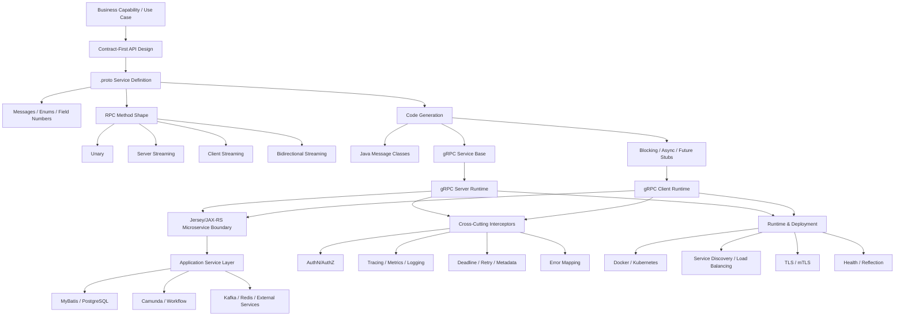

---

## Decomposition Map of Practical Categories / Domain / Skills

| No | Area | Skill Praktis yang Perlu Dikuasai | Relevansi di Jersey/JAX-RS Microservice |
|---:|---|---|---|
| 1 | **gRPC Mental Model** | Memahami gRPC sebagai RPC di atas HTTP/2, bukan REST over JSON. Fokus pada method call, stub, channel, status code, metadata, deadline, dan stream. | Membantu menentukan kapan pakai REST/JAX-RS dan kapan pakai gRPC. REST cocok untuk public/resource API; gRPC cocok untuk internal typed RPC berperforma tinggi. |
| 2 | **Contract-First `.proto` Design** | Mendesain `service`, `rpc`, `message`, `enum`, package, `java_package`, naming convention, field number, reserved field, dan compatibility rule. | `.proto` menjadi kontrak lintas tim/lintas service. Perubahan kontrak harus diperlakukan seperti perubahan public API internal. Protobuf sendiri mendukung generated code lintas bahasa. ([protobuf.dev](https://protobuf.dev/?utm_source=chatgpt.com)) |
| 3 | **RPC Method Pattern** | Memilih antara unary, server streaming, client streaming, atau bidirectional streaming. | Unary cocok untuk request-response biasa; streaming cocok untuk progress update, feed data besar, log/event stream, batch transfer, atau workflow status push. gRPC flow control relevan khusus untuk streaming RPC. ([gRPC](https://grpc.io/docs/guides/flow-control/?utm_source=chatgpt.com)) |
| 4 | **Proto Message Modeling** | Membedakan command, query, event-like response, pagination token, repeated fields, map fields, wrapper/optional fields, timestamp, oneof, dan error detail. | Menghindari DTO REST/JPA/MyBatis bocor langsung ke protobuf. Buat proto sebagai kontrak komunikasi, bukan sekadar mirror table database. |
| 5 | **Schema Evolution** | Menambah field secara backward-compatible, tidak reuse field number, gunakan `reserved`, hindari breaking rename secara semantik, dan versioning package/service jika perlu. | Sangat penting untuk microservice yang deploy-nya tidak selalu serempak di Kubernetes/on-prem/cloud. |
| 6 | **Maven Code Generation** | Mengatur plugin protobuf/gRPC, generated source directory, dependency version alignment, CI validation, dan build reproducibility. | Build harus otomatis menghasilkan stub dari `.proto`, bukan commit generated file sembarangan kecuali ada alasan kuat. gRPC Java docs menyebut build system biasanya menangani generated code dari `.proto`. ([gRPC](https://grpc.io/docs/languages/java/generated-code/?utm_source=chatgpt.com)) |
| 7 | **Generated Java API** | Memahami generated message class, builder, immutability, service base class, blocking stub, async stub, future stub, dan generated service class suffix `Grpc`. | Engineer harus tahu mana kode yang boleh diedit dan mana yang generated. Service implementation ada di application layer, bukan di generated class. ([gRPC](https://grpc.io/docs/languages/java/generated-code/?utm_source=chatgpt.com)) |
| 8 | **Server Implementation** | Membuat gRPC server Java, bind service implementation, configure executor, lifecycle start/shutdown, graceful termination, dan resource cleanup. | Dalam aplikasi Jersey, gRPC server bisa berjalan sebagai server port terpisah di JVM yang sama, atau sebagai service terpisah. Ini perlu desain lifecycle yang jelas agar tidak bentrok dengan servlet/JAX-RS runtime. |
| 9 | **Client Channel & Stub Management** | Reuse `ManagedChannel`, reuse stub, configure target address, deadline, TLS, keepalive, interceptors, dan shutdown channel. | Kesalahan umum: membuat channel per request. Praktik performa gRPC menyarankan reuse channel/stub bila memungkinkan. ([gRPC](https://grpc.io/docs/guides/performance/?utm_source=chatgpt.com)) |
| 10 | **Jersey ↔ gRPC Boundary Pattern** | Mendesain REST-to-gRPC adapter, gRPC-to-domain adapter, domain service reuse, mapper REST DTO ↔ proto, dan error translation. | Jersey resource sebaiknya tidak langsung berisi business logic. REST endpoint dapat memanggil application service yang sama dengan gRPC handler, atau menjadi adapter ke downstream gRPC. |
| 11 | **Error Handling & Status Mapping** | Memetakan domain error ke `StatusRuntimeException`, gRPC status code, metadata/trailer, retryable vs non-retryable error, dan rich error model jika diperlukan. | Penting agar REST error seperti HTTP 400/404/409/500 tidak diterjemahkan asal ke gRPC `UNKNOWN`. Harus ada mapping eksplisit. |
| 12 | **Deadline, Timeout, Cancellation** | Menentukan deadline per call, propagasi deadline antar service, handling cancellation, dan mencegah request menggantung. | Sangat penting untuk service chain: Jersey REST request → service A → gRPC service B → DB/Camunda. Tanpa deadline, thread/resource bisa tertahan. gRPC mendukung cancellation dan timeout/deadline sebagai bagian dari core model. ([gRPC](https://grpc.io/docs/what-is-grpc/core-concepts/?utm_source=chatgpt.com)) |
| 13 | **Retry & Hedging Policy** | Memahami transparent retry, configured retry policy, idempotency, backoff, retryable status, dan kapan hedging berbahaya. | Jangan retry command non-idempotent seperti create payment, submit case, approve task, atau mutate workflow tanpa idempotency key. gRPC retry policy tidak otomatis aman untuk semua operasi. ([gRPC](https://grpc.io/docs/guides/retry/?utm_source=chatgpt.com)) |
| 14 | **Metadata & Context Propagation** | Mengirim correlation ID, tenant ID, auth token, locale, request source, trace context, dan audit context lewat metadata/interceptor. | Dalam sistem regulasi/case management, metadata sering menentukan auditability, tenant isolation, dan permission context. Jangan masukkan metadata penting hanya di log. |
| 15 | **Interceptors** | Membuat client/server interceptor untuk logging, auth, metrics, tracing, validation, deadline enforcement, idempotency, dan policy enforcement. | Interceptor adalah tempat cross-cutting concern. Hindari menaruh auth/logging berulang di setiap method handler. |
| 16 | **Security: TLS/mTLS/Auth** | Mengatur TLS/mTLS antar service, token forwarding, service identity, certificate rotation, authorization claim, dan least privilege antar service. | Di Kubernetes/on-prem/cloud, gRPC internal tetap perlu security boundary. Jangan menganggap “internal network” otomatis trusted. gRPC mendukung authentication dan pluggable cross-cutting capabilities. ([gRPC](https://grpc.io/?utm_source=chatgpt.com)) |
| 17 | **Load Balancing & Service Discovery** | Memahami name resolution, client-side load balancing, resolver, target URI, Kubernetes service DNS, Envoy/service mesh, dan channel behavior. | gRPC connection bersifat long-lived; load balancing tidak selalu sama seperti HTTP REST per request. gRPC load balancing menerima resolved addresses dari name resolver lalu memilih subchannel untuk RPC. ([gRPC](https://grpc.io/docs/guides/custom-load-balancing/?utm_source=chatgpt.com)) |
| 18 | **Health Checking & Readiness** | Menyediakan gRPC health service, readiness/liveness strategy, dependency health, graceful shutdown status, dan integration dengan Kubernetes probes. | gRPC health checking memungkinkan server menyatakan apakah siap menangani RPC; client juga dapat dikonfigurasi untuk health checking. ([gRPC](https://grpc.io/docs/guides/health-checking/?utm_source=chatgpt.com)) |
| 19 | **Reflection & Developer Tooling** | Mengaktifkan reflection untuk dev/test environment, menggunakan tools seperti grpcurl/CLI/Postman/Insomnia bila sesuai, dan membatasi exposure di production. | Reflection memudahkan introspeksi service tanpa precompiled stub, tetapi harus dikontrol karena mengekspos API surface. gRPC reflection adalah protokol standar untuk mendeklarasikan API protobuf yang diekspor server. ([gRPC](https://grpc.io/docs/guides/reflection/?utm_source=chatgpt.com)) |
| 20 | **Observability** | Trace per RPC, metrics latency/error/status, logs dengan correlation ID, payload logging policy, sampling, dan dashboard per method. | gRPC butuh observability berbeda dari REST: method name, status code, deadline exceeded, retry count, stream duration, message count. OpenTelemetry Java menyediakan dokumentasi untuk telemetry Java, dan gRPC telah bergerak dari OpenCensus ke OpenTelemetry untuk observability. ([OpenTelemetry](https://opentelemetry.io/docs/languages/java/?utm_source=chatgpt.com)) |
| 21 | **Streaming Backpressure & Flow Control** | Mengelola producer/consumer speed, manual flow control bila perlu, bounded buffering, cancellation, dan memory pressure. | Streaming bisa sangat berguna, tapi berbahaya jika tidak ada backpressure. gRPC flow control mencegah receiver kewalahan oleh sender yang terlalu cepat. ([gRPC](https://grpc.io/docs/guides/flow-control/?utm_source=chatgpt.com)) |
| 22 | **Performance Engineering** | Channel reuse, message size limit, compression, keepalive, executor sizing, connection pooling mental model, load test, dan profiling serialization overhead. | Performa gRPC bukan hanya “binary lebih cepat”. Bottleneck bisa ada di DB, MyBatis mapping, thread pool, GC, payload besar, atau N+1 downstream call. Keepalive memakai HTTP/2 PING dan harus dikonfigurasi hati-hati. ([gRPC](https://grpc.io/docs/guides/keepalive/?utm_source=chatgpt.com)) |
| 23 | **Testing Strategy** | Unit test service implementation, in-process server/channel test, contract test terhadap `.proto`, integration test dengan Docker Compose/Testcontainers, dan failure injection. | Contract-first baru efektif jika CI menolak breaking change dan test mengecek behavior nyata, bukan hanya compile. |
| 24 | **Compatibility with REST/OpenAPI** | Mendesain coexistence antara OpenAPI REST contract dan `.proto` gRPC contract, API gateway, translation layer, dan public/internal API split. | Jangan memaksakan satu kontrak untuk semua channel. REST contract dan gRPC contract boleh berbeda selama domain invariant tetap konsisten. |
| 25 | **Deployment Topology** | Menentukan port HTTP REST vs port gRPC, container probes, Kubernetes Service, ingress/gateway, service mesh, TLS termination, dan observability sidecar. | Di Kubernetes, HTTP/2/gRPC routing, timeout, dan load balancing perlu dicek di ingress/service mesh. Di on-prem, LB lama kadang belum ideal untuk HTTP/2/gRPC. |
| 26 | **Operational Failure Modes** | Menganalisis `DEADLINE_EXCEEDED`, `UNAVAILABLE`, `RESOURCE_EXHAUSTED`, connection drain, DNS stale, rolling deployment, schema mismatch, dan partial failure. | Senior engineer perlu bisa membaca failure sebagai chain: client deadline → LB → server queue → DB lock → Camunda transaction → gRPC status. |
| 27 | **Governance & API Lifecycle** | Ownership `.proto`, review checklist, breaking-change detection, version policy, deprecation, documentation, sample payload, dan release notes. | Tanpa governance, gRPC contract cepat menjadi coupling tersembunyi antar microservice. |
| 28 | **Regulatory/Audit Concerns** | Propagasi actor, purpose, permission, audit event, data minimization, redaction, dan traceability. | Untuk case management/regulatory system, komunikasi internal tetap harus defensible: siapa memanggil apa, atas dasar permission apa, dan data apa yang dikirim. |

---

## Roadmap Alur Belajar yang Direkomendasikan

| Tahap | Fokus | Output Praktis |
|---:|---|---|
| 1 | **Mental model gRPC + Protobuf** | Bisa menjelaskan perbedaan REST/JAX-RS vs gRPC, unary vs streaming, dan posisi `.proto` sebagai kontrak. |
| 2 | **Contract-first `.proto` design** | Bisa membuat `.proto` yang stabil, evolvable, dan tidak sekadar menyalin entity database. |
| 3 | **Java Maven codegen** | Bisa setup Maven agar generate Java message class dan gRPC stub dari `src/main/proto`. |
| 4 | **Server/client implementation** | Bisa membuat gRPC server Java dan client stub yang reusable, dengan deadline dan error handling. |
| 5 | **Jersey integration pattern** | Bisa membuat REST endpoint Jersey yang memanggil gRPC atau berbagi application service layer secara bersih. |
| 6 | **Cross-cutting concern** | Bisa memasang interceptor untuk auth, correlation ID, tracing, metrics, logging, dan audit metadata. |
| 7 | **Reliability & production readiness** | Bisa mengatur retry, timeout, health check, reflection policy, TLS/mTLS, load balancing, dan graceful shutdown. |
| 8 | **Testing & governance** | Bisa membuat contract test, integration test, breaking-change check, dan review checklist untuk `.proto`. |

---

## Rekomendasi Materi Selanjutnya

Materi berikutnya yang paling natural adalah:

**“Cheatsheet Java gRPC Contract-First: `.proto` Design, Schema Evolution, Field Numbering, Versioning, and Breaking Change Prevention.”**

Itu sebaiknya dibahas sebelum masuk ke implementasi Maven/Java, karena kualitas gRPC service sangat ditentukan oleh desain kontraknya.

---

**Sources:**

- [Introduction to gRPC](https://grpc.io/docs/what-is-grpc/introduction/?utm_source=chatgpt.com)
- [Protocol Buffers Documentation](https://protobuf.dev/?utm_source=chatgpt.com)
- [Java](https://opentelemetry.io/docs/languages/java/?utm_source=chatgpt.com)

## Response:
7/13/2026, 8:23:06 AM

Total saya rekomendasikan **14 seri** untuk topik:

**Java gRPC Communications with Contract-First Approach in Jersey/JAX-RS Microservice Application**

| Seri | Topik |
|---:|---|
| 1 | gRPC Mental Model: REST/JAX-RS vs gRPC, RPC, HTTP/2, Protobuf |
| 2 | Contract-First `.proto` Design: service, rpc, message, enum, package |
| 3 | Protobuf Schema Evolution: field number, reserved, optional, oneof, compatibility |
| 4 | Maven Code Generation: protobuf plugin, grpc-java plugin, generated sources |
| 5 | Java gRPC Server Implementation: service base, lifecycle, executor, shutdown |
| 6 | Java gRPC Client Implementation: channel, stub, deadline, metadata |
| 7 | Jersey/JAX-RS Integration Pattern: REST-to-gRPC, shared application service, adapter layer |
| 8 | Error Handling: gRPC status, domain error mapping, rich error detail |
| 9 | Deadline, Timeout, Cancellation, Retry, Idempotency |
| 10 | Streaming RPC: server streaming, client streaming, bidirectional streaming, flow control |
| 11 | Security: TLS, mTLS, auth token propagation, service identity |
| 12 | Observability: logging, tracing, metrics, correlation ID, audit context |
| 13 | Kubernetes / Docker Deployment: ports, health check, reflection, load balancing |
| 14 | Testing, Governance, Production Failure Modes, Review Checklist |

Untuk onboarding senior engineer, **14 seri ini cukup lengkap** tanpa terlalu melebar.  
Kalau ingin versi super ringkas bisa dipadatkan jadi **8 seri**, tapi saya sarankan tetap **14 seri** karena gRPC contract-first punya banyak area rawan: schema evolution, timeout, retry, streaming, observability, dan deployment.

Rekomendasi mulai: **Seri 1 — gRPC Mental Model: REST/JAX-RS vs gRPC, RPC, HTTP/2, Protobuf.**

## Response:
7/13/2026, 8:23:25 AM

# Seri 1/14 - gRPC Mental Model: REST/JAX-RS vs gRPC, RPC, HTTP/2, Protobuf

## 1. Introduction

Di aplikasi **Jersey/JAX-RS based microservice**, gRPC sebaiknya dipahami sebagai **internal typed RPC communication**, bukan pengganti total REST. REST/JAX-RS tetap kuat untuk API publik, integrasi eksternal, human-readable endpoint, admin endpoint, webhook, dan resource-oriented API. gRPC lebih cocok untuk komunikasi service-to-service yang butuh kontrak ketat, generated client, latency rendah, streaming, dan payload binary berbasis Protocol Buffers.

Secara resmi, gRPC menggunakan **Protocol Buffers** sebagai **Interface Definition Language/IDL** dan format pertukaran data; dari file `.proto`, tooling gRPC menghasilkan kode client-side dan server-side. ([gRPC](https://grpc.io/docs/what-is-grpc/introduction/?utm_source=chatgpt.com))

---

## 2. Mental Model Utama

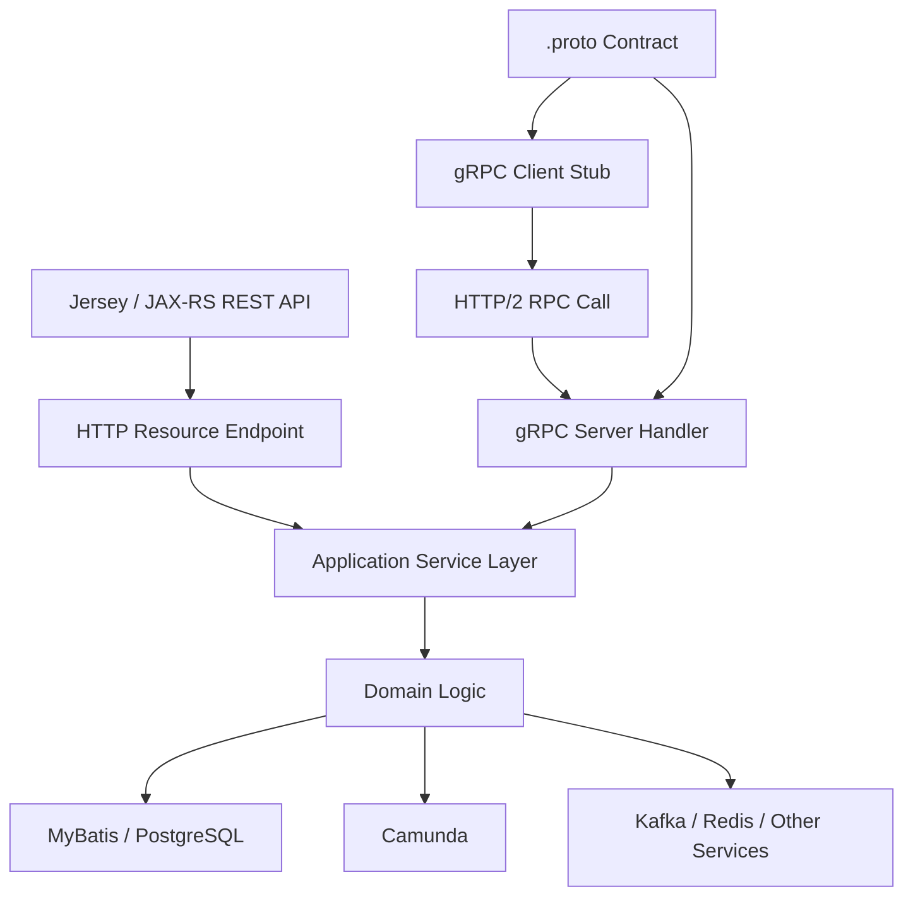

Intinya:

| Layer | REST/JAX-RS | gRPC |
|---|---|---|
| API style | Resource-oriented | Operation/RPC-oriented |
| Contract | OpenAPI, HTTP method, path, JSON schema | `.proto`, service, rpc, message |
| Payload | Biasanya JSON/XML | Biasanya Protobuf binary |
| Transport | HTTP/1.1 atau HTTP/2 tergantung runtime | HTTP/2 |
| Client | HTTP client manual/generated | Generated strongly typed stub |
| Cocok untuk | Public API, external integration, browser/client compatibility | Internal microservice call, typed service contract, streaming |
| Failure model | HTTP status code | gRPC status code, deadline, cancellation, metadata/trailer |

---

## 3. Core Concept gRPC

| Concept | Penjelasan Praktis | Hal yang Harus Diingat |
|---|---|---|
| **Service** | Definisi layanan di `.proto`, misalnya `CaseService`, `UserService`, `DecisionService`. | Jangan samakan 1 service gRPC dengan 1 database table. Service harus mengikuti capability/use case. |
| **RPC Method** | Operasi yang dipanggil client, misalnya `GetCase`, `SubmitDecision`, `SearchCases`. | Ini mirip method call jarak jauh, bukan HTTP resource path. |
| **Message** | Struktur request/response di `.proto`. | Message adalah contract DTO, bukan entity MyBatis/JPA. |
| **Stub** | Generated client yang dipakai service pemanggil. | Developer tidak perlu membuat HTTP request manual seperti REST client. |
| **Channel** | Koneksi/logical transport ke server gRPC. | Channel sebaiknya di-reuse, bukan dibuat per request. Praktik performa gRPC menyarankan reuse stubs dan channels bila memungkinkan. ([gRPC](https://grpc.io/docs/guides/performance/?utm_source=chatgpt.com)) |
| **Server Handler** | Implementasi method RPC di sisi server. | Handler sebaiknya tipis, lalu delegasi ke application service/domain service. |
| **Deadline** | Batas waktu maksimal RPC. | Wajib untuk production. Tanpa deadline, request chain bisa menggantung. |
| **Metadata** | Key-value metadata per call. | Cocok untuk correlation ID, trace ID, tenant ID, auth token, actor context. |
| **Status Code** | Hasil RPC: `OK`, `INVALID_ARGUMENT`, `NOT_FOUND`, `UNAVAILABLE`, dll. | Jangan asal semua exception menjadi `UNKNOWN` atau `INTERNAL`. |
| **Streaming** | RPC bisa mengirim/menerima banyak message. | Berguna, tapi harus hati-hati dengan backpressure dan memory. |

---

## 4. Contract-First Mental Model

Dalam pendekatan **contract-first**, urutan berpikirnya adalah:

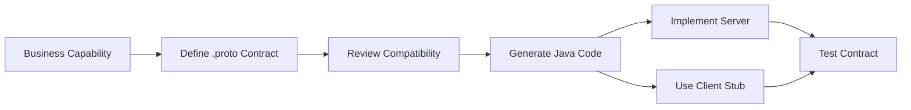

Bukan:

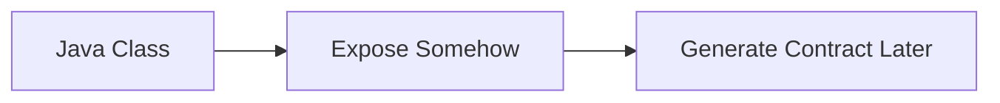

Yang benar untuk gRPC contract-first:

| Tahap | Praktik |
|---|---|
| 1 | Definisikan capability: misalnya `CaseQueryService`, `CaseCommandService`, `DocumentService`. |
| 2 | Buat `.proto`: service, rpc method, request message, response message. |
| 3 | Review compatibility: field number, reserved field, optionality, enum growth. |
| 4 | Generate Java class/stub via Maven. |
| 5 | Implementasikan server handler. |
| 6 | Client service memakai generated stub. |
| 7 | CI memastikan `.proto` tidak breaking secara sembarangan. |

Protocol Buffers memang dirancang dengan workflow: membuat `.proto`, generate code, lalu memakai generated class untuk membaca, menulis, serialize, dan deserialize data. ([Protocol Buffers](https://protobuf.dev/overview/?utm_source=chatgpt.com))

---

## 5. REST/JAX-RS vs gRPC: Cara Berpikir yang Tepat

### REST/JAX-RS

REST biasanya berpikir dalam bentuk **resource**:

```http
GET /cases/{caseId}
POST /cases/{caseId}/decisions
GET /cases?status=OPEN
```

Cocok ketika:

| Cocok REST/JAX-RS Jika | Alasan |
|---|---|
| API dipakai frontend/browser | JSON + HTTP lebih mudah dikonsumsi |
| API dipakai partner eksternal | Lebih familiar dan mudah debug |
| Butuh OpenAPI documentation | Ekosistem REST/OpenAPI sangat matang |
| Endpoint bersifat public API | HTTP semantics lebih mudah diterima |
| Butuh cache/proxy sederhana | HTTP resource model lebih natural |

### gRPC

gRPC berpikir dalam bentuk **service operation**:

```proto
service CaseQueryService {
  rpc GetCase(GetCaseRequest) returns (GetCaseResponse);
  rpc SearchCases(SearchCasesRequest) returns (SearchCasesResponse);
}

service CaseCommandService {
  rpc SubmitDecision(SubmitDecisionRequest) returns (SubmitDecisionResponse);
}
```

Cocok ketika:

| Cocok gRPC Jika | Alasan |
|---|---|
| Komunikasi internal microservice | Typed contract + generated client |
| Butuh performa dan payload compact | Protobuf binary lebih efisien daripada JSON untuk banyak kasus |
| Butuh streaming | gRPC mendukung unary dan streaming RPC sebagai model inti |
| Banyak service Java/Go/.NET saling panggil | `.proto` bisa generate client/server lintas bahasa |
| Contract perlu lebih ketat | Compile-time generated types mengurangi salah field/stringly-typed integration |

gRPC mendukung empat bentuk RPC: unary, server streaming, client streaming, dan bidirectional streaming. ([gRPC](https://grpc.io/docs/what-is-grpc/core-concepts/?utm_source=chatgpt.com))

---

## 6. Bentuk RPC yang Perlu Dikuasai

| RPC Type | Bentuk | Contoh Use Case | Risiko |
|---|---|---|---|
| **Unary** | 1 request → 1 response | Get case detail, validate user, submit command | Paling sederhana, tapi tetap perlu timeout/deadline |
| **Server Streaming** | 1 request → banyak response | Stream progress long-running task, export result chunks, workflow status update | Client lambat bisa menyebabkan buffering/backpressure issue |
| **Client Streaming** | Banyak request → 1 response | Upload chunk, batch ingest, bulk validation | Perlu limit ukuran, timeout, dan error aggregation |
| **Bidirectional Streaming** | Banyak request ↔ banyak response | Live collaboration, real-time processing, command/event channel | Kompleks: concurrency, ordering, cancellation, flow control |

Untuk onboarding awal, kuasai **unary dulu**. Streaming masuk setelah paham deadline, error handling, cancellation, dan backpressure.

---

## 7. Posisi gRPC dalam Jersey/JAX-RS Microservice

Ada beberapa pola umum.

### Pattern A - REST ingress, gRPC downstream

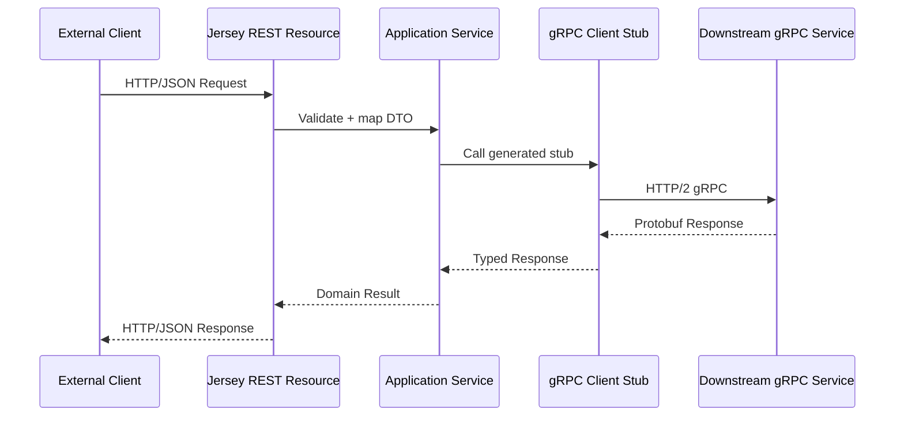

Cocok ketika service Anda membuka API REST, tapi perlu memanggil internal service via gRPC.

### Pattern B - Same application exposes REST and gRPC

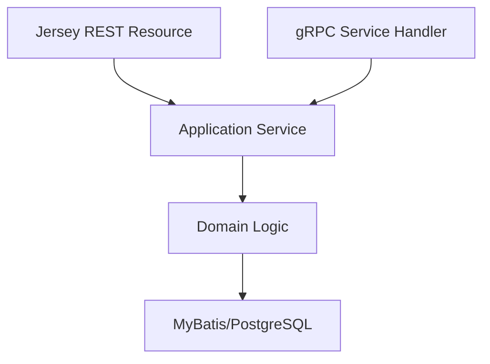

Cocok ketika satu service harus melayani dua jenis client: REST untuk eksternal/legacy, gRPC untuk internal.

### Pattern C - gRPC-only internal service

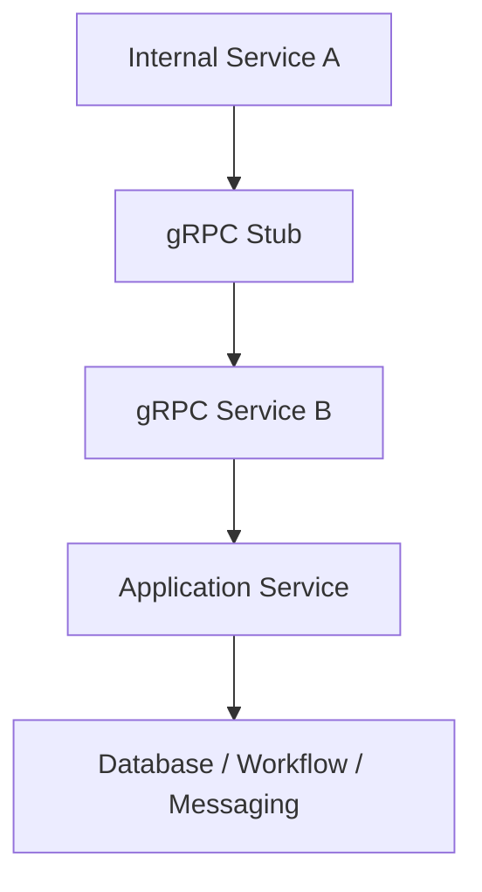

Cocok untuk service internal yang tidak perlu expose REST API.

---

## 8. Kesalahan Mental Model yang Sering Terjadi

| Salah Kaprah | Kenapa Salah | Cara Berpikir yang Benar |
|---|---|---|
| “gRPC itu REST versi binary” | gRPC bukan resource-oriented API; ia RPC-oriented. | Desain berdasarkan service capability dan operation. |
| “Proto message = entity database” | Membocorkan struktur DB ke kontrak service membuat evolusi sulit. | Proto message adalah API contract DTO. |
| “Karena internal, tidak perlu auth” | Internal network tidak otomatis trusted. | Tetap desain auth, mTLS/token, service identity, dan audit context. |
| “Tidak perlu timeout karena cepat” | Justru call internal sering membentuk chain panjang. | Semua RPC production harus punya deadline. |
| “Retry selalu bagus” | Retry command non-idempotent bisa menyebabkan double mutation. | Retry hanya untuk operasi idempotent atau yang punya idempotency key. |
| “Generated code boleh diedit” | Generated code akan tertimpa saat build ulang. | Edit `.proto` atau implementation class, bukan generated class. |
| “Streaming pasti lebih baik” | Streaming menambah kompleksitas flow control, cancellation, dan memory. | Gunakan streaming hanya jika use case memang butuh. |

---

## 9. Decision Guide: Pilih REST atau gRPC?

| Pertanyaan | Pilih REST/JAX-RS Jika | Pilih gRPC Jika |
|---|---|---|
| Siapa client-nya? | Browser, partner eksternal, public client | Internal service |
| Perlu kontrak strongly typed? | Tidak terlalu | Ya |
| Perlu human-readable payload? | Ya | Tidak wajib |
| Perlu streaming? | Bisa, tapi tidak se-natural gRPC | Ya, terutama service-to-service |
| Perlu debugging manual via curl/browser? | Ya | Tidak utama |
| Banyak bahasa/platform? | Bisa dengan OpenAPI generator | Sangat cocok dengan `.proto` |
| Evolusi API harus ketat? | Bisa dengan OpenAPI governance | Sangat cocok dengan proto governance |
| Infrastruktur support HTTP/2? | Tidak wajib | Wajib diperhatikan |

Rule praktis:

> Gunakan **REST/JAX-RS** untuk boundary eksternal dan resource API.  
> Gunakan **gRPC** untuk komunikasi internal yang butuh kontrak typed, performa, generated client, dan streaming.

---

## 10. Contoh Mini Contract

```proto
syntax = "proto3";

package casecommunication.v1;

option java_multiple_files = true;
option java_package = "com.example.casecommunication.v1";
option java_outer_classname = "CaseCommunicationProto";

service CaseQueryService {
  rpc GetCase(GetCaseRequest) returns (GetCaseResponse);
}

message GetCaseRequest {
  string case_id = 1;
}

message GetCaseResponse {
  string case_id = 1;
  string case_number = 2;
  CaseStatus status = 3;
}

enum CaseStatus {
  CASE_STATUS_UNSPECIFIED = 0;
  CASE_STATUS_OPEN = 1;
  CASE_STATUS_IN_REVIEW = 2;
  CASE_STATUS_CLOSED = 3;
}
```

Hal penting dari contoh ini:

| Bagian | Makna |
|---|---|
| `syntax = "proto3"` | Menggunakan bahasa proto3. |
| `package casecommunication.v1` | Namespace kontrak protobuf. |
| `java_package` | Package Java generated code. |
| `service CaseQueryService` | Service gRPC. |
| `rpc GetCase(...)` | Method RPC unary. |
| `case_id = 1` | Field number; jangan reuse setelah dipakai. |
| `CASE_STATUS_UNSPECIFIED = 0` | Enum default explicit agar aman terhadap default value. |

Protobuf style guide menyediakan konvensi struktur dan penamaan `.proto`, dan proto best practices menekankan maintainability schema, termasuk pemisahan message/service agar mudah direfactor. ([Protocol Buffers](https://protobuf.dev/programming-guides/style/?utm_source=chatgpt.com))

---

## 11. Production Thinking untuk Senior Engineer

Saat melihat desain gRPC, jangan hanya tanya “bisa jalan atau tidak”. Tanyakan ini:

| Area | Pertanyaan Review |
|---|---|
| Contract | Apakah `.proto` merepresentasikan capability, bukan table/entity? |
| Compatibility | Apa yang terjadi jika client lama memanggil server baru? |
| Timeout | Apakah setiap call punya deadline? |
| Retry | Apakah method aman di-retry? Ada idempotency key? |
| Error | Apakah domain error dimapping ke gRPC status yang tepat? |
| Observability | Apakah method, status, latency, trace ID, correlation ID tercatat? |
| Security | Apakah token/service identity diteruskan? Apakah TLS/mTLS diperlukan? |
| Deployment | Apakah LB/Ingress/Kubernetes path mendukung HTTP/2/gRPC? |
| Shutdown | Apakah server bisa graceful shutdown saat rolling deployment? |
| Streaming | Apakah ada flow control dan cancellation handling? |

---

## 12. Ringkasan Mental Model

```text
REST/JAX-RS:
  "Client mengakses resource lewat HTTP method + path."

gRPC:
  "Client memanggil typed method pada remote service berdasarkan kontrak .proto."

Contract-first:
  "Kontrak .proto didesain, direview, dan dijaga kompatibilitasnya sebelum implementasi Java."

Production-ready gRPC:
  "Bukan hanya stub bisa call server, tapi juga deadline, error mapping, observability, security, deployment, dan compatibility aman."
```

---

# Seri 1 selesai

Materi berikutnya yang direkomendasikan:

**Seri 2/14 - Contract-First `.proto` Design: service, rpc, message, enum, package, naming, dan boundary design.**

---

**Sources:**

- [Introduction to gRPC](https://grpc.io/docs/what-is-grpc/introduction/?utm_source=chatgpt.com)
- [Overview | Protocol Buffers Documentation](https://protobuf.dev/overview/?utm_source=chatgpt.com)

## Response:
7/13/2026, 4:59:58 PM

Saya lanjut ke Seri 2: fokus ke desain kontrak `.proto` yang benar untuk microservice, termasuk boundary service, naming, package/versioning, message design, dan review checklist agar tidak jadi coupling tersembunyi.

# Seri 2/14 - Contract-First `.proto` Design: Service, RPC, Message, Enum, Package, Naming, Boundary

## 1. Introduction

Dalam gRPC **contract-first**, file `.proto` adalah pusat kontrak komunikasi antar service. Java class, client stub, server base class, dan message builder hanyalah hasil turunan dari kontrak tersebut. Di Java gRPC, setiap service di `.proto` akan menghasilkan class Java dengan suffix `Grpc`, dan package Java generated code dikontrol lewat option seperti `java_package`. ([gRPC](https://grpc.io/docs/languages/java/generated-code/?utm_source=chatgpt.com))

Untuk aplikasi **Jersey/JAX-RS based microservice**, desain `.proto` harus diperlakukan seperti desain **internal API contract**, bukan sekadar DTO auto-generated dari database atau REST payload. Kalau kontrak buruk, efeknya akan terasa di client, server, testing, deployment, observability, dan backward compatibility.

---

## 2. Mental Model Contract-First

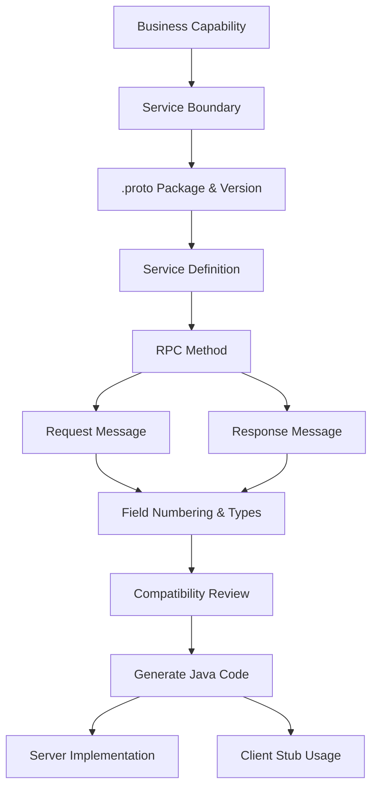

Prinsipnya:

```text
Business capability
  -> service boundary
    -> rpc operation
      -> request/response contract
        -> generated Java code
          -> implementation
```

Bukan:

```text
Database table
  -> Java entity
    -> proto message
      -> exposed directly to other service
```

---

## 3. Struktur `.proto` yang Sehat

Contoh struktur dasar:

```proto
syntax = "proto3";

package casecommunication.v1;

option java_multiple_files = true;
option java_package = "com.company.casecommunication.v1";
option java_outer_classname = "CaseCommunicationProto";

import "google/protobuf/timestamp.proto";

service CaseQueryService {
  rpc GetCase(GetCaseRequest) returns (GetCaseResponse);
  rpc SearchCases(SearchCasesRequest) returns (SearchCasesResponse);
}

service CaseCommandService {
  rpc SubmitDecision(SubmitDecisionRequest) returns (SubmitDecisionResponse);
}

message GetCaseRequest {
  string case_id = 1;
}

message GetCaseResponse {
  CaseSummary case = 1;
}

message SearchCasesRequest {
  optional string status = 1;
  optional string assignee_id = 2;
  int32 page_size = 3;
  string page_token = 4;
}

message SearchCasesResponse {
  repeated CaseSummary cases = 1;
  string next_page_token = 2;
}

message SubmitDecisionRequest {
  string case_id = 1;
  string decision_code = 2;
  string reason = 3;
  string idempotency_key = 4;
}

message SubmitDecisionResponse {
  string decision_id = 1;
  CaseStatus resulting_status = 2;
  google.protobuf.Timestamp decided_at = 3;
}

message CaseSummary {
  string case_id = 1;
  string case_number = 2;
  CaseStatus status = 3;
  google.protobuf.Timestamp created_at = 4;
}

enum CaseStatus {
  CASE_STATUS_UNSPECIFIED = 0;
  CASE_STATUS_OPEN = 1;
  CASE_STATUS_IN_REVIEW = 2;
  CASE_STATUS_CLOSED = 3;
}
```

Beberapa hal penting dari contoh ini: `package` dipakai sebagai namespace kontrak protobuf, `java_package` mengatur package Java generated code, dan `java_multiple_files = true` umum dipakai agar generated Java class lebih mudah digunakan per-message/per-service. Dokumentasi gRPC Java menjelaskan bahwa package generated Java berasal dari `java_package`, dan service generated class memakai suffix `Grpc`. ([gRPC](https://grpc.io/docs/languages/java/generated-code/?utm_source=chatgpt.com))

---

## 4. Decomposition Map `.proto` Design

| Area | Skill Praktis | Tujuan | Risiko Jika Salah |
|---|---|---|---|
| **Package & Versioning** | Mendesain `package casecommunication.v1` dan `java_package` | Memisahkan namespace kontrak dari package Java implementation | Konflik class, kontrak sulit dievolusi, service v1/v2 tercampur |
| **Service Boundary** | Memisahkan query service, command service, admin service, internal service | API surface jelas sesuai capability | Satu service jadi “god service” |
| **RPC Naming** | Nama method berbasis aksi bisnis: `GetCase`, `SearchCases`, `SubmitDecision` | Client memahami maksud operasi tanpa baca implementasi | Nama terlalu teknis seperti `ProcessData`, `Execute`, `Handle` |
| **Request Message** | Selalu gunakan message request eksplisit, bukan primitive langsung | Mudah tambah field di masa depan | Sulit evolusi karena method terlalu sempit |
| **Response Message** | Selalu gunakan message response eksplisit | Bisa tambah metadata/result detail tanpa breaking change | Response terlalu kaku |
| **Field Numbering** | Menetapkan number stabil dan tidak reuse | Menjaga compatibility protobuf | Data lama bisa salah terbaca jika number dipakai ulang |
| **Reserved Field** | Gunakan `reserved` saat field dihapus | Mencegah reuse field number/nama | Breaking bug yang sulit dideteksi |
| **Enum Design** | Enum pakai value default `UNSPECIFIED = 0` | Menghindari default value ambigu | Client salah interpretasi default enum |
| **Optionality** | Gunakan `optional` untuk scalar yang perlu presence | Membedakan “tidak dikirim” vs “nilai default” | Tidak bisa bedakan kosong, nol, false, dan absent |
| **Pagination** | Pakai `page_size` + `page_token` | Stabil untuk query list/search | Query response membengkak |
| **Idempotency** | Tambahkan `idempotency_key` pada command penting | Aman terhadap retry/timeout | Double mutation pada retry |
| **Time Type** | Pakai `google.protobuf.Timestamp` untuk waktu absolut | Konsisten lintas bahasa/runtime | String tanggal tidak konsisten |
| **Error Contract** | Pisahkan success response dari domain error mapping | Status gRPC tetap semantik | Semua error jadi `INTERNAL` atau `UNKNOWN` |
| **Documentation** | Komentar di service, method, field penting | Memudahkan review dan generated docs | Contract susah dipahami client |
| **Governance** | Lint, breaking-change detection, review checklist | Mencegah perubahan kontrak sembarangan | Client rusak setelah deploy server baru |

---

## 5. Mendesain Service Boundary

Untuk sistem case management/regulatory workflow, hindari satu service besar seperti ini:

```proto
service CaseService {
  rpc DoSomething(DoSomethingRequest) returns (DoSomethingResponse);
  rpc Process(ProcessRequest) returns (ProcessResponse);
  rpc Update(UpdateRequest) returns (UpdateResponse);
  rpc Get(GetRequest) returns (GetResponse);
}
```

Lebih sehat:

```proto
service CaseQueryService {
  rpc GetCase(GetCaseRequest) returns (GetCaseResponse);
  rpc SearchCases(SearchCasesRequest) returns (SearchCasesResponse);
}

service CaseCommandService {
  rpc SubmitCase(SubmitCaseRequest) returns (SubmitCaseResponse);
  rpc SubmitDecision(SubmitDecisionRequest) returns (SubmitDecisionResponse);
  rpc AssignCase(AssignCaseRequest) returns (AssignCaseResponse);
}

service CaseAuditService {
  rpc GetCaseAuditTrail(GetCaseAuditTrailRequest) returns (GetCaseAuditTrailResponse);
}
```

Pembagian ini membantu membedakan **read model**, **write/command model**, dan **audit model**. Ini juga memudahkan authorization, observability, ownership, dan deployment karena setiap method lebih jelas sifatnya.

---

## 6. Service Design Pattern

| Pattern | Contoh | Kapan Dipakai |
|---|---|---|
| **Query Service** | `CaseQueryService`, `UserLookupService` | Read-only, search, lookup, projection |
| **Command Service** | `CaseCommandService`, `DecisionCommandService` | Operasi mutasi state |
| **Workflow Service** | `TaskWorkflowService`, `CaseLifecycleService` | Operasi yang berhubungan dengan Camunda/process lifecycle |
| **Document Service** | `DocumentQueryService`, `DocumentCommandService` | Upload metadata, retrieve document reference, attach evidence |
| **Audit Service** | `AuditTrailService` | Riwayat perubahan, defensibility, investigation trace |
| **Reference Data Service** | `CodeTableService`, `PolicyReferenceService` | Lookup enum/domain reference yang berubah tanpa deploy |
| **Internal Admin Service** | `ReindexService`, `RepairService` | Operasi internal terbatas, bukan public business API |

Untuk senior engineer, boundary pentingnya adalah: **jangan desain service berdasarkan technical layer**, misalnya `DatabaseService`, `MapperService`, atau `CamundaService`, kecuali memang service tersebut adalah infrastructure-facing internal component. Biasanya kontrak antar microservice harus berbasis business capability.

---

## 7. RPC Method Naming

Gunakan nama yang eksplisit dan stabil:

| Intent | Nama Baik | Nama Lemah |
|---|---|---|
| Ambil satu data | `GetCase` | `Fetch`, `GetData` |
| Cari banyak data | `SearchCases` | `List`, `Query` |
| Mutasi state | `SubmitDecision` | `Update`, `Process` |
| Validasi | `ValidateSubmission` | `Check` |
| Assign owner | `AssignCase` | `SetUser` |
| Cancel process | `CancelCaseProcess` | `Cancel` |
| Ambil audit | `GetCaseAuditTrail` | `History` |

Rule praktis:

```text
RPC method name should reveal business intent,
not implementation mechanism.
```

Contoh buruk:

```proto
rpc ExecuteQuery(ExecuteQueryRequest) returns (ExecuteQueryResponse);
rpc CallProcedure(CallProcedureRequest) returns (CallProcedureResponse);
rpc ProcessPayload(ProcessPayloadRequest) returns (ProcessPayloadResponse);
```

Contoh lebih baik:

```proto
rpc SearchCases(SearchCasesRequest) returns (SearchCasesResponse);
rpc SubmitDecision(SubmitDecisionRequest) returns (SubmitDecisionResponse);
rpc RecalculateCaseRisk(RecalculateCaseRiskRequest) returns (RecalculateCaseRiskResponse);
```

---

## 8. Request / Response Message Design

### Prinsip

Selalu gunakan request dan response message eksplisit:

```proto
rpc GetCase(GetCaseRequest) returns (GetCaseResponse);
```

Jangan berpikir seperti ini:

```proto
rpc GetCase(string) returns (CaseSummary); // bukan pola yang baik
```

Alasannya: request/response eksplisit lebih mudah dievolusi. Anda bisa menambah field seperti `include_audit_summary`, `request_context`, `field_mask`, atau `locale` tanpa mengganti signature method.

---

## 9. Message Boundary: Jangan Bocorkan DB Entity

Contoh yang rawan:

```proto
message CaseTableRow {
  string case_id = 1;
  string case_no = 2;
  string wf_inst_id = 3;
  string created_by_user_fk = 4;
  string status_cd = 5;
  string db_partition_key = 6;
}
```

Masalahnya:

| Masalah | Dampak |
|---|---|
| Field mengikuti nama kolom | Client tahu struktur internal database |
| Ada foreign key/internal workflow ID | Coupling ke storage/workflow engine |
| Sulit rename/refactor DB | Perubahan internal menjadi breaking API |
| Semantik bisnis tidak jelas | Client harus tahu arti teknis field |

Lebih baik:

```proto
message CaseSummary {
  string case_id = 1;
  string case_number = 2;
  CaseStatus status = 3;
  string assigned_user_id = 4;
}
```

Mapping dari PostgreSQL/MyBatis ke proto dilakukan di adapter/mapper layer, bukan dengan mengekspos row mentah.

---

## 10. Field Numbering dan Reserved

Di protobuf, field number adalah identitas penting pada wire format. Praktik resmi protobuf menekankan: **jangan reuse tag number**, dan jika field dihapus, gunakan `reserved` untuk mencegah number atau nama lama dipakai ulang. ([Protocol Buffers](https://protobuf.dev/best-practices/dos-donts/?utm_source=chatgpt.com))

Contoh:

```proto
message CaseSummary {
  string case_id = 1;
  string case_number = 2;

  reserved 3;
  reserved "legacy_status";

  CaseStatus status = 4;
}
```

Checklist field numbering:

| Rule | Praktik |
|---|---|
| Jangan reuse number | Field number yang pernah dipakai dianggap “terbakar” |
| Reserve deleted field | Gunakan `reserved 3;` dan/atau `reserved "old_name";` |
| Jangan ubah tipe sembarangan | Mengubah tipe field bisa breaking atau corrupt secara semantik |
| Tambah field baru pakai number baru | Tambahkan di akhir secara logis, bukan harus urut visual |
| Jangan rename semantik asal | Rename field bisa aman secara wire, tapi bisa breaking untuk generated code/client source |

---

## 11. Optional, Default Value, dan Presence

Di proto3, scalar field punya default value seperti empty string, zero, atau false. Karena itu, untuk scalar yang perlu membedakan **absent** vs **present dengan nilai default**, gunakan `optional`. Dokumentasi protobuf field presence merekomendasikan menambahkan label `optional` untuk proto3 basic types agar presence lebih eksplisit dan jalur ke editions lebih mulus. ([Protocol Buffers](https://protobuf.dev/programming-guides/field_presence/?utm_source=chatgpt.com))

Contoh:

```proto
message SearchCasesRequest {
  optional string status = 1;
  optional string assignee_id = 2;
  optional bool include_closed = 3;
}
```

Interpretasi:

| Field | Tanpa `optional` | Dengan `optional` |
|---|---|---|
| `string status` | Tidak jelas apakah absent atau empty string | Bisa cek apakah field dikirim |
| `bool include_closed` | Default `false`, tidak tahu dikirim atau tidak | Bisa bedakan absent vs explicit false |
| `int32 page_size` | Default `0` bisa ambigu | Bisa validasi jika memang dikirim |

Gunakan `optional` untuk filter, patch-like input, flag bisnis sensitif, atau field yang default value-nya punya makna.

---

## 12. Enum Design

Gunakan enum default yang eksplisit:

```proto
enum CaseStatus {
  CASE_STATUS_UNSPECIFIED = 0;
  CASE_STATUS_OPEN = 1;
  CASE_STATUS_IN_REVIEW = 2;
  CASE_STATUS_CLOSED = 3;
}
```

Jangan:

```proto
enum CaseStatus {
  OPEN = 0;
  IN_REVIEW = 1;
  CLOSED = 2;
}
```

Kenapa?

| Praktik | Alasan |
|---|---|
| Prefix enum value | Menghindari collision dan memperjelas konteks |
| Value `UNSPECIFIED = 0` | Proto3 enum default adalah nilai 0, jadi harus aman |
| Jangan hapus value tanpa reserve | Number enum lama bisa dipakai ulang tanpa sengaja |
| Jangan jadikan enum untuk reference data volatile | Jika value sering berubah dari database, pertimbangkan string/code reference |

Protobuf best practices juga menyarankan reserve number untuk enum value yang dihapus agar tidak dipakai ulang. ([Protocol Buffers](https://protobuf.dev/best-practices/dos-donts/?utm_source=chatgpt.com))

---

## 13. `oneof`: Gunakan Secara Terbatas

`oneof` berguna jika hanya satu dari beberapa field yang boleh muncul.

Contoh:

```proto
message CaseIdentifier {
  oneof identifier {
    string case_id = 1;
    string case_number = 2;
    string external_reference = 3;
  }
}
```

Cocok untuk:

| Use Case | Contoh |
|---|---|
| Alternative identifier | `case_id` atau `case_number` |
| Mutually exclusive payload | `individual_customer` atau `organization_customer` |
| Search criterion eksklusif | `by_id`, `by_number`, `by_external_ref` |

Hati-hati memakai `oneof` untuk model yang kemungkinan akan berkembang menjadi kombinasi filter. Kalau nanti client perlu search by `status + assignee + date_range`, jangan pakai `oneof`; gunakan field biasa.

---

## 14. Pagination dan Search Contract

Untuk search/list, jangan langsung return semua data:

```proto
message SearchCasesRequest {
  optional string status = 1;
  optional string assignee_id = 2;
  int32 page_size = 3;
  string page_token = 4;
}

message SearchCasesResponse {
  repeated CaseSummary cases = 1;
  string next_page_token = 2;
}
```

Prinsip:

| Area | Praktik |
|---|---|
| `page_size` | Validasi max limit di server |
| `page_token` | Token opaque; client tidak perlu tahu offset/cursor internal |
| `next_page_token` | Empty jika tidak ada halaman berikutnya |
| Sorting | Buat eksplisit jika diperlukan |
| Filtering | Gunakan field jelas, jangan string SQL-like filter sembarangan |

Hindari:

```proto
string where_clause = 1;
string order_by_sql = 2;
```

Itu membocorkan detail database dan berbahaya secara security.

---

## 15. Command Contract dan Idempotency

Untuk command/mutasi penting, tambahkan `idempotency_key` jika operasi bisa terkena retry, timeout, atau duplicate submission.

```proto
message SubmitDecisionRequest {
  string case_id = 1;
  string decision_code = 2;
  string reason = 3;
  string idempotency_key = 4;
}
```

Kenapa penting?

| Failure | Tanpa Idempotency | Dengan Idempotency |
|---|---|---|
| Client timeout tapi server sukses | Client retry bisa double-submit | Server bisa return result lama |
| Network putus saat response | Client tidak tahu hasil | Client retry aman |
| Retry policy aktif | Mutasi bisa terjadi dua kali | Mutasi bisa deduplicate |
| Workflow command ke Camunda | Task bisa complete dua kali | Bisa dicegah di boundary service |

Untuk domain regulasi/case management, command seperti approve, reject, assign, escalate, submit evidence, atau close case harus dianggap sensitif terhadap duplicate execution.

---

## 16. Package dan Versioning

Contoh:

```proto
package casecommunication.v1;

option java_package = "com.company.casecommunication.v1";
```

Pattern yang direkomendasikan:

| Layer | Contoh | Tujuan |
|---|---|---|
| Proto package | `casecommunication.v1` | Namespace kontrak protobuf |
| Java package | `com.company.casecommunication.v1` | Namespace generated Java |
| Service name | `CaseQueryService` | Capability |
| File name | `case_query_service.proto` | Mudah ditemukan |
| Directory | `proto/company/casecommunication/v1/...` | Konsisten untuk repo besar |

Kapan perlu `v2`?

| Situasi | Perlu v2? |
|---|---|
| Tambah optional field | Biasanya tidak |
| Tambah RPC method | Biasanya tidak |
| Tambah enum value | Bisa, tapi cek client behavior |
| Ubah makna field lama | Ya, kemungkinan |
| Hapus/rename field yang dipakai client | Ya, atau deprecate dulu |
| Ubah request/response secara fundamental | Ya |
| Pecah service boundary besar | Bisa v2 atau service baru |

---

## 17. Naming Convention Praktis

Protobuf style guide resmi menyediakan arahan struktur dan penamaan `.proto` agar definisi konsisten dan mudah dibaca. ([Protocol Buffers](https://protobuf.dev/programming-guides/style/?utm_source=chatgpt.com))

| Elemen | Style Praktis | Contoh |
|---|---|---|
| File | `lower_snake_case.proto` | `case_query_service.proto` |
| Package | lowercase + version | `casecommunication.v1` |
| Message | PascalCase | `GetCaseRequest` |
| Field | lower_snake_case | `case_id` |
| Service | PascalCase + `Service` | `CaseQueryService` |
| RPC | PascalCase verb phrase | `SubmitDecision` |
| Enum type | PascalCase | `CaseStatus` |
| Enum value | UPPER_SNAKE_CASE with prefix | `CASE_STATUS_OPEN` |
| Repeated field | Plural | `cases`, `documents`, `violations` |

Buf style guide juga menyarankan repeated field memakai nama plural, menghindari keyword populer dari bahasa pemrograman pada nama type/package, serta menghindari nested enum/message karena sering dibutuhkan di luar konteks awalnya. ([Buf](https://buf.build/docs/best-practices/style-guide/?utm_source=chatgpt.com))

---

## 18. Komentar dan Dokumentasi di `.proto`

Komentar bukan kosmetik. Ia membantu consumer memahami kontrak tanpa harus membaca Java implementation.

Contoh:

```proto
// Provides read-only access to case projections.
// This service must not mutate workflow or case state.
service CaseQueryService {
  // Returns a case by stable internal case ID.
  // Returns NOT_FOUND if the case does not exist or is not visible to the caller.
  rpc GetCase(GetCaseRequest) returns (GetCaseResponse);
}

message GetCaseRequest {
  // Stable internal case identifier.
  // This is not the human-facing case number.
  string case_id = 1;
}
```

Komentari terutama:

| Elemen | Perlu Dijelaskan |
|---|---|
| Service | Ownership, read/write behavior, audience |
| RPC | Business effect, idempotency, visibility rule |
| Field | Identifier meaning, default behavior, validation |
| Enum | Semantik tiap status |
| Pagination | Token behavior |
| Security-sensitive fields | Apakah wajib, optional, atau derived dari metadata |

---

## 19. Metadata vs Message Field

Tidak semua informasi harus menjadi field message.

| Informasi | Lebih Cocok di Metadata | Lebih Cocok di Message |
|---|---:|---:|
| Correlation ID | Ya | Tidak |
| Trace context | Ya | Tidak |
| Auth token | Ya | Tidak |
| Tenant/request context | Biasanya ya | Kadang jika bagian domain |
| Actor ID | Bisa metadata | Bisa message jika bagian business command |
| Case ID | Tidak | Ya |
| Decision reason | Tidak | Ya |
| Locale | Bisa metadata | Bisa message jika hasil bergantung locale |
| Idempotency key | Bisa metadata, tapi sering lebih eksplisit di message command | Ya untuk command penting |

Rule praktis:

```text
Jika informasi adalah transport/request context, gunakan metadata.
Jika informasi adalah bagian dari business operation, gunakan message field.
```

---

## 20. Mapping dengan Jersey/JAX-RS

Dalam service yang punya REST dan gRPC sekaligus, jangan jadikan proto message sebagai REST DTO secara membabi buta.

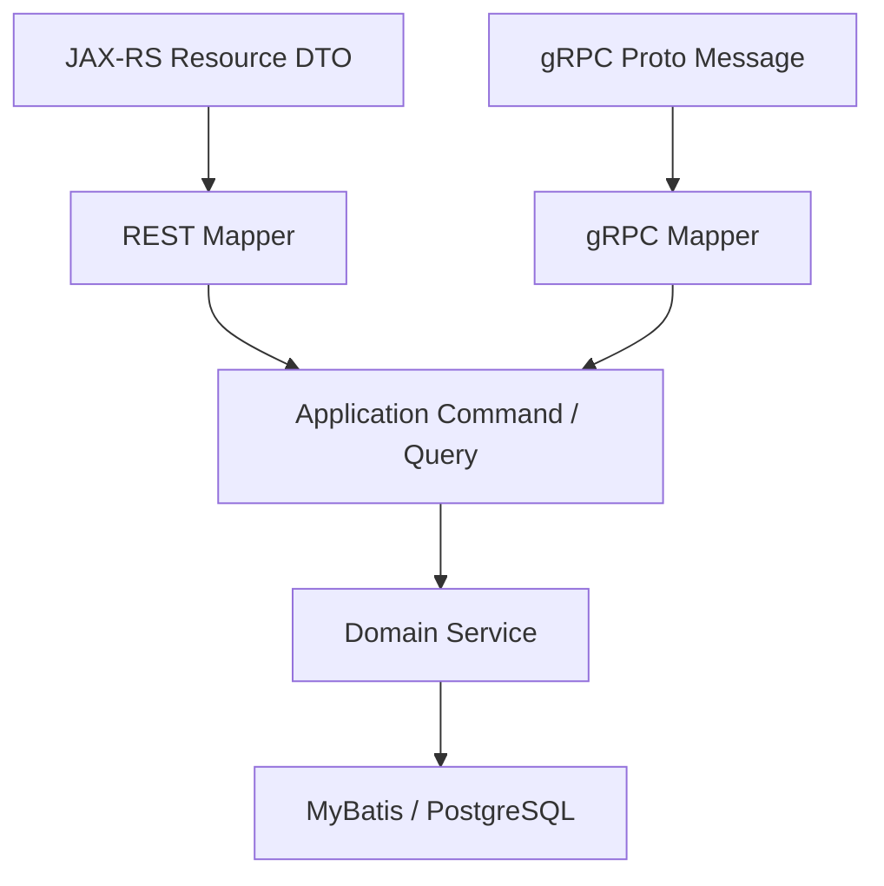

Prinsipnya:

| Layer | Model |
|---|---|
| REST boundary | JSON DTO / OpenAPI schema |
| gRPC boundary | Proto message |
| Application layer | Command/query object internal |
| Domain layer | Domain model/invariant |
| Persistence layer | MyBatis mapper/result map |

Jangan langsung:

```text
REST DTO = Proto Message = DB Row = Domain Model
```

Itu cepat di awal, tapi mahal saat refactor.

---

## 21. Anti-Pattern `.proto` Design

| Anti-Pattern | Contoh | Dampak |
|---|---|---|
| **God Service** | `EnterpriseService` punya 100 RPC | Ownership kabur, observability sulit |
| **DB-Centric Contract** | `CaseTableRow`, `status_cd`, `fk_user_id` | Storage bocor ke client |
| **Generic Payload** | `string json_payload = 1` | Kehilangan typed contract |
| **Action Ambiguity** | `Process`, `Handle`, `Execute` | Client tidak paham efek bisnis |
| **No Deadline Semantics** | Method long-running tapi unary biasa tanpa status/progress | Timeout dan retry membingungkan |
| **No Idempotency for Commands** | `SubmitDecision` tanpa key | Duplicate mutation |
| **Enum Default Salah** | `OPEN = 0` | Default dianggap status valid |
| **Reuse Field Number** | Field lama `3` dipakai ulang untuk makna baru | Data corrupt secara semantik |
| **Nested Everything** | Semua message/enum nested | Sulit reuse dan evolve |
| **Leaking SQL Filter** | `where_clause`, `sort_sql` | Security risk dan coupling database |

---

## 22. Contract Review Checklist

Gunakan checklist ini saat review PR `.proto`:

| Area | Pertanyaan |
|---|---|
| Service Boundary | Apakah service mengikuti business capability? |
| Method Semantics | Apakah nama RPC menjelaskan efek bisnis? |
| Request/Response | Apakah selalu memakai explicit request/response message? |
| Compatibility | Apakah ada field number yang dihapus tanpa `reserved`? |
| Field Type | Apakah tipe field stabil dan lintas bahasa? |
| Optionality | Apakah scalar field yang butuh presence memakai `optional`? |
| Enum | Apakah enum punya `UNSPECIFIED = 0`? |
| Pagination | Apakah list/search punya limit dan token? |
| Command Safety | Apakah command mutasi penting punya idempotency strategy? |
| Error Semantics | Apakah error domain sudah bisa dipetakan ke gRPC status? |
| Metadata | Apakah correlation/auth/tenant context tidak dicampur asal ke payload? |
| Java Generation | Apakah `java_package` dan `java_multiple_files` jelas? |
| Documentation | Apakah service/method/field penting diberi komentar? |
| Governance | Apakah lint dan breaking-change detection tersedia di CI? |

Untuk governance, Buf menyediakan linting dan breaking-change detection untuk skema Protobuf; `buf breaking` membandingkan skema saat ini dengan versi sebelumnya dan melaporkan perubahan yang dapat merusak client/server atau generated code. ([Buf](https://buf.build/docs/breaking/?utm_source=chatgpt.com))

---

## 23. Template `.proto` untuk Microservice

```proto
syntax = "proto3";

package <domain>.<capability>.v1;

option java_multiple_files = true;
option java_package = "com.company.<domain>.<capability>.v1";
option java_outer_classname = "<Capability>Proto";

import "google/protobuf/timestamp.proto";

// <Capability> read operations.
// This service must not mutate state.
service <Capability>QueryService {
  rpc Get<Resource>(Get<Resource>Request) returns (Get<Resource>Response);
  rpc Search<Resources>(Search<Resources>Request) returns (Search<Resources>Response);
}

// <Capability> write operations.
// Mutating RPCs should define idempotency semantics where retry is possible.
service <Capability>CommandService {
  rpc Submit<Action>(Submit<Action>Request) returns (Submit<Action>Response);
}

message Get<Resource>Request {
  string <resource>_id = 1;
}

message Get<Resource>Response {
  <Resource> resource = 1;
}

message Search<Resources>Request {
  int32 page_size = 1;
  string page_token = 2;
}

message Search<Resources>Response {
  repeated <Resource> resources = 1;
  string next_page_token = 2;
}

message Submit<Action>Request {
  string <resource>_id = 1;
  string idempotency_key = 2;
}

message Submit<Action>Response {
  string operation_id = 1;
  google.protobuf.Timestamp accepted_at = 2;
}

message <Resource> {
  string id = 1;
}

enum <Resource>Status {
  <RESOURCE>_STATUS_UNSPECIFIED = 0;
}
```

---

## 24. Ringkasan Praktis

```text
Desain .proto yang baik:
  - berbasis business capability
  - request/response eksplisit
  - field number stabil
  - enum aman dengan UNSPECIFIED = 0
  - optional dipakai saat presence penting
  - command penting punya idempotency
  - package/version jelas
  - tidak membocorkan DB/entity/internal workflow
  - siap untuk lint dan breaking-change detection
```

Sebagai senior engineer, fokus review Anda bukan hanya “apakah proto compile”, tetapi:

```text
Apakah kontrak ini masih aman saat:
  - client lama bicara dengan server baru?
  - server lama menerima client baru?
  - service dideploy rolling di Kubernetes?
  - request timeout lalu client retry?
  - field perlu dihapus 6 bulan lagi?
  - domain model/database berubah?
```

---

# Seri 2 selesai

Materi berikutnya:

**Seri 3/14 - Protobuf Schema Evolution: field number, reserved, optional, oneof, enum compatibility, breaking vs non-breaking change.**

---

**Sources:**

- [Generated-code reference | Java](https://grpc.io/docs/languages/java/generated-code/?utm_source=chatgpt.com)
- [Proto Best Practices](https://protobuf.dev/best-practices/dos-donts/?utm_source=chatgpt.com)
- [Style guide - Buf Docs](https://buf.build/docs/best-practices/style-guide/?utm_source=chatgpt.com)

## Response:
7/13/2026, 5:01:58 PM

Saya lanjut ke Seri 3: fokus pada evolusi schema Protobuf—mana perubahan yang aman, mana yang breaking, dan bagaimana menjaga kontrak tetap kompatibel saat client/server deploy tidak serempak.

# Seri 3/14 - Protobuf Schema Evolution: Field Number, Reserved, Optional, Oneof, Enum Compatibility, Breaking vs Non-Breaking Change

## 1. Introduction

Di gRPC contract-first, tantangan production bukan hanya membuat `.proto` yang compile, tetapi membuat kontrak yang **bisa berubah tanpa merusak client/server lama**. Dalam microservice environment, terutama di Kubernetes atau multi-environment on-prem/cloud, client dan server hampir tidak pernah berubah secara serempak. Karena itu, schema evolution harus dianggap sebagai bagian dari reliability engineering.

Protobuf sendiri dirancang sebagai format extensible untuk structured data lintas bahasa/platform, tetapi extensible tidak berarti bebas mengubah field sembarangan. Praktik resmi Protobuf menekankan agar **tag number tidak pernah dipakai ulang**, karena reuse tag number dapat merusak deserialization, termasuk untuk data lama di log, storage, queue, atau service lama yang masih berjalan. ([Protocol Buffers](https://protobuf.dev/best-practices/dos-donts/?utm_source=chatgpt.com))

---

## 2. Mental Model Schema Evolution

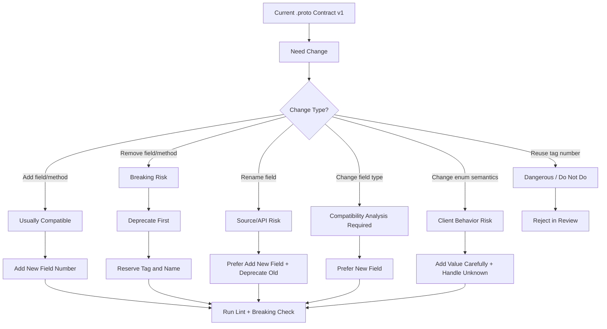

Cara berpikirnya:

```text id="ybajrf"
Schema evolution is not about changing files.
It is about preserving meaning across independently deployed systems.
```

---

## 3. Prinsip Utama Schema Evolution

| Prinsip | Penjelasan | Dampak Praktis |
|---|---|---|
| **Field number adalah identitas wire-level** | Nama field penting untuk generated code, tetapi number penting untuk encoding binary. | Jangan reuse number walaupun field sudah dihapus. |
| **Tambah lebih aman daripada ubah** | Menambah field baru dengan number baru biasanya lebih aman daripada mengubah field lama. | Gunakan additive change sebagai default. |
| **Deprecate sebelum remove** | Field yang dipakai client lama tidak boleh langsung dihapus dari kontrak aktif. | Tambahkan komentar/option deprecated, migrasikan client, baru reserve. |
| **Reserve field yang dihapus** | Setelah field dihapus, tag number dan/atau nama lama harus di-reserve. | Mencegah developer lain memakai ulang field lama. |
| **Semantik lebih penting daripada compile** | Perubahan bisa compile tapi tetap breaking secara bisnis. | Review meaning, bukan hanya syntax. |
| **Client/server deploy tidak serempak** | Server baru bisa menerima request client lama, dan client baru bisa memanggil server lama. | Compatibility harus diuji dua arah. |
| **Generated Java API juga bagian dari kontrak** | Rename/remove field bisa merusak source compatibility client Java. | Breaking tidak hanya wire-level, tapi juga code-level. |
| **Automate review** | Gunakan lint/breaking check di CI. | Tools seperti Buf dapat membandingkan schema saat ini dengan versi sebelumnya untuk mendeteksi perubahan breaking. ([Buf](https://buf.build/docs/breaking/?utm_source=chatgpt.com)) |

---

## 4. Field Number: Aturan Paling Penting

Contoh field number:

```proto id="8ilvun"
message CaseSummary {
  string case_id = 1;
  string case_number = 2;
  CaseStatus status = 3;
}
```

Di Protobuf, angka `1`, `2`, dan `3` bukan dekorasi. Itu adalah bagian dari identitas field pada wire format. Karena itu, aturan paling penting:

```text id="ydcvzq"
Never reuse field numbers.
```

Praktik resmi Protobuf secara eksplisit menyatakan agar tag number tidak dipakai ulang, bahkan jika kita mengira field lama tidak dipakai lagi, karena serialized data lama atau server lama masih bisa ada. ([Protocol Buffers](https://protobuf.dev/best-practices/dos-donts/?utm_source=chatgpt.com))

---

## 5. Contoh Kesalahan Fatal: Reuse Field Number

### Versi lama

```proto id="3zkc2k"
message CaseSummary {
  string case_id = 1;
  string case_number = 2;
  string legacy_status = 3;
}
```

### Versi baru yang salah

```proto id="qrxkdz"
message CaseSummary {
  string case_id = 1;
  string case_number = 2;
  string assigned_user_id = 3; // SALAH: reuse number lama
}
```

Masalahnya: data lama yang field `3`-nya berarti `legacy_status` bisa dibaca sebagai `assigned_user_id` oleh kode baru. Ini bukan sekadar compile error; ini bisa menjadi **semantic data corruption**.

Versi yang benar:

```proto id="qjpnop"
message CaseSummary {
  string case_id = 1;
  string case_number = 2;

  reserved 3;
  reserved "legacy_status";

  string assigned_user_id = 4;
}
```

---

## 6. Reserved Field

Saat field dihapus, gunakan `reserved`.

```proto id="kfbju5"
message CaseSummary {
  string case_id = 1;
  string case_number = 2;

  reserved 3;
  reserved "legacy_status";

  CaseStatus status = 4;
}
```

Gunanya:

| Reserved | Tujuan |
|---|---|
| `reserved 3;` | Mencegah tag number lama dipakai ulang |
| `reserved "legacy_status";` | Mencegah nama field lama dipakai ulang |
| `reserved 5, 7, 9 to 11;` | Reserve beberapa number sekaligus |
| `reserved "foo", "bar";` | Reserve beberapa nama sekaligus |

Protobuf best practices juga menyarankan penggunaan reserved untuk field atau enum value yang dihapus, terutama agar number lama tidak digunakan kembali. ([Protocol Buffers](https://protobuf.dev/best-practices/dos-donts/?utm_source=chatgpt.com))

---

## 7. Deprecated vs Reserved

`deprecated` dan `reserved` berbeda.

| Status Field | Digunakan Saat | Field Masih Ada di `.proto`? | Client Lama Masih Compile? |
|---|---|---:|---:|
| **Active** | Field masih valid | Ya | Ya |
| **Deprecated** | Field akan ditinggalkan, tapi masih didukung | Ya | Ya, biasanya dengan warning |
| **Reserved** | Field sudah dihapus dan tidak boleh dipakai ulang | Tidak | Tidak jika client masih memakai field itu |

Contoh deprecated:

```proto id="5ggwog"
message CaseSummary {
  string case_id = 1;

  string legacy_status = 2 [deprecated = true];

  CaseStatus status = 3;
}
```

Contoh setelah benar-benar dihapus:

```proto id="ezthxi"
message CaseSummary {
  string case_id = 1;

  reserved 2;
  reserved "legacy_status";

  CaseStatus status = 3;
}
```

Praktik production yang aman:

```text id="c65cen"
Active -> Deprecated -> Client migration -> Reserved
```

Jangan langsung:

```text id="oq306q"
Active -> Deleted
```

---

## 8. Additive Change: Perubahan yang Biasanya Aman

Perubahan berikut biasanya lebih aman secara backward/forward compatibility:

| Perubahan | Contoh | Catatan |
|---|---|---|
| Tambah field baru | `string assignee_id = 4;` | Client lama mengabaikan field baru. |
| Tambah RPC method baru | `rpc SearchCases(...)` | Client lama tidak terpengaruh. |
| Tambah message baru | `message CaseAuditEntry` | Aman jika tidak mengganti field lama. |
| Tambah enum value baru | `CASE_STATUS_ESCALATED = 4;` | Bisa bermasalah jika client lama tidak siap unknown/unhandled value. |
| Tambah optional scalar baru | `optional string region = 5;` | Aman, tapi tetap butuh validasi default behavior. |
| Tambah repeated field baru | `repeated string tags = 6;` | Aman, tapi hati-hati payload size. |

Namun “biasanya aman” bukan berarti selalu aman. Tambah field baru bisa breaking secara semantik jika server tiba-tiba mewajibkan field itu dari client lama.

Contoh salah:

```proto id="oxgjlp"
message SubmitDecisionRequest {
  string case_id = 1;
  string decision_code = 2;

  // Field baru
  string approval_reason = 3;
}
```

Kalau server baru mewajibkan `approval_reason`, maka client lama yang tidak mengirim field itu akan gagal. Secara schema terlihat additive, tetapi secara behavior breaking.

---

## 9. Breaking Change: Perubahan yang Harus Dihindari

| Perubahan | Kenapa Breaking |
|---|---|
| Menghapus field yang masih dipakai | Client generated code bisa gagal compile atau behavior rusak |
| Reuse field number | Data bisa salah dibaca |
| Mengubah tipe field lama | Wire compatibility dan semantic compatibility bisa rusak |
| Mengubah makna field | Client lama masih compile, tapi hasil interpretasi salah |
| Rename field | Bisa wire-compatible, tapi source-code client bisa breaking |
| Menghapus RPC method | Client yang memanggil method itu rusak |
| Mengubah request/response type RPC | Generated stub berubah |
| Menghapus enum value | Client lama atau data lama bisa tidak ter-handle |
| Mengubah package/java_package | Generated class path berubah |
| Mengubah service name | Generated service/stub name berubah |
| Mengubah default behavior server | Client lama bisa gagal walau schema tidak berubah |

Buf breaking change detection dapat membandingkan schema saat ini dengan versi sebelumnya dan melaporkan perubahan yang dapat merusak client, server, atau generated code. Ini penting karena sebagian breaking change terlihat jelas di `.proto`, tetapi sebagian baru terasa saat generated code dipakai. ([Buf](https://buf.build/docs/breaking/?utm_source=chatgpt.com))

---

## 10. Compatibility Matrix

| Perubahan | Wire Compatibility | Source Compatibility Java | Semantic Compatibility | Rekomendasi |
|---|---:|---:|---:|---|
| Tambah field baru | Biasanya aman | Aman | Tergantung server behavior | Aman jika field optional secara behavior |
| Hapus field | Bisa bahaya | Breaking | Breaking jika masih dipakai | Deprecate dulu, lalu reserve |
| Rename field | Wire bisa aman jika number sama | Breaking untuk generated accessor | Bisa membingungkan | Tambah field baru, deprecate lama |
| Ubah field number | Breaking | Breaking | Breaking | Jangan lakukan |
| Reuse field number | Sangat bahaya | Bisa compile | Sangat bahaya | Jangan lakukan |
| Ubah `string` ke `int32` | Bahaya | Breaking | Breaking | Tambah field baru |
| Tambah enum value | Wire bisa aman | Biasanya compile | Client lama bisa tidak handle | Tambahkan fallback handling |
| Hapus enum value | Bahaya | Breaking | Breaking | Deprecate/reserve |
| Tambah RPC | Aman | Aman | Aman | Biasanya OK |
| Hapus RPC | Breaking | Breaking | Breaking | Deprecate service/method dulu |
| Ubah package | Breaking | Breaking | Breaking | Buat v2 package |

---

## 11. Optional dan Field Presence

Di proto3, scalar field seperti `string`, `int32`, dan `bool` memiliki default value. Tanpa explicit presence, sulit membedakan apakah field tidak dikirim atau dikirim dengan nilai default. Dokumentasi Protobuf field presence menjelaskan perbedaan implicit presence dan explicit presence, serta merekomendasikan penggunaan label `optional` untuk proto3 basic types agar presence lebih eksplisit. ([Protocol Buffers](https://protobuf.dev/programming-guides/field_presence/?utm_source=chatgpt.com))

Contoh:

```proto id="37lit3"
message SearchCasesRequest {
  optional string status = 1;
  optional bool include_closed = 2;
  optional int32 page_size = 3;
}
```

Perbedaan praktis:

| Field | Tanpa `optional` | Dengan `optional` |
|---|---|---|
| `string status` | Empty string bisa berarti absent atau sengaja empty | Bisa cek presence |
| `bool include_closed` | Default `false`, tidak tahu apakah client mengirim | Bisa bedakan absent vs explicit false |
| `int32 page_size` | Default `0`, ambigu | Bisa validasi apakah dikirim |

Gunakan `optional` untuk:

| Use Case | Alasan |
|---|---|
| Filter search | Absent dan empty sering beda makna |
| Patch/update sebagian | Perlu tahu field mana yang ingin diubah |
| Flag bisnis | `false` bisa punya makna eksplisit |
| Numeric setting | `0` bisa valid atau bisa berarti tidak dikirim |
| Migration field | Membantu transisi schema secara aman |

---

## 12. Optional: Contoh Bug Semantik

Tanpa optional:

```proto id="44wp9b"
message SearchCasesRequest {
  string assignee_id = 1;
}
```

Server sulit membedakan:

| Payload | Interpretasi Mungkin |
|---|---|
| `assignee_id` tidak dikirim | Jangan filter by assignee |
| `assignee_id = ""` | Filter unassigned? Salah input? Jangan filter? |

Lebih aman:

```proto id="jj8f1f"
message SearchCasesRequest {
  optional string assignee_id = 1;
}
```

Lalu server bisa menerapkan aturan:

```text id="a3taw5"
if assignee_id is absent:
    do not filter by assignee
else if assignee_id is empty:
    reject INVALID_ARGUMENT
else:
    filter by assignee_id
```

---

## 13. Enum Evolution

Contoh enum awal:

```proto id="6uz33m"
enum CaseStatus {
  CASE_STATUS_UNSPECIFIED = 0;
  CASE_STATUS_OPEN = 1;
  CASE_STATUS_IN_REVIEW = 2;
  CASE_STATUS_CLOSED = 3;
}
```

Tambah value baru:

```proto id="2rrb4o"
enum CaseStatus {
  CASE_STATUS_UNSPECIFIED = 0;
  CASE_STATUS_OPEN = 1;
  CASE_STATUS_IN_REVIEW = 2;
  CASE_STATUS_CLOSED = 3;
  CASE_STATUS_ESCALATED = 4;
}
```

Secara evolusi schema, menambah enum value sering dianggap additive. Namun secara aplikasi, client lama mungkin punya switch/case yang tidak siap menerima value baru.

Contoh risiko di Java:

```java id="zq9wx6"
switch (caseStatus) {
    case CASE_STATUS_OPEN -> handleOpen();
    case CASE_STATUS_IN_REVIEW -> handleReview();
    case CASE_STATUS_CLOSED -> handleClosed();
    default -> throw new IllegalStateException("Unsupported status");
}
```

Jika server baru mengirim `CASE_STATUS_ESCALATED`, client lama bisa gagal.

Praktik aman:

```java id="fcfvd1"
switch (caseStatus) {
    case CASE_STATUS_OPEN -> handleOpen();
    case CASE_STATUS_IN_REVIEW -> handleReview();
    case CASE_STATUS_CLOSED -> handleClosed();
    case CASE_STATUS_UNSPECIFIED, UNRECOGNIZED -> handleUnknownStatus();
    default -> handleUnknownStatus();
}
```

Checklist enum evolution:

| Rule | Praktik |
|---|---|
| Value `0` harus aman | Gunakan `UNSPECIFIED = 0` |
| Jangan ubah number enum lama | Sama seperti field number |
| Jangan reuse enum number | Reserve jika dihapus |
| Client harus handle unknown/fallback | Terutama untuk status workflow |
| Jangan pakai enum untuk data yang sangat volatile | Gunakan reference data/code jika value sering berubah |

---

## 14. Reserved Enum Value

Jika enum value dihapus:

```proto id="bsfpyo"
enum CaseStatus {
  CASE_STATUS_UNSPECIFIED = 0;
  CASE_STATUS_OPEN = 1;
  CASE_STATUS_IN_REVIEW = 2;
  CASE_STATUS_CLOSED = 3;

  reserved 4;
  reserved "CASE_STATUS_LEGACY_REVIEW";
}
```

Protobuf best practices menyarankan agar deleted enum value number di-reserve supaya tidak dipakai ulang. ([Protocol Buffers](https://protobuf.dev/best-practices/dos-donts/?utm_source=chatgpt.com))

---

## 15. `oneof` Evolution

`oneof` berguna, tetapi evolusinya harus hati-hati.

Contoh:

```proto id="ra8xmo"
message CaseIdentifier {
  oneof identifier {
    string case_id = 1;
    string case_number = 2;
  }
}
```

Tambah opsi baru biasanya bisa:

```proto id="s2mf6v"
message CaseIdentifier {
  oneof identifier {
    string case_id = 1;
    string case_number = 2;
    string external_reference = 3;
  }
}
```

Namun ada risiko: client lama mungkin tidak mengenali field baru dan tidak tahu identifier mana yang dikirim. Untuk operasi kritikal, pastikan client/server punya fallback behavior atau version negotiation.

Hindari memindahkan field lama ke dalam `oneof` jika field itu sebelumnya berdiri sendiri.

Contoh rawan:

```proto id="tal48b"
// Versi lama
message SearchCasesRequest {
  string case_id = 1;
  string case_number = 2;
}

// Versi baru: rawan secara behavior
message SearchCasesRequest {
  oneof identifier {
    string case_id = 1;
    string case_number = 2;
  }
}
```

Secara number masih sama, tetapi semantik berubah: dulu dua field bisa muncul bersamaan, sekarang hanya satu. Itu bisa breaking secara behavior.

---

## 16. Mengubah Tipe Field

Jangan ubah tipe field lama secara langsung.

Buruk:

```proto id="cv701v"
// v1
message CaseSummary {
  string priority = 1;
}

// v2 - buruk
message CaseSummary {
  int32 priority = 1;
}
```

Lebih aman:

```proto id="zge6qb"
message CaseSummary {
  string legacy_priority = 1 [deprecated = true];
  int32 priority_level = 2;
}
```

Lalu setelah client migrasi:

```proto id="mk2cfw"
message CaseSummary {
  reserved 1;
  reserved "legacy_priority";

  int32 priority_level = 2;
}
```

Walaupun beberapa perubahan tipe mungkin terlihat kompatibel secara wire-level pada kasus tertentu, secara production sebaiknya anggap perubahan tipe field lama sebagai red flag. Lebih aman menambah field baru dengan number baru.

---

## 17. Rename Field: Wire-Level vs Source-Level

Rename field dengan field number sama bisa tampak aman secara wire-level, tetapi breaking untuk generated Java source.

Contoh:

```proto id="qv6bgd"
// v1
message CaseSummary {
  string case_number = 1;
}
```

```proto id="mxdsso"
// v2
message CaseSummary {
  string reference_number = 1;
}
```

Wire format masih memakai field `1`, tetapi Java accessor berubah dari:

```java id="p8v6gx"
getCaseNumber()
```

menjadi:

```java id="g2t33g"
getReferenceNumber()
```

Client Java yang memanggil `getCaseNumber()` akan gagal compile setelah update generated code.

Praktik aman:

```proto id="46qs61"
message CaseSummary {
  string case_number = 1 [deprecated = true];
  string reference_number = 2;
}
```

---

## 18. Mengubah Required Behavior Tanpa Mengubah Schema

Ini salah satu breaking change yang sering tidak terdeteksi oleh tool.

### Schema lama

```proto id="f87iuf"
message SubmitDecisionRequest {
  string case_id = 1;
  string decision_code = 2;
  optional string reason = 3;
}
```

### Behavior lama

```text id="9b5x75"
reason boleh kosong
```

### Behavior baru

```text id="p9ytf7"
reason wajib untuk semua decision
```

Secara `.proto`, tidak ada perubahan. Tapi client lama yang tidak mengirim `reason` sekarang gagal. Ini adalah **behavioral breaking change**.

Cara aman:

| Langkah | Praktik |
|---|---|
| 1 | Tambahkan validasi hanya untuk decision tertentu dulu jika domain memungkinkan |
| 2 | Tambahkan warning/metric untuk client yang belum mengirim |
| 3 | Komunikasikan deprecation policy |
| 4 | Setelah semua client migrasi, enforcement penuh |
| 5 | Dokumentasikan di `.proto` comment |

---

## 19. Evolution Pattern untuk Field Baru yang Akan Menjadi Mandatory

Dalam Protobuf contract-first, jangan berpikir “field mandatory” hanya dari sisi schema. Pikirkan rollout.

Contoh ingin menambahkan `source_system`.

```proto id="1gssjk"
message SubmitDecisionRequest {
  string case_id = 1;
  string decision_code = 2;
  optional string reason = 3;

  // New field. During migration, absent means UNKNOWN_SOURCE.
  optional string source_system = 4;
}
```

Rollout aman:

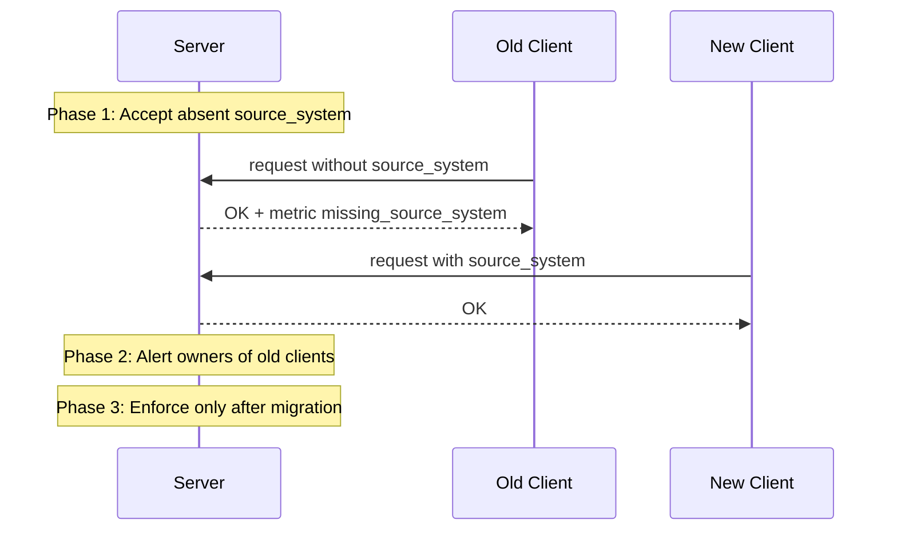

Server behavior:

| Phase | Server Rule |
|---|---|
| Phase 1 | Field optional, missing accepted, metric emitted |
| Phase 2 | Client owners notified |
| Phase 3 | Missing field rejected for migrated clients |
| Phase 4 | Eventually treat as required by policy, not by unsafe schema change |

---

## 20. Compatibility in Rolling Deployment

Dalam Kubernetes rolling deployment, kemungkinan state seperti ini:

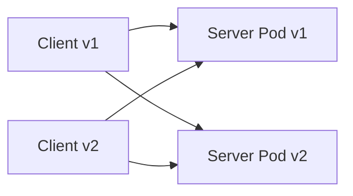

Artinya kontrak harus aman untuk kombinasi:

| Client | Server | Harus Dipikirkan |
|---|---|---|
| v1 | v1 | Baseline |
| v1 | v2 | Server baru masih menerima request lama |
| v2 | v1 | Client baru tidak mengirim field/method yang server lama tidak tahu tanpa fallback |
| v2 | v2 | Target akhir |

Perubahan yang hanya diuji v2-to-v2 belum cukup.

---

## 21. Client v2 Memanggil Server v1: Risiko yang Sering Lupa

Misalnya client v2 memakai RPC baru:

```proto id="8y7l6a"
service CaseQueryService {
  rpc GetCase(GetCaseRequest) returns (GetCaseResponse);
  rpc GetCaseTimeline(GetCaseTimelineRequest) returns (GetCaseTimelineResponse);
}
```

Jika client v2 dideploy lebih dulu dan server masih v1, method `GetCaseTimeline` belum tersedia. Hasilnya bisa berupa `UNIMPLEMENTED`.

Strategi aman:

| Strategi | Penjelasan |
|---|---|
| Deploy server dulu | Tambah method di server sebelum client memakai |
| Feature flag client | Client hanya memanggil method baru saat server siap |
| Capability check | Client mengetahui service capability/version |
| Graceful fallback | Client fallback ke method lama jika memungkinkan |
| Staged rollout | Rollout bertahap, pantau error `UNIMPLEMENTED` |

---

## 22. Server v2 Menerima Client v1

Misalnya server v2 menambahkan field baru:

```proto id="27gk8v"
message SubmitDecisionRequest {
  string case_id = 1;
  string decision_code = 2;
  optional string source_system = 3;
}
```

Client v1 tidak mengirim `source_system`. Server v2 tidak boleh langsung reject semua request lama, kecuali ada migration plan yang jelas.

Praktik aman:

```text id="vmzxn9"
New server must tolerate old client payloads during migration windows.
```

---

## 23. Versioning: Kapan Pakai v2?

Tidak semua perubahan butuh `v2`.

| Perubahan | Butuh v2? | Catatan |
|---|---:|---|
| Tambah optional field | Tidak | Biasanya cukup v1 |
| Tambah RPC method | Tidak | Asal tidak mengubah behavior lama |
| Tambah enum value | Tidak selalu | Pastikan client fallback |
| Ubah nama field untuk clarity | Tidak langsung | Add new + deprecate old |
| Ubah meaning field | Ya, sering | Karena client lama bisa salah interpretasi |
| Ubah request/response fundamental | Ya | Buat service/package v2 |
| Hapus banyak field lama | Bisa | Jika kontrak sudah terlalu berat |
| Mengubah workflow semantics besar | Bisa | Terutama untuk domain lifecycle |

Contoh package v2:

```proto id="6i0fzu"
syntax = "proto3";

package casecommunication.v2;

option java_package = "com.company.casecommunication.v2";
```

Versioning strategy:

| Strategy | Kapan Dipakai |
|---|---|
| Same package v1 + additive changes | Evolusi normal |
| New service dalam v1 | Capability baru tapi domain sama |
| New package v2 | Breaking semantic/API change |
| Parallel v1/v2 support | Migrasi client bertahap |
| Deprecate v1 | Setelah semua client pindah |

---

## 24. Proto Package vs Java Package Evolution

Contoh:

```proto id="s797re"
package casecommunication.v1;

option java_package = "com.company.casecommunication.v1";
```

Jangan ubah `java_package` sembarangan. Perubahan `java_package` akan mengubah lokasi class generated Java, sehingga import client/server bisa rusak. Dokumentasi gRPC Java menjelaskan bahwa package generated Java mengikuti `java_package` bila option itu didefinisikan. ([Protocol Buffers](https://protobuf.dev/programming-guides/proto3/?utm_source=chatgpt.com))

Kalau perlu reorganisasi besar, lebih aman:

```proto id="fhqw3p"
package casecommunication.v2;

option java_package = "com.company.casecommunication.v2";
```

Lalu support v1 dan v2 selama migration window.

---

## 25. Safe Change Pattern

### Pattern 1 - Add New Field

```proto id="9zagnn"
message CaseSummary {
  string case_id = 1;
  string case_number = 2;
  CaseStatus status = 3;

  optional string assignee_id = 4;
}
```

Aman jika:

| Syarat | Keterangan |
|---|---|
| Field baru tidak wajib untuk client lama | Server tetap menerima payload lama |
| Default behavior jelas | Missing field punya interpretasi |
| Consumer lama aman | Consumer lama mengabaikan field baru |
| Consumer baru punya fallback | Jika server lama belum mengirim field |

---

### Pattern 2 - Replace Field

Jangan ubah langsung.

```proto id="b5c67s"
// Step 1: tambah field baru, deprecate lama
message CaseSummary {
  string case_id = 1;
  string legacy_status = 2 [deprecated = true];
  CaseStatus status = 3;
}
```

Setelah client migrasi:

```proto id="i8ax6b"
// Step 2: reserve field lama
message CaseSummary {
  string case_id = 1;

  reserved 2;
  reserved "legacy_status";

  CaseStatus status = 3;
}
```

---

### Pattern 3 - Split Message

Versi awal:

```proto id="nrd4lq"
message CaseDetail {
  string case_id = 1;
  string case_number = 2;
  string audit_summary = 3;
  repeated string document_ids = 4;
}
```

Versi evolusi:

```proto id="5oe4nw"
message CaseDetail {
  string case_id = 1;
  string case_number = 2;

  CaseAuditSummary audit_summary = 3;
  repeated DocumentReference documents = 4;
}

message CaseAuditSummary {
  string last_actor_id = 1;
  string last_action = 2;
}

message DocumentReference {
  string document_id = 1;
  string document_type = 2;
}
```

Hati-hati: mengubah tipe field lama dari `string` ke message pada number yang sama tidak aman. Jika field lama sudah live, pakai field number baru.

Versi aman:

```proto id="4l9eqy"
message CaseDetail {
  string case_id = 1;
  string case_number = 2;

  string legacy_audit_summary = 3 [deprecated = true];
  repeated string legacy_document_ids = 4 [deprecated = true];

  CaseAuditSummary audit_summary = 5;
  repeated DocumentReference documents = 6;
}
```

---

## 26. Evolution untuk Search dan Pagination

Search contract sering berubah karena kebutuhan filter bertambah.

Versi awal:

```proto id="awv28d"
message SearchCasesRequest {
  optional string status = 1;
  int32 page_size = 2;
  string page_token = 3;
}
```

Tambah filter baru:

```proto id="53xcft"
message SearchCasesRequest {
  optional string status = 1;
  int32 page_size = 2;
  string page_token = 3;

  optional string assignee_id = 4;
  optional string region_code = 5;
}
```

Aman jika server lama/client lama tetap bisa beroperasi.

Hindari perubahan seperti:

```proto id="gzybc0"
message SearchCasesRequest {
  string query_expression = 1; // mengganti semua filter lama
}
```

Itu mungkin terlihat fleksibel, tapi:

| Risiko | Penjelasan |
|---|---|
| Type safety hilang | Client bisa kirim query invalid |
| Security risk | Bisa mengarah ke query injection jika salah implementasi |
| Contract tidak eksplisit | Tidak jelas filter mana didukung |
| Governance sulit | Breaking change tersembunyi di string |

---

## 27. Evolution untuk Command

Command lebih sensitif daripada query karena bisa mengubah state.

Contoh command awal:

```proto id="rbje3r"
message AssignCaseRequest {
  string case_id = 1;
  string assignee_id = 2;
}
```

Tambahkan idempotency dan reason:

```proto id="t0m4sy"
message AssignCaseRequest {
  string case_id = 1;
  string assignee_id = 2;

  optional string reason = 3;
  optional string idempotency_key = 4;
}
```

Tapi untuk production, sebaiknya rancang idempotency sejak awal:

```proto id="r6i7xa"
message AssignCaseRequest {
  string case_id = 1;
  string assignee_id = 2;
  string idempotency_key = 3;
  optional string reason = 4;
}
```

Kenapa? Karena jika command sudah dipakai tanpa idempotency, menambahkan idempotency belakangan tidak otomatis membuat client lama aman terhadap retry.

---

## 28. Evolution untuk Error Handling

Jangan menambahkan field error di success response secara asal.

Kurang baik:

```proto id="b6azn9"
message SubmitDecisionResponse {
  bool success = 1;
  string error_code = 2;
  string error_message = 3;
}
```

Lebih baik: gunakan gRPC status untuk failure, dan response hanya untuk success result.

```proto id="c3n9o6"
message SubmitDecisionResponse {
  string decision_id = 1;
  CaseStatus resulting_status = 2;
}
```

Jika butuh rich error detail, desain error mapping secara eksplisit di layer error handling. Jangan jadikan semua response punya `success=false`, karena itu melemahkan semantik gRPC status.

---

## 29. Evolution untuk Audit dan Regulatory Context

Dalam sistem regulasi/case management, audit context sering berkembang. Jangan masukkan semua context ke message bisnis tanpa struktur.

Kurang baik:

```proto id="2glbm0"
message SubmitDecisionRequest {
  string case_id = 1;
  string decision_code = 2;
  string user_id = 3;
  string role = 4;
  string ip_address = 5;
  string correlation_id = 6;
}
```

Lebih baik pisahkan:

| Informasi | Tempat |
|---|---|
| `case_id` | Message field |
| `decision_code` | Message field |
| `reason` | Message field |
| `actor/user identity` | Metadata atau explicit business actor, tergantung domain |
| `correlation_id` | Metadata |
| `trace context` | Metadata |
| `tenant_id` | Metadata atau message jika bagian domain |
| `ip_address` | Metadata/audit context, bukan core command jika bukan domain input |

Kalau audit context memang harus tersimpan sebagai bagian legal decision, buat struktur jelas:

```proto id="8jav7e"
message SubmitDecisionRequest {
  string case_id = 1;
  string decision_code = 2;
  string reason = 3;
  string idempotency_key = 4;

  optional DecisionActor declared_actor = 5;
}

message DecisionActor {
  string actor_id = 1;
  string actor_role = 2;
}
```

---

## 30. Testing Schema Evolution

Minimal test matrix:

| Test | Tujuan |
|---|---|
| **Compile generated Java** | Pastikan `.proto` valid dan generated code compile |
| **Backward compatibility check** | Cek perubahan terhadap schema main/released |
| **Old client → new server** | Pastikan server baru menerima request lama |
| **New client → old server** | Pastikan client baru punya fallback |
| **Serialization roundtrip** | Cek message lama masih bisa dibaca |
| **Enum unknown handling** | Pastikan client tidak crash saat enum baru muncul |
| **Behavioral compatibility test** | Pastikan perubahan validasi tidak mematahkan client lama |
| **Contract fixture test** | Pakai sample payload lama sebagai regression fixture |

Buf CLI dapat digunakan untuk breaking-change detection dengan membandingkan schema saat ini terhadap input sebelumnya seperti module, repo GitHub, atau image Protobuf. ([Buf](https://buf.build/docs/breaking/?utm_source=chatgpt.com))

---

## 31. CI Governance Pattern

Contoh pipeline konseptual:

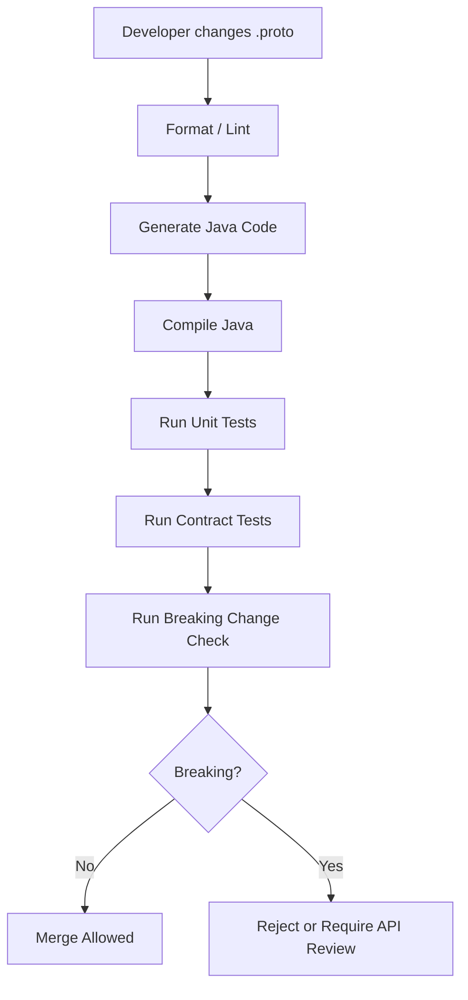

Praktik CI yang disarankan:

| Stage | Fail Jika |
|---|---|
| Format/lint | Naming/package tidak konsisten |
| Codegen | Generated Java gagal |
| Compile | Client/server implementation tidak sesuai |
| Test | Behavior rusak |
| Breaking check | Field/method/type dihapus atau berubah |
| API review | Ada semantic breaking change walau tool lolos |

Breaking-change detection penting, tetapi tidak cukup. Tools bisa menangkap banyak structural breaking changes, namun perubahan semantik seperti “field sekarang wajib” tetap harus direview manusia.

---

## 32. Review Checklist: Breaking vs Non-Breaking

| Pertanyaan | Ya/Tidak |
|---|---|
| Apakah ada field number yang berubah? |
| Apakah ada field number yang dipakai ulang? |
| Apakah ada field dihapus tanpa `reserved`? |
| Apakah ada enum value dihapus tanpa `reserved`? |
| Apakah ada tipe field lama berubah? |
| Apakah ada nama field/service/package berubah? |
| Apakah ada RPC method dihapus atau signature berubah? |
| Apakah server baru mewajibkan field yang client lama tidak kirim? |
| Apakah client baru memanggil RPC yang belum tersedia di server lama? |
| Apakah enum baru bisa diterima client lama? |
| Apakah retry/idempotency behavior berubah? |
| Apakah error code/status berubah? |
| Apakah perubahan perlu package `v2`? |
| Apakah migration plan tersedia? |

Kalau ada jawaban “ya” pada item sensitif seperti field number berubah, reuse number, tipe berubah, atau method dihapus, perubahan itu harus dianggap breaking sampai terbukti sebaliknya.

---

## 33. Practical Decision Table

| Mau Melakukan Ini | Lakukan Ini |
|---|---|
| Menambah informasi baru | Tambah field baru dengan number baru |
| Mengganti field lama | Tambah field baru, deprecate lama, migrasikan client, reserve lama |
| Menghapus field | Jangan langsung; deprecate dulu, lalu reserve |
| Mengubah tipe field | Jangan; buat field baru |
| Rename field | Hindari; buat field baru jika source compatibility penting |
| Menambah enum value | Tambah value baru, pastikan client handle unknown |
| Menghapus enum value | Deprecate/reserve, jangan reuse number |
| Menambah RPC | Biasanya aman, deploy server dulu |
| Menghapus RPC | Deprecate dulu, support selama migration window |
| Mengubah semantik besar | Pertimbangkan `v2` |
| Membuat field baru wajib | Rollout bertahap, jangan langsung reject client lama |
| Mengubah package/java_package | Anggap breaking, pakai v2 jika perlu |

---

## 34. Mini Case Study: Menambahkan Escalation Feature

### Kondisi awal

```proto id="lctuyl"
service CaseCommandService {
  rpc SubmitDecision(SubmitDecisionRequest) returns (SubmitDecisionResponse);
}

message SubmitDecisionRequest {
  string case_id = 1;
  string decision_code = 2;
  string reason = 3;
}

message SubmitDecisionResponse {
  string decision_id = 1;
}
```

### Requirement baru

Case bisa di-escalate ke supervisor, dengan reason, target team, dan idempotency.

### Desain buruk

```proto id="tua3w7"
message SubmitDecisionRequest {
  string case_id = 1;
  string decision_code = 2;
  string escalation_team = 3; // SALAH: mengganti reason
}
```

Masalah:

| Masalah | Dampak |
|---|---|
| Field `3` sebelumnya `reason` | Semantic corruption |
| Tidak ada idempotency | Retry bisa double escalation |
| SubmitDecision terlalu melebar | Escalation adalah command berbeda |

### Desain lebih baik

```proto id="6rgwwd"
service CaseCommandService {
  rpc SubmitDecision(SubmitDecisionRequest) returns (SubmitDecisionResponse);
  rpc EscalateCase(EscalateCaseRequest) returns (EscalateCaseResponse);
}

message SubmitDecisionRequest {
  string case_id = 1;
  string decision_code = 2;
  string reason = 3;
}

message SubmitDecisionResponse {
  string decision_id = 1;
}

message EscalateCaseRequest {
  string case_id = 1;
  string target_team_code = 2;
  string reason = 3;
  string idempotency_key = 4;
}

message EscalateCaseResponse {
  string escalation_id = 1;
  CaseStatus resulting_status = 2;
}
```

Kenapa lebih baik:

| Aspek | Alasan |
|---|---|
| Additive RPC | Tidak merusak `SubmitDecision` |
| Command jelas | Escalation punya semantik sendiri |
| Idempotency eksplisit | Aman terhadap retry |
| Field number baru | Tidak reuse |
| Client lama aman | Tetap bisa memakai `SubmitDecision` |

---

## 35. Red Flags Saat Review `.proto`

| Red Flag | Artinya |
|---|---|
| “Kita reuse saja number lama, field-nya sudah tidak dipakai” | Jangan. Ini risiko deserialization/data corruption. |
| “Rename saja field-nya, number tetap sama” | Bisa merusak Java source compatibility. |
| “Field baru ini wajib mulai sekarang” | Bisa mematahkan client lama. |
| “Kita hapus RPC lama karena sudah ada yang baru” | Perlu migration window. |
| “Enum value ini tidak mungkin muncul di client lama” | Asumsi berbahaya saat rolling deploy. |
| “Pakai string JSON saja biar fleksibel” | Menghilangkan manfaat contract-first. |
| “Breaking check sudah lolos, berarti aman” | Belum tentu; semantic breaking change bisa lolos. |

---

## 36. Ringkasan Praktis

```text id="yn1l3v"
Golden rules Protobuf schema evolution:

1. Jangan pernah reuse field number.
2. Field yang dihapus harus di-reserve.
3. Tambah field baru lebih aman daripada mengubah field lama.
4. Rename field bisa breaking untuk generated Java code.
5. Optional penting untuk membedakan absent vs default value.
6. Enum harus punya default UNSPECIFIED = 0.
7. Tambah enum value tetap perlu fallback handling di client.
8. Command mutasi perlu idempotency strategy.
9. Compatibility harus diuji untuk old-client/new-server dan new-client/old-server.
10. Breaking-change tool wajib, tapi human API review tetap perlu.
```

Sebagai senior engineer, cara review yang benar adalah:

```text id="ob5wz0"
Jangan hanya tanya:
  "Apakah .proto compile?"

Tanyakan:
  "Apakah kontrak ini tetap aman ketika service lama dan baru hidup bersamaan?"
  "Apakah field lama masih bisa dibaca dengan makna yang sama?"
  "Apakah client lama tetap bisa beroperasi?"
  "Apakah client baru punya fallback?"
  "Apakah perubahan ini wire-compatible, source-compatible, dan semantic-compatible?"
```

---

# Seri 3 selesai

Materi berikutnya:

**Seri 4/14 - Maven Code Generation: protobuf plugin, grpc-java plugin, generated sources, dependency alignment, CI build, dan common failure.**

---

**Sources:**

- [Proto Best Practices](https://protobuf.dev/best-practices/dos-donts/?utm_source=chatgpt.com)
- [Detecting breaking changes - Buf Docs - Buf.Build](https://buf.build/docs/breaking/?utm_source=chatgpt.com)

## Response:
7/13/2026, 5:04:37 PM

Saya lanjut ke Seri 4: fokus ke Maven code generation yang benar—bagaimana `.proto` menjadi Java message class, gRPC stub, server base, lalu masuk ke lifecycle build/CI tanpa generated source yang kacau.

# Seri 4/14 - Maven Code Generation: Protobuf Plugin, gRPC Java Plugin, Generated Sources, Dependency Alignment, CI Build, Common Failure

## 1. Introduction

Dalam pendekatan **contract-first gRPC**, Maven build harus bisa mengubah file `.proto` menjadi:

1. **Java Protobuf message classes**
2. **gRPC service base class**
3. **gRPC client stubs**
4. **Compiled Java classes yang bisa dipakai server/client**

Dengan kata lain, developer tidak menulis stub manual. Developer menulis dan mereview `.proto`, lalu Maven menjalankan `protoc` + plugin gRPC Java untuk menghasilkan kode. Dokumentasi gRPC Java menyatakan bahwa build system biasanya menangani pembuatan generated gRPC code, dan `.proto` umumnya ditempatkan di `src/main/proto` serta `src/test/proto`. ([gRPC](https://grpc.io/docs/languages/java/generated-code/))

---

## 2. Mental Model Maven Code Generation

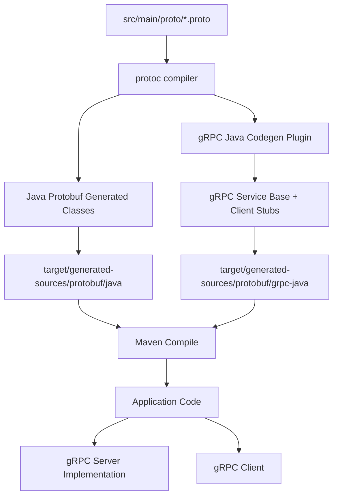

Pemisahan mentalnya:

| Komponen | Fungsi |
|---|---|
| `.proto` | Kontrak sumber utama |
| `protoc` | Compiler Protocol Buffers |
| `protoc-gen-grpc-java` | Plugin untuk menghasilkan kode gRPC Java |
| `protobuf-java` | Runtime untuk Protobuf message |
| `grpc-stub` | Runtime untuk client/server stub |
| `grpc-protobuf` | Integrasi gRPC dengan Protobuf |
| `grpc-netty-shaded` / transport lain | Transport runtime gRPC Java |
| `target/generated-sources/...` | Output generated source dari Maven |

gRPC Java README memberikan contoh penggunaan `protobuf-maven-plugin` dengan `protocArtifact`, `pluginId` `grpc-java`, dan `pluginArtifact` `io.grpc:protoc-gen-grpc-java`, serta menjalankan goal `compile` dan `compile-custom`. ([GitHub](https://github.com/grpc/grpc-java))

---

## 3. Struktur Project yang Direkomendasikan

```text id="04g3kd"
my-service/
├── pom.xml
├── src/
│   ├── main/
│   │   ├── java/
│   │   │   └── com/company/caseapp/...
│   │   ├── proto/
│   │   │   └── company/casecommunication/v1/
│   │   │       └── case_query_service.proto
│   │   └── resources/
│   └── test/
│       ├── java/
│       └── proto/
│           └── company/casecommunication/v1/
│               └── test_case_service.proto
└── target/
    └── generated-sources/
        └── protobuf/
            ├── java/
            └── grpc-java/
```

Praktik penting:

| Folder | Isi | Catatan |
|---|---|---|
| `src/main/proto` | Contract utama | Ini source of truth |
| `src/test/proto` | Proto khusus test | Untuk test fixture atau fake service |
| `target/generated-sources/protobuf/java` | Generated message class | Jangan diedit manual |
| `target/generated-sources/protobuf/grpc-java` | Generated stub/service base | Jangan diedit manual |
| `src/main/java` | Implementation code | Tempat service implementation, adapter, mapper |

---

## 4. Contoh `.proto`

```proto id="wpn0es"
syntax = "proto3";

package casecommunication.v1;

option java_multiple_files = true;
option java_package = "com.company.casecommunication.v1";
option java_outer_classname = "CaseCommunicationProto";

service CaseQueryService {
  rpc GetCase(GetCaseRequest) returns (GetCaseResponse);
}

message GetCaseRequest {
  string case_id = 1;
}

message GetCaseResponse {
  string case_id = 1;
  string case_number = 2;
  CaseStatus status = 3;
}

enum CaseStatus {
  CASE_STATUS_UNSPECIFIED = 0;
  CASE_STATUS_OPEN = 1;
  CASE_STATUS_IN_REVIEW = 2;
  CASE_STATUS_CLOSED = 3;
}
```

`java_package` menentukan package Java generated code. Jika `java_package` tidak ada, generated Java package mengikuti deklarasi `package` `.proto`; dokumentasi Protobuf menjelaskan bahwa `java_package` disediakan karena package `.proto` biasanya tidak memakai pola reverse-domain seperti package Java. ([Protocol Buffers](https://protobuf.dev/reference/java/java-generated/))

---

## 5. Generated Code yang Dihasilkan

Dari `.proto` di atas, Anda akan mendapat kira-kira:

```text id="f5emuk"
target/generated-sources/protobuf/java/
└── com/company/casecommunication/v1/
    ├── GetCaseRequest.java
    ├── GetCaseResponse.java
    ├── CaseStatus.java
    └── CaseCommunicationProto.java

target/generated-sources/protobuf/grpc-java/
└── com/company/casecommunication/v1/
    └── CaseQueryServiceGrpc.java
```

Jika `java_multiple_files = true`, compiler membuat file `.java` terpisah untuk setiap top-level message, enum, dan service; jika tidak, generated class akan lebih banyak nested di wrapper outer class. ([Protocol Buffers](https://protobuf.dev/reference/java/java-generated/))

---

## 6. Maven Configuration: Baseline Pattern

Contoh konfigurasi umum dengan `protobuf-maven-plugin`:

```xml id="1eekns"
<properties>
    <grpc.version>1.82.1</grpc.version>
    <protobuf.version>3.25.8</protobuf.version>
    <os.maven.plugin.version>1.7.1</os.maven.plugin.version>
    <protobuf.maven.plugin.version>0.6.1</protobuf.maven.plugin.version>
</properties>

<dependencies>
    <dependency>
        <groupId>io.grpc</groupId>
        <artifactId>grpc-netty-shaded</artifactId>
        <version>${grpc.version}</version>
    </dependency>

    <dependency>
        <groupId>io.grpc</groupId>
        <artifactId>grpc-protobuf</artifactId>
        <version>${grpc.version}</version>
    </dependency>

    <dependency>
        <groupId>io.grpc</groupId>
        <artifactId>grpc-stub</artifactId>
        <version>${grpc.version}</version>
    </dependency>

    <!-- Needed by generated gRPC Java code on newer JDKs if javax.annotation is absent -->
    <dependency>
        <groupId>javax.annotation</groupId>
        <artifactId>javax.annotation-api</artifactId>
        <version>1.3.2</version>
        <optional>true</optional>
    </dependency>
</dependencies>

<build>
    <extensions>
        <extension>
            <groupId>kr.motd.maven</groupId>
            <artifactId>os-maven-plugin</artifactId>
            <version>${os.maven.plugin.version}</version>
        </extension>
    </extensions>

    <plugins>
        <plugin>
            <groupId>org.xolstice.maven.plugins</groupId>
            <artifactId>protobuf-maven-plugin</artifactId>
            <version>${protobuf.maven.plugin.version}</version>
            <configuration>
                <protocArtifact>
                    com.google.protobuf:protoc:${protobuf.version}:exe:${os.detected.classifier}
                </protocArtifact>
                <pluginId>grpc-java</pluginId>
                <pluginArtifact>
                    io.grpc:protoc-gen-grpc-java:${grpc.version}:exe:${os.detected.classifier}
                </pluginArtifact>
            </configuration>
            <executions>
                <execution>
                    <goals>
                        <goal>compile</goal>
                        <goal>compile-custom</goal>
                    </goals>
                </execution>
            </executions>
        </plugin>
    </plugins>
</build>
```

Versi di atas mengikuti contoh terbaru yang terlihat di README `grpc-java` saat saya cek: `protobuf-maven-plugin` `0.6.1`, `protoc` `3.25.8`, dan `protoc-gen-grpc-java` `1.82.1`. Tetap pin versi di parent POM/BOM perusahaan, jangan mengambil versi transitive secara acak. ([GitHub](https://github.com/grpc/grpc-java))

---

## 7. Dependency Decomposition

| Dependency / Plugin | Fungsi | Scope Praktis |
|---|---|---|
| `protoc` | Compiler `.proto` ke Java Protobuf source | Build-time |
| `protoc-gen-grpc-java` | Plugin codegen untuk gRPC Java service/stub | Build-time |
| `protobuf-maven-plugin` | Mengintegrasikan `protoc` ke Maven lifecycle | Build-time |
| `os-maven-plugin` | Menentukan OS classifier untuk binary `protoc` dan plugin | Build-time |
| `grpc-protobuf` | Marshaller Protobuf untuk gRPC | Runtime/compile |
| `grpc-stub` | Stub API, observer, base API gRPC | Runtime/compile |
| `grpc-netty-shaded` | Transport berbasis Netty yang shaded | Runtime |
| `protobuf-java` | Runtime Protobuf message | Runtime/compile |
| `javax.annotation-api` | Sering dibutuhkan generated gRPC Java code untuk anotasi lama | Compile, biasanya optional |

---

## 8. Kenapa `grpc-netty-shaded`?

Untuk microservice Java biasa, `grpc-netty-shaded` sering dipilih karena Netty dependency di-shade sehingga mengurangi konflik dependency Netty dengan framework lain. Di aplikasi Jersey/JAX-RS, ini berguna karena runtime web container, HTTP client, observability agent, atau library lain kadang juga membawa Netty/transport dependency.

Alternatifnya, ada `grpc-netty` non-shaded, tetapi itu menambah risiko dependency conflict jika organisasi tidak mengontrol dependency tree dengan ketat.

---

## 9. `java_multiple_files`, `java_package`, `java_outer_classname`

```proto id="igw77p"
option java_multiple_files = true;
option java_package = "com.company.casecommunication.v1";
option java_outer_classname = "CaseCommunicationProto";
```

| Option | Rekomendasi | Alasan |
|---|---|---|
| `java_multiple_files` | Biasanya `true` | Generated class lebih natural dipakai di Java |
| `java_package` | Wajib eksplisit | Hindari package Java mengikuti proto package yang tidak reverse-domain |
| `java_outer_classname` | Wajib eksplisit | Hindari nama outer class berubah karena rename file atau collision |
| Proto `package` | Pakai domain/capability/version | Namespace kontrak protobuf |
| Java package | Pakai reverse-domain + version | Namespace generated Java |

Protobuf Java Generated Code Guide menjelaskan bahwa `java_multiple_files = true` membuat file Java terpisah untuk setiap top-level message, enum, dan service; jika tidak, item tersebut akan nested dalam wrapper class. ([Protocol Buffers](https://protobuf.dev/reference/java/java-generated/))

---

## 10. Output Generated gRPC Java

Untuk service:

```proto id="xdhh6o"
service CaseQueryService {
  rpc GetCase(GetCaseRequest) returns (GetCaseResponse);
}
```

gRPC Java menghasilkan class seperti:

```java id="fjjvot"
CaseQueryServiceGrpc
```

Di dalamnya biasanya ada:

| Generated API | Fungsi |
|---|---|
| `CaseQueryServiceImplBase` | Base class untuk implementasi server |
| `CaseQueryServiceStub` | Async stub |
| `CaseQueryServiceBlockingStub` | Blocking client stub |
| `CaseQueryServiceFutureStub` | Future-based stub untuk unary call |
| `newStub(Channel)` | Membuat async stub |
| `newBlockingStub(Channel)` | Membuat blocking stub |
| `newFutureStub(Channel)` | Membuat future stub |

Dokumentasi generated gRPC Java menyebut future stub dibuat melalui pola `ServiceNameGrpc.newFutureStub(Channel channel)`, dan future stub hanya mendukung unary method, bukan streaming. ([gRPC](https://grpc.io/docs/languages/java/generated-code/))

---

## 11. Implementasi Server dari Generated Base

```java id="534086"
package com.company.caseapp.grpc;

import com.company.casecommunication.v1.CaseQueryServiceGrpc;
import com.company.casecommunication.v1.GetCaseRequest;
import com.company.casecommunication.v1.GetCaseResponse;
import com.company.casecommunication.v1.CaseStatus;
import io.grpc.Status;
import io.grpc.stub.StreamObserver;

public final class CaseQueryGrpcService extends CaseQueryServiceGrpc.CaseQueryServiceImplBase {

    private final CaseApplicationService caseApplicationService;

    public CaseQueryGrpcService(CaseApplicationService caseApplicationService) {
        this.caseApplicationService = caseApplicationService;
    }

    @Override
    public void getCase(
            GetCaseRequest request,
            StreamObserver<GetCaseResponse> responseObserver
    ) {
        try {
            var result = caseApplicationService.getCase(request.getCaseId());

            var response = GetCaseResponse.newBuilder()
                    .setCaseId(result.caseId())
                    .setCaseNumber(result.caseNumber())
                    .setStatus(mapStatus(result.status()))
                    .build();

            responseObserver.onNext(response);
            responseObserver.onCompleted();
        } catch (CaseNotFoundException ex) {
            responseObserver.onError(
                    Status.NOT_FOUND
                            .withDescription("Case not found")
                            .asRuntimeException()
            );
        } catch (IllegalArgumentException ex) {
            responseObserver.onError(
                    Status.INVALID_ARGUMENT
                            .withDescription(ex.getMessage())
                            .asRuntimeException()
            );
        } catch (Exception ex) {
            responseObserver.onError(
                    Status.INTERNAL
                            .withDescription("Unexpected server error")
                            .asRuntimeException()
            );
        }
    }

    private static CaseStatus mapStatus(String status) {
        return switch (status) {
            case "OPEN" -> CaseStatus.CASE_STATUS_OPEN;
            case "IN_REVIEW" -> CaseStatus.CASE_STATUS_IN_REVIEW;
            case "CLOSED" -> CaseStatus.CASE_STATUS_CLOSED;
            default -> CaseStatus.CASE_STATUS_UNSPECIFIED;
        };
    }
}
```

Prinsipnya:

| Rule | Penjelasan |
|---|---|
| Jangan taruh logic berat di generated base subclass | Delegasikan ke application service |
| Jangan expose MyBatis row langsung | Map domain result ke proto response |
| Jangan return Java exception mentah | Map ke gRPC `Status` |
| Selalu panggil `onNext` lalu `onCompleted` untuk success unary | Jangan lupa complete stream |
| Panggil `onError` untuk failure | Jangan panggil `onCompleted` setelah `onError` |

---

## 12. Implementasi Client dari Generated Stub

```java id="fybyw7"
package com.company.caseapp.client;

import com.company.casecommunication.v1.CaseQueryServiceGrpc;
import com.company.casecommunication.v1.GetCaseRequest;
import com.company.casecommunication.v1.GetCaseResponse;
import io.grpc.ManagedChannel;
import java.time.Duration;
import java.util.concurrent.TimeUnit;

public final class CaseQueryGrpcClient {

    private final CaseQueryServiceGrpc.CaseQueryServiceBlockingStub blockingStub;

    public CaseQueryGrpcClient(ManagedChannel channel, Duration deadline) {
        this.blockingStub = CaseQueryServiceGrpc
                .newBlockingStub(channel)
                .withDeadlineAfter(deadline.toMillis(), TimeUnit.MILLISECONDS);
    }

    public GetCaseResponse getCase(String caseId) {
        var request = GetCaseRequest.newBuilder()
                .setCaseId(caseId)
                .build();

        return blockingStub.getCase(request);
    }
}
```

Praktik penting:

| Praktik | Alasan |
|---|---|
| Reuse `ManagedChannel` | Channel mahal dan long-lived |
| Stub boleh dibuat dari channel yang sama | Stub ringan dibanding channel |
| Set deadline per call/use case | Mencegah call menggantung |
| Jangan buat channel per request REST | Bisa boros koneksi/thread/resource |
| Tangani `StatusRuntimeException` | Client harus memahami `NOT_FOUND`, `DEADLINE_EXCEEDED`, `UNAVAILABLE`, dll |

Dokumentasi performance gRPC menyarankan reusing stubs dan channels bila memungkinkan, sehingga channel tidak dibuat ulang untuk setiap RPC. ([gRPC](https://grpc.io/docs/languages/java/generated-code/?utm_source=chatgpt.com))

---

## 13. Maven Multi-Module Pattern

Untuk enterprise microservices, ada dua pattern umum.

### Pattern A - Proto dalam service masing-masing

```text id="5wn42q"
case-service/
├── src/main/proto
├── src/main/java
└── pom.xml
```

Cocok jika contract hanya dipakai internal oleh service tersebut atau belum banyak consumer.

### Pattern B - Contract module terpisah

```text id="a0js9j"
case-communication-contract/
├── src/main/proto
└── pom.xml

case-service/
├── src/main/java
└── pom.xml

case-client-service/
├── src/main/java
└── pom.xml
```

Dengan dependency:

```text id="6cp1gh"
case-service depends on case-communication-contract
case-client-service depends on case-communication-contract
```

Pattern B lebih cocok untuk contract-first lintas service/team.

---

## 14. Contract Module: Rekomendasi Struktur

```text id="uz471w"
case-communication-contract/
├── pom.xml
└── src/main/proto/
    └── company/
        └── casecommunication/
            └── v1/
                ├── case_query_service.proto
                ├── case_command_service.proto
                └── case_common.proto
```

Output artifact:

```text id="x595us"
com.company:case-communication-contract:1.4.0
```

Isi artifact bisa berupa:

| Isi | Keterangan |
|---|---|
| `.proto` files | Untuk downstream codegen lintas bahasa |
| Generated Java classes | Untuk Java consumer |
| Descriptor set | Untuk reflection/tooling/breaking check jika diperlukan |
| Documentation | API docs dari proto comments jika pipeline mendukung |

---

## 15. Dependency Alignment dengan BOM

Untuk project besar, hindari menulis versi dependency gRPC di banyak module. Pakai Maven `dependencyManagement`.

```xml id="ymc132"
<dependencyManagement>
    <dependencies>
        <dependency>
            <groupId>io.grpc</groupId>
            <artifactId>grpc-bom</artifactId>
            <version>${grpc.version}</version>
            <type>pom</type>
            <scope>import</scope>
        </dependency>
    </dependencies>
</dependencyManagement>
```

Lalu dependency:

```xml id="o7nd4b"
<dependencies>
    <dependency>
        <groupId>io.grpc</groupId>
        <artifactId>grpc-netty-shaded</artifactId>
    </dependency>
    <dependency>
        <groupId>io.grpc</groupId>
        <artifactId>grpc-protobuf</artifactId>
    </dependency>
    <dependency>
        <groupId>io.grpc</groupId>
        <artifactId>grpc-stub</artifactId>
    </dependency>
</dependencies>
```

Manfaat:

| Tanpa BOM | Dengan BOM |
|---|---|
| Versi `grpc-stub`, `grpc-protobuf`, transport bisa mismatch | Versi gRPC dependency konsisten |
| Sulit audit dependency | Lebih mudah governance |
| Konflik transitive lebih mudah terjadi | Lebih terkendali |
| Upgrade tersebar | Upgrade terpusat |

---

## 16. Protobuf Version Alignment

Ada tiga hal yang sering tertukar:

| Komponen | Contoh | Fungsi |
|---|---|---|
| `protoc` version | `com.google.protobuf:protoc` | Compiler build-time |
| `protobuf-java` version | `com.google.protobuf:protobuf-java` | Runtime Java |
| `protoc-gen-grpc-java` version | `io.grpc:protoc-gen-grpc-java` | Generator gRPC Java |

Sebaiknya:

```text id="u3hka5"
Pin all versions explicitly.
Keep grpc artifacts aligned.
Avoid accidental transitive protobuf-java drift.
```

Common issue: project compile dengan satu versi `protoc`, tapi runtime menarik `protobuf-java` versi lain dari dependency transitive. Ini bisa menyebabkan warning, method missing, atau runtime incompatibility tergantung kombinasi versi.

---

## 17. Build Lifecycle

Biasanya flow Maven:

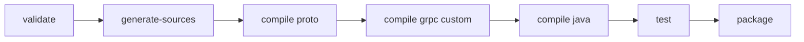

`protobuf-maven-plugin` goal yang umum:

| Goal | Output |
|---|---|
| `compile` | Java Protobuf classes |
| `compile-custom` | gRPC Java classes dari plugin custom |
| `test-compile` | Java Protobuf test classes |
| `test-compile-custom` | gRPC Java test classes |

Jika test proto dipakai, tambahkan test goals juga.

---

## 18. CI Pipeline yang Sehat

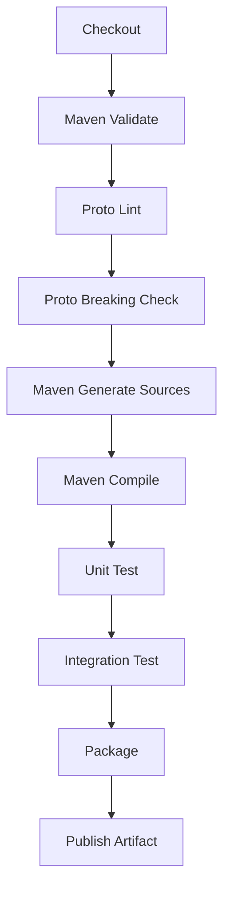

Minimal stage untuk contract-first:

| Stage | Fail Jika |
|---|---|
| Proto format/lint | Naming/package/structure melanggar rule |
| Breaking check | Field/method/type breaking terhadap baseline |
| Maven codegen | `protoc` atau plugin gagal |
| Java compile | Generated API tidak cocok dengan implementation |
| Unit test | Mapper/handler gagal |
| Integration test | Client-server tidak bicara |
| Dependency check | Version conflict atau vulnerable dependency |

---

## 19. Generated Code: Commit atau Tidak?

Default rekomendasi:

```text id="a1ojwp"
Jangan commit generated code.
Commit .proto sebagai source of truth.
Biarkan Maven generate di build.
```

| Pilihan | Kapan Masuk Akal | Risiko |
|---|---|---|
| Tidak commit generated code | Mayoritas Java Maven service | Build harus reliable di semua environment |
| Commit generated code | Repo tanpa build plugin, generated artifact untuk platform khusus | Risk drift: `.proto` dan generated source tidak sinkron |
| Publish contract artifact | Multi-service/multi-team | Perlu versioning dan release discipline |

Untuk enterprise, pattern yang sehat: `.proto` disimpan di contract repo/module, generated Java dipublish sebagai Maven artifact, dan consumer menggunakan versi artifact yang jelas.

---

## 20. IDE Setup

Common issue di IntelliJ/Eclipse:

| Gejala | Penyebab | Solusi |
|---|---|---|
| Generated class merah di IDE | Generated source belum dikenali | Jalankan `mvn generate-sources`, reimport Maven |
| `CaseQueryServiceGrpc` tidak ditemukan | `compile-custom` tidak jalan | Cek plugin `grpc-java` |
| Message class ada tapi service stub tidak ada | `protoc` jalan, plugin gRPC tidak | Cek `pluginId` dan `pluginArtifact` |
| Build CLI sukses tapi IDE gagal | IDE tidak mark generated source | Reimport Maven project |
| Build IDE sukses tapi CI gagal | Lokal punya protoc di PATH, CI tidak | Gunakan artifact-based `protocArtifact` |

---

## 21. Common Failure: `CaseQueryServiceGrpc` Tidak Ter-generate

Kemungkinan penyebab:

| Penyebab | Gejala | Fix |
|---|---|---|
| `.proto` tidak punya `service` | Message class ada, service stub tidak ada | Tambahkan service definition |
| `compile-custom` tidak dikonfigurasi | Message class ada, `Grpc` class tidak ada | Tambahkan goal `compile-custom` |
| `pluginId` salah | Plugin tidak dijalankan | Gunakan `grpc-java` sesuai konfigurasi |
| `pluginArtifact` salah versi/classifier | Build gagal download/execute | Align version dan OS classifier |
| File `.proto` tidak di `src/main/proto` | Tidak ada generated output | Pindahkan atau konfigurasi `protoSourceRoot` |
| Build belum dijalankan | IDE belum tahu generated code | Run `mvn clean compile` |

---

## 22. Common Failure: `javax.annotation.Generated` Tidak Ditemukan

Pada JDK modern, beberapa API `javax.annotation` tidak selalu tersedia seperti di masa Java lama. Generated gRPC Java code pada banyak setup masih dapat membutuhkan `javax.annotation.Generated`, sehingga dependency berikut sering ditambahkan:

```xml id="j74w9k"
<dependency>
    <groupId>javax.annotation</groupId>
    <artifactId>javax.annotation-api</artifactId>
    <version>1.3.2</version>
    <optional>true</optional>
</dependency>
```

Gejala:

```text id="v5e813"
package javax.annotation does not exist
cannot find symbol: class Generated
```

Solusi: tambahkan dependency annotation API di module yang compile generated source.

---

## 23. Common Failure: Alpine Linux / musl

Jika build dilakukan di container Alpine Linux, prebuilt `protoc-gen-grpc-java` binary bisa bermasalah karena binary prebuilt grpc-java menggunakan glibc di Linux; README grpc-java secara eksplisit menyebut bahwa untuk Alpine Linux, package Alpine grpc-java yang memakai musl mungkin diperlukan. ([GitHub](https://github.com/grpc/grpc-java))

Praktik aman:

| Environment | Rekomendasi |
|---|---|
| CI Debian/Ubuntu base image | Biasanya paling mudah |
| Alpine base image | Waspadai glibc vs musl |
| Corporate offline build | Mirror Maven artifacts |
| Multi-arch build | Pastikan classifier tersedia |

---

## 24. Common Failure: Dependency Version Conflict

Gejala:

```text id="ywe0oj"
NoSuchMethodError
ClassNotFoundException
Method not found in com.google.protobuf.*
IncompatibleClassChangeError
```

Kemungkinan:

| Penyebab | Fix |
|---|---|
| `grpc-protobuf` versi A, `grpc-stub` versi B | Pakai `grpc-bom` |
| `protobuf-java` ditarik versi lama oleh dependency lain | Override via dependencyManagement |
| Parent POM memakai versi berbeda antar module | Centralize version |
| Generated code dibuat oleh protoc terlalu jauh dari runtime | Align compiler/runtime |
| Shaded/non-shaded transport konflik | Pilih satu transport dan audit tree |

Gunakan:

```bash id="ep7bnm"
mvn dependency:tree
```

Cari:

```text id="zlg9a8"
io.grpc
com.google.protobuf
io.netty
```

---

## 25. Common Failure: Package Generated Tidak Sesuai Import

Contoh `.proto`:

```proto id="ahdjhh"
package casecommunication.v1;
```

Tanpa:

```proto id="k6exjd"
option java_package = "com.company.casecommunication.v1";
```

Maka generated Java package bisa mengikuti `casecommunication.v1`, bukan package Java yang diharapkan. Dokumentasi Protobuf menjelaskan bahwa generated class ditempatkan berdasarkan `java_package` jika ada; jika tidak, ia memakai deklarasi package `.proto`. ([Protocol Buffers](https://protobuf.dev/reference/java/java-generated/))

Praktik:

```proto id="u0a4w6"
package casecommunication.v1;

option java_package = "com.company.casecommunication.v1";
```

---

## 26. Common Failure: Generated Code Diedit Manual

Jangan pernah memperbaiki bug dengan mengedit file di:

```text id="rfex3t"
target/generated-sources/protobuf/java
target/generated-sources/protobuf/grpc-java
```

Karena akan hilang saat:

```bash id="sux8e4"
mvn clean compile
```

Kalau generated code salah:

| Problem | Ubah |
|---|---|
| Package salah | `.proto` option |
| Nama class salah | `java_outer_classname`, message/service name |
| Field salah | `.proto` |
| Stub tidak muncul | Maven plugin |
| Service method salah | `.proto` service definition |

---

## 27. Multi-Module Maven Example

### Parent POM

```xml id="2s0y9v"
<project>
    <modelVersion>4.0.0</modelVersion>

    <groupId>com.company</groupId>
    <artifactId>case-platform-parent</artifactId>
    <version>1.0.0</version>
    <packaging>pom</packaging>

    <modules>
        <module>case-communication-contract</module>
        <module>case-service</module>
        <module>case-rest-api</module>
    </modules>

    <properties>
        <grpc.version>1.82.1</grpc.version>
        <protobuf.version>3.25.8</protobuf.version>
        <maven.compiler.release>17</maven.compiler.release>
    </properties>

    <dependencyManagement>
        <dependencies>
            <dependency>
                <groupId>io.grpc</groupId>
                <artifactId>grpc-bom</artifactId>
                <version>${grpc.version}</version>
                <type>pom</type>
                <scope>import</scope>
            </dependency>
        </dependencies>
    </dependencyManagement>
</project>
```

### Contract Module

```xml id="njccj2"
<project>
    <parent>
        <groupId>com.company</groupId>
        <artifactId>case-platform-parent</artifactId>
        <version>1.0.0</version>
    </parent>

    <artifactId>case-communication-contract</artifactId>

    <dependencies>
        <dependency>
            <groupId>io.grpc</groupId>
            <artifactId>grpc-protobuf</artifactId>
        </dependency>
        <dependency>
            <groupId>io.grpc</groupId>
            <artifactId>grpc-stub</artifactId>
        </dependency>
        <dependency>
            <groupId>javax.annotation</groupId>
            <artifactId>javax.annotation-api</artifactId>
            <version>1.3.2</version>
            <optional>true</optional>
        </dependency>
    </dependencies>

    <!-- protobuf plugin config here -->
</project>
```

### Service Module

```xml id="h57q93"
<dependency>
    <groupId>com.company</groupId>
    <artifactId>case-communication-contract</artifactId>
    <version>${project.version}</version>
</dependency>

<dependency>
    <groupId>io.grpc</groupId>
    <artifactId>grpc-netty-shaded</artifactId>
</dependency>
```

---

## 28. Integrasi dengan Jersey/JAX-RS Module

Pattern:

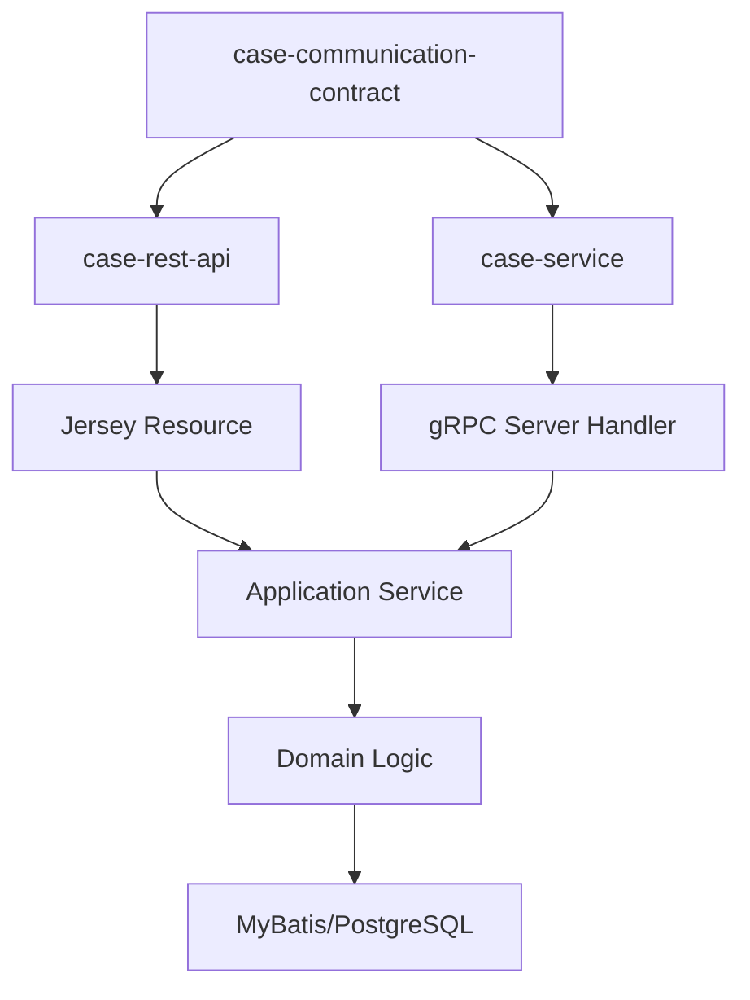

Dependency direction yang sehat:

| Module | Depends On | Jangan Depends On |
|---|---|---|
| `contract` | gRPC/protobuf runtime minimal | Service implementation |
| `service` | contract, domain, persistence | REST DTO |
| `rest-api` | application/domain contract | gRPC server internals |
| `domain` | business model | gRPC/protobuf if ingin clean domain |
| `persistence` | MyBatis/Postgres | gRPC stub |

Idealnya domain tidak bergantung pada generated proto class. Proto berada di boundary adapter.

---

## 29. Build Command Cheat Sheet

```bash id="b1320u"
# Clean build
mvn clean compile

# Generate protobuf/gRPC sources only
mvn generate-sources

# Run tests
mvn test

# Full verification
mvn clean verify

# Show dependency tree
mvn dependency:tree

# Show only grpc/protobuf dependencies
mvn dependency:tree -Dincludes=io.grpc,com.google.protobuf
```

Jika generated source tidak muncul:

```bash id="8zgww3"
mvn -X generate-sources
```

Cek log untuk:

```text id="25ej1n"
protocArtifact
pluginArtifact
grpc-java
target/generated-sources/protobuf
```

---

## 30. Build Reproducibility Rules

| Rule | Penjelasan |
|---|---|
| Pin versi plugin dan dependency | Jangan biarkan transitive dependency menentukan versi |
| Gunakan Maven Wrapper jika standar tim | Pastikan Maven version konsisten |
| Jangan bergantung pada `protoc` lokal | Gunakan artifact Maven agar CI/lokal sama |
| Jangan commit generated source defaultnya | Hindari drift |
| CI harus run `mvn clean verify` | Menangkap generated source yang lupa |
| Dependency tree harus diaudit | Khusus `io.grpc`, `com.google.protobuf`, `io.netty` |
| Corporate mirror harus punya binary classifier | Agar offline/on-prem build stabil |

---

## 31. Security & Supply Chain Consideration

Karena codegen mengunduh binary `protoc` dan `protoc-gen-grpc-java`, perlakukan ini sebagai bagian dari software supply chain.

| Area | Pertanyaan |
|---|---|
| Artifact source | Apakah dari Maven Central/corporate mirror resmi? |
| Version pinning | Apakah versi terkunci? |
| Vulnerability scan | Apakah dependency gRPC/protobuf discan? |
| Build reproducibility | Apakah CI dan lokal memakai versi sama? |
| Offline build | Apakah artifact sudah tersedia di internal Nexus/Artifactory? |
| SBOM | Apakah generated artifact masuk ke inventory build? |

---

## 32. Review Checklist Maven gRPC Codegen

| Area | Checklist |
|---|---|
| Proto location | `.proto` ada di `src/main/proto` |
| Java package | Semua proto punya `java_package` eksplisit |
| Multiple files | `java_multiple_files = true` kecuali ada alasan kuat |
| Outer classname | `java_outer_classname` eksplisit |
| Codegen plugin | `compile` dan `compile-custom` aktif |
| Version alignment | `grpc.version`, `protobuf.version`, plugin version dipin |
| BOM | gRPC dependencies dikelola via BOM/dependencyManagement |
| Transport | `grpc-netty-shaded` atau alternatif dipilih secara sadar |
| Generated source | Tidak diedit manual |
| CI | `mvn clean verify` berjalan dari fresh checkout |
| Dependency tree | Tidak ada versi gRPC/protobuf campur-campur |
| IDE | Generated sources dikenali setelah Maven import |
| Docker build | Base image compatible dengan protoc/plugin binary |
| Contract artifact | Jika multi-service, contract module dipublish dengan versi jelas |

---

## 33. Senior Engineer Red Flags

| Red Flag | Kenapa Bermasalah |
|---|---|
| Generated code dicommit tanpa policy | Mudah drift dari `.proto` |
| `protoc` lokal dipakai dari PATH | Build tidak reproducible |
| Versi `grpc-stub` dan `grpc-protobuf` beda | Runtime conflict |
| Tidak ada `java_package` | Generated import bisa tidak sesuai standar Java |
| Service implementation ada di generated package | Boundary kotor |
| Proto contract ada di module implementation saja padahal banyak consumer | Versioning consumer kacau |
| Semua module generate proto sendiri dari copy file | Contract drift antar service |
| Build Docker pakai Alpine tanpa cek binary classifier | Bisa gagal karena glibc/musl |
| Tidak ada breaking-check/lint | Contract bisa rusak tanpa sadar |

---

## 34. Ringkasan Praktis

```text id="bszle5"
Maven gRPC codegen yang sehat:

1. .proto adalah source of truth.
2. Simpan .proto di src/main/proto.
3. Maven menjalankan protoc + protoc-gen-grpc-java.
4. Generated source masuk ke target/generated-sources.
5. Developer tidak mengedit generated source.
6. Pin versi grpc/protobuf/plugin.
7. Gunakan dependencyManagement/BOM.
8. Pisahkan contract module jika dipakai lintas service.
9. CI harus menjalankan clean build dari nol.
10. Audit dependency tree untuk io.grpc, com.google.protobuf, dan Netty.
```

---

# Seri 4 selesai

Materi berikutnya:

**Seri 5/14 - Java gRPC Server Implementation: service base, lifecycle, executor, graceful shutdown, dependency injection, dan integration dengan Jersey/JAX-RS runtime.**

---

**Sources:**

- [Generated-code reference | Java | gRPC](https://grpc.io/docs/languages/java/generated-code/)
- [GitHub - grpc/grpc-java: The Java gRPC implementation. HTTP/2 based RPC · GitHub](https://github.com/grpc/grpc-java)
- [Java Generated Code Guide | Protocol Buffers Documentation](https://protobuf.dev/reference/java/java-generated/)

## Response:
7/13/2026, 5:13:25 PM

Saya lanjut ke Seri 5: kali ini masuk ke implementasi server Java—bagaimana generated `ImplBase` dipakai, bagaimana lifecycle server dikelola, dan bagaimana integrasinya tetap bersih dengan Jersey/JAX-RS.

# Seri 5/14 - Java gRPC Server Implementation: Service Base, Lifecycle, Executor, Graceful Shutdown, Dependency Injection, Jersey/JAX-RS Integration

## 1. Introduction

Di seri sebelumnya, `.proto` sudah menjadi kontrak dan Maven sudah menghasilkan Java code. Pada seri ini fokusnya berpindah ke **server implementation**: bagaimana class generated seperti `CaseQueryServiceGrpc.CaseQueryServiceImplBase` diimplementasikan, bagaimana `ServerBuilder` menjalankan gRPC server, bagaimana shutdown dilakukan dengan aman, dan bagaimana ia hidup berdampingan dengan **Jersey/JAX-RS runtime**.

Dokumentasi gRPC Java menjelaskan pola dasarnya: service didefinisikan di `.proto`, compiler menghasilkan client/server code, lalu developer mengimplementasikan API server dan client menggunakan gRPC Java API. ([gRPC](https://grpc.io/docs/languages/java/basics/?utm_source=chatgpt.com))

---

## 2. Mental Model gRPC Server di Java

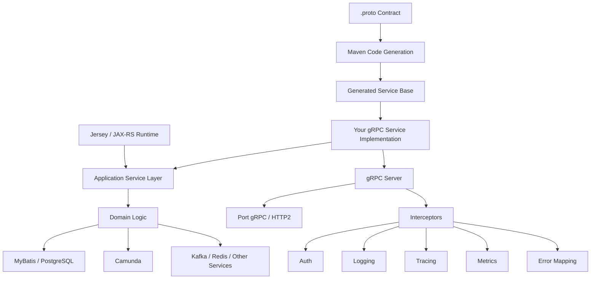

Pola sehatnya:

```text id="0ekw6l"
Generated gRPC base class
  -> thin gRPC adapter
    -> application service
      -> domain logic
        -> persistence / workflow / messaging
```

Jangan:

```text id="f0sy4x"
Generated gRPC handler
  -> SQL langsung
  -> Camunda API langsung
  -> Kafka publish langsung
  -> random business logic
```

---

## 3. Komponen Utama Server Implementation

| Komponen | Fungsi | Catatan Praktis |
|---|---|---|
| `.proto service` | Kontrak RPC | Source of truth |
| `ImplBase` | Generated base class server | Di-extend oleh implementasi Anda |
| `StreamObserver` | API response streaming | Unary pun memakai observer |
| `ServerBuilder` | Builder untuk gRPC server | Bind service, port, executor, interceptor |
| `Server` | Runtime gRPC server | Start, await termination, shutdown |
| Application service | Logic aplikasi | Dipakai bersama oleh REST dan gRPC |
| Mapper | Proto ↔ domain/application object | Jangan bocorkan proto ke seluruh domain |
| Interceptor | Cross-cutting concern | Auth, logging, tracing, metadata, metrics |
| Shutdown hook | Graceful stop saat JVM/process mati | Wajib untuk Kubernetes/rolling deployment |

---

## 4. Contoh `.proto`

```proto id="h76ef8"
syntax = "proto3";

package casecommunication.v1;

option java_multiple_files = true;
option java_package = "com.company.casecommunication.v1";
option java_outer_classname = "CaseCommunicationProto";

service CaseQueryService {
  rpc GetCase(GetCaseRequest) returns (GetCaseResponse);
}

message GetCaseRequest {
  string case_id = 1;
}

message GetCaseResponse {
  string case_id = 1;
  string case_number = 2;
  CaseStatus status = 3;
}

enum CaseStatus {
  CASE_STATUS_UNSPECIFIED = 0;
  CASE_STATUS_OPEN = 1;
  CASE_STATUS_IN_REVIEW = 2;
  CASE_STATUS_CLOSED = 3;
}
```

Dari service tersebut, gRPC Java menghasilkan class service/stub seperti `CaseQueryServiceGrpc`. Generated code Java gRPC mencakup server-side base class dan beberapa tipe client stub, seperti async, blocking, dan future stub. ([gRPC](https://grpc.io/docs/languages/java/generated-code/?utm_source=chatgpt.com))

---

## 5. Implementasi gRPC Service Handler

```java id="xcej3a"
package com.company.caseapp.grpc;

import com.company.casecommunication.v1.CaseQueryServiceGrpc;
import com.company.casecommunication.v1.CaseStatus;
import com.company.casecommunication.v1.GetCaseRequest;
import com.company.casecommunication.v1.GetCaseResponse;
import io.grpc.Status;
import io.grpc.stub.StreamObserver;

public final class CaseQueryGrpcService extends CaseQueryServiceGrpc.CaseQueryServiceImplBase {

    private final CaseApplicationService caseApplicationService;

    public CaseQueryGrpcService(CaseApplicationService caseApplicationService) {
        this.caseApplicationService = caseApplicationService;
    }

    @Override
    public void getCase(
            GetCaseRequest request,
            StreamObserver<GetCaseResponse> responseObserver
    ) {
        try {
            validate(request);

            CaseView caseView = caseApplicationService.getCaseById(request.getCaseId());

            GetCaseResponse response = GetCaseResponse.newBuilder()
                    .setCaseId(caseView.caseId())
                    .setCaseNumber(caseView.caseNumber())
                    .setStatus(toProtoStatus(caseView.status()))
                    .build();

            responseObserver.onNext(response);
            responseObserver.onCompleted();

        } catch (CaseNotFoundException ex) {
            responseObserver.onError(
                    Status.NOT_FOUND
                            .withDescription("Case not found")
                            .asRuntimeException()
            );

        } catch (InvalidRequestException | IllegalArgumentException ex) {
            responseObserver.onError(
                    Status.INVALID_ARGUMENT
                            .withDescription(ex.getMessage())
                            .asRuntimeException()
            );

        } catch (Exception ex) {
            responseObserver.onError(
                    Status.INTERNAL
                            .withDescription("Unexpected server error")
                            .asRuntimeException()
            );
        }
    }

    private static void validate(GetCaseRequest request) {
        if (request.getCaseId() == null || request.getCaseId().isBlank()) {
            throw new InvalidRequestException("case_id is required");
        }
    }

    private static CaseStatus toProtoStatus(String status) {
        return switch (status) {
            case "OPEN" -> CaseStatus.CASE_STATUS_OPEN;
            case "IN_REVIEW" -> CaseStatus.CASE_STATUS_IN_REVIEW;
            case "CLOSED" -> CaseStatus.CASE_STATUS_CLOSED;
            default -> CaseStatus.CASE_STATUS_UNSPECIFIED;
        };
    }
}
```

Prinsip penting:

| Rule | Penjelasan |
|---|---|
| Handler harus tipis | Validasi boundary, mapping, error conversion |
| Business logic tetap di application service | Agar REST dan gRPC bisa reuse logic yang sama |
| Jangan expose MyBatis result langsung | Map dari persistence model ke domain/application result, lalu ke proto |
| Jangan lempar exception mentah | Convert ke gRPC `Status` |
| Unary success harus `onNext` lalu `onCompleted` | Satu response lalu selesai |
| Failure harus `onError` | Jangan lanjut `onCompleted` setelah error |

---

## 6. Struktur Layer yang Direkomendasikan

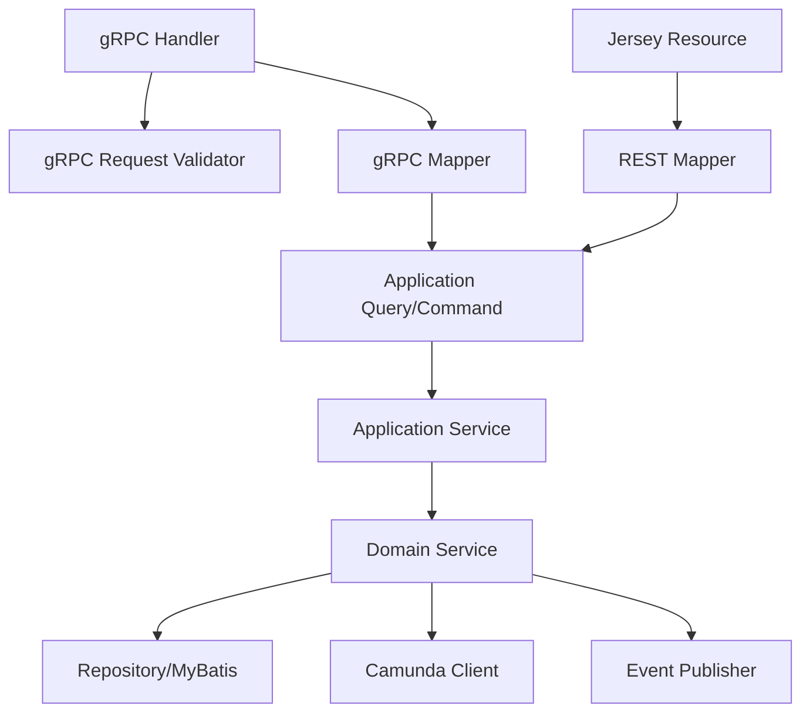

| Layer | Tanggung Jawab |
|---|---|
| gRPC handler | Boundary RPC, status mapping, metadata extraction |
| gRPC mapper | Proto ↔ application command/query/result |
| Application service | Use case orchestration |
| Domain service | Invariant bisnis |
| Repository/MyBatis | Database access |
| Camunda adapter | Workflow/task/process interaction |
| Jersey resource | REST boundary, HTTP status mapping |
| REST mapper | JSON DTO ↔ application command/query/result |

Rule praktis:

```text id="4fl4gv"
REST DTO dan Proto Message boleh berbeda.
Application command/query menjadi titik temu.
```

---

## 7. Membuat gRPC Server

Contoh minimal server:

```java id="9yjx9j"
package com.company.caseapp.grpc;

import io.grpc.Server;
import io.grpc.ServerBuilder;

import java.io.IOException;

public final class GrpcServerRunner {

    private final Server server;

    public GrpcServerRunner(
            int port,
            CaseQueryGrpcService caseQueryGrpcService
    ) {
        this.server = ServerBuilder
                .forPort(port)
                .addService(caseQueryGrpcService)
                .build();
    }

    public void start() throws IOException {
        server.start();
        Runtime.getRuntime().addShutdownHook(new Thread(this::shutdown));
    }

    public void awaitTermination() throws InterruptedException {
        server.awaitTermination();
    }

    public void shutdown() {
        server.shutdown();
    }
}
```

Contoh main class:

```java id="d2r2ny"
public final class Main {

    public static void main(String[] args) throws Exception {
        CaseApplicationService applicationService = buildApplicationService();

        CaseQueryGrpcService grpcService =
                new CaseQueryGrpcService(applicationService);

        GrpcServerRunner serverRunner =
                new GrpcServerRunner(9090, grpcService);

        serverRunner.start();
        serverRunner.awaitTermination();
    }

    private static CaseApplicationService buildApplicationService() {
        // Wire dependencies here or through DI framework.
        return new CaseApplicationService();
    }
}
```

Dokumentasi gRPC Java basics menunjukkan pola server Java dengan membuat `Server`, menambahkan service implementation, menjalankan `start()`, lalu menunggu termination. ([gRPC](https://grpc.io/docs/languages/java/basics/?utm_source=chatgpt.com))

---

## 8. Lifecycle Server

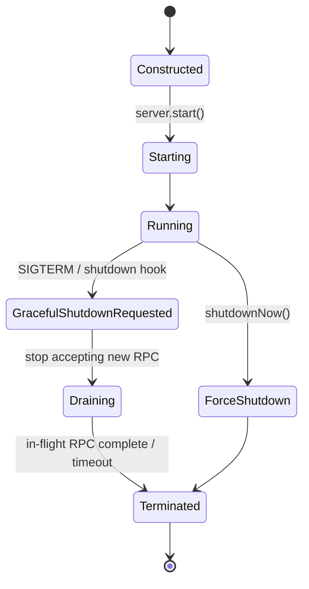

| Fase | Apa yang Terjadi | Hal yang Perlu Dijaga |
|---|---|---|
| Constructed | Service dan dependency disiapkan | Jangan start sebelum dependency siap |
| Starting | gRPC server bind ke port | Port harus tidak bentrok dengan REST port |
| Running | RPC diterima | Observability, auth, error mapping aktif |
| Graceful shutdown | Stop menerima RPC baru | In-flight RPC diberi waktu selesai |
| Force shutdown | RPC diputus paksa | Digunakan setelah timeout |
| Terminated | Server berhenti | Resource cleanup |

gRPC punya panduan graceful shutdown agar server menyelesaikan RPC yang sedang berjalan dalam batas waktu wajar dan tidak menerima RPC baru saat proses shutdown. ([gRPC](https://grpc.io/docs/guides/server-graceful-stop/?utm_source=chatgpt.com))

---

## 9. Graceful Shutdown yang Lebih Aman

```java id="nzrdg3"
package com.company.caseapp.grpc;

import io.grpc.Server;
import io.grpc.ServerBuilder;

import java.io.IOException;
import java.util.concurrent.TimeUnit;

public final class GrpcServerRunner {

    private final Server server;

    public GrpcServerRunner(int port, CaseQueryGrpcService caseQueryGrpcService) {
        this.server = ServerBuilder
                .forPort(port)
                .addService(caseQueryGrpcService)
                .build();
    }

    public void start() throws IOException {
        server.start();

        Runtime.getRuntime().addShutdownHook(new Thread(() -> {
            try {
                shutdownGracefully();
            } catch (InterruptedException e) {
                Thread.currentThread().interrupt();
                server.shutdownNow();
            }
        }, "grpc-server-shutdown-hook"));
    }

    public void awaitTermination() throws InterruptedException {
        server.awaitTermination();
    }

    public void shutdownGracefully() throws InterruptedException {
        server.shutdown();

        if (!server.awaitTermination(30, TimeUnit.SECONDS)) {
            server.shutdownNow();

            if (!server.awaitTermination(10, TimeUnit.SECONDS)) {
                // Log failure to terminate.
            }
        }
    }
}
```

Praktik production:

| Praktik | Kenapa Penting |
|---|---|
| `shutdown()` dulu | Memberi kesempatan RPC aktif selesai |
| `awaitTermination(timeout)` | Jangan tunggu selamanya |
| `shutdownNow()` setelah timeout | Hindari pod/process menggantung |
| Handle `InterruptedException` | Restore interrupt flag |
| Log shutdown phase | Penting untuk debugging rolling deployment |
| Sinkronkan dengan Kubernetes termination grace period | Jangan timeout app lebih panjang dari grace period pod |

---

## 10. Port Strategy: REST dan gRPC

Dalam service yang punya Jersey/JAX-RS dan gRPC, umum memakai port berbeda:

```text id="yutqk5"
HTTP REST / Jersey : 8080
gRPC / HTTP2       : 9090
Management/metrics : 8081
```

| Port | Fungsi | Catatan |
|---|---|---|
| `8080` | REST/JAX-RS | Public/internal HTTP JSON |
| `9090` | gRPC | Internal service-to-service |
| `8081` | Metrics/health/admin | Bisa digabung atau dipisah sesuai platform |

Hindari membuat semua traffic masuk ke port yang sama jika runtime/infrastructure belum jelas mendukung mixed REST/gRPC. gRPC memakai HTTP/2 sebagai model transport utama, sehingga load balancer, ingress, service mesh, dan health check perlu dipastikan kompatibel.

---

## 11. Integrasi dengan Jersey/JAX-RS Runtime

Ada tiga pola umum.

### Pattern A - gRPC server dan Jersey server dalam JVM yang sama

```mermaid id="3wqcmh"
flowchart TD
    A[JVM Process] --> B[Jersey/JAX-RS Server :8080]
    A --> C[gRPC Server :9090]
    B --> D[Application Service]
    C --> D
    D --> E[Domain + Persistence + Workflow]
```

Cocok jika:

| Cocok Jika | Catatan |
|---|---|
| Service kecil/menengah | Deployment sederhana |
| REST dan gRPC berbagi use case | Application service reuse |
| Tim ingin satu artifact | Lebih mudah release |
| Resource cukup | Thread pool dan lifecycle harus jelas |

Risiko:

| Risiko | Mitigasi |
|---|---|
| Satu JVM mati, dua interface mati | Health/readiness jelas |
| Thread pool saling mengganggu | Pisahkan executor |
| Startup/shutdown lebih kompleks | Lifecycle manager |
| Observability perlu membedakan REST vs gRPC | Label metrics dan tracing |

---

### Pattern B - gRPC service terpisah dari REST service

```mermaid id="i84tgd"
flowchart LR
    A[Jersey REST Service] --> B[gRPC Internal Service]
    B --> C[Application/Domain]
    C --> D[DB/Camunda]
```

Cocok jika:

| Cocok Jika | Catatan |
|---|---|
| Traffic gRPC tinggi | Scaling independen |
| REST dan gRPC punya ownership berbeda | Boundary lebih jelas |
| gRPC menjadi internal platform service | Lebih bersih secara deployment |
| Runtime concern berbeda | Bisa tune JVM/threading berbeda |

Risiko: network hop bertambah dan deployment lebih banyak.

---

### Pattern C - Shared library application service

```mermaid id="1c10vn"
flowchart TD
    A[case-domain/application module] --> B[Jersey REST Artifact]
    A --> C[gRPC Artifact]
```

Cocok jika REST dan gRPC perlu reuse logic, tetapi deploy artifact dipisah.

---

## 12. Dependency Injection: Manual vs Framework

Kalau perusahaan menggunakan Jersey/HK2, CDI/Weld, Guice, Spring, atau custom DI, prinsipnya tetap sama: gRPC service implementation menerima dependency lewat constructor.

```java id="0e9t20"
public final class CaseQueryGrpcService extends CaseQueryServiceGrpc.CaseQueryServiceImplBase {

    private final CaseApplicationService caseApplicationService;
    private final CaseGrpcMapper mapper;
    private final CaseGrpcErrorMapper errorMapper;

    public CaseQueryGrpcService(
            CaseApplicationService caseApplicationService,
            CaseGrpcMapper mapper,
            CaseGrpcErrorMapper errorMapper
    ) {
        this.caseApplicationService = caseApplicationService;
        this.mapper = mapper;
        this.errorMapper = errorMapper;
    }
}
```

Hindari:

```java id="1vswtc"
public final class CaseQueryGrpcService extends CaseQueryServiceGrpc.CaseQueryServiceImplBase {

    private final CaseApplicationService service = new CaseApplicationService();
}
```

Kenapa?

| Constructor Injection | Manual `new` di handler |
|---|---|
| Mudah test | Sulit mock |
| Dependency eksplisit | Dependency tersembunyi |
| Lifecycle jelas | Resource leak lebih mudah |
| Cocok untuk DI container | Coupling kuat |
| Mudah diganti saat integration test | Sulit diganti |

---

## 13. Executor dan Threading

Secara sederhana, gRPC server akan menjalankan handler di executor. Untuk production, Anda perlu memahami apakah default executor cukup atau perlu custom executor.

```java id="3jko17"
ExecutorService grpcExecutor = Executors.newFixedThreadPool(64);

Server server = ServerBuilder
        .forPort(9090)
        .executor(grpcExecutor)
        .addService(caseQueryGrpcService)
        .build();
```

Namun jangan asal fixed thread pool. Tuning harus melihat:

| Faktor | Dampak |
|---|---|
| Banyak blocking DB/MyBatis call | Butuh thread cukup, tapi jangan unlimited |
| RPC CPU-heavy | Thread terlalu banyak bisa memperburuk context switching |
| Downstream call lambat | Deadline dan bulkhead lebih penting |
| Streaming | Thread dan memory pressure harus dipantau |
| REST dan gRPC satu JVM | Jangan sampai saling memakan thread |
| Kubernetes CPU limit | Thread banyak tidak berarti throughput naik |

Rule awal:

```text id="3v2vxh"
Jika handler melakukan blocking I/O seperti MyBatis/JDBC,
jangan anggap gRPC otomatis non-blocking end-to-end.
```

---

## 14. Blocking I/O dengan MyBatis/PostgreSQL

Di stack Anda, MyBatis/JDBC biasanya blocking. Maka handler gRPC yang memanggil MyBatis tetap memakan thread saat menunggu database.

```mermaid id="ee27pf"
sequenceDiagram
    participant C as gRPC Client
    participant S as gRPC Handler Thread
    participant A as Application Service
    participant DB as PostgreSQL

    C->>S: GetCase RPC
    S->>A: getCase()
    A->>DB: JDBC/MyBatis query
    DB-->>A: row/result
    A-->>S: domain result
    S-->>C: gRPC response
```

Konsekuensi:

| Area | Perlu Dipikirkan |
|---|---|
| Thread pool | Jangan terlalu kecil untuk blocking DB |
| DB pool | Jangan lebih kecil dari concurrency target tanpa sadar |
| Deadline | Harus lebih kecil dari upstream timeout |
| Query timeout | JDBC/query timeout harus selaras |
| Backpressure | Tolak request jika overload, jangan queue tanpa batas |
| Observability | Pisahkan latency gRPC handler vs DB query |

---

## 15. Error Mapping di Server

Jangan tulis mapping exception berulang di setiap handler. Buat mapper.

```java id="qa06ly"
public final class GrpcErrorMapper {

    public RuntimeException toGrpcException(Throwable throwable) {
        if (throwable instanceof CaseNotFoundException) {
            return Status.NOT_FOUND
                    .withDescription("Case not found")
                    .asRuntimeException();
        }

        if (throwable instanceof PermissionDeniedException) {
            return Status.PERMISSION_DENIED
                    .withDescription("Permission denied")
                    .asRuntimeException();
        }

        if (throwable instanceof OptimisticLockException) {
            return Status.ABORTED
                    .withDescription("Concurrent update detected")
                    .asRuntimeException();
        }

        if (throwable instanceof InvalidRequestException) {
            return Status.INVALID_ARGUMENT
                    .withDescription(throwable.getMessage())
                    .asRuntimeException();
        }

        return Status.INTERNAL
                .withDescription("Unexpected server error")
                .asRuntimeException();
    }
}
```

Pemakaian:

```java id="22nwud"
@Override
public void getCase(GetCaseRequest request, StreamObserver<GetCaseResponse> responseObserver) {
    try {
        var query = mapper.toQuery(request);
        var result = applicationService.getCase(query);
        responseObserver.onNext(mapper.toResponse(result));
        responseObserver.onCompleted();
    } catch (Throwable throwable) {
        responseObserver.onError(errorMapper.toGrpcException(throwable));
    }
}
```

Mapping praktis:

| Domain Error | gRPC Status |
|---|---|
| Input invalid | `INVALID_ARGUMENT` |
| Data tidak ditemukan | `NOT_FOUND` |
| Tidak login / token invalid | `UNAUTHENTICATED` |
| Tidak punya akses | `PERMISSION_DENIED` |
| Conflict / optimistic lock | `ABORTED` atau `FAILED_PRECONDITION` |
| State tidak memungkinkan | `FAILED_PRECONDITION` |
| Downstream unavailable | `UNAVAILABLE` |
| Timeout internal | `DEADLINE_EXCEEDED` |
| Bug server | `INTERNAL` |

---

## 16. Server Interceptor

Interceptor dipakai untuk cross-cutting concern.

```java id="epm2l8"
import io.grpc.*;

public final class CorrelationIdServerInterceptor implements ServerInterceptor {

    private static final Metadata.Key<String> CORRELATION_ID_KEY =
            Metadata.Key.of("x-correlation-id", Metadata.ASCII_STRING_MARSHALLER);

    @Override
    public <ReqT, RespT> ServerCall.Listener<ReqT> interceptCall(
            ServerCall<ReqT, RespT> call,
            Metadata headers,
            ServerCallHandler<ReqT, RespT> next
    ) {
        String correlationId = headers.get(CORRELATION_ID_KEY);

        if (correlationId == null || correlationId.isBlank()) {
            correlationId = java.util.UUID.randomUUID().toString();
        }

        Context context = Context.current()
                .withValue(RequestContextKeys.CORRELATION_ID, correlationId);

        return Contexts.interceptCall(context, call, headers, next);
    }
}
```

Register interceptor:

```java id="5q9e1x"
Server server = ServerBuilder
        .forPort(9090)
        .addService(ServerInterceptors.intercept(
                caseQueryGrpcService,
                new CorrelationIdServerInterceptor(),
                new AuthServerInterceptor(),
                new LoggingServerInterceptor()
        ))
        .build();
```

Use case interceptor:

| Interceptor | Fungsi |
|---|---|
| Auth | Validasi token/service identity |
| Authorization context | Extract role/permission/tenant |
| Correlation ID | Propagasi request ID |
| Tracing | OpenTelemetry span context |
| Metrics | Count, latency, status per method |
| Logging | Method, status, duration, correlation |
| Deadline enforcement | Reject jika tidak ada deadline |
| Audit context | Actor/purpose context |

---

## 17. Metadata dan Context

gRPC metadata cocok untuk request context seperti:

| Metadata | Contoh |
|---|---|
| Correlation ID | `x-correlation-id` |
| Tenant ID | `x-tenant-id` |
| Actor ID | `x-actor-id` |
| Source service | `x-source-service` |
| Auth token | `authorization` |
| Trace context | W3C trace context / OpenTelemetry propagation |

Jangan campur semua ke message payload. Payload sebaiknya berisi business input.

```text id="8v9t52"
Metadata:
  who/where/context of the call

Message:
  what business operation is being requested
```

---

## 18. Deadline Handling di Server

Server harus sadar deadline client.

```java id="t62j8o"
import io.grpc.Context;

public final class DeadlineGuard {

    public static void ensureNotCancelled() {
        if (Context.current().isCancelled()) {
            throw Status.CANCELLED
                    .withDescription("Request was cancelled")
                    .asRuntimeException();
        }
    }
}
```

Dalam handler/application flow:

```java id="h82630"
DeadlineGuard.ensureNotCancelled();

var result = caseApplicationService.getCaseById(caseId);

DeadlineGuard.ensureNotCancelled();
```

Praktik penting:

| Area | Praktik |
|---|---|
| Sebelum operasi mahal | Cek cancellation/deadline |
| Sebelum publish event | Pastikan request belum cancelled jika event tergantung response |
| DB query | Selaraskan dengan query timeout |
| Downstream call | Propagasi deadline |
| Long-running process | Jangan tahan unary RPC terlalu lama; gunakan async workflow/status |

---

## 19. Long-Running Work: Jangan Ditahan di Unary Call

Contoh buruk:

```text id="4vt2s2"
SubmitCase RPC
  -> start Camunda process
  -> tunggu semua task selesai
  -> return response setelah 2 menit
```

Lebih baik:

```text id="734tfx"
SubmitCase RPC
  -> validate
  -> persist command
  -> start Camunda process
  -> return operation_id/process_instance_id
  -> client poll/query/stream status separately
```

Response:

```proto id="fs3wkx"
message SubmitCaseResponse {
  string submission_id = 1;
  string process_instance_id = 2;
  SubmissionStatus status = 3;
}
```

Kenapa?

| Masalah Long Unary | Solusi |
|---|---|
| Deadline mudah habis | Return accepted result cepat |
| Client retry bisa double process | Idempotency key |
| Server thread tertahan | Async workflow |
| Observability susah | Track operation ID |
| Rolling deployment risk | Persist state, jangan bergantung in-memory |

---

## 20. Health Service dan Readiness

Untuk production, gRPC server sebaiknya punya health endpoint gRPC, selain readiness/liveness di level Kubernetes atau HTTP management endpoint.

Mental model:

```text id="bvx4xt"
Process alive     != server ready
Port open         != dependency ready
gRPC server start != application ready
```

Readiness harus mempertimbangkan:

| Dependency | Readiness Check |
|---|---|
| gRPC server started | Port bind sukses |
| DB pool | Bisa acquire connection ringan |
| Migration state | Schema compatible |
| Camunda dependency | Reachable jika critical |
| Required downstream service | Optional atau critical? |
| Config/secret | Loaded dan valid |
| Thread pool | Tidak shutdown |

gRPC menyediakan panduan health checking agar server bisa mengkomunikasikan status apakah siap melayani RPC, dan client dapat memakai health checking jika dikonfigurasi. ([gRPC](https://grpc.io/docs/guides/server-graceful-stop/?utm_source=chatgpt.com))

---

## 21. Reflection: Dev/Test Only by Default

gRPC reflection memudahkan tools menginspeksi service tanpa stub lokal. Namun untuk production, exposure-nya perlu dikontrol.

| Environment | Rekomendasi |
|---|---|
| Local dev | Boleh aktif |
| Integration test | Boleh aktif |
| Staging internal | Boleh, dengan akses terbatas |
| Production | Aktif hanya jika ada policy jelas |

Alasan:

| Manfaat | Risiko |
|---|---|
| Mudah debug dengan grpcurl/tooling | Mengekspos daftar service/method |
| Memudahkan integration test | Bisa bocorkan API internal |
| Membantu platform troubleshooting | Perlu auth/network boundary |

---

## 22. Server Implementation dengan Banyak Service

```java id="1h7f7b"
Server server = ServerBuilder
        .forPort(9090)
        .addService(caseQueryGrpcService)
        .addService(caseCommandGrpcService)
        .addService(caseAuditGrpcService)
        .build();
```

Pattern grouping:

| Service | Karakter |
|---|---|
| Query service | Read-only, high volume |
| Command service | Mutating, idempotency, stricter auth |
| Audit service | Sensitive read, stricter permission |
| Admin service | Internal-only, ideally separate port/network policy |

Jika command dan admin sangat sensitif, pertimbangkan port, service, atau deployment terpisah agar access policy lebih mudah ditegakkan.

---

## 23. Mapper Pattern

Proto → application query:

```java id="d1juem"
public final class CaseGrpcMapper {

    public GetCaseQuery toQuery(GetCaseRequest request, RequestContext context) {
        return new GetCaseQuery(
                request.getCaseId(),
                context.actorId(),
                context.tenantId(),
                context.correlationId()
        );
    }

    public GetCaseResponse toResponse(CaseView view) {
        return GetCaseResponse.newBuilder()
                .setCaseId(view.caseId())
                .setCaseNumber(view.caseNumber())
                .setStatus(toProtoStatus(view.status()))
                .build();
    }

    private CaseStatus toProtoStatus(CaseDomainStatus status) {
        return switch (status) {
            case OPEN -> CaseStatus.CASE_STATUS_OPEN;
            case IN_REVIEW -> CaseStatus.CASE_STATUS_IN_REVIEW;
            case CLOSED -> CaseStatus.CASE_STATUS_CLOSED;
            default -> CaseStatus.CASE_STATUS_UNSPECIFIED;
        };
    }
}
```

Jangan biarkan generated proto menyebar sampai domain layer kecuali memang disepakati sebagai boundary model internal. Untuk sistem yang kompleks, domain sebaiknya tetap independen dari transport.

---

## 24. RequestContext Pattern

```java id="7jf8s9"
public record RequestContext(
        String correlationId,
        String tenantId,
        String actorId,
        String sourceService
) {
}
```

Extractor:

```java id="0jjc9d"
public final class GrpcRequestContextExtractor {

    public RequestContext current() {
        return new RequestContext(
                RequestContextKeys.CORRELATION_ID.get(),
                RequestContextKeys.TENANT_ID.get(),
                RequestContextKeys.ACTOR_ID.get(),
                RequestContextKeys.SOURCE_SERVICE.get()
        );
    }
}
```

Pemakaian:

```java id="ql19mp"
RequestContext context = requestContextExtractor.current();
GetCaseQuery query = mapper.toQuery(request, context);
CaseView result = applicationService.getCase(query);
```

Manfaat:

| Manfaat | Penjelasan |
|---|---|
| Auditability | Actor/tenant/correlation konsisten |
| Testability | Context bisa dimock |
| Boundary clarity | Metadata tidak bocor sembarangan |
| REST/gRPC parity | REST dan gRPC bisa menghasilkan context yang sama |

---

## 25. Integrasi dengan Jersey Resource

REST endpoint:

```java id="1bq9us"
@Path("/cases")
public final class CaseResource {

    private final CaseApplicationService caseApplicationService;
    private final CaseRestMapper mapper;

    public CaseResource(
            CaseApplicationService caseApplicationService,
            CaseRestMapper mapper
    ) {
        this.caseApplicationService = caseApplicationService;
        this.mapper = mapper;
    }

    @GET
    @Path("/{caseId}")
    @Produces(MediaType.APPLICATION_JSON)
    public Response getCase(@PathParam("caseId") String caseId) {
        CaseView view = caseApplicationService.getCaseById(caseId);
        return Response.ok(mapper.toResponse(view)).build();
    }
}
```

gRPC handler:

```java id="igf8oq"
public final class CaseQueryGrpcService extends CaseQueryServiceGrpc.CaseQueryServiceImplBase {

    private final CaseApplicationService caseApplicationService;
    private final CaseGrpcMapper mapper;

    public CaseQueryGrpcService(
            CaseApplicationService caseApplicationService,
            CaseGrpcMapper mapper
    ) {
        this.caseApplicationService = caseApplicationService;
        this.mapper = mapper;
    }

    @Override
    public void getCase(GetCaseRequest request, StreamObserver<GetCaseResponse> responseObserver) {
        try {
            CaseView view = caseApplicationService.getCaseById(request.getCaseId());
            responseObserver.onNext(mapper.toResponse(view));
            responseObserver.onCompleted();
        } catch (Throwable throwable) {
            responseObserver.onError(mapError(throwable));
        }
    }
}
```

Keduanya memanggil application service yang sama, tetapi mapping dan error boundary berbeda.

---

## 26. Testing Server Implementation

| Test Type | Tujuan | Contoh |
|---|---|---|
| Unit test mapper | Proto ↔ application object benar | `GetCaseRequest` ke `GetCaseQuery` |
| Unit test handler | Handler memanggil app service dan response benar | Mock application service |
| Error mapping test | Exception domain jadi status gRPC benar | `CaseNotFoundException` → `NOT_FOUND` |
| In-process gRPC test | Client dan server gRPC berjalan tanpa network port | Cocok untuk fast test |
| Integration test | Server real + DB/Testcontainers | Validasi flow nyata |
| Contract compatibility test | `.proto` tidak breaking | CI |
| Shutdown test | Server berhenti graceful | Simulasi shutdown |

---

## 27. In-Process Test Pattern

Untuk test cepat, gRPC Java menyediakan pattern in-process server/channel. Secara konseptual:

```java id="3lwfo4"
String serverName = InProcessServerBuilder.generateName();

Server server = InProcessServerBuilder
        .forName(serverName)
        .directExecutor()
        .addService(new CaseQueryGrpcService(applicationService))
        .build()
        .start();

ManagedChannel channel = InProcessChannelBuilder
        .forName(serverName)
        .directExecutor()
        .build();

CaseQueryServiceGrpc.CaseQueryServiceBlockingStub stub =
        CaseQueryServiceGrpc.newBlockingStub(channel);

GetCaseResponse response = stub.getCase(
        GetCaseRequest.newBuilder()
                .setCaseId("CASE-1")
                .build()
);
```

Manfaat:

| Manfaat | Penjelasan |
|---|---|
| Cepat | Tidak perlu bind port |
| Stabil | Tidak tergantung network |
| Cocok untuk CI | Flaky lebih rendah |
| Bisa test stub nyata | Lebih realistis dari pure unit test |

---

## 28. Observability Minimum di Server

Minimal label yang perlu ada:

| Signal | Label / Field |
|---|---|
| Logs | correlation ID, method, status, duration, actor/tenant jika aman |
| Metrics | method, status, latency, request count |
| Tracing | service name, method, deadline, downstream spans |
| Audit | actor, action, resource, result, timestamp |
| Error | gRPC status, sanitized description, exception class internal |

Jangan log full payload sembarangan, terutama jika payload mengandung data pribadi, dokumen regulasi, alasan keputusan, atau evidence detail.

---

## 29. Production Failure Modes

| Failure | Gejala | Kemungkinan Penyebab | Mitigasi |
|---|---|---|---|
| `UNAVAILABLE` | Client tidak bisa connect | Server down, DNS/LB issue, rolling deploy | Health/readiness, retry idempotent, LB config |
| `DEADLINE_EXCEEDED` | Client timeout | DB lambat, thread pool penuh, downstream lambat | Deadline budget, metrics, query timeout |
| `RESOURCE_EXHAUSTED` | Request ditolak | Message terlalu besar, memory/thread limit | Limit payload, pagination, backpressure |
| `INTERNAL` tinggi | Error server | Bug, mapper error, unexpected exception | Error mapping, alert, structured logs |
| `PERMISSION_DENIED` naik | Authz gagal | Policy berubah, metadata hilang | Auth interceptor metrics |
| Pod stuck terminating | Deployment lambat | Shutdown tidak graceful | Shutdown timeout, preStop, termination grace |
| Latency naik saat traffic tinggi | Saturasi | DB pool/thread pool/CPU limit | Load test, tune executor/pool |

---

## 30. Senior Engineer Review Checklist

| Area | Pertanyaan |
|---|---|
| Handler design | Apakah handler tipis dan tidak berisi business logic berat? |
| Layering | Apakah REST dan gRPC berbagi application service, bukan saling memanggil secara kacau? |
| Error mapping | Apakah exception domain dimapping ke status gRPC yang benar? |
| Deadline | Apakah server sadar cancellation/deadline? |
| Executor | Apakah blocking MyBatis/JDBC dipertimbangkan? |
| Lifecycle | Apakah start/shutdown server jelas? |
| Graceful shutdown | Apakah in-flight RPC diberi waktu selesai? |
| Interceptor | Apakah auth/logging/tracing tidak diulang di setiap method? |
| Metadata | Apakah correlation/tenant/actor context dipropagasi? |
| Observability | Apakah method/status/latency terlihat di metrics/logs/traces? |
| Security | Apakah internal gRPC tetap punya auth/service identity? |
| Testing | Apakah ada in-process/integration test? |
| Jersey integration | Apakah port, lifecycle, DI, dan thread pool tidak bentrok? |

---

## 31. Anti-Pattern Server Implementation

| Anti-Pattern | Kenapa Buruk |
|---|---|
| Handler langsung query MyBatis | Boundary dan business logic tercampur |
| Handler langsung complete Camunda task tanpa application service | Workflow invariant tersebar |
| Semua exception jadi `INTERNAL` | Client tidak bisa ambil keputusan |
| Tidak ada deadline/cancellation awareness | Resource bisa habis |
| Membuat gRPC server tanpa shutdown hook | Rolling deployment kasar |
| REST resource memanggil gRPC server lokal padahal satu JVM | Overhead dan coupling tidak perlu |
| Proto message dipakai sebagai domain model | Transport bocor ke core domain |
| Thread pool default dipakai tanpa observability | Sulit tahu bottleneck |
| Reflection aktif production tanpa policy | API surface terekspos |
| Admin service dicampur dengan public internal service | Authorization risk |

---

## 32. Ringkasan Praktis

```text id="vgy5ah"
Java gRPC server yang sehat:

1. Extend generated ImplBase.
2. Handler tipis: validate, map, call application service, map response/error.
3. Business logic tetap di application/domain layer.
4. REST/JAX-RS dan gRPC boleh berbagi application service.
5. Proto message jangan bocor ke persistence/domain secara liar.
6. Register service ke ServerBuilder.
7. Gunakan interceptor untuk auth, logging, tracing, metrics, metadata.
8. Kelola lifecycle start/shutdown secara eksplisit.
9. Graceful shutdown wajib untuk rolling deployment.
10. Blocking MyBatis/JDBC harus masuk perhitungan executor, timeout, dan DB pool.
```

---

# Seri 5 selesai

Materi berikutnya:

**Seri 6/14 - Java gRPC Client Implementation: ManagedChannel, blocking/async/future stub, deadline, metadata, interceptor, connection reuse, dan client-side failure handling.**

---

**Sources:**

- [Basics tutorial | Java](https://grpc.io/docs/languages/java/basics/?utm_source=chatgpt.com)

## Response:
7/13/2026, 5:18:57 PM

Saya lanjut ke Seri 6: fokus ke sisi client—`ManagedChannel`, pilihan stub, deadline, metadata propagation, interceptor, reuse koneksi, dan cara membaca failure gRPC dari sudut pandang caller.

# Seri 6/14 - Java gRPC Client Implementation: ManagedChannel, Stub, Deadline, Metadata, Interceptor, Connection Reuse, Failure Handling

## 1. Introduction

Di sisi server, kita sudah membahas bagaimana `ImplBase` menerima RPC dan meneruskannya ke application service. Di sisi client, fokusnya adalah bagaimana service Java/Jersey memanggil downstream gRPC service secara **aman, reusable, observable, dan production-ready**.

Dalam gRPC Java, client biasanya membuat **channel** ke target service, lalu membuat **stub** dari generated class. Dokumentasi gRPC Java basic tutorial menjelaskan bahwa setelah service didefinisikan di `.proto` dan code di-generate, client memakai gRPC Java API untuk memanggil service melalui generated code. Generated-code reference Java juga menjelaskan adanya beberapa jenis stub seperti async stub, blocking stub, dan future stub. ([gRPC](https://grpc.io/docs/languages/java/basics/?utm_source=chatgpt.com))

---

## 2. Mental Model gRPC Client

```mermaid id="zt4osk"
flowchart TD
    A[Jersey/JAX-RS Resource] --> B[Application Service]
    B --> C[gRPC Client Wrapper]
    C --> D[Generated Stub]
    D --> E[ManagedChannel]
    E --> F[HTTP/2 Connection]
    F --> G[Downstream gRPC Server]

    C --> H[Client Interceptors]
    H --> H1[Metadata / Correlation ID]
    H --> H2[Auth Token]
    H --> H3[Tracing]
    H --> H4[Metrics]
    H --> H5[Logging]

    C --> I[Failure Handling]
    I --> I1[StatusRuntimeException]
    I --> I2[Deadline Exceeded]
    I --> I3[Unavailable]
    I --> I4[Permission Denied]
```

Mental model singkat:

```text id="g7yx78"
Application code should not know transport details.

Application Service
  -> gRPC Client Wrapper
    -> generated stub
      -> ManagedChannel
        -> downstream service
```

Jangan biarkan seluruh codebase membuat stub/channel sendiri-sendiri.

---

## 3. Komponen Utama gRPC Client

| Komponen | Fungsi | Praktik |
|---|---|---|
| `ManagedChannel` | Abstraksi koneksi/logical channel ke server gRPC | Reuse per target service |
| Generated stub | Client typed dari `.proto` | Dibuat dari channel |
| Blocking stub | Call synchronous, thread caller menunggu response | Cocok untuk flow sederhana/Jersey blocking |
| Async stub | Callback/`StreamObserver` style | Cocok untuk streaming/asynchronous handling |
| Future stub | `ListenableFuture` untuk unary call | Cocok untuk integrasi async/future |
| Deadline | Batas waktu call | Wajib di production |
| Metadata | Header/trailer gRPC | Correlation ID, auth, tenant, trace context |
| Client interceptor | Cross-cutting client concern | Logging, tracing, auth, metadata |
| `StatusRuntimeException` | Exception untuk failure RPC | Harus dimapping ke domain/application error |

---

## 4. Generated Stub Types

Dari service:

```proto id="j7eey5"
service CaseQueryService {
  rpc GetCase(GetCaseRequest) returns (GetCaseResponse);
}
```

gRPC Java menghasilkan class semacam:

```java id="aqzvbn"
CaseQueryServiceGrpc
```

Biasanya digunakan seperti:

```java id="4mxn0k"
CaseQueryServiceGrpc.CaseQueryServiceBlockingStub blockingStub =
        CaseQueryServiceGrpc.newBlockingStub(channel);

CaseQueryServiceGrpc.CaseQueryServiceStub asyncStub =
        CaseQueryServiceGrpc.newStub(channel);

CaseQueryServiceGrpc.CaseQueryServiceFutureStub futureStub =
        CaseQueryServiceGrpc.newFutureStub(channel);
```

Generated-code reference Java menjelaskan pola `ServiceNameGrpc.newStub(Channel)`, `newBlockingStub(Channel)`, dan `newFutureStub(Channel)`, dengan catatan future stub hanya berlaku untuk unary call. ([gRPC](https://grpc.io/docs/languages/java/generated-code/?utm_source=chatgpt.com))

| Stub | Model | Cocok Untuk | Risiko |
|---|---|---|---|
| Blocking stub | Synchronous | Jersey/JAX-RS request thread yang memang blocking | Bisa menahan thread jika deadline tidak jelas |
| Async stub | Callback-based | Streaming, fan-out async, non-blocking flow | Kompleksitas callback/error/cancellation |
| Future stub | Future-based unary | Parallel unary calls, compose async | Perlu handle cancellation/timeout dengan benar |

Untuk onboarding awal di stack Jersey + MyBatis, **blocking stub** biasanya paling mudah dipahami, karena request lifecycle JAX-RS sering blocking juga. Tapi blocking bukan berarti boleh tanpa timeout.

---

## 5. Basic Client: Channel + Blocking Stub

```java id="fz3843"
package com.company.caseapp.client;

import com.company.casecommunication.v1.CaseQueryServiceGrpc;
import com.company.casecommunication.v1.GetCaseRequest;
import com.company.casecommunication.v1.GetCaseResponse;
import io.grpc.ManagedChannel;
import io.grpc.ManagedChannelBuilder;

import java.util.concurrent.TimeUnit;

public final class BasicCaseQueryClient {

    public static void main(String[] args) throws Exception {
        ManagedChannel channel = ManagedChannelBuilder
                .forAddress("localhost", 9090)
                .usePlaintext()
                .build();

        try {
            CaseQueryServiceGrpc.CaseQueryServiceBlockingStub stub =
                    CaseQueryServiceGrpc.newBlockingStub(channel);

            GetCaseRequest request = GetCaseRequest.newBuilder()
                    .setCaseId("CASE-123")
                    .build();

            GetCaseResponse response = stub.getCase(request);

            System.out.println(response.getCaseNumber());
        } finally {
            channel.shutdownNow().awaitTermination(5, TimeUnit.SECONDS);
        }
    }
}
```

Ini cukup untuk local test, tetapi belum production-ready karena belum ada deadline, metadata, retry policy, auth, observability, dan lifecycle yang dikelola container aplikasi.

---

## 6. Production Client Wrapper Pattern

Jangan sebar generated stub ke seluruh application layer. Buat wrapper.

```java id="ox3qbj"
package com.company.caseapp.client;

import com.company.casecommunication.v1.CaseQueryServiceGrpc;
import com.company.casecommunication.v1.GetCaseRequest;
import com.company.casecommunication.v1.GetCaseResponse;
import io.grpc.ManagedChannel;
import io.grpc.Status;
import io.grpc.StatusRuntimeException;

import java.time.Duration;
import java.util.concurrent.TimeUnit;

public final class CaseQueryGrpcClient {

    private final CaseQueryServiceGrpc.CaseQueryServiceBlockingStub baseStub;
    private final Duration defaultDeadline;

    public CaseQueryGrpcClient(
            ManagedChannel channel,
            Duration defaultDeadline
    ) {
        this.baseStub = CaseQueryServiceGrpc.newBlockingStub(channel);
        this.defaultDeadline = defaultDeadline;
    }

    public CaseClientResult getCase(String caseId) {
        try {
            GetCaseRequest request = GetCaseRequest.newBuilder()
                    .setCaseId(caseId)
                    .build();

            GetCaseResponse response = baseStub
                    .withDeadlineAfter(defaultDeadline.toMillis(), TimeUnit.MILLISECONDS)
                    .getCase(request);

            return CaseClientResult.from(response);

        } catch (StatusRuntimeException ex) {
            throw mapGrpcException(ex);
        }
    }

    private RuntimeException mapGrpcException(StatusRuntimeException ex) {
        Status.Code code = ex.getStatus().getCode();

        return switch (code) {
            case NOT_FOUND ->
                    new DownstreamCaseNotFoundException("Case not found in downstream service", ex);
            case INVALID_ARGUMENT ->
                    new DownstreamInvalidRequestException("Invalid request sent to downstream service", ex);
            case DEADLINE_EXCEEDED ->
                    new DownstreamTimeoutException("Downstream gRPC deadline exceeded", ex);
            case UNAVAILABLE ->
                    new DownstreamUnavailableException("Downstream gRPC service unavailable", ex);
            case PERMISSION_DENIED ->
                    new DownstreamPermissionDeniedException("Downstream permission denied", ex);
            case UNAUTHENTICATED ->
                    new DownstreamUnauthenticatedException("Downstream authentication failed", ex);
            default ->
                    new DownstreamGrpcException("Downstream gRPC call failed: " + code, ex);
        };
    }
}
```

Kenapa wrapper penting?

| Alasan | Penjelasan |
|---|---|
| Transport detail tersembunyi | Application service tidak perlu tahu `ManagedChannel` |
| Error mapping konsisten | Semua `StatusRuntimeException` dimapping di satu tempat |
| Deadline konsisten | Tidak lupa set timeout per call |
| Metadata/interceptor bisa terpusat | Correlation/auth/trace tidak tercecer |
| Testing mudah | Wrapper bisa dimock atau diganti fake client |
| Evolusi contract lebih terkendali | Generated stub tidak tersebar liar |

---

## 7. ManagedChannel Lifecycle

`ManagedChannel` harus diperlakukan sebagai resource long-lived.

```mermaid id="pqep7p"
stateDiagram-v2
    [*] --> Created
    Created --> Ready: first RPC / connection established
    Ready --> Idle: no traffic
    Idle --> Ready: new RPC
    Ready --> ShutdownRequested: app shutdown
    ShutdownRequested --> Terminated: await termination
    ShutdownRequested --> ForceShutdown: timeout
    ForceShutdown --> Terminated
```

Praktik:

| Praktik | Alasan |
|---|---|
| Buat channel saat application startup | Hindari overhead per request |
| Reuse channel untuk target service yang sama | Channel adalah resource mahal dibanding stub |
| Jangan buat channel di setiap Jersey request | Bisa menyebabkan connection/thread/resource explosion |
| Shutdown channel saat application stop | Hindari leak thread/socket |
| Pisahkan channel per downstream service | Config deadline/auth/LB bisa berbeda |
| Observability per target | Latency/error bisa dipantau per downstream |

Panduan performance gRPC menyarankan reuse channel dan stub bila memungkinkan, bukan membuat channel baru untuk setiap RPC. ([gRPC](https://grpc.io/docs/guides/performance/?utm_source=chatgpt.com))

---

## 8. Channel Factory Pattern

Untuk service yang memanggil banyak downstream gRPC service:

```java id="r8g4g5"
package com.company.platform.grpc;

import io.grpc.ManagedChannel;
import io.grpc.ManagedChannelBuilder;

import java.util.ArrayList;
import java.util.List;
import java.util.concurrent.TimeUnit;

public final class GrpcChannelRegistry implements AutoCloseable {

    private final List<ManagedChannel> channels = new ArrayList<>();

    public ManagedChannel createPlaintextChannel(String host, int port) {
        ManagedChannel channel = ManagedChannelBuilder
                .forAddress(host, port)
                .usePlaintext()
                .build();

        channels.add(channel);
        return channel;
    }

    @Override
    public void close() {
        for (ManagedChannel channel : channels) {
            channel.shutdown();
        }

        for (ManagedChannel channel : channels) {
            try {
                if (!channel.awaitTermination(10, TimeUnit.SECONDS)) {
                    channel.shutdownNow();
                }
            } catch (InterruptedException e) {
                Thread.currentThread().interrupt();
                channel.shutdownNow();
            }
        }
    }
}
```

Untuk production, biasanya channel factory akan membaca config:

```text id="32zmhh"
case-service.grpc.host
case-service.grpc.port
case-service.grpc.deadline-ms
case-service.grpc.tls-enabled
case-service.grpc.keepalive-time
case-service.grpc.max-inbound-message-size
```

---

## 9. Deadline: Wajib di Client

Deadline adalah salah satu hal paling penting di gRPC client. Dokumentasi gRPC menjelaskan bahwa deadline memungkinkan client menentukan berapa lama ia bersedia menunggu RPC selesai sebelum berakhir dengan `DEADLINE_EXCEEDED`. ([gRPC](https://grpc.io/blog/deadlines/?utm_source=chatgpt.com))

Contoh:

```java id="j38xkw"
GetCaseResponse response = blockingStub
        .withDeadlineAfter(500, TimeUnit.MILLISECONDS)
        .getCase(request);
```

Jangan:

```java id="fsjxdv"
GetCaseResponse response = blockingStub.getCase(request);
```

Karena tanpa deadline eksplisit, request chain bisa menggantung terlalu lama.

---

## 10. Deadline Budgeting

Dalam Jersey/JAX-RS request:

```text id="fm8hme"
External HTTP timeout: 2 seconds

REST validation + mapping: 50 ms
Application logic: 100 ms
gRPC downstream A: 500 ms
gRPC downstream B: 500 ms
DB local query: 300 ms
Response mapping: 50 ms
Buffer: 500 ms
```

Jangan set semua downstream call ke 2 detik. Itu membuat total chain bisa melebihi timeout caller.

```mermaid id="b48nam"
sequenceDiagram
    participant Client as External Client
    participant REST as Jersey Resource
    participant App as Application Service
    participant GRPC as gRPC Client
    participant DS as Downstream Service

    Client->>REST: HTTP request, timeout 2s
    REST->>App: application call
    App->>GRPC: gRPC call with 500ms deadline
    GRPC->>DS: GetCase
    DS-->>GRPC: response or DEADLINE_EXCEEDED
    GRPC-->>App: mapped result/error
    App-->>REST: response
    REST-->>Client: HTTP response
```

Rule praktis:

| Rule | Penjelasan |
|---|---|
| Deadline harus lebih kecil dari upstream timeout | Agar masih ada waktu mapping error |
| Downstream deadline harus proporsional | Jangan semua call diberi timeout maksimal |
| Command dan query bisa beda deadline | Command sering butuh idempotency |
| Deadline harus observable | Log/metric deadline exceeded per method |
| Jangan retry sampai melewati total budget | Retry harus mematuhi deadline total |

---

## 11. Deadline Propagation

Jika service Anda menerima request lalu memanggil downstream gRPC lagi, deadline harus dipropagasi atau dihitung ulang.

```text id="qjuyz4"
Incoming request deadline remaining: 900 ms
Local processing estimate: 100 ms
Downstream call deadline: 700 ms
Buffer: 100 ms
```

Prinsipnya:

```text id="ev50hx"
Do not create a fresh large timeout at every service hop.
```

Kalau setiap service memberi timeout baru 5 detik, chain bisa membengkak:

```text id="jrcpkj"
Service A -> 5s
Service B -> 5s
Service C -> 5s
Total worst case: 15s+
```

Dokumentasi gRPC deadlines juga menekankan bahwa ketika deadline client lewat, call akan berakhir, dan server perlu berhenti dari pekerjaan yang tidak lagi diperlukan. ([gRPC](https://grpc.io/docs/guides/deadlines/?utm_source=chatgpt.com))

---

## 12. StatusRuntimeException Handling

Semua RPC menghasilkan status. Dokumentasi gRPC status code menjelaskan bahwa setiap RPC akan menghasilkan status, terdiri dari code dan deskripsi string; aplikasi harus memakai nilai status yang didefinisikan gRPC. ([gRPC](https://grpc.io/docs/guides/status-codes/?utm_source=chatgpt.com))

Client harus membaca:

```java id="u0cj1t"
try {
    return stub.getCase(request);
} catch (StatusRuntimeException ex) {
    Status status = ex.getStatus();
    Status.Code code = status.getCode();
    String description = status.getDescription();
}
```

Mapping praktis:

| gRPC Status | Makna Client | Biasanya Dianggap Retryable? |
|---|---|---:|
| `OK` | Berhasil | Tidak relevan |
| `INVALID_ARGUMENT` | Request client salah | Tidak |
| `NOT_FOUND` | Resource tidak ada / tidak visible | Tidak, kecuali eventual consistency |
| `ALREADY_EXISTS` | Duplicate create | Tidak, tapi bisa idempotency success |
| `FAILED_PRECONDITION` | State tidak memenuhi syarat | Tidak |
| `ABORTED` | Conflict/concurrent update | Mungkin, dengan retry logic hati-hati |
| `UNAUTHENTICATED` | Token invalid/missing | Tidak, kecuali refresh token |
| `PERMISSION_DENIED` | Tidak punya akses | Tidak |
| `UNAVAILABLE` | Service tidak tersedia | Ya, untuk idempotent call |
| `DEADLINE_EXCEEDED` | Timeout | Mungkin, tergantung operation |
| `RESOURCE_EXHAUSTED` | Quota/limit overload | Mungkin dengan backoff |
| `INTERNAL` | Bug/server unexpected | Biasanya tidak otomatis |

---

## 13. Client-Side Exception Mapper

```java id="6ibx30"
public final class GrpcClientExceptionMapper {

    public RuntimeException map(String operation, StatusRuntimeException ex) {
        Status.Code code = ex.getStatus().getCode();
        String safeMessage = safeDescription(ex);

        return switch (code) {
            case INVALID_ARGUMENT ->
                    new DownstreamBadRequestException(operation, safeMessage, ex);
            case NOT_FOUND ->
                    new DownstreamNotFoundException(operation, safeMessage, ex);
            case UNAUTHENTICATED ->
                    new DownstreamAuthenticationException(operation, safeMessage, ex);
            case PERMISSION_DENIED ->
                    new DownstreamAuthorizationException(operation, safeMessage, ex);
            case DEADLINE_EXCEEDED ->
                    new DownstreamTimeoutException(operation, safeMessage, ex);
            case UNAVAILABLE ->
                    new DownstreamUnavailableException(operation, safeMessage, ex);
            case RESOURCE_EXHAUSTED ->
                    new DownstreamOverloadedException(operation, safeMessage, ex);
            case ABORTED ->
                    new DownstreamConflictException(operation, safeMessage, ex);
            default ->
                    new DownstreamUnexpectedException(operation, code.name(), ex);
        };
    }

    private String safeDescription(StatusRuntimeException ex) {
        String description = ex.getStatus().getDescription();
        if (description == null || description.isBlank()) {
            return "No downstream error description";
        }
        return description;
    }
}
```

Prinsip:

| Rule | Penjelasan |
|---|---|
| Jangan expose detail internal downstream ke external REST response | Sanitasi error |
| Log code/status/method/correlation | Untuk troubleshooting |
| Domain decision jangan bergantung pada string description | Gunakan code/status/error detail yang stabil |
| Retry jangan diputuskan hanya dari exception type | Perlu status + operation semantics |
| `NOT_FOUND` bisa berarti tidak visible | Jangan bocorkan resource existence jika security-sensitive |

---

## 14. Metadata Client

Metadata adalah mekanisme header/trailer di gRPC. Dokumentasi gRPC metadata menjelaskan bahwa trailer adalah header khusus yang dikirim setelah message data dan digunakan untuk mengomunikasikan outcome RPC; custom trailer juga bisa dipakai untuk informasi aplikasi seperti utilization/query cost. ([gRPC](https://grpc.io/docs/guides/metadata/?utm_source=chatgpt.com))

Metadata umum:

| Metadata | Contoh |
|---|---|
| Correlation ID | `x-correlation-id` |
| Tenant ID | `x-tenant-id` |
| Source service | `x-source-service` |
| Actor ID | `x-actor-id` |
| Authorization | `authorization` |
| Trace context | `traceparent`, propagated by OpenTelemetry |
| Idempotency key | Kadang metadata, tapi untuk command sering lebih baik di request message |

---

## 15. Menambahkan Metadata dengan Client Interceptor

```java id="bfxui2"
package com.company.platform.grpc;

import io.grpc.CallOptions;
import io.grpc.Channel;
import io.grpc.ClientCall;
import io.grpc.ClientInterceptor;
import io.grpc.ForwardingClientCall;
import io.grpc.Metadata;
import io.grpc.MethodDescriptor;

public final class RequestMetadataClientInterceptor implements ClientInterceptor {

    private static final Metadata.Key<String> CORRELATION_ID =
            Metadata.Key.of("x-correlation-id", Metadata.ASCII_STRING_MARSHALLER);

    private static final Metadata.Key<String> TENANT_ID =
            Metadata.Key.of("x-tenant-id", Metadata.ASCII_STRING_MARSHALLER);

    private final RequestContextProvider requestContextProvider;

    public RequestMetadataClientInterceptor(RequestContextProvider requestContextProvider) {
        this.requestContextProvider = requestContextProvider;
    }

    @Override
    public <ReqT, RespT> ClientCall<ReqT, RespT> interceptCall(
            MethodDescriptor<ReqT, RespT> method,
            CallOptions callOptions,
            Channel next
    ) {
        ClientCall<ReqT, RespT> delegate = next.newCall(method, callOptions);

        return new ForwardingClientCall.SimpleForwardingClientCall<>(delegate) {
            @Override
            public void start(Listener<RespT> responseListener, Metadata headers) {
                RequestContext context = requestContextProvider.current();

                if (context.correlationId() != null) {
                    headers.put(CORRELATION_ID, context.correlationId());
                }

                if (context.tenantId() != null) {
                    headers.put(TENANT_ID, context.tenantId());
                }

                super.start(responseListener, headers);
            }
        };
    }
}
```

Register ke channel:

```java id="r48lf1"
ManagedChannel rawChannel = ManagedChannelBuilder
        .forAddress("case-service", 9090)
        .usePlaintext()
        .build();

Channel interceptedChannel = io.grpc.ClientInterceptors.intercept(
        rawChannel,
        new RequestMetadataClientInterceptor(requestContextProvider)
);

CaseQueryServiceGrpc.CaseQueryServiceBlockingStub stub =
        CaseQueryServiceGrpc.newBlockingStub(interceptedChannel);
```

---

## 16. Metadata vs Request Field

| Informasi | Metadata | Request Message |
|---|---:|---:|
| Correlation ID | Ya | Tidak |
| Trace context | Ya | Tidak |
| Auth token | Ya | Tidak |
| Tenant ID | Biasanya ya | Kadang jika bagian domain |
| Case ID | Tidak | Ya |
| Decision code | Tidak | Ya |
| Reason | Tidak | Ya |
| Idempotency key | Bisa | Sering lebih baik ya |
| Actor ID | Bisa | Ya jika actor adalah bagian legal/business command |

Rule:

```text id="bcf9pp"
Transport/request context -> metadata.
Business input -> protobuf message.
```

---

## 17. Auth Token Propagation

Contoh interceptor sederhana:

```java id="koy4k2"
public final class AuthorizationClientInterceptor implements ClientInterceptor {

    private static final Metadata.Key<String> AUTHORIZATION =
            Metadata.Key.of("authorization", Metadata.ASCII_STRING_MARSHALLER);

    private final TokenProvider tokenProvider;

    public AuthorizationClientInterceptor(TokenProvider tokenProvider) {
        this.tokenProvider = tokenProvider;
    }

    @Override
    public <ReqT, RespT> ClientCall<ReqT, RespT> interceptCall(
            MethodDescriptor<ReqT, RespT> method,
            CallOptions callOptions,
            Channel next
    ) {
        ClientCall<ReqT, RespT> call = next.newCall(method, callOptions);

        return new ForwardingClientCall.SimpleForwardingClientCall<>(call) {
            @Override
            public void start(Listener<RespT> responseListener, Metadata headers) {
                String token = tokenProvider.currentBearerToken();

                if (token != null && !token.isBlank()) {
                    headers.put(AUTHORIZATION, "Bearer " + token);
                }

                super.start(responseListener, headers);
            }
        };
    }
}
```

Praktik:

| Praktik | Alasan |
|---|---|
| Jangan hardcode token di client | Token harus berasal dari request context/service identity |
| Jangan log token | Security risk |
| Bedakan user token vs service token | Authorization semantics berbeda |
| Handle `UNAUTHENTICATED` | Bisa refresh token atau fail-fast |
| Handle `PERMISSION_DENIED` | Biasanya jangan retry |
| Audit source service | Penting untuk sistem internal |

---

## 18. Integrasi dengan Jersey/JAX-RS

Contoh REST endpoint memanggil downstream gRPC melalui application service:

```java id="5e3mns"
@Path("/cases")
@Produces(MediaType.APPLICATION_JSON)
public final class CaseResource {

    private final CaseFacade caseFacade;

    public CaseResource(CaseFacade caseFacade) {
        this.caseFacade = caseFacade;
    }

    @GET
    @Path("/{caseId}")
    public Response getCase(@PathParam("caseId") String caseId) {
        CaseDto response = caseFacade.getCase(caseId);
        return Response.ok(response).build();
    }
}
```

Application facade:

```java id="w7rfkf"
public final class CaseFacade {

    private final CaseQueryGrpcClient caseQueryGrpcClient;
    private final CaseDtoMapper mapper;

    public CaseFacade(
            CaseQueryGrpcClient caseQueryGrpcClient,
            CaseDtoMapper mapper
    ) {
        this.caseQueryGrpcClient = caseQueryGrpcClient;
        this.mapper = mapper;
    }

    public CaseDto getCase(String caseId) {
        CaseClientResult result = caseQueryGrpcClient.getCase(caseId);
        return mapper.toDto(result);
    }
}
```

Error mapper JAX-RS:

```java id="hhz4da"
@Provider
public final class DownstreamExceptionMapper
        implements ExceptionMapper<DownstreamGrpcException> {

    @Override
    public Response toResponse(DownstreamGrpcException exception) {
        if (exception instanceof DownstreamNotFoundException) {
            return Response.status(Response.Status.NOT_FOUND)
                    .entity(ErrorDto.of("CASE_NOT_FOUND", "Case not found"))
                    .build();
        }

        if (exception instanceof DownstreamTimeoutException) {
            return Response.status(Response.Status.GATEWAY_TIMEOUT)
                    .entity(ErrorDto.of("DOWNSTREAM_TIMEOUT", "Downstream service timeout"))
                    .build();
        }

        if (exception instanceof DownstreamUnavailableException) {
            return Response.status(Response.Status.SERVICE_UNAVAILABLE)
                    .entity(ErrorDto.of("DOWNSTREAM_UNAVAILABLE", "Downstream service unavailable"))
                    .build();
        }

        return Response.status(Response.Status.BAD_GATEWAY)
                .entity(ErrorDto.of("DOWNSTREAM_ERROR", "Downstream service error"))
                .build();
    }
}
```

Jangan biarkan `StatusRuntimeException` langsung keluar ke REST layer.

---

## 19. Blocking Stub di Jersey Request Thread

Jersey/JAX-RS resource biasanya dipanggil oleh HTTP worker thread. Jika Anda memakai blocking stub:

```text id="86760f"
HTTP request thread
  -> application service
    -> blocking gRPC call
      -> wait for downstream response
```

Ini valid, tetapi harus dikontrol:

| Risiko | Mitigasi |
|---|---|
| Thread tertahan terlalu lama | Deadline wajib |
| Downstream lambat membuat REST thread habis | Bulkhead/thread pool/limit concurrency |
| Retry memperpanjang request | Retry budget |
| DB + gRPC call serial lambat | Parallelize dengan hati-hati |
| Cascading failure | Circuit breaker / fail-fast / fallback |

Rule:

```text id="f2khuz"
Blocking stub is acceptable only if timeout, concurrency, and failure handling are explicit.
```

---

## 20. Async Stub

Async stub memakai callback `StreamObserver`.

```java id="eq42ii"
CaseQueryServiceGrpc.CaseQueryServiceStub asyncStub =
        CaseQueryServiceGrpc.newStub(channel)
                .withDeadlineAfter(500, TimeUnit.MILLISECONDS);

GetCaseRequest request = GetCaseRequest.newBuilder()
        .setCaseId("CASE-123")
        .build();

asyncStub.getCase(request, new StreamObserver<GetCaseResponse>() {
    @Override
    public void onNext(GetCaseResponse response) {
        // Handle response
    }

    @Override
    public void onError(Throwable throwable) {
        // Handle StatusRuntimeException or other failure
    }

    @Override
    public void onCompleted() {
        // RPC completed
    }
});
```

Cocok untuk:

| Use Case | Alasan |
|---|---|
| Server streaming | Natural dengan `StreamObserver` |
| Non-blocking fan-out | Bisa memanggil beberapa downstream |
| Background processing | Tidak menahan caller thread secara langsung |
| Streaming upload/download | Blocking stub kurang fleksibel |

Risiko:

| Risiko | Mitigasi |
|---|---|
| Callback hell | Wrap ke abstraction/future/reactive layer |
| Error handling tercecer | Centralize observer wrapper |
| Cancellation lupa | Simpan call/future dan cancel saat request batal |
| Context hilang | Propagate correlation/trace context eksplisit |

---

## 21. Future Stub untuk Unary

Future stub bisa dipakai untuk unary call.

```java id="nb6znr"
CaseQueryServiceGrpc.CaseQueryServiceFutureStub futureStub =
        CaseQueryServiceGrpc.newFutureStub(channel)
                .withDeadlineAfter(500, TimeUnit.MILLISECONDS);

ListenableFuture<GetCaseResponse> future = futureStub.getCase(request);
```

Dengan future, Anda bisa melakukan parallel calls:

```java id="ujncep"
ListenableFuture<GetCaseResponse> caseFuture =
        caseFutureStub.getCase(caseRequest);

ListenableFuture<GetRiskResponse> riskFuture =
        riskFutureStub.getRisk(riskRequest);

// Combine dengan utility yang disepakati tim,
// atau convert ke CompletableFuture jika stack mendukung.
```

Generated-code reference Java menyatakan future stub hanya mendukung unary method. ([gRPC](https://grpc.io/docs/languages/java/generated-code/?utm_source=chatgpt.com))

---

## 22. Cancellation

Cancellation penting ketika caller sudah tidak membutuhkan hasil. Dokumentasi gRPC cancellation menjelaskan bahwa ketika client tidak lagi tertarik pada hasil RPC, client dapat membatalkan call; deadline expiration dan I/O error juga memicu cancellation, dan server sebaiknya menghentikan komputasi yang sedang berlangsung. ([gRPC](https://grpc.io/docs/guides/cancellation/?utm_source=chatgpt.com))

Contoh pada future:

```java id="0sv2lk"
ListenableFuture<GetCaseResponse> future = futureStub.getCase(request);

// Jika HTTP request caller sudah batal atau operation tidak diperlukan:
future.cancel(true);
```

Untuk async streaming, simpan reference call jika API yang digunakan memungkinkan cancellation, atau desain wrapper yang bisa membatalkan call.

Praktik:

| Kondisi | Tindakan |
|---|---|
| HTTP caller disconnect | Cancel downstream RPC jika hasil tidak lagi dipakai |
| Deadline exceeded | Jangan lanjut proses bisnis lokal yang bergantung pada response |
| User membatalkan operation | Cancel RPC/operation jika aman |
| Fan-out salah satu call gagal fatal | Cancel call lain jika tidak diperlukan |
| Streaming consumer berhenti | Cancel stream |

---

## 23. Wait-for-Ready

Secara default, RPC bisa gagal cepat jika channel belum siap. `waitForReady` membuat RPC menunggu sampai channel siap, selama deadline belum habis. Dokumentasi gRPC memiliki panduan khusus tentang wait-for-ready sebagai konfigurasi RPC agar request menunggu server siap sebelum dikirim. ([gRPC](https://grpc.io/docs/guides/wait-for-ready/?utm_source=chatgpt.com))

Contoh:

```java id="n0evl3"
GetCaseResponse response = blockingStub
        .withWaitForReady()
        .withDeadlineAfter(2, TimeUnit.SECONDS)
        .getCase(request);
```

Kapan dipakai:

| Cocok | Tidak Cocok |
|---|---|
| Startup dependency belum siap sebentar | Request user interaktif yang harus fail-fast |
| Batch internal yang bisa menunggu | High traffic endpoint saat downstream down |
| Deployment rolling yang sebentar | Operation dengan strict latency SLO |

Jangan memakai `waitForReady` sebagai pengganti readiness, retry policy, atau circuit breaker.

---

## 24. Keepalive

gRPC keepalive memakai HTTP/2 PING untuk menjaga koneksi tetap hidup saat tidak ada data. Dokumentasi gRPC keepalive memperingatkan bahwa keepalive bisa meningkatkan reliability/performance koneksi HTTP/2, tetapi intervalnya harus dikonfigurasi dengan hati-hati. ([gRPC](https://grpc.io/docs/guides/keepalive/?utm_source=chatgpt.com))

Contoh konfigurasi:

```java id="vqvu2j"
ManagedChannel channel = ManagedChannelBuilder
        .forAddress("case-service", 9090)
        .usePlaintext()
        .keepAliveTime(60, TimeUnit.SECONDS)
        .keepAliveTimeout(20, TimeUnit.SECONDS)
        .keepAliveWithoutCalls(false)
        .build();
```

Pertimbangan:

| Setting | Catatan |
|---|---|
| `keepAliveTime` | Jangan terlalu agresif |
| `keepAliveTimeout` | Berapa lama menunggu ping ack |
| `keepAliveWithoutCalls` | Hati-hati jika banyak client idle |
| LB/proxy timeout | Harus selaras dengan infra |
| Cloud/on-prem policy | Beberapa proxy membatasi PING terlalu sering |

---

## 25. Retry: Jangan Otomatis untuk Semua Call

Retry sebaiknya diputuskan dari:

```text id="3h5rcw"
gRPC status + operation type + idempotency + deadline budget
```

| Operation | Retry Aman? | Syarat |
|---|---:|---|
| `GetCase` | Ya, biasanya | Idempotent query |
| `SearchCases` | Ya, biasanya | Idempotent query, pagination aman |
| `SubmitDecision` | Hati-hati | Harus ada idempotency key |
| `AssignCase` | Hati-hati | Harus ada idempotency key / conflict handling |
| `CreateDocument` | Hati-hati | Harus deduplicate upload/reference |
| `CompleteWorkflowTask` | Sangat hati-hati | Task completion bisa double execution |

Jangan retry:

| Status | Kenapa |
|---|---|
| `INVALID_ARGUMENT` | Request salah |
| `PERMISSION_DENIED` | Policy tidak akan berubah karena retry |
| `UNAUTHENTICATED` | Kecuali refresh token eksplisit |
| `FAILED_PRECONDITION` | State tidak valid |
| `NOT_FOUND` | Biasanya tidak, kecuali eventual consistency disepakati |

Boleh dipertimbangkan retry dengan backoff:

| Status | Syarat |
|---|---|
| `UNAVAILABLE` | Query/idempotent command |
| `RESOURCE_EXHAUSTED` | Backoff dan respect quota |
| `ABORTED` | Conflict retry dengan batas |
| `DEADLINE_EXCEEDED` | Hanya jika operation aman dan total deadline masih cukup |

---

## 26. Idempotency Key untuk Command

Client command harus membuat idempotency key sebelum call.

```java id="jlzdtq"
String idempotencyKey = UUID.randomUUID().toString();

SubmitDecisionRequest request = SubmitDecisionRequest.newBuilder()
        .setCaseId(caseId)
        .setDecisionCode(decisionCode)
        .setReason(reason)
        .setIdempotencyKey(idempotencyKey)
        .build();

SubmitDecisionResponse response = commandStub
        .withDeadlineAfter(1, TimeUnit.SECONDS)
        .submitDecision(request);
```

Pola penting:

| Area | Praktik |
|---|---|
| Key dibuat di client boundary | Agar retry memakai key sama |
| Key disimpan jika operation durable | Bisa dipakai untuk reconciliation |
| Server deduplicate berdasarkan key | Client retry aman |
| Response untuk duplicate harus konsisten | Bisa return original result |
| Jangan generate key baru saat retry | Itu bukan idempotency |

---

## 27. Client-Side Metrics

Minimal metrics per client method:

| Metric | Label |
|---|---|
| Request count | target service, method |
| Latency histogram | target service, method, status |
| Error count | target service, method, status |
| Deadline exceeded count | target service, method |
| Retry count | target service, method, status |
| In-flight calls | target service, method |
| Payload size jika tersedia | method, direction |
| Channel state jika tersedia | target service |

Contoh log structured:

```json id="cp2iw6"
{
  "event": "grpc_client_call",
  "target_service": "case-service",
  "method": "CaseQueryService/GetCase",
  "status": "DEADLINE_EXCEEDED",
  "duration_ms": 503,
  "deadline_ms": 500,
  "correlation_id": "4c8f0a6e-8d1f-41e5-9a2d-9a8b0ad3e951"
}
```

Jangan log full request/response payload tanpa policy redaction.

---

## 28. Client Interceptor untuk Logging

```java id="2f70tg"
public final class GrpcClientLoggingInterceptor implements ClientInterceptor {

    private final Logger logger;

    public GrpcClientLoggingInterceptor(Logger logger) {
        this.logger = logger;
    }

    @Override
    public <ReqT, RespT> ClientCall<ReqT, RespT> interceptCall(
            MethodDescriptor<ReqT, RespT> method,
            CallOptions callOptions,
            Channel next
    ) {
        long startNanos = System.nanoTime();

        ClientCall<ReqT, RespT> call = next.newCall(method, callOptions);

        return new ForwardingClientCall.SimpleForwardingClientCall<>(call) {
            @Override
            public void start(Listener<RespT> responseListener, Metadata headers) {
                Listener<RespT> listener =
                        new ForwardingClientCallListener.SimpleForwardingClientCallListener<>(responseListener) {
                            @Override
                            public void onClose(Status status, Metadata trailers) {
                                long durationMs =
                                        TimeUnit.NANOSECONDS.toMillis(System.nanoTime() - startNanos);

                                logger.info(
                                        "grpc_client_call method={} status={} duration_ms={}",
                                        method.getFullMethodName(),
                                        status.getCode(),
                                        durationMs
                                );

                                super.onClose(status, trailers);
                            }
                        };

                super.start(listener, headers);
            }
        };
    }
}
```

Catatan:

| Praktik | Alasan |
|---|---|
| Log method/status/duration | Cukup untuk baseline troubleshooting |
| Jangan log metadata sensitif | Token/PII risk |
| Tambahkan correlation ID dari MDC/context | Traceability |
| Sampling untuk high-volume call | Hindari log flood |
| Error detail internal di log, bukan response external | Security |

---

## 29. Connection Target di Kubernetes

Untuk Kubernetes, target umum:

```java id="z3fn9x"
ManagedChannel channel = ManagedChannelBuilder
        .forAddress("case-service.default.svc.cluster.local", 9090)
        .usePlaintext()
        .build();
```

Atau cukup:

```java id="wiu1f1"
ManagedChannel channel = ManagedChannelBuilder
        .forAddress("case-service", 9090)
        .usePlaintext()
        .build();
```

Hal yang perlu dipahami:

| Area | Catatan |
|---|---|
| gRPC channel long-lived | Tidak sama persis dengan HTTP request-per-connection |
| Kubernetes Service DNS | Bisa menunjuk ke service VIP atau resolver tertentu |
| Load balancing | Perlu pahami client-side vs proxy/service-mesh LB |
| Rolling deployment | Channel harus handle connection drain |
| Readiness | Jangan route ke pod yang belum siap |
| mTLS/service mesh | Bisa mengubah konfigurasi transport/security |

Detail Kubernetes/load balancing akan dibahas lebih dalam di seri deployment, tetapi client engineer harus sadar bahwa gRPC connection tidak selalu tersebar seperti REST per request.

---

## 30. TLS vs Plaintext

Local/dev:

```java id="uk95m3"
ManagedChannel channel = ManagedChannelBuilder
        .forAddress("localhost", 9090)
        .usePlaintext()
        .build();
```

Production sebaiknya tidak otomatis plaintext. Pilihan umumnya:

| Model | Kapan |
|---|---|
| Plaintext internal | Hanya jika network/service mesh sudah menjamin encryption dan policy mengizinkan |
| TLS direct | Client ke server gRPC langsung |
| mTLS | Service identity antar microservice |
| Service mesh mTLS | TLS di sidecar/proxy |
| Gateway termination | Jika melewati gateway/proxy tertentu |

Jangan menganggap “internal network” otomatis trusted. Untuk sistem audit/regulasi, service identity dan traceability tetap penting.

---

## 31. Client Configuration Object

```java id="ukpsgd"
public record GrpcClientConfig(
        String host,
        int port,
        boolean plaintext,
        long defaultDeadlineMillis,
        long keepAliveTimeSeconds,
        long keepAliveTimeoutSeconds
) {
}
```

Builder:

```java id="tccacm"
public final class CaseGrpcClientFactory {

    public CaseQueryGrpcClient create(
            GrpcClientConfig config,
            RequestContextProvider requestContextProvider
    ) {
        ManagedChannelBuilder<?> builder = ManagedChannelBuilder
                .forAddress(config.host(), config.port());

        if (config.plaintext()) {
            builder.usePlaintext();
        }

        ManagedChannel channel = builder
                .keepAliveTime(config.keepAliveTimeSeconds(), TimeUnit.SECONDS)
                .keepAliveTimeout(config.keepAliveTimeoutSeconds(), TimeUnit.SECONDS)
                .build();

        Channel intercepted = ClientInterceptors.intercept(
                channel,
                new RequestMetadataClientInterceptor(requestContextProvider),
                new GrpcClientLoggingInterceptor(LoggerFactory.getLogger("grpc-client"))
        );

        return new CaseQueryGrpcClient(
                channel,
                CaseQueryServiceGrpc.newBlockingStub(intercepted),
                Duration.ofMillis(config.defaultDeadlineMillis())
        );
    }
}
```

Wrapper constructor bisa dibuat menerima stub untuk memudahkan test:

```java id="wl6q42"
public final class CaseQueryGrpcClient {

    private final ManagedChannel channel;
    private final CaseQueryServiceGrpc.CaseQueryServiceBlockingStub baseStub;
    private final Duration defaultDeadline;

    public CaseQueryGrpcClient(
            ManagedChannel channel,
            CaseQueryServiceGrpc.CaseQueryServiceBlockingStub baseStub,
            Duration defaultDeadline
    ) {
        this.channel = channel;
        this.baseStub = baseStub;
        this.defaultDeadline = defaultDeadline;
    }
}
```

---

## 32. Testing gRPC Client

| Test Type | Tujuan | Contoh |
|---|---|---|
| Unit test wrapper | Stub dimock/fake, error mapping diuji | `NOT_FOUND` → domain exception |
| In-process server test | Client real memanggil server fake tanpa port | Fast integration |
| Contract test | Request/response sesuai `.proto` | Generated code compile |
| Timeout test | Downstream delay → `DEADLINE_EXCEEDED` | Validasi deadline |
| Metadata test | Correlation/auth header terkirim | Interceptor test |
| Retry/idempotency test | Retry memakai idempotency key sama | Command safety |
| Shutdown test | Channel shutdown saat app stop | Resource cleanup |
| Kubernetes integration | Service DNS/LB/mesh valid | Environment test |

---

## 33. In-Process Client Test Pattern

```java id="vfd1g8"
String serverName = InProcessServerBuilder.generateName();

Server server = InProcessServerBuilder
        .forName(serverName)
        .directExecutor()
        .addService(new FakeCaseQueryService())
        .build()
        .start();

ManagedChannel channel = InProcessChannelBuilder
        .forName(serverName)
        .directExecutor()
        .build();

CaseQueryGrpcClient client = new CaseQueryGrpcClient(
        channel,
        Duration.ofMillis(500)
);

CaseClientResult result = client.getCase("CASE-123");
```

Manfaat:

| Manfaat | Penjelasan |
|---|---|
| Tidak perlu port | Test lebih stabil |
| Tidak perlu Docker | Cepat untuk unit/integration ringan |
| Memakai generated stub asli | Lebih realistis |
| Bisa simulasi status error | Fake service return `NOT_FOUND`, `UNAVAILABLE`, dll |
| Bisa test metadata | Server fake membaca header |

---

## 34. Anti-Pattern Client Implementation

| Anti-Pattern | Kenapa Buruk |
|---|---|
| Membuat `ManagedChannel` per request | Resource explosion |
| Tidak ada deadline | Request chain bisa menggantung |
| Menangkap `Exception` lalu return null | Failure hilang |
| Semua gRPC error jadi HTTP 500 | Semantik rusak |
| Retry semua status | Bisa double mutation |
| Generate idempotency key baru di setiap retry | Idempotency gagal |
| Stub tersebar di semua service class | Error/deadline/metadata tidak konsisten |
| Metadata auth/correlation ditambahkan manual di tiap call | Mudah lupa |
| Log full payload | Risiko PII/audit/security |
| `waitForReady` dipakai untuk semua request | Bisa memperparah overload |
| Channel tidak di-shutdown | Thread/socket leak |
| Plaintext production tanpa keputusan sadar | Security risk |

---

## 35. Practical Design: REST Endpoint Memanggil gRPC Query

```mermaid id="5u9exq"
sequenceDiagram
    participant User as External Client
    participant REST as Jersey Resource
    participant Facade as Application Facade
    participant GClient as gRPC Client Wrapper
    participant Stub as Generated Blocking Stub
    participant Downstream as Case gRPC Service

    User->>REST: GET /cases/{id}
    REST->>Facade: getCase(id)
    Facade->>GClient: getCase(id)
    GClient->>Stub: withDeadlineAfter(500ms).getCase()
    Stub->>Downstream: GetCase RPC + metadata
    Downstream-->>Stub: GetCaseResponse / Status
    Stub-->>GClient: response or StatusRuntimeException
    GClient-->>Facade: domain result or mapped exception
    Facade-->>REST: DTO or exception
    REST-->>User: HTTP response
```

Boundary mapping:

| Boundary | Mapping |
|---|---|
| HTTP path | `caseId` string |
| REST resource → facade | Input validation awal |
| Facade → gRPC client | Application call |
| gRPC client → proto | `GetCaseRequest` |
| Proto response → client result | `CaseClientResult` |
| Domain exception → REST | HTTP status/error DTO |

---

## 36. Senior Engineer Review Checklist

| Area | Pertanyaan |
|---|---|
| Channel lifecycle | Apakah channel dibuat saat startup dan di-shutdown saat stop? |
| Channel reuse | Apakah channel tidak dibuat per request? |
| Stub usage | Apakah stub dibungkus client wrapper? |
| Deadline | Apakah semua RPC punya deadline eksplisit? |
| Budgeting | Apakah deadline downstream selaras dengan upstream timeout? |
| Metadata | Apakah correlation/auth/tenant/trace dipropagasi konsisten? |
| Error mapping | Apakah `StatusRuntimeException` dimapping dengan benar? |
| Retry | Apakah retry hanya untuk operation yang aman/idempotent? |
| Idempotency | Apakah command mutasi punya idempotency key? |
| Cancellation | Apakah async/future call bisa dibatalkan jika caller batal? |
| Observability | Apakah latency/status/method/correlation terlihat? |
| Security | Apakah token/TLS/service identity tidak asal? |
| Jersey integration | Apakah blocking call tidak menghabiskan HTTP worker thread? |
| Testing | Apakah ada in-process test dan metadata/error/deadline test? |
| Config | Apakah host/port/deadline/TLS/keepalive configurable per environment? |

---

## 37. Ringkasan Praktis

```text id="njwmc2"
Java gRPC client yang sehat:

1. ManagedChannel dibuat per target service dan di-reuse.
2. Jangan buat channel per request.
3. Generated stub dibungkus dalam client wrapper.
4. Semua call punya deadline.
5. Deadline downstream harus masuk dalam budget upstream.
6. Metadata/correlation/auth/tenant dikirim via interceptor.
7. Error StatusRuntimeException dimapping ke application/domain exception.
8. Retry hanya untuk operasi aman dan idempotent.
9. Command penting harus membawa idempotency key.
10. Channel harus graceful shutdown saat aplikasi stop.
11. Blocking stub boleh dipakai di Jersey, tapi harus dikontrol dengan timeout dan concurrency.
12. Observability per method/status/latency wajib.
```

---

# Seri 6 selesai

Materi berikutnya:

**Seri 7/14 - Jersey/JAX-RS Integration Pattern: REST-to-gRPC, shared application service, adapter layer, DTO/proto mapping, dan boundary governance.**

---

**Sources:**

- [Basics tutorial | Java](https://grpc.io/docs/languages/java/basics/?utm_source=chatgpt.com)

## Response:
7/13/2026, 5:22:55 PM

Saya lanjut ke Seri 7: fokusnya bukan sekadar “REST memanggil gRPC”, tapi desain boundary agar Jersey resource, proto contract, domain/application layer, dan error mapping tidak saling bocor.

# Seri 7/14 - Jersey/JAX-RS Integration Pattern: REST-to-gRPC, Shared Application Service, Adapter Layer, DTO/Proto Mapping, Boundary Governance

## 1. Introduction

Dalam aplikasi **Jersey/JAX-RS based microservice**, integrasi gRPC biasanya muncul dalam dua bentuk besar:

1. **Jersey REST endpoint memanggil downstream gRPC service**
2. **Satu aplikasi menyediakan dua boundary sekaligus: REST/JAX-RS dan gRPC**

Yang paling penting: jangan membuat REST layer, gRPC layer, domain layer, dan persistence layer saling bocor. Jakarta RESTful Web Services sendiri adalah API untuk membangun web service dengan gaya REST, sedangkan gRPC adalah RPC framework dengan generated client/server code dari kontrak `.proto`. Jadi keduanya bukan sekadar dua “controller style”, melainkan dua boundary komunikasi dengan model kontrak dan failure semantics yang berbeda. ([Jakarta EE](https://jakarta.ee/specifications/restful-ws/4.0/?utm_source=chatgpt.com))

---

## 2. Mental Model Integrasi

```mermaid id="k5120k"
flowchart TD
    A[External Client] --> B[Jersey / JAX-RS Resource]
    B --> C[REST DTO Mapper]
    C --> D[Application Command / Query]
    D --> E[Application Service]

    E --> F[Domain Logic]
    F --> G[MyBatis / PostgreSQL]
    F --> H[Camunda]
    F --> I[Kafka / Redis]

    E --> J[gRPC Client Adapter]
    J --> K[Proto Mapper]
    K --> L[Generated gRPC Stub]
    L --> M[Downstream gRPC Service]

    N[Internal gRPC Client] --> O[gRPC Server Handler]
    O --> P[Proto Mapper]
    P --> D
```

Inti desainnya:

```text id="8yvhoh"
REST boundary  -> REST DTO       -> Application command/query
gRPC boundary  -> Proto message   -> Application command/query
Application    -> Domain logic    -> Persistence/workflow/messaging
```

Jangan:

```text id="d5w4x0"
REST DTO = Proto Message = Domain Model = MyBatis Result Map
```

Itu terlihat cepat, tapi akan membuat perubahan API, database, dan domain saling mengunci.

---

## 3. Tiga Pattern Integrasi Utama

| Pattern | Bentuk | Kapan Cocok |
|---|---|---|
| **REST-to-gRPC Gateway/Adapter** | Jersey resource menerima HTTP/JSON lalu memanggil downstream gRPC client | Service Anda expose REST, tetapi dependency internal sudah gRPC |
| **Dual Boundary in Same JVM** | Aplikasi yang sama expose REST port dan gRPC port, keduanya memanggil application service yang sama | Service harus melayani external REST dan internal typed RPC |
| **Separate REST and gRPC Artifacts** | REST service dan gRPC service deploy terpisah, tetapi berbagi domain/application module | Traffic, scaling, ownership, atau security boundary berbeda |

---

## 4. Pattern A - REST-to-gRPC Adapter

```mermaid id="qvd2m6"
sequenceDiagram
    participant Client as External HTTP Client
    participant REST as Jersey Resource
    participant App as Application Service
    participant Adapter as gRPC Client Adapter
    participant Stub as Generated gRPC Stub
    participant DS as Downstream gRPC Service

    Client->>REST: GET /cases/{caseId}
    REST->>App: getCase(caseId, requestContext)
    App->>Adapter: fetchCase(caseId)
    Adapter->>Stub: GetCaseRequest + metadata + deadline
    Stub->>DS: gRPC GetCase
    DS-->>Stub: GetCaseResponse / Status
    Stub-->>Adapter: proto response / StatusRuntimeException
    Adapter-->>App: application result / mapped exception
    App-->>REST: domain/application result
    REST-->>Client: HTTP response
```

Cocok ketika service Anda adalah **REST façade** di depan internal service gRPC.

Contoh use case:

| REST Endpoint | Downstream gRPC |
|---|---|
| `GET /cases/{id}` | `CaseQueryService.GetCase` |
| `POST /cases/{id}/decision` | `CaseCommandService.SubmitDecision` |
| `GET /cases/{id}/audit-trail` | `CaseAuditService.GetCaseAuditTrail` |
| `POST /documents/search` | `DocumentQueryService.SearchDocuments` |

---

## 5. Struktur Class untuk REST-to-gRPC

```text id="lypm30"
com.company.caseapi
├── rest
│   ├── CaseResource.java
│   ├── CaseRestDto.java
│   ├── CaseRestMapper.java
│   └── RestExceptionMapper.java
├── application
│   ├── CaseFacade.java
│   ├── GetCaseQuery.java
│   └── CaseView.java
├── grpcclient
│   ├── CaseQueryGrpcClient.java
│   ├── CaseGrpcClientMapper.java
│   ├── GrpcClientExceptionMapper.java
│   └── GrpcClientFactory.java
└── context
    ├── RequestContext.java
    └── RequestContextExtractor.java
```

| Package | Tanggung Jawab |
|---|---|
| `rest` | JAX-RS resource, JSON DTO, HTTP response mapping |
| `application` | Use case orchestration dan model application-level |
| `grpcclient` | Downstream gRPC call, proto mapping, status mapping |
| `context` | Correlation ID, tenant, actor, auth, request metadata |
| `domain` | Business invariant |
| `persistence` | MyBatis/PostgreSQL access |

---

## 6. REST Resource yang Tipis

```java id="e99inu"
@Path("/cases")
@Produces(MediaType.APPLICATION_JSON)
@Consumes(MediaType.APPLICATION_JSON)
public final class CaseResource {

    private final CaseFacade caseFacade;
    private final RequestContextExtractor requestContextExtractor;
    private final CaseRestMapper restMapper;

    public CaseResource(
            CaseFacade caseFacade,
            RequestContextExtractor requestContextExtractor,
            CaseRestMapper restMapper
    ) {
        this.caseFacade = caseFacade;
        this.requestContextExtractor = requestContextExtractor;
        this.restMapper = restMapper;
    }

    @GET
    @Path("/{caseId}")
    public Response getCase(@PathParam("caseId") String caseId) {
        RequestContext context = requestContextExtractor.fromCurrentRequest();

        CaseView caseView = caseFacade.getCase(
                new GetCaseQuery(caseId, context)
        );

        CaseRestDto responseBody = restMapper.toDto(caseView);

        return Response.ok(responseBody).build();
    }
}
```

Prinsip:

| Rule | Penjelasan |
|---|---|
| Resource jangan langsung memanggil generated gRPC stub | Stub adalah transport detail |
| Resource jangan membuat `ManagedChannel` | Channel lifecycle bukan tanggung jawab endpoint |
| Resource jangan tahu proto message | REST boundary dan gRPC boundary dipisah |
| Resource boleh tahu application query/command | Itu boundary internal aplikasi |
| HTTP mapping tetap di REST layer | Jangan bocorkan gRPC status langsung ke external client |

Jersey/JAX-RS mendukung pemetaan exception Java ke HTTP response melalui `ExceptionMapper`, sehingga REST boundary bisa punya error translation sendiri, terpisah dari gRPC error handling. ([Eclipse EE4J](https://eclipse-ee4j.github.io/jersey.github.io/documentation/latest/user-guide.html?utm_source=chatgpt.com))

---

## 7. Application Facade

```java id="bkwzft"
public final class CaseFacade {

    private final CaseQueryClient caseQueryClient;

    public CaseFacade(CaseQueryClient caseQueryClient) {
        this.caseQueryClient = caseQueryClient;
    }

    public CaseView getCase(GetCaseQuery query) {
        validate(query);
        return caseQueryClient.getCase(query);
    }

    private static void validate(GetCaseQuery query) {
        if (query.caseId() == null || query.caseId().isBlank()) {
            throw new InvalidRequestException("case_id is required");
        }
    }
}
```

Interface untuk downstream client:

```java id="2bvfta"
public interface CaseQueryClient {
    CaseView getCase(GetCaseQuery query);
}
```

gRPC implementation:

```java id="7hbq3r"
public final class CaseQueryGrpcClient implements CaseQueryClient {

    private final CaseQueryServiceGrpc.CaseQueryServiceBlockingStub baseStub;
    private final CaseGrpcClientMapper mapper;
    private final GrpcClientExceptionMapper exceptionMapper;
    private final Duration deadline;

    public CaseQueryGrpcClient(
            CaseQueryServiceGrpc.CaseQueryServiceBlockingStub baseStub,
            CaseGrpcClientMapper mapper,
            GrpcClientExceptionMapper exceptionMapper,
            Duration deadline
    ) {
        this.baseStub = baseStub;
        this.mapper = mapper;
        this.exceptionMapper = exceptionMapper;
        this.deadline = deadline;
    }

    @Override
    public CaseView getCase(GetCaseQuery query) {
        try {
            GetCaseRequest request = mapper.toGetCaseRequest(query);

            GetCaseResponse response = baseStub
                    .withDeadlineAfter(deadline.toMillis(), TimeUnit.MILLISECONDS)
                    .getCase(request);

            return mapper.toCaseView(response);

        } catch (StatusRuntimeException ex) {
            throw exceptionMapper.map("CaseQueryService/GetCase", ex);
        }
    }
}
```

Manfaat interface:

| Manfaat | Dampak |
|---|---|
| Application tidak bergantung langsung pada gRPC | Bisa diganti fake/mock |
| Testing lebih mudah | Unit test tanpa gRPC runtime |
| Error mapping terpusat | Tidak tercecer |
| REST boundary tetap bersih | Tidak tahu proto/stub |
| Migrasi transport lebih mudah | Bisa pindah REST/gRPC/internal lib |

---

## 8. Pattern B - Dual Boundary dalam Satu JVM

```mermaid id="w5jz2d"
flowchart TD
    A[JVM Process] --> B[Jersey Server :8080]
    A --> C[gRPC Server :9090]

    B --> D[REST Resource]
    C --> E[gRPC Handler]

    D --> F[REST Mapper]
    E --> G[Proto Mapper]

    F --> H[Application Command/Query]
    G --> H

    H --> I[Application Service]
    I --> J[Domain Logic]
    J --> K[MyBatis/PostgreSQL]
    J --> L[Camunda]
```

Cocok ketika:

| Cocok Jika | Contoh |
|---|---|
| REST untuk external/legacy | Partner masih pakai JSON/HTTP |
| gRPC untuk internal service | Internal platform ingin typed RPC |
| Logic sama | `GetCase`, `SubmitDecision` sama-sama tersedia |
| Deployment ingin sederhana | Satu artifact, dua port |
| Traffic tidak terlalu berbeda | Scaling REST dan gRPC sama-sama cukup |

Risiko:

| Risiko | Mitigasi |
|---|---|
| Satu JVM punya dua server lifecycle | Buat lifecycle manager |
| Thread pool REST dan gRPC saling berebut | Pisahkan executor/pool |
| Error semantics berbeda | Mapper REST dan mapper gRPC terpisah |
| Contract drift REST vs gRPC | Application model sebagai titik temu |
| Security policy berbeda | Pisahkan interceptor/filter |

---

## 9. REST Resource dan gRPC Handler Berbagi Application Service

REST:

```java id="uil97d"
@GET
@Path("/{caseId}")
public Response getCase(@PathParam("caseId") String caseId) {
    RequestContext context = restContextExtractor.current();

    CaseView view = caseApplicationService.getCase(
            new GetCaseQuery(caseId, context)
    );

    return Response.ok(restMapper.toDto(view)).build();
}
```

gRPC:

```java id="hlcbqe"
@Override
public void getCase(
        GetCaseRequest request,
        StreamObserver<GetCaseResponse> responseObserver
) {
    try {
        RequestContext context = grpcContextExtractor.current();

        CaseView view = caseApplicationService.getCase(
                new GetCaseQuery(request.getCaseId(), context)
        );

        responseObserver.onNext(grpcMapper.toResponse(view));
        responseObserver.onCompleted();

    } catch (Throwable throwable) {
        responseObserver.onError(grpcErrorMapper.toGrpcException(throwable));
    }
}
```

Titik temu:

```java id="ji76ip"
public record GetCaseQuery(
        String caseId,
        RequestContext context
) {
}
```

Ini menjaga REST dan gRPC punya boundary masing-masing, tetapi business behavior tetap konsisten.

---

## 10. Pattern C - Separate REST dan gRPC Artifact

```mermaid id="52tfvw"
flowchart TD
    A[case-application module] --> B[case-rest-service artifact]
    A --> C[case-grpc-service artifact]

    B --> D[Jersey REST Runtime]
    C --> E[gRPC Runtime]

    A --> F[Domain Module]
    F --> G[Persistence Module]
```

Cocok ketika:

| Kondisi | Alasan |
|---|---|
| Traffic REST dan gRPC sangat berbeda | Bisa scale independen |
| Security boundary berbeda | Network policy lebih jelas |
| Lifecycle berbeda | Deploy gRPC tanpa REST |
| REST hanya façade | Bisa dipisah dari core service |
| Team ownership berbeda | Contract dan operation lebih terkontrol |

Trade-off:

| Keuntungan | Biaya |
|---|---|
| Scaling independen | Lebih banyak deployment |
| Security lebih jelas | Observability lebih kompleks |
| Runtime tuning spesifik | Latency hop bisa bertambah |
| Blast radius lebih kecil | Versioning antar artifact perlu disiplin |

---

## 11. Mapping Strategy: REST DTO vs Proto Message

Contoh REST DTO:

```java id="86hzus"
public record CaseRestDto(
        String id,
        String caseNumber,
        String status,
        String createdAt
) {
}
```

Contoh proto response:

```proto id="k4xg5l"
message GetCaseResponse {
  string case_id = 1;
  string case_number = 2;
  CaseStatus status = 3;
  google.protobuf.Timestamp created_at = 4;
}
```

Application model:

```java id="s41wj4"
public record CaseView(
        String caseId,
        String caseNumber,
        CaseDomainStatus status,
        Instant createdAt
) {
}
```

Mapping:

```text id="kh58xt"
REST DTO <-> CaseView <-> Proto Message
```

Jangan:

```text id="h5n2m3"
REST DTO <-> Proto Message directly everywhere
```

Karena REST dan gRPC punya kebutuhan berbeda.

| Area | REST DTO | Proto Message |
|---|---|---|
| Naming | Bisa camelCase JSON | lower_snake_case proto fields |
| Date/time | Biasanya ISO-8601 string | `google.protobuf.Timestamp` |
| Status | String untuk external compatibility | Enum untuk typed contract |
| Error | HTTP status + JSON body | gRPC status + trailers/details |
| Compatibility | OpenAPI/JSON schema | `.proto` field number |
| Audience | External/client-facing | Internal service-facing |

---

## 12. Mapper Class

```java id="7fsnep"
public final class CaseRestMapper {

    public CaseRestDto toDto(CaseView view) {
        return new CaseRestDto(
                view.caseId(),
                view.caseNumber(),
                toRestStatus(view.status()),
                view.createdAt().toString()
        );
    }

    private String toRestStatus(CaseDomainStatus status) {
        return switch (status) {
            case OPEN -> "OPEN";
            case IN_REVIEW -> "IN_REVIEW";
            case CLOSED -> "CLOSED";
        };
    }
}
```

```java id="fsda6j"
public final class CaseGrpcMapper {

    public GetCaseResponse toResponse(CaseView view) {
        return GetCaseResponse.newBuilder()
                .setCaseId(view.caseId())
                .setCaseNumber(view.caseNumber())
                .setStatus(toProtoStatus(view.status()))
                .setCreatedAt(toProtoTimestamp(view.createdAt()))
                .build();
    }

    public CaseView toCaseView(GetCaseResponse response) {
        return new CaseView(
                response.getCaseId(),
                response.getCaseNumber(),
                fromProtoStatus(response.getStatus()),
                fromProtoTimestamp(response.getCreatedAt())
        );
    }

    private CaseStatus toProtoStatus(CaseDomainStatus status) {
        return switch (status) {
            case OPEN -> CaseStatus.CASE_STATUS_OPEN;
            case IN_REVIEW -> CaseStatus.CASE_STATUS_IN_REVIEW;
            case CLOSED -> CaseStatus.CASE_STATUS_CLOSED;
        };
    }

    private CaseDomainStatus fromProtoStatus(CaseStatus status) {
        return switch (status) {
            case CASE_STATUS_OPEN -> CaseDomainStatus.OPEN;
            case CASE_STATUS_IN_REVIEW -> CaseDomainStatus.IN_REVIEW;
            case CASE_STATUS_CLOSED -> CaseDomainStatus.CLOSED;
            case CASE_STATUS_UNSPECIFIED, UNRECOGNIZED -> CaseDomainStatus.UNKNOWN;
        };
    }

    private com.google.protobuf.Timestamp toProtoTimestamp(Instant instant) {
        return com.google.protobuf.Timestamp.newBuilder()
                .setSeconds(instant.getEpochSecond())
                .setNanos(instant.getNano())
                .build();
    }

    private Instant fromProtoTimestamp(com.google.protobuf.Timestamp timestamp) {
        return Instant.ofEpochSecond(timestamp.getSeconds(), timestamp.getNanos());
    }
}
```

Mapper harus menangani `UNRECOGNIZED` enum agar client lama tidak crash ketika server menambah enum value baru.

---

## 13. Error Mapping: HTTP vs gRPC

REST dan gRPC punya failure semantics berbeda.

```mermaid id="o7fla1"
flowchart LR
    A[Domain/Application Exception] --> B[REST ExceptionMapper]
    A --> C[gRPC Error Mapper]

    B --> D[HTTP Status + JSON Error Body]
    C --> E[gRPC Status + Metadata/Trailers]
```

Contoh mapping:

| Domain Error | REST HTTP | gRPC Status |
|---|---:|---|
| Invalid input | `400 Bad Request` | `INVALID_ARGUMENT` |
| Not authenticated | `401 Unauthorized` | `UNAUTHENTICATED` |
| Forbidden | `403 Forbidden` | `PERMISSION_DENIED` |
| Not found | `404 Not Found` | `NOT_FOUND` |
| Conflict / optimistic lock | `409 Conflict` | `ABORTED` atau `FAILED_PRECONDITION` |
| State invalid | `409` atau `422` | `FAILED_PRECONDITION` |
| Downstream timeout | `504 Gateway Timeout` | `DEADLINE_EXCEEDED` |
| Downstream unavailable | `503 Service Unavailable` | `UNAVAILABLE` |
| Unexpected server error | `500 Internal Server Error` | `INTERNAL` |

---

## 14. REST ExceptionMapper

```java id="881uhg"
@Provider
public final class ApplicationExceptionMapper
        implements ExceptionMapper<ApplicationException> {

    @Override
    public Response toResponse(ApplicationException exception) {
        ErrorDto error = ErrorDto.of(
                exception.errorCode(),
                safeMessage(exception)
        );

        return switch (exception.kind()) {
            case INVALID_REQUEST ->
                    Response.status(Response.Status.BAD_REQUEST).entity(error).build();

            case NOT_FOUND ->
                    Response.status(Response.Status.NOT_FOUND).entity(error).build();

            case PERMISSION_DENIED ->
                    Response.status(Response.Status.FORBIDDEN).entity(error).build();

            case CONFLICT ->
                    Response.status(Response.Status.CONFLICT).entity(error).build();

            case DOWNSTREAM_TIMEOUT ->
                    Response.status(Response.Status.GATEWAY_TIMEOUT).entity(error).build();

            case DOWNSTREAM_UNAVAILABLE ->
                    Response.status(Response.Status.SERVICE_UNAVAILABLE).entity(error).build();

            default ->
                    Response.status(Response.Status.INTERNAL_SERVER_ERROR)
                            .entity(ErrorDto.of("INTERNAL_ERROR", "Unexpected server error"))
                            .build();
        };
    }

    private String safeMessage(ApplicationException exception) {
        return exception.publicMessage();
    }
}
```

Jersey/JAX-RS memungkinkan mapping exception Java ke HTTP response melalui provider `ExceptionMapper`, sehingga translation HTTP bisa dibuat konsisten di satu tempat. ([Eclipse EE4J](https://eclipse-ee4j.github.io/jersey.github.io/documentation/latest/user-guide.html?utm_source=chatgpt.com))

---

## 15. gRPC Error Mapper

```java id="f3jbcx"
public final class GrpcServerErrorMapper {

    public RuntimeException toGrpcException(Throwable throwable) {
        if (throwable instanceof InvalidRequestException ex) {
            return Status.INVALID_ARGUMENT
                    .withDescription(ex.publicMessage())
                    .asRuntimeException();
        }

        if (throwable instanceof NotFoundException ex) {
            return Status.NOT_FOUND
                    .withDescription(ex.publicMessage())
                    .asRuntimeException();
        }

        if (throwable instanceof PermissionDeniedException ex) {
            return Status.PERMISSION_DENIED
                    .withDescription(ex.publicMessage())
                    .asRuntimeException();
        }

        if (throwable instanceof ConflictException ex) {
            return Status.ABORTED
                    .withDescription(ex.publicMessage())
                    .asRuntimeException();
        }

        if (throwable instanceof DownstreamTimeoutException ex) {
            return Status.DEADLINE_EXCEEDED
                    .withDescription("Downstream timeout")
                    .asRuntimeException();
        }

        return Status.INTERNAL
                .withDescription("Unexpected server error")
                .asRuntimeException();
    }
}
```

Jangan mengirim stack trace, SQL error, token, atau detail internal ke `withDescription()` jika status akan keluar ke client lintas service.

---

## 16. Request Context: REST Filter ke gRPC Metadata

REST masuk dari HTTP headers:

```text id="2l9t2m"
x-correlation-id
x-tenant-id
authorization
x-actor-id
```

Application context:

```java id="gb0b0m"
public record RequestContext(
        String correlationId,
        String tenantId,
        String actorId,
        String authorizationToken,
        String source
) {
}
```

JAX-RS filter/extractor:

```java id="1eocgz"
public final class RestRequestContextExtractor {

    @Context
    private HttpHeaders headers;

    public RequestContext fromCurrentRequest() {
        return new RequestContext(
                firstOrGenerate(headers.getRequestHeader("x-correlation-id")),
                first(headers.getRequestHeader("x-tenant-id")),
                first(headers.getRequestHeader("x-actor-id")),
                first(headers.getRequestHeader("authorization")),
                "case-rest-api"
        );
    }

    private String first(List<String> values) {
        return values == null || values.isEmpty() ? null : values.get(0);
    }

    private String firstOrGenerate(List<String> values) {
        String value = first(values);
        return value == null || value.isBlank()
                ? UUID.randomUUID().toString()
                : value;
    }
}
```

gRPC client interceptor meneruskan context ke downstream metadata:

```java id="ts3qx5"
public final class ContextPropagationClientInterceptor implements ClientInterceptor {

    private static final Metadata.Key<String> CORRELATION_ID =
            Metadata.Key.of("x-correlation-id", Metadata.ASCII_STRING_MARSHALLER);

    private static final Metadata.Key<String> TENANT_ID =
            Metadata.Key.of("x-tenant-id", Metadata.ASCII_STRING_MARSHALLER);

    private static final Metadata.Key<String> AUTHORIZATION =
            Metadata.Key.of("authorization", Metadata.ASCII_STRING_MARSHALLER);

    private final RequestContextProvider contextProvider;

    public ContextPropagationClientInterceptor(RequestContextProvider contextProvider) {
        this.contextProvider = contextProvider;
    }

    @Override
    public <ReqT, RespT> ClientCall<ReqT, RespT> interceptCall(
            MethodDescriptor<ReqT, RespT> method,
            CallOptions callOptions,
            Channel next
    ) {
        ClientCall<ReqT, RespT> delegate = next.newCall(method, callOptions);

        return new ForwardingClientCall.SimpleForwardingClientCall<>(delegate) {
            @Override
            public void start(Listener<RespT> responseListener, Metadata headers) {
                RequestContext context = contextProvider.current();

                putIfPresent(headers, CORRELATION_ID, context.correlationId());
                putIfPresent(headers, TENANT_ID, context.tenantId());
                putIfPresent(headers, AUTHORIZATION, context.authorizationToken());

                super.start(responseListener, headers);
            }
        };
    }

    private static void putIfPresent(
            Metadata headers,
            Metadata.Key<String> key,
            String value
    ) {
        if (value != null && !value.isBlank()) {
            headers.put(key, value);
        }
    }
}
```

---

## 17. Context Boundary: Jangan Semua Dipayload-kan

| Data | REST Header | gRPC Metadata | Proto Message | Domain Model |
|---|---:|---:|---:|---:|
| Correlation ID | Ya | Ya | Tidak | Biasanya tidak |
| Trace context | Ya | Ya | Tidak | Tidak |
| Auth token | Ya | Ya | Tidak | Tidak |
| Tenant ID | Ya | Ya | Kadang | Kadang |
| Actor ID | Ya | Ya | Kadang | Kadang |
| Case ID | Path/body | Tidak | Ya | Ya |
| Decision reason | Body | Tidak | Ya | Ya |
| Idempotency key | Header/body | Bisa | Ya untuk command penting | Ya |
| Audit legal actor | Header/body | Bisa | Ya jika bagian legal fact | Ya |

Rule praktis:

```text id="wgbzgm"
Request context travels as headers/metadata.
Business facts travel as DTO/proto/domain fields.
Audit/legal facts must be modeled explicitly if they affect defensibility.
```

---

## 18. Timeout Budget: HTTP Request ke gRPC Call

```mermaid id="z006b6"
sequenceDiagram
    participant Client as HTTP Client
    participant REST as Jersey
    participant App as Application
    participant GRPC as gRPC Client
    participant DS as Downstream

    Client->>REST: HTTP timeout 2000ms
    REST->>App: validation + orchestration
    App->>GRPC: deadline 600ms
    GRPC->>DS: gRPC call
    DS-->>GRPC: response/status
    GRPC-->>App: result/error
    App-->>REST: response mapping
    REST-->>Client: HTTP response
```

Budget example:

| Segment | Budget |
|---|---:|
| HTTP request total | 2000 ms |
| REST parsing/context/mapping | 100 ms |
| Application validation | 100 ms |
| Downstream gRPC call | 600 ms |
| Local DB/MyBatis if any | 400 ms |
| Response mapping | 100 ms |
| Buffer/retry budget | 700 ms |

Jangan membuat gRPC deadline sama dengan HTTP timeout total. gRPC call harus menyisakan waktu untuk error mapping dan response.

---

## 19. REST-to-gRPC Error Translation

Jika downstream gRPC gagal:

```text id="19zv4l"
Downstream gRPC UNAVAILABLE
  -> CaseQueryGrpcClient maps to DownstreamUnavailableException
  -> Application may fallback or fail
  -> REST ExceptionMapper maps to HTTP 503
```

Contoh:

```java id="w5ornv"
try {
    return caseQueryClient.getCase(query);
} catch (DownstreamUnavailableException ex) {
    throw new ApplicationException(
            ApplicationErrorKind.DOWNSTREAM_UNAVAILABLE,
            "CASE_SERVICE_UNAVAILABLE",
            "Case service is temporarily unavailable",
            ex
    );
}
```

HTTP response:

```json id="z2goe4"
{
  "code": "CASE_SERVICE_UNAVAILABLE",
  "message": "Case service is temporarily unavailable",
  "correlationId": "..."
}
```

Jangan expose:

```json id="77oq9k"
{
  "message": "io.grpc.StatusRuntimeException: UNAVAILABLE: io exception: connection refused to pod 10.42.1.23"
}
```

---

## 20. Validation Boundary

Ada beberapa lapis validasi:

| Layer | Validasi |
|---|---|
| REST DTO | JSON shape, required body/path/query |
| Application command/query | Use case invariant |
| Proto request | Required business input, enum handling |
| Domain | State transition, authorization invariant |
| Persistence | Constraint database sebagai safety net |

Contoh:

```java id="le3cvl"
public record SubmitDecisionCommand(
        String caseId,
        String decisionCode,
        String reason,
        String idempotencyKey,
        RequestContext context
) {
    public SubmitDecisionCommand {
        if (caseId == null || caseId.isBlank()) {
            throw new InvalidRequestException("case_id is required");
        }
        if (decisionCode == null || decisionCode.isBlank()) {
            throw new InvalidRequestException("decision_code is required");
        }
        if (idempotencyKey == null || idempotencyKey.isBlank()) {
            throw new InvalidRequestException("idempotency_key is required");
        }
    }
}
```

Jangan hanya mengandalkan REST validation jika command juga bisa dipanggil via gRPC.

---

## 21. REST DTO dan Proto Field Naming

REST JSON biasanya:

```json id="0v99d6"
{
  "caseId": "CASE-123",
  "caseNumber": "REG-2026-0001",
  "status": "OPEN"
}
```

Proto biasanya:

```proto id="j3723g"
message CaseSummary {
  string case_id = 1;
  string case_number = 2;
  CaseStatus status = 3;
}
```

Jangan memaksa proto field naming mengikuti JSON style. Ikuti konvensi masing-masing boundary.

| Boundary | Naming |
|---|---|
| Java record/class | `caseId`, `caseNumber` |
| JSON | `caseId`, `caseNumber` |
| Proto field | `case_id`, `case_number` |
| Database | sesuai naming standard DB, misalnya `case_id`, `case_number` |
| Domain concept | `caseId`, `caseNumber` |

---

## 22. BFF/Gateway Anti-Corruption Layer

Jika REST layer berfungsi sebagai façade/gateway untuk beberapa gRPC service:

```mermaid id="m7i7do"
flowchart TD
    A[Jersey Gateway] --> B[Case gRPC Client]
    A --> C[User gRPC Client]
    A --> D[Document gRPC Client]
    A --> E[Workflow gRPC Client]

    B --> F[Case Service]
    C --> G[User Service]
    D --> H[Document Service]
    E --> I[Workflow Service]
```

Application façade harus menjaga anti-corruption:

```java id="cf208c"
public final class CaseDetailFacade {

    private final CaseQueryClient caseQueryClient;
    private final UserDirectoryClient userDirectoryClient;
    private final DocumentQueryClient documentQueryClient;

    public CaseDetailView getCaseDetail(GetCaseDetailQuery query) {
        CaseView caseView = caseQueryClient.getCase(query.caseId(), query.context());
        UserView assignee = userDirectoryClient.getUser(caseView.assigneeId(), query.context());
        List<DocumentView> documents = documentQueryClient.getDocuments(caseView.caseId(), query.context());

        return CaseDetailView.of(caseView, assignee, documents);
    }
}
```

Risiko fan-out:

| Risiko | Mitigasi |
|---|---|
| Latency total tinggi | Parallel call dengan deadline budget |
| Partial failure | Fallback/partial response policy |
| Inconsistent data | Tampilkan freshness/source |
| Error mapping kompleks | Error taxonomy |
| Overload downstream | Caching/rate limit/bulkhead |

---

## 23. Fan-Out Deadline Strategy

```text id="9b41kq"
HTTP budget: 2000 ms

Parallel:
  Case service: 500 ms
  User service: 300 ms
  Document service: 700 ms

Response assembly: 100 ms
Buffer: 400 ms
```

Jika fan-out serial:

```text id="d5hgyp"
500 + 300 + 700 = 1500 ms
```

Jika parallel:

```text id="x65qk1"
max(500, 300, 700) = 700 ms + overhead
```

Namun parallelism harus dibatasi. Jangan membuat 50 downstream gRPC call dari satu HTTP request tanpa concurrency control.

---

## 24. Idempotency untuk REST-to-gRPC Command

REST command:

```http id="vt5mce"
POST /cases/CASE-123/decisions
Idempotency-Key: 9b4f...
```

REST body:

```json id="w06mmy"
{
  "decisionCode": "APPROVE",
  "reason": "All checks passed"
}
```

Proto command:

```proto id="w7m8jh"
message SubmitDecisionRequest {
  string case_id = 1;
  string decision_code = 2;
  string reason = 3;
  string idempotency_key = 4;
}
```

Mapping:

```java id="zjf63q"
public SubmitDecisionRequest toGrpcRequest(SubmitDecisionCommand command) {
    return SubmitDecisionRequest.newBuilder()
            .setCaseId(command.caseId())
            .setDecisionCode(command.decisionCode())
            .setReason(command.reason())
            .setIdempotencyKey(command.idempotencyKey())
            .build();
}
```

Rule penting:

| Rule | Penjelasan |
|---|---|
| Idempotency key harus stabil untuk retry | Jangan generate ulang di retry |
| Jika REST client tidak kirim, gateway bisa generate hanya jika bisa mengembalikan/menyimpan key | Untuk command penting, lebih baik require client key |
| Server downstream harus deduplicate | Client key saja tidak cukup |
| Response duplicate harus deterministik | Return result lama, bukan error acak |

---

## 25. Security Boundary

REST dan gRPC bisa punya security model berbeda.

| Area | REST/JAX-RS | gRPC |
|---|---|---|
| Authentication | Bearer token/API key/session | Metadata token/mTLS/service identity |
| Authorization | Resource/method permission | Method-level + domain permission |
| Tenant | Header/claim/path | Metadata/claim |
| Audit | HTTP method/path/body summary | gRPC method/request summary |
| External exposure | Bisa public/partner | Biasanya internal |
| Gateway | API Gateway/WAF | Service mesh/gRPC-aware proxy |

Jangan menganggap downstream gRPC boleh percaya REST gateway sepenuhnya tanpa context. Minimal downstream perlu tahu source service, actor/tenant context, dan auth model yang disepakati.

---

## 26. Observability Boundary

REST log:

```json id="031q07"
{
  "event": "http_request",
  "method": "GET",
  "path": "/cases/{caseId}",
  "status": 200,
  "duration_ms": 142,
  "correlation_id": "abc"
}
```

gRPC client log:

```json id="yyvvva"
{
  "event": "grpc_client_call",
  "target": "case-service",
  "method": "CaseQueryService/GetCase",
  "status": "OK",
  "duration_ms": 83,
  "deadline_ms": 500,
  "correlation_id": "abc"
}
```

Application log:

```json id="ub3t2p"
{
  "event": "case_view_loaded",
  "case_id": "CASE-123",
  "source": "downstream_case_service",
  "correlation_id": "abc"
}
```

Semua harus punya `correlation_id` yang sama.

---

## 27. OpenTelemetry Consideration

gRPC punya dukungan untuk tracing, metrics, health checking, authentication, dan load balancing sebagai bagian dari ekosistemnya. Situs resmi gRPC mendeskripsikan gRPC sebagai RPC framework yang mendukung load balancing, tracing, health checking, dan authentication secara pluggable. ([gRPC](https://grpc.io/?utm_source=chatgpt.com))

Untuk integrasi REST → gRPC, trace idealnya terlihat seperti:

```text id="8eda2x"
HTTP GET /cases/{id}
  -> application CaseFacade.getCase
    -> gRPC CaseQueryService/GetCase
      -> downstream DB query
```

Checklist observability:

| Signal | REST Boundary | gRPC Boundary |
|---|---|---|
| Trace span | HTTP server span | gRPC client/server span |
| Metrics | HTTP latency/status | RPC latency/status/method |
| Logs | path/status/user/correlation | method/status/deadline/correlation |
| Error | HTTP error code | gRPC status code |
| Audit | external action | internal service call/action |

---

## 28. Contract Governance: REST OpenAPI vs gRPC `.proto`

Jika service expose REST dan gRPC:

| Kontrak | Tooling | Governance |
|---|---|---|
| REST | OpenAPI | HTTP path, method, JSON schema, status code |
| gRPC | `.proto` | service, RPC, message, field number |
| Application | Internal command/query | Domain invariant |
| DB | Migration scripts | Schema version |

Jangan memaksa OpenAPI dan proto selalu identik. Lebih penting: keduanya konsisten terhadap **business behavior**.

Contoh:

| Use Case | REST | gRPC |
|---|---|---|
| Get case | `GET /cases/{id}` | `CaseQueryService.GetCase` |
| Search cases | `GET /cases?status=OPEN` atau `POST /cases/search` | `CaseQueryService.SearchCases` |
| Submit decision | `POST /cases/{id}/decisions` | `CaseCommandService.SubmitDecision` |
| Audit trail | `GET /cases/{id}/audit-trail` | `CaseAuditService.GetCaseAuditTrail` |

---

## 29. REST-to-gRPC Contract Drift

Drift terjadi ketika REST dan gRPC mulai memberi behavior berbeda untuk use case sama.

| Drift | Contoh | Dampak |
|---|---|---|
| Status mapping beda | REST status `IN_REVIEW`, gRPC `UNDER_REVIEW` | Client bingung |
| Validation beda | REST mewajibkan reason, gRPC tidak | Data inconsistency |
| Authorization beda | REST cek permission, gRPC tidak | Security hole |
| Error beda | REST 404, gRPC returns empty object | Behavior tidak konsisten |
| Pagination beda | REST offset, gRPC token | Bisa OK jika documented |
| Field semantics beda | `caseNumber` di REST beda dari `case_number` di gRPC | Bug integrasi |

Mitigasi:

| Mitigasi | Praktik |
|---|---|
| Shared application service | Behavior inti satu tempat |
| Mapper tests | REST/proto mapping diuji |
| Contract tests | OpenAPI dan proto punya fixture |
| Golden examples | Sample case sama untuk dua boundary |
| Error taxonomy | Domain error mapping konsisten |
| API review | Perubahan REST/gRPC direview bersama |

---

## 30. Testing Strategy Integrasi

| Test | Fokus |
|---|---|
| REST resource unit test | HTTP request → application call |
| gRPC client wrapper test | application query → proto call |
| Mapper test | DTO/proto/domain mapping |
| ExceptionMapper test | domain exception → HTTP response |
| gRPC error mapper test | gRPC status → application exception |
| In-process gRPC test | client wrapper dengan fake server |
| Jersey integration test | REST endpoint end-to-end |
| Contract test | OpenAPI/proto compatibility |
| Timeout test | downstream lambat → HTTP 504 |
| Metadata propagation test | header REST → metadata gRPC |
| Authorization test | actor/tenant context konsisten |

---

## 31. Metadata Propagation Test

Konsep test:

```text id="695ge4"
Given HTTP request has:
  x-correlation-id: corr-123
  x-tenant-id: tenant-a

When Jersey endpoint calls downstream gRPC

Then downstream fake gRPC server receives metadata:
  x-correlation-id = corr-123
  x-tenant-id = tenant-a
```

Fake server bisa membaca metadata melalui interceptor server.

---

## 32. Timeout Mapping Test

Scenario:

```text id="8mxbkm"
Given downstream gRPC server delays for 2 seconds
And gRPC client deadline is 500 ms
When REST endpoint is called
Then REST response is 504 Gateway Timeout
And log contains gRPC status DEADLINE_EXCEEDED
And correlation ID is preserved
```

Ini penting karena user external tidak perlu tahu gRPC detail, tapi operator harus bisa melihat penyebab downstream timeout.

---

## 33. Deployment Topology

### Same Pod / Same JVM

```text id="3ze0co"
container:
  port 8080 -> REST
  port 9090 -> gRPC
```

### Separate Services

```text id="7jpspd"
case-rest-api
  -> calls case-grpc-service:9090

case-grpc-service
  -> DB/Camunda/Kafka
```

### Gateway/Façade

```text id="crmm2y"
api-gateway
  -> case-rest-api
      -> case-service gRPC
      -> user-service gRPC
      -> document-service gRPC
```

Design choice:

| Question | Implikasi |
|---|---|
| Siapa client external? | REST/API gateway biasanya di depan |
| Apakah gRPC internal-only? | Network policy/service mesh |
| Apakah traffic REST dan gRPC beda jauh? | Separate deploy |
| Apakah lifecycle sama? | Same JVM mungkin cukup |
| Apakah security policy beda? | Pisahkan boundary |
| Apakah latency kritikal? | Hindari hop tambahan jika tidak perlu |

---

## 34. Common Anti-Patterns

| Anti-Pattern | Kenapa Bermasalah |
|---|---|
| Jersey resource langsung membuat `ManagedChannel` | Resource leak dan overhead |
| Jersey resource langsung pakai generated stub | Transport bocor ke REST boundary |
| Proto message dijadikan JSON DTO | Contract REST dan gRPC terkunci |
| Domain model memakai generated proto | Domain tergantung transport |
| REST exception mapper mengembalikan gRPC status string | External API jadi aneh |
| Semua downstream gRPC error jadi HTTP 500 | Semantik error hilang |
| Tidak ada deadline pada REST-to-gRPC call | HTTP worker thread bisa habis |
| Retry command tanpa idempotency key | Double mutation |
| REST auth tidak diteruskan ke gRPC | Downstream kehilangan context |
| Downstream percaya semua call internal | Security hole |
| Fan-out tanpa budget/concurrency limit | Cascading failure |
| REST dan gRPC validasi berbeda | Data inconsistency |
| Logging payload penuh | Risiko PII/regulatory exposure |

---

## 35. Practical Review Checklist

| Area | Pertanyaan Review |
|---|---|
| Boundary | Apakah REST DTO, proto message, application model, dan DB model terpisah? |
| Resource | Apakah Jersey resource tipis? |
| Client wrapper | Apakah generated gRPC stub dibungkus adapter? |
| Channel lifecycle | Apakah channel dibuat startup dan di-shutdown? |
| Deadline | Apakah setiap REST-to-gRPC call punya deadline? |
| Error mapping | Apakah gRPC status dimap ke application exception lalu HTTP response? |
| Context | Apakah correlation/auth/tenant/actor dipropagasi? |
| Security | Apakah downstream melakukan authz sesuai context? |
| Idempotency | Apakah REST command membawa idempotency key ke gRPC command? |
| Observability | Apakah trace/log/metrics menyambung dari REST ke gRPC? |
| Validation | Apakah validation behavior konsisten di REST dan gRPC? |
| Testing | Apakah ada integration test untuk timeout, metadata, error, dan mapping? |
| Governance | Apakah OpenAPI dan `.proto` direview sebagai dua contract yang saling berkaitan? |

---

## 36. Ringkasan Praktis

```text id="6i418q"
Integrasi Jersey/JAX-RS + gRPC yang sehat:

1. REST/JAX-RS adalah HTTP boundary.
2. gRPC adalah RPC boundary.
3. Keduanya tidak boleh saling bocor langsung ke domain/persistence.
4. Gunakan application command/query sebagai titik temu.
5. Jersey resource harus tipis.
6. Generated gRPC stub harus dibungkus client adapter.
7. REST DTO dan proto message boleh berbeda.
8. Error mapping REST dan gRPC harus terpisah tapi konsisten.
9. Correlation/auth/tenant/actor context harus dipropagasi.
10. Deadline wajib untuk REST-to-gRPC call.
11. Command mutation harus membawa idempotency key.
12. Observability harus menyambungkan HTTP span/log dengan gRPC span/log.
```

---

# Seri 7 selesai

Materi berikutnya:

**Seri 8/14 - Error Handling: gRPC status, domain error mapping, rich error detail, REST translation, retryable vs non-retryable failure.**

---

**Sources:**

- [Jakarta RESTful Web Services 4.0](https://jakarta.ee/specifications/restful-ws/4.0/?utm_source=chatgpt.com)
- [Jersey 2.47 User Guide](https://eclipse-ee4j.github.io/jersey.github.io/documentation/latest/user-guide.html?utm_source=chatgpt.com)
- [gRPC](https://grpc.io/?utm_source=chatgpt.com)

## Response:
7/13/2026, 5:26:18 PM

Saya lanjut ke Seri 8: fokus ke error handling sebagai kontrak operasional—bukan hanya `try/catch`, tapi status code, domain mapping, rich error detail, REST translation, retryability, dan audit-safe messaging.

# Seri 8/14 - Error Handling: gRPC Status, Domain Error Mapping, Rich Error Detail, REST Translation, Retryable vs Non-Retryable Failure

## 1. Introduction

Error handling di gRPC tidak boleh diperlakukan sekadar sebagai `try/catch`. Dalam sistem microservice berbasis **Jersey/JAX-RS + gRPC**, error handling adalah bagian dari **kontrak operasional**:

```text
Domain error
  -> application exception
    -> gRPC status / rich error detail
      -> client-side mapped exception
        -> REST HTTP response, retry decision, audit log, metric, alert
```

gRPC secara resmi mengembalikan **status code** ketika terjadi error, dengan optional string error message untuk detail tambahan. Status code inilah yang harus menjadi dasar komunikasi failure antar service, bukan string exception Java atau stack trace. ([gRPC](https://grpc.io/docs/guides/error/?utm_source=chatgpt.com))

---

## 2. Mental Model Error Flow

```mermaid
flowchart TD
    A[Domain Invariant Fails] --> B[Domain/Application Exception]
    B --> C[gRPC Server Error Mapper]
    C --> D[gRPC Status Code]
    C --> E[Optional Rich Error Detail]
    D --> F[gRPC Client]
    E --> F
    F --> G[Client Exception Mapper]
    G --> H[Application-Level Exception]
    H --> I[Jersey ExceptionMapper]
    I --> J[HTTP Status + JSON Error]
    H --> K[Retry / Fallback / Compensation Decision]
    H --> L[Logs / Metrics / Traces / Audit]
```

Prinsip utamanya:

```text
Error harus tetap bermakna di setiap boundary.

Domain boundary:
  "Apa yang salah secara bisnis?"

gRPC boundary:
  "Bagaimana failure ini dikomunikasikan antar service?"

REST boundary:
  "Apa respons aman dan stabil untuk caller HTTP?"

Operational boundary:
  "Apakah ini retryable, alertable, auditable, atau expected?"
```

---

## 3. gRPC Standard Error Model

gRPC error dasar terdiri dari:

| Elemen | Fungsi |
|---|---|
| **Status code** | Kategori failure standar, misalnya `INVALID_ARGUMENT`, `NOT_FOUND`, `UNAVAILABLE` |
| **Description** | Pesan tambahan, sebaiknya aman dan tidak membocorkan detail internal |
| **Metadata / trailers** | Bisa membawa informasi tambahan |
| **Exception Java** | Biasanya `StatusRuntimeException` atau `StatusException` |

Contoh server:

```java
responseObserver.onError(
        Status.NOT_FOUND
                .withDescription("Case not found")
                .asRuntimeException()
);
```

Contoh client:

```java
try {
    GetCaseResponse response = stub.getCase(request);
} catch (StatusRuntimeException ex) {
    Status.Code code = ex.getStatus().getCode();
    String description = ex.getStatus().getDescription();
}
```

Jangan jadikan `description` sebagai kontrak utama. Gunakan status code, error code internal yang stabil, atau rich error detail bila diperlukan.

---

## 4. gRPC Status Code Practical Map

| gRPC Status | Makna Praktis | Contoh di Case Management | Retry? |
|---|---|---|---|
| `OK` | Berhasil | Case ditemukan | Tidak relevan |
| `INVALID_ARGUMENT` | Request salah secara sintaks/validasi dasar | `case_id` kosong, format tanggal invalid | Tidak |
| `NOT_FOUND` | Resource tidak ditemukan atau tidak visible | Case ID tidak ada / tidak accessible | Biasanya tidak |
| `ALREADY_EXISTS` | Resource sudah ada | Duplicate external reference | Tidak, tapi bisa jadi idempotent success |
| `FAILED_PRECONDITION` | State saat ini tidak memungkinkan operasi | Case sudah closed, tidak bisa approve | Tidak |
| `ABORTED` | Conflict/concurrency | Optimistic lock, concurrent assignment | Bisa, terbatas |
| `OUT_OF_RANGE` | Nilai di luar range valid | Page size terlalu besar | Tidak |
| `UNAUTHENTICATED` | Identitas tidak valid/hilang | Token missing/expired | Tidak, kecuali refresh token |
| `PERMISSION_DENIED` | Identitas valid tapi tidak berwenang | User tidak boleh view case | Tidak |
| `RESOURCE_EXHAUSTED` | Quota/limit/resource habis | Rate limit, payload terlalu besar | Bisa dengan backoff |
| `DEADLINE_EXCEEDED` | Deadline habis | Downstream DB/Camunda lambat | Hati-hati |
| `UNAVAILABLE` | Service tidak tersedia sementara | Pod restart, LB/DNS issue | Ya untuk idempotent call |
| `INTERNAL` | Bug atau unexpected error | Null pointer, mapper bug | Biasanya tidak |
| `UNIMPLEMENTED` | Method belum tersedia | Client v2 panggil server v1 | Tidak, perlu rollout fix |
| `CANCELLED` | Caller membatalkan | HTTP client disconnect | Tidak |
| `DATA_LOSS` | Data corruption/loss | Jarang, sangat serius | Tidak, alert |

Dokumentasi gRPC status code menjelaskan bahwa setiap RPC berakhir dengan status, dan error handling guide mengarahkan penggunaan status code untuk mengomunikasikan failure antar client/server. ([gRPC](https://grpc.io/docs/guides/status-codes/?utm_source=chatgpt.com))

---

## 5. Error Taxonomy untuk Application Layer

Sebelum mapping ke gRPC, buat taxonomy error internal.

```java
public enum ApplicationErrorKind {
    INVALID_REQUEST,
    NOT_FOUND,
    ALREADY_EXISTS,
    PERMISSION_DENIED,
    UNAUTHENTICATED,
    CONFLICT,
    FAILED_PRECONDITION,
    DOWNSTREAM_TIMEOUT,
    DOWNSTREAM_UNAVAILABLE,
    RATE_LIMITED,
    INTERNAL_ERROR
}
```

Base exception:

```java
public abstract class ApplicationException extends RuntimeException {

    private final ApplicationErrorKind kind;
    private final String errorCode;
    private final String publicMessage;

    protected ApplicationException(
            ApplicationErrorKind kind,
            String errorCode,
            String publicMessage,
            Throwable cause
    ) {
        super(publicMessage, cause);
        this.kind = kind;
        this.errorCode = errorCode;
        this.publicMessage = publicMessage;
    }

    public ApplicationErrorKind kind() {
        return kind;
    }

    public String errorCode() {
        return errorCode;
    }

    public String publicMessage() {
        return publicMessage;
    }
}
```

Contoh domain/application exceptions:

```java
public final class CaseNotFoundException extends ApplicationException {
    public CaseNotFoundException(String caseId) {
        super(
                ApplicationErrorKind.NOT_FOUND,
                "CASE_NOT_FOUND",
                "Case not found",
                null
        );
    }
}

public final class CaseAlreadyClosedException extends ApplicationException {
    public CaseAlreadyClosedException(String caseId) {
        super(
                ApplicationErrorKind.FAILED_PRECONDITION,
                "CASE_ALREADY_CLOSED",
                "Case is already closed",
                null
        );
    }
}

public final class ConcurrentCaseUpdateException extends ApplicationException {
    public ConcurrentCaseUpdateException(Throwable cause) {
        super(
                ApplicationErrorKind.CONFLICT,
                "CASE_CONCURRENT_UPDATE",
                "Case was updated concurrently",
                cause
        );
    }
}
```

Manfaat taxonomy:

| Manfaat | Dampak |
|---|---|
| Mapping konsisten | REST dan gRPC tidak membuat logika sendiri-sendiri |
| Error code stabil | Client tidak bergantung pada text message |
| Observability mudah | Metrics bisa agregasi by kind/errorCode |
| Audit lebih rapi | Business failure bisa dibedakan dari technical failure |
| Retry decision jelas | Retryable vs non-retryable bisa ditentukan |

---

## 6. Domain Error → gRPC Status Mapping

```java
public final class GrpcServerErrorMapper {

    public RuntimeException toGrpcException(Throwable throwable) {
        if (throwable instanceof ApplicationException ex) {
            return switch (ex.kind()) {
                case INVALID_REQUEST ->
                        Status.INVALID_ARGUMENT
                                .withDescription(ex.publicMessage())
                                .asRuntimeException();

                case NOT_FOUND ->
                        Status.NOT_FOUND
                                .withDescription(ex.publicMessage())
                                .asRuntimeException();

                case ALREADY_EXISTS ->
                        Status.ALREADY_EXISTS
                                .withDescription(ex.publicMessage())
                                .asRuntimeException();

                case UNAUTHENTICATED ->
                        Status.UNAUTHENTICATED
                                .withDescription(ex.publicMessage())
                                .asRuntimeException();

                case PERMISSION_DENIED ->
                        Status.PERMISSION_DENIED
                                .withDescription(ex.publicMessage())
                                .asRuntimeException();

                case CONFLICT ->
                        Status.ABORTED
                                .withDescription(ex.publicMessage())
                                .asRuntimeException();

                case FAILED_PRECONDITION ->
                        Status.FAILED_PRECONDITION
                                .withDescription(ex.publicMessage())
                                .asRuntimeException();

                case DOWNSTREAM_TIMEOUT ->
                        Status.DEADLINE_EXCEEDED
                                .withDescription("Downstream timeout")
                                .asRuntimeException();

                case DOWNSTREAM_UNAVAILABLE ->
                        Status.UNAVAILABLE
                                .withDescription("Downstream unavailable")
                                .asRuntimeException();

                case RATE_LIMITED ->
                        Status.RESOURCE_EXHAUSTED
                                .withDescription(ex.publicMessage())
                                .asRuntimeException();

                case INTERNAL_ERROR ->
                        Status.INTERNAL
                                .withDescription("Unexpected server error")
                                .asRuntimeException();
            };
        }

        return Status.INTERNAL
                .withDescription("Unexpected server error")
                .asRuntimeException();
    }
}
```

Rule penting:

```text
Internal exception message != public error message.
```

Jangan melakukan ini:

```java
Status.INTERNAL
        .withDescription(exception.toString())
        .asRuntimeException();
```

Karena bisa membocorkan:

| Bocoran | Contoh |
|---|---|
| SQL | Table/column name, constraint internal |
| Infrastructure | IP pod, hostname, port |
| Security | Token, claim, auth header |
| Business sensitive | Alasan investigasi, evidence detail |
| Stack trace | Package/class internal |

---

## 7. gRPC Server Handler dengan Central Error Mapper

```java
@Override
public void submitDecision(
        SubmitDecisionRequest request,
        StreamObserver<SubmitDecisionResponse> responseObserver
) {
    try {
        SubmitDecisionCommand command = mapper.toCommand(request, contextExtractor.current());

        SubmitDecisionResult result = applicationService.submitDecision(command);

        responseObserver.onNext(mapper.toResponse(result));
        responseObserver.onCompleted();

    } catch (Throwable throwable) {
        logger.warn(
                "grpc_server_error method={} error_type={} message={}",
                "CaseCommandService/SubmitDecision",
                throwable.getClass().getSimpleName(),
                throwable.getMessage()
        );

        responseObserver.onError(errorMapper.toGrpcException(throwable));
    }
}
```

Anti-pattern:

```java
catch (Exception ex) {
    responseObserver.onError(Status.INTERNAL.asRuntimeException());
}
```

Masalahnya: semua error kehilangan makna. `case_id` kosong, case tidak ditemukan, permission denied, concurrent update, dan bug server semuanya terlihat sama.

---

## 8. Rich Error Model: Kapan Diperlukan?

Standard gRPC status cukup untuk banyak kasus. Namun kadang client butuh detail terstruktur, misalnya:

| Use Case | Rich Detail yang Berguna |
|---|---|
| Field validation gagal | Field mana yang invalid dan kenapa |
| Rate limited | Retry delay |
| Permission denied | Reason/domain/policy code |
| Precondition failed | State yang dibutuhkan |
| Resource conflict | Resource yang conflict |
| Quota exceeded | Quota subject dan limit |
| Request tracing | Request ID / correlation ID |

`google.rpc.Status` menyediakan logical error model yang cocok untuk REST API dan RPC API, dengan tiga bagian: code, message, dan details. Beberapa tipe detail standar tersedia, seperti `BadRequest`, `ErrorInfo`, `RetryInfo`, `ResourceInfo`, dan lainnya. ([Google Cloud Documentation](https://docs.cloud.google.com/speech-to-text/docs/reference/rpc/google.rpc?utm_source=chatgpt.com))

Penting: rich error detail menambah kompleksitas. Jangan pakai untuk semua error. Pakai ketika client memang butuh keputusan otomatis berbasis detail.

---

## 9. Rich Error Detail untuk Validation

Contoh skenario:

```text
SubmitDecisionRequest invalid:
  - case_id kosong
  - decision_code tidak dikenal
  - reason terlalu pendek
```

Daripada hanya:

```text
INVALID_ARGUMENT: Invalid request
```

Anda bisa kirim detail seperti `google.rpc.BadRequest`, yang memang didesain untuk menjelaskan violation dalam client request. ([Google for Developers](https://developers.google.com/data-manager/api/reference/rest/v1/BadRequest?utm_source=chatgpt.com))

Konseptual Java pattern:

```java
import com.google.rpc.BadRequest;
import com.google.rpc.Code;
import com.google.rpc.Status;
import com.google.protobuf.Any;
import io.grpc.protobuf.StatusProto;

public final class RichGrpcErrors {

    public static RuntimeException invalidArgumentWithFieldViolations(
            List<FieldViolation> violations
    ) {
        BadRequest.Builder badRequest = BadRequest.newBuilder();

        for (FieldViolation violation : violations) {
            badRequest.addFieldViolations(
                    BadRequest.FieldViolation.newBuilder()
                            .setField(violation.field())
                            .setDescription(violation.description())
                            .build()
            );
        }

        Status status = Status.newBuilder()
                .setCode(Code.INVALID_ARGUMENT.getNumber())
                .setMessage("Invalid request")
                .addDetails(Any.pack(badRequest.build()))
                .build();

        return StatusProto.toStatusRuntimeException(status);
    }
}
```

Client dapat unpack detail tersebut jika memakai library yang sesuai.

---

## 10. Rich Error Detail untuk Retry

Untuk `RESOURCE_EXHAUSTED` atau overload sementara, rich detail seperti `RetryInfo` dapat memberi rekomendasi delay. Dokumentasi Google common protos menjelaskan `RetryInfo` sebagai informasi kapan client dapat retry request yang gagal. ([Google Cloud Documentation](https://docs.cloud.google.com/php/docs/reference/common-protos/latest/Rpc.RetryInfo?utm_source=chatgpt.com))

Contoh konseptual:

```java
import com.google.protobuf.Any;
import com.google.protobuf.Duration;
import com.google.rpc.Code;
import com.google.rpc.RetryInfo;
import com.google.rpc.Status;
import io.grpc.protobuf.StatusProto;

public final class RetryableGrpcErrors {

    public static RuntimeException resourceExhaustedWithRetryDelay(int seconds) {
        RetryInfo retryInfo = RetryInfo.newBuilder()
                .setRetryDelay(
                        Duration.newBuilder()
                                .setSeconds(seconds)
                                .build()
                )
                .build();

        Status status = Status.newBuilder()
                .setCode(Code.RESOURCE_EXHAUSTED.getNumber())
                .setMessage("Rate limit exceeded")
                .addDetails(Any.pack(retryInfo))
                .build();

        return StatusProto.toStatusRuntimeException(status);
    }
}
```

Namun tetap jangan bergantung pada retry otomatis untuk command non-idempotent.

---

## 11. Error Detail Governance

| Detail | Boleh Dikirim ke Client? | Catatan |
|---|---:|---|
| Field validation | Ya | Aman jika field name memang public contract |
| Error code stabil | Ya | Bagus untuk client automation |
| Retry delay | Ya | Untuk rate limit/overload |
| Resource type/id | Tergantung | Jangan bocorkan resource existence |
| Policy reason | Tergantung | Bisa sensitif |
| SQL constraint | Tidak | Internal |
| Stack trace | Tidak | Internal |
| Host/IP/pod | Tidak | Internal |
| Raw exception message | Tidak | Bisa bocor |
| Debug info | Dev/test only | Jangan production external |

Rule:

```text
Rich error detail harus structured, stable, dan safe.
Bukan tempat menaruh stack trace.
```

---

## 12. Client-Side Error Mapper

```java
public final class GrpcClientExceptionMapper {

    public RuntimeException map(String operation, StatusRuntimeException ex) {
        Status.Code code = ex.getStatus().getCode();

        return switch (code) {
            case INVALID_ARGUMENT ->
                    new DownstreamInvalidRequestException(operation, "Downstream rejected request", ex);

            case NOT_FOUND ->
                    new DownstreamNotFoundException(operation, "Downstream resource not found", ex);

            case ALREADY_EXISTS ->
                    new DownstreamAlreadyExistsException(operation, "Downstream resource already exists", ex);

            case UNAUTHENTICATED ->
                    new DownstreamUnauthenticatedException(operation, "Downstream authentication failed", ex);

            case PERMISSION_DENIED ->
                    new DownstreamPermissionDeniedException(operation, "Downstream permission denied", ex);

            case FAILED_PRECONDITION ->
                    new DownstreamPreconditionFailedException(operation, "Downstream precondition failed", ex);

            case ABORTED ->
                    new DownstreamConflictException(operation, "Downstream concurrent update conflict", ex);

            case DEADLINE_EXCEEDED ->
                    new DownstreamTimeoutException(operation, "Downstream deadline exceeded", ex);

            case UNAVAILABLE ->
                    new DownstreamUnavailableException(operation, "Downstream unavailable", ex);

            case RESOURCE_EXHAUSTED ->
                    new DownstreamResourceExhaustedException(operation, "Downstream resource exhausted", ex);

            case UNIMPLEMENTED ->
                    new DownstreamContractMismatchException(operation, "Downstream method not implemented", ex);

            default ->
                    new DownstreamUnexpectedException(operation, "Downstream gRPC failure: " + code, ex);
        };
    }
}
```

Client mapper sebaiknya tidak langsung mengubah semua error menjadi REST response. Mapping yang benar:

```text
gRPC StatusRuntimeException
  -> downstream/application exception
    -> application decision
      -> REST ExceptionMapper
```

---

## 13. REST Translation dengan Jersey ExceptionMapper

```java
@Provider
public final class ApplicationExceptionMapper
        implements ExceptionMapper<ApplicationException> {

    @Override
    public Response toResponse(ApplicationException exception) {
        ErrorResponse body = new ErrorResponse(
                exception.errorCode(),
                exception.publicMessage()
        );

        return switch (exception.kind()) {
            case INVALID_REQUEST ->
                    Response.status(Response.Status.BAD_REQUEST).entity(body).build();

            case UNAUTHENTICATED ->
                    Response.status(Response.Status.UNAUTHORIZED).entity(body).build();

            case PERMISSION_DENIED ->
                    Response.status(Response.Status.FORBIDDEN).entity(body).build();

            case NOT_FOUND ->
                    Response.status(Response.Status.NOT_FOUND).entity(body).build();

            case ALREADY_EXISTS, CONFLICT ->
                    Response.status(Response.Status.CONFLICT).entity(body).build();

            case FAILED_PRECONDITION ->
                    Response.status(422).entity(body).build();

            case DOWNSTREAM_TIMEOUT ->
                    Response.status(Response.Status.GATEWAY_TIMEOUT).entity(body).build();

            case DOWNSTREAM_UNAVAILABLE, RATE_LIMITED ->
                    Response.status(Response.Status.SERVICE_UNAVAILABLE).entity(body).build();

            case INTERNAL_ERROR ->
                    Response.status(Response.Status.INTERNAL_SERVER_ERROR)
                            .entity(new ErrorResponse("INTERNAL_ERROR", "Unexpected server error"))
                            .build();
        };
    }
}
```

JAX-RS/Jersey mendukung `ExceptionMapper` untuk menerjemahkan exception Java ke HTTP response, sehingga REST error contract dapat dipisahkan dari gRPC status contract. ([gRPC](https://grpc.io/docs/guides/error/?utm_source=chatgpt.com))

Catatan: citation above does not support JAX-RS ExceptionMapper. I need not cite here or maybe use previous cited jersey docs? I didn't browse jersey. Since I used web, factual internet statements need cite; current paragraph has JAX-RS fact need cite but source not loaded. Need either not cite? We need citations all internet. Could cite previous in conversation but citations from previous not available? Need browse perhaps. But final already drafted; can edit. Need add web source? Use web now? Too late in final? analysis can browse and then final cite. Let's get official Jersey/Jakarta ExceptionMapper. 
Wait final in progress is in analysis? We haven't sent final yet. Need gather source. 
Let's browse.

---

**Sources:**

- [Error handling](https://grpc.io/docs/guides/error/?utm_source=chatgpt.com)
- [Package google.rpc | Cloud Speech-to-Text](https://docs.cloud.google.com/speech-to-text/docs/reference/rpc/google.rpc?utm_source=chatgpt.com)
- [BadRequest | Data Manager API](https://developers.google.com/data-manager/api/reference/rest/v1/BadRequest?utm_source=chatgpt.com)

## Response:
7/13/2026, 5:29:45 PM

# Seri 8/14 - Error Handling: gRPC Status, Domain Error Mapping, Rich Error Detail, REST Translation, Retryable vs Non-Retryable Failure

## 1. Introduction

Error handling di gRPC bukan sekadar `try/catch`. Dalam aplikasi **Jersey/JAX-RS + gRPC**, error handling adalah bagian dari **kontrak operasional** antar service.

Alur sehatnya:

```text
Domain error
  -> application exception
    -> gRPC status / rich error detail
      -> client-side mapped exception
        -> REST HTTP response / retry decision / log / metric / audit
```

gRPC menggunakan status code standar untuk hasil RPC; jika terjadi error, gRPC mengembalikan salah satu error status code dengan optional string message untuk detail tambahan. ([gRPC](https://grpc.io/docs/guides/error/?utm_source=chatgpt.com))

---

## 2. Mental Model Error Flow

```mermaid
flowchart TD
    A[Domain Invariant Fails] --> B[Domain/Application Exception]
    B --> C[gRPC Server Error Mapper]
    C --> D[gRPC Status Code]
    C --> E[Optional Rich Error Detail]
    D --> F[gRPC Client]
    E --> F
    F --> G[Client Exception Mapper]
    G --> H[Application-Level Exception]
    H --> I[Jersey ExceptionMapper]
    I --> J[HTTP Status + JSON Error]
    H --> K[Retry / Fallback / Compensation Decision]
    H --> L[Logs / Metrics / Traces / Audit]
```

Prinsip utama:

```text
Domain boundary:
  Apa yang salah secara bisnis?

gRPC boundary:
  Bagaimana failure dikomunikasikan antar service?

REST boundary:
  Apa respons aman dan stabil untuk caller HTTP?

Operational boundary:
  Apakah ini retryable, alertable, auditable, atau expected?
```

---

## 3. gRPC Status Code Practical Map

| gRPC Status | Makna Praktis | Contoh di Case Management | Retry? |
|---|---|---|---|
| `OK` | Berhasil | Case ditemukan | Tidak relevan |
| `INVALID_ARGUMENT` | Request salah | `case_id` kosong, format tanggal invalid | Tidak |
| `NOT_FOUND` | Resource tidak ditemukan / tidak visible | Case ID tidak ada / tidak accessible | Biasanya tidak |
| `ALREADY_EXISTS` | Resource sudah ada | Duplicate external reference | Tidak, tapi bisa idempotent success |
| `FAILED_PRECONDITION` | State tidak memungkinkan operasi | Case sudah closed, tidak bisa approve | Tidak |
| `ABORTED` | Conflict / concurrency | Optimistic lock, concurrent assignment | Bisa, terbatas |
| `OUT_OF_RANGE` | Nilai di luar range valid | Page size terlalu besar | Tidak |
| `UNAUTHENTICATED` | Identitas tidak valid/hilang | Token missing/expired | Tidak, kecuali refresh token |
| `PERMISSION_DENIED` | Identitas valid tapi tidak berwenang | User tidak boleh view case | Tidak |
| `RESOURCE_EXHAUSTED` | Quota/limit/resource habis | Rate limit, payload terlalu besar | Bisa dengan backoff |
| `DEADLINE_EXCEEDED` | Deadline habis | Downstream DB/Camunda lambat | Hati-hati |
| `UNAVAILABLE` | Service tidak tersedia sementara | Pod restart, LB/DNS issue | Ya untuk idempotent call |
| `INTERNAL` | Bug / unexpected server error | Null pointer, mapper bug | Biasanya tidak |
| `UNIMPLEMENTED` | Method belum tersedia | Client v2 panggil server v1 | Tidak; rollout/contract issue |
| `CANCELLED` | Caller membatalkan | HTTP client disconnect | Tidak |
| `DATA_LOSS` | Data corruption/loss | Jarang, sangat serius | Tidak; alert |

Catatan penting: gRPC membedakan status yang dapat dihasilkan library dan status yang hanya dihasilkan user code; misalnya `INVALID_ARGUMENT`, `NOT_FOUND`, `ALREADY_EXISTS`, `FAILED_PRECONDITION`, `ABORTED`, `OUT_OF_RANGE`, dan `DATA_LOSS` termasuk status yang tidak dihasilkan library secara otomatis, melainkan oleh aplikasi/user code. ([gRPC](https://grpc.io/docs/guides/status-codes/?utm_source=chatgpt.com))

---

## 4. Error Taxonomy di Application Layer

Sebelum mapping ke gRPC atau REST, buat taxonomy error internal.

```java
public enum ApplicationErrorKind {
    INVALID_REQUEST,
    NOT_FOUND,
    ALREADY_EXISTS,
    UNAUTHENTICATED,
    PERMISSION_DENIED,
    CONFLICT,
    FAILED_PRECONDITION,
    DOWNSTREAM_TIMEOUT,
    DOWNSTREAM_UNAVAILABLE,
    RATE_LIMITED,
    INTERNAL_ERROR
}
```

Base exception:

```java
public abstract class ApplicationException extends RuntimeException {

    private final ApplicationErrorKind kind;
    private final String errorCode;
    private final String publicMessage;

    protected ApplicationException(
            ApplicationErrorKind kind,
            String errorCode,
            String publicMessage,
            Throwable cause
    ) {
        super(publicMessage, cause);
        this.kind = kind;
        this.errorCode = errorCode;
        this.publicMessage = publicMessage;
    }

    public ApplicationErrorKind kind() {
        return kind;
    }

    public String errorCode() {
        return errorCode;
    }

    public String publicMessage() {
        return publicMessage;
    }
}
```

Contoh domain/application exception:

```java
public final class CaseNotFoundException extends ApplicationException {
    public CaseNotFoundException(String caseId) {
        super(
                ApplicationErrorKind.NOT_FOUND,
                "CASE_NOT_FOUND",
                "Case not found",
                null
        );
    }
}

public final class CaseAlreadyClosedException extends ApplicationException {
    public CaseAlreadyClosedException(String caseId) {
        super(
                ApplicationErrorKind.FAILED_PRECONDITION,
                "CASE_ALREADY_CLOSED",
                "Case is already closed",
                null
        );
    }
}

public final class ConcurrentCaseUpdateException extends ApplicationException {
    public ConcurrentCaseUpdateException(Throwable cause) {
        super(
                ApplicationErrorKind.CONFLICT,
                "CASE_CONCURRENT_UPDATE",
                "Case was updated concurrently",
                cause
        );
    }
}
```

Manfaat taxonomy:

| Manfaat | Dampak |
|---|---|
| Mapping konsisten | REST dan gRPC tidak membuat logika sendiri-sendiri |
| Error code stabil | Client tidak bergantung pada text message |
| Observability mudah | Metrics bisa agregasi by `kind` / `errorCode` |
| Audit lebih rapi | Business failure bisa dibedakan dari technical failure |
| Retry decision jelas | Retryable vs non-retryable lebih mudah ditentukan |

---

## 5. Domain Error → gRPC Status Mapping

```java
public final class GrpcServerErrorMapper {

    public RuntimeException toGrpcException(Throwable throwable) {
        if (throwable instanceof ApplicationException ex) {
            return switch (ex.kind()) {
                case INVALID_REQUEST ->
                        Status.INVALID_ARGUMENT
                                .withDescription(ex.publicMessage())
                                .asRuntimeException();

                case NOT_FOUND ->
                        Status.NOT_FOUND
                                .withDescription(ex.publicMessage())
                                .asRuntimeException();

                case ALREADY_EXISTS ->
                        Status.ALREADY_EXISTS
                                .withDescription(ex.publicMessage())
                                .asRuntimeException();

                case UNAUTHENTICATED ->
                        Status.UNAUTHENTICATED
                                .withDescription(ex.publicMessage())
                                .asRuntimeException();

                case PERMISSION_DENIED ->
                        Status.PERMISSION_DENIED
                                .withDescription(ex.publicMessage())
                                .asRuntimeException();

                case CONFLICT ->
                        Status.ABORTED
                                .withDescription(ex.publicMessage())
                                .asRuntimeException();

                case FAILED_PRECONDITION ->
                        Status.FAILED_PRECONDITION
                                .withDescription(ex.publicMessage())
                                .asRuntimeException();

                case DOWNSTREAM_TIMEOUT ->
                        Status.DEADLINE_EXCEEDED
                                .withDescription("Downstream timeout")
                                .asRuntimeException();

                case DOWNSTREAM_UNAVAILABLE ->
                        Status.UNAVAILABLE
                                .withDescription("Downstream unavailable")
                                .asRuntimeException();

                case RATE_LIMITED ->
                        Status.RESOURCE_EXHAUSTED
                                .withDescription(ex.publicMessage())
                                .asRuntimeException();

                case INTERNAL_ERROR ->
                        Status.INTERNAL
                                .withDescription("Unexpected server error")
                                .asRuntimeException();
            };
        }

        return Status.INTERNAL
                .withDescription("Unexpected server error")
                .asRuntimeException();
    }
}
```

Rule penting:

```text
Internal exception message != public error message.
```

Jangan melakukan ini:

```java
Status.INTERNAL
        .withDescription(exception.toString())
        .asRuntimeException();
```

Karena bisa membocorkan SQL, nama table/column, hostname, IP pod, token, stack trace, atau detail investigasi yang sensitif.

---

## 6. gRPC Handler dengan Central Error Mapper

```java
@Override
public void submitDecision(
        SubmitDecisionRequest request,
        StreamObserver<SubmitDecisionResponse> responseObserver
) {
    try {
        SubmitDecisionCommand command =
                mapper.toCommand(request, contextExtractor.current());

        SubmitDecisionResult result =
                applicationService.submitDecision(command);

        responseObserver.onNext(mapper.toResponse(result));
        responseObserver.onCompleted();

    } catch (Throwable throwable) {
        logger.warn(
                "grpc_server_error method={} error_type={} message={}",
                "CaseCommandService/SubmitDecision",
                throwable.getClass().getSimpleName(),
                throwable.getMessage()
        );

        responseObserver.onError(errorMapper.toGrpcException(throwable));
    }
}
```

Anti-pattern:

```java
catch (Exception ex) {
    responseObserver.onError(Status.INTERNAL.asRuntimeException());
}
```

Masalahnya: semua error kehilangan makna. `case_id` kosong, case tidak ditemukan, permission denied, concurrent update, dan bug server semuanya terlihat sama.

---

## 7. Rich Error Model: Kapan Diperlukan?

Standard gRPC status cukup untuk banyak kasus. Rich error detail diperlukan jika client butuh detail terstruktur untuk mengambil keputusan otomatis.

`google.rpc.Status` adalah logical error model yang dapat dipakai lintas REST API dan RPC API, dan terdiri dari error code, error message, serta error details. ([Go Packages](https://pkg.go.dev/google.golang.org/genproto/googleapis/rpc/status?utm_source=chatgpt.com))

| Use Case | Rich Detail yang Berguna |
|---|---|
| Field validation gagal | Field mana yang invalid dan alasannya |
| Rate limited | Retry delay |
| Permission denied | Policy/domain/reason code |
| Precondition failed | State yang dibutuhkan |
| Resource conflict | Resource yang conflict |
| Quota exceeded | Quota subject dan limit |
| Request tracing | Request ID / correlation ID |

Jangan gunakan rich error detail untuk semua error. Gunakan hanya jika detail itu stabil, aman, dan benar-benar dibutuhkan client.

---

## 8. Rich Error Detail untuk Validation

Untuk validation error, `google.rpc.BadRequest` cocok karena memang mendeskripsikan violation dalam client request, termasuk daftar field violations. ([Google for Developers](https://developers.google.com/health/reference/rpc/google.rpc?utm_source=chatgpt.com))

Contoh konseptual Java:

```java
import com.google.protobuf.Any;
import com.google.rpc.BadRequest;
import com.google.rpc.Code;
import com.google.rpc.Status;
import io.grpc.protobuf.StatusProto;

public final class RichGrpcErrors {

    public static RuntimeException invalidArgumentWithFieldViolations(
            List<FieldViolation> violations
    ) {
        BadRequest.Builder badRequest = BadRequest.newBuilder();

        for (FieldViolation violation : violations) {
            badRequest.addFieldViolations(
                    BadRequest.FieldViolation.newBuilder()
                            .setField(violation.field())
                            .setDescription(violation.description())
                            .build()
            );
        }

        Status status = Status.newBuilder()
                .setCode(Code.INVALID_ARGUMENT.getNumber())
                .setMessage("Invalid request")
                .addDetails(Any.pack(badRequest.build()))
                .build();

        return StatusProto.toStatusRuntimeException(status);
    }
}
```

Contoh helper record:

```java
public record FieldViolation(
        String field,
        String description
) {
}
```

---

## 9. Rich Error Detail untuk Retry

Untuk overload atau rate limit, rich detail seperti `RetryInfo` bisa memberi sinyal kapan client boleh retry. Google common error details mendefinisikan beberapa structured error detail, termasuk informasi penyebab error dan metadata yang bisa dipakai client. ([GitHub](https://github.com/googleapis/googleapis/blob/master/google/rpc/error_details.proto?utm_source=chatgpt.com))

Contoh konseptual:

```java
import com.google.protobuf.Any;
import com.google.protobuf.Duration;
import com.google.rpc.Code;
import com.google.rpc.RetryInfo;
import com.google.rpc.Status;
import io.grpc.protobuf.StatusProto;

public final class RetryableGrpcErrors {

    public static RuntimeException resourceExhaustedWithRetryDelay(int seconds) {
        RetryInfo retryInfo = RetryInfo.newBuilder()
                .setRetryDelay(
                        Duration.newBuilder()
                                .setSeconds(seconds)
                                .build()
                )
                .build();

        Status status = Status.newBuilder()
                .setCode(Code.RESOURCE_EXHAUSTED.getNumber())
                .setMessage("Rate limit exceeded")
                .addDetails(Any.pack(retryInfo))
                .build();

        return StatusProto.toStatusRuntimeException(status);
    }
}
```

Tetap ingat: `RetryInfo` bukan izin untuk retry semua operasi. Command mutasi tetap perlu idempotency key.

---

## 10. Error Detail Governance

| Detail | Boleh Dikirim ke Client? | Catatan |
|---|---:|---|
| Field validation | Ya | Aman jika field name adalah bagian dari contract |
| Error code stabil | Ya | Bagus untuk client automation |
| Retry delay | Ya | Untuk rate limit/overload |
| Resource type/id | Tergantung | Jangan bocorkan resource existence |
| Policy reason | Tergantung | Bisa sensitif |
| SQL constraint | Tidak | Internal |
| Stack trace | Tidak | Internal |
| Host/IP/pod | Tidak | Internal |
| Raw exception message | Tidak | Bisa bocor |
| Debug info | Dev/test only | Jangan production external |

Rule:

```text
Rich error detail harus structured, stable, dan safe.
Bukan tempat menaruh stack trace.
```

---

## 11. Client-Side Error Mapper

```java
public final class GrpcClientExceptionMapper {

    public RuntimeException map(String operation, StatusRuntimeException ex) {
        Status.Code code = ex.getStatus().getCode();

        return switch (code) {
            case INVALID_ARGUMENT ->
                    new DownstreamInvalidRequestException(operation, "Downstream rejected request", ex);

            case NOT_FOUND ->
                    new DownstreamNotFoundException(operation, "Downstream resource not found", ex);

            case ALREADY_EXISTS ->
                    new DownstreamAlreadyExistsException(operation, "Downstream resource already exists", ex);

            case UNAUTHENTICATED ->
                    new DownstreamUnauthenticatedException(operation, "Downstream authentication failed", ex);

            case PERMISSION_DENIED ->
                    new DownstreamPermissionDeniedException(operation, "Downstream permission denied", ex);

            case FAILED_PRECONDITION ->
                    new DownstreamPreconditionFailedException(operation, "Downstream precondition failed", ex);

            case ABORTED ->
                    new DownstreamConflictException(operation, "Downstream concurrent update conflict", ex);

            case DEADLINE_EXCEEDED ->
                    new DownstreamTimeoutException(operation, "Downstream deadline exceeded", ex);

            case UNAVAILABLE ->
                    new DownstreamUnavailableException(operation, "Downstream unavailable", ex);

            case RESOURCE_EXHAUSTED ->
                    new DownstreamResourceExhaustedException(operation, "Downstream resource exhausted", ex);

            case UNIMPLEMENTED ->
                    new DownstreamContractMismatchException(operation, "Downstream method not implemented", ex);

            default ->
                    new DownstreamUnexpectedException(operation, "Downstream gRPC failure: " + code, ex);
        };
    }
}
```

Mapping yang benar:

```text
gRPC StatusRuntimeException
  -> downstream/application exception
    -> application decision
      -> REST ExceptionMapper
```

Jangan langsung mapping `StatusRuntimeException` ke HTTP response di semua tempat. Nanti REST boundary menjadi tergantung langsung pada gRPC transport.

---

## 12. REST Translation dengan Jersey ExceptionMapper

Jakarta REST `ExceptionMapper` adalah contract untuk mengubah exception Java menjadi `Response`; provider bisa diregistrasi programmatically atau diberi anotasi `@Provider` agar ditemukan runtime. ([Jakarta EE](https://jakarta.ee/specifications/restful-ws/4.0/apidocs/jakarta.ws.rs/jakarta/ws/rs/ext/exceptionmapper?utm_source=chatgpt.com))

```java
@Provider
public final class ApplicationExceptionMapper
        implements ExceptionMapper<ApplicationException> {

    @Override
    public Response toResponse(ApplicationException exception) {
        ErrorResponse body = new ErrorResponse(
                exception.errorCode(),
                exception.publicMessage()
        );

        return switch (exception.kind()) {
            case INVALID_REQUEST ->
                    Response.status(Response.Status.BAD_REQUEST).entity(body).build();

            case UNAUTHENTICATED ->
                    Response.status(Response.Status.UNAUTHORIZED).entity(body).build();

            case PERMISSION_DENIED ->
                    Response.status(Response.Status.FORBIDDEN).entity(body).build();

            case NOT_FOUND ->
                    Response.status(Response.Status.NOT_FOUND).entity(body).build();

            case ALREADY_EXISTS, CONFLICT ->
                    Response.status(Response.Status.CONFLICT).entity(body).build();

            case FAILED_PRECONDITION ->
                    Response.status(422).entity(body).build();

            case DOWNSTREAM_TIMEOUT ->
                    Response.status(Response.Status.GATEWAY_TIMEOUT).entity(body).build();

            case DOWNSTREAM_UNAVAILABLE, RATE_LIMITED ->
                    Response.status(Response.Status.SERVICE_UNAVAILABLE).entity(body).build();

            case INTERNAL_ERROR ->
                    Response.status(Response.Status.INTERNAL_SERVER_ERROR)
                            .entity(new ErrorResponse("INTERNAL_ERROR", "Unexpected server error"))
                            .build();
        };
    }
}
```

DTO error:

```java
public record ErrorResponse(
        String code,
        String message
) {
}
```

---

## 13. Mapping Table: Domain → gRPC → REST

| Domain/Application Error | gRPC Status | REST HTTP | Retry? |
|---|---|---:|---|
| Missing required field | `INVALID_ARGUMENT` | 400 | Tidak |
| Invalid enum/code | `INVALID_ARGUMENT` | 400 | Tidak |
| Case not found | `NOT_FOUND` | 404 | Tidak |
| Duplicate resource | `ALREADY_EXISTS` | 409 | Tidak |
| Permission denied | `PERMISSION_DENIED` | 403 | Tidak |
| Token missing/expired | `UNAUTHENTICATED` | 401 | Tidak, kecuali refresh |
| Case already closed | `FAILED_PRECONDITION` | 409 / 422 | Tidak |
| Optimistic lock conflict | `ABORTED` | 409 | Bisa terbatas |
| Downstream timeout | `DEADLINE_EXCEEDED` | 504 | Hati-hati |
| Downstream unavailable | `UNAVAILABLE` | 503 | Ya untuk idempotent |
| Rate limit | `RESOURCE_EXHAUSTED` | 429 / 503 | Bisa dengan backoff |
| Contract mismatch | `UNIMPLEMENTED` | 502 / 500 | Tidak |
| Unexpected bug | `INTERNAL` | 500 | Tidak otomatis |

Catatan: status REST `422` tidak ada di `Response.Status` standar lama di banyak runtime, jadi sering dibuat via numeric status `422`.

---

## 14. Retryability: Jangan Diputuskan dari Status Saja

Retry decision harus mempertimbangkan:

```text
status code
+ operation type
+ idempotency
+ deadline budget
+ retry count
+ side effect risk
```

| Operation | Retry Aman? | Syarat |
|---|---:|---|
| `GetCase` | Ya | Query idempotent |
| `SearchCases` | Ya | Query idempotent, pagination aman |
| `SubmitDecision` | Hati-hati | Harus ada idempotency key |
| `AssignCase` | Hati-hati | Harus deduplicate / conflict-aware |
| `CompleteWorkflowTask` | Sangat hati-hati | Camunda task completion bisa double execution |
| `UploadDocument` | Hati-hati | Perlu document hash/key/reference deduplication |
| `PublishAuditEvent` | Hati-hati | Perlu event id/idempotency |

---

## 15. Retry Decision Matrix

| gRPC Status | Query Retry | Command Retry |
|---|---:|---:|
| `INVALID_ARGUMENT` | Tidak | Tidak |
| `NOT_FOUND` | Biasanya tidak | Tidak |
| `ALREADY_EXISTS` | Tidak | Bisa dianggap success untuk idempotent create |
| `FAILED_PRECONDITION` | Tidak | Tidak |
| `ABORTED` | Bisa | Bisa terbatas dengan optimistic lock strategy |
| `UNAUTHENTICATED` | Tidak, kecuali refresh token | Tidak, kecuali refresh token |
| `PERMISSION_DENIED` | Tidak | Tidak |
| `RESOURCE_EXHAUSTED` | Bisa dengan backoff | Bisa hanya jika idempotent |
| `DEADLINE_EXCEEDED` | Bisa, hati-hati | Hanya jika idempotency jelas |
| `UNAVAILABLE` | Bisa | Hanya jika idempotency jelas |
| `INTERNAL` | Biasanya tidak | Tidak otomatis |
| `UNIMPLEMENTED` | Tidak | Tidak |

Rule:

```text
Retry tanpa idempotency pada command mutasi = risiko double mutation.
```

---

## 16. Idempotency Error Handling

Untuk command:

```proto
message SubmitDecisionRequest {
  string case_id = 1;
  string decision_code = 2;
  string reason = 3;
  string idempotency_key = 4;
}
```

Server behavior yang sehat:

| Kondisi | Response |
|---|---|
| Request pertama sukses | Return `SubmitDecisionResponse` |
| Request duplicate dengan key sama dan payload sama | Return response yang sama |
| Request duplicate dengan key sama tapi payload berbeda | `FAILED_PRECONDITION` atau `ABORTED` |
| Key kosong | `INVALID_ARGUMENT` |
| Processing masih berlangsung | Bisa `ABORTED`, `UNAVAILABLE`, atau domain-specific pending response tergantung desain |

Contoh server-side validation:

```java
if (request.getIdempotencyKey().isBlank()) {
    throw new InvalidRequestException(
            "IDEMPOTENCY_KEY_REQUIRED",
            "idempotency_key is required"
    );
}
```

---

## 17. Error Handling untuk Camunda / Workflow

Mapping umum:

| Camunda / Workflow Failure | gRPC Status | REST |
|---|---|---:|
| Task tidak ditemukan | `NOT_FOUND` | 404 |
| Task sudah completed | `FAILED_PRECONDITION` | 409 |
| Process instance tidak ada | `NOT_FOUND` | 404 |
| Process state tidak sesuai | `FAILED_PRECONDITION` | 409 / 422 |
| Optimistic locking | `ABORTED` | 409 |
| Engine unavailable | `UNAVAILABLE` | 503 |
| Engine timeout | `DEADLINE_EXCEEDED` | 504 |
| BPMN incident created | Biasanya success accepted + incident status, atau `FAILED_PRECONDITION` tergantung use case | 202 / 409 |

Untuk workflow, jangan otomatis menyamakan “incident terjadi” dengan transport failure. Bisa jadi command diterima, process berjalan, lalu incident muncul sebagai state bisnis/operasional yang perlu query terpisah.

---

## 18. Error Handling untuk PostgreSQL / MyBatis

| Failure | Domain Meaning | gRPC Status |
|---|---|---|
| Unique constraint violation | Duplicate resource | `ALREADY_EXISTS` |
| FK violation | Invalid reference / precondition failed | `FAILED_PRECONDITION` |
| Check constraint violation | Invalid argument / precondition failed | `INVALID_ARGUMENT` atau `FAILED_PRECONDITION` |
| Serialization failure | Concurrent transaction conflict | `ABORTED` |
| Lock timeout | Conflict / timeout | `ABORTED` atau `DEADLINE_EXCEEDED` |
| Connection pool exhausted | Server overloaded | `RESOURCE_EXHAUSTED` atau `UNAVAILABLE` |
| DB unavailable | Dependency unavailable | `UNAVAILABLE` |
| Query timeout | Deadline exceeded | `DEADLINE_EXCEEDED` |
| Mapper bug | Internal bug | `INTERNAL` |

Jangan expose nama constraint mentah ke caller external. Map constraint ke error code yang stabil.

Contoh:

```java
catch (DuplicateKeyException ex) {
    throw new ApplicationException(
            ApplicationErrorKind.ALREADY_EXISTS,
            "CASE_REFERENCE_ALREADY_EXISTS",
            "Case reference already exists",
            ex
    ) {};
}
```

---

## 19. Error Handling untuk Security

| Security Failure | gRPC Status | REST |
|---|---|---:|
| Token tidak ada | `UNAUTHENTICATED` | 401 |
| Token expired/invalid | `UNAUTHENTICATED` | 401 |
| User valid tapi tidak punya permission | `PERMISSION_DENIED` | 403 |
| Tenant mismatch | `PERMISSION_DENIED` atau `NOT_FOUND` | 403 / 404 |
| Service identity tidak dipercaya | `UNAUTHENTICATED` | 401 / 503 internal |
| Missing required security metadata | `UNAUTHENTICATED` atau `INVALID_ARGUMENT` | 401 / 400 |

Untuk resource sensitif, kadang `NOT_FOUND` lebih aman daripada `PERMISSION_DENIED` agar tidak membocorkan keberadaan resource. Ini harus menjadi policy eksplisit, bukan keputusan acak per endpoint.

---

## 20. Error Response yang Aman untuk REST

Contoh response aman:

```json
{
  "code": "CASE_NOT_FOUND",
  "message": "Case not found",
  "correlationId": "65e9e1a0-98a2-4c33-8f36-01f7fb7f42f1"
}
```

Hindari:

```json
{
  "message": "io.grpc.StatusRuntimeException: NOT_FOUND: select * from case_table where case_id = ..."
}
```

Tambahkan `correlationId` agar user/support/operator bisa melacak log tanpa membocorkan detail internal.

---

## 21. Structured Logging untuk Error

Server log:

```json
{
  "event": "grpc_server_error",
  "method": "CaseCommandService/SubmitDecision",
  "grpc_status": "FAILED_PRECONDITION",
  "error_code": "CASE_ALREADY_CLOSED",
  "case_id": "CASE-123",
  "correlation_id": "corr-123",
  "duration_ms": 42
}
```

Client log:

```json
{
  "event": "grpc_client_error",
  "target_service": "case-service",
  "method": "CaseCommandService/SubmitDecision",
  "grpc_status": "UNAVAILABLE",
  "retryable": true,
  "idempotent": true,
  "correlation_id": "corr-123",
  "duration_ms": 501
}
```

Jangan log full payload kecuali ada redaction policy yang jelas.

---

## 22. Metrics untuk Error Handling

| Metric | Label |
|---|---|
| `grpc_server_requests_total` | method, status |
| `grpc_server_errors_total` | method, status, error_code |
| `grpc_client_requests_total` | target_service, method, status |
| `grpc_client_deadline_exceeded_total` | target_service, method |
| `grpc_client_retries_total` | target_service, method, status |
| `application_errors_total` | error_kind, error_code |
| `rest_errors_total` | path/template, http_status, error_code |
| `idempotency_conflicts_total` | command, conflict_type |

Alert jangan hanya berdasarkan `INTERNAL`. `UNAVAILABLE`, `DEADLINE_EXCEEDED`, `RESOURCE_EXHAUSTED`, dan spike `ABORTED` juga bisa sangat penting.

---

## 23. Error Handling untuk Streaming RPC

Streaming punya failure semantics tambahan:

| Streaming Failure | Contoh | Handling |
|---|---|---|
| Client cancel | User stop download/export | Server stop producing |
| Server error mid-stream | DB cursor gagal | `onError` dengan status |
| Partial data terkirim | Beberapa message sudah diterima | Client harus tahu partial nature |
| Backpressure issue | Client lambat | Flow control / bounded buffer |
| Deadline exceeded | Stream terlalu lama | Close dengan `DEADLINE_EXCEEDED` |
| Invalid message ke-N | Client streaming kirim item invalid | Bisa fail seluruh stream atau return per-item result |

Untuk bulk validation, sering lebih baik response per item:

```proto
message ValidateCasesResponse {
  repeated CaseValidationResult results = 1;
}

message CaseValidationResult {
  string case_id = 1;
  bool valid = 2;
  repeated ValidationError errors = 3;
}
```

Tetapi untuk transport/system failure, tetap gunakan gRPC status.

---

## 24. Anti-Pattern Error Handling

| Anti-Pattern | Kenapa Buruk |
|---|---|
| Semua exception jadi `INTERNAL` | Client tidak bisa ambil keputusan |
| Semua gRPC error jadi HTTP 500 | REST contract buruk |
| Error bisnis dikirim sebagai success response `success=false` | Melemahkan status semantics |
| Stack trace dikirim ke client | Security leak |
| Retry semua error | Double mutation / overload |
| Retry command tanpa idempotency | Data bisa berubah dua kali |
| Bergantung pada string description | Tidak stabil |
| SQL constraint bocor ke API | Coupling + security leak |
| REST layer tahu `StatusRuntimeException` di semua endpoint | gRPC bocor ke HTTP boundary |
| Tidak log correlation ID | Susah trace incident |
| Tidak membedakan expected vs unexpected error | Alert noise |
| Rich error detail berisi debug info | Bocor internal |

---

## 25. Review Checklist Error Handling

| Area | Pertanyaan |
|---|---|
| Domain taxonomy | Apakah ada `ApplicationErrorKind` / error code stabil? |
| gRPC mapping | Apakah domain error dimap ke status yang spesifik? |
| REST mapping | Apakah application error dimap ke HTTP response yang tepat? |
| Safety | Apakah message aman dari SQL/stack trace/token/internal detail? |
| Retry | Apakah retry decision mempertimbangkan idempotency? |
| Command | Apakah command mutasi punya idempotency key? |
| Timeout | Apakah `DEADLINE_EXCEEDED` dibedakan dari `UNAVAILABLE`? |
| Security | Apakah `UNAUTHENTICATED`, `PERMISSION_DENIED`, dan `NOT_FOUND` dipakai konsisten? |
| Rich detail | Apakah rich error detail hanya dipakai jika client butuh structured info? |
| Observability | Apakah logs/metrics/traces punya method, status, error code, correlation ID? |
| Testing | Apakah ada test mapping untuk setiap error penting? |
| Governance | Apakah error code termasuk bagian dari contract review? |

---

## 26. Testing Matrix

| Test | Contoh |
|---|---|
| Domain → gRPC mapping | `CaseNotFoundException` → `NOT_FOUND` |
| gRPC → client exception | `UNAVAILABLE` → `DownstreamUnavailableException` |
| Application → REST mapping | `CaseAlreadyClosedException` → HTTP 409 / 422 |
| Validation rich detail | Invalid field menghasilkan `BadRequest.FieldViolation` |
| Retry decision | `UNAVAILABLE` query retry, command tanpa idempotency tidak retry |
| Idempotency duplicate | Same key + same payload return same response |
| Idempotency conflict | Same key + different payload return conflict |
| Security mapping | Missing token → `UNAUTHENTICATED` / HTTP 401 |
| Timeout mapping | Downstream delay → `DEADLINE_EXCEEDED` / HTTP 504 |
| Sanitization | Internal exception tidak muncul di response |
| Observability | Error log punya correlation ID dan status |

---

## 27. Practical Decision Rules

```text
INVALID_ARGUMENT:
  Request salah. Jangan retry.

NOT_FOUND:
  Resource tidak ada atau tidak visible. Jangan retry kecuali ada eventual consistency yang disepakati.

FAILED_PRECONDITION:
  State tidak memungkinkan. Jangan retry sampai state berubah.

ABORTED:
  Conflict/concurrency. Bisa retry terbatas jika operation aman.

UNAVAILABLE:
  Dependency/service sedang unavailable. Retry hanya untuk idempotent operation.

DEADLINE_EXCEEDED:
  Timeout. Retry hanya jika total budget masih cukup dan operation aman.

RESOURCE_EXHAUSTED:
  Rate/limit/resource habis. Retry dengan backoff, jangan hammer.

INTERNAL:
  Bug/unexpected. Jangan retry otomatis tanpa sinyal tambahan.

UNIMPLEMENTED:
  Contract/deployment mismatch. Jangan retry; perbaiki rollout/versioning.
```

---

## 28. Ringkasan Praktis

```text
Error handling gRPC yang sehat:

1. Jangan semua exception jadi INTERNAL.
2. Buat taxonomy error di application layer.
3. Map domain error ke gRPC status yang spesifik.
4. Map downstream gRPC status ke application exception.
5. Map application exception ke REST HTTP response dengan Jersey ExceptionMapper.
6. Jangan expose stack trace, SQL, token, host/IP, atau raw exception message.
7. Gunakan rich error detail hanya jika client butuh structured detail.
8. Retry hanya untuk operasi yang aman dan idempotent.
9. Command mutasi harus punya idempotency key.
10. Observability harus mencatat method, status, error code, duration, correlation ID.
11. Error code adalah bagian dari contract governance.
```

---

# Seri 8 selesai

Materi berikutnya:

**Seri 9/14 - Deadline, Timeout, Cancellation, Retry, and Idempotency: timeout budget, propagation, cancellation awareness, retry policy, dan command safety.**

---

**Sources:**

- [Error handling](https://grpc.io/docs/guides/error/?utm_source=chatgpt.com)
- [status package - google.golang.org/genproto/googleapis/ ...](https://pkg.go.dev/google.golang.org/genproto/googleapis/rpc/status?utm_source=chatgpt.com)
- [Package google.rpc | Google Health API](https://developers.google.com/health/reference/rpc/google.rpc?utm_source=chatgpt.com)
- [googleapis/google/rpc/error_details.proto at master](https://github.com/googleapis/googleapis/blob/master/google/rpc/error_details.proto?utm_source=chatgpt.com)
- [ExceptionMapper (Jakarta RESTful WS API 4.0.0 API)](https://jakarta.ee/specifications/restful-ws/4.0/apidocs/jakarta.ws.rs/jakarta/ws/rs/ext/exceptionmapper?utm_source=chatgpt.com)

## Response:
7/13/2026, 5:35:25 PM

Saya lanjut ke Seri 9: bagian ini akan mengikat timeout budget, deadline propagation, cancellation awareness, retry policy, dan idempotency supaya failure tidak berubah menjadi duplicate mutation atau cascading failure.

# Seri 9/14 - Deadline, Timeout, Cancellation, Retry, and Idempotency

## 1. Introduction

Di gRPC production, masalah terbesar bukan hanya “call berhasil atau gagal”, tetapi **berapa lama call boleh berjalan**, **apa yang terjadi kalau caller sudah tidak butuh hasilnya**, **kapan boleh retry**, dan **bagaimana mencegah command dieksekusi dua kali**.

Dalam aplikasi **Jersey/JAX-RS → gRPC → downstream service/DB/Camunda**, failure kecil bisa berubah menjadi cascading failure kalau timeout, retry, dan idempotency tidak didesain eksplisit.

gRPC memiliki konsep **deadline** agar client menentukan batas waktu RPC; ketika deadline terlewati, call akan dibatalkan. Server juga perlu menghentikan pekerjaan yang tidak lagi berguna setelah call dibatalkan. ([gRPC](https://grpc.io/docs/guides/deadlines/?utm_source=chatgpt.com))

---

## 2. Mental Model

```mermaid id="1w0z7n"
flowchart TD
    A[Jersey HTTP Request] --> B[Application Service]
    B --> C[gRPC Client Call]
    C --> D[Deadline]
    C --> E[Retry Policy]
    C --> F[Idempotency Key]
    C --> G[Cancellation Handling]

    D --> H[Downstream gRPC Server]
    E --> H
    F --> H
    G --> H

    H --> I[Application Handler]
    I --> J[MyBatis / PostgreSQL]
    I --> K[Camunda / Workflow]
    I --> L[Kafka / Redis / External Service]

    H --> M{Result}
    M -->|OK| N[Response]
    M -->|DEADLINE_EXCEEDED| O[Timeout Handling]
    M -->|UNAVAILABLE| P[Retry / Fail Fast]
    M -->|CANCELLED| Q[Stop Work]
    M -->|Duplicate Command| R[Return Existing Result / Conflict]
```

Prinsipnya:

```text id="x5vbs1"
Deadline:
  Berapa lama caller bersedia menunggu.

Timeout:
  Konfigurasi batas waktu di layer tertentu.

Cancellation:
  Sinyal bahwa hasil tidak lagi dibutuhkan.

Retry:
  Upaya ulang setelah failure tertentu.

Idempotency:
  Jaminan agar retry tidak menyebabkan efek samping ganda.
```

---

## 3. Deadline vs Timeout

| Konsep | Makna | Contoh |
|---|---|---|
| **Deadline** | Batas waktu absolut/relative untuk menyelesaikan RPC | gRPC call harus selesai dalam 500 ms |
| **Timeout** | Konfigurasi batas waktu di client/server/library tertentu | HTTP timeout 2 s, JDBC query timeout 300 ms |
| **Cancellation** | Pembatalan call karena deadline habis, caller batal, atau I/O error | Client disconnect, deadline exceeded |
| **Retry budget** | Batas waktu/jumlah percobaan ulang | Max 2 retries dalam total 800 ms |
| **Grace period** | Waktu untuk menyelesaikan pekerjaan saat shutdown | Kubernetes termination 30 s |

gRPC deadline harus dilihat sebagai bagian dari **end-to-end time budget**, bukan timeout lokal yang berdiri sendiri.

---

## 4. Timeout Budget dari REST ke gRPC

Misalnya external HTTP client punya timeout 2 detik.

```text id="eukii9"
Total HTTP budget: 2000 ms

REST parsing/context      : 50 ms
Application validation    : 50 ms
Local DB query            : 300 ms
Downstream gRPC call      : 600 ms
Response mapping          : 50 ms
Buffer + scheduling noise : 300 ms
Retry budget              : 650 ms
```

Visual:

```mermaid id="yvm79e"
sequenceDiagram
    participant Client as HTTP Client
    participant REST as Jersey Resource
    participant App as Application Service
    participant GRPC as gRPC Client
    participant DS as Downstream Service

    Client->>REST: HTTP request, timeout 2000ms
    REST->>App: validate + context
    App->>GRPC: call with 600ms deadline
    GRPC->>DS: gRPC request
    DS-->>GRPC: response / status
    GRPC-->>App: result / mapped error
    App-->>REST: application result
    REST-->>Client: HTTP response
```

Jangan memberi deadline downstream sama dengan total HTTP timeout. Jika HTTP timeout 2 detik, lalu gRPC deadline juga 2 detik, REST layer tidak punya sisa waktu untuk error mapping dan response.

---

## 5. Deadline di Java gRPC Client

Contoh blocking stub:

```java id="9676i0"
GetCaseResponse response = caseQueryStub
        .withDeadlineAfter(500, TimeUnit.MILLISECONDS)
        .getCase(request);
```

Contoh wrapper:

```java id="lz0thy"
public final class CaseQueryGrpcClient {

    private final CaseQueryServiceGrpc.CaseQueryServiceBlockingStub baseStub;
    private final Duration deadline;

    public CaseQueryGrpcClient(
            CaseQueryServiceGrpc.CaseQueryServiceBlockingStub baseStub,
            Duration deadline
    ) {
        this.baseStub = baseStub;
        this.deadline = deadline;
    }

    public CaseView getCase(String caseId) {
        GetCaseRequest request = GetCaseRequest.newBuilder()
                .setCaseId(caseId)
                .build();

        try {
            GetCaseResponse response = baseStub
                    .withDeadlineAfter(deadline.toMillis(), TimeUnit.MILLISECONDS)
                    .getCase(request);

            return map(response);

        } catch (StatusRuntimeException ex) {
            throw mapError(ex);
        }
    }
}
```

Praktik wajib:

| Rule | Penjelasan |
|---|---|
| Semua production RPC punya deadline | Jangan biarkan call menggantung |
| Deadline per use case | Query cepat ≠ command kompleks |
| Deadline lebih kecil dari upstream timeout | Sisakan waktu untuk response/error mapping |
| Deadline terlihat di metrics/log | Debug timeout harus mudah |
| Retry harus tunduk pada deadline total | Jangan retry sampai melewati budget |

Dokumentasi gRPC menyebut deadline memungkinkan client menentukan berapa lama menunggu call selesai; ketika deadline terlewati, call berakhir dengan `DEADLINE_EXCEEDED`. ([gRPC](https://grpc.io/docs/guides/deadlines/?utm_source=chatgpt.com))

---

## 6. Deadline Budget per Tipe Operasi

| Operasi | Contoh | Deadline Awal yang Masuk Akal | Catatan |
|---|---|---:|---|
| Simple lookup | `GetCase`, `GetUser` | 100-500 ms | Harus cepat dan idempotent |
| Search ringan | `SearchCases` | 300-1000 ms | Perlu pagination |
| Command ringan | `AssignCase` | 500-1500 ms | Perlu idempotency |
| Command workflow | `SubmitDecision` | 1-3 s | Jangan tunggu workflow selesai total |
| Export besar | `ExportCases` | Jangan unary panjang | Gunakan async job / streaming |
| Bulk validation | `ValidateCases` | Tergantung ukuran | Gunakan batch limit / streaming |
| Cross-service aggregation | `GetCaseDetail` fan-out | Budget per downstream | Hindari serial call panjang |

Angka di atas bukan aturan universal. Ini baseline berpikir. Nilai aktual harus mengikuti SLO, latency historis, DB performance, dan criticality.

---

## 7. Deadline Propagation

Jika service A menerima request dengan sisa waktu 900 ms, lalu memanggil service B, jangan membuat deadline baru 5 detik.

```text id="7f4zaz"
Incoming remaining budget: 900 ms
Local processing estimate : 100 ms
Downstream call budget    : 700 ms
Safety buffer             : 100 ms
```

Anti-pattern:

```text id="5a7s95"
Service A receives 900ms remaining
  -> calls B with 5s timeout
      -> B calls C with 5s timeout
          -> C calls DB with 5s timeout
```

Akibatnya: caller sudah menyerah, tapi server chain masih bekerja.

Pattern benar:

```text id="m4ak7s"
Each hop should respect remaining caller budget.
```

gRPC mendukung propagation deadline di beberapa bahasa; secara prinsip, service yang meneruskan call harus menghormati deadline upstream agar pekerjaan yang tidak lagi diperlukan bisa dihentikan. ([gRPC](https://grpc.io/docs/guides/deadlines/?utm_source=chatgpt.com))

---

## 8. Deadline di Server: Jangan Kerjakan Request yang Sudah Batal

Server harus sadar cancellation/deadline.

```java id="iafa9a"
import io.grpc.Context;
import io.grpc.Status;

public final class DeadlineGuard {

    public static void throwIfCancelled() {
        if (Context.current().isCancelled()) {
            throw Status.CANCELLED
                    .withDescription("Request was cancelled")
                    .asRuntimeException();
        }
    }
}
```

Pemakaian:

```java id="7j5qky"
@Override
public void recalculateRisk(
        RecalculateRiskRequest request,
        StreamObserver<RecalculateRiskResponse> responseObserver
) {
    try {
        DeadlineGuard.throwIfCancelled();

        RiskInput input = mapper.toInput(request);

        DeadlineGuard.throwIfCancelled();

        RiskResult result = riskService.recalculate(input);

        DeadlineGuard.throwIfCancelled();

        responseObserver.onNext(mapper.toResponse(result));
        responseObserver.onCompleted();

    } catch (Throwable throwable) {
        responseObserver.onError(errorMapper.toGrpcException(throwable));
    }
}
```

Ini penting untuk operasi yang mahal: query besar, kalkulasi risiko, export, workflow call, atau fan-out ke banyak service.

---

## 9. Cancellation

Cancellation terjadi ketika:

| Penyebab | Contoh |
|---|---|
| Deadline habis | Client menunggu maksimal 500 ms |
| Client membatalkan call | Caller tidak lagi butuh hasil |
| HTTP caller disconnect | User/browser/client putus |
| I/O error | Koneksi rusak |
| Server shutdown | Deployment rolling |
| Application logic cancel | Fan-out lain gagal fatal, call ini tidak perlu lagi |

gRPC cancellation guide menjelaskan bahwa ketika client tidak lagi tertarik dengan hasil RPC, client dapat membatalkan call; deadline expiration dan I/O error juga memicu cancellation, dan server harus menghentikan komputasi yang sedang berjalan. ([gRPC](https://grpc.io/docs/guides/cancellation/?utm_source=chatgpt.com))

---

## 10. Cancellation untuk Future/Async Client

Jika memakai future stub:

```java id="71uqaw"
ListenableFuture<GetCaseResponse> future = futureStub
        .withDeadlineAfter(500, TimeUnit.MILLISECONDS)
        .getCase(request);

// Jika caller sudah batal atau hasil tidak diperlukan:
future.cancel(true);
```

Jika fan-out:

```java id="lqsb26"
ListenableFuture<CaseResponse> caseFuture = caseClient.getCaseAsync(caseId);
ListenableFuture<UserResponse> userFuture = userClient.getUserAsync(userId);
ListenableFuture<DocumentResponse> documentFuture = documentClient.getDocumentsAsync(caseId);

try {
    return combine(caseFuture, userFuture, documentFuture);
} catch (FatalAggregationException ex) {
    caseFuture.cancel(true);
    userFuture.cancel(true);
    documentFuture.cancel(true);
    throw ex;
}
```

Rule:

| Kondisi | Tindakan |
|---|---|
| Caller HTTP disconnect | Cancel downstream call jika hasil tidak dipakai |
| Salah satu fan-out gagal fatal | Cancel call lain yang tidak lagi diperlukan |
| Deadline hampir habis | Jangan mulai call baru yang tidak mungkin selesai |
| Streaming consumer berhenti | Cancel stream |
| Long operation sudah accepted | Jangan cancel durable operation; return operation status |

---

## 11. Cancellation ≠ Rollback Otomatis

Poin penting:

```text id="h7s91u"
Cancellation membatalkan RPC, bukan otomatis membatalkan side effect yang sudah terjadi.
```

Contoh:

```text id="ctio2c"
Client calls SubmitDecision
Server validates
Server completes Camunda task
Server commits DB transaction
Response belum sampai ke client
Client deadline exceeded
Client retry
```

Kalau tidak ada idempotency, retry bisa menyebabkan double decision.

Karena itu:

| Operasi | Cancellation Behavior |
|---|---|
| Pure query | Aman dihentikan |
| Long calculation tanpa side effect | Aman dihentikan |
| DB write belum commit | Transaction bisa rollback jika exception |
| DB write sudah commit | Tidak otomatis rollback |
| Camunda task completed | Tidak otomatis undo |
| Event sudah publish | Tidak otomatis ditarik |
| External system call berhasil | Perlu reconciliation/idempotency |

---

## 12. Retry: Mental Model

Retry adalah alat reliability, tapi juga bisa menjadi sumber overload.

gRPC retry guide menjelaskan bahwa retry enabled by default, tetapi tanpa retry policy eksplisit, gRPC hanya melakukan transparent retry dalam kondisi sangat terbatas, yaitu ketika gRPC yakin RPC belum diproses oleh server. Retry policy dapat dikonfigurasi untuk retry lebih luas/agresif. ([gRPC](https://grpc.io/docs/guides/retry/?utm_source=chatgpt.com))

Artinya:

```text id="0yboz7"
Jangan menganggap gRPC otomatis retry semua error.
Jangan juga mengaktifkan retry luas tanpa idempotency.
```

---

## 13. Retry Decision Formula

```text id="xbk21w"
Retry allowed =
  status is retryable
  AND operation is idempotent
  AND retry budget remains
  AND caller still wants result
  AND service is not overloaded
  AND retry will not violate business invariant
```

| Faktor | Pertanyaan |
|---|---|
| Status | `UNAVAILABLE`, `RESOURCE_EXHAUSTED`, `ABORTED`, `DEADLINE_EXCEEDED`? |
| Operation | Query atau command? |
| Idempotency | Kalau command, ada idempotency key? |
| Budget | Masih ada waktu dalam deadline total? |
| Attempts | Sudah berapa kali retry? |
| Backoff | Ada jitter/backoff? |
| Load | Apakah retry memperparah overload? |
| Side effect | Apakah server mungkin sudah memproses request? |

---

## 14. Retry Matrix

| gRPC Status | Query Retry | Command Retry | Catatan |
|---|---:|---:|---|
| `INVALID_ARGUMENT` | Tidak | Tidak | Request salah |
| `NOT_FOUND` | Biasanya tidak | Tidak | Kecuali eventual consistency disepakati |
| `ALREADY_EXISTS` | Tidak | Bisa dianggap success | Untuk idempotent create |
| `FAILED_PRECONDITION` | Tidak | Tidak | State harus berubah dulu |
| `ABORTED` | Bisa | Bisa terbatas | Conflict/optimistic lock |
| `UNAUTHENTICATED` | Tidak | Tidak | Kecuali refresh token eksplisit |
| `PERMISSION_DENIED` | Tidak | Tidak | Policy tidak berubah karena retry |
| `RESOURCE_EXHAUSTED` | Bisa dengan backoff | Hanya idempotent | Respect quota/retry delay |
| `DEADLINE_EXCEEDED` | Bisa hati-hati | Hanya idempotent | Server mungkin sudah memproses |
| `UNAVAILABLE` | Ya | Hanya idempotent | Pod/LB/network issue |
| `INTERNAL` | Biasanya tidak | Tidak otomatis | Bisa jadi bug |
| `UNIMPLEMENTED` | Tidak | Tidak | Contract/deployment mismatch |
| `CANCELLED` | Tidak | Tidak | Caller sudah tidak butuh hasil |

---

## 15. Retry Budget

Retry harus punya budget eksplisit.

Contoh salah:

```text id="9ruxvy"
HTTP timeout: 2s
gRPC deadline per attempt: 1s
max retries: 3

Worst case: 1s + 1s + 1s + overhead > HTTP timeout
```

Contoh lebih baik:

```text id="md73q9"
Total budget: 800ms

Attempt 1: 300ms
Backoff  : 50ms
Attempt 2: 250ms
Backoff  : 100ms
Attempt 3: 100ms
Buffer   : 0-100ms
```

Rule:

| Rule | Penjelasan |
|---|---|
| Total retry time < caller deadline | Jangan retry melebihi waktu caller |
| Backoff + jitter | Hindari retry storm |
| Max attempts kecil | Biasanya 2-3 cukup |
| Retry only idempotent operations | Query aman, command perlu key |
| Stop retry jika cancellation terjadi | Caller sudah tidak butuh hasil |
| Emit retry metrics | Observability wajib |

---

## 16. Service Config Retry Policy

gRPC mendukung konfigurasi perilaku call seperti timeout, retry, hedging, dan health checking melalui service config. Service config dapat membatasi konfigurasi ke service/method tertentu. ([gRPC](https://grpc.io/docs/guides/service-config/?utm_source=chatgpt.com))

Contoh konseptual service config:

```json id="cxgwt4"
{
  "methodConfig": [
    {
      "name": [
        { "service": "casecommunication.v1.CaseQueryService", "method": "GetCase" }
      ],
      "timeout": "0.700s",
      "retryPolicy": {
        "maxAttempts": 3,
        "initialBackoff": "0.050s",
        "maxBackoff": "0.200s",
        "backoffMultiplier": 2.0,
        "retryableStatusCodes": [ "UNAVAILABLE" ]
      }
    }
  ]
}
```

Praktik:

| Praktik | Alasan |
|---|---|
| Retry policy per method | Query dan command berbeda |
| Jangan global retry semua method | Risiko double mutation |
| Limit `maxAttempts` | Hindari retry storm |
| Backoff + jitter jika tersedia | Hindari thundering herd |
| Retry status terbatas | Jangan retry semantic failure |
| Observability retry | Wajib tahu kapan retry terjadi |

---

## 17. Wait-for-Ready

`waitForReady` membuat RPC menunggu sampai server tersedia, selama deadline belum habis. Fitur ini bisa dipakai pada stub agar RPC menunggu server menjadi available sebelum dikirim. ([gRPC](https://grpc.io/docs/guides/wait-for-ready/?utm_source=chatgpt.com))

Contoh:

```java id="wmoyjg"
GetCaseResponse response = blockingStub
        .withWaitForReady()
        .withDeadlineAfter(2, TimeUnit.SECONDS)
        .getCase(request);
```

Kapan cocok:

| Cocok | Tidak Cocok |
|---|---|
| Startup dependency sebentar | User-facing request latency ketat |
| Batch internal | High-QPS endpoint |
| Rolling deployment singkat | Downstream outage panjang |
| Non-critical waiting acceptable | Request harus fail-fast |

Rule:

```text id="l5r5e4"
waitForReady bukan pengganti readiness, retry policy, circuit breaker, atau deadline.
```

---

## 18. Hedging: Hati-Hati

Hedging adalah mengirim attempt paralel/tertunda untuk mengurangi tail latency. Ini bisa berguna untuk query idempotent high-read traffic, tetapi berbahaya untuk command.

| Cocok | Bahaya |
|---|---|
| Pure read idempotent | Command mutasi |
| Latency-sensitive query | Workflow task completion |
| Downstream replicated read | Payment/approval/decision |
| Ada capacity cukup | Service sedang overload |

Untuk stack case management/regulatory, hedging jarang menjadi prioritas awal. Kuasai deadline, cancellation, retry, dan idempotency dulu.

---

## 19. Idempotency: Definisi Praktis

Idempotency berarti:

```text id="cm25k9"
Request yang sama dikirim berkali-kali menghasilkan efek akhir yang sama
dan response yang dapat diprediksi.
```

Untuk query, idempotency biasanya natural:

```text id="grl92d"
GetCase(CASE-123)
GetCase(CASE-123)
GetCase(CASE-123)

Tidak mengubah state.
```

Untuk command, idempotency harus didesain:

```text id="5kl8ua"
SubmitDecision(caseId, decisionCode, reason, idempotencyKey)
```

Tanpa idempotency key, retry command bisa menjadi duplicate mutation.

---

## 20. Idempotency Key di Proto Contract

```proto id="11o1u9"
message SubmitDecisionRequest {
  string case_id = 1;
  string decision_code = 2;
  string reason = 3;
  string idempotency_key = 4;
}
```

Untuk command penting, jadikan idempotency bagian dari kontrak sejak awal.

| Command | Perlu Idempotency Key? | Alasan |
|---|---:|---|
| `SubmitDecision` | Ya | Bisa mengubah lifecycle case |
| `AssignCase` | Ya | Bisa menghasilkan audit/event |
| `EscalateCase` | Ya | Bisa memicu workflow |
| `CompleteTask` | Ya | Task completion sensitif |
| `CreateDocumentReference` | Ya | Duplicate document risk |
| `PublishAuditEvent` | Ya | Audit duplicate risk |
| `GetCase` | Tidak | Query |
| `SearchCases` | Tidak | Query |

---

## 21. Server-Side Idempotency Store

Minimal table PostgreSQL:

```sql id="6bq980"
CREATE TABLE idempotency_record (
    idempotency_key      text PRIMARY KEY,
    operation_name       text NOT NULL,
    request_hash         text NOT NULL,
    response_payload     jsonb,
    status               text NOT NULL,
    created_at           timestamptz NOT NULL DEFAULT now(),
    completed_at         timestamptz,
    expires_at           timestamptz NOT NULL
);
```

Status:

| Status | Makna |
|---|---|
| `IN_PROGRESS` | Request sedang diproses |
| `SUCCEEDED` | Request selesai sukses |
| `FAILED_RETRYABLE` | Gagal dan boleh dicoba lagi |
| `FAILED_FINAL` | Gagal final, jangan retry |
| `CONFLICT` | Key sama tetapi request berbeda |

Catatan: response bisa disimpan sebagai JSONB internal, protobuf serialized bytes, atau reference ke business result. Pilih sesuai governance dan retention.

---

## 22. Idempotency Flow

```mermaid id="vsrzc1"
sequenceDiagram
    participant C as Client
    participant S as gRPC Server
    participant I as Idempotency Store
    participant D as Domain Service
    participant DB as PostgreSQL/Camunda

    C->>S: SubmitDecision + idempotency_key
    S->>I: insert key as IN_PROGRESS
    alt key baru
        S->>D: execute command
        D->>DB: mutate state
        DB-->>D: committed
        D-->>S: result
        S->>I: store SUCCEEDED + response
        S-->>C: response
    else key sudah ada + same request hash + SUCCEEDED
        I-->>S: existing response
        S-->>C: same response
    else key sudah ada + different request hash
        S-->>C: FAILED_PRECONDITION / ABORTED
    else key IN_PROGRESS
        S-->>C: ABORTED / UNAVAILABLE / operation pending
    end
```

---

## 23. Request Hash

Untuk mencegah key sama dipakai dengan payload berbeda:

```java id="2rdxuo"
public final class IdempotencyHasher {

    public String hashSubmitDecision(SubmitDecisionRequest request) {
        String canonical = String.join("|",
                request.getCaseId(),
                request.getDecisionCode(),
                request.getReason()
        );

        return sha256(canonical);
    }

    private String sha256(String value) {
        try {
            MessageDigest digest = MessageDigest.getInstance("SHA-256");
            byte[] bytes = digest.digest(value.getBytes(StandardCharsets.UTF_8));
            return HexFormat.of().formatHex(bytes);
        } catch (NoSuchAlgorithmException e) {
            throw new IllegalStateException("SHA-256 not available", e);
        }
    }
}
```

Jangan hash field yang volatile seperti timestamp client random, trace ID, atau metadata yang tidak menentukan business operation.

---

## 24. Idempotency Insert Pattern

Dengan PostgreSQL, gunakan unique constraint pada key.

Pseudo-flow:

```java id="2dx001"
public SubmitDecisionResult submitDecision(SubmitDecisionCommand command) {
    String requestHash = hasher.hash(command);

    IdempotencyRecord existing =
            idempotencyRepository.find(command.idempotencyKey());

    if (existing != null) {
        return handleExistingRecord(existing, requestHash);
    }

    boolean inserted = idempotencyRepository.tryInsertInProgress(
            command.idempotencyKey(),
            "SubmitDecision",
            requestHash,
            expiresAt()
    );

    if (!inserted) {
        IdempotencyRecord raced =
                idempotencyRepository.find(command.idempotencyKey());

        return handleExistingRecord(raced, requestHash);
    }

    try {
        SubmitDecisionResult result = domainService.submitDecision(command);

        idempotencyRepository.markSucceeded(
                command.idempotencyKey(),
                serializeResponse(result)
        );

        return result;

    } catch (Throwable throwable) {
        idempotencyRepository.markFailed(command.idempotencyKey(), throwable);
        throw throwable;
    }
}
```

Potential race harus dipikirkan karena dua request dengan key sama bisa masuk bersamaan.

---

## 25. Handling Existing Idempotency Record

```java id="trxzmn"
private SubmitDecisionResult handleExistingRecord(
        IdempotencyRecord existing,
        String requestHash
) {
    if (!existing.requestHash().equals(requestHash)) {
        throw new IdempotencyConflictException(
                "Same idempotency key used with different request payload"
        );
    }

    return switch (existing.status()) {
        case SUCCEEDED ->
                deserializeResponse(existing.responsePayload());

        case IN_PROGRESS ->
                throw new CommandInProgressException(
                        "Command with same idempotency key is still in progress"
                );

        case FAILED_RETRYABLE ->
                throw new RetryablePreviousFailureException(
                        "Previous attempt failed retryably"
                );

        case FAILED_FINAL ->
                throw new FailedPreconditionException(
                        "Previous attempt failed permanently"
                );

        default ->
                throw new IllegalStateException("Unknown idempotency status");
    };
}
```

Mapping:

| Existing Record | gRPC Status |
|---|---|
| Same hash + `SUCCEEDED` | Return same response |
| Same hash + `IN_PROGRESS` | `ABORTED`, `UNAVAILABLE`, atau domain pending response |
| Same hash + `FAILED_RETRYABLE` | `UNAVAILABLE` / retryable status |
| Same hash + `FAILED_FINAL` | Same final error |
| Different hash | `FAILED_PRECONDITION` atau `ABORTED` |
| Missing key for command | `INVALID_ARGUMENT` |

---

## 26. Idempotency dan Transaction Boundary

Idealnya idempotency record dan business mutation berada dalam transaction boundary yang jelas.

```mermaid id="w6iv0h"
flowchart TD
    A[Begin DB Transaction] --> B[Insert Idempotency IN_PROGRESS]
    B --> C[Validate Domain State]
    C --> D[Mutate Business Tables]
    D --> E[Store Idempotency SUCCEEDED]
    E --> F[Commit]
```

Namun jika command juga memanggil Camunda/external system, distributed transaction tidak selalu tersedia.

Untuk Camunda/external side effect:

| Problem | Mitigasi |
|---|---|
| DB commit sukses, Camunda call gagal | Outbox/retry worker |
| Camunda success, DB update gagal | Reconciliation/compensation |
| Client timeout after Camunda success | Idempotency lookup returns result |
| Duplicate task completion | Store operation key before executing |
| Event publish duplicate | Outbox with unique event ID |

---

## 27. Outbox untuk Command Reliability

Untuk command yang memicu event/workflow:

```text id="xr26ex"
SubmitDecision
  -> validate
  -> update case state
  -> write outbox event
  -> commit DB
  -> async publisher sends event / starts workflow
```

Pattern:

```mermaid id="6m3syy"
flowchart TD
    A[gRPC Command] --> B[DB Transaction]
    B --> C[Update Case State]
    B --> D[Insert Idempotency Record]
    B --> E[Insert Outbox Event]
    B --> F[Commit]
    F --> G[Outbox Worker]
    G --> H[Kafka / Camunda / External System]
```

Manfaat:

| Manfaat | Penjelasan |
|---|---|
| Side effect durable | Tidak hilang setelah response |
| Retry worker aman | Event ID bisa deduplicate |
| Client timeout aman | Command result bisa ditemukan |
| Audit lebih kuat | Ada record eksplisit |
| Failure bisa direconcile | Tidak bergantung pada in-memory retry |

---

## 28. Retry + Idempotency Example

Client:

```java id="la50om"
public SubmitDecisionResult submitDecision(SubmitDecisionCommand command) {
    SubmitDecisionRequest request = SubmitDecisionRequest.newBuilder()
            .setCaseId(command.caseId())
            .setDecisionCode(command.decisionCode())
            .setReason(command.reason())
            .setIdempotencyKey(command.idempotencyKey())
            .build();

    return retryer.execute(() -> {
        SubmitDecisionResponse response = commandStub
                .withDeadlineAfter(800, TimeUnit.MILLISECONDS)
                .submitDecision(request);

        return mapper.toResult(response);
    });
}
```

Retryer harus memakai request yang sama, termasuk `idempotency_key` yang sama.

Anti-pattern:

```java id="6s594s"
for (int i = 0; i < 3; i++) {
    SubmitDecisionRequest request = SubmitDecisionRequest.newBuilder()
            .setIdempotencyKey(UUID.randomUUID().toString()) // SALAH
            .build();

    stub.submitDecision(request);
}
```

Itu bukan retry idempotent. Itu tiga command berbeda.

---

## 29. Deadline + Retry + Idempotency dalam Satu Flow

```mermaid id="69794l"
sequenceDiagram
    participant C as Client
    participant S as Server
    participant I as Idempotency Store
    participant D as Domain

    C->>S: SubmitDecision key=K deadline=800ms
    S->>I: insert K IN_PROGRESS
    S->>D: execute command
    D-->>S: success
    S->>I: mark K SUCCEEDED
    S--xC: response lost / client deadline exceeded

    C->>S: retry SubmitDecision key=K
    S->>I: find K SUCCEEDED
    S-->>C: same response
```

Tanpa idempotency, client tidak tahu apakah retry aman.

---

## 30. Deadline dan DB Query Timeout

Jangan hanya set gRPC deadline. DB query juga perlu timeout yang selaras.

```text id="le4jcs"
gRPC deadline: 700 ms
DB query timeout: 500 ms
Application buffer: 200 ms
```

Jika DB query timeout 30 detik sementara gRPC deadline 700 ms, server thread bisa tetap menunggu DB walaupun caller sudah timeout.

Checklist:

| Layer | Timeout |
|---|---|
| HTTP server/request | Total external timeout |
| gRPC client | Deadline |
| gRPC server | Cancellation awareness |
| JDBC/MyBatis | Query timeout |
| DB pool | Connection acquisition timeout |
| Camunda client | Request timeout |
| Kafka/Redis/client | Operation timeout |
| Kubernetes | Termination grace period |

---

## 31. Deadline dan Camunda / Workflow

Untuk workflow command, jangan tahan unary RPC sampai seluruh process selesai.

Buruk:

```text id="vujlwd"
SubmitDecision RPC
  -> complete task
  -> wait for next tasks
  -> wait for process completion
  -> return after 30 seconds
```

Lebih baik:

```text id="hayljp"
SubmitDecision RPC
  -> validate
  -> persist command/idempotency
  -> complete task / enqueue workflow action
  -> return operation_id + accepted status
  -> caller query status separately
```

Proto:

```proto id="utl3l7"
message SubmitDecisionResponse {
  string operation_id = 1;
  string case_id = 2;
  CommandStatus status = 3;
}

enum CommandStatus {
  COMMAND_STATUS_UNSPECIFIED = 0;
  COMMAND_STATUS_ACCEPTED = 1;
  COMMAND_STATUS_COMPLETED = 2;
  COMMAND_STATUS_PENDING = 3;
}
```

Rule:

```text id="lvvms3"
gRPC unary command should usually confirm acceptance/completion of immediate command,
not wait for an entire long-running business process.
```

---

## 32. Timeout Policy per Endpoint

| RPC | Deadline | Retry | Idempotency | Notes |
|---|---:|---|---|---|
| `GetCase` | 300-700 ms | Yes on `UNAVAILABLE` | Not needed | Query |
| `SearchCases` | 500-1500 ms | Yes on `UNAVAILABLE` | Not needed | Pagination required |
| `SubmitDecision` | 800-2000 ms | Only with key | Required | Mutates state/workflow |
| `AssignCase` | 500-1500 ms | Only with key | Required | Mutates ownership |
| `EscalateCase` | 800-2000 ms | Only with key | Required | Workflow/event side effect |
| `ExportCases` | Return job quickly | Retry job status query | Job ID | Avoid long unary |
| `StreamCaseUpdates` | Long-lived stream | Reconnect strategy | Cursor/token | Streaming semantics |

---

## 33. Cascading Failure Scenario

Tanpa deadline/retry control:

```mermaid id="msgp79"
flowchart TD
    A[Service A traffic spike] --> B[Calls Service B without deadline]
    B --> C[Service B waits on slow DB]
    C --> D[Threads exhausted]
    D --> E[Service B becomes slow/unavailable]
    E --> F[Service A retries aggressively]
    F --> G[More load on Service B]
    G --> H[Cascading failure]
```

Dengan control:

```mermaid id="9w2550"
flowchart TD
    A[Service A traffic spike] --> B[Deadline per RPC]
    B --> C[Limited retries with backoff]
    C --> D[Only idempotent retry]
    D --> E[Bulkhead / concurrency limit]
    E --> F[Fail fast when overloaded]
    F --> G[Service recovers]
```

Retry bisa memperparah outage jika semua client retry bersamaan tanpa backoff, jitter, dan budget.

---

## 34. Circuit Breaker dan Bulkhead

gRPC tidak otomatis menyelesaikan semua reliability pattern. Untuk production, pertimbangkan:

| Pattern | Fungsi |
|---|---|
| Deadline | Batas waktu call |
| Retry | Upaya ulang failure sementara |
| Idempotency | Aman dari duplicate side effect |
| Circuit breaker | Stop memanggil dependency yang sedang rusak |
| Bulkhead | Batasi concurrency ke dependency |
| Rate limit | Lindungi service dari overload |
| Backpressure | Jangan terima lebih dari kapasitas |
| Outbox | Durable side effect |
| Fallback | Response degraded jika aman |

Contoh bulkhead konseptual:

```java id="l6u9it"
Semaphore downstreamBulkhead = new Semaphore(50);

public CaseView getCase(GetCaseQuery query) {
    if (!downstreamBulkhead.tryAcquire()) {
        throw new DownstreamResourceExhaustedException("case-service overloaded");
    }

    try {
        return grpcClient.getCase(query);
    } finally {
        downstreamBulkhead.release();
    }
}
```

---

## 35. Observability untuk Deadline/Retry/Cancellation

Minimum metrics:

| Metric | Label |
|---|---|
| `grpc_client_deadline_exceeded_total` | target_service, method |
| `grpc_server_cancelled_total` | service, method |
| `grpc_client_retries_total` | target_service, method, status |
| `grpc_client_retry_attempts` | target_service, method |
| `idempotency_duplicate_total` | operation |
| `idempotency_conflict_total` | operation |
| `command_in_progress_total` | operation |
| `downstream_bulkhead_rejected_total` | target_service |
| `deadline_remaining_ms` | method, sampled |
| `operation_duration_ms` | operation, status |

Structured log:

```json id="15s3y4"
{
  "event": "grpc_client_retry",
  "target_service": "case-service",
  "method": "CaseCommandService/SubmitDecision",
  "attempt": 2,
  "max_attempts": 3,
  "grpc_status": "UNAVAILABLE",
  "idempotency_key": "redacted-or-hashed",
  "deadline_remaining_ms": 420,
  "correlation_id": "corr-123"
}
```

Untuk idempotency key, biasanya lebih aman log hash/prefix, bukan full value jika dianggap sensitif.

---

## 36. Testing Matrix

| Test | Tujuan |
|---|---|
| Deadline exceeded | Downstream delay → client menerima `DEADLINE_EXCEEDED` |
| Server cancellation | Server berhenti kerja setelah client cancel |
| Retry query | `UNAVAILABLE` pada query → retry terbatas |
| No retry invalid request | `INVALID_ARGUMENT` tidak di-retry |
| No retry command without key | Mutating command tanpa key ditolak |
| Retry command with same key | Retry memakai key sama |
| Duplicate success | Same key + same payload → response sama |
| Idempotency conflict | Same key + payload berbeda → conflict |
| In-progress duplicate | Same key saat request pertama masih jalan → status jelas |
| DB query timeout | DB lambat tidak melebihi gRPC deadline jauh |
| Camunda partial success | Timeout setelah workflow success → retry return existing result |
| Cancellation on fan-out | Fatal failure membatalkan call lain |
| Retry budget | Total attempts tidak melewati total deadline |
| Observability | Metrics/log retry/deadline/cancel muncul |

---

## 37. Common Anti-Patterns

| Anti-Pattern | Kenapa Berbahaya |
|---|---|
| Tidak ada deadline | Thread/resource bisa menggantung |
| Semua downstream timeout 30 detik | Cascading latency |
| Deadline downstream sama dengan HTTP timeout | Tidak ada waktu response mapping |
| Retry semua error | Memperparah overload |
| Retry command tanpa idempotency | Double mutation |
| Generate idempotency key baru saat retry | Retry menjadi command baru |
| Tidak cek cancellation di server | Kerja sia-sia setelah caller batal |
| DB query timeout lebih panjang dari gRPC deadline | Thread tetap tertahan |
| Long-running workflow ditunggu di unary RPC | Deadline habis dan retry ambigu |
| `waitForReady` di semua request | Bisa menumpuk request saat outage |
| Tidak ada retry metrics | Retry storm tidak terlihat |
| Tidak ada idempotency conflict handling | Key sama payload beda bisa corrupt |

---

## 38. Senior Engineer Review Checklist

| Area | Pertanyaan |
|---|---|
| Deadline | Apakah setiap RPC punya deadline eksplisit? |
| Budget | Apakah deadline downstream lebih kecil dari upstream timeout? |
| Propagation | Apakah service menghormati remaining deadline caller? |
| Cancellation | Apakah server berhenti kerja saat call cancelled? |
| DB timeout | Apakah query timeout selaras dengan gRPC deadline? |
| Retry | Apakah retry hanya untuk status dan method yang aman? |
| Retry budget | Apakah total retry tidak melewati request budget? |
| Backoff | Apakah ada backoff/jitter? |
| Command idempotency | Apakah command mutasi punya idempotency key? |
| Duplicate handling | Apakah same key + same request return result sama? |
| Conflict handling | Apakah same key + different payload ditolak? |
| Workflow side effect | Apakah Camunda/event side effect durable dan deduplicated? |
| Observability | Apakah deadline/retry/cancel/idempotency terlihat di metrics/logs? |
| Testing | Apakah ada test timeout, retry, cancellation, duplicate, conflict? |

---

## 39. Practical Rule Set

```text id="z25s8m"
For query RPC:
  - deadline wajib
  - retry boleh untuk UNAVAILABLE/RESOURCE_EXHAUSTED/ABORTED tertentu
  - gunakan backoff dan retry budget
  - cancellation harus menghentikan kerja mahal

For command RPC:
  - deadline wajib
  - idempotency key wajib
  - retry hanya jika key sama
  - duplicate same payload harus return same result
  - duplicate different payload harus conflict
  - side effect harus durable/deduplicated

For long-running operation:
  - jangan tahan unary RPC terlalu lama
  - return operation_id
  - expose status query/stream
  - gunakan outbox/reconciliation
```

---

## 40. Ringkasan Praktis

```text id="xhyqwq"
Deadline, timeout, cancellation, retry, dan idempotency adalah satu paket.

1. Deadline membatasi waktu RPC.
2. Timeout harus diselaraskan antar layer: HTTP, gRPC, DB, Camunda, Redis/Kafka.
3. Cancellation memberi tahu server bahwa hasil tidak lagi dibutuhkan.
4. Server harus berhenti mengerjakan request yang sudah cancelled jika belum ada side effect durable.
5. Retry hanya aman untuk query atau command yang idempotent.
6. Command mutasi wajib punya idempotency key.
7. Idempotency key harus sama saat retry.
8. Same key + same payload harus return same result.
9. Same key + different payload harus ditolak.
10. Long-running workflow jangan ditunggu dalam unary RPC.
11. Retry harus punya budget, backoff, dan observability.
12. Tanpa kontrol ini, timeout kecil bisa berubah menjadi duplicate mutation atau cascading failure.
```

---

# Seri 9 selesai

Materi berikutnya:

**Seri 10/14 - Streaming RPC: server streaming, client streaming, bidirectional streaming, flow control, backpressure, cancellation, dan practical use cases di Jersey/JAX-RS microservice ecosystem.**

---

**Sources:**

- [Deadlines](https://grpc.io/docs/guides/deadlines/?utm_source=chatgpt.com)

## Response:
7/13/2026, 5:38:11 PM

Saya lanjut ke Seri 10: fokus ke streaming RPC—kapan streaming memang tepat, bagaimana flow control/backpressure bekerja, dan bagaimana menghindari memory leak atau stream yang tidak pernah selesai.

# Seri 10/14 - Streaming RPC: Server Streaming, Client Streaming, Bidirectional Streaming, Flow Control, Backpressure, Cancellation

## 1. Introduction

Streaming RPC adalah salah satu pembeda utama gRPC dibanding REST biasa. Kalau unary RPC adalah **1 request → 1 response**, streaming memungkinkan salah satu atau kedua sisi mengirim **sequence of messages** dalam satu RPC call. gRPC mendukung empat bentuk RPC: unary, server streaming, client streaming, dan bidirectional streaming; untuk server streaming, client mengirim satu request lalu membaca stream response sampai selesai, dan gRPC menjamin ordering message dalam satu RPC call. ([gRPC](https://grpc.io/docs/what-is-grpc/core-concepts/?utm_source=chatgpt.com))

Namun streaming bukan “lebih bagus dari unary”. Streaming menambah kompleksitas: **flow control, backpressure, cancellation, memory pressure, ordering, partial result, timeout, observability, dan lifecycle**. Jadi untuk aplikasi **Jersey/JAX-RS based microservice**, streaming harus dipakai hanya jika use case-nya memang membutuhkan data bertahap, progress, upload chunk, live update, atau komunikasi dua arah.

---

## 2. Mental Model Streaming RPC

```mermaid id="kj1xg4"
flowchart TD
    A[gRPC Streaming RPC] --> B[Server Streaming]
    A --> C[Client Streaming]
    A --> D[Bidirectional Streaming]

    B --> B1[1 request]
    B --> B2[Many responses]
    B --> B3[Export chunks / progress / feed]

    C --> C1[Many requests]
    C --> C2[1 response]
    C --> C3[Upload / batch ingest / bulk validation]

    D --> D1[Many requests]
    D --> D2[Many responses]
    D --> D3[Realtime interaction / command-response stream]

    A --> E[Flow Control]
    A --> F[Backpressure]
    A --> G[Cancellation]
    A --> H[Deadline]
    A --> I[Partial Failure Handling]
```

Prinsip dasarnya:

```text id="z8i8pg"
Unary:
  cocok untuk operasi pendek dan bounded.

Server streaming:
  cocok ketika server menghasilkan banyak response untuk satu request.

Client streaming:
  cocok ketika client mengirim banyak message lalu butuh satu summary/result.

Bidirectional streaming:
  cocok ketika client dan server sama-sama perlu mengirim message secara independen.
```

---

## 3. Empat Bentuk RPC

| RPC Type | Bentuk | Contoh `.proto` | Use Case |
|---|---|---|---|
| Unary | 1 request → 1 response | `rpc GetCase(GetCaseRequest) returns (GetCaseResponse);` | Lookup, submit command singkat |
| Server streaming | 1 request → banyak response | `rpc StreamCaseEvents(StreamCaseEventsRequest) returns (stream CaseEvent);` | Event feed, progress update, export chunk |
| Client streaming | Banyak request → 1 response | `rpc UploadEvidence(stream EvidenceChunk) returns (UploadEvidenceResponse);` | Upload chunk, batch ingest |
| Bidirectional streaming | Banyak request ↔ banyak response | `rpc ReviewSession(stream ReviewCommand) returns (stream ReviewUpdate);` | Realtime session, interactive workflow |

Dokumentasi gRPC Java basics menunjukkan pola streaming di Java menggunakan `StreamObserver` untuk mengirim response dan menerima stream message. ([gRPC](https://grpc.io/docs/languages/java/basics/?utm_source=chatgpt.com))

---

## 4. Kapan Streaming Layak Dipakai?

| Use Case | Streaming Cocok? | Alasan |
|---|---:|---|
| `GetCase(caseId)` | Tidak | Unary cukup |
| `SearchCases` dengan pagination | Biasanya tidak | Pagination lebih sederhana dan predictable |
| Export ribuan case | Ya, server streaming | Response besar bisa dikirim bertahap |
| Progress long-running task | Ya, server streaming atau status polling | Client bisa menerima update |
| Upload file/evidence besar | Ya, client streaming | Data dikirim chunk |
| Bulk validation ribuan item | Bisa client streaming atau unary batch terbatas | Tergantung ukuran dan feedback model |
| Live workflow status | Bisa server streaming | Cocok untuk internal monitor |
| Realtime collaboration | Bisa bidi streaming | Butuh komunikasi dua arah |
| Submit decision | Biasanya tidak | Command harus bounded dan idempotent |
| Complete Camunda task | Biasanya tidak | Unary command + idempotency lebih aman |

Rule praktis:

```text id="w48x81"
Gunakan unary dulu.
Gunakan streaming hanya jika:
  - data terlalu besar untuk satu response,
  - hasil muncul bertahap,
  - client mengirim data bertahap,
  - atau komunikasi dua arah memang dibutuhkan.
```

---

## 5. Server Streaming

### `.proto`

```proto id="yxwmqk"
service CaseEventService {
  rpc StreamCaseEvents(StreamCaseEventsRequest) returns (stream CaseEvent);
}

message StreamCaseEventsRequest {
  string case_id = 1;
  int32 max_events = 2;
}

message CaseEvent {
  string event_id = 1;
  string case_id = 2;
  string event_type = 3;
  string description = 4;
  google.protobuf.Timestamp occurred_at = 5;
}
```

### Server Implementation

```java id="9jbdo4"
public final class CaseEventGrpcService
        extends CaseEventServiceGrpc.CaseEventServiceImplBase {

    private final CaseEventApplicationService eventService;
    private final CaseEventGrpcMapper mapper;

    public CaseEventGrpcService(
            CaseEventApplicationService eventService,
            CaseEventGrpcMapper mapper
    ) {
        this.eventService = eventService;
        this.mapper = mapper;
    }

    @Override
    public void streamCaseEvents(
            StreamCaseEventsRequest request,
            StreamObserver<CaseEvent> responseObserver
    ) {
        try {
            validate(request);

            List<CaseEventView> events =
                    eventService.loadEvents(request.getCaseId(), request.getMaxEvents());

            for (CaseEventView event : events) {
                if (io.grpc.Context.current().isCancelled()) {
                    return;
                }

                responseObserver.onNext(mapper.toProto(event));
            }

            responseObserver.onCompleted();

        } catch (Throwable throwable) {
            responseObserver.onError(errorMapper.toGrpcException(throwable));
        }
    }
}
```

### Client Blocking Stub

```java id="sn4w02"
Iterator<CaseEvent> events = caseEventStub
        .withDeadlineAfter(2, TimeUnit.SECONDS)
        .streamCaseEvents(
                StreamCaseEventsRequest.newBuilder()
                        .setCaseId("CASE-123")
                        .setMaxEvents(100)
                        .build()
        );

while (events.hasNext()) {
    CaseEvent event = events.next();
    handle(event);
}
```

Server streaming cocok jika server punya banyak data untuk dikirim, tetapi client tetap memulai dengan satu request.

---

## 6. Server Streaming: Practical Use Cases

| Use Case | Contoh |
|---|---|
| Export chunk | Server mengirim `CaseExportRow` satu per satu |
| Audit trail besar | Stream audit events |
| Progress task | Stream `OperationProgress` |
| Case lifecycle feed | Stream case status changes |
| Report generation | Stream partial result / generated files |
| Internal monitoring | Stream health/state update |

Namun untuk external public API, REST pagination sering lebih mudah dioperasikan daripada long-lived stream. Dalam stack Jersey/JAX-RS, pola umum adalah REST untuk external API dan gRPC streaming untuk internal service/tooling.

---

## 7. Client Streaming

### `.proto`

```proto id="q7gy3w"
service EvidenceUploadService {
  rpc UploadEvidence(stream EvidenceChunk) returns (UploadEvidenceResponse);
}

message EvidenceChunk {
  string upload_id = 1;
  string case_id = 2;
  int32 sequence_no = 3;
  bytes content = 4;
  bool last_chunk = 5;
}

message UploadEvidenceResponse {
  string upload_id = 1;
  string document_id = 2;
  int64 total_bytes = 3;
}
```

### Server Implementation

```java id="yv2dsx"
public final class EvidenceUploadGrpcService
        extends EvidenceUploadServiceGrpc.EvidenceUploadServiceImplBase {

    private final EvidenceUploadApplicationService uploadService;

    @Override
    public StreamObserver<EvidenceChunk> uploadEvidence(
            StreamObserver<UploadEvidenceResponse> responseObserver
    ) {
        return new StreamObserver<>() {

            private String uploadId;
            private String caseId;
            private long totalBytes;
            private int expectedSequence = 1;

            @Override
            public void onNext(EvidenceChunk chunk) {
                if (io.grpc.Context.current().isCancelled()) {
                    return;
                }

                validateChunk(chunk);

                if (uploadId == null) {
                    uploadId = chunk.getUploadId();
                    caseId = chunk.getCaseId();
                    uploadService.startUpload(uploadId, caseId);
                }

                if (chunk.getSequenceNo() != expectedSequence) {
                    throw new InvalidRequestException(
                            "Invalid chunk sequence"
                    );
                }

                uploadService.appendChunk(
                        uploadId,
                        chunk.getSequenceNo(),
                        chunk.getContent().toByteArray()
                );

                totalBytes += chunk.getContent().size();
                expectedSequence++;
            }

            @Override
            public void onError(Throwable throwable) {
                if (uploadId != null) {
                    uploadService.markUploadFailed(uploadId, throwable);
                }
            }

            @Override
            public void onCompleted() {
                try {
                    UploadResult result = uploadService.completeUpload(uploadId);

                    UploadEvidenceResponse response = UploadEvidenceResponse.newBuilder()
                            .setUploadId(uploadId)
                            .setDocumentId(result.documentId())
                            .setTotalBytes(totalBytes)
                            .build();

                    responseObserver.onNext(response);
                    responseObserver.onCompleted();

                } catch (Throwable throwable) {
                    responseObserver.onError(errorMapper.toGrpcException(throwable));
                }
            }

            private void validateChunk(EvidenceChunk chunk) {
                if (chunk.getUploadId().isBlank()) {
                    throw new InvalidRequestException("upload_id is required");
                }
                if (chunk.getCaseId().isBlank()) {
                    throw new InvalidRequestException("case_id is required");
                }
                if (chunk.getContent().isEmpty()) {
                    throw new InvalidRequestException("content is required");
                }
            }
        };
    }
}
```

Catatan penting: exception di `onNext()` perlu ditangani hati-hati. Dalam implementasi production, lebih baik jangan membiarkan unchecked exception keluar liar dari callback; panggil `responseObserver.onError(...)` dengan status yang tepat dan hentikan penerimaan data.

---

## 8. Client Streaming: Practical Use Cases

| Use Case | Kenapa Client Streaming |
|---|---|
| Upload evidence/document besar | Chunk lebih aman daripada payload besar |
| Bulk validation ribuan item | Client mengirim item bertahap |
| Batch import | Data tidak harus dimuat semua di memory |
| Telemetry ingest | Banyak sample/event dikirim lalu server return summary |
| Large request transform | Client mengirim bagian data bertahap |

Untuk upload evidence/document, desain juga perlu mempertimbangkan antivirus scan, checksum, content-type validation, max size, retention, dan audit trail.

---

## 9. Bidirectional Streaming

### `.proto`

```proto id="ccsi56"
service CaseReviewSessionService {
  rpc ReviewSession(stream ReviewCommand) returns (stream ReviewUpdate);
}

message ReviewCommand {
  string session_id = 1;
  string case_id = 2;
  string command_type = 3;
  string payload_json = 4;
}

message ReviewUpdate {
  string session_id = 1;
  string update_type = 2;
  string message = 3;
  google.protobuf.Timestamp occurred_at = 4;
}
```

Bidirectional streaming berarti client dan server sama-sama bisa mengirim banyak message. Urutan message dijamin dalam satu RPC call, tetapi desain aplikasi tetap harus jelas soal correlation antara command dan response. ([gRPC](https://grpc.io/docs/what-is-grpc/core-concepts/?utm_source=chatgpt.com))

### Server Skeleton

```java id="hr6v0j"
public final class CaseReviewSessionGrpcService
        extends CaseReviewSessionServiceGrpc.CaseReviewSessionServiceImplBase {

    @Override
    public StreamObserver<ReviewCommand> reviewSession(
            StreamObserver<ReviewUpdate> responseObserver
    ) {
        return new StreamObserver<>() {

            @Override
            public void onNext(ReviewCommand command) {
                try {
                    if (io.grpc.Context.current().isCancelled()) {
                        return;
                    }

                    ReviewUpdate update = handleCommand(command);

                    responseObserver.onNext(update);

                } catch (Throwable throwable) {
                    responseObserver.onError(errorMapper.toGrpcException(throwable));
                }
            }

            @Override
            public void onError(Throwable throwable) {
                // Client-side error or cancellation.
                // Cleanup session resources here.
                cleanupSession();
            }

            @Override
            public void onCompleted() {
                cleanupSession();
                responseObserver.onCompleted();
            }
        };
    }
}
```

Bidi streaming paling kompleks. Jangan pakai bidi streaming hanya karena “terlihat realtime”. Pastikan ada kebutuhan nyata.

---

## 10. Bidirectional Streaming: Practical Use Cases

| Use Case | Cocok? | Catatan |
|---|---:|---|
| Realtime review session internal | Ya | Perlu session state dan auth kuat |
| Interactive validation | Bisa | Client kirim item, server kirim feedback |
| Live command-response channel | Bisa | Perlu correlation ID per message |
| Chat/collaboration | Ya | Jika memang produk butuh |
| Workflow task completion | Biasanya tidak | Unary command lebih aman |
| Case decision approval | Biasanya tidak | Mutasi state harus bounded/idempotent |
| Audit feed | Biasanya server streaming cukup | Bidi tidak perlu |

---

## 11. Streaming dan Jersey/JAX-RS

Dalam aplikasi Jersey/JAX-RS, ada beberapa pola integrasi.

### Pattern A - REST endpoint memulai job, gRPC stream internal

```mermaid id="xq6jsy"
sequenceDiagram
    participant Client as HTTP Client
    participant REST as Jersey Resource
    participant App as Application Service
    participant GRPC as gRPC Streaming Client
    participant DS as Downstream gRPC Service

    Client->>REST: POST /exports
    REST->>App: start export
    App->>GRPC: Stream export chunks internally
    GRPC->>DS: server streaming RPC
    DS-->>GRPC: chunk 1..N
    GRPC-->>App: store/export result
    REST-->>Client: operation_id / download link
```

Cocok ketika external REST caller tidak perlu memegang stream gRPC langsung.

### Pattern B - REST streaming response bridge

```mermaid id="p9wgrn"
flowchart LR
    A[HTTP Client] --> B[Jersey StreamingOutput/SSE]
    B --> C[gRPC Streaming Client]
    C --> D[Downstream gRPC Stream]
```

Ini lebih kompleks karena Anda menjembatani dua model streaming berbeda. Perlu hati-hati dengan disconnect, timeout, backpressure, dan error mapping.

### Pattern C - Internal-only gRPC streaming

```mermaid id="3vlfnj"
flowchart TD
    A[Internal Service] --> B[gRPC Streaming Service]
    B --> C[Application Service]
    C --> D[DB / Kafka / Redis / Camunda]
```

Biasanya paling bersih untuk microservice internal.

---

## 12. Flow Control dan Backpressure

Flow control mencegah receiver kewalahan oleh sender yang terlalu cepat. Dokumentasi gRPC menjelaskan bahwa flow control berlaku untuk streaming RPC dan tidak relevan untuk unary RPC; secara default gRPC mengelola flow control, meskipun beberapa bahasa memungkinkan explicit control. ([gRPC](https://grpc.io/docs/guides/flow-control/?utm_source=chatgpt.com))

Mental model:

```text id="7tk7go"
Fast sender
  -> slow receiver
    -> buffering grows
      -> memory pressure
        -> latency / OOM / stream failure
```

Flow control/backpressure bertujuan agar:

```text id="i4merw"
Sender tidak mengirim lebih cepat daripada receiver bisa memproses.
```

---

## 13. Backpressure Risiko Praktis

| Risiko | Contoh |
|---|---|
| Memory membengkak | Server membaca upload chunk terlalu cepat lalu buffer semua |
| Thread pool habis | Setiap stream menahan worker |
| DB cursor lama terbuka | Server streaming export lambat |
| Client lambat | Server terus generate message |
| Stream tidak pernah selesai | Resource leak |
| Retry stream ambigu | Partial data sudah terkirim |
| Observability sulit | Unary metrics tidak cukup |

Rule penting:

```text id="19a6ly"
Streaming bukan alasan untuk menghilangkan limit.
Streaming tetap butuh:
  - max message size,
  - max stream duration,
  - max item count,
  - max bytes,
  - deadline,
  - cancellation handling.
```

---

## 14. Manual Flow Control di Java: Conceptual Pattern

Untuk Java gRPC, explicit flow control sering melibatkan `ClientCallStreamObserver` atau `ServerCallStreamObserver`. Pattern-nya adalah tidak mengirim message baru kecuali stream siap (`isReady`) atau ada callback `onReady`.

Contoh konseptual server streaming:

```java id="ffcnj1"
@Override
public void streamCaseEvents(
        StreamCaseEventsRequest request,
        StreamObserver<CaseEvent> responseObserver
) {
    ServerCallStreamObserver<CaseEvent> serverObserver =
            (ServerCallStreamObserver<CaseEvent>) responseObserver;

    Iterator<CaseEventView> iterator =
            eventService.iteratorForCase(request.getCaseId());

    serverObserver.setOnReadyHandler(() -> {
        try {
            while (serverObserver.isReady() && iterator.hasNext()) {
                if (io.grpc.Context.current().isCancelled()) {
                    return;
                }

                CaseEvent next = mapper.toProto(iterator.next());
                serverObserver.onNext(next);
            }

            if (!iterator.hasNext()) {
                serverObserver.onCompleted();
            }

        } catch (Throwable throwable) {
            serverObserver.onError(errorMapper.toGrpcException(throwable));
        }
    });
}
```

Ini mencegah server mem-push message tanpa memperhatikan kesiapan receiver.

---

## 15. Streaming dari Database: Jangan Load Semua Dulu

Anti-pattern:

```java id="iwsj6m"
List<CaseExportRow> rows = repository.loadAllRows(criteria);

for (CaseExportRow row : rows) {
    responseObserver.onNext(mapper.toProto(row));
}
```

Masalah:

| Masalah | Dampak |
|---|---|
| Load semua row ke memory | OOM risk |
| Query panjang | DB lock/cursor lama |
| Client lambat | Buffering |
| Cancellation tidak efektif | Data sudah terlanjur dimuat |
| Pagination tidak jelas | Tidak ada batas |

Lebih baik:

```java id="n59xok"
try (CloseableIterator<CaseExportRow> rows = repository.streamRows(criteria)) {
    while (rows.hasNext()) {
        if (Context.current().isCancelled()) {
            return;
        }

        CaseExportRow row = rows.next();
        responseObserver.onNext(mapper.toProto(row));
    }

    responseObserver.onCompleted();
}
```

Untuk PostgreSQL/MyBatis, pastikan strategi streaming/cursor/fetch size benar-benar bekerja sesuai driver dan transaction boundary. Jangan mengira `Iterator` otomatis berarti data tidak di-load semua.

---

## 16. Streaming dan Transaction Boundary

Streaming response dari DB sambil transaction terbuka lama bisa berisiko.

| Risiko | Penjelasan |
|---|---|
| Transaction lama | Bisa menahan snapshot/resource |
| Cursor lama | Resource DB tertahan |
| Client lambat | Transaction makin lama |
| Failure mid-stream | Partial data sudah terkirim |
| Data berubah selama stream | Konsistensi harus didefinisikan |
| Timeout | Query/stream bisa mati di tengah |

Pilihan desain:

| Pattern | Kapan |
|---|---|
| Snapshot/export job dulu | Data besar dan butuh konsistensi |
| Pagination | External API / data browse |
| Server streaming langsung | Internal, bounded, data tidak terlalu besar |
| Materialized view/export table | Report besar |
| Async job + download | Data sangat besar |

Untuk banyak enterprise case, **async export job + operation status + download link** lebih operasional daripada gRPC stream panjang.

---

## 17. Cancellation Handling

Cancellation sangat penting untuk streaming. Ketika client membatalkan RPC, server harus berhenti dari ongoing computation dan menutup sisi stream-nya. Deadline expiration dan I/O error juga dapat memicu cancellation. ([gRPC](https://grpc.io/docs/guides/cancellation/?utm_source=chatgpt.com))

Server check:

```java id="84xhwg"
if (Context.current().isCancelled()) {
    cleanupResources();
    return;
}
```

Dengan `ServerCallStreamObserver`:

```java id="eh2b8k"
ServerCallStreamObserver<CaseEvent> serverObserver =
        (ServerCallStreamObserver<CaseEvent>) responseObserver;

serverObserver.setOnCancelHandler(() -> {
    cleanupResources();
    logger.info("client_cancelled_case_event_stream");
});
```

Praktik:

| Kondisi | Tindakan |
|---|---|
| Client disconnect | Stop generate data |
| Deadline exceeded | Cleanup cursor/file/session |
| Server shutdown | Complete/cancel stream sesuai policy |
| Client streaming error | Mark upload/import failed |
| Bidi session closed | Cleanup session state |
| Partial upload | Delete temporary chunks atau mark failed |

---

## 18. Deadline untuk Streaming

Streaming bukan berarti tanpa batas waktu.

| Stream Type | Deadline Strategy |
|---|---|
| Server streaming export kecil | Deadline beberapa detik/menit sesuai SLO |
| Long-running monitoring stream | Deadline panjang + reconnect strategy |
| Client streaming upload | Deadline berdasarkan ukuran + throughput minimum |
| Bidi session | Session timeout + heartbeat |
| Progress stream | Deadline atau max operation duration |
| Internal feed | Cursor/checkpoint + reconnect |

Rule:

```text id="10wv3k"
Setiap stream harus punya:
  - kapan mulai,
  - kapan selesai,
  - kapan dianggap idle,
  - kapan dibatalkan,
  - bagaimana reconnect/resume.
```

---

## 19. Partial Failure dan Resume

Streaming sering menghasilkan partial result.

Contoh server streaming export:

```text id="wt1665"
Client menerima chunk 1..120
Stream gagal di chunk 121
```

Pertanyaan desain:

| Pertanyaan | Jawaban yang Harus Ada |
|---|---|
| Apakah chunk 1..120 valid? | Bisa dipakai atau harus dibuang? |
| Apakah stream bisa dilanjutkan? | Perlu cursor/resume token |
| Apakah server menjamin exactly-once chunk? | Biasanya tidak otomatis |
| Bagaimana deduplication? | Gunakan sequence number/chunk id |
| Apa error status-nya? | `UNAVAILABLE`, `DEADLINE_EXCEEDED`, dll |
| Apakah client retry dari awal atau resume? | Tergantung contract |

Contoh proto dengan resume token:

```proto id="2p0aat"
message ExportCasesRequest {
  string export_id = 1;
  string resume_token = 2;
  int32 max_chunks = 3;
}

message ExportCasesChunk {
  string export_id = 1;
  int64 sequence_no = 2;
  bytes payload = 3;
  string next_resume_token = 4;
}
```

---

## 20. Ordering dan Sequence Number

gRPC menjamin ordering message dalam satu RPC call, tetapi jika stream gagal lalu reconnect, aplikasi perlu sequence/cursor sendiri. ([gRPC](https://grpc.io/docs/what-is-grpc/core-concepts/?utm_source=chatgpt.com))

Tambahkan:

| Field | Fungsi |
|---|---|
| `stream_id` | Identitas stream/export/upload |
| `sequence_no` | Urutan message |
| `resume_token` | Lanjut dari posisi tertentu |
| `checksum` | Validasi chunk |
| `total_count` jika diketahui | Progress |
| `is_last` | Penanda akhir jika cocok |

Contoh:

```proto id="gd6qcd"
message EvidenceChunk {
  string upload_id = 1;
  int64 sequence_no = 2;
  bytes content = 3;
  string checksum_sha256 = 4;
  bool last_chunk = 5;
}
```

---

## 21. Idempotency untuk Streaming Upload

Client streaming upload juga perlu idempotency/resume.

```proto id="x9ip4z"
message EvidenceChunk {
  string upload_id = 1;
  string idempotency_key = 2;
  string case_id = 3;
  int64 sequence_no = 4;
  bytes content = 5;
  string checksum_sha256 = 6;
}
```

Server harus menangani:

| Kondisi | Response |
|---|---|
| Chunk baru sequence benar | Accept |
| Chunk duplicate dengan checksum sama | Ignore / ack |
| Chunk duplicate checksum beda | Conflict |
| Sequence lompat | Invalid / request missing chunk |
| Upload sudah complete | Return existing result |
| Upload expired | Failed precondition |
| Stream gagal mid-upload | Mark partial / allow resume |

---

## 22. Streaming Error Model

| Error | gRPC Status | Contoh |
|---|---|---|
| Invalid chunk | `INVALID_ARGUMENT` | Sequence invalid |
| Upload terlalu besar | `RESOURCE_EXHAUSTED` | Max bytes exceeded |
| Case tidak ditemukan | `NOT_FOUND` | `case_id` invalid |
| Permission gagal | `PERMISSION_DENIED` | User tidak boleh upload |
| Stream idle timeout | `DEADLINE_EXCEEDED` | Tidak ada chunk terlalu lama |
| Client cancel | `CANCELLED` | Client disconnect |
| DB/storage unavailable | `UNAVAILABLE` | Storage down |
| Duplicate conflicting chunk | `ABORTED` atau `FAILED_PRECONDITION` | Same sequence beda checksum |
| Server bug | `INTERNAL` | Unexpected exception |

Jangan kirim error bisnis sebagai final “success response” jika stream sebenarnya gagal secara transport/contract.

---

## 23. Observability untuk Streaming

Unary metrics tidak cukup. Tambahkan streaming-specific metrics.

| Metric | Label |
|---|---|
| `grpc_stream_open_total` | service, method |
| `grpc_stream_active` | service, method |
| `grpc_stream_duration_ms` | service, method, status |
| `grpc_stream_messages_sent_total` | service, method |
| `grpc_stream_messages_received_total` | service, method |
| `grpc_stream_bytes_sent_total` | service, method |
| `grpc_stream_bytes_received_total` | service, method |
| `grpc_stream_cancelled_total` | service, method |
| `grpc_stream_deadline_exceeded_total` | service, method |
| `grpc_stream_backpressure_events_total` | service, method |
| `grpc_stream_partial_failures_total` | service, method |

Structured log:

```json id="qqi5vx"
{
  "event": "grpc_stream_completed",
  "method": "CaseExportService/ExportCases",
  "stream_id": "export-123",
  "status": "OK",
  "messages_sent": 1200,
  "bytes_sent": 8349921,
  "duration_ms": 8123,
  "correlation_id": "corr-123"
}
```

Untuk upload:

```json id="wijv0v"
{
  "event": "grpc_upload_stream_failed",
  "method": "EvidenceUploadService/UploadEvidence",
  "upload_id": "upl-123",
  "status": "RESOURCE_EXHAUSTED",
  "bytes_received": 104857600,
  "last_sequence_no": 423,
  "correlation_id": "corr-123"
}
```

---

## 24. Security untuk Streaming

Streaming memperpanjang umur connection/call, jadi security perlu diperhatikan.

| Area | Risiko | Mitigasi |
|---|---|---|
| Long-lived auth | Token expired saat stream berjalan | Session policy / max duration |
| Tenant leakage | Stream kirim data tenant lain | Enforce tenant per message/query |
| Upload abuse | Client kirim data besar | Max bytes, quota, rate limit |
| Slowloris-like behavior | Client kirim sangat lambat | Idle timeout / min throughput |
| Payload sensitive | Evidence/document | Redaction, encryption, audit |
| Reflection/dev tooling | Stream endpoint terlihat | Limit reflection production |
| Bidi command stream | Unauthorized command | Authz per command message |

Auth tidak cukup hanya saat stream dibuka jika setiap message dapat mempengaruhi resource berbeda. Untuk bidi/client streaming, validasi message-level tetap diperlukan.

---

## 25. Streaming dan Kubernetes

| Area | Perlu Dipikirkan |
|---|---|
| Rolling deployment | Stream bisa terputus saat pod terminated |
| Graceful shutdown | Stop accepting stream baru, drain stream aktif |
| Load balancer idle timeout | Long-lived stream bisa diputus |
| Ingress/proxy support | Pastikan HTTP/2/gRPC streaming didukung |
| Readiness | Pod jangan menerima stream jika belum siap |
| Resource limit | Streaming bisa memakan memory/thread lama |
| HPA | Long-lived stream bisa membuat load metric bias |
| Observability | Active stream count penting |

Untuk stream panjang, desain reconnect/resume. Jangan mengandalkan connection hidup selamanya.

---

## 26. Testing Strategy Streaming

| Test | Tujuan |
|---|---|
| Server streaming success | Server mengirim N message lalu complete |
| Client streaming success | Client mengirim N chunk lalu menerima summary |
| Bidi success | Command-response berjalan dua arah |
| Cancellation | Client cancel, server cleanup |
| Deadline exceeded | Stream berhenti sesuai deadline |
| Slow client | Server tidak buffer unlimited |
| Slow server | Client timeout/retry behavior jelas |
| Invalid message ke-N | Status error benar |
| Partial stream failure | Client tahu data partial |
| Resume token | Stream bisa lanjut dari checkpoint |
| Duplicate chunk | Same sequence/checksum aman |
| Conflicting chunk | Same sequence/checksum beda ditolak |
| Max size exceeded | `RESOURCE_EXHAUSTED` |
| Metadata propagation | Correlation/auth/tenant terkirim |
| Graceful shutdown | Stream drain/cancel sesuai policy |

---

## 27. Anti-Patterns Streaming

| Anti-Pattern | Kenapa Berbahaya |
|---|---|
| Menggunakan streaming untuk semua list/search | Pagination lebih sederhana |
| Server load semua data lalu stream | Memory tetap meledak |
| Tidak ada max item/bytes/duration | Stream bisa abuse |
| Tidak handle cancellation | Resource leak |
| Tidak ada sequence number | Resume/dedup sulit |
| Client streaming tanpa checksum | Corruption sulit dideteksi |
| Bidi streaming untuk command mutasi sensitif | Idempotency dan ordering kompleks |
| Tidak ada observability active stream | Leak tidak terlihat |
| Stream DB cursor lama tanpa timeout | DB resource tertahan |
| Tidak test slow consumer | Backpressure bug muncul di production |
| Menunggu long workflow via stream tanpa operation state | Jika stream putus, status ambigu |
| Tidak ada reconnect strategy | Rolling deploy memutus client |

---

## 28. Practical Design Pattern: Export Case Data

### Lebih Aman: Async Job + Server Streaming Download

```mermaid id="bhcs82"
sequenceDiagram
    participant C as Client
    participant API as Jersey REST API
    participant Job as Export Job Service
    participant GRPC as gRPC Export Service
    participant Store as Object Storage / File Store

    C->>API: POST /exports/cases
    API->>Job: create export job
    Job-->>API: export_id
    API-->>C: 202 Accepted + export_id

    C->>API: GET /exports/{export_id}/status
    API-->>C: READY

    C->>GRPC: DownloadExport(export_id)
    GRPC-->>C: stream chunks
```

Kenapa lebih aman?

| Alasan | Penjelasan |
|---|---|
| Job durable | Tidak hilang jika connection putus |
| Resume lebih mudah | Export file/chunk bisa punya offset |
| REST caller tidak harus tahan koneksi panjang | Lebih stabil |
| Audit jelas | Export request tercatat |
| Resource lebih terkendali | Worker bisa dibatasi |

---

## 29. Practical Design Pattern: Bulk Validation

### Option A - Unary Batch Terbatas

```proto id="n5ji9d"
rpc ValidateCases(ValidateCasesRequest) returns (ValidateCasesResponse);

message ValidateCasesRequest {
  repeated CaseValidationInput cases = 1;
}

message ValidateCasesResponse {
  repeated CaseValidationResult results = 1;
}
```

Cocok jika batch kecil dan bounded.

### Option B - Client Streaming

```proto id="gupl7w"
rpc ValidateCases(stream CaseValidationInput) returns (ValidateCasesSummary);
```

Cocok jika input besar dan client bisa mengirim bertahap.

### Option C - Bidi Streaming

```proto id="kp8fku"
rpc ValidateCasesLive(stream CaseValidationInput) returns (stream CaseValidationResult);
```

Cocok jika client butuh hasil per item segera saat mengirim item lain.

Decision:

| Requirement | Pilihan |
|---|---|
| Batch <= 100 item | Unary |
| Batch ribuan item, summary cukup | Client streaming |
| Hasil per item harus segera | Bidi streaming |
| Perlu retry/resume kuat | Async job + status/result query |

---

## 30. Practical Design Pattern: Progress Updates

### Server Streaming Progress

```proto id="6xnbb4"
service OperationProgressService {
  rpc WatchOperation(WatchOperationRequest) returns (stream OperationProgress);
}

message WatchOperationRequest {
  string operation_id = 1;
}

message OperationProgress {
  string operation_id = 1;
  int32 percent = 2;
  string stage = 3;
  string message = 4;
}
```

Cocok untuk internal UI/tooling. Untuk external API, polling status kadang lebih sederhana:

```http id="l20461"
GET /operations/{operationId}
```

Rule:

```text id="n9u0v5"
Jika stream putus, client harus bisa mendapatkan status terakhir lewat query biasa.
```

---

## 31. Senior Engineer Review Checklist

| Area | Pertanyaan |
|---|---|
| Use case | Apakah streaming benar-benar diperlukan? |
| Boundaries | Apakah external REST caller perlu stream, atau cukup operation_id? |
| Message design | Apakah ada sequence number/resume token/checksum jika perlu? |
| Limits | Apakah ada max message size, max bytes, max items, max duration? |
| Flow control | Apakah slow consumer tidak menyebabkan buffering unlimited? |
| Cancellation | Apakah server cleanup saat client cancel? |
| Deadline | Apakah stream punya timeout/idle policy? |
| Partial failure | Apakah client tahu cara menangani partial result? |
| Retry/resume | Apakah retry dari awal atau resume? |
| Idempotency | Untuk upload/command stream, apakah duplicate aman? |
| Security | Apakah authz dilakukan per stream/per message sesuai kebutuhan? |
| Observability | Apakah active stream, duration, bytes, message count terlihat? |
| DB/resource | Apakah stream tidak menahan transaction/cursor terlalu lama? |
| Deployment | Apakah rolling deploy/LB idle timeout dipertimbangkan? |
| Testing | Apakah slow client, cancellation, timeout, partial failure diuji? |

---

## 32. Practical Rule Set

```text id="f2g29y"
Gunakan server streaming jika:
  - server punya banyak data,
  - client hanya perlu request awal,
  - data bisa diproses bertahap.

Gunakan client streaming jika:
  - client punya banyak data,
  - server cukup memberi final summary/result.

Gunakan bidirectional streaming jika:
  - client dan server perlu saling mengirim message secara independen,
  - ada session/protocol yang jelas.

Hindari streaming jika:
  - unary cukup,
  - pagination cukup,
  - operation lebih cocok async job,
  - command mutasi menjadi sulit dibuat idempotent.
```

---

## 33. Ringkasan Praktis

```text id="k4vj8q"
Streaming RPC yang sehat:

1. Jangan pakai streaming hanya karena gRPC mendukungnya.
2. Pilih unary sebagai default.
3. Server streaming cocok untuk data/progress dari server ke client.
4. Client streaming cocok untuk upload/batch input.
5. Bidirectional streaming cocok untuk interactive session, tapi paling kompleks.
6. Streaming tetap butuh deadline, cancellation, max size, max duration, dan observability.
7. Flow control mencegah receiver kewalahan, tapi aplikasi tetap harus mendesain backpressure.
8. Jangan load semua data ke memory lalu stream.
9. Jangan tahan DB transaction/cursor terlalu lama tanpa policy.
10. Untuk stream yang bisa gagal di tengah, desain sequence number, resume token, checksum, dan partial result policy.
11. Untuk upload/command stream, desain idempotency dan deduplication.
12. Untuk external API, async job + status query sering lebih operasional daripada stream panjang.
```

---

# Seri 10 selesai

Materi berikutnya:

**Seri 11/14 - Security: TLS, mTLS, auth token propagation, service identity, authorization context, tenant isolation, dan audit-safe metadata untuk gRPC microservices.**

---

**Sources:**

- [Core concepts, architecture and lifecycle](https://grpc.io/docs/what-is-grpc/core-concepts/?utm_source=chatgpt.com)

## Response:
7/13/2026, 5:42:13 PM

# Seri 11/14 - Security: TLS, mTLS, Auth Token Propagation, Service Identity, Authorization Context, Tenant Isolation, Audit-Safe Metadata

## 1. Introduction

Security untuk gRPC microservice bukan hanya “pakai TLS”. Dalam stack **Jersey/JAX-RS + gRPC + Kubernetes/on-prem/cloud**, security harus dilihat sebagai beberapa lapisan:

```text id="l1n970"
Transport security:
  Apakah channel terenkripsi dan server/client terautentikasi?

Identity:
  Siapa service/client yang memanggil?

Authentication:
  Apakah caller punya kredensial valid?

Authorization:
  Apakah caller boleh melakukan RPC ini terhadap resource tersebut?

Context propagation:
  Apakah actor, tenant, correlation, trace, dan purpose diteruskan dengan aman?

Audit defensibility:
  Apakah kita bisa menjelaskan siapa melakukan apa, kapan, melalui service mana, dan dengan permission apa?
```

gRPC mendukung authentication, TLS, token-based authentication, dan pluggable credential mechanism; dokumentasi resminya menyebut SSL/TLS dipakai untuk mengautentikasi server dan mengenkripsi data, dengan opsi client certificate untuk mutual authentication. ([grpc.io](https://grpc.io/docs/guides/auth/?utm_source=chatgpt.com))

---

## 2. Mental Model Security gRPC

```mermaid id="ei2bwh"
flowchart TD
    A[Caller Service / Jersey REST API] --> B[gRPC Client Interceptors]
    B --> B1[Correlation ID]
    B --> B2[Auth Token]
    B --> B3[Tenant ID]
    B --> B4[Actor Context]
    B --> B5[Trace Context]

    B --> C[Secure Channel]
    C --> C1[TLS]
    C --> C2[mTLS]
    C --> C3[Service Mesh mTLS]

    C --> D[gRPC Server]
    D --> E[Server Interceptors]
    E --> E1[Authenticate]
    E --> E2[Authorize]
    E --> E3[Validate Tenant]
    E --> E4[Build RequestContext]
    E --> E5[Audit Log]

    E --> F[Application Service]
    F --> G[Domain Permission Check]
    G --> H[MyBatis / PostgreSQL]
    G --> I[Camunda / Workflow]
```

Prinsip:

```text id="blpek9"
TLS/mTLS proves connection/security identity.
Token/claims prove caller/user/service context.
Authorization decides whether the operation is allowed.
Audit records the defensible business action.
```

---

## 3. Security Layer Decomposition

| Layer | Pertanyaan | Contoh |
|---|---|---|
| **Network boundary** | Siapa boleh connect ke port gRPC? | Kubernetes NetworkPolicy, firewall, security group |
| **Transport security** | Apakah traffic terenkripsi? | TLS |
| **Mutual identity** | Apakah client dan server saling mengenali? | mTLS / service mesh identity |
| **Authentication** | Apakah token/cert valid? | JWT, opaque token, service account |
| **Authorization** | Apakah caller boleh memanggil method/resource? | RBAC/ABAC/domain policy |
| **Tenant isolation** | Apakah caller hanya akses tenant yang sah? | tenant claim + row-level/business filter |
| **Context propagation** | Apakah correlation/actor/source diteruskan? | gRPC metadata |
| **Auditability** | Apakah action bisa dipertanggungjawabkan? | audit event, decision log |
| **Data protection** | Apakah payload/log tidak bocor? | redaction, encryption, minimization |
| **Operational security** | Apakah cert/token rotation aman? | secret manager, cert rotation |

---

## 4. TLS vs mTLS vs Token

| Mekanisme | Apa yang Dijamin | Apa yang Tidak Dijamin |
|---|---|---|
| **TLS** | Client tahu server yang dituju valid; traffic terenkripsi | Server belum tentu tahu identitas client |
| **mTLS** | Client dan server saling autentikasi via certificate | Belum otomatis menjawab permission domain |
| **Bearer token/JWT** | Membawa identitas/claim actor/service | Traffic tetap perlu TLS agar token aman |
| **NetworkPolicy/firewall** | Membatasi koneksi jaringan | Bukan pengganti auth/authz |
| **Service mesh mTLS** | Identity/encryption antar workload | App tetap perlu authz dan audit context |
| **Application authorization** | Memutuskan boleh/tidaknya operasi | Tidak mengenkripsi transport |

Rule:

```text id="5qyobf"
mTLS menjawab "service mana yang terhubung".
Authorization menjawab "boleh melakukan apa terhadap resource mana".
Audit menjawab "bagaimana kita membuktikannya nanti".
```

---

## 5. TLS Basic Client/Server Concept

### Client plaintext - hanya untuk local/dev

```java id="4slq2v"
ManagedChannel channel = ManagedChannelBuilder
        .forAddress("localhost", 9090)
        .usePlaintext()
        .build();
```

### Production concept

Di production, hindari plaintext kecuali ada keputusan sadar bahwa traffic sudah diamankan oleh layer lain seperti service mesh mTLS dan policy internal.

gRPC authentication docs menegaskan bahwa SSL/TLS dapat digunakan untuk mengautentikasi server dan mengenkripsi semua data yang dipertukarkan antara client dan server. ([grpc.io](https://grpc.io/docs/guides/auth/?utm_source=chatgpt.com))

---

## 6. mTLS Mental Model

```mermaid id="vd6ezu"
sequenceDiagram
    participant C as gRPC Client Service
    participant S as gRPC Server Service
    participant CA as Trusted CA

    C->>S: TLS handshake + client cert
    S->>C: server cert
    S->>CA: verify client cert chain
    C->>CA: verify server cert chain
    C->>S: RPC request if trusted
    S->>S: map cert identity to service identity
    S-->>C: RPC response
```

mTLS cocok jika:

| Kondisi | Alasan |
|---|---|
| Service-to-service internal | Kedua workload perlu saling percaya |
| On-prem environment | Network sering tidak otomatis trusted |
| Regulated system | Perlu strong service identity |
| Cross-cluster/cloud | Boundary lebih kompleks |
| Service mesh tersedia | mTLS bisa dikelola platform |
| Zero-trust posture | Network internal tidak dianggap trusted |

Namun mTLS sendiri belum cukup. Setelah service identity terbukti, aplikasi tetap harus memutuskan authorization.

---

## 7. Token Propagation via gRPC Metadata

gRPC metadata adalah key-value data yang dikirim bersama RPC, mirip HTTP header/trailer. Metadata cocok untuk authorization header, correlation ID, tenant ID, actor ID, dan context lain. ([grpc.io](https://grpc.io/docs/guides/metadata/?utm_source=chatgpt.com))

Client interceptor:

```java id="vrm6j5"
public final class AuthorizationClientInterceptor implements ClientInterceptor {

    private static final Metadata.Key<String> AUTHORIZATION =
            Metadata.Key.of("authorization", Metadata.ASCII_STRING_MARSHALLER);

    private final TokenProvider tokenProvider;

    public AuthorizationClientInterceptor(TokenProvider tokenProvider) {
        this.tokenProvider = tokenProvider;
    }

    @Override
    public <ReqT, RespT> ClientCall<ReqT, RespT> interceptCall(
            MethodDescriptor<ReqT, RespT> method,
            CallOptions callOptions,
            Channel next
    ) {
        ClientCall<ReqT, RespT> call = next.newCall(method, callOptions);

        return new ForwardingClientCall.SimpleForwardingClientCall<>(call) {
            @Override
            public void start(Listener<RespT> responseListener, Metadata headers) {
                String token = tokenProvider.currentBearerToken();

                if (token != null && !token.isBlank()) {
                    headers.put(AUTHORIZATION, "Bearer " + token);
                }

                super.start(responseListener, headers);
            }
        };
    }
}
```

Register:

```java id="ujr42o"
Channel securedChannel = ClientInterceptors.intercept(
        rawChannel,
        new AuthorizationClientInterceptor(tokenProvider),
        new CorrelationIdClientInterceptor(requestContextProvider)
);
```

---

## 8. Server Authentication Interceptor

```java id="tzw00t"
public final class AuthenticationServerInterceptor implements ServerInterceptor {

    private static final Metadata.Key<String> AUTHORIZATION =
            Metadata.Key.of("authorization", Metadata.ASCII_STRING_MARSHALLER);

    private final TokenVerifier tokenVerifier;

    public AuthenticationServerInterceptor(TokenVerifier tokenVerifier) {
        this.tokenVerifier = tokenVerifier;
    }

    @Override
    public <ReqT, RespT> ServerCall.Listener<ReqT> interceptCall(
            ServerCall<ReqT, RespT> call,
            Metadata headers,
            ServerCallHandler<ReqT, RespT> next
    ) {
        String authorization = headers.get(AUTHORIZATION);

        if (authorization == null || !authorization.startsWith("Bearer ")) {
            call.close(
                    Status.UNAUTHENTICATED.withDescription("Missing bearer token"),
                    new Metadata()
            );
            return new ServerCall.Listener<>() {};
        }

        String token = authorization.substring("Bearer ".length());

        AuthenticatedPrincipal principal;
        try {
            principal = tokenVerifier.verify(token);
        } catch (InvalidTokenException ex) {
            call.close(
                    Status.UNAUTHENTICATED.withDescription("Invalid bearer token"),
                    new Metadata()
            );
            return new ServerCall.Listener<>() {};
        }

        Context context = Context.current()
                .withValue(SecurityContextKeys.PRINCIPAL, principal);

        return Contexts.interceptCall(context, call, headers, next);
    }
}
```

Rule:

| Failure | gRPC Status |
|---|---|
| Token missing | `UNAUTHENTICATED` |
| Token invalid/expired | `UNAUTHENTICATED` |
| Caller valid tapi tidak punya permission | `PERMISSION_DENIED` |
| Resource sengaja disembunyikan | Bisa `NOT_FOUND` sesuai policy |
| Metadata security malformed | `UNAUTHENTICATED` atau `INVALID_ARGUMENT` |

---

## 9. Service Identity

Service identity harus eksplisit.

```java id="z1gm8n"
public record AuthenticatedPrincipal(
        String subject,
        PrincipalType type,
        String serviceName,
        String actorId,
        String tenantId,
        Set<String> scopes,
        Set<String> roles
) {
}

public enum PrincipalType {
    USER,
    SERVICE,
    USER_DELEGATED_SERVICE
}
```

Contoh identity model:

| Caller Type | Contoh | Authorization Meaning |
|---|---|---|
| User token | `user:alice` | Hak user Alice |
| Service token | `service:case-api` | Hak service sebagai workload |
| Delegated token | `service:case-api on behalf of user:alice` | Gabungan service identity + actor identity |
| mTLS cert identity | `spiffe://.../case-api` | Workload identity |
| Batch job identity | `service:case-reconciliation-worker` | Hak worker internal |

Penting untuk membedakan:

```text id="28b1jj"
Service identity:
  service mana yang memanggil?

Actor identity:
  user/system actor mana yang menyebabkan action?

Delegation:
  apakah service bertindak atas nama user atau atas nama dirinya sendiri?
```

---

## 10. Authorization Interceptor vs Domain Authorization

Ada dua level authorization:

| Level | Contoh | Cocok untuk |
|---|---|---|
| **Method-level authorization** | `CaseCommandService.SubmitDecision` hanya boleh dipanggil service tertentu | Interceptor |
| **Resource/domain authorization** | User boleh approve case ini? Tenant cocok? State memungkinkan? | Application/domain service |

Interceptor:

```java id="n3iz9s"
public final class MethodAuthorizationInterceptor implements ServerInterceptor {

    private final MethodPolicyRegistry policyRegistry;

    @Override
    public <ReqT, RespT> ServerCall.Listener<ReqT> interceptCall(
            ServerCall<ReqT, RespT> call,
            Metadata headers,
            ServerCallHandler<ReqT, RespT> next
    ) {
        AuthenticatedPrincipal principal =
                SecurityContextKeys.PRINCIPAL.get();

        String methodName = call.getMethodDescriptor().getFullMethodName();

        if (!policyRegistry.isAllowed(principal, methodName)) {
            call.close(
                    Status.PERMISSION_DENIED.withDescription("Permission denied"),
                    new Metadata()
            );
            return new ServerCall.Listener<>() {};
        }

        return next.startCall(call, headers);
    }
}
```

Domain authorization:

```java id="00k7w5"
public SubmitDecisionResult submitDecision(SubmitDecisionCommand command) {
    Case caseEntity = caseRepository.get(command.caseId());

    permissionService.requireCanSubmitDecision(
            command.context().principal(),
            caseEntity
    );

    caseEntity.submitDecision(command.decisionCode(), command.reason());

    caseRepository.save(caseEntity);

    return SubmitDecisionResult.from(caseEntity);
}
```

Rule:

```text id="t447s2"
Interceptor boleh menolak caller yang jelas tidak boleh memanggil method.
Domain service tetap harus mengecek permission terhadap resource dan state.
```

---

## 11. Tenant Isolation

Tenant isolation harus dijaga di beberapa layer.

| Layer | Praktik |
|---|---|
| Metadata/token | Tenant claim / tenant header valid |
| Interceptor | Extract tenant context |
| Application service | Tenant context wajib ada untuk tenant-scoped operation |
| Repository/MyBatis | Query selalu filter tenant jika multi-tenant |
| Domain | Cross-tenant action dicegah |
| Audit | Tenant tercatat |
| Logging | Tenant aman ditampilkan sesuai policy |
| Test | Ada negative test cross-tenant |

Contoh query object:

```java id="ze1jsw"
public record GetCaseQuery(
        String caseId,
        RequestSecurityContext securityContext
) {
}
```

Repository:

```java id="i1b40b"
public Optional<CaseRecord> findByTenantAndCaseId(
        String tenantId,
        String caseId
) {
    return mapper.findByTenantAndCaseId(tenantId, caseId);
}
```

MyBatis SQL konseptual:

```xml id="fpoulu"
<select id="findByTenantAndCaseId" resultMap="CaseRecordMap">
    SELECT case_id, tenant_id, case_number, status
    FROM case_table
    WHERE tenant_id = #{tenantId}
      AND case_id = #{caseId}
</select>
```

Anti-pattern:

```sql id="7y8z2o"
SELECT * FROM case_table WHERE case_id = #{caseId}
```

Jika sistem multi-tenant, query tanpa tenant constraint adalah red flag besar.

---

## 12. Metadata yang Aman dan Tidak Aman

| Metadata | Aman Dikirim? | Catatan |
|---|---:|---|
| `x-correlation-id` | Ya | Jangan mengandung PII |
| `x-request-id` | Ya | Traceability |
| `traceparent` | Ya | Observability |
| `authorization` | Ya, via TLS/mTLS | Jangan log |
| `x-tenant-id` | Ya, jika diverifikasi | Jangan percaya tanpa token/policy |
| `x-actor-id` | Ya, jika derived dari token | Jangan percaya header eksternal mentah |
| `x-source-service` | Ya, jika internal | Bisa dipalsukan jika tidak ada auth |
| `x-purpose` | Ya, jika governance jelas | Berguna untuk audit/purpose limitation |
| Raw permissions list panjang | Hati-hati | Bisa besar/sensitif |
| PII detail | Hindari | Jangan jadikan metadata |
| Password/API key | Tidak | Gunakan secret/token mechanism |

Rule:

```text id="4p6bdj"
Metadata mudah dipropagasi, tapi juga mudah bocor ke log.
Jangan menaruh data sensitif yang tidak perlu.
```

---

## 13. Audit-Safe Request Context

```java id="t1n67v"
public record RequestSecurityContext(
        String correlationId,
        String traceId,
        String tenantId,
        AuthenticatedPrincipal principal,
        String sourceService,
        String purpose,
        Instant receivedAt
) {
}
```

Context extractor di server:

```java id="823mp7"
public final class GrpcSecurityContextExtractor {

    public RequestSecurityContext current() {
        AuthenticatedPrincipal principal =
                SecurityContextKeys.PRINCIPAL.get();

        return new RequestSecurityContext(
                RequestContextKeys.CORRELATION_ID.get(),
                RequestContextKeys.TRACE_ID.get(),
                principal.tenantId(),
                principal,
                RequestContextKeys.SOURCE_SERVICE.get(),
                RequestContextKeys.PURPOSE.get(),
                Instant.now()
        );
    }
}
```

Audit event:

```java id="8wv6mk"
public record AuditEvent(
        String eventId,
        String correlationId,
        String tenantId,
        String actorId,
        String sourceService,
        String action,
        String resourceType,
        String resourceId,
        String result,
        Instant occurredAt
) {
}
```

Untuk sistem regulatory/case management, audit event harus berbasis **business action**, bukan hanya transport log.

---

## 14. Audit Log vs Application Log

| Jenis Log | Tujuan | Contoh |
|---|---|---|
| **Application log** | Debug/operation | RPC method, status, duration |
| **Security log** | Deteksi abuse/security event | Token invalid, permission denied spike |
| **Audit log** | Bukti bisnis/regulatory | User X approved case Y |
| **Trace log/span** | Distributed tracing | Request chain REST → gRPC → DB |
| **Access log** | Request access | method, caller, resource |

Jangan menganggap log teknis cukup untuk audit.

Contoh audit:

```json id="xjupbd"
{
  "eventType": "CASE_DECISION_SUBMITTED",
  "tenantId": "tenant-a",
  "caseId": "CASE-123",
  "actorId": "user-456",
  "sourceService": "case-rest-api",
  "decisionCode": "APPROVE",
  "result": "SUCCESS",
  "correlationId": "corr-123",
  "occurredAt": "2026-07-13T10:15:30Z"
}
```

Contoh technical log:

```json id="eu8avr"
{
  "event": "grpc_server_call",
  "method": "CaseCommandService/SubmitDecision",
  "status": "OK",
  "durationMs": 84,
  "correlationId": "corr-123"
}
```

Keduanya berguna, tapi berbeda fungsi.

---

## 15. Token Forwarding vs Token Exchange

Saat REST API menerima user token lalu memanggil gRPC downstream, ada beberapa pilihan.

| Pattern | Penjelasan | Risiko |
|---|---|---|
| **Forward user token** | REST meneruskan token user asli ke downstream | Downstream harus trust issuer dan validasi scope |
| **Service token only** | REST memanggil downstream sebagai service | Downstream tidak tahu actor user |
| **Delegated token** | Token baru: service bertindak atas nama user | Lebih jelas, tapi butuh token exchange infra |
| **Context header + service auth** | Service auth kuat, actor context dikirim sebagai metadata | Metadata actor harus trusted via service identity |

Untuk regulated system, pattern terbaik biasanya eksplisit:

```text id="x6hqv6"
caller service identity
+ actor identity
+ tenant
+ purpose
+ correlation ID
```

Jangan hanya mengirim `x-actor-id` dari REST header eksternal tanpa validasi token.

---

## 16. Authorization Policy: RBAC + ABAC + Domain State

Untuk case management, authorization sering tidak cukup dengan role.

| Policy Type | Contoh |
|---|---|
| RBAC | User punya role `CASE_REVIEWER` |
| ABAC | User region sama dengan case region |
| Tenant | User tenant sama dengan case tenant |
| Ownership | User adalah assignee/current owner |
| State-based | Case status `IN_REVIEW` |
| Segregation of duties | User pembuat case tidak boleh approve |
| Purpose-based | Akses untuk investigation/review saja |
| Service-level | Hanya `case-rest-api` boleh submit decision |
| Time-bound | Delegation berlaku sampai tanggal tertentu |

Contoh domain policy:

```java id="rxb0n1"
public final class CasePermissionService {

    public void requireCanSubmitDecision(
            AuthenticatedPrincipal principal,
            Case caseEntity
    ) {
        if (!principal.tenantId().equals(caseEntity.tenantId())) {
            throw new PermissionDeniedException("Permission denied");
        }

        if (!principal.roles().contains("CASE_REVIEWER")) {
            throw new PermissionDeniedException("Permission denied");
        }

        if (!caseEntity.isAssignedTo(principal.actorId())) {
            throw new PermissionDeniedException("Permission denied");
        }

        if (!caseEntity.status().equals(CaseStatus.IN_REVIEW)) {
            throw new FailedPreconditionException("Case is not in review");
        }
    }
}
```

---

## 17. Security Error Mapping

| Failure | gRPC Status | REST HTTP | Catatan |
|---|---|---:|---|
| Missing token | `UNAUTHENTICATED` | 401 | Jangan retry tanpa token |
| Expired token | `UNAUTHENTICATED` | 401 | Client boleh refresh |
| Invalid signature | `UNAUTHENTICATED` | 401 | Security log |
| Service cert invalid | TLS failure / `UNAVAILABLE` | 503/502 | Transport-level |
| Valid identity, no permission | `PERMISSION_DENIED` | 403 | Authz failure |
| Tenant mismatch | `PERMISSION_DENIED` atau `NOT_FOUND` | 403/404 | Policy decision |
| Resource hidden | `NOT_FOUND` | 404 | Hindari resource enumeration |
| Method not allowed for service | `PERMISSION_DENIED` | 403 | Interceptor |
| Policy engine unavailable | `UNAVAILABLE` atau fail-closed `PERMISSION_DENIED` | 503/403 | Policy harus jelas |

Rule:

```text id="yhfymb"
Authentication failure = siapa Anda tidak valid.
Authorization failure = Anda valid, tapi tidak boleh melakukan ini.
```

---

## 18. Network-Level Security: Kubernetes NetworkPolicy

Kubernetes NetworkPolicy memungkinkan pembatasan traffic ingress/egress antar pod. Dokumentasi Kubernetes menjelaskan bahwa ketika pod terisolasi untuk ingress, koneksi yang diperbolehkan hanya koneksi dari node pod dan yang diizinkan oleh ingress rules; untuk egress, koneksi keluar yang diperbolehkan hanya yang diizinkan oleh egress rules. ([kubernetes.io](https://kubernetes.io/docs/concepts/services-networking/network-policies/?utm_source=chatgpt.com))

Contoh konseptual:

```yaml id="uuykfk"
apiVersion: networking.k8s.io/v1
kind: NetworkPolicy
metadata:
  name: allow-case-api-to-case-grpc
  namespace: case-platform
spec:
  podSelector:
    matchLabels:
      app: case-grpc-service
  policyTypes:
    - Ingress
  ingress:
    - from:
        - podSelector:
            matchLabels:
              app: case-rest-api
      ports:
        - protocol: TCP
          port: 9090
```

NetworkPolicy bukan pengganti application auth, tapi mengurangi attack surface.

---

## 19. Defense-in-Depth untuk gRPC Port

| Layer | Control |
|---|---|
| Kubernetes Service | Expose hanya internal service |
| NetworkPolicy | Hanya pod tertentu boleh connect |
| mTLS/service mesh | Workload identity + encryption |
| gRPC auth interceptor | Token/cert/metadata validation |
| Method authorization | Service/method policy |
| Domain authorization | Resource permission |
| Audit log | Business action trace |
| Rate limit/bulkhead | Abuse/overload prevention |
| Observability | Detect anomaly |

Prinsip:

```text id="h41i2d"
Jangan mengandalkan satu lapisan.
Internal gRPC tetap perlu defense-in-depth.
```

---

## 20. Secrets dan Certificate Management

| Secret Type | Contoh | Praktik |
|---|---|---|
| TLS private key | Server cert key | Simpan di secret manager/Kubernetes Secret dengan policy |
| CA bundle | Trusted CA | Rotate terencana |
| Client cert | mTLS identity | Short-lived jika memungkinkan |
| Token signing key | JWT issuer | Jangan ada di app consumer |
| API token | External integration | Vault/secret manager |
| DB credential | PostgreSQL | Least privilege |
| Camunda credential | Engine/API auth | Separate per service |

Checklist:

| Pertanyaan | Harus Jelas |
|---|---|
| Siapa menerbitkan cert? | CA/service mesh/platform |
| Bagaimana rotate cert? | Otomatis/manual, downtime? |
| Bagaimana revoke cert? | CRL/short-lived cert/mesh policy |
| Siapa bisa membaca secret? | RBAC/IAM |
| Apakah secret muncul di logs/env dump? | Harus tidak |
| Apakah cert expiry dimonitor? | Wajib |

---

## 21. Log Redaction

Jangan log:

| Jangan Log | Contoh |
|---|---|
| Authorization header | `Bearer eyJ...` |
| Password/API key | secrets |
| Full certificate private key | fatal |
| PII sensitif | NIK, address, phone, document content |
| Evidence/document payload | file content |
| Raw request body untuk command sensitif | decision reason bisa sensitif |
| SQL with raw params | bisa bocor data |
| Stack trace ke client | internal detail |

Boleh log dengan hati-hati:

| Boleh | Catatan |
|---|---|
| correlation ID | Jika tidak mengandung PII |
| actor ID | Sesuai policy |
| tenant ID | Sesuai policy |
| service name | Ya |
| gRPC method | Ya |
| status code | Ya |
| error code stabil | Ya |
| idempotency key hash | Lebih aman daripada full key |
| resource ID | Tergantung sensitivity |

---

## 22. Privacy/Data Minimization untuk gRPC

Jangan mengirim data hanya karena tersedia di domain object.

| Prinsip | Contoh |
|---|---|
| Data minimization | `GetCaseSummary` tidak perlu evidence detail |
| Purpose limitation | Internal audit service boleh lebih detail daripada list view |
| Field-level authorization | Mask field tertentu jika permission kurang |
| Avoid payload reuse | Jangan pakai `CaseFullDetail` untuk semua endpoint |
| Logging minimization | Jangan log proto full payload |
| Redaction | Mask PII di log/trace/error |
| Separate contracts | Query summary vs detail vs audit |

Contoh:

```proto id="1l85if"
service CaseQueryService {
  rpc GetCaseSummary(GetCaseSummaryRequest) returns (GetCaseSummaryResponse);
  rpc GetCaseDetail(GetCaseDetailRequest) returns (GetCaseDetailResponse);
  rpc GetCaseAuditDetail(GetCaseAuditDetailRequest) returns (GetCaseAuditDetailResponse);
}
```

Jangan satu method `GetCaseEverything`.

---

## 23. Secure Metadata Propagation dari REST ke gRPC

```mermaid id="9u0nci"
sequenceDiagram
    participant HTTP as External HTTP Client
    participant REST as Jersey REST API
    participant Auth as Auth Filter
    participant GRPC as gRPC Client Interceptor
    participant SVC as Downstream gRPC Service

    HTTP->>REST: HTTP request + Authorization
    REST->>Auth: verify token
    Auth->>REST: RequestSecurityContext
    REST->>GRPC: application call
    GRPC->>SVC: metadata: auth/delegation/correlation/tenant
    SVC->>SVC: authenticate + authorize + audit
    SVC-->>REST: response
```

Important boundary:

```text id="r48bne"
External headers are untrusted until verified.
Internal metadata is trusted only if transported over authenticated channel and issued by trusted service.
```

---

## 24. Interceptor Ordering

Order matters.

```text id="7yb88l"
1. Correlation / request ID extraction
2. Authentication
3. Security context construction
4. Authorization
5. Rate limiting / quota
6. Observability / metrics
7. Application handler
8. Error mapping
9. Audit finalization
```

Jika authorization berjalan sebelum authentication, tidak ada principal. Jika audit berjalan tanpa context, audit tidak defensible.

---

## 25. Client-Side Credential Pattern

gRPC Java supports channel credentials and call credentials patterns. Conceptually:

| Credential Type | Fungsi |
|---|---|
| Channel credentials | Secure transport, TLS/mTLS |
| Call credentials | Per-RPC credentials seperti token |
| Interceptor metadata | Custom propagation seperti correlation/tenant |
| Service mesh identity | Workload identity di luar app |

Dokumentasi gRPC auth menjelaskan bahwa gRPC dirancang agar mendukung berbagai mekanisme authentication dan memudahkan attachment credentials ke call/channel. ([grpc.io](https://grpc.io/docs/guides/auth/?utm_source=chatgpt.com))

Secara praktis di enterprise Java, Anda sering melihat kombinasi:

```text id="u9662u"
TLS/mTLS channel
+ bearer token metadata
+ correlation/tenant metadata
+ server-side interceptor
+ domain authorization service
```

---

## 26. Secure Channel with Netty: Conceptual Java

Contoh konseptual TLS client dengan Netty channel builder:

```java id="7i0k84"
SslContext sslContext = GrpcSslContexts.forClient()
        .trustManager(new File("ca.crt"))
        .build();

ManagedChannel channel = NettyChannelBuilder
        .forAddress("case-grpc-service", 9090)
        .sslContext(sslContext)
        .build();
```

Contoh konseptual mTLS client:

```java id="dcldi6"
SslContext sslContext = GrpcSslContexts.forClient()
        .trustManager(new File("ca.crt"))
        .keyManager(
                new File("client.crt"),
                new File("client.key")
        )
        .build();

ManagedChannel channel = NettyChannelBuilder
        .forAddress("case-grpc-service", 9090)
        .sslContext(sslContext)
        .build();
```

Contoh konseptual server mTLS:

```java id="567md2"
SslContext sslContext = GrpcSslContexts.forServer(
                new File("server.crt"),
                new File("server.key")
        )
        .trustManager(new File("ca.crt"))
        .clientAuth(ClientAuth.REQUIRE)
        .build();

Server server = NettyServerBuilder
        .forPort(9090)
        .sslContext(sslContext)
        .addService(caseCommandGrpcService)
        .build();
```

Catatan: implementasi aktual harus mengikuti standar certificate format, secret mounting, rotation, dan platform runtime perusahaan.

---

## 27. Service Mesh mTLS

Jika Kubernetes memakai service mesh, mTLS bisa dikelola oleh sidecar/proxy.

| Dengan Service Mesh | Tanpa Service Mesh |
|---|---|
| Cert issuance/rotation sering otomatis | App harus manage cert/key |
| Workload identity dari mesh | Identity perlu dikelola app/platform |
| Policy bisa declarative | Policy di app/network |
| Observability mesh tersedia | App harus lebih banyak instrument |
| App mungkin tetap plaintext ke localhost sidecar | Traffic antar workload terenkripsi oleh mesh |

Namun:

```text id="5xrrn9"
Service mesh mTLS tidak menghapus kebutuhan authorization aplikasi.
```

Downstream tetap perlu tahu actor, tenant, dan business permission.

---

## 28. Method-Level Policy Registry

Contoh policy sederhana:

```java id="6pk01b"
public final class MethodPolicyRegistry {

    private final Map<String, Set<String>> allowedServicesByMethod = Map.of(
            "casecommunication.v1.CaseQueryService/GetCase",
            Set.of("case-rest-api", "case-worker"),

            "casecommunication.v1.CaseCommandService/SubmitDecision",
            Set.of("case-rest-api"),

            "casecommunication.v1.CaseAuditService/GetCaseAuditTrail",
            Set.of("case-rest-api", "audit-service")
    );

    public boolean isAllowed(
            AuthenticatedPrincipal principal,
            String fullMethodName
    ) {
        Set<String> allowedServices =
                allowedServicesByMethod.getOrDefault(fullMethodName, Set.of());

        return allowedServices.contains(principal.serviceName());
    }
}
```

Ini hanya method-level. Domain authorization tetap wajib.

---

## 29. Least Privilege untuk Service-to-Service

| Service | Boleh Memanggil | Tidak Boleh |
|---|---|---|
| `case-rest-api` | query case, submit decision | admin repair |
| `case-worker` | internal process update | user-facing audit detail |
| `audit-service` | audit read/write | case mutation |
| `document-service` | attach document reference | approve case |
| `report-service` | read projection | command mutation |
| `reconciliation-worker` | repair/retry operation | external user action |

Least privilege harus muncul di:

| Tempat | Contoh |
|---|---|
| NetworkPolicy | Hanya pod tertentu bisa connect |
| Service mesh policy | Workload identity allowed |
| gRPC interceptor | Method-level allowlist |
| Token scope | `case:read`, `case:decision:submit` |
| Domain policy | Resource/state permission |
| DB credential | Read-only untuk query service jika mungkin |

---

## 30. Security Testing Matrix

| Test | Tujuan |
|---|---|
| Missing token | Return `UNAUTHENTICATED` |
| Invalid token | Return `UNAUTHENTICATED` |
| Expired token | Return `UNAUTHENTICATED` |
| Valid token no permission | Return `PERMISSION_DENIED` |
| Cross-tenant access | Denied atau `NOT_FOUND` sesuai policy |
| Method not allowed for service | Denied |
| Metadata spoofing | Header actor/tenant tidak dipercaya tanpa auth |
| Token not logged | Log redaction valid |
| mTLS cert invalid | Connection rejected |
| Cert expiry alert | Expiry terdeteksi |
| NetworkPolicy | Unauthorized pod tidak bisa connect |
| Audit event | Success/failure tercatat dengan actor/tenant/correlation |
| Domain authorization | Assignee/state/role policy diuji |
| Delegation | Service acting-on-behalf-of user diuji |
| Error sanitization | Tidak ada stack trace/token/SQL di response |

---

## 31. Common Anti-Patterns

| Anti-Pattern | Kenapa Berbahaya |
|---|---|
| “Internal gRPC tidak perlu auth” | Internal network bisa ditembus/salah route |
| Plaintext production tanpa policy | Traffic/token bisa terekspos |
| Hanya mTLS tanpa domain authz | Service valid belum tentu boleh semua |
| Percaya `x-user-id` dari external header | Mudah spoofing |
| Actor/tenant tidak diteruskan | Downstream tidak bisa audit/authz |
| Authorization hanya di REST layer | gRPC direct caller bypass policy |
| Log authorization header | Token leak |
| Log full proto payload | PII/evidence leak |
| Query DB tanpa tenant filter | Cross-tenant breach |
| Semua permission di interceptor | Domain state/resource tidak dicek |
| Token service account superuser | Least privilege gagal |
| Cert rotation manual tanpa alert | Outage saat expiry |
| Reflection aktif production tanpa control | API surface terekspos |

---

## 32. Senior Engineer Review Checklist

| Area | Pertanyaan |
|---|---|
| Transport | Apakah gRPC channel production terenkripsi? |
| mTLS | Apakah service identity dibutuhkan dan diterapkan? |
| Token | Apakah bearer/delegated/service token tervalidasi? |
| Metadata | Apakah metadata aman, minimal, dan tidak mudah spoofed? |
| Context | Apakah actor, tenant, service, purpose, correlation tersedia? |
| Method authz | Apakah service tertentu hanya boleh method tertentu? |
| Domain authz | Apakah permission dicek terhadap resource dan state? |
| Tenant isolation | Apakah query MyBatis selalu tenant-scoped? |
| Error mapping | Apakah authn/authz error memakai status yang benar? |
| Audit | Apakah business action tercatat, bukan hanya technical log? |
| Logging | Apakah token/PII/payload sensitif tidak dilog? |
| Secrets | Apakah cert/token/keys dikelola dan dirotasi? |
| Network | Apakah gRPC port dibatasi NetworkPolicy/firewall? |
| Testing | Apakah negative security tests tersedia? |
| Governance | Apakah security policy direview sebagai bagian contract? |

---

## 33. Practical Rule Set

```text id="4x2p7v"
Untuk internal gRPC:
  - tetap gunakan transport security atau service mesh mTLS
  - tetap authenticate caller
  - tetap authorize method dan resource
  - jangan percaya metadata tanpa authenticated channel/caller
  - propagate correlation, tenant, actor, source service
  - log secara aman dan audit action bisnis

Untuk REST-to-gRPC:
  - verify external token di REST boundary
  - propagate delegated context dengan aman
  - downstream tetap enforce permission
  - jangan hanya percaya REST gateway
  - map auth errors dengan konsisten

Untuk multi-tenant:
  - tenant harus ada di security context
  - DB query harus tenant-scoped
  - cross-tenant access harus negative-tested
```

---

## 34. Ringkasan Praktis

```text id="a3l69s"
Security gRPC yang sehat:

1. TLS mengenkripsi dan mengautentikasi server.
2. mTLS menambahkan autentikasi client/service identity.
3. Token/JWT membawa actor/service claims.
4. Metadata membawa context, bukan data sensitif sembarangan.
5. Authentication menjawab siapa caller.
6. Authorization menjawab boleh melakukan apa terhadap resource mana.
7. Interceptor cocok untuk authn, method policy, context, logging, metrics.
8. Domain service tetap wajib cek permission/resource/state.
9. Tenant isolation harus dijaga sampai query MyBatis/PostgreSQL.
10. Audit log harus mencatat business action, actor, tenant, source service, result, correlation.
11. NetworkPolicy/firewall/service mesh adalah defense-in-depth, bukan pengganti app authz.
12. Jangan log token, secret, stack trace, SQL mentah, atau full sensitive payload.
```

---

# Seri 11 selesai

Materi berikutnya:

**Seri 12/14 - Observability: logging, tracing, metrics, correlation ID, audit context, OpenTelemetry, gRPC interceptors, dan dashboard/error signal untuk production.**

## Response:
7/13/2026, 5:44:24 PM

Saya lanjut ke Seri 12: fokus ke observability production—bagaimana log, metrics, traces, correlation ID, audit context, dan interceptor gRPC disusun supaya incident bisa ditelusuri end-to-end.

# Seri 12/14 - Observability: Logging, Tracing, Metrics, Correlation ID, Audit Context, OpenTelemetry, gRPC Interceptors, Production Signals

## 1. Introduction

Observability untuk gRPC bukan hanya “ada log”. Dalam microservice **Jersey/JAX-RS + gRPC**, observability harus bisa menjawab:

```text
Request ini datang dari mana?
REST endpoint apa yang menerima?
gRPC method apa yang dipanggil?
Downstream mana yang lambat?
Status error-nya apa?
Apakah retry terjadi?
Apakah deadline habis?
Apakah actor/tenant/correlation ID konsisten?
Apakah command benar-benar sukses atau hanya timeout di client?
```

OpenTelemetry adalah framework vendor-neutral untuk menghasilkan, mengumpulkan, dan mengekspor telemetry seperti traces, metrics, dan logs; dokumentasi OpenTelemetry Java juga menegaskan bahwa Java instrumentation dapat menghasilkan telemetry data berupa metrics, logs, dan traces. ([OpenTelemetry](https://opentelemetry.io/docs/?utm_source=chatgpt.com))

---

## 2. Mental Model Observability End-to-End

```mermaid
flowchart TD
    A[External HTTP Client] --> B[Jersey/JAX-RS Resource]
    B --> C[Application Service]
    C --> D[gRPC Client Stub]
    D --> E[gRPC Server Handler]
    E --> F[Application Service Downstream]
    F --> G[MyBatis / PostgreSQL]
    F --> H[Camunda]
    F --> I[Kafka / Redis / External Service]

    B --> L[HTTP Logs / Metrics / Trace]
    D --> M[gRPC Client Logs / Metrics / Trace]
    E --> N[gRPC Server Logs / Metrics / Trace]
    G --> O[DB Metrics / Query Trace]
    H --> P[Workflow Metrics / Incidents]
    I --> Q[Messaging / Cache Metrics]

    R[Correlation ID] --> B
    R --> D
    R --> E
    R --> G
    R --> H
    R --> I
```

Target observability:

```text
Satu business request harus bisa ditelusuri dari:
HTTP request
  -> application use case
    -> gRPC client call
      -> gRPC server handler
        -> DB/Camunda/Kafka/Redis
          -> response/error/retry/deadline/audit
```

---

## 3. Tiga Pilar: Logs, Metrics, Traces

| Pilar | Menjawab Pertanyaan | Contoh |
|---|---|---|
| **Logs** | Apa yang terjadi pada request tertentu? | `correlation_id`, method, status, error_code |
| **Metrics** | Seberapa sering, seberapa lambat, seberapa banyak error? | request count, latency p95, error rate |
| **Traces** | Jalur request melewati service mana saja? | REST span → gRPC client span → gRPC server span → DB span |

Untuk gRPC, ketiganya harus punya dimensi minimal:

| Dimensi | Contoh |
|---|---|
| Service name | `case-rest-api`, `case-grpc-service` |
| gRPC method | `casecommunication.v1.CaseQueryService/GetCase` |
| Direction | client/server |
| Status | `OK`, `UNAVAILABLE`, `DEADLINE_EXCEEDED` |
| Duration | 42 ms |
| Correlation ID | `corr-123` |
| Tenant/actor jika aman | `tenant-a`, `user-456` |
| Error code | `CASE_NOT_FOUND`, `CASE_ALREADY_CLOSED` |

---

## 4. Observability Signal Map

| Layer | Logs | Metrics | Traces |
|---|---|---|---|
| Jersey/JAX-RS | HTTP method/path/status | request count, latency, 4xx/5xx | HTTP server span |
| Application service | use case start/end/error | business success/failure count | application span |
| gRPC client | target/method/status/deadline/retry | RPC count, latency, error, retry | RPC client span |
| gRPC server | method/status/duration/error_code | RPC count, latency, message size | RPC server span |
| MyBatis/PostgreSQL | query category, duration, failure | query latency, pool usage | DB span |
| Camunda | process/task/action/result | incidents, task completion, failures | workflow span |
| Kafka/Redis | operation/topic/key hash/status | publish/consume/cache metrics | messaging/cache span |
| Audit | business action/result | audit failure count | often linked by trace/correlation |

gRPC menyediakan dukungan pluggable untuk tracing, health checking, load balancing, dan authentication; gRPC juga telah beralih dari OpenCensus ke OpenTelemetry untuk observability metrics. ([gRPC](https://grpc.io/?utm_source=chatgpt.com))

---

## 5. Correlation ID vs Trace ID vs Request ID

| ID | Fungsi | Sumber |
|---|---|---|
| **Correlation ID** | ID bisnis/operasional untuk menelusuri satu request lintas log | Header/metadata internal |
| **Trace ID** | ID distributed tracing dari OpenTelemetry/W3C trace context | Tracing runtime |
| **Request ID** | ID request lokal di gateway/service | HTTP/gateway/service |
| **Idempotency Key** | Deduplication command mutasi | Client/business command |
| **Operation ID** | Long-running operation/job/workflow | Application/service |

Jangan samakan semuanya.

```text
correlation_id:
  dipakai manusia/operator/support untuk mencari log end-to-end

trace_id:
  dipakai tracing backend untuk melihat span tree

idempotency_key:
  dipakai server untuk mencegah duplicate mutation

operation_id:
  dipakai client untuk query status long-running operation
```

---

## 6. Metadata Propagation gRPC

gRPC metadata adalah mekanisme key-value yang dikirim bersama RPC, mirip HTTP headers/trailers. Metadata cocok untuk membawa correlation ID, authorization, tenant, trace context, dan context lain, tetapi harus dikendalikan agar tidak membocorkan data sensitif. ([Google Cloud Documentation](https://docs.cloud.google.com/stackdriver/docs/solutions/grpc/observability-reference?utm_source=chatgpt.com))

### Metadata yang umum

| Metadata | Fungsi |
|---|---|
| `x-correlation-id` | Traceability log |
| `authorization` | Bearer/delegated token |
| `x-tenant-id` | Tenant context jika sudah diverifikasi |
| `x-actor-id` | Actor context jika derived dari token |
| `x-source-service` | Caller service |
| `traceparent` | Distributed tracing context |
| `x-purpose` | Purpose/audit context jika dibutuhkan |

Rule:

```text
Context teknis/request -> metadata
Business input -> proto message
Audit/legal fact -> model eksplisit jika mempengaruhi defensibility
```

---

## 7. Request Context Object

```java
public record RequestContext(
        String correlationId,
        String traceId,
        String tenantId,
        String actorId,
        String sourceService,
        String purpose
) {
}
```

Context ini sebaiknya dibangun di boundary:

| Boundary | Extractor |
|---|---|
| REST/JAX-RS | Dari HTTP headers + verified auth context |
| gRPC server | Dari metadata + verified auth context |
| Worker/job | Dari persisted operation context |
| Kafka consumer | Dari event headers/payload metadata |

Jangan membuat correlation ID baru di setiap hop jika upstream sudah mengirim yang valid. Jika tidak ada, generate satu kali di boundary pertama.

---

## 8. Client Interceptor untuk Correlation ID

```java
public final class CorrelationIdClientInterceptor implements ClientInterceptor {

    private static final Metadata.Key<String> CORRELATION_ID =
            Metadata.Key.of("x-correlation-id", Metadata.ASCII_STRING_MARSHALLER);

    private final RequestContextProvider contextProvider;

    public CorrelationIdClientInterceptor(RequestContextProvider contextProvider) {
        this.contextProvider = contextProvider;
    }

    @Override
    public <ReqT, RespT> ClientCall<ReqT, RespT> interceptCall(
            MethodDescriptor<ReqT, RespT> method,
            CallOptions callOptions,
            Channel next
    ) {
        ClientCall<ReqT, RespT> delegate = next.newCall(method, callOptions);

        return new ForwardingClientCall.SimpleForwardingClientCall<>(delegate) {
            @Override
            public void start(Listener<RespT> responseListener, Metadata headers) {
                RequestContext context = contextProvider.current();

                if (context.correlationId() != null && !context.correlationId().isBlank()) {
                    headers.put(CORRELATION_ID, context.correlationId());
                }

                super.start(responseListener, headers);
            }
        };
    }
}
```

Register:

```java
Channel observedChannel = ClientInterceptors.intercept(
        rawChannel,
        new CorrelationIdClientInterceptor(requestContextProvider),
        new GrpcClientLoggingInterceptor(logger)
);
```

---

## 9. Server Interceptor untuk Correlation ID

```java
public final class CorrelationIdServerInterceptor implements ServerInterceptor {

    private static final Metadata.Key<String> CORRELATION_ID =
            Metadata.Key.of("x-correlation-id", Metadata.ASCII_STRING_MARSHALLER);

    @Override
    public <ReqT, RespT> ServerCall.Listener<ReqT> interceptCall(
            ServerCall<ReqT, RespT> call,
            Metadata headers,
            ServerCallHandler<ReqT, RespT> next
    ) {
        String correlationId = headers.get(CORRELATION_ID);

        if (correlationId == null || correlationId.isBlank()) {
            correlationId = UUID.randomUUID().toString();
        }

        Context context = Context.current()
                .withValue(RequestContextKeys.CORRELATION_ID, correlationId);

        return Contexts.interceptCall(context, call, headers, next);
    }
}
```

Praktik:

| Rule | Alasan |
|---|---|
| Generate jika missing | Request tetap traceable |
| Jangan overwrite jika ada | Pertahankan chain |
| Validasi panjang/format | Cegah header abuse |
| Jangan isi PII | Correlation ID bisa tersebar ke log |
| Masukkan ke MDC/log context | Agar otomatis muncul di log |

---

## 10. Structured Logging untuk gRPC Server

```java
public final class GrpcServerLoggingInterceptor implements ServerInterceptor {

    private final Logger logger;

    public GrpcServerLoggingInterceptor(Logger logger) {
        this.logger = logger;
    }

    @Override
    public <ReqT, RespT> ServerCall.Listener<ReqT> interceptCall(
            ServerCall<ReqT, RespT> call,
            Metadata headers,
            ServerCallHandler<ReqT, RespT> next
    ) {
        long startNanos = System.nanoTime();
        String methodName = call.getMethodDescriptor().getFullMethodName();

        ServerCall<ReqT, RespT> loggingCall =
                new ForwardingServerCall.SimpleForwardingServerCall<>(call) {
                    @Override
                    public void close(Status status, Metadata trailers) {
                        long durationMs =
                                TimeUnit.NANOSECONDS.toMillis(System.nanoTime() - startNanos);

                        String correlationId =
                                RequestContextKeys.CORRELATION_ID.get();

                        logger.info(
                                "grpc_server_call method={} status={} duration_ms={} correlation_id={}",
                                methodName,
                                status.getCode(),
                                durationMs,
                                correlationId
                        );

                        super.close(status, trailers);
                    }
                };

        return next.startCall(loggingCall, headers);
    }
}
```

Minimal log field:

| Field | Contoh |
|---|---|
| `event` | `grpc_server_call` |
| `method` | `CaseQueryService/GetCase` |
| `status` | `OK`, `UNAVAILABLE` |
| `duration_ms` | `42` |
| `correlation_id` | `corr-123` |
| `tenant_id` | jika aman |
| `actor_id` | jika aman |
| `error_code` | jika ada |
| `deadline_ms` | jika tersedia |
| `message_count` | untuk streaming |
| `bytes_sent/received` | untuk streaming/upload |

---

## 11. Structured Logging untuk gRPC Client

```java
public final class GrpcClientLoggingInterceptor implements ClientInterceptor {

    private final Logger logger;

    public GrpcClientLoggingInterceptor(Logger logger) {
        this.logger = logger;
    }

    @Override
    public <ReqT, RespT> ClientCall<ReqT, RespT> interceptCall(
            MethodDescriptor<ReqT, RespT> method,
            CallOptions callOptions,
            Channel next
    ) {
        long startNanos = System.nanoTime();
        String methodName = method.getFullMethodName();

        ClientCall<ReqT, RespT> delegate = next.newCall(method, callOptions);

        return new ForwardingClientCall.SimpleForwardingClientCall<>(delegate) {
            @Override
            public void start(Listener<RespT> responseListener, Metadata headers) {
                Listener<RespT> listener =
                        new ForwardingClientCallListener.SimpleForwardingClientCallListener<>(responseListener) {
                            @Override
                            public void onClose(Status status, Metadata trailers) {
                                long durationMs =
                                        TimeUnit.NANOSECONDS.toMillis(System.nanoTime() - startNanos);

                                logger.info(
                                        "grpc_client_call method={} status={} duration_ms={} correlation_id={}",
                                        methodName,
                                        status.getCode(),
                                        durationMs,
                                        RequestContextHolder.currentCorrelationId()
                                );

                                super.onClose(status, trailers);
                            }
                        };

                super.start(listener, headers);
            }
        };
    }
}
```

Jangan log:

```text
authorization token
full proto payload
PII
document/evidence content
SQL parameter sensitif
stack trace ke client
```

---

## 12. Log Event Taxonomy

| Event | Kapan |
|---|---|
| `http_request_completed` | REST request selesai |
| `grpc_client_call_completed` | Outbound gRPC selesai |
| `grpc_server_call_completed` | Inbound gRPC selesai |
| `grpc_client_retry` | Retry terjadi |
| `grpc_deadline_exceeded` | Deadline habis |
| `grpc_call_cancelled` | Call dibatalkan |
| `idempotency_duplicate_detected` | Duplicate command same key |
| `idempotency_conflict_detected` | Same key, different payload |
| `domain_command_accepted` | Command diterima |
| `domain_command_rejected` | Business rule menolak |
| `audit_event_written` | Audit event berhasil |
| `audit_event_failed` | Audit write gagal |

Gunakan event name stabil agar query log konsisten.

---

## 13. Metrics: RED + Domain Metrics

Untuk gRPC service, minimal gunakan RED metrics:

| RED | gRPC Contoh |
|---|---|
| **Rate** | request per second per method |
| **Errors** | error count/rate per status |
| **Duration** | latency p50/p95/p99 per method |

Tambahkan domain metrics:

| Domain Metric | Contoh |
|---|---|
| Command accepted | `case_decision_submitted_total` |
| Command rejected | `case_decision_rejected_total` |
| Idempotency duplicates | `idempotency_duplicate_total` |
| Workflow incidents | `case_workflow_incident_total` |
| Audit write failures | `audit_event_write_failed_total` |
| Authorization failures | `authorization_denied_total` |
| Deadline exceeded | `grpc_deadline_exceeded_total` |

gRPC OpenTelemetry metrics documentation mencantumkan metrik seperti server/client call started, total compressed message size, dan call duration; ini berguna sebagai baseline untuk request count, payload size, dan latency. ([gRPC](https://grpc.io/docs/guides/opentelemetry-metrics/?utm_source=chatgpt.com))

---

## 14. gRPC Metrics yang Perlu Dipantau

| Metric | Dimensi | Makna |
|---|---|---|
| `grpc.server.call.started` | service, method | Jumlah RPC masuk |
| `grpc.server.call.duration` | service, method, status | Latency server |
| `grpc.client.call.duration` | target, method, status | Latency outbound |
| `grpc.server.call.rcvd_total_compressed_message_size` | method | Ukuran request |
| `grpc.server.call.sent_total_compressed_message_size` | method | Ukuran response |
| `grpc.client.call.rcvd_total_compressed_message_size` | target, method | Ukuran response client |
| `grpc.client.call.sent_total_compressed_message_size` | target, method | Ukuran request client |

Tambahan custom metrics:

| Custom Metric | Kapan |
|---|---|
| `grpc_client_retry_total` | Retry terjadi |
| `grpc_client_deadline_exceeded_total` | Outbound timeout |
| `grpc_server_cancelled_total` | Caller cancel |
| `grpc_stream_active` | Streaming RPC aktif |
| `grpc_stream_messages_sent_total` | Server/client streaming |
| `grpc_stream_bytes_received_total` | Upload/client streaming |

---

## 15. Metric Cardinality: Hati-Hati

Jangan jadikan field high-cardinality sebagai label metric.

| Jangan Jadi Label | Kenapa |
|---|---|
| `case_id` | cardinality sangat tinggi |
| `user_id` | tinggi + privacy |
| `correlation_id` | unik per request |
| `idempotency_key` | unik per command |
| raw error message | tidak stabil |
| SQL query penuh | sangat tinggi |
| document_id | tinggi |
| external reference | bisa sensitif |

Label yang aman:

| Aman Sebagai Label | Contoh |
|---|---|
| service | `case-grpc-service` |
| method | `CaseQueryService/GetCase` |
| status | `OK`, `UNAVAILABLE` |
| error_code | `CASE_NOT_FOUND` |
| environment | `prod`, `staging` |
| tenant tier, bukan tenant ID | `enterprise`, `internal` |
| operation type | `query`, `command`, `stream` |

Rule:

```text
Logs boleh menyimpan detail per request.
Metrics harus agregatif dan low-cardinality.
```

---

## 16. Distributed Tracing

Trace harus memperlihatkan alur:

```text
HTTP GET /cases/{id}
  -> CaseResource.getCase
    -> CaseFacade.getCase
      -> gRPC client CaseQueryService/GetCase
        -> gRPC server CaseQueryService/GetCase
          -> PostgreSQL SELECT case
```

OpenTelemetry Java Agent dapat melakukan zero-code instrumentation dengan Java agent JAR yang di-attach ke aplikasi Java 8+ dan menangkap telemetry pada edge aplikasi seperti inbound requests, outbound HTTP calls, dan database calls. ([OpenTelemetry](https://opentelemetry.io/docs/zero-code/java/agent/?utm_source=chatgpt.com))

---

## 17. Trace Span yang Direkomendasikan

| Span | Contoh Name |
|---|---|
| HTTP server span | `GET /cases/{caseId}` |
| Application span | `CaseFacade.getCase` |
| gRPC client span | `CaseQueryService/GetCase` |
| gRPC server span | `CaseQueryService/GetCase` |
| DB span | `SELECT case_table` |
| Camunda span | `CompleteTask` |
| Kafka span | `Publish CaseDecisionSubmitted` |
| Redis span | `GET case-cache` |

gRPC semantic conventions di OpenTelemetry memperluas RPC semantic conventions untuk gRPC; dokumentasinya juga mencatat bahwa gRPC project punya conventions sendiri untuk metrics dan spans. ([OpenTelemetry](https://opentelemetry.io/docs/specs/semconv/rpc/grpc/?utm_source=chatgpt.com))

---

## 18. Trace Context Propagation

Trace context harus diteruskan dari REST ke gRPC dan downstream lain.

```mermaid
sequenceDiagram
    participant Client as External Client
    participant REST as Jersey REST API
    participant A as Service A gRPC Client
    participant B as Service B gRPC Server
    participant DB as PostgreSQL

    Client->>REST: HTTP request + trace context
    REST->>REST: start/continue trace
    REST->>A: attach trace context to gRPC metadata
    A->>B: gRPC request
    B->>B: continue trace
    B->>DB: DB query span
    DB-->>B: result
    B-->>REST: gRPC response
    REST-->>Client: HTTP response
```

Trace context propagation untuk cross-service tracing memerlukan service meneruskan trace context upstream ke downstream; dalam gRPC, propagation dilakukan melalui metadata. ([Google Cloud Documentation](https://docs.cloud.google.com/stackdriver/docs/solutions/grpc/observability-reference?utm_source=chatgpt.com))

---

## 19. OpenTelemetry Java: Auto vs Manual Instrumentation

| Approach | Kapan Cocok | Kelebihan | Risiko |
|---|---|---|---|
| **Java Agent / zero-code** | Baseline cepat | Cepat, coverage luas | Span tidak selalu punya semantic business detail |
| **Manual instrumentation** | Use case penting | Bisa tambah domain attributes | Perlu discipline |
| **Hybrid** | Production umum | Auto untuk framework, manual untuk business spans | Perlu governance supaya tidak double/noisy |

Praktik umum:

```text
Gunakan Java agent untuk baseline:
  HTTP, gRPC, JDBC, messaging.

Tambahkan manual instrumentation untuk:
  command penting,
  decision lifecycle,
  workflow transition,
  idempotency,
  audit write,
  business rule evaluation.
```

OpenTelemetry Java documentation membedakan penggunaan OpenTelemetry Java untuk menghasilkan telemetry dan Java agent untuk zero-code instrumentation. ([OpenTelemetry](https://opentelemetry.io/docs/languages/java/?utm_source=chatgpt.com))

---

## 20. Manual Span untuk Use Case Penting

```java
public final class ObservedCaseApplicationService {

    private final Tracer tracer;
    private final CaseApplicationService delegate;

    public CaseView getCase(GetCaseQuery query) {
        Span span = tracer.spanBuilder("CaseApplicationService.getCase")
                .setAttribute("case.operation", "get_case")
                .setAttribute("tenant.id", safeTenant(query.context().tenantId()))
                .startSpan();

        try (Scope ignored = span.makeCurrent()) {
            CaseView result = delegate.getCase(query);
            span.setAttribute("case.result", "success");
            return result;
        } catch (ApplicationException ex) {
            span.setAttribute("case.result", "application_error");
            span.setAttribute("error.code", ex.errorCode());
            span.recordException(ex);
            throw ex;
        } catch (RuntimeException ex) {
            span.setAttribute("case.result", "unexpected_error");
            span.recordException(ex);
            throw ex;
        } finally {
            span.end();
        }
    }

    private String safeTenant(String tenantId) {
        return tenantId == null ? "unknown" : tenantId;
    }
}
```

Hati-hati dengan attributes:

| Jangan Masukkan ke Span Attribute | Alasan |
|---|---|
| full payload | besar + sensitif |
| token | secret |
| document content | sensitif |
| free text reason | bisa PII |
| raw SQL params | bisa PII |
| correlation ID sebagai high-cardinality dimension di backend metrics | boleh di log, hati-hati di metric |

---

## 21. Observability untuk Deadline dan Retry

Tambahkan signal khusus:

| Signal | Logs | Metrics | Trace |
|---|---|---|---|
| Deadline set | `deadline_ms` | histogram deadline | span attribute |
| Deadline exceeded | status log | counter | span status error |
| Retry attempt | attempt log | retry counter | retry event/span event |
| Retry exhausted | final error | exhausted counter | span event |
| Idempotency duplicate | duplicate log | duplicate counter | span event |
| Cancellation | cancel log | cancelled counter | span status |

Contoh log retry:

```json
{
  "event": "grpc_client_retry",
  "target_service": "case-service",
  "method": "CaseCommandService/SubmitDecision",
  "attempt": 2,
  "max_attempts": 3,
  "grpc_status": "UNAVAILABLE",
  "deadline_remaining_ms": 420,
  "idempotency_key_hash": "5c1a9d",
  "correlation_id": "corr-123"
}
```

---

## 22. Observability untuk Streaming RPC

Streaming perlu signal berbeda dari unary.

| Metric | Fungsi |
|---|---|
| `grpc_stream_active` | Stream aktif saat ini |
| `grpc_stream_duration_ms` | Lama stream |
| `grpc_stream_messages_sent_total` | Jumlah message keluar |
| `grpc_stream_messages_received_total` | Jumlah message masuk |
| `grpc_stream_bytes_sent_total` | Bytes keluar |
| `grpc_stream_bytes_received_total` | Bytes masuk |
| `grpc_stream_cancelled_total` | Stream dibatalkan |
| `grpc_stream_deadline_exceeded_total` | Deadline stream habis |
| `grpc_stream_backpressure_events_total` | Backpressure/isReady false |
| `grpc_stream_partial_failure_total` | Stream gagal setelah partial data |

Log completion:

```json
{
  "event": "grpc_stream_completed",
  "method": "CaseExportService/ExportCases",
  "status": "OK",
  "stream_id": "export-123",
  "messages_sent": 1200,
  "bytes_sent": 8423311,
  "duration_ms": 8123,
  "correlation_id": "corr-123"
}
```

---

## 23. REST ↔ gRPC Observability Bridge

REST boundary:

```json
{
  "event": "http_request_completed",
  "method": "GET",
  "path_template": "/cases/{caseId}",
  "status": 200,
  "duration_ms": 148,
  "correlation_id": "corr-123"
}
```

gRPC client:

```json
{
  "event": "grpc_client_call_completed",
  "target_service": "case-service",
  "method": "CaseQueryService/GetCase",
  "status": "OK",
  "duration_ms": 73,
  "deadline_ms": 500,
  "correlation_id": "corr-123"
}
```

gRPC server:

```json
{
  "event": "grpc_server_call_completed",
  "service": "case-service",
  "method": "CaseQueryService/GetCase",
  "status": "OK",
  "duration_ms": 61,
  "correlation_id": "corr-123"
}
```

DB:

```json
{
  "event": "db_query_completed",
  "query_name": "CaseMapper.findByTenantAndCaseId",
  "duration_ms": 18,
  "row_count": 1,
  "correlation_id": "corr-123"
}
```

Keempatnya harus bisa dicari dengan `correlation_id` yang sama.

---

## 24. Audit Context vs Observability Context

Observability dan audit sering overlap, tapi tidak sama.

| Aspek | Observability | Audit |
|---|---|---|
| Tujuan | Debugging, reliability, performance | Bukti tindakan bisnis/regulatory |
| Fokus | Service/method/status/duration | Actor/action/resource/result |
| Retention | Bisa lebih pendek | Biasanya lebih panjang |
| Payload | Minimal, technical | Business fact penting |
| Query | Incident/SRE | Compliance/investigation |
| Failure | Error diagnosis | Defensibility |

Contoh audit event:

```json
{
  "event_type": "CASE_DECISION_SUBMITTED",
  "tenant_id": "tenant-a",
  "case_id": "CASE-123",
  "actor_id": "user-456",
  "source_service": "case-rest-api",
  "decision_code": "APPROVE",
  "result": "SUCCESS",
  "correlation_id": "corr-123",
  "occurred_at": "2026-07-13T10:15:30Z"
}
```

Contoh observability log:

```json
{
  "event": "grpc_server_call_completed",
  "method": "CaseCommandService/SubmitDecision",
  "status": "OK",
  "duration_ms": 84,
  "correlation_id": "corr-123"
}
```

Rule:

```text
Observability menjelaskan sistem.
Audit menjelaskan tindakan bisnis.
Keduanya harus terhubung, tapi tidak saling menggantikan.
```

---

## 25. Dashboard Production yang Direkomendasikan

### Dashboard 1 - gRPC Service Overview

| Panel | Filter |
|---|---|
| Request rate per method | service, method |
| Error rate per status | service, method, status |
| Latency p50/p95/p99 | service, method |
| Top failing methods | status != OK |
| Deadline exceeded | method |
| Unavailable spike | target/service |
| Active streams | method |
| Message size p95 | method |

### Dashboard 2 - REST-to-gRPC Chain

| Panel | Tujuan |
|---|---|
| HTTP endpoint latency vs downstream gRPC latency | Cek bottleneck |
| HTTP 5xx vs gRPC status | Cek mapping |
| Downstream timeout by endpoint | Identifikasi dependency lambat |
| Correlation drilldown | Investigasi request |
| Retry count by endpoint | Deteksi retry storm |
| Fan-out latency | Aggregation service |

### Dashboard 3 - Reliability & Command Safety

| Panel | Tujuan |
|---|---|
| Idempotency duplicate count | Retry/duplicate behavior |
| Idempotency conflict count | Bug client/key reuse |
| Command accepted/rejected | Business signal |
| Workflow incident count | Camunda/process health |
| Audit write failure | Regulatory risk |
| Authorization denied | Security signal |
| Deadline exceeded after command | Ambiguous command risk |

---

## 26. Alerting Rules

| Alert | Kondisi |
|---|---|
| High gRPC error rate | `status != OK` naik di method penting |
| Deadline exceeded spike | `DEADLINE_EXCEEDED` naik |
| Unavailable spike | `UNAVAILABLE` naik |
| Latency p95/p99 breach | SLO terlampaui |
| Retry storm | retry count naik tajam |
| Resource exhausted | `RESOURCE_EXHAUSTED` naik |
| Active stream leak | active streams tidak turun |
| Audit write failure | > 0 untuk durasi tertentu |
| Idempotency conflict spike | key misuse/client bug |
| Authorization denied spike | potensi abuse/config issue |
| DB pool exhaustion | downstream bottleneck |
| Camunda incident spike | workflow degradation |

Jangan alert hanya pada `INTERNAL`. Untuk production, `DEADLINE_EXCEEDED`, `UNAVAILABLE`, `RESOURCE_EXHAUSTED`, dan spike `ABORTED` bisa sama pentingnya.

---

## 27. SLO / SLI untuk gRPC

| SLI | Definisi |
|---|---|
| Availability | `OK / total` untuk method penting |
| Latency | p95/p99 duration per method |
| Deadline success | Call selesai sebelum deadline |
| Error budget | Error rate per service/method |
| Command completion | Command accepted/succeeded ratio |
| Audit reliability | Audit write success ratio |
| Streaming stability | Stream completed vs cancelled/error |
| Retry effectiveness | Retry succeeded vs retry exhausted |

Contoh SLO:

```text
CaseQueryService/GetCase:
  99.9% requests return OK or NOT_FOUND under 500ms p95.

CaseCommandService/SubmitDecision:
  99.5% accepted commands produce durable operation result under 1500ms.

Audit event write:
  99.99% audit events persisted successfully.
```

Catatan: `NOT_FOUND` bisa dianggap successful business response untuk query jika memang expected. Jangan semua non-OK otomatis dihitung sebagai service failure tanpa classification.

---

## 28. Error Classification: Expected vs Unexpected

| Error | Expected? | Alert? |
|---|---:|---:|
| `INVALID_ARGUMENT` dari client external | Bisa expected | Alert jika spike |
| `NOT_FOUND` untuk lookup | Bisa expected | Tidak selalu |
| `PERMISSION_DENIED` | Bisa expected | Alert jika spike |
| `FAILED_PRECONDITION` | Expected business rejection | Alert jika spike |
| `ABORTED` conflict | Bisa expected terbatas | Alert jika naik |
| `UNAVAILABLE` | Unexpected/dependency | Ya |
| `DEADLINE_EXCEEDED` | Unexpected/performance | Ya |
| `RESOURCE_EXHAUSTED` | Overload/quota | Ya |
| `INTERNAL` | Bug | Ya |
| `DATA_LOSS` | Critical | Ya |

Tambahkan `error_class`:

```text
business_rejection
client_error
security_denied
dependency_failure
timeout
overload
bug
data_integrity
```

Ini membantu dashboard dan alert agar tidak terlalu noisy.

---

## 29. Observability untuk MyBatis/PostgreSQL

Minimal signal:

| Signal | Contoh |
|---|---|
| Query name | `CaseMapper.findByTenantAndCaseId` |
| Duration | 18 ms |
| Row count | 1 |
| Error type | timeout, duplicate key, serialization failure |
| Pool acquisition time | 5 ms |
| Transaction duration | 72 ms |
| Slow query count | threshold-based |
| Lock wait | jika tersedia |
| Correlation ID | `corr-123` |

Jangan log SQL raw dengan parameter sensitif. Lebih baik log `query_name` dan sanitized dimensions.

```json
{
  "event": "db_query_completed",
  "query_name": "CaseMapper.findByTenantAndCaseId",
  "duration_ms": 18,
  "row_count": 1,
  "correlation_id": "corr-123"
}
```

---

## 30. Observability untuk Camunda / Workflow

| Signal | Contoh |
|---|---|
| Process started | process key, instance id |
| Task completed | task definition key |
| Incident created | incident type |
| External task failure | worker, retries left |
| BPMN error | error code |
| Command accepted | operation id |
| Workflow latency | start to completion |
| Correlation | business key/correlation id |

Untuk command seperti `SubmitDecision`, bedakan:

```text
RPC OK:
  command diterima dan immediate action selesai

Workflow completed:
  process mencapai final state

Workflow incident:
  process berjalan tapi gagal di step berikutnya
```

Jangan mengandalkan gRPC response saja untuk menyatakan seluruh workflow selesai jika prosesnya long-running.

---

## 31. OpenTelemetry Collector / Export Pipeline

Arsitektur umum:

```mermaid
flowchart LR
    A[Java Service + OTel Agent/SDK] --> B[OTLP Export]
    B --> C[OpenTelemetry Collector]
    C --> D[Tracing Backend]
    C --> E[Metrics Backend]
    C --> F[Logging Backend]
```

OTLP adalah protokol OpenTelemetry untuk encoding, transport, dan delivery telemetry data dari sumber telemetry ke collector/backend. ([OpenTelemetry](https://opentelemetry.io/docs/specs/otlp/?utm_source=chatgpt.com))

Manfaat Collector:

| Manfaat | Penjelasan |
|---|---|
| Centralized export config | Service tidak perlu tahu semua backend |
| Sampling control | Bisa atur sampling |
| Attribute processing | Redaction/drop/rename |
| Multi-backend | Export ke beberapa tujuan |
| Buffer/retry | Lebih resilient |
| Governance | Policy telemetry terpusat |

---

## 32. Sampling Strategy

| Strategy | Cocok Untuk |
|---|---|
| Always sample errors | Error trace harus terlihat |
| Head sampling | Baseline volume control |
| Tail sampling | Simpan trace lambat/error |
| Route/method sampling | Method penting lebih tinggi |
| Tenant/environment sampling | Staging/prod beda |
| Debug override | Correlation ID tertentu full sample |

Rule:

```text
Jangan sampling audit event seperti trace biasa.
Audit harus reliable sesuai requirement.
Trace boleh disampling.
```

---

## 33. Privacy dan Redaction

Redaction harus diterapkan sebelum telemetry keluar dari service/collector jika mungkin.

| Data | Perlakuan |
|---|---|
| Token | drop |
| Password/API key | drop |
| PII | mask/drop |
| Evidence/document content | drop |
| Decision reason | hati-hati; biasanya jangan log full |
| Case ID | tergantung policy |
| Tenant ID | tergantung policy |
| User ID | tergantung policy |
| SQL params | drop/mask |
| Stack trace | boleh internal, jangan user-facing |

Di collector, bisa ada processor untuk drop sensitive attributes. Di app, jangan generate telemetry sensitif dari awal.

---

## 34. Testing Observability

| Test | Tujuan |
|---|---|
| Correlation propagation test | REST header muncul di gRPC server log |
| Trace propagation test | REST span dan gRPC span satu trace |
| Error metric test | `UNAVAILABLE` menaikkan counter |
| Deadline metric test | `DEADLINE_EXCEEDED` tercatat |
| Retry log test | Retry attempt muncul |
| Audit link test | Audit event punya correlation ID |
| Redaction test | Token tidak muncul di log |
| Metric cardinality test | Tidak ada label `case_id`/`correlation_id` |
| Streaming metrics test | active stream naik/turun |
| Dashboard smoke test | Panel utama punya data |
| Alert dry-run | Rule tidak terlalu noisy |

Observability harus diuji seperti behavior lain. Kalau telemetry baru diketahui rusak saat incident, sudah terlambat.

---

## 35. Common Anti-Patterns

| Anti-Pattern | Dampak |
|---|---|
| Log plain text bebas tanpa struktur | Sulit query |
| Tidak ada correlation ID | Sulit trace request |
| Correlation ID berubah di setiap service | Chain putus |
| Metrics label memakai `case_id`/`user_id` | Cardinality explosion |
| Semua error dihitung sama | Alert noisy |
| Tidak membedakan business rejection dan system failure | Dashboard misleading |
| Log full proto payload | Privacy/security risk |
| Trace tanpa domain span | Sulit paham business operation |
| Audit dianggap sama dengan application log | Tidak defensible |
| Tidak memonitor retry | Retry storm tidak terlihat |
| Tidak memonitor idempotency conflict | Duplicate mutation risk tersembunyi |
| Streaming hanya dimonitor sebagai unary | Leak/backpressure tidak terlihat |
| Dashboard hanya CPU/memory | Application failure tidak terlihat |
| Tidak ada redaction policy | Sensitive data bocor ke telemetry backend |

---

## 36. Senior Engineer Review Checklist

| Area | Pertanyaan |
|---|---|
| Correlation | Apakah correlation ID dibuat sekali dan dipropagasi ke REST/gRPC/DB/workflow? |
| Logs | Apakah logs structured dan punya method/status/duration/error_code? |
| Metrics | Apakah ada RED metrics per gRPC method? |
| Traces | Apakah REST → gRPC → DB/Camunda terlihat dalam satu trace? |
| Metadata | Apakah trace/correlation context diteruskan via gRPC metadata? |
| Retry | Apakah retry attempt terlihat? |
| Deadline | Apakah deadline exceeded terlihat sebagai metric/log/trace? |
| Cancellation | Apakah cancellation terukur? |
| Streaming | Apakah active stream, message count, bytes, duration terlihat? |
| Audit | Apakah audit event terpisah dari technical log tapi linked by correlation ID? |
| Privacy | Apakah token/PII/payload sensitif tidak masuk telemetry? |
| Cardinality | Apakah metric labels low-cardinality? |
| Dashboard | Apakah ada dashboard service, dependency, command safety? |
| Alert | Apakah alert berdasarkan SLO dan error classification? |
| Testing | Apakah propagation, redaction, metric, trace diuji? |

---

## 37. Practical Rule Set

```text
Untuk setiap gRPC method production:
  - log method, status, duration, correlation_id
  - expose request rate, error rate, latency
  - trace client/server span
  - propagate trace context dan correlation ID
  - classify error: business/client/security/dependency/timeout/bug
  - monitor deadline exceeded dan unavailable
  - jangan log full payload

Untuk command mutation:
  - log operation_id dan idempotency key hash
  - monitor duplicate/conflict
  - audit business action
  - trace DB/workflow/event side effects

Untuk streaming:
  - monitor active streams
  - message count
  - bytes sent/received
  - stream duration
  - cancellation
  - partial failure
```

---

## 38. Ringkasan Praktis

```text
Observability gRPC yang sehat:

1. Logs menjelaskan apa yang terjadi pada request tertentu.
2. Metrics menjelaskan tren, rate, latency, dan error.
3. Traces menjelaskan jalur request lintas service.
4. Correlation ID harus konsisten dari REST ke gRPC sampai DB/workflow.
5. Trace context harus dipropagasi via metadata.
6. gRPC method/status/duration adalah dimensi utama.
7. Deadline, retry, cancellation, and idempotency harus terlihat.
8. Business rejection harus dibedakan dari system failure.
9. Audit log bukan pengganti application log, dan application log bukan pengganti audit.
10. Jangan gunakan high-cardinality labels seperti case_id/correlation_id di metrics.
11. Jangan log token, PII, full payload, document content, atau raw SQL parameter.
12. Dashboard harus mencakup service overview, dependency health, command safety, dan streaming health.
```

---

# Seri 12 selesai

Materi berikutnya:

**Seri 13/14 - Kubernetes / Docker Deployment: ports, HTTP/2, gRPC health check, reflection, load balancing, service mesh, TLS/mTLS, rolling deployment, dan production readiness.**

---

**Sources:**

- [Documentation](https://opentelemetry.io/docs/?utm_source=chatgpt.com)
- [gRPC](https://grpc.io/?utm_source=chatgpt.com)
- [Microservices observability reference information](https://docs.cloud.google.com/stackdriver/docs/solutions/grpc/observability-reference?utm_source=chatgpt.com)

## Response:
7/13/2026, 5:46:44 PM

# Seri 13/14 - Kubernetes / Docker Deployment: Ports, HTTP/2, Health Check, Reflection, Load Balancing, Service Mesh, Rolling Deployment, Production Readiness

## 1. Introduction

Deploy gRPC Java service ke **Docker/Kubernetes** tidak sama dengan deploy REST biasa. Penyebab utamanya:

```text id="pvs51u"
gRPC menggunakan HTTP/2
channel client biasanya long-lived
streaming RPC bisa hidup lama
load balancing tidak selalu tersebar seperti HTTP/REST per request
health check perlu gRPC-aware
rolling deployment harus drain in-flight RPC
TLS/mTLS sering terkait service mesh atau ingress
```

gRPC sendiri mendukung load balancing, tracing, health checking, dan authentication sebagai kemampuan pluggable dalam ekosistemnya. ([grpc.io](https://grpc.io/?utm_source=chatgpt.com))

---

## 2. Mental Model Deployment

```mermaid id="ejd59v"
flowchart TD
    A[Java App Container] --> B[Jersey REST Server :8080]
    A --> C[gRPC Server :9090]
    A --> D[Management / Metrics :8081]

    C --> E[Kubernetes Service]
    E --> F[Internal gRPC Clients]

    G[Ingress / Gateway / Service Mesh] --> B
    G --> C

    H[Kubelet Probes] --> I[Readiness / Liveness / Startup]
    I --> B
    I --> C

    J[OpenTelemetry / Logs / Metrics] --> K[Collector / Backend]

    L[Rolling Deployment] --> M[PreStop + Graceful Shutdown]
    M --> N[Stop Readiness]
    N --> O[Drain In-flight RPC]
```

Target deployment sehat:

```text id="ke5j13"
container start
  -> config/secret loaded
  -> DB/migration/dependency ready
  -> gRPC server starts
  -> health service reports SERVING
  -> readiness passes
  -> traffic flows
  -> shutdown signal received
  -> readiness fails
  -> no new traffic
  -> in-flight RPC drained
  -> process exits cleanly
```

---

## 3. Port Strategy

Untuk aplikasi yang expose REST dan gRPC sekaligus:

| Port | Fungsi | Catatan |
|---:|---|---|
| `8080` | Jersey/JAX-RS REST | HTTP/JSON, public/internal API |
| `9090` | gRPC | HTTP/2, internal service-to-service |
| `8081` | management/metrics/health HTTP | Prometheus, admin health, build info |

Contoh Dockerfile expose:

```dockerfile id="ec9uwx"
EXPOSE 8080
EXPOSE 9090
EXPOSE 8081
```

Contoh Kubernetes container port:

```yaml id="xt52u7"
ports:
  - name: http
    containerPort: 8080
  - name: grpc
    containerPort: 9090
  - name: management
    containerPort: 8081
```

Praktik:

| Rule | Alasan |
|---|---|
| Pisahkan REST dan gRPC port jika runtime berbeda | Lebih mudah routing, probes, policy |
| Beri nama port `grpc` | Memudahkan service mesh/ingress mengenali protocol |
| Jangan gabungkan semua ke satu port tanpa alasan kuat | Mixed HTTP/1.1 + HTTP/2 bisa rumit |
| Management port sebaiknya tidak public | Hindari exposure metrics/admin |

---

## 4. Docker Image untuk Java gRPC Service

Contoh multi-stage Dockerfile:

```dockerfile id="0uukq4"
FROM maven:3.9-eclipse-temurin-17 AS build
WORKDIR /workspace

COPY pom.xml .
COPY src ./src

RUN mvn -B clean package -DskipTests

FROM eclipse-temurin:17-jre
WORKDIR /app

RUN addgroup --system app && adduser --system --ingroup app app

COPY --from=build /workspace/target/app.jar /app/app.jar

USER app

EXPOSE 8080
EXPOSE 9090
EXPOSE 8081

ENTRYPOINT ["java", "-jar", "/app/app.jar"]
```

Praktik image:

| Area | Rekomendasi |
|---|---|
| Base image | Pakai JRE/JDK yang disetujui enterprise |
| User | Jangan jalan sebagai root |
| Build | Multi-stage atau CI artifact copy |
| JVM flags | Configurable via env |
| Health tool | Jika pakai exec probe, binary probe harus ada |
| Cert/secret | Mount via secret, jangan bake ke image |
| Generated code | Generate saat build, bukan runtime |
| SBOM | Idealnya tersedia untuk audit dependency |

---

## 5. JVM Runtime Settings di Container

Contoh environment:

```yaml id="j5askv"
env:
  - name: JAVA_TOOL_OPTIONS
    value: >-
      -XX:MaxRAMPercentage=75
      -XX:+ExitOnOutOfMemoryError
      -Dfile.encoding=UTF-8
  - name: GRPC_PORT
    value: "9090"
  - name: HTTP_PORT
    value: "8080"
```

Checklist:

| Area | Pertanyaan |
|---|---|
| Memory | Apakah heap menghormati container limit? |
| CPU | Apakah thread pool sesuai CPU limit? |
| OOM | Apakah process exit jelas saat OOM? |
| GC | Apakah latency SLO cocok dengan GC behavior? |
| Thread dump | Apakah bisa diambil saat incident? |
| Config | Apakah host/port/deadline/TLS dari env/config? |

---

## 6. Kubernetes Deployment Skeleton

```yaml id="f7x7gw"
apiVersion: apps/v1
kind: Deployment
metadata:
  name: case-service
spec:
  replicas: 3
  selector:
    matchLabels:
      app: case-service
  template:
    metadata:
      labels:
        app: case-service
    spec:
      terminationGracePeriodSeconds: 45
      containers:
        - name: case-service
          image: registry.example.com/case-service:1.0.0
          ports:
            - name: http
              containerPort: 8080
            - name: grpc
              containerPort: 9090
            - name: management
              containerPort: 8081
          env:
            - name: GRPC_PORT
              value: "9090"
            - name: HTTP_PORT
              value: "8080"
          resources:
            requests:
              cpu: "500m"
              memory: "512Mi"
            limits:
              cpu: "2"
              memory: "2Gi"
```

`terminationGracePeriodSeconds` harus selaras dengan graceful shutdown gRPC server. Jika aplikasi menunggu 60 detik tapi Kubernetes memberi 30 detik, process bisa dibunuh sebelum drain selesai.

---

## 7. Kubernetes Service untuk gRPC

```yaml id="lbpk8y"
apiVersion: v1
kind: Service
metadata:
  name: case-service
spec:
  selector:
    app: case-service
  ports:
    - name: grpc
      port: 9090
      targetPort: grpc
      protocol: TCP
    - name: http
      port: 8080
      targetPort: http
      protocol: TCP
```

Praktik:

| Rule | Alasan |
|---|---|
| Nama port jelas: `grpc`, `http` | Service mesh/ingress sering membaca nama port |
| Gunakan ClusterIP untuk internal service | gRPC internal tidak perlu external exposure |
| Pisahkan service external/internal jika perlu | Security policy lebih mudah |
| Jangan expose gRPC admin/reflection ke public tanpa policy | API surface risk |

---

## 8. Health Check: Liveness, Readiness, Startup

Kubernetes probes adalah diagnostic periodik oleh kubelet; liveness dapat memicu restart container, sedangkan readiness menentukan apakah Pod siap menerima traffic. ([kubernetes.io](https://kubernetes.io/docs/concepts/workloads/pods/probes/?utm_source=chatgpt.com))

| Probe | Makna | Kapan Gagal |
|---|---|---|
| **startupProbe** | Aplikasi masih startup | App belum selesai bootstrap |
| **readinessProbe** | Siap menerima traffic | Dependency critical belum siap, sedang drain |
| **livenessProbe** | Process sehat atau perlu restart | Deadlock/fatal stuck |
| **gRPC health check** | Status health gRPC service | `SERVING` / non-serving |

Jangan salah pakai:

```text id="8c9duj"
readiness gagal:
  stop traffic, jangan restart container.

liveness gagal:
  restart container.

startup probe:
  lindungi app yang startup lama dari liveness premature.
```

---

## 9. Native gRPC Probe di Kubernetes

Kubernetes mendukung konfigurasi probe tipe gRPC; dokumentasi resmi Kubernetes menunjukkan `livenessProbe.grpc.port` untuk memeriksa gRPC service. ([kubernetes.io](https://kubernetes.io/docs/tasks/configure-pod-container/configure-liveness-readiness-startup-probes/?utm_source=chatgpt.com))

Contoh:

```yaml id="faum0o"
livenessProbe:
  grpc:
    port: 9090
  initialDelaySeconds: 10
  periodSeconds: 10

readinessProbe:
  grpc:
    port: 9090
  initialDelaySeconds: 5
  periodSeconds: 5
  failureThreshold: 2

startupProbe:
  grpc:
    port: 9090
  failureThreshold: 30
  periodSeconds: 2
```

Catatan penting:

| Area | Catatan |
|---|---|
| Native gRPC probe | Cocok jika cluster/runtime mendukung |
| TLS/mTLS | Probe native punya batasan tergantung environment |
| Named port | Untuk gRPC probe, cek dukungan versi/konfigurasi cluster |
| Service name | gRPC health protocol bisa check service tertentu |
| Security | Jangan expose health detail sensitif |

---

## 10. gRPC Health Checking Service

gRPC health checking memungkinkan server mengekspos health service standar, dan client bisa dikonfigurasi untuk melakukan health check terhadap server yang dituju. ([grpc.io](https://grpc.io/docs/guides/health-checking/?utm_source=chatgpt.com))

Status konseptual:

| Status | Makna |
|---|---|
| `SERVING` | Service siap menerima RPC |
| `NOT_SERVING` | Service tidak siap |
| `UNKNOWN` | Service tidak diketahui |
| Empty service name | Overall server health |
| Specific service name | Health per service |

Readiness logic:

```text id="h0zp0m"
gRPC server started
AND config loaded
AND DB reachable / pool ready
AND migration compatible
AND required downstream ready
AND not draining
=> SERVING
```

Saat shutdown:

```text id="ep7v7m"
set health NOT_SERVING
stop readiness
drain in-flight RPC
shutdown server
```

---

## 11. Readiness vs Dependency Health

Jangan memasukkan semua dependency optional ke readiness.

| Dependency | Readiness Critical? | Catatan |
|---|---:|---|
| PostgreSQL primary DB | Biasanya ya | Jika service tidak bisa bekerja tanpa DB |
| Schema migration status | Ya | Hindari serve dengan incompatible schema |
| Camunda | Tergantung | Command workflow perlu, query mungkin tidak |
| Kafka producer | Tergantung | Jika outbox bisa buffer, tidak selalu readiness blocker |
| Redis cache | Biasanya tidak | Bisa degrade ke DB jika desain memungkinkan |
| Optional downstream service | Tidak selalu | Bisa fallback/degrade |
| Audit sink | Untuk regulated command, bisa critical | Policy harus eksplisit |

Rule:

```text id="c6ceug"
Readiness should reflect ability to serve traffic safely,
not every minor dependency hiccup.
```

---

## 12. Graceful Shutdown

gRPC graceful shutdown bertujuan menyelesaikan in-flight RPC dalam waktu wajar dan berhenti menerima RPC baru. ([grpc.io](https://grpc.io/docs/guides/server-graceful-stop/?utm_source=chatgpt.com))

Java pattern:

```java id="i94l0t"
public void shutdownGracefully() throws InterruptedException {
    healthStatusManager.setStatus("", HealthCheckResponse.ServingStatus.NOT_SERVING);

    server.shutdown();

    if (!server.awaitTermination(30, TimeUnit.SECONDS)) {
        server.shutdownNow();

        if (!server.awaitTermination(10, TimeUnit.SECONDS)) {
            logger.warn("grpc_server_failed_to_terminate");
        }
    }
}
```

Kubernetes lifecycle:

```yaml id="khxs2r"
lifecycle:
  preStop:
    exec:
      command: ["/bin/sh", "-c", "sleep 10"]
terminationGracePeriodSeconds: 45
```

`preStop sleep` bukan solusi sempurna, tapi sering dipakai untuk memberi waktu endpoint removal menyebar sebelum process benar-benar shutdown. Lebih baik jika aplikasi sendiri bisa set readiness `NOT_SERVING` segera saat SIGTERM.

---

## 13. Shutdown Sequence yang Disarankan

```mermaid id="72q6pp"
sequenceDiagram
    participant K as Kubernetes
    participant P as Pod
    participant App as Java App
    participant LB as Service/Proxy
    participant C as Client

    K->>P: SIGTERM
    P->>App: shutdown signal
    App->>App: set readiness NOT_SERVING
    LB->>LB: remove endpoint after readiness update
    C->>App: in-flight RPC continue
    App->>App: stop accepting new RPC
    App->>App: wait for in-flight RPC
    App->>App: shutdownNow after timeout
    App-->>K: process exits
```

Checklist:

| Area | Harus Ada |
|---|---|
| SIGTERM handler | Trigger graceful shutdown |
| Readiness flip | Stop new traffic |
| In-flight drain | Tunggu RPC aktif |
| Timeout drain | Jangan tunggu selamanya |
| Force shutdown | Setelah timeout |
| Metrics/log | Shutdown phase terlihat |
| Streaming policy | Stream panjang diputus atau drain? |
| Client retry | Client idempotent bisa retry ke pod lain |

---

## 14. Load Balancing: Kenapa gRPC Berbeda

gRPC connection biasanya long-lived di atas HTTP/2. Akibatnya, jika client hanya membuat satu channel ke satu backend via Kubernetes Service, traffic bisa tidak tersebar seimbang seperti REST request-per-connection.

Kubernetes pernah menjelaskan isu ini: gRPC menggunakan HTTP/2 long-lived connection, sehingga load balancing koneksi biasa bisa membuat satu pod menerima banyak traffic sementara pod lain idle. ([kubernetes.io](https://kubernetes.io/blog/2018/11/07/grpc-load-balancing-on-kubernetes-without-tears/?utm_source=chatgpt.com))

Mental model:

```text id="ux91ee"
REST-ish:
  many short HTTP requests
  LB can distribute per connection/request

gRPC:
  few long-lived HTTP/2 connections
  many RPC multiplexed over same connection
  naive connection-level LB may not distribute per RPC
```

---

## 15. Load Balancing Options

| Option | Cara Kerja | Kelebihan | Risiko |
|---|---|---|---|
| Kubernetes Service default | Client connect ke service VIP/DNS | Sederhana | Bisa connection-level imbalance |
| Client-side LB | gRPC client tahu list endpoint dan pilih subchannel | Per-RPC balance lebih baik | Butuh resolver/config |
| Service mesh sidecar | Proxy menangani LB/mTLS/retry | Operasional kuat | Tambah kompleksitas |
| Envoy/gateway | L7 gRPC-aware proxy | Control traffic | Perlu config benar |
| Headless service + client resolver | Client resolve pod endpoints | Bisa balance lebih baik | Perlu library/config |
| Separate channel pool | Banyak channel ke service | Bisa menyebar | Workaround, bukan solusi utama |

gRPC punya model load balancing sendiri yang melibatkan name resolver dan load balancing policy, bukan sekadar TCP connection balancing. ([grpc.io](https://grpc.io/blog/grpc-load-balancing/?utm_source=chatgpt.com))

---

## 16. Service Mesh Consideration

Service mesh dapat membantu:

| Capability | Manfaat |
|---|---|
| mTLS | Workload-to-workload encryption/identity |
| gRPC-aware routing | HTTP/2 aware |
| Retry/timeouts | Policy terpusat |
| Circuit breaking | Lindungi downstream |
| Traffic splitting | Canary/blue-green |
| Observability | Metrics/tracing at proxy |
| Authorization policy | Workload policy |

Namun jangan menyerahkan semuanya ke mesh:

```text id="7o7nyk"
Service mesh can secure and route traffic.
Application still owns:
  domain authorization,
  idempotency,
  business audit,
  error semantics,
  request validation,
  data minimization.
```

---

## 17. Ingress / Gateway untuk gRPC

Jika gRPC perlu diakses lintas namespace/cluster/external, ingress/gateway harus mendukung HTTP/2/gRPC.

Checklist:

| Area | Pertanyaan |
|---|---|
| HTTP/2 | Apakah gateway mendukung HTTP/2 upstream/downstream? |
| gRPC status | Apakah status/trailer tidak hilang? |
| Timeout | Apakah gateway timeout lebih besar dari RPC deadline? |
| Streaming | Apakah streaming tidak diputus idle timeout? |
| TLS | Termination di gateway atau passthrough? |
| mTLS | Di gateway, mesh, atau app? |
| Max message size | Apakah gateway limit sesuai? |
| Health check | Apakah backend health gRPC-aware? |
| Retry | Apakah gateway retry command tanpa idempotency? Jangan. |

---

## 18. Reflection: Dev/Test vs Production

gRPC reflection adalah protokol agar server mendeklarasikan API protobuf yang diekspor melalui service standar, sehingga client/tooling bisa menyusun request/response tanpa stub precompiled. ([grpc.io](https://grpc.io/docs/guides/reflection/?utm_source=chatgpt.com))

| Environment | Rekomendasi |
|---|---|
| Local dev | Aktif |
| Integration test | Aktif |
| Staging internal | Boleh, dengan akses terbatas |
| Production | Default nonaktif atau dibatasi kuat |
| Public/external | Hindari kecuali ada alasan dan kontrol |

Risiko reflection production:

| Risiko | Penjelasan |
|---|---|
| API surface discovery | Caller bisa melihat service/method |
| Message schema exposure | Struktur kontrak terlihat |
| Attack reconnaissance | Memudahkan probing |
| Internal method bocor | Admin/repair service bisa terlihat |

Jika reflection aktif production, batasi via network policy, auth, mTLS, atau hanya admin port internal.

---

## 19. Keepalive dan Idle Timeout

gRPC keepalive memakai HTTP/2 PING untuk menjaga connection tetap hidup saat tidak ada data. Dokumentasi gRPC memperingatkan keepalive bisa meningkatkan reliability/performance HTTP/2 connection, tetapi interval harus dikonfigurasi hati-hati. ([grpc.io](https://grpc.io/docs/guides/keepalive/?utm_source=chatgpt.com))

Client example:

```java id="9mxdvf"
ManagedChannel channel = NettyChannelBuilder
        .forAddress("case-service", 9090)
        .keepAliveTime(60, TimeUnit.SECONDS)
        .keepAliveTimeout(20, TimeUnit.SECONDS)
        .keepAliveWithoutCalls(false)
        .build();
```

Pertimbangan:

| Area | Catatan |
|---|---|
| LB idle timeout | Keepalive bisa mencegah idle connection diputus |
| Terlalu agresif | Bisa dianggap abuse oleh server/proxy |
| Banyak client | Ping storm |
| Streaming | Idle policy harus jelas |
| Cloud/on-prem | Proxy behavior berbeda |
| Server policy | Server bisa menolak ping terlalu sering |

---

## 20. Resource Requests, Limits, dan Thread Pool

gRPC Java + Jersey + MyBatis sering punya beberapa pool:

```text id="q6wp0a"
HTTP worker threads
gRPC executor threads
DB connection pool
Camunda client threads
Kafka producer/network threads
OpenTelemetry exporter threads
GC/JVM threads
```

Checklist capacity:

| Area | Pertanyaan |
|---|---|
| CPU limit | Apakah thread pool terlalu besar untuk CPU? |
| Memory limit | Apakah message size/streaming bisa OOM? |
| DB pool | Apakah lebih kecil/besar dari gRPC concurrency? |
| Queue | Apakah ada bounded queue? |
| Backpressure | Apa yang terjadi saat overload? |
| RESOURCE_EXHAUSTED | Apakah overload dimap dengan benar? |
| HPA | Apakah metric scaling relevan? |

Rule:

```text id="tqvpmx"
Thread banyak tidak menyelesaikan bottleneck DB.
gRPC concurrency harus diselaraskan dengan DB pool dan CPU limit.
```

---

## 21. Horizontal Pod Autoscaler

HPA berbasis CPU saja kadang kurang untuk gRPC.

| Metric | Kapan Berguna |
|---|---|
| CPU | CPU-bound service |
| Memory | Streaming/message heavy |
| request rate | Traffic-bound service |
| p95 latency | SLO-driven, lebih advanced |
| in-flight RPC | Concurrency pressure |
| active streams | Streaming service |
| DB pool saturation | Bottleneck downstream |
| queue depth | Worker/outbox service |

Untuk service gRPC query-heavy, CPU bisa rendah tetapi latency tinggi karena DB pool penuh. Jangan mengandalkan CPU saja jika bottleneck utama I/O.

---

## 22. Rolling Deployment dan Client Behavior

Saat rolling deployment:

| Risiko | Dampak |
|---|---|
| Pod lama menerima SIGTERM | In-flight RPC bisa putus |
| Readiness belum turun | New RPC masuk ke pod draining |
| Client channel ke pod lama | Perlu reconnect |
| Long stream | Bisa terputus |
| Retry command | Harus idempotent |
| New client vs old server | Contract compatibility |
| Old client vs new server | Backward compatibility |

Checklist:

| Area | Praktik |
|---|---|
| readiness fail saat drain | Stop traffic baru |
| graceful shutdown | Tunggu in-flight |
| client retry only idempotent | Hindari double command |
| contract additive | Rolling deploy aman |
| health check valid | Pod siap hanya jika benar-benar siap |
| canary | Pantau error/latency sebelum full rollout |

---

## 23. Kubernetes Probes Example: REST + gRPC

Jika management REST health dipakai:

```yaml id="w4uvhj"
readinessProbe:
  httpGet:
    path: /health/ready
    port: management
  periodSeconds: 5
  failureThreshold: 2

livenessProbe:
  httpGet:
    path: /health/live
    port: management
  periodSeconds: 10
  failureThreshold: 3

startupProbe:
  httpGet:
    path: /health/startup
    port: management
  periodSeconds: 2
  failureThreshold: 30
```

Jika native gRPC probe dipakai:

```yaml id="mvs8i1"
readinessProbe:
  grpc:
    port: 9090
  periodSeconds: 5
  failureThreshold: 2

livenessProbe:
  grpc:
    port: 9090
  periodSeconds: 10
  failureThreshold: 3
```

Pilihan:

| Probe Type | Kelebihan | Kekurangan |
|---|---|---|
| HTTP management probe | Fleksibel, bisa expose detail readiness | Tambah server/port |
| Native gRPC probe | Langsung cek gRPC service | Fitur/batasan tergantung cluster |
| Exec `grpc-health-probe` | Fleksibel untuk environment lama | Perlu binary dalam image |

---

## 24. Configuration Management

Contoh config:

```yaml id="4zd8uh"
env:
  - name: GRPC_SERVER_PORT
    value: "9090"
  - name: GRPC_REFLECTION_ENABLED
    value: "false"
  - name: GRPC_HEALTH_ENABLED
    value: "true"
  - name: GRPC_SHUTDOWN_GRACE_SECONDS
    value: "30"
  - name: DOWNSTREAM_CASE_SERVICE_HOST
    value: "case-service"
  - name: DOWNSTREAM_CASE_SERVICE_PORT
    value: "9090"
  - name: DOWNSTREAM_CASE_SERVICE_DEADLINE_MS
    value: "700"
```

Config yang harus externalized:

| Config | Kenapa |
|---|---|
| port | beda env |
| host downstream | service discovery/env |
| deadline | tuning |
| retry policy | controlled rollout |
| TLS/mTLS enabled | environment-specific |
| cert paths | secret mount |
| reflection enabled | dev vs prod |
| health readiness dependencies | deployment policy |
| max message size | workload tuning |
| keepalive | infra-specific |

---

## 25. Secrets Mount

```yaml id="qk26g0"
volumes:
  - name: grpc-tls
    secret:
      secretName: case-service-grpc-tls

containers:
  - name: case-service
    volumeMounts:
      - name: grpc-tls
        mountPath: /etc/tls/grpc
        readOnly: true
```

Rules:

| Rule | Alasan |
|---|---|
| Jangan bake cert/key ke image | Rotation impossible / leak risk |
| Read-only mount | Kurangi risiko mutation |
| RBAC secret ketat | Least privilege |
| Monitor expiry | Hindari outage |
| Rotate tanpa downtime jika bisa | Production safety |
| Jangan log path + content secret | Security |

---

## 26. NetworkPolicy untuk gRPC Port

```yaml id="yw1xoe"
apiVersion: networking.k8s.io/v1
kind: NetworkPolicy
metadata:
  name: case-service-grpc-ingress
spec:
  podSelector:
    matchLabels:
      app: case-service
  policyTypes:
    - Ingress
  ingress:
    - from:
        - podSelector:
            matchLabels:
              app: case-rest-api
        - podSelector:
            matchLabels:
              app: case-worker
      ports:
        - protocol: TCP
          port: 9090
```

Kubernetes NetworkPolicy membatasi traffic ingress/egress antar Pod sesuai selector dan rule; Pod yang terisolasi hanya menerima koneksi yang diizinkan policy. ([kubernetes.io](https://kubernetes.io/docs/concepts/services-networking/network-policies/?utm_source=chatgpt.com))

NetworkPolicy bukan pengganti mTLS/auth, tapi mengurangi attack surface.

---

## 27. Production Readiness Checklist

| Area | Checklist |
|---|---|
| Docker image | Non-root, small enough, reproducible |
| Ports | REST/gRPC/management jelas |
| Health | startup/readiness/liveness benar |
| gRPC health | Implemented dan status berubah saat drain |
| Reflection | Disabled/restricted di production |
| TLS/mTLS | Policy jelas |
| NetworkPolicy | gRPC port dibatasi |
| Load balancing | gRPC-aware strategy jelas |
| Graceful shutdown | SIGTERM, readiness fail, drain, force stop |
| Resource limits | CPU/memory realistic |
| Thread pools | Selaras dengan CPU/DB pool |
| Deadlines | Client deadlines configured |
| Retry | Method-specific, idempotent only |
| Observability | Logs/metrics/traces/health visible |
| Streaming | Max duration/bytes/messages/cancellation |
| Config | Externalized per env |
| Secrets | Mounted securely, rotation planned |
| Compatibility | Rolling deploy old/new client/server aman |

---

## 28. Common Failure Modes di Kubernetes

| Symptom | Kemungkinan Penyebab | Mitigasi |
|---|---|---|
| Traffic hanya ke satu pod | Long-lived gRPC connection + LB connection-level | gRPC-aware LB/service mesh/client-side LB |
| `UNAVAILABLE` saat rollout | Pod terminated sebelum drain | readiness fail + graceful shutdown |
| `DEADLINE_EXCEEDED` naik | DB slow/thread pool saturated/gateway timeout | deadline budget + metrics |
| Probe gagal padahal app jalan | Probe salah protocol/port/TLS | sesuaikan gRPC/HTTP probe |
| Pod restart terus | liveness terlalu agresif | startupProbe + tune thresholds |
| Stream putus saat deploy | Rolling update tanpa stream policy | reconnect/resume |
| Reflection bisa diakses production | Misconfiguration | disable/restrict |
| Gateway return 502 | gRPC/HTTP2 config salah | ingress/gateway gRPC support |
| OOM saat export/upload | message/stream unlimited | max size/backpressure |
| Token/cert error | secret/cert rotation issue | monitor expiry + reload strategy |
| Client stuck ke pod lama | channel/LB behavior | drain + keepalive + resolver policy |

---

## 29. Anti-Patterns Deployment

| Anti-Pattern | Kenapa Buruk |
|---|---|
| gRPC service tanpa readiness | Traffic masuk sebelum siap |
| Liveness cek dependency eksternal | Pod restart saat DB hiccup |
| Tidak ada startupProbe untuk app startup lama | Pod restart loop |
| Reflection aktif public production | API surface exposure |
| Plaintext production tanpa policy | Security risk |
| Semua retry di mesh/gateway | Bisa retry command non-idempotent |
| Graceful shutdown hanya `kill -9` | In-flight RPC putus |
| Termination grace terlalu pendek | Drain gagal |
| Load balancing dianggap sama seperti REST | Traffic imbalance |
| Streaming tanpa idle timeout | Resource leak |
| HPA hanya CPU untuk I/O-bound service | Scaling tidak tepat |
| Secret di image/env log | Leak risk |
| No NetworkPolicy | gRPC port bisa diakses terlalu luas |

---

## 30. Senior Engineer Review Checklist

| Area | Pertanyaan Review |
|---|---|
| Protocol | Apakah semua hop mendukung HTTP/2/gRPC? |
| Ports | Apakah REST/gRPC/management dipisah jelas? |
| Probes | Apakah startup/readiness/liveness memakai semantics yang benar? |
| Health | Apakah gRPC health service implemented? |
| Readiness | Apakah readiness gagal saat drain/shutdown? |
| Shutdown | Apakah in-flight RPC diberi waktu selesai? |
| LB | Apakah ada strategi gRPC-aware load balancing? |
| Mesh | Apakah mesh retry/timeouts tidak bertentangan dengan app idempotency? |
| TLS/mTLS | Apakah service identity dan cert rotation jelas? |
| Reflection | Apakah reflection dibatasi sesuai environment? |
| Resources | Apakah CPU/memory/thread/DB pool diselaraskan? |
| Streaming | Apakah stream punya max duration/bytes/cancel/resume? |
| Observability | Apakah deployment, health, drain, retry, error terlihat? |
| Rollout | Apakah old/new client-server compatibility diuji? |
| Security | Apakah NetworkPolicy dan least privilege diterapkan? |

---

## 31. Practical Rule Set

```text id="qn828v"
Untuk gRPC di Kubernetes:

1. Pisahkan port REST, gRPC, dan management jika memungkinkan.
2. Pastikan semua proxy/gateway/mesh mendukung HTTP/2/gRPC.
3. Implementasikan gRPC health service.
4. Gunakan startup/readiness/liveness dengan semantics yang benar.
5. Saat shutdown, readiness harus turun sebelum server berhenti.
6. Graceful shutdown harus drain in-flight RPC.
7. Jangan aktifkan reflection production tanpa pembatasan.
8. Load balancing gRPC harus dipikirkan khusus karena connection long-lived.
9. Retry di mesh/client harus method-aware dan idempotency-aware.
10. Streaming harus punya timeout, cancellation, dan resume strategy.
11. Resource limit harus selaras dengan thread pool dan DB pool.
12. NetworkPolicy/mTLS/auth tetap diperlukan walaupun service internal.
```

---

# Seri 13 selesai

Materi berikutnya:

**Seri 14/14 - Testing, Governance, Production Failure Modes, and Review Checklist: contract tests, in-process tests, integration tests, chaos/failure injection, API governance, rollout checklist, dan final summary.**

## Response:
7/13/2026, 5:48:49 PM

Saya lanjut ke Seri 14, seri penutup: testing, governance, production failure modes, rollout checklist, dan final review agar seluruh desain gRPC contract-first siap dipakai di lingkungan kerja nyata.

# Seri 14/14 - Testing, Governance, Production Failure Modes, and Final Review Checklist

## 1. Introduction

Seri terakhir ini menyatukan seluruh materi gRPC contract-first ke dalam praktik engineering yang bisa dipakai saat review PR, membangun CI/CD, debugging incident, dan onboarding ke production.

Targetnya bukan hanya “gRPC call bisa jalan”, tetapi:

```text id="sui0to"
.proto contract aman berubah
generated code konsisten
server/client testable
REST/JAX-RS boundary tidak bocor
deadline/retry/idempotency teruji
security dan tenant isolation teruji
observability bisa dipakai saat incident
deployment aman saat rolling update
failure mode sudah dipikirkan sebelum production
```

gRPC memakai `protoc` dan plugin gRPC untuk menghasilkan client/server code dari `.proto`; artinya contract `.proto`, generated code, dan implementation harus dijaga bersama dalam pipeline engineering. ([gRPC](https://grpc.io/docs/what-is-grpc/introduction/?utm_source=chatgpt.com))

---

## 2. Mental Model End-to-End Quality Gate

```mermaid id="02ieba"
flowchart TD
    A[Proto Contract Change] --> B[Lint]
    B --> C[Breaking Change Check]
    C --> D[Maven Code Generation]
    D --> E[Java Compile]
    E --> F[Unit Tests]
    F --> G[In-Process gRPC Tests]
    G --> H[Integration Tests]
    H --> I[Security Tests]
    I --> J[Observability Tests]
    J --> K[Deployment Readiness]
    K --> L[Canary / Rollout]
    L --> M[Production Monitoring]

    C --> N[API Governance Review]
    H --> O[Failure Injection]
    J --> P[Dashboard / Alert Validation]
```

Prinsipnya:

```text id="ghifyl"
Contract safety
  + implementation correctness
  + operational readiness
  + rollout safety
  = production-quality gRPC service
```

---

## 3. Decomposition Map Testing & Governance

| Area | Fokus | Output yang Diharapkan |
|---|---|---|
| Proto contract testing | `.proto` valid, linted, non-breaking | CI fail jika contract rusak |
| Generated code verification | Maven codegen konsisten | Compile fresh checkout |
| Unit testing | Mapper, validator, error mapper | Fast feedback |
| gRPC handler testing | Server handler behavior | Status/response benar |
| gRPC client testing | Stub wrapper, deadline, metadata, error mapping | Client reliable |
| In-process testing | Client/server gRPC tanpa network port | Fast integration |
| Integration testing | Real server + DB/Testcontainers/dependency fake | Behavior realistis |
| Contract compatibility | Old/new client-server compatibility | Rolling deploy aman |
| Security testing | Authn/authz/tenant isolation | Tidak ada bypass |
| Observability testing | Logs/metrics/traces/correlation | Incident traceable |
| Failure injection | Timeout, unavailable, cancellation, partial success | Resilience validated |
| Deployment testing | Health, readiness, shutdown, probes | Kubernetes-safe |
| Governance | Review checklist dan ownership | Perubahan terkendali |

---

## 4. Testing Pyramid untuk gRPC Microservice

```mermaid id="zdd6fe"
flowchart TD
    A[Many Unit Tests] --> B[Mapper / Validator / Error Mapper]
    A --> C[Application Service Tests]

    B --> D[In-Process gRPC Tests]
    C --> D

    D --> E[Integration Tests]
    E --> F[Contract Compatibility Tests]
    F --> G[Deployment / Smoke Tests]
    G --> H[Canary / Production Monitoring]
```

| Level | Cepat? | Butuh Infrastruktur? | Cocok untuk |
|---|---:|---:|---|
| Unit test | Ya | Tidak | Mapper, validator, exception mapping |
| In-process gRPC test | Ya | Tidak/mini | Stub + handler real tanpa port |
| Integration test | Sedang | Ya | DB, container, fake downstream |
| End-to-end test | Lambat | Ya | REST → gRPC → DB/workflow |
| Smoke test | Cepat | Env deploy | Health, reflection policy, basic RPC |
| Canary validation | Production-like | Ya | Real traffic / controlled rollout |

---

## 5. Proto Contract Tests

Contract-first berarti `.proto` adalah sumber kebenaran. Minimal CI harus mengecek:

| Check | Tujuan |
|---|---|
| Proto lint | Naming/package/service/message style konsisten |
| Breaking change check | Field/method/package tidak rusak |
| Reserved fields | Deleted field number/name tidak dipakai ulang |
| Enum default | Enum punya `UNSPECIFIED = 0` |
| Java options | `java_package`, `java_multiple_files`, `java_outer_classname` eksplisit |
| Documentation | Service/RPC/message penting punya comment |
| Ownership | Proto package punya owner/team |
| Versioning | `v1`, `v2` jelas |
| Idempotency | Command mutasi penting punya `idempotency_key` |
| Pagination | Search/list punya page token/limit yang aman |

Buf menyediakan breaking change detection untuk memastikan schema Protobuf dapat berevolusi dengan cepat dan aman; breaking checks dapat dilakukan dari IDE sampai enforcement di registry/CI. ([Buf](https://buf.build/docs/breaking/?utm_source=chatgpt.com))

---

## 6. Contoh Proto Governance Checklist

```proto id="h3ss88"
syntax = "proto3";

package casecommunication.v1;

option java_multiple_files = true;
option java_package = "com.company.casecommunication.v1";
option java_outer_classname = "CaseCommunicationProto";

service CaseCommandService {
  rpc SubmitDecision(SubmitDecisionRequest) returns (SubmitDecisionResponse);
}

message SubmitDecisionRequest {
  string case_id = 1;
  string decision_code = 2;
  string reason = 3;
  string idempotency_key = 4;
}

message SubmitDecisionResponse {
  string operation_id = 1;
  string case_id = 2;
  CommandStatus status = 3;
}

enum CommandStatus {
  COMMAND_STATUS_UNSPECIFIED = 0;
  COMMAND_STATUS_ACCEPTED = 1;
  COMMAND_STATUS_COMPLETED = 2;
  COMMAND_STATUS_PENDING = 3;
}
```

Review checklist:

| Pertanyaan | Expected |
|---|---|
| Apakah service boundary jelas? | `CaseCommandService` bukan `CaseService` raksasa |
| Apakah command mutasi punya idempotency key? | Ya |
| Apakah response punya operation/result identity? | Ya |
| Apakah enum punya `UNSPECIFIED = 0`? | Ya |
| Apakah field number tidak diubah? | Ya |
| Apakah field lama yang dihapus di-`reserved`? | Ya |
| Apakah Java package eksplisit? | Ya |
| Apakah naming proto snake_case? | Ya |
| Apakah business semantics terdokumentasi? | Harus |

---

## 7. Maven Generated Code Verification

CI harus membuktikan bahwa fresh checkout bisa generate dan compile.

```bash id="kfcbei"
mvn clean verify
```

Minimal CI step:

```text id="p90wjk"
1. checkout
2. validate proto
3. generate sources
4. compile
5. test
6. package
```

Common failure yang harus tertangkap:

| Failure | Contoh |
|---|---|
| Stub tidak ter-generate | `compile-custom` tidak jalan |
| Package mismatch | `java_package` salah |
| Missing annotation dependency | `javax.annotation.Generated` issue |
| Version conflict | `grpc-stub` dan `grpc-protobuf` beda versi |
| Protoc classifier issue | CI OS berbeda |
| Generated code stale | Generated source dicommit tapi tidak sinkron |
| Proto import rusak | `import` path tidak masuk plugin |

gRPC Java generated-code reference menjelaskan bahwa generated class menyediakan stub async, blocking, dan future; stub membungkus `Channel` yang dipakai untuk mengirim RPC ke service. ([gRPC](https://grpc.io/docs/languages/java/generated-code/?utm_source=chatgpt.com))

---

## 8. Unit Test: Mapper

Proto mapper adalah sumber bug umum.

```java id="jj40b3"
class CaseGrpcMapperTest {

    private final CaseGrpcMapper mapper = new CaseGrpcMapper();

    @Test
    void shouldMapCaseViewToGetCaseResponse() {
        CaseView view = new CaseView(
                "CASE-123",
                "REG-2026-0001",
                CaseDomainStatus.IN_REVIEW,
                Instant.parse("2026-07-13T10:15:30Z")
        );

        GetCaseResponse response = mapper.toResponse(view);

        assertEquals("CASE-123", response.getCaseId());
        assertEquals("REG-2026-0001", response.getCaseNumber());
        assertEquals(CaseStatus.CASE_STATUS_IN_REVIEW, response.getStatus());
        assertEquals(Instant.parse("2026-07-13T10:15:30Z"),
                mapper.fromProtoTimestamp(response.getCreatedAt()));
    }

    @Test
    void shouldMapUnrecognizedStatusToUnknownDomainStatus() {
        CaseDomainStatus result =
                mapper.fromProtoStatus(CaseStatus.UNRECOGNIZED);

        assertEquals(CaseDomainStatus.UNKNOWN, result);
    }
}
```

Test mapper penting untuk:

| Area | Contoh |
|---|---|
| Enum mapping | `UNRECOGNIZED` aman |
| Timestamp | `Instant` ↔ `Timestamp` |
| Optional field | absent vs default |
| Repeated field | order, empty list |
| Oneof | variant mapping |
| Validation | missing field |
| Domain conversion | proto tidak bocor ke domain |

---

## 9. Unit Test: Error Mapper

```java id="6h8ajv"
class GrpcServerErrorMapperTest {

    private final GrpcServerErrorMapper mapper = new GrpcServerErrorMapper();

    @Test
    void shouldMapCaseNotFoundToNotFound() {
        RuntimeException grpcException =
                mapper.toGrpcException(new CaseNotFoundException("CASE-404"));

        StatusRuntimeException statusException =
                (StatusRuntimeException) grpcException;

        assertEquals(Status.Code.NOT_FOUND,
                statusException.getStatus().getCode());
    }

    @Test
    void shouldMapUnexpectedExceptionToInternalWithoutLeakingMessage() {
        RuntimeException grpcException =
                mapper.toGrpcException(new RuntimeException("SQL password leaked"));

        StatusRuntimeException statusException =
                (StatusRuntimeException) grpcException;

        assertEquals(Status.Code.INTERNAL,
                statusException.getStatus().getCode());
        assertEquals("Unexpected server error",
                statusException.getStatus().getDescription());
    }
}
```

gRPC status code adalah kontrak penting karena semua RPC menghasilkan status yang terdiri dari code dan description; aplikasi hanya boleh memakai nilai status yang didefinisikan gRPC. ([gRPC](https://grpc.io/docs/guides/status-codes/?utm_source=chatgpt.com))

---

## 10. Unit Test: Client Exception Mapper

```java id="ixkkkq"
class GrpcClientExceptionMapperTest {

    private final GrpcClientExceptionMapper mapper =
            new GrpcClientExceptionMapper();

    @Test
    void shouldMapUnavailableToDownstreamUnavailable() {
        StatusRuntimeException ex =
                Status.UNAVAILABLE
                        .withDescription("connection refused")
                        .asRuntimeException();

        RuntimeException mapped =
                mapper.map("CaseQueryService/GetCase", ex);

        assertInstanceOf(DownstreamUnavailableException.class, mapped);
    }

    @Test
    void shouldMapDeadlineExceededToDownstreamTimeout() {
        StatusRuntimeException ex =
                Status.DEADLINE_EXCEEDED
                        .withDescription("deadline exceeded")
                        .asRuntimeException();

        RuntimeException mapped =
                mapper.map("CaseQueryService/GetCase", ex);

        assertInstanceOf(DownstreamTimeoutException.class, mapped);
    }
}
```

Checklist client mapper:

| gRPC Status | Expected Client Exception |
|---|---|
| `NOT_FOUND` | `DownstreamNotFoundException` |
| `INVALID_ARGUMENT` | `DownstreamInvalidRequestException` |
| `UNAVAILABLE` | `DownstreamUnavailableException` |
| `DEADLINE_EXCEEDED` | `DownstreamTimeoutException` |
| `PERMISSION_DENIED` | `DownstreamPermissionDeniedException` |
| `UNAUTHENTICATED` | `DownstreamUnauthenticatedException` |
| `ABORTED` | `DownstreamConflictException` |
| `UNIMPLEMENTED` | `DownstreamContractMismatchException` |

---

## 11. In-Process gRPC Test

In-process test sangat berguna karena menguji generated stub + handler tanpa bind port/network. gRPC Java menyediakan `InProcessServerBuilder`, dan dokumentasinya juga menyebut `GrpcServerRule` dari `grpc-java/testing` sebagai JUnit TestRule yang membuat `InProcessServer` dan `ManagedChannel`. ([grpc.github.io](https://grpc.github.io/grpc-java/javadoc/io/grpc/inprocess/InProcessServerBuilder.html?utm_source=chatgpt.com))

Contoh konseptual:

```java id="ap8o2a"
class CaseQueryGrpcServiceInProcessTest {

    private Server server;
    private ManagedChannel channel;
    private CaseQueryServiceGrpc.CaseQueryServiceBlockingStub stub;

    @BeforeEach
    void setUp() throws Exception {
        String serverName = InProcessServerBuilder.generateName();

        CaseApplicationService fakeApplicationService =
                new FakeCaseApplicationService();

        server = InProcessServerBuilder
                .forName(serverName)
                .directExecutor()
                .addService(new CaseQueryGrpcService(
                        fakeApplicationService,
                        new CaseGrpcMapper(),
                        new GrpcServerErrorMapper()
                ))
                .build()
                .start();

        channel = InProcessChannelBuilder
                .forName(serverName)
                .directExecutor()
                .build();

        stub = CaseQueryServiceGrpc.newBlockingStub(channel);
    }

    @AfterEach
    void tearDown() {
        channel.shutdownNow();
        server.shutdownNow();
    }

    @Test
    void shouldReturnCase() {
        GetCaseResponse response = stub.getCase(
                GetCaseRequest.newBuilder()
                        .setCaseId("CASE-123")
                        .build()
        );

        assertEquals("CASE-123", response.getCaseId());
        assertEquals(CaseStatus.CASE_STATUS_OPEN, response.getStatus());
    }
}
```

Manfaat:

| Manfaat | Penjelasan |
|---|---|
| Cepat | Tidak perlu port |
| Stabil | Tidak tergantung network |
| Real stub | Generated client code ikut diuji |
| Real handler | Server implementation ikut diuji |
| Cocok CI | Flaky lebih rendah |
| Bisa test metadata | Pakai interceptor |
| Bisa test status | Server fake return error |

---

## 12. In-Process Test untuk Error

```java id="rpkx10"
@Test
void shouldReturnNotFoundWhenCaseMissing() {
    StatusRuntimeException ex = assertThrows(
            StatusRuntimeException.class,
            () -> stub.getCase(
                    GetCaseRequest.newBuilder()
                            .setCaseId("CASE-404")
                            .build()
            )
    );

    assertEquals(Status.Code.NOT_FOUND, ex.getStatus().getCode());
}
```

Untuk setiap method penting, minimal test:

| Scenario | Expected |
|---|---|
| Valid request | `OK` response |
| Missing required business field | `INVALID_ARGUMENT` |
| Resource missing | `NOT_FOUND` |
| Permission denied | `PERMISSION_DENIED` |
| State invalid | `FAILED_PRECONDITION` |
| Conflict | `ABORTED` |
| Unexpected exception | `INTERNAL` tanpa leak |

---

## 13. Test Metadata Propagation

Server interceptor fake:

```java id="agbxpc"
public final class CapturingMetadataInterceptor implements ServerInterceptor {

    private final AtomicReference<String> capturedCorrelationId;

    public CapturingMetadataInterceptor(AtomicReference<String> capturedCorrelationId) {
        this.capturedCorrelationId = capturedCorrelationId;
    }

    @Override
    public <ReqT, RespT> ServerCall.Listener<ReqT> interceptCall(
            ServerCall<ReqT, RespT> call,
            Metadata headers,
            ServerCallHandler<ReqT, RespT> next
    ) {
        Metadata.Key<String> key =
                Metadata.Key.of("x-correlation-id", Metadata.ASCII_STRING_MARSHALLER);

        capturedCorrelationId.set(headers.get(key));

        return next.startCall(call, headers);
    }
}
```

Test:

```java id="ww45hd"
@Test
void shouldPropagateCorrelationId() {
    AtomicReference<String> captured = new AtomicReference<>();

    // server registered with CapturingMetadataInterceptor(captured)
    Metadata metadata = new Metadata();
    Metadata.Key<String> key =
            Metadata.Key.of("x-correlation-id", Metadata.ASCII_STRING_MARSHALLER);
    metadata.put(key, "corr-123");

    CaseQueryServiceGrpc.CaseQueryServiceBlockingStub stubWithHeaders =
            MetadataUtils.attachHeaders(stub, metadata);

    stubWithHeaders.getCase(
            GetCaseRequest.newBuilder()
                    .setCaseId("CASE-123")
                    .build()
    );

    assertEquals("corr-123", captured.get());
}
```

Metadata test wajib untuk:

| Metadata | Test |
|---|---|
| correlation ID | Dipropagasi |
| authorization | Tidak hilang |
| tenant ID | Sesuai principal |
| actor ID | Derived dari token, bukan header mentah |
| trace context | Span tetap satu trace |
| idempotency key | Untuk command ada di payload/header sesuai desain |

---

## 14. Integration Test dengan DB/MyBatis

Untuk service yang memakai PostgreSQL/MyBatis:

| Test | Tujuan |
|---|---|
| Mapper SQL result | MyBatis mapping benar |
| Tenant filter | Query tidak cross-tenant |
| Unique constraint | Duplicate menjadi `ALREADY_EXISTS` |
| Optimistic lock | Conflict menjadi `ABORTED` |
| Query timeout | Timeout menjadi `DEADLINE_EXCEEDED` |
| Transaction rollback | Error tidak meninggalkan partial write |
| Migration compatibility | Schema sesuai expectation |
| Idempotency store | Duplicate key behavior benar |

Contoh scenario:

```text id="zfdyvl"
Given:
  tenant-a has CASE-123
  tenant-b has CASE-999

When:
  principal tenant-a calls GetCase(CASE-999)

Then:
  response is NOT_FOUND or PERMISSION_DENIED according to policy
  no data from tenant-b is returned
```

---

## 15. Integration Test REST → gRPC

```mermaid id="qefh3y"
sequenceDiagram
    participant Test as Test Client
    participant REST as Jersey Resource
    participant App as Application
    participant GRPC as gRPC Client Wrapper
    participant Fake as Fake gRPC Server

    Test->>REST: GET /cases/CASE-123
    REST->>App: getCase
    App->>GRPC: GetCase
    GRPC->>Fake: gRPC GetCase + metadata
    Fake-->>GRPC: GetCaseResponse
    GRPC-->>App: CaseView
    App-->>REST: CaseDto
    REST-->>Test: HTTP 200
```

Test cases:

| Scenario | Expected HTTP |
|---|---:|
| Downstream `OK` | 200 |
| Downstream `NOT_FOUND` | 404 |
| Downstream `UNAVAILABLE` | 503 |
| Downstream `DEADLINE_EXCEEDED` | 504 |
| Downstream `PERMISSION_DENIED` | 403 |
| Downstream `INVALID_ARGUMENT` | 400 / 502 tergantung sumber |
| Downstream `INTERNAL` | 502 / 500 sesuai ownership |

---

## 16. Contract Compatibility Matrix

Saat rolling deployment, old/new client dan server bisa hidup bersamaan.

| Client | Server | Harus Aman? | Catatan |
|---|---|---:|---|
| v1 client | v1 server | Ya | Baseline |
| v1 client | v2 server | Ya | Server harus backward compatible |
| v2 client | v1 server | Tergantung | Jangan panggil method/field baru tanpa rollout plan |
| v2 client | v2 server | Ya | Target akhir |

Checklist:

| Perubahan | Aman? |
|---|---:|
| Tambah optional field | Biasanya aman |
| Tambah RPC method | Aman untuk old client, v2 client perlu server rollout dulu |
| Hapus field | Breaking |
| Reuse field number | Fatal |
| Ubah field type | Breaking |
| Ubah meaning field | Semantic breaking |
| Ubah package/java_package | Breaking untuk Java clients |
| Tambah enum value | Wire compatible, client switch harus aman |
| Menjadikan field lama required secara behavior | Breaking semantic |

---

## 17. Consumer-Driven Contract Testing

Untuk internal enterprise, jangan hanya provider yang test contract. Consumer juga harus punya fixture.

| Consumer Test | Tujuan |
|---|---|
| Consumer compile terhadap contract artifact | Generated API cocok |
| Consumer stub wrapper test | Mapping expected |
| Golden proto request/response | Behavior stable |
| Error mapping expectation | Status tidak berubah diam-diam |
| Rollout compatibility | v1/v2 bisa co-exist |
| Required metadata | Consumer tahu metadata wajib |

Contoh golden behavior:

```text id="waoncy"
GetCase(CASE-404)
  expected gRPC status: NOT_FOUND
  expected error code: CASE_NOT_FOUND
  expected retryable: false
```

---

## 18. Failure Injection Tests

Failure injection menguji apakah sistem bertahan saat dependency tidak ideal.

| Failure | Expected |
|---|---|
| Downstream unavailable | Client maps `UNAVAILABLE`, retry if idempotent |
| Downstream slow | Deadline exceeded, HTTP 504 |
| Server cancels stream | Client handles partial result |
| DB connection pool exhausted | `RESOURCE_EXHAUSTED` / `UNAVAILABLE` |
| DB serialization failure | `ABORTED`, retry policy if safe |
| Camunda timeout | `DEADLINE_EXCEEDED` or accepted operation with pending status |
| Token missing | `UNAUTHENTICATED` |
| Cross-tenant access | Denied/not found |
| Duplicate idempotency key same payload | Same response |
| Duplicate idempotency key different payload | Conflict |
| Pod receives SIGTERM | Readiness down, in-flight drain |
| Reflection production | Disabled/restricted |

---

## 19. Deadline and Retry Tests

```java id="0kwyjq"
@Test
void shouldTimeoutWhenDownstreamIsSlow() {
    CaseQueryGrpcClient client =
            new CaseQueryGrpcClient(stub, Duration.ofMillis(100));

    DownstreamTimeoutException ex = assertThrows(
            DownstreamTimeoutException.class,
            () -> client.getCase("CASE-SLOW")
    );

    assertTrue(ex.getMessage().contains("deadline"));
}
```

Retry test checklist:

| Test | Expected |
|---|---|
| `UNAVAILABLE` query | Retry up to configured attempts |
| `INVALID_ARGUMENT` | No retry |
| `PERMISSION_DENIED` | No retry |
| Command without idempotency key | Reject / no retry |
| Command with key and `UNAVAILABLE` | Retry using same key |
| Retry exhausted | Mapped final error |
| Retry budget exceeded | Stop retry |
| Caller cancelled | Stop retry |

---

## 20. Idempotency Tests

| Scenario | Expected |
|---|---|
| First command with key K | Execute and store result |
| Retry same key + same payload | Return same result |
| Retry same key + different payload | `FAILED_PRECONDITION` / `ABORTED` |
| Key missing | `INVALID_ARGUMENT` |
| Key in progress | Pending/`ABORTED`/`UNAVAILABLE` according to design |
| Previous failed retryable | Allow retry |
| Previous failed final | Return final error |
| Response lost after commit | Retry returns committed result |
| Concurrent duplicate requests | Only one executes mutation |

Example:

```java id="i7ha16"
@Test
void shouldReturnSameResultForDuplicateIdempotentCommand() {
    SubmitDecisionCommand command = new SubmitDecisionCommand(
            "CASE-123",
            "APPROVE",
            "All checks passed",
            "idem-123",
            context
    );

    SubmitDecisionResult first = service.submitDecision(command);
    SubmitDecisionResult second = service.submitDecision(command);

    assertEquals(first.operationId(), second.operationId());
    assertEquals(first.status(), second.status());
}
```

---

## 21. Security Tests

| Test | Expected |
|---|---|
| No token | `UNAUTHENTICATED` |
| Invalid token | `UNAUTHENTICATED` |
| Expired token | `UNAUTHENTICATED` |
| Valid identity no method permission | `PERMISSION_DENIED` |
| Valid method permission, no resource permission | `PERMISSION_DENIED` / `NOT_FOUND` |
| Tenant mismatch | Denied |
| Spoofed `x-actor-id` | Ignored/rejected |
| Service identity not allowed | `PERMISSION_DENIED` |
| Missing tenant context | `INVALID_ARGUMENT` or `PERMISSION_DENIED` |
| Token not logged | No token in captured logs |
| Reflection prod disabled | Reflection unavailable |

Security test harus negatif juga. Jangan hanya test happy path.

---

## 22. Observability Tests

| Test | Expected |
|---|---|
| REST request calls gRPC | Same correlation ID in REST log and gRPC log |
| gRPC failure | Metric increments with method/status |
| Deadline exceeded | `DEADLINE_EXCEEDED` metric/log exists |
| Retry occurs | Retry log/metric exists |
| Idempotency duplicate | Duplicate metric exists |
| Trace propagation | REST/gRPC spans in same trace |
| Token redaction | Token absent from logs |
| Payload redaction | Sensitive proto payload not logged |
| Streaming completion | message count/bytes/duration logged |
| Audit event | Business action audit persisted with correlation ID |

Observability harus diuji karena saat incident, telemetry yang rusak sama buruknya dengan tidak ada telemetry.

---

## 23. Deployment / Kubernetes Tests

| Test | Expected |
|---|---|
| Startup probe | App diberi waktu bootstrap |
| Readiness before DB ready | Not ready |
| Readiness after ready | Ready |
| Liveness normal | Passing |
| Liveness dependency down | Tidak restart jika hanya dependency hiccup |
| SIGTERM | Readiness turun, graceful drain |
| In-flight unary on shutdown | Selesai atau error jelas |
| Long stream on shutdown | Drain/cancel sesuai policy |
| Health gRPC | SERVING/NOT_SERVING benar |
| Reflection prod | Disabled/restricted |
| NetworkPolicy | Unauthorized pod tidak bisa connect |
| mTLS/cert | Invalid cert ditolak |
| Canary | Error/latency tidak naik sebelum full rollout |

---

## 24. Production Failure Modes Map

| Failure Mode | Symptom | Detection | Mitigation |
|---|---|---|---|
| Proto breaking change | Client compile/runtime fail | CI breaking check | Buf/proto governance |
| Field semantic changed | Data salah tapi compile sukses | Contract review/golden tests | Versioning/documentation |
| Channel per request | CPU/socket/thread spike | Metrics/thread dump | Channel reuse |
| No deadline | Thread stuck, latency naik | p99 latency, in-flight RPC | Deadline everywhere |
| Retry storm | Traffic naik saat outage | retry metrics | Backoff/jitter/budget |
| Command double mutation | Duplicate decision/task/event | audit/idempotency conflict | Idempotency key/store |
| DB pool exhausted | `RESOURCE_EXHAUSTED`, timeout | pool metrics | tune pool/bulkhead |
| Tenant leak | Cross-tenant data visible | security tests/audit | tenant-scoped queries |
| Reflection exposed | API discovery possible | security scan | disable/restrict |
| No graceful shutdown | `UNAVAILABLE` spike during rollout | deployment metrics | readiness + drain |
| Load imbalance | One pod hot | per-pod metrics | gRPC-aware LB/mesh |
| Streaming leak | active stream never drops | stream metrics | max duration/cancel |
| Error message leak | SQL/token in response/log | redaction tests | safe error mapper |
| Observability broken | Cannot debug incident | smoke tests | telemetry validation |

---

## 25. PR Review Checklist

Gunakan checklist ini saat review PR gRPC.

### Contract

| Check | Ya/Tidak |
|---|---|
| `.proto` ada di package/version yang benar |
| `java_package`, `java_multiple_files`, `java_outer_classname` eksplisit |
| Field number tidak diubah/reuse |
| Deleted field di-`reserved` |
| Enum punya `UNSPECIFIED = 0` |
| Command mutasi punya `idempotency_key` |
| Search/list punya pagination |
| Error behavior terdokumentasi |
| Metadata wajib terdokumentasi |
| Breaking check lulus |

### Implementation

| Check | Ya/Tidak |
|---|---|
| Handler tipis |
| Business logic di application/domain service |
| Proto tidak bocor ke persistence/domain sembarangan |
| Mapper terpisah |
| Error mapper terpusat |
| Deadline diset |
| Cancellation dicek untuk operasi mahal |
| Retry hanya untuk idempotent |
| Channel reusable |
| Shutdown channel/server jelas |

### Security

| Check | Ya/Tidak |
|---|---|
| Auth interceptor ada |
| Method-level policy ada jika dibutuhkan |
| Domain/resource authorization ada |
| Tenant filter ada sampai query |
| Metadata tidak dipercaya mentah |
| Token tidak dilog |
| Error tidak bocor internal |
| Reflection production disabled/restricted |

### Observability

| Check | Ya/Tidak |
|---|---|
| Log structured punya method/status/duration |
| Correlation ID dipropagasi |
| Metrics per method/status |
| Deadline/retry/cancel metrics |
| Trace context dipropagasi |
| Audit event untuk command penting |
| Sensitive data redacted |

### Tests

| Check | Ya/Tidak |
|---|---|
| Mapper tests |
| Error mapper tests |
| Client wrapper tests |
| In-process gRPC tests |
| Metadata propagation tests |
| Deadline tests |
| Retry/idempotency tests |
| Security negative tests |
| Integration tests dengan DB/fake downstream |
| Observability/redaction tests |

---

## 26. Release / Rollout Checklist

Sebelum deploy:

| Area | Checklist |
|---|---|
| Contract | Breaking check lulus |
| Build | `mvn clean verify` dari fresh checkout lulus |
| Artifact | Version jelas |
| DB migration | Backward compatible dengan old/new app |
| Config | Deadline/retry/TLS/reflection benar per env |
| Secrets | Cert/token tersedia dan belum mendekati expiry |
| Health | gRPC health/readiness valid |
| Observability | Dashboard dan alert siap |
| Canary | Plan rollback dan success criteria jelas |
| Compatibility | Old/new client-server matrix aman |
| Idempotency | Store/table siap |
| Network | Service/NetworkPolicy/mesh routing benar |
| Runbook | Common failure runbook tersedia |

Saat canary:

| Signal | Watch |
|---|---|
| gRPC error rate | `UNAVAILABLE`, `DEADLINE_EXCEEDED`, `INTERNAL` |
| Latency p95/p99 | per method |
| Retry count | spike |
| Idempotency conflict | spike |
| DB pool | saturation |
| CPU/memory | per pod |
| Active streams | leak |
| Audit write failures | harus 0 |
| Authorization denied | unexpected spike |
| Pod restart | unexpected |

---

## 27. Runbook Singkat per Failure

### `UNAVAILABLE` naik

```text id="gh1lym"
Check:
  - pod readiness
  - service endpoints
  - rolling deployment status
  - network policy / mesh
  - DNS / LB
  - server shutdown logs
  - client retry metrics
```

Mitigation:

```text id="ewod2r"
rollback/canary stop
scale healthy pods
disable aggressive retry
verify readiness/drain
```

### `DEADLINE_EXCEEDED` naik

```text id="ydmv6o"
Check:
  - DB latency/pool
  - downstream latency
  - thread pool saturation
  - recent deployment
  - p95/p99 per method
  - retry budget
```

Mitigation:

```text id="akgich"
reduce load
tune deadline only after root cause known
fix slow query/dependency
apply bulkhead/fail-fast
```

### Idempotency conflict naik

```text id="ax61pt"
Check:
  - client generating key incorrectly
  - retry generating new payload under same key
  - hashing includes volatile fields
  - duplicate user submission
```

Mitigation:

```text id="o86opt"
fix client key usage
exclude volatile fields from hash
return clear conflict
add dashboard/alert
```

### Cross-tenant/security issue suspected

```text id="1cw5c3"
Check:
  - tenant claim extraction
  - query tenant filter
  - authorization decision logs
  - recent mapper/repository changes
  - audit events
```

Mitigation:

```text id="5f5iod"
disable affected endpoint/method
rollback
rotate credentials if needed
run audit investigation
patch tenant enforcement
```

---

## 28. Governance Model

| Artifact | Owner | Review Required |
|---|---|---|
| `.proto` contract | Service owner + consumer reps | API review |
| Error taxonomy | Platform/service team | Cross-service consistency |
| Idempotency policy | Service owner | Domain + platform review |
| Auth metadata | Security/platform | Security review |
| Observability fields | Platform/SRE | SRE review |
| Deployment config | DevOps/platform | Runtime review |
| DB migration | Service + DBA if applicable | Backward compatibility |
| Runbook | Service owner/SRE | Operational readiness |

Governance bukan birokrasi; tujuannya memastikan perubahan contract dan behavior tidak merusak consumer saat deploy independen.

---

## 29. Final Consolidated Checklist untuk Senior Software Engineer

| Domain | Anda Harus Bisa Menjawab |
|---|---|
| Contract-first | Apa source of truth contract dan bagaimana dicek breaking? |
| Codegen | Bagaimana `.proto` menjadi Java message/stub/base class? |
| Server | Di mana handler, mapper, application service, domain logic? |
| Client | Siapa owner `ManagedChannel`, stub, deadline, metadata? |
| REST integration | Apakah REST DTO dan proto message dipisah? |
| Error handling | Bagaimana domain error menjadi gRPC status dan HTTP response? |
| Deadline/retry | Kapan retry boleh, dengan budget apa? |
| Idempotency | Bagaimana command tidak double mutation? |
| Streaming | Apakah streaming perlu, bounded, observable, cancellable? |
| Security | Siapa caller, actor, tenant, dan permission-nya? |
| Observability | Bisakah satu request dilacak end-to-end? |
| Deployment | Apakah health/readiness/shutdown/LB aman di Kubernetes? |
| Testing | Apakah failure modes utama punya automated test? |
| Governance | Siapa review contract, security, SLO, rollout? |

---

## 30. Recommended Learning Roadmap Setelah Seri Ini

Karena seri gRPC sudah selesai, alur lanjut yang paling bernilai untuk onboarding:

| Prioritas | Materi Lanjutan | Kenapa |
|---:|---|---|
| 1 | **gRPC Implementation Template untuk Jersey/JAX-RS** | Membuat skeleton production-ready |
| 2 | **gRPC Testing Deep Dive** | In-process, Testcontainers, failure injection |
| 3 | **gRPC + Kubernetes/Service Mesh Deep Dive** | LB, mTLS, Envoy/Istio/Linkerd, rollout |
| 4 | **API Governance: OpenAPI + Protobuf + AsyncAPI** | Contract governance lintas REST/gRPC/event |
| 5 | **Resilience Patterns Java** | Retry, circuit breaker, bulkhead, outbox |
| 6 | **Security Deep Dive untuk service-to-service** | mTLS, token exchange, tenant isolation |
| 7 | **Observability Dashboard Design** | SLO, RED/USE metrics, trace/log correlation |

---

## 31. Ringkasan Final Seluruh Seri gRPC

```text id="jpsmhx"
gRPC contract-first production readiness:

1. Mulai dari .proto sebagai source of truth.
2. Desain service/RPC/message berdasarkan business capability, bukan DB table.
3. Jaga schema evolution: jangan reuse field number, gunakan reserved.
4. Generate Java code via Maven secara reproducible.
5. Implementasi server harus tipis dan delegasi ke application service.
6. Client harus reuse channel, memakai deadline, metadata, dan error mapping.
7. Jersey/JAX-RS dan gRPC harus bertemu di application command/query, bukan saling bocor.
8. Error handling harus memakai gRPC status yang tepat.
9. Retry harus idempotency-aware.
10. Command mutasi penting wajib punya idempotency key.
11. Streaming hanya dipakai jika benar-benar perlu dan harus bounded/cancellable.
12. Security mencakup TLS/mTLS, token, service identity, authorization, tenant isolation, audit.
13. Observability harus menyambungkan REST, gRPC, DB, workflow, retry, deadline, audit.
14. Kubernetes deployment harus memahami HTTP/2, health, readiness, graceful shutdown, LB, reflection, mesh.
15. Testing dan governance memastikan semua ini tetap aman saat sistem berubah.
```

---

# Seri 14 selesai - seluruh seri Java gRPC Communications selesai

Total seri selesai: **14/14**.

Rekomendasi materi berikutnya: **gRPC Implementation Template for Jersey/JAX-RS Microservice** - berupa skeleton struktur package, Maven module, proto contract, server/client interceptor, error mapper, deadline config, idempotency store, health check, dan test template.

---

**Sources:**

- [Introduction to gRPC](https://grpc.io/docs/what-is-grpc/introduction/?utm_source=chatgpt.com)
- [Detecting breaking changes - Buf Docs - Buf.Build](https://buf.build/docs/breaking/?utm_source=chatgpt.com)
- [InProcessServerBuilder (grpc-all 1.81.0 API)](https://grpc.github.io/grpc-java/javadoc/io/grpc/inprocess/InProcessServerBuilder.html?utm_source=chatgpt.com)


---
Powered by [ChatGPT Exporter](https://www.chatgptexporter.com)