# ☑ mybatis

**User:** Anonymous  
**Created:** 7/12/2026 22:55:46  
**Updated:** 7/15/2026 14:36:07  
**Exported:** 7/15/2026 14:41:16  
**Link:** [https://chatgpt.com/g/g-p-6a539ddc858881919467b6da20df4567-cheatsheet/c/6a53b900-0388-83ec-817a-e47f2b1121da](https://chatgpt.com/g/g-p-6a539ddc858881919467b6da20df4567-cheatsheet/c/6a53b900-0388-83ec-817a-e47f2b1121da)  

## Response:
7/13/2026, 2:12:22 AM

Saya akan susun sebagai peta keterampilan praktis, bukan tutorial MyBatis dasar saja: mulai dari integrasi Jersey/JAX-RS, SQL mapping, transaksi, observability, sampai deployment/runtime concerns. Saya cek rujukan resmi dulu agar versi dan istilah tidak meleset.

## Introduction

**Java MyBatis in Jersey/JAX-RS based application** berarti pola akses database di mana **resource layer JAX-RS/Jersey menangani HTTP**, lalu memanggil **service layer**, lalu **repository/mapper layer MyBatis** menjalankan SQL eksplisit ke database. MyBatis sendiri adalah persistence framework untuk **custom SQL, stored procedure, dan advanced mapping**, dengan konfigurasi via XML atau annotation, serta mapping dari primitive, `Map`, dan POJO ke record database. ([MyBatis](https://mybatis.org/mybatis-3/index.html))

Mental model paling penting: **MyBatis bukan full ORM seperti JPA/Hibernate**. MyBatis lebih tepat dilihat sebagai **SQL mapper**: Java tetap memodelkan use case dan domain, sementara SQL tetap eksplisit, bisa di-review DBA, bisa dioptimalkan, dan cocok untuk PostgreSQL-heavy application. Di aplikasi Jersey/JAX-RS yang stateless, `SqlSessionFactory` idealnya application-scope, sedangkan `SqlSession` tidak thread-safe dan harus request/method-scope. ([MyBatis](https://mybatis.org/mybatis-3/getting-started.html))

Versi dokumentasi resmi MyBatis yang saya jadikan acuan adalah **MyBatis 3.5.19**, last published **2 Jan 2025**; sedangkan MyBatis Dynamic SQL resmi berada di **2.0.0**, last published **12 Mar 2026**. ([MyBatis](https://mybatis.org/mybatis-3/dependency-info.html))

---

## Diagram

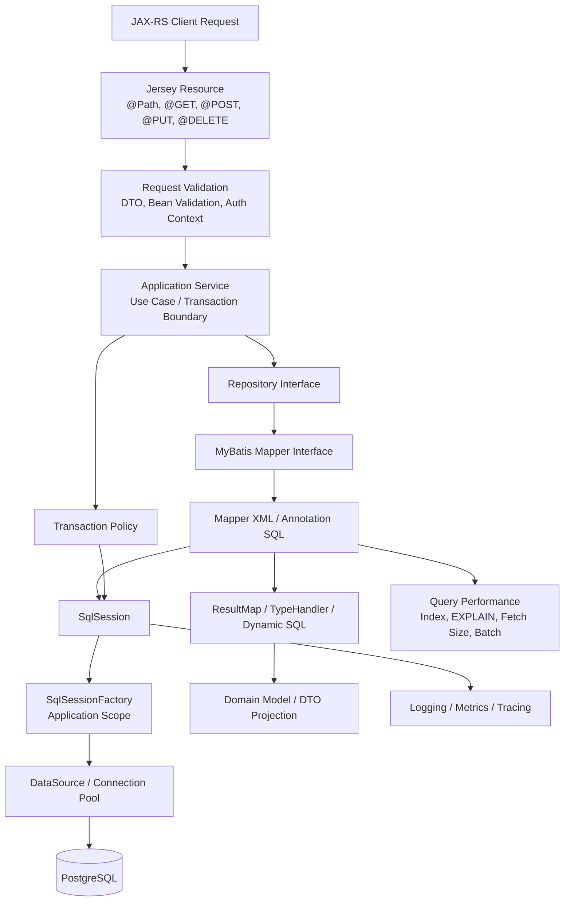
```mermaid
flowchart TD
    A[JAX-RS Client Request] --> B[Jersey Resource<br/>@Path, @GET, @POST, @PUT, @DELETE]
    B --> C[Request Validation<br/>DTO, Bean Validation, Auth Context]
    C --> D[Application Service<br/>Use Case / Transaction Boundary]
    D --> E[Repository Interface]
    E --> F[MyBatis Mapper Interface]
    F --> G[Mapper XML / Annotation SQL]
    G --> H[SqlSession]
    H --> I[SqlSessionFactory<br/>Application Scope]
    I --> J[DataSource / Connection Pool]
    J --> K[(PostgreSQL)]

    D --> L[Transaction Policy]
    L --> H

    G --> M[ResultMap / TypeHandler / Dynamic SQL]
    M --> N[Domain Model / DTO Projection]

    H --> O[Logging / Metrics / Tracing]
    G --> P[Query Performance<br/>Index, EXPLAIN, Fetch Size, Batch]
```

**Invariant desain:**  
JAX-RS resource tidak boleh tahu detail SQL. Service layer memegang use case dan transaction boundary. Repository/mapper layer memegang query contract. MyBatis XML/annotation memegang SQL aktual.

---

## Decomposition Map - Java MyBatis in Jersey/JAX-RS Application

| Area / Skill | Fokus Praktis | Yang Perlu Dikuasai | Risiko / Pitfall |
|---|---|---|---|
| **1. MyBatis Mental Model** | Memahami posisi MyBatis sebagai SQL mapper | Custom SQL, mapper interface, XML mapper, annotation mapper, `SqlSession`, `SqlSessionFactory` | Menganggap MyBatis seperti ORM penuh; akhirnya domain model terlalu dipaksa mengikuti relational model |
| **2. Jersey/JAX-RS Integration Boundary** | Menentukan batas antara HTTP layer dan persistence layer | `@Path`, HTTP method resource, DTO input/output, service call | Resource langsung memanggil mapper dan membuat transaction logic tersebar |
| **3. Application Bootstrap** | Membuat `SqlSessionFactory` saat aplikasi start | Load `mybatis-config.xml`, register mapper, pilih environment | Membuat `SqlSessionFactory` berulang-ulang per request; ini bad smell karena seharusnya application-scope ([MyBatis](https://mybatis.org/mybatis-3/getting-started.html)) |
| **4. Dependency Injection Integration** | Inject repository/service/resource | HK2 binder, CDI/Weld, factory/provider pattern untuk MyBatis | Salah scope: mapper/session disimpan sebagai singleton padahal session tidak thread-safe |
| **5. SqlSession Lifecycle** | Membuka dan menutup session secara benar | `try-with-resources`, request/method-scope, `commit`, `rollback`, `close` | Connection leak, stale local cache, race condition karena `SqlSession` dishare antar thread |
| **6. Transaction Boundary** | Menentukan letak commit/rollback | Service-layer transaction, per-use-case unit of work, JDBC vs MANAGED transaction | Commit di mapper/resource; rollback tidak konsisten; partial write pada multi-query use case |
| **7. DataSource & Connection Pooling** | Menghubungkan MyBatis ke PostgreSQL | `UNPOOLED`, `POOLED`, `JNDI`, atau external pool seperti HikariCP | Pool terlalu kecil/besar; connection timeout tidak dimonitor; tidak cocok untuk Kubernetes autoscaling |
| **8. MyBatis Configuration XML** | Konfigurasi runtime MyBatis | `properties`, `settings`, `typeAliases`, `typeHandlers`, `plugins`, `environments`, `mappers` ([MyBatis](https://mybatis.org/mybatis-3/configuration.html)) | Config tumbuh tidak terkontrol; environment dev/test/prod bercampur |
| **9. Mapper Interface Design** | Membuat contract persistence yang type-safe | Interface per aggregate/table/use-case, method name konsisten, parameter object | Mapper terlalu “God interface”; query sulit ditemukan |
| **10. Mapper XML Design** | Menulis SQL eksplisit dan maintainable | `<select>`, `<insert>`, `<update>`, `<delete>`, namespace, statement id | SQL tersebar tanpa konvensi; duplikasi query; namespace bentrok |
| **11. Annotation-based Mapper** | Query sederhana tanpa XML | `@Select`, `@Insert`, `@Update`, `@Delete` | Annotation jadi tidak readable untuk query kompleks; MyBatis sendiri menyebut XML lebih cocok untuk mapping advanced ([MyBatis](https://mybatis.org/mybatis-3/getting-started.html)) |
| **12. Parameter Binding** | Mengikat input Java ke SQL | `#{}` safe binding, `@Param`, parameter object, DTO criteria | Pakai `${}` untuk user input dan membuka SQL injection |
| **13. Result Mapping** | Mapping row/result set ke object | `resultType`, `resultMap`, alias column, constructor mapping | Mengandalkan auto mapping terlalu banyak; bug silent pada column/property mismatch |
| **14. Advanced ResultMap** | Mapping object graph kompleks | `association`, `collection`, `discriminator`, nested result, column prefix | N+1 query, object duplication, performa buruk jika `<id>` result tidak didefinisikan dengan benar ([MyBatis](https://mybatis.org/mybatis-3/sqlmap-xml.html)) |
| **15. Dynamic SQL XML** | Query dengan filter opsional | `<if>`, `<choose>`, `<where>`, `<set>`, `<trim>`, `<foreach>` ([MyBatis](https://mybatis.org/mybatis-3/dynamic-sql.html)) | Query branch sulit dites; kondisi kosong menghasilkan full table scan |
| **16. MyBatis Dynamic SQL Library** | Type-safe SQL builder di Java | DSL untuk `select`, `insert`, `update`, `delete`, flexible `where`, MyBatis3 rendering ([MyBatis](https://mybatis.org/mybatis-dynamic-sql/docs/introduction.html)) | Logic SQL pindah terlalu banyak ke Java sehingga review SQL menjadi lebih sulit |
| **17. PostgreSQL-Specific Mapping** | Menggunakan fitur PostgreSQL secara aman | `jsonb`, array, enum, UUID, timestamp, stored function/procedure | Butuh custom `TypeHandler`; mapping waktu/timezone sering salah |
| **18. TypeHandler** | Custom mapping Java ↔ JDBC | Enum, JSON, array, encrypted value object, domain-specific type | Handler terlalu global dan memengaruhi query lain; enum ordinal berisiko saat enum berubah |
| **19. Stored Procedure / Function Call** | Integrasi dengan PL/pgSQL | `statementType=CALLABLE`, IN/OUT parameter, multiple result sets | Logic bisnis tersembunyi di database tanpa versioning/test yang jelas |
| **20. Pagination & Sorting** | Query list endpoint | Limit/offset, keyset pagination, whitelist sort column | Dynamic `ORDER BY` raw input; offset besar lambat |
| **21. Batch Operation** | Insert/update massal | Executor batch, JDBC batch, chunking, retry strategy | Batch terlalu besar; lock contention; gagal sebagian sulit direkonsiliasi |
| **22. Caching** | Mengontrol local cache dan second-level cache | `localCacheScope`, mapper cache, cache invalidation | Cache di aplikasi stateless/distributed bisa stale; local session cache bisa mengejutkan jika object dimutasi ([MyBatis](https://mybatis.org/mybatis-3/java-api.html)) |
| **23. Error Handling** | Translasi error persistence ke API error | SQLException mapping, constraint violation, deadlock, timeout, duplicate key | Bocorkan detail SQL/database ke HTTP response |
| **24. Observability** | Melihat query behavior runtime | SQL logging, slow query log, metrics per mapper, tracing span | Logging parameter sensitif; SQL log terlalu verbose di production |
| **25. Performance Tuning** | Menjaga query scalable | `fetchSize`, timeout, prepared statement reuse, index awareness, EXPLAIN ANALYZE | Tuning hanya di Java, padahal bottleneck ada di SQL/index/schema |
| **26. Security** | Menjaga query dan data aman | Prepared binding, least privilege DB user, masking log, secret management | `${}` injection, hardcoded credential, log berisi PII |
| **27. Testing Strategy** | Menjamin mapper benar | Unit test service, integration test mapper, Testcontainers PostgreSQL, migration seed | Mock mapper berlebihan; query tidak pernah dites terhadap PostgreSQL asli |
| **28. Migration Compatibility** | Sinkron dengan schema evolution | Flyway/Liquibase, backward-compatible SQL, contract test mapper | Deploy aplikasi sebelum migration siap; query mengacu column yang belum ada |
| **29. Multi-Environment Deployment** | Dev/test/prod/on-prem/cloud | Environment-specific datasource, secret injection, Kubernetes config, JNDI/container-managed datasource | Config drift antar environment; pool config tidak cocok antara local dan production |
| **30. Repository Pattern Discipline** | Menjaga architecture bersih | Mapper hanya persistence, repository bisa wrap mapper, service pegang business flow | Mapper dipakai langsung dari banyak layer sehingga sulit refactor |

---

## Struktur Layer yang Direkomendasikan

```text
resource/
  OrderResource.java              -> HTTP contract, status code, request/response DTO

service/
  OrderService.java               -> use case, transaction boundary, orchestration

repository/
  OrderRepository.java            -> persistence abstraction, optional wrapper over mapper

mapper/
  OrderMapper.java                -> MyBatis mapper interface
  OrderMapper.xml                 -> SQL statements and result maps

model/
  Order.java                      -> domain/entity-ish model

dto/
  CreateOrderRequest.java
  OrderResponse.java

config/
  MyBatisFactory.java
  MyBatisBinder.java
  TransactionFilter.java / UnitOfWork.java
```

**Practical rule:**  
Untuk aplikasi Jersey/JAX-RS non-Spring, jangan otomatis meniru MyBatis-Spring. Buat sendiri pola yang jelas: `SqlSessionFactory` singleton/application-scope, `SqlSession` per request/use-case, mapper diperoleh dari session, lalu commit/rollback dikelola di service boundary.

---

## Design Decision Map

| Keputusan | Pilihan Umum | Rekomendasi Praktis |
|---|---|---|
| Mapper style | XML vs annotation | XML untuk query kompleks; annotation hanya untuk query sederhana |
| Transaction boundary | Resource vs service vs repository | Service layer |
| Session scope | Singleton vs request/method | Request/method; jangan singleton |
| SQL ownership | Java code vs XML mapper | XML mapper untuk maintainability dan DBA review |
| Dynamic query | XML dynamic SQL vs MyBatis Dynamic SQL DSL | XML untuk query app biasa; DSL untuk query builder yang sangat composable |
| Result mapping | Auto mapping vs explicit resultMap | Explicit `resultMap` untuk query penting/kompleks |
| Pagination | Offset vs keyset | Offset untuk admin/simple list; keyset untuk high-volume feed/list |
| Pooling | MyBatis POOLED vs external pool | External pool/JNDI lebih cocok untuk production-grade service |
| Error handling | Raw exception vs domain exception | Translasi ke domain/API error di service/resource boundary |
| Testing | Mock vs real DB | Mapper wajib integration test dengan PostgreSQL realistis |

---

## Roadmap Alur Belajar Singkat

| Tahap | Fokus | Target Output |
|---|---|---|
| **1** | MyBatis mental model, `SqlSessionFactory`, `SqlSession`, mapper interface | Bisa membuat query CRUD sederhana dari Jersey service |
| **2** | Mapper XML, parameter binding, resultMap | Bisa mapping query join ke DTO/domain object |
| **3** | Transaction boundary dan session lifecycle | Bisa membuat unit-of-work aman untuk multi-query use case |
| **4** | Dynamic SQL, pagination, sorting, batch | Bisa membuat endpoint list/search/write massal yang aman |
| **5** | PostgreSQL-specific mapping dan TypeHandler | Bisa handle `jsonb`, enum, UUID, timestamp, array |
| **6** | Testing, observability, performance tuning | Bisa membuktikan query benar, cepat, dan bisa di-debug di production |
| **7** | Deployment concerns | Bisa menjalankan MyBatis app stabil di Docker/Kubernetes/on-prem/cloud |

---

## Rekomendasi Materi Selanjutnya

Lanjutkan dengan **cheatsheet “Java MyBatis Bootstrap, SqlSession Lifecycle, Transaction Boundary, and Jersey/HK2 Integration Pattern”** karena itu fondasi paling kritis sebelum masuk ke mapper XML, dynamic SQL, dan PostgreSQL-specific optimization.

---

**Sources:**

- [MyBatis 3 | Introduction – mybatis](https://mybatis.org/mybatis-3/index.html)

## Response:
7/13/2026, 2:14:26 AM

Kita mulai dari fondasi yang menentukan stabil/tidaknya integrasi: bootstrap MyBatis, lifecycle `SqlSession`, transaction boundary, dan wiring ke Jersey/HK2. Saya akan fokus ke pola praktis production-style, bukan sekadar “hello world”.

# Cheatsheet - Java MyBatis Bootstrap, SqlSession Lifecycle, Transaction Boundary, dan Jersey/HK2 Integration Pattern

## 1. Introduction

Fokus cheatsheet ini adalah **cara memasang MyBatis secara benar di aplikasi Jersey/JAX-RS**, terutama ketika aplikasi **bukan Spring Boot** dan tidak memakai `mybatis-spring`.

Poin paling penting:

- `SqlSessionFactory` adalah **application-scope / singleton-like**.
- `SqlSession` adalah **request-scope atau method-scope**, tidak thread-safe, dan wajib ditutup.
- Mapper MyBatis diperoleh dari `SqlSession`, sehingga mapper juga jangan diperlakukan sebagai singleton global.
- Transaction boundary sebaiknya berada di **service layer**, bukan resource layer dan bukan mapper layer.
- Jersey/HK2 dipakai untuk wiring dependency, tetapi lifecycle database tetap harus dikontrol eksplisit.

MyBatis secara resmi menyatakan bahwa `SqlSessionFactory` sebaiknya hidup selama aplikasi berjalan, sedangkan `SqlSession` tidak boleh dishare antar thread dan scope terbaiknya adalah request atau method scope. Dokumentasi juga menekankan bahwa session harus selalu ditutup, misalnya dengan `try-with-resources`. ([MyBatis](https://mybatis.org/mybatis-3/getting-started.html))

---

## 2. Mental Model

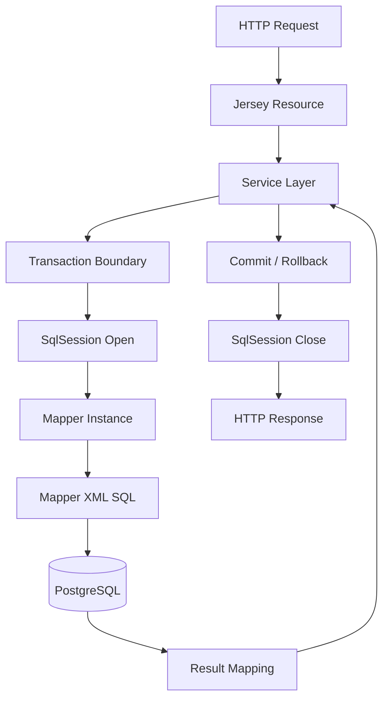
```mermaid id="bg9vlp"
flowchart TD
    A[HTTP Request] --> B[Jersey Resource]
    B --> C[Service Layer]
    C --> D[Transaction Boundary]
    D --> E[SqlSession Open]
    E --> F[Mapper Instance]
    F --> G[Mapper XML SQL]
    G --> H[(PostgreSQL)]
    H --> I[Result Mapping]
    I --> C
    C --> J[Commit / Rollback]
    J --> K[SqlSession Close]
    K --> L[HTTP Response]
```

### Core Rule

```text id="n83p3b"
Resource menerima HTTP.
Service menjalankan use case.
Transaction boundary hidup di service.
Repository/mapper menjalankan SQL.
SqlSession hidup hanya selama use case/request.
SqlSessionFactory hidup selama aplikasi berjalan.
```

---

## 3. Scope Map

| Komponen | Scope yang Benar | Boleh Singleton? | Catatan |
|---|---:|---:|---|
| `SqlSessionFactoryBuilder` | Method/local variable | Tidak perlu | Dipakai untuk membangun `SqlSessionFactory`, lalu dibuang |
| `SqlSessionFactory` | Application scope | Ya | Satu factory per database/environment aktif |
| `SqlSession` | Request/method scope | Tidak | Tidak thread-safe; harus ditutup |
| Mapper interface instance | Method/request scope | Tidak ideal | Mapper diperoleh dari `SqlSession`; scope efektifnya mengikuti session |
| Repository | Application scope | Ya, jika stateless | Jangan menyimpan `SqlSession` sebagai field |
| Service | Application scope | Ya, jika stateless | Boleh inject repository/unit-of-work |
| Jersey Resource | Tergantung konfigurasi Jersey | Hati-hati | Jangan simpan mutable request state sebagai field |
| DataSource / Pool | Application scope | Ya | Umumnya external pool/JNDI/HikariCP |

---

## 4. Maven Dependencies

Minimal dependency untuk MyBatis core:

```xml id="bptmhh"
<dependency>
  <groupId>org.mybatis</groupId>
  <artifactId>mybatis</artifactId>
  <version>3.5.19</version>
</dependency>
```

Tambahkan PostgreSQL JDBC driver:

```xml id="8idyuq"
<dependency>
  <groupId>org.postgresql</groupId>
  <artifactId>postgresql</artifactId>
  <version>${postgresql.version}</version>
</dependency>
```

Untuk Jersey/HK2, biasanya aplikasi sudah punya dependency Jersey server/container. Jersey mendukung custom injection dengan `Factory`/`Supplier` dan binder yang diregister ke `ResourceConfig`; dokumentasi Jersey menunjukkan pola register custom binder di `ResourceConfig`. ([Eclipse EE4J](https://eclipse-ee4j.github.io/jersey.github.io/documentation/latest/ioc.html))

---

## 5. File Layout yang Direkomendasikan

```text id="gohgb4"
src/main/java/com/company/app/
  api/
    OrderResource.java

  service/
    OrderService.java

  repository/
    OrderRepository.java
    MyBatisOrderRepository.java

  mapper/
    OrderMapper.java

  persistence/
    MyBatisFactory.java
    MyBatisUnitOfWork.java
    MyBatisUnitOfWorkFactory.java
    MyBatisBinder.java

  model/
    Order.java

  dto/
    CreateOrderRequest.java
    OrderResponse.java

src/main/resources/
  mybatis-config.xml
  mapper/
    OrderMapper.xml
```

**Prinsipnya:** file Java mengatur flow aplikasi; XML mapper mengatur SQL.

---

## 6. `mybatis-config.xml`

Contoh sederhana:

```xml id="jswpvk"
<?xml version="1.0" encoding="UTF-8" ?>
<!DOCTYPE configuration
  PUBLIC "-//mybatis.org//DTD Config 3.0//EN"
  "https://mybatis.org/dtd/mybatis-3-config.dtd">

<configuration>
  <properties resource="database.properties"/>

  <settings>
    <setting name="mapUnderscoreToCamelCase" value="true"/>
    <setting name="localCacheScope" value="SESSION"/>
    <setting name="jdbcTypeForNull" value="NULL"/>
  </settings>

  <typeAliases>
    <package name="com.company.app.model"/>
  </typeAliases>

  <environments default="development">
    <environment id="development">
      <transactionManager type="JDBC"/>
      <dataSource type="POOLED">
        <property name="driver" value="${db.driver}"/>
        <property name="url" value="${db.url}"/>
        <property name="username" value="${db.username}"/>
        <property name="password" value="${db.password}"/>
      </dataSource>
    </environment>
  </environments>

  <mappers>
    <mapper resource="mapper/OrderMapper.xml"/>
  </mappers>
</configuration>
```

MyBatis mendukung beberapa `environment`, tetapi hanya **satu environment aktif per `SqlSessionFactory`**. Jika aplikasi terhubung ke dua database berbeda, buat dua `SqlSessionFactory`, satu per database. ([MyBatis](https://mybatis.org/mybatis-3/configuration.html))

---

## 7. Bootstrap `SqlSessionFactory`

```java id="6t2bye"
package com.company.app.persistence;

import java.io.IOException;
import java.io.Reader;

import org.apache.ibatis.io.Resources;
import org.apache.ibatis.session.SqlSessionFactory;
import org.apache.ibatis.session.SqlSessionFactoryBuilder;

public final class MyBatisFactory {
    private static final String CONFIG_RESOURCE = "mybatis-config.xml";

    private final SqlSessionFactory sqlSessionFactory;

    public MyBatisFactory(String environment) {
        this.sqlSessionFactory = buildSqlSessionFactory(environment);
    }

    public SqlSessionFactory sqlSessionFactory() {
        return sqlSessionFactory;
    }

    private SqlSessionFactory buildSqlSessionFactory(String environment) {
        try (Reader reader = Resources.getResourceAsReader(CONFIG_RESOURCE)) {
            return new SqlSessionFactoryBuilder().build(reader, environment);
        } catch (IOException e) {
            throw new IllegalStateException("Failed to load MyBatis configuration", e);
        }
    }
}
```

### Kenapa `SqlSessionFactoryBuilder` tidak disimpan?

Karena builder hanya dipakai untuk membuat factory. Setelah `SqlSessionFactory` terbentuk, factory itulah yang dipakai sepanjang runtime aplikasi. Ini selaras dengan rekomendasi MyBatis: builder cukup method scope, factory application scope. ([MyBatis](https://mybatis.org/mybatis-3/getting-started.html))

---

## 8. Jersey `ResourceConfig`

Jakarta REST menggunakan `@ApplicationPath` untuk menentukan base URI bagi resource yang memakai `@Path`. ([Jakarta EE](https://jakarta.ee/specifications/restful-ws/3.1/apidocs/jakarta.ws.rs/jakarta/ws/rs/applicationpath))

```java id="jvezwb"
package com.company.app;

import jakarta.ws.rs.ApplicationPath;

import org.glassfish.jersey.server.ResourceConfig;

import com.company.app.persistence.MyBatisBinder;

@ApplicationPath("/api")
public class AppResourceConfig extends ResourceConfig {

    public AppResourceConfig() {
        packages("com.company.app.api");

        String environment = resolveEnvironment();

        register(new MyBatisBinder(environment));
    }

    private String resolveEnvironment() {
        return System.getenv().getOrDefault("APP_ENV", "development");
    }
}
```

---

## 9. HK2 Binder untuk MyBatis

Ada dua pendekatan praktis:

1. Inject `SqlSessionFactory`, lalu buka session manual di service/unit-of-work.
2. Inject `UnitOfWorkFactory`, lalu service menjalankan transaksi via callback.

Untuk aplikasi production-style, pendekatan kedua biasanya lebih rapi karena transaction lifecycle tidak tersebar.

```java id="4qbda2"
package com.company.app.persistence;

import jakarta.inject.Singleton;

import org.apache.ibatis.session.SqlSessionFactory;
import org.glassfish.hk2.utilities.binding.AbstractBinder;

public class MyBatisBinder extends AbstractBinder {

    private final String environment;

    public MyBatisBinder(String environment) {
        this.environment = environment;
    }

    @Override
    protected void configure() {
        MyBatisFactory factory = new MyBatisFactory(environment);

        bind(factory.sqlSessionFactory())
            .to(SqlSessionFactory.class)
            .in(Singleton.class);

        bind(MyBatisUnitOfWorkFactory.class)
            .to(MyBatisUnitOfWorkFactory.class)
            .in(Singleton.class);

        bind(MyBatisOrderRepository.class)
            .to(OrderRepository.class)
            .in(Singleton.class);

        bind(OrderService.class)
            .to(OrderService.class)
            .in(Singleton.class);
    }
}
```

Jersey mendokumentasikan bahwa custom binder perlu diregister di `ResourceConfig`, dan binder dapat dipakai untuk mendefinisikan injection binding serta scope. ([Eclipse EE4J](https://eclipse-ee4j.github.io/jersey.github.io/documentation/latest/ioc.html))

---

## 10. Unit of Work Pattern

### Interface

```java id="6n61fc"
package com.company.app.persistence;

@FunctionalInterface
public interface MyBatisWork<T> {
    T execute(MyBatisSessionContext context);
}
```

```java id="s6qvq4"
package com.company.app.persistence;

import org.apache.ibatis.session.SqlSession;

public final class MyBatisSessionContext {
    private final SqlSession session;

    MyBatisSessionContext(SqlSession session) {
        this.session = session;
    }

    public <T> T mapper(Class<T> mapperType) {
        return session.getMapper(mapperType);
    }
}
```

### Factory

```java id="3mrxlq"
package com.company.app.persistence;

import jakarta.inject.Inject;

import org.apache.ibatis.session.SqlSession;
import org.apache.ibatis.session.SqlSessionFactory;

public class MyBatisUnitOfWorkFactory {

    private final SqlSessionFactory sqlSessionFactory;

    @Inject
    public MyBatisUnitOfWorkFactory(SqlSessionFactory sqlSessionFactory) {
        this.sqlSessionFactory = sqlSessionFactory;
    }

    public <T> T readOnly(MyBatisWork<T> work) {
        try (SqlSession session = sqlSessionFactory.openSession()) {
            return work.execute(new MyBatisSessionContext(session));
        }
    }

    public <T> T transactional(MyBatisWork<T> work) {
        try (SqlSession session = sqlSessionFactory.openSession(false)) {
            try {
                T result = work.execute(new MyBatisSessionContext(session));
                session.commit();
                return result;
            } catch (RuntimeException | Error e) {
                session.rollback();
                throw e;
            }
        }
    }
}
```

`SqlSession` memiliki operasi `commit`, `rollback`, `close`, dan `getMapper`; Javadoc MyBatis mendeskripsikan `SqlSession` sebagai interface utama untuk menjalankan command, mengambil mapper, dan mengelola transaksi. ([MyBatis](https://mybatis.org/mybatis-3/apidocs/org/apache/ibatis/session/SqlSession.html))

---

## 11. Service Layer sebagai Transaction Boundary

```java id="1jav0u"
package com.company.app.service;

import jakarta.inject.Inject;

import com.company.app.dto.CreateOrderRequest;
import com.company.app.dto.OrderResponse;
import com.company.app.mapper.OrderMapper;
import com.company.app.model.Order;
import com.company.app.persistence.MyBatisUnitOfWorkFactory;

public class OrderService {

    private final MyBatisUnitOfWorkFactory unitOfWorkFactory;

    @Inject
    public OrderService(MyBatisUnitOfWorkFactory unitOfWorkFactory) {
        this.unitOfWorkFactory = unitOfWorkFactory;
    }

    public OrderResponse createOrder(CreateOrderRequest request) {
        return unitOfWorkFactory.transactional(ctx -> {
            OrderMapper mapper = ctx.mapper(OrderMapper.class);

            Order order = Order.create(
                request.customerId(),
                request.items()
            );

            mapper.insertOrder(order);

            return OrderResponse.from(order);
        });
    }

    public OrderResponse getOrder(long orderId) {
        return unitOfWorkFactory.readOnly(ctx -> {
            OrderMapper mapper = ctx.mapper(OrderMapper.class);

            Order order = mapper.findById(orderId);
            if (order == null) {
                throw new OrderNotFoundException(orderId);
            }

            return OrderResponse.from(order);
        });
    }
}
```

### Kenapa service layer?

Karena satu use case bisa berisi beberapa operasi:

```text id="6nztu0"
createOrder:
  insert order
  insert order items
  reserve inventory
  write audit log
  publish outbox event
```

Semua itu harus berada dalam satu transaction boundary bila konsistensi database mengharuskannya. Kalau commit dilakukan di mapper, transaksi akan pecah dan rollback menjadi sulit.

---

## 12. Repository Wrapper Pattern

Ada dua gaya.

### Gaya A - Service langsung pakai Mapper

Cocok untuk aplikasi kecil/menengah.

```java id="a9b7gm"
return unitOfWorkFactory.transactional(ctx -> {
    OrderMapper mapper = ctx.mapper(OrderMapper.class);
    mapper.insertOrder(order);
    mapper.insertItems(order.items());
    return order.id();
});
```

### Gaya B - Service pakai Repository

Cocok untuk aplikasi enterprise/regulatory/complex case management karena repository bisa menyembunyikan detail mapper dan SQL orchestration.

```java id="v74bxt"
public interface OrderRepository {
    Order findById(long id);
    void save(Order order);
}
```

```java id="a7sjtw"
public class MyBatisOrderRepository implements OrderRepository {

    private final MyBatisSessionContext context;

    public MyBatisOrderRepository(MyBatisSessionContext context) {
        this.context = context;
    }

    @Override
    public Order findById(long id) {
        return context.mapper(OrderMapper.class).findById(id);
    }

    @Override
    public void save(Order order) {
        OrderMapper mapper = context.mapper(OrderMapper.class);
        mapper.insertOrder(order);
        mapper.insertItems(order.items());
    }
}
```

Namun hati-hati: contoh di atas membutuhkan repository yang dibuat per session/context. Jika repository dibuat singleton, jangan simpan `MyBatisSessionContext` sebagai field.

Versi lebih aman:

```java id="7y0qrs"
public class OrderService {

    private final MyBatisUnitOfWorkFactory unitOfWorkFactory;

    public OrderResponse createOrder(CreateOrderRequest request) {
        return unitOfWorkFactory.transactional(ctx -> {
            OrderRepository repository = new MyBatisOrderRepository(ctx);

            Order order = Order.create(request.customerId(), request.items());
            repository.save(order);

            return OrderResponse.from(order);
        });
    }
}
```

---

## 13. Mapper Interface

```java id="c4va1t"
package com.company.app.mapper;

import org.apache.ibatis.annotations.Param;

import com.company.app.model.Order;

public interface OrderMapper {

    Order findById(@Param("id") long id);

    int insertOrder(Order order);

    int insertItems(@Param("order") Order order);
}
```

Mapper instance sebaiknya diminta dari `SqlSession` saat dipakai. Dokumentasi MyBatis menyatakan mapper diperoleh dari `SqlSession`; scope terluasnya mengikuti session, tetapi scope terbaiknya adalah method scope. ([MyBatis](https://mybatis.org/mybatis-3/getting-started.html))

---

## 14. Mapper XML

```xml id="520emh"
<?xml version="1.0" encoding="UTF-8" ?>
<!DOCTYPE mapper
  PUBLIC "-//mybatis.org//DTD Mapper 3.0//EN"
  "https://mybatis.org/dtd/mybatis-3-mapper.dtd">

<mapper namespace="com.company.app.mapper.OrderMapper">

  <resultMap id="OrderResultMap" type="Order">
    <id property="id" column="id"/>
    <result property="customerId" column="customer_id"/>
    <result property="status" column="status"/>
    <result property="createdAt" column="created_at"/>
    <result property="updatedAt" column="updated_at"/>
  </resultMap>

  <select id="findById" resultMap="OrderResultMap">
    SELECT
      id,
      customer_id,
      status,
      created_at,
      updated_at
    FROM orders
    WHERE id = #{id}
  </select>

  <insert id="insertOrder"
          parameterType="Order"
          useGeneratedKeys="true"
          keyProperty="id">
    INSERT INTO orders (
      customer_id,
      status,
      created_at,
      updated_at
    )
    VALUES (
      #{customerId},
      #{status},
      #{createdAt},
      #{updatedAt}
    )
  </insert>

  <insert id="insertItems">
    INSERT INTO order_items (
      order_id,
      product_id,
      quantity,
      unit_price
    )
    VALUES
    <foreach collection="order.items"
             item="item"
             separator=",">
      (
        #{order.id},
        #{item.productId},
        #{item.quantity},
        #{item.unitPrice}
      )
    </foreach>
  </insert>

</mapper>
```

---

## 15. Resource Layer

```java id="yq1vew"
package com.company.app.api;

import jakarta.inject.Inject;
import jakarta.validation.Valid;
import jakarta.ws.rs.GET;
import jakarta.ws.rs.POST;
import jakarta.ws.rs.Path;
import jakarta.ws.rs.PathParam;
import jakarta.ws.rs.core.Response;

import com.company.app.dto.CreateOrderRequest;
import com.company.app.dto.OrderResponse;
import com.company.app.service.OrderService;

@Path("/orders")
public class OrderResource {

    private final OrderService orderService;

    @Inject
    public OrderResource(OrderService orderService) {
        this.orderService = orderService;
    }

    @POST
    public Response create(@Valid CreateOrderRequest request) {
        OrderResponse response = orderService.createOrder(request);
        return Response.status(Response.Status.CREATED)
            .entity(response)
            .build();
    }

    @GET
    @Path("/{id}")
    public Response findById(@PathParam("id") long id) {
        OrderResponse response = orderService.getOrder(id);
        return Response.ok(response).build();
    }
}
```

Resource tidak membuka `SqlSession`, tidak melakukan commit, tidak tahu SQL, dan tidak tahu mapper XML.

---

## 16. Transaction Pattern

| Use Case | Transaction Mode | Pattern |
|---|---|---|
| GET by ID | Read-only session | `unitOfWork.readOnly(...)` |
| Search/list | Read-only session | Batasi pagination dan filter |
| Create aggregate | Transactional | Insert root + child + audit dalam satu transaksi |
| Update status | Transactional | Load current state → validate transition → update |
| Delete/archive | Transactional | Soft delete + audit log |
| Batch import | Transactional per chunk | Chunking, bukan satu transaksi raksasa |
| Outbox event | Same DB transaction | Insert domain data + outbox event bersama |

---

## 17. Anti-Pattern yang Harus Dihindari

| Anti-Pattern | Contoh Buruk | Dampak |
|---|---|---|
| Singleton `SqlSession` | `private static SqlSession session;` | Race condition, stale cache, data corruption |
| Singleton mapper | Mapper disimpan sebagai field singleton | Mapper terikat ke session yang salah |
| Commit di mapper | `mapper.insert(); session.commit();` | Transaction tersebar |
| Resource membuka transaksi | `OrderResource` memanggil `openSession()` | HTTP layer terlalu tahu persistence |
| Semua pakai auto-commit | Tiap query commit sendiri | Use case multi-step tidak atomic |
| XML mapper tanpa resultMap eksplisit | Mengandalkan auto mapping untuk query penting | Bug mapping sulit terlihat |
| `${}` untuk parameter user | `ORDER BY ${sort}` tanpa whitelist | SQL injection |
| Session tidak ditutup | Tidak pakai `try-with-resources` | Connection leak |
| Satu factory untuk banyak DB | Satu `SqlSessionFactory` dipaksa multi-database | Environment/config kacau |

---

## 18. Production-Grade Checklist

| Checklist | Wajib? | Catatan |
|---|---:|---|
| `SqlSessionFactory` dibuat sekali saat aplikasi start | Ya | Application scope |
| `SqlSession` dibuat per use case/request | Ya | Jangan simpan sebagai field |
| Semua session ditutup | Ya | Pakai `try-with-resources` |
| Service layer mengontrol transaction boundary | Ya | Commit/rollback konsisten |
| Mapper XML punya namespace sesuai interface | Ya | Hindari mismatch |
| Query penting pakai explicit `resultMap` | Ya | Lebih aman untuk refactor |
| SQL log bisa diaktifkan saat debugging | Ya | Jangan bocorkan data sensitif |
| Database credential dari env/secret | Ya | Jangan hardcode |
| Migration jalan sebelum app start | Ya | Flyway/Liquibase |
| Integration test mapper dengan PostgreSQL asli/Testcontainers | Sangat disarankan | Mock mapper tidak cukup |
| Timeout query/pool dikontrol | Ya | Hindari thread menggantung |
| Error database diterjemahkan ke API error | Ya | Jangan expose raw SQL exception |

---

## 19. Failure Model

| Failure | Penyebab Umum | Mitigasi |
|---|---|---|
| Connection leak | Session tidak ditutup | `try-with-resources`; test leak; pool metrics |
| Dirty partial write | Commit terlalu awal | Transaction boundary di service |
| Race condition | `SqlSession` dishare | Session per request/method |
| Query lambat | Missing index, full scan, pagination buruk | EXPLAIN ANALYZE, index review, keyset pagination |
| Deadlock | Update row dalam urutan berbeda | Konsistenkan lock ordering |
| Duplicate data | Retry tanpa idempotency | Idempotency key / unique constraint |
| Stale object | Local cache session terlalu panjang | Session pendek; clear cache bila perlu |
| SQL injection | `${}` dengan user input | `#{}` binding; whitelist untuk identifier |
| Config drift | Environment dev/prod beda manual | Config via env/secret/template |
| Mapper mismatch | XML id/namespace salah | Startup validation + integration test |

---

## 20. Minimal End-to-End Flow

```text id="4r91wq"
POST /api/orders
  -> OrderResource.create()
    -> OrderService.createOrder()
      -> unitOfWork.transactional()
        -> open SqlSession
        -> get OrderMapper
        -> insert orders
        -> insert order_items
        -> commit
        -> close SqlSession
    -> return 201 Created
```

**Invariant:** kalau `insert order_items` gagal, `insert orders` harus rollback.

---

## 21. Versi “Bad” vs “Good”

### Bad

```java id="cd92oc"
@Path("/orders")
public class OrderResource {

    private static SqlSession session;

    @POST
    public Response create(CreateOrderRequest request) {
        OrderMapper mapper = session.getMapper(OrderMapper.class);
        mapper.insertOrder(...);
        session.commit();
        return Response.ok().build();
    }
}
```

Masalah:

- `SqlSession` static.
- Tidak thread-safe.
- Resource layer mengelola transaksi.
- Session tidak jelas kapan ditutup.
- Commit tersebar.

### Good

```java id="gp2b7s"
@Path("/orders")
public class OrderResource {

    private final OrderService orderService;

    @Inject
    public OrderResource(OrderService orderService) {
        this.orderService = orderService;
    }

    @POST
    public Response create(CreateOrderRequest request) {
        return Response.status(Response.Status.CREATED)
            .entity(orderService.createOrder(request))
            .build();
    }
}
```

```java id="foy5gi"
public class OrderService {

    private final MyBatisUnitOfWorkFactory uow;

    public OrderResponse createOrder(CreateOrderRequest request) {
        return uow.transactional(ctx -> {
            OrderMapper mapper = ctx.mapper(OrderMapper.class);
            Order order = Order.create(request.customerId(), request.items());

            mapper.insertOrder(order);
            mapper.insertItems(order);

            return OrderResponse.from(order);
        });
    }
}
```

---

## 22. Decision Table

| Kondisi | Pilihan yang Tepat |
|---|---|
| Aplikasi Jersey murni/non-Spring | Manual `SqlSessionFactory` + Unit of Work |
| Aplikasi memakai Spring | Gunakan MyBatis-Spring / `SqlSessionTemplate` |
| Query sederhana | Annotation mapper boleh |
| Query kompleks/join/dynamic SQL | XML mapper lebih maintainable |
| Banyak optional filter | Dynamic SQL XML atau MyBatis Dynamic SQL |
| Butuh multi-step atomic use case | Transaction boundary di service |
| Butuh read-only high volume | Session pendek + pagination + index |
| Butuh audit/outbox | Satu transaksi dengan write utama |
| Butuh multi-database | Satu `SqlSessionFactory` per database |

MyBatis-Spring berbeda dari pola manual ini: `SqlSessionTemplate` thread-safe, mengelola lifecycle session, serta commit/rollback berdasarkan transaksi Spring. Itu relevan kalau aplikasinya Spring; untuk Jersey non-Spring, kita perlu mengelola lifecycle secara eksplisit atau membangun abstraction seperti Unit of Work. ([MyBatis](https://mybatis.org/spring/sqlsession.html))

---

## 23. Roadmap Belajar Singkat

| Urutan | Materi | Target Praktis |
|---:|---|---|
| 1 | `SqlSessionFactory`, `SqlSession`, mapper lifecycle | Paham scope dan lifecycle |
| 2 | Bootstrap MyBatis di Jersey | Bisa start app dengan config bersih |
| 3 | HK2 binder dan DI | Bisa inject service/repository/factory |
| 4 | Unit of Work | Bisa membuat transaksi konsisten |
| 5 | Mapper interface + XML | Bisa CRUD dengan SQL eksplisit |
| 6 | ResultMap dan parameter binding | Bisa mapping data secara aman |
| 7 | Error handling dan rollback | Bisa desain failure-safe use case |
| 8 | Integration test dengan PostgreSQL | Bisa validasi mapper terhadap DB asli |

---

## Rekomendasi Materi Selanjutnya

Lanjutkan ke **“Java MyBatis Mapper XML, Parameter Binding, ResultMap, Dynamic SQL, dan PostgreSQL Query Pattern”** karena setelah lifecycle dan transaction boundary benar, bagian berikutnya adalah membuat SQL mapper yang aman, maintainable, dan cocok untuk PostgreSQL production workload.

---

**Sources:**

- [MyBatis 3 | Getting started – mybatis](https://mybatis.org/mybatis-3/getting-started.html)
- [Chapter 25. Custom Injection and Lifecycle Management](https://eclipse-ee4j.github.io/jersey.github.io/documentation/latest/ioc.html)
- [ApplicationPath (Jakarta RESTful WS API 3.1.0 API)](https://jakarta.ee/specifications/restful-ws/3.1/apidocs/jakarta.ws.rs/jakarta/ws/rs/applicationpath)

## Response:
7/13/2026, 2:16:52 AM

Lanjut ke bagian mapper yang paling sering dipakai sehari-hari: XML mapper, parameter binding, result/resultMap, dynamic SQL, dan pola query PostgreSQL. Saya akan jaga fokus ke praktik di Jersey/JAX-RS, bukan mengulang lifecycle/session dari bagian sebelumnya.

# Cheatsheet - Java MyBatis Mapper XML, Parameter Binding, ResultMap, Dynamic SQL, dan PostgreSQL Query Pattern

## 1. Introduction

Di aplikasi **Jersey/JAX-RS + MyBatis**, bagian mapper adalah tempat kontrak antara **Java service layer** dan **SQL PostgreSQL** dibuat eksplisit.

Fokus materi ini:

```text
JAX-RS Resource
  -> Service / Use Case
    -> MyBatis Mapper Interface
      -> Mapper XML
        -> PostgreSQL SQL
          -> ResultMap / DTO / Domain Object
```

MyBatis dirancang agar developer tetap fokus menulis SQL; dokumentasi resminya menyebut Mapper XML sebagai pusat kekuatan MyBatis melalui mapped statements seperti `select`, `insert`, `update`, `delete`, `resultMap`, reusable `sql`, dan cache namespace. Versi dokumentasi MyBatis yang dirujuk di sini adalah **3.5.19**, last published **02 Jan 2025**. ([MyBatis](https://mybatis.org/mybatis-3/sqlmap-xml.html))

---

## 2. Mental Model Mapper

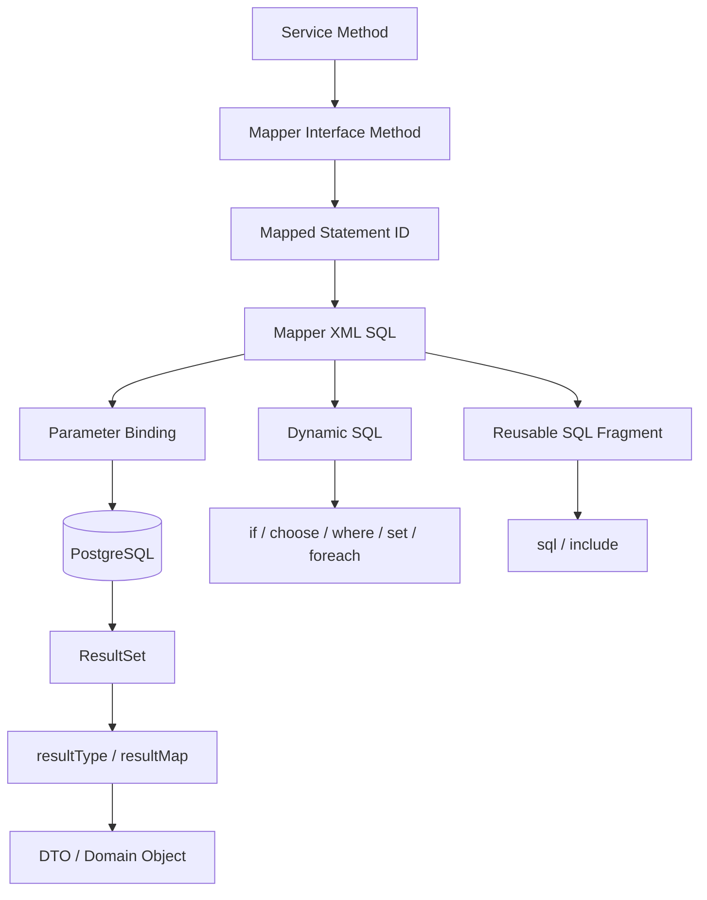
```mermaid id="ux5cgo"
flowchart TD
    A[Service Method] --> B[Mapper Interface Method]
    B --> C[Mapped Statement ID]
    C --> D[Mapper XML SQL]
    D --> E[Parameter Binding]
    E --> F[(PostgreSQL)]
    F --> G[ResultSet]
    G --> H[resultType / resultMap]
    H --> I[DTO / Domain Object]

    D --> J[Dynamic SQL]
    J --> K[if / choose / where / set / foreach]

    D --> L[Reusable SQL Fragment]
    L --> M[sql / include]
```

**Invariant:**  
Nama method di mapper interface harus cocok dengan `id` statement di XML mapper, dan `namespace` XML harus cocok dengan fully qualified name interface mapper.

---

## 3. Struktur Mapper Interface + XML

### Mapper Interface

```java id="0mtz8v"
package com.company.app.mapper;

import java.util.List;
import java.util.Optional;

import org.apache.ibatis.annotations.Param;

import com.company.app.dto.OrderSearchCriteria;
import com.company.app.model.Order;

public interface OrderMapper {

    Order findById(@Param("id") long id);

    List<Order> search(@Param("criteria") OrderSearchCriteria criteria);

    int insert(Order order);

    int updateStatus(@Param("id") long id,
                     @Param("status") String status,
                     @Param("version") long version);

    int deleteById(@Param("id") long id);
}
```

### Mapper XML

```xml id="htv6lm"
<?xml version="1.0" encoding="UTF-8" ?>
<!DOCTYPE mapper
  PUBLIC "-//mybatis.org//DTD Mapper 3.0//EN"
  "https://mybatis.org/dtd/mybatis-3-mapper.dtd">

<mapper namespace="com.company.app.mapper.OrderMapper">

  <resultMap id="OrderResultMap" type="com.company.app.model.Order">
    <id property="id" column="id"/>
    <result property="customerId" column="customer_id"/>
    <result property="status" column="status"/>
    <result property="version" column="version"/>
    <result property="createdAt" column="created_at"/>
    <result property="updatedAt" column="updated_at"/>
  </resultMap>

  <select id="findById" resultMap="OrderResultMap">
    SELECT
      id,
      customer_id,
      status,
      version,
      created_at,
      updated_at
    FROM orders
    WHERE id = #{id}
  </select>

</mapper>
```

---

## 4. Mapper XML First-Class Elements

| Element | Fungsi | Kapan Dipakai | Catatan Praktis |
|---|---|---|---|
| `cache` | Second-level cache per namespace | Jarang untuk microservice stateless | Hati-hati stale data |
| `cache-ref` | Reuse cache namespace lain | Jarang | Tambah coupling antar mapper |
| `resultMap` | Mapping ResultSet ke object | Query penting/kompleks | Lebih aman daripada implicit mapping |
| `sql` | Fragment SQL reusable | Kolom umum, join umum, filter umum | Jangan berlebihan sampai SQL sulit dibaca |
| `include` | Memakai fragment `sql` | Reuse select columns | Baik untuk standard projection |
| `select` | Query read | Paling sering | Gunakan `resultMap` untuk mapping serius |
| `insert` | Insert data | Create use case | Bisa pakai generated key |
| `update` | Update data | State transition / patch | Cocok untuk optimistic locking |
| `delete` | Delete data | Hard delete terbatas | Di enterprise sering diganti soft delete |

MyBatis Mapper XML memiliki first-class elements seperti `resultMap`, `sql`, `insert`, `update`, `delete`, dan `select`; `parameterMap` sudah deprecated dan inline parameter mapping lebih disarankan. ([MyBatis](https://mybatis.org/mybatis-3/sqlmap-xml.html))

---

## 5. Parameter Binding

### 5.1 Gunakan `#{}` untuk value binding

```xml id="6iovgo"
<select id="findById" resultMap="OrderResultMap">
  SELECT *
  FROM orders
  WHERE id = #{id}
</select>
```

`#{id}` membuat MyBatis menggunakan prepared statement parameter, mirip placeholder `?` di JDBC. Ini adalah default yang aman untuk value dari user/request. ([MyBatis](https://mybatis.org/mybatis-3/sqlmap-xml.html))

---

### 5.2 Hindari `${}` untuk input user

```xml id="n5zism"
<!-- Berbahaya jika sortColumn berasal langsung dari user -->
ORDER BY ${sortColumn}
```

`${}` melakukan string substitution langsung. Ini hanya layak untuk identifier SQL yang sudah **di-whitelist**, misalnya nama kolom sort yang dikontrol aplikasi.

### Pattern aman untuk sorting

```java id="36qe2m"
public enum OrderSortField {
    CREATED_AT("created_at"),
    STATUS("status"),
    CUSTOMER_ID("customer_id");

    private final String column;

    OrderSortField(String column) {
        this.column = column;
    }

    public String column() {
        return column;
    }
}
```

```java id="qdvfkx"
public record OrderSearchCriteria(
    String status,
    Long customerId,
    OrderSortField sortField,
    SortDirection sortDirection,
    int limit,
    int offset
) {}
```

```xml id="i0ap2p"
ORDER BY ${criteria.sortField.column} ${criteria.sortDirection}
```

**Syarat:** `sortField` dan `sortDirection` harus enum / whitelist, bukan raw string dari request.

---

### 5.3 Multiple Parameters dengan `@Param`

```java id="8ihn5s"
int updateStatus(@Param("id") long id,
                 @Param("status") String status,
                 @Param("version") long version);
```

```xml id="03xr1y"
<update id="updateStatus">
  UPDATE orders
  SET
    status = #{status},
    version = version + 1,
    updated_at = now()
  WHERE id = #{id}
    AND version = #{version}
</update>
```

Untuk method mapper dengan banyak parameter, MyBatis mendukung `@Param` agar parameter punya nama eksplisit; tanpa itu MyBatis memberi nama default seperti `param1`, `param2`, dan seterusnya. ([MyBatis](https://mybatis.org/mybatis-3/java-api.html))

---

## 6. `resultType` vs `resultMap`

| Pilihan | Cocok Untuk | Kelebihan | Risiko |
|---|---|---|---|
| `resultType` | Query sederhana, mapping 1:1 | Cepat ditulis | Rapuh untuk join/alias/field kompleks |
| `resultMap` | Query penting, join, aggregate object | Eksplisit dan aman | Lebih verbose |
| DTO Projection | API response/query read model | Efisien, tidak over-fetch | Bisa menambah banyak class |
| Domain Object | Use case business logic | Cocok untuk command/state transition | Jangan pakai untuk semua query list |

### `resultType` sederhana

```xml id="flyfe3"
<select id="countByStatus" resultType="long">
  SELECT count(*)
  FROM orders
  WHERE status = #{status}
</select>
```

### `resultMap` eksplisit

```xml id="5zreze"
<resultMap id="OrderResultMap" type="com.company.app.model.Order">
  <id property="id" column="id"/>
  <result property="customerId" column="customer_id"/>
  <result property="status" column="status"/>
  <result property="version" column="version"/>
  <result property="createdAt" column="created_at"/>
  <result property="updatedAt" column="updated_at"/>
</resultMap>
```

**Rule of thumb:**  
Untuk query yang dipakai di use case penting, gunakan `resultMap`. Untuk scalar/count/existence check, `resultType` cukup.

---

## 7. ResultMap Pattern

### 7.1 Flat entity mapping

```xml id="za9ehr"
<resultMap id="CustomerResultMap" type="com.company.app.model.Customer">
  <id property="id" column="id"/>
  <result property="name" column="name"/>
  <result property="email" column="email"/>
  <result property="status" column="status"/>
</resultMap>
```

### 7.2 DTO projection mapping

```java id="0r3cr9"
public record OrderSummaryDto(
    long id,
    String customerName,
    String status,
    int itemCount
) {}
```

```xml id="whucbp"
<resultMap id="OrderSummaryResultMap"
           type="com.company.app.dto.OrderSummaryDto">
  <constructor>
    <idArg column="id" javaType="long"/>
    <arg column="customer_name" javaType="string"/>
    <arg column="status" javaType="string"/>
    <arg column="item_count" javaType="int"/>
  </constructor>
</resultMap>
```

### 7.3 Join mapping dengan prefix

```xml id="g9csm9"
<resultMap id="OrderWithCustomerResultMap"
           type="com.company.app.dto.OrderWithCustomerDto">
  <id property="orderId" column="order_id"/>
  <result property="status" column="order_status"/>
  <association property="customer"
               javaType="com.company.app.dto.CustomerDto">
    <id property="id" column="customer_id"/>
    <result property="name" column="customer_name"/>
  </association>
</resultMap>
```

```xml id="kzgtx6"
<select id="findOrderWithCustomer" resultMap="OrderWithCustomerResultMap">
  SELECT
    o.id AS order_id,
    o.status AS order_status,
    c.id AS customer_id,
    c.name AS customer_name
  FROM orders o
  JOIN customers c ON c.id = o.customer_id
  WHERE o.id = #{id}
</select>
```

---

## 8. Reusable SQL Fragment

### 8.1 Standard columns

```xml id="6x11lo"
<sql id="OrderColumns">
  id,
  customer_id,
  status,
  version,
  created_at,
  updated_at
</sql>
```

```xml id="g0xf40"
<select id="findById" resultMap="OrderResultMap">
  SELECT
    <include refid="OrderColumns"/>
  FROM orders
  WHERE id = #{id}
</select>
```

### 8.2 Dengan table alias

```xml id="4vtlho"
<sql id="OrderColumnsWithAlias">
  o.id,
  o.customer_id,
  o.status,
  o.version,
  o.created_at,
  o.updated_at
</sql>
```

**Practical warning:**  
Fragment yang terlalu generic sering membuat SQL sulit dibaca. Gunakan fragment untuk kolom standar, bukan untuk menyembunyikan logic bisnis.

---

## 9. Dynamic SQL XML

MyBatis Dynamic SQL di XML menyediakan elemen seperti `if`, `choose`, `trim`, `where`, `set`, dan `foreach`; dokumentasi resminya menyebut elemen-elemen ini sebagai cara MyBatis mengurangi kebutuhan merangkai string SQL secara manual. ([MyBatis](https://mybatis.org/mybatis-3/dynamic-sql.html))

### 9.1 `<if>`

```xml id="mgc1rw"
<select id="search" resultMap="OrderResultMap">
  SELECT
    <include refid="OrderColumns"/>
  FROM orders
  WHERE 1 = 1

  <if test="criteria.status != null">
    AND status = #{criteria.status}
  </if>

  <if test="criteria.customerId != null">
    AND customer_id = #{criteria.customerId}
  </if>
</select>
```

Bisa jalan, tetapi `WHERE 1 = 1` biasanya lebih baik diganti `<where>`.

---

### 9.2 `<where>`

```xml id="pl5yd1"
<select id="search" resultMap="OrderResultMap">
  SELECT
    <include refid="OrderColumns"/>
  FROM orders

  <where>
    <if test="criteria.status != null">
      status = #{criteria.status}
    </if>

    <if test="criteria.customerId != null">
      AND customer_id = #{criteria.customerId}
    </if>
  </where>

  ORDER BY created_at DESC, id DESC
  LIMIT #{criteria.limit}
  OFFSET #{criteria.offset}
</select>
```

`<where>` membantu menghindari SQL invalid seperti `WHERE AND ...`.

---

### 9.3 `<choose>`

Gunakan ketika hanya boleh satu branch filter aktif.

```xml id="ty94y0"
<select id="findByReference" resultMap="OrderResultMap">
  SELECT
    <include refid="OrderColumns"/>
  FROM orders

  <where>
    <choose>
      <when test="id != null">
        id = #{id}
      </when>
      <when test="externalRef != null">
        external_ref = #{externalRef}
      </when>
      <otherwise>
        status = 'ACTIVE'
      </otherwise>
    </choose>
  </where>
</select>
```

Cocok untuk endpoint seperti:

```text
GET /orders?referenceType=ID&value=...
GET /orders?referenceType=EXTERNAL_REF&value=...
```

---

### 9.4 `<set>` untuk dynamic update

```xml id="j8f457"
<update id="patchOrder">
  UPDATE orders

  <set>
    <if test="patch.status != null">
      status = #{patch.status},
    </if>
    <if test="patch.notes != null">
      notes = #{patch.notes},
    </if>
    updated_at = now()
  </set>

  WHERE id = #{id}
    AND version = #{version}
</update>
```

`<set>` menghindari trailing comma invalid pada dynamic update.

---

### 9.5 `<foreach>` untuk `IN (...)`

```xml id="23nyyk"
<select id="findByIds" resultMap="OrderResultMap">
  SELECT
    <include refid="OrderColumns"/>
  FROM orders
  WHERE id IN
  <foreach collection="ids"
           item="id"
           open="("
           separator=","
           close=")">
    #{id}
  </foreach>
</select>
```

MyBatis mendokumentasikan `foreach` sebagai elemen umum untuk membangun kondisi `IN`, dengan dukungan `open`, `separator`, dan `close`, serta tidak menambahkan separator ekstra secara keliru. ([MyBatis](https://mybatis.org/mybatis-3/dynamic-sql.html))

**Pitfall:** list kosong bisa menghasilkan SQL invalid. Validasi di service layer:

```java id="4qy7hx"
if (ids == null || ids.isEmpty()) {
    return List.of();
}
```

---

## 10. PostgreSQL Query Pattern untuk MyBatis

### 10.1 Search endpoint pattern

```java id="v8jsnk"
public record OrderSearchCriteria(
    String status,
    Long customerId,
    Instant createdFrom,
    Instant createdTo,
    int limit,
    int offset
) {}
```

```xml id="zgvftf"
<select id="search" resultMap="OrderResultMap">
  SELECT
    <include refid="OrderColumns"/>
  FROM orders

  <where>
    <if test="criteria.status != null">
      status = #{criteria.status}
    </if>

    <if test="criteria.customerId != null">
      AND customer_id = #{criteria.customerId}
    </if>

    <if test="criteria.createdFrom != null">
      AND created_at &gt;= #{criteria.createdFrom}
    </if>

    <if test="criteria.createdTo != null">
      AND created_at &lt; #{criteria.createdTo}
    </if>
  </where>

  ORDER BY created_at DESC, id DESC
  LIMIT #{criteria.limit}
  OFFSET #{criteria.offset}
</select>
```

PostgreSQL menegaskan bahwa `LIMIT` tanpa `ORDER BY` yang menghasilkan urutan unik dapat memberi subset yang tidak predictable, dan `OFFSET` besar bisa tidak efisien karena row yang dilewati tetap perlu dihitung di server. ([PostgreSQL](https://www.postgresql.org/docs/current/queries-limit.html))

---

### 10.2 Keyset pagination pattern

Offset pagination:

```sql id="38s2yd"
ORDER BY created_at DESC, id DESC
LIMIT 50 OFFSET 10000
```

Keyset pagination:

```xml id="o7wwlo"
<select id="searchAfter" resultMap="OrderResultMap">
  SELECT
    <include refid="OrderColumns"/>
  FROM orders

  <where>
    <if test="criteria.status != null">
      status = #{criteria.status}
    </if>

    <if test="cursorCreatedAt != null and cursorId != null">
      AND (
        created_at &lt; #{cursorCreatedAt}
        OR (created_at = #{cursorCreatedAt} AND id &lt; #{cursorId})
      )
    </if>
  </where>

  ORDER BY created_at DESC, id DESC
  LIMIT #{limit}
</select>
```

**Gunakan keyset pagination jika:**

| Kondisi | Rekomendasi |
|---|---|
| List kecil/admin page | Offset masih oke |
| High-volume event/order/case list | Keyset lebih aman |
| User butuh lompat ke page 100 | Offset lebih sederhana |
| User scroll next/previous | Keyset lebih cocok |
| Data sering berubah | Keyset lebih stabil |

---

### 10.3 Existence check

Jangan ambil semua kolom hanya untuk cek ada/tidak.

```xml id="b2wziq"
<select id="existsByExternalRef" resultType="boolean">
  SELECT EXISTS (
    SELECT 1
    FROM orders
    WHERE external_ref = #{externalRef}
  )
</select>
```

---

### 10.4 Count query

```xml id="zd5gux"
<select id="countSearch" resultType="long">
  SELECT count(*)
  FROM orders

  <where>
    <if test="criteria.status != null">
      status = #{criteria.status}
    </if>

    <if test="criteria.customerId != null">
      AND customer_id = #{criteria.customerId}
    </if>
  </where>
</select>
```

**Warning:** `count(*)` pada tabel besar dengan filter kompleks bisa mahal. Jangan otomatis count di setiap list endpoint jika UI tidak benar-benar butuh total count.

---

### 10.5 Optimistic locking update

```xml id="05d2zr"
<update id="transitionStatus">
  UPDATE orders
  SET
    status = #{newStatus},
    version = version + 1,
    updated_at = now()
  WHERE id = #{id}
    AND status = #{expectedStatus}
    AND version = #{expectedVersion}
</update>
```

Service layer:

```java id="2gxz56"
int updated = mapper.transitionStatus(
    orderId,
    expectedStatus,
    newStatus,
    expectedVersion
);

if (updated == 0) {
    throw new ConcurrentModificationException(
        "Order was modified by another transaction"
    );
}
```

Pattern ini cocok untuk lifecycle object seperti:

```text
DRAFT -> SUBMITTED -> APPROVED -> FULFILLED
```

---

### 10.6 Soft delete / archive

```xml id="j4a9uf"
<update id="archiveById">
  UPDATE orders
  SET
    archived = true,
    archived_at = now(),
    updated_at = now(),
    version = version + 1
  WHERE id = #{id}
    AND archived = false
</update>
```

Untuk sistem enterprise/regulatory, soft delete biasanya lebih aman daripada hard delete karena auditability.

---

### 10.7 Insert dengan generated key

```xml id="3m6iea"
<insert id="insert"
        parameterType="com.company.app.model.Order"
        useGeneratedKeys="true"
        keyProperty="id">
  INSERT INTO orders (
    customer_id,
    status,
    version,
    created_at,
    updated_at
  )
  VALUES (
    #{customerId},
    #{status},
    #{version},
    #{createdAt},
    #{updatedAt}
  )
</insert>
```

Jika memakai PostgreSQL `RETURNING`, bisa gunakan pattern select/insert tergantung kebutuhan. Untuk flow kompleks, explicit `RETURNING` sering lebih jelas.

---

### 10.8 PostgreSQL `RETURNING` pattern

```xml id="88qs7z"
<select id="insertReturning" resultMap="OrderResultMap">
  INSERT INTO orders (
    customer_id,
    status,
    version,
    created_at,
    updated_at
  )
  VALUES (
    #{customerId},
    #{status},
    0,
    now(),
    now()
  )
  RETURNING
    id,
    customer_id,
    status,
    version,
    created_at,
    updated_at
</select>
```

Catatan: secara semantik ini SQL `INSERT`, tetapi di MyBatis bisa dipetakan sebagai statement yang mengembalikan result. Gunakan konsisten di project agar tidak membingungkan reviewer.

---

## 11. Batch Insert Pattern

### 11.1 Multi-row insert dengan `<foreach>`

```xml id="2i399d"
<insert id="insertItems">
  INSERT INTO order_items (
    order_id,
    product_id,
    quantity,
    unit_price
  )
  VALUES
  <foreach collection="items"
           item="item"
           separator=",">
    (
      #{item.orderId},
      #{item.productId},
      #{item.quantity},
      #{item.unitPrice}
    )
  </foreach>
</insert>
```

### 11.2 Chunking di service layer

```java id="4r4e8r"
private static final int CHUNK_SIZE = 500;

public void insertItems(List<OrderItem> items) {
    for (int start = 0; start < items.size(); start += CHUNK_SIZE) {
        int end = Math.min(start + CHUNK_SIZE, items.size());
        mapper.insertItems(items.subList(start, end));
    }
}
```

**Kenapa perlu chunking?**

| Risiko | Penjelasan |
|---|---|
| SQL terlalu besar | Multi-row insert bisa melewati batas praktis |
| Lock terlalu lama | Transaction besar menahan resource |
| Error recovery sulit | Gagal di tengah batch besar susah direkonsiliasi |
| Memory pressure | Parameter list terlalu besar |

---

## 12. Dynamic ORDER BY yang Aman

### Bad

```xml id="95ujq5"
ORDER BY ${sort}
```

Jika `sort` berasal dari query parameter user, ini injection risk.

### Good

```java id="l7z01c"
public enum SortDirection {
    ASC,
    DESC
}
```

```java id="98ep2b"
public enum OrderSort {
    CREATED_AT("created_at"),
    UPDATED_AT("updated_at"),
    STATUS("status");

    private final String column;

    OrderSort(String column) {
        this.column = column;
    }

    public String column() {
        return column;
    }
}
```

```xml id="q21d3k"
ORDER BY ${criteria.sort.column} ${criteria.direction}
```

**Invariant:** hanya enum dari aplikasi yang boleh masuk ke `${}`. Semua value data tetap pakai `#{}`.

PostgreSQL sendiri mendefinisikan `ORDER BY` sebagai mekanisme eksplisit untuk menjamin urutan hasil; tanpa sort yang dipilih, urutan row tidak boleh diandalkan. ([PostgreSQL](https://www.postgresql.org/docs/current/queries-order.html))

---

## 13. Query untuk State Machine / Lifecycle

Untuk regulatory/case/order management, query sering terkait state transition.

### Find candidate cases

```xml id="jwzfb7"
<select id="findCasesEligibleForEscalation" resultMap="CaseResultMap">
  SELECT
    id,
    status,
    priority,
    assigned_team,
    due_at,
    version
  FROM cases
  WHERE status IN ('OPEN', 'IN_REVIEW')
    AND due_at &lt; now()
    AND escalation_locked = false
  ORDER BY due_at ASC, id ASC
  LIMIT #{limit}
</select>
```

### Lock candidate for processing

```xml id="rgrnlu"
<select id="lockCaseForEscalation" resultMap="CaseResultMap">
  SELECT
    id,
    status,
    priority,
    assigned_team,
    due_at,
    version
  FROM cases
  WHERE id = #{id}
  FOR UPDATE
</select>
```

### Transition with invariant

```xml id="pkcphy"
<update id="markEscalated">
  UPDATE cases
  SET
    status = 'ESCALATED',
    escalated_at = now(),
    version = version + 1
  WHERE id = #{id}
    AND status IN ('OPEN', 'IN_REVIEW')
    AND version = #{version}
</update>
```

**Practical point:** business invariant jangan hanya ada di Java. Untuk state transition penting, letakkan invariant juga di `WHERE` clause update.

---

## 14. Query Contract Pattern

Mapper method sebaiknya merepresentasikan **intent**, bukan sekadar SQL operation.

| Kurang Bagus | Lebih Bagus |
|---|---|
| `update(Order order)` | `transitionStatus(...)` |
| `selectOrders(...)` | `searchOrders(...)` |
| `getCase(...)` | `findCaseForReview(...)` |
| `updateFlag(...)` | `markEscalationLocked(...)` |
| `delete(...)` | `archiveById(...)` |
| `selectByStatus(...)` | `findCasesEligibleForEscalation(...)` |

Mapper tetap persistence layer, tetapi nama method harus membantu reviewer memahami use case.

---

## 15. Error Handling Pattern dari Mapper Result

### Update count sebagai signal

```java id="ed084i"
int updated = mapper.transitionStatus(id, expectedStatus, newStatus, version);

if (updated == 0) {
    throw new InvalidStateTransitionException(id, expectedStatus, newStatus);
}
```

### Insert count

```java id="47kyt2"
int inserted = mapper.insert(order);

if (inserted != 1) {
    throw new PersistenceException("Expected exactly one order row to be inserted");
}
```

### Delete/archive count

```java id="timysl"
int archived = mapper.archiveById(id);

if (archived == 0) {
    throw new NotFoundOrAlreadyArchivedException(id);
}
```

**Rule:** jangan abaikan return value `insert/update/delete`. Itu sering menjadi sinyal concurrency, invalid state, atau missing row.

---

## 16. Local Cache Awareness

MyBatis membuat local cache per `SqlSession`; query yang sama dengan parameter sama dalam session yang sama bisa memakai cache lokal, dan cache dibersihkan pada `update`, `commit`, `rollback`, atau `close`. Default local cache berlaku sepanjang session, meski bisa dikonfigurasi menjadi `STATEMENT`. ([MyBatis](https://mybatis.org/mybatis-3/java-api.html))

Implikasi praktis:

| Kondisi | Risiko | Mitigasi |
|---|---|---|
| Session terlalu panjang | Data terlihat stale | Session pendek per use case |
| Object hasil query dimutasi | Cache lokal ikut terpengaruh | Jangan mutate object read model |
| Query read setelah update | Bisa misleading jika flow tidak jelas | Pisahkan command/read atau clear cache bila perlu |
| Batch process panjang | Memory/cache membesar | Chunking + session pendek |

---

## 17. Pattern untuk DTO vs Domain Object

| Query Type | Return Type Disarankan | Alasan |
|---|---|---|
| Detail command object | Domain object | Butuh invariant dan state transition |
| List/search page | DTO projection | Lebih ringan |
| Dropdown/reference data | Simple DTO/record | Tidak perlu full aggregate |
| Count/existence | Scalar | Efisien |
| Audit log | DTO/read model | Biasanya append-only |
| Report query | Dedicated report DTO | Hindari domain object terlalu berat |

### DTO projection example

```java id="3o90c1"
public record CaseQueueItemDto(
    long id,
    String caseNumber,
    String status,
    String priority,
    Instant dueAt
) {}
```

```xml id="7vo8x0"
<select id="findQueueItems" resultType="com.company.app.dto.CaseQueueItemDto">
  SELECT
    id,
    case_number AS caseNumber,
    status,
    priority,
    due_at AS dueAt
  FROM cases
  WHERE assigned_team = #{team}
  ORDER BY due_at ASC, id ASC
  LIMIT #{limit}
</select>
```

Jika constructor/record mapping tidak bekerja sesuai konfigurasi project, gunakan explicit `resultMap` dengan `<constructor>`.

---

## 18. Mapper XML Style Guide

| Rule | Contoh |
|---|---|
| Satu mapper per aggregate/module | `OrderMapper`, `CaseMapper`, `CustomerMapper` |
| Namespace harus FQCN interface | `com.company.app.mapper.OrderMapper` |
| Statement id sama dengan method name | `findById`, `search`, `transitionStatus` |
| Kolom selalu eksplisit | Hindari `SELECT *` |
| Alias kolom untuk join | `o.id AS order_id` |
| Gunakan `resultMap` untuk query penting | Jangan bergantung penuh pada auto mapping |
| Dynamic filter pakai `<where>` | Hindari `WHERE 1=1` jika bisa |
| Dynamic update pakai `<set>` | Hindari trailing comma |
| `IN` list pakai `<foreach>` | Validasi list kosong di service |
| Sorting pakai whitelist enum | Jangan raw `${sort}` |
| Pagination selalu punya deterministic `ORDER BY` | Tambahkan tie-breaker `id` |
| Update state pakai optimistic locking | `WHERE id = ? AND version = ?` |
| Return count update harus dicek | Jangan abaikan `int updated` |

---

## 19. Anti-Pattern

| Anti-Pattern | Contoh | Dampak |
|---|---|---|
| `SELECT *` | Ambil semua kolom | Fragile, boros, mapping tidak eksplisit |
| Raw dynamic SQL | `${userInput}` | SQL injection |
| Mapper terlalu generic | `executeQuery(String sql)` | Hilang type safety dan auditability |
| Tidak cek update count | `mapper.update(...);` lalu lanjut | Concurrency bug tersembunyi |
| Offset besar tanpa batas | `OFFSET 1000000` | Query lambat |
| Pagination tanpa order unik | `LIMIT 50` saja | Hasil tidak stabil |
| Domain object untuk semua query | List page mengambil aggregate penuh | Over-fetching |
| Join result tanpa alias | `id`, `id`, `status`, `status` | Mapping ambiguous |
| Dynamic filter tanpa guard | Search kosong return seluruh tabel | Incident production |
| Batch insert tanpa chunk | 100k rows sekali query | Memory/lock/timeout issue |
| Logic state hanya di Java | `if valid then update id` | Race condition |
| XML fragment terlalu abstrak | SQL tersembunyi di banyak include | Sulit direview |

---

## 20. Practical Template - Search Mapper

### Java Criteria

```java id="34zjdy"
public record SearchOrdersQuery(
    String status,
    Long customerId,
    Instant createdFrom,
    Instant createdTo,
    OrderSort sort,
    SortDirection direction,
    int limit,
    int offset
) {
    public SearchOrdersQuery {
        if (limit <= 0 || limit > 200) {
            throw new IllegalArgumentException("limit must be between 1 and 200");
        }
        if (offset < 0) {
            throw new IllegalArgumentException("offset must be >= 0");
        }
        if (sort == null) {
            sort = OrderSort.CREATED_AT;
        }
        if (direction == null) {
            direction = SortDirection.DESC;
        }
    }
}
```

### Mapper

```java id="8937i0"
List<OrderSummaryDto> search(@Param("query") SearchOrdersQuery query);
```

### XML

```xml id="dpkghf"
<select id="search" resultType="com.company.app.dto.OrderSummaryDto">
  SELECT
    o.id AS id,
    o.customer_id AS customerId,
    c.name AS customerName,
    o.status AS status,
    o.created_at AS createdAt
  FROM orders o
  JOIN customers c ON c.id = o.customer_id

  <where>
    <if test="query.status != null">
      o.status = #{query.status}
    </if>

    <if test="query.customerId != null">
      AND o.customer_id = #{query.customerId}
    </if>

    <if test="query.createdFrom != null">
      AND o.created_at &gt;= #{query.createdFrom}
    </if>

    <if test="query.createdTo != null">
      AND o.created_at &lt; #{query.createdTo}
    </if>
  </where>

  ORDER BY ${query.sort.column} ${query.direction}, o.id DESC
  LIMIT #{query.limit}
  OFFSET #{query.offset}
</select>
```

---

## 21. Practical Template - State Transition Mapper

### Mapper

```java id="yrong6"
int transitionStatus(@Param("id") long id,
                     @Param("fromStatus") String fromStatus,
                     @Param("toStatus") String toStatus,
                     @Param("version") long version);
```

### XML

```xml id="p7zdzz"
<update id="transitionStatus">
  UPDATE orders
  SET
    status = #{toStatus},
    version = version + 1,
    updated_at = now()
  WHERE id = #{id}
    AND status = #{fromStatus}
    AND version = #{version}
</update>
```

### Service

```java id="cxsuxn"
int updated = orderMapper.transitionStatus(
    command.orderId(),
    "SUBMITTED",
    "APPROVED",
    command.version()
);

if (updated != 1) {
    throw new InvalidOrderTransitionException(command.orderId());
}
```

---

## 22. Practical Template - Outbox Insert

```xml id="9vdyl3"
<insert id="insertOutboxEvent">
  INSERT INTO outbox_events (
    aggregate_type,
    aggregate_id,
    event_type,
    payload,
    status,
    created_at
  )
  VALUES (
    #{aggregateType},
    #{aggregateId},
    #{eventType},
    CAST(#{payloadJson} AS jsonb),
    'PENDING',
    now()
  )
</insert>
```

**Pattern:** insert business row + insert outbox event dalam transaksi yang sama.

```text
create order
  -> insert orders
  -> insert order_items
  -> insert outbox_events
  -> commit
```

---

## 23. Decomposition Table

| Skill | Yang Dikuasai | Output Praktis |
|---|---|---|
| Mapper namespace | FQCN interface = XML namespace | Mapper auto-resolve benar |
| Statement id | Method name = XML id | Contract jelas |
| Parameter binding | `#{}`, `@Param`, parameter object | Query aman dan readable |
| Safe substitution | `${}` hanya untuk whitelist identifier | Dynamic sorting aman |
| ResultMap | `id`, `result`, `association`, `constructor` | Mapping eksplisit |
| SQL fragment | `sql` + `include` | Reuse kolom standar |
| Dynamic WHERE | `<where>` + `<if>` | Search filter maintainable |
| Dynamic UPDATE | `<set>` | Patch update aman |
| Collection binding | `<foreach>` | `IN` query dan batch insert |
| Pagination | `LIMIT/OFFSET`, keyset | List endpoint stabil |
| PostgreSQL ordering | Deterministic `ORDER BY` | Pagination tidak random |
| Optimistic locking | `version` di `WHERE` | Race condition terdeteksi |
| Update count handling | Cek affected rows | State/concurrency error terlihat |
| DTO projection | Query read model ringan | API list efisien |
| Query invariant | Business condition di SQL | Defensif terhadap race |
| Batch chunking | Pecah operasi besar | Mengurangi timeout/lock |

---

## 24. Roadmap Belajar Singkat

| Urutan | Materi | Target |
|---:|---|---|
| 1 | Mapper interface + XML namespace | Bisa menghubungkan Java method ke SQL |
| 2 | `#{}` parameter binding + `@Param` | Query aman dan eksplisit |
| 3 | `resultType` vs `resultMap` | Bisa memilih mapping yang tepat |
| 4 | Dynamic SQL: `if`, `where`, `set`, `foreach` | Bisa membuat search/update fleksibel |
| 5 | Pagination dan sorting aman | Bisa membuat list endpoint production-ready |
| 6 | Optimistic locking dan affected row check | Bisa mencegah lost update |
| 7 | PostgreSQL-specific patterns | Bisa memakai `RETURNING`, `jsonb`, keyset pagination |
| 8 | Mapper integration testing | Bisa membuktikan SQL benar terhadap PostgreSQL asli |

---

## Rekomendasi Materi Selanjutnya

Lanjutkan ke **“Java MyBatis TypeHandler, PostgreSQL-specific Mapping, JSONB, UUID, Enum, Array, Timestamp/Timezone, dan Custom Value Object Mapping”** karena setelah mapper XML dan dynamic SQL kuat, tantangan berikutnya biasanya muncul di mapping tipe data PostgreSQL ke model Java.

---

**Sources:**

- [MyBatis 3 | Mapper XML Files – mybatis](https://mybatis.org/mybatis-3/sqlmap-xml.html)
- [PostgreSQL: Documentation: 18: 7.6. LIMIT and OFFSET](https://www.postgresql.org/docs/current/queries-limit.html)

## Response:
7/13/2026, 2:19:20 AM

Lanjut ke mapping tipe data PostgreSQL ke Java: ini area yang sering terlihat kecil, tapi efeknya besar ke correctness, timezone, enum evolution, JSONB, dan auditability. Saya cek dokumentasi resmi terkait MyBatis TypeHandler dan tipe PostgreSQL agar istilahnya akurat.

# Cheatsheet - Java MyBatis TypeHandler, PostgreSQL-specific Mapping, JSONB, UUID, Enum, Array, Timestamp/Timezone, dan Custom Value Object

## 1. Introduction

Di MyBatis, **TypeHandler** adalah komponen yang menjembatani value Java dengan value JDBC/PostgreSQL. Setiap kali MyBatis mengisi parameter ke `PreparedStatement` atau membaca value dari `ResultSet`, TypeHandler dipakai untuk memilih cara konversi yang sesuai dengan tipe Java dan JDBC. MyBatis juga sudah mendukung Java Time API / JSR-310 secara default sejak 3.4.5. ([MyBatis](https://mybatis.org/mybatis-3/configuration.html))

Untuk PostgreSQL-heavy application, TypeHandler menjadi penting karena PostgreSQL punya tipe yang lebih kaya daripada SQL/JDBC generik, misalnya:

```text id="624snh"
uuid
jsonb
enum
text[]
integer[]
timestamp with time zone
inet / cidr
numeric
domain type
range type
```

Tujuan praktisnya: **jangan biarkan mapping tipe data menjadi implicit accident**. Untuk tipe penting, buat mapping eksplisit agar behavior konsisten di local, test, staging, dan production.

---

## 2. Mental Model

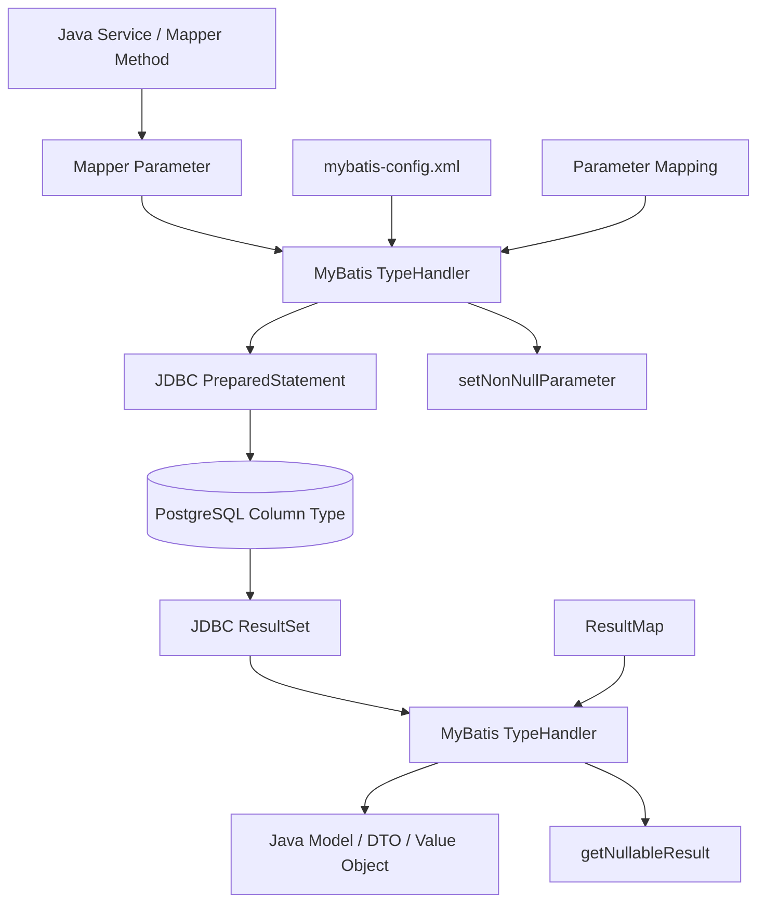
```mermaid id="ux7rnq"
flowchart TD
    A[Java Service / Mapper Method] --> B[Mapper Parameter]
    B --> C[MyBatis TypeHandler]
    C --> D[JDBC PreparedStatement]
    D --> E[(PostgreSQL Column Type)]

    E --> F[JDBC ResultSet]
    F --> G[MyBatis TypeHandler]
    G --> H[Java Model / DTO / Value Object]

    C --> I[setNonNullParameter]
    G --> J[getNullableResult]

    K[mybatis-config.xml] --> C
    L[ResultMap] --> G
    M[Parameter Mapping] --> C
```

**Core invariant:**

```text id="64u9kd"
PostgreSQL type != JDBC type != Java type.

Mapping harus jelas:
Java value object
  <-> MyBatis TypeHandler
    <-> JDBC parameter/result
      <-> PostgreSQL column type
```

---

## 3. Decomposition Map

| Area | Fokus Praktis | Contoh | Risiko Jika Salah |
|---|---|---|---|
| **Default TypeHandler** | Memakai handler bawaan MyBatis | `String`, `Integer`, `Long`, `BigDecimal`, `Instant`, `LocalDate` | Overengineering kalau semua dibuat custom |
| **Custom TypeHandler** | Mapping tipe non-standar | `jsonb`, native enum, value object | Mapping implicit, error runtime |
| **JSONB Mapping** | Simpan struktur fleksibel | audit payload, outbox payload, metadata | JSON string invalid, query lambat, schema tidak jelas |
| **UUID Mapping** | ID distributed-safe | `UUID id` ↔ `uuid` | String UUID manual, format error |
| **Enum Mapping** | State/status domain | `OrderStatus.APPROVED` ↔ `order_status` | Ordinal berubah, enum migration sulit |
| **Array Mapping** | Multi-value column terbatas | `text[]`, `uuid[]` | Sulit query/index; kadang harus normalisasi |
| **Timestamp/Timezone** | Correctness waktu | `Instant`, `OffsetDateTime`, `LocalDateTime` | Timezone drift, audit timestamp salah |
| **Numeric Mapping** | Uang/quantity/precision | `BigDecimal` ↔ `numeric` | Floating point error |
| **Custom Value Object** | Domain defensibility | `CaseNumber`, `Money`, `EmailAddress` | Primitive obsession, validasi tersebar |
| **ResultMap Binding** | Explicit mapping | `typeHandler="..."` | Handler tidak terpanggil |
| **Parameter Binding** | Explicit parameter behavior | `jdbcType=OTHER` | PostgreSQL tidak bisa infer tipe |
| **Testing** | Validasi mapping aktual | Testcontainers PostgreSQL | Bug baru terlihat di production |

---

## 4. TypeHandler Contract

MyBatis menyediakan `BaseTypeHandler<T>` sebagai base class. Sejak MyBatis 3.5.0, `BaseTypeHandler` tidak lagi memanggil `ResultSet.wasNull()` atau `CallableStatement.wasNull()` untuk subclass, sehingga null handling harus dilakukan sendiri di subclass handler. ([MyBatis](https://mybatis.org/mybatis-3/apidocs/org/apache/ibatis/type/BaseTypeHandler.html))

Skeleton:

```java id="10lh03"
package com.company.app.persistence.typehandler;

import java.sql.CallableStatement;
import java.sql.PreparedStatement;
import java.sql.ResultSet;
import java.sql.SQLException;

import org.apache.ibatis.type.BaseTypeHandler;
import org.apache.ibatis.type.JdbcType;

public class ExampleTypeHandler extends BaseTypeHandler<ExampleValue> {

    @Override
    public void setNonNullParameter(
        PreparedStatement ps,
        int i,
        ExampleValue parameter,
        JdbcType jdbcType
    ) throws SQLException {
        ps.setString(i, parameter.value());
    }

    @Override
    public ExampleValue getNullableResult(ResultSet rs, String columnName)
        throws SQLException {
        String value = rs.getString(columnName);
        return value == null ? null : new ExampleValue(value);
    }

    @Override
    public ExampleValue getNullableResult(ResultSet rs, int columnIndex)
        throws SQLException {
        String value = rs.getString(columnIndex);
        return value == null ? null : new ExampleValue(value);
    }

    @Override
    public ExampleValue getNullableResult(CallableStatement cs, int columnIndex)
        throws SQLException {
        String value = cs.getString(columnIndex);
        return value == null ? null : new ExampleValue(value);
    }
}
```

---

## 5. Registrasi TypeHandler

### 5.1 Register satu per satu

```xml id="0ilxsa"
<typeHandlers>
  <typeHandler handler="com.company.app.persistence.typehandler.JsonNodeJsonbTypeHandler"/>
  <typeHandler handler="com.company.app.persistence.typehandler.OrderStatusTypeHandler"/>
  <typeHandler handler="com.company.app.persistence.typehandler.CaseNumberTypeHandler"/>
</typeHandlers>
```

### 5.2 Package scanning

```xml id="7g5ju2"
<typeHandlers>
  <package name="com.company.app.persistence.typehandler"/>
</typeHandlers>
```

MyBatis bisa mendaftarkan custom TypeHandler via `<typeHandler handler="..."/>` atau package scanning via `<package name="..."/>`. Namun, saat autodiscovery, JDBC type hanya bisa ditentukan melalui annotation. ([MyBatis](https://mybatis.org/mybatis-3/configuration.html))

---

## 6. Mapping Matrix - PostgreSQL ke Java

| PostgreSQL Type | Java Type Umum | TypeHandler | Rekomendasi |
|---|---|---|---|
| `text`, `varchar` | `String` | Default | Oke untuk plain text |
| `integer`, `bigint` | `Integer`, `Long` | Default | Oke |
| `numeric` | `BigDecimal` | Default | Gunakan untuk uang/amount |
| `uuid` | `UUID` | Driver/Object mapping | Prefer `java.util.UUID`, bukan `String` |
| `jsonb` | `JsonNode`, DTO, `String` | Custom | Prefer custom handler |
| `json` | `JsonNode`, `String` | Custom | Gunakan jika perlu preserve whitespace/order |
| PostgreSQL enum | Java enum | Default/custom | Custom jika pakai native enum type |
| `text[]` | `List<String>` / `String[]` | Custom atau array handling | Pertimbangkan normalisasi |
| `uuid[]` | `List<UUID>` / `UUID[]` | Custom | Validasi kebutuhan query |
| `timestamp with time zone` | `Instant` / `OffsetDateTime` | Default + disiplin schema | Cocok untuk event/audit time |
| `timestamp without time zone` | `LocalDateTime` | Default | Cocok untuk local business time, bukan instant global |
| `date` | `LocalDate` | Default | Cocok untuk tanggal bisnis |
| `time` | `LocalTime` | Default | Cocok untuk jam tanpa tanggal |
| `inet`, `cidr` | `String` / custom value object | Custom | Buat VO jika domain penting |

PostgreSQL menyediakan `json` dan `jsonb`; `jsonb` disimpan dalam format decomposed/binary, lebih lambat saat input tetapi lebih cepat diproses karena tidak perlu reparsing, dan mendukung indexing. PostgreSQL sendiri menyarankan kebanyakan aplikasi memilih `jsonb` kecuali ada kebutuhan khusus seperti mempertahankan urutan key atau whitespace. ([PostgreSQL](https://www.postgresql.org/docs/current/datatype-json.html))

---

## 7. JSONB Mapping

### 7.1 Schema

```sql id="vcuwk5"
CREATE TABLE outbox_events (
    id uuid PRIMARY KEY,
    aggregate_type text NOT NULL,
    aggregate_id text NOT NULL,
    event_type text NOT NULL,
    payload jsonb NOT NULL,
    created_at timestamp with time zone NOT NULL DEFAULT now()
);
```

### 7.2 Java Model

```java id="nk1sso"
package com.company.app.model;

import java.time.Instant;
import java.util.UUID;

import com.fasterxml.jackson.databind.JsonNode;

public record OutboxEvent(
    UUID id,
    String aggregateType,
    String aggregateId,
    String eventType,
    JsonNode payload,
    Instant createdAt
) {}
```

### 7.3 JSONB TypeHandler

```java id="uie2y0"
package com.company.app.persistence.typehandler;

import java.sql.CallableStatement;
import java.sql.PreparedStatement;
import java.sql.ResultSet;
import java.sql.SQLException;

import com.fasterxml.jackson.core.JsonProcessingException;
import com.fasterxml.jackson.databind.JsonNode;
import com.fasterxml.jackson.databind.ObjectMapper;

import org.apache.ibatis.type.BaseTypeHandler;
import org.apache.ibatis.type.JdbcType;
import org.apache.ibatis.type.MappedJdbcTypes;
import org.apache.ibatis.type.MappedTypes;
import org.postgresql.util.PGobject;

@MappedTypes(JsonNode.class)
@MappedJdbcTypes(value = JdbcType.OTHER, includeNullJdbcType = true)
public class JsonNodeJsonbTypeHandler extends BaseTypeHandler<JsonNode> {

    private static final ObjectMapper OBJECT_MAPPER = new ObjectMapper();

    @Override
    public void setNonNullParameter(
        PreparedStatement ps,
        int i,
        JsonNode parameter,
        JdbcType jdbcType
    ) throws SQLException {
        PGobject jsonb = new PGobject();
        jsonb.setType("jsonb");

        try {
            jsonb.setValue(OBJECT_MAPPER.writeValueAsString(parameter));
        } catch (JsonProcessingException e) {
            throw new SQLException("Failed to serialize JsonNode to jsonb", e);
        }

        ps.setObject(i, jsonb);
    }

    @Override
    public JsonNode getNullableResult(ResultSet rs, String columnName)
        throws SQLException {
        return parse(rs.getString(columnName));
    }

    @Override
    public JsonNode getNullableResult(ResultSet rs, int columnIndex)
        throws SQLException {
        return parse(rs.getString(columnIndex));
    }

    @Override
    public JsonNode getNullableResult(CallableStatement cs, int columnIndex)
        throws SQLException {
        return parse(cs.getString(columnIndex));
    }

    private JsonNode parse(String value) throws SQLException {
        if (value == null) {
            return null;
        }

        try {
            return OBJECT_MAPPER.readTree(value);
        } catch (JsonProcessingException e) {
            throw new SQLException("Failed to parse jsonb value", e);
        }
    }
}
```

### 7.4 Mapper XML

```xml id="u7hr5v"
<resultMap id="OutboxEventResultMap"
           type="com.company.app.model.OutboxEvent">
  <constructor>
    <idArg column="id" javaType="java.util.UUID"/>
    <arg column="aggregate_type" javaType="string"/>
    <arg column="aggregate_id" javaType="string"/>
    <arg column="event_type" javaType="string"/>
    <arg column="payload"
         javaType="com.fasterxml.jackson.databind.JsonNode"
         typeHandler="com.company.app.persistence.typehandler.JsonNodeJsonbTypeHandler"/>
    <arg column="created_at" javaType="java.time.Instant"/>
  </constructor>
</resultMap>
```

```xml id="kvyrku"
<insert id="insertOutboxEvent">
  INSERT INTO outbox_events (
    id,
    aggregate_type,
    aggregate_id,
    event_type,
    payload,
    created_at
  )
  VALUES (
    #{id},
    #{aggregateType},
    #{aggregateId},
    #{eventType},
    #{payload, jdbcType=OTHER,
      typeHandler=com.company.app.persistence.typehandler.JsonNodeJsonbTypeHandler},
    #{createdAt}
  )
</insert>
```

**Practical warning:** jangan pakai JSONB untuk menyembunyikan model relational yang sebenarnya perlu constraint, foreign key, indexing, dan query lifecycle. JSONB bagus untuk payload fleksibel, event payload, metadata, audit snapshot, atau integration envelope.

---

## 8. JSONB Query Pattern

### 8.1 Query field JSONB

```xml id="v6ke0h"
<select id="findByPayloadCorrelationId" resultMap="OutboxEventResultMap">
  SELECT
    id,
    aggregate_type,
    aggregate_id,
    event_type,
    payload,
    created_at
  FROM outbox_events
  WHERE payload ->> 'correlationId' = #{correlationId}
  ORDER BY created_at DESC
  LIMIT #{limit}
</select>
```

### 8.2 Containment query

```xml id="m99agq"
<select id="findByPayloadFragment" resultMap="OutboxEventResultMap">
  SELECT
    id,
    aggregate_type,
    aggregate_id,
    event_type,
    payload,
    created_at
  FROM outbox_events
  WHERE payload @> #{payloadFragment, jdbcType=OTHER,
    typeHandler=com.company.app.persistence.typehandler.JsonNodeJsonbTypeHandler}
  ORDER BY created_at DESC
  LIMIT #{limit}
</select>
```

PostgreSQL menyediakan operator dan function khusus untuk JSON/JSONB; operator JSON field/path yang tidak cocok dengan struktur JSON mengembalikan `NULL`, bukan langsung gagal, sehingga query harus didesain dengan asumsi field bisa hilang. ([PostgreSQL](https://www.postgresql.org/docs/current/functions-json.html?utm_source=chatgpt.com))

---

## 9. UUID Mapping

PostgreSQL `uuid` menyimpan UUID 128-bit dan cocok untuk distributed systems karena tidak bergantung pada sequence di satu database. PostgreSQL menerima beberapa bentuk input UUID, tetapi output selalu dalam standard form. ([PostgreSQL](https://www.postgresql.org/docs/current/datatype-uuid.html))

### 9.1 Schema

```sql id="oqnrex"
CREATE TABLE cases (
    id uuid PRIMARY KEY,
    case_number text NOT NULL UNIQUE,
    status text NOT NULL,
    created_at timestamp with time zone NOT NULL DEFAULT now()
);
```

### 9.2 Java

```java id="ykufhn"
public record CaseRecord(
    UUID id,
    String caseNumber,
    String status,
    Instant createdAt
) {}
```

### 9.3 Mapper XML

```xml id="h8pcxc"
<insert id="insertCase">
  INSERT INTO cases (
    id,
    case_number,
    status,
    created_at
  )
  VALUES (
    #{id},
    #{caseNumber},
    #{status},
    #{createdAt}
  )
</insert>
```

### 9.4 Decision

| ID Strategy | Cocok Untuk | Trade-off |
|---|---|---|
| DB-generated UUID | DB punya kontrol ID | App perlu baca `RETURNING id` |
| App-generated UUID | Event/outbox/distributed creation | App bisa tahu ID sebelum insert |
| UUIDv4 | Random, umum | Index locality lebih buruk |
| UUIDv7 | Time-sortable | Perlu pastikan versi PostgreSQL/library mendukung |
| Sequence bigint | Simple dan compact | Tidak portable untuk multi-writer distributed |

---

## 10. Enum Mapping

PostgreSQL enum adalah tipe yang berisi set value statis dan dibuat dengan `CREATE TYPE ... AS ENUM`. PostgreSQL enum punya type safety, tetapi perubahan value harus direncanakan sebagai migration schema. ([PostgreSQL](https://www.postgresql.org/docs/current/datatype-enum.html))

### 10.1 Pilihan mapping enum

| DB Representation | Java Representation | Kelebihan | Risiko |
|---|---|---|---|
| `text` + CHECK constraint | Java enum | Migration mudah | Type safety DB lebih lemah |
| Native PostgreSQL enum | Java enum + custom handler | Type safety kuat | Migration enum lebih sensitif |
| `smallint` code | Java enum + code | Compact | Kurang readable |
| ordinal enum | Java enum ordinal | Tidak direkomendasikan | Rusak jika urutan enum berubah |

MyBatis secara default menggunakan `EnumTypeHandler` untuk mengubah enum ke nama enum; `EnumOrdinalTypeHandler` juga tersedia, tetapi ordinal menyimpan posisi, bukan code, sehingga lebih berisiko untuk domain state yang berevolusi. ([MyBatis](https://mybatis.org/mybatis-3/configuration.html))

---

### 10.2 Native PostgreSQL enum

```sql id="fjohah"
CREATE TYPE order_status AS ENUM (
    'DRAFT',
    'SUBMITTED',
    'APPROVED',
    'REJECTED',
    'CANCELLED'
);

CREATE TABLE orders (
    id uuid PRIMARY KEY,
    status order_status NOT NULL,
    created_at timestamp with time zone NOT NULL DEFAULT now()
);
```

```java id="nscv8a"
public enum OrderStatus {
    DRAFT,
    SUBMITTED,
    APPROVED,
    REJECTED,
    CANCELLED
}
```

### 10.3 Custom TypeHandler untuk native enum

```java id="wrw8nl"
package com.company.app.persistence.typehandler;

import java.sql.CallableStatement;
import java.sql.PreparedStatement;
import java.sql.ResultSet;
import java.sql.SQLException;

import com.company.app.model.OrderStatus;

import org.apache.ibatis.type.BaseTypeHandler;
import org.apache.ibatis.type.JdbcType;
import org.apache.ibatis.type.MappedJdbcTypes;
import org.apache.ibatis.type.MappedTypes;
import org.postgresql.util.PGobject;

@MappedTypes(OrderStatus.class)
@MappedJdbcTypes(value = JdbcType.OTHER, includeNullJdbcType = true)
public class OrderStatusTypeHandler extends BaseTypeHandler<OrderStatus> {

    @Override
    public void setNonNullParameter(
        PreparedStatement ps,
        int i,
        OrderStatus parameter,
        JdbcType jdbcType
    ) throws SQLException {
        PGobject enumValue = new PGobject();
        enumValue.setType("order_status");
        enumValue.setValue(parameter.name());
        ps.setObject(i, enumValue);
    }

    @Override
    public OrderStatus getNullableResult(ResultSet rs, String columnName)
        throws SQLException {
        return parse(rs.getString(columnName));
    }

    @Override
    public OrderStatus getNullableResult(ResultSet rs, int columnIndex)
        throws SQLException {
        return parse(rs.getString(columnIndex));
    }

    @Override
    public OrderStatus getNullableResult(CallableStatement cs, int columnIndex)
        throws SQLException {
        return parse(cs.getString(columnIndex));
    }

    private OrderStatus parse(String value) {
        return value == null ? null : OrderStatus.valueOf(value);
    }
}
```

### 10.4 Mapper XML

```xml id="zh2tfz"
<result column="status"
        property="status"
        javaType="com.company.app.model.OrderStatus"
        jdbcType="OTHER"
        typeHandler="com.company.app.persistence.typehandler.OrderStatusTypeHandler"/>
```

```xml id="nk9k3o"
UPDATE orders
SET status = #{status, jdbcType=OTHER,
  typeHandler=com.company.app.persistence.typehandler.OrderStatusTypeHandler}
WHERE id = #{id}
```

**Practical rule:** untuk state machine yang sering berubah, `text + CHECK constraint` kadang lebih mudah dimigrasikan daripada native enum. Untuk state yang stabil dan defensibility tinggi, native enum bisa memberi type safety yang lebih kuat.

---

## 11. Array Mapping

PostgreSQL mendukung array variable-length dan multidimensional; array bisa dibuat dari built-in type, enum type, composite type, range type, atau domain type. Namun, PostgreSQL saat ini tidak menegakkan ukuran/dimensi array yang dideklarasikan di `CREATE TABLE`; ukuran/dimensi tersebut lebih berfungsi sebagai dokumentasi. ([PostgreSQL](https://www.postgresql.org/docs/current/arrays.html))

### 11.1 Kapan array layak?

| Use Case | Array Layak? | Catatan |
|---|---:|---|
| Tags sederhana | Bisa | `text[]`, kalau query ringan |
| Role/permission kompleks | Tidak ideal | Lebih baik table relasi |
| Case participants | Tidak | Butuh FK, audit, role, lifecycle |
| Search keywords snapshot | Bisa | Kalau hanya metadata |
| UUID references yang perlu integrity | Tidak ideal | FK tidak bisa langsung per elemen array |
| Small immutable list | Bisa | Misalnya supported channels |

---

### 11.2 Schema

```sql id="b64uq3"
CREATE TABLE notification_rules (
    id uuid PRIMARY KEY,
    name text NOT NULL,
    channels text[] NOT NULL,
    created_at timestamp with time zone NOT NULL DEFAULT now()
);
```

### 11.3 TypeHandler `List<String>` ↔ `text[]`

```java id="e47q36"
package com.company.app.persistence.typehandler;

import java.sql.Array;
import java.sql.CallableStatement;
import java.sql.Connection;
import java.sql.PreparedStatement;
import java.sql.ResultSet;
import java.sql.SQLException;
import java.util.Arrays;
import java.util.List;

import org.apache.ibatis.type.BaseTypeHandler;
import org.apache.ibatis.type.JdbcType;
import org.apache.ibatis.type.MappedJdbcTypes;
import org.apache.ibatis.type.MappedTypes;

@MappedTypes(List.class)
@MappedJdbcTypes(value = JdbcType.ARRAY, includeNullJdbcType = true)
public class StringListArrayTypeHandler extends BaseTypeHandler<List<String>> {

    @Override
    public void setNonNullParameter(
        PreparedStatement ps,
        int i,
        List<String> parameter,
        JdbcType jdbcType
    ) throws SQLException {
        Connection connection = ps.getConnection();

        Array array = connection.createArrayOf(
            "text",
            parameter.toArray(new String[0])
        );

        ps.setArray(i, array);
    }

    @Override
    public List<String> getNullableResult(ResultSet rs, String columnName)
        throws SQLException {
        return toList(rs.getArray(columnName));
    }

    @Override
    public List<String> getNullableResult(ResultSet rs, int columnIndex)
        throws SQLException {
        return toList(rs.getArray(columnIndex));
    }

    @Override
    public List<String> getNullableResult(CallableStatement cs, int columnIndex)
        throws SQLException {
        return toList(cs.getArray(columnIndex));
    }

    private List<String> toList(Array array) throws SQLException {
        if (array == null) {
            return null;
        }

        Object value = array.getArray();
        if (value instanceof String[] strings) {
            return List.copyOf(Arrays.asList(strings));
        }

        Object[] objects = (Object[]) value;
        return Arrays.stream(objects)
            .map(String::valueOf)
            .toList();
    }
}
```

### 11.4 Mapper XML

```xml id="ky9874"
<result column="channels"
        property="channels"
        jdbcType="ARRAY"
        typeHandler="com.company.app.persistence.typehandler.StringListArrayTypeHandler"/>
```

```xml id="abp8yr"
INSERT INTO notification_rules (
  id,
  name,
  channels,
  created_at
)
VALUES (
  #{id},
  #{name},
  #{channels, jdbcType=ARRAY,
    typeHandler=com.company.app.persistence.typehandler.StringListArrayTypeHandler},
  #{createdAt}
)
```

---

## 12. Timestamp / Timezone Mapping

PostgreSQL mendukung `timestamp with time zone`, `timestamp without time zone`, `date`, `time`, dan `interval`. `timestamp with time zone` disimpan/ditampilkan dengan behavior timezone-aware: saat output, nilainya dikonversi dari UTC ke timezone session saat ini. ([PostgreSQL](https://www.postgresql.org/docs/current/datatype-datetime.html))

### 12.1 Decision table

| PostgreSQL Type | Java Type | Cocok Untuk | Hindari Untuk |
|---|---|---|---|
| `timestamp with time zone` | `Instant` | Audit/event time global | Local business schedule |
| `timestamp with time zone` | `OffsetDateTime` | Perlu offset di API | Domain yang hanya butuh instant |
| `timestamp without time zone` | `LocalDateTime` | Jadwal lokal tanpa timezone | Event global/audit |
| `date` | `LocalDate` | Tanggal bisnis, due date | Timestamp event |
| `time` | `LocalTime` | Jam operasional | Absolute instant |
| `interval` | `Duration` / custom | Durasi proses/SLA | Tanggal absolut |

### 12.2 Recommended convention

```text id="bpbca9"
Audit timestamp:
  PostgreSQL: timestamp with time zone
  Java: Instant

Business date:
  PostgreSQL: date
  Java: LocalDate

Local schedule:
  PostgreSQL: timestamp without time zone + explicit timezone column
  Java: LocalDateTime + ZoneId
```

### 12.3 Mapper example

```java id="lqjxin"
public record AuditEntry(
    UUID id,
    String action,
    Instant occurredAt
) {}
```

```xml id="cg7yjr"
<insert id="insertAuditEntry">
  INSERT INTO audit_entries (
    id,
    action,
    occurred_at
  )
  VALUES (
    #{id},
    #{action},
    #{occurredAt}
  )
</insert>
```

MyBatis menyediakan TypeHandler default untuk beberapa tipe Java Time seperti `Instant`, `LocalDateTime`, `LocalDate`, `OffsetDateTime`, `ZonedDateTime`, dan lainnya. ([MyBatis](https://mybatis.org/mybatis-3/configuration.html))

---

## 13. Custom Value Object Mapping

Custom value object berguna untuk domain yang tidak boleh diperlakukan sebagai `String` biasa.

### 13.1 Value object

```java id="4ntzpq"
package com.company.app.model;

public record CaseNumber(String value) {

    public CaseNumber {
        if (value == null || value.isBlank()) {
            throw new IllegalArgumentException("case number must not be blank");
        }

        if (!value.matches("CASE-[0-9]{8}")) {
            throw new IllegalArgumentException("invalid case number format");
        }
    }
}
```

### 13.2 TypeHandler

```java id="os9vcl"
package com.company.app.persistence.typehandler;

import java.sql.CallableStatement;
import java.sql.PreparedStatement;
import java.sql.ResultSet;
import java.sql.SQLException;

import com.company.app.model.CaseNumber;

import org.apache.ibatis.type.BaseTypeHandler;
import org.apache.ibatis.type.JdbcType;
import org.apache.ibatis.type.MappedJdbcTypes;
import org.apache.ibatis.type.MappedTypes;

@MappedTypes(CaseNumber.class)
@MappedJdbcTypes(value = JdbcType.VARCHAR, includeNullJdbcType = true)
public class CaseNumberTypeHandler extends BaseTypeHandler<CaseNumber> {

    @Override
    public void setNonNullParameter(
        PreparedStatement ps,
        int i,
        CaseNumber parameter,
        JdbcType jdbcType
    ) throws SQLException {
        ps.setString(i, parameter.value());
    }

    @Override
    public CaseNumber getNullableResult(ResultSet rs, String columnName)
        throws SQLException {
        return parse(rs.getString(columnName));
    }

    @Override
    public CaseNumber getNullableResult(ResultSet rs, int columnIndex)
        throws SQLException {
        return parse(rs.getString(columnIndex));
    }

    @Override
    public CaseNumber getNullableResult(CallableStatement cs, int columnIndex)
        throws SQLException {
        return parse(cs.getString(columnIndex));
    }

    private CaseNumber parse(String value) {
        return value == null ? null : new CaseNumber(value);
    }
}
```

### 13.3 Mapper XML

```xml id="4qdmu4"
<result column="case_number"
        property="caseNumber"
        javaType="com.company.app.model.CaseNumber"
        jdbcType="VARCHAR"
        typeHandler="com.company.app.persistence.typehandler.CaseNumberTypeHandler"/>
```

**Practical point:** value object TypeHandler bagus untuk invariant yang sering muncul di domain: `CaseNumber`, `EmailAddress`, `Money`, `UserId`, `TenantId`, `ExternalReference`.

---

## 14. Numeric / Money Mapping

### Recommended

```sql id="bo3z86"
amount numeric(19, 4) NOT NULL
currency char(3) NOT NULL
```

```java id="1q3w9a"
public record Money(
    BigDecimal amount,
    String currency
) {
    public Money {
        if (amount == null) {
            throw new IllegalArgumentException("amount is required");
        }
        if (currency == null || !currency.matches("[A-Z]{3}")) {
            throw new IllegalArgumentException("currency must be ISO-like 3-letter code");
        }
    }
}
```

**Rule:** jangan gunakan `double`/`float` untuk uang, fee, tax, balance, atau nilai yang butuh precision. Gunakan `BigDecimal` dan constraint database.

---

## 15. Domain Type di PostgreSQL

PostgreSQL domain adalah user-defined type berbasis underlying type dengan optional constraint; domain bisa dibangun di atas built-in type, enum, array, composite, range, atau domain lain. ([PostgreSQL](https://www.postgresql.org/docs/current/domains.html?utm_source=chatgpt.com))

Contoh:

```sql id="4x5nno"
CREATE DOMAIN case_number AS text
CHECK (VALUE ~ '^CASE-[0-9]{8}$');

CREATE TABLE cases (
    id uuid PRIMARY KEY,
    case_number case_number NOT NULL UNIQUE
);
```

Di Java, domain type seperti ini biasanya tetap dimapping sebagai `String` atau value object dengan TypeHandler. Keuntungannya: invariant dijaga dua lapis, di Java dan di database.

---

## 16. ResultMap Pattern untuk Mixed Types

```xml id="nszqu9"
<resultMap id="CaseResultMap" type="com.company.app.model.CaseRecord">
  <id column="id"
      property="id"
      javaType="java.util.UUID"/>

  <result column="case_number"
          property="caseNumber"
          javaType="com.company.app.model.CaseNumber"
          jdbcType="VARCHAR"
          typeHandler="com.company.app.persistence.typehandler.CaseNumberTypeHandler"/>

  <result column="status"
          property="status"
          javaType="com.company.app.model.CaseStatus"
          jdbcType="OTHER"
          typeHandler="com.company.app.persistence.typehandler.CaseStatusTypeHandler"/>

  <result column="metadata"
          property="metadata"
          javaType="com.fasterxml.jackson.databind.JsonNode"
          jdbcType="OTHER"
          typeHandler="com.company.app.persistence.typehandler.JsonNodeJsonbTypeHandler"/>

  <result column="created_at"
          property="createdAt"
          javaType="java.time.Instant"/>
</resultMap>
```

**Rule:** untuk tipe yang rawan ambiguity, tulis `javaType`, `jdbcType`, dan `typeHandler` eksplisit. Jangan berharap MyBatis selalu bisa infer mapping PostgreSQL-specific type.

---

## 17. Parameter Binding Pattern

```xml id="n7o21o"
<insert id="insertCase">
  INSERT INTO cases (
    id,
    case_number,
    status,
    metadata,
    tags,
    created_at
  )
  VALUES (
    #{id},
    #{caseNumber, jdbcType=VARCHAR,
      typeHandler=com.company.app.persistence.typehandler.CaseNumberTypeHandler},
    #{status, jdbcType=OTHER,
      typeHandler=com.company.app.persistence.typehandler.CaseStatusTypeHandler},
    #{metadata, jdbcType=OTHER,
      typeHandler=com.company.app.persistence.typehandler.JsonNodeJsonbTypeHandler},
    #{tags, jdbcType=ARRAY,
      typeHandler=com.company.app.persistence.typehandler.StringListArrayTypeHandler},
    #{createdAt}
  )
</insert>
```

MyBatis tidak melakukan introspeksi metadata database untuk menentukan tipe kolom sebelum statement dijalankan, sehingga untuk handler tertentu kita perlu memberi `jdbcType`, `javaType`, annotation, atau mapping eksplisit agar handler yang benar dipilih. ([MyBatis](https://mybatis.org/mybatis-3/configuration.html))

---

## 18. PostgreSQL JDBC `stringtype` Awareness

pgJDBC memiliki parameter `stringtype` untuk menentukan bagaimana parameter dari `PreparedStatement#setString()` dikirim ke server. Jika default `VARCHAR`, parameter string dikirim sebagai varchar; jika `unspecified`, server mencoba infer tipe. Ini relevan saat aplikasi lama mengirim value non-string sebagai string, tetapi untuk aplikasi baru lebih baik gunakan setter/type mapping yang tepat daripada bergantung pada inference. ([pgJDBC](https://jdbc.postgresql.org/documentation/use/))

**Practical recommendation:**

```text id="qf4nil"
Prefer:
  explicit TypeHandler
  jdbcType=OTHER
  PGobject / setObject for PostgreSQL-specific type

Avoid:
  relying on stringtype=unspecified as generic fix
```

---

## 19. Testing Strategy

### 19.1 Test JSONB round-trip

```java id="6e53oo"
@Test
void shouldRoundTripJsonbPayload() {
    UUID id = UUID.randomUUID();

    JsonNode payload = objectMapper.createObjectNode()
        .put("correlationId", "corr-001")
        .put("action", "ORDER_CREATED");

    mapper.insertOutboxEvent(new OutboxEvent(
        id,
        "ORDER",
        "ORD-001",
        "ORDER_CREATED",
        payload,
        Instant.now()
    ));

    OutboxEvent found = mapper.findById(id);

    assertThat(found.payload().get("correlationId").asText())
        .isEqualTo("corr-001");
}
```

### 19.2 Test enum invalid evolution

```java id="nvsy5n"
@Test
void shouldFailFastForUnknownEnumValue() {
    jdbcTemplate.update("""
        INSERT INTO orders (id, status, created_at)
        VALUES (?, 'UNKNOWN_STATUS'::order_status, now())
        """, UUID.randomUUID());

    assertThatThrownBy(() -> mapper.findLatest())
        .isInstanceOf(PersistenceException.class);
}
```

Catatan: contoh kedua hanya valid kalau enum value tersebut ada di DB tetapi belum ada di Java enum, misalnya saat migration tidak sinkron. Untuk native PostgreSQL enum, value yang tidak ada di type DB akan ditolak oleh database.

### 19.3 Test timezone

```java id="pwvk8w"
@Test
void shouldPersistInstantWithoutLosingMomentInTime() {
    Instant occurredAt = Instant.parse("2026-07-13T01:00:00Z");

    mapper.insertAuditEntry(new AuditEntry(
        UUID.randomUUID(),
        "CASE_APPROVED",
        occurredAt
    ));

    AuditEntry found = mapper.findLatest();

    assertThat(found.occurredAt()).isEqualTo(occurredAt);
}
```

---

## 20. Anti-Pattern

| Anti-Pattern | Contoh | Dampak |
|---|---|---|
| JSONB sebagai dumping ground | Semua field masuk `metadata jsonb` | Constraint, index, dan query lifecycle kabur |
| Enum ordinal | `APPROVED.ordinal()` | Rusak jika urutan enum berubah |
| Timestamp tanpa keputusan | Campur `Instant`, `LocalDateTime`, DB timezone | Audit time salah |
| UUID sebagai string everywhere | `String id` | Validasi tersebar, format error |
| Array untuk relasi penting | `participant_ids uuid[]` | Tidak ada FK per participant |
| Value object tidak dipakai | Semua `String` | Invariant domain bocor |
| TypeHandler global terlalu agresif | Override semua `String` | Side effect tidak terduga |
| Tidak eksplisit `jdbcType` | PostgreSQL-specific type gagal binding | Runtime error |
| Tidak test round-trip | Hanya mock mapper | Mapping bug lolos |
| JSON parse exception ditelan | Return null diam-diam | Data corruption tersembunyi |
| Store money as double | `double amount` | Precision error |
| Timezone pakai server default | `LocalDateTime.now()` untuk audit | Hasil beda antar environment |

---

## 21. Production Checklist

| Checklist | Status Ideal |
|---|---|
| Semua `jsonb` punya alasan jelas | Ya |
| JSONB field yang sering dicari punya index strategy | Ya |
| Enum mapping tidak memakai ordinal | Ya |
| Native enum migration punya backward/forward compatibility plan | Ya |
| Audit timestamp memakai `Instant` + `timestamp with time zone` | Ya |
| Local business date memakai `LocalDate` + `date` | Ya |
| UUID memakai `java.util.UUID` | Ya |
| Money/amount memakai `BigDecimal` | Ya |
| Value object penting punya TypeHandler | Ya |
| TypeHandler null handling eksplisit | Ya |
| Mapper XML menulis `jdbcType` untuk PostgreSQL-specific type | Ya |
| Integration test melakukan round-trip insert/select | Ya |
| Test mencakup null, invalid value, dan edge case timezone | Ya |
| Logging tidak membocorkan payload sensitif dari JSONB | Ya |

---

## 22. Decision Table

| Problem | Pilihan Terbaik |
|---|---|
| Payload event/outbox fleksibel | `jsonb` + `JsonNode` TypeHandler |
| API metadata yang jarang difilter | `jsonb` |
| Field wajib untuk workflow/state | Kolom relational biasa |
| Status lifecycle stabil | Native PostgreSQL enum atau text + CHECK |
| Status lifecycle sering berubah | `text` + CHECK lebih fleksibel |
| ID aggregate distributed | `uuid` + `UUID` |
| Audit time | `timestamp with time zone` + `Instant` |
| Due date bisnis | `date` + `LocalDate` |
| Local schedule | `LocalDateTime` + explicit `ZoneId` field |
| Multi-value kecil non-relational | Array boleh |
| Multi-value dengan ownership/lifecycle | Table relasi |
| Domain primitive penting | Value object + TypeHandler |
| Query JSONB sering | JSONB index + query review |

---

## 23. Roadmap Belajar Singkat

| Urutan | Materi | Target |
|---:|---|---|
| 1 | Default TypeHandler MyBatis | Tahu kapan tidak perlu custom |
| 2 | Custom `BaseTypeHandler` | Bisa membuat mapping sendiri |
| 3 | JSONB TypeHandler | Bisa simpan/baca payload JSONB |
| 4 | UUID dan Java `UUID` | ID mapping bersih |
| 5 | Enum strategy | Bisa pilih native enum vs text/check |
| 6 | Timestamp/timezone | Tidak salah audit time |
| 7 | Array mapping | Tahu kapan array boleh dan kapan harus normalisasi |
| 8 | Value object mapping | Domain invariant lebih kuat |
| 9 | Integration testing | Mapping benar terhadap PostgreSQL asli |

---

## Rekomendasi Materi Selanjutnya

Lanjutkan ke **“Java MyBatis Transaction, Concurrency, Locking, Isolation Level, Optimistic/Pessimistic Locking, Retry, dan Idempotency Pattern di PostgreSQL”** karena setelah mapping tipe data benar, tantangan berikutnya adalah menjaga correctness saat banyak request/update berjalan bersamaan.

---

**Sources:**

- [MyBatis 3 | Configuration – mybatis](https://mybatis.org/mybatis-3/configuration.html)
- [PostgreSQL: Documentation: 18: 8.14. JSON Types](https://www.postgresql.org/docs/current/datatype-json.html)
- [Initializing the Driver | pgJDBC](https://jdbc.postgresql.org/documentation/use/)

## Response:
7/13/2026, 2:23:22 AM

Lanjut ke concurrency dan transaction correctness: bagian ini penting untuk mencegah lost update, duplicate command, partial write, deadlock, dan retry yang justru menggandakan efek bisnis. Saya akan susun sebagai pola praktis untuk MyBatis + PostgreSQL di service Jersey/JAX-RS.

# Cheatsheet - Java MyBatis Transaction, Concurrency, Locking, Isolation Level, Retry, dan Idempotency Pattern di PostgreSQL

## 1. Introduction

Dalam aplikasi **Jersey/JAX-RS + MyBatis + PostgreSQL**, masalah concurrency biasanya bukan muncul dari syntax mapper, tetapi dari **urutan operasi bisnis**:

```text id="o9db9j"
read current state
validate transition
write new state
write audit
write outbox event
commit
```

Jika beberapa request berjalan bersamaan, use case seperti approval, escalation, order submission, payment capture, queue processing, dan retry dari client bisa menghasilkan:

```text id="sy7j91"
lost update
double submit
duplicate command
partial write
deadlock
serialization failure
stale read
invalid state transition
duplicate outbox event
```

MyBatis memberi kontrol transaction lewat `SqlSession`: session bisa dibuka dengan transaction scope, isolation level, executor type, auto-commit, lalu dikontrol dengan `commit()` dan `rollback()`. Default `openSession()` membuat transaction scope non-auto-commit, memakai connection dari configured `DataSource`, memakai isolation default driver/data source, dan tidak memakai prepared-statement reuse ataupun batch executor. ([MyBatis](https://mybatis.org/mybatis-3/java-api.html))

---

## 2. Mental Model

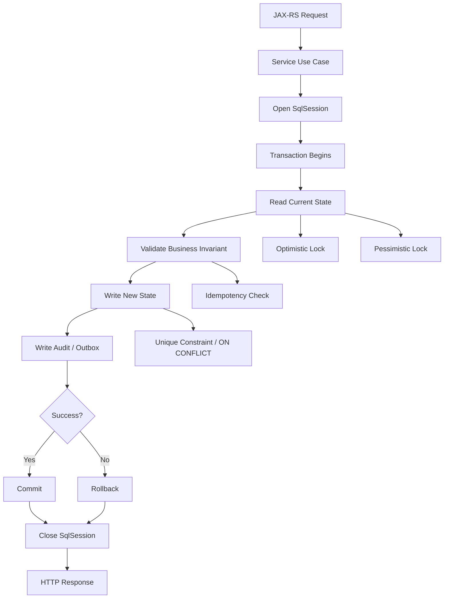
```mermaid id="1ic9of"
flowchart TD
    A[JAX-RS Request] --> B[Service Use Case]
    B --> C[Open SqlSession]
    C --> D[Transaction Begins]
    D --> E[Read Current State]
    E --> F[Validate Business Invariant]
    F --> G[Write New State]
    G --> H[Write Audit / Outbox]
    H --> I{Success?}
    I -->|Yes| J[Commit]
    I -->|No| K[Rollback]
    J --> L[Close SqlSession]
    K --> L
    L --> M[HTTP Response]

    E --> N[Optimistic Lock]
    E --> O[Pessimistic Lock]
    F --> P[Idempotency Check]
    G --> Q[Unique Constraint / ON CONFLICT]
```

**Core invariant:**

```text id="aipd41"
Satu business command = satu transaction boundary.

Jangan:
  read di satu session
  validate di luar transaction
  write di session lain
  commit sebagian
```

---

## 3. Decomposition Map

| Area | Fokus Praktis | Pattern Utama | Risiko Jika Salah |
|---|---|---|---|
| **Transaction Boundary** | Satu use case atomic | Service-level Unit of Work | Partial write |
| **Auto-commit Control** | Hindari commit per statement | `openSession(false)` / default transaction scope | Multi-step use case tidak atomic |
| **Isolation Level** | Pilih konsistensi vs throughput | Read Committed, Repeatable Read, Serializable | Salah asumsi snapshot |
| **Optimistic Locking** | Cegah lost update tanpa lock panjang | `version` column di `WHERE` | Update overwrite diam-diam |
| **Pessimistic Locking** | Lock row sebelum update | `SELECT ... FOR UPDATE` | Blocking/deadlock |
| **Queue Locking** | Parallel worker aman | `FOR UPDATE SKIP LOCKED` | Worker memproses row sama |
| **Advisory Lock** | Lock berdasarkan business key | `pg_advisory_xact_lock` | Salah scope lock |
| **Deadlock Handling** | Retry transient failure | SQLSTATE `40P01` | User melihat error sporadis |
| **Serialization Retry** | Retry transaction aman | SQLSTATE `40001` | Serializable gagal tanpa retry |
| **Idempotency** | Retry client tidak double-effect | Idempotency key + unique constraint | Double submit/order/payment |
| **UPSERT** | Insert-or-update atomic | `INSERT ... ON CONFLICT` | Race check-then-insert |
| **Outbox Consistency** | Event keluar setelah commit | Insert outbox dalam transaksi sama | Event terkirim tanpa data / data tanpa event |
| **Affected Row Check** | Detect stale state/concurrency | `updated == 1` | Invalid transition lolos |
| **Timeout & Lock Wait** | Cegah request menggantung | statement timeout, lock timeout | Thread pool habis |
| **Test Concurrency** | Buktikan behavior paralel | integration test multi-thread | Bug hanya muncul production |

---

## 4. MyBatis Transaction Control

MyBatis `SqlSessionFactory` menyediakan beberapa overload `openSession`, termasuk auto-commit, custom `Connection`, `TransactionIsolationLevel`, dan `ExecutorType`. MyBatis juga menyediakan wrapper isolation level JDBC seperti `READ_COMMITTED`, `REPEATABLE_READ`, dan `SERIALIZABLE`. ([MyBatis](https://mybatis.org/mybatis-3/java-api.html))

### 4.1 Basic Unit of Work

```java id="z2tbmx"
public <T> T transactional(MyBatisWork<T> work) {
    try (SqlSession session = sqlSessionFactory.openSession(false)) {
        try {
            T result = work.execute(new MyBatisSessionContext(session));
            session.commit();
            return result;
        } catch (RuntimeException | Error e) {
            session.rollback();
            throw e;
        }
    }
}
```

MyBatis menyediakan `commit()`, `rollback()`, `commit(boolean force)`, dan `rollback(boolean force)` untuk session yang memakai JDBC transaction manager; session tetap harus ditutup, dan dokumentasi MyBatis merekomendasikan pola `try-with-resources`. ([MyBatis](https://mybatis.org/mybatis-3/java-api.html))

---

### 4.2 Unit of Work dengan Isolation Level

```java id="x6d67h"
import org.apache.ibatis.session.SqlSession;
import org.apache.ibatis.session.TransactionIsolationLevel;

public <T> T transactional(
    TransactionIsolationLevel isolationLevel,
    MyBatisWork<T> work
) {
    try (SqlSession session = sqlSessionFactory.openSession(isolationLevel)) {
        try {
            T result = work.execute(new MyBatisSessionContext(session));
            session.commit();
            return result;
        } catch (RuntimeException | Error e) {
            session.rollback();
            throw e;
        }
    }
}
```

### 4.3 Kapan pakai isolation eksplisit?

| Use Case | Isolation Praktis | Catatan |
|---|---|---|
| Simple CRUD | Default / Read Committed | Cukup untuk mayoritas endpoint |
| State transition dengan version check | Read Committed + optimistic locking | Umumnya efisien |
| Report konsisten dalam satu transaksi | Repeatable Read | Snapshot lebih stabil |
| Invariant lintas banyak row | Serializable atau explicit locking | Siap retry |
| Queue worker | Read Committed + `FOR UPDATE SKIP LOCKED` | Umum untuk job claiming |
| Payment/order idempotency | Read Committed + unique constraint + idempotency table | Jangan hanya lock in-memory |

PostgreSQL default isolation level adalah **Read Committed**; dalam level ini, satu `SELECT` melihat snapshot pada awal query, tetapi dua `SELECT` berturut-turut dalam transaksi yang sama bisa melihat data berbeda jika transaksi lain commit di antaranya. ([PostgreSQL](https://www.postgresql.org/docs/current/transaction-iso.html))

---

## 5. PostgreSQL Isolation Level

PostgreSQL menerima empat nama isolation level standar SQL, tetapi secara internal hanya mengimplementasikan tiga behavior berbeda: `READ UNCOMMITTED` berperilaku seperti `READ COMMITTED`. Dokumentasi PostgreSQL juga menyatakan `Repeatable Read` di PostgreSQL tidak mengizinkan phantom read, sedangkan `Serializable` mencegah dirty read, nonrepeatable read, phantom read, dan serialization anomaly. ([PostgreSQL](https://www.postgresql.org/docs/current/transaction-iso.html))

| Isolation Level | Dirty Read | Nonrepeatable Read | Phantom Read | Serialization Anomaly | Praktis di PostgreSQL |
|---|---:|---:|---:|---:|---|
| Read Uncommitted | Tidak terjadi di PG | Bisa | Bisa | Bisa | Sama seperti Read Committed |
| Read Committed | Tidak | Bisa | Bisa | Bisa | Default, throughput bagus |
| Repeatable Read | Tidak | Tidak | Tidak di PG | Bisa | Snapshot stabil, masih bisa serialization failure |
| Serializable | Tidak | Tidak | Tidak | Tidak | Paling kuat, wajib siap retry |

**Rule of thumb:** jangan menaikkan isolation level sebagai solusi pertama. Untuk banyak workflow enterprise, kombinasi **Read Committed + optimistic locking + unique constraint + affected-row check** lebih sederhana dan scalable.

---

## 6. Optimistic Locking Pattern

Optimistic locking cocok ketika konflik tidak terlalu sering dan kita ingin menghindari lock panjang.

### 6.1 Schema

```sql id="vejp4f"
CREATE TABLE cases (
    id uuid PRIMARY KEY,
    case_number text NOT NULL UNIQUE,
    status text NOT NULL,
    assigned_team text NOT NULL,
    version bigint NOT NULL DEFAULT 0,
    updated_at timestamp with time zone NOT NULL DEFAULT now()
);
```

### 6.2 Mapper

```java id="h1f3mo"
int transitionStatus(
    @Param("id") UUID id,
    @Param("expectedStatus") String expectedStatus,
    @Param("newStatus") String newStatus,
    @Param("expectedVersion") long expectedVersion
);
```

### 6.3 XML

```xml id="c9761g"
<update id="transitionStatus">
  UPDATE cases
  SET
    status = #{newStatus},
    version = version + 1,
    updated_at = now()
  WHERE id = #{id}
    AND status = #{expectedStatus}
    AND version = #{expectedVersion}
</update>
```

### 6.4 Service

```java id="dpr1ib"
public void approveCase(ApproveCaseCommand command) {
    unitOfWork.transactional(ctx -> {
        CaseMapper mapper = ctx.mapper(CaseMapper.class);

        CaseRecord current = mapper.findById(command.caseId());
        if (current == null) {
            throw new CaseNotFoundException(command.caseId());
        }

        if (!current.canApprove()) {
            throw new InvalidCaseTransitionException(
                current.status(),
                "APPROVED"
            );
        }

        int updated = mapper.transitionStatus(
            command.caseId(),
            current.status(),
            "APPROVED",
            current.version()
        );

        if (updated != 1) {
            throw new ConcurrentCaseModificationException(command.caseId());
        }

        mapper.insertAuditLog(...);
        mapper.insertOutboxEvent(...);

        return null;
    });
}
```

**Kenapa status ikut di `WHERE`?**  
Karena version saja mendeteksi concurrent write, tetapi status di `WHERE` membuat invariant bisnis ikut ditegakkan di database.

---

## 7. Lost Update Pattern

### Bad

```text id="n9v9j2"
T1 read status = SUBMITTED
T2 read status = SUBMITTED
T1 update status = APPROVED
T2 update status = REJECTED
```

Jika update hanya:

```sql id="9oz2fa"
UPDATE cases
SET status = ?
WHERE id = ?
```

maka update terakhir bisa menimpa update pertama.

### Good

```sql id="5cy9dv"
UPDATE cases
SET status = ?, version = version + 1
WHERE id = ?
  AND status = ?
  AND version = ?
```

Lalu service wajib cek:

```java id="plvm92"
if (updated != 1) {
    throw new ConcurrentModificationException();
}
```

---

## 8. Pessimistic Locking Pattern

Pessimistic locking cocok ketika konflik sering, state transition mahal, atau kita perlu memastikan row tidak berubah selama proses validasi.

PostgreSQL `SELECT ... FOR UPDATE` mengunci row yang dipilih agar tidak bisa di-lock, dimodifikasi, atau dihapus oleh transaksi lain sampai transaksi saat ini berakhir. ([PostgreSQL](https://www.postgresql.org/docs/current/explicit-locking.html?utm_source=chatgpt.com))

### 8.1 Mapper

```java id="7r9sz9"
CaseRecord findByIdForUpdate(@Param("id") UUID id);
```

### 8.2 XML

```xml id="fbc0ub"
<select id="findByIdForUpdate" resultMap="CaseResultMap">
  SELECT
    id,
    case_number,
    status,
    assigned_team,
    version,
    updated_at
  FROM cases
  WHERE id = #{id}
  FOR UPDATE
</select>
```

### 8.3 Service

```java id="ietoky"
public void assignCase(AssignCaseCommand command) {
    unitOfWork.transactional(ctx -> {
        CaseMapper mapper = ctx.mapper(CaseMapper.class);

        CaseRecord current = mapper.findByIdForUpdate(command.caseId());
        if (current == null) {
            throw new CaseNotFoundException(command.caseId());
        }

        if (!current.canAssignTo(command.team())) {
            throw new InvalidAssignmentException(command.caseId());
        }

        mapper.assignCase(command.caseId(), command.team());

        mapper.insertAuditLog(...);

        return null;
    });
}
```

### 8.4 Kapan pakai optimistic vs pessimistic?

| Kondisi | Pilihan |
|---|---|
| Konflik jarang | Optimistic locking |
| Konflik sering di row yang sama | Pessimistic locking |
| Validasi murah | Optimistic |
| Validasi mahal dan tidak boleh diulang | Pessimistic |
| Endpoint high throughput | Optimistic dulu |
| Workflow approval/escalation kritis | Bisa pessimistic pada row utama |
| Batch worker queue | `FOR UPDATE SKIP LOCKED` |
| Lock banyak row | Hati-hati deadlock; urutkan lock |

---

## 9. Queue Worker Pattern dengan `FOR UPDATE SKIP LOCKED`

Pattern ini cocok untuk job table, outbox publisher, escalation worker, retry scheduler, dan background processor.

PostgreSQL `SELECT` mendukung locking clause seperti `FOR UPDATE`, `FOR NO KEY UPDATE`, `FOR SHARE`, dan `FOR KEY SHARE`; locking clause membutuhkan privilege update pada minimal satu kolom table yang dikunci. ([PostgreSQL](https://www.postgresql.org/docs/current/sql-select.html?utm_source=chatgpt.com))

### 9.1 Schema

```sql id="a6nd31"
CREATE TABLE outbox_events (
    id uuid PRIMARY KEY,
    aggregate_type text NOT NULL,
    aggregate_id text NOT NULL,
    event_type text NOT NULL,
    payload jsonb NOT NULL,
    status text NOT NULL,
    available_at timestamp with time zone NOT NULL DEFAULT now(),
    attempt_count integer NOT NULL DEFAULT 0,
    locked_at timestamp with time zone,
    created_at timestamp with time zone NOT NULL DEFAULT now()
);
```

### 9.2 Claim jobs

```xml id="rcyyt5"
<select id="claimPendingEvents" resultMap="OutboxEventResultMap">
  SELECT
    id,
    aggregate_type,
    aggregate_id,
    event_type,
    payload,
    status,
    available_at,
    attempt_count,
    locked_at,
    created_at
  FROM outbox_events
  WHERE status = 'PENDING'
    AND available_at &lt;= now()
  ORDER BY created_at ASC, id ASC
  LIMIT #{limit}
  FOR UPDATE SKIP LOCKED
</select>
```

### 9.3 Mark processing

```xml id="i2cc32"
<update id="markProcessing">
  UPDATE outbox_events
  SET
    status = 'PROCESSING',
    locked_at = now(),
    attempt_count = attempt_count + 1
  WHERE id = #{id}
    AND status = 'PENDING'
</update>
```

### 9.4 Worker flow

```java id="g8z6jh"
public List<OutboxEvent> claimEvents(int limit) {
    return unitOfWork.transactional(ctx -> {
        OutboxMapper mapper = ctx.mapper(OutboxMapper.class);

        List<OutboxEvent> events = mapper.claimPendingEvents(limit);

        for (OutboxEvent event : events) {
            int updated = mapper.markProcessing(event.id());
            if (updated != 1) {
                throw new ConcurrentModificationException(
                    "Failed to mark event as processing: " + event.id()
                );
            }
        }

        return events;
    });
}
```

**Practical note:** ambil dan mark dalam transaksi pendek. Jangan tahan row lock sambil memanggil Kafka/HTTP service eksternal.

---

## 10. Advisory Lock Pattern

Advisory lock berguna ketika lock tidak natural berbasis satu row, misalnya business key seperti `tenantId + caseNumber`, scheduled job singleton per tenant, atau deduplication lintas table.

PostgreSQL menyediakan advisory lock dengan makna yang ditentukan aplikasi. Ada session-level advisory lock dan transaction-level advisory lock; transaction-level advisory lock otomatis dilepas saat transaksi selesai, sehingga biasanya lebih aman untuk short-lived service transaction. ([PostgreSQL](https://www.postgresql.org/docs/current/explicit-locking.html))

### 10.1 Mapper

```java id="ko4sr1"
void acquireCaseNumberLock(@Param("lockKey") long lockKey);
```

### 10.2 XML

```xml id="f6v8vr"
<select id="acquireCaseNumberLock" resultType="void">
  SELECT pg_advisory_xact_lock(#{lockKey})
</select>
```

### 10.3 Java lock key

```java id="ow3hyd"
public final class AdvisoryLockKey {

    private AdvisoryLockKey() {}

    public static long fromBusinessKey(String value) {
        return Hashing.sha256()
            .hashString(value, StandardCharsets.UTF_8)
            .asLong();
    }
}
```

### 10.4 Service

```java id="se62pf"
public CaseResponse createCase(CreateCaseCommand command) {
    return unitOfWork.transactional(ctx -> {
        CaseMapper mapper = ctx.mapper(CaseMapper.class);

        long lockKey = AdvisoryLockKey.fromBusinessKey(
            command.tenantId() + ":" + command.caseNumber()
        );

        mapper.acquireCaseNumberLock(lockKey);

        if (mapper.existsByCaseNumber(command.caseNumber())) {
            throw new DuplicateCaseNumberException(command.caseNumber());
        }

        mapper.insertCase(...);
        mapper.insertAuditLog(...);

        return ...;
    });
}
```

**Warning:** advisory lock adalah kontrak aplikasi. Database tidak otomatis tahu bahwa semua code path harus memakai lock tersebut. Jika ada satu code path yang bypass lock, invariant tetap bisa rusak.

---

## 11. Idempotency Pattern

Idempotency wajib untuk endpoint yang bisa di-retry oleh client, API gateway, scheduler, worker, atau message consumer.

### 11.1 Problem

```text id="m4cq9u"
Client POST /orders timeout.
Client tidak tahu apakah order sudah dibuat.
Client retry.
Tanpa idempotency, order bisa dibuat dua kali.
```

### 11.2 Schema

```sql id="tngmhf"
CREATE TABLE idempotency_keys (
    key text PRIMARY KEY,
    request_hash text NOT NULL,
    status text NOT NULL,
    response_code integer,
    response_body jsonb,
    created_at timestamp with time zone NOT NULL DEFAULT now(),
    completed_at timestamp with time zone
);
```

### 11.3 Insert idempotency key

PostgreSQL `INSERT ... ON CONFLICT` dapat mengubah unique violation menjadi `DO NOTHING` atau `DO UPDATE`; untuk `ON CONFLICT DO UPDATE`, PostgreSQL menjamin hasil atomic insert-or-update pada concurrency tinggi, selama tidak ada error independen. ([PostgreSQL](https://www.postgresql.org/docs/current/sql-insert.html))

```xml id="ep7kl4"
<insert id="insertIdempotencyKey">
  INSERT INTO idempotency_keys (
    key,
    request_hash,
    status,
    created_at
  )
  VALUES (
    #{key},
    #{requestHash},
    'PROCESSING',
    now()
  )
  ON CONFLICT (key) DO NOTHING
</insert>
```

### 11.4 Lock existing idempotency row

```xml id="cc3wnh"
<select id="findIdempotencyKeyForUpdate" resultMap="IdempotencyKeyResultMap">
  SELECT
    key,
    request_hash,
    status,
    response_code,
    response_body,
    created_at,
    completed_at
  FROM idempotency_keys
  WHERE key = #{key}
  FOR UPDATE
</select>
```

### 11.5 Complete idempotency key

```xml id="x7epn4"
<update id="completeIdempotencyKey">
  UPDATE idempotency_keys
  SET
    status = 'COMPLETED',
    response_code = #{responseCode},
    response_body = #{responseBody, jdbcType=OTHER,
      typeHandler=com.company.app.persistence.typehandler.JsonNodeJsonbTypeHandler},
    completed_at = now()
  WHERE key = #{key}
    AND status = 'PROCESSING'
</update>
```

### 11.6 Service flow

```java id="tzy19t"
public OrderResponse createOrder(CreateOrderCommand command) {
    return unitOfWork.transactional(ctx -> {
        IdempotencyMapper idem = ctx.mapper(IdempotencyMapper.class);
        OrderMapper orderMapper = ctx.mapper(OrderMapper.class);

        int inserted = idem.insertIdempotencyKey(
            command.idempotencyKey(),
            command.requestHash()
        );

        IdempotencyRecord record = idem.findIdempotencyKeyForUpdate(
            command.idempotencyKey()
        );

        if (!record.requestHash().equals(command.requestHash())) {
            throw new IdempotencyKeyConflictException();
        }

        if ("COMPLETED".equals(record.status())) {
            return deserializeOrderResponse(record.responseBody());
        }

        Order order = Order.create(...);
        orderMapper.insertOrder(order);
        orderMapper.insertItems(order.items());

        OrderResponse response = OrderResponse.from(order);

        idem.completeIdempotencyKey(
            command.idempotencyKey(),
            201,
            serialize(response)
        );

        return response;
    });
}
```

**Invariant:** idempotency key tidak hanya mencegah duplikasi. Ia juga harus memastikan **same key + different request body** ditolak.

---

## 12. Retry Pattern

PostgreSQL menyatakan bahwa transaksi pada `Repeatable Read` dan `Serializable` bisa gagal dengan `serialization_failure` SQLSTATE `40001`, dan aplikasi harus siap retry. Deadlock failure juga dapat di-retry dengan SQLSTATE `40P01`; unique violation `23505` dan exclusion violation `23P01` kadang layak di-retry, tetapi harus lebih hati-hati karena bisa juga persistent error. ([PostgreSQL](https://www.postgresql.org/docs/current/mvcc-serialization-failure-handling.html))

### 12.1 SQLSTATE classifier

```java id="e4fch8"
public final class PostgresTransientFailureClassifier {

    private static final Set<String> RETRYABLE_SQL_STATES = Set.of(
        "40001", // serialization_failure
        "40P01"  // deadlock_detected
    );

    private PostgresTransientFailureClassifier() {}

    public static boolean isRetryable(Throwable throwable) {
        SQLException sqlException = findSqlException(throwable);
        return sqlException != null
            && RETRYABLE_SQL_STATES.contains(sqlException.getSQLState());
    }

    private static SQLException findSqlException(Throwable throwable) {
        Throwable current = throwable;

        while (current != null) {
            if (current instanceof SQLException sqlException) {
                return sqlException;
            }
            current = current.getCause();
        }

        return null;
    }
}
```

### 12.2 Retry wrapper

```java id="vqpfr5"
public <T> T retryableTransaction(MyBatisWork<T> work) {
    int maxAttempts = 3;
    long backoffMillis = 50;

    RuntimeException lastFailure = null;

    for (int attempt = 1; attempt <= maxAttempts; attempt++) {
        try {
            return transactional(work);
        } catch (RuntimeException e) {
            if (!PostgresTransientFailureClassifier.isRetryable(e)
                || attempt == maxAttempts) {
                throw e;
            }

            lastFailure = e;
            sleep(backoffMillis * attempt);
        }
    }

    throw lastFailure;
}

private void sleep(long millis) {
    try {
        Thread.sleep(millis);
    } catch (InterruptedException e) {
        Thread.currentThread().interrupt();
        throw new IllegalStateException("Interrupted while retrying transaction", e);
    }
}
```

### 12.3 Retry safety rule

| Operation | Retry Aman? | Syarat |
|---|---:|---|
| Pure DB transaction | Ya | Seluruh efek ada dalam transaction |
| DB + outbox insert | Ya | External publish dilakukan setelah commit |
| DB + HTTP call di dalam transaction | Tidak | Bisa double-call |
| Payment capture langsung dalam transaction | Tidak | Butuh idempotency provider/payment key |
| Kafka publish dalam transaction DB | Tidak otomatis | Gunakan outbox |
| Email send dalam transaction | Tidak | Simpan notification request, kirim async |
| Audit insert dalam same transaction | Ya | Rollback bersama command |

**Rule keras:** retry boleh mengulang transaksi database, tetapi jangan mengulang side effect eksternal non-idempotent.

---

## 13. Deadlock Avoidance

Deadlock biasanya muncul ketika dua transaksi mengunci resource yang sama dalam urutan berbeda.

```text id="4g52p3"
T1 locks case A
T2 locks case B
T1 wants case B
T2 wants case A
deadlock
```

### 13.1 Lock ordering

Selalu lock dalam urutan deterministic:

```xml id="agbibm"
<select id="findCasesForUpdate" resultMap="CaseResultMap">
  SELECT
    id,
    case_number,
    status,
    version
  FROM cases
  WHERE id IN
  <foreach collection="ids"
           item="id"
           open="("
           separator=","
           close=")">
    #{id}
  </foreach>
  ORDER BY id ASC
  FOR UPDATE
</select>
```

### 13.2 Service

```java id="k89gu4"
List<UUID> sortedIds = command.caseIds().stream()
    .sorted()
    .toList();

List<CaseRecord> lockedCases = mapper.findCasesForUpdate(sortedIds);
```

### 13.3 Practical checklist

| Rule | Why |
|---|---|
| Lock parent sebelum child | Urutan konsisten |
| Lock berdasarkan primary key ascending | Mengurangi cycle |
| Jangan tahan lock saat call service eksternal | Lock duration meledak |
| Transaksi harus pendek | Mengurangi contention |
| Update row dalam urutan sama di semua code path | Mengurangi deadlock |
| Retry `40P01` dengan backoff | Deadlock bisa transient |

---

## 14. Timeout Pattern

Timeout penting agar thread Jersey tidak habis menunggu lock/query terlalu lama.

### 14.1 Set transaction-local timeout

```xml id="kbyi17"
<update id="setLocalLockTimeout">
  SET LOCAL lock_timeout = #{timeout}
</update>
```

```xml id="c7an39"
<update id="setLocalStatementTimeout">
  SET LOCAL statement_timeout = #{timeout}
</update>
```

Contoh service:

```java id="8lsrtq"
unitOfWork.transactional(ctx -> {
    RuntimeMapper runtime = ctx.mapper(RuntimeMapper.class);

    runtime.setLocalLockTimeout("2s");
    runtime.setLocalStatementTimeout("10s");

    // business operation here
    return null;
});
```

**Catatan:** `SET LOCAL` berlaku hanya di transaksi saat ini, sehingga cocok untuk per-use-case policy.

---

## 15. Outbox + Transaction Consistency

### 15.1 Problem

```text id="mf37oy"
DB commit berhasil, Kafka publish gagal -> data ada, event hilang.
Kafka publish berhasil, DB rollback -> event ada, data tidak ada.
```

### 15.2 Pattern

```text id="h1atqe"
Dalam transaksi:
  insert/update business data
  insert outbox_events row
  commit

Setelah commit:
  worker membaca outbox_events
  publish ke Kafka/HTTP
  mark published
```

### 15.3 XML

```xml id="od1lg6"
<insert id="insertOutboxEvent">
  INSERT INTO outbox_events (
    id,
    aggregate_type,
    aggregate_id,
    event_type,
    payload,
    status,
    created_at
  )
  VALUES (
    #{id},
    #{aggregateType},
    #{aggregateId},
    #{eventType},
    #{payload, jdbcType=OTHER,
      typeHandler=com.company.app.persistence.typehandler.JsonNodeJsonbTypeHandler},
    'PENDING',
    now()
  )
</insert>
```

### 15.4 Service

```java id="rnnx4z"
public void submitOrder(SubmitOrderCommand command) {
    unitOfWork.transactional(ctx -> {
        OrderMapper orderMapper = ctx.mapper(OrderMapper.class);
        OutboxMapper outboxMapper = ctx.mapper(OutboxMapper.class);

        int updated = orderMapper.transitionStatus(
            command.orderId(),
            "DRAFT",
            "SUBMITTED",
            command.version()
        );

        if (updated != 1) {
            throw new InvalidOrderTransitionException();
        }

        outboxMapper.insertOutboxEvent(
            OutboxEvent.orderSubmitted(command.orderId())
        );

        return null;
    });
}
```

---

## 16. UPSERT Pattern

### 16.1 Insert only if absent

```xml id="rv5ugy"
<insert id="insertIfAbsent">
  INSERT INTO customer_references (
    customer_id,
    external_reference,
    created_at
  )
  VALUES (
    #{customerId},
    #{externalReference},
    now()
  )
  ON CONFLICT (external_reference) DO NOTHING
</insert>
```

Service:

```java id="pj42fq"
int inserted = mapper.insertIfAbsent(reference);

if (inserted == 0) {
    throw new DuplicateExternalReferenceException(reference.externalReference());
}
```

### 16.2 Upsert update

```xml id="azt8qo"
<insert id="upsertProcessingCheckpoint">
  INSERT INTO processing_checkpoints (
    worker_name,
    checkpoint_value,
    updated_at
  )
  VALUES (
    #{workerName},
    #{checkpointValue},
    now()
  )
  ON CONFLICT (worker_name)
  DO UPDATE SET
    checkpoint_value = EXCLUDED.checkpoint_value,
    updated_at = now()
</insert>
```

### 16.3 When not to upsert

| Situation | Avoid Blind UPSERT? | Reason |
|---|---:|---|
| State transition workflow | Ya | Bisa bypass invariant |
| Approval/rejection | Ya | Harus validasi current state |
| Idempotency response replay | Tidak selalu | Upsert/insert-if-absent useful |
| Reference table sync | Boleh | Biasanya desired behavior |
| Counter increment | Hati-hati | Butuh atomic expression |
| Payment/order creation | Hati-hati | Butuh idempotency semantics |

---

## 17. Mapper Patterns for Concurrency

| Pattern | SQL Shape | Signal ke Service |
|---|---|---|
| Optimistic transition | `UPDATE ... WHERE id=? AND version=?` | `updated == 0` berarti stale |
| State transition | `UPDATE ... WHERE status=?` | `updated == 0` berarti invalid state |
| Idempotent insert | `INSERT ... ON CONFLICT DO NOTHING` | `inserted == 0` berarti duplicate |
| Claim queue | `SELECT ... FOR UPDATE SKIP LOCKED` | Empty list berarti no work |
| Pessimistic edit | `SELECT ... FOR UPDATE` | Blocking / timeout |
| Advisory critical section | `pg_advisory_xact_lock` | Serializes business key |
| Retryable transaction | SQLSTATE classifier | Retry full unit of work |
| Outbox | Insert event in same transaction | Event eventually published |

---

## 18. Jersey/JAX-RS Error Mapping

Concurrency error harus diterjemahkan ke HTTP response yang meaningful.

| Condition | Java Exception | HTTP Status | Response Meaning |
|---|---|---:|---|
| Version mismatch | `ConcurrentModificationException` | `409 Conflict` | Client state stale |
| Invalid state transition | `InvalidStateTransitionException` | `409 Conflict` | Command not valid now |
| Duplicate idempotency key with different body | `IdempotencyKeyConflictException` | `409 Conflict` | Same key reused incorrectly |
| Duplicate unique business key | `DuplicateReferenceException` | `409 Conflict` | Resource already exists |
| Lock timeout | `LockTimeoutException` | `503` or `409` | Try later / resource busy |
| Serialization failure after retries | `TransientPersistenceException` | `503` | Retryable server-side contention |
| Deadlock after retries | `TransientPersistenceException` | `503` | Retryable contention |
| Not found | `NotFoundException` | `404` | Resource missing |

### ExceptionMapper example

```java id="oy4ev3"
@Provider
public class ConcurrentModificationExceptionMapper
    implements ExceptionMapper<ConcurrentCaseModificationException> {

    @Override
    public Response toResponse(ConcurrentCaseModificationException exception) {
        return Response.status(Response.Status.CONFLICT)
            .entity(ApiError.of(
                "CONCURRENT_MODIFICATION",
                "The resource was modified by another transaction. Reload and retry."
            ))
            .build();
    }
}
```

---

## 19. Testing Concurrency

### 19.1 Lost update test

```java id="7mapzr"
@Test
void shouldAllowOnlyOneApprovalForSameVersion() throws Exception {
    UUID caseId = fixture.createSubmittedCase();

    ExecutorService executor = Executors.newFixedThreadPool(2);
    CountDownLatch start = new CountDownLatch(1);

    Callable<Boolean> approve = () -> {
        start.await();
        try {
            service.approveCase(new ApproveCaseCommand(caseId, 0L));
            return true;
        } catch (ConcurrentCaseModificationException e) {
            return false;
        }
    };

    Future<Boolean> first = executor.submit(approve);
    Future<Boolean> second = executor.submit(approve);

    start.countDown();

    List<Boolean> results = List.of(first.get(), second.get());

    assertThat(results).containsExactlyInAnyOrder(true, false);
}
```

### 19.2 Idempotency replay test

```java id="k50c89"
@Test
void shouldReturnSameResponseForSameIdempotencyKeyAndSameRequest() {
    String key = UUID.randomUUID().toString();

    OrderResponse first = service.createOrder(commandWithKey(key));
    OrderResponse second = service.createOrder(commandWithKey(key));

    assertThat(second.orderId()).isEqualTo(first.orderId());
}
```

### 19.3 Idempotency conflict test

```java id="wq8wz9"
@Test
void shouldRejectSameIdempotencyKeyWithDifferentPayload() {
    String key = UUID.randomUUID().toString();

    service.createOrder(commandWithKeyAndProduct(key, "A"));

    assertThatThrownBy(() ->
        service.createOrder(commandWithKeyAndProduct(key, "B"))
    ).isInstanceOf(IdempotencyKeyConflictException.class);
}
```

---

## 20. Anti-Pattern

| Anti-Pattern | Contoh | Dampak |
|---|---|---|
| Read-then-update tanpa version | `SELECT`, validate, `UPDATE WHERE id` | Lost update |
| Commit di tengah use case | Insert order commit, insert audit gagal | Partial write |
| Retry hanya statement terakhir | Retry `UPDATE`, bukan full transaction | State tidak konsisten |
| External call dalam DB transaction | Call payment/Kafka sebelum commit | Double side effect / lock panjang |
| Lock row lalu proses lama | `FOR UPDATE`, lalu HTTP call | Blocking parah |
| Blind upsert untuk state transition | `ON CONFLICT DO UPDATE status` | Bypass lifecycle invariant |
| Idempotency key tanpa request hash | Same key untuk payload beda dianggap sama | Data salah |
| Tidak cek affected rows | `mapper.update(...)` ignored | Concurrency bug tersembunyi |
| Advisory lock session-level sembarang | Lupa release | Lock bocor sampai session mati |
| Lock banyak row tanpa urutan | Random order | Deadlock |
| Serializable tanpa retry | Naik isolation lalu error 40001 | Failure sporadis |
| In-memory lock di multi-pod | `synchronized` di Kubernetes | Tidak efektif antar instance |
| Queue worker tanpa `SKIP LOCKED` | Banyak worker ambil row sama | Duplicate processing |

---

## 21. Production Checklist

| Checklist | Status Ideal |
|---|---|
| Semua command multi-step ada transaction boundary eksplisit | Ya |
| `SqlSession` tidak auto-commit untuk use case write | Ya |
| Semua update state mengecek affected row | Ya |
| State transition memakai `status` dan/atau `version` di `WHERE` | Ya |
| Endpoint retryable punya idempotency key | Ya |
| Same idempotency key + different request hash ditolak | Ya |
| External side effect tidak dilakukan di dalam DB transaction | Ya |
| Outbox event ditulis dalam transaksi yang sama dengan business data | Ya |
| Worker memakai claim pattern yang aman | Ya |
| Lock row tidak ditahan saat call eksternal | Ya |
| Lock ordering deterministic | Ya |
| Retry hanya untuk SQLSTATE transient yang jelas | Ya |
| Retry mengulang seluruh unit of work | Ya |
| Lock timeout dan statement timeout dikonfigurasi | Ya |
| Concurrency integration test tersedia | Ya |
| Metrics untuk deadlock, retry, lock timeout, conflict tersedia | Ya |

---

## 22. Decision Table

| Problem | Pattern yang Disarankan |
|---|---|
| Dua user approve case yang sama | Optimistic locking |
| Satu case harus diedit eksklusif | `SELECT ... FOR UPDATE` |
| Banyak worker proses outbox | `FOR UPDATE SKIP LOCKED` |
| Client retry POST create order | Idempotency key table |
| Insert kalau belum ada | `ON CONFLICT DO NOTHING` |
| Insert/update reference sync | `ON CONFLICT DO UPDATE` |
| Invariant lintas banyak row | Serializable + retry, atau explicit lock |
| Business key butuh critical section | Transaction-level advisory lock |
| Deadlock sporadis | Lock ordering + retry `40P01` |
| Serialization failure | Retry full transaction `40001` |
| Publish event setelah DB commit | Transactional outbox |
| Duplicate message consumer | Idempotent consumer table + unique constraint |

---

## 23. Roadmap Belajar Singkat

| Urutan | Materi | Target |
|---:|---|---|
| 1 | MyBatis transaction control | Bisa commit/rollback dengan benar |
| 2 | PostgreSQL Read Committed behavior | Paham default isolation |
| 3 | Optimistic locking | Bisa cegah lost update |
| 4 | Pessimistic locking | Bisa lock row saat perlu |
| 5 | `FOR UPDATE SKIP LOCKED` | Bisa buat worker queue aman |
| 6 | Idempotency key | Bisa handle client retry |
| 7 | SQLSTATE retry | Bisa retry transient failure dengan aman |
| 8 | Deadlock prevention | Bisa desain lock ordering |
| 9 | Transactional outbox | Bisa pisahkan DB commit dan external publish |
| 10 | Concurrency integration test | Bisa membuktikan correctness |

---

## Rekomendasi Materi Selanjutnya

Lanjutkan ke **“Java MyBatis Performance, Query Tuning, ExecutorType, Batch Processing, Fetch Size, Cursor Streaming, Connection Pooling, dan PostgreSQL EXPLAIN/Index Awareness”** karena setelah concurrency benar, area berikutnya adalah menjaga query tetap cepat dan stabil saat traffic dan volume data meningkat.

---

**Sources:**

- [MyBatis 3 | Java API – mybatis](https://mybatis.org/mybatis-3/java-api.html)
- [PostgreSQL: Documentation: 18: 13.2. Transaction Isolation](https://www.postgresql.org/docs/current/transaction-iso.html)

## Response:
7/13/2026, 2:25:35 AM

Lanjut ke performance dan query tuning: fokusnya bukan hanya “query cepat”, tapi bagaimana MyBatis, JDBC driver, connection pool, dan PostgreSQL planner saling memengaruhi di runtime service.

# Cheatsheet - Java MyBatis Performance, Query Tuning, ExecutorType, Batch Processing, Fetch Size, Cursor Streaming, Connection Pooling, dan PostgreSQL EXPLAIN/Index Awareness

## 1. Introduction

Performance di aplikasi **Jersey/JAX-RS + MyBatis + PostgreSQL** tidak bisa dilihat hanya dari “SQL cepat atau lambat”. Ada beberapa lapisan yang saling memengaruhi:

```text id="g23fe5"
JAX-RS request throughput
  -> service transaction duration
    -> MyBatis SqlSession lifecycle
      -> ExecutorType behavior
        -> JDBC PreparedStatement / ResultSet behavior
          -> connection pool availability
            -> PostgreSQL query plan
              -> index, statistics, lock, IO, memory
```

MyBatis memberi beberapa tuas performa penting: `ExecutorType.SIMPLE`, `ExecutorType.REUSE`, `ExecutorType.BATCH`, `Cursor`, `ResultHandler`, `fetchSize`, `timeout`, local cache, dan statement-level options. `SqlSessionFactory.openSession(...)` juga bisa memilih executor type, isolation level, auto-commit, atau connection tertentu. MyBatis mendokumentasikan bahwa default `openSession()` membuat transaction scope non-auto-commit, mengambil connection dari configured `DataSource`, memakai isolation default driver/data source, tidak reuse prepared statement, dan tidak batch update. ([MyBatis](https://mybatis.org/mybatis-3/java-api.html))

---

## 2. Mental Model Performance

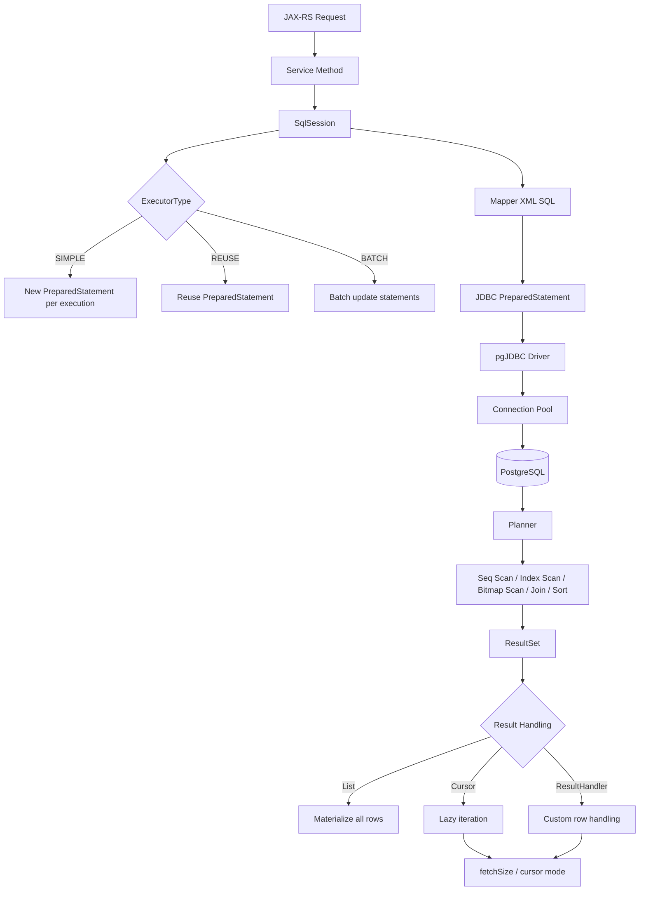
```mermaid id="fk3b8k"
flowchart TD
    A[JAX-RS Request] --> B[Service Method]
    B --> C[SqlSession]
    C --> D{ExecutorType}
    D -->|SIMPLE| E[New PreparedStatement per execution]
    D -->|REUSE| F[Reuse PreparedStatement]
    D -->|BATCH| G[Batch update statements]

    C --> H[Mapper XML SQL]
    H --> I[JDBC PreparedStatement]
    I --> J[pgJDBC Driver]
    J --> K[Connection Pool]
    K --> L[(PostgreSQL)]

    L --> M[Planner]
    M --> N[Seq Scan / Index Scan / Bitmap Scan / Join / Sort]
    N --> O[ResultSet]

    O --> P{Result Handling}
    P -->|List| Q[Materialize all rows]
    P -->|Cursor| R[Lazy iteration]
    P -->|ResultHandler| S[Custom row handling]

    R --> T[fetchSize / cursor mode]
    S --> T
```

**Core invariant:**

```text id="lwz0cr"
Performance problem bisa berada di:
- query shape
- missing/wrong index
- bad cardinality estimate
- result set terlalu besar
- session terlalu lama
- pool terlalu kecil/besar
- batch salah digunakan
- transaction menahan lock terlalu lama
- endpoint terlalu banyak melakukan round trip
```

---

## 3. Decomposition Map

| Area | Fokus Praktis | Skill yang Dikuasai | Risiko Jika Salah |
|---|---|---|---|
| **Query Shape** | Bentuk SQL yang planner-friendly | Predicate, join order awareness, projection, pagination | Full scan, sort besar, nested loop mahal |
| **EXPLAIN / ANALYZE** | Membaca execution plan | Seq scan, index scan, bitmap scan, sort, hash join, actual vs estimated rows | Optimasi berdasarkan tebakan |
| **Index Awareness** | Index sesuai access pattern | Composite, partial, covering, expression, GIN/BRIN | Index tidak dipakai atau terlalu banyak index |
| **ExecutorType.SIMPLE** | Default execution | Statement baru per execution | Overhead jika statement sama dieksekusi banyak kali |
| **ExecutorType.REUSE** | Reuse prepared statement | Mengurangi statement creation | Tidak menyelesaikan query lambat |
| **ExecutorType.BATCH** | Batch insert/update/delete | Flush batch, chunking, transaction control | Memory besar, error partial sulit ditangani |
| **Fetch Size** | Mengontrol pengambilan row dari driver | Cursor mode pgJDBC, streaming besar | Semua row dimaterialisasi di memory |
| **Cursor Streaming** | Proses row besar secara lazy | MyBatis `Cursor`, session tetap terbuka | Connection tertahan lama |
| **ResultHandler** | Custom row processing | Aggregation/export/streaming custom | Tidak cocok untuk advanced nested resultMap |
| **Pagination** | List endpoint scalable | Keyset vs offset, deterministic ordering | Offset besar lambat |
| **Connection Pooling** | Throughput dan backpressure | `maximumPoolSize`, timeout, lifetime, metrics | Pool exhaustion, DB overload |
| **Timeouts** | Fail fast saat query/lock lambat | statement timeout, lock timeout, connection timeout | Request menggantung |
| **N+1 Query Avoidance** | Mengurangi round trip | Join projection, nested result, batch fetch | Latency meledak |
| **Local Cache** | Cache per `SqlSession` | Session pendek, cache awareness | Stale/memory pressure |
| **Batch Write Design** | Insert/update massal aman | Chunk, flush, commit boundary | Lock lama dan rollback mahal |
| **Observability** | Melihat bottleneck nyata | SQL timing, pool metrics, slow query log | Tuning buta |

---

## 4. MyBatis ExecutorType

MyBatis mendefinisikan tiga executor type: `SIMPLE` membuat `PreparedStatement` baru setiap execution, `REUSE` mencoba reuse prepared statement, dan `BATCH` melakukan batch update statements serta melakukan demarcation bila `SELECT` dijalankan di antara batch agar behavior tetap mudah dipahami. ([MyBatis](https://mybatis.org/mybatis-3/java-api.html))

| ExecutorType | Cocok Untuk | Hindari Untuk | Catatan |
|---|---|---|---|
| `SIMPLE` | Default CRUD, query biasa | Loop ribuan statement sama | Aman dan predictable |
| `REUSE` | Banyak statement sama dalam satu session | Query sangat bervariasi | Mengurangi overhead prepared statement |
| `BATCH` | Insert/update/delete massal | Flow yang butuh generated result per row langsung | Perlu `flushStatements()` dan chunking |

---

## 5. Unit of Work dengan ExecutorType

### 5.1 Default transactional

```java id="mkeo8k"
public <T> T transactional(MyBatisWork<T> work) {
    try (SqlSession session = sqlSessionFactory.openSession(false)) {
        try {
            T result = work.execute(new MyBatisSessionContext(session));
            session.commit();
            return result;
        } catch (RuntimeException | Error e) {
            session.rollback();
            throw e;
        }
    }
}
```

### 5.2 Batch transactional

```java id="fsy3a2"
import org.apache.ibatis.session.ExecutorType;
import org.apache.ibatis.session.SqlSession;

public <T> T batchTransactional(MyBatisWork<T> work) {
    try (SqlSession session = sqlSessionFactory.openSession(ExecutorType.BATCH, false)) {
        try {
            T result = work.execute(new MyBatisSessionContext(session));

            session.flushStatements();
            session.commit();

            return result;
        } catch (RuntimeException | Error e) {
            session.rollback();
            throw e;
        }
    }
}
```

MyBatis menyediakan `flushStatements()` untuk mengeksekusi batch update statements saat menggunakan `ExecutorType.BATCH`. ([MyBatis](https://mybatis.org/mybatis-3/java-api.html))

---

## 6. Batch Processing Pattern

### 6.1 Mapper XML

```xml id="r4tlzy"
<insert id="insertAuditLog">
  INSERT INTO audit_logs (
    id,
    aggregate_type,
    aggregate_id,
    action,
    actor_id,
    payload,
    created_at
  )
  VALUES (
    #{id},
    #{aggregateType},
    #{aggregateId},
    #{action},
    #{actorId},
    #{payload, jdbcType=OTHER,
      typeHandler=com.company.app.persistence.typehandler.JsonNodeJsonbTypeHandler},
    #{createdAt}
  )
</insert>
```

### 6.2 Service chunking

```java id="xadm1j"
private static final int CHUNK_SIZE = 500;

public void insertAuditLogs(List<AuditLog> logs) {
    for (int start = 0; start < logs.size(); start += CHUNK_SIZE) {
        int end = Math.min(start + CHUNK_SIZE, logs.size());
        List<AuditLog> chunk = logs.subList(start, end);

        unitOfWork.batchTransactional(ctx -> {
            AuditLogMapper mapper = ctx.mapper(AuditLogMapper.class);

            for (AuditLog log : chunk) {
                mapper.insertAuditLog(log);
            }

            return null;
        });
    }
}
```

### 6.3 Batch decision table

| Kondisi | Gunakan Batch? | Alasan |
|---|---:|---|
| Insert ribuan audit row | Ya | Mengurangi round trip |
| Update banyak row dengan statement sama | Ya | Cocok untuk `ExecutorType.BATCH` |
| Butuh generated key per row langsung | Hati-hati | Batch bisa menyulitkan flow |
| Setiap row punya validation DB berbeda | Hati-hati | Error batch lebih sulit direkonsiliasi |
| Data kecil < 20 row | Tidak wajib | Complexity mungkin tidak sepadan |
| Perlu atomic semua-or-nothing 100k row | Hati-hati | Lock dan rollback mahal |
| Import file besar | Ya, tapi chunked | Jangan satu transaksi raksasa |

---

## 7. Multi-row Insert vs ExecutorType.BATCH

Ada dua pola batch yang berbeda.

### 7.1 Multi-row insert via SQL

```xml id="uvrxy4"
<insert id="insertItems">
  INSERT INTO order_items (
    order_id,
    product_id,
    quantity,
    unit_price
  )
  VALUES
  <foreach collection="items"
           item="item"
           separator=",">
    (
      #{item.orderId},
      #{item.productId},
      #{item.quantity},
      #{item.unitPrice}
    )
  </foreach>
</insert>
```

### 7.2 Batch executor via repeated mapper call

```java id="hmsm9d"
unitOfWork.batchTransactional(ctx -> {
    OrderItemMapper mapper = ctx.mapper(OrderItemMapper.class);

    for (OrderItem item : items) {
        mapper.insertItem(item);
    }

    return null;
});
```

| Pattern | Kelebihan | Kekurangan |
|---|---|---|
| Multi-row insert | Satu SQL statement, cepat untuk chunk sedang | SQL bisa sangat besar |
| `ExecutorType.BATCH` | Statement tetap kecil, driver batching | Butuh flush dan error handling lebih hati-hati |
| PostgreSQL `COPY` | Sangat cepat untuk bulk load | Di luar MyBatis normal mapper pattern |
| Single insert loop tanpa batch | Simple | Round trip besar |

**Practical rule:** untuk aplikasi service biasa, mulai dari multi-row insert chunked atau `ExecutorType.BATCH`. Untuk bulk load serius, pertimbangkan pipeline khusus, bukan endpoint JAX-RS biasa.

---

## 8. Fetch Size dan Cursor Mode pgJDBC

pgJDBC menjelaskan bahwa cursor mode dapat diaktifkan dengan `Statement#setFetchSize(...)`; `fetchSize=0` menyebabkan seluruh row dicache, yang merupakan default behavior. Agar cursor mode bekerja, connection tidak boleh auto-commit, statement harus forward-only, dan query harus single statement. ([pgJDBC](https://jdbc.postgresql.org/documentation/query/))

### 8.1 Mapper XML dengan `fetchSize`

```xml id="bzr2fm"
<select id="streamLargeAuditLogs"
        resultMap="AuditLogResultMap"
        fetchSize="500">
  SELECT
    id,
    aggregate_type,
    aggregate_id,
    action,
    actor_id,
    payload,
    created_at
  FROM audit_logs
  WHERE created_at &gt;= #{from}
    AND created_at &lt; #{to}
  ORDER BY created_at ASC, id ASC
</select>
```

### 8.2 Mapper dengan Cursor

```java id="aumbyq"
import org.apache.ibatis.cursor.Cursor;
import org.apache.ibatis.annotations.Param;

public interface AuditLogMapper {
    Cursor<AuditLog> streamLargeAuditLogs(
        @Param("from") Instant from,
        @Param("to") Instant to
    );
}
```

### 8.3 Service streaming

```java id="ty3aa0"
public void exportAuditLogs(Instant from, Instant to, AuditLogSink sink) {
    unitOfWork.readOnly(ctx -> {
        AuditLogMapper mapper = ctx.mapper(AuditLogMapper.class);

        try (Cursor<AuditLog> cursor = mapper.streamLargeAuditLogs(from, to)) {
            for (AuditLog log : cursor) {
                sink.write(log);
            }
        } catch (IOException e) {
            throw new ExportFailedException(e);
        }

        return null;
    });
}
```

MyBatis `Cursor` memberikan hasil seperti `List`, tetapi data difetch secara lazy menggunakan `Iterator`. Dokumentasi MyBatis juga menunjukkan penggunaan `try-with-resources` untuk menutup cursor. ([MyBatis](https://mybatis.org/mybatis-3/java-api.html))

---

## 9. Cursor Streaming: Kapan Tepat?

| Use Case | Cursor Cocok? | Catatan |
|---|---:|---|
| Export audit log besar | Ya | Jangan materialize semua row |
| Background reconciliation | Ya | Proses incremental |
| HTTP response streaming | Bisa | Hati-hati timeout client dan connection tertahan |
| Query list page biasa | Tidak perlu | Pagination cukup |
| Query dengan nested complex resultMap | Hati-hati | Mapping bisa butuh beberapa row |
| Proses jutaan row lama | Bisa, tapi hati-hati | Connection pool slot tertahan lama |
| Real-time API high QPS | Biasanya tidak | Lebih baik page/keyset |

**Warning penting:** cursor mengurangi memory pressure, tetapi **tidak gratis**. Selama cursor dibaca, transaction/session/connection tetap hidup. Kalau export berjalan 10 menit, satu connection pool slot tertahan 10 menit.

---

## 10. ResultHandler Pattern

MyBatis `ResultHandler` memungkinkan aplikasi menangani row satu per satu, misalnya untuk aggregation, export, atau custom sink. Namun MyBatis mencatat dua batasan: data yang diproses dengan `ResultHandler` tidak dicache, dan advanced `resultMap` dapat menghasilkan object yang association/collection-nya belum lengkap saat handler dipanggil. ([MyBatis](https://mybatis.org/mybatis-3/java-api.html))

### 10.1 Use case

```java id="wj75me"
public void computeAuditSummary(Instant from, Instant to) {
    unitOfWork.readOnly(ctx -> {
        SqlSession session = ctx.session();

        AuditSummaryAccumulator accumulator = new AuditSummaryAccumulator();

        session.select(
            "com.company.app.mapper.AuditLogMapper.findForSummary",
            Map.of("from", from, "to", to),
            resultContext -> {
                AuditLog log = (AuditLog) resultContext.getResultObject();
                accumulator.accept(log);
            }
        );

        return accumulator.snapshot();
    });
}
```

### 10.2 Kapan pakai ResultHandler?

| Kondisi | Gunakan? |
|---|---:|
| Per-row processing sederhana | Ya |
| Aggregation custom di Java | Bisa |
| Export streaming | Bisa |
| Nested `association/collection` kompleks | Hindari |
| Butuh cache MyBatis | Hindari |
| Bisa diselesaikan di SQL aggregate | Lebih baik SQL |

---

## 11. RowBounds Warning

MyBatis `RowBounds` memungkinkan offset/limit di level API, tetapi efisiensinya tergantung driver. Untuk PostgreSQL production query, lebih aman menulis `LIMIT/OFFSET` atau keyset pagination langsung di SQL mapper. MyBatis sendiri menyebut `RowBounds` membuat MyBatis skip sejumlah record dan membatasi jumlah hasil, tetapi efisiensinya bergantung pada driver. ([MyBatis](https://mybatis.org/mybatis-3/java-api.html))

### Prefer SQL pagination

```xml id="mo77gy"
<select id="searchCases" resultMap="CaseResultMap">
  SELECT
    id,
    case_number,
    status,
    priority,
    created_at
  FROM cases
  WHERE assigned_team = #{team}
  ORDER BY created_at DESC, id DESC
  LIMIT #{limit}
  OFFSET #{offset}
</select>
```

### Untuk high-volume list, prefer keyset

```xml id="bbk5gu"
<select id="searchCasesAfter" resultMap="CaseResultMap">
  SELECT
    id,
    case_number,
    status,
    priority,
    created_at
  FROM cases
  WHERE assigned_team = #{team}

  <if test="cursorCreatedAt != null and cursorId != null">
    AND (
      created_at &lt; #{cursorCreatedAt}
      OR (created_at = #{cursorCreatedAt} AND id &lt; #{cursorId})
    )
  </if>

  ORDER BY created_at DESC, id DESC
  LIMIT #{limit}
</select>
```

---

## 12. PostgreSQL EXPLAIN / ANALYZE

PostgreSQL memilih query plan untuk setiap query; dokumentasinya menekankan bahwa memilih plan yang cocok dengan struktur query dan properti data sangat penting untuk performa. `EXPLAIN` digunakan untuk melihat plan yang dibuat planner, dan plan berbentuk tree dengan node seperti sequential scan, index scan, bitmap index scan, join, sort, aggregation, dan lain-lain. ([PostgreSQL](https://www.postgresql.org/docs/current/using-explain.html))

### 12.1 Basic EXPLAIN

```sql id="mbiew1"
EXPLAIN
SELECT
    id,
    case_number,
    status,
    priority,
    created_at
FROM cases
WHERE assigned_team = 'ENFORCEMENT'
  AND status = 'OPEN'
ORDER BY created_at DESC, id DESC
LIMIT 50;
```

### 12.2 EXPLAIN ANALYZE

```sql id="mxykb5"
EXPLAIN (ANALYZE, BUFFERS)
SELECT
    id,
    case_number,
    status,
    priority,
    created_at
FROM cases
WHERE assigned_team = 'ENFORCEMENT'
  AND status = 'OPEN'
ORDER BY created_at DESC, id DESC
LIMIT 50;
```

**Caution:** `EXPLAIN ANALYZE` menjalankan query. Untuk `UPDATE`, `DELETE`, atau `INSERT`, jalankan di transaction lalu rollback jika hanya ingin analisis.

```sql id="1ie3bh"
BEGIN;

EXPLAIN (ANALYZE, BUFFERS)
UPDATE cases
SET status = 'ESCALATED'
WHERE status = 'OPEN'
  AND due_at < now();

ROLLBACK;
```

---

## 13. EXPLAIN Reading Checklist

| Signal | Artinya | Tindakan |
|---|---|---|
| `Seq Scan` pada tabel besar | Full table scan | Cek predicate/index/selectivity |
| `Index Scan` | Index dipakai untuk access | Cek apakah row count masuk akal |
| `Bitmap Heap Scan` | Index dipakai lalu heap fetch | Umum untuk banyak matching row |
| `Sort` besar | Sorting memory/temporary file | Cek index order atau `work_mem` |
| `Nested Loop` besar | Join berulang banyak kali | Cek cardinality dan index join key |
| `Hash Join` | Build hash table | Cek memory dan row count |
| Estimated rows jauh dari actual | Statistics/selectivity buruk | `ANALYZE`, extended stats, query rewrite |
| Banyak shared read blocks | Disk IO tinggi | Index/cache/query shape |
| `Rows Removed by Filter` besar | Banyak row dibaca lalu dibuang | Index predicate kurang tepat |
| High planning time | Query kompleks/dynamic | Simplify query atau prepared plan awareness |
| High execution time | Runtime bottleneck | Index, join, IO, lock, result volume |

---

## 14. Index Awareness

PostgreSQL menjelaskan index sebagai cara umum meningkatkan performa karena database bisa menemukan row lebih cepat dibanding tanpa index, tetapi index juga menambah overhead ke sistem sehingga harus digunakan secara bijak. ([PostgreSQL](https://www.postgresql.org/docs/current/indexes.html))

### 14.1 Query-driven index design

Mulai dari query:

```sql id="6zz4rz"
SELECT
    id,
    case_number,
    status,
    priority,
    created_at
FROM cases
WHERE assigned_team = ?
  AND status = ?
ORDER BY created_at DESC, id DESC
LIMIT 50;
```

Index yang masuk akal:

```sql id="b7l7qx"
CREATE INDEX cases_team_status_created_id_idx
ON cases (
    assigned_team,
    status,
    created_at DESC,
    id DESC
);
```

**Kenapa urutannya begitu?**

```text id="tn9gy7"
Equality predicates dulu:
  assigned_team, status

Lalu ordering/range:
  created_at DESC, id DESC

Tie-breaker:
  id DESC
```

---

## 15. Partial Index

Partial index adalah index atas subset row yang memenuhi predicate tertentu. PostgreSQL menyebut partial index berguna, misalnya untuk menghindari indexing value umum atau hanya mengindex bagian data yang sering dicari; tetapi predicate query harus cocok/terimplikasi oleh predicate index agar index bisa dipakai. PostgreSQL juga menekankan bahwa prepared query dengan parameter seperti `x < ?` tidak bisa secara umum mengimplikasikan predicate partial index seperti `x < 2`. ([PostgreSQL](https://www.postgresql.org/docs/current/indexes-partial.html))

### 15.1 Cocok untuk queue/outbox

```sql id="qbifxu"
CREATE INDEX outbox_pending_available_idx
ON outbox_events (available_at ASC, id ASC)
WHERE status = 'PENDING';
```

Query:

```sql id="s1g3kp"
SELECT
    id,
    payload
FROM outbox_events
WHERE status = 'PENDING'
  AND available_at <= now()
ORDER BY available_at ASC, id ASC
LIMIT 100
FOR UPDATE SKIP LOCKED;
```

### 15.2 Cocok untuk active case

```sql id="e4pcep"
CREATE INDEX cases_open_due_idx
ON cases (due_at ASC, priority DESC, id ASC)
WHERE status IN ('OPEN', 'IN_REVIEW');
```

**Warning:** jangan membuat banyak partial index seperti partition palsu per status/category. PostgreSQL sendiri memperingatkan bahwa banyak partial index non-overlap sering lebih buruk daripada satu composite index yang tepat. ([PostgreSQL](https://www.postgresql.org/docs/current/indexes-partial.html))

---

## 16. Index Decision Table

| Query Pattern | Index Candidate |
|---|---|
| `WHERE id = ?` | Primary key |
| `WHERE tenant_id = ? AND external_ref = ?` | Unique/composite `(tenant_id, external_ref)` |
| `WHERE status = ? ORDER BY created_at DESC LIMIT ?` | `(status, created_at DESC, id DESC)` |
| `WHERE assigned_team = ? AND status = ? ORDER BY due_at` | `(assigned_team, status, due_at, id)` |
| Pending outbox only | Partial index `WHERE status = 'PENDING'` |
| JSONB containment `payload @> ...` | GIN index on `payload` |
| Case-insensitive email lookup | Expression index on `lower(email)` |
| Time-series append-heavy | BRIN may be useful |
| Large text search | Full-text index, not plain B-tree |
| High-write table | Fewer carefully chosen indexes |

---

## 17. Avoid N+1 Query

### 17.1 Bad pattern

```java id="mr3img"
List<Order> orders = orderMapper.searchOrders(query);

for (Order order : orders) {
    List<OrderItem> items = orderItemMapper.findByOrderId(order.id());
    order.setItems(items);
}
```

Jika `orders` berisi 100 row, ini menjadi 101 query.

### 17.2 Better: DTO projection join

```xml id="cfeyu4"
<select id="searchOrderSummaries"
        resultType="com.company.app.dto.OrderSummaryDto">
  SELECT
    o.id AS id,
    o.order_number AS orderNumber,
    o.status AS status,
    c.name AS customerName,
    count(oi.id) AS itemCount
  FROM orders o
  JOIN customers c ON c.id = o.customer_id
  LEFT JOIN order_items oi ON oi.order_id = o.id
  WHERE o.status = #{status}
  GROUP BY o.id, o.order_number, o.status, c.name
  ORDER BY o.created_at DESC, o.id DESC
  LIMIT #{limit}
</select>
```

### 17.3 Better: two-query batch fetch

```java id="okh6j0"
List<Order> orders = orderMapper.searchOrders(query);
List<UUID> orderIds = orders.stream().map(Order::id).toList();

Map<UUID, List<OrderItem>> itemsByOrderId =
    orderItemMapper.findByOrderIds(orderIds).stream()
        .collect(Collectors.groupingBy(OrderItem::orderId));
```

```xml id="kylwks"
<select id="findByOrderIds" resultMap="OrderItemResultMap">
  SELECT
    id,
    order_id,
    product_id,
    quantity,
    unit_price
  FROM order_items
  WHERE order_id IN
  <foreach collection="orderIds"
           item="orderId"
           open="("
           separator=","
           close=")">
    #{orderId}
  </foreach>
  ORDER BY order_id ASC, id ASC
</select>
```

| Pattern | Query Count | Cocok Untuk |
|---|---:|---|
| N+1 lazy per parent | 1 + N | Hindari untuk list endpoint |
| Join projection | 1 | Summary/list/read model |
| Two-query batch fetch | 2 | Parent-child detail page |
| Nested resultMap join | 1 | Object graph terbatas |
| Separate endpoint | Banyak request | Kalau client memang lazy-load detail |

---

## 18. Projection Discipline

### Bad

```sql id="efc7rv"
SELECT *
FROM cases
WHERE status = 'OPEN';
```

### Good

```sql id="423cmd"
SELECT
    id,
    case_number,
    status,
    priority,
    due_at
FROM cases
WHERE status = 'OPEN'
ORDER BY due_at ASC, id ASC
LIMIT 50;
```

| Endpoint | Return Model | Query Strategy |
|---|---|---|
| List page | DTO projection | Ambil kolom yang ditampilkan |
| Detail page | Domain/detail DTO | Ambil object lengkap secukupnya |
| Export | Streaming DTO | Cursor/fetchSize |
| Count badge | Scalar | `count(*)` dengan filter/index |
| Existence check | Boolean | `SELECT EXISTS (...)` |
| State transition | Minimal domain state | Ambil status/version/owner saja |

---

## 19. Count Query Awareness

`count(*)` tidak selalu murah pada tabel besar dengan filter kompleks.

### Pattern: count hanya jika dibutuhkan

```text id="fte8kt"
Search API:
  return items + nextCursor

Admin/report API:
  optionally return totalCount

UI badge:
  cached/aggregated count jika high traffic
```

### Query

```xml id="fs8v7a"
<select id="countOpenCasesByTeam" resultType="long">
  SELECT count(*)
  FROM cases
  WHERE assigned_team = #{team}
    AND status = 'OPEN'
</select>
```

**Rule:** jangan otomatis menjalankan `count(*)` untuk setiap search endpoint jika UI hanya butuh “ada halaman berikutnya”. Untuk keyset pagination, ambil `limit + 1` row.

---

## 20. Keyset Pagination Performance

### Mapper XML

```xml id="cmus64"
<select id="findOpenCasesAfter" resultMap="CaseQueueItemResultMap">
  SELECT
    id,
    case_number,
    priority,
    due_at
  FROM cases
  WHERE status = 'OPEN'
    AND assigned_team = #{team}

  <if test="cursorDueAt != null and cursorId != null">
    AND (
      due_at &gt; #{cursorDueAt}
      OR (due_at = #{cursorDueAt} AND id &gt; #{cursorId})
    )
  </if>

  ORDER BY due_at ASC, id ASC
  LIMIT #{limit}
</select>
```

### Supporting index

```sql id="dxb89w"
CREATE INDEX cases_open_team_due_idx
ON cases (assigned_team, due_at ASC, id ASC)
WHERE status = 'OPEN';
```

| Offset Pagination | Keyset Pagination |
|---|---|
| Mudah untuk page number | Bagus untuk next/previous cursor |
| Lambat untuk offset besar | Stabil untuk data besar |
| Rentan duplicate/missing saat data berubah | Lebih stabil |
| Butuh `count(*)` untuk total page | Tidak perlu total count |
| Cocok admin kecil | Cocok high-volume feed/queue |

---

## 21. Connection Pooling

Untuk Jersey/JAX-RS non-Spring, MyBatis bisa memakai `DataSource` eksternal seperti HikariCP. HikariCP mendokumentasikan beberapa konfigurasi penting: `connectionTimeout` adalah waktu maksimum menunggu connection dari pool sebelum `SQLException`, default 30 detik; `maximumPoolSize` menentukan jumlah maksimum connection termasuk idle dan in-use; ketika pool penuh dan tidak ada idle connection, pemanggil akan block sampai `connectionTimeout`; `maxLifetime` sebaiknya diset beberapa detik lebih pendek dari batas connection yang diberlakukan database/infrastruktur. ([GitHub](https://github.com/brettwooldridge/hikaricp))

### 21.1 HikariCP DataSource factory

```java id="mkq7fu"
public final class DataSourceFactory {

    public static DataSource create() {
        HikariConfig config = new HikariConfig();

        config.setJdbcUrl(requiredEnv("DB_URL"));
        config.setUsername(requiredEnv("DB_USERNAME"));
        config.setPassword(requiredEnv("DB_PASSWORD"));

        config.setMaximumPoolSize(intEnv("DB_POOL_MAX_SIZE", 20));
        config.setMinimumIdle(intEnv("DB_POOL_MIN_IDLE", 20));
        config.setConnectionTimeout(longEnv("DB_POOL_CONNECTION_TIMEOUT_MS", 3000));
        config.setMaxLifetime(longEnv("DB_POOL_MAX_LIFETIME_MS", 1_740_000));
        config.setIdleTimeout(longEnv("DB_POOL_IDLE_TIMEOUT_MS", 600_000));
        config.setPoolName("app-postgres-pool");

        return new HikariDataSource(config);
    }

    private static String requiredEnv(String name) {
        String value = System.getenv(name);
        if (value == null || value.isBlank()) {
            throw new IllegalStateException("Missing env: " + name);
        }
        return value;
    }

    private static int intEnv(String name, int defaultValue) {
        String value = System.getenv(name);
        return value == null ? defaultValue : Integer.parseInt(value);
    }

    private static long longEnv(String name, long defaultValue) {
        String value = System.getenv(name);
        return value == null ? defaultValue : Long.parseLong(value);
    }
}
```

### 21.2 MyBatis environment dengan DataSource programmatic

```java id="to3u19"
DataSource dataSource = DataSourceFactory.create();

TransactionFactory transactionFactory = new JdbcTransactionFactory();

Environment environment = new Environment(
    "production",
    transactionFactory,
    dataSource
);

Configuration configuration = new Configuration(environment);
configuration.addMapper(CaseMapper.class);
configuration.addMapper(AuditLogMapper.class);

SqlSessionFactory sqlSessionFactory =
    new SqlSessionFactoryBuilder().build(configuration);
```

---

## 22. Pool Sizing Mental Model

```text id="1nf9co"
JAX-RS worker threads != DB connections.

Kalau request CPU-bound:
  DB pool kecil bisa cukup.

Kalau request DB-bound:
  pool terlalu kecil -> queue di app.
  pool terlalu besar -> DB overload, lock contention, context switching.
```

| Signal | Kemungkinan Masalah | Tindakan |
|---|---|---|
| Banyak request menunggu connection | Pool terlalu kecil atau query terlalu lama | Cek pool wait time dan slow query |
| DB CPU 100% | Pool terlalu besar atau query berat | Kurangi concurrency / tune query |
| Connection timeout naik | Pool exhausted | Cari query lama, leak, transaction panjang |
| Idle connection tinggi | Pool terlalu besar | Turunkan max/min idle |
| P95 latency naik saat traffic naik | Saturasi DB/pool | Load test + capacity model |
| Export besar membuat API lambat | Cursor menahan connection | Pisahkan worker/export pool |

**Practical rule:** pool bukan solusi untuk query lambat. Membesarkan pool bisa memperparah database overload.

---

## 23. Timeout Layering

| Timeout | Layer | Tujuan |
|---|---|---|
| `connectionTimeout` | HikariCP | Maksimum menunggu connection dari pool |
| `statement_timeout` | PostgreSQL | Maksimum durasi statement |
| `lock_timeout` | PostgreSQL | Maksimum menunggu lock |
| HTTP server timeout | Jersey/container/proxy | Maksimum request lifecycle |
| Client timeout | Caller | Batas tunggu client |
| Worker lease timeout | Job/outbox | Mencegah job stuck |

### 23.1 Transaction-local timeout

```xml id="e36dfi"
<update id="setLocalStatementTimeout">
  SET LOCAL statement_timeout = #{timeout}
</update>
```

```xml id="p3i4km"
<update id="setLocalLockTimeout">
  SET LOCAL lock_timeout = #{timeout}
</update>
```

```java id="a6q8bq"
unitOfWork.transactional(ctx -> {
    RuntimeMapper runtime = ctx.mapper(RuntimeMapper.class);

    runtime.setLocalStatementTimeout("10s");
    runtime.setLocalLockTimeout("2s");

    // execute business operation

    return null;
});
```

---

## 24. MyBatis Local Cache Performance Awareness

MyBatis membuat local cache per session. Query yang sama dengan parameter sama dalam session yang sama bisa memakai local cache; cache dibersihkan saat `update`, `commit`, `rollback`, dan `close`. ([MyBatis](https://mybatis.org/mybatis-3/java-api.html))

| Session Pattern | Efek |
|---|---|
| Session pendek per use case | Cache kecil, predictable |
| Session panjang batch process | Cache bisa membesar |
| Query sama berulang dalam session | Bisa mengurangi DB hit |
| Object hasil query dimutasi | Bisa mencemari cache lokal |
| Banyak row besar dalam satu session | Memory pressure |

### Optional config

```xml id="dkpj7y"
<settings>
  <setting name="localCacheScope" value="STATEMENT"/>
</settings>
```

| `localCacheScope` | Dampak |
|---|---|
| `SESSION` | Default; cache sepanjang session |
| `STATEMENT` | Cache hanya per statement; lebih rendah risiko stale/memory |

---

## 25. Mapper XML Performance Options

### 25.1 `fetchSize`

```xml id="zvm0ge"
<select id="streamEvents"
        resultMap="OutboxEventResultMap"
        fetchSize="500">
  SELECT
    id,
    aggregate_type,
    aggregate_id,
    event_type,
    payload,
    created_at
  FROM outbox_events
  WHERE created_at &gt;= #{from}
  ORDER BY created_at ASC, id ASC
</select>
```

### 25.2 `timeout`

```xml id="f7hpyy"
<select id="findDashboardSummary"
        resultMap="DashboardSummaryResultMap"
        timeout="5">
  SELECT
    assigned_team,
    status,
    count(*) AS total
  FROM cases
  GROUP BY assigned_team, status
</select>
```

### 25.3 `useCache`

```xml id="6g1nw9"
<select id="findReferenceData"
        resultMap="ReferenceDataResultMap"
        useCache="true">
  SELECT
    code,
    label,
    sort_order
  FROM reference_data
  WHERE active = true
  ORDER BY sort_order ASC
</select>
```

**Warning:** second-level cache di microservice stateless/distributed harus dipakai sangat selektif. Reference data yang jarang berubah mungkin cocok; mutable workflow data biasanya tidak.

---

## 26. PostgreSQL Query Pattern: Queue Claim

### Query

```xml id="m9v0no"
<select id="claimPendingJobs" resultMap="JobResultMap">
  SELECT
    id,
    job_type,
    payload,
    attempt_count,
    available_at
  FROM jobs
  WHERE status = 'PENDING'
    AND available_at &lt;= now()
  ORDER BY available_at ASC, id ASC
  LIMIT #{limit}
  FOR UPDATE SKIP LOCKED
</select>
```

### Index

```sql id="wp067u"
CREATE INDEX jobs_pending_available_idx
ON jobs (available_at ASC, id ASC)
WHERE status = 'PENDING';
```

### Why it performs

```text id="f0p6re"
WHERE status = 'PENDING'
  -> matches partial index predicate

ORDER BY available_at, id
  -> matches index order

LIMIT
  -> can stop early
```

---

## 27. PostgreSQL Query Pattern: Dashboard Summary

### Bad for high-QPS dashboard

```sql id="c8rrwy"
SELECT
    status,
    count(*)
FROM cases
GROUP BY status;
```

Jika tabel sangat besar dan dashboard dipanggil sering, ini bisa mahal.

### Better options

| Strategy | Kapan |
|---|---|
| Query langsung + index | Data kecil/medium |
| Materialized view | Dashboard periodik |
| Summary table | High-QPS operational dashboard |
| Event-driven counter | Butuh low latency |
| Cache with TTL | Toleransi stale data |
| Partition-aware query | Data time-series besar |

### Summary table

```sql id="b97cxm"
CREATE TABLE case_status_summary (
    assigned_team text NOT NULL,
    status text NOT NULL,
    total bigint NOT NULL,
    updated_at timestamp with time zone NOT NULL,
    PRIMARY KEY (assigned_team, status)
);
```

---

## 28. Large Export Pattern

### Anti-pattern

```java id="r4aly3"
List<AuditLog> logs = mapper.findAllLogs(from, to);
return Response.ok(logs).build();
```

Masalah:

```text id="h40gdf"
- semua row masuk memory
- serialization besar
- response lama
- connection tertahan
- client disconnect bisa buang kerja besar
```

### Better: async export job

```text id="1a8pw5"
POST /exports/audit-logs
  -> create export job
  -> return 202 Accepted + job id

Worker:
  -> cursor stream from DB
  -> write file/object storage
  -> mark job completed

GET /exports/{id}
  -> status + download link
```

### Jika harus streaming HTTP

```java id="o617aw"
@GET
@Path("/audit-logs/export")
@Produces("text/csv")
public Response export(@QueryParam("from") Instant from,
                       @QueryParam("to") Instant to) {
    StreamingOutput output = stream -> {
        auditExportService.writeCsv(from, to, stream);
    };

    return Response.ok(output)
        .header("Content-Disposition", "attachment; filename=\"audit-logs.csv\"")
        .build();
}
```

**Caution:** HTTP streaming tetap menahan request thread/resource dan DB connection selama export. Untuk export besar/regulatory audit, async export job biasanya lebih defensible.

---

## 29. Observability untuk Performance

| Metric / Log | Sumber | Kenapa Penting |
|---|---|---|
| SQL duration per mapper method | App/MyBatis interceptor | Tahu query lambat |
| Rows returned | App instrumentation | Deteksi over-fetching |
| Connection acquire time | HikariCP metrics | Pool saturation |
| Active/idle/pending connections | HikariCP metrics | Sizing pool |
| Transaction duration | Service/unit-of-work | Lock duration |
| Deadlock/lock timeout count | DB/app exception | Contention |
| Statement timeout count | DB/app exception | Query runaway |
| Slow query log | PostgreSQL | Query nyata di production |
| EXPLAIN sampled query | Manual/diagnostic | Planner behavior |
| P95/P99 endpoint latency | API metrics | User impact |

### Mapper method timing wrapper

```java id="oexnx2"
public <T> T timed(String operationName, Supplier<T> supplier) {
    long startNanos = System.nanoTime();

    try {
        return supplier.get();
    } finally {
        long elapsedMillis =
            TimeUnit.NANOSECONDS.toMillis(System.nanoTime() - startNanos);

        metrics.timer("db.operation")
            .tag("operation", operationName)
            .record(elapsedMillis, TimeUnit.MILLISECONDS);
    }
}
```

---

## 30. Performance Investigation Playbook

```text id="9tm3ef"
1. Identify slow endpoint
2. Identify slow mapper/query
3. Capture SQL + parameters shape
4. Run EXPLAIN (ANALYZE, BUFFERS) in similar environment
5. Check row estimates vs actual rows
6. Check scan type and sort/join nodes
7. Check indexes and predicates
8. Check returned row count and projection size
9. Check transaction duration and locks
10. Check connection pool wait time
11. Apply one change
12. Re-measure
```

### Jangan langsung tambah index

Index membantu read, tetapi menambah overhead write dan storage. PostgreSQL sendiri menekankan bahwa index harus digunakan secara bijak karena ada overhead ke database system. ([PostgreSQL](https://www.postgresql.org/docs/current/indexes.html))

---

## 31. Common Performance Smells

| Smell | Gejala | Perbaikan |
|---|---|---|
| `SELECT *` | Network/memory besar | Projection eksplisit |
| N+1 query | Banyak query kecil | Join projection / batch fetch |
| Offset besar | Page jauh lambat | Keyset pagination |
| Count selalu jalan | Search endpoint lambat | Optional count / limit+1 |
| Missing deterministic order | Pagination tidak stabil | `ORDER BY created_at, id` |
| Query dynamic terlalu fleksibel | Index sulit cocok | Batasi filter/sort |
| Batch tanpa chunk | Memory/lock besar | Chunk 500/1000, ukur |
| Cursor untuk API high-QPS | Pool tertahan | Async export/job |
| Pool terlalu besar | DB overload | Sizing berdasarkan load test |
| Transaction panjang | Lock contention | Pendekkan transaction |
| External call dalam transaction | Lock lama | Outbox / after commit |
| Partial index tidak dipakai | Predicate tidak match | Cocokkan query predicate |
| JSONB filter tanpa index | Seq scan | GIN/expression index |
| ResultMap terlalu berat | Mapping CPU tinggi | DTO projection |
| Local cache membesar | Memory naik | Session pendek / `STATEMENT` |

---

## 32. Code Template - Performance-Oriented Search

### Criteria

```java id="o0f8rp"
public record CaseSearchQuery(
    String assignedTeam,
    String status,
    Instant createdFrom,
    Instant createdTo,
    UUID cursorId,
    Instant cursorCreatedAt,
    int limit
) {
    public CaseSearchQuery {
        if (limit <= 0 || limit > 200) {
            throw new IllegalArgumentException("limit must be between 1 and 200");
        }
    }

    public int limitPlusOne() {
        return limit + 1;
    }
}
```

### Mapper

```java id="x337l9"
List<CaseQueueItemDto> searchCases(@Param("query") CaseSearchQuery query);
```

### XML

```xml id="fqx9yp"
<select id="searchCases"
        resultType="com.company.app.dto.CaseQueueItemDto"
        timeout="5">
  SELECT
    id,
    case_number AS caseNumber,
    status,
    priority,
    created_at AS createdAt
  FROM cases

  <where>
    <if test="query.assignedTeam != null">
      assigned_team = #{query.assignedTeam}
    </if>

    <if test="query.status != null">
      AND status = #{query.status}
    </if>

    <if test="query.createdFrom != null">
      AND created_at &gt;= #{query.createdFrom}
    </if>

    <if test="query.createdTo != null">
      AND created_at &lt; #{query.createdTo}
    </if>

    <if test="query.cursorCreatedAt != null and query.cursorId != null">
      AND (
        created_at &lt; #{query.cursorCreatedAt}
        OR (created_at = #{query.cursorCreatedAt} AND id &lt; #{query.cursorId})
      )
    </if>
  </where>

  ORDER BY created_at DESC, id DESC
  LIMIT #{query.limitPlusOne}
</select>
```

### Supporting index candidate

```sql id="sl5jd6"
CREATE INDEX cases_team_status_created_idx
ON cases (
    assigned_team,
    status,
    created_at DESC,
    id DESC
);
```

---

## 33. Code Template - Batch Import

```java id="oujr8m"
public ImportResult importRows(List<ImportRow> rows) {
    ImportResult result = new ImportResult();

    for (List<ImportRow> chunk : chunks(rows, 500)) {
        unitOfWork.batchTransactional(ctx -> {
            ImportMapper mapper = ctx.mapper(ImportMapper.class);

            for (ImportRow row : chunk) {
                mapper.insertImportRow(row);
                result.incrementInserted();
            }

            return null;
        });
    }

    return result;
}

private static <T> List<List<T>> chunks(List<T> source, int size) {
    List<List<T>> chunks = new ArrayList<>();

    for (int start = 0; start < source.size(); start += size) {
        int end = Math.min(start + size, source.size());
        chunks.add(source.subList(start, end));
    }

    return chunks;
}
```

**Failure design:** kalau chunk ke-7 gagal, chunk 1-6 sudah commit. Ini cocok untuk import resumable. Kalau seluruh import harus atomic, jangan commit per chunk, tetapi risiko lock/rollback/memory akan jauh lebih besar.

---

## 34. Code Template - Streaming Export with Cursor

```java id="bwiice"
public void writeCsv(Instant from, Instant to, OutputStream outputStream) {
    unitOfWork.readOnly(ctx -> {
        AuditLogMapper mapper = ctx.mapper(AuditLogMapper.class);

        try (
            Writer writer = new BufferedWriter(
                new OutputStreamWriter(outputStream, StandardCharsets.UTF_8)
            );
            Cursor<AuditLog> cursor = mapper.streamLargeAuditLogs(from, to)
        ) {
            writer.write("id,aggregateType,aggregateId,action,createdAt\n");

            for (AuditLog log : cursor) {
                writer.write(toCsvLine(log));
            }

            writer.flush();
        } catch (IOException e) {
            throw new ExportFailedException(e);
        }

        return null;
    });
}
```

**Checklist cursor export:**

| Item | Harus |
|---|---:|
| `fetchSize` diset | Ya |
| Auto-commit off | Ya |
| Query single statement | Ya |
| Ordering deterministic | Ya |
| Session/cursor ditutup | Ya |
| Export punya timeout/limit | Ya |
| Connection pool impact dipantau | Ya |
| Untuk export besar, prefer async job | Ya |

---

## 35. Anti-Pattern

| Anti-Pattern | Contoh | Dampak |
|---|---|---|
| Load semua row ke `List` | Export jutaan audit log | OOM / GC pressure |
| Batch tanpa flush/chunk | 100k update satu session | Memory/lock besar |
| Pool size dinaikkan terus | `maximumPoolSize=200` | DB overload |
| Query tuning tanpa EXPLAIN | “Tambah index saja” | Bisa salah sasaran |
| Banyak index untuk semua filter | Index explosion | Write lambat |
| Partial index asal-asalan | Predicate tidak match | Index tidak dipakai |
| `SELECT *` di endpoint list | Ambil payload besar | Network dan mapping lambat |
| DTO list pakai domain aggregate penuh | Mapping berat | Latency tinggi |
| N+1 query | Loop panggil mapper | Round trip tinggi |
| Offset besar | `OFFSET 500000` | Lambat |
| Cursor di endpoint high traffic | Connection tertahan | Pool starvation |
| Long transaction untuk export | Cursor lama | Vacuum/lock/pool impact |
| External API call dalam transaction | Lock duration panjang | Contention |
| Tidak cek pool metrics | Blind tuning | Root cause kabur |

---

## 36. Production Checklist

| Checklist | Status Ideal |
|---|---|
| Semua query penting punya EXPLAIN baseline | Ya |
| Endpoint list memakai projection eksplisit | Ya |
| Pagination punya deterministic `ORDER BY` | Ya |
| High-volume list memakai keyset pagination | Ya |
| Search filter umum punya index yang cocok | Ya |
| Partial index hanya untuk workload stabil dan predicate cocok | Ya |
| Batch write memakai chunking | Ya |
| `ExecutorType.BATCH` hanya untuk operasi write massal | Ya |
| Cursor/fetchSize dipakai untuk export besar | Ya |
| Cursor tidak dipakai sembarang di high-QPS endpoint | Ya |
| Connection pool metrics aktif | Ya |
| Pool timeout lebih pendek dari HTTP timeout | Ya |
| Query/lock timeout dikonfigurasi | Ya |
| Transaction duration dipantau | Ya |
| Tidak ada external call di dalam DB transaction | Ya |
| Slow query log / SQL timing tersedia | Ya |
| Performance test memakai data volume realistis | Ya |

---

## 37. Decision Table

| Problem | Solusi Utama |
|---|---|
| Insert ribuan row | `ExecutorType.BATCH` atau multi-row insert chunked |
| Export jutaan row | Cursor + fetchSize atau async export job |
| List page lambat di page jauh | Keyset pagination |
| Query lambat tidak jelas | `EXPLAIN (ANALYZE, BUFFERS)` |
| Queue claim lambat | Partial index sesuai status pending |
| Dashboard sering lambat | Summary table/materialized view/cache |
| Banyak query per request | Join projection / batch fetch |
| Pool sering habis | Cari query lama + transaction panjang sebelum menaikkan pool |
| Memory naik saat query besar | Projection + cursor + chunking |
| Write lambat setelah tambah index | Review index overhead |
| JSONB filter lambat | GIN/expression index atau relationalize field |
| Batch error sulit dilacak | Per-chunk commit + import error table |

---

## 38. Roadmap Belajar Singkat

| Urutan | Materi | Target |
|---:|---|---|
| 1 | MyBatis `ExecutorType` | Tahu kapan pakai SIMPLE/REUSE/BATCH |
| 2 | Batch write + chunking | Bisa insert/update massal dengan aman |
| 3 | `fetchSize` dan Cursor | Bisa proses result besar tanpa OOM |
| 4 | Projection dan DTO query | Bisa mengurangi over-fetching |
| 5 | N+1 avoidance | Bisa menurunkan round trip |
| 6 | Keyset pagination | Bisa membuat list high-volume |
| 7 | PostgreSQL EXPLAIN | Bisa membaca plan dasar |
| 8 | Index design | Bisa membuat index berdasarkan query |
| 9 | Connection pool metrics | Bisa bedakan DB bottleneck vs pool bottleneck |
| 10 | Production observability | Bisa tune berdasarkan data nyata |

---

## Rekomendasi Materi Selanjutnya

Lanjutkan ke **“Java MyBatis Observability, SQL Logging, Metrics, Tracing, Slow Query Investigation, Error Classification, dan Production Diagnostics di Jersey/JAX-RS”** karena setelah performa query dipahami, langkah berikutnya adalah membuat bottleneck dan failure bisa terlihat jelas saat production berjalan.

---

**Sources:**

- [MyBatis 3 | Java API – mybatis](https://mybatis.org/mybatis-3/java-api.html)
- [Issuing a Query and Processing the Result | pgJDBC](https://jdbc.postgresql.org/documentation/query/)
- [PostgreSQL: Documentation: 18: 14.1. Using EXPLAIN](https://www.postgresql.org/docs/current/using-explain.html)
- [GitHub - brettwooldridge/HikariCP: 光 HikariCP・A solid, high-performance, JDBC connection pool at last. · GitHub](https://github.com/brettwooldridge/hikaricp)

## Response:
7/13/2026, 2:28:51 AM

Lanjut ke observability dan production diagnostics: targetnya membuat setiap query MyBatis bisa ditelusuri dari HTTP request sampai PostgreSQL, dengan korelasi log, metric, trace, dan klasifikasi error yang jelas.

# Cheatsheet - Java MyBatis Observability, SQL Logging, Metrics, Tracing, Slow Query Investigation, Error Classification, dan Production Diagnostics di Jersey/JAX-RS

## 1. Introduction

Observability untuk **Jersey/JAX-RS + MyBatis + PostgreSQL** berarti kita bisa menjawab pertanyaan operasional seperti:

```text id="proa3c"
Request mana yang lambat?
Mapper method mana yang lambat?
SQL mana yang paling mahal?
Apakah lambat karena query plan, lock, pool, network, atau downstream?
Apakah error DB retryable atau business conflict?
Apakah satu user action bisa ditelusuri dari HTTP request sampai PostgreSQL?
```

MyBatis sendiri mendukung logging melalui log factory dan bisa diarahkan ke implementasi seperti **SLF4J, Log4j2, JDK logging, stdout logging, no logging**, atau custom implementation. Untuk production, biasanya gunakan SLF4J/Logback/Log4j2, bukan `STDOUT_LOGGING`, agar log level, format JSON, MDC, masking, dan shipping bisa dikontrol. ([MyBatis](https://mybatis.org/mybatis-3/logging.html?utm_source=chatgpt.com))

---

## 2. Mental Model Observability

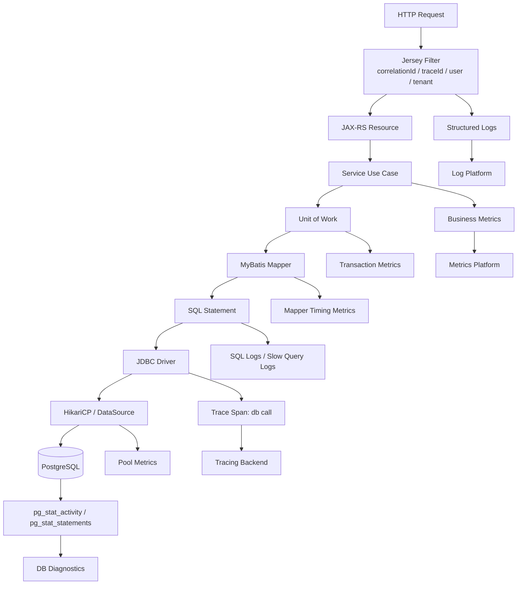
```mermaid id="6ad7lg"
flowchart TD
    A[HTTP Request] --> B[Jersey Filter<br/>correlationId / traceId / user / tenant]
    B --> C[JAX-RS Resource]
    C --> D[Service Use Case]
    D --> E[Unit of Work]
    E --> F[MyBatis Mapper]
    F --> G[SQL Statement]
    G --> H[JDBC Driver]
    H --> I[HikariCP / DataSource]
    I --> J[(PostgreSQL)]

    B --> K[Structured Logs]
    D --> L[Business Metrics]
    E --> M[Transaction Metrics]
    F --> N[Mapper Timing Metrics]
    G --> O[SQL Logs / Slow Query Logs]
    H --> P[Trace Span: db call]
    I --> Q[Pool Metrics]
    J --> R[pg_stat_activity / pg_stat_statements]

    K --> S[Log Platform]
    L --> T[Metrics Platform]
    P --> U[Tracing Backend]
    R --> V[DB Diagnostics]
```

**Core invariant:**

```text id="ka5hjx"
Setiap request harus punya correlation id / trace id.

Setiap query penting harus bisa dikaitkan ke:
- endpoint
- service use case
- mapper method
- SQL statement id
- tenant/user/request context
- duration
- row count / affected row count
- SQLSTATE jika gagal
```

---

## 3. Decomposition Map

| Area | Fokus Praktis | Skill yang Dikuasai | Risiko Jika Tidak Ada |
|---|---|---|---|
| **Correlation ID** | Menghubungkan semua log dalam satu request | Jersey filter, MDC, response header | Debugging antar layer sulit |
| **Structured Logging** | Log machine-readable | JSON log, field standar, log level | Log tidak bisa dicari dengan baik |
| **MyBatis SQL Logging** | Melihat statement dan parameter saat perlu | `logImpl`, logger per mapper/package | SQL log terlalu noisy / bocor data |
| **Mapper Timing** | Mengukur durasi per mapper operation | Wrapper/interceptor/timer | Tidak tahu query mana lambat |
| **Transaction Metrics** | Melihat durasi unit-of-work | Commit/rollback duration | Lock lama tidak terlihat |
| **Connection Pool Metrics** | Melihat saturasi pool | active/idle/pending/acquire time | Salah menebak DB lambat padahal pool exhausted |
| **Tracing** | Melihat request path end-to-end | OpenTelemetry Java agent/manual spans | Latency breakdown tidak jelas |
| **Slow Query Investigation** | Mencari SQL mahal | app timing + DB stats + EXPLAIN | Optimasi berdasarkan feeling |
| **PostgreSQL Runtime Views** | Melihat DB sedang apa | `pg_stat_activity`, locks, wait event | Tidak tahu blocking/lock |
| **pg_stat_statements** | Menemukan query paling mahal historis | mean/max time, calls, rows, shared blocks | Hanya tahu satu incident, bukan pattern |
| **Error Classification** | Bedakan retryable vs business error | SQLSTATE, exception mapper | Retry salah / HTTP status salah |
| **Sensitive Data Masking** | Cegah PII/secrets bocor | Mask parameter, payload, headers | Compliance/security incident |
| **Alerting** | Deteksi sebelum user komplain | SLO, latency, error, pool saturation | Incident terlambat diketahui |
| **Runbook Diagnostics** | Langkah investigasi standar | playbook endpoint/query/DB | Setiap incident mulai dari nol |

---

## 4. Correlation ID di Jersey

### 4.1 Request filter

```java id="u9hb6t"
package com.company.app.observability;

import java.io.IOException;
import java.util.UUID;

import jakarta.annotation.Priority;
import jakarta.ws.rs.Priorities;
import jakarta.ws.rs.container.ContainerRequestContext;
import jakarta.ws.rs.container.ContainerRequestFilter;
import jakarta.ws.rs.container.ContainerResponseContext;
import jakarta.ws.rs.container.ContainerResponseFilter;
import jakarta.ws.rs.ext.Provider;

import org.slf4j.MDC;

@Provider
@Priority(Priorities.AUTHENTICATION)
public class CorrelationIdFilter
    implements ContainerRequestFilter, ContainerResponseFilter {

    public static final String HEADER = "X-Correlation-Id";
    public static final String MDC_KEY = "correlationId";

    @Override
    public void filter(ContainerRequestContext requestContext)
        throws IOException {

        String correlationId = requestContext.getHeaderString(HEADER);

        if (correlationId == null || correlationId.isBlank()) {
            correlationId = UUID.randomUUID().toString();
        }

        requestContext.setProperty(MDC_KEY, correlationId);
        MDC.put(MDC_KEY, correlationId);
    }

    @Override
    public void filter(ContainerRequestContext requestContext,
                       ContainerResponseContext responseContext)
        throws IOException {

        Object correlationId = requestContext.getProperty(MDC_KEY);

        if (correlationId != null) {
            responseContext.getHeaders().putSingle(HEADER, correlationId.toString());
        }

        MDC.remove(MDC_KEY);
    }
}
```

### 4.2 Minimal log pattern

```text id="t3uypw"
timestamp
level
service
environment
correlationId
traceId
spanId
tenantId
userId
http.method
http.path
http.status
operation
durationMs
error.code
```

**Rule:** jangan hanya log message string. Log harus punya field yang bisa difilter.

---

## 5. MyBatis SQL Logging

### 5.1 Konfigurasi `logImpl`

```xml id="gslzod"
<configuration>
  <settings>
    <setting name="logImpl" value="SLF4J"/>
  </settings>
</configuration>
```

Valid value resmi untuk `logImpl` mencakup `SLF4J`, `LOG4J`, `LOG4J2`, `JDK_LOGGING`, `COMMONS_LOGGING`, `STDOUT_LOGGING`, `NO_LOGGING`, atau fully-qualified custom implementation. Jika tidak dikonfigurasi, MyBatis akan autodiscover logging implementation. ([MyBatis](https://mybatis.org/mybatis-3/logging.html?utm_source=chatgpt.com))

### 5.2 Logger level per mapper

Contoh Logback:

```xml id="b47x40"
<configuration>
  <appender name="CONSOLE" class="ch.qos.logback.core.ConsoleAppender">
    <encoder>
      <pattern>
        %d{yyyy-MM-dd'T'HH:mm:ss.SSSXXX} %-5level [%thread] [%X{correlationId}] %logger - %msg%n
      </pattern>
    </encoder>
  </appender>

  <logger name="com.company.app.mapper" level="DEBUG"/>

  <root level="INFO">
    <appender-ref ref="CONSOLE"/>
  </root>
</configuration>
```

### 5.3 Production guidance

| Environment | SQL Logging |
|---|---|
| Local dev | DEBUG mapper SQL boleh |
| Integration test | DEBUG selektif |
| Staging | DEBUG sementara untuk investigasi |
| Production normal | INFO/WARN; jangan log semua SQL |
| Production incident | Enable selektif, short window |
| Regulated/PII-heavy system | Masking wajib |

**Warning:** MyBatis SQL logging bisa menampilkan parameter. Untuk payload sensitif seperti token, PII, KYC data, customer profile, legal notes, atau enforcement detail, gunakan masking atau jangan aktifkan full SQL parameter log di production.

---

## 6. Structured Application Logging

### 6.1 Service-level log

```java id="7olewq"
public OrderResponse approveOrder(ApproveOrderCommand command) {
    log.info("Approve order started orderId={} actorId={}",
        command.orderId(),
        command.actorId()
    );

    try {
        OrderResponse response = unitOfWork.transactional(ctx -> {
            OrderMapper mapper = ctx.mapper(OrderMapper.class);

            int updated = mapper.transitionStatus(
                command.orderId(),
                "SUBMITTED",
                "APPROVED",
                command.version()
            );

            if (updated != 1) {
                throw new InvalidOrderTransitionException(command.orderId());
            }

            mapper.insertAuditLog(...);
            mapper.insertOutboxEvent(...);

            return OrderResponse.approved(command.orderId());
        });

        log.info("Approve order completed orderId={}", command.orderId());
        return response;

    } catch (RuntimeException e) {
        log.warn("Approve order failed orderId={} errorType={}",
            command.orderId(),
            e.getClass().getSimpleName(),
            e
        );
        throw e;
    }
}
```

### 6.2 Apa yang dilog?

| Event | Level | Field Minimum |
|---|---|---|
| Request selesai | INFO | method, path, status, duration |
| Use case dimulai | DEBUG/INFO | operation, aggregate id |
| Use case berhasil | INFO | operation, aggregate id, duration |
| Business conflict | WARN | operation, code, aggregate id |
| Retry transient DB | WARN | sqlState, attempt, operation |
| Unexpected DB failure | ERROR | sqlState, mapper, operation |
| Slow query | WARN | mapperId, duration, threshold |
| Security/auth failure | WARN | user/tenant context terbatas |
| Validation failure | INFO/WARN | error code, field summary |

**Rule:** log yang baik membantu investigasi tanpa perlu membuka payload mentah.

---

## 7. Mapper Timing Metrics

MyBatis logging memberi visibility, tetapi untuk dashboard production perlu metric.

### 7.1 Manual timing di repository/service

```java id="j23fk0"
public final class TimedMapperExecutor {

    private final MeterRegistry meterRegistry;

    public TimedMapperExecutor(MeterRegistry meterRegistry) {
        this.meterRegistry = meterRegistry;
    }

    public <T> T record(String mapperId, Supplier<T> supplier) {
        Timer.Sample sample = Timer.start(meterRegistry);

        try {
            return supplier.get();
        } finally {
            sample.stop(
                Timer.builder("db.mybatis.mapper.duration")
                    .tag("mapper", mapperId)
                    .register(meterRegistry)
            );
        }
    }
}
```

Usage:

```java id="e5j2fl"
Order order = timed.record(
    "OrderMapper.findById",
    () -> mapper.findById(orderId)
);
```

Micrometer mendeskripsikan metric sebagai data untuk mengamati, memberi alert, dan bereaksi terhadap kondisi operasional saat ini atau baru-baru ini. Ia biasa dipakai sebagai facade metric menuju backend seperti Prometheus, OTLP, Datadog, dan lain-lain. ([Micrometer Application Observability](https://micrometer.io/docs/?utm_source=chatgpt.com))

---

## 8. MyBatis Interceptor untuk Timing

Jika ingin otomatis per statement, gunakan plugin interceptor.

### 8.1 Interceptor skeleton

```java id="ojjzo8"
package com.company.app.observability;

import java.util.Properties;
import java.util.concurrent.TimeUnit;

import org.apache.ibatis.executor.Executor;
import org.apache.ibatis.mapping.MappedStatement;
import org.apache.ibatis.plugin.Interceptor;
import org.apache.ibatis.plugin.Invocation;
import org.apache.ibatis.plugin.Intercepts;
import org.apache.ibatis.plugin.Plugin;
import org.apache.ibatis.plugin.Signature;

import io.micrometer.core.instrument.MeterRegistry;
import io.micrometer.core.instrument.Timer;

@Intercepts({
    @Signature(
        type = Executor.class,
        method = "update",
        args = {MappedStatement.class, Object.class}
    ),
    @Signature(
        type = Executor.class,
        method = "query",
        args = {
            MappedStatement.class,
            Object.class,
            org.apache.ibatis.session.RowBounds.class,
            org.apache.ibatis.session.ResultHandler.class
        }
    )
})
public class MyBatisMetricsInterceptor implements Interceptor {

    private final MeterRegistry meterRegistry;

    public MyBatisMetricsInterceptor(MeterRegistry meterRegistry) {
        this.meterRegistry = meterRegistry;
    }

    @Override
    public Object intercept(Invocation invocation) throws Throwable {
        MappedStatement mappedStatement =
            (MappedStatement) invocation.getArgs()[0];

        String statementId = mappedStatement.getId();
        String commandType = mappedStatement.getSqlCommandType().name();

        long startNanos = System.nanoTime();

        try {
            return invocation.proceed();
        } finally {
            long durationNanos = System.nanoTime() - startNanos;

            Timer.builder("db.mybatis.statement.duration")
                .tag("statement", statementId)
                .tag("command", commandType)
                .register(meterRegistry)
                .record(durationNanos, TimeUnit.NANOSECONDS);
        }
    }

    @Override
    public Object plugin(Object target) {
        return Plugin.wrap(target, this);
    }

    @Override
    public void setProperties(Properties properties) {
        // no-op
    }
}
```

### 8.2 Registration programmatic

```java id="qlicg6"
Configuration configuration = new Configuration(environment);
configuration.addInterceptor(new MyBatisMetricsInterceptor(meterRegistry));
```

### 8.3 Metric cardinality warning

| Tag | Aman? | Catatan |
|---|---:|---|
| `statement=OrderMapper.findById` | Ya | Bounded cardinality |
| `command=SELECT` | Ya | Bounded |
| `tenantId` | Hati-hati | Bisa banyak |
| `userId` | Tidak untuk metric tag | High cardinality |
| raw SQL | Tidak | High cardinality dan sensitif |
| parameter value | Tidak | PII + high cardinality |
| endpoint path template | Ya | `/orders/{id}`, bukan `/orders/123` |

---

## 9. Tracing dengan OpenTelemetry

OpenTelemetry menyediakan API, SDK, dan agent untuk telemetry seperti traces, metrics, dan logs. Java zero-code instrumentation menggunakan Java agent yang dapat menangkap telemetry dari banyak library/framework tanpa perubahan kode, termasuk edge seperti inbound request, outbound HTTP, dan database call. ([OpenTelemetry](https://opentelemetry.io/docs/languages/java/?utm_source=chatgpt.com))

### 9.1 JVM args

```bash id="xvtr9x"
java \
  -javaagent:/opt/opentelemetry-javaagent.jar \
  -Dotel.service.name=order-service \
  -Dotel.resource.attributes=deployment.environment=prod,service.version=1.42.0 \
  -Dotel.exporter.otlp.endpoint=http://otel-collector:4317 \
  -jar app.jar
```

### 9.2 Environment variables

```bash id="22sndj"
OTEL_SERVICE_NAME=order-service
OTEL_RESOURCE_ATTRIBUTES=deployment.environment=prod,service.version=1.42.0
OTEL_EXPORTER_OTLP_ENDPOINT=http://otel-collector:4317
```

### 9.3 Manual span untuk use case

```java id="xjuson"
public OrderResponse approveOrder(ApproveOrderCommand command) {
    Span span = tracer.spanBuilder("OrderService.approveOrder")
        .setAttribute("order.id", command.orderId().toString())
        .setAttribute("operation", "approveOrder")
        .startSpan();

    try (Scope scope = span.makeCurrent()) {
        return doApproveOrder(command);
    } catch (RuntimeException e) {
        span.recordException(e);
        span.setStatus(StatusCode.ERROR);
        throw e;
    } finally {
        span.end();
    }
}
```

### 9.4 Trace hierarchy ideal

```text id="hgyx67"
HTTP POST /orders/{id}/approve
  -> OrderResource.approve
    -> OrderService.approveOrder
      -> MyBatis transaction
        -> OrderMapper.findById
        -> OrderMapper.transitionStatus
        -> AuditLogMapper.insert
        -> OutboxMapper.insert
```

**Practical rule:** tracing bagus untuk melihat latency breakdown, tetapi jangan menaruh data sensitif di span attributes.

---

## 10. Connection Pool Metrics

Untuk service yang memakai HikariCP/DataSource, metric pool sangat penting karena query lambat dan pool starvation sering terlihat mirip dari sisi endpoint. Minimal pantau:

| Metric | Artinya | Indikasi |
|---|---|---|
| Active connections | Connection sedang dipakai | Tinggi terus = saturation |
| Idle connections | Connection siap pakai | Nol terus = pressure |
| Pending threads | Thread menunggu connection | Pool bottleneck |
| Connection acquire time | Waktu ambil connection | Naik = pool exhausted/query lama |
| Connection usage time | Lama connection dipakai | Transaction/query lama |
| Timeout acquiring connection | Gagal dapat connection | User-facing failure |
| Max pool size | Kapasitas pool | Capacity limit |

### 10.1 Hikari config metric registry

```java id="ll8rrb"
HikariConfig config = new HikariConfig();

config.setJdbcUrl(System.getenv("DB_URL"));
config.setUsername(System.getenv("DB_USERNAME"));
config.setPassword(System.getenv("DB_PASSWORD"));
config.setMaximumPoolSize(20);
config.setPoolName("order-service-postgres");

// depending on your Micrometer/Hikari integration version
config.setMetricRegistry(meterRegistry);

DataSource dataSource = new HikariDataSource(config);
```

**Catatan:** integrasi detail HikariCP-Micrometer bisa berbeda tergantung versi library dan framework. Di aplikasi non-Spring, validasi API yang tersedia pada versi HikariCP/Micrometer yang dipakai project; di Spring Boot, banyak metric Hikari biasanya sudah di-auto-configure oleh Actuator/Micrometer. ([Home](https://docs.spring.io/spring-boot/reference/actuator/metrics.html?utm_source=chatgpt.com))

---

## 11. PostgreSQL Runtime Diagnostics

PostgreSQL menyediakan chapter monitoring untuk melihat aktivitas database, termasuk view statistik. `pg_stat_activity` berisi satu row per server process dan menunjukkan informasi aktivitas connection saat ini. ([PostgreSQL](https://www.postgresql.org/docs/current/monitoring.html?utm_source=chatgpt.com))

### 11.1 Active query saat ini

```sql id="nahmzi"
SELECT
    pid,
    usename,
    application_name,
    client_addr,
    state,
    wait_event_type,
    wait_event,
    now() - query_start AS query_age,
    now() - xact_start AS transaction_age,
    query
FROM pg_stat_activity
WHERE datname = current_database()
ORDER BY query_age DESC;
```

### 11.2 Query yang sedang menunggu lock

```sql id="0qgxpe"
SELECT
    pid,
    usename,
    application_name,
    wait_event_type,
    wait_event,
    now() - query_start AS waiting_for,
    query
FROM pg_stat_activity
WHERE wait_event_type = 'Lock'
ORDER BY waiting_for DESC;
```

### 11.3 Long transaction

```sql id="o1zo7g"
SELECT
    pid,
    usename,
    application_name,
    state,
    now() - xact_start AS transaction_age,
    query
FROM pg_stat_activity
WHERE xact_start IS NOT NULL
ORDER BY transaction_age DESC;
```

**Interpretasi praktis:**

| Signal | Kemungkinan |
|---|---|
| `state = active` lama | Query lambat / lock wait |
| `state = idle in transaction` | App membuka transaksi lalu tidak commit/rollback |
| `wait_event_type = Lock` | Blocking transaction |
| `transaction_age` besar | Transaksi panjang, bisa ganggu vacuum/lock |
| Banyak connection app idle | Pool terlalu besar atau traffic turun |
| Banyak active query sama | Endpoint hot / N+1 / retry storm |

---

## 12. pg_stat_statements

`pg_stat_statements` adalah extension PostgreSQL yang melacak statistik planning dan execution untuk semua SQL statement yang dijalankan server. Ini sangat berguna untuk melihat query paling mahal secara agregat, bukan hanya query yang kebetulan sedang berjalan saat dicek. ([PostgreSQL](https://www.postgresql.org/docs/current/pgstatstatements.html?utm_source=chatgpt.com))

### 12.1 Query paling mahal total time

```sql id="m10zdv"
SELECT
    queryid,
    calls,
    total_exec_time,
    mean_exec_time,
    max_exec_time,
    rows,
    shared_blks_hit,
    shared_blks_read,
    query
FROM pg_stat_statements
ORDER BY total_exec_time DESC
LIMIT 20;
```

### 12.2 Query paling lambat rata-rata

```sql id="7ef5kp"
SELECT
    queryid,
    calls,
    mean_exec_time,
    max_exec_time,
    rows,
    query
FROM pg_stat_statements
WHERE calls >= 10
ORDER BY mean_exec_time DESC
LIMIT 20;
```

### 12.3 Query dengan IO tinggi

```sql id="2a3rx6"
SELECT
    queryid,
    calls,
    shared_blks_read,
    shared_blks_hit,
    mean_exec_time,
    query
FROM pg_stat_statements
ORDER BY shared_blks_read DESC
LIMIT 20;
```

**Warning:** `pg_stat_statements` menormalisasi query, jadi parameter value tidak terlihat. Itu bagus untuk security dan agregasi, tetapi untuk reproduce issue tetap butuh contoh parameter dari log/app context yang aman.

---

## 13. SQL Comment untuk Traceability

Untuk menghubungkan query di PostgreSQL dengan mapper/use case, salah satu pattern adalah SQL comment.

```xml id="fxmxtf"
<select id="findById" resultMap="OrderResultMap">
  /* app=order-service mapper=OrderMapper.findById */
  SELECT
    id,
    customer_id,
    status,
    version,
    created_at
  FROM orders
  WHERE id = #{id}
</select>
```

### Decision

| Benefit | Risk |
|---|---|
| Mudah terlihat di `pg_stat_activity` | Bisa memengaruhi query normalization/aggregation jika comment terlalu dinamis |
| Membantu DBA tahu source query | Jangan isi userId/orderId raw |
| Bisa korelasi mapper ↔ DB | Gunakan comment statis |

**Rule:** comment boleh berisi mapper/use case statis, bukan parameter dinamis.

---

## 14. Slow Query Logging di Aplikasi

### 14.1 Interceptor slow query

```java id="3w4qxf"
public class SlowQueryLoggingInterceptor implements Interceptor {

    private static final long SLOW_QUERY_THRESHOLD_MS = 500;

    @Override
    public Object intercept(Invocation invocation) throws Throwable {
        MappedStatement mappedStatement =
            (MappedStatement) invocation.getArgs()[0];

        long start = System.nanoTime();

        try {
            return invocation.proceed();
        } finally {
            long durationMs = TimeUnit.NANOSECONDS.toMillis(
                System.nanoTime() - start
            );

            if (durationMs >= SLOW_QUERY_THRESHOLD_MS) {
                log.warn(
                    "Slow MyBatis statement statementId={} command={} durationMs={}",
                    mappedStatement.getId(),
                    mappedStatement.getSqlCommandType(),
                    durationMs
                );
            }
        }
    }
}
```

### 14.2 Threshold guideline

| Query Type | Initial Warning Threshold |
|---|---:|
| By primary key | 50-100 ms |
| Search/list page | 300-500 ms |
| Dashboard aggregate | 500-1000 ms |
| Batch chunk | 1-5 s |
| Export streaming | Track separately |
| Queue claim | 100-300 ms |

Threshold harus berbasis SLO dan baseline service, bukan angka universal.

---

## 15. Error Classification dengan SQLSTATE

### 15.1 SQLSTATE classifier

```java id="n1hw6f"
public enum PersistenceErrorKind {
    UNIQUE_VIOLATION,
    FOREIGN_KEY_VIOLATION,
    CHECK_VIOLATION,
    NOT_NULL_VIOLATION,
    DEADLOCK,
    SERIALIZATION_FAILURE,
    LOCK_NOT_AVAILABLE,
    QUERY_CANCELED,
    CONNECTION_FAILURE,
    UNKNOWN
}
```

```java id="4r17n7"
public final class PostgresErrorClassifier {

    public static PersistenceErrorKind classify(Throwable throwable) {
        SQLException sqlException = findSqlException(throwable);

        if (sqlException == null) {
            return PersistenceErrorKind.UNKNOWN;
        }

        return switch (sqlException.getSQLState()) {
            case "23505" -> PersistenceErrorKind.UNIQUE_VIOLATION;
            case "23503" -> PersistenceErrorKind.FOREIGN_KEY_VIOLATION;
            case "23514" -> PersistenceErrorKind.CHECK_VIOLATION;
            case "23502" -> PersistenceErrorKind.NOT_NULL_VIOLATION;
            case "40P01" -> PersistenceErrorKind.DEADLOCK;
            case "40001" -> PersistenceErrorKind.SERIALIZATION_FAILURE;
            case "55P03" -> PersistenceErrorKind.LOCK_NOT_AVAILABLE;
            case "57014" -> PersistenceErrorKind.QUERY_CANCELED;
            case "08000", "08003", "08006", "08001" ->
                PersistenceErrorKind.CONNECTION_FAILURE;
            default -> PersistenceErrorKind.UNKNOWN;
        };
    }

    private static SQLException findSqlException(Throwable throwable) {
        Throwable current = throwable;

        while (current != null) {
            if (current instanceof SQLException sqlException) {
                return sqlException;
            }
            current = current.getCause();
        }

        return null;
    }
}
```

PostgreSQL mendokumentasikan bahwa transaksi pada isolation level tertentu dapat gagal dengan `serialization_failure` SQLSTATE `40001`, deadlock dengan `40P01`, dan bahwa aplikasi perlu siap mengulang seluruh transaksi untuk kondisi transient tertentu. ([PostgreSQL](https://www.postgresql.org/docs/current/monitoring-stats.html?utm_source=chatgpt.com))

---

## 16. HTTP Error Mapping

| Persistence Condition | SQLSTATE | HTTP | Retry? | Meaning |
|---|---:|---:|---:|---|
| Unique violation | `23505` | `409 Conflict` | Tidak otomatis | Duplicate business key |
| FK violation | `23503` | `409` / `400` | Tidak | Referensi invalid |
| Check violation | `23514` | `400` / `409` | Tidak | Domain constraint gagal |
| Not null violation | `23502` | `500` atau `400` | Tidak | Bug mapping atau input invalid |
| Serialization failure | `40001` | `503` setelah retry gagal | Ya | Transient concurrency |
| Deadlock | `40P01` | `503` setelah retry gagal | Ya | Transient lock cycle |
| Lock not available | `55P03` | `409` / `503` | Bisa | Resource busy |
| Query canceled / timeout | `57014` | `503` / `504` | Bisa | Timeout/cancel |
| Connection failure | `08xxx` | `503` | Bisa | DB connectivity |

### ExceptionMapper

```java id="fzov24"
@Provider
public class PersistenceExceptionMapper
    implements ExceptionMapper<PersistenceException> {

    @Override
    public Response toResponse(PersistenceException exception) {
        PersistenceErrorKind kind =
            PostgresErrorClassifier.classify(exception);

        return switch (kind) {
            case UNIQUE_VIOLATION -> conflict("DUPLICATE_RESOURCE");
            case FOREIGN_KEY_VIOLATION -> conflict("INVALID_REFERENCE");
            case CHECK_VIOLATION -> conflict("CONSTRAINT_VIOLATION");
            case DEADLOCK, SERIALIZATION_FAILURE, CONNECTION_FAILURE ->
                unavailable("PERSISTENCE_TRANSIENT_FAILURE");
            case LOCK_NOT_AVAILABLE, QUERY_CANCELED ->
                unavailable("PERSISTENCE_TIMEOUT_OR_BUSY");
            default -> serverError("PERSISTENCE_FAILURE");
        };
    }

    private Response conflict(String code) {
        return Response.status(Response.Status.CONFLICT)
            .entity(ApiError.of(code, "Request conflicts with current state."))
            .build();
    }

    private Response unavailable(String code) {
        return Response.status(Response.Status.SERVICE_UNAVAILABLE)
            .entity(ApiError.of(code, "Temporary persistence failure. Retry later."))
            .build();
    }

    private Response serverError(String code) {
        return Response.status(Response.Status.INTERNAL_SERVER_ERROR)
            .entity(ApiError.of(code, "Unexpected persistence failure."))
            .build();
    }
}
```

---

## 17. Retry Observability

Retry harus terlihat, bukan diam-diam.

```java id="0e7rhl"
public <T> T retryableTransaction(String operation, MyBatisWork<T> work) {
    int maxAttempts = 3;

    for (int attempt = 1; attempt <= maxAttempts; attempt++) {
        try {
            return unitOfWork.transactional(work);
        } catch (RuntimeException e) {
            PersistenceErrorKind kind = PostgresErrorClassifier.classify(e);

            if (!isRetryable(kind) || attempt == maxAttempts) {
                throw e;
            }

            log.warn(
                "Retrying persistence transaction operation={} attempt={} errorKind={}",
                operation,
                attempt,
                kind,
                e
            );

            meterRegistry.counter(
                "db.transaction.retry",
                "operation", operation,
                "errorKind", kind.name()
            ).increment();

            sleep(backoffMillis(attempt));
        }
    }

    throw new IllegalStateException("unreachable");
}
```

| Retry Signal | Kenapa Penting |
|---|---|
| retry count by operation | Deteksi contention |
| retry final failure | SLO impact |
| SQLSTATE / error kind | Root cause |
| attempt number | Apakah retry efektif |
| latency including retry | User impact |
| idempotency context | Cegah duplicate side effect |

---

## 18. Sensitive Data Masking

### Jangan log mentah

```text id="spk8pv"
password
token
authorization header
session id
KYC data
PII
customer address
legal notes
enforcement evidence
full JSONB payload
payment data
```

### Masking helper

```java id="p2qlp4"
public final class LogMasking {

    private LogMasking() {}

    public static String maskEmail(String email) {
        if (email == null || !email.contains("@")) {
            return "***";
        }

        String[] parts = email.split("@", 2);
        String local = parts[0];

        if (local.length() <= 2) {
            return "***@" + parts[1];
        }

        return local.charAt(0) + "***" + local.charAt(local.length() - 1)
            + "@" + parts[1];
    }

    public static String maskToken(String token) {
        if (token == null || token.length() < 8) {
            return "***";
        }

        return token.substring(0, 4) + "..." + token.substring(token.length() - 4);
    }
}
```

### Observability rule

```text id="8nvjzg"
Log identifiers, not payloads.

Prefer:
  orderId, caseId, tenantId, operation, status, errorCode

Avoid:
  full request body, full DB row, full JSONB payload, raw token
```

---

## 19. Diagnostic Playbook - Endpoint Lambat

```text id="x691gu"
1. Cek API latency: p50/p95/p99 endpoint.
2. Cek correlationId / trace untuk request lambat.
3. Lihat span breakdown: resource, service, DB, external call.
4. Cek mapper statement duration.
5. Cek connection acquire time.
6. Cek PostgreSQL pg_stat_activity saat lambat.
7. Cek pg_stat_statements untuk query agregat.
8. Ambil SQL shape dan parameter representatif.
9. Jalankan EXPLAIN (ANALYZE, BUFFERS) di environment aman.
10. Cek row estimate, scan type, sort, join, blocks read.
11. Cek lock/wait event.
12. Cek apakah regression berasal dari release/migration/index.
```

### Decision table

| Temuan | Kemungkinan Root Cause |
|---|---|
| Connection acquire time tinggi | Pool exhausted / connection leak / query lama |
| DB span tinggi tapi acquire normal | Query/lock lambat |
| `pg_stat_activity` wait lock | Blocking transaction |
| `idle in transaction` | App tidak commit/rollback tepat waktu |
| `pg_stat_statements` calls sangat tinggi | Hot endpoint / N+1 / polling |
| mean time kecil, max time besar | Spike lock/IO/plan variance |
| rows returned besar | Over-fetching |
| shared blocks read tinggi | IO / cache miss / missing index |
| endpoint p99 tinggi tapi DB normal | App CPU/serialization/downstream |

---

## 20. Diagnostic Playbook - Deadlock / Serialization Failure

```text id="hy0nxp"
1. Ambil SQLSTATE dari exception.
2. Cek operation dan mapper statement.
3. Cek apakah retry terjadi dan berhasil.
4. Cek lock ordering di code path terkait.
5. Cek apakah transaksi terlalu panjang.
6. Cek apakah external call dilakukan dalam transaction.
7. Cek pg_stat_activity / logs untuk blocking pattern.
8. Tambahkan deterministic lock ordering jika multi-row update.
9. Pastikan retry mengulang full unit-of-work.
10. Tambahkan metric retry/deadlock per operation.
```

| SQLSTATE | Meaning | Action |
|---|---|---|
| `40P01` | Deadlock detected | Retry + fix lock ordering |
| `40001` | Serialization failure | Retry full transaction |
| `55P03` | Lock not available | Retry/backoff atau return busy |
| `57014` | Query canceled | Cek statement timeout/query plan |
| `23505` | Unique violation | Treat as duplicate/idempotency conflict |

---

## 21. Diagnostic Playbook - Pool Exhaustion

```text id="s2o2wu"
1. Cek pending connection threads.
2. Cek active connections vs max pool.
3. Cek connection usage time.
4. Cek long transaction.
5. Cek slow query.
6. Cek cursor/export yang menahan connection.
7. Cek connection leak.
8. Cek traffic spike/retry storm.
9. Jangan langsung menaikkan pool sebelum tahu root cause.
```

| Signal | Interpretasi |
|---|---|
| Active=max, pending naik | Pool saturated |
| Idle=0 terus | DB concurrency pressure |
| Usage time tinggi | Transaction/query lama |
| Acquire timeout terjadi | User-facing failure |
| DB CPU rendah tapi pool penuh | Connection leak / waiting lock / long transaction |
| DB CPU tinggi dan pool penuh | DB overloaded |

---

## 22. Alerting Matrix

| Alert | Threshold Awal | Severity |
|---|---:|---|
| API p95 latency > SLO | 5-10 menit | Warning/Critical |
| API 5xx rate naik | 5 menit | Critical |
| DB transaction retry rate naik | baseline + anomaly | Warning |
| Deadlock count > 0 berulang | 5-15 menit | Warning |
| Connection acquire timeout > 0 | immediate | Critical |
| Hikari pending threads > 0 terus | 5 menit | Warning |
| Active connections near max | 10 menit | Warning |
| `idle in transaction` lama | > 1-5 menit | Warning |
| Slow query count naik | baseline + anomaly | Warning |
| Query timeout count > 0 | 5 menit | Warning/Critical |
| Outbox pending backlog naik | SLO dependent | Warning |
| Queue claim empty padahal backlog ada | immediate | Critical |

---

## 23. Dashboard Layout

```text id="7xvi5s"
Service Overview
  - request rate
  - error rate
  - latency p50/p95/p99
  - top endpoints by latency

Persistence Overview
  - mapper duration p95/p99
  - top slow mapper statements
  - DB transaction duration
  - retry count by SQLSTATE
  - affected row conflict count

Connection Pool
  - active / idle / pending
  - acquire duration
  - usage duration
  - timeout count

PostgreSQL
  - active sessions
  - lock waits
  - long transactions
  - pg_stat_statements top total time
  - pg_stat_statements top mean time
  - slow query log count

Business Workflow
  - command success/failure by operation
  - invalid transition count
  - idempotency replay/conflict count
  - outbox pending/processing/failed
```

---

## 24. Mapper Statement Naming Convention

| Mapper Method | Statement ID | Good Metric Tag |
|---|---|---|
| `OrderMapper.findById` | `com.company.app.mapper.OrderMapper.findById` | `OrderMapper.findById` |
| `OrderMapper.transitionStatus` | full id | `OrderMapper.transitionStatus` |
| `OutboxMapper.claimPendingEvents` | full id | `OutboxMapper.claimPendingEvents` |
| `CaseMapper.findForEscalation` | full id | `CaseMapper.findForEscalation` |

### Helper

```java id="6pqafx"
public final class MapperStatementNames {

    private MapperStatementNames() {}

    public static String shortName(String statementId) {
        int mapperStart = statementId.lastIndexOf('.', statementId.lastIndexOf('.') - 1);
        if (mapperStart < 0) {
            return statementId;
        }
        return statementId.substring(mapperStart + 1);
    }
}
```

**Rule:** metric tag harus bounded. `OrderMapper.findById` aman; raw SQL atau ID user tidak aman.

---

## 25. MyBatis + PostgreSQL Observability Anti-Pattern

| Anti-Pattern | Dampak |
|---|---|
| Tidak ada correlation ID | Log antar layer tidak tersambung |
| SQL log production selalu DEBUG | Noise, storage mahal, data sensitif bocor |
| Metric tag pakai userId/orderId | Cardinality explosion |
| Hanya pantau API latency | Tidak tahu bottleneck DB/pool |
| Hanya pantau DB CPU | Tidak tahu pool/app problem |
| Tidak cek affected row conflict | Lost update/invalid transition tidak terlihat |
| Retry tanpa metric | Contention tersembunyi |
| Error DB jadi HTTP 500 semua | Client tidak tahu conflict vs transient |
| Log full JSONB payload | PII/compliance risk |
| Trace span berisi payload sensitif | Data leakage di tracing backend |
| `pg_stat_activity` tidak pernah dicek | Lock/idle transaction telat ketahuan |
| Tidak punya slow query baseline | Sulit tahu regression |
| Semua query diberi dynamic SQL comment | Query aggregation kacau |
| Dashboard terlalu banyak panel | Tidak actionable |

---

## 26. Production Checklist

| Checklist | Status Ideal |
|---|---|
| Correlation ID dibuat/diteruskan untuk semua request | Ya |
| Correlation ID dikembalikan di response header | Ya |
| MDC dibersihkan setelah request | Ya |
| Log format structured/JSON-ready | Ya |
| MyBatis `logImpl` diarahkan ke SLF4J/Log4j2 | Ya |
| SQL DEBUG production default off | Ya |
| Slow mapper statement log tersedia | Ya |
| Mapper timing metric tersedia | Ya |
| Transaction duration metric tersedia | Ya |
| Hikari/DataSource pool metric tersedia | Ya |
| OpenTelemetry trace tersedia untuk HTTP dan DB | Ya |
| Metric tags bounded cardinality | Ya |
| SQLSTATE diklasifikasi | Ya |
| Retry punya log + metric | Ya |
| ExceptionMapper membedakan conflict/transient/fatal | Ya |
| PII/secrets dimasking | Ya |
| `pg_stat_activity` query runbook tersedia | Ya |
| `pg_stat_statements` dipakai untuk query aggregate diagnostics | Ya |
| Alert untuk pool exhaustion, slow query, deadlock, retries tersedia | Ya |
| Dashboard punya service, DB, pool, business workflow view | Ya |

---

## 27. Decision Table

| Problem | Observability Pattern |
|---|---|
| Request lambat sporadis | Trace + correlation ID + mapper timing |
| Semua endpoint lambat | Pool metrics + DB CPU + pg_stat_activity |
| Query tertentu lambat | MyBatis statement timer + pg_stat_statements |
| Lock contention | pg_stat_activity wait_event + retry/deadlock metrics |
| Lost update sering | affected-row conflict metric |
| Duplicate request | idempotency replay/conflict metric |
| Outbox tidak terkirim | backlog metric + worker claim timing |
| Pool timeout | Hikari pending/acquire/timeout alerts |
| DB transient error | SQLSTATE classifier + retry metric |
| Compliance concern | structured log masking + SQL log policy |
| Susah reproduce query | static SQL comment + mapper statement id |
| N+1 regression | calls per request / mapper count metric |

---

## 28. Roadmap Belajar Singkat

| Urutan | Materi | Target |
|---:|---|---|
| 1 | Correlation ID + MDC | Semua log request tersambung |
| 2 | MyBatis SQL logging | Bisa debug SQL secara selektif |
| 3 | Structured logging | Log bisa dicari dan dianalisis |
| 4 | Mapper timing metric | Query lambat terlihat |
| 5 | Connection pool metrics | Pool saturation terdeteksi |
| 6 | OpenTelemetry tracing | Latency breakdown end-to-end |
| 7 | SQLSTATE classification | Error mapping dan retry benar |
| 8 | PostgreSQL runtime views | Bisa lihat lock/long transaction |
| 9 | pg_stat_statements | Bisa cari query mahal historis |
| 10 | Runbook + alerting | Production diagnostics konsisten |

---

## Rekomendasi Materi Selanjutnya

Lanjutkan ke **“Java MyBatis Testing Strategy: Unit Test, Mapper Integration Test, Testcontainers PostgreSQL, Migration Test, Transaction Test, Concurrency Test, dan SQL Regression Test”** karena setelah observability siap, bagian berikutnya adalah memastikan mapper dan transaction behavior terbukti benar sebelum masuk production.

---

**Sources:**

- [MyBatis 3 | Logging](https://mybatis.org/mybatis-3/logging.html?utm_source=chatgpt.com)
- [Micrometer Documentation](https://micrometer.io/docs/?utm_source=chatgpt.com)
- [Java](https://opentelemetry.io/docs/languages/java/?utm_source=chatgpt.com)
- [Metrics :: Spring Boot](https://docs.spring.io/spring-boot/reference/actuator/metrics.html?utm_source=chatgpt.com)
- [Documentation: 18: Chapter 27. Monitoring Database Activity](https://www.postgresql.org/docs/current/monitoring.html?utm_source=chatgpt.com)

## Response:
7/13/2026, 2:31:30 AM

Lanjut ke testing strategy: fokusnya membuktikan mapper, migration, transaksi, concurrency, dan SQL behavior benar terhadap PostgreSQL nyata, bukan hanya mock interface.

# Cheatsheet - Java MyBatis Testing Strategy: Unit Test, Mapper Integration Test, Testcontainers PostgreSQL, Migration Test, Transaction Test, Concurrency Test, dan SQL Regression Test

## 1. Introduction

Testing untuk **Jersey/JAX-RS + MyBatis + PostgreSQL** harus membedakan dua hal:

```text
Business logic bisa dites dengan unit test.
SQL mapper harus dites terhadap PostgreSQL nyata.
```

MyBatis mapper bukan sekadar interface Java. Mapper adalah kontrak antara:

```text
Mapper interface
  -> Mapper XML / annotation SQL
    -> PostgreSQL schema
      -> PostgreSQL planner, constraint, type system, transaction behavior
```

Karena itu, mock mapper hanya membuktikan service memanggil method tertentu. Mock tidak membuktikan SQL valid, resultMap benar, TypeHandler bekerja, constraint sesuai, migration kompatibel, atau transaksi aman. MyBatis sendiri menempatkan `SqlSession` sebagai interface utama untuk menjalankan command, mengambil mapper, dan mengelola transaksi; ini berarti testing mapper sebaiknya memvalidasi behavior nyata dari session, mapper, SQL, dan database. ([MyBatis](https://mybatis.org/mybatis-3/java-api.html?utm_source=chatgpt.com))

---

## 2. Mental Model Testing

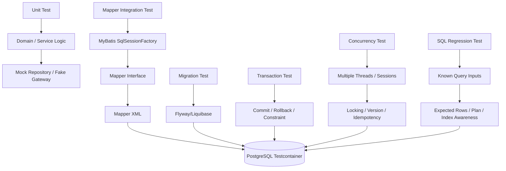
```mermaid id="nauo5f"
flowchart TD
    A[Unit Test] --> B[Domain / Service Logic]
    B --> C[Mock Repository / Fake Gateway]

    D[Mapper Integration Test] --> E[MyBatis SqlSessionFactory]
    E --> F[Mapper Interface]
    F --> G[Mapper XML]
    G --> H[(PostgreSQL Testcontainer)]

    I[Migration Test] --> J[Flyway/Liquibase]
    J --> H

    K[Transaction Test] --> L[Commit / Rollback / Constraint]
    L --> H

    M[Concurrency Test] --> N[Multiple Threads / Sessions]
    N --> O[Locking / Version / Idempotency]
    O --> H

    P[SQL Regression Test] --> Q[Known Query Inputs]
    Q --> R[Expected Rows / Plan / Index Awareness]
    R --> H
```

**Core invariant:**

```text
Unit test:
  fast, isolated, no database

Mapper integration test:
  real MyBatis + real PostgreSQL

Transaction/concurrency test:
  multiple real SqlSession / connections

Migration test:
  empty database -> migrate -> mapper works
```

---

## 3. Decomposition Map

| Area | Fokus Praktis | Dibuktikan Dengan | Risiko Jika Tidak Dites |
|---|---|---|---|
| **Domain Unit Test** | Invariant dan state transition | Plain JUnit test | Logic benar hanya saat happy path |
| **Service Unit Test** | Orchestration use case | Mock repository/unit-of-work | Flow salah tidak terdeteksi cepat |
| **Mapper Integration Test** | SQL + XML + resultMap | Testcontainers PostgreSQL | SQL invalid baru ketahuan runtime |
| **TypeHandler Test** | JSONB, enum, UUID, array, timestamp | Round-trip insert/select | Mapping rusak diam-diam |
| **Migration Test** | Schema bisa dibangun dari nol | Flyway/Liquibase migrate + validate | Migration gagal di deployment |
| **Repository Test** | Persistence abstraction | Real mapper + DB | Repository tidak sesuai kontrak |
| **Transaction Test** | Commit/rollback behavior | Real transaction | Partial write lolos |
| **Constraint Test** | Unique, FK, check, not-null | Real PostgreSQL constraint | Invariant hanya ada di Java |
| **Concurrency Test** | Lost update/deadlock/idempotency | Multi-thread + real DB | Race condition muncul production |
| **Pagination Test** | Stable ordering/keyset | Seed data + assertions | Duplicate/missing row |
| **Batch Test** | Chunking dan batch behavior | Batch insert/update | Batch gagal sebagian tidak jelas |
| **SQL Regression Test** | Query penting tetap benar | Golden dataset | Perubahan SQL mematahkan report/workflow |
| **Performance Smoke Test** | Query tidak regress parah | EXPLAIN/assert duration ringan | Query lambat lolos merge |
| **Error Classification Test** | SQLSTATE mapping | Trigger constraint/deadlock | HTTP status/retry salah |

---

## 4. Testing Pyramid untuk MyBatis App

```text
Banyak:
  Domain unit test
  Service unit test
  Mapper integration test kecil

Sedang:
  Repository integration test
  Migration test
  Transaction test

Sedikit tapi penting:
  Concurrency test
  End-to-end API test
  Performance regression smoke test
```

| Test Type | Database? | Cepat? | Tujuan |
|---|---:|---:|---|
| Domain unit test | Tidak | Sangat cepat | Invariant murni |
| Service unit test | Tidak | Cepat | Orchestration dan decision |
| Mapper integration test | Ya | Sedang | SQL/resultMap/type handler |
| Migration test | Ya | Sedang | Schema lifecycle |
| Transaction test | Ya | Sedang | Commit/rollback |
| Concurrency test | Ya | Lebih lambat | Race/lock/idempotency |
| API integration test | Ya | Lebih lambat | HTTP contract + persistence |
| Performance smoke | Ya | Lebih lambat | Query regression signal |

---

## 5. Dependency Test

Gunakan JUnit 5 + Testcontainers PostgreSQL. Testcontainers menyediakan PostgreSQL module untuk menjalankan container PostgreSQL dari test Java, sehingga test memakai dependency nyata, bukan in-memory database yang behavior-nya berbeda dari PostgreSQL. ([Testcontainers for Java](https://java.testcontainers.org/modules/databases/postgres/?utm_source=chatgpt.com))

```xml id="zgmaww"
<dependencies>
  <dependency>
    <groupId>org.mybatis</groupId>
    <artifactId>mybatis</artifactId>
    <version>${mybatis.version}</version>
  </dependency>

  <dependency>
    <groupId>org.postgresql</groupId>
    <artifactId>postgresql</artifactId>
    <version>${postgresql.version}</version>
    <scope>test</scope>
  </dependency>

  <dependency>
    <groupId>org.testcontainers</groupId>
    <artifactId>postgresql</artifactId>
    <version>${testcontainers.version}</version>
    <scope>test</scope>
  </dependency>

  <dependency>
    <groupId>org.testcontainers</groupId>
    <artifactId>junit-jupiter</artifactId>
    <version>${testcontainers.version}</version>
    <scope>test</scope>
  </dependency>

  <dependency>
    <groupId>org.flywaydb</groupId>
    <artifactId>flyway-core</artifactId>
    <version>${flyway.version}</version>
    <scope>test</scope>
  </dependency>
</dependencies>
```

**Catatan praktis:** gunakan version management/BOM sesuai standar project agar versi Testcontainers, PostgreSQL driver, JUnit, dan Flyway konsisten.

---

## 6. Testcontainers PostgreSQL Base Test

```java id="a4s2t5"
@Testcontainers
public abstract class PostgreSqlIntegrationTest {

    @Container
    protected static final PostgreSQLContainer<?> POSTGRES =
        new PostgreSQLContainer<>("postgres:16")
            .withDatabaseName("app_test")
            .withUsername("app")
            .withPassword("app");

    protected static SqlSessionFactory sqlSessionFactory;

    @BeforeAll
    static void beforeAll() {
        runMigrations();
        sqlSessionFactory = buildSqlSessionFactory();
    }

    private static void runMigrations() {
        Flyway.configure()
            .dataSource(
                POSTGRES.getJdbcUrl(),
                POSTGRES.getUsername(),
                POSTGRES.getPassword()
            )
            .locations("classpath:db/migration")
            .load()
            .migrate();
    }

    private static SqlSessionFactory buildSqlSessionFactory() {
        HikariConfig hikariConfig = new HikariConfig();
        hikariConfig.setJdbcUrl(POSTGRES.getJdbcUrl());
        hikariConfig.setUsername(POSTGRES.getUsername());
        hikariConfig.setPassword(POSTGRES.getPassword());
        hikariConfig.setMaximumPoolSize(5);

        DataSource dataSource = new HikariDataSource(hikariConfig);

        TransactionFactory transactionFactory = new JdbcTransactionFactory();

        Environment environment = new Environment(
            "test",
            transactionFactory,
            dataSource
        );

        Configuration configuration = new Configuration(environment);
        configuration.setMapUnderscoreToCamelCase(true);

        configuration.addMapper(OrderMapper.class);
        configuration.addMapper(CaseMapper.class);
        configuration.addMapper(OutboxMapper.class);

        return new SqlSessionFactoryBuilder().build(configuration);
    }

    protected SqlSession openSession() {
        return sqlSessionFactory.openSession(false);
    }
}
```

Flyway `migrate` menjalankan versioned dan repeatable migrations yang belum diterapkan ke database; Flyway juga memiliki `validateOnMigrate`, yang default-nya `true` menurut dokumentasi Redgate/Flyway terbaru, sehingga migration yang berubah atau tidak konsisten bisa terdeteksi saat migrate. ([Redgate Documentation](https://documentation.red-gate.com/fd/migrations-271585107.html?utm_source=chatgpt.com))

---

## 7. Mapper Integration Test

### 7.1 Mapper

```java id="u4wj1u"
public interface OrderMapper {

    int insert(Order order);

    Order findById(@Param("id") UUID id);

    int transitionStatus(
        @Param("id") UUID id,
        @Param("expectedStatus") String expectedStatus,
        @Param("newStatus") String newStatus,
        @Param("expectedVersion") long expectedVersion
    );
}
```

### 7.2 Test

```java id="r6x0is"
class OrderMapperTest extends PostgreSqlIntegrationTest {

    @Test
    void shouldInsertAndFindOrderById() {
        UUID orderId = UUID.randomUUID();

        try (SqlSession session = openSession()) {
            OrderMapper mapper = session.getMapper(OrderMapper.class);

            Order order = new Order(
                orderId,
                UUID.randomUUID(),
                "DRAFT",
                0L,
                Instant.parse("2026-07-13T01:00:00Z")
            );

            int inserted = mapper.insert(order);
            session.commit();

            assertThat(inserted).isEqualTo(1);
        }

        try (SqlSession session = openSession()) {
            OrderMapper mapper = session.getMapper(OrderMapper.class);

            Order found = mapper.findById(orderId);

            assertThat(found).isNotNull();
            assertThat(found.id()).isEqualTo(orderId);
            assertThat(found.status()).isEqualTo("DRAFT");
            assertThat(found.version()).isEqualTo(0L);
        }
    }
}
```

**Yang dibuktikan:**

```text
- Mapper XML namespace benar
- Statement id cocok dengan method
- INSERT valid terhadap schema
- resultMap benar
- UUID/timestamp mapping benar
- commit membuat data terlihat di session lain
```

---

## 8. Rollback Test

```java id="t41yha"
@Test
void shouldRollbackInsertedOrder() {
    UUID orderId = UUID.randomUUID();

    try (SqlSession session = openSession()) {
        OrderMapper mapper = session.getMapper(OrderMapper.class);

        mapper.insert(Order.draft(orderId));
        session.rollback();
    }

    try (SqlSession session = openSession()) {
        OrderMapper mapper = session.getMapper(OrderMapper.class);

        Order found = mapper.findById(orderId);

        assertThat(found).isNull();
    }
}
```

**Tujuan:** membuktikan test setup benar-benar memakai transaction dan tidak diam-diam auto-commit.

---

## 9. ResultMap Regression Test

ResultMap sering rusak saat rename column, alias berubah, constructor record berubah, atau field baru ditambahkan.

```java id="zew26o"
@Test
void shouldMapOrderSummaryProjection() {
    UUID orderId = fixture.insertOrderWithCustomerAndItems();

    try (SqlSession session = openSession()) {
        OrderQueryMapper mapper = session.getMapper(OrderQueryMapper.class);

        OrderSummaryDto summary = mapper.findSummaryById(orderId);

        assertThat(summary.id()).isEqualTo(orderId);
        assertThat(summary.customerName()).isEqualTo("Acme Corp");
        assertThat(summary.itemCount()).isEqualTo(3);
        assertThat(summary.status()).isEqualTo("SUBMITTED");
    }
}
```

**Rule:** setiap query projection penting harus punya test minimal satu happy path dan satu missing/empty path.

---

## 10. TypeHandler Round-Trip Test

### 10.1 JSONB

```java id="yookw3"
@Test
void shouldRoundTripJsonbPayload() {
    UUID eventId = UUID.randomUUID();

    ObjectNode payload = objectMapper.createObjectNode()
        .put("correlationId", "corr-001")
        .put("eventType", "ORDER_CREATED");

    try (SqlSession session = openSession()) {
        OutboxMapper mapper = session.getMapper(OutboxMapper.class);

        mapper.insert(new OutboxEvent(
            eventId,
            "ORDER",
            "ORD-001",
            "ORDER_CREATED",
            payload,
            "PENDING",
            Instant.parse("2026-07-13T01:00:00Z")
        ));

        session.commit();
    }

    try (SqlSession session = openSession()) {
        OutboxMapper mapper = session.getMapper(OutboxMapper.class);

        OutboxEvent found = mapper.findById(eventId);

        assertThat(found.payload().get("correlationId").asText())
            .isEqualTo("corr-001");
    }
}
```

### 10.2 Enum

```java id="1dobhk"
@Test
void shouldRoundTripNativePostgresEnum() {
    UUID orderId = UUID.randomUUID();

    try (SqlSession session = openSession()) {
        OrderMapper mapper = session.getMapper(OrderMapper.class);

        mapper.insert(Order.withStatus(orderId, OrderStatus.SUBMITTED));
        session.commit();
    }

    try (SqlSession session = openSession()) {
        OrderMapper mapper = session.getMapper(OrderMapper.class);

        Order found = mapper.findById(orderId);

        assertThat(found.status()).isEqualTo(OrderStatus.SUBMITTED);
    }
}
```

### 10.3 Timestamp

```java id="3jrm8u"
@Test
void shouldPreserveInstantForAuditTimestamp() {
    UUID auditId = UUID.randomUUID();
    Instant occurredAt = Instant.parse("2026-07-13T01:00:00Z");

    try (SqlSession session = openSession()) {
        AuditMapper mapper = session.getMapper(AuditMapper.class);

        mapper.insert(new AuditEntry(auditId, "CASE_APPROVED", occurredAt));
        session.commit();
    }

    try (SqlSession session = openSession()) {
        AuditMapper mapper = session.getMapper(AuditMapper.class);

        AuditEntry found = mapper.findById(auditId);

        assertThat(found.occurredAt()).isEqualTo(occurredAt);
    }
}
```

---

## 11. Constraint Test

Constraint test memastikan invariant tidak hanya ada di Java.

### 11.1 Unique constraint

```java id="mykn5i"
@Test
void shouldRejectDuplicateCaseNumber() {
    String caseNumber = "CASE-20260713";

    try (SqlSession session = openSession()) {
        CaseMapper mapper = session.getMapper(CaseMapper.class);

        mapper.insert(CaseRecord.open(UUID.randomUUID(), caseNumber));
        session.commit();
    }

    assertThatThrownBy(() -> {
        try (SqlSession session = openSession()) {
            CaseMapper mapper = session.getMapper(CaseMapper.class);

            mapper.insert(CaseRecord.open(UUID.randomUUID(), caseNumber));
            session.commit();
        }
    }).hasRootCauseInstanceOf(SQLException.class);
}
```

### 11.2 Better: classify SQLSTATE

```java id="gslbsc"
@Test
void shouldClassifyDuplicateCaseNumberAsUniqueViolation() {
    String caseNumber = "CASE-20260713";

    fixture.insertCase(caseNumber);

    Throwable thrown = catchThrowable(() -> fixture.insertCase(caseNumber));

    assertThat(PostgresErrorClassifier.classify(thrown))
        .isEqualTo(PersistenceErrorKind.UNIQUE_VIOLATION);
}
```

PostgreSQL uses SQLSTATE codes for database errors, and earlier sections used SQLSTATE such as `23505` for unique violation, `40001` for serialization failure, and `40P01` for deadlock/transaction retry classification. PostgreSQL documents that applications using stricter isolation levels must be prepared to retry transactions on serialization failures. ([PostgreSQL](https://www.postgresql.org/docs/current/transaction-iso.html?utm_source=chatgpt.com))

---

## 12. Migration Test

Migration test menjawab:

```text
Apakah database kosong bisa dibangun sampai versi terbaru?
Apakah migration repeatable valid?
Apakah mapper compatible dengan schema hasil migration?
Apakah test seed compatible dengan constraint terbaru?
```

### 12.1 Empty database migration test

```java id="j4nlgm"
@Testcontainers
class MigrationTest {

    @Container
    static PostgreSQLContainer<?> postgres =
        new PostgreSQLContainer<>("postgres:16")
            .withDatabaseName("migration_test")
            .withUsername("app")
            .withPassword("app");

    @Test
    void shouldMigrateEmptyDatabaseToLatestSchema() {
        Flyway flyway = Flyway.configure()
            .dataSource(
                postgres.getJdbcUrl(),
                postgres.getUsername(),
                postgres.getPassword()
            )
            .locations("classpath:db/migration")
            .load();

        MigrateResult result = flyway.migrate();

        assertThat(result.success).isTrue();
    }
}
```

### 12.2 Migration + mapper smoke test

```java id="6h6osy"
@Test
void latestMigrationShouldSupportOrderMapper() {
    runMigrations();

    SqlSessionFactory factory = buildSqlSessionFactory();

    try (SqlSession session = factory.openSession(false)) {
        OrderMapper mapper = session.getMapper(OrderMapper.class);

        UUID id = UUID.randomUUID();
        mapper.insert(Order.draft(id));
        session.commit();

        assertThat(mapper.findById(id)).isNotNull();
    }
}
```

**Practical rule:** migration test harus berjalan dari database kosong. Untuk sistem besar, tambahkan juga test upgrade dari snapshot versi sebelumnya jika memungkinkan.

---

## 13. Transaction Boundary Test

### 13.1 Use case harus rollback semua

```java id="qxefss"
@Test
void shouldRollbackOrderWhenOutboxInsertFails() {
    UUID orderId = UUID.randomUUID();

    assertThatThrownBy(() ->
        orderService.createOrderWithBrokenOutbox(orderId)
    ).isInstanceOf(PersistenceException.class);

    try (SqlSession session = openSession()) {
        OrderMapper orderMapper = session.getMapper(OrderMapper.class);
        OutboxMapper outboxMapper = session.getMapper(OutboxMapper.class);

        assertThat(orderMapper.findById(orderId)).isNull();
        assertThat(outboxMapper.findByAggregateId(orderId.toString())).isEmpty();
    }
}
```

### 13.2 Anti-pattern yang ditangkap test ini

```text
insert order
commit
insert outbox
fail
```

Jika test menemukan order tetap ada saat outbox gagal, berarti transaction boundary salah.

---

## 14. Optimistic Locking Test

```java id="g1nxum"
@Test
void shouldRejectStaleVersionUpdate() {
    UUID caseId = fixture.insertSubmittedCase();

    try (SqlSession session = openSession()) {
        CaseMapper mapper = session.getMapper(CaseMapper.class);

        int first = mapper.transitionStatus(
            caseId,
            "SUBMITTED",
            "APPROVED",
            0L
        );

        session.commit();

        assertThat(first).isEqualTo(1);
    }

    try (SqlSession session = openSession()) {
        CaseMapper mapper = session.getMapper(CaseMapper.class);

        int second = mapper.transitionStatus(
            caseId,
            "SUBMITTED",
            "REJECTED",
            0L
        );

        session.commit();

        assertThat(second).isEqualTo(0);
    }
}
```

**Yang dibuktikan:** stale command tidak overwrite state terbaru.

---

## 15. Pessimistic Locking Test

Concurrency test harus memakai **dua session/connection berbeda**.

```java id="xjp1cu"
@Test
void secondTransactionShouldWaitOrTimeoutWhenRowLocked() throws Exception {
    UUID caseId = fixture.insertOpenCase();

    ExecutorService executor = Executors.newFixedThreadPool(2);
    CountDownLatch firstLocked = new CountDownLatch(1);
    CountDownLatch releaseFirst = new CountDownLatch(1);

    Future<Void> first = executor.submit(() -> {
        try (SqlSession session = openSession()) {
            CaseMapper mapper = session.getMapper(CaseMapper.class);

            mapper.findByIdForUpdate(caseId);
            firstLocked.countDown();

            releaseFirst.await(5, TimeUnit.SECONDS);

            session.commit();
        }
        return null;
    });

    Future<Boolean> second = executor.submit(() -> {
        firstLocked.await(5, TimeUnit.SECONDS);

        try (SqlSession session = openSession()) {
            RuntimeMapper runtime = session.getMapper(RuntimeMapper.class);
            CaseMapper mapper = session.getMapper(CaseMapper.class);

            runtime.setLocalLockTimeout("500ms");

            mapper.findByIdForUpdate(caseId);
            session.commit();

            return true;
        } catch (PersistenceException e) {
            return false;
        }
    });

    assertThat(second.get()).isFalse();

    releaseFirst.countDown();
    first.get();
}
```

**Catatan:** test lock harus punya timeout pendek agar tidak menggantung pipeline CI.

---

## 16. Concurrency Test - Lost Update

```java id="dfrqv9"
@Test
void onlyOneConcurrentApprovalShouldSucceed() throws Exception {
    UUID caseId = fixture.insertSubmittedCaseWithVersion(0L);

    ExecutorService executor = Executors.newFixedThreadPool(2);
    CountDownLatch start = new CountDownLatch(1);

    Callable<Boolean> approve = () -> {
        start.await();

        try {
            caseService.approve(new ApproveCaseCommand(caseId, 0L));
            return true;
        } catch (ConcurrentCaseModificationException e) {
            return false;
        }
    };

    Future<Boolean> first = executor.submit(approve);
    Future<Boolean> second = executor.submit(approve);

    start.countDown();

    assertThat(List.of(first.get(), second.get()))
        .containsExactlyInAnyOrder(true, false);

    CaseRecord found = fixture.findCase(caseId);

    assertThat(found.status()).isEqualTo("APPROVED");
    assertThat(found.version()).isEqualTo(1L);
}
```

**Yang dibuktikan:**

```text
- Dua request paralel tidak sama-sama sukses
- Version naik sekali
- State akhir deterministik
- Service benar menerjemahkan affected-row=0 menjadi conflict
```

---

## 17. Idempotency Test

### 17.1 Same key + same payload

```java id="pq5pok"
@Test
void sameIdempotencyKeyAndSamePayloadShouldReturnSameResponse() {
    String key = UUID.randomUUID().toString();

    CreateOrderCommand command = new CreateOrderCommand(
        key,
        "hash-abc",
        UUID.randomUUID(),
        List.of(new OrderItemRequest("SKU-1", 1))
    );

    OrderResponse first = orderService.createOrder(command);
    OrderResponse second = orderService.createOrder(command);

    assertThat(second.orderId()).isEqualTo(first.orderId());
}
```

### 17.2 Same key + different payload

```java id="s4p79d"
@Test
void sameIdempotencyKeyWithDifferentPayloadShouldFail() {
    String key = UUID.randomUUID().toString();

    orderService.createOrder(command(key, "hash-a", "SKU-1"));

    assertThatThrownBy(() ->
        orderService.createOrder(command(key, "hash-b", "SKU-2"))
    ).isInstanceOf(IdempotencyKeyConflictException.class);
}
```

### 17.3 Concurrent same idempotency key

```java id="59gc4i"
@Test
void concurrentSameIdempotencyKeyShouldCreateOnlyOneOrder() throws Exception {
    String key = UUID.randomUUID().toString();
    CreateOrderCommand command = command(key, "hash-a", "SKU-1");

    ExecutorService executor = Executors.newFixedThreadPool(2);
    CountDownLatch start = new CountDownLatch(1);

    Callable<OrderResponse> call = () -> {
        start.await();
        return orderService.createOrder(command);
    };

    Future<OrderResponse> first = executor.submit(call);
    Future<OrderResponse> second = executor.submit(call);

    start.countDown();

    OrderResponse r1 = first.get();
    OrderResponse r2 = second.get();

    assertThat(r2.orderId()).isEqualTo(r1.orderId());
    assertThat(fixture.countOrdersForIdempotencyKey(key)).isEqualTo(1);
}
```

---

## 18. Retry Test untuk Serialization Failure

PostgreSQL menyatakan bahwa transaksi pada isolation tertentu dapat gagal dengan serialization failure, dan aplikasi perlu siap retry seluruh transaksi dari awal. ([PostgreSQL](https://www.postgresql.org/docs/current/transaction-iso.html?utm_source=chatgpt.com))

Unit test classifier:

```java id="k99ehb"
@Test
void shouldClassifySerializationFailureAsRetryable() {
    SQLException sqlException = new SQLException(
        "could not serialize access",
        "40001"
    );

    PersistenceException exception = new PersistenceException(sqlException);

    assertThat(PostgresErrorClassifier.classify(exception))
        .isEqualTo(PersistenceErrorKind.SERIALIZATION_FAILURE);

    assertThat(PostgresRetryPolicy.isRetryable(exception)).isTrue();
}
```

Integration-style retry test bisa dibuat, tetapi jangan terlalu rapuh. Untuk CI, biasanya cukup:

```text
- classifier unit test
- retry wrapper unit test
- satu integration test untuk optimistic/concurrency conflict
```

---

## 19. Pagination Test

### 19.1 Offset pagination deterministic

```java id="gruc4e"
@Test
void searchShouldReturnStableOrderWithTieBreakerId() {
    Instant sameCreatedAt = Instant.parse("2026-07-13T01:00:00Z");

    UUID a = fixture.insertCase("CASE-A", sameCreatedAt);
    UUID b = fixture.insertCase("CASE-B", sameCreatedAt);
    UUID c = fixture.insertCase("CASE-C", sameCreatedAt);

    List<CaseQueueItemDto> page = caseQueryService.search(
        new CaseSearchQuery("OPEN", 10, 0)
    );

    assertThat(page)
        .extracting(CaseQueueItemDto::id)
        .containsExactly(c, b, a);
}
```

### 19.2 Keyset pagination no duplicate

```java id="xt97gg"
@Test
void keysetPaginationShouldNotDuplicateRowsAcrossPages() {
    fixture.insertManyOpenCases(25);

    CasePage first = caseQueryService.searchAfter(null, 10);
    CasePage second = caseQueryService.searchAfter(first.nextCursor(), 10);

    Set<UUID> firstIds = first.items().stream()
        .map(CaseQueueItemDto::id)
        .collect(Collectors.toSet());

    Set<UUID> secondIds = second.items().stream()
        .map(CaseQueueItemDto::id)
        .collect(Collectors.toSet());

    assertThat(Collections.disjoint(firstIds, secondIds)).isTrue();
}
```

---

## 20. Batch Test

```java id="pw0q3b"
@Test
void shouldInsertAuditLogsInBatchChunks() {
    List<AuditLog> logs = IntStream.range(0, 1200)
        .mapToObj(i -> AuditLog.fixture("ACTION_" + i))
        .toList();

    auditImportService.insertAuditLogs(logs);

    try (SqlSession session = openSession()) {
        AuditMapper mapper = session.getMapper(AuditMapper.class);

        assertThat(mapper.countAll()).isEqualTo(1200);
    }
}
```

### Batch failure test

```java id="xmq3gf"
@Test
void shouldRollbackCurrentChunkWhenBatchFails() {
    List<AuditLog> logs = fixture.logsWithDuplicateIdInSecondChunk();

    assertThatThrownBy(() -> auditImportService.insertAuditLogs(logs))
        .isInstanceOf(PersistenceException.class);

    assertThat(fixture.countCommittedAuditLogs())
        .isEqualTo(500); // jika chunk pertama commit, chunk kedua rollback
}
```

**Rule:** test harus eksplisit apakah batch bersifat all-or-nothing atau per-chunk resumable.

---

## 21. SQL Regression Test dengan Golden Dataset

Golden dataset cocok untuk query report, queue, escalation, SLA, dan dashboard.

### 21.1 Seed

```java id="i0njf0"
@BeforeEach
void seed() {
    fixture.insertCase("CASE-001", "OPEN", "HIGH", "TEAM-A", dueDaysAgo(2));
    fixture.insertCase("CASE-002", "IN_REVIEW", "MEDIUM", "TEAM-A", dueDaysAgo(1));
    fixture.insertCase("CASE-003", "CLOSED", "HIGH", "TEAM-A", dueDaysAgo(10));
    fixture.insertCase("CASE-004", "OPEN", "LOW", "TEAM-B", dueDaysAgo(3));
}
```

### 21.2 Query test

```java id="vo1v2r"
@Test
void shouldFindCasesEligibleForEscalation() {
    try (SqlSession session = openSession()) {
        CaseEscalationMapper mapper = session.getMapper(CaseEscalationMapper.class);

        List<CaseRecord> result = mapper.findEligibleForEscalation("TEAM-A", 10);

        assertThat(result)
            .extracting(CaseRecord::caseNumber)
            .containsExactly("CASE-001", "CASE-002");
    }
}
```

**Yang penting:** urutan juga dites, bukan hanya isi.

---

## 22. SQL Plan Smoke Test

Jangan jadikan EXPLAIN test terlalu brittle. Tapi untuk query kritis, boleh ada smoke test yang memastikan tidak jatuh ke full table scan secara tidak sengaja pada dataset representatif.

```java id="f71smo"
@Test
void searchOpenCasesShouldUseExpectedIndex() {
    fixture.insertManyCases(20_000);

    String plan = jdbc.queryForObject("""
        EXPLAIN
        SELECT id, case_number, status, due_at
        FROM cases
        WHERE assigned_team = 'TEAM-A'
          AND status = 'OPEN'
        ORDER BY due_at ASC, id ASC
        LIMIT 50
        """, String.class);

    assertThat(plan).contains("Index");
}
```

**Warning:** plan test bisa berubah karena versi PostgreSQL, statistik, ukuran data, atau konfigurasi. Gunakan hanya untuk query paling kritis dan jangan assert string terlalu spesifik kecuali environment test sangat terkontrol.

---

## 23. Test Data Strategy

| Strategy | Cocok Untuk | Risiko |
|---|---|---|
| Inline fixture builder | Mapper test kecil | Duplikasi jika tidak dirapikan |
| SQL seed file | Dataset regression | Sulit maintain jika schema berubah |
| Factory/helper Java | Domain-heavy test | Bisa terlalu abstrak |
| Migration seed | Reference data | Jangan campur dengan test data dinamis |
| Golden dataset | Report/query critical | Harus stabil dan terdokumentasi |
| Random data | Property-like test | Debug lebih sulit |
| Deterministic UUID/time | Hampir semua test | Lebih mudah assert |

### Fixture helper

```java id="mb6is7"
public final class CaseFixture {

    private final SqlSessionFactory sqlSessionFactory;

    public UUID insertCase(
        String caseNumber,
        String status,
        String priority,
        String assignedTeam,
        Instant dueAt
    ) {
        UUID id = UUID.randomUUID();

        try (SqlSession session = sqlSessionFactory.openSession(false)) {
            CaseMapper mapper = session.getMapper(CaseMapper.class);

            mapper.insert(new CaseRecord(
                id,
                caseNumber,
                status,
                priority,
                assignedTeam,
                dueAt,
                0L,
                Instant.now()
            ));

            session.commit();
        }

        return id;
    }
}
```

**Rule:** fixture boleh membantu setup, tapi jangan sampai menyembunyikan behavior yang sedang dites.

---

## 24. Test Isolation Strategy

| Approach | Kelebihan | Kekurangan |
|---|---|---|
| Container per test class | Cepat, cukup isolated | Data harus dibersihkan antar test |
| Container per test method | Sangat isolated | Lambat |
| Transaction rollback per test | Cepat | Tidak cocok untuk concurrency/multiple session |
| Truncate tables after each test | Jelas | Perlu urutan FK |
| Schema per test | Isolated | Setup lebih kompleks |
| Database per test class | Isolated cukup baik | Container/resource lebih banyak |

### Truncate helper

```java id="nra5qi"
public void truncateAllTables() {
    jdbcTemplate.execute("""
        TRUNCATE TABLE
            outbox_events,
            audit_logs,
            order_items,
            orders,
            cases,
            idempotency_keys
        RESTART IDENTITY CASCADE
        """);
}
```

### JUnit hook

```java id="szlob8"
@BeforeEach
void cleanDatabase() {
    databaseCleaner.truncateAllTables();
}
```

**Warning:** transaction rollback per test sering tidak cocok untuk concurrency test karena test butuh data terlihat dari session/connection lain.

---

## 25. Unit Test vs Integration Test Boundary

### 25.1 Service unit test dengan fake repository

```java id="pzelko"
@Test
void shouldRejectInvalidTransitionBeforeCallingRepository() {
    FakeCaseRepository repository = new FakeCaseRepository();
    repository.save(CaseRecord.closed(caseId));

    CaseService service = new CaseService(repository);

    assertThatThrownBy(() -> service.approve(caseId))
        .isInstanceOf(InvalidCaseTransitionException.class);
}
```

### 25.2 Mapper integration test untuk SQL

```java id="tg01n7"
@Test
void transitionStatusShouldReturnZeroForInvalidCurrentStatus() {
    UUID caseId = fixture.insertClosedCase();

    try (SqlSession session = openSession()) {
        CaseMapper mapper = session.getMapper(CaseMapper.class);

        int updated = mapper.transitionStatus(
            caseId,
            "SUBMITTED",
            "APPROVED",
            0L
        );

        session.commit();

        assertThat(updated).isEqualTo(0);
    }
}
```

**Practical split:**

```text
Unit test:
  Apakah service memutuskan action yang benar?

Integration test:
  Apakah SQL benar-benar menegakkan invariant?
```

---

## 26. Jersey API Integration Test

Untuk endpoint kritis, test HTTP contract + persistence.

```java id="zhz9px"
@Test
void postOrderShouldCreateOrderAndReturn201() {
    CreateOrderRequest request = new CreateOrderRequest(
        customerId,
        List.of(new CreateOrderItemRequest("SKU-1", 2))
    );

    Response response = target("/orders")
        .request()
        .header("Idempotency-Key", "idem-001")
        .post(Entity.json(request));

    assertThat(response.getStatus()).isEqualTo(201);

    OrderResponse body = response.readEntity(OrderResponse.class);

    assertThat(body.orderId()).isNotNull();

    assertThat(fixture.findOrder(body.orderId())).isNotNull();
}
```

**Jangan semua mapper dites lewat HTTP.** HTTP integration test mahal dan lebih rapuh. Gunakan untuk critical path, auth, validation, error mapping, dan serialization.

---

## 27. Error Mapping Test

### 27.1 Duplicate business key → 409

```java id="xdsmzb"
@Test
void duplicateCaseNumberShouldReturn409() {
    fixture.insertCaseNumber("CASE-20260713");

    CreateCaseRequest request = new CreateCaseRequest("CASE-20260713");

    Response response = target("/cases")
        .request()
        .post(Entity.json(request));

    assertThat(response.getStatus()).isEqualTo(409);

    ApiError error = response.readEntity(ApiError.class);

    assertThat(error.code()).isEqualTo("DUPLICATE_RESOURCE");
}
```

### 27.2 Stale version → 409

```java id="tjlypg"
@Test
void staleVersionShouldReturn409Conflict() {
    UUID caseId = fixture.insertSubmittedCaseWithVersion(1L);

    ApproveCaseRequest request = new ApproveCaseRequest(0L);

    Response response = target("/cases/" + caseId + "/approve")
        .request()
        .post(Entity.json(request));

    assertThat(response.getStatus()).isEqualTo(409);
}
```

---

## 28. Test Coverage Matrix

| Behavior | Unit Test | Mapper IT | API IT | Concurrency IT |
|---|---:|---:|---:|---:|
| Domain state transition | Ya | Opsional | Opsional | Ya untuk critical |
| SQL syntax | Tidak | Ya | Tidak cukup | Tidak cukup |
| ResultMap | Tidak | Ya | Tidak cukup | Tidak |
| TypeHandler | Tidak | Ya | Opsional | Tidak |
| Constraint violation | Tidak | Ya | Ya untuk error mapping | Tidak |
| Commit/rollback | Tidak | Ya/service IT | Opsional | Ya |
| Idempotency | Service unit + IT | Ya | Ya | Ya |
| Pagination ordering | Tidak | Ya | Opsional | Tidak |
| HTTP status mapping | Tidak | Tidak | Ya | Opsional |
| Retry classifier | Ya | Opsional | Tidak | Opsional |
| Lock behavior | Tidak | Ya | Tidak | Ya |
| Migration compatibility | Tidak | Ya | Tidak | Tidak |

---

## 29. CI Pipeline Strategy

```text
Stage 1: Unit tests
  - domain
  - service
  - classifier
  - request validation

Stage 2: Mapper integration tests
  - Testcontainers PostgreSQL
  - migrations
  - mapper XML
  - TypeHandler
  - constraints

Stage 3: API integration tests
  - selected critical endpoints
  - error mapping
  - idempotency

Stage 4: Concurrency/regression tests
  - optimistic locking
  - idempotency race
  - queue claim
  - can run nightly if too slow

Stage 5: Optional performance smoke
  - selected EXPLAIN
  - batch smoke
  - large result streaming smoke
```

**Practical rule:** mapper integration test harus masuk PR pipeline. Concurrency/performance-heavy test bisa dipisah antara PR-critical dan nightly, tergantung durasi.

---

## 30. Anti-Pattern

| Anti-Pattern | Dampak |
|---|---|
| Mapper hanya dimock | SQL/resultMap/type handler tidak pernah dites |
| Pakai H2 untuk PostgreSQL-specific SQL | Behavior beda, false confidence |
| Test tidak menjalankan migration | Schema test tidak sama dengan deployment |
| Semua test share data tanpa cleanup | Flaky test |
| Random time/UUID tanpa kontrol | Assertion sulit/debug sulit |
| Tidak test rollback | Partial write tidak ketahuan |
| Tidak test affected row = 0 | Lost update tidak ketahuan |
| Tidak test constraint violation | Error mapping salah |
| Concurrency test pakai satu session | Tidak benar-benar concurrent |
| Lock test tanpa timeout | CI menggantung |
| SQL plan test terlalu spesifik | Test brittle |
| Test API semua hal | Lambat dan susah maintain |
| Fixture terlalu magical | Test sulit dipahami |
| Performance test tanpa data realistis | Tidak merepresentasikan production |
| Tidak test idempotency conflict | Same key beda payload bisa lolos |

---

## 31. Production-Grade Testing Checklist

| Checklist | Status Ideal |
|---|---|
| Mapper XML dites terhadap PostgreSQL nyata | Ya |
| Migration dijalankan sebelum mapper test | Ya |
| Testcontainers memakai PostgreSQL, bukan H2 | Ya |
| ResultMap penting punya test eksplisit | Ya |
| TypeHandler custom punya round-trip test | Ya |
| Constraint penting punya negative test | Ya |
| Transaction rollback punya test | Ya |
| Optimistic locking punya affected-row test | Ya |
| Idempotency punya same-key/same-payload dan same-key/different-payload test | Ya |
| Concurrency critical path punya multi-thread test | Ya |
| Pagination punya deterministic order test | Ya |
| Batch behavior punya success dan failure test | Ya |
| Error classifier SQLSTATE punya unit test | Ya |
| HTTP error mapping punya API test | Ya |
| Test data dibersihkan deterministik | Ya |
| CI memisahkan fast tests dan heavy tests | Ya |
| Test tidak log payload sensitif | Ya |

---

## 32. Decision Table

| Problem | Test yang Dibutuhkan |
|---|---|
| Mapper XML baru | Mapper integration test |
| Custom JSONB TypeHandler | Round-trip PostgreSQL test |
| Native enum mapping | Insert/select enum test |
| Migration baru | Empty DB migration test |
| Query report berubah | Golden dataset regression test |
| State transition berubah | Unit + mapper affected-row test |
| Endpoint POST retryable | Idempotency integration + concurrency test |
| Queue worker claim | `FOR UPDATE SKIP LOCKED` concurrency test |
| Locking behavior | Multi-session test dengan timeout |
| Error mapping berubah | API integration test |
| Batch import berubah | Batch success/failure/chunk test |
| Slow query incident | Add regression test around query shape/data |
| Index/migration for performance | EXPLAIN smoke test if critical |

---

## 33. Roadmap Belajar Singkat

| Urutan | Materi | Target |
|---:|---|---|
| 1 | Unit test domain/service | Business logic cepat dites |
| 2 | Testcontainers PostgreSQL | Test DB nyata di CI |
| 3 | Migration test | Schema terbaru selalu valid |
| 4 | Mapper integration test | SQL/resultMap/type handler terbukti |
| 5 | Constraint dan error classification | Conflict/transient/fatal jelas |
| 6 | Transaction rollback test | Atomicity terbukti |
| 7 | Optimistic locking test | Lost update dicegah |
| 8 | Idempotency test | Retry client aman |
| 9 | Concurrency test | Race condition critical path tertangkap |
| 10 | SQL regression/performance smoke | Query penting tidak regress diam-diam |

---

## Rekomendasi Materi Selanjutnya

Lanjutkan ke **“Java MyBatis Migration & Schema Evolution Compatibility: Flyway/Liquibase, Backward-Compatible SQL, Expand-Contract, Zero-Downtime Deployment, dan Mapper Compatibility Testing”** karena setelah testing dasar siap, hal berikutnya yang krusial di enterprise system adalah menjaga mapper tetap kompatibel saat schema berubah bertahap di multi-instance deployment.

---

**Sources:**

- [Java API - MyBatis 3](https://mybatis.org/mybatis-3/java-api.html?utm_source=chatgpt.com)
- [Postgres Module](https://java.testcontainers.org/modules/databases/postgres/?utm_source=chatgpt.com)
- [Migrations - Redgate Flyway - Product Documentation](https://documentation.red-gate.com/fd/migrations-271585107.html?utm_source=chatgpt.com)
- [Documentation: 18: 13.2. Transaction Isolation](https://www.postgresql.org/docs/current/transaction-iso.html?utm_source=chatgpt.com)

## Response:
7/13/2026, 2:34:40 AM

Lanjut ke schema evolution dan deployment compatibility: ini krusial karena mapper MyBatis sangat dekat dengan struktur tabel/kolom, jadi perubahan schema harus aman untuk multi-instance rollout.

# Cheatsheet - Java MyBatis Migration & Schema Evolution Compatibility: Flyway/Liquibase, Backward-Compatible SQL, Expand-Contract, Zero-Downtime Deployment, dan Mapper Compatibility Testing

## 1. Introduction

Di aplikasi **Jersey/JAX-RS + MyBatis + PostgreSQL**, schema migration bukan sekadar “ubah tabel”. Karena MyBatis mapper XML biasanya menulis kolom secara eksplisit, perubahan schema langsung memengaruhi:

```text id="srwshp"
Mapper XML
ResultMap
DTO projection
TypeHandler
Service transaction
Backfill job
Index strategy
Deployment order
Rollback strategy
```

Prinsip paling aman adalah **backward-compatible schema evolution**: versi aplikasi lama dan versi aplikasi baru harus bisa berjalan bersamaan selama rolling deployment. Ini penting di Kubernetes, blue/green deployment, canary release, dan multi-instance on-prem/cloud deployment.

PostgreSQL `ALTER TABLE` punya karakteristik locking dan rewrite yang perlu diperhatikan. Dokumentasi PostgreSQL menyatakan bahwa `ALTER TABLE` dapat mengambil lock berbeda tergantung subform, dan `ACCESS EXCLUSIVE` dipakai kecuali ada catatan khusus; beberapa perubahan seperti tipe kolom tertentu dapat menyebabkan table/index rewrite yang mahal di tabel besar. ([PostgreSQL](https://www.postgresql.org/docs/current/sql-altertable.html))

---

## 2. Mental Model

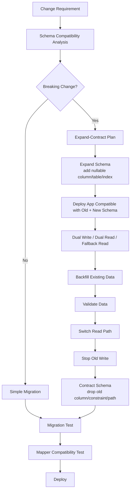
```mermaid id="mbs1g3"
flowchart TD
    A[Change Requirement] --> B[Schema Compatibility Analysis]
    B --> C{Breaking Change?}

    C -->|No| D[Simple Migration]
    C -->|Yes| E[Expand-Contract Plan]

    E --> F[Expand Schema<br/>add nullable column/table/index]
    F --> G[Deploy App Compatible with Old + New Schema]
    G --> H[Dual Write / Dual Read / Fallback Read]
    H --> I[Backfill Existing Data]
    I --> J[Validate Data]
    J --> K[Switch Read Path]
    K --> L[Stop Old Write]
    L --> M[Contract Schema<br/>drop old column/constraint/path]

    D --> N[Migration Test]
    M --> N
    N --> O[Mapper Compatibility Test]
    O --> P[Deploy]
```

**Core invariant:**

```text id="jjmwzr"
Aplikasi versi lama harus tetap jalan setelah migration expand.
Aplikasi versi baru harus tetap jalan sebelum contract cleanup.
Contract/drop/rename dilakukan paling akhir, setelah semua instance aman.
```

---

## 3. Decomposition Map

| Area | Fokus Praktis | Skill yang Dikuasai | Risiko Jika Salah |
|---|---|---|---|
| **Migration Tooling** | Flyway/Liquibase lifecycle | Versioned migration, checksum, changelog, validate | Schema drift |
| **Backward Compatibility** | App lama + baru bisa coexist | Additive schema, fallback read, dual write | Rolling deploy gagal |
| **Expand-Contract** | Breaking change bertahap | Expand → deploy → backfill → switch → contract | Downtime/data loss |
| **Mapper Compatibility** | XML mapper tetap valid | ResultMap, insert/update SQL, projection test | Runtime SQL error |
| **Column Add** | Tambah kolom aman | nullable/default, backfill, NOT NULL later | Lock/rewrite besar |
| **Column Rename** | Hindari rename langsung | add new column + dual write + contract | App lama broken |
| **Column Drop** | Drop paling akhir | code no longer reads/writes old column | App lama SQL error |
| **Type Change** | Ubah tipe tanpa rewrite berbahaya | parallel column + backfill | Table rewrite lama |
| **Constraint Evolution** | Tambah constraint aman | `NOT VALID`, backfill, `VALIDATE CONSTRAINT` | Blocking update |
| **Index Evolution** | Build index production-safe | `CREATE INDEX CONCURRENTLY` | Write blocked |
| **Backfill Job** | Isi data lama bertahap | chunking, idempotent, resumable | Lock panjang/rollback besar |
| **Dual Write** | Tulis old + new | service/repository consistency | Data divergen |
| **Dual Read/Fallback Read** | Baca new jika ada, fallback old | mapper SQL compatibility | Null/incorrect read |
| **Rollback Strategy** | Aman mundur versi aplikasi | rollback code before contract | Tidak bisa rollback |
| **Migration Testing** | Validasi dari DB kosong dan upgrade | Testcontainers + Flyway/Liquibase | Migration rusak di CI |
| **Deployment Runbook** | Urutan deploy jelas | migration before/after app | Race antar version |

---

## 4. Migration Tooling: Flyway vs Liquibase

| Aspek | Flyway | Liquibase |
|---|---|---|
| Model utama | Versioned SQL migration | Changeset di changelog |
| Gaya umum | SQL-first, sederhana | Declarative/XML/YAML/JSON/SQL |
| Cocok untuk | Tim yang nyaman review SQL langsung | Governance/metadata/precondition/rollback lebih eksplisit |
| Rollback | Umumnya forward-fix; rollback tergantung edition/pola | Bisa mendefinisikan rollback changeset |
| Auditability | Migration history table | Changelog + changeset metadata |
| MyBatis fit | Sangat cocok karena SQL eksplisit | Cocok jika organisasi standardize Liquibase |

Flyway mendukung migration validation; dokumentasi Redgate/Flyway menyebut `validateOnMigrate` mengontrol apakah validasi otomatis dipanggil saat `migrate`. ([Redgate Documentation](https://documentation.red-gate.com/fd/flyway-validate-on-migrate-setting-277579048.html?utm_source=chatgpt.com)) Liquibase menggunakan **changeset** sebagai unit perubahan yang disimpan di changelog, dan preconditions dapat dipakai untuk mengontrol apakah update dijalankan berdasarkan state database. ([Liquibase Docs](https://docs.liquibase.com/secure/user-guide-5-2/what-is-a-changeset?utm_source=chatgpt.com))

---

## 5. Golden Rule untuk MyBatis Schema Evolution

| Rule | Penjelasan |
|---|---|
| Jangan rename kolom langsung | Mapper XML app lama akan gagal |
| Jangan drop kolom langsung | App lama masih mungkin `SELECT`/`INSERT` kolom itu |
| Jangan ubah tipe kolom besar langsung | Bisa rewrite table/index dan mengunci lama |
| Tambah kolom secara additive | Kolom baru nullable atau default aman |
| Backfill di luar migration besar | Migration harus cepat dan predictable |
| Validasi constraint bertahap | Pakai `NOT VALID` lalu `VALIDATE CONSTRAINT` |
| Index besar pakai concurrent build | Hindari blocking writes |
| Contract cleanup terakhir | Setelah semua app version tidak memakai schema lama |
| Mapper test wajib setelah migration | SQL dan resultMap harus dibuktikan |

---

## 6. Expand-Contract Pattern

### Phase 1 - Expand schema

Tambahkan struktur baru tanpa memutus app lama.

```sql id="5gw953"
ALTER TABLE orders
ADD COLUMN approval_reason text;
```

PostgreSQL menyatakan bahwa menambahkan kolom tanpa constraint akan mengisi existing row dengan `NULL`, dan menambahkan kolom dengan default non-volatile dapat disimpan di metadata sehingga tidak perlu rewrite table; tetapi default volatile, generated stored column, identity column, atau domain type tertentu dapat menyebabkan table/index rewrite. ([PostgreSQL](https://www.postgresql.org/docs/current/ddl-alter.html?utm_source=chatgpt.com))

---

### Phase 2 - Deploy app compatible

Aplikasi baru mulai mengenal kolom baru, tetapi tetap bisa berjalan jika value lama masih `NULL`.

```xml id="rmvpvi"
<select id="findById" resultMap="OrderResultMap">
  SELECT
    id,
    customer_id,
    status,
    approval_reason,
    created_at,
    updated_at
  FROM orders
  WHERE id = #{id}
</select>
```

```xml id="xxi8hd"
<resultMap id="OrderResultMap" type="com.company.app.model.Order">
  <id property="id" column="id"/>
  <result property="customerId" column="customer_id"/>
  <result property="status" column="status"/>
  <result property="approvalReason" column="approval_reason"/>
  <result property="createdAt" column="created_at"/>
  <result property="updatedAt" column="updated_at"/>
</resultMap>
```

---

### Phase 3 - Backfill

Isi data lama secara bertahap.

```sql id="x8kfjd"
UPDATE orders
SET approval_reason = 'LEGACY_APPROVED'
WHERE status = 'APPROVED'
  AND approval_reason IS NULL
LIMIT 1000;
```

PostgreSQL tidak mendukung `LIMIT` langsung pada `UPDATE` seperti contoh konseptual di atas. Untuk PostgreSQL, gunakan CTE berbasis primary key:

```sql id="d4se7m"
WITH batch AS (
    SELECT id
    FROM orders
    WHERE status = 'APPROVED'
      AND approval_reason IS NULL
    ORDER BY id
    LIMIT 1000
)
UPDATE orders o
SET approval_reason = 'LEGACY_APPROVED'
FROM batch
WHERE o.id = batch.id;
```

---

### Phase 4 - Validate

Pastikan tidak ada data lama yang belum selesai.

```sql id="eubtst"
SELECT count(*)
FROM orders
WHERE status = 'APPROVED'
  AND approval_reason IS NULL;
```

---

### Phase 5 - Contract

Setelah semua aman, tambahkan constraint atau hapus schema lama.

```sql id="8fpl0c"
ALTER TABLE orders
ALTER COLUMN approval_reason SET NOT NULL;
```

Untuk tabel besar, jangan langsung lakukan contract tanpa mengerti lock/scan. PostgreSQL menjelaskan bahwa `SET NOT NULL` biasanya perlu memastikan tidak ada row `NULL`; valid `CHECK` constraint dapat membantu melewati scan dalam kondisi tertentu. ([PostgreSQL](https://www.postgresql.org/docs/current/sql-altertable.html))

---

## 7. Pattern: Add New Nullable Column

### Migration

```sql id="7y3x5f"
-- V20260713_01__add_order_approval_reason.sql

ALTER TABLE orders
ADD COLUMN approval_reason text;
```

### Mapper update

```xml id="a08ulp"
<insert id="insertOrder">
  INSERT INTO orders (
    id,
    customer_id,
    status,
    approval_reason,
    created_at,
    updated_at
  )
  VALUES (
    #{id},
    #{customerId},
    #{status},
    #{approvalReason},
    #{createdAt},
    #{updatedAt}
  )
</insert>
```

### Compatibility notes

| App Version | Behavior |
|---|---|
| Old app + new column exists | Aman, old app tidak tahu kolom baru |
| New app + old rows punya `NULL` | Aman jika Java model menerima nullable |
| New app writes new column | Aman |
| Setelah backfill | Bisa tambah constraint |

**Rule:** sebelum kolom menjadi `NOT NULL`, Java model dan DTO harus memperlakukan field sebagai nullable atau punya fallback.

---

## 8. Pattern: Add NOT NULL Column Safely

### Bad

```sql id="hlpcyy"
ALTER TABLE orders
ADD COLUMN risk_score integer NOT NULL;
```

Ini gagal jika tabel sudah berisi row lama karena existing row tidak punya value.

### Safer sequence

```sql id="n8mii6"
-- 1. Expand
ALTER TABLE orders
ADD COLUMN risk_score integer;

-- 2. Optional default for new writes
ALTER TABLE orders
ALTER COLUMN risk_score SET DEFAULT 0;
```

```sql id="nnyxdn"
-- 3. Backfill in chunks
WITH batch AS (
    SELECT id
    FROM orders
    WHERE risk_score IS NULL
    ORDER BY id
    LIMIT 1000
)
UPDATE orders o
SET risk_score = 0
FROM batch
WHERE o.id = batch.id;
```

```sql id="i8gfkw"
-- 4. Validate no null remains
SELECT count(*)
FROM orders
WHERE risk_score IS NULL;
```

```sql id="paxaj7"
-- 5. Contract
ALTER TABLE orders
ALTER COLUMN risk_score SET NOT NULL;
```

---

## 9. Pattern: Rename Column Safely

### Bad

```sql id="0zd3ip"
ALTER TABLE customers
RENAME COLUMN name TO legal_name;
```

Ini breaking untuk mapper lama:

```xml id="lol21u"
SELECT id, name FROM customers WHERE id = #{id}
```

### Safe expand-contract

```sql id="9upcir"
-- V1 expand
ALTER TABLE customers
ADD COLUMN legal_name text;
```

```java id="qut2qt"
public void updateCustomerName(Customer customer) {
    mapper.updateNameAndLegalName(
        customer.id(),
        customer.name(),
        customer.legalName()
    );
}
```

```xml id="st938a"
<update id="updateNameAndLegalName">
  UPDATE customers
  SET
    name = #{name},
    legal_name = #{legalName},
    updated_at = now()
  WHERE id = #{id}
</update>
```

Backfill:

```sql id="x1uz55"
WITH batch AS (
    SELECT id
    FROM customers
    WHERE legal_name IS NULL
    ORDER BY id
    LIMIT 1000
)
UPDATE customers c
SET legal_name = c.name
FROM batch
WHERE c.id = batch.id;
```

Switch read path:

```xml id="co77gq"
<select id="findById" resultMap="CustomerResultMap">
  SELECT
    id,
    COALESCE(legal_name, name) AS legal_name,
    created_at,
    updated_at
  FROM customers
  WHERE id = #{id}
</select>
```

Contract later:

```sql id="qgkcb3"
ALTER TABLE customers
DROP COLUMN name;
```

PostgreSQL `DROP COLUMN` membuat kolom tidak terlihat untuk operasi SQL, tetapi tidak langsung mereclaim disk space; space biasanya direclaim saat row diupdate kemudian, atau melalui table rewrite operation seperti `VACUUM FULL`/rewrite tertentu. ([PostgreSQL](https://www.postgresql.org/docs/current/sql-altertable.html))

---

## 10. Pattern: Change Column Type Safely

### Problem

```sql id="7url9b"
ALTER TABLE orders
ALTER COLUMN external_ref TYPE uuid USING external_ref::uuid;
```

Untuk tabel besar, perubahan tipe bisa menyebabkan rewrite table/index. PostgreSQL menyatakan perubahan tipe kolom biasanya menyebabkan seluruh table dan index direwrite, kecuali kasus tertentu seperti binary coercible atau unconstrained domain yang tidak mengubah isi kolom. ([PostgreSQL](https://www.postgresql.org/docs/current/sql-altertable.html))

### Safe pattern

```sql id="zopg90"
-- 1. Add new column
ALTER TABLE orders
ADD COLUMN external_ref_uuid uuid;
```

```sql id="mqvi9w"
-- 2. Backfill in chunks
WITH batch AS (
    SELECT id
    FROM orders
    WHERE external_ref_uuid IS NULL
      AND external_ref IS NOT NULL
    ORDER BY id
    LIMIT 1000
)
UPDATE orders o
SET external_ref_uuid = o.external_ref::uuid
FROM batch
WHERE o.id = batch.id;
```

```xml id="ppcpxd"
<!-- 3. New mapper reads new column with fallback during transition -->
<select id="findByExternalRef" resultMap="OrderResultMap">
  SELECT
    id,
    customer_id,
    status,
    external_ref,
    external_ref_uuid
  FROM orders
  WHERE external_ref_uuid = #{externalRef}
     OR external_ref = #{externalRefAsText}
</select>
```

```sql id="9re7ea"
-- 4. Add index after backfill or before switch, depending query shape
CREATE INDEX CONCURRENTLY orders_external_ref_uuid_idx
ON orders (external_ref_uuid);
```

```sql id="byzhui"
-- 5. Contract much later
ALTER TABLE orders
DROP COLUMN external_ref;

ALTER TABLE orders
RENAME COLUMN external_ref_uuid TO external_ref;
```

---

## 11. Pattern: Add Index Safely

### Normal index

```sql id="aawf9f"
CREATE INDEX orders_status_created_idx
ON orders (status, created_at DESC, id DESC);
```

Normal `CREATE INDEX` can block writes on the target table while index build is running; PostgreSQL documents that `CREATE INDEX CONCURRENTLY` allows index building without locking out writes, but it performs more work and cannot run inside a transaction block. ([PostgreSQL](https://www.postgresql.org/docs/current/sql-createindex.html))

### Concurrent index

```sql id="yq405s"
CREATE INDEX CONCURRENTLY orders_status_created_idx
ON orders (status, created_at DESC, id DESC);
```

### Flyway caveat

`CREATE INDEX CONCURRENTLY` cannot run inside a transaction block in PostgreSQL, so migration tooling must support non-transactional execution for that migration. With Flyway, this usually means separating concurrent index creation into its own migration and configuring transaction behavior appropriately for that migration/tool version. The PostgreSQL restriction itself is explicit in the official documentation. ([PostgreSQL](https://www.postgresql.org/docs/current/sql-createindex.html))

---

## 12. Pattern: Add Foreign Key / Check Constraint Safely

### Direct constraint

```sql id="3j7cgk"
ALTER TABLE orders
ADD CONSTRAINT orders_customer_fk
FOREIGN KEY (customer_id)
REFERENCES customers(id);
```

On large tables, validating all existing rows can be expensive. PostgreSQL supports `NOT VALID` for foreign-key, check, and not-null constraints; this skips the initial scan, enforces the constraint for subsequent inserts/updates, and allows later `VALIDATE CONSTRAINT`. ([PostgreSQL](https://www.postgresql.org/docs/current/sql-altertable.html))

### Safer sequence

```sql id="ihqjy8"
ALTER TABLE orders
ADD CONSTRAINT orders_customer_fk
FOREIGN KEY (customer_id)
REFERENCES customers(id)
NOT VALID;
```

```sql id="4q0m8a"
ALTER TABLE orders
VALIDATE CONSTRAINT orders_customer_fk;
```

PostgreSQL states that `VALIDATE CONSTRAINT` scans the table for pre-existing rows and uses a `SHARE UPDATE EXCLUSIVE` lock; validation does not need to lock out concurrent updates in the same way as the initial full validation would. ([PostgreSQL](https://www.postgresql.org/docs/current/sql-altertable.html))

---

## 13. Pattern: Add Unique Constraint Safely

For large tables, build a unique index concurrently first, then attach it as a constraint if appropriate.

```sql id="7cgnhk"
CREATE UNIQUE INDEX CONCURRENTLY customers_tenant_email_uq_idx
ON customers (tenant_id, lower(email));
```

Then, if the index is valid and matches constraint requirements, attach as constraint when applicable:

```sql id="upymx8"
ALTER TABLE customers
ADD CONSTRAINT customers_tenant_email_uq
UNIQUE USING INDEX customers_tenant_email_uq_idx;
```

PostgreSQL documents that `ADD table_constraint_using_index` can add a `PRIMARY KEY` or `UNIQUE` constraint based on an existing unique index, with restrictions such as b-tree, default sort ordering, and no expression columns/partial index. ([PostgreSQL](https://www.postgresql.org/docs/current/sql-altertable.html))

**Note:** expression index seperti `lower(email)` tidak bisa langsung dipakai sebagai `UNIQUE USING INDEX` constraint karena restriction tersebut. Untuk case-insensitive uniqueness, gunakan expression unique index sebagai enforcement mechanism, atau gunakan tipe/extension/pattern yang sesuai standar database team.

---

## 14. Pattern: Mapper Compatibility During Migration

### Old schema

```sql id="kn9p2o"
CREATE TABLE orders (
    id uuid PRIMARY KEY,
    status text NOT NULL,
    approved_at timestamp with time zone
);
```

### New schema target

```sql id="85giuf"
CREATE TABLE orders (
    id uuid PRIMARY KEY,
    status text NOT NULL,
    approval_status text NOT NULL,
    approved_at timestamp with time zone
);
```

### Transitional mapper

```xml id="uhomwa"
<select id="findById" resultMap="OrderResultMap">
  SELECT
    id,
    status,
    COALESCE(approval_status, status) AS approval_status,
    approved_at
  FROM orders
  WHERE id = #{id}
</select>
```

### Transitional insert/update

```xml id="81xeyn"
<update id="approveOrder">
  UPDATE orders
  SET
    status = 'APPROVED',
    approval_status = 'APPROVED',
    approved_at = now()
  WHERE id = #{id}
    AND status = 'SUBMITTED'
    AND version = #{version}
</update>
```

**Rule:** selama transition, mapper boleh lebih verbose agar aman. Setelah contract selesai, baru sederhanakan.

---

## 15. Pattern: Backfill Job di Java/MyBatis

### Mapper

```java id="v60akh"
public interface OrderBackfillMapper {

    List<UUID> findOrderIdsMissingApprovalStatus(@Param("limit") int limit);

    int backfillApprovalStatus(@Param("ids") List<UUID> ids);
}
```

### XML

```xml id="3bej8t"
<select id="findOrderIdsMissingApprovalStatus" resultType="java.util.UUID">
  SELECT id
  FROM orders
  WHERE approval_status IS NULL
  ORDER BY id
  LIMIT #{limit}
</select>
```

```xml id="xxc6nd"
<update id="backfillApprovalStatus">
  UPDATE orders
  SET approval_status = status
  WHERE id IN
  <foreach collection="ids"
           item="id"
           open="("
           separator=","
           close=")">
    #{id}
  </foreach>
    AND approval_status IS NULL
</update>
```

### Service

```java id="8655ge"
public BackfillResult backfillApprovalStatus(int batchSize, int maxBatches) {
    int totalUpdated = 0;

    for (int i = 0; i < maxBatches; i++) {
        int updated = unitOfWork.transactional(ctx -> {
            OrderBackfillMapper mapper = ctx.mapper(OrderBackfillMapper.class);

            List<UUID> ids = mapper.findOrderIdsMissingApprovalStatus(batchSize);
            if (ids.isEmpty()) {
                return 0;
            }

            return mapper.backfillApprovalStatus(ids);
        });

        if (updated == 0) {
            break;
        }

        totalUpdated += updated;
    }

    return new BackfillResult(totalUpdated);
}
```

### Backfill checklist

| Checklist | Kenapa |
|---|---|
| Chunk kecil | Mengurangi lock duration |
| Idempotent update | Aman diulang |
| Progress observable | Tahu sisa data |
| Bisa pause/resume | Aman saat incident |
| Tidak satu transaksi raksasa | Mengurangi rollback cost |
| Index mendukung selector | Backfill tidak full scan terus |
| Rate limit | Tidak mengganggu traffic utama |

---

## 16. Deployment Sequence untuk Rolling Release

```text id="6xf7bn"
Release A: Expand Migration
  1. Add new nullable column/table/index/constraint NOT VALID.
  2. Do not break old app.

Release B: Compatible Application
  3. Deploy app that can read old + new schema.
  4. Dual write if needed.

Release C: Backfill
  5. Run resumable backfill job.
  6. Validate data completeness.

Release D: Switch
  7. Change read path to new schema.
  8. Stop writing old schema.

Release E: Contract
  9. Drop old column/table/index.
  10. Remove fallback code.
```

### Compatibility matrix

| Stage | Old App | New App | DB Schema |
|---|---|---|---|
| Before expand | Works | Not deployed | Old |
| After expand | Works | Works if deployed | Old + new |
| During backfill | Works | Works | Mixed data |
| After switch | Not recommended to roll back without compatibility | Works | New path primary |
| After contract | Broken if rolled back too far | Works | New only |

**Rule:** jangan lakukan contract kalau masih ada kemungkinan rollback ke app lama yang membaca/menulis schema lama.

---

## 17. Rollback Strategy

| Situation | Safe Rollback? | Strategy |
|---|---:|---|
| Setelah expand migration | Ya | Rollback app saja; schema additive tidak mengganggu |
| Setelah compatible app deploy | Ya | App lama masih bisa jalan |
| Saat backfill | Ya | Stop job; data baru bisa dibiarkan |
| Setelah switch read path | Tergantung | Pastikan fallback masih ada |
| Setelah stop old write | Tergantung | Re-enable dual write jika rollback |
| Setelah contract/drop | Sulit | Restore backup atau forward fix |

**Production principle:** rollback aplikasi jauh lebih mudah daripada rollback database destructive change. Karena itu, **database contract harus terlambat**, bukan tergesa-gesa.

---

## 18. Flyway Migration Naming Pattern

```text id="ckfx21"
V20260713_0100__add_order_approval_status.sql
V20260713_0200__backfill_order_approval_status_function.sql
V20260713_0300__add_order_approval_status_check_not_valid.sql
V20260713_0400__validate_order_approval_status_check.sql
V20260720_0100__drop_legacy_order_status_dependency.sql
```

### Recommended content split

| Migration | Isi |
|---|---|
| Additive DDL | Add column/table |
| Index migration | `CREATE INDEX CONCURRENTLY` sendiri |
| Constraint migration | `NOT VALID` dulu |
| Validate migration | `VALIDATE CONSTRAINT` sendiri |
| Contract migration | Drop/rename paling akhir |
| Backfill | Prefer job/app script, bukan migration panjang |

**Rule:** migration harus kecil, reviewable, dan punya satu tujuan jelas.

---

## 19. Liquibase Changeset Pattern

### Add column

```yaml id="f7cmbw"
databaseChangeLog:
  - changeSet:
      id: 20260713-0100-add-approval-status
      author: platform-team
      changes:
        - addColumn:
            tableName: orders
            columns:
              - column:
                  name: approval_status
                  type: text
```

### Preconditions

```yaml id="tdph7a"
databaseChangeLog:
  - changeSet:
      id: 20260713-0200-add-orders-approval-status-check
      author: platform-team
      preConditions:
        - onFail: HALT
        - tableExists:
            tableName: orders
        - columnExists:
            tableName: orders
            columnName: approval_status
      changes:
        - sql:
            sql: >
              ALTER TABLE orders
              ADD CONSTRAINT orders_approval_status_chk
              CHECK (approval_status IN ('PENDING', 'APPROVED', 'REJECTED'))
              NOT VALID;
```

Liquibase preconditions are documented as tags added to changelogs or individual changesets to control execution based on database state; if a precondition fails, Liquibase does not deploy that changeset. ([Liquibase Docs](https://docs.liquibase.com/secure/user-guide-5-1/what-are-preconditions?utm_source=chatgpt.com))

---

## 20. Migration Testing Strategy

### Test 1 - Empty DB migrate

```java id="y759ny"
@Test
void shouldMigrateEmptyDatabaseToLatestSchema() {
    Flyway flyway = Flyway.configure()
        .dataSource(
            postgres.getJdbcUrl(),
            postgres.getUsername(),
            postgres.getPassword()
        )
        .locations("classpath:db/migration")
        .load();

    MigrateResult result = flyway.migrate();

    assertThat(result.success).isTrue();
}
```

### Test 2 - Mapper works after migration

```java id="bqtpvs"
@Test
void latestSchemaShouldSupportOrderMapper() {
    runMigrations();

    try (SqlSession session = sqlSessionFactory.openSession(false)) {
        OrderMapper mapper = session.getMapper(OrderMapper.class);

        UUID id = UUID.randomUUID();
        mapper.insertOrder(Order.draft(id));
        session.commit();

        Order found = mapper.findById(id);

        assertThat(found).isNotNull();
    }
}
```

MyBatis mapper XML defines `select`, `insert`, `update`, and `delete` mapped statements, and result maps are a core feature for mapping query results back to objects; therefore mapper compatibility tests must validate both statement execution and result mapping after migration. ([MyBatis](https://mybatis.org/mybatis-3/sqlmap-xml.html?utm_source=chatgpt.com))

---

## 21. Compatibility Test Matrix

| Migration Type | Test Required |
|---|---|
| Add nullable column | Old mapper still works, new mapper handles null |
| Add NOT NULL column | Backfill + no null validation |
| Rename logical field | Old column + new column coexist test |
| Drop old column | Verify no mapper references old column |
| Change type | Round-trip old/new type during transition |
| Add index | Query still returns same result; optional EXPLAIN smoke |
| Add FK | Existing data valid; insert invalid FK fails |
| Add check constraint | Valid data passes; invalid data rejected |
| Add enum value | Java enum and DB enum synchronized |
| Add JSONB field | TypeHandler round-trip |
| Add table | Migration + mapper insert/select |
| Backfill job | Idempotent rerun test |
| Contract cleanup | App version no longer references old schema |

---

## 22. Detect Mapper References Before Contract

Before dropping or renaming a column, search mapper XML and Java code.

```bash id="4jly71"
grep -R "approval_reason" src/main/resources src/main/java
grep -R "old_status" src/main/resources src/main/java
```

Better CI guard:

```bash id="h77lwk"
if grep -R "old_status" src/main/resources/mapper; then
  echo "Mapper still references old_status"
  exit 1
fi
```

### Contract readiness checklist

| Check | Required |
|---|---:|
| No mapper XML references old column | Ya |
| No Java DTO/model depends on old field | Ya |
| No report/query uses old field | Ya |
| No stored procedure/function uses old field | Ya |
| No view/materialized view uses old field | Ya |
| No downstream consumer expects old field | Ya |
| Backfill complete | Ya |
| Production metrics show new path used | Ya |
| Rollback window closed | Ya |

---

## 23. Safe vs Risky Migration Table

| Change | Risk Level | Safer Pattern |
|---|---:|---|
| Add nullable column | Low | Direct add |
| Add column with constant default | Usually low on modern PostgreSQL | Still review lock and version |
| Add volatile default column | High | Add nullable, backfill, then default |
| Add NOT NULL column | Medium/High | Add nullable → backfill → set not null |
| Rename column | High | Add new → dual write → backfill → switch → drop old |
| Drop column | High | Contract only after code no longer references it |
| Change column type | High | Parallel column → backfill → switch |
| Add index on large table | Medium/High | `CREATE INDEX CONCURRENTLY` |
| Add FK on large table | Medium/High | `NOT VALID` → `VALIDATE CONSTRAINT` |
| Add check constraint on large table | Medium | `NOT VALID` → `VALIDATE CONSTRAINT` |
| Add enum value | Medium | Coordinate DB enum + Java enum deployment |
| Remove enum value | High | Migrate data first, deploy code, contract later |
| Split table | High | Dual write/read + backfill |
| Merge columns | High | New column + backfill + fallback read |

---

## 24. MyBatis Mapper Patterns for Compatibility

### Fallback read

```xml id="pku3ki"
<select id="findCustomer" resultMap="CustomerResultMap">
  SELECT
    id,
    COALESCE(legal_name, name) AS legal_name,
    email,
    created_at
  FROM customers
  WHERE id = #{id}
</select>
```

### Dual write

```xml id="5hitpf"
<update id="updateCustomerLegalName">
  UPDATE customers
  SET
    name = #{legalName},
    legal_name = #{legalName},
    updated_at = now()
  WHERE id = #{id}
</update>
```

### New-column write with old-column fallback

```xml id="plf710"
<insert id="insertCustomer">
  INSERT INTO customers (
    id,
    name,
    legal_name,
    email,
    created_at
  )
  VALUES (
    #{id},
    #{legalName},
    #{legalName},
    #{email},
    #{createdAt}
  )
</insert>
```

### Contract mapper

```xml id="thxl89"
<select id="findCustomer" resultMap="CustomerResultMap">
  SELECT
    id,
    legal_name,
    email,
    created_at
  FROM customers
  WHERE id = #{id}
</select>
```

---

## 25. Backfill Observability

| Metric / Log | Meaning |
|---|---|
| `backfill.rows.updated` | Progress |
| `backfill.batch.duration` | Performance |
| `backfill.remaining.rows` | Completion estimate |
| `backfill.error.count` | Stability |
| `backfill.lock.timeout` | DB contention |
| `backfill.last.processed.id` | Resume checkpoint |
| `backfill.throttle.sleep.ms` | Load control |
| `backfill.validation.failed` | Data quality issue |

### Backfill log example

```java id="1gnjkg"
log.info(
    "Backfill batch completed job={} batch={} updated={} durationMs={}",
    "orders-approval-status",
    batchNumber,
    updated,
    durationMs
);
```

---

## 26. Migration Review Checklist

| Review Question | Why It Matters |
|---|---|
| Is this change additive or breaking? | Determines deployment strategy |
| Will old app still run after migration? | Rolling deployment safety |
| Will new app run before all data is backfilled? | Mixed-state safety |
| Does migration scan/rewrite a large table? | Downtime risk |
| Does migration require strong lock? | Availability risk |
| Does index build block writes? | Production traffic risk |
| Is backfill chunked and resumable? | Operational safety |
| Are constraints validated safely? | Avoid long blocking |
| Are mapper XML/resultMap updated? | Runtime correctness |
| Are TypeHandlers impacted? | Data mapping correctness |
| Is rollback app-only possible? | Recovery |
| Is contract delayed enough? | Avoid breaking old versions |
| Are tests added? | CI safety |
| Are dashboards/alerts ready? | Production monitoring |

---

## 27. Incident Patterns

| Incident | Likely Cause | Prevention |
|---|---|---|
| App fails after deploy: column missing | App deployed before migration | Deploy expand migration first |
| Old app fails after migration | Migration dropped/renamed column too early | Additive migration only |
| Migration locks production table | Large `ALTER`, index, constraint validation | Concurrent index, `NOT VALID`, split phases |
| New field null causes NPE | Backfill incomplete and code assumes non-null | Nullable model/fallback read |
| Constraint validation fails | Existing dirty data | Precheck + cleanup before validate |
| Rollback app fails | Contract migration already ran | Delay contract |
| Query gets slower after migration | New predicate lacks index | Add index before switching read path |
| Backfill overloads DB | Batch too large/no throttle | Chunk + rate limit |
| JSONB migration corrupts data | Bad TypeHandler/conversion | Round-trip test |
| Enum migration fails | DB enum and Java enum out of sync | Deploy ordering + compatibility test |

---

## 28. Roadmap Belajar Singkat

| Urutan | Materi | Target |
|---:|---|---|
| 1 | Flyway/Liquibase basics | Paham migration history dan validation |
| 2 | Backward-compatible schema change | Bisa membedakan additive vs breaking |
| 3 | Expand-contract pattern | Bisa rollout breaking change tanpa downtime |
| 4 | Mapper compatibility | Bisa menjaga XML/resultMap aman selama transition |
| 5 | PostgreSQL lock/rewrite awareness | Bisa menilai risiko migration besar |
| 6 | Concurrent index dan constraint validation | Bisa menambah index/constraint production-safe |
| 7 | Backfill job design | Bisa isi data lama secara chunked/resumable |
| 8 | Contract cleanup | Bisa drop schema lama saat aman |
| 9 | Migration testing | Bisa membuktikan schema + mapper compatible |
| 10 | Deployment runbook | Bisa menjalankan rollout/rollback dengan jelas |

---

## Rekomendasi Materi Selanjutnya

Lanjutkan ke **“Java MyBatis Repository Pattern, DAO Boundary, Domain Model vs DTO Projection, Transaction Script vs Domain Service, dan Clean Architecture di Jersey/JAX-RS”** karena setelah schema evolution aman, bagian berikutnya adalah menjaga boundary persistence tetap rapi agar mapper tidak bocor ke seluruh aplikasi.

---

**Sources:**

- [PostgreSQL: Documentation: 18: ALTER TABLE](https://www.postgresql.org/docs/current/sql-altertable.html)
- [Flyway Validate On Migrate Setting - Documentation - Redgate](https://documentation.red-gate.com/fd/flyway-validate-on-migrate-setting-277579048.html?utm_source=chatgpt.com)
- [Secure 5.1: What is a Changeset?](https://docs.liquibase.com/secure/user-guide-5-2/what-is-a-changeset?utm_source=chatgpt.com)
- [MyBatis 3 | Mapper XML Files](https://mybatis.org/mybatis-3/sqlmap-xml.html?utm_source=chatgpt.com)

## Response:
7/13/2026, 2:37:59 AM

# Cheatsheet - Java MyBatis Repository Pattern, DAO Boundary, Domain Model vs DTO Projection, Transaction Script vs Domain Service, dan Clean Architecture di Jersey/JAX-RS

## 1. Introduction

Di aplikasi **Jersey/JAX-RS + MyBatis**, masalah desain yang sering muncul adalah mapper MyBatis dipakai langsung dari mana-mana:

```text id="kgrjax"
Resource -> Mapper
Service -> Mapper
Validator -> Mapper
Scheduler -> Mapper
Event handler -> Mapper
```

Ini bekerja pada awalnya, tetapi cepat menjadi sulit dirawat karena SQL detail, transaction boundary, dan domain decision tersebar ke seluruh aplikasi.

MyBatis sendiri memang menyediakan `SqlSession` sebagai interface utama untuk menjalankan command, mengambil mapper, dan mengelola transaksi. Mapper XML juga memang menjadi pusat mapped statement seperti `select`, `insert`, `update`, `delete`, `resultMap`, dan fragment SQL. Artinya, MyBatis sangat powerful, tetapi perlu boundary agar tidak bocor ke seluruh application layer. ([MyBatis](https://mybatis.org/mybatis-3/java-api.html?utm_source=chatgpt.com))

---

## 2. Mental Model

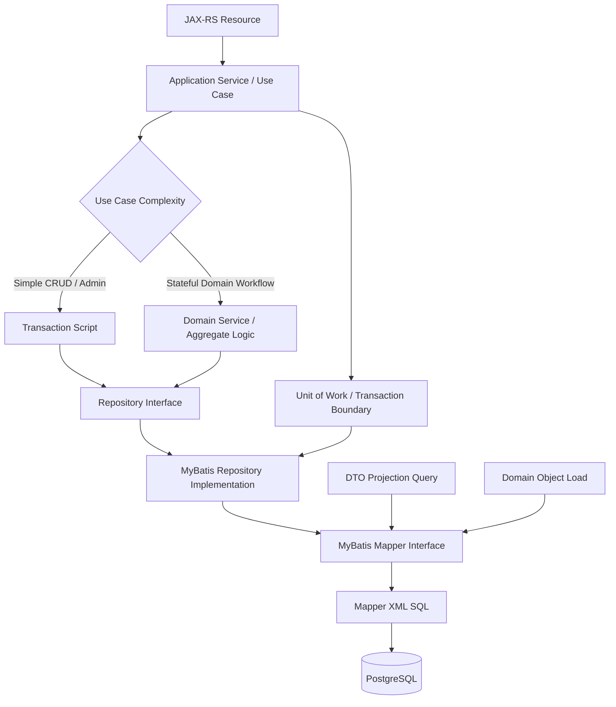
```mermaid id="0vvd7v"
flowchart TD
    A[JAX-RS Resource] --> B[Application Service / Use Case]
    B --> C{Use Case Complexity}

    C -->|Simple CRUD / Admin| D[Transaction Script]
    C -->|Stateful Domain Workflow| E[Domain Service / Aggregate Logic]

    D --> F[Repository Interface]
    E --> F

    F --> G[MyBatis Repository Implementation]
    G --> H[MyBatis Mapper Interface]
    H --> I[Mapper XML SQL]
    I --> J[(PostgreSQL)]

    B --> K[Unit of Work / Transaction Boundary]
    K --> G

    L[DTO Projection Query] --> H
    M[Domain Object Load] --> H
```

**Core invariant:**

```text id="v6eflz"
JAX-RS Resource:
  HTTP concern only

Application Service:
  use case orchestration + transaction boundary

Domain Model / Domain Service:
  business rules, state transition, invariants

Repository:
  persistence abstraction

MyBatis Mapper:
  SQL execution contract

Mapper XML:
  SQL and result mapping
```

---

## 3. Decomposition Map

| Area | Fokus Praktis | Skill yang Dikuasai | Risiko Jika Salah |
|---|---|---|---|
| **Resource Boundary** | HTTP contract saja | request/response DTO, status code, validation | Resource berubah jadi god class |
| **Application Service** | Use case orchestration | transaction, authorization check, repository call | Business flow tersebar |
| **Repository Interface** | Abstraksi persistence | domain-oriented methods | Mapper detail bocor |
| **MyBatis Repository Impl** | Adapt repository ke mapper | session context, mapper call, mapping | `SqlSession` salah scope |
| **Mapper Interface** | SQL method contract | query/update method, `@Param` | Method terlalu generic |
| **Mapper XML** | SQL eksplisit | resultMap, dynamic SQL, projection | SQL tidak maintainable |
| **DAO vs Repository** | Bedakan table access vs domain persistence | DAO data-centric, repository domain-centric | Layering berlebihan atau kacau |
| **Domain Model** | Business invariant | state transition, validation | Anemic model berlebihan |
| **DTO Projection** | Read model efisien | list/search/report query | Over-fetching domain aggregate |
| **Transaction Script** | Simple procedural use case | CRUD sederhana, admin operation | Domain complex jadi procedural spaghetti |
| **Domain Service** | Complex workflow logic | cross-aggregate policy, state machine | Logic tersebar di SQL/resource |
| **CQRS-lite** | Pisahkan command/read query | command repository, query mapper | Satu model dipaksa untuk semua |
| **Unit of Work** | Transaction boundary | one command = one transaction | Partial write |
| **Clean Architecture** | Dependency direction | outer layer depends on inner contract | Framework menguasai domain |
| **Testing Boundary** | Mock domain contract, integration test mapper | unit vs integration split | Test lambat atau palsu |

---

## 4. Layering yang Direkomendasikan

```text id="j6div9"
api/
  CaseResource.java
  request/
    ApproveCaseRequest.java
  response/
    CaseResponse.java

application/
  CaseApplicationService.java
  command/
    ApproveCaseCommand.java
    AssignCaseCommand.java

domain/
  Case.java
  CaseStatus.java
  CasePolicy.java
  CaseTransitionException.java

repository/
  CaseRepository.java
  CaseQueryRepository.java

persistence/mybatis/
  MyBatisCaseRepository.java
  MyBatisCaseQueryRepository.java
  mapper/
    CaseMapper.java
    CaseQueryMapper.java

resources/mapper/
  CaseMapper.xml
  CaseQueryMapper.xml
```

**Practical rule:**  
`domain/` tidak boleh import MyBatis, Jersey, JDBC, PostgreSQL driver, atau framework persistence lain.

---

## 5. Dependency Direction

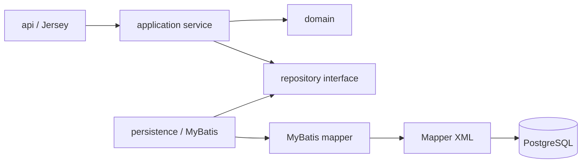
```mermaid id="k4ex7y"
flowchart LR
    A[api / Jersey] --> B[application service]
    B --> C[domain]
    B --> D[repository interface]
    E[persistence / MyBatis] --> D
    E --> F[MyBatis mapper]
    F --> G[Mapper XML]
    G --> H[(PostgreSQL)]
```

```text id="ee2p05"
Allowed:
  api -> application
  application -> domain
  application -> repository interface
  persistence -> repository interface
  persistence -> MyBatis

Not allowed:
  domain -> MyBatis
  domain -> Jersey
  api -> mapper XML
  resource -> SqlSession
```

Jakarta REST/JAX-RS sendiri berperan sebagai API untuk membangun service REST, dengan `@ApplicationPath` sebagai base URI bagi resource URI yang disediakan oleh `@Path`. Jadi, JAX-RS layer sebaiknya tetap berada pada boundary HTTP, bukan menjadi persistence orchestration layer. ([Jakarta EE](https://jakarta.ee/specifications/restful-ws/3.1/?utm_source=chatgpt.com))

---

## 6. DAO vs Repository

| Konsep | DAO | Repository |
|---|---|---|
| Orientasi | Data access/table/query | Domain collection/aggregate |
| Method style | `insert`, `update`, `selectById` | `save`, `findById`, `findForApproval` |
| Return type | Row/entity/DTO | Domain object / aggregate |
| Cocok untuk | Thin CRUD, simple table access | Domain workflow |
| SQL awareness | Lebih dekat ke SQL | Menyembunyikan SQL detail |
| MyBatis fit | Mapper sering mirip DAO | Repository membungkus mapper |
| Risiko | Bocor ke service sebagai table script | Bisa over-abstract kalau domain sederhana |

### Mapper sebagai DAO-like contract

```java id="i09kcr"
public interface CaseMapper {
    CaseRecord findById(@Param("id") UUID id);

    int insert(CaseRecord record);

    int updateStatus(
        @Param("id") UUID id,
        @Param("fromStatus") String fromStatus,
        @Param("toStatus") String toStatus,
        @Param("version") long version
    );
}
```

### Repository sebagai domain-oriented contract

```java id="agpf2g"
public interface CaseRepository {
    Case findById(CaseId id);

    void save(Case aggregate);

    boolean transitionStatus(
        CaseId id,
        CaseStatus from,
        CaseStatus to,
        long expectedVersion
    );
}
```

**Rule:** MyBatis mapper boleh data-oriented. Repository sebaiknya domain-oriented.

---

## 7. Resource Layer Pattern

### Resource hanya HTTP adapter

```java id="uuuzut"
@Path("/cases")
public class CaseResource {

    private final CaseApplicationService caseApplicationService;

    @Inject
    public CaseResource(CaseApplicationService caseApplicationService) {
        this.caseApplicationService = caseApplicationService;
    }

    @POST
    @Path("/{id}/approve")
    public Response approve(@PathParam("id") UUID id,
                            @Valid ApproveCaseRequest request) {

        ApproveCaseCommand command = new ApproveCaseCommand(
            id,
            request.expectedVersion(),
            request.reason()
        );

        CaseResponse response = caseApplicationService.approve(command);

        return Response.ok(response).build();
    }
}
```

### Jangan seperti ini

```java id="ux8a84"
@Path("/cases")
public class CaseResource {

    @Inject
    SqlSessionFactory sqlSessionFactory;

    @POST
    @Path("/{id}/approve")
    public Response approve(@PathParam("id") UUID id) {
        try (SqlSession session = sqlSessionFactory.openSession(false)) {
            CaseMapper mapper = session.getMapper(CaseMapper.class);
            mapper.updateStatus(id, "APPROVED");
            session.commit();
            return Response.ok().build();
        }
    }
}
```

**Masalah:**

```text id="vq4k7b"
- Resource tahu MyBatis
- Resource mengelola transaction
- Tidak ada application service
- Business rule kemungkinan bercampur HTTP
- Sulit test use case tanpa Jersey/MyBatis
```

---

## 8. Application Service Pattern

Application service menjalankan use case. Ia bukan tempat semua business rule detail, tetapi tempat orchestration:

```text id="gtcq2n"
- authorization check
- load aggregate/read state
- call domain behavior
- persist result
- write audit/outbox
- commit transaction
```

```java id="7953yg"
public class CaseApplicationService {

    private final MyBatisUnitOfWorkFactory unitOfWorkFactory;
    private final CaseRepositoryFactory repositoryFactory;
    private final AuthorizationService authorizationService;

    @Inject
    public CaseApplicationService(
        MyBatisUnitOfWorkFactory unitOfWorkFactory,
        CaseRepositoryFactory repositoryFactory,
        AuthorizationService authorizationService
    ) {
        this.unitOfWorkFactory = unitOfWorkFactory;
        this.repositoryFactory = repositoryFactory;
        this.authorizationService = authorizationService;
    }

    public CaseResponse approve(ApproveCaseCommand command) {
        return unitOfWorkFactory.transactional(ctx -> {
            CaseRepository caseRepository =
                repositoryFactory.caseRepository(ctx);

            Case aggregate = caseRepository.findById(
                new CaseId(command.caseId())
            );

            if (aggregate == null) {
                throw new CaseNotFoundException(command.caseId());
            }

            authorizationService.requireCanApprove(aggregate);

            aggregate.approve(command.reason());

            caseRepository.save(aggregate);

            return CaseResponse.from(aggregate);
        });
    }
}
```

**Rule:** application service tahu “urutan use case”, domain model tahu “aturan validitas”.

---

## 9. Domain Model Pattern

```java id="2z6uis"
public final class Case {

    private final CaseId id;
    private CaseStatus status;
    private long version;
    private String approvalReason;

    public Case(CaseId id, CaseStatus status, long version, String approvalReason) {
        this.id = id;
        this.status = status;
        this.version = version;
        this.approvalReason = approvalReason;
    }

    public void approve(String reason) {
        if (status != CaseStatus.SUBMITTED) {
            throw new InvalidCaseTransitionException(status, CaseStatus.APPROVED);
        }

        if (reason == null || reason.isBlank()) {
            throw new InvalidApprovalReasonException();
        }

        this.status = CaseStatus.APPROVED;
        this.approvalReason = reason;
        this.version++;
    }

    public CaseId id() {
        return id;
    }

    public CaseStatus status() {
        return status;
    }

    public long version() {
        return version;
    }

    public String approvalReason() {
        return approvalReason;
    }
}
```

### Domain model cocok jika:

| Kondisi | Domain Model Layak? |
|---|---:|
| Ada state transition | Ya |
| Ada invariant kompleks | Ya |
| Ada behavior selain getter/setter | Ya |
| Ada lifecycle audit/regulatory | Ya |
| CRUD admin sederhana | Tidak wajib |
| Query report/list | Biasanya tidak |

---

## 10. Persistence Record vs Domain Object

Sering lebih sehat memisahkan **persistence record** dari **domain object**.

### Persistence record

```java id="dwiv9q"
public record CaseRecord(
    UUID id,
    String status,
    long version,
    String approvalReason,
    Instant createdAt,
    Instant updatedAt
) {}
```

### Domain object

```java id="y3oykj"
public final class Case {
    private final CaseId id;
    private CaseStatus status;
    private long version;
    private String approvalReason;

    // domain behavior
}
```

### Mapper converter

```java id="toz31l"
public final class CasePersistenceMapper {

    public Case toDomain(CaseRecord record) {
        return new Case(
            new CaseId(record.id()),
            CaseStatus.valueOf(record.status()),
            record.version(),
            record.approvalReason()
        );
    }

    public CaseRecord toRecord(Case aggregate) {
        return new CaseRecord(
            aggregate.id().value(),
            aggregate.status().name(),
            aggregate.version(),
            aggregate.approvalReason(),
            null,
            null
        );
    }
}
```

| Approach | Kelebihan | Kekurangan |
|---|---|---|
| Mapper langsung ke domain | Simpel | Domain harus persistence-friendly |
| Mapper ke record lalu convert | Boundary bersih | Tambah mapping code |
| Mapper ke DTO untuk read | Efisien | Bukan domain behavior |
| Satu class untuk semua | Cepat awal | Cepat kacau saat domain tumbuh |

---

## 11. Repository Implementation dengan MyBatis

```java id="6cp47p"
public class MyBatisCaseRepository implements CaseRepository {

    private final MyBatisSessionContext context;
    private final CasePersistenceMapper persistenceMapper;

    public MyBatisCaseRepository(
        MyBatisSessionContext context,
        CasePersistenceMapper persistenceMapper
    ) {
        this.context = context;
        this.persistenceMapper = persistenceMapper;
    }

    @Override
    public Case findById(CaseId id) {
        CaseMapper mapper = context.mapper(CaseMapper.class);

        CaseRecord record = mapper.findById(id.value());

        return record == null ? null : persistenceMapper.toDomain(record);
    }

    @Override
    public void save(Case aggregate) {
        CaseMapper mapper = context.mapper(CaseMapper.class);

        int updated = mapper.updateCase(
            aggregate.id().value(),
            aggregate.status().name(),
            aggregate.approvalReason(),
            aggregate.version() - 1
        );

        if (updated != 1) {
            throw new ConcurrentCaseModificationException(aggregate.id().value());
        }
    }
}
```

**Important:** repository implementation ini **session-scoped**, karena menyimpan `MyBatisSessionContext`. Jangan jadikan singleton global.

---

## 12. Repository Factory Pattern

Agar repository tidak singleton dengan session stale, buat factory.

```java id="j1gu3o"
public class CaseRepositoryFactory {

    private final CasePersistenceMapper persistenceMapper;

    @Inject
    public CaseRepositoryFactory(CasePersistenceMapper persistenceMapper) {
        this.persistenceMapper = persistenceMapper;
    }

    public CaseRepository caseRepository(MyBatisSessionContext context) {
        return new MyBatisCaseRepository(context, persistenceMapper);
    }

    public CaseQueryRepository caseQueryRepository(MyBatisSessionContext context) {
        return new MyBatisCaseQueryRepository(context);
    }
}
```

Usage:

```java id="iy7t5y"
return unitOfWorkFactory.transactional(ctx -> {
    CaseRepository repository =
        repositoryFactory.caseRepository(ctx);

    Case aggregate = repository.findById(caseId);
    aggregate.approve(reason);
    repository.save(aggregate);

    return CaseResponse.from(aggregate);
});
```

---

## 13. Mapper XML Tetap SQL-Oriented

```xml id="qwd3lr"
<mapper namespace="com.company.app.persistence.mybatis.mapper.CaseMapper">

  <resultMap id="CaseRecordResultMap"
             type="com.company.app.persistence.mybatis.record.CaseRecord">
    <constructor>
      <idArg column="id" javaType="java.util.UUID"/>
      <arg column="status" javaType="string"/>
      <arg column="version" javaType="long"/>
      <arg column="approval_reason" javaType="string"/>
      <arg column="created_at" javaType="java.time.Instant"/>
      <arg column="updated_at" javaType="java.time.Instant"/>
    </constructor>
  </resultMap>

  <select id="findById" resultMap="CaseRecordResultMap">
    SELECT
      id,
      status,
      version,
      approval_reason,
      created_at,
      updated_at
    FROM cases
    WHERE id = #{id}
  </select>

  <update id="updateCase">
    UPDATE cases
    SET
      status = #{status},
      approval_reason = #{approvalReason},
      version = version + 1,
      updated_at = now()
    WHERE id = #{id}
      AND version = #{expectedVersion}
  </update>

</mapper>
```

MyBatis Mapper XML memang dirancang untuk mendefinisikan mapped statement dan `resultMap` sebagai elemen kuat untuk mapping hasil database ke object. Jadi biarkan XML fokus pada SQL dan mapping, bukan business orchestration. ([MyBatis](https://mybatis.org/mybatis-3/sqlmap-xml.html?utm_source=chatgpt.com))

---

## 14. Domain Model vs DTO Projection

### Jangan pakai domain aggregate untuk semua query

```java id="p6zlzs"
List<Case> cases = caseRepository.searchOpenCases(team);
```

Masalah:

```text id="e2ejag"
- Over-fetching
- Domain object terlalu berat
- Query list butuh field berbeda dari command object
- ResultMap aggregate kompleks
```

### Gunakan DTO projection untuk read/list/report

```java id="tl6c17"
public record CaseQueueItemDto(
    UUID id,
    String caseNumber,
    String status,
    String priority,
    Instant dueAt
) {}
```

```java id="njcu41"
public interface CaseQueryRepository {
    List<CaseQueueItemDto> findQueueItems(CaseQueueQuery query);
}
```

```xml id="3hn9ov"
<select id="findQueueItems"
        resultType="com.company.app.api.response.CaseQueueItemDto">
  SELECT
    id,
    case_number AS caseNumber,
    status,
    priority,
    due_at AS dueAt
  FROM cases
  WHERE assigned_team = #{query.team}
    AND status IN ('OPEN', 'IN_REVIEW')
  ORDER BY due_at ASC, id ASC
  LIMIT #{query.limit}
</select>
```

| Use Case | Return Type |
|---|---|
| Approve/reject/assign case | Domain aggregate |
| Search queue | DTO projection |
| Dashboard count | Scalar/summary DTO |
| Export audit log | Streaming DTO |
| Reference data dropdown | Lightweight DTO |
| State transition validation | Minimal domain state |
| Full detail page | Detail DTO or aggregate + child DTO |

---

## 15. CQRS-lite dengan MyBatis

Tidak perlu full CQRS/event sourcing. Cukup pisahkan **command repository** dan **query repository**.

```text id="f34jhb"
Command side:
  CaseRepository
  load domain aggregate
  enforce invariant
  save with optimistic locking

Query side:
  CaseQueryRepository
  projection SQL
  joins optimized for screen/report
  no domain behavior
```

### Command repository

```java id="viffpy"
public interface CaseRepository {
    Case findById(CaseId id);

    void save(Case aggregate);
}
```

### Query repository

```java id="j0t0h8"
public interface CaseQueryRepository {
    List<CaseQueueItemDto> findQueueItems(CaseQueueQuery query);

    CaseDetailDto findDetail(UUID caseId);

    CaseDashboardSummaryDto summarizeByTeam(String team);
}
```

### Why MyBatis cocok untuk CQRS-lite?

Karena MyBatis memberi kontrol SQL eksplisit. Query read model bisa dioptimalkan untuk layar/report tertentu tanpa memaksa object graph domain. MyBatis juga memang lebih sederhana sebagai SQL mapper dibanding full ORM, dengan mapped SQL melalui XML atau annotations. ([GitHub](https://github.com/mybatis/mybatis-3?utm_source=chatgpt.com))

---

## 16. Transaction Script vs Domain Service

### Transaction Script

Transaction script cocok untuk use case sederhana: langkah procedural langsung.

```java id="s2ho10"
public void archiveCustomer(UUID customerId) {
    unitOfWork.transactional(ctx -> {
        CustomerMapper mapper = ctx.mapper(CustomerMapper.class);

        int updated = mapper.archive(customerId);

        if (updated != 1) {
            throw new CustomerNotFoundException(customerId);
        }

        return null;
    });
}
```

### Domain Service / Domain Model

Cocok untuk workflow yang punya invariant dan lifecycle.

```java id="5fmnl6"
public void approveCase(ApproveCaseCommand command) {
    unitOfWork.transactional(ctx -> {
        CaseRepository repository = repositoryFactory.caseRepository(ctx);

        Case aggregate = repository.findById(new CaseId(command.caseId()));

        caseApprovalPolicy.assertCanApprove(aggregate, command.actor());

        aggregate.approve(command.reason());

        repository.save(aggregate);

        return null;
    });
}
```

| Kondisi | Transaction Script | Domain Service / Model |
|---|---:|---:|
| CRUD sederhana | Cocok | Bisa overkill |
| Admin maintenance | Cocok | Tidak wajib |
| State machine | Kurang cocok | Cocok |
| Regulatory workflow | Kurang defensible | Cocok |
| Cross-entity invariant | Berisiko | Cocok |
| Reporting query | Cocok via query repo | Domain model tidak perlu |
| Complex approval/escalation | Tidak ideal | Cocok |
| High throughput queue update sederhana | Cocok | Tergantung invariant |

---

## 17. Domain Service vs Application Service

| Layer | Tanggung Jawab | Contoh |
|---|---|---|
| Application Service | Orkestrasi use case dan transaction | `approveCase(command)` |
| Domain Service | Business rule yang tidak natural di satu aggregate | `CaseApprovalPolicy` |
| Repository | Simpan/ambil aggregate/read model | `caseRepository.save(case)` |
| Mapper | SQL statement | `updateCase(...)` |
| Resource | HTTP adapter | `POST /cases/{id}/approve` |

### Domain service example

```java id="7vafri"
public class CaseApprovalPolicy {

    public void assertCanApprove(Case aggregate, Actor actor) {
        if (!actor.hasPermission("CASE_APPROVE")) {
            throw new PermissionDeniedException();
        }

        if (aggregate.status() != CaseStatus.SUBMITTED) {
            throw new InvalidCaseTransitionException(
                aggregate.status(),
                CaseStatus.APPROVED
            );
        }

        if (aggregate.isAssignedTo(actor.id())) {
            throw new SelfApprovalNotAllowedException();
        }
    }
}
```

**Rule:** application service bertanya ke domain service; domain service tidak membuka `SqlSession`.

---

## 18. Repository Method Naming

| Kurang Bagus | Lebih Bagus | Alasan |
|---|---|---|
| `update(Case c)` | `save(Case aggregate)` | Domain-oriented |
| `selectByStatus` | `findCasesEligibleForEscalation` | Intent jelas |
| `deleteById` | `archive` | Sesuai domain behavior |
| `getData` | `findQueueItems` | Query purpose jelas |
| `executeQuery` | Jangan | Hilang type safety |
| `changeStatus` | `transitionStatus` | Menunjukkan lifecycle |
| `insertAudit` | `recordAuditEvent` | Intent domain/audit jelas |

### Mapper boleh lebih teknis

```java id="8br91g"
int updateStatusWithVersion(
    @Param("id") UUID id,
    @Param("fromStatus") String fromStatus,
    @Param("toStatus") String toStatus,
    @Param("expectedVersion") long expectedVersion
);
```

### Repository lebih semantik

```java id="osp96p"
boolean transitionStatus(
    CaseId id,
    CaseStatus from,
    CaseStatus to,
    long expectedVersion
);
```

---

## 19. Boundary untuk Transaction

### Good

```text id="g7akbz"
ApplicationService
  -> unitOfWork.transactional
    -> repository
      -> mapper
```

### Bad

```text id="iamntj"
Repository
  -> opens session
  -> commits transaction

Service
  -> calls multiple repositories
  -> partial commit risk
```

Repository sebaiknya tidak diam-diam membuka dan commit transaksi jika use case bisa memanggil beberapa repository.

```java id="dciq2h"
public void submitOrder(SubmitOrderCommand command) {
    unitOfWork.transactional(ctx -> {
        OrderRepository orderRepository =
            repositoryFactory.orderRepository(ctx);

        OutboxRepository outboxRepository =
            repositoryFactory.outboxRepository(ctx);

        Order order = orderRepository.findById(command.orderId());
        order.submit();

        orderRepository.save(order);
        outboxRepository.add(OrderSubmittedEvent.from(order));

        return null;
    });
}
```

**Invariant:** business data dan outbox event commit bersama.

---

## 20. Anti-Corruption Layer untuk Legacy Schema

Jika schema lama tidak cocok dengan domain, jangan paksa domain mengikuti schema.

### Legacy table

```sql id="xj8t7y"
CREATE TABLE t_case_master (
    case_id varchar(50) PRIMARY KEY,
    stat_cd varchar(20),
    aprv_flg char(1),
    upd_ts timestamp
);
```

### Persistence record

```java id="bduz6o"
public record LegacyCaseRow(
    String caseId,
    String statusCode,
    String approvalFlag,
    Instant updatedAt
) {}
```

### Adapter mapper

```java id="a3hc36"
public final class LegacyCaseAdapter {

    public Case toDomain(LegacyCaseRow row) {
        CaseStatus status = switch (row.statusCode()) {
            case "SUB" -> CaseStatus.SUBMITTED;
            case "APR" -> CaseStatus.APPROVED;
            case "REJ" -> CaseStatus.REJECTED;
            default -> throw new UnknownLegacyStatusException(row.statusCode());
        };

        return new Case(
            new CaseId(UUID.fromString(row.caseId())),
            status,
            0L,
            null
        );
    }
}
```

**Rule:** domain naming tidak harus mengikuti column naming legacy.

---

## 21. Handling Cross-Repository Use Case

Contoh: approve case + write audit + create outbox.

```java id="4f6q3d"
public CaseResponse approve(ApproveCaseCommand command) {
    return unitOfWork.transactional(ctx -> {
        CaseRepository caseRepository =
            repositoryFactory.caseRepository(ctx);

        AuditRepository auditRepository =
            repositoryFactory.auditRepository(ctx);

        OutboxRepository outboxRepository =
            repositoryFactory.outboxRepository(ctx);

        Case aggregate = caseRepository.findById(new CaseId(command.caseId()));

        aggregate.approve(command.reason());

        caseRepository.save(aggregate);

        auditRepository.record(AuditEntry.caseApproved(aggregate));

        outboxRepository.add(OutboxEvent.caseApproved(aggregate));

        return CaseResponse.from(aggregate);
    });
}
```

**Good sign:** semua repository memakai `ctx` yang sama, jadi satu `SqlSession` dan satu transaction boundary.

---

## 22. Read Model Repository

```java id="730y7j"
public class MyBatisCaseQueryRepository implements CaseQueryRepository {

    private final MyBatisSessionContext context;

    public MyBatisCaseQueryRepository(MyBatisSessionContext context) {
        this.context = context;
    }

    @Override
    public List<CaseQueueItemDto> findQueueItems(CaseQueueQuery query) {
        return context.mapper(CaseQueryMapper.class)
            .findQueueItems(query);
    }

    @Override
    public CaseDashboardSummaryDto summarizeByTeam(String team) {
        return context.mapper(CaseQueryMapper.class)
            .summarizeByTeam(team);
    }
}
```

### Query mapper

```java id="9gpu26"
public interface CaseQueryMapper {

    List<CaseQueueItemDto> findQueueItems(@Param("query") CaseQueueQuery query);

    CaseDashboardSummaryDto summarizeByTeam(@Param("team") String team);
}
```

**Rule:** query repository tidak perlu load domain aggregate kalau tujuannya hanya read projection.

---

## 23. DTO Boundary

### Request DTO

```java id="fawz1k"
public record ApproveCaseRequest(
    @NotNull Long expectedVersion,
    @NotBlank String reason
) {}
```

### Command

```java id="gr0g4i"
public record ApproveCaseCommand(
    UUID caseId,
    long expectedVersion,
    String reason
) {}
```

### Response DTO

```java id="tmh2ll"
public record CaseResponse(
    UUID id,
    String status,
    long version
) {
    public static CaseResponse from(Case aggregate) {
        return new CaseResponse(
            aggregate.id().value(),
            aggregate.status().name(),
            aggregate.version()
        );
    }
}
```

| Object | Layer | Purpose |
|---|---|---|
| Request DTO | API | Input validation/JSON binding |
| Command | Application | Use case input |
| Domain object | Domain | Behavior/invariant |
| Persistence record | Persistence | DB row shape |
| Query DTO | Query/API | Read projection |
| Response DTO | API | Output contract |

**Rule:** jangan pakai JAX-RS request DTO langsung sebagai mapper parameter untuk domain write kalau field-nya bukan persistence contract.

---

## 24. Mapping Strategy

| Mapping | Di Mana | Kenapa |
|---|---|---|
| Request DTO → Command | Resource | HTTP ke use case |
| Command → Domain behavior | Application/domain | Business logic |
| Domain → Persistence record | Repository adapter | Persistence boundary |
| Persistence record → Domain | Repository adapter | Reconstruct aggregate |
| Query row → DTO | Mapper XML / query repo | Efficient read |
| Domain → Response DTO | Resource/application mapper | API contract |

### Jangan campur seperti ini

```java id="9rxoc1"
mapper.insert(requestDto);
```

Karena request DTO adalah kontrak HTTP, bukan kontrak database.

---

## 25. Clean Architecture Fit

| Clean Architecture Concept | Implementasi di MyBatis/Jersey |
|---|---|
| Entity | Domain object seperti `Case`, `Order` |
| Use Case | Application service seperti `ApproveCaseService` |
| Interface Adapter | JAX-RS Resource, repository implementation |
| Framework/Driver | Jersey, MyBatis, PostgreSQL |
| Gateway Interface | Repository interface |
| Gateway Implementation | MyBatis repository |
| Presenter/ViewModel | Response DTO |
| Data Mapper | MyBatis Mapper XML |

**Practical point:** tidak perlu terlalu dogmatis. Tujuannya bukan banyak layer, tetapi dependency dan responsibility tetap jelas.

---

## 26. Folder Structure - Pragmatic Enterprise

```text id="a5oxgb"
com.company.caseapp
  api
    CaseResource
    request
    response
    mapper  // API DTO mapper, not MyBatis mapper

  application
    CaseApplicationService
    command
    result

  domain
    model
      Case
      CaseId
      CaseStatus
    policy
      CaseApprovalPolicy
    exception

  repository
    CaseRepository
    CaseQueryRepository
    AuditRepository
    OutboxRepository

  persistence
    mybatis
      MyBatisUnitOfWorkFactory
      MyBatisSessionContext
      RepositoryFactory
      repository
        MyBatisCaseRepository
        MyBatisCaseQueryRepository
      mapper
        CaseMapper
        CaseQueryMapper
      record
        CaseRecord
      typehandler
```

---

## 27. Testing Boundary

| Layer | Test Type | Mock? |
|---|---|---|
| Domain model | Unit test | No |
| Domain service/policy | Unit test | Fake object okay |
| Application service | Unit test + integration | Mock/fake repository for unit |
| Repository interface contract | Integration | Real MyBatis/PostgreSQL |
| Mapper XML | Integration | No mock |
| Resource | API integration | Real/fake app service depending test |
| Error mapper | Unit/API test | Depends |

### Domain unit test

```java id="m9bp5d"
@Test
void submittedCaseCanBeApproved() {
    Case aggregate = CaseFixture.submitted();

    aggregate.approve("Valid reason");

    assertThat(aggregate.status()).isEqualTo(CaseStatus.APPROVED);
}
```

### Repository integration test

```java id="3e9mnp"
@Test
void shouldLoadAndSaveCaseAggregate() {
    UUID id = fixture.insertSubmittedCase();

    try (SqlSession session = openSession()) {
        MyBatisSessionContext ctx = new MyBatisSessionContext(session);
        CaseRepository repository = repositoryFactory.caseRepository(ctx);

        Case aggregate = repository.findById(new CaseId(id));
        aggregate.approve("Valid reason");

        repository.save(aggregate);

        session.commit();
    }

    assertThat(fixture.findCaseStatus(id)).isEqualTo("APPROVED");
}
```

---

## 28. When to Skip Repository Layer

Repository layer bukan kewajiban mutlak.

| Kondisi | Boleh Langsung Mapper dari Service? |
|---|---:|
| Aplikasi kecil | Bisa |
| CRUD sederhana | Bisa |
| Tidak ada domain behavior | Bisa |
| Query/report only | Bisa via query mapper |
| Complex state machine | Sebaiknya repository/domain |
| Regulatory audit workflow | Sebaiknya repository/domain |
| Banyak persistence detail | Sebaiknya repository |
| Perlu test domain isolated | Sebaiknya repository interface |

### Pragmatic compromise

```text id="mve58v"
Command/write side:
  ApplicationService -> Repository -> Mapper

Read/query side:
  ApplicationService -> QueryRepository/Mapper -> DTO
```

Ini biasanya cukup bersih tanpa overengineering.

---

## 29. Smell Detector

| Smell | Arti |
|---|---|
| Resource membuka `SqlSession` | HTTP layer bocor ke persistence |
| Domain class import `org.apache.ibatis.*` | Domain terikat framework |
| Mapper dipakai dari 10 service berbeda | Query contract terlalu global |
| Mapper method `execute(String sql)` | SQL injection dan auditability risk |
| Service berisi SQL fragments | Persistence concern bocor |
| ResultMap langsung ke API response untuk command | API dan persistence coupling |
| Satu class `Order` dipakai request, domain, DB, response | Model terlalu banyak tanggung jawab |
| Repository commit sendiri | Transaction boundary pecah |
| Query list load aggregate penuh | Over-fetching |
| Business invariant hanya di resource | Worker/scheduler bisa bypass |
| Business invariant hanya di SQL | Sulit unit test/domain reasoning |
| DTO punya behavior domain penting | Boundary kabur |
| Domain object hanya getter/setter | Mungkin anemic atau memang CRUD sederhana |

---

## 30. Anti-Pattern

| Anti-Pattern | Contoh | Dampak |
|---|---|---|
| Resource → Mapper langsung | `resource.approve()` buka mapper | Sulit test dan transaction kacau |
| Singleton repository menyimpan session | `private SqlSession session;` | Thread-safety bug |
| Domain object adalah DB row mentah | `statusCode`, `aprvFlg` bocor | Domain sulit dipahami |
| Mapper sebagai god interface | `ApplicationMapper` 200 method | Sulit maintain |
| Repository terlalu generic | `save(Object)` | Hilang type safety |
| Semua query lewat aggregate | List page load object penuh | Performa buruk |
| Semua logic di service | 1000-line transaction script | Sulit reasoning |
| Semua logic di SQL | Java hanya pass-through | Sulit test business rule |
| Banyak layer untuk CRUD trivial | Boilerplate tinggi | Tim lambat |
| Contract DTO = table schema | API breaking saat schema berubah | Coupling eksternal |
| Repository membuka transaksi sendiri | Multi-repository use case partial commit | Atomicity rusak |

---

## 31. Decision Table

| Problem | Pattern |
|---|---|
| Simple CRUD endpoint | Transaction script + mapper/query repository |
| Complex state transition | Application service + domain model + repository |
| Report/dashboard query | Query repository + DTO projection |
| Legacy schema naming buruk | Persistence record + anti-corruption mapper |
| Need audit + outbox same transaction | Application service owns unit-of-work |
| Need high-performance list | DTO projection mapper, not aggregate |
| Need reusable domain logic | Domain model/domain service |
| Need test business rule without DB | Repository interface + domain unit test |
| Mapper leaking everywhere | Introduce repository boundary |
| Too much boilerplate | Keep repository only for command side |
| Multiple DB operations atomic | One unit-of-work in application service |
| Read model very different from write model | CQRS-lite split |

---

## 32. Production Checklist

| Checklist | Status Ideal |
|---|---|
| JAX-RS resource tidak membuka `SqlSession` | Ya |
| Transaction boundary ada di application service | Ya |
| Domain layer bebas dari MyBatis/Jersey | Ya |
| Repository interface domain-oriented | Ya |
| MyBatis mapper tetap SQL-oriented | Ya |
| Repository implementation tidak singleton dengan session field | Ya |
| Query/list endpoint memakai DTO projection | Ya |
| Command workflow memakai domain model jika invariant kompleks | Ya |
| Affected row/concurrency check dilakukan di repository/service | Ya |
| Outbox/audit ditulis dalam unit-of-work yang sama | Ya |
| Request DTO tidak langsung masuk mapper write | Ya |
| Persistence record dipisah jika schema tidak cocok dengan domain | Ya |
| Mapper XML punya namespace dan statement naming jelas | Ya |
| Unit test domain tidak butuh DB | Ya |
| Mapper integration test tetap pakai PostgreSQL nyata | Ya |
| Layering tidak dibuat berlebihan untuk CRUD trivial | Ya |

---

## 33. Roadmap Belajar Singkat

| Urutan | Materi | Target |
|---:|---|---|
| 1 | Resource vs service boundary | Resource hanya HTTP adapter |
| 2 | Unit of Work di application service | Transaction tidak tersebar |
| 3 | Mapper vs repository | Tahu kapan membungkus mapper |
| 4 | Domain model vs persistence record | Domain tidak dikendalikan schema |
| 5 | DTO projection | Read endpoint efisien |
| 6 | Transaction script vs domain service | Pilih kompleksitas yang tepat |
| 7 | CQRS-lite | Pisahkan command dan query model |
| 8 | Anti-corruption layer | Legacy schema tidak merusak domain |
| 9 | Testing boundary | Unit test domain, integration test mapper |
| 10 | Refactoring smells | Deteksi mapper/resource/domain coupling |

---

## Rekomendasi Materi Selanjutnya

Lanjutkan ke **“Java MyBatis Security & Data Protection: SQL Injection Prevention, Dynamic SQL Whitelisting, Least-Privilege DB User, PII Masking, Row/Tenant Filtering, Audit Trail, dan Secrets Management di Jersey/JAX-RS”** karena setelah boundary bersih, area berikutnya adalah memastikan persistence layer aman secara query, data, tenancy, dan operasional.

---

**Sources:**

- [Java API - MyBatis 3](https://mybatis.org/mybatis-3/java-api.html?utm_source=chatgpt.com)
- [Jakarta RESTful Web Services 3.1](https://jakarta.ee/specifications/restful-ws/3.1/?utm_source=chatgpt.com)
- [MyBatis SQL mapper framework for Java](https://github.com/mybatis/mybatis-3?utm_source=chatgpt.com)

## Response:
7/13/2026, 2:44:36 AM

# Cheatsheet - Java MyBatis Security & Data Protection: SQL Injection Prevention, Dynamic SQL Whitelisting, Least-Privilege DB User, PII Masking, Row/Tenant Filtering, Audit Trail, dan Secrets Management di Jersey/JAX-RS

## 1. Introduction

Di aplikasi **Jersey/JAX-RS + MyBatis + PostgreSQL**, security persistence layer bukan hanya soal “jangan SQL injection”. Area yang harus dijaga meliputi:

```text
HTTP input
  -> validation
  -> authorization / tenant context
  -> service use case
  -> MyBatis mapper parameter binding
  -> PostgreSQL role privilege
  -> row filtering / tenant filtering
  -> audit trail
  -> logging / masking
  -> secrets handling
```

MyBatis aman jika value user dipasang lewat `#{}` karena akan diperlakukan sebagai parameter prepared statement. Namun MyBatis juga punya `${}` untuk string substitution, dan dokumentasi MyBatis memperingatkan bahwa menerima input user lalu memasukkannya tanpa modifikasi ke `${}` dapat menyebabkan SQL injection. OWASP juga menempatkan prepared statements/parameterized queries sebagai pertahanan utama terhadap SQL injection, serta allow-list validation untuk bagian SQL yang memang tidak bisa dibind sebagai parameter, seperti nama kolom atau arah sorting. ([MyBatis](https://mybatis.org/mybatis-3/sqlmap-xml.html?utm_source=chatgpt.com))

---

## 2. Mental Model

```mermaid
flowchart TD
    A[HTTP Request] --> B[JAX-RS Resource]
    B --> C[Input Validation]
    C --> D[AuthN / AuthZ / Tenant Context]
    D --> E[Application Service]
    E --> F[Repository / MyBatis Mapper]
    F --> G{SQL Construction}

    G -->|Safe value binding| H[#{parameter}]
    G -->|Identifier substitution only| I[${whitelistedIdentifier}]

    H --> J[PreparedStatement]
    I --> J

    J --> K[(PostgreSQL)]
    K --> L[Role Privileges]
    K --> M[Row / Tenant Filtering]
    K --> N[Constraints]
    K --> O[Audit Tables]

    E --> P[Structured Logs]
    P --> Q[PII Masking]

    R[Secrets Manager / K8s Secret] --> S[Runtime Env / Mounted Secret]
    S --> T[DataSource Config]
```

**Core invariant:**

```text
User-controlled value:
  use #{}

User-controlled SQL identifier:
  never raw string
  convert to enum/allow-list first
  only then use ${}

Tenant/user access:
  enforce in service authorization
  enforce in SQL predicate
  optionally enforce again using PostgreSQL RLS

Secrets:
  never hardcode
  never log
  rotate
```

---

## 3. Decomposition Map

| Area | Fokus Praktis | Skill yang Dikuasai | Risiko Jika Salah |
|---|---|---|---|
| **SQL Injection Prevention** | Parameter binding aman | `#{}` vs `${}`, prepared statement | Data leak, data tampering |
| **Dynamic SQL Whitelisting** | Sorting/filter dynamic aman | enum column whitelist, direction whitelist | Injection via `ORDER BY`, column, table |
| **Input Validation** | Validasi sebelum service | Bean Validation, canonicalization, size limit | Payload abnormal masuk DB |
| **Authorization Boundary** | User boleh melakukan action? | permission check di service | Horizontal privilege escalation |
| **Tenant Filtering** | User hanya lihat tenant sendiri | `tenant_id` predicate, context binding | Cross-tenant data leak |
| **PostgreSQL RLS** | Defense-in-depth row filtering | `ENABLE ROW LEVEL SECURITY`, policy | Salah konfigurasi bisa block/allow salah |
| **Least Privilege DB User** | DB role terbatas | `GRANT`, `REVOKE`, role separation | App bisa drop/alter/read semua |
| **Sensitive Data Masking** | Log aman | mask PII/token/JSONB payload | Compliance incident |
| **Audit Trail** | Siapa melakukan apa, kapan, dari mana | append-only audit, request correlation | Tidak defensible saat investigasi |
| **Secrets Management** | Password/token tidak hardcoded | env, K8s Secret, external secret manager | Secret leak di repo/image/log |
| **Credential Rotation** | Ganti password/key aman | rolling deploy, dual credential | Downtime saat rotate |
| **Constraint Enforcement** | DB ikut menjaga invariant | FK, CHECK, UNIQUE, NOT NULL | App bug merusak data |
| **Data Minimization** | Query hanya kolom perlu | DTO projection, no `SELECT *` | Overexposure data |
| **Encryption Awareness** | Data in transit/at rest | TLS DB, disk/KMS/secrets encryption | Sniffing / disk leak |
| **Security Testing** | Buktikan boundary aman | injection tests, authz tests, tenant tests | Security regression |

---

## 4. `#{}` vs `${}`

| Syntax | Cara Kerja | Aman untuk User Value? | Contoh |
|---|---|---:|---|
| `#{value}` | Prepared statement parameter | Ya | `WHERE id = #{id}` |
| `${value}` | String substitution langsung | Tidak, kecuali allow-list | `ORDER BY ${sortColumn}` |

### Aman

```xml
<select id="findByEmail" resultMap="UserResultMap">
  SELECT
    id,
    email,
    display_name,
    status
  FROM users
  WHERE email = #{email}
</select>
```

### Berbahaya

```xml
<select id="searchUsers" resultMap="UserResultMap">
  SELECT
    id,
    email,
    display_name,
    status
  FROM users
  WHERE email = '${email}'
</select>
```

### Berbahaya untuk sorting

```xml
ORDER BY ${sort}
```

Jika `sort` berasal dari query parameter seperti:

```text
created_at desc; drop table users; --
```

maka SQL bisa rusak atau dieksploitasi.

**Rule:** `${}` bukan untuk data value. `${}` hanya boleh untuk SQL identifier yang sudah diubah dari input user menjadi enum/allow-list internal. Dokumentasi MyBatis secara eksplisit memberi peringatan SQL injection pada string substitution `${}` jika input user disuplai tanpa kontrol. ([MyBatis](https://mybatis.org/mybatis-3/sqlmap-xml.html?utm_source=chatgpt.com))

---

## 5. Dynamic Sorting Whitelist Pattern

### API input

```text
GET /cases?sort=dueAt&direction=asc
```

### Enum whitelist

```java
public enum CaseSortField {
    DUE_AT("due_at"),
    CREATED_AT("created_at"),
    PRIORITY("priority"),
    STATUS("status");

    private final String column;

    CaseSortField(String column) {
        this.column = column;
    }

    public String column() {
        return column;
    }

    public static CaseSortField fromApiValue(String value) {
        return switch (value) {
            case "dueAt" -> DUE_AT;
            case "createdAt" -> CREATED_AT;
            case "priority" -> PRIORITY;
            case "status" -> STATUS;
            default -> throw new InvalidSortFieldException(value);
        };
    }
}
```

```java
public enum SortDirection {
    ASC,
    DESC;

    public static SortDirection fromApiValue(String value) {
        if (value == null || value.isBlank()) {
            return DESC;
        }

        return switch (value.toLowerCase(Locale.ROOT)) {
            case "asc" -> ASC;
            case "desc" -> DESC;
            default -> throw new InvalidSortDirectionException(value);
        };
    }
}
```

### Criteria

```java
public record CaseSearchQuery(
    UUID tenantId,
    String status,
    CaseSortField sortField,
    SortDirection direction,
    int limit,
    int offset
) {}
```

### Mapper XML

```xml
<select id="searchCases" resultType="com.company.app.dto.CaseQueueItemDto">
  SELECT
    id,
    case_number AS caseNumber,
    status,
    priority,
    due_at AS dueAt
  FROM cases
  WHERE tenant_id = #{query.tenantId}

  <if test="query.status != null">
    AND status = #{query.status}
  </if>

  ORDER BY ${query.sortField.column} ${query.direction}, id DESC
  LIMIT #{query.limit}
  OFFSET #{query.offset}
</select>
```

**Security invariant:** raw query parameter tidak pernah langsung masuk `${}`.

---

## 6. Dynamic Filter Whitelist Pattern

### Jangan expose arbitrary field search

Bad:

```text
GET /cases?field=status&op==&value=OPEN
GET /cases?field=tenant_id&op=!=&value=...
```

Ini membuat API menjadi mini SQL engine.

### Better: explicit supported filters

```java
public record CaseSearchRequest(
    String status,
    String priority,
    Instant dueFrom,
    Instant dueTo,
    String sort,
    String direction,
    Integer limit
) {}
```

```java
public record CaseSearchQuery(
    UUID tenantId,
    Optional<CaseStatus> status,
    Optional<CasePriority> priority,
    Optional<Instant> dueFrom,
    Optional<Instant> dueTo,
    CaseSortField sortField,
    SortDirection direction,
    int limit
) {}
```

```xml
<where>
  tenant_id = #{query.tenantId}

  <if test="query.status.present">
    AND status = #{query.status.get().name()}
  </if>

  <if test="query.priority.present">
    AND priority = #{query.priority.get().name()}
  </if>

  <if test="query.dueFrom.present">
    AND due_at &gt;= #{query.dueFrom.get()}
  </if>

  <if test="query.dueTo.present">
    AND due_at &lt; #{query.dueTo.get()}
  </if>
</where>
```

**Rule:** filter yang didukung harus eksplisit. Jangan membangun generic arbitrary SQL filter dari request.

---

## 7. Input Validation Boundary

Resource layer harus memvalidasi bentuk input; service layer memvalidasi business rule.

```java
public record SearchCasesRequest(
    @Size(max = 30) String status,
    @Size(max = 30) String priority,
    @Min(1) @Max(200) Integer limit,
    @Min(0) Integer offset
) {}
```

```java
@Path("/cases")
public class CaseResource {

    private final CaseApplicationService service;

    @GET
    public Response search(@BeanParam @Valid SearchCasesRequest request) {
        CaseSearchQuery query = CaseSearchQueryFactory.fromRequest(
            request,
            SecurityContext.currentTenantId()
        );

        return Response.ok(service.searchCases(query)).build();
    }
}
```

| Validation Type | Layer | Contoh |
|---|---|---|
| Shape validation | Resource DTO | `@NotNull`, `@Size`, `@Pattern` |
| Canonicalization | Resource/application | trim, lowercase email |
| Enum mapping | Application | API string → enum |
| Permission validation | Application service | can approve? can view? |
| State validation | Domain | valid transition? |
| Persistence constraint | Database | unique, FK, check |

OWASP recommends prepared statements as a primary defense, and allow-list validation is the appropriate option when parts of SQL cannot be parameterized, such as table names, column names, or sort direction. ([OWASP Cheat Sheet Series](https://cheatsheetseries.owasp.org/cheatsheets/SQL_Injection_Prevention_Cheat_Sheet.html?utm_source=chatgpt.com))

---

## 8. Tenant Filtering Pattern

Multi-tenant security harus dipikirkan dari awal. Jangan hanya filter tenant di UI.

### Tenant context

```java
public record TenantContext(
    UUID tenantId,
    UUID userId,
    Set<String> permissions
) {}
```

### Resource/application service

```java
public List<CaseQueueItemDto> searchCases(SearchCasesRequest request) {
    TenantContext tenantContext = securityContext.currentTenant();

    CaseSearchQuery query = CaseSearchQueryFactory.fromRequest(
        request,
        tenantContext.tenantId()
    );

    authorizationService.requirePermission(
        tenantContext,
        "CASE_READ"
    );

    return unitOfWork.readOnly(ctx -> {
        CaseQueryRepository repository =
            repositoryFactory.caseQueryRepository(ctx);

        return repository.search(query);
    });
}
```

### Mapper XML

```xml
<select id="search" resultType="com.company.app.dto.CaseQueueItemDto">
  SELECT
    id,
    case_number AS caseNumber,
    status,
    priority,
    due_at AS dueAt
  FROM cases
  WHERE tenant_id = #{query.tenantId}

  <if test="query.status != null">
    AND status = #{query.status}
  </if>

  ORDER BY due_at ASC, id ASC
  LIMIT #{query.limit}
</select>
```

**Invariant:** setiap query tenant-owned table harus memiliki `tenant_id = ?`, kecuali query admin yang benar-benar eksplisit dan diaudit.

---

## 9. Tenant Predicate Guard

Untuk mencegah mapper lupa tenant filter, gunakan konvensi dan test.

### Naming convention

| Mapper Method | Tenant Required? |
|---|---:|
| `findById(tenantId, id)` | Ya |
| `search(tenantId, criteria)` | Ya |
| `adminFindById(id)` | Admin only, audited |
| `systemFindForBackfill(limit)` | System job only |
| `findReferenceData()` | Tidak jika global reference |

### Better method signature

```java
CaseRecord findById(
    @Param("tenantId") UUID tenantId,
    @Param("id") UUID id
);
```

Bukan:

```java
CaseRecord findById(@Param("id") UUID id);
```

### XML

```xml
<select id="findById" resultMap="CaseRecordResultMap">
  SELECT
    id,
    tenant_id,
    case_number,
    status,
    version
  FROM cases
  WHERE tenant_id = #{tenantId}
    AND id = #{id}
</select>
```

---

## 10. PostgreSQL Row-Level Security / RLS

PostgreSQL mendukung **row security policies**. Policy dibuat dengan `CREATE POLICY`, diaktifkan/dinonaktifkan pada table dengan `ALTER TABLE`, dan setiap policy bersifat table-specific. RLS bisa menjadi defense-in-depth untuk multi-tenant filtering, tetapi tetap perlu dipahami benar karena table owner dan role dengan `BYPASSRLS` punya aturan khusus. ([PostgreSQL](https://www.postgresql.org/docs/current/ddl-rowsecurity.html?utm_source=chatgpt.com))

### Enable RLS

```sql
ALTER TABLE cases ENABLE ROW LEVEL SECURITY;
```

### Policy dengan session setting

```sql
CREATE POLICY tenant_isolation_policy
ON cases
USING (tenant_id = current_setting('app.tenant_id')::uuid)
WITH CHECK (tenant_id = current_setting('app.tenant_id')::uuid);
```

### Set tenant per transaction

```xml
<update id="setTenantContext">
  SELECT set_config('app.tenant_id', #{tenantId}, true)
</update>
```

`true` pada `set_config` membuat setting bersifat local untuk transaksi saat ini.

### Unit of Work

```java
public <T> T tenantTransactional(UUID tenantId, MyBatisWork<T> work) {
    return transactional(ctx -> {
        RuntimeMapper runtimeMapper = ctx.mapper(RuntimeMapper.class);

        runtimeMapper.setTenantContext(tenantId);

        return work.execute(ctx);
    });
}
```

### Mapper tetap pakai tenant predicate?

Ya, untuk defense-in-depth. RLS bukan alasan untuk menghapus tenant predicate dari SQL aplikasi.

| Layer | Fungsi |
|---|---|
| Service authz | User boleh mengakses tenant ini? |
| SQL predicate | Query jelas, index-friendly, reviewable |
| PostgreSQL RLS | Defense-in-depth jika query lupa predicate |
| Audit log | Bukti akses dan perubahan |

---

## 11. Least-Privilege DB User

Aplikasi tidak boleh login ke database sebagai owner/schema admin.

PostgreSQL memakai privilege model berbasis role dan `GRANT`; `GRANT` memberikan privilege tertentu pada object database kepada satu atau lebih role. PostgreSQL juga punya konsep role membership untuk mengelola privilege melalui group role. ([PostgreSQL](https://www.postgresql.org/docs/current/sql-grant.html?utm_source=chatgpt.com))

### Role split

```text
app_owner
  owns schema/tables
  used only by migration tool

app_runtime
  used by Jersey/MyBatis application
  limited SELECT/INSERT/UPDATE/DELETE

app_readonly
  used by reporting/read-only service

app_backfill
  limited update rights for backfill job

app_audit_reader
  read audit tables only
```

### Example grants

```sql
-- Schema usage
GRANT USAGE ON SCHEMA public TO app_runtime;

-- Table privileges
GRANT SELECT, INSERT, UPDATE, DELETE
ON TABLE cases, orders, order_items, outbox_events
TO app_runtime;

-- Sequence privileges if using sequences
GRANT USAGE, SELECT
ON ALL SEQUENCES IN SCHEMA public
TO app_runtime;

-- Read-only role
GRANT USAGE ON SCHEMA public TO app_readonly;

GRANT SELECT
ON TABLE cases, orders, order_items
TO app_readonly;
```

### Do not

```sql
GRANT ALL PRIVILEGES ON DATABASE appdb TO app_runtime;
GRANT app_owner TO app_runtime;
```

OWASP’s SQL injection guidance also recommends least privilege to reduce blast radius if injection or application compromise occurs. ([GitHub](https://github.com/nokia/OWASP-CheatSheetSeries/blob/master/cheatsheets/SQL_Injection_Prevention_Cheat_Sheet.md?utm_source=chatgpt.com))

---

## 12. DB Privilege Matrix

| DB Role | Used By | Allowed | Not Allowed |
|---|---|---|---|
| `app_owner` | Migration pipeline | DDL, ownership | Runtime app login |
| `app_runtime` | Jersey/MyBatis app | CRUD required tables | `DROP`, `ALTER`, superuser |
| `app_readonly` | Reports | `SELECT` only | Write |
| `app_backfill` | Controlled jobs | Specific update/select | Broad DDL/admin |
| `app_audit_reader` | Audit tooling | Select audit views | Modify audit |
| `app_admin_runtime` | Rare admin service | Explicit admin tables | Global superuser |

**Rule:** production runtime credential should not be able to migrate schema.

---

## 13. Securing Admin / System Queries

Admin/system queries sering butuh akses lintas tenant. Itu harus eksplisit.

### Admin method naming

```java
List<CaseRecord> adminSearchAcrossTenants(AdminCaseSearchQuery query);
```

### Mapper SQL comment

```xml
<select id="adminSearchAcrossTenants" resultMap="CaseRecordResultMap">
  /* app=case-service purpose=admin-cross-tenant-search */
  SELECT
    tenant_id,
    id,
    case_number,
    status,
    priority,
    created_at
  FROM cases

  <where>
    <if test="query.tenantId != null">
      tenant_id = #{query.tenantId}
    </if>

    <if test="query.status != null">
      AND status = #{query.status}
    </if>
  </where>

  ORDER BY created_at DESC, id DESC
  LIMIT #{query.limit}
</select>
```

### Service guard

```java
authorizationService.requirePermission(
    securityContext.currentUser(),
    "CASE_ADMIN_CROSS_TENANT_SEARCH"
);
```

### Audit

```java
auditRepository.record(AuditEntry.adminSearch(
    actorId,
    "CASE_ADMIN_CROSS_TENANT_SEARCH",
    query.safeSummary()
));
```

**Rule:** cross-tenant access harus punya permission khusus, log khusus, dan review khusus.

---

## 14. Data Minimization di Mapper

Security bukan hanya mencegah write ilegal. Security juga membatasi data yang tidak perlu keluar.

### Bad

```xml
<select id="searchCustomers" resultMap="CustomerResultMap">
  SELECT *
  FROM customers
  WHERE tenant_id = #{tenantId}
</select>
```

### Good

```xml
<select id="searchCustomers"
        resultType="com.company.app.dto.CustomerListItemDto">
  SELECT
    id,
    customer_number AS customerNumber,
    display_name AS displayName,
    status
  FROM customers
  WHERE tenant_id = #{tenantId}
  ORDER BY created_at DESC, id DESC
  LIMIT #{limit}
</select>
```

| Endpoint | Jangan Ambil |
|---|---|
| Customer list | address, identity number, internal notes |
| Case queue | evidence payload, legal narrative |
| Order list | payment details |
| User list | password hash, MFA secret |
| Audit summary | full request body |
| Dashboard | row-level sensitive detail |

**Rule:** DTO projection adalah security control, bukan hanya performance optimization.

---

## 15. PII Masking in Logs

### Data yang tidak boleh dilog mentah

```text
password
token
authorization header
session id
refresh token
MFA secret
private key
database password
KYC identity number
full address
phone number
email, tergantung policy
full JSONB payload
payment data
legal/enforcement evidence
```

### Masking helper

```java
public final class SensitiveLogMasker {

    private SensitiveLogMasker() {}

    public static String maskEmail(String email) {
        if (email == null || !email.contains("@")) {
            return "***";
        }

        String[] parts = email.split("@", 2);
        String local = parts[0];

        if (local.length() <= 2) {
            return "***@" + parts[1];
        }

        return local.charAt(0) + "***" + local.charAt(local.length() - 1)
            + "@" + parts[1];
    }

    public static String maskToken(String token) {
        if (token == null || token.length() < 8) {
            return "***";
        }

        return token.substring(0, 4) + "..." + token.substring(token.length() - 4);
    }

    public static String safeId(UUID id) {
        return id == null ? "null" : id.toString();
    }
}
```

### Logging pattern

```java
log.info(
    "Case approved caseId={} tenantId={} actorId={} correlationId={}",
    caseId,
    tenantId,
    actorId,
    correlationId
);
```

Bukan:

```java
log.info("Approve request body={}", request);
log.info("Outbox payload={}", payloadJson);
log.info("DB password={}", password);
```

---

## 16. MyBatis SQL Logging Policy

| Environment | SQL Log Level | Parameter Logging |
|---|---|---|
| Local | DEBUG boleh | Boleh dengan dummy data |
| Test | DEBUG selektif | Hindari real secrets |
| Staging | DEBUG sementara | Masking jika data realistis |
| Production normal | INFO/WARN | Tidak log full parameter |
| Production incident | DEBUG sangat selektif dan terbatas waktu | Review security/compliance |

### MyBatis log config

```xml
<settings>
  <setting name="logImpl" value="SLF4J"/>
</settings>
```

MyBatis supports multiple logging implementations, including SLF4J, Log4j2, JDK logging, stdout logging, no logging, or a custom implementation; production systems should route this through a managed logging framework rather than raw stdout debugging. ([MyBatis](https://mybatis.org/mybatis-3/sqlmap-xml.html?utm_source=chatgpt.com))

---

## 17. Audit Trail Pattern

Audit trail harus menjawab:

```text
Who did what?
To which entity?
When?
From where?
Under which tenant?
With what result?
Why was it allowed?
What changed?
```

### Audit table

```sql
CREATE TABLE audit_events (
    id uuid PRIMARY KEY,
    tenant_id uuid NOT NULL,
    actor_id uuid NOT NULL,
    action text NOT NULL,
    aggregate_type text NOT NULL,
    aggregate_id text NOT NULL,
    before_state jsonb,
    after_state jsonb,
    reason text,
    correlation_id text,
    request_ip inet,
    user_agent text,
    created_at timestamp with time zone NOT NULL DEFAULT now()
);
```

### Insert mapper

```xml
<insert id="insertAuditEvent">
  INSERT INTO audit_events (
    id,
    tenant_id,
    actor_id,
    action,
    aggregate_type,
    aggregate_id,
    before_state,
    after_state,
    reason,
    correlation_id,
    request_ip,
    user_agent,
    created_at
  )
  VALUES (
    #{id},
    #{tenantId},
    #{actorId},
    #{action},
    #{aggregateType},
    #{aggregateId},
    #{beforeState, jdbcType=OTHER,
      typeHandler=com.company.app.persistence.typehandler.JsonNodeJsonbTypeHandler},
    #{afterState, jdbcType=OTHER,
      typeHandler=com.company.app.persistence.typehandler.JsonNodeJsonbTypeHandler},
    #{reason},
    #{correlationId},
    CAST(#{requestIp} AS inet),
    #{userAgent},
    #{createdAt}
  )
</insert>
```

### Service usage

```java
unitOfWork.transactional(ctx -> {
    CaseRepository caseRepository = repositoryFactory.caseRepository(ctx);
    AuditRepository auditRepository = repositoryFactory.auditRepository(ctx);

    Case before = caseRepository.findById(command.caseId());
    Case after = before.approve(command.reason());

    caseRepository.save(after);

    auditRepository.record(AuditEvent.caseApproved(
        tenantId,
        actorId,
        before,
        after,
        command.reason(),
        correlationId
    ));

    return CaseResponse.from(after);
});
```

**Rule:** audit event untuk business command penting harus commit dalam transaksi yang sama dengan perubahan data utama.

---

## 18. Audit Data Minimization

Audit bukan berarti simpan semua payload mentah.

| Field | Simpan? | Catatan |
|---|---:|---|
| `actor_id` | Ya | Siapa |
| `tenant_id` | Ya | Scope |
| `action` | Ya | Apa |
| `aggregate_id` | Ya | Target |
| `before/after state` | Tergantung | Mask sensitive field |
| full request body | Hindari | Risiko PII/secrets |
| authorization header | Tidak | Secret |
| password/token | Tidak | Secret |
| IP/user-agent | Bisa | Perlu retention policy |
| reason/comment | Ya, jika business-critical | Bisa mengandung sensitive text |
| evidence payload | Hati-hati | Biasanya referensi, bukan full copy |

---

## 19. Secrets Management

Kubernetes Secret adalah object untuk menyimpan sejumlah kecil data sensitif seperti password, token, atau key, agar tidak perlu menaruh data rahasia langsung di Pod spec atau container image. Namun Kubernetes juga memperingatkan bahwa Secret di etcd tidak otomatis terenkripsi secara default dan cluster administrator harus mengaktifkan encryption at rest untuk Secret data. ([Kubernetes](https://kubernetes.io/docs/concepts/configuration/secret/?utm_source=chatgpt.com))

### Jangan hardcode

Bad:

```java
config.setPassword("ProdPassword123!");
```

Good:

```java
config.setPassword(requiredEnv("DB_PASSWORD"));
```

### Runtime config

```java
public final class DatabaseConfig {

    public static HikariDataSource dataSource() {
        HikariConfig config = new HikariConfig();

        config.setJdbcUrl(requiredEnv("DB_URL"));
        config.setUsername(requiredEnv("DB_USERNAME"));
        config.setPassword(requiredEnv("DB_PASSWORD"));
        config.setMaximumPoolSize(intEnv("DB_POOL_MAX_SIZE", 20));

        return new HikariDataSource(config);
    }

    private static String requiredEnv(String name) {
        String value = System.getenv(name);

        if (value == null || value.isBlank()) {
            throw new IllegalStateException("Missing required environment variable: " + name);
        }

        return value;
    }

    private static int intEnv(String name, int defaultValue) {
        String value = System.getenv(name);
        return value == null ? defaultValue : Integer.parseInt(value);
    }
}
```

---

## 20. Kubernetes Secret Usage

### Secret manifest

```yaml
apiVersion: v1
kind: Secret
metadata:
  name: case-service-db
type: Opaque
stringData:
  DB_URL: jdbc:postgresql://postgres.example.svc:5432/case_db
  DB_USERNAME: app_runtime
  DB_PASSWORD: change-me
```

### Deployment env

```yaml
apiVersion: apps/v1
kind: Deployment
metadata:
  name: case-service
spec:
  template:
    spec:
      containers:
        - name: case-service
          image: registry.example.com/case-service:1.0.0
          envFrom:
            - secretRef:
                name: case-service-db
```

### Better production pattern

```text
External secret manager
  -> External Secrets Operator / CSI driver / platform integration
    -> Kubernetes Secret or mounted secret
      -> application environment/config
```

| Risk | Mitigation |
|---|---|
| Secret stored unencrypted in etcd | Enable encryption at rest |
| Any pod can read secret | RBAC least privilege |
| Secret printed in logs | Masking/log policy |
| Secret in image | Never bake secret into image |
| Secret in Git | Use sealed/encrypted/external secret workflow |
| No rotation | Rotation runbook |
| One credential for all services | Per-service DB role |

Kubernetes official good practices recommend encryption at rest for Secret data and least-privilege access controls around Secrets. ([Kubernetes](https://kubernetes.io/docs/concepts/security/secrets-good-practices/?utm_source=chatgpt.com))

---

## 21. Credential Rotation Pattern

### Goal

Rotate DB password without downtime.

### Strategy

```text
1. Create new DB credential / password.
2. Add new secret version.
3. Deploy app instances using new secret.
4. Confirm new connections work.
5. Drain old app instances.
6. Revoke old credential/password.
7. Monitor authentication failures.
```

### DB role approach

```sql
-- Existing runtime role
CREATE ROLE app_runtime_v2 LOGIN PASSWORD 'new-password';

GRANT USAGE ON SCHEMA public TO app_runtime_v2;
GRANT SELECT, INSERT, UPDATE, DELETE ON TABLE cases TO app_runtime_v2;
```

Then deploy app with:

```text
DB_USERNAME=app_runtime_v2
DB_PASSWORD=...
```

After rollout:

```sql
REVOKE ALL PRIVILEGES ON TABLE cases FROM app_runtime_v1;
DROP ROLE app_runtime_v1;
```

**Rule:** password rotation should be tested in staging. Connection pools can keep old connections alive until recycled.

---

## 22. Encryption in Transit

For PostgreSQL connection, require TLS in production where network trust is not guaranteed.

### JDBC URL example

```text
jdbc:postgresql://postgres.example.com:5432/case_db?sslmode=require
```

Stronger options depend on cert management:

```text
sslmode=verify-full
sslrootcert=/etc/certs/root.crt
```

### Practical checklist

| Checklist | Status |
|---|---|
| DB traffic encrypted across network boundary | Required |
| Certificate validation enabled where possible | Preferred |
| No DB password in URL logs | Required |
| JDBC URL not printed at INFO with password | Required |
| Secrets mounted/env securely | Required |
| TLS setting tested in staging | Required |

---

## 23. Row/Tenant Filtering Testing

### Mapper test

```java
@Test
void shouldNotReturnCaseFromDifferentTenant() {
    UUID tenantA = UUID.randomUUID();
    UUID tenantB = UUID.randomUUID();

    UUID caseA = fixture.insertCase(tenantA, "CASE-A");
    UUID caseB = fixture.insertCase(tenantB, "CASE-B");

    try (SqlSession session = openSession()) {
        CaseMapper mapper = session.getMapper(CaseMapper.class);

        CaseRecord found = mapper.findById(tenantA, caseB);

        assertThat(found).isNull();
    }
}
```

### API test

```java
@Test
void userShouldNotAccessCaseFromAnotherTenant() {
    UUID tenantA = fixture.createTenant();
    UUID tenantB = fixture.createTenant();

    UUID caseInTenantB = fixture.insertCase(tenantB);

    Response response = target("/cases/" + caseInTenantB)
        .request()
        .header("Authorization", tokenForTenant(tenantA))
        .get();

    assertThat(response.getStatus()).isIn(403, 404);
}
```

### Decision: 403 vs 404

| Response | Kapan |
|---|---|
| `403 Forbidden` | User tahu resource ada tapi tidak boleh |
| `404 Not Found` | Hindari resource enumeration |
| `401 Unauthorized` | Belum login/token invalid |
| `409 Conflict` | State/permission business conflict |

---

## 24. SQL Injection Testing

### Sorting injection test

```java
@Test
void shouldRejectInvalidSortField() {
    SearchCasesRequest request = new SearchCasesRequest(
        "OPEN",
        "created_at desc; drop table cases; --",
        "desc",
        50
    );

    assertThatThrownBy(() -> CaseSearchQueryFactory.fromRequest(request, tenantId))
        .isInstanceOf(InvalidSortFieldException.class);
}
```

### Mapper safe value test

```java
@Test
void emailSearchShouldTreatInjectedTextAsLiteralValue() {
    String maliciousEmail = "a@example.com' OR '1'='1";

    try (SqlSession session = openSession()) {
        UserMapper mapper = session.getMapper(UserMapper.class);

        List<UserRecord> users = mapper.findByEmail(maliciousEmail);

        assertThat(users).isEmpty();
    }
}
```

### Static grep guard

```bash
grep -R "\${" src/main/resources/mapper
```

Every `${}` occurrence should be reviewed and justified.

---

## 25. Static Review Rule for `${}`

Create a small review table in PR description whenever `${}` is used.

| Mapper | Statement | `${}` Usage | Source | Safety Control |
|---|---|---|---|---|
| `CaseQueryMapper` | `searchCases` | sort column | enum `CaseSortField` | allow-list |
| `CaseQueryMapper` | `searchCases` | direction | enum `SortDirection` | allow-list |
| `AdminReportMapper` | `groupBy` | report dimension | enum `ReportDimension` | allow-list |

**Rule:** no raw `${requestParam}`. Ever.

---

## 26. Database Constraints as Security Boundary

Application validation is not enough.

```sql
ALTER TABLE cases
ADD CONSTRAINT cases_status_chk
CHECK (status IN ('DRAFT', 'SUBMITTED', 'APPROVED', 'REJECTED'));

ALTER TABLE cases
ADD CONSTRAINT cases_tenant_case_number_uq
UNIQUE (tenant_id, case_number);

ALTER TABLE cases
ADD CONSTRAINT cases_tenant_fk
FOREIGN KEY (tenant_id)
REFERENCES tenants(id);
```

| Constraint | Security/Integrity Benefit |
|---|---|
| `NOT NULL` | Prevent incomplete security-critical fields |
| `CHECK` | Prevent invalid state/code |
| `UNIQUE` | Prevent duplicate business identity/idempotency |
| `FOREIGN KEY` | Prevent orphan/cross-reference errors |
| composite unique `(tenant_id, external_ref)` | Prevent cross-tenant collision |
| trigger/audit constraint | Prevent missing audit metadata, if used carefully |

---

## 27. Idempotency as Security Control

Idempotency is also a protection against accidental or malicious duplicate command submission.

```sql
CREATE TABLE idempotency_keys (
    tenant_id uuid NOT NULL,
    key text NOT NULL,
    request_hash text NOT NULL,
    status text NOT NULL,
    response_body jsonb,
    created_at timestamp with time zone NOT NULL DEFAULT now(),
    completed_at timestamp with time zone,
    PRIMARY KEY (tenant_id, key)
);
```

```xml
<insert id="insertIdempotencyKey">
  INSERT INTO idempotency_keys (
    tenant_id,
    key,
    request_hash,
    status
  )
  VALUES (
    #{tenantId},
    #{key},
    #{requestHash},
    'PROCESSING'
  )
  ON CONFLICT (tenant_id, key) DO NOTHING
</insert>
```

**Rule:** idempotency key harus scoped by tenant/user/client. Jangan global tanpa alasan.

---

## 28. Secure Error Handling

### Bad

```json
{
  "error": "ERROR: duplicate key value violates unique constraint cases_tenant_case_number_uq Detail: Key (tenant_id, case_number)=(..., CASE-001) already exists."
}
```

### Good

```json
{
  "code": "DUPLICATE_CASE_NUMBER",
  "message": "A case with this case number already exists."
}
```

### Exception mapper

```java
@Provider
public class PersistenceExceptionMapper
    implements ExceptionMapper<PersistenceException> {

    @Override
    public Response toResponse(PersistenceException exception) {
        PersistenceErrorKind kind = PostgresErrorClassifier.classify(exception);

        return switch (kind) {
            case UNIQUE_VIOLATION ->
                Response.status(Response.Status.CONFLICT)
                    .entity(ApiError.of(
                        "DUPLICATE_RESOURCE",
                        "Resource already exists."
                    ))
                    .build();

            case FOREIGN_KEY_VIOLATION, CHECK_VIOLATION ->
                Response.status(Response.Status.CONFLICT)
                    .entity(ApiError.of(
                        "CONSTRAINT_VIOLATION",
                        "Request conflicts with current data state."
                    ))
                    .build();

            default ->
                Response.status(Response.Status.INTERNAL_SERVER_ERROR)
                    .entity(ApiError.of(
                        "PERSISTENCE_ERROR",
                        "Unexpected persistence error."
                    ))
                    .build();
        };
    }
}
```

**Rule:** log internal detail securely; return sanitized error to client.

---

## 29. Secure Mapper XML Review Checklist

| Review Item | Required |
|---|---:|
| No user value in `${}` | Ya |
| Every `${}` backed by enum/allow-list | Ya |
| Tenant-owned table has tenant predicate | Ya |
| Query projection excludes sensitive columns | Ya |
| Admin query explicitly named and guarded | Ya |
| `SELECT *` avoided | Ya |
| Pagination has bounded limit | Ya |
| Update/delete has tenant predicate or admin guard | Ya |
| State update checks status/version | Ya |
| Insert/update does not accept forbidden client fields | Ya |
| Audit insert exists for sensitive command | Ya |
| Error detail not exposed to API | Ya |
| SQL logging safe for production | Ya |

---

## 30. Security Anti-Pattern

| Anti-Pattern | Example | Impact |
|---|---|---|
| Raw `${}` from request | `ORDER BY ${sort}` | SQL injection |
| Generic SQL endpoint | `POST /query {sql: ...}` | Full DB exposure |
| Mapper without tenant predicate | `WHERE id = #{id}` | Cross-tenant leak |
| Runtime app uses DB owner | `app_owner` credential | Drop/alter/data breach blast radius |
| Secrets in Git | `application.properties` with password | Credential leak |
| Secrets in Docker image | `ENV DB_PASSWORD=...` | Image leak |
| SQL DEBUG always on | Full parameter logs | PII/secrets exposure |
| `SELECT *` for list | Pulls sensitive fields | Data overexposure |
| Audit stores full request | Token/PII captured | Compliance incident |
| No idempotency | Duplicate POST | Duplicate order/payment/case |
| Error exposes SQL detail | raw DB exception response | Information disclosure |
| In-memory tenant filtering only | Java filters after query | Over-fetch and leak risk |
| Admin query reused by normal user | same mapper method | Privilege escalation |
| One DB user for all services | shared credential | Hard to rotate/audit |

---

## 31. Production Checklist

| Checklist | Status Ideal |
|---|---|
| All user values use `#{}` | Ya |
| Every `${}` has documented allow-list | Ya |
| Sorting/filtering uses enum mapping | Ya |
| Tenant context is required for tenant-owned queries | Ya |
| Cross-tenant/admin queries are explicitly named and permission-guarded | Ya |
| Runtime DB user is not schema owner | Ya |
| DB privileges are least-privilege | Ya |
| Migration DB user separate from runtime DB user | Ya |
| Sensitive fields are excluded from list projections | Ya |
| SQL logging production default is not DEBUG | Ya |
| PII/secrets masking is implemented | Ya |
| Secrets not hardcoded, not in image, not in Git | Ya |
| Kubernetes Secret encryption at rest configured | Ya |
| Secret access controlled by RBAC | Ya |
| Credential rotation runbook exists | Ya |
| Audit trail exists for sensitive business commands | Ya |
| Audit payload is minimized/masked | Ya |
| Error responses are sanitized | Ya |
| Injection and tenant isolation tests exist | Ya |
| Security review required for mapper XML changes | Ya |

---

## 32. Decision Table

| Problem | Pattern |
|---|---|
| User search value | `#{}` |
| Dynamic sort column | enum allow-list + `${enum.column}` |
| Dynamic sort direction | enum allow-list + `${direction}` |
| Tenant-owned read | `WHERE tenant_id = #{tenantId}` |
| Cross-tenant admin read | special permission + audit + explicit mapper |
| Prevent forgotten tenant filter | mapper signature requires tenantId + tests + optional RLS |
| Runtime DB access | least-privilege role |
| Schema migration | separate owner/migration role |
| Sensitive command | audit event in same transaction |
| Log sensitive data | mask or do not log |
| Store DB password | secret manager/K8s Secret, not code |
| Rotate credential | new credential → rolling deploy → revoke old |
| Duplicate POST | idempotency key scoped by tenant |
| DB constraint error | sanitized HTTP error mapping |
| Security regression | integration test + static mapper review |

---

## 33. Roadmap Belajar Singkat

| Urutan | Materi | Target |
|---:|---|---|
| 1 | `#{}` vs `${}` | Bisa mencegah SQL injection dasar |
| 2 | Dynamic SQL whitelist | Sorting/filtering aman |
| 3 | Tenant filtering | Tidak ada cross-tenant leak |
| 4 | Authorization boundary | Permission dicek di service |
| 5 | Least-privilege DB role | Blast radius terbatas |
| 6 | PostgreSQL RLS | Defense-in-depth row filtering |
| 7 | PII masking/log policy | Tidak bocor lewat observability |
| 8 | Audit trail | Perubahan sensitif defensible |
| 9 | Secrets management | Credential aman di runtime |
| 10 | Security testing | Injection, tenant, authz regression tertangkap |

---

## Rekomendasi Materi Selanjutnya

Lanjutkan ke **“Java MyBatis Advanced Dynamic SQL & Query Builder Strategy: XML Dynamic SQL vs MyBatis Dynamic SQL Library, Criteria Object, Search API Design, Safe Filtering, dan Composable Query Pattern”** karena setelah security boundary jelas, topik berikutnya adalah membuat query dinamis yang tetap aman, maintainable, dan tidak berubah menjadi mini SQL engine liar.

---

**Sources:**

- [MyBatis 3 | Mapper XML Files](https://mybatis.org/mybatis-3/sqlmap-xml.html?utm_source=chatgpt.com)
- [SQL Injection Prevention Cheat Sheet](https://cheatsheetseries.owasp.org/cheatsheets/SQL_Injection_Prevention_Cheat_Sheet.html?utm_source=chatgpt.com)
- [Documentation: 18: 5.9. Row Security Policies](https://www.postgresql.org/docs/current/ddl-rowsecurity.html?utm_source=chatgpt.com)
- [SQL Injection Prevention Cheat Sheet](https://github.com/nokia/OWASP-CheatSheetSeries/blob/master/cheatsheets/SQL_Injection_Prevention_Cheat_Sheet.md?utm_source=chatgpt.com)
- [Secrets](https://kubernetes.io/docs/concepts/configuration/secret/?utm_source=chatgpt.com)

## Response:
7/13/2026, 2:50:24 AM

Lanjut ke advanced dynamic SQL dan query builder strategy: fokusnya bagaimana membuat search/filter yang fleksibel tanpa membuka injection risk, tanpa mapper XML menjadi spaghetti, dan tanpa API berubah menjadi SQL engine.

# Cheatsheet - Java MyBatis Advanced Dynamic SQL & Query Builder Strategy: XML Dynamic SQL vs MyBatis Dynamic SQL Library, Criteria Object, Search API Design, Safe Filtering, dan Composable Query Pattern

## 1. Introduction

Dynamic SQL di MyBatis biasanya mulai sederhana:

```xml id="1q5nb9"
<if test="status != null">
  AND status = #{status}
</if>
```

Tetapi di aplikasi enterprise, query search bisa berkembang menjadi:

```text id="jhvd6d"
status
priority
tenant
assigned team
date range
keyword
visibility
permission scope
sort
pagination
include archived
case lifecycle state
SLA state
escalation candidate
```

Kalau tidak dikontrol, mapper XML berubah menjadi ratusan baris dynamic SQL yang sulit dites, sulit di-index, rawan injection, dan sulit direview.

MyBatis menyediakan dynamic SQL XML seperti `if`, `choose`, `where`, `trim`, `set`, dan `foreach`. MyBatis Dynamic SQL Library adalah library terpisah untuk membangun SQL secara type-safe di Java; dokumentasi resminya menyebut library ini sebagai **typesafe SQL templating library** dengan dukungan untuk MyBatis3, dan versi **2.0.0** memindahkan minimum Java ke **Java 17**. ([MyBatis](https://mybatis.org/mybatis-dynamic-sql/docs/introduction.html?utm_source=chatgpt.com))

---

## 2. Mental Model

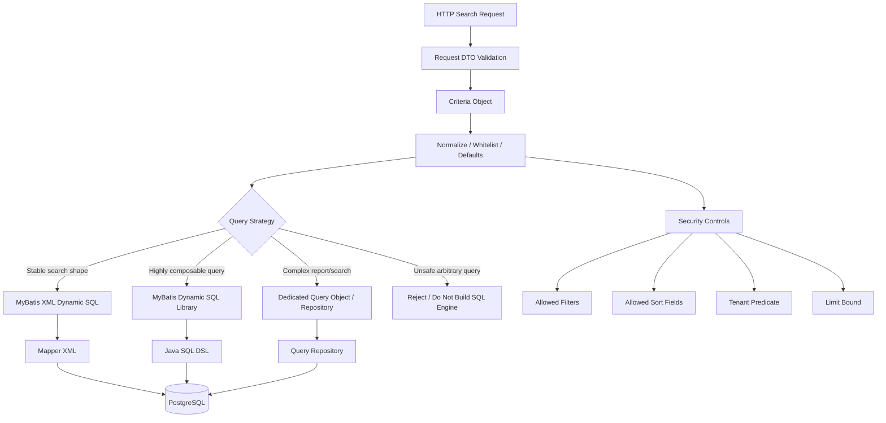
```mermaid id="7w3ubs"
flowchart TD
    A[HTTP Search Request] --> B[Request DTO Validation]
    B --> C[Criteria Object]
    C --> D[Normalize / Whitelist / Defaults]
    D --> E{Query Strategy}

    E -->|Stable search shape| F[MyBatis XML Dynamic SQL]
    E -->|Highly composable query| G[MyBatis Dynamic SQL Library]
    E -->|Complex report/search| H[Dedicated Query Object / Repository]
    E -->|Unsafe arbitrary query| I[Reject / Do Not Build SQL Engine]

    F --> J[Mapper XML]
    G --> K[Java SQL DSL]
    H --> L[Query Repository]
    J --> M[(PostgreSQL)]
    K --> M
    L --> M

    D --> N[Security Controls]
    N --> O[Allowed Filters]
    N --> P[Allowed Sort Fields]
    N --> Q[Tenant Predicate]
    N --> R[Limit Bound]
```

**Core invariant:**

```text id="n1kvst"
Search API tidak boleh menjadi SQL API.

User boleh memilih filter yang disediakan aplikasi.
User tidak boleh memilih arbitrary column, operator, table, join, expression, atau raw SQL.
```

---

## 3. Decomposition Map

| Area | Fokus Praktis | Skill yang Dikuasai | Risiko Jika Salah |
|---|---|---|---|
| **Criteria Object** | Representasi query yang sudah aman | DTO → validated criteria | Raw request masuk mapper |
| **Search API Design** | Filter eksplisit, bukan SQL bebas | allowed filters, allowed sort, bounded limit | API berubah jadi mini SQL engine |
| **XML Dynamic SQL** | Dynamic condition di mapper XML | `if`, `choose`, `where`, `trim`, `set`, `foreach` | XML spaghetti |
| **MyBatis Dynamic SQL Library** | Query DSL type-safe di Java | `select`, `where`, `orderBy`, rendering strategy | SQL tersebar di Java terlalu kompleks |
| **Safe Filtering** | Filter allow-list | enum field/operator, parameter binding | SQL injection |
| **Safe Sorting** | Sort allow-list | enum column + direction | Injection via `ORDER BY` |
| **Composable Query Pattern** | Filter bisa digabung | filter object, specification-like composition | Banyak kombinasi tidak tertes |
| **Tenant Predicate** | Multi-tenant safety | `tenant_id` selalu ada | Cross-tenant leak |
| **Authorization-aware Query** | Query dibatasi permission | team scope, ownership scope, role scope | Horizontal privilege escalation |
| **Pagination Strategy** | Offset/keyset | deterministic ordering | duplicate/missing row |
| **Index-aware Filter Design** | Filter sesuai index | selective predicates, composite index | query lambat |
| **Query Complexity Budget** | Batasi join/filter | max filters, max range, max limit | DoS via expensive query |
| **Testing Matrix** | Kombinasi filter penting | golden dataset, generated cases | regression tidak terlihat |
| **Observability** | Query bisa didiagnosis | mapper id, duration, rows | bottleneck kabur |

---

## 4. XML Dynamic SQL vs MyBatis Dynamic SQL Library

| Aspek | XML Dynamic SQL | MyBatis Dynamic SQL Library |
|---|---|---|
| Lokasi query | XML mapper | Java code DSL |
| Cocok untuk | Query shape relatif stabil | Query sangat composable |
| Review SQL | Mudah oleh DBA/reviewer SQL | Perlu render/mental model DSL |
| Type safety column | Rendah | Lebih tinggi |
| Dynamic branching | `if`, `choose`, `where`, `foreach` | Java conditional composition |
| Query readability | Bagus jika tidak terlalu banyak branch | Bagus jika DSL tidak over-abstract |
| Risk | XML spaghetti | Java query builder spaghetti |
| Testing | Mapper integration test | Unit test builder + mapper integration |
| Java version | Tergantung MyBatis core | Dynamic SQL 2.0 minimum Java 17 ([MyBatis](https://mybatis.org/mybatis-dynamic-sql/docs/CHANGELOG.html?utm_source=chatgpt.com)) |
| Best use | Search endpoint umum, update patch, IN list | Advanced search, reusable predicates, type-safe generated table support |

MyBatis XML dynamic SQL mendukung elemen `if`, `choose`, `trim`, `where`, `set`, dan `foreach`, yang memang ditujukan untuk mengurangi kebutuhan menyusun SQL string manual. ([MyBatis](https://mybatis.org/mybatis-3/dynamic-sql.html?utm_source=chatgpt.com))

---

## 5. Search API Design: Jangan Membuat SQL Engine

### Bad API

```text id="jpwoao"
GET /cases?where=status='OPEN' and priority='HIGH'
GET /cases?field=created_at&operator=>&value=2026-01-01
GET /cases?orderBy=created_at desc; drop table cases
```

Masalah:

```text id="s6gv7x"
- injection risk
- authorization sulit
- index strategy kacau
- query cost tidak terkendali
- impossible to reason about
```

### Good API

```text id="9wp2h5"
GET /cases?status=OPEN&priority=HIGH&dueBefore=2026-07-20&sort=dueAt&direction=asc&limit=50
```

### Supported contract

| Filter | Type | Allowed? | Notes |
|---|---|---:|---|
| `status` | enum | Ya | `OPEN`, `IN_REVIEW`, `ESCALATED` |
| `priority` | enum | Ya | `LOW`, `MEDIUM`, `HIGH` |
| `assignedTeam` | string/enum | Ya | permission-scoped |
| `dueBefore` | date/time | Ya | bounded range |
| `createdFrom/createdTo` | instant | Ya | max range optional |
| `keyword` | text | Ya, bounded | length limit, specific columns |
| `sort` | enum | Ya | allow-list |
| `direction` | enum | Ya | `asc`, `desc` only |
| `table` | raw | Tidak | never |
| `join` | raw | Tidak | never |
| `operator` arbitrary | raw | Tidak | avoid |
| `select` columns | raw | Tidak | projection controlled by API |

---

## 6. Criteria Object Pattern

### Request DTO

```java id="a6bdfu"
public record CaseSearchRequest(
    String status,
    String priority,
    String assignedTeam,
    Instant dueBefore,
    Instant createdFrom,
    Instant createdTo,
    String keyword,
    String sort,
    String direction,
    Integer limit,
    String cursor
) {}
```

### Safe criteria

```java id="84y6g2"
public record CaseSearchCriteria(
    UUID tenantId,
    Optional<CaseStatus> status,
    Optional<CasePriority> priority,
    Optional<String> assignedTeam,
    Optional<Instant> dueBefore,
    Optional<Instant> createdFrom,
    Optional<Instant> createdTo,
    Optional<String> keyword,
    CaseSortField sortField,
    SortDirection direction,
    int limit,
    Optional<CaseCursor> cursor
) {}
```

### Factory

```java id="3xmltv"
public final class CaseSearchCriteriaFactory {

    private static final int DEFAULT_LIMIT = 50;
    private static final int MAX_LIMIT = 200;
    private static final int MAX_KEYWORD_LENGTH = 100;

    private CaseSearchCriteriaFactory() {}

    public static CaseSearchCriteria from(
        CaseSearchRequest request,
        UUID tenantId
    ) {
        int limit = normalizeLimit(request.limit());

        Optional<String> keyword = normalizeKeyword(request.keyword());

        return new CaseSearchCriteria(
            tenantId,
            optionalEnum(request.status(), CaseStatus.class),
            optionalEnum(request.priority(), CasePriority.class),
            normalizeAssignedTeam(request.assignedTeam()),
            Optional.ofNullable(request.dueBefore()),
            Optional.ofNullable(request.createdFrom()),
            Optional.ofNullable(request.createdTo()),
            keyword,
            CaseSortField.fromApiValue(request.sort()),
            SortDirection.fromApiValue(request.direction()),
            limit,
            CaseCursor.decode(request.cursor())
        );
    }

    private static int normalizeLimit(Integer requestedLimit) {
        if (requestedLimit == null) {
            return DEFAULT_LIMIT;
        }

        if (requestedLimit < 1 || requestedLimit > MAX_LIMIT) {
            throw new InvalidLimitException(requestedLimit);
        }

        return requestedLimit;
    }

    private static Optional<String> normalizeKeyword(String keyword) {
        if (keyword == null || keyword.isBlank()) {
            return Optional.empty();
        }

        String normalized = keyword.trim();

        if (normalized.length() > MAX_KEYWORD_LENGTH) {
            throw new InvalidKeywordException();
        }

        return Optional.of(normalized);
    }
}
```

**Rule:** mapper hanya menerima `CaseSearchCriteria`, bukan raw request DTO.

---

## 7. Safe Sort Field Pattern

```java id="n2wj0z"
public enum CaseSortField {
    DUE_AT("due_at"),
    CREATED_AT("created_at"),
    UPDATED_AT("updated_at"),
    PRIORITY("priority");

    private final String column;

    CaseSortField(String column) {
        this.column = column;
    }

    public String column() {
        return column;
    }

    public static CaseSortField fromApiValue(String value) {
        if (value == null || value.isBlank()) {
            return DUE_AT;
        }

        return switch (value) {
            case "dueAt" -> DUE_AT;
            case "createdAt" -> CREATED_AT;
            case "updatedAt" -> UPDATED_AT;
            case "priority" -> PRIORITY;
            default -> throw new InvalidSortFieldException(value);
        };
    }
}
```

```java id="8dx5ow"
public enum SortDirection {
    ASC,
    DESC;

    public static SortDirection fromApiValue(String value) {
        if (value == null || value.isBlank()) {
            return ASC;
        }

        return switch (value.toLowerCase(Locale.ROOT)) {
            case "asc" -> ASC;
            case "desc" -> DESC;
            default -> throw new InvalidSortDirectionException(value);
        };
    }
}
```

### XML usage

```xml id="nm5uzf"
ORDER BY ${criteria.sortField.column} ${criteria.direction}, id ASC
```

**Invariant:** `${}` hanya menerima enum internal, bukan raw string user.

---

## 8. XML Dynamic SQL: Search Query Template

```java id="4fc2gr"
public interface CaseQueryMapper {

    List<CaseQueueItemDto> searchCases(
        @Param("criteria") CaseSearchCriteria criteria
    );
}
```

```xml id="ahw3vg"
<select id="searchCases"
        resultType="com.company.app.dto.CaseQueueItemDto"
        timeout="5">
  SELECT
    id,
    case_number AS caseNumber,
    status,
    priority,
    assigned_team AS assignedTeam,
    due_at AS dueAt,
    created_at AS createdAt
  FROM cases

  <where>
    tenant_id = #{criteria.tenantId}

    <if test="criteria.status.present">
      AND status = #{criteria.status.get().name()}
    </if>

    <if test="criteria.priority.present">
      AND priority = #{criteria.priority.get().name()}
    </if>

    <if test="criteria.assignedTeam.present">
      AND assigned_team = #{criteria.assignedTeam.get()}
    </if>

    <if test="criteria.dueBefore.present">
      AND due_at &lt; #{criteria.dueBefore.get()}
    </if>

    <if test="criteria.createdFrom.present">
      AND created_at &gt;= #{criteria.createdFrom.get()}
    </if>

    <if test="criteria.createdTo.present">
      AND created_at &lt; #{criteria.createdTo.get()}
    </if>

    <if test="criteria.keyword.present">
      AND (
        case_number ILIKE #{criteria.keywordPattern}
        OR title ILIKE #{criteria.keywordPattern}
      )
    </if>
  </where>

  ORDER BY ${criteria.sortField.column} ${criteria.direction}, id ASC
  LIMIT #{criteria.limit}
</select>
```

### Catatan untuk `Optional`

OGNL terhadap `Optional` kadang terasa tidak nyaman dan bisa berbeda tergantung style project. Alternatif yang lebih sederhana untuk mapper adalah criteria dengan nullable field biasa, tetapi raw request tetap jangan langsung masuk mapper.

```java id="c0tc8g"
public record CaseSearchCriteria(
    UUID tenantId,
    CaseStatus status,
    CasePriority priority,
    String assignedTeam,
    Instant dueBefore,
    Instant createdFrom,
    Instant createdTo,
    String keywordPattern,
    CaseSortField sortField,
    SortDirection direction,
    int limit
) {}
```

Untuk mapper XML, nullable fields sering lebih praktis daripada `Optional`.

---

## 9. XML Dynamic SQL Style Guide

| Rule | Contoh |
|---|---|
| Gunakan `<where>` untuk dynamic predicates | Hindari `WHERE 1=1` jika bisa |
| Gunakan `<set>` untuk patch update | Hindari trailing comma |
| Gunakan `<choose>` jika branch mutually exclusive | Search by ID atau external ref |
| Gunakan `<foreach>` untuk `IN` list | Validasi list kosong di service |
| Jangan dynamic-kan table name dari user | Hardcode table |
| Jangan dynamic-kan join dari user | Buat endpoint/query khusus |
| Batasi jumlah filter | Hindari query cost liar |
| Selalu tenant predicate untuk tenant-owned table | `tenant_id = #{tenantId}` |
| Selalu deterministic order | `ORDER BY due_at, id` |
| Selalu bounded limit | max 100/200 |
| Dynamic sort hanya enum whitelist | `${criteria.sortField.column}` |
| Raw user value selalu `#{}` | Tidak ada pengecualian |

---

## 10. `<choose>` Pattern: Mutually Exclusive Search

Gunakan ketika search mode hanya boleh salah satu.

```java id="dzjl4k"
public enum CaseLookupMode {
    ID,
    CASE_NUMBER,
    EXTERNAL_REFERENCE
}
```

```java id="cifvzv"
public record CaseLookupCriteria(
    UUID tenantId,
    CaseLookupMode mode,
    UUID id,
    String caseNumber,
    String externalReference
) {}
```

```xml id="uutp49"
<select id="lookupCase" resultMap="CaseRecordResultMap">
  SELECT
    id,
    tenant_id,
    case_number,
    external_reference,
    status,
    version
  FROM cases

  <where>
    tenant_id = #{criteria.tenantId}

    <choose>
      <when test="criteria.mode.name() == 'ID'">
        AND id = #{criteria.id}
      </when>
      <when test="criteria.mode.name() == 'CASE_NUMBER'">
        AND case_number = #{criteria.caseNumber}
      </when>
      <when test="criteria.mode.name() == 'EXTERNAL_REFERENCE'">
        AND external_reference = #{criteria.externalReference}
      </when>
      <otherwise>
        AND 1 = 0
      </otherwise>
    </choose>
  </where>
</select>
```

**Why:** lebih aman daripada menerima banyak parameter lookup sekaligus lalu ambiguity terjadi.

---

## 11. `<trim>` Pattern: Advanced WHERE / Prefix Control

`<where>` cukup untuk mayoritas kasus. `<trim>` berguna jika perlu kontrol prefix/suffix yang lebih eksplisit.

```xml id="mrfycq"
<trim prefix="WHERE" prefixOverrides="AND |OR ">
  tenant_id = #{criteria.tenantId}

  <if test="criteria.status != null">
    AND status = #{criteria.status}
  </if>

  <if test="criteria.priority != null">
    AND priority = #{criteria.priority}
  </if>
</trim>
```

Untuk update:

```xml id="msmr0w"
<trim prefix="SET" suffixOverrides=",">
  <if test="patch.title != null">
    title = #{patch.title},
  </if>
  <if test="patch.priority != null">
    priority = #{patch.priority},
  </if>
  updated_at = now(),
</trim>
```

---

## 12. `<foreach>` Pattern: IN Query dan Empty List

### Mapper

```java id="yjfiah"
List<CaseRecord> findByIds(
    @Param("tenantId") UUID tenantId,
    @Param("ids") List<UUID> ids
);
```

### XML

```xml id="6ki8po"
<select id="findByIds" resultMap="CaseRecordResultMap">
  SELECT
    id,
    tenant_id,
    case_number,
    status,
    version
  FROM cases
  WHERE tenant_id = #{tenantId}
    AND id IN
    <foreach collection="ids"
             item="id"
             open="("
             separator=","
             close=")">
      #{id}
    </foreach>
</select>
```

### Service guard

```java id="ycdpud"
public List<CaseRecord> findByIds(UUID tenantId, List<UUID> ids) {
    if (ids == null || ids.isEmpty()) {
        return List.of();
    }

    if (ids.size() > 500) {
        throw new TooManyIdsException(ids.size());
    }

    return mapper.findByIds(tenantId, ids);
}
```

**Rule:** list kosong dan list terlalu besar harus dicegah sebelum mapper.

---

## 13. Dynamic Patch Update Pattern

### Request

```java id="z2hft4"
public record UpdateCasePatchRequest(
    String title,
    CasePriority priority,
    String assignedTeam,
    Long expectedVersion
) {}
```

### Criteria/Patch object

```java id="lix4gz"
public record CasePatch(
    UUID tenantId,
    UUID caseId,
    String title,
    CasePriority priority,
    String assignedTeam,
    long expectedVersion
) {
    public boolean isEmpty() {
        return title == null
            && priority == null
            && assignedTeam == null;
    }
}
```

### Service guard

```java id="h6s8f5"
if (patch.isEmpty()) {
    throw new EmptyPatchException();
}
```

### XML

```xml id="mx5ydz"
<update id="patchCase">
  UPDATE cases

  <set>
    <if test="patch.title != null">
      title = #{patch.title},
    </if>

    <if test="patch.priority != null">
      priority = #{patch.priority.name()},
    </if>

    <if test="patch.assignedTeam != null">
      assigned_team = #{patch.assignedTeam},
    </if>

    version = version + 1,
    updated_at = now()
  </set>

  WHERE tenant_id = #{patch.tenantId}
    AND id = #{patch.caseId}
    AND version = #{patch.expectedVersion}
</update>
```

**Security/correctness:** patch update tetap perlu tenant predicate dan optimistic locking.

---

## 14. MyBatis Dynamic SQL Library: Kapan Dipakai

MyBatis Dynamic SQL Library cocok saat query sangat composable dan kita ingin type-safe SQL builder di Java. Dokumentasi resminya menyatakan library ini menghasilkan dynamic SQL statement dan menyediakan dukungan untuk MyBatis3; quick start library juga menggambarkan langkah seperti membuat table/column support object, mapper, dan menggunakan builder untuk CRUD. ([MyBatis](https://mybatis.org/mybatis-dynamic-sql/docs/introduction.html?utm_source=chatgpt.com))

### Cocok

| Use Case | Kenapa |
|---|---|
| Banyak kombinasi filter reusable | Predicate bisa dikomposisi di Java |
| Query builder internal, bukan user SQL | Type-safe composition |
| Generated table support | Mengurangi typo column |
| Need optional conditions | Java conditionals lebih jelas |
| Multi-module shared query fragments | Bisa encapsulate specifications |
| Java 17 project | Cocok dengan Dynamic SQL 2.0 requirement |

### Kurang cocok

| Use Case | Kenapa |
|---|---|
| Query SQL jelas dan stabil | XML lebih mudah direview |
| DBA-heavy review process | SQL XML lebih transparan |
| Query PostgreSQL-specific kompleks | DSL bisa kurang expressive |
| Tim belum familiar DSL | Learning curve |
| Query report panjang | SQL eksplisit sering lebih baik |
| Butuh optimize with handcrafted SQL | XML/native SQL lebih jelas |

---

## 15. MyBatis Dynamic SQL Basic Shape

Contoh konseptual dengan style MyBatis Dynamic SQL:

```java id="5j6f1c"
public final class CaseDynamicSqlSupport {
    public static final CaseTable cases = new CaseTable();

    public static final SqlColumn<UUID> id = cases.id;
    public static final SqlColumn<UUID> tenantId = cases.tenantId;
    public static final SqlColumn<String> caseNumber = cases.caseNumber;
    public static final SqlColumn<String> status = cases.status;
    public static final SqlColumn<String> priority = cases.priority;
    public static final SqlColumn<Instant> dueAt = cases.dueAt;

    public static final class CaseTable extends SqlTable {
        public final SqlColumn<UUID> id = column("id");
        public final SqlColumn<UUID> tenantId = column("tenant_id");
        public final SqlColumn<String> caseNumber = column("case_number");
        public final SqlColumn<String> status = column("status");
        public final SqlColumn<String> priority = column("priority");
        public final SqlColumn<Instant> dueAt = column("due_at");

        public CaseTable() {
            super("cases");
        }
    }
}
```

```java id="8g6qzi"
public List<CaseQueueItemDto> search(CaseSearchCriteria criteria) {
    SelectStatementProvider selectStatement =
        select(id, caseNumber, status, priority, dueAt)
            .from(cases)
            .where(tenantId, isEqualTo(criteria.tenantId()))
            .and(status, isEqualToWhenPresent(criteria.statusName()))
            .and(priority, isEqualToWhenPresent(criteria.priorityName()))
            .and(dueAt, isLessThanWhenPresent(criteria.dueBefore()))
            .orderBy(criteria.sortField().toSortSpecification())
            .limit(criteria.limit())
            .build()
            .render(RenderingStrategies.MYBATIS3);

    return mapper.selectMany(selectStatement);
}
```

**Catatan:** detail class/import bisa mengikuti setup project/generator. Yang penting adalah pattern: criteria aman → DSL build → render MyBatis3 → mapper execute.

---

## 16. MyBatis Dynamic SQL Mapper

```java id="n049ej"
public interface CaseDynamicMapper {

    @SelectProvider(type = SqlProviderAdapter.class, method = "select")
    @Results(id = "CaseQueueItemResult", value = {
        @Result(column = "id", property = "id"),
        @Result(column = "case_number", property = "caseNumber"),
        @Result(column = "status", property = "status"),
        @Result(column = "priority", property = "priority"),
        @Result(column = "due_at", property = "dueAt")
    })
    List<CaseQueueItemDto> selectMany(SelectStatementProvider selectStatement);
}
```

### Boundary warning

Jangan biarkan controller/resource membangun `SelectStatementProvider`.

```text id="oz3orj"
Good:
  Resource -> Criteria -> QueryRepository -> Dynamic SQL Builder -> Mapper

Bad:
  Resource -> Dynamic SQL Builder -> Mapper
```

---

## 17. Query Specification Pattern

Agar builder tidak menjadi satu method raksasa, buat reusable specification internal.

```java id="u9ntxx"
public interface CaseQuerySpec {
    QueryExpressionDSL<SelectModel>.QueryExpressionWhereBuilder apply(
        QueryExpressionDSL<SelectModel>.QueryExpressionWhereBuilder where
    );
}
```

Namun generic type DSL bisa verbose. Alternatif yang lebih praktis: helper method.

```java id="3fp5kc"
public final class CasePredicates {

    private CasePredicates() {}

    public static void applyStatus(
        QueryExpressionDSL<SelectModel>.QueryExpressionWhereBuilder where,
        CaseStatus statusFilter
    ) {
        if (statusFilter != null) {
            where.and(status, isEqualTo(statusFilter.name()));
        }
    }
}
```

**Pragmatic warning:** jangan over-engineer specification abstraction kalau 5-10 `<if>` di XML sudah cukup jelas.

---

## 18. Criteria Complexity Budget

Setiap search endpoint butuh batas kompleksitas.

| Control | Rekomendasi |
|---|---|
| Max `limit` | 100/200 untuk API umum |
| Max date range | Misalnya 90 hari untuk query mahal |
| Max IDs in `IN` | 500/1000 tergantung workload |
| Max keyword length | 50-100 chars |
| Allowed sort fields | 3-6 field, bukan semua column |
| Allowed filters | Sesuai use case, bukan schema |
| Default filter | Exclude archived/deleted by default |
| Tenant predicate | Mandatory |
| Query timeout | 3-10 detik sesuai endpoint |
| Export | Async job untuk data besar |
| Count query | Optional, jangan default untuk high-volume |

### Criteria validation

```java id="u3jcaw"
public void validate(CaseSearchCriteria criteria) {
    if (criteria.limit() > 200) {
        throw new InvalidLimitException();
    }

    if (criteria.createdFrom() != null && criteria.createdTo() != null) {
        Duration range = Duration.between(
            criteria.createdFrom(),
            criteria.createdTo()
        );

        if (range.compareTo(Duration.ofDays(90)) > 0) {
            throw new DateRangeTooLargeException();
        }
    }
}
```

---

## 19. Authorization-Aware Query Composition

Search result sering tergantung permission.

### Permission scope

```java id="421qlo"
public enum CaseVisibilityScope {
    OWNED,
    TEAM,
    TENANT,
    CROSS_TENANT_ADMIN
}
```

### Criteria

```java id="55ezxk"
public record CaseSearchCriteria(
    UUID tenantId,
    UUID actorId,
    String actorTeam,
    CaseVisibilityScope visibilityScope,
    CaseStatus status,
    int limit
) {}
```

### XML

```xml id="j8f9pp"
<where>
  tenant_id = #{criteria.tenantId}

  <choose>
    <when test="criteria.visibilityScope.name() == 'OWNED'">
      AND assignee_id = #{criteria.actorId}
    </when>

    <when test="criteria.visibilityScope.name() == 'TEAM'">
      AND assigned_team = #{criteria.actorTeam}
    </when>

    <when test="criteria.visibilityScope.name() == 'TENANT'">
      <!-- tenant predicate above is enough -->
    </when>

    <otherwise>
      AND 1 = 0
    </otherwise>
  </choose>

  <if test="criteria.status != null">
    AND status = #{criteria.status.name()}
  </if>
</where>
```

**Rule:** permission scope sebaiknya dihitung di service/authorization layer, bukan dari raw request.

---

## 20. Keyword Search Pattern

### Simple ILIKE

```xml id="nr0ves"
<if test="criteria.keywordPattern != null">
  AND (
    case_number ILIKE #{criteria.keywordPattern}
    OR title ILIKE #{criteria.keywordPattern}
  )
</if>
```

Criteria factory:

```java id="td2wnu"
private static String toKeywordPattern(String keyword) {
    String normalized = keyword.trim();

    if (normalized.length() > 100) {
        throw new InvalidKeywordException();
    }

    return "%" + escapeLike(normalized) + "%";
}

private static String escapeLike(String value) {
    return value
        .replace("\\", "\\\\")
        .replace("%", "\\%")
        .replace("_", "\\_");
}
```

XML with escape:

```xml id="u6fp5x"
AND (
  case_number ILIKE #{criteria.keywordPattern} ESCAPE '\'
  OR title ILIKE #{criteria.keywordPattern} ESCAPE '\'
)
```

### Warning

`ILIKE '%keyword%'` sulit memakai index B-tree biasa. Untuk search serius, pertimbangkan PostgreSQL full-text search, trigram index, atau dedicated search engine. Jangan membuat keyword search bebas tanpa cost control.

---

## 21. Date Range Pattern

### Criteria normalization

```java id="gt4t13"
public record DateRange(
    Instant fromInclusive,
    Instant toExclusive
) {
    public DateRange {
        if (fromInclusive != null && toExclusive != null
            && !fromInclusive.isBefore(toExclusive)) {
            throw new InvalidDateRangeException();
        }
    }
}
```

### XML

```xml id="e48kab"
<if test="criteria.createdFrom != null">
  AND created_at &gt;= #{criteria.createdFrom}
</if>

<if test="criteria.createdTo != null">
  AND created_at &lt; #{criteria.createdTo}
</if>
```

**Rule:** gunakan `>= from` dan `< to` untuk range waktu. Hindari `BETWEEN` untuk timestamp jika batas atas dimaksudkan sebagai exclusive boundary.

---

## 22. Keyset Pagination with Dynamic Sort

Keyset pagination dengan dynamic sort lebih kompleks daripada offset. Jangan sembarang membolehkan banyak sort field jika butuh cursor.

### Simpler rule

```text id="6h3k7g"
Untuk cursor/keyset endpoint:
  sort field fixed atau sangat terbatas.

Untuk arbitrary sort:
  gunakan offset dengan limit kecil, atau buat endpoint khusus.
```

### Fixed keyset by due date

```xml id="t7ktjt"
<select id="findQueueAfter" resultType="com.company.app.dto.CaseQueueItemDto">
  SELECT
    id,
    case_number AS caseNumber,
    priority,
    due_at AS dueAt
  FROM cases
  WHERE tenant_id = #{criteria.tenantId}
    AND status IN ('OPEN', 'IN_REVIEW')

  <if test="criteria.cursor != null">
    AND (
      due_at &gt; #{criteria.cursor.dueAt}
      OR (due_at = #{criteria.cursor.dueAt} AND id &gt; #{criteria.cursor.id})
    )
  </if>

  ORDER BY due_at ASC, id ASC
  LIMIT #{criteria.limit}
</select>
```

### Cursor object

```java id="ohjskz"
public record CaseCursor(
    Instant dueAt,
    UUID id
) {}
```

---

## 23. Count Query Strategy

### Avoid default count

```text id="0wy7jl"
Search response:
  items
  nextCursor
  hasMore

Not always:
  totalCount
```

### `limit + 1` pattern

```java id="ahhqwa"
int requestedLimit = criteria.limit();
int queryLimit = requestedLimit + 1;

List<CaseQueueItemDto> rows = mapper.search(criteria.withLimit(queryLimit));

boolean hasMore = rows.size() > requestedLimit;

List<CaseQueueItemDto> items = hasMore
    ? rows.subList(0, requestedLimit)
    : rows;
```

### Count only if requested

```xml id="67v8a1"
<select id="countCases" resultType="long">
  SELECT count(*)
  FROM cases
  <where>
    tenant_id = #{criteria.tenantId}

    <if test="criteria.status != null">
      AND status = #{criteria.status.name()}
    </if>
  </where>
</select>
```

**Rule:** `count(*)` bisa mahal; jangan selalu jalankan untuk list endpoint high-volume.

---

## 24. Index-Aware Filter Design

Dynamic filter fleksibel harus tetap mempertimbangkan index.

| Query Pattern | Index Candidate |
|---|---|
| `tenant_id + status + due_at order` | `(tenant_id, status, due_at, id)` |
| `tenant_id + assigned_team + status + created_at` | `(tenant_id, assigned_team, status, created_at DESC, id DESC)` |
| `tenant_id + case_number exact` | unique `(tenant_id, case_number)` |
| `tenant_id + external_ref exact` | unique `(tenant_id, external_ref)` |
| `status='PENDING' queue` | partial index `WHERE status='PENDING'` |
| `keyword ILIKE '%x%'` | trigram/full-text strategy |
| `jsonb @>` | GIN index |
| many optional filters | maybe multiple targeted indexes, not every combination |

### Design principle

```text id="z6aqvn"
API filter design should follow supported access patterns,
not expose every database column.
```

---

## 25. Query Builder Anti-Corruption

Jika product ingin “advanced search builder”, jangan langsung translate UI rules ke arbitrary SQL.

### Internal DSL

```java id="4npf35"
public sealed interface CaseFilter
    permits StatusFilter, PriorityFilter, DueBeforeFilter, AssignedTeamFilter {}

public record StatusFilter(CaseStatus status) implements CaseFilter {}
public record PriorityFilter(CasePriority priority) implements CaseFilter {}
public record DueBeforeFilter(Instant dueBefore) implements CaseFilter {}
public record AssignedTeamFilter(String team) implements CaseFilter {}
```

### Validator

```java id="lav4z7"
public final class CaseFilterValidator {

    public void validate(List<CaseFilter> filters) {
        if (filters.size() > 10) {
            throw new TooManyFiltersException();
        }

        boolean hasTenantEscapingFilter = false;

        for (CaseFilter filter : filters) {
            if (filter instanceof AssignedTeamFilter assignedTeamFilter
                && assignedTeamFilter.team().length() > 50) {
                throw new InvalidFilterException();
            }
        }

        if (hasTenantEscapingFilter) {
            throw new InvalidFilterException();
        }
    }
}
```

### Mapper criteria remains safe

```java id="cbia9p"
public record CaseAdvancedSearchCriteria(
    UUID tenantId,
    List<CaseFilter> filters,
    CaseSortField sortField,
    SortDirection direction,
    int limit
) {}
```

**Rule:** bahkan advanced search tetap memakai tipe filter yang didukung aplikasi, bukan raw SQL.

---

## 26. XML vs DSL Decision Table

| Situation | Prefer |
|---|---|
| 5-10 optional filters | XML Dynamic SQL |
| Query SQL perlu DBA review | XML |
| PostgreSQL-specific syntax kompleks | XML |
| Highly composable internal query builder | MyBatis Dynamic SQL |
| Generated table/column support tersedia | MyBatis Dynamic SQL |
| Need reusable predicate fragments in Java | MyBatis Dynamic SQL |
| Report query panjang dengan CTE/window function | XML/native SQL |
| Simple CRUD | XML/annotation |
| Patch update sederhana | XML `<set>` |
| Many dynamic insert/update variants | Dynamic SQL Library bisa membantu |
| Team lebih kuat SQL daripada DSL | XML |
| Team lebih kuat Java type-safe builder | Dynamic SQL Library |

---

## 27. Testing Strategy for Dynamic SQL

### Unit test criteria factory

```java id="hy26rm"
@Test
void shouldRejectInvalidSortField() {
    CaseSearchRequest request = new CaseSearchRequest(
        "OPEN",
        "HIGH",
        null,
        null,
        null,
        null,
        null,
        "created_at desc; drop table cases; --",
        "desc",
        50,
        null
    );

    assertThatThrownBy(() ->
        CaseSearchCriteriaFactory.from(request, tenantId)
    ).isInstanceOf(InvalidSortFieldException.class);
}
```

### Mapper integration test: filter combination

```java id="80w8td"
@Test
void shouldFilterByStatusPriorityAndTenant() {
    fixture.insertCase(tenantA, "CASE-A", "OPEN", "HIGH");
    fixture.insertCase(tenantA, "CASE-B", "OPEN", "LOW");
    fixture.insertCase(tenantB, "CASE-C", "OPEN", "HIGH");

    CaseSearchCriteria criteria = new CaseSearchCriteria(
        tenantA,
        CaseStatus.OPEN,
        CasePriority.HIGH,
        null,
        null,
        null,
        null,
        null,
        CaseSortField.DUE_AT,
        SortDirection.ASC,
        50
    );

    List<CaseQueueItemDto> result = mapper.searchCases(criteria);

    assertThat(result)
        .extracting(CaseQueueItemDto::caseNumber)
        .containsExactly("CASE-A");
}
```

### Test matrix

| Case | Test |
|---|---|
| No optional filter | Returns tenant-scoped default |
| Each filter alone | Correct subset |
| Common filter combinations | Correct subset |
| Invalid enum | Rejected before mapper |
| Invalid sort | Rejected before mapper |
| Limit too high | Rejected |
| Empty `IN` list | Returns empty or rejected |
| Cross-tenant data | Not returned |
| Cursor pagination | No duplicate/missing |
| Keyword wildcard | Escaped and safe |
| Dynamic SQL generated invalid | Caught by mapper integration test |

---

## 28. Observability for Dynamic Queries

Dynamic query harus mudah didiagnosis tanpa melog raw payload.

### Log safe summary

```java id="1b4cma"
log.info(
    "Case search criteria tenantId={} status={} priority={} sort={} direction={} limit={} hasKeyword={}",
    criteria.tenantId(),
    criteria.status(),
    criteria.priority(),
    criteria.sortField(),
    criteria.direction(),
    criteria.limit(),
    criteria.keywordPattern() != null
);
```

### Metric tags

| Tag | Aman? |
|---|---:|
| mapper statement id | Ya |
| endpoint template | Ya |
| sort field enum | Ya |
| has keyword true/false | Ya |
| filter count | Ya |
| tenantId | Hati-hati |
| keyword value | Tidak |
| raw SQL | Tidak |
| userId | Tidak sebagai metric tag |

### Useful metrics

```text id="tcnyru"
search.duration
search.result.count
search.limit.requested
search.has.keyword
search.filter.count
search.timeout.count
search.rejected.invalid_filter
```

---

## 29. Dynamic SQL Smell Detector

| Smell | Artinya | Perbaikan |
|---|---|---|
| Mapper XML > 300 lines untuk satu select | Query terlalu kompleks | Split query/use case |
| Banyak nested `<choose>` | Terlalu banyak mode | Separate mapper methods |
| `${}` lebih dari sort/direction | Injection risk | Whitelist or redesign |
| Query punya 15 optional filters | Index strategy tidak jelas | Limit supported filters |
| Endpoint menerima `field/operator/value` raw | SQL engine liar | Typed filters |
| Count selalu jalan | Cost tersembunyi | Optional count / limit+1 |
| `IN` list tanpa max size | DoS risk | Bound list size |
| Keyword unrestricted | Expensive scan | Limit length/range/index |
| Tenant predicate conditional | Security bug | Make mandatory |
| Dynamic table name | Design smell | Separate mapper/query |
| Service membangun SQL string | Boundary rusak | Criteria + mapper/DSL |
| Sort arbitrary field | Injection/index chaos | Sort enum |

---

## 30. Anti-Pattern

| Anti-Pattern | Contoh | Dampak |
|---|---|---|
| Raw SQL API | `/search?where=...` | Injection, DoS, authz bypass |
| User field to `${}` | `${request.sort}` | SQL injection |
| Dynamic table name | `${tableName}` | Injection/schema coupling |
| One mega search endpoint | Semua filter semua entity | Impossible to optimize |
| Mapper accepts request DTO | HTTP contract masuk persistence | Coupling/security issue |
| Criteria without tenant | Cross-tenant leak |
| No max limit | Massive result set |
| Keyword `%...%` everywhere | Full scan |
| Optional filters no tests | Broken branch silent |
| Dynamic DSL over-abstracted | Harder than SQL | Maintainability drop |
| Count every search | Latency hidden |
| Sort without tie-breaker | Pagination unstable |
| Keyset with arbitrary sort | Cursor bug | Limit sort modes |
| Generic operator support | `=`, `!=`, `>`, `like` from user | Query engine chaos |

---

## 31. Production Checklist

| Checklist | Status Ideal |
|---|---|
| Request DTO converted to safe criteria | Ya |
| Mapper never receives raw unvalidated request | Ya |
| Dynamic sort uses enum allow-list | Ya |
| Dynamic direction uses enum allow-list | Ya |
| `${}` occurrences are reviewed and documented | Ya |
| Tenant predicate mandatory for tenant data | Ya |
| Limit bounded | Ya |
| Date range bounded for expensive endpoints | Ya |
| `IN` list max size enforced | Ya |
| Keyword length and escaping enforced | Ya |
| Default query excludes archived/deleted unless explicit | Ya |
| Query has deterministic `ORDER BY` | Ya |
| Count query optional | Ya |
| Keyset pagination uses stable fixed ordering | Ya |
| Query shape has supporting index strategy | Ya |
| XML dynamic SQL branches covered by tests | Ya |
| Dynamic SQL Library usage hidden behind repository | Ya |
| No arbitrary raw SQL API | Ya |
| Observability has safe criteria summary | Ya |

---

## 32. Decision Table

| Problem | Recommended Pattern |
|---|---|
| Optional filters sederhana | XML `<where>` + `<if>` |
| Patch update | XML `<set>` |
| Mutually exclusive lookup | XML `<choose>` |
| IN query | XML `<foreach>` + service guard |
| Dynamic sort | enum allow-list + `${}` |
| Search API request | request DTO → criteria object |
| Highly composable internal query | MyBatis Dynamic SQL Library |
| User-defined report dimensions | enum dimensions, not raw column |
| Advanced search builder | typed filter model |
| Cross-tenant filtering | mandatory tenant criteria + optional RLS |
| Large result browsing | keyset pagination |
| Need total count | optional count endpoint/query |
| Query too complex | split endpoint/query or materialized read model |
| Need DBA SQL review | prefer XML/native SQL |
| Need type-safe column composition | consider Dynamic SQL Library |

---

## 33. Roadmap Belajar Singkat

| Urutan | Materi | Target |
|---:|---|---|
| 1 | XML dynamic SQL basics | `if`, `where`, `set`, `foreach` |
| 2 | Criteria object | Raw request tidak masuk mapper |
| 3 | Sort/filter allow-list | Dynamic SQL aman |
| 4 | Search API design | Tidak membuat SQL engine |
| 5 | Pagination strategy | Offset vs keyset |
| 6 | Index-aware filters | Query tetap scalable |
| 7 | MyBatis Dynamic SQL Library | Type-safe builder saat perlu |
| 8 | Authorization-aware query | Scope query sesuai permission |
| 9 | Dynamic query testing | Branch dan kombinasi penting aman |
| 10 | Observability | Query dynamic bisa didiagnosis |

---

## Rekomendasi Materi Selanjutnya

Lanjutkan ke **“Java MyBatis Stored Procedure, PostgreSQL Function/Procedure Integration, Callable Statement, OUT Parameters, Refcursor, Transaction Semantics, dan PL/pgSQL Boundary Design”** karena setelah dynamic query aman, topik berikutnya adalah bagaimana MyBatis berinteraksi dengan logic yang hidup di database side tanpa membuat boundary aplikasi menjadi kabur.

---

**Sources:**

- [MyBatis Dynamic SQL](https://mybatis.org/mybatis-dynamic-sql/docs/introduction.html?utm_source=chatgpt.com)

## Response:
7/13/2026, 2:55:33 AM

Lanjut ke stored procedure/function integration: fokusnya boundary yang benar antara Java service, MyBatis mapper, dan PL/pgSQL agar database-side logic tetap terkontrol, testable, dan tidak menjadi “hidden application layer”.

# Cheatsheet - Java MyBatis Stored Procedure, PostgreSQL Function/Procedure Integration, Callable Statement, OUT Parameters, Refcursor, Transaction Semantics, dan PL/pgSQL Boundary Design

## 1. Introduction

Dalam aplikasi **Jersey/JAX-RS + MyBatis + PostgreSQL**, stored function/procedure sering muncul untuk kebutuhan seperti:

```text id="w39k3s"
complex validation close to data
bulk processing
legacy database logic
workflow escalation
audit mutation
reporting helper
queue claiming
database-side security boundary
integration with existing PL/pgSQL
```

Tetapi stored procedure/function juga berisiko membuat database menjadi **application layer tersembunyi**. Jadi desain boundary-nya harus jelas:

```text id="urhwsv"
Java service:
  orchestrates use case, transaction, authorization, API semantics

MyBatis:
  maps Java parameters/result to SQL call

PL/pgSQL:
  executes data-local logic that benefits from being near data
```

MyBatis mendukung stored procedure call melalui mapped statement dengan `statementType="CALLABLE"` dan parameter `mode=IN`, `OUT`, atau `INOUT`. Untuk OUT/INOUT, MyBatis akan mengubah nilai property pada parameter object/map setelah call selesai. MyBatis juga mendokumentasikan bahwa OUT cursor tertentu membutuhkan `resultMap` untuk mapping result set. ([MyBatis](https://mybatis.org/mybatis-3/sqlmap-xml.html?utm_source=chatgpt.com))

---

## 2. Function vs Procedure di PostgreSQL

PostgreSQL punya **function** dan **procedure**. Function dibuat dengan `CREATE FUNCTION` dan biasanya dipanggil via `SELECT`. Procedure dibuat dengan `CREATE PROCEDURE` dan dipanggil via `CALL`. PostgreSQL mendokumentasikan bahwa `CREATE PROCEDURE` mendefinisikan procedure baru, sedangkan `CREATE FUNCTION` mendefinisikan function baru. ([PostgreSQL](https://www.postgresql.org/docs/current/sql-createprocedure.html?utm_source=chatgpt.com))

| Aspek | Function | Procedure |
|---|---|---|
| Dibuat dengan | `CREATE FUNCTION` | `CREATE PROCEDURE` |
| Dipanggil dengan | `SELECT function(...)` | `CALL procedure(...)` |
| Return value | Bisa return scalar/table/refcursor/etc | Tidak return seperti function, tapi bisa OUT/INOUT |
| Cocok untuk | Query helper, calculation, set-returning result | Operation/proses side-effect |
| Transaction control internal | Umumnya tidak untuk commit/rollback manual | Bisa dalam kondisi tertentu |
| Dipakai di SQL expression | Ya | Tidak seperti function |
| MyBatis call style | `<select>` atau callable | callable |

**Rule praktis:**  
Gunakan **function** untuk query/calculation/result. Gunakan **procedure** untuk operation yang secara semantik melakukan proses, terutama jika memang ingin dipanggil sebagai `CALL`.

---

## 3. Mental Model Integration

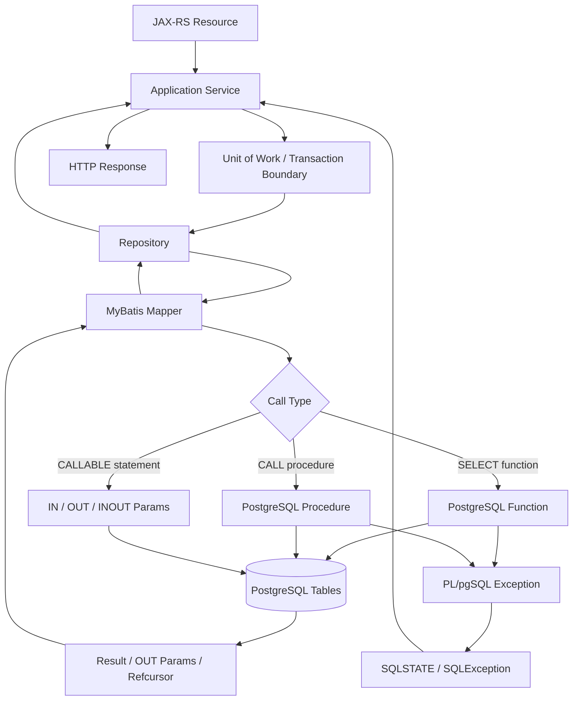
```mermaid id="i5upw0"
flowchart TD
    A[JAX-RS Resource] --> B[Application Service]
    B --> C[Unit of Work / Transaction Boundary]
    C --> D[Repository]
    D --> E[MyBatis Mapper]
    E --> F{Call Type}

    F -->|SELECT function| G[PostgreSQL Function]
    F -->|CALL procedure| H[PostgreSQL Procedure]
    F -->|CALLABLE statement| I[IN / OUT / INOUT Params]

    G --> J[(PostgreSQL Tables)]
    H --> J
    I --> J

    J --> K[Result / OUT Params / Refcursor]
    K --> E
    E --> D
    D --> B
    B --> L[HTTP Response]

    G --> M[PL/pgSQL Exception]
    H --> M
    M --> N[SQLSTATE / SQLException]
    N --> B
```

**Core invariant:**

```text id="kkebsq"
Stored function/procedure boleh menjalankan data-local logic.

Tapi:
- authorization tetap dimulai di application service
- transaction boundary harus jelas
- error harus diklasifikasi
- result contract harus dites
- jangan sembunyikan seluruh business workflow di database tanpa ownership/test/versioning
```

---

## 4. Decomposition Map

| Area | Fokus Praktis | Skill yang Dikuasai | Risiko Jika Salah |
|---|---|---|---|
| **Function Call** | Panggil PostgreSQL function dari mapper | `SELECT function(...)`, scalar/table result | Function jadi hidden service |
| **Procedure Call** | Panggil `CALL procedure(...)` | `statementType=CALLABLE` | Transaction boundary kacau |
| **Callable Statement** | IN/OUT/INOUT mapping | `mode`, `jdbcType`, parameter map/object | OUT value tidak terbaca |
| **Refcursor** | Cursor result dari PL/pgSQL | transaction/session lifecycle | Cursor hilang karena transaction closed |
| **Set-Returning Function** | Function return table | `SELECT * FROM function(...)` | Mapping resultMap salah |
| **Error Propagation** | PL/pgSQL exception ke Java | SQLSTATE, exception mapper | Semua error jadi HTTP 500 |
| **Transaction Semantics** | Siapa commit/rollback? | service-managed vs procedure-managed | Partial commit tersembunyi |
| **Boundary Design** | Logic mana di DB vs Java | data-local vs workflow orchestration | DB jadi monolith app |
| **Security Definer** | DB-side privileged function | least privilege, safe search_path | Privilege escalation |
| **Volatility** | Function behavior declaration | `IMMUTABLE`, `STABLE`, `VOLATILE` | Planner assumption salah |
| **Migration Versioning** | Version PL/pgSQL code | Flyway/Liquibase function migration | Prod DB logic drift |
| **Testing** | Function/procedure integration test | Testcontainers PostgreSQL | Bug hanya muncul runtime |
| **Observability** | Log mapper/function duration | statement id, SQLSTATE, DB logs | Sulit debug |
| **Performance** | Avoid row-by-row DB loops | set-based SQL, EXPLAIN | Lambat tersembunyi |

---

## 5. Function Call Pattern - Scalar Result

### PostgreSQL function

```sql id="8p57sd"
CREATE OR REPLACE FUNCTION calculate_case_age_days(
    p_created_at timestamptz
)
RETURNS integer
LANGUAGE sql
STABLE
AS $$
    SELECT GREATEST(0, (CURRENT_DATE - p_created_at::date)::integer);
$$;
```

### Mapper

```java id="8w97x2"
public interface CaseFunctionMapper {

    int calculateCaseAgeDays(@Param("createdAt") Instant createdAt);
}
```

### XML

```xml id="qhelj1"
<select id="calculateCaseAgeDays" resultType="int">
  SELECT calculate_case_age_days(#{createdAt})
</select>
```

**Kapan layak:** logic benar-benar data/time/database-specific atau sudah menjadi standard DB function. Kalau calculation murni domain dan mudah di-Java, sebaiknya tetap di Java agar unit-test cepat dan tidak perlu DB call.

---

## 6. Function Call Pattern - Table Result

### PostgreSQL function

```sql id="ansgh7"
CREATE OR REPLACE FUNCTION find_cases_eligible_for_escalation(
    p_tenant_id uuid,
    p_limit integer
)
RETURNS TABLE (
    id uuid,
    case_number text,
    status text,
    priority text,
    due_at timestamptz
)
LANGUAGE sql
STABLE
AS $$
    SELECT
        c.id,
        c.case_number,
        c.status,
        c.priority,
        c.due_at
    FROM cases c
    WHERE c.tenant_id = p_tenant_id
      AND c.status IN ('OPEN', 'IN_REVIEW')
      AND c.due_at < now()
    ORDER BY c.due_at ASC, c.id ASC
    LIMIT p_limit;
$$;
```

### DTO

```java id="ndg1ek"
public record EscalationCandidateDto(
    UUID id,
    String caseNumber,
    String status,
    String priority,
    Instant dueAt
) {}
```

### Mapper

```java id="24y16l"
public interface CaseFunctionMapper {

    List<EscalationCandidateDto> findCasesEligibleForEscalation(
        @Param("tenantId") UUID tenantId,
        @Param("limit") int limit
    );
}
```

### XML

```xml id="cn6gem"
<select id="findCasesEligibleForEscalation"
        resultType="com.company.app.dto.EscalationCandidateDto">
  SELECT
    id,
    case_number AS caseNumber,
    status,
    priority,
    due_at AS dueAt
  FROM find_cases_eligible_for_escalation(
    #{tenantId},
    #{limit}
  )
</select>
```

**Rule:** set-returning function cocok jika function adalah query contract yang reusable dan stabil. Untuk query yang sering berubah mengikuti UI/API, XML mapper biasa sering lebih mudah di-review.

---

## 7. Procedure Call Pattern - Simple IN Parameters

### PostgreSQL procedure

```sql id="7hrdgv"
CREATE OR REPLACE PROCEDURE archive_old_audit_logs(
    p_before timestamptz,
    p_limit integer
)
LANGUAGE plpgsql
AS $$
BEGIN
    WITH batch AS (
        SELECT id
        FROM audit_logs
        WHERE created_at < p_before
          AND archived = false
        ORDER BY id
        LIMIT p_limit
    )
    UPDATE audit_logs a
    SET archived = true,
        archived_at = now()
    FROM batch
    WHERE a.id = batch.id;
END;
$$;
```

### Mapper

```java id="6ofc6c"
public interface MaintenanceProcedureMapper {

    void archiveOldAuditLogs(
        @Param("before") Instant before,
        @Param("limit") int limit
    );
}
```

### XML

```xml id="4kthfg"
<update id="archiveOldAuditLogs" statementType="CALLABLE">
  { CALL archive_old_audit_logs(
      #{before, mode=IN, jdbcType=TIMESTAMP},
      #{limit, mode=IN, jdbcType=INTEGER}
    )
  }
</update>
```

**Catatan:** walaupun statement XML memakai `<update>`, secara konseptual ini call operation yang memiliki side-effect. Pastikan service yang memanggil tetap jelas transaction boundary-nya.

---

## 8. Procedure Call dengan OUT Parameter

### PostgreSQL procedure

```sql id="whc02t"
CREATE OR REPLACE PROCEDURE approve_case_proc(
    IN p_tenant_id uuid,
    IN p_case_id uuid,
    IN p_actor_id uuid,
    IN p_expected_version bigint,
    OUT p_updated integer,
    OUT p_new_version bigint
)
LANGUAGE plpgsql
AS $$
BEGIN
    UPDATE cases
    SET status = 'APPROVED',
        version = version + 1,
        approved_by = p_actor_id,
        approved_at = now()
    WHERE tenant_id = p_tenant_id
      AND id = p_case_id
      AND status = 'SUBMITTED'
      AND version = p_expected_version;

    GET DIAGNOSTICS p_updated = ROW_COUNT;

    IF p_updated = 1 THEN
        SELECT version
        INTO p_new_version
        FROM cases
        WHERE tenant_id = p_tenant_id
          AND id = p_case_id;
    ELSE
        p_new_version := NULL;
    END IF;
END;
$$;
```

### Parameter object

```java id="37qcs8"
public class ApproveCaseProcedureParams {

    private UUID tenantId;
    private UUID caseId;
    private UUID actorId;
    private long expectedVersion;

    private Integer updated;
    private Long newVersion;

    // getters and setters required by MyBatis

    public UUID getTenantId() {
        return tenantId;
    }

    public void setTenantId(UUID tenantId) {
        this.tenantId = tenantId;
    }

    public UUID getCaseId() {
        return caseId;
    }

    public void setCaseId(UUID caseId) {
        this.caseId = caseId;
    }

    public UUID getActorId() {
        return actorId;
    }

    public void setActorId(UUID actorId) {
        this.actorId = actorId;
    }

    public long getExpectedVersion() {
        return expectedVersion;
    }

    public void setExpectedVersion(long expectedVersion) {
        this.expectedVersion = expectedVersion;
    }

    public Integer getUpdated() {
        return updated;
    }

    public void setUpdated(Integer updated) {
        this.updated = updated;
    }

    public Long getNewVersion() {
        return newVersion;
    }

    public void setNewVersion(Long newVersion) {
        this.newVersion = newVersion;
    }
}
```

### Mapper

```java id="fulpbl"
public interface CaseProcedureMapper {

    void approveCase(ApproveCaseProcedureParams params);
}
```

### XML

```xml id="it6rfi"
<update id="approveCase"
        parameterType="com.company.app.persistence.proc.ApproveCaseProcedureParams"
        statementType="CALLABLE">
  { CALL approve_case_proc(
      #{tenantId, mode=IN, jdbcType=OTHER},
      #{caseId, mode=IN, jdbcType=OTHER},
      #{actorId, mode=IN, jdbcType=OTHER},
      #{expectedVersion, mode=IN, jdbcType=BIGINT},
      #{updated, mode=OUT, jdbcType=INTEGER},
      #{newVersion, mode=OUT, jdbcType=BIGINT}
    )
  }
</update>
```

### Service usage

```java id="yy52ti"
public CaseResponse approve(ApproveCaseCommand command) {
    return unitOfWork.transactional(ctx -> {
        CaseProcedureMapper mapper = ctx.mapper(CaseProcedureMapper.class);

        ApproveCaseProcedureParams params = new ApproveCaseProcedureParams();
        params.setTenantId(command.tenantId());
        params.setCaseId(command.caseId());
        params.setActorId(command.actorId());
        params.setExpectedVersion(command.expectedVersion());

        mapper.approveCase(params);

        if (!Integer.valueOf(1).equals(params.getUpdated())) {
            throw new InvalidCaseTransitionException(command.caseId());
        }

        return new CaseResponse(
            command.caseId(),
            "APPROVED",
            params.getNewVersion()
        );
    });
}
```

**MyBatis behavior:** OUT/INOUT values are written back into the parameter object or map property, not returned as the Java method return value. ([MyBatis](https://mybatis.org/mybatis-3/sqlmap-xml.html?utm_source=chatgpt.com))

---

## 9. OUT Parameter dengan `Map`

### Mapper

```java id="op5ewo"
void approveCase(Map<String, Object> params);
```

### Java

```java id="9gyf00"
Map<String, Object> params = new HashMap<>();
params.put("tenantId", tenantId);
params.put("caseId", caseId);
params.put("actorId", actorId);
params.put("expectedVersion", expectedVersion);

mapper.approveCase(params);

Integer updated = (Integer) params.get("updated");
Long newVersion = (Long) params.get("newVersion");
```

### XML

```xml id="4so60v"
<update id="approveCase"
        parameterType="map"
        statementType="CALLABLE">
  { CALL approve_case_proc(
      #{tenantId, mode=IN, jdbcType=OTHER},
      #{caseId, mode=IN, jdbcType=OTHER},
      #{actorId, mode=IN, jdbcType=OTHER},
      #{expectedVersion, mode=IN, jdbcType=BIGINT},
      #{updated, mode=OUT, jdbcType=INTEGER},
      #{newVersion, mode=OUT, jdbcType=BIGINT}
    )
  }
</update>
```

| Parameter Object | Map |
|---|---|
| Type-safe-ish | Flexible |
| Better refactor support | Faster for quick integration |
| More boilerplate | More casting |
| Better for production contracts | Risk typo keys |

**Recommendation:** gunakan parameter object untuk procedure contract yang penting.

---

## 10. PostgreSQL Refcursor Pattern

PostgreSQL PL/pgSQL cursor variables are of special data type `refcursor`; the docs state all cursor access in PL/pgSQL goes through cursor variables of type `refcursor`. ([PostgreSQL](https://www.postgresql.org/docs/current/plpgsql-cursors.html?utm_source=chatgpt.com))

### Function returning refcursor

```sql id="v6bol7"
CREATE OR REPLACE FUNCTION open_case_cursor(
    p_tenant_id uuid,
    p_status text
)
RETURNS refcursor
LANGUAGE plpgsql
AS $$
DECLARE
    case_cursor refcursor;
BEGIN
    OPEN case_cursor FOR
        SELECT
            id,
            case_number,
            status,
            priority,
            due_at
        FROM cases
        WHERE tenant_id = p_tenant_id
          AND status = p_status
        ORDER BY due_at ASC, id ASC;

    RETURN case_cursor;
END;
$$;
```

### Practical warning

Refcursor lifecycle is transaction-bound in practice because the cursor portal lives in the current session/transaction context. If the transaction is committed/closed before fetching, cursor usage can fail. PostgreSQL docs emphasize cursor variables and cursor access semantics in PL/pgSQL, and transaction semantics around cursors need careful handling. ([PostgreSQL](https://www.postgresql.org/docs/current/plpgsql-cursors.html?utm_source=chatgpt.com))

### Better alternative for most MyBatis apps

Instead of refcursor, prefer:

```sql id="8qmoi5"
CREATE OR REPLACE FUNCTION find_cases_for_export(
    p_tenant_id uuid,
    p_status text
)
RETURNS TABLE (
    id uuid,
    case_number text,
    status text,
    priority text,
    due_at timestamptz
)
LANGUAGE sql
STABLE
AS $$
    SELECT
        id,
        case_number,
        status,
        priority,
        due_at
    FROM cases
    WHERE tenant_id = p_tenant_id
      AND status = p_status
    ORDER BY due_at ASC, id ASC;
$$;
```

Then map as normal `SELECT`.

**Rule praktis:** gunakan `RETURNS TABLE` atau normal `SELECT` + MyBatis cursor/fetchSize untuk Java apps. Refcursor lebih sering cocok untuk legacy DB API atau driver/procedure contract tertentu.

---

## 11. Callable Refcursor - Caution Pattern

MyBatis docs mention `jdbcType=CURSOR` primarily in the context of databases such as Oracle REF CURSOR and require a `resultMap` for mapping cursor result sets. PostgreSQL refcursor integration can be driver/tooling-sensitive, so for PostgreSQL prefer set-returning functions unless project already has a proven refcursor pattern. ([MyBatis](https://mybatis.org/mybatis-3/sqlmap-xml.html?utm_source=chatgpt.com))

### If legacy requires refcursor

Treat this as a special integration requiring:

```text id="206hm8"
- one open transaction
- session kept open while fetching
- explicit integration test against PostgreSQL
- driver behavior verified
- no HTTP long-running cursor unless carefully controlled
```

**Recommended fallback:** convert refcursor procedure to `RETURNS TABLE` wrapper function if possible.

---

## 12. Transaction Semantics: Java vs Procedure

PostgreSQL PL/pgSQL transaction control is only possible in `CALL` or `DO` invocations from top level or nested `CALL`/`DO` invocations without intervening commands; if the call stack includes `SELECT func2()` between `CALL`s, later procedure transaction control is not allowed. ([PostgreSQL](https://www.postgresql.org/docs/current/plpgsql-transactions.html?utm_source=chatgpt.com))

### Safer service-managed transaction

```text id="xzcf9u"
Java service opens transaction
  -> CALL procedure / SELECT function
  -> insert audit/outbox if needed
  -> commit/rollback in Java
```

### Riskier procedure-managed transaction

```text id="rnuu1u"
CALL procedure
  -> procedure commits/rollbacks internally
  -> Java service may not control atomicity
```

| Pattern | Recommended? | Notes |
|---|---:|---|
| Java service owns transaction | Ya | Paling predictable untuk JAX-RS service |
| Procedure performs data mutation only | Ya | No internal commit/rollback |
| Procedure performs internal commit | Jarang | Use for top-level maintenance procedures only |
| Function performs side-effect | Hindari | Function should be query/calculation-like where possible |
| Procedure called inside service transaction then commits internally | Hindari | Boundary confusing |
| Outbox/audit outside same transaction | Hindari | Consistency risk |

---

## 13. Transaction Boundary Decision Table

| Use Case | Recommended Boundary |
|---|---|
| Approve case + audit + outbox | Java service transaction |
| Bulk maintenance job standalone | Procedure can own process if called top-level |
| Report function | No mutation; read-only query |
| Queue claim | Java transaction + SQL/mapper, or function without internal commit |
| Backfill chunks | Java job controls chunk transaction |
| Legacy procedure already commits | Isolate behind adapter; do not combine with other writes |
| Stored procedure mutates multiple tables | Java still controls outer transaction unless procedure is top-level maintenance |
| Function used in SELECT projection | Must be side-effect safe |

---

## 14. PL/pgSQL Exception → Java Error Mapping

### PostgreSQL function/procedure

```sql id="sezihv"
CREATE OR REPLACE PROCEDURE submit_case_proc(
    IN p_tenant_id uuid,
    IN p_case_id uuid,
    IN p_expected_version bigint
)
LANGUAGE plpgsql
AS $$
DECLARE
    v_updated integer;
BEGIN
    UPDATE cases
    SET status = 'SUBMITTED',
        version = version + 1,
        submitted_at = now()
    WHERE tenant_id = p_tenant_id
      AND id = p_case_id
      AND status = 'DRAFT'
      AND version = p_expected_version;

    GET DIAGNOSTICS v_updated = ROW_COUNT;

    IF v_updated <> 1 THEN
        RAISE EXCEPTION 'Invalid case transition'
            USING ERRCODE = 'P0001',
                  DETAIL = 'Case not in DRAFT or version mismatch',
                  HINT = 'Reload case and retry';
    END IF;
END;
$$;
```

### Java classifier

```java id="7az8ta"
public enum PersistenceErrorKind {
    UNIQUE_VIOLATION,
    FOREIGN_KEY_VIOLATION,
    CHECK_VIOLATION,
    DEADLOCK,
    SERIALIZATION_FAILURE,
    PROCEDURE_RAISED_EXCEPTION,
    UNKNOWN
}
```

```java id="9c8epi"
public final class PostgresErrorClassifier {

    public static PersistenceErrorKind classify(Throwable throwable) {
        SQLException sqlException = findSqlException(throwable);

        if (sqlException == null) {
            return PersistenceErrorKind.UNKNOWN;
        }

        return switch (sqlException.getSQLState()) {
            case "23505" -> PersistenceErrorKind.UNIQUE_VIOLATION;
            case "23503" -> PersistenceErrorKind.FOREIGN_KEY_VIOLATION;
            case "23514" -> PersistenceErrorKind.CHECK_VIOLATION;
            case "40P01" -> PersistenceErrorKind.DEADLOCK;
            case "40001" -> PersistenceErrorKind.SERIALIZATION_FAILURE;
            case "P0001" -> PersistenceErrorKind.PROCEDURE_RAISED_EXCEPTION;
            default -> PersistenceErrorKind.UNKNOWN;
        };
    }

    private static SQLException findSqlException(Throwable throwable) {
        Throwable current = throwable;

        while (current != null) {
            if (current instanceof SQLException sqlException) {
                return sqlException;
            }
            current = current.getCause();
        }

        return null;
    }
}
```

**Rule:** PL/pgSQL exception harus punya SQLSTATE/contract yang bisa diklasifikasi. Jangan hanya mengandalkan string message.

---

## 15. Function Volatility

PostgreSQL function definitions include function attributes such as volatility categories. `CREATE FUNCTION` supports attributes including `IMMUTABLE`, `STABLE`, and `VOLATILE`; this informs the planner about function behavior. ([PostgreSQL](https://www.postgresql.org/docs/current/sql-createfunction.html?utm_source=chatgpt.com))

| Volatility | Meaning Praktis | Contoh |
|---|---|---|
| `IMMUTABLE` | Same input always same output | pure normalization/math |
| `STABLE` | Same within one statement; reads DB/time-ish stable enough | lookup/config read |
| `VOLATILE` | Can change anytime or has side effects | `now()`, mutation, random, sequence |

### Examples

```sql id="wk17j7"
CREATE OR REPLACE FUNCTION normalize_case_number(p_case_number text)
RETURNS text
LANGUAGE sql
IMMUTABLE
AS $$
    SELECT upper(trim(p_case_number));
$$;
```

```sql id="xf6bag"
CREATE OR REPLACE FUNCTION find_case_count_by_status(p_tenant_id uuid)
RETURNS TABLE(status text, total bigint)
LANGUAGE sql
STABLE
AS $$
    SELECT status, count(*)
    FROM cases
    WHERE tenant_id = p_tenant_id
    GROUP BY status;
$$;
```

```sql id="6b0c38"
CREATE OR REPLACE FUNCTION create_audit_id()
RETURNS uuid
LANGUAGE sql
VOLATILE
AS $$
    SELECT gen_random_uuid();
$$;
```

**Warning:** jangan menandai function sebagai `IMMUTABLE` jika membaca tabel, waktu, sequence, setting session, atau data eksternal.

---

## 16. SECURITY DEFINER Boundary

PostgreSQL `CREATE FUNCTION` supports `SECURITY INVOKER` and `SECURITY DEFINER`; `SECURITY DEFINER` executes with privileges of the function owner rather than the caller. ([PostgreSQL](https://www.postgresql.org/docs/current/sql-createfunction.html?utm_source=chatgpt.com))

### Use case

```text id="pui9gd"
app_runtime tidak punya direct update ke sensitive table,
tetapi boleh memanggil function/procedure terbatas yang melakukan validasi dan update tertentu.
```

### Example

```sql id="npnr47"
CREATE OR REPLACE FUNCTION approve_case_secure(
    p_tenant_id uuid,
    p_case_id uuid,
    p_actor_id uuid
)
RETURNS void
LANGUAGE plpgsql
SECURITY DEFINER
SET search_path = public
AS $$
BEGIN
    UPDATE cases
    SET status = 'APPROVED',
        approved_by = p_actor_id,
        approved_at = now()
    WHERE tenant_id = p_tenant_id
      AND id = p_case_id
      AND status = 'SUBMITTED';

    IF NOT FOUND THEN
        RAISE EXCEPTION 'case cannot be approved'
            USING ERRCODE = 'P0001';
    END IF;
END;
$$;
```

### Security checklist

| Checklist | Required |
|---|---:|
| Function owner is not superuser unless unavoidable | Ya |
| `search_path` fixed inside function | Ya |
| Function validates tenant and input | Ya |
| Caller only granted `EXECUTE` | Ya |
| Direct table privilege restricted if intended | Ya |
| Function audited/test-covered | Ya |
| No dynamic SQL from user input | Ya |
| SQL injection reviewed inside PL/pgSQL | Ya |

**Rule:** `SECURITY DEFINER` is powerful and dangerous. Treat it as privileged API inside the database.

---

## 17. Grant EXECUTE Only

```sql id="f87zin"
REVOKE ALL ON FUNCTION approve_case_secure(uuid, uuid, uuid)
FROM PUBLIC;

GRANT EXECUTE ON FUNCTION approve_case_secure(uuid, uuid, uuid)
TO app_runtime;
```

For procedures:

```sql id="sv8t80"
REVOKE ALL ON PROCEDURE archive_old_audit_logs(timestamptz, integer)
FROM PUBLIC;

GRANT EXECUTE ON PROCEDURE archive_old_audit_logs(timestamptz, integer)
TO app_backfill;
```

**Design idea:** app role may not need broad table update privileges if all mutation happens through reviewed DB routines. But this increases PL/pgSQL ownership burden, so use selectively.

---

## 18. Dynamic SQL Inside PL/pgSQL

### Bad

```sql id="h1cleu"
EXECUTE 'SELECT * FROM ' || p_table_name || ' WHERE id = ' || p_id;
```

### Better with format and safe identifier/value

```sql id="zrm96h"
EXECUTE format(
    'SELECT count(*) FROM %I WHERE tenant_id = $1',
    p_table_name
)
USING p_tenant_id;
```

But better still: avoid dynamic table names unless internal and whitelisted.

### Whitelist table

```sql id="jv1i9h"
IF p_table_name NOT IN ('cases', 'orders') THEN
    RAISE EXCEPTION 'invalid table name'
        USING ERRCODE = 'P0001';
END IF;
```

**Rule:** dynamic SQL risk exists in PL/pgSQL too, not only in MyBatis XML.

---

## 19. Boundary Design: What Belongs in PL/pgSQL?

| Logic | Java Service | PL/pgSQL |
|---|---:|---:|
| HTTP validation | Ya | Tidak |
| Authorization from JWT/claims | Ya | Optional DB defense |
| State transition orchestration | Usually | Sometimes if data-local |
| Multi-table data mutation | Ya or PL/pgSQL | Good candidate if atomic/data-local |
| Complex set-based update | Maybe | Good candidate |
| Report query helper | Maybe | Good candidate |
| External API call | Ya, not DB | Tidak |
| Kafka/outbox publish | Java/worker | DB only inserts outbox row |
| UI-specific filtering | Java/MyBatis | Usually no |
| DB constraint enforcement | No | Ya |
| Security definer privileged mutation | Maybe | Good candidate but risky |
| Long-running maintenance | Java job + SQL/procedure | Procedure okay if controlled |
| Business policy changing often | Java | Usually no |
| Legacy packaged DB logic | Adapter in Java | Existing PL/pgSQL |

---

## 20. PL/pgSQL Boundary Smells

| Smell | Meaning |
|---|---|
| Procedure sends HTTP/email | DB doing application integration |
| Procedure commits internally while Java expects transaction | Boundary conflict |
| Function mutates data but called in SELECT | Hidden side effect |
| All business rules only in PL/pgSQL | Java service becomes pass-through |
| Java service duplicates same logic as PL/pgSQL | Divergent rules |
| Procedure returns loosely structured text JSON for everything | Contract unclear |
| Procedure uses dynamic SQL with raw input | Injection risk |
| No migration/versioning for functions | DB drift |
| No integration tests | Behavior untrusted |
| Refcursor returned to long HTTP response | Connection/transaction risk |
| SECURITY DEFINER without fixed search_path | Privilege escalation risk |
| OUT params not documented | Mapper contract fragile |

---

## 21. MyBatis Mapper Style Guide for Procedures

| Rule | Example |
|---|---|
| Suffix mapper clearly | `CaseProcedureMapper` |
| Suffix parameter object | `ApproveCaseProcedureParams` |
| Use parameter object for OUT | Avoid raw Map for important calls |
| Explicit `jdbcType` | Especially UUID/JSONB/OUT |
| Do not expose procedure mapper to resource | Only repository/service |
| One procedure call per method | Avoid generic `call(String)` |
| Check OUT status/count | Do not ignore procedure result |
| Classify SQLSTATE | Map to business/transient errors |
| Test with PostgreSQL | No mock-only procedure tests |

---

## 22. Repository Adapter for Procedure

```java id="c3o8iv"
public class MyBatisCaseProcedureRepository {

    private final MyBatisSessionContext context;

    public MyBatisCaseProcedureRepository(MyBatisSessionContext context) {
        this.context = context;
    }

    public CaseApprovalResult approveCase(
        UUID tenantId,
        UUID caseId,
        UUID actorId,
        long expectedVersion
    ) {
        CaseProcedureMapper mapper = context.mapper(CaseProcedureMapper.class);

        ApproveCaseProcedureParams params = new ApproveCaseProcedureParams();
        params.setTenantId(tenantId);
        params.setCaseId(caseId);
        params.setActorId(actorId);
        params.setExpectedVersion(expectedVersion);

        mapper.approveCase(params);

        if (!Integer.valueOf(1).equals(params.getUpdated())) {
            return CaseApprovalResult.conflict();
        }

        return CaseApprovalResult.approved(params.getNewVersion());
    }
}
```

**Rule:** service should consume domain result, not raw procedure param object if possible.

---

## 23. Testing Strategy

### Migration test

```java id="sv904r"
@Test
void shouldCreateProcedureInMigration() {
    runMigrations();

    try (SqlSession session = openSession()) {
        CaseProcedureMapper mapper =
            session.getMapper(CaseProcedureMapper.class);

        assertThat(mapper).isNotNull();
    }
}
```

### Procedure happy path

```java id="0ul6wb"
@Test
void approveCaseProcedureShouldApproveSubmittedCase() {
    UUID tenantId = UUID.randomUUID();
    UUID caseId = fixture.insertSubmittedCase(tenantId, 0L);
    UUID actorId = UUID.randomUUID();

    try (SqlSession session = openSession()) {
        CaseProcedureMapper mapper =
            session.getMapper(CaseProcedureMapper.class);

        ApproveCaseProcedureParams params = new ApproveCaseProcedureParams();
        params.setTenantId(tenantId);
        params.setCaseId(caseId);
        params.setActorId(actorId);
        params.setExpectedVersion(0L);

        mapper.approveCase(params);
        session.commit();

        assertThat(params.getUpdated()).isEqualTo(1);
        assertThat(params.getNewVersion()).isEqualTo(1L);
    }

    assertThat(fixture.findCaseStatus(tenantId, caseId))
        .isEqualTo("APPROVED");
}
```

### Procedure conflict path

```java id="hwtp2z"
@Test
void approveCaseProcedureShouldReturnZeroForWrongVersion() {
    UUID tenantId = UUID.randomUUID();
    UUID caseId = fixture.insertSubmittedCase(tenantId, 1L);

    try (SqlSession session = openSession()) {
        CaseProcedureMapper mapper =
            session.getMapper(CaseProcedureMapper.class);

        ApproveCaseProcedureParams params = new ApproveCaseProcedureParams();
        params.setTenantId(tenantId);
        params.setCaseId(caseId);
        params.setActorId(UUID.randomUUID());
        params.setExpectedVersion(0L);

        mapper.approveCase(params);
        session.commit();

        assertThat(params.getUpdated()).isEqualTo(0);
        assertThat(params.getNewVersion()).isNull();
    }
}
```

### Error SQLSTATE test

```java id="2x329i"
@Test
void shouldClassifyProcedureRaisedException() {
    Throwable thrown = catchThrowable(() -> {
        try (SqlSession session = openSession()) {
            CaseProcedureMapper mapper =
                session.getMapper(CaseProcedureMapper.class);

            mapper.submitInvalidCase(...);
            session.commit();
        }
    });

    assertThat(PostgresErrorClassifier.classify(thrown))
        .isEqualTo(PersistenceErrorKind.PROCEDURE_RAISED_EXCEPTION);
}
```

---

## 24. Performance Notes

| Pattern | Risk | Recommendation |
|---|---|---|
| PL/pgSQL row-by-row loop | Slow for many rows | Prefer set-based SQL |
| Procedure hides expensive query | Hard to diagnose | Log statement + use `pg_stat_statements` |
| Function called per row in large query | CPU explosion | Check volatility/cost; avoid if expensive |
| Refcursor long-lived | Holds transaction/session | Prefer streaming query/cursor in MyBatis |
| Dynamic SQL in procedure | Plan/cache/injection risk | Use safely and sparingly |
| Procedure doing huge transaction | Lock/rollback impact | Chunk from Java job or procedure loop carefully |
| No EXPLAIN on function query | Blind tuning | Extract inner SQL and EXPLAIN |

### Set-based update preferred

```sql id="lx07ek"
UPDATE cases
SET status = 'ESCALATED',
    escalated_at = now()
WHERE status IN ('OPEN', 'IN_REVIEW')
  AND due_at < now();
```

Instead of:

```sql id="fjrddf"
FOR v_case IN SELECT id FROM cases WHERE ... LOOP
    UPDATE cases SET ... WHERE id = v_case.id;
END LOOP;
```

---

## 25. Observability Pattern

### SQL comment in mapper

```xml id="eyp5h9"
<update id="approveCase"
        parameterType="com.company.app.persistence.proc.ApproveCaseProcedureParams"
        statementType="CALLABLE">
  { CALL approve_case_proc(
      #{tenantId, mode=IN, jdbcType=OTHER},
      #{caseId, mode=IN, jdbcType=OTHER},
      #{actorId, mode=IN, jdbcType=OTHER},
      #{expectedVersion, mode=IN, jdbcType=BIGINT},
      #{updated, mode=OUT, jdbcType=INTEGER},
      #{newVersion, mode=OUT, jdbcType=BIGINT}
    )
  }
</update>
```

### App metric

```text id="j703jf"
db.procedure.duration{procedure="approve_case_proc"}
db.procedure.error{procedure="approve_case_proc", sqlstate="P0001"}
db.procedure.conflict{procedure="approve_case_proc"}
```

### Log safe result

```java id="9ezhqr"
log.info(
    "Procedure approve_case_proc completed tenantId={} caseId={} updated={} newVersion={}",
    tenantId,
    caseId,
    params.getUpdated(),
    params.getNewVersion()
);
```

**Do not log:** full payload, sensitive JSON, DB credentials, raw exception detail to client.

---

## 26. Migration Versioning for PL/pgSQL

### Flyway file

```text id="f8pvbu"
V20260713_0100__create_approve_case_proc.sql
V20260720_0100__replace_approve_case_proc_add_audit.sql
V20260727_0100__drop_legacy_approve_case_proc.sql
```

### Procedure migration

```sql id="1m5n4f"
CREATE OR REPLACE PROCEDURE approve_case_proc(
    IN p_tenant_id uuid,
    IN p_case_id uuid,
    IN p_actor_id uuid,
    IN p_expected_version bigint,
    OUT p_updated integer,
    OUT p_new_version bigint
)
LANGUAGE plpgsql
AS $$
BEGIN
    -- implementation
END;
$$;
```

**Compatibility rule:** changing parameter order/type/name can break MyBatis call. Treat procedure signature as API contract.

---

## 27. Versioned Procedure Contract Strategy

| Change | Safe Strategy |
|---|---|
| Internal SQL change only | `CREATE OR REPLACE` same signature |
| Add optional behavior | Add new parameter? Prefer new procedure version if call contract changes |
| Change OUT params | New procedure name/version |
| Remove parameter | New procedure; migrate Java mapper |
| Rename procedure | Deploy new procedure, update app, drop old later |
| Change error SQLSTATE | Update classifier/tests |
| Change result shape | Update resultMap/tests |
| Add security definer | Review grants/search_path |
| Drop old procedure | Only after no app version calls it |

### Example

```sql id="94ljvx"
CREATE OR REPLACE PROCEDURE approve_case_proc_v2(...)
LANGUAGE plpgsql
AS $$
BEGIN
    -- new contract
END;
$$;
```

```java id="duvb68"
void approveCaseV2(ApproveCaseProcedureV2Params params);
```

---

## 28. Security Checklist

| Item | Required |
|---|---:|
| Procedure validates tenant where applicable | Ya |
| Procedure does not trust caller blindly | Ya |
| Dynamic SQL uses `format('%I')` and `USING` | Ya |
| No raw user input concatenation | Ya |
| SECURITY DEFINER has fixed `search_path` | Ya |
| EXECUTE grants are minimal | Ya |
| Function/procedure owner reviewed | Ya |
| Error messages do not leak sensitive detail | Ya |
| Audit generated for sensitive mutation | Ya |
| Java service still performs authorization | Ya |
| Migration grants reviewed | Ya |

---

## 29. Anti-Pattern

| Anti-Pattern | Example | Impact |
|---|---|---|
| Resource calls procedure mapper directly | HTTP layer bypasses service | Auth/transaction scattered |
| Procedure commits internally inside app transaction | Hidden partial commit | Atomicity broken |
| Function mutates data | `SELECT approve_case(...)` | Side-effect hidden |
| Refcursor for normal list API | Cursor lifecycle complexity | Connection leaks/timeouts |
| OUT params ignored | Call result unchecked | Invalid state accepted |
| Procedure returns magic strings | `"OK"`, `"ERR1"` | Fragile contract |
| Dynamic SQL concat in PL/pgSQL | `'... ' || user_input` | SQL injection |
| SECURITY DEFINER without `search_path` | Object hijacking risk | Privilege escalation |
| No integration test | Procedure may break silently | Runtime failures |
| Signature changed in-place | Old app mapper breaks | Deployment incident |
| Business rules split Java/PLpgSQL inconsistently | Divergent behavior | Defensibility issue |
| Long procedure transaction | Locks/rollback large | Production contention |

---

## 30. Decision Table

| Problem | Recommended Pattern |
|---|---|
| Query helper returns rows | PostgreSQL function `RETURNS TABLE` + MyBatis `<select>` |
| Operation with side effect | Procedure `CALL` via `statementType=CALLABLE` |
| Need OUT status/count | Procedure OUT params + parameter object |
| Need list result | Prefer `RETURNS TABLE` over refcursor |
| Legacy refcursor exists | Keep transaction/session open; test carefully |
| Need privileged DB-side operation | SECURITY DEFINER function/procedure with strict safeguards |
| Need complex set-based update | PL/pgSQL or SQL procedure can be good |
| Need orchestration with audit/outbox | Java service transaction preferred |
| Need transaction control inside DB | Top-level procedure only, isolated use case |
| Need dynamic query | Prefer MyBatis dynamic SQL unless DB-side is clearly better |
| Need rollback with app changes | Avoid procedure internal commit |
| Need external side effect | Not PL/pgSQL; use outbox/worker |

---

## 31. Production Checklist

| Checklist | Status Ideal |
|---|---|
| Procedure/function signatures treated as API contracts | Ya |
| MyBatis callable params have explicit `mode` and `jdbcType` | Ya |
| OUT/INOUT params read from parameter object/map | Ya |
| Procedure result/conflict status checked | Ya |
| Java service owns transaction unless procedure is standalone maintenance | Ya |
| No hidden internal commit in business procedure | Ya |
| Refcursor avoided unless required | Ya |
| Set-returning functions preferred for result lists | Ya |
| PL/pgSQL exceptions use classifiable SQLSTATE | Ya |
| Security definer functions have fixed search_path | Ya |
| EXECUTE privileges are least-privilege | Ya |
| Dynamic SQL inside PL/pgSQL is whitelisted/parameterized | Ya |
| Function volatility declared correctly | Ya |
| Migration tests create/update routines | Ya |
| Integration tests call routines through MyBatis | Ya |
| Observability tracks routine duration/errors | Ya |
| Procedure versioning plan exists | Ya |

---

## 32. Roadmap Belajar Singkat

| Urutan | Materi | Target |
|---:|---|---|
| 1 | PostgreSQL function vs procedure | Tahu kapan `SELECT` vs `CALL` |
| 2 | MyBatis `statementType=CALLABLE` | Bisa call procedure |
| 3 | IN/OUT/INOUT params | Bisa baca OUT result |
| 4 | `RETURNS TABLE` function | Bisa map result list |
| 5 | Refcursor caveats | Tahu kenapa jarang dipakai |
| 6 | Transaction semantics | Tidak salah commit boundary |
| 7 | PL/pgSQL exception SQLSTATE | Error bisa diklasifikasi |
| 8 | SECURITY DEFINER | Privileged DB logic aman |
| 9 | Migration/versioning | Routine tidak drift |
| 10 | Integration testing | Routine contract terbukti |

---

## Rekomendasi Materi Selanjutnya

Lanjutkan ke **“Java MyBatis Multi-Database, Read/Write Splitting, Multi-Tenant Datasource, Transaction Boundary Across Datasources, dan Cloud/On-Prem Deployment Concerns”** karena setelah stored procedure boundary jelas, tantangan berikutnya adalah bagaimana MyBatis dikelola saat aplikasi berinteraksi dengan lebih dari satu database, tenant, atau deployment topology.

---

**Sources:**

- [MyBatis 3 | Mapper XML Files](https://mybatis.org/mybatis-3/sqlmap-xml.html?utm_source=chatgpt.com)
- [Documentation: 18: CREATE PROCEDURE](https://www.postgresql.org/docs/current/sql-createprocedure.html?utm_source=chatgpt.com)

## Response:
7/13/2026, 3:00:39 AM

Lanjut ke multi-database dan deployment topology: fokusnya memastikan datasource, transaction boundary, tenant routing, read replica, dan deployment cloud/on-prem tidak membuat data inconsistency atau routing bug.

# Cheatsheet - Java MyBatis Multi-Database, Read/Write Splitting, Multi-Tenant Datasource, Transaction Boundary Across Datasources, dan Cloud/On-Prem Deployment Concerns

## 1. Introduction

Dalam aplikasi **Jersey/JAX-RS + MyBatis + PostgreSQL**, multi-database biasanya muncul dalam beberapa bentuk:

```text id="d8q71g"
1. Primary + read replica
2. Multi-tenant database per tenant
3. Multi-schema per tenant
4. Separate database per bounded context
5. Legacy database + new database
6. Reporting database / replica / warehouse
7. On-prem + cloud hybrid
8. Blue/green database topology
```

MyBatis sendiri mendukung konfigurasi **environment** yang berisi `TransactionManager` dan `DataSource`; setiap `SqlSessionFactory` dibangun dari environment tertentu. Artinya, untuk banyak topology production, pola yang paling jelas adalah **lebih dari satu `SqlSessionFactory`**, masing-masing untuk datasource/topology yang berbeda. ([MyBatis](https://mybatis.org/mybatis-3/configuration.html?utm_source=chatgpt.com))

---

## 2. Mental Model

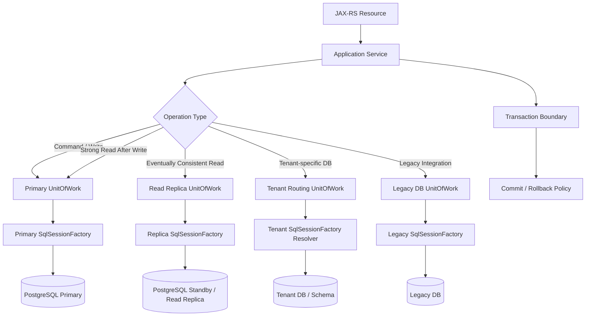
```mermaid id="9a22k1"
flowchart TD
    A[JAX-RS Resource] --> B[Application Service]
    B --> C{Operation Type}

    C -->|Command / Write| D[Primary UnitOfWork]
    C -->|Strong Read After Write| D
    C -->|Eventually Consistent Read| E[Read Replica UnitOfWork]
    C -->|Tenant-specific DB| F[Tenant Routing UnitOfWork]
    C -->|Legacy Integration| G[Legacy DB UnitOfWork]

    D --> H[Primary SqlSessionFactory]
    E --> I[Replica SqlSessionFactory]
    F --> J[Tenant SqlSessionFactory Resolver]
    G --> K[Legacy SqlSessionFactory]

    H --> L[(PostgreSQL Primary)]
    I --> M[(PostgreSQL Standby / Read Replica)]
    J --> N[(Tenant DB / Schema)]
    K --> O[(Legacy DB)]

    B --> P[Transaction Boundary]
    P --> Q[Commit / Rollback Policy]
```

**Core invariant:**

```text id="tnsqwc"
Jangan sembunyikan routing database.

Service harus tahu secara eksplisit:
- apakah operasi butuh primary
- apakah read boleh dari replica
- apakah data tenant-specific
- apakah transaksi melibatkan lebih dari satu datasource
- apakah konsistensi strong atau eventual
```

---

## 3. Decomposition Map

| Area | Fokus Praktis | Pattern Utama | Risiko Jika Salah |
|---|---|---|---|
| **Multiple SqlSessionFactory** | Satu factory per datasource | primary, replica, legacy, tenant | Mapper salah DB |
| **Read/Write Splitting** | Write ke primary, read tertentu ke replica | explicit read policy | Stale read |
| **Read-After-Write** | Setelah write harus baca data terbaru | force primary | User lihat data lama |
| **Replica Lag Awareness** | Replica asynchronous | lag metric, fallback primary | Data inconsistent |
| **Multi-Tenant Routing** | DB/schema per tenant | tenant resolver | Cross-tenant leak |
| **Transaction Boundary** | Satu transaksi per datasource | local transaction | Partial commit antar DB |
| **Cross-DB Transaction** | Operasi lintas datasource | saga/outbox, avoid 2PC if possible | Half-commit |
| **Legacy DB Integration** | Isolasi schema/logic lama | anti-corruption adapter | Legacy bocor ke domain |
| **Connection Pooling** | Pool per datasource | Hikari per DB role | DB overload |
| **Failover** | Primary/secondary topology | pgJDBC multi-host, infra endpoint | Wrong target during failover |
| **Cloud/On-Prem** | Network, DNS, TLS, secrets | config by environment | Timeout/security issue |
| **Migration Strategy** | Migration per DB/schema | ordered migration | Schema drift |
| **Observability** | Metric per datasource | tags: datasource, role | Bottleneck kabur |
| **Testing** | Multi-container topology | Testcontainers/separate DB | Routing bug tidak tertangkap |

---

## 4. Multi-Database Topology Decision Table

| Topology | Cocok Untuk | Pattern |
|---|---|---|
| **Primary only** | App kecil/awal | Single `SqlSessionFactory` |
| **Primary + replica** | Read-heavy workload | Write factory + read factory |
| **Database per tenant** | Strong tenant isolation | Tenant datasource resolver |
| **Schema per tenant** | Banyak tenant, shared DB engine | `search_path` / schema-qualified SQL |
| **Shared table + tenant_id** | SaaS umum | Mandatory tenant predicate + optional RLS |
| **Legacy + new DB** | Migration/modernization | Anti-corruption repository |
| **Reporting replica** | Heavy read/report | Separate read-only datasource |
| **Cloud managed DB** | AWS/Azure/RDS/Flexible Server | Endpoint/secret/TLS driven config |
| **On-prem HA cluster** | Enterprise datacenter | Virtual IP/proxy/multi-host JDBC |
| **Hybrid on-prem/cloud** | Gradual migration/DR | Async integration, outbox, CDC |

---

## 5. Multiple `SqlSessionFactory` Pattern

### 5.1 DataSource role enum

```java id="c4w56a"
public enum DatabaseRole {
    PRIMARY,
    REPLICA,
    LEGACY
}
```

### 5.2 Factory holder

```java id="9d55qv"
public final class SqlSessionFactories {

    private final SqlSessionFactory primary;
    private final SqlSessionFactory replica;
    private final SqlSessionFactory legacy;

    public SqlSessionFactories(
        SqlSessionFactory primary,
        SqlSessionFactory replica,
        SqlSessionFactory legacy
    ) {
        this.primary = primary;
        this.replica = replica;
        this.legacy = legacy;
    }

    public SqlSessionFactory primary() {
        return primary;
    }

    public SqlSessionFactory replica() {
        return replica;
    }

    public SqlSessionFactory legacy() {
        return legacy;
    }

    public SqlSessionFactory byRole(DatabaseRole role) {
        return switch (role) {
            case PRIMARY -> primary;
            case REPLICA -> replica;
            case LEGACY -> legacy;
        };
    }
}
```

### 5.3 Build factory programmatically

```java id="50arxe"
public final class MyBatisFactoryBuilder {

    public SqlSessionFactory build(
        String environmentId,
        DataSource dataSource,
        List<Class<?>> mapperClasses
    ) {
        TransactionFactory transactionFactory =
            new JdbcTransactionFactory();

        Environment environment = new Environment(
            environmentId,
            transactionFactory,
            dataSource
        );

        Configuration configuration = new Configuration(environment);
        configuration.setMapUnderscoreToCamelCase(true);

        for (Class<?> mapperClass : mapperClasses) {
            configuration.addMapper(mapperClass);
        }

        return new SqlSessionFactoryBuilder().build(configuration);
    }
}
```

MyBatis `SqlSessionFactory` membuat `SqlSession`; `SqlSession` adalah interface utama untuk menjalankan command, mengambil mapper, dan mengelola transaksi. Karena `SqlSessionFactory` dibangun dari environment/datasource tertentu, factory per datasource membuat routing lebih eksplisit. ([MyBatis](https://mybatis.org/mybatis-3/java-api.html?utm_source=chatgpt.com))

---

## 6. HikariCP per Datasource

### 6.1 Primary pool

```java id="9tmtsi"
public DataSource primaryDataSource() {
    HikariConfig config = new HikariConfig();

    config.setPoolName("app-primary-pool");
    config.setJdbcUrl(requiredEnv("DB_PRIMARY_URL"));
    config.setUsername(requiredEnv("DB_PRIMARY_USERNAME"));
    config.setPassword(requiredEnv("DB_PRIMARY_PASSWORD"));

    config.setMaximumPoolSize(intEnv("DB_PRIMARY_POOL_MAX", 20));
    config.setConnectionTimeout(longEnv("DB_PRIMARY_CONNECTION_TIMEOUT_MS", 3000));
    config.setMaxLifetime(longEnv("DB_PRIMARY_MAX_LIFETIME_MS", 1_740_000));

    return new HikariDataSource(config);
}
```

### 6.2 Replica pool

```java id="ytf38p"
public DataSource replicaDataSource() {
    HikariConfig config = new HikariConfig();

    config.setPoolName("app-replica-pool");
    config.setJdbcUrl(requiredEnv("DB_REPLICA_URL"));
    config.setUsername(requiredEnv("DB_REPLICA_USERNAME"));
    config.setPassword(requiredEnv("DB_REPLICA_PASSWORD"));

    config.setReadOnly(true);
    config.setMaximumPoolSize(intEnv("DB_REPLICA_POOL_MAX", 30));
    config.setConnectionTimeout(longEnv("DB_REPLICA_CONNECTION_TIMEOUT_MS", 3000));
    config.setMaxLifetime(longEnv("DB_REPLICA_MAX_LIFETIME_MS", 1_740_000));

    return new HikariDataSource(config);
}
```

HikariCP `maximumPoolSize` membatasi jumlah koneksi maksimum termasuk idle dan in-use, sementara `connectionTimeout` adalah waktu maksimum menunggu koneksi dari pool sebelum gagal; ketika pool penuh dan tidak ada koneksi idle, caller akan block sampai timeout. ([GitHub](https://github.com/brettwooldridge/hikaricp?utm_source=chatgpt.com))

---

## 7. Read/Write Splitting Pattern

### 7.1 Unit of Work split

```java id="v90h1z"
public final class DatabaseUnitOfWorkFactory {

    private final SqlSessionFactory primaryFactory;
    private final SqlSessionFactory replicaFactory;

    public DatabaseUnitOfWorkFactory(
        SqlSessionFactory primaryFactory,
        SqlSessionFactory replicaFactory
    ) {
        this.primaryFactory = primaryFactory;
        this.replicaFactory = replicaFactory;
    }

    public <T> T write(MyBatisWork<T> work) {
        return execute(primaryFactory, false, work);
    }

    public <T> T readStrong(MyBatisWork<T> work) {
        return execute(primaryFactory, true, work);
    }

    public <T> T readEventuallyConsistent(MyBatisWork<T> work) {
        return execute(replicaFactory, true, work);
    }

    private <T> T execute(
        SqlSessionFactory factory,
        boolean readOnly,
        MyBatisWork<T> work
    ) {
        try (SqlSession session = factory.openSession(false)) {
            try {
                Connection connection = session.getConnection();
                connection.setReadOnly(readOnly);

                T result = work.execute(new MyBatisSessionContext(session));

                session.commit();
                return result;
            } catch (RuntimeException | Error e) {
                session.rollback();
                throw e;
            }
        } catch (SQLException e) {
            throw new PersistenceInfrastructureException(e);
        }
    }
}
```

### 7.2 Service usage

```java id="uz6dy8"
public CaseResponse approve(ApproveCaseCommand command) {
    return unitOfWork.write(ctx -> {
        CaseRepository repository = repositoryFactory.caseRepository(ctx);

        Case aggregate = repository.findById(command.caseId());
        aggregate.approve(command.reason());
        repository.save(aggregate);

        return CaseResponse.from(aggregate);
    });
}
```

```java id="6c5ye6"
public List<CaseQueueItemDto> searchQueue(CaseQueueQuery query) {
    return unitOfWork.readEventuallyConsistent(ctx -> {
        CaseQueryRepository repository =
            repositoryFactory.caseQueryRepository(ctx);

        return repository.findQueueItems(query);
    });
}
```

**Rule:** command/write selalu ke primary. Read yang butuh data terbaru juga ke primary.

---

## 8. Strong Read vs Replica Read

| Read Type | Datasource | Contoh |
|---|---|---|
| **Read after write** | Primary | Setelah submit order, tampilkan detail terbaru |
| **Authorization-sensitive read** | Primary atau tenant-safe replica | Permission check, lock/check state |
| **Workflow decision read** | Primary | Cek status sebelum transition |
| **List/search eventually consistent** | Replica boleh | Case queue non-critical |
| **Dashboard aggregate** | Replica/reporting DB | Summary, chart |
| **Export/report besar** | Replica/reporting DB | Audit export |
| **Admin forensic read** | Primary/replica tergantung SLA | Butuh definisi freshness |

PostgreSQL hot standby memungkinkan standby server menerima koneksi dan menjalankan query read-only saat recovery/standby, tetapi sifat read replica/standby berarti aplikasi harus sadar bahwa read bisa tidak se-fresh primary tergantung replikasi dan lag. ([PostgreSQL](https://www.postgresql.org/docs/current/hot-standby.html?utm_source=chatgpt.com))

---

## 9. Read-After-Write Consistency

### Problem

```text id="fznjzz"
POST /orders
  -> write order ke primary
  -> response mengandung orderId

GET /orders/{id}
  -> routed ke replica
  -> replica belum catch up
  -> user melihat 404 atau status lama
```

### Policy

```text id="s3gdte"
Setelah write:
  - immediate read harus primary
  - atau response dari command harus berisi state yang diperlukan
  - atau gunakan consistency token / lag-aware routing
```

### Simple implementation

```java id="r8wf9m"
public OrderResponse createOrder(CreateOrderCommand command) {
    return unitOfWork.write(ctx -> {
        OrderRepository repository = repositoryFactory.orderRepository(ctx);

        Order order = Order.create(command);
        repository.save(order);

        return OrderResponse.from(order);
    });
}
```

Jangan create lalu immediately query replica untuk response.

---

## 10. pgJDBC Multi-Host URL dan Target Server Type

pgJDBC mendukung multi-host connection URL untuk failover sederhana, misalnya `jdbc:postgresql://host1:port1,host2:port2/database`. Driver akan mencoba host secara berurutan sampai koneksi berhasil. pgJDBC juga mendukung `targetServerType` seperti `primary`, `secondary`, `preferSecondary`, dan `preferPrimary`, serta `loadBalanceHosts=true` untuk memilih host suitable secara random. ([jdbc.postgresql.org](https://jdbc.postgresql.org/documentation/use/))

### Primary URL

```text id="cfpy9t"
jdbc:postgresql://pg1:5432,pg2:5432/appdb?targetServerType=primary
```

### Replica URL

```text id="4pgo7z"
jdbc:postgresql://pg1:5432,pg2:5432,pg3:5432/appdb?targetServerType=preferSecondary&loadBalanceHosts=true
```

### pgJDBC read-only mode

pgJDBC has `readOnly` and `readOnlyMode`; with `readOnlyMode=transaction`, when the connection is read-only and autocommit is false, the driver sends `BEGIN READ ONLY`. The default `readOnlyMode` is `transaction`. ([jdbc.postgresql.org](https://jdbc.postgresql.org/documentation/use/))

**Practical caution:** driver-level target routing is useful, tetapi jangan jadikan itu satu-satunya business rule. Service tetap harus memilih apakah operasi read boleh eventual atau harus primary.

---

## 11. Routing Policy Object

```java id="bdfzp2"
public enum ConsistencyLevel {
    STRONG,
    EVENTUAL
}
```

```java id="sk4hld"
public record DatabaseReadPolicy(
    ConsistencyLevel consistencyLevel,
    boolean allowReplicaFallbackToPrimary
) {
    public static DatabaseReadPolicy strong() {
        return new DatabaseReadPolicy(ConsistencyLevel.STRONG, false);
    }

    public static DatabaseReadPolicy eventual() {
        return new DatabaseReadPolicy(ConsistencyLevel.EVENTUAL, true);
    }
}
```

```java id="fki9zx"
public <T> T read(DatabaseReadPolicy policy, MyBatisWork<T> work) {
    if (policy.consistencyLevel() == ConsistencyLevel.STRONG) {
        return readStrong(work);
    }

    return readEventuallyConsistent(work);
}
```

### Usage

```java id="bwdhrv"
public CaseDetailDto getCaseDetail(UUID tenantId, UUID caseId, boolean justMutated) {
    DatabaseReadPolicy policy = justMutated
        ? DatabaseReadPolicy.strong()
        : DatabaseReadPolicy.eventual();

    return unitOfWork.read(policy, ctx ->
        repositoryFactory.caseQueryRepository(ctx)
            .findDetail(tenantId, caseId)
    );
}
```

---

## 12. Multi-Tenant Datasource Patterns

| Pattern | Cara Kerja | Kelebihan | Risiko |
|---|---|---|---|
| Shared table + `tenant_id` | Semua tenant di tabel sama | Sederhana, scalable | Tenant predicate wajib |
| Schema per tenant | Satu DB, banyak schema | Isolation sedang | Migration banyak schema |
| Database per tenant | Satu DB per tenant | Isolation kuat | Pool/factory explosion |
| Cluster per tenant | Dedicated infra | Isolation maksimum | Biaya/operasi tinggi |
| Hybrid | Big tenant dedicated, small tenant shared | Fleksibel | Routing kompleks |

---

## 13. Shared Table + Tenant ID

### Mapper signature

```java id="9g8r16"
CaseRecord findById(
    @Param("tenantId") UUID tenantId,
    @Param("id") UUID id
);
```

### XML

```xml id="t70ggn"
<select id="findById" resultMap="CaseRecordResultMap">
  SELECT
    id,
    tenant_id,
    case_number,
    status,
    version
  FROM cases
  WHERE tenant_id = #{tenantId}
    AND id = #{id}
</select>
```

**Rule:** untuk shared-table tenancy, `tenantId` harus menjadi parameter eksplisit di mapper method. Jangan rely pada global variable tidak terlihat.

---

## 14. Schema per Tenant

### Option A - Set `search_path` per transaction

pgJDBC supports the `currentSchema` connection property, and PostgreSQL connection options can also set session parameters. For tenant-per-schema routing, however, changing schema per transaction must be controlled carefully so a pooled connection does not leak schema context to the next request. ([jdbc.postgresql.org](https://jdbc.postgresql.org/documentation/use/))

```xml id="yh4vj1"
<update id="setSearchPath">
  SELECT set_config('search_path', #{schemaName}, true)
</update>
```

`true` membuat setting local untuk transaksi saat ini.

### Unit of Work

```java id="j5jvl4"
public <T> T tenantSchemaTransactional(
    String schemaName,
    MyBatisWork<T> work
) {
    return unitOfWork.write(ctx -> {
        RuntimeMapper runtimeMapper = ctx.mapper(RuntimeMapper.class);

        runtimeMapper.setSearchPath(schemaName);

        return work.execute(ctx);
    });
}
```

### Security warning

```java id="uw1yqw"
public final class TenantSchemaName {

    private static final Pattern SAFE_SCHEMA =
        Pattern.compile("[a-z][a-z0-9_]{0,62}");

    public static String validate(String schemaName) {
        if (schemaName == null || !SAFE_SCHEMA.matcher(schemaName).matches()) {
            throw new InvalidTenantSchemaException(schemaName);
        }

        return schemaName;
    }
}
```

**Rule:** schema name adalah SQL identifier. Jangan ambil raw request lalu set sebagai `search_path`.

---

## 15. Database per Tenant

### Tenant datasource registry

```java id="6gbuu7"
public final class TenantSqlSessionFactoryRegistry {

    private final ConcurrentMap<UUID, SqlSessionFactory> factories =
        new ConcurrentHashMap<>();

    private final TenantDatabaseConfigRepository configRepository;
    private final MyBatisFactoryBuilder factoryBuilder;

    public TenantSqlSessionFactoryRegistry(
        TenantDatabaseConfigRepository configRepository,
        MyBatisFactoryBuilder factoryBuilder
    ) {
        this.configRepository = configRepository;
        this.factoryBuilder = factoryBuilder;
    }

    public SqlSessionFactory getFactory(UUID tenantId) {
        return factories.computeIfAbsent(tenantId, this::createFactory);
    }

    private SqlSessionFactory createFactory(UUID tenantId) {
        TenantDatabaseConfig config = configRepository.findByTenantId(tenantId);

        DataSource dataSource = TenantDataSourceFactory.create(config);

        return factoryBuilder.build(
            "tenant-" + tenantId,
            dataSource,
            List.of(CaseMapper.class, OrderMapper.class, AuditMapper.class)
        );
    }
}
```

### Caution

```text id="hz7ior"
Database per tenant can create:
- many connection pools
- many idle connections
- many migrations
- many credentials
- memory pressure
- slow startup
```

### Mitigation

| Problem | Mitigation |
|---|---|
| Banyak tenant kecil | Shared DB/table model |
| Banyak pool idle | Lazy pool creation + eviction |
| Credential rotation banyak | Central secret manager |
| Migration banyak DB | Migration orchestrator |
| Observability sulit | tenant/datasource tags |
| Onboarding tenant baru | automated provisioning |
| Cross-tenant report | separate warehouse/reporting pipeline |

---

## 16. Tenant Routing Unit of Work

```java id="w1rp9g"
public final class TenantDatabaseUnitOfWorkFactory {

    private final TenantSqlSessionFactoryRegistry registry;

    public TenantDatabaseUnitOfWorkFactory(
        TenantSqlSessionFactoryRegistry registry
    ) {
        this.registry = registry;
    }

    public <T> T transactional(UUID tenantId, MyBatisWork<T> work) {
        SqlSessionFactory factory = registry.getFactory(tenantId);

        try (SqlSession session = factory.openSession(false)) {
            try {
                T result = work.execute(new MyBatisSessionContext(session));
                session.commit();
                return result;
            } catch (RuntimeException | Error e) {
                session.rollback();
                throw e;
            }
        }
    }
}
```

**Rule:** tenant ID harus berasal dari authenticated context, bukan dari path/body yang dipercaya mentah.

---

## 17. Cross-Datasource Transaction Boundary

### Local transaction only

MyBatis/JDBC transaction di satu `SqlSession` mengontrol satu connection/datasource. Jika service membuka dua datasource berbeda, commit/rollback tidak otomatis atomic bersama.

```text id="9el2i5"
DB A commit success
DB B commit fails
=> inconsistent state
```

### Bad pattern

```java id="m8r16z"
public void createOrderAndLegacyRecord(Command command) {
    primaryUnitOfWork.write(primaryCtx -> {
        legacyUnitOfWork.write(legacyCtx -> {
            primaryMapper.insertOrder(...);
            legacyMapper.insertLegacyRecord(...);
            return null;
        });
        return null;
    });
}
```

Ini terlihat nested, tetapi bukan atomic distributed transaction.

---

## 18. Cross-DB Strategy: Avoid 2PC by Design

| Problem | Better Pattern |
|---|---|
| Write primary DB + publish event | Transactional outbox |
| Write primary DB + update legacy | Outbox + async legacy sync |
| Write two bounded contexts | Saga/process manager |
| Need read from two DBs | Query composition, no joint transaction |
| Reporting | Async replication/ETL |
| Need exactly-once cross-system | Idempotency + outbox/inbox |
| Hard requirement atomic cross-DB | Evaluate XA/JTA carefully; operational complexity high |

**Practical rule:** untuk microservice/enterprise Java modern, hindari distributed transaction kecuali benar-benar diwajibkan. Gunakan **outbox, inbox, idempotency, compensating action**.

---

## 19. Outbox for Cross-Datasource Sync

### Primary transaction

```java id="5b9h8y"
public void createOrder(CreateOrderCommand command) {
    primaryUnitOfWork.write(ctx -> {
        OrderMapper orderMapper = ctx.mapper(OrderMapper.class);
        OutboxMapper outboxMapper = ctx.mapper(OutboxMapper.class);

        Order order = Order.create(command);

        orderMapper.insert(order);
        outboxMapper.insert(OutboxEvent.legacyOrderCreated(order));

        return null;
    });
}
```

### Legacy sync worker

```java id="jzme0v"
public void syncLegacyOrder(OutboxEvent event) {
    legacyUnitOfWork.write(ctx -> {
        LegacyOrderMapper mapper = ctx.mapper(LegacyOrderMapper.class);

        mapper.upsertLegacyOrder(event.toLegacyOrder());

        return null;
    });

    primaryUnitOfWork.write(ctx -> {
        OutboxMapper mapper = ctx.mapper(OutboxMapper.class);
        mapper.markPublished(event.id());
        return null;
    });
}
```

### Idempotent legacy upsert

```xml id="v2vxlf"
<insert id="upsertLegacyOrder">
  INSERT INTO legacy_order_sync (
    order_id,
    payload,
    synced_at
  )
  VALUES (
    #{orderId},
    #{payload, jdbcType=OTHER,
      typeHandler=com.company.app.persistence.JsonNodeJsonbTypeHandler},
    now()
  )
  ON CONFLICT (order_id)
  DO UPDATE SET
    payload = EXCLUDED.payload,
    synced_at = now()
</insert>
```

---

## 20. Read Replica Lag Awareness

### Lag metric query on primary

```sql id="75hj61"
SELECT
    application_name,
    client_addr,
    state,
    sync_state,
    write_lag,
    flush_lag,
    replay_lag
FROM pg_stat_replication;
```

### On replica

```sql id="4sbrgg"
SELECT
    now() - pg_last_xact_replay_timestamp() AS replica_lag;
```

### Routing policy

| Lag | Routing |
|---:|---|
| `< 1s` | Replica OK for eventual reads |
| `1-5s` | Replica OK for dashboards/search |
| `> 5s` | Fallback primary for freshness-sensitive reads |
| unknown | Conservative: primary for critical reads |
| after write | Primary |

PostgreSQL standby/read-replica is read-only while in hot standby, and managed replicas such as Azure Database for PostgreSQL read replicas use asynchronous physical replication, so lag-aware behavior is an application/operations concern. ([PostgreSQL](https://www.postgresql.org/docs/current/hot-standby.html?utm_source=chatgpt.com))

---

## 21. Read Replica Failure Strategy

| Failure | Recommended Behavior |
|---|---|
| Replica unreachable | Fallback primary for non-heavy reads |
| Replica lag high | Route freshness-sensitive reads to primary |
| Primary failover | Reconnect via infrastructure/driver endpoint |
| Replica returns read-only violation | Bug: write routed to replica |
| Replica query canceled due recovery conflict | Retry primary or later depending use case |
| Reporting load overloads replica | Separate reporting DB/warehouse |

### Service fallback example

```java id="y4o690"
public <T> T eventualReadWithFallback(MyBatisWork<T> work) {
    try {
        return readEventuallyConsistent(work);
    } catch (PersistenceInfrastructureException e) {
        log.warn("Replica read failed, falling back to primary", e);
        return readStrong(work);
    }
}
```

**Caution:** fallback primary untuk semua heavy report bisa overload primary. Gunakan policy per endpoint.

---

## 22. Cloud Managed PostgreSQL Concerns

### Azure read replicas

Azure Database for PostgreSQL Flexible Server read replicas are read-only replicas updated asynchronously using PostgreSQL physical replication, and Azure documents up to five replicas from a primary flexible server. ([Microsoft Learn](https://learn.microsoft.com/en-us/azure/postgresql/read-replica/concepts-read-replicas?utm_source=chatgpt.com))

### Common concerns

| Concern | AWS/Azure/On-Prem Pattern |
|---|---|
| Endpoint changes during failover | Use managed endpoint / DNS / pgJDBC multi-host |
| TLS/cert management | `sslmode=verify-full` where possible |
| Secret rotation | External secret manager + rolling deploy |
| Private networking | VPC/VNet/private endpoint |
| Connection limits | Pool sizing per instance |
| Read replica lag | Lag metric + routing policy |
| Maintenance window | Retry/backoff + graceful shutdown |
| Backup/restore | RPO/RTO tested |
| Parameter groups/config | Standardized per env |
| Observability | DB metrics + app datasource tags |

---

## 23. On-Prem Deployment Concerns

| Area | Concern | Pattern |
|---|---|---|
| HA | VIP/proxy/failover manager | Stable endpoint |
| DNS | Slow propagation | Low TTL / driver multi-host |
| Network | Firewall, NAT, MTU | Health checks and timeouts |
| TLS | Internal CA | Cert rollout process |
| Secrets | Vault/HSM/manual rotation | Runtime injection |
| Patching | Planned DB restart | Graceful app retry |
| Replication | Streaming replication | Lag monitoring |
| Backup | PITR restore test | Disaster recovery drill |
| Observability | DBA tools + app metrics | Shared runbook |

---

## 24. Configuration by Environment

### Environment variables

```text id="2s81kh"
DB_PRIMARY_URL
DB_PRIMARY_USERNAME
DB_PRIMARY_PASSWORD

DB_REPLICA_URL
DB_REPLICA_USERNAME
DB_REPLICA_PASSWORD

DB_LEGACY_URL
DB_LEGACY_USERNAME
DB_LEGACY_PASSWORD
```

### Config object

```java id="f50wza"
public record DatabaseEndpointConfig(
    String jdbcUrl,
    String username,
    String password,
    int maximumPoolSize,
    long connectionTimeoutMs,
    boolean readOnly
) {}
```

### Loader

```java id="2ltp4v"
public final class DatabaseEndpointConfigLoader {

    public DatabaseEndpointConfig load(String prefix, boolean readOnly) {
        return new DatabaseEndpointConfig(
            requiredEnv(prefix + "_URL"),
            requiredEnv(prefix + "_USERNAME"),
            requiredEnv(prefix + "_PASSWORD"),
            intEnv(prefix + "_POOL_MAX", readOnly ? 30 : 20),
            longEnv(prefix + "_CONNECTION_TIMEOUT_MS", 3000),
            readOnly
        );
    }
}
```

---

## 25. Migration Strategy for Multi-DB

| Topology | Migration Strategy |
|---|---|
| Primary + replica | Migrate primary; replica follows replication |
| Schema per tenant | Run migration per schema, track status |
| DB per tenant | Run migration per tenant DB |
| Legacy DB | Separate migration ownership |
| Reporting DB | Separate schema pipeline |
| Blue/green DB | Expand-contract + compatibility |
| Cloud + on-prem | Ordered rollout + data sync validation |

### Migration status table

```sql id="fscp60"
CREATE TABLE tenant_schema_migration_status (
    tenant_id uuid PRIMARY KEY,
    schema_name text NOT NULL,
    target_version text NOT NULL,
    current_version text NOT NULL,
    status text NOT NULL,
    started_at timestamptz,
    completed_at timestamptz,
    error_message text
);
```

### Practical rule

```text id="aqu7iy"
Do not deploy application code that assumes all tenant DBs are migrated
unless migration completion is verified.
```

---

## 26. Mapper Organization for Multiple DBs

```text id="3q7rt4"
persistence/
  primary/
    mapper/
      OrderMapper.java
      CaseMapper.java
  replica/
    mapper/
      CaseQueryMapper.java
      DashboardMapper.java
  legacy/
    mapper/
      LegacyOrderMapper.java
      LegacyCustomerMapper.java
```

### Avoid same mapper for primary and replica if intent differs

Bad:

```java id="y9xz94"
CaseMapper mapper = ctx.mapper(CaseMapper.class); // unclear primary/replica?
```

Better:

```java id="3lb66u"
CaseCommandMapper commandMapper = ctx.mapper(CaseCommandMapper.class);
CaseReadModelMapper readMapper = ctx.mapper(CaseReadModelMapper.class);
```

**Rule:** mapper name should reveal intent: command/write, query/read, legacy, admin, backfill.

---

## 27. Read-Only Guard

### App-level

```java id="gg295f"
public <T> T readOnly(SqlSessionFactory factory, MyBatisWork<T> work) {
    try (SqlSession session = factory.openSession(false)) {
        try {
            Connection connection = session.getConnection();
            connection.setReadOnly(true);

            T result = work.execute(new MyBatisSessionContext(session));

            session.commit();
            return result;
        } catch (RuntimeException | Error e) {
            session.rollback();
            throw e;
        }
    } catch (SQLException e) {
        throw new PersistenceInfrastructureException(e);
    }
}
```

### DB-level role

```sql id="134mmr"
GRANT SELECT ON ALL TABLES IN SCHEMA public TO app_readonly;
REVOKE INSERT, UPDATE, DELETE ON ALL TABLES IN SCHEMA public FROM app_readonly;
```

### Endpoint-level

```java id="b58cd5"
public List<DashboardDto> dashboard() {
    return unitOfWork.readEventuallyConsistent(ctx -> {
        DashboardMapper mapper = ctx.mapper(DashboardMapper.class);
        return mapper.loadDashboard();
    });
}
```

**Defense-in-depth:** read-only connection + read-only DB user + mapper separation.

---

## 28. Transaction Isolation Across Topologies

PostgreSQL default isolation level is Read Committed; at this level, a `SELECT` sees a snapshot as of the start of that query, and two `SELECT`s in the same transaction can see different data if another transaction commits between them. Stronger isolation levels have different behavior and can require retry on serialization failures. ([PostgreSQL](https://www.postgresql.org/docs/current/transaction-iso.html?utm_source=chatgpt.com))

### Rules

| Use Case | Datasource | Isolation |
|---|---|---|
| Simple command | Primary | Read Committed + optimistic locking |
| Workflow transition | Primary | Read Committed + affected row check |
| Multi-row invariant | Primary | Serializable or explicit lock + retry |
| Reporting read | Replica | Read only, maybe Repeatable Read |
| Export | Replica/reporting | Read only + cursor/fetchSize |
| Cross-DB operation | Avoid single transaction assumption | Saga/outbox |

---

## 29. Observability per Datasource

### Required metric tags

```text id="lf56ng"
datasource=primary|replica|legacy|tenant
db.role=read_write|read_only
tenant.routing=shared|schema|database
operation=OrderMapper.insert
```

### Metrics

| Metric | Why |
|---|---|
| connection pool active/idle/pending per datasource | Identify pool pressure |
| connection acquire duration per datasource | Detect pool starvation |
| mapper duration per datasource | Find slow DB role |
| read replica fallback count | Replica instability |
| replica lag | Freshness risk |
| read-after-write primary count | Traffic pattern |
| cross-db sync backlog | Integration delay |
| migration status per tenant | Deployment safety |
| DB error by datasource | Root cause isolation |

### Log example

```java id="2e79lz"
log.info(
    "Database operation completed datasource={} role={} mapper={} durationMs={}",
    "replica",
    "read_only",
    "CaseQueryMapper.searchQueue",
    durationMs
);
```

---

## 30. Testing Strategy

### 30.1 Primary vs replica routing unit test

```java id="rlycin"
@Test
void commandShouldUsePrimary() {
    CaseApplicationService service = new CaseApplicationService(
        fakeUnitOfWork,
        repositoryFactory
    );

    service.approve(command);

    assertThat(fakeUnitOfWork.lastUsedRole())
        .isEqualTo(DatabaseRole.PRIMARY);
}
```

### 30.2 Integration test with two PostgreSQL containers

```java id="c2oo3c"
@Testcontainers
class MultiDatabaseRoutingTest {

    @Container
    static PostgreSQLContainer<?> primary =
        new PostgreSQLContainer<>("postgres:16");

    @Container
    static PostgreSQLContainer<?> replica =
        new PostgreSQLContainer<>("postgres:16");

    @Test
    void writeShouldGoToPrimaryAndReadReplicaShouldNotSeeItWithoutReplication() {
        SqlSessionFactory primaryFactory = buildFactory(primary);
        SqlSessionFactory replicaFactory = buildFactory(replica);

        DatabaseUnitOfWorkFactory unitOfWork =
            new DatabaseUnitOfWorkFactory(primaryFactory, replicaFactory);

        UUID id = UUID.randomUUID();

        unitOfWork.write(ctx -> {
            ctx.mapper(CaseMapper.class).insert(CaseRecord.fixture(id));
            return null;
        });

        CaseRecord fromPrimary = unitOfWork.readStrong(ctx ->
            ctx.mapper(CaseMapper.class).findById(id)
        );

        CaseRecord fromReplica = unitOfWork.readEventuallyConsistent(ctx ->
            ctx.mapper(CaseMapper.class).findById(id)
        );

        assertThat(fromPrimary).isNotNull();
        assertThat(fromReplica).isNull();
    }
}
```

### 30.3 Tenant routing test

```java id="v0pizk"
@Test
void tenantShouldUseItsOwnDatabase() {
    UUID tenantA = UUID.randomUUID();
    UUID tenantB = UUID.randomUUID();

    tenantUnitOfWork.transactional(tenantA, ctx -> {
        ctx.mapper(CaseMapper.class).insert(CaseRecord.fixture("CASE-A"));
        return null;
    });

    tenantUnitOfWork.transactional(tenantB, ctx -> {
        List<CaseRecord> cases = ctx.mapper(CaseMapper.class).findAll();
        assertThat(cases).isEmpty();
        return null;
    });
}
```

---

## 31. Failover Testing

| Scenario | Test |
|---|---|
| Replica down | Read fallback to primary |
| Primary down | App returns 503 or reconnects after failover |
| Wrong route write to replica | Read-only violation classified |
| Replica lag high | Policy routes critical read to primary |
| Tenant config missing | 404/500 with safe error, no default tenant |
| Secret rotation | New connections use new credential |
| Pool exhaustion on replica | Primary not affected |
| Legacy DB down | Main command either unaffected or outbox retry |

**Rule:** failover behavior must be explicit. “Driver will handle it” is not a sufficient application-level design.

---

## 32. Common Anti-Pattern

| Anti-Pattern | Impact |
|---|---|
| One global `SqlSessionFactory` for all DBs | Routing hidden/impossible |
| Write routed by method name convention only | Bug-prone |
| Read-after-write goes to replica | Stale data / false 404 |
| Transaction spans two DBs but treated as atomic | Half-commit |
| Tenant ID from request trusted directly | Tenant spoofing |
| Schema name from request in SQL | SQL injection / search_path leak |
| Pool per tenant with no eviction | Connection explosion |
| Replica fallback primary for huge reports | Primary overload |
| Runtime app uses migration DB role | Blast radius huge |
| Same mapper for primary write and replica read | Intent unclear |
| No datasource tag in metrics | Cannot diagnose bottleneck |
| Migration assumes all tenant DBs updated | Partial outage |
| Secret shared across all tenants/services | Rotation/audit hard |
| On-prem DNS failover not tested | Long outage during failover |

---

## 33. Production Checklist

| Checklist | Status Ideal |
|---|---|
| Separate `SqlSessionFactory` per datasource role | Ya |
| Write operations always use primary | Ya |
| Strong reads after write use primary | Ya |
| Replica reads are explicitly eventual | Ya |
| Read-only datasource uses read-only DB credential | Ya |
| pgJDBC multi-host/failover URL reviewed | Ya |
| Replica lag monitored | Ya |
| Fallback policy per endpoint defined | Ya |
| Tenant routing source is authenticated context | Ya |
| Tenant schema names are validated/whitelisted | Ya |
| Database-per-tenant pool count controlled | Ya |
| Cross-datasource transaction avoided or modeled as saga/outbox | Ya |
| Migration pipeline handles all DB/schema targets | Ya |
| Mapper packages separated by DB role/intent | Ya |
| Metrics/logs include datasource role | Ya |
| Failover and secret rotation tested | Ya |
| On-prem/cloud network timeouts configured | Ya |
| TLS/SSL policy configured per environment | Ya |

---

## 34. Decision Table

| Problem | Recommended Pattern |
|---|---|
| Need read scaling | Primary + replica factories |
| Need fresh read after command | Primary read |
| Dashboard/reporting heavy read | Replica/reporting datasource |
| Tenant isolation moderate | Shared table + tenant_id + RLS optional |
| Tenant isolation stronger | Schema per tenant |
| Tenant isolation strongest | DB per tenant |
| Many small tenants | Avoid DB per tenant pool explosion |
| Legacy database write | Outbox + async sync |
| Cross-DB consistency | Saga/outbox/idempotency |
| DB failover | Managed endpoint or pgJDBC multi-host |
| Read replica routing | Explicit read policy + targetServerType |
| Schema per tenant | Transaction-local `search_path` + validation |
| On-prem HA | VIP/proxy/multi-host + tested failover |
| Cloud secrets | External secret/K8s Secret + rotation |
| Migration per tenant | Migration orchestrator/status table |

---

## 35. Roadmap Belajar Singkat

| Urutan | Materi | Target |
|---:|---|---|
| 1 | Multiple `SqlSessionFactory` | Routing datasource eksplisit |
| 2 | Primary vs replica policy | Strong vs eventual read jelas |
| 3 | pgJDBC multi-host/failover | Paham target primary/secondary |
| 4 | Read replica lag | Bisa desain fallback |
| 5 | Multi-tenant patterns | Shared table vs schema vs database |
| 6 | Cross-datasource transaction | Hindari asumsi atomic palsu |
| 7 | Outbox/saga for DB integration | Sync aman antar DB |
| 8 | Pool sizing per datasource | Tidak overload DB |
| 9 | Migration per topology | Schema konsisten |
| 10 | Observability/failover test | Production topology terbukti |

---

## Rekomendasi Materi Selanjutnya

Lanjutkan ke **“Java MyBatis Deployment & Runtime Operations: Docker/Kubernetes Config, Health Checks, Graceful Shutdown, Connection Pool Lifecycle, Migration Runner, dan Production Runbook”** karena setelah multi-database topology jelas, langkah berikutnya adalah memastikan aplikasi MyBatis berjalan aman dan stabil di runtime container/Kubernetes/on-prem.

---

**Sources:**

- [MyBatis 3 | Configuration](https://mybatis.org/mybatis-3/configuration.html?utm_source=chatgpt.com)
- [brettwooldridge/HikariCP: 光 HikariCP・A solid, high- ...](https://github.com/brettwooldridge/hikaricp?utm_source=chatgpt.com)
- [Documentation: 18: 26.4. Hot Standby](https://www.postgresql.org/docs/current/hot-standby.html?utm_source=chatgpt.com)
- [Initializing the Driver | pgJDBC](https://jdbc.postgresql.org/documentation/use/)
- [Read replicas - Azure Database for PostgreSQL | Microsoft Learn](https://learn.microsoft.com/en-us/azure/postgresql/read-replica/concepts-read-replicas?utm_source=chatgpt.com)

## Response:
7/13/2026, 3:07:07 AM

# Cheatsheet - Java MyBatis Deployment & Runtime Operations: Docker/Kubernetes Config, Health Checks, Graceful Shutdown, Connection Pool Lifecycle, Migration Runner, dan Production Runbook

## 1. Introduction

Untuk aplikasi **Jersey/JAX-RS + MyBatis + PostgreSQL**, runtime operation bukan hanya “aplikasi bisa start”. Yang harus dijaga:

```text id="b4q1pi"
container image
  -> runtime config
  -> datasource/pool lifecycle
  -> database migration
  -> health/readiness/liveness
  -> graceful shutdown
  -> Kubernetes rollout
  -> observability
  -> failure runbook
```

Di Kubernetes, health probe punya peran berbeda: **startup probe** memberi waktu aplikasi start sebelum liveness/readiness aktif; **readiness probe** menentukan apakah Pod siap menerima traffic; **liveness probe** menentukan apakah container harus direstart. Kubernetes mendokumentasikan bahwa jika startup probe dikonfigurasi, liveness dan readiness probe tidak mulai sampai startup probe sukses. ([Kubernetes](https://kubernetes.io/docs/concepts/workloads/pods/probes/?utm_source=chatgpt.com))

---

## 2. Mental Model Runtime

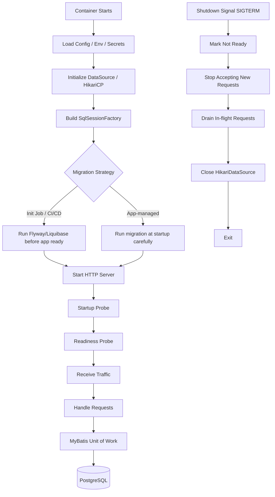
```mermaid id="19sk65"
flowchart TD
    A[Container Starts] --> B[Load Config / Env / Secrets]
    B --> C[Initialize DataSource / HikariCP]
    C --> D[Build SqlSessionFactory]
    D --> E{Migration Strategy}

    E -->|Init Job / CI/CD| F[Run Flyway/Liquibase before app ready]
    E -->|App-managed| G[Run migration at startup carefully]

    F --> H[Start HTTP Server]
    G --> H

    H --> I[Startup Probe]
    I --> J[Readiness Probe]
    J --> K[Receive Traffic]

    K --> L[Handle Requests]
    L --> M[MyBatis Unit of Work]
    M --> N[(PostgreSQL)]

    O[Shutdown Signal SIGTERM] --> P[Mark Not Ready]
    P --> Q[Stop Accepting New Requests]
    Q --> R[Drain In-flight Requests]
    R --> S[Close HikariDataSource]
    S --> T[Exit]
```

**Core invariant:**

```text id="3ww31r"
Aplikasi boleh hidup hanya jika:
- konfigurasi valid
- DB connection bisa dibuat sesuai readiness policy
- migration/schema compatible
- SqlSessionFactory siap
- health endpoint benar membedakan live vs ready
- shutdown menutup traffic sebelum pool ditutup
```

---

## 3. Decomposition Map

| Area | Fokus Praktis | Pattern Utama | Risiko Jika Salah |
|---|---|---|---|
| **Container Image** | Build repeatable dan kecil | multi-stage build, non-root user | image besar, insecure |
| **Runtime Config** | Env/secrets/profile | fail-fast config validation | config salah baru ketahuan runtime |
| **DataSource Lifecycle** | HikariCP init/close | singleton app scope | connection leak |
| **SqlSessionFactory Lifecycle** | Build sekali saat startup | singleton immutable | factory dibuat per request |
| **Migration Runner** | Schema update aman | CI/CD job/init job, not every pod | migration race |
| **Startup Probe** | Waktu boot/migration | tolerant startup check | pod dibunuh saat masih start |
| **Readiness Probe** | Siap menerima traffic | DB/schema/pool ready | traffic masuk saat belum siap |
| **Liveness Probe** | Restart saat stuck | shallow self check | restart loop karena DB down |
| **Graceful Shutdown** | Drain request | readiness false, stop server, close pool | request putus/partial write |
| **Connection Pool Runtime** | Pool sizing dan timeout | maxPool, connectionTimeout, maxLifetime | pool exhaustion |
| **Kubernetes Rollout** | Safe rolling deploy | maxUnavailable, maxSurge, PDB | downtime saat deploy |
| **Resource Limits** | CPU/memory benar | request/limit, JVM container awareness | OOMKilled/CPU throttling |
| **Secrets** | DB password aman | K8s Secret/external secret | secret leak |
| **Observability** | Logs/metrics/traces | datasource/pool/mapper metric | blind operation |
| **Runbook** | Incident response | DB down, migration fail, pool exhausted | panic debugging |

---

## 4. Container Image Pattern

### 4.1 Multi-stage Dockerfile

```dockerfile id="i8yn3p"
# Build stage
FROM maven:3.9-eclipse-temurin-21 AS build
WORKDIR /workspace

COPY pom.xml .
COPY src ./src

RUN mvn -B -DskipTests package

# Runtime stage
FROM eclipse-temurin:21-jre
WORKDIR /app

RUN useradd --create-home --uid 10001 appuser

COPY --from=build /workspace/target/app.jar /app/app.jar

USER appuser

EXPOSE 8080

ENV JAVA_OPTS=""

ENTRYPOINT ["sh", "-c", "java $JAVA_OPTS -jar /app/app.jar"]
```

### 4.2 Healthcheck di Dockerfile

Dockerfile `HEALTHCHECK` memberi Docker cara mengecek apakah container masih bekerja; instruksi ini bisa menjalankan command di dalam container atau men-disable inherited healthcheck. ([Docker Documentation](https://docs.docker.com/reference/dockerfile/?utm_source=chatgpt.com))

```dockerfile id="d79s3q"
HEALTHCHECK --interval=30s --timeout=3s --start-period=30s --retries=3 \
  CMD wget -qO- http://127.0.0.1:8080/health/live || exit 1
```

**Catatan Kubernetes:** di Kubernetes, probe biasanya didefinisikan di manifest Deployment, bukan mengandalkan Dockerfile `HEALTHCHECK`.

---

## 5. Runtime Config

### 5.1 Required env

```text id="nmfji1"
APP_ENV
HTTP_PORT

DB_URL
DB_USERNAME
DB_PASSWORD
DB_POOL_MAX_SIZE
DB_POOL_CONNECTION_TIMEOUT_MS
DB_POOL_MAX_LIFETIME_MS

MIGRATION_ENABLED
MIGRATION_MODE

OTEL_SERVICE_NAME
OTEL_EXPORTER_OTLP_ENDPOINT
```

### 5.2 Config loader fail-fast

```java id="879d8d"
public final class RuntimeConfig {

    private final String dbUrl;
    private final String dbUsername;
    private final String dbPassword;
    private final int dbPoolMaxSize;
    private final long dbConnectionTimeoutMs;

    private RuntimeConfig(
        String dbUrl,
        String dbUsername,
        String dbPassword,
        int dbPoolMaxSize,
        long dbConnectionTimeoutMs
    ) {
        this.dbUrl = dbUrl;
        this.dbUsername = dbUsername;
        this.dbPassword = dbPassword;
        this.dbPoolMaxSize = dbPoolMaxSize;
        this.dbConnectionTimeoutMs = dbConnectionTimeoutMs;
    }

    public static RuntimeConfig load() {
        return new RuntimeConfig(
            requiredEnv("DB_URL"),
            requiredEnv("DB_USERNAME"),
            requiredEnv("DB_PASSWORD"),
            intEnv("DB_POOL_MAX_SIZE", 20),
            longEnv("DB_POOL_CONNECTION_TIMEOUT_MS", 3000)
        );
    }

    private static String requiredEnv(String name) {
        String value = System.getenv(name);

        if (value == null || value.isBlank()) {
            throw new IllegalStateException("Missing required env: " + name);
        }

        return value;
    }

    private static int intEnv(String name, int defaultValue) {
        String value = System.getenv(name);
        return value == null ? defaultValue : Integer.parseInt(value);
    }

    private static long longEnv(String name, long defaultValue) {
        String value = System.getenv(name);
        return value == null ? defaultValue : Long.parseLong(value);
    }

    public String dbUrl() {
        return dbUrl;
    }

    public String dbUsername() {
        return dbUsername;
    }

    public String dbPassword() {
        return dbPassword;
    }

    public int dbPoolMaxSize() {
        return dbPoolMaxSize;
    }

    public long dbConnectionTimeoutMs() {
        return dbConnectionTimeoutMs;
    }
}
```

**Rule:** missing DB credential harus membuat app gagal start, bukan diam-diam memakai default lokal.

---

## 6. DataSource Lifecycle

### 6.1 HikariCP singleton

```java id="843qub"
public final class DataSourceProvider implements AutoCloseable {

    private final HikariDataSource dataSource;

    public DataSourceProvider(RuntimeConfig config) {
        HikariConfig hikariConfig = new HikariConfig();

        hikariConfig.setJdbcUrl(config.dbUrl());
        hikariConfig.setUsername(config.dbUsername());
        hikariConfig.setPassword(config.dbPassword());
        hikariConfig.setMaximumPoolSize(config.dbPoolMaxSize());
        hikariConfig.setConnectionTimeout(config.dbConnectionTimeoutMs());
        hikariConfig.setPoolName("app-postgres-pool");

        hikariConfig.addDataSourceProperty("tcpKeepAlive", "true");

        this.dataSource = new HikariDataSource(hikariConfig);
    }

    public DataSource dataSource() {
        return dataSource;
    }

    @Override
    public void close() {
        dataSource.close();
    }
}
```

HikariCP mendokumentasikan `maximumPoolSize` sebagai jumlah maksimum koneksi termasuk idle dan in-use; ketika pool penuh dan tidak ada idle connection, pemanggil akan menunggu sampai `connectionTimeout`. HikariCP juga menekankan konfigurasi TCP keepalive untuk menghindari kondisi koneksi mati yang tidak cepat terdeteksi di beberapa environment jaringan. ([GitHub](https://github.com/brettwooldridge/hikaricp?utm_source=chatgpt.com))

---

## 7. SqlSessionFactory Lifecycle

### 7.1 Build once at startup

```java id="oybimz"
public final class MyBatisProvider {

    private final SqlSessionFactory sqlSessionFactory;

    public MyBatisProvider(DataSource dataSource) {
        TransactionFactory transactionFactory =
            new JdbcTransactionFactory();

        Environment environment = new Environment(
            "production",
            transactionFactory,
            dataSource
        );

        Configuration configuration = new Configuration(environment);
        configuration.setMapUnderscoreToCamelCase(true);

        configuration.addMapper(CaseMapper.class);
        configuration.addMapper(CaseQueryMapper.class);
        configuration.addMapper(AuditMapper.class);
        configuration.addMapper(OutboxMapper.class);

        this.sqlSessionFactory =
            new SqlSessionFactoryBuilder().build(configuration);
    }

    public SqlSessionFactory sqlSessionFactory() {
        return sqlSessionFactory;
    }
}
```

### 7.2 Scope rule

| Object | Scope |
|---|---|
| `HikariDataSource` | Application singleton |
| `SqlSessionFactory` | Application singleton |
| `SqlSession` | Request/use-case/method scope |
| Mapper proxy | Same as `SqlSession` |
| Repository with session context | Unit-of-work scope |
| Application service | Singleton/stateless |
| Jersey resource | Depends DI, preferably stateless |

**Anti-pattern:** membuat `SqlSessionFactory` atau `HikariDataSource` per request.

---

## 8. Migration Runner Strategy

Flyway command-line adalah standalone distribution untuk menjalankan migration tanpa perlu build tool; `flyway migrate` memigrasikan schema ke versi terbaru dan membuat schema history table jika belum ada. ([Redgate Documentation](https://documentation.red-gate.com/fd/command-line-277579359.html?utm_source=chatgpt.com))

### 8.1 Pilihan deployment migration

| Pattern | Cocok Untuk | Risiko |
|---|---|---|
| CI/CD migration step | Enterprise controlled release | Butuh pipeline discipline |
| Kubernetes Job before rollout | Cloud-native deployment | Job ordering harus jelas |
| Init container | Per-pod migration | Bisa race jika banyak pod |
| App startup migration | Simple service kecil | Race antar replica, startup lambat |
| Manual DBA migration | Regulated/on-prem | Human error, drift |

### 8.2 Recommended

```text id="zees78"
Production:
  Prefer migration as separate CI/CD step or Kubernetes Job.

Avoid:
  every application pod running migration concurrently.
```

---

## 9. Kubernetes Migration Job

```yaml id="nj8nhq"
apiVersion: batch/v1
kind: Job
metadata:
  name: case-service-db-migrate
spec:
  backoffLimit: 1
  template:
    spec:
      restartPolicy: Never
      containers:
        - name: flyway
          image: registry.example.com/case-service-migrations:1.0.0
          env:
            - name: FLYWAY_URL
              valueFrom:
                secretKeyRef:
                  name: case-service-db
                  key: DB_URL
            - name: FLYWAY_USER
              valueFrom:
                secretKeyRef:
                  name: case-service-db
                  key: DB_MIGRATION_USERNAME
            - name: FLYWAY_PASSWORD
              valueFrom:
                secretKeyRef:
                  name: case-service-db
                  key: DB_MIGRATION_PASSWORD
          command:
            - flyway
          args:
            - migrate
```

### Rule

```text id="4tihcp"
Migration credential != runtime credential.

Migration user:
  can DDL

Runtime app user:
  cannot DDL
```

Flyway juga menyediakan command `validate` untuk mengecek perbedaan antara migration yang tersedia dan yang sudah diterapkan pada target. ([Redgate Documentation](https://documentation.red-gate.com/flyway/reference/commands?utm_source=chatgpt.com))

---

## 10. App Startup Sequence

```java id="h52hwk"
public final class ApplicationMain {

    public static void main(String[] args) {
        RuntimeConfig config = RuntimeConfig.load();

        DataSourceProvider dataSourceProvider =
            new DataSourceProvider(config);

        MyBatisProvider myBatisProvider =
            new MyBatisProvider(dataSourceProvider.dataSource());

        ApplicationRuntime runtime = new ApplicationRuntime(
            dataSourceProvider,
            myBatisProvider
        );

        Runtime.getRuntime().addShutdownHook(new Thread(runtime::shutdown));

        runtime.startHttpServer();
    }
}
```

```java id="o9lrpe"
public final class ApplicationRuntime {

    private final AtomicBoolean ready = new AtomicBoolean(false);
    private final DataSourceProvider dataSourceProvider;
    private final MyBatisProvider myBatisProvider;
    private HttpServer server;

    public void startHttpServer() {
        validateDatabaseReadiness();

        server = startJerseyServer();

        ready.set(true);
    }

    public boolean isReady() {
        return ready.get();
    }

    public void shutdown() {
        ready.set(false);

        stopAcceptingHttpTraffic();
        waitForInFlightRequests();

        dataSourceProvider.close();
    }

    private void validateDatabaseReadiness() {
        try (SqlSession session =
                 myBatisProvider.sqlSessionFactory().openSession(true)) {

            RuntimeMapper mapper = session.getMapper(RuntimeMapper.class);
            mapper.selectOne();

        }
    }
}
```

---

## 11. Health Endpoint Design

### 11.1 Endpoint split

```text id="3m09h1"
/health/live
  shallow check: process alive, event loop/server alive

/health/ready
  readiness check: app initialized, pool usable, schema compatible

/health/startup
  optional startup check if server exposes it
```

### 11.2 JAX-RS resource

```java id="qvybei"
@Path("/health")
public class HealthResource {

    private final HealthService healthService;

    @Inject
    public HealthResource(HealthService healthService) {
        this.healthService = healthService;
    }

    @GET
    @Path("/live")
    public Response live() {
        return Response.ok(Map.of("status", "UP")).build();
    }

    @GET
    @Path("/ready")
    public Response ready() {
        HealthStatus status = healthService.readiness();

        if (status.up()) {
            return Response.ok(status).build();
        }

        return Response.status(Response.Status.SERVICE_UNAVAILABLE)
            .entity(status)
            .build();
    }
}
```

### 11.3 Readiness service

```java id="dyk755"
public final class HealthService {

    private final SqlSessionFactory sqlSessionFactory;
    private final AtomicBoolean ready;

    public HealthStatus readiness() {
        if (!ready.get()) {
            return HealthStatus.down("APPLICATION_NOT_READY");
        }

        try (SqlSession session = sqlSessionFactory.openSession(true)) {
            RuntimeMapper mapper = session.getMapper(RuntimeMapper.class);

            Integer result = mapper.selectOne();

            if (result == 1) {
                return HealthStatus.up();
            }

            return HealthStatus.down("DB_UNEXPECTED_RESULT");
        } catch (RuntimeException e) {
            return HealthStatus.down("DB_NOT_READY");
        }
    }
}
```

### 11.4 Runtime mapper

```java id="f3zdjf"
public interface RuntimeMapper {
    Integer selectOne();

    String currentSchemaVersion();
}
```

```xml id="83npy1"
<select id="selectOne" resultType="int">
  SELECT 1
</select>
```

---

## 12. Kubernetes Probes

Kubernetes dokumentasi membedakan **liveness**, **readiness**, dan **startup probes** serta menyediakan konfigurasi probe HTTP/TCP/exec/gRPC. ([Kubernetes](https://kubernetes.io/docs/tasks/configure-pod-container/configure-liveness-readiness-startup-probes/?utm_source=chatgpt.com))

```yaml id="6y1by5"
apiVersion: apps/v1
kind: Deployment
metadata:
  name: case-service
spec:
  replicas: 3
  selector:
    matchLabels:
      app: case-service
  template:
    metadata:
      labels:
        app: case-service
    spec:
      terminationGracePeriodSeconds: 45
      containers:
        - name: case-service
          image: registry.example.com/case-service:1.0.0
          ports:
            - containerPort: 8080

          startupProbe:
            httpGet:
              path: /health/live
              port: 8080
            failureThreshold: 30
            periodSeconds: 2

          readinessProbe:
            httpGet:
              path: /health/ready
              port: 8080
            initialDelaySeconds: 5
            periodSeconds: 5
            timeoutSeconds: 2
            failureThreshold: 2

          livenessProbe:
            httpGet:
              path: /health/live
              port: 8080
            initialDelaySeconds: 10
            periodSeconds: 10
            timeoutSeconds: 2
            failureThreshold: 3
```

### Probe rule

| Probe | Jangan |
|---|---|
| Startup | Jangan terlalu pendek untuk cold start/migration |
| Readiness | Jangan return UP sebelum app siap menerima traffic |
| Liveness | Jangan bergantung pada DB secara ketat |
| All probes | Jangan melakukan query mahal |

**Why liveness should be shallow:** kalau DB down sementara dan liveness ikut down, Kubernetes bisa me-restart semua pod padahal masalahnya external dependency. Readiness boleh down agar traffic berhenti sementara.

---

## 13. Graceful Shutdown

Kubernetes Pod lifecycle memberi waktu terminasi melalui `terminationGracePeriodSeconds`; saat Pod dihapus, kubelet menjalankan hook seperti `preStop` jika ada, lalu mengirim signal ke container dan menunggu grace period sebelum kill paksa. ([Kubernetes](https://kubernetes.io/docs/concepts/workloads/pods/pod-lifecycle/?utm_source=chatgpt.com))

### 13.1 Shutdown sequence ideal

```text id="occn5c"
1. Receive SIGTERM
2. Mark readiness = false
3. Wait short drain delay
4. Stop accepting new HTTP requests
5. Let in-flight requests finish
6. Stop background workers
7. Close SqlSession/HikariDataSource
8. Exit before terminationGracePeriodSeconds
```

### 13.2 Java shutdown hook

```java id="nucmjd"
Runtime.getRuntime().addShutdownHook(new Thread(() -> {
    log.info("Shutdown started");

    applicationRuntime.markNotReady();

    applicationRuntime.stopHttpServerGracefully(Duration.ofSeconds(30));

    applicationRuntime.stopBackgroundWorkers(Duration.ofSeconds(20));

    applicationRuntime.closeDataSources();

    log.info("Shutdown completed");
}));
```

### 13.3 Kubernetes preStop

```yaml id="pnvb7t"
lifecycle:
  preStop:
    exec:
      command:
        - sh
        - -c
        - "wget -qO- http://127.0.0.1:8080/internal/prestop || true; sleep 10"
```

```java id="n2t91w"
@POST
@Path("/internal/prestop")
public Response prestop() {
    runtime.markNotReady();
    return Response.ok().build();
}
```

**Catatan:** `preStop` membantu memberi waktu endpoint readiness berubah sebelum container menerima SIGTERM/traffic benar-benar berhenti. Tetapi jangan bergantung hanya pada sleep; aplikasi tetap harus handle SIGTERM dengan benar.

---

## 14. HTTP Server Graceful Stop

Contoh konseptual tergantung server yang dipakai: Grizzly, Jetty, Undertow, Tomcat embedded, atau app server.

```java id="gql2ui"
public final class HttpServerLifecycle {

    private final Server server;
    private final InFlightRequestTracker requestTracker;

    public void stopGracefully(Duration timeout) {
        server.stopAcceptingRequests();

        boolean drained = requestTracker.awaitZero(timeout);

        if (!drained) {
            log.warn("Graceful shutdown timeout; in-flight requests remain");
        }

        server.shutdown();
    }
}
```

### In-flight tracker filter

```java id="9203aw"
@Provider
public class InFlightRequestFilter
    implements ContainerRequestFilter, ContainerResponseFilter {

    private final InFlightRequestTracker tracker;

    @Override
    public void filter(ContainerRequestContext requestContext) {
        tracker.increment();
    }

    @Override
    public void filter(
        ContainerRequestContext requestContext,
        ContainerResponseContext responseContext
    ) {
        tracker.decrement();
    }
}
```

```java id="qpr0og"
public final class InFlightRequestTracker {

    private final AtomicInteger inFlight = new AtomicInteger();

    public void increment() {
        inFlight.incrementAndGet();
    }

    public void decrement() {
        inFlight.decrementAndGet();
    }

    public boolean awaitZero(Duration timeout) {
        long deadline = System.nanoTime() + timeout.toNanos();

        while (System.nanoTime() < deadline) {
            if (inFlight.get() == 0) {
                return true;
            }

            LockSupport.parkNanos(TimeUnit.MILLISECONDS.toNanos(100));
        }

        return inFlight.get() == 0;
    }

    public int current() {
        return inFlight.get();
    }
}
```

---

## 15. Background Worker Lifecycle

Jika aplikasi punya outbox publisher, scheduler, queue processor, atau backfill worker, shutdown harus menghentikan worker sebelum pool ditutup.

```java id="r4timg"
public final class OutboxWorker implements AutoCloseable {

    private final AtomicBoolean running = new AtomicBoolean(false);
    private final ExecutorService executor = Executors.newSingleThreadExecutor();

    public void start() {
        running.set(true);
        executor.submit(this::runLoop);
    }

    private void runLoop() {
        while (running.get()) {
            try {
                processOneBatch();
            } catch (Exception e) {
                log.warn("Outbox worker batch failed", e);
            }
        }
    }

    @Override
    public void close() {
        running.set(false);
        executor.shutdown();

        try {
            if (!executor.awaitTermination(20, TimeUnit.SECONDS)) {
                executor.shutdownNow();
            }
        } catch (InterruptedException e) {
            Thread.currentThread().interrupt();
            executor.shutdownNow();
        }
    }
}
```

**Rule:** worker stop dulu, lalu datasource close. Kalau datasource close dulu, worker bisa gagal dengan error noise.

---

## 16. Connection Pool Runtime Tuning

| Setting | Meaning | Initial Guideline |
|---|---|---|
| `maximumPoolSize` | max connection per app instance | mulai kecil, ukur |
| `minimumIdle` | idle connection minimum | sering sama dengan max untuk fixed pool, atau lebih kecil untuk bursty |
| `connectionTimeout` | waktu tunggu connection | lebih pendek dari HTTP timeout |
| `maxLifetime` | umur max connection | lebih pendek dari DB/LB idle timeout |
| `idleTimeout` | idle eviction | hanya jika minIdle < max |
| `keepaliveTime` | keepalive idle connection | berguna di network/LB agresif |
| JDBC `tcpKeepAlive` | OS/JDBC keepalive | recommended di env tertentu |
| pool name | observability | wajib distinct |

### Example

```java id="m0p8ah"
hikariConfig.setMaximumPoolSize(20);
hikariConfig.setMinimumIdle(20);
hikariConfig.setConnectionTimeout(3000);
hikariConfig.setMaxLifetime(1_740_000); // 29 minutes
hikariConfig.setKeepaliveTime(300_000);
hikariConfig.addDataSourceProperty("tcpKeepAlive", "true");
```

**Rule:** pool size bukan obat query lambat. Jika pool habis, cek query duration, transaction duration, lock wait, dan connection leak sebelum menaikkan pool.

---

## 17. Kubernetes Resource Requests/Limits & JVM

### Deployment snippet

```yaml id="h20ffm"
resources:
  requests:
    cpu: "500m"
    memory: "768Mi"
  limits:
    cpu: "2"
    memory: "1536Mi"
env:
  - name: JAVA_OPTS
    value: >-
      -XX:MaxRAMPercentage=70
      -XX:+ExitOnOutOfMemoryError
      -Duser.timezone=UTC
```

### Practical notes

| Area | Recommendation |
|---|---|
| JVM heap | Jangan gunakan seluruh container memory |
| Direct/metaspace/thread stack | Sisakan non-heap memory |
| OOM | `ExitOnOutOfMemoryError` agar container restart |
| Timezone | Prefer UTC untuk runtime |
| CPU throttling | Jangan limit terlalu ketat tanpa test |
| GC | Monitor pause time dan allocation |
| Thread count | Sesuaikan HTTP threads + DB pool |

---

## 18. Kubernetes Rolling Update

```yaml id="62h6xk"
strategy:
  type: RollingUpdate
  rollingUpdate:
    maxUnavailable: 0
    maxSurge: 1
minReadySeconds: 10
```

### PodDisruptionBudget

```yaml id="8m6s49"
apiVersion: policy/v1
kind: PodDisruptionBudget
metadata:
  name: case-service-pdb
spec:
  minAvailable: 2
  selector:
    matchLabels:
      app: case-service
```

### Rollout rule

```text id="6ymks6"
Migration expand first.
Deploy compatible app.
Backfill/switch.
Contract later.
```

**Readiness is critical:** rolling update hanya aman jika readiness probe benar-benar mencerminkan kesiapan instance.

---

## 19. Kubernetes Secret and ConfigMap

### Secret

```yaml id="67v1a1"
apiVersion: v1
kind: Secret
metadata:
  name: case-service-db
type: Opaque
stringData:
  DB_URL: jdbc:postgresql://postgres.example.svc:5432/case_db
  DB_USERNAME: app_runtime
  DB_PASSWORD: change-me
```

### ConfigMap

```yaml id="wwlgur"
apiVersion: v1
kind: ConfigMap
metadata:
  name: case-service-config
data:
  APP_ENV: production
  DB_POOL_MAX_SIZE: "20"
  DB_POOL_CONNECTION_TIMEOUT_MS: "3000"
```

### Deployment env

```yaml id="lbbttz"
envFrom:
  - configMapRef:
      name: case-service-config
  - secretRef:
      name: case-service-db
```

Kubernetes Secret digunakan untuk menyimpan data sensitif kecil seperti password, token, atau key agar tidak perlu ditaruh langsung di Pod spec atau image; praktik baik Kubernetes juga menekankan encryption at rest dan akses least-privilege untuk Secret. ([Wikipedia](https://en.wikipedia.org/wiki/Kubernetes?utm_source=chatgpt.com))

---

## 20. Health Check Semantics for DB

| Condition | Live | Ready | Reason |
|---|---:|---:|---|
| Process running, DB OK | UP | UP | Normal |
| Process running, DB temporarily down | UP | DOWN | Jangan restart loop; stop traffic |
| App starting, factory not ready | UP | DOWN | Belum siap traffic |
| Migration not completed | UP | DOWN | Schema belum ready |
| Deadlock/retry spike | UP | Maybe UP | Depends severity |
| Pool exhausted | UP | DOWN or degraded | Stop traffic if cannot acquire |
| Main thread stuck | DOWN | DOWN | Restart may help |
| Fatal config error | app exits | DOWN | Fail fast |

**Rule:** liveness bukan dependency check berat. Readiness boleh mengecek dependency minimal yang menentukan traffic safety.

---

## 21. Readiness Check: Schema Version

Jika Flyway dipakai, readiness bisa mengecek schema history secara ringan.

```xml id="yahdy1"
<select id="latestFlywayVersion" resultType="string">
  SELECT version
  FROM flyway_schema_history
  WHERE success = true
  ORDER BY installed_rank DESC
  LIMIT 1
</select>
```

```java id="zv8kfn"
public HealthStatus readiness() {
    if (!runtime.isReadyFlag()) {
        return HealthStatus.down("NOT_READY");
    }

    try (SqlSession session = sqlSessionFactory.openSession(true)) {
        RuntimeMapper mapper = session.getMapper(RuntimeMapper.class);

        mapper.selectOne();

        String version = mapper.latestFlywayVersion();

        if (!schemaVersionPolicy.isCompatible(version)) {
            return HealthStatus.down("SCHEMA_VERSION_INCOMPATIBLE");
        }

        return HealthStatus.up();
    }
}
```

**Caution:** readiness check jangan terlalu mahal. Jangan menjalankan migration atau query berat di readiness.

---

## 22. Startup Failure Modes

| Failure | Symptom | Response |
|---|---|---|
| Missing env | app exits immediately | Fix config/secret |
| DB credential wrong | readiness down / startup fail | Rotate/fix secret |
| DB unreachable | readiness down | Check network/DNS/security group |
| Migration pending | readiness down if strict | Run migration job |
| Mapper XML invalid | startup fail or first query fail | Integration test should catch |
| TypeHandler missing | runtime mapper fail | Startup mapper smoke test |
| Pool cannot initialize | readiness down | DB/network/credential |
| Port conflict | container crash | Fix deployment |
| OOM during startup | OOMKilled | JVM/memory/image tuning |

---

## 23. Runtime Failure Modes

| Failure | Signal | Likely Cause |
|---|---|---|
| `Connection is not available` | Hikari timeout | Pool exhausted/query slow/leak |
| Readiness flapping | Probe too strict or DB unstable | DB/network/pool |
| Liveness restart loop | Liveness checks dependency | Wrong probe semantics |
| Long shutdown | In-flight/worker not stopping | Missing graceful logic |
| Partial writes during deploy | Shutdown interrupted transaction | Grace period too short |
| Migration race | multiple pods run migrate | Move migration out of app startup |
| Query timeout spike | DB load/index regression | EXPLAIN/pg_stat_statements |
| OOMKilled | container memory exceeded | heap/result set/export |
| CPU throttling latency | high p99 | CPU limit too low |
| Secret rotation failure | auth errors | pool old/new credentials mismatch |

---

## 24. Observability Required

| Metric/Log | Why |
|---|---|
| app startup duration | cold start regression |
| readiness status reason | deployment troubleshooting |
| liveness failures | restart diagnosis |
| Hikari active/idle/pending | pool saturation |
| connection acquire time | pool wait |
| connection timeout count | user-facing DB pressure |
| MyBatis mapper duration | slow SQL |
| transaction duration | lock duration |
| in-flight requests | graceful shutdown |
| shutdown duration | grace period sizing |
| migration job status | rollout safety |
| schema version | compatibility |
| worker backlog | outbox/job health |
| pod restart count | runtime stability |
| OOMKilled event | memory sizing |

---

## 25. Deployment Manifest Example

```yaml id="9nxu81"
apiVersion: apps/v1
kind: Deployment
metadata:
  name: case-service
spec:
  replicas: 3
  strategy:
    type: RollingUpdate
    rollingUpdate:
      maxUnavailable: 0
      maxSurge: 1
  minReadySeconds: 10
  selector:
    matchLabels:
      app: case-service
  template:
    metadata:
      labels:
        app: case-service
    spec:
      terminationGracePeriodSeconds: 45
      containers:
        - name: case-service
          image: registry.example.com/case-service:1.0.0
          imagePullPolicy: IfNotPresent
          ports:
            - name: http
              containerPort: 8080

          envFrom:
            - configMapRef:
                name: case-service-config
            - secretRef:
                name: case-service-db

          env:
            - name: JAVA_OPTS
              value: >-
                -XX:MaxRAMPercentage=70
                -XX:+ExitOnOutOfMemoryError
                -Duser.timezone=UTC

          lifecycle:
            preStop:
              exec:
                command:
                  - sh
                  - -c
                  - "wget -qO- http://127.0.0.1:8080/internal/prestop || true; sleep 10"

          startupProbe:
            httpGet:
              path: /health/live
              port: http
            failureThreshold: 30
            periodSeconds: 2

          readinessProbe:
            httpGet:
              path: /health/ready
              port: http
            periodSeconds: 5
            timeoutSeconds: 2
            failureThreshold: 2

          livenessProbe:
            httpGet:
              path: /health/live
              port: http
            periodSeconds: 10
            timeoutSeconds: 2
            failureThreshold: 3

          resources:
            requests:
              cpu: "500m"
              memory: "768Mi"
            limits:
              cpu: "2"
              memory: "1536Mi"
```

---

## 26. Production Runbook - Pod Not Ready

```text id="cwbwgt"
1. kubectl describe pod
2. Check readiness probe failure reason
3. Check app logs around startup/readiness
4. Verify env/config/secret mounted
5. Verify DB DNS/connectivity
6. Verify DB credential
7. Verify migration job status
8. Check schema version compatibility
9. Check Hikari connection timeout
10. Roll back app if schema/app incompatible
```

### Common commands

```bash id="68wgfh"
kubectl get pods -l app=case-service
kubectl describe pod <pod>
kubectl logs <pod> -c case-service --tail=200
kubectl get events --sort-by=.lastTimestamp
kubectl get job case-service-db-migrate
kubectl logs job/case-service-db-migrate
```

---

## 27. Production Runbook - Pool Exhaustion

```text id="myfe18"
1. Check Hikari active/idle/pending.
2. Check connection acquire time.
3. Check mapper duration p95/p99.
4. Check PostgreSQL pg_stat_activity.
5. Look for long transaction / idle in transaction.
6. Check slow queries / lock waits.
7. Check recent deploy/query/index changes.
8. Reduce traffic or scale carefully.
9. Avoid blindly increasing pool size.
10. Fix query/transaction/root cause.
```

### PostgreSQL diagnostics

```sql id="6wws23"
SELECT
    pid,
    usename,
    application_name,
    state,
    wait_event_type,
    wait_event,
    now() - query_start AS query_age,
    now() - xact_start AS transaction_age,
    query
FROM pg_stat_activity
WHERE datname = current_database()
ORDER BY query_age DESC;
```

---

## 28. Production Runbook - Migration Failed

```text id="thw4im"
1. Stop application rollout.
2. Check Flyway/Liquibase logs.
3. Identify failed migration version.
4. Check whether migration partially applied.
5. Check locks/blocking sessions.
6. Decide forward-fix vs rollback/restore.
7. Do not manually edit schema history unless approved.
8. Run validate after fix.
9. Re-run migration job.
10. Resume rollout only after schema compatibility confirmed.
```

Flyway `validate` checks differences between available migrations and migrations already applied to the target; this is useful after a failed or repaired deployment to verify consistency. ([Redgate Documentation](https://documentation.red-gate.com/flyway/reference/commands?utm_source=chatgpt.com))

---

## 29. Production Runbook - Graceful Shutdown Issue

```text id="8sc9sv"
Symptoms:
  499/502/503 during deploy
  partial user requests
  outbox worker duplicate processing
  connection closed errors during shutdown

Checks:
  readiness turns DOWN before SIGTERM?
  preStop called?
  terminationGracePeriodSeconds long enough?
  in-flight request metric drains?
  worker stops before datasource close?
  HTTP server stops accepting new requests?
```

### Fixes

| Issue | Fix |
|---|---|
| readiness still UP during termination | mark not ready on preStop/SIGTERM |
| requests killed mid-transaction | longer grace period + drain |
| worker still running | stop worker before closing datasource |
| load balancer still sends traffic | add preStop delay/readiness propagation |
| liveness restarts during shutdown | probe config review |

---

## 30. Production Runbook - DB Down

```text id="8l77cu"
1. Confirm DB endpoint/DNS/network.
2. Check managed DB status or on-prem cluster.
3. Check app readiness: should be DOWN.
4. Check liveness: should remain UP unless app stuck.
5. Check Hikari connection errors.
6. Stop retry storms if needed.
7. Scale down workers that hammer DB.
8. Recover DB/failover.
9. Verify app reconnects.
10. Watch backlog and retry metrics.
```

**Rule:** DB outage should not cause all pods to liveness-restart forever. Readiness should protect traffic; retry/backoff should protect DB recovery.

---

## 31. Local Docker Compose for Onboarding

```yaml id="iicdcs"
services:
  postgres:
    image: postgres:16
    environment:
      POSTGRES_DB: case_db
      POSTGRES_USER: app
      POSTGRES_PASSWORD: app
    ports:
      - "5432:5432"

  migrate:
    image: flyway/flyway:latest
    depends_on:
      - postgres
    command:
      - -url=jdbc:postgresql://postgres:5432/case_db
      - -user=app
      - -password=app
      - -locations=filesystem:/flyway/sql
      - migrate
    volumes:
      - ./src/main/resources/db/migration:/flyway/sql

  app:
    build: .
    depends_on:
      - postgres
      - migrate
    environment:
      DB_URL: jdbc:postgresql://postgres:5432/case_db
      DB_USERNAME: app
      DB_PASSWORD: app
      DB_POOL_MAX_SIZE: "5"
    ports:
      - "8080:8080"
```

**Note:** `depends_on` di Compose membantu urutan start container, tetapi readiness database/migration tetap perlu dicek aplikasi atau script. Jangan samakan local compose dengan production orchestration.

---

## 32. Security Runtime Checklist

| Checklist | Status Ideal |
|---|---|
| Container runs as non-root | Ya |
| DB runtime credential bukan migration owner | Ya |
| DB password dari Secret/external secret | Ya |
| Secret tidak dilog | Ya |
| TLS DB configured for non-trusted network | Ya |
| SQL DEBUG off in production | Ya |
| Health endpoint tidak membocorkan sensitive detail | Ya |
| Internal prestop endpoint tidak public | Ya |
| Migration image/runner restricted | Ya |
| App cannot perform DDL in production | Ya |
| Kubernetes RBAC least privilege | Ya |
| Image scanning/signing sesuai policy | Ya |

---

## 33. Anti-Pattern

| Anti-Pattern | Dampak |
|---|---|
| App pod menjalankan migration bersamaan | migration race |
| Liveness probe cek DB | restart storm saat DB outage |
| Readiness selalu UP setelah HTTP server start | traffic masuk sebelum DB/schema siap |
| Close datasource sebelum request drain | in-flight request gagal |
| Worker tidak distop saat shutdown | error/duplicate/noisy logs |
| Pool size terlalu besar per replica | DB overload |
| Missing connection timeout | request menggantung |
| Secret hardcoded di image | credential leak |
| Runtime DB user punya DDL | blast radius besar |
| `SqlSessionFactory` dibuat per request | overhead/resource leak |
| `SqlSession` singleton | thread-safety bug |
| Migration contract sebelum old pods mati | rolling deploy gagal |
| No schema version check | app/schema mismatch |
| No datasource metrics | pool issue blind |
| No runbook | incident lambat ditangani |

---

## 34. Production Checklist

| Checklist | Status Ideal |
|---|---|
| Docker image multi-stage dan non-root | Ya |
| Config fail-fast | Ya |
| HikariDataSource singleton dan ditutup saat shutdown | Ya |
| SqlSessionFactory singleton | Ya |
| SqlSession per request/use case | Ya |
| Migration dijalankan sebagai job/pipeline, bukan semua pod | Ya |
| Startup/readiness/liveness probe dipisah | Ya |
| Readiness mengecek app ready + DB/schema minimal | Ya |
| Liveness shallow dan tidak dependency-heavy | Ya |
| SIGTERM ditangani | Ya |
| Readiness false sebelum drain | Ya |
| In-flight request drain | Ya |
| Background worker stop sebelum datasource close | Ya |
| Pool metrics aktif | Ya |
| Schema version terlihat | Ya |
| Rollout strategy aman | Ya |
| Secret runtime dan migration dipisah | Ya |
| Runbook tersedia untuk DB down, pool exhausted, migration fail | Ya |

---

## 35. Decision Table

| Problem | Recommended Pattern |
|---|---|
| App cold start lama | startupProbe |
| App belum siap DB/schema | readiness DOWN |
| DB down sementara | readiness DOWN, liveness tetap UP |
| App deadlock/stuck | liveness DOWN |
| Migration production | CI/CD step atau Kubernetes Job |
| Banyak pod start bersamaan | jangan app-managed migration |
| Graceful deploy | preStop + readiness false + drain |
| Pool exhausted | diagnose query/lock/leak before raising pool |
| Worker shutdown | stop worker before closing datasource |
| Secret rotation | external secret + rolling deploy + pool recycle |
| Schema compatibility | expand-contract + readiness/schema check |
| Long export | async worker, not request thread |
| Kubernetes rollout | maxUnavailable=0 + correct readiness |
| On-prem DB failover | tested driver/proxy endpoint + retry/backoff |

---

## 36. Roadmap Belajar Singkat

| Urutan | Materi | Target |
|---:|---|---|
| 1 | Docker image Java service | Build image aman dan repeatable |
| 2 | Runtime config/secrets | Config fail-fast dan aman |
| 3 | Hikari/DataSource lifecycle | Pool singleton dan close benar |
| 4 | SqlSessionFactory lifecycle | MyBatis init benar |
| 5 | Migration runner | Schema deploy aman |
| 6 | Kubernetes probes | Startup/readiness/liveness tepat |
| 7 | Graceful shutdown | Deploy tanpa memutus request |
| 8 | Pool/resource tuning | Stabil di traffic production |
| 9 | Observability/runbook | Incident bisa didiagnosis |
| 10 | Rollout/failover testing | Runtime behavior terbukti |

---

## Rekomendasi Materi Selanjutnya

Lanjutkan ke **“Java MyBatis Production Troubleshooting Playbook: SQL Error, Pool Exhaustion, Deadlock, Slow Query, Migration Drift, Data Inconsistency, dan Incident Response”** karena setelah deployment/runtime pattern siap, langkah berikutnya adalah punya playbook praktis saat incident benar-benar terjadi.

---

**Sources:**

- [Liveness, Readiness, and Startup Probes](https://kubernetes.io/docs/concepts/workloads/pods/probes/?utm_source=chatgpt.com)
- [Dockerfile reference](https://docs.docker.com/reference/dockerfile/?utm_source=chatgpt.com)
- [brettwooldridge/HikariCP: 光 HikariCP・A solid, high- ...](https://github.com/brettwooldridge/hikaricp?utm_source=chatgpt.com)
- [Command-line - Redgate Flyway - Product Documentation](https://documentation.red-gate.com/fd/command-line-277579359.html?utm_source=chatgpt.com)
- [Kubernetes](https://en.wikipedia.org/wiki/Kubernetes?utm_source=chatgpt.com)

## Response:
7/13/2026, 3:12:31 AM

# Cheatsheet - Java MyBatis Production Troubleshooting Playbook: SQL Error, Pool Exhaustion, Deadlock, Slow Query, Migration Drift, Data Inconsistency, dan Incident Response

## 1. Introduction

Troubleshooting production untuk **Jersey/JAX-RS + MyBatis + PostgreSQL** harus dimulai dari prinsip:

```text id="9q6k7p"
Jangan langsung menebak root cause.

Selalu korelasikan:
HTTP request
  -> correlationId / traceId
  -> application service
  -> MyBatis mapper statement
  -> SqlSession / transaction
  -> HikariCP pool
  -> PostgreSQL session/query/lock/plan
  -> migration/schema version
```

MyBatis menempatkan `SqlSession` sebagai interface utama untuk menjalankan command, mengambil mapper, dan mengelola transaksi; `SqlSession` dibuat dari `SqlSessionFactory`, sehingga troubleshooting harus selalu memperhatikan session lifecycle dan transaction boundary. ([MyBatis](https://mybatis.org/mybatis-3/java-api.html))

---

## 2. Mental Model Incident

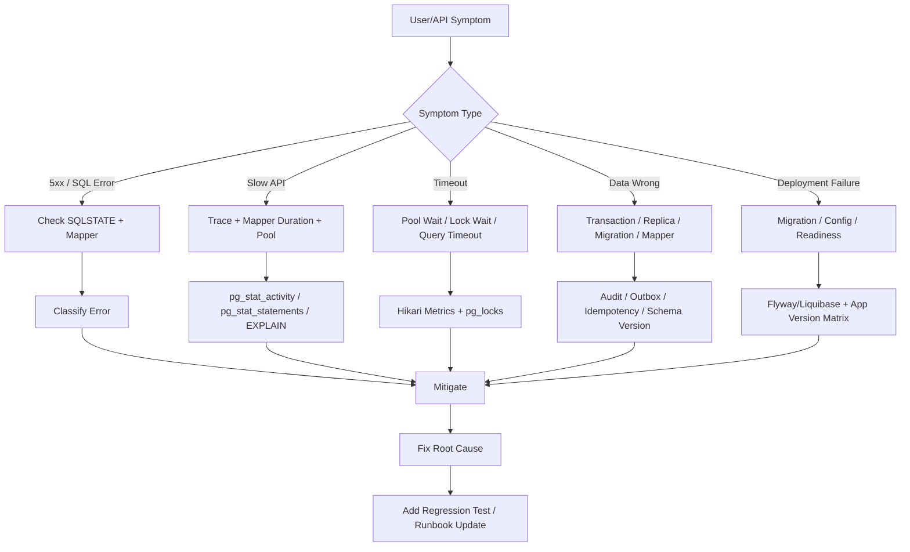
```mermaid id="s5i5fe"
flowchart TD
    A[User/API Symptom] --> B{Symptom Type}

    B -->|5xx / SQL Error| C[Check SQLSTATE + Mapper]
    B -->|Slow API| D[Trace + Mapper Duration + Pool]
    B -->|Timeout| E[Pool Wait / Lock Wait / Query Timeout]
    B -->|Data Wrong| F[Transaction / Replica / Migration / Mapper]
    B -->|Deployment Failure| G[Migration / Config / Readiness]

    C --> H[Classify Error]
    D --> I[pg_stat_activity / pg_stat_statements / EXPLAIN]
    E --> J[Hikari Metrics + pg_locks]
    F --> K[Audit / Outbox / Idempotency / Schema Version]
    G --> L[Flyway/Liquibase + App Version Matrix]

    H --> M[Mitigate]
    I --> M
    J --> M
    K --> M
    L --> M

    M --> N[Fix Root Cause]
    N --> O[Add Regression Test / Runbook Update]
```

**Core invariant:**

```text id="gcdksa"
Incident response sequence:
1. Stabilize impact.
2. Identify blast radius.
3. Classify failure mode.
4. Mitigate safely.
5. Fix root cause.
6. Add regression protection.
```

---

## 3. Decomposition Map

| Area | Gejala | Bukti yang Dicari | Tool/Query |
|---|---|---|---|
| **SQL Error** | 500, PersistenceException | SQLSTATE, mapper id, params shape | app logs, SQLSTATE classifier |
| **Pool Exhaustion** | connection timeout, high p95 | active=max, pending threads, acquire time | Hikari metrics |
| **Slow Query** | endpoint lambat | mapper duration, plan, rows, buffers | `pg_stat_statements`, `EXPLAIN` |
| **Lock Wait** | query menggantung | `wait_event_type='Lock'` | `pg_stat_activity`, `pg_locks` |
| **Deadlock** | transaction aborted | SQLSTATE `40P01` | logs, retry metric, lock ordering |
| **Serialization Failure** | retryable failure | SQLSTATE `40001` | retry metric, isolation level |
| **Migration Drift** | app gagal start/query column missing | schema history mismatch | Flyway validate/info |
| **Data Inconsistency** | state salah/partial write | transaction logs, audit, outbox | audit table, DB queries |
| **Replica Staleness** | read after write missing | read routed to replica | datasource logs, replica lag |
| **Mapper Binding Error** | parameter/resultMap fail | mapper XML mismatch | startup/test logs |
| **Connection Leak** | pool slowly exhausted | long usage time, leak log | Hikari leak detection |
| **Large Result/OOM** | memory spike/OOMKilled | huge result list/export | heap logs, row counts |
| **Tenant Leak** | cross-tenant data visible | missing `tenant_id` predicate | mapper review/test |

---

## 4. First 10 Minutes Incident Triage

```text id="pd14av"
0-2 min:
  Identify symptom, start time, affected endpoints, affected tenants.

2-5 min:
  Check recent deploy/migration/config change.
  Check error rate, p95/p99 latency, DB pool metrics.

5-10 min:
  Classify: SQL error, pool exhaustion, slow query, lock/deadlock,
  migration drift, data issue, or external DB outage.
```

### Quick triage table

| Signal | Kemungkinan Root Cause | First Action |
|---|---|---|
| 5xx spike + SQLSTATE `42P01`/`42703` | table/column missing | check migration/app version |
| Hikari acquire timeout | pool exhausted | check active/pending + slow queries |
| high DB CPU | expensive query/load spike | check `pg_stat_statements` |
| many lock waits | blocking transaction | inspect `pg_stat_activity`/`pg_locks` |
| deadlock errors | lock order conflict | retry + identify code paths |
| stale read after write | replica read | force primary read |
| duplicate key errors | idempotency/business key | classify `23505` |
| readiness down after deploy | schema/config/DB connectivity | check logs/migration |
| OOMKilled | huge result/export/heap | check recent endpoint/data volume |

---

## 5. SQL Error Classification

PostgreSQL exposes standardized SQLSTATE error codes; for transaction rollback class, `40001` is `serialization_failure` and `40P01` is `deadlock_detected`. ([PostgreSQL](https://www.postgresql.org/docs/current/errcodes-appendix.html))

| SQLSTATE | Meaning | Common Cause | HTTP/Action |
|---|---|---|---|
| `23505` | unique violation | duplicate business key/idempotency key | `409 Conflict` |
| `23503` | foreign key violation | invalid reference/order of write | `409` / bug |
| `23514` | check violation | invalid domain state | `400` / `409` |
| `23502` | not null violation | mapper/request missing field | bug or `400` |
| `40001` | serialization failure | concurrent serializable/repeatable read conflict | retry full transaction |
| `40P01` | deadlock detected | inconsistent lock ordering | retry + fix ordering |
| `55P03` | lock not available | `NOWAIT`/lock timeout style conflict | retry/busy response |
| `57014` | query canceled | statement timeout/manual cancel | tune query/timeout |
| `42P01` | undefined table | migration drift/wrong schema | deployment rollback/fix |
| `42703` | undefined column | app/schema mismatch | migration compatibility fix |
| `08006` | connection failure | DB/network/failover | retry/backoff/readiness down |

### Java classifier

```java id="wsg1zy"
public enum PersistenceErrorKind {
    UNIQUE_VIOLATION,
    FOREIGN_KEY_VIOLATION,
    CHECK_VIOLATION,
    NOT_NULL_VIOLATION,
    SERIALIZATION_FAILURE,
    DEADLOCK,
    LOCK_NOT_AVAILABLE,
    QUERY_CANCELED,
    UNDEFINED_TABLE,
    UNDEFINED_COLUMN,
    CONNECTION_FAILURE,
    UNKNOWN
}
```

```java id="5u2f4x"
public final class PostgresErrorClassifier {

    public static PersistenceErrorKind classify(Throwable throwable) {
        SQLException sqlException = findSqlException(throwable);

        if (sqlException == null) {
            return PersistenceErrorKind.UNKNOWN;
        }

        return switch (sqlException.getSQLState()) {
            case "23505" -> PersistenceErrorKind.UNIQUE_VIOLATION;
            case "23503" -> PersistenceErrorKind.FOREIGN_KEY_VIOLATION;
            case "23514" -> PersistenceErrorKind.CHECK_VIOLATION;
            case "23502" -> PersistenceErrorKind.NOT_NULL_VIOLATION;
            case "40001" -> PersistenceErrorKind.SERIALIZATION_FAILURE;
            case "40P01" -> PersistenceErrorKind.DEADLOCK;
            case "55P03" -> PersistenceErrorKind.LOCK_NOT_AVAILABLE;
            case "57014" -> PersistenceErrorKind.QUERY_CANCELED;
            case "42P01" -> PersistenceErrorKind.UNDEFINED_TABLE;
            case "42703" -> PersistenceErrorKind.UNDEFINED_COLUMN;
            case "08000", "08001", "08003", "08006" ->
                PersistenceErrorKind.CONNECTION_FAILURE;
            default -> PersistenceErrorKind.UNKNOWN;
        };
    }

    private static SQLException findSqlException(Throwable throwable) {
        Throwable current = throwable;

        while (current != null) {
            if (current instanceof SQLException sqlException) {
                return sqlException;
            }
            current = current.getCause();
        }

        return null;
    }
}
```

---

## 6. Playbook - SQL Error Spike

### Symptoms

```text id="ky7lzz"
- HTTP 500 spike
- PersistenceException / SQLException
- specific mapper failing
- error after deployment or migration
```

### Steps

```text id="hlghdx"
1. Ambil sample error log dengan correlationId.
2. Extract SQLSTATE.
3. Extract mapper statement id.
4. Check apakah error mulai setelah deploy/migration.
5. Classify: constraint, schema mismatch, transient, connection.
6. Mitigate:
   - constraint conflict: return correct 409/400
   - schema mismatch: rollback app or forward migration
   - transient: retry/backoff if safe
   - connection: readiness down / failover
7. Add regression test.
```

### Logging pattern

```java id="j5pzbz"
catch (RuntimeException e) {
    PersistenceErrorKind kind = PostgresErrorClassifier.classify(e);

    log.error(
        "Persistence failure operation={} mapper={} errorKind={} sqlState={} correlationId={}",
        operationName,
        mapperStatementId,
        kind,
        SqlExceptionExtractor.sqlState(e),
        correlationId,
        e
    );

    throw e;
}
```

---

## 7. Playbook - HikariCP Pool Exhaustion

HikariCP documents that `maximumPoolSize` is the maximum pool size including idle and in-use connections; if the pool reaches this size and no idle connection is available, `getConnection()` blocks up to `connectionTimeout` before timing out. ([GitHub](https://github.com/brettwooldridge/hikaricp))

### Symptoms

```text id="5n5obf"
- SQLTransientConnectionException
- "Connection is not available, request timed out"
- p95/p99 latency naik
- active connections = max
- pending threads > 0
```

### First questions

| Question | Why |
|---|---|
| Active connections full? | Pool saturated |
| Pending threads rising? | Request waiting for DB connection |
| Acquire time rising? | Pool bottleneck |
| Usage time rising? | Transaction/query too long |
| DB CPU high? | DB overloaded |
| DB CPU low but pool full? | lock wait, connection leak, idle transaction |
| Recent deploy? | query/transaction regression |
| Export/backfill running? | long-held connections |

### Required metrics

```text id="vh5uta"
hikari.connections.active
hikari.connections.idle
hikari.connections.pending
hikari.connections.timeout
hikari.connections.acquire
hikari.connections.usage
db.mybatis.statement.duration
db.transaction.duration
```

### Immediate mitigation

| Situation | Mitigation |
|---|---|
| One heavy endpoint causing saturation | throttle/disable endpoint |
| Backfill/export consuming pool | pause worker |
| DB lock wait holding connections | terminate blocker carefully |
| Connection leak suspected | enable leak detection temporarily |
| Traffic spike | scale app carefully; check DB max connections |
| DB overloaded | reduce concurrency, not increase pool blindly |

### Hikari leak detection

HikariCP `leakDetectionThreshold` logs a possible leak when a connection is out of the pool longer than the threshold; `0` disables it and the lowest accepted enabled value is 2000 ms. ([GitHub](https://github.com/brettwooldridge/hikaricp))

```java id="qv8kkq"
hikariConfig.setLeakDetectionThreshold(20_000);
```

**Caution:** aktifkan leak detection sebagai diagnostic sementara atau dengan threshold realistis. Jangan set terlalu rendah untuk request normal yang memang bisa lama.

---

## 8. SQL Diagnostic - Active Queries

PostgreSQL `pg_stat_activity` exposes one row per backend process and includes current activity such as state and current query. ([PostgreSQL](https://www.postgresql.org/docs/current/monitoring-stats.html))

```sql id="lo49ft"
SELECT
    pid,
    usename,
    application_name,
    client_addr,
    state,
    wait_event_type,
    wait_event,
    now() - query_start AS query_age,
    now() - xact_start AS transaction_age,
    query
FROM pg_stat_activity
WHERE datname = current_database()
ORDER BY query_age DESC NULLS LAST;
```

### Interpretation

| Signal | Meaning |
|---|---|
| `state='active'` + long query_age | slow query or waiting |
| `wait_event_type='Lock'` | blocked by lock |
| `state='idle in transaction'` | app left transaction open |
| long `transaction_age` | lock/vacuum risk |
| many same query | hot endpoint/N+1/retry storm |
| many app connections idle | pool too large or traffic low |

---

## 9. Playbook - Slow Query

### Symptoms

```text id="y5l4tc"
- endpoint latency high
- mapper timing high
- DB CPU or IO high
- pg_stat_statements shows high total/mean time
```

`pg_stat_statements` tracks planning and execution statistics for SQL statements executed by a PostgreSQL server, which makes it useful for finding expensive query patterns historically, not just queries currently running. ([PostgreSQL](https://www.postgresql.org/docs/current/pgstatstatements.html?utm_source=chatgpt.com))

### Top total time

```sql id="nd21cc"
SELECT
    queryid,
    calls,
    total_exec_time,
    mean_exec_time,
    max_exec_time,
    rows,
    shared_blks_hit,
    shared_blks_read,
    query
FROM pg_stat_statements
ORDER BY total_exec_time DESC
LIMIT 20;
```

### Top mean time

```sql id="ogfqw7"
SELECT
    queryid,
    calls,
    mean_exec_time,
    max_exec_time,
    rows,
    query
FROM pg_stat_statements
WHERE calls >= 10
ORDER BY mean_exec_time DESC
LIMIT 20;
```

### Investigation sequence

```text id="23ynk9"
1. Identify mapper statement id.
2. Get normalized query from pg_stat_statements.
3. Reproduce with representative parameters.
4. Run EXPLAIN (ANALYZE, BUFFERS) in safe environment.
5. Compare estimated vs actual rows.
6. Check scan type, join type, sort, rows removed by filter.
7. Check index support.
8. Check returned row count and projection width.
9. Apply minimal fix.
10. Re-test and add regression.
```

---

## 10. EXPLAIN Playbook

PostgreSQL `EXPLAIN` shows the plan selected by the planner; `EXPLAIN ANALYZE` actually runs the query, and PostgreSQL warns that side effects of data-changing statements still happen unless wrapped and rolled back. ([PostgreSQL](https://www.postgresql.org/docs/current/using-explain.html))

### Safe pattern for SELECT

```sql id="q6vmax"
EXPLAIN (ANALYZE, BUFFERS)
SELECT
    id,
    case_number,
    status,
    due_at
FROM cases
WHERE tenant_id = '00000000-0000-0000-0000-000000000001'
  AND status = 'OPEN'
ORDER BY due_at ASC, id ASC
LIMIT 50;
```

### Safe pattern for UPDATE diagnosis

```sql id="rh53nf"
BEGIN;

EXPLAIN (ANALYZE, BUFFERS)
UPDATE cases
SET status = 'ESCALATED'
WHERE tenant_id = '00000000-0000-0000-0000-000000000001'
  AND status = 'OPEN'
  AND due_at < now();

ROLLBACK;
```

### What to inspect

| Plan Signal | Meaning |
|---|---|
| Actual rows much higher than estimate | stale stats / poor predicate selectivity |
| Seq Scan on large table | missing index or low selectivity |
| Rows Removed by Filter high | reading too many rows |
| Sort large | missing order-supporting index / memory |
| Nested Loop with high loops | join amplification |
| Shared blocks read high | disk IO pressure |
| Planning time high | query too complex / many partitions |
| Execution time high | runtime bottleneck |
| No network cost included | app latency may still differ |

PostgreSQL notes that `EXPLAIN ANALYZE` execution time does not include normal result delivery to the client, so application-observed latency can still be higher due to network and object mapping. ([PostgreSQL](https://www.postgresql.org/docs/current/using-explain.html))

---

## 11. Playbook - Lock Wait

PostgreSQL `pg_locks` shows locks held or awaited; `granted=false` indicates a process is waiting for a lock, and `pg_locks.pid` can be joined to `pg_stat_activity.pid` to inspect sessions. ([PostgreSQL](https://www.postgresql.org/docs/current/view-pg-locks.html))

### Find waiting sessions

```sql id="c2ylv6"
SELECT
    a.pid,
    a.usename,
    a.application_name,
    a.state,
    a.wait_event_type,
    a.wait_event,
    now() - a.query_start AS waiting_for,
    a.query
FROM pg_stat_activity a
WHERE a.wait_event_type = 'Lock'
ORDER BY waiting_for DESC;
```

### Blocked vs blocking sessions

```sql id="zg7s3c"
SELECT
    blocked.pid AS blocked_pid,
    blocked.query AS blocked_query,
    blocking.pid AS blocking_pid,
    blocking.query AS blocking_query,
    now() - blocked.query_start AS blocked_duration,
    now() - blocking.query_start AS blocking_query_age
FROM pg_stat_activity blocked
JOIN pg_locks blocked_locks
  ON blocked_locks.pid = blocked.pid
JOIN pg_locks blocking_locks
  ON blocking_locks.locktype = blocked_locks.locktype
 AND blocking_locks.database IS NOT DISTINCT FROM blocked_locks.database
 AND blocking_locks.relation IS NOT DISTINCT FROM blocked_locks.relation
 AND blocking_locks.page IS NOT DISTINCT FROM blocked_locks.page
 AND blocking_locks.tuple IS NOT DISTINCT FROM blocked_locks.tuple
 AND blocking_locks.virtualxid IS NOT DISTINCT FROM blocked_locks.virtualxid
 AND blocking_locks.transactionid IS NOT DISTINCT FROM blocked_locks.transactionid
 AND blocking_locks.classid IS NOT DISTINCT FROM blocked_locks.classid
 AND blocking_locks.objid IS NOT DISTINCT FROM blocked_locks.objid
 AND blocking_locks.objsubid IS NOT DISTINCT FROM blocked_locks.objsubid
 AND blocking_locks.pid <> blocked_locks.pid
JOIN pg_stat_activity blocking
  ON blocking.pid = blocking_locks.pid
WHERE NOT blocked_locks.granted
  AND blocking_locks.granted
ORDER BY blocked_duration DESC;
```

### Mitigation

| Situation | Action |
|---|---|
| blocker is idle in transaction | terminate session carefully |
| blocker is long migration | pause rollout, assess lock |
| blocker is application query | identify endpoint/mapper |
| repeated lock waits | add timeout + reduce transaction scope |
| lock from batch job | reduce chunk size/throttle |
| lock from manual DBA session | coordinate immediately |

### PostgreSQL logging

`deadlock_timeout` also determines how long to wait before logging lock waits when `log_lock_waits` is enabled, so lowering it temporarily can help diagnose locking delays. ([PostgreSQL](https://www.postgresql.org/docs/current/runtime-config-locks.html))

---

## 12. Playbook - Deadlock

### Symptoms

```text id="z6nsmn"
SQLSTATE 40P01
Deadlock detected
One transaction is aborted by PostgreSQL
Retry may succeed
```

### Immediate action

```text id="tdnhae"
1. Confirm SQLSTATE = 40P01.
2. Verify retry policy exists for safe operations.
3. Identify two or more code paths acquiring locks in different order.
4. Check recent deploy/backfill/batch job.
5. Add deterministic lock ordering.
6. Add concurrency regression test.
```

### Common cause

```text id="g9yl9i"
Transaction A:
  lock order: order -> customer

Transaction B:
  lock order: customer -> order

Result:
  circular wait -> deadlock
```

### Fix: deterministic ordering

```xml id="6z0zka"
<select id="findCasesForUpdate" resultMap="CaseRecordResultMap">
  SELECT
    id,
    status,
    version
  FROM cases
  WHERE id IN
  <foreach collection="ids" item="id" open="(" separator="," close=")">
    #{id}
  </foreach>
  ORDER BY id ASC
  FOR UPDATE
</select>
```

### Retry wrapper

```java id="et2czs"
public <T> T retryDeadlockOrSerialization(
    String operation,
    Supplier<T> transaction
) {
    int maxAttempts = 3;

    for (int attempt = 1; attempt <= maxAttempts; attempt++) {
        try {
            return transaction.get();
        } catch (RuntimeException e) {
            PersistenceErrorKind kind = PostgresErrorClassifier.classify(e);

            boolean retryable =
                kind == PersistenceErrorKind.DEADLOCK
                    || kind == PersistenceErrorKind.SERIALIZATION_FAILURE;

            if (!retryable || attempt == maxAttempts) {
                throw e;
            }

            log.warn(
                "Retrying transaction operation={} attempt={} reason={}",
                operation,
                attempt,
                kind
            );

            sleepBackoff(attempt);
        }
    }

    throw new IllegalStateException("unreachable");
}
```

**Rule:** retry must repeat the **entire transaction**, not only the failed mapper call.

---

## 13. Playbook - Serialization Failure

PostgreSQL’s Repeatable Read section states applications using that level must be prepared to retry transactions due to serialization failures; PostgreSQL’s table also shows Serializable prevents serialization anomalies but may require retry. ([PostgreSQL](https://www.postgresql.org/docs/current/transaction-iso.html))

### Symptoms

```text id="xy8fca"
SQLSTATE 40001
Transaction aborted
Often appears under SERIALIZABLE / REPEATABLE READ / concurrent writes
```

### Correct response

| Step | Action |
|---|---|
| 1 | classify as retryable |
| 2 | rollback current transaction |
| 3 | backoff |
| 4 | re-run full unit-of-work |
| 5 | cap attempts |
| 6 | expose final failure as 503/409 depending operation |

### Not safe to retry blindly

| Operation | Retry Safe? |
|---|---:|
| DB-only transaction | Usually yes |
| DB + outbox in same transaction | Yes |
| DB + external HTTP call inside transaction | No |
| DB + email sent inside transaction | No |
| DB + Kafka publish before commit | No |
| idempotent external call | Maybe |

---

## 14. Playbook - Migration Drift / App-Schema Mismatch

### Symptoms

```text id="2idp2u"
- undefined table / column
- mapper fails after deploy
- app readiness down
- Flyway validate fails
- one pod version works, another fails
```

Flyway provides commands for database migration lifecycle such as `migrate`, `validate`, `repair`, `info`, and others; `validate` is specifically useful to compare applied migrations with resolved migrations and detect drift or accidental changes. ([Redgate Documentation](https://documentation.red-gate.com/flyway/reference/commands?utm_source=chatgpt.com))

### Diagnosis

```sql id="b5u0g8"
SELECT
    installed_rank,
    version,
    description,
    type,
    script,
    checksum,
    installed_by,
    installed_on,
    success
FROM flyway_schema_history
ORDER BY installed_rank DESC
LIMIT 20;
```

### Playbook

```text id="ryjid3"
1. Stop rollout.
2. Identify failing SQLSTATE: 42P01, 42703, duplicate object, etc.
3. Check app version vs migration version.
4. Check Flyway schema history.
5. Run validate in pipeline/job context.
6. If migration failed halfway:
   - inspect actual DB state
   - decide forward-fix vs restore
   - do not manually edit schema history casually
7. Roll forward with compatible migration or rollback app.
8. Add migration compatibility test.
```

### `repair` caution

Flyway `repair` modifies schema history metadata to recover from validation errors or failed migrations, so it should be used only after the actual database state is understood and the fix strategy is approved. ([Redgate Documentation](https://documentation.red-gate.com/fd/repair-277578892.html?utm_source=chatgpt.com))

---

## 15. Playbook - Data Inconsistency

### Symptoms

```text id="rm84fq"
- order exists but outbox missing
- status changed without audit
- duplicate business command
- UI shows impossible state
- integration target has different state
```

### Investigation sequence

```text id="wvv8gr"
1. Identify aggregate ID and tenant ID.
2. Pull audit trail for aggregate.
3. Pull outbox/inbox/idempotency rows.
4. Check transaction boundary in service.
5. Check whether external call happened inside transaction.
6. Check mapper affected-row handling.
7. Check migration/backfill around incident time.
8. Check replica vs primary read.
9. Check retry logs.
10. Reconstruct timeline.
```

### Useful queries

```sql id="ad4squ"
SELECT *
FROM audit_events
WHERE tenant_id = :tenant_id
  AND aggregate_type = 'ORDER'
  AND aggregate_id = :order_id
ORDER BY created_at ASC;
```

```sql id="fxf9dg"
SELECT *
FROM outbox_events
WHERE aggregate_type = 'ORDER'
  AND aggregate_id = :order_id
ORDER BY created_at ASC;
```

```sql id="ff2wan"
SELECT *
FROM idempotency_keys
WHERE tenant_id = :tenant_id
  AND key = :idempotency_key;
```

### Likely root causes

| Evidence | Likely Cause |
|---|---|
| business row committed, outbox missing | outbox not in same transaction |
| duplicate row with same client request | missing idempotency |
| affected row = 0 ignored | optimistic lock conflict ignored |
| status impossible by domain | direct DB/manual update or missing constraint |
| audit missing | audit outside transaction or skipped path |
| read model stale | async projection lag |
| primary correct, UI wrong | replica/cache/read model issue |

---

## 16. Playbook - MyBatis Mapper Binding / ResultMap Error

### Symptoms

```text id="7faz6q"
- BindingException
- parameter not found
- result mapping failure
- TypeHandler not found
- column does not map to property
- null in primitive field
```

### Common causes

| Error | Cause | Fix |
|---|---|---|
| `Parameter 'x' not found` | missing `@Param` or wrong name | add `@Param`, fix XML |
| result property null | alias mismatch | use column alias |
| primitive gets null | DB nullable but Java primitive | use wrapper type |
| TypeHandler missing | custom JSONB/enum not registered | register handler |
| duplicate statement id | namespace/id collision | fix mapper namespace |
| invalid bound statement | mapper XML not loaded | config/package scan fix |
| constructor mapping fails | record constructor mismatch | update resultMap |

### Safe mapper logging

```text id="at4wgv"
Log:
  mapper statement id
  SQLSTATE
  parameter shape, not full sensitive values

Avoid:
  full JSONB payload
  auth token
  PII-heavy request body
```

---

## 17. Playbook - Connection Leak

### Symptoms

```text id="r1v9d6"
- pool gradually exhausts
- active connections never return
- traffic normal but pending rises
- leak detection logs stack trace
```

### Common causes

```text id="h6sm7c"
- SqlSession not closed
- Cursor not closed
- Result stream escapes session scope
- manual Connection not closed
- long-running export holds session
- worker stuck inside transaction
```

### Correct MyBatis pattern

```java id="omelbf"
try (SqlSession session = sqlSessionFactory.openSession(false)) {
    try {
        OrderMapper mapper = session.getMapper(OrderMapper.class);

        mapper.insert(order);

        session.commit();
    } catch (RuntimeException | Error e) {
        session.rollback();
        throw e;
    }
}
```

### Cursor pattern

```java id="9ncldy"
try (SqlSession session = sqlSessionFactory.openSession(false);
     Cursor<AuditLog> cursor =
         session.getMapper(AuditMapper.class).streamLogs(criteria)) {

    for (AuditLog log : cursor) {
        sink.write(log);
    }

    session.commit();
}
```

**Rule:** cursor, session, and transaction must live and close together.

---

## 18. Playbook - Large Result / OOM

### Symptoms

```text id="b0yk0l"
- OOMKilled
- GC pressure
- endpoint export kills pod
- heap grows during query
- response serialization very slow
```

### Root causes

| Cause | Fix |
|---|---|
| `select *` large table | projection |
| export loads `List<T>` | cursor/fetchSize/async export |
| unbounded limit | max limit |
| JSONB payload over-fetch | select only needed fields |
| nested resultMap huge graph | DTO/read model |
| count + full search | optional count |
| request returns millions rows | async job/file export |

### Emergency mitigation

```text id="n4nmo1"
- disable or rate-limit endpoint
- reduce max limit
- route export to worker
- scale memory only as temporary mitigation
- add streaming or async job
```

---

## 19. Playbook - Replica Stale Read / Read-After-Write Bug

### Symptoms

```text id="75v0uy"
- POST success then GET returns 404
- status appears old after update
- user refresh later sees correct data
- only happens in production topology
```

### Diagnosis

```text id="3y1xgg"
1. Check datasource used by GET.
2. Check whether request after write was routed to replica.
3. Check replica lag.
4. Check if response could have been built from command state.
5. Force primary for read-after-write path.
```

### Fix pattern

```java id="5h63bq"
public OrderResponse createOrder(CreateOrderCommand command) {
    return unitOfWork.write(ctx -> {
        Order order = Order.create(command);

        repositoryFactory.orderRepository(ctx).save(order);

        return OrderResponse.from(order);
    });
}
```

**Rule:** jangan create/update di primary lalu membangun response dari replica.

---

## 20. Playbook - Tenant Data Leak

### Symptoms

```text id="05hq0t"
- user sees another tenant data
- admin query reused by normal endpoint
- one mapper lacks tenant predicate
```

### Immediate response

```text id="j0fu0t"
1. Treat as security incident.
2. Identify endpoints and tenants affected.
3. Disable endpoint if needed.
4. Check mapper SQL for tenant_id predicate.
5. Check authorization layer.
6. Check audit logs for access.
7. Patch with tenant predicate and test.
8. Add static review guard for tenant-owned tables.
```

### Query check

```bash id="wb3kui"
grep -R "FROM cases" src/main/resources/mapper
grep -R "tenant_id" src/main/resources/mapper
```

### Regression test

```java id="7w0wr7"
@Test
void shouldNotReturnCaseFromAnotherTenant() {
    UUID tenantA = UUID.randomUUID();
    UUID tenantB = UUID.randomUUID();

    UUID caseInTenantB = fixture.insertCase(tenantB);

    CaseRecord result = mapper.findById(tenantA, caseInTenantB);

    assertThat(result).isNull();
}
```

---

## 21. Playbook - Outbox Backlog

### Symptoms

```text id="ow1esr"
- integration events delayed
- outbox pending grows
- worker processing errors
- duplicate publishes
```

### Queries

```sql id="m07px3"
SELECT
    status,
    count(*) AS total,
    min(created_at) AS oldest_created_at,
    max(created_at) AS newest_created_at
FROM outbox_events
GROUP BY status
ORDER BY status;
```

```sql id="u761fh"
SELECT
    id,
    event_type,
    aggregate_type,
    aggregate_id,
    status,
    attempt_count,
    available_at,
    last_error,
    created_at
FROM outbox_events
WHERE status IN ('PENDING', 'FAILED')
ORDER BY available_at ASC, created_at ASC
LIMIT 100;
```

### Root causes

| Evidence | Likely Cause |
|---|---|
| many `FAILED` same error | downstream contract/auth issue |
| pending grows but workers idle | scheduler/worker disabled |
| processing stuck | lock/worker crash |
| duplicates downstream | missing idempotent consumer |
| claim query slow | missing partial index |
| worker pool too high | downstream overload |

### Fix strategy

```text id="dl9sar"
- fix downstream error
- replay failed safely
- ensure idempotency key/event id
- tune worker batch size
- verify claim query index
- avoid manual status update without audit
```

---

## 22. Standard PostgreSQL Diagnostic Query Pack

### 22.1 Long active queries

```sql id="9fvbo3"
SELECT
    pid,
    usename,
    application_name,
    state,
    wait_event_type,
    wait_event,
    now() - query_start AS query_age,
    query
FROM pg_stat_activity
WHERE state = 'active'
ORDER BY query_age DESC;
```

### 22.2 Idle in transaction

```sql id="ul4yaw"
SELECT
    pid,
    usename,
    application_name,
    now() - xact_start AS transaction_age,
    now() - state_change AS idle_age,
    query
FROM pg_stat_activity
WHERE state LIKE 'idle in transaction%'
ORDER BY transaction_age DESC;
```

### 22.3 Waiting locks

```sql id="6m40d8"
SELECT
    a.pid,
    a.usename,
    a.application_name,
    l.locktype,
    l.mode,
    l.granted,
    now() - l.waitstart AS wait_age,
    a.query
FROM pg_locks l
JOIN pg_stat_activity a
  ON a.pid = l.pid
WHERE l.granted = false
ORDER BY wait_age DESC;
```

### 22.4 Query workload

```sql id="m99m4s"
SELECT
    calls,
    total_exec_time,
    mean_exec_time,
    max_exec_time,
    rows,
    query
FROM pg_stat_statements
ORDER BY total_exec_time DESC
LIMIT 20;
```

---

## 23. Terminating a Backend Safely

### Identify before terminate

```sql id="gz66ni"
SELECT
    pid,
    usename,
    application_name,
    state,
    now() - xact_start AS transaction_age,
    now() - query_start AS query_age,
    query
FROM pg_stat_activity
WHERE pid = :pid;
```

### Terminate

```sql id="fjpe5x"
SELECT pg_terminate_backend(:pid);
```

### Use only when

| Condition | OK? |
|---|---:|
| blocker is idle in transaction and causing outage | Usually yes after confirmation |
| manual session forgot transaction | yes |
| migration holding lock | coordinate first |
| critical business transaction active | risky |
| unknown session | investigate first |
| prepared transaction | special handling |

**Rule:** terminate backend is mitigation, not root cause fix. Always capture evidence first.

---

## 24. Application-Level Incident Logging Template

```java id="rps7xr"
public record PersistenceIncidentContext(
    String operation,
    String mapperStatement,
    String datasource,
    String correlationId,
    UUID tenantId,
    UUID actorId,
    PersistenceErrorKind errorKind,
    String sqlState
) {}
```

```java id="f4z4ib"
public void logPersistenceIncident(
    PersistenceIncidentContext context,
    Throwable throwable
) {
    log.error(
        "Persistence incident operation={} mapper={} datasource={} tenantId={} actorId={} errorKind={} sqlState={} correlationId={}",
        context.operation(),
        context.mapperStatement(),
        context.datasource(),
        context.tenantId(),
        context.actorId(),
        context.errorKind(),
        context.sqlState(),
        context.correlationId(),
        throwable
    );
}
```

### Do not log

```text id="fxs8so"
- DB password
- Authorization header
- refresh/access token
- full JSONB payload
- full PII/customer profile
- payment data
- legal/enforcement sensitive note
```

---

## 25. War Room Checklist

```text id="i1mab5"
Incident Commander:
  owns timeline and decisions

App Owner:
  checks service logs, traces, mapper ids

DB Owner:
  checks pg_stat_activity, locks, pg_stat_statements

Platform Owner:
  checks pods, rollout, config, network, secrets

Comms Owner:
  updates stakeholders
```

### Timeline template

```text id="2qpq8e"
T+00: Alert triggered
T+03: Impact confirmed: endpoints/tenants/users
T+07: Recent deploy/migration checked
T+10: Failure class identified
T+15: Mitigation applied
T+30: Root cause candidate
T+60: Permanent fix or rollback complete
T+N: Postmortem items created
```

---

## 26. Rollback vs Forward-Fix Decision

| Condition | Prefer Rollback | Prefer Forward-Fix |
|---|---:|---:|
| app-only bug | Ya | Maybe |
| destructive DB migration already applied | Hard | Often |
| expand migration additive | App rollback safe | Maybe |
| mapper references missing column | rollback app or run migration | depends |
| data corruption ongoing | stop/rollback first | then fix |
| security leak | disable/rollback quickly | then patch |
| failed migration halfway | maybe stop | careful forward-fix |
| bad index migration | maybe drop concurrently | forward DBA fix |
| external dependency auth expired | no app rollback | fix secret/config |

---

## 27. Regression Protection After Incident

| Incident | Add This Test/Guard |
|---|---|
| SQL syntax/schema mismatch | mapper integration test |
| missing tenant predicate | tenant isolation test + mapper review |
| duplicate command | idempotency test |
| deadlock | concurrency lock-order test |
| serialization retry failed | retry wrapper test |
| pool exhaustion due cursor | cursor close test |
| slow query | query regression/golden dataset/EXPLAIN smoke |
| migration drift | Flyway validate in CI |
| data partial commit | transaction rollback test |
| outbox missing | outbox same-transaction test |
| stale replica read | routing policy unit test |
| error exposed SQL detail | API error mapping test |

---

## 28. Incident Severity Matrix

| Severity | Example | Response |
|---|---|---|
| SEV1 | data leak, data corruption, full outage | war room, immediate mitigation |
| SEV2 | major endpoint unavailable, many users affected | rollback/fix quickly |
| SEV3 | degraded performance, limited tenants | normal incident process |
| SEV4 | isolated error, no broad impact | ticket + fix |
| Security Incident | cross-tenant/PII/secrets | separate security response |

---

## 29. Common Anti-Patterns

| Anti-Pattern | Why Dangerous |
|---|---|
| Increasing pool size blindly | can overload DB further |
| Retrying every SQLException | can duplicate side effects |
| Logging full SQL params in prod | PII/secrets exposure |
| Killing DB sessions without evidence | can worsen data integrity |
| Running `repair` without DB state review | hides migration problem |
| Ignoring affected row count | lost update/conflict missed |
| Treating replica read as strong read | stale data bugs |
| Putting DB check in liveness | restart storm during DB outage |
| Manual DB update without audit | postmortem impossible |
| Fixing data without preserving evidence | root cause lost |
| Using production as first repro | risky |
| Not adding regression tests | incident repeats |

---

## 30. Production Troubleshooting Checklist

| Checklist | Status Ideal |
|---|---|
| Every error log has correlationId | Ya |
| Mapper statement id visible in logs/metrics | Ya |
| SQLSTATE classifier implemented | Ya |
| Hikari pool metrics exported | Ya |
| Transaction duration measured | Ya |
| Slow mapper metric available | Ya |
| `pg_stat_activity` access/runbook available | Ya |
| `pg_stat_statements` enabled where allowed | Ya |
| EXPLAIN workflow documented | Ya |
| Migration history visible | Ya |
| Flyway validate in CI/CD | Ya |
| Retry policy limited to safe SQLSTATE | Ya |
| Deadlock/serialization retry metric exists | Ya |
| Tenant isolation tests exist | Ya |
| Outbox backlog dashboard exists | Ya |
| Read replica lag monitored if replica used | Ya |
| Runbook for pool/lock/migration/data issue exists | Ya |
| Incident postmortem creates regression test | Ya |

---

## 31. Decision Table

| Symptom | First Diagnostic | Likely Fix |
|---|---|---|
| `Connection timeout` | Hikari metrics + `pg_stat_activity` | fix slow query/leak/lock |
| `40P01` | lock ordering + retry logs | deterministic lock order |
| `40001` | isolation/retry policy | full transaction retry |
| `42P01`/`42703` | migration/app version | rollback/forward migration |
| slow endpoint | trace + mapper duration | EXPLAIN/index/projection |
| DB CPU high | `pg_stat_statements` | tune hot query |
| DB CPU low, app waiting | locks/pool/network | fix blocker/leak |
| stale read | datasource routing | force primary |
| wrong data state | audit/outbox/idempotency | fix transaction boundary |
| tenant leak | mapper predicate | patch + security incident |
| outbox backlog | outbox status/error | fix worker/downstream |
| readiness down | config/DB/schema | fix dependency/migration |

---

## 32. Roadmap Belajar Singkat

| Urutan | Materi | Target |
|---:|---|---|
| 1 | SQLSTATE classification | Bisa tahu error retryable/conflict/fatal |
| 2 | Hikari pool diagnostics | Bisa bedakan pool vs DB query issue |
| 3 | `pg_stat_activity` | Bisa lihat session, wait, long transaction |
| 4 | `pg_locks` | Bisa diagnosis blocking |
| 5 | `pg_stat_statements` | Bisa temukan query mahal |
| 6 | `EXPLAIN ANALYZE` | Bisa membaca query plan |
| 7 | Migration troubleshooting | Bisa handle schema drift |
| 8 | Data inconsistency timeline | Bisa rekonstruksi kejadian |
| 9 | Incident command | Bisa mitigasi terstruktur |
| 10 | Regression hardening | Incident tidak terulang |

---

## Rekomendasi Materi Selanjutnya

Lanjutkan ke **“Java MyBatis Final Production Checklist & Architecture Review: Mapper Quality Gate, Transaction Boundary Review, Security Review, Performance Review, Testing Coverage, Observability, dan Operational Readiness”** sebagai penutup seri MyBatis, supaya seluruh materi sebelumnya dirangkum menjadi checklist review yang bisa dipakai saat onboarding ke codebase nyata.

---

**Sources:**

- [MyBatis 3 | Java API – mybatis](https://mybatis.org/mybatis-3/java-api.html)
- [PostgreSQL: Documentation: 18: Appendix A. PostgreSQL Error Codes](https://www.postgresql.org/docs/current/errcodes-appendix.html)
- [GitHub - brettwooldridge/HikariCP: 光 HikariCP・A solid, high-performance, JDBC connection pool at last. · GitHub](https://github.com/brettwooldridge/hikaricp)
- [Commands - Redgate Flyway - Product Documentation](https://documentation.red-gate.com/flyway/reference/commands?utm_source=chatgpt.com)

## Response:
7/13/2026, 3:18:54 AM

Lanjut ke final production checklist dan architecture review: bagian ini merangkum seluruh seri MyBatis menjadi checklist praktis untuk menilai codebase nyata saat onboarding atau sebelum production release.

# Cheatsheet - Java MyBatis Final Production Checklist & Architecture Review

## 1. Introduction

Ini adalah **penutup seri MyBatis** untuk aplikasi **Jersey/JAX-RS + MyBatis + PostgreSQL**. Tujuannya bukan menambah pola baru, tetapi membuat **checklist review praktis** yang bisa dipakai saat onboarding ke codebase nyata, PR review, pre-production review, atau post-incident hardening.

MyBatis memposisikan `SqlSession` sebagai interface utama untuk menjalankan command, mengambil mapper, dan mengelola transaksi; Mapper XML adalah pusat mapped statement dan result mapping. Karena itu, production-readiness MyBatis sangat bergantung pada kualitas **session lifecycle, mapper XML, transaction boundary, SQL design, schema compatibility, testing, observability, dan runtime operations**. ([MyBatis](https://mybatis.org/mybatis-3/java-api.html?utm_source=chatgpt.com))

---

## 2. Final Reference Architecture

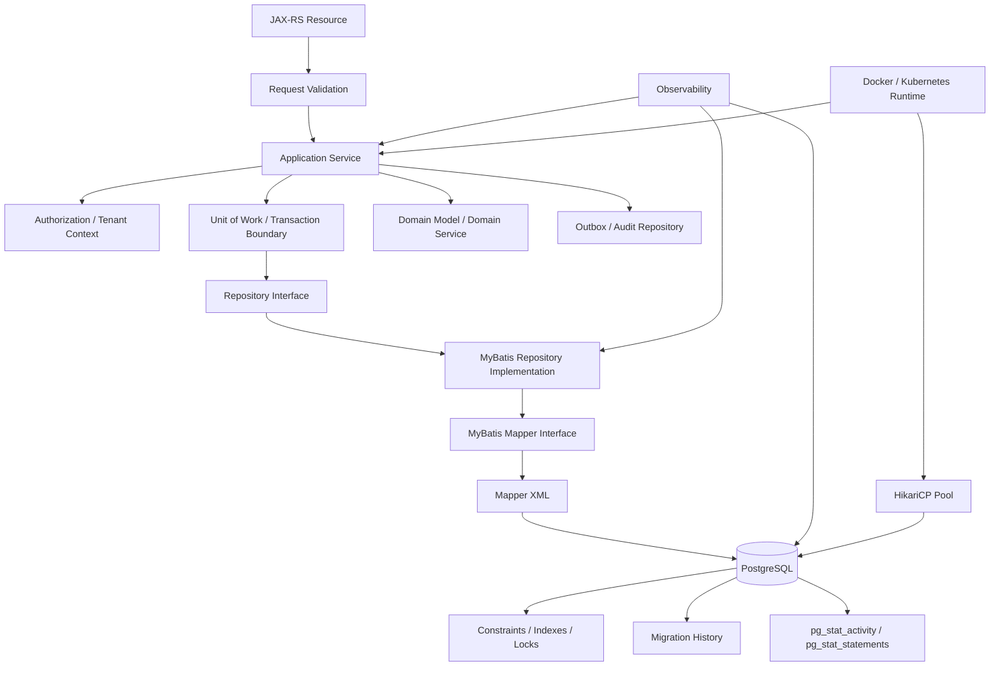
```mermaid id="b6t4aa"
flowchart TD
    A[JAX-RS Resource] --> B[Request Validation]
    B --> C[Application Service]
    C --> D[Authorization / Tenant Context]
    C --> E[Unit of Work / Transaction Boundary]

    E --> F[Repository Interface]
    F --> G[MyBatis Repository Implementation]
    G --> H[MyBatis Mapper Interface]
    H --> I[Mapper XML]

    I --> J[(PostgreSQL)]

    C --> K[Domain Model / Domain Service]
    C --> L[Outbox / Audit Repository]

    J --> M[Constraints / Indexes / Locks]
    J --> N[Migration History]
    J --> O[pg_stat_activity / pg_stat_statements]

    P[Observability] --> C
    P --> G
    P --> J

    Q[Docker / Kubernetes Runtime] --> C
    Q --> R[HikariCP Pool]
    R --> J
```

**Production invariant:**

```text id="e57czn"
Resource tidak membuka SqlSession.
Application service mengontrol use case dan transaction boundary.
Repository menyembunyikan persistence detail.
Mapper hanya menjalankan SQL contract.
Mapper XML harus aman, tested, observable, dan schema-compatible.
```

---

## 3. Final Readiness Scorecard

Gunakan skor sederhana:

| Score | Meaning |
|---:|---|
| 0 | Tidak ada / belum jelas |
| 1 | Ada tapi manual, tidak konsisten, atau belum dites |
| 2 | Ada, konsisten, dan sudah dites |
| 3 | Production-grade: tested, observable, documented, dan punya runbook |

| Area | Target Minimum |
|---|---:|
| Layering & boundary | 2 |
| SqlSession lifecycle | 3 |
| Mapper XML quality | 3 |
| Transaction boundary | 3 |
| Concurrency/idempotency | 2-3 |
| Dynamic SQL security | 3 |
| PostgreSQL schema/index awareness | 2-3 |
| Migration compatibility | 3 |
| Testing coverage | 3 |
| Observability | 3 |
| Runtime/Kubernetes readiness | 2-3 |
| Troubleshooting runbook | 2-3 |

**Interpretasi cepat:**

```text id="ja32ie"
Total score < 20:
  belum siap production review serius.

20-30:
  cukup untuk staging, tapi banyak risk.

30-40:
  production-capable dengan beberapa gap.

40+:
  mature baseline, siap masuk operational hardening.
```

---

## 4. Architecture Boundary Checklist

| Checklist | Expected |
|---|---:|
| JAX-RS resource hanya mengurus HTTP, request/response, status code | Ya |
| Resource tidak membuka `SqlSession` | Ya |
| Resource tidak memanggil mapper langsung untuk command penting | Ya |
| Application service mengontrol transaction boundary | Ya |
| Domain layer bebas dari MyBatis/JDBC/Jersey | Ya |
| Repository interface domain-oriented untuk command side | Ya |
| Query/read side boleh memakai DTO projection | Ya |
| Mapper interface tetap SQL-oriented | Ya |
| Mapper XML tidak berisi business orchestration kompleks | Ya |
| Outbox/audit ditulis dalam transaksi yang sama dengan command utama | Ya |
| External call tidak dilakukan di dalam DB transaction | Ya |

### Red flags

```text id="xtcixg"
@Path resource membuka sqlSessionFactory.openSession()
Mapper dipakai langsung dari banyak resource
Domain object import org.apache.ibatis.*
Repository menyimpan SqlSession sebagai singleton field
Satu DTO dipakai sebagai request, domain, DB row, dan response sekaligus
```

---

## 5. SqlSession & Transaction Lifecycle Checklist

| Checklist | Expected |
|---|---:|
| `SqlSessionFactory` dibuat sekali saat startup | Ya |
| `SqlSession` dibuat per use case/request/job batch | Ya |
| `SqlSession` selalu ditutup dengan `try-with-resources` | Ya |
| Commit hanya setelah semua operasi use case sukses | Ya |
| Rollback pada exception | Ya |
| Mapper proxy tidak keluar dari scope `SqlSession` | Ya |
| Cursor tidak dikembalikan keluar dari session scope | Ya |
| Batch executor selalu di-flush/commit dengan jelas | Ya |
| Transaction timeout/statement timeout tersedia untuk operasi mahal | Ya |
| Transaction duration dimonitor | Ya |

### Standard unit of work

```java id="a8z45p"
public <T> T transactional(MyBatisWork<T> work) {
    try (SqlSession session = sqlSessionFactory.openSession(false)) {
        try {
            T result = work.execute(new MyBatisSessionContext(session));
            session.commit();
            return result;
        } catch (RuntimeException | Error e) {
            session.rollback();
            throw e;
        }
    }
}
```

**Review question:**  
“Kalau operation ini gagal di tengah, apakah semua write ikut rollback?”

---

## 6. Mapper XML Quality Gate

| Checklist | Expected |
|---|---:|
| Namespace mapper XML sesuai mapper interface | Ya |
| Statement ID jelas dan intent-revealing | Ya |
| Parameter memakai `@Param` jika lebih dari satu argumen | Ya |
| `resultMap` eksplisit untuk object penting | Ya |
| DTO projection memakai alias kolom yang jelas | Ya |
| Tidak memakai `SELECT *` untuk production endpoint | Ya |
| Semua query tenant-owned punya `tenant_id` predicate | Ya |
| Update/delete punya tenant predicate atau admin guard | Ya |
| Update state memakai status/version guard jika perlu | Ya |
| Affected row count dicek untuk optimistic locking | Ya |
| Dynamic SQL branch punya test | Ya |
| Mapper method tidak terlalu generic seperti `execute(String sql)` | Ya |

MyBatis Mapper XML memang dirancang agar SQL tetap eksplisit dan dekat dengan mapped statement, jadi review mapper harus memperlakukan XML sebagai **production SQL contract**, bukan detail kecil yang bisa dibiarkan tanpa test. ([MyBatis](https://mybatis.org/mybatis-3/sqlmap-xml.html?utm_source=chatgpt.com))

---

## 7. Dynamic SQL Security Gate

| Checklist | Expected |
|---|---:|
| Semua user value memakai `#{}` | Ya |
| `${}` hanya dipakai untuk identifier yang sudah allow-listed | Ya |
| Sort field berasal dari enum whitelist | Ya |
| Sort direction berasal dari enum whitelist | Ya |
| Filter API eksplisit, bukan arbitrary `field/operator/value` liar | Ya |
| Limit dibatasi | Ya |
| Date range mahal dibatasi | Ya |
| `IN` list punya max size | Ya |
| Keyword search punya max length dan escaping | Ya |
| Tidak ada raw SQL dari request | Ya |
| Semua `${}` terdokumentasi di PR review | Ya |

OWASP menempatkan prepared statement/parameterized query sebagai defense utama terhadap SQL injection, dan allow-list validation sebagai pendekatan untuk bagian SQL yang tidak bisa diparameterisasi seperti nama kolom atau arah sorting. ([OWASP Cheat Sheet Series](https://cheatsheetseries.owasp.org/cheatsheets/SQL_Injection_Prevention_Cheat_Sheet.html?utm_source=chatgpt.com))

### Mandatory review rule

```text id="7k4s1r"
Setiap kemunculan ${} di mapper XML harus dijawab:

1. Ini untuk apa?
2. Apakah bisa diganti #{}
3. Kalau tidak bisa, enum/allow-list-nya di mana?
4. Apakah ada test injection/regression?
```

---

## 8. Transaction Boundary Review

| Scenario | Required Design |
|---|---|
| Single aggregate command | One transaction |
| Multi-table write | One transaction |
| Business row + audit | Same transaction |
| Business row + outbox | Same transaction |
| DB write + external API | Outbox/saga, bukan external call dalam transaction |
| Cross-datasource write | Saga/outbox/idempotency |
| Retryable DB error | Retry full transaction only |
| Batch import | Chunk boundary explicit |
| Long export | Read-only cursor/async job, not huge transaction |
| Stored procedure call | Java service tetap jelas sebagai transaction owner kecuali maintenance top-level |

### Review questions

```text id="qp4mia"
Apakah transaction boundary ada di application service?
Apakah repository diam-diam commit sendiri?
Apakah ada external call di dalam transaction?
Apakah retry mengulang full use case?
Apakah partial commit mungkin terjadi?
```

---

## 9. Concurrency & Idempotency Review

| Checklist | Expected |
|---|---:|
| State transition memakai optimistic locking atau row lock | Ya |
| Affected row `0` diterjemahkan menjadi conflict | Ya |
| Deadlock/serialization failure punya retry policy terbatas | Ya |
| Lock ordering deterministic untuk multi-row update | Ya |
| `FOR UPDATE` dipakai hanya saat memang perlu | Ya |
| Queue worker memakai claim pattern yang aman | Ya |
| Idempotency key tersedia untuk POST/command retryable | Ya |
| Idempotency key scoped by tenant/client | Ya |
| Same key + different payload ditolak | Ya |
| Duplicate side effect dicegah dengan outbox/inbox/idempotency | Ya |

PostgreSQL menjelaskan isolation level dan locking behavior secara eksplisit; Serializable/Repeatable Read dapat memerlukan retry pada konflik tertentu, sementara explicit locking tersedia untuk application-controlled locking. ([PostgreSQL](https://www.postgresql.org/docs/current/transaction-iso.html?utm_source=chatgpt.com))

---

## 10. PostgreSQL Schema & Index Review

| Checklist | Expected |
|---|---:|
| Primary key jelas | Ya |
| Business key punya unique constraint | Ya |
| Tenant-owned unique key memasukkan `tenant_id` | Ya |
| FK/check/not-null constraint menegakkan invariant penting | Ya |
| Query utama punya index berdasarkan access pattern | Ya |
| Index tidak dibuat asal untuk semua kolom | Ya |
| Partial index dipakai untuk status/predicate stabil seperti outbox pending | Bila perlu |
| Query pagination punya deterministic ordering | Ya |
| Keyset pagination dipakai untuk high-volume scrolling | Bila perlu |
| JSONB search punya index jika query sering | Bila perlu |
| `EXPLAIN` baseline tersedia untuk query kritis | Ya |
| `ANALYZE`/statistics dipahami saat query plan buruk | Ya |

PostgreSQL `EXPLAIN` digunakan untuk melihat query plan yang dipilih planner; `EXPLAIN ANALYZE` benar-benar menjalankan query, sehingga data-changing statement harus dianalisis hati-hati, misalnya di dalam transaksi lalu rollback. ([PostgreSQL](https://www.postgresql.org/docs/current/using-explain.html?utm_source=chatgpt.com))

---

## 11. Migration & Schema Evolution Gate

| Checklist | Expected |
|---|---:|
| Migration tool jelas: Flyway atau Liquibase | Ya |
| Runtime DB user berbeda dari migration DB user | Ya |
| Migration dijalankan oleh pipeline/job, bukan semua pod sembarang | Ya |
| Additive migration dilakukan sebelum app butuh schema baru | Ya |
| Rename/drop/type-change memakai expand-contract | Ya |
| Backfill chunked dan resumable | Ya |
| `CREATE INDEX CONCURRENTLY` dipisahkan jika perlu | Ya |
| Constraint besar memakai `NOT VALID` lalu validate jika perlu | Ya |
| Mapper compatibility test berjalan setelah migration | Ya |
| Contract/drop dilakukan setelah rollback window aman | Ya |
| Migration drift dicek di CI/CD | Ya |

### Expand-contract reminder

```text id="phb98z"
Expand:
  add new nullable column/table/index/constraint-compatible

Deploy:
  app reads/writes old + new safely

Backfill:
  chunked, idempotent, observable

Switch:
  read path moves to new schema

Contract:
  drop old schema only after all versions safe
```

---

## 12. Security & Data Protection Review

| Checklist | Expected |
|---|---:|
| SQL injection prevention memakai `#{}` | Ya |
| Dynamic identifier memakai whitelist | Ya |
| Runtime DB role least privilege | Ya |
| Migration role terpisah | Ya |
| Tenant predicate mandatory | Ya |
| Cross-tenant admin query explicit + audited | Ya |
| Sensitive endpoint punya audit trail | Ya |
| Audit payload tidak menyimpan secret/PII mentah | Ya |
| SQL DEBUG production off by default | Ya |
| Logs mask token/password/PII | Ya |
| Error response tidak mengekspos raw SQL/constraint detail | Ya |
| Secrets tidak ada di Git/image/log | Ya |
| DB TLS/SSL policy jelas untuk environment non-trusted | Ya |

### High-risk smells

```text id="n24kuf"
ORDER BY ${request.sort}
WHERE id = #{id} pada tenant-owned table tanpa tenant_id
Runtime DB user bisa ALTER/DROP table
Log berisi request body lengkap dengan token/PII
Admin mapper dipakai endpoint biasa
```

---

## 13. TypeHandler & PostgreSQL-Specific Mapping Review

| Area | Checklist |
|---|---|
| UUID | Java `UUID` mapping tested |
| JSONB | Custom TypeHandler round-trip tested |
| Enum | DB enum/text enum mapping consistent |
| Array | TypeHandler jelas jika dipakai |
| Timestamp | `Instant`/timezone handling tested |
| Numeric money/amount | `BigDecimal`, scale/rounding policy jelas |
| Nullable DB field | Java wrapper/nullable model, bukan primitive |
| Value object | Converter/TypeHandler tested |
| Large JSON payload | Tidak over-fetch di list endpoint |

### Review question

```text id="4h00ld"
Kalau data ini disimpan lalu dibaca ulang dari PostgreSQL nyata,
apakah nilainya identik secara domain?
```

---

## 14. Performance Review Gate

| Checklist | Expected |
|---|---:|
| Endpoint list memakai projection DTO | Ya |
| Tidak ada N+1 query di path utama | Ya |
| Query high-volume punya pagination aman | Ya |
| Export besar memakai cursor/fetchSize atau async job | Ya |
| Batch write memakai chunking | Ya |
| `ExecutorType.BATCH` dipakai hanya untuk write batch | Ya |
| `fetchSize`/cursor tidak menahan connection terlalu lama tanpa kontrol | Ya |
| `count(*)` tidak otomatis untuk semua search | Ya |
| Query kritis punya EXPLAIN evidence | Ya |
| Pool size ditentukan berdasarkan workload dan DB capacity | Ya |
| Slow query metric tersedia | Ya |
| Query timeout/statement timeout tersedia | Ya |

HikariCP mengatur batas concurrency DB melalui pool; `maximumPoolSize` membatasi koneksi maksimum dan `connectionTimeout` menentukan berapa lama caller menunggu connection sebelum gagal. Karena itu, menaikkan pool tanpa memperbaiki query/lock/transaction bisa memperparah tekanan ke database. ([GitHub](https://github.com/brettwooldridge/hikaricp?utm_source=chatgpt.com))

---

## 15. Testing Coverage Gate

| Test Type | Required For |
|---|---|
| Domain unit test | State transition, invariant |
| Service unit test | Orchestration, authz, retry decision |
| Mapper integration test | SQL/resultMap/TypeHandler |
| Migration test | Empty DB migrate + mapper compatibility |
| Constraint negative test | Unique/FK/check/not-null |
| Transaction rollback test | Multi-write atomicity |
| Concurrency test | Optimistic lock, idempotency, queue claim |
| API integration test | HTTP contract, error mapping |
| Security test | Injection, tenant isolation |
| Performance smoke | Query critical path |
| Deployment smoke | Health/readiness/schema version |

### Minimum production baseline

```text id="k4zaem"
Every important mapper:
  at least one integration test against PostgreSQL.

Every important command:
  unit test + transaction/integration test.

Every schema migration:
  migration test.

Every tenant-owned query:
  cross-tenant negative test.
```

---

## 16. Observability Review Gate

| Checklist | Expected |
|---|---:|
| Every request has correlation ID | Ya |
| Mapper statement ID appears in logs/metrics | Ya |
| SQLSTATE classification exists | Ya |
| Hikari active/idle/pending/acquire metrics exported | Ya |
| Transaction duration measured | Ya |
| Slow mapper metric exists | Ya |
| Retry/deadlock/serialization metric exists | Ya |
| Outbox backlog metric exists if outbox used | Ya |
| Audit command has traceable event | Ya |
| `pg_stat_activity` runbook exists | Ya |
| `pg_stat_statements` enabled where allowed | Ya |
| Dashboard separates API, DB, pool, business workflow | Ya |

PostgreSQL exposes `pg_stat_activity` for current backend activity and `pg_stat_statements` for aggregated planning/execution statistics, which makes them core tools for diagnosing runtime query behavior. ([PostgreSQL](https://www.postgresql.org/docs/current/monitoring-stats.html?utm_source=chatgpt.com))

---

## 17. Runtime & Kubernetes Readiness Gate

| Checklist | Expected |
|---|---:|
| Docker image multi-stage | Ya |
| Container runs non-root | Ya |
| Config fail-fast | Ya |
| Secrets from runtime secret manager/Kubernetes Secret | Ya |
| HikariDataSource singleton and closed on shutdown | Ya |
| SqlSessionFactory singleton | Ya |
| Startup/readiness/liveness probes separated | Ya |
| Readiness checks app + DB/schema minimally | Ya |
| Liveness is shallow, not heavy DB check | Ya |
| Graceful shutdown marks not-ready first | Ya |
| Background workers stop before datasource close | Ya |
| Migration runs as job/pipeline | Ya |
| Rolling update strategy safe | Ya |
| Resource requests/limits tested | Ya |

Kubernetes distinguishes startup, readiness, and liveness probes; startup probes can delay liveness/readiness until startup succeeds, readiness controls traffic routing, and liveness can restart unhealthy containers. ([Kubernetes](https://kubernetes.io/docs/concepts/workloads/pods/probes/?utm_source=chatgpt.com))

---

## 18. Multi-DB / Replica / Tenant Routing Gate

| Checklist | Expected |
|---|---:|
| Separate SqlSessionFactory per datasource role | Ya |
| Command/write always goes primary | Ya |
| Read-after-write goes primary | Ya |
| Replica read explicitly eventual | Ya |
| Replica lag monitored if replica used | Ya |
| Read-only DB credential for replica/reporting | Ya |
| Tenant ID from authenticated context | Ya |
| Schema/database tenant routing validated | Ya |
| Cross-datasource transaction not assumed atomic | Ya |
| Outbox/saga used for cross-DB sync | Ya |
| Metrics tagged by datasource role | Ya |

### Red flag

```text id="7qs0hb"
Service menulis ke DB A dan DB B dalam nested unitOfWork,
lalu menganggapnya atomic.
```

---

## 19. Stored Procedure / PL/pgSQL Boundary Gate

| Checklist | Expected |
|---|---:|
| Function/procedure signature treated as API contract | Ya |
| MyBatis callable statement has explicit `mode` and `jdbcType` | Ya |
| OUT params read and checked | Ya |
| Procedure does not hide application transaction boundary | Ya |
| Java service still handles authorization | Ya |
| PL/pgSQL exceptions use classifiable SQLSTATE | Ya |
| `SECURITY DEFINER` has fixed `search_path` | Ya |
| EXECUTE grants least-privilege | Ya |
| Routine migration/versioning tested | Ya |
| Routine integration test exists | Ya |

---

## 20. PR Review Template for Mapper Change

Gunakan template ini untuk setiap PR yang mengubah mapper XML, mapper interface, migration, atau repository.

```text id="rpz1jq"
Mapper / SQL Review

1. What mapper statements changed?
2. Is this command, query, batch, procedure, or migration-related?
3. Does every tenant-owned query include tenant_id?
4. Are all user values bound with #{}
5. Is every ${} backed by enum/allow-list?
6. Is resultMap/projection tested?
7. Does update/delete check affected row when needed?
8. Does this change need a new/updated index?
9. Does this change affect transaction boundary?
10. Does this change affect migration compatibility?
11. Are tests added/updated?
12. Are logs/metrics safe and useful?
```

---

## 21. Architecture Review Questions for Onboarding

Saat masuk codebase baru, tanyakan ini:

```text id="wh1uxu"
1. Di mana SqlSessionFactory dibuat?
2. Siapa yang membuka dan menutup SqlSession?
3. Di mana transaction boundary utama?
4. Apakah mapper dipakai langsung dari resource?
5. Bagaimana tenant_id dipaksakan?
6. Bagaimana dynamic SQL disecure?
7. Apa strategy migration?
8. Apakah ada expand-contract practice?
9. Bagaimana idempotency untuk POST/command?
10. Bagaimana outbox/audit ditulis?
11. Bagaimana SQLSTATE diklasifikasi?
12. Bagaimana slow query didiagnosis?
13. Apakah pg_stat_statements aktif?
14. Bagaimana pool metrics dipantau?
15. Bagaimana graceful shutdown dilakukan?
16. Bagaimana rollback saat schema berubah?
17. Bagaimana read replica digunakan?
18. Apakah ada mapper integration test?
19. Apakah ada tenant isolation test?
20. Apa incident runbook paling sering dipakai?
```

---

## 22. Go / No-Go Release Checklist

### Go

```text id="fjlksq"
Release boleh lanjut jika:
- migration sudah tested
- mapper integration test pass
- no known SQL injection/dynamic SQL gap
- transaction boundary reviewed
- critical query performance checked
- readiness/liveness sane
- rollback/forward-fix plan clear
- observability dashboard ready
```

### No-Go

```text id="x67h5o"
Tahan release jika:
- migration destructive tanpa expand-contract
- mapper baru belum dites against PostgreSQL
- tenant predicate hilang
- raw ${requestParam} muncul
- app requires schema that is not yet deployed
- write path has partial commit risk
- outbox/audit consistency unclear
- production cannot diagnose pool/query failure
```

---

## 23. Severity-Based Hardening Priority

| Severity | Fix First |
|---|---|
| P0 | SQL injection risk, tenant data leak, destructive migration risk |
| P1 | Partial commit, missing rollback, missing idempotency on critical command |
| P2 | Missing mapper integration test, poor error mapping |
| P3 | Slow query without EXPLAIN baseline, missing pool metric |
| P4 | Naming/style cleanup, minor layering refinement |

**Rule:** jangan habiskan waktu merapikan style mapper jika masih ada raw `${}` dari request atau missing tenant predicate.

---

## 24. Final Anti-Pattern Catalog

| Anti-Pattern | Why Dangerous |
|---|---|
| `Resource -> SqlSession -> Mapper` | boundary dan transaction kacau |
| Singleton `SqlSession` | thread-safety/resource bug |
| Mapper accepts raw request DTO | HTTP/persistence coupling |
| `SELECT *` everywhere | over-fetch + data exposure |
| Raw `${}` from request | SQL injection |
| Missing tenant predicate | cross-tenant leak |
| No affected row check | lost update |
| External call inside transaction | lock lama + duplicate side effect |
| Outbox outside business transaction | inconsistent integration |
| App pod runs migration concurrently | migration race |
| Drop/rename column directly | rolling deploy broken |
| No PostgreSQL integration test | SQL bugs runtime-only |
| Liveness checks DB | restart storm |
| Pool size raised blindly | DB overload |
| No SQLSTATE classifier | retry/error mapping wrong |
| No pg diagnostics access | blind incident response |

---

## 25. Final Production Definition of Done

Sebuah MyBatis-based service bisa disebut production-ready jika minimal memenuhi ini:

```text id="3w2r4y"
Architecture:
  clear resource-service-repository-mapper boundary

Persistence:
  SqlSession lifecycle correct
  transaction boundary explicit
  mapper XML reviewed and tested

Security:
  no unsafe dynamic SQL
  tenant filtering enforced
  least-privilege DB roles
  sensitive data masked

Correctness:
  constraints exist
  idempotency exists for retryable commands
  concurrency conflicts handled

Performance:
  critical queries have index/EXPLAIN evidence
  batch/streaming used for large data
  pool metrics monitored

Migration:
  expand-contract for breaking changes
  migration compatibility tested

Operations:
  health probes sane
  graceful shutdown works
  runbooks exist
  observability available
```

---

## 26. Roadmap Singkat untuk Review Codebase Nyata

| Hari | Fokus | Output |
|---:|---|---|
| 1 | Mapping architecture | Diagram resource → service → repository → mapper |
| 2 | Mapper inventory | List mapper kritikal, SQL dynamic, tenant-owned tables |
| 3 | Transaction review | Boundary, rollback, external call, outbox |
| 4 | Security review | `${}`, tenant predicate, DB roles, secrets |
| 5 | Migration review | Flyway/Liquibase, expand-contract, schema drift |
| 6 | Performance review | Top query, index, EXPLAIN, pool metrics |
| 7 | Testing review | Mapper IT, migration test, concurrency test |
| 8 | Observability review | SQLSTATE, mapper metrics, pg diagnostics |
| 9 | Runtime review | Docker/K8s, probes, shutdown, migration job |
| 10 | Risk register | P0/P1/P2 issues + action plan |

---

## 27. Rekomendasi Materi Selanjutnya

Seri **Java MyBatis** sudah lengkap sebagai baseline onboarding production. Lanjutkan ke **“Maven Enterprise Build & Dependency Management: Project Structure, BOM, Dependency Convergence, Maven Enforcer, Surefire/Failsafe, Build Profiles, Reproducible Build, SBOM, dan CI/CD Integration”** karena Maven adalah fondasi build, dependency hygiene, testing lifecycle, dan release reliability untuk seluruh stack Java/Jersey/MyBatis/Camunda.

---

**Sources:**

- [Java API - MyBatis 3](https://mybatis.org/mybatis-3/java-api.html?utm_source=chatgpt.com)
- [SQL Injection Prevention - OWASP Cheat Sheet Series](https://cheatsheetseries.owasp.org/cheatsheets/SQL_Injection_Prevention_Cheat_Sheet.html?utm_source=chatgpt.com)
- [Documentation: 18: 13.2. Transaction Isolation](https://www.postgresql.org/docs/current/transaction-iso.html?utm_source=chatgpt.com)
- [brettwooldridge/HikariCP: 光 HikariCP・A solid, high- ...](https://github.com/brettwooldridge/hikaricp?utm_source=chatgpt.com)
- [Liveness, Readiness, and Startup Probes](https://kubernetes.io/docs/concepts/workloads/pods/probes/?utm_source=chatgpt.com)

## Response:
7/15/2026, 1:21:34 PM

Saya akan rangkum sebagai cheatsheet praktis: elemen `mybatis-config.xml`, opsi penting, contoh XML, padanan Java programmatic setup, plus catatan mana yang sebaiknya dipakai di production.

# Cheatsheet - MyBatis XML Config vs Programmatic Java Setup

MyBatis punya dua area konfigurasi yang sering tertukar:

| Area | File/Tempat | Isi |
|---|---|---|
| **Global configuration** | `mybatis-config.xml` atau `org.apache.ibatis.session.Configuration` | settings global, datasource, transaction manager, type aliases, type handlers, plugins, mappers |
| **Mapper XML** | `XxxMapper.xml` | SQL statement: `select`, `insert`, `update`, `delete`, `resultMap`, `cache`, dynamic SQL |

MyBatis mendokumentasikan struktur global config sebagai `properties`, `settings`, `typeAliases`, `typeHandlers`, `objectFactory`, `plugins`, `environments`, `databaseIdProvider`, dan `mappers`. `SqlSessionFactoryBuilder` bisa membuat `SqlSessionFactory` dari XML config atau langsung dari object `Configuration`. ([MyBatis](https://mybatis.org/mybatis-3/configuration.html))

---

# 1. Minimal XML Config vs Programmatic Setup

## 1.1 XML style

```xml id="d8yp50"
<?xml version="1.0" encoding="UTF-8" ?>
<!DOCTYPE configuration
  PUBLIC "-//mybatis.org//DTD Config 3.0//EN"
  "https://mybatis.org/dtd/mybatis-3-config.dtd">

<configuration>

  <settings>
    <setting name="mapUnderscoreToCamelCase" value="true"/>
    <setting name="logImpl" value="SLF4J"/>
    <setting name="localCacheScope" value="STATEMENT"/>
    <setting name="defaultExecutorType" value="SIMPLE"/>
    <setting name="defaultStatementTimeout" value="10"/>
    <setting name="defaultFetchSize" value="500"/>
    <setting name="jdbcTypeForNull" value="OTHER"/>
  </settings>

  <typeAliases>
    <package name="com.company.app.domain"/>
    <package name="com.company.app.dto"/>
  </typeAliases>

  <typeHandlers>
    <typeHandler handler="com.company.app.mybatis.JsonNodeJsonbTypeHandler"/>
    <typeHandler handler="com.company.app.mybatis.PostgresEnumTypeHandler"/>
  </typeHandlers>

  <environments default="production">
    <environment id="production">
      <transactionManager type="JDBC">
        <property name="skipSetAutoCommitOnClose" value="true"/>
      </transactionManager>

      <dataSource type="POOLED">
        <property name="driver" value="${db.driver}"/>
        <property name="url" value="${db.url}"/>
        <property name="username" value="${db.username}"/>
        <property name="password" value="${db.password}"/>
        <property name="poolMaximumActiveConnections" value="20"/>
      </dataSource>
    </environment>
  </environments>

  <mappers>
    <mapper resource="mapper/CaseMapper.xml"/>
    <mapper resource="mapper/CaseQueryMapper.xml"/>
    <mapper resource="mapper/AuditMapper.xml"/>
  </mappers>

</configuration>
```

## 1.2 Programmatic style - recommended untuk Jersey/HK2/Weld non-Spring

```java id="2osovj"
public final class MyBatisFactory {

    public SqlSessionFactory build(DataSource dataSource) {
        TransactionFactory transactionFactory =
            new JdbcTransactionFactory();

        Environment environment = new Environment(
            "production",
            transactionFactory,
            dataSource
        );

        Configuration configuration = new Configuration(environment);

        // settings
        configuration.setMapUnderscoreToCamelCase(true);
        configuration.setLogImpl(Slf4jImpl.class);
        configuration.setLocalCacheScope(LocalCacheScope.STATEMENT);
        configuration.setDefaultExecutorType(ExecutorType.SIMPLE);
        configuration.setDefaultStatementTimeout(10);
        configuration.setDefaultFetchSize(500);
        configuration.setJdbcTypeForNull(JdbcType.OTHER);
        configuration.setAutoMappingBehavior(AutoMappingBehavior.PARTIAL);
        configuration.setAutoMappingUnknownColumnBehavior(
            AutoMappingUnknownColumnBehavior.WARNING
        );
        configuration.setUseGeneratedKeys(false);
        configuration.setUseColumnLabel(true);
        configuration.setLazyLoadingEnabled(false);
        configuration.setAggressiveLazyLoading(false);
        configuration.setCallSettersOnNulls(false);
        configuration.setReturnInstanceForEmptyRow(false);
        configuration.setUseActualParamName(true);

        // type aliases
        configuration.getTypeAliasRegistry()
            .registerAliases("com.company.app.domain");
        configuration.getTypeAliasRegistry()
            .registerAliases("com.company.app.dto");

        // type handlers
        configuration.getTypeHandlerRegistry()
            .register(JsonNode.class, JdbcType.OTHER, JsonNodeJsonbTypeHandler.class);
        configuration.getTypeHandlerRegistry()
            .register(PostgresEnumTypeHandler.class);

        // interceptors/plugins
        configuration.addInterceptor(new SqlTimingInterceptor());

        // mappers
        configuration.addMapper(CaseMapper.class);
        configuration.addMapper(CaseQueryMapper.class);
        configuration.addMapper(AuditMapper.class);

        return new SqlSessionFactoryBuilder().build(configuration);
    }
}
```

Catatan penting: MyBatis menyarankan `SqlSessionFactory` hidup selama aplikasi berjalan, sedangkan `SqlSession` tidak thread-safe dan harus scope request/method, bukan singleton. ([MyBatis](https://mybatis.org/mybatis-3/getting-started.html))

---

# 2. Top-Level `mybatis-config.xml` Elements

| XML Element | Fungsi | Programmatic Equivalent | Catatan Production |
|---|---|---|---|
| `<properties>` | Placeholder `${...}` untuk config | `SqlSessionFactoryBuilder.build(reader, props)` atau config loader sendiri | Untuk non-Spring/Jersey, biasanya lebih aman load env/secret sendiri |
| `<settings>` | Global behavior MyBatis | `configuration.setXxx(...)` | Paling penting untuk runtime behavior |
| `<typeAliases>` | Alias class agar XML tidak verbose | `configuration.getTypeAliasRegistry().registerAlias(...)` / `registerAliases(package)` | Jangan terlalu banyak alias kalau bikin XML ambigu |
| `<typeHandlers>` | Java ↔ JDBC mapping | `configuration.getTypeHandlerRegistry().register(...)` | Wajib untuk JSONB, enum custom, array, value object |
| `<objectFactory>` | Cara MyBatis membuat result object | `configuration.setObjectFactory(...)` | Jarang perlu; gunakan hanya kalau constructor/instantiation khusus |
| `<plugins>` | Interceptor MyBatis | `configuration.addInterceptor(...)` | Cocok untuk timing/logging; jangan ubah core behavior sembarangan |
| `<environments>` | DB environment, transaction manager, datasource | `new Environment(id, transactionFactory, dataSource)` | Satu `SqlSessionFactory` hanya memilih satu environment |
| `<databaseIdProvider>` | Vendor-specific statement | `configuration.setDatabaseId(...)` atau custom provider saat build | Jarang perlu kalau hanya PostgreSQL |
| `<mappers>` | Register mapper XML/interface | `configuration.addMapper(...)` | Mapper XML peer bisa auto-loaded jika classpath/name cocok |

MyBatis menyatakan satu `SqlSessionFactory` hanya memilih satu environment; jika aplikasi connect ke dua database, buat dua `SqlSessionFactory`, satu per database. ([MyBatis](https://mybatis.org/mybatis-3/configuration.html))

---

# 3. `<properties>`

## XML

```xml id="j19skd"
<properties resource="mybatis/application-db.properties">
  <property name="db.driver" value="org.postgresql.Driver"/>
</properties>
```

```xml id="y8ingg"
<dataSource type="POOLED">
  <property name="driver" value="${db.driver}"/>
  <property name="url" value="${db.url}"/>
  <property name="username" value="${db.username}"/>
  <property name="password" value="${db.password}"/>
</dataSource>
```

MyBatis property precedence adalah: property body dibaca dulu, lalu property dari `resource`/`url` override, lalu properties yang dikirim ke `SqlSessionFactoryBuilder.build(..., props)` punya prioritas tertinggi. MyBatis juga mendukung default value placeholder sejak 3.4.2, tetapi fitur itu disabled by default dan perlu property parser khusus. ([MyBatis](https://mybatis.org/mybatis-3/configuration.html))

## Programmatic

```java id="mbbi7j"
Properties props = new Properties();
props.setProperty("db.url", System.getenv("DB_URL"));
props.setProperty("db.username", System.getenv("DB_USERNAME"));
props.setProperty("db.password", System.getenv("DB_PASSWORD"));

try (InputStream in = Resources.getResourceAsStream("mybatis-config.xml")) {
    SqlSessionFactory factory =
        new SqlSessionFactoryBuilder().build(in, "production", props);
}
```

## Programmatic tanpa XML

```java id="3xsfqp"
RuntimeConfig runtimeConfig = RuntimeConfig.loadFromEnv();

DataSource dataSource = createHikariDataSource(runtimeConfig);

Environment environment = new Environment(
    "production",
    new JdbcTransactionFactory(),
    dataSource
);

Configuration configuration = new Configuration(environment);
```

**Practical recommendation:** untuk production Kubernetes/cloud, jangan taruh password di `mybatis-config.xml`. Ambil dari secret/env/external config lalu buat `DataSource` programmatically.

---

# 4. `<settings>` Complete Practical Cheat Sheet

## 4.1 Core runtime settings

| XML Setting | Programmatic Setter | Default | Practical Recommendation |
|---|---|---:|---|
| `cacheEnabled` | `setCacheEnabled(boolean)` | `true` | Biasanya tetap `true`, tapi hati-hati dengan 2nd-level cache |
| `lazyLoadingEnabled` | `setLazyLoadingEnabled(boolean)` | `false` | Untuk microservice/API, biasanya `false` |
| `aggressiveLazyLoading` | `setAggressiveLazyLoading(boolean)` | `false` | Biasanya `false` |
| `useColumnLabel` | `setUseColumnLabel(boolean)` | `true` | Tetap `true`; gunakan alias SQL jelas |
| `useGeneratedKeys` | `setUseGeneratedKeys(boolean)` | `false` | Untuk PostgreSQL UUID app-generated biasanya `false`; serial identity bisa per statement |
| `defaultExecutorType` | `setDefaultExecutorType(ExecutorType.SIMPLE)` | `SIMPLE` | `SIMPLE` default; `BATCH` jangan global |
| `defaultStatementTimeout` | `setDefaultStatementTimeout(Integer)` | unset | Set 5-30 detik sesuai SLA |
| `defaultFetchSize` | `setDefaultFetchSize(Integer)` | unset | Berguna untuk query besar/cursor; validasi pgJDBC behavior |
| `defaultResultSetType` | `setDefaultResultSetType(ResultSetType.FORWARD_ONLY)` | unset | Biasanya `FORWARD_ONLY` untuk streaming |
| `mapUnderscoreToCamelCase` | `setMapUnderscoreToCamelCase(boolean)` | `false` | Sering `true` untuk PostgreSQL `snake_case` → Java `camelCase` |
| `localCacheScope` | `setLocalCacheScope(LocalCacheScope.STATEMENT)` | `SESSION` | Untuk service request transactional, sering lebih aman `STATEMENT` |
| `jdbcTypeForNull` | `setJdbcTypeForNull(JdbcType.OTHER)` | `OTHER` | Untuk PostgreSQL sering tetap `OTHER`; eksplisitkan `jdbcType` pada field penting |

MyBatis mendokumentasikan `defaultExecutorType` dengan `SIMPLE`, `REUSE`, dan `BATCH`; `defaultStatementTimeout`, `defaultFetchSize`, `defaultResultSetType`, `mapUnderscoreToCamelCase`, `localCacheScope`, dan `jdbcTypeForNull` adalah global settings yang memengaruhi runtime behavior query/mapper. ([MyBatis](https://mybatis.org/mybatis-3/configuration.html))

## 4.2 Auto-mapping settings

| XML Setting | Programmatic Setter | Default | Recommendation |
|---|---|---:|---|
| `autoMappingBehavior` | `setAutoMappingBehavior(AutoMappingBehavior.PARTIAL)` | `PARTIAL` | `PARTIAL` aman; hindari `FULL` untuk join kompleks |
| `autoMappingUnknownColumnBehavior` | `setAutoMappingUnknownColumnBehavior(...)` | `NONE` | `WARNING` bagus untuk staging/dev; `FAILING` bisa untuk strict integration test |
| `callSettersOnNulls` | `setCallSettersOnNulls(boolean)` | `false` | `false`; gunakan wrapper type untuk nullable |
| `returnInstanceForEmptyRow` | `setReturnInstanceForEmptyRow(boolean)` | `false` | Biasanya `false` |

MyBatis menjelaskan `PARTIAL` sebagai default auto-mapping dan memberi peringatan bahwa `FULL` pada join/nested result dapat menghasilkan mapping yang tidak diinginkan. ([MyBatis](https://mybatis.org/mybatis-3/sqlmap-xml.html))

## 4.3 Logging/proxy/provider settings

| XML Setting | Programmatic Setter | Default | Recommendation |
|---|---|---:|---|
| `logImpl` | `setLogImpl(Slf4jImpl.class)` | autodetect | Gunakan `SLF4J` di production |
| `logPrefix` | `setLogPrefix(String)` | unset | Opsional |
| `proxyFactory` | `setProxyFactory(...)` | `JAVASSIST` | Jarang disentuh |
| `vfsImpl` | `setVfsImpl(Class<? extends VFS>)` | unset | Hanya jika environment classpath butuh custom VFS |
| `useActualParamName` | `setUseActualParamName(boolean)` | `true` | Tetap `true`, tapi tetap gunakan `@Param` untuk mapper multi-arg |
| `configurationFactory` | `setConfigurationFactory(Class<?>)` | unset | Rare; lazy deserialization use case |
| `shrinkWhitespacesInSql` | `setShrinkWhitespacesInSql(boolean)` | `false` | Hati-hati, bisa memengaruhi literal string SQL |
| `defaultSqlProviderType` | `setDefaultSqlProviderType(Class<?>)` | unset | Untuk annotation provider style |
| `nullableOnForEach` | `setNullableOnForEach(Boolean)` | `false` | Biasanya `false`; handle list kosong di service |
| `argNameBasedConstructorAutoMapping` | `setArgNameBasedConstructorAutoMapping(boolean)` | `false` | Bisa berguna untuk record/constructor mapping jika compiled dengan parameter names |

MyBatis mendukung beberapa logging implementation seperti `SLF4J`, `LOG4J2`, `JDK_LOGGING`, `COMMONS_LOGGING`, `STDOUT_LOGGING`, dan `NO_LOGGING`; `LOG4J` lama sudah deprecated sejak 3.5.9. ([MyBatis](https://mybatis.org/mybatis-3/configuration.html))

---

# 5. Recommended Production Settings untuk PostgreSQL/Jersey

```xml id="lh3oqy"
<settings>
  <setting name="mapUnderscoreToCamelCase" value="true"/>
  <setting name="autoMappingBehavior" value="PARTIAL"/>
  <setting name="autoMappingUnknownColumnBehavior" value="WARNING"/>

  <setting name="lazyLoadingEnabled" value="false"/>
  <setting name="aggressiveLazyLoading" value="false"/>

  <setting name="defaultExecutorType" value="SIMPLE"/>
  <setting name="defaultStatementTimeout" value="10"/>
  <setting name="defaultFetchSize" value="500"/>
  <setting name="defaultResultSetType" value="FORWARD_ONLY"/>

  <setting name="localCacheScope" value="STATEMENT"/>
  <setting name="jdbcTypeForNull" value="OTHER"/>

  <setting name="useColumnLabel" value="true"/>
  <setting name="useGeneratedKeys" value="false"/>
  <setting name="useActualParamName" value="true"/>

  <setting name="logImpl" value="SLF4J"/>
</settings>
```

Programmatic equivalent:

```java id="q4chsp"
configuration.setMapUnderscoreToCamelCase(true);
configuration.setAutoMappingBehavior(AutoMappingBehavior.PARTIAL);
configuration.setAutoMappingUnknownColumnBehavior(
    AutoMappingUnknownColumnBehavior.WARNING
);

configuration.setLazyLoadingEnabled(false);
configuration.setAggressiveLazyLoading(false);

configuration.setDefaultExecutorType(ExecutorType.SIMPLE);
configuration.setDefaultStatementTimeout(10);
configuration.setDefaultFetchSize(500);
configuration.setDefaultResultSetType(ResultSetType.FORWARD_ONLY);

configuration.setLocalCacheScope(LocalCacheScope.STATEMENT);
configuration.setJdbcTypeForNull(JdbcType.OTHER);

configuration.setUseColumnLabel(true);
configuration.setUseGeneratedKeys(false);
configuration.setUseActualParamName(true);

configuration.setLogImpl(Slf4jImpl.class);
```

---

# 6. `<typeAliases>`

## XML

```xml id="xgyp8d"
<typeAliases>
  <typeAlias alias="CaseRecord"
             type="com.company.app.persistence.record.CaseRecord"/>
  <package name="com.company.app.dto"/>
</typeAliases>
```

MyBatis type alias hanya nama pendek untuk Java type dan terutama berguna agar XML tidak perlu menulis fully-qualified class name. Jika package scan dipakai, class tanpa `@Alias` akan didaftarkan dengan uncapitalized simple class name. ([MyBatis](https://mybatis.org/mybatis-3/configuration.html))

## Programmatic

```java id="y3be8h"
configuration.getTypeAliasRegistry()
    .registerAlias("CaseRecord", CaseRecord.class);

configuration.getTypeAliasRegistry()
    .registerAliases("com.company.app.dto");
```

## Practical recommendation

| Use Case | Recommendation |
|---|---|
| DTO/projection banyak | Package alias boleh |
| Domain object penting | Alias eksplisit lebih readable |
| Banyak class dengan nama sama | Hindari package alias luas |
| Shared library | Pakai FQCN atau alias eksplisit |

---

# 7. `<typeHandlers>`

## XML

```xml id="5frq3v"
<typeHandlers>
  <typeHandler
      javaType="com.fasterxml.jackson.databind.JsonNode"
      jdbcType="OTHER"
      handler="com.company.app.mybatis.JsonNodeJsonbTypeHandler"/>

  <typeHandler handler="com.company.app.mybatis.PostgresEnumTypeHandler"/>

  <package name="com.company.app.mybatis.typehandler"/>
</typeHandlers>
```

MyBatis memakai `TypeHandler` saat set parameter ke `PreparedStatement` dan saat mengambil value dari `ResultSet`; MyBatis juga mendukung Java Time API/JSR-310 by default sejak 3.4.5. Untuk custom type, handler bisa diregister dengan XML atau autodiscovery package, tetapi JDBC type autodiscovery perlu annotation. ([MyBatis](https://mybatis.org/mybatis-3/configuration.html))

## Programmatic

```java id="bavh5f"
TypeHandlerRegistry registry = configuration.getTypeHandlerRegistry();

registry.register(
    JsonNode.class,
    JdbcType.OTHER,
    JsonNodeJsonbTypeHandler.class
);

registry.register(PostgresEnumTypeHandler.class);

registry.register("com.company.app.mybatis.typehandler");
```

## Mapper usage

```xml id="ezk9zr"
<result property="payload"
        column="payload"
        jdbcType="OTHER"
        typeHandler="com.company.app.mybatis.JsonNodeJsonbTypeHandler"/>
```

```xml id="kz81o5"
#{payload, jdbcType=OTHER,
  typeHandler=com.company.app.mybatis.JsonNodeJsonbTypeHandler}
```

## PostgreSQL-specific reminder

| PostgreSQL Type | Java Type | Typical Handling |
|---|---|---|
| `uuid` | `UUID` | built-in/driver support |
| `jsonb` | `JsonNode`, POJO, `Map` | custom TypeHandler |
| `text enum` | Java enum | `EnumTypeHandler` or custom |
| native enum | Java enum | custom handler often needed |
| `timestamptz` | `Instant`, `OffsetDateTime` | test round-trip carefully |
| array | `List<T>` / array | custom handler often needed |
| `numeric` | `BigDecimal` | built-in |

---

# 8. `<objectFactory>`

## XML

```xml id="wgfaf1"
<objectFactory type="com.company.app.mybatis.CustomObjectFactory">
  <property name="someProperty" value="100"/>
</objectFactory>
```

MyBatis `ObjectFactory` dipakai setiap kali MyBatis membuat result object; default-nya membuat object via default constructor atau constructor yang diparameterisasi jika ada constructor mapping. ([MyBatis](https://mybatis.org/mybatis-3/configuration.html))

## Programmatic

```java id="pktq02"
CustomObjectFactory objectFactory = new CustomObjectFactory();

Properties properties = new Properties();
properties.setProperty("someProperty", "100");
objectFactory.setProperties(properties);

configuration.setObjectFactory(objectFactory);
```

## Practical recommendation

Jarang perlu. Untuk Java record/immutable object, lebih sering cukup pakai constructor mapping/resultMap daripada custom `ObjectFactory`.

---

# 9. `<plugins>` / Interceptors

## XML

```xml id="jbdw4a"
<plugins>
  <plugin interceptor="com.company.app.mybatis.SqlTimingInterceptor">
    <property name="slowQueryMs" value="500"/>
  </plugin>
</plugins>
```

MyBatis plugin bisa intercept `Executor`, `ParameterHandler`, `ResultSetHandler`, dan `StatementHandler`. Dokumentasi MyBatis memperingatkan bahwa ini low-level extension point, jadi plugin harus digunakan hati-hati karena bisa mematahkan core behavior jika mengubah flow secara salah. ([MyBatis](https://mybatis.org/mybatis-3/configuration.html))

## Programmatic

```java id="7jd7tc"
SqlTimingInterceptor interceptor = new SqlTimingInterceptor();

Properties props = new Properties();
props.setProperty("slowQueryMs", "500");
interceptor.setProperties(props);

configuration.addInterceptor(interceptor);
```

## Example interceptor skeleton

```java id="w2idry"
@Intercepts({
    @Signature(
        type = Executor.class,
        method = "query",
        args = {
            MappedStatement.class,
            Object.class,
            RowBounds.class,
            ResultHandler.class
        }
    ),
    @Signature(
        type = Executor.class,
        method = "update",
        args = {
            MappedStatement.class,
            Object.class
        }
    )
})
public final class SqlTimingInterceptor implements Interceptor {

    @Override
    public Object intercept(Invocation invocation) throws Throwable {
        long start = System.nanoTime();

        try {
            return invocation.proceed();
        } finally {
            long durationMs =
                TimeUnit.NANOSECONDS.toMillis(System.nanoTime() - start);

            Object[] args = invocation.getArgs();
            MappedStatement ms = (MappedStatement) args[0];

            log.debug(
                "mybatis statement={} durationMs={}",
                ms.getId(),
                durationMs
            );
        }
    }
}
```

---

# 10. `<environments>`, Transaction Manager, DataSource

## 10.1 XML built-in transaction manager

```xml id="ocq00q"
<transactionManager type="JDBC">
  <property name="skipSetAutoCommitOnClose" value="true"/>
</transactionManager>
```

```xml id="5cd92b"
<transactionManager type="MANAGED">
  <property name="closeConnection" value="false"/>
</transactionManager>
```

MyBatis built-in transaction manager hanya ada `JDBC` dan `MANAGED`. `JDBC` memakai commit/rollback JDBC langsung; `MANAGED` tidak melakukan commit/rollback dan membiarkan container mengelola transaction lifecycle. ([MyBatis](https://mybatis.org/mybatis-3/configuration.html))

## Programmatic

```java id="yr8u5s"
TransactionFactory transactionFactory = new JdbcTransactionFactory();

Environment environment = new Environment(
    "production",
    transactionFactory,
    dataSource
);

Configuration configuration = new Configuration(environment);
```

Jika butuh property:

```java id="b1187l"
JdbcTransactionFactory transactionFactory = new JdbcTransactionFactory();

Properties txProps = new Properties();
txProps.setProperty("skipSetAutoCommitOnClose", "true");
transactionFactory.setProperties(txProps);
```

## 10.2 XML built-in datasource

```xml id="5f449q"
<dataSource type="UNPOOLED">
  <property name="driver" value="org.postgresql.Driver"/>
  <property name="url" value="${db.url}"/>
  <property name="username" value="${db.username}"/>
  <property name="password" value="${db.password}"/>
</dataSource>
```

```xml id="mspl60"
<dataSource type="POOLED">
  <property name="driver" value="org.postgresql.Driver"/>
  <property name="url" value="${db.url}"/>
  <property name="username" value="${db.username}"/>
  <property name="password" value="${db.password}"/>
  <property name="poolMaximumActiveConnections" value="20"/>
  <property name="poolMaximumIdleConnections" value="10"/>
  <property name="poolPingEnabled" value="true"/>
  <property name="poolPingQuery" value="SELECT 1"/>
</dataSource>
```

```xml id="pv35ov"
<dataSource type="JNDI">
  <property name="data_source" value="java:comp/env/jdbc/AppDataSource"/>
</dataSource>
```

MyBatis built-in datasource types adalah `UNPOOLED`, `POOLED`, dan `JNDI`. `UNPOOLED` membuka/menutup connection setiap request; `POOLED` memakai pool MyBatis built-in; `JNDI` mengambil datasource dari container. ([MyBatis](https://mybatis.org/mybatis-3/configuration.html))

## Programmatic dengan HikariCP - recommended

```java id="eegmsl"
HikariConfig hikari = new HikariConfig();
hikari.setJdbcUrl(System.getenv("DB_URL"));
hikari.setUsername(System.getenv("DB_USERNAME"));
hikari.setPassword(System.getenv("DB_PASSWORD"));
hikari.setMaximumPoolSize(20);
hikari.setConnectionTimeout(3000);
hikari.setPoolName("case-service-postgres");

DataSource dataSource = new HikariDataSource(hikari);

Environment environment = new Environment(
    "production",
    new JdbcTransactionFactory(),
    dataSource
);

Configuration configuration = new Configuration(environment);
```

**Practical recommendation:** untuk production Java service, lebih umum memakai HikariCP sebagai external `DataSource`, lalu inject ke MyBatis programmatically. Built-in `POOLED` cukup untuk simple app/test, tetapi Hikari lebih umum untuk production pool observability/tuning.

---

# 11. `<databaseIdProvider>`

## XML

```xml id="tp83yd"
<databaseIdProvider type="DB_VENDOR">
  <property name="PostgreSQL" value="postgresql"/>
  <property name="Oracle" value="oracle"/>
  <property name="SQL Server" value="sqlserver"/>
</databaseIdProvider>
```

MyBatis bisa memilih statement berdasarkan `databaseId`; provider `DB_VENDOR` memakai `DatabaseMetaData#getDatabaseProductName()` lalu bisa dimapping menjadi nama pendek. ([MyBatis](https://mybatis.org/mybatis-3/configuration.html))

## Mapper XML

```xml id="9zfbe5"
<select id="findNow" resultType="java.time.Instant" databaseId="postgresql">
  SELECT now()
</select>

<select id="findNow" resultType="java.time.Instant" databaseId="oracle">
  SELECT systimestamp FROM dual
</select>
```

## Programmatic

```java id="w4wyn5"
configuration.setDatabaseId("postgresql");
```

Atau custom provider saat build config:

```java id="dcf9t3"
VendorDatabaseIdProvider provider = new VendorDatabaseIdProvider();

Properties props = new Properties();
props.setProperty("PostgreSQL", "postgresql");
props.setProperty("Oracle", "oracle");

provider.setProperties(props);

String databaseId = provider.getDatabaseId(dataSource);
configuration.setDatabaseId(databaseId);
```

**Recommendation:** kalau stack hanya PostgreSQL, biasanya tidak perlu `databaseIdProvider`.

---

# 12. `<mappers>`

## XML options

```xml id="mot4gn"
<mappers>
  <mapper resource="mapper/CaseMapper.xml"/>
  <mapper url="file:///opt/app/mapper/CaseMapper.xml"/>
  <mapper class="com.company.app.persistence.mapper.CaseMapper"/>
  <package name="com.company.app.persistence.mapper"/>
</mappers>
```

## Programmatic

```java id="b5b5fy"
configuration.addMapper(CaseMapper.class);
configuration.addMapper(CaseQueryMapper.class);
configuration.addMapper(AuditMapper.class);
```

Package scan programmatic tergantung utilitas yang dipakai. Core MyBatis paling aman eksplisit `addMapper(...)`. Jika mapper interface dan XML peer berada pada classpath dengan nama/package yang sama, MyBatis dapat memuat peer XML ketika mapper class ditambahkan. Dokumentasi getting started menyebut MyBatis akan mencari dan load peer XML jika ada berdasarkan classpath dan nama mapper class. ([MyBatis](https://mybatis.org/mybatis-3/getting-started.html))

## Recommended layout

```text id="zi25jc"
src/main/java/com/company/app/persistence/mapper/CaseMapper.java
src/main/resources/com/company/app/persistence/mapper/CaseMapper.xml
```

Dengan layout peer seperti ini:

```java id="t5oudu"
configuration.addMapper(CaseMapper.class);
```

---

# 13. Mapper XML Statement Options

## 13.1 `<select>`

```xml id="bfkgar"
<select
    id="searchCases"
    parameterType="com.company.app.query.CaseSearchCriteria"
    resultType="com.company.app.dto.CaseQueueItemDto"
    flushCache="false"
    useCache="false"
    timeout="5"
    fetchSize="500"
    statementType="PREPARED"
    resultSetType="FORWARD_ONLY">
  SELECT
    id,
    case_number AS caseNumber,
    status,
    due_at AS dueAt
  FROM cases
  WHERE tenant_id = #{tenantId}
  ORDER BY due_at ASC, id ASC
  LIMIT #{limit}
</select>
```

| Attribute | Fungsi | Default/Note |
|---|---|---|
| `id` | Statement ID dalam namespace | wajib |
| `parameterType` | Java parameter type/alias | optional; sering tidak perlu |
| `resultType` | Java result type/alias | pakai ini **atau** `resultMap` |
| `resultMap` | Reference resultMap | pakai ini **atau** `resultType` |
| `flushCache` | Flush local/2nd level cache | `false` untuk select |
| `useCache` | Pakai 2nd-level cache | `true` untuk select |
| `timeout` | Statement timeout detik | unset/driver dependent |
| `fetchSize` | JDBC fetch size hint | per-query override |
| `statementType` | `STATEMENT`, `PREPARED`, `CALLABLE` | default `PREPARED` |
| `resultSetType` | `FORWARD_ONLY`, scrollable, etc | optional |
| `databaseId` | Vendor-specific SQL | jika pakai databaseIdProvider |
| `resultOrdered` | Optimasi nested result grouped | default `false` |
| `resultSets` | Multiple result sets | stored procedure |
| `affectData` | DML yang return data | since 3.5.12 |

MyBatis mendokumentasikan `select` attributes seperti `id`, `parameterType`, `resultType`, `resultMap`, `flushCache`, `useCache`, `timeout`, `fetchSize`, `statementType`, dan `resultSetType`; `#{}` akan dibuat sebagai `PreparedStatement` parameter. ([MyBatis](https://mybatis.org/mybatis-3/sqlmap-xml.html))

## 13.2 `<insert>`, `<update>`, `<delete>`

```xml id="z3z3l3"
<insert
    id="insertCase"
    parameterType="com.company.app.persistence.record.CaseRecord"
    flushCache="true"
    statementType="PREPARED"
    timeout="5">
  INSERT INTO cases (
    id,
    tenant_id,
    case_number,
    status,
    created_at
  )
  VALUES (
    #{id},
    #{tenantId},
    #{caseNumber},
    #{status},
    #{createdAt}
  )
</insert>
```

```xml id="y4c369"
<update
    id="transitionStatus"
    flushCache="true"
    statementType="PREPARED"
    timeout="5">
  UPDATE cases
  SET
    status = #{toStatus},
    version = version + 1,
    updated_at = now()
  WHERE tenant_id = #{tenantId}
    AND id = #{id}
    AND status = #{fromStatus}
    AND version = #{expectedVersion}
</update>
```

| Attribute | Element | Fungsi |
|---|---|---|
| `id` | all | statement ID |
| `parameterType` | all | parameter class/alias |
| `flushCache` | all DML | default `true` |
| `timeout` | all | max wait seconds |
| `statementType` | all | `PREPARED` default |
| `useGeneratedKeys` | insert/update | JDBC `getGeneratedKeys` |
| `keyProperty` | insert/update | property target generated key |
| `keyColumn` | insert/update | DB generated key column; penting di beberapa DB termasuk PostgreSQL |
| `databaseId` | all | vendor-specific statement |

MyBatis mendokumentasikan DML attributes dan menyebut `keyColumn` diperlukan di database tertentu seperti PostgreSQL ketika generated key column bukan kolom pertama. ([MyBatis](https://mybatis.org/mybatis-3/sqlmap-xml.html))

## 13.3 PostgreSQL generated key example

```xml id="hwcz7q"
<insert id="insertOrder"
        useGeneratedKeys="true"
        keyProperty="id"
        keyColumn="id">
  INSERT INTO orders (
    customer_id,
    status,
    created_at
  )
  VALUES (
    #{customerId},
    #{status},
    now()
  )
</insert>
```

Namun untuk enterprise app, sering lebih clean pakai UUID dari application:

```java id="pnf1mp"
UUID id = UUID.randomUUID();
```

```xml id="y3x48v"
<insert id="insertOrder">
  INSERT INTO orders (
    id,
    customer_id,
    status,
    created_at
  )
  VALUES (
    #{id},
    #{customerId},
    #{status},
    now()
  )
</insert>
```

---

# 14. `resultMap`

## XML

```xml id="ngx7q8"
<resultMap id="CaseRecordResultMap"
           type="com.company.app.persistence.record.CaseRecord"
           autoMapping="false">
  <id property="id" column="id"/>
  <result property="tenantId" column="tenant_id"/>
  <result property="caseNumber" column="case_number"/>
  <result property="status" column="status"/>
  <result property="version" column="version"/>
  <result property="createdAt" column="created_at"/>
</resultMap>
```

| Attribute/Element | Fungsi |
|---|---|
| `id` | unique resultMap ID |
| `type` | target Java type |
| `autoMapping` | override global automapping |
| `<id>` | identity column/property |
| `<result>` | normal column/property |
| `<constructor>` | constructor injection/record-like mapping |
| `<association>` | has-one nested mapping |
| `<collection>` | has-many nested mapping |
| `<discriminator>` | conditional/polymorphic mapping |

MyBatis menyebut `resultMap` sebagai salah satu elemen paling penting dan powerful karena menghilangkan banyak kode JDBC mapping manual; dokumentasinya juga menyarankan resultMap dibangun incremental dan dites. ([MyBatis](https://mybatis.org/mybatis-3/sqlmap-xml.html))

## Programmatic equivalent?

Tidak ada padanan programmatic yang praktis untuk semua `resultMap` kompleks. Bisa membuat `ResultMap` object via internal builder API, tetapi untuk production biasanya **tetap gunakan Mapper XML** untuk `resultMap`.

**Recommendation:**

```text id="aj79vs"
Programmatic setup:
  global config, datasource, transaction, type handlers, plugins, mappers

Mapper XML:
  SQL, resultMap, dynamic SQL, stored procedure mapping
```

---

# 15. Mapper Cache

## XML

```xml id="b5fkxu"
<cache
    eviction="LRU"
    flushInterval="60000"
    size="512"
    readOnly="false"/>
```

```xml id="n2fb9u"
<cache-ref namespace="com.company.app.persistence.mapper.ReferenceDataMapper"/>
```

By default, MyBatis hanya memakai local session cache; second-level cache aktif jika `<cache/>` ditambahkan di mapper XML namespace. Statement default cache behavior adalah `select` memakai `flushCache="false"` dan `useCache="true"`, sedangkan `insert/update/delete` memakai `flushCache="true"`. ([MyBatis](https://mybatis.org/mybatis-3/sqlmap-xml.html))

## Programmatic

Second-level cache biasanya dikonfigurasi di mapper XML via `<cache>`. Untuk production microservice, saya biasanya rekomendasikan:

```text id="bbdqgb"
- jangan aktifkan 2nd-level cache untuk data mutable/high-write
- gunakan cache eksternal eksplisit jika memang dibutuhkan
- untuk reference data kecil dan jarang berubah, boleh dipertimbangkan
```

---

# 16. Dynamic SQL XML Options

Walaupun ini bukan `mybatis-config.xml`, ini “command/options” yang sering dipakai di mapper XML.

| Element | Fungsi | Example |
|---|---|---|
| `<if>` | conditional SQL | optional filter |
| `<choose>` / `<when>` / `<otherwise>` | switch/case SQL | lookup by ID vs external ref |
| `<where>` | auto-prefix `WHERE`, remove leading `AND/OR` | search query |
| `<trim>` | custom prefix/suffix override | advanced where/set |
| `<set>` | dynamic update SET clause | patch update |
| `<foreach>` | iterate list/array/map | `IN (...)`, batch values |
| `<bind>` | bind OGNL expression | keyword pattern |
| `<sql>` | reusable SQL fragment | column list |
| `<include>` | include fragment | common projection |

## Example

```xml id="oqexr3"
<select id="searchCases" resultType="CaseQueueItemDto">
  SELECT
    <include refid="CaseQueueColumns"/>
  FROM cases

  <where>
    tenant_id = #{tenantId}

    <if test="status != null">
      AND status = #{status}
    </if>

    <if test="priority != null">
      AND priority = #{priority}
    </if>

    <if test="ids != null and ids.size() > 0">
      AND id IN
      <foreach collection="ids"
               item="id"
               open="("
               separator=","
               close=")">
        #{id}
      </foreach>
    </if>
  </where>

  ORDER BY created_at DESC, id DESC
  LIMIT #{limit}
</select>
```

---

# 17. Full Programmatic Setup Template untuk Jersey/JAX-RS + PostgreSQL

```java id="dq7eg6"
public final class PersistenceModule {

    public HikariDataSource dataSource(DatabaseConfig db) {
        HikariConfig config = new HikariConfig();

        config.setPoolName("case-service-postgres");
        config.setJdbcUrl(db.jdbcUrl());
        config.setUsername(db.username());
        config.setPassword(db.password());

        config.setMaximumPoolSize(db.maximumPoolSize());
        config.setConnectionTimeout(db.connectionTimeoutMs());
        config.setMaxLifetime(db.maxLifetimeMs());
        config.setKeepaliveTime(db.keepaliveMs());

        config.addDataSourceProperty("tcpKeepAlive", "true");

        return new HikariDataSource(config);
    }

    public SqlSessionFactory sqlSessionFactory(DataSource dataSource) {
        JdbcTransactionFactory transactionFactory =
            new JdbcTransactionFactory();

        Properties txProps = new Properties();
        txProps.setProperty("skipSetAutoCommitOnClose", "true");
        transactionFactory.setProperties(txProps);

        Environment environment = new Environment(
            "production",
            transactionFactory,
            dataSource
        );

        Configuration c = new Configuration(environment);

        // Runtime behavior
        c.setMapUnderscoreToCamelCase(true);
        c.setAutoMappingBehavior(AutoMappingBehavior.PARTIAL);
        c.setAutoMappingUnknownColumnBehavior(
            AutoMappingUnknownColumnBehavior.WARNING
        );
        c.setLazyLoadingEnabled(false);
        c.setAggressiveLazyLoading(false);
        c.setDefaultExecutorType(ExecutorType.SIMPLE);
        c.setDefaultStatementTimeout(10);
        c.setDefaultFetchSize(500);
        c.setDefaultResultSetType(ResultSetType.FORWARD_ONLY);
        c.setLocalCacheScope(LocalCacheScope.STATEMENT);
        c.setJdbcTypeForNull(JdbcType.OTHER);
        c.setUseColumnLabel(true);
        c.setUseGeneratedKeys(false);
        c.setUseActualParamName(true);
        c.setLogImpl(Slf4jImpl.class);

        // Aliases
        c.getTypeAliasRegistry()
            .registerAliases("com.company.app.persistence.record");
        c.getTypeAliasRegistry()
            .registerAliases("com.company.app.dto");

        // Type handlers
        c.getTypeHandlerRegistry()
            .register(JsonNode.class, JdbcType.OTHER, JsonNodeJsonbTypeHandler.class);
        c.getTypeHandlerRegistry()
            .register(PostgresEnumTypeHandler.class);

        // Plugins
        c.addInterceptor(new SqlTimingInterceptor());

        // Mappers
        c.addMapper(CaseMapper.class);
        c.addMapper(CaseQueryMapper.class);
        c.addMapper(OrderMapper.class);
        c.addMapper(AuditMapper.class);
        c.addMapper(OutboxMapper.class);

        return new SqlSessionFactoryBuilder().build(c);
    }
}
```

---

# 18. XML Config vs Programmatic - Kapan Pakai?

| Situation | Prefer XML Config | Prefer Programmatic |
|---|---:|---:|
| Simple standalone app | Ya | Bisa |
| Enterprise Jersey/HK2/Weld | Bisa | Ya |
| Runtime secret/env config | Kurang ideal | Ya |
| HikariCP external pool | Bisa via custom factory | Ya |
| Multiple datasource/factory | XML bisa, tapi verbose | Ya |
| Mapper SQL/resultMap | Ya | Tidak disarankan |
| Dynamic SQL | Ya | MyBatis Dynamic SQL library jika perlu |
| TypeHandler registration | Bisa | Ya |
| Interceptor registration | Bisa | Ya |
| Ops-friendly config | Tergantung | Ya jika config object jelas |

**Practical recommendation untuk stack kamu:**

```text id="insr3x"
Use programmatic setup for:
  DataSource/Hikari
  Environment
  SqlSessionFactory
  global settings
  type handlers
  interceptors
  mapper registration

Use Mapper XML for:
  SQL statement
  resultMap
  dynamic SQL
  stored procedure call
  cache declaration if really needed
```

---

# 19. Production Quick Checklist

| Checklist | Target |
|---|---:|
| `SqlSessionFactory` singleton | Ya |
| `SqlSession` per request/use case | Ya |
| `mapUnderscoreToCamelCase=true` jika pakai snake_case | Ya |
| `logImpl=SLF4J` | Ya |
| `defaultExecutorType=SIMPLE` global | Ya |
| `BATCH` hanya di session khusus batch | Ya |
| `defaultStatementTimeout` ada | Ya |
| `localCacheScope=STATEMENT` dipertimbangkan untuk service | Ya |
| Custom TypeHandler untuk JSONB/enum dites | Ya |
| Mapper XML peer loaded via `addMapper` | Ya |
| No raw `${}` kecuali allow-listed identifier | Ya |
| Production datasource pakai Hikari/external pool | Ya |
| Runtime DB password tidak di XML | Ya |
| Mapper integration test against PostgreSQL | Ya |

---

## Rekomendasi Materi Selanjutnya

Lanjutkan ke **“Cheatsheet MyBatis Mapper XML Options: select/insert/update/delete/resultMap/sql/include/cache/dynamic SQL/statementType/fetchSize/timeout/useGeneratedKeys dengan contoh PostgreSQL production-style”** supaya bagian konfigurasi global ini disambungkan langsung ke opsi-opsi mapper XML yang paling sering dipakai sehari-hari.

---

**Sources:**

- [MyBatis 3 | Configuration – mybatis](https://mybatis.org/mybatis-3/configuration.html)

## Response:
7/15/2026, 1:25:45 PM

Saya akan buat versi enterprise-grade yang fokus ke mapper XML harian: atribut statement, resultMap, reusable fragment, dynamic SQL aman, CTE untuk query/write, callable procedure PL/pgSQL, dan checklist review production.

# Cheatsheet - MyBatis Mapper XML Options: Enterprise Production-Grade untuk PostgreSQL

Fokus cheatsheet ini adalah **Mapper XML**, bukan `mybatis-config.xml`. Jadi yang dibahas adalah elemen seperti:

```text id="77h9ol"
<mapper>
  <cache>
  <cache-ref>
  <resultMap>
  <sql>
  <include>
  <select>
  <insert>
  <update>
  <delete>
  dynamic SQL:
    <if>
    <choose>
    <where>
    <trim>
    <set>
    <foreach>
    <bind>
  callable:
    statementType="CALLABLE"
    mode=IN/OUT/INOUT
```

MyBatis Mapper XML memang dirancang sebagai tempat utama mapped statement seperti `select`, `insert`, `update`, `delete`, result mapping, cache, dan reusable SQL fragments. MyBatis juga mendukung SQL biasa maupun stored procedure melalui XML descriptor/annotations, sehingga Mapper XML perlu diperlakukan sebagai **production SQL contract**, bukan sekadar file konfigurasi pendukung. ([MyBatis](https://mybatis.org/mybatis-3/sqlmap-xml.html?utm_source=chatgpt.com))

---

# 1. Struktur Mapper XML

```xml id="fa73m2"
<?xml version="1.0" encoding="UTF-8" ?>
<!DOCTYPE mapper
  PUBLIC "-//mybatis.org//DTD Mapper 3.0//EN"
  "https://mybatis.org/dtd/mybatis-3-mapper.dtd">

<mapper namespace="com.company.app.persistence.mapper.CaseMapper">

  <cache/>

  <resultMap id="CaseRecordResultMap"
             type="com.company.app.persistence.record.CaseRecord">
    ...
  </resultMap>

  <sql id="CaseBaseColumns">
    ...
  </sql>

  <select id="findById" resultMap="CaseRecordResultMap">
    ...
  </select>

  <insert id="insertCase">
    ...
  </insert>

  <update id="transitionStatus">
    ...
  </update>

  <delete id="softDeleteCase">
    ...
  </delete>

</mapper>
```

## Urutan elemen yang disarankan

MyBatis mendokumentasikan first-class elements Mapper XML dalam urutan seperti `cache`, `cache-ref`, `resultMap`, `sql`, lalu mapped statements seperti `insert`, `update`, `delete`, dan `select`. ([MyBatis](https://mybatis.org/mybatis-3/sqlmap-xml.html?utm_source=chatgpt.com))

```text id="68jg3n"
Recommended order:
1. cache / cache-ref
2. resultMap
3. sql fragments
4. select / insert / update / delete statements
```

---

# 2. Production Naming Convention

## 2.1 Mapper namespace

```xml id="jub8wf"
<mapper namespace="com.company.app.persistence.mapper.CaseMapper">
```

Harus match dengan interface:

```java id="5oxmr6"
package com.company.app.persistence.mapper;

public interface CaseMapper {
    CaseRecord findById(UUID tenantId, UUID id);
}
```

## 2.2 Statement naming

| Bad | Better | Reason |
|---|---|---|
| `getData` | `findById` | jelas |
| `update` | `transitionStatus` | intent domain |
| `search` | `searchQueueItems` | query purpose jelas |
| `delete` | `softDeleteById` | destructive intent jelas |
| `callProc` | `approveCaseProcedure` | callable contract jelas |
| `insert` | `insertOutboxEvent` | table/aggregate jelas |

## 2.3 Mapper grouping

```text id="6x3kim"
CaseMapper.xml
  command/write mapper

CaseQueryMapper.xml
  read projection/search/report mapper

CaseProcedureMapper.xml
  stored procedure mapper

CaseBackfillMapper.xml
  migration/backfill operational mapper

AdminCaseMapper.xml
  explicit admin/cross-tenant mapper
```

---

# 3. `<select>` Options

## 3.1 Attribute lengkap yang sering dipakai

```xml id="7f4pxd"
<select
    id="searchCases"
    parameterType="com.company.app.query.CaseSearchCriteria"
    resultType="com.company.app.dto.CaseQueueItemDto"
    resultMap="CaseQueueItemResultMap"
    flushCache="false"
    useCache="false"
    timeout="5"
    fetchSize="500"
    statementType="PREPARED"
    resultSetType="FORWARD_ONLY"
    databaseId="postgresql"
    resultOrdered="false"
    resultSets="cases,total"
    affectData="false">
  ...
</select>
```

| Attribute | Value Umum | Fungsi | Production Note |
|---|---|---|---|
| `id` | `findById` | statement id | wajib unik dalam namespace |
| `parameterType` | FQCN/alias | parameter class | optional; MyBatis sering bisa infer |
| `resultType` | FQCN/alias | target result simple/DTO | pakai **atau** `resultMap` |
| `resultMap` | resultMap id | explicit mapping | preferred untuk mapping kompleks |
| `flushCache` | `false` | flush cache saat statement dipanggil | default select `false` |
| `useCache` | `false/true` | second-level cache | hindari untuk mutable data |
| `timeout` | `5`, `10` | statement timeout detik | set untuk endpoint production |
| `fetchSize` | `100`, `500`, `1000` | JDBC fetch-size hint | penting untuk streaming/large result |
| `statementType` | `PREPARED` | statement mode | default `PREPARED`; procedure pakai `CALLABLE` |
| `resultSetType` | `FORWARD_ONLY` | cursor direction/scrolling | production biasanya `FORWARD_ONLY` |
| `databaseId` | `postgresql` | vendor-specific statement | hanya jika multi-DB vendor |
| `resultOrdered` | `true/false` | nested result optimization | jarang, untuk nested result ordered |
| `resultSets` | names | multiple result sets | mainly procedure/callable |
| `affectData` | `true/false` | untuk statement yang return data tapi memodifikasi data | relevant untuk PostgreSQL `RETURNING` via `<select>` |

MyBatis mendokumentasikan attribute mapped statement seperti `id`, `parameterType`, `resultType`, `resultMap`, `flushCache`, `useCache`, `timeout`, `fetchSize`, `statementType`, dan `resultSetType`; PostgreSQL mendukung `RETURNING` pada DML sehingga MyBatis `affectData` relevan saat DML dipetakan sebagai statement yang mengembalikan data. ([MyBatis](https://mybatis.org/mybatis-3/sqlmap-xml.html?utm_source=chatgpt.com))

---

## 3.2 Simple select by tenant + id

```xml id="0gwf91"
<select id="findById" resultMap="CaseRecordResultMap" timeout="3">
  SELECT
    <include refid="CaseBaseColumns"/>
  FROM cases
  WHERE tenant_id = #{tenantId}
    AND id = #{id}
</select>
```

Interface:

```java id="km69jo"
CaseRecord findById(
    @Param("tenantId") UUID tenantId,
    @Param("id") UUID id
);
```

Production rules:

```text id="9tnoyt"
Tenant-owned table:
  always include tenant_id predicate.

Single-row lookup:
  always use indexed key.

Do not:
  SELECT *.
```

---

## 3.3 Search select with timeout, fetchSize, projection DTO

```xml id="7n2f7r"
<select id="searchQueueItems"
        resultType="com.company.app.dto.CaseQueueItemDto"
        timeout="5"
        fetchSize="500"
        resultSetType="FORWARD_ONLY"
        useCache="false">
  SELECT
    c.id,
    c.case_number AS caseNumber,
    c.status,
    c.priority,
    c.assigned_team AS assignedTeam,
    c.due_at AS dueAt
  FROM cases c
  <where>
    c.tenant_id = #{criteria.tenantId}

    <if test="criteria.status != null">
      AND c.status = #{criteria.status.name()}
    </if>

    <if test="criteria.priority != null">
      AND c.priority = #{criteria.priority.name()}
    </if>

    <if test="criteria.assignedTeam != null">
      AND c.assigned_team = #{criteria.assignedTeam}
    </if>
  </where>
  ORDER BY c.due_at ASC, c.id ASC
  LIMIT #{criteria.limit}
</select>
```

Interface:

```java id="pryku4"
List<CaseQueueItemDto> searchQueueItems(
    @Param("criteria") CaseSearchCriteria criteria
);
```

Enterprise notes:

| Concern | Pattern |
|---|---|
| data exposure | projection DTO, no `SELECT *` |
| tenant safety | mandatory `tenant_id` |
| slow query | timeout + index review |
| large result | bounded `limit`, `fetchSize` |
| pagination stability | deterministic `ORDER BY due_at, id` |

---

# 4. `<insert>` Options

## 4.1 Attribute umum

```xml id="vn3967"
<insert
    id="insertCase"
    parameterType="com.company.app.persistence.record.CaseRecord"
    flushCache="true"
    timeout="5"
    statementType="PREPARED"
    useGeneratedKeys="false"
    keyProperty="id"
    keyColumn="id"
    databaseId="postgresql">
  ...
</insert>
```

| Attribute | Fungsi | Production Note |
|---|---|---|
| `id` | statement id | wajib |
| `parameterType` | parameter object | optional tapi dokumentatif |
| `flushCache` | flush cache | default DML `true` |
| `timeout` | max execution detik | recommended |
| `statementType` | `PREPARED`/`CALLABLE` | `PREPARED` normal |
| `useGeneratedKeys` | JDBC generated key | bisa untuk identity/serial |
| `keyProperty` | Java property target key | wajib jika generated key dipakai |
| `keyColumn` | DB column generated key | penting untuk PostgreSQL pada kasus tertentu |
| `databaseId` | vendor-specific | jarang jika hanya PostgreSQL |

MyBatis mendokumentasikan `useGeneratedKeys`, `keyProperty`, dan `keyColumn` untuk `insert`/`update`; `keyColumn` berguna pada database tertentu termasuk PostgreSQL ketika generated key column bukan kolom pertama. ([MyBatis](https://mybatis.org/mybatis-3/sqlmap-xml.html?utm_source=chatgpt.com))

---

## 4.2 Insert dengan UUID dari application

```xml id="uhazfz"
<insert id="insertCase"
        parameterType="com.company.app.persistence.record.CaseRecord"
        timeout="5">
  INSERT INTO cases (
    id,
    tenant_id,
    case_number,
    status,
    priority,
    version,
    created_at,
    updated_at
  )
  VALUES (
    #{id},
    #{tenantId},
    #{caseNumber},
    #{status},
    #{priority},
    #{version},
    #{createdAt},
    #{updatedAt}
  )
</insert>
```

Java:

```java id="svdz09"
UUID id = UUID.randomUUID();

CaseRecord record = new CaseRecord(
    id,
    tenantId,
    caseNumber,
    "DRAFT",
    "MEDIUM",
    0L,
    clock.instant(),
    clock.instant()
);
```

Recommended for enterprise:

```text id="9usaw7"
Prefer app-generated UUID/ULID when:
- ID needed before insert
- outbox/audit must reference aggregate ID
- distributed command needs stable ID
```

---

## 4.3 Insert dengan PostgreSQL identity/serial generated key

```xml id="3s74qn"
<insert id="insertAuditLog"
        useGeneratedKeys="true"
        keyProperty="id"
        keyColumn="id"
        timeout="5">
  INSERT INTO audit_logs (
    tenant_id,
    actor_id,
    action,
    aggregate_type,
    aggregate_id,
    created_at
  )
  VALUES (
    #{tenantId},
    #{actorId},
    #{action},
    #{aggregateType},
    #{aggregateId},
    #{createdAt}
  )
</insert>
```

Parameter object harus punya setter:

```java id="jqphn4"
public class AuditLogInsert {
    private Long id;
    private UUID tenantId;
    private UUID actorId;
    private String action;

    public Long getId() {
        return id;
    }

    public void setId(Long id) {
        this.id = id;
    }
}
```

---

## 4.4 Insert dengan `RETURNING` sebagai `<select affectData="true">`

PostgreSQL `INSERT`, `UPDATE`, `DELETE`, dan `MERGE` mendukung `RETURNING` untuk mengembalikan data dari row yang dimodifikasi, menghindari query tambahan untuk mengambil nilai yang dihasilkan database. ([PostgreSQL](https://www.postgresql.org/docs/current/dml-returning.html?utm_source=chatgpt.com))

```xml id="7kzt3q"
<select id="insertCaseReturning"
        parameterType="com.company.app.persistence.record.CaseInsertCommand"
        resultMap="CaseRecordResultMap"
        affectData="true"
        flushCache="true"
        timeout="5">
  INSERT INTO cases (
    id,
    tenant_id,
    case_number,
    status,
    priority,
    version,
    created_at,
    updated_at
  )
  VALUES (
    #{id},
    #{tenantId},
    #{caseNumber},
    'DRAFT',
    #{priority},
    0,
    now(),
    now()
  )
  RETURNING
    id,
    tenant_id,
    case_number,
    status,
    priority,
    version,
    created_at,
    updated_at
</select>
```

Interface:

```java id="camdwp"
CaseRecord insertCaseReturning(CaseInsertCommand command);
```

Production notes:

```text id="p7wzun"
Use RETURNING when:
- DB default/generated field must be returned immediately
- one round-trip is better than insert + select
- inserted row contract must be exact

Avoid overusing when:
- normal affected-row count is enough
- return payload is large
```

---

# 5. `<update>` Options

## 5.1 Optimistic locking update

```xml id="pmew33"
<update id="transitionStatus"
        timeout="5"
        flushCache="true">
  UPDATE cases
  SET
    status = #{toStatus},
    version = version + 1,
    updated_at = now()
  WHERE tenant_id = #{tenantId}
    AND id = #{id}
    AND status = #{fromStatus}
    AND version = #{expectedVersion}
</update>
```

Interface:

```java id="07idcm"
int transitionStatus(
    @Param("tenantId") UUID tenantId,
    @Param("id") UUID id,
    @Param("fromStatus") String fromStatus,
    @Param("toStatus") String toStatus,
    @Param("expectedVersion") long expectedVersion
);
```

Service:

```java id="o7mpys"
int updated = mapper.transitionStatus(
    tenantId,
    caseId,
    "SUBMITTED",
    "APPROVED",
    expectedVersion
);

if (updated != 1) {
    throw new ConcurrentCaseModificationException(caseId);
}
```

Enterprise rule:

```text id="eckm6i"
Every state transition update should usually include:
- tenant_id
- id
- expected current state
- expected version
```

---

## 5.2 Patch update with `<set>`

```xml id="ur0sf1"
<update id="patchCase"
        parameterType="com.company.app.command.CasePatch"
        timeout="5">
  UPDATE cases
  <set>
    <if test="title != null">
      title = #{title},
    </if>

    <if test="priority != null">
      priority = #{priority.name()},
    </if>

    <if test="assignedTeam != null">
      assigned_team = #{assignedTeam},
    </if>

    version = version + 1,
    updated_at = now()
  </set>
  WHERE tenant_id = #{tenantId}
    AND id = #{caseId}
    AND version = #{expectedVersion}
</update>
```

Dynamic SQL `<set>` menghindari trailing comma pada dynamic update. MyBatis mendokumentasikan dynamic SQL tags seperti `if`, `choose`, `where`, `trim`, `set`, dan `foreach`. ([MyBatis](https://mybatis.org/mybatis-3/dynamic-sql.html?utm_source=chatgpt.com))

Production guard di service:

```java id="kmelz0"
if (patch.isEmpty()) {
    throw new EmptyPatchException();
}
```

---

## 5.3 Update with `RETURNING`

```xml id="2lqngh"
<select id="approveCaseReturning"
        parameterType="com.company.app.command.ApproveCaseCommand"
        resultMap="CaseRecordResultMap"
        affectData="true"
        flushCache="true"
        timeout="5">
  UPDATE cases
  SET
    status = 'APPROVED',
    approval_reason = #{reason},
    approved_by = #{actorId},
    approved_at = now(),
    version = version + 1,
    updated_at = now()
  WHERE tenant_id = #{tenantId}
    AND id = #{caseId}
    AND status = 'SUBMITTED'
    AND version = #{expectedVersion}
  RETURNING
    id,
    tenant_id,
    case_number,
    status,
    priority,
    approval_reason,
    version,
    created_at,
    updated_at
</select>
```

Interface:

```java id="e5828f"
CaseRecord approveCaseReturning(ApproveCaseCommand command);
```

Service:

```java id="lqy3i1"
CaseRecord updated = mapper.approveCaseReturning(command);

if (updated == null) {
    throw new ConcurrentCaseModificationException(command.caseId());
}
```

PostgreSQL `UPDATE ... RETURNING` returns values based on rows actually updated; this is useful when Java needs the new version/state without doing a second select. ([PostgreSQL](https://www.postgresql.org/docs/current/sql-update.html?utm_source=chatgpt.com))

---

# 6. `<delete>` Options

## 6.1 Prefer soft delete untuk enterprise domain data

```xml id="pq6ni8"
<update id="softDeleteCase"
        timeout="5">
  UPDATE cases
  SET
    deleted_at = now(),
    deleted_by = #{actorId},
    version = version + 1,
    updated_at = now()
  WHERE tenant_id = #{tenantId}
    AND id = #{id}
    AND deleted_at IS NULL
    AND version = #{expectedVersion}
</update>
```

Interface:

```java id="73l0u7"
int softDeleteCase(
    @Param("tenantId") UUID tenantId,
    @Param("id") UUID id,
    @Param("actorId") UUID actorId,
    @Param("expectedVersion") long expectedVersion
);
```

## 6.2 Hard delete with guard

```xml id="pz9z9s"
<delete id="deleteExpiredIdempotencyKeys"
        timeout="10">
  DELETE FROM idempotency_keys
  WHERE created_at < #{before}
    AND status IN ('COMPLETED', 'FAILED')
</delete>
```

Interface:

```java id="l9ddlr"
int deleteExpiredIdempotencyKeys(@Param("before") Instant before);
```

## 6.3 Delete with `RETURNING`

```xml id="hva64g"
<select id="deleteExpiredOutboxReturning"
        resultType="java.util.UUID"
        affectData="true"
        flushCache="true"
        timeout="10">
  DELETE FROM outbox_events
  WHERE status = 'PUBLISHED'
    AND published_at < #{before}
  RETURNING id
</select>
```

PostgreSQL `DELETE ... RETURNING` returns values from rows actually deleted, which is useful for audit/cleanup reporting. ([PostgreSQL](https://www.postgresql.org/docs/current/sql-delete.html?utm_source=chatgpt.com))

---

# 7. Inline Parameter Options: `#{...}`

## 7.1 Common parameter attributes

```xml id="62xpld"
#{property,
  javaType=java.lang.String,
  jdbcType=VARCHAR,
  typeHandler=com.company.app.mybatis.SomeTypeHandler,
  numericScale=2,
  mode=IN,
  resultMap=SomeResultMap,
  jdbcTypeName=some_pg_type}
```

| Attribute | Use Case |
|---|---|
| `javaType` | disambiguate Java type |
| `jdbcType` | required/important for nullable values |
| `typeHandler` | custom mapping JSONB/enum/value object |
| `numericScale` | decimal scale |
| `mode` | stored procedure `IN`, `OUT`, `INOUT` |
| `resultMap` | cursor/result set mapping in callable |
| `jdbcTypeName` | DB-specific type name |

## 7.2 PostgreSQL JSONB parameter

```xml id="fv82pd"
#{payload,
  jdbcType=OTHER,
  typeHandler=com.company.app.mybatis.JsonNodeJsonbTypeHandler}
```

## 7.3 Null-safe parameter

```xml id="50sdka"
#{approvalReason, jdbcType=VARCHAR}
```

Production rule:

```text id="4782c8"
For nullable fields:
  specify jdbcType explicitly when ambiguity exists.

For PostgreSQL-specific type:
  specify typeHandler explicitly if not globally registered.
```

---

# 8. `${...}` String Substitution

## 8.1 Bad

```xml id="nkwcwg"
ORDER BY ${sort}
```

## 8.2 Good with whitelist enum

Java:

```java id="ddlg30"
public enum CaseSortField {
    DUE_AT("due_at"),
    CREATED_AT("created_at"),
    PRIORITY("priority");

    private final String column;

    CaseSortField(String column) {
        this.column = column;
    }

    public String column() {
        return column;
    }
}
```

XML:

```xml id="sfxu9s"
ORDER BY ${criteria.sortField.column} ${criteria.direction}, id ASC
```

MyBatis warns that `${}` performs string substitution and user input passed directly into it can lead to SQL injection; for user values use `#{}` so MyBatis creates prepared statement parameters. ([MyBatis](https://mybatis.org/mybatis-3/sqlmap-xml.html?utm_source=chatgpt.com))

Production rule:

```text id="gj7ndr"
Allowed ${}:
  only enum/allow-listed SQL identifier
  example: sort column, sort direction after validation

Forbidden ${}:
  raw request value
  raw table name
  raw where clause
  raw operator
```

---

# 9. `<resultMap>` Enterprise Patterns

## 9.1 Basic resultMap

```xml id="6y1xex"
<resultMap id="CaseRecordResultMap"
           type="com.company.app.persistence.record.CaseRecord"
           autoMapping="false">
  <id property="id" column="id"/>
  <result property="tenantId" column="tenant_id"/>
  <result property="caseNumber" column="case_number"/>
  <result property="status" column="status"/>
  <result property="priority" column="priority"/>
  <result property="version" column="version"/>
  <result property="createdAt" column="created_at"/>
  <result property="updatedAt" column="updated_at"/>
</resultMap>
```

`resultMap` adalah elemen MyBatis yang paling powerful untuk memetakan result set ke object; dokumentasi MyBatis juga menyarankan membangun resultMap secara incremental dan melakukan unit/integration test karena mapping kompleks bisa sulit dilacak. ([MyBatis](https://mybatis.org/mybatis-3/sqlmap-xml.html?utm_source=chatgpt.com))

---

## 9.2 Constructor mapping untuk immutable/record-style object

```xml id="1sq5sh"
<resultMap id="CaseRecordConstructorMap"
           type="com.company.app.persistence.record.CaseRecord">
  <constructor>
    <idArg column="id" javaType="java.util.UUID"/>
    <arg column="tenant_id" javaType="java.util.UUID"/>
    <arg column="case_number" javaType="string"/>
    <arg column="status" javaType="string"/>
    <arg column="priority" javaType="string"/>
    <arg column="version" javaType="long"/>
    <arg column="created_at" javaType="java.time.Instant"/>
    <arg column="updated_at" javaType="java.time.Instant"/>
  </constructor>
</resultMap>
```

Use when:

```text id="awtpyb"
- Java record
- immutable persistence object
- no default constructor
```

---

## 9.3 JSONB field with TypeHandler

```xml id="ugytdh"
<resultMap id="OutboxEventResultMap"
           type="com.company.app.persistence.record.OutboxEventRecord">
  <id property="id" column="id"/>
  <result property="tenantId" column="tenant_id"/>
  <result property="eventType" column="event_type"/>
  <result property="payload"
          column="payload"
          jdbcType="OTHER"
          typeHandler="com.company.app.mybatis.JsonNodeJsonbTypeHandler"/>
  <result property="status" column="status"/>
  <result property="createdAt" column="created_at"/>
</resultMap>
```

---

## 9.4 Association - use carefully

```xml id="f09y2z"
<resultMap id="CaseDetailResultMap"
           type="com.company.app.dto.CaseDetailDto">
  <id property="id" column="case_id"/>
  <result property="caseNumber" column="case_number"/>
  <result property="status" column="case_status"/>

  <association property="customer"
               javaType="com.company.app.dto.CustomerSummaryDto">
    <id property="id" column="customer_id"/>
    <result property="name" column="customer_name"/>
  </association>
</resultMap>
```

Production warning:

```text id="f8y22h"
For API list/search:
  prefer flat DTO projection.

For detail page:
  association can be okay.

Avoid:
  large nested object graph with many joins unless tested and benchmarked.
```

---

## 9.5 Collection - avoid for high-volume list

```xml id="zh5pyh"
<resultMap id="OrderDetailResultMap"
           type="com.company.app.dto.OrderDetailDto">
  <id property="id" column="order_id"/>
  <result property="orderNumber" column="order_number"/>

  <collection property="items"
              ofType="com.company.app.dto.OrderItemDto">
    <id property="id" column="item_id"/>
    <result property="sku" column="item_sku"/>
    <result property="quantity" column="item_quantity"/>
  </collection>
</resultMap>
```

Use only when:

```text id="5sjzhm"
- bounded child rows
- query is for detail endpoint
- no huge cardinality explosion
- integration test verifies de-duplication
```

---

# 10. `<sql>` and `<include>`

## 10.1 Base columns

```xml id="xjdfiq"
<sql id="CaseBaseColumns">
  id,
  tenant_id,
  case_number,
  status,
  priority,
  version,
  created_at,
  updated_at
</sql>
```

Usage:

```xml id="b6o4c3"
<select id="findById" resultMap="CaseRecordResultMap">
  SELECT
    <include refid="CaseBaseColumns"/>
  FROM cases
  WHERE tenant_id = #{tenantId}
    AND id = #{id}
</select>
```

## 10.2 Alias-aware column fragment

```xml id="7212ft"
<sql id="CaseColumnsWithAlias">
  ${alias}.id,
  ${alias}.tenant_id,
  ${alias}.case_number,
  ${alias}.status,
  ${alias}.priority,
  ${alias}.version,
  ${alias}.created_at,
  ${alias}.updated_at
</sql>
```

Usage:

```xml id="31nvfr"
<select id="findById" resultMap="CaseRecordResultMap">
  SELECT
    <include refid="CaseColumnsWithAlias">
      <property name="alias" value="c"/>
    </include>
  FROM cases c
  WHERE c.tenant_id = #{tenantId}
    AND c.id = #{id}
</select>
```

Production warning:

```text id="708r8u"
<property> inside <include> becomes string substitution.

Use only for internal static fragments like alias names.
Never pass request/user value into include property.
```

---

# 11. Dynamic SQL Tags

MyBatis dynamic SQL XML supports conditional and structural tags like `if`, `choose`, `where`, `trim`, `set`, `foreach`, and `bind`; these are intended to avoid manual string concatenation. ([MyBatis](https://mybatis.org/mybatis-3/dynamic-sql.html?utm_source=chatgpt.com))

## 11.1 `<if>`

```xml id="hksb23"
<if test="criteria.status != null">
  AND c.status = #{criteria.status.name()}
</if>
```

## 11.2 `<choose>`

```xml id="iw4a6s"
<choose>
  <when test="lookup.mode.name() == 'ID'">
    AND c.id = #{lookup.id}
  </when>
  <when test="lookup.mode.name() == 'CASE_NUMBER'">
    AND c.case_number = #{lookup.caseNumber}
  </when>
  <otherwise>
    AND 1 = 0
  </otherwise>
</choose>
```

## 11.3 `<where>`

```xml id="gwp3ox"
<where>
  c.tenant_id = #{criteria.tenantId}

  <if test="criteria.status != null">
    AND c.status = #{criteria.status.name()}
  </if>
</where>
```

## 11.4 `<trim>`

```xml id="fzi4zx"
<trim prefix="WHERE" prefixOverrides="AND |OR ">
  AND c.tenant_id = #{tenantId}

  <if test="status != null">
    AND c.status = #{status}
  </if>
</trim>
```

## 11.5 `<set>`

```xml id="2z5q14"
<set>
  <if test="title != null">
    title = #{title},
  </if>
  <if test="priority != null">
    priority = #{priority.name()},
  </if>
  updated_at = now(),
</set>
```

## 11.6 `<foreach>`

```xml id="uy4yt1"
AND c.id IN
<foreach collection="ids"
         item="id"
         open="("
         separator=","
         close=")">
  #{id}
</foreach>
```

Service guard:

```java id="h79n2y"
if (ids == null || ids.isEmpty()) {
    return List.of();
}

if (ids.size() > 500) {
    throw new TooManyIdsException(ids.size());
}
```

## 11.7 `<bind>`

```xml id="47vy27"
<bind name="keywordPattern"
      value="'%' + criteria.keywordEscaped + '%'"/>

AND (
  c.case_number ILIKE #{keywordPattern} ESCAPE '\'
  OR c.title ILIKE #{keywordPattern} ESCAPE '\'
)
```

Production notes:

| Tag | Main Risk | Production Guard |
|---|---|---|
| `<if>` | missing predicate | test all branches |
| `<choose>` | unexpected mode | enum + otherwise `AND 1=0` |
| `<where>` | conditional tenant predicate | tenant predicate must be unconditional |
| `<set>` | empty patch | guard in service |
| `<foreach>` | empty/huge list | validate size |
| `<bind>` | wildcard injection/cost | escape `%`, `_`, `\`; bound length |

---

# 12. Cache Options

## 12.1 `<cache>`

```xml id="t0m244"
<cache
    eviction="LRU"
    flushInterval="60000"
    size="512"
    readOnly="false"/>
```

| Attribute | Values | Meaning |
|---|---|---|
| `eviction` | `LRU`, `FIFO`, `SOFT`, `WEAK` | eviction strategy |
| `flushInterval` | millis | periodic flush |
| `size` | int | max object refs |
| `readOnly` | `true/false` | return same instance vs serialized copy |
| `blocking` | `true/false` | block cache miss concurrency |

## 12.2 `<cache-ref>`

```xml id="7sp1ia"
<cache-ref namespace="com.company.app.persistence.mapper.ReferenceDataMapper"/>
```

Production recommendation:

```text id="mo83mr"
Use MyBatis second-level cache only for:
- small reference data
- rarely changed data
- no tenant/security sensitivity issue
- explicit invalidation strategy

Avoid for:
- mutable transactional data
- tenant-specific sensitive data
- data that must be immediately consistent
```

MyBatis Mapper XML supports `cache` for namespace cache and `cache-ref` to reference another namespace cache. ([MyBatis](https://mybatis.org/mybatis-3/sqlmap-xml.html?utm_source=chatgpt.com))

---

# 13. PostgreSQL CTE Patterns in MyBatis

PostgreSQL `WITH` defines Common Table Expressions; each auxiliary statement in a `WITH` clause can be `SELECT`, `INSERT`, `UPDATE`, `DELETE`, or `MERGE`, and the primary statement can also be one of those statement types. ([PostgreSQL](https://www.postgresql.org/docs/current/queries-with.html?utm_source=chatgpt.com))

---

## 13.1 CTE for SELECT - readable complex query

```xml id="kd9dxh"
<select id="findEscalationCandidates"
        resultType="com.company.app.dto.EscalationCandidateDto"
        timeout="10"
        fetchSize="500">
  WITH eligible_cases AS (
    SELECT
      c.id,
      c.case_number,
      c.status,
      c.priority,
      c.due_at,
      c.assigned_team
    FROM cases c
    WHERE c.tenant_id = #{tenantId}
      AND c.status IN ('OPEN', 'IN_REVIEW')
      AND c.due_at < now()
      AND c.deleted_at IS NULL
  ),
  team_capacity AS (
    SELECT
      t.team_code,
      t.max_escalation_per_batch
    FROM teams t
    WHERE t.tenant_id = #{tenantId}
  )
  SELECT
    e.id,
    e.case_number AS caseNumber,
    e.status,
    e.priority,
    e.due_at AS dueAt,
    e.assigned_team AS assignedTeam
  FROM eligible_cases e
  JOIN team_capacity tc
    ON tc.team_code = e.assigned_team
  ORDER BY e.due_at ASC, e.id ASC
  LIMIT #{limit}
</select>
```

Use CTE when:

```text id="860thm"
- query has logical stages
- same subquery reused
- readability is more important than one huge nested SQL
- EXPLAIN has been checked for critical query
```

---

## 13.2 CTE for INSERT - insert outbox from inserted aggregate

```xml id="w3n4er"
<insert id="insertCaseAndOutbox"
        timeout="5">
  WITH inserted_case AS (
    INSERT INTO cases (
      id,
      tenant_id,
      case_number,
      status,
      priority,
      version,
      created_at,
      updated_at
    )
    VALUES (
      #{caseRecord.id},
      #{caseRecord.tenantId},
      #{caseRecord.caseNumber},
      'DRAFT',
      #{caseRecord.priority},
      0,
      now(),
      now()
    )
    RETURNING
      id,
      tenant_id,
      case_number,
      status
  )
  INSERT INTO outbox_events (
    id,
    tenant_id,
    aggregate_type,
    aggregate_id,
    event_type,
    payload,
    status,
    created_at
  )
  SELECT
    #{outboxId},
    ic.tenant_id,
    'CASE',
    ic.id::text,
    'CASE_CREATED',
    jsonb_build_object(
      'caseId', ic.id,
      'caseNumber', ic.case_number,
      'status', ic.status
    ),
    'PENDING',
    now()
  FROM inserted_case ic
</insert>
```

Production note:

```text id="zedzmp"
This keeps aggregate insert and outbox insert in one SQL statement,
but still keep it inside Java transaction boundary.
```

---

## 13.3 CTE for INSERT with returned row

```xml id="io0fqo"
<select id="insertCaseAndReturn"
        resultMap="CaseRecordResultMap"
        affectData="true"
        flushCache="true"
        timeout="5">
  WITH inserted_case AS (
    INSERT INTO cases (
      id,
      tenant_id,
      case_number,
      status,
      priority,
      version,
      created_at,
      updated_at
    )
    VALUES (
      #{id},
      #{tenantId},
      #{caseNumber},
      'DRAFT',
      #{priority},
      0,
      now(),
      now()
    )
    RETURNING
      id,
      tenant_id,
      case_number,
      status,
      priority,
      version,
      created_at,
      updated_at
  )
  SELECT
    id,
    tenant_id,
    case_number,
    status,
    priority,
    version,
    created_at,
    updated_at
  FROM inserted_case
</select>
```

---

## 13.4 CTE for UPDATE - claim queue jobs safely

```xml id="bmygv5"
<select id="claimOutboxEvents"
        resultMap="OutboxEventResultMap"
        affectData="true"
        flushCache="true"
        timeout="5"
        fetchSize="100">
  WITH candidate AS (
    SELECT id
    FROM outbox_events
    WHERE status = 'PENDING'
      AND available_at <= now()
    ORDER BY available_at ASC, id ASC
    LIMIT #{limit}
    FOR UPDATE SKIP LOCKED
  ),
  claimed AS (
    UPDATE outbox_events o
    SET
      status = 'PROCESSING',
      locked_by = #{workerId},
      locked_at = now(),
      attempt_count = attempt_count + 1
    FROM candidate c
    WHERE o.id = c.id
    RETURNING
      o.id,
      o.tenant_id,
      o.aggregate_type,
      o.aggregate_id,
      o.event_type,
      o.payload,
      o.status,
      o.attempt_count,
      o.created_at
  )
  SELECT
    id,
    tenant_id,
    aggregate_type,
    aggregate_id,
    event_type,
    payload,
    status,
    attempt_count,
    created_at
  FROM claimed
</select>
```

Use this for:

```text id="dzsejm"
- worker queue
- outbox processing
- batch claiming
- avoiding duplicate processing across workers
```

---

## 13.5 CTE for DELETE - archive then delete

```xml id="pgegh9"
<select id="archiveAndDeleteOldAuditLogs"
        resultType="java.util.UUID"
        affectData="true"
        flushCache="true"
        timeout="30">
  WITH deleted AS (
    DELETE FROM audit_logs
    WHERE created_at < #{before}
      AND tenant_id = #{tenantId}
    RETURNING
      id,
      tenant_id,
      actor_id,
      action,
      aggregate_type,
      aggregate_id,
      created_at
  ),
  archived AS (
    INSERT INTO audit_log_archive (
      id,
      tenant_id,
      actor_id,
      action,
      aggregate_type,
      aggregate_id,
      original_created_at,
      archived_at
    )
    SELECT
      id,
      tenant_id,
      actor_id,
      action,
      aggregate_type,
      aggregate_id,
      created_at,
      now()
    FROM deleted
    RETURNING id
  )
  SELECT id
  FROM archived
</select>
```

Production warning:

```text id="kib443"
For large data:
  do not delete/archive millions of rows in one transaction.
  Use chunking with LIMIT via CTE candidate IDs.
```

---

## 13.6 Chunked CTE delete

```xml id="b1kv27"
<select id="deleteOldOutboxChunk"
        resultType="java.util.UUID"
        affectData="true"
        flushCache="true"
        timeout="10">
  WITH candidate AS (
    SELECT id
    FROM outbox_events
    WHERE status = 'PUBLISHED'
      AND published_at < #{before}
    ORDER BY id
    LIMIT #{limit}
  ),
  deleted AS (
    DELETE FROM outbox_events o
    USING candidate c
    WHERE o.id = c.id
    RETURNING o.id
  )
  SELECT id
  FROM deleted
</select>
```

---

# 14. Stored Procedure / PL/pgSQL Callable

PostgreSQL `CREATE PROCEDURE` defines a procedure, and `CALL` invokes a procedure. PostgreSQL `CALL` returns a result row if the procedure has output parameters. ([PostgreSQL](https://www.postgresql.org/docs/current/sql-createprocedure.html?utm_source=chatgpt.com))

---

## 14.1 PL/pgSQL procedure with OUT params

```sql id="f0e4cx"
CREATE OR REPLACE PROCEDURE approve_case_proc(
    IN p_tenant_id uuid,
    IN p_case_id uuid,
    IN p_actor_id uuid,
    IN p_expected_version bigint,
    OUT p_updated integer,
    OUT p_new_version bigint
)
LANGUAGE plpgsql
AS $$
BEGIN
    UPDATE cases
    SET
      status = 'APPROVED',
      approved_by = p_actor_id,
      approved_at = now(),
      version = version + 1,
      updated_at = now()
    WHERE tenant_id = p_tenant_id
      AND id = p_case_id
      AND status = 'SUBMITTED'
      AND version = p_expected_version;

    GET DIAGNOSTICS p_updated = ROW_COUNT;

    IF p_updated = 1 THEN
        SELECT version
        INTO p_new_version
        FROM cases
        WHERE tenant_id = p_tenant_id
          AND id = p_case_id;
    ELSE
        p_new_version := NULL;
    END IF;
END;
$$;
```

---

## 14.2 Parameter object

```java id="0tf1ma"
public class ApproveCaseProcedureParams {

    private UUID tenantId;
    private UUID caseId;
    private UUID actorId;
    private long expectedVersion;

    private Integer updated;
    private Long newVersion;

    public UUID getTenantId() {
        return tenantId;
    }

    public void setTenantId(UUID tenantId) {
        this.tenantId = tenantId;
    }

    public UUID getCaseId() {
        return caseId;
    }

    public void setCaseId(UUID caseId) {
        this.caseId = caseId;
    }

    public UUID getActorId() {
        return actorId;
    }

    public void setActorId(UUID actorId) {
        this.actorId = actorId;
    }

    public long getExpectedVersion() {
        return expectedVersion;
    }

    public void setExpectedVersion(long expectedVersion) {
        this.expectedVersion = expectedVersion;
    }

    public Integer getUpdated() {
        return updated;
    }

    public void setUpdated(Integer updated) {
        this.updated = updated;
    }

    public Long getNewVersion() {
        return newVersion;
    }

    public void setNewVersion(Long newVersion) {
        this.newVersion = newVersion;
    }
}
```

---

## 14.3 Mapper XML `statementType="CALLABLE"`

```xml id="2jwsyp"
<update id="approveCaseProcedure"
        parameterType="com.company.app.persistence.proc.ApproveCaseProcedureParams"
        statementType="CALLABLE"
        timeout="5">
  { CALL approve_case_proc(
      #{tenantId, mode=IN, jdbcType=OTHER},
      #{caseId, mode=IN, jdbcType=OTHER},
      #{actorId, mode=IN, jdbcType=OTHER},
      #{expectedVersion, mode=IN, jdbcType=BIGINT},
      #{updated, mode=OUT, jdbcType=INTEGER},
      #{newVersion, mode=OUT, jdbcType=BIGINT}
    )
  }
</update>
```

Interface:

```java id="n27m8l"
void approveCaseProcedure(ApproveCaseProcedureParams params);
```

Service:

```java id="d8et0t"
ApproveCaseProcedureParams params = new ApproveCaseProcedureParams();
params.setTenantId(tenantId);
params.setCaseId(caseId);
params.setActorId(actorId);
params.setExpectedVersion(expectedVersion);

mapper.approveCaseProcedure(params);

if (!Integer.valueOf(1).equals(params.getUpdated())) {
    throw new ConcurrentCaseModificationException(caseId);
}

long newVersion = params.getNewVersion();
```

MyBatis supports `statementType="CALLABLE"` and inline parameters with `mode=IN`, `OUT`, or `INOUT`; OUT/INOUT values are written back into parameter object/map properties after execution. ([MyBatis](https://mybatis.org/mybatis-3/sqlmap-xml.html?utm_source=chatgpt.com))

---

## 14.4 Callable with `Map`

```xml id="tcfv3s"
<update id="approveCaseProcedureMap"
        parameterType="map"
        statementType="CALLABLE"
        timeout="5">
  { CALL approve_case_proc(
      #{tenantId, mode=IN, jdbcType=OTHER},
      #{caseId, mode=IN, jdbcType=OTHER},
      #{actorId, mode=IN, jdbcType=OTHER},
      #{expectedVersion, mode=IN, jdbcType=BIGINT},
      #{updated, mode=OUT, jdbcType=INTEGER},
      #{newVersion, mode=OUT, jdbcType=BIGINT}
    )
  }
</update>
```

Java:

```java id="fo1zur"
Map<String, Object> params = new HashMap<>();
params.put("tenantId", tenantId);
params.put("caseId", caseId);
params.put("actorId", actorId);
params.put("expectedVersion", expectedVersion);

mapper.approveCaseProcedureMap(params);

Integer updated = (Integer) params.get("updated");
Long newVersion = (Long) params.get("newVersion");
```

Recommendation:

```text id="h770yl"
Use parameter object for enterprise procedure contracts.
Use Map only for quick/internal experiments or generic tooling.
```

---

## 14.5 PostgreSQL function returning table - often better than refcursor

```sql id="is3x9y"
CREATE OR REPLACE FUNCTION find_cases_for_escalation(
    p_tenant_id uuid,
    p_limit integer
)
RETURNS TABLE (
    id uuid,
    case_number text,
    status text,
    priority text,
    due_at timestamptz
)
LANGUAGE sql
STABLE
AS $$
    SELECT
      c.id,
      c.case_number,
      c.status,
      c.priority,
      c.due_at
    FROM cases c
    WHERE c.tenant_id = p_tenant_id
      AND c.status IN ('OPEN', 'IN_REVIEW')
      AND c.due_at < now()
    ORDER BY c.due_at ASC, c.id ASC
    LIMIT p_limit;
$$;
```

Mapper XML:

```xml id="m48wpi"
<select id="findCasesForEscalationFunction"
        resultType="com.company.app.dto.EscalationCandidateDto"
        timeout="10"
        fetchSize="500">
  SELECT
    id,
    case_number AS caseNumber,
    status,
    priority,
    due_at AS dueAt
  FROM find_cases_for_escalation(
    #{tenantId},
    #{limit}
  )
</select>
```

Production recommendation:

```text id="7uah32"
Prefer RETURNS TABLE for list/result contracts.

Use refcursor only when:
- legacy DB contract requires it
- transaction/session lifecycle is controlled
- integration test verifies driver behavior
```

---

# 15. `statementType`

| Value | Use Case | Production Note |
|---|---|---|
| `PREPARED` | normal parameterized SQL | default and recommended |
| `STATEMENT` | raw SQL without prepared params | avoid for user input |
| `CALLABLE` | stored procedure/function call | explicit procedure boundary |

Examples:

```xml id="qqi8vh"
<select id="findById" statementType="PREPARED" resultMap="CaseRecordResultMap">
  SELECT ...
</select>
```

```xml id="yl3vv9"
<update id="approveCaseProcedure" statementType="CALLABLE">
  { CALL approve_case_proc(...) }
</update>
```

Production rule:

```text id="fdxes8"
Default:
  PREPARED

Avoid:
  STATEMENT unless internal fixed SQL and strong reason

Use:
  CALLABLE only for stored procedure/function call contract
```

---

# 16. `timeout`

## 16.1 Per-statement timeout

```xml id="8pwp7m"
<select id="searchCases"
        resultType="CaseQueueItemDto"
        timeout="5">
  SELECT ...
</select>
```

```xml id="knjmes"
<update id="transitionStatus"
        timeout="3">
  UPDATE ...
</update>
```

## 16.2 Recommended timeout by operation

| Operation | Timeout Start Point |
|---|---:|
| single row lookup | 1-3 sec |
| command update | 3-5 sec |
| search/list | 5-10 sec |
| report query | 10-30 sec |
| backfill batch | 10-60 sec |
| maintenance operation | explicit job timeout |

Production rule:

```text id="3ldj3o"
Statement timeout should be shorter than HTTP request timeout.

Do not allow DB query to outlive user/request timeout by a lot.
```

---

# 17. `fetchSize`

## 17.1 Mapper-level fetchSize

```xml id="v816e8"
<select id="streamAuditLogs"
        resultMap="AuditLogResultMap"
        fetchSize="500"
        resultSetType="FORWARD_ONLY"
        timeout="30">
  SELECT
    id,
    tenant_id,
    action,
    aggregate_type,
    aggregate_id,
    created_at
  FROM audit_logs
  WHERE tenant_id = #{tenantId}
    AND created_at >= #{from}
    AND created_at < #{to}
  ORDER BY created_at ASC, id ASC
</select>
```

## 17.2 Cursor mapper

```java id="rnvu3v"
Cursor<AuditLogRecord> streamAuditLogs(AuditLogExportCriteria criteria);
```

Service:

```java id="9qqzte"
try (SqlSession session = sqlSessionFactory.openSession(false);
     Cursor<AuditLogRecord> cursor =
         session.getMapper(AuditMapper.class).streamAuditLogs(criteria)) {

    for (AuditLogRecord record : cursor) {
        sink.write(record);
    }

    session.commit();
}
```

Production warning:

```text id="la06k1"
Cursor/fetchSize holds DB connection while streaming.
Use only for controlled export/job.
Never return Cursor outside SqlSession scope.
```

---

# 18. `useGeneratedKeys`, `selectKey`, and PostgreSQL `RETURNING`

## 18.1 `useGeneratedKeys`

```xml id="tcip9f"
<insert id="insertUser"
        useGeneratedKeys="true"
        keyProperty="id"
        keyColumn="id">
  INSERT INTO users (
    tenant_id,
    email,
    display_name
  )
  VALUES (
    #{tenantId},
    #{email},
    #{displayName}
  )
</insert>
```

## 18.2 `<selectKey>` before insert

```xml id="44syrh"
<insert id="insertCaseWithSelectKey">
  <selectKey keyProperty="id"
             resultType="java.util.UUID"
             order="BEFORE">
    SELECT gen_random_uuid()
  </selectKey>

  INSERT INTO cases (
    id,
    tenant_id,
    case_number,
    status
  )
  VALUES (
    #{id},
    #{tenantId},
    #{caseNumber},
    'DRAFT'
  )
</insert>
```

## 18.3 Prefer app-generated UUID for distributed command

```java id="e0ycjd"
UUID id = UUID.randomUUID();
```

## 18.4 Prefer `RETURNING` when full DB-generated row is needed

```xml id="pot507"
<select id="insertOutboxReturning"
        resultMap="OutboxEventResultMap"
        affectData="true"
        flushCache="true">
  INSERT INTO outbox_events (
    id,
    tenant_id,
    event_type,
    payload,
    status,
    created_at
  )
  VALUES (
    #{id},
    #{tenantId},
    #{eventType},
    #{payload, jdbcType=OTHER,
      typeHandler=com.company.app.mybatis.JsonNodeJsonbTypeHandler},
    'PENDING',
    now()
  )
  RETURNING
    id,
    tenant_id,
    event_type,
    payload,
    status,
    created_at
</select>
```

---

# 19. Enterprise Mapper XML Template

```xml id="wzibsf"
<?xml version="1.0" encoding="UTF-8" ?>
<!DOCTYPE mapper
  PUBLIC "-//mybatis.org//DTD Mapper 3.0//EN"
  "https://mybatis.org/dtd/mybatis-3-mapper.dtd">

<mapper namespace="com.company.app.persistence.mapper.CaseMapper">

  <!-- Result Maps -->
  <resultMap id="CaseRecordResultMap"
             type="com.company.app.persistence.record.CaseRecord"
             autoMapping="false">
    <id property="id" column="id"/>
    <result property="tenantId" column="tenant_id"/>
    <result property="caseNumber" column="case_number"/>
    <result property="status" column="status"/>
    <result property="priority" column="priority"/>
    <result property="version" column="version"/>
    <result property="createdAt" column="created_at"/>
    <result property="updatedAt" column="updated_at"/>
  </resultMap>

  <!-- SQL Fragments -->
  <sql id="CaseBaseColumns">
    id,
    tenant_id,
    case_number,
    status,
    priority,
    version,
    created_at,
    updated_at
  </sql>

  <!-- Select -->
  <select id="findById"
          resultMap="CaseRecordResultMap"
          timeout="3">
    SELECT
      <include refid="CaseBaseColumns"/>
    FROM cases
    WHERE tenant_id = #{tenantId}
      AND id = #{id}
  </select>

  <!-- Insert -->
  <insert id="insertCase"
          timeout="5">
    INSERT INTO cases (
      id,
      tenant_id,
      case_number,
      status,
      priority,
      version,
      created_at,
      updated_at
    )
    VALUES (
      #{id},
      #{tenantId},
      #{caseNumber},
      #{status},
      #{priority},
      #{version},
      #{createdAt},
      #{updatedAt}
    )
  </insert>

  <!-- Update with optimistic locking -->
  <update id="transitionStatus"
          timeout="5">
    UPDATE cases
    SET
      status = #{toStatus},
      version = version + 1,
      updated_at = now()
    WHERE tenant_id = #{tenantId}
      AND id = #{id}
      AND status = #{fromStatus}
      AND version = #{expectedVersion}
  </update>

  <!-- DML returning -->
  <select id="approveReturning"
          resultMap="CaseRecordResultMap"
          affectData="true"
          flushCache="true"
          timeout="5">
    UPDATE cases
    SET
      status = 'APPROVED',
      approval_reason = #{reason},
      approved_by = #{actorId},
      approved_at = now(),
      version = version + 1,
      updated_at = now()
    WHERE tenant_id = #{tenantId}
      AND id = #{caseId}
      AND status = 'SUBMITTED'
      AND version = #{expectedVersion}
    RETURNING
      <include refid="CaseBaseColumns"/>
  </select>

  <!-- Callable procedure -->
  <update id="approveCaseProcedure"
          parameterType="com.company.app.persistence.proc.ApproveCaseProcedureParams"
          statementType="CALLABLE"
          timeout="5">
    { CALL approve_case_proc(
        #{tenantId, mode=IN, jdbcType=OTHER},
        #{caseId, mode=IN, jdbcType=OTHER},
        #{actorId, mode=IN, jdbcType=OTHER},
        #{expectedVersion, mode=IN, jdbcType=BIGINT},
        #{updated, mode=OUT, jdbcType=INTEGER},
        #{newVersion, mode=OUT, jdbcType=BIGINT}
      )
    }
  </update>

</mapper>
```

---

# 20. Mapper XML Production Review Checklist

| Area | Checklist | Required |
|---|---|---:|
| Namespace | XML namespace matches mapper interface | Ya |
| Statement ID | clear, intent-revealing | Ya |
| Params | multi-arg mapper uses `@Param` | Ya |
| Tenant | tenant-owned query has `tenant_id` | Ya |
| Security | user values use `#{}` | Ya |
| Dynamic SQL | every `${}` is allow-listed | Ya |
| Result | no `SELECT *` in production endpoint | Ya |
| Mapping | resultMap/DTO aliases tested | Ya |
| Update | state/version guard where needed | Ya |
| Affected row | service checks `int updated` | Ya |
| Timeout | important statements have timeout | Ya |
| Fetch | large queries use fetchSize/cursor carefully | Bila perlu |
| Cache | second-level cache avoided for mutable data | Ya |
| CTE | complex CTE has EXPLAIN evidence | Ya |
| Procedure | callable params explicit `mode`/`jdbcType` | Ya |
| RETURNING | DML returning uses `<select affectData="true">` | Ya |
| Test | mapper integration test with PostgreSQL | Ya |

---

# 21. Common Enterprise Anti-Patterns

| Anti-Pattern | Risk |
|---|---|
| `SELECT *` | over-fetching, data exposure, mapping surprise |
| `WHERE id = #{id}` on tenant table | cross-tenant leak |
| `${request.sort}` | SQL injection |
| no timeout | stuck request/DB pressure |
| huge `IN` list | slow query / SQL size explosion |
| patch update without empty patch guard | invalid SQL or unwanted version bump |
| state update without version/status guard | lost update |
| stored procedure OUT params ignored | invalid business state accepted |
| CTE modifies huge dataset in one transaction | lock/rollback disaster |
| delete without chunking | long lock/table bloat |
| collection resultMap for large list endpoint | memory/cardinality explosion |
| using MyBatis cache for mutable tenant data | stale/security issue |
| mapper XML not integration-tested | runtime-only SQL bugs |

---

# 22. Decision Table

| Need | Recommended Mapper Pattern |
|---|---|
| Single row lookup | `<select resultMap timeout>` |
| Search/list | `<select resultType DTO timeout fetchSize limit>` |
| Complex readable query | CTE in `<select>` |
| Insert simple row | `<insert>` |
| Insert and return generated/default row | `<select affectData="true"> INSERT ... RETURNING` |
| Update state with optimistic locking | `<update>` returning affected row count |
| Update and return new row | `<select affectData="true"> UPDATE ... RETURNING` |
| Soft delete | `<update>` set `deleted_at` |
| Hard delete cleanup | chunked `<delete>` or `<select DELETE ... RETURNING>` |
| Claim worker jobs | CTE `SELECT ... FOR UPDATE SKIP LOCKED` + `UPDATE ... RETURNING` |
| Patch update | `<update><set>...</set>` |
| Dynamic search | `<where>`, `<if>`, `<choose>` with criteria object |
| Batch `IN` query | `<foreach>` with service-side size guard |
| Call PL/pgSQL procedure | `statementType="CALLABLE"` |
| Query from DB function | `SELECT * FROM function(...)` |
| Return OUT params | parameter object with `mode=OUT` |
| Reuse column list | `<sql>` + `<include>` |
| Reference data cache | optional `<cache>` with strict review |

---

# 23. Roadmap Belajar Singkat

| Urutan | Materi | Target |
|---:|---|---|
| 1 | `<select>/<insert>/<update>/<delete>` attributes | Paham statement behavior |
| 2 | `resultMap` | Mapping aman dan eksplisit |
| 3 | `#{}` vs `${}` | SQL injection prevention |
| 4 | Dynamic SQL tags | Query fleksibel tapi aman |
| 5 | `timeout`, `fetchSize`, `resultSetType` | Runtime stability |
| 6 | PostgreSQL `RETURNING` | DML + returned row |
| 7 | CTE for select/write | Query/write flow lebih ekspresif |
| 8 | Callable procedure | Integrasi PL/pgSQL |
| 9 | Cache and reusable SQL | Reuse tanpa stale/security issue |
| 10 | Integration testing | Mapper terbukti against PostgreSQL nyata |

---

## Rekomendasi Materi Selanjutnya

Lanjutkan ke **“Cheatsheet MyBatis Mapper XML Testing & Review: Golden Dataset, Dynamic SQL Branch Coverage, SQL Injection Test, Tenant Isolation Test, CTE/RETURNING Test, Procedure OUT Param Test, dan EXPLAIN Smoke Test”** supaya semua opsi Mapper XML di atas punya strategi validasi yang enterprise-grade sebelum masuk production.

---

**Sources:**

- [MyBatis 3 | Mapper XML Files](https://mybatis.org/mybatis-3/sqlmap-xml.html?utm_source=chatgpt.com)
- [Documentation: 18: 6.4. Returning Data from Modified Rows](https://www.postgresql.org/docs/current/dml-returning.html?utm_source=chatgpt.com)

## Response:
7/15/2026, 1:28:44 PM

# Cheatsheet - MyBatis Annotation-Based & DSL-Based Mapper untuk PostgreSQL Enterprise

Materi ini adalah pasangan dari Mapper XML cheatsheet sebelumnya, tetapi fokus ke:

```text id="hefzvd"
1. Annotation-based mapper
   @Select, @Insert, @Update, @Delete
   @Results, @Result, @ResultMap
   @Options
   @SelectKey
   @SelectProvider, @InsertProvider, @UpdateProvider, @DeleteProvider
   @CacheNamespace, @Flush, @Lang

2. DSL-based mapper
   MyBatis Dynamic SQL Library
   SelectStatementProvider
   InsertStatementProvider
   UpdateStatementProvider
   DeleteStatementProvider
   RenderingStrategies.MYBATIS3
   MyBatis3Utils
```

MyBatis mendukung mapping SQL melalui XML descriptor **atau annotation**, sedangkan MyBatis Dynamic SQL adalah library terpisah yang menghasilkan SQL `SELECT`, `INSERT`, `UPDATE`, dan `DELETE` beserta parameter object yang bisa dipakai langsung oleh mapper MyBatis. ([GitHub](https://github.com/mybatis/mybatis-3?utm_source=chatgpt.com))

---

# 1. Kapan Pakai XML vs Annotation vs DSL?

| Style | Cocok Untuk | Hindari Untuk |
|---|---|---|
| **XML Mapper** | SQL kompleks, CTE panjang, PostgreSQL-specific SQL, `resultMap` kompleks, procedure call kompleks | Mapper kecil/simple jika tim ingin Java-only |
| **Annotation Literal** | Query pendek, lookup sederhana, update sederhana, CTE singkat, `RETURNING` sederhana | SQL panjang, banyak dynamic branch |
| **Annotation + `<script>`** | Dynamic SQL ringan tanpa XML file | Dynamic SQL besar/spaghetti |
| **Provider Annotation** | SQL dibangun oleh Java provider method | Jika provider hanya jadi string concatenation liar |
| **MyBatis Dynamic SQL DSL** | Query composable, type-safe-ish, criteria object, CRUD repetitive, search dengan banyak optional predicate | PostgreSQL CTE/procedure/SQL dialect khusus yang tidak nyaman diekspresikan di DSL |
| **Hybrid** | DSL untuk CRUD/search umum; annotation/XML untuk CTE/procedure/advanced PostgreSQL | Jika boundary tidak jelas |

**Rekomendasi enterprise untuk stack kamu:**

```text id="3vnwpc"
Use XML:
  complex PostgreSQL SQL, CTE write, PL/pgSQL callable, complex resultMap

Use Annotation:
  simple CRUD, simple lookup, small RETURNING query, explicit operational mapper

Use MyBatis Dynamic SQL:
  safe composable search, criteria-based query, CRUD boilerplate, dynamic predicate
```

---

# 2. Annotation-Based Mapper - Available Options

MyBatis annotation package menyediakan annotation untuk SQL statement, provider method, result mapping, cache namespace, flush, parameter naming, nested mapping, result map reuse, dan options seperti timeout/fetchSize/generated key. ([MyBatis](https://mybatis.org/mybatis-3/apidocs/org/apache/ibatis/annotations/package-summary.html))

## 2.1 Main annotation list

| Annotation | XML Equivalent | Fungsi |
|---|---|---|
| `@Select` | `<select>` | SQL SELECT literal |
| `@Insert` | `<insert>` | SQL INSERT literal |
| `@Update` | `<update>` | SQL UPDATE literal |
| `@Delete` | `<delete>` | SQL DELETE literal |
| `@SelectProvider` | provider SQL | SELECT dari Java provider |
| `@InsertProvider` | provider SQL | INSERT dari Java provider / DSL |
| `@UpdateProvider` | provider SQL | UPDATE dari Java provider / DSL |
| `@DeleteProvider` | provider SQL | DELETE dari Java provider / DSL |
| `@Options` | statement attributes | timeout, fetchSize, useGeneratedKeys, statementType, cache |
| `@Results` | `<resultMap>` inline | grouping result mapping |
| `@Result` | `<result>` / `<id>` | column-property mapping |
| `@ResultMap` | `resultMap="..."` | reuse XML/named result map |
| `@ConstructorArgs` | `<constructor>` | constructor mapping |
| `@Arg` | `<arg>` / `<idArg>` | constructor arg mapping |
| `@SelectKey` | `<selectKey>` | generated key query |
| `@Param` | parameter name | named parameter |
| `@MapKey` | map key result | return `Map<K,V>` |
| `@CacheNamespace` | `<cache>` | mapper namespace cache |
| `@CacheNamespaceRef` | `<cache-ref>` | reference cache namespace |
| `@Flush` | `SqlSession.flushStatements()` | flush batch statements |
| `@Lang` | `lang` | custom language driver |

---

# 3. `@Options` Cheat Sheet

`@Options` adalah padanan utama untuk attribute XML seperti `timeout`, `fetchSize`, `statementType`, `resultSetType`, `useCache`, `flushCache`, `useGeneratedKeys`, `keyProperty`, `keyColumn`, `resultSets`, dan `databaseId`. Default penting: `statementType=PREPARED`, `fetchSize=-1`, `timeout=-1`, `useGeneratedKeys=false`, dan `useCache=true`. ([MyBatis](https://mybatis.org/mybatis-3/apidocs/org/apache/ibatis/annotations/Options.html))

```java id="2as2ns"
@Options(
    useCache = false,
    flushCache = Options.FlushCachePolicy.FALSE,
    timeout = 5,
    fetchSize = 500,
    statementType = StatementType.PREPARED,
    resultSetType = ResultSetType.FORWARD_ONLY
)
@Select("""
    SELECT
      id,
      tenant_id,
      case_number,
      status,
      priority,
      version,
      created_at,
      updated_at
    FROM cases
    WHERE tenant_id = #{tenantId}
      AND id = #{id}
    """)
CaseRecord findById(
    @Param("tenantId") UUID tenantId,
    @Param("id") UUID id
);
```

## `@Options` production mapping

| XML Attribute | Annotation Equivalent |
|---|---|
| `timeout="5"` | `@Options(timeout = 5)` |
| `fetchSize="500"` | `@Options(fetchSize = 500)` |
| `statementType="PREPARED"` | `@Options(statementType = StatementType.PREPARED)` |
| `statementType="CALLABLE"` | `@Options(statementType = StatementType.CALLABLE)` |
| `resultSetType="FORWARD_ONLY"` | `@Options(resultSetType = ResultSetType.FORWARD_ONLY)` |
| `useGeneratedKeys="true"` | `@Options(useGeneratedKeys = true)` |
| `keyProperty="id"` | `@Options(keyProperty = "id")` |
| `keyColumn="id"` | `@Options(keyColumn = "id")` |
| `useCache="false"` | `@Options(useCache = false)` |
| `flushCache="true"` | `@Options(flushCache = Options.FlushCachePolicy.TRUE)` |
| `databaseId="postgresql"` | `@Options(databaseId = "postgresql")` |

---

# 4. Annotation `@Select`

## 4.1 Simple lookup

```java id="91wu1y"
public interface CaseAnnotationMapper {

    @Options(
        useCache = false,
        timeout = 3,
        fetchSize = 1,
        statementType = StatementType.PREPARED
    )
    @Select("""
        SELECT
          id,
          tenant_id,
          case_number,
          status,
          priority,
          version,
          created_at,
          updated_at
        FROM cases
        WHERE tenant_id = #{tenantId}
          AND id = #{id}
        """)
    @Results(id = "CaseRecordResult", value = {
        @Result(property = "id", column = "id", id = true),
        @Result(property = "tenantId", column = "tenant_id"),
        @Result(property = "caseNumber", column = "case_number"),
        @Result(property = "status", column = "status"),
        @Result(property = "priority", column = "priority"),
        @Result(property = "version", column = "version"),
        @Result(property = "createdAt", column = "created_at"),
        @Result(property = "updatedAt", column = "updated_at")
    })
    CaseRecord findById(
        @Param("tenantId") UUID tenantId,
        @Param("id") UUID id
    );
}
```

`@Select` menerima array/string SQL dan sejak MyBatis 3.5.12 memiliki `affectData` untuk SELECT yang memodifikasi data, misalnya PostgreSQL `RETURNING`. ([MyBatis](https://mybatis.org/mybatis-3/apidocs/org/apache/ibatis/annotations/Select.html))

---

## 4.2 Reuse result mapping dengan `@ResultMap`

```java id="glvlyf"
@Select("""
    SELECT
      id,
      tenant_id,
      case_number,
      status,
      priority,
      version,
      created_at,
      updated_at
    FROM cases
    WHERE tenant_id = #{tenantId}
      AND id = #{id}
    """)
@ResultMap("com.company.app.persistence.mapper.CaseXmlMapper.CaseRecordResultMap")
CaseRecord findByIdUsingXmlResultMap(
    @Param("tenantId") UUID tenantId,
    @Param("id") UUID id
);
```

`@ResultMap` bisa menunjuk ke resultMap yang didefinisikan di XML, dan MyBatis menyatakan annotation ini akan override `@Results` atau `@ConstructorArgs` jika digunakan bersama pada annotated select. ([MyBatis](https://mybatis.org/mybatis-3/java-api.html))

**Practical recommendation:** kalau mapping kompleks, tetap gunakan XML `resultMap`, lalu annotation query cukup reuse `@ResultMap`.

---

# 5. Annotation Dynamic SQL dengan `<script>`

`@Select` dapat berisi dynamic SQL memakai `<script>` dan tag MyBatis seperti `<if>`, seperti contoh di dokumentasi API annotation. ([MyBatis](https://mybatis.org/mybatis-3/apidocs/org/apache/ibatis/annotations/Select.html))

```java id="t7o7ts"
@Options(timeout = 5, fetchSize = 500, useCache = false)
@Select("""
    <script>
    SELECT
      id,
      tenant_id,
      case_number,
      status,
      priority,
      due_at
    FROM cases
    <where>
      tenant_id = #{criteria.tenantId}

      <if test="criteria.status != null">
        AND status = #{criteria.status.name()}
      </if>

      <if test="criteria.priority != null">
        AND priority = #{criteria.priority.name()}
      </if>

      <if test="criteria.assignedTeam != null">
        AND assigned_team = #{criteria.assignedTeam}
      </if>
    </where>
    ORDER BY due_at ASC, id ASC
    LIMIT #{criteria.limit}
    </script>
    """)
@Results(id = "CaseQueueItemResult", value = {
    @Result(property = "id", column = "id", id = true),
    @Result(property = "tenantId", column = "tenant_id"),
    @Result(property = "caseNumber", column = "case_number"),
    @Result(property = "status", column = "status"),
    @Result(property = "priority", column = "priority"),
    @Result(property = "dueAt", column = "due_at")
})
List<CaseQueueItemDto> searchQueueItems(
    @Param("criteria") CaseSearchCriteria criteria
);
```

**Rule:** annotation `<script>` boleh untuk dynamic ringan. Jika sudah panjang, pindahkan ke XML atau MyBatis Dynamic SQL.

---

# 6. Annotation Dynamic Sorting - Safe Whitelist

Jangan lakukan ini:

```java id="ptl45n"
@Select("""
    SELECT *
    FROM cases
    ORDER BY ${sort}
    """)
List<CaseRecord> unsafeSearch(@Param("sort") String sort);
```

Gunakan enum whitelist:

```java id="douuag"
public enum CaseSortField {
    DUE_AT("due_at"),
    CREATED_AT("created_at"),
    PRIORITY("priority");

    private final String column;

    CaseSortField(String column) {
        this.column = column;
    }

    public String column() {
        return column;
    }
}
```

```java id="o08hhq"
public record CaseSearchCriteria(
    UUID tenantId,
    CaseStatus status,
    CaseSortField sortField,
    SortDirection direction,
    int limit
) {}
```

```java id="ed8s3g"
@Select("""
    <script>
    SELECT
      id,
      tenant_id,
      case_number,
      status,
      priority,
      due_at
    FROM cases
    WHERE tenant_id = #{criteria.tenantId}

    <if test="criteria.status != null">
      AND status = #{criteria.status.name()}
    </if>

    ORDER BY ${criteria.sortField.column} ${criteria.direction}, id ASC
    LIMIT #{criteria.limit}
    </script>
    """)
List<CaseQueueItemDto> searchSafeSort(
    @Param("criteria") CaseSearchCriteria criteria
);
```

`#{}` adalah value binding, sedangkan `${}` adalah string substitution. MyBatis memperingatkan bahwa `${}` dengan input user yang tidak divalidasi dapat menyebabkan SQL injection. ([MyBatis](https://mybatis.org/mybatis-3/sqlmap-xml.html?utm_source=chatgpt.com))

---

# 7. Annotation `@Insert`

## 7.1 Insert dengan UUID app-generated

```java id="xpu6ff"
@Options(timeout = 5, flushCache = Options.FlushCachePolicy.TRUE)
@Insert("""
    INSERT INTO cases (
      id,
      tenant_id,
      case_number,
      status,
      priority,
      version,
      created_at,
      updated_at
    )
    VALUES (
      #{id},
      #{tenantId},
      #{caseNumber},
      #{status},
      #{priority},
      #{version},
      #{createdAt},
      #{updatedAt}
    )
    """)
int insertCase(CaseRecord record);
```

## 7.2 Insert dengan generated key

```java id="m5jhg7"
@Options(
    useGeneratedKeys = true,
    keyProperty = "id",
    keyColumn = "id",
    timeout = 5,
    flushCache = Options.FlushCachePolicy.TRUE
)
@Insert("""
    INSERT INTO audit_logs (
      tenant_id,
      actor_id,
      action,
      aggregate_type,
      aggregate_id,
      created_at
    )
    VALUES (
      #{tenantId},
      #{actorId},
      #{action},
      #{aggregateType},
      #{aggregateId},
      #{createdAt}
    )
    """)
int insertAuditLog(AuditLogInsert insert);
```

`@Options` menyediakan `useGeneratedKeys`, `keyProperty`, dan `keyColumn` untuk generated key. ([MyBatis](https://mybatis.org/mybatis-3/apidocs/org/apache/ibatis/annotations/Options.html))

---

# 8. PostgreSQL `RETURNING` dengan Annotation

PostgreSQL mendukung `RETURNING` pada `INSERT`, `UPDATE`, `DELETE`, dan `MERGE`; ini menghindari query tambahan untuk mengambil data dari row yang dimodifikasi. ([PostgreSQL](https://www.postgresql.org/docs/current/dml-returning.html?utm_source=chatgpt.com))

## 8.1 Insert returning

```java id="gjeig9"
@Select(
    value = """
        INSERT INTO cases (
          id,
          tenant_id,
          case_number,
          status,
          priority,
          version,
          created_at,
          updated_at
        )
        VALUES (
          #{id},
          #{tenantId},
          #{caseNumber},
          'DRAFT',
          #{priority},
          0,
          now(),
          now()
        )
        RETURNING
          id,
          tenant_id,
          case_number,
          status,
          priority,
          version,
          created_at,
          updated_at
        """,
    affectData = true
)
@Options(timeout = 5, flushCache = Options.FlushCachePolicy.TRUE)
@ResultMap("CaseRecordResult")
CaseRecord insertCaseReturning(CaseInsertCommand command);
```

## 8.2 Update returning

```java id="vj7hje"
@Select(
    value = """
        UPDATE cases
        SET
          status = 'APPROVED',
          approval_reason = #{reason},
          approved_by = #{actorId},
          approved_at = now(),
          version = version + 1,
          updated_at = now()
        WHERE tenant_id = #{tenantId}
          AND id = #{caseId}
          AND status = 'SUBMITTED'
          AND version = #{expectedVersion}
        RETURNING
          id,
          tenant_id,
          case_number,
          status,
          priority,
          version,
          created_at,
          updated_at
        """,
    affectData = true
)
@Options(timeout = 5, flushCache = Options.FlushCachePolicy.TRUE)
@ResultMap("CaseRecordResult")
CaseRecord approveReturning(ApproveCaseCommand command);
```

**Production note:** method return `null` berarti tidak ada row updated; treat as optimistic locking conflict.

---

# 9. Annotation `@Update` dan `@Delete`

## 9.1 State transition update

```java id="w59ic0"
@Options(timeout = 5, flushCache = Options.FlushCachePolicy.TRUE)
@Update("""
    UPDATE cases
    SET
      status = #{toStatus},
      version = version + 1,
      updated_at = now()
    WHERE tenant_id = #{tenantId}
      AND id = #{id}
      AND status = #{fromStatus}
      AND version = #{expectedVersion}
    """)
int transitionStatus(
    @Param("tenantId") UUID tenantId,
    @Param("id") UUID id,
    @Param("fromStatus") String fromStatus,
    @Param("toStatus") String toStatus,
    @Param("expectedVersion") long expectedVersion
);
```

## 9.2 Soft delete

```java id="yw8p11"
@Options(timeout = 5, flushCache = Options.FlushCachePolicy.TRUE)
@Update("""
    UPDATE cases
    SET
      deleted_at = now(),
      deleted_by = #{actorId},
      version = version + 1,
      updated_at = now()
    WHERE tenant_id = #{tenantId}
      AND id = #{id}
      AND deleted_at IS NULL
      AND version = #{expectedVersion}
    """)
int softDelete(
    @Param("tenantId") UUID tenantId,
    @Param("id") UUID id,
    @Param("actorId") UUID actorId,
    @Param("expectedVersion") long expectedVersion
);
```

## 9.3 Hard cleanup delete

```java id="ibxgzr"
@Options(timeout = 10, flushCache = Options.FlushCachePolicy.TRUE)
@Delete("""
    DELETE FROM idempotency_keys
    WHERE tenant_id = #{tenantId}
      AND status IN ('COMPLETED', 'FAILED')
      AND created_at < #{before}
    """)
int deleteExpiredIdempotencyKeys(
    @Param("tenantId") UUID tenantId,
    @Param("before") Instant before
);
```

---

# 10. Annotation CTE untuk PostgreSQL

PostgreSQL `WITH` CTE dapat berisi auxiliary statement `SELECT`, `INSERT`, `UPDATE`, `DELETE`, atau `MERGE`, dan primary statement juga bisa salah satu dari statement tersebut. ([PostgreSQL](https://www.postgresql.org/docs/current/queries-with.html?utm_source=chatgpt.com))

## 10.1 CTE SELECT

```java id="muj586"
@Options(timeout = 10, fetchSize = 500, useCache = false)
@Select("""
    WITH eligible_cases AS (
      SELECT
        c.id,
        c.tenant_id,
        c.case_number,
        c.status,
        c.priority,
        c.due_at
      FROM cases c
      WHERE c.tenant_id = #{tenantId}
        AND c.status IN ('OPEN', 'IN_REVIEW')
        AND c.due_at < now()
        AND c.deleted_at IS NULL
    )
    SELECT
      id,
      tenant_id,
      case_number,
      status,
      priority,
      due_at
    FROM eligible_cases
    ORDER BY due_at ASC, id ASC
    LIMIT #{limit}
    """)
@Results(id = "EscalationCandidateResult", value = {
    @Result(property = "id", column = "id", id = true),
    @Result(property = "tenantId", column = "tenant_id"),
    @Result(property = "caseNumber", column = "case_number"),
    @Result(property = "status", column = "status"),
    @Result(property = "priority", column = "priority"),
    @Result(property = "dueAt", column = "due_at")
})
List<EscalationCandidateDto> findEscalationCandidates(
    @Param("tenantId") UUID tenantId,
    @Param("limit") int limit
);
```

## 10.2 CTE INSERT + outbox

```java id="nbhr6a"
@Options(timeout = 5, flushCache = Options.FlushCachePolicy.TRUE)
@Insert("""
    WITH inserted_case AS (
      INSERT INTO cases (
        id,
        tenant_id,
        case_number,
        status,
        priority,
        version,
        created_at,
        updated_at
      )
      VALUES (
        #{caseRecord.id},
        #{caseRecord.tenantId},
        #{caseRecord.caseNumber},
        'DRAFT',
        #{caseRecord.priority},
        0,
        now(),
        now()
      )
      RETURNING
        id,
        tenant_id,
        case_number,
        status
    )
    INSERT INTO outbox_events (
      id,
      tenant_id,
      aggregate_type,
      aggregate_id,
      event_type,
      payload,
      status,
      created_at
    )
    SELECT
      #{outboxId},
      ic.tenant_id,
      'CASE',
      ic.id::text,
      'CASE_CREATED',
      jsonb_build_object(
        'caseId', ic.id,
        'caseNumber', ic.case_number,
        'status', ic.status
      ),
      'PENDING',
      now()
    FROM inserted_case ic
    """)
int insertCaseAndOutbox(
    @Param("caseRecord") CaseRecord caseRecord,
    @Param("outboxId") UUID outboxId
);
```

## 10.3 CTE UPDATE claim queue

```java id="kxdqgb"
@Select(
    value = """
        WITH candidate AS (
          SELECT id
          FROM outbox_events
          WHERE status = 'PENDING'
            AND available_at <= now()
          ORDER BY available_at ASC, id ASC
          LIMIT #{limit}
          FOR UPDATE SKIP LOCKED
        ),
        claimed AS (
          UPDATE outbox_events o
          SET
            status = 'PROCESSING',
            locked_by = #{workerId},
            locked_at = now(),
            attempt_count = attempt_count + 1
          FROM candidate c
          WHERE o.id = c.id
          RETURNING
            o.id,
            o.tenant_id,
            o.aggregate_type,
            o.aggregate_id,
            o.event_type,
            o.payload,
            o.status,
            o.attempt_count,
            o.created_at
        )
        SELECT
          id,
          tenant_id,
          aggregate_type,
          aggregate_id,
          event_type,
          payload,
          status,
          attempt_count,
          created_at
        FROM claimed
        """,
    affectData = true
)
@Options(timeout = 5, fetchSize = 100, flushCache = Options.FlushCachePolicy.TRUE)
@ResultMap("OutboxEventResult")
List<OutboxEventRecord> claimOutboxEvents(
    @Param("workerId") String workerId,
    @Param("limit") int limit
);
```

## 10.4 CTE DELETE chunk

```java id="kkcexh"
@Select(
    value = """
        WITH candidate AS (
          SELECT id
          FROM outbox_events
          WHERE status = 'PUBLISHED'
            AND published_at < #{before}
          ORDER BY id
          LIMIT #{limit}
        ),
        deleted AS (
          DELETE FROM outbox_events o
          USING candidate c
          WHERE o.id = c.id
          RETURNING o.id
        )
        SELECT id
        FROM deleted
        """,
    affectData = true
)
@Options(timeout = 10, flushCache = Options.FlushCachePolicy.TRUE)
List<UUID> deleteOldOutboxChunk(
    @Param("before") Instant before,
    @Param("limit") int limit
);
```

---

# 11. Stored Procedure / PL/pgSQL dengan Annotation

PostgreSQL `CALL` menjalankan procedure, dan jika procedure punya output parameter maka `CALL` mengembalikan satu result row berisi nilai output parameter tersebut. ([PostgreSQL](https://www.postgresql.org/docs/current/sql-call.html?utm_source=chatgpt.com))

## 11.1 Procedure

```sql id="44x3mf"
CREATE OR REPLACE PROCEDURE approve_case_proc(
    IN p_tenant_id uuid,
    IN p_case_id uuid,
    IN p_actor_id uuid,
    IN p_expected_version bigint,
    OUT p_updated integer,
    OUT p_new_version bigint
)
LANGUAGE plpgsql
AS $$
BEGIN
    UPDATE cases
    SET
      status = 'APPROVED',
      approved_by = p_actor_id,
      approved_at = now(),
      version = version + 1,
      updated_at = now()
    WHERE tenant_id = p_tenant_id
      AND id = p_case_id
      AND status = 'SUBMITTED'
      AND version = p_expected_version;

    GET DIAGNOSTICS p_updated = ROW_COUNT;

    IF p_updated = 1 THEN
      SELECT version
      INTO p_new_version
      FROM cases
      WHERE tenant_id = p_tenant_id
        AND id = p_case_id;
    ELSE
      p_new_version := NULL;
    END IF;
END;
$$;
```

## 11.2 Annotation callable mapper

```java id="unccpl"
@Options(
    statementType = StatementType.CALLABLE,
    timeout = 5,
    flushCache = Options.FlushCachePolicy.TRUE
)
@Update("""
    { CALL approve_case_proc(
        #{tenantId, mode=IN, jdbcType=OTHER},
        #{caseId, mode=IN, jdbcType=OTHER},
        #{actorId, mode=IN, jdbcType=OTHER},
        #{expectedVersion, mode=IN, jdbcType=BIGINT},
        #{updated, mode=OUT, jdbcType=INTEGER},
        #{newVersion, mode=OUT, jdbcType=BIGINT}
      )
    }
    """)
void approveCaseProcedure(ApproveCaseProcedureParams params);
```

`@Options.statementType` dapat diset ke `CALLABLE`; inline parameter MyBatis mendukung `mode=IN`, `OUT`, dan `INOUT` sebagaimana pada Mapper XML. ([MyBatis](https://mybatis.org/mybatis-3/apidocs/org/apache/ibatis/annotations/Options.html))

---

# 12. `@SelectKey`, `@Flush`, `@MapKey`

## 12.1 `@SelectKey`

```java id="lnqdeu"
@Insert("""
    INSERT INTO cases (
      id,
      tenant_id,
      case_number,
      status
    )
    VALUES (
      #{id},
      #{tenantId},
      #{caseNumber},
      'DRAFT'
    )
    """)
@SelectKey(
    statement = "SELECT gen_random_uuid()",
    keyProperty = "id",
    before = true,
    resultType = UUID.class,
    statementType = StatementType.PREPARED
)
int insertCaseWithSelectKey(CaseInsertCommand command);
```

`@SelectKey` menyediakan SQL statement untuk mengambil key, `keyProperty`, apakah dijalankan `before`/after insert, `resultType`, dan `statementType`; default `statementType` adalah `PREPARED`. ([MyBatis](https://mybatis.org/mybatis-3/java-api.html))

## 12.2 `@Flush`

```java id="3gkmsy"
@Flush
List<BatchResult> flush();
```

`@Flush` dapat digunakan di mapper interface untuk memanggil `SqlSession#flushStatements()`. ([MyBatis](https://mybatis.org/mybatis-3/java-api.html))

## 12.3 `@MapKey`

```java id="ml97mr"
@MapKey("id")
@Select("""
    SELECT
      id,
      tenant_id,
      case_number,
      status
    FROM cases
    WHERE tenant_id = #{tenantId}
    """)
Map<UUID, CaseRecord> findCasesAsMap(@Param("tenantId") UUID tenantId);
```

---

# 13. Annotation Cache

```java id="swanc8"
@CacheNamespace(
    implementation = PerpetualCache.class,
    eviction = LruCache.class,
    size = 512,
    readWrite = true,
    blocking = false
)
public interface ReferenceDataMapper {

    @Options(useCache = true, flushCache = Options.FlushCachePolicy.FALSE)
    @Select("""
        SELECT code, label
        FROM reference_status
        ORDER BY code
        """)
    List<ReferenceStatusDto> findStatuses();
}
```

**Production recommendation:** cache namespace hanya untuk reference data kecil dan jarang berubah. Hindari cache untuk mutable tenant/business data.

---

# 14. Provider Annotation

Provider annotation memindahkan SQL ke Java class. `@SelectProvider` menerima `type`/`value`, `method`, `databaseId`, dan `affectData`; sejak MyBatis 3.5.1 method bisa diomit jika provider menerapkan resolver atau memiliki fallback `provideSql`. ([MyBatis](https://mybatis.org/mybatis-3/apidocs/org/apache/ibatis/annotations/SelectProvider.html))

## 14.1 Simple provider

```java id="lq7wug"
public interface CaseProviderMapper {

    @Options(timeout = 5, useCache = false)
    @SelectProvider(type = CaseSqlProvider.class, method = "searchCases")
    @ResultMap("CaseRecordResult")
    List<CaseRecord> searchCases(@Param("criteria") CaseSearchCriteria criteria);
}
```

```java id="7a0z3l"
public final class CaseSqlProvider {

    public static String searchCases() {
        return """
            <script>
            SELECT
              id,
              tenant_id,
              case_number,
              status,
              priority,
              version,
              created_at,
              updated_at
            FROM cases
            <where>
              tenant_id = #{criteria.tenantId}

              <if test="criteria.status != null">
                AND status = #{criteria.status.name()}
              </if>

              <if test="criteria.priority != null">
                AND priority = #{criteria.priority.name()}
              </if>
            </where>
            ORDER BY created_at DESC, id DESC
            LIMIT #{criteria.limit}
            </script>
            """;
    }
}
```

## 14.2 Provider caveat

```text id="tuuhv7"
Provider is not automatically safe.

Bad provider:
  string concatenates raw user input

Good provider:
  returns SQL with #{...} bindings
  uses whitelist for identifiers
  tested with mapper integration test
```

---

# 15. MyBatis Dynamic SQL DSL - Core Concept

MyBatis Dynamic SQL adalah typesafe SQL templating library yang menghasilkan SQL statement penuh beserta parameter object, dan statement object itu bisa langsung dipakai sebagai parameter mapper MyBatis. Library ini menghasilkan `COUNT`, `DELETE`, `INSERT`, `SELECT`, dan `UPDATE`, termasuk SELECT dengan flexible column list, WHERE, GROUP BY, JOIN, UNION, ORDER BY, dan lain-lain. ([MyBatis](https://mybatis.org/mybatis-dynamic-sql/docs/introduction.html))

## 15.1 Dependency

```xml id="f5fsew"
<dependency>
  <groupId>org.mybatis.dynamic-sql</groupId>
  <artifactId>mybatis-dynamic-sql</artifactId>
  <version>${mybatis.dynamic.sql.version}</version>
</dependency>
```

Versi MyBatis Dynamic SQL 2.0.0 memindahkan minimum Java ke Java 17; jika masih memakai Java 8, dokumentasi menyebut gunakan rilis 1.x line. ([MyBatis](https://mybatis.org/mybatis-dynamic-sql/docs/CHANGELOG.html?utm_source=chatgpt.com))

---

# 16. DSL Table Model

```java id="9ym8eh"
public final class CaseDynamicSqlSupport {

    public static final CaseTable cases = new CaseTable();

    public static final SqlColumn<UUID> id = cases.id;
    public static final SqlColumn<UUID> tenantId = cases.tenantId;
    public static final SqlColumn<String> caseNumber = cases.caseNumber;
    public static final SqlColumn<String> status = cases.status;
    public static final SqlColumn<String> priority = cases.priority;
    public static final SqlColumn<Long> version = cases.version;
    public static final SqlColumn<Instant> createdAt = cases.createdAt;
    public static final SqlColumn<Instant> updatedAt = cases.updatedAt;
    public static final SqlColumn<Instant> dueAt = cases.dueAt;

    public static final class CaseTable extends SqlTable {
        public final SqlColumn<UUID> id = column("id");
        public final SqlColumn<UUID> tenantId = column("tenant_id");
        public final SqlColumn<String> caseNumber = column("case_number");
        public final SqlColumn<String> status = column("status");
        public final SqlColumn<String> priority = column("priority");
        public final SqlColumn<Long> version = column("version");
        public final SqlColumn<Instant> createdAt = column("created_at");
        public final SqlColumn<Instant> updatedAt = column("updated_at");
        public final SqlColumn<Instant> dueAt = column("due_at");

        public CaseTable() {
            super("cases");
        }
    }

    private CaseDynamicSqlSupport() {}
}
```

Dynamic SQL library merepresentasikan table/view dengan `SqlTable` dan kolom dengan `SqlColumn`. ([MyBatis](https://mybatis.org/mybatis-dynamic-sql/docs/databaseObjects.html?utm_source=chatgpt.com))

---

# 17. DSL Mapper Interface

MyBatis Dynamic SQL specialized support menyediakan common mapper untuk count, delete, insert, update, dan select, serta bisa mengurangi boilerplate CRUD mapper. ([MyBatis](https://mybatis.org/mybatis-dynamic-sql/docs/mybatis3.html))

```java id="3o78sj"
public interface CaseDynamicMapper {

    @SelectProvider(type = SqlProviderAdapter.class, method = "select")
    @Results(id = "CaseRecordResult", value = {
        @Result(property = "id", column = "id", id = true),
        @Result(property = "tenantId", column = "tenant_id"),
        @Result(property = "caseNumber", column = "case_number"),
        @Result(property = "status", column = "status"),
        @Result(property = "priority", column = "priority"),
        @Result(property = "version", column = "version"),
        @Result(property = "createdAt", column = "created_at"),
        @Result(property = "updatedAt", column = "updated_at")
    })
    List<CaseRecord> selectMany(SelectStatementProvider selectStatement);

    @SelectProvider(type = SqlProviderAdapter.class, method = "select")
    @ResultMap("CaseRecordResult")
    Optional<CaseRecord> selectOne(SelectStatementProvider selectStatement);

    @InsertProvider(type = SqlProviderAdapter.class, method = "insert")
    int insert(InsertStatementProvider<CaseRecord> insertStatement);

    @UpdateProvider(type = SqlProviderAdapter.class, method = "update")
    int update(UpdateStatementProvider updateStatement);

    @DeleteProvider(type = SqlProviderAdapter.class, method = "delete")
    int delete(DeleteStatementProvider deleteStatement);
}
```

---

# 18. DSL SELECT

```java id="d51c8s"
public List<CaseRecord> searchCases(CaseSearchCriteria criteria) {
    SelectStatementProvider statement =
        select(
            id,
            tenantId,
            caseNumber,
            status,
            priority,
            version,
            createdAt,
            updatedAt
        )
        .from(cases)
        .where(tenantId, isEqualTo(criteria.tenantId()))
        .and(status, isEqualToWhenPresent(
            criteria.status() == null ? null : criteria.status().name()
        ))
        .and(priority, isEqualToWhenPresent(
            criteria.priority() == null ? null : criteria.priority().name()
        ))
        .orderBy(dueAt, id)
        .limit(criteria.limit())
        .build()
        .render(RenderingStrategies.MYBATIS3);

    return mapper.selectMany(statement);
}
```

Dynamic SQL select mendukung limit/offset untuk paging, tetapi renderer menulis klausa limit/offset apa adanya, jadi user harus memastikan database target mendukung syntax tersebut; PostgreSQL mendukung `LIMIT/OFFSET`. ([MyBatis](https://mybatis.org/mybatis-dynamic-sql/docs/select.html?utm_source=chatgpt.com))

---

# 19. DSL INSERT

```java id="ga5nvu"
public int insertCase(CaseRecord record) {
    InsertStatementProvider<CaseRecord> statement =
        insert(record)
            .into(cases)
            .map(id).toProperty("id")
            .map(tenantId).toProperty("tenantId")
            .map(caseNumber).toProperty("caseNumber")
            .map(status).toProperty("status")
            .map(priority).toProperty("priority")
            .map(version).toProperty("version")
            .map(createdAt).toProperty("createdAt")
            .map(updatedAt).toProperty("updatedAt")
            .build()
            .render(RenderingStrategies.MYBATIS3);

    return mapper.insert(statement);
}
```

Dynamic SQL insert mendukung single-row insert, multi-row insert, JDBC batch insert, general insert, dan insert-select. ([MyBatis](https://mybatis.org/mybatis-dynamic-sql/docs/insert.html))

## 19.1 Insert selective

```java id="e9j74h"
InsertStatementProvider<CaseRecord> statement =
    insert(record)
        .into(cases)
        .map(id).toProperty("id")
        .map(tenantId).toProperty("tenantId")
        .map(caseNumber).toProperty("caseNumber")
        .map(status).toProperty("status")
        .map(priority).toPropertyWhenPresent("priority", record::priority)
        .map(createdAt).toProperty("createdAt")
        .map(updatedAt).toProperty("updatedAt")
        .build()
        .render(RenderingStrategies.MYBATIS3);
```

Dynamic SQL insert mapping menyediakan `toNull`, `toConstant`, `toStringConstant`, `toValue`, dan `toValueWhenPresent`; value mapping akan dibind sebagai prepared statement parameter. ([MyBatis](https://mybatis.org/mybatis-dynamic-sql/docs/insert.html))

---

# 20. DSL UPDATE

```java id="yp4zc3"
public int transitionStatus(
    UUID tenantIdValue,
    UUID caseId,
    String fromStatus,
    String toStatus,
    long expectedVersion
) {
    UpdateStatementProvider statement =
        update(cases)
            .set(status).equalTo(toStatus)
            .set(version).equalToConstant("version + 1")
            .set(updatedAt).equalToConstant("now()")
            .where(tenantId, isEqualTo(tenantIdValue))
            .and(id, isEqualTo(caseId))
            .and(status, isEqualTo(fromStatus))
            .and(version, isEqualTo(expectedVersion))
            .build()
            .render(RenderingStrategies.MYBATIS3);

    return mapper.update(statement);
}
```

Dynamic SQL update mendukung `set(column).equalTo(...)`, `equalToWhenPresent(...)`, `equalToNull()`, constants, subquery, dan assignment ke kolom lain; dokumentasi juga memperingatkan update tanpa WHERE akan meng-update semua row. ([MyBatis](https://mybatis.org/mybatis-dynamic-sql/docs/update.html?utm_source=chatgpt.com))

## 20.1 Patch update selective

```java id="jfxuqb"
public int patchCase(CasePatch patch) {
    if (patch.isEmpty()) {
        throw new EmptyPatchException();
    }

    UpdateStatementProvider statement =
        update(cases)
            .set(priority).equalToWhenPresent(
                patch.priority() == null ? null : patch.priority().name()
            )
            .set(updatedAt).equalToConstant("now()")
            .set(version).equalToConstant("version + 1")
            .where(tenantId, isEqualTo(patch.tenantId()))
            .and(id, isEqualTo(patch.caseId()))
            .and(version, isEqualTo(patch.expectedVersion()))
            .build()
            .render(RenderingStrategies.MYBATIS3);

    return mapper.update(statement);
}
```

---

# 21. DSL DELETE

```java id="tipu9x"
public int deleteExpiredIdempotencyKeys(
    UUID tenantIdValue,
    Instant before
) {
    DeleteStatementProvider statement =
        deleteFrom(idempotencyKeys)
            .where(idempotencyTenantId, isEqualTo(tenantIdValue))
            .and(idempotencyCreatedAt, isLessThan(before))
            .and(idempotencyStatus, isIn("COMPLETED", "FAILED"))
            .build()
            .render(RenderingStrategies.MYBATIS3);

    return idempotencyMapper.delete(statement);
}
```

Dynamic SQL delete statements terdiri dari table dan optional where clause; dokumentasi menunjukkan delete tanpa WHERE akan menghapus semua row, jadi production code harus punya guard untuk operasi delete. ([MyBatis](https://mybatis.org/mybatis-dynamic-sql/docs/delete.html?utm_source=chatgpt.com))

---

# 22. DSL `IN` Condition Safety

Dynamic SQL v1.5.2+ mengubah rendering `isIn` agar empty list menghasilkan `InvalidSqlException`, bukan condition hilang diam-diam; ini menghindari risiko operasi delete/update yang tanpa sengaja menjadi terlalu luas. `isInWhenPresent` dapat dipakai jika memang ingin condition di-drop saat list kosong/null. ([MyBatis](https://mybatis.org/mybatis-dynamic-sql/docs/conditions.html?utm_source=chatgpt.com))

```java id="l4qf9y"
public List<CaseRecord> findByIds(UUID tenantIdValue, List<UUID> ids) {
    if (ids == null || ids.isEmpty()) {
        return List.of();
    }

    if (ids.size() > 500) {
        throw new TooManyIdsException(ids.size());
    }

    SelectStatementProvider statement =
        select(id, tenantId, caseNumber, status, priority, version)
            .from(cases)
            .where(tenantId, isEqualTo(tenantIdValue))
            .and(id, isIn(ids))
            .orderBy(id)
            .build()
            .render(RenderingStrategies.MYBATIS3);

    return mapper.selectMany(statement);
}
```

---

# 23. DSL Dynamic Criteria Pattern

```java id="46ez6p"
public List<CaseQueueItemDto> searchQueue(CaseSearchCriteria criteria) {
    SelectStatementProvider statement =
        select(id, tenantId, caseNumber, status, priority, dueAt)
            .from(cases)
            .where(tenantId, isEqualTo(criteria.tenantId()))
            .and(status, isEqualToWhenPresent(criteria.statusName()))
            .and(priority, isEqualToWhenPresent(criteria.priorityName()))
            .and(dueAt, isLessThanWhenPresent(criteria.dueBefore()))
            .orderBy(criteria.sortField().toSortSpecification())
            .limit(criteria.limit())
            .build()
            .render(RenderingStrategies.MYBATIS3);

    return caseQueryMapper.selectQueueItems(statement);
}
```

## Safe sort adapter

```java id="3jfj3d"
public enum CaseSortField {
    DUE_AT(CaseDynamicSqlSupport.dueAt),
    CREATED_AT(CaseDynamicSqlSupport.createdAt),
    PRIORITY(CaseDynamicSqlSupport.priority);

    private final SqlColumn<?> column;

    CaseSortField(SqlColumn<?> column) {
        this.column = column;
    }

    public SortSpecification toSortSpecification() {
        return column;
    }
}
```

**Note:** DSL mengurangi kebutuhan `${}` untuk dynamic sort karena sort bisa dibangun dari `SqlColumn` internal, bukan raw string request.

---

# 24. DSL vs PostgreSQL `RETURNING`

MyBatis Dynamic SQL docs fokus pada generated `SELECT`, `INSERT`, `UPDATE`, dan `DELETE` provider statements; untuk PostgreSQL `RETURNING`, terutama `UPDATE/DELETE/INSERT ... RETURNING` yang ingin mengembalikan row, pattern paling eksplisit dan mudah direview biasanya masih annotation literal atau XML dengan `@Select(affectData=true)` / `<select affectData="true">`. PostgreSQL sendiri mendukung `RETURNING` untuk DML dan MyBatis `@Select` punya `affectData` untuk kasus seperti PostgreSQL `RETURNING`. ([MyBatis](https://mybatis.org/mybatis-dynamic-sql/docs/introduction.html))

Recommended pattern:

```java id="2ph7zf"
@Select(
    value = """
        UPDATE cases
        SET
          status = 'APPROVED',
          version = version + 1,
          updated_at = now()
        WHERE tenant_id = #{tenantId}
          AND id = #{caseId}
          AND version = #{expectedVersion}
        RETURNING
          id,
          tenant_id,
          case_number,
          status,
          priority,
          version,
          created_at,
          updated_at
        """,
    affectData = true
)
@Options(timeout = 5, flushCache = Options.FlushCachePolicy.TRUE)
@ResultMap("CaseRecordResult")
CaseRecord approveReturning(ApproveCaseCommand command);
```

---

# 25. DSL vs PostgreSQL CTE

Untuk CTE PostgreSQL, terutama CTE write seperti `WITH candidate AS (...) UPDATE ... RETURNING`, annotation literal/XML sering lebih cocok. PostgreSQL CTE bisa mencakup SELECT/INSERT/UPDATE/DELETE/MERGE, sedangkan MyBatis Dynamic SQL documentation menekankan generated statement utama `SELECT/INSERT/UPDATE/DELETE` dan tidak menjadikan CTE PostgreSQL sebagai contoh first-class pattern. ([PostgreSQL](https://www.postgresql.org/docs/current/queries-with.html?utm_source=chatgpt.com))

**Recommended hybrid:**

| Use Case | Recommended |
|---|---|
| Simple dynamic search | DSL |
| Optional predicate | DSL |
| Safe sort by enum column | DSL |
| CTE SELECT panjang | Annotation/XML |
| CTE UPDATE claim queue | Annotation/XML |
| CTE INSERT + outbox | Annotation/XML |
| DML `RETURNING` row | Annotation/XML |
| PL/pgSQL `CALL` | Annotation/XML callable |
| Stored function `RETURNS TABLE` | Annotation/XML select |

---

# 26. DSL with Provider + Options

Provider mapper tetap bisa diberi `@Options`.

```java id="n95ef8"
@Options(timeout = 5, fetchSize = 500, useCache = false)
@SelectProvider(type = SqlProviderAdapter.class, method = "select")
@ResultMap("CaseRecordResult")
List<CaseRecord> selectMany(SelectStatementProvider selectStatement);
```

For update:

```java id="e8b7mf"
@Options(timeout = 5, flushCache = Options.FlushCachePolicy.TRUE)
@UpdateProvider(type = SqlProviderAdapter.class, method = "update")
int update(UpdateStatementProvider updateStatement);
```

For insert generated key:

```java id="g0htbn"
@Options(
    useGeneratedKeys = true,
    keyProperty = "row.id",
    keyColumn = "id",
    timeout = 5,
    flushCache = Options.FlushCachePolicy.TRUE
)
@InsertProvider(type = SqlProviderAdapter.class, method = "insert")
int insertGenerated(InsertStatementProvider<AuditLogInsert> insertStatement);
```

Dynamic SQL docs show annotated mapper methods use provider annotations such as `@InsertProvider(type=SqlProviderAdapter.class, method="insert")`, `@DeleteProvider(..., method="delete")`, `@UpdateProvider(..., method="update")`, and `@SelectProvider(..., method="select")`. ([MyBatis](https://mybatis.org/mybatis-dynamic-sql/docs/mybatis3.html))

---

# 27. Annotation vs DSL Side-by-Side

## XML equivalent

```xml id="5i09fi"
<select id="findById" resultMap="CaseRecordResultMap" timeout="3">
  SELECT ...
  FROM cases
  WHERE tenant_id = #{tenantId}
    AND id = #{id}
</select>
```

## Annotation equivalent

```java id="9gjjbo"
@Options(timeout = 3, useCache = false)
@Select("""
    SELECT ...
    FROM cases
    WHERE tenant_id = #{tenantId}
      AND id = #{id}
    """)
@ResultMap("CaseRecordResult")
CaseRecord findById(@Param("tenantId") UUID tenantId, @Param("id") UUID id);
```

## DSL equivalent

```java id="ttm0uk"
default Optional<CaseRecord> findById(UUID tenantIdValue, UUID idValue) {
    SelectStatementProvider statement =
        select(id, tenantId, caseNumber, status, priority, version, createdAt, updatedAt)
            .from(cases)
            .where(tenantId, isEqualTo(tenantIdValue))
            .and(id, isEqualTo(idValue))
            .build()
            .render(RenderingStrategies.MYBATIS3);

    return selectOne(statement);
}
```

---

# 28. Enterprise Recommended Hybrid Mapper Layout

```text id="hjrjxf"
persistence/mapper/
  CaseXmlMapper.java + CaseXmlMapper.xml
    - complex resultMap
    - CTE write
    - PL/pgSQL callable
    - PostgreSQL-specific queries

  CaseAnnotationMapper.java
    - simple lookup
    - simple update
    - small RETURNING query

  CaseDynamicMapper.java
    - MyBatis Dynamic SQL provider methods
    - composable criteria search
    - CRUD boilerplate

  CaseDynamicSqlSupport.java
    - table/column DSL model
```

**Boundary rule:**

```text id="ctn0cc"
Do not mix everything in one God Mapper.

Separate by intent:
- command
- query
- dynamic DSL
- procedure
- backfill/admin
```

---

# 29. Production Review Checklist - Annotation & DSL

| Area | Checklist | Required |
|---|---|---:|
| Annotation SQL | query short/readable | Ya |
| Annotation dynamic SQL | not too large | Ya |
| `@Options.timeout` | set for important statements | Ya |
| `@Options.fetchSize` | set for large query | Bila perlu |
| `@Options.statementType` | `CALLABLE` only for procedure | Ya |
| `@Options.useGeneratedKeys` | correct keyProperty/keyColumn | Bila perlu |
| `@Select(affectData=true)` | used for PostgreSQL `RETURNING` DML | Ya |
| `@Results` | named and reused where possible | Ya |
| `@ResultMap` | used for complex XML resultMap reuse | Ya |
| `@Param` | used for multi-parameter methods | Ya |
| Provider | no raw user string concat | Ya |
| DSL | criteria object validated before building SQL | Ya |
| DSL `isIn` | empty list handled intentionally | Ya |
| DSL update/delete | WHERE guard always present | Ya |
| PostgreSQL CTE | prefer annotation/XML, tested | Ya |
| Procedure | callable param mode/jdbcType explicit | Ya |
| Tenant | tenant predicate mandatory | Ya |
| Test | mapper integration against PostgreSQL | Ya |

---

# 30. Anti-Pattern

| Anti-Pattern | Why Dangerous |
|---|---|
| Long 200-line SQL inside `@Select` | hard to review |
| Raw string concatenation in provider | SQL injection |
| Raw request field converted to `sortColumn(String)` | injection/invalid SQL risk |
| DSL delete without where | deletes all rows |
| DSL update without tenant/version guard | data corruption |
| Annotation method without `@Param` for multi-args | parameter binding bug |
| `@Results` duplicated everywhere | mapping drift |
| Procedure `OUT` params ignored | invalid state accepted |
| `@Select(affectData=true)` forgotten for DML returning | transaction/cache semantics risk |
| Using DSL for PostgreSQL-specific CTE just to avoid XML | less readable |
| Cache annotation on mutable tenant data | stale/security risk |
| `@Options(timeout=-1)` default for critical query | stuck request risk |

---

# 31. Decision Table

| Need | Best Style |
|---|---|
| Simple lookup | Annotation or DSL |
| Simple insert/update/delete | Annotation or DSL |
| Criteria-based search | DSL |
| Dynamic optional filters | DSL |
| Safe dynamic sort | DSL enum/column mapping |
| Short CTE query | Annotation |
| Long CTE write | XML |
| `INSERT/UPDATE/DELETE RETURNING` | Annotation/XML with `affectData=true` |
| PL/pgSQL procedure call | Annotation/XML `CALLABLE` |
| Complex nested resultMap | XML resultMap + `@ResultMap` if needed |
| Generated key | `@Options(useGeneratedKeys=true)` or XML |
| Batch flush | `@Flush` |
| Reference data cache | `@CacheNamespace` or XML `<cache>` with strict review |
| PostgreSQL-specific SQL | Annotation/XML |
| Repetitive CRUD | Dynamic SQL DSL |

---

# 32. Roadmap Belajar Singkat

| Urutan | Materi | Target |
|---:|---|---|
| 1 | Basic annotations | `@Select`, `@Insert`, `@Update`, `@Delete` |
| 2 | `@Options` | timeout, fetchSize, generated keys, statement type |
| 3 | `@Results` / `@ResultMap` | mapping aman |
| 4 | Annotation `<script>` | dynamic ringan |
| 5 | Provider annotations | SQL provider pattern |
| 6 | MyBatis Dynamic SQL table model | `SqlTable`, `SqlColumn` |
| 7 | DSL SELECT/INSERT/UPDATE/DELETE | CRUD/search composable |
| 8 | DSL safety | empty IN, where guard, criteria validation |
| 9 | PostgreSQL-specific escape hatch | CTE/RETURNING/procedure via annotation/XML |
| 10 | Testing | annotation/DSL mapper integration test |

---

## Rekomendasi Materi Selanjutnya

Lanjutkan ke **“Cheatsheet MyBatis Dynamic SQL Library Deep Dive: Table Model, Criteria Builder, Reusable Predicate, Safe Sorting, Insert/Update Selective, Batch Insert, Count/Delete/Update Completer, dan PostgreSQL Escape Hatch”** supaya bagian DSL-based bisa diperdalam lebih praktis lagi untuk enterprise search dan CRUD yang maintainable.

---

**Sources:**

- [mybatis/mybatis-3: MyBatis SQL mapper framework for Java](https://github.com/mybatis/mybatis-3?utm_source=chatgpt.com)
- [org.apache.ibatis.annotations (mybatis 3.5.19 API)](https://mybatis.org/mybatis-3/apidocs/org/apache/ibatis/annotations/package-summary.html)
- [Documentation: 18: 6.4. Returning Data from Modified Rows](https://www.postgresql.org/docs/current/dml-returning.html?utm_source=chatgpt.com)

## Response:
7/15/2026, 1:31:48 PM

Lanjut ke deep dive MyBatis Dynamic SQL Library: fokusnya membuat query builder yang aman, reusable, dan tetap mudah direview untuk enterprise PostgreSQL, tanpa berubah menjadi string-concatenation framework.

# Cheatsheet - MyBatis Dynamic SQL Library Deep Dive: Enterprise Production-Grade untuk PostgreSQL

MyBatis Dynamic SQL adalah library terpisah dari MyBatis core untuk membangun SQL secara programmatic memakai Java DSL. Library ini menghasilkan statement `SELECT`, `INSERT`, `UPDATE`, `DELETE`, `COUNT`, beserta parameter object yang bisa langsung diberikan ke mapper MyBatis. Dokumentasi resminya menyebut library ini sebagai **typesafe SQL templating library** yang mendukung MyBatis3 dan Spring JDBC template. ([MyBatis](https://mybatis.org/mybatis-dynamic-sql/docs/introduction.html?utm_source=chatgpt.com))

---

# 1. Kapan Dynamic SQL Library Layak Dipakai?

Gunakan MyBatis Dynamic SQL untuk:

```text id="yk9xni"
- criteria-based search
- optional predicates
- dynamic sorting yang aman
- CRUD repetitive
- selective insert/update
- count/delete/update completer
- reusable predicate
- mapper boilerplate reduction
```

Jangan paksa Dynamic SQL untuk semua SQL. Dokumentasi `SELECT` sendiri menyatakan library ini meniru syntax SELECT yang umum, tetapi memang tidak berusaha mencakup semua kemungkinan SQL. Untuk PostgreSQL-specific SQL seperti CTE write, `RETURNING`, `CALL` procedure, `FOR UPDATE SKIP LOCKED`, window/report query kompleks, biasanya XML atau annotation literal lebih mudah direview. ([MyBatis](https://mybatis.org/mybatis-dynamic-sql/docs/select.html?utm_source=chatgpt.com))

---

# 2. Mental Model

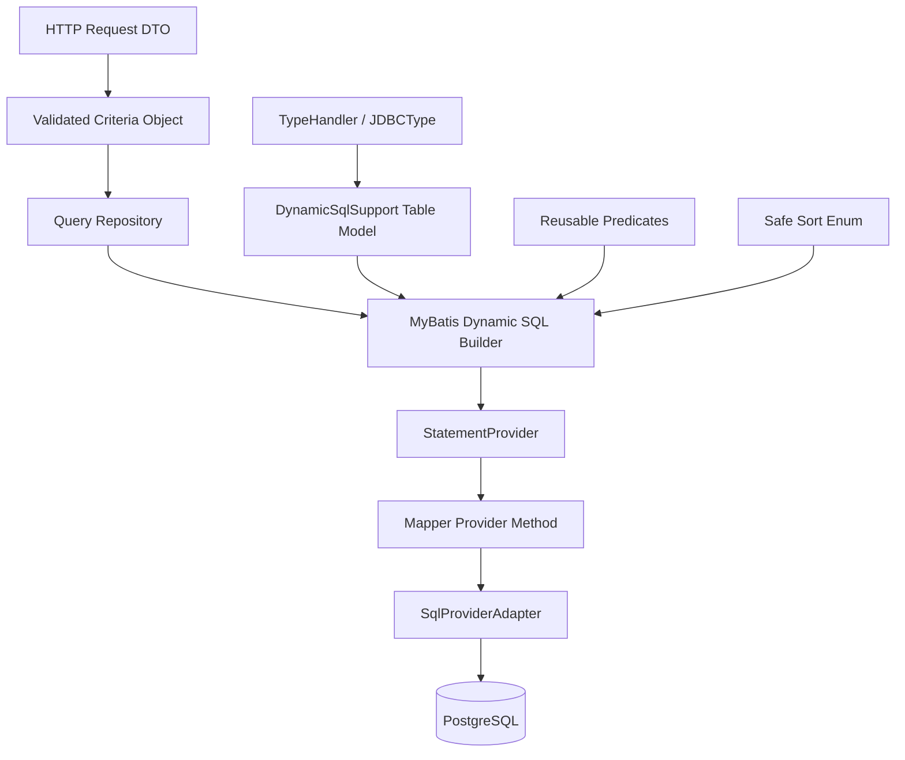
```mermaid id="4sj7tw"
flowchart TD
    A[HTTP Request DTO] --> B[Validated Criteria Object]
    B --> C[Query Repository]
    C --> D[MyBatis Dynamic SQL Builder]
    D --> E[StatementProvider]
    E --> F[Mapper Provider Method]
    F --> G[SqlProviderAdapter]
    G --> H[(PostgreSQL)]

    I[DynamicSqlSupport Table Model] --> D
    J[Reusable Predicates] --> D
    K[Safe Sort Enum] --> D
    L[TypeHandler / JDBCType] --> I
```

Core invariant:

```text id="gwwpzd"
Raw request tidak boleh langsung membangun SQL.

Flow aman:
  Request DTO
    -> validation / normalization / whitelist
    -> Criteria object
    -> DSL builder
    -> StatementProvider
    -> Mapper provider
```

---

# 3. Setup Dependency

```xml id="gvvb3a"
<dependency>
  <groupId>org.mybatis.dynamic-sql</groupId>
  <artifactId>mybatis-dynamic-sql</artifactId>
  <version>${mybatis.dynamic.sql.version}</version>
</dependency>
```

Workflow resmi MyBatis Dynamic SQL terdiri dari tiga langkah utama: membuat object table/column, membuat mapper untuk MyBatis3, lalu menulis dan memakai SQL. ([MyBatis](https://mybatis.org/mybatis-dynamic-sql/docs/quickStart.html))

---

# 4. Recommended Package Layout

```text id="92ldo4"
com.company.app.persistence.dynamic
  CaseDynamicSqlSupport.java
  OutboxDynamicSqlSupport.java
  AuditDynamicSqlSupport.java

com.company.app.persistence.mapper.dynamic
  CaseDynamicMapper.java
  OutboxDynamicMapper.java
  AuditDynamicMapper.java

com.company.app.persistence.repository
  MyBatisCaseQueryRepository.java
  MyBatisCaseCommandRepository.java

com.company.app.application.query
  CaseSearchCriteria.java
  CaseSortField.java
  SortDirection.java
  CaseSearchCriteriaFactory.java
```

Practical rule:

```text id="g85y8c"
DynamicSqlSupport:
  table/column model only

DynamicMapper:
  provider methods only

Repository:
  builds DSL from validated criteria

Resource:
  never builds DSL directly
```

---

# 5. Table Model / DynamicSqlSupport

Dokumentasi menyebut MyBatis Dynamic SQL memakai Java object untuk merepresentasikan table/view; `SqlTable` menyimpan nama table dan kumpulan `SqlColumn`, sedangkan `AliasableSqlTable` direkomendasikan untuk fleksibilitas alias dan runtime table name. Column object memuat Java type, nama column, JDBC type, dan optional type handler. ([MyBatis](https://mybatis.org/mybatis-dynamic-sql/docs/databaseObjects.html?utm_source=chatgpt.com))

## 5.1 Case table

```java id="n6bp5f"
package com.company.app.persistence.dynamic;

import static java.sql.JDBCType.BIGINT;
import static java.sql.JDBCType.TIMESTAMP_WITH_TIMEZONE;
import static java.sql.JDBCType.VARCHAR;
import static java.sql.JDBCType.OTHER;

import java.sql.JDBCType;
import java.time.Instant;
import java.util.UUID;

import org.mybatis.dynamic.sql.AliasableSqlTable;
import org.mybatis.dynamic.sql.SqlColumn;

public final class CaseDynamicSqlSupport {

    public static final CaseTable cases = new CaseTable();

    public static final SqlColumn<UUID> id = cases.id;
    public static final SqlColumn<UUID> tenantId = cases.tenantId;
    public static final SqlColumn<String> caseNumber = cases.caseNumber;
    public static final SqlColumn<String> status = cases.status;
    public static final SqlColumn<String> priority = cases.priority;
    public static final SqlColumn<String> assignedTeam = cases.assignedTeam;
    public static final SqlColumn<Long> version = cases.version;
    public static final SqlColumn<Instant> dueAt = cases.dueAt;
    public static final SqlColumn<Instant> createdAt = cases.createdAt;
    public static final SqlColumn<Instant> updatedAt = cases.updatedAt;
    public static final SqlColumn<Instant> deletedAt = cases.deletedAt;

    public static final class CaseTable extends AliasableSqlTable<CaseTable> {

        public final SqlColumn<UUID> id = column("id", OTHER);
        public final SqlColumn<UUID> tenantId = column("tenant_id", OTHER);
        public final SqlColumn<String> caseNumber = column("case_number", VARCHAR);
        public final SqlColumn<String> status = column("status", VARCHAR);
        public final SqlColumn<String> priority = column("priority", VARCHAR);
        public final SqlColumn<String> assignedTeam = column("assigned_team", VARCHAR);
        public final SqlColumn<Long> version = column("version", BIGINT);
        public final SqlColumn<Instant> dueAt = column("due_at", TIMESTAMP_WITH_TIMEZONE);
        public final SqlColumn<Instant> createdAt = column("created_at", TIMESTAMP_WITH_TIMEZONE);
        public final SqlColumn<Instant> updatedAt = column("updated_at", TIMESTAMP_WITH_TIMEZONE);
        public final SqlColumn<Instant> deletedAt = column("deleted_at", TIMESTAMP_WITH_TIMEZONE);

        public CaseTable() {
            super("cases", CaseTable::new);
        }
    }

    private CaseDynamicSqlSupport() {}
}
```

## 5.2 JSONB column dengan TypeHandler

```java id="0wtqhz"
public final class OutboxDynamicSqlSupport {

    public static final OutboxTable outboxEvents = new OutboxTable();

    public static final SqlColumn<UUID> id = outboxEvents.id;
    public static final SqlColumn<UUID> tenantId = outboxEvents.tenantId;
    public static final SqlColumn<String> eventType = outboxEvents.eventType;
    public static final SqlColumn<JsonNode> payload = outboxEvents.payload;
    public static final SqlColumn<String> status = outboxEvents.status;
    public static final SqlColumn<Integer> attemptCount = outboxEvents.attemptCount;
    public static final SqlColumn<Instant> availableAt = outboxEvents.availableAt;
    public static final SqlColumn<Instant> createdAt = outboxEvents.createdAt;

    public static final class OutboxTable extends AliasableSqlTable<OutboxTable> {

        public final SqlColumn<UUID> id = column("id", JDBCType.OTHER);
        public final SqlColumn<UUID> tenantId = column("tenant_id", JDBCType.OTHER);
        public final SqlColumn<String> eventType = column("event_type", JDBCType.VARCHAR);

        public final SqlColumn<JsonNode> payload =
            column("payload", JDBCType.OTHER,
                "com.company.app.mybatis.JsonNodeJsonbTypeHandler");

        public final SqlColumn<String> status = column("status", JDBCType.VARCHAR);
        public final SqlColumn<Integer> attemptCount = column("attempt_count", JDBCType.INTEGER);
        public final SqlColumn<Instant> availableAt = column("available_at", JDBCType.TIMESTAMP_WITH_TIMEZONE);
        public final SqlColumn<Instant> createdAt = column("created_at", JDBCType.TIMESTAMP_WITH_TIMEZONE);

        public OutboxTable() {
            super("outbox_events", OutboxTable::new);
        }
    }

    private OutboxDynamicSqlSupport() {}
}
```

---

# 6. Mapper Provider Interface

Dynamic SQL mapper biasanya menerima `SelectStatementProvider`, `InsertStatementProvider`, `UpdateStatementProvider`, dan `DeleteStatementProvider`, lalu memakai `SqlProviderAdapter`. Dokumentasi MyBatis Dynamic SQL menunjukkan provider annotations seperti `@SelectProvider(... method="select")`, `@InsertProvider(... method="insert")`, `@UpdateProvider(... method="update")`, dan `@DeleteProvider(... method="delete")`. ([MyBatis](https://mybatis.org/mybatis-dynamic-sql/docs/mybatis3.html?utm_source=chatgpt.com))

```java id="glhy1j"
package com.company.app.persistence.mapper.dynamic;

import java.util.List;
import java.util.Optional;

import org.apache.ibatis.annotations.DeleteProvider;
import org.apache.ibatis.annotations.InsertProvider;
import org.apache.ibatis.annotations.Options;
import org.apache.ibatis.annotations.Result;
import org.apache.ibatis.annotations.ResultMap;
import org.apache.ibatis.annotations.Results;
import org.apache.ibatis.annotations.SelectProvider;
import org.apache.ibatis.annotations.UpdateProvider;
import org.mybatis.dynamic.sql.delete.render.DeleteStatementProvider;
import org.mybatis.dynamic.sql.insert.render.InsertStatementProvider;
import org.mybatis.dynamic.sql.select.render.SelectStatementProvider;
import org.mybatis.dynamic.sql.update.render.UpdateStatementProvider;
import org.mybatis.dynamic.sql.util.SqlProviderAdapter;

public interface CaseDynamicMapper {

    @SelectProvider(type = SqlProviderAdapter.class, method = "select")
    @Results(id = "CaseRecordResult", value = {
        @Result(property = "id", column = "id", id = true),
        @Result(property = "tenantId", column = "tenant_id"),
        @Result(property = "caseNumber", column = "case_number"),
        @Result(property = "status", column = "status"),
        @Result(property = "priority", column = "priority"),
        @Result(property = "assignedTeam", column = "assigned_team"),
        @Result(property = "version", column = "version"),
        @Result(property = "dueAt", column = "due_at"),
        @Result(property = "createdAt", column = "created_at"),
        @Result(property = "updatedAt", column = "updated_at")
    })
    List<CaseRecord> selectMany(SelectStatementProvider selectStatement);

    @SelectProvider(type = SqlProviderAdapter.class, method = "select")
    @ResultMap("CaseRecordResult")
    Optional<CaseRecord> selectOne(SelectStatementProvider selectStatement);

    @InsertProvider(type = SqlProviderAdapter.class, method = "insert")
    @Options(timeout = 5)
    int insert(InsertStatementProvider<CaseRecord> insertStatement);

    @UpdateProvider(type = SqlProviderAdapter.class, method = "update")
    @Options(timeout = 5)
    int update(UpdateStatementProvider updateStatement);

    @DeleteProvider(type = SqlProviderAdapter.class, method = "delete")
    @Options(timeout = 10)
    int delete(DeleteStatementProvider deleteStatement);
}
```

Rendering strategy menentukan format placeholder parameter. Untuk MyBatis3, `RenderingStrategies.MYBATIS3` menghasilkan placeholder seperti `#{foo,jdbcType=INTEGER}`. ([MyBatis](https://mybatis.org/mybatis-dynamic-sql/docs/extending.html))

---

# 7. Criteria Object Pattern

## 7.1 Request DTO

```java id="0ft3y6"
public record CaseSearchRequest(
    String status,
    String priority,
    String assignedTeam,
    Instant dueBefore,
    Instant createdFrom,
    Instant createdTo,
    String sort,
    String direction,
    Integer limit
) {}
```

## 7.2 Safe Criteria

```java id="45vjnm"
public record CaseSearchCriteria(
    UUID tenantId,
    CaseStatus status,
    CasePriority priority,
    String assignedTeam,
    Instant dueBefore,
    Instant createdFrom,
    Instant createdTo,
    CaseSortField sortField,
    SortDirection direction,
    int limit
) {
    public String statusName() {
        return status == null ? null : status.name();
    }

    public String priorityName() {
        return priority == null ? null : priority.name();
    }
}
```

## 7.3 Criteria factory

```java id="pzv4lh"
public final class CaseSearchCriteriaFactory {

    private static final int DEFAULT_LIMIT = 50;
    private static final int MAX_LIMIT = 200;

    private CaseSearchCriteriaFactory() {}

    public static CaseSearchCriteria from(
        CaseSearchRequest request,
        UUID tenantId
    ) {
        return new CaseSearchCriteria(
            tenantId,
            parseEnum(request.status(), CaseStatus.class),
            parseEnum(request.priority(), CasePriority.class),
            normalizeTeam(request.assignedTeam()),
            request.dueBefore(),
            request.createdFrom(),
            request.createdTo(),
            CaseSortField.fromApiValue(request.sort()),
            SortDirection.fromApiValue(request.direction()),
            normalizeLimit(request.limit())
        );
    }

    private static int normalizeLimit(Integer limit) {
        if (limit == null) {
            return DEFAULT_LIMIT;
        }

        if (limit < 1 || limit > MAX_LIMIT) {
            throw new InvalidLimitException(limit);
        }

        return limit;
    }

    private static String normalizeTeam(String assignedTeam) {
        if (assignedTeam == null || assignedTeam.isBlank()) {
            return null;
        }

        String normalized = assignedTeam.trim();

        if (normalized.length() > 50) {
            throw new InvalidAssignedTeamException();
        }

        return normalized;
    }

    private static <E extends Enum<E>> E parseEnum(String value, Class<E> enumType) {
        if (value == null || value.isBlank()) {
            return null;
        }

        try {
            return Enum.valueOf(enumType, value.trim().toUpperCase(Locale.ROOT));
        } catch (IllegalArgumentException e) {
            throw new InvalidEnumValueException(enumType.getSimpleName(), value);
        }
    }
}
```

Production rule:

```text id="7gngd3"
Dynamic SQL builder hanya menerima Criteria yang sudah aman.

Jangan:
  repository.search(requestDto)
  mapper.select(providerFromRawRequest)
```

---

# 8. Safe Sorting dengan DSL

## 8.1 Sort enum

```java id="hdgklv"
import org.mybatis.dynamic.sql.SortSpecification;

import static com.company.app.persistence.dynamic.CaseDynamicSqlSupport.createdAt;
import static com.company.app.persistence.dynamic.CaseDynamicSqlSupport.dueAt;
import static com.company.app.persistence.dynamic.CaseDynamicSqlSupport.priority;
import static com.company.app.persistence.dynamic.CaseDynamicSqlSupport.updatedAt;

public enum CaseSortField {
    DUE_AT("dueAt", dueAt),
    CREATED_AT("createdAt", createdAt),
    UPDATED_AT("updatedAt", updatedAt),
    PRIORITY("priority", priority);

    private final String apiName;
    private final SortSpecification sortSpecification;

    CaseSortField(String apiName, SortSpecification sortSpecification) {
        this.apiName = apiName;
        this.sortSpecification = sortSpecification;
    }

    public SortSpecification ascendingSpec() {
        return sortSpecification;
    }

    public SortSpecification descendingSpec() {
        return sortSpecification.descending();
    }

    public static CaseSortField fromApiValue(String value) {
        if (value == null || value.isBlank()) {
            return DUE_AT;
        }

        for (CaseSortField field : values()) {
            if (field.apiName.equals(value)) {
                return field;
            }
        }

        throw new InvalidSortFieldException(value);
    }
}
```

## 8.2 Direction enum

```java id="x2iz6z"
public enum SortDirection {
    ASC,
    DESC;

    public static SortDirection fromApiValue(String value) {
        if (value == null || value.isBlank()) {
            return ASC;
        }

        return switch (value.toLowerCase(Locale.ROOT)) {
            case "asc" -> ASC;
            case "desc" -> DESC;
            default -> throw new InvalidSortDirectionException(value);
        };
    }
}
```

## 8.3 Sort helper

```java id="fvh71q"
public final class CaseSort {

    private CaseSort() {}

    public static SortSpecification primary(CaseSearchCriteria criteria) {
        return criteria.direction() == SortDirection.DESC
            ? criteria.sortField().descendingSpec()
            : criteria.sortField().ascendingSpec();
    }
}
```

**Benefit:** tidak perlu `${sortColumn}`. Sort dibangun dari `SqlColumn`/`SortSpecification` internal, bukan raw string user.

---

# 9. SELECT Deep Dive

## 9.1 Find by tenant + id

```java id="r8hj1w"
import static org.mybatis.dynamic.sql.SqlBuilder.*;
import static org.mybatis.dynamic.sql.render.RenderingStrategies.MYBATIS3;
import static com.company.app.persistence.dynamic.CaseDynamicSqlSupport.*;

public Optional<CaseRecord> findById(UUID tenantIdValue, UUID caseId) {
    SelectStatementProvider statement =
        select(
            id,
            tenantId,
            caseNumber,
            status,
            priority,
            assignedTeam,
            version,
            dueAt,
            createdAt,
            updatedAt
        )
        .from(cases)
        .where(tenantId, isEqualTo(tenantIdValue))
        .and(id, isEqualTo(caseId))
        .and(deletedAt, isNull())
        .build()
        .render(MYBATIS3);

    return mapper.selectOne(statement);
}
```

## 9.2 Search dengan optional predicates

Conditions bisa digabung dengan `and` dan `or`, serta menyediakan operator umum seperti `isEqualTo`, `isGreaterThan`, `isBetween`, `isIn`, dan varian case-insensitive. Nilai pada condition dirender sebagai prepared statement parameter sesuai runtime target. ([MyBatis](https://mybatis.org/mybatis-dynamic-sql/docs/conditions.html))

```java id="bkul4n"
public List<CaseRecord> search(CaseSearchCriteria criteria) {
    SelectStatementProvider statement =
        select(
            id,
            tenantId,
            caseNumber,
            status,
            priority,
            assignedTeam,
            version,
            dueAt,
            createdAt,
            updatedAt
        )
        .from(cases)
        .where(tenantId, isEqualTo(criteria.tenantId()))
        .and(deletedAt, isNull())
        .and(status, isEqualToWhenPresent(criteria.statusName()))
        .and(priority, isEqualToWhenPresent(criteria.priorityName()))
        .and(assignedTeam, isEqualToWhenPresent(criteria.assignedTeam()))
        .and(dueAt, isLessThanWhenPresent(criteria.dueBefore()))
        .and(createdAt, isGreaterThanOrEqualToWhenPresent(criteria.createdFrom()))
        .and(createdAt, isLessThanWhenPresent(criteria.createdTo()))
        .orderBy(CaseSort.primary(criteria), id)
        .limit(criteria.limit())
        .build()
        .render(MYBATIS3);

    return mapper.selectMany(statement);
}
```

Production notes:

```text id="84n3yl"
Always:
  tenant predicate
  bounded limit
  deterministic order
  deleted/archived default filter where applicable
```

---

# 10. Reusable Predicate Pattern

## 10.1 Utility class

```java id="an52mm"
import org.mybatis.dynamic.sql.SqlColumn;
import org.mybatis.dynamic.sql.where.condition.IsEqualTo;
import org.mybatis.dynamic.sql.where.condition.IsNull;

import java.util.UUID;

import static org.mybatis.dynamic.sql.SqlBuilder.*;

public final class CommonPredicates {

    private CommonPredicates() {}

    public static IsEqualTo<UUID> tenantIs(UUID tenantId) {
        if (tenantId == null) {
            throw new MissingTenantException();
        }

        return isEqualTo(tenantId);
    }

    public static IsNull<Instant> notDeleted() {
        return isNull();
    }
}
```

## 10.2 Usage

```java id="k6m22n"
SelectStatementProvider statement =
    select(id, tenantId, caseNumber, status)
        .from(cases)
        .where(tenantId, CommonPredicates.tenantIs(criteria.tenantId()))
        .and(deletedAt, CommonPredicates.notDeleted())
        .and(status, isEqualToWhenPresent(criteria.statusName()))
        .build()
        .render(MYBATIS3);
```

Practical rule:

```text id="8ri3kg"
Reusable predicate bagus untuk invariant:
- tenant scope
- soft delete
- status active
- visibility scope

Jangan abstraksikan semua hal sampai query susah dibaca.
```

---

# 11. Authorization-Aware Query

```java id="bm5s6a"
public enum VisibilityScope {
    OWNED,
    TEAM,
    TENANT
}
```

```java id="l8sv6c"
public record CaseVisibilityCriteria(
    UUID tenantId,
    UUID actorId,
    String actorTeam,
    VisibilityScope scope,
    CaseStatus status,
    int limit
) {
    public String statusName() {
        return status == null ? null : status.name();
    }
}
```

```java id="excs6r"
public List<CaseRecord> searchVisibleCases(CaseVisibilityCriteria criteria) {
    var base =
        select(id, tenantId, caseNumber, status, assignedTeam, dueAt)
            .from(cases)
            .where(tenantId, isEqualTo(criteria.tenantId()))
            .and(deletedAt, isNull())
            .and(status, isEqualToWhenPresent(criteria.statusName()));

    switch (criteria.scope()) {
        case OWNED -> base.and(assigneeId, isEqualTo(criteria.actorId()));
        case TEAM -> base.and(assignedTeam, isEqualTo(criteria.actorTeam()));
        case TENANT -> {
            // tenant predicate already applied
        }
    }

    SelectStatementProvider statement =
        base.orderBy(dueAt, id)
            .limit(criteria.limit())
            .build()
            .render(MYBATIS3);

    return mapper.selectMany(statement);
}
```

**Important:** permission scope dihitung oleh authorization layer, bukan dari query parameter user.

---

# 12. Keyword Search Pattern

## 12.1 Criteria normalization

```java id="0lhj6c"
public record CaseKeywordSearchCriteria(
    UUID tenantId,
    String keywordPattern,
    int limit
) {
    public static CaseKeywordSearchCriteria of(UUID tenantId, String keyword, int limit) {
        return new CaseKeywordSearchCriteria(
            tenantId,
            keyword == null || keyword.isBlank()
                ? null
                : "%" + escapeLike(keyword.trim()) + "%",
            limit
        );
    }

    private static String escapeLike(String value) {
        return value
            .replace("\\", "\\\\")
            .replace("%", "\\%")
            .replace("_", "\\_");
    }
}
```

## 12.2 DSL query

```java id="ce2g4p"
public List<CaseRecord> searchByKeyword(CaseKeywordSearchCriteria criteria) {
    SelectStatementProvider statement =
        select(id, tenantId, caseNumber, status, priority, createdAt)
            .from(cases)
            .where(tenantId, isEqualTo(criteria.tenantId()))
            .and(deletedAt, isNull())
            .and(caseNumber, isLikeWhenPresent(criteria.keywordPattern()))
            .orderBy(createdAt.descending(), id.descending())
            .limit(criteria.limit())
            .build()
            .render(MYBATIS3);

    return mapper.selectMany(statement);
}
```

Production note:

```text id="k454mh"
LIKE/ILIKE '%keyword%' can be expensive.
For serious search:
  use trigram/full-text/search engine and index-aware design.
```

---

# 13. `IN` Condition Safety

Dynamic SQL 1.5.2 mengubah behavior `isIn`/`isNotIn` agar empty list tetap dirender dan menyebabkan runtime exception; perubahan ini disengaja demi safety. Jika ingin condition dihapus saat list kosong/null, gunakan versi `WhenPresent`, tetapi untuk `UPDATE`/`DELETE`, itu bisa berbahaya bila WHERE menjadi terlalu luas. ([MyBatis](https://mybatis.org/mybatis-dynamic-sql/docs/CHANGELOG.html))

## 13.1 Safe find by ids

```java id="t58xpx"
public List<CaseRecord> findByIds(UUID tenantIdValue, List<UUID> idsValue) {
    if (idsValue == null || idsValue.isEmpty()) {
        return List.of();
    }

    if (idsValue.size() > 500) {
        throw new TooManyIdsException(idsValue.size());
    }

    SelectStatementProvider statement =
        select(id, tenantId, caseNumber, status, version)
            .from(cases)
            .where(tenantId, isEqualTo(tenantIdValue))
            .and(id, isIn(idsValue))
            .orderBy(id)
            .build()
            .render(MYBATIS3);

    return mapper.selectMany(statement);
}
```

## 13.2 Dangerous delete example

```java id="4hpldf"
DeleteStatementProvider statement =
    deleteFrom(cases)
        .where(tenantId, isEqualTo(tenantIdValue))
        .and(id, isInWhenPresent(idsValue))
        .build()
        .render(MYBATIS3);
```

Risk:

```text id="f3j4be"
Jika idsValue empty/null dan isInWhenPresent menghapus condition,
query bisa menjadi:
  DELETE FROM cases WHERE tenant_id = ?
```

Rule:

```text id="7agsag"
For SELECT:
  empty list -> return List.of()

For UPDATE/DELETE:
  empty list -> throw exception

Do not rely on WhenPresent for destructive operations unless explicitly intended.
```

---

# 14. Pagination

## 14.1 Offset pagination

```java id="gfsz9f"
public List<CaseRecord> searchPage(CaseSearchCriteria criteria, int offset) {
    SelectStatementProvider statement =
        select(id, tenantId, caseNumber, status, priority, createdAt)
            .from(cases)
            .where(tenantId, isEqualTo(criteria.tenantId()))
            .and(status, isEqualToWhenPresent(criteria.statusName()))
            .orderBy(createdAt.descending(), id.descending())
            .limit(criteria.limit())
            .offset(offset)
            .build()
            .render(MYBATIS3);

    return mapper.selectMany(statement);
}
```

Dynamic SQL select mendukung `limit` dan `offset`, tetapi library menulis klausa tersebut apa adanya sehingga developer harus memastikan database target mendukung syntax itu; PostgreSQL mendukungnya. ([MyBatis](https://mybatis.org/mybatis-dynamic-sql/docs/select.html?utm_source=chatgpt.com))

## 14.2 Keyset pagination

```java id="j2lg05"
public record CaseCursor(
    Instant createdAt,
    UUID id
) {}
```

```java id="cld5ly"
public List<CaseRecord> searchAfter(UUID tenantIdValue, CaseCursor cursor, int limit) {
    var builder =
        select(id, tenantId, caseNumber, status, priority, createdAt)
            .from(cases)
            .where(tenantId, isEqualTo(tenantIdValue))
            .and(deletedAt, isNull());

    if (cursor != null) {
        builder.and(
            createdAt,
            isLessThan(cursor.createdAt()),
            or(createdAt, isEqualTo(cursor.createdAt()), and(id, isLessThan(cursor.id())))
        );
    }

    SelectStatementProvider statement =
        builder.orderBy(createdAt.descending(), id.descending())
            .limit(limit)
            .build()
            .render(MYBATIS3);

    return mapper.selectMany(statement);
}
```

Catatan: expression nested seperti di atas bisa jadi verbose di DSL. Untuk keyset kompleks, XML/annotation literal kadang lebih jelas.

---

# 15. COUNT dengan DSL

## 15.1 Count mapper

```java id="fi2anl"
public interface CaseCountMapper {

    @SelectProvider(type = SqlProviderAdapter.class, method = "select")
    long count(SelectStatementProvider selectStatement);
}
```

## 15.2 Count query

```java id="wyjzo1"
public long countOpenCases(UUID tenantIdValue) {
    SelectStatementProvider statement =
        count()
            .from(cases)
            .where(tenantId, isEqualTo(tenantIdValue))
            .and(status, isEqualTo("OPEN"))
            .and(deletedAt, isNull())
            .build()
            .render(MYBATIS3);

    return countMapper.count(statement);
}
```

## 15.3 Production recommendation

```text id="wmx8ry"
Do not always count for search endpoint.

Prefer:
  limit + 1 for hasMore
  optional count endpoint
  cached/materialized dashboard count
```

---

# 16. MyBatis3Utils / Completer Pattern

Specialized MyBatis3 support menyediakan common mapper dan utility untuk mengurangi boilerplate `count`, `delete`, `insert`, `update`, dan `select`. Dokumentasi menyebut common mapper seperti `CommonCountMapper`, `CommonDeleteMapper`, `CommonInsertMapper`, `CommonUpdateMapper`, dan `CommonSelectMapper`, serta utility `MyBatis3Utils` dengan completer seperti `SelectDSLCompleter`. ([MyBatis](https://mybatis.org/mybatis-dynamic-sql/docs/mybatis3.html))

## 16.1 Mapper with provider methods

```java id="nzyydj"
public interface CaseCompleterMapper {

    @SelectProvider(type = SqlProviderAdapter.class, method = "select")
    @ResultMap("CaseRecordResult")
    List<CaseRecord> selectMany(SelectStatementProvider selectStatement);

    @SelectProvider(type = SqlProviderAdapter.class, method = "select")
    @ResultMap("CaseRecordResult")
    Optional<CaseRecord> selectOne(SelectStatementProvider selectStatement);

    @SelectProvider(type = SqlProviderAdapter.class, method = "select")
    long count(SelectStatementProvider selectStatement);

    @UpdateProvider(type = SqlProviderAdapter.class, method = "update")
    int update(UpdateStatementProvider updateStatement);

    @DeleteProvider(type = SqlProviderAdapter.class, method = "delete")
    int delete(DeleteStatementProvider deleteStatement);
}
```

## 16.2 Default select method

```java id="40qfig"
public interface CaseCompleterMapper {

    BasicColumn[] selectList = BasicColumn.columnList(
        id,
        tenantId,
        caseNumber,
        status,
        priority,
        assignedTeam,
        version,
        dueAt,
        createdAt,
        updatedAt
    );

    @SelectProvider(type = SqlProviderAdapter.class, method = "select")
    @ResultMap("CaseRecordResult")
    List<CaseRecord> selectMany(SelectStatementProvider selectStatement);

    default List<CaseRecord> select(SelectDSLCompleter completer) {
        return MyBatis3Utils.selectList(
            this::selectMany,
            selectList,
            cases,
            completer
        );
    }
}
```

## 16.3 Usage

```java id="n59q0n"
List<CaseRecord> rows = mapper.select(c ->
    c.where(tenantId, isEqualTo(criteria.tenantId()))
     .and(status, isEqualTo("OPEN"))
     .orderBy(createdAt.descending(), id.descending())
     .limit(criteria.limit())
);
```

Production warning:

```text id="oe7h0l"
Completer pattern is powerful.
Do not expose arbitrary completer outside repository boundary.

Good:
  repository builds completer from safe criteria

Bad:
  resource/controller passes lambda to mapper directly
```

---

# 17. INSERT Deep Dive

## 17.1 Single insert

```java id="8ddlk2"
public int insertCase(CaseRecord record) {
    InsertStatementProvider<CaseRecord> statement =
        insert(record)
            .into(cases)
            .map(id).toProperty("id")
            .map(tenantId).toProperty("tenantId")
            .map(caseNumber).toProperty("caseNumber")
            .map(status).toProperty("status")
            .map(priority).toProperty("priority")
            .map(assignedTeam).toProperty("assignedTeam")
            .map(version).toProperty("version")
            .map(dueAt).toProperty("dueAt")
            .map(createdAt).toProperty("createdAt")
            .map(updatedAt).toProperty("updatedAt")
            .build()
            .render(MYBATIS3);

    return mapper.insert(statement);
}
```

## 17.2 Selective insert

Dynamic SQL insert supports mapping variants like `toNull`, `toConstant`, `toStringConstant`, `toProperty`, `toPropertyWhenPresent`, `toValue`, and `toValueWhenPresent`. Values mapped through normal value/property methods are bound as prepared statement parameters. ([MyBatis](https://mybatis.org/mybatis-dynamic-sql/docs/insert.html?utm_source=chatgpt.com))

```java id="akv7fu"
public int insertSelective(CaseRecord record) {
    InsertStatementProvider<CaseRecord> statement =
        insert(record)
            .into(cases)
            .map(id).toProperty("id")
            .map(tenantId).toProperty("tenantId")
            .map(caseNumber).toProperty("caseNumber")
            .map(status).toProperty("status")
            .map(priority).toPropertyWhenPresent("priority", record::priority)
            .map(assignedTeam).toPropertyWhenPresent("assignedTeam", record::assignedTeam)
            .map(version).toConstant("0")
            .map(createdAt).toConstant("now()")
            .map(updatedAt).toConstant("now()")
            .build()
            .render(MYBATIS3);

    return mapper.insert(statement);
}
```

## 17.3 Generated keys

For single-row insert generated values, mapper `@Options(useGeneratedKeys=true, keyProperty="row.<attribute>")` must point to `row.<attribute>` because the statement provider wraps the record as `row`. ([MyBatis](https://mybatis.org/mybatis-dynamic-sql/docs/insert.html))

```java id="hg1k06"
@InsertProvider(type = SqlProviderAdapter.class, method = "insert")
@Options(
    useGeneratedKeys = true,
    keyProperty = "row.id",
    keyColumn = "id",
    timeout = 5
)
int insertGenerated(InsertStatementProvider<AuditLogInsert> statement);
```

---

# 18. Multiple Row Insert vs JDBC Batch

Dynamic SQL supports multiple-row insert, but docs warn it can generate many prepared statement parameters and may hit JDBC/database limits; for many records, JDBC batch is usually more efficient. ([MyBatis](https://mybatis.org/mybatis-dynamic-sql/docs/insert.html))

## 18.1 Multiple-row insert for small batch

```java id="72zm43"
public int insertMultipleSmall(List<CaseRecord> records) {
    if (records.isEmpty()) {
        return 0;
    }

    if (records.size() > 100) {
        throw new TooManyRowsForMultiInsertException(records.size());
    }

    MultiRowInsertStatementProvider<CaseRecord> statement =
        insertMultiple(records)
            .into(cases)
            .map(id).toProperty("id")
            .map(tenantId).toProperty("tenantId")
            .map(caseNumber).toProperty("caseNumber")
            .map(status).toProperty("status")
            .map(priority).toProperty("priority")
            .map(version).toProperty("version")
            .map(createdAt).toProperty("createdAt")
            .map(updatedAt).toProperty("updatedAt")
            .build()
            .render(MYBATIS3);

    return mapper.insertMultiple(statement);
}
```

Mapper:

```java id="qoevux"
@InsertProvider(type = SqlProviderAdapter.class, method = "insertMultiple")
@Options(timeout = 10)
int insertMultiple(MultiRowInsertStatementProvider<CaseRecord> statement);
```

## 18.2 JDBC batch for large import

```java id="p9ginv"
public int batchInsertCases(List<CaseRecord> records) {
    int total = 0;

    try (SqlSession session =
             sqlSessionFactory.openSession(ExecutorType.BATCH, false)) {

        CaseDynamicMapper mapper = session.getMapper(CaseDynamicMapper.class);

        for (CaseRecord record : records) {
            InsertStatementProvider<CaseRecord> statement =
                insert(record)
                    .into(cases)
                    .map(id).toProperty("id")
                    .map(tenantId).toProperty("tenantId")
                    .map(caseNumber).toProperty("caseNumber")
                    .map(status).toProperty("status")
                    .map(priority).toProperty("priority")
                    .map(version).toProperty("version")
                    .map(createdAt).toProperty("createdAt")
                    .map(updatedAt).toProperty("updatedAt")
                    .build()
                    .render(MYBATIS3);

            mapper.insert(statement);
            total++;
        }

        session.flushStatements();
        session.commit();
    }

    return total;
}
```

Production rule:

```text id="aywuf3"
Small list:
  multi-row insert is OK

Large import:
  use JDBC batch + chunking

Need generated keys for many rows:
  test carefully; dynamic SQL docs mention limitations for generated values with multiple-row insert.
```

---

# 19. UPDATE Deep Dive

Dynamic SQL update consists of table, flexible `SET` clauses, and optional `WHERE`; docs warn that update without a WHERE clause updates every row. ([MyBatis](https://mybatis.org/mybatis-dynamic-sql/docs/update.html?utm_source=chatgpt.com))

## 19.1 Optimistic locking update

```java id="392t2r"
public int transitionStatus(
    UUID tenantIdValue,
    UUID caseId,
    String fromStatus,
    String toStatus,
    long expectedVersion
) {
    UpdateStatementProvider statement =
        update(cases)
            .set(status).equalTo(toStatus)
            .set(version).equalToConstant("version + 1")
            .set(updatedAt).equalToConstant("now()")
            .where(tenantId, isEqualTo(tenantIdValue))
            .and(id, isEqualTo(caseId))
            .and(status, isEqualTo(fromStatus))
            .and(version, isEqualTo(expectedVersion))
            .build()
            .render(MYBATIS3);

    return mapper.update(statement);
}
```

Service:

```java id="9i5ott"
int updated = repository.transitionStatus(
    tenantId,
    caseId,
    "SUBMITTED",
    "APPROVED",
    expectedVersion
);

if (updated != 1) {
    throw new ConcurrentCaseModificationException(caseId);
}
```

## 19.2 Selective patch update

```java id="d8f5qw"
public int patchCase(CasePatch patch) {
    if (patch.isEmpty()) {
        throw new EmptyPatchException();
    }

    UpdateStatementProvider statement =
        update(cases)
            .set(priority).equalToWhenPresent(
                patch.priority() == null ? null : patch.priority().name()
            )
            .set(assignedTeam).equalToWhenPresent(patch.assignedTeam())
            .set(updatedAt).equalToConstant("now()")
            .set(version).equalToConstant("version + 1")
            .where(tenantId, isEqualTo(patch.tenantId()))
            .and(id, isEqualTo(patch.caseId()))
            .and(version, isEqualTo(patch.expectedVersion()))
            .build()
            .render(MYBATIS3);

    return mapper.update(statement);
}
```

Production checklist:

```text id="ogfwti"
For update:
  tenant predicate
  id/business key predicate
  version/status predicate for state transition
  affected-row checked
  empty patch rejected
```

---

# 20. DELETE Deep Dive

Dynamic SQL delete consists of table and optional where clause; docs explicitly note that delete without where will delete every row in the table. ([MyBatis](https://mybatis.org/mybatis-dynamic-sql/docs/delete.html?utm_source=chatgpt.com))

## 20.1 Safe cleanup delete

```java id="v9glxc"
public int deleteExpiredIdempotencyKeys(UUID tenantIdValue, Instant before) {
    DeleteStatementProvider statement =
        deleteFrom(idempotencyKeys)
            .where(idempotencyTenantId, isEqualTo(tenantIdValue))
            .and(idempotencyStatus, isIn("COMPLETED", "FAILED"))
            .and(idempotencyCreatedAt, isLessThan(before))
            .build()
            .render(MYBATIS3);

    return idempotencyMapper.delete(statement);
}
```

## 20.2 Prevent accidental full delete

```java id="73tmxj"
public int deleteByIds(UUID tenantIdValue, List<UUID> idsValue) {
    if (tenantIdValue == null) {
        throw new MissingTenantException();
    }

    if (idsValue == null || idsValue.isEmpty()) {
        throw new EmptyDeleteTargetException();
    }

    DeleteStatementProvider statement =
        deleteFrom(cases)
            .where(tenantId, isEqualTo(tenantIdValue))
            .and(id, isIn(idsValue))
            .build()
            .render(MYBATIS3);

    return mapper.delete(statement);
}
```

Production rule:

```text id="9gkm0i"
DELETE/UPDATE DSL must never rely on optional WHERE accidentally.

Guard destructive commands in Java before building DSL.
```

---

# 21. PostgreSQL Escape Hatch: `RETURNING`, CTE, Procedure

Dynamic SQL is not always the best tool for PostgreSQL-specific patterns.

## 21.1 `RETURNING`

Use annotation/XML:

```java id="4k1l47"
@Select(
    value = """
        UPDATE cases
        SET
          status = 'APPROVED',
          version = version + 1,
          updated_at = now()
        WHERE tenant_id = #{tenantId}
          AND id = #{caseId}
          AND status = 'SUBMITTED'
          AND version = #{expectedVersion}
        RETURNING
          id,
          tenant_id,
          case_number,
          status,
          priority,
          assigned_team,
          version,
          due_at,
          created_at,
          updated_at
        """,
    affectData = true
)
@Options(timeout = 5, flushCache = Options.FlushCachePolicy.TRUE)
@ResultMap("CaseRecordResult")
CaseRecord approveReturning(ApproveCaseCommand command);
```

## 21.2 CTE queue claim

Use annotation/XML:

```java id="63akv0"
@Select(
    value = """
        WITH candidate AS (
          SELECT id
          FROM outbox_events
          WHERE status = 'PENDING'
            AND available_at <= now()
          ORDER BY available_at ASC, id ASC
          LIMIT #{limit}
          FOR UPDATE SKIP LOCKED
        ),
        claimed AS (
          UPDATE outbox_events o
          SET
            status = 'PROCESSING',
            locked_by = #{workerId},
            locked_at = now(),
            attempt_count = attempt_count + 1
          FROM candidate c
          WHERE o.id = c.id
          RETURNING
            o.id,
            o.tenant_id,
            o.event_type,
            o.payload,
            o.status,
            o.attempt_count,
            o.created_at
        )
        SELECT *
        FROM claimed
        """,
    affectData = true
)
@Options(timeout = 5, fetchSize = 100, flushCache = Options.FlushCachePolicy.TRUE)
@ResultMap("OutboxEventResult")
List<OutboxEventRecord> claimOutboxEvents(
    @Param("workerId") String workerId,
    @Param("limit") int limit
);
```

## 21.3 Procedure call

```java id="8ya2ig"
@Options(
    statementType = StatementType.CALLABLE,
    timeout = 5,
    flushCache = Options.FlushCachePolicy.TRUE
)
@Update("""
    { CALL approve_case_proc(
        #{tenantId, mode=IN, jdbcType=OTHER},
        #{caseId, mode=IN, jdbcType=OTHER},
        #{actorId, mode=IN, jdbcType=OTHER},
        #{expectedVersion, mode=IN, jdbcType=BIGINT},
        #{updated, mode=OUT, jdbcType=INTEGER},
        #{newVersion, mode=OUT, jdbcType=BIGINT}
      )
    }
    """)
void approveCaseProcedure(ApproveCaseProcedureParams params);
```

Decision rule:

```text id="xpqh0w"
DSL:
  common CRUD/search

Annotation/XML:
  PostgreSQL CTE
  DML RETURNING
  stored procedure/function call
  advanced locking
  window/report query
```

---

# 22. Database Functions / Extensions

Library ships with some common database function implementations, but docs state it intentionally does not implement a huge set; instead, it provides examples and extension points so teams can add project-specific functions. ([MyBatis](https://mybatis.org/mybatis-dynamic-sql/docs/functions.html?utm_source=chatgpt.com))

## 22.1 Lowercase search example

```java id="5hh2j7"
SelectStatementProvider statement =
    select(id, tenantId, caseNumber, status)
        .from(cases)
        .where(tenantId, isEqualTo(tenantIdValue))
        .and(caseNumber, isLikeCaseInsensitive(keywordPattern))
        .build()
        .render(MYBATIS3);
```

## 22.2 Custom expression escape hatch

For PostgreSQL-specific expression, sometimes use constant/derived column carefully:

```java id="xm1o1p"
BasicColumn searchRank = DerivedColumn.of("ts_rank(search_vector, plainto_tsquery(#{parameters.p1}))");
```

Production warning:

```text id="a4qqxi"
Be careful with raw derived SQL.
If raw SQL includes user value:
  bind it as parameter, not string concatenate.

For complex expression:
  prefer XML/annotation where reviewers can see exact SQL.
```

---

# 23. Rendering and Logging

## 23.1 Rendered SQL

```java id="7to93g"
SelectStatementProvider statement =
    select(id, tenantId, caseNumber)
        .from(cases)
        .where(tenantId, isEqualTo(tenantIdValue))
        .and(status, isEqualTo("OPEN"))
        .build()
        .render(MYBATIS3);

log.debug("Rendered SQL: {}", statement.getSelectStatement());
```

Do not log full parameter values if they may contain PII.

## 23.2 Safe debug utility

```java id="9e4ce4"
public final class DynamicSqlDebug {

    private DynamicSqlDebug() {}

    public static void logSelect(
        Logger log,
        String operation,
        SelectStatementProvider statement
    ) {
        if (!log.isDebugEnabled()) {
            return;
        }

        log.debug(
            "Dynamic SQL operation={} sql={}",
            operation,
            statement.getSelectStatement()
        );
    }
}
```

---

# 24. Testing Strategy

## 24.1 Unit test criteria conversion

```java id="nk7nl3"
@Test
void shouldRejectInvalidSort() {
    CaseSearchRequest request = new CaseSearchRequest(
        "OPEN",
        null,
        null,
        null,
        null,
        null,
        "created_at desc; drop table cases; --",
        "desc",
        50
    );

    assertThatThrownBy(() ->
        CaseSearchCriteriaFactory.from(request, tenantId)
    ).isInstanceOf(InvalidSortFieldException.class);
}
```

## 24.2 Rendered SQL smoke test

```java id="5uc8se"
@Test
void searchShouldRenderTenantPredicate() {
    CaseSearchCriteria criteria = new CaseSearchCriteria(
        tenantId,
        CaseStatus.OPEN,
        null,
        null,
        null,
        null,
        null,
        CaseSortField.CREATED_AT,
        SortDirection.DESC,
        50
    );

    SelectStatementProvider statement =
        caseQueryBuilder.searchStatement(criteria);

    assertThat(statement.getSelectStatement())
        .contains("where tenant_id =")
        .contains("status =")
        .contains("order by created_at desc");
}
```

## 24.3 Integration test against PostgreSQL

```java id="flb79e"
@Test
void searchShouldNotReturnOtherTenantData() {
    UUID tenantA = UUID.randomUUID();
    UUID tenantB = UUID.randomUUID();

    fixture.insertCase(tenantA, "CASE-A", "OPEN");
    fixture.insertCase(tenantB, "CASE-B", "OPEN");

    CaseSearchCriteria criteria = new CaseSearchCriteria(
        tenantA,
        CaseStatus.OPEN,
        null,
        null,
        null,
        null,
        null,
        CaseSortField.CREATED_AT,
        SortDirection.DESC,
        50
    );

    List<CaseRecord> rows = repository.search(criteria);

    assertThat(rows)
        .extracting(CaseRecord::caseNumber)
        .containsExactly("CASE-A");
}
```

## 24.4 Destructive operation guard test

```java id="k1ptzf"
@Test
void deleteByIdsShouldRejectEmptyList() {
    assertThatThrownBy(() -> repository.deleteByIds(tenantId, List.of()))
        .isInstanceOf(EmptyDeleteTargetException.class);
}
```

---

# 25. Observability Pattern

## 25.1 Repository-level timing

```java id="di2ajl"
public List<CaseRecord> search(CaseSearchCriteria criteria) {
    long start = System.nanoTime();

    try {
        SelectStatementProvider statement = searchStatement(criteria);
        return mapper.selectMany(statement);
    } finally {
        long durationMs =
            TimeUnit.NANOSECONDS.toMillis(System.nanoTime() - start);

        log.info(
            "DynamicSQL operation={} tenantId={} status={} sort={} limit={} durationMs={}",
            "CaseRepository.search",
            criteria.tenantId(),
            criteria.status(),
            criteria.sortField(),
            criteria.limit(),
            durationMs
        );
    }
}
```

## 25.2 Metric dimensions

| Tag | Safe? | Note |
|---|---:|---|
| operation | Ya | `case.search` |
| mapper | Ya | `CaseDynamicMapper.selectMany` |
| sort field enum | Ya | bounded cardinality |
| has keyword | Ya | boolean |
| filter count | Ya | low cardinality |
| tenantId | hati-hati | avoid high-cardinality metric tag |
| keyword value | Tidak | PII/cardinality |
| raw parameters | Tidak | PII/security |

---

# 26. Enterprise Decision Table

| Need | DSL Pattern |
|---|---|
| Safe optional search | `isEqualToWhenPresent`, criteria object |
| Safe sort | enum → `SortSpecification` |
| Tenant filter | mandatory `.where(tenantId, isEqualTo(...))` |
| Find by IDs | validate list, then `isIn(ids)` |
| Empty `IN` select | return empty list |
| Empty `IN` delete/update | throw exception |
| Patch update | `equalToWhenPresent` + empty patch guard |
| Optimistic locking | `.and(version, isEqualTo(expectedVersion))` |
| Count | `count().from(...).where(...)` |
| Delete cleanup | explicit WHERE + max scope |
| Large insert | JDBC batch, not huge multi-row statement |
| Generated key | `@Options(keyProperty="row.id")` |
| PostgreSQL RETURNING | annotation/XML escape hatch |
| CTE queue claim | annotation/XML escape hatch |
| Procedure call | annotation/XML `CALLABLE` |
| Complex report | XML/annotation SQL |

---

# 27. Anti-Pattern

| Anti-Pattern | Risk |
|---|---|
| Resource builds DSL directly | persistence concern leaks to API |
| Raw request becomes sort column | injection/invalid SQL |
| `isInWhenPresent` on delete/update | condition dropped, too broad mutation |
| Update/delete without WHERE | full table modification |
| Dynamic table name from tenant/request | SQL injection/routing bug |
| Huge multi-row insert | too many parameters, poor performance |
| Logging rendered SQL + parameters with PII | data exposure |
| DSL builder method 300 lines long | unreadable query |
| Using DSL for every PostgreSQL-specific CTE | less readable than SQL |
| No integration test | false confidence |
| No tenant predicate helper/test | cross-tenant leak |
| Generated key property wrong | ID not populated |
| No affected row check | lost update missed |

---

# 28. Production Checklist

| Checklist | Status Ideal |
|---|---:|
| Table/column model uses explicit JDBCType | Ya |
| JSONB/enum custom TypeHandler registered | Ya |
| DSL hidden behind repository/query service | Ya |
| Criteria object validated before DSL | Ya |
| Tenant predicate mandatory | Ya |
| Sort uses enum/SqlColumn, not raw string | Ya |
| `limit` bounded | Ya |
| Empty list behavior explicit | Ya |
| Update/delete have WHERE guards | Ya |
| Affected row checked for command update | Ya |
| Batch insert uses chunking/JDBC batch | Ya |
| PostgreSQL escape hatch used for `RETURNING`/CTE/procedure | Ya |
| Rendered SQL smoke tests for critical query | Ya |
| PostgreSQL integration tests for mapper behavior | Ya |
| Observability logs safe criteria summary | Ya |

---

# 29. Roadmap Belajar Singkat

| Urutan | Materi | Target |
|---:|---|---|
| 1 | DynamicSqlSupport | Table/column model benar |
| 2 | Provider mapper | `SqlProviderAdapter` dan `StatementProvider` |
| 3 | Criteria object | raw request tidak masuk DSL |
| 4 | SELECT DSL | optional predicates/search |
| 5 | Safe sorting | enum + `SortSpecification` |
| 6 | IN/list safety | empty list behavior jelas |
| 7 | INSERT/UPDATE/DELETE DSL | selective write dan guard |
| 8 | MyBatis3Utils | completer pattern untuk reusable mapper |
| 9 | PostgreSQL escape hatch | CTE/RETURNING/procedure via XML/annotation |
| 10 | Testing/observability | render smoke + Testcontainers PostgreSQL |

---

## Rekomendasi Materi Selanjutnya

Lanjutkan ke **“Cheatsheet MyBatis Code Generation & Mapper Governance: MyBatis Generator, Dynamic SQL Support Generation, Naming Convention, Generated vs Handwritten Mapper, Regeneration Strategy, dan PR Quality Gate”** karena setelah DSL dipahami, langkah enterprise berikutnya adalah mengelola mapper yang di-generate dan handwritten agar tidak drift, tidak sulit direview, dan tetap production-safe.

---

**Sources:**

- [MyBatis Dynamic SQL](https://mybatis.org/mybatis-dynamic-sql/docs/introduction.html?utm_source=chatgpt.com)

## Response:
7/15/2026, 2:34:03 PM

Lanjut ke code generation dan mapper governance: fokusnya membedakan generated mapper vs handwritten mapper, strategi regenerasi, naming convention, dan quality gate agar mapper tidak drift atau sulit direview.

# Cheatsheet - MyBatis Code Generation & Mapper Governance: MBG, Dynamic SQL Support Generation, Generated vs Handwritten Mapper, Regeneration Strategy, dan PR Quality Gate

## 1. Introduction

**MyBatis Generator / MBG** adalah code generator resmi untuk MyBatis. MBG melakukan introspection ke table database lalu menghasilkan artifact Java/Kotlin/MyBatis untuk operasi CRUD dasar. Dokumentasi resminya juga menegaskan bahwa join query dan stored procedure tetap perlu di-hand-code, jadi MBG sebaiknya dipakai untuk **boilerplate CRUD dan table metamodel**, bukan menggantikan desain query enterprise. ([mybatis.org](https://mybatis.org/generator/))

Core governance-nya:

```text
Generated code:
  boleh diregenerate
  jangan diedit manual sembarangan
  cocok untuk CRUD, model, DynamicSqlSupport, mapper dasar

Handwritten code:
  business query
  CTE
  PostgreSQL RETURNING
  procedure/function call
  tenant-aware query
  optimized report/search
  repository orchestration
```

---

## 2. Mental Model

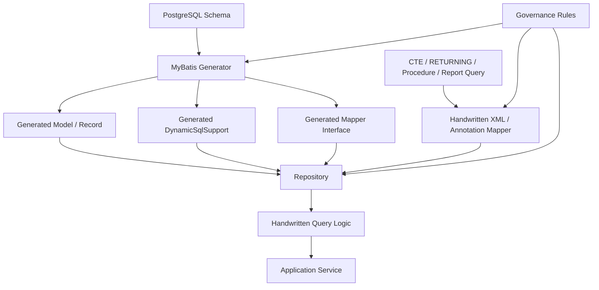
```mermaid
flowchart TD
    A[PostgreSQL Schema] --> B[MyBatis Generator]
    B --> C[Generated Model / Record]
    B --> D[Generated DynamicSqlSupport]
    B --> E[Generated Mapper Interface]

    C --> F[Repository]
    D --> F
    E --> F

    F --> G[Handwritten Query Logic]
    G --> H[Application Service]

    I[Handwritten XML / Annotation Mapper] --> F
    J[CTE / RETURNING / Procedure / Report Query] --> I

    K[Governance Rules] --> B
    K --> I
    K --> F
```

**Rule utama:**

```text
Generated mapper is infrastructure.
Repository is application persistence boundary.
Do not expose generated mapper directly to resource/service unless intentionally simple.
```

---

## 3. Generated vs Handwritten Decision Table

| Kebutuhan | Generated | Handwritten |
|---|---:|---:|
| CRUD simple by primary key | Ya | Biasanya tidak perlu |
| Dynamic SQL support table/column model | Ya | Tidak perlu manual kecuali custom |
| Basic insert/select/update/delete | Ya | Bisa override jika butuh rule khusus |
| Tenant-aware search | Sebagian | Ya, di repository/query method |
| CTE query | Tidak ideal | Ya |
| PostgreSQL `RETURNING` | Terbatas/escape hatch | Ya |
| Stored procedure / PL/pgSQL call | Tidak | Ya |
| Complex join | Tidak | Ya |
| Report/dashboard query | Tidak | Ya |
| Outbox claim with `FOR UPDATE SKIP LOCKED` | Tidak | Ya |
| Authorization-aware projection | Tidak | Ya |
| Generated table model for DSL | Ya | Ya dipakai oleh handwritten repository |
| JSONB custom query | Sebagian | Biasanya handwritten |
| Performance-tuned SQL | Tidak | Ya |

---

## 4. Target Runtime

MBG memakai `targetRuntime` pada `<context>` untuk menentukan gaya code generation. Dokumentasi MBG menyebut default target runtime adalah **`MyBatis3DynamicSql`**, yang menghasilkan code yang bergantung pada MyBatis Dynamic SQL library. ([mybatis.org](https://mybatis.org/generator/))

| Runtime | Output | Recommendation |
|---|---|---|
| `MyBatis3DynamicSql` | Java model/record, mapper interface, DynamicSqlSupport, tanpa XML | Recommended modern Java |
| `MyBatis3` | Model, mapper, optional XML, Example class | Legacy; lebih banyak code |
| `MyBatis3Simple` | Model + mapper CRUD sederhana | Cocok jika tidak butuh advanced generated query |
| `MyBatis3Kotlin` | Kotlin data class + mapper + support class | Untuk Kotlin project |

MBG docs menyatakan runtime `MyBatis3DynamicSQL` menghasilkan model/record, mapper interface CRUD berbasis Dynamic SQL, dan support class sebagai metamodel column/table; untuk runtime `MyBatis3`, “by example” functionality disebut brittle dan menghasilkan banyak code, sehingga docs merekomendasikan pindah ke `MyBatis3DynamicSQL`. ([mybatis.org](https://mybatis.org/generator/configreference/table.html))

---

## 5. Generated Objects untuk `MyBatis3DynamicSQL`

Untuk setiap table yang di-introspect, MBG `MyBatis3DynamicSQL` menghasilkan tiga object utama:

```text
1. Record/model class
2. Dynamic SQL support class
3. Mapper interface
```

Dokumentasi MBG juga menyebut untuk runtime ini: **tidak ada XML**, **tidak ada Example class**, model selalu flat, dan MyBatis Dynamic SQL library wajib tersedia. ([mybatis.org](https://mybatis.org/generator/generatedobjects/dynamicSql.html))

Contoh output:

```text
generated/
  com.company.app.generated.model/
    CaseRecord.java

  com.company.app.generated.mapper/
    CaseDynamicSqlSupport.java
    CaseMapper.java
```

---

## 6. Maven Plugin Setup

MBG menyediakan Maven plugin dengan goal `mybatis-generator:generate`. Dokumentasi Maven plugin menunjukkan versi contoh **2.0.0**, goal `generate`, command `mvn mybatis-generator:generate`, dan opsi `-Dmybatis.generator.overwrite=true` untuk overwrite generated Java files. Plugin juga bisa di-bind ke phase `generate-sources`, sehingga code generated ikut build sebelum compile. ([mybatis.org](https://mybatis.org/generator/running/runningWithMaven.html))

```xml
<build>
  <plugins>
    <plugin>
      <groupId>org.mybatis.generator</groupId>
      <artifactId>mybatis-generator-maven-plugin</artifactId>
      <version>2.0.0</version>
      <configuration>
        <configurationFile>
          src/main/resources/generator/generatorConfig.xml
        </configurationFile>
        <overwrite>true</overwrite>
        <verbose>true</verbose>
      </configuration>
      <dependencies>
        <dependency>
          <groupId>org.postgresql</groupId>
          <artifactId>postgresql</artifactId>
          <version>${postgresql.version}</version>
        </dependency>
      </dependencies>
    </plugin>
  </plugins>
</build>
```

Run manual:

```bash
mvn mybatis-generator:generate
```

Run overwrite:

```bash
mvn -Dmybatis.generator.overwrite=true mybatis-generator:generate
```

---

## 7. CLI Setup

Quick start MBG menunjukkan command-line pattern seperti ini:

```bash
java -jar mybatis-generator-core-x.x.x.jar \
  -configfile /path/to/generatorConfig.xml \
  -overwrite
```

Jika `-overwrite` tidak dipakai dan ada conflict, MBG akan menyimpan file baru dengan nama unik seperti `MyClass.java.1`. ([mybatis.org](https://mybatis.org/generator/quickstart.html))

**Enterprise recommendation:**

```text
Local developer:
  boleh run manual untuk update generated code

CI:
  bisa verify generated code up-to-date

Production build:
  hindari generate dari live DB
  generate dari controlled schema/migration state
```

---

# 8. `generatorConfig.xml` Baseline - PostgreSQL + Dynamic SQL

```xml
<?xml version="1.0" encoding="UTF-8"?>
<!DOCTYPE generatorConfiguration
  PUBLIC "-//mybatis.org//DTD MyBatis Generator Configuration 1.0//EN"
  "https://mybatis.org/dtd/mybatis-generator-config_1_0.dtd">

<generatorConfiguration>

  <properties resource="generator/generator.properties"/>

  <classPathEntry location="${postgresql.driver.path}"/>

  <context id="PostgreSQLDynamicSql"
           targetRuntime="MyBatis3DynamicSql"
           defaultModelType="flat">

    <property name="javaFileEncoding" value="UTF-8"/>

    <commentGenerator>
      <property name="suppressDate" value="true"/>
      <property name="suppressAllComments" value="false"/>
    </commentGenerator>

    <jdbcConnection
        driverClass="org.postgresql.Driver"
        connectionURL="${db.url}"
        userId="${db.username}"
        password="${db.password}">
    </jdbcConnection>

    <javaTypeResolver>
      <property name="forceBigDecimals" value="true"/>
      <property name="useJSR310Types" value="true"/>
    </javaTypeResolver>

    <javaModelGenerator
        targetPackage="com.company.app.generated.model"
        targetProject="target/generated-sources/mybatis">
      <property name="trimStrings" value="true"/>
    </javaModelGenerator>

    <javaClientGenerator
        type="ANNOTATEDMAPPER"
        targetPackage="com.company.app.generated.mapper"
        targetProject="target/generated-sources/mybatis">
    </javaClientGenerator>

    <table schema="public"
           tableName="cases"
           domainObjectName="CaseRecord">
      <property name="dynamicSqlSupportClassName" value="CaseDynamicSqlSupport"/>
      <property name="dynamicSqlTableObjectName" value="caseTable"/>
    </table>

    <table schema="public"
           tableName="outbox_events"
           domainObjectName="OutboxEventRecord">
      <property name="dynamicSqlSupportClassName" value="OutboxDynamicSqlSupport"/>
      <property name="dynamicSqlTableObjectName" value="outboxEventTable"/>
    </table>

  </context>
</generatorConfiguration>
```

`<context>` adalah environment generation yang berisi koneksi database, jenis object yang dihasilkan, dan table yang di-introspect. Multiple `<context>` bisa dipakai dalam satu run untuk database atau parameter generation yang berbeda. ([mybatis.org](https://mybatis.org/generator/configreference/context.html?utm_source=chatgpt.com))

---

# 9. Important MBG Config Elements

| Element | Fungsi | Production Note |
|---|---|---|
| `<generatorConfiguration>` | root config | satu file per module/domain lebih rapi |
| `<properties>` | externalize property | jangan commit password production |
| `<classPathEntry>` | JDBC driver path | Maven plugin dependency sering lebih praktis |
| `<context>` | generation environment | pilih `targetRuntime` jelas |
| `<commentGenerator>` | comment behavior | `suppressDate=true` agar diff stabil |
| `<jdbcConnection>` | DB introspection connection | gunakan schema dev/test controlled |
| `<javaTypeResolver>` | DB type → Java type | penting untuk `BigDecimal`, Java Time |
| `<javaModelGenerator>` | package/path model | generated source path terpisah |
| `<javaClientGenerator>` | package/path mapper | generated mapper package terpisah |
| `<sqlMapGenerator>` | XML output | tidak dipakai untuk `MyBatis3DynamicSQL` |
| `<table>` | table selection | explicit table list preferred |
| `<columnOverride>` | override column mapping | JSONB/enum/custom type |
| `<ignoreColumn>` | exclude column | sensitive/generated/computed column |
| `<plugin>` | modify generation | gunakan hati-hati |

---

# 10. `<table>` Governance

`<table>` memilih table database untuk introspection. Untuk `MyBatis3DynamicSQL`, MBG akan menghasilkan model/record, mapper interface CRUD berbasis Dynamic SQL, dan dynamic SQL support class. ([mybatis.org](https://mybatis.org/generator/configreference/table.html))

```xml
<table schema="public"
       tableName="cases"
       domainObjectName="CaseRecord">
  <property name="dynamicSqlSupportClassName" value="CaseDynamicSqlSupport"/>
  <property name="dynamicSqlTableObjectName" value="caseTable"/>

  <ignoreColumn column="internal_legacy_blob"/>

  <columnOverride column="payload"
                  javaType="com.fasterxml.jackson.databind.JsonNode"
                  jdbcType="OTHER"
                  typeHandler="com.company.app.mybatis.JsonNodeJsonbTypeHandler"/>
</table>
```

## Important `<table>` options

| Option | Fungsi | Note |
|---|---|---|
| `schema` | database schema | PostgreSQL biasanya `public` atau app schema |
| `tableName` | table target | explicit list lebih aman dari wildcard |
| `domainObjectName` | nama model generated | gunakan suffix `Record` untuk persistence |
| `mapperName` | nama generated mapper | untuk runtime yang support |
| `delimitIdentifiers` | exact case/delimited identifier | hindari mixed-case table jika bisa |
| `delimitAllColumns` | delimit semua column | jarang perlu; bisa noisy |
| `escapeWildcards` | escape `_`/`%` saat introspection | jika table/schema name punya wildcard char |
| `modelType` | `flat`/`record` etc | Java modern bisa `record` jika cocok |
| `dynamicSqlSupportClassName` | nama support class | bagus untuk governance |
| `dynamicSqlTableObjectName` | nama inner table object | bikin DSL lebih readable |
| `ignoreQualifiersAtRuntime` | jangan include schema/catalog runtime | berguna schema-per-tenant |
| `runtimeSchema` | schema runtime berbeda | hati-hati dengan multi-env |
| `rootClass` | superclass generated model | jarang |
| `rootInterface` | super interface mapper | bisa untuk common generated mapper contract |
| `trimStrings` | trim string | hati-hati, bisa ubah data semantics |

MBG docs juga menyebut `modelOnly=true` dapat membuat MBG hanya menghasilkan model class dan tidak menghasilkan CRUD method/client; ini berguna jika table hanya ingin dipakai sebagai data structure atau result map support. ([mybatis.org](https://mybatis.org/generator/configreference/table.html))

---

# 11. `columnOverride` untuk PostgreSQL

## 11.1 JSONB

```xml
<columnOverride column="payload"
                javaType="com.fasterxml.jackson.databind.JsonNode"
                jdbcType="OTHER"
                typeHandler="com.company.app.mybatis.JsonNodeJsonbTypeHandler"/>
```

## 11.2 Enum sebagai Java enum

```xml
<columnOverride column="status"
                javaType="com.company.app.domain.CaseStatus"
                jdbcType="VARCHAR"
                typeHandler="com.company.app.mybatis.CaseStatusTypeHandler"/>
```

## 11.3 Timestamp

```xml
<columnOverride column="created_at"
                javaType="java.time.Instant"
                jdbcType="TIMESTAMP_WITH_TIMEZONE"/>
```

## 11.4 Numeric money

```xml
<columnOverride column="amount"
                javaType="java.math.BigDecimal"
                jdbcType="NUMERIC"/>
```

**Production rule:**

```text
Generated mapping must match production TypeHandler strategy.

If JSONB/enum/timestamptz mapping is not tested with PostgreSQL,
do not trust generated code blindly.
```

---

# 12. Generated Package Strategy

Recommended:

```text
com.company.app.generated.model
  CaseRecord
  OrderRecord
  OutboxEventRecord

com.company.app.generated.mapper
  CaseMapper
  OrderMapper
  OutboxEventMapper
  CaseDynamicSqlSupport
  OrderDynamicSqlSupport
  OutboxEventDynamicSqlSupport

com.company.app.persistence.repository
  MyBatisCaseRepository
  MyBatisCaseQueryRepository
  MyBatisOutboxRepository

com.company.app.persistence.mapper.custom
  CaseCustomMapper
  OutboxClaimMapper
  CaseProcedureMapper
```

**Rule:**

```text
Generated package:
  machine-owned

Custom package:
  developer-owned

Repository:
  stable boundary consumed by application service
```

---

# 13. Generated Mapper Usage Pattern

## 13.1 Avoid direct use in service for complex use case

Bad:

```java
public class CaseApplicationService {

    private final CaseMapper generatedMapper;

    public CaseResponse approve(ApproveCaseCommand command) {
        generatedMapper.updateByPrimaryKey(...);
        return ...;
    }
}
```

Better:

```java
public class MyBatisCaseRepository implements CaseRepository {

    private final CaseMapper generatedMapper;
    private final CaseCustomMapper customMapper;

    public Optional<CaseRecord> findById(UUID tenantId, UUID caseId) {
        SelectStatementProvider statement =
            select(id, tenantId, caseNumber, status, version, createdAt, updatedAt)
                .from(caseTable)
                .where(CaseDynamicSqlSupport.tenantId, isEqualTo(tenantId))
                .and(CaseDynamicSqlSupport.id, isEqualTo(caseId))
                .and(deletedAt, isNull())
                .build()
                .render(RenderingStrategies.MYBATIS3);

        return generatedMapper.selectOne(statement);
    }

    public int transitionStatus(...) {
        return customMapper.transitionStatus(...);
    }
}
```

## 13.2 Generated mapper as low-level adapter

```text
Application service
  -> Repository interface
    -> MyBatis repository implementation
      -> Generated mapper
      -> Custom mapper
```

This keeps generated API from leaking into business/application layer.

---

# 14. Handwritten Mapper Categories

| Mapper | Content | Example |
|---|---|---|
| `CaseCustomMapper` | optimized command/query | optimistic transition |
| `CaseQueryMapper` | DTO projection/search | queue/search/detail |
| `CaseProcedureMapper` | `CALL` PL/pgSQL | approval procedure |
| `OutboxClaimMapper` | CTE queue claim | `FOR UPDATE SKIP LOCKED` |
| `CaseReportMapper` | reporting CTE/window | dashboard |
| `BackfillMapper` | controlled maintenance SQL | chunked migration |
| `AdminCaseMapper` | cross-tenant admin | audited admin search |

**Rule:**

```text
Generated mapper:
  simple table-level operations

Handwritten mapper:
  business intent, performance intent, DB-specific behavior
```

---

# 15. Regeneration Strategy

## 15.1 Do not manually edit generated Java

Recommended header/convention:

```java
/**
 * This file is generated by MyBatis Generator.
 * Do not edit manually.
 */
```

If generated files live under `target/generated-sources`, they are naturally treated as build output. If generated files are committed under `src/generated/java`, enforce “no manual edits” with PR review and regeneration checks.

## 15.2 XML generated special case

For legacy XML generation, MBG marks generated XML elements with `@mbg.generated`; on subsequent runs, elements containing that comment are deleted and replaced, while XML elements without that marker remain untouched. MBG also notes SQL Map XML files are **not generated** for `MyBatis3DynamicSQL`. ([mybatis.org](https://mybatis.org/generator/generatedobjects/sqlmap.html))

Governance implication:

```text
Dynamic SQL runtime:
  no generated XML

Legacy XML runtime:
  handwritten XML can coexist only if it avoids @mbg.generated marker
```

---

# 16. Where to Put Generated Sources?

## Option A - Generate into `target/generated-sources`

```xml
<javaModelGenerator
    targetPackage="com.company.app.generated.model"
    targetProject="target/generated-sources/mybatis"/>

<javaClientGenerator
    type="ANNOTATEDMAPPER"
    targetPackage="com.company.app.generated.mapper"
    targetProject="target/generated-sources/mybatis"/>
```

Pros:

```text
- clean source tree
- no generated code in Git
- repeatable if DB/schema snapshot available
```

Cons:

```text
- build depends on generation input
- CI must have schema or generated artifacts
```

## Option B - Commit generated code

```text
src/main/generated/
  java/com/company/app/generated/...
```

Pros:

```text
- build does not need DB introspection
- diff review visible
- reproducible without DB
```

Cons:

```text
- generated diffs can be noisy
- manual edits risk
```

## Enterprise recommendation

```text
If schema source-of-truth is migration files and CI can create DB:
  target/generated-sources is clean.

If organization wants generated diffs reviewed:
  commit generated code, but enforce regeneration quality gate.
```

---

# 17. CI Quality Gate: “Generated Code Up-to-Date”

Pattern:

```bash
mvn -DskipTests generate-sources
git diff --exit-code
```

If diff appears, fail CI:

```text
Generated MyBatis code is out of date.
Run:
  mvn mybatis-generator:generate
Commit generated changes.
```

For committed generated source:

```bash
mvn -Dmybatis.generator.overwrite=true mybatis-generator:generate
git diff --exit-code src/main/generated
```

For target generated source:

```bash
mvn clean generate-sources compile
```

---

# 18. Generator Input Governance

**Never generate from random developer database** for enterprise mapper baseline.

Preferred source:

```text
Migration files
  -> ephemeral PostgreSQL container
    -> run Flyway/Liquibase migrate
      -> run MBG introspection
        -> generated code
```

Pipeline:

```text
1. Start PostgreSQL test container
2. Apply migrations
3. Run MBG
4. Compile generated code
5. Run mapper integration tests
6. Fail if generated code diff is unexpected
```

This ensures generated code follows the same schema that production migration creates.

---

# 19. Maven Profile for Codegen

```xml
<profiles>
  <profile>
    <id>codegen</id>
    <build>
      <plugins>
        <plugin>
          <groupId>org.mybatis.generator</groupId>
          <artifactId>mybatis-generator-maven-plugin</artifactId>
          <version>2.0.0</version>
          <configuration>
            <configurationFile>
              src/main/resources/generator/generatorConfig.xml
            </configurationFile>
            <overwrite>true</overwrite>
          </configuration>
          <dependencies>
            <dependency>
              <groupId>org.postgresql</groupId>
              <artifactId>postgresql</artifactId>
              <version>${postgresql.version}</version>
            </dependency>
          </dependencies>
        </plugin>
      </plugins>
    </build>
  </profile>
</profiles>
```

Run:

```bash
mvn -Pcodegen mybatis-generator:generate
```

---

# 20. Generator Properties

`generator.properties`:

```properties
db.url=jdbc:postgresql://localhost:5432/app_db
db.username=app_codegen
db.password=app_codegen

postgresql.driver.path=/path/to/postgresql.jar
```

Enterprise rule:

```text
Local properties:
  allowed for dev only

CI:
  inject via environment/secret

Production:
  never use production credential for codegen
```

---

# 21. DB Role for Code Generation

```sql
CREATE ROLE app_codegen LOGIN PASSWORD '...';

GRANT CONNECT ON DATABASE app_db TO app_codegen;
GRANT USAGE ON SCHEMA public TO app_codegen;

GRANT SELECT ON ALL TABLES IN SCHEMA public TO app_codegen;
```

Depending on database introspection needs, additional metadata access may be required, but avoid using migration owner or runtime app owner casually.

```text
Migration owner:
  DDL privilege

Runtime app:
  DML privilege

Codegen user:
  metadata/read-only enough for introspection
```

---

# 22. Generated Model Naming

Recommended naming:

| Database Table | Generated Model | Generated Mapper | Support Class |
|---|---|---|---|
| `cases` | `CaseRecord` | `CaseMapper` | `CaseDynamicSqlSupport` |
| `orders` | `OrderRecord` | `OrderMapper` | `OrderDynamicSqlSupport` |
| `outbox_events` | `OutboxEventRecord` | `OutboxEventMapper` | `OutboxDynamicSqlSupport` |
| `audit_events` | `AuditEventRecord` | `AuditEventMapper` | `AuditEventDynamicSqlSupport` |

Why `Record` suffix?

```text
- distinguishes persistence row from domain aggregate
- avoids using generated model as API response/domain object
- makes mapping boundary explicit
```

---

# 23. Generated Record vs Domain Model

Bad:

```java
public class CaseApplicationService {
    public CaseRecord approve(CaseRecord record) {
        record.setStatus("APPROVED");
        return record;
    }
}
```

Better:

```java
public class CaseAggregate {
    private CaseId id;
    private CaseStatus status;
    private long version;

    public void approve(ApprovalReason reason) {
        if (status != CaseStatus.SUBMITTED) {
            throw new InvalidCaseTransitionException();
        }

        this.status = CaseStatus.APPROVED;
    }
}
```

Mapper boundary:

```java
public final class CaseRecordMapper {

    public static CaseAggregate toDomain(CaseRecord record) {
        return new CaseAggregate(
            new CaseId(record.getId()),
            CaseStatus.valueOf(record.getStatus()),
            record.getVersion()
        );
    }

    public static CaseRecord toRecord(CaseAggregate aggregate) {
        CaseRecord record = new CaseRecord();
        record.setId(aggregate.id().value());
        record.setStatus(aggregate.status().name());
        record.setVersion(aggregate.version());
        return record;
    }
}
```

---

# 24. Generated Mapper Extension Pattern

## 24.1 Keep generated mapper pure

```java
public interface CaseMapper {
    // generated methods only
}
```

## 24.2 Add custom mapper separately

```java
public interface CaseCustomMapper {

    int transitionStatus(
        @Param("tenantId") UUID tenantId,
        @Param("caseId") UUID caseId,
        @Param("fromStatus") String fromStatus,
        @Param("toStatus") String toStatus,
        @Param("expectedVersion") long expectedVersion
    );
}
```

## 24.3 Repository combines both

```java
public final class MyBatisCaseRepository implements CaseRepository {

    private final CaseMapper generatedMapper;
    private final CaseCustomMapper customMapper;

    public int transitionStatus(...) {
        return customMapper.transitionStatus(...);
    }

    public Optional<CaseRecord> findById(UUID tenantId, UUID caseId) {
        SelectStatementProvider statement = ...;
        return generatedMapper.selectOne(statement);
    }
}
```

**Rule:** do not add handwritten methods into generated mapper file if that file is overwritten.

---

# 25. Plugin Governance

MBG plugins can modify or add generated objects. The official docs say plugins implement `org.mybatis.generator.api.Plugin`, and most plugins should extend `PluginAdapter` and override only needed methods. ([mybatis.org](https://mybatis.org/generator/reference/pluggingIn.html))

Use plugins for:

```text
- add generated file header
- add annotations
- customize serialization
- add Lombok annotations if org permits
- rename generated methods
- suppress unwanted methods
```

Avoid plugin overuse for:

```text
- embedding business logic
- generating complex hand-tuned SQL
- replacing repository/service design
- hiding security-critical behavior
```

Plugin governance:

| Rule | Why |
|---|---|
| Plugin must have tests | generated behavior is code |
| Plugin config documented | future maintainers need context |
| Plugin output reviewed | hidden generated changes dangerous |
| No business logic plugin | keep domain logic explicit |
| Version pin plugin | reproducibility |

---

# 26. Generated Dynamic SQL Support Usage

Generated support class provides table and column definitions, used by repository query builders. MBG docs describe support class as table definition plus column definitions used as input for generated mapper code and your handwritten `where` clauses. ([mybatis.org](https://mybatis.org/generator/generatedobjects/dynamicSql.html))

Example:

```java
import static com.company.app.generated.mapper.CaseDynamicSqlSupport.*;
import static org.mybatis.dynamic.sql.SqlBuilder.*;

public Optional<CaseRecord> findById(UUID tenantIdValue, UUID caseId) {
    SelectStatementProvider statement =
        select(id, tenantId, caseNumber, status, priority, version)
            .from(caseTable)
            .where(tenantId, isEqualTo(tenantIdValue))
            .and(id, isEqualTo(caseId))
            .build()
            .render(RenderingStrategies.MYBATIS3);

    return caseMapper.selectOne(statement);
}
```

---

# 27. Generated Methods Governance

Typical generated Dynamic SQL mapper methods may include:

```text
count
delete
deleteByPrimaryKey
insert
insertMultiple
insertSelective
selectOne
select
selectDistinct
selectByPrimaryKey
update
updateByPrimaryKey
updateByPrimaryKeySelective
```

Governance rule:

| Method | Allowed Directly? | Guard |
|---|---:|---|
| `selectByPrimaryKey` | Sometimes | must include tenant elsewhere? careful |
| `select` with completer | Yes inside repository | tenant predicate required |
| `insert` | Yes inside repository | validate record |
| `insertSelective` | Yes | ensure defaults |
| `updateByPrimaryKey` | Risky | can bypass tenant/version |
| `updateByPrimaryKeySelective` | Risky | patch guard needed |
| `deleteByPrimaryKey` | Risky | prefer soft delete/custom guard |
| `delete` with completer | High risk | repository-only, strict WHERE |
| `count` | Yes | avoid expensive default count |

**Enterprise recommendation:**

```text
Do not expose generated mapper to application service.
Wrap generated mapper in repository with tenant/version/security rules.
```

---

# 28. Handling Generated Update/Delete Risks

Generated `updateByPrimaryKey` often updates by primary key only. In multi-tenant enterprise apps, command updates usually require:

```text
tenant_id
id
expected version
expected state
```

So prefer handwritten update:

```java
UpdateStatementProvider statement =
    update(caseTable)
        .set(status).equalTo("APPROVED")
        .set(version).equalToConstant("version + 1")
        .set(updatedAt).equalToConstant("now()")
        .where(tenantId, isEqualTo(command.tenantId()))
        .and(id, isEqualTo(command.caseId()))
        .and(status, isEqualTo("SUBMITTED"))
        .and(version, isEqualTo(command.expectedVersion()))
        .build()
        .render(RenderingStrategies.MYBATIS3);

int updated = caseMapper.update(statement);
```

Check:

```java
if (updated != 1) {
    throw new ConcurrentModificationException();
}
```

---

# 29. Generated Code and PostgreSQL `RETURNING`

For PostgreSQL `RETURNING`, prefer handwritten annotation/XML mapper because generated CRUD normally focuses on standard CRUD method shape.

```java
@Select(
    value = """
        UPDATE cases
        SET
          status = 'APPROVED',
          version = version + 1,
          updated_at = now()
        WHERE tenant_id = #{tenantId}
          AND id = #{caseId}
          AND status = 'SUBMITTED'
          AND version = #{expectedVersion}
        RETURNING
          id,
          tenant_id,
          case_number,
          status,
          priority,
          version,
          created_at,
          updated_at
        """,
    affectData = true
)
@ResultMap("CaseRecordResult")
CaseRecord approveReturning(ApproveCaseCommand command);
```

---

# 30. Codegen for Multi-Schema / Multi-Tenant

If generating from one schema but running against another, MBG table properties like `ignoreQualifiersAtRuntime`, `runtimeSchema`, `runtimeCatalog`, and `runtimeTableName` can adjust runtime names. The docs specifically call out `ignoreQualifiersAtRuntime` as useful when the same table name exists in several schemas and you want generated SQL not to include schema/catalog at runtime. ([mybatis.org](https://mybatis.org/generator/configreference/table.html?utm_source=chatgpt.com))

## Schema-per-tenant caution

```xml
<table schema="tenant_template"
       tableName="cases"
       domainObjectName="CaseRecord">
  <property name="ignoreQualifiersAtRuntime" value="true"/>
</table>
```

Runtime:

```java
runtimeMapper.setSearchPath(tenantSchema);
```

Governance:

```text
- tenant schema must be validated/whitelisted
- search_path must be transaction-local
- generated SQL must not hardcode template schema
```

---

# 31. Codegen and Migrations

Recommended lifecycle:

```text
1. Write migration
2. Apply migration to local/test DB
3. Run MBG
4. Review generated diff
5. Update repository/custom mapper if needed
6. Run mapper integration tests
7. Commit migration + generated code + tests together
```

PR should fail if:

```text
- migration changes table but generated model not updated
- generated code changed but no migration included
- custom mapper references column not in generated support
- generated code has manual edits
```

---

# 32. PR Quality Gate Template

```text
MyBatis Generator / Mapper Governance Review

1. What schema/table changed?
2. Which migration introduced the change?
3. Was MBG regenerated from migrated schema?
4. Which generated files changed?
5. Are generated changes expected?
6. Any TypeHandler/columnOverride needed?
7. Any generated update/delete method unsafe for tenant/version?
8. Any custom mapper affected?
9. Any repository mapping affected?
10. Any API/domain model affected?
11. Were mapper integration tests updated?
12. Was generated code manually edited?
13. Does CI verify generated code is up-to-date?
```

---

# 33. Generated Diff Review Checklist

| Diff | Review Question |
|---|---|
| New column in model | Should API expose it? Should domain use it? |
| Column type changed | TypeHandler/Java type still correct? |
| Nullable changed | Java primitive/wrapper safe? |
| Column removed | Any custom SQL still references it? |
| Table renamed | Expand-contract followed? |
| New table | Should repository expose generated mapper? |
| New enum/status column | Domain enum updated? |
| JSONB column | TypeHandler configured? |
| Timestamp column | Instant/timezone mapping tested? |
| Generated mapper changed | Any method signature breaks repository? |

---

# 34. Golden Rules

```text
1. Generated code is not domain model.
2. Generated mapper is not application boundary.
3. Generated CRUD is not automatically production-safe.
4. Every generated destructive method must be wrapped or restricted.
5. Handwritten SQL owns enterprise behavior.
6. Codegen must follow migration, not random DB state.
7. Regeneration must be reproducible.
8. Generated diff must be reviewed.
9. Type mapping must be tested against PostgreSQL.
10. CI should catch generated drift.
```

---

# 35. Common Anti-Patterns

| Anti-Pattern | Risk |
|---|---|
| Generate from developer’s dirty DB | non-reproducible code |
| Manually edit generated Java | lost on regeneration |
| Generated mapper used directly in resource | boundary leak |
| Generated `deleteByPrimaryKey` used for business delete | hard delete accident |
| Generated `updateByPrimaryKey` without tenant/version | lost update / tenant issue |
| No `columnOverride` for JSONB/enum | runtime mapping bug |
| Generated code not committed but CI lacks DB | build not reproducible |
| Generated code committed but no drift check | stale code |
| Use MBG to avoid thinking about query design | poor performance/security |
| Generate all tables with wildcard | too much surface area |
| No naming convention | confusing model/domain/API boundary |
| Plugin mutates code without tests | hidden generation risk |

---

# 36. Production Checklist

| Checklist | Target |
|---|---:|
| `targetRuntime=MyBatis3DynamicSql` for modern Java | Ya |
| Generated package separated from handwritten package | Ya |
| Generated model uses `Record` suffix | Recommended |
| Generated mapper wrapped by repository | Ya |
| TypeHandlers/columnOverride for JSONB/enum tested | Ya |
| Codegen DB comes from migrations | Ya |
| CI verifies generated code up-to-date | Ya |
| Generated destructive methods not exposed directly | Ya |
| Custom SQL handles CTE/RETURNING/procedure | Ya |
| Generated diff reviewed with migration diff | Ya |
| No manual edits in generated Java | Ya |
| Mapper integration tests pass against PostgreSQL | Ya |
| Multi-tenant/schema runtime naming reviewed | Ya |
| Plugin usage documented and tested | Ya |

---

# 37. Decision Table

| Problem | Recommendation |
|---|---|
| Need CRUD boilerplate | MBG `MyBatis3DynamicSql` |
| Need table/column DSL support | Generate DynamicSqlSupport |
| Need CTE query | Handwritten XML/annotation |
| Need PL/pgSQL procedure | Handwritten callable mapper |
| Need PostgreSQL `RETURNING` | Handwritten annotation/XML |
| Need tenant-safe update | Handwritten DSL/update with tenant/version guard |
| Need generated code reproducibility | Generate from migration-applied test DB |
| Need many model classes | MBG model generation |
| Need custom type mapping | `columnOverride` + TypeHandler |
| Need multi-schema runtime | `ignoreQualifiersAtRuntime` + controlled search_path |
| Need custom generated annotations | MBG plugin, tested |
| Need PR safety | Generated diff quality gate |

---

# 38. Roadmap Belajar Singkat

| Urutan | Materi | Target |
|---:|---|---|
| 1 | MBG target runtime | Paham `MyBatis3DynamicSql` vs legacy |
| 2 | generatorConfig.xml | Bisa generate model/mapper/support |
| 3 | Maven plugin | Bisa run codegen reproducible |
| 4 | `<table>` config | Naming, schema, overrides |
| 5 | `columnOverride` | JSONB/enum/timestamp mapping |
| 6 | Generated vs handwritten | Boundary jelas |
| 7 | Repository wrapper | Generated mapper tidak bocor |
| 8 | Regeneration workflow | Migration → generate → test |
| 9 | CI drift check | Generated code up-to-date |
| 10 | PR quality gate | Diff aman direview |

---

## Rekomendasi Materi Selanjutnya

Lanjutkan ke **“Maven Enterprise Build & Dependency Management: Project Structure, BOM, Dependency Convergence, Maven Enforcer, Surefire/Failsafe, Build Profiles, Reproducible Build, SBOM, dan CI/CD Integration”** karena setelah MyBatis code generation rapi, fondasi berikutnya adalah memastikan build Java enterprise konsisten, dependency aman, test lifecycle jelas, dan artifact release reproducible.

---

**Sources:**

- [Introduction to MyBatis Generator – MyBatis Generator Core](https://mybatis.org/generator/)


---
Powered by [ChatGPT Exporter](https://www.chatgptexporter.com)