# ☑ glassfish HK2

**User:** Anonymous  
**Created:** 7/15/2026 3:29:49  
**Updated:** 7/15/2026 13:30:31  
**Exported:** 7/15/2026 14:26:07  
**Link:** [https://chatgpt.com/g/g-p-6a539ddc858881919467b6da20df4567-cheatsheet/c/6a569c38-b6fc-83ec-8a10-df5655f3a681](https://chatgpt.com/g/g-p-6a539ddc858881919467b6da20df4567-cheatsheet/c/6a569c38-b6fc-83ec-8a10-df5655f3a681)  

## Response:
7/15/2026, 3:37:27 AM

Saya akan susun sebagai peta praktis untuk microservice Jersey/JAX-RS, dengan fokus pada HK2 sebagai DI runtime, scope, proxy, context propagation, config, secret, dan integration boundary. Saya akan cek rujukan resmi dulu supaya versi/konsepnya tidak asal.

## Introduction

Cheatsheet ini membahas **IoC, DI, AOP proxy, scope, context propagation, feature flag, dan configuration loading menggunakan GlassFish HK2** di aplikasi **Java Jersey/JAX-RS based microservice**.

Inti mental model-nya:

> **Jersey menangani HTTP/JAX-RS lifecycle; HK2 menangani object graph, dependency injection, scope, factory, service lookup, proxy, dan extension point.**

HK2 adalah lightweight DI framework berbasis JSR-330 untuk Java SE, mendukung IoC/DI, service discovery/runtime lookup, custom lifecycle/scope, AOP/proxy, custom injection resolution, assisted injection, dan extensibility lain. ([Java EE](https://javaee.github.io/hk2/))  
Di Jersey modern, sejak Jersey 2.26, injection di-abstraksikan lewat `InjectionManager`; untuk HK2, analogi low-level-nya adalah `ServiceLocator`. ([Eclipse EE4J](https://eclipse-ee4j.github.io/jersey.github.io/documentation/latest/ioc.html))

Catatan versi penting: untuk stack Jakarta modern, Jersey 3.1.x terkait Jakarta EE 10/Jakarta REST 3.1, Jersey 4.0.x terkait Jakarta EE 11/Jakarta REST 4.0, dan roadmap Jersey mencatat bahwa Jersey 4 memindahkan sebagian kelas injection-related seperti `AbstractBinder` ke package HK2-related sehingga migrasi dari 3.1 ke 4.0 tidak boleh dianggap plug-and-play. ([GitHub](https://github.com/eclipse-ee4j/jersey/wiki/Road-Map))

---

## Diagram

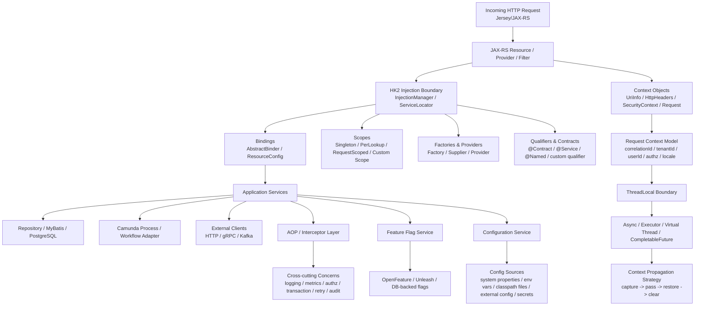

---

## Decomposition Map

| Area | Skill / Domain | Yang perlu dikuasai | Praktik di Jersey + HK2 | Risiko / jebakan umum |
|---|---|---|---|---|
| 1 | **IoC mental model** | Bedakan object manual, service locator, DI, factory, provider, lifecycle container | Resource/service tidak membuat dependency sendiri; dependency didaftarkan ke HK2 lalu di-inject | Service menjadi hard-coded ke implementation; sulit test; lifecycle kacau |
| 2 | **HK2 vs CDI vs Spring DI** | HK2 bukan CDI penuh dan bukan Spring container | Gunakan HK2 untuk Jersey-native injection; jangan membawa asumsi `@ApplicationScoped`, producer CDI, Spring AOP, atau Spring profile secara mentah | Mengira semua annotation CDI/Spring otomatis hidup di HK2 |
| 3 | **Jersey injection boundary** | Pahami `ResourceConfig`, `InjectionManager`, `ServiceLocator`, `AbstractBinder` | Custom binding harus diregister ke `ResourceConfig`; Jersey docs menegaskan custom HK2 Binder perlu diregister agar extension aktif. ([Eclipse EE4J](https://eclipse-ee4j.github.io/jersey.github.io/documentation/latest/ioc.html)) | Binding class sudah dibuat tapi tidak pernah diregister |
| 4 | **Dependency declaration** | Constructor injection, field injection, provider injection, named binding | Prioritaskan constructor injection untuk service application; gunakan field/parameter injection untuk JAX-RS context bila perlu | Field injection membuat dependency tersembunyi dan menyulitkan unit test |
| 5 | **Contract & implementation** | Interface sebagai contract, implementation sebagai service | `PaymentGateway` → `StripePaymentGateway`, `MockPaymentGateway`, `InternalPaymentGateway` | Inject concrete class langsung, lalu sulit mengganti implementasi |
| 6 | **HK2 Binder** | `AbstractBinder`, `bind()`, `bindFactory()`, `to()`, `in()`, named binding | Daftarkan service, repository, config object, client, feature flag evaluator, tenant resolver | Semua class di-auto-scan tanpa kontrol; dependency graph tidak jelas |
| 7 | **Factory-based injection** | `Factory<T>` untuk object yang perlu dibuat dari request/config/runtime | Jersey docs memberi pola `Factory<T>` dengan `provide()` untuk mengambil instance yang di-inject, misalnya dari `HttpServletRequest`. ([Eclipse EE4J](https://eclipse-ee4j.github.io/jersey.github.io/documentation/latest/ioc.html)) | Factory menyembunyikan side effect; factory state tidak thread-safe |
| 8 | **Provider / lazy dependency** | `Provider<T>` untuk dependency yang perlu resolved saat digunakan | Cocok untuk request-scoped context di singleton service, atau expensive dependency | Provider dipakai untuk menutupi dependency cycle |
| 9 | **PerLookup scope** | Instance baru per lookup/injection | Default HK2 factory bila scope tidak ditentukan adalah `PerLookup`. ([Eclipse EE4J](https://eclipse-ee4j.github.io/jersey.github.io/documentation/latest/ioc.html)) | Mengira `PerLookup` sama dengan request-scope; padahal bisa dibuat berkali-kali dalam satu request |
| 10 | **Singleton scope** | Satu instance untuk aplikasi | Cocok untuk stateless service, mapper, config registry, HTTP client singleton, feature flag client | Singleton menyimpan request/user/tenant state → data bocor antar request |
| 11 | **Request scope** | Instance hidup selama HTTP request | Cocok untuk `RequestContext`, audit context, current tenant/user resolver | Request-scoped bean diakses dari async thread setelah request selesai |
| 12 | **Custom scope** | Membuat scope baru: tenant, workflow, process, job, batch | Bisa dibuat, tapi harus jelas storage, cleanup, activation/deactivation | Memory leak karena custom scope tidak clear; stale workflow context |
| 13 | **JAX-RS context injection** | `@Context` untuk `UriInfo`, `HttpHeaders`, `SecurityContext`, `Request`, dll | Gunakan di resource/filter boundary untuk mengekstrak HTTP context lalu ubah menjadi domain context | Menyebarkan `HttpServletRequest` ke service/domain layer |
| 14 | **Masa depan `@Context`** | Jakarta REST API mencatat bahwa future versions akan menghentikan dukungan injection via `@Context` sebagai bagian alignment dengan CDI. ([Jakarta EE](https://jakarta.ee/specifications/restful-ws/3.1/apidocs/jakarta.ws.rs/jakarta/ws/rs/core/context)) | Untuk kode baru, isolasi `@Context` di boundary agar migrasi lebih mudah | Terlalu banyak service internal bergantung langsung pada JAX-RS API |
| 15 | **Request context model** | Model internal berisi `correlationId`, `requestId`, `tenantId`, `userId`, roles, locale, channel | Buat `RequestContext` immutable; populate dari filter; inject via provider/scope | Context mutable global; race condition saat async |
| 16 | **Security context propagation** | Principal, roles, token claims, permissions | Extract dari JWT/session/API gateway; jangan inject raw token ke domain kecuali perlu | Menggunakan header user/tenant mentah tanpa verifikasi |
| 17 | **Tenant context** | Tenant resolution, tenant isolation, schema/database routing | `TenantResolver` di filter; `TenantContext` dipakai repository/MyBatis interceptor atau connection routing | Tenant dari request A terbawa ke request B karena ThreadLocal tidak dibersihkan |
| 18 | **Transaction context** | Boundary transaksi, connection/session lifecycle, rollback semantics | Untuk MyBatis/Postgres, definisikan unit-of-work eksplisit: service method → transaction wrapper → mapper | Membuka transaksi di resource lalu logic async; rollback tidak konsisten |
| 19 | **AOP / method interception** | Interceptor untuk logging, audit, metrics, authz, transaction, retry | HK2 punya default interception service di `hk2-extras`, memakai annotation untuk menentukan service/interceptor. ([Eclipse EE4J](https://eclipse-ee4j.github.io/glassfish-hk2/aop-default.html)) | Menganggap semua method otomatis ter-intercept; self-invocation sering tidak kena proxy |
| 20 | **HK2 AOP binding** | `@Intercepted`, `@Interceptor`, `@InterceptionBinder`, AOP Alliance interceptor | HK2 docs menyebut interceptor harus HK2 service, implement method/constructor interceptor, advertise contract, dan diberi qualifier interceptor. ([Eclipse EE4J](https://eclipse-ee4j.github.io/glassfish-hk2/aop-default.html)) | Interceptor tidak jalan karena dependency `hk2-extras` tidak ada atau service tidak didaftarkan |
| 21 | **Proxy semantics** | Proxy untuk lazy lookup, request scope, scoped object, interceptor | HK2 mendukung proxiable scope dan opsi `proxyForSameScope`; proxy behavior perlu dipahami terutama untuk equality dan lifecycle. ([Eclipse EE4J](https://eclipse-ee4j.github.io/glassfish-hk2/extensibility.html)) | Menyimpan proxy sebagai identity object; equals/hashCode membingungkan |
| 22 | **Cross-cutting: audit** | Capture actor, tenant, action, entity, before/after, trace id | Interceptor/resource filter dapat menulis audit envelope, tapi business audit sebaiknya eksplisit di service layer | Audit terlalu teknis, tidak defensible secara bisnis/regulatori |
| 23 | **Cross-cutting: observability** | Trace, metric, log correlation | Gunakan correlation id + OpenTelemetry context. OpenTelemetry menjelaskan context propagation sebagai cara menghubungkan traces/logs/metrics lintas process/service. ([OpenTelemetry](https://opentelemetry.io/docs/concepts/context-propagation/?utm_source=chatgpt.com)) | Log punya request id tapi outbound call tidak membawa trace context |
| 24 | **Service-to-service propagation** | HTTP headers, gRPC metadata, Kafka headers | Propagate `traceparent`, correlation id, tenant id yang aman, locale, idempotency key | Mengirim PII/secret/token internal ke service eksternal |
| 25 | **W3C Trace Context** | `traceparent`, `tracestate` | W3C Trace Context mendefinisikan header `traceparent` dan `tracestate` untuk format tracing yang interoperable. ([W3C](https://www.w3.org/TR/trace-context/?utm_source=chatgpt.com)) | Membuat custom trace header sendiri tanpa bridge ke standard |
| 26 | **ThreadLocal discipline** | Capture, restore, clear | Boleh dipakai untuk request-local convenience, tapi wajib clear di finally; untuk async perlu explicit propagation | Memory leak, user/tenant leakage, flaky test |
| 27 | **Async propagation** | `CompletableFuture`, executor, virtual thread, scheduler | Jangan asumsi request/security/transaction context otomatis pindah thread | Async task membaca context kosong atau context lama |
| 28 | **Managed context propagation** | Jakarta Concurrency / MicroProfile Context Propagation concept | MicroProfile Context Propagation memperkenalkan API untuk membawa context lintas `CompletionStage`, `CompletableFuture`, `Runnable`, dsb. ([Eclipse Downloads](https://download.eclipse.org/microprofile/microprofile-context-propagation-1.0/microprofile-context-propagation.html?utm_source=chatgpt.com)) Saat ini project MicroProfile Context Propagation sendiri menandai statusnya discontinued/replaced by Jakarta Concurrency. ([GitHub](https://github.com/eclipse/microprofile-context-propagation?utm_source=chatgpt.com)) | Mengunci desain ke API lama tanpa cek runtime platform |
| 29 | **Application profile** | dev/test/staging/prod, local/on-prem/AWS/Azure | Buat abstraction `AppProfile` atau `Environment` dari config; jangan hard-code branch deployment | Profile logic menyebar di semua class |
| 30 | **Configuration source model** | system properties, env vars, classpath props, external file, DB, Vault/KMS/Secrets Manager | MicroProfile Config memberi model standar untuk agregasi config, override eksternal, dan custom `ConfigSource`. ([Eclipse Downloads](https://download.eclipse.org/microprofile/microprofile-config-3.1/microprofile-config-spec-3.1.html)) | Membaca config langsung dari `System.getenv()` di banyak tempat |
| 31 | **Config precedence** | Override order dan ordinal | MicroProfile Config default source: system properties ordinal 400, environment variables ordinal 300, `META-INF/microprofile-config.properties` ordinal 100. ([Eclipse Downloads](https://download.eclipse.org/microprofile/microprofile-config-3.1/microprofile-config-spec-3.1.html)) | Prod override tidak menang karena precedence tidak jelas |
| 32 | **Typed configuration** | Convert string config ke typed object | Bind `DatabaseConfig`, `KafkaConfig`, `CamundaConfig`, `FeatureFlagConfig` sebagai singleton HK2 service | Menggunakan string literal config key di seluruh codebase |
| 33 | **Secret handling** | DB password, API key, token, private key | Secret harus diambil dari env/secret manager/external config source; inject sebagai typed secret wrapper, bukan plain loggable string | Secret masuk GitHub, log, exception, heap dump, config endpoint |
| 34 | **External config loader** | AWS Secrets Manager, Azure Key Vault, Kubernetes Secret/ConfigMap, on-prem file | Buat `ConfigSourceLoader` dan `SecretProvider` interface; implement per environment | Business service tahu detail AWS/Azure/K8s |
| 35 | **Classpath resources** | `META-INF`, properties, YAML/JSON defaults | Cocok untuk default config dan local test fixture | Menganggap classpath config aman untuk secret |
| 36 | **Kubernetes config** | ConfigMap, Secret, env var, mounted volume | App membaca via abstraction config; reload policy jelas: startup-only atau dynamic | Dynamic reload tanpa consistency model |
| 37 | **Feature flag abstraction** | Boolean flag, variant, rollout, kill switch, experiment | OpenFeature adalah spesifikasi vendor-agnostic untuk feature flagging, menghindari lock-in API flag provider. ([OpenFeature](https://openfeature.dev/)) | Business logic penuh `if(flag)` tanpa ownership/expiry |
| 38 | **Feature flag context** | User, tenant, segment, role, environment | Evaluation context harus dibuat dari verified `RequestContext`, bukan raw header | Tenant/user spoofing mempengaruhi rollout |
| 39 | **Flag lifecycle** | create, default, rollout, monitor, cleanup | Setiap flag punya owner, expiry, default safe value, audit trail | Zombie flag menjadi permanent complexity |
| 40 | **Jersey filters** | `ContainerRequestFilter`, `ContainerResponseFilter` | Tempat ideal untuk correlation id, auth extraction, tenant resolution, locale, MDC setup/cleanup | Business validation berat di filter |
| 41 | **Jersey providers** | exception mapper, message body provider, param converter | Provider bisa inject service HK2 untuk mapping error, validation, serialization policy | Provider punya side effect transaksi/bisnis |
| 42 | **MyBatis integration** | `SqlSessionFactory`, mapper lifecycle, transaction boundary | Inject `SqlSessionFactory`/mapper factory; jangan jadikan mapper menyimpan request state | Mapper singleton menyimpan connection/session |
| 43 | **PostgreSQL / PL/pgSQL context** | session variables, RLS, audit fields, transaction id | Tenant/user context bisa diteruskan ke DB lewat transaction-local setting jika desain DB mendukung | DB session pool menyimpan context lama bila tidak reset |
| 44 | **Camunda process/workflow context** | Process variables, business key, tenant id, correlation key | Jangan samakan HK2 scope dengan workflow scope; workflow context harus durable di Camunda variables/history | Mengandalkan in-memory context untuk long-running process |
| 45 | **Kafka context** | Headers, idempotency key, causation/correlation id | Propagate trace/correlation/tenant yang aman lewat Kafka headers; reconstruct context di consumer boundary | Consumer memakai ThreadLocal producer yang sudah tidak relevan |
| 46 | **gRPC context** | Metadata, deadlines, auth, trace propagation | Buat adapter context propagation untuk metadata inbound/outbound | Mencampur gRPC context dengan HTTP request context tanpa normalisasi |
| 47 | **HTTP client context** | outbound headers, retry, timeout, circuit breaker | Client wrapper inject `RequestContextProvider`, `TraceContextPropagator`, `FeatureFlagService` | Service call langsung pakai raw Jersey client tanpa standard headers |
| 48 | **Testing DI graph** | Unit test, JerseyTest, HK2 binder override | Buat test binder untuk fake service, fake feature flag, fake config | Test pakai prod config/secret karena override tidak jelas |
| 49 | **Startup validation** | Validate config, required bindings, DB connectivity, external client sanity | Fail fast untuk missing config/binding; health check untuk runtime dependency | App start sukses tapi request pertama gagal karena missing binding |
| 50 | **Migration readiness** | Jersey 2 → 3 → 4, `javax` → `jakarta`, package move | Kunci dependency version via Maven BOM; audit import package; siapkan compatibility adapter | Upgrade Jersey tanpa cek HK2 package dan injection module |

---

## Roadmap Alur Belajar yang Direkomendasikan

### 1. Fondasi HK2 + Jersey DI

Mulai dari:

- `ResourceConfig`
- `AbstractBinder`
- `bind()`, `bindFactory()`, `to()`, `in()`
- constructor injection
- `Singleton`, `PerLookup`, request scope
- bedakan `@Inject` vs `@Context`

Target praktik: bisa membuat service layer Jersey yang dependency-nya bersih dan bisa diganti saat test.

---

### 2. Scope, proxy, dan lifecycle

Lanjut ke:

- singleton vs request scoped
- factory/provider
- proxy semantics
- lifecycle cleanup
- custom scope bila benar-benar perlu

Target praktik: tidak ada request/user/tenant state yang bocor antar request.

---

### 3. Context propagation

Pelajari:

- request context internal
- correlation id
- tenant/user/security context
- MDC logging
- async/thread boundary
- outbound HTTP/gRPC/Kafka headers
- OpenTelemetry/W3C trace context

Target praktik: request bisa ditelusuri dari API gateway → service → DB/Camunda/Kafka/service lain.

---

### 4. AOP/interceptor untuk cross-cutting concern

Pelajari:

- HK2 AOP/interceptor
- annotation binding
- audit/logging/metrics/security/transaction interceptor
- limitation proxy/self-invocation

Target praktik: cross-cutting concern tidak mengotori business service, tapi tetap eksplisit dan testable.

---

### 5. Configuration, profile, secret, feature flag

Pelajari:

- config precedence
- typed config object
- env var/system property/classpath config
- external config source
- secret provider
- OpenFeature-style feature flag abstraction

Target praktik: aplikasi bisa jalan di local, on-prem, AWS, Azure, Kubernetes tanpa rebuild binary.

---

## Rekomendasi materi selanjutnya

Cheatsheet berikutnya yang paling relevan adalah:

**“Practical Implementation Series: HK2 in Jersey - Binder, Factory, Scope, Context Propagation, Config Loader, Feature Flag, and AOP Interceptor.”**

Urutan seri yang saya rekomendasikan:

1. **HK2 Binder & Dependency Graph Design**
2. **Factory, Provider, Singleton, PerLookup, Request Scope**
3. **RequestContext, TenantContext, SecurityContext Propagation**
4. **AOP / Interceptor for Audit, Transaction, Metrics, Authorization**
5. **Configuration Loader: env, system properties, classpath, external file, secret manager**
6. **Feature Flag Integration with OpenFeature-style abstraction**
7. **Testing HK2/Jersey DI Graph with Fake Binder and Integration Test**

Cheatsheet selesai.

---

**Sources:**

- [HK2 - Dependency Injection Kernel](https://javaee.github.io/hk2/)
- [Chapter 25. Custom Injection and Lifecycle Management](https://eclipse-ee4j.github.io/jersey.github.io/documentation/latest/ioc.html)
- [Road Map · eclipse-ee4j/jersey Wiki · GitHub](https://github.com/eclipse-ee4j/jersey/wiki/Road-Map)
- [Context (Jakarta RESTful WS API 3.1.0 API)](https://jakarta.ee/specifications/restful-ws/3.1/apidocs/jakarta.ws.rs/jakarta/ws/rs/core/context)
- [Context propagation](https://opentelemetry.io/docs/concepts/context-propagation/?utm_source=chatgpt.com)
- [Trace Context](https://www.w3.org/TR/trace-context/?utm_source=chatgpt.com)
- [MicroProfile Context Propagation - Eclipse download page](https://download.eclipse.org/microprofile/microprofile-context-propagation-1.0/microprofile-context-propagation.html?utm_source=chatgpt.com)
- [OpenFeature](https://openfeature.dev/)

## Response:
7/15/2026, 3:40:05 AM

Kita mulai dari **Seri 1/7: HK2 Binder & Dependency Graph Design**. Fokusnya bukan teori DI umum, tapi bagaimana menyusun dependency graph yang rapi, testable, dan aman untuk aplikasi Jersey/JAX-RS microservice.

Saya sudah cek ulang dokumentasi resmi Jersey/HK2. Untuk contoh praktik, saya pakai gaya **Jersey 3.x / Jakarta** yang masih umum untuk Java 17+, lalu saya beri catatan migrasi karena Jersey 4.x sudah ada perubahan penting pada area injection/import.

# Seri 1/7 - HK2 Binder & Dependency Graph Design  
**Topik:** IoC, DI, binding, dependency graph, dan wiring strategy untuk Jersey/JAX-RS microservice berbasis GlassFish HK2.

## 1. Tujuan Seri Ini

Di seri pertama ini, fokusnya adalah:

> Bagaimana membuat **dependency graph** yang jelas, eksplisit, mudah dites, dan aman untuk production di aplikasi Java Jersey/JAX-RS menggunakan **GlassFish HK2**.

HK2 dipakai oleh Jersey untuk lifecycle management dan dependency injection sejak Jersey 2.x, dan Jersey menyediakan extension point agar aplikasi bisa menambahkan binding sendiri lewat HK2/Jersey binder. Dokumentasi Jersey juga menegaskan bahwa custom binder harus diregister ke `ResourceConfig` supaya injection extension aktif. ([Eclipse EE4J](https://eclipse-ee4j.github.io/jersey.github.io/documentation/latest/ioc.html))

Untuk konteks versi: Jersey 3.1.x berada di jalur Jakarta EE 10, Jersey 4.0.x di jalur Jakarta EE 11, dan roadmap Jersey mencatat perubahan penting di Jersey 4.x terkait pemindahan beberapa kelas injection-related seperti `AbstractBinder` ke package HK2-related. Jadi contoh di bawah ini cocok sebagai pola praktis, tetapi import final harus disesuaikan dengan baseline Jersey perusahaan. ([GitHub](https://github.com/eclipse-ee4j/jersey/wiki/Road-Map))

---

# 2. Mental Model

Dalam aplikasi Jersey + HK2, jangan berpikir seperti ini:

```text
Resource bikin Service
Service bikin Repository
Repository bikin Client/DB connection
```

Pola itu cepat berantakan.

Pola yang benar:

```text
ResourceConfig
   |
   +-- register Binder
          |
          +-- bind Interface -> Implementation
          +-- bind Config object
          +-- bind Factory
          +-- bind Provider
          +-- define Scope
   |
Jersey Resource
   |
   +-- @Inject Service
           |
           +-- @Inject Repository
           +-- @Inject Client
           +-- @Inject Config
```

Diagram praktisnya:

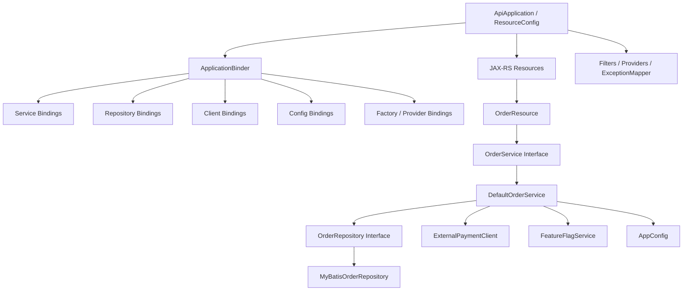

---

# 3. Struktur Project yang Disarankan

Untuk microservice berbasis Jersey, struktur package yang rapi biasanya seperti ini:

```text
src/main/java/com/company/orderservice
├── bootstrap
│   ├── ApiApplication.java
│   └── ApplicationBinder.java
│
├── api
│   ├── resource
│   │   └── OrderResource.java
│   ├── mapper
│   │   └── ApiErrorMapper.java
│   └── filter
│       └── RequestContextFilter.java
│
├── application
│   ├── service
│   │   ├── OrderService.java
│   │   └── DefaultOrderService.java
│   └── port
│       ├── OrderRepository.java
│       └── PaymentClient.java
│
├── infrastructure
│   ├── persistence
│   │   └── MyBatisOrderRepository.java
│   ├── client
│   │   └── HttpPaymentClient.java
│   └── config
│       ├── AppConfig.java
│       └── ConfigLoader.java
│
└── domain
    ├── Order.java
    └── OrderStatus.java
```

Prinsipnya:

| Layer | Boleh tahu tentang | Tidak boleh tahu tentang |
|---|---|---|
| `api` | HTTP, JAX-RS, DTO, request/response | SQL detail, external service protocol detail |
| `application` | Use case, transaction boundary, port/interface | Jersey, servlet, HTTP header mentah |
| `domain` | business rule, state, invariant | HK2, Jersey, DB, Kafka, HTTP |
| `infrastructure` | MyBatis, PostgreSQL, HTTP client, config source | Resource/controller detail |
| `bootstrap` | wiring, binding, lifecycle | business logic |

---

# 4. Maven Dependency Minimal

Untuk Jersey + HK2, dependency umumnya seperti ini. Jangan copy versi mentah dari internet; idealnya perusahaan punya BOM atau parent POM internal.

```xml
<properties>
    <java.version>17</java.version>
    <jersey.version>3.1.11</jersey.version>
</properties>

<dependencyManagement>
    <dependencies>
        <dependency>
            <groupId>org.glassfish.jersey</groupId>
            <artifactId>jersey-bom</artifactId>
            <version>${jersey.version}</version>
            <type>pom</type>
            <scope>import</scope>
        </dependency>
    </dependencies>
</dependencyManagement>

<dependencies>
    <!-- Jersey server core -->
    <dependency>
        <groupId>org.glassfish.jersey.core</groupId>
        <artifactId>jersey-server</artifactId>
    </dependency>

    <!-- Servlet container integration -->
    <dependency>
        <groupId>org.glassfish.jersey.containers</groupId>
        <artifactId>jersey-container-servlet-core</artifactId>
    </dependency>

    <!-- HK2 injection implementation -->
    <dependency>
        <groupId>org.glassfish.jersey.inject</groupId>
        <artifactId>jersey-hk2</artifactId>
    </dependency>

    <!-- JSON support; adjust if your company uses JSON-B instead -->
    <dependency>
        <groupId>org.glassfish.jersey.media</groupId>
        <artifactId>jersey-media-json-jackson</artifactId>
    </dependency>
</dependencies>
```

Catatan: dokumentasi Jersey 3.x menunjukkan pola custom injection dengan HK2 `Factory`, `AbstractBinder`, dan registrasi binder di `ResourceConfig`; default scope factory/binder tanpa scope eksplisit adalah `PerLookup`. ([Eclipse EE4J](https://eclipse-ee4j.github.io/jersey.github.io/documentation/latest3x/ioc.html))

---

# 5. Implementasi Praktis

## 5.1 `ApiApplication` sebagai Composition Root

`ResourceConfig` adalah tempat bootstrap Jersey. Di sini kita register resource package, filter, provider, dan binder.

```java
package com.company.orderservice.bootstrap;

import com.company.orderservice.api.filter.RequestContextFilter;
import com.company.orderservice.api.mapper.ApiErrorMapper;
import org.glassfish.jersey.server.ResourceConfig;

public final class ApiApplication extends ResourceConfig {

    public ApiApplication() {
        // Resource scanning
        packages("com.company.orderservice.api.resource");

        // DI graph
        register(new ApplicationBinder());

        // Cross-cutting API components
        register(RequestContextFilter.class);
        register(ApiErrorMapper.class);
    }
}
```

**Rule penting:**  
`ApiApplication` hanya untuk bootstrap. Jangan taruh business logic di sini.

---

## 5.2 Contract / Port Interface

Gunakan interface untuk boundary yang mungkin berubah: repository, external client, feature flag, config provider.

```java
package com.company.orderservice.application.service;

import com.company.orderservice.domain.Order;

import java.util.UUID;

public interface OrderService {
    Order getOrder(UUID orderId);
}
```

```java
package com.company.orderservice.application.port;

import com.company.orderservice.domain.Order;

import java.util.Optional;
import java.util.UUID;

public interface OrderRepository {
    Optional<Order> findById(UUID orderId);
}
```

```java
package com.company.orderservice.application.port;

import java.util.UUID;

public interface PaymentClient {
    boolean hasSuccessfulPayment(UUID orderId);
}
```

---

## 5.3 Implementation dengan Constructor Injection

Gunakan constructor injection untuk application service. Ini membuat dependency terlihat jelas dan mudah dites.

```java
package com.company.orderservice.application.service;

import com.company.orderservice.application.port.OrderRepository;
import com.company.orderservice.application.port.PaymentClient;
import com.company.orderservice.domain.Order;
import jakarta.inject.Inject;

import java.util.UUID;

public final class DefaultOrderService implements OrderService {

    private final OrderRepository orderRepository;
    private final PaymentClient paymentClient;

    @Inject
    public DefaultOrderService(
            OrderRepository orderRepository,
            PaymentClient paymentClient
    ) {
        this.orderRepository = orderRepository;
        this.paymentClient = paymentClient;
    }

    @Override
    public Order getOrder(UUID orderId) {
        Order order = orderRepository.findById(orderId)
                .orElseThrow(() -> new IllegalArgumentException("Order not found: " + orderId));

        boolean paid = paymentClient.hasSuccessfulPayment(orderId);

        return order.withPaymentStatus(paid);
    }
}
```

**Kenapa constructor injection lebih baik?**

Karena dari constructor saja kita bisa tahu service ini butuh:

```text
OrderRepository
PaymentClient
```

Tidak perlu membaca seluruh class untuk mencari field yang di-inject.

---

## 5.4 Resource JAX-RS

Resource hanya menjadi HTTP adapter. Jangan biarkan resource menjadi service besar.

```java
package com.company.orderservice.api.resource;

import com.company.orderservice.application.service.OrderService;
import com.company.orderservice.domain.Order;
import jakarta.inject.Inject;
import jakarta.ws.rs.GET;
import jakarta.ws.rs.Path;
import jakarta.ws.rs.PathParam;
import jakarta.ws.rs.Produces;
import jakarta.ws.rs.core.MediaType;

import java.util.UUID;

@Path("/orders")
@Produces(MediaType.APPLICATION_JSON)
public final class OrderResource {

    private final OrderService orderService;

    @Inject
    public OrderResource(OrderService orderService) {
        this.orderService = orderService;
    }

    @GET
    @Path("/{orderId}")
    public Order getOrder(@PathParam("orderId") UUID orderId) {
        return orderService.getOrder(orderId);
    }
}
```

**Rule:**  
Resource boleh tahu HTTP. Service tidak perlu tahu HTTP.

---

# 6. `ApplicationBinder`

Inilah inti seri pertama.

```java
package com.company.orderservice.bootstrap;

import com.company.orderservice.application.port.OrderRepository;
import com.company.orderservice.application.port.PaymentClient;
import com.company.orderservice.application.service.DefaultOrderService;
import com.company.orderservice.application.service.OrderService;
import com.company.orderservice.infrastructure.client.HttpPaymentClient;
import com.company.orderservice.infrastructure.config.AppConfig;
import com.company.orderservice.infrastructure.config.ConfigLoader;
import com.company.orderservice.infrastructure.persistence.MyBatisOrderRepository;
import jakarta.inject.Singleton;
import org.glassfish.hk2.utilities.binding.AbstractBinder;

public final class ApplicationBinder extends AbstractBinder {

    @Override
    protected void configure() {
        AppConfig appConfig = ConfigLoader.load();

        // Config object
        bind(appConfig).to(AppConfig.class);

        // Application services
        bind(DefaultOrderService.class)
                .to(OrderService.class)
                .in(Singleton.class);

        // Persistence adapter
        bind(MyBatisOrderRepository.class)
                .to(OrderRepository.class)
                .in(Singleton.class);

        // External client adapter
        bind(HttpPaymentClient.class)
                .to(PaymentClient.class)
                .in(Singleton.class);
    }
}
```

Ini membuat dependency graph eksplisit:

```text
OrderResource
  -> OrderService
      -> DefaultOrderService
          -> OrderRepository
              -> MyBatisOrderRepository
          -> PaymentClient
              -> HttpPaymentClient
          -> AppConfig
```

---

# 7. Binding Pattern yang Perlu Dikuasai

## 7.1 Bind Implementation ke Interface

```java
bind(DefaultOrderService.class)
        .to(OrderService.class)
        .in(Singleton.class);
```

Artinya:

```text
Kalau ada yang minta OrderService,
berikan DefaultOrderService,
dengan lifecycle Singleton.
```

Gunakan ini untuk:

- service
- repository
- external client
- feature flag service
- config resolver
- audit writer
- event publisher

---

## 7.2 Bind Instance Object

```java
AppConfig appConfig = ConfigLoader.load();

bind(appConfig)
        .to(AppConfig.class);
```

Gunakan untuk object yang sudah dibuat manual saat startup:

- `AppConfig`
- `ObjectMapper`
- `Clock`
- `SqlSessionFactory`
- `DataSource`
- `FeatureFlagClient`
- `MeterRegistry`

Hati-hati: kalau object instance di-bind seperti ini, lifecycle-nya praktis sudah kamu pegang. Jangan menganggap HK2 akan otomatis tahu cara close resource tersebut kecuali kamu desain lifecycle-nya.

---

## 7.3 Bind Concrete Class ke Dirinya Sendiri

```java
bindAsContract(OrderValidator.class)
        .in(Singleton.class);
```

Gunakan hanya jika class tersebut memang tidak butuh interface.

Cocok untuk:

- stateless validator
- mapper
- helper deterministic
- pure policy class

Jangan berlebihan membuat interface untuk semua class. Interface berguna jika ada variasi implementation, boundary eksternal, atau kebutuhan test double.

---

## 7.4 Bind Factory

Factory dipakai kalau object tidak bisa dibuat langsung oleh constructor biasa, misalnya butuh request context, servlet request, secret loader, atau dynamic runtime source. Dokumentasi Jersey menunjukkan pola `Factory`/`Supplier` untuk membuat object injectable, lalu binding factory tersebut diregister lewat binder di `ResourceConfig`. ([Eclipse EE4J](https://eclipse-ee4j.github.io/jersey.github.io/documentation/latest/ioc.html))

Contoh sederhana: membuat `RequestId`.

```java
package com.company.orderservice.api.context;

public record RequestId(String value) {
}
```

Factory:

```java
package com.company.orderservice.api.context;

import jakarta.inject.Inject;
import jakarta.servlet.http.HttpServletRequest;
import org.glassfish.hk2.api.Factory;

import java.util.UUID;

public final class RequestIdFactory implements Factory<RequestId> {

    private final HttpServletRequest request;

    @Inject
    public RequestIdFactory(HttpServletRequest request) {
        this.request = request;
    }

    @Override
    public RequestId provide() {
        String requestId = request.getHeader("X-Request-Id");

        if (requestId == null || requestId.isBlank()) {
            requestId = UUID.randomUUID().toString();
        }

        return new RequestId(requestId);
    }

    @Override
    public void dispose(RequestId instance) {
        // No-op. Nothing to clean.
    }
}
```

Binder:

```java
import com.company.orderservice.api.context.RequestId;
import com.company.orderservice.api.context.RequestIdFactory;
import org.glassfish.jersey.process.internal.RequestScoped;

bindFactory(RequestIdFactory.class)
        .to(RequestId.class)
        .in(RequestScoped.class);
```

Gunakan factory untuk hal-hal seperti:

| Use case | Cocok pakai Factory? | Alasan |
|---|---:|---|
| `RequestId` dari HTTP header | Ya | Nilai berubah per request |
| `TenantContext` dari token/header | Ya | Per request dan perlu validasi |
| `AppConfig` dari file/env | Tidak selalu | Lebih baik load saat startup lalu bind instance |
| `SqlSession` per transaction | Ya, tapi hati-hati | Harus jelas close/rollback |
| `ObjectMapper` | Tidak | Biasanya singleton instance |

---

# 8. Scope Strategy

Scope adalah keputusan penting. Banyak bug production terjadi bukan karena DI gagal, tapi karena scope salah.

| Scope | Kapan dipakai | Contoh | Risiko |
|---|---|---|---|
| `Singleton` | Stateless, reusable, thread-safe | service, repository adapter, HTTP client wrapper, config object | Menyimpan request/user/tenant state |
| `PerLookup` | Instance baru setiap lookup/injection | lightweight transient object | Mengira object sama selama satu request |
| `RequestScoped` | Data hanya valid selama HTTP request | request context, tenant context, request id | Dipakai dari async thread setelah request selesai |
| Custom scope | Workflow/process/job lifecycle khusus | Camunda process context, batch job context | Memory leak dan cleanup sulit |

Default scope HK2/Jersey binder tanpa scope eksplisit adalah `PerLookup`, jadi jangan diam-diam berharap semua object menjadi singleton. ([Eclipse EE4J](https://eclipse-ee4j.github.io/jersey.github.io/documentation/latest3x/ioc.html))

Praktik aman:

```java
bind(DefaultOrderService.class)
        .to(OrderService.class)
        .in(Singleton.class);
```

Untuk service stateless, pilih singleton secara eksplisit.

---

# 9. Design Rule untuk Microservice Production

## Rule 1 - Binder adalah Composition Root

Semua wiring utama taruh di:

```text
ApplicationBinder
```

Bukan di:

```text
Resource
Service constructor manual
Static singleton
Utility global
```

Buruk:

```java
public final class OrderResource {

    private final OrderService service = new DefaultOrderService(
            new MyBatisOrderRepository(),
            new HttpPaymentClient()
    );
}
```

Baik:

```java
@Inject
public OrderResource(OrderService orderService) {
    this.orderService = orderService;
}
```

---

## Rule 2 - Resource Tipis, Service Tebal, Infrastructure Terisolasi

Resource:

```java
GET /orders/{id}
```

Service:

```text
validate order id
load order
check permission
call payment
apply business rule
return result
```

Repository:

```text
SQL/MyBatis/PostgreSQL detail
```

External client:

```text
HTTP/gRPC/Kafka detail
```

---

## Rule 3 - Jangan Inject Implementation ke Business Layer

Buruk:

```java
public DefaultOrderService(MyBatisOrderRepository repository) {
    this.repository = repository;
}
```

Baik:

```java
public DefaultOrderService(OrderRepository repository) {
    this.repository = repository;
}
```

Kenapa?

Karena `DefaultOrderService` seharusnya hanya tahu bahwa ia bisa mengambil order, bukan tahu bahwa datanya berasal dari MyBatis.

---

## Rule 4 - Jangan Menyimpan Request State di Singleton

Buruk:

```java
@Singleton
public final class TenantAwareOrderService {

    private String currentTenantId;

    public void setCurrentTenantId(String tenantId) {
        this.currentTenantId = tenantId;
    }
}
```

Ini bisa menyebabkan tenant A terbaca di request tenant B.

Baik:

```java
public final class TenantAwareOrderService {

    private final TenantContextProvider tenantContextProvider;

    @Inject
    public TenantAwareOrderService(TenantContextProvider tenantContextProvider) {
        this.tenantContextProvider = tenantContextProvider;
    }

    public void process() {
        TenantContext tenant = tenantContextProvider.current();
        // use tenant locally
    }
}
```

---

# 10. Contoh Lengkap: Config Binding

## 10.1 `AppConfig`

```java
package com.company.orderservice.infrastructure.config;

public record AppConfig(
        String appName,
        String environment,
        String paymentBaseUrl,
        int paymentTimeoutMillis
) {
}
```

## 10.2 `ConfigLoader`

```java
package com.company.orderservice.infrastructure.config;

public final class ConfigLoader {

    private ConfigLoader() {
    }

    public static AppConfig load() {
        return new AppConfig(
                read("APP_NAME", "order-service"),
                read("APP_ENV", "local"),
                readRequired("PAYMENT_BASE_URL"),
                Integer.parseInt(read("PAYMENT_TIMEOUT_MILLIS", "3000"))
        );
    }

    private static String read(String key, String defaultValue) {
        String systemValue = System.getProperty(key);
        if (systemValue != null && !systemValue.isBlank()) {
            return systemValue;
        }

        String envValue = System.getenv(key);
        if (envValue != null && !envValue.isBlank()) {
            return envValue;
        }

        return defaultValue;
    }

    private static String readRequired(String key) {
        String value = read(key, null);

        if (value == null || value.isBlank()) {
            throw new IllegalStateException("Missing required config: " + key);
        }

        return value;
    }
}
```

## 10.3 Inject Config ke Client

```java
package com.company.orderservice.infrastructure.client;

import com.company.orderservice.application.port.PaymentClient;
import com.company.orderservice.infrastructure.config.AppConfig;
import jakarta.inject.Inject;

import java.util.UUID;

public final class HttpPaymentClient implements PaymentClient {

    private final AppConfig config;

    @Inject
    public HttpPaymentClient(AppConfig config) {
        this.config = config;
    }

    @Override
    public boolean hasSuccessfulPayment(UUID orderId) {
        String baseUrl = config.paymentBaseUrl();

        // Real implementation:
        // GET {baseUrl}/payments/orders/{orderId}
        // apply timeout config.paymentTimeoutMillis()
        // map response
        // handle retry/error policy

        return true;
    }
}
```

Untuk seri config nanti, ini akan kita perbaiki menjadi multi-source config loader: system properties, env vars, classpath properties, mounted file, Kubernetes ConfigMap/Secret, AWS Secrets Manager, Azure Key Vault.

---

# 11. Testing Pattern: Override Binder

Salah satu alasan dependency graph harus rapi adalah supaya test bisa mengganti implementation production dengan fake.

## 11.1 Fake Repository

```java
package com.company.orderservice.testdouble;

import com.company.orderservice.application.port.OrderRepository;
import com.company.orderservice.domain.Order;

import java.util.Optional;
import java.util.UUID;

public final class FakeOrderRepository implements OrderRepository {

    @Override
    public Optional<Order> findById(UUID orderId) {
        return Optional.of(Order.sample(orderId));
    }
}
```

## 11.2 Test Binder

```java
package com.company.orderservice.testdouble;

import com.company.orderservice.application.port.OrderRepository;
import com.company.orderservice.application.port.PaymentClient;
import jakarta.inject.Singleton;
import org.glassfish.hk2.utilities.binding.AbstractBinder;

public final class TestApplicationBinder extends AbstractBinder {

    @Override
    protected void configure() {
        bind(FakeOrderRepository.class)
                .to(OrderRepository.class)
                .in(Singleton.class);

        bind(FakePaymentClient.class)
                .to(PaymentClient.class)
                .in(Singleton.class);
    }
}
```

## 11.3 Test ResourceConfig

```java
public final class TestApiApplication extends ResourceConfig {

    public TestApiApplication() {
        packages("com.company.orderservice.api.resource");

        register(new TestApplicationBinder());
    }
}
```

Prinsipnya:

```text
Production Binder != Test Binder
```

Jangan test integration API memakai real external payment service kecuali memang test environment-nya disiapkan untuk itu.

---

# 12. Binding Decision Table

| Dependency | Binding yang disarankan | Scope | Catatan |
|---|---|---|---|
| Application service | implementation → interface | `Singleton` | Harus stateless |
| Repository adapter | implementation → port interface | `Singleton` | Jangan simpan connection/session per request |
| HTTP client wrapper | implementation → port interface | `Singleton` | Client internal bisa pooled/thread-safe |
| Config object | instance → class | singleton-like | Load saat startup |
| Request context | factory → context class | `RequestScoped` | Jangan dipakai setelah request selesai |
| Tenant context | factory/provider | `RequestScoped` | Validasi tenant dari auth context |
| Feature flag service | implementation → interface | `Singleton` | Evaluation context per request |
| Object mapper | instance → class | singleton-like | Thread-safe setelah konfigurasi selesai |
| MyBatis `SqlSessionFactory` | instance → class | singleton-like | Session/transaction jangan singleton |
| Transaction/session object | factory/provider | request/transaction-specific | Harus jelas close/rollback |

---

# 13. Anti-pattern yang Harus Dihindari

## 13.1 Static Service Locator

Buruk:

```java
public final class Services {
    public static OrderService orderService;
}
```

Efeknya:

```text
sulit dites
sulit override
lifecycle tidak jelas
hidden dependency
race condition
```

---

## 13.2 Manual `new` di Tengah Business Logic

Buruk:

```java
public Order getOrder(UUID id) {
    PaymentClient client = new HttpPaymentClient();
    return ...
}
```

Baik:

```java
private final PaymentClient paymentClient;

@Inject
public DefaultOrderService(PaymentClient paymentClient) {
    this.paymentClient = paymentClient;
}
```

---

## 13.3 Service Mengetahui Semua Detail Infrastruktur

Buruk:

```java
public final class OrderService {
    private final SqlSessionFactory sqlSessionFactory;
    private final HttpServletRequest request;
    private final KafkaProducer<String, String> producer;
}
```

Ini tanda service sudah menjadi god object.

Baik:

```java
public final class DefaultOrderService {
    private final OrderRepository orderRepository;
    private final PaymentClient paymentClient;
    private final DomainEventPublisher eventPublisher;
}
```

---

## 13.4 Request Context Disimpan di Singleton

Buruk:

```java
@Singleton
public final class CurrentUserHolder {
    private String userId;
}
```

Baik:

```java
public interface CurrentUserProvider {
    CurrentUser current();
}
```

Implementation-nya nanti boleh mengambil dari request-scoped context.

---

# 14. Practical Checklist Saat Membaca Codebase Perusahaan

Saat onboarding, cek file seperti:

```text
Application.java
ResourceConfig.java
Binder.java
Module.java
InjectionBinder.java
Bootstrap.java
```

Lalu jawab pertanyaan ini:

| Pertanyaan | Yang dicari |
|---|---|
| Di mana `ResourceConfig` dibuat? | Entry point Jersey |
| Di mana binder diregister? | Composition root |
| Apakah ada lebih dari satu binder? | Split by module atau kacau? |
| Apakah service di-bind ke interface? | Testability dan boundary |
| Scope apa yang dipakai? | Singleton/request/perlookup |
| Ada request context? | Correlation/user/tenant |
| Ada factory/provider? | Context/config/runtime object |
| Ada static singleton? | Potensi anti-pattern |
| Ada manual `new` untuk service? | DI bypass |
| Test override binder tersedia? | Kualitas testability |

---

# 15. Failure Model

| Failure | Penyebab umum | Gejala | Solusi |
|---|---|---|---|
| `UnsatisfiedDependencyException` | Binding tidak diregister | App gagal start atau request gagal | Register binder di `ResourceConfig` |
| Wrong implementation injected | Ada binding duplikat/ranking ambigu | Behavior aneh di runtime | Audit binder dan qualifier |
| State bocor antar request | Request data disimpan di singleton | Tenant/user salah | Pindahkan ke request scope/provider |
| Test pakai real dependency | Test binder tidak override | Test lambat/flaky | Buat fake binder |
| Resource terlalu gemuk | Logic bisnis di JAX-RS resource | Sulit reuse dan test | Pindahkan ke application service |
| Service tahu HTTP | `HttpServletRequest` masuk service | Layer bocor | Map HTTP → domain/application context di boundary |
| Config missing baru ketahuan saat request | Lazy config read | Error runtime | Validate config saat startup |
| Dependency cycle | Service A inject B, B inject A | Startup gagal / desain kabur | Pecah responsibility |

---

# 16. Mini Exercise Praktis

Untuk codebase perusahaan, coba buat inventory seperti ini:

```text
[Resource]
OrderResource
  injects OrderService

[Service]
DefaultOrderService
  injects OrderRepository
  injects PaymentClient
  injects FeatureFlagService

[Repository]
MyBatisOrderRepository
  injects SqlSessionFactory

[Client]
HttpPaymentClient
  injects AppConfig
  injects JerseyClient

[Config]
AppConfig
  loaded from env/system property/file
```

Targetnya: dalam 1-2 hari onboarding, kamu sudah punya **dependency map** real service.

---

# 17. Ringkasan Seri 1/7

Yang harus dipegang:

1. **`ResourceConfig` adalah entry point Jersey.**
2. **`ApplicationBinder` adalah composition root dependency graph.**
3. **Inject interface, bukan implementation, untuk boundary penting.**
4. **Constructor injection lebih eksplisit dan testable.**
5. **Service singleton harus stateless.**
6. **Request/user/tenant context tidak boleh disimpan di singleton.**
7. **Factory/provider dipakai untuk runtime/request-derived object.**
8. **Test harus bisa override production binding.**
9. **Jangan mencampur HTTP, business logic, DB, dan external client dalam satu class.**
10. **Binding yang tidak eksplisit akan menyulitkan debugging saat production.**

---

# Rekomendasi Materi Selanjutnya

Lanjut ke **Seri 2/7: Factory, Provider, Singleton, PerLookup, Request Scope**.

Di seri berikutnya kita akan masuk lebih praktis ke:

- kapan pakai `Singleton`
- kapan pakai `PerLookup`
- kapan pakai `RequestScoped`
- kapan pakai `Factory<T>`
- kapan pakai `Provider<T>`
- cara membuat `RequestContext`
- cara menghindari tenant/user leakage
- contoh implementasi `RequestId`, `TenantContext`, dan `CurrentUser`

**Seri 1/7 selesai.**

---

**Sources:**

- [Chapter 25. Custom Injection and Lifecycle Management](https://eclipse-ee4j.github.io/jersey.github.io/documentation/latest/ioc.html)
- [Road Map · eclipse-ee4j/jersey Wiki · GitHub](https://github.com/eclipse-ee4j/jersey/wiki/Road-Map)

## Response:
7/15/2026, 3:42:15 AM

Lanjut ke **Seri 2/7: Factory, Provider, Singleton, PerLookup, Request Scope**. Kali ini fokusnya ke lifecycle object: kapan object dibuat, siapa yang menyimpan, kapan aman dipakai, dan bagaimana mencegah context bocor antar request.

# Seri 2/7 - Factory, Provider, Singleton, PerLookup, Request Scope

## 1. Tujuan Seri Ini

Seri ini menjawab pertanyaan praktis:

> “Dependency ini harus dibuat sekali, setiap request, setiap lookup, atau hanya saat dibutuhkan?”

Dalam Jersey + HK2, masalah lifecycle sering menjadi akar bug production: tenant/user bocor antar request, object dibuat terlalu sering, config dibaca berulang, atau request context dipakai setelah request selesai.

Secara resmi, Jersey mendukung custom injection lewat HK2 `Factory` atau Jersey `Supplier`, lalu binding-nya harus diregister ke `ResourceConfig`. Jersey juga mencatat bahwa factory bertanggung jawab menyediakan instance lewat `provide()`, dan default scope binder/factory adalah `PerLookup` jika scope tidak didefinisikan eksplisit. ([Eclipse EE4J](https://eclipse-ee4j.github.io/jersey.github.io/documentation/latest31x/ioc.html))

---

# 2. Mental Model Lifecycle

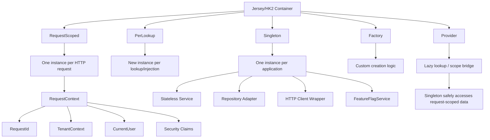

Intinya:

```text id="ggd1k4"
Singleton     = hidup selama aplikasi
PerLookup    = instance baru setiap diminta
RequestScoped = hidup selama satu HTTP request
Factory<T>   = cara custom membuat object
Provider<T>  = cara mengambil object saat dibutuhkan
```

---

# 3. Decision Table

| Kebutuhan | Pilihan yang tepat | Contoh |
|---|---|---|
| Object stateless, thread-safe, reusable | `Singleton` | `OrderService`, `PaymentClient`, `FeatureFlagService`, `ObjectMapper`, `SqlSessionFactory` |
| Object ringan dan tidak perlu state bersama | `PerLookup` | mapper kecil, command object, transient helper |
| Object berisi data request/user/tenant | `RequestScoped` | `RequestContext`, `TenantContext`, `CurrentUser`, `RequestId` |
| Object dibuat dari HTTP header/token/config/runtime value | `Factory<T>` | `RequestContextFactory`, `TenantContextFactory` |
| Singleton perlu membaca request-scoped object | `Provider<T>` | `Provider<RequestContext>` di service singleton |
| Object mahal dibuat dan bisa dipakai ulang | `Singleton` | HTTP client, DB pool, config registry |
| Object punya lifecycle close/rollback | Factory + lifecycle eksplisit | transaction/session object |
| Object dipakai async setelah response selesai | Jangan `RequestScoped` langsung | capture immutable context lalu pass eksplisit |

---

# 4. Scope 1 - `Singleton`

## 4.1 Kapan dipakai

Gunakan `Singleton` untuk object yang:

- stateless;
- thread-safe;
- tidak menyimpan request/user/tenant state;
- reusable sepanjang aplikasi hidup.

Contoh umum:

```text id="6tqj2s"
DefaultOrderService
MyBatisOrderRepository
HttpPaymentClient
FeatureFlagService
ObjectMapper
AppConfig
Clock
SqlSessionFactory
```

## 4.2 Binding

```java id="ejwsdn"
bind(DefaultOrderService.class)
        .to(OrderService.class)
        .in(Singleton.class);

bind(MyBatisOrderRepository.class)
        .to(OrderRepository.class)
        .in(Singleton.class);

bind(HttpPaymentClient.class)
        .to(PaymentClient.class)
        .in(Singleton.class);
```

## 4.3 Contoh service singleton yang benar

```java id="0yfosp"
package com.company.orderservice.application.service;

import com.company.orderservice.application.port.OrderRepository;
import com.company.orderservice.application.port.PaymentClient;
import com.company.orderservice.api.context.RequestContext;
import jakarta.inject.Inject;
import jakarta.inject.Provider;

import java.util.UUID;

public final class DefaultOrderService implements OrderService {

    private final OrderRepository orderRepository;
    private final PaymentClient paymentClient;
    private final Provider<RequestContext> requestContextProvider;

    @Inject
    public DefaultOrderService(
            OrderRepository orderRepository,
            PaymentClient paymentClient,
            Provider<RequestContext> requestContextProvider
    ) {
        this.orderRepository = orderRepository;
        this.paymentClient = paymentClient;
        this.requestContextProvider = requestContextProvider;
    }

    @Override
    public OrderResult getOrder(UUID orderId) {
        RequestContext context = requestContextProvider.get();

        return orderRepository.findById(context.tenantId(), orderId)
                .map(order -> OrderResult.from(order, paymentClient.hasSuccessfulPayment(orderId)))
                .orElseThrow(() -> new IllegalArgumentException("Order not found: " + orderId));
    }
}
```

Kenapa pakai `Provider<RequestContext>`?

Karena `DefaultOrderService` adalah singleton, sedangkan `RequestContext` adalah request-scoped. `Provider<T>` memungkinkan instance diambil saat method dipanggil, bukan saat singleton dibuat. Jakarta Inject mendokumentasikan bahwa `Provider<T>` dapat di-inject untuk tipe yang injectable dan berguna untuk lazy retrieval, multiple retrieval, atau mengambil instance dari scope yang lebih kecil dari scope pemiliknya. ([Jakarta EE](https://jakarta.ee/specifications/dependency-injection/2.0/apidocs/jakarta/inject/provider?utm_source=chatgpt.com))

---

# 5. Scope 2 - `PerLookup`

## 5.1 Mental model

`PerLookup` berarti:

```text id="m9mkg4"
Setiap kali HK2 melakukan lookup/injection,
HK2 boleh membuat instance baru.
```

Jangan samakan `PerLookup` dengan request-scope. Dalam satu HTTP request, object `PerLookup` bisa dibuat lebih dari sekali jika beberapa dependency meminta object tersebut.

Jersey/HK2 mencatat bahwa jika scope binding tidak ditentukan eksplisit, default-nya adalah `PerLookup`. ([Eclipse EE4J](https://eclipse-ee4j.github.io/jersey.github.io/documentation/latest31x/ioc.html))

## 5.2 Kapan cocok

Cocok untuk:

- helper ringan;
- stateless transient object;
- object yang memang harus fresh setiap pemakaian;
- object tanpa expensive initialization.

Contoh:

```java id="ohg74d"
public final class OrderQueryBuilder {

    private final StringBuilder sql = new StringBuilder();

    public OrderQueryBuilder byTenant(String tenantId) {
        sql.append(" tenant_id = '").append(tenantId).append("' ");
        return this;
    }

    public String build() {
        return sql.toString();
    }
}
```

Binding:

```java id="82pkpm"
bindAsContract(OrderQueryBuilder.class);
// default: PerLookup
```

Atau eksplisit:

```java id="p2tk03"
bindAsContract(OrderQueryBuilder.class)
        .in(org.glassfish.hk2.api.PerLookup.class);
```

## 5.3 Kapan jangan dipakai

Jangan pakai `PerLookup` untuk object mahal:

```text id="p3y79f"
HTTP client
DB pool
SqlSessionFactory
ObjectMapper
Config registry
Feature flag SDK client
```

Kalau object mahal dibuat sebagai `PerLookup`, efeknya:

```text id="8453d7"
latency naik
CPU/GC naik
connection pool kacau
startup/runtime behavior sulit ditebak
```

---

# 6. Scope 3 - `RequestScoped`

## 6.1 Mental model

`RequestScoped` berarti object valid hanya selama satu HTTP request.

Cocok untuk:

```text id="osdv10"
RequestId
CorrelationId
TenantContext
CurrentUser
SecurityClaims
LocaleContext
RequestContext
```

Jersey docs memberi contoh binding factory ke `RequestScoped` dengan `bindFactory(...).to(...).in(RequestScoped.class)`. ([Eclipse EE4J](https://eclipse-ee4j.github.io/jersey.github.io/documentation/latest31x/ioc.html))

## 6.2 Model `RequestContext`

Buat context internal aplikasi, bukan menyebarkan `HttpServletRequest`.

```java id="gtf1l4"
package com.company.orderservice.api.context;

import java.util.Locale;
import java.util.Set;

public record RequestContext(
        String requestId,
        String correlationId,
        String tenantId,
        String userId,
        Set<String> roles,
        Locale locale
) {
}
```

Ini lebih baik daripada meng-inject `HttpServletRequest` ke service layer.

Buruk:

```java id="cndhzo"
public final class DefaultOrderService {

    private final HttpServletRequest request;

    @Inject
    public DefaultOrderService(HttpServletRequest request) {
        this.request = request;
    }
}
```

Baik:

```java id="szy0fg"
public final class DefaultOrderService {

    private final Provider<RequestContext> requestContextProvider;

    @Inject
    public DefaultOrderService(Provider<RequestContext> requestContextProvider) {
        this.requestContextProvider = requestContextProvider;
    }
}
```

---

# 7. Factory Pattern

## 7.1 Kapan pakai `Factory<T>`

Gunakan `Factory<T>` jika object:

- dibuat dari HTTP header;
- dibuat dari token/security principal;
- dibuat dari request metadata;
- butuh runtime lookup;
- butuh validasi sebelum menjadi injectable object;
- bukan object biasa yang bisa langsung di-constructor oleh HK2.

Jersey menjelaskan pola ini: implementasikan HK2 `Factory`, buat logic di `provide()`, lalu binding factory tersebut di custom binder dan register binder ke `ResourceConfig`. ([Eclipse EE4J](https://eclipse-ee4j.github.io/jersey.github.io/documentation/latest31x/ioc.html))

---

## 7.2 Implementasi `RequestContextFactory`

```java id="q001y6"
package com.company.orderservice.api.context;

import jakarta.inject.Inject;
import jakarta.servlet.http.HttpServletRequest;
import org.glassfish.hk2.api.Factory;

import java.util.Arrays;
import java.util.Locale;
import java.util.Set;
import java.util.UUID;
import java.util.stream.Collectors;

public final class RequestContextFactory implements Factory<RequestContext> {

    private final HttpServletRequest request;

    @Inject
    public RequestContextFactory(HttpServletRequest request) {
        this.request = request;
    }

    @Override
    public RequestContext provide() {
        String requestId = headerOrGenerate("X-Request-Id");
        String correlationId = headerOrDefault("X-Correlation-Id", requestId);

        String tenantId = requiredHeader("X-Tenant-Id");
        String userId = requiredHeader("X-User-Id");

        Set<String> roles = parseRoles(request.getHeader("X-User-Roles"));
        Locale locale = parseLocale(request.getHeader("Accept-Language"));

        return new RequestContext(
                requestId,
                correlationId,
                tenantId,
                userId,
                roles,
                locale
        );
    }

    @Override
    public void dispose(RequestContext instance) {
        // No-op because RequestContext is immutable and has no resource to close.
    }

    private String headerOrGenerate(String name) {
        String value = request.getHeader(name);
        return isBlank(value) ? UUID.randomUUID().toString() : value;
    }

    private String headerOrDefault(String name, String defaultValue) {
        String value = request.getHeader(name);
        return isBlank(value) ? defaultValue : value;
    }

    private String requiredHeader(String name) {
        String value = request.getHeader(name);

        if (isBlank(value)) {
            throw new IllegalArgumentException("Missing required header: " + name);
        }

        return value;
    }

    private Set<String> parseRoles(String rawRoles) {
        if (isBlank(rawRoles)) {
            return Set.of();
        }

        return Arrays.stream(rawRoles.split(","))
                .map(String::trim)
                .filter(role -> !role.isBlank())
                .collect(Collectors.toUnmodifiableSet());
    }

    private Locale parseLocale(String acceptLanguage) {
        if (isBlank(acceptLanguage)) {
            return Locale.ENGLISH;
        }

        return Locale.LanguageRange.parse(acceptLanguage)
                .stream()
                .findFirst()
                .map(range -> Locale.forLanguageTag(range.getRange()))
                .orElse(Locale.ENGLISH);
    }

    private boolean isBlank(String value) {
        return value == null || value.isBlank();
    }
}
```

Catatan praktis: contoh ini sengaja sederhana. Di production, `tenantId`, `userId`, dan roles sebaiknya tidak dipercaya hanya dari header mentah. Biasanya nilai tersebut divalidasi dari JWT, mTLS identity, API gateway, atau security context.

---

## 7.3 Binding Factory

```java id="mqtlf5"
package com.company.orderservice.bootstrap;

import com.company.orderservice.api.context.RequestContext;
import com.company.orderservice.api.context.RequestContextFactory;
import org.glassfish.hk2.utilities.binding.AbstractBinder;
import org.glassfish.jersey.process.internal.RequestScoped;

public final class RequestContextBinder extends AbstractBinder {

    @Override
    protected void configure() {
        bindFactory(RequestContextFactory.class)
                .to(RequestContext.class)
                .proxy(true)
                .proxyForSameScope(false)
                .in(RequestScoped.class);
    }
}
```

Register di `ResourceConfig`:

```java id="9n3zlf"
public final class ApiApplication extends ResourceConfig {

    public ApiApplication() {
        packages("com.company.orderservice.api.resource");

        register(new ApplicationBinder());
        register(new RequestContextBinder());
    }
}
```

Poin penting: custom binder harus diregister ke `ResourceConfig`, kalau tidak binding-nya tidak aktif. ([Eclipse EE4J](https://eclipse-ee4j.github.io/jersey.github.io/documentation/latest/ioc.html))

---

# 8. Provider Pattern

## 8.1 Kapan pakai `Provider<T>`

Gunakan `Provider<T>` ketika:

```text id="etwm59"
Singleton perlu mengakses RequestScoped object
object ingin dibuat lazy
object optional/mahal
ingin menghindari early initialization
ingin mengambil instance terbaru sesuai active scope
```

Contoh:

```java id="1ot6nr"
private final Provider<RequestContext> requestContextProvider;
```

Pemakaian:

```java id="f0sf6g"
RequestContext context = requestContextProvider.get();
```

`Provider.get()` memberikan instance yang sudah dibuat dan di-inject oleh container. ([Jakarta EE](https://jakarta.ee/specifications/dependency-injection/2.0/apidocs/jakarta/inject/provider?utm_source=chatgpt.com))

---

## 8.2 Contoh: Tenant-aware Repository

Port:

```java id="bg6q7e"
package com.company.orderservice.application.port;

import com.company.orderservice.domain.Order;

import java.util.Optional;
import java.util.UUID;

public interface OrderRepository {
    Optional<Order> findById(UUID orderId);
}
```

Implementation:

```java id="rkl4p7"
package com.company.orderservice.infrastructure.persistence;

import com.company.orderservice.api.context.RequestContext;
import com.company.orderservice.application.port.OrderRepository;
import com.company.orderservice.domain.Order;
import jakarta.inject.Inject;
import jakarta.inject.Provider;

import java.util.Optional;
import java.util.UUID;

public final class MyBatisOrderRepository implements OrderRepository {

    private final Provider<RequestContext> requestContextProvider;
    private final OrderMapper orderMapper;

    @Inject
    public MyBatisOrderRepository(
            Provider<RequestContext> requestContextProvider,
            OrderMapper orderMapper
    ) {
        this.requestContextProvider = requestContextProvider;
        this.orderMapper = orderMapper;
    }

    @Override
    public Optional<Order> findById(UUID orderId) {
        RequestContext context = requestContextProvider.get();

        return orderMapper.findByTenantAndId(
                context.tenantId(),
                orderId
        );
    }
}
```

MyBatis mapper:

```java id="mj4j42"
package com.company.orderservice.infrastructure.persistence;

import com.company.orderservice.domain.Order;
import org.apache.ibatis.annotations.Param;

import java.util.Optional;
import java.util.UUID;

public interface OrderMapper {

    Optional<Order> findByTenantAndId(
            @Param("tenantId") String tenantId,
            @Param("orderId") UUID orderId
    );
}
```

Prinsip praktis:

```text id="3se3fw"
Tenant isolation harus eksplisit di query/repository boundary.
Jangan mengandalkan global mutable tenant state.
```

---

# 9. Pattern: Split Request Context

Jangan semua context dijadikan satu object raksasa kalau kebutuhannya beda.

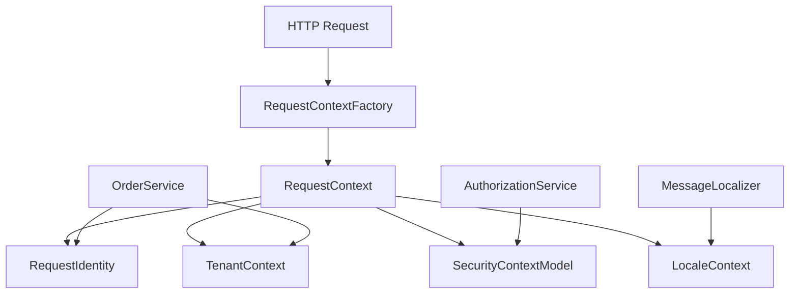

Alternatif model:

```java id="a04j2t"
public record RequestIdentity(
        String requestId,
        String correlationId
) {
}
```

```java id="53vjy4"
public record TenantContext(
        String tenantId
) {
}
```

```java id="49gl1m"
public record CurrentUser(
        String userId,
        Set<String> roles
) {
}
```

Ini berguna agar service tidak tergoda mengambil semua data request.

---

# 10. Practical Implementation: `RequestIdentity`

## 10.1 Record

```java id="x8sivj"
package com.company.orderservice.api.context;

public record RequestIdentity(
        String requestId,
        String correlationId
) {
}
```

## 10.2 Factory

```java id="1uuicu"
package com.company.orderservice.api.context;

import jakarta.inject.Inject;
import jakarta.servlet.http.HttpServletRequest;
import org.glassfish.hk2.api.Factory;

import java.util.UUID;

public final class RequestIdentityFactory implements Factory<RequestIdentity> {

    private final HttpServletRequest request;

    @Inject
    public RequestIdentityFactory(HttpServletRequest request) {
        this.request = request;
    }

    @Override
    public RequestIdentity provide() {
        String requestId = headerOrGenerate("X-Request-Id");
        String correlationId = headerOrDefault("X-Correlation-Id", requestId);

        return new RequestIdentity(requestId, correlationId);
    }

    @Override
    public void dispose(RequestIdentity instance) {
        // Nothing to dispose.
    }

    private String headerOrGenerate(String headerName) {
        String value = request.getHeader(headerName);
        return value == null || value.isBlank()
                ? UUID.randomUUID().toString()
                : value;
    }

    private String headerOrDefault(String headerName, String defaultValue) {
        String value = request.getHeader(headerName);
        return value == null || value.isBlank()
                ? defaultValue
                : value;
    }
}
```

## 10.3 Binding

```java id="aj2jmb"
bindFactory(RequestIdentityFactory.class)
        .to(RequestIdentity.class)
        .proxy(true)
        .proxyForSameScope(false)
        .in(RequestScoped.class);
```

## 10.4 Usage di Service

```java id="6c7d6t"
public final class AuditService {

    private final Provider<RequestIdentity> requestIdentityProvider;
    private final AuditWriter auditWriter;

    @Inject
    public AuditService(
            Provider<RequestIdentity> requestIdentityProvider,
            AuditWriter auditWriter
    ) {
        this.requestIdentityProvider = requestIdentityProvider;
        this.auditWriter = auditWriter;
    }

    public void record(String action, String entityType, String entityId) {
        RequestIdentity identity = requestIdentityProvider.get();

        auditWriter.write(new AuditEvent(
                identity.requestId(),
                identity.correlationId(),
                action,
                entityType,
                entityId
        ));
    }
}
```

---

# 11. Practical Implementation: `TenantContext`

## 11.1 Record

```java id="y2g0pn"
package com.company.orderservice.api.context;

public record TenantContext(String tenantId) {
}
```

## 11.2 Factory dengan validasi

```java id="6f3n0x"
package com.company.orderservice.api.context;

import com.company.orderservice.application.port.TenantRegistry;
import jakarta.inject.Inject;
import jakarta.servlet.http.HttpServletRequest;
import org.glassfish.hk2.api.Factory;

public final class TenantContextFactory implements Factory<TenantContext> {

    private final HttpServletRequest request;
    private final TenantRegistry tenantRegistry;

    @Inject
    public TenantContextFactory(
            HttpServletRequest request,
            TenantRegistry tenantRegistry
    ) {
        this.request = request;
        this.tenantRegistry = tenantRegistry;
    }

    @Override
    public TenantContext provide() {
        String tenantId = request.getHeader("X-Tenant-Id");

        if (tenantId == null || tenantId.isBlank()) {
            throw new IllegalArgumentException("Missing tenant");
        }

        if (!tenantRegistry.exists(tenantId)) {
            throw new IllegalArgumentException("Unknown tenant: " + tenantId);
        }

        return new TenantContext(tenantId);
    }

    @Override
    public void dispose(TenantContext instance) {
        // No-op.
    }
}
```

## 11.3 Binding

```java id="93m3hq"
bindFactory(TenantContextFactory.class)
        .to(TenantContext.class)
        .proxy(true)
        .proxyForSameScope(false)
        .in(RequestScoped.class);
```

## 11.4 Usage

```java id="r5x3iz"
public final class TenantAwarePaymentClient implements PaymentClient {

    private final Provider<TenantContext> tenantContextProvider;
    private final PaymentHttpClient httpClient;

    @Inject
    public TenantAwarePaymentClient(
            Provider<TenantContext> tenantContextProvider,
            PaymentHttpClient httpClient
    ) {
        this.tenantContextProvider = tenantContextProvider;
        this.httpClient = httpClient;
    }

    @Override
    public boolean hasSuccessfulPayment(UUID orderId) {
        TenantContext tenantContext = tenantContextProvider.get();

        return httpClient.getPaymentStatus(
                tenantContext.tenantId(),
                orderId
        ).isSuccessful();
    }
}
```

---

# 12. Practical Implementation: `CurrentUser`

## 12.1 Record

```java id="o1ec9d"
package com.company.orderservice.api.context;

import java.util.Set;

public record CurrentUser(
        String userId,
        Set<String> roles
) {
    public boolean hasRole(String role) {
        return roles.contains(role);
    }
}
```

## 12.2 Factory

```java id="3h23we"
package com.company.orderservice.api.context;

import jakarta.inject.Inject;
import jakarta.servlet.http.HttpServletRequest;
import org.glassfish.hk2.api.Factory;

import java.util.Arrays;
import java.util.Set;
import java.util.stream.Collectors;

public final class CurrentUserFactory implements Factory<CurrentUser> {

    private final HttpServletRequest request;

    @Inject
    public CurrentUserFactory(HttpServletRequest request) {
        this.request = request;
    }

    @Override
    public CurrentUser provide() {
        String userId = request.getHeader("X-User-Id");

        if (userId == null || userId.isBlank()) {
            throw new IllegalArgumentException("Missing user");
        }

        return new CurrentUser(
                userId,
                parseRoles(request.getHeader("X-User-Roles"))
        );
    }

    @Override
    public void dispose(CurrentUser instance) {
        // No-op.
    }

    private Set<String> parseRoles(String rawRoles) {
        if (rawRoles == null || rawRoles.isBlank()) {
            return Set.of();
        }

        return Arrays.stream(rawRoles.split(","))
                .map(String::trim)
                .filter(role -> !role.isBlank())
                .collect(Collectors.toUnmodifiableSet());
    }
}
```

## 12.3 Authorization Usage

```java id="slt69b"
public final class OrderAuthorizationService {

    private final Provider<CurrentUser> currentUserProvider;

    @Inject
    public OrderAuthorizationService(Provider<CurrentUser> currentUserProvider) {
        this.currentUserProvider = currentUserProvider;
    }

    public void requireCanViewOrder(String ownerUserId) {
        CurrentUser currentUser = currentUserProvider.get();

        boolean isOwner = currentUser.userId().equals(ownerUserId);
        boolean isAdmin = currentUser.hasRole("ORDER_ADMIN");

        if (!isOwner && !isAdmin) {
            throw new SecurityException("Not allowed to view order");
        }
    }
}
```

---

# 13. Binder Lengkap untuk Scope + Factory

```java id="m1hmsf"
package com.company.orderservice.bootstrap;

import com.company.orderservice.api.context.CurrentUser;
import com.company.orderservice.api.context.CurrentUserFactory;
import com.company.orderservice.api.context.RequestContext;
import com.company.orderservice.api.context.RequestContextFactory;
import com.company.orderservice.api.context.RequestIdentity;
import com.company.orderservice.api.context.RequestIdentityFactory;
import com.company.orderservice.api.context.TenantContext;
import com.company.orderservice.api.context.TenantContextFactory;
import org.glassfish.hk2.utilities.binding.AbstractBinder;
import org.glassfish.jersey.process.internal.RequestScoped;

public final class ContextBinder extends AbstractBinder {

    @Override
    protected void configure() {
        bindFactory(RequestIdentityFactory.class)
                .to(RequestIdentity.class)
                .proxy(true)
                .proxyForSameScope(false)
                .in(RequestScoped.class);

        bindFactory(TenantContextFactory.class)
                .to(TenantContext.class)
                .proxy(true)
                .proxyForSameScope(false)
                .in(RequestScoped.class);

        bindFactory(CurrentUserFactory.class)
                .to(CurrentUser.class)
                .proxy(true)
                .proxyForSameScope(false)
                .in(RequestScoped.class);

        bindFactory(RequestContextFactory.class)
                .to(RequestContext.class)
                .proxy(true)
                .proxyForSameScope(false)
                .in(RequestScoped.class);
    }
}
```

ResourceConfig:

```java id="er9mec"
public final class ApiApplication extends ResourceConfig {

    public ApiApplication() {
        packages("com.company.orderservice.api.resource");

        register(new ApplicationBinder());
        register(new ContextBinder());
        register(RequestContextFilter.class);
        register(ApiErrorMapper.class);
    }
}
```

---

# 14. Pattern: Filter vs Factory

Ada dua pendekatan umum untuk request context.

## Option A - Factory membaca request langsung

```text id="nwv8sd"
Service -> Provider<RequestContext> -> RequestContextFactory -> HttpServletRequest
```

Kelebihan:

- simple;
- cocok untuk awal;
- tidak perlu ThreadLocal manual.

Kekurangan:

- logic extraction tersebar kalau banyak factory;
- validasi auth/tenant bisa duplikatif;
- agak sulit kalau butuh MDC logging setup/cleanup.

## Option B - Filter membangun context, Factory mengambil dari holder

```text id="4p8g8h"
ContainerRequestFilter
  -> parse headers/token
  -> validate tenant/user
  -> set RequestContextHolder

Factory
  -> RequestContextHolder.current()

Service
  -> Provider<RequestContext>
```

Kelebihan:

- semua parsing/validasi request ada di boundary;
- mudah setup MDC;
- mudah cleanup;
- cocok untuk production.

Kekurangan:

- perlu disiplin cleanup;
- kalau pakai ThreadLocal harus hati-hati async/multithread.

Untuk production, saya lebih merekomendasikan **Option B**, tetapi dengan aturan ketat: context immutable, set sekali di awal request, clear di akhir request.

---

# 15. Production-style Request Context dengan Filter

## 15.1 Holder

```java id="b5kqbj"
package com.company.orderservice.api.context;

public final class RequestContextHolder {

    private static final ThreadLocal<RequestContext> CURRENT = new ThreadLocal<>();

    private RequestContextHolder() {
    }

    public static void set(RequestContext context) {
        CURRENT.set(context);
    }

    public static RequestContext current() {
        RequestContext context = CURRENT.get();

        if (context == null) {
            throw new IllegalStateException("No RequestContext bound to current thread");
        }

        return context;
    }

    public static void clear() {
        CURRENT.remove();
    }
}
```

## 15.2 Filter

```java id="u9a92z"
package com.company.orderservice.api.filter;

import com.company.orderservice.api.context.RequestContext;
import com.company.orderservice.api.context.RequestContextHolder;
import jakarta.ws.rs.container.ContainerRequestContext;
import jakarta.ws.rs.container.ContainerRequestFilter;
import jakarta.ws.rs.container.ContainerResponseContext;
import jakarta.ws.rs.container.ContainerResponseFilter;
import jakarta.ws.rs.ext.Provider;

import java.io.IOException;
import java.util.Locale;
import java.util.Set;
import java.util.UUID;

@Provider
public final class RequestContextFilter
        implements ContainerRequestFilter, ContainerResponseFilter {

    @Override
    public void filter(ContainerRequestContext request) throws IOException {
        String requestId = getOrGenerate(request, "X-Request-Id");
        String correlationId = getOrDefault(request, "X-Correlation-Id", requestId);

        String tenantId = requiredHeader(request, "X-Tenant-Id");
        String userId = requiredHeader(request, "X-User-Id");

        RequestContextHolder.set(new RequestContext(
                requestId,
                correlationId,
                tenantId,
                userId,
                Set.of(),
                Locale.ENGLISH
        ));
    }

    @Override
    public void filter(
            ContainerRequestContext request,
            ContainerResponseContext response
    ) throws IOException {
        try {
            RequestContext context = RequestContextHolder.current();

            response.getHeaders().putSingle("X-Request-Id", context.requestId());
            response.getHeaders().putSingle("X-Correlation-Id", context.correlationId());
        } finally {
            RequestContextHolder.clear();
        }
    }

    private String getOrGenerate(ContainerRequestContext request, String headerName) {
        String value = request.getHeaderString(headerName);
        return value == null || value.isBlank()
                ? UUID.randomUUID().toString()
                : value;
    }

    private String getOrDefault(
            ContainerRequestContext request,
            String headerName,
            String defaultValue
    ) {
        String value = request.getHeaderString(headerName);
        return value == null || value.isBlank()
                ? defaultValue
                : value;
    }

    private String requiredHeader(ContainerRequestContext request, String headerName) {
        String value = request.getHeaderString(headerName);

        if (value == null || value.isBlank()) {
            throw new IllegalArgumentException("Missing required header: " + headerName);
        }

        return value;
    }
}
```

## 15.3 Factory dari Holder

```java id="0m5g8k"
package com.company.orderservice.api.context;

import org.glassfish.hk2.api.Factory;

public final class RequestContextFromHolderFactory implements Factory<RequestContext> {

    @Override
    public RequestContext provide() {
        return RequestContextHolder.current();
    }

    @Override
    public void dispose(RequestContext instance) {
        // Filter owns cleanup through RequestContextHolder.clear().
    }
}
```

Binding:

```java id="jthftc"
bindFactory(RequestContextFromHolderFactory.class)
        .to(RequestContext.class)
        .proxy(true)
        .proxyForSameScope(false)
        .in(RequestScoped.class);
```

---

# 16. Penting: ThreadLocal dan Async

Ini salah satu jebakan terbesar.

Kode seperti ini berbahaya:

```java id="acwf2x"
public void processAsync(UUID orderId) {
    CompletableFuture.runAsync(() -> {
        RequestContext context = RequestContextHolder.current();
        // dangerous: may fail or read wrong context
    });
}
```

Kenapa?

Karena `ThreadLocal` melekat pada thread, bukan request logical flow. Saat masuk executor, thread-nya bisa berbeda.

Pola yang lebih aman:

```java id="u57snj"
public void processAsync(UUID orderId) {
    RequestContext captured = requestContextProvider.get();

    CompletableFuture.runAsync(() -> {
        processWithContext(captured, orderId);
    });
}

private void processWithContext(RequestContext context, UUID orderId) {
    // use immutable captured context explicitly
}
```

Atau kalau benar-benar perlu ThreadLocal di async block:

```java id="kk090n"
public void processAsync(UUID orderId) {
    RequestContext captured = requestContextProvider.get();

    CompletableFuture.runAsync(() -> {
        try {
            RequestContextHolder.set(captured);
            process(orderId);
        } finally {
            RequestContextHolder.clear();
        }
    });
}
```

Rule praktis:

```text id="6wc1ef"
Synchronous request path: RequestScoped / Provider OK.
Async path: capture immutable context, pass explicitly, clear after use.
```

---

# 17. Lifecycle Failure Model

| Failure | Contoh penyebab | Dampak | Pencegahan |
|---|---|---|---|
| Tenant bocor antar request | Tenant disimpan di singleton field | Data tenant A terlihat oleh tenant B | Request context immutable + request scope/provider |
| Context hilang di async | RequestContext di ThreadLocal tidak ikut pindah thread | Error “No RequestContext bound” | Capture context sebelum async |
| Object mahal dibuat berulang | HTTP client/config dibuat `PerLookup` | Latency/GC/connection leak | Bind sebagai singleton |
| Request object dipakai setelah response | Async task memegang request-scoped proxy | Runtime failure/stale context | Copy data immutable |
| Binding tidak aktif | Binder tidak diregister | Unsatisfied dependency | Register binder di `ResourceConfig` |
| Header palsu dipercaya | `X-User-Id`/`X-Tenant-Id` langsung dipercaya | Security breach | Validasi via auth gateway/JWT/security context |
| `Provider.get()` dipanggil di constructor singleton | Request belum aktif | Startup failure | Panggil provider di method request path |
| Factory punya state mutable | Factory menyimpan last user/tenant | Race condition | Factory stateless; hasil context immutable |

---

# 18. Practical Checklist Scope Review

Saat membaca codebase, cari pattern berikut:

```text id="kbrhe6"
.in(Singleton.class)
.in(RequestScoped.class)
bindFactory(...)
Provider<
ThreadLocal
HttpServletRequest
SecurityContext
X-Tenant-Id
X-User-Id
X-Correlation-Id
```

Lalu audit dengan pertanyaan ini:

| Pertanyaan | Jawaban sehat |
|---|---|
| Apakah service singleton menyimpan request state? | Tidak |
| Apakah request context immutable? | Ya |
| Apakah `ThreadLocal.clear()` selalu dipanggil? | Ya, di `finally` |
| Apakah object mahal singleton? | Ya |
| Apakah tenant/user divalidasi? | Ya |
| Apakah async capture context eksplisit? | Ya |
| Apakah factory stateless? | Ya |
| Apakah binder diregister? | Ya |
| Apakah test bisa override context? | Ya |

---

# 19. Testing Pattern

## 19.1 Fake `RequestContext` untuk unit test

Untuk unit test service, jangan boot Jersey dulu.

```java id="ww4bdn"
public final class FixedRequestContextProvider implements Provider<RequestContext> {

    private final RequestContext context;

    public FixedRequestContextProvider(RequestContext context) {
        this.context = context;
    }

    @Override
    public RequestContext get() {
        return context;
    }
}
```

Usage:

```java id="g6w5oi"
RequestContext context = new RequestContext(
        "req-1",
        "corr-1",
        "tenant-a",
        "user-1",
        Set.of("ORDER_VIEWER"),
        Locale.ENGLISH
);

OrderService service = new DefaultOrderService(
        fakeOrderRepository,
        fakePaymentClient,
        new FixedRequestContextProvider(context)
);
```

## 19.2 Test Binder untuk JerseyTest

```java id="3c44y5"
public final class TestContextBinder extends AbstractBinder {

    @Override
    protected void configure() {
        RequestContext context = new RequestContext(
                "req-test",
                "corr-test",
                "tenant-test",
                "user-test",
                Set.of("ORDER_ADMIN"),
                Locale.ENGLISH
        );

        bind(context).to(RequestContext.class);
    }
}
```

Untuk integration test request-level, lebih bagus test lewat filter/header agar flow production tetap diuji:

```java id="h59t7r"
Response response = target("/orders/" + orderId)
        .request()
        .header("X-Request-Id", "req-test")
        .header("X-Correlation-Id", "corr-test")
        .header("X-Tenant-Id", "tenant-test")
        .header("X-User-Id", "user-test")
        .get();
```

---

# 20. Contoh Final Binder Gabungan

```java id="7vxtvk"
package com.company.orderservice.bootstrap;

import com.company.orderservice.api.context.RequestContext;
import com.company.orderservice.api.context.RequestContextFromHolderFactory;
import com.company.orderservice.application.port.OrderRepository;
import com.company.orderservice.application.port.PaymentClient;
import com.company.orderservice.application.service.DefaultOrderService;
import com.company.orderservice.application.service.OrderService;
import com.company.orderservice.infrastructure.client.HttpPaymentClient;
import com.company.orderservice.infrastructure.config.AppConfig;
import com.company.orderservice.infrastructure.config.ConfigLoader;
import com.company.orderservice.infrastructure.persistence.MyBatisOrderRepository;
import jakarta.inject.Singleton;
import org.glassfish.hk2.utilities.binding.AbstractBinder;
import org.glassfish.jersey.process.internal.RequestScoped;

public final class ApplicationBinder extends AbstractBinder {

    @Override
    protected void configure() {
        AppConfig appConfig = ConfigLoader.load();

        bind(appConfig)
                .to(AppConfig.class);

        bind(DefaultOrderService.class)
                .to(OrderService.class)
                .in(Singleton.class);

        bind(MyBatisOrderRepository.class)
                .to(OrderRepository.class)
                .in(Singleton.class);

        bind(HttpPaymentClient.class)
                .to(PaymentClient.class)
                .in(Singleton.class);

        bindFactory(RequestContextFromHolderFactory.class)
                .to(RequestContext.class)
                .proxy(true)
                .proxyForSameScope(false)
                .in(RequestScoped.class);
    }
}
```

---

# 21. Ringkasan Praktis Seri 2/7

Pegangan utama:

1. **Default binding tanpa scope eksplisit bisa jatuh ke `PerLookup`; jangan diam-diam berharap singleton.**
2. **Service, repository adapter, client wrapper biasanya `Singleton`, asal stateless dan thread-safe.**
3. **Request/user/tenant/correlation data harus `RequestScoped` atau diakses via `Provider<T>`.**
4. **`Factory<T>` dipakai untuk membuat object dari HTTP/request/runtime source.**
5. **`Provider<T>` dipakai agar singleton bisa mengambil object dari scope yang lebih kecil saat method dipanggil.**
6. **Jangan simpan tenant/user/request id di field singleton.**
7. **Jangan pakai request-scoped object langsung di async thread. Capture immutable context.**
8. **Factory harus stateless; hasil context sebaiknya immutable.**
9. **ThreadLocal boleh dipakai di boundary, tetapi wajib `clear()` di `finally`.**
10. **Untuk production, validasi user/tenant dari trusted security source, bukan raw header sembarang.**

---

# Rekomendasi Materi Selanjutnya

Lanjut ke **Seri 3/7: RequestContext, TenantContext, SecurityContext Propagation**.

Di seri berikutnya kita akan fokus ke penggunaan nyata:

- propagation dari inbound HTTP;
- propagation ke outbound HTTP/gRPC/Kafka;
- correlation id dan trace id;
- tenant/user/security context;
- MDC logging;
- async propagation;
- service-to-service boundary;
- workflow/process/Camunda context.

**Seri 2/7 selesai.**

---

**Sources:**

- [Chapter 25. Custom Injection and Lifecycle Management](https://eclipse-ee4j.github.io/jersey.github.io/documentation/latest31x/ioc.html)
- [Provider (Jakarta Dependency Injection API)](https://jakarta.ee/specifications/dependency-injection/2.0/apidocs/jakarta/inject/provider?utm_source=chatgpt.com)

## Response:
7/15/2026, 3:44:33 AM

Lanjut ke **Seri 3/7: RequestContext, TenantContext, SecurityContext Propagation**. Fokusnya sekarang bukan lagi cara inject object, tetapi bagaimana context dibentuk di inbound request lalu dibawa aman ke DB, outbound service, async task, Kafka/gRPC, dan Camunda.

# Seri 3/7 - RequestContext, TenantContext, SecurityContext Propagation

## 1. Tujuan Seri Ini

Seri ini membahas cara membangun dan membawa **context** dalam aplikasi Jersey/JAX-RS microservice:

```text
Inbound HTTP request
  -> RequestContext / TenantContext / CurrentUser / SecurityContext
  -> Service layer
  -> Repository / PostgreSQL / MyBatis
  -> Outbound HTTP / gRPC / Kafka
  -> Async task
  -> Camunda process/workflow
```

Di Jakarta REST/JAX-RS, `ContainerRequestFilter` dan `ContainerResponseFilter` memang dirancang sebagai extension point untuk request/response filtering; filter global bisa dipakai untuk memproses request masuk dan response keluar sebelum/selama flow resource. Ini menjadikannya tempat praktis untuk membuat request context, correlation id, tenant resolution, dan cleanup. ([Jakarta EE](https://jakarta.ee/specifications/restful-ws/3.1/apidocs/jakarta.ws.rs/jakarta/ws/rs/container/containerrequestfilter?utm_source=chatgpt.com))

---

# 2. Prinsip Utama

Context bukan tempat membuang semua data.

Context harus:

1. **kecil** - hanya metadata lintas layer;
2. **immutable** - tidak berubah setelah dibuat;
3. **trusted** - berasal dari sumber yang tervalidasi;
4. **explicitly propagated** - tidak bergantung diam-diam pada global mutable state;
5. **cleared** - jika memakai `ThreadLocal`, wajib dibersihkan.

Context yang sehat biasanya berisi:

```text
requestId
correlationId
traceparent / tracestate
tenantId
userId
roles / permissions
locale
channel
idempotencyKey
clientAppId
```

Context yang tidak sehat:

```text
full JWT token
password / secret
entire HTTP request
large DTO
large business payload
database connection
Camunda runtime object
mutable Map bebas
```

---

# 3. Diagram Propagation

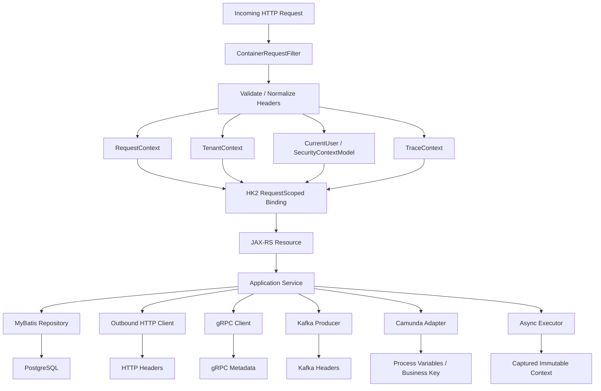

---

# 4. Context Taxonomy

| Context | Isi | Scope | Dipakai oleh | Jangan berisi |
|---|---|---|---|---|
| `RequestIdentity` | `requestId`, `correlationId` | request | logging, response header, audit | user data |
| `TraceContext` | `traceparent`, `tracestate` | request/service call | OpenTelemetry, HTTP/gRPC/Kafka propagation | custom random format tanpa standard |
| `TenantContext` | `tenantId`, tenant type/realm | request/workflow | repository, authorization, feature flag | raw unverified header |
| `CurrentUser` | `userId`, roles, permissions | request | authorization, audit, business rules | full JWT token |
| `SecurityContextModel` | auth scheme, subject, scopes, assurance level | request | authz, risk logic | password/secret |
| `LocaleContext` | locale, timezone | request/user preference | i18n, formatting | business state |
| `IdempotencyContext` | idempotency key, retry marker | request/command | payment, external integration | entire request body |
| `WorkflowContext` | processInstanceId, businessKey, correlationKey | process/workflow | Camunda adapter | request-scoped object |
| `ServiceCallContext` | outbound headers/metadata | service-to-service | HTTP/gRPC/Kafka clients | PII unless required |

---

# 5. Propagation Matrix

| Boundary | Propagation mechanism | Praktik disarankan |
|---|---|---|
| HTTP inbound | `ContainerRequestFilter` | Extract, validate, normalize, create immutable context |
| HTTP response | `ContainerResponseFilter` | Return `X-Request-Id`, `X-Correlation-Id`, cleanup ThreadLocal |
| Resource → Service | HK2 `Provider<RequestContext>` | Service mengambil context saat method dipanggil |
| Service → Repository | explicit parameter or provider | Tenant harus jelas di query boundary |
| Service → PostgreSQL | SQL parameter / transaction-local setting | Jangan mengandalkan global mutable tenant |
| Service → HTTP outbound | request headers | propagate correlation, trace, tenant where allowed |
| Service → gRPC | metadata | gRPC metadata memang dipakai untuk auth/tracing/custom data dan dikirim lewat HTTP/2 headers. ([gRPC](https://grpc.io/docs/guides/metadata/)) |
| Service → Kafka | message headers | Kafka `ProducerRecord` mendukung headers di constructor dan accessor `headers()`. ([Apache Kafka](https://kafka.apache.org/23/javadoc/org/apache/kafka/clients/producer/ProducerRecord.html)) |
| Service → async task | captured immutable context | Jangan membaca request-scoped object setelah request selesai |
| Service → Camunda | process variables/business key | Camunda 8 variables adalah data process instance/local scope, punya visibility berdasarkan scope variable. ([Camunda 8 Docs](https://docs.camunda.io/docs/components/concepts/variables/)) |

---

# 6. Model Context Praktis

## 6.1 `RequestIdentity`

```java
package com.company.orderservice.context;

public record RequestIdentity(
        String requestId,
        String correlationId
) {
}
```

## 6.2 `TraceContext`

W3C Trace Context mendefinisikan `traceparent` dan `tracestate`; `traceparent` membawa identifier request dalam format tracing umum, sedangkan `tracestate` dapat membawa informasi vendor-specific. OpenTelemetry juga menggunakan konsep extract/inject context agar traces, metrics, dan logs bisa dikorelasikan lintas service/process. ([W3C](https://www.w3.org/TR/trace-context/))

```java
package com.company.orderservice.context;

import java.util.Optional;

public record TraceContext(
        Optional<String> traceparent,
        Optional<String> tracestate
) {
    public boolean hasTraceparent() {
        return traceparent.isPresent() && !traceparent.get().isBlank();
    }
}
```

## 6.3 `TenantContext`

```java
package com.company.orderservice.context;

public record TenantContext(
        String tenantId,
        String tenantRealm
) {
}
```

## 6.4 `CurrentUser`

```java
package com.company.orderservice.context;

import java.util.Set;

public record CurrentUser(
        String userId,
        Set<String> roles,
        Set<String> permissions
) {
    public boolean hasRole(String role) {
        return roles.contains(role);
    }

    public boolean hasPermission(String permission) {
        return permissions.contains(permission);
    }
}
```

## 6.5 `RequestContext`

```java
package com.company.orderservice.context;

import java.util.Locale;
import java.util.Optional;

public record RequestContext(
        RequestIdentity identity,
        TraceContext trace,
        TenantContext tenant,
        CurrentUser user,
        Locale locale,
        Optional<String> idempotencyKey,
        Optional<String> clientAppId
) {
    public String requestId() {
        return identity.requestId();
    }

    public String correlationId() {
        return identity.correlationId();
    }

    public String tenantId() {
        return tenant.tenantId();
    }

    public String userId() {
        return user.userId();
    }
}
```

---

# 7. Header Contract

Buat kontrak header eksplisit. Jangan biarkan nama header menyebar sebagai string literal di mana-mana.

```java
package com.company.orderservice.context;

public final class ContextHeaders {

    private ContextHeaders() {
    }

    public static final String REQUEST_ID = "X-Request-Id";
    public static final String CORRELATION_ID = "X-Correlation-Id";

    public static final String TENANT_ID = "X-Tenant-Id";
    public static final String TENANT_REALM = "X-Tenant-Realm";

    public static final String USER_ID = "X-User-Id";
    public static final String USER_ROLES = "X-User-Roles";
    public static final String USER_PERMISSIONS = "X-User-Permissions";

    public static final String IDEMPOTENCY_KEY = "Idempotency-Key";
    public static final String CLIENT_APP_ID = "X-Client-App-Id";

    public static final String TRACEPARENT = "traceparent";
    public static final String TRACESTATE = "tracestate";
}
```

Praktik production: `X-User-Id`, `X-Tenant-Id`, roles, dan permissions **jangan langsung dipercaya** bila berasal dari public client. Biasanya nilai itu harus diturunkan dari JWT yang sudah diverifikasi, API gateway yang trusted, mTLS identity, session, atau internal auth service.

---

# 8. Inbound HTTP: `RequestContextFilter`

## 8.1 Holder

```java
package com.company.orderservice.context;

public final class RequestContextHolder {

    private static final ThreadLocal<RequestContext> CURRENT = new ThreadLocal<>();

    private RequestContextHolder() {
    }

    public static void set(RequestContext context) {
        CURRENT.set(context);
    }

    public static RequestContext current() {
        RequestContext context = CURRENT.get();

        if (context == null) {
            throw new IllegalStateException("No RequestContext bound to current thread");
        }

        return context;
    }

    public static void clear() {
        CURRENT.remove();
    }
}
```

## 8.2 Filter Implementation

```java
package com.company.orderservice.api.filter;

import com.company.orderservice.context.ContextHeaders;
import com.company.orderservice.context.CurrentUser;
import com.company.orderservice.context.RequestContext;
import com.company.orderservice.context.RequestContextHolder;
import com.company.orderservice.context.RequestIdentity;
import com.company.orderservice.context.TenantContext;
import com.company.orderservice.context.TraceContext;
import jakarta.ws.rs.container.ContainerRequestContext;
import jakarta.ws.rs.container.ContainerRequestFilter;
import jakarta.ws.rs.container.ContainerResponseContext;
import jakarta.ws.rs.container.ContainerResponseFilter;
import jakarta.ws.rs.ext.Provider;
import org.slf4j.MDC;

import java.io.IOException;
import java.util.Arrays;
import java.util.Locale;
import java.util.Optional;
import java.util.Set;
import java.util.UUID;
import java.util.stream.Collectors;

@Provider
public final class RequestContextFilter
        implements ContainerRequestFilter, ContainerResponseFilter {

    @Override
    public void filter(ContainerRequestContext request) throws IOException {
        RequestContext context = buildContext(request);

        RequestContextHolder.set(context);

        MDC.put("requestId", context.requestId());
        MDC.put("correlationId", context.correlationId());
        MDC.put("tenantId", context.tenantId());
        MDC.put("userId", context.userId());
    }

    @Override
    public void filter(
            ContainerRequestContext request,
            ContainerResponseContext response
    ) throws IOException {
        try {
            RequestContext context = RequestContextHolder.current();

            response.getHeaders().putSingle(ContextHeaders.REQUEST_ID, context.requestId());
            response.getHeaders().putSingle(ContextHeaders.CORRELATION_ID, context.correlationId());

            context.trace().traceparent()
                    .ifPresent(value -> response.getHeaders().putSingle(ContextHeaders.TRACEPARENT, value));

            context.trace().tracestate()
                    .ifPresent(value -> response.getHeaders().putSingle(ContextHeaders.TRACESTATE, value));
        } finally {
            MDC.clear();
            RequestContextHolder.clear();
        }
    }

    private RequestContext buildContext(ContainerRequestContext request) {
        String requestId = getOrGenerate(request, ContextHeaders.REQUEST_ID);
        String correlationId = getOrDefault(request, ContextHeaders.CORRELATION_ID, requestId);

        TraceContext traceContext = new TraceContext(
                Optional.ofNullable(blankToNull(request.getHeaderString(ContextHeaders.TRACEPARENT))),
                Optional.ofNullable(blankToNull(request.getHeaderString(ContextHeaders.TRACESTATE)))
        );

        TenantContext tenantContext = new TenantContext(
                requiredHeader(request, ContextHeaders.TENANT_ID),
                getOrDefault(request, ContextHeaders.TENANT_REALM, "default")
        );

        CurrentUser currentUser = new CurrentUser(
                requiredHeader(request, ContextHeaders.USER_ID),
                parseCsvHeader(request.getHeaderString(ContextHeaders.USER_ROLES)),
                parseCsvHeader(request.getHeaderString(ContextHeaders.USER_PERMISSIONS))
        );

        return new RequestContext(
                new RequestIdentity(requestId, correlationId),
                traceContext,
                tenantContext,
                currentUser,
                parseLocale(request.getHeaderString("Accept-Language")),
                Optional.ofNullable(blankToNull(request.getHeaderString(ContextHeaders.IDEMPOTENCY_KEY))),
                Optional.ofNullable(blankToNull(request.getHeaderString(ContextHeaders.CLIENT_APP_ID)))
        );
    }

    private String getOrGenerate(ContainerRequestContext request, String headerName) {
        String value = request.getHeaderString(headerName);
        return value == null || value.isBlank()
                ? UUID.randomUUID().toString()
                : value;
    }

    private String getOrDefault(
            ContainerRequestContext request,
            String headerName,
            String defaultValue
    ) {
        String value = request.getHeaderString(headerName);
        return value == null || value.isBlank()
                ? defaultValue
                : value;
    }

    private String requiredHeader(ContainerRequestContext request, String headerName) {
        String value = request.getHeaderString(headerName);

        if (value == null || value.isBlank()) {
            throw new IllegalArgumentException("Missing required header: " + headerName);
        }

        return value;
    }

    private Set<String> parseCsvHeader(String value) {
        if (value == null || value.isBlank()) {
            return Set.of();
        }

        return Arrays.stream(value.split(","))
                .map(String::trim)
                .filter(item -> !item.isBlank())
                .collect(Collectors.toUnmodifiableSet());
    }

    private Locale parseLocale(String acceptLanguage) {
        if (acceptLanguage == null || acceptLanguage.isBlank()) {
            return Locale.ENGLISH;
        }

        return Locale.LanguageRange.parse(acceptLanguage)
                .stream()
                .findFirst()
                .map(range -> Locale.forLanguageTag(range.getRange()))
                .orElse(Locale.ENGLISH);
    }

    private String blankToNull(String value) {
        return value == null || value.isBlank() ? null : value;
    }
}
```

Rule penting:

```text
Request filter:
  create context
  validate context
  put MDC

Response filter:
  return correlation headers
  clear MDC
  clear ThreadLocal
```

---

# 9. HK2 Binding

```java
package com.company.orderservice.bootstrap;

import com.company.orderservice.context.RequestContext;
import com.company.orderservice.context.RequestContextHolder;
import org.glassfish.hk2.api.Factory;
import org.glassfish.hk2.utilities.binding.AbstractBinder;
import org.glassfish.jersey.process.internal.RequestScoped;

public final class ContextBinder extends AbstractBinder {

    @Override
    protected void configure() {
        bindFactory(RequestContextFactory.class)
                .to(RequestContext.class)
                .proxy(true)
                .proxyForSameScope(false)
                .in(RequestScoped.class);
    }

    public static final class RequestContextFactory implements Factory<RequestContext> {

        @Override
        public RequestContext provide() {
            return RequestContextHolder.current();
        }

        @Override
        public void dispose(RequestContext instance) {
            // Cleanup owned by RequestContextFilter.
        }
    }
}
```

Register:

```java
package com.company.orderservice.bootstrap;

import com.company.orderservice.api.filter.RequestContextFilter;
import org.glassfish.jersey.server.ResourceConfig;

public final class ApiApplication extends ResourceConfig {

    public ApiApplication() {
        packages("com.company.orderservice.api.resource");

        register(new ApplicationBinder());
        register(new ContextBinder());
        register(RequestContextFilter.class);
    }
}
```

---

# 10. Usage di Service Layer

Gunakan `Provider<RequestContext>` supaya singleton service tetap aman.

```java
package com.company.orderservice.application.service;

import com.company.orderservice.context.RequestContext;
import jakarta.inject.Inject;
import jakarta.inject.Provider;

import java.util.UUID;

public final class DefaultOrderService implements OrderService {

    private final Provider<RequestContext> requestContextProvider;
    private final OrderRepository orderRepository;
    private final AuthorizationService authorizationService;

    @Inject
    public DefaultOrderService(
            Provider<RequestContext> requestContextProvider,
            OrderRepository orderRepository,
            AuthorizationService authorizationService
    ) {
        this.requestContextProvider = requestContextProvider;
        this.orderRepository = orderRepository;
        this.authorizationService = authorizationService;
    }

    @Override
    public OrderView getOrder(UUID orderId) {
        RequestContext context = requestContextProvider.get();

        authorizationService.requirePermission(
                context.user(),
                "order:view"
        );

        Order order = orderRepository.findByTenantAndId(
                context.tenantId(),
                orderId
        ).orElseThrow(() -> new OrderNotFoundException(orderId));

        return OrderView.from(order);
    }
}
```

Jangan buat service seperti ini:

```java
public final class BadOrderService {

    private String tenantId;
    private String userId;

    public void setCurrentContext(String tenantId, String userId) {
        this.tenantId = tenantId;
        this.userId = userId;
    }
}
```

Itu rawan bocor antar request jika class-nya singleton.

---

# 11. Repository / MyBatis Propagation

## 11.1 Eksplisit via parameter

```java
package com.company.orderservice.application.port;

import java.util.Optional;
import java.util.UUID;

public interface OrderRepository {
    Optional<Order> findByTenantAndId(String tenantId, UUID orderId);
}
```

```java
package com.company.orderservice.infrastructure.persistence;

import org.apache.ibatis.annotations.Param;

import java.util.Optional;
import java.util.UUID;

public interface OrderMapper {

    Optional<OrderRow> findByTenantAndId(
            @Param("tenantId") String tenantId,
            @Param("orderId") UUID orderId
    );
}
```

```xml
<select id="findByTenantAndId" resultMap="OrderResultMap">
    SELECT
        id,
        tenant_id,
        status,
        created_at
    FROM orders
    WHERE tenant_id = #{tenantId}
      AND id = #{orderId}
</select>
```

Prinsip:

```text
Tenant isolation harus terlihat di repository boundary.
```

Kalau tenancy kamu berbasis schema/database routing, tetap buat boundary eksplisit seperti:

```java
tenantConnectionProvider.withTenant(context.tenantId(), () -> {
    return orderMapper.findById(orderId);
});
```

---

# 12. Outbound HTTP Propagation

Buat satu filter client agar semua outbound call konsisten.

```java
package com.company.orderservice.infrastructure.http;

import com.company.orderservice.context.ContextHeaders;
import com.company.orderservice.context.RequestContext;
import jakarta.inject.Inject;
import jakarta.inject.Provider;
import jakarta.ws.rs.client.ClientRequestContext;
import jakarta.ws.rs.client.ClientRequestFilter;

import java.io.IOException;

public final class ContextPropagatingClientFilter implements ClientRequestFilter {

    private final Provider<RequestContext> requestContextProvider;

    @Inject
    public ContextPropagatingClientFilter(Provider<RequestContext> requestContextProvider) {
        this.requestContextProvider = requestContextProvider;
    }

    @Override
    public void filter(ClientRequestContext request) throws IOException {
        RequestContext context = requestContextProvider.get();

        request.getHeaders().putSingle(ContextHeaders.REQUEST_ID, context.requestId());
        request.getHeaders().putSingle(ContextHeaders.CORRELATION_ID, context.correlationId());

        context.trace().traceparent()
                .ifPresent(value -> request.getHeaders().putSingle(ContextHeaders.TRACEPARENT, value));

        context.trace().tracestate()
                .ifPresent(value -> request.getHeaders().putSingle(ContextHeaders.TRACESTATE, value));

        request.getHeaders().putSingle(ContextHeaders.TENANT_ID, context.tenantId());

        context.idempotencyKey()
                .ifPresent(value -> request.getHeaders().putSingle(ContextHeaders.IDEMPOTENCY_KEY, value));
    }
}
```

Binding:

```java
bind(ContextPropagatingClientFilter.class)
        .to(ClientRequestFilter.class)
        .in(Singleton.class);
```

Policy penting:

| Header | Boleh propagate? | Catatan |
|---|---:|---|
| `X-Request-Id` | Ya | Untuk debugging request individual |
| `X-Correlation-Id` | Ya | Untuk menghubungkan chain request |
| `traceparent` | Ya | Standard tracing |
| `tracestate` | Ya, dengan kontrol | Bisa mengandung vendor-specific state |
| `X-Tenant-Id` | Ya, internal only | Jangan kirim ke pihak eksternal sembarangan |
| `X-User-Id` | Tergantung | Biasanya hanya internal trusted service |
| `Authorization` | Hati-hati | Jangan forward token user secara buta |
| `Idempotency-Key` | Ya, untuk command/payment | Pastikan semantic-nya sama |

---

# 13. gRPC Propagation

gRPC metadata adalah side channel key-value yang terkait dengan RPC call; dokumentasi gRPC menjelaskan metadata dapat dipakai untuk auth credentials, tracing, dan custom headers, dan dikirim di atas HTTP/2 headers. ([gRPC](https://grpc.io/docs/guides/metadata/))

```java
package com.company.orderservice.infrastructure.grpc;

import com.company.orderservice.context.ContextHeaders;
import com.company.orderservice.context.RequestContext;
import io.grpc.CallOptions;
import io.grpc.Channel;
import io.grpc.ClientCall;
import io.grpc.ClientInterceptor;
import io.grpc.Metadata;
import io.grpc.MethodDescriptor;
import jakarta.inject.Inject;
import jakarta.inject.Provider;

public final class ContextGrpcClientInterceptor implements ClientInterceptor {

    private static final Metadata.Key<String> REQUEST_ID =
            Metadata.Key.of(ContextHeaders.REQUEST_ID.toLowerCase(), Metadata.ASCII_STRING_MARSHALLER);

    private static final Metadata.Key<String> CORRELATION_ID =
            Metadata.Key.of(ContextHeaders.CORRELATION_ID.toLowerCase(), Metadata.ASCII_STRING_MARSHALLER);

    private static final Metadata.Key<String> TENANT_ID =
            Metadata.Key.of(ContextHeaders.TENANT_ID.toLowerCase(), Metadata.ASCII_STRING_MARSHALLER);

    private static final Metadata.Key<String> TRACEPARENT =
            Metadata.Key.of(ContextHeaders.TRACEPARENT, Metadata.ASCII_STRING_MARSHALLER);

    private final Provider<RequestContext> requestContextProvider;

    @Inject
    public ContextGrpcClientInterceptor(Provider<RequestContext> requestContextProvider) {
        this.requestContextProvider = requestContextProvider;
    }

    @Override
    public <ReqT, RespT> ClientCall<ReqT, RespT> interceptCall(
            MethodDescriptor<ReqT, RespT> method,
            CallOptions callOptions,
            Channel next
    ) {
        RequestContext context = requestContextProvider.get();

        Metadata metadata = new Metadata();
        metadata.put(REQUEST_ID, context.requestId());
        metadata.put(CORRELATION_ID, context.correlationId());
        metadata.put(TENANT_ID, context.tenantId());
        context.trace().traceparent().ifPresent(value -> metadata.put(TRACEPARENT, value));

        return new MetadataAttachingClientCall<>(
                next.newCall(method, callOptions),
                metadata
        );
    }
}
```

Catatan: `io.grpc.Metadata` di gRPC Java ditandai `@NotThreadSafe`, jadi jangan share instance metadata mutable lintas thread; buat metadata baru per call. ([grpc.github.io](https://grpc.github.io/grpc-java/javadoc/io/grpc/Metadata.html))

---

# 14. Kafka Propagation

Kafka cocok memakai headers untuk membawa correlation metadata. `ProducerRecord` punya constructor dengan `Iterable<Header>` dan method `headers()` untuk mengakses headers. ([Apache Kafka](https://kafka.apache.org/23/javadoc/org/apache/kafka/clients/producer/ProducerRecord.html))

```java
package com.company.orderservice.infrastructure.messaging;

import com.company.orderservice.context.ContextHeaders;
import com.company.orderservice.context.RequestContext;
import jakarta.inject.Inject;
import jakarta.inject.Provider;
import org.apache.kafka.clients.producer.KafkaProducer;
import org.apache.kafka.clients.producer.ProducerRecord;

import java.nio.charset.StandardCharsets;

public final class OrderEventPublisher {

    private final KafkaProducer<String, OrderEvent> producer;
    private final Provider<RequestContext> requestContextProvider;

    @Inject
    public OrderEventPublisher(
            KafkaProducer<String, OrderEvent> producer,
            Provider<RequestContext> requestContextProvider
    ) {
        this.producer = producer;
        this.requestContextProvider = requestContextProvider;
    }

    public void publish(OrderEvent event) {
        RequestContext context = requestContextProvider.get();

        ProducerRecord<String, OrderEvent> record = new ProducerRecord<>(
                "order-events",
                event.orderId().toString(),
                event
        );

        addHeader(record, ContextHeaders.REQUEST_ID, context.requestId());
        addHeader(record, ContextHeaders.CORRELATION_ID, context.correlationId());
        addHeader(record, ContextHeaders.TENANT_ID, context.tenantId());

        context.trace().traceparent()
                .ifPresent(value -> addHeader(record, ContextHeaders.TRACEPARENT, value));

        context.trace().tracestate()
                .ifPresent(value -> addHeader(record, ContextHeaders.TRACESTATE, value));

        producer.send(record);
    }

    private void addHeader(
            ProducerRecord<String, OrderEvent> record,
            String key,
            String value
    ) {
        record.headers().add(
                key,
                value.getBytes(StandardCharsets.UTF_8)
        );
    }
}
```

Consumer side:

```java
public final class KafkaRequestContextExtractor {

    public MessageContext extract(ConsumerRecord<String, ?> record) {
        return new MessageContext(
                header(record, ContextHeaders.REQUEST_ID),
                header(record, ContextHeaders.CORRELATION_ID),
                header(record, ContextHeaders.TENANT_ID),
                header(record, ContextHeaders.TRACEPARENT)
        );
    }

    private Optional<String> header(ConsumerRecord<String, ?> record, String key) {
        Header header = record.headers().lastHeader(key);

        if (header == null) {
            return Optional.empty();
        }

        return Optional.of(new String(header.value(), StandardCharsets.UTF_8));
    }
}
```

Jangan menyamakan consumer message context dengan HTTP request context. Message consumer sering berjalan tanpa user interactive, tanpa HTTP request, dan harus punya model context sendiri.

---

# 15. Async Propagation

## 15.1 Anti-pattern

```java
public void processAsync(UUID orderId) {
    CompletableFuture.runAsync(() -> {
        RequestContext context = RequestContextHolder.current();
        // Berbahaya: thread berbeda, context bisa kosong atau salah.
    });
}
```

## 15.2 Pattern aman: capture immutable context

```java
public final class AsyncOrderProcessor {

    private final Provider<RequestContext> requestContextProvider;
    private final Executor executor;

    @Inject
    public AsyncOrderProcessor(
            Provider<RequestContext> requestContextProvider,
            Executor executor
    ) {
        this.requestContextProvider = requestContextProvider;
        this.executor = executor;
    }

    public void processAsync(UUID orderId) {
        RequestContext captured = requestContextProvider.get();

        CompletableFuture.runAsync(
                () -> processWithContext(captured, orderId),
                executor
        );
    }

    private void processWithContext(RequestContext context, UUID orderId) {
        // Use context explicitly.
        // Do not read RequestContextHolder.current() here.
    }
}
```

## 15.3 Pattern jika tetap perlu ThreadLocal di async block

```java
public void processAsync(UUID orderId) {
    RequestContext captured = requestContextProvider.get();

    CompletableFuture.runAsync(() -> {
        try {
            RequestContextHolder.set(captured);
            process(orderId);
        } finally {
            RequestContextHolder.clear();
        }
    }, executor);
}
```

Untuk Jakarta EE runtime, Jakarta Concurrency menyediakan konsep context capture/propagation; dokumentasi API `ThreadContextProvider` menjelaskan provider dapat menangkap snapshot context dari current thread dan menyediakan cleared context agar task tidak mewarisi context yang tidak diinginkan. Aplikasi biasanya memakai API level seperti `ManagedExecutorService` dan `ContextService`, bukan SPI langsung. ([Jakarta EE](https://jakarta.ee/specifications/concurrency/3.1/apidocs/jakarta.concurrency/jakarta/enterprise/concurrent/spi/threadcontextprovider))

---

# 16. Camunda Process / Workflow Context

Camunda context berbeda dari HTTP request context.

HTTP request context:

```text
berumur pendek
thread/request scoped
hilang setelah response selesai
```

Camunda process context:

```text
durable
long-running
tersimpan sebagai process variables / business key / correlation key
bisa hidup menit, hari, minggu, bulan
```

Camunda 8 mendefinisikan variables sebagai data process instance atau local scope; variable punya nama dan JSON value, visibility-nya ditentukan oleh variable scope, dan input/output mappings mengatur bagaimana variable dibuat atau digabungkan ke process instance. ([Camunda 8 Docs](https://docs.camunda.io/docs/components/concepts/variables/))

## 16.1 Model workflow context

```java
package com.company.orderservice.workflow;

import java.util.Optional;

public record WorkflowContext(
        String businessKey,
        Optional<String> processInstanceId,
        String tenantId,
        String correlationId,
        Optional<String> initiatingUserId
) {
}
```

## 16.2 Convert request context ke process variables

```java
public final class WorkflowContextMapper {

    public Map<String, Object> toProcessVariables(RequestContext context, String businessKey) {
        return Map.of(
                "businessKey", businessKey,
                "tenantId", context.tenantId(),
                "correlationId", context.correlationId(),
                "initiatingUserId", context.userId(),
                "clientAppId", context.clientAppId().orElse("unknown")
        );
    }
}
```

## 16.3 Camunda adapter

```java
public final class OrderWorkflowStarter {

    private final Provider<RequestContext> requestContextProvider;
    private final WorkflowContextMapper mapper;
    private final CamundaClient camundaClient;

    @Inject
    public OrderWorkflowStarter(
            Provider<RequestContext> requestContextProvider,
            WorkflowContextMapper mapper,
            CamundaClient camundaClient
    ) {
        this.requestContextProvider = requestContextProvider;
        this.mapper = mapper;
        this.camundaClient = camundaClient;
    }

    public void startOrderApproval(UUID orderId) {
        RequestContext context = requestContextProvider.get();

        String businessKey = "ORDER-" + orderId;

        Map<String, Object> variables = mapper.toProcessVariables(
                context,
                businessKey
        );

        camundaClient.startProcess(
                "order-approval",
                businessKey,
                variables
        );
    }
}
```

Rule penting:

```text
Jangan simpan RequestContext object mentah sebagai process variable.
Simpan hanya data durable yang memang dibutuhkan proses.
```

---

# 17. Context Propagation ke External Service

Buat abstraction agar setiap client tidak menulis header sendiri.

```java
package com.company.orderservice.context;

import jakarta.inject.Inject;
import jakarta.inject.Provider;

import java.util.LinkedHashMap;
import java.util.Map;

public final class ServiceCallContextFactory {

    private final Provider<RequestContext> requestContextProvider;

    @Inject
    public ServiceCallContextFactory(Provider<RequestContext> requestContextProvider) {
        this.requestContextProvider = requestContextProvider;
    }

    public Map<String, String> outboundHeadersForInternalService() {
        RequestContext context = requestContextProvider.get();

        Map<String, String> headers = new LinkedHashMap<>();
        headers.put(ContextHeaders.REQUEST_ID, context.requestId());
        headers.put(ContextHeaders.CORRELATION_ID, context.correlationId());
        headers.put(ContextHeaders.TENANT_ID, context.tenantId());

        context.trace().traceparent()
                .ifPresent(value -> headers.put(ContextHeaders.TRACEPARENT, value));

        context.trace().tracestate()
                .ifPresent(value -> headers.put(ContextHeaders.TRACESTATE, value));

        context.idempotencyKey()
                .ifPresent(value -> headers.put(ContextHeaders.IDEMPOTENCY_KEY, value));

        return Map.copyOf(headers);
    }

    public Map<String, String> outboundHeadersForExternalPartner() {
        RequestContext context = requestContextProvider.get();

        Map<String, String> headers = new LinkedHashMap<>();
        headers.put(ContextHeaders.REQUEST_ID, context.requestId());
        headers.put(ContextHeaders.CORRELATION_ID, context.correlationId());

        context.trace().traceparent()
                .ifPresent(value -> headers.put(ContextHeaders.TRACEPARENT, value));

        return Map.copyOf(headers);
    }
}
```

Perbedaan internal vs external penting:

| Target | Boleh bawa tenant/user? | Alasan |
|---|---:|---|
| Internal trusted microservice | Ya, dengan validasi | Bagian dari platform yang sama |
| Partner external | Biasanya tidak | Hindari bocor metadata internal |
| Payment provider | Hanya idempotency/correlation yang perlu | Security dan privacy |
| Audit/event pipeline | Ya, jika policy mengizinkan | Untuk traceability/regulatory evidence |
| Public callback | Minimal | Jangan expose internal topology |

---

# 18. Trace Context vs Correlation ID

Jangan campur aduk.

| Item | Fungsi | Format |
|---|---|---|
| `X-Request-Id` | Identitas satu request di satu service/API call | UUID/string internal |
| `X-Correlation-Id` | Menghubungkan beberapa request/event dalam satu business flow | UUID/string internal |
| `traceparent` | Distributed tracing standard | W3C Trace Context |
| `tracestate` | Vendor-specific trace state | W3C Trace Context |
| business key | Identitas business process/domain flow | contoh: `ORDER-123` |
| idempotency key | Deduplication command | client-generated/server-defined |

W3C Trace Context mensyaratkan tool tracing minimal melakukan propagate `traceparent` dan `tracestate` agar trace tidak putus; `traceparent` terdiri dari `version`, `trace-id`, `parent-id`, dan `trace-flags`. ([W3C](https://www.w3.org/TR/trace-context/))

Praktik sehat:

```text
Correlation ID untuk manusia dan business flow.
Trace ID untuk distributed tracing/observability.
Business key untuk domain/process.
Idempotency key untuk deduplication.
```

---

# 19. Security Context: Trusted Boundary

Jangan buat security model seperti ini:

```text
Client public kirim X-User-Id: admin
Service percaya begitu saja
```

Lebih aman:

```text
Public client
  -> API Gateway/Auth layer validates JWT/mTLS/session
  -> Gateway forwards signed/verified identity headers
  -> Service validates source/trust boundary
  -> Service creates CurrentUser
```

Atau service langsung verifikasi JWT:

```java
public interface TokenVerifier {
    VerifiedPrincipal verify(String authorizationHeader);
}
```

```java
public record VerifiedPrincipal(
        String subject,
        String tenantId,
        Set<String> roles,
        Set<String> permissions
) {
}
```

Lalu `RequestContextFilter` tidak mengambil `X-User-Id` mentah, tapi:

```java
VerifiedPrincipal principal = tokenVerifier.verify(
        request.getHeaderString("Authorization")
);

CurrentUser user = new CurrentUser(
        principal.subject(),
        principal.roles(),
        principal.permissions()
);
```

Rule praktis:

```text
Identity boleh dipropagate.
Trust tidak boleh diasumsikan.
```

---

# 20. Failure Model

| Failure | Penyebab | Dampak | Pencegahan |
|---|---|---|---|
| Tenant bocor antar request | ThreadLocal tidak di-clear | Data leak antar tenant | `clear()` di response filter/finally |
| User salah di async task | Context dibaca dari ThreadLocal executor | Audit salah, authorization salah | capture immutable context |
| Trace putus | `traceparent` tidak diteruskan | Observability blind spot | HTTP/gRPC/Kafka propagation filter |
| External service menerima PII | Semua header di-forward buta | Privacy/compliance incident | allowlist header per target |
| Camunda process kehilangan tenant | Tenant tidak dimasukkan ke variables/business key | Worker tidak bisa authorize/query | map durable context ke variables |
| Query cross-tenant | Repository lupa tenant predicate | Data breach | repository method wajib tenant-aware |
| Header spoofing | Service percaya header public | privilege escalation | verify JWT/gateway/mTLS source |
| Duplicate processing | Idempotency key tidak dipropagate | double charge/double command | propagate idempotency key untuk command |
| MDC stale | MDC tidak dibersihkan | Log request B punya context request A | `MDC.clear()` di finally |
| gRPC metadata race | Reuse `Metadata` lintas thread | data race/weird metadata | metadata baru per call |

---

# 21. Practical Review Checklist

Saat onboarding codebase, cari:

```text
ContainerRequestFilter
ContainerResponseFilter
RequestContext
TenantContext
CurrentUser
SecurityContext
MDC
ThreadLocal
traceparent
tracestate
X-Correlation-Id
X-Tenant-Id
Provider<RequestContext>
Kafka headers
gRPC Metadata
Camunda variables
```

Audit dengan pertanyaan ini:

| Pertanyaan | Jawaban sehat |
|---|---|
| Context dibuat di satu boundary jelas? | Ya, filter/gateway adapter |
| Context immutable? | Ya |
| Tenant/user diverifikasi? | Ya |
| Header outbound pakai allowlist? | Ya |
| Repository selalu tenant-aware? | Ya |
| Async capture context eksplisit? | Ya |
| ThreadLocal/MDC di-clear? | Ya |
| Kafka/gRPC/HTTP outbound propagate trace/correlation? | Ya |
| Camunda variables hanya data durable? | Ya |
| External partner tidak menerima metadata internal? | Ya |

---

# 22. Mini Exercise Praktis

Ambil satu endpoint real di codebase, lalu gambar chain seperti ini:

```text
POST /orders/{orderId}/approve

Inbound:
  requestId      = ?
  correlationId  = ?
  traceparent    = ?
  tenantId       = ?
  userId         = ?
  permissions    = ?

Service:
  OrderApprovalService.approve()

Repository:
  orderRepository.findByTenantAndId(tenantId, orderId)

Outbound:
  payment-service headers:
    X-Correlation-Id
    traceparent
    X-Tenant-Id

Kafka:
  order.approved headers:
    X-Correlation-Id
    traceparent
    X-Tenant-Id

Camunda:
  processKey = order-approval
  businessKey = ORDER-{orderId}
  variables:
    tenantId
    correlationId
    initiatingUserId
```

Kalau ada bagian yang tidak bisa dijawab, itu area onboarding yang harus kamu gali.

---

# 23. Ringkasan Seri 3/7

Pegangan utama:

1. **Context dibuat di inbound boundary, bukan di tengah business logic.**
2. **Context harus immutable, kecil, dan trusted.**
3. **Tenant/user/security context jangan berasal dari raw header tanpa verifikasi.**
4. **Service singleton boleh memakai `Provider<RequestContext>`, bukan menyimpan state request.**
5. **Repository harus tenant-aware secara eksplisit.**
6. **HTTP/gRPC/Kafka outbound harus propagate correlation dan trace context.**
7. **External partner perlu header allowlist, bukan forward semua context.**
8. **Async task harus capture immutable context.**
9. **Camunda workflow context harus durable lewat variables/business key, bukan request-scoped object.**
10. **ThreadLocal/MDC wajib dibersihkan.**

---

# Rekomendasi Materi Selanjutnya

Lanjut ke **Seri 4/7: AOP / Interceptor for Audit, Transaction, Metrics, Authorization**.

Di seri berikutnya kita akan bahas praktik:

- HK2 AOP/interceptor;
- annotation-based cross-cutting concern;
- audit interceptor;
- authorization interceptor;
- metrics/timing interceptor;
- transaction boundary untuk MyBatis/PostgreSQL;
- limitation proxy/self-invocation;
- kapan cross-cutting harus interceptor dan kapan harus eksplisit di service.

**Seri 3/7 selesai.**

---

**Sources:**

- [ContainerRequestFilter (Jakarta RESTful WS API 3.1.0 API)](https://jakarta.ee/specifications/restful-ws/3.1/apidocs/jakarta.ws.rs/jakarta/ws/rs/container/containerrequestfilter?utm_source=chatgpt.com)
- [Metadata | gRPC](https://grpc.io/docs/guides/metadata/)
- [ProducerRecord (kafka 2.3.0 API)](https://kafka.apache.org/23/javadoc/org/apache/kafka/clients/producer/ProducerRecord.html)
- [Variables | Camunda 8 Docs](https://docs.camunda.io/docs/components/concepts/variables/)
- [Trace Context](https://www.w3.org/TR/trace-context/)
- [Metadata (grpc-all 1.82.0 API)](https://grpc.github.io/grpc-java/javadoc/io/grpc/Metadata.html)

## Response:
7/15/2026, 3:46:41 AM

Lanjut ke **Seri 4/7: AOP / Interceptor for Audit, Transaction, Metrics, Authorization**. Fokusnya: kapan cross-cutting concern layak dijadikan interceptor, kapan harus eksplisit di service, dan jebakan proxy/self-invocation.

# Seri 4/7 - AOP / Interceptor for Audit, Transaction, Metrics, Authorization

## 1. Tujuan Seri Ini

Seri ini membahas **cross-cutting concerns** di aplikasi Jersey/JAX-RS + HK2:

```text
audit
authorization
metrics/timing
transaction boundary
logging
retry
rate-limit
idempotency
```

Pertanyaan praktisnya:

> “Logic ini sebaiknya ditaruh eksplisit di service, di JAX-RS filter, atau di AOP/interceptor?”

HK2 menyediakan default interception service melalui modul `hk2-extras`; dokumentasi HK2 menyebut interceptor default ini memakai annotation untuk menentukan service mana yang di-intercept dan interceptor mana yang digunakan. Service yang ingin di-intercept perlu diberi `@Intercepted`, interceptor perlu menjadi HK2 service, mengimplementasikan AOP Alliance `MethodInterceptor` atau `ConstructorInterceptor`, dan memakai annotation binding berbasis `@InterceptionBinder`. ([Eclipse EE4J](https://eclipse-ee4j.github.io/glassfish-hk2/aop-default.html))

---

# 2. Mental Model

```mermaid
flowchart TD
    A[JAX-RS Resource] --> B[Application Service Method]

    B --> C{Cross-cutting Concern?}

    C --> D[Explicit Service Logic]
    C --> E[JAX-RS Filter]
    C --> F[HK2 AOP Interceptor]

    D --> D1[Business decision<br/>domain invariant<br/>complex authorization]
    E --> E1[HTTP boundary<br/>request context<br/>auth extraction<br/>MDC]
    F --> F1[Method-level concern<br/>audit<br/>metrics<br/>transaction<br/>permission guard]

    F1 --> G[Annotation]
    G --> H[@Audited]
    G --> I[@RequiredPermission]
    G --> J[@Timed]
    G --> K[@Transactional]

    H --> L[AuditInterceptor]
    I --> M[AuthorizationInterceptor]
    J --> N[MetricsInterceptor]
    K --> O[TransactionInterceptor]
```

Inti aturan:

```text
Filter      = boundary HTTP
Interceptor = method-level cross-cutting
Service     = business rule eksplisit
```

---

# 3. Kapan Pakai Interceptor?

| Concern | Cocok Interceptor? | Alasan |
|---|---:|---|
| Audit teknis sederhana | Ya | Bisa otomatis capture method, actor, tenant, result |
| Audit business/regulatory penting | Sebagian | Envelope bisa interceptor, event bisnis tetap eksplisit |
| Metrics/timing method | Ya | Cocok untuk duration, count, exception metric |
| Authorization sederhana berbasis permission | Ya | `@RequiredPermission("order:approve")` |
| Authorization kompleks berbasis state | Tidak penuh | Tetap harus di service/domain |
| Transaction boundary | Ya, jika disiplin | Method service sebagai unit-of-work |
| Retry outbound call | Bisa | Tapi perlu hati-hati idempotency |
| Logging request/response HTTP | Lebih cocok filter | Karena concern-nya HTTP boundary |
| Tenant resolution | Lebih cocok filter/context factory | Dibentuk sebelum service dipanggil |
| Feature flag business branching | Biasanya eksplisit | Flag mempengaruhi behavior bisnis |
| Validation DTO | Lebih cocok Bean Validation/resource boundary | Jangan pakai AOP custom bila standard cukup |

---

# 4. Dependency Maven

Tambahkan `hk2-extras` bila ingin memakai default HK2 interception service. Dokumentasi HK2 menyebut default interception service perlu modul `hk2-extras` di classpath dan perlu di-enable lewat `ExtrasUtilities.enableDefaultInterceptorServiceImplementation(...)`. ([Eclipse EE4J](https://eclipse-ee4j.github.io/glassfish-hk2/aop-default.html))

```xml
<dependencies>
    <dependency>
        <groupId>org.glassfish.jersey.inject</groupId>
        <artifactId>jersey-hk2</artifactId>
    </dependency>

    <dependency>
        <groupId>org.glassfish.hk2</groupId>
        <artifactId>hk2-extras</artifactId>
    </dependency>

    <dependency>
        <groupId>aopalliance</groupId>
        <artifactId>aopalliance</artifactId>
        <version>1.0</version>
    </dependency>
</dependencies>
```

Catatan: kalau dependency management perusahaan sudah membawa versi HK2 dari Jersey BOM/parent POM, jangan paksa versi berbeda tanpa cek dependency tree.

---

# 5. Mengaktifkan HK2 Interception

## 5.1 Feature untuk enable default interception

```java
package com.company.orderservice.bootstrap;

import jakarta.ws.rs.core.Feature;
import jakarta.ws.rs.core.FeatureContext;
import org.glassfish.hk2.api.ServiceLocator;
import org.glassfish.hk2.extras.ExtrasUtilities;
import org.glassfish.jersey.ServiceLocatorProvider;

public final class Hk2InterceptionFeature implements Feature {

    @Override
    public boolean configure(FeatureContext context) {
        ServiceLocator locator = ServiceLocatorProvider.getServiceLocator(context);

        ExtrasUtilities.enableDefaultInterceptorServiceImplementation(locator);

        return true;
    }
}
```

`ServiceLocatorProvider` adalah utility Jersey untuk mengambil HK2 `ServiceLocator` dari JAX-RS/Jersey context ketika injection biasa tidak memungkinkan; dokumentasi Jersey menyarankan standard injection bila memungkinkan, tetapi utility ini tersedia untuk kasus provider/runtime tertentu. ([Eclipse EE4J](https://eclipse-ee4j.github.io/jersey.github.io/apidocs/snapshot/jersey/org/glassfish/jersey/ServiceLocatorProvider.html?utm_source=chatgpt.com))

## 5.2 Register di `ResourceConfig`

```java
package com.company.orderservice.bootstrap;

import org.glassfish.jersey.server.ResourceConfig;

public final class ApiApplication extends ResourceConfig {

    public ApiApplication() {
        packages("com.company.orderservice.api.resource");

        register(new Hk2InterceptionFeature());

        register(new ApplicationBinder());
        register(new ContextBinder());
        register(new InterceptorBinder());
    }
}
```

---

# 6. Interception Binding Annotation

HK2 memakai user-defined annotation yang ditandai `@InterceptionBinder` untuk menghubungkan annotation di method/class dengan interceptor yang sesuai. Dokumentasi HK2 memberi contoh annotation seperti `@Secure` atau `@Trace` yang ditempel di interceptor dan di method/class target. ([Eclipse EE4J](https://eclipse-ee4j.github.io/glassfish-hk2/aop-default.html))

## 6.1 `@Audited`

```java
package com.company.orderservice.crosscutting.audit;

import org.glassfish.hk2.extras.interception.InterceptionBinder;

import java.lang.annotation.Documented;
import java.lang.annotation.ElementType;
import java.lang.annotation.Inherited;
import java.lang.annotation.Retention;
import java.lang.annotation.Target;

import static java.lang.annotation.RetentionPolicy.RUNTIME;

@Inherited
@Documented
@InterceptionBinder
@Target({ElementType.TYPE, ElementType.METHOD, ElementType.CONSTRUCTOR})
@Retention(RUNTIME)
public @interface Audited {
    String action();
    String entity() default "";
}
```

## 6.2 `@RequiredPermission`

```java
package com.company.orderservice.crosscutting.security;

import org.glassfish.hk2.extras.interception.InterceptionBinder;

import java.lang.annotation.Documented;
import java.lang.annotation.ElementType;
import java.lang.annotation.Inherited;
import java.lang.annotation.Retention;
import java.lang.annotation.Target;

import static java.lang.annotation.RetentionPolicy.RUNTIME;

@Inherited
@Documented
@InterceptionBinder
@Target({ElementType.TYPE, ElementType.METHOD})
@Retention(RUNTIME)
public @interface RequiredPermission {
    String value();
}
```

## 6.3 `@Timed`

```java
package com.company.orderservice.crosscutting.metrics;

import org.glassfish.hk2.extras.interception.InterceptionBinder;

import java.lang.annotation.Documented;
import java.lang.annotation.ElementType;
import java.lang.annotation.Inherited;
import java.lang.annotation.Retention;
import java.lang.annotation.Target;

import static java.lang.annotation.RetentionPolicy.RUNTIME;

@Inherited
@Documented
@InterceptionBinder
@Target({ElementType.TYPE, ElementType.METHOD})
@Retention(RUNTIME)
public @interface Timed {
    String value() default "";
}
```

## 6.4 `@Transactional`

```java
package com.company.orderservice.crosscutting.transaction;

import org.glassfish.hk2.extras.interception.InterceptionBinder;

import java.lang.annotation.Documented;
import java.lang.annotation.ElementType;
import java.lang.annotation.Inherited;
import java.lang.annotation.Retention;
import java.lang.annotation.Target;

import static java.lang.annotation.RetentionPolicy.RUNTIME;

@Inherited
@Documented
@InterceptionBinder
@Target({ElementType.TYPE, ElementType.METHOD})
@Retention(RUNTIME)
public @interface Transactional {
}
```

---

# 7. Mark Service sebagai Interceptable

Target service harus diberi `@Intercepted`. HK2 docs menyebut semua service yang ingin di-intercept oleh default implementation harus diberi qualifier `@Intercepted`; annotation ini hanya ditempatkan pada class. ([Eclipse EE4J](https://eclipse-ee4j.github.io/glassfish-hk2/aop-default.html))

```java
package com.company.orderservice.application.service;

import com.company.orderservice.crosscutting.audit.Audited;
import com.company.orderservice.crosscutting.metrics.Timed;
import com.company.orderservice.crosscutting.security.RequiredPermission;
import com.company.orderservice.crosscutting.transaction.Transactional;
import org.glassfish.hk2.extras.interception.Intercepted;

import java.util.UUID;

@Intercepted
public final class DefaultOrderApprovalService implements OrderApprovalService {

    private final OrderRepository orderRepository;
    private final OrderAuthorizationPolicy authorizationPolicy;

    public DefaultOrderApprovalService(
            OrderRepository orderRepository,
            OrderAuthorizationPolicy authorizationPolicy
    ) {
        this.orderRepository = orderRepository;
        this.authorizationPolicy = authorizationPolicy;
    }

    @Override
    @Timed("order.approve")
    @Transactional
    @RequiredPermission("order:approve")
    @Audited(action = "ORDER_APPROVE", entity = "ORDER")
    public OrderApprovalResult approve(UUID orderId) {
        Order order = orderRepository.findById(orderId)
                .orElseThrow(() -> new OrderNotFoundException(orderId));

        authorizationPolicy.requireCanApprove(order);

        Order approved = order.approve();

        orderRepository.update(approved);

        return OrderApprovalResult.from(approved);
    }
}
```

Catatan penting: interceptor cocok untuk permission kasar seperti `order:approve`, tetapi authorization berbasis state, owner, status, tenant, amount, risk level, dan workflow step tetap lebih aman eksplisit di service/domain policy.

---

# 8. Binding Interceptor

HK2 interceptor harus menjadi HK2 service, mengimplementasikan `MethodInterceptor` atau `ConstructorInterceptor`, advertise contract tersebut, dan diberi `@Interceptor`. HK2 docs juga menyebut AOP Alliance interface biasanya perlu dibantu dengan `@ContractsProvided` agar masuk sebagai contract. ([Eclipse EE4J](https://eclipse-ee4j.github.io/glassfish-hk2/aop-default.html))

```java
package com.company.orderservice.bootstrap;

import com.company.orderservice.crosscutting.audit.AuditInterceptor;
import com.company.orderservice.crosscutting.metrics.MetricsInterceptor;
import com.company.orderservice.crosscutting.security.AuthorizationInterceptor;
import com.company.orderservice.crosscutting.transaction.TransactionInterceptor;
import jakarta.inject.Singleton;
import org.aopalliance.intercept.MethodInterceptor;
import org.glassfish.hk2.utilities.binding.AbstractBinder;

public final class InterceptorBinder extends AbstractBinder {

    @Override
    protected void configure() {
        bind(AuditInterceptor.class)
                .to(MethodInterceptor.class)
                .in(Singleton.class);

        bind(AuthorizationInterceptor.class)
                .to(MethodInterceptor.class)
                .in(Singleton.class);

        bind(MetricsInterceptor.class)
                .to(MethodInterceptor.class)
                .in(Singleton.class);

        bind(TransactionInterceptor.class)
                .to(MethodInterceptor.class)
                .in(Singleton.class);
    }
}
```

---

# 9. Metrics Interceptor

## 9.1 Implementation

```java
package com.company.orderservice.crosscutting.metrics;

import org.aopalliance.intercept.MethodInterceptor;
import org.aopalliance.intercept.MethodInvocation;
import org.glassfish.hk2.extras.interception.Interceptor;
import org.jvnet.hk2.annotations.ContractsProvided;
import org.jvnet.hk2.annotations.Service;

import java.lang.reflect.Method;
import java.time.Duration;
import java.time.Instant;

@Service
@Interceptor
@Timed
@ContractsProvided({MetricsInterceptor.class, MethodInterceptor.class})
public final class MetricsInterceptor implements MethodInterceptor {

    private final MetricsRecorder metricsRecorder;

    public MetricsInterceptor(MetricsRecorder metricsRecorder) {
        this.metricsRecorder = metricsRecorder;
    }

    @Override
    public Object invoke(MethodInvocation invocation) throws Throwable {
        Method method = invocation.getMethod();

        Timed timed = findTimed(method, invocation.getThis().getClass());
        String metricName = metricName(timed, method);

        Instant start = Instant.now();

        try {
            Object result = invocation.proceed();

            metricsRecorder.recordSuccess(
                    metricName,
                    Duration.between(start, Instant.now())
            );

            return result;
        } catch (Throwable error) {
            metricsRecorder.recordFailure(
                    metricName,
                    Duration.between(start, Instant.now()),
                    error.getClass().getSimpleName()
            );

            throw error;
        }
    }

    private Timed findTimed(Method method, Class<?> targetClass) {
        Timed methodAnnotation = method.getAnnotation(Timed.class);

        if (methodAnnotation != null) {
            return methodAnnotation;
        }

        return targetClass.getAnnotation(Timed.class);
    }

    private String metricName(Timed timed, Method method) {
        if (timed != null && !timed.value().isBlank()) {
            return timed.value();
        }

        return method.getDeclaringClass().getSimpleName() + "." + method.getName();
    }
}
```

## 9.2 Recorder abstraction

```java
package com.company.orderservice.crosscutting.metrics;

import java.time.Duration;

public interface MetricsRecorder {
    void recordSuccess(String metricName, Duration duration);
    void recordFailure(String metricName, Duration duration, String errorType);
}
```

Production implementation bisa diarahkan ke Micrometer/OpenTelemetry/Prometheus. Untuk seri ini, abstraction-nya yang penting.

---

# 10. Authorization Interceptor

## 10.1 Implementation

```java
package com.company.orderservice.crosscutting.security;

import com.company.orderservice.context.CurrentUser;
import com.company.orderservice.context.RequestContext;
import jakarta.inject.Provider;
import org.aopalliance.intercept.MethodInterceptor;
import org.aopalliance.intercept.MethodInvocation;
import org.glassfish.hk2.extras.interception.Interceptor;
import org.jvnet.hk2.annotations.ContractsProvided;
import org.jvnet.hk2.annotations.Service;

import java.lang.reflect.Method;

@Service
@Interceptor
@RequiredPermission("")
@ContractsProvided({AuthorizationInterceptor.class, MethodInterceptor.class})
public final class AuthorizationInterceptor implements MethodInterceptor {

    private final Provider<RequestContext> requestContextProvider;

    public AuthorizationInterceptor(Provider<RequestContext> requestContextProvider) {
        this.requestContextProvider = requestContextProvider;
    }

    @Override
    public Object invoke(MethodInvocation invocation) throws Throwable {
        RequiredPermission annotation = findAnnotation(
                invocation.getMethod(),
                invocation.getThis().getClass()
        );

        if (annotation == null || annotation.value().isBlank()) {
            return invocation.proceed();
        }

        RequestContext context = requestContextProvider.get();
        CurrentUser user = context.user();

        if (!user.hasPermission(annotation.value())) {
            throw new ForbiddenException(
                    "Missing permission: " + annotation.value()
            );
        }

        return invocation.proceed();
    }

    private RequiredPermission findAnnotation(Method method, Class<?> targetClass) {
        RequiredPermission methodAnnotation = method.getAnnotation(RequiredPermission.class);

        if (methodAnnotation != null) {
            return methodAnnotation;
        }

        return targetClass.getAnnotation(RequiredPermission.class);
    }
}
```

## 10.2 Exception

```java
package com.company.orderservice.crosscutting.security;

public final class ForbiddenException extends RuntimeException {

    public ForbiddenException(String message) {
        super(message);
    }
}
```

**Jangan berlebihan:** authorization yang membutuhkan data domain tetap harus eksplisit.

```java
authorizationPolicy.requireCanApprove(currentUser, order);
```

Interceptor hanya cocok sebagai guard awal.

---

# 11. Audit Interceptor

## 11.1 Audit event model

```java
package com.company.orderservice.crosscutting.audit;

import java.time.Instant;
import java.util.Map;

public record AuditEvent(
        Instant occurredAt,
        String requestId,
        String correlationId,
        String tenantId,
        String userId,
        String action,
        String entity,
        String method,
        String outcome,
        String errorType,
        Map<String, String> attributes
) {
}
```

## 11.2 Audit writer

```java
package com.company.orderservice.crosscutting.audit;

public interface AuditWriter {
    void write(AuditEvent event);
}
```

## 11.3 Audit interceptor

```java
package com.company.orderservice.crosscutting.audit;

import com.company.orderservice.context.RequestContext;
import jakarta.inject.Provider;
import org.aopalliance.intercept.MethodInterceptor;
import org.aopalliance.intercept.MethodInvocation;
import org.glassfish.hk2.extras.interception.Interceptor;
import org.jvnet.hk2.annotations.ContractsProvided;
import org.jvnet.hk2.annotations.Service;

import java.lang.reflect.Method;
import java.time.Instant;
import java.util.Map;

@Service
@Interceptor
@Audited(action = "")
@ContractsProvided({AuditInterceptor.class, MethodInterceptor.class})
public final class AuditInterceptor implements MethodInterceptor {

    private final Provider<RequestContext> requestContextProvider;
    private final AuditWriter auditWriter;

    public AuditInterceptor(
            Provider<RequestContext> requestContextProvider,
            AuditWriter auditWriter
    ) {
        this.requestContextProvider = requestContextProvider;
        this.auditWriter = auditWriter;
    }

    @Override
    public Object invoke(MethodInvocation invocation) throws Throwable {
        Audited audited = findAnnotation(
                invocation.getMethod(),
                invocation.getThis().getClass()
        );

        if (audited == null || audited.action().isBlank()) {
            return invocation.proceed();
        }

        try {
            Object result = invocation.proceed();

            writeAudit(invocation, audited, "SUCCESS", null);

            return result;
        } catch (Throwable error) {
            writeAudit(invocation, audited, "FAILURE", error);

            throw error;
        }
    }

    private void writeAudit(
            MethodInvocation invocation,
            Audited audited,
            String outcome,
            Throwable error
    ) {
        RequestContext context = requestContextProvider.get();

        auditWriter.write(new AuditEvent(
                Instant.now(),
                context.requestId(),
                context.correlationId(),
                context.tenantId(),
                context.userId(),
                audited.action(),
                audited.entity(),
                invocation.getMethod().getDeclaringClass().getSimpleName()
                        + "." + invocation.getMethod().getName(),
                outcome,
                error == null ? "" : error.getClass().getSimpleName(),
                Map.of()
        ));
    }

    private Audited findAnnotation(Method method, Class<?> targetClass) {
        Audited methodAnnotation = method.getAnnotation(Audited.class);

        if (methodAnnotation != null) {
            return methodAnnotation;
        }

        return targetClass.getAnnotation(Audited.class);
    }
}
```

Praktik regulatory: interceptor audit bagus untuk **technical envelope**, tetapi audit yang defensible sering perlu event bisnis eksplisit:

```java
auditService.recordOrderApproved(orderId, oldStatus, newStatus, reason);
```

Jadi jangan mengandalkan interceptor saja untuk semua audit penting.

---

# 12. Transaction Interceptor untuk MyBatis/PostgreSQL

## 12.1 Kenapa transaction interceptor?

Untuk Jersey + HK2 tanpa Spring, kita tidak otomatis punya `@Transactional` seperti Spring. Kalau memakai MyBatis langsung, MyBatis documentation menjelaskan bahwa `SqlSessionFactory` membuat `SqlSession`, lalu session dipakai untuk statement, commit/rollback connection, dan akhirnya harus ditutup. Dalam MyBatis-Spring, lifecycle ini diurus oleh `SqlSessionTemplate`, tapi di non-Spring kamu perlu disiplin lifecycle sendiri. ([MyBatis](https://mybatis.org/spring/sqlsession.html))

## 12.2 Transaction manager abstraction

```java
package com.company.orderservice.crosscutting.transaction;

import java.util.concurrent.Callable;

public interface TransactionManager {
    <T> T executeInTransaction(Callable<T> callback) throws Exception;
}
```

## 12.3 MyBatis transaction manager

```java
package com.company.orderservice.infrastructure.persistence;

import com.company.orderservice.crosscutting.transaction.TransactionManager;
import org.apache.ibatis.session.SqlSession;
import org.apache.ibatis.session.SqlSessionFactory;

import java.util.concurrent.Callable;

public final class MyBatisTransactionManager implements TransactionManager {

    private final SqlSessionFactory sqlSessionFactory;
    private final SqlSessionHolder sqlSessionHolder;

    public MyBatisTransactionManager(
            SqlSessionFactory sqlSessionFactory,
            SqlSessionHolder sqlSessionHolder
    ) {
        this.sqlSessionFactory = sqlSessionFactory;
        this.sqlSessionHolder = sqlSessionHolder;
    }

    @Override
    public <T> T executeInTransaction(Callable<T> callback) throws Exception {
        if (sqlSessionHolder.hasCurrentSession()) {
            return callback.call();
        }

        try (SqlSession session = sqlSessionFactory.openSession(false)) {
            sqlSessionHolder.bind(session);

            try {
                T result = callback.call();
                session.commit();
                return result;
            } catch (Exception | RuntimeException error) {
                session.rollback();
                throw error;
            } finally {
                sqlSessionHolder.clear();
            }
        }
    }
}
```

## 12.4 SqlSession holder

```java
package com.company.orderservice.infrastructure.persistence;

import org.apache.ibatis.session.SqlSession;

public final class SqlSessionHolder {

    private static final ThreadLocal<SqlSession> CURRENT = new ThreadLocal<>();

    public boolean hasCurrentSession() {
        return CURRENT.get() != null;
    }

    public void bind(SqlSession session) {
        CURRENT.set(session);
    }

    public SqlSession currentSession() {
        SqlSession session = CURRENT.get();

        if (session == null) {
            throw new IllegalStateException("No SqlSession bound to current thread");
        }

        return session;
    }

    public void clear() {
        CURRENT.remove();
    }
}
```

## 12.5 Repository menggunakan current session

```java
package com.company.orderservice.infrastructure.persistence;

import com.company.orderservice.application.port.OrderRepository;
import com.company.orderservice.domain.Order;

import java.util.Optional;
import java.util.UUID;

public final class MyBatisOrderRepository implements OrderRepository {

    private final SqlSessionHolder sqlSessionHolder;

    public MyBatisOrderRepository(SqlSessionHolder sqlSessionHolder) {
        this.sqlSessionHolder = sqlSessionHolder;
    }

    @Override
    public Optional<Order> findById(UUID orderId) {
        OrderMapper mapper = sqlSessionHolder
                .currentSession()
                .getMapper(OrderMapper.class);

        return mapper.findById(orderId);
    }

    @Override
    public void update(Order order) {
        OrderMapper mapper = sqlSessionHolder
                .currentSession()
                .getMapper(OrderMapper.class);

        mapper.update(order);
    }
}
```

## 12.6 Transaction interceptor

```java
package com.company.orderservice.crosscutting.transaction;

import org.aopalliance.intercept.MethodInterceptor;
import org.aopalliance.intercept.MethodInvocation;
import org.glassfish.hk2.extras.interception.Interceptor;
import org.jvnet.hk2.annotations.ContractsProvided;
import org.jvnet.hk2.annotations.Service;

@Service
@Interceptor
@Transactional
@ContractsProvided({TransactionInterceptor.class, MethodInterceptor.class})
public final class TransactionInterceptor implements MethodInterceptor {

    private final TransactionManager transactionManager;

    public TransactionInterceptor(TransactionManager transactionManager) {
        this.transactionManager = transactionManager;
    }

    @Override
    public Object invoke(MethodInvocation invocation) throws Throwable {
        Transactional annotation = findAnnotation(
                invocation.getMethod(),
                invocation.getThis().getClass()
        );

        if (annotation == null) {
            return invocation.proceed();
        }

        return transactionManager.executeInTransaction(() -> {
            try {
                return invocation.proceed();
            } catch (RuntimeException | Error error) {
                throw error;
            } catch (Throwable throwable) {
                throw new TransactionCallbackException(throwable);
            }
        });
    }

    private Transactional findAnnotation(
            java.lang.reflect.Method method,
            Class<?> targetClass
    ) {
        Transactional methodAnnotation = method.getAnnotation(Transactional.class);

        if (methodAnnotation != null) {
            return methodAnnotation;
        }

        return targetClass.getAnnotation(Transactional.class);
    }
}
```

```java
package com.company.orderservice.crosscutting.transaction;

public final class TransactionCallbackException extends Exception {

    public TransactionCallbackException(Throwable cause) {
        super(cause);
    }
}
```

**Catatan desain:** untuk production, exception wrapping harus dirapikan agar checked exception, rollback rule, dan error mapping konsisten. Yang penting di sini: commit/rollback/close harus deterministik.

---

# 13. Interceptor Ordering

Kalau beberapa interceptor aktif di satu method, urutan penting.

Contoh method:

```java
@Timed("order.approve")
@Transactional
@RequiredPermission("order:approve")
@Audited(action = "ORDER_APPROVE", entity = "ORDER")
public OrderApprovalResult approve(UUID orderId) {
    ...
}
```

Urutan yang masuk akal:

```text
Metrics outermost
  Authorization
    Transaction
      Audit or Business Method
```

Atau:

```text
Metrics
  Audit
    Authorization
      Transaction
        Business method
```

Pilihan tergantung policy:

| Urutan | Efek |
|---|---|
| Authorization sebelum transaction | Query auth yang tidak perlu DB transaction bisa lebih murah |
| Transaction sebelum audit | Audit bisa ikut rollback jika audit satu DB yang sama |
| Audit di luar transaction | Audit failure/success bisa tercatat meskipun business rollback |
| Metrics paling luar | Mengukur seluruh overhead interceptor |
| Metrics paling dalam | Mengukur business method saja |

HK2 default interceptor ordering memakai natural HK2 ordering berdasarkan rank/service locator id; HK2 juga menyediakan `InterceptorOrderingService` untuk menambah, mengubah, atau menghapus interceptor yang akan berjalan pada method/constructor tertentu. ([Eclipse EE4J](https://eclipse-ee4j.github.io/glassfish-hk2/aop-default.html))

Untuk onboarding, cek apakah codebase menggunakan:

```text
@Rank
InterceptorOrderingService
custom ordering
manual chain
```

Kalau tidak ada, jangan asumsikan urutan sesuai urutan annotation di source code.

---

# 14. Self-invocation Problem

Ini jebakan klasik AOP/proxy.

```java
@Intercepted
public final class DefaultOrderService {

    @Transactional
    public void approve(UUID orderId) {
        validate(orderId);
        update(orderId);
    }

    @Audited(action = "ORDER_UPDATE")
    public void update(UUID orderId) {
        // maybe NOT intercepted if called via this.update(...)
    }
}
```

Kalau method `update()` dipanggil dari method lain di object yang sama (`this.update()`), banyak mekanisme AOP berbasis proxy/interception tidak akan melewati proxy/interceptor chain. Praktiknya: jangan desain cross-cutting penting bergantung pada self-invocation.

Solusi yang lebih sehat:

```java
public final class DefaultOrderApprovalService {

    private final OrderMutationService orderMutationService;

    @Transactional
    public void approve(UUID orderId) {
        orderMutationService.update(orderId);
    }
}
```

Atau jadikan annotation di method entry-point eksternal service saja.

---

# 15. Resource vs Service Interception

Jangan buru-buru meng-intercept JAX-RS resource.

Lebih baik:

```text
Resource
  -> Application Service annotated with @Transactional/@Audited/@Timed
```

Daripada:

```text
Resource annotated with @Transactional
```

Alasannya:

| Target interceptor | Risiko |
|---|---|
| Resource | Terlalu dekat HTTP; DTO parsing/error mapping tercampur transaction |
| Service | Lebih dekat use case; boundary transaksi lebih jelas |
| Repository | Terlalu granular; transaction jadi pecah-pecah |
| Domain object | Sebaiknya bebas framework/AOP |

Praktik yang paling stabil:

```text
Transaction boundary = application service method
Audit business event = application service/domain event
HTTP concern = JAX-RS filter/provider
```

---

# 16. Practical Binder Lengkap

```java
package com.company.orderservice.bootstrap;

import com.company.orderservice.application.port.OrderRepository;
import com.company.orderservice.application.service.DefaultOrderApprovalService;
import com.company.orderservice.application.service.OrderApprovalService;
import com.company.orderservice.crosscutting.audit.AuditInterceptor;
import com.company.orderservice.crosscutting.audit.AuditWriter;
import com.company.orderservice.crosscutting.audit.DatabaseAuditWriter;
import com.company.orderservice.crosscutting.metrics.MetricsInterceptor;
import com.company.orderservice.crosscutting.metrics.MetricsRecorder;
import com.company.orderservice.crosscutting.metrics.OpenTelemetryMetricsRecorder;
import com.company.orderservice.crosscutting.security.AuthorizationInterceptor;
import com.company.orderservice.crosscutting.transaction.TransactionInterceptor;
import com.company.orderservice.crosscutting.transaction.TransactionManager;
import com.company.orderservice.infrastructure.persistence.MyBatisOrderRepository;
import com.company.orderservice.infrastructure.persistence.MyBatisTransactionManager;
import com.company.orderservice.infrastructure.persistence.SqlSessionHolder;
import jakarta.inject.Singleton;
import org.aopalliance.intercept.MethodInterceptor;
import org.glassfish.hk2.utilities.binding.AbstractBinder;

public final class ApplicationBinder extends AbstractBinder {

    @Override
    protected void configure() {
        bind(DefaultOrderApprovalService.class)
                .to(OrderApprovalService.class)
                .in(Singleton.class);

        bind(MyBatisOrderRepository.class)
                .to(OrderRepository.class)
                .in(Singleton.class);

        bindAsContract(SqlSessionHolder.class)
                .in(Singleton.class);

        bind(MyBatisTransactionManager.class)
                .to(TransactionManager.class)
                .in(Singleton.class);

        bind(DatabaseAuditWriter.class)
                .to(AuditWriter.class)
                .in(Singleton.class);

        bind(OpenTelemetryMetricsRecorder.class)
                .to(MetricsRecorder.class)
                .in(Singleton.class);

        bind(AuditInterceptor.class)
                .to(MethodInterceptor.class)
                .in(Singleton.class);

        bind(AuthorizationInterceptor.class)
                .to(MethodInterceptor.class)
                .in(Singleton.class);

        bind(MetricsInterceptor.class)
                .to(MethodInterceptor.class)
                .in(Singleton.class);

        bind(TransactionInterceptor.class)
                .to(MethodInterceptor.class)
                .in(Singleton.class);
    }
}
```

---

# 17. Testing Strategy

## 17.1 Unit test interceptor langsung

```java
public final class AuthorizationInterceptorTest {

    @Test
    void rejectsWhenPermissionMissing() {
        RequestContext context = TestContexts.userWithPermissions(Set.of("order:view"));

        AuthorizationInterceptor interceptor = new AuthorizationInterceptor(
                () -> context
        );

        MethodInvocation invocation = new FakeMethodInvocation(
                OrderServiceFixture.method("approve"),
                new AnnotatedTarget()
        );

        assertThrows(
                ForbiddenException.class,
                () -> interceptor.invoke(invocation)
        );
    }
}
```

## 17.2 Integration test method benar-benar ter-intercept

Buat endpoint test:

```java
@Path("/test/orders")
public final class TestOrderResource {

    private final OrderApprovalService service;

    @Inject
    public TestOrderResource(OrderApprovalService service) {
        this.service = service;
    }

    @POST
    @Path("/{orderId}/approve")
    public Response approve(@PathParam("orderId") UUID orderId) {
        service.approve(orderId);
        return Response.noContent().build();
    }
}
```

Test expectations:

```text
missing permission -> 403
valid permission -> transaction commit
service throws -> transaction rollback
success -> audit SUCCESS written
failure -> audit FAILURE written
metrics recorded both success/failure
```

## 17.3 Test yang harus ada

| Test | Tujuan |
|---|---|
| Interceptor aktif saat method annotated | Verifikasi HK2 AOP wiring |
| Method tanpa annotation tidak diintercept | Hindari overhead/side effect |
| Authorization failure tidak membuka transaction | Verifikasi ordering |
| Exception menyebabkan rollback | Transaction correctness |
| Audit failure/success tercatat | Regulatory traceability |
| Metrics failure/success tercatat | Observability |
| Self-invocation tidak dijadikan asumsi | Hindari bug tersembunyi |

---

# 18. Failure Model

| Failure | Penyebab | Gejala | Pencegahan |
|---|---|---|---|
| Interceptor tidak jalan | `hk2-extras` tidak ada atau default interception belum di-enable | Annotation tidak berefek | Register `Hk2InterceptionFeature` |
| Target tidak diintercept | Class lupa `@Intercepted` | Method annotation diam saja | Tambahkan `@Intercepted` di service class |
| Interceptor tidak ditemukan | Tidak jadi HK2 service / tidak advertise `MethodInterceptor` | Startup/behavior aneh | `@Service`, `@Interceptor`, `@ContractsProvided` |
| Wrong ordering | Mengandalkan urutan annotation | Authorization/transaction/audit tidak sesuai | Definisikan ranking/ordering strategy |
| Self-invocation bypass | Method annotated dipanggil dari class sendiri | Audit/transaction tidak terjadi | Intercept only service entry-point |
| Transaction leak | ThreadLocal session tidak clear | Request berikut pakai session lama | `finally clear()` |
| Audit tidak defensible | Hanya method name, tanpa business state | Bukti regulatory lemah | Tambahkan explicit business audit |
| Authorization terlalu dangkal | Hanya permission string | User bisa akses entity yang bukan miliknya | Domain policy eksplisit |
| Retry interceptor double-charge | Retry command tidak idempotent | Duplicate payment/event | Retry hanya untuk idempotent operation |
| Metrics misleading | Metrics di dalam/luar transaction tidak jelas | Duration ambigu | Dokumentasikan measurement boundary |

---

# 19. Practical Review Checklist

Saat membaca codebase perusahaan, cari:

```text
hk2-extras
ExtrasUtilities.enableDefaultInterceptorServiceImplementation
@Intercepted
@InterceptionBinder
@Interceptor
MethodInterceptor
ConstructorInterceptor
@Audited
@Transactional
@RequiredPermission
@Timed
@Rank
InterceptorOrderingService
ThreadLocal<SqlSession>
SqlSessionFactory.openSession(false)
commit()
rollback()
```

Lalu cek:

| Pertanyaan | Jawaban sehat |
|---|---|
| Interceptor hanya dipakai untuk cross-cutting concern? | Ya |
| Business rule utama tetap eksplisit? | Ya |
| Transaction boundary ada di application service? | Ya |
| Repository tidak membuka transaksi sendiri-sendiri? | Ya |
| Audit regulatory punya event bisnis eksplisit? | Ya |
| Authorization kompleks tidak hanya annotation? | Ya |
| Interceptor ordering jelas? | Ya |
| Self-invocation tidak diandalkan? | Ya |
| ThreadLocal dibersihkan? | Ya |
| Test membuktikan interceptor benar-benar aktif? | Ya |

---

# 20. Mini Exercise Praktis

Ambil satu use case real, misalnya:

```text
POST /orders/{orderId}/approve
```

Petakan seperti ini:

```text
Resource:
  OrderResource.approve(orderId)

Application service:
  OrderApprovalService.approve(orderId)

Annotations:
  @Timed("order.approve")
  @RequiredPermission("order:approve")
  @Transactional
  @Audited(action = "ORDER_APPROVE", entity = "ORDER")

Inside service:
  load order by tenant
  check domain policy
  change status
  persist
  publish event or start Camunda process

Expected interceptor behavior:
  authorization checks permission
  transaction opens before DB mutation
  audit writes success/failure
  metrics records duration and error type
```

Kalau kamu tidak bisa memastikan apakah annotation benar-benar jalan saat endpoint dipanggil, berarti perlu integration test khusus untuk AOP wiring.

---

# 21. Ringkasan Seri 4/7

Pegangan utama:

1. **HK2 AOP butuh `hk2-extras` dan default interception service harus di-enable.**
2. **Class target harus `@Intercepted`.**
3. **Annotation cross-cutting dibuat dengan `@InterceptionBinder`.**
4. **Interceptor harus HK2 service, `@Interceptor`, dan mengimplementasikan `MethodInterceptor`.**
5. **AOP cocok untuk audit envelope, metrics, simple permission check, dan transaction boundary.**
6. **AOP tidak cocok untuk menyembunyikan business rule kompleks.**
7. **Transaction boundary paling sehat ada di application service method.**
8. **MyBatis non-Spring butuh lifecycle session/commit/rollback/close yang eksplisit.**
9. **Jangan mengandalkan self-invocation untuk method annotated.**
10. **Interceptor ordering harus dibuat jelas dan dites.**

---

# Rekomendasi Materi Selanjutnya

Lanjut ke **Seri 5/7: Configuration Loader - env, system properties, classpath, external file, secret manager**.

Di seri berikutnya kita akan bahas praktik:

- application profile;
- system properties vs environment variables;
- classpath resource config;
- mounted file config;
- Kubernetes ConfigMap/Secret;
- AWS Secrets Manager / Azure Key Vault abstraction;
- typed config object;
- config precedence;
- startup validation;
- secret masking;
- test config override.

**Seri 4/7 selesai.**

---

**Sources:**

- [GlassFish HK2 - Dependency Injection Kernel](https://eclipse-ee4j.github.io/glassfish-hk2/aop-default.html)
- [mybatis-spring](https://mybatis.org/spring/sqlsession.html)

## Response:
7/15/2026, 3:48:52 AM

Lanjut ke **Seri 5/7: Configuration Loader — env, system properties, classpath, external file, secret manager**. Fokusnya practical: membuat konfigurasi typed, predictable, aman untuk secret, dan bisa jalan konsisten di local, on-prem, Kubernetes, AWS, dan Azure.

# Seri 5/7 - Configuration Loader: Env, System Properties, Classpath, External File, Secret Manager

## 1. Tujuan Seri Ini

Seri ini fokus ke desain konfigurasi praktis untuk aplikasi **Java Jersey/JAX-RS + HK2**:

```text
system properties
environment variables
application profile
application.properties
classpath resources
external config file
Kubernetes ConfigMap / Secret
AWS Secrets Manager
Azure Key Vault
typed config object
secret masking
startup validation
HK2 binding
test override
```

Mental model utamanya:

> **HK2 bukan configuration framework. HK2 hanya me-manage dependency graph. Configuration loader harus dibuat atau diintegrasikan, lalu hasilnya di-bind ke HK2 sebagai typed config object.**

Untuk inspirasi desain, MicroProfile Config berguna karena mendefinisikan konsep `ConfigSource`, precedence, typed config, dan extensibility. MicroProfile Config 3.1 mendefinisikan default config source: system properties dengan ordinal 400, environment variables ordinal 300, dan `META-INF/microprofile-config.properties` di classpath ordinal 100. ([Eclipse Downloads](https://download.eclipse.org/microprofile/microprofile-config-3.1/microprofile-config-spec-3.1.html?utm_source=chatgpt.com))

---

# 2. Diagram

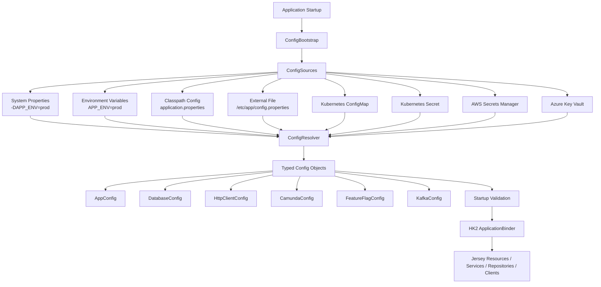

---

# 3. Practical Configuration Taxonomy

| Area | Contoh | Scope | Catatan Praktis |
|---|---|---|---|
| Application identity | `app.name`, `service.name`, `app.version` | startup | Aman sebagai normal config |
| Profile/environment | `local`, `dev`, `sit`, `uat`, `prod` | startup | Jangan pakai profile untuk menyembunyikan branch logic bisnis besar |
| HTTP server | port, context path, timeout | startup | Biasanya dari env/system property |
| DB config | host, port, database, username, password | startup | Password harus secret |
| MyBatis config | mapper location, transaction policy | startup | Bisa classpath config |
| External client | base URL, timeout, retry, circuit breaker | startup/runtime | Jangan hard-code URL di client |
| Camunda | endpoint, auth, worker name, timeout | startup | Secret token dipisah |
| Kafka | bootstrap servers, topic, consumer group | startup | Credential/JAAS secret dipisah |
| Feature flag | provider, endpoint, SDK key | startup/runtime | SDK key secret |
| Security | issuer, jwks URI, audience | startup/runtime | Private key/secret dipisah |
| Secret | password, token, API key, private key | startup/runtime | Jangan masuk Git/log/exception |
| Operational toggle | maintenance mode, kill switch | runtime | Bisa dynamic, tapi perlu consistency model |

---

# 4. Design Rule

## Rule 1 - Jangan baca config langsung di service

Buruk:

```java
public final class HttpPaymentClient {

    public PaymentStatus getStatus(UUID orderId) {
        String baseUrl = System.getenv("PAYMENT_BASE_URL");
        // ...
    }
}
```

Masalah:

```text
dependency tersembunyi
sulit test
precedence tidak konsisten
secret rawan masuk log
config missing baru ketahuan saat runtime path tertentu
```

Baik:

```java
public final class HttpPaymentClient {

    private final PaymentClientConfig config;

    @Inject
    public HttpPaymentClient(PaymentClientConfig config) {
        this.config = config;
    }
}
```

---

## Rule 2 - Config harus typed

Buruk:

```java
String timeout = config.get("payment.timeout");
```

Baik:

```java
public record PaymentClientConfig(
        URI baseUri,
        Duration connectTimeout,
        Duration readTimeout,
        int maxRetries
) {
}
```

Typed config membuat error lebih cepat kelihatan saat startup.

---

## Rule 3 - Secret bukan string biasa

Buruk:

```java
public record DatabaseConfig(
        String username,
        String password
) {
}
```

Lebih baik:

```java
public record SecretValue(String value) {

    @Override
    public String toString() {
        return "****";
    }
}
```

```java
public record DatabaseConfig(
        String username,
        SecretValue password
) {
}
```

Tujuannya bukan membuat secret mustahil bocor, tetapi mengurangi accidental leak lewat `toString()`, log, exception, dan debug output.

---

## Rule 4 - Precedence harus eksplisit

Contoh precedence yang disarankan:

```text
1. system property        highest
2. environment variable
3. external file
4. classpath profile file
5. classpath default file lowest
```

Ini mirip filosofi MicroProfile Config, yang memakai ordinal untuk menentukan source mana yang menang ketika property sama muncul di banyak source. MicroProfile Config 3.1 memberi default ordinal lebih tinggi untuk system properties dibanding environment variables dan classpath properties. ([Eclipse Downloads](https://download.eclipse.org/microprofile/microprofile-config-3.1/microprofile-config-spec-3.1.html?utm_source=chatgpt.com))

---

# 5. Core Abstraction

## 5.1 `ConfigSource`

```java
package com.company.orderservice.config;

import java.util.Optional;
import java.util.Set;

public interface ConfigSource {

    String name();

    int ordinal();

    Optional<String> get(String key);

    Set<String> keys();
}
```

## 5.2 `ConfigResolver`

```java
package com.company.orderservice.config;

import java.util.Comparator;
import java.util.List;
import java.util.Optional;

public final class ConfigResolver {

    private final List<ConfigSource> sources;

    public ConfigResolver(List<ConfigSource> sources) {
        this.sources = sources.stream()
                .sorted(Comparator.comparingInt(ConfigSource::ordinal).reversed())
                .toList();
    }

    public Optional<String> find(String key) {
        return sources.stream()
                .map(source -> source.get(key))
                .filter(Optional::isPresent)
                .map(Optional::get)
                .findFirst();
    }

    public String required(String key) {
        return find(key)
                .filter(value -> !value.isBlank())
                .orElseThrow(() -> new MissingConfigException(key));
    }

    public String optional(String key, String defaultValue) {
        return find(key)
                .filter(value -> !value.isBlank())
                .orElse(defaultValue);
    }

    public int requiredInt(String key) {
        return Integer.parseInt(required(key));
    }

    public int optionalInt(String key, int defaultValue) {
        return find(key)
                .filter(value -> !value.isBlank())
                .map(Integer::parseInt)
                .orElse(defaultValue);
    }

    public boolean optionalBoolean(String key, boolean defaultValue) {
        return find(key)
                .filter(value -> !value.isBlank())
                .map(Boolean::parseBoolean)
                .orElse(defaultValue);
    }
}
```

## 5.3 Exception

```java
package com.company.orderservice.config;

public final class MissingConfigException extends RuntimeException {

    public MissingConfigException(String key) {
        super("Missing required configuration: " + key);
    }
}
```

---

# 6. Config Sources Implementation

## 6.1 System Properties Source

```java
package com.company.orderservice.config.source;

import com.company.orderservice.config.ConfigSource;

import java.util.Optional;
import java.util.Set;

public final class SystemPropertiesConfigSource implements ConfigSource {

    @Override
    public String name() {
        return "system-properties";
    }

    @Override
    public int ordinal() {
        return 400;
    }

    @Override
    public Optional<String> get(String key) {
        return Optional.ofNullable(System.getProperty(key));
    }

    @Override
    public Set<String> keys() {
        return System.getProperties().stringPropertyNames();
    }
}
```

Usage:

```bash
java -Dapp.profile=prod -Dpayment.baseUrl=https://payment.internal -jar app.jar
```

---

## 6.2 Environment Variables Source

Problem praktis: env var biasanya uppercase dan underscore:

```text
payment.baseUrl
PAYMENT_BASE_URL
payment.base-url
```

Buat normalisasi.

```java
package com.company.orderservice.config.source;

import com.company.orderservice.config.ConfigSource;

import java.util.Map;
import java.util.Optional;
import java.util.Set;
import java.util.stream.Collectors;

public final class EnvironmentConfigSource implements ConfigSource {

    private final Map<String, String> env = System.getenv();

    @Override
    public String name() {
        return "environment-variables";
    }

    @Override
    public int ordinal() {
        return 300;
    }

    @Override
    public Optional<String> get(String key) {
        String direct = env.get(key);

        if (direct != null) {
            return Optional.of(direct);
        }

        return Optional.ofNullable(env.get(toEnvKey(key)));
    }

    @Override
    public Set<String> keys() {
        return env.keySet().stream()
                .collect(Collectors.toUnmodifiableSet());
    }

    private String toEnvKey(String key) {
        return key
                .replace('.', '_')
                .replace('-', '_')
                .toUpperCase();
    }
}
```

Usage di Kubernetes/Docker:

```yaml
env:
  - name: APP_PROFILE
    value: prod
  - name: PAYMENT_BASE_URL
    value: https://payment.internal
```

Kubernetes mendukung `env` dan `envFrom` untuk menyetel environment variables di container; `env` dan `envFrom` punya efek berbeda dalam cara data dimasukkan. ([Kubernetes](https://kubernetes.io/docs/tasks/inject-data-application/define-environment-variable-container/?utm_source=chatgpt.com))

---

## 6.3 Classpath Properties Source

Classpath default cocok untuk config non-secret:

```text
src/main/resources/application.properties
src/main/resources/application-local.properties
src/main/resources/application-prod.properties
```

```properties
app.name=order-service
payment.connectTimeoutMillis=1000
payment.readTimeoutMillis=3000
payment.maxRetries=2
```

Implementation:

```java
package com.company.orderservice.config.source;

import com.company.orderservice.config.ConfigSource;

import java.io.IOException;
import java.io.InputStream;
import java.util.Optional;
import java.util.Properties;
import java.util.Set;

public final class ClasspathPropertiesConfigSource implements ConfigSource {

    private final String resourceName;
    private final Properties properties = new Properties();

    public ClasspathPropertiesConfigSource(String resourceName, int ordinal) {
        this.resourceName = resourceName;
        load(resourceName);
    }

    @Override
    public String name() {
        return "classpath:" + resourceName;
    }

    @Override
    public int ordinal() {
        return 100;
    }

    @Override
    public Optional<String> get(String key) {
        return Optional.ofNullable(properties.getProperty(key));
    }

    @Override
    public Set<String> keys() {
        return properties.stringPropertyNames();
    }

    private void load(String resourceName) {
        try (InputStream input = Thread.currentThread()
                .getContextClassLoader()
                .getResourceAsStream(resourceName)) {

            if (input != null) {
                properties.load(input);
            }
        } catch (IOException error) {
            throw new IllegalStateException(
                    "Failed to load classpath config: " + resourceName,
                    error
            );
        }
    }
}
```

Rule:

```text
Classpath config boleh untuk default.
Classpath config jangan untuk secret.
```

---

## 6.4 External File Properties Source

Cocok untuk on-prem, mounted volume, atau config file dari deployment system.

```java
package com.company.orderservice.config.source;

import com.company.orderservice.config.ConfigSource;

import java.io.IOException;
import java.io.InputStream;
import java.nio.file.Files;
import java.nio.file.Path;
import java.util.Optional;
import java.util.Properties;
import java.util.Set;

public final class ExternalPropertiesConfigSource implements ConfigSource {

    private final Path path;
    private final int ordinal;
    private final Properties properties = new Properties();

    public ExternalPropertiesConfigSource(Path path, int ordinal) {
        this.path = path;
        this.ordinal = ordinal;
        load(path);
    }

    @Override
    public String name() {
        return "file:" + path;
    }

    @Override
    public int ordinal() {
        return ordinal;
    }

    @Override
    public Optional<String> get(String key) {
        return Optional.ofNullable(properties.getProperty(key));
    }

    @Override
    public Set<String> keys() {
        return properties.stringPropertyNames();
    }

    private void load(Path path) {
        if (!Files.exists(path)) {
            return;
        }

        try (InputStream input = Files.newInputStream(path)) {
            properties.load(input);
        } catch (IOException error) {
            throw new IllegalStateException(
                    "Failed to load external config file: " + path,
                    error
            );
        }
    }
}
```

Kubernetes ConfigMap dapat dipakai sebagai environment variables atau dipasang sebagai volume/file ke Pod, sehingga model external file source cocok untuk deployment Kubernetes. ([Kubernetes](https://kubernetes.io/docs/tasks/configure-pod-container/configure-pod-configmap/?utm_source=chatgpt.com))

---

# 7. Typed Config Objects

## 7.1 `AppConfig`

```java
package com.company.orderservice.config.model;

public record AppConfig(
        String appName,
        AppProfile profile,
        String region,
        boolean debugEnabled
) {
}
```

```java
package com.company.orderservice.config.model;

public enum AppProfile {
    LOCAL,
    DEV,
    SIT,
    UAT,
    PROD;

    public static AppProfile from(String value) {
        return AppProfile.valueOf(value.trim().toUpperCase());
    }
}
```

## 7.2 `DatabaseConfig`

```java
package com.company.orderservice.config.model;

import java.time.Duration;

public record DatabaseConfig(
        String jdbcUrl,
        String username,
        SecretValue password,
        int maxPoolSize,
        Duration connectionTimeout
) {
}
```

## 7.3 `HttpClientConfig`

```java
package com.company.orderservice.config.model;

import java.net.URI;
import java.time.Duration;

public record HttpClientConfig(
        URI baseUri,
        Duration connectTimeout,
        Duration readTimeout,
        int maxRetries
) {
}
```

## 7.4 `CamundaConfig`

```java
package com.company.orderservice.config.model;

import java.net.URI;
import java.time.Duration;

public record CamundaConfig(
        URI endpoint,
        String workerName,
        SecretValue clientSecret,
        Duration requestTimeout
) {
}
```

## 7.5 `KafkaConfig`

```java
package com.company.orderservice.config.model;

import java.util.List;

public record KafkaConfig(
        List<String> bootstrapServers,
        String orderEventsTopic,
        String consumerGroupId,
        boolean sslEnabled
) {
}
```

## 7.6 `FeatureFlagConfig`

```java
package com.company.orderservice.config.model;

import java.net.URI;
import java.time.Duration;

public record FeatureFlagConfig(
        String provider,
        URI endpoint,
        SecretValue apiKey,
        Duration refreshInterval
) {
}
```

---

# 8. Secret Handling

## 8.1 `SecretValue`

```java
package com.company.orderservice.config.model;

public record SecretValue(String value) {

    public SecretValue {
        if (value == null || value.isBlank()) {
            throw new IllegalArgumentException("Secret value must not be blank");
        }
    }

    @Override
    public String toString() {
        return "****";
    }
}
```

## 8.2 `SecretProvider`

```java
package com.company.orderservice.config.secret;

import com.company.orderservice.config.model.SecretValue;

public interface SecretProvider {

    SecretValue getSecret(String secretName);
}
```

## 8.3 Environment Secret Provider

Cocok untuk local/dev atau Kubernetes Secret exposed sebagai env var.

```java
package com.company.orderservice.config.secret;

import com.company.orderservice.config.model.SecretValue;

public final class EnvironmentSecretProvider implements SecretProvider {

    @Override
    public SecretValue getSecret(String secretName) {
        String envKey = secretName
                .replace('.', '_')
                .replace('-', '_')
                .toUpperCase();

        String value = System.getenv(envKey);

        if (value == null || value.isBlank()) {
            throw new IllegalStateException("Missing secret environment variable: " + envKey);
        }

        return new SecretValue(value);
    }
}
```

Kubernetes Secret dapat dipasang sebagai volume atau diekspos sebagai environment variables ke container dalam Pod. ([Kubernetes](https://kubernetes.io/docs/concepts/configuration/secret/?utm_source=chatgpt.com))

---

# 9. AWS Secrets Manager Provider

AWS Secrets Manager Java SDK dapat mengambil secret menggunakan `GetSecretValue`; AWS juga merekomendasikan client-side caching untuk meningkatkan kecepatan dan menurunkan biaya. ([AWS Documentation](https://docs.aws.amazon.com/secretsmanager/latest/userguide/retrieving-secrets-java-sdk.html?utm_source=chatgpt.com))

Interface implementation:

```java
package com.company.orderservice.config.secret;

import com.company.orderservice.config.model.SecretValue;
import software.amazon.awssdk.services.secretsmanager.SecretsManagerClient;
import software.amazon.awssdk.services.secretsmanager.model.GetSecretValueRequest;

import java.util.Map;
import java.util.concurrent.ConcurrentHashMap;

public final class AwsSecretsManagerSecretProvider implements SecretProvider {

    private final SecretsManagerClient client;
    private final Map<String, SecretValue> cache = new ConcurrentHashMap<>();

    public AwsSecretsManagerSecretProvider(SecretsManagerClient client) {
        this.client = client;
    }

    @Override
    public SecretValue getSecret(String secretName) {
        return cache.computeIfAbsent(secretName, this::loadSecret);
    }

    private SecretValue loadSecret(String secretName) {
        var request = GetSecretValueRequest.builder()
                .secretId(secretName)
                .build();

        var response = client.getSecretValue(request);

        if (response.secretString() == null || response.secretString().isBlank()) {
            throw new IllegalStateException("AWS secret has no string value: " + secretName);
        }

        return new SecretValue(response.secretString());
    }
}
```

Maven sketch:

```xml
<dependency>
    <groupId>software.amazon.awssdk</groupId>
    <artifactId>secretsmanager</artifactId>
</dependency>
```

Praktik production:

```text
gunakan IAM role / workload identity, bukan access key hard-coded
cache secret dengan TTL
audit access
jangan log secret name sensitif jika naming mengandung informasi internal
```

---

# 10. Azure Key Vault Provider

Azure Key Vault Secrets client library untuk Java menyediakan operasi untuk membuat, mengambil, memperbarui, menghapus, backup/restore, dan list secrets; Azure docs juga menjelaskan `DefaultAzureCredential` untuk menyederhanakan autentikasi di local development dan Azure-hosted environments. ([Microsoft Learn](https://learn.microsoft.com/en-us/java/api/overview/azure/security-keyvault-secrets-readme?view=azure-java-stable&utm_source=chatgpt.com))

Implementation:

```java
package com.company.orderservice.config.secret;

import com.azure.security.keyvault.secrets.SecretClient;
import com.company.orderservice.config.model.SecretValue;

import java.util.Map;
import java.util.concurrent.ConcurrentHashMap;

public final class AzureKeyVaultSecretProvider implements SecretProvider {

    private final SecretClient client;
    private final Map<String, SecretValue> cache = new ConcurrentHashMap<>();

    public AzureKeyVaultSecretProvider(SecretClient client) {
        this.client = client;
    }

    @Override
    public SecretValue getSecret(String secretName) {
        return cache.computeIfAbsent(secretName, this::loadSecret);
    }

    private SecretValue loadSecret(String secretName) {
        var secret = client.getSecret(secretName);

        if (secret.getValue() == null || secret.getValue().isBlank()) {
            throw new IllegalStateException("Azure Key Vault secret has no value: " + secretName);
        }

        return new SecretValue(secret.getValue());
    }
}
```

Maven sketch:

```xml
<dependency>
    <groupId>com.azure</groupId>
    <artifactId>azure-security-keyvault-secrets</artifactId>
</dependency>

<dependency>
    <groupId>com.azure</groupId>
    <artifactId>azure-identity</artifactId>
</dependency>
```

Client creation sketch:

```java
SecretClient client = new SecretClientBuilder()
        .vaultUrl(vaultUrl)
        .credential(new DefaultAzureCredentialBuilder().build())
        .buildClient();
```

---

# 11. Config Loader

## 11.1 `ApplicationConfig`

```java
package com.company.orderservice.config.model;

public record ApplicationConfig(
        AppConfig app,
        DatabaseConfig database,
        HttpClientConfig paymentClient,
        CamundaConfig camunda,
        KafkaConfig kafka,
        FeatureFlagConfig featureFlags
) {
}
```

## 11.2 Loader

```java
package com.company.orderservice.config;

import com.company.orderservice.config.model.*;
import com.company.orderservice.config.secret.SecretProvider;

import java.net.URI;
import java.time.Duration;
import java.util.Arrays;

public final class ApplicationConfigLoader {

    private final ConfigResolver config;
    private final SecretProvider secretProvider;

    public ApplicationConfigLoader(
            ConfigResolver config,
            SecretProvider secretProvider
    ) {
        this.config = config;
        this.secretProvider = secretProvider;
    }

    public ApplicationConfig load() {
        ApplicationConfig applicationConfig = new ApplicationConfig(
                loadAppConfig(),
                loadDatabaseConfig(),
                loadPaymentClientConfig(),
                loadCamundaConfig(),
                loadKafkaConfig(),
                loadFeatureFlagConfig()
        );

        ConfigValidator.validate(applicationConfig);

        return applicationConfig;
    }

    private AppConfig loadAppConfig() {
        return new AppConfig(
                config.optional("app.name", "order-service"),
                AppProfile.from(config.optional("app.profile", "local")),
                config.optional("app.region", "local"),
                config.optionalBoolean("app.debugEnabled", false)
        );
    }

    private DatabaseConfig loadDatabaseConfig() {
        return new DatabaseConfig(
                config.required("database.jdbcUrl"),
                config.required("database.username"),
                secretProvider.getSecret(config.required("database.passwordSecretName")),
                config.optionalInt("database.maxPoolSize", 10),
                Duration.ofMillis(config.optionalInt("database.connectionTimeoutMillis", 3000))
        );
    }

    private HttpClientConfig loadPaymentClientConfig() {
        return new HttpClientConfig(
                URI.create(config.required("payment.baseUri")),
                Duration.ofMillis(config.optionalInt("payment.connectTimeoutMillis", 1000)),
                Duration.ofMillis(config.optionalInt("payment.readTimeoutMillis", 3000)),
                config.optionalInt("payment.maxRetries", 2)
        );
    }

    private CamundaConfig loadCamundaConfig() {
        return new CamundaConfig(
                URI.create(config.required("camunda.endpoint")),
                config.optional("camunda.workerName", "order-service-worker"),
                secretProvider.getSecret(config.required("camunda.clientSecretName")),
                Duration.ofMillis(config.optionalInt("camunda.requestTimeoutMillis", 5000))
        );
    }

    private KafkaConfig loadKafkaConfig() {
        return new KafkaConfig(
                Arrays.stream(config.required("kafka.bootstrapServers").split(","))
                        .map(String::trim)
                        .filter(value -> !value.isBlank())
                        .toList(),
                config.required("kafka.topic.orderEvents"),
                config.required("kafka.consumerGroupId"),
                config.optionalBoolean("kafka.sslEnabled", true)
        );
    }

    private FeatureFlagConfig loadFeatureFlagConfig() {
        return new FeatureFlagConfig(
                config.optional("featureFlag.provider", "local"),
                URI.create(config.optional("featureFlag.endpoint", "http://localhost:1031")),
                secretProvider.getSecret(config.required("featureFlag.apiKeySecretName")),
                Duration.ofSeconds(config.optionalInt("featureFlag.refreshIntervalSeconds", 30))
        );
    }
}
```

---

# 12. Startup Validation

## 12.1 Validator

```java
package com.company.orderservice.config;

import com.company.orderservice.config.model.ApplicationConfig;
import com.company.orderservice.config.model.AppProfile;

public final class ConfigValidator {

    private ConfigValidator() {
    }

    public static void validate(ApplicationConfig config) {
        validateApp(config);
        validateDatabase(config);
        validatePayment(config);
        validateKafka(config);
        validateProductionRules(config);
    }

    private static void validateApp(ApplicationConfig config) {
        requireNonBlank(config.app().appName(), "app.name");
        requireNonBlank(config.app().region(), "app.region");
    }

    private static void validateDatabase(ApplicationConfig config) {
        requireNonBlank(config.database().jdbcUrl(), "database.jdbcUrl");
        requireNonBlank(config.database().username(), "database.username");

        if (config.database().maxPoolSize() < 1) {
            throw new IllegalStateException("database.maxPoolSize must be >= 1");
        }
    }

    private static void validatePayment(ApplicationConfig config) {
        if (config.paymentClient().connectTimeout().isNegative()
                || config.paymentClient().readTimeout().isNegative()) {
            throw new IllegalStateException("Payment timeout must not be negative");
        }
    }

    private static void validateKafka(ApplicationConfig config) {
        if (config.kafka().bootstrapServers().isEmpty()) {
            throw new IllegalStateException("kafka.bootstrapServers must not be empty");
        }
    }

    private static void validateProductionRules(ApplicationConfig config) {
        if (config.app().profile() == AppProfile.PROD && config.app().debugEnabled()) {
            throw new IllegalStateException("app.debugEnabled must be false in PROD");
        }

        if (config.app().profile() == AppProfile.PROD
                && config.paymentClient().baseUri().toString().contains("localhost")) {
            throw new IllegalStateException("payment.baseUri must not point to localhost in PROD");
        }
    }

    private static void requireNonBlank(String value, String key) {
        if (value == null || value.isBlank()) {
            throw new IllegalStateException("Config must not be blank: " + key);
        }
    }
}
```

Prinsip:

```text
Fail fast saat startup lebih baik daripada request pertama gagal di production.
```

---

# 13. Bootstrap Sources

```java
package com.company.orderservice.config;

import com.company.orderservice.config.secret.EnvironmentSecretProvider;
import com.company.orderservice.config.secret.SecretProvider;
import com.company.orderservice.config.source.ClasspathPropertiesConfigSource;
import com.company.orderservice.config.source.EnvironmentConfigSource;
import com.company.orderservice.config.source.ExternalPropertiesConfigSource;
import com.company.orderservice.config.source.SystemPropertiesConfigSource;

import java.nio.file.Path;
import java.util.ArrayList;
import java.util.List;

public final class ConfigBootstrap {

    private ConfigBootstrap() {
    }

    public static ApplicationConfig load() {
        List<ConfigSource> sources = new ArrayList<>();

        sources.add(new SystemPropertiesConfigSource());
        sources.add(new EnvironmentConfigSource());

        String profile = System.getProperty("app.profile",
                System.getenv().getOrDefault("APP_PROFILE", "local"));

        sources.add(new ExternalPropertiesConfigSource(
                Path.of(System.getenv().getOrDefault(
                        "APP_CONFIG_FILE",
                        "/etc/order-service/application.properties"
                )),
                250
        ));

        sources.add(new ClasspathPropertiesConfigSource(
                "application-" + profile + ".properties",
                110
        ));

        sources.add(new ClasspathPropertiesConfigSource(
                "application.properties",
                100
        ));

        ConfigResolver resolver = new ConfigResolver(sources);

        SecretProvider secretProvider = new EnvironmentSecretProvider();

        return new ApplicationConfigLoader(
                resolver,
                secretProvider
        ).load();
    }
}
```

Catatan: di production, `SecretProvider` dipilih berdasarkan environment:

```text
local      -> EnvironmentSecretProvider
on-prem    -> MountedFileSecretProvider / Vault provider
aws        -> AwsSecretsManagerSecretProvider
azure      -> AzureKeyVaultSecretProvider
kubernetes -> env/volume secret provider, or cloud secret provider via workload identity
```

---

# 14. HK2 Binding

## 14.1 Binding Full Config

```java
package com.company.orderservice.bootstrap;

import com.company.orderservice.config.ConfigBootstrap;
import com.company.orderservice.config.model.ApplicationConfig;
import jakarta.inject.Singleton;
import org.glassfish.hk2.utilities.binding.AbstractBinder;

public final class ConfigBinder extends AbstractBinder {

    @Override
    protected void configure() {
        ApplicationConfig config = ConfigBootstrap.load();

        bind(config)
                .to(ApplicationConfig.class);

        bind(config.app())
                .to(AppConfig.class);

        bind(config.database())
                .to(DatabaseConfig.class);

        bind(config.paymentClient())
                .to(HttpClientConfig.class);

        bind(config.camunda())
                .to(CamundaConfig.class);

        bind(config.kafka())
                .to(KafkaConfig.class);

        bind(config.featureFlags())
                .to(FeatureFlagConfig.class);
    }
}
```

## 14.2 Register di `ResourceConfig`

```java
public final class ApiApplication extends ResourceConfig {

    public ApiApplication() {
        packages("com.company.orderservice.api.resource");

        register(new ConfigBinder());
        register(new ApplicationBinder());
        register(new ContextBinder());
    }
}
```

## 14.3 Usage di Client

```java
package com.company.orderservice.infrastructure.client;

import com.company.orderservice.config.model.HttpClientConfig;
import jakarta.inject.Inject;

public final class HttpPaymentClient implements PaymentClient {

    private final HttpClientConfig config;

    @Inject
    public HttpPaymentClient(HttpClientConfig config) {
        this.config = config;
    }

    @Override
    public PaymentStatus getPaymentStatus(String paymentId) {
        // config.baseUri()
        // config.connectTimeout()
        // config.readTimeout()
        // config.maxRetries()
        return PaymentStatus.UNKNOWN;
    }
}
```

---

# 15. Kubernetes Deployment Pattern

## 15.1 ConfigMap sebagai env

```yaml
apiVersion: v1
kind: ConfigMap
metadata:
  name: order-service-config
data:
  APP_PROFILE: "prod"
  APP_REGION: "ap-southeast-1"
  PAYMENT_BASE_URI: "https://payment.internal"
  KAFKA_BOOTSTRAP_SERVERS: "kafka-1:9092,kafka-2:9092"
```

## 15.2 Secret sebagai env

```yaml
apiVersion: v1
kind: Secret
metadata:
  name: order-service-secret
type: Opaque
stringData:
  DATABASE_PASSWORD: "replace-me"
  CAMUNDA_CLIENT_SECRET: "replace-me"
  FEATURE_FLAG_API_KEY: "replace-me"
```

## 15.3 Deployment

```yaml
apiVersion: apps/v1
kind: Deployment
metadata:
  name: order-service
spec:
  template:
    spec:
      containers:
        - name: order-service
          image: company/order-service:1.0.0
          envFrom:
            - configMapRef:
                name: order-service-config
            - secretRef:
                name: order-service-secret
```

Kubernetes docs menjelaskan Secret dapat dipasang sebagai volume atau diekspos sebagai environment variable, dan ConfigMap dapat digunakan untuk memasukkan data konfigurasi ke Pod. ([Kubernetes](https://kubernetes.io/docs/concepts/configuration/secret/?utm_source=chatgpt.com))

Praktik keamanan:

```text
gunakan RBAC least privilege
aktifkan encryption at rest untuk secrets
hindari print env vars di log
hindari memasukkan secret ke ConfigMap
pertimbangkan external secret operator/cloud secret manager
```

---

# 16. Config Key Naming Convention

Rekomendasi format internal:

```properties
app.name=order-service
app.profile=prod
app.region=ap-southeast-1

database.jdbcUrl=jdbc:postgresql://postgres:5432/orders
database.username=order_app
database.passwordSecretName=database.password
database.maxPoolSize=20
database.connectionTimeoutMillis=3000

payment.baseUri=https://payment.internal
payment.connectTimeoutMillis=1000
payment.readTimeoutMillis=3000
payment.maxRetries=2

camunda.endpoint=https://camunda.internal
camunda.workerName=order-service-worker
camunda.clientSecretName=camunda.client.secret
camunda.requestTimeoutMillis=5000

kafka.bootstrapServers=kafka-1:9092,kafka-2:9092
kafka.topic.orderEvents=order-events
kafka.consumerGroupId=order-service
kafka.sslEnabled=true

featureFlag.provider=openfeature
featureFlag.endpoint=https://flags.internal
featureFlag.apiKeySecretName=featureflag.api.key
featureFlag.refreshIntervalSeconds=30
```

Env equivalent:

```text
APP_NAME
APP_PROFILE
APP_REGION
DATABASE_JDBCURL
DATABASE_USERNAME
DATABASE_PASSWORDSECRETNAME
PAYMENT_BASEURI
PAYMENT_CONNECTTIMEOUTMILLIS
```

Lebih rapi kalau mapping env dibuat eksplisit:

```text
database.jdbcUrl -> DATABASE_JDBC_URL
payment.baseUri  -> PAYMENT_BASE_URI
```

Jangan terlalu mengandalkan automatic conversion kalau nama key kompleks.

---

# 17. Masking Config untuk Log

Saat startup, kadang kita ingin log effective config. Jangan log secret.

```java
package com.company.orderservice.config;

import com.company.orderservice.config.model.ApplicationConfig;

public final class SafeConfigPrinter {

    private SafeConfigPrinter() {
    }

    public static String summarize(ApplicationConfig config) {
        return """
                app.name=%s
                app.profile=%s
                app.region=%s
                database.jdbcUrl=%s
                database.username=%s
                database.password=****
                payment.baseUri=%s
                camunda.endpoint=%s
                camunda.clientSecret=****
                kafka.bootstrapServers=%s
                featureFlag.provider=%s
                featureFlag.apiKey=****
                """.formatted(
                config.app().appName(),
                config.app().profile(),
                config.app().region(),
                config.database().jdbcUrl(),
                config.database().username(),
                config.paymentClient().baseUri(),
                config.camunda().endpoint(),
                config.kafka().bootstrapServers(),
                config.featureFlags().provider()
        );
    }
}
```

Rule:

```text
Jangan pernah log raw ApplicationConfig jika record-nya mengandung secret.
```

---

# 18. Dynamic Config vs Startup Config

Tidak semua config harus dynamic.

| Config | Startup-only cukup? | Dynamic layak? |
|---|---:|---:|
| DB JDBC URL | Ya | Jarang |
| DB password | Biasanya startup/reload controlled | Bisa, tapi butuh rotation design |
| HTTP timeout | Ya | Bisa |
| Feature flag | Tidak selalu | Ya |
| Kill switch | Tidak | Ya |
| Kafka topic | Ya | Jarang |
| Camunda endpoint | Ya | Jarang |
| Log level | Bisa | Ya |
| Tenant routing | Tergantung | Bisa, dengan consistency control |

Dynamic config butuh jawaban untuk:

```text
kapan refresh?
siapa owner?
apakah atomic?
apakah semua instance konsisten?
bagaimana rollback?
bagaimana audit perubahan?
apa default safe value?
```

Jangan membuat semua config dynamic hanya karena bisa.

---

# 19. Test Override Pattern

## 19.1 Unit Test

```java
ApplicationConfig testConfig = new ApplicationConfig(
        new AppConfig("order-service-test", AppProfile.LOCAL, "test", false),
        new DatabaseConfig(
                "jdbc:postgresql://localhost:5432/test",
                "test",
                new SecretValue("test-password"),
                2,
                Duration.ofMillis(1000)
        ),
        new HttpClientConfig(
                URI.create("http://localhost:8089"),
                Duration.ofMillis(100),
                Duration.ofMillis(200),
                0
        ),
        new CamundaConfig(
                URI.create("http://localhost:26500"),
                "test-worker",
                new SecretValue("test-secret"),
                Duration.ofMillis(500)
        ),
        new KafkaConfig(
                List.of("localhost:9092"),
                "test-order-events",
                "test-group",
                false
        ),
        new FeatureFlagConfig(
                "local",
                URI.create("http://localhost:1031"),
                new SecretValue("test-api-key"),
                Duration.ofSeconds(1)
        )
);
```

## 19.2 Test Binder

```java
public final class TestConfigBinder extends AbstractBinder {

    private final ApplicationConfig config;

    public TestConfigBinder(ApplicationConfig config) {
        this.config = config;
    }

    @Override
    protected void configure() {
        bind(config).to(ApplicationConfig.class);
        bind(config.app()).to(AppConfig.class);
        bind(config.database()).to(DatabaseConfig.class);
        bind(config.paymentClient()).to(HttpClientConfig.class);
        bind(config.camunda()).to(CamundaConfig.class);
        bind(config.kafka()).to(KafkaConfig.class);
        bind(config.featureFlags()).to(FeatureFlagConfig.class);
    }
}
```

Prinsip:

```text
Test tidak boleh bergantung pada env var laptop/CI secara tidak sengaja.
```

---

# 20. Failure Model

| Failure | Penyebab | Dampak | Pencegahan |
|---|---|---|---|
| Config missing baru ketahuan saat request | lazy `System.getenv()` di client | runtime failure | load + validate saat startup |
| Prod pakai URL localhost | default config bocor ke prod | outage | production validation rule |
| Secret masuk log | record config auto `toString()` | security incident | `SecretValue`, safe printer |
| Precedence membingungkan | source order tidak eksplisit | override gagal | ordinal jelas |
| Test flaky | test baca env real | hasil beda tiap environment | test binder/fixed config |
| Secret stale | cache tanpa TTL/rotation policy | credential rotation gagal | cache TTL + reload policy |
| Config reload race | dynamic config mutable global | behavior inkonsisten | immutable snapshot + atomic swap |
| ConfigMap dipakai untuk secret | salah object Kubernetes | exposure risk | Secret/external secret manager |
| Environment variable naming kacau | auto mapping ambigu | config tidak terbaca | explicit key mapping |
| Semua config dynamic | no ownership/audit | debugging sulit | startup vs dynamic classification |

---

# 21. Practical Review Checklist

Saat onboarding codebase, cari:

```text
System.getenv
System.getProperty
application.properties
application-prod.properties
ConfigMap
Secret
AWS Secrets Manager
Azure Key Vault
Vault
ConfigSource
ConfigResolver
AppConfig
DatabaseConfig
FeatureFlagConfig
SecretValue
```

Lalu audit:

| Pertanyaan | Jawaban sehat |
|---|---|
| Config dibaca di satu tempat? | Ya |
| Ada typed config object? | Ya |
| Ada startup validation? | Ya |
| Ada precedence jelas? | Ya |
| Secret tidak ada di classpath file? | Ya |
| Secret tidak ikut `toString()`? | Ya |
| Production config menolak localhost/debug? | Ya |
| Test punya config override? | Ya |
| Cloud secret access pakai workload identity/IAM role? | Ya |
| Dynamic config punya refresh/audit/rollback model? | Ya |

---

# 22. Mini Exercise Praktis

Ambil satu service real, lalu buat inventory:

```text
Required config:
  app.profile
  database.jdbcUrl
  database.username
  database.passwordSecretName
  payment.baseUri
  payment.connectTimeoutMillis
  payment.readTimeoutMillis
  kafka.bootstrapServers
  camunda.endpoint
  featureFlag.provider

Secret:
  database.password
  camunda.clientSecret
  featureFlag.apiKey

Source:
  local: classpath + env
  on-prem: external file + mounted secret
  Kubernetes: ConfigMap + Secret
  AWS: env + AWS Secrets Manager
  Azure: env + Azure Key Vault

Validation:
  prod cannot use localhost
  timeout > 0
  pool size >= 1
  required secrets resolvable
```

Kalau ada config yang hanya diketahui setelah membaca service/client code, berarti config design belum cukup eksplisit.

---

# 23. Ringkasan Seri 5/7

Pegangan utama:

1. **HK2 bukan config framework; HK2 hanya meng-inject hasil config loader.**
2. **Config harus dibaca di satu composition/bootstrap layer.**
3. **Jangan baca `System.getenv()` langsung dari service/client/repository.**
4. **Gunakan typed config object.**
5. **Precedence harus eksplisit.**
6. **Secret harus dipisah dari normal config.**
7. **Jangan taruh secret di classpath properties atau Git.**
8. **Startup validation wajib untuk fail fast.**
9. **Kubernetes ConfigMap cocok untuk config biasa; Kubernetes Secret atau external secret manager untuk secret.**
10. **AWS Secrets Manager / Azure Key Vault sebaiknya diakses lewat provider abstraction dan cache terkontrol.**
11. **Test harus bisa override config tanpa bergantung environment laptop/CI.**
12. **Dynamic config hanya untuk config yang benar-benar butuh runtime change dan punya consistency model.**

---

# Rekomendasi Materi Selanjutnya

Lanjut ke **Seri 6/7: Feature Flag Integration with OpenFeature-style Abstraction**.

Di seri berikutnya kita akan bahas:

- feature flag taxonomy;
- boolean flag, variant, kill switch, experiment;
- evaluation context dari tenant/user/request;
- local flag provider untuk test;
- OpenFeature-style abstraction;
- flag default value;
- rollout safety;
- cleanup lifecycle;
- audit dan observability feature flag;
- integrasi dengan HK2 dan Jersey service.

**Seri 5/7 selesai.**

---

**Sources:**

- [Configuration for MicroProfile - Eclipse download page](https://download.eclipse.org/microprofile/microprofile-config-3.1/microprofile-config-spec-3.1.html?utm_source=chatgpt.com)
- [Define Environment Variables for a Container](https://kubernetes.io/docs/tasks/inject-data-application/define-environment-variable-container/?utm_source=chatgpt.com)
- [Get a Secrets Manager secret value using the Java AWS SDK](https://docs.aws.amazon.com/secretsmanager/latest/userguide/retrieving-secrets-java-sdk.html?utm_source=chatgpt.com)
- [Azure Key Vault Secret client library for Java](https://learn.microsoft.com/en-us/java/api/overview/azure/security-keyvault-secrets-readme?view=azure-java-stable&utm_source=chatgpt.com)

## Response:
7/15/2026, 3:51:28 AM

Lanjut ke **Seri 6/7: Feature Flag Integration with OpenFeature-style Abstraction**. Fokusnya: feature flag sebagai mekanisme delivery/runtime control yang aman, bukan sekadar `if(flag)` tersebar di business logic.

# Seri 6/7 - Feature Flag Integration with OpenFeature-style Abstraction

## 1. Tujuan Seri Ini

Seri ini membahas bagaimana mendesain **feature flag** di aplikasi **Java Jersey/JAX-RS + HK2** secara praktis:

```text
boolean flag
variant flag
kill switch
maintenance switch
tenant rollout
user rollout
permission-aware rollout
experiment
safe default
flag lifecycle
audit
observability
testing
HK2 binding
```

Mental model utama:

> **Feature flag adalah runtime decision point. Jangan diperlakukan sebagai `if` acak di seluruh codebase.**

OpenFeature mendefinisikan API vendor-agnostic untuk evaluasi feature flag; evaluation API-nya dirancang agar aplikasi bisa mengevaluasi flag tanpa bergantung langsung pada vendor/control plane tertentu, dan jika tidak ada provider, default-nya adalah no-op provider yang mengembalikan default value yang diberikan aplikasi. ([OpenFeature](https://openfeature.dev/specification/sections/flag-evaluation/?utm_source=chatgpt.com))

---

# 2. Diagram

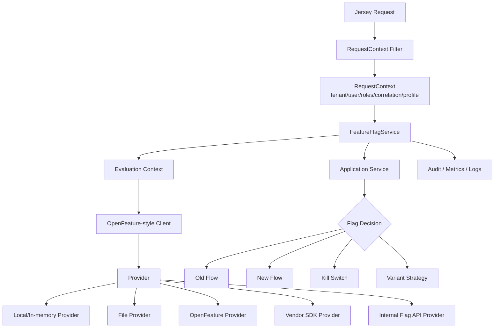

---

# 3. Feature Flag Taxonomy

| Jenis Flag | Fungsi | Contoh | Risiko |
|---|---|---|---|
| Release flag | Menyalakan fitur baru tanpa redeploy | `new-order-approval-flow` | Lupa dibersihkan setelah rollout |
| Kill switch | Mematikan fitur bermasalah cepat | `payment-v2-enabled=false` | Default salah bisa mematikan flow penting |
| Ops flag | Kontrol runtime operational | `external-payment-write-enabled` | Bisa jadi pengganti config permanen |
| Permission flag | Akses berdasarkan role/tenant/user | `enable-bulk-approve` | Campur aduk dengan authorization |
| Experiment flag | A/B testing atau variant | `checkout-flow=A/B` | Butuh tracking dan statistik valid |
| Migration flag | Cutover old/new implementation | `use-new-repository` | Dual-write/read consistency risk |
| Tenant rollout | Gradual rollout per tenant | `tenant-a enabled` | Tenant isolation harus benar |
| Emergency degradation | Turunkan fitur non-critical | `disable-pdf-generation` | User experience berubah drastis |
| Workflow flag | Ubah path proses/Camunda | `approval-level-v2` | Running process bisa tidak konsisten |

Feature flag bisa mengubah perilaku aplikasi saat runtime tanpa mengubah source code atau redeploy; OpenFeature juga menekankan bahwa banyak use case membutuhkan context-aware flagging, misalnya berdasarkan user yang melakukan request. ([OpenFeature](https://openfeature.dev/?utm_source=chatgpt.com))

---

# 4. Prinsip Desain

## Prinsip 1 - Feature flag bukan authorization

Buruk:

```java
if (featureFlags.isEnabled("order-approve")) {
    approve(orderId);
}
```

Ini membingungkan karena flag dipakai seperti permission.

Lebih sehat:

```java
authorizationService.requirePermission(currentUser, "order:approve");

if (featureFlags.isEnabled(FeatureFlags.NEW_ORDER_APPROVAL_FLOW)) {
    newApprovalFlow.approve(orderId);
} else {
    legacyApprovalFlow.approve(orderId);
}
```

Authorization menjawab:

```text
User ini boleh melakukan action?
```

Feature flag menjawab:

```text
Implementation atau behavior mana yang aktif untuk context ini?
```

---

## Prinsip 2 - Flag harus punya default safe value

Contoh:

```java
boolean enabled = featureFlagService.booleanValue(
        FeatureFlags.PAYMENT_V2_ENABLED,
        false
);
```

Default `false` berarti jika provider gagal, aplikasi fallback ke flow lama.

Untuk kill switch bisa sebaliknya:

```java
boolean writeEnabled = featureFlagService.booleanValue(
        FeatureFlags.PAYMENT_WRITE_ENABLED,
        true
);
```

Default `true` berarti jika flag provider gagal, payment write tetap berjalan. Ini cocok jika mematikan write hanya emergency override, bukan mode normal.

---

## Prinsip 3 - Flag key harus centralized

Buruk:

```java
featureFlagService.isEnabled("new-order-flow");
featureFlagService.isEnabled("new_order_flow");
featureFlagService.isEnabled("newOrderFlow");
```

Baik:

```java
public final class FeatureFlags {

    private FeatureFlags() {
    }

    public static final String NEW_ORDER_APPROVAL_FLOW = "order.approval.new-flow";
    public static final String PAYMENT_V2_ENABLED = "payment.v2.enabled";
    public static final String PDF_GENERATION_ENABLED = "document.pdf-generation.enabled";
    public static final String CAMUNDA_APPROVAL_V2 = "workflow.camunda.approval-v2";
}
```

---

## Prinsip 4 - Evaluation context harus trusted

OpenFeature mendefinisikan evaluation context sebagai container data kontekstual untuk evaluasi flag; data seperti user, request, host, transport, atau subject bisa dipakai untuk targeting/rule-based evaluation. ([OpenFeature](https://openfeature.dev/specification/sections/evaluation-context/?utm_source=chatgpt.com))

Di aplikasi Jersey/JAX-RS, context sebaiknya berasal dari `RequestContext` yang sudah dibentuk di filter/security boundary:

```text
tenantId
userId
roles
permissions
locale
clientAppId
appProfile
region
correlationId
```

Jangan ambil langsung dari raw header di setiap service.

---

# 5. Decomposition Map

| Area | Skill Praktis | Implementasi di Jersey + HK2 |
|---|---|---|
| Flag abstraction | Buat interface internal | `FeatureFlagService` |
| Flag keys | Centralized constants/catalog | `FeatureFlags` |
| Evaluation context | Map request/user/tenant ke context | `FeatureFlagContextFactory` |
| Provider abstraction | Vendor/file/local/internal API | `FeatureFlagProvider` |
| Default value | Safe fallback per flag | `booleanValue(flag, defaultValue)` |
| Variant | Strategy selection | `stringValue(flag, defaultVariant)` |
| Kill switch | Emergency disable | `payment.write.enabled` |
| Audit | Catat decision penting | flag key, value, tenant, user, correlation |
| Metrics | Hit/miss/error/latency | per flag and provider |
| Testability | Fake provider/local provider | `InMemoryFeatureFlagProvider` |
| Cleanup | owner, expiry, removal | flag registry metadata |
| Governance | lifecycle control | create → rollout → stable → remove |

---

# 6. Core Abstraction

## 6.1 `FeatureFlagService`

```java
package com.company.orderservice.featureflag;

public interface FeatureFlagService {

    boolean booleanValue(String flagKey, boolean defaultValue);

    String stringValue(String flagKey, String defaultValue);

    int intValue(String flagKey, int defaultValue);

    double doubleValue(String flagKey, double defaultValue);

    <T> T objectValue(String flagKey, T defaultValue, Class<T> type);
}
```

Kenapa tidak expose provider SDK langsung?

Karena service layer tidak boleh tahu apakah flag berasal dari:

```text
OpenFeature
LaunchDarkly
ConfigCat
Unleash
GO Feature Flag
flagd
database internal
file local
static test map
```

OpenFeature sendiri memisahkan API dari provider; provider bertanggung jawab melakukan evaluasi flag dan menjadi abstraction terhadap sistem flag management di bawahnya. ([OpenFeature](https://openfeature.dev/docs/reference/concepts/provider/?utm_source=chatgpt.com))

---

## 6.2 `FeatureFlagProvider`

```java
package com.company.orderservice.featureflag;

public interface FeatureFlagProvider {

    boolean booleanValue(
            String flagKey,
            FeatureFlagEvaluationContext context,
            boolean defaultValue
    );

    String stringValue(
            String flagKey,
            FeatureFlagEvaluationContext context,
            String defaultValue
    );

    int intValue(
            String flagKey,
            FeatureFlagEvaluationContext context,
            int defaultValue
    );

    double doubleValue(
            String flagKey,
            FeatureFlagEvaluationContext context,
            double defaultValue
    );

    <T> T objectValue(
            String flagKey,
            FeatureFlagEvaluationContext context,
            T defaultValue,
            Class<T> type
    );
}
```

---

## 6.3 `FeatureFlagEvaluationContext`

```java
package com.company.orderservice.featureflag;

import java.util.Map;
import java.util.Optional;
import java.util.Set;

public record FeatureFlagEvaluationContext(
        String targetingKey,
        String tenantId,
        Optional<String> userId,
        Set<String> roles,
        Set<String> permissions,
        String appName,
        String appProfile,
        String region,
        Optional<String> clientAppId,
        Optional<String> correlationId,
        Map<String, Object> attributes
) {
}
```

`targetingKey` penting untuk rollout/fractional evaluation. Biasanya bisa berupa:

```text
tenant:{tenantId}
user:{userId}
tenant:{tenantId}:user:{userId}
```

Untuk sistem regulatori/multi-tenant, saya lebih suka default targeting by tenant, bukan random request, agar rollout lebih predictable.

---

# 7. Context Factory dari `RequestContext`

```java
package com.company.orderservice.featureflag;

import com.company.orderservice.config.model.AppConfig;
import com.company.orderservice.context.RequestContext;
import jakarta.inject.Inject;
import jakarta.inject.Provider;

import java.util.Map;
import java.util.Optional;

public final class FeatureFlagContextFactory {

    private final Provider<RequestContext> requestContextProvider;
    private final AppConfig appConfig;

    @Inject
    public FeatureFlagContextFactory(
            Provider<RequestContext> requestContextProvider,
            AppConfig appConfig
    ) {
        this.requestContextProvider = requestContextProvider;
        this.appConfig = appConfig;
    }

    public FeatureFlagEvaluationContext currentContext() {
        RequestContext request = requestContextProvider.get();

        String targetingKey = "tenant:" + request.tenantId();

        return new FeatureFlagEvaluationContext(
                targetingKey,
                request.tenantId(),
                Optional.of(request.userId()),
                request.user().roles(),
                request.user().permissions(),
                appConfig.appName(),
                appConfig.profile().name(),
                appConfig.region(),
                request.clientAppId(),
                Optional.of(request.correlationId()),
                Map.of(
                        "locale", request.locale().toLanguageTag(),
                        "requestId", request.requestId()
                )
        );
    }
}
```

Catatan praktis:

```text
Jangan masukkan secret, full JWT, password, atau PII berlebihan ke evaluation context.
```

---

# 8. Default Implementation Service

```java
package com.company.orderservice.featureflag;

import jakarta.inject.Inject;

public final class DefaultFeatureFlagService implements FeatureFlagService {

    private final FeatureFlagProvider provider;
    private final FeatureFlagContextFactory contextFactory;
    private final FeatureFlagAuditSink auditSink;
    private final FeatureFlagMetrics metrics;

    @Inject
    public DefaultFeatureFlagService(
            FeatureFlagProvider provider,
            FeatureFlagContextFactory contextFactory,
            FeatureFlagAuditSink auditSink,
            FeatureFlagMetrics metrics
    ) {
        this.provider = provider;
        this.contextFactory = contextFactory;
        this.auditSink = auditSink;
        this.metrics = metrics;
    }

    @Override
    public boolean booleanValue(String flagKey, boolean defaultValue) {
        FeatureFlagEvaluationContext context = contextFactory.currentContext();

        long startNanos = System.nanoTime();

        try {
            boolean value = provider.booleanValue(flagKey, context, defaultValue);

            metrics.recordSuccess(flagKey, "boolean", elapsedMillis(startNanos));
            auditSink.recordEvaluation(flagKey, String.valueOf(value), context);

            return value;
        } catch (RuntimeException error) {
            metrics.recordFailure(flagKey, "boolean", elapsedMillis(startNanos), error);

            auditSink.recordFallback(
                    flagKey,
                    String.valueOf(defaultValue),
                    context,
                    error
            );

            return defaultValue;
        }
    }

    @Override
    public String stringValue(String flagKey, String defaultValue) {
        FeatureFlagEvaluationContext context = contextFactory.currentContext();

        long startNanos = System.nanoTime();

        try {
            String value = provider.stringValue(flagKey, context, defaultValue);

            metrics.recordSuccess(flagKey, "string", elapsedMillis(startNanos));
            auditSink.recordEvaluation(flagKey, value, context);

            return value;
        } catch (RuntimeException error) {
            metrics.recordFailure(flagKey, "string", elapsedMillis(startNanos), error);

            auditSink.recordFallback(flagKey, defaultValue, context, error);

            return defaultValue;
        }
    }

    @Override
    public int intValue(String flagKey, int defaultValue) {
        FeatureFlagEvaluationContext context = contextFactory.currentContext();

        try {
            return provider.intValue(flagKey, context, defaultValue);
        } catch (RuntimeException error) {
            auditSink.recordFallback(flagKey, String.valueOf(defaultValue), context, error);
            return defaultValue;
        }
    }

    @Override
    public double doubleValue(String flagKey, double defaultValue) {
        FeatureFlagEvaluationContext context = contextFactory.currentContext();

        try {
            return provider.doubleValue(flagKey, context, defaultValue);
        } catch (RuntimeException error) {
            auditSink.recordFallback(flagKey, String.valueOf(defaultValue), context, error);
            return defaultValue;
        }
    }

    @Override
    public <T> T objectValue(String flagKey, T defaultValue, Class<T> type) {
        FeatureFlagEvaluationContext context = contextFactory.currentContext();

        try {
            return provider.objectValue(flagKey, context, defaultValue, type);
        } catch (RuntimeException error) {
            auditSink.recordFallback(flagKey, String.valueOf(defaultValue), context, error);
            return defaultValue;
        }
    }

    private long elapsedMillis(long startNanos) {
        return (System.nanoTime() - startNanos) / 1_000_000;
    }
}
```

Prinsip penting:

```text
Provider error tidak boleh otomatis menjatuhkan request business-critical.
Gunakan default value yang eksplisit.
```

---

# 9. Local/In-memory Provider untuk Test dan Local Dev

```java
package com.company.orderservice.featureflag.provider;

import com.company.orderservice.featureflag.FeatureFlagEvaluationContext;
import com.company.orderservice.featureflag.FeatureFlagProvider;

import java.util.Map;
import java.util.concurrent.ConcurrentHashMap;

public final class InMemoryFeatureFlagProvider implements FeatureFlagProvider {

    private final Map<String, Object> flags = new ConcurrentHashMap<>();

    public InMemoryFeatureFlagProvider(Map<String, Object> initialFlags) {
        flags.putAll(initialFlags);
    }

    public void set(String key, Object value) {
        flags.put(key, value);
    }

    @Override
    public boolean booleanValue(
            String flagKey,
            FeatureFlagEvaluationContext context,
            boolean defaultValue
    ) {
        Object value = flags.get(flagKey);

        if (value instanceof Boolean booleanValue) {
            return booleanValue;
        }

        return defaultValue;
    }

    @Override
    public String stringValue(
            String flagKey,
            FeatureFlagEvaluationContext context,
            String defaultValue
    ) {
        Object value = flags.get(flagKey);

        if (value instanceof String stringValue) {
            return stringValue;
        }

        return defaultValue;
    }

    @Override
    public int intValue(
            String flagKey,
            FeatureFlagEvaluationContext context,
            int defaultValue
    ) {
        Object value = flags.get(flagKey);

        if (value instanceof Integer intValue) {
            return intValue;
        }

        return defaultValue;
    }

    @Override
    public double doubleValue(
            String flagKey,
            FeatureFlagEvaluationContext context,
            double defaultValue
    ) {
        Object value = flags.get(flagKey);

        if (value instanceof Double doubleValue) {
            return doubleValue;
        }

        if (value instanceof Integer intValue) {
            return intValue.doubleValue();
        }

        return defaultValue;
    }

    @Override
    public <T> T objectValue(
            String flagKey,
            FeatureFlagEvaluationContext context,
            T defaultValue,
            Class<T> type
    ) {
        Object value = flags.get(flagKey);

        if (type.isInstance(value)) {
            return type.cast(value);
        }

        return defaultValue;
    }
}
```

Use case:

```java
new InMemoryFeatureFlagProvider(Map.of(
        FeatureFlags.NEW_ORDER_APPROVAL_FLOW, true,
        FeatureFlags.PAYMENT_V2_ENABLED, false,
        FeatureFlags.ORDER_APPROVAL_STRATEGY, "CAMUNDA_V2"
));
```

---

# 10. OpenFeature-style Provider Adapter

OpenFeature Java SDK menyediakan server-side Java SDK; dokumentasinya menunjukkan penggunaan `OpenFeatureAPI.getInstance()` dan client untuk evaluasi/tracking. ([OpenFeature](https://openfeature.dev/docs/reference/sdks/server/java?utm_source=chatgpt.com))

Contoh adapter konseptual:

```java
package com.company.orderservice.featureflag.provider;

import com.company.orderservice.featureflag.FeatureFlagEvaluationContext;
import com.company.orderservice.featureflag.FeatureFlagProvider;
import dev.openfeature.sdk.Client;
import dev.openfeature.sdk.EvaluationContext;
import dev.openfeature.sdk.MutableContext;

public final class OpenFeatureFlagProvider implements FeatureFlagProvider {

    private final Client client;

    public OpenFeatureFlagProvider(Client client) {
        this.client = client;
    }

    @Override
    public boolean booleanValue(
            String flagKey,
            FeatureFlagEvaluationContext context,
            boolean defaultValue
    ) {
        return client.getBooleanValue(
                flagKey,
                defaultValue,
                toOpenFeatureContext(context)
        );
    }

    @Override
    public String stringValue(
            String flagKey,
            FeatureFlagEvaluationContext context,
            String defaultValue
    ) {
        return client.getStringValue(
                flagKey,
                defaultValue,
                toOpenFeatureContext(context)
        );
    }

    @Override
    public int intValue(
            String flagKey,
            FeatureFlagEvaluationContext context,
            int defaultValue
    ) {
        return client.getIntegerValue(
                flagKey,
                defaultValue,
                toOpenFeatureContext(context)
        );
    }

    @Override
    public double doubleValue(
            String flagKey,
            FeatureFlagEvaluationContext context,
            double defaultValue
    ) {
        return client.getDoubleValue(
                flagKey,
                defaultValue,
                toOpenFeatureContext(context)
        );
    }

    @Override
    public <T> T objectValue(
            String flagKey,
            FeatureFlagEvaluationContext context,
            T defaultValue,
            Class<T> type
    ) {
        return defaultValue;
    }

    private EvaluationContext toOpenFeatureContext(FeatureFlagEvaluationContext context) {
        MutableContext mutableContext = new MutableContext(context.targetingKey());

        mutableContext.add("tenantId", context.tenantId());
        mutableContext.add("appName", context.appName());
        mutableContext.add("appProfile", context.appProfile());
        mutableContext.add("region", context.region());

        context.userId().ifPresent(value -> mutableContext.add("userId", value));
        context.clientAppId().ifPresent(value -> mutableContext.add("clientAppId", value));
        context.correlationId().ifPresent(value -> mutableContext.add("correlationId", value));

        mutableContext.add("roles", String.join(",", context.roles()));
        mutableContext.add("permissions", String.join(",", context.permissions()));

        context.attributes().forEach((key, value) -> {
            if (value instanceof String stringValue) {
                mutableContext.add(key, stringValue);
            } else if (value instanceof Boolean booleanValue) {
                mutableContext.add(key, booleanValue);
            } else if (value instanceof Integer integerValue) {
                mutableContext.add(key, integerValue);
            } else if (value instanceof Double doubleValue) {
                mutableContext.add(key, doubleValue);
            }
        });

        return mutableContext;
    }
}
```

Catatan: API detail bisa berbeda tergantung versi SDK dan provider yang dipakai perusahaan, jadi jadikan ini pola adapter, bukan kontrak final.

---

# 11. Feature Flag Keys dan Metadata

Jangan hanya punya constants. Buat metadata supaya flag bisa dikelola.

```java
package com.company.orderservice.featureflag;

import java.time.LocalDate;

public record FeatureFlagDefinition(
        String key,
        String owner,
        String description,
        String defaultValue,
        FeatureFlagType type,
        LocalDate createdAt,
        LocalDate expiresAt,
        boolean requiresAudit
) {
}
```

```java
package com.company.orderservice.featureflag;

public enum FeatureFlagType {
    RELEASE,
    KILL_SWITCH,
    OPS,
    EXPERIMENT,
    MIGRATION,
    TENANT_ROLLOUT,
    WORKFLOW
}
```

Registry:

```java
package com.company.orderservice.featureflag;

import java.time.LocalDate;
import java.util.List;

public final class FeatureFlagCatalog {

    private FeatureFlagCatalog() {
    }

    public static final String NEW_ORDER_APPROVAL_FLOW = "order.approval.new-flow";
    public static final String ORDER_APPROVAL_STRATEGY = "order.approval.strategy";
    public static final String PAYMENT_V2_ENABLED = "payment.v2.enabled";
    public static final String PAYMENT_WRITE_ENABLED = "payment.write.enabled";
    public static final String PDF_GENERATION_ENABLED = "document.pdf-generation.enabled";
    public static final String CAMUNDA_APPROVAL_V2 = "workflow.camunda.approval-v2";

    public static List<FeatureFlagDefinition> definitions() {
        return List.of(
                new FeatureFlagDefinition(
                        NEW_ORDER_APPROVAL_FLOW,
                        "order-platform",
                        "Routes order approval to new service implementation",
                        "false",
                        FeatureFlagType.RELEASE,
                        LocalDate.of(2026, 7, 1),
                        LocalDate.of(2026, 9, 1),
                        true
                ),
                new FeatureFlagDefinition(
                        PAYMENT_WRITE_ENABLED,
                        "payment-platform",
                        "Emergency switch for disabling payment writes",
                        "true",
                        FeatureFlagType.KILL_SWITCH,
                        LocalDate.of(2026, 7, 1),
                        LocalDate.of(2027, 7, 1),
                        true
                )
        );
    }
}
```

Research/practice literature repeatedly warns that inappropriate feature toggle usage can cause code complexity, dead code, and severe failures; cleanup and metadata management are among the practices identified in empirical feature toggle research. ([arXiv](https://arxiv.org/abs/1907.06157?utm_source=chatgpt.com))

---

# 12. HK2 Binding

```java
package com.company.orderservice.bootstrap;

import com.company.orderservice.config.model.FeatureFlagConfig;
import com.company.orderservice.featureflag.DefaultFeatureFlagService;
import com.company.orderservice.featureflag.FeatureFlagAuditSink;
import com.company.orderservice.featureflag.FeatureFlagContextFactory;
import com.company.orderservice.featureflag.FeatureFlagMetrics;
import com.company.orderservice.featureflag.FeatureFlagProvider;
import com.company.orderservice.featureflag.FeatureFlagService;
import com.company.orderservice.featureflag.NoopFeatureFlagAuditSink;
import com.company.orderservice.featureflag.NoopFeatureFlagMetrics;
import com.company.orderservice.featureflag.provider.InMemoryFeatureFlagProvider;
import jakarta.inject.Singleton;
import org.glassfish.hk2.utilities.binding.AbstractBinder;

import java.util.Map;

public final class FeatureFlagBinder extends AbstractBinder {

    private final FeatureFlagConfig config;

    public FeatureFlagBinder(FeatureFlagConfig config) {
        this.config = config;
    }

    @Override
    protected void configure() {
        bindAsContract(FeatureFlagContextFactory.class)
                .in(Singleton.class);

        bind(DefaultFeatureFlagService.class)
                .to(FeatureFlagService.class)
                .in(Singleton.class);

        bind(createProvider())
                .to(FeatureFlagProvider.class);

        bind(NoopFeatureFlagAuditSink.class)
                .to(FeatureFlagAuditSink.class)
                .in(Singleton.class);

        bind(NoopFeatureFlagMetrics.class)
                .to(FeatureFlagMetrics.class)
                .in(Singleton.class);
    }

    private FeatureFlagProvider createProvider() {
        if ("local".equalsIgnoreCase(config.provider())) {
            return new InMemoryFeatureFlagProvider(Map.of(
                    FeatureFlagCatalog.NEW_ORDER_APPROVAL_FLOW, false,
                    FeatureFlagCatalog.PAYMENT_WRITE_ENABLED, true
            ));
        }

        throw new IllegalStateException(
                "Unsupported feature flag provider: " + config.provider()
        );
    }
}
```

Register:

```java
public final class ApiApplication extends ResourceConfig {

    public ApiApplication() {
        ApplicationConfig config = ConfigBootstrap.load();

        packages("com.company.orderservice.api.resource");

        register(new ConfigBinder(config));
        register(new ContextBinder());
        register(new FeatureFlagBinder(config.featureFlags()));
        register(new ApplicationBinder());
    }
}
```

---

# 13. Pemakaian di Application Service

## 13.1 Boolean Release Flag

```java
package com.company.orderservice.application.service;

import com.company.orderservice.featureflag.FeatureFlagCatalog;
import com.company.orderservice.featureflag.FeatureFlagService;
import jakarta.inject.Inject;

import java.util.UUID;

public final class OrderApprovalRouterService implements OrderApprovalService {

    private final FeatureFlagService featureFlags;
    private final LegacyOrderApprovalService legacyService;
    private final NewOrderApprovalService newService;

    @Inject
    public OrderApprovalRouterService(
            FeatureFlagService featureFlags,
            LegacyOrderApprovalService legacyService,
            NewOrderApprovalService newService
    ) {
        this.featureFlags = featureFlags;
        this.legacyService = legacyService;
        this.newService = newService;
    }

    @Override
    public OrderApprovalResult approve(UUID orderId) {
        boolean newFlowEnabled = featureFlags.booleanValue(
                FeatureFlagCatalog.NEW_ORDER_APPROVAL_FLOW,
                false
        );

        if (newFlowEnabled) {
            return newService.approve(orderId);
        }

        return legacyService.approve(orderId);
    }
}
```

---

## 13.2 Variant Flag

```java
package com.company.orderservice.application.service;

import com.company.orderservice.featureflag.FeatureFlagCatalog;
import com.company.orderservice.featureflag.FeatureFlagService;

public final class OrderApprovalStrategySelector {

    private final FeatureFlagService featureFlags;

    public OrderApprovalStrategySelector(FeatureFlagService featureFlags) {
        this.featureFlags = featureFlags;
    }

    public OrderApprovalStrategy select() {
        String variant = featureFlags.stringValue(
                FeatureFlagCatalog.ORDER_APPROVAL_STRATEGY,
                "LEGACY"
        );

        return switch (variant) {
            case "CAMUNDA_V2" -> OrderApprovalStrategy.CAMUNDA_V2;
            case "RULE_ENGINE" -> OrderApprovalStrategy.RULE_ENGINE;
            case "LEGACY" -> OrderApprovalStrategy.LEGACY;
            default -> OrderApprovalStrategy.LEGACY;
        };
    }
}
```

```java
public enum OrderApprovalStrategy {
    LEGACY,
    CAMUNDA_V2,
    RULE_ENGINE
}
```

Rule:

```text
Unknown variant harus fallback ke default safe behavior.
```

---

## 13.3 Kill Switch

```java
public final class PaymentCommandService {

    private final FeatureFlagService featureFlags;
    private final PaymentClient paymentClient;

    public PaymentCommandService(
            FeatureFlagService featureFlags,
            PaymentClient paymentClient
    ) {
        this.featureFlags = featureFlags;
        this.paymentClient = paymentClient;
    }

    public PaymentResult capture(PaymentCommand command) {
        boolean writeEnabled = featureFlags.booleanValue(
                FeatureFlagCatalog.PAYMENT_WRITE_ENABLED,
                true
        );

        if (!writeEnabled) {
            throw new ServiceTemporarilyDisabledException(
                    "Payment write is temporarily disabled"
            );
        }

        return paymentClient.capture(command);
    }
}
```

Kill switch harus punya:

```text
owner
runbook
default behavior
alert
audit
approval/change trail
```

---

# 14. Feature Flag dan Camunda Workflow

Feature flag pada workflow harus hati-hati karena process bisa long-running.

Buruk:

```java
if (featureFlags.booleanValue("workflow.approval-v2", false)) {
    startV2Process();
} else {
    startV1Process();
}
```

Ini belum salah, tapi perlu aturan:

| Keputusan | Praktik aman |
|---|---|
| Start process baru | Flag boleh menentukan process definition |
| Running process | Jangan berubah di tengah tanpa migration plan |
| Worker behavior | Capture variant sebagai process variable |
| Human task routing | Simpan decision durable |
| Escalation logic | Jangan tergantung flag volatile tanpa audit |

Contoh:

```java
public final class OrderWorkflowStarter {

    private final FeatureFlagService featureFlags;
    private final CamundaClient camundaClient;

    public void startApproval(UUID orderId) {
        boolean v2Enabled = featureFlags.booleanValue(
                FeatureFlagCatalog.CAMUNDA_APPROVAL_V2,
                false
        );

        String processKey = v2Enabled
                ? "order-approval-v2"
                : "order-approval-v1";

        Map<String, Object> variables = Map.of(
                "orderId", orderId.toString(),
                "approvalWorkflowVersion", v2Enabled ? "v2" : "v1"
        );

        camundaClient.startProcess(processKey, "ORDER-" + orderId, variables);
    }
}
```

Prinsip:

```text
Decision flag yang mempengaruhi long-running workflow harus disimpan sebagai durable process variable.
```

---

# 15. Audit dan Metrics

OpenFeature hooks adalah mekanisme untuk menambahkan behavior pada lifecycle evaluasi flag, dengan tahapan `before`, `after`, `error`, dan `finally`; hook bisa dipakai untuk logging, telemetry, validasi nilai, modifikasi evaluation context, dan tracking. ([OpenFeature](https://openfeature.dev/specification/sections/hooks/?utm_source=chatgpt.com))

Kalau tidak memakai OpenFeature hooks langsung, buat abstraction sendiri.

## 15.1 Audit Sink

```java
package com.company.orderservice.featureflag;

public interface FeatureFlagAuditSink {

    void recordEvaluation(
            String flagKey,
            String value,
            FeatureFlagEvaluationContext context
    );

    void recordFallback(
            String flagKey,
            String fallbackValue,
            FeatureFlagEvaluationContext context,
            RuntimeException error
    );
}
```

```java
package com.company.orderservice.featureflag;

public final class NoopFeatureFlagAuditSink implements FeatureFlagAuditSink {

    @Override
    public void recordEvaluation(
            String flagKey,
            String value,
            FeatureFlagEvaluationContext context
    ) {
        // no-op
    }

    @Override
    public void recordFallback(
            String flagKey,
            String fallbackValue,
            FeatureFlagEvaluationContext context,
            RuntimeException error
    ) {
        // no-op
    }
}
```

## 15.2 Metrics

```java
package com.company.orderservice.featureflag;

public interface FeatureFlagMetrics {

    void recordSuccess(String flagKey, String type, long elapsedMillis);

    void recordFailure(
            String flagKey,
            String type,
            long elapsedMillis,
            RuntimeException error
    );
}
```

Minimal metric yang berguna:

```text
feature_flag_evaluation_total{flagKey,type,result}
feature_flag_evaluation_latency_ms{flagKey,type}
feature_flag_fallback_total{flagKey,errorType}
feature_flag_unknown_variant_total{flagKey,variant}
```

---

# 16. Anti-pattern

## 16.1 Flag tersebar di semua layer

Buruk:

```java
if (flags.booleanValue("x", false)) { ... } // resource
if (flags.booleanValue("x", false)) { ... } // service
if (flags.booleanValue("x", false)) { ... } // repository
if (flags.booleanValue("x", false)) { ... } // mapper
```

Lebih baik buat router/strategy:

```java
public final class OrderApprovalRouterService implements OrderApprovalService {
    // one decision point
}
```

---

## 16.2 Flag menjadi permanent architecture

Buruk:

```text
2 tahun kemudian:
if (newFlow) { ... } else { legacy ... }
```

Feature flag harus punya expiry/removal plan. Jika rollout sudah 100% stabil:

```text
hapus legacy path
hapus flag
hapus config
hapus test matrix lama
hapus monitoring flag khusus
```

---

## 16.3 Flag mengganti domain invariant

Buruk:

```java
if (featureFlags.booleanValue("allow-invalid-transition", false)) {
    order.forceApprove();
}
```

Feature flag tidak boleh merusak invariant domain kecuali itu emergency tool yang dikontrol sangat ketat.

---

## 16.4 Flag tanpa test matrix

Untuk flag penting, minimal test:

```text
flag off -> legacy behavior
flag on  -> new behavior
provider down -> default behavior
unknown variant -> fallback behavior
tenant A on, tenant B off -> isolation benar
```

---

# 17. Testing Pattern

## 17.1 Unit Test dengan Fake Feature Flag Service

```java
public final class FakeFeatureFlagService implements FeatureFlagService {

    private final Map<String, Object> values;

    public FakeFeatureFlagService(Map<String, Object> values) {
        this.values = values;
    }

    @Override
    public boolean booleanValue(String flagKey, boolean defaultValue) {
        Object value = values.get(flagKey);
        return value instanceof Boolean booleanValue ? booleanValue : defaultValue;
    }

    @Override
    public String stringValue(String flagKey, String defaultValue) {
        Object value = values.get(flagKey);
        return value instanceof String stringValue ? stringValue : defaultValue;
    }

    @Override
    public int intValue(String flagKey, int defaultValue) {
        Object value = values.get(flagKey);
        return value instanceof Integer intValue ? intValue : defaultValue;
    }

    @Override
    public double doubleValue(String flagKey, double defaultValue) {
        Object value = values.get(flagKey);
        return value instanceof Double doubleValue ? doubleValue : defaultValue;
    }

    @Override
    public <T> T objectValue(String flagKey, T defaultValue, Class<T> type) {
        Object value = values.get(flagKey);
        return type.isInstance(value) ? type.cast(value) : defaultValue;
    }
}
```

Test:

```java
@Test
void usesNewApprovalFlowWhenFlagEnabled() {
    FeatureFlagService flags = new FakeFeatureFlagService(Map.of(
            FeatureFlagCatalog.NEW_ORDER_APPROVAL_FLOW, true
    ));

    OrderApprovalRouterService service = new OrderApprovalRouterService(
            flags,
            legacyService,
            newService
    );

    service.approve(orderId);

    verify(newService).approve(orderId);
    verifyNoInteractions(legacyService);
}
```

---

## 17.2 Integration Test dengan Test Binder

```java
public final class TestFeatureFlagBinder extends AbstractBinder {

    @Override
    protected void configure() {
        bind(new InMemoryFeatureFlagProvider(Map.of(
                FeatureFlagCatalog.NEW_ORDER_APPROVAL_FLOW, true,
                FeatureFlagCatalog.PAYMENT_WRITE_ENABLED, true
        ))).to(FeatureFlagProvider.class);

        bind(DefaultFeatureFlagService.class)
                .to(FeatureFlagService.class)
                .in(Singleton.class);

        bindAsContract(FeatureFlagContextFactory.class)
                .in(Singleton.class);

        bind(NoopFeatureFlagAuditSink.class)
                .to(FeatureFlagAuditSink.class)
                .in(Singleton.class);

        bind(NoopFeatureFlagMetrics.class)
                .to(FeatureFlagMetrics.class)
                .in(Singleton.class);
    }
}
```

---

# 18. Failure Model

| Failure | Penyebab | Dampak | Pencegahan |
|---|---|---|---|
| Provider down | flag system unavailable | request gagal atau salah fallback | default safe value |
| Flag typo | string literal tersebar | default diam-diam aktif | centralized constants + startup validation |
| Wrong default | default tidak sesuai failure mode | outage/security issue | per-flag default review |
| Tenant targeting salah | context dari raw header | tenant rollout bocor | trusted `RequestContext` |
| Flag jadi authorization | flag mengganti permission | privilege issue | pisahkan authz vs flag |
| Zombie flag | tidak ada expiry | complexity/dead code | owner + expiry + cleanup |
| Variant tidak dikenal | control plane salah config | runtime exception | fallback variant |
| Workflow berubah di tengah | flag volatile dibaca berulang | process inconsistency | capture decision ke process variable |
| Experiment tidak valid | tanpa tracking/statistik | keputusan salah | tracking + experiment design |
| Secret bocor | SDK key/log context bocor | security incident | secret provider + masking |
| Rollout terlalu luas | default global on | blast radius besar | tenant/user staged rollout |
| Test hanya flag on | off/default tidak dites | regression tersembunyi | test matrix |

---

# 19. Practical Review Checklist

Saat onboarding codebase, cari:

```text
FeatureFlag
OpenFeature
flagd
Unleash
LaunchDarkly
ConfigCat
GO Feature Flag
isEnabled
booleanValue
getBooleanValue
variation
treatment
experiment
kill switch
rollout
targeting
evaluation context
```

Audit dengan pertanyaan:

| Pertanyaan | Jawaban sehat |
|---|---|
| Ada abstraction internal? | Ya |
| Service tidak bergantung langsung pada vendor SDK? | Ya |
| Flag key centralized? | Ya |
| Default value eksplisit per call? | Ya |
| Context berasal dari trusted request context? | Ya |
| Tenant/user/role targeting jelas? | Ya |
| Provider failure fallback aman? | Ya |
| Flag penting punya audit/metrics? | Ya |
| Workflow flag disimpan sebagai process variable? | Ya |
| Flag punya owner dan expiry? | Ya |
| Test mencakup on/off/default/error? | Ya |
| Zombie flag dibersihkan? | Ya |

---

# 20. Mini Exercise Praktis

Ambil satu fitur real, misalnya:

```text
Order approval v2
```

Isi template ini:

```text
Flag key:
  order.approval.new-flow

Type:
  release / workflow

Owner:
  order-platform

Default:
  false

Targeting:
  tenant allowlist
  appProfile != prod initially
  selected internal users

Decision point:
  OrderApprovalRouterService.approve()

On behavior:
  NewOrderApprovalService / Camunda v2

Off behavior:
  LegacyOrderApprovalService / Camunda v1

Failure fallback:
  false -> legacy

Audit:
  flag key
  evaluated value
  tenant
  user
  correlationId

Metrics:
  evaluation count
  fallback count
  new vs legacy traffic split

Cleanup plan:
  remove after 100% rollout + 2 stable releases
```

Kalau tidak bisa mengisi owner, default, targeting, dan cleanup plan, flag tersebut belum siap production.

---

# 21. Ringkasan Seri 6/7

Pegangan utama:

1. **Feature flag adalah runtime decision point, bukan `if` acak.**
2. **Gunakan abstraction internal agar tidak vendor-lock ke SDK tertentu.**
3. **OpenFeature-style design memisahkan evaluation API dan provider.**
4. **Evaluation context harus berasal dari trusted `RequestContext`.**
5. **Default value wajib eksplisit dan harus safe.**
6. **Flag key harus centralized.**
7. **Release flag, kill switch, experiment, migration flag, dan workflow flag punya risiko berbeda.**
8. **Jangan jadikan feature flag sebagai authorization.**
9. **Workflow flag harus durable jika mempengaruhi long-running process.**
10. **Flag harus punya owner, expiry, audit, metrics, dan cleanup plan.**
11. **Test wajib mencakup flag on, off, provider error, unknown variant, dan tenant targeting.**

---

# Rekomendasi Materi Selanjutnya

Lanjut ke **Seri 7/7: Testing HK2/Jersey DI Graph with Fake Binder and Integration Test**.

Di seri terakhir kita akan bahas:

- unit test tanpa Jersey;
- fake provider/fake binder;
- JerseyTest;
- override binding;
- test request context;
- test config override;
- test feature flag on/off;
- test AOP/interceptor wiring;
- test transaction rollback;
- test context propagation;
- practical onboarding checklist untuk membaca DI graph di codebase real.

**Seri 6/7 selesai.**

---

**Sources:**

- [1. Flag Evaluation API](https://openfeature.dev/specification/sections/flag-evaluation/?utm_source=chatgpt.com)
- [Software Development with Feature Toggles: Practices used by Practitioners](https://arxiv.org/abs/1907.06157?utm_source=chatgpt.com)

## Response:
7/15/2026, 3:55:27 AM

Lanjut ke **Seri 7/7: Testing HK2/Jersey DI Graph with Fake Binder and Integration Test**. Ini seri penutup, jadi fokusnya menyatukan semua: DI graph, request context, config, feature flag, AOP/interceptor, transaction, dan propagation dalam strategi testing yang realistis.

# Seri 7/7 - Testing HK2/Jersey DI Graph with Fake Binder and Integration Test

## 1. Tujuan Seri Ini

Seri terakhir ini fokus ke cara mengetes aplikasi **Java Jersey/JAX-RS + HK2** secara praktis:

```text
unit test tanpa Jersey
fake provider
fake binder
JerseyTest
ResourceConfig test
request context test
config override
feature flag test
AOP/interceptor wiring test
transaction rollback test
context propagation test
```

Targetnya bukan hanya “test endpoint bisa 200”, tapi memastikan **DI graph, scope, context, config, feature flag, interceptor, dan transaction boundary benar-benar bekerja**.

Jersey Test Framework memang disediakan untuk testing aplikasi server-side Jersey/JAX-RS, dan dokumentasi Jersey menyebut framework ini terutama berbasis JUnit, dapat juga dijalankan dengan TestNG, dan mudah diintegrasikan dengan setup Maven. ([Eclipse EE4J](https://eclipse-ee4j.github.io/jersey.github.io/documentation/latest/test-framework.html?utm_source=chatgpt.com))

---

# 2. Testing Pyramid untuk Jersey + HK2

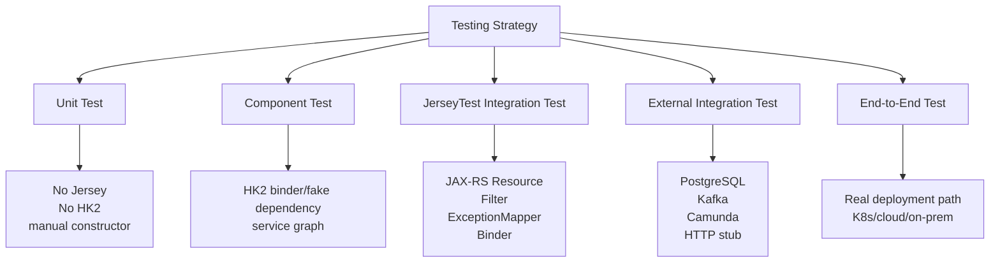

Praktisnya:

| Level | Tujuan | Tools | Yang dites |
|---|---|---|---|
| Unit test | Logic service/domain cepat | JUnit, Mockito/Fake | business logic, branching, flag on/off |
| Component test | Dependency graph sebagian | HK2 fake binder/manual wiring | service + fake repository/client |
| JerseyTest | Resource + filter + mapper + HK2 | Jersey Test Framework | HTTP request, headers, context, DI |
| DB integration | Repository benar | Testcontainers/Postgres/local DB | MyBatis SQL, transaction rollback |
| Messaging integration | Kafka contract | embedded/test broker | headers, payload, idempotency |
| Workflow integration | Camunda boundary | mock/Camunda test env | variables, business key, worker behavior |
| E2E | deployment behavior | staging/K8s pipeline | full path smoke/regression |

---

# 3. Prinsip Testing untuk HK2/Jersey

## Prinsip 1 - Unit test jangan boot Jersey

Untuk service murni, cukup constructor manual.

```java
OrderApprovalService service = new DefaultOrderApprovalService(
        fakeOrderRepository,
        fakePaymentClient,
        fakeFeatureFlagService,
        fixedRequestContextProvider
);
```

Keuntungan:

```text
cepat
deterministic
tidak tergantung ResourceConfig
tidak tergantung container
mudah debug
```

---

## Prinsip 2 - JerseyTest untuk boundary HTTP

Gunakan JerseyTest saat ingin mengetes:

```text
@Path resource
HTTP method/path
request/response filter
exception mapper
JSON serialization
JAX-RS validation
HK2 binder registration
request-scoped context
```

Jersey Test Framework mendukung konfigurasi test melalui `ResourceConfig`, sehingga kita bisa membuat application graph khusus test yang mendaftarkan resource, filter, mapper, dan binder yang berbeda dari production. ([Eclipse EE4J](https://eclipse-ee4j.github.io/jersey.github.io/documentation/latest3x/test-framework.html?utm_source=chatgpt.com))

---

## Prinsip 3 - Production binder dan test binder harus bisa dipisah

Production:

```text
ApplicationBinder
  -> real repository
  -> real payment client
  -> real config
  -> real feature flag provider
```

Test:

```text
TestApplicationBinder
  -> fake repository
  -> fake payment client
  -> fixed config
  -> in-memory feature flag provider
```

Dokumentasi Jersey menegaskan bahwa custom `AbstractBinder` harus diregister ke `ResourceConfig` agar custom injection extension aktif. ([Eclipse EE4J](https://eclipse-ee4j.github.io/jersey.github.io/documentation/latest/ioc.html?utm_source=chatgpt.com))

---

# 4. Struktur Test yang Disarankan

```text
src/test/java/com/company/orderservice
├── unit
│   ├── application
│   │   └── DefaultOrderApprovalServiceTest.java
│   └── domain
│       └── OrderTest.java
│
├── integration
│   ├── api
│   │   └── OrderResourceTest.java
│   ├── persistence
│   │   └── MyBatisOrderRepositoryTest.java
│   └── messaging
│       └── OrderEventPublisherTest.java
│
├── support
│   ├── TestApiApplication.java
│   ├── TestApplicationBinder.java
│   ├── TestContextBinder.java
│   ├── TestConfigFactory.java
│   ├── FakeOrderRepository.java
│   ├── FakePaymentClient.java
│   ├── FakeFeatureFlagService.java
│   └── FixedRequestContextProvider.java
```

---

# 5. Unit Test tanpa Jersey/HK2

## 5.1 Service yang dites

```java
public final class OrderApprovalRouterService implements OrderApprovalService {

    private final FeatureFlagService featureFlags;
    private final OrderApprovalService legacyService;
    private final OrderApprovalService newService;

    public OrderApprovalRouterService(
            FeatureFlagService featureFlags,
            OrderApprovalService legacyService,
            OrderApprovalService newService
    ) {
        this.featureFlags = featureFlags;
        this.legacyService = legacyService;
        this.newService = newService;
    }

    @Override
    public OrderApprovalResult approve(UUID orderId) {
        boolean newFlowEnabled = featureFlags.booleanValue(
                FeatureFlagCatalog.NEW_ORDER_APPROVAL_FLOW,
                false
        );

        if (newFlowEnabled) {
            return newService.approve(orderId);
        }

        return legacyService.approve(orderId);
    }
}
```

## 5.2 Fake feature flag

```java
public final class FakeFeatureFlagService implements FeatureFlagService {

    private final Map<String, Object> values;

    public FakeFeatureFlagService(Map<String, Object> values) {
        this.values = values;
    }

    @Override
    public boolean booleanValue(String flagKey, boolean defaultValue) {
        Object value = values.get(flagKey);
        return value instanceof Boolean booleanValue ? booleanValue : defaultValue;
    }

    @Override
    public String stringValue(String flagKey, String defaultValue) {
        Object value = values.get(flagKey);
        return value instanceof String stringValue ? stringValue : defaultValue;
    }

    @Override
    public int intValue(String flagKey, int defaultValue) {
        Object value = values.get(flagKey);
        return value instanceof Integer intValue ? intValue : defaultValue;
    }

    @Override
    public double doubleValue(String flagKey, double defaultValue) {
        Object value = values.get(flagKey);
        return value instanceof Double doubleValue ? doubleValue : defaultValue;
    }

    @Override
    public <T> T objectValue(String flagKey, T defaultValue, Class<T> type) {
        Object value = values.get(flagKey);
        return type.isInstance(value) ? type.cast(value) : defaultValue;
    }
}
```

## 5.3 Unit test flag ON/OFF

```java
class OrderApprovalRouterServiceTest {

    @Test
    void usesNewFlowWhenFlagEnabled() {
        FakeFeatureFlagService flags = new FakeFeatureFlagService(Map.of(
                FeatureFlagCatalog.NEW_ORDER_APPROVAL_FLOW, true
        ));

        RecordingApprovalService legacy = new RecordingApprovalService();
        RecordingApprovalService modern = new RecordingApprovalService();

        OrderApprovalRouterService service = new OrderApprovalRouterService(
                flags,
                legacy,
                modern
        );

        UUID orderId = UUID.randomUUID();

        service.approve(orderId);

        assertFalse(legacy.wasCalled());
        assertTrue(modern.wasCalled());
    }

    @Test
    void usesLegacyFlowWhenFlagDisabled() {
        FakeFeatureFlagService flags = new FakeFeatureFlagService(Map.of(
                FeatureFlagCatalog.NEW_ORDER_APPROVAL_FLOW, false
        ));

        RecordingApprovalService legacy = new RecordingApprovalService();
        RecordingApprovalService modern = new RecordingApprovalService();

        OrderApprovalRouterService service = new OrderApprovalRouterService(
                flags,
                legacy,
                modern
        );

        UUID orderId = UUID.randomUUID();

        service.approve(orderId);

        assertTrue(legacy.wasCalled());
        assertFalse(modern.wasCalled());
    }
}
```

---

# 6. Fixed RequestContext Provider untuk Unit Test

Service singleton biasanya memakai:

```java
Provider<RequestContext>
```

Untuk unit test, tidak perlu HK2.

```java
public final class FixedRequestContextProvider implements Provider<RequestContext> {

    private final RequestContext context;

    public FixedRequestContextProvider(RequestContext context) {
        this.context = context;
    }

    @Override
    public RequestContext get() {
        return context;
    }
}
```

Factory test context:

```java
public final class TestRequestContexts {

    private TestRequestContexts() {
    }

    public static RequestContext adminTenantA() {
        return new RequestContext(
                new RequestIdentity("req-test", "corr-test"),
                new TraceContext(Optional.empty(), Optional.empty()),
                new TenantContext("tenant-a", "default"),
                new CurrentUser(
                        "user-admin",
                        Set.of("ORDER_ADMIN"),
                        Set.of("order:view", "order:approve")
                ),
                Locale.ENGLISH,
                Optional.empty(),
                Optional.of("test-client")
        );
    }
}
```

Usage:

```java
OrderAuthorizationService authorizationService =
        new OrderAuthorizationService(
                new FixedRequestContextProvider(TestRequestContexts.adminTenantA())
        );
```

---

# 7. JerseyTest Setup

## 7.1 Maven dependencies

Contoh sketch:

```xml
<dependencies>
    <dependency>
        <groupId>org.glassfish.jersey.test-framework</groupId>
        <artifactId>jersey-test-framework-core</artifactId>
        <scope>test</scope>
    </dependency>

    <dependency>
        <groupId>org.glassfish.jersey.test-framework.providers</groupId>
        <artifactId>jersey-test-framework-provider-grizzly2</artifactId>
        <scope>test</scope>
    </dependency>
</dependencies>
```

Jersey Test Framework menyediakan beberapa provider/container test; dokumentasinya menjelaskan framework ini bisa dipakai untuk menjalankan resource, filter, mapper, dan komponen server-side dalam test environment yang dikonfigurasi. ([Eclipse EE4J](https://eclipse-ee4j.github.io/jersey.github.io/documentation/latest3x/test-framework.html?utm_source=chatgpt.com))

---

## 7.2 Test ResourceConfig

```java
public final class TestApiApplication extends ResourceConfig {

    public TestApiApplication() {
        packages("com.company.orderservice.api.resource");

        register(new TestConfigBinder());
        register(new TestContextBinder());
        register(new TestApplicationBinder());

        register(RequestContextFilter.class);
        register(ApiErrorMapper.class);
    }
}
```

## 7.3 JerseyTest class

```java
class OrderResourceTest extends JerseyTest {

    @Override
    protected Application configure() {
        return new TestApiApplication();
    }

    @Test
    void getOrderReturnsOrderForValidRequest() {
        UUID orderId = UUID.randomUUID();

        Response response = target("/orders/" + orderId)
                .request()
                .header(ContextHeaders.REQUEST_ID, "req-1")
                .header(ContextHeaders.CORRELATION_ID, "corr-1")
                .header(ContextHeaders.TENANT_ID, "tenant-a")
                .header(ContextHeaders.USER_ID, "user-1")
                .header(ContextHeaders.USER_PERMISSIONS, "order:view")
                .get();

        assertEquals(200, response.getStatus());

        OrderView body = response.readEntity(OrderView.class);

        assertEquals(orderId, body.id());
    }
}
```

---

# 8. Test Binder Pattern

## 8.1 Fake repository

```java
public final class FakeOrderRepository implements OrderRepository {

    private final Map<UUID, Order> orders = new ConcurrentHashMap<>();

    public void save(Order order) {
        orders.put(order.id(), order);
    }

    @Override
    public Optional<Order> findByTenantAndId(String tenantId, UUID orderId) {
        return Optional.ofNullable(orders.get(orderId))
                .filter(order -> order.tenantId().equals(tenantId));
    }

    @Override
    public void update(Order order) {
        orders.put(order.id(), order);
    }
}
```

## 8.2 Fake payment client

```java
public final class FakePaymentClient implements PaymentClient {

    private boolean successfulPayment = true;

    public void setSuccessfulPayment(boolean successfulPayment) {
        this.successfulPayment = successfulPayment;
    }

    @Override
    public boolean hasSuccessfulPayment(UUID orderId) {
        return successfulPayment;
    }
}
```

## 8.3 Test binder

```java
public final class TestApplicationBinder extends AbstractBinder {

    private final FakeOrderRepository fakeOrderRepository = new FakeOrderRepository();
    private final FakePaymentClient fakePaymentClient = new FakePaymentClient();

    @Override
    protected void configure() {
        bind(fakeOrderRepository)
                .to(FakeOrderRepository.class)
                .to(OrderRepository.class);

        bind(fakePaymentClient)
                .to(FakePaymentClient.class)
                .to(PaymentClient.class);

        bind(DefaultOrderService.class)
                .to(OrderService.class)
                .in(Singleton.class);

        bind(DefaultOrderApprovalService.class)
                .to(OrderApprovalService.class)
                .in(Singleton.class);
    }
}
```

Pattern penting:

```text
Bind fake ke concrete class juga jika test perlu mutate/inspect fake.
Bind fake ke interface agar service memakai fake tersebut.
```

---

# 9. Test Config Override

## 9.1 Test config factory

```java
public final class TestConfigFactory {

    private TestConfigFactory() {
    }

    public static ApplicationConfig create() {
        return new ApplicationConfig(
                new AppConfig(
                        "order-service-test",
                        AppProfile.LOCAL,
                        "test-region",
                        false
                ),
                new DatabaseConfig(
                        "jdbc:postgresql://localhost:5432/test",
                        "test_user",
                        new SecretValue("test-password"),
                        2,
                        Duration.ofMillis(500)
                ),
                new HttpClientConfig(
                        URI.create("http://localhost:18080"),
                        Duration.ofMillis(100),
                        Duration.ofMillis(200),
                        0
                ),
                new CamundaConfig(
                        URI.create("http://localhost:26500"),
                        "test-worker",
                        new SecretValue("test-secret"),
                        Duration.ofMillis(500)
                ),
                new KafkaConfig(
                        List.of("localhost:9092"),
                        "test-order-events",
                        "test-group",
                        false
                ),
                new FeatureFlagConfig(
                        "local",
                        URI.create("http://localhost:1031"),
                        new SecretValue("test-api-key"),
                        Duration.ofSeconds(1)
                )
        );
    }
}
```

## 9.2 Config binder

```java
public final class TestConfigBinder extends AbstractBinder {

    @Override
    protected void configure() {
        ApplicationConfig config = TestConfigFactory.create();

        bind(config).to(ApplicationConfig.class);
        bind(config.app()).to(AppConfig.class);
        bind(config.database()).to(DatabaseConfig.class);
        bind(config.paymentClient()).to(HttpClientConfig.class);
        bind(config.camunda()).to(CamundaConfig.class);
        bind(config.kafka()).to(KafkaConfig.class);
        bind(config.featureFlags()).to(FeatureFlagConfig.class);
    }
}
```

Test tidak boleh bergantung pada environment laptop/CI secara diam-diam.

---

# 10. Test RequestContext Filter

## 10.1 Test response header propagation

```java
@Test
void returnsRequestAndCorrelationIdHeaders() {
    Response response = target("/orders/" + UUID.randomUUID())
            .request()
            .header(ContextHeaders.REQUEST_ID, "req-abc")
            .header(ContextHeaders.CORRELATION_ID, "corr-xyz")
            .header(ContextHeaders.TENANT_ID, "tenant-a")
            .header(ContextHeaders.USER_ID, "user-1")
            .header(ContextHeaders.USER_PERMISSIONS, "order:view")
            .get();

    assertEquals("req-abc", response.getHeaderString(ContextHeaders.REQUEST_ID));
    assertEquals("corr-xyz", response.getHeaderString(ContextHeaders.CORRELATION_ID));
}
```

## 10.2 Test missing tenant

```java
@Test
void rejectsRequestWithoutTenant() {
    Response response = target("/orders/" + UUID.randomUUID())
            .request()
            .header(ContextHeaders.REQUEST_ID, "req-abc")
            .header(ContextHeaders.USER_ID, "user-1")
            .header(ContextHeaders.USER_PERMISSIONS, "order:view")
            .get();

    assertEquals(400, response.getStatus());
}
```

Untuk ini, pastikan `ApiErrorMapper` memetakan `IllegalArgumentException` menjadi HTTP 400.

```java
@Provider
public final class ApiErrorMapper implements ExceptionMapper<IllegalArgumentException> {

    @Override
    public Response toResponse(IllegalArgumentException error) {
        return Response.status(Response.Status.BAD_REQUEST)
                .entity(new ApiError("BAD_REQUEST", error.getMessage()))
                .build();
    }
}
```

---

# 11. Test Feature Flag On/Off di JerseyTest

## 11.1 Mutable fake provider

```java
public final class MutableInMemoryFeatureFlagProvider implements FeatureFlagProvider {

    private final Map<String, Object> values = new ConcurrentHashMap<>();

    public void set(String key, Object value) {
        values.put(key, value);
    }

    @Override
    public boolean booleanValue(
            String flagKey,
            FeatureFlagEvaluationContext context,
            boolean defaultValue
    ) {
        Object value = values.get(flagKey);
        return value instanceof Boolean booleanValue ? booleanValue : defaultValue;
    }

    @Override
    public String stringValue(
            String flagKey,
            FeatureFlagEvaluationContext context,
            String defaultValue
    ) {
        Object value = values.get(flagKey);
        return value instanceof String stringValue ? stringValue : defaultValue;
    }

    @Override
    public int intValue(
            String flagKey,
            FeatureFlagEvaluationContext context,
            int defaultValue
    ) {
        Object value = values.get(flagKey);
        return value instanceof Integer intValue ? intValue : defaultValue;
    }

    @Override
    public double doubleValue(
            String flagKey,
            FeatureFlagEvaluationContext context,
            double defaultValue
    ) {
        Object value = values.get(flagKey);
        return value instanceof Double doubleValue ? doubleValue : defaultValue;
    }

    @Override
    public <T> T objectValue(
            String flagKey,
            FeatureFlagEvaluationContext context,
            T defaultValue,
            Class<T> type
    ) {
        Object value = values.get(flagKey);
        return type.isInstance(value) ? type.cast(value) : defaultValue;
    }
}
```

## 11.2 Test binder exposes provider

```java
public final class TestFeatureFlagBinder extends AbstractBinder {

    private static final MutableInMemoryFeatureFlagProvider PROVIDER =
            new MutableInMemoryFeatureFlagProvider();

    public static MutableInMemoryFeatureFlagProvider provider() {
        return PROVIDER;
    }

    @Override
    protected void configure() {
        bind(PROVIDER).to(FeatureFlagProvider.class);

        bind(DefaultFeatureFlagService.class)
                .to(FeatureFlagService.class)
                .in(Singleton.class);

        bindAsContract(FeatureFlagContextFactory.class)
                .in(Singleton.class);

        bind(NoopFeatureFlagAuditSink.class)
                .to(FeatureFlagAuditSink.class)
                .in(Singleton.class);

        bind(NoopFeatureFlagMetrics.class)
                .to(FeatureFlagMetrics.class)
                .in(Singleton.class);
    }
}
```

## 11.3 Test flag ON/OFF

```java
@Test
void approvalUsesNewFlowWhenFlagOn() {
    TestFeatureFlagBinder.provider().set(
            FeatureFlagCatalog.NEW_ORDER_APPROVAL_FLOW,
            true
    );

    Response response = target("/orders/" + UUID.randomUUID() + "/approve")
            .request()
            .header(ContextHeaders.TENANT_ID, "tenant-a")
            .header(ContextHeaders.USER_ID, "user-1")
            .header(ContextHeaders.USER_PERMISSIONS, "order:approve")
            .post(Entity.json("{}"));

    assertEquals(200, response.getStatus());
}
```

---

# 12. Test Authorization Interceptor

## 12.1 Expected behavior

```text
missing permission -> 403
valid permission -> method proceeds
```

## 12.2 Resource endpoint

```java
@Path("/test/secure-orders")
public final class SecureOrderTestResource {

    private final SecureOrderService service;

    @Inject
    public SecureOrderTestResource(SecureOrderService service) {
        this.service = service;
    }

    @POST
    @Path("/{orderId}/approve")
    public Response approve(@PathParam("orderId") UUID orderId) {
        service.approve(orderId);
        return Response.ok().build();
    }
}
```

## 12.3 Service with interceptor annotation

```java
@Intercepted
public final class SecureOrderService {

    @RequiredPermission("order:approve")
    public void approve(UUID orderId) {
        // no-op for test
    }
}
```

## 12.4 Test

```java
@Test
void rejectsWhenPermissionMissing() {
    Response response = target("/test/secure-orders/" + UUID.randomUUID() + "/approve")
            .request()
            .header(ContextHeaders.TENANT_ID, "tenant-a")
            .header(ContextHeaders.USER_ID, "user-1")
            .header(ContextHeaders.USER_PERMISSIONS, "order:view")
            .post(Entity.json("{}"));

    assertEquals(403, response.getStatus());
}

@Test
void allowsWhenPermissionPresent() {
    Response response = target("/test/secure-orders/" + UUID.randomUUID() + "/approve")
            .request()
            .header(ContextHeaders.TENANT_ID, "tenant-a")
            .header(ContextHeaders.USER_ID, "user-1")
            .header(ContextHeaders.USER_PERMISSIONS, "order:approve")
            .post(Entity.json("{}"));

    assertEquals(200, response.getStatus());
}
```

Yang dites di sini bukan hanya authorization logic, tapi juga:

```text
HK2 AOP aktif
@Intercepted terbaca
@RequiredPermission terbaca
Provider<RequestContext> bekerja
ExceptionMapper mengubah ForbiddenException ke HTTP 403
```

---

# 13. Test Transaction Rollback

## 13.1 Recording transaction manager

```java
public final class RecordingTransactionManager implements TransactionManager {

    private boolean committed;
    private boolean rolledBack;

    @Override
    public <T> T executeInTransaction(Callable<T> callback) throws Exception {
        try {
            T result = callback.call();
            committed = true;
            return result;
        } catch (Exception | RuntimeException error) {
            rolledBack = true;
            throw error;
        }
    }

    public boolean committed() {
        return committed;
    }

    public boolean rolledBack() {
        return rolledBack;
    }

    public void reset() {
        committed = false;
        rolledBack = false;
    }
}
```

## 13.2 Test service

```java
@Intercepted
public final class TransactionalTestService {

    private boolean shouldFail;

    public void setShouldFail(boolean shouldFail) {
        this.shouldFail = shouldFail;
    }

    @Transactional
    public void execute() {
        if (shouldFail) {
            throw new IllegalStateException("boom");
        }
    }
}
```

## 13.3 Test cases

```java
@Test
void commitsOnSuccess() {
    transactionManager.reset();
    transactionalTestService.setShouldFail(false);

    transactionalTestService.execute();

    assertTrue(transactionManager.committed());
    assertFalse(transactionManager.rolledBack());
}

@Test
void rollsBackOnFailure() {
    transactionManager.reset();
    transactionalTestService.setShouldFail(true);

    assertThrows(
            IllegalStateException.class,
            () -> transactionalTestService.execute()
    );

    assertFalse(transactionManager.committed());
    assertTrue(transactionManager.rolledBack());
}
```

Penting: test ini sebaiknya dilakukan lewat object yang diambil dari HK2/Jersey graph, bukan `new TransactionalTestService()`, karena kalau manual `new`, interceptor tidak aktif.

---

# 14. Test Context Propagation ke Outbound HTTP

## 14.1 Client filter yang dites

```java
public final class ContextPropagatingClientFilter implements ClientRequestFilter {

    private final Provider<RequestContext> requestContextProvider;

    public ContextPropagatingClientFilter(Provider<RequestContext> requestContextProvider) {
        this.requestContextProvider = requestContextProvider;
    }

    @Override
    public void filter(ClientRequestContext request) {
        RequestContext context = requestContextProvider.get();

        request.getHeaders().putSingle(ContextHeaders.REQUEST_ID, context.requestId());
        request.getHeaders().putSingle(ContextHeaders.CORRELATION_ID, context.correlationId());
        request.getHeaders().putSingle(ContextHeaders.TENANT_ID, context.tenantId());

        context.trace().traceparent()
                .ifPresent(value -> request.getHeaders().putSingle(ContextHeaders.TRACEPARENT, value));
    }
}
```

## 14.2 Unit test dengan fake ClientRequestContext

Untuk practical onboarding, cukup test behavior filter dengan fake/minimal object, atau pakai HTTP stub server jika ingin end-to-end client behavior.

Expected assertions:

```text
X-Request-Id diteruskan
X-Correlation-Id diteruskan
X-Tenant-Id diteruskan hanya untuk internal client
traceparent diteruskan jika ada
Authorization tidak di-forward sembarangan
```

---

# 15. Test Kafka Header Propagation

## 15.1 Publisher

```java
public final class OrderEventPublisher {

    private final KafkaProducer<String, OrderEvent> producer;
    private final Provider<RequestContext> requestContextProvider;

    public OrderEventPublisher(
            KafkaProducer<String, OrderEvent> producer,
            Provider<RequestContext> requestContextProvider
    ) {
        this.producer = producer;
        this.requestContextProvider = requestContextProvider;
    }

    public void publish(OrderEvent event) {
        RequestContext context = requestContextProvider.get();

        ProducerRecord<String, OrderEvent> record = new ProducerRecord<>(
                "order-events",
                event.orderId().toString(),
                event
        );

        record.headers().add(ContextHeaders.REQUEST_ID, bytes(context.requestId()));
        record.headers().add(ContextHeaders.CORRELATION_ID, bytes(context.correlationId()));
        record.headers().add(ContextHeaders.TENANT_ID, bytes(context.tenantId()));

        producer.send(record);
    }

    private byte[] bytes(String value) {
        return value.getBytes(StandardCharsets.UTF_8);
    }
}
```

## 15.2 Test goal

```text
record topic benar
record key benar
payload benar
X-Request-Id ada
X-Correlation-Id ada
X-Tenant-Id ada
tidak ada secret/Authorization header
```

Kalau memakai mock producer, capture `ProducerRecord` lalu assert headers.

---

# 16. Test Camunda Workflow Variables

Untuk workflow, yang penting bukan hanya process started, tapi variable durable benar.

Expected test:

```text
businessKey = ORDER-{orderId}
variables.tenantId = tenant-a
variables.correlationId = corr-1
variables.initiatingUserId = user-1
variables.approvalWorkflowVersion = v1/v2
```

Contoh adapter test:

```java
@Test
void startsWorkflowWithDurableContextVariables() {
    RequestContext context = TestRequestContexts.adminTenantA();

    RecordingCamundaClient camunda = new RecordingCamundaClient();

    OrderWorkflowStarter starter = new OrderWorkflowStarter(
            new FixedRequestContextProvider(context),
            fakeFeatureFlags,
            camunda
    );

    UUID orderId = UUID.randomUUID();

    starter.startApproval(orderId);

    assertEquals("ORDER-" + orderId, camunda.lastBusinessKey());
    assertEquals("tenant-a", camunda.lastVariables().get("tenantId"));
    assertEquals("corr-test", camunda.lastVariables().get("correlationId"));
    assertEquals("user-admin", camunda.lastVariables().get("initiatingUserId"));
}
```

---

# 17. Test Matrix yang Harus Ada

## 17.1 Request context

| Case | Expected |
|---|---|
| request id ada | response mengembalikan same request id |
| request id tidak ada | generated request id |
| tenant hilang | 400/401 sesuai policy |
| user hilang | 401/400 sesuai policy |
| permission hilang | 403 |
| traceparent ada | diteruskan ke outbound |
| context after response | ThreadLocal/MDC clear |

## 17.2 Feature flag

| Case | Expected |
|---|---|
| flag ON | new path |
| flag OFF | legacy path |
| provider error | default safe value |
| unknown variant | fallback variant |
| tenant A ON tenant B OFF | isolation benar |
| workflow flag | decision disimpan di variables |

## 17.3 Transaction

| Case | Expected |
|---|---|
| success | commit |
| runtime exception | rollback |
| checked exception | rollback/commit sesuai policy |
| nested transaction | policy jelas |
| repository tanpa transaction | fail fast atau handled |
| session cleanup | no stale session |

## 17.4 AOP/interceptor

| Case | Expected |
|---|---|
| method annotated | interceptor jalan |
| class lupa `@Intercepted` | test gagal |
| self-invocation | tidak diasumsikan |
| ordering | sesuai policy |
| audit success/failure | event tercatat |
| metrics success/failure | metric tercatat |

## 17.5 Config

| Case | Expected |
|---|---|
| missing required config | startup fail |
| prod with localhost | startup fail |
| secret missing | startup fail |
| test override | tidak baca env real |
| secret log | masked |

---

# 18. Practical Anti-pattern dalam Test

## Anti-pattern 1 - Semua test boot Jersey

Buruk:

```text
business rule kecil -> JerseyTest
domain invariant -> JerseyTest
flag branch -> JerseyTest
```

Efek:

```text
test lambat
debug sulit
flaky
CI mahal
```

Lebih baik:

```text
domain/service logic -> unit test
HTTP/filter/mapper/DI -> JerseyTest
DB SQL -> integration test
```

---

## Anti-pattern 2 - Test memakai production config

Buruk:

```java
register(new ConfigBinder()); // reads real env
```

Baik:

```java
register(new TestConfigBinder());
```

---

## Anti-pattern 3 - Test fake tidak bisa diinspect

Buruk:

```java
bind(FakeOrderRepository.class).to(OrderRepository.class);
```

Lalu test tidak bisa ambil instance yang sama.

Lebih praktis:

```java
FakeOrderRepository fake = new FakeOrderRepository();

bind(fake)
        .to(FakeOrderRepository.class)
        .to(OrderRepository.class);
```

---

## Anti-pattern 4 - Menguji interceptor dengan manual `new`

Buruk:

```java
SecureOrderService service = new SecureOrderService();
service.approve(orderId); // interceptor tidak mungkin jalan
```

Baik:

```java
SecureOrderService service = serviceLocator.getService(SecureOrderService.class);
// atau panggil via endpoint JerseyTest
```

---

## Anti-pattern 5 - Hanya happy path

Minimal test production-grade harus punya:

```text
success
validation failure
authorization failure
external dependency failure
transaction rollback
flag fallback
missing config
context cleanup
```

---

# 19. Failure Model Testing

| Failure Production | Test yang menangkap |
|---|---|
| Binder tidak diregister | JerseyTest startup fails |
| Dependency missing | Resource call fails in test |
| RequestContext kosong | endpoint test with headers |
| Tenant leakage | sequential requests different tenant |
| Feature flag typo | startup flag catalog validation |
| Provider down | fake provider throws |
| Interceptor tidak aktif | secure endpoint does not reject missing permission |
| Transaction tidak rollback | repository state remains changed after exception |
| Secret bocor log | safe config printer test |
| Outbound trace putus | client filter/header test |
| Workflow context hilang | Camunda variable assertion |
| Test baca env real | CI fails randomly; prevent with TestConfigBinder |

---

# 20. Onboarding Checklist untuk Codebase Real

Saat masuk codebase perusahaan, cari:

```text
ResourceConfig
ApplicationBinder
AbstractBinder
bind(
bindFactory(
Provider<
RequestScoped
Singleton
ContainerRequestFilter
ContainerResponseFilter
ExceptionMapper
JerseyTest
TestApplication
TestBinder
FakeRepository
FakeClient
FeatureFlag
@Transactional
@Audited
@RequiredPermission
SqlSessionHolder
RequestContextHolder
```

Lalu jawab:

| Pertanyaan | Jawaban yang dicari |
|---|---|
| Test production binder atau test binder? | Test binder |
| Ada unit test service tanpa Jersey? | Harus ada |
| Ada JerseyTest untuk resource/filter/mapper? | Harus ada |
| Request context dites? | Ya |
| Tenant isolation dites? | Ya |
| Feature flag on/off/default dites? | Ya |
| Config override dites? | Ya |
| Interceptor wiring dites? | Ya |
| Transaction rollback dites? | Ya |
| Context propagation outbound dites? | Ya |
| Workflow variables dites? | Ya |
| Test deterministic di CI? | Ya |

---

# 21. Recommended Test Suite Minimal

Untuk satu microservice Jersey/JAX-RS production, minimal punya:

```text
1. Domain unit tests
2. Application service unit tests
3. Authorization policy tests
4. Feature flag branch tests
5. Config loader validation tests
6. RequestContextFilter JerseyTest
7. Resource JerseyTest
8. ExceptionMapper JerseyTest
9. Interceptor wiring JerseyTest
10. Repository integration tests
11. Transaction rollback tests
12. Outbound HTTP header propagation tests
13. Kafka header propagation tests
14. Camunda variable mapping tests
15. Smoke test for app startup
```

---

# 22. Ringkasan Seri 7/7

Pegangan utama:

1. **Unit test service/domain jangan boot Jersey.**
2. **JerseyTest dipakai untuk HTTP boundary, resource, filter, mapper, dan HK2 binding.**
3. **Production binder dan test binder harus bisa dipisah.**
4. **Fake dependency sebaiknya bisa diinspect dan dimutasi oleh test.**
5. **Test config harus fixed, bukan membaca env real.**
6. **RequestContext, tenant, user, permission, dan correlation header harus dites dari HTTP request.**
7. **Feature flag harus dites ON, OFF, provider error, unknown variant, dan tenant targeting.**
8. **Interceptor harus dites melalui HK2/Jersey graph, bukan manual `new`.**
9. **Transaction rollback dan cleanup harus dites eksplisit.**
10. **Context propagation ke HTTP/gRPC/Kafka/Camunda harus punya assertion.**
11. **Test suite yang baik menangkap wiring failure, bukan hanya business failure.**

---

# Rekomendasi Materi Selanjutnya

Karena seri **HK2 / IoC / DI / AOP / Scope / Context Propagation / Config / Feature Flag** sudah selesai, materi lanjutan yang paling relevan adalah:

**“Practical Jersey/JAX-RS Runtime Architecture: Filters, Providers, Exception Mapping, Validation, Serialization, Security Boundary, and Operational Hardening.”**

Rencana seri berikutnya yang saya rekomendasikan:

1. **JAX-RS Resource Design & HTTP Contract**
2. **ContainerRequestFilter / ContainerResponseFilter**
3. **ExceptionMapper & Error Response Standardization**
4. **Bean Validation & Request Validation Boundary**
5. **MessageBodyReader/Writer, JSON-B/Jackson Integration**
6. **Security Boundary: AuthN/AuthZ, JWT, Gateway Headers**
7. **Operational Hardening: Timeout, Rate Limit, Idempotency, Health Check, Readiness**

**Seri 7/7 selesai. Seluruh seri HK2 ini selesai.**

---

**Sources:**

- [Chapter 29. Jersey Test Framework](https://eclipse-ee4j.github.io/jersey.github.io/documentation/latest/test-framework.html?utm_source=chatgpt.com)

## Response:
7/15/2026, 3:58:37 AM

Saya akan verifikasi dulu klaim dasarnya, karena framing “HK2 tidak fully compatible dengan CDI/Weld” benar secara arah besar, tapi detailnya penting: ada area yang bisa dipetakan langsung, ada yang perlu workaround, dan ada yang sebaiknya jangan dipaksakan.

Iya, framing-nya **benar dengan nuance**: **GlassFish HK2 bukan CDI container dan tidak fully compatible / feature-equivalent dengan CDI/Weld**. HK2 lebih dekat ke lightweight DI/service locator kernel yang dipakai Jersey untuk injection/lifecycle, sedangkan Weld adalah reference implementation untuk CDI/Jakarta Contexts and Dependency Injection. Jersey memang punya dukungan CDI/Weld tertentu, tetapi itu jalur integrasi terpisah; bukan berarti HK2 otomatis menjalankan semua fitur CDI/Weld. Jersey sendiri memisahkan pembahasan custom injection HK2 dan CDI support, dan dokumentasinya menekankan custom HK2 binding lewat `ResourceConfig`/binder, sementara CDI support punya modul dan batasannya sendiri. ([Eclipse EE4J](https://eclipse-ee4j.github.io/jersey.github.io/documentation/latest/ioc.html?utm_source=chatgpt.com))

Jadi seri berikutnya sebaiknya bukan “membuat HK2 menjadi CDI”, tapi:

> **Bagaimana memetakan fitur/pola CDI/Weld ke alternatif yang tersedia atau realistis di HK2/Jersey, termasuk mana yang bisa diganti langsung, mana yang butuh pattern manual, dan mana yang sebaiknya tidak dipaksakan.**

HK2 punya fitur sendiri seperti `ServiceLocator`, scopes, custom scope/context, proxies, custom injection resolver, factories, dan interception extension; tetapi modelnya berbeda dari CDI/Weld. HK2 juga punya default interception service melalui `hk2-extras`, tetapi cara enable, annotation binding, dan proxy behavior-nya berbeda dari CDI interceptors. ([Eclipse EE4J](https://eclipse-ee4j.github.io/glassfish-hk2/extensibility.html?utm_source=chatgpt.com))

# Seri Lanjutan yang Direkomendasikan

Total saya rekomendasikan **12 seri**.

| Seri | Topik | Fokus Praktis |
|---:|---|---|
| 1 | **HK2 vs CDI/Weld Compatibility Mental Model** | Batas kompatibilitas, kapan pakai HK2 saja, kapan perlu CDI/Weld, kapan jangan dicampur |
| 2 | **Bean Discovery & Registration** | CDI bean discovery vs HK2 `AbstractBinder`, `@Service`, `@Contract`, explicit binding |
| 3 | **Injection Basics: `@Inject`, Constructor Injection, Field Injection, `Provider<T>`** | Pola injection aman di Jersey/HK2, lazy access, optional dependency, dependency cycle avoidance |
| 4 | **Qualifiers, `@Named`, Multiple Implementations** | Pengganti CDI qualifier/producer selection dengan HK2 qualifier, named binding, ranking, explicit port wiring |
| 5 | **CDI Producers/Disposers Alternative in HK2** | `@Produces`/`@Disposes` equivalent-ish lewat `Factory<T>`, `bindFactory`, lifecycle cleanup |
| 6 | **Scopes & Contexts Mapping** | `@ApplicationScoped`, `@RequestScoped`, `@Dependent`, custom context, proxy, request leakage prevention |
| 7 | **Alternatives, Specialization, Profiles, Conditional Binding** | CDI `@Alternative`, `@Priority`, `@Specializes` diganti dengan profile binder, config-driven binder, rank/named strategy |
| 8 | **Interceptors & Decorators** | CDI interceptor/decorator alternative dengan `hk2-extras`, AOP Alliance `MethodInterceptor`, explicit composition |
| 9 | **Events & Observers** | CDI `Event<T>` / `@Observes` alternative dengan domain event bus, application event publisher, Kafka/Camunda integration |
| 10 | **Lifecycle Callbacks & Resource Cleanup** | `@PostConstruct`, `@PreDestroy`, `Factory.dispose`, startup/shutdown hooks, DB/client/resource lifecycle |
| 11 | **Custom Injection & Extension Points** | CDI portable extension alternative dengan HK2 `InjectionResolver`, `JustInTimeInjectionResolver`, `ServiceLocator` extension |
| 12 | **Migration & Decision Playbook** | Checklist memilih HK2-only, CDI/Weld integration, atau hybrid; risk matrix, testing, anti-pattern, onboarding checklist |

# Kenapa 12 Seri?

Karena fitur CDI/Weld yang sering dipakai tidak hanya “DI”. Ada beberapa kelompok besar:

```text
1. discovery/registration
2. injection
3. qualifier/selection
4. producer/disposer
5. scope/context
6. alternative/profile
7. interceptor/decorator
8. event/observer
9. lifecycle
10. extension/custom injection
11. config/context propagation
12. migration decision
```

Beberapa fitur bisa dipetakan cukup langsung, misalnya `@Inject`, `Provider<T>`, singleton/request scope, dan factory. Beberapa perlu pendekatan berbeda, misalnya CDI events, decorators, alternatives, portable extensions, dan producers/disposers. Beberapa sebaiknya tidak dipaksakan di HK2 jika dependency-nya memang membutuhkan semantic CDI penuh.

# Urutan Mulai

Kita mulai dari:

**Seri 1/12 - HK2 vs CDI/Weld Compatibility Mental Model**

Isi seri pertama nanti:

- apa yang sama antara HK2 dan CDI/Weld;
- apa yang berbeda secara fundamental;
- annotation yang kelihatan mirip tapi semantics-nya bisa beda;
- kapan cukup HK2;
- kapan butuh CDI/Weld;
- kapan hybrid berbahaya;
- decision matrix untuk Jersey/JAX-RS microservice.

Rekomendasi materi setelah intro ini: **lanjut ke Seri 1/12 - HK2 vs CDI/Weld Compatibility Mental Model.**

---

**Sources:**

- [Chapter 25. Custom Injection and Lifecycle Management](https://eclipse-ee4j.github.io/jersey.github.io/documentation/latest/ioc.html?utm_source=chatgpt.com)

## Response:
7/15/2026, 3:59:28 AM

Kita mulai **Seri 1/12 — HK2 vs CDI/Weld Compatibility Mental Model**. Saya akan fokus pada peta keputusan praktis: fitur mana yang bisa dipakai langsung di HK2, mana yang perlu pola pengganti, dan mana yang lebih aman memakai CDI/Weld sungguhan.

# Seri 1/12 - HK2 vs CDI/Weld Compatibility Mental Model

## 1. Introduction

Framing awalnya tepat:

> **HK2 dan CDI/Weld sama-sama bisa dipakai untuk dependency injection, tetapi mereka bukan container yang sama, bukan semantic model yang sama, dan tidak boleh diasumsikan kompatibel penuh.**

Dalam aplikasi **Java Jersey/JAX-RS**, Jersey menggunakan **HK2** untuk component lifecycle management dan dependency injection sejak Jersey 2.x. Jersey juga menyediakan extension point agar aplikasi bisa memanipulasi HK2 binding lewat public HK2 API seperti `AbstractBinder`, `Factory`, dan `ResourceConfig`. ([Eclipse EE4J](https://eclipse-ee4j.github.io/jersey.github.io/documentation/latest/ioc.html?utm_source=chatgpt.com))

Sementara itu, **CDI/Jakarta Contexts and Dependency Injection** adalah spesifikasi Jakarta untuk dependency injection, context, lifecycle, producer, observer, interceptor, decorator, portable extension, dan integration model yang lebih luas. CDI 4.1 adalah spesifikasi resmi Jakarta CDI terbaru yang dirilis oleh Jakarta EE, sedangkan Weld adalah salah satu implementasi/reference implementation CDI; dokumentasi Weld menyebut Weld sebagai reference implementation untuk CDI, dengan Weld 6 untuk CDI 4.1 dan Weld 7 untuk CDI 5.0. ([Jakarta EE](https://jakarta.ee/specifications/cdi/4.1/jakarta-cdi-spec-4.1?utm_source=chatgpt.com))

Jadi tujuan seri ini bukan:

```text
“Membuat HK2 menjadi CDI/Weld.”
```

Tujuan yang benar:

```text
“Memahami fitur CDI/Weld mana yang bisa dipetakan ke HK2,
mana yang butuh pattern alternatif,
mana yang tidak equivalent,
dan kapan lebih baik memakai CDI/Weld sungguhan.”
```

---

# 2. Mental Model Besar

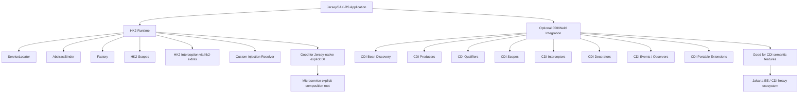

Ringkasnya:

| Dimensi | HK2 | CDI/Weld |
|---|---|---|
| Nature | Dependency injection kernel / service locator / lifecycle manager | Jakarta standard DI/context specification + implementation |
| Umum dipakai di | Jersey/JAX-RS internals, explicit service binding | Jakarta EE, CDI-enabled runtimes, Weld SE/Servlet |
| Core abstraction | `ServiceLocator`, `AbstractBinder`, descriptors | Bean archive, bean discovery, qualifiers, producers, observers |
| Registration style | Explicit binding atau HK2 service discovery | Bean discovery, annotations, `beans.xml`, CDI extensions |
| Best fit | Jersey microservice yang explicit wiring | Aplikasi yang butuh semantic CDI penuh |
| Risiko utama | Mengira HK2 punya semua fitur CDI | Menggabungkan CDI/HK2 tanpa boundary jelas |

---

# 3. Kenapa HK2 Tidak Sama dengan CDI/Weld?

## 3.1 HK2 adalah DI kernel yang dipakai Jersey

Jersey docs menyatakan Jersey memakai HK2 untuk component lifecycle management dan dependency injection, dan menyediakan mekanisme agar user application bisa mengubah HK2 bindings. Ini berarti HK2 adalah container yang sangat dekat dengan runtime Jersey. ([Eclipse EE4J](https://eclipse-ee4j.github.io/jersey.github.io/documentation/latest/ioc.html?utm_source=chatgpt.com))

HK2 punya abstraction seperti:

```text
ServiceLocator
Descriptor
AbstractBinder
Factory<T>
InjectionResolver
JustInTimeInjectionResolver
Scope
Context
InterceptionService
```

HK2 documentation juga menjelaskan bahwa HK2 3.x memakai `ServiceLocator` sebagai pengganti Habitat API lama, dan namespace HK2 3.x sudah bergerak ke `jakarta.*` dari `javax.*`. ([Eclipse EE4J](https://eclipse-ee4j.github.io/glassfish-hk2/extensibility.html?utm_source=chatgpt.com))

## 3.2 CDI/Weld adalah standard DI/context model yang lebih luas

CDI bukan hanya `@Inject`. CDI juga mencakup:

```text
bean discovery
qualifier
producer method/field
disposer
observer/event
interceptor binding
decorator
normal scope
contextual instance
portable extension
stereotype
alternative
specialization
```

CDI 4.1 adalah spesifikasi Jakarta CDI, dan dokumentasi Jakarta menyatakan bahwa CDI memberi mekanisme umum untuk meng-inject component seperti managed bean ke component lain. ([Jakarta EE](https://jakarta.ee/specifications/cdi/4.1/jakarta-cdi-spec-4.1?utm_source=chatgpt.com))

Weld adalah implementasi CDI. Dokumentasi Weld menyebut Weld sebagai reference implementation CDI dan menyediakan dokumentasi untuk Weld 6/CDI 4.1 dan Weld 7/CDI 5.0. ([Weld](https://weld.cdi-spec.org/documentation/?utm_source=chatgpt.com))

---

# 4. Compatibility Reality: Bisa, Mirip, Tapi Tidak Equivalent

Beberapa annotation tampak sama atau mirip:

```java
@Inject
@Singleton
@Named
@RequestScoped
```

Tapi harus hati-hati:

> Annotation yang sama belum tentu berarti lifecycle, discovery, proxy, dan resolution rule-nya sama.

Contoh sederhana:

```java
@Inject
public OrderService(OrderRepository repository) {
    this.repository = repository;
}
```

Ini bisa bekerja baik di HK2 dan CDI karena keduanya mendukung injection. Tetapi fitur seperti:

```java
@Produces
@Disposes
@Alternative
@Specializes
@Observes
@Decorator
@Stereotype
```

tidak bisa diasumsikan otomatis bekerja di HK2 hanya karena ada di classpath.

---

# 5. Mapping Besar CDI/Weld ke HK2

| CDI/Weld Feature | HK2 Equivalent / Alternative | Status |
|---|---|---|
| `@Inject` | `jakarta.inject.Inject` via HK2 | Bisa, umum |
| Constructor injection | HK2 injection | Bisa, recommended |
| Field injection | HK2 injection | Bisa, tapi kurang testable |
| `Provider<T>` | `jakarta.inject.Provider<T>` | Bisa |
| `@Singleton` | HK2 singleton binding | Bisa, tapi explicit binding lebih jelas |
| `@ApplicationScoped` | HK2 singleton/custom scope approximation | Tidak 1:1 |
| `@RequestScoped` | Jersey/HK2 request scope | Bisa dalam Jersey request context |
| `@Dependent` | HK2 `PerLookup` approximation | Mirip, tidak selalu semantic sama |
| CDI qualifier | HK2 qualifier / `@Named` / explicit binding | Bisa sebagian |
| `@Named` | HK2 named binding | Bisa |
| `@Produces` | HK2 `Factory<T>` / `bindFactory` | Alternative, bukan sama |
| `@Disposes` | `Factory.dispose()` / lifecycle manager | Alternative |
| `@PostConstruct` | HK2 lifecycle support / explicit init | Bisa dengan catatan |
| `@PreDestroy` | HK2 lifecycle/dispose/shutdown hook | Bisa dengan catatan |
| CDI interceptor | HK2 interception via `hk2-extras` | Alternative, bukan sama |
| CDI decorator | Explicit composition / proxy / wrapper | Tidak direct equivalent |
| CDI event `Event<T>` | Domain event bus / app event publisher | Alternative |
| `@Observes` | Subscriber/listener manual | Alternative |
| `@Alternative` | Conditional binder/profile binder/rank | Alternative |
| `@Specializes` | Explicit binding override | Alternative |
| CDI portable extension | HK2 `InjectionResolver`, `DynamicConfiguration`, etc. | Alternative, berbeda model |
| Bean discovery | HK2 binder/service locator/discovery | Berbeda fundamental |
| Stereotype | Custom meta-annotation + binder convention | Partial/manual |
| Conversation scope | Custom scope, biasanya jangan dipaksakan | Tidak direct equivalent |

---

# 6. Practical Decision Diagram

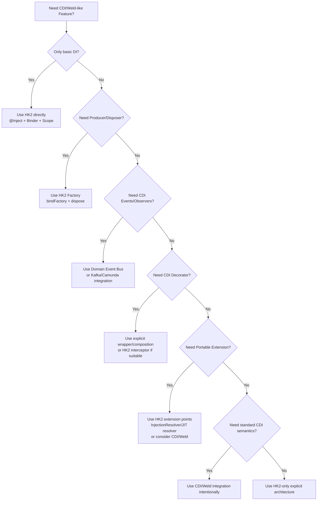

---

# 7. Kapan HK2 Saja Sudah Cukup?

HK2-only cukup jika aplikasi kamu:

```text
- Jersey/JAX-RS microservice
- dependency graph relatif eksplisit
- memakai constructor injection
- binding via AbstractBinder
- request context dikontrol via Jersey filter
- config di-load saat startup
- feature flag via service abstraction
- transaction boundary manual/interceptor
- tidak butuh CDI portable extension
- tidak butuh CDI observer/decorator semantic penuh
```

Contoh sehat:

```java id="hk2-good-binder"
public final class ApplicationBinder extends AbstractBinder {

    @Override
    protected void configure() {
        bind(DefaultOrderService.class)
                .to(OrderService.class)
                .in(Singleton.class);

        bind(MyBatisOrderRepository.class)
                .to(OrderRepository.class)
                .in(Singleton.class);

        bindFactory(RequestContextFactory.class)
                .to(RequestContext.class)
                .in(RequestScoped.class);
    }
}
```

HK2-only sangat cocok untuk microservice yang mengutamakan:

```text
explicit wiring
small runtime
controlled dependency graph
predictable testing
Jersey-native integration
```

---

# 8. Kapan Butuh CDI/Weld Sungguhan?

Pertimbangkan CDI/Weld jika aplikasi benar-benar memakai atau membutuhkan:

```text
- CDI producers/disposers dalam jumlah banyak
- CDI events/observers sebagai architecture pattern
- CDI decorators
- portable extensions
- stereotypes
- alternatives/specialization sebagai deployment mechanism
- integration dengan Jakarta EE components lain
- library internal perusahaan yang sudah CDI-native
- framework yang mengandalkan CDI bean discovery
```

Contoh fitur CDI yang sebaiknya jangan dipaksa mentah ke HK2:

```java id="cdi-observer"
public void onOrderApproved(@Observes OrderApproved event) {
    // CDI observer semantic
}
```

Di HK2, lebih sehat buat event bus eksplisit:

```java id="hk2-event-bus"
public interface DomainEventPublisher {
    void publish(DomainEvent event);
}
```

Atau jika event memang lintas service:

```text
Kafka / message broker / outbox pattern
```

---

# 9. Kapan Hybrid HK2 + CDI Berbahaya?

Hybrid bisa saja valid, tapi sering menjadi sumber kebingungan.

Risiko utama:

| Risiko | Penjelasan |
|---|---|
| Dua container | Object bisa dikelola HK2 atau CDI; lifecycle berbeda |
| Injection ambiguity | Dependency dibuat oleh container yang tidak kamu kira |
| Scope mismatch | CDI request scope dan Jersey/HK2 request scope tidak otomatis sama |
| Proxy mismatch | CDI normal scoped proxy dan HK2 proxy punya behavior berbeda |
| Testing rumit | Test harus boot HK2, CDI, atau keduanya |
| Startup order | Container mana yang initialize dulu bisa penting |
| Hidden lifecycle | `@PostConstruct`/`@PreDestroy` mungkin tidak berjalan sesuai asumsi |
| Debug sulit | Error injection bisa muncul dari HK2, CDI, Jersey, atau bridge integration |

Jadi rule praktis:

```text
Jangan hybrid karena “mungkin bisa”.
Hybrid hanya jika ada alasan jelas dan boundary jelas.
```

Boundary yang sehat:

```text
Jersey/HK2 layer:
  resource, filter, provider, request context, binder

CDI layer:
  CDI-native library/component

Bridge:
  explicit adapter
```

Boundary yang tidak sehat:

```text
Service A dikelola HK2
Service B dikelola CDI
keduanya saling inject dua arah
scope dan lifecycle tidak jelas
```

---

# 10. Conceptual Difference: Registration Model

## 10.1 CDI/Weld: Bean Discovery

CDI berpikir seperti ini:

```text
Ada bean archive
Container melakukan discovery
Bean eligible berdasarkan annotation/discovery mode
Dependency diselesaikan berdasarkan type + qualifier
```

Simplified:

```java id="cdi-bean"
@ApplicationScoped
public class DefaultOrderService implements OrderService {
}
```

CDI container menemukan bean tersebut melalui discovery model.

## 10.2 HK2: Explicit Binding / Service Locator

HK2 di Jersey microservice lebih sering berpikir seperti ini:

```text
Composition root membuat binding
Binding menentukan contract -> implementation
Scope ditentukan eksplisit
ResourceConfig mendaftarkan binder
```

```java id="hk2-explicit-binding"
bind(DefaultOrderService.class)
        .to(OrderService.class)
        .in(Singleton.class);
```

Untuk onboarding di codebase Jersey/HK2, selalu cari:

```text
ResourceConfig
AbstractBinder
bind()
bindFactory()
ServiceLocator
```

Karena di situlah dependency graph nyata biasanya berada.

---

# 11. Conceptual Difference: Producer vs Factory

## CDI Producer

CDI:

```java id="cdi-producer"
@Produces
public ObjectMapper objectMapper() {
    return new ObjectMapper();
}
```

## HK2 Factory

HK2/Jersey:

```java id="hk2-factory"
public final class ObjectMapperFactory implements Factory<ObjectMapper> {

    @Override
    public ObjectMapper provide() {
        return new ObjectMapper();
    }

    @Override
    public void dispose(ObjectMapper instance) {
        // cleanup if needed
    }
}
```

Binder:

```java id="hk2-bind-factory"
bindFactory(ObjectMapperFactory.class)
        .to(ObjectMapper.class)
        .in(Singleton.class);
```

Mental model:

```text
CDI @Produces = declarative producer method/field
HK2 Factory<T> = explicit factory service bound in binder
```

Mirip secara kebutuhan, berbeda secara programming model.

---

# 12. Conceptual Difference: Events

## CDI Events

CDI:

```java id="cdi-event"
@Inject
Event<OrderApproved> events;

events.fire(new OrderApproved(orderId));
```

Observer:

```java id="cdi-observes"
public void handle(@Observes OrderApproved event) {
}
```

## HK2 Alternative

HK2 tidak sebaiknya dipaksa meniru CDI events. Untuk microservice, lebih praktis:

```java id="domain-event-publisher"
public interface DomainEventPublisher {
    void publish(DomainEvent event);
}
```

Implementation bisa:

```text
in-memory event bus
transactional outbox
Kafka publisher
Camunda message correlation
audit event writer
```

Untuk system production, event domain penting biasanya lebih defensible jika eksplisit, durable, dan observable.

---

# 13. Conceptual Difference: Interceptor

## CDI Interceptor

CDI punya interceptor binding model yang distandardisasi.

```java id="cdi-interceptor-binding"
@Audited
public void approveOrder(UUID orderId) {
}
```

## HK2 Interceptor

HK2 memiliki default interception service lewat `hk2-extras`; dokumentasi HK2 menjelaskan bahwa interceptor default memakai annotation untuk menentukan service yang di-intercept, target service perlu `@Intercepted`, dan interceptor perlu menjadi HK2 service yang mengimplementasikan AOP Alliance `MethodInterceptor` atau `ConstructorInterceptor`. ([Eclipse EE4J](https://eclipse-ee4j.github.io/glassfish-hk2/extensibility.html?utm_source=chatgpt.com))

HK2 style:

```java id="hk2-intercepted"
@Intercepted
public final class DefaultOrderService {

    @Audited(action = "ORDER_APPROVE")
    public void approve(UUID orderId) {
    }
}
```

Interceptor:

```java id="hk2-method-interceptor"
@Service
@Interceptor
@Audited(action = "")
@ContractsProvided({AuditInterceptor.class, MethodInterceptor.class})
public final class AuditInterceptor implements MethodInterceptor {
    @Override
    public Object invoke(MethodInvocation invocation) throws Throwable {
        return invocation.proceed();
    }
}
```

Mental model:

```text
CDI interceptor = standardized CDI/Jakarta interceptor model
HK2 interceptor = HK2 extras + AOP Alliance style + explicit enablement
```

---

# 14. Conceptual Difference: Scope

CDI normal scopes punya strong contextual model. HK2 juga punya scope dan context, tetapi tidak semua CDI scope punya equivalent langsung.

| CDI Scope | HK2/Jersey Pattern | Catatan |
|---|---|---|
| `@ApplicationScoped` | singleton binding | Mirip, tapi semantic tidak selalu sama |
| `@RequestScoped` | Jersey/HK2 request scope | Cocok dalam request lifecycle |
| `@Dependent` | `PerLookup` | Mirip transient/dependent, tapi hati-hati semantic |
| `@SessionScoped` | Biasanya tidak relevan untuk stateless microservice | Jangan dipaksakan |
| `@ConversationScoped` | Tidak cocok untuk stateless Jersey microservice | Pakai workflow/process state |
| Custom CDI scope | HK2 custom scope/context | Bisa, tapi advanced dan perlu cleanup ketat |

Untuk microservice:

```text
Singleton untuk stateless service
RequestScoped untuk request context
PerLookup untuk transient object
Workflow/process state jangan disimpan di DI scope
```

---

# 15. Practical Decision Matrix

| Kebutuhan | Rekomendasi |
|---|---|
| Simple service injection | HK2 |
| Jersey resource/filter/provider injection | HK2 |
| Constructor injection service | HK2 |
| RequestContext dari HTTP header/security | HK2 Factory + Jersey filter |
| Multiple implementation by profile | HK2 binder/profile binder |
| Typed config injection | Config loader + HK2 binding |
| Object creation custom | HK2 Factory |
| Resource cleanup simple | Factory dispose / lifecycle hook |
| Audit/metrics method interceptor | HK2 extras atau explicit service wrapper |
| Complex domain authorization | Explicit service/domain policy |
| CDI observer-heavy architecture | CDI/Weld atau explicit event bus |
| CDI producer-heavy libraries | CDI/Weld atau adapter |
| CDI decorator semantics | CDI/Weld atau explicit wrapper |
| Portable extension | CDI/Weld jika memang butuh CDI extension |
| Jakarta EE full ecosystem | CDI/Weld / Jakarta EE runtime |
| Lean Jersey microservice | HK2-only |

---

# 16. Practical Anti-pattern

## Anti-pattern 1 - Mengira `@Inject` berarti CDI aktif

```java
@Inject
private OrderService orderService;
```

Ini hanya berarti injection terjadi. Container yang menjalankan bisa HK2, CDI, Spring, atau lainnya tergantung runtime.

Di Jersey/HK2, injection ini bisa berasal dari HK2 binding, bukan CDI bean discovery.

---

## Anti-pattern 2 - Menaruh `@Produces` lalu berharap HK2 paham

```java
@Produces
public ObjectMapper mapper() {
    return new ObjectMapper();
}
```

Jika container yang aktif hanya HK2/Jersey tanpa CDI integration, jangan berharap producer CDI otomatis dipakai.

HK2 alternative:

```java
bindFactory(ObjectMapperFactory.class)
        .to(ObjectMapper.class)
        .in(Singleton.class);
```

---

## Anti-pattern 3 - Campur CDI scope dan HK2 scope tanpa desain

```java
@RequestScoped
public class CurrentTenant {
}
```

Pertanyaannya:

```text
@RequestScoped yang mana?
CDI request scope?
Jersey/HK2 request scope?
Apakah container-nya aktif?
Apakah proxy-nya berasal dari CDI atau HK2?
```

Untuk Jersey/HK2-only, lebih jelas:

```java
bindFactory(TenantContextFactory.class)
        .to(TenantContext.class)
        .in(RequestScoped.class);
```

---

## Anti-pattern 4 - Menggunakan ServiceLocator di business logic

Buruk:

```java
public class OrderService {
    @Inject
    ServiceLocator locator;

    public void approve(UUID id) {
        PaymentClient client = locator.getService(PaymentClient.class);
    }
}
```

Ini membuat service locator menjadi hidden dependency.

Lebih baik:

```java
public OrderService(PaymentClient paymentClient) {
    this.paymentClient = paymentClient;
}
```

Gunakan `ServiceLocator` di bootstrap/extension layer, bukan business logic.

---

## Anti-pattern 5 - Hybrid tanpa ownership

Contoh buruk:

```text
Repository dikelola CDI
Service dikelola HK2
Client dikelola CDI
Filter dikelola Jersey/HK2
Event observer dikelola CDI
Transaction dikelola manual
```

Tanpa boundary, debugging lifecycle akan berat.

---

# 17. Practical Onboarding Checklist

Saat membaca codebase baru, cek dulu:

```text
Apakah ada CDI?
- beans.xml
- jakarta.enterprise.*
- org.jboss.weld.*
- @ApplicationScoped
- @Produces
- @Observes
- @Alternative
- @Decorator
- @Interceptor
- CDI.current()

Apakah ada HK2?
- org.glassfish.hk2.*
- org.glassfish.jersey.inject.hk2
- AbstractBinder
- ResourceConfig.register(new Binder())
- ServiceLocator
- bind()
- bindFactory()
- @Contract
- @Service
```

Lalu jawab:

| Pertanyaan | Makna |
|---|---|
| Dependency graph utama ada di mana? | Binder HK2 atau CDI bean discovery? |
| Resource dikelola siapa? | Jersey/HK2, CDI, atau bridge? |
| Service dikelola siapa? | HK2/CDI/manual? |
| Scope request berasal dari mana? | Jersey request scope atau CDI request scope? |
| Producer dipakai? | Kalau ya, CDI aktif atau tidak? |
| Observer dipakai? | CDI event atau custom event bus? |
| Interceptor aktif? | CDI interceptor atau HK2 extras? |
| Test boot container apa? | HK2, CDI, JerseyTest, atau hybrid? |
| Config injection dari mana? | HK2 binder, CDI producer, atau manual static? |
| Ada dua container saling inject? | Potensi masalah besar |

---

# 18. Recommended Architecture untuk Jersey/HK2 Microservice

Untuk stack kamu:

```text
Java 17+
Maven
Jersey/JAX-RS
HK2
MyBatis
Camunda
PostgreSQL
Docker/Kubernetes
On-prem/AWS/Azure
```

Saya rekomendasikan baseline:

```text
HK2-only untuk application composition root
Explicit binder untuk dependency graph
Factory<T> untuk request context/config/runtime object
Provider<T> untuk request-scoped object di singleton service
Jersey filter untuk inbound context
Explicit event publisher untuk domain events
Explicit config loader untuk profile/env/secrets
HK2 interceptor hanya untuk cross-cutting yang sederhana
Service/domain explicit untuk business rules
```

Gunakan CDI/Weld hanya jika:

```text
library internal perusahaan CDI-native
Jakarta EE runtime memang menyediakan CDI
butuh producers/observers/decorators/portable extensions sungguhan
tim punya standard CDI yang mature
testing container CDI sudah disiapkan
```

---

# 19. Summary: Cara Berpikir yang Aman

Pegangan utama:

1. **HK2 bukan CDI/Weld.**
2. **Jersey memakai HK2 untuk lifecycle dan DI, tetapi itu tidak berarti semua fitur CDI aktif.**
3. **`@Inject` bisa mirip, tetapi bean discovery, producers, observers, decorators, scopes, dan extensions berbeda.**
4. **Untuk Jersey microservice, HK2 explicit binder sering lebih mudah dikontrol dan dites.**
5. **CDI/Weld cocok jika aplikasi memang butuh semantic CDI penuh.**
6. **Jangan mencampur HK2 dan CDI tanpa boundary yang jelas.**
7. **Pola pengganti CDI di HK2 biasanya berbentuk `AbstractBinder`, `Factory<T>`, `Provider<T>`, custom scope, interceptor HK2, atau explicit service composition.**
8. **Untuk fitur seperti observer/decorator/portable extension, jangan cari mapping 1:1; pilih architecture pattern yang sesuai.**
9. **Service business tidak boleh bergantung pada `ServiceLocator` atau container API.**
10. **Composition root harus eksplisit agar onboarding, testing, dan production debugging lebih mudah.**

---

# 20. Seri Berikutnya

Lanjut ke **Seri 2/12 - Bean Discovery & Registration**.

Fokus seri berikutnya:

- CDI bean discovery vs HK2 explicit registration;
- `beans.xml` vs `ResourceConfig`/`AbstractBinder`;
- `@Service`, `@Contract`, `bind()`, `bindAsContract()`;
- kapan pakai scanning, kapan explicit binding;
- registration untuk service, repository, client, config, factory;
- test binder override;
- failure model: unsatisfied dependency, duplicate binding, wrong implementation.

**Seri 1/12 selesai.**

---

**Sources:**

- [Chapter 25. Custom Injection and Lifecycle Management](https://eclipse-ee4j.github.io/jersey.github.io/documentation/latest/ioc.html?utm_source=chatgpt.com)
- [Jakarta Contexts and Dependency Injection](https://jakarta.ee/specifications/cdi/4.1/jakarta-cdi-spec-4.1?utm_source=chatgpt.com)
- [Documentation - Weld - CDI](https://weld.cdi-spec.org/documentation/?utm_source=chatgpt.com)

## Response:
7/15/2026, 4:01:01 AM

Lanjut ke **Seri 2/12 — Bean Discovery & Registration**. Fokusnya: membedakan cara CDI/Weld menemukan bean secara otomatis dengan cara HK2/Jersey biasanya mendaftarkan dependency graph secara eksplisit lewat binder.

# Seri 2/12 - Bean Discovery & Registration  
**Topik:** CDI bean discovery vs HK2 explicit registration di Jersey/JAX-RS microservice.

## 1. Introduction

Di CDI/Weld, container biasanya berpikir:

```text
Saya akan menemukan bean dari bean archive,
lalu memilih bean berdasarkan type + qualifier + scope.
```

Di HK2/Jersey, terutama dalam microservice Jersey yang eksplisit, container biasanya berpikir:

```text
Saya hanya tahu service yang didaftarkan ke ServiceLocator,
baik lewat AbstractBinder, generated metadata/inhabitants file, atau mekanisme registration lain.
```

Ini perbedaan fundamental. CDI punya konsep **bean archive**, `beans.xml`, dan **bean discovery mode**. Jakarta tutorial menjelaskan ada explicit bean archive dan implicit bean archive; explicit archive memakai `beans.xml`, sedangkan implicit archive hanya mengelola bean yang punya bean-defining annotation/scope tertentu. CDI 4.1 juga mencatat default `bean-discovery-mode` bergerak ke `annotated`, termasuk empty `beans.xml` default-nya dianggap `annotated`. ([Jakarta EE](https://jakarta.ee/learn/docs/jakartaee-tutorial/current/cdi/cdi-adv/cdi-adv.html?utm_source=chatgpt.com))

HK2 berbeda. HK2 punya `ServiceLocator` sebagai registry service, dan dokumentasi HK2 menyebut `ServiceLocator` sebagai service paling fundamental dalam sistem HK2. HK2 bisa memakai annotation seperti `@Contract` dan `@Service`, tetapi dokumentasi HK2 juga menegaskan ada programmatic API untuk mengontrol service dan binding secara presisi. ([Java EE](https://javaee.github.io/hk2/apidocs/org/glassfish/hk2/api/ServiceLocator.html?utm_source=chatgpt.com))

---

# 2. Diagram Mental Model

```mermaid
flowchart TD
    A[Application Code] --> B{CDI/Weld Style?}
    A --> C{HK2/Jersey Style?}

    B --> B1[Bean Archive]
    B1 --> B2[beans.xml]
    B1 --> B3[Bean Discovery Mode]
    B3 --> B4[all / annotated / none]
    B4 --> B5[CDI Bean Manager]
    B5 --> B6[Resolve by Type + Qualifier + Scope]

    C --> C1[ResourceConfig]
    C1 --> C2[AbstractBinder]
    C2 --> C3[bind / bindAsContract / bindFactory]
    C3 --> C4[ServiceLocator Registry]
    C4 --> C5[Resolve HK2 Service Descriptor]

    C --> C6[@Service + @Contract]
    C6 --> C7[HK2 Metadata / Inhabitants File]
    C7 --> C4

    B6 --> D[Inject into Application]
    C5 --> D
```

---

# 3. Key Difference: Discovery vs Registration

| Area | CDI/Weld | HK2/Jersey |
|---|---|---|
| Main model | Bean discovery | Service registration |
| Central concept | Bean archive, bean type, qualifier, scope | `ServiceLocator`, descriptor, contract, binding |
| Typical bootstrap | CDI container scans bean archive | Jersey `ResourceConfig` registers binder/resources |
| Config artifact | `beans.xml` | `AbstractBinder`, HK2 metadata, service locator config |
| Annotation style | `@ApplicationScoped`, `@RequestScoped`, `@Produces`, `@Alternative`, etc. | `@Service`, `@Contract`, `@Inject`, `@Named`, binder APIs |
| Explicitness | Often discovery-driven | Often binder-driven |
| Best onboarding target | Find `beans.xml`, CDI annotations, Weld bootstrap | Find `ResourceConfig`, `AbstractBinder`, `bind()`, `bindFactory()` |
| Failure mode | Ambiguous/unsatisfied CDI dependency | Unsatisfied HK2 dependency / binder not registered |

---

# 4. CDI Bean Discovery

## 4.1 `beans.xml`

Contoh CDI `beans.xml`:

```xml
<beans xmlns="https://jakarta.ee/xml/ns/jakartaee"
       xmlns:xsi="http://www.w3.org/2001/XMLSchema-instance"
       xsi:schemaLocation="https://jakarta.ee/xml/ns/jakartaee
       https://jakarta.ee/xml/ns/jakartaee/beans_4_0.xsd"
       bean-discovery-mode="annotated">
</beans>
```

Di CDI, `bean-discovery-mode` penting:

| Mode | Arti Praktis |
|---|---|
| `all` | Container mempertimbangkan semua class eligible sebagai bean |
| `annotated` | Hanya class dengan bean-defining annotation yang diproses |
| `none` | Tidak ada bean discovery untuk archive tersebut |

CDI 4.x mengubah ekspektasi modern ke arah `annotated`, bukan scan semua class tanpa batas. CDI 4.1 release note mencatat empty `beans.xml` default-nya memakai `annotated`, dan CDI Lite hanya membaca atribut `bean-discovery-mode` dari `beans.xml`. ([Jakarta EE](https://jakarta.ee/specifications/cdi/4.1/jakarta-cdi-spec-4.1?utm_source=chatgpt.com))

## 4.2 Contoh CDI Bean

```java
package com.company.orderservice.application;

import jakarta.enterprise.context.ApplicationScoped;

@ApplicationScoped
public class DefaultOrderService implements OrderService {

    private final OrderRepository repository;

    @Inject
    public DefaultOrderService(OrderRepository repository) {
        this.repository = repository;
    }
}
```

Dalam CDI, class ini bisa ditemukan sebagai bean karena punya bean-defining annotation seperti `@ApplicationScoped`.

---

# 5. HK2 Registration di Jersey

## 5.1 `ResourceConfig` sebagai entry point

Dalam Jersey/HK2, composition root biasanya terlihat seperti ini:

```java
package com.company.orderservice.bootstrap;

import org.glassfish.jersey.server.ResourceConfig;

public final class ApiApplication extends ResourceConfig {

    public ApiApplication() {
        packages("com.company.orderservice.api.resource");

        register(new ApplicationBinder());
        register(new ContextBinder());
        register(new FeatureFlagBinder());
    }
}
```

Jersey documentation menunjukkan pattern custom HK2 injection dengan membuat binder lalu mendaftarkannya ke `ResourceConfig`; tanpa registration, binding tersebut tidak aktif. ([Stack Overflow](https://stackoverflow.com/questions/67227987/jersey-2-26-configure-not-called-after-converting-hk2s-factory-to-supplier?utm_source=chatgpt.com))

## 5.2 `AbstractBinder`

```java
package com.company.orderservice.bootstrap;

import com.company.orderservice.application.OrderService;
import com.company.orderservice.application.DefaultOrderService;
import com.company.orderservice.persistence.MyBatisOrderRepository;
import com.company.orderservice.application.OrderRepository;
import jakarta.inject.Singleton;
import org.glassfish.hk2.utilities.binding.AbstractBinder;

public final class ApplicationBinder extends AbstractBinder {

    @Override
    protected void configure() {
        bind(DefaultOrderService.class)
                .to(OrderService.class)
                .in(Singleton.class);

        bind(MyBatisOrderRepository.class)
                .to(OrderRepository.class)
                .in(Singleton.class);
    }
}
```

Mental model-nya:

```text
OrderService requested
  -> HK2 ServiceLocator checks registered descriptors
  -> DefaultOrderService selected
  -> dependencies resolved
```

HK2 API overview menjelaskan `ServiceLocator` sebagai registry tempat descriptor service di-bind dan service di-lookup. ([Eclipse EE4J](https://eclipse-ee4j.github.io/glassfish-hk2/api-overview.html?utm_source=chatgpt.com))

---

# 6. HK2 `@Service` / `@Contract` Bukan CDI Bean Discovery

HK2 punya annotation:

```java
@Contract
public interface OrderService {
    Order getOrder(UUID id);
}
```

```java
@Service
public class DefaultOrderService implements OrderService {
}
```

Tapi ini sering disalahpahami.

Di HK2, `@Service` dan `@Contract` bisa dipakai untuk declarative service model, tetapi agar service ditemukan otomatis, HK2 membutuhkan metadata/inhabitants file yang dihasilkan saat build atau mekanisme discovery yang sesuai. Dokumentasi HK2 metadata/inhabitant generator menyebut metadata generator memproses `@Service` saat compilation dan default output-nya berada di `META-INF/hk2-locator/default`; inhabitant generator juga membuat file metadata berdasarkan class yang diberi `@Service` atau `@Contract`. ([Eclipse EE4J](https://eclipse-ee4j.github.io/glassfish-hk2/inhabitant-generator.html?utm_source=chatgpt.com))

Jadi ini **tidak sama** dengan CDI bean discovery.

```text
CDI:
  @ApplicationScoped + bean archive -> discovered by CDI

HK2:
  @Service/@Contract -> perlu metadata generator/inhabitants file
  atau tetap daftarkan explicit via AbstractBinder
```

Untuk microservice Jersey, saya biasanya lebih merekomendasikan **explicit binder** daripada mengandalkan auto-discovery, karena lebih mudah dibaca, dites, dan diaudit.

---

# 7. Pattern 1 - Explicit Binding: Recommended Default

## 7.1 Contract

```java
package com.company.orderservice.application.port;

import java.util.Optional;
import java.util.UUID;

public interface OrderRepository {
    Optional<Order> findByTenantAndId(String tenantId, UUID orderId);
}
```

## 7.2 Implementation

```java
package com.company.orderservice.infrastructure.persistence;

public final class MyBatisOrderRepository implements OrderRepository {

    private final SqlSessionFactory sqlSessionFactory;

    @Inject
    public MyBatisOrderRepository(SqlSessionFactory sqlSessionFactory) {
        this.sqlSessionFactory = sqlSessionFactory;
    }

    @Override
    public Optional<Order> findByTenantAndId(String tenantId, UUID orderId) {
        try (SqlSession session = sqlSessionFactory.openSession()) {
            OrderMapper mapper = session.getMapper(OrderMapper.class);
            return mapper.findByTenantAndId(tenantId, orderId);
        }
    }
}
```

## 7.3 Binder

```java
public final class PersistenceBinder extends AbstractBinder {

    @Override
    protected void configure() {
        bind(MyBatisOrderRepository.class)
                .to(OrderRepository.class)
                .in(Singleton.class);
    }
}
```

Kelebihan:

```text
dependency graph eksplisit
mudah override saat test
mudah review saat onboarding
tidak tergantung scanning magic
lebih aman untuk multi-module Maven project
```

---

# 8. Pattern 2 - Bind Concrete Class as Contract

Untuk class yang tidak perlu interface:

```java
public final class OrderNumberGenerator {

    public String generate() {
        return "ORD-" + UUID.randomUUID();
    }
}
```

Binder:

```java
bindAsContract(OrderNumberGenerator.class)
        .in(Singleton.class);
```

Gunakan untuk:

| Class | Kenapa tidak perlu interface |
|---|---|
| Pure utility service | Tidak ada alternative implementation |
| Stateless mapper | Mudah dites langsung |
| Policy kecil | Tidak ada external dependency |
| Generator sederhana | Tidak butuh boundary |

Jangan membuat interface untuk semua class. Interface berguna ketika ada boundary, variasi implementasi, external dependency, atau test double yang penting.

---

# 9. Pattern 3 - Bind Instance

Untuk object yang sudah dibuat saat startup:

```java
ApplicationConfig config = ConfigBootstrap.load();

bind(config).to(ApplicationConfig.class);
bind(config.database()).to(DatabaseConfig.class);
bind(config.paymentClient()).to(HttpClientConfig.class);
```

Cocok untuk:

```text
ApplicationConfig
DatabaseConfig
ObjectMapper
Clock
SqlSessionFactory
DataSource
FeatureFlagProvider instance
```

Contoh:

```java
public final class ConfigBinder extends AbstractBinder {

    private final ApplicationConfig config;

    public ConfigBinder(ApplicationConfig config) {
        this.config = config;
    }

    @Override
    protected void configure() {
        bind(config).to(ApplicationConfig.class);
        bind(config.app()).to(AppConfig.class);
        bind(config.database()).to(DatabaseConfig.class);
    }
}
```

---

# 10. Pattern 4 - Bind Factory

CDI punya `@Produces`. HK2/Jersey alternative-nya adalah `Factory<T>` + `bindFactory`.

```java
public final class RequestContextFactory implements Factory<RequestContext> {

    @Override
    public RequestContext provide() {
        return RequestContextHolder.current();
    }

    @Override
    public void dispose(RequestContext instance) {
        // cleanup owned by filter
    }
}
```

Binder:

```java
bindFactory(RequestContextFactory.class)
        .to(RequestContext.class)
        .proxy(true)
        .proxyForSameScope(false)
        .in(RequestScoped.class);
```

Gunakan factory untuk object yang:

```text
dibuat dari HTTP request
dibuat dari security context
dibuat dari tenant resolver
butuh runtime lookup
butuh custom lifecycle
butuh dispose/cleanup
```

---

# 11. Pattern 5 - Module Binder per Area

Daripada satu binder raksasa:

```java
public final class ApplicationBinder extends AbstractBinder {
    // 500 lines of binding
}
```

Lebih sehat:

```text
ConfigBinder
PersistenceBinder
ClientBinder
ApplicationServiceBinder
ContextBinder
FeatureFlagBinder
InterceptorBinder
WorkflowBinder
```

ResourceConfig:

```java
public final class ApiApplication extends ResourceConfig {

    public ApiApplication() {
        packages("com.company.orderservice.api.resource");

        ApplicationConfig config = ConfigBootstrap.load();

        register(new ConfigBinder(config));
        register(new PersistenceBinder(config.database()));
        register(new ClientBinder(config));
        register(new ContextBinder());
        register(new FeatureFlagBinder(config.featureFlags()));
        register(new ApplicationServiceBinder());
        register(new WorkflowBinder(config.camunda()));
    }
}
```

Kelebihan:

```text
dependency graph lebih modular
lebih mudah test sebagian graph
lebih mudah onboarding
lebih mudah melihat ownership teknis
```

---

# 12. CDI vs HK2 Registration Mapping

| CDI/Weld | HK2/Jersey Alternative | Catatan |
|---|---|---|
| `beans.xml` | `ResourceConfig.register(...)` | Bootstrap eksplisit |
| Bean discovery | `AbstractBinder` / HK2 metadata | Beda model |
| `@ApplicationScoped` class discovered | `bind(...).in(Singleton.class)` | Explicit lebih jelas |
| `@RequestScoped` bean discovered | `bindFactory(...).in(RequestScoped.class)` | Cocok untuk request context |
| `@Produces` | `Factory<T>` / bind instance | Alternative |
| `@Alternative` | Conditional binder / profile binder | Akan dibahas seri 7 |
| `@Specializes` | Binding override / named binding / rank | Tidak 1:1 |
| CDI qualifier selection | HK2 qualifier / named binding / explicit port | Akan dibahas seri 4 |
| Portable extension registers beans | HK2 dynamic configuration / resolver | Advanced |
| `@Vetoed` | Jangan bind / exclude module | Manual/explicit |

---

# 13. Practical Example: Full Registration Flow

## 13.1 Resource

```java
@Path("/orders")
@Produces(MediaType.APPLICATION_JSON)
public final class OrderResource {

    private final OrderService orderService;

    @Inject
    public OrderResource(OrderService orderService) {
        this.orderService = orderService;
    }

    @GET
    @Path("/{orderId}")
    public OrderView getOrder(@PathParam("orderId") UUID orderId) {
        return orderService.getOrder(orderId);
    }
}
```

## 13.2 Service

```java
public final class DefaultOrderService implements OrderService {

    private final OrderRepository repository;
    private final Provider<RequestContext> requestContextProvider;

    @Inject
    public DefaultOrderService(
            OrderRepository repository,
            Provider<RequestContext> requestContextProvider
    ) {
        this.repository = repository;
        this.requestContextProvider = requestContextProvider;
    }

    @Override
    public OrderView getOrder(UUID orderId) {
        RequestContext context = requestContextProvider.get();

        Order order = repository.findByTenantAndId(context.tenantId(), orderId)
                .orElseThrow(() -> new OrderNotFoundException(orderId));

        return OrderView.from(order);
    }
}
```

## 13.3 Binder

```java
public final class ApplicationServiceBinder extends AbstractBinder {

    @Override
    protected void configure() {
        bind(DefaultOrderService.class)
                .to(OrderService.class)
                .in(Singleton.class);
    }
}
```

## 13.4 ResourceConfig

```java
public final class ApiApplication extends ResourceConfig {

    public ApiApplication() {
        packages("com.company.orderservice.api.resource");

        register(new ContextBinder());
        register(new PersistenceBinder());
        register(new ApplicationServiceBinder());
        register(ApiErrorMapper.class);
        register(RequestContextFilter.class);
    }
}
```

Dependency chain:

```text
OrderResource
  -> OrderService
       -> DefaultOrderService
            -> OrderRepository
                 -> MyBatisOrderRepository
            -> Provider<RequestContext>
                 -> RequestContextFactory
```

---

# 14. Failure Model: Registration

| Failure | Penyebab | Gejala | Solusi |
|---|---|---|---|
| Unsatisfied dependency | Interface tidak di-bind | App/request gagal saat inject | Tambahkan binding `bind(Impl).to(Contract)` |
| Binder tidak aktif | Binder tidak di-register ke `ResourceConfig` | Binding tidak ditemukan | Register binder |
| Wrong implementation | Dua binding untuk contract sama tanpa qualifier/ranking jelas | Behavior tidak sesuai | Gunakan named/qualifier atau explicit binder per profile |
| Scope salah | Tidak `.in(Singleton.class)` lalu default transient/per lookup | Object dibuat berkali-kali | Scope eksplisit |
| Factory tidak jalan | `bindFactory` salah type/scope | Request context gagal | Audit binding factory |
| Test pakai prod binding | Test `ResourceConfig` register binder production | Test lambat/flaky | Gunakan test binder |
| Auto-discovery tidak menemukan `@Service` | HK2 metadata/inhabitants file tidak dibuat | `@Service` tidak berpengaruh | Pakai explicit binder atau setup metadata generator |
| Duplicate registration | Binder module tumpang tindih | Ambiguous/wrong service | Rapikan module ownership |

---

# 15. Testing Registration

## 15.1 Test Binder Override

```java
public final class TestApplicationServiceBinder extends AbstractBinder {

    @Override
    protected void configure() {
        bind(FakeOrderRepository.class)
                .to(OrderRepository.class)
                .in(Singleton.class);

        bind(DefaultOrderService.class)
                .to(OrderService.class)
                .in(Singleton.class);
    }
}
```

## 15.2 JerseyTest ResourceConfig

```java
public final class TestApiApplication extends ResourceConfig {

    public TestApiApplication() {
        packages("com.company.orderservice.api.resource");

        register(new TestContextBinder());
        register(new TestApplicationServiceBinder());
        register(ApiErrorMapper.class);
    }
}
```

## 15.3 Test

```java
class OrderResourceRegistrationTest extends JerseyTest {

    @Override
    protected Application configure() {
        return new TestApiApplication();
    }

    @Test
    void resolvesOrderServiceThroughHk2Binder() {
        Response response = target("/orders/" + UUID.randomUUID())
                .request()
                .header("X-Tenant-Id", "tenant-a")
                .header("X-User-Id", "user-1")
                .get();

        assertNotEquals(500, response.getStatus());
    }
}
```

Tujuannya bukan hanya mengetes endpoint. Tujuannya memastikan:

```text
Resource ditemukan
Binder aktif
OrderService resolved
OrderRepository resolved
RequestContext resolved
ExceptionMapper aktif
```

---

# 16. Practical Registration Checklist

Saat onboarding, cari file:

```text
ApiApplication.java
Application.java
ResourceConfig.java
ApplicationBinder.java
*Binder.java
Bootstrap.java
```

Lalu buat map:

```text
ResourceConfig:
  packages("...api.resource")
  register(ConfigBinder)
  register(ContextBinder)
  register(PersistenceBinder)
  register(ClientBinder)
  register(ApplicationServiceBinder)
  register(FeatureFlagBinder)
  register(ApiErrorMapper)
  register(RequestContextFilter)

Contracts:
  OrderService -> DefaultOrderService
  OrderRepository -> MyBatisOrderRepository
  PaymentClient -> HttpPaymentClient
  FeatureFlagService -> DefaultFeatureFlagService
  TransactionManager -> MyBatisTransactionManager
```

Pertanyaan penting:

| Pertanyaan | Yang dicari |
|---|---|
| Di mana dependency graph utama? | Binder atau CDI discovery |
| Apakah semua interface penting punya binding? | Ya |
| Apakah binding tersebar tanpa pola? | Harus dirapikan |
| Apakah ada auto-discovery HK2? | Cek metadata generator/inhabitants file |
| Apakah ada CDI `beans.xml`? | Kalau ada, cek hybrid risk |
| Apakah test memakai binder khusus? | Harus ya |
| Apakah scope eksplisit? | Harus ya untuk service penting |
| Apakah config di-bind sebagai typed object? | Harus ya |
| Apakah request context lewat factory? | Idealnya ya |
| Apakah service memakai `ServiceLocator` langsung? | Red flag |

---

# 17. Recommended Practice untuk Stack Ini

Untuk **Java 17+, Jersey/JAX-RS, HK2, MyBatis, Camunda, PostgreSQL, Docker/Kubernetes, AWS/Azure/on-prem**, rekomendasi saya:

```text
1. Gunakan explicit AbstractBinder sebagai default.
2. Pisahkan binder per area.
3. Hindari mengandalkan HK2 auto-discovery kecuali team sudah punya standard build metadata generator.
4. Jangan mengandalkan CDI bean discovery jika runtime tidak jelas menjalankan CDI/Weld.
5. Semua dependency boundary pakai interface/contract.
6. Semua external implementation di-bind di infrastructure binder.
7. Config dan secret di-load saat startup, lalu di-bind sebagai typed object.
8. Request context dibuat lewat filter + factory.
9. Test selalu punya test binder.
10. Dokumentasikan dependency graph per service.
```

---

# 18. Anti-pattern yang Harus Dihindari

## 18.1 Annotation ditempel tapi tidak ada registration

```java
@Service
public final class DefaultOrderService implements OrderService {
}
```

Lalu berharap otomatis bisa di-inject.

Kalau tidak ada metadata generator/inhabitants file atau binder explicit, ini bisa gagal.

Lebih aman:

```java
bind(DefaultOrderService.class)
        .to(OrderService.class)
        .in(Singleton.class);
```

## 18.2 Semua class di-scan tanpa kontrol

Auto-discovery bisa mempercepat awal, tapi dalam microservice enterprise, explicit graph biasanya lebih defensible.

Risiko scanning berlebihan:

```text
wrong implementation selected
test sulit override
dependency graph tidak terlihat
startup lebih sulit diprediksi
class internal ikut terekspos sebagai service
```

## 18.3 Satu binder raksasa

```text
ApplicationBinder with 500 lines
```

Masalah:

```text
merge conflict tinggi
ownership tidak jelas
onboarding berat
test override sulit
```

Lebih baik modular binder.

## 18.4 Binding concrete implementation ke service layer

Buruk:

```java
public DefaultOrderService(MyBatisOrderRepository repository) {
}
```

Baik:

```java
public DefaultOrderService(OrderRepository repository) {
}
```

---

# 19. Ringkasan Seri 2/12

Pegangan utama:

1. **CDI/Weld memakai bean discovery; HK2/Jersey biasanya memakai explicit registration.**
2. **`beans.xml` tidak relevan untuk HK2-only registration.**
3. **`@Service`/`@Contract` HK2 bukan CDI bean discovery.**
4. **HK2 auto-discovery butuh metadata/inhabitants file atau setup build khusus.**
5. **Untuk microservice Jersey, `AbstractBinder` adalah pilihan paling eksplisit dan mudah dites.**
6. **`ResourceConfig.register(new Binder())` adalah langkah penting; binder yang tidak diregister tidak aktif.**
7. **Pisahkan binder per area: config, persistence, client, service, context, feature flag, workflow.**
8. **Bind interface ke implementation untuk boundary penting.**
9. **Bind instance untuk config/object startup.**
10. **Bind factory untuk request/runtime-derived object.**
11. **Test harus punya binder override, bukan memakai production graph mentah.**
12. **Saat onboarding, dependency graph nyata biasanya terlihat dari `ResourceConfig` + `AbstractBinder`.**

---

# 20. Seri Berikutnya

Lanjut ke **Seri 3/12 - Injection Basics: `@Inject`, Constructor Injection, Field Injection, `Provider<T>`**.

Fokus berikutnya:

- apa yang sama antara CDI dan HK2 untuk `@Inject`;
- constructor vs field vs method injection;
- `Provider<T>` untuk lazy dependency dan request-scoped access;
- optional dependency pattern;
- dependency cycle;
- injection ke JAX-RS resource/filter/provider;
- anti-pattern: service locator di business logic;
- testing injection tanpa container.

**Seri 2/12 selesai.**

---

**Sources:**

- [Jakarta Contexts and Dependency Injection](https://jakarta.ee/learn/docs/jakartaee-tutorial/current/cdi/cdi-adv/cdi-adv.html?utm_source=chatgpt.com)
- [ServiceLocator (HK2 API Documentation) - Java EE](https://javaee.github.io/hk2/apidocs/org/glassfish/hk2/api/ServiceLocator.html?utm_source=chatgpt.com)
- [Jersey 2.26+: configure() not called after converting HK2's ...](https://stackoverflow.com/questions/67227987/jersey-2-26-configure-not-called-after-converting-hk2s-factory-to-supplier?utm_source=chatgpt.com)
- [GlassFish HK2 - Dependency Injection Kernel](https://eclipse-ee4j.github.io/glassfish-hk2/api-overview.html?utm_source=chatgpt.com)

## Response:
7/15/2026, 4:02:45 AM

Lanjut ke **Seri 3/12 — Injection Basics: `@Inject`, Constructor Injection, Field Injection, `Provider<T>`**. Fokusnya: pola injection yang aman di HK2/Jersey, bukan sekadar “bisa jalan”, tetapi mudah dites, tidak bocor scope, dan tidak menyembunyikan dependency.

# Seri 3/12 - Injection Basics: `@Inject`, Constructor Injection, Field Injection, `Provider<T>`

## 1. Introduction

Di seri ini kita bahas bagian yang terlihat sederhana tapi sering jadi sumber masalah besar:

```text id="2ukfi2"
@Inject
constructor injection
field injection
method injection
Provider<T>
lazy dependency
optional dependency
dependency cycle
request-scoped dependency dari singleton
injection di Resource / Filter / Provider / Service
```

Secara konsep, **HK2 dan CDI/Weld sama-sama mendukung `jakarta.inject.Inject`**, tetapi konteks container-nya berbeda. Jakarta Inject mendefinisikan `@Inject` sebagai annotation untuk constructor, method, dan field yang bisa di-inject; injectable member bisa punya access modifier apa pun. ([jakarta.ee](https://jakarta.ee/specifications/dependency-injection/2.0/apidocs/jakarta/inject/inject?utm_source=chatgpt.com))

Di Jersey/HK2, injection akan berhasil hanya jika object tersebut dikelola/di-resolve oleh Jersey/HK2 dan dependency-nya sudah dikenal oleh HK2, biasanya lewat `AbstractBinder`, factory, atau registration lain. Jersey documentation menekankan bahwa custom injection extension/binder harus diregister ke `ResourceConfig` agar aktif. ([eclipse-ee4j.github.io](https://eclipse-ee4j.github.io/jersey.github.io/documentation/latest/ioc.html?utm_source=chatgpt.com))

---

# 2. Mental Model

```mermaid id="injection-basics-map"
flowchart TD
    A[Managed Object by Jersey/HK2] --> B[@Inject Constructor]
    A --> C[@Inject Field]
    A --> D[@Inject Method]
    A --> E[Provider<T>]

    B --> B1[Recommended for Services]
    C --> C1[Useful but less testable]
    D --> D1[Useful for optional setup / grouping]

    E --> E1[Lazy Retrieval]
    E --> E2[RequestScoped from Singleton]
    E --> E3[Multiple Instances]
    E --> E4[Break Cycle - use carefully]

    F[ResourceConfig + Binder] --> G[ServiceLocator]
    G --> A

    H[JAX-RS Resource] --> I[Application Service]
    I --> J[Repository Port]
    I --> K[External Client Port]
    I --> L[Provider<RequestContext>]
```

Pegangan utama:

```text id="wcq4q3"
@Inject hanya bekerja pada object yang dibuat/dikelola oleh container.
Kalau object dibuat dengan `new` manual, container tidak otomatis inject dependency-nya.
```

---

# 3. Constructor Injection - Default yang Paling Aman

## 3.1 Kenapa constructor injection?

Constructor injection membuat dependency terlihat sebagai invariant object.

```java id="2zb6sf"
public final class DefaultOrderService implements OrderService {

    private final OrderRepository orderRepository;
    private final PaymentClient paymentClient;

    @Inject
    public DefaultOrderService(
            OrderRepository orderRepository,
            PaymentClient paymentClient
    ) {
        this.orderRepository = orderRepository;
        this.paymentClient = paymentClient;
    }
}
```

Kelebihan:

| Aspek | Dampak |
|---|---|
| Dependency eksplisit | Bisa dilihat dari constructor |
| Immutability | Field bisa `final` |
| Testability | Unit test bisa manual `new` |
| Fail fast | Missing dependency terlihat saat object dibuat |
| Tidak hidden state | Lebih mudah review saat onboarding |

Contoh unit test:

```java id="n97fgg"
OrderService service = new DefaultOrderService(
        new FakeOrderRepository(),
        new FakePaymentClient()
);
```

Tidak butuh Jersey, HK2, CDI, Weld, atau reflection.

---

## 3.2 Binder untuk constructor injection

```java id="kwj84d"
public final class ApplicationServiceBinder extends AbstractBinder {

    @Override
    protected void configure() {
        bind(DefaultOrderService.class)
                .to(OrderService.class)
                .in(Singleton.class);

        bind(MyBatisOrderRepository.class)
                .to(OrderRepository.class)
                .in(Singleton.class);

        bind(HttpPaymentClient.class)
                .to(PaymentClient.class)
                .in(Singleton.class);
    }
}
```

HK2 akan membuat `DefaultOrderService` dan resolve constructor parameter:

```text id="6fixgg"
OrderRepository -> MyBatisOrderRepository
PaymentClient   -> HttpPaymentClient
```

---

# 4. Field Injection - Bisa, Tapi Jangan Jadi Default

## 4.1 Contoh field injection

```java id="5h4qif"
public final class DefaultOrderService implements OrderService {

    @Inject
    private OrderRepository orderRepository;

    @Inject
    private PaymentClient paymentClient;
}
```

Ini bisa bekerja jika object dikelola HK2/CDI. Tapi untuk service layer, ini kurang ideal.

## 4.2 Masalah field injection

| Masalah | Dampak |
|---|---|
| Dependency tersembunyi | Constructor kosong tidak menunjukkan kebutuhan object |
| Sulit unit test manual | Perlu reflection/container/mocking framework |
| Field tidak bisa `final` | Object lebih mutable |
| Invalid state | Object bisa dibuat tanpa dependency lalu NPE saat method dipanggil |
| Kurang jelas untuk onboarding | Harus scan seluruh class mencari `@Inject` |

Buruk untuk service:

```java id="piq5kv"
public final class OrderApprovalService {

    @Inject
    private OrderRepository repository;

    @Inject
    private AuditService auditService;

    @Inject
    private FeatureFlagService flags;

    @Inject
    private Provider<RequestContext> contextProvider;
}
```

Lebih baik:

```java id="jn41wm"
public final class OrderApprovalService {

    private final OrderRepository repository;
    private final AuditService auditService;
    private final FeatureFlagService flags;
    private final Provider<RequestContext> contextProvider;

    @Inject
    public OrderApprovalService(
            OrderRepository repository,
            AuditService auditService,
            FeatureFlagService flags,
            Provider<RequestContext> contextProvider
    ) {
        this.repository = repository;
        this.auditService = auditService;
        this.flags = flags;
        this.contextProvider = contextProvider;
    }
}
```

## 4.3 Kapan field injection masih masuk akal?

Field injection kadang masih praktis untuk:

```text id="qi8mpg"
legacy code
JAX-RS resource yang sederhana
test fixture kecil
framework-managed object yang constructor-nya sulit dikontrol
```

Tapi untuk **application service, repository adapter, client adapter, policy, workflow adapter**, constructor injection lebih sehat.

---

# 5. Method Injection

## 5.1 Contoh

```java id="89dswn"
public final class DefaultOrderService {

    private OrderRepository repository;
    private PaymentClient paymentClient;

    @Inject
    public void setDependencies(
            OrderRepository repository,
            PaymentClient paymentClient
    ) {
        this.repository = repository;
        this.paymentClient = paymentClient;
    }
}
```

Method injection bisa dipakai, tetapi jarang menjadi pilihan utama di microservice.

## 5.2 Kapan method injection berguna?

| Use case | Catatan |
|---|---|
| Legacy class tidak bisa ubah constructor | Boleh sebagai transisi |
| Group optional dependency | Tetap hati-hati |
| Framework callback/init pattern | Kadang perlu |
| Circular dependency workaround | Sebaiknya pecah desain dulu |

Untuk code baru, prefer:

```text id="n6kclt"
constructor injection > method injection > field injection
```

---

# 6. `Provider<T>` - Lazy, Scoped, dan Boundary Tool

Jakarta Inject mendefinisikan `Provider<T>` sebagai penyedia instance `T`; untuk tipe yang injectable, `Provider<T>` juga bisa di-inject. Dibanding inject `T` langsung, `Provider<T>` berguna untuk mengambil beberapa instance, lazy/optional retrieval, breaking circular dependencies, dan lookup instance dari scope yang lebih kecil dari scope pemiliknya. ([jakarta.ee](https://jakarta.ee/specifications/dependency-injection/2.0/apidocs/jakarta/inject/provider?utm_source=chatgpt.com))

## 6.1 Contoh utama: singleton service butuh request context

```java id="c9sfw8"
public final class DefaultOrderService implements OrderService {

    private final Provider<RequestContext> requestContextProvider;
    private final OrderRepository repository;

    @Inject
    public DefaultOrderService(
            Provider<RequestContext> requestContextProvider,
            OrderRepository repository
    ) {
        this.requestContextProvider = requestContextProvider;
        this.repository = repository;
    }

    @Override
    public OrderView getOrder(UUID orderId) {
        RequestContext context = requestContextProvider.get();

        Order order = repository.findByTenantAndId(
                context.tenantId(),
                orderId
        ).orElseThrow(() -> new OrderNotFoundException(orderId));

        return OrderView.from(order);
    }
}
```

Kenapa bukan inject langsung?

```java id="bad-direct-request-context"
public DefaultOrderService(RequestContext context) {
    this.context = context;
}
```

Kalau `DefaultOrderService` singleton dan `RequestContext` request-scoped, direct injection bisa menyebabkan lifecycle/proxy confusion. `Provider<RequestContext>` membuat service mengambil context pada saat method dipanggil dalam request aktif.

---

## 6.2 Provider untuk lazy expensive dependency

```java id="mvc8g5"
public final class ReportService {

    private final Provider<PdfRenderer> pdfRendererProvider;

    @Inject
    public ReportService(Provider<PdfRenderer> pdfRendererProvider) {
        this.pdfRendererProvider = pdfRendererProvider;
    }

    public byte[] generateReport(ReportCommand command) {
        if (!command.requiresPdf()) {
            return new byte[0];
        }

        PdfRenderer renderer = pdfRendererProvider.get();
        return renderer.render(command);
    }
}
```

Gunakan ini jika dependency benar-benar mahal dan tidak selalu dipakai.

---

## 6.3 Provider untuk multiple instance

Kalau dependency scope-nya `PerLookup`, setiap `provider.get()` bisa menghasilkan instance baru.

```java id="d9nxct"
public final class BatchCommandFactory {

    private final Provider<OrderCommandBuilder> builderProvider;

    @Inject
    public BatchCommandFactory(Provider<OrderCommandBuilder> builderProvider) {
        this.builderProvider = builderProvider;
    }

    public List<OrderCommand> build(List<OrderRow> rows) {
        return rows.stream()
                .map(row -> builderProvider.get()
                        .withOrderId(row.id())
                        .withTenantId(row.tenantId())
                        .build())
                .toList();
    }
}
```

Tapi jangan pakai provider untuk menyembunyikan object mahal yang seharusnya singleton.

---

# 7. Optional Dependency Pattern

CDI punya konsep lebih kaya untuk optional/alternative dependency. Di HK2, jangan terlalu sering membuat dependency optional diam-diam. Lebih baik desain eksplisit.

## 7.1 Buruk: optional via try/catch lookup

```java id="z0f2w2"
public final class BadService {

    @Inject
    private ServiceLocator locator;

    public void run() {
        OptionalFeature feature = locator.getService(OptionalFeature.class);

        if (feature != null) {
            feature.execute();
        }
    }
}
```

Masalah:

```text id="02s934"
hidden dependency
sulit test
business behavior tergantung registry runtime
```

## 7.2 Baik: Null Object / Noop implementation

```java id="6cjdj3"
public interface OptionalFeature {
    void execute();
}
```

```java id="w7ezrl"
public final class NoopOptionalFeature implements OptionalFeature {

    @Override
    public void execute() {
        // intentionally no-op
    }
}
```

Binder:

```java id="g1prcm"
bind(NoopOptionalFeature.class)
        .to(OptionalFeature.class)
        .in(Singleton.class);
```

Untuk production tertentu:

```java id="plrl75"
bind(RealOptionalFeature.class)
        .to(OptionalFeature.class)
        .in(Singleton.class);
```

## 7.3 Baik: Feature flag / config-driven explicit choice

```java id="7zcxsg"
public final class OptionalFeatureRouter implements OptionalFeature {

    private final FeatureFlagService flags;
    private final RealOptionalFeature real;
    private final NoopOptionalFeature noop;

    @Inject
    public OptionalFeatureRouter(
            FeatureFlagService flags,
            RealOptionalFeature real,
            NoopOptionalFeature noop
    ) {
        this.flags = flags;
        this.real = real;
        this.noop = noop;
    }

    @Override
    public void execute() {
        if (flags.booleanValue("optional-feature.enabled", false)) {
            real.execute();
        } else {
            noop.execute();
        }
    }
}
```

---

# 8. Dependency Cycle

Dependency cycle biasanya tanda desain bermasalah.

## 8.1 Contoh cycle

```text id="lpvldq"
OrderService -> PaymentService
PaymentService -> OrderService
```

Kode:

```java id="uqnst7"
public final class DefaultOrderService {

    @Inject
    public DefaultOrderService(PaymentService paymentService) {
    }
}
```

```java id="s0gmxd"
public final class DefaultPaymentService {

    @Inject
    public DefaultPaymentService(OrderService orderService) {
    }
}
```

## 8.2 Jangan buru-buru pakai `Provider<T>` untuk menambal

```java id="ucxo3y"
public DefaultPaymentService(Provider<OrderService> orderServiceProvider) {
    this.orderServiceProvider = orderServiceProvider;
}
```

Ini bisa membuat startup lolos, tapi desain tetap cyclic.

## 8.3 Pecah responsibility

Biasanya solusinya:

```text id="xym7us"
OrderService
PaymentService
OrderPaymentCoordinator
```

```java id="y3nxg5"
public final class OrderPaymentCoordinator {

    private final OrderService orderService;
    private final PaymentService paymentService;

    @Inject
    public OrderPaymentCoordinator(
            OrderService orderService,
            PaymentService paymentService
    ) {
        this.orderService = orderService;
        this.paymentService = paymentService;
    }

    public void approveAfterPayment(UUID orderId) {
        Payment payment = paymentService.getPaymentForOrder(orderId);
        orderService.approveWithPayment(orderId, payment);
    }
}
```

Atau gunakan domain event:

```text id="cb27ur"
PaymentCaptured event
  -> OrderPaymentHandler
      -> OrderService.approveWithPayment(...)
```

---

# 9. Injection di JAX-RS Resource

Resource boleh di-inject service application.

```java id="0rph1w"
@Path("/orders")
@Produces(MediaType.APPLICATION_JSON)
public final class OrderResource {

    private final OrderService orderService;

    @Inject
    public OrderResource(OrderService orderService) {
        this.orderService = orderService;
    }

    @GET
    @Path("/{orderId}")
    public OrderView getOrder(@PathParam("orderId") UUID orderId) {
        return orderService.getOrder(orderId);
    }
}
```

Resource sebaiknya:

```text id="zgsqns"
parse HTTP input
call application service
return response
```

Resource jangan:

```text id="8q6m7c"
buka transaction manual
akses MyBatis langsung
memilih implementation bisnis berdasarkan config
menulis audit kompleks sendiri
membawa HttpServletRequest ke domain layer
```

---

# 10. Injection di Filter dan Provider JAX-RS

## 10.1 Filter

```java id="m9dxl0"
@Provider
public final class RequestContextFilter implements ContainerRequestFilter {

    private final TenantResolver tenantResolver;

    @Inject
    public RequestContextFilter(TenantResolver tenantResolver) {
        this.tenantResolver = tenantResolver;
    }

    @Override
    public void filter(ContainerRequestContext request) {
        TenantContext tenant = tenantResolver.resolve(request);
        // set request context
    }
}
```

## 10.2 ExceptionMapper

```java id="n4x6iq"
@Provider
public final class ApiErrorMapper implements ExceptionMapper<Throwable> {

    private final Provider<RequestContext> requestContextProvider;

    @Inject
    public ApiErrorMapper(Provider<RequestContext> requestContextProvider) {
        this.requestContextProvider = requestContextProvider;
    }

    @Override
    public Response toResponse(Throwable error) {
        RequestContext context = requestContextProvider.get();

        ApiError body = new ApiError(
                "INTERNAL_ERROR",
                "Unexpected error",
                context.correlationId()
        );

        return Response.status(500).entity(body).build();
    }
}
```

Praktik: provider/filter bisa inject service HK2, tetapi jangan jadikan provider/filter tempat business orchestration besar.

---

# 11. `@Context` vs `@Inject`

Di JAX-RS/Jersey, kamu akan sering lihat:

```java id="7b7ho5"
@Context
private HttpHeaders headers;

@Context
private SecurityContext securityContext;

@Inject
private OrderService orderService;
```

Mental model:

| Annotation | Umumnya untuk | Layer sehat |
|---|---|---|
| `@Context` | JAX-RS runtime object: headers, URI, request, security context | Resource/filter/provider boundary |
| `@Inject` | Application dependency dari DI container | Resource/service/repository/provider |

Jangan menyebarkan `@Context HttpServletRequest` ke service layer.

Buruk:

```java id="ovz2id"
public final class DefaultOrderService {

    private final HttpServletRequest request;

    @Inject
    public DefaultOrderService(HttpServletRequest request) {
        this.request = request;
    }
}
```

Baik:

```java id="q3ykx6"
public final class DefaultOrderService {

    private final Provider<RequestContext> requestContextProvider;

    @Inject
    public DefaultOrderService(Provider<RequestContext> requestContextProvider) {
        this.requestContextProvider = requestContextProvider;
    }
}
```

---

# 12. Injection dengan Multiple Implementations

Seri qualifier akan dibahas detail di seri 4, tapi dasar praktisnya:

```java id="nu5qdf"
public interface PaymentClient {
    PaymentStatus getStatus(UUID orderId);
}
```

Implementations:

```java id="6aeor1"
public final class HttpPaymentClient implements PaymentClient {
}
```

```java id="gvysfq"
public final class FakePaymentClient implements PaymentClient {
}
```

Production binder:

```java id="swz02l"
bind(HttpPaymentClient.class)
        .to(PaymentClient.class)
        .in(Singleton.class);
```

Test binder:

```java id="7h59lc"
bind(FakePaymentClient.class)
        .to(PaymentClient.class)
        .in(Singleton.class);
```

Rule:

```text id="c8mw7r"
Service tidak perlu tahu implementation mana yang aktif.
Binder yang memilih implementation.
```

---

# 13. Injection dan Scope Mismatch

## 13.1 Singleton inject request-scoped dependency

Risky jika direct:

```java id="rjks4m"
public final class SingletonService {

    private final RequestContext context;

    @Inject
    public SingletonService(RequestContext context) {
        this.context = context;
    }
}
```

Lebih aman:

```java id="z54ph6"
public final class SingletonService {

    private final Provider<RequestContext> contextProvider;

    @Inject
    public SingletonService(Provider<RequestContext> contextProvider) {
        this.contextProvider = contextProvider;
    }

    public void handle() {
        RequestContext context = contextProvider.get();
    }
}
```

## 13.2 Request context dipakai di async

Buruk:

```java id="fliqft"
CompletableFuture.runAsync(() -> {
    RequestContext context = contextProvider.get();
});
```

Kalau request sudah selesai atau thread berbeda, context bisa hilang/salah.

Baik:

```java id="68596j"
RequestContext captured = contextProvider.get();

CompletableFuture.runAsync(() -> {
    processWithContext(captured);
});
```

Rule:

```text id="0kwfgi"
Provider<RequestContext> untuk synchronous request path.
Captured immutable context untuk async path.
```

---

# 14. Injection Anti-pattern: Service Locator di Business Logic

HK2 punya `ServiceLocator`, tetapi jangan gunakan di service bisnis.

Buruk:

```java id="6xc6bl"
public final class DefaultOrderService {

    private final ServiceLocator locator;

    @Inject
    public DefaultOrderService(ServiceLocator locator) {
        this.locator = locator;
    }

    public OrderView getOrder(UUID orderId) {
        OrderRepository repository = locator.getService(OrderRepository.class);
        PaymentClient paymentClient = locator.getService(PaymentClient.class);
        // ...
    }
}
```

Masalah:

```text id="yvhxvv"
dependency tersembunyi
sulit unit test
runtime lookup menyebar
dependency graph tidak terlihat dari constructor
```

Baik:

```java id="ihr774"
public final class DefaultOrderService {

    private final OrderRepository repository;
    private final PaymentClient paymentClient;

    @Inject
    public DefaultOrderService(
            OrderRepository repository,
            PaymentClient paymentClient
    ) {
        this.repository = repository;
        this.paymentClient = paymentClient;
    }
}
```

Service locator boleh dipakai di:

```text id="jxaotk"
bootstrap
HK2 extension
advanced custom resolver
framework integration adapter
```

Bukan di:

```text id="s1xcpq"
application service
domain service
repository business path
```

---

# 15. Practical Binder untuk Semua Contoh

```java id="noxg2h"
public final class ApplicationBinder extends AbstractBinder {

    @Override
    protected void configure() {
        bind(DefaultOrderService.class)
                .to(OrderService.class)
                .in(Singleton.class);

        bind(DefaultOrderApprovalService.class)
                .to(OrderApprovalService.class)
                .in(Singleton.class);

        bind(MyBatisOrderRepository.class)
                .to(OrderRepository.class)
                .in(Singleton.class);

        bind(HttpPaymentClient.class)
                .to(PaymentClient.class)
                .in(Singleton.class);

        bind(DefaultFeatureFlagService.class)
                .to(FeatureFlagService.class)
                .in(Singleton.class);

        bindFactory(RequestContextFactory.class)
                .to(RequestContext.class)
                .proxy(true)
                .proxyForSameScope(false)
                .in(RequestScoped.class);
    }
}
```

ResourceConfig:

```java id="812jd3"
public final class ApiApplication extends ResourceConfig {

    public ApiApplication() {
        packages("com.company.orderservice.api.resource");

        register(new ApplicationBinder());
        register(RequestContextFilter.class);
        register(ApiErrorMapper.class);
    }
}
```

---

# 16. Testing Injection tanpa Container

## 16.1 Unit test service

```java id="6afpfb"
class DefaultOrderServiceTest {

    @Test
    void returnsOrderForTenant() {
        FakeOrderRepository repository = new FakeOrderRepository();
        FakePaymentClient paymentClient = new FakePaymentClient();

        RequestContext context = TestRequestContexts.tenantAUser();

        DefaultOrderService service = new DefaultOrderService(
                repository,
                paymentClient,
                () -> context
        );

        UUID orderId = UUID.randomUUID();
        repository.save(Order.sample("tenant-a", orderId));

        OrderView result = service.getOrder(orderId);

        assertEquals(orderId, result.id());
    }
}
```

Ini alasan constructor injection + `Provider<T>` sangat praktis.

## 16.2 Fake Provider

```java id="ajzlnr"
public final class FixedProvider<T> implements Provider<T> {

    private final T value;

    public FixedProvider(T value) {
        this.value = value;
    }

    @Override
    public T get() {
        return value;
    }
}
```

Usage:

```java id="8f6ncb"
new DefaultOrderService(
        repository,
        paymentClient,
        new FixedProvider<>(context)
);
```

---

# 17. Testing Injection dengan JerseyTest

Untuk memastikan binding benar-benar aktif:

```java id="8x87sx"
class OrderResourceInjectionTest extends JerseyTest {

    @Override
    protected Application configure() {
        return new ResourceConfig()
                .register(OrderResource.class)
                .register(ApiErrorMapper.class)
                .register(new TestApplicationBinder())
                .register(new TestContextBinder());
    }

    @Test
    void resourceCanInjectOrderService() {
        Response response = target("/orders/" + UUID.randomUUID())
                .request()
                .header(ContextHeaders.TENANT_ID, "tenant-a")
                .header(ContextHeaders.USER_ID, "user-1")
                .get();

        assertNotEquals(500, response.getStatus());
    }
}
```

Test ini menangkap:

```text id="sbn9kc"
resource ditemukan
constructor injection berhasil
service binding ada
repository binding ada
request context binding ada
exception mapper jalan
```

---

# 18. Failure Model: Injection

| Failure | Penyebab | Gejala | Pencegahan |
|---|---|---|---|
| Unsatisfied dependency | Contract tidak di-bind | Startup/request error | Audit binder |
| Null dependency | Manual `new` pada class dengan field injection | NPE saat method dipanggil | Constructor injection |
| Wrong implementation | Binding ambiguous/duplikat | Behavior salah | Qualifier/named/profile binder |
| Request context kosong | `Provider.get()` di luar request | IllegalStateException | Capture context atau fake provider test |
| Scope leak | Request data disimpan di singleton | Tenant/user bocor | Provider + immutable context |
| Cycle dependency | Service saling inject | Startup fail/recursive call | Pecah coordinator/event |
| Provider overuse | Semua dependency dibuat lazy | Graph tidak jelas | Pakai Provider hanya untuk alasan jelas |
| ServiceLocator abuse | Runtime lookup di service | Hidden dependency | Constructor injection |
| Field injection sulit dites | Dependency private injected | Reflection/mock rumit | Constructor injection |
| Async context error | Request scoped object dipakai di executor | Context hilang/salah | Capture immutable context |

---

# 19. Practical Review Checklist

Saat onboarding, cari:

```text id="60sgqw"
@Inject
Provider<
ServiceLocator
new Default...
new MyBatis...
@Context
bind(
bindFactory(
```

Lalu audit:

| Pertanyaan | Jawaban sehat |
|---|---|
| Application service pakai constructor injection? | Ya |
| Field injection hanya di resource/legacy? | Idealnya ya |
| Service punya field `final` untuk dependency? | Ya |
| Ada `Provider<RequestContext>` untuk singleton? | Ya |
| Ada `ServiceLocator` di business logic? | Seharusnya tidak |
| Ada manual `new` untuk service/repository/client? | Seharusnya tidak |
| Ada dependency cycle? | Seharusnya tidak |
| Optional dependency dimodelkan eksplisit? | Ya |
| Test bisa instantiate service tanpa Jersey? | Ya |
| Binder mencerminkan constructor dependency? | Ya |

---

# 20. CDI/Weld vs HK2 Injection Mapping

| Injection Pattern | CDI/Weld | HK2/Jersey | Rekomendasi |
|---|---|---|---|
| `@Inject` constructor | Supported | Supported | Gunakan default |
| `@Inject` field | Supported | Supported | Hindari untuk service |
| `@Inject` method | Supported | Supported | Gunakan jarang |
| `Provider<T>` | Supported | Supported | Gunakan untuk lazy/scope bridge |
| `Instance<T>` CDI | CDI-specific | Tidak direct equivalent | Gunakan provider/factory/router |
| Optional injection | CDI punya cara lebih kaya | Manual pattern | Gunakan noop/router/config |
| Circular dependency | Bisa diakali | Bisa diakali | Pecah desain |
| Inject request context ke singleton | Proxy/contextual | Provider/request factory | Gunakan `Provider<RequestContext>` |
| Inject all implementations | CDI `Instance<T>` | HK2 iterable/locator advanced | Lebih baik registry eksplisit |
| Runtime lookup | CDI `CDI.current()` | HK2 `ServiceLocator` | Hindari di business logic |

---

# 21. Ringkasan Seri 3/12

Pegangan utama:

1. **`@Inject` bekerja jika object dikelola container dan dependency-nya terdaftar.**
2. **Constructor injection adalah default terbaik untuk service, repository adapter, client adapter, dan policy.**
3. **Field injection bisa jalan, tapi menyembunyikan dependency dan menyulitkan unit test.**
4. **Method injection berguna hanya untuk kasus terbatas/legacy.**
5. **`Provider<T>` berguna untuk lazy retrieval, multiple retrieval, dan scope bridge.**
6. **Singleton yang butuh request-scoped data sebaiknya memakai `Provider<RequestContext>`.**
7. **Async flow harus capture immutable context, bukan membaca request scope dari thread lain.**
8. **Jangan gunakan `ServiceLocator` di business logic.**
9. **Optional dependency lebih sehat memakai noop/router/config-driven binding.**
10. **Dependency cycle harus diselesaikan dengan desain, bukan ditambal dengan provider.**
11. **Unit test service harus bisa berjalan tanpa Jersey/HK2.**
12. **JerseyTest dipakai untuk memastikan resource/filter/provider/binder wiring benar.**

---

# 22. Seri Berikutnya

Lanjut ke **Seri 4/12 - Qualifiers, `@Named`, Multiple Implementations**.

Fokus berikutnya:

- CDI qualifier vs HK2 qualifier;
- `@Named` di HK2;
- binding multiple implementation;
- memilih implementation berdasarkan profile/config;
- named client: internal vs external client;
- repository variant;
- feature flag provider variant;
- test override;
- failure model: ambiguous/wrong implementation.

**Seri 3/12 selesai.**

## Response:
7/15/2026, 4:04:07 AM

# Seri 4/12 - Qualifiers, `@Named`, Multiple Implementations

## 1. Introduction

Di seri ini kita bahas problem yang muncul setelah dependency graph mulai besar:

```text
Satu interface punya banyak implementation.
Service butuh implementation tertentu.
Test butuh fake implementation.
Profile dev/prod butuh binding berbeda.
Ada client internal dan external.
Ada repository read/write.
Ada provider local/cloud.
```

Dalam CDI/Weld, pemilihan implementation biasanya memakai **qualifier**. Jakarta Inject mendefinisikan qualifier sebagai annotation yang mengidentifikasi dependency tertentu; custom qualifier dibuat dengan `@Qualifier`, `@Retention(RUNTIME)`, dan biasanya `@Documented`. `@Named` sendiri adalah qualifier berbasis string. ([Jakarta EE](https://jakarta.ee/specifications/dependency-injection/2.0/apidocs/jakarta/inject/qualifier?utm_source=chatgpt.com))

Di HK2/Jersey, konsep serupa bisa dilakukan dengan beberapa cara:

```text
1. explicit binding per contract
2. @Named / named binding
3. custom qualifier annotation
4. ranking / priority
5. config-driven binder
6. explicit router/factory
```

Tapi penting: **jangan langsung menyalin mental model CDI qualifier ke HK2 tanpa memeriksa binding dan resolution behavior-nya.** HK2 punya `ServiceLocator` sebagai registry service/descriptors, dan service lookup mempertimbangkan descriptor yang terdaftar di registry tersebut. ([Eclipse EE4J](https://eclipse-ee4j.github.io/glassfish-hk2/api-overview.html?utm_source=chatgpt.com))

---

# 2. Problem Dasar: Multiple Implementations

Contoh:

```java
public interface PaymentClient {
    PaymentStatus getPaymentStatus(UUID orderId);
}
```

Implementations:

```java
public final class InternalPaymentClient implements PaymentClient {
    @Override
    public PaymentStatus getPaymentStatus(UUID orderId) {
        return PaymentStatus.PAID;
    }
}
```

```java
public final class ExternalPaymentGatewayClient implements PaymentClient {
    @Override
    public PaymentStatus getPaymentStatus(UUID orderId) {
        return PaymentStatus.UNKNOWN;
    }
}
```

```java
public final class FakePaymentClient implements PaymentClient {
    @Override
    public PaymentStatus getPaymentStatus(UUID orderId) {
        return PaymentStatus.PAID;
    }
}
```

Pertanyaan:

```text
Ketika service inject PaymentClient,
implementation mana yang dipakai?
```

Kalau binding tidak jelas, bisa terjadi:

```text
wrong implementation injected
ambiguous binding
test pakai real client
prod pakai fake client
internal service call terkirim ke external partner
```

---

# 3. Diagram Mental Model

```mermaid
flowchart TD
    A[PaymentClient Contract] --> B[InternalPaymentClient]
    A --> C[ExternalPaymentGatewayClient]
    A --> D[FakePaymentClient]

    E[ApplicationBinder] --> F{Selection Strategy}

    F --> G[Single Explicit Binding]
    F --> H[@Named Binding]
    F --> I[Custom Qualifier]
    F --> J[Profile Binder]
    F --> K[Router Service]
    F --> L[Factory]

    G --> M[Default implementation]
    H --> N["internal / external / fake"]
    I --> O["@Internal / @External"]
    J --> P[dev/test/prod]
    K --> Q[Runtime decision]
    L --> R[Config/runtime based construction]
```

---

# 4. Strategy 1 - Single Explicit Binding

Ini pilihan default paling sehat jika hanya satu implementation aktif.

```java
public final class PaymentBinder extends AbstractBinder {

    @Override
    protected void configure() {
        bind(InternalPaymentClient.class)
                .to(PaymentClient.class)
                .in(Singleton.class);
    }
}
```

Service:

```java
public final class OrderService {

    private final PaymentClient paymentClient;

    @Inject
    public OrderService(PaymentClient paymentClient) {
        this.paymentClient = paymentClient;
    }
}
```

Mental model:

```text
OrderService tidak tahu implementation.
Binder yang memilih implementation.
```

Gunakan ini ketika:

```text
hanya satu implementation valid untuk runtime tersebut
dev/test/prod memilih implementation berbeda lewat binder berbeda
tidak ada kebutuhan memilih implementation di runtime
```

Production binder:

```java
bind(ExternalPaymentGatewayClient.class)
        .to(PaymentClient.class)
        .in(Singleton.class);
```

Test binder:

```java
bind(FakePaymentClient.class)
        .to(PaymentClient.class)
        .in(Singleton.class);
```

Ini lebih sederhana daripada qualifier.

---

# 5. Strategy 2 - `@Named`

## 5.1 Kapan cocok?

`@Named` cocok untuk kasus sederhana:

```text
internalPaymentClient
externalPaymentClient
primaryDataSource
replicaDataSource
localFeatureFlagProvider
remoteFeatureFlagProvider
```

Jakarta `@Named` adalah qualifier berbasis string, sehingga bisa dipakai untuk membedakan injection target dengan nama. ([Jakarta EE](https://jakarta.ee/specifications/platform/11/apidocs/jakarta/inject/named?utm_source=chatgpt.com))

## 5.2 Binding dengan nama

```java
public final class PaymentClientBinder extends AbstractBinder {

    @Override
    protected void configure() {
        bind(InternalPaymentClient.class)
                .to(PaymentClient.class)
                .named("internal")
                .in(Singleton.class);

        bind(ExternalPaymentGatewayClient.class)
                .to(PaymentClient.class)
                .named("external")
                .in(Singleton.class);
    }
}
```

Injection:

```java
public final class PaymentReconciliationService {

    private final PaymentClient internalPaymentClient;
    private final PaymentClient externalPaymentClient;

    @Inject
    public PaymentReconciliationService(
            @Named("internal") PaymentClient internalPaymentClient,
            @Named("external") PaymentClient externalPaymentClient
    ) {
        this.internalPaymentClient = internalPaymentClient;
        this.externalPaymentClient = externalPaymentClient;
    }
}
```

## 5.3 Risiko `@Named`

Karena string-based:

```java
@Named("interal") // typo
```

Bisa menyebabkan failure runtime.

Untuk mengurangi typo, buat constants:

```java
public final class DependencyNames {

    private DependencyNames() {
    }

    public static final String PAYMENT_INTERNAL = "payment.internal";
    public static final String PAYMENT_EXTERNAL = "payment.external";
    public static final String DATASOURCE_PRIMARY = "datasource.primary";
    public static final String DATASOURCE_REPLICA = "datasource.replica";
}
```

Binding:

```java
bind(InternalPaymentClient.class)
        .to(PaymentClient.class)
        .named(DependencyNames.PAYMENT_INTERNAL)
        .in(Singleton.class);
```

Injection:

```java
@Inject
public PaymentReconciliationService(
        @Named(DependencyNames.PAYMENT_INTERNAL) PaymentClient internal,
        @Named(DependencyNames.PAYMENT_EXTERNAL) PaymentClient external
) {
    this.internal = internal;
    this.external = external;
}
```

Catatan: annotation value harus compile-time constant, jadi constants `public static final String` bisa dipakai.

---

# 6. Strategy 3 - Custom Qualifier

Jika nama string mulai terlalu banyak, custom qualifier lebih aman dan lebih ekspresif.

## 6.1 Qualifier annotations

```java
package com.company.orderservice.di;

import jakarta.inject.Qualifier;

import java.lang.annotation.Documented;
import java.lang.annotation.Retention;
import java.lang.annotation.Target;

import static java.lang.annotation.ElementType.FIELD;
import static java.lang.annotation.ElementType.METHOD;
import static java.lang.annotation.ElementType.PARAMETER;
import static java.lang.annotation.RetentionPolicy.RUNTIME;

@Qualifier
@Documented
@Retention(RUNTIME)
@Target({FIELD, PARAMETER, METHOD})
public @interface InternalPayment {
}
```

```java
package com.company.orderservice.di;

import jakarta.inject.Qualifier;

import java.lang.annotation.Documented;
import java.lang.annotation.Retention;
import java.lang.annotation.Target;

import static java.lang.annotation.ElementType.FIELD;
import static java.lang.annotation.ElementType.METHOD;
import static java.lang.annotation.ElementType.PARAMETER;
import static java.lang.annotation.RetentionPolicy.RUNTIME;

@Qualifier
@Documented
@Retention(RUNTIME)
@Target({FIELD, PARAMETER, METHOD})
public @interface ExternalPayment {
}
```

Jakarta Inject mendefinisikan custom qualifier seperti ini: annotation diberi `@Qualifier`, `@Retention(RUNTIME)`, dan biasanya `@Documented`. ([Jakarta EE](https://jakarta.ee/specifications/dependency-injection/2.0/apidocs/jakarta/inject/qualifier?utm_source=chatgpt.com))

## 6.2 Binding dengan qualifier

Dalam HK2 binder, pattern-nya bisa berupa qualified binding. Contoh konseptual:

```java
public final class PaymentClientBinder extends AbstractBinder {

    @Override
    protected void configure() {
        bind(InternalPaymentClient.class)
                .qualifiedBy(new InternalPaymentLiteral())
                .to(PaymentClient.class)
                .in(Singleton.class);

        bind(ExternalPaymentGatewayClient.class)
                .qualifiedBy(new ExternalPaymentLiteral())
                .to(PaymentClient.class)
                .in(Singleton.class);
    }
}
```

Karena annotation instance tidak bisa dibuat langsung begitu saja, biasanya dibuat literal helper.

```java
public final class InternalPaymentLiteral implements InternalPayment {

    @Override
    public Class<InternalPayment> annotationType() {
        return InternalPayment.class;
    }
}
```

```java
public final class ExternalPaymentLiteral implements ExternalPayment {

    @Override
    public Class<ExternalPayment> annotationType() {
        return ExternalPayment.class;
    }
}
```

Injection:

```java
public final class PaymentReconciliationService {

    private final PaymentClient internalClient;
    private final PaymentClient externalClient;

    @Inject
    public PaymentReconciliationService(
            @InternalPayment PaymentClient internalClient,
            @ExternalPayment PaymentClient externalClient
    ) {
        this.internalClient = internalClient;
        this.externalClient = externalClient;
    }
}
```

## 6.3 Kapan custom qualifier lebih baik dari `@Named`?

| Kondisi | Pilihan |
|---|---|
| Hanya 1-2 kasus sederhana | `@Named` cukup |
| Banyak named dependency | Custom qualifier |
| Kesalahan typo berisiko besar | Custom qualifier |
| Makna domain kuat | Custom qualifier |
| Butuh annotation attribute | Custom qualifier |
| Test override simple | `@Named` atau explicit binding |

---

# 7. Strategy 4 - Config/Profile Driven Binder

Ini pattern yang sangat praktis di microservice.

Jangan biarkan service memilih implementation berdasarkan env:

```java
public final class BadPaymentService {

    public BadPaymentService() {
        String provider = System.getenv("PAYMENT_PROVIDER");
        if ("external".equals(provider)) {
            this.client = new ExternalPaymentGatewayClient();
        } else {
            this.client = new InternalPaymentClient();
        }
    }
}
```

Lebih baik: binder yang memilih implementation.

```java
public final class PaymentClientBinder extends AbstractBinder {

    private final PaymentClientConfig config;

    public PaymentClientBinder(PaymentClientConfig config) {
        this.config = config;
    }

    @Override
    protected void configure() {
        if ("external".equalsIgnoreCase(config.provider())) {
            bind(ExternalPaymentGatewayClient.class)
                    .to(PaymentClient.class)
                    .in(Singleton.class);
            return;
        }

        if ("internal".equalsIgnoreCase(config.provider())) {
            bind(InternalPaymentClient.class)
                    .to(PaymentClient.class)
                    .in(Singleton.class);
            return;
        }

        throw new IllegalStateException(
                "Unsupported payment provider: " + config.provider()
        );
    }
}
```

Config:

```java
public record PaymentClientConfig(
        String provider,
        URI baseUri,
        Duration connectTimeout,
        Duration readTimeout
) {
}
```

ResourceConfig:

```java
public final class ApiApplication extends ResourceConfig {

    public ApiApplication() {
        ApplicationConfig config = ConfigBootstrap.load();

        packages("com.company.orderservice.api.resource");

        register(new ConfigBinder(config));
        register(new PaymentClientBinder(config.paymentClient()));
        register(new ApplicationServiceBinder());
    }
}
```

Kelebihan:

```text
service tetap bersih
implementation dipilih saat startup
production failure terjadi fail-fast
test bisa override binder
```

---

# 8. Strategy 5 - Router Service untuk Runtime Decision

Kadang implementation memang harus dipilih saat runtime.

Contoh:

```text
tenant A pakai provider internal
tenant B pakai provider external
tenant C sedang migration
```

Jangan inject dua client ke semua service. Buat router.

```java
public final class RoutingPaymentClient implements PaymentClient {

    private final Provider<RequestContext> requestContextProvider;
    private final PaymentClient internalClient;
    private final PaymentClient externalClient;
    private final TenantPaymentProviderPolicy policy;

    @Inject
    public RoutingPaymentClient(
            Provider<RequestContext> requestContextProvider,
            @Named(DependencyNames.PAYMENT_INTERNAL) PaymentClient internalClient,
            @Named(DependencyNames.PAYMENT_EXTERNAL) PaymentClient externalClient,
            TenantPaymentProviderPolicy policy
    ) {
        this.requestContextProvider = requestContextProvider;
        this.internalClient = internalClient;
        this.externalClient = externalClient;
        this.policy = policy;
    }

    @Override
    public PaymentStatus getPaymentStatus(UUID orderId) {
        RequestContext context = requestContextProvider.get();

        PaymentProvider provider = policy.providerForTenant(context.tenantId());

        return switch (provider) {
            case INTERNAL -> internalClient.getPaymentStatus(orderId);
            case EXTERNAL -> externalClient.getPaymentStatus(orderId);
        };
    }
}
```

Enum:

```java
public enum PaymentProvider {
    INTERNAL,
    EXTERNAL
}
```

Policy:

```java
public final class TenantPaymentProviderPolicy {

    private final TenantRegistry tenantRegistry;

    @Inject
    public TenantPaymentProviderPolicy(TenantRegistry tenantRegistry) {
        this.tenantRegistry = tenantRegistry;
    }

    public PaymentProvider providerForTenant(String tenantId) {
        return tenantRegistry.findPaymentProvider(tenantId)
                .orElse(PaymentProvider.INTERNAL);
    }
}
```

Binder:

```java
bind(InternalPaymentClient.class)
        .to(PaymentClient.class)
        .named(DependencyNames.PAYMENT_INTERNAL)
        .in(Singleton.class);

bind(ExternalPaymentGatewayClient.class)
        .to(PaymentClient.class)
        .named(DependencyNames.PAYMENT_EXTERNAL)
        .in(Singleton.class);

bind(RoutingPaymentClient.class)
        .to(PaymentClient.class)
        .in(Singleton.class);
```

Service lain cukup inject default `PaymentClient`:

```java
public final class OrderService {

    private final PaymentClient paymentClient;

    @Inject
    public OrderService(PaymentClient paymentClient) {
        this.paymentClient = paymentClient;
    }
}
```

Ini membuat runtime selection terkapsulasi.

---

# 9. Strategy 6 - Registry Pattern untuk Banyak Implementation

Jika implementation banyak, jangan constructor dengan 10 dependency.

Buruk:

```java
public PaymentRouter(
        @Named("a") PaymentClient a,
        @Named("b") PaymentClient b,
        @Named("c") PaymentClient c,
        @Named("d") PaymentClient d
) {
}
```

Lebih baik buat registry eksplisit.

```java
public interface PaymentClientRegistry {
    PaymentClient get(PaymentProvider provider);
}
```

```java
public final class DefaultPaymentClientRegistry implements PaymentClientRegistry {

    private final Map<PaymentProvider, PaymentClient> clients;

    @Inject
    public DefaultPaymentClientRegistry(
            @Named(DependencyNames.PAYMENT_INTERNAL) PaymentClient internalClient,
            @Named(DependencyNames.PAYMENT_EXTERNAL) PaymentClient externalClient
    ) {
        this.clients = Map.of(
                PaymentProvider.INTERNAL, internalClient,
                PaymentProvider.EXTERNAL, externalClient
        );
    }

    @Override
    public PaymentClient get(PaymentProvider provider) {
        PaymentClient client = clients.get(provider);

        if (client == null) {
            throw new IllegalArgumentException("Unsupported provider: " + provider);
        }

        return client;
    }
}
```

Router:

```java
public final class RoutingPaymentClient implements PaymentClient {

    private final PaymentClientRegistry registry;
    private final TenantPaymentProviderPolicy policy;
    private final Provider<RequestContext> contextProvider;

    @Inject
    public RoutingPaymentClient(
            PaymentClientRegistry registry,
            TenantPaymentProviderPolicy policy,
            Provider<RequestContext> contextProvider
    ) {
        this.registry = registry;
        this.policy = policy;
        this.contextProvider = contextProvider;
    }

    @Override
    public PaymentStatus getPaymentStatus(UUID orderId) {
        String tenantId = contextProvider.get().tenantId();
        PaymentProvider provider = policy.providerForTenant(tenantId);

        return registry.get(provider).getPaymentStatus(orderId);
    }
}
```

---

# 10. Repository Variant: Primary vs Replica

Contoh umum di enterprise:

```text
write repository -> primary DB
read repository -> read replica
```

Jangan semua repository tahu routing.

Contracts:

```java
public interface OrderReadRepository {
    Optional<Order> findById(String tenantId, UUID orderId);
}
```

```java
public interface OrderWriteRepository {
    void save(Order order);
    void update(Order order);
}
```

Implementations:

```java
public final class MyBatisPrimaryOrderRepository
        implements OrderReadRepository, OrderWriteRepository {
}
```

```java
public final class MyBatisReplicaOrderReadRepository
        implements OrderReadRepository {
}
```

Binder:

```java
bind(MyBatisReplicaOrderReadRepository.class)
        .to(OrderReadRepository.class)
        .in(Singleton.class);

bind(MyBatisPrimaryOrderRepository.class)
        .to(OrderWriteRepository.class)
        .in(Singleton.class);
```

Service:

```java
public final class OrderQueryService {

    private final OrderReadRepository readRepository;

    @Inject
    public OrderQueryService(OrderReadRepository readRepository) {
        this.readRepository = readRepository;
    }
}
```

```java
public final class OrderCommandService {

    private final OrderWriteRepository writeRepository;

    @Inject
    public OrderCommandService(OrderWriteRepository writeRepository) {
        this.writeRepository = writeRepository;
    }
}
```

Ini lebih bersih daripada satu `OrderRepository` dengan flag internal `readOnly`.

---

# 11. Feature Flag Provider Variant

Config:

```java
public record FeatureFlagConfig(
        String provider,
        URI endpoint,
        SecretValue apiKey
) {
}
```

Providers:

```java
public final class LocalFeatureFlagProvider implements FeatureFlagProvider {
}
```

```java
public final class OpenFeatureFlagProvider implements FeatureFlagProvider {
}
```

Binder:

```java
public final class FeatureFlagBinder extends AbstractBinder {

    private final FeatureFlagConfig config;

    public FeatureFlagBinder(FeatureFlagConfig config) {
        this.config = config;
    }

    @Override
    protected void configure() {
        bind(DefaultFeatureFlagService.class)
                .to(FeatureFlagService.class)
                .in(Singleton.class);

        if ("local".equalsIgnoreCase(config.provider())) {
            bind(LocalFeatureFlagProvider.class)
                    .to(FeatureFlagProvider.class)
                    .in(Singleton.class);
            return;
        }

        if ("openfeature".equalsIgnoreCase(config.provider())) {
            bind(OpenFeatureFlagProvider.class)
                    .to(FeatureFlagProvider.class)
                    .in(Singleton.class);
            return;
        }

        throw new IllegalStateException(
                "Unsupported feature flag provider: " + config.provider()
        );
    }
}
```

Service tidak perlu tahu provider.

```java
public final class DefaultFeatureFlagService implements FeatureFlagService {

    private final FeatureFlagProvider provider;

    @Inject
    public DefaultFeatureFlagService(FeatureFlagProvider provider) {
        this.provider = provider;
    }
}
```

---

# 12. Named Client: Internal vs External HTTP Client

Kadang kamu butuh dua HTTP client policy:

```text
internal service client:
  propagate tenant/correlation/trace headers
  mTLS/internal auth
  shorter timeout

external partner client:
  do not propagate tenant/user
  partner auth
  stricter retry/idempotency
```

Contracts:

```java
public interface HttpClient {
    HttpResponse execute(HttpRequest request);
}
```

Binder:

```java
bind(InternalHttpClient.class)
        .to(HttpClient.class)
        .named("http.internal")
        .in(Singleton.class);

bind(ExternalPartnerHttpClient.class)
        .to(HttpClient.class)
        .named("http.external.partner")
        .in(Singleton.class);
```

Usage:

```java
public final class PaymentGatewayClient {

    private final HttpClient externalHttpClient;

    @Inject
    public PaymentGatewayClient(
            @Named("http.external.partner") HttpClient externalHttpClient
    ) {
        this.externalHttpClient = externalHttpClient;
    }
}
```

Lebih bagus constants:

```java
public static final String HTTP_INTERNAL = "http.internal";
public static final String HTTP_EXTERNAL_PARTNER = "http.external.partner";
```

---

# 13. CDI Qualifier vs HK2 Selection

| Need | CDI/Weld | HK2/Jersey Practical Alternative |
|---|---|---|
| Select by type only | type resolution | `bind(Impl).to(Contract)` |
| Select by name | `@Named` | `.named(...)` + `@Named` |
| Select by qualifier | custom qualifier | custom qualifier / `qualifiedBy` |
| Select alternative by deployment | `@Alternative`, `beans.xml`, priority | profile/config-driven binder |
| Specialize implementation | `@Specializes` | explicit override binding |
| Runtime selection | `Instance<T>` / strategy | router service / registry / factory |
| Inject all implementations | `Instance<T>` iterable | explicit registry or ServiceLocator advanced |
| Priority | `@Priority` | HK2 ranking / explicit selection |
| Testing override | CDI test extension/profile | test binder |

Jangan cari mapping 1:1 untuk semua fitur. Untuk microservice HK2, **explicit binder + router + registry** sering lebih mudah dipahami daripada qualifier terlalu kompleks.

---

# 14. Ranking / Priority

HK2 service descriptors memiliki ranking/service id yang bisa mempengaruhi lookup terbaik. Dalam javadocs HK2, lookup descriptor dapat mempertimbangkan ranking dan service id. ([Javadoc](https://javadoc.io/doc/org.glassfish.hk2/hk2-api/2.1.62/org/glassfish/hk2/api/ServiceLocator.html?utm_source=chatgpt.com))

Namun, untuk application-level microservice, saya sarankan:

```text
Gunakan ranking hanya jika framework/plugin architecture memang membutuhkannya.
Untuk business dependency, lebih baik explicit binding, qualifier, atau router.
```

Kenapa?

Ranking bisa membuat behavior tersembunyi:

```text
binding A rank 10
binding B rank 20
yang dipakai B
```

Saat onboarding, orang harus tahu ranking rule, bukan hanya membaca constructor.

Gunakan ranking untuk:

```text
plugin/extension point
fallback implementation
ordered providers
framework-level behavior
```

Hindari ranking untuk:

```text
payment provider selection
repository selection
tenant-sensitive selection
security-sensitive selection
```

---

# 15. Test Override Pattern

## 15.1 Production binder

```java
public final class PaymentClientBinder extends AbstractBinder {

    @Override
    protected void configure() {
        bind(ExternalPaymentGatewayClient.class)
                .to(PaymentClient.class)
                .in(Singleton.class);
    }
}
```

## 15.2 Test binder

```java
public final class TestPaymentClientBinder extends AbstractBinder {

    private final FakePaymentClient fakePaymentClient = new FakePaymentClient();

    public FakePaymentClient fakePaymentClient() {
        return fakePaymentClient;
    }

    @Override
    protected void configure() {
        bind(fakePaymentClient)
                .to(FakePaymentClient.class)
                .to(PaymentClient.class);
    }
}
```

Test ResourceConfig:

```java
public final class TestApiApplication extends ResourceConfig {

    public TestApiApplication() {
        packages("com.company.orderservice.api.resource");

        register(new TestContextBinder());
        register(new TestPaymentClientBinder());
        register(new ApplicationServiceBinder());
    }
}
```

Important rule:

```text
Jangan register production PaymentClientBinder dan TestPaymentClientBinder sekaligus
untuk contract yang sama kecuali kamu benar-benar mengatur qualifier/ranking.
```

---

# 16. Failure Model

| Failure | Penyebab | Gejala | Solusi |
|---|---|---|---|
| Wrong implementation injected | Multiple binding tanpa qualifier jelas | Service pakai client salah | Single explicit binding atau qualifier |
| `@Named` typo | String salah | Unsatisfied dependency | Constants/custom qualifier |
| Test pakai real client | Production binder ikut diregister | Test lambat/flaky/berbahaya | Test binder only |
| Prod pakai fake | Profile/config salah | Incident besar | startup validation |
| Runtime routing salah tenant | Policy salah / context tidak trusted | Data/transaction salah | Tenant policy + trusted context |
| Ranking tersembunyi | Dua service contract sama beda rank | Behavior tidak jelas | Hindari ranking untuk business path |
| Qualifier overengineering | Terlalu banyak annotation | Onboarding berat | Explicit binder/router |
| Config-driven binder silent fallback | Unknown provider fallback default | Salah implementation | Fail fast untuk unknown provider |
| External client dapat internal headers | Salah named client | Security/privacy issue | Separate internal/external client contract |
| Repository read/write tertukar | Contract terlalu umum | Writes ke replica/read dari primary | Pisahkan read/write port |

---

# 17. Practical Review Checklist

Saat onboarding, cari:

```text
@Named
@Qualifier
qualifiedBy
named(
rank
@Rank
bind(
to(PaymentClient.class)
to(FeatureFlagProvider.class)
to(OrderRepository.class)
```

Lalu audit:

| Pertanyaan | Jawaban sehat |
|---|---|
| Satu contract punya berapa implementation? | Jelas |
| Siapa memilih implementation? | Binder/router/policy |
| Ada `@Named` string literal tersebar? | Idealnya constants |
| Ada custom qualifier? | Dipakai untuk makna kuat |
| Ada duplicate binding tanpa qualifier? | Seharusnya tidak |
| Ada ranking untuk business dependency? | Red flag |
| Test binder override jelas? | Ya |
| Profile/config binder fail-fast? | Ya |
| Runtime router punya policy test? | Ya |
| External/internal client dipisah? | Ya |

---

# 18. Practical Decision Guide

Gunakan ini sebagai rule cepat:

```text
Hanya satu implementation per runtime?
  -> explicit binding

Implementation beda antara dev/test/prod?
  -> profile/config-driven binder

Dua implementation dibutuhkan bersamaan?
  -> @Named atau custom qualifier

Pemilihan berdasarkan tenant/user/request?
  -> router service + policy

Banyak implementation sebagai plugin?
  -> registry pattern, mungkin ranking

Implementation untuk test?
  -> test binder override

Security-sensitive implementation?
  -> jangan pakai fallback diam-diam; fail fast
```

---

# 19. Anti-pattern

## 19.1 Service memilih implementation dengan env

Buruk:

```java
public final class OrderService {

    private final PaymentClient paymentClient;

    public OrderService() {
        if ("external".equals(System.getenv("PAYMENT_PROVIDER"))) {
            this.paymentClient = new ExternalPaymentGatewayClient();
        } else {
            this.paymentClient = new InternalPaymentClient();
        }
    }
}
```

Baik:

```java
@Inject
public OrderService(PaymentClient paymentClient) {
    this.paymentClient = paymentClient;
}
```

Binder yang memilih.

---

## 19.2 Dua binding default untuk contract sama

Buruk:

```java
bind(InternalPaymentClient.class).to(PaymentClient.class);
bind(ExternalPaymentGatewayClient.class).to(PaymentClient.class);
```

Kalau service inject plain `PaymentClient`, implementation yang dipilih bisa tidak sesuai ekspektasi.

Baik:

```java
bind(RoutingPaymentClient.class)
        .to(PaymentClient.class)
        .in(Singleton.class);

bind(InternalPaymentClient.class)
        .to(PaymentClient.class)
        .named(DependencyNames.PAYMENT_INTERNAL)
        .in(Singleton.class);

bind(ExternalPaymentGatewayClient.class)
        .to(PaymentClient.class)
        .named(DependencyNames.PAYMENT_EXTERNAL)
        .in(Singleton.class);
```

---

## 19.3 Qualifier dipakai untuk business branching kompleks

Buruk:

```java
@Inject
public Service(
        @Named("tenant-a") PaymentClient clientA,
        @Named("tenant-b") PaymentClient clientB,
        @Named("tenant-c") PaymentClient clientC
) {
}
```

Lebih baik:

```text
TenantPaymentProviderPolicy
PaymentClientRegistry
RoutingPaymentClient
```

---

# 20. Mini Exercise Praktis

Ambil satu interface real di codebase, lalu isi:

```text
Contract:
  PaymentClient

Implementations:
  InternalPaymentClient
  ExternalPaymentGatewayClient
  FakePaymentClient

Selection:
  production -> ExternalPaymentGatewayClient
  local/test -> FakePaymentClient
  tenant migration -> RoutingPaymentClient

Binding:
  prod PaymentClientBinder
  test TestPaymentClientBinder

Risk:
  external client must not receive internal tenant/user headers
  payment write must be idempotent
  fallback must fail-fast for unknown provider
```

Kalau tidak bisa menjawab “siapa memilih implementation?”, dependency graph belum cukup jelas.

---

# 21. Ringkasan Seri 4/12

Pegangan utama:

1. **Multiple implementation harus punya selection strategy yang eksplisit.**
2. **Untuk satu implementation per runtime, gunakan single explicit binding.**
3. **`@Named` cocok untuk kasus sederhana, tapi raw string rawan typo.**
4. **Custom qualifier lebih aman untuk makna yang kuat dan dependency penting.**
5. **Config/profile-driven binder lebih baik daripada service membaca env/config sendiri.**
6. **Runtime selection sebaiknya dikapsulasi dalam router service atau registry.**
7. **Ranking sebaiknya dihindari untuk business-critical selection.**
8. **Read/write repository sebaiknya dipisah lewat contract berbeda.**
9. **Internal vs external HTTP client harus dipisah agar propagation/security policy tidak tertukar.**
10. **Test binder harus override production binding dengan jelas.**
11. **Unknown provider/config harus fail fast, bukan fallback diam-diam.**
12. **Qualifier bukan pengganti business policy.**

---

# 22. Seri Berikutnya

Lanjut ke **Seri 5/12 - CDI Producers/Disposers Alternative in HK2**.

Fokus berikutnya:

- CDI `@Produces` vs HK2 `Factory<T>`;
- `bindFactory`;
- `Factory.provide()` dan `Factory.dispose()`;
- producer untuk `ObjectMapper`, `DataSource`, `SqlSessionFactory`, HTTP client, config, secret provider;
- lifecycle cleanup;
- request-scoped factory;
- singleton factory;
- factory anti-pattern;
- testing factory.

**Seri 4/12 selesai.**

---

**Sources:**

- [Qualifier (Jakarta Dependency Injection API)](https://jakarta.ee/specifications/dependency-injection/2.0/apidocs/jakarta/inject/qualifier?utm_source=chatgpt.com)
- [GlassFish HK2 - Dependency Injection Kernel](https://eclipse-ee4j.github.io/glassfish-hk2/api-overview.html?utm_source=chatgpt.com)
- [ServiceLocator (HK2 API module 2.1.62 API)](https://javadoc.io/doc/org.glassfish.hk2/hk2-api/2.1.62/org/glassfish/hk2/api/ServiceLocator.html?utm_source=chatgpt.com)

## Response:
7/15/2026, 4:06:41 AM

Lanjut ke **Seri 5/12 — CDI Producers/Disposers Alternative in HK2**. Fokusnya: mengganti pola CDI `@Produces/@Disposes` dengan HK2 `Factory<T>`, `bindFactory`, bind instance, dan lifecycle cleanup yang eksplisit.

# Seri 5/12 - CDI Producers/Disposers Alternative in HK2

## 1. Introduction

Di CDI/Weld, fitur **producer** dan **disposer** biasa dipakai untuk object yang tidak bisa dibuat langsung sebagai bean biasa:

```text id="uvapgx"
ObjectMapper
DataSource
SqlSessionFactory
HTTP client
Kafka producer
Camunda client
Secret provider
Config object
Request-derived object
```

CDI tutorial menjelaskan bahwa **producer method** menghasilkan object yang bisa di-inject, biasanya ketika object yang ingin di-inject bukan bean, implementation-nya bisa bervariasi runtime, atau object butuh custom initialization yang tidak cukup dilakukan constructor biasa. ([jakarta.ee](https://jakarta.ee/learn/docs/jakartaee-tutorial/current/cdi/cdi-adv/cdi-adv.html?utm_source=chatgpt.com))

Di HK2/Jersey, equivalent-ish pattern-nya adalah:

```text id="1tv4jw"
CDI @Produces     -> HK2 Factory<T> / bindFactory / bind instance
CDI @Disposes     -> Factory.dispose() / explicit lifecycle manager
CDI producer field -> bind(instance).to(...)
```

Tapi ini bukan 1:1. HK2 `Factory<T>` punya dua method inti: `provide()` untuk membuat instance dan `dispose(T instance)` untuk membuang instance yang dibuat factory. HK2 API docs menjelaskan `provide()` membuat instance, sedangkan `dispose()` dipakai untuk dispose object yang dibuat factory tersebut. ([javaee.github.io](https://javaee.github.io/hk2/apidocs/org/glassfish/hk2/api/Factory.html?utm_source=chatgpt.com))

---

# 2. Diagram Mental Model

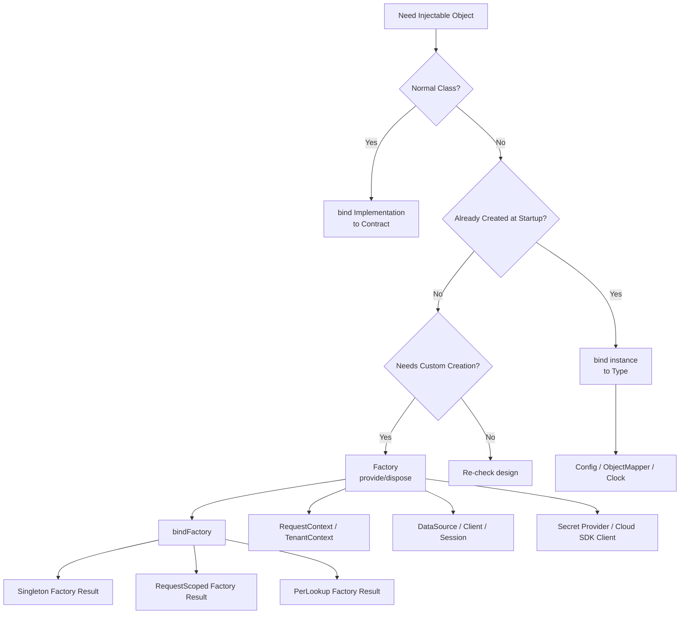

---

# 3. CDI Producer vs HK2 Factory

## 3.1 CDI style

```java id="cdi-producer-objectmapper"
@ApplicationScoped
public class ObjectMapperProducer {

    @Produces
    @ApplicationScoped
    public ObjectMapper objectMapper() {
        return new ObjectMapper()
                .findAndRegisterModules();
    }
}
```

CDI disposer example:

```java id="cdi-disposer"
@Produces
@RequestScoped
public Connection connection() {
    return dataSource.getConnection();
}

public void close(@Disposes Connection connection) throws SQLException {
    connection.close();
}
```

Weld documentation menjelaskan disposer method harus punya setidaknya satu parameter ber-annotation `@Disposes` dengan type dan qualifier yang sama seperti producer; disposer dipanggil otomatis ketika context berakhir. ([docs.jboss.org](https://docs.jboss.org/weld/reference/latest/en-US/html/producermethods.html?utm_source=chatgpt.com))

## 3.2 HK2 style

```java id="hk2-factory-objectmapper"
public final class ObjectMapperFactory implements Factory<ObjectMapper> {

    @Override
    public ObjectMapper provide() {
        return new ObjectMapper()
                .findAndRegisterModules();
    }

    @Override
    public void dispose(ObjectMapper instance) {
        // Usually no-op for ObjectMapper
    }
}
```

Binding:

```java id="hk2-bind-objectmapper-factory"
bindFactory(ObjectMapperFactory.class)
        .to(ObjectMapper.class)
        .in(Singleton.class);
```

---

# 4. Decision Table

| Kebutuhan | CDI/Weld Pattern | HK2/Jersey Alternative | Rekomendasi |
|---|---|---|---|
| Object class biasa | CDI bean discovery | `bind(Impl).to(Contract)` | Gunakan binding biasa |
| Object sudah dibuat saat startup | Producer field/method | `bind(instance).to(Type)` | Simple dan eksplisit |
| Object butuh custom creation | `@Produces` | `Factory<T>` + `bindFactory` | Gunakan factory |
| Object perlu cleanup | `@Disposes` | `Factory.dispose()` atau shutdown hook | Pastikan lifecycle dites |
| Request-derived object | Producer request-scoped | request-scoped factory | Cocok untuk `RequestContext` |
| Runtime config object | Producer method | config loader + bind instance | Jangan lazy baca config |
| External SDK client | Producer + disposer | factory/lifecycle manager | Hati-hati close |
| DB session/transaction | Producer/disposer | transaction manager + ThreadLocal/session holder | Jangan sembarang factory |
| Optional variant | Producer conditional | config-driven binder/router | Fail fast untuk unknown |
| Test fake object | CDI test alternative | test binder bind instance | Recommended |

---

# 5. Pattern 1 - Bind Instance untuk Object Startup

Kalau object sudah dibuat saat startup, jangan pakai factory tanpa perlu.

## 5.1 Config object

```java id="app-config-record"
public record ApplicationConfig(
        AppConfig app,
        DatabaseConfig database,
        PaymentClientConfig payment,
        CamundaConfig camunda
) {
}
```

Bootstrap:

```java id="config-bootstrap-example"
ApplicationConfig config = ConfigBootstrap.load();
```

Binder:

```java id="config-binder-instance"
public final class ConfigBinder extends AbstractBinder {

    private final ApplicationConfig config;

    public ConfigBinder(ApplicationConfig config) {
        this.config = config;
    }

    @Override
    protected void configure() {
        bind(config).to(ApplicationConfig.class);
        bind(config.app()).to(AppConfig.class);
        bind(config.database()).to(DatabaseConfig.class);
        bind(config.payment()).to(PaymentClientConfig.class);
        bind(config.camunda()).to(CamundaConfig.class);
    }
}
```

Ini lebih jelas daripada:

```text id="xdlh0o"
Factory membaca env setiap kali object diminta.
```

---

# 6. Pattern 2 - Factory untuk `ObjectMapper`

## 6.1 Factory

```java id="objectmapper-factory"
package com.company.orderservice.infrastructure.json;

import com.fasterxml.jackson.databind.ObjectMapper;
import com.fasterxml.jackson.datatype.jsr310.JavaTimeModule;
import org.glassfish.hk2.api.Factory;

public final class ObjectMapperFactory implements Factory<ObjectMapper> {

    @Override
    public ObjectMapper provide() {
        ObjectMapper mapper = new ObjectMapper();

        mapper.registerModule(new JavaTimeModule());
        mapper.findAndRegisterModules();

        return mapper;
    }

    @Override
    public void dispose(ObjectMapper instance) {
        // ObjectMapper does not need explicit cleanup.
    }
}
```

## 6.2 Binder

```java id="json-binder"
public final class JsonBinder extends AbstractBinder {

    @Override
    protected void configure() {
        bindFactory(ObjectMapperFactory.class)
                .to(ObjectMapper.class)
                .in(Singleton.class);
    }
}
```

## 6.3 Usage

```java id="json-service"
public final class JsonAuditSerializer {

    private final ObjectMapper objectMapper;

    @Inject
    public JsonAuditSerializer(ObjectMapper objectMapper) {
        this.objectMapper = objectMapper;
    }

    public String serialize(AuditEvent event) {
        try {
            return objectMapper.writeValueAsString(event);
        } catch (JsonProcessingException error) {
            throw new IllegalStateException("Failed to serialize audit event", error);
        }
    }
}
```

Catatan: `ObjectMapper` sebaiknya dikonfigurasi saat startup lalu dipakai sebagai singleton. Jangan buat `ObjectMapper` baru di setiap request.

---

# 7. Pattern 3 - Factory untuk `SqlSessionFactory`

MyBatis `SqlSessionFactory` biasanya mahal dan dibuat sekali. Cocok sebagai singleton.

## 7.1 Factory

```java id="sqlsessionfactory-factory"
package com.company.orderservice.infrastructure.persistence;

import com.company.orderservice.config.model.DatabaseConfig;
import org.apache.ibatis.datasource.pooled.PooledDataSource;
import org.apache.ibatis.session.SqlSessionFactory;
import org.apache.ibatis.session.SqlSessionFactoryBuilder;
import org.glassfish.hk2.api.Factory;

import java.io.InputStream;

public final class SqlSessionFactoryFactory implements Factory<SqlSessionFactory> {

    private final DatabaseConfig config;

    @Inject
    public SqlSessionFactoryFactory(DatabaseConfig config) {
        this.config = config;
    }

    @Override
    public SqlSessionFactory provide() {
        PooledDataSource dataSource = new PooledDataSource();
        dataSource.setDriver("org.postgresql.Driver");
        dataSource.setUrl(config.jdbcUrl());
        dataSource.setUsername(config.username());
        dataSource.setPassword(config.password().value());

        try (InputStream input = Thread.currentThread()
                .getContextClassLoader()
                .getResourceAsStream("mybatis-config.xml")) {

            if (input == null) {
                throw new IllegalStateException("Missing mybatis-config.xml");
            }

            return new SqlSessionFactoryBuilder()
                    .build(input, config.environment(), dataSource);
        } catch (Exception error) {
            throw new IllegalStateException("Failed to create SqlSessionFactory", error);
        }
    }

    @Override
    public void dispose(SqlSessionFactory instance) {
        // SqlSessionFactory itself usually has no close method.
        // If using external DataSource with close(), manage it separately.
    }
}
```

## 7.2 Binder

```java id="persistence-binder-sqlfactory"
public final class PersistenceBinder extends AbstractBinder {

    @Override
    protected void configure() {
        bindFactory(SqlSessionFactoryFactory.class)
                .to(SqlSessionFactory.class)
                .in(Singleton.class);

        bind(MyBatisOrderRepository.class)
                .to(OrderRepository.class)
                .in(Singleton.class);
    }
}
```

## 7.3 Caveat penting

Jangan jadikan `SqlSession` sebagai singleton.

```text id="9livya"
SqlSessionFactory = singleton
SqlSession        = per transaction / per unit-of-work
```

Untuk `SqlSession`, lebih aman pakai transaction manager:

```text id="sdsyu3"
TransactionInterceptor
  -> SqlSessionFactory.openSession(false)
  -> bind session to holder
  -> repository uses current session
  -> commit/rollback
  -> close/clear
```

---

# 8. Pattern 4 - Factory untuk HTTP Client

Misalnya kamu ingin membuat Jersey client/Java HTTP client dengan timeout, header filter, TLS config.

## 8.1 Wrapper contract

```java id="http-client-contract"
public interface PartnerHttpClient {
    PartnerResponse execute(PartnerRequest request);
}
```

## 8.2 Factory untuk underlying client

```java id="jdk-httpclient-factory"
package com.company.orderservice.infrastructure.http;

import com.company.orderservice.config.model.PaymentClientConfig;
import org.glassfish.hk2.api.Factory;

import java.net.http.HttpClient;

public final class JdkHttpClientFactory implements Factory<HttpClient> {

    private final PaymentClientConfig config;

    @Inject
    public JdkHttpClientFactory(PaymentClientConfig config) {
        this.config = config;
    }

    @Override
    public HttpClient provide() {
        return HttpClient.newBuilder()
                .connectTimeout(config.connectTimeout())
                .followRedirects(HttpClient.Redirect.NEVER)
                .build();
    }

    @Override
    public void dispose(HttpClient instance) {
        // JDK HttpClient has no close method.
    }
}
```

## 8.3 Binder

```java id="httpclient-binder"
public final class HttpClientBinder extends AbstractBinder {

    @Override
    protected void configure() {
        bindFactory(JdkHttpClientFactory.class)
                .to(HttpClient.class)
                .in(Singleton.class);

        bind(DefaultPartnerHttpClient.class)
                .to(PartnerHttpClient.class)
                .in(Singleton.class);
    }
}
```

## 8.4 Usage

```java id="partner-client"
public final class DefaultPartnerHttpClient implements PartnerHttpClient {

    private final HttpClient httpClient;
    private final PaymentClientConfig config;

    @Inject
    public DefaultPartnerHttpClient(
            HttpClient httpClient,
            PaymentClientConfig config
    ) {
        this.httpClient = httpClient;
        this.config = config;
    }

    @Override
    public PartnerResponse execute(PartnerRequest request) {
        // build java.net.http.HttpRequest using config.baseUri()
        return PartnerResponse.empty();
    }
}
```

---

# 9. Pattern 5 - Factory untuk Request-Scoped Object

Ini pattern yang paling sering menggantikan CDI request-scoped producer.

## 9.1 Request context

```java id="request-context-record"
public record RequestContext(
        String requestId,
        String correlationId,
        String tenantId,
        String userId
) {
}
```

## 9.2 Holder

```java id="request-context-holder"
public final class RequestContextHolder {

    private static final ThreadLocal<RequestContext> CURRENT = new ThreadLocal<>();

    private RequestContextHolder() {
    }

    public static void set(RequestContext context) {
        CURRENT.set(context);
    }

    public static RequestContext current() {
        RequestContext context = CURRENT.get();

        if (context == null) {
            throw new IllegalStateException("No RequestContext bound to current thread");
        }

        return context;
    }

    public static void clear() {
        CURRENT.remove();
    }
}
```

## 9.3 Filter

```java id="request-context-filter"
@Provider
public final class RequestContextFilter
        implements ContainerRequestFilter, ContainerResponseFilter {

    @Override
    public void filter(ContainerRequestContext request) {
        String requestId = getOrGenerate(request, "X-Request-Id");
        String correlationId = getOrDefault(request, "X-Correlation-Id", requestId);
        String tenantId = required(request, "X-Tenant-Id");
        String userId = required(request, "X-User-Id");

        RequestContextHolder.set(new RequestContext(
                requestId,
                correlationId,
                tenantId,
                userId
        ));
    }

    @Override
    public void filter(
            ContainerRequestContext request,
            ContainerResponseContext response
    ) {
        try {
            RequestContext context = RequestContextHolder.current();

            response.getHeaders().putSingle("X-Request-Id", context.requestId());
            response.getHeaders().putSingle("X-Correlation-Id", context.correlationId());
        } finally {
            RequestContextHolder.clear();
        }
    }

    private String getOrGenerate(ContainerRequestContext request, String header) {
        String value = request.getHeaderString(header);
        return value == null || value.isBlank()
                ? UUID.randomUUID().toString()
                : value;
    }

    private String getOrDefault(
            ContainerRequestContext request,
            String header,
            String defaultValue
    ) {
        String value = request.getHeaderString(header);
        return value == null || value.isBlank()
                ? defaultValue
                : value;
    }

    private String required(ContainerRequestContext request, String header) {
        String value = request.getHeaderString(header);

        if (value == null || value.isBlank()) {
            throw new IllegalArgumentException("Missing required header: " + header);
        }

        return value;
    }
}
```

## 9.4 Factory

```java id="request-context-factory"
public final class RequestContextFactory implements Factory<RequestContext> {

    @Override
    public RequestContext provide() {
        return RequestContextHolder.current();
    }

    @Override
    public void dispose(RequestContext instance) {
        // Filter owns cleanup.
    }
}
```

## 9.5 Binder

```java id="context-binder-requestcontext"
public final class ContextBinder extends AbstractBinder {

    @Override
    protected void configure() {
        bindFactory(RequestContextFactory.class)
                .to(RequestContext.class)
                .proxy(true)
                .proxyForSameScope(false)
                .in(RequestScoped.class);
    }
}
```

Jersey docs menunjukkan pattern `Factory<T>`/`Supplier<T>` dan `bindFactory` untuk custom injection, termasuk binding result ke scope seperti request scope. ([eclipse-ee4j.github.io](https://eclipse-ee4j.github.io/jersey.github.io/documentation/latest/ioc.html?utm_source=chatgpt.com))

---

# 10. Pattern 6 - Secret Provider Factory

## 10.1 Contract

```java id="secret-provider-contract"
public interface SecretProvider {
    SecretValue getSecret(String secretName);
}
```

## 10.2 Implementations

```java id="env-secret-provider"
public final class EnvironmentSecretProvider implements SecretProvider {

    @Override
    public SecretValue getSecret(String secretName) {
        String envKey = secretName
                .replace('.', '_')
                .replace('-', '_')
                .toUpperCase();

        String value = System.getenv(envKey);

        if (value == null || value.isBlank()) {
            throw new IllegalStateException("Missing secret: " + envKey);
        }

        return new SecretValue(value);
    }
}
```

```java id="aws-secret-provider-skeleton"
public final class AwsSecretsManagerSecretProvider implements SecretProvider {

    private final SecretsManagerClient client;

    public AwsSecretsManagerSecretProvider(SecretsManagerClient client) {
        this.client = client;
    }

    @Override
    public SecretValue getSecret(String secretName) {
        // client.getSecretValue(...)
        return new SecretValue("resolved-secret");
    }
}
```

## 10.3 Factory based on config

```java id="secret-provider-factory"
public final class SecretProviderFactory implements Factory<SecretProvider> {

    private final AppConfig appConfig;

    @Inject
    public SecretProviderFactory(AppConfig appConfig) {
        this.appConfig = appConfig;
    }

    @Override
    public SecretProvider provide() {
        return switch (appConfig.secretProvider().toLowerCase()) {
            case "env" -> new EnvironmentSecretProvider();
            case "aws" -> createAwsProvider();
            case "azure" -> createAzureProvider();
            default -> throw new IllegalStateException(
                    "Unsupported secret provider: " + appConfig.secretProvider()
            );
        };
    }

    @Override
    public void dispose(SecretProvider instance) {
        if (instance instanceof AutoCloseable closeable) {
            try {
                closeable.close();
            } catch (Exception error) {
                throw new IllegalStateException("Failed to close SecretProvider", error);
            }
        }
    }

    private SecretProvider createAwsProvider() {
        // create AWS SDK client using workload identity/IAM role
        throw new UnsupportedOperationException("Implement AWS provider");
    }

    private SecretProvider createAzureProvider() {
        // create Azure Key Vault client using DefaultAzureCredential
        throw new UnsupportedOperationException("Implement Azure provider");
    }
}
```

## 10.4 Binder

```java id="secret-provider-binder"
public final class SecretBinder extends AbstractBinder {

    @Override
    protected void configure() {
        bindFactory(SecretProviderFactory.class)
                .to(SecretProvider.class)
                .in(Singleton.class);
    }
}
```

Catatan: untuk pilihan implementation berdasarkan config, kadang lebih jelas pakai **config-driven binder** daripada factory. Gunakan factory jika creation logic kompleks atau object-nya tidak bisa di-bind langsung.

---

# 11. Pattern 7 - Camunda Client Factory

## 11.1 Config

```java id="camunda-config-record"
public record CamundaConfig(
        URI endpoint,
        String workerName,
        SecretValue clientSecret,
        Duration requestTimeout
) {
}
```

## 11.2 Client contract

```java id="camunda-client-contract"
public interface WorkflowClient {
    void startProcess(String processKey, String businessKey, Map<String, Object> variables);
}
```

## 11.3 Factory

```java id="workflow-client-factory"
public final class WorkflowClientFactory implements Factory<WorkflowClient> {

    private final CamundaConfig config;

    @Inject
    public WorkflowClientFactory(CamundaConfig config) {
        this.config = config;
    }

    @Override
    public WorkflowClient provide() {
        return new CamundaWorkflowClient(
                config.endpoint(),
                config.workerName(),
                config.clientSecret(),
                config.requestTimeout()
        );
    }

    @Override
    public void dispose(WorkflowClient instance) {
        if (instance instanceof AutoCloseable closeable) {
            try {
                closeable.close();
            } catch (Exception error) {
                throw new IllegalStateException("Failed to close WorkflowClient", error);
            }
        }
    }
}
```

## 11.4 Binder

```java id="workflow-client-binder"
public final class WorkflowBinder extends AbstractBinder {

    @Override
    protected void configure() {
        bindFactory(WorkflowClientFactory.class)
                .to(WorkflowClient.class)
                .in(Singleton.class);

        bind(OrderWorkflowStarter.class)
                .in(Singleton.class);
    }
}
```

---

# 12. Lifecycle: `dispose()` Bukan Tempat Sembarangan

HK2 `Factory.dispose()` secara konsep adalah pasangan dari `provide()`. Namun dalam production, jangan hanya percaya “pasti dipanggil kapan pun saya berharap” tanpa integration test dan pemahaman scope. Factory docs menjelaskan `dispose(T instance)` dipakai untuk dispose object yang dibuat oleh factory, sedangkan method `provide()` membuat instance. ([javaee.github.io](https://javaee.github.io/hk2/apidocs/org/glassfish/hk2/api/Factory.html?utm_source=chatgpt.com))

Praktik aman:

| Object | Cleanup strategy |
|---|---|
| `ObjectMapper` | no-op |
| JDK `HttpClient` | no-op |
| `DataSource` with close | explicit lifecycle/shutdown hook |
| Kafka producer | close on shutdown |
| Camunda client/worker | close/stop on shutdown |
| RequestContext | clear di filter, bukan dispose |
| SqlSession | close di transaction manager |
| Secret provider SDK client | close if applicable |
| ExecutorService | shutdown gracefully |

Rule:

```text id="9u0eei"
Resource mahal/critical sebaiknya punya explicit lifecycle manager,
bukan hanya mengandalkan dispose tersembunyi.
```

---

# 13. Lifecycle Manager Pattern

Untuk object seperti Kafka producer, executor, worker, atau client pool, buat lifecycle registry.

## 13.1 Managed resource

```java id="managed-resource"
public interface ManagedResource {
    void start();
    void stop();
}
```

## 13.2 Lifecycle manager

```java id="lifecycle-manager"
public final class ApplicationLifecycleManager {

    private final List<ManagedResource> resources = new CopyOnWriteArrayList<>();

    public void register(ManagedResource resource) {
        resources.add(resource);
    }

    public void startAll() {
        for (ManagedResource resource : resources) {
            resource.start();
        }
    }

    public void stopAll() {
        List<ManagedResource> reversed = new ArrayList<>(resources);
        Collections.reverse(reversed);

        for (ManagedResource resource : reversed) {
            try {
                resource.stop();
            } catch (RuntimeException error) {
                // log and continue stopping other resources
            }
        }
    }
}
```

## 13.3 Example Kafka managed producer

```java id="managed-kafka-producer"
public final class ManagedKafkaProducer implements ManagedResource {

    private final KafkaProducer<String, OrderEvent> producer;

    public ManagedKafkaProducer(KafkaProducer<String, OrderEvent> producer) {
        this.producer = producer;
    }

    @Override
    public void start() {
        // no-op, KafkaProducer usually starts lazily
    }

    @Override
    public void stop() {
        producer.close(Duration.ofSeconds(10));
    }

    public KafkaProducer<String, OrderEvent> producer() {
        return producer;
    }
}
```

Binder can bind both:

```java id="managed-resource-binder"
bindFactory(KafkaProducerFactory.class)
        .to(ManagedKafkaProducer.class)
        .in(Singleton.class);
```

Then expose producer via wrapper service, not everywhere.

---

# 14. Factory vs Binder Decision

Kadang bingung: pilih factory atau binder?

| Case | Prefer |
|---|---|
| Pilih implementation berdasarkan config | Binder |
| Buat object kompleks dengan banyak initialization | Factory |
| Bind object yang sudah dibuat | Bind instance |
| Request context dari holder/request | Factory |
| Secret provider by profile | Binder atau factory |
| Object perlu lifecycle close | Factory + lifecycle manager |
| Unit test simple fake | Bind instance |
| Butuh named multiple instance | Binder dengan `.named(...)` |
| Runtime tenant-based selection | Router service, bukan factory |

Contoh config-driven binder lebih jelas:

```java id="config-driven-binder-example"
if ("aws".equals(config.secretProvider())) {
    bind(AwsSecretsManagerSecretProvider.class)
            .to(SecretProvider.class)
            .in(Singleton.class);
} else {
    bind(EnvironmentSecretProvider.class)
            .to(SecretProvider.class)
            .in(Singleton.class);
}
```

Contoh factory lebih jelas:

```java id="factory-creation-complex"
bindFactory(SqlSessionFactoryFactory.class)
        .to(SqlSessionFactory.class)
        .in(Singleton.class);
```

---

# 15. Testing Factory

## 15.1 Unit test factory langsung

```java id="objectmapper-factory-test"
class ObjectMapperFactoryTest {

    @Test
    void createsObjectMapperWithJavaTimeSupport() {
        ObjectMapperFactory factory = new ObjectMapperFactory();

        ObjectMapper mapper = factory.provide();

        assertDoesNotThrow(() -> mapper.writeValueAsString(
                Map.of("time", Instant.parse("2026-01-01T00:00:00Z"))
        ));
    }
}
```

## 15.2 Test factory failure

```java id="sql-factory-test"
class SqlSessionFactoryFactoryTest {

    @Test
    void failsWhenMyBatisConfigMissing() {
        DatabaseConfig config = TestDatabaseConfig.valid();

        SqlSessionFactoryFactory factory = new SqlSessionFactoryFactory(config);

        assertThrows(
                IllegalStateException.class,
                factory::provide
        );
    }
}
```

## 15.3 JerseyTest binder integration

```java id="factory-integration-test"
class ConfigFactoryInjectionTest extends JerseyTest {

    @Override
    protected Application configure() {
        return new ResourceConfig()
                .register(TestResource.class)
                .register(new JsonBinder());
    }

    @Test
    void objectMapperCanBeInjected() {
        Response response = target("/test/object-mapper")
                .request()
                .get();

        assertEquals(200, response.getStatus());
    }
}
```

---

# 16. Test Binder Override untuk Factory Result

Production:

```java id="production-objectmapper-binder"
bindFactory(ObjectMapperFactory.class)
        .to(ObjectMapper.class)
        .in(Singleton.class);
```

Test override:

```java id="test-objectmapper-binder"
public final class TestJsonBinder extends AbstractBinder {

    @Override
    protected void configure() {
        ObjectMapper mapper = new ObjectMapper()
                .findAndRegisterModules();

        bind(mapper)
                .to(ObjectMapper.class);
    }
}
```

Jangan register production factory dan test instance sekaligus untuk type yang sama kecuali menggunakan qualifier/named binding.

---

# 17. Anti-pattern

## 17.1 Factory membaca config setiap request

Buruk:

```java id="bad-factory-env-each-time"
public final class PaymentConfigFactory implements Factory<PaymentClientConfig> {

    @Override
    public PaymentClientConfig provide() {
        return new PaymentClientConfig(
                System.getenv("PAYMENT_BASE_URL")
        );
    }
}
```

Kalau config startup-only, load sekali lalu bind instance.

## 17.2 Factory melakukan network call berat setiap lookup

Buruk:

```java id="bad-factory-network"
@Override
public PartnerClient provide() {
    return partnerRegistryApi.createClient(); // network call every lookup
}
```

Solusi:

```text id="5yhauh"
scope singleton
cache with explicit lifecycle
fail fast at startup if critical
```

## 17.3 Factory menyimpan mutable request state

Buruk:

```java id="bad-factory-state"
public final class TenantFactory implements Factory<TenantContext> {

    private String lastTenantId;

    @Override
    public TenantContext provide() {
        lastTenantId = ...
        return new TenantContext(lastTenantId);
    }
}
```

Factory harus stateless atau state-nya thread-safe dan memang lifecycle-managed.

## 17.4 Mengandalkan `dispose()` untuk transaction

Buruk:

```text id="9a3o4b"
Factory<SqlSession>
  provide open session
  dispose close session
```

Untuk transaction, lebih jelas:

```text id="b9eyfw"
TransactionManager
  open session
  bind
  commit/rollback
  close
```

## 17.5 Producer/factory menyembunyikan business decision

Buruk:

```java id="bad-business-factory"
public PaymentClient provide() {
    if (tenantIsRisky()) return restrictedClient;
    return normalClient;
}
```

Runtime business decision lebih baik di router/policy service, bukan object creation factory.

---

# 18. Failure Model

| Failure | Penyebab | Dampak | Pencegahan |
|---|---|---|---|
| Factory tidak dipakai | `bindFactory` tidak diregister | Unsatisfied dependency | Register binder |
| Object dibuat terlalu sering | Scope lupa singleton | Latency/GC naik | `.in(Singleton.class)` eksplisit |
| RequestContext kosong | Factory dipanggil di luar request | runtime error | Provider hanya di request path |
| Secret/config dibaca berulang | Factory lazy tanpa cache | latency dan inconsistency | startup config + bind instance |
| Resource tidak tertutup | cleanup tidak jelas | connection/thread leak | lifecycle manager/shutdown hook |
| dispose tidak sesuai harapan | scope/lifecycle salah | leak atau cleanup tidak jalan | integration test lifecycle |
| Test pakai real factory | binder test salah | test flaky/slow | test bind instance/fake |
| Factory stateful | mutable shared state | race condition | stateless factory |
| Unknown provider fallback | factory fallback diam-diam | wrong implementation | fail fast |
| Transaction via factory | lifecycle tidak jelas | commit/rollback bug | transaction manager |

---

# 19. Practical Review Checklist

Saat onboarding, cari:

```text id="review-factory-keywords"
@Produces
@Disposes
Factory<
bindFactory
provide()
dispose(
ObjectMapper
DataSource
SqlSessionFactory
HttpClient
KafkaProducer
CamundaClient
SecretProvider
ConfigBootstrap
```

Audit:

| Pertanyaan | Jawaban sehat |
|---|---|
| Object ini perlu factory atau cukup bind instance? | Jelas |
| Scope factory result eksplisit? | Ya |
| Factory stateless? | Ya |
| Resource mahal singleton? | Ya |
| Cleanup resource critical jelas? | Ya |
| Config dibaca saat startup? | Ya |
| Request-derived object request-scoped? | Ya |
| Transaction/session tidak diserahkan ke factory sembarang? | Ya |
| Test bisa override factory result? | Ya |
| Unknown config/provider fail fast? | Ya |

---

# 20. CDI/Weld vs HK2 Mapping Summary

| CDI/Weld | HK2/Jersey |
|---|---|
| `@Produces ObjectMapper mapper()` | `Factory<ObjectMapper>` + `bindFactory` |
| `@Produces @ApplicationScoped X` | `bindFactory(...).to(X.class).in(Singleton.class)` |
| `@Produces @RequestScoped X` | `bindFactory(...).to(X.class).in(RequestScoped.class)` |
| producer field | `bind(instance).to(Type.class)` |
| `@Disposes X x` | `Factory.dispose(X)` or lifecycle manager |
| producer with qualifier | factory binding with named/qualifier |
| producer selected by config | config-driven binder/factory |
| CDI contextual lifecycle | HK2 scope + explicit cleanup |
| CDI extension registers producers | HK2 binder/dynamic configuration |

---

# 21. Mini Exercise Praktis

Ambil object real di codebase, misalnya `SqlSessionFactory`.

Isi template:

```text id="mini-exercise-factory"
Object:
  SqlSessionFactory

Creation:
  from mybatis-config.xml + DatabaseConfig + DataSource

Scope:
  Singleton

Factory or bind instance:
  Factory, because creation is custom and may fail at startup

Cleanup:
  no direct close on SqlSessionFactory
  DataSource cleanup handled separately if needed

Injected into:
  MyBatisTransactionManager
  Repository adapter

Test override:
  Test SqlSessionFactory from test database
  or fake repository to avoid DB integration

Failure:
  missing mybatis-config.xml -> startup fail
  invalid jdbc url -> startup fail / health check fail
```

Kalau kamu tidak bisa menjawab scope, cleanup, dan test override, berarti object lifecycle belum jelas.

---

# 22. Ringkasan Seri 5/12

Pegangan utama:

1. **CDI `@Produces` tidak otomatis bekerja di HK2-only runtime.**
2. **HK2 alternative utama adalah `Factory<T>`, `bindFactory`, dan bind instance.**
3. **Gunakan bind instance untuk object yang sudah dibuat saat startup.**
4. **Gunakan factory untuk object dengan custom creation logic.**
5. **Gunakan request-scoped factory untuk request-derived object seperti `RequestContext`.**
6. **Gunakan singleton scope eksplisit untuk object mahal seperti `ObjectMapper`, `SqlSessionFactory`, HTTP client, SDK client.**
7. **Jangan membaca config/env berulang dari factory jika config startup-only.**
8. **Jangan menyimpan mutable request state di factory.**
9. **Jangan menggunakan factory sebagai pengganti transaction manager.**
10. **Cleanup resource critical harus eksplisit dan dites.**
11. **`Factory.dispose()` berguna, tetapi resource lifecycle production sering lebih aman dengan lifecycle manager/shutdown hook.**
12. **Test harus bisa override factory result dengan bind instance/fake.**

---

# 23. Seri Berikutnya

Lanjut ke **Seri 6/12 - Scopes & Contexts Mapping**.

Fokus berikutnya:

- CDI `@ApplicationScoped`, `@RequestScoped`, `@Dependent` vs HK2 `Singleton`, `RequestScoped`, `PerLookup`;
- normal scope vs proxy;
- custom scope/context di HK2;
- request context lifecycle;
- tenant/user/security context;
- scope leak;
- async boundary;
- workflow/process scope vs DI scope;
- testing scope behavior.

**Seri 5/12 selesai.**

## Response:
7/15/2026, 4:08:44 AM

Lanjut ke **Seri 6/12 — Scopes & Contexts Mapping**. Fokusnya: memetakan CDI scope ke HK2/Jersey secara praktis, terutama perbedaan singleton/application scope, request scope, `PerLookup`, proxy, custom scope, dan boundary async/workflow.

# Seri 6/12 - Scopes & Contexts Mapping  
**Topik:** CDI scopes vs HK2/Jersey scopes, request context, proxy, custom scope, async boundary, workflow/process context.

## 1. Introduction

Scope adalah salah satu area yang paling sering bikin salah kaprah saat memetakan **CDI/Weld** ke **HK2/Jersey**.

Di CDI/Weld, scope adalah bagian dari model **contextual bean**. CDI punya konsep context aktif/tidak aktif, contextual instance, normal scope proxy, `@Dependent`, request context, application context, dan custom scope. Spesifikasi CDI juga mendefinisikan bahwa custom scope biasanya membutuhkan implementasi `Context` oleh extension. ([Jakarta EE](https://jakarta.ee/specifications/cdi/4.0/jakarta-cdi-spec-4.0.html?utm_source=chatgpt.com))

Di HK2/Jersey, scope lebih dekat ke lifecycle service descriptor dalam `ServiceLocator`. Jersey memakai HK2 untuk lifecycle management dan dependency injection, lalu memberi extension point agar aplikasi bisa mengatur binding, factory, dan scope melalui HK2 public API. ([Eclipse EE4J](https://eclipse-ee4j.github.io/jersey.github.io/documentation/latest31x/ioc.html?utm_source=chatgpt.com))

Jadi mapping-nya bukan:

```text id="ukccs3"
CDI scope == HK2 scope
```

Mapping yang lebih benar:

```text id="tfkyaj"
CDI scope semantics
  -> cari kebutuhan lifecycle/context-nya
  -> pilih HK2/Jersey scope/pattern yang paling aman
  -> tambahkan Provider/Factory/Filter/Holder bila perlu
```

---

# 2. Diagram Mental Model

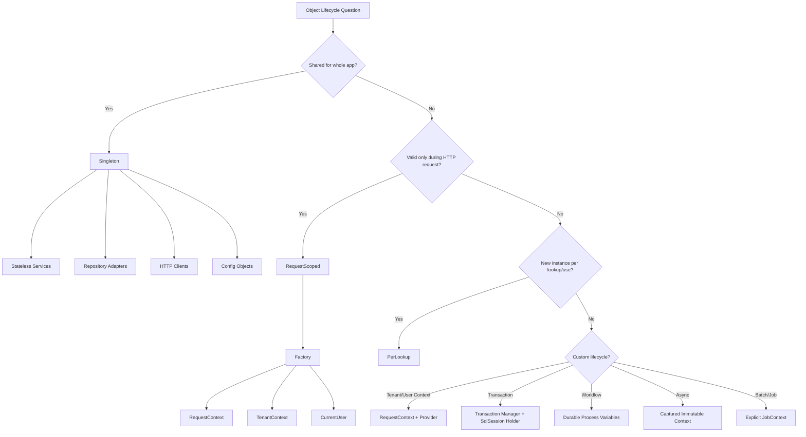

---

# 3. CDI Scope vs HK2/Jersey Mapping

| CDI/Weld Scope | HK2/Jersey Equivalent-ish | Status | Catatan Praktis |
|---|---|---|---|
| `@ApplicationScoped` | `@Singleton` / `.in(Singleton.class)` | Mirip, tidak 1:1 | Cocok untuk stateless service, config, client, repository adapter |
| `@Singleton` | `@Singleton` / HK2 singleton | Bisa | Pastikan thread-safe |
| `@RequestScoped` | Jersey/HK2 `RequestScoped` | Bisa untuk HTTP request | Cocok untuk `RequestContext`, `TenantContext`, `CurrentUser` |
| `@Dependent` | HK2 `PerLookup` | Mirip, tidak 1:1 | Instance baru per lookup/injection; bukan request scope |
| `@SessionScoped` | Tidak umum di stateless microservice | Hindari | Jangan simpan state user session di DI scope microservice |
| `@ConversationScoped` | Tidak direct equivalent | Hindari | Untuk long-running flow, pakai Camunda/process state |
| Custom CDI scope | HK2 custom scope/context/operation | Advanced | Perlu activation/deactivation/cleanup jelas |
| CDI request context in async observer | Tidak otomatis sama di HK2 | Butuh explicit propagation | Capture immutable context |

Jersey documentation menyebut default HK2 factories/bindings tanpa scope eksplisit dapat berada di `PerLookup`, dan custom `Factory` + binder harus diregister ke `ResourceConfig` agar injectable instance tersedia. ([Eclipse EE4J](https://eclipse-ee4j.github.io/jersey.github.io/documentation/latest3x/ioc.html?utm_source=chatgpt.com))

---

# 4. Scope Taxonomy Praktis untuk Microservice

| Scope / Pattern | Lifetime | Cocok untuk | Jangan untuk |
|---|---|---|---|
| `Singleton` | Sepanjang aplikasi | stateless service, repository adapter, config, HTTP client, `ObjectMapper`, `SqlSessionFactory` | request/user/tenant state |
| `RequestScoped` | Satu HTTP request | `RequestContext`, `TenantContext`, `CurrentUser`, `RequestIdentity` | async task setelah response |
| `PerLookup` | Setiap lookup/injection | lightweight transient builder/helper | object mahal seperti DB pool/client |
| `Factory<T>` | Custom creation | request-derived object, complex client creation | business decision kompleks |
| `Provider<T>` | Lazy/current scope access | singleton membaca request-scoped object | menyembunyikan dependency cycle |
| `ThreadLocal holder` | Thread-bound context | request path synchronous, transaction session holder | async tanpa capture/clear |
| Explicit context object | Logical flow | async, Kafka consumer, Camunda worker | disimpan mutable global |
| Durable process variable | Process lifetime | Camunda workflow, long-running state | HTTP request context mentah |

---

# 5. `Singleton` / `@ApplicationScoped` Mapping

## 5.1 CDI mental model

CDI `@ApplicationScoped` berarti satu contextual instance untuk application context. Dalam CDI, ini normal scope dengan proxy semantics tertentu.

## 5.2 HK2/Jersey pattern

Di HK2/Jersey microservice, gunakan:

```java id="y40p71"
bind(DefaultOrderService.class)
        .to(OrderService.class)
        .in(Singleton.class);
```

Contoh service singleton yang sehat:

```java id="rznj7u"
public final class DefaultOrderService implements OrderService {

    private final OrderRepository orderRepository;
    private final PaymentClient paymentClient;
    private final Provider<RequestContext> requestContextProvider;

    @Inject
    public DefaultOrderService(
            OrderRepository orderRepository,
            PaymentClient paymentClient,
            Provider<RequestContext> requestContextProvider
    ) {
        this.orderRepository = orderRepository;
        this.paymentClient = paymentClient;
        this.requestContextProvider = requestContextProvider;
    }

    @Override
    public OrderView getOrder(UUID orderId) {
        RequestContext context = requestContextProvider.get();

        Order order = orderRepository.findByTenantAndId(
                context.tenantId(),
                orderId
        ).orElseThrow(() -> new OrderNotFoundException(orderId));

        return OrderView.from(order);
    }
}
```

## 5.3 Apa yang boleh singleton?

| Dependency | Singleton? | Catatan |
|---|---:|---|
| Application service | Ya | Harus stateless |
| Repository adapter | Ya | Jangan simpan `SqlSession`/connection per request |
| HTTP client wrapper | Ya | Underlying client harus thread-safe |
| Config object | Ya | Immutable |
| Feature flag service | Ya | Evaluation context tetap per request |
| `ObjectMapper` | Ya | Konfigurasi selesai sebelum dipakai |
| `SqlSessionFactory` | Ya | `SqlSession` bukan singleton |
| Request context | Tidak | Request-scoped/provider |

## 5.4 Anti-pattern singleton

```java id="hn76tz"
@Singleton
public final class BadTenantAwareService {

    private String currentTenantId;

    public void setTenant(String tenantId) {
        this.currentTenantId = tenantId;
    }

    public void process() {
        // tenant can leak across requests
    }
}
```

Lebih aman:

```java id="ur15tx"
public final class TenantAwareService {

    private final Provider<RequestContext> contextProvider;

    @Inject
    public TenantAwareService(Provider<RequestContext> contextProvider) {
        this.contextProvider = contextProvider;
    }

    public void process() {
        String tenantId = contextProvider.get().tenantId();
        // use locally, do not store in field
    }
}
```

---

# 6. `RequestScoped` Mapping

## 6.1 Kapan request scope dipakai?

Gunakan request scope untuk data yang valid hanya selama satu HTTP request:

```text id="woasdz"
requestId
correlationId
traceparent
tenantId
userId
roles/permissions
locale
idempotencyKey
clientAppId
```

## 6.2 Request context model

```java id="jy3x8n"
public record RequestContext(
        String requestId,
        String correlationId,
        String tenantId,
        String userId,
        Set<String> permissions,
        Locale locale
) {
}
```

## 6.3 Filter membangun context

```java id="i5bfqz"
@Provider
public final class RequestContextFilter
        implements ContainerRequestFilter, ContainerResponseFilter {

    @Override
    public void filter(ContainerRequestContext request) {
        String requestId = headerOrGenerate(request, "X-Request-Id");
        String correlationId = headerOrDefault(request, "X-Correlation-Id", requestId);
        String tenantId = requiredHeader(request, "X-Tenant-Id");
        String userId = requiredHeader(request, "X-User-Id");

        RequestContextHolder.set(new RequestContext(
                requestId,
                correlationId,
                tenantId,
                userId,
                parsePermissions(request.getHeaderString("X-User-Permissions")),
                Locale.ENGLISH
        ));
    }

    @Override
    public void filter(
            ContainerRequestContext request,
            ContainerResponseContext response
    ) {
        try {
            RequestContext context = RequestContextHolder.current();

            response.getHeaders().putSingle("X-Request-Id", context.requestId());
            response.getHeaders().putSingle("X-Correlation-Id", context.correlationId());
        } finally {
            RequestContextHolder.clear();
        }
    }

    private String headerOrGenerate(ContainerRequestContext request, String name) {
        String value = request.getHeaderString(name);
        return value == null || value.isBlank()
                ? UUID.randomUUID().toString()
                : value;
    }

    private String headerOrDefault(
            ContainerRequestContext request,
            String name,
            String defaultValue
    ) {
        String value = request.getHeaderString(name);
        return value == null || value.isBlank()
                ? defaultValue
                : value;
    }

    private String requiredHeader(ContainerRequestContext request, String name) {
        String value = request.getHeaderString(name);

        if (value == null || value.isBlank()) {
            throw new IllegalArgumentException("Missing required header: " + name);
        }

        return value;
    }

    private Set<String> parsePermissions(String raw) {
        if (raw == null || raw.isBlank()) {
            return Set.of();
        }

        return Arrays.stream(raw.split(","))
                .map(String::trim)
                .filter(permission -> !permission.isBlank())
                .collect(Collectors.toUnmodifiableSet());
    }
}
```

## 6.4 Holder

```java id="mgm287"
public final class RequestContextHolder {

    private static final ThreadLocal<RequestContext> CURRENT = new ThreadLocal<>();

    private RequestContextHolder() {
    }

    public static void set(RequestContext context) {
        CURRENT.set(context);
    }

    public static RequestContext current() {
        RequestContext context = CURRENT.get();

        if (context == null) {
            throw new IllegalStateException("No RequestContext bound to current thread");
        }

        return context;
    }

    public static void clear() {
        CURRENT.remove();
    }
}
```

## 6.5 HK2 factory

```java id="idq9pd"
public final class RequestContextFactory implements Factory<RequestContext> {

    @Override
    public RequestContext provide() {
        return RequestContextHolder.current();
    }

    @Override
    public void dispose(RequestContext instance) {
        // Cleanup owned by RequestContextFilter.
    }
}
```

## 6.6 Binding

```java id="fdx95h"
public final class ContextBinder extends AbstractBinder {

    @Override
    protected void configure() {
        bindFactory(RequestContextFactory.class)
                .to(RequestContext.class)
                .proxy(true)
                .proxyForSameScope(false)
                .in(RequestScoped.class);
    }
}
```

HK2 has support for scope/context style extension; HK2 documentation describes an “Operation” as a scope/context pair that can implement scopes such as request, application, or transaction scope, with request scope as a natural example because a thread is generally tied to a single request in many containers. ([Eclipse EE4J](https://eclipse-ee4j.github.io/glassfish-hk2/extensibility.html?utm_source=chatgpt.com))

---

# 7. `Provider<RequestContext>` Pattern

Singleton service should not store request context directly. Use `Provider<T>`.

```java id="b7gx8x"
public final class AuthorizationService {

    private final Provider<RequestContext> contextProvider;

    @Inject
    public AuthorizationService(Provider<RequestContext> contextProvider) {
        this.contextProvider = contextProvider;
    }

    public void requirePermission(String permission) {
        RequestContext context = contextProvider.get();

        if (!context.permissions().contains(permission)) {
            throw new ForbiddenException("Missing permission: " + permission);
        }
    }
}
```

Jakarta Inject’s `Provider<T>` is designed for retrieving instances, including lazy retrieval, multiple retrievals, breaking cycles, or retrieving an instance from a smaller scope than the object that holds the provider. ([Jakarta EE](https://jakarta.ee/learn/docs/jakartaee-tutorial/current/cdi/cdi-basic/cdi-basic.html?utm_source=chatgpt.com))

Practical rule:

```text id="ir04jp"
Inject Provider<RequestContext> into singleton.
Call provider.get() inside request-handling method.
Do not call provider.get() in singleton constructor.
```

---

# 8. `PerLookup` / `@Dependent` Mapping

## 8.1 CDI `@Dependent`

In CDI, `@Dependent` has dependent object semantics tied to the injection point/contextual lifecycle.

## 8.2 HK2 `PerLookup`

HK2 `PerLookup` means a new instance can be produced for lookup/injection. In Jersey/HK2 examples, unscoped factory/binding defaults can behave as `PerLookup`. ([Eclipse EE4J](https://eclipse-ee4j.github.io/jersey.github.io/documentation/latest3x/ioc.html?utm_source=chatgpt.com))

Binding:

```java id="s69ee2"
bindAsContract(OrderCommandBuilder.class)
        .in(PerLookup.class);
```

Or omit explicit scope if your team standard allows it, but I recommend being explicit for onboarding clarity:

```java id="h4wd1l"
bindAsContract(OrderCommandBuilder.class)
        .in(PerLookup.class);
```

## 8.3 Cocok untuk

```text id="jowt93"
lightweight builder
temporary command object
small stateless helper
object with mutable local construction state
```

Example:

```java id="dcnnyb"
public final class OrderCommandBuilder {

    private UUID orderId;
    private String tenantId;

    public OrderCommandBuilder orderId(UUID orderId) {
        this.orderId = orderId;
        return this;
    }

    public OrderCommandBuilder tenantId(String tenantId) {
        this.tenantId = tenantId;
        return this;
    }

    public OrderCommand build() {
        return new OrderCommand(orderId, tenantId);
    }
}
```

Usage with provider:

```java id="z50a7u"
public final class BatchOrderCommandFactory {

    private final Provider<OrderCommandBuilder> builderProvider;

    @Inject
    public BatchOrderCommandFactory(Provider<OrderCommandBuilder> builderProvider) {
        this.builderProvider = builderProvider;
    }

    public List<OrderCommand> build(List<OrderRow> rows) {
        return rows.stream()
                .map(row -> builderProvider.get()
                        .orderId(row.id())
                        .tenantId(row.tenantId())
                        .build())
                .toList();
    }
}
```

## 8.4 Jangan pakai `PerLookup` untuk

```text id="r4x4sp"
ObjectMapper
DataSource
SqlSessionFactory
HTTP client
Kafka producer
Camunda client
Config registry
Feature flag SDK client
```

Object mahal harus singleton atau lifecycle-managed.

---

# 9. Proxy Semantics

Scope dan proxy sering menjadi sumber bug.

Dalam HK2 binding request scope, kita sering lihat:

```java id="rxdivl"
bindFactory(RequestContextFactory.class)
        .to(RequestContext.class)
        .proxy(true)
        .proxyForSameScope(false)
        .in(RequestScoped.class);
```

Makna praktisnya:

| Option | Arti Praktis |
|---|---|
| `.proxy(true)` | HK2 boleh menyuntik proxy untuk object scoped |
| `.proxyForSameScope(false)` | Tidak perlu proxy jika consumer berada di scope yang sama |
| `Provider<T>` | Alternatif lebih eksplisit untuk mengambil current scoped instance |

Practical guidance:

```text id="olsst7"
Untuk service singleton -> request scoped dependency:
  lebih jelas gunakan Provider<RequestContext>.

Untuk resource/request scoped object:
  direct injection bisa cukup, tapi tetap hati-hati.
```

Anti-pattern:

```java id="g0c7bj"
public final class BadService {

    private final RequestContext requestContext;

    @Inject
    public BadService(RequestContext requestContext) {
        this.requestContext = requestContext;
    }

    public void asyncWork() {
        CompletableFuture.runAsync(() -> {
            // requestContext may be proxy/stale/outside active scope
        });
    }
}
```

Lebih aman:

```java id="f26sr2"
RequestContext captured = contextProvider.get();

CompletableFuture.runAsync(() -> {
    processWithContext(captured);
});
```

---

# 10. Scope Leak: Tenant/User Context

## 10.1 Failure pattern

```java id="k739bu"
@Singleton
public final class BadCurrentUserService {

    private String currentUserId;

    public void bindUser(String userId) {
        this.currentUserId = userId;
    }

    public String currentUserId() {
        return currentUserId;
    }
}
```

This can leak user A into user B’s request.

## 10.2 Safe pattern

```java id="xmip0q"
public final class CurrentUserService {

    private final Provider<RequestContext> contextProvider;

    @Inject
    public CurrentUserService(Provider<RequestContext> contextProvider) {
        this.contextProvider = contextProvider;
    }

    public String currentUserId() {
        return contextProvider.get().userId();
    }
}
```

## 10.3 Even better: split context

```java id="e8ge2g"
public record TenantContext(String tenantId) {
}
```

```java id="q23zdx"
public record CurrentUser(
        String userId,
        Set<String> permissions
) {
}
```

Then bind via factories:

```java id="d4np4o"
bindFactory(TenantContextFactory.class)
        .to(TenantContext.class)
        .in(RequestScoped.class);

bindFactory(CurrentUserFactory.class)
        .to(CurrentUser.class)
        .in(RequestScoped.class);
```

Use only what each service needs.

---

# 11. Transaction Scope Is Not Request Scope

Do not confuse:

```text id="yb96j2"
HTTP request scope
transaction scope
workflow scope
tenant scope
```

They are different.

| Context | Lifetime | Owner |
|---|---|---|
| Request context | HTTP request | Jersey filter/request lifecycle |
| Transaction context | DB unit-of-work | transaction manager |
| Tenant context | usually request/business flow | auth/tenant resolver |
| Workflow context | process instance lifetime | Camunda/process engine |
| Async context | task execution | executor/captured context |

## 11.1 Bad pattern

```java id="s0o2oq"
@RequestScoped
public final class SqlSessionHolder {
    private SqlSession session;
}
```

This looks convenient but transaction lifetime does not always equal request lifetime.

## 11.2 Better pattern

```java id="w4llyh"
public final class SqlSessionHolder {

    private static final ThreadLocal<SqlSession> CURRENT = new ThreadLocal<>();

    public void bind(SqlSession session) {
        CURRENT.set(session);
    }

    public SqlSession current() {
        SqlSession session = CURRENT.get();

        if (session == null) {
            throw new IllegalStateException("No SqlSession bound");
        }

        return session;
    }

    public void clear() {
        CURRENT.remove();
    }
}
```

Transaction manager:

```java id="wbyjv6"
public final class MyBatisTransactionManager implements TransactionManager {

    private final SqlSessionFactory sqlSessionFactory;
    private final SqlSessionHolder holder;

    @Inject
    public MyBatisTransactionManager(
            SqlSessionFactory sqlSessionFactory,
            SqlSessionHolder holder
    ) {
        this.sqlSessionFactory = sqlSessionFactory;
        this.holder = holder;
    }

    @Override
    public <T> T executeInTransaction(Callable<T> callback) throws Exception {
        if (holder.hasCurrent()) {
            return callback.call();
        }

        try (SqlSession session = sqlSessionFactory.openSession(false)) {
            holder.bind(session);

            try {
                T result = callback.call();
                session.commit();
                return result;
            } catch (Exception | RuntimeException error) {
                session.rollback();
                throw error;
            } finally {
                holder.clear();
            }
        }
    }
}
```

Request scope is not a substitute for transaction boundary.

---

# 12. Async Boundary

## 12.1 Bad pattern

```java id="klugzg"
public void submitAsync(UUID orderId) {
    CompletableFuture.runAsync(() -> {
        RequestContext context = contextProvider.get();
        process(orderId, context);
    });
}
```

Problem:

```text id="dhrl2u"
different thread
request scope may be inactive
ThreadLocal may be empty
context may already be cleared
```

## 12.2 Safe pattern: capture immutable context

```java id="u193za"
public final class AsyncOrderProcessor {

    private final Provider<RequestContext> contextProvider;
    private final Executor executor;

    @Inject
    public AsyncOrderProcessor(
            Provider<RequestContext> contextProvider,
            Executor executor
    ) {
        this.contextProvider = contextProvider;
        this.executor = executor;
    }

    public CompletableFuture<Void> submitAsync(UUID orderId) {
        RequestContext captured = contextProvider.get();

        return CompletableFuture.runAsync(
                () -> processWithContext(orderId, captured),
                executor
        );
    }

    private void processWithContext(UUID orderId, RequestContext context) {
        // use captured context explicitly
    }
}
```

## 12.3 If ThreadLocal is required

```java id="ld2908"
public CompletableFuture<Void> submitAsync(UUID orderId) {
    RequestContext captured = contextProvider.get();

    return CompletableFuture.runAsync(() -> {
        try {
            RequestContextHolder.set(captured);
            process(orderId);
        } finally {
            RequestContextHolder.clear();
        }
    }, executor);
}
```

Rule:

```text id="e9yv1k"
Synchronous path:
  Provider<RequestContext> is fine.

Async path:
  capture immutable context, pass explicitly, clear if binding ThreadLocal.
```

---

# 13. Workflow / Process Scope

CDI has `@ConversationScoped`, but for a backend microservice with Camunda, do not model long-running workflow state as DI scope.

Bad:

```text id="mgja7h"
ApprovalContext stored in singleton/request scope
used across days/weeks
```

Better:

```text id="lwmx4v"
Camunda process variables
business key
correlation key
tenantId
initiatingUserId
workflow version
```

Example:

```java id="jcdmir"
public final class OrderWorkflowStarter {

    private final Provider<RequestContext> contextProvider;
    private final WorkflowClient workflowClient;

    @Inject
    public OrderWorkflowStarter(
            Provider<RequestContext> contextProvider,
            WorkflowClient workflowClient
    ) {
        this.contextProvider = contextProvider;
        this.workflowClient = workflowClient;
    }

    public void startApproval(UUID orderId) {
        RequestContext context = contextProvider.get();

        Map<String, Object> variables = Map.of(
                "orderId", orderId.toString(),
                "tenantId", context.tenantId(),
                "correlationId", context.correlationId(),
                "initiatingUserId", context.userId()
        );

        workflowClient.startProcess(
                "order-approval",
                "ORDER-" + orderId,
                variables
        );
    }
}
```

Rule:

```text id="k9rgj5"
Workflow/process context must be durable.
DI scope is not durable storage.
```

---

# 14. Custom Scope in HK2

HK2 can support custom scopes/contexts, and its documentation describes scope/context pairs and operations. ([Eclipse EE4J](https://eclipse-ee4j.github.io/glassfish-hk2/extensibility.html?utm_source=chatgpt.com))

But for application code, custom scope should be rare.

## 14.1 When custom HK2 scope may be valid

```text id="x7n1fk"
batch job scope
tenant operation scope
special request-like lifecycle
test harness scope
framework integration
```

## 14.2 When not to use custom scope

```text id="kuxnep"
business workflow state
authorization state
cache
transaction state without transaction manager
Camunda process data
user session in stateless API
```

## 14.3 Required discipline

A custom scope needs answers to:

```text id="h4id0d"
Who activates the scope?
Who deactivates it?
Where are instances stored?
How is cleanup guaranteed?
What happens on exception?
What happens on async boundary?
Is it thread-bound or logical-flow-bound?
How is it tested?
```

If those answers are unclear, do not create custom scope.

---

# 15. Practical Scope Binder

```java id="s6hu5p"
public final class ApplicationBinder extends AbstractBinder {

    @Override
    protected void configure() {
        // Singleton services
        bind(DefaultOrderService.class)
                .to(OrderService.class)
                .in(Singleton.class);

        bind(MyBatisOrderRepository.class)
                .to(OrderRepository.class)
                .in(Singleton.class);

        bind(HttpPaymentClient.class)
                .to(PaymentClient.class)
                .in(Singleton.class);

        // PerLookup builder
        bindAsContract(OrderCommandBuilder.class)
                .in(PerLookup.class);

        // Request-scoped context
        bindFactory(RequestContextFactory.class)
                .to(RequestContext.class)
                .proxy(true)
                .proxyForSameScope(false)
                .in(RequestScoped.class);

        bindFactory(TenantContextFactory.class)
                .to(TenantContext.class)
                .proxy(true)
                .proxyForSameScope(false)
                .in(RequestScoped.class);

        bindFactory(CurrentUserFactory.class)
                .to(CurrentUser.class)
                .proxy(true)
                .proxyForSameScope(false)
                .in(RequestScoped.class);
    }
}
```

---

# 16. Scope Testing

## 16.1 Test singleton behavior

```java id="vs9b77"
@Test
void singletonServiceReturnsSameInstance() {
    OrderService first = serviceLocator.getService(OrderService.class);
    OrderService second = serviceLocator.getService(OrderService.class);

    assertSame(first, second);
}
```

## 16.2 Test per lookup behavior

```java id="tatecl"
@Test
void perLookupBuilderReturnsDifferentInstance() {
    OrderCommandBuilder first = serviceLocator.getService(OrderCommandBuilder.class);
    OrderCommandBuilder second = serviceLocator.getService(OrderCommandBuilder.class);

    assertNotSame(first, second);
}
```

## 16.3 Test request context isolation with JerseyTest

```java id="pyu8v9"
@Test
void requestContextDoesNotLeakAcrossRequests() {
    Response first = target("/test/context")
            .request()
            .header("X-Request-Id", "req-1")
            .header("X-Correlation-Id", "corr-1")
            .header("X-Tenant-Id", "tenant-a")
            .header("X-User-Id", "user-a")
            .get();

    Response second = target("/test/context")
            .request()
            .header("X-Request-Id", "req-2")
            .header("X-Correlation-Id", "corr-2")
            .header("X-Tenant-Id", "tenant-b")
            .header("X-User-Id", "user-b")
            .get();

    assertEquals("tenant-a", first.readEntity(ContextView.class).tenantId());
    assertEquals("tenant-b", second.readEntity(ContextView.class).tenantId());
}
```

## 16.4 Test async capture

```java id="wnvksr"
@Test
void asyncTaskUsesCapturedContext() {
    RequestContext context = TestRequestContexts.tenantA();

    AsyncOrderProcessor processor = new AsyncOrderProcessor(
            () -> context,
            Runnable::run
    );

    processor.submitAsync(UUID.randomUUID()).join();

    assertEquals("tenant-a", processor.lastProcessedTenant());
}
```

---

# 17. CDI vs HK2 Scope Mapping Summary

| Concern | CDI/Weld Thinking | HK2/Jersey Practical Thinking |
|---|---|---|
| App-wide service | `@ApplicationScoped` | `.in(Singleton.class)` |
| Request data | `@RequestScoped` bean | request filter + holder + `Factory<T>` + `RequestScoped` |
| Dependent/transient | `@Dependent` | `PerLookup` |
| Inject request into singleton | contextual proxy | `Provider<RequestContext>` |
| Custom context | CDI extension + `Context` | HK2 custom scope/context/operation |
| Transaction scope | CDI/JTA integration possible | explicit transaction manager |
| Conversation/workflow | CDI conversation | Camunda process variables/business key |
| Async propagation | CDI/runtime specific | capture immutable context |
| Cleanup | CDI context lifecycle/disposer | filter finally, transaction finally, lifecycle manager |

---

# 18. Failure Model

| Failure | Penyebab | Dampak | Pencegahan |
|---|---|---|---|
| Tenant/user leak | request state disimpan di singleton | data breach | request-scoped context + provider |
| Context missing | `Provider.get()` outside request | runtime error | capture context or fake provider |
| Object too expensive | client/object mapper per lookup | latency/GC spike | singleton scope |
| Mutable builder reused | builder accidentally singleton | cross-request data mix | `PerLookup` |
| Request scope used in async | request already cleared | error/stale data | immutable capture |
| Transaction tied to request scope | transaction semantics wrong | commit/rollback bugs | transaction manager |
| Workflow stored in DI scope | process loses state | broken long-running flow | process variables |
| Custom scope leak | no deactivate/cleanup | memory leak | strict lifecycle tests |
| Proxy confusion | scoped proxy stored/compared | weird identity behavior | provider/direct immutable value |
| Test not covering scope | binder wrong | production-only failure | scope-specific JerseyTest |

---

# 19. Practical Review Checklist

Saat onboarding, cari:

```text id="pnucsg"
.in(Singleton.class)
.in(RequestScoped.class)
.in(PerLookup.class)
Provider<RequestContext>
ThreadLocal
RequestContextHolder
TenantContext
CurrentUser
SqlSessionHolder
CompletableFuture
Executor
Camunda variables
custom scope
proxy(true)
proxyForSameScope
```

Audit:

| Pertanyaan | Jawaban sehat |
|---|---|
| Service singleton stateless? | Ya |
| Request/user/tenant state tidak disimpan di singleton? | Ya |
| RequestContext immutable? | Ya |
| RequestContext di-clear di finally? | Ya |
| Singleton mengakses request context via Provider? | Ya |
| PerLookup hanya untuk object ringan? | Ya |
| Transaction scope terpisah dari request scope? | Ya |
| Async capture context eksplisit? | Ya |
| Workflow state durable di Camunda variables? | Ya |
| Custom scope punya activation/deactivation jelas? | Ya |

---

# 20. Anti-pattern

## 20.1 Menganggap request scope otomatis pindah thread

```java id="x7bj20"
CompletableFuture.runAsync(() -> {
    RequestContext context = contextProvider.get();
});
```

Tidak aman. Capture context.

## 20.2 Menjadikan tenant sebagai singleton mutable

```java id="rq3ruf"
@Singleton
public final class TenantHolder {
    private String tenantId;
}
```

Ini rawan data leak.

## 20.3 Menyimpan workflow state di request context

```java id="cue1lu"
RequestContext {
    processInstanceId
    approvalStep
    pendingApprover
}
```

Sebagian metadata boleh, tapi state workflow durable harus di process variables/DB.

## 20.4 Semua object dibuat `PerLookup`

Ini membuat object mahal dibuat berkali-kali dan susah diprediksi.

## 20.5 Custom scope terlalu cepat

Kalau bisa diselesaikan dengan `RequestContext`, transaction manager, atau explicit context object, jangan buat custom scope.

---

# 21. Mini Exercise Praktis

Ambil 10 dependency real di codebase dan klasifikasikan:

```text id="votip5"
DefaultOrderService
  scope: Singleton
  reason: stateless application service

MyBatisOrderRepository
  scope: Singleton
  reason: stateless adapter, uses SqlSessionFactory

SqlSessionFactory
  scope: Singleton
  reason: expensive factory

SqlSession
  scope: transaction
  reason: unit-of-work, not DI singleton/request scope

RequestContext
  scope: RequestScoped
  reason: request metadata

TenantContext
  scope: RequestScoped
  reason: tenant resolved per request

OrderCommandBuilder
  scope: PerLookup
  reason: mutable builder

PaymentHttpClient
  scope: Singleton
  reason: thread-safe client wrapper

KafkaProducer
  scope: Singleton/lifecycle-managed
  reason: expensive, must close on shutdown

WorkflowContext
  scope: durable process variable
  reason: Camunda long-running process
```

Kalau scope sebuah dependency tidak bisa dijelaskan dalam satu kalimat, itu tanda desainnya perlu diaudit.

---

# 22. Ringkasan Seri 6/12

Pegangan utama:

1. **CDI scopes dan HK2 scopes tidak selalu equivalent.**
2. **`@ApplicationScoped` biasanya dipetakan ke HK2 singleton untuk microservice.**
3. **`@RequestScoped` dipetakan ke Jersey/HK2 request scope, biasanya lewat filter + factory.**
4. **`@Dependent` paling dekat dengan HK2 `PerLookup`, tapi semantic-nya tidak 1:1.**
5. **Singleton service harus stateless dan thread-safe.**
6. **Request/user/tenant context jangan pernah disimpan di field singleton.**
7. **Gunakan `Provider<RequestContext>` agar singleton bisa membaca request-scoped context.**
8. **`PerLookup` cocok untuk transient/lightweight object, bukan object mahal.**
9. **Transaction scope bukan request scope.**
10. **Async boundary harus capture immutable context.**
11. **Workflow/process state harus durable, bukan DI scoped.**
12. **Custom HK2 scope adalah advanced tool, bukan default solution.**

---

# 23. Seri Berikutnya

Lanjut ke **Seri 7/12 - Alternatives, Specialization, Profiles, Conditional Binding**.

Fokus berikutnya:

- CDI `@Alternative`, `@Priority`, `@Specializes` vs HK2 pattern;
- profile-driven binder;
- config-driven binding;
- environment-specific implementation;
- test override;
- fail-fast selection;
- feature flag vs binding-time selection;
- avoiding silent fallback;
- migration/cutover pattern.

**Seri 6/12 selesai.**

---

**Sources:**

- [Jakarta Contexts and Dependency Injection](https://jakarta.ee/specifications/cdi/4.0/jakarta-cdi-spec-4.0.html?utm_source=chatgpt.com)
- [Chapter 25. Custom Injection and Lifecycle Management](https://eclipse-ee4j.github.io/jersey.github.io/documentation/latest31x/ioc.html?utm_source=chatgpt.com)

## Response:
7/15/2026, 4:10:56 AM

# Seri 7/12 - Alternatives, Specialization, Profiles, Conditional Binding

## 1. Introduction

Di CDI/Weld, ada fitur seperti:

```text
@Alternative
@Priority
@Specializes
beans.xml alternatives
producer priority
```

Fitur-fitur ini dipakai untuk memilih bean alternatif, mengganti implementation, atau menentukan bean mana yang menang saat ada lebih dari satu kandidat. CDI tutorial menjelaskan bahwa alternative dapat diaktifkan lewat `beans.xml`, dan `@Priority` dapat dipakai untuk mengaktifkan alternative secara global di aplikasi multi-module; CDI 4.1 juga menambahkan dukungan `@Priority` langsung pada producer methods/fields. ([Jakarta EE](https://jakarta.ee/learn/docs/jakartaee-tutorial/current/cdi/cdi-adv/cdi-adv.html?utm_source=chatgpt.com))

Di HK2/Jersey, tidak ada padanan 1:1 yang sebaiknya disalin mentah. Pattern yang lebih aman adalah:

```text
CDI @Alternative      -> profile/config-driven binder
CDI @Specializes      -> explicit binding replacement
CDI @Priority         -> rank/ranking, tetapi hati-hati
CDI beans.xml enable  -> ResourceConfig memilih binder
Test alternative      -> test binder
Runtime decision      -> router service / feature flag
```

Jersey sendiri menyediakan extension point agar aplikasi memanipulasi binding HK2 lewat API HK2 public, biasanya dengan `AbstractBinder` yang diregister ke `ResourceConfig`. ([Eclipse EE4J](https://eclipse-ee4j.github.io/jersey.github.io/documentation/latest/ioc.html?utm_source=chatgpt.com))

---

# 2. Mental Model

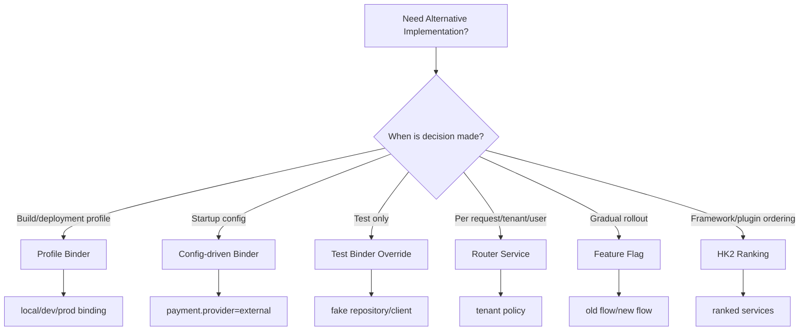

Pertanyaan kuncinya:

> **Implementation dipilih kapan? Saat compile/build, saat startup, saat test, atau saat request berjalan?**

Jawaban ini menentukan pattern yang benar.

---

# 3. CDI vs HK2 Mapping

| CDI/Weld Feature | Tujuan | HK2/Jersey Alternative | Catatan |
|---|---|---|---|
| `@Alternative` | Bean alternatif tidak aktif kecuali di-enable | Profile/config-driven binder | Lebih eksplisit di microservice |
| `beans.xml <alternatives>` | Mengaktifkan alternative per archive | `ResourceConfig.register(...)` binder tertentu | Bootstrap menentukan graph |
| `@Priority` | Alternative global dengan prioritas | HK2 `.ranked(...)` / explicit binder | Ranking sebaiknya terbatas untuk plugin/framework |
| `@Specializes` | Implementation menggantikan parent bean | Explicit binding replacement | Jangan mengandalkan inheritance magic |
| Test alternative | Ganti dependency untuk test | Test binder | Recommended |
| Producer alternative | Producer berbeda berdasarkan priority/config | Factory/config-driven binder | Pilih saat startup |
| Runtime implementation switch | Bukan peran utama CDI alternative | Router/feature flag | Jangan pakai binder untuk decision per request |

HK2 binding builder punya method `ranked(int rank)`; dokumentasi HK2 menjelaskan ranking dipakai untuk ordering/resolution ketika beberapa service di-bind ke contract yang sama, dan rank lebih tinggi punya posisi lebih prominent dalam injected iterable provider. ([Java EE](https://javaee.github.io/hk2/apidocs/org/glassfish/hk2/utilities/binding/ServiceBindingBuilder.html?utm_source=chatgpt.com))

---

# 4. Decision Table Praktis

| Situasi | Pattern yang Disarankan | Contoh |
|---|---|---|
| Local pakai fake, prod pakai real | Profile binder | `LocalPaymentBinder`, `ProdPaymentBinder` |
| Provider dipilih dari config startup | Config-driven binder | `payment.provider=external` |
| Test ganti repository/client | Test binder | `FakeOrderRepository` |
| Tenant A pakai implementation A, tenant B pakai B | Router service | `RoutingPaymentClient` |
| Gradual rollout old/new service | Feature flag + router | `newApprovalFlow` |
| Banyak plugin dengan ordered execution | HK2 ranking / registry | validators, enrichers |
| Business rule memilih behavior | Explicit policy/service | authorization, workflow, escalation |
| Implementation unknown | Fail fast | jangan fallback diam-diam |

---

# 5. Pattern 1 - Profile-Driven Binder

Ini alternative paling umum untuk mengganti CDI `@Alternative`.

## 5.1 Profile enum

```java
public enum AppProfile {
    LOCAL,
    DEV,
    SIT,
    UAT,
    PROD;

    public static AppProfile from(String value) {
        return AppProfile.valueOf(value.trim().toUpperCase());
    }
}
```

## 5.2 Config

```java
public record AppConfig(
        String appName,
        AppProfile profile,
        String region
) {
}
```

## 5.3 Payment client contract

```java
public interface PaymentClient {
    PaymentStatus getPaymentStatus(UUID orderId);
}
```

Implementations:

```java
public final class FakePaymentClient implements PaymentClient {
    @Override
    public PaymentStatus getPaymentStatus(UUID orderId) {
        return PaymentStatus.PAID;
    }
}
```

```java
public final class ExternalPaymentGatewayClient implements PaymentClient {
    @Override
    public PaymentStatus getPaymentStatus(UUID orderId) {
        // Real external call
        return PaymentStatus.UNKNOWN;
    }
}
```

## 5.4 Profile binder

```java
public final class PaymentClientProfileBinder extends AbstractBinder {

    private final AppConfig appConfig;

    public PaymentClientProfileBinder(AppConfig appConfig) {
        this.appConfig = appConfig;
    }

    @Override
    protected void configure() {
        switch (appConfig.profile()) {
            case LOCAL, DEV -> bind(FakePaymentClient.class)
                    .to(PaymentClient.class)
                    .in(Singleton.class);

            case SIT, UAT, PROD -> bind(ExternalPaymentGatewayClient.class)
                    .to(PaymentClient.class)
                    .in(Singleton.class);
        }
    }
}
```

## 5.5 ResourceConfig

```java
public final class ApiApplication extends ResourceConfig {

    public ApiApplication() {
        ApplicationConfig config = ConfigBootstrap.load();

        packages("com.company.orderservice.api.resource");

        register(new ConfigBinder(config));
        register(new PaymentClientProfileBinder(config.app()));
        register(new ApplicationServiceBinder());
        register(new ContextBinder());
    }
}
```

Keuntungan:

```text
Service tetap bersih.
Implementation dipilih saat startup.
Kalau profile salah, bisa fail fast.
Test bisa punya binder sendiri.
```

---

# 6. Pattern 2 - Config-Driven Binder

Profile terlalu kasar. Kadang config lebih spesifik:

```properties
payment.provider=external
featureFlag.provider=openfeature
secret.provider=aws
workflow.provider=camunda8
```

## 6.1 Config

```java
public record PaymentClientConfig(
        String provider,
        URI baseUri,
        Duration connectTimeout,
        Duration readTimeout
) {
}
```

## 6.2 Binder

```java
public final class PaymentClientBinder extends AbstractBinder {

    private final PaymentClientConfig config;

    public PaymentClientBinder(PaymentClientConfig config) {
        this.config = config;
    }

    @Override
    protected void configure() {
        switch (config.provider().toLowerCase()) {
            case "fake" -> bind(FakePaymentClient.class)
                    .to(PaymentClient.class)
                    .in(Singleton.class);

            case "internal" -> bind(InternalPaymentClient.class)
                    .to(PaymentClient.class)
                    .in(Singleton.class);

            case "external" -> bind(ExternalPaymentGatewayClient.class)
                    .to(PaymentClient.class)
                    .in(Singleton.class);

            default -> throw new IllegalStateException(
                    "Unsupported payment.provider: " + config.provider()
            );
        }
    }
}
```

Rule penting:

```text
Unknown provider harus fail fast.
Jangan fallback diam-diam ke fake/internal/default.
```

Fallback diam-diam bisa menyebabkan production memakai implementation yang salah.

---

# 7. Pattern 3 - Test Binder sebagai Alternative

Di CDI, test sering memakai alternative bean. Di HK2/Jersey, lebih jelas pakai **test binder**.

## 7.1 Production binder

```java
public final class PersistenceBinder extends AbstractBinder {

    @Override
    protected void configure() {
        bind(MyBatisOrderRepository.class)
                .to(OrderRepository.class)
                .in(Singleton.class);
    }
}
```

## 7.2 Test binder

```java
public final class TestPersistenceBinder extends AbstractBinder {

    private final FakeOrderRepository fakeOrderRepository = new FakeOrderRepository();

    public FakeOrderRepository repository() {
        return fakeOrderRepository;
    }

    @Override
    protected void configure() {
        bind(fakeOrderRepository)
                .to(FakeOrderRepository.class)
                .to(OrderRepository.class);
    }
}
```

## 7.3 Test application

```java
public final class TestApiApplication extends ResourceConfig {

    public TestApiApplication() {
        packages("com.company.orderservice.api.resource");

        register(new TestConfigBinder());
        register(new TestContextBinder());
        register(new TestPersistenceBinder());
        register(new TestPaymentClientBinder());
        register(new ApplicationServiceBinder());
    }
}
```

Rule:

```text
Jangan register production binder dan test binder untuk contract yang sama,
kecuali binding-nya qualified/named secara sengaja.
```

---

# 8. Pattern 4 - Explicit Replacement Instead of `@Specializes`

CDI `@Specializes` sering dipakai untuk mengganti bean parent dengan subclass. Di HK2, lebih baik jangan mengandalkan inheritance sebagai mekanisme replacement.

## 8.1 Buruk: inheritance untuk mengganti behavior

```java
public class DefaultRiskScorer implements RiskScorer {
    public RiskScore score(Order order) {
        return RiskScore.low();
    }
}
```

```java
public final class ProductionRiskScorer extends DefaultRiskScorer {
    @Override
    public RiskScore score(Order order) {
        return RiskScore.high();
    }
}
```

Ini membuat relationship teknis terlihat seperti domain relationship, padahal sebenarnya deployment selection.

## 8.2 Baik: explicit binding

```java
public final class RiskScorerBinder extends AbstractBinder {

    private final AppProfile profile;

    public RiskScorerBinder(AppProfile profile) {
        this.profile = profile;
    }

    @Override
    protected void configure() {
        if (profile == AppProfile.PROD) {
            bind(ProductionRiskScorer.class)
                    .to(RiskScorer.class)
                    .in(Singleton.class);
        } else {
            bind(DefaultRiskScorer.class)
                    .to(RiskScorer.class)
                    .in(Singleton.class);
        }
    }
}
```

Service:

```java
public final class OrderApprovalService {

    private final RiskScorer riskScorer;

    @Inject
    public OrderApprovalService(RiskScorer riskScorer) {
        this.riskScorer = riskScorer;
    }
}
```

`OrderApprovalService` tidak perlu tahu implementation mana yang aktif.

---

# 9. Pattern 5 - Feature Flag vs Binding-Time Selection

Ini perbedaan penting.

## Binding-time selection

Dipilih saat startup:

```text
payment.provider=external
secret.provider=aws
repository.provider=mybatis
workflow.provider=camunda8
```

Cocok untuk:

```text
infrastructure implementation
cloud provider
database adapter
secret provider
HTTP client implementation
feature flag provider
```

## Runtime feature flag selection

Dipilih saat request/use case berjalan:

```text
tenant A pakai approval flow v2
tenant B tetap flow v1
user internal dapat fitur baru
kill switch payment write
```

Cocok untuk:

```text
release rollout
tenant migration
experiment
kill switch
workflow path selection
business behavior variation
```

## 9.1 Jangan pakai binder untuk runtime decision

Buruk:

```java
public final class ApprovalBinder extends AbstractBinder {

    @Override
    protected void configure() {
        if (featureFlags.booleanValue("approval.v2", false)) {
            bind(NewApprovalService.class).to(ApprovalService.class);
        } else {
            bind(LegacyApprovalService.class).to(ApprovalService.class);
        }
    }
}
```

Masalah:

```text
Feature flag dievaluasi saat startup, bukan per request.
Tenant/user targeting tidak berlaku benar.
Perubahan flag runtime tidak berpengaruh sampai restart.
```

## 9.2 Gunakan router

```java
public final class ApprovalRouterService implements ApprovalService {

    private final FeatureFlagService featureFlags;
    private final LegacyApprovalService legacyService;
    private final NewApprovalService newService;

    @Inject
    public ApprovalRouterService(
            FeatureFlagService featureFlags,
            LegacyApprovalService legacyService,
            NewApprovalService newService
    ) {
        this.featureFlags = featureFlags;
        this.legacyService = legacyService;
        this.newService = newService;
    }

    @Override
    public ApprovalResult approve(UUID orderId) {
        boolean enabled = featureFlags.booleanValue(
                "approval.v2.enabled",
                false
        );

        if (enabled) {
            return newService.approve(orderId);
        }

        return legacyService.approve(orderId);
    }
}
```

Binder:

```java
bind(ApprovalRouterService.class)
        .to(ApprovalService.class)
        .in(Singleton.class);

bindAsContract(LegacyApprovalService.class)
        .in(Singleton.class);

bindAsContract(NewApprovalService.class)
        .in(Singleton.class);
```

---

# 10. Pattern 6 - Router Service for Tenant/Provider Selection

Jika selection berdasarkan tenant/request, jangan pakai binder, karena binder berjalan saat startup.

```java
public final class RoutingWorkflowClient implements WorkflowClient {

    private final Provider<RequestContext> contextProvider;
    private final WorkflowClient camunda7Client;
    private final WorkflowClient camunda8Client;
    private final TenantWorkflowPolicy policy;

    @Inject
    public RoutingWorkflowClient(
            Provider<RequestContext> contextProvider,
            @Named("workflow.camunda7") WorkflowClient camunda7Client,
            @Named("workflow.camunda8") WorkflowClient camunda8Client,
            TenantWorkflowPolicy policy
    ) {
        this.contextProvider = contextProvider;
        this.camunda7Client = camunda7Client;
        this.camunda8Client = camunda8Client;
        this.policy = policy;
    }

    @Override
    public void startProcess(
            String processKey,
            String businessKey,
            Map<String, Object> variables
    ) {
        RequestContext context = contextProvider.get();

        WorkflowProvider provider = policy.providerForTenant(context.tenantId());

        switch (provider) {
            case CAMUNDA7 -> camunda7Client.startProcess(processKey, businessKey, variables);
            case CAMUNDA8 -> camunda8Client.startProcess(processKey, businessKey, variables);
        }
    }
}
```

Binder:

```java
bind(Camunda7WorkflowClient.class)
        .to(WorkflowClient.class)
        .named("workflow.camunda7")
        .in(Singleton.class);

bind(Camunda8WorkflowClient.class)
        .to(WorkflowClient.class)
        .named("workflow.camunda8")
        .in(Singleton.class);

bind(RoutingWorkflowClient.class)
        .to(WorkflowClient.class)
        .in(Singleton.class);
```

---

# 11. Pattern 7 - HK2 Ranking: Use Sparingly

HK2 punya `ranked(int rank)`:

```java
bind(DefaultValidator.class)
        .to(OrderValidator.class)
        .ranked(10)
        .in(Singleton.class);

bind(StrictValidator.class)
        .to(OrderValidator.class)
        .ranked(100)
        .in(Singleton.class);
```

Dokumentasi HK2 menyatakan `ranked(int)` digunakan untuk ordering ketika multiple service di-bind ke contract yang sama; rank lebih tinggi punya posisi lebih prominent dalam injected iterable provider. ([Java EE](https://javaee.github.io/hk2/apidocs/org/glassfish/hk2/utilities/binding/ServiceBindingBuilder.html?utm_source=chatgpt.com))

Namun untuk business-critical selection, saya sarankan hati-hati.

## Cocok untuk ranking

```text
validators
enrichers
plugins
filters internal
ordered contributors
extension points
```

## Tidak cocok untuk ranking

```text
payment provider utama
repository utama
security/authorization policy utama
tenant routing
workflow provider utama
```

Untuk business path, lebih jelas:

```text
single explicit binding
qualified binding
config-driven binder
router service
```

---

# 12. Pattern 8 - Ordered Plugin Registry

Kalau benar-benar butuh banyak implementation, gunakan registry eksplisit.

## 12.1 Contract

```java
public interface OrderEnricher {
    int order();
    Order enrich(Order order);
}
```

## 12.2 Implementations

```java
public final class RiskOrderEnricher implements OrderEnricher {

    @Override
    public int order() {
        return 100;
    }

    @Override
    public Order enrich(Order order) {
        return order;
    }
}
```

```java
public final class PaymentOrderEnricher implements OrderEnricher {

    @Override
    public int order() {
        return 200;
    }

    @Override
    public Order enrich(Order order) {
        return order;
    }
}
```

## 12.3 Registry explicit

```java
public final class OrderEnrichmentPipeline {

    private final List<OrderEnricher> enrichers;

    @Inject
    public OrderEnrichmentPipeline(
            RiskOrderEnricher riskEnricher,
            PaymentOrderEnricher paymentEnricher
    ) {
        this.enrichers = Stream.of(riskEnricher, paymentEnricher)
                .sorted(Comparator.comparingInt(OrderEnricher::order))
                .toList();
    }

    public Order enrich(Order order) {
        Order current = order;

        for (OrderEnricher enricher : enrichers) {
            current = enricher.enrich(current);
        }

        return current;
    }
}
```

Binder:

```java
bindAsContract(RiskOrderEnricher.class).in(Singleton.class);
bindAsContract(PaymentOrderEnricher.class).in(Singleton.class);
bindAsContract(OrderEnrichmentPipeline.class).in(Singleton.class);
```

Ini lebih mudah dibaca daripada mengandalkan ranking tersembunyi.

---

# 13. Startup Validation untuk Conditional Binding

Conditional binding harus divalidasi.

```java
public final class BindingConfigValidator {

    private BindingConfigValidator() {
    }

    public static void validate(ApplicationConfig config) {
        validatePaymentProvider(config.payment());
        validateSecretProvider(config.app());
        validateWorkflowProvider(config.camunda());
    }

    private static void validatePaymentProvider(PaymentClientConfig config) {
        Set<String> allowed = Set.of("fake", "internal", "external");

        if (!allowed.contains(config.provider().toLowerCase())) {
            throw new IllegalStateException(
                    "Invalid payment.provider: " + config.provider()
            );
        }
    }

    private static void validateSecretProvider(AppConfig config) {
        Set<String> allowed = Set.of("env", "aws", "azure", "vault");

        if (!allowed.contains(config.secretProvider().toLowerCase())) {
            throw new IllegalStateException(
                    "Invalid secret.provider: " + config.secretProvider()
            );
        }
    }

    private static void validateWorkflowProvider(CamundaConfig config) {
        Set<String> allowed = Set.of("camunda7", "camunda8", "routing");

        if (!allowed.contains(config.provider().toLowerCase())) {
            throw new IllegalStateException(
                    "Invalid workflow.provider: " + config.provider()
            );
        }
    }
}
```

Jalankan sebelum binder kompleks:

```java
ApplicationConfig config = ConfigBootstrap.load();

BindingConfigValidator.validate(config);

register(new PaymentClientBinder(config.payment()));
register(new SecretBinder(config.app()));
register(new WorkflowBinder(config.camunda()));
```

---

# 14. Test Matrix

## 14.1 Config-driven binder test

```java
class PaymentClientBinderTest {

    @Test
    void bindsFakeClientForFakeProvider() {
        PaymentClientConfig config = new PaymentClientConfig(
                "fake",
                URI.create("http://localhost"),
                Duration.ofMillis(100),
                Duration.ofMillis(200)
        );

        ServiceLocator locator = ServiceLocatorUtilities.bind(
                new PaymentClientBinder(config)
        );

        PaymentClient client = locator.getService(PaymentClient.class);

        assertInstanceOf(FakePaymentClient.class, client);
    }

    @Test
    void rejectsUnknownProvider() {
        PaymentClientConfig config = new PaymentClientConfig(
                "unknown",
                URI.create("http://localhost"),
                Duration.ofMillis(100),
                Duration.ofMillis(200)
        );

        assertThrows(
                IllegalStateException.class,
                () -> ServiceLocatorUtilities.bind(new PaymentClientBinder(config))
        );
    }
}
```

## 14.2 Test binder override

```java
class OrderResourceTest extends JerseyTest {

    @Override
    protected Application configure() {
        return new ResourceConfig()
                .register(OrderResource.class)
                .register(new TestConfigBinder())
                .register(new TestPersistenceBinder())
                .register(new TestPaymentClientBinder())
                .register(new ApplicationServiceBinder())
                .register(new TestContextBinder());
    }

    @Test
    void usesFakePaymentClientInTest() {
        Response response = target("/orders/" + UUID.randomUUID())
                .request()
                .header("X-Tenant-Id", "tenant-a")
                .header("X-User-Id", "user-1")
                .get();

        assertNotEquals(500, response.getStatus());
    }
}
```

## 14.3 Router test

```java
@Test
void routesTenantAToCamunda8() {
    RequestContext context = TestRequestContexts.tenant("tenant-a");

    TenantWorkflowPolicy policy = tenantId -> WorkflowProvider.CAMUNDA8;

    RecordingWorkflowClient camunda7 = new RecordingWorkflowClient();
    RecordingWorkflowClient camunda8 = new RecordingWorkflowClient();

    RoutingWorkflowClient router = new RoutingWorkflowClient(
            () -> context,
            camunda7,
            camunda8,
            policy
    );

    router.startProcess("order-approval", "ORDER-1", Map.of());

    assertFalse(camunda7.wasCalled());
    assertTrue(camunda8.wasCalled());
}
```

---

# 15. Failure Model

| Failure | Penyebab | Dampak | Pencegahan |
|---|---|---|---|
| Prod pakai fake implementation | profile/config salah | incident besar | startup validation + deployment guard |
| Unknown provider fallback | fallback diam-diam | behavior salah | fail fast |
| Test pakai real dependency | production binder ikut register | flaky/unsafe test | test binder only |
| Runtime decision di binder | binder startup-only | flag/tenant targeting salah | router service |
| Ranking menentukan business dependency | implicit priority | sulit debug | explicit binding/router |
| Duplicate binding | dua impl untuk contract sama | wrong impl/ambiguity | qualifier/named/single binding |
| Specialization via inheritance | inheritance disalahgunakan | coupling tinggi | explicit contract binding |
| Flag dipakai untuk infra provider | runtime switch tidak perlu | complexity | startup config binding |
| Config dipakai untuk business rollout | perlu per-tenant/per-user | rollout kasar | feature flag |
| External/internal client tertukar | named binding salah | privacy/security issue | separate contracts/qualifiers |

---

# 16. Practical Review Checklist

Saat onboarding, cari:

```text
@Alternative
@Specializes
@Priority
beans.xml
ranked(
@Rank
bind(
to(PaymentClient.class)
to(SecretProvider.class)
to(WorkflowClient.class)
FeatureFlagService
Router
Profile
provider=
```

Audit:

| Pertanyaan | Jawaban sehat |
|---|---|
| Implementation dipilih kapan? | startup/test/runtime jelas |
| Startup implementation dipilih di binder? | Ya |
| Runtime decision dikapsulasi router? | Ya |
| Unknown config fail fast? | Ya |
| Test punya binder sendiri? | Ya |
| Production binder tidak ikut test tanpa sengaja? | Ya |
| Ranking dipakai hanya untuk plugin/ordered list? | Ya |
| Feature flag tidak dipakai untuk infra binding startup? | Ya |
| Config binding tidak dipakai untuk tenant rollout? | Ya |
| Security-sensitive provider tidak fallback diam-diam? | Ya |

---

# 17. Anti-pattern

## 17.1 Silent fallback ke default

Buruk:

```java
if ("external".equals(config.provider())) {
    bind(ExternalPaymentGatewayClient.class).to(PaymentClient.class);
} else {
    bind(FakePaymentClient.class).to(PaymentClient.class);
}
```

Kalau typo:

```properties
payment.provider=exteranl
```

Prod bisa pakai fake.

Baik:

```java
switch (config.provider()) {
    case "external" -> bind(ExternalPaymentGatewayClient.class).to(PaymentClient.class);
    case "fake" -> bind(FakePaymentClient.class).to(PaymentClient.class);
    default -> throw new IllegalStateException("Unsupported provider");
}
```

## 17.2 Business rollout di startup binder

Buruk:

```java
if (featureFlags.booleanValue("approval.v2", false)) {
    bind(NewApprovalService.class).to(ApprovalService.class);
}
```

Feature flag seharusnya runtime decision jika butuh per-tenant/per-user/gradual rollout.

## 17.3 Ranking untuk payment provider

Buruk:

```java
bind(InternalPaymentClient.class).to(PaymentClient.class).ranked(10);
bind(ExternalPaymentClient.class).to(PaymentClient.class).ranked(100);
```

Lebih baik explicit:

```java
bind(ExternalPaymentClient.class).to(PaymentClient.class);
```

atau router jika runtime.

---

# 18. Mini Exercise Praktis

Ambil satu dependency real, misalnya `WorkflowClient`.

Isi:

```text
Contract:
  WorkflowClient

Implementations:
  Camunda7WorkflowClient
  Camunda8WorkflowClient
  RoutingWorkflowClient
  FakeWorkflowClient

Selection time:
  local/test -> FakeWorkflowClient at test/startup binding
  prod default -> Camunda8WorkflowClient at startup binding
  tenant migration -> RoutingWorkflowClient at runtime

Config:
  workflow.provider=camunda8/routing/fake

Failure:
  unknown provider -> startup fail

Test:
  TestWorkflowBinder binds FakeWorkflowClient
  RoutingWorkflowClient unit test validates tenant selection

Security:
  tenant from trusted RequestContext only
```

Kalau tidak bisa menjawab “selection time”, kemungkinan design masih kabur.

---

# 19. Ringkasan Seri 7/12

Pegangan utama:

1. **CDI `@Alternative`, `@Priority`, dan `@Specializes` tidak punya mapping 1:1 yang ideal di HK2.**
2. **HK2/Jersey lebih sehat memakai explicit binder, profile binder, config-driven binder, test binder, dan router service.**
3. **Selection time adalah pertanyaan utama: startup, test, atau runtime.**
4. **Infrastructure implementation biasanya dipilih saat startup lewat config/profile binder.**
5. **Business rollout/tenant targeting dipilih saat runtime lewat feature flag/router.**
6. **Test alternative sebaiknya berupa test binder, bukan production binder yang ditimpa diam-diam.**
7. **Unknown provider harus fail fast.**
8. **Jangan fallback diam-diam ke fake/default implementation.**
9. **Ranking HK2 ada, tetapi sebaiknya dibatasi untuk plugin/ordered contributors, bukan business-critical dependency.**
10. **`@Specializes` lebih baik diganti explicit binding daripada inheritance-based replacement.**
11. **Config-driven binder dan feature flag punya fungsi berbeda; jangan dipertukarkan.**
12. **Router service adalah pattern utama untuk runtime selection.**

---

# 20. Seri Berikutnya

Lanjut ke **Seri 8/12 - Interceptors & Decorators**.

Fokus berikutnya:

- CDI interceptor vs HK2 interceptor;
- `@InterceptionBinder`, `@Intercepted`, `MethodInterceptor`;
- audit, metrics, authorization, transaction;
- CDI decorator alternative di HK2;
- wrapper/composition pattern;
- self-invocation problem;
- interceptor ordering;
- testing interceptor wiring.

**Seri 7/12 selesai.**

---

**Sources:**

- [Jakarta Contexts and Dependency Injection](https://jakarta.ee/learn/docs/jakartaee-tutorial/current/cdi/cdi-adv/cdi-adv.html?utm_source=chatgpt.com)
- [Chapter 25. Custom Injection and Lifecycle Management](https://eclipse-ee4j.github.io/jersey.github.io/documentation/latest/ioc.html?utm_source=chatgpt.com)
- [ServiceBindingBuilder (HK2 API Documentation)](https://javaee.github.io/hk2/apidocs/org/glassfish/hk2/utilities/binding/ServiceBindingBuilder.html?utm_source=chatgpt.com)

## Response:
7/15/2026, 4:12:56 AM

# Seri 8/12 - Interceptors & Decorators  
**Topik:** CDI interceptor/decorator vs HK2 interceptor dan explicit wrapper/composition pattern.

## 1. Introduction

Di CDI/Weld, fitur **interceptor** dan **decorator** adalah bagian penting untuk cross-cutting concern dan behavior wrapping:

```text id="vo6rvx"
audit
metrics
authorization
transaction boundary
logging
tracing
validation
retry
idempotency
decorating service behavior
```

CDI 4.1 menjelaskan bahwa Jakarta Interceptors mendefinisikan basic programming model dan semantics untuk interceptor, lalu CDI menambahkan kemampuan mengasosiasikan interceptor dengan bean memakai typesafe interceptor bindings. CDI Full juga mencakup decorator beans dan specialization, sementara CDI Lite tidak mencakup semua fitur CDI Full. ([Jakarta EE](https://jakarta.ee/specifications/cdi/4.1/jakarta-cdi-spec-4.1))

Di HK2, fitur interceptor tersedia lewat **hk2-extras**. Dokumentasi HK2 menyebut default implementation `InterceptionService` berada di module `hk2-extras`, memakai annotation untuk menentukan service mana yang di-intercept dan interceptor mana yang dipakai. Target service harus diberi `@Intercepted`, interceptor harus menjadi HK2 service, mengimplementasikan AOP Alliance `MethodInterceptor` atau `ConstructorInterceptor`, advertise contract tersebut, dan diberi annotation `@Interceptor`. ([Java EE](https://javaee.github.io/hk2/aop-default.html))

Jadi mapping-nya:

```text id="fvb2sq"
CDI Interceptor  -> HK2 interception via hk2-extras, atau explicit wrapper
CDI Decorator    -> explicit composition/wrapper/router; tidak direct 1:1
```

---

# 2. Mental Model

```mermaid id="hk2-interceptor-map"
flowchart TD
    A[Cross-cutting Concern] --> B{Concern Type}

    B -->|HTTP boundary| C[JAX-RS Filter]
    B -->|Method-level technical concern| D[HK2 Interceptor]
    B -->|Business behavior wrapping| E[Decorator / Wrapper Service]
    B -->|Transaction| F[Transaction Interceptor or Explicit Transaction Service]
    B -->|Authorization| G[Interceptor for coarse permission + explicit policy for domain]
    B -->|Audit| H[Interceptor for technical envelope + explicit business event]
    B -->|Metrics| I[Interceptor or explicit timer]
    B -->|Retry| J[Wrapper client / resilience policy]
    B -->|Workflow/domain change| K[Explicit domain service]

    D --> L[hk2-extras]
    L --> M[@Intercepted Target]
    L --> N[@InterceptionBinder Annotation]
    L --> O[MethodInterceptor]
```

Rule utama:

```text id="a7mrrp"
Interceptor cocok untuk concern teknis yang seragam.
Decorator/wrapper cocok untuk mengubah atau menambah behavior bisnis secara eksplisit.
```

---

# 3. CDI vs HK2 Mapping

| Concern | CDI/Weld | HK2/Jersey Alternative | Catatan |
|---|---|---|---|
| Interceptor binding | CDI `@InterceptorBinding` | HK2 `@InterceptionBinder` | Beda annotation/model |
| Target class | CDI managed bean | HK2 service dengan `@Intercepted` | Target harus dikelola HK2 |
| Interceptor class | CDI interceptor | HK2 service + `@Interceptor` + `MethodInterceptor` | Perlu `hk2-extras` |
| Around invoke | `@AroundInvoke` | `MethodInterceptor.invoke()` | AOP Alliance style |
| Constructor interception | Jakarta Interceptors | HK2 `ConstructorInterceptor` | Jarang dibutuhkan di app code |
| Ordering | `@Priority` / beans.xml | HK2 rank / `InterceptorOrderingService` | Jangan asumsi order annotation |
| Decorator | CDI `@Decorator` + `@Delegate` | Explicit wrapper/composition | Tidak direct equivalent |
| Transaction annotation | CDI/JTA integration | HK2 interceptor atau explicit transaction manager | MyBatis perlu manual |
| Lifecycle callbacks | CDI interceptor support | HK2 lifecycle/interception support terbatas | Jangan overuse |
| Test alternative | CDI test extension | JerseyTest + test binder/interceptor binder | Explicit |

---

# 4. Kapan Pakai JAX-RS Filter vs HK2 Interceptor vs Wrapper?

| Use Case | Best Place | Kenapa |
|---|---|---|
| Request ID / correlation ID | JAX-RS filter | HTTP boundary |
| AuthN token parsing | JAX-RS filter/security layer | HTTP/security boundary |
| Response header propagation | JAX-RS response filter | HTTP boundary |
| Method timing service | HK2 interceptor | method-level technical concern |
| Permission annotation sederhana | HK2 interceptor | coarse-grained service method guard |
| Domain authorization | explicit policy/service | butuh entity state/domain rule |
| DB transaction boundary | HK2 interceptor atau explicit transaction wrapper | method-level unit of work |
| Audit technical envelope | HK2 interceptor | success/failure method call |
| Audit business event | explicit service/domain event | butuh business semantics |
| Retry external HTTP call | client wrapper/resilience policy | retry harus dekat external boundary |
| Decorate payment client behavior | wrapper implementation | lebih eksplisit |
| Feature flag branching | router service | runtime decision/business behavior |

---

# 5. Maven Dependencies

Contoh sketch:

```xml id="jyc9dd"
<dependency>
    <groupId>org.glassfish.hk2</groupId>
    <artifactId>hk2-extras</artifactId>
</dependency>

<dependency>
    <groupId>aopalliance</groupId>
    <artifactId>aopalliance</artifactId>
    <version>1.0</version>
</dependency>
```

HK2 docs menyatakan untuk mengaktifkan default interception service perlu memanggil `ExtrasUtilities.enableDefaultInterceptorServiceImplementation(...)` dan memasukkan `hk2-extras` di classpath. ([Java EE](https://javaee.github.io/hk2/aop-default.html))

---

# 6. Enable HK2 Interception di Jersey

## 6.1 Feature

```java id="o1jz2j"
package com.company.orderservice.bootstrap;

import jakarta.ws.rs.core.Feature;
import jakarta.ws.rs.core.FeatureContext;
import org.glassfish.hk2.extras.ExtrasUtilities;
import org.glassfish.hk2.api.ServiceLocator;
import org.glassfish.jersey.ServiceLocatorProvider;

public final class Hk2InterceptionFeature implements Feature {

    @Override
    public boolean configure(FeatureContext context) {
        ServiceLocator locator = ServiceLocatorProvider.getServiceLocator(context);

        ExtrasUtilities.enableDefaultInterceptorServiceImplementation(locator);

        return true;
    }
}
```

`ServiceLocatorProvider` adalah Jersey utility untuk mengekstrak HK2 `ServiceLocator` dari JAX-RS/Jersey component ketika injection langsung tidak memungkinkan. ([Eclipse EE4J](https://eclipse-ee4j.github.io/jersey.github.io/apidocs/snapshot/jersey/org/glassfish/jersey/ServiceLocatorProvider.html?utm_source=chatgpt.com))

## 6.2 Register di `ResourceConfig`

```java id="uwe2ez"
public final class ApiApplication extends ResourceConfig {

    public ApiApplication() {
        packages("com.company.orderservice.api.resource");

        register(new Hk2InterceptionFeature());

        register(new ConfigBinder());
        register(new ContextBinder());
        register(new ApplicationServiceBinder());
        register(new InterceptorBinder());

        register(RequestContextFilter.class);
        register(ApiErrorMapper.class);
    }
}
```

Jersey docs menegaskan bahwa custom binder harus diregister ke `ResourceConfig` agar custom injection extension aktif. ([Eclipse EE4J](https://eclipse-ee4j.github.io/jersey.github.io/documentation/latest/ioc.html))

---

# 7. HK2 Interceptor Binding Annotation

## 7.1 `@Audited`

```java id="qw6p1x"
package com.company.orderservice.aop;

import org.glassfish.hk2.extras.interception.InterceptionBinder;

import java.lang.annotation.Documented;
import java.lang.annotation.Inherited;
import java.lang.annotation.Retention;
import java.lang.annotation.Target;

import static java.lang.annotation.ElementType.CONSTRUCTOR;
import static java.lang.annotation.ElementType.METHOD;
import static java.lang.annotation.ElementType.TYPE;
import static java.lang.annotation.RetentionPolicy.RUNTIME;

@Inherited
@InterceptionBinder
@Target({TYPE, METHOD, CONSTRUCTOR})
@Retention(RUNTIME)
@Documented
public @interface Audited {
    String action();
    String entity() default "";
}
```

## 7.2 `@Timed`

```java id="fqp5ng"
package com.company.orderservice.aop;

import org.glassfish.hk2.extras.interception.InterceptionBinder;

import java.lang.annotation.Documented;
import java.lang.annotation.Inherited;
import java.lang.annotation.Retention;
import java.lang.annotation.Target;

import static java.lang.annotation.ElementType.CONSTRUCTOR;
import static java.lang.annotation.ElementType.METHOD;
import static java.lang.annotation.ElementType.TYPE;
import static java.lang.annotation.RetentionPolicy.RUNTIME;

@Inherited
@InterceptionBinder
@Target({TYPE, METHOD, CONSTRUCTOR})
@Retention(RUNTIME)
@Documented
public @interface Timed {
    String value();
}
```

## 7.3 `@RequiredPermission`

```java id="u13trn"
package com.company.orderservice.aop;

import org.glassfish.hk2.extras.interception.InterceptionBinder;

import java.lang.annotation.Documented;
import java.lang.annotation.Inherited;
import java.lang.annotation.Retention;
import java.lang.annotation.Target;

import static java.lang.annotation.ElementType.CONSTRUCTOR;
import static java.lang.annotation.ElementType.METHOD;
import static java.lang.annotation.ElementType.TYPE;
import static java.lang.annotation.RetentionPolicy.RUNTIME;

@Inherited
@InterceptionBinder
@Target({TYPE, METHOD, CONSTRUCTOR})
@Retention(RUNTIME)
@Documented
public @interface RequiredPermission {
    String value();
}
```

## 7.4 `@Transactional`

```java id="yvb3pl"
package com.company.orderservice.aop;

import org.glassfish.hk2.extras.interception.InterceptionBinder;

import java.lang.annotation.Documented;
import java.lang.annotation.Inherited;
import java.lang.annotation.Retention;
import java.lang.annotation.Target;

import static java.lang.annotation.ElementType.CONSTRUCTOR;
import static java.lang.annotation.ElementType.METHOD;
import static java.lang.annotation.ElementType.TYPE;
import static java.lang.annotation.RetentionPolicy.RUNTIME;

@Inherited
@InterceptionBinder
@Target({TYPE, METHOD, CONSTRUCTOR})
@Retention(RUNTIME)
@Documented
public @interface Transactional {
}
```

HK2 docs menjelaskan bahwa user-defined annotation diberi `@InterceptionBinder` untuk mengasosiasikan intercepted constructor/method dengan interceptor tertentu; annotation itu juga bisa ditempel di class atau method target. ([Java EE](https://javaee.github.io/hk2/aop-default.html))

---

# 8. Target Service

Target service harus dikelola HK2 dan diberi `@Intercepted`.

```java id="vvdot4"
package com.company.orderservice.application;

import com.company.orderservice.aop.Audited;
import com.company.orderservice.aop.RequiredPermission;
import com.company.orderservice.aop.Timed;
import com.company.orderservice.aop.Transactional;
import org.glassfish.hk2.extras.interception.Intercepted;

import java.util.UUID;

@Intercepted
public final class DefaultOrderApprovalService implements OrderApprovalService {

    private final OrderRepository repository;
    private final AuthorizationPolicy authorizationPolicy;

    @Inject
    public DefaultOrderApprovalService(
            OrderRepository repository,
            AuthorizationPolicy authorizationPolicy
    ) {
        this.repository = repository;
        this.authorizationPolicy = authorizationPolicy;
    }

    @Override
    @Timed("order.approve")
    @Transactional
    @RequiredPermission("order:approve")
    @Audited(action = "ORDER_APPROVE", entity = "ORDER")
    public OrderApprovalResult approve(UUID orderId) {
        Order order = repository.findById(orderId)
                .orElseThrow(() -> new OrderNotFoundException(orderId));

        // Domain/state-based authorization tetap explicit.
        authorizationPolicy.requireCanApprove(order);

        order.approve();

        repository.update(order);

        return OrderApprovalResult.approved(orderId);
    }
}
```

HK2 default interception docs menyatakan semua service yang ingin di-intercept oleh default implementation harus diberi `@Intercepted`. ([Java EE](https://javaee.github.io/hk2/aop-default.html))

---

# 9. Interceptor Binder

```java id="blngqq"
package com.company.orderservice.bootstrap;

import com.company.orderservice.aop.AuditInterceptor;
import com.company.orderservice.aop.AuthorizationInterceptor;
import com.company.orderservice.aop.MetricsInterceptor;
import com.company.orderservice.aop.TransactionInterceptor;
import jakarta.inject.Singleton;
import org.aopalliance.intercept.MethodInterceptor;
import org.glassfish.hk2.utilities.binding.AbstractBinder;

public final class InterceptorBinder extends AbstractBinder {

    @Override
    protected void configure() {
        bind(MetricsInterceptor.class)
                .to(MethodInterceptor.class)
                .in(Singleton.class);

        bind(AuthorizationInterceptor.class)
                .to(MethodInterceptor.class)
                .in(Singleton.class);

        bind(TransactionInterceptor.class)
                .to(MethodInterceptor.class)
                .in(Singleton.class);

        bind(AuditInterceptor.class)
                .to(MethodInterceptor.class)
                .in(Singleton.class);
    }
}
```

Catatan: dalam banyak setup HK2, interceptor class juga diberi `@Service`, `@Interceptor`, dan `@ContractsProvided` agar discovery/contract metadata lengkap. HK2 docs menyebut interceptor harus menjadi HK2 service, implement `MethodInterceptor`/`ConstructorInterceptor`, advertise contract tersebut, dan diberi `@Interceptor`. ([Java EE](https://javaee.github.io/hk2/aop-default.html))

---

# 10. Metrics Interceptor

```java id="yk0eyv"
package com.company.orderservice.aop;

import jakarta.inject.Inject;
import org.aopalliance.intercept.MethodInterceptor;
import org.aopalliance.intercept.MethodInvocation;
import org.glassfish.hk2.api.ContractsProvided;
import org.glassfish.hk2.api.Service;
import org.glassfish.hk2.extras.interception.Interceptor;

@Service
@Interceptor
@Timed("")
@ContractsProvided({MetricsInterceptor.class, MethodInterceptor.class})
public final class MetricsInterceptor implements MethodInterceptor {

    private final MetricsRecorder metricsRecorder;

    @Inject
    public MetricsInterceptor(MetricsRecorder metricsRecorder) {
        this.metricsRecorder = metricsRecorder;
    }

    @Override
    public Object invoke(MethodInvocation invocation) throws Throwable {
        Timed timed = annotation(invocation);

        if (timed == null) {
            return invocation.proceed();
        }

        long startNanos = System.nanoTime();

        try {
            Object result = invocation.proceed();

            metricsRecorder.recordSuccess(
                    timed.value(),
                    elapsedMillis(startNanos)
            );

            return result;
        } catch (Throwable error) {
            metricsRecorder.recordFailure(
                    timed.value(),
                    elapsedMillis(startNanos),
                    error
            );

            throw error;
        }
    }

    private Timed annotation(MethodInvocation invocation) {
        Timed methodAnnotation = invocation.getMethod().getAnnotation(Timed.class);

        if (methodAnnotation != null) {
            return methodAnnotation;
        }

        return invocation.getMethod()
                .getDeclaringClass()
                .getAnnotation(Timed.class);
    }

    private long elapsedMillis(long startNanos) {
        return (System.nanoTime() - startNanos) / 1_000_000;
    }
}
```

---

# 11. Authorization Interceptor

```java id="fcc5qz"
package com.company.orderservice.aop;

import com.company.orderservice.context.RequestContext;
import jakarta.inject.Inject;
import jakarta.inject.Provider;
import jakarta.ws.rs.ForbiddenException;
import org.aopalliance.intercept.MethodInterceptor;
import org.aopalliance.intercept.MethodInvocation;
import org.glassfish.hk2.api.ContractsProvided;
import org.glassfish.hk2.api.Service;
import org.glassfish.hk2.extras.interception.Interceptor;

@Service
@Interceptor
@RequiredPermission("")
@ContractsProvided({AuthorizationInterceptor.class, MethodInterceptor.class})
public final class AuthorizationInterceptor implements MethodInterceptor {

    private final Provider<RequestContext> requestContextProvider;

    @Inject
    public AuthorizationInterceptor(
            Provider<RequestContext> requestContextProvider
    ) {
        this.requestContextProvider = requestContextProvider;
    }

    @Override
    public Object invoke(MethodInvocation invocation) throws Throwable {
        RequiredPermission permission = annotation(invocation);

        if (permission == null || permission.value().isBlank()) {
            return invocation.proceed();
        }

        RequestContext context = requestContextProvider.get();

        if (!context.permissions().contains(permission.value())) {
            throw new ForbiddenException(
                    "Missing permission: " + permission.value()
            );
        }

        return invocation.proceed();
    }

    private RequiredPermission annotation(MethodInvocation invocation) {
        RequiredPermission methodAnnotation =
                invocation.getMethod().getAnnotation(RequiredPermission.class);

        if (methodAnnotation != null) {
            return methodAnnotation;
        }

        return invocation.getMethod()
                .getDeclaringClass()
                .getAnnotation(RequiredPermission.class);
    }
}
```

Practical boundary:

```text id="soc318"
@RequiredPermission cocok untuk coarse-grained method guard.
Domain/state-based authorization tetap explicit di service/domain policy.
```

Contoh explicit domain policy:

```java id="rpzuc8"
authorizationPolicy.requireCanApprove(order);
```

---

# 12. Audit Interceptor

## 12.1 Audit event

```java id="dcgu47"
public record AuditEvent(
        String action,
        String entity,
        String method,
        String outcome,
        String requestId,
        String correlationId,
        String tenantId,
        String userId,
        String errorType
) {
}
```

## 12.2 Audit writer

```java id="vmj1i8"
public interface AuditWriter {
    void write(AuditEvent event);
}
```

## 12.3 Interceptor

```java id="y4uz2u"
package com.company.orderservice.aop;

import com.company.orderservice.context.RequestContext;
import jakarta.inject.Inject;
import jakarta.inject.Provider;
import org.aopalliance.intercept.MethodInterceptor;
import org.aopalliance.intercept.MethodInvocation;
import org.glassfish.hk2.api.ContractsProvided;
import org.glassfish.hk2.api.Service;
import org.glassfish.hk2.extras.interception.Interceptor;

@Service
@Interceptor
@Audited(action = "")
@ContractsProvided({AuditInterceptor.class, MethodInterceptor.class})
public final class AuditInterceptor implements MethodInterceptor {

    private final Provider<RequestContext> contextProvider;
    private final AuditWriter auditWriter;

    @Inject
    public AuditInterceptor(
            Provider<RequestContext> contextProvider,
            AuditWriter auditWriter
    ) {
        this.contextProvider = contextProvider;
        this.auditWriter = auditWriter;
    }

    @Override
    public Object invoke(MethodInvocation invocation) throws Throwable {
        Audited audited = annotation(invocation);

        if (audited == null || audited.action().isBlank()) {
            return invocation.proceed();
        }

        try {
            Object result = invocation.proceed();

            write(invocation, audited, "SUCCESS", null);

            return result;
        } catch (Throwable error) {
            write(invocation, audited, "FAILURE", error);
            throw error;
        }
    }

    private void write(
            MethodInvocation invocation,
            Audited audited,
            String outcome,
            Throwable error
    ) {
        RequestContext context = contextProvider.get();

        auditWriter.write(new AuditEvent(
                audited.action(),
                audited.entity(),
                invocation.getMethod().toGenericString(),
                outcome,
                context.requestId(),
                context.correlationId(),
                context.tenantId(),
                context.userId(),
                error == null ? null : error.getClass().getSimpleName()
        ));
    }

    private Audited annotation(MethodInvocation invocation) {
        Audited methodAnnotation =
                invocation.getMethod().getAnnotation(Audited.class);

        if (methodAnnotation != null) {
            return methodAnnotation;
        }

        return invocation.getMethod()
                .getDeclaringClass()
                .getAnnotation(Audited.class);
    }
}
```

Practical rule:

```text id="p0a0x0"
Audit interceptor bagus untuk envelope teknis.
Audit regulatori/business-critical tetap sebaiknya explicit domain event.
```

Contoh explicit event:

```java id="q0g0yb"
domainEventPublisher.publish(
        new OrderApprovedEvent(order.id(), context.tenantId(), context.userId())
);
```

---

# 13. Transaction Interceptor untuk MyBatis

## 13.1 Transaction manager contract

```java id="bjohx5"
public interface TransactionManager {
    <T> T executeInTransaction(CheckedSupplier<T> supplier) throws Exception;
}
```

```java id="x7ceca"
@FunctionalInterface
public interface CheckedSupplier<T> {
    T get() throws Exception;
}
```

## 13.2 SqlSession holder

```java id="rjh8i2"
public final class SqlSessionHolder {

    private static final ThreadLocal<SqlSession> CURRENT = new ThreadLocal<>();

    public boolean hasCurrent() {
        return CURRENT.get() != null;
    }

    public void bind(SqlSession session) {
        CURRENT.set(session);
    }

    public SqlSession current() {
        SqlSession session = CURRENT.get();

        if (session == null) {
            throw new IllegalStateException("No SqlSession bound");
        }

        return session;
    }

    public void clear() {
        CURRENT.remove();
    }
}
```

## 13.3 MyBatis transaction manager

```java id="p8kp46"
public final class MyBatisTransactionManager implements TransactionManager {

    private final SqlSessionFactory sqlSessionFactory;
    private final SqlSessionHolder holder;

    @Inject
    public MyBatisTransactionManager(
            SqlSessionFactory sqlSessionFactory,
            SqlSessionHolder holder
    ) {
        this.sqlSessionFactory = sqlSessionFactory;
        this.holder = holder;
    }

    @Override
    public <T> T executeInTransaction(CheckedSupplier<T> supplier) throws Exception {
        if (holder.hasCurrent()) {
            return supplier.get();
        }

        try (SqlSession session = sqlSessionFactory.openSession(false)) {
            holder.bind(session);

            try {
                T result = supplier.get();
                session.commit();
                return result;
            } catch (Exception | RuntimeException error) {
                session.rollback();
                throw error;
            } finally {
                holder.clear();
            }
        }
    }
}
```

## 13.4 Transaction interceptor

```java id="oy0y2a"
@Service
@Interceptor
@Transactional
@ContractsProvided({TransactionInterceptor.class, MethodInterceptor.class})
public final class TransactionInterceptor implements MethodInterceptor {

    private final TransactionManager transactionManager;

    @Inject
    public TransactionInterceptor(TransactionManager transactionManager) {
        this.transactionManager = transactionManager;
    }

    @Override
    public Object invoke(MethodInvocation invocation) throws Throwable {
        Transactional transactional = annotation(invocation);

        if (transactional == null) {
            return invocation.proceed();
        }

        try {
            return transactionManager.executeInTransaction(() -> {
                try {
                    return invocation.proceed();
                } catch (RuntimeException error) {
                    throw error;
                } catch (Throwable error) {
                    throw new InterceptedCheckedException(error);
                }
            });
        } catch (InterceptedCheckedException wrapped) {
            throw wrapped.getCause();
        }
    }

    private Transactional annotation(MethodInvocation invocation) {
        Transactional methodAnnotation =
                invocation.getMethod().getAnnotation(Transactional.class);

        if (methodAnnotation != null) {
            return methodAnnotation;
        }

        return invocation.getMethod()
                .getDeclaringClass()
                .getAnnotation(Transactional.class);
    }

    private static final class InterceptedCheckedException extends Exception {
        private InterceptedCheckedException(Throwable cause) {
            super(cause);
        }
    }
}
```

Practical caveat:

```text id="avrzg0"
Rollback policy harus jelas:
- rollback untuk RuntimeException?
- rollback untuk checked exception?
- nested transaction bagaimana?
- read-only transaction ada?
```

Jangan menganggap annotation saja menyelesaikan semua transaction semantics.

---

# 14. Interceptor Ordering

Urutan interceptor penting:

```text id="oodwpl"
Authorization -> Transaction -> Business Method -> Audit -> Metrics
```

Atau:

```text id="ab5a60"
Metrics outermost
Authorization before transaction
Transaction around repository mutation
Audit records success/failure
```

HK2 docs menyatakan default interceptor ordering mengikuti natural HK2 ordering berdasarkan rank dan service/locator id, dan ada `InterceptorOrderingService` untuk menambah/mengubah/menghapus set interceptor serta urutan yang akan berjalan. ([Java EE](https://javaee.github.io/hk2/aop-default.html))

Practical recommendation:

```text id="g6c44a"
Jika order penting, jangan mengandalkan kebetulan registration order.
Buat ordering policy eksplisit atau hindari terlalu banyak interceptor bertumpuk.
```

Alternatif: gabungkan concern yang urutannya sangat ketat ke satu wrapper.

---

# 15. Self-invocation Problem

Interceptor biasanya bekerja ketika method dipanggil melalui object/proxy yang dikelola container. Panggilan internal `this.someMethod()` sering tidak melewati interceptor.

Buruk:

```java id="xqvk0f"
@Intercepted
public final class OrderService {

    public void approve(UUID orderId) {
        this.persistApproval(orderId);
    }

    @Transactional
    public void persistApproval(UUID orderId) {
        // may not be intercepted when called via this.persistApproval()
    }
}
```

Lebih aman:

```java id="e2c6fc"
@Intercepted
public final class OrderApprovalCommandService {

    @Transactional
    public void persistApproval(UUID orderId) {
        // intercepted when called from another HK2-managed service
    }
}
```

Caller:

```java id="xjvto6"
public final class OrderApprovalService {

    private final OrderApprovalCommandService commandService;

    @Inject
    public OrderApprovalService(OrderApprovalCommandService commandService) {
        this.commandService = commandService;
    }

    public void approve(UUID orderId) {
        commandService.persistApproval(orderId);
    }
}
```

Rule:

```text id="umx6xx"
Jangan mengandalkan interceptor untuk private method atau self-invocation.
Annotate entry-point service method yang dipanggil dari luar object tersebut.
```

---

# 16. CDI Decorator Alternative in HK2

CDI decorator biasanya membungkus bean dengan type yang sama melalui `@Decorator` dan `@Delegate`. Di HK2, pattern paling sehat adalah **explicit wrapper/composition**.

## 16.1 Example: Payment client decoration

Contract:

```java id="ill24u"
public interface PaymentClient {
    PaymentStatus getPaymentStatus(UUID orderId);
}
```

Real client:

```java id="g0tsbs"
public final class ExternalPaymentClient implements PaymentClient {

    @Override
    public PaymentStatus getPaymentStatus(UUID orderId) {
        // external call
        return PaymentStatus.UNKNOWN;
    }
}
```

Metrics wrapper:

```java id="oyzx8h"
public final class MetricsPaymentClient implements PaymentClient {

    private final PaymentClient delegate;
    private final MetricsRecorder metricsRecorder;

    public MetricsPaymentClient(
            PaymentClient delegate,
            MetricsRecorder metricsRecorder
    ) {
        this.delegate = delegate;
        this.metricsRecorder = metricsRecorder;
    }

    @Override
    public PaymentStatus getPaymentStatus(UUID orderId) {
        long start = System.nanoTime();

        try {
            PaymentStatus result = delegate.getPaymentStatus(orderId);
            metricsRecorder.recordSuccess("payment.get-status", elapsed(start));
            return result;
        } catch (RuntimeException error) {
            metricsRecorder.recordFailure("payment.get-status", elapsed(start), error);
            throw error;
        }
    }

    private long elapsed(long start) {
        return (System.nanoTime() - start) / 1_000_000;
    }
}
```

Retry wrapper:

```java id="k7xpfy"
public final class RetryingPaymentClient implements PaymentClient {

    private final PaymentClient delegate;
    private final RetryPolicy retryPolicy;

    public RetryingPaymentClient(
            PaymentClient delegate,
            RetryPolicy retryPolicy
    ) {
        this.delegate = delegate;
        this.retryPolicy = retryPolicy;
    }

    @Override
    public PaymentStatus getPaymentStatus(UUID orderId) {
        return retryPolicy.execute(() -> delegate.getPaymentStatus(orderId));
    }
}
```

## 16.2 Binder constructs wrapper chain

```java id="g7csdf"
public final class PaymentClientBinder extends AbstractBinder {

    private final PaymentClientConfig config;

    public PaymentClientBinder(PaymentClientConfig config) {
        this.config = config;
    }

    @Override
    protected void configure() {
        bindFactory(PaymentClientFactory.class)
                .to(PaymentClient.class)
                .in(Singleton.class);
    }
}
```

Factory:

```java id="w2heub"
public final class PaymentClientFactory implements Factory<PaymentClient> {

    private final PaymentClientConfig config;
    private final MetricsRecorder metricsRecorder;
    private final RetryPolicy retryPolicy;

    @Inject
    public PaymentClientFactory(
            PaymentClientConfig config,
            MetricsRecorder metricsRecorder,
            RetryPolicy retryPolicy
    ) {
        this.config = config;
        this.metricsRecorder = metricsRecorder;
        this.retryPolicy = retryPolicy;
    }

    @Override
    public PaymentClient provide() {
        PaymentClient real = new ExternalPaymentClient(config);
        PaymentClient withRetry = new RetryingPaymentClient(real, retryPolicy);
        return new MetricsPaymentClient(withRetry, metricsRecorder);
    }

    @Override
    public void dispose(PaymentClient instance) {
        if (instance instanceof AutoCloseable closeable) {
            try {
                closeable.close();
            } catch (Exception error) {
                throw new IllegalStateException("Failed to close PaymentClient", error);
            }
        }
    }
}
```

Keuntungan wrapper dibanding interceptor:

```text id="rb52fo"
urutan wrapper jelas
mudah unit test
tidak tergantung proxy/interception magic
cocok untuk client boundary/retry/resilience
```

---

# 17. When Not to Use Interceptor

Jangan pakai interceptor untuk semua hal.

| Concern | Kenapa Jangan Interceptor |
|---|---|
| Complex business branching | Lebih jelas di service/policy |
| Domain authorization berdasarkan state entity | Butuh load entity dan rule domain |
| Retry non-idempotent write | Harus paham idempotency/business semantics |
| Workflow path decision | Harus durable/process-aware |
| Feature flag rollout | Butuh evaluation context/runtime decision |
| Request parsing | Lebih cocok JAX-RS filter/resource |
| SQL transaction yang kompleks | Kadang explicit transaction service lebih jelas |
| External API specific handling | Lebih cocok client wrapper |

---

# 18. Testing Interceptor Wiring

## 18.1 Test target service

```java id="kdxbyy"
@Intercepted
public final class SecureTestService {

    @RequiredPermission("order:approve")
    public String approve() {
        return "ok";
    }
}
```

## 18.2 Test resource

```java id="dvq08n"
@Path("/test/secure")
public final class SecureTestResource {

    private final SecureTestService service;

    @Inject
    public SecureTestResource(SecureTestService service) {
        this.service = service;
    }

    @POST
    public Response approve() {
        return Response.ok(service.approve()).build();
    }
}
```

## 18.3 JerseyTest

```java id="hzh2be"
class AuthorizationInterceptorTest extends JerseyTest {

    @Override
    protected Application configure() {
        return new ResourceConfig()
                .register(SecureTestResource.class)
                .register(new Hk2InterceptionFeature())
                .register(new TestContextBinder())
                .register(new TestInterceptorBinder())
                .register(new AbstractBinder() {
                    @Override
                    protected void configure() {
                        bindAsContract(SecureTestService.class)
                                .in(Singleton.class);
                    }
                })
                .register(ApiErrorMapper.class);
    }

    @Test
    void rejectsWhenPermissionMissing() {
        Response response = target("/test/secure")
                .request()
                .header("X-Tenant-Id", "tenant-a")
                .header("X-User-Id", "user-1")
                .header("X-User-Permissions", "order:view")
                .post(Entity.json("{}"));

        assertEquals(403, response.getStatus());
    }

    @Test
    void allowsWhenPermissionPresent() {
        Response response = target("/test/secure")
                .request()
                .header("X-Tenant-Id", "tenant-a")
                .header("X-User-Id", "user-1")
                .header("X-User-Permissions", "order:approve")
                .post(Entity.json("{}"));

        assertEquals(200, response.getStatus());
    }
}
```

Test ini menangkap:

```text id="c1c54q"
hk2-extras aktif
target service @Intercepted
interceptor registered
RequiredPermission annotation terbaca
Provider<RequestContext> bekerja
ForbiddenException dimap ke 403
```

---

# 19. Testing Decorator/Wrapper

Wrapper lebih mudah dites tanpa Jersey.

```java id="y4hh0g"
@Test
void retryingPaymentClientRetriesOnFailure() {
    FlakyPaymentClient flaky = new FlakyPaymentClient(1);
    RetryPolicy retryPolicy = RetryPolicy.maxAttempts(2);

    RetryingPaymentClient client = new RetryingPaymentClient(
            flaky,
            retryPolicy
    );

    PaymentStatus status = client.getPaymentStatus(UUID.randomUUID());

    assertEquals(PaymentStatus.PAID, status);
    assertEquals(2, flaky.callCount());
}
```

Metrics wrapper:

```java id="xn2tax"
@Test
void metricsWrapperRecordsFailure() {
    FailingPaymentClient failing = new FailingPaymentClient();
    RecordingMetricsRecorder metrics = new RecordingMetricsRecorder();

    MetricsPaymentClient client = new MetricsPaymentClient(
            failing,
            metrics
    );

    assertThrows(
            RuntimeException.class,
            () -> client.getPaymentStatus(UUID.randomUUID())
    );

    assertEquals(1, metrics.failureCount("payment.get-status"));
}
```

---

# 20. Failure Model

| Failure | Penyebab | Dampak | Pencegahan |
|---|---|---|---|
| Interceptor tidak jalan | lupa `hk2-extras` / enable feature | audit/auth/transaction tidak aktif | JerseyTest wiring |
| Target tidak di-intercept | lupa `@Intercepted` | annotation tidak berefek | test annotated method |
| Interceptor tidak terdaftar | binder tidak register | no-op diam-diam | interceptor binder test |
| Method annotation tidak terbaca | annotation lookup salah | concern tidak jalan | unit test interceptor |
| Ordering salah | rank/natural order tidak jelas | audit/transaction salah | explicit order atau reduce stacking |
| Self-invocation bypass | `this.annotatedMethod()` | transaction/auth tidak jalan | split service / annotate entry point |
| Final/private method issue | proxy/interception limitation | interceptor tidak efektif | test real wiring |
| Business logic tersembunyi | interceptor terlalu pintar | sulit debug | explicit service/policy |
| Transaction leak | holder tidak clear | session leak/cross request | finally clear + test rollback |
| Audit misleading | audit teknis disangka business audit | compliance gap | explicit domain event |
| Decorator chain salah urutan | wrapper chain manual salah | retry/metrics kacau | factory test |
| Retry non-idempotent | interceptor/wrapper retry write tanpa policy | duplicate external effect | idempotency key + explicit retry policy |

---

# 21. Practical Review Checklist

Saat onboarding, cari:

```text id="qeftwh"
@Intercepted
@InterceptionBinder
@Interceptor
@ContractsProvided
MethodInterceptor
ConstructorInterceptor
ExtrasUtilities.enableDefaultInterceptorServiceImplementation
InterceptorOrderingService
@Audited
@Transactional
@RequiredPermission
@Timed
@Decorator
delegate
wrapper
Retrying*
Metrics*
```

Audit:

| Pertanyaan | Jawaban sehat |
|---|---|
| Interception memang aktif di Jersey startup? | Ya |
| `hk2-extras` ada di classpath? | Ya |
| Target service diberi `@Intercepted`? | Ya |
| Interceptor adalah HK2 service? | Ya |
| Interceptor advertise `MethodInterceptor` contract? | Ya |
| Method-level annotation dites? | Ya |
| Ordering penting didefinisikan eksplisit? | Ya |
| Transaction rollback dites? | Ya |
| Authorization domain tetap explicit? | Ya |
| Audit business-critical tidak hanya interceptor? | Ya |
| Retry ada idempotency policy? | Ya |
| Wrapper chain punya unit test? | Ya |

---

# 22. Anti-pattern

## 22.1 Annotation dipasang tapi target tidak `@Intercepted`

```java id="q0o8ij"
public final class DefaultOrderService {

    @Transactional
    public void approve(UUID orderId) {
    }
}
```

Kalau target tidak `@Intercepted`, jangan berharap HK2 default interception otomatis berjalan.

## 22.2 Interceptor mengandung business logic besar

Buruk:

```java id="c8yrjx"
public Object invoke(MethodInvocation invocation) {
    if (tenantIsPremium()) {
        useWorkflowV2();
    } else {
        useWorkflowV1();
    }
}
```

Business branching lebih sehat di router/policy service.

## 22.3 Transaction interceptor di method internal

```java id="k0yfgg"
public void outer() {
    this.innerTransactional();
}

@Transactional
public void innerTransactional() {
}
```

Jangan mengandalkan self-invocation.

## 22.4 Retry semua exception

```java id="v5d8cc"
retryPolicy.execute(() -> paymentClient.capture(command));
```

Kalau `capture` tidak idempotent, retry bisa menggandakan pembayaran. Gunakan idempotency key dan retry hanya untuk failure yang aman.

---

# 23. Mini Exercise Praktis

Ambil satu service real:

```text id="buhwv7"
OrderApprovalService.approve(orderId)
```

Isi template:

```text id="dcp8a2"
Cross-cutting:
  @RequiredPermission("order:approve")
  @Transactional
  @Timed("order.approve")
  @Audited(action="ORDER_APPROVE", entity="ORDER")

Explicit business logic:
  load order
  authorizationPolicy.requireCanApprove(order)
  order.approve()
  repository.update(order)
  domainEventPublisher.publish(OrderApproved)

Test:
  missing permission -> 403
  valid permission -> success
  repository failure -> rollback
  success -> audit success
  failure -> audit failure
  metrics recorded
  self-invocation not used

Decision:
  Interceptor for technical concerns.
  Explicit service for domain rule.
```

Kalau kamu tidak bisa membedakan “technical audit envelope” dan “business audit event”, desain audit perlu diperjelas.

---

# 24. CDI/Weld vs HK2 Summary

| Area | CDI/Weld | HK2/Jersey Practical |
|---|---|---|
| Interceptor binding | `@InterceptorBinding` | `@InterceptionBinder` |
| Target requirement | CDI managed bean/proxyable | HK2 service + `@Intercepted` |
| Interceptor method | `@AroundInvoke` | `MethodInterceptor.invoke()` |
| Enable/order | `@Priority`, beans.xml | hk2-extras enable + rank/order service |
| Decorator | `@Decorator`, `@Delegate` | explicit wrapper/composition |
| Transaction | CDI/JTA integration possible | MyBatis transaction manager/interceptor |
| Authorization | CDI interceptor possible | HK2 interceptor + explicit domain policy |
| Audit | CDI interceptor possible | HK2 interceptor + domain event |
| Testing | CDI container test | JerseyTest + test binder |

---

# 25. Ringkasan Seri 8/12

Pegangan utama:

1. **CDI interceptor dan HK2 interceptor bukan model yang sama.**
2. **HK2 interceptor membutuhkan `hk2-extras`, enablement eksplisit, target `@Intercepted`, dan interceptor sebagai HK2 service.**
3. **`@InterceptionBinder` adalah penghubung annotation target dengan interceptor HK2.**
4. **Interceptor cocok untuk technical cross-cutting concern yang seragam.**
5. **Domain/business rule jangan disembunyikan di interceptor.**
6. **Authorization interceptor cocok untuk coarse permission; domain/state authorization tetap explicit.**
7. **Transaction interceptor bisa membantu, tetapi rollback/nested/read-only policy harus jelas.**
8. **Audit interceptor cocok untuk envelope teknis; business audit sebaiknya explicit domain event.**
9. **Ordering interceptor penting dan tidak boleh bergantung pada kebetulan.**
10. **Self-invocation bisa bypass interceptor.**
11. **CDI decorator lebih baik dipetakan ke explicit wrapper/composition di HK2.**
12. **Wrapper lebih mudah dites untuk retry, metrics, resilience, dan client boundary.**

---

# 26. Seri Berikutnya

Lanjut ke **Seri 9/12 - Events & Observers**.

Fokus berikutnya:

- CDI `Event<T>` dan `@Observes` vs HK2 alternatives;
- in-memory domain event publisher;
- synchronous vs asynchronous events;
- transactional outbox;
- Kafka event publishing;
- Camunda message correlation;
- audit event;
- failure handling;
- idempotency;
- testing event flow.

**Seri 8/12 selesai.**

---

**Sources:**

- [Jakarta Contexts and Dependency Injection](https://jakarta.ee/specifications/cdi/4.1/jakarta-cdi-spec-4.1)
- [HK2 - Dependency Injection Kernel](https://javaee.github.io/hk2/aop-default.html)
- [ServiceLocatorProvider (Jersey 3.0-SNAPSHOT API)](https://eclipse-ee4j.github.io/jersey.github.io/apidocs/snapshot/jersey/org/glassfish/jersey/ServiceLocatorProvider.html?utm_source=chatgpt.com)

## Response:
7/15/2026, 4:15:16 AM

# Seri 9/12 - Events & Observers  
**Topik:** CDI `Event<T>` / `@Observes` vs HK2/Jersey alternatives: domain event publisher, outbox, Kafka, Camunda message correlation, audit event.

## 1. Introduction

Di CDI/Weld, event adalah fitur native:

```text id="ioc28t"
@Inject Event<OrderApproved> event;
event.fire(new OrderApproved(...));

public void onOrderApproved(@Observes OrderApproved event) { ... }
```

CDI mendefinisikan observer method sebagai method managed bean/session bean/extension yang mengamati event; observer bisa static atau non-static, dan menerima event lewat parameter yang diberi `@Observes`. ([jakarta.ee](https://jakarta.ee/specifications/cdi/4.0/apidocs/jakarta.cdi/jakarta/enterprise/event/observes?utm_source=chatgpt.com))

Di HK2/Jersey, tidak ada equivalent langsung yang sebaiknya dianggap sama dengan CDI `Event<T>` dan `@Observes`. Pattern yang lebih aman adalah:

```text id="36hwwf"
CDI Event<T>       -> DomainEventPublisher / ApplicationEventBus
CDI @Observes      -> explicit handler/subscriber registration
CDI async observer -> executor-backed event bus / message broker
Transactional event -> transactional outbox
Cross-service event -> Kafka / RabbitMQ / stream
Workflow event     -> Camunda message correlation
Audit event        -> audit writer / outbox
```

Untuk microservice production, event penting sebaiknya **eksplisit, durable bila perlu, observable, idempotent, dan testable**.

---

# 2. Mental Model

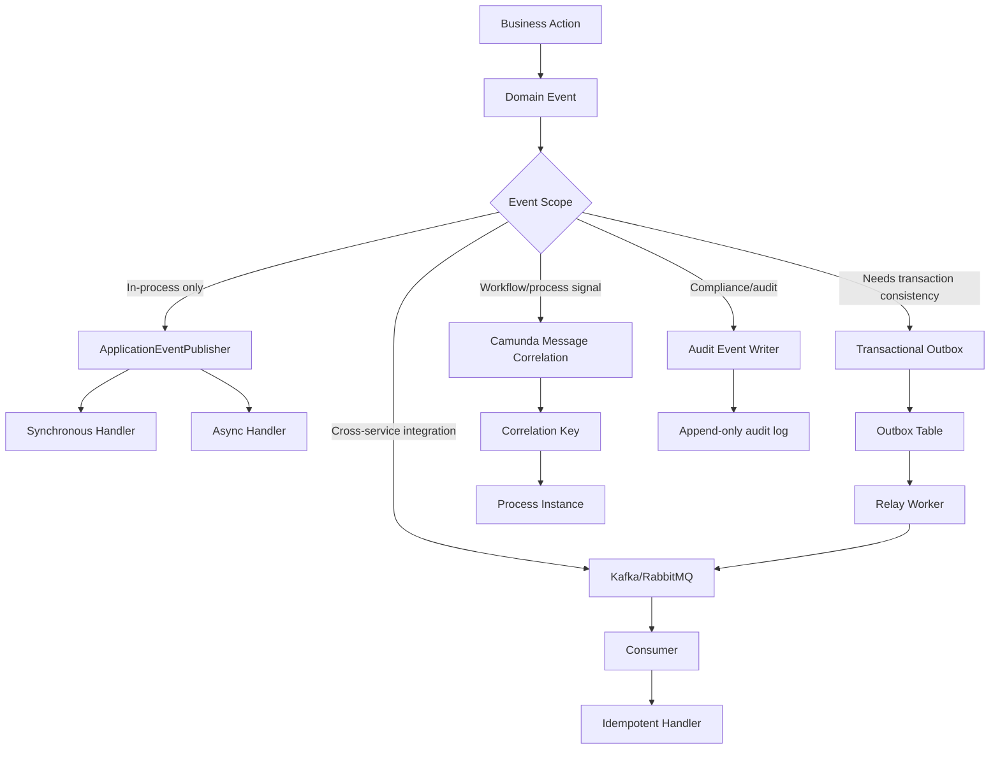

Pertanyaan desainnya:

> Event ini hanya untuk memecah kode di satu proses, atau harus menjadi fakta bisnis yang durable dan bisa dikirim lintas service?

Jawaban itu menentukan pattern.

---

# 3. CDI Events vs HK2 Alternatives

| CDI/Weld | Tujuan | HK2/Jersey Alternative | Catatan |
|---|---|---|---|
| `Event<T>` | Fire event in CDI container | `DomainEventPublisher` | Explicit contract |
| `@Observes` | Observer method | `DomainEventHandler<T>` | Explicit registration |
| `@ObservesAsync` | Async observer | Executor-backed event bus | Perlu context propagation |
| Transactional observer | After commit/before completion | Transactional outbox | Lebih kuat untuk microservice |
| Qualifier event | Select observer | Event type/topic/category | Bisa dengan class/type metadata |
| CDI event lifecycle | Managed by CDI | Manual lifecycle via binder | Harus eksplisit |
| Cross-service event | Bukan tujuan utama CDI local event | Kafka/RabbitMQ/outbox | Durable/eventual consistency |
| Workflow signal | CDI event lokal | Camunda message correlation | Durable process semantics |

Weld documentation menjelaskan bahwa transactional observers menerima notifikasi pada fase before/after completion dari transaction tempat event di-raise. Di microservice non-CDI/non-JTA dengan MyBatis manual transaction, pattern yang lebih defensible biasanya transactional outbox. ([docs.jboss.org](https://docs.jboss.org/weld/reference/latest/en-US/html/events.html?utm_source=chatgpt.com))

---

# 4. Event Taxonomy Praktis

| Jenis Event | Contoh | Scope | Pattern |
|---|---|---|---|
| Domain event in-memory | `OrderValidated` | satu JVM/request | `DomainEventPublisher` sync |
| Application event | `CacheWarmupRequested` | satu aplikasi | event bus internal |
| Integration event | `OrderApprovedIntegrationEvent` | lintas service | outbox + Kafka/RabbitMQ |
| Audit event | `ORDER_APPROVE_SUCCESS` | compliance/internal | audit writer/outbox |
| Workflow message | `PaymentReceived` | process engine | Camunda correlation |
| Notification event | `EmailRequested` | async side effect | outbox/queue |
| Metrics event | `OrderApprovalLatencyRecorded` | observability | metrics recorder, bukan domain event |
| CDC event | DB row change | external pipeline | Debezium/CDC/outbox |
| Retry event | `PaymentRetryRequested` | scheduler/worker | queue/job/outbox |
| Saga event | `InventoryReserved` | distributed process | broker + idempotent consumer |

---

# 5. Rule: Jangan Pakai Event untuk Menyembunyikan Flow Kritis

Event bagus untuk decoupling, tapi bisa membuat flow sulit dilacak.

Buruk:

```text id="c1ekc0"
OrderService.approve()
  -> event.fire(OrderApproved)
      -> observer A update DB
      -> observer B call payment
      -> observer C start workflow
      -> observer D send email
```

Masalah:

```text id="i1vf8x"
flow tersembunyi
ordering tidak jelas
error handling tidak jelas
transaction boundary tidak jelas
debugging sulit
```

Lebih sehat:

```java id="qmdb5j"
public final class OrderApprovalService {

    public OrderApprovalResult approve(UUID orderId) {
        Order order = repository.findById(orderId)
                .orElseThrow();

        authorizationPolicy.requireCanApprove(order);

        order.approve();

        repository.update(order);

        domainEventPublisher.publish(
                new OrderApprovedDomainEvent(order.id(), order.tenantId())
        );

        return OrderApprovalResult.approved(order.id());
    }
}
```

Tetap eksplisit:

```text id="0fxnfg"
Business mutation utama tetap terlihat di service.
Event dipakai untuk side-effect/notification/integration.
```

---

# 6. Domain Event Base Model

## 6.1 Base interface

```java id="qcw6z2"
package com.company.orderservice.event;

import java.time.Instant;
import java.util.UUID;

public interface DomainEvent {

    UUID eventId();

    String eventType();

    String aggregateType();

    String aggregateId();

    String tenantId();

    String correlationId();

    Instant occurredAt();
}
```

## 6.2 Example event

```java id="7c2orl"
package com.company.orderservice.order.event;

import com.company.orderservice.event.DomainEvent;

import java.time.Instant;
import java.util.UUID;

public record OrderApprovedDomainEvent(
        UUID eventId,
        String orderId,
        String tenantId,
        String approvedBy,
        String correlationId,
        Instant occurredAt
) implements DomainEvent {

    @Override
    public String eventType() {
        return "order.approved";
    }

    @Override
    public String aggregateType() {
        return "order";
    }

    @Override
    public String aggregateId() {
        return orderId;
    }
}
```

Factory method:

```java id="guacaa"
public static OrderApprovedDomainEvent of(
        Order order,
        RequestContext context,
        Clock clock
) {
    return new OrderApprovedDomainEvent(
            UUID.randomUUID(),
            order.id().toString(),
            order.tenantId(),
            context.userId(),
            context.correlationId(),
            clock.instant()
    );
}
```

---

# 7. In-Process Event Publisher

## 7.1 Contract

```java id="k0gxva"
package com.company.orderservice.event;

public interface DomainEventPublisher {
    void publish(DomainEvent event);
}
```

## 7.2 Handler contract

```java id="lk6kzy"
package com.company.orderservice.event;

public interface DomainEventHandler<T extends DomainEvent> {

    Class<T> eventType();

    void handle(T event);
}
```

## 7.3 Simple synchronous publisher

```java id="qvimq6"
package com.company.orderservice.event;

import jakarta.inject.Inject;

import java.util.List;

public final class SynchronousDomainEventPublisher implements DomainEventPublisher {

    private final List<DomainEventHandler<? extends DomainEvent>> handlers;

    @Inject
    public SynchronousDomainEventPublisher(
            List<DomainEventHandler<? extends DomainEvent>> handlers
    ) {
        this.handlers = handlers;
    }

    @Override
    public void publish(DomainEvent event) {
        for (DomainEventHandler<? extends DomainEvent> handler : handlers) {
            if (handler.eventType().isAssignableFrom(event.getClass())) {
                invoke(handler, event);
            }
        }
    }

    @SuppressWarnings("unchecked")
    private <T extends DomainEvent> void invoke(
            DomainEventHandler<? extends DomainEvent> handler,
            DomainEvent event
    ) {
        ((DomainEventHandler<T>) handler).handle((T) event);
    }
}
```

Catatan: HK2 injection untuk `List<...>` bisa tidak sepraktis CDI `Instance<T>` tergantung binding setup. Untuk microservice, registry eksplisit sering lebih jelas.

---

# 8. Explicit Handler Registry

## 8.1 Registry

```java id="ex4rf9"
package com.company.orderservice.event;

import jakarta.inject.Inject;

import java.util.List;

public final class DomainEventHandlerRegistry {

    private final List<DomainEventHandler<? extends DomainEvent>> handlers;

    @Inject
    public DomainEventHandlerRegistry(
            OrderApprovedAuditHandler orderApprovedAuditHandler,
            OrderApprovedNotificationHandler orderApprovedNotificationHandler,
            OrderApprovedWorkflowHandler orderApprovedWorkflowHandler
    ) {
        this.handlers = List.of(
                orderApprovedAuditHandler,
                orderApprovedNotificationHandler,
                orderApprovedWorkflowHandler
        );
    }

    public List<DomainEventHandler<? extends DomainEvent>> handlers() {
        return handlers;
    }
}
```

## 8.2 Publisher

```java id="a9fy6i"
public final class SynchronousDomainEventPublisher implements DomainEventPublisher {

    private final DomainEventHandlerRegistry registry;

    @Inject
    public SynchronousDomainEventPublisher(DomainEventHandlerRegistry registry) {
        this.registry = registry;
    }

    @Override
    public void publish(DomainEvent event) {
        for (DomainEventHandler<? extends DomainEvent> handler : registry.handlers()) {
            if (handler.eventType().isAssignableFrom(event.getClass())) {
                invoke(handler, event);
            }
        }
    }

    @SuppressWarnings("unchecked")
    private <T extends DomainEvent> void invoke(
            DomainEventHandler<? extends DomainEvent> handler,
            DomainEvent event
    ) {
        ((DomainEventHandler<T>) handler).handle((T) event);
    }
}
```

Kelebihan explicit registry:

```text id="b3gjcg"
handler list terlihat jelas
ordering bisa dikontrol
mudah test
tidak tergantung magic observer discovery
```

---

# 9. Handler Example

## 9.1 Audit handler

```java id="od39q8"
public final class OrderApprovedAuditHandler
        implements DomainEventHandler<OrderApprovedDomainEvent> {

    private final AuditWriter auditWriter;

    @Inject
    public OrderApprovedAuditHandler(AuditWriter auditWriter) {
        this.auditWriter = auditWriter;
    }

    @Override
    public Class<OrderApprovedDomainEvent> eventType() {
        return OrderApprovedDomainEvent.class;
    }

    @Override
    public void handle(OrderApprovedDomainEvent event) {
        auditWriter.write(new AuditEvent(
                "ORDER_APPROVED",
                event.aggregateType(),
                event.aggregateId(),
                event.tenantId(),
                event.correlationId(),
                event.occurredAt()
        ));
    }
}
```

## 9.2 Notification handler

```java id="xilhm3"
public final class OrderApprovedNotificationHandler
        implements DomainEventHandler<OrderApprovedDomainEvent> {

    private final NotificationClient notificationClient;

    @Inject
    public OrderApprovedNotificationHandler(NotificationClient notificationClient) {
        this.notificationClient = notificationClient;
    }

    @Override
    public Class<OrderApprovedDomainEvent> eventType() {
        return OrderApprovedDomainEvent.class;
    }

    @Override
    public void handle(OrderApprovedDomainEvent event) {
        notificationClient.sendOrderApprovedNotification(event.orderId());
    }
}
```

## 9.3 Workflow handler

```java id="75q8eq"
public final class OrderApprovedWorkflowHandler
        implements DomainEventHandler<OrderApprovedDomainEvent> {

    private final WorkflowClient workflowClient;

    @Inject
    public OrderApprovedWorkflowHandler(WorkflowClient workflowClient) {
        this.workflowClient = workflowClient;
    }

    @Override
    public Class<OrderApprovedDomainEvent> eventType() {
        return OrderApprovedDomainEvent.class;
    }

    @Override
    public void handle(OrderApprovedDomainEvent event) {
        workflowClient.correlateMessage(
                "OrderApproved",
                event.orderId(),
                Map.of(
                        "orderId", event.orderId(),
                        "tenantId", event.tenantId(),
                        "correlationId", event.correlationId()
                )
        );
    }
}
```

Camunda 8 message docs menyebut message akan correlated ke process instance ketika message name dan correlation key cocok dengan subscription; jika tidak ada subscription yang sesuai, message dapat discarded. ([docs.camunda.io](https://docs.camunda.io/docs/components/concepts/messages/?utm_source=chatgpt.com))

---

# 10. Synchronous vs Asynchronous In-Process Events

## 10.1 Synchronous publisher

```text id="vnphaw"
publish(event)
  -> handler A
  -> handler B
  -> handler C
  -> return
```

Cocok untuk:

```text id="4irhfk"
side effect ringan
must happen before response
same transaction/same failure boundary
```

Risiko:

```text id="lkrod2"
handler lambat memperlambat request
handler failure menggagalkan command
ordering dependency tersembunyi
```

## 10.2 Async publisher

```java id="ip8l45"
public final class AsyncDomainEventPublisher implements DomainEventPublisher {

    private final DomainEventHandlerRegistry registry;
    private final Executor executor;

    @Inject
    public AsyncDomainEventPublisher(
            DomainEventHandlerRegistry registry,
            Executor executor
    ) {
        this.registry = registry;
        this.executor = executor;
    }

    @Override
    public void publish(DomainEvent event) {
        for (DomainEventHandler<? extends DomainEvent> handler : registry.handlers()) {
            if (handler.eventType().isAssignableFrom(event.getClass())) {
                executor.execute(() -> invokeSafely(handler, event));
            }
        }
    }

    @SuppressWarnings("unchecked")
    private <T extends DomainEvent> void invokeSafely(
            DomainEventHandler<? extends DomainEvent> handler,
            DomainEvent event
    ) {
        try {
            ((DomainEventHandler<T>) handler).handle((T) event);
        } catch (RuntimeException error) {
            // log, metric, dead-letter, or retry policy
        }
    }
}
```

Async in-memory cocok hanya untuk side-effect yang boleh hilang jika proses mati? Kalau tidak boleh hilang, gunakan outbox/broker.

---

# 11. Transactional Outbox Pattern

Untuk event yang harus konsisten dengan perubahan DB, gunakan outbox.

Microservices.io mendeskripsikan transactional outbox sebagai pattern dengan sender, database, message outbox, dan message relay; outbox adalah tabel/properti record yang menyimpan message untuk dikirim ke broker. ([microservices.io](https://microservices.io/patterns/data/transactional-outbox.html?utm_source=chatgpt.com))

## 11.1 Problem

Buruk:

```java id="ug3r5k"
repository.update(order);
kafkaProducer.send(orderApprovedEvent);
```

Failure scenario:

```text id="trn9je"
DB commit success, Kafka send fails -> state changed but no event
Kafka send success, DB rollback -> event claims change that did not happen
```

## 11.2 Outbox idea

```text id="k2xkky"
Inside same DB transaction:
  update orders
  insert outbox_events

Separate relay:
  read pending outbox_events
  publish to Kafka/RabbitMQ
  mark as published
```

## 11.3 Table

```sql id="bcaujw"
CREATE TABLE outbox_events (
    id UUID PRIMARY KEY,
    aggregate_type TEXT NOT NULL,
    aggregate_id TEXT NOT NULL,
    event_type TEXT NOT NULL,
    tenant_id TEXT NOT NULL,
    correlation_id TEXT NOT NULL,
    payload JSONB NOT NULL,
    status TEXT NOT NULL DEFAULT 'PENDING',
    retry_count INT NOT NULL DEFAULT 0,
    created_at TIMESTAMPTZ NOT NULL DEFAULT now(),
    published_at TIMESTAMPTZ NULL,
    last_error TEXT NULL
);

CREATE INDEX idx_outbox_events_pending
    ON outbox_events (status, created_at)
    WHERE status = 'PENDING';
```

## 11.4 Repository

```java id="xkq6n3"
public interface OutboxEventRepository {
    void save(DomainEvent event);
    List<OutboxEventRecord> findPending(int limit);
    void markPublished(UUID eventId);
    void markFailed(UUID eventId, String errorMessage);
}
```

## 11.5 Save event inside transaction

```java id="8ew8qu"
@Intercepted
public final class OrderApprovalService {

    private final OrderRepository orderRepository;
    private final OutboxEventRepository outboxRepository;
    private final Provider<RequestContext> contextProvider;
    private final Clock clock;

    @Inject
    public OrderApprovalService(
            OrderRepository orderRepository,
            OutboxEventRepository outboxRepository,
            Provider<RequestContext> contextProvider,
            Clock clock
    ) {
        this.orderRepository = orderRepository;
        this.outboxRepository = outboxRepository;
        this.contextProvider = contextProvider;
        this.clock = clock;
    }

    @Transactional
    public OrderApprovalResult approve(UUID orderId) {
        RequestContext context = contextProvider.get();

        Order order = orderRepository.findByTenantAndId(context.tenantId(), orderId)
                .orElseThrow(() -> new OrderNotFoundException(orderId));

        order.approve(context.userId());

        orderRepository.update(order);

        outboxRepository.save(OrderApprovedDomainEvent.of(order, context, clock));

        return OrderApprovalResult.approved(order.id());
    }
}
```

---

# 12. Outbox Relay Worker

```java id="stlaka"
public final class OutboxRelayWorker implements Runnable {

    private final OutboxEventRepository outboxRepository;
    private final IntegrationEventPublisher integrationPublisher;
    private final int batchSize;

    @Inject
    public OutboxRelayWorker(
            OutboxEventRepository outboxRepository,
            IntegrationEventPublisher integrationPublisher,
            OutboxRelayConfig config
    ) {
        this.outboxRepository = outboxRepository;
        this.integrationPublisher = integrationPublisher;
        this.batchSize = config.batchSize();
    }

    @Override
    public void run() {
        List<OutboxEventRecord> records = outboxRepository.findPending(batchSize);

        for (OutboxEventRecord record : records) {
            try {
                integrationPublisher.publish(record);
                outboxRepository.markPublished(record.id());
            } catch (RuntimeException error) {
                outboxRepository.markFailed(record.id(), error.getMessage());
            }
        }
    }
}
```

Production concerns:

```text id="1v6jpb"
locking / SKIP LOCKED
retry backoff
max retry + dead letter
idempotent publish
event ordering per aggregate
monitoring pending count/oldest age
```

PostgreSQL claim query sketch:

```sql id="dmrs4h"
SELECT *
FROM outbox_events
WHERE status = 'PENDING'
ORDER BY created_at
LIMIT 100
FOR UPDATE SKIP LOCKED;
```

---

# 13. Kafka Integration Event Publisher

Apache Kafka docs describe Kafka as distributed servers/clients communicating over TCP, deployable on bare metal, VMs, containers, on-prem, and cloud. ([kafka.apache.org](https://kafka.apache.org/documentation/?utm_source=chatgpt.com))

## 13.1 Contract

```java id="2pk7qc"
public interface IntegrationEventPublisher {
    void publish(OutboxEventRecord record);
}
```

## 13.2 Kafka publisher

```java id="bxilwv"
public final class KafkaIntegrationEventPublisher implements IntegrationEventPublisher {

    private final KafkaProducer<String, String> producer;
    private final ObjectMapper objectMapper;
    private final KafkaTopics topics;

    @Inject
    public KafkaIntegrationEventPublisher(
            KafkaProducer<String, String> producer,
            ObjectMapper objectMapper,
            KafkaTopics topics
    ) {
        this.producer = producer;
        this.objectMapper = objectMapper;
        this.topics = topics;
    }

    @Override
    public void publish(OutboxEventRecord record) {
        String topic = topics.topicFor(record.eventType());

        ProducerRecord<String, String> kafkaRecord = new ProducerRecord<>(
                topic,
                record.aggregateId(),
                record.payload().toString()
        );

        kafkaRecord.headers().add("event-id", bytes(record.id().toString()));
        kafkaRecord.headers().add("event-type", bytes(record.eventType()));
        kafkaRecord.headers().add("tenant-id", bytes(record.tenantId()));
        kafkaRecord.headers().add("correlation-id", bytes(record.correlationId()));

        producer.send(kafkaRecord, (metadata, exception) -> {
            if (exception != null) {
                // callback happens async; relay may use future.get()
                // or a synchronous wrapper to know publish result
            }
        });
    }

    private byte[] bytes(String value) {
        return value.getBytes(StandardCharsets.UTF_8);
    }
}
```

For relay correctness, prefer a wrapper that waits for send completion per batch or transaction policy:

```java id="fypvzs"
producer.send(kafkaRecord).get();
```

Kafka producer API documentation states idempotent producer strengthens delivery semantics so retries no longer introduce duplicates, and transactional producer can send messages to multiple partitions/topics atomically. ([kafka.apache.org](https://kafka.apache.org/23/javadoc/org/apache/kafka/clients/producer/KafkaProducer.html?utm_source=chatgpt.com))

Important nuance:

```text id="e4ynzp"
Kafka producer idempotence helps producer retry duplication.
It does not remove the need for consumer idempotency or outbox deduplication.
```

---

# 14. Idempotent Consumer

Any cross-service event can be delivered more than once. Consumer must be idempotent.

## 14.1 Processed event table

```sql id="g9apff"
CREATE TABLE processed_events (
    event_id UUID PRIMARY KEY,
    consumer_name TEXT NOT NULL,
    processed_at TIMESTAMPTZ NOT NULL DEFAULT now()
);
```

## 14.2 Consumer handler

```java id="8oa92j"
public final class OrderApprovedConsumer {

    private final ProcessedEventRepository processedEventRepository;
    private final ProjectionRepository projectionRepository;

    @Transactional
    public void handle(OrderApprovedIntegrationEvent event) {
        if (processedEventRepository.exists(event.eventId(), "order-projection")) {
            return;
        }

        projectionRepository.upsertApprovedOrder(
                event.orderId(),
                event.tenantId(),
                event.approvedAt()
        );

        processedEventRepository.save(event.eventId(), "order-projection");
    }
}
```

Rule:

```text id="08yr93"
Dedup by eventId + consumerName.
Handler must be safe to retry.
```

---

# 15. Camunda Message Correlation

Camunda message correlation adalah pattern untuk memberi sinyal ke running process instance.

## 15.1 Workflow client contract

```java id="mbi8u1"
public interface WorkflowClient {

    void correlateMessage(
            String messageName,
            String correlationKey,
            Map<String, Object> variables
    );
}
```

## 15.2 Handler

```java id="65kjml"
public final class PaymentReceivedWorkflowHandler
        implements DomainEventHandler<PaymentReceivedDomainEvent> {

    private final WorkflowClient workflowClient;

    @Inject
    public PaymentReceivedWorkflowHandler(WorkflowClient workflowClient) {
        this.workflowClient = workflowClient;
    }

    @Override
    public Class<PaymentReceivedDomainEvent> eventType() {
        return PaymentReceivedDomainEvent.class;
    }

    @Override
    public void handle(PaymentReceivedDomainEvent event) {
        workflowClient.correlateMessage(
                "PaymentReceived",
                event.orderId(),
                Map.of(
                        "paymentId", event.paymentId(),
                        "tenantId", event.tenantId(),
                        "correlationId", event.correlationId()
                )
        );
    }
}
```

Camunda 8 docs state that if no proper subscription is opened, the message is discarded; after a subscription is opened, it is not updated, for example when referenced process variables change. ([docs.camunda.io](https://docs.camunda.io/docs/components/concepts/messages/?utm_source=chatgpt.com))

Practical implications:

```text id="plbifp"
correlationKey must be stable
messageName must match BPMN message catch event
consider message TTL/buffering depending API/version
store correlation decisions durably
test no-subscription behavior
```

---

# 16. Audit Event vs Domain Event vs Integration Event

Jangan campur semua event menjadi satu.

| Type | Purpose | Example | Storage |
|---|---|---|---|
| Domain event | Internal fact from domain model | `OrderApprovedDomainEvent` | memory/outbox optional |
| Integration event | Contract to other services | `OrderApprovedIntegrationEvent` | outbox + broker |
| Audit event | Compliance/traceability | `ORDER_APPROVED by user X` | append-only audit log |
| Workflow message | Signal process instance | `PaymentReceived` | process engine/message broker |
| Notification event | Trigger side-effect | `EmailRequested` | queue/outbox |
| Metrics event | Observability | counter/timer | metrics backend |

Example mapping:

```text id="xze8il"
Order.approve()
  -> Domain event: OrderApprovedDomainEvent
  -> Outbox integration event: order.approved.v1
  -> Audit event: ORDER_APPROVED
  -> Workflow message: OrderApproved
```

Not always all are needed.

---

# 17. HK2 Binder for Events

```java id="18g97c"
public final class EventBinder extends AbstractBinder {

    @Override
    protected void configure() {
        bind(SynchronousDomainEventPublisher.class)
                .to(DomainEventPublisher.class)
                .in(Singleton.class);

        bindAsContract(DomainEventHandlerRegistry.class)
                .in(Singleton.class);

        bindAsContract(OrderApprovedAuditHandler.class)
                .in(Singleton.class);

        bindAsContract(OrderApprovedNotificationHandler.class)
                .in(Singleton.class);

        bindAsContract(OrderApprovedWorkflowHandler.class)
                .in(Singleton.class);

        bind(MyBatisOutboxEventRepository.class)
                .to(OutboxEventRepository.class)
                .in(Singleton.class);

        bind(KafkaIntegrationEventPublisher.class)
                .to(IntegrationEventPublisher.class)
                .in(Singleton.class);

        bindAsContract(OutboxRelayWorker.class)
                .in(Singleton.class);
    }
}
```

ResourceConfig:

```java id="3wroa6"
public final class ApiApplication extends ResourceConfig {

    public ApiApplication() {
        ApplicationConfig config = ConfigBootstrap.load();

        packages("com.company.orderservice.api.resource");

        register(new ConfigBinder(config));
        register(new ContextBinder());
        register(new PersistenceBinder(config.database()));
        register(new EventBinder());
        register(new WorkflowBinder(config.camunda()));
        register(new ApplicationServiceBinder());
    }
}
```

---

# 18. Error Handling Strategy

| Publisher Type | Handler Failure Should Do |
|---|---|
| Synchronous in-process | Usually fail command or catch per handler explicitly |
| Async in-process | Log/metric/retry; risk loss on process crash |
| Outbox relay | Mark failed, retry with backoff |
| Kafka consumer | Retry, DLQ, idempotent handling |
| Camunda correlation | Retry if transient; handle no subscription carefully |
| Audit writer | For compliance-critical audit, command may need fail or durable outbox |

## 18.1 Safe synchronous publisher variant

```java id="ivp7yb"
public final class SafeSynchronousDomainEventPublisher implements DomainEventPublisher {

    private final DomainEventHandlerRegistry registry;
    private final EventFailurePolicy failurePolicy;

    @Inject
    public SafeSynchronousDomainEventPublisher(
            DomainEventHandlerRegistry registry,
            EventFailurePolicy failurePolicy
    ) {
        this.registry = registry;
        this.failurePolicy = failurePolicy;
    }

    @Override
    public void publish(DomainEvent event) {
        for (DomainEventHandler<? extends DomainEvent> handler : registry.handlers()) {
            try {
                if (handler.eventType().isAssignableFrom(event.getClass())) {
                    invoke(handler, event);
                }
            } catch (RuntimeException error) {
                failurePolicy.handle(event, handler, error);
            }
        }
    }

    @SuppressWarnings("unchecked")
    private <T extends DomainEvent> void invoke(
            DomainEventHandler<? extends DomainEvent> handler,
            DomainEvent event
    ) {
        ((DomainEventHandler<T>) handler).handle((T) event);
    }
}
```

Failure policy should be explicit:

```text id="8xobd5"
fail fast
continue and log
retry
write dead-letter
convert to outbox
```

---

# 19. Testing Event Flow

## 19.1 Unit test domain event generated

```java id="yzlsps"
@Test
void approvalPublishesDomainEvent() {
    RecordingDomainEventPublisher publisher = new RecordingDomainEventPublisher();

    OrderApprovalService service = new OrderApprovalService(
            repository,
            publisher,
            () -> TestRequestContexts.adminTenantA(),
            Clock.fixed(Instant.parse("2026-01-01T00:00:00Z"), ZoneOffset.UTC)
    );

    UUID orderId = UUID.randomUUID();
    repository.save(Order.pending("tenant-a", orderId));

    service.approve(orderId);

    OrderApprovedDomainEvent event =
            publisher.singleEvent(OrderApprovedDomainEvent.class);

    assertEquals(orderId.toString(), event.orderId());
    assertEquals("tenant-a", event.tenantId());
    assertEquals("corr-test", event.correlationId());
}
```

## 19.2 Recording publisher

```java id="ebn4n7"
public final class RecordingDomainEventPublisher implements DomainEventPublisher {

    private final List<DomainEvent> events = new ArrayList<>();

    @Override
    public void publish(DomainEvent event) {
        events.add(event);
    }

    public <T extends DomainEvent> T singleEvent(Class<T> type) {
        List<T> matched = events.stream()
                .filter(type::isInstance)
                .map(type::cast)
                .toList();

        if (matched.size() != 1) {
            throw new AssertionError("Expected one event of type " + type);
        }

        return matched.get(0);
    }
}
```

## 19.3 Outbox test

```java id="fbopvf"
@Test
void approvalWritesOutboxEventInSameTransaction() {
    orderApprovalService.approve(orderId);

    List<OutboxEventRecord> pending = outboxRepository.findPending(10);

    assertEquals(1, pending.size());
    assertEquals("order.approved", pending.get(0).eventType());
    assertEquals(orderId.toString(), pending.get(0).aggregateId());
}
```

## 19.4 Consumer idempotency test

```java id="n3xkby"
@Test
void consumerIsIdempotent() {
    OrderApprovedIntegrationEvent event = TestEvents.orderApproved();

    consumer.handle(event);
    consumer.handle(event);

    assertEquals(1, projectionRepository.countByOrderId(event.orderId()));
    assertTrue(processedEventRepository.exists(event.eventId(), "order-projection"));
}
```

## 19.5 Camunda correlation test

```java id="k5wv36"
@Test
void workflowHandlerCorrelatesWithOrderId() {
    RecordingWorkflowClient workflowClient = new RecordingWorkflowClient();

    PaymentReceivedWorkflowHandler handler =
            new PaymentReceivedWorkflowHandler(workflowClient);

    PaymentReceivedDomainEvent event = TestEvents.paymentReceived("ORDER-123");

    handler.handle(event);

    assertEquals("PaymentReceived", workflowClient.lastMessageName());
    assertEquals("ORDER-123", workflowClient.lastCorrelationKey());
}
```

---

# 20. Failure Model

| Failure | Penyebab | Dampak | Pencegahan |
|---|---|---|---|
| Event handler hidden side effect | observer-style magic | debugging sulit | explicit registry |
| DB commit without event | publish after commit fails | integration inconsistency | transactional outbox |
| Event published but DB rollback | publish before commit | false event | outbox same transaction |
| Duplicate event consumed | broker redelivery/retry | duplicate side effect | idempotent consumer |
| Event lost | async in-memory crash | missing side effect | durable outbox/broker |
| Handler failure blocks command | sync event handler throws | request fails | explicit failure policy |
| Event ordering wrong | parallel relay/no key | inconsistent projection | key by aggregate, order policy |
| Camunda message discarded | no subscription/correlation mismatch | workflow stuck | stable correlation key + retry/TTL strategy |
| Tenant context missing | event lacks tenantId | data leak/wrong processing | event envelope fields required |
| Schema drift | event payload changed | consumer failure | versioned event contract |
| Infinite event loop | handler publishes triggering event | runaway process | loop guard/design review |
| Transaction boundary unclear | events inside interceptor/observer magic | rollback bugs | explicit transaction/outbox tests |

---

# 21. Practical Review Checklist

Saat onboarding, cari:

```text id="fx75xu"
Event<
@Observes
@ObservesAsync
DomainEvent
ApplicationEvent
EventPublisher
EventHandler
Outbox
outbox_events
KafkaProducer
ConsumerRecord
correlationKey
correlateMessage
AuditEvent
processed_events
DLQ
dead letter
```

Audit:

| Pertanyaan | Jawaban sehat |
|---|---|
| Event ini local, integration, audit, atau workflow? | Jelas |
| Side-effect penting durable? | Outbox/broker |
| Event dibuat dalam transaction yang sama dengan DB update? | Ya jika integration-critical |
| Consumer idempotent? | Ya |
| Event punya `eventId`, `tenantId`, `correlationId`? | Ya |
| Event schema versioned? | Idealnya ya |
| Handler registration eksplisit? | Ya |
| Error handling handler jelas? | Ya |
| Camunda correlation key stabil? | Ya |
| Event flow punya test? | Ya |

---

# 22. Anti-pattern

## 22.1 Event sebagai pengganti method call yang harus jelas

Buruk:

```java id="05cvs8"
publisher.publish(new ValidateOrderRequested(orderId));
// somewhere hidden validates order
```

Kalau validation adalah bagian wajib command, panggil explicit service.

## 22.2 Async in-memory untuk event penting

Buruk:

```java id="t6lcrq"
executor.execute(() -> kafkaPublisher.publish(event));
```

Jika proses mati, event hilang. Gunakan outbox.

## 22.3 Event tanpa tenant/correlation

Buruk:

```java id="2zv4lm"
record OrderApproved(String orderId) {}
```

Baik:

```java id="p89mh9"
record OrderApproved(
        UUID eventId,
        String orderId,
        String tenantId,
        String correlationId,
        Instant occurredAt
) {}
```

## 22.4 Consumer tidak idempotent

Buruk:

```java id="hakj7q"
public void handle(Event event) {
    emailClient.sendEmail(...);
}
```

Jika event duplicate, email duplicate. Gunakan deduplication key atau idempotency key.

---

# 23. Mini Exercise Praktis

Ambil satu event real, misalnya `OrderApproved`.

Isi:

```text id="z272ke"
Event name:
  order.approved

Type:
  domain + integration + audit

When created:
  inside OrderApprovalService.approve()

Transaction:
  order update + outbox insert in same DB transaction

Envelope:
  eventId
  eventType
  aggregateType=order
  aggregateId=orderId
  tenantId
  correlationId
  occurredAt
  schemaVersion

Handlers:
  audit writer
  integration outbox relay
  workflow correlation optional
  notification optional

Broker:
  Kafka topic order-events

Partition key:
  orderId

Consumer idempotency:
  processed_events(event_id, consumer_name)

Failure:
  relay retry with backoff
  DLQ after max retries
  alert on oldest pending outbox age

Tests:
  service writes event
  outbox record payload correct
  relay publishes headers
  consumer idempotent
```

Kalau event penting tidak punya failure policy dan idempotency strategy, belum production-ready.

---

# 24. Ringkasan Seri 9/12

Pegangan utama:

1. **HK2 tidak punya CDI `Event<T>` / `@Observes` equivalent yang sebaiknya diperlakukan sama.**
2. **Gunakan explicit `DomainEventPublisher` dan `DomainEventHandler` registry.**
3. **Jangan pakai event untuk menyembunyikan business flow utama.**
4. **Bedakan domain event, integration event, audit event, workflow message, dan notification event.**
5. **Synchronous in-process event cocok untuk side-effect ringan dan jelas.**
6. **Async in-process event tidak durable; jangan untuk event penting.**
7. **Transactional outbox adalah pattern utama untuk menjaga DB state dan event publish tetap konsisten.**
8. **Kafka/RabbitMQ integration event harus punya envelope, key, headers, schema/version, dan idempotent consumer.**
9. **Kafka idempotent producer membantu producer retry, tapi consumer tetap harus idempotent.**
10. **Camunda message correlation butuh message name dan correlation key yang stabil.**
11. **Audit/compliance event sebaiknya durable dan explicit, bukan hanya observer tersembunyi.**
12. **Event flow harus punya failure policy, retry, DLQ, monitoring, dan test.**

---

# 25. Seri Berikutnya

Lanjut ke **Seri 10/12 - Lifecycle Callbacks & Resource Cleanup**.

Fokus berikutnya:

- CDI `@PostConstruct`, `@PreDestroy` vs HK2 lifecycle alternatives;
- resource startup/shutdown;
- `Factory.dispose`;
- managed resource registry;
- closing DB pools, Kafka producer, HTTP client, Camunda worker, executor;
- graceful shutdown di Kubernetes;
- readiness/liveness interaction;
- failure during startup;
- testing lifecycle cleanup.

**Seri 9/12 selesai.**

## Response:
7/15/2026, 4:17:05 AM

# Seri 10/12 - Lifecycle Callbacks & Resource Cleanup  
**Topik:** CDI `@PostConstruct` / `@PreDestroy` vs HK2/Jersey lifecycle alternatives, startup/shutdown resource management, graceful shutdown di Kubernetes.

## 1. Introduction

Di CDI/Weld, lifecycle callback sering memakai:

```java id="txlc10"
@PostConstruct
void init() { }

@PreDestroy
void cleanup() { }
```

`@PreDestroy` dipakai sebagai callback saat instance sedang dikeluarkan oleh container dan biasanya untuk melepas resource yang dipegang object tersebut. Jakarta Annotations mendefinisikan annotation ini untuk container-managed object yang mendukung lifecycle callback. ([Jakarta EE](https://jakarta.ee/specifications/annotations/2.0/apidocs/jakarta.annotation/jakarta/annotation/predestroy?utm_source=chatgpt.com))

Di HK2/Jersey, lifecycle juga ada, tapi jangan diasumsikan 1:1 dengan CDI/Weld. Jersey memakai HK2 untuk lifecycle management dan dependency injection, serta menyediakan extension point lewat HK2 public API seperti `AbstractBinder`, factory, dan custom binding. ([Eclipse EE4J](https://eclipse-ee4j.github.io/jersey.github.io/documentation/latest/ioc.html?utm_source=chatgpt.com))

Target seri ini:

```text id="y35d6e"
CDI @PostConstruct/@PreDestroy
  -> HK2 lifecycle interface/callback
  -> Factory.dispose()
  -> explicit ApplicationLifecycleManager
  -> shutdown hook
  -> Kubernetes graceful shutdown
  -> readiness/liveness coordination
```

---

# 2. Mental Model

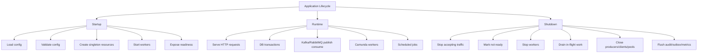

Rule utama:

> **Jangan hanya mengandalkan annotation lifecycle untuk semua resource penting. Untuk resource production-critical, buat lifecycle management eksplisit dan bisa dites.**

---

# 3. CDI/Weld vs HK2/Jersey Mapping

| CDI/Weld | Fungsi | HK2/Jersey Alternative | Catatan |
|---|---|---|---|
| `@PostConstruct` | init setelah dependency injected | HK2 lifecycle callback / explicit startup method | Jangan taruh logic berat tanpa failure handling |
| `@PreDestroy` | cleanup sebelum bean dihancurkan | HK2 lifecycle callback / `Factory.dispose()` / lifecycle manager | Pastikan benar-benar terpanggil saat shutdown |
| CDI disposer | cleanup object dari producer | HK2 `Factory.dispose()` | Cocok untuk object hasil factory |
| Application scoped bean init | startup bean | explicit `ApplicationLifecycleManager.startAll()` | Lebih observable |
| CDI container shutdown | managed by CDI runtime | servlet/Jersey/container/K8s shutdown path | Harus paham runtime deployment |
| Resource cleanup | container callback | explicit close/stop with timeout | Wajib untuk Kafka, executor, worker, pool |
| Transaction cleanup | CDI/JTA lifecycle | `finally` di transaction manager | Jangan bergantung ke `@PreDestroy` |
| Request cleanup | request context ends | Jersey filter `finally` | `ThreadLocal.clear()` wajib |

HK2 juga punya lifecycle interfaces `PostConstruct` dan `PreDestroy`; dokumentasi GlassFish/HK2 menjelaskan `postConstruct` dipanggil setelah component diinisialisasi dan dependency telah diinjeksi, sedangkan `preDestroy` dipanggil sebelum component dikeluarkan dari system. ([GlassFish](https://glassfish.org/docs/5.1.0/add-on-component-development-guide/writing-hk2-components.html?utm_source=chatgpt.com))

---

# 4. Resource Taxonomy

| Resource | Startup | Shutdown | Risiko jika salah |
|---|---|---|---|
| `ApplicationConfig` | load + validate | no-op | app jalan dengan config salah |
| `ObjectMapper` | create singleton | no-op | minor |
| `DataSource` / pool | create/test connectivity | close pool | connection leak |
| `SqlSessionFactory` | create singleton | usually no-op | DB config invalid |
| `SqlSession` | per transaction | close in `finally` | connection/session leak |
| HTTP client | create singleton | close if applicable | thread/socket leak |
| Kafka producer | create singleton | flush + close | lost messages |
| Kafka consumer | start worker | wakeup/stop/close | rebalance issue, duplicate processing |
| Camunda worker | start worker | stop/drain | job duplicate/failure |
| ExecutorService | create | shutdown + await | task loss/thread leak |
| Scheduler | start | stop | duplicate jobs |
| Metrics exporter | start | flush/close | missing telemetry |
| Audit writer | start | flush/close | compliance gap |
| Outbox relay | start | stop after current batch | duplicate/lost publish risk |

---

# 5. Pattern 1 - Lightweight HK2 Lifecycle Callback

Untuk resource sederhana, HK2 lifecycle interface bisa cukup.

```java id="v8qkp2"
import org.glassfish.hk2.api.PostConstruct;
import org.glassfish.hk2.api.PreDestroy;

public final class CacheWarmupService implements PostConstruct, PreDestroy {

    private final ReferenceDataClient referenceDataClient;
    private volatile boolean started;

    @Inject
    public CacheWarmupService(ReferenceDataClient referenceDataClient) {
        this.referenceDataClient = referenceDataClient;
    }

    @Override
    public void postConstruct() {
        referenceDataClient.warmup();
        started = true;
    }

    @Override
    public void preDestroy() {
        started = false;
    }

    public boolean started() {
        return started;
    }
}
```

Binder:

```java id="zzd4ma"
bindAsContract(CacheWarmupService.class)
        .in(Singleton.class);
```

Cocok untuk:

```text id="2yc0sr"
small init
cache warmup ringan
validasi internal ringan
resource no-op shutdown
```

Tidak cocok untuk:

```text id="c0ae9b"
worker kompleks
Kafka consumer loop
Camunda worker
executor besar
shutdown dengan timeout
multi-resource dependency ordering
```

---

# 6. Pattern 2 - `Factory.dispose()` untuk Object Hasil Factory

HK2 `Factory<T>` punya `provide()` untuk membuat instance dan `dispose(T instance)` untuk dispose object yang dibuat oleh factory. ([Java EE](https://javaee.github.io/hk2/apidocs/org/glassfish/hk2/api/package-summary.html?utm_source=chatgpt.com))

## 6.1 HTTP client factory example

```java id="bb0dks"
public final class PartnerClientFactory implements Factory<PartnerClient> {

    private final PartnerClientConfig config;

    @Inject
    public PartnerClientFactory(PartnerClientConfig config) {
        this.config = config;
    }

    @Override
    public PartnerClient provide() {
        return new PartnerClient(
                config.baseUri(),
                config.connectTimeout(),
                config.readTimeout()
        );
    }

    @Override
    public void dispose(PartnerClient instance) {
        instance.close();
    }
}
```

Binder:

```java id="x0us1d"
bindFactory(PartnerClientFactory.class)
        .to(PartnerClient.class)
        .in(Singleton.class);
```

Cocok untuk:

```text id="p89jhj"
object dibuat oleh factory
object punya close()
lifecycle sederhana
scope jelas
```

Caveat:

```text id="pfb45y"
Untuk resource critical, tetap lebih baik punya lifecycle manager
agar shutdown order, timeout, metrics, dan test lebih eksplisit.
```

---

# 7. Pattern 3 - Explicit `ManagedResource`

Ini pattern paling production-friendly.

## 7.1 Contract

```java id="o8ce5w"
public interface ManagedResource {

    String name();

    void start();

    void stop();
}
```

## 7.2 Lifecycle manager

```java id="ccsgn1"
public final class ApplicationLifecycleManager {

    private final List<ManagedResource> resources = new CopyOnWriteArrayList<>();
    private final AtomicBoolean started = new AtomicBoolean(false);
    private final AtomicBoolean stopping = new AtomicBoolean(false);

    public void register(ManagedResource resource) {
        if (started.get()) {
            throw new IllegalStateException(
                    "Cannot register resource after lifecycle started: " + resource.name()
            );
        }

        resources.add(resource);
    }

    public void startAll() {
        if (!started.compareAndSet(false, true)) {
            return;
        }

        for (ManagedResource resource : resources) {
            resource.start();
        }
    }

    public void stopAll() {
        if (!stopping.compareAndSet(false, true)) {
            return;
        }

        List<ManagedResource> reversed = new ArrayList<>(resources);
        Collections.reverse(reversed);

        for (ManagedResource resource : reversed) {
            try {
                resource.stop();
            } catch (RuntimeException error) {
                // log error and continue stopping other resources
            }
        }
    }

    public boolean isStarted() {
        return started.get() && !stopping.get();
    }

    public boolean isStopping() {
        return stopping.get();
    }
}
```

Kenapa stop dibalik?

```text id="j9euiw"
Jika resource A bergantung pada resource B:
  start B dulu, lalu A
  stop A dulu, lalu B
```

---

# 8. Pattern 4 - Startup Orchestrator

## 8.1 Application bootstrap

```java id="r9ogme"
public final class ApiApplication extends ResourceConfig {

    public ApiApplication() {
        ApplicationConfig config = ConfigBootstrap.load();

        BindingConfigValidator.validate(config);

        ApplicationLifecycleManager lifecycleManager =
                new ApplicationLifecycleManager();

        packages("com.company.orderservice.api.resource");

        register(new ConfigBinder(config));
        register(new LifecycleBinder(lifecycleManager));
        register(new PersistenceBinder(config.database(), lifecycleManager));
        register(new KafkaBinder(config.kafka(), lifecycleManager));
        register(new WorkflowBinder(config.camunda(), lifecycleManager));
        register(new ApplicationServiceBinder());
        register(new ContextBinder());

        register(ReadinessResource.class);
        register(ShutdownHookFeature.class);
    }
}
```

## 8.2 Lifecycle binder

```java id="npadjq"
public final class LifecycleBinder extends AbstractBinder {

    private final ApplicationLifecycleManager lifecycleManager;

    public LifecycleBinder(ApplicationLifecycleManager lifecycleManager) {
        this.lifecycleManager = lifecycleManager;
    }

    @Override
    protected void configure() {
        bind(lifecycleManager)
                .to(ApplicationLifecycleManager.class);
    }
}
```

---

# 9. Pattern 5 - Register Managed Resource dari Binder

## 9.1 Kafka producer managed resource

```java id="mx0jti"
public final class ManagedKafkaProducer implements ManagedResource {

    private final KafkaProducer<String, String> producer;

    public ManagedKafkaProducer(KafkaProducer<String, String> producer) {
        this.producer = producer;
    }

    @Override
    public String name() {
        return "kafka-producer";
    }

    @Override
    public void start() {
        // KafkaProducer starts lazily.
    }

    @Override
    public void stop() {
        producer.flush();
        producer.close(Duration.ofSeconds(10));
    }

    public KafkaProducer<String, String> producer() {
        return producer;
    }
}
```

## 9.2 Factory

```java id="gmsu4g"
public final class KafkaProducerFactory implements Factory<ManagedKafkaProducer> {

    private final KafkaConfig config;
    private final ApplicationLifecycleManager lifecycleManager;

    @Inject
    public KafkaProducerFactory(
            KafkaConfig config,
            ApplicationLifecycleManager lifecycleManager
    ) {
        this.config = config;
        this.lifecycleManager = lifecycleManager;
    }

    @Override
    public ManagedKafkaProducer provide() {
        Properties properties = new Properties();

        properties.put("bootstrap.servers", String.join(",", config.bootstrapServers()));
        properties.put("key.serializer", StringSerializer.class.getName());
        properties.put("value.serializer", StringSerializer.class.getName());
        properties.put("enable.idempotence", "true");

        ManagedKafkaProducer managed =
                new ManagedKafkaProducer(new KafkaProducer<>(properties));

        lifecycleManager.register(managed);

        return managed;
    }

    @Override
    public void dispose(ManagedKafkaProducer instance) {
        instance.stop();
    }
}
```

## 9.3 Binder

```java id="uvzojn"
public final class KafkaBinder extends AbstractBinder {

    @Override
    protected void configure() {
        bindFactory(KafkaProducerFactory.class)
                .to(ManagedKafkaProducer.class)
                .in(Singleton.class);

        bind(KafkaIntegrationEventPublisher.class)
                .to(IntegrationEventPublisher.class)
                .in(Singleton.class);
    }
}
```

---

# 10. Pattern 6 - ExecutorService Lifecycle

## 10.1 Managed executor

```java id="a6y4v4"
public final class ManagedExecutor implements ManagedResource {

    private final ExecutorService executorService;

    public ManagedExecutor(ExecutorService executorService) {
        this.executorService = executorService;
    }

    @Override
    public String name() {
        return "application-executor";
    }

    @Override
    public void start() {
        // no-op
    }

    @Override
    public void stop() {
        executorService.shutdown();

        try {
            if (!executorService.awaitTermination(20, TimeUnit.SECONDS)) {
                executorService.shutdownNow();
            }
        } catch (InterruptedException error) {
            Thread.currentThread().interrupt();
            executorService.shutdownNow();
        }
    }

    public ExecutorService executorService() {
        return executorService;
    }
}
```

## 10.2 Binder

```java id="hs2u32"
public final class ExecutorBinder extends AbstractBinder {

    private final ApplicationLifecycleManager lifecycleManager;

    public ExecutorBinder(ApplicationLifecycleManager lifecycleManager) {
        this.lifecycleManager = lifecycleManager;
    }

    @Override
    protected void configure() {
        ManagedExecutor managedExecutor = new ManagedExecutor(
                Executors.newFixedThreadPool(16)
        );

        lifecycleManager.register(managedExecutor);

        bind(managedExecutor).to(ManagedExecutor.class);
        bind(managedExecutor.executorService()).to(ExecutorService.class);
        bind(managedExecutor.executorService()).to(Executor.class);
    }
}
```

---

# 11. Pattern 7 - Outbox Relay Lifecycle

Outbox relay biasanya worker background. Jangan mulai tanpa lifecycle control.

```java id="vi1md3"
public final class ManagedOutboxRelay implements ManagedResource {

    private final ScheduledExecutorService scheduler;
    private final OutboxRelayWorker worker;
    private final Duration interval;
    private volatile ScheduledFuture<?> future;

    public ManagedOutboxRelay(
            ScheduledExecutorService scheduler,
            OutboxRelayWorker worker,
            Duration interval
    ) {
        this.scheduler = scheduler;
        this.worker = worker;
        this.interval = interval;
    }

    @Override
    public String name() {
        return "outbox-relay";
    }

    @Override
    public void start() {
        future = scheduler.scheduleWithFixedDelay(
                worker,
                0,
                interval.toMillis(),
                TimeUnit.MILLISECONDS
        );
    }

    @Override
    public void stop() {
        ScheduledFuture<?> current = future;

        if (current != null) {
            current.cancel(false);
        }
    }
}
```

Shutdown sequence ideal:

```text id="k7lzz2"
1. mark app not ready
2. stop accepting new relay cycles
3. finish current batch or timeout
4. flush Kafka producer
5. close producer
```

---

# 12. Pattern 8 - Camunda Worker Lifecycle

Camunda worker / job worker harus punya explicit start-stop.

```java id="x1rxfr"
public final class ManagedWorkflowWorker implements ManagedResource {

    private final WorkflowWorker worker;

    public ManagedWorkflowWorker(WorkflowWorker worker) {
        this.worker = worker;
    }

    @Override
    public String name() {
        return "workflow-worker";
    }

    @Override
    public void start() {
        worker.start();
    }

    @Override
    public void stop() {
        worker.stop(Duration.ofSeconds(20));
    }
}
```

Prinsip:

```text id="wdj4fs"
Jangan biarkan worker menerima job baru saat aplikasi mulai shutting down.
In-flight job harus selesai, gagal eksplisit, atau dilepas sesuai semantics engine.
```

---

# 13. Startup Failure Strategy

Startup harus fail fast untuk error fatal.

Fatal:

```text id="f0kjg2"
missing required config
invalid secret provider
invalid DB URL
cannot create required client
required mapper missing
invalid feature flag provider
invalid workflow provider
```

Non-fatal tergantung desain:

```text id="w3sj1c"
cache warmup gagal
optional metrics exporter gagal
optional notification provider disabled
```

## 13.1 Startup validator

```java id="p9djmq"
public final class StartupValidator {

    private final DatabaseHealthCheck databaseHealthCheck;
    private final SecretProvider secretProvider;
    private final ApplicationConfig config;

    @Inject
    public StartupValidator(
            DatabaseHealthCheck databaseHealthCheck,
            SecretProvider secretProvider,
            ApplicationConfig config
    ) {
        this.databaseHealthCheck = databaseHealthCheck;
        this.secretProvider = secretProvider;
        this.config = config;
    }

    public void validate() {
        validateConfig();
        validateSecrets();
        validateDatabase();
    }

    private void validateConfig() {
        if (config.app().profile() == AppProfile.PROD
                && config.app().debugEnabled()) {
            throw new IllegalStateException("Debug cannot be enabled in PROD");
        }
    }

    private void validateSecrets() {
        secretProvider.getSecret(config.database().passwordSecretName());
    }

    private void validateDatabase() {
        databaseHealthCheck.checkOrThrow();
    }
}
```

---

# 14. Readiness vs Liveness

Minimal operational model:

| Endpoint | Tujuan | Return unhealthy saat |
|---|---|---|
| `/health/live` | Process masih hidup | deadlock fatal / app cannot run |
| `/health/ready` | Siap menerima traffic | startup belum selesai, shutdown mulai, dependency required down |
| `/health/startup` | Startup selesai | config/init belum selesai |

Kubernetes membedakan readiness/liveness/startup probes dalam workload configuration; readiness probe mengontrol apakah Pod siap menerima traffic, sedangkan liveness dipakai untuk restart container bila tidak sehat. ([Kubernetes](https://kubernetes.io/docs/concepts/workloads/pods/pod-lifecycle/?utm_source=chatgpt.com))

## 14.1 Readiness resource

```java id="ynjjmb"
@Path("/health")
@Produces(MediaType.APPLICATION_JSON)
public final class ReadinessResource {

    private final ApplicationLifecycleManager lifecycleManager;
    private final DatabaseHealthCheck databaseHealthCheck;

    @Inject
    public ReadinessResource(
            ApplicationLifecycleManager lifecycleManager,
            DatabaseHealthCheck databaseHealthCheck
    ) {
        this.lifecycleManager = lifecycleManager;
        this.databaseHealthCheck = databaseHealthCheck;
    }

    @GET
    @Path("/ready")
    public Response ready() {
        if (lifecycleManager.isStopping()) {
            return Response.status(503)
                    .entity(Map.of("status", "stopping"))
                    .build();
        }

        if (!databaseHealthCheck.isHealthy()) {
            return Response.status(503)
                    .entity(Map.of("status", "database_unhealthy"))
                    .build();
        }

        return Response.ok(Map.of("status", "ready")).build();
    }

    @GET
    @Path("/live")
    public Response live() {
        return Response.ok(Map.of("status", "alive")).build();
    }
}
```

---

# 15. Kubernetes Graceful Shutdown

Kubernetes memberi Pod waktu untuk terminate secara graceful; default termination grace period adalah 30 detik. ([Kubernetes](https://kubernetes.io/docs/concepts/workloads/pods/pod-lifecycle/?utm_source=chatgpt.com))

Kubernetes juga memiliki container lifecycle hook seperti `PreStop`; dokumentasi Kubernetes menjelaskan countdown termination grace period dimulai sebelum `PreStop` hook dieksekusi, sehingga waktu hook tetap dihitung dalam total grace period. ([Kubernetes](https://kubernetes.io/docs/concepts/containers/container-lifecycle-hooks/?utm_source=chatgpt.com))

## 15.1 Deployment sketch

```yaml id="xyrnbc"
apiVersion: apps/v1
kind: Deployment
metadata:
  name: order-service
spec:
  template:
    spec:
      terminationGracePeriodSeconds: 60
      containers:
        - name: order-service
          image: company/order-service:1.0.0
          ports:
            - containerPort: 8080
          readinessProbe:
            httpGet:
              path: /health/ready
              port: 8080
            periodSeconds: 5
            failureThreshold: 1
          livenessProbe:
            httpGet:
              path: /health/live
              port: 8080
            periodSeconds: 10
          lifecycle:
            preStop:
              httpGet:
                path: /internal/shutdown/drain
                port: 8080
```

## 15.2 Drain endpoint

```java id="lio0q8"
@Path("/internal/shutdown")
public final class ShutdownDrainResource {

    private final ApplicationLifecycleManager lifecycleManager;

    @Inject
    public ShutdownDrainResource(ApplicationLifecycleManager lifecycleManager) {
        this.lifecycleManager = lifecycleManager;
    }

    @POST
    @Path("/drain")
    public Response drain() {
        lifecycleManager.stopAll();

        return Response.ok(Map.of("status", "draining")).build();
    }
}
```

Catatan security:

```text id="ckdwml"
Endpoint drain harus internal-only.
Jangan expose endpoint ini ke public ingress.
Gunakan network policy/auth jika perlu.
```

---

# 16. JVM Shutdown Hook

Untuk non-Kubernetes, on-prem, atau fallback, pasang JVM shutdown hook.

```java id="tsbk8h"
public final class ShutdownHookInstaller {

    private final ApplicationLifecycleManager lifecycleManager;

    @Inject
    public ShutdownHookInstaller(ApplicationLifecycleManager lifecycleManager) {
        this.lifecycleManager = lifecycleManager;
    }

    public void install() {
        Runtime.getRuntime().addShutdownHook(new Thread(
                lifecycleManager::stopAll,
                "application-shutdown-hook"
        ));
    }
}
```

Register/start:

```java id="o4fxbn"
public final class StartupResource implements PostConstruct {

    private final ApplicationLifecycleManager lifecycleManager;
    private final ShutdownHookInstaller shutdownHookInstaller;

    @Inject
    public StartupResource(
            ApplicationLifecycleManager lifecycleManager,
            ShutdownHookInstaller shutdownHookInstaller
    ) {
        this.lifecycleManager = lifecycleManager;
        this.shutdownHookInstaller = shutdownHookInstaller;
    }

    @Override
    public void postConstruct() {
        shutdownHookInstaller.install();
        lifecycleManager.startAll();
    }
}
```

Caveat:

```text id="v1mdz3"
Shutdown hook tidak boleh berasumsi punya waktu tak terbatas.
Jangan melakukan operation blocking tanpa timeout.
```

---

# 17. RequestContext Cleanup

Request scope cleanup harus di filter, bukan lifecycle global.

```java id="ut4gk7"
@Provider
public final class RequestContextFilter
        implements ContainerRequestFilter, ContainerResponseFilter {

    @Override
    public void filter(ContainerRequestContext request) {
        RequestContextHolder.set(buildContext(request));
    }

    @Override
    public void filter(
            ContainerRequestContext request,
            ContainerResponseContext response
    ) {
        try {
            RequestContext context = RequestContextHolder.current();

            response.getHeaders().putSingle("X-Request-Id", context.requestId());
            response.getHeaders().putSingle("X-Correlation-Id", context.correlationId());
        } finally {
            RequestContextHolder.clear();
        }
    }
}
```

Rule:

```text id="flw39f"
ThreadLocal set harus punya clear di finally.
```

---

# 18. Transaction Cleanup

Transaction cleanup harus di transaction boundary.

```java id="d8p2we"
public final class MyBatisTransactionManager implements TransactionManager {

    private final SqlSessionFactory sqlSessionFactory;
    private final SqlSessionHolder holder;

    @Override
    public <T> T executeInTransaction(CheckedSupplier<T> supplier) throws Exception {
        if (holder.hasCurrent()) {
            return supplier.get();
        }

        try (SqlSession session = sqlSessionFactory.openSession(false)) {
            holder.bind(session);

            try {
                T result = supplier.get();
                session.commit();
                return result;
            } catch (Exception | RuntimeException error) {
                session.rollback();
                throw error;
            } finally {
                holder.clear();
            }
        }
    }
}
```

Rule:

```text id="rb9x9t"
SqlSession lifecycle != application lifecycle.
SqlSession lifecycle == transaction/unit-of-work lifecycle.
```

---

# 19. Shutdown Order Recommendation

Untuk aplikasi Jersey microservice:

```text id="32ea3r"
1. Mark stopping / readiness false
2. Stop accepting new background jobs
3. Stop message consumers / Camunda workers
4. Wait/drain in-flight tasks
5. Stop schedulers/outbox relay
6. Flush producers/audit/metrics
7. Close external clients/producers
8. Close DB pools
9. Clear remaining context/holders
```

Kenapa consumer dulu, producer belakangan?

```text id="3erses"
Consumer/worker menerima work baru.
Producer/client dibutuhkan untuk menyelesaikan work yang sedang berjalan.
Jadi stop intake dulu, lalu drain, lalu close outbound resources.
```

---

# 20. Failure Model

| Failure | Penyebab | Dampak | Pencegahan |
|---|---|---|---|
| Resource leak | tidak close producer/client/pool | memory/thread/socket leak | `ManagedResource.stop()` |
| Lost message | producer tidak flush/close | event hilang | flush + close dengan timeout |
| Duplicate job | worker mati tanpa ack/fail policy | job re-delivery | graceful worker stop |
| Pod killed too soon | shutdown lebih lama dari grace period | interrupted work | tune `terminationGracePeriodSeconds` |
| Readiness tetap true saat shutdown | traffic masuk saat drain | request gagal | readiness false on stopping |
| `preStop` terlalu lama | grace period habis | SIGKILL | keep preStop short |
| ThreadLocal leak | tidak clear request/transaction holder | tenant/session leak | `finally clear()` |
| Startup half-success | sebagian resource started lalu gagal | orphan thread/client | rollback start / stop started resources |
| Liveness terlalu agresif | app restart saat dependency slow | cascading failure | liveness hanya process health |
| Cleanup hanya di annotation | callback tidak terpanggil sesuai asumsi | leak | explicit lifecycle manager + tests |

---

# 21. Testing Lifecycle

## 21.1 Test stop order

```java id="nszwrz"
@Test
void stopsResourcesInReverseOrder() {
    ApplicationLifecycleManager manager = new ApplicationLifecycleManager();

    RecordingResource db = new RecordingResource("db");
    RecordingResource worker = new RecordingResource("worker");

    manager.register(db);
    manager.register(worker);

    manager.startAll();
    manager.stopAll();

    assertEquals(
            List.of("start:db", "start:worker", "stop:worker", "stop:db"),
            RecordingResource.events()
    );
}
```

## 21.2 Test stop continues after failure

```java id="e6j8z1"
@Test
void continuesStoppingOtherResourcesWhenOneFails() {
    ApplicationLifecycleManager manager = new ApplicationLifecycleManager();

    manager.register(new FailingStopResource("bad"));
    manager.register(new RecordingResource("good"));

    manager.startAll();
    manager.stopAll();

    assertTrue(RecordingResource.events().contains("stop:good"));
}
```

## 21.3 Test readiness false during shutdown

```java id="tki1dg"
@Test
void readinessReturns503WhenStopping() {
    lifecycleManager.stopAll();

    Response response = target("/health/ready")
            .request()
            .get();

    assertEquals(503, response.getStatus());
}
```

## 21.4 Test ThreadLocal cleanup

```java id="9uwd2j"
@Test
void requestContextIsClearedAfterResponse() {
    target("/test/context")
            .request()
            .header("X-Request-Id", "req-1")
            .header("X-Tenant-Id", "tenant-a")
            .header("X-User-Id", "user-1")
            .get();

    assertThrows(
            IllegalStateException.class,
            RequestContextHolder::current
    );
}
```

---

# 22. Practical Review Checklist

Saat onboarding, cari:

```text id="jjxpyh"
@PostConstruct
@PreDestroy
PostConstruct
PreDestroy
Factory.dispose
close()
shutdown()
shutdownNow()
awaitTermination
KafkaProducer
KafkaConsumer
ExecutorService
ScheduledExecutorService
DataSource
SqlSession
SqlSessionFactory
Camunda worker
ApplicationLifecycleManager
ManagedResource
readinessProbe
livenessProbe
preStop
terminationGracePeriodSeconds
```

Audit:

| Pertanyaan | Jawaban sehat |
|---|---|
| Resource mahal punya owner lifecycle? | Ya |
| Shutdown order jelas? | Ya |
| Readiness false saat shutting down? | Ya |
| Worker berhenti menerima job baru saat shutdown? | Ya |
| Producer flush/close? | Ya |
| Executor shutdown dengan timeout? | Ya |
| DB pool close? | Ya |
| Transaction/request holder clear di finally? | Ya |
| Startup failure cleanup resource yang sudah start? | Ya |
| K8s grace period cukup untuk drain? | Ya |
| Liveness tidak bergantung dependency eksternal volatile? | Ya |

---

# 23. Anti-pattern

## 23.1 Semua cleanup diserahkan ke `@PreDestroy`

Buruk:

```java id="j2jj4l"
@PreDestroy
void cleanup() {
    kafkaProducer.close();
    executor.shutdown();
    camundaWorker.stop();
    dataSource.close();
}
```

Masalah:

```text id="5u06tw"
shutdown order tersembunyi
timeout tidak jelas
error satu resource bisa mengganggu resource lain
sulit dites
```

Lebih baik:

```text id="9vhqe5"
ManagedResource per resource
ApplicationLifecycleManager stop reverse order
timeouts per resource
errors logged but stop continues
```

## 23.2 Liveness check ke database

Buruk:

```text id="qno4df"
GET /health/live checks PostgreSQL
```

Kalau PostgreSQL lambat sebentar, Kubernetes bisa restart semua pod dan memperparah incident.

Lebih baik:

```text id="jb85oc"
liveness = process alive
readiness = dependency readiness
```

## 23.3 Shutdown hook tanpa timeout

Buruk:

```java id="m5veaa"
Runtime.getRuntime().addShutdownHook(new Thread(() -> {
    executor.awaitTermination(10, TimeUnit.MINUTES);
}));
```

Kubernetes bisa memaksa kill jika grace period habis.

## 23.4 Worker terus menerima job saat app draining

Saat shutdown, stop intake dulu. Jangan close DB/producer sebelum worker selesai.

---

# 24. Mini Exercise Praktis

Ambil satu service real dan isi inventory:

```text id="xub0yi"
Resource:
  KafkaProducer

Created by:
  KafkaProducerFactory

Scope:
  Singleton

Registered lifecycle:
  ManagedKafkaProducer

Start:
  no-op / lazy

Stop:
  flush
  close 10s timeout

Depends on:
  Kafka config
  metrics
  outbox relay

Shutdown order:
  stop outbox relay first
  flush producer
  close producer

Kubernetes:
  terminationGracePeriodSeconds=60
  readiness false when stopping

Tests:
  stop calls flush and close
  stop order after relay
  stop continues when another resource fails
```

Kalau resource tidak punya jawaban untuk **created by, owner, scope, stop behavior, timeout, test**, lifecycle-nya belum production-ready.

---

# 25. Ringkasan Seri 10/12

Pegangan utama:

1. **CDI `@PostConstruct/@PreDestroy` tidak boleh disamakan mentah dengan lifecycle production di HK2/Jersey.**
2. **HK2 punya lifecycle callback, tetapi resource penting sebaiknya dikelola eksplisit.**
3. **`Factory.dispose()` berguna untuk object hasil factory, tapi bukan pengganti lifecycle orchestration.**
4. **Gunakan `ManagedResource` dan `ApplicationLifecycleManager` untuk resource mahal/critical.**
5. **Shutdown order penting: stop intake, drain, flush, close.**
6. **RequestContext dan transaction context harus cleanup di `finally`, bukan di app shutdown.**
7. **Readiness harus false saat startup belum selesai atau shutdown mulai.**
8. **Liveness jangan terlalu bergantung pada dependency eksternal volatile.**
9. **Kubernetes default graceful termination adalah 30 detik; tune sesuai kebutuhan drain.**
10. **`preStop` dihitung dalam termination grace period, jadi jangan terlalu panjang.**
11. **Executor, worker, producer, DB pool, audit/metrics exporter harus punya timeout saat shutdown.**
12. **Lifecycle harus dites: start order, stop reverse order, failure during stop, readiness on shutdown, ThreadLocal cleanup.**

---

# 26. Seri Berikutnya

Lanjut ke **Seri 11/12 - Custom Injection & Extension Points**.

Fokus berikutnya:

- CDI portable extension vs HK2 extension points;
- `InjectionResolver`;
- `JustInTimeInjectionResolver`;
- custom annotation injection;
- injecting request headers/config/current tenant;
- dynamic configuration;
- service locator usage boundary;
- anti-pattern custom injection;
- testing custom resolver.

**Seri 10/12 selesai.**

---

**Sources:**

- [PreDestroy (Jakarta Annotations API 2.0.0 API)](https://jakarta.ee/specifications/annotations/2.0/apidocs/jakarta.annotation/jakarta/annotation/predestroy?utm_source=chatgpt.com)
- [Chapter 25. Custom Injection and Lifecycle Management](https://eclipse-ee4j.github.io/jersey.github.io/documentation/latest/ioc.html?utm_source=chatgpt.com)
- [2 Writing HK2 Components](https://glassfish.org/docs/5.1.0/add-on-component-development-guide/writing-hk2-components.html?utm_source=chatgpt.com)
- [Package org.glassfish.hk2.api](https://javaee.github.io/hk2/apidocs/org/glassfish/hk2/api/package-summary.html?utm_source=chatgpt.com)
- [Pod Lifecycle](https://kubernetes.io/docs/concepts/workloads/pods/pod-lifecycle/?utm_source=chatgpt.com)

## Response:
7/15/2026, 4:18:47 AM

# Seri 11/12 - Custom Injection & Extension Points  
**Topik:** CDI portable extension vs HK2/Jersey custom injection, `InjectionResolver`, `JustInTimeInjectionResolver`, dynamic binding, service locator boundary.

## 1. Introduction

Di CDI/Weld, extension point yang powerful biasanya dikenal sebagai:

```text id="e8ny69"
Portable Extension
Build Compatible Extension
ProcessAnnotatedType
AfterBeanDiscovery
BeanManager
Extension
```

Weld documentation menjelaskan bahwa sejak CDI 4, ada **Build Compatible Extensions** sebagai alternatif dari **Portable Extensions**; keduanya menargetkan use case serupa, dan developer bisa memilih salah satu atau bahkan menggabungkannya. ([docs.jboss.org](https://docs.jboss.org/weld/reference/latest/en-US/html/extend.html?utm_source=chatgpt.com))

Di HK2/Jersey, extension point-nya berbeda. Jersey menyediakan custom injection dan lifecycle management dengan HK2; dokumentasi Jersey menyebut ada `InjectionResolver` abstraction untuk custom injection annotation, dan abstraction ini diterjemahkan ke HK2 injection resolver saat runtime. ([eclipse-ee4j.github.io](https://eclipse-ee4j.github.io/jersey.github.io/documentation/latest/ioc.html?utm_source=chatgpt.com))

Jadi mapping besar:

```text id="84ps12"
CDI Portable Extension
  -> HK2 DynamicConfiguration / Binder / InjectionResolver / JustInTimeInjectionResolver

CDI Build Compatible Extension
  -> Tidak ada equivalent 1:1 di HK2

CDI BeanManager runtime lookup
  -> HK2 ServiceLocator, tapi batasi di infrastructure/extension layer
```

Target seri ini:

> **Membuat custom injection dan extension di HK2/Jersey secara aman, tanpa mengubah service bisnis menjadi container-aware.**

---

# 2. Mental Model

```mermaid id="custom-injection-map"
flowchart TD
    A[Need Custom DI Behavior?] --> B{Can be solved with normal binding?}

    B -->|Yes| C[Use AbstractBinder]
    B -->|No| D{Object from runtime/request?}

    D -->|Yes| E[Factory<T> + Provider<T>]
    D -->|No| F{Need custom annotation injection?}

    F -->|Yes| G[InjectionResolver]
    F -->|No| H{Need bind when missing?}

    H -->|Yes| I[JustInTimeInjectionResolver]
    H -->|No| J{Need dynamic plugin registration?}

    J -->|Yes| K[DynamicConfiguration / ServiceLocator]
    J -->|No| L[Re-check design]

    G --> M["@ConfigValue / @HeaderValue / @CurrentTenant"]
    I --> N[Lazy descriptors for unknown service]
    K --> O[Advanced framework/plugin layer]
```

Rule pertama:

```text id="1imr9x"
Sebelum membuat custom resolver, coba selesaikan dengan:
1. constructor injection
2. AbstractBinder
3. Factory<T>
4. Provider<T>
5. explicit service wrapper/router
```

Custom injection adalah **advanced tool**, bukan default.

---

# 3. CDI Extension vs HK2 Extension Mapping

| Kebutuhan | CDI/Weld | HK2/Jersey Alternative | Rekomendasi |
|---|---|---|---|
| Register bean programmatically | `AfterBeanDiscovery.addBean()` | `DynamicConfiguration` / `AbstractBinder` | Prefer binder dulu |
| Inspect/modify annotated types | `ProcessAnnotatedType` | Tidak direct equivalent | Hindari kecuali framework layer |
| Add custom injection annotation | CDI extension / producer | Jersey/HK2 `InjectionResolver` | Valid untuk boundary annotation |
| Lazy bind missing dependency | CDI extension/register bean | `JustInTimeInjectionResolver` | Advanced; hati-hati |
| Runtime service lookup | `BeanManager`, `CDI.current()` | `ServiceLocator` | Jangan di business logic |
| Build-time extension | CDI Build Compatible Extension | Tidak 1:1 | Gunakan build plugin/codegen jika perlu |
| Conditional dependency | `@Alternative`, extension | profile/config binder | Prefer explicit |
| Intercept/decorate | CDI interceptor/decorator | hk2-extras/wrapper | Sudah dibahas seri 8 |
| Event observer registration | CDI observer | explicit event registry | Sudah dibahas seri 9 |

---

# 4. Kapan Custom Injection Layak?

Custom injection layak jika annotation tersebut adalah **boundary concern**, bukan business shortcut.

Cocok:

```text id="m3d9co"
@ConfigValue("payment.timeout")
@RequestHeader("X-Tenant-Id") di resource/provider boundary
@CurrentTenant di resource/filter level
@CorrelationId di logging/audit adapter
@FeatureFlagValue untuk infrastructure adapter tertentu, hati-hati
```

Tidak cocok:

```text id="t4hoey"
@CurrentOrder
@ApprovedPayment
@RiskScore
@SpecialBusinessRule
```

Karena business concept sebaiknya explicit service/domain object, bukan injection magic.

---

# 5. Pattern 1 - Custom Config Injection Annotation

## 5.1 Annotation

```java id="5q9ujb"
package com.company.orderservice.di;

import java.lang.annotation.Documented;
import java.lang.annotation.Retention;
import java.lang.annotation.Target;

import static java.lang.annotation.ElementType.FIELD;
import static java.lang.annotation.ElementType.PARAMETER;
import static java.lang.annotation.RetentionPolicy.RUNTIME;

@Documented
@Retention(RUNTIME)
@Target({FIELD, PARAMETER})
public @interface ConfigValue {
    String value();
    String defaultValue() default "";
}
```

Use case:

```java id="73ncn1"
public final class SomeInfrastructureAdapter {

    private final int timeoutMillis;

    @Inject
    public SomeInfrastructureAdapter(
            @ConfigValue(value = "partner.timeoutMillis", defaultValue = "1000")
            int timeoutMillis
    ) {
        this.timeoutMillis = timeoutMillis;
    }
}
```

Namun, untuk production code utama, lebih baik inject typed config:

```java id="qtnmfm"
public SomeInfrastructureAdapter(PartnerConfig config) {
    this.timeoutMillis = config.timeoutMillis();
}
```

`@ConfigValue` berguna untuk adapter kecil atau legacy bridge, bukan replacement typed config.

---

# 6. Jersey/HK2 `InjectionResolver`

Jersey documentation menunjukkan pattern custom injection annotation dengan `InjectionResolver`, dan menjelaskan bahwa Jersey punya abstraction `InjectionResolver` yang diterjemahkan ke HK2 resolver saat runtime. ([eclipse-ee4j.github.io](https://eclipse-ee4j.github.io/jersey.github.io/documentation/latest/ioc.html?utm_source=chatgpt.com))

## 6.1 Resolver skeleton

```java id="b56dnn"
package com.company.orderservice.di;

import jakarta.inject.Inject;
import org.glassfish.hk2.api.Injectee;
import org.glassfish.hk2.api.ServiceHandle;
import org.glassfish.hk2.api.TypeLiteral;
import org.glassfish.jersey.internal.inject.InjectionResolver;

import java.lang.reflect.AnnotatedElement;
import java.util.Optional;

public final class ConfigValueInjectionResolver
        implements InjectionResolver<ConfigValue> {

    private final ConfigResolver configResolver;

    @Inject
    public ConfigValueInjectionResolver(ConfigResolver configResolver) {
        this.configResolver = configResolver;
    }

    @Override
    public Object resolve(
            Injectee injectee,
            ServiceHandle<?> root
    ) {
        ConfigValue annotation = findAnnotation(injectee)
                .orElseThrow(() -> new IllegalStateException(
                        "Missing @ConfigValue annotation"
                ));

        String rawValue = configResolver.find(annotation.value())
                .orElse(annotation.defaultValue());

        if (rawValue == null || rawValue.isBlank()) {
            throw new IllegalStateException(
                    "Missing config value: " + annotation.value()
            );
        }

        return convert(rawValue, injectee.getRequiredType());
    }

    @Override
    public boolean isConstructorParameterIndicator() {
        return true;
    }

    @Override
    public boolean isMethodParameterIndicator() {
        return true;
    }

    private Optional<ConfigValue> findAnnotation(Injectee injectee) {
        AnnotatedElement parent = injectee.getParent();

        if (parent == null) {
            return Optional.empty();
        }

        return Optional.ofNullable(parent.getAnnotation(ConfigValue.class));
    }

    private Object convert(String rawValue, java.lang.reflect.Type targetType) {
        if (targetType == String.class) {
            return rawValue;
        }

        if (targetType == int.class || targetType == Integer.class) {
            return Integer.parseInt(rawValue);
        }

        if (targetType == long.class || targetType == Long.class) {
            return Long.parseLong(rawValue);
        }

        if (targetType == boolean.class || targetType == Boolean.class) {
            return Boolean.parseBoolean(rawValue);
        }

        throw new IllegalArgumentException(
                "Unsupported @ConfigValue target type: " + targetType
        );
    }
}
```

Catatan: resolver detail bisa berbeda tergantung versi Jersey/HK2. Treat code ini sebagai pola; validasi dengan versi Jersey yang dipakai codebase.

---

# 7. Binding Custom Injection Resolver

Jersey docs memperlihatkan custom resolver perlu di-bind ke contract `InjectionResolver` dan diberi type literal sesuai annotation-nya. ([eclipse-ee4j.github.io](https://eclipse-ee4j.github.io/jersey.github.io/documentation/latest/ioc.html?utm_source=chatgpt.com))

```java id="8ny6nu"
public final class CustomInjectionBinder extends AbstractBinder {

    @Override
    protected void configure() {
        bind(ConfigValueInjectionResolver.class)
                .to(new TypeLiteral<InjectionResolver<ConfigValue>>() {
                })
                .in(Singleton.class);
    }
}
```

Register:

```java id="tpeo6o"
public final class ApiApplication extends ResourceConfig {

    public ApiApplication() {
        ApplicationConfig config = ConfigBootstrap.load();

        packages("com.company.orderservice.api.resource");

        register(new ConfigBinder(config));
        register(new CustomInjectionBinder());
        register(new ApplicationServiceBinder());
    }
}
```

---

# 8. Practical Warning: Prefer Typed Config

Custom `@ConfigValue` tampak menarik, tapi bisa membuat config tersebar.

Buruk:

```java id="v0s0a4"
public final class A {
    public A(@ConfigValue("payment.timeout") int timeout) {}
}

public final class B {
    public B(@ConfigValue("payment.timeout") int timeout) {}
}

public final class C {
    public C(@ConfigValue("pay.timeout") int timeout) {}
}
```

Masalah:

```text id="jwgv9n"
string key tersebar
typo runtime
sulit validasi startup
tidak ada grouping config
sulit lihat required config
```

Lebih baik:

```java id="yil7gs"
public record PaymentClientConfig(
        URI baseUri,
        Duration connectTimeout,
        Duration readTimeout
) {
}
```

```java id="hjopoo"
public final class PaymentClient {
    public PaymentClient(PaymentClientConfig config) {}
}
```

Gunakan `@ConfigValue` hanya untuk:

```text id="yo46i4"
legacy migration
small adapter
framework glue
test/demo
```

---

# 9. Pattern 2 - Custom Header Injection

## 9.1 Annotation

```java id="7m9l9f"
package com.company.orderservice.di;

import java.lang.annotation.Documented;
import java.lang.annotation.Retention;
import java.lang.annotation.Target;

import static java.lang.annotation.ElementType.PARAMETER;
import static java.lang.annotation.ElementType.FIELD;
import static java.lang.annotation.RetentionPolicy.RUNTIME;

@Documented
@Retention(RUNTIME)
@Target({PARAMETER, FIELD})
public @interface RequestHeaderValue {
    String value();
    boolean required() default false;
}
```

## 9.2 Usage di resource boundary

```java id="smeutq"
@Path("/orders")
public final class OrderResource {

    private final OrderService orderService;

    @Inject
    public OrderResource(OrderService orderService) {
        this.orderService = orderService;
    }

    @GET
    @Path("/{orderId}")
    public OrderView getOrder(
            @PathParam("orderId") UUID orderId,
            @RequestHeaderValue(value = "X-Tenant-Id", required = true)
            String tenantId
    ) {
        return orderService.getOrder(tenantId, orderId);
    }
}
```

Namun di stack kita, lebih sehat memakai `RequestContext`:

```java id="tzy7si"
public OrderView getOrder(@PathParam("orderId") UUID orderId) {
    return orderService.getOrder(orderId);
}
```

Tenant diambil di service via `Provider<RequestContext>`.

## 9.3 Resolver idea

Resolver perlu access ke request context/headers. Di Jersey, sering lebih mudah memakai existing JAX-RS `@Context HttpHeaders` di resource/filter daripada custom resolver. Custom header injection hanya layak jika annotation-nya benar-benar membuat boundary lebih standar.

Rule:

```text id="x53vlo"
Custom header injection jangan disebar ke application service.
Header adalah HTTP concern, bukan domain concern.
```

---

# 10. Pattern 3 - `@CurrentTenant` Injection

## 10.1 Annotation

```java id="ycd4ty"
package com.company.orderservice.di;

import java.lang.annotation.Documented;
import java.lang.annotation.Retention;
import java.lang.annotation.Target;

import static java.lang.annotation.ElementType.PARAMETER;
import static java.lang.annotation.ElementType.FIELD;
import static java.lang.annotation.RetentionPolicy.RUNTIME;

@Documented
@Retention(RUNTIME)
@Target({PARAMETER, FIELD})
public @interface CurrentTenant {
}
```

## 10.2 Target type

```java id="l9xoxa"
public record TenantContext(String tenantId) {
}
```

## 10.3 Better alternative

Instead of custom `@CurrentTenant`, use normal HK2 factory:

```java id="fmjdlr"
bindFactory(TenantContextFactory.class)
        .to(TenantContext.class)
        .proxy(true)
        .proxyForSameScope(false)
        .in(RequestScoped.class);
```

Then inject:

```java id="jnrunq"
public final class OrderResource {

    private final TenantContext tenantContext;

    @Inject
    public OrderResource(TenantContext tenantContext) {
        this.tenantContext = tenantContext;
    }
}
```

Or in singleton service:

```java id="909014"
public final class OrderService {

    private final Provider<TenantContext> tenantContextProvider;

    @Inject
    public OrderService(Provider<TenantContext> tenantContextProvider) {
        this.tenantContextProvider = tenantContextProvider;
    }
}
```

This is often cleaner than a custom injection annotation.

---

# 11. Pattern 4 - Dynamic Configuration

HK2 has APIs for dynamic service binding. HK2 API overview describes `DynamicConfigurationService` as a service for creating `DynamicConfiguration`; all service binding/unbinding is done through `DynamicConfiguration` instances. ([eclipse-ee4j.github.io](https://eclipse-ee4j.github.io/glassfish-hk2/api-overview.html?utm_source=chatgpt.com))

Use cases:

```text id="0r066c"
plugin module registers services
framework discovers generated adapters
runtime extension system
test harness dynamically binds fake services
```

But for normal app dependency graph, use `AbstractBinder`.

## 11.1 Example concept

```java id="kyl6i7"
public final class PluginRegistrar {

    private final ServiceLocator serviceLocator;

    @Inject
    public PluginRegistrar(ServiceLocator serviceLocator) {
        this.serviceLocator = serviceLocator;
    }

    public void registerPlugin(Class<?> pluginClass, Class<?> contractClass) {
        DynamicConfigurationService dcs =
                serviceLocator.getService(DynamicConfigurationService.class);

        DynamicConfiguration configuration = dcs.createDynamicConfiguration();

        ActiveDescriptor<?> descriptor = BuilderHelper.link(pluginClass)
                .to(contractClass)
                .in(Singleton.class.getName())
                .build();

        configuration.bind(descriptor);
        configuration.commit();
    }
}
```

Important caveat:

```text id="s9tau7"
Dynamic binding after app startup makes dependency graph harder to reason about.
Use only in framework/plugin boundary.
```

---

# 12. Pattern 5 - `JustInTimeInjectionResolver`

`JustInTimeInjectionResolver` is an HK2 extension point that can be called when normal injection resolution fails, allowing dynamic creation/binding of a service descriptor. This is powerful but dangerous because it can hide missing bindings.

Use cases:

```text id="kecgv3"
generated repository proxies
plugin architecture
integration framework
legacy migration
automatic adapter binding
```

Avoid for:

```text id="6d0599"
normal service/repository/client binding
business logic
security-sensitive provider selection
test override
```

## 12.1 Conceptual example

```java id="5dmf7n"
public final class RepositoryJitResolver implements JustInTimeInjectionResolver {

    private final ServiceLocator serviceLocator;

    @Inject
    public RepositoryJitResolver(ServiceLocator serviceLocator) {
        this.serviceLocator = serviceLocator;
    }

    @Override
    public boolean justInTimeResolution(Injectee failedInjectionPoint) {
        Type requiredType = failedInjectionPoint.getRequiredType();

        if (!(requiredType instanceof Class<?> requiredClass)) {
            return false;
        }

        if (!requiredClass.isAnnotationPresent(RepositoryPort.class)) {
            return false;
        }

        Class<?> implementation = findGeneratedImplementation(requiredClass);

        if (implementation == null) {
            return false;
        }

        DynamicConfigurationService dcs =
                serviceLocator.getService(DynamicConfigurationService.class);

        DynamicConfiguration configuration = dcs.createDynamicConfiguration();

        configuration.bind(
                BuilderHelper.link(implementation)
                        .to(requiredClass)
                        .in(Singleton.class.getName())
                        .build()
        );

        configuration.commit();

        return true;
    }

    private Class<?> findGeneratedImplementation(Class<?> contract) {
        // lookup generated adapter from registry
        return null;
    }
}
```

Binding JIT resolver:

```java id="0qvfqd"
bind(RepositoryJitResolver.class)
        .to(JustInTimeInjectionResolver.class)
        .in(Singleton.class);
```

Practical warning:

```text id="ezoo8j"
JIT resolver can make missing binding look like magic.
Log every JIT binding.
Fail closed for unknown types.
Keep it out of business service design.
```

---

# 13. ServiceLocator Usage Boundary

HK2 `ServiceLocator` is the core registry/locator in HK2; HK2 API overview explains descriptors are held by `ServiceLocator`, and applications/services can look up services from it. ([eclipse-ee4j.github.io](https://eclipse-ee4j.github.io/glassfish-hk2/api-overview.html?utm_source=chatgpt.com))

Allowed:

```text id="vu7qox"
bootstrap
binder/extension layer
custom injection resolver
JIT resolver
plugin registrar
test harness
framework integration
```

Avoid:

```text id="ki7i2m"
application service
domain service
repository business path
client adapter business path
authorization policy
workflow business logic
```

Bad:

```java id="fhtzbj"
public final class OrderService {

    private final ServiceLocator locator;

    @Inject
    public OrderService(ServiceLocator locator) {
        this.locator = locator;
    }

    public void approve(UUID orderId) {
        PaymentClient client = locator.getService(PaymentClient.class);
        client.capture(orderId);
    }
}
```

Good:

```java id="nuv3ga"
public final class OrderService {

    private final PaymentClient paymentClient;

    @Inject
    public OrderService(PaymentClient paymentClient) {
        this.paymentClient = paymentClient;
    }
}
```

---

# 14. Pattern 6 - Extension via Explicit Registry Instead of Container Magic

Often, you do not need `DynamicConfiguration` or JIT. You need a registry.

## 14.1 Contract

```java id="q72rr7"
public interface FileProcessor {
    String supportedMediaType();
    ProcessingResult process(InputStream input);
}
```

Implementations:

```java id="5twjq3"
public final class PdfFileProcessor implements FileProcessor {
    @Override
    public String supportedMediaType() {
        return "application/pdf";
    }

    @Override
    public ProcessingResult process(InputStream input) {
        return ProcessingResult.ok();
    }
}
```

```java id="2lvu3v"
public final class CsvFileProcessor implements FileProcessor {
    @Override
    public String supportedMediaType() {
        return "text/csv";
    }

    @Override
    public ProcessingResult process(InputStream input) {
        return ProcessingResult.ok();
    }
}
```

## 14.2 Registry

```java id="qj453u"
public final class FileProcessorRegistry {

    private final Map<String, FileProcessor> processors;

    @Inject
    public FileProcessorRegistry(
            PdfFileProcessor pdfProcessor,
            CsvFileProcessor csvProcessor
    ) {
        this.processors = Stream.of(pdfProcessor, csvProcessor)
                .collect(Collectors.toUnmodifiableMap(
                        FileProcessor::supportedMediaType,
                        Function.identity()
                ));
    }

    public FileProcessor get(String mediaType) {
        FileProcessor processor = processors.get(mediaType);

        if (processor == null) {
            throw new UnsupportedMediaTypeException(mediaType);
        }

        return processor;
    }
}
```

Binder:

```java id="eafdha"
bindAsContract(PdfFileProcessor.class).in(Singleton.class);
bindAsContract(CsvFileProcessor.class).in(Singleton.class);
bindAsContract(FileProcessorRegistry.class).in(Singleton.class);
```

This is simpler than dynamically registering services for most applications.

---

# 15. Pattern 7 - Annotation-driven Registry Without Custom Injection

If you want annotation semantics, you can scan at startup manually or list explicitly.

## 15.1 Annotation

```java id="ncl67d"
@Documented
@Retention(RUNTIME)
@Target(TYPE)
public @interface SupportsMediaType {
    String value();
}
```

Implementation:

```java id="l4ga59"
@SupportsMediaType("application/pdf")
public final class PdfFileProcessor implements FileProcessor {
}
```

But I still recommend explicit registry unless you have many plugins.

Reason:

```text id="r7hpqq"
reflection scanning can be slow/fragile
harder in JPMS/native-like packaging
less visible for onboarding
test override becomes harder
```

---

# 16. Testing Custom Injection

## 16.1 Test resolver conversion

```java id="mtxvqo"
@Test
void resolvesIntegerConfigValue() {
    ConfigResolver configResolver = new ConfigResolver(List.of(
            new MapConfigSource("test", 100, Map.of(
                    "partner.timeoutMillis", "1500"
            ))
    ));

    ConfigValueInjectionResolver resolver =
            new ConfigValueInjectionResolver(configResolver);

    Injectee injectee = TestInjectees.constructorParameter(
            ConfigValue.class,
            int.class,
            new ConfigValueLiteral("partner.timeoutMillis", "")
    );

    Object value = resolver.resolve(injectee, null);

    assertEquals(1500, value);
}
```

In real tests, creating `Injectee` manually can be cumbersome. Often better to use JerseyTest with a test resource.

## 16.2 JerseyTest

```java id="73gz30"
@Path("/test/config")
public final class ConfigInjectionTestResource {

    private final int timeoutMillis;

    @Inject
    public ConfigInjectionTestResource(
            @ConfigValue("partner.timeoutMillis") int timeoutMillis
    ) {
        this.timeoutMillis = timeoutMillis;
    }

    @GET
    public Map<String, Object> get() {
        return Map.of("timeoutMillis", timeoutMillis);
    }
}
```

Test:

```java id="t3o37f"
class ConfigValueInjectionResolverTest extends JerseyTest {

    @Override
    protected Application configure() {
        ApplicationConfig config = TestConfigFactory.create();

        return new ResourceConfig()
                .register(ConfigInjectionTestResource.class)
                .register(new ConfigBinder(config))
                .register(new CustomInjectionBinder());
    }

    @Test
    void injectsConfigValueIntoConstructorParameter() {
        Response response = target("/test/config")
                .request()
                .get();

        assertEquals(200, response.getStatus());

        Map<?, ?> body = response.readEntity(Map.class);

        assertEquals(1500, body.get("timeoutMillis"));
    }
}
```

---

# 17. Testing JIT Resolver

## 17.1 Use test-only contract

```java id="l94ab6"
@RepositoryPort
public interface GeneratedTestRepository {
    String ping();
}
```

Generated implementation:

```java id="8hf5v0"
public final class GeneratedTestRepositoryImpl
        implements GeneratedTestRepository {

    @Override
    public String ping() {
        return "ok";
    }
}
```

Test:

```java id="hhxoym"
@Test
void jitResolverBindsGeneratedRepositoryWhenMissing() {
    ServiceLocator locator = ServiceLocatorUtilities.createAndPopulateServiceLocator();

    ServiceLocatorUtilities.bind(locator, new AbstractBinder() {
        @Override
        protected void configure() {
            bind(RepositoryJitResolver.class)
                    .to(JustInTimeInjectionResolver.class)
                    .in(Singleton.class);
        }
    });

    GeneratedTestRepository repository =
            locator.getService(GeneratedTestRepository.class);

    assertNotNull(repository);
    assertEquals("ok", repository.ping());
}
```

Test assertions:

```text id="z6toky"
known generated type resolves
unknown type does not resolve
resolver logs binding
resolver does not bind non-repository type
```

---

# 18. Failure Model

| Failure | Penyebab | Dampak | Pencegahan |
|---|---|---|---|
| Custom resolver hides config keys | `@ConfigValue` scattered | missing config only runtime | typed config + startup validation |
| Header injection leaks to service | HTTP concern in business layer | tight coupling | RequestContext boundary |
| JIT resolver hides missing binding | auto-binding too broad | wrong implementation | fail closed + logging |
| ServiceLocator in service | runtime lookup | hidden dependency | constructor injection |
| Dynamic binding after startup | dependency graph mutable | hard debugging | restrict to plugin layer |
| Annotation magic overuse | too many custom annotations | onboarding difficult | explicit binder/registry |
| Resolver not registered | binder missing | injection failure | JerseyTest |
| Resolver type conversion weak | unsupported type runtime error | 500/error | conversion tests |
| Security context from raw header | untrusted data | privilege issue | verified principal/context factory |
| Custom scope/resolver not clearing | ThreadLocal leak | tenant/user leak | finally cleanup tests |

---

# 19. Practical Review Checklist

Saat onboarding, cari:

```text id="55ezd0"
InjectionResolver
JustInTimeInjectionResolver
DynamicConfiguration
DynamicConfigurationService
ServiceLocator
BuilderHelper
@ConfigValue
@CurrentTenant
@RequestHeader
Custom annotation injection
CDI.current
BeanManager
Portable Extension
Build Compatible Extension
```

Audit:

| Pertanyaan | Jawaban sehat |
|---|---|
| Custom resolver benar-benar perlu? | Ya, bukan sekadar convenience |
| Bisa diganti typed config/factory/provider? | Sudah dipertimbangkan |
| Resolver hanya di boundary layer? | Ya |
| Business service bebas container API? | Ya |
| ServiceLocator tidak dipakai di business logic? | Ya |
| JIT resolver fail closed? | Ya |
| Dynamic registration dicatat/logged? | Ya |
| Test mencakup resolver registration? | Ya |
| Test mencakup missing/invalid input? | Ya |
| Security/request context trusted? | Ya |

---

# 20. Anti-pattern

## 20.1 Custom annotation untuk semua hal

Buruk:

```java id="3x7p5x"
public OrderService(
        @CurrentOrder Order order,
        @CurrentPayment Payment payment,
        @CurrentRiskScore RiskScore riskScore
) {}
```

Ini menyembunyikan flow bisnis.

Lebih sehat:

```java id="pi4nsg"
Order order = orderRepository.findByTenantAndId(tenantId, orderId)
        .orElseThrow();

Payment payment = paymentClient.getPayment(order.paymentId());

RiskScore riskScore = riskService.score(order, payment);
```

## 20.2 JIT resolver sebagai pengganti binder

Buruk:

```text id="cy4zar"
“Kalau binding hilang, JIT resolver cari saja implementation by naming convention.”
```

Ini membuat dependency graph tidak terlihat.

## 20.3 `ServiceLocator` sebagai global container

Buruk:

```java id="vbl6kg"
public static <T> T get(Class<T> type) {
    return GLOBAL_LOCATOR.getService(type);
}
```

Ini mirip service locator anti-pattern global.

## 20.4 Dynamic binding untuk feature flag runtime

Jangan bind/unbind service saat feature flag berubah. Gunakan router service dan feature flag evaluation per request.

---

# 21. Practical Decision Guide

```text id="qwq7ia"
Need inject config?
  -> typed config first
  -> @ConfigValue only for legacy/glue

Need current request/user/tenant?
  -> RequestContext factory + Provider<T>
  -> custom annotation only at boundary if standardized

Need multiple implementation?
  -> qualifier/named/config binder/router

Need plugin list?
  -> explicit registry
  -> dynamic configuration only for real plugin architecture

Need automatic generated adapter?
  -> JIT resolver possible
  -> log every resolution and fail closed

Need CDI portable extension semantics?
  -> consider CDI/Weld integration instead of rebuilding CDI in HK2
```

---

# 22. Mini Exercise Praktis

Ambil satu ide custom injection, misalnya `@ConfigValue`.

Isi:

```text id="v0a1t3"
Annotation:
  @ConfigValue

Use case:
  legacy adapter needs one config value

Not for:
  core service config
  secret
  business rule

Resolver:
  ConfigValueInjectionResolver

Sources:
  ConfigResolver from startup config

Type conversion:
  String, int, long, boolean only

Failure:
  missing required key -> startup/test failure where possible
  unsupported type -> fail fast

Test:
  inject constructor parameter in JerseyTest
  missing key returns error
  default value works
  unsupported type fails

Migration plan:
  replace with typed config object later
```

Kalau custom injection tidak punya boundary dan migration story, kemungkinan besar ia akan menjadi magic yang menyulitkan onboarding.

---

# 23. Ringkasan Seri 11/12

Pegangan utama:

1. **CDI Portable Extension / Build Compatible Extension tidak punya equivalent 1:1 di HK2.**
2. **HK2/Jersey extension point utama: `AbstractBinder`, `Factory<T>`, `InjectionResolver`, `JustInTimeInjectionResolver`, `DynamicConfiguration`, dan `ServiceLocator`.**
3. **Custom injection sebaiknya dipakai untuk boundary concern, bukan business shortcut.**
4. **Typed config lebih baik daripada `@ConfigValue` tersebar.**
5. **Request/user/tenant context lebih baik lewat `RequestContext` factory + `Provider<T>`.**
6. **`ServiceLocator` boleh di extension/bootstrap layer, bukan business logic.**
7. **DynamicConfiguration cocok untuk plugin/framework layer, bukan dependency graph normal.**
8. **JIT resolver powerful tapi berbahaya; harus fail closed, logged, dan dites.**
9. **Explicit registry sering lebih baik daripada dynamic magic.**
10. **Custom resolver harus punya tests untuk registration, conversion, missing data, dan unsupported type.**
11. **Jangan membuat HK2 meniru semua fitur CDI jika sebenarnya butuh CDI/Weld sungguhan.**
12. **Extension magic yang tidak terdokumentasi akan memperlambat onboarding dan debugging production.**

---

# 24. Seri Berikutnya

Lanjut ke **Seri 12/12 - Migration & Decision Playbook**.

Fokus terakhir:

- kapan HK2-only cukup;
- kapan perlu CDI/Weld;
- kapan hybrid aman;
- migration checklist dari CDI pattern ke HK2 pattern;
- decision matrix;
- anti-pattern hybrid;
- test strategy;
- production readiness checklist.

**Seri 11/12 selesai.**

## Response:
7/15/2026, 4:20:58 AM

# Seri 12/12 - Migration & Decision Playbook  
**Topik:** kapan cukup HK2-only, kapan perlu CDI/Weld, kapan hybrid masuk akal, dan bagaimana memigrasikan pola CDI/Weld ke HK2/Jersey secara aman.

## 1. Introduction

Di seri terakhir ini kita satukan seluruh seri sebelumnya menjadi **decision playbook**.

Kesimpulan besarnya:

```text id="86o9pq"
HK2 cocok untuk explicit Jersey/JAX-RS microservice composition.
CDI/Weld cocok jika aplikasi benar-benar membutuhkan semantic CDI penuh.
Hybrid boleh, tapi harus punya boundary yang sangat jelas.
```

CDI 4.1 adalah spesifikasi resmi Jakarta Contexts and Dependency Injection; Weld adalah implementasi/reference implementation CDI, dan sejak CDI 4 ada dua model extension besar: Portable Extensions dan Build Compatible Extensions. HK2 berbeda: ia adalah lightweight/dynamic dependency injection framework dengan konsep `ServiceLocator`, scopes/contexts, dynamic configuration, dan extension points sendiri. ([Jakarta EE](https://jakarta.ee/specifications/cdi/4.1/jakarta-cdi-spec-4.1?utm_source=chatgpt.com))

---

# 2. Diagram Decision Playbook

```mermaid id="hk2-cdi-decision-playbook"
flowchart TD
    A[Java Jersey/JAX-RS Microservice] --> B{Need CDI semantic features?}

    B -->|No, basic DI enough| C[HK2-only]
    B -->|Some features can be mapped| D[HK2 with explicit patterns]
    B -->|Yes, CDI-native libraries/framework| E[CDI/Weld integration]
    B -->|Both required| F[Hybrid with strict boundary]

    C --> C1[AbstractBinder]
    C --> C2[Factory<T>]
    C --> C3[Provider<T>]
    C --> C4[RequestContext Filter]
    C --> C5[Test Binder]

    D --> D1[Producer -> Factory]
    D --> D2[Observer -> Event Publisher]
    D --> D3[Decorator -> Wrapper]
    D --> D4[Alternative -> Config Binder]
    D --> D5[Extension -> HK2 Extension Point]

    E --> E1[CDI Producers]
    E --> E2[CDI Observers]
    E --> E3[CDI Decorators]
    E --> E4[Portable Extension]
    E --> E5[CDI scopes]

    F --> F1[HK2 Boundary]
    F --> F2[CDI Boundary]
    F --> F3[Explicit Adapter]
    F --> F4[No two-way injection]
```

---

# 3. Final Decision Matrix

| Kondisi | Rekomendasi | Alasan |
|---|---|---|
| Jersey resource/service biasa, DI sederhana | **HK2-only** | Lebih eksplisit, ringan, mudah dites |
| Butuh constructor injection, singleton, request context | **HK2-only** | HK2/Jersey cukup |
| Butuh `@Produces` sederhana | **HK2 `Factory<T>` / bind instance** | Mapping practical cukup jelas |
| Butuh `@Alternative` untuk dev/prod/test | **Profile/config/test binder** | Lebih eksplisit daripada CDI alternative |
| Butuh CDI `@Observes` lokal | **DomainEventPublisher / registry** | Lebih terlihat dan testable |
| Butuh event lintas service | **Outbox + Kafka/RabbitMQ** | CDI event lokal tidak cukup |
| Butuh CDI decorator | **Explicit wrapper/composition** | Lebih jelas di HK2 |
| Butuh CDI portable extension | **Pertimbangkan CDI/Weld** | HK2 extension model berbeda |
| Library internal perusahaan CDI-native | **CDI/Weld atau adapter boundary** | Jangan paksa HK2 meniru CDI |
| Banyak bean discovery otomatis | **CDI/Weld atau explicit HK2 binder** | Pilih satu discovery model |
| Hybrid karena transisi migrasi | **Boleh, dengan boundary ketat** | Hindari dua container saling inject |
| Runtime tenant/user rollout | **Router + feature flag** | Binder startup-only tidak cocok |
| Infrastructure provider dipilih saat startup | **Config-driven binder** | Fail-fast dan deterministic |
| Test override dependency | **Test binder** | Jangan production binder ditimpa diam-diam |

---

# 4. Kapan HK2-only Cukup?

Gunakan **HK2-only** jika aplikasi kamu mostly seperti ini:

```text id="p6j5vq"
Jersey/JAX-RS microservice
resource -> application service -> repository/client
dependency graph explicit
constructor injection
request context dari filter
config loaded at startup
feature flag via service abstraction
transaction manager manual/MyBatis
event integration via outbox/broker
testing via JerseyTest + test binder
```

Baseline architecture:

```text id="nlnj90"
ResourceConfig
  ConfigBinder
  ContextBinder
  PersistenceBinder
  ClientBinder
  FeatureFlagBinder
  EventBinder
  WorkflowBinder
  InterceptorBinder
  ApplicationServiceBinder
```

Contoh:

```java id="hk2-baseline-resourceconfig"
public final class ApiApplication extends ResourceConfig {

    public ApiApplication() {
        ApplicationConfig config = ConfigBootstrap.load();

        BindingConfigValidator.validate(config);

        packages("com.company.orderservice.api.resource");

        register(new ConfigBinder(config));
        register(new ContextBinder());
        register(new PersistenceBinder(config.database()));
        register(new ClientBinder(config));
        register(new FeatureFlagBinder(config.featureFlags()));
        register(new EventBinder());
        register(new WorkflowBinder(config.camunda()));
        register(new ApplicationServiceBinder());
        register(ApiErrorMapper.class);
        register(RequestContextFilter.class);
    }
}
```

HK2/Jersey memang menyediakan mekanisme custom injection/binding lewat `AbstractBinder` dan registration ke `ResourceConfig`, sehingga model explicit composition root seperti ini selaras dengan runtime Jersey/HK2. ([Eclipse EE4J](https://eclipse-ee4j.github.io/glassfish-hk2/extensibility.html?utm_source=chatgpt.com))

---

# 5. Kapan Perlu CDI/Weld?

Pertimbangkan **CDI/Weld sungguhan** jika kamu menemukan kebutuhan ini:

```text id="3k54rr"
CDI bean discovery adalah standard tim/perusahaan
banyak @Produces/@Disposes sudah ada
banyak @Observes/@ObservesAsync
CDI decorators dipakai serius
portable extensions/build compatible extensions dipakai
library internal hanya bekerja dengan CDI
Jakarta EE runtime sudah menjadi platform utama
tim punya testing strategy CDI yang matang
```

Contoh red flag bahwa HK2 mapping mungkin tidak cukup:

```java id="cdi-heavy-example"
@ApplicationScoped
public class OrderEventObserver {

    public void onOrderApproved(
            @Observes(during = TransactionPhase.AFTER_SUCCESS)
            OrderApproved event
    ) {
        // critical post-transaction behavior
    }
}
```

Kalau behavior production bergantung pada CDI transactional observers, portable extension, decorators, atau producer semantics yang luas, lebih aman mengevaluasi CDI/Weld integration daripada membangun ulang semantic CDI secara manual di HK2. CDI/Weld memang punya extension model sendiri yang sejak CDI 4 mencakup Portable Extensions dan Build Compatible Extensions. ([JBoss Docs](https://docs.jboss.org/weld/reference/latest/en-US/html/extend.html?utm_source=chatgpt.com))

---

# 6. Kapan Hybrid HK2 + CDI Masuk Akal?

Hybrid hanya masuk akal jika ada **boundary jelas**.

Contoh boundary sehat:

```text id="h21dox"
HK2/Jersey layer:
  Resource
  Filter
  ExceptionMapper
  RequestContext
  HK2 Binder
  JerseyTest

CDI/Weld layer:
  CDI-native library
  CDI-managed component
  CDI producer/observer/decorator

Bridge:
  explicit adapter
  one-way dependency
  no circular injection between containers
```

Contoh adapter:

```java id="cdi-adapter-example"
public interface FraudScoringClient {
    FraudScore score(Order order);
}
```

```java id="hk2-adapter-to-cdi"
public final class CdiFraudScoringClientAdapter implements FraudScoringClient {

    private final CdiFraudScoringService cdiService;

    public CdiFraudScoringClientAdapter(CdiFraudScoringService cdiService) {
        this.cdiService = cdiService;
    }

    @Override
    public FraudScore score(Order order) {
        return cdiService.score(order);
    }
}
```

Rule hybrid:

```text id="hd7z2z"
Satu object harus jelas dimiliki oleh satu container.
Jangan biarkan object yang sama dikelola HK2 dan CDI sekaligus.
Jangan buat HK2 service inject CDI service dan CDI service inject HK2 service balik.
```

---

# 7. Hybrid Anti-pattern

## 7.1 Dua container saling inject dua arah

Buruk:

```text id="ssqk1p"
HK2 OrderService -> CDI FraudService
CDI FraudService -> HK2 PaymentClient
HK2 PaymentClient -> CDI TokenProvider
```

Dampak:

```text id="rhvn5a"
lifecycle sulit diprediksi
scope mismatch
test setup rumit
debug dependency resolution berat
shutdown order kabur
```

## 7.2 Annotation mirip, semantic beda

```java id="scope-ambiguous"
@RequestScoped
public class CurrentUser {
}
```

Pertanyaan wajib:

```text id="0q11og"
Ini CDI request scope atau HK2/Jersey request scope?
Container mana yang membuat instance?
Proxy-nya dari mana?
Context aktif di thread apa?
```

Kalau tidak bisa dijawab, desain hybrid belum aman.

---

# 8. Migration Mapping: CDI/Weld Pattern ke HK2/Jersey Pattern

| CDI/Weld Pattern | HK2/Jersey Migration Pattern |
|---|---|
| `beans.xml` bean discovery | `ResourceConfig` + explicit `AbstractBinder` |
| `@ApplicationScoped` service | `.in(Singleton.class)` |
| `@RequestScoped` request object | Jersey filter + holder + `Factory<T>` + `RequestScoped` |
| `@Dependent` | `PerLookup` jika benar-benar transient |
| `@Produces` config/client | `Factory<T>` atau bind instance |
| `@Disposes` | `Factory.dispose()` + lifecycle manager |
| `@Alternative` | profile/config-driven binder |
| `@Specializes` | explicit binding replacement |
| `@Priority` | avoid or HK2 ranking for plugin only |
| CDI qualifier | `@Named`, custom qualifier, explicit binding |
| `Event<T>` | `DomainEventPublisher` |
| `@Observes` | explicit event handler registry |
| transactional observer | transactional outbox |
| CDI decorator | wrapper/composition |
| CDI interceptor | HK2 interceptor or wrapper |
| portable extension | HK2 `InjectionResolver`, JIT resolver, dynamic config - or keep CDI |
| `BeanManager` lookup | HK2 `ServiceLocator`, but only in extension/bootstrap |
| `CDI.current()` | avoid in business logic |

---

# 9. Migration Step-by-Step

## Step 1 - Inventory CDI/HK2 usage

Cari:

```text id="y9r027"
beans.xml
jakarta.enterprise.*
jakarta.inject.*
@ApplicationScoped
@RequestScoped
@Dependent
@Produces
@Disposes
@Observes
@Alternative
@Specializes
@Decorator
@InterceptorBinding
BeanManager
CDI.current

org.glassfish.hk2.*
AbstractBinder
ResourceConfig
bind(
bindFactory(
ServiceLocator
InjectionResolver
JustInTimeInjectionResolver
```

Output inventory:

```text id="7m90xr"
CDI features found:
  @Produces: 12
  @Observes: 4
  @Alternative: 3
  @Decorator: 1
  Portable extension: 0

HK2 features found:
  AbstractBinder: 8
  Factory<T>: 5
  RequestScoped binding: 3
  HK2 interceptor: 2
```

---

## Step 2 - Classify each feature

```text id="khm95o"
Can map directly to HK2?
Needs explicit pattern?
Should remain CDI?
Should be redesigned?
```

Example:

| Feature | Current | Target |
|---|---|---|
| `@Produces ObjectMapper` | CDI producer | HK2 bind instance/factory |
| `@Observes OrderApproved` | CDI observer | DomainEventHandler |
| `@Alternative FakePaymentClient` | CDI alternative | TestPaymentClientBinder |
| CDI decorator for client metrics | CDI decorator | MetricsPaymentClient wrapper |
| Portable extension for generated repositories | CDI extension | Keep CDI or implement HK2 JIT carefully |

---

## Step 3 - Build explicit composition root

```java id="composition-root-final"
public final class ApiApplication extends ResourceConfig {

    public ApiApplication() {
        ApplicationConfig config = ConfigBootstrap.load();

        packages("com.company.orderservice.api.resource");

        register(new ConfigBinder(config));
        register(new ContextBinder());
        register(new PersistenceBinder(config.database()));
        register(new ClientBinder(config));
        register(new ApplicationServiceBinder());
        register(new EventBinder());
        register(new WorkflowBinder(config.camunda()));
    }
}
```

Goal:

```text id="5rluhj"
Dependency graph bisa dibaca dari satu bootstrap path.
```

---

## Step 4 - Replace CDI producers

CDI:

```java id="old-cdi-producer"
@Produces
@ApplicationScoped
public ObjectMapper objectMapper() {
    return new ObjectMapper().findAndRegisterModules();
}
```

HK2:

```java id="new-hk2-objectmapper"
public final class JsonBinder extends AbstractBinder {

    @Override
    protected void configure() {
        ObjectMapper mapper = new ObjectMapper()
                .findAndRegisterModules();

        bind(mapper).to(ObjectMapper.class);
    }
}
```

Untuk object kompleks:

```java id="new-hk2-factory"
bindFactory(SqlSessionFactoryFactory.class)
        .to(SqlSessionFactory.class)
        .in(Singleton.class);
```

---

## Step 5 - Replace alternatives

CDI:

```java id="old-cdi-alternative"
@Alternative
@Priority(1)
public class FakePaymentClient implements PaymentClient {
}
```

HK2 test binder:

```java id="new-test-binder"
public final class TestPaymentClientBinder extends AbstractBinder {

    @Override
    protected void configure() {
        bind(FakePaymentClient.class)
                .to(PaymentClient.class)
                .in(Singleton.class);
    }
}
```

HK2 prod binder:

```java id="new-prod-binder"
public final class PaymentClientBinder extends AbstractBinder {

    private final PaymentClientConfig config;

    public PaymentClientBinder(PaymentClientConfig config) {
        this.config = config;
    }

    @Override
    protected void configure() {
        switch (config.provider().toLowerCase()) {
            case "external" -> bind(ExternalPaymentClient.class)
                    .to(PaymentClient.class)
                    .in(Singleton.class);
            case "fake" -> bind(FakePaymentClient.class)
                    .to(PaymentClient.class)
                    .in(Singleton.class);
            default -> throw new IllegalStateException(
                    "Unsupported payment.provider: " + config.provider()
            );
        }
    }
}
```

---

## Step 6 - Replace observers

CDI:

```java id="old-cdi-observer"
public void onOrderApproved(@Observes OrderApproved event) {
    auditWriter.write(event);
}
```

HK2 explicit handler:

```java id="new-hk2-handler"
public final class OrderApprovedAuditHandler
        implements DomainEventHandler<OrderApprovedDomainEvent> {

    private final AuditWriter auditWriter;

    @Inject
    public OrderApprovedAuditHandler(AuditWriter auditWriter) {
        this.auditWriter = auditWriter;
    }

    @Override
    public Class<OrderApprovedDomainEvent> eventType() {
        return OrderApprovedDomainEvent.class;
    }

    @Override
    public void handle(OrderApprovedDomainEvent event) {
        auditWriter.write(AuditEvent.from(event));
    }
}
```

Registry:

```java id="handler-registry-final"
public final class DomainEventHandlerRegistry {

    private final List<DomainEventHandler<? extends DomainEvent>> handlers;

    @Inject
    public DomainEventHandlerRegistry(
            OrderApprovedAuditHandler auditHandler,
            OrderApprovedWorkflowHandler workflowHandler
    ) {
        this.handlers = List.of(auditHandler, workflowHandler);
    }

    public List<DomainEventHandler<? extends DomainEvent>> handlers() {
        return handlers;
    }
}
```

---

## Step 7 - Replace decorators

CDI decorator:

```text id="62ufj8"
@Decorator
PaymentClient decorator wraps @Delegate PaymentClient
```

HK2 wrapper:

```java id="wrapper-final"
public final class MetricsPaymentClient implements PaymentClient {

    private final PaymentClient delegate;
    private final MetricsRecorder metrics;

    public MetricsPaymentClient(
            PaymentClient delegate,
            MetricsRecorder metrics
    ) {
        this.delegate = delegate;
        this.metrics = metrics;
    }

    @Override
    public PaymentStatus getPaymentStatus(UUID orderId) {
        long start = System.nanoTime();

        try {
            PaymentStatus result = delegate.getPaymentStatus(orderId);
            metrics.recordSuccess("payment.status", elapsed(start));
            return result;
        } catch (RuntimeException error) {
            metrics.recordFailure("payment.status", elapsed(start), error);
            throw error;
        }
    }

    private long elapsed(long start) {
        return (System.nanoTime() - start) / 1_000_000;
    }
}
```

Factory builds chain:

```java id="wrapper-chain-factory"
public final class PaymentClientFactory implements Factory<PaymentClient> {

    @Override
    public PaymentClient provide() {
        PaymentClient real = new ExternalPaymentClient();
        PaymentClient retrying = new RetryingPaymentClient(real);
        return new MetricsPaymentClient(retrying, metricsRecorder);
    }

    @Override
    public void dispose(PaymentClient instance) {
    }
}
```

---

# 10. Decision: Binder vs Router vs Feature Flag

| Need | Use |
|---|---|
| Choose DB implementation at startup | Binder |
| Choose payment provider at startup | Binder |
| Choose fake vs real in test | Test binder |
| Choose tenant-specific provider per request | Router |
| Gradual rollout new approval flow | Feature flag + router |
| Kill switch external write | Feature flag |
| Choose local vs AWS secret manager | Config binder |
| Choose Camunda 7 vs 8 per tenant | Router + policy |
| Choose retry strategy for external client | Wrapper/factory |
| Choose event publication durability | Outbox/broker design |

Rule:

```text id="11cxdn"
Startup decision -> Binder
Runtime request decision -> Router / FeatureFlagService
Cross-service durable decision -> Outbox / Broker / Workflow
```

---

# 11. Testing Strategy for Migration

Minimum test suite:

```text id="p98v9o"
1. Unit tests for services without Jersey
2. Binder tests for config/profile selection
3. JerseyTest for Resource + HK2 graph
4. RequestContext scope tests
5. Factory tests
6. Feature flag ON/OFF/default tests
7. Interceptor wiring tests
8. Event handler registry tests
9. Outbox transaction tests
10. Lifecycle start/stop tests
```

## Binder selection test

```java id="binder-selection-test"
@Test
void bindsExternalPaymentClientInProd() {
    PaymentClientConfig config = new PaymentClientConfig(
            "external",
            URI.create("https://payment.internal"),
            Duration.ofMillis(1000),
            Duration.ofMillis(3000)
    );

    ServiceLocator locator = ServiceLocatorUtilities.bind(
            new PaymentClientBinder(config)
    );

    PaymentClient client = locator.getService(PaymentClient.class);

    assertInstanceOf(ExternalPaymentClient.class, client);
}
```

## Hybrid boundary test

```java id="hybrid-boundary-test"
@Test
void hk2ServiceUsesCdiAdapterOnlyThroughContract() {
    OrderService service = new DefaultOrderService(
            orderRepository,
            fraudScoringClientAdapter,
            requestContextProvider
    );

    assertDoesNotThrow(() -> service.approve(orderId));
}
```

---

# 12. Production Readiness Checklist

## 12.1 DI graph

| Check | Healthy |
|---|---|
| `ResourceConfig` shows major binders | Yes |
| Binder per area exists | Yes |
| No hidden `ServiceLocator` in business logic | Yes |
| No duplicate unqualified binding | Yes |
| Test binder separated | Yes |
| Scopes explicit | Yes |
| Request context via provider/factory | Yes |

## 12.2 Config and secret

| Check | Healthy |
|---|---|
| Config loaded once at startup | Yes |
| Typed config object | Yes |
| Secret separated from normal config | Yes |
| Production config validation | Yes |
| Unknown provider fail-fast | Yes |
| No secret in logs | Yes |

## 12.3 Runtime behavior

| Check | Healthy |
|---|---|
| Feature flag defaults explicit | Yes |
| Tenant/user context trusted | Yes |
| Async captures immutable context | Yes |
| Transaction cleanup in finally | Yes |
| Workflow context durable | Yes |
| Event integration uses outbox if critical | Yes |
| Consumers idempotent | Yes |

## 12.4 Lifecycle

| Check | Healthy |
|---|---|
| Managed resources registered | Yes |
| Shutdown order defined | Yes |
| Readiness false during shutdown | Yes |
| Kafka/Camunda/executor close with timeout | Yes |
| K8s grace period adequate | Yes |

---

# 13. Risk Matrix

| Risk | Severity | Likelihood | Mitigation |
|---|---:|---:|---|
| HK2/CDI hybrid scope mismatch | High | Medium | single ownership + adapter boundary |
| Production uses fake binding | Critical | Low/Medium | fail-fast config + deployment guard |
| Request context leak | Critical | Medium | immutable context + clear in finally |
| Hidden observer side effects | High | Medium | explicit event registry |
| Transaction inconsistency with event publish | Critical | Medium | transactional outbox |
| Interceptor not active | High | Medium | JerseyTest wiring test |
| Lifecycle leak | High | Medium | ManagedResource + shutdown tests |
| Dynamic/JIT binding hides missing deps | Medium/High | Low | restrict to framework layer + logging |
| Feature flag wrong default | High | Medium | per-flag default review |
| CDI feature partially migrated | High | Medium | feature inventory and migration checklist |

---

# 14. Final Architecture Recommendation for Your Stack

Untuk stack kamu:

```text id="t3l8c2"
Java 17+
Maven
GitHub
Jersey/JAX-RS
HK2
MyBatis
Camunda
PostgreSQL
Linux
Docker
Kubernetes
On-Prem/AWS/Azure
```

Saya rekomendasikan baseline:

```text id="qldw2b"
Default:
  HK2-only explicit architecture

Use:
  AbstractBinder for dependency graph
  Factory<T> for custom creation
  Provider<T> for request-scoped access
  RequestContext filter for tenant/user/security/correlation
  ConfigBootstrap for env/system/classpath/external/secrets
  FeatureFlagService for runtime rollout
  TransactionManager for MyBatis unit-of-work
  DomainEventPublisher for local events
  Outbox + Kafka/RabbitMQ for integration events
  WorkflowClient for Camunda boundary
  ManagedResource for lifecycle
  JerseyTest + test binder for integration tests

Avoid:
  CDI-style magic without CDI container
  ServiceLocator in business logic
  mutable request state in singleton
  silent fallback binding
  dynamic binding for normal app dependency
```

Gunakan CDI/Weld hanya jika:

```text id="txpb7f"
Ada dependency/framework/library yang memang CDI-native.
Ada requirement producer/observer/decorator/extension yang berat.
Tim siap mengelola hybrid/container testing.
Boundary ownership jelas.
```

---

# 15. “Should We Use CDI/Weld?” Checklist

Jawab “ya/tidak”:

```text id="6o9vc6"
1. Apakah ada banyak CDI @Produces yang sulit dipindah ke HK2 Factory?
2. Apakah @Observes / transactional observers adalah bagian core architecture?
3. Apakah ada CDI decorators yang critical?
4. Apakah ada Portable Extension / Build Compatible Extension?
5. Apakah framework internal perusahaan mengharuskan CDI BeanManager?
6. Apakah runtime deployment memang Jakarta EE/CDI-first?
7. Apakah test infrastructure untuk CDI sudah matang?
8. Apakah team sudah nyaman dengan CDI scopes/proxy semantics?
```

Jika mayoritas **tidak**:

```text id="eg2f51"
Pakai HK2-only explicit architecture.
```

Jika banyak **ya**:

```text id="x8m4s3"
Pertimbangkan CDI/Weld integration secara intentional.
```

Jika sebagian **ya**:

```text id="bmnuqq"
Buat adapter boundary; jangan hybrid acak.
```

---

# 16. Migration Checklist Final

```text id="g69oia"
[ ] Inventory semua CDI annotation dan HK2 binder
[ ] Tentukan target: HK2-only, CDI/Weld, atau hybrid
[ ] Buat dependency graph dari ResourceConfig + Binder
[ ] Migrasikan @Produces ke Factory/bind instance
[ ] Migrasikan @Alternative ke profile/config/test binder
[ ] Migrasikan @Observes ke event publisher/handler registry
[ ] Migrasikan decorator ke wrapper/composition
[ ] Migrasikan transactional observer ke outbox jika perlu durability
[ ] Pastikan request context berasal dari filter/factory
[ ] Pastikan singleton tidak menyimpan tenant/user state
[ ] Pastikan transaction cleanup di finally
[ ] Pastikan lifecycle resource managed
[ ] Pastikan test binder mengganti dependency eksternal
[ ] Tambahkan JerseyTest untuk wiring
[ ] Tambahkan startup validation untuk config/provider
[ ] Dokumentasikan decision matrix per service
```

---

# 17. Anti-pattern Final

## 17.1 “Annotation-driven hope”

```text id="qhyie3"
Menempel @Produces, @Observes, @Alternative,
lalu berharap HK2-only runtime akan berperilaku seperti CDI.
```

## 17.2 “Hybrid by accident”

```text id="6s35ep"
Sebagian object dikelola CDI,
sebagian HK2,
tanpa boundary dan tanpa test.
```

## 17.3 “ServiceLocator everywhere”

```text id="czrt9q"
Business service mencari dependency runtime dari ServiceLocator.
```

## 17.4 “Silent fallback binding”

```text id="5zf3hg"
Provider unknown -> fallback fake/default.
```

## 17.5 “Event hides the business flow”

```text id="h9sni5"
Business critical side effect hanya diketahui dari observer/handler tersembunyi.
```

## 17.6 “Request context as global mutable state”

```text id="nqm10k"
Tenant/user/request disimpan di singleton field.
```

---

# 18. Mini Final Exercise

Ambil satu microservice real dan buat file onboarding seperti ini:

```text id="p119gq"
Service:
  order-service

DI container:
  Jersey/HK2

CDI usage:
  none / limited / heavy

Composition root:
  ApiApplication

Binders:
  ConfigBinder
  ContextBinder
  PersistenceBinder
  ClientBinder
  FeatureFlagBinder
  EventBinder
  WorkflowBinder
  ApplicationServiceBinder

Request context:
  RequestContextFilter
  RequestContextFactory
  Provider<RequestContext>

Config:
  ConfigBootstrap
  ApplicationConfig
  SecretProvider

External dependencies:
  PostgreSQL via MyBatis
  Payment via HttpPaymentClient
  Camunda via WorkflowClient
  Kafka via OutboxRelay

Feature flags:
  FeatureFlagService
  Provider: local/openfeature/vendor

Events:
  DomainEventPublisher
  outbox_events
  KafkaIntegrationEventPublisher

Lifecycle:
  ApplicationLifecycleManager
  ManagedKafkaProducer
  ManagedOutboxRelay
  ManagedWorkflowWorker

Tests:
  Unit service tests
  JerseyTest resources
  Binder selection tests
  Transaction rollback tests
  Outbox tests
  Lifecycle tests

Decision:
  HK2-only / CDI hybrid / CDI-first

Risks:
  request context leak
  wrong provider binding
  hidden event side effects
  transaction/outbox consistency
```

Kalau dokumen ini bisa dibuat dalam 1-2 jam dari codebase, onboarding teknis kamu akan jauh lebih cepat.

---

# 19. Ringkasan Seri 12/12

Pegangan akhir:

1. **HK2 bukan CDI/Weld dan tidak perlu dipaksa menjadi CDI.**
2. **HK2 paling kuat saat dependency graph dibuat eksplisit dengan `ResourceConfig` + `AbstractBinder`.**
3. **CDI/Weld layak dipakai jika semantic CDI penuh memang dibutuhkan.**
4. **Hybrid boleh hanya dengan boundary jelas dan test yang kuat.**
5. **Producer CDI bisa dimigrasikan ke `Factory<T>` atau bind instance.**
6. **Alternative/specialization CDI bisa diganti profile/config/test binder.**
7. **Observer CDI bisa diganti explicit event publisher/handler registry.**
8. **Transactional observer atau cross-service event sebaiknya memakai outbox.**
9. **Decorator CDI bisa diganti explicit wrapper/composition.**
10. **Portable extension CDI tidak punya mapping 1:1; pilih HK2 extension point atau tetap CDI.**
11. **Request context, transaction context, workflow context, dan async context harus dibedakan.**
12. **Production readiness membutuhkan config validation, lifecycle management, testing, and clear ownership.**

---

# 20. Rekomendasi Materi Setelah Seri Ini

Seri berikutnya yang paling relevan:

**“Practical Jersey/JAX-RS Runtime Architecture: Filters, Providers, Exception Mapping, Validation, Serialization, Security Boundary, and Operational Hardening.”**

Isi seri yang saya rekomendasikan:

1. JAX-RS Resource Design & HTTP Contract  
2. ContainerRequestFilter / ContainerResponseFilter  
3. ExceptionMapper & Error Response Standardization  
4. Bean Validation & Request Validation Boundary  
5. MessageBodyReader/Writer, JSON-B/Jackson Integration  
6. Security Boundary: AuthN/AuthZ, JWT, Gateway Headers  
7. Operational Hardening: Timeout, Rate Limit, Idempotency, Health Check, Readiness  

**Seri 12/12 selesai. Seluruh seri “CDI/Weld feature alternatives in HK2/Jersey” selesai.**

---

**Sources:**

- [Jakarta Contexts and Dependency Injection](https://jakarta.ee/specifications/cdi/4.1/jakarta-cdi-spec-4.1?utm_source=chatgpt.com)
- [GlassFish HK2 - Dependency Injection Kernel](https://eclipse-ee4j.github.io/glassfish-hk2/extensibility.html?utm_source=chatgpt.com)
- [Portable extensions](https://docs.jboss.org/weld/reference/latest/en-US/html/extend.html?utm_source=chatgpt.com)

## Response:
7/15/2026, 1:27:28 PM

Saya akan rangkum sebagai **cheat sheet praktis HK2** untuk Jersey/JAX-RS: annotation, core classes/interfaces, binder DSL, factory/scope, interception, dynamic config, dan testing/debugging. Saya akan validasi nama API penting dari dokumentasi resmi supaya tidak asal tulis.

Berikut **cheat sheet praktis GlassFish HK2** untuk konteks **Java 17+, Jersey/JAX-RS microservice**. Saya pakai istilah “available” sebagai **API penting yang paling sering dipakai/berpengaruh di production**, bukan seluruh isi javadoc HK2. Catatan versi: per Juli 2026, `org.glassfish.hk2:hk2-api` latest di javadoc.io adalah **4.0.1**, sedangkan banyak dokumentasi historis HK2 masih memakai contoh 2.x/3.x; cek BOM Jersey/GlassFish yang dipakai project agar versi HK2 selaras. ([javadoc.io](https://javadoc.io/doc/org.glassfish.hk2/hk2-api/latest/index.html))

---

# 1. Core Mental Model HK2

HK2 adalah DI kernel berbasis **service registry**. Pusatnya adalah `ServiceLocator`; service didaftarkan sebagai `Descriptor`/`ActiveDescriptor`, lalu di-resolve berdasarkan contract, name, qualifier, scope, ranking, metadata, dan visibility. Dokumentasi HK2 menyebut `ServiceLocator` sebagai registry untuk HK2 services, `Descriptor` sebagai struktur deklarasi service, dan `DynamicConfigurationService` sebagai sumber `DynamicConfiguration` untuk bind/unbind service secara dinamis. ([javaee.github.io](https://javaee.github.io/hk2/apidocs/org/glassfish/hk2/api/package-summary.html))

```text
ResourceConfig
  -> register(AbstractBinder)
      -> bind(DefaultOrderService).to(OrderService).in(Singleton)
      -> ServiceLocator registry
          -> resolve @Inject dependencies
```

Di Jersey, custom HK2 binding harus diregister ke `ResourceConfig`; dokumentasi Jersey menegaskan custom binder harus didaftarkan agar custom injection extension aktif. ([Eclipse EE4J](https://eclipse-ee4j.github.io/jersey.github.io/documentation/latest31x/ioc.html))

---

# 2. Dependency Maven Penting

```xml
<!-- Jersey + HK2 integration -->
<dependency>
    <groupId>org.glassfish.jersey.inject</groupId>
    <artifactId>jersey-hk2</artifactId>
</dependency>

<!-- HK2 API, biasanya transitif dari jersey-hk2 / Jersey BOM -->
<dependency>
    <groupId>org.glassfish.hk2</groupId>
    <artifactId>hk2-api</artifactId>
</dependency>

<!-- HK2 utilities / locator, biasanya transitif -->
<dependency>
    <groupId>org.glassfish.hk2</groupId>
    <artifactId>hk2-locator</artifactId>
</dependency>

<!-- Optional: HK2 AOP/interceptor -->
<dependency>
    <groupId>org.glassfish.hk2</groupId>
    <artifactId>hk2-extras</artifactId>
</dependency>
```

Untuk aplikasi Jersey, biasanya ikuti `jersey-bom`, bukan override HK2 sembarangan.

---

# 3. Annotation Cheat Sheet

## 3.1 Jakarta Inject annotations

HK2/Jersey memakai Jakarta Inject annotations untuk DI umum: `@Inject`, `@Named`, `@Qualifier`, `@Scope`, `@Singleton`, dan `Provider<T>`. Jakarta Inject API mendefinisikan `@Inject` untuk constructor/method/field, `@Named` sebagai qualifier berbasis nama, `@Qualifier` untuk custom qualifier, `@Scope` untuk scope annotation, dan `@Singleton` untuk single instance. ([Jakarta EE](https://jakarta.ee/specifications/dependency-injection/2.0/apidocs/?utm_source=chatgpt.com))

| Annotation / Type | Package | Fungsi | Contoh |
|---|---|---|---|
| `@Inject` | `jakarta.inject` | Constructor/field/method injection | `@Inject public Service(Repo repo)` |
| `@Singleton` | `jakarta.inject` | Satu instance per locator/app scope | `bind(Foo.class).in(Singleton.class)` |
| `@Named` | `jakarta.inject` | Qualifier berbasis string | `@Named("primary") DataSource ds` |
| `@Qualifier` | `jakarta.inject` | Membuat custom qualifier | `@ReadOnly`, `@PrimaryDb` |
| `@Scope` | `jakarta.inject` | Membuat custom scope annotation | `@RequestScope` |
| `Provider<T>` | `jakarta.inject` | Lazy/current scoped lookup | `Provider<RequestContext>` |

---

## 3.2 HK2 component annotations - `org.jvnet.hk2.annotations`

Package `org.jvnet.hk2.annotations` adalah primary annotation surface HK2 untuk menandai component dan dependency. Package summary mencantumkan `@Contract`, `@ContractsProvided`, `@InhabitantAnnotation`, `@Optional`, dan `@Service`. ([javaee.github.io](https://javaee.github.io/hk2/apidocs/org/jvnet/hk2/annotations/package-summary.html))

| Annotation | Fungsi | Kapan Dipakai | Catatan |
|---|---|---|---|
| `@Contract` | Menandai interface/class sebagai contract saat automatic analysis | HK2 auto-discovery / metadata generator | Untuk microservice Jersey, explicit binder sering lebih jelas |
| `@Service` | Menandai class sebagai service yang bisa otomatis ditambahkan ke `ServiceLocator` | HK2 inhabitant/metadata mode | Tidak sama dengan CDI bean discovery |
| `@ContractsProvided` | Explicit list contract yang disediakan service | Interceptor / AOP / auto-analysis | Sering dipakai agar `MethodInterceptor` ikut advertised |
| `@Optional` | Injection point tidak wajib ada runtime | Legacy/extension edge case | Hindari untuk core dependency; prefer noop/default impl |
| `@InhabitantAnnotation` | Meta-annotation resident service locator | Advanced | Jarang dipakai app code |

Contoh:

```java
@Contract
public interface PaymentClient {
    PaymentStatus getStatus(UUID orderId);
}

@Service
public final class ExternalPaymentClient implements PaymentClient {
}
```

Practical note: di Jersey microservice enterprise, saya tetap prefer:

```java
bind(ExternalPaymentClient.class)
        .to(PaymentClient.class)
        .in(Singleton.class);
```

---

## 3.3 HK2 scope/proxy/descriptor annotations - `org.glassfish.hk2.api`

Package `org.glassfish.hk2.api` mencantumkan annotation penting seperti `@Immediate`, `@PerLookup`, `@PerThread`, `@InheritableThread`, `@Proxiable`, `@ProxyForSameScope`, `@Rank`, `@Self`, `@Unqualified`, `@UseProxy`, `@Visibility`, dan `@Metadata`. ([javaee.github.io](https://javaee.github.io/hk2/apidocs/org/glassfish/hk2/api/package-summary.html))

| Annotation | Fungsi | Use Case Praktis | Warning |
|---|---|---|---|
| `@PerLookup` | Object dibuat setiap lookup | Builder/helper transient | Jangan untuk object mahal |
| `@Immediate` | Mirip singleton tapi dibuat segera saat descriptor ditambahkan | Startup eager service | Bisa memicu dependency dibuat segera |
| `@PerThread` | Instance per thread | Advanced/thread-bound | Hati-hati di executor/K8s |
| `@InheritableThread` | Per-thread dengan inheritance ke child thread | Advanced | Jarang cocok di microservice |
| `@Proxiable` | Scope dapat di-proxy | Custom scope | Advanced |
| `@ProxyForSameScope` | Kontrol proxy saat inject ke same scope | Optimasi proxy | Biasanya binder `.proxyForSameScope(false)` cukup |
| `@UseProxy` | Override proxy behavior per service/factory | Lazy/scoped bridge | Prefer interface proxy |
| `@Unproxiable` | Scope tidak boleh diproxy | Custom scope | Advanced |
| `@Rank` | Initial service rank | Ordered providers/plugin | Hindari untuk business-critical selection |
| `@Self` | Inject `ActiveDescriptor` service itu sendiri | Framework/base class introspection | Advanced |
| `@Unqualified` | Injection hanya menerima service tanpa qualifier | Avoid accidental qualified binding | Jarang dipakai |
| `@Metadata` | Annotation member menjadi descriptor metadata | Filtering/descriptor metadata | Advanced |
| `@Visibility` | Descriptor visibility | Parent/child locator control | Advanced |
| `@InjectionPointIndicator` | Meta-annotation untuk custom injection annotation | Custom resolver | Advanced |
| `@ContractIndicator` | Meta-annotation contract marker | Custom contract annotation | Very advanced |

---

## 3.4 HK2 interception annotations - `hk2-extras`

Default interception HK2 berada di module `hk2-extras`. Dokumentasi HK2 menyebut target service harus diberi `@Intercepted`, interceptor harus menjadi HK2 service, implement `MethodInterceptor` atau `ConstructorInterceptor`, advertise contract tersebut, dan diberi `@Interceptor`; `@InterceptionBinder` dipakai di annotation custom untuk mengasosiasikan target method/class dengan interceptor. ([javaee.github.io](https://javaee.github.io/hk2/aop-default.html?utm_source=chatgpt.com))

| Annotation / Service | Package | Fungsi |
|---|---|---|
| `@Intercepted` | `org.glassfish.hk2.extras.interception` | Menandai class target bisa di-intercept |
| `@Interceptor` | `org.glassfish.hk2.extras.interception` | Menandai interceptor implementation |
| `@InterceptionBinder` | `org.glassfish.hk2.extras.interception` | Meta-annotation untuk binding custom annotation ke interceptor |
| `InterceptorOrderingService` | `org.glassfish.hk2.extras.interception` | Mengubah/menambah/menghapus urutan interceptor |

Contoh custom annotation:

```java
@InterceptionBinder
@Target({TYPE, METHOD})
@Retention(RUNTIME)
public @interface Timed {
    String value();
}
```

Contoh target:

```java
@Intercepted
public final class DefaultOrderService implements OrderService {

    @Timed("order.approve")
    public ApprovalResult approve(UUID orderId) {
        ...
    }
}
```

---

# 4. Core Classes / Interfaces Cheat Sheet

## 4.1 Registry & descriptor

| Class / Interface | Package | Fungsi | Method penting |
|---|---|---|---|
| `ServiceLocator` | `org.glassfish.hk2.api` | Registry utama HK2 services | `getService(...)`, `getAllServices(...)`, `getServiceHandle(...)`, `reifyDescriptor(...)`, `assistedInject(...)` |
| `ServiceLocatorFactory` | `org.glassfish.hk2.api` | Membuat named `ServiceLocator` | `getInstance()`, `create(...)`, `find(...)`, `destroy(...)` |
| `Descriptor` | `org.glassfish.hk2.api` | Deskripsi service declaration | contracts, implementation, scope, name, qualifiers, metadata |
| `ActiveDescriptor<T>` | `org.glassfish.hk2.api` | Descriptor setelah reified | `create(...)`, `dispose(...)`, descriptor metadata |
| `ServiceHandle<T>` | `org.glassfish.hk2.api` | Handle instance service | `getService()`, `destroy()` |
| `Filter` / `IndexedFilter` | `org.glassfish.hk2.api` | Filter descriptor lookup | `matches(...)` |
| `DescriptorVisibility` | `org.glassfish.hk2.api` | Visibility descriptor | `NORMAL`, `LOCAL` |

`ServiceLocator` adalah registry service HK2, sedangkan `ServiceHandle` bisa dipakai untuk memperoleh instance tertentu dan menghancurkan service tersebut. ([javaee.github.io](https://javaee.github.io/hk2/apidocs/org/glassfish/hk2/api/package-summary.html))

---

## 4.2 Binding API

| Class / Interface | Package | Fungsi | Method penting |
|---|---|---|---|
| `AbstractBinder` | `org.glassfish.hk2.utilities.binding` | Skeleton binder untuk binding definitions | `configure()`, `bind(...)`, `bindAsContract(...)`, `bindFactory(...)`, `install(...)` |
| `Binder` | `org.glassfish.hk2.utilities` / binding API | Contract binder | Dipakai oleh `ServiceLocatorUtilities.bind(...)` |
| `ServiceBindingBuilder<T>` | `org.glassfish.hk2.utilities.binding` | Fluent builder class/factory binding | `to(...)`, `named(...)`, `qualifiedBy(...)`, `proxy(...)`, `proxyForSameScope(...)`, `ranked(...)`, `withMetadata(...)`, `loadedBy(...)` |
| `ScopedBindingBuilder<T>` | `org.glassfish.hk2.utilities.binding` | Builder dengan scope | `in(...)` |
| `NamedBindingBuilder<T>` | `org.glassfish.hk2.utilities.binding` | Builder setelah named binding | biasanya lanjut `in(...)` |
| `TypeLiteral<T>` | `org.glassfish.hk2.api` | Representasi generic type | `new TypeLiteral<List<Foo>>() {}` |
| `AnnotationLiteral<T>` | `org.glassfish.hk2.api` | Membuat instance annotation qualifier inline | Custom qualifier binding |

`AbstractBinder` menyediakan convenience method seperti `bind`, `bindAsContract`, `bindFactory`, `install`, dan `configure`; `bind(serviceInstance)` secara natural dianggap singleton-scoped, sedangkan `bindFactory(Class)` membuat factory service dalam per-lookup scope jika tidak dispesifikkan. ([javaee.github.io](https://javaee.github.io/hk2/apidocs/org/glassfish/hk2/utilities/binding/AbstractBinder.html))

---

## 4.3 Factory & lifecycle

| Class / Interface | Package | Fungsi | Method penting |
|---|---|---|---|
| `Factory<T>` | `org.glassfish.hk2.api` | Membuat injectable object custom | `provide()`, `dispose(T)` |
| `PostConstruct` | `org.glassfish.hk2.api` | Lifecycle callback setelah instance dibuat | `postConstruct()` |
| `PreDestroy` | `org.glassfish.hk2.api` | Callback sebelum service decommission | `preDestroy()` |
| `InstanceLifecycleListener` | `org.glassfish.hk2.api` | Listener lifecycle instance | `lifecycleEvent(...)` |
| `InstanceLifecycleEvent` | `org.glassfish.hk2.api` | Informasi event lifecycle | type/descriptor/object |
| `ImmediateController` | `org.glassfish.hk2.api` | Kontrol immediate scope | advanced |

Jersey docs menunjukkan factory pattern: implement `Factory<T>`, gunakan `provide()` untuk membuat instance, `dispose()` untuk cleanup, lalu bind dengan `bindFactory(...).to(...).in(...)`. ([Eclipse EE4J](https://eclipse-ee4j.github.io/jersey.github.io/documentation/latest31x/ioc.html))

---

## 4.4 Scope & context

| Class / Interface | Package | Fungsi |
|---|---|---|
| `Context<T extends Annotation>` | `org.glassfish.hk2.api` | Implementasi custom scope/context |
| `PerLookup` | `org.glassfish.hk2.api` | Scope setiap lookup |
| `PerThread` | `org.glassfish.hk2.api` | Scope per thread |
| `InheritableThread` | `org.glassfish.hk2.api` | Per-thread dengan inheritance child thread |
| `Immediate` | `org.glassfish.hk2.api` | Eager-ish singleton scope |
| `ProxyCtl` | `org.glassfish.hk2.api` | Interface pada proxy HK2 |
| `AOPProxyCtl` | `org.glassfish.hk2.api` | Proxy control untuk AOP |

HK2 docs menjelaskan `PerThread`, `InheritableThread`, dan `Immediate` sebagai scope/context pair opsional; proxy HK2 bisa dipakai untuk bridge lifecycle berbeda, misalnya request-scoped service yang di-inject ke singleton. ([Eclipse EE4J](https://eclipse-ee4j.github.io/glassfish-hk2/extensibility.html))

---

## 4.5 Extension points

| Class / Interface | Package | Fungsi | Method penting |
|---|---|---|---|
| `InjectionResolver<T>` | `org.glassfish.hk2.api` | Custom injection annotation / custom resolution | `resolve(...)`, `isConstructorParameterIndicator()`, `isMethodParameterIndicator()` |
| `Injectee` | `org.glassfish.hk2.api` | Informasi injection point | `getRequiredType()`, `getRequiredQualifiers()`, `getParent()` |
| `JustInTimeInjectionResolver` | `org.glassfish.hk2.api` | Dipanggil saat dependency tidak ditemukan | `justInTimeResolution(Injectee)` |
| `DynamicConfigurationService` | `org.glassfish.hk2.api` | Membuat dynamic configuration | `createDynamicConfiguration()` |
| `DynamicConfiguration` | `org.glassfish.hk2.api` | Bind/unbind descriptors secara dinamis | `bind(...)`, `addUnbindFilter(...)`, `commit()` |
| `BuilderHelper` | `org.glassfish.hk2.utilities` | EDSL descriptor builder | `link(...).to(...).in(...).build()` |
| `DescriptorBuilder` | `org.glassfish.hk2.utilities` | Builder descriptor | `to(...)`, `in(...)`, `qualifiedBy(...)`, `build()` |
| `ClassAnalyzer` | `org.glassfish.hk2.api` | Analisis constructor/field/method/lifecycle | Advanced |

HK2 docs menyatakan custom injection dilakukan dengan implement `InjectionResolver`, sedangkan `JustInTimeInjectionResolver` dipanggil ketika sistem tidak menemukan service yang cocok untuk injection point. ([Eclipse EE4J](https://eclipse-ee4j.github.io/glassfish-hk2/extensibility.html))

---

# 5. AbstractBinder DSL Cheat Sheet

## 5.1 Basic binding

```java
public final class ApplicationBinder extends AbstractBinder {
    @Override
    protected void configure() {
        bind(DefaultOrderService.class)
                .to(OrderService.class)
                .in(Singleton.class);

        bind(MyBatisOrderRepository.class)
                .to(OrderRepository.class)
                .in(Singleton.class);
    }
}
```

| Method | Fungsi |
|---|---|
| `bind(Class<T>)` | Start class-based binding; **tidak otomatis bind class itu sebagai contract** |
| `.to(Class<?>)` | Tambahkan advertised contract/interface |
| `.in(Class<? extends Annotation>)` | Set scope |
| `bindAsContract(Class<T>)` | Bind class sebagai contract dirinya sendiri |
| `bind(instance)` | Bind instance; natural singleton |
| `bindFactory(FactoryClass.class)` | Bind object yang dibuat factory |
| `install(Binder...)` | Compose binder lain |
| `configure()` | Tempat semua binding ditulis |

`bind(Class)` tidak otomatis bind class sebagai contract, sedangkan `bindAsContract(Class)` bind service type itu sendiri sebagai contract. ([javaee.github.io](https://javaee.github.io/hk2/apidocs/org/glassfish/hk2/utilities/binding/AbstractBinder.html))

---

## 5.2 Instance binding

```java
ApplicationConfig config = ConfigBootstrap.load();

bind(config).to(ApplicationConfig.class);
bind(config.database()).to(DatabaseConfig.class);
```

Cocok untuk:

```text
ApplicationConfig
DatabaseConfig
ObjectMapper pre-built
Clock
FeatureFlag defaults
```

---

## 5.3 Factory binding

```java
bindFactory(RequestContextFactory.class)
        .to(RequestContext.class)
        .proxy(true)
        .proxyForSameScope(false)
        .in(RequestScoped.class);
```

| Chain | Fungsi |
|---|---|
| `bindFactory(Class<? extends Factory<T>>)` | Factory class-based binding |
| `bindFactory(factoryInstance)` | Factory instance-based binding |
| `.to(TargetType.class)` | Type yang dihasilkan factory |
| `.proxy(true)` | Inject proxy |
| `.proxyForSameScope(false)` | Jangan proxy jika consumer same scope |
| `.in(RequestScoped.class)` | Scope result dari factory |

Jersey docs menunjukkan pola `bindFactory(...).to(...).proxy(true).proxyForSameScope(false).in(RequestScoped.class)` untuk custom injectable request object. ([Eclipse EE4J](https://eclipse-ee4j.github.io/jersey.github.io/documentation/latest31x/ioc.html))

---

## 5.4 Named binding

```java
bind(PrimaryDataSource.class)
        .to(DataSource.class)
        .named("db.primary")
        .in(Singleton.class);

bind(ReplicaDataSource.class)
        .to(DataSource.class)
        .named("db.replica")
        .in(Singleton.class);
```

Injection:

```java
@Inject
public OrderReadRepository(@Named("db.replica") DataSource dataSource) {
    this.dataSource = dataSource;
}
```

---

## 5.5 Custom qualifier binding

```java
@Qualifier
@Retention(RUNTIME)
@Target({FIELD, PARAMETER, METHOD})
public @interface PrimaryDb {
}
```

```java
bind(PrimaryDataSource.class)
        .to(DataSource.class)
        .qualifiedBy(new AnnotationLiteral<PrimaryDb>() {})
        .in(Singleton.class);
```

Praktisnya, kalau custom qualifier literal terasa verbose, gunakan `@Named` + constants atau pecah contract: `PrimaryDataSourceProvider`, `ReplicaDataSourceProvider`.

---

## 5.6 Ranking, metadata, proxy

`ServiceBindingBuilder` punya method penting seperti `to`, `named`, `qualifiedBy`, `proxy`, `proxyForSameScope`, `ranked`, `withMetadata`, dan `loadedBy`; `ranked(int)` memberi ranking lebih tinggi untuk posisi lebih prominent di injected iterable provider. ([javaee.github.io](https://javaee.github.io/hk2/apidocs/org/glassfish/hk2/utilities/binding/ServiceBindingBuilder.html?utm_source=chatgpt.com))

```java
bind(DefaultValidator.class)
        .to(OrderValidator.class)
        .ranked(10)
        .in(Singleton.class);

bind(StrictValidator.class)
        .to(OrderValidator.class)
        .ranked(100)
        .in(Singleton.class);
```

Warning: ranking cocok untuk plugin/ordered contributors, bukan memilih payment provider utama.

---

# 6. Factory Cheat Sheet

```java
public final class ObjectMapperFactory implements Factory<ObjectMapper> {

    @Override
    public ObjectMapper provide() {
        return new ObjectMapper().findAndRegisterModules();
    }

    @Override
    public void dispose(ObjectMapper instance) {
        // no-op
    }
}
```

| Method | Fungsi | Production note |
|---|---|---|
| `provide()` | Membuat instance | Fail fast jika config invalid |
| `dispose(T)` | Cleanup instance | Jangan hanya bergantung ke ini untuk resource critical |
| `bindFactory(...)` | Register factory | Scope result harus jelas |
| `.in(Singleton.class)` | Result singleton | Object mahal: `ObjectMapper`, client, `SqlSessionFactory` |
| `.in(RequestScoped.class)` | Result per request | `RequestContext`, `CurrentUser` |
| `.in(PerLookup.class)` | Result per lookup | Builder/helper ringan |

---

# 7. ServiceLocator Cheat Sheet

```java
ServiceLocator locator = ServiceLocatorFactory.getInstance()
        .create("order-service");

OrderService service = locator.getService(OrderService.class);
```

| Method | Use Case | Warning |
|---|---|---|
| `getService(Class<T>)` | Lookup satu service | Jangan di business service |
| `getService(Class<T>, String name)` | Lookup named service | Prefer constructor injection |
| `getAllServices(Class<T>)` | Ambil semua implementations | Plugin/registry |
| `getServiceHandle(Class<T>)` | Instance + destroy control | Advanced lifecycle |
| `reifyDescriptor(...)` | Force descriptor reification | Advanced |
| `assistedInject(...)` | Inject ke object/method bantuan | Advanced |
| `shutdown()` / destroy locator via factory | Test/container lifecycle | Jangan sembarang di app runtime |

Practical rule:

```text
Allowed:
  bootstrap, binder, extension, test harness, custom resolver

Avoid:
  application service, domain service, repository business path
```

---

# 8. DynamicConfiguration Cheat Sheet

```java
DynamicConfigurationService dcs =
        locator.getService(DynamicConfigurationService.class);

DynamicConfiguration config = dcs.createDynamicConfiguration();

Descriptor descriptor = BuilderHelper
        .link(DefaultOrderService.class)
        .to(OrderService.class)
        .in(Singleton.class.getName())
        .build();

config.bind(descriptor);
config.commit();
```

HK2 docs menjelaskan flow dynamic config: ambil `DynamicConfigurationService`, buat `DynamicConfiguration`, bind/unbind descriptor, lalu `commit()` agar perubahan terjadi. ([Eclipse EE4J](https://eclipse-ee4j.github.io/glassfish-hk2/api-overview.html))

| API | Fungsi |
|---|---|
| `DynamicConfigurationService#createDynamicConfiguration()` | Membuat transaction config |
| `DynamicConfiguration#bind(Descriptor)` | Tambah descriptor |
| `DynamicConfiguration#addUnbindFilter(Filter)` | Remove descriptor match |
| `DynamicConfiguration#commit()` | Apply changes |
| `BuilderHelper.link(...)` | Build descriptor fluent |
| `DescriptorImpl` | Descriptor manual mutable |

Use case: plugin system, generated adapter, test harness. Jangan pakai untuk normal dependency graph kalau `AbstractBinder` cukup.

---

# 9. Custom Injection Resolver Cheat Sheet

```java
public final class ConfigValueResolver
        implements InjectionResolver<ConfigValue> {

    private final ConfigResolver config;

    @Inject
    public ConfigValueResolver(ConfigResolver config) {
        this.config = config;
    }

    @Override
    public Object resolve(Injectee injectee, ServiceHandle<?> root) {
        ...
    }

    @Override
    public boolean isConstructorParameterIndicator() {
        return true;
    }

    @Override
    public boolean isMethodParameterIndicator() {
        return true;
    }
}
```

Binding:

```java
bind(ConfigValueResolver.class)
        .to(new TypeLiteral<InjectionResolver<ConfigValue>>() {})
        .in(Singleton.class);
```

| API | Fungsi |
|---|---|
| `InjectionResolver<T>` | Resolver custom annotation |
| `Injectee` | Metadata injection point |
| `ServiceHandle<?> root` | Root service context |
| `isConstructorParameterIndicator()` | Apakah annotation valid untuk constructor parameter |
| `isMethodParameterIndicator()` | Apakah annotation valid untuk method parameter |
| `@InjectionPointIndicator` | Optional meta-annotation custom injection annotation |

Use case sehat: `@ConfigValue` untuk legacy/glue, `@CurrentTenant` boundary. Hindari custom injection untuk business object seperti `@CurrentOrder`.

---

# 10. Interceptor Cheat Sheet

Enable:

```java
public final class Hk2InterceptionFeature implements Feature {
    @Override
    public boolean configure(FeatureContext context) {
        ServiceLocator locator =
                ServiceLocatorProvider.getServiceLocator(context);

        ExtrasUtilities.enableDefaultInterceptorServiceImplementation(locator);
        return true;
    }
}
```

Interceptor:

```java
@Service
@Interceptor
@Timed("")
@ContractsProvided({MetricsInterceptor.class, MethodInterceptor.class})
public final class MetricsInterceptor implements MethodInterceptor {

    @Override
    public Object invoke(MethodInvocation invocation) throws Throwable {
        long start = System.nanoTime();
        try {
            return invocation.proceed();
        } finally {
            long elapsed = System.nanoTime() - start;
        }
    }
}
```

Target:

```java
@Intercepted
public final class DefaultOrderService {

    @Timed("order.approve")
    public ApprovalResult approve(UUID orderId) {
        ...
    }
}
```

| Item | Fungsi |
|---|---|
| `@Intercepted` | Required di target class |
| `@Interceptor` | Required di interceptor service |
| `@InterceptionBinder` | Meta-annotation custom annotation |
| `MethodInterceptor` | Around method invocation |
| `ConstructorInterceptor` | Around constructor invocation |
| `InterceptorOrderingService` | Control ordering |
| `ExtrasUtilities.enableDefaultInterceptorServiceImplementation(locator)` | Enable default HK2 interception |

HK2 docs menyatakan default interception service harus di-enable dengan `ExtrasUtilities.enableDefaultInterceptorServiceImplementation(...)` dan `hk2-extras` harus ada di classpath. ([javaee.github.io](https://javaee.github.io/hk2/aop-default.html?utm_source=chatgpt.com))

---

# 11. Common Scopes Cheat Sheet

| Scope | Import | Lifetime | Cocok Untuk | Jangan Untuk |
|---|---|---|---|---|
| `Singleton` | `jakarta.inject.Singleton` | App/service locator | service stateless, repo adapter, client, config | request/user/tenant state |
| `RequestScoped` | `org.glassfish.jersey.process.internal.RequestScoped` biasanya di Jersey | HTTP request | `RequestContext`, `CurrentUser` | async after response |
| `PerLookup` | `org.glassfish.hk2.api.PerLookup` | New per lookup | builder/helper ringan | object mahal |
| `Immediate` | `org.glassfish.hk2.api.Immediate` | Created when descriptor added | eager service | dependency heavy tanpa control |
| `PerThread` | `org.glassfish.hk2.api.PerThread` | Per thread | advanced | executor/request mixing |
| Custom scope | `@Scope` + `Context<T>` | Sesuai implementasi | framework layer | business workflow state |

---

# 12. Useful Code Snippets

## 12.1 Production-style binder

```java
public final class ApplicationBinder extends AbstractBinder {

    @Override
    protected void configure() {
        bind(DefaultOrderService.class)
                .to(OrderService.class)
                .in(Singleton.class);

        bind(MyBatisOrderRepository.class)
                .to(OrderRepository.class)
                .in(Singleton.class);

        bind(HttpPaymentClient.class)
                .to(PaymentClient.class)
                .in(Singleton.class);

        bindFactory(RequestContextFactory.class)
                .to(RequestContext.class)
                .proxy(true)
                .proxyForSameScope(false)
                .in(RequestScoped.class);
    }
}
```

## 12.2 ResourceConfig

```java
public final class ApiApplication extends ResourceConfig {

    public ApiApplication() {
        packages("com.company.orderservice.api.resource");

        register(new ConfigBinder(ConfigBootstrap.load()));
        register(new ApplicationBinder());
        register(new ContextBinder());

        register(RequestContextFilter.class);
        register(ApiErrorMapper.class);
    }
}
```

## 12.3 Test binder override

```java
public final class TestPersistenceBinder extends AbstractBinder {

    private final FakeOrderRepository repository = new FakeOrderRepository();

    @Override
    protected void configure() {
        bind(repository)
                .to(FakeOrderRepository.class)
                .to(OrderRepository.class);
    }

    public FakeOrderRepository repository() {
        return repository;
    }
}
```

---

# 13. Important Properties / Metadata

HK2 tidak biasanya dikonfigurasi lewat banyak “application.properties” seperti Spring. Properti penting lebih sering berupa **descriptor property/metadata** dan **binding builder flags**.

| Property / Flag | Cara Set | Fungsi |
|---|---|---|
| Scope | `.in(Singleton.class)` | Lifecycle |
| Name | `.named("...")` | Named binding |
| Qualifier | `.qualifiedBy(annotation)` | Custom qualifier |
| Rank | `.ranked(100)` / `@Rank` | Ordering/resolution prominence |
| Proxy flag | `.proxy(true)` / `@UseProxy` | Inject proxy |
| Same-scope proxy | `.proxyForSameScope(false)` / `@ProxyForSameScope` | Proxy behavior same scope |
| Metadata | `.withMetadata(key, value)` / `@Metadata` | Descriptor metadata |
| Visibility | `@Visibility` / descriptor field | Local/normal descriptor visibility |
| Loader | `.loadedBy(HK2Loader)` | Custom class loading |
| Contracts | `.to(...)`, `@Contract`, `@ContractsProvided` | Advertised contracts |

---

# 14. Common Exceptions / Failure Signals

| Exception / Symptom | Arti | Fix |
|---|---|---|
| `MultiException` | HK2 membungkus beberapa error | Baca root cause terdalam |
| `UnsatisfiedDependencyException` | Dependency tidak ada binding/candidate | Tambah binding / register binder |
| `DuplicateServiceException` | Duplicate descriptor idempotent conflict | Cek duplicate binding |
| `HK2RuntimeException` | Runtime error HK2 | Cek lifecycle/resolver |
| Dependency `null` | Object dibuat manual atau field injection tidak jalan | Constructor injection + HK2-managed object |
| Interceptor tidak jalan | `hk2-extras` belum enable / target tanpa `@Intercepted` | Enable feature + test wiring |
| Wrong implementation | Multiple binding tanpa qualifier/name | Named/qualifier/config binder |
| Request context leak | ThreadLocal tidak clear | `finally clear()` di filter |

---

# 15. HK2 vs Jersey Injection API Note

Sejak Jersey 2.26, Jersey punya abstraction `InjectionManager`; dokumentasi Jersey menyebut `InjectionManager` adalah abstraction untuk DI container, sedangkan pengguna lama tetap bisa mengakses HK2 `ServiceLocator` secara langsung atau lewat `InjectionManager.getInstance(ServiceLocator.class)`. ([Eclipse EE4J](https://eclipse-ee4j.github.io/jersey.github.io/documentation/latest31x/ioc.html))

Practical recommendation:

```text
Untuk Jersey app biasa:
  ResourceConfig + AbstractBinder cukup.

Untuk framework/extension:
  ServiceLocator / InjectionManager boleh dipakai.

Untuk business service:
  jangan pakai ServiceLocator.
```

---

# 16. Minimal “Daily Use” Cheat Sheet

Kalau harus hafal sedikit saja:

```java
// 1. Bind implementation to interface
bind(DefaultOrderService.class)
        .to(OrderService.class)
        .in(Singleton.class);

// 2. Bind concrete class
bindAsContract(OrderValidator.class)
        .in(Singleton.class);

// 3. Bind instance
bind(applicationConfig)
        .to(ApplicationConfig.class);

// 4. Bind request-scoped factory
bindFactory(RequestContextFactory.class)
        .to(RequestContext.class)
        .proxy(true)
        .proxyForSameScope(false)
        .in(RequestScoped.class);

// 5. Named implementation
bind(PrimaryDataSource.class)
        .to(DataSource.class)
        .named("db.primary")
        .in(Singleton.class);

// 6. Test fake
bind(fakeRepository)
        .to(OrderRepository.class);

// 7. Register binder in Jersey
register(new ApplicationBinder());
```

---

# 17. Practical Recommendation untuk Codebase Kamu

Untuk Jersey/JAX-RS + HK2 + MyBatis + Camunda + PostgreSQL:

```text
Use heavily:
  AbstractBinder
  bind / bindAsContract / bindFactory
  Singleton
  RequestScoped
  PerLookup
  Provider<RequestContext>
  Factory<T>
  TypeLiteral<T>
  @Named or custom qualifier
  ServiceLocatorUtilities in tests only

Use carefully:
  ServiceLocator
  DynamicConfiguration
  InjectionResolver
  JustInTimeInjectionResolver
  HK2 interception
  ranking
  proxy flags

Avoid in business logic:
  ServiceLocator lookup
  dynamic binding
  optional injection magic
  mutable singleton request state
  hidden JIT resolver behavior
```

# 18. Quick Review Checklist

```text
[ ] Semua binder diregister ke ResourceConfig?
[ ] Semua service penting punya scope eksplisit?
[ ] Interface penting punya single clear binding?
[ ] Multiple implementation pakai @Named/qualifier/router?
[ ] Request context dibuat via filter + factory?
[ ] Singleton tidak menyimpan tenant/user/request mutable state?
[ ] Factory object mahal dibuat singleton?
[ ] Test punya binder override?
[ ] Interceptor jika dipakai benar-benar enabled dan ditest?
[ ] ServiceLocator tidak bocor ke application/domain service?
```

Ini versi cheat sheet yang cocok ditempel sebagai referensi onboarding HK2 sehari-hari.

---

**Sources:**

- [hk2-api 4.0.1 javadoc (org.glassfish.hk2)](https://javadoc.io/doc/org.glassfish.hk2/hk2-api/latest/index.html)
- [org.glassfish.hk2.api (HK2 API Documentation)](https://javaee.github.io/hk2/apidocs/org/glassfish/hk2/api/package-summary.html)
- [Chapter 25. Custom Injection and Lifecycle Management](https://eclipse-ee4j.github.io/jersey.github.io/documentation/latest31x/ioc.html)
- [jakarta.inject (Jakarta Dependency Injection API)](https://jakarta.ee/specifications/dependency-injection/2.0/apidocs/?utm_source=chatgpt.com)


---
Powered by [ChatGPT Exporter](https://www.chatgptexporter.com)