# ☑ i18n

**User:** Anonymous  
**Created:** 7/13/2026 21:29:27  
**Updated:** 7/13/2026 22:34:23  
**Exported:** 7/14/2026 21:35:59  
**Link:** [https://chatgpt.com/g/g-p-6a539ddc858881919467b6da20df4567-cheatsheet/c/6a54f644-4964-83ec-b8cf-091eae42c765](https://chatgpt.com/g/g-p-6a539ddc858881919467b6da20df4567-cheatsheet/c/6a54f644-4964-83ec-b8cf-091eae42c765)  

## Response:
7/13/2026, 9:29:55 PM

Saya akan susun sebagai peta praktis untuk microservice Java/Jersey, bukan sekadar teori i18n. Saya cek rujukan resmi dulu untuk memastikan istilah dan boundary teknisnya tetap akurat.

Fokusnya: i18n/l10n di backend bukan hanya “translate string”, tapi desain boundary antara data kanonik, API contract, database behavior, dan presentasi localized. Saya akan tekankan invariant dan failure mode yang sering muncul di microservice enterprise.

## Introduction

**Localization / Internationalization** di Java Jersey/JAX-RS microservice adalah kemampuan sistem untuk melayani banyak bahasa, region, format tanggal, format angka, currency, timezone, collation, pesan error, dokumen, dan workflow tanpa mengubah core business logic.

Mental model yang paling aman:

> **Internal system harus canonical. Output manusia boleh localized. API contract harus tetap stabil.**

Artinya: database, state machine, enum, audit trail, event, dan integration payload sebaiknya memakai kode stabil seperti `ORDER_CANCELLED`, `PENDING_APPROVAL`, `IDR`, `UTC`, `id-ID`, bukan kalimat localized. Kalimat seperti “Pesanan dibatalkan” hanya muncul di boundary presentasi/API response tertentu.

Di Java, fondasi bawaan yang relevan adalah `Locale`, `ResourceBundle`, `MessageFormat`, `DateTimeFormatter`, `NumberFormat`, dan API `java.time`. `ResourceBundle` memang didesain untuk menyimpan objek/pesan locale-specific berbasis key-value, sementara `MessageFormat` dipakai untuk menyusun pesan user-facing secara language-neutral dengan placeholder. ([Oracle Documentation](https://docs.oracle.com/en/java/javase/17/docs/api/java.base/java/util/ResourceBundle.html?utm_source=chatgpt.com)) Dalam Jakarta REST/JAX-RS, `HttpHeaders#getAcceptableLanguages()` menyediakan daftar bahasa yang diterima client, diurutkan berdasarkan `q-value`, sehingga cocok untuk locale negotiation berbasis `Accept-Language`. ([Jakarta EE](https://jakarta.ee/specifications/restful-ws/4.0/apidocs/jakarta.ws.rs/jakarta/ws/rs/core/httpheaders?utm_source=chatgpt.com)) Untuk kebutuhan lebih kompleks seperti pluralization, transliteration, collation, dan Unicode globalization, ICU/ICU4J adalah library resmi dari Unicode yang umum dipakai untuk dukungan Unicode dan globalization. ([Unicode Consortium](https://unicode-org.github.io/icu/userguide/icu4j/?utm_source=chatgpt.com)) Di sisi PostgreSQL, collation memengaruhi urutan sort dan klasifikasi karakter per kolom/per operasi, dan PostgreSQL mendukung ICU collation bila server dibangun dengan dukungan ICU. ([PostgreSQL](https://www.postgresql.org/docs/current/collation.html?utm_source=chatgpt.com))

---

## Diagram

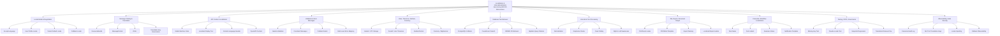

---

## Tabular Decomposition Map

| No | Category / Domain | Skill Praktis yang Perlu Dikuasai | Implementasi di Java Jersey/JAX-RS | Failure Mode yang Harus Diwaspadai |
|---:|---|---|---|---|
| 1 | **Terminology & Boundary** | Bedakan **internationalization**, **localization**, **globalization**, **translation**, dan **regional formatting** | Buat guideline: business logic tidak boleh tergantung bahasa manusia | Enum/status disimpan sebagai teks localized, lalu susah dipakai untuk query, audit, dan integration |
| 2 | **Canonical Data Model** | Simpan data dalam bentuk netral: `Instant`, `BigDecimal`, ISO currency, stable enum code, BCP 47 language tag | DTO internal memakai `statusCode`, `currencyCode`, `occurredAtUtc` | Data berubah makna saat locale berubah |
| 3 | **Locale Identification** | Pahami `Locale`, language tag seperti `id-ID`, `en-US`, `ja-JP` | `Locale.forLanguageTag("id-ID")`, whitelist supported locale | Menerima locale arbitrary lalu resource tidak ada atau formatting tidak konsisten |
| 4 | **Locale Negotiation** | Pilih locale dari prioritas: explicit query/header, user profile, tenant default, system default | Jersey `ContainerRequestFilter` membaca `Accept-Language`; JAX-RS `HttpHeaders#getAcceptableLanguages()` tersedia untuk mengambil preferensi bahasa request ([Jakarta EE](https://jakarta.ee/specifications/restful-ws/4.0/apidocs/jakarta.ws.rs/jakarta/ws/rs/core/httpheaders?utm_source=chatgpt.com)) | Semua user mendapat JVM default locale karena request locale tidak dipropagasikan |
| 5 | **Fallback Strategy** | Definisikan fallback deterministic: `id-ID → id → en → default` | `ResourceBundle.Control` atau custom resolver | Missing translation meledak di runtime atau fallback diam-diam ke bahasa salah |
| 6 | **Message Catalog** | Kelola file `messages.properties`, `messages_id_ID.properties`, `errors_en_US.properties` | `ResourceBundle.getBundle("messages", locale)` | Key duplikat, key hilang, typo, translator mengubah placeholder |
| 7 | **Translation Key Governance** | Buat naming convention: `order.status.cancelled`, `validation.customer.email.invalid` | Key stabil di code; value boleh berubah per bahasa | Key mengikuti kalimat English sehingga rename text menyebabkan breaking change |
| 8 | **Parameterized Message** | Gunakan placeholder untuk nama, angka, tanggal, jumlah | `MessageFormat.format(bundle.getString(key), args...)` | Concatenation manual seperti `"Hello " + name` merusak tata bahasa bahasa lain |
| 9 | **Pluralization & Gender** | Kuasai plural rules; bahasa berbeda punya aturan plural berbeda | Untuk kasus kompleks, pertimbangkan ICU4J karena ICU menyediakan dukungan Unicode/globalization yang lebih luas daripada formatter dasar Java ([Unicode Consortium](https://unicode-org.github.io/icu/userguide/icu4j/?utm_source=chatgpt.com)) | “1 items”, “0 item”, atau grammar salah untuk bahasa tertentu |
| 10 | **API Response Localization** | Pisahkan machine-readable dan human-readable field | Response: `{ "code": "ORDER_CANCELLED", "message": "Pesanan dibatalkan" }` | Client parsing `message` untuk logic bisnis |
| 11 | **HTTP Headers** | Pakai `Accept-Language` untuk request preference dan `Content-Language` untuk response yang localized | Jersey response filter menambahkan `Content-Language: id-ID` | Client tidak tahu bahasa response, cache/CDN salah menyajikan variasi bahasa |
| 12 | **Error Contract** | Desain error response yang stabil dan localized | Gunakan `errorCode`, `field`, `localizedMessage`, `params` | Error hanya berupa free text sehingga sulit di-handle frontend/mobile |
| 13 | **Jakarta Validation Localization** | Localize constraint violation: `@NotNull`, `@Size`, custom validator | `ValidationMessages_id_ID.properties`; custom `MessageInterpolator` bila perlu | Bean Validation memakai default JVM locale, bukan request locale |
| 14 | **Field Name Localization** | Localize nama field untuk error user-facing | Mapping `customer.email -> Email pelanggan` | Pesan “customer.email must not be null” bocor ke end-user |
| 15 | **Date/Time Formatting** | Bedakan storage time dan display time | Simpan `Instant` UTC; render dengan `DateTimeFormatter.withLocale(locale).withZone(zoneId)` | Menyimpan local time tanpa timezone menyebabkan salah hari saat multi-region |
| 16 | **Timezone Handling** | Tentukan sumber timezone: user profile, tenant, branch office, explicit request | `ZoneId`, `ZonedDateTime`, `OffsetDateTime` | Deadline/SLA regulatory salah karena timezone tidak jelas |
| 17 | **Number Formatting** | Format decimal, grouping, percent sesuai locale | `NumberFormat.getNumberInstance(locale)` | `1,234` bisa berarti seribu dua ratus tiga puluh empat atau satu koma dua tiga empat |
| 18 | **Currency Formatting** | Pisahkan amount dan currency | `BigDecimal amount`, `Currency currency`, `NumberFormat.getCurrencyInstance(locale)` | Rounding salah, currency symbol ambigu, minor unit tidak sesuai |
| 19 | **Parsing User Input** | Parsing angka/tanggal localized dari CSV/form/upload | Parser locale-aware, validasi eksplisit | Input `01/02/2026` ambigu: 1 Feb atau 2 Jan |
| 20 | **PostgreSQL Collation** | Pahami collation untuk sort dan comparison | Tentukan collation database/kolom; PostgreSQL memungkinkan collation per kolom/per operasi ([PostgreSQL](https://www.postgresql.org/docs/current/collation.html?utm_source=chatgpt.com)) | `ORDER BY name` berbeda antara environment on-prem, AWS, Azure |
| 21 | **Case & Accent Search** | Rancang search insensitive terhadap case/accent bila diperlukan | PostgreSQL ICU collation, `lower()`, `unaccent`, trigram index, atau normalized search column | Search “Jose” tidak menemukan “José”; “I” Turki bermasalah |
| 22 | **Unicode Normalization** | Pahami composed/decomposed characters, emoji, grapheme cluster | Normalize input saat indexing/search; jangan hitung panjang string hanya dari `String.length()` | Batas panjang field salah untuk emoji/aksara kompleks |
| 23 | **Right-to-Left Awareness** | Backend harus tidak merusak Arabic/Hebrew text | Simpan UTF-8, jangan trimming/regex sembarangan | PDF/email kacau karena arah teks campur RTL dan LTR |
| 24 | **Localized Enum Display** | Enum internal tetap kode; display name localized dari catalog | `OrderStatus.CANCELLED -> order.status.cancelled` | Enum value diganti menjadi bahasa lokal di database |
| 25 | **Domain Status & Workflow Text** | Pisahkan process state, task state, dan label user-facing | Camunda variable menyimpan code; task UI mengambil localized label | BPMN/task name dipakai sebagai business key |
| 26 | **Camunda User Task Localization** | Localize task name, form label, instruction, notification | Task definition key stabil; label dari translation catalog | Mengubah label merusak reporting/process monitoring |
| 27 | **Notification Template** | Email/SMS/push punya template per locale | `notification.payment.due.subject`, `notification.payment.due.body` | Placeholder hilang, grammar salah, link atau legal text tidak sesuai locale |
| 28 | **File Export Localization** | CSV/Excel/PDF/Word perlu label, date, number, currency locale-aware | Export service menerima `Locale`, `ZoneId`, `Currency` | Excel salah membaca decimal separator atau tanggal |
| 29 | **File Import Localization** | Import harus tahu locale sumber file | Metadata import: `sourceLocale`, `datePattern`, `decimalSeparator` | Data finansial salah parse tanpa error eksplisit |
| 30 | **Report Generation** | Report operational/regulatory perlu language pack | Template per locale; stable metric key | Angka benar tapi label atau timezone salah, menyebabkan dispute |
| 31 | **OpenAPI / API Documentation** | Dokumentasikan locale behavior dan supported language | Header `Accept-Language`, response header `Content-Language`, error schema | Consumer tidak tahu apakah message bisa berubah |
| 32 | **Caching Strategy** | Cache message bundle, tapi invalidasi saat release translation | Cache key: `locale + bundleName + version` | User mendapat bahasa lama setelah deployment |
| 33 | **Performance** | Hindari load bundle/formatter berulang secara mahal | Cache bundle; formatter immutable seperti `DateTimeFormatter` bisa reusable, tapi hati-hati formatter legacy mutable | Latency naik karena lookup file/resource setiap request |
| 34 | **Security** | Treat locale/header sebagai untrusted input | Whitelist locale; sanitize template args; jangan eval translation | Header injection, path traversal via locale, atau template injection |
| 35 | **Audit & Compliance** | Audit log harus canonical, bukan localized | Audit: `eventCode`, `actorId`, `occurredAtUtc`, `payloadHash` | Audit berubah bila translation berubah |
| 36 | **Logging & Observability** | Log technical event pakai English/canonical; ukur fallback/missing key | Metric: `i18n.missing_key`, `i18n.fallback_used`, `unsupported_locale` | Missing translation tidak terlihat sampai user complain |
| 37 | **Testing** | Test supported locale, missing key, placeholder mismatch, snapshot response | Unit test bundle completeness; integration test `Accept-Language` | Bahasa baru deploy tapi banyak key kosong |
| 38 | **Pseudo-Localization** | Uji UI/API terhadap teks panjang dan karakter non-ASCII | Generate pseudo locale seperti `en-XA` untuk test internal | Layout/report rusak saat German/French lebih panjang |
| 39 | **CI/CD Translation Flow** | Translation harus bagian dari release artifact | Check Maven test: no missing keys, no unused critical keys | Translation file manual diubah langsung di server |
| 40 | **Multi-Tenant Localization** | Tenant bisa punya default locale, supported locale, wording/legal text berbeda | Resolver: tenant config + user preference + request header | Tenant A melihat legal text tenant B |
| 41 | **Cloud / Runtime Consistency** | Locale, charset, timezone, OS collation harus konsisten di Docker/Kubernetes/on-prem/cloud | Set `LANG`, `TZ`, JVM properties secara eksplisit; DB collation dikontrol | Hasil sort berbeda antara local Docker, AWS RDS, Azure DB, dan on-prem |
| 42 | **Migration Strategy** | Migrasi sistem monolingual ke i18n tanpa big bang | Mulai dari error code, message key, resource bundle, response contract | Terlalu cepat translate semua text tapi contract masih rapuh |

---

## Roadmap Alur Belajar yang Direkomendasikan

### 1. Foundation: mental model & boundary

Mulai dari aturan paling penting: **internal canonical, external localized**. Kuasai `Locale`, BCP 47 language tag, `ResourceBundle`, `MessageFormat`, dan fallback strategy.

Target hasil: bisa menjawab kapan memakai `code`, kapan memakai `message`, dan kapan memakai `displayName`.

---

### 2. Jersey/JAX-RS request localization

Pelajari locale negotiation berbasis:

```text
Explicit request parameter/header
→ user profile locale
→ tenant default locale
→ application default locale
```

Implementasikan `ContainerRequestFilter` untuk menentukan `LocaleContext`, lalu gunakan di resource, service, mapper, dan exception handler.

Target hasil: endpoint yang sama bisa mengembalikan pesan berbeda berdasarkan `Accept-Language`, tapi `errorCode` tetap sama.

---

### 3. Error, validation, dan API contract

Masuk ke localization untuk:

```text
Jakarta Validation
ExceptionMapper
Problem Details style response
Field-level error
Business rule violation
```

Target hasil: semua error response punya struktur stabil seperti:

```json
{
  "code": "CUSTOMER_EMAIL_INVALID",
  "message": "Email pelanggan tidak valid",
  "field": "customer.email"
}
```

---

### 4. Date, timezone, number, dan currency

Pelajari `java.time`, `ZoneId`, `Instant`, `DateTimeFormatter`, `NumberFormat`, `Currency`, dan `BigDecimal`.

Target hasil: tidak ada lagi bug SLA, due date, report date, amount, decimal separator, atau currency display karena locale/timezone salah.

---

### 5. Database & search behavior

Masuk ke PostgreSQL collation, ICU collation, case-insensitive search, accent-insensitive search, `ORDER BY`, dan indexing strategy.

Target hasil: hasil sort/search konsisten lintas environment Docker, Kubernetes, AWS, Azure, dan on-prem.

---

### 6. File/report/workflow localization

Pelajari localization untuk CSV, Excel, PDF, Word, notification template, Camunda task label, form label, dan report.

Target hasil: export/import/report/workflow tidak mencampur business code dengan human label.

---

### 7. Testing, CI/CD, dan governance

Bangun test untuk:

```text
missing translation key
placeholder mismatch
unsupported locale
fallback usage
snapshot localized response
pseudo-localization
```

Target hasil: translation menjadi bagian dari release quality gate, bukan pekerjaan manual menjelang production.

---

## Rekomendasi Materi Selanjutnya

Lanjutkan dengan cheatsheet: **“Locale Negotiation & LocaleContext Pattern in Java Jersey/JAX-RS Microservice”** - karena ini fondasi implementasi sebelum masuk ke ResourceBundle, validation error, database collation, dan report localization.

---

**Sources:**

- [ResourceBundle (Java SE 17 & JDK 17)](https://docs.oracle.com/en/java/javase/17/docs/api/java.base/java/util/ResourceBundle.html?utm_source=chatgpt.com)
- [HttpHeaders (Jakarta RESTful WS API 4.0.0 API)](https://jakarta.ee/specifications/restful-ws/4.0/apidocs/jakarta.ws.rs/jakarta/ws/rs/core/httpheaders?utm_source=chatgpt.com)
- [ICU4J | ICU Documentation](https://unicode-org.github.io/icu/userguide/icu4j/?utm_source=chatgpt.com)
- [Documentation: 18: 23.2. Collation Support](https://www.postgresql.org/docs/current/collation.html?utm_source=chatgpt.com)

## Response:
7/13/2026, 9:31:58 PM

Total saya rekomendasikan **12 seri** untuk topic **Localization / Internationalization di Java Jersey/JAX-RS Microservice**.

| Seri | Topik |
|---:|---|
| 1 | Mental Model: i18n vs l10n, canonical data vs localized presentation |
| 2 | Locale Negotiation & `LocaleContext` Pattern di Jersey/JAX-RS |
| 3 | ResourceBundle, Message Catalog, Translation Key Governance |
| 4 | Parameterized Message, Pluralization, ICU4J, dan Fallback Strategy |
| 5 | Localized API Contract, Error Code, Problem Details, dan ExceptionMapper |
| 6 | Jakarta Validation Localization & Field-Level Error Mapping |
| 7 | Date, Timezone, Number, Currency Formatting dengan `java.time` |
| 8 | PostgreSQL Collation, Case/Accent Search, Unicode Text Behavior |
| 9 | MyBatis Query Pattern untuk Localized Data dan Search |
| 10 | File Export/Import Localization: CSV, Excel, PDF, Word, Report |
| 11 | Camunda Workflow, User Task, Notification, dan Template Localization |
| 12 | Testing, CI/CD Governance, Observability, Security, dan Production Checklist |

Rekomendasi mulai dari **Seri 1: Mental Model i18n/l10n untuk Microservice**.

## Response:
7/13/2026, 10:05:06 PM

Saya mulai dari **Seri 1 dari 12**. Seri ini akan membangun mental model dulu supaya seri berikutnya tidak jatuh ke pola umum yang salah: menerjemahkan string tanpa menjaga contract, audit, dan data canonical.

# Seri 1 dari 12 - Mental Model i18n/l10n untuk Java Jersey/JAX-RS Microservice

## 1. Tujuan Seri Ini

Seri ini membangun fondasi berpikir untuk **Localization / Internationalization** di backend microservice. Fokusnya bukan dulu ke `ResourceBundle`, `Accept-Language`, atau formatter, tapi ke **boundary arsitektur**:

> Mana yang harus canonical, mana yang boleh localized, dan mana yang tidak boleh dicampur.

Ini penting karena di enterprise microservice, bug i18n/l10n sering bukan karena salah translate, tetapi karena **status bisnis, audit log, database value, API contract, workflow state, atau integration payload ikut berubah berdasarkan bahasa user**.

Menurut W3C, **internationalization** adalah proses desain dan development agar produk mudah diadaptasi ke berbagai bahasa, region, dan budaya; sedangkan **localization** adalah penyesuaian sistem terhadap ekspektasi budaya atau pasar tertentu, bukan hanya menerjemahkan teks. ([W3C](https://www.w3.org/International/questions/qa-i18n?utm_source=chatgpt.com))

---

## 2. Core Mental Model

```text
Internal System     : canonical, stable, language-neutral
API Contract        : stable machine-readable + optional localized display
User Presentation   : localized
Audit / Event / DB  : canonical
Report / Document   : localized output + canonical metadata
Workflow            : stable process key + localized label
```

Aturan utamanya:

```text
Never let human language become business logic.
```

Contoh salah:

```json
{
  "status": "Pesanan dibatalkan"
}
```

Contoh benar:

```json
{
  "statusCode": "ORDER_CANCELLED",
  "statusLabel": "Pesanan dibatalkan"
}
```

`statusCode` stabil untuk logic, database, audit, event, dan integration.  
`statusLabel` hanya untuk display.

---

## 3. Diagram Mental Model

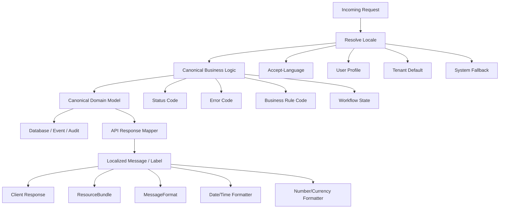

---

## 4. Istilah Penting

| Istilah | Makna Praktis | Contoh |
|---|---|---|
| **Internationalization / i18n** | Mendesain aplikasi agar siap dilokalisasi | Memakai message key, bukan hardcoded text |
| **Localization / l10n** | Adaptasi ke bahasa, region, budaya tertentu | Bahasa Indonesia, format tanggal Indonesia, IDR |
| **Locale** | Identitas bahasa/region | `id-ID`, `en-US`, `ja-JP` |
| **Canonical value** | Nilai stabil yang tidak bergantung bahasa | `APPROVED`, `REJECTED`, `PENDING_REVIEW` |
| **Localized value** | Nilai tampilan sesuai locale | `Disetujui`, `Ditolak`, `Menunggu peninjauan` |
| **Message key** | Key stabil untuk mencari terjemahan | `order.status.cancelled` |
| **Fallback locale** | Locale cadangan bila translation tidak tersedia | `id-ID → id → en → default` |
| **Content negotiation** | Mekanisme memilih bahasa response berdasarkan request | `Accept-Language` |
| **Presentation boundary** | Lapisan tempat canonical value diubah menjadi localized text | REST response mapper, report generator, email template |

---

## 5. Boundary yang Harus Dijaga

### A. Database

Database sebaiknya menyimpan:

```text
status_code = 'ORDER_CANCELLED'
currency_code = 'IDR'
occurred_at = UTC timestamp
customer_name = original user input
```

Database sebaiknya tidak menyimpan:

```text
status = 'Pesanan dibatalkan'
amount_display = 'Rp1.000,00'
created_date_display = '13 Juli 2026'
```

Alasannya sederhana: localized text bisa berubah, sedangkan data bisnis harus tetap stabil.

---

### B. API Contract

API backend sebaiknya punya dua jenis field:

```json
{
  "statusCode": "ORDER_CANCELLED",
  "statusLabel": "Pesanan dibatalkan"
}
```

`statusCode` adalah contract.  
`statusLabel` adalah convenience/display.

Client tidak boleh melakukan logic seperti:

```javascript
if (response.statusLabel === "Pesanan dibatalkan") {
  // do something
}
```

Client harus memakai:

```javascript
if (response.statusCode === "ORDER_CANCELLED") {
  // do something
}
```

---

### C. Error Handling

Contoh buruk:

```json
{
  "error": "Email pelanggan tidak valid"
}
```

Contoh baik:

```json
{
  "code": "CUSTOMER_EMAIL_INVALID",
  "message": "Email pelanggan tidak valid",
  "field": "customer.email"
}
```

Untuk bahasa Inggris:

```json
{
  "code": "CUSTOMER_EMAIL_INVALID",
  "message": "Customer email is invalid",
  "field": "customer.email"
}
```

Perhatikan: `code` dan `field` tetap sama, hanya `message` yang berubah.

---

### D. Audit Log

Audit log harus canonical.

Contoh baik:

```json
{
  "eventCode": "ORDER_CANCELLED",
  "actorId": "usr_123",
  "targetId": "ord_456",
  "occurredAt": "2026-07-13T10:15:30Z",
  "reasonCode": "CUSTOMER_REQUEST"
}
```

Jangan audit seperti ini:

```json
{
  "event": "Pesanan dibatalkan oleh pelanggan"
}
```

Masalahnya: bila translation berubah, audit historis jadi ambigu.

---

### E. Camunda Workflow

Camunda/process engine sebaiknya memakai stable key:

```text
processDefinitionKey = order_fulfillment
taskDefinitionKey    = approve_order
businessStatus       = PENDING_APPROVAL
```

User-facing label boleh localized:

```text
id-ID: Menyetujui pesanan
en-US: Approve order
```

Jangan gunakan label manusia sebagai dasar routing workflow.

---

## 6. Layering Pattern untuk Java Jersey/JAX-RS

Struktur konseptual yang disarankan:

```text
Resource / Controller
  ↓
Request Locale Resolver
  ↓
Application Service
  ↓
Domain Logic
  ↓
Repository / MyBatis
  ↓
Response Mapper
  ↓
Message Localizer
```

Contoh separation:

```java
public record OrderResponse(
    String orderId,
    String statusCode,
    String statusLabel
) {}
```

Domain object:

```java
public enum OrderStatus {
    PENDING_APPROVAL,
    APPROVED,
    REJECTED,
    CANCELLED
}
```

Message key resolver:

```java
public final class OrderStatusMessageKeys {
    public static String keyOf(OrderStatus status) {
        return switch (status) {
            case PENDING_APPROVAL -> "order.status.pendingApproval";
            case APPROVED -> "order.status.approved";
            case REJECTED -> "order.status.rejected";
            case CANCELLED -> "order.status.cancelled";
        };
    }
}
```

Response mapper:

```java
public OrderResponse toResponse(Order order, Locale locale) {
    String key = OrderStatusMessageKeys.keyOf(order.status());
    String label = messageLocalizer.getMessage(key, locale);

    return new OrderResponse(
        order.id(),
        order.status().name(),
        label
    );
}
```

Java `ResourceBundle` memang ditujukan untuk menyimpan resource locale-specific sehingga program code bisa relatif independent dari locale user. ([Oracle Docs](https://docs.oracle.com/en/java/javase/17/docs/api/java.base/java/util/ResourceBundle.html?utm_source=chatgpt.com)) Untuk pesan yang punya placeholder seperti tanggal, angka, currency, atau nama entity, `MessageFormat` dipakai agar compound message diformat secara locale-independent menggunakan pola dari resource bundle. ([Oracle Docs](https://docs.oracle.com/javase/tutorial/i18n/format/messageFormat.html?utm_source=chatgpt.com))

---

## 7. Locale Resolution Strategy

Urutan praktis yang umum aman untuk backend enterprise:

```text
1. Explicit API parameter/header, bila memang didukung
2. User profile locale
3. Tenant / organization default locale
4. Accept-Language
5. Application default locale
```

Kenapa `Accept-Language` tidak selalu nomor satu? Karena browser/client bisa mengirim bahasa berdasarkan device, bukan preferensi bisnis user. Header `Accept-Language` menunjukkan bahasa/locale yang disukai client, dan server bisa memilih representasi lalu menginformasikan hasilnya lewat `Content-Language`. ([MDN Web Docs](https://developer.mozilla.org/en-US/docs/Web/HTTP/Reference/Headers/Accept-Language?utm_source=chatgpt.com))

Contoh:

```http
GET /orders/ORD-123
Accept-Language: id-ID,id;q=0.9,en-US;q=0.8,en;q=0.7
```

Response:

```http
Content-Language: id-ID
```

Body:

```json
{
  "orderId": "ORD-123",
  "statusCode": "PENDING_APPROVAL",
  "statusLabel": "Menunggu persetujuan"
}
```

---

## 8. Invariant Penting

| Invariant | Penjelasan |
|---|---|
| **Business rule tidak boleh bergantung pada localized text** | Logic harus memakai code/enum |
| **Database value harus canonical** | Translation bukan sumber kebenaran |
| **Audit log harus language-neutral** | Audit harus stabil lintas waktu dan locale |
| **API harus machine-readable dulu** | Localized text hanya tambahan |
| **Fallback harus deterministic** | Jangan bergantung JVM default locale secara diam-diam |
| **Message key harus stabil** | Jangan jadikan English sentence sebagai key |
| **Locale input harus divalidasi** | Jangan percaya arbitrary locale dari request |
| **Formatting tidak sama dengan translation** | Tanggal, angka, currency, timezone punya aturan sendiri |
| **Search/sort bukan sekadar translate** | Collation dan Unicode behavior perlu desain database |
| **Workflow label bukan workflow state** | Camunda state harus pakai stable key |

---

## 9. Anti-Pattern yang Sering Terjadi

### Anti-pattern 1 - Hardcoded message di service

```java
throw new BusinessException("Pesanan tidak bisa dibatalkan");
```

Lebih baik:

```java
throw new BusinessException("ORDER_CANNOT_BE_CANCELLED");
```

Lalu localized di `ExceptionMapper`.

---

### Anti-pattern 2 - Localized enum di database

Buruk:

```text
status = 'Disetujui'
```

Baik:

```text
status_code = 'APPROVED'
```

---

### Anti-pattern 3 - Client parsing message

Buruk:

```javascript
if (error.message === "Saldo tidak cukup") {
  showTopUpButton();
}
```

Baik:

```javascript
if (error.code === "INSUFFICIENT_BALANCE") {
  showTopUpButton();
}
```

---

### Anti-pattern 4 - Menggunakan JVM default locale

Buruk:

```java
NumberFormat formatter = NumberFormat.getCurrencyInstance();
```

Lebih eksplisit:

```java
NumberFormat formatter = NumberFormat.getCurrencyInstance(locale);
```

---

### Anti-pattern 5 - Semua text diterjemahkan terlalu awal

Tidak semua string harus localized. Contoh yang sebaiknya tidak diterjemahkan:

```text
traceId
requestId
errorCode
enum code
workflow key
database constraint name
metric name
log event name
Kafka topic name
Camunda process definition key
```

---

## 10. Practical Design Template

Gunakan pola response seperti ini:

```json
{
  "id": "ORD-20260713-001",
  "status": {
    "code": "PENDING_APPROVAL",
    "label": "Menunggu persetujuan"
  },
  "amount": {
    "value": 1500000.00,
    "currency": "IDR",
    "formatted": "Rp1.500.000,00"
  },
  "createdAt": {
    "instant": "2026-07-13T03:15:30Z",
    "timezone": "Asia/Jakarta",
    "formatted": "13 Juli 2026 10.15"
  }
}
```

Kenapa bentuk ini bagus?

| Field | Fungsi |
|---|---|
| `code` | Logic dan integration |
| `label` | Display |
| `value` | Calculation |
| `currency` | Financial correctness |
| `formatted` | User presentation |
| `instant` | Audit/time correctness |
| `timezone` | Interpretasi waktu |
| `formatted date` | User readability |

---

## 11. Checklist Arsitektur Seri 1

Gunakan checklist ini saat review codebase baru:

```text
[ ] Apakah status bisnis disimpan sebagai code, bukan label?
[ ] Apakah error response punya stable errorCode?
[ ] Apakah localized message hanya dibuat di boundary response?
[ ] Apakah audit log bebas dari localized text?
[ ] Apakah Camunda task/process key tidak bergantung pada label?
[ ] Apakah API response memisahkan code dan display label?
[ ] Apakah currency disimpan terpisah dari formatted amount?
[ ] Apakah timestamp disimpan canonical dalam UTC/Instant?
[ ] Apakah timezone user/tenant dikelola eksplisit?
[ ] Apakah fallback locale deterministic?
[ ] Apakah translation key punya naming convention?
[ ] Apakah logs/metrics memakai canonical event name?
```

---

## 12. Mini Exercise untuk Onboarding

Ambil satu endpoint di codebase, misalnya:

```text
GET /cases/{caseId}
GET /orders/{orderId}
GET /customers/{customerId}
```

Lalu identifikasi:

| Pertanyaan | Yang Dicari |
|---|---|
| Apakah response punya status code stabil? | `statusCode`, `state`, `phase`, `decisionCode` |
| Apakah ada field display text? | `statusLabel`, `description`, `message` |
| Apakah display text hardcoded? | String literal di service/resource |
| Apakah error response stable? | `errorCode` vs free-text |
| Apakah tanggal punya timezone? | `Instant`, `OffsetDateTime`, `ZoneId` |
| Apakah amount punya currency? | `BigDecimal + currencyCode` |
| Apakah audit menyimpan label manusia? | Audit table/event payload |
| Apakah workflow state memakai label? | Camunda task/process variable |

Output dari exercise ini bisa jadi baseline refactoring i18n/l10n.

---

# Seri 1 Selesai

Materi ini adalah fondasi. Jangan lanjut ke `ResourceBundle` atau `Accept-Language` sebelum boundary ini jelas, karena kalau tidak, localization akan masuk terlalu dalam ke domain logic.

Rekomendasi berikutnya: **Seri 2 - Locale Negotiation & `LocaleContext` Pattern di Jersey/JAX-RS**.

---

**Sources:**

- [Localization vs. Internationalization](https://www.w3.org/International/questions/qa-i18n?utm_source=chatgpt.com)
- [ResourceBundle (Java SE 17 & JDK 17)](https://docs.oracle.com/en/java/javase/17/docs/api/java.base/java/util/ResourceBundle.html?utm_source=chatgpt.com)
- [Accept-Language header - HTTP - MDN Web Docs](https://developer.mozilla.org/en-US/docs/Web/HTTP/Reference/Headers/Accept-Language?utm_source=chatgpt.com)

## Response:
7/13/2026, 10:06:52 PM

Saya lanjut ke **Seri 2 dari 12**: fokus ke cara menentukan locale per request secara aman di Jersey/JAX-RS, lalu mempropagasikannya tanpa mencemari domain logic.

# Seri 2 dari 12 - Locale Negotiation & `LocaleContext` Pattern di Jersey/JAX-RS

## 1. Tujuan Seri Ini

Seri ini membahas bagaimana backend **Java Jersey/JAX-RS microservice** menentukan bahasa/region untuk setiap request secara aman, konsisten, dan testable.

Di aplikasi enterprise, locale tidak boleh ditentukan secara asal dari:

```java
Locale.getDefault()
```

Karena `Locale.getDefault()` bergantung pada konfigurasi JVM/container, bukan preferensi user atau tenant. Dalam Docker/Kubernetes/on-prem/cloud, default locale bisa berbeda antar environment.

Target akhirnya:

```text
Request masuk
  ↓
Locale ditentukan secara eksplisit
  ↓
Disimpan sebagai LocaleContext
  ↓
Dipakai di response mapper, error mapper, validator, formatter, report
  ↓
Tidak mencemari domain logic
```

---

## 2. Problem yang Ingin Diselesaikan

Misalnya endpoint:

```http
GET /orders/ORD-123
Accept-Language: id-ID,id;q=0.9,en-US;q=0.8,en;q=0.7
```

Response yang diharapkan:

```json
{
  "orderId": "ORD-123",
  "statusCode": "PENDING_APPROVAL",
  "statusLabel": "Menunggu persetujuan"
}
```

Tetapi bila client memakai bahasa Inggris:

```http
GET /orders/ORD-123
Accept-Language: en-US,en;q=0.9
```

Response menjadi:

```json
{
  "orderId": "ORD-123",
  "statusCode": "PENDING_APPROVAL",
  "statusLabel": "Pending approval"
}
```

Perhatikan invariant-nya:

```text
statusCode tetap sama
statusLabel berubah sesuai locale
```

---

## 3. Sumber Locale yang Umum

Locale bisa datang dari beberapa tempat:

| Prioritas | Sumber | Contoh | Catatan |
|---:|---|---|---|
| 1 | Explicit request override | `X-Locale: id-ID`, `?locale=id-ID` | Cocok untuk admin tool, testing, atau API internal |
| 2 | User profile | `preferredLocale = id-ID` | Lebih stabil daripada browser header |
| 3 | Tenant / organization default | `tenant.defaultLocale = en-SG` | Penting untuk multi-tenant |
| 4 | `Accept-Language` | `id-ID,id;q=0.9,en;q=0.8` | Bagus untuk public API/browser-driven request |
| 5 | Application default | `en-US` atau `id-ID` | Fallback terakhir |

Header `Accept-Language` menunjukkan bahasa dan locale yang disukai client; server dapat memilih salah satu representasi dan memberi tahu hasilnya lewat `Content-Language`. ([MDN Web Docs](https://developer.mozilla.org/en-US/docs/Web/HTTP/Reference/Headers/Accept-Language?utm_source=chatgpt.com))

---

## 4. Diagram Locale Negotiation

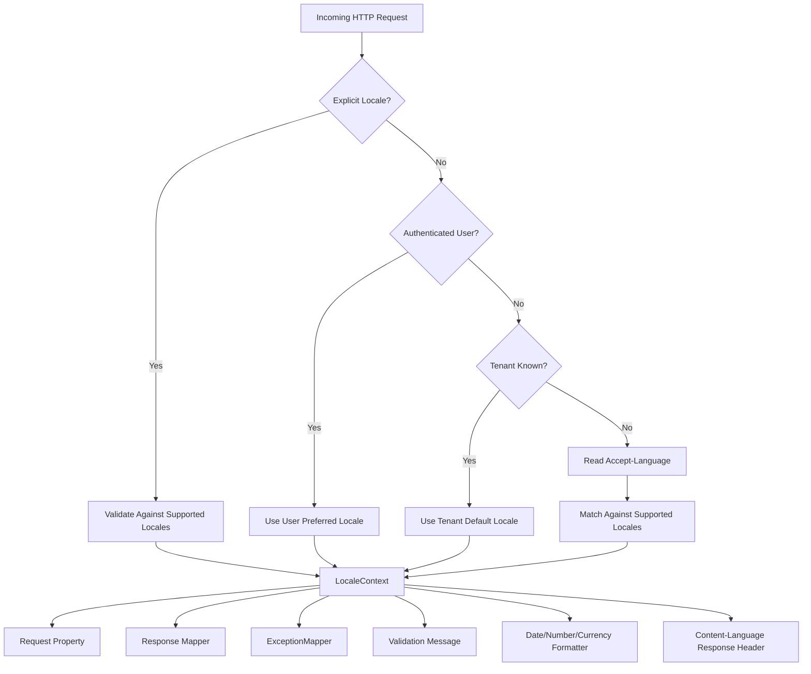

---

## 5. Kenapa Perlu `LocaleContext`

Jangan biarkan setiap class membaca header sendiri-sendiri.

Buruk:

```java
@GET
@Path("/{id}")
public Response getOrder(@Context HttpHeaders headers, @PathParam("id") String id) {
    Locale locale = headers.getAcceptableLanguages().get(0);
    // business logic + localization bercampur
}
```

Masalahnya:

| Masalah | Dampak |
|---|---|
| Locale resolver tersebar | Sulit konsisten |
| Fallback beda-beda | Response tidak predictable |
| Testing sulit | Tiap endpoint punya logic sendiri |
| Domain logic tercemar | Service bisnis jadi tahu HTTP |
| Error mapper tidak punya locale yang sama | Error message bisa beda dari response normal |

Lebih baik buat satu object:

```java
public record LocaleContext(
    Locale locale,
    String source,
    Locale fallbackLocale,
    List<Locale> acceptableLocales
) {}
```

Contoh value:

```json
{
  "locale": "id-ID",
  "source": "ACCEPT_LANGUAGE",
  "fallbackLocale": "en-US",
  "acceptableLocales": ["id-ID", "id", "en-US", "en"]
}
```

---

## 6. Supported Locale Whitelist

Jangan menerima semua locale dari client.

Contoh supported locale:

```java
public final class SupportedLocales {
    public static final Locale ID_ID = Locale.forLanguageTag("id-ID");
    public static final Locale EN_US = Locale.forLanguageTag("en-US");

    public static final Set<Locale> SUPPORTED = Set.of(
        ID_ID,
        EN_US
    );

    public static final Locale DEFAULT = EN_US;

    private SupportedLocales() {}
}
```

Java `Locale` mendukung language tag berbasis BCP 47; dokumentasi Java menjelaskan `Locale` sebagai representasi bahasa/negara/varian yang digunakan untuk operasi locale-sensitive. ([Oracle Docs](https://docs.oracle.com/en/java/javase/21/docs/api/java.base/java/util/Locale.html?utm_source=chatgpt.com))

---

## 7. Locale Matching Strategy

Client bisa mengirim:

```http
Accept-Language: id-ID,id;q=0.9,en-US;q=0.8,en;q=0.7
```

Supported locale aplikasi:

```text
id-ID
en-US
```

Maka hasilnya:

```text
id-ID
```

Tetapi bila client mengirim:

```http
Accept-Language: fr-FR,fr;q=0.9,en;q=0.8
```

Dan aplikasi hanya support:

```text
id-ID
en-US
```

Maka hasilnya bisa:

```text
en-US
```

karena `fr-FR` dan `fr` tidak didukung.

Pola matching sederhana:

```text
1. Exact match: id-ID == id-ID
2. Language-only match: id == id-ID
3. Fallback default: en-US
```

---

## 8. Implementasi `LocaleResolver`

```java
import java.util.List;
import java.util.Locale;
import java.util.Optional;
import java.util.Set;

public final class LocaleResolver {

    private final Set<Locale> supportedLocales;
    private final Locale defaultLocale;

    public LocaleResolver(Set<Locale> supportedLocales, Locale defaultLocale) {
        this.supportedLocales = Set.copyOf(supportedLocales);
        this.defaultLocale = defaultLocale;
    }

    public LocaleContext resolve(LocaleResolutionInput input) {
        Optional<Locale> explicitLocale = input.explicitLocale()
            .flatMap(this::parseSupportedLocale);

        if (explicitLocale.isPresent()) {
            return new LocaleContext(
                explicitLocale.get(),
                "EXPLICIT",
                defaultLocale,
                input.acceptableLocales()
            );
        }

        Optional<Locale> userLocale = input.userPreferredLocale()
            .flatMap(this::parseSupportedLocale);

        if (userLocale.isPresent()) {
            return new LocaleContext(
                userLocale.get(),
                "USER_PROFILE",
                defaultLocale,
                input.acceptableLocales()
            );
        }

        Optional<Locale> tenantLocale = input.tenantDefaultLocale()
            .flatMap(this::parseSupportedLocale);

        if (tenantLocale.isPresent()) {
            return new LocaleContext(
                tenantLocale.get(),
                "TENANT_DEFAULT",
                defaultLocale,
                input.acceptableLocales()
            );
        }

        Optional<Locale> acceptedLocale = matchAcceptableLocales(input.acceptableLocales());

        return new LocaleContext(
            acceptedLocale.orElse(defaultLocale),
            acceptedLocale.isPresent() ? "ACCEPT_LANGUAGE" : "APPLICATION_DEFAULT",
            defaultLocale,
            input.acceptableLocales()
        );
    }

    private Optional<Locale> parseSupportedLocale(String languageTag) {
        if (languageTag == null || languageTag.isBlank()) {
            return Optional.empty();
        }

        Locale parsed = Locale.forLanguageTag(languageTag.trim());
        return matchLocale(parsed);
    }

    private Optional<Locale> matchAcceptableLocales(List<Locale> acceptableLocales) {
        for (Locale requested : acceptableLocales) {
            Optional<Locale> matched = matchLocale(requested);
            if (matched.isPresent()) {
                return matched;
            }
        }
        return Optional.empty();
    }

    private Optional<Locale> matchLocale(Locale requested) {
        if (supportedLocales.contains(requested)) {
            return Optional.of(requested);
        }

        return supportedLocales.stream()
            .filter(supported -> supported.getLanguage().equalsIgnoreCase(requested.getLanguage()))
            .findFirst();
    }
}
```

Input object:

```java
import java.util.List;
import java.util.Locale;
import java.util.Optional;

public record LocaleResolutionInput(
    Optional<String> explicitLocale,
    Optional<String> userPreferredLocale,
    Optional<String> tenantDefaultLocale,
    List<Locale> acceptableLocales
) {}
```

Context object:

```java
import java.util.List;
import java.util.Locale;

public record LocaleContext(
    Locale locale,
    String source,
    Locale fallbackLocale,
    List<Locale> acceptableLocales
) {}
```

---

## 9. Jersey/JAX-RS `ContainerRequestFilter`

Di JAX-RS/Jakarta REST, `ContainerRequestFilter` dipakai untuk memfilter request di sisi server sebelum resource method dieksekusi. Jersey juga mendokumentasikan filter dan interceptor sebagai mekanisme yang bisa digunakan di sisi client maupun server. ([eclipse-ee4j.github.io](https://eclipse-ee4j.github.io/jersey.github.io/documentation/latest31x/filters-and-interceptors.html?utm_source=chatgpt.com))

Contoh filter:

```java
import jakarta.annotation.Priority;
import jakarta.ws.rs.Priorities;
import jakarta.ws.rs.container.ContainerRequestContext;
import jakarta.ws.rs.container.ContainerRequestFilter;
import jakarta.ws.rs.core.Context;
import jakarta.ws.rs.core.HttpHeaders;
import jakarta.ws.rs.ext.Provider;

import java.io.IOException;
import java.util.List;
import java.util.Locale;
import java.util.Optional;

@Provider
@Priority(Priorities.AUTHENTICATION + 100)
public class LocaleContextFilter implements ContainerRequestFilter {

    public static final String LOCALE_CONTEXT_PROPERTY = "app.localeContext";

    private final LocaleResolver localeResolver;

    @Context
    private HttpHeaders httpHeaders;

    public LocaleContextFilter() {
        this.localeResolver = new LocaleResolver(
            SupportedLocales.SUPPORTED,
            SupportedLocales.DEFAULT
        );
    }

    @Override
    public void filter(ContainerRequestContext requestContext) throws IOException {
        Optional<String> explicitLocale = Optional.ofNullable(
            requestContext.getHeaderString("X-Locale")
        );

        Optional<String> userPreferredLocale = resolveUserPreferredLocale(requestContext);
        Optional<String> tenantDefaultLocale = resolveTenantDefaultLocale(requestContext);

        List<Locale> acceptableLocales = httpHeaders.getAcceptableLanguages();

        LocaleResolutionInput input = new LocaleResolutionInput(
            explicitLocale,
            userPreferredLocale,
            tenantDefaultLocale,
            acceptableLocales
        );

        LocaleContext localeContext = localeResolver.resolve(input);

        requestContext.setProperty(LOCALE_CONTEXT_PROPERTY, localeContext);
    }

    private Optional<String> resolveUserPreferredLocale(ContainerRequestContext requestContext) {
        // Di real system, biasanya diambil dari authenticated principal / JWT claim / user profile service.
        return Optional.empty();
    }

    private Optional<String> resolveTenantDefaultLocale(ContainerRequestContext requestContext) {
        // Di real system, biasanya diambil dari tenant context.
        return Optional.empty();
    }
}
```

`HttpHeaders` di Jakarta REST menyediakan akses ke header request, dan method `getAcceptableLanguages()` mengembalikan daftar bahasa yang dapat diterima berdasarkan request. ([Jakarta EE](https://jakarta.ee/specifications/restful-ws/4.0/apidocs/jakarta.ws.rs/jakarta/ws/rs/core/httpheaders?utm_source=chatgpt.com))

---

## 10. Access `LocaleContext` dari Resource

Resource tidak perlu membaca header langsung.

```java
import jakarta.ws.rs.GET;
import jakarta.ws.rs.Path;
import jakarta.ws.rs.PathParam;
import jakarta.ws.rs.container.ContainerRequestContext;
import jakarta.ws.rs.core.Context;
import jakarta.ws.rs.core.Response;

@Path("/orders")
public class OrderResource {

    private final OrderApplicationService orderService;
    private final OrderResponseMapper responseMapper;

    public OrderResource(
        OrderApplicationService orderService,
        OrderResponseMapper responseMapper
    ) {
        this.orderService = orderService;
        this.responseMapper = responseMapper;
    }

    @GET
    @Path("/{orderId}")
    public Response getOrder(
        @PathParam("orderId") String orderId,
        @Context ContainerRequestContext requestContext
    ) {
        LocaleContext localeContext = (LocaleContext) requestContext.getProperty(
            LocaleContextFilter.LOCALE_CONTEXT_PROPERTY
        );

        Order order = orderService.getOrder(orderId);

        OrderResponse response = responseMapper.toResponse(
            order,
            localeContext.locale()
        );

        return Response.ok(response)
            .language(localeContext.locale())
            .build();
    }
}
```

`Response.language(locale)` menghasilkan header `Content-Language`.

---

## 11. Better Pattern: Inject Request-Scoped Context

Kalau memakai DI seperti HK2 atau CDI/Weld, lebih rapi jika `LocaleContext` dibuat request-scoped.

Konsepnya:

```text
ContainerRequestFilter
  ↓
set LocaleContext ke request-scoped holder
  ↓
Resource / ExceptionMapper / Mapper inject LocaleContextProvider
```

Interface:

```java
public interface LocaleContextProvider {
    LocaleContext current();
}
```

Implementasi sederhana:

```java
import jakarta.ws.rs.container.ContainerRequestContext;

public class RequestLocaleContextProvider implements LocaleContextProvider {

    private final ContainerRequestContext requestContext;

    public RequestLocaleContextProvider(ContainerRequestContext requestContext) {
        this.requestContext = requestContext;
    }

    @Override
    public LocaleContext current() {
        Object value = requestContext.getProperty(LocaleContextFilter.LOCALE_CONTEXT_PROPERTY);

        if (value instanceof LocaleContext localeContext) {
            return localeContext;
        }

        return new LocaleContext(
            SupportedLocales.DEFAULT,
            "APPLICATION_DEFAULT",
            SupportedLocales.DEFAULT,
            List.of()
        );
    }
}
```

Di banyak codebase Jersey + HK2, binding detail-nya tergantung konfigurasi project. Prinsipnya yang penting:

```text
LocaleContext adalah request-scoped concern.
Bukan static global.
Bukan ThreadLocal sembarangan.
Bukan domain object.
```

---

## 12. Jangan Pakai Static Global Locale

Buruk:

```java
public final class CurrentLocale {
    public static Locale locale;
}
```

Ini berbahaya karena:

| Risiko | Penjelasan |
|---|---|
| Race condition | Request user A bisa memengaruhi user B |
| Tidak aman di thread pool | Thread reused antar request |
| Sulit dites | Test bisa saling bocor |
| Tidak cocok untuk reactive/async | Context bisa hilang |
| Tidak cocok untuk multi-tenant | Tenant A/B bisa tercampur |

Kalau memakai `ThreadLocal`, gunakan sangat hati-hati dan pastikan selalu `remove()` di akhir request. Untuk request-scoped Jersey biasa, request property atau DI request scope biasanya lebih aman.

---

## 13. Response Filter untuk `Content-Language`

Daripada setiap resource menambahkan language header manual, bisa gunakan response filter.

```java
import jakarta.ws.rs.container.ContainerRequestContext;
import jakarta.ws.rs.container.ContainerResponseContext;
import jakarta.ws.rs.container.ContainerResponseFilter;
import jakarta.ws.rs.ext.Provider;

import java.io.IOException;

@Provider
public class LocaleResponseFilter implements ContainerResponseFilter {

    @Override
    public void filter(
        ContainerRequestContext requestContext,
        ContainerResponseContext responseContext
    ) throws IOException {
        Object value = requestContext.getProperty(LocaleContextFilter.LOCALE_CONTEXT_PROPERTY);

        if (value instanceof LocaleContext localeContext) {
            responseContext.getHeaders().putSingle(
                "Content-Language",
                localeContext.locale().toLanguageTag()
            );
        }
    }
}
```

Ini membantu observability dan client behavior karena response menyatakan bahasa representasi yang dipilih.

---

## 14. Error Handling dengan LocaleContext

Business service sebaiknya hanya melempar error code.

```java
public class BusinessException extends RuntimeException {

    private final String code;

    public BusinessException(String code) {
        super(code);
        this.code = code;
    }

    public String code() {
        return code;
    }
}
```

Service:

```java
if (!order.canBeCancelled()) {
    throw new BusinessException("ORDER_CANNOT_BE_CANCELLED");
}
```

`ExceptionMapper` melakukan localization:

```java
import jakarta.ws.rs.core.Context;
import jakarta.ws.rs.core.Response;
import jakarta.ws.rs.container.ContainerRequestContext;
import jakarta.ws.rs.ext.ExceptionMapper;
import jakarta.ws.rs.ext.Provider;

@Provider
public class BusinessExceptionMapper implements ExceptionMapper<BusinessException> {

    private final MessageLocalizer messageLocalizer;

    @Context
    private ContainerRequestContext requestContext;

    public BusinessExceptionMapper() {
        this.messageLocalizer = new MessageLocalizer("messages");
    }

    @Override
    public Response toResponse(BusinessException exception) {
        LocaleContext localeContext = (LocaleContext) requestContext.getProperty(
            LocaleContextFilter.LOCALE_CONTEXT_PROPERTY
        );

        String message = messageLocalizer.getMessage(
            "error." + exception.code(),
            localeContext.locale()
        );

        ErrorResponse body = new ErrorResponse(
            exception.code(),
            message
        );

        return Response.status(Response.Status.BAD_REQUEST)
            .entity(body)
            .language(localeContext.locale())
            .build();
    }
}
```

Error response:

```java
public record ErrorResponse(
    String code,
    String message
) {}
```

---

## 15. Message Localizer Sederhana

`ResourceBundle` menyimpan resource locale-specific, sehingga code bisa relatif independent dari locale user. ([Oracle Docs](https://docs.oracle.com/en/java/javase/17/docs/api/java.base/java/util/ResourceBundle.html?utm_source=chatgpt.com))

```java
import java.text.MessageFormat;
import java.util.Locale;
import java.util.MissingResourceException;
import java.util.ResourceBundle;

public class MessageLocalizer {

    private final String bundleName;

    public MessageLocalizer(String bundleName) {
        this.bundleName = bundleName;
    }

    public String getMessage(String key, Locale locale, Object... args) {
        try {
            ResourceBundle bundle = ResourceBundle.getBundle(bundleName, locale);
            String pattern = bundle.getString(key);
            return MessageFormat.format(pattern, args);
        } catch (MissingResourceException ex) {
            return "!" + key + "!";
        }
    }
}
```

Contoh bundle:

```properties
# messages_en_US.properties
order.status.pendingApproval=Pending approval
error.ORDER_CANNOT_BE_CANCELLED=Order cannot be cancelled
```

```properties
# messages_id_ID.properties
order.status.pendingApproval=Menunggu persetujuan
error.ORDER_CANNOT_BE_CANCELLED=Pesanan tidak dapat dibatalkan
```

Catatan penting: fallback `"!" + key + "!"` bagus untuk development/test, tetapi untuk production biasanya perlu metric/log agar missing key terlihat.

---

## 16. Locale Negotiation untuk Multi-Tenant

Untuk enterprise platform, locale sering tidak cukup hanya user-level.

Contoh hierarchy:

```text
Tenant: Bank ABC
  defaultLocale = id-ID
  supportedLocales = [id-ID, en-US]

Tenant: Telco XYZ
  defaultLocale = en-SG
  supportedLocales = [en-SG, en-US, id-ID]
```

Maka resolver harus tenant-aware:

```java
public record TenantLocalePolicy(
    String tenantId,
    Locale defaultLocale,
    Set<Locale> supportedLocales
) {}
```

Resolver perlu menerima policy:

```java
public LocaleContext resolve(LocaleResolutionInput input, TenantLocalePolicy policy) {
    LocaleResolver tenantResolver = new LocaleResolver(
        policy.supportedLocales(),
        policy.defaultLocale()
    );

    return tenantResolver.resolve(input);
}
```

Failure mode yang umum:

```text
Global supported locale dipakai untuk semua tenant
→ tenant melihat bahasa/legal wording yang tidak semestinya
```

---

## 17. Handling Unsupported Locale

Request:

```http
Accept-Language: fr-FR
```

Aplikasi hanya support:

```text
id-ID
en-US
```

Ada dua opsi:

### Opsi A - Fallback diam-diam tapi observable

Response:

```http
Content-Language: en-US
```

Body:

```json
{
  "code": "ORDER_CANNOT_BE_CANCELLED",
  "message": "Order cannot be cancelled"
}
```

Log metric:

```text
i18n.unsupported_locale requested=fr-FR selected=en-US source=APPLICATION_DEFAULT
```

### Opsi B - Reject explicit unsupported locale

Kalau client mengirim explicit header internal:

```http
X-Locale: fr-FR
```

Bisa response:

```json
{
  "code": "UNSUPPORTED_LOCALE",
  "message": "Unsupported locale",
  "supportedLocales": ["id-ID", "en-US"]
}
```

Praktik yang biasanya masuk akal:

| Sumber Locale | Jika Unsupported |
|---|---|
| `Accept-Language` | Fallback |
| User profile | Fallback + log data issue |
| Tenant default | Configuration error |
| Explicit `X-Locale` / query param | Bisa reject `400 Bad Request` |

---

## 18. Security Consideration

Locale adalah input dari client. Jangan gunakan langsung untuk path file manual.

Buruk:

```java
Path path = Path.of("/translations/" + requestedLocale + ".properties");
```

Risiko:

```text
path traversal
unexpected file loading
resource probing
DoS via arbitrary locale values
```

Lebih aman:

```java
Locale locale = localeResolver.resolve(input).locale();
ResourceBundle bundle = ResourceBundle.getBundle("messages", locale);
```

Tetap gunakan whitelist:

```java
if (!supportedLocales.contains(locale)) {
    locale = defaultLocale;
}
```

---

## 19. Observability

Tambahkan structured log/metric minimal:

```text
i18n.locale.selected
i18n.locale.fallback_used
i18n.locale.unsupported
i18n.message.missing_key
i18n.message.placeholder_mismatch
```

Contoh structured log:

```json
{
  "event": "i18n.locale.selected",
  "requestId": "req-123",
  "tenantId": "tenant-a",
  "source": "ACCEPT_LANGUAGE",
  "requested": ["id-ID", "id", "en-US"],
  "selected": "id-ID",
  "fallbackUsed": false
}
```

Kenapa penting?

| Metric | Manfaat |
|---|---|
| `fallback_used` | Tahu user sering tidak mendapat bahasa yang diminta |
| `missing_key` | Menangkap translation gap sebelum production complaint |
| `unsupported_locale` | Input untuk prioritas bahasa baru |
| `source` | Debug apakah locale datang dari user, tenant, atau header |

---

## 20. Testing Strategy

### Unit test: exact match

```java
@Test
void shouldResolveExactAcceptedLocale() {
    LocaleResolver resolver = new LocaleResolver(
        Set.of(Locale.forLanguageTag("id-ID"), Locale.forLanguageTag("en-US")),
        Locale.forLanguageTag("en-US")
    );

    LocaleContext context = resolver.resolve(new LocaleResolutionInput(
        Optional.empty(),
        Optional.empty(),
        Optional.empty(),
        List.of(Locale.forLanguageTag("id-ID"))
    ));

    assertEquals(Locale.forLanguageTag("id-ID"), context.locale());
    assertEquals("ACCEPT_LANGUAGE", context.source());
}
```

### Unit test: fallback

```java
@Test
void shouldFallbackWhenUnsupported() {
    LocaleResolver resolver = new LocaleResolver(
        Set.of(Locale.forLanguageTag("id-ID"), Locale.forLanguageTag("en-US")),
        Locale.forLanguageTag("en-US")
    );

    LocaleContext context = resolver.resolve(new LocaleResolutionInput(
        Optional.empty(),
        Optional.empty(),
        Optional.empty(),
        List.of(Locale.forLanguageTag("fr-FR"))
    ));

    assertEquals(Locale.forLanguageTag("en-US"), context.locale());
    assertEquals("APPLICATION_DEFAULT", context.source());
}
```

### Unit test: explicit override wins

```java
@Test
void explicitLocaleShouldWinOverAcceptLanguage() {
    LocaleResolver resolver = new LocaleResolver(
        Set.of(Locale.forLanguageTag("id-ID"), Locale.forLanguageTag("en-US")),
        Locale.forLanguageTag("en-US")
    );

    LocaleContext context = resolver.resolve(new LocaleResolutionInput(
        Optional.of("en-US"),
        Optional.empty(),
        Optional.empty(),
        List.of(Locale.forLanguageTag("id-ID"))
    ));

    assertEquals(Locale.forLanguageTag("en-US"), context.locale());
    assertEquals("EXPLICIT", context.source());
}
```

---

## 21. Integration Test Scenario

Minimal test untuk endpoint:

| Scenario | Request Header | Expected `Content-Language` | Expected Message |
|---|---|---|---|
| Indonesian | `Accept-Language: id-ID` | `id-ID` | `Menunggu persetujuan` |
| English | `Accept-Language: en-US` | `en-US` | `Pending approval` |
| Unsupported | `Accept-Language: fr-FR` | `en-US` | `Pending approval` |
| Explicit override | `X-Locale: id-ID`, `Accept-Language: en-US` | `id-ID` | `Menunggu persetujuan` |
| No header | none | `en-US` | `Pending approval` |

---

## 22. Recommended Package Structure

```text
src/main/java/com/company/app/i18n
  LocaleContext.java
  LocaleResolver.java
  LocaleResolutionInput.java
  LocaleContextFilter.java
  LocaleResponseFilter.java
  SupportedLocales.java
  MessageLocalizer.java

src/main/resources
  messages.properties
  messages_en_US.properties
  messages_id_ID.properties
  ValidationMessages.properties
  ValidationMessages_en_US.properties
  ValidationMessages_id_ID.properties
```

Untuk enterprise multi-module Maven:

```text
app-core
  domain enum, error code, business exception

app-i18n
  locale resolver, message localizer, supported locales

app-api
  Jersey resources, exception mapper, response mapper

app-persistence
  MyBatis mapper, database query

app-workflow
  Camunda integration
```

---

## 23. Practical Rules

| Rule | Praktik yang Disarankan |
|---|---|
| Jangan pakai JVM default locale | Selalu resolve locale per request |
| Jangan baca `Accept-Language` di semua resource | Centralize di filter |
| Jangan simpan localized text di domain | Simpan code/enum |
| Jangan jadikan locale arbitrary | Whitelist supported locale |
| Jangan diam-diam fallback tanpa observability | Log/metric fallback |
| Jangan taruh localization di service bisnis | Letakkan di mapper/boundary |
| Jangan lupa `Content-Language` | Tambahkan di response |
| Jangan percaya user profile locale sepenuhnya | Validate against supported locale |
| Jangan gunakan static global context | Gunakan request context/scope |
| Jangan biarkan error mapper resolve locale beda | Pakai `LocaleContext` yang sama |

---

## 24. Mini Blueprint

Blueprint sederhana untuk endpoint localized:

```text
1. Request masuk ke Jersey
2. LocaleContextFilter membaca:
   - X-Locale
   - user profile locale
   - tenant default locale
   - Accept-Language
3. LocaleResolver memilih locale final
4. LocaleContext disimpan di request property
5. Resource memanggil application service
6. Service mengembalikan domain object canonical
7. ResponseMapper mengubah code menjadi localized label
8. LocaleResponseFilter menambahkan Content-Language
9. ExceptionMapper memakai LocaleContext yang sama untuk error
10. Observability mencatat source/fallback/missing key
```

---

## 25. Checklist Review Codebase

Gunakan ini saat membaca project baru:

```text
[ ] Apakah ada filter khusus untuk locale negotiation?
[ ] Apakah locale di-resolve satu kali per request?
[ ] Apakah supported locale di-whitelist?
[ ] Apakah ada fallback default yang eksplisit?
[ ] Apakah `Accept-Language` dipakai dengan benar?
[ ] Apakah response mengirim `Content-Language`?
[ ] Apakah error mapper memakai locale yang sama dengan normal response?
[ ] Apakah business service bebas dari `HttpHeaders`?
[ ] Apakah domain model bebas dari localized label?
[ ] Apakah ada metric/log untuk unsupported locale?
[ ] Apakah test mencakup exact match, fallback, dan explicit override?
```

---

# Seri 2 Selesai

Kita sudah punya fondasi implementasi request-level localization:

```text
LocaleResolver
LocaleContext
ContainerRequestFilter
ContainerResponseFilter
ExceptionMapper integration
Supported locale whitelist
Fallback & observability
```

Rekomendasi berikutnya: **Seri 3 - ResourceBundle, Message Catalog, dan Translation Key Governance**.

---

**Sources:**

- [Accept-Language header - HTTP - MDN Web Docs](https://developer.mozilla.org/en-US/docs/Web/HTTP/Reference/Headers/Accept-Language?utm_source=chatgpt.com)
- [Locale (Java SE 21 & JDK 21)](https://docs.oracle.com/en/java/javase/21/docs/api/java.base/java/util/Locale.html?utm_source=chatgpt.com)
- [Chapter 10. Filters and Interceptors](https://eclipse-ee4j.github.io/jersey.github.io/documentation/latest31x/filters-and-interceptors.html?utm_source=chatgpt.com)
- [HttpHeaders (Jakarta RESTful WS API 4.0.0 API)](https://jakarta.ee/specifications/restful-ws/4.0/apidocs/jakarta.ws.rs/jakarta/ws/rs/core/httpheaders?utm_source=chatgpt.com)

## Response:
7/13/2026, 10:08:36 PM

Saya lanjut ke **Seri 3 dari 12**. Fokusnya sekarang berpindah dari “cara memilih locale” ke “cara mengelola katalog pesan agar tidak menjadi technical debt lintas bahasa.”

# Seri 3 dari 12 - ResourceBundle, Message Catalog, dan Translation Key Governance

## 1. Tujuan Seri Ini

Seri ini membahas bagaimana mengelola **message catalog** untuk aplikasi Java Jersey/JAX-RS agar localization tidak berubah menjadi kumpulan file `.properties` yang sulit dipelihara.

Fokus utama:

```text id="3z5xk5"
ResourceBundle
Message catalog structure
Translation key naming
Fallback behavior
Missing key handling
Parameterized message
Governance untuk translator dan developer
```

Java `ResourceBundle` memang didesain untuk memuat resource locale-specific berdasarkan key/value pair, sehingga program code dapat relatif independen dari locale user. Dokumentasi Java juga menyebut bundle memiliki base name yang sama, lalu varian locale seperti `MyResources_de`, dan default bundle dipakai sebagai bundle terakhir bila locale spesifik tidak tersedia. ([Oracle Docs](https://docs.oracle.com/en/java/javase/21/docs/api/java.base/java/util/ResourceBundle.html))

---

## 2. Mental Model Message Catalog

Message catalog bukan sekadar file translate.

Message catalog adalah **contract antara backend, frontend, QA, translator, business analyst, dan release process**.

```text id="n15oa7"
Business Code
  ↓
Message Key
  ↓
Localized Template
  ↓
Runtime Arguments
  ↓
Localized Human Message
```

Contoh:

```text id="7y63fh"
Business code     : ORDER_CANNOT_BE_CANCELLED
Message key       : error.order.cannotBeCancelled
Template id-ID    : Pesanan tidak dapat dibatalkan.
Template en-US    : Order cannot be cancelled.
Runtime args      : -
Final message     : Pesanan tidak dapat dibatalkan.
```

Untuk pesan dengan parameter:

```text id="6sp306"
Message key       : validation.amount.min
Template id-ID    : Nilai minimum adalah {0}.
Template en-US    : Minimum amount is {0}.
Runtime args      : 100000
```

---

## 3. Diagram

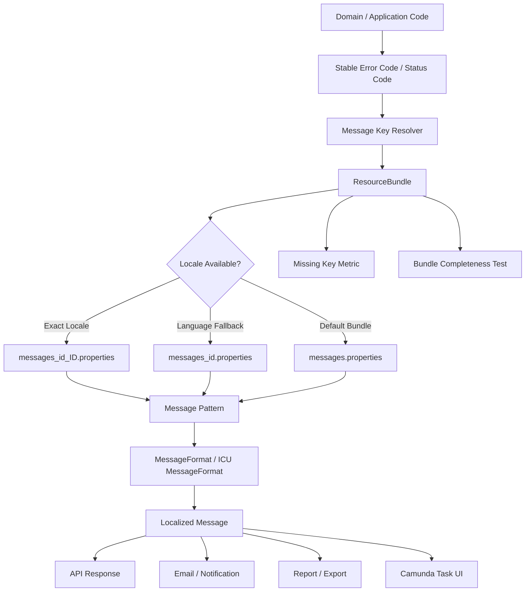

---

## 4. Recommended File Structure

Untuk microservice Jersey/JAX-RS, struktur sederhana:

```text id="16gcb9"
src/main/resources/i18n/
  messages.properties
  messages_en_US.properties
  messages_id_ID.properties

  errors.properties
  errors_en_US.properties
  errors_id_ID.properties

  validation.properties
  validation_en_US.properties
  validation_id_ID.properties

  workflow.properties
  workflow_en_US.properties
  workflow_id_ID.properties

  notification.properties
  notification_en_US.properties
  notification_id_ID.properties

  report.properties
  report_en_US.properties
  report_id_ID.properties
```

Alternatif lebih sederhana untuk service kecil:

```text id="k57mjn"
src/main/resources/
  messages.properties
  messages_en_US.properties
  messages_id_ID.properties
```

Prinsipnya:

| Ukuran Service | Struktur yang Disarankan |
|---|---|
| Small service | Satu bundle `messages` cukup |
| Medium service | Pisahkan `errors`, `validation`, `workflow` |
| Large enterprise service | Pisahkan per bounded context |
| Multi-tenant platform | Tambahkan tenant override layer bila benar-benar diperlukan |

---

## 5. Base Bundle vs Locale Bundle

Contoh base bundle:

```properties id="lgm7xl"
# messages.properties
order.status.pendingApproval=Pending approval
order.status.approved=Approved
order.status.rejected=Rejected
order.status.cancelled=Cancelled
```

English US:

```properties id="shp13b"
# messages_en_US.properties
order.status.pendingApproval=Pending approval
order.status.approved=Approved
order.status.rejected=Rejected
order.status.cancelled=Cancelled
```

Indonesian:

```properties id="knumfq"
# messages_id_ID.properties
order.status.pendingApproval=Menunggu persetujuan
order.status.approved=Disetujui
order.status.rejected=Ditolak
order.status.cancelled=Dibatalkan
```

Base bundle sebaiknya tetap lengkap. Jangan mengandalkan hanya file locale-specific.

Alasannya:

```text id="lvce3n"
messages.properties adalah safety net terakhir.
Kalau key tidak ada di locale spesifik, sistem masih punya fallback.
```

---

## 6. Translation Key Naming Convention

Gunakan key yang stabil, bukan kalimat English.

Buruk:

```properties id="bxbljo"
Order cannot be cancelled=Pesanan tidak dapat dibatalkan
Please input your email=Masukkan email Anda
```

Baik:

```properties id="mmk086"
error.order.cannotBeCancelled=Pesanan tidak dapat dibatalkan
validation.customer.email.required=Email pelanggan wajib diisi
```

Pattern umum:

```text id="ze880u"
<domain>.<entity>.<field/state/action>.<meaning>
```

Contoh:

```properties id="vfzno1"
order.status.pendingApproval=Menunggu persetujuan
order.action.cancel=Batalkan pesanan
order.error.cannotCancel=Pesanan tidak dapat dibatalkan
customer.field.email=Email pelanggan
customer.validation.emailInvalid=Email pelanggan tidak valid
case.workflow.task.reviewEvidence=Tinjau bukti kasus
notification.paymentDue.subject=Tagihan Anda jatuh tempo
report.column.createdAt=Tanggal dibuat
```

---

## 7. Taxonomy Message Key

| Prefix | Digunakan Untuk | Contoh |
|---|---|---|
| `status.*` | Generic status | `status.active`, `status.inactive` |
| `order.status.*` | Domain-specific status | `order.status.pendingApproval` |
| `error.*` | Error user-facing | `error.order.cannotCancel` |
| `validation.*` | Input validation | `validation.email.invalid` |
| `field.*` | Field label generic | `field.createdAt` |
| `customer.field.*` | Field label domain-specific | `customer.field.email` |
| `action.*` | Button/action label | `action.submit`, `action.cancel` |
| `workflow.task.*` | Camunda/user task label | `workflow.task.approveCase` |
| `notification.*` | Email/SMS/push template | `notification.paymentDue.body` |
| `report.*` | Report/export label | `report.column.amount` |
| `enum.*` | Display label untuk enum | `enum.priority.high` |

---

## 8. Jangan Campur Code dan Message Key Sembarangan

Business error code:

```text id="c98xj5"
ORDER_CANNOT_BE_CANCELLED
```

Message key:

```text id="xey1rb"
error.order.cannotBeCancelled
```

Keduanya boleh dipetakan, tetapi jangan wajib sama.

Contoh mapping:

```java id="sop7ri"
public enum ErrorCode {
    ORDER_CANNOT_BE_CANCELLED("error.order.cannotBeCancelled"),
    CUSTOMER_EMAIL_INVALID("validation.customer.email.invalid"),
    CASE_ALREADY_CLOSED("error.case.alreadyClosed");

    private final String messageKey;

    ErrorCode(String messageKey) {
        this.messageKey = messageKey;
    }

    public String messageKey() {
        return messageKey;
    }
}
```

Kenapa tidak langsung pakai `error.ORDER_CANNOT_BE_CANCELLED`?

Boleh untuk service kecil, tapi di sistem besar biasanya message key perlu lebih semantic, lebih readable, dan bisa dipakai lintas channel.

---

## 9. MessageLocalizer yang Lebih Aman

Versi sederhana dari seri sebelumnya:

```java id="23fl1a"
public String getMessage(String key, Locale locale, Object... args) {
    ResourceBundle bundle = ResourceBundle.getBundle(bundleName, locale);
    String pattern = bundle.getString(key);
    return MessageFormat.format(pattern, args);
}
```

Versi lebih production-friendly:

```java id="h559fm"
import java.text.MessageFormat;
import java.util.Locale;
import java.util.MissingResourceException;
import java.util.ResourceBundle;

public class MessageLocalizer {

    private final String bundleName;
    private final Locale defaultLocale;
    private final MissingMessageReporter reporter;

    public MessageLocalizer(
        String bundleName,
        Locale defaultLocale,
        MissingMessageReporter reporter
    ) {
        this.bundleName = bundleName;
        this.defaultLocale = defaultLocale;
        this.reporter = reporter;
    }

    public String getMessage(String key, Locale locale, Object... args) {
        MessageLookupResult result = lookupPattern(key, locale);

        if (args == null || args.length == 0) {
            return result.pattern();
        }

        MessageFormat format = new MessageFormat(result.pattern(), result.resolvedLocale());
        return format.format(args);
    }

    private MessageLookupResult lookupPattern(String key, Locale locale) {
        try {
            ResourceBundle bundle = ResourceBundle.getBundle(bundleName, locale);

            if (bundle.containsKey(key)) {
                return new MessageLookupResult(
                    bundle.getString(key),
                    bundle.getLocale()
                );
            }

            reporter.missingKey(bundleName, key, locale);
            return fallback(key, locale);

        } catch (MissingResourceException ex) {
            reporter.missingBundle(bundleName, locale);
            return fallback(key, locale);
        }
    }

    private MessageLookupResult fallback(String key, Locale requestedLocale) {
        try {
            ResourceBundle fallbackBundle = ResourceBundle.getBundle(bundleName, defaultLocale);

            if (fallbackBundle.containsKey(key)) {
                reporter.fallbackUsed(bundleName, key, requestedLocale, defaultLocale);
                return new MessageLookupResult(
                    fallbackBundle.getString(key),
                    fallbackBundle.getLocale()
                );
            }
        } catch (MissingResourceException ignored) {
            reporter.missingBundle(bundleName, defaultLocale);
        }

        reporter.unresolvedKey(bundleName, key, requestedLocale);
        return new MessageLookupResult("!" + key + "!", defaultLocale);
    }
}
```

Record pendukung:

```java id="iqtytl"
import java.util.Locale;

public record MessageLookupResult(
    String pattern,
    Locale resolvedLocale
) {}
```

Reporter interface:

```java id="kogr4z"
import java.util.Locale;

public interface MissingMessageReporter {

    void missingKey(String bundleName, String key, Locale locale);

    void missingBundle(String bundleName, Locale locale);

    void fallbackUsed(
        String bundleName,
        String key,
        Locale requestedLocale,
        Locale fallbackLocale
    );

    void unresolvedKey(String bundleName, String key, Locale locale);
}
```

---

## 10. Kenapa `MessageFormat`, Bukan String Concatenation

Buruk:

```java id="79bwde"
return "Order " + orderId + " cannot be cancelled";
```

Lebih baik:

```properties id="dludca"
error.order.cannotBeCancelled=Order {0} cannot be cancelled
```

```properties id="ymt1pk"
error.order.cannotBeCancelled=Pesanan {0} tidak dapat dibatalkan
```

```java id="gd8gy7"
messageLocalizer.getMessage(
    "error.order.cannotBeCancelled",
    locale,
    orderId
);
```

`MessageFormat` menyediakan cara membuat pesan gabungan secara language-neutral dan memasukkan object ke pola pesan pada posisi yang tepat; dokumentasi Java juga menjelaskan bahwa pola dapat berisi argumen, number, date, time, choice, currency, dan percent. ([Oracle Docs](https://docs.oracle.com/en/java/javase/17/docs/api/java.base/java/text/MessageFormat.html))

---

## 11. Pitfall `MessageFormat`: Single Quote

Ini salah satu sumber bug yang sering tidak terlihat.

MessageFormat memakai `'` sebagai karakter khusus untuk escaping.

Contoh bermasalah:

```properties id="ipex2e"
message=You're not allowed to cancel order {0}
```

Lebih aman:

```properties id="ychju7"
message=You''re not allowed to cancel order {0}
```

Atau gunakan apostrophe typographic untuk human text:

```properties id="3o369e"
message=You’re not allowed to cancel order {0}
```

Dokumentasi `MessageFormat` menjelaskan bahwa single quote digunakan untuk quote karakter khusus, dan single quote literal perlu direpresentasikan sebagai dua single quote. ([Oracle Docs](https://docs.oracle.com/en/java/javase/17/docs/api/java.base/java/text/MessageFormat.html))

---

## 12. Parameter Governance

Translator tidak boleh menghapus atau mengubah placeholder.

Benar:

```properties id="wu9drn"
# en-US
validation.amount.min=Minimum amount is {0}.

# id-ID
validation.amount.min=Nilai minimum adalah {0}.
```

Salah:

```properties id="q7iamh"
# id-ID
validation.amount.min=Nilai minimum wajib diisi.
```

Masalahnya `{0}` hilang.

Untuk template kompleks, tambahkan komentar:

```properties id="f4d07h"
# {0}=minimum amount formatted with currency, e.g. Rp100.000,00
validation.amount.min=Nilai minimum adalah {0}.
```

Checklist placeholder:

```text id="mwjcee"
[ ] Semua locale punya placeholder yang sama
[ ] Index placeholder tidak berubah makna
[ ] Tidak ada placeholder hilang
[ ] Tidak ada placeholder tambahan tanpa argumen runtime
[ ] Translator tahu contoh nilai setiap placeholder
```

---

## 13. Named Arguments vs Indexed Arguments

`java.text.MessageFormat` memakai indexed arguments seperti `{0}`, `{1}`. Untuk readability translator, indexed argument sering kurang jelas.

Contoh:

```properties id="fy2fye"
notification.assignment={0} assigned case {1} to {2}.
```

Translator harus tahu:

```text id="t3i3kd"
{0} = actor name
{1} = case id
{2} = assignee name
```

Kalau memakai ICU MessageFormat, pola bisa lebih ekspresif dan mendukung complex argument seperti plural/select. Dokumentasi ICU menjelaskan pesan user-visible biasanya punya elemen variabel seperti nama, angka, tanggal, dan translator perlu bisa memindahkan elemen itu sesuai grammar target language; karena itu string sebaiknya diterjemahkan sebagai satu unit dengan placeholder, bukan hasil concatenation fragment. ([Unicode Consortium](https://unicode-org.github.io/icu/userguide/format_parse/messages/))

Untuk service yang masih memakai Java `MessageFormat`, tetap bisa menjaga clarity dengan komentar:

```properties id="i72hhj"
# {0}=actor display name, {1}=case reference number, {2}=assignee display name
notification.assignment={0} assigned case {1} to {2}.
```

---

## 14. Pluralization: Kapan ResourceBundle Saja Tidak Cukup

Contoh buruk:

```properties id="lek8iz"
notification.count=You have {0} notification(s).
```

Lebih baik, untuk dua varian manual:

```properties id="zvviqa"
notification.count.one=You have {0} notification.
notification.count.other=You have {0} notifications.
```

Namun ini masih English-centric. Bahasa lain punya aturan plural berbeda. ICU MessageFormat mendukung argumen `plural` yang memilih sub-message berdasarkan angka dan plural rules bahasa target; dokumentasi ICU juga menyarankan complex argument seperti plural dibuat sebagai struktur luar dan menggunakan full sentence agar mudah diterjemahkan. ([Unicode Consortium](https://unicode-org.github.io/icu/userguide/format_parse/messages/))

Contoh ICU style:

```properties id="dgn3zo"
notification.count={count, plural, =0 {You have no notifications.} one {You have one notification.} other {You have # notifications.}}
```

Untuk bahasa Indonesia, plural sering tidak berubah seperti English:

```properties id="5n1am6"
notification.count={count, plural, =0 {Anda tidak memiliki notifikasi.} other {Anda memiliki # notifikasi.}}
```

Praktik pragmatis:

| Kompleksitas Pesan | Pendekatan |
|---|---|
| Label/status sederhana | `ResourceBundle` + plain string |
| Pesan dengan `{0}` sederhana | `ResourceBundle` + `MessageFormat` |
| Plural/gender/select kompleks | ICU4J MessageFormat |
| Email/report legal kompleks | Template engine + localized template |
| Multi-tenant copywriting | Catalog + tenant override |

---

## 15. Bundle Split Strategy

Jangan satu file terlalu besar kalau domain luas.

### Opsi A - Single bundle

```text id="6t5jgv"
messages_id_ID.properties
```

Cocok untuk service kecil.

### Opsi B - Bundle by concern

```text id="b6s8ez"
errors_id_ID.properties
validation_id_ID.properties
workflow_id_ID.properties
report_id_ID.properties
```

Cocok untuk service medium.

### Opsi C - Bundle by bounded context

```text id="6m60lq"
order_messages_id_ID.properties
customer_messages_id_ID.properties
case_messages_id_ID.properties
billing_messages_id_ID.properties
```

Cocok untuk enterprise domain besar.

Rekomendasi praktis untuk microservice:

```text id="cgoos7"
Mulai dari concern-based.
Jangan terlalu granular di awal.
Pecah saat file mulai sulit direview.
```

---

## 16. Message Key Ownership

Setiap key harus punya owner.

| Key Type | Owner Utama | Reviewer |
|---|---|---|
| `error.*` | Backend engineer | QA + Product/BA |
| `validation.*` | Backend/frontend engineer | QA |
| `workflow.task.*` | Workflow/process owner | BA + QA |
| `notification.*` | Product/ops | Legal/compliance bila perlu |
| `report.*` | Reporting owner | Business stakeholder |
| `field.*` | Product/design system | QA |
| `enum.*` | Domain engineer | Product/BA |

Tanpa ownership, translation catalog akan menjadi “dumping ground”.

---

## 17. Avoid Duplicate Meaning

Masalah umum:

```properties id="x8knw7"
order.cancel=Cancel
action.cancel=Cancel
button.cancel=Cancel
common.cancel=Cancel
```

Tidak selalu salah, tapi harus jelas konteksnya.

Gunakan prinsip:

```text id="sl2z67"
Kalau meaning sama dan konteks sama → reuse key.
Kalau wording sama tapi meaning berbeda → pisahkan key.
```

Contoh:

```properties id="266xgl"
action.cancel=Cancel
order.action.cancel=Cancel order
workflow.action.cancelTask=Cancel task
```

Dalam bahasa Inggris mirip, tapi dalam bahasa lain bisa berbeda.

---

## 18. Do Not Translate Technical Identifiers

Jangan masukkan ini ke message catalog kecuali ada kebutuhan display eksplisit:

```text id="iddpj2"
traceId
requestId
errorCode
Kafka topic
database constraint name
Camunda processDefinitionKey
enum stored value
metric name
log event name
permission key
role code
API field name
```

Contoh benar:

```json id="1txotm"
{
  "code": "ORDER_CANNOT_BE_CANCELLED",
  "message": "Pesanan tidak dapat dibatalkan",
  "traceId": "01J2ABC..."
}
```

`traceId` tidak diterjemahkan menjadi `idJejak`.

---

## 19. Message Catalog untuk API Error

Error code:

```java id="fsfm03"
public enum ErrorCode {
    ORDER_NOT_FOUND,
    ORDER_CANNOT_BE_CANCELLED,
    CUSTOMER_EMAIL_INVALID,
    INSUFFICIENT_PERMISSION
}
```

Message key resolver:

```java id="y3w7kh"
public final class ErrorMessageKeys {

    public static String keyOf(ErrorCode code) {
        return switch (code) {
            case ORDER_NOT_FOUND -> "error.order.notFound";
            case ORDER_CANNOT_BE_CANCELLED -> "error.order.cannotBeCancelled";
            case CUSTOMER_EMAIL_INVALID -> "validation.customer.email.invalid";
            case INSUFFICIENT_PERMISSION -> "error.security.insufficientPermission";
        };
    }

    private ErrorMessageKeys() {}
}
```

Bundle:

```properties id="2ntbk2"
# errors_en_US.properties
error.order.notFound=Order was not found.
error.order.cannotBeCancelled=Order cannot be cancelled.
validation.customer.email.invalid=Customer email is invalid.
error.security.insufficientPermission=You do not have permission to perform this action.
```

```properties id="uwfrth"
# errors_id_ID.properties
error.order.notFound=Pesanan tidak ditemukan.
error.order.cannotBeCancelled=Pesanan tidak dapat dibatalkan.
validation.customer.email.invalid=Email pelanggan tidak valid.
error.security.insufficientPermission=Anda tidak memiliki izin untuk melakukan tindakan ini.
```

---

## 20. Message Catalog untuk Status Display

Enum:

```java id="labnrs"
public enum OrderStatus {
    DRAFT,
    PENDING_APPROVAL,
    APPROVED,
    REJECTED,
    CANCELLED
}
```

Key resolver:

```java id="4yv3u9"
public final class OrderStatusMessageKeys {

    public static String keyOf(OrderStatus status) {
        return switch (status) {
            case DRAFT -> "order.status.draft";
            case PENDING_APPROVAL -> "order.status.pendingApproval";
            case APPROVED -> "order.status.approved";
            case REJECTED -> "order.status.rejected";
            case CANCELLED -> "order.status.cancelled";
        };
    }

    private OrderStatusMessageKeys() {}
}
```

Response:

```java id="a65aij"
public record LocalizedCode(
    String code,
    String label
) {}
```

```java id="zo2j1u"
public LocalizedCode localizeStatus(OrderStatus status, Locale locale) {
    String key = OrderStatusMessageKeys.keyOf(status);
    String label = messageLocalizer.getMessage(key, locale);

    return new LocalizedCode(status.name(), label);
}
```

JSON:

```json id="nthkyh"
{
  "status": {
    "code": "PENDING_APPROVAL",
    "label": "Menunggu persetujuan"
  }
}
```

---

## 21. Message Catalog untuk Field Label

Validation error sering butuh nama field user-friendly.

Internal field:

```text id="v4auzo"
customer.email
```

Localized label:

```properties id="1pcywo"
# fields_en_US.properties
customer.field.email=Customer email
customer.field.birthDate=Customer birth date
```

```properties id="i3q7va"
# fields_id_ID.properties
customer.field.email=Email pelanggan
customer.field.birthDate=Tanggal lahir pelanggan
```

Error response:

```json id="fqct2v"
{
  "code": "FIELD_REQUIRED",
  "field": "customer.email",
  "fieldLabel": "Email pelanggan",
  "message": "Email pelanggan wajib diisi."
}
```

Jangan hilangkan `field` canonical karena frontend butuh mapping ke form control.

---

## 22. Message Catalog untuk Camunda

Camunda stable key:

```text id="nz78zs"
processDefinitionKey = order_fulfillment
taskDefinitionKey = approve_order
```

Message catalog:

```properties id="5at2bb"
# workflow_en_US.properties
workflow.orderFulfillment.name=Order fulfillment
workflow.task.approveOrder.name=Approve order
workflow.task.approveOrder.description=Review and approve the order.
```

```properties id="p9ncli"
# workflow_id_ID.properties
workflow.orderFulfillment.name=Pemenuhan pesanan
workflow.task.approveOrder.name=Setujui pesanan
workflow.task.approveOrder.description=Tinjau dan setujui pesanan.
```

Rule:

```text id="gxvqk7"
Camunda key tetap canonical.
Task label dan description boleh localized.
```

---

## 23. Message Catalog untuk Notification

Subject dan body sebaiknya dipisahkan.

```properties id="l8culc"
# notification_en_US.properties
notification.orderApproved.subject=Your order has been approved
notification.orderApproved.body=Your order {0} was approved on {1}.
```

```properties id="f2m5u4"
# notification_id_ID.properties
notification.orderApproved.subject=Pesanan Anda telah disetujui
notification.orderApproved.body=Pesanan Anda {0} disetujui pada {1}.
```

Catatan penting:

```text id="e4zbrt"
{0}=order number
{1}=localized approval date/time
```

Untuk email panjang, `.properties` bisa menjadi sulit dibaca. Gunakan template file per locale bila perlu:

```text id="vas8na"
templates/email/order-approved/en-US.html
templates/email/order-approved/id-ID.html
```

Tetapi subject/key metadata tetap dikelola sebagai catalog.

---

## 24. Message Catalog untuk Report/Export

CSV/Excel/PDF perlu localized label:

```properties id="u2lcjh"
# report_en_US.properties
report.order.column.orderId=Order ID
report.order.column.status=Status
report.order.column.amount=Amount
report.order.column.createdAt=Created at
```

```properties id="z09qir"
# report_id_ID.properties
report.order.column.orderId=ID Pesanan
report.order.column.status=Status
report.order.column.amount=Jumlah
report.order.column.createdAt=Tanggal dibuat
```

Tetapi raw export untuk machine integration sebaiknya tetap canonical.

| Export Type | Label Localized? | Data Format |
|---|---:|---|
| User-facing Excel | Ya | Localized |
| Regulatory report | Tergantung requirement | Biasanya canonical + localized label |
| Machine CSV integration | Tidak | Canonical |
| BI extract | Tidak | Canonical |
| PDF customer-facing | Ya | Localized |

---

## 25. Fallback Policy

Rekomendasi fallback:

```text id="dastl9"
id-ID
  ↓
id
  ↓
en-US
  ↓
messages.properties
  ↓
!missing.key!
```

Tapi fallback tidak boleh diam-diam terus-menerus. Tambahkan metric.

```text id="k1tsb2"
i18n.message.fallback_used
i18n.message.missing_key
i18n.bundle.missing
```

Contoh log:

```json id="6wbsie"
{
  "event": "i18n.message.fallback_used",
  "bundle": "errors",
  "key": "error.order.cannotBeCancelled",
  "requestedLocale": "id-ID",
  "resolvedLocale": "en-US",
  "service": "order-service"
}
```

---

## 26. Missing Key Strategy

| Environment | Behavior yang Disarankan |
|---|---|
| Local dev | Tampilkan `!key!` agar terlihat |
| Unit test | Fail test |
| CI | Fail build untuk key critical |
| Staging | Log + metric + dashboard |
| Production | Fallback + metric + alert untuk threshold tertentu |

Jangan langsung fail production hanya karena satu translation missing, kecuali pesan tersebut legal/compliance critical.

---

## 27. Bundle Completeness Test

Test untuk memastikan semua locale punya key yang sama.

```java id="a8t2dr"
import org.junit.jupiter.api.Test;

import java.util.Locale;
import java.util.ResourceBundle;
import java.util.Set;
import java.util.stream.Collectors;

import static org.junit.jupiter.api.Assertions.assertTrue;

class MessageBundleCompletenessTest {

    @Test
    void idIdBundleShouldContainAllBaseKeys() {
        ResourceBundle base = ResourceBundle.getBundle("i18n.messages", Locale.ROOT);
        ResourceBundle id = ResourceBundle.getBundle("i18n.messages", Locale.forLanguageTag("id-ID"));

        Set<String> baseKeys = base.keySet();
        Set<String> idKeys = id.keySet();

        Set<String> missing = baseKeys.stream()
            .filter(key -> !idKeys.contains(key))
            .collect(Collectors.toSet());

        assertTrue(missing.isEmpty(), "Missing id-ID keys: " + missing);
    }
}
```

Catatan: `ResourceBundle#keySet()` bisa menyertakan parent keys tergantung loading. Untuk strict validation file-by-file, kadang lebih baik parse `.properties` langsung.

---

## 28. Placeholder Consistency Test

Tujuan: semua locale punya placeholder index yang sama.

```java id="yxd9k7"
import org.junit.jupiter.api.Test;

import java.util.Locale;
import java.util.ResourceBundle;
import java.util.Set;
import java.util.regex.Matcher;
import java.util.regex.Pattern;
import java.util.stream.Collectors;

import static org.junit.jupiter.api.Assertions.assertEquals;

class MessagePlaceholderConsistencyTest {

    private static final Pattern PLACEHOLDER = Pattern.compile("\\{(\\d+)(?:,[^}]*)?}");

    @Test
    void placeholdersShouldMatchBetweenEnglishAndIndonesian() {
        ResourceBundle en = ResourceBundle.getBundle("i18n.messages", Locale.forLanguageTag("en-US"));
        ResourceBundle id = ResourceBundle.getBundle("i18n.messages", Locale.forLanguageTag("id-ID"));

        for (String key : en.keySet()) {
            if (!id.containsKey(key)) {
                continue;
            }

            Set<String> enPlaceholders = placeholders(en.getString(key));
            Set<String> idPlaceholders = placeholders(id.getString(key));

            assertEquals(
                enPlaceholders,
                idPlaceholders,
                "Placeholder mismatch for key: " + key
            );
        }
    }

    private static Set<String> placeholders(String pattern) {
        Matcher matcher = PLACEHOLDER.matcher(pattern);

        return matcher.results()
            .map(result -> result.group(1))
            .collect(Collectors.toSet());
    }
}
```

---

## 29. Unused Key Detection

Masalah kebalikannya: key lama menumpuk.

Contoh:

```text id="yndscd"
error.oldLegacyCaseState
order.status.temporaryReview
button.oldSubmit
```

Strategi:

```text id="ep8w3t"
1. Static scan source code untuk string key
2. Allowlist dynamic key resolver
3. Tandai deprecated key
4. Hapus setelah satu atau dua release
```

Untuk dynamic resolver seperti:

```java id="2tjxae"
"order.status." + status.name().toLowerCase()
```

lebih sulit discan. Lebih aman gunakan explicit mapper:

```java id="q9biki"
case PENDING_APPROVAL -> "order.status.pendingApproval";
```

---

## 30. Message Catalog Versioning

Translation catalog harus ikut versioning source code.

Rekomendasi:

```text id="a8h0ya"
[ ] Simpan di Git
[ ] Review via PR
[ ] Test completeness di CI
[ ] Jangan edit langsung di server
[ ] Tag release bersama service
[ ] Audit perubahan key penting
```

Untuk enterprise, perubahan message bisa berdampak ke:

```text id="pbc8pc"
customer notification
legal wording
audit/report interpretation
support script
training material
```

Jadi message catalog bukan “copy kecil”.

---

## 31. Maven Layout dan Resource Filtering

Hati-hati dengan Maven resource filtering.

Buruk bila properties message mengandung `${...}` lalu Maven mengganti tanpa sengaja.

```properties id="gaebzp"
notification.body=Hello ${customerName}
```

Jika resource filtering aktif, `${customerName}` bisa dianggap Maven placeholder.

Rekomendasi:

```text id="oq8yo0"
Gunakan MessageFormat placeholder {0}, {1}
Jangan gunakan Maven filtering untuk i18n resource kecuali sangat perlu
Pisahkan filtered resource dan translation resource
```

Contoh `pom.xml`:

```xml id="dze89m"
<build>
  <resources>
    <resource>
      <directory>src/main/resources</directory>
      <filtering>false</filtering>
      <includes>
        <include>i18n/**</include>
      </includes>
    </resource>
  </resources>
</build>
```

---

## 32. Encoding Consideration

Untuk Java modern, tetap jadikan UTF-8 sebagai standar repo dan build. Namun jangan hanya mengandalkan “kelihatannya benar di IDE”.

Checklist:

```text id="2qxxco"
[ ] Repo encoding UTF-8
[ ] IDE encoding UTF-8
[ ] Maven compiler/resource encoding eksplisit
[ ] CI memakai encoding yang sama
[ ] Docker image tidak mengubah default charset secara mengejutkan
[ ] Test membaca karakter non-ASCII seperti “Tanggal dibuat”, “é”, “日本語”
```

Contoh Maven property:

```xml id="g0rr17"
<properties>
  <project.build.sourceEncoding>UTF-8</project.build.sourceEncoding>
  <project.reporting.outputEncoding>UTF-8</project.reporting.outputEncoding>
</properties>
```

---

## 33. Production-Grade Message Service Interface

Daripada semua class langsung pakai `ResourceBundle`, buat interface.

```java id="nj9yqe"
import java.util.Locale;

public interface MessageService {

    String message(String key, Locale locale, Object... args);

    String messageOrDefault(String key, Locale locale, String defaultMessage, Object... args);

    boolean exists(String key, Locale locale);
}
```

Implementasi:

```java id="h8j3vj"
public class ResourceBundleMessageService implements MessageService {

    private final MessageLocalizer localizer;

    public ResourceBundleMessageService(MessageLocalizer localizer) {
        this.localizer = localizer;
    }

    @Override
    public String message(String key, Locale locale, Object... args) {
        return localizer.getMessage(key, locale, args);
    }

    @Override
    public String messageOrDefault(
        String key,
        Locale locale,
        String defaultMessage,
        Object... args
    ) {
        String value = localizer.getMessage(key, locale, args);
        return value.equals("!" + key + "!") ? defaultMessage : value;
    }

    @Override
    public boolean exists(String key, Locale locale) {
        return localizer.exists(key, locale);
    }
}
```

Tambahkan `exists` di localizer:

```java id="ti4nqj"
public boolean exists(String key, Locale locale) {
    try {
        ResourceBundle bundle = ResourceBundle.getBundle(bundleName, locale);
        return bundle.containsKey(key);
    } catch (MissingResourceException ex) {
        return false;
    }
}
```

---

## 34. Anti-Pattern

| Anti-Pattern | Kenapa Buruk | Alternatif |
|---|---|---|
| English sentence sebagai key | Key berubah saat copy berubah | Semantic key |
| String concatenation | Grammar bahasa lain rusak | `MessageFormat` / ICU |
| Semua pesan di satu file besar | Sulit review dan conflict | Split by concern |
| Translation langsung di server | Tidak versioned | Git + CI |
| Missing key silent fallback | Bug tersembunyi | Metric + test |
| Translator boleh ubah `{0}` sembarang | Runtime error/salah pesan | Placeholder validation |
| Localized text jadi enum | Logic rusak | Stable enum + localized label |
| Dynamic key tanpa test | Key tidak terdeteksi | Explicit mapper |
| Tidak ada owner key | Catalog chaos | Ownership per key type |
| Maven filtering aktif untuk i18n | Placeholder rusak | Disable filtering |

---

## 35. Checklist Review Seri 3

Gunakan ini saat audit codebase:

```text id="yn4usj"
[ ] Apakah message catalog disimpan di Git?
[ ] Apakah base bundle lengkap?
[ ] Apakah locale bundle mengikuti naming yang konsisten?
[ ] Apakah key semantic, bukan English sentence?
[ ] Apakah error code dipetakan ke message key secara eksplisit?
[ ] Apakah status enum punya localized label via catalog?
[ ] Apakah field label untuk validation tersedia?
[ ] Apakah placeholder diuji antar locale?
[ ] Apakah missing key menyebabkan test/metric?
[ ] Apakah Maven resource filtering tidak merusak properties?
[ ] Apakah translation key punya owner?
[ ] Apakah key lama dibersihkan?
[ ] Apakah pesan kompleks/plural memakai ICU bila perlu?
```

---

# Seri 3 Selesai

Kita sudah membahas:

```text id="p5ahys"
ResourceBundle
Message catalog structure
Translation key naming
Error/status/field/workflow/report catalog
MessageFormat
Placeholder governance
Pluralization boundary
Fallback policy
CI tests
Anti-pattern
```

Rekomendasi berikutnya: **Seri 4 - Parameterized Message, Pluralization, ICU4J, dan Fallback Strategy**.

---

**Sources:**

- [ResourceBundle (Java SE 21 & JDK 21)](https://docs.oracle.com/en/java/javase/21/docs/api/java.base/java/util/ResourceBundle.html)
- [Formatting Messages | ICU Documentation](https://unicode-org.github.io/icu/userguide/format_parse/messages/)

## Response:
7/13/2026, 10:10:38 PM

Saya lanjut ke **Seri 4 dari 12**. Kali ini fokus pada bagian yang sering menjadi sumber bug halus: pesan berparameter, pluralization, fallback, dan kapan `MessageFormat` bawaan Java tidak cukup.

# Seri 4 dari 12 - Parameterized Message, Pluralization, ICU4J, dan Fallback Strategy

## 1. Tujuan Seri Ini

Seri ini membahas bagian localization yang sering terlihat sederhana, tetapi paling banyak menghasilkan bug halus:

```text id="t4kc2q"
"Hello " + name
"1 item(s)"
"Order {0} cannot be cancelled"
"Your request will expire in {0} day(s)"
```

Masalahnya bukan sekadar “teks belum diterjemahkan”, tetapi:

```text id="92342s"
struktur kalimat berbeda antar bahasa
urutan placeholder bisa berbeda
plural rule berbeda
gender/select condition bisa berbeda
tanggal/angka/currency perlu locale-aware
fallback harus predictable
```

Java `MessageFormat` memang dibuat untuk membuat compound message secara language-neutral, dan pola pesannya biasanya disimpan di `ResourceBundle` agar code tidak hardcoded terhadap locale tertentu. ([Oracle Docs](https://docs.oracle.com/javase/tutorial/i18n/format/messageFormat.html?utm_source=chatgpt.com))

---

## 2. Mental Model

```text id="ckss48"
Message key
  ↓
Localized pattern
  ↓
Runtime arguments
  ↓
Formatter
  ↓
Localized final message
```

Contoh:

```properties id="j7m8i3"
# errors_en_US.properties
error.order.cannotCancel=Order {0} cannot be cancelled.

# errors_id_ID.properties
error.order.cannotCancel=Pesanan {0} tidak dapat dibatalkan.
```

Runtime:

```java id="n98h7e"
messageService.message(
    "error.order.cannotCancel",
    Locale.forLanguageTag("id-ID"),
    "ORD-123"
);
```

Output:

```text id="egmxwk"
Pesanan ORD-123 tidak dapat dibatalkan.
```

---

## 3. Diagram

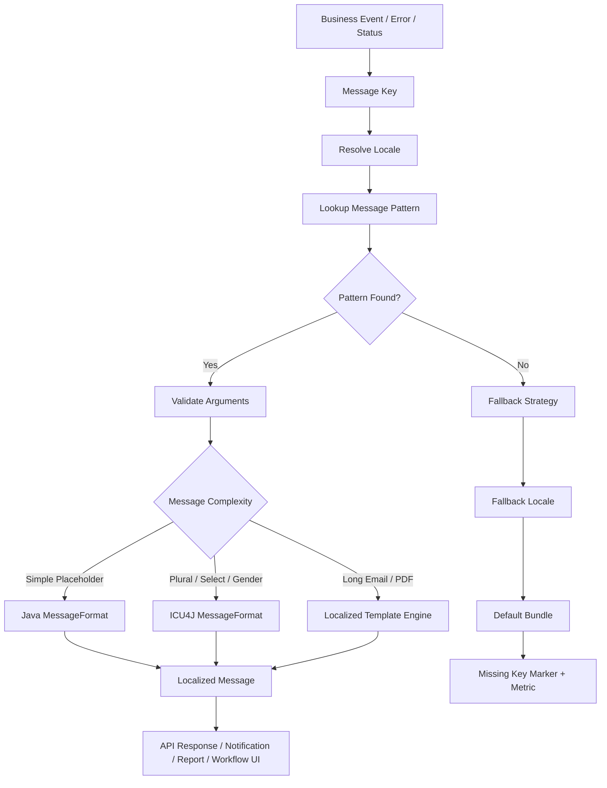

---

## 4. Kapan Pakai Apa?

| Kebutuhan | Tool yang Cukup | Contoh |
|---|---|---|
| Label/status sederhana | `ResourceBundle` | `order.status.approved=Approved` |
| Pesan dengan parameter sederhana | Java `MessageFormat` | `Order {0} cannot be cancelled` |
| Format angka/tanggal/currency sederhana | Java `MessageFormat` + formatter Java | `{0,date,long}` |
| Plural sederhana tapi hanya 1-2 bahasa | Bisa manual key `.one` / `.other` |
| Plural multi-language | ICU4J |
| Gender/select condition | ICU4J |
| Pesan panjang email/PDF | Template per locale |
| Legal wording multi-tenant | Template + approval workflow |
| Machine-readable API error | Error code canonical + localized message |

ICU MessageFormat mendukung placeholder variabel dalam `{curly braces}` dan syntax yang lebih kaya untuk argument formatting, termasuk pattern yang cocok untuk pesan user-facing dengan variabel yang perlu dipindahkan sesuai struktur bahasa target. ([Unicode Consortium](https://unicode-org.github.io/icu/userguide/format_parse/messages/?utm_source=chatgpt.com))

---

## 5. Anti-Pattern: String Concatenation

Buruk:

```java id="fwxi0u"
String message = "Order " + orderId + " cannot be cancelled.";
```

Kenapa buruk?

| Masalah | Dampak |
|---|---|
| Urutan kata fixed English | Bahasa lain bisa butuh struktur berbeda |
| Translator tidak melihat kalimat utuh | Hasil terjemahan kaku |
| Format angka/tanggal tidak locale-aware | Output salah untuk region tertentu |
| Sulit test placeholder | Tidak ada pattern yang bisa divalidasi |

Lebih baik:

```properties id="c90rk1"
error.order.cannotCancel=Order {0} cannot be cancelled.
```

```properties id="gl6q15"
error.order.cannotCancel=Pesanan {0} tidak dapat dibatalkan.
```

---

## 6. Java `MessageFormat` Dasar

Contoh bundle:

```properties id="z52qk9"
# messages_en_US.properties
order.approved=Order {0} was approved by {1} on {2}.

# messages_id_ID.properties
order.approved=Pesanan {0} disetujui oleh {1} pada {2}.
```

Java:

```java id="e7432s"
import java.text.MessageFormat;
import java.util.Locale;
import java.util.ResourceBundle;

public class JavaMessageFormatter {

    public String format(String key, Locale locale, Object... args) {
        ResourceBundle bundle = ResourceBundle.getBundle("messages", locale);
        String pattern = bundle.getString(key);

        MessageFormat messageFormat = new MessageFormat(pattern, locale);
        return messageFormat.format(args);
    }
}
```

Usage:

```java id="b2x3gk"
String message = formatter.format(
    "order.approved",
    Locale.forLanguageTag("id-ID"),
    "ORD-123",
    "Budi",
    "13 Juli 2026"
);
```

Output:

```text id="b65kk2"
Pesanan ORD-123 disetujui oleh Budi pada 13 Juli 2026.
```

---

## 7. Placeholder Index Governance

`MessageFormat` memakai placeholder index:

```properties id="kbhegp"
case.assigned={0} assigned case {1} to {2}.
```

Masalahnya `{0}`, `{1}`, `{2}` tidak self-explanatory.

Tambahkan komentar:

```properties id="c7aj1b"
# {0}=actor display name
# {1}=case reference number
# {2}=assignee display name
case.assigned={0} assigned case {1} to {2}.
```

Versi Indonesia:

```properties id="dwqif7"
# {0}=actor display name
# {1}=case reference number
# {2}=assignee display name
case.assigned={0} menugaskan kasus {1} kepada {2}.
```

Rule penting:

```text id="ei5wpk"
Translator boleh mengubah urutan placeholder.
Translator tidak boleh menghapus placeholder tanpa alasan.
Translator tidak boleh mengganti makna placeholder.
```

Contoh valid:

```properties id="xjy134"
# English
case.assignment={0} assigned case {1} to {2}.

# Hypothetical target language needing different order
case.assignment=Case {1} was assigned to {2} by {0}.
```

---

## 8. Pitfall `MessageFormat`: Single Quote

Ini bug klasik.

Salah:

```properties id="kgvmkd"
error.notAllowed=You're not allowed to cancel order {0}.
```

Dalam `MessageFormat`, single quote punya makna khusus untuk escaping. Jika ingin literal single quote, gunakan dua single quote. Dokumentasi `MessageFormat` menjelaskan bahwa single quote dipakai untuk quote karakter khusus di pattern. ([Oracle Docs](https://docs.oracle.com/javase/8/docs/api/java/text/MessageFormat.html?utm_source=chatgpt.com))

Benar:

```properties id="kk85pf"
error.notAllowed=You''re not allowed to cancel order {0}.
```

Atau gunakan apostrophe typographic:

```properties id="s6aob6"
error.notAllowed=You’re not allowed to cancel order {0}.
```

Rekomendasi praktis:

```text id="kr1jcz"
Untuk English properties, buat test khusus yang memformat semua key dengan MessageFormat.
Jangan hanya test key exists.
```

---

## 9. Jangan Campur Formatting Terlalu Banyak di Message Pattern

`MessageFormat` bisa melakukan formatting seperti:

```properties id="e0rnn5"
payment.due=Payment of {0,number,currency} is due on {1,date,long}.
```

Tetapi di backend microservice, sering lebih aman memformat angka/tanggal secara eksplisit sebelum masuk ke message.

Opsi A - Format di MessageFormat:

```java id="nljgj6"
MessageFormat format = new MessageFormat(
    "Payment of {0,number,currency} is due on {1,date,long}.",
    Locale.US
);
```

Opsi B - Format value dulu:

```java id="a99lf1"
String amount = currencyFormatter.format(amountValue, currency, locale);
String dueDate = dateFormatter.format(dueInstant, zoneId, locale);

messageService.message(
    "payment.due",
    locale,
    amount,
    dueDate
);
```

Properties:

```properties id="q99xi4"
payment.due=Payment of {0} is due on {1}.
```

Untuk enterprise backend, saya cenderung pilih **Opsi B** karena:

| Alasan | Penjelasan |
|---|---|
| Currency perlu business rule | Rounding/minor unit tidak selalu cukup dari locale |
| Timezone perlu eksplisit | Locale tidak sama dengan timezone |
| Testing lebih jelas | Formatter angka/tanggal bisa dites terpisah |
| Report/export reuse | Format value bisa dipakai ulang |
| Audit aman | Raw value tetap canonical |

---

## 10. Contoh Formatter Terpisah

```java id="6gl5v5"
import java.math.BigDecimal;
import java.text.NumberFormat;
import java.util.Currency;
import java.util.Locale;

public class LocalizedCurrencyFormatter {

    public String format(BigDecimal amount, String currencyCode, Locale locale) {
        NumberFormat formatter = NumberFormat.getCurrencyInstance(locale);
        formatter.setCurrency(Currency.getInstance(currencyCode));
        return formatter.format(amount);
    }
}
```

Date formatter:

```java id="b60x9n"
import java.time.Instant;
import java.time.ZoneId;
import java.time.format.DateTimeFormatter;
import java.time.format.FormatStyle;
import java.util.Locale;

public class LocalizedDateTimeFormatter {

    public String formatMediumDateTime(
        Instant instant,
        ZoneId zoneId,
        Locale locale
    ) {
        return DateTimeFormatter
            .ofLocalizedDateTime(FormatStyle.MEDIUM)
            .withLocale(locale)
            .withZone(zoneId)
            .format(instant);
    }
}
```

Usage:

```java id="wiia2u"
String amountText = currencyFormatter.format(
    new BigDecimal("1500000.00"),
    "IDR",
    Locale.forLanguageTag("id-ID")
);

String dateText = dateTimeFormatter.formatMediumDateTime(
    Instant.parse("2026-07-13T03:15:30Z"),
    ZoneId.of("Asia/Jakarta"),
    Locale.forLanguageTag("id-ID")
);

String message = messageService.message(
    "payment.due",
    Locale.forLanguageTag("id-ID"),
    amountText,
    dateText
);
```

---

## 11. Pluralization Problem

Buruk:

```properties id="ta2orf"
notification.count=You have {0} notification(s).
```

Ini terlihat praktis, tapi buruk untuk UX dan tidak scalable.

Buruk juga:

```java id="r06tt3"
String text = count == 1
    ? "You have 1 notification"
    : "You have " + count + " notifications";
```

Masalah:

| Masalah | Dampak |
|---|---|
| English-centric | Bahasa lain punya plural rule berbeda |
| Logic bahasa masuk code | Sulit dikelola translator |
| Tidak bisa handle `0` natural | “0 notifications” belum tentu wording terbaik |
| Tidak mendukung grammar kompleks | Bahasa tertentu punya kategori plural lebih dari one/other |

---

## 12. Pendekatan Manual `.one` / `.other`

Untuk sistem kecil dan bahasa terbatas:

```properties id="qb2wff"
# messages_en_US.properties
notification.count.zero=You have no notifications.
notification.count.one=You have {0} notification.
notification.count.other=You have {0} notifications.
```

```properties id="n73atf"
# messages_id_ID.properties
notification.count.zero=Anda tidak memiliki notifikasi.
notification.count.one=Anda memiliki {0} notifikasi.
notification.count.other=Anda memiliki {0} notifikasi.
```

Java:

```java id="lw6ft7"
public String notificationCountMessage(int count, Locale locale) {
    String key;

    if (count == 0) {
        key = "notification.count.zero";
    } else if (count == 1) {
        key = "notification.count.one";
    } else {
        key = "notification.count.other";
    }

    return messageService.message(key, locale, count);
}
```

Kapan ini cukup?

```text id="5m43zn"
Aplikasi hanya support 1-2 bahasa.
Plural rule sederhana.
Pesan sedikit.
Tim belum siap adopsi ICU4J.
```

Kapan ini tidak cukup?

```text id="gipd37"
Support banyak bahasa.
Pesan banyak.
Ada gender/select.
Ada ordinal.
Ada nested plural.
Translator perlu mengelola full sentence.
```

---

## 13. ICU4J untuk Pluralization

ICU MessageFormat mendukung plural/select pattern. Dokumentasi ICU menyarankan complex argument seperti `plural` atau `select` diletakkan sebagai struktur luar, dan sub-message sebaiknya berupa full sentence agar translator punya konteks lengkap. ([Unicode Consortium](https://unicode-org.github.io/icu/userguide/format_parse/messages/?utm_source=chatgpt.com))

Contoh pattern English:

```properties id="m3jokx"
notification.count={count, plural, =0 {You have no notifications.} one {You have one notification.} other {You have # notifications.}}
```

Contoh pattern Indonesia:

```properties id="si6t4z"
notification.count={count, plural, =0 {Anda tidak memiliki notifikasi.} other {Anda memiliki # notifikasi.}}
```

Contoh Java dengan ICU4J:

```java id="92h93h"
import com.ibm.icu.text.MessageFormat;

import java.util.Locale;
import java.util.Map;
import java.util.ResourceBundle;

public class IcuMessageService {

    public String message(String key, Locale locale, Map<String, Object> args) {
        ResourceBundle bundle = ResourceBundle.getBundle("messages", locale);
        String pattern = bundle.getString(key);

        MessageFormat format = new MessageFormat(pattern, locale);
        return format.format(args);
    }
}
```

Usage:

```java id="mymqvi"
String message = icuMessageService.message(
    "notification.count",
    Locale.forLanguageTag("en-US"),
    Map.of("count", 5)
);
```

Output:

```text id="s6im98"
You have 5 notifications.
```

---

## 14. ICU `select` untuk Condition

Contoh: actor type.

```properties id="d4ta3n"
# messages_en_US.properties
case.updated={actorType, select, system {The system updated case {caseId}.} user {{actorName} updated case {caseId}.} other {Case {caseId} was updated.}}
```

Indonesia:

```properties id="uoz7xh"
# messages_id_ID.properties
case.updated={actorType, select, system {Sistem memperbarui kasus {caseId}.} user {{actorName} memperbarui kasus {caseId}.} other {Kasus {caseId} diperbarui.}}
```

Usage:

```java id="mi38vr"
String message = icuMessageService.message(
    "case.updated",
    Locale.forLanguageTag("id-ID"),
    Map.of(
        "actorType", "user",
        "actorName", "Budi",
        "caseId", "CASE-123"
    )
);
```

Output:

```text id="vqztww"
Budi memperbarui kasus CASE-123.
```

---

## 15. ICU Nested Plural + Select

Contoh lebih kompleks:

```properties id="3vp0te"
task.assignment={assigneeType, select,
  user {{count, plural,
    one {{assigneeName} has one assigned task.}
    other {{assigneeName} has # assigned tasks.}
  }}
  team {{count, plural,
    one {Team {assigneeName} has one assigned task.}
    other {Team {assigneeName} has # assigned tasks.}
  }}
  other {{count, plural,
    one {There is one assigned task.}
    other {There are # assigned tasks.}
  }}
}
```

Secara teknis bisa, tapi jangan terlalu sering. Semakin kompleks pattern:

```text id="mtm3tr"
semakin sulit dibaca developer
semakin sulit diedit translator
semakin sulit dites
semakin tinggi risiko syntax error
```

Rule praktis:

```text id="plvpmy"
Kalau ICU pattern terlalu panjang, pecah menjadi beberapa key atau gunakan template engine.
```

---

## 16. Java `MessageFormat` vs ICU4J

| Aspek | Java `MessageFormat` | ICU4J MessageFormat |
|---|---|---|
| Built-in JDK | Ya | Tidak, perlu dependency |
| Indexed args `{0}` | Ya | Ya |
| Named args `{count}` | Tidak umum untuk Java built-in | Ya |
| Plural rules | Terbatas / tidak nyaman | Kuat |
| Select/gender | Tidak cocok | Cocok |
| Translator friendliness | Sedang | Lebih baik untuk pesan kompleks |
| Complexity | Rendah | Sedang-tinggi |
| Use case | Pesan sederhana | Pesan natural language kompleks |

Rekomendasi:

```text id="39wxyt"
Default: Java MessageFormat untuk pesan sederhana.
Adopsi ICU4J saat plural/select mulai muncul nyata.
Jangan pakai ICU untuk semua hal kalau tim belum punya governance.
```

---

## 17. Abstraction agar Bisa Migrasi Bertahap

Jangan biarkan semua code langsung memanggil `MessageFormat`.

Buat interface:

```java id="z4qapp"
import java.util.Locale;
import java.util.Map;

public interface LocalizedMessageService {

    String formatIndexed(
        String key,
        Locale locale,
        Object... args
    );

    String formatNamed(
        String key,
        Locale locale,
        Map<String, Object> args
    );
}
```

Implementasi bisa gabungkan Java dan ICU:

```java id="sey1vs"
public class HybridLocalizedMessageService implements LocalizedMessageService {

    private final JavaMessageService javaMessageService;
    private final IcuMessageService icuMessageService;
    private final MessagePatternRegistry patternRegistry;

    public HybridLocalizedMessageService(
        JavaMessageService javaMessageService,
        IcuMessageService icuMessageService,
        MessagePatternRegistry patternRegistry
    ) {
        this.javaMessageService = javaMessageService;
        this.icuMessageService = icuMessageService;
        this.patternRegistry = patternRegistry;
    }

    @Override
    public String formatIndexed(String key, Locale locale, Object... args) {
        if (patternRegistry.isIcuPattern(key)) {
            throw new IllegalArgumentException(
                "Message key requires named ICU arguments: " + key
            );
        }

        return javaMessageService.message(key, locale, args);
    }

    @Override
    public String formatNamed(
        String key,
        Locale locale,
        Map<String, Object> args
    ) {
        if (!patternRegistry.isIcuPattern(key)) {
            throw new IllegalArgumentException(
                "Message key is not registered as ICU pattern: " + key
            );
        }

        return icuMessageService.message(key, locale, args);
    }
}
```

Registry sederhana:

```java id="jnyjxx"
import java.util.Set;

public class MessagePatternRegistry {

    private final Set<String> icuKeys;

    public MessagePatternRegistry(Set<String> icuKeys) {
        this.icuKeys = Set.copyOf(icuKeys);
    }

    public boolean isIcuPattern(String key) {
        return icuKeys.contains(key);
    }
}
```

Kenapa registry berguna?

| Manfaat | Penjelasan |
|---|---|
| Mencegah salah formatter | ICU pattern tidak dikirim ke Java `MessageFormat` |
| Mudah test | Key ICU bisa divalidasi khusus |
| Migrasi bertahap | Tidak perlu ubah semua catalog |
| Observability jelas | Bisa ukur penggunaan ICU pattern |

---

## 18. Fallback Strategy: Jangan Cuma Locale Fallback

Fallback i18n punya beberapa level:

```text id="kuv5lp"
1. Locale fallback
2. Bundle fallback
3. Key fallback
4. Argument fallback
5. Channel fallback
6. Tenant fallback
```

### 18.1 Locale fallback

```text id="yi62p0"
id-ID → id → en-US → default
```

`ResourceBundle.Control` di Java adalah mekanisme yang berkolaborasi dengan `ResourceBundle.getBundle` untuk mengatur proses loading bundle, termasuk strategi candidate locales, format, reload, dan cache. ([Oracle Docs](https://docs.oracle.com/en/java/javase/25/docs/api/java.base/java/util/ResourceBundle.Control.html?utm_source=chatgpt.com))

### 18.2 Bundle fallback

```text id="tumfdw"
errors_id_ID.properties
  ↓
errors.properties
```

### 18.3 Key fallback

Jika key tidak ada:

```text id="m8es24"
error.order.cannotCancel
  ↓
error.generic.businessRuleViolation
  ↓
!error.order.cannotCancel!
```

### 18.4 Argument fallback

Jika argumen display name kosong:

```text id="aof6l5"
actorName = "Budi"
fallback actorName = "User"
```

### 18.5 Channel fallback

Email HTML gagal:

```text id="uepivv"
localized HTML template
  ↓
localized plain text
  ↓
default language plain text
```

### 18.6 Tenant fallback

```text id="eeg9yw"
tenant-specific message
  ↓
global message
  ↓
default message
```

---

## 19. Fallback Policy Matrix

| Kondisi | Recommended Behavior |
|---|---|
| Locale dari `Accept-Language` unsupported | Fallback ke default + metric |
| Locale explicit `X-Locale` unsupported | `400 UNSUPPORTED_LOCALE` atau fallback sesuai policy |
| User profile locale unsupported | Fallback + data quality warning |
| Tenant default locale unsupported | Configuration error |
| Message key missing di locale spesifik | Fallback ke default locale + metric |
| Message key missing di semua bundle | Return `!key!` di non-prod; fallback generic di prod |
| Placeholder argument missing | Fail fast di test; safe generic message di prod |
| ICU pattern invalid | Fail CI |
| Legal notification template missing | Block release atau block send sesuai severity |

---

## 20. Production-Safe Missing Message Behavior

Untuk API error production, jangan tampilkan:

```text id="jayguu"
!error.order.cannotCancel!
```

Itu bagus untuk dev, buruk untuk user.

Gunakan fallback generic:

```json id="nj8cer"
{
  "code": "ORDER_CANNOT_BE_CANCELLED",
  "message": "The request cannot be processed.",
  "traceId": "01J..."
}
```

Tetap log:

```json id="gmau2o"
{
  "event": "i18n.message.unresolved",
  "key": "error.order.cannotCancel",
  "requestedLocale": "id-ID",
  "fallbackLocale": "en-US",
  "errorCode": "ORDER_CANNOT_BE_CANCELLED",
  "traceId": "01J..."
}
```

---

## 21. Message Severity Classification

Tidak semua missing key sama pentingnya.

| Message Type | Severity | Production Behavior |
|---|---|---|
| Button label | Medium | Fallback OK |
| Status label | Medium | Fallback OK, metric |
| Validation error | High | Fallback generic allowed |
| Business error | High | Fallback generic allowed |
| Legal disclaimer | Critical | Block release/send |
| Payment notification | Critical | Block or route to manual review |
| Audit text | Low, karena audit harus canonical | Jangan bergantung localized text |
| Report column label | Medium/High | Fallback depends on report audience |

---

## 22. Template untuk Error Message

Jangan semua error punya free-form custom message. Gunakan struktur:

```java id="v55z4l"
public enum ErrorCode {
    ORDER_CANNOT_BE_CANCELLED(
        "error.order.cannotCancel",
        MessageSeverity.HIGH
    ),
    PAYMENT_LEGAL_NOTICE_MISSING(
        "error.payment.legalNoticeMissing",
        MessageSeverity.CRITICAL
    );

    private final String messageKey;
    private final MessageSeverity severity;

    ErrorCode(String messageKey, MessageSeverity severity) {
        this.messageKey = messageKey;
        this.severity = severity;
    }

    public String messageKey() {
        return messageKey;
    }

    public MessageSeverity severity() {
        return severity;
    }
}
```

```java id="rq0qsr"
public enum MessageSeverity {
    LOW,
    MEDIUM,
    HIGH,
    CRITICAL
}
```

Exception mapper bisa menyesuaikan fallback behavior berdasarkan severity.

---

## 23. Placeholder Validation Runtime

Untuk pesan critical, jangan biarkan missing arg menghasilkan pesan rusak.

Buat descriptor:

```java id="o1f1f0"
import java.util.Set;

public record MessageDescriptor(
    String key,
    boolean icu,
    Set<String> requiredNamedArgs,
    int requiredIndexedArgCount,
    MessageSeverity severity
) {}
```

Registry:

```java id="v3gvk1"
public class MessageDescriptorRegistry {

    private final Map<String, MessageDescriptor> descriptors;

    public MessageDescriptorRegistry(Map<String, MessageDescriptor> descriptors) {
        this.descriptors = Map.copyOf(descriptors);
    }

    public MessageDescriptor descriptorOf(String key) {
        MessageDescriptor descriptor = descriptors.get(key);

        if (descriptor == null) {
            throw new IllegalArgumentException("Unknown message key: " + key);
        }

        return descriptor;
    }
}
```

Validator:

```java id="h6z6sl"
public class MessageArgumentValidator {

    public void validateIndexed(MessageDescriptor descriptor, Object[] args) {
        int actual = args == null ? 0 : args.length;

        if (actual < descriptor.requiredIndexedArgCount()) {
            throw new IllegalArgumentException(
                "Missing indexed arguments for key: " + descriptor.key()
            );
        }
    }

    public void validateNamed(
        MessageDescriptor descriptor,
        Map<String, Object> args
    ) {
        Set<String> missing = descriptor.requiredNamedArgs()
            .stream()
            .filter(name -> args == null || !args.containsKey(name))
            .collect(java.util.stream.Collectors.toSet());

        if (!missing.isEmpty()) {
            throw new IllegalArgumentException(
                "Missing named arguments for key " + descriptor.key() + ": " + missing
            );
        }
    }
}
```

---

## 24. Test: Placeholder Consistency untuk Java `MessageFormat`

Regex sederhana:

```java id="rbmo8w"
private static final Pattern JAVA_PLACEHOLDER =
    Pattern.compile("\\{(\\d+)(?:,[^}]*)?}");
```

Extractor:

```java id="4ct1ct"
private static Set<String> placeholders(String pattern) {
    Matcher matcher = JAVA_PLACEHOLDER.matcher(pattern);

    return matcher.results()
        .map(result -> result.group(1))
        .collect(Collectors.toSet());
}
```

Test:

```java id="zqkhsb"
@Test
void placeholdersShouldMatchAcrossLocales() {
    ResourceBundle en = ResourceBundle.getBundle(
        "messages",
        Locale.forLanguageTag("en-US")
    );

    ResourceBundle id = ResourceBundle.getBundle(
        "messages",
        Locale.forLanguageTag("id-ID")
    );

    for (String key : en.keySet()) {
        if (!id.containsKey(key)) {
            continue;
        }

        assertEquals(
            placeholders(en.getString(key)),
            placeholders(id.getString(key)),
            "Placeholder mismatch for key: " + key
        );
    }
}
```

---

## 25. Test: Format All Messages

Test ini menangkap pattern rusak seperti single quote atau invalid syntax.

```java id="t0tmhx"
@Test
void allJavaMessageFormatPatternsShouldBeFormattable() {
    Locale locale = Locale.forLanguageTag("en-US");
    ResourceBundle bundle = ResourceBundle.getBundle("messages", locale);

    for (String key : bundle.keySet()) {
        String pattern = bundle.getString(key);
        MessageFormat format = new MessageFormat(pattern, locale);

        Object[] dummyArgs = dummyArgsFor(pattern);
        assertDoesNotThrow(() -> format.format(dummyArgs), key);
    }
}

private Object[] dummyArgsFor(String pattern) {
    int maxIndex = placeholders(pattern).stream()
        .mapToInt(Integer::parseInt)
        .max()
        .orElse(-1);

    Object[] args = new Object[maxIndex + 1];

    for (int i = 0; i < args.length; i++) {
        args[i] = "X" + i;
    }

    return args;
}
```

---

## 26. Test: ICU Pattern Validity

Untuk ICU keys, parse semua pattern saat CI.

```java id="jmim0l"
import com.ibm.icu.text.MessageFormat;
import org.junit.jupiter.api.Test;

import java.util.Locale;
import java.util.ResourceBundle;

import static org.junit.jupiter.api.Assertions.assertDoesNotThrow;

class IcuPatternValidationTest {

    @Test
    void allIcuPatternsShouldBeParseable() {
        Locale locale = Locale.forLanguageTag("en-US");
        ResourceBundle bundle = ResourceBundle.getBundle("messages", locale);

        for (String key : icuKeys()) {
            String pattern = bundle.getString(key);

            assertDoesNotThrow(
                () -> new MessageFormat(pattern, locale),
                "Invalid ICU pattern for key: " + key
            );
        }
    }

    private Set<String> icuKeys() {
        return Set.of(
            "notification.count",
            "case.updated",
            "task.assignment"
        );
    }
}
```

---

## 27. Test: Plural Boundary

Test plural jangan hanya count `1` dan `2`.

```java id="rs4tbo"
@ParameterizedTest
@ValueSource(ints = {0, 1, 2, 5, 21, 101})
void notificationPluralShouldRender(int count) {
    String message = icuMessageService.message(
        "notification.count",
        Locale.forLanguageTag("en-US"),
        Map.of("count", count)
    );

    assertFalse(message.isBlank());
    assertFalse(message.contains("notification(s)"));
    assertFalse(message.contains("!notification.count!"));
}
```

Untuk bahasa yang plural rule-nya kompleks, test kategori plural yang relevan.

---

## 28. Message Argument Object

Daripada passing `Object...` sembarangan di banyak tempat, buat object semantic.

Buruk:

```java id="rvw4e2"
messageService.message(key, locale, orderId, actorName, approvedAt);
```

Lebih baik:

```java id="g43pvq"
public record OrderApprovedMessageArgs(
    String orderId,
    String actorName,
    String approvedAtText
) {
    public Object[] toIndexedArgs() {
        return new Object[] {
            orderId,
            actorName,
            approvedAtText
        };
    }

    public Map<String, Object> toNamedArgs() {
        return Map.of(
            "orderId", orderId,
            "actorName", actorName,
            "approvedAt", approvedAtText
        );
    }
}
```

Usage:

```java id="p1mp59"
OrderApprovedMessageArgs args = new OrderApprovedMessageArgs(
    order.id(),
    actor.displayName(),
    localizedApprovedAt
);

String message = messageService.formatIndexed(
    "order.approved",
    locale,
    args.toIndexedArgs()
);
```

Manfaat:

```text id="kstczu"
Argumen punya nama di code
Urutan lebih mudah dikontrol
Refactor lebih aman
Bisa dipakai Java MessageFormat atau ICU
```

---

## 29. ExceptionMapper Integration

Business exception tetap canonical:

```java id="jb1tmx"
public class BusinessException extends RuntimeException {

    private final ErrorCode errorCode;
    private final Map<String, Object> messageArgs;

    public BusinessException(
        ErrorCode errorCode,
        Map<String, Object> messageArgs
    ) {
        super(errorCode.name());
        this.errorCode = errorCode;
        this.messageArgs = Map.copyOf(messageArgs);
    }

    public ErrorCode errorCode() {
        return errorCode;
    }

    public Map<String, Object> messageArgs() {
        return messageArgs;
    }
}
```

Service:

```java id="gbsg5y"
throw new BusinessException(
    ErrorCode.ORDER_CANNOT_BE_CANCELLED,
    Map.of("orderId", order.id())
);
```

Exception mapper:

```java id="ovy2sq"
@Provider
public class BusinessExceptionMapper implements ExceptionMapper<BusinessException> {

    private final LocalizedMessageService messageService;

    @Context
    private ContainerRequestContext requestContext;

    @Override
    public Response toResponse(BusinessException exception) {
        LocaleContext localeContext = (LocaleContext) requestContext.getProperty(
            LocaleContextFilter.LOCALE_CONTEXT_PROPERTY
        );

        ErrorCode errorCode = exception.errorCode();

        String message = messageService.formatNamed(
            errorCode.messageKey(),
            localeContext.locale(),
            exception.messageArgs()
        );

        ErrorResponse body = new ErrorResponse(
            errorCode.name(),
            message
        );

        return Response.status(Response.Status.BAD_REQUEST)
            .entity(body)
            .language(localeContext.locale())
            .build();
    }
}
```

---

## 30. API Response Pattern

Localized message boleh berubah. Code tidak boleh berubah.

```json id="keygyi"
{
  "code": "ORDER_CANNOT_BE_CANCELLED",
  "message": "Pesanan ORD-123 tidak dapat dibatalkan.",
  "arguments": {
    "orderId": "ORD-123"
  }
}
```

Apakah `arguments` perlu dikembalikan ke client?

| Kondisi | Rekomendasi |
|---|---|
| Public API | Biasanya tidak, kecuali contract jelas |
| Internal API | Boleh untuk debugging |
| Frontend akan render sendiri | Kirim `messageKey` + args + fallback message |
| Backend render final message | Kirim `code` + final localized `message` |

Untuk microservice enterprise, dua pola umum:

### Backend-rendered message

```json id="w5173v"
{
  "code": "ORDER_CANNOT_BE_CANCELLED",
  "message": "Pesanan ORD-123 tidak dapat dibatalkan."
}
```

### Client-rendered message

```json id="ow3lqf"
{
  "code": "ORDER_CANNOT_BE_CANCELLED",
  "messageKey": "error.order.cannotCancel",
  "messageArgs": {
    "orderId": "ORD-123"
  },
  "fallbackMessage": "Order ORD-123 cannot be cancelled."
}
```

Backend-rendered lebih sederhana. Client-rendered lebih fleksibel untuk frontend localization, tetapi menambah coupling terhadap message key.

---

## 31. MyBatis / Database Interaction

Jangan format localized message di SQL.

Buruk:

```sql id="uz9o1t"
SELECT
  CASE status_code
    WHEN 'APPROVED' THEN 'Disetujui'
    WHEN 'REJECTED' THEN 'Ditolak'
  END AS status_label
FROM orders;
```

Lebih baik:

```sql id="sk9tzd"
SELECT
  order_id,
  status_code,
  amount,
  currency_code,
  created_at
FROM orders
WHERE order_id = #{orderId};
```

Lalu localize di mapper/API boundary:

```java id="flqzi9"
String statusLabel = messageService.formatIndexed(
    OrderStatusMessageKeys.keyOf(order.status()),
    locale
);
```

SQL boleh memakai localization table hanya jika memang domain requirement-nya adalah **localized master data**, misalnya product description per language. Itu berbeda dari message catalog.

---

## 32. Localized Master Data vs Message Catalog

| Aspek | Message Catalog | Localized Master Data |
|---|---|---|
| Contoh | Error message, status label | Product name, category description |
| Storage | Resource file / translation service | Database |
| Owner | Engineering/product | Business/content ops |
| Release | Bersama deployment | Bisa runtime/content update |
| Key | `error.order.notFound` | `product_id + locale` |
| Fallback | Bundle fallback | Query fallback |
| Audit | Versioned via Git | Versioned via data audit |

Jangan pakai `ResourceBundle` untuk data bisnis yang editable oleh business user. Jangan pakai database table untuk semua error message kecil jika tidak perlu runtime editing.

---

## 33. Performance Consideration

`ResourceBundle` punya caching behavior, tetapi tetap jangan desain seolah lookup dan formatter creation gratis. `ResourceBundle.Control` juga menyediakan callback terkait cache/reload behavior pada proses loading bundle. ([Oracle Docs](https://docs.oracle.com/en/java/javase/25/docs/api/java.base/java/util/ResourceBundle.Control.html?utm_source=chatgpt.com))

Praktik aman:

```text id="d0pqg4"
Cache ResourceBundle secara natural via ResourceBundle
Jangan cache final message jika argumen berbeda-beda
Cache parsed ICU pattern bila bottleneck nyata
Measure dulu sebelum micro-optimization
Pastikan cache key memasukkan locale + bundle + key
```

Hindari:

```text id="9na40d"
static Map<String, String> tanpa locale
cache final message dengan user-specific data
reload resource file sembarangan di production
```

---

## 34. Security Consideration

Pesan localized sering berisi argumen dari user input.

Contoh:

```java id="gg4sh5"
messageService.message(
    "customer.created",
    locale,
    customerDisplayName
);
```

Jika output ke HTML/email, escape sesuai channel.

| Channel | Risiko | Mitigasi |
|---|---|---|
| JSON API | Broken JSON bila manual serialization | Gunakan JSON serializer |
| HTML email | XSS / HTML injection | Escape HTML argumen |
| PDF | Layout injection / malformed output | Sanitize + encode |
| CSV | CSV injection | Escape cell yang diawali `=`, `+`, `-`, `@` |
| Logs | Log injection | Structured logging |

Rule:

```text id="mluy14"
Message formatting bukan sanitization.
Sanitize/escape sesuai output channel.
```

---

## 35. Observability

Metric yang disarankan:

```text id="z1e4dh"
i18n.message.format.success
i18n.message.format.failure
i18n.message.fallback.used
i18n.message.missing_key
i18n.message.missing_argument
i18n.message.icu_pattern.invalid
i18n.message.placeholder_mismatch
```

Structured log:

```json id="c6b4yx"
{
  "event": "i18n.message.format.failure",
  "service": "order-service",
  "key": "notification.count",
  "locale": "id-ID",
  "formatter": "ICU",
  "reason": "MISSING_ARGUMENT",
  "missingArguments": ["count"],
  "traceId": "01J..."
}
```

---

## 36. Practical Decision Rules

| Situasi | Keputusan |
|---|---|
| Pesan hanya label sederhana | `ResourceBundle` plain string |
| Pesan punya 1-3 placeholder sederhana | Java `MessageFormat` |
| Pesan punya tanggal/currency penting | Format value terpisah, lalu inject |
| Pesan punya plural natural language | ICU4J |
| Pesan punya gender/select | ICU4J |
| Pesan terlalu panjang untuk `.properties` | Template file per locale |
| Message critical/legal | CI validation + approval |
| Translation key missing | Fallback + metric |
| Placeholder mismatch | Fail CI |
| User input masuk pesan HTML | Escape sesuai channel |

---

## 37. Checklist Review Seri 4

```text id="y8eq2o"
[ ] Tidak ada string concatenation untuk pesan user-facing
[ ] Semua pesan berparameter memakai MessageFormat atau ICU
[ ] Placeholder punya dokumentasi/comment
[ ] Placeholder konsisten antar locale
[ ] Single quote di MessageFormat sudah aman
[ ] Plural tidak memakai "(s)" hardcoded
[ ] ICU hanya dipakai untuk pesan yang memang butuh plural/select
[ ] Date/time/currency critical diformat eksplisit sebelum masuk message
[ ] Fallback locale/key/channel jelas
[ ] Missing key tidak silent
[ ] Missing argument terdeteksi di test
[ ] Message critical punya severity
[ ] User input di message di-escape sesuai output channel
[ ] SQL/MyBatis tidak membuat localized message secara hardcoded
```

---

# Seri 4 Selesai

Kita sudah membahas:

```text id="nb7o3j"
Parameterized message
Java MessageFormat
Single quote pitfall
Placeholder governance
Pluralization
ICU4J MessageFormat
select / nested plural
Fallback strategy multi-level
Testing strategy
Security dan observability
```

Rekomendasi berikutnya: **Seri 5 - Localized API Contract, Error Code, Problem Details, dan ExceptionMapper**.

---

**Sources:**

- [Dealing with Compound Messages - Formatting](https://docs.oracle.com/javase/tutorial/i18n/format/messageFormat.html?utm_source=chatgpt.com)
- [Formatting Messages | ICU Documentation](https://unicode-org.github.io/icu/userguide/format_parse/messages/?utm_source=chatgpt.com)

## Response:
7/13/2026, 10:13:03 PM

Saya lanjut ke **Seri 5 dari 12**. Fokusnya: membuat error/API response tetap stabil untuk mesin, tapi tetap nyaman dan localized untuk manusia.

# Seri 5 dari 12 - Localized API Contract, Error Code, Problem Details, dan `ExceptionMapper`

## 1. Tujuan Seri Ini

Seri ini membahas cara mendesain **API error contract** yang:

```text id="x82idz"
machine-readable
human-readable
localized
stable untuk client
aman untuk audit/debug
mudah di-map dari Java exception
konsisten di seluruh Jersey/JAX-RS resource
```

Standar modern yang penting untuk dipahami adalah **RFC 9457 - Problem Details for HTTP APIs**. RFC 9457 mendefinisikan format “problem detail” untuk membawa detail error yang machine-readable di response HTTP agar API tidak perlu membuat format error baru sendiri-sendiri; RFC ini juga menggantikan RFC 7807. ([IETF Datatracker](https://datatracker.ietf.org/doc/html/rfc9457))

Di Jakarta REST/JAX-RS, mapping dari Java exception ke HTTP response dilakukan menggunakan `ExceptionMapper`, yaitu provider contract yang memetakan exception ke `Response`; implementasinya bisa diregistrasikan secara programmatic atau diberi anotasi `@Provider` agar ditemukan runtime. ([Jakarta EE](https://jakarta.ee/specifications/restful-ws/4.0/apidocs/jakarta.ws.rs/jakarta/ws/rs/ext/exceptionmapper?utm_source=chatgpt.com))

---

## 2. Mental Model

Error response localized harus punya dua lapisan:

```text id="pi341t"
Stable layer      : code, type, status, field, traceId, violation path
Localized layer   : title, detail, fieldLabel, userMessage
```

Jangan pernah membuat client bergantung pada localized text.

Buruk:

```json id="ge8g7n"
{
  "error": "Pesanan tidak dapat dibatalkan"
}
```

Lebih baik:

```json id="yvxnq0"
{
  "type": "https://api.company.com/problems/order-cannot-be-cancelled",
  "status": 409,
  "code": "ORDER_CANNOT_BE_CANCELLED",
  "title": "Pesanan tidak dapat dibatalkan",
  "detail": "Pesanan ORD-123 tidak dapat dibatalkan karena sudah dikirim.",
  "traceId": "01J2ABC..."
}
```

Invariant-nya:

```text id="j5ndmq"
code tetap sama untuk semua locale
status tetap sesuai HTTP semantic
type tetap stabil
title/detail boleh localized
traceId tidak localized
field/path tidak localized
```

---

## 3. Diagram

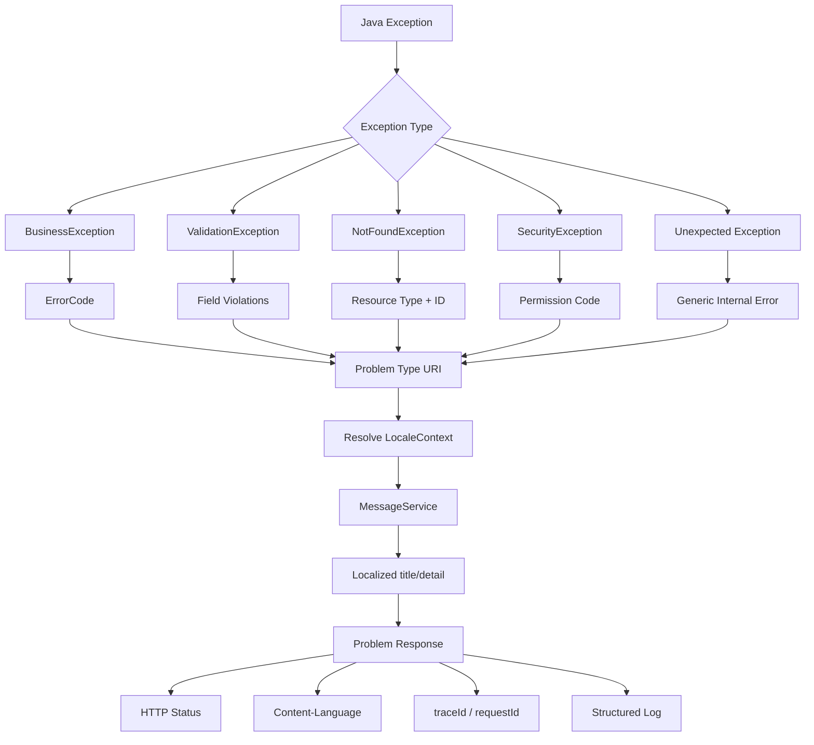

---

## 4. Problem Details: Field Utama

RFC 9457 mendefinisikan problem details untuk menjelaskan masalah dalam response HTTP. Field yang umum dipakai:

| Field | Sifat | Makna |
|---|---|---|
| `type` | Machine-readable | URI yang mengidentifikasi jenis problem |
| `title` | Human-readable | Ringkasan singkat problem |
| `status` | Machine-readable | HTTP status code |
| `detail` | Human-readable | Penjelasan spesifik occurrence |
| `instance` | Machine-readable | URI/reference occurrence spesifik |
| Extension fields | Custom | Misalnya `code`, `traceId`, `violations`, `retryable` |

RFC 9457 menyatakan problem details paling natural untuk response 4xx dan 5xx, meskipun dapat dipakai dengan status HTTP lain; tujuannya adalah membantu API menghindari format error custom yang tidak konsisten. ([IETF Datatracker](https://datatracker.ietf.org/doc/html/rfc9457))

---

## 5. Recommended Error Shape untuk Enterprise Microservice

Untuk Java Jersey/JAX-RS microservice, saya sarankan memakai bentuk **Problem Details + extension field**.

```json id="wzbav7"
{
  "type": "https://api.company.com/problems/order-cannot-be-cancelled",
  "title": "Pesanan tidak dapat dibatalkan",
  "status": 409,
  "detail": "Pesanan ORD-123 tidak dapat dibatalkan karena sudah dikirim.",
  "instance": "/orders/ORD-123/cancel",
  "code": "ORDER_CANNOT_BE_CANCELLED",
  "traceId": "01J2ABCDEF...",
  "locale": "id-ID",
  "retryable": false
}
```

Kenapa bentuk ini bagus?

| Field | Dipakai Oleh | Stabil? |
|---|---|---:|
| `type` | API consumer, docs, observability | Ya |
| `status` | HTTP client, gateway, retry logic | Ya |
| `code` | Frontend/mobile/backend consumer | Ya |
| `title` | User/dev display | Tidak selalu |
| `detail` | User/dev display | Tidak selalu |
| `traceId` | Debugging/support | Ya |
| `locale` | Debug localization behavior | Ya |
| `retryable` | Client retry logic | Ya |

---

## 6. Jangan Gunakan Localized Message sebagai Contract

Anti-pattern:

```javascript id="y68h00"
if (error.message === "Pesanan tidak dapat dibatalkan") {
  disableCancelButton();
}
```

Correct:

```javascript id="noxkey"
if (error.code === "ORDER_CANNOT_BE_CANCELLED") {
  disableCancelButton();
}
```

Localized message boleh berubah karena:

```text id="ram0dl"
copywriting diperbaiki
bahasa baru ditambahkan
legal wording berubah
formalitas berubah
regional wording berbeda
fallback locale berbeda
```

Error code tidak boleh berubah sembarangan.

---

## 7. Error Code Taxonomy

Buat taxonomy error code yang stabil.

| Kategori | Contoh Code | HTTP Status Umum |
|---|---|---:|
| Validation | `CUSTOMER_EMAIL_INVALID` | 400 |
| Resource missing | `ORDER_NOT_FOUND` | 404 |
| Conflict/state | `ORDER_CANNOT_BE_CANCELLED` | 409 |
| Authorization | `INSUFFICIENT_PERMISSION` | 403 |
| Authentication | `AUTHENTICATION_REQUIRED` | 401 |
| Rate limit | `RATE_LIMIT_EXCEEDED` | 429 |
| External dependency | `PAYMENT_GATEWAY_UNAVAILABLE` | 503 |
| Unexpected | `INTERNAL_SERVER_ERROR` | 500 |

Error code sebaiknya:

```text id="nyyq6q"
UPPER_SNAKE_CASE
domain-aware
stabil lintas locale
tidak mengandung kalimat
tidak mengandung data user
tidak terlalu low-level
```

---

## 8. `type` URI vs `code`

`type` dan `code` mirip, tapi berbeda fungsi.

| Field | Contoh | Fungsi |
|---|---|---|
| `type` | `https://api.company.com/problems/order-cannot-be-cancelled` | Global/documented problem identity |
| `code` | `ORDER_CANNOT_BE_CANCELLED` | Compact app-level error code |
| `title` | `Order cannot be cancelled` | Human-readable summary |
| `detail` | `Order ORD-123 cannot be cancelled because it has already shipped.` | Occurrence-specific explanation |

Praktik enterprise yang pragmatic:

```text id="p8csme"
Gunakan code untuk client branching.
Gunakan type untuk dokumentasi, API consistency, dan future interoperability.
Gunakan title/detail untuk manusia.
```

---

## 9. Problem Type URI Strategy

Jangan asal membuat URI per request.

Baik:

```text id="ikjwqh"
https://api.company.com/problems/order-cannot-be-cancelled
https://api.company.com/problems/validation-failed
https://api.company.com/problems/insufficient-permission
```

Buruk:

```text id="cf8h89"
https://api.company.com/problems/order/ORD-123/cannot-cancel
```

Problem type harus mengidentifikasi **jenis error**, bukan occurrence spesifik.

Occurrence spesifik bisa masuk `instance`:

```json id="y382c4"
{
  "type": "https://api.company.com/problems/order-cannot-be-cancelled",
  "instance": "/orders/ORD-123/cancel"
}
```

---

## 10. Localized `title` vs `detail`

Rekomendasi:

| Field | Isi | Localized? |
|---|---|---:|
| `title` | Generic summary | Ya |
| `detail` | Specific occurrence | Ya, hati-hati jangan bocorkan internal detail |
| `code` | Stable code | Tidak |
| `type` | Stable URI | Tidak |
| `field` | Canonical field path | Tidak |
| `fieldLabel` | User-facing field label | Ya |
| `traceId` | Debug ID | Tidak |

Contoh English:

```json id="ms1ffq"
{
  "code": "ORDER_CANNOT_BE_CANCELLED",
  "title": "Order cannot be cancelled",
  "detail": "Order ORD-123 cannot be cancelled because it has already shipped."
}
```

Contoh Indonesia:

```json id="fn3iov"
{
  "code": "ORDER_CANNOT_BE_CANCELLED",
  "title": "Pesanan tidak dapat dibatalkan",
  "detail": "Pesanan ORD-123 tidak dapat dibatalkan karena sudah dikirim."
}
```

---

## 11. HTTP Status Mapping

Jangan semua error menjadi `400`.

| Kondisi | HTTP Status | Contoh Code |
|---|---:|---|
| Request body malformed | 400 | `MALFORMED_REQUEST_BODY` |
| Validation gagal | 400 / 422 sesuai convention internal | `VALIDATION_FAILED` |
| Belum login / token invalid | 401 | `AUTHENTICATION_REQUIRED` |
| Tidak punya izin | 403 | `INSUFFICIENT_PERMISSION` |
| Resource tidak ada | 404 | `ORDER_NOT_FOUND` |
| State conflict | 409 | `ORDER_CANNOT_BE_CANCELLED` |
| Unsupported media type | 415 | `UNSUPPORTED_MEDIA_TYPE` |
| Rate limit | 429 | `RATE_LIMIT_EXCEEDED` |
| Dependency unavailable | 503 | `DEPENDENCY_UNAVAILABLE` |
| Unexpected bug | 500 | `INTERNAL_SERVER_ERROR` |

Rule penting:

```text id="v6s039"
HTTP status untuk generic HTTP semantics.
error code untuk business/application semantics.
```

---

## 12. Java Model: `ApiProblem`

```java id="zw4z6e"
import java.util.List;
import java.util.Map;

public record ApiProblem(
    String type,
    String title,
    int status,
    String detail,
    String instance,
    String code,
    String traceId,
    String locale,
    Boolean retryable,
    List<FieldViolationProblem> violations,
    Map<String, Object> metadata
) {}
```

Field violation:

```java id="pbyvxr"
public record FieldViolationProblem(
    String field,
    String fieldLabel,
    String code,
    String message,
    Object rejectedValue
) {}
```

Catatan: `rejectedValue` harus hati-hati. Jangan mengembalikan password, token, secret, file content, atau data sensitif.

---

## 13. Java Model: `ErrorCode`

```java id="xogce0"
import jakarta.ws.rs.core.Response;

public enum ErrorCode {

    ORDER_NOT_FOUND(
        "ORDER_NOT_FOUND",
        "https://api.company.com/problems/order-not-found",
        "error.order.notFound.title",
        "error.order.notFound.detail",
        Response.Status.NOT_FOUND,
        false
    ),

    ORDER_CANNOT_BE_CANCELLED(
        "ORDER_CANNOT_BE_CANCELLED",
        "https://api.company.com/problems/order-cannot-be-cancelled",
        "error.order.cannotCancel.title",
        "error.order.cannotCancel.detail",
        Response.Status.CONFLICT,
        false
    ),

    VALIDATION_FAILED(
        "VALIDATION_FAILED",
        "https://api.company.com/problems/validation-failed",
        "error.validation.failed.title",
        "error.validation.failed.detail",
        Response.Status.BAD_REQUEST,
        false
    ),

    INTERNAL_SERVER_ERROR(
        "INTERNAL_SERVER_ERROR",
        "https://api.company.com/problems/internal-server-error",
        "error.internal.title",
        "error.internal.detail",
        Response.Status.INTERNAL_SERVER_ERROR,
        true
    );

    private final String code;
    private final String type;
    private final String titleKey;
    private final String detailKey;
    private final Response.Status status;
    private final boolean retryable;

    ErrorCode(
        String code,
        String type,
        String titleKey,
        String detailKey,
        Response.Status status,
        boolean retryable
    ) {
        this.code = code;
        this.type = type;
        this.titleKey = titleKey;
        this.detailKey = detailKey;
        this.status = status;
        this.retryable = retryable;
    }

    public String code() {
        return code;
    }

    public String type() {
        return type;
    }

    public String titleKey() {
        return titleKey;
    }

    public String detailKey() {
        return detailKey;
    }

    public Response.Status status() {
        return status;
    }

    public boolean retryable() {
        return retryable;
    }
}
```

---

## 14. Message Catalog untuk Error Contract

```properties id="lgfo6f"
# errors_en_US.properties
error.order.notFound.title=Order not found
error.order.notFound.detail=Order {0} was not found.
error.order.cannotCancel.title=Order cannot be cancelled
error.order.cannotCancel.detail=Order {0} cannot be cancelled because it is already {1}.
error.validation.failed.title=Validation failed
error.validation.failed.detail=One or more fields are invalid.
error.internal.title=Internal server error
error.internal.detail=The request could not be processed.
```

```properties id="nz747i"
# errors_id_ID.properties
error.order.notFound.title=Pesanan tidak ditemukan
error.order.notFound.detail=Pesanan {0} tidak ditemukan.
error.order.cannotCancel.title=Pesanan tidak dapat dibatalkan
error.order.cannotCancel.detail=Pesanan {0} tidak dapat dibatalkan karena sudah {1}.
error.validation.failed.title=Validasi gagal
error.validation.failed.detail=Satu atau beberapa field tidak valid.
error.internal.title=Kesalahan internal server
error.internal.detail=Permintaan tidak dapat diproses.
```

Perhatikan: status `{1}` dalam detail sebaiknya juga sudah localized atau diganti dengan status label yang aman.

---

## 15. Business Exception Design

```java id="qhm7i2"
import java.util.Map;

public class BusinessException extends RuntimeException {

    private final ErrorCode errorCode;
    private final Map<String, Object> messageArgs;
    private final Map<String, Object> metadata;

    public BusinessException(
        ErrorCode errorCode,
        Map<String, Object> messageArgs
    ) {
        this(errorCode, messageArgs, Map.of());
    }

    public BusinessException(
        ErrorCode errorCode,
        Map<String, Object> messageArgs,
        Map<String, Object> metadata
    ) {
        super(errorCode.code());
        this.errorCode = errorCode;
        this.messageArgs = Map.copyOf(messageArgs);
        this.metadata = Map.copyOf(metadata);
    }

    public ErrorCode errorCode() {
        return errorCode;
    }

    public Map<String, Object> messageArgs() {
        return messageArgs;
    }

    public Map<String, Object> metadata() {
        return metadata;
    }
}
```

Usage di service:

```java id="d4x5ql"
if (!order.canBeCancelled()) {
    throw new BusinessException(
        ErrorCode.ORDER_CANNOT_BE_CANCELLED,
        Map.of(
            "orderId", order.id(),
            "statusLabel", localizedStatusLabel
        ),
        Map.of(
            "orderId", order.id(),
            "statusCode", order.status().name()
        )
    );
}
```

Namun hati-hati: idealnya service domain tidak perlu tahu `localizedStatusLabel`. Lebih bersih jika exception membawa canonical argumen, lalu mapper/localizer mengubahnya.

Lebih baik:

```java id="sip4b9"
throw new BusinessException(
    ErrorCode.ORDER_CANNOT_BE_CANCELLED,
    Map.of(
        "orderId", order.id(),
        "statusCode", order.status().name()
    )
);
```

Lalu `ExceptionMapper` melakukan localization status label.

---

## 16. Problem Builder

```java id="wwlu2r"
import jakarta.ws.rs.core.UriInfo;

import java.util.Locale;
import java.util.Map;

public class ApiProblemFactory {

    private final LocalizedMessageService messageService;
    private final StatusLabelService statusLabelService;

    public ApiProblemFactory(
        LocalizedMessageService messageService,
        StatusLabelService statusLabelService
    ) {
        this.messageService = messageService;
        this.statusLabelService = statusLabelService;
    }

    public ApiProblem fromBusinessException(
        BusinessException exception,
        Locale locale,
        String traceId,
        UriInfo uriInfo
    ) {
        ErrorCode errorCode = exception.errorCode();

        Map<String, Object> localizedArgs = localizeArgs(
            exception.messageArgs(),
            locale
        );

        String title = messageService.formatNamed(
            errorCode.titleKey(),
            locale,
            localizedArgs
        );

        String detail = messageService.formatNamed(
            errorCode.detailKey(),
            locale,
            localizedArgs
        );

        return new ApiProblem(
            errorCode.type(),
            title,
            errorCode.status().getStatusCode(),
            detail,
            uriInfo.getRequestUri().getPath(),
            errorCode.code(),
            traceId,
            locale.toLanguageTag(),
            errorCode.retryable(),
            List.of(),
            safeMetadata(exception.metadata())
        );
    }

    private Map<String, Object> localizeArgs(
        Map<String, Object> args,
        Locale locale
    ) {
        if (!args.containsKey("statusCode")) {
            return args;
        }

        Map<String, Object> result = new java.util.HashMap<>(args);
        String statusCode = String.valueOf(args.get("statusCode"));
        result.put("statusLabel", statusLabelService.label(statusCode, locale));

        return Map.copyOf(result);
    }

    private Map<String, Object> safeMetadata(Map<String, Object> metadata) {
        // Whitelist only safe metadata.
        return metadata.entrySet()
            .stream()
            .filter(entry -> isSafeMetadataKey(entry.getKey()))
            .collect(java.util.stream.Collectors.toMap(
                Map.Entry::getKey,
                Map.Entry::getValue
            ));
    }

    private boolean isSafeMetadataKey(String key) {
        return Set.of("orderId", "caseId", "statusCode").contains(key);
    }
}
```

Kalau memakai Java `MessageFormat` indexed args, builder bisa lebih sederhana. Untuk error detail yang kompleks, named args lebih readable.

---

## 17. `ExceptionMapper<BusinessException>`

JAX-RS `ExceptionMapper` memetakan Java exception ke `Response`; method `toResponse` mengembalikan response hasil mapping. Jika mapper mengembalikan `null`, dokumentasi menyebut hasilnya menjadi `204 No Content`, dan jika mapper melempar runtime exception maka hasilnya menjadi `500 Internal Server Error`. ([Jakarta EE](https://jakarta.ee/specifications/restful-ws/4.0/apidocs/jakarta.ws.rs/jakarta/ws/rs/ext/exceptionmapper?utm_source=chatgpt.com))

```java id="l63wdq"
import jakarta.ws.rs.container.ContainerRequestContext;
import jakarta.ws.rs.core.Context;
import jakarta.ws.rs.core.MediaType;
import jakarta.ws.rs.core.Response;
import jakarta.ws.rs.core.UriInfo;
import jakarta.ws.rs.ext.ExceptionMapper;
import jakarta.ws.rs.ext.Provider;

@Provider
public class BusinessExceptionMapper implements ExceptionMapper<BusinessException> {

    private final ApiProblemFactory problemFactory;
    private final TraceIdProvider traceIdProvider;

    @Context
    private ContainerRequestContext requestContext;

    @Context
    private UriInfo uriInfo;

    public BusinessExceptionMapper() {
        this.problemFactory = ApplicationComponents.problemFactory();
        this.traceIdProvider = ApplicationComponents.traceIdProvider();
    }

    @Override
    public Response toResponse(BusinessException exception) {
        LocaleContext localeContext = (LocaleContext) requestContext.getProperty(
            LocaleContextFilter.LOCALE_CONTEXT_PROPERTY
        );

        String traceId = traceIdProvider.currentTraceId(requestContext);

        ApiProblem problem = problemFactory.fromBusinessException(
            exception,
            localeContext.locale(),
            traceId,
            uriInfo
        );

        return Response.status(exception.errorCode().status())
            .type("application/problem+json")
            .language(localeContext.locale())
            .entity(problem)
            .build();
    }
}
```

`Response.ResponseBuilder#language(Locale)` tersedia di Jakarta REST untuk menetapkan bahasa entity response, dan `Response#getLanguage()` mengembalikan bahasa entity jika dispesifikasikan. ([Jakarta EE](https://jakarta.ee/specifications/restful-ws/4.0/apidocs/jakarta.ws.rs/jakarta/ws/rs/core/class-use/response.responsebuilder?utm_source=chatgpt.com))

---

## 18. `Content-Language` untuk Error Response

Error yang localized juga perlu mengirim bahasa representasi. Header HTTP `Content-Language` digunakan untuk mendeskripsikan bahasa yang ditujukan untuk audience response; MDN juga mencatat multiple language tag bisa dipakai bila perlu. ([MDN Web Docs](https://developer.mozilla.org/en-US/docs/Web/HTTP/Reference/Headers/Content-Language))

Response:

```http id="zj4gpg"
HTTP/1.1 409 Conflict
Content-Type: application/problem+json
Content-Language: id-ID
```

Body:

```json id="kx9so7"
{
  "type": "https://api.company.com/problems/order-cannot-be-cancelled",
  "title": "Pesanan tidak dapat dibatalkan",
  "status": 409,
  "detail": "Pesanan ORD-123 tidak dapat dibatalkan karena sudah dikirim.",
  "code": "ORDER_CANNOT_BE_CANCELLED",
  "traceId": "01J2ABC..."
}
```

---

## 19. Validation Error Contract

Untuk validation error, jangan hanya satu message.

Buruk:

```json id="tzxvqp"
{
  "message": "Validation failed"
}
```

Lebih baik:

```json id="i7e17r"
{
  "type": "https://api.company.com/problems/validation-failed",
  "title": "Validasi gagal",
  "status": 400,
  "detail": "Satu atau beberapa field tidak valid.",
  "code": "VALIDATION_FAILED",
  "traceId": "01J2ABC...",
  "violations": [
    {
      "field": "customer.email",
      "fieldLabel": "Email pelanggan",
      "code": "FIELD_REQUIRED",
      "message": "Email pelanggan wajib diisi."
    },
    {
      "field": "customer.birthDate",
      "fieldLabel": "Tanggal lahir pelanggan",
      "code": "DATE_MUST_BE_IN_PAST",
      "message": "Tanggal lahir pelanggan harus berada di masa lalu."
    }
  ]
}
```

Invariant:

```text id="my4fkl"
violations[].field canonical
violations[].fieldLabel localized
violations[].code canonical
violations[].message localized
```

---

## 20. Jakarta Validation Mapper

Biasanya Bean Validation akan menghasilkan `ConstraintViolationException`.

```java id="bk2310"
import jakarta.validation.ConstraintViolation;
import jakarta.validation.ConstraintViolationException;
import jakarta.ws.rs.container.ContainerRequestContext;
import jakarta.ws.rs.core.Context;
import jakarta.ws.rs.core.MediaType;
import jakarta.ws.rs.core.Response;
import jakarta.ws.rs.core.UriInfo;
import jakarta.ws.rs.ext.ExceptionMapper;
import jakarta.ws.rs.ext.Provider;

import java.util.List;
import java.util.Locale;

@Provider
public class ConstraintViolationExceptionMapper
    implements ExceptionMapper<ConstraintViolationException> {

    private final LocalizedMessageService messageService;
    private final FieldLabelService fieldLabelService;
    private final TraceIdProvider traceIdProvider;

    @Context
    private ContainerRequestContext requestContext;

    @Context
    private UriInfo uriInfo;

    public ConstraintViolationExceptionMapper() {
        this.messageService = ApplicationComponents.messageService();
        this.fieldLabelService = ApplicationComponents.fieldLabelService();
        this.traceIdProvider = ApplicationComponents.traceIdProvider();
    }

    @Override
    public Response toResponse(ConstraintViolationException exception) {
        LocaleContext localeContext = (LocaleContext) requestContext.getProperty(
            LocaleContextFilter.LOCALE_CONTEXT_PROPERTY
        );

        Locale locale = localeContext.locale();
        String traceId = traceIdProvider.currentTraceId(requestContext);

        List<FieldViolationProblem> violations = exception.getConstraintViolations()
            .stream()
            .map(violation -> toViolationProblem(violation, locale))
            .toList();

        ErrorCode errorCode = ErrorCode.VALIDATION_FAILED;

        ApiProblem problem = new ApiProblem(
            errorCode.type(),
            messageService.formatNamed(errorCode.titleKey(), locale, Map.of()),
            errorCode.status().getStatusCode(),
            messageService.formatNamed(errorCode.detailKey(), locale, Map.of()),
            uriInfo.getRequestUri().getPath(),
            errorCode.code(),
            traceId,
            locale.toLanguageTag(),
            false,
            violations,
            Map.of()
        );

        return Response.status(errorCode.status())
            .type("application/problem+json")
            .language(locale)
            .entity(problem)
            .build();
    }

    private FieldViolationProblem toViolationProblem(
        ConstraintViolation<?> violation,
        Locale locale
    ) {
        String field = normalizePath(violation.getPropertyPath().toString());
        String fieldLabel = fieldLabelService.label(field, locale);

        String code = validationCodeOf(violation);
        String message = localizedViolationMessage(
            code,
            fieldLabel,
            violation,
            locale
        );

        return new FieldViolationProblem(
            field,
            fieldLabel,
            code,
            message,
            safeRejectedValue(violation.getInvalidValue())
        );
    }

    private String normalizePath(String path) {
        // Example: createOrder.arg0.customer.email -> customer.email
        int idx = path.indexOf("customer.");
        if (idx >= 0) {
            return path.substring(idx);
        }
        return path;
    }

    private String validationCodeOf(ConstraintViolation<?> violation) {
        String annotationName = violation.getConstraintDescriptor()
            .getAnnotation()
            .annotationType()
            .getSimpleName();

        return switch (annotationName) {
            case "NotNull", "NotBlank" -> "FIELD_REQUIRED";
            case "Email" -> "EMAIL_INVALID";
            case "Past" -> "DATE_MUST_BE_IN_PAST";
            case "Size" -> "FIELD_SIZE_INVALID";
            default -> "FIELD_INVALID";
        };
    }

    private String localizedViolationMessage(
        String code,
        String fieldLabel,
        ConstraintViolation<?> violation,
        Locale locale
    ) {
        String key = switch (code) {
            case "FIELD_REQUIRED" -> "validation.field.required";
            case "EMAIL_INVALID" -> "validation.email.invalid";
            case "DATE_MUST_BE_IN_PAST" -> "validation.date.mustBeInPast";
            case "FIELD_SIZE_INVALID" -> "validation.field.sizeInvalid";
            default -> "validation.field.invalid";
        };

        return messageService.formatNamed(
            key,
            locale,
            Map.of("fieldLabel", fieldLabel)
        );
    }

    private Object safeRejectedValue(Object value) {
        if (value == null) {
            return null;
        }

        if (value instanceof CharSequence text && text.length() > 128) {
            return text.subSequence(0, 128).toString();
        }

        return value;
    }
}
```

Catatan penting: untuk data sensitif, jangan return `rejectedValue`.

---

## 21. Field Label Service

```java id="qot8sy"
import java.util.Locale;
import java.util.Map;

public class FieldLabelService {

    private final LocalizedMessageService messageService;

    private static final Map<String, String> FIELD_LABEL_KEYS = Map.of(
        "customer.email", "field.customer.email",
        "customer.birthDate", "field.customer.birthDate",
        "order.amount", "field.order.amount"
    );

    public FieldLabelService(LocalizedMessageService messageService) {
        this.messageService = messageService;
    }

    public String label(String field, Locale locale) {
        String key = FIELD_LABEL_KEYS.get(field);

        if (key == null) {
            return field;
        }

        return messageService.formatNamed(key, locale, Map.of());
    }
}
```

Properties:

```properties id="sfqmhr"
# fields_en_US.properties
field.customer.email=Customer email
field.customer.birthDate=Customer birth date
field.order.amount=Order amount
```

```properties id="goa19d"
# fields_id_ID.properties
field.customer.email=Email pelanggan
field.customer.birthDate=Tanggal lahir pelanggan
field.order.amount=Jumlah pesanan
```

---

## 22. Mapping Jersey/JAX-RS Built-in Exceptions

Selain business dan validation exception, mapping juga perlu mencakup exception umum.

| Exception / Kondisi | Recommended Code | Status |
|---|---|---:|
| `NotFoundException` | `RESOURCE_NOT_FOUND` | 404 |
| `NotAllowedException` | `METHOD_NOT_ALLOWED` | 405 |
| `NotAcceptableException` | `NOT_ACCEPTABLE` | 406 |
| `NotSupportedException` | `UNSUPPORTED_MEDIA_TYPE` | 415 |
| JSON parse error | `MALFORMED_REQUEST_BODY` | 400 |
| Query param parse error | `INVALID_REQUEST_PARAMETER` | 400 |
| `ConstraintViolationException` | `VALIDATION_FAILED` | 400 |
| `Throwable` fallback | `INTERNAL_SERVER_ERROR` | 500 |

Jangan expose stack trace atau raw exception message ke client.

---

## 23. Generic Throwable Mapper

```java id="x50358"
import jakarta.ws.rs.container.ContainerRequestContext;
import jakarta.ws.rs.core.Context;
import jakarta.ws.rs.core.MediaType;
import jakarta.ws.rs.core.Response;
import jakarta.ws.rs.core.UriInfo;
import jakarta.ws.rs.ext.ExceptionMapper;
import jakarta.ws.rs.ext.Provider;

import java.util.Locale;
import java.util.Map;

@Provider
public class UnhandledExceptionMapper implements ExceptionMapper<Throwable> {

    private final LocalizedMessageService messageService;
    private final TraceIdProvider traceIdProvider;
    private final ApplicationLogger logger;

    @Context
    private ContainerRequestContext requestContext;

    @Context
    private UriInfo uriInfo;

    @Override
    public Response toResponse(Throwable exception) {
        LocaleContext localeContext = (LocaleContext) requestContext.getProperty(
            LocaleContextFilter.LOCALE_CONTEXT_PROPERTY
        );

        Locale locale = localeContext.locale();
        String traceId = traceIdProvider.currentTraceId(requestContext);

        ErrorCode errorCode = ErrorCode.INTERNAL_SERVER_ERROR;

        logger.error("Unhandled exception", Map.of(
            "traceId", traceId,
            "exceptionType", exception.getClass().getName(),
            "path", uriInfo.getRequestUri().getPath()
        ), exception);

        ApiProblem problem = new ApiProblem(
            errorCode.type(),
            messageService.formatNamed(errorCode.titleKey(), locale, Map.of()),
            errorCode.status().getStatusCode(),
            messageService.formatNamed(errorCode.detailKey(), locale, Map.of()),
            uriInfo.getRequestUri().getPath(),
            errorCode.code(),
            traceId,
            locale.toLanguageTag(),
            errorCode.retryable(),
            List.of(),
            Map.of()
        );

        return Response.status(Response.Status.INTERNAL_SERVER_ERROR)
            .type("application/problem+json")
            .language(locale)
            .entity(problem)
            .build();
    }
}
```

Security rule:

```text id="vx4anv"
Client mendapat safe generic localized message.
Log internal menyimpan exception detail.
traceId menghubungkan keduanya.
```

---

## 24. Trace ID / Request ID

Error response harus membawa `traceId`.

```json id="vopy7x"
{
  "code": "INTERNAL_SERVER_ERROR",
  "message": "Permintaan tidak dapat diproses.",
  "traceId": "01J2ABCDEF..."
}
```

Manfaat:

| Aktor | Manfaat |
|---|---|
| User | Bisa melaporkan reference |
| Support | Bisa cari log |
| Engineer | Bisa trace request |
| SRE | Bisa korelasi metrics/traces |
| Auditor | Bisa follow incident trail |

Jangan localize:

```text id="svjpey"
traceId
requestId
correlationId
spanId
```

---

## 25. Error Response untuk Authorization

Authorization error jangan terlalu detail.

Buruk:

```json id="g5ndio"
{
  "code": "MISSING_PERMISSION_CASE_APPROVER_LEVEL_3",
  "message": "Anda tidak memiliki permission CASE_APPROVER_LEVEL_3 untuk case tenant ABC."
}
```

Lebih aman:

```json id="v43y8k"
{
  "type": "https://api.company.com/problems/insufficient-permission",
  "title": "Akses ditolak",
  "status": 403,
  "detail": "Anda tidak memiliki izin untuk melakukan tindakan ini.",
  "code": "INSUFFICIENT_PERMISSION",
  "traceId": "01J2ABC..."
}
```

Detail permission bisa ada di log internal:

```json id="ibrmew"
{
  "event": "authorization.denied",
  "requiredPermission": "case.approve.level3",
  "actorId": "usr_123",
  "tenantId": "tenant_abc",
  "traceId": "01J2ABC..."
}
```

---

## 26. Error Response untuk Not Found

Not found punya risiko enumeration. Untuk resource sensitif, kadang 404 dan 403 intentionally dibuat indistinguishable.

Contoh aman:

```json id="c2zypk"
{
  "type": "https://api.company.com/problems/resource-not-found",
  "title": "Resource tidak ditemukan",
  "status": 404,
  "detail": "Resource yang diminta tidak ditemukan.",
  "code": "RESOURCE_NOT_FOUND",
  "traceId": "01J2ABC..."
}
```

Untuk API internal yang butuh spesifik:

```json id="lv5d1r"
{
  "code": "ORDER_NOT_FOUND",
  "detail": "Pesanan ORD-123 tidak ditemukan."
}
```

Decision rule:

```text id="f1epyd"
Public/sensitive API: generic not found.
Internal/trusted API: domain-specific not found boleh.
```

---

## 27. Error Response untuk Conflict / State Machine

Untuk regulatory/case/order lifecycle, conflict error harus explainable tapi tetap canonical.

```json id="w95n3j"
{
  "type": "https://api.company.com/problems/invalid-state-transition",
  "title": "Transisi status tidak valid",
  "status": 409,
  "detail": "Case CASE-123 tidak dapat dipindahkan dari CLOSED ke UNDER_REVIEW.",
  "code": "INVALID_STATE_TRANSITION",
  "traceId": "01J2ABC...",
  "metadata": {
    "entityType": "CASE",
    "entityId": "CASE-123",
    "fromState": "CLOSED",
    "toState": "UNDER_REVIEW"
  }
}
```

Perhatikan:

```text id="n4odqi"
detail localized
metadata canonical
```

Ini penting untuk state machine, escalation logic, Camunda workflow, dan audit defensibility.

---

## 28. Error Response untuk External Dependency

```json id="xebm5c"
{
  "type": "https://api.company.com/problems/dependency-unavailable",
  "title": "Layanan sementara tidak tersedia",
  "status": 503,
  "detail": "Permintaan belum dapat diproses saat ini. Silakan coba lagi nanti.",
  "code": "PAYMENT_GATEWAY_UNAVAILABLE",
  "traceId": "01J2ABC...",
  "retryable": true
}
```

Jangan expose:

```text id="g8jqkb"
host internal
database name
JDBC URL
secret name
cloud account id
vendor stack trace
```

---

## 29. API Localization Modes

Ada dua mode desain.

### Mode A - Backend-localized response

Backend mengirim final localized text.

```json id="hisq6t"
{
  "code": "ORDER_CANNOT_BE_CANCELLED",
  "message": "Pesanan tidak dapat dibatalkan."
}
```

Cocok untuk:

```text id="uieydl"
backend-driven UI
mobile app sederhana
internal enterprise app
notification/report backend
```

### Mode B - Client-localized response

Backend mengirim key + args, client render localized text.

```json id="b9zv69"
{
  "code": "ORDER_CANNOT_BE_CANCELLED",
  "messageKey": "error.order.cannotCancel",
  "messageArgs": {
    "orderId": "ORD-123"
  },
  "fallbackMessage": "Order ORD-123 cannot be cancelled."
}
```

Cocok untuk:

```text id="jhjbp5"
frontend punya translation catalog sendiri
SPA multi-language intensif
offline mobile app
client ingin consistent UI copy
```

Trade-off:

| Aspek | Backend-localized | Client-localized |
|---|---|---|
| Backend simplicity | Sedang | Lebih kompleks contract |
| Frontend flexibility | Rendah | Tinggi |
| Consistency across clients | Tinggi bila backend owner | Bergantung client |
| Message key coupling | Rendah | Tinggi |
| Offline support | Rendah | Tinggi |
| API consumer external | Lebih aman | Bisa leak internal key |

Untuk enterprise microservice internal, saya biasanya mulai dari **backend-localized for errors**, lalu beri `code` stabil agar client tetap bisa branching.

---

## 30. OpenAPI Documentation

Dokumentasikan:

```text id="ea3m8j"
Accept-Language
Content-Language
application/problem+json
error code enum
problem type URI
localized fields
stable fields
example per locale
```

Contoh schema konseptual:

```yaml id="q5yvuu"
ApiProblem:
  type: object
  required:
    - type
    - title
    - status
    - code
    - traceId
  properties:
    type:
      type: string
      format: uri
    title:
      type: string
      description: Localized human-readable summary.
    status:
      type: integer
    detail:
      type: string
      description: Localized occurrence-specific explanation.
    instance:
      type: string
    code:
      type: string
      description: Stable machine-readable application error code.
    traceId:
      type: string
    locale:
      type: string
      description: BCP 47 language tag used for localized fields.
    violations:
      type: array
      items:
        $ref: '#/components/schemas/FieldViolationProblem'
```

---

## 31. Versioning Error Codes

Error code adalah contract. Perlakukan seperti API field.

Rule:

```text id="lx01o0"
Jangan rename error code tanpa deprecation plan.
Jangan reuse old code untuk meaning baru.
Jangan hapus code tanpa consumer impact analysis.
Boleh ubah title/detail localized.
Boleh tambah metadata optional.
```

Safe change:

```text id="au13pe"
ubah "Pesanan tidak dapat dibatalkan" menjadi "Pesanan ini tidak dapat dibatalkan"
```

Breaking change:

```text id="e6iix4"
ORDER_CANNOT_BE_CANCELLED → ORDER_CANCEL_NOT_ALLOWED
```

---

## 32. Error Code Registry

Untuk microservice besar, buat registry.

```java id="o8vpl8"
public record ErrorCodeDescriptor(
    String code,
    String type,
    int httpStatus,
    String titleKey,
    String detailKey,
    boolean retryable,
    ErrorCategory category,
    ErrorVisibility visibility
) {}
```

```java id="tb1r9w"
public enum ErrorCategory {
    VALIDATION,
    BUSINESS_RULE,
    AUTHENTICATION,
    AUTHORIZATION,
    NOT_FOUND,
    CONFLICT,
    DEPENDENCY,
    INTERNAL
}
```

```java id="qy76nc"
public enum ErrorVisibility {
    PUBLIC_SAFE,
    INTERNAL_ONLY,
    SECURITY_SENSITIVE
}
```

Manfaat:

```text id="cwitfy"
bisa generate OpenAPI docs
bisa test message keys
bisa enforce status mapping
bisa audit perubahan error contract
bisa standardize across services
```

---

## 33. Testing Strategy

### 33.1 Contract test: code stable, message localized

```java id="mljhg0"
@Test
void orderCannotBeCancelledShouldHaveStableCodeAndLocalizedMessage() {
    Response response = target("/orders/ORD-123/cancel")
        .request()
        .header("Accept-Language", "id-ID")
        .post(Entity.json("{}"));

    ApiProblem problem = response.readEntity(ApiProblem.class);

    assertEquals(409, response.getStatus());
    assertEquals("ORDER_CANNOT_BE_CANCELLED", problem.code());
    assertEquals("id-ID", response.getHeaderString("Content-Language"));
    assertEquals("Pesanan tidak dapat dibatalkan", problem.title());
}
```

### 33.2 Locale comparison test

```java id="ult9bv"
@Test
void codeShouldRemainSameAcrossLocales() {
    ApiProblem idProblem = callCancel("id-ID");
    ApiProblem enProblem = callCancel("en-US");

    assertEquals(idProblem.code(), enProblem.code());
    assertEquals(idProblem.type(), enProblem.type());
    assertEquals(idProblem.status(), enProblem.status());

    assertNotEquals(idProblem.title(), enProblem.title());
}
```

### 33.3 Validation violation test

```java id="2j9lrx"
@Test
void validationErrorShouldContainCanonicalFieldAndLocalizedLabel() {
    ApiProblem problem = submitInvalidCustomer("id-ID");

    FieldViolationProblem emailViolation = problem.violations()
        .stream()
        .filter(v -> v.field().equals("customer.email"))
        .findFirst()
        .orElseThrow();

    assertEquals("FIELD_REQUIRED", emailViolation.code());
    assertEquals("Email pelanggan", emailViolation.fieldLabel());
}
```

---

## 34. CI Quality Gates

Minimal CI checks:

```text id="mjjkdg"
[ ] Semua ErrorCode punya type URI
[ ] Semua ErrorCode punya titleKey dan detailKey
[ ] Semua titleKey/detailKey ada di base bundle
[ ] Semua supported locale punya key critical
[ ] Error code tidak duplikat
[ ] Problem type URI tidak duplikat
[ ] HTTP status sesuai category
[ ] No stack trace in response snapshot
[ ] No sensitive rejectedValue in validation error
[ ] Content-Language ada untuk localized response
```

---

## 35. Observability

Log error dengan canonical data, bukan localized message sebagai primary key.

```json id="xhzl4f"
{
  "event": "api.error",
  "service": "order-service",
  "code": "ORDER_CANNOT_BE_CANCELLED",
  "type": "https://api.company.com/problems/order-cannot-be-cancelled",
  "status": 409,
  "locale": "id-ID",
  "traceId": "01J2ABC...",
  "path": "/orders/ORD-123/cancel",
  "tenantId": "tenant-a",
  "actorId": "usr-123"
}
```

Metric:

```text id="mu1xa6"
api.error.count{code,status,service}
api.error.localized.count{locale,code}
api.error.fallback_used.count{locale,code}
api.error.validation.count{field,code}
```

Jangan membuat metric label dari `detail` localized karena cardinality tinggi dan berubah-ubah.

---

## 36. Security Checklist

```text id="evnx4h"
[ ] Jangan expose stack trace
[ ] Jangan expose SQL error raw
[ ] Jangan expose internal hostname/JDBC URL/topic name
[ ] Jangan expose permission detail sensitif ke public client
[ ] Jangan expose rejectedValue untuk password/token/secret/file
[ ] Jangan masukkan PII ke error code/type
[ ] Jangan gunakan localized message sebagai log aggregation key
[ ] Jangan return different sensitive errors yang mempermudah enumeration
[ ] Gunakan traceId untuk support/debug
[ ] Localized argumen user-facing harus di-escape sesuai channel
```

---

## 37. Practical Rules

| Rule | Praktik |
|---|---|
| Error contract harus stable | `code`, `type`, `status` |
| Human text boleh localized | `title`, `detail`, `fieldLabel`, `message` |
| Jangan parse message | Client harus parse `code` |
| Gunakan `application/problem+json` | Khusus error response Problem Details |
| Tambahkan `Content-Language` | Agar client tahu bahasa response |
| Gunakan `ExceptionMapper` | Centralized exception-to-response |
| Jangan leak internals | Generic 500, log detail internal |
| Validation harus field-level | `violations[]` |
| Traceability wajib | `traceId` |
| Error code versioned | Jangan rename sembarangan |

---

## 38. Review Checklist Codebase

```text id="ioeb43"
[ ] Apakah error response memakai shape konsisten?
[ ] Apakah ada `ExceptionMapper` untuk business exception?
[ ] Apakah ada mapper untuk validation exception?
[ ] Apakah ada fallback mapper untuk unexpected exception?
[ ] Apakah response memakai `application/problem+json`?
[ ] Apakah `code` stabil dan tidak localized?
[ ] Apakah `title/detail` localized?
[ ] Apakah `Content-Language` dikirim?
[ ] Apakah `traceId` selalu ada?
[ ] Apakah stack trace tidak pernah keluar ke client?
[ ] Apakah validation error punya canonical field path?
[ ] Apakah field label localized?
[ ] Apakah error code terdokumentasi di OpenAPI?
[ ] Apakah error code punya test/message catalog coverage?
[ ] Apakah authorization/not-found tidak membocorkan informasi sensitif?
```

---

# Seri 5 Selesai

Kita sudah membahas:

```text id="csd8it"
Problem Details / RFC 9457
localized API error contract
stable error code
problem type URI
title/detail localization
Content-Language
ExceptionMapper
validation violation mapping
security-sensitive errors
traceId
OpenAPI documentation
testing & CI gates
```

Rekomendasi berikutnya: **Seri 6 - Jakarta Validation Localization & Field-Level Error Mapping**.

---

**Sources:**

- [
            
                RFC 9457 - Problem Details for HTTP APIs
            
        ](https://datatracker.ietf.org/doc/html/rfc9457)
- [ExceptionMapper (Jakarta RESTful WS API 4.0.0 API)](https://jakarta.ee/specifications/restful-ws/4.0/apidocs/jakarta.ws.rs/jakarta/ws/rs/ext/exceptionmapper?utm_source=chatgpt.com)
- [Content-Language header - HTTP | MDN](https://developer.mozilla.org/en-US/docs/Web/HTTP/Reference/Headers/Content-Language)

## Response:
7/13/2026, 10:15:26 PM

# Seri 6 dari 12 - Jakarta Validation Localization & Field-Level Error Mapping

## 1. Tujuan Seri Ini

Seri ini fokus pada localization untuk **input validation** di Java Jersey/JAX-RS microservice:

```text id="pu3lij"
DTO validation
Jakarta Validation annotations
ConstraintViolationException
field-level error mapping
localized field label
localized validation message
canonical error code
safe rejected value
```

Targetnya bukan hanya membuat pesan seperti:

```text id="46mm8f"
must not be blank
```

menjadi:

```text id="0bpnwo"
wajib diisi
```

Tetapi membuat error response yang bisa dipakai oleh frontend, QA, support, logging, audit, dan API consumer secara stabil.

Jakarta Validation menyediakan API seperti `ConstraintViolation`, `MessageInterpolator`, `Path`, dan `Validator` untuk mendeskripsikan dan memproses pelanggaran constraint. Jakarta Validation 3.1 juga menargetkan Java 17 sebagai minimum dan mengklarifikasi validasi record. ([beanvalidation.org](https://beanvalidation.org/news/2025/02/17/bean-validation-3-1/?utm_source=chatgpt.com))

---

## 2. Mental Model

Validation error punya dua lapisan:

```text id="3i09v7"
Canonical layer:
  field path
  violation code
  constraint type
  rejected value policy
  HTTP status
  traceId

Localized layer:
  field label
  validation message
  title/detail
```

Contoh response ideal:

```json id="vghldi"
{
  "type": "https://api.company.com/problems/validation-failed",
  "title": "Validasi gagal",
  "status": 400,
  "detail": "Satu atau beberapa field tidak valid.",
  "code": "VALIDATION_FAILED",
  "traceId": "01J2ABC...",
  "locale": "id-ID",
  "violations": [
    {
      "field": "customer.email",
      "fieldLabel": "Email pelanggan",
      "code": "FIELD_REQUIRED",
      "message": "Email pelanggan wajib diisi."
    }
  ]
}
```

Invariant:

```text id="q6i9xg"
field       = canonical, tidak localized
fieldLabel  = localized
code        = canonical, tidak localized
message     = localized
```

---

## 3. Diagram

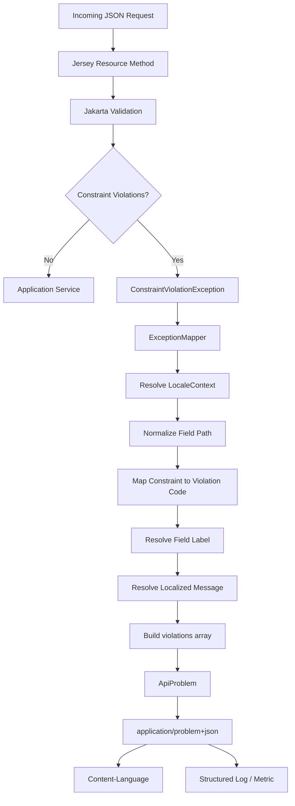

---

## 4. Dependency Mental Model

Di stack modern Java/Jakarta, biasanya ada tiga lapisan:

| Layer | Fungsi |
|---|---|
| Jakarta Validation API | Interface/spec: `Validator`, `ConstraintViolation`, `MessageInterpolator` |
| Implementation | Misalnya Hibernate Validator |
| Integration | Jersey/JAX-RS runtime yang memicu validasi parameter/resource |

Hibernate Validator adalah reference implementation yang umum dipakai untuk Jakarta Validation; dokumentasi versi stabilnya menjelaskan constraint diekspresikan dengan annotation dan violation message diinterpolasi menggunakan mekanisme message interpolation. ([docs.hibernate.org](https://docs.hibernate.org/stable/validator/reference/en-US/html_single/?utm_source=chatgpt.com))

Contoh Maven dependency konseptual:

```xml id="g7jghq"
<dependency>
  <groupId>jakarta.validation</groupId>
  <artifactId>jakarta.validation-api</artifactId>
  <version><!-- align with platform --></version>
</dependency>

<dependency>
  <groupId>org.hibernate.validator</groupId>
  <artifactId>hibernate-validator</artifactId>
  <version><!-- align with Jakarta Validation version --></version>
</dependency>
```

Catatan: jangan asal campur versi `javax.validation.*` lama dengan `jakarta.validation.*` baru. Di stack Jakarta modern, namespace-nya adalah `jakarta.validation`.

---

## 5. DTO Validation Example

Request DTO:

```java id="urodw0"
import jakarta.validation.Valid;
import jakarta.validation.constraints.Email;
import jakarta.validation.constraints.NotBlank;
import jakarta.validation.constraints.NotNull;
import jakarta.validation.constraints.Past;
import jakarta.validation.constraints.Size;

import java.time.LocalDate;
import java.util.List;

public record CreateCustomerRequest(

    @NotBlank(message = "{validation.customer.name.required}")
    @Size(max = 120, message = "{validation.customer.name.maxSize}")
    String name,

    @NotBlank(message = "{validation.customer.email.required}")
    @Email(message = "{validation.customer.email.invalid}")
    String email,

    @NotNull(message = "{validation.customer.birthDate.required}")
    @Past(message = "{validation.customer.birthDate.mustBePast}")
    LocalDate birthDate,

    @Valid
    List<AddressRequest> addresses
) {}
```

Nested DTO:

```java id="t6c7bn"
import jakarta.validation.constraints.NotBlank;
import jakarta.validation.constraints.Size;

public record AddressRequest(

    @NotBlank(message = "{validation.customer.address.line1.required}")
    @Size(max = 255, message = "{validation.customer.address.line1.maxSize}")
    String line1,

    @NotBlank(message = "{validation.customer.address.city.required}")
    String city,

    @NotBlank(message = "{validation.customer.address.country.required}")
    String country
) {}
```

Yang perlu diperhatikan:

```text id="wscigj"
message annotation sebaiknya berisi message key, bukan final human text.
```

---

## 6. ValidationMessages Properties

Jakarta Validation umumnya menggunakan resource bundle `ValidationMessages.properties` untuk message interpolation. Hibernate Validator documentation menjelaskan message interpolation sebagai proses membuat error message dari constraint violation dan mendukung resource bundle untuk message resolution. ([docs.hibernate.org](https://docs.hibernate.org/validator/5.1/reference/en-US/html/chapter-message-interpolation.html?utm_source=chatgpt.com))

Struktur file:

```text id="60dw6x"
src/main/resources/
  ValidationMessages.properties
  ValidationMessages_en_US.properties
  ValidationMessages_id_ID.properties
```

English:

```properties id="gqeqpi"
# ValidationMessages_en_US.properties
validation.customer.name.required=Customer name is required.
validation.customer.name.maxSize=Customer name must be at most {max} characters.
validation.customer.email.required=Customer email is required.
validation.customer.email.invalid=Customer email is invalid.
validation.customer.birthDate.required=Customer birth date is required.
validation.customer.birthDate.mustBePast=Customer birth date must be in the past.
validation.customer.address.line1.required=Address line 1 is required.
validation.customer.address.line1.maxSize=Address line 1 must be at most {max} characters.
validation.customer.address.city.required=City is required.
validation.customer.address.country.required=Country is required.
```

Indonesian:

```properties id="2w0a17"
# ValidationMessages_id_ID.properties
validation.customer.name.required=Nama pelanggan wajib diisi.
validation.customer.name.maxSize=Nama pelanggan maksimal {max} karakter.
validation.customer.email.required=Email pelanggan wajib diisi.
validation.customer.email.invalid=Email pelanggan tidak valid.
validation.customer.birthDate.required=Tanggal lahir pelanggan wajib diisi.
validation.customer.birthDate.mustBePast=Tanggal lahir pelanggan harus berada di masa lalu.
validation.customer.address.line1.required=Alamat baris 1 wajib diisi.
validation.customer.address.line1.maxSize=Alamat baris 1 maksimal {max} karakter.
validation.customer.address.city.required=Kota wajib diisi.
validation.customer.address.country.required=Negara wajib diisi.
```

---

## 7. Dua Strategi Localization Validation

Ada dua pendekatan utama.

### Strategi A - Annotation message langsung localized oleh Bean Validation

DTO:

```java id="z2818l"
@NotBlank(message = "{validation.customer.email.required}")
String email
```

Validator menghasilkan:

```text id="j9wopt"
Email pelanggan wajib diisi.
```

Kelebihan:

```text id="24sq01"
simple
natural dengan Jakarta Validation
constraint message langsung localized
```

Kekurangan:

```text id="0m2ep3"
sulit membuat fieldLabel reusable
sulit membuat error code canonical granular
locale per request perlu diintegrasikan hati-hati
message sudah final, lebih sulit dikontrol di ExceptionMapper
```

### Strategi B - Annotation message sebagai key/code, localization di `ExceptionMapper`

DTO:

```java id="kx3zvw"
@NotBlank(message = "{validation.customer.email.required}")
String email
```

Mapper mengambil template/key/constraint info, lalu membangun:

```json id="xsy6gc"
{
  "field": "customer.email",
  "fieldLabel": "Email pelanggan",
  "code": "FIELD_REQUIRED",
  "message": "Email pelanggan wajib diisi."
}
```

Kelebihan:

```text id="k1n2f7"
error contract lebih konsisten
bisa mapping code canonical
bisa localize fieldLabel
bisa sanitize rejectedValue
bisa observability lebih baik
```

Rekomendasi untuk enterprise microservice: **pakai Strategi B**, meskipun bisa tetap memanfaatkan `ValidationMessages`.

---

## 8. Resource Method Validation di Jersey

Contoh resource:

```java id="r21f2k"
import jakarta.validation.Valid;
import jakarta.ws.rs.Consumes;
import jakarta.ws.rs.POST;
import jakarta.ws.rs.Path;
import jakarta.ws.rs.core.MediaType;
import jakarta.ws.rs.core.Response;

@Path("/customers")
public class CustomerResource {

    private final CustomerApplicationService customerService;
    private final CustomerResponseMapper responseMapper;

    public CustomerResource(
        CustomerApplicationService customerService,
        CustomerResponseMapper responseMapper
    ) {
        this.customerService = customerService;
        this.responseMapper = responseMapper;
    }

    @POST
    @Consumes(MediaType.APPLICATION_JSON)
    public Response createCustomer(@Valid CreateCustomerRequest request) {
        Customer customer = customerService.createCustomer(request);
        return Response.status(Response.Status.CREATED)
            .entity(responseMapper.toResponse(customer))
            .build();
    }
}
```

Jika request melanggar constraint, runtime dapat menghasilkan `ConstraintViolationException` atau exception integrasi spesifik tergantung konfigurasi Jersey/validator.

---

## 9. Field Path Problem

`ConstraintViolation#getPropertyPath()` sering tidak langsung berbentuk field path API yang ideal.

Contoh kemungkinan path:

```text id="j09ds6"
createCustomer.arg0.email
createCustomer.request.email
email
addresses[0].city
createCustomer.arg0.addresses[0].city
```

Target API contract sebaiknya stabil:

```text id="7db9c2"
customer.email
customer.addresses[0].city
```

Jadi kita butuh **FieldPathNormalizer**.

---

## 10. FieldPathNormalizer

```java id="1jqxny"
public interface FieldPathNormalizer {
    String normalize(String rawPath);
}
```

Implementasi sederhana:

```java id="3tojqm"
public class CustomerFieldPathNormalizer implements FieldPathNormalizer {

    @Override
    public String normalize(String rawPath) {
        if (rawPath == null || rawPath.isBlank()) {
            return "";
        }

        String path = rawPath;

        path = removePrefix(path, "createCustomer.arg0.");
        path = removePrefix(path, "createCustomer.request.");
        path = removePrefix(path, "arg0.");

        if (path.startsWith("addresses")) {
            return "customer." + path;
        }

        return "customer." + path;
    }

    private String removePrefix(String value, String prefix) {
        if (value.startsWith(prefix)) {
            return value.substring(prefix.length());
        }
        return value;
    }
}
```

Contoh mapping:

| Raw Path | Normalized Field |
|---|---|
| `createCustomer.arg0.email` | `customer.email` |
| `arg0.birthDate` | `customer.birthDate` |
| `addresses[0].city` | `customer.addresses[0].city` |
| `createCustomer.arg0.addresses[0].city` | `customer.addresses[0].city` |

Untuk banyak endpoint, jangan hardcode satu normalizer global terlalu naïf. Buat normalizer per resource/use case, atau registry.

---

## 11. Violation Code Mapping

Jangan expose annotation class name mentah sebagai satu-satunya contract.

Buruk:

```json id="ytlopz"
{
  "code": "NotBlank"
}
```

Lebih baik:

```json id="zlbynv"
{
  "code": "FIELD_REQUIRED"
}
```

Mapper:

```java id="v6zu1y"
import jakarta.validation.ConstraintViolation;

public class ConstraintViolationCodeMapper {

    public String codeOf(ConstraintViolation<?> violation) {
        String annotation = violation.getConstraintDescriptor()
            .getAnnotation()
            .annotationType()
            .getSimpleName();

        return switch (annotation) {
            case "NotNull", "NotBlank", "NotEmpty" -> "FIELD_REQUIRED";
            case "Email" -> "EMAIL_INVALID";
            case "Size" -> "FIELD_SIZE_INVALID";
            case "Min" -> "NUMBER_TOO_SMALL";
            case "Max" -> "NUMBER_TOO_LARGE";
            case "DecimalMin" -> "DECIMAL_TOO_SMALL";
            case "DecimalMax" -> "DECIMAL_TOO_LARGE";
            case "Past" -> "DATE_MUST_BE_IN_PAST";
            case "PastOrPresent" -> "DATE_MUST_NOT_BE_IN_FUTURE";
            case "Future" -> "DATE_MUST_BE_IN_FUTURE";
            case "FutureOrPresent" -> "DATE_MUST_NOT_BE_IN_PAST";
            case "Pattern" -> "FIELD_PATTERN_INVALID";
            default -> "FIELD_INVALID";
        };
    }
}
```

Jika constraint custom:

```java id="6duejk"
@ValidCaseTransition(message = "{validation.case.transition.invalid}")
```

Mapping:

```java id="25wes2"
case "ValidCaseTransition" -> "INVALID_CASE_TRANSITION";
```

---

## 12. Field Label Catalog

Pisahkan field path canonical dari label.

```properties id="4pbt1r"
# fields_en_US.properties
field.customer.name=Customer name
field.customer.email=Customer email
field.customer.birthDate=Customer birth date
field.customer.addresses.city=City
field.customer.addresses.country=Country
```

```properties id="akzx5g"
# fields_id_ID.properties
field.customer.name=Nama pelanggan
field.customer.email=Email pelanggan
field.customer.birthDate=Tanggal lahir pelanggan
field.customer.addresses.city=Kota
field.customer.addresses.country=Negara
```

Kenapa `addresses[0].city` tidak langsung jadi key?

Karena index berubah-ubah. Normalize untuk lookup:

```text id="60hyb5"
customer.addresses[0].city
  ↓ label key
field.customer.addresses.city
```

---

## 13. FieldLabelService

```java id="dcoico"
import java.util.Locale;
import java.util.Map;

public class FieldLabelService {

    private final MessageService fieldsMessageService;

    public FieldLabelService(MessageService fieldsMessageService) {
        this.fieldsMessageService = fieldsMessageService;
    }

    public String label(String canonicalField, Locale locale) {
        String key = toFieldLabelKey(canonicalField);

        if (!fieldsMessageService.exists(key, locale)) {
            return canonicalField;
        }

        return fieldsMessageService.message(key, locale);
    }

    private String toFieldLabelKey(String canonicalField) {
        String withoutIndexes = canonicalField.replaceAll("\\[\\d+\\]", "");
        return "field." + withoutIndexes;
    }
}
```

Contoh:

```text id="q8l1me"
customer.addresses[0].city
  ↓
field.customer.addresses.city
  ↓
Kota
```

---

## 14. Validation Message Catalog dengan Field Label

Daripada setiap message hardcode field label:

```properties id="hwve9a"
validation.customer.email.required=Email pelanggan wajib diisi.
```

Bisa dibuat generic:

```properties id="0ke2dy"
# validation_id_ID.properties
validation.field.required={0} wajib diisi.
validation.email.invalid={0} tidak valid.
validation.field.size.max={0} maksimal {1} karakter.
validation.date.mustBePast={0} harus berada di masa lalu.
```

English:

```properties id="rtia1l"
# validation_en_US.properties
validation.field.required={0} is required.
validation.email.invalid={0} is invalid.
validation.field.size.max={0} must be at most {1} characters.
validation.date.mustBePast={0} must be in the past.
```

Runtime args:

```text id="3gkllx"
{0}=fieldLabel
{1}=max
```

Ini mengurangi duplikasi, tapi jangan dipaksakan untuk semua pesan. Untuk pesan domain-specific, gunakan key spesifik.

---

## 15. Extract Constraint Attributes

Untuk `@Size(max = 120)`, kita perlu ambil `max`.

```java id="b27b2a"
import jakarta.validation.ConstraintViolation;

import java.util.Map;

public class ConstraintAttributeExtractor {

    public Map<String, Object> attributesOf(ConstraintViolation<?> violation) {
        return violation.getConstraintDescriptor().getAttributes();
    }

    public Object attribute(
        ConstraintViolation<?> violation,
        String name
    ) {
        return attributesOf(violation).get(name);
    }
}
```

Usage:

```java id="dognjq"
Object max = attributeExtractor.attribute(violation, "max");
```

`ConstraintViolation` mendeskripsikan pelanggaran constraint, sedangkan `MessageInterpolator.Context` membawa informasi terkait interpolation context; keduanya merupakan bagian dari package `jakarta.validation`. ([Jakarta EE](https://jakarta.ee/specifications/bean-validation/3.1/apidocs/jakarta/validation/package-summary?utm_source=chatgpt.com))

---

## 16. Localized Violation Message Resolver

```java id="supamd"
import jakarta.validation.ConstraintViolation;

import java.util.Locale;
import java.util.Map;

public class ViolationMessageResolver {

    private final MessageService validationMessageService;
    private final ConstraintViolationCodeMapper codeMapper;
    private final ConstraintAttributeExtractor attributeExtractor;

    public ViolationMessageResolver(
        MessageService validationMessageService,
        ConstraintViolationCodeMapper codeMapper,
        ConstraintAttributeExtractor attributeExtractor
    ) {
        this.validationMessageService = validationMessageService;
        this.codeMapper = codeMapper;
        this.attributeExtractor = attributeExtractor;
    }

    public String resolve(
        ConstraintViolation<?> violation,
        String fieldLabel,
        Locale locale
    ) {
        String code = codeMapper.codeOf(violation);

        return switch (code) {
            case "FIELD_REQUIRED" -> validationMessageService.message(
                "validation.field.required",
                locale,
                fieldLabel
            );

            case "EMAIL_INVALID" -> validationMessageService.message(
                "validation.email.invalid",
                locale,
                fieldLabel
            );

            case "FIELD_SIZE_INVALID" -> validationMessageService.message(
                "validation.field.size.max",
                locale,
                fieldLabel,
                attributeExtractor.attribute(violation, "max")
            );

            case "DATE_MUST_BE_IN_PAST" -> validationMessageService.message(
                "validation.date.mustBePast",
                locale,
                fieldLabel
            );

            default -> validationMessageService.message(
                "validation.field.invalid",
                locale,
                fieldLabel
            );
        };
    }
}
```

---

## 17. `ConstraintViolationExceptionMapper`

```java id="y1dd17"
import jakarta.validation.ConstraintViolation;
import jakarta.validation.ConstraintViolationException;
import jakarta.ws.rs.container.ContainerRequestContext;
import jakarta.ws.rs.core.Context;
import jakarta.ws.rs.core.Response;
import jakarta.ws.rs.core.UriInfo;
import jakarta.ws.rs.ext.ExceptionMapper;
import jakarta.ws.rs.ext.Provider;

import java.util.Comparator;
import java.util.List;
import java.util.Locale;
import java.util.Map;

@Provider
public class ConstraintViolationExceptionMapper
    implements ExceptionMapper<ConstraintViolationException> {

    private final FieldPathNormalizer fieldPathNormalizer;
    private final FieldLabelService fieldLabelService;
    private final ConstraintViolationCodeMapper codeMapper;
    private final ViolationMessageResolver messageResolver;
    private final MessageService problemMessageService;
    private final TraceIdProvider traceIdProvider;

    @Context
    private ContainerRequestContext requestContext;

    @Context
    private UriInfo uriInfo;

    public ConstraintViolationExceptionMapper() {
        this.fieldPathNormalizer = ApplicationComponents.fieldPathNormalizer();
        this.fieldLabelService = ApplicationComponents.fieldLabelService();
        this.codeMapper = ApplicationComponents.constraintViolationCodeMapper();
        this.messageResolver = ApplicationComponents.violationMessageResolver();
        this.problemMessageService = ApplicationComponents.problemMessageService();
        this.traceIdProvider = ApplicationComponents.traceIdProvider();
    }

    @Override
    public Response toResponse(ConstraintViolationException exception) {
        LocaleContext localeContext = (LocaleContext) requestContext.getProperty(
            LocaleContextFilter.LOCALE_CONTEXT_PROPERTY
        );

        Locale locale = localeContext.locale();
        String traceId = traceIdProvider.currentTraceId(requestContext);

        List<FieldViolationProblem> violations = exception.getConstraintViolations()
            .stream()
            .map(violation -> toViolationProblem(violation, locale))
            .sorted(Comparator.comparing(FieldViolationProblem::field))
            .toList();

        ApiProblem problem = new ApiProblem(
            "https://api.company.com/problems/validation-failed",
            problemMessageService.message("error.validation.failed.title", locale),
            400,
            problemMessageService.message("error.validation.failed.detail", locale),
            uriInfo.getRequestUri().getPath(),
            "VALIDATION_FAILED",
            traceId,
            locale.toLanguageTag(),
            false,
            violations,
            Map.of()
        );

        return Response.status(Response.Status.BAD_REQUEST)
            .type("application/problem+json")
            .language(locale)
            .entity(problem)
            .build();
    }

    private FieldViolationProblem toViolationProblem(
        ConstraintViolation<?> violation,
        Locale locale
    ) {
        String rawPath = violation.getPropertyPath().toString();
        String field = fieldPathNormalizer.normalize(rawPath);
        String fieldLabel = fieldLabelService.label(field, locale);
        String code = codeMapper.codeOf(violation);
        String message = messageResolver.resolve(violation, fieldLabel, locale);

        return new FieldViolationProblem(
            field,
            fieldLabel,
            code,
            message,
            RejectedValuePolicy.safeValue(field, violation.getInvalidValue())
        );
    }
}
```

---

## 18. Safe Rejected Value Policy

Jangan asal mengembalikan invalid value.

Buruk:

```json id="ksbnvs"
{
  "field": "password",
  "rejectedValue": "my-secret-password"
}
```

Buat policy:

```java id="evpeca"
import java.util.Set;

public final class RejectedValuePolicy {

    private static final Set<String> SENSITIVE_FIELDS = Set.of(
        "password",
        "token",
        "accessToken",
        "refreshToken",
        "secret",
        "apiKey",
        "authorization",
        "customer.nationalId"
    );

    private RejectedValuePolicy() {}

    public static Object safeValue(String field, Object value) {
        if (value == null) {
            return null;
        }

        if (isSensitive(field)) {
            return null;
        }

        if (value instanceof CharSequence text) {
            if (text.length() > 128) {
                return text.subSequence(0, 128).toString();
            }
            return text.toString();
        }

        if (value instanceof Number || value instanceof Boolean) {
            return value;
        }

        return null;
    }

    private static boolean isSensitive(String field) {
        String lower = field.toLowerCase();

        return SENSITIVE_FIELDS.stream()
            .map(String::toLowerCase)
            .anyMatch(lower::contains);
    }
}
```

Untuk public API, sering lebih aman tidak mengirim `rejectedValue` sama sekali.

---

## 19. Validation Error Response Example

Request:

```json id="o87qk9"
{
  "name": "",
  "email": "not-an-email",
  "birthDate": "2030-01-01",
  "addresses": [
    {
      "line1": "",
      "city": "",
      "country": "ID"
    }
  ]
}
```

Response `id-ID`:

```json id="vfnzc0"
{
  "type": "https://api.company.com/problems/validation-failed",
  "title": "Validasi gagal",
  "status": 400,
  "detail": "Satu atau beberapa field tidak valid.",
  "instance": "/customers",
  "code": "VALIDATION_FAILED",
  "traceId": "01J2ABCDEF",
  "locale": "id-ID",
  "retryable": false,
  "violations": [
    {
      "field": "customer.addresses[0].city",
      "fieldLabel": "Kota",
      "code": "FIELD_REQUIRED",
      "message": "Kota wajib diisi."
    },
    {
      "field": "customer.addresses[0].line1",
      "fieldLabel": "Alamat baris 1",
      "code": "FIELD_REQUIRED",
      "message": "Alamat baris 1 wajib diisi."
    },
    {
      "field": "customer.birthDate",
      "fieldLabel": "Tanggal lahir pelanggan",
      "code": "DATE_MUST_BE_IN_PAST",
      "message": "Tanggal lahir pelanggan harus berada di masa lalu."
    },
    {
      "field": "customer.email",
      "fieldLabel": "Email pelanggan",
      "code": "EMAIL_INVALID",
      "message": "Email pelanggan tidak valid."
    },
    {
      "field": "customer.name",
      "fieldLabel": "Nama pelanggan",
      "code": "FIELD_REQUIRED",
      "message": "Nama pelanggan wajib diisi."
    }
  ]
}
```

---

## 20. Validation Groups

Validation groups berguna saat field requirement berubah berdasarkan operation.

Contoh:

```java id="mxdrxl"
public interface Create {}
public interface Update {}
public interface Submit {}
```

DTO:

```java id="erzkp2"
public record OrderRequest(

    @NotNull(groups = Update.class, message = "{validation.order.id.required}")
    String orderId,

    @NotNull(groups = {Create.class, Submit.class}, message = "{validation.order.amount.required}")
    BigDecimal amount
) {}
```

Manual validation:

```java id="5kk3ch"
Set<ConstraintViolation<OrderRequest>> violations =
    validator.validate(request, Submit.class);
```

Rekomendasi:

```text id="owp0tx"
Gunakan group untuk lifecycle operation.
Jangan berlebihan sampai DTO sulit dipahami.
Untuk business-state validation kompleks, gunakan domain validator terpisah.
```

---

## 21. Cross-Field Validation

Contoh: start date harus sebelum end date.

Annotation:

```java id="yztd1y"
import jakarta.validation.Constraint;
import jakarta.validation.Payload;

import java.lang.annotation.*;

@Target({ ElementType.TYPE })
@Retention(RetentionPolicy.RUNTIME)
@Constraint(validatedBy = DateRangeValidator.class)
public @interface ValidDateRange {

    String message() default "{validation.dateRange.invalid}";

    Class<?>[] groups() default {};

    Class<? extends Payload>[] payload() default {};

    String startField();

    String endField();
}
```

Validator:

```java id="w3tbrt"
import jakarta.validation.ConstraintValidator;
import jakarta.validation.ConstraintValidatorContext;

import java.time.LocalDate;

public class DateRangeValidator
    implements ConstraintValidator<ValidDateRange, PeriodRequest> {

    private String startField;
    private String endField;

    @Override
    public void initialize(ValidDateRange annotation) {
        this.startField = annotation.startField();
        this.endField = annotation.endField();
    }

    @Override
    public boolean isValid(
        PeriodRequest value,
        ConstraintValidatorContext context
    ) {
        if (value == null || value.startDate() == null || value.endDate() == null) {
            return true;
        }

        boolean valid = !value.startDate().isAfter(value.endDate());

        if (!valid) {
            context.disableDefaultConstraintViolation();
            context.buildConstraintViolationWithTemplate(
                    "{validation.period.startDate.beforeEndDate}"
                )
                .addPropertyNode(startField)
                .addConstraintViolation();
        }

        return valid;
    }
}
```

DTO:

```java id="db3dru"
@ValidDateRange(
    startField = "startDate",
    endField = "endDate",
    message = "{validation.period.startDate.beforeEndDate}"
)
public record PeriodRequest(
    LocalDate startDate,
    LocalDate endDate
) {}
```

Poin penting: cross-field validation harus tetap menghasilkan field/path yang bisa dimengerti client.

---

## 22. Domain Validation vs DTO Validation

Jangan masukkan semua business rule ke Jakarta Validation.

| Jenis Rule | Tempat yang Cocok |
|---|---|
| Required field | Jakarta Validation |
| Email format | Jakarta Validation |
| Min/max length | Jakarta Validation |
| Date in past/future | Jakarta Validation |
| Cross-field simple | Jakarta Validation custom constraint |
| State transition | Domain service/state machine |
| Permission/ACL | Authorization layer |
| Duplicate customer by DB check | Application/domain service |
| Case cannot reopen after final decision | Domain service/Camunda/state machine |
| SLA/regulatory escalation | Domain/workflow service |

Rule:

```text id="p11ps0"
Jakarta Validation cocok untuk syntactic/input-shape validation.
Domain validation cocok untuk business meaning dan lifecycle invariant.
```

---

## 23. Localized Domain Validation

Business exception:

```java id="aa2rkj"
throw new BusinessException(
    ErrorCode.INVALID_STATE_TRANSITION,
    Map.of(
        "entityType", "CASE",
        "entityId", caseId,
        "fromState", currentState.name(),
        "toState", targetState.name()
    )
);
```

Response:

```json id="ty43q0"
{
  "code": "INVALID_STATE_TRANSITION",
  "title": "Transisi status tidak valid",
  "detail": "Case CASE-123 tidak dapat dipindahkan dari Ditutup ke Dalam peninjauan.",
  "metadata": {
    "entityType": "CASE",
    "entityId": "CASE-123",
    "fromState": "CLOSED",
    "toState": "UNDER_REVIEW"
  }
}
```

Notice:

```text id="4ffp6i"
detail localized
metadata canonical
```

---

## 24. Message Interpolation Locale Problem

Default validation message interpolation bisa memakai default locale runtime bila tidak diintegrasikan dengan request locale. Di microservice, ini berbahaya karena satu container melayani banyak user dengan locale berbeda.

Pola aman:

```text id="u7s9ze"
Jangan bergantung pada JVM default locale.
Resolve LocaleContext per request.
ExceptionMapper membangun message final dengan locale tersebut.
```

Jika benar-benar ingin validator langsung menghasilkan localized message, butuh integrasi `MessageInterpolator` yang sadar request locale. Jakarta Validation API menyediakan `MessageInterpolator` untuk interpolasi constraint violation message. ([Jakarta EE](https://jakarta.ee/specifications/bean-validation/3.1/apidocs/jakarta/validation/package-summary?utm_source=chatgpt.com))

Namun untuk Jersey/JAX-RS microservice, mapping final di `ExceptionMapper` biasanya lebih eksplisit dan mudah dites.

---

## 25. Custom `MessageInterpolator` Concept

Conceptual implementation:

```java id="eu276b"
import jakarta.validation.MessageInterpolator;

import java.util.Locale;

public class RequestLocaleMessageInterpolator implements MessageInterpolator {

    private final MessageInterpolator delegate;
    private final LocaleContextProvider localeContextProvider;

    public RequestLocaleMessageInterpolator(
        MessageInterpolator delegate,
        LocaleContextProvider localeContextProvider
    ) {
        this.delegate = delegate;
        this.localeContextProvider = localeContextProvider;
    }

    @Override
    public String interpolate(String messageTemplate, Context context) {
        Locale locale = localeContextProvider.current().locale();
        return delegate.interpolate(messageTemplate, context, locale);
    }

    @Override
    public String interpolate(
        String messageTemplate,
        Context context,
        Locale locale
    ) {
        return delegate.interpolate(messageTemplate, context, locale);
    }
}
```

Kapan dipakai?

```text id="a52hgz"
Jika framework langsung menampilkan violation.getMessage().
Jika ingin annotation message otomatis localized.
Jika punya integration layer yang reliable untuk request-scoped LocaleContext.
```

Kapan tidak perlu?

```text id="t3kqav"
Jika ExceptionMapper membangun semua message final sendiri.
Jika ingin kontrol fieldLabel/errorCode/metadata lebih kuat.
```

---

## 26. Record Validation

Java record cocok untuk DTO immutable:

```java id="jm1n8e"
public record CreateOrderRequest(
    @NotNull(message = "{validation.order.amount.required}")
    BigDecimal amount,

    @NotBlank(message = "{validation.order.currency.required}")
    String currency
) {}
```

Jakarta Validation 3.1 secara eksplisit mengklarifikasi record validation dan minimum Java version 17, yang selaras dengan stack modern Java 17+. ([beanvalidation.org](https://beanvalidation.org/news/2025/02/17/bean-validation-3-1/?utm_source=chatgpt.com))

Praktik:

```text id="9k58ca"
Gunakan record untuk request DTO sederhana.
Gunakan class biasa jika butuh deserialization customization kompleks.
Jangan masukkan business method berat ke DTO.
```

---

## 27. Container Element Validation

Validasi isi collection:

```java id="88gn25"
import jakarta.validation.Valid;
import jakarta.validation.constraints.NotBlank;
import jakarta.validation.constraints.Size;

public record BulkCreateCustomerRequest(

    @Size(min = 1, max = 100, message = "{validation.customers.size}")
    List<@Valid CreateCustomerRequest> customers,

    List<@NotBlank(message = "{validation.tag.required}") String> tags
) {}
```

Expected field paths bisa seperti:

```text id="6i35j4"
customers[0].email
tags[2]
```

Pastikan normalizer dan error response bisa menangani index.

---

## 28. Sorting & Deduplicating Violations

Validation error order bisa tidak stabil bila langsung dari set. Untuk snapshot test dan UX, sort.

```java id="0c8zm5"
violations.stream()
    .map(v -> toViolationProblem(v, locale))
    .sorted(
        Comparator.comparing(FieldViolationProblem::field)
            .thenComparing(FieldViolationProblem::code)
    )
    .toList();
```

Deduplicate jika field sama menghasilkan banyak error.

Policy umum:

```text id="ee2i52"
Untuk satu field, tampilkan error paling fundamental dulu:
required > format > size > range > custom
```

Priority:

```java id="k1ztku"
public class ViolationPriority {

    public int priority(String code) {
        return switch (code) {
            case "FIELD_REQUIRED" -> 10;
            case "EMAIL_INVALID", "FIELD_PATTERN_INVALID" -> 20;
            case "FIELD_SIZE_INVALID" -> 30;
            case "NUMBER_TOO_SMALL", "NUMBER_TOO_LARGE" -> 40;
            default -> 100;
        };
    }
}
```

---

## 29. Handling JSON Parse Error vs Validation Error

Jangan campur:

### Malformed JSON

```json id="0oqjdp"
{
  "code": "MALFORMED_REQUEST_BODY",
  "message": "Body request tidak valid."
}
```

### Valid JSON but failed validation

```json id="otugr1"
{
  "code": "VALIDATION_FAILED",
  "violations": [
    {
      "field": "customer.email",
      "code": "EMAIL_INVALID",
      "message": "Email pelanggan tidak valid."
    }
  ]
}
```

JSON parse error terjadi sebelum DTO berhasil divalidasi. Biasanya perlu mapper untuk JSON mapping exception dari provider JSON yang dipakai, misalnya Jackson.

---

## 30. Testing Strategy

### Unit test: code mapping

```java id="3w9g9c"
@Test
void notBlankShouldMapToFieldRequired() {
    ConstraintViolation<?> violation = violationForBlankEmail();

    String code = codeMapper.codeOf(violation);

    assertEquals("FIELD_REQUIRED", code);
}
```

### Integration test: Indonesian validation

```java id="590bz6"
@Test
void shouldReturnLocalizedValidationErrorInIndonesian() {
    Response response = target("/customers")
        .request()
        .header("Accept-Language", "id-ID")
        .post(Entity.json("""
            {
              "name": "",
              "email": "bad-email",
              "birthDate": "2030-01-01"
            }
            """));

    ApiProblem problem = response.readEntity(ApiProblem.class);

    assertEquals(400, response.getStatus());
    assertEquals("VALIDATION_FAILED", problem.code());
    assertEquals("id-ID", response.getHeaderString("Content-Language"));

    assertTrue(problem.violations().stream()
        .anyMatch(v ->
            v.field().equals("customer.email")
                && v.code().equals("EMAIL_INVALID")
                && v.message().equals("Email pelanggan tidak valid.")
        ));
}
```

### Test: code stable across locale

```java id="gc2snb"
@Test
void violationCodeShouldBeStableAcrossLocales() {
    ApiProblem id = submitInvalidCustomer("id-ID");
    ApiProblem en = submitInvalidCustomer("en-US");

    assertEquals(
        id.violations().stream().map(FieldViolationProblem::code).toList(),
        en.violations().stream().map(FieldViolationProblem::code).toList()
    );

    assertNotEquals(
        id.violations().get(0).message(),
        en.violations().get(0).message()
    );
}
```

### Test: no sensitive rejected value

```java id="ms3j18"
@Test
void shouldNotReturnSensitiveRejectedValue() {
    Object safe = RejectedValuePolicy.safeValue(
        "customer.password",
        "secret-password"
    );

    assertNull(safe);
}
```

---

## 31. CI Quality Gates

```text id="9owrnj"
[ ] Semua DTO validation message memakai key, bukan hardcoded text
[ ] Semua validation key ada di base bundle
[ ] Semua supported locale punya key critical
[ ] Semua field path penting punya field label
[ ] Semua constraint annotation umum punya violation code mapping
[ ] Validation response snapshot tidak mengandung stack trace
[ ] Validation response tidak expose password/token/secret
[ ] Violation order deterministic
[ ] Code stabil across locale
[ ] Content-Language ada
```

---

## 32. Observability

Metric:

```text id="wk7oem"
api.validation.failed.count
api.validation.violation.count{field,code}
api.validation.locale.count{locale}
api.validation.fallback_used.count{locale,key}
api.validation.sensitive_rejected_value_suppressed.count{field}
```

Structured log:

```json id="xpk5py"
{
  "event": "api.validation.failed",
  "service": "customer-service",
  "path": "/customers",
  "locale": "id-ID",
  "traceId": "01J2ABC...",
  "violationCount": 3,
  "violations": [
    {
      "field": "customer.email",
      "code": "EMAIL_INVALID"
    }
  ]
}
```

Jangan log raw rejected value untuk field sensitif.

---

## 33. Anti-Pattern

| Anti-Pattern | Masalah | Alternatif |
|---|---|---|
| Return `"must not be blank"` langsung | Tidak localized, tidak stabil | `code + localized message` |
| Client parse validation message | Message bisa berubah | Client parse `violations[].code` |
| Field path localized | Frontend tidak bisa map control | Canonical `field`, localized `fieldLabel` |
| Semua violation code = `INVALID` | Client tidak bisa UX spesifik | Map constraint ke code granular |
| Return password sebagai rejectedValue | Security leak | Suppress sensitive values |
| Tidak sort violations | Snapshot/flaky UX | Deterministic ordering |
| Domain rule kompleks di annotation | Constraint jadi berat/coupled | Domain validator |
| Bergantung JVM default locale | Salah bahasa di multi-user service | Request `LocaleContext` |
| Semua message spesifik per field | Duplikasi catalog tinggi | Generic message + field label |
| Generic message dipaksakan semua | Pesan domain terasa aneh | Mix generic + domain-specific |

---

## 34. Practical Review Checklist

```text id="5ujg6i"
[ ] DTO memakai jakarta.validation, bukan javax.validation
[ ] Annotation message memakai key
[ ] Ada ConstraintViolationExceptionMapper
[ ] Error response memakai Problem Details shape
[ ] Ada violations[] field-level
[ ] field canonical dan tidak localized
[ ] fieldLabel localized
[ ] violation code canonical
[ ] message localized
[ ] rejectedValue aman atau tidak dikirim
[ ] Constraint attributes seperti max/min masuk message bila perlu
[ ] Nested collection path ditangani
[ ] Cross-field validation memberi path yang jelas
[ ] Domain validation tidak dipaksa masuk DTO validation
[ ] LocaleContext dipakai, bukan JVM default locale
[ ] Tests mencakup id-ID dan en-US
```

---

# Seri 6 Selesai

Kita sudah membahas:

```text id="h4wqos"
Jakarta Validation localization
ValidationMessages.properties
ConstraintViolationExceptionMapper
field path normalization
field label localization
constraint-to-code mapping
safe rejected value policy
cross-field validation
validation groups
container element validation
testing, CI, observability
```

Rekomendasi berikutnya: **Seri 7 - Date, Timezone, Number, Currency Formatting dengan `java.time`**.

---

**Sources:**

- [Jakarta Validation 3.1 specification](https://beanvalidation.org/news/2025/02/17/bean-validation-3-1/?utm_source=chatgpt.com)
- [Hibernate Validator 9.1.1.Final - Jakarta Validation Reference ...](https://docs.hibernate.org/stable/validator/reference/en-US/html_single/?utm_source=chatgpt.com)
- [jakarta.validation (Jakarta Validation API 3.1.0)](https://jakarta.ee/specifications/bean-validation/3.1/apidocs/jakarta/validation/package-summary?utm_source=chatgpt.com)

## Response:
7/13/2026, 10:17:43 PM

Saya lanjut ke **Seri 7 dari 12**. Fokusnya sekarang ke area yang paling sering menyebabkan bug produksi: tanggal, timezone, angka, currency, deadline, SLA, dan report/export lintas locale.

# Seri 7 dari 12 - Date, Timezone, Number, Currency Formatting dengan `java.time`

## 1. Tujuan Seri Ini

Seri ini membahas localization untuk:

```text id="14v5e4"
tanggal
jam
timezone
deadline
SLA
periode bisnis
angka
decimal separator
percentage
currency
amount
rounding
report/export
```

Di backend microservice, ini bukan sekadar tampilan. Salah timezone atau format angka bisa menyebabkan:

```text id="2podj6"
deadline salah hari
SLA breach salah hitung
report regulatory salah periode
amount salah parse
currency salah display
audit timeline tidak defensible
bug lintas environment Docker/Kubernetes/cloud/on-prem
```

Mental model utamanya:

```text id="qbf0r4"
Store canonical value.
Compute using explicit temporal/currency rules.
Render localized value only at boundary.
```

Java `java.time.Instant` merepresentasikan satu titik waktu di timeline dan cocok untuk timestamp event/persistence; Oracle juga menjelaskan `Instant` sebagai numeric timestamp yang berguna untuk logging dan persistence. ([Oracle Docs](https://docs.oracle.com/en/java/javase/17/docs/api/java.base/java/time/Instant.html?utm_source=chatgpt.com)) `DateTimeFormatter` di Java SE 17 mendukung locale, zone, chronology, dan decimal style melalui formatter yang immutable dan thread-safe. ([Oracle Docs](https://docs.oracle.com/en/java/javase/17/docs/api/java.base/java/time/format/DateTimeFormatter.html))

---

## 2. Core Rule

```text id="ajqoor"
Locale ≠ Timezone ≠ Currency ≠ Country ≠ Language
```

Contoh:

| Konsep | Contoh | Makna |
|---|---|---|
| Locale | `id-ID` | Bahasa Indonesia + regional Indonesia |
| Timezone | `Asia/Jakarta` | Aturan waktu wilayah Jakarta |
| Currency | `IDR` | Rupiah Indonesia |
| Country | `ID` | Negara Indonesia |
| Language | `id` | Bahasa Indonesia |

Jangan asumsikan:

```text id="fqie3y"
locale id-ID pasti timezone Asia/Jakarta
locale en-US pasti currency USD
user di Indonesia pasti pakai IDR
tenant Singapura pasti timezone Asia/Singapore
```

Untuk enterprise system, semua ini harus eksplisit.

---

## 3. Diagram

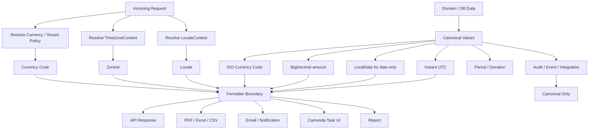

---

## 4. Data Type Decision Map

| Kebutuhan | Java Type | DB Type PostgreSQL | Catatan |
|---|---|---|---|
| Event timestamp absolut | `Instant` | `timestamptz` | Untuk created/updated/audit/event |
| Timestamp dengan offset dari API external | `OffsetDateTime` | `timestamptz` atau text jika offset perlu dipertahankan | Offset bukan full timezone rule |
| Waktu lokal dengan timezone rule | `ZonedDateTime` | Biasanya simpan `Instant + zone_id` | Untuk display/schedule rule |
| Date-only | `LocalDate` | `date` | Birthdate, effective date, business date |
| Time-only | `LocalTime` | `time` | Jam buka, cut-off local |
| Year-month | `YearMonth` | `text`/`date` convention | Billing cycle `2026-07` |
| Duration teknis | `Duration` | interval / bigint seconds | Timeout, retry delay |
| Period kalender | `Period` | text/structured | “3 bulan”, bukan 90 hari |
| Amount | `BigDecimal` | `numeric(p,s)` | Jangan pakai `double` |
| Currency | `Currency` / `String` ISO code | `char(3)` | `IDR`, `USD`, `SGD` |

Oracle mendokumentasikan bahwa `OffsetDateTime`, `ZonedDateTime`, dan `Instant` sama-sama menyimpan instant pada timeline hingga presisi nanosecond; `Instant` paling sederhana, `OffsetDateTime` menambah offset UTC/Greenwich, dan `ZonedDateTime` menambah full timezone rules. ([Oracle Docs](https://docs.oracle.com/en/java/javase/17/docs/api/java.base/java/time/OffsetDateTime.html?utm_source=chatgpt.com))

---

## 5. Golden Rule untuk Timestamp

### Simpan canonical

```json id="p40k66"
{
  "createdAt": "2026-07-13T03:15:30Z"
}
```

### Tampilkan localized

```json id="c2jwpj"
{
  "createdAt": {
    "instant": "2026-07-13T03:15:30Z",
    "timezone": "Asia/Jakarta",
    "formatted": "13 Jul 2026, 10.15.30"
  }
}
```

`instant` untuk mesin.  
`formatted` untuk manusia.

Jangan hanya kirim:

```json id="n6u4k1"
{
  "createdAt": "13 Juli 2026 10.15"
}
```

Karena itu sulit dipakai client untuk sorting, filtering, comparison, audit, atau timezone conversion.

---

## 6. `Instant`, `OffsetDateTime`, `ZonedDateTime`, `LocalDateTime`

| Type | Punya Date? | Punya Time? | Punya Offset? | Punya Zone Rule? | Cocok Untuk |
|---|---:|---:|---:|---:|---|
| `Instant` | Ya | Ya | UTC implied | Tidak | Audit/event/persistence |
| `OffsetDateTime` | Ya | Ya | Ya | Tidak | API payload dengan offset |
| `ZonedDateTime` | Ya | Ya | Ya | Ya | Schedule/display dengan timezone rule |
| `LocalDateTime` | Ya | Ya | Tidak | Tidak | Waktu lokal yang belum diketahui timezone |
| `LocalDate` | Ya | Tidak | Tidak | Tidak | Birthdate, effective date |
| `LocalTime` | Tidak | Ya | Tidak | Tidak | Jam cut-off lokal |

Anti-pattern paling berbahaya:

```java id="8ol6qy"
LocalDateTime createdAt;
```

untuk event timestamp. `LocalDateTime` tidak punya timezone/offset, sehingga tidak cukup untuk merepresentasikan kejadian absolut lintas region.

---

## 7. Recommended Domain Model

```java id="k7q97b"
import java.math.BigDecimal;
import java.time.Instant;
import java.time.LocalDate;

public record Order(
    String orderId,
    OrderStatus status,
    Instant createdAt,
    LocalDate effectiveDate,
    Money totalAmount
) {}
```

Money:

```java id="p7heek"
import java.math.BigDecimal;

public record Money(
    BigDecimal amount,
    String currencyCode
) {
    public Money {
        if (amount == null) {
            throw new IllegalArgumentException("amount is required");
        }
        if (currencyCode == null || !currencyCode.matches("[A-Z]{3}")) {
            throw new IllegalArgumentException("currencyCode must be ISO 4217 code");
        }
    }
}
```

Response:

```java id="jvxsk2"
public record OrderResponse(
    String orderId,
    LocalizedCode status,
    DateTimeResponse createdAt,
    DateResponse effectiveDate,
    MoneyResponse totalAmount
) {}
```

```java id="bz7n77"
public record DateTimeResponse(
    String instant,
    String timezone,
    String formatted
) {}

public record DateResponse(
    String value,
    String formatted
) {}

public record MoneyResponse(
    String value,
    String currency,
    String formatted
) {}
```

---

## 8. Context yang Harus Dipisah

Dari seri sebelumnya kita punya `LocaleContext`. Untuk seri ini, tambahkan `TimeZoneContext`.

```java id="xs4246"
import java.time.ZoneId;

public record TimeZoneContext(
    ZoneId zoneId,
    String source
) {}
```

Sumber timezone:

| Prioritas | Sumber | Contoh |
|---:|---|---|
| 1 | Explicit request | `X-Time-Zone: Asia/Jakarta` |
| 2 | User profile | `preferredZoneId = Asia/Jakarta` |
| 3 | Tenant/branch | `tenant.defaultZoneId = Asia/Singapore` |
| 4 | Business entity | `case.officeZoneId` |
| 5 | Application default | `UTC` |

Jangan ambil timezone dari locale secara otomatis.

---

## 9. TimeZone Resolver

```java id="a7v0e9"
import java.time.ZoneId;
import java.time.zone.ZoneRulesException;
import java.util.Optional;
import java.util.Set;

public class TimeZoneResolver {

    private final ZoneId defaultZoneId;
    private final Set<String> allowedZoneIds;

    public TimeZoneResolver(ZoneId defaultZoneId, Set<String> allowedZoneIds) {
        this.defaultZoneId = defaultZoneId;
        this.allowedZoneIds = Set.copyOf(allowedZoneIds);
    }

    public TimeZoneContext resolve(TimeZoneResolutionInput input) {
        Optional<ZoneId> explicit = input.explicitZoneId()
            .flatMap(this::parseAllowedZone);

        if (explicit.isPresent()) {
            return new TimeZoneContext(explicit.get(), "EXPLICIT");
        }

        Optional<ZoneId> user = input.userPreferredZoneId()
            .flatMap(this::parseAllowedZone);

        if (user.isPresent()) {
            return new TimeZoneContext(user.get(), "USER_PROFILE");
        }

        Optional<ZoneId> tenant = input.tenantDefaultZoneId()
            .flatMap(this::parseAllowedZone);

        if (tenant.isPresent()) {
            return new TimeZoneContext(tenant.get(), "TENANT_DEFAULT");
        }

        return new TimeZoneContext(defaultZoneId, "APPLICATION_DEFAULT");
    }

    private Optional<ZoneId> parseAllowedZone(String zoneIdText) {
        if (zoneIdText == null || zoneIdText.isBlank()) {
            return Optional.empty();
        }

        try {
            ZoneId zoneId = ZoneId.of(zoneIdText.trim());

            if (!allowedZoneIds.isEmpty()
                && !allowedZoneIds.contains(zoneId.getId())) {
                return Optional.empty();
            }

            return Optional.of(zoneId);
        } catch (ZoneRulesException ex) {
            return Optional.empty();
        }
    }
}
```

Input:

```java id="ikjv6n"
import java.util.Optional;

public record TimeZoneResolutionInput(
    Optional<String> explicitZoneId,
    Optional<String> userPreferredZoneId,
    Optional<String> tenantDefaultZoneId
) {}
```

---

## 10. Jersey Filter untuk Timezone

```java id="dm8s7t"
import jakarta.annotation.Priority;
import jakarta.ws.rs.Priorities;
import jakarta.ws.rs.container.ContainerRequestContext;
import jakarta.ws.rs.container.ContainerRequestFilter;
import jakarta.ws.rs.ext.Provider;

import java.io.IOException;
import java.time.ZoneId;
import java.util.Optional;
import java.util.Set;

@Provider
@Priority(Priorities.AUTHENTICATION + 110)
public class TimeZoneContextFilter implements ContainerRequestFilter {

    public static final String TIME_ZONE_CONTEXT_PROPERTY = "app.timeZoneContext";

    private final TimeZoneResolver timeZoneResolver;

    public TimeZoneContextFilter() {
        this.timeZoneResolver = new TimeZoneResolver(
            ZoneId.of("UTC"),
            Set.of(
                "UTC",
                "Asia/Jakarta",
                "Asia/Singapore",
                "Asia/Tokyo",
                "Europe/London",
                "America/New_York"
            )
        );
    }

    @Override
    public void filter(ContainerRequestContext requestContext) throws IOException {
        TimeZoneResolutionInput input = new TimeZoneResolutionInput(
            Optional.ofNullable(requestContext.getHeaderString("X-Time-Zone")),
            resolveUserPreferredZoneId(requestContext),
            resolveTenantDefaultZoneId(requestContext)
        );

        TimeZoneContext context = timeZoneResolver.resolve(input);

        requestContext.setProperty(TIME_ZONE_CONTEXT_PROPERTY, context);
    }

    private Optional<String> resolveUserPreferredZoneId(
        ContainerRequestContext requestContext
    ) {
        return Optional.empty();
    }

    private Optional<String> resolveTenantDefaultZoneId(
        ContainerRequestContext requestContext
    ) {
        return Optional.empty();
    }
}
```

---

## 11. Localized DateTime Formatter Service

```java id="cf5qfq"
import java.time.Instant;
import java.time.ZoneId;
import java.time.format.DateTimeFormatter;
import java.time.format.FormatStyle;
import java.util.Locale;

public class LocalizedDateTimeFormatter {

    public String formatMediumDateTime(
        Instant instant,
        ZoneId zoneId,
        Locale locale
    ) {
        return DateTimeFormatter
            .ofLocalizedDateTime(FormatStyle.MEDIUM)
            .withLocale(locale)
            .withZone(zoneId)
            .format(instant);
    }

    public String formatShortDateTime(
        Instant instant,
        ZoneId zoneId,
        Locale locale
    ) {
        return DateTimeFormatter
            .ofLocalizedDateTime(FormatStyle.SHORT)
            .withLocale(locale)
            .withZone(zoneId)
            .format(instant);
    }

    public String formatDateOnly(
        java.time.LocalDate date,
        Locale locale
    ) {
        return DateTimeFormatter
            .ofLocalizedDate(FormatStyle.MEDIUM)
            .withLocale(locale)
            .format(date);
    }
}
```

`DateTimeFormatter` mendukung predefined formatter, localized style, dan formatter berbasis pattern; dokumentasi Java SE 17 juga menekankan bahwa formatter hasil pattern bisa digunakan berkali-kali karena immutable dan thread-safe. ([Oracle Docs](https://docs.oracle.com/en/java/javase/17/docs/api/java.base/java/time/format/DateTimeFormatter.html))

---

## 12. API Response Mapper

```java id="9u0ms7"
import java.time.ZoneId;
import java.util.Locale;

public class OrderResponseMapper {

    private final LocalizedDateTimeFormatter dateTimeFormatter;
    private final LocalizedMoneyFormatter moneyFormatter;
    private final OrderStatusLocalizer statusLocalizer;

    public OrderResponseMapper(
        LocalizedDateTimeFormatter dateTimeFormatter,
        LocalizedMoneyFormatter moneyFormatter,
        OrderStatusLocalizer statusLocalizer
    ) {
        this.dateTimeFormatter = dateTimeFormatter;
        this.moneyFormatter = moneyFormatter;
        this.statusLocalizer = statusLocalizer;
    }

    public OrderResponse toResponse(
        Order order,
        Locale locale,
        ZoneId zoneId
    ) {
        return new OrderResponse(
            order.orderId(),
            statusLocalizer.localize(order.status(), locale),
            new DateTimeResponse(
                order.createdAt().toString(),
                zoneId.getId(),
                dateTimeFormatter.formatMediumDateTime(
                    order.createdAt(),
                    zoneId,
                    locale
                )
            ),
            new DateResponse(
                order.effectiveDate().toString(),
                dateTimeFormatter.formatDateOnly(
                    order.effectiveDate(),
                    locale
                )
            ),
            new MoneyResponse(
                order.totalAmount().amount().toPlainString(),
                order.totalAmount().currencyCode(),
                moneyFormatter.format(order.totalAmount(), locale)
            )
        );
    }
}
```

---

## 13. Response Example: id-ID

```json id="fx0xwk"
{
  "orderId": "ORD-123",
  "status": {
    "code": "PENDING_APPROVAL",
    "label": "Menunggu persetujuan"
  },
  "createdAt": {
    "instant": "2026-07-13T03:15:30Z",
    "timezone": "Asia/Jakarta",
    "formatted": "13 Jul 2026, 10.15.30"
  },
  "effectiveDate": {
    "value": "2026-07-13",
    "formatted": "13 Jul 2026"
  },
  "totalAmount": {
    "value": "1500000.00",
    "currency": "IDR",
    "formatted": "Rp1.500.000,00"
  }
}
```

## 14. Response Example: en-US

```json id="ni5uho"
{
  "orderId": "ORD-123",
  "status": {
    "code": "PENDING_APPROVAL",
    "label": "Pending approval"
  },
  "createdAt": {
    "instant": "2026-07-13T03:15:30Z",
    "timezone": "Asia/Jakarta",
    "formatted": "Jul 13, 2026, 10:15:30 AM"
  },
  "effectiveDate": {
    "value": "2026-07-13",
    "formatted": "Jul 13, 2026"
  },
  "totalAmount": {
    "value": "1500000.00",
    "currency": "IDR",
    "formatted": "IDR1,500,000.00"
  }
}
```

Catatan: output persis dapat berbeda tergantung JDK locale data/CLDR version dan formatter style. Karena itu, test production sebaiknya memvalidasi invariant penting dan snapshot yang dikontrol, bukan terlalu banyak bergantung pada semua detail whitespace/symbol.

Unicode CLDR menyediakan data locale yang kritikal untuk formatting bahasa, angka, tanggal, currency, dan struktur locale lain yang dipakai banyak platform. ([cldr.unicode.org](https://cldr.unicode.org/?utm_source=chatgpt.com))

---

## 15. Date-Only: `LocalDate` Bukan `Instant`

Untuk data seperti:

```text id="16w9bc"
tanggal lahir
tanggal efektif kontrak
tanggal jatuh tempo bisnis
tanggal libur
periode laporan
```

sering lebih tepat memakai `LocalDate`, bukan `Instant`.

Contoh:

```java id="1f6l1x"
public record Customer(
    String customerId,
    LocalDate birthDate
) {}
```

Kenapa?

```text id="j3zcg5"
Birthdate "1990-01-15" bukan kejadian pada jam tertentu.
Jika disimpan sebagai Instant, tanggal bisa bergeser saat timezone berubah.
```

Anti-pattern:

```java id="o33aqq"
Instant birthDate;
```

Lebih benar:

```java id="lxg9g5"
LocalDate birthDate;
```

Oracle package summary menjelaskan `LocalDate` menyimpan tanggal tanpa waktu, misalnya tanggal seperti `2010-12-03`, dan dapat digunakan untuk birthdate. ([Oracle Docs](https://docs.oracle.com/en/java/javase/17/docs/api/java.base/java/time/package-summary.html?utm_source=chatgpt.com))

---

## 16. Deadline dan SLA

SLA bisa berarti dua hal berbeda:

| Tipe SLA | Contoh | Type |
|---|---|---|
| Absolute deadline | “Harus selesai sebelum 2026-07-13T10:00Z” | `Instant` |
| Business local deadline | “Harus selesai sebelum 17:00 waktu kantor Jakarta” | `LocalDate + LocalTime + ZoneId` |
| Duration-based SLA | “4 jam setelah diterima” | `Instant + Duration` |
| Calendar-based SLA | “3 hari kerja” | Business calendar service |

Jangan samakan:

```text id="fth3ye"
3 days = 72 hours
```

Untuk business rule, “3 hari kerja” bisa melewati weekend/libur nasional.

---

## 17. Duration vs Period

| Type | Makna | Contoh |
|---|---|---|
| `Duration` | Jumlah waktu berbasis detik/nano | 4 jam, 30 menit, timeout |
| `Period` | Jumlah waktu berbasis tanggal kalender | 3 bulan, 1 tahun |
| Business calendar | Hari kerja/libur | 5 business days |

Oracle mendokumentasikan `Duration` sebagai amount berbasis detik/nanosecond; unit `DAYS` pada `Duration` diperlakukan sebagai 24 jam sehingga mengabaikan daylight savings effects. ([Oracle Docs](https://docs.oracle.com/en/java/javase/17/docs/api/java.base/java/time/Duration.html?utm_source=chatgpt.com))

Implikasi:

```java id="lzsy2s"
instant.plus(Duration.ofDays(1))
```

bukan selalu sama dengan:

```java id="o2gf5c"
zonedDateTime.plusDays(1)
```

di zona yang punya DST.

Untuk Indonesia DST tidak umum, tapi sistem enterprise bisa multi-region. Jangan desain seolah semua region seperti Indonesia.

---

## 18. `Clock` untuk Testability

Jangan panggil waktu sekarang langsung di domain service.

Buruk:

```java id="ofwb68"
Instant now = Instant.now();
```

Lebih testable:

```java id="j4a85x"
import java.time.Clock;
import java.time.Instant;

public class CaseEscalationService {

    private final Clock clock;

    public CaseEscalationService(Clock clock) {
        this.clock = clock;
    }

    public boolean isOverdue(CaseRecord caseRecord) {
        Instant now = Instant.now(clock);
        return now.isAfter(caseRecord.dueAt());
    }
}
```

Production:

```java id="yrz4di"
Clock clock = Clock.systemUTC();
```

Test:

```java id="ql0xx4"
Clock fixedClock = Clock.fixed(
    Instant.parse("2026-07-13T03:15:30Z"),
    ZoneId.of("UTC")
);
```

Oracle secara eksplisit merekomendasikan menghindari dependency ke default timezone bila memungkinkan dan memakai timezone spesifik; dokumentasi `Clock.systemUTC()` juga menyebut UTC clock digunakan saat membutuhkan current instant tanpa date/time lokal. ([Oracle Docs](https://docs.oracle.com/en/java/javase/17/docs/api/java.base/java/time/Clock.html?utm_source=chatgpt.com))

---

## 19. Number Formatting

Java `NumberFormat` adalah base class untuk format angka localized dan membantu format/parse angka untuk locale tertentu; Oracle menyebutnya independent dari convention locale seperti decimal point, thousands separator, digit, dan format angka. ([Oracle Docs](https://docs.oracle.com/en/java/javase/17/docs/api/java.base/java/text/NumberFormat.html?utm_source=chatgpt.com))

Contoh:

```java id="nyw6mu"
import java.text.NumberFormat;
import java.util.Locale;

public class LocalizedNumberFormatter {

    public String formatNumber(Number number, Locale locale) {
        return NumberFormat
            .getNumberInstance(locale)
            .format(number);
    }

    public String formatPercent(double value, Locale locale) {
        NumberFormat formatter = NumberFormat.getPercentInstance(locale);
        formatter.setMinimumFractionDigits(2);
        formatter.setMaximumFractionDigits(2);
        return formatter.format(value);
    }
}
```

Usage:

```java id="4n1ggg"
formatter.formatNumber(1234567.89, Locale.forLanguageTag("id-ID"));
formatter.formatNumber(1234567.89, Locale.forLanguageTag("en-US"));
```

Penting:

```text id="8es244"
Parsing angka localized harus tahu locale sumber.
"1,234" bisa berarti seribu dua ratus tiga puluh empat atau satu koma dua tiga empat.
```

---

## 20. Currency Formatting

Jangan simpan amount sebagai formatted string.

Buruk:

```text id="11h2tv"
amount = "Rp1.500.000,00"
```

Baik:

```text id="4rqgtq"
amount = 1500000.00
currency_code = "IDR"
```

Formatter:

```java id="y8xtzi"
import java.math.BigDecimal;
import java.text.NumberFormat;
import java.util.Currency;
import java.util.Locale;

public class LocalizedMoneyFormatter {

    public String format(Money money, Locale locale) {
        NumberFormat formatter = NumberFormat.getCurrencyInstance(locale);
        formatter.setCurrency(Currency.getInstance(money.currencyCode()));
        return formatter.format(money.amount());
    }
}
```

Java `NumberFormat#getCurrencyInstance` digunakan untuk currency format, sedangkan `Currency` merepresentasikan currency dan menyediakan instance berdasarkan ISO 4217 currency code seperti `USD`, `EUR`, atau `JPY`. ([Oracle Docs](https://docs.oracle.com/en/java/javase/17/docs/api/java.base/java/text/NumberFormat.html?utm_source=chatgpt.com))

---

## 21. BigDecimal dan Rounding

Jangan gunakan `double` untuk money.

Buruk:

```java id="shatdm"
double amount = 0.1 + 0.2;
```

Baik:

```java id="49ldog"
BigDecimal amount = new BigDecimal("0.30");
```

Money calculation harus punya rounding policy:

```java id="q6slsz"
import java.math.BigDecimal;
import java.math.RoundingMode;

public class MoneyCalculator {

    public Money applyTax(Money base, BigDecimal taxRate) {
        BigDecimal tax = base.amount()
            .multiply(taxRate)
            .setScale(2, RoundingMode.HALF_UP);

        return new Money(
            base.amount().add(tax),
            base.currencyCode()
        );
    }
}
```

Namun scale `2` tidak selalu benar untuk semua currency. Beberapa currency punya minor unit berbeda. Maka policy harus sadar currency.

```java id="cotg1d"
public class CurrencyScalePolicy {

    public int fractionDigits(String currencyCode) {
        return Currency.getInstance(currencyCode).getDefaultFractionDigits();
    }
}
```

Catatan: business rule bisa override default fraction digits, misalnya untuk pricing internal, crypto, points, atau tax calculation.

---

## 22. Money Value Object Lebih Kuat

```java id="sn4ijv"
import java.math.BigDecimal;
import java.math.RoundingMode;
import java.util.Currency;

public record Money(
    BigDecimal amount,
    String currencyCode
) {
    public Money {
        if (amount == null) {
            throw new IllegalArgumentException("amount is required");
        }
        Currency.getInstance(currencyCode);
    }

    public Money rounded(RoundingMode roundingMode) {
        int scale = Currency.getInstance(currencyCode).getDefaultFractionDigits();

        if (scale < 0) {
            return this;
        }

        return new Money(
            amount.setScale(scale, roundingMode),
            currencyCode
        );
    }

    public Money add(Money other) {
        requireSameCurrency(other);
        return new Money(amount.add(other.amount), currencyCode);
    }

    private void requireSameCurrency(Money other) {
        if (!currencyCode.equals(other.currencyCode)) {
            throw new IllegalArgumentException(
                "Currency mismatch: " + currencyCode + " vs " + other.currencyCode
            );
        }
    }
}
```

Rule:

```text id="wjdq44"
Jangan pernah add/subtract amount dengan currency berbeda.
```

---

## 23. API Contract untuk Money

Rekomendasi response:

```json id="ow7flw"
{
  "amount": {
    "value": "1500000.00",
    "currency": "IDR",
    "formatted": "Rp1.500.000,00"
  }
}
```

Kenapa `value` string, bukan number?

| Alasan | Penjelasan |
|---|---|
| Precision | JSON number bisa diproses client sebagai floating point |
| Financial safety | String menjaga exact decimal representation |
| Contract clarity | Client tahu value bukan formatted display |
| Currency terpisah | Tidak ambigu antara symbol dan ISO code |

Untuk internal service-to-service, gunakan:

```json id="05gnih"
{
  "amount": "1500000.00",
  "currencyCode": "IDR"
}
```

Untuk user-facing API, boleh tambah `formatted`.

---

## 24. Parsing Localized Number dari Input

Jika API JSON menerima amount, sebaiknya jangan menerima localized string.

Buruk:

```json id="35b8qs"
{
  "amount": "Rp1.500.000,00"
}
```

Baik:

```json id="eojtvf"
{
  "amount": "1500000.00",
  "currency": "IDR"
}
```

Localized input lebih cocok untuk UI layer, bukan backend API contract.

Jika harus menerima CSV/Excel localized:

```java id="2p16ky"
import java.math.BigDecimal;
import java.text.NumberFormat;
import java.text.ParseException;
import java.util.Locale;

public class LocalizedNumberParser {

    public BigDecimal parseDecimal(String text, Locale locale) {
        try {
            NumberFormat format = NumberFormat.getNumberInstance(locale);
            Number parsed = format.parse(text);
            return new BigDecimal(parsed.toString());
        } catch (ParseException ex) {
            throw new IllegalArgumentException(
                "Invalid localized number: " + text,
                ex
            );
        }
    }
}
```

Hati-hati: `NumberFormat#parse` bisa menghasilkan `Long` atau `Double`. Untuk import finansial kritikal, gunakan parser yang lebih strict atau `DecimalFormat#setParseBigDecimal(true)`.

---

## 25. Strict Decimal Parser

```java id="rprkxi"
import java.math.BigDecimal;
import java.text.DecimalFormat;
import java.text.NumberFormat;
import java.text.ParseException;
import java.util.Locale;

public class StrictLocalizedDecimalParser {

    public BigDecimal parse(String text, Locale locale) {
        NumberFormat numberFormat = NumberFormat.getNumberInstance(locale);

        if (!(numberFormat instanceof DecimalFormat decimalFormat)) {
            throw new IllegalStateException("DecimalFormat not available");
        }

        decimalFormat.setParseBigDecimal(true);

        try {
            Object parsed = decimalFormat.parse(text);

            if (parsed instanceof BigDecimal value) {
                return value;
            }

            throw new IllegalArgumentException("Parsed value is not BigDecimal");
        } catch (ParseException ex) {
            throw new IllegalArgumentException(
                "Invalid decimal for locale " + locale.toLanguageTag() + ": " + text,
                ex
            );
        }
    }
}
```

---

## 26. JSON Serialization Policy

Jangan biarkan serializer otomatis menentukan timezone/date format dari default JVM.

Untuk API response, eksplisitkan format:

```json id="zr8ct1"
{
  "createdAt": "2026-07-13T03:15:30Z"
}
```

atau structured:

```json id="jrd1nb"
{
  "createdAt": {
    "instant": "2026-07-13T03:15:30Z",
    "timezone": "Asia/Jakarta",
    "formatted": "13 Jul 2026, 10.15.30"
  }
}
```

Untuk request:

```json id="t4dm6m"
{
  "dueAt": "2026-07-13T10:00:00Z"
}
```

Untuk date-only:

```json id="cecpaw"
{
  "effectiveDate": "2026-07-13"
}
```

---

## 27. PostgreSQL Mapping

Praktik umum:

| Java | PostgreSQL | Catatan |
|---|---|---|
| `Instant` | `timestamptz` | Timestamp absolut |
| `OffsetDateTime` | `timestamptz` | Offset biasanya dinormalisasi |
| `LocalDate` | `date` | Date-only |
| `LocalTime` | `time` | Time-only |
| `BigDecimal` | `numeric(p,s)` | Money/decimal |
| Currency code | `char(3)` / `varchar(3)` | ISO code |
| Zone ID | `text` | `Asia/Jakarta` |

Contoh table:

```sql id="5xv6oi"
CREATE TABLE orders (
    order_id        text PRIMARY KEY,
    status_code     text NOT NULL,
    created_at      timestamptz NOT NULL,
    effective_date  date NOT NULL,
    amount          numeric(19, 4) NOT NULL,
    currency_code   char(3) NOT NULL,
    display_zone_id text
);
```

Kenapa simpan `display_zone_id`?

```text id="q5vswv"
Jika event/report harus selalu ditampilkan berdasarkan timezone business entity saat kejadian.
```

Kalau timezone display selalu dari user, tidak perlu simpan per row.

---

## 28. MyBatis Type Handling

Mapper result:

```java id="yvy2os"
public record OrderRow(
    String orderId,
    String statusCode,
    Instant createdAt,
    LocalDate effectiveDate,
    BigDecimal amount,
    String currencyCode,
    String displayZoneId
) {}
```

MyBatis XML:

```xml id="m1xofs"
<resultMap id="OrderRowMap" type="com.company.order.OrderRow">
  <id property="orderId" column="order_id"/>
  <result property="statusCode" column="status_code"/>
  <result property="createdAt" column="created_at"/>
  <result property="effectiveDate" column="effective_date"/>
  <result property="amount" column="amount"/>
  <result property="currencyCode" column="currency_code"/>
  <result property="displayZoneId" column="display_zone_id"/>
</resultMap>
```

Rule:

```text id="tgie8v"
MyBatis/repository mengembalikan canonical value.
Localized formatting terjadi di response/report boundary.
```

Jangan format currency/date di SQL untuk API JSON utama.

---

## 29. Report / Export Formatting

Untuk user-facing report:

| Field | Raw | Localized |
|---|---|---|
| Created at | `2026-07-13T03:15:30Z` | `13 Jul 2026, 10.15` |
| Amount | `1500000.00` | `Rp1.500.000,00` |
| Percent | `0.125` | `12,50%` |
| Status | `APPROVED` | `Disetujui` |

Untuk machine export:

| Field | Format |
|---|---|
| `created_at` | ISO instant |
| `amount` | decimal string |
| `currency_code` | ISO code |
| `status_code` | canonical code |

Praktik bagus untuk CSV/Excel user-facing:

```text id="ii6w25"
sertakan metadata locale/timezone/currency policy
jangan hanya kirim formatted cell
untuk amount, boleh punya raw + display column
```

Contoh:

```csv id="8x14ix"
order_id,created_at_utc,created_at_local,timezone,amount,currency,amount_display
ORD-123,2026-07-13T03:15:30Z,"13 Jul 2026, 10.15",Asia/Jakarta,1500000.00,IDR,"Rp1.500.000,00"
```

---

## 30. Camunda / Workflow Consideration

Workflow due date harus jelas:

```text id="0agj43"
task due date absolute?
business calendar deadline?
tenant local cut-off?
user local display?
```

Jangan simpan task due date sebagai localized string.

Baik:

```json id="b32q4m"
{
  "taskDefinitionKey": "approve_order",
  "dueAt": "2026-07-13T10:00:00Z",
  "businessZoneId": "Asia/Jakarta",
  "slaPolicyCode": "APPROVAL_4_BUSINESS_HOURS"
}
```

Display:

```json id="a8iq3t"
{
  "dueAt": {
    "instant": "2026-07-13T10:00:00Z",
    "timezone": "Asia/Jakarta",
    "formatted": "13 Jul 2026, 17.00"
  }
}
```

---

## 31. Daylight Saving Time Edge Cases

Walaupun Indonesia tidak umum memakai DST, sistem enterprise bisa dipakai global.

Masalah:

```text id="51luyf"
Local time tertentu bisa tidak ada.
Local time tertentu bisa terjadi dua kali.
```

Contoh konsep:

```text id="uf2ipc"
02:30 saat spring forward mungkin invalid.
01:30 saat fall back bisa ambiguous.
```

Jika membuat scheduler:

```java id="mpnv8l"
ZonedDateTime scheduled = LocalDateTime
    .parse("2026-03-08T02:30:00")
    .atZone(ZoneId.of("America/New_York"));
```

Harus test behavior sesuai business expectation.

Rule:

```text id="7r16iu"
Untuk event timestamp: pakai Instant.
Untuk schedule lokal: pakai LocalDateTime + ZoneId + explicit DST policy.
```

---

## 32. Date Range Filtering

API filter date range harus jelas.

Buruk:

```http id="g28sdd"
GET /orders?from=2026-07-01&to=2026-07-31
```

Tidak jelas:

```text id="qitdgd"
timezone apa?
to inclusive atau exclusive?
date-only atau instant?
```

Lebih baik untuk date-only business range:

```http id="k2xm1k"
GET /orders?businessDateFrom=2026-07-01&businessDateTo=2026-08-01&timeZone=Asia/Jakarta
```

Interpretasi:

```text id="dgp45o"
from inclusive
to exclusive
local business date in Asia/Jakarta
```

Convert ke instant range:

```java id="xxuh9e"
public record InstantRange(
    Instant fromInclusive,
    Instant toExclusive
) {}

public InstantRange toInstantRange(
    LocalDate fromInclusive,
    LocalDate toExclusive,
    ZoneId zoneId
) {
    return new InstantRange(
        fromInclusive.atStartOfDay(zoneId).toInstant(),
        toExclusive.atStartOfDay(zoneId).toInstant()
    );
}
```

SQL:

```sql id="oos3xv"
WHERE created_at >= #{fromInclusive}
  AND created_at < #{toExclusive}
```

Gunakan exclusive upper bound untuk menghindari bug `23:59:59.999`.

---

## 33. Calendar Business Rules

Business calendar tidak sama dengan `java.time` biasa.

Contoh rule:

```text id="eqqxwj"
SLA 3 hari kerja
cut-off 17:00 local office time
skip weekend
skip public holiday
tenant-specific holiday
regulatory calendar per jurisdiction
```

Buat service terpisah:

```java id="5j4jnn"
public interface BusinessCalendarService {

    Instant addBusinessDuration(
        Instant start,
        BusinessDuration duration,
        ZoneId zoneId,
        String calendarCode
    );

    boolean isBusinessDay(
        LocalDate date,
        String calendarCode
    );
}
```

```java id="4zv7eb"
public record BusinessDuration(
    int amount,
    BusinessDurationUnit unit
) {}

public enum BusinessDurationUnit {
    BUSINESS_HOUR,
    BUSINESS_DAY
}
```

Jangan hardcode:

```java id="u5r3yj"
dueAt = createdAt.plus(Duration.ofDays(3));
```

untuk rule “3 hari kerja”.

---

## 34. Locale-Sensitive Pattern Pitfall

Hindari pattern hardcoded untuk user-facing date:

```java id="qugm8g"
DateTimeFormatter.ofPattern("dd/MM/yyyy")
```

Masalah:

```text id="pn56oc"
di US, 07/13/2026 tidak natural
di banyak negara, 01/02/2026 ambigu
di report legal, pattern mungkin fixed tetapi harus didefinisikan explicit
```

Lebih baik:

```java id="wmqq2y"
DateTimeFormatter
    .ofLocalizedDate(FormatStyle.MEDIUM)
    .withLocale(locale)
```

Jika requirement memang fixed ISO untuk API/machine:

```java id="9rjofm"
DateTimeFormatter.ISO_INSTANT
DateTimeFormatter.ISO_LOCAL_DATE
```

Rule:

```text id="0gapeh"
Machine format: ISO.
Human format: localized style atau explicitly approved pattern.
```

---

## 35. JVM / Docker / Kubernetes Runtime

Jangan bergantung pada default:

```java id="4onbba"
Locale.getDefault()
ZoneId.systemDefault()
Charset.defaultCharset()
```

Checklist runtime:

```text id="nutvno"
[ ] JVM timezone eksplisit, idealnya UTC
[ ] Container TZ tidak diam-diam berbeda antar environment
[ ] Locale/charset UTF-8
[ ] DB session timezone diketahui
[ ] App memakai Clock.systemUTC()
[ ] User-facing display memakai request context
```

Contoh Docker env:

```dockerfile id="e0sl9o"
ENV TZ=UTC
ENV LANG=C.UTF-8
```

Contoh JVM:

```text id="0woj1b"
-Duser.timezone=UTC
-Dfile.encoding=UTF-8
```

Tetap: jangan jadikan ini pengganti explicit `ZoneId` di code.

---

## 36. Testing Strategy

### Test formatting locale

```java id="b5py2w"
@Test
void shouldFormatInstantForIndonesianLocaleAndJakartaZone() {
    LocalizedDateTimeFormatter formatter = new LocalizedDateTimeFormatter();

    String result = formatter.formatMediumDateTime(
        Instant.parse("2026-07-13T03:15:30Z"),
        ZoneId.of("Asia/Jakarta"),
        Locale.forLanguageTag("id-ID")
    );

    assertFalse(result.isBlank());
}
```

### Test canonical response stable

```java id="bnfrys"
@Test
void canonicalInstantShouldNotChangeAcrossLocale() {
    OrderResponse id = getOrder("id-ID", "Asia/Jakarta");
    OrderResponse en = getOrder("en-US", "Asia/Jakarta");

    assertEquals(id.createdAt().instant(), en.createdAt().instant());
    assertNotEquals(id.createdAt().formatted(), en.createdAt().formatted());
}
```

### Test timezone changes formatted value

```java id="kxo0cf"
@Test
void sameInstantShouldRenderDifferentlyAcrossTimeZones() {
    Instant instant = Instant.parse("2026-07-13T03:15:30Z");

    String jakarta = formatter.formatMediumDateTime(
        instant,
        ZoneId.of("Asia/Jakarta"),
        Locale.forLanguageTag("id-ID")
    );

    String tokyo = formatter.formatMediumDateTime(
        instant,
        ZoneId.of("Asia/Tokyo"),
        Locale.forLanguageTag("id-ID")
    );

    assertNotEquals(jakarta, tokyo);
}
```

### Test money canonical stable

```java id="m0gfwd"
@Test
void moneyValueAndCurrencyShouldRemainStableAcrossLocale() {
    Money money = new Money(new BigDecimal("1500000.00"), "IDR");

    MoneyResponse id = mapper.toMoneyResponse(money, Locale.forLanguageTag("id-ID"));
    MoneyResponse en = mapper.toMoneyResponse(money, Locale.forLanguageTag("en-US"));

    assertEquals(id.value(), en.value());
    assertEquals(id.currency(), en.currency());
    assertNotEquals(id.formatted(), en.formatted());
}
```

---

## 37. CI Quality Gates

```text id="ov8q96"
[ ] Tidak ada `LocalDateTime` untuk event timestamp absolut
[ ] Tidak ada `double`/`float` untuk money
[ ] Semua money punya currency code
[ ] Semua API timestamp machine-readable memakai ISO format
[ ] Semua formatted date punya locale + zone eksplisit
[ ] Semua date range filter pakai inclusive start + exclusive end
[ ] Semua SLA memakai Clock injectable
[ ] Tidak ada `ZoneId.systemDefault()` di business logic
[ ] Tidak ada `Locale.getDefault()` di response formatter
[ ] JSON parse/serialize date dikontrol eksplisit
[ ] Report/export mencantumkan timezone/currency policy
```

---

## 38. Observability

Metric/log yang berguna:

```text id="477esz"
i18n.datetime.format.count{locale,zone}
i18n.money.format.count{locale,currency}
i18n.timezone.unsupported.count{zone}
i18n.timezone.fallback_used.count{requested,selected}
api.date_range.invalid.count
business_calendar.sla.calculation.count{calendarCode}
money.currency_mismatch.count
```

Structured log untuk timezone resolution:

```json id="naygj8"
{
  "event": "timezone.selected",
  "requestId": "req-123",
  "tenantId": "tenant-a",
  "source": "USER_PROFILE",
  "selectedZoneId": "Asia/Jakarta"
}
```

Untuk financial calculation:

```json id="f6y73m"
{
  "event": "money.calculation",
  "operation": "applyTax",
  "currency": "IDR",
  "roundingMode": "HALF_UP",
  "scale": 2,
  "traceId": "01J..."
}
```

---

## 39. Anti-Pattern

| Anti-Pattern | Kenapa Buruk | Alternatif |
|---|---|---|
| `LocalDateTime` untuk audit event | Tidak ada timezone | `Instant` |
| `new Date()` tersebar | Sulit test | `Clock` |
| `ZoneId.systemDefault()` | Environment-dependent | Explicit `ZoneId` |
| `Locale.getDefault()` | Environment-dependent | Request `LocaleContext` |
| Amount sebagai string formatted | Tidak bisa calculate | `BigDecimal + currencyCode` |
| `double` untuk money | Precision bug | `BigDecimal` |
| `to=2026-07-31 23:59:59` | Precision boundary bug | exclusive upper bound |
| Locale diasumsikan timezone | Salah untuk traveler/multi-tenant | Resolve separately |
| Currency diasumsikan dari locale | Salah untuk multi-currency | Explicit currency code |
| SQL format date/currency untuk API | Coupling DB ke presentation | Format di boundary |
| SLA pakai `Duration.ofDays(3)` untuk hari kerja | Salah business calendar | BusinessCalendarService |

---

## 40. Practical Review Checklist

```text id="bcnd0q"
[ ] Apakah event timestamp memakai Instant?
[ ] Apakah date-only memakai LocalDate?
[ ] Apakah timezone user/tenant/entity eksplisit?
[ ] Apakah formatted datetime selalu memakai Locale + ZoneId?
[ ] Apakah API response memisahkan instant/value dan formatted?
[ ] Apakah filter date range punya timezone dan exclusive upper bound?
[ ] Apakah SLA menggunakan Clock injectable?
[ ] Apakah business-day logic memakai calendar service?
[ ] Apakah money memakai BigDecimal?
[ ] Apakah currency code selalu disimpan eksplisit?
[ ] Apakah formatter currency memakai Currency + Locale?
[ ] Apakah parsing localized number hanya untuk file/UI boundary?
[ ] Apakah MyBatis mengembalikan canonical value?
[ ] Apakah report/export mencantumkan timezone/currency policy?
[ ] Apakah Docker/JVM timezone default tidak jadi sumber logic?
```

---

# Seri 7 Selesai

Kita sudah membahas:

```text id="2o91oi"
Instant vs LocalDateTime vs ZonedDateTime
Locale vs timezone vs currency
TimeZoneContext
DateTimeFormatter
Clock testability
SLA/deadline/business calendar
NumberFormat
Currency formatting
BigDecimal money model
API response contract untuk date/money
PostgreSQL/MyBatis mapping
report/export formatting
testing, CI, observability
```

Rekomendasi berikutnya: **Seri 8 - PostgreSQL Collation, Case/Accent Search, Unicode Text Behavior**.

---

**Sources:**

- [Instant (Java SE 17 & JDK 17)](https://docs.oracle.com/en/java/javase/17/docs/api/java.base/java/time/Instant.html?utm_source=chatgpt.com)
- [Unicode CLDR Project](https://cldr.unicode.org/?utm_source=chatgpt.com)

## Response:
7/13/2026, 10:20:22 PM

Saya lanjut ke **Seri 8 dari 12**. Fokusnya: behavior teks di PostgreSQL dan Java—collation, sorting, case/accent-insensitive search, Unicode normalization, dan risiko hasil berbeda antar environment.

# Seri 8 dari 12 - PostgreSQL Collation, Case/Accent Search, Unicode Text Behavior

## 1. Tujuan Seri Ini

Seri ini membahas bagaimana teks bekerja di **PostgreSQL + Java/Jersey/JAX-RS microservice**, terutama untuk aplikasi multilingual:

```text id="t1mdz9"
sorting
case-insensitive search
accent-insensitive search
Unicode normalization
collation
ILIKE
lower()
citext
unaccent
pg_trgm
full-text search
MyBatis query pattern
indexing
cross-environment consistency
```

Masalah yang sering muncul bukan hanya “search tidak ketemu”, tetapi:

```text id="ho511i"
hasil ORDER BY beda antara local Docker dan production
José tidak ketemu saat user cari Jose
İ / i / I / ı bermasalah untuk Turkish
nama customer dengan emoji salah dihitung panjangnya
case-insensitive search lambat karena index tidak kepakai
migration gagal karena collation berbeda di cloud/on-prem
```

PostgreSQL mendukung collation untuk menentukan urutan sort dan klasifikasi karakter; dokumentasi PostgreSQL juga menjelaskan bahwa collation bisa diterapkan pada database, kolom, expression, dan operasi tertentu. PostgreSQL modern juga mendukung ICU collation, termasuk nondeterministic collation yang dapat membuat string berbeda secara byte dianggap sama untuk kasus seperti case-insensitive atau accent-insensitive comparison. ([PostgreSQL](https://www.postgresql.org/docs/current/collation.html?utm_source=chatgpt.com))

---

## 2. Mental Model

```text id="wgwjoy"
Text correctness ≠ hanya simpan VARCHAR/TEXT.

Text correctness mencakup:
  encoding
  normalization
  collation
  equality
  ordering
  case folding
  accent handling
  tokenization
  indexing
  search semantics
```

Untuk backend enterprise, bedakan lima operasi ini:

| Operasi | Pertanyaan | Contoh |
|---|---|---|
| Equality | Apakah dua nilai dianggap sama? | `email = ?` |
| Ordering | Bagaimana sort dilakukan? | `ORDER BY customer_name` |
| Prefix search | Apakah string dimulai dengan query? | `name LIKE 'bud%'` |
| Contains search | Apakah string mengandung query? | `name ILIKE '%bud%'` |
| Fuzzy search | Apakah string mirip query? | typo, partial, trigram |

Jangan pakai satu teknik untuk semua kebutuhan.

---

## 3. Diagram

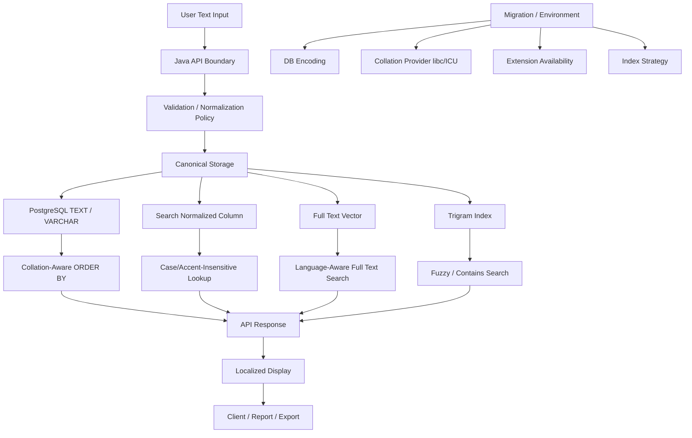

---

## 4. Key Concepts

| Concept | Makna Praktis | Contoh |
|---|---|---|
| Encoding | Cara karakter disimpan sebagai byte | UTF-8 |
| Collation | Aturan compare/sort string | `en-US-x-icu`, `id-ID-x-icu` |
| Deterministic collation | String dianggap sama hanya jika byte sama setelah comparison deterministic | Aman untuk strict equality |
| Nondeterministic collation | String berbeda byte bisa dianggap equal | Case/accent-insensitive |
| Case folding | Normalisasi huruf besar/kecil untuk comparison | `LOWER(name)` |
| Accent folding | Menghapus/menyamakan diacritics | `José` → `Jose` |
| Unicode normalization | Membuat representasi Unicode equivalent jadi bentuk konsisten | NFC/NFD |
| Tokenization | Memecah text menjadi token pencarian | full-text search |
| Trigram | Potongan 3 karakter untuk similarity search | `pg_trgm` |
| Grapheme cluster | Unit visual karakter, bisa terdiri dari beberapa code point | emoji, aksara kompleks |

Java `Normalizer` menyediakan method untuk mengubah text Unicode ke composed/decomposed form yang equivalent, yang berguna untuk sorting dan searching; Java mendukung normalization forms yang didefinisikan Unicode Standard Annex #15. ([Oracle Docs](https://docs.oracle.com/en/java/javase/21/docs/api/java.base/java/text/Normalizer.html?utm_source=chatgpt.com))

---

## 5. Masalah “String Sama Tapi Tidak Sama”

Contoh karakter `é` bisa direpresentasikan sebagai:

```text id="x9loc4"
é
```

atau:

```text id="wzw3o3"
e + combining acute accent
```

Secara visual mirip, tetapi byte sequence bisa berbeda.

Di Java:

```java id="a4b9ho"
String a = "\u00E9";       // é as single code point
String b = "e\u0301";      // e + combining acute accent

System.out.println(a.equals(b)); // false
```

Normalize:

```java id="lwwm35"
import java.text.Normalizer;

String normalizedA = Normalizer.normalize(a, Normalizer.Form.NFC);
String normalizedB = Normalizer.normalize(b, Normalizer.Form.NFC);

System.out.println(normalizedA.equals(normalizedB)); // true
```

ICU menjelaskan normalization sebagai proses mengubah text ke bentuk equivalent yang unik, misalnya mengubah composite character sequence menjadi pre-composed character. ([Unicode Consortium](https://unicode-org.github.io/icu/userguide/transforms/normalization/?utm_source=chatgpt.com))

---

## 6. Policy: Normalize atau Tidak?

Tidak semua field harus diperlakukan sama.

| Field | Normalize Storage? | Search Normalized? | Catatan |
|---|---:|---:|---|
| Customer legal name | Hati-hati | Ya | Simpan original, tambah search key |
| Email | Ya, canonical lowercase domain | Ya | Local-part case sensitivity secara teori kompleks, policy harus jelas |
| Username | Ya | Ya | Enforce allowed chars |
| Address | Simpan original | Ya | Untuk search user-friendly |
| Product name | Simpan original | Ya | Bisa punya localized master data |
| Audit payload | Jangan ubah meaning | Tidak utama | Simpan canonical event data |
| Free text note | Simpan original | Bisa full-text | Jangan destructive normalize |
| Identifier code | Ya, strict ASCII bila bisa | Ya | `ORDER-123`, `CASE-001` |

Rule praktis:

```text id="s6e1oa"
Simpan original user input bila nilai punya makna legal/display.
Tambahkan search_normalized column untuk pencarian.
Jangan destructive-normalize satu-satunya copy data penting.
```

---

## 7. PostgreSQL Collation

Collation memengaruhi:

```text id="ept5ah"
ORDER BY
comparison
index behavior
equality semantics untuk collation tertentu
LIKE/regex behavior pada beberapa kasus
```

Contoh eksplisit:

```sql id="uwx5gw"
SELECT customer_name
FROM customers
ORDER BY customer_name COLLATE "en-US-x-icu";
```

Atau definisikan di kolom:

```sql id="oej3v3"
CREATE TABLE customers (
    customer_id text PRIMARY KEY,
    customer_name text COLLATE "en-US-x-icu" NOT NULL
);
```

PostgreSQL saat ini mendokumentasikan bahwa collation bisa berasal dari provider berbeda seperti libc dan ICU, dan ICU collation memberi akses ke algoritma Unicode Collation Algorithm serta opsi collation yang lebih luas. ([PostgreSQL](https://www.postgresql.org/docs/current/collation.html?utm_source=chatgpt.com))

---

## 8. Deterministic vs Nondeterministic Collation

PostgreSQL mendukung **nondeterministic collation** melalui ICU. Dengan nondeterministic comparison, string yang byte-nya berbeda dapat dianggap equal, contohnya untuk case-insensitive atau accent-insensitive comparison. ([PostgreSQL](https://www.postgresql.org/docs/current/collation.html?utm_source=chatgpt.com))

Contoh konseptual:

```sql id="6hj8n7"
CREATE COLLATION und_ci (
    provider = icu,
    locale = 'und-u-ks-level2',
    deterministic = false
);
```

Atau accent/case behavior lain tergantung ICU locale tag yang dipilih.

Kapan berguna:

```text id="nxtu63"
case-insensitive equality
accent-insensitive equality
natural multilingual comparison
```

Kapan hati-hati:

```text id="sbp6rr"
unique constraint semantics berubah
index behavior perlu diuji
LIKE/pattern matching compatibility perlu dicek per versi
hasil equality bisa mengejutkan consumer
migration antar environment bisa beda jika ICU version berbeda
```

---

## 9. Strategy Decision Matrix

| Use Case | Teknik yang Umum Cocok | Catatan |
|---|---|---|
| Exact identifier lookup | strict `=` | Jangan collation-insensitive |
| Email lookup | normalized column | Lowercase/canonical policy |
| Username uniqueness | normalized column + unique index | Hindari ambiguity |
| Case-insensitive simple search | `lower(column) = lower(?)` + expression index | Mudah dikontrol |
| Accent-insensitive search | `unaccent(lower(column))` atau normalized column | Perlu extension/policy |
| User name contains search | `pg_trgm` + normalized search column | Cepat untuk `%query%` |
| Long text search | PostgreSQL full-text search | Token/ranking/language config |
| Multilingual sort | ICU collation | Test per locale |
| Legal name display | original text | Jangan kehilangan original |
| Fuzzy search | `pg_trgm` similarity | Tuning threshold/index |

PostgreSQL `unaccent` adalah text search dictionary yang menghapus diacritics dari lexeme dan dapat digunakan untuk accent-insensitive processing dalam full-text search; dokumentasi juga menyediakan fungsi `unaccent()` untuk menghapus accent dari string. ([PostgreSQL](https://www.postgresql.org/docs/current/unaccent.html?utm_source=chatgpt.com)) `pg_trgm` menyediakan fungsi/operator untuk similarity berbasis trigram dan operator class index yang mendukung pencarian string mirip secara lebih cepat. ([PostgreSQL](https://www.postgresql.org/docs/current/pgtrgm.html?utm_source=chatgpt.com))

---

## 10. Case-Insensitive Equality: `lower()` Pattern

Untuk lookup sederhana:

```sql id="ag1u3t"
SELECT *
FROM customers
WHERE lower(email) = lower(#{email});
```

Index:

```sql id="z2u11r"
CREATE INDEX idx_customers_email_lower
ON customers (lower(email));
```

Untuk uniqueness:

```sql id="x385q3"
CREATE UNIQUE INDEX uq_customers_email_lower
ON customers (lower(email));
```

Di MyBatis:

```xml id="oh30mh"
<select id="findByEmail" resultMap="CustomerRowMap">
  SELECT customer_id, email, customer_name
  FROM customers
  WHERE lower(email) = lower(#{email})
</select>
```

Kelebihan:

```text id="y5p6lb"
simple
predictable
indexable dengan expression index
tidak perlu collation khusus
```

Kekurangan:

```text id="66qb2b"
case folding belum tentu benar untuk semua bahasa
tidak accent-insensitive
function di WHERE harus match index expression
```

---

## 11. `citext` untuk Case-Insensitive Text

PostgreSQL juga punya extension `citext` untuk case-insensitive character string type. `citext` bisa mengurangi kebutuhan memanggil `lower()` eksplisit, terutama untuk equality case-insensitive; tetapi pilihan ini tetap harus dievaluasi terhadap kebutuhan collation, index, dan portability environment. PostgreSQL menyediakan dokumentasi extension `citext` sebagai module tambahan untuk case-insensitive text. ([PostgreSQL](https://www.postgresql.org/?utm_source=chatgpt.com))

Contoh konseptual:

```sql id="ftg99c"
CREATE EXTENSION IF NOT EXISTS citext;

CREATE TABLE users (
    user_id text PRIMARY KEY,
    email citext NOT NULL UNIQUE
);
```

Kapan cocok:

```text id="o1k2gx"
email/username lookup sederhana
ingin equality case-insensitive default
schema memang menganggap field itu case-insensitive
```

Kapan kurang cocok:

```text id="z6tp9y"
butuh accent-insensitive
butuh search ranking/fuzzy
butuh kontrol normalization lebih eksplisit
field tidak selalu case-insensitive
```

Catatan: untuk cloud/on-prem, pastikan extension tersedia dan migration diberi privilege yang cukup.

---

## 12. Accent-Insensitive Search dengan `unaccent`

Enable extension:

```sql id="ivcvo6"
CREATE EXTENSION IF NOT EXISTS unaccent;
```

Query:

```sql id="ojdhwv"
SELECT *
FROM customers
WHERE unaccent(lower(customer_name)) LIKE unaccent(lower('%' || #{query} || '%'));
```

Masalah: function di kolom bisa membuat index biasa tidak kepakai.

Expression index:

```sql id="p4tb33"
CREATE INDEX idx_customers_name_unaccent_lower
ON customers (unaccent(lower(customer_name)));
```

Namun di beberapa setup, function volatility/extension behavior bisa membuat expression index perlu penanganan hati-hati. Pola yang sering lebih eksplisit untuk enterprise adalah menyimpan **search normalized column**.

---

## 13. Search Normalized Column Pattern

Tambahkan kolom:

```sql id="q6x3z5"
ALTER TABLE customers
ADD COLUMN customer_name_search text;
```

Isi dari aplikasi atau trigger:

```text id="gbw1w5"
Original: José Álvarez
Search : jose alvarez
```

Index:

```sql id="hl6u6l"
CREATE INDEX idx_customers_name_search
ON customers (customer_name_search);
```

Untuk contains search:

```sql id="jxn30g"
CREATE EXTENSION IF NOT EXISTS pg_trgm;

CREATE INDEX idx_customers_name_search_trgm
ON customers
USING gin (customer_name_search gin_trgm_ops);
```

Query:

```sql id="6glrno"
SELECT customer_id, customer_name
FROM customers
WHERE customer_name_search LIKE '%' || #{normalizedQuery} || '%'
ORDER BY customer_name;
```

Java normalizer:

```java id="b6kbk4"
import java.text.Normalizer;
import java.util.Locale;
import java.util.regex.Pattern;

public class SearchTextNormalizer {

    private static final Pattern DIACRITICS = Pattern.compile("\\p{M}+");

    public String normalizeForSearch(String input) {
        if (input == null) {
            return null;
        }

        String decomposed = Normalizer.normalize(input, Normalizer.Form.NFD);
        String withoutMarks = DIACRITICS.matcher(decomposed).replaceAll("");
        String lower = withoutMarks.toLowerCase(Locale.ROOT);

        return lower.trim().replaceAll("\\s+", " ");
    }
}
```

Kenapa `Locale.ROOT`?

```text id="xicfby"
Untuk machine normalization yang tidak bergantung pada bahasa user.
```

Hati-hati: ini bukan solusi sempurna untuk semua bahasa. Untuk Turkish, Greek, German, Arabic, Indic scripts, Japanese/Korean/Chinese, dan transliteration, normalizer custom bisa salah jika terlalu agresif. Gunakan policy per field dan per bahasa.

---

## 14. `pg_trgm` untuk Contains/Fuzzy Search

`LIKE '%query%'` pada tabel besar biasanya lambat bila hanya memakai btree biasa. `pg_trgm` membantu pencarian similarity/contains dengan trigram index. PostgreSQL mendokumentasikan bahwa `pg_trgm` menyediakan fungsi/operator similarity serta GiST/GIN index operator classes untuk mempercepat pencarian string mirip. ([PostgreSQL](https://www.postgresql.org/docs/current/pgtrgm.html?utm_source=chatgpt.com))

Enable:

```sql id="gw1ab2"
CREATE EXTENSION IF NOT EXISTS pg_trgm;
```

Index:

```sql id="kabz6o"
CREATE INDEX idx_customers_name_search_trgm
ON customers
USING gin (customer_name_search gin_trgm_ops);
```

Contains query:

```sql id="mus7lg"
SELECT customer_id, customer_name
FROM customers
WHERE customer_name_search LIKE '%' || #{normalizedQuery} || '%'
ORDER BY customer_name
LIMIT #{limit};
```

Similarity query:

```sql id="xl3cv2"
SELECT
    customer_id,
    customer_name,
    similarity(customer_name_search, #{normalizedQuery}) AS score
FROM customers
WHERE customer_name_search % #{normalizedQuery}
ORDER BY score DESC, customer_name
LIMIT #{limit};
```

Kapan cocok:

```text id="f2nloj"
nama orang
nama perusahaan
judul
short text
partial/typo-tolerant search
```

Kapan kurang cocok:

```text id="542a0l"
long document search dengan ranking bahasa
stemming
phrase search kompleks
search semantic
```

---

## 15. Full-Text Search vs Trigram

| Aspek | Full-Text Search | Trigram |
|---|---|---|
| Cocok untuk | Dokumen, deskripsi panjang | Nama, judul, short text |
| Tokenization | Ya | Tidak seperti FTS |
| Ranking | Ya | Similarity score |
| Typo tolerance | Terbatas | Bagus untuk typo ringan |
| Prefix/contains | Bisa, tapi bukan fokus utama | Bagus |
| Language config | Penting | Kurang bahasa-aware |
| Accent handling | Bisa dengan `unaccent` dictionary | Biasanya pakai normalized column |
| Index | GIN `tsvector` | GIN/GiST trigram |

Pola gabungan:

```text id="gs8hsr"
Short name search:
  normalized column + pg_trgm

Long content search:
  tsvector + language config + optional unaccent

Enterprise search:
  PostgreSQL for local search
  external search engine jika ranking/search features makin kompleks
```

---

## 16. Full-Text Search dengan `unaccent`

Contoh konfigurasi konseptual:

```sql id="xj4xbu"
CREATE EXTENSION IF NOT EXISTS unaccent;

CREATE TEXT SEARCH CONFIGURATION public.simple_unaccent ( COPY = pg_catalog.simple );

ALTER TEXT SEARCH CONFIGURATION public.simple_unaccent
ALTER MAPPING FOR hword, hword_part, word
WITH unaccent, simple;
```

Query:

```sql id="6w7s6v"
SELECT customer_id, customer_name
FROM customers
WHERE to_tsvector('public.simple_unaccent', customer_name)
      @@ plainto_tsquery('public.simple_unaccent', #{query});
```

Index:

```sql id="2gkp7s"
CREATE INDEX idx_customers_name_fts
ON customers
USING gin (
    to_tsvector('public.simple_unaccent', customer_name)
);
```

`unaccent` di PostgreSQL dapat digunakan sebagai filtering dictionary dalam text search sehingga output-nya diteruskan ke dictionary berikutnya, cocok untuk accent-insensitive full-text search pipeline. ([PostgreSQL](https://www.postgresql.org/docs/current/unaccent.html?utm_source=chatgpt.com))

---

## 17. Sorting: Jangan Samakan dengan Search

Search normalized column bagus untuk mencari, tetapi belum tentu bagus untuk sort display.

Contoh:

```text id="qhwzic"
Original:
  Åke
  Zoe
  Émile
  Ana

Search normalized:
  ake
  zoe
  emile
  ana
```

Untuk display list, user mungkin berharap sort locale-aware.

Query:

```sql id="3kt6gg"
SELECT customer_id, customer_name
FROM customers
WHERE customer_name_search LIKE '%' || #{normalizedQuery} || '%'
ORDER BY customer_name COLLATE "id-ID-x-icu";
```

Atau sort di Java jika data kecil:

```java id="drhr5u"
import java.text.Collator;
import java.util.Comparator;
import java.util.Locale;

Collator collator = Collator.getInstance(Locale.forLanguageTag("id-ID"));

customers.sort(
    Comparator.comparing(CustomerResponse::customerName, collator)
);
```

Tetapi untuk pagination database, sort harus terjadi di DB agar konsisten.

Rule:

```text id="qojvfg"
Search key untuk filtering.
Collation untuk ordering.
Jangan pakai normalized search text sebagai display sort kecuali memang business-approved.
```

---

## 18. Pagination + Locale Sort

Masalah:

```sql id="szj30n"
ORDER BY customer_name
LIMIT 20 OFFSET 40
```

Jika collation berbeda antar environment, halaman bisa berubah.

Rekomendasi:

```sql id="4j33h9"
ORDER BY customer_name COLLATE "id-ID-x-icu", customer_id
```

Tambahkan tiebreaker stabil:

```text id="apq5uv"
customer_id
created_at
primary key
```

Keyset pagination:

```sql id="wp7pln"
SELECT customer_id, customer_name
FROM customers
WHERE (
    customer_name COLLATE "id-ID-x-icu",
    customer_id
) > (
    #{lastCustomerName} COLLATE "id-ID-x-icu",
    #{lastCustomerId}
)
ORDER BY customer_name COLLATE "id-ID-x-icu", customer_id
LIMIT #{limit};
```

Hati-hati: keyset pagination dengan collation harus dites baik karena comparison tuple dan collation harus konsisten.

---

## 19. MyBatis Pattern: Search Request Object

```java id="zgmdnz"
public record CustomerSearchCriteria(
    String rawQuery,
    String normalizedQuery,
    Locale locale,
    String collation,
    int limit,
    int offset
) {}
```

Service:

```java id="k5ud8b"
public CustomerSearchCriteria buildCriteria(
    String query,
    Locale locale,
    int limit,
    int offset
) {
    String normalized = searchTextNormalizer.normalizeForSearch(query);

    return new CustomerSearchCriteria(
        query,
        normalized,
        locale,
        collationOf(locale),
        Math.min(limit, 100),
        offset
    );
}

private String collationOf(Locale locale) {
    return switch (locale.toLanguageTag()) {
        case "id-ID" -> "id-ID-x-icu";
        case "en-US" -> "en-US-x-icu";
        default -> "und-x-icu";
    };
}
```

Catatan security: collation name tidak boleh langsung dari user input.

---

## 20. MyBatis XML: Safe Collation Selection

Jangan:

```xml id="o3ba5h"
ORDER BY customer_name COLLATE ${collation}
```

kalau `collation` berasal dari input user tanpa whitelist. `${}` di MyBatis melakukan textual substitution, bukan bind parameter.

Lebih aman dengan whitelist di Java, lalu enum:

```java id="dvpv64"
public enum SupportedCollation {
    ID_ID("id-ID-x-icu"),
    EN_US("en-US-x-icu"),
    UND("und-x-icu");

    private final String sqlName;

    SupportedCollation(String sqlName) {
        this.sqlName = sqlName;
    }

    public String sqlName() {
        return sqlName;
    }
}
```

MyBatis:

```xml id="be86re"
<select id="searchCustomers" resultMap="CustomerRowMap">
  SELECT customer_id, customer_name, customer_name_search
  FROM customers
  WHERE customer_name_search LIKE '%' || #{normalizedQuery} || '%'
  ORDER BY
  <choose>
    <when test="collation == 'ID_ID'">
      customer_name COLLATE "id-ID-x-icu"
    </when>
    <when test="collation == 'EN_US'">
      customer_name COLLATE "en-US-x-icu"
    </when>
    <otherwise>
      customer_name COLLATE "und-x-icu"
    </otherwise>
  </choose>,
  customer_id
  LIMIT #{limit}
  OFFSET #{offset}
</select>
```

Rule:

```text id="hegzha"
Gunakan #{...} untuk values.
Hindari ${...} kecuali untuk SQL fragment yang strictly whitelisted.
```

---

## 21. Schema Pattern untuk Searchable Entity

```sql id="bret21"
CREATE TABLE customers (
    customer_id text PRIMARY KEY,
    customer_name text NOT NULL,
    customer_name_search text NOT NULL,
    email text NOT NULL,
    email_search text NOT NULL,
    created_at timestamptz NOT NULL
);

CREATE UNIQUE INDEX uq_customers_email_search
ON customers (email_search);

CREATE INDEX idx_customers_name_search_trgm
ON customers
USING gin (customer_name_search gin_trgm_ops);

CREATE INDEX idx_customers_name_sort_id_id
ON customers (customer_name COLLATE "id-ID-x-icu", customer_id);
```

Insert flow:

```text id="wiqcl4"
API input
  ↓
validate
  ↓
store original
  ↓
derive search_normalized
  ↓
store both in same transaction
```

Java:

```java id="yypkdp"
public CustomerRow toRow(CreateCustomerRequest request) {
    return new CustomerRow(
        idGenerator.nextId(),
        request.name(),
        searchTextNormalizer.normalizeForSearch(request.name()),
        request.email(),
        emailNormalizer.normalize(request.email()),
        clock.instant()
    );
}
```

---

## 22. Trigger vs Application Normalization

Ada dua opsi untuk `*_search` column.

### Opsi A - Application generates search column

Kelebihan:

```text id="ifmb12"
logic reusable untuk DB dan external search
test di Java mudah
lebih konsisten dengan API validation
tidak bergantung extension DB
```

Kekurangan:

```text id="q2l1pq"
semua writer harus lewat aplikasi yang sama
bulk update/manual SQL bisa lupa update search column
```

### Opsi B - PostgreSQL generated/trigger column

Kelebihan:

```text id="acxhbr"
semua write path konsisten di DB
bulk import lebih aman
```

Kekurangan:

```text id="xajd4o"
logic normalization di DB dan Java bisa diverge
unaccent behavior tergantung DB extension
testing lintas environment perlu disiplin
```

Trigger example:

```sql id="71prk3"
CREATE OR REPLACE FUNCTION normalize_customer_search()
RETURNS trigger AS $$
BEGIN
    NEW.customer_name_search := lower(unaccent(NEW.customer_name));
    NEW.email_search := lower(NEW.email);
    RETURN NEW;
END;
$$ LANGUAGE plpgsql;

CREATE TRIGGER trg_customers_normalize_search
BEFORE INSERT OR UPDATE OF customer_name, email
ON customers
FOR EACH ROW
EXECUTE FUNCTION normalize_customer_search();
```

Pilih salah satu sebagai source of truth. Jangan diam-diam punya dua normalizer dengan behavior berbeda.

---

## 23. Unicode Length: Code Units vs Code Points vs Graphemes

Di Java:

```java id="2qlexa"
String text = "👍🏽";

System.out.println(text.length());          // UTF-16 code units
System.out.println(text.codePointCount(0, text.length()));
```

Masalah:

```text id="enf6cz"
String.length() bukan jumlah karakter visual.
Database char_length() juga bukan selalu jumlah grapheme cluster.
Emoji/aksara kompleks bisa terdiri dari beberapa code point.
```

Untuk validation field length:

| Requirement | Cara Ukur |
|---|---|
| Storage limit | DB byte/char limit |
| UI character count | grapheme cluster-aware |
| SMS length | encoding/channel-specific |
| Legal max length | harus didefinisikan eksplisit |
| Username strict | batasi ASCII/allowed chars |

Rule:

```text id="j3n8rh"
Jangan bilang “max 20 karakter” sebelum jelas karakter menurut siapa:
code unit, code point, grapheme, byte, atau business character.
```

---

## 24. Java Unicode Sanitization

Contoh utility sederhana:

```java id="vykove"
import java.text.Normalizer;
import java.util.Locale;

public class TextCanonicalizer {

    public String normalizeNfc(String input) {
        if (input == null) {
            return null;
        }
        return Normalizer.normalize(input, Normalizer.Form.NFC);
    }

    public String normalizeIdentifier(String input) {
        if (input == null) {
            return null;
        }

        return Normalizer.normalize(input, Normalizer.Form.NFKC)
            .trim()
            .toUpperCase(Locale.ROOT);
    }
}
```

Kapan NFC:

```text id="g6n5vn"
display text
names
addresses
free text
```

Kapan NFKC hati-hati:

```text id="op99vj"
identifier normalization
usernames
codes
security-sensitive matching
```

NFKC dapat mengubah compatibility characters, jadi jangan dipakai sembarangan untuk legal name atau text yang harus mempertahankan original form.

---

## 25. Security: Unicode Confusables

Contoh masalah:

```text id="zaiqvr"
Latin A: A
Cyrillic A: А
Greek omicron vs Latin o
full-width characters
zero-width joiner/non-joiner
bidirectional control characters
```

Risiko:

```text id="8fdj7w"
username spoofing
role/permission code spoofing
audit display confusion
phishing dalam notification
search bypass
```

Policy:

| Field | Policy |
|---|---|
| System code | ASCII strict |
| Permission key | ASCII strict |
| Role code | ASCII strict |
| Username | Restrict script or normalize + confusable check |
| Display name | Allow Unicode, sanitize display |
| Free text | Allow Unicode, detect dangerous controls |
| Email | Normalize carefully, validate |

Untuk backend enterprise:

```text id="eoe3yh"
Identifiers should be boring.
Display text can be rich.
```

---

## 26. PostgreSQL Environment Consistency

Collation bisa berbeda antar:

```text id="3sxlmu"
local Docker
developer laptop
on-prem Linux
AWS RDS/Aurora
Azure Database for PostgreSQL
different OS images
different ICU versions
major PostgreSQL versions
```

Checklist migration:

```sql id="qa4emz"
SELECT
    collname,
    collprovider,
    collcollate,
    collctype,
    colliculocale,
    collversion
FROM pg_collation
WHERE collname IN ('id-ID-x-icu', 'en-US-x-icu', 'und-x-icu');
```

PostgreSQL documentation notes that collation definitions can have version information, and version mismatch may require rebuilding objects depending on the collation. Use this as part of upgrade/runbook validation, especially when using ICU collations. ([PostgreSQL](https://www.postgresql.org/docs/current/collation.html?utm_source=chatgpt.com))

---

## 27. Migration Pattern with Liquibase/Flyway

Migration should assert required extensions/collations.

SQL migration:

```sql id="ahxfk2"
CREATE EXTENSION IF NOT EXISTS unaccent;
CREATE EXTENSION IF NOT EXISTS pg_trgm;

DO $$
BEGIN
    IF NOT EXISTS (
        SELECT 1
        FROM pg_collation
        WHERE collname = 'id-ID-x-icu'
    ) THEN
        RAISE EXCEPTION 'Required collation id-ID-x-icu is missing';
    END IF;
END $$;
```

Create search columns:

```sql id="ecv7wf"
ALTER TABLE customers
ADD COLUMN customer_name_search text;

UPDATE customers
SET customer_name_search = lower(unaccent(customer_name))
WHERE customer_name_search IS NULL;

ALTER TABLE customers
ALTER COLUMN customer_name_search SET NOT NULL;

CREATE INDEX idx_customers_name_search_trgm
ON customers
USING gin (customer_name_search gin_trgm_ops);
```

For zero-downtime migration:

```text id="b83lr6"
1. Add nullable search column
2. Backfill in batches
3. Dual-write from application
4. Add index concurrently
5. Validate null count
6. Set NOT NULL
7. Switch query path
8. Remove old query path later
```

PostgreSQL supports `CREATE INDEX CONCURRENTLY`, but it has transaction restrictions and operational caveats; include it in DB migration runbooks rather than blindly putting it in one large transaction migration.

---

## 28. Index Strategy

| Query | Index |
|---|---|
| `lower(email) = lower(?)` | expression btree on `lower(email)` |
| `email_search = ?` | btree on `email_search` |
| `name_search LIKE 'abc%'` | btree may help with proper operator class/pattern |
| `name_search LIKE '%abc%'` | trigram GIN/GiST |
| `similarity(name_search, ?)` | trigram |
| `to_tsvector(...) @@ query` | GIN on tsvector |
| `ORDER BY name COLLATE ...` | btree with same collation |
| unique case-insensitive | unique index on normalized column/expression |

Always verify with:

```sql id="t7tk5x"
EXPLAIN (ANALYZE, BUFFERS)
SELECT ...
```

Do not assume the index is used.

---

## 29. Query Performance Pitfalls

Anti-pattern:

```sql id="l61iqe"
WHERE lower(unaccent(customer_name)) LIKE '%' || lower(unaccent(:query)) || '%'
```

on millions of rows without appropriate index.

Better:

```sql id="3n1nhi"
WHERE customer_name_search LIKE '%' || :normalizedQuery || '%'
```

with:

```sql id="49b9y1"
CREATE INDEX idx_customers_name_search_trgm
ON customers
USING gin (customer_name_search gin_trgm_ops);
```

Anti-pattern:

```sql id="i6c6yo"
ORDER BY lower(customer_name)
```

without expression index if paginating large result.

Better:

```sql id="dhuh82"
ORDER BY customer_name COLLATE "id-ID-x-icu", customer_id
```

with matching sort index if needed.

---

## 30. API Contract for Search

Request:

```http id="zq4thg"
GET /customers?query=Jose&locale=id-ID&limit=20
Accept-Language: id-ID
```

Backend internal criteria:

```json id="h6o8e2"
{
  "rawQuery": "Jose",
  "normalizedQuery": "jose",
  "locale": "id-ID",
  "collation": "id-ID-x-icu",
  "limit": 20
}
```

Response:

```json id="j111n8"
{
  "query": "Jose",
  "locale": "id-ID",
  "results": [
    {
      "customerId": "CUS-001",
      "customerName": "José Álvarez",
      "match": {
        "strategy": "TRIGRAM_NORMALIZED",
        "score": 0.72
      }
    }
  ]
}
```

Do not expose raw SQL collation/internal normalized query unless needed for debug/internal API.

---

## 31. Search Result Highlighting

Jika ingin highlight:

```text id="ohzbc4"
José Álvarez
query: Jose
```

Jangan hanya pakai index substring pada normalized string karena posisi normalized tidak selalu sama dengan original.

Pola aman:

```text id="czt23c"
Return original text.
Let frontend highlight best-effort.
For exact enterprise highlighting, keep offset mapping during normalization.
```

Untuk report/legal text, jangan highlight destructive-normalized output.

---

## 32. Localized Master Data Search

Jangan campur message catalog dan localized master data.

Contoh product/category localized:

```sql id="iu2fnf"
CREATE TABLE product_translations (
    product_id text NOT NULL,
    locale text NOT NULL,
    display_name text NOT NULL,
    display_name_search text NOT NULL,
    description text,
    PRIMARY KEY (product_id, locale)
);
```

Query fallback:

```sql id="87o4ld"
SELECT p.product_id,
       COALESCE(t_req.display_name, t_default.display_name) AS display_name
FROM products p
LEFT JOIN product_translations t_req
       ON t_req.product_id = p.product_id
      AND t_req.locale = #{requestedLocale}
LEFT JOIN product_translations t_default
       ON t_default.product_id = p.product_id
      AND t_default.locale = #{defaultLocale}
WHERE COALESCE(t_req.display_name_search, t_default.display_name_search)
      LIKE '%' || #{normalizedQuery} || '%';
```

Rule:

```text id="dp4xlp"
Message catalog untuk application text.
Translation table untuk business/master data.
```

---

## 33. Right-to-Left and Mixed Direction Text

Backend biasanya tidak render layout, tapi tetap harus aman menyimpan dan mengirim RTL text.

Risiko:

```text id="q1ykg3"
log terlihat membingungkan
PDF/email kacau
filename spoofing
audit display ambiguous
```

Policy:

```text id="8hfieh"
Store UTF-8.
Do not strip valid RTL chars blindly.
Detect/control bidi control characters in identifiers.
Escape output per channel.
For PDF/email, use rendering engine/font/layout that supports RTL.
```

Untuk identifier/system code, lebih aman batasi ASCII. Untuk display name/address, dukung Unicode dengan sanitization.

---

## 34. Java/Jersey Boundary Validation

DTO:

```java id="apz3io"
public record CustomerSearchRequest(
    String query,
    String locale,
    Integer limit
) {}
```

Validation:

```java id="j7u33r"
public class SearchRequestValidator {

    public void validate(String query, int limit) {
        if (query == null || query.isBlank()) {
            throw new BusinessException(
                ErrorCode.SEARCH_QUERY_REQUIRED,
                Map.of()
            );
        }

        if (query.length() > 200) {
            throw new BusinessException(
                ErrorCode.SEARCH_QUERY_TOO_LONG,
                Map.of("maxLength", 200)
            );
        }

        if (limit < 1 || limit > 100) {
            throw new BusinessException(
                ErrorCode.INVALID_PAGE_LIMIT,
                Map.of("maxLimit", 100)
            );
        }
    }
}
```

But remember: `query.length()` is UTF-16 code units, not user-perceived characters. For security/performance limits, code unit/byte limit may be acceptable. For UX “characters remaining”, use grapheme-aware logic.

---

## 35. Testing Strategy

### 35.1 Normalization test

```java id="z4ej7g"
@Test
void shouldNormalizeAccentAndCaseForSearch() {
    SearchTextNormalizer normalizer = new SearchTextNormalizer();

    assertEquals(
        "jose alvarez",
        normalizer.normalizeForSearch(" José Álvarez ")
    );
}
```

### 35.2 Unicode equivalence test

```java id="hb6gi4"
@Test
void nfcShouldMakeEquivalentTextEqual() {
    String a = "\u00E9";
    String b = "e\u0301";

    assertNotEquals(a, b);

    assertEquals(
        Normalizer.normalize(a, Normalizer.Form.NFC),
        Normalizer.normalize(b, Normalizer.Form.NFC)
    );
}
```

### 35.3 Integration test: accent-insensitive search

```java id="r2cn59"
@Test
void searchJoseShouldFindJoseWithAccent() {
    createCustomer("José Álvarez");

    List<CustomerResponse> results = customerClient.search("Jose", "id-ID");

    assertTrue(results.stream()
        .anyMatch(customer -> customer.customerName().equals("José Álvarez")));
}
```

### 35.4 Sorting deterministic test

```java id="oevth6"
@Test
void customerSearchShouldSortWithStableTieBreaker() {
    createCustomer("Ana");
    createCustomer("Ána");

    List<CustomerResponse> results = customerClient.search("ana", "id-ID");

    assertThat(results)
        .extracting(CustomerResponse::customerId)
        .doesNotHaveDuplicates();
}
```

### 35.5 Query plan test

For important queries, capture expected plan class in performance tests:

```sql id="z1bmn7"
EXPLAIN (ANALYZE, BUFFERS)
SELECT customer_id, customer_name
FROM customers
WHERE customer_name_search LIKE '%jose%'
ORDER BY customer_name COLLATE "id-ID-x-icu", customer_id
LIMIT 20;
```

---

## 36. CI / Migration Quality Gates

```text id="tzpb90"
[ ] DB encoding is UTF-8
[ ] Required collations exist
[ ] Required extensions exist: unaccent, pg_trgm, citext if used
[ ] ICU/libc provider expectations documented
[ ] Collation version checked during upgrade
[ ] Normalized search columns are backfilled
[ ] Search columns have indexes
[ ] Query plans verified for large tables
[ ] MyBatis does not use unsafe ${} for user-controlled SQL fragments
[ ] Locale-to-collation mapping is whitelisted
[ ] Accent/case-insensitive behavior covered by integration tests
[ ] Sorting has stable tie-breaker
```

---

## 37. Observability

Metric:

```text id="gopmxz"
search.query.count{entity,strategy,locale}
search.query.latency{entity,strategy}
search.query.empty_result.count{entity,locale}
search.query.normalized.count{entity}
search.query.fallback_collation.count{locale}
search.query.trigram.used.count{entity}
db.collation.missing.count
db.extension.missing.count
```

Structured log:

```json id="oc8p8j"
{
  "event": "search.executed",
  "entity": "customer",
  "strategy": "TRIGRAM_NORMALIZED",
  "locale": "id-ID",
  "collation": "id-ID-x-icu",
  "rawQueryLength": 4,
  "normalizedQueryLength": 4,
  "resultCount": 20,
  "durationMs": 18,
  "traceId": "01J..."
}
```

Do not log full query text if it may contain PII. For customer/person search, log length/hash instead.

---

## 38. Anti-Pattern

| Anti-Pattern | Kenapa Buruk | Alternatif |
|---|---|---|
| `ORDER BY name` tanpa collation policy | Environment-dependent | Explicit collation |
| `lower(name) LIKE '%x%'` tanpa index | Lambat | normalized column + trigram |
| Menghapus accent dari original field | Hilang data legal/display | Simpan original + search field |
| Locale langsung jadi SQL collation via `${}` | SQL injection risk | Whitelist mapping |
| Search dan sort pakai field normalized sama | Display order aneh | Filter pakai search key, sort pakai collation |
| Semua field pakai nondeterministic collation | Equality semantics mengejutkan | Pakai hanya bila perlu |
| `String.length()` untuk UX character count | Salah untuk emoji/grapheme | Grapheme-aware count |
| `toLowerCase()` tanpa locale | Bisa language-sensitive bug | `Locale.ROOT` untuk machine key |
| No tie-breaker pagination | Duplicate/missing rows | `ORDER BY name, id` |
| Tidak test di cloud/on-prem target | Migration surprise | Environment validation |

---

## 39. Practical Review Checklist

```text id="uuef3j"
[ ] Apakah original text dan search-normalized text dipisah?
[ ] Apakah identifier/code dibatasi strict?
[ ] Apakah locale-to-collation mapping di-whitelist?
[ ] Apakah ORDER BY untuk user-facing text punya collation policy?
[ ] Apakah pagination punya stable tie-breaker?
[ ] Apakah case-insensitive lookup memakai index?
[ ] Apakah accent-insensitive search punya strategy eksplisit?
[ ] Apakah pg_trgm dipakai untuk contains/fuzzy search besar?
[ ] Apakah full-text search dipakai untuk dokumen panjang?
[ ] Apakah unaccent/citext/pg_trgm availability dicek di migration?
[ ] Apakah MyBatis tidak memakai ${} dari input user?
[ ] Apakah Unicode normalization policy jelas per field?
[ ] Apakah sensitive identifier aman dari Unicode spoofing?
[ ] Apakah query plan diuji untuk tabel besar?
[ ] Apakah hasil sort/search diuji lintas locale utama?
```

---

# Seri 8 Selesai

Kita sudah membahas:

```text id="vutb24"
PostgreSQL collation
ICU deterministic vs nondeterministic collation
case-insensitive equality
citext
unaccent
pg_trgm
full-text search
search normalized column pattern
Unicode normalization Java
sorting vs searching
pagination dengan collation
MyBatis safe query pattern
migration/extension/collation validation
security Unicode spoofing
testing, CI, observability
```

Rekomendasi berikutnya: **Seri 9 - MyBatis Query Pattern untuk Localized Data dan Search**.

---

**Sources:**

- [Documentation: 18: 23.2. Collation Support](https://www.postgresql.org/docs/current/collation.html?utm_source=chatgpt.com)
- [Normalizer (Java SE 21 & JDK 21)](https://docs.oracle.com/en/java/javase/21/docs/api/java.base/java/text/Normalizer.html?utm_source=chatgpt.com)
- [Normalization | ICU Documentation](https://unicode-org.github.io/icu/userguide/transforms/normalization/?utm_source=chatgpt.com)

## Response:
7/13/2026, 10:24:29 PM

Saya lanjut ke **Seri 9 dari 12**. Fokusnya sekarang praktis ke MyBatis: bagaimana query localized/search dibangun tanpa SQL injection, tanpa mencampur display text ke domain, dan tetap index-friendly.

# Seri 9 dari 12 - MyBatis Query Pattern untuk Localized Data dan Search

## 1. Tujuan Seri Ini

Seri ini membahas cara memakai **MyBatis** untuk kebutuhan localization/search tanpa membuat query menjadi rapuh, tidak aman, atau lambat.

Fokusnya:

```text id="t46evg"
localized master data
message catalog vs translation table
locale fallback query
search-normalized column
case/accent-insensitive search
collation-aware sort
safe dynamic SQL
MyBatis #{ } vs ${ }
resultMap untuk localized projection
pagination
index-friendly query
```

MyBatis memang kuat karena mapped statement membuat SQL tetap eksplisit dan dekat dengan database; dokumentasi resmi MyBatis menjelaskan bahwa mapper XML adalah tempat mapped statements didefinisikan, termasuk `select`, `insert`, `update`, `delete`, `resultMap`, dan `sql` reusable fragments. ([MyBatis](https://mybatis.org/mybatis-3/sqlmap-xml.html?utm_source=chatgpt.com)) Untuk dynamic SQL, MyBatis menyediakan elemen seperti `if`, `choose`, `trim`, `where`, `set`, dan `foreach` agar SQL conditional bisa dibangun tanpa string concatenation manual. ([MyBatis](https://mybatis.org/mybatis-3/dynamic-sql.html?utm_source=chatgpt.com))

---

## 2. Mental Model

Di MyBatis, localization tidak berarti SQL mengembalikan semua hal dalam bentuk localized text.

Pola yang benar:

```text id="3zk5ad"
Repository / MyBatis:
  return canonical data + localized master data if memang berasal dari DB

Application / API mapper:
  localize status/error/field label dari message catalog

Database:
  handle searchable localized business data
  handle collation/sort/index
```

Pisahkan dua jenis “localized text”:

| Jenis | Sumber | Contoh | MyBatis Query? |
|---|---|---|---:|
| Application message | ResourceBundle/message catalog | error message, status label, field label | Tidak utama |
| Localized master data | Database table | product name per locale, category description, plan name | Ya |

Rule:

```text id="4l5253"
Status/error/validation label → message catalog.
Product/category/content/business description → translation table.
```

---

## 3. Diagram

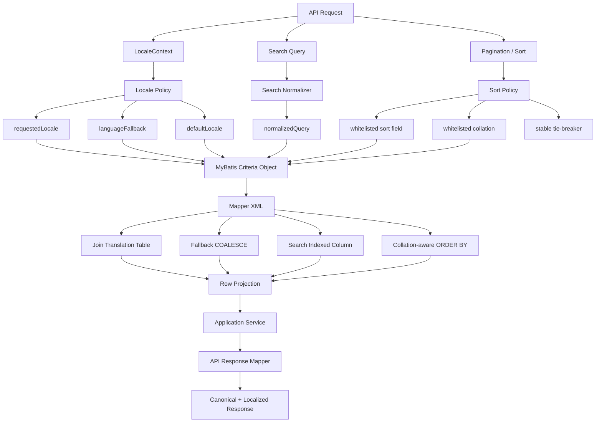

---

## 4. Domain Example

Misalnya aplikasi punya product catalog yang ditampilkan dalam beberapa bahasa.

Canonical table:

```sql id="lq9qep"
CREATE TABLE products (
    product_id      text PRIMARY KEY,
    product_code    text NOT NULL UNIQUE,
    status_code     text NOT NULL,
    price_amount    numeric(19, 4) NOT NULL,
    currency_code   char(3) NOT NULL,
    created_at      timestamptz NOT NULL
);
```

Translation table:

```sql id="srm1qq"
CREATE TABLE product_translations (
    product_id            text NOT NULL REFERENCES products(product_id),
    locale                text NOT NULL,
    display_name          text NOT NULL,
    display_name_search   text NOT NULL,
    description           text,
    description_search    text,
    updated_at            timestamptz NOT NULL,
    PRIMARY KEY (product_id, locale)
);
```

Index:

```sql id="9qkcol"
CREATE INDEX idx_product_translations_name_search_trgm
ON product_translations
USING gin (display_name_search gin_trgm_ops);

CREATE INDEX idx_product_translations_locale_name
ON product_translations (locale, display_name);
```

Untuk `pg_trgm`, PostgreSQL menyediakan extension trigram untuk similarity dan pencarian string mirip, termasuk operator class index GiST/GIN yang bisa mempercepat pencarian. ([PostgreSQL](https://www.postgresql.org/docs/current/unaccent.html?utm_source=chatgpt.com)) Untuk accent-insensitive text pipeline, PostgreSQL juga menyediakan `unaccent()` yang menghapus diacritic dari string dan bisa dipakai di luar full-text search context. ([PostgreSQL](https://www.postgresql.org/docs/current/unaccent.html?utm_source=chatgpt.com))

---

## 5. Locale Fallback Query Pattern

Kebutuhan:

```text id="19hlvj"
Jika translation id-ID ada → pakai id-ID.
Jika tidak ada → fallback ke id.
Jika tidak ada → fallback ke en-US.
Jika tidak ada → fallback ke product_code.
```

Criteria object:

```java id="wvp19g"
public record ProductSearchCriteria(
    String requestedLocale,
    String languageLocale,
    String defaultLocale,
    String normalizedQuery,
    SupportedCollation collation,
    int limit,
    int offset
) {}
```

Contoh value:

```json id="e7r4uo"
{
  "requestedLocale": "id-ID",
  "languageLocale": "id",
  "defaultLocale": "en-US",
  "normalizedQuery": "paket internet",
  "collation": "ID_ID",
  "limit": 20,
  "offset": 0
}
```

---

## 6. Result Projection

Jangan langsung return domain object penuh kalau query adalah projection untuk list/search.

```java id="d2gq4p"
import java.math.BigDecimal;
import java.time.Instant;

public record ProductSearchRow(
    String productId,
    String productCode,
    String statusCode,
    String displayName,
    String resolvedLocale,
    BigDecimal priceAmount,
    String currencyCode,
    Instant createdAt
) {}
```

Response mapper kemudian bisa menambahkan:

```text id="q84byl"
localized status label dari message catalog
formatted money dari locale/currency formatter
formatted date dari locale/timezone formatter
```

---

## 7. MyBatis `resultMap`

```xml id="m3hu8x"
<resultMap id="ProductSearchRowMap" type="com.company.product.ProductSearchRow">
  <id property="productId" column="product_id"/>
  <result property="productCode" column="product_code"/>
  <result property="statusCode" column="status_code"/>
  <result property="displayName" column="display_name"/>
  <result property="resolvedLocale" column="resolved_locale"/>
  <result property="priceAmount" column="price_amount"/>
  <result property="currencyCode" column="currency_code"/>
  <result property="createdAt" column="created_at"/>
</resultMap>
```

`resultMap` adalah salah satu elemen utama mapper XML dan dipakai untuk memetakan hasil SQL ke object model saat mapping tidak cukup hanya berdasarkan nama kolom/properti. ([MyBatis](https://mybatis.org/mybatis-3/sqlmap-xml.html?utm_source=chatgpt.com))

---

## 8. Query Fallback dengan `COALESCE`

```xml id="wqp40e"
<select id="searchProducts" parameterType="com.company.product.ProductSearchCriteria"
        resultMap="ProductSearchRowMap">
  SELECT
      p.product_id,
      p.product_code,
      p.status_code,

      COALESCE(
          t_requested.display_name,
          t_language.display_name,
          t_default.display_name,
          p.product_code
      ) AS display_name,

      CASE
          WHEN t_requested.display_name IS NOT NULL THEN #{requestedLocale}
          WHEN t_language.display_name IS NOT NULL THEN #{languageLocale}
          WHEN t_default.display_name IS NOT NULL THEN #{defaultLocale}
          ELSE 'canonical'
      END AS resolved_locale,

      p.price_amount,
      p.currency_code,
      p.created_at

  FROM products p

  LEFT JOIN product_translations t_requested
         ON t_requested.product_id = p.product_id
        AND t_requested.locale = #{requestedLocale}

  LEFT JOIN product_translations t_language
         ON t_language.product_id = p.product_id
        AND t_language.locale = #{languageLocale}

  LEFT JOIN product_translations t_default
         ON t_default.product_id = p.product_id
        AND t_default.locale = #{defaultLocale}

  <where>
    p.status_code = 'ACTIVE'

    <if test="normalizedQuery != null and normalizedQuery != ''">
      AND COALESCE(
            t_requested.display_name_search,
            t_language.display_name_search,
            t_default.display_name_search,
            lower(p.product_code)
          ) LIKE '%' || #{normalizedQuery} || '%'
    </if>
  </where>

  ORDER BY
    <choose>
      <when test="collation.name() == 'ID_ID'">
        COALESCE(
          t_requested.display_name,
          t_language.display_name,
          t_default.display_name,
          p.product_code
        ) COLLATE "id-ID-x-icu"
      </when>
      <when test="collation.name() == 'EN_US'">
        COALESCE(
          t_requested.display_name,
          t_language.display_name,
          t_default.display_name,
          p.product_code
        ) COLLATE "en-US-x-icu"
      </when>
      <otherwise>
        COALESCE(
          t_requested.display_name,
          t_language.display_name,
          t_default.display_name,
          p.product_code
        )
      </otherwise>
    </choose>,
    p.product_id

  LIMIT #{limit}
  OFFSET #{offset}
</select>
```

MyBatis `<where>` membantu menyisipkan `WHERE` hanya bila ada kondisi dan membersihkan `AND`/`OR` awal yang tidak valid; dynamic SQL seperti `<if>` dan `<choose>` memang disediakan untuk pola conditional SQL seperti ini. ([MyBatis](https://mybatis.org/mybatis-3/dynamic-sql.html?utm_source=chatgpt.com))

---

## 9. Penting: `#{}` vs `${}`

Ini salah satu hal paling penting di MyBatis.

| Syntax | Makna | Aman untuk user input? | Contoh |
|---|---|---:|---|
| `#{value}` | Prepared statement parameter | Ya | `WHERE id = #{id}` |
| `${value}` | Text substitution ke SQL | Tidak, kecuali strict whitelist | `ORDER BY ${column}` |

Buruk:

```xml id="jshl93"
ORDER BY ${sortColumn}
```

Jika `sortColumn` berasal dari request, ini riskan.

Lebih aman:

```xml id="bmbs6g"
ORDER BY
<choose>
  <when test="sort == 'NAME'">
    display_name
  </when>
  <when test="sort == 'CREATED_AT'">
    p.created_at
  </when>
  <otherwise>
    p.product_id
  </otherwise>
</choose>
```

Rule:

```text id="2v5qme"
Gunakan #{ } untuk value.
Gunakan ${ } hanya untuk SQL fragment yang 100% berasal dari enum/whitelist internal.
```

---

## 10. Whitelisted Sort Policy

Request sort jangan langsung masuk SQL.

```java id="menijd"
public enum ProductSort {
    DISPLAY_NAME,
    CREATED_AT,
    PRODUCT_CODE
}
```

Direction:

```java id="ipw9g8"
public enum SortDirection {
    ASC,
    DESC
}
```

Criteria:

```java id="l17f1x"
public record ProductSearchCriteria(
    String requestedLocale,
    String languageLocale,
    String defaultLocale,
    String normalizedQuery,
    SupportedCollation collation,
    ProductSort sort,
    SortDirection direction,
    int limit,
    int offset
) {}
```

XML:

```xml id="cp7rno"
ORDER BY
<choose>
  <when test="sort.name() == 'DISPLAY_NAME'">
    display_name
  </when>
  <when test="sort.name() == 'CREATED_AT'">
    p.created_at
  </when>
  <when test="sort.name() == 'PRODUCT_CODE'">
    p.product_code
  </when>
  <otherwise>
    p.product_id
  </otherwise>
</choose>

<choose>
  <when test="direction.name() == 'DESC'">
    DESC
  </when>
  <otherwise>
    ASC
  </otherwise>
</choose>,

p.product_id ASC
```

Catatan: alias `display_name` tidak selalu bisa dipakai di semua posisi/DB style yang kompleks. Untuk PostgreSQL di `ORDER BY`, alias select umumnya bisa dipakai, tetapi bila perlu collation expression, ulangi expression atau gunakan CTE.

---

## 11. Lebih Rapi dengan CTE

Agar tidak mengulang `COALESCE(...)` berkali-kali:

```xml id="hsy20y"
<select id="searchProducts" parameterType="com.company.product.ProductSearchCriteria"
        resultMap="ProductSearchRowMap">
  WITH localized_products AS (
    SELECT
        p.product_id,
        p.product_code,
        p.status_code,

        COALESCE(
            t_requested.display_name,
            t_language.display_name,
            t_default.display_name,
            p.product_code
        ) AS display_name,

        COALESCE(
            t_requested.display_name_search,
            t_language.display_name_search,
            t_default.display_name_search,
            lower(p.product_code)
        ) AS display_name_search,

        CASE
            WHEN t_requested.display_name IS NOT NULL THEN #{requestedLocale}
            WHEN t_language.display_name IS NOT NULL THEN #{languageLocale}
            WHEN t_default.display_name IS NOT NULL THEN #{defaultLocale}
            ELSE 'canonical'
        END AS resolved_locale,

        p.price_amount,
        p.currency_code,
        p.created_at

    FROM products p
    LEFT JOIN product_translations t_requested
           ON t_requested.product_id = p.product_id
          AND t_requested.locale = #{requestedLocale}
    LEFT JOIN product_translations t_language
           ON t_language.product_id = p.product_id
          AND t_language.locale = #{languageLocale}
    LEFT JOIN product_translations t_default
           ON t_default.product_id = p.product_id
          AND t_default.locale = #{defaultLocale}
    WHERE p.status_code = 'ACTIVE'
  )

  SELECT
      product_id,
      product_code,
      status_code,
      display_name,
      resolved_locale,
      price_amount,
      currency_code,
      created_at
  FROM localized_products

  <where>
    <if test="normalizedQuery != null and normalizedQuery != ''">
      display_name_search LIKE '%' || #{normalizedQuery} || '%'
    </if>
  </where>

  ORDER BY
    <choose>
      <when test="collation.name() == 'ID_ID'">
        display_name COLLATE "id-ID-x-icu"
      </when>
      <when test="collation.name() == 'EN_US'">
        display_name COLLATE "en-US-x-icu"
      </when>
      <otherwise>
        display_name
      </otherwise>
    </choose>,
    product_id

  LIMIT #{limit}
  OFFSET #{offset}
</select>
```

Kelebihan:

```text id="znme8g"
localized expression hanya ditulis sekali
lebih readable
lebih mudah debug
bisa dikembangkan untuk ranking/search
```

Kekurangan:

```text id="xcs9ul"
planner behavior perlu dicek dengan EXPLAIN
untuk query besar, CTE/materialization behavior perlu diuji sesuai versi PostgreSQL
```

---

## 12. Search dengan Trigram dan Ranking

Jika memakai `pg_trgm`, query bisa menambahkan score.

Result row:

```java id="mwd579"
public record ProductSearchRow(
    String productId,
    String productCode,
    String statusCode,
    String displayName,
    String resolvedLocale,
    BigDecimal priceAmount,
    String currencyCode,
    Instant createdAt,
    BigDecimal searchScore
) {}
```

SQL:

```xml id="hwq7g7"
<select id="searchProductsBySimilarity"
        parameterType="com.company.product.ProductSearchCriteria"
        resultMap="ProductSearchRowMap">
  WITH localized_products AS (
    SELECT
        p.product_id,
        p.product_code,
        p.status_code,
        COALESCE(t_req.display_name, t_lang.display_name, t_def.display_name, p.product_code) AS display_name,
        COALESCE(t_req.display_name_search, t_lang.display_name_search, t_def.display_name_search, lower(p.product_code)) AS display_name_search,
        CASE
            WHEN t_req.display_name IS NOT NULL THEN #{requestedLocale}
            WHEN t_lang.display_name IS NOT NULL THEN #{languageLocale}
            WHEN t_def.display_name IS NOT NULL THEN #{defaultLocale}
            ELSE 'canonical'
        END AS resolved_locale,
        p.price_amount,
        p.currency_code,
        p.created_at
    FROM products p
    LEFT JOIN product_translations t_req
           ON t_req.product_id = p.product_id
          AND t_req.locale = #{requestedLocale}
    LEFT JOIN product_translations t_lang
           ON t_lang.product_id = p.product_id
          AND t_lang.locale = #{languageLocale}
    LEFT JOIN product_translations t_def
           ON t_def.product_id = p.product_id
          AND t_def.locale = #{defaultLocale}
    WHERE p.status_code = 'ACTIVE'
  )
  SELECT
      product_id,
      product_code,
      status_code,
      display_name,
      resolved_locale,
      price_amount,
      currency_code,
      created_at,
      similarity(display_name_search, #{normalizedQuery}) AS search_score
  FROM localized_products
  WHERE display_name_search % #{normalizedQuery}
  ORDER BY search_score DESC, display_name, product_id
  LIMIT #{limit}
  OFFSET #{offset}
</select>
```

`pg_trgm` menyediakan operator `%` untuk similarity match dan fungsi seperti `similarity(text,text)` untuk mengukur kemiripan string. ([PostgreSQL](https://www.postgresql.org/docs/current/unaccent.html?utm_source=chatgpt.com))

---

## 13. Problem: Fallback `COALESCE` Bisa Menghambat Index

Query ini readable:

```sql id="c6yo75"
WHERE COALESCE(t_req.display_name_search, t_def.display_name_search)
      LIKE '%' || :query || '%'
```

Tapi index usage bisa tidak optimal karena search dilakukan pada hasil expression gabungan dari beberapa join.

Untuk data besar, pertimbangkan pattern lain:

### Pattern A - Query requested locale dulu, lalu fallback jika kosong

```text id="rmgs9i"
1. Search locale requested.
2. Jika hasil kurang dari limit, search fallback locale.
3. Merge/deduplicate di application.
```

Cocok jika fallback jarang terjadi.

### Pattern B - Materialized localized search projection

```sql id="s32hkw"
CREATE MATERIALIZED VIEW product_localized_search AS
SELECT
    p.product_id,
    locale_policy.locale,
    COALESCE(t_req.display_name, t_def.display_name, p.product_code) AS display_name,
    COALESCE(t_req.display_name_search, t_def.display_name_search, lower(p.product_code)) AS display_name_search
FROM products p
JOIN supported_locales locale_policy ON true
LEFT JOIN product_translations t_req
       ON t_req.product_id = p.product_id
      AND t_req.locale = locale_policy.locale
LEFT JOIN product_translations t_def
       ON t_def.product_id = p.product_id
      AND t_def.locale = 'en-US';
```

Index:

```sql id="5vtwcq"
CREATE INDEX idx_product_lsearch_locale_name_trgm
ON product_localized_search
USING gin (display_name_search gin_trgm_ops);
```

Cocok jika catalog besar dan search-heavy.

### Pattern C - Denormalized table maintained by job/event

```text id="ouwkqf"
product_localized_search(product_id, locale, display_name, search_text, rank fields)
```

Cocok jika search latency sangat penting.

---

## 14. Localized Data Query Pattern per Use Case

| Use Case | Query Strategy |
|---|---|
| Detail page by ID | Join requested + fallback translations |
| Small dropdown | Fetch all active + localized label, cache |
| Search list | Search normalized column + fallback strategy |
| Large fuzzy search | Locale-specific search projection + trigram |
| Report export | Join localized labels once, stream result |
| Admin translation screen | Query translation rows directly |
| Missing translation audit | Anti-join against supported locales |
| Public API | Return canonical code + localized display if requested |

---

## 15. Query Detail by ID

Detail by ID tidak perlu trigram/search complexity.

```xml id="povqng"
<select id="findProductDetail"
        parameterType="com.company.product.ProductDetailCriteria"
        resultMap="ProductDetailRowMap">
  SELECT
      p.product_id,
      p.product_code,
      p.status_code,

      COALESCE(t_req.display_name, t_lang.display_name, t_def.display_name, p.product_code)
        AS display_name,

      COALESCE(t_req.description, t_lang.description, t_def.description)
        AS description,

      CASE
          WHEN t_req.display_name IS NOT NULL THEN #{requestedLocale}
          WHEN t_lang.display_name IS NOT NULL THEN #{languageLocale}
          WHEN t_def.display_name IS NOT NULL THEN #{defaultLocale}
          ELSE 'canonical'
      END AS resolved_locale,

      p.price_amount,
      p.currency_code,
      p.created_at

  FROM products p
  LEFT JOIN product_translations t_req
         ON t_req.product_id = p.product_id
        AND t_req.locale = #{requestedLocale}
  LEFT JOIN product_translations t_lang
         ON t_lang.product_id = p.product_id
        AND t_lang.locale = #{languageLocale}
  LEFT JOIN product_translations t_def
         ON t_def.product_id = p.product_id
        AND t_def.locale = #{defaultLocale}

  WHERE p.product_id = #{productId}
</select>
```

Criteria:

```java id="n3xq36"
public record ProductDetailCriteria(
    String productId,
    String requestedLocale,
    String languageLocale,
    String defaultLocale
) {}
```

---

## 16. Missing Translation Query

Untuk governance, cari product yang belum punya translation untuk locale tertentu.

```xml id="a5mo4s"
<select id="findMissingTranslations"
        parameterType="string"
        resultType="com.company.product.MissingTranslationRow">
  SELECT
      p.product_id,
      p.product_code,
      #{locale} AS missing_locale
  FROM products p
  LEFT JOIN product_translations t
         ON t.product_id = p.product_id
        AND t.locale = #{locale}
  WHERE t.product_id IS NULL
  ORDER BY p.product_code
</select>
```

Untuk semua supported locales:

```sql id="l8j7h8"
SELECT
    p.product_id,
    p.product_code,
    l.locale AS missing_locale
FROM products p
CROSS JOIN supported_locales l
LEFT JOIN product_translations t
       ON t.product_id = p.product_id
      AND t.locale = l.locale
WHERE t.product_id IS NULL
ORDER BY l.locale, p.product_code;
```

Ini bisa menjadi basis dashboard translation completeness.

---

## 17. MyBatis `<foreach>` untuk Multi-Locale atau ID List

Contoh fetch translations untuk banyak product ID:

```xml id="g5h32c"
<select id="findTranslationsByProductIds"
        resultMap="ProductTranslationRowMap">
  SELECT
      product_id,
      locale,
      display_name,
      description
  FROM product_translations
  WHERE product_id IN
  <foreach collection="productIds"
           item="productId"
           open="("
           separator=","
           close=")">
    #{productId}
  </foreach>
  AND locale IN
  <foreach collection="locales"
           item="locale"
           open="("
           separator=","
           close=")">
    #{locale}
  </foreach>
</select>
```

MyBatis dynamic SQL menyediakan `<foreach>` untuk membangun SQL dari collection, misalnya `IN (...)`, dengan item, separator, open, dan close. ([MyBatis](https://mybatis.org/mybatis-3/dynamic-sql.html?utm_source=chatgpt.com))

Jangan membuat sendiri:

```java id="9kl8ns"
String ids = productIds.stream().collect(joining(","));
```

lalu:

```xml id="bh4ske"
WHERE product_id IN (${ids})
```

Itu raw SQL substitution risk.

---

## 18. MyBatis `<bind>` untuk LIKE Pattern

Bisa pakai `<bind>` agar pattern tidak diulang.

```xml id="bxopuu"
<select id="searchProducts" resultMap="ProductSearchRowMap">
  <bind name="queryPattern" value="'%' + normalizedQuery + '%'" />

  SELECT product_id, product_code, display_name
  FROM product_localized_search
  WHERE locale = #{requestedLocale}
    AND display_name_search LIKE #{queryPattern}
  ORDER BY display_name, product_id
  LIMIT #{limit}
</select>
```

Ini tetap menggunakan bind parameter, bukan textual substitution.

---

## 19. Dynamic WHERE yang Rapi

```xml id="xp8fkg"
<select id="searchProducts" resultMap="ProductSearchRowMap">
  SELECT
      product_id,
      product_code,
      display_name,
      status_code,
      price_amount,
      currency_code
  FROM product_localized_search

  <where>
    locale = #{requestedLocale}

    <if test="normalizedQuery != null and normalizedQuery != ''">
      AND display_name_search LIKE '%' || #{normalizedQuery} || '%'
    </if>

    <if test="statusCodes != null and statusCodes.size() > 0">
      AND status_code IN
      <foreach collection="statusCodes" item="status" open="(" separator="," close=")">
        #{status}
      </foreach>
    </if>

    <if test="minPrice != null">
      AND price_amount &gt;= #{minPrice}
    </if>

    <if test="maxPrice != null">
      AND price_amount &lt;= #{maxPrice}
    </if>
  </where>

  ORDER BY display_name, product_id
  LIMIT #{limit}
  OFFSET #{offset}
</select>
```

`<where>` penting karena menghindari SQL invalid seperti `WHERE AND ...`; MyBatis mendokumentasikan bahwa elemen `where` hanya menambahkan `WHERE` jika child element mengembalikan content dan akan menghapus leading `AND`/`OR`. ([MyBatis](https://mybatis.org/mybatis-3/dynamic-sql.html?utm_source=chatgpt.com))

---

## 20. Avoid Logic Terlalu Banyak di XML

MyBatis bagus untuk SQL eksplisit, bukan untuk menampung semua business logic.

Boleh di XML:

```text id="is2qah"
conditional WHERE
safe sort choose
join translation fallback
pagination
projection mapping
```

Jangan di XML:

```text id="xh39tq"
business state machine
permission matrix kompleks
locale negotiation
normalization algorithm panjang
status label translation dari message catalog
money formatting
date formatting user-facing
```

Rule:

```text id="y6iqct"
SQL untuk data retrieval.
Java service untuk policy dan orchestration.
Response mapper untuk presentation.
```

---

## 21. `resultMap` untuk Nested Localized Object

Kalau ingin row langsung map ke object nested:

```java id="k4eu6f"
public record LocalizedText(
    String value,
    String locale
) {}

public record ProductListItem(
    String productId,
    String productCode,
    String statusCode,
    LocalizedText name
) {}
```

MyBatis constructor mapping bisa dipakai, tapi untuk record nested sering lebih sederhana map ke flat row dulu:

```java id="bwfmg3"
public record ProductListItemRow(
    String productId,
    String productCode,
    String statusCode,
    String displayName,
    String resolvedLocale
) {}
```

Lalu mapper Java:

```java id="y0d2pt"
public ProductListItem toItem(ProductListItemRow row) {
    return new ProductListItem(
        row.productId(),
        row.productCode(),
        row.statusCode(),
        new LocalizedText(row.displayName(), row.resolvedLocale())
    );
}
```

Rekomendasi:

```text id="2jvht6"
Untuk query localized/search, flat row projection biasanya lebih mudah dirawat.
```

---

## 22. Cache Strategy

Localized data bisa dicache, tapi key harus lengkap.

Cache key minimal:

```text id="t1fzln"
entity
id/query
requestedLocale
fallbackLocale
tenantId
sort
page
translationVersion
```

Contoh:

```java id="tr8plx"
public record ProductSearchCacheKey(
    String tenantId,
    String requestedLocale,
    String defaultLocale,
    String normalizedQuery,
    ProductSort sort,
    SortDirection direction,
    int limit,
    int offset,
    long translationVersion
) {}
```

Jangan cache:

```text id="yw4q4f"
query result tanpa locale
localized display tanpa translation version
data tenant tanpa tenantId
search result tanpa normalizedQuery
```

---

## 23. Multi-Tenant Translation Table

Kalau tenant bisa override wording/product display:

```sql id="pl8sqd"
CREATE TABLE product_translations (
    tenant_id text,
    product_id text NOT NULL,
    locale text NOT NULL,
    display_name text NOT NULL,
    display_name_search text NOT NULL,
    description text,
    PRIMARY KEY (tenant_id, product_id, locale)
);
```

Fallback chain:

```text id="d82g3k"
tenant requested locale
tenant language locale
tenant default locale
global requested locale
global default locale
canonical product_code
```

Query bisa menjadi berat jika semua fallback di satu SQL. Untuk readability dan performance, pertimbangkan:

```text id="40zfs9"
localized projection table
materialized view
application-level fallback with limited queries
```

Jangan membangun join fallback 8 layer tanpa EXPLAIN di dataset nyata.

---

## 24. Localized Projection Table Pattern

Untuk performa dan simplicity:

```sql id="oayzzw"
CREATE TABLE product_localized_projection (
    tenant_id text NOT NULL,
    product_id text NOT NULL,
    locale text NOT NULL,
    display_name text NOT NULL,
    display_name_search text NOT NULL,
    resolved_from_locale text NOT NULL,
    status_code text NOT NULL,
    price_amount numeric(19,4) NOT NULL,
    currency_code char(3) NOT NULL,
    updated_at timestamptz NOT NULL,
    PRIMARY KEY (tenant_id, product_id, locale)
);
```

Query jadi sederhana:

```xml id="mvueha"
<select id="searchProductProjection"
        parameterType="com.company.product.ProductSearchCriteria"
        resultMap="ProductSearchRowMap">
  SELECT
      product_id,
      product_code,
      status_code,
      display_name,
      resolved_from_locale AS resolved_locale,
      price_amount,
      currency_code,
      updated_at AS created_at
  FROM product_localized_projection
  WHERE tenant_id = #{tenantId}
    AND locale = #{requestedLocale}
    <if test="normalizedQuery != null and normalizedQuery != ''">
      AND display_name_search LIKE '%' || #{normalizedQuery} || '%'
    </if>
  ORDER BY display_name, product_id
  LIMIT #{limit}
  OFFSET #{offset}
</select>
```

Trade-off:

| Aspek | Join Fallback On Read | Projection Table |
|---|---:|---:|
| Query simple | Tidak selalu | Ya |
| Write complexity | Rendah | Lebih tinggi |
| Freshness | Real-time | Tergantung update mechanism |
| Search performance | Bisa berat | Lebih mudah diindex |
| Debug fallback | Di query | Di projection metadata |
| Cocok untuk | Data kecil/sedang | Search-heavy/multi-tenant |

---

## 25. TypeHandler untuk `Locale` dan `Currency`

Jika DB menyimpan locale string dan Java ingin `Locale`:

```java id="mafzye"
import org.apache.ibatis.type.BaseTypeHandler;
import org.apache.ibatis.type.JdbcType;

import java.sql.*;
import java.util.Locale;

public class LocaleTypeHandler extends BaseTypeHandler<Locale> {

    @Override
    public void setNonNullParameter(
        PreparedStatement ps,
        int i,
        Locale parameter,
        JdbcType jdbcType
    ) throws SQLException {
        ps.setString(i, parameter.toLanguageTag());
    }

    @Override
    public Locale getNullableResult(ResultSet rs, String columnName)
        throws SQLException {
        return toLocale(rs.getString(columnName));
    }

    @Override
    public Locale getNullableResult(ResultSet rs, int columnIndex)
        throws SQLException {
        return toLocale(rs.getString(columnIndex));
    }

    @Override
    public Locale getNullableResult(CallableStatement cs, int columnIndex)
        throws SQLException {
        return toLocale(cs.getString(columnIndex));
    }

    private Locale toLocale(String value) {
        return value == null ? null : Locale.forLanguageTag(value);
    }
}
```

Namun untuk projection rows, string `resolvedLocale` sering cukup. Jangan over-engineer TypeHandler jika domain tidak butuh object `Locale`.

---

## 26. TypeHandler untuk `Money`? Hati-Hati

Karena money biasanya dua kolom:

```text id="timf0r"
amount
currency_code
```

MyBatis `TypeHandler` lebih cocok untuk single column. Untuk two-column value object, lebih mudah:

```java id="6iy97o"
public record ProductRow(
    BigDecimal priceAmount,
    String currencyCode
) {
    public Money price() {
        return new Money(priceAmount, currencyCode);
    }
}
```

Atau mapping di Java mapper:

```java id="v2kt3r"
Money price = new Money(row.priceAmount(), row.currencyCode());
```

Rule:

```text id="efnfru"
Jangan paksa TypeHandler untuk value object multi-column jika membuat mapping lebih kabur.
```

---

## 27. MyBatis Mapper Interface

```java id="oihf6s"
import org.apache.ibatis.annotations.Mapper;

import java.util.List;
import java.util.Optional;

@Mapper
public interface ProductMapper {

    Optional<ProductDetailRow> findProductDetail(ProductDetailCriteria criteria);

    List<ProductSearchRow> searchProducts(ProductSearchCriteria criteria);

    List<MissingTranslationRow> findMissingTranslations(String locale);

    int insertProductTranslation(ProductTranslationRow row);

    int updateProductTranslation(ProductTranslationRow row);
}
```

Untuk interface mapper, MyBatis menyediakan mapping melalui XML descriptor atau annotation; repository resmi MyBatis menjelaskan framework ini menghubungkan object dengan stored procedure atau SQL statement memakai XML descriptor atau annotations. ([GitHub](https://github.com/mybatis/mybatis-3?utm_source=chatgpt.com))

---

## 28. Service Layer Orchestration

```java id="zelco7"
public class ProductSearchService {

    private final ProductMapper productMapper;
    private final SearchTextNormalizer searchTextNormalizer;
    private final LocaleFallbackPolicy localeFallbackPolicy;
    private final SortPolicy sortPolicy;

    public ProductSearchService(
        ProductMapper productMapper,
        SearchTextNormalizer searchTextNormalizer,
        LocaleFallbackPolicy localeFallbackPolicy,
        SortPolicy sortPolicy
    ) {
        this.productMapper = productMapper;
        this.searchTextNormalizer = searchTextNormalizer;
        this.localeFallbackPolicy = localeFallbackPolicy;
        this.sortPolicy = sortPolicy;
    }

    public List<ProductSearchRow> search(
        ProductSearchRequest request,
        Locale locale
    ) {
        LocaleFallback fallback = localeFallbackPolicy.of(locale);

        ProductSearchCriteria criteria = new ProductSearchCriteria(
            fallback.requestedLocale(),
            fallback.languageLocale(),
            fallback.defaultLocale(),
            searchTextNormalizer.normalizeForSearch(request.query()),
            sortPolicy.collationOf(locale),
            sortPolicy.sortOf(request.sort()),
            sortPolicy.directionOf(request.direction()),
            Math.min(request.limit(), 100),
            Math.max(request.offset(), 0)
        );

        return productMapper.searchProducts(criteria);
    }
}
```

Point penting:

```text id="mrjqs7"
Locale fallback policy di Java.
Search normalization di Java.
SQL menerima criteria final yang sudah aman.
```

---

## 29. Response Mapper

```java id="w9vr55"
public class ProductResponseMapper {

    private final StatusLocalizer statusLocalizer;
    private final LocalizedMoneyFormatter moneyFormatter;
    private final LocalizedDateTimeFormatter dateTimeFormatter;

    public ProductListItemResponse toResponse(
        ProductSearchRow row,
        Locale locale,
        ZoneId zoneId
    ) {
        Money price = new Money(row.priceAmount(), row.currencyCode());

        return new ProductListItemResponse(
            row.productId(),
            row.productCode(),
            new LocalizedCode(
                row.statusCode(),
                statusLocalizer.label(row.statusCode(), locale)
            ),
            new LocalizedText(
                row.displayName(),
                row.resolvedLocale()
            ),
            new MoneyResponse(
                row.priceAmount().toPlainString(),
                row.currencyCode(),
                moneyFormatter.format(price, locale)
            ),
            new DateTimeResponse(
                row.createdAt().toString(),
                zoneId.getId(),
                dateTimeFormatter.formatMediumDateTime(
                    row.createdAt(),
                    zoneId,
                    locale
                )
            )
        );
    }
}
```

Perhatikan:

```text id="bbwyjw"
displayName dari DB translation table.
status label dari message catalog.
money/date formatting dari response boundary.
```

---

## 30. Avoid N+1 Translation Queries

Buruk:

```text id="992r1w"
Fetch 20 products.
For each product, query translation table.
```

Lebih baik:

```text id="r85gyf"
Join translation table di query list.
Atau fetch translations batch dengan foreach IN.
Atau pakai projection table.
```

N+1 query makin buruk jika fallback chain per row:

```text id="jz6b3m"
20 products × 3 fallback locales = 60 extra queries
```

---

## 31. Streaming Report Export

Untuk report besar, jangan load semua rows.

Mapper:

```java id="cfecko"
import org.apache.ibatis.cursor.Cursor;

public interface ProductReportMapper {
    Cursor<ProductReportRow> streamLocalizedProductReport(ProductReportCriteria criteria);
}
```

XML:

```xml id="p9jh1e"
<select id="streamLocalizedProductReport"
        parameterType="com.company.product.ProductReportCriteria"
        resultMap="ProductReportRowMap"
        fetchSize="500">
  SELECT
      p.product_id,
      p.product_code,
      COALESCE(t_req.display_name, t_def.display_name, p.product_code) AS display_name,
      p.status_code,
      p.price_amount,
      p.currency_code,
      p.created_at
  FROM products p
  LEFT JOIN product_translations t_req
         ON t_req.product_id = p.product_id
        AND t_req.locale = #{requestedLocale}
  LEFT JOIN product_translations t_def
         ON t_def.product_id = p.product_id
        AND t_def.locale = #{defaultLocale}
  ORDER BY p.product_id
</select>
```

Report generation boundary yang melakukan formatting:

```text id="8wax80"
date formatted sesuai locale/timezone
amount formatted sesuai locale/currency
status label dari message catalog
display name dari translation table
```

---

## 32. Testing MyBatis Query

### Test fallback

```java id="u3l0ew"
@Test
void shouldFallbackToDefaultLocaleWhenRequestedTranslationMissing() {
    insertProduct("P1", "PROD_BASIC");
    insertTranslation("P1", "en-US", "Basic Plan");

    ProductDetailRow row = mapper.findProductDetail(
        new ProductDetailCriteria("P1", "id-ID", "id", "en-US")
    ).orElseThrow();

    assertEquals("Basic Plan", row.displayName());
    assertEquals("en-US", row.resolvedLocale());
}
```

### Test requested locale wins

```java id="rno8k1"
@Test
void requestedLocaleShouldWinOverDefaultLocale() {
    insertProduct("P1", "PROD_BASIC");
    insertTranslation("P1", "en-US", "Basic Plan");
    insertTranslation("P1", "id-ID", "Paket Dasar");

    ProductDetailRow row = mapper.findProductDetail(
        new ProductDetailCriteria("P1", "id-ID", "id", "en-US")
    ).orElseThrow();

    assertEquals("Paket Dasar", row.displayName());
    assertEquals("id-ID", row.resolvedLocale());
}
```

### Test search normalized

```java id="idce80"
@Test
void searchShouldFindAccentInsensitiveName() {
    insertProduct("P1", "PROD_JOSE");
    insertTranslation("P1", "en-US", "José Plan", "jose plan");

    List<ProductSearchRow> rows = mapper.searchProducts(
        new ProductSearchCriteria(
            "en-US",
            "en",
            "en-US",
            "jose",
            SupportedCollation.EN_US,
            ProductSort.DISPLAY_NAME,
            SortDirection.ASC,
            20,
            0
        )
    );

    assertEquals(1, rows.size());
}
```

### Test SQL injection prevention

```java id="g7yxcy"
@Test
void sortInputShouldBeWhitelistedBeforeMapper() {
    assertThrows(
        InvalidSortException.class,
        () -> sortPolicy.sortOf("display_name; drop table products;")
    );
}
```

---

## 33. Query Plan Validation

Untuk search-heavy endpoint, jalankan:

```sql id="yphv7f"
EXPLAIN (ANALYZE, BUFFERS)
SELECT product_id, display_name
FROM product_localized_projection
WHERE locale = 'id-ID'
  AND display_name_search LIKE '%paket%'
ORDER BY display_name, product_id
LIMIT 20;
```

Cek:

```text id="7jd90g"
apakah index trigram dipakai
berapa rows scanned
apakah sort spill ke disk
apakah join fallback terlalu mahal
apakah LIMIT diterapkan setelah expensive sort
```

Jangan hanya percaya query “benar secara fungsi”.

---

## 34. CI Quality Gates

```text id="sw53my"
[ ] Tidak ada `${}` dari input user
[ ] Semua sort field berasal dari enum/whitelist
[ ] Semua collation berasal dari enum/whitelist
[ ] Semua locale fallback criteria dibangun di service, bukan tersebar
[ ] Query list tidak N+1 translation
[ ] Search query memakai normalized column/index
[ ] Pagination selalu punya stable tie-breaker
[ ] Missing translation query tersedia
[ ] MyBatis resultMap explicit untuk projection penting
[ ] Integration test mencakup requested locale, fallback, dan missing translation
[ ] EXPLAIN dilakukan untuk endpoint search besar
[ ] Multi-tenant query selalu include tenant filter jika applicable
```

---

## 35. Observability

Metric:

```text id="zjkd8x"
product.search.count{locale,strategy}
product.search.latency{locale,strategy}
product.search.fallback_used.count{requestedLocale,resolvedLocale}
product.translation.missing.count{locale}
product.search.empty_result.count{locale}
db.query.product_search.duration
db.query.product_detail.duration
```

Structured log:

```json id="2ei5xz"
{
  "event": "localized.product.search",
  "tenantId": "tenant-a",
  "requestedLocale": "id-ID",
  "defaultLocale": "en-US",
  "collation": "ID_ID",
  "queryLength": 12,
  "normalizedQueryLength": 12,
  "limit": 20,
  "offset": 0,
  "resultCount": 20,
  "fallbackCount": 3,
  "durationMs": 28,
  "traceId": "01J..."
}
```

Jangan log full search query jika bisa berisi PII. Untuk person/customer search, cukup log length/hash.

---

## 36. Anti-Pattern

| Anti-Pattern | Kenapa Buruk | Alternatif |
|---|---|---|
| Localized status label dari SQL `CASE` | Duplikasi message catalog | Localize di response mapper |
| Translation query per row | N+1 query | Join/batch/projection |
| `${sort}` dari request | SQL injection | Enum + `<choose>` |
| `${collation}` dari request | SQL injection / invalid SQL | Whitelist collation |
| Fallback chain copy-paste di banyak mapper | Inconsistent behavior | Criteria + reusable SQL fragment |
| Search pakai `lower(unaccent(col))` tanpa index | Lambat | normalized column / expression index |
| `ORDER BY display_name` tanpa tie-breaker | Pagination unstable | `ORDER BY display_name, id` |
| Money/date formatted di SQL | Presentation leak ke DB | Format di API/report boundary |
| Message catalog disimpan di DB translation table | Governance kacau | Pisahkan app message vs master data |
| Query besar tanpa EXPLAIN | Performance surprise | Query plan validation |

---

## 37. Practical Review Checklist

```text id="q5kmtf"
[ ] Apakah localized master data disimpan di translation table?
[ ] Apakah application message tetap di message catalog?
[ ] Apakah query detail memakai requested + fallback locale?
[ ] Apakah query search memakai normalized search column?
[ ] Apakah sort memakai collation whitelist?
[ ] Apakah dynamic SQL memakai <if>, <where>, <choose>, <foreach> dengan aman?
[ ] Apakah semua value memakai #{}, bukan ${}?
[ ] Apakah ${} kalau ada hanya dari enum internal?
[ ] Apakah pagination punya stable tie-breaker?
[ ] Apakah result projection flat dan jelas?
[ ] Apakah response mapper memisahkan DB-localized data dari catalog-localized label?
[ ] Apakah missing translation bisa diaudit?
[ ] Apakah query search punya index dan sudah dicek EXPLAIN?
[ ] Apakah multi-tenant fallback chain tidak terlalu berat?
[ ] Apakah test mencakup fallback locale dan search accent-insensitive?
```

---

# Seri 9 Selesai

Kita sudah membahas:

```text id="8x1hx4"
MyBatis localized query pattern
translation table vs message catalog
locale fallback join
COALESCE fallback
safe dynamic SQL
#{ } vs ${ }
whitelisted sort/collation
search normalized column
trigram similarity search
projection table pattern
multi-tenant translation
resultMap/projection rows
missing translation governance
testing, CI, observability
```

Rekomendasi berikutnya: **Seri 10 - File Export/Import Localization: CSV, Excel, PDF, Word, Report**.

---

**Sources:**

- [Mapper XML Files](https://mybatis.org/mybatis-3/sqlmap-xml.html?utm_source=chatgpt.com)
- [F.48. unaccent — a text search dictionary which removes ...](https://www.postgresql.org/docs/current/unaccent.html?utm_source=chatgpt.com)
- [MyBatis SQL mapper framework for Java](https://github.com/mybatis/mybatis-3?utm_source=chatgpt.com)

## Response:
7/13/2026, 10:27:05 PM

# Seri 10 dari 12 - File Export/Import Localization: CSV, Excel, PDF, Word, Report

## 1. Tujuan Seri Ini

Seri ini membahas localization pada **file import/export** di Java Jersey/JAX-RS microservice:

```text id="h37xkw"
CSV
Excel
PDF
Word
report
bulk import
file naming
localized headers
localized values
canonical metadata
timezone
currency
decimal separator
encoding
formula injection
streaming download
multipart upload
```

Fokus utamanya:

> File untuk manusia boleh localized. File untuk mesin harus canonical.

Masalah yang sering muncul di production:

```text id="a4k4kv"
Excel salah membaca decimal separator
CSV rusak karena delimiter/encoding
angka finansial berubah karena locale
tanggal bergeser karena timezone
report regulatory tidak defensible
PDF tidak support font/Unicode tertentu
import file berbahasa lokal salah parsing
formula injection di CSV/Excel
file besar membuat memory service habis
```

Apache POI adalah library Java untuk membaca/menulis format Microsoft Office seperti Excel, Word, dan PowerPoint berbasis OOXML/OLE2. Dokumentasi Apache POI menyebut project ini menyediakan API untuk memanipulasi file Office dan secara eksplisit mendukung membaca/menulis Excel, Word, dan PowerPoint. ([poi.apache.org](https://poi.apache.org/?utm_source=chatgpt.com)) Untuk PDF, Apache PDFBox adalah library Java open source untuk membuat dokumen PDF baru, memanipulasi PDF yang ada, dan mengekstrak content dari PDF. ([pdfbox.apache.org](https://pdfbox.apache.org/?utm_source=chatgpt.com)) Untuk CSV, OpenCSV adalah parser CSV Java yang umum dipakai dan versi terbaru yang terlihat di javadoc saat ini adalah 5.12.0. ([Javadoc](https://javadoc.io/doc/com.opencsv/opencsv/latest/index.html?utm_source=chatgpt.com))

---

## 2. Mental Model

```text id="spc5v6"
Canonical data
  ↓
Export policy
  ↓
Locale + timezone + currency policy
  ↓
Format-specific renderer
  ↓
File output
```

Untuk import:

```text id="30duap"
Uploaded file
  ↓
File metadata
  ↓
Locale/timezone/currency parse policy
  ↓
Validation
  ↓
Canonical command/data
  ↓
Database/workflow
```

Golden rule:

```text id="d39uq0"
Export manusia: localized label + canonical metadata.
Import manusia: parse dengan explicit locale metadata.
Machine integration: canonical only.
```

---

## 3. Diagram

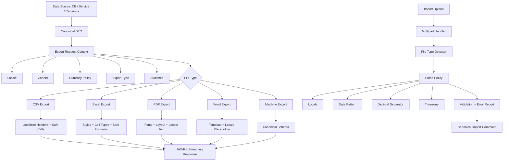

---

## 4. File Type Decision Matrix

| File Type | Cocok Untuk | Localization Concern | Canonical Concern |
|---|---|---|---|
| CSV | Bulk import/export sederhana, machine integration | delimiter, encoding, decimal/date text | schema, stable column name |
| Excel | User-facing report, finance, ops review | header localized, number/date style, sheet name | raw hidden sheet/columns |
| PDF | Customer/regulatory report final | font, layout, date/money/status label | audit metadata, document version |
| Word | Template surat/memo/approval doc | paragraph/table placeholder localized | template version, data source |
| JSON | Machine/API export | biasanya tidak localized kecuali explicit | stable schema |
| ZIP | Multi-file package | localized file names hati-hati | manifest canonical |
| Parquet | Analytics/data lake | biasanya tidak localized | typed schema |

Rule praktis:

```text id="qrikjo"
CSV/Excel/PDF/Word user-facing → localized.
JSON/Parquet/machine CSV → canonical.
```

---

## 5. Export Contract: Jangan Hanya “Download File”

Setiap export sebaiknya punya metadata policy.

```java id="cpn7xj"
public record ExportContext(
    Locale locale,
    ZoneId zoneId,
    String tenantId,
    String requestedBy,
    ExportAudience audience,
    ExportFormat format,
    Instant generatedAt,
    String reportVersion
) {}
```

```java id="q25nvb"
public enum ExportAudience {
    HUMAN_USER,
    MACHINE_INTEGRATION,
    REGULATORY,
    INTERNAL_AUDIT
}

public enum ExportFormat {
    CSV,
    XLSX,
    PDF,
    DOCX,
    JSON
}
```

Kenapa perlu?

| Context | Dipakai Untuk |
|---|---|
| `locale` | header, label, status text |
| `zoneId` | tanggal/jam display |
| `tenantId` | tenant-specific wording/policy |
| `audience` | human localized vs machine canonical |
| `format` | renderer |
| `generatedAt` | report audit |
| `reportVersion` | defensibility |

---

## 6. Data Model untuk Export

Jangan render langsung dari entity DB.

Gunakan canonical row:

```java id="m2y0zq"
import java.math.BigDecimal;
import java.time.Instant;

public record OrderExportRow(
    String orderId,
    String customerName,
    String statusCode,
    Instant createdAt,
    BigDecimal amount,
    String currencyCode
) {}
```

Renderer boleh menghasilkan localized row:

```java id="zjjbq3"
public record LocalizedOrderExportRow(
    String orderId,
    String customerName,
    String statusLabel,
    String createdAtText,
    String amountText
) {}
```

Tapi jangan buang canonical row terlalu awal. Untuk audit/regulatory export, sering perlu raw + display.

---

## 7. Export Column Policy

```java id="3t6g6n"
public record ExportColumn<T>(
    String canonicalName,
    String headerMessageKey,
    Function<T, Object> canonicalValue,
    Function<T, String> localizedValue
) {}
```

Contoh canonical column:

```text id="x1jze2"
order_id
status_code
created_at_utc
amount
currency_code
```

Contoh localized header:

```properties id="9ncly0"
# report_en_US.properties
report.order.column.orderId=Order ID
report.order.column.status=Status
report.order.column.createdAt=Created at
report.order.column.amount=Amount
```

```properties id="6nkzse"
# report_id_ID.properties
report.order.column.orderId=ID Pesanan
report.order.column.status=Status
report.order.column.createdAt=Tanggal dibuat
report.order.column.amount=Jumlah
```

---

## 8. CSV: Human vs Machine

### Machine CSV

```csv id="u7n06p"
order_id,status_code,created_at_utc,amount,currency_code
ORD-123,PENDING_APPROVAL,2026-07-13T03:15:30Z,1500000.00,IDR
```

### Human CSV `id-ID`

```csv id="jq7azg"
ID Pesanan,Status,Tanggal dibuat,Jumlah
ORD-123,Menunggu persetujuan,"13 Jul 2026, 10.15","Rp1.500.000,00"
```

Masalah: human CSV localized lebih sulit di-import ulang. Maka untuk report yang berpotensi dipakai kembali, gunakan raw + display:

```csv id="dt6jvi"
order_id,status_code,status_label,created_at_utc,created_at_local,timezone,amount,currency_code,amount_display
ORD-123,PENDING_APPROVAL,Menunggu persetujuan,2026-07-13T03:15:30Z,"13 Jul 2026, 10.15",Asia/Jakarta,1500000.00,IDR,"Rp1.500.000,00"
```

---

## 9. CSV Encoding dan Delimiter

Rekomendasi:

| Concern | Rekomendasi |
|---|---|
| Encoding | UTF-8 |
| BOM | Pertimbangkan UTF-8 BOM untuk compatibility Excel tertentu |
| Delimiter | `,` untuk machine, bisa `;` untuk locale yang comma decimal |
| Quote | Quote field yang mengandung delimiter/newline/quote |
| Newline | Konsisten, biasanya `\r\n` untuk CSV kompatibel luas |
| Decimal | Machine: `.`; human: localized bila memang display |
| Date | Machine: ISO; human: localized display |
| Header | Machine: canonical; human: localized |

Untuk OpenCSV, dokumentasi menyebut library ini adalah parser CSV Java yang easy-to-use dan mendukung parsing CSV; karena versi dan API bisa berubah, gunakan javadoc versi dependency yang dipakai di project. ([OpenCSV](https://opencsv.sourceforge.net/?utm_source=chatgpt.com))

---

## 10. CSV Export Service

```java id="txgcs2"
import com.opencsv.CSVWriter;

import java.io.IOException;
import java.io.Writer;
import java.time.ZoneId;
import java.util.List;
import java.util.Locale;

public class OrderCsvExportService {

    private final MessageService reportMessages;
    private final OrderExportLocalizer rowLocalizer;

    public OrderCsvExportService(
        MessageService reportMessages,
        OrderExportLocalizer rowLocalizer
    ) {
        this.reportMessages = reportMessages;
        this.rowLocalizer = rowLocalizer;
    }

    public void writeHumanCsv(
        Writer writer,
        List<OrderExportRow> rows,
        Locale locale,
        ZoneId zoneId
    ) throws IOException {
        try (CSVWriter csv = new CSVWriter(writer)) {
            csv.writeNext(new String[] {
                reportMessages.message("report.order.column.orderId", locale),
                reportMessages.message("report.order.column.status", locale),
                reportMessages.message("report.order.column.createdAt", locale),
                reportMessages.message("report.order.column.amount", locale)
            });

            for (OrderExportRow row : rows) {
                LocalizedOrderExportRow localized = rowLocalizer.localize(
                    row,
                    locale,
                    zoneId
                );

                csv.writeNext(new String[] {
                    localized.orderId(),
                    localized.statusLabel(),
                    localized.createdAtText(),
                    localized.amountText()
                });
            }
        }
    }

    public void writeMachineCsv(
        Writer writer,
        List<OrderExportRow> rows
    ) throws IOException {
        try (CSVWriter csv = new CSVWriter(writer)) {
            csv.writeNext(new String[] {
                "order_id",
                "status_code",
                "created_at_utc",
                "amount",
                "currency_code"
            });

            for (OrderExportRow row : rows) {
                csv.writeNext(new String[] {
                    row.orderId(),
                    row.statusCode(),
                    row.createdAt().toString(),
                    row.amount().toPlainString(),
                    row.currencyCode()
                });
            }
        }
    }
}
```

---

## 11. CSV Formula Injection

CSV/Excel bisa menjalankan formula jika cell dimulai dengan:

```text id="kixatw"
=
+
-
@
tab
carriage return
```

Contoh berbahaya:

```csv id="zp3001"
=HYPERLINK("http://evil.example","click")
```

Mitigasi: escape cell user-controlled untuk export yang akan dibuka di spreadsheet.

```java id="e7y58t"
public final class SpreadsheetCellSanitizer {

    private SpreadsheetCellSanitizer() {}

    public static String safeTextCell(String value) {
        if (value == null) {
            return "";
        }

        if (value.isEmpty()) {
            return value;
        }

        char first = value.charAt(0);

        if (first == '=' || first == '+' || first == '-' || first == '@'
            || first == '\t' || first == '\r') {
            return "'" + value;
        }

        return value;
    }
}
```

Gunakan untuk field user-controlled:

```java id="v9lk1e"
SpreadsheetCellSanitizer.safeTextCell(row.customerName())
```

Rule:

```text id="4zerza"
Message formatting bukan sanitization.
Sanitize sesuai output channel.
```

---

## 12. JAX-RS Streaming CSV Download

Untuk file besar, jangan build seluruh file di memory.

```java id="m6p9l2"
import jakarta.ws.rs.GET;
import jakarta.ws.rs.Path;
import jakarta.ws.rs.Produces;
import jakarta.ws.rs.core.Response;
import jakarta.ws.rs.core.StreamingOutput;

import java.io.OutputStreamWriter;
import java.nio.charset.StandardCharsets;
import java.time.ZoneId;
import java.util.Locale;

@Path("/reports/orders")
public class OrderReportResource {

    private final OrderReportService reportService;
    private final OrderCsvExportService csvExportService;

    @GET
    @Path("/export.csv")
    @Produces("text/csv")
    public Response exportOrdersCsv() {
        Locale locale = Locale.forLanguageTag("id-ID");
        ZoneId zoneId = ZoneId.of("Asia/Jakarta");

        StreamingOutput stream = output -> {
            try (OutputStreamWriter writer = new OutputStreamWriter(
                output,
                StandardCharsets.UTF_8
            )) {
                writer.write('\uFEFF'); // optional UTF-8 BOM for spreadsheet compatibility

                csvExportService.writeHumanCsv(
                    writer,
                    reportService.fetchRows(),
                    locale,
                    zoneId
                );
            }
        };

        return Response.ok(stream)
            .header(
                "Content-Disposition",
                "attachment; filename=\"orders-id-ID.csv\""
            )
            .type("text/csv; charset=UTF-8")
            .language(locale)
            .build();
    }
}
```

Jakarta REST/JAX-RS memakai resource class dan resource method untuk menangani HTTP methods seperti `GET`, `POST`, `PUT`, dan lain-lain; pola streaming output seperti ini menjaga memory lebih stabil dibanding membuat byte array besar. ([Jakarta EE](https://jakarta.ee/learn/docs/jakartaee-tutorial/current/websvcs/rest/rest.html?utm_source=chatgpt.com))

---

## 13. Excel Export: Cell Type Matters

Excel bukan CSV. Jangan semua value dijadikan string.

| Data | Excel Cell Type | Catatan |
|---|---|---|
| Order ID | String | Identifier |
| Status label | String | Localized |
| Created at | Date/time cell atau string | Date cell bagus untuk filter/sort, tapi timezone harus jelas |
| Amount | Numeric | Style currency/number |
| Currency code | String | ISO |
| Raw timestamp | String ISO | Untuk audit/machine |
| Display amount | String atau numeric styled | Tergantung audience |

Apache POI `Workbook` adalah representasi high-level Excel workbook dan menjadi object utama untuk membaca/menulis workbook. ([poi.apache.org](https://poi.apache.org/apidocs/5.0/org/apache/poi/ss/usermodel/Workbook.html?utm_source=chatgpt.com))

---

## 14. Excel Export dengan Apache POI

Untuk file besar, gunakan `SXSSFWorkbook` agar streaming.

```java id="w2eg3i"
import org.apache.poi.ss.usermodel.*;
import org.apache.poi.xssf.streaming.SXSSFWorkbook;

import java.io.IOException;
import java.io.OutputStream;
import java.time.ZoneId;
import java.util.List;
import java.util.Locale;

public class OrderExcelExportService {

    private final MessageService reportMessages;
    private final OrderExportLocalizer rowLocalizer;

    public OrderExcelExportService(
        MessageService reportMessages,
        OrderExportLocalizer rowLocalizer
    ) {
        this.reportMessages = reportMessages;
        this.rowLocalizer = rowLocalizer;
    }

    public void writeHumanExcel(
        OutputStream outputStream,
        List<OrderExportRow> rows,
        Locale locale,
        ZoneId zoneId
    ) throws IOException {
        try (SXSSFWorkbook workbook = new SXSSFWorkbook(100)) {
            Sheet sheet = workbook.createSheet(
                safeSheetName(reportMessages.message("report.order.sheet", locale))
            );

            CellStyle headerStyle = createHeaderStyle(workbook);

            Row header = sheet.createRow(0);
            writeHeaderCell(header, 0, reportMessages.message("report.order.column.orderId", locale), headerStyle);
            writeHeaderCell(header, 1, reportMessages.message("report.order.column.status", locale), headerStyle);
            writeHeaderCell(header, 2, reportMessages.message("report.order.column.createdAt", locale), headerStyle);
            writeHeaderCell(header, 3, reportMessages.message("report.order.column.amount", locale), headerStyle);

            int rowIndex = 1;

            for (OrderExportRow row : rows) {
                LocalizedOrderExportRow localized = rowLocalizer.localize(row, locale, zoneId);

                Row excelRow = sheet.createRow(rowIndex++);
                excelRow.createCell(0).setCellValue(row.orderId());
                excelRow.createCell(1).setCellValue(localized.statusLabel());
                excelRow.createCell(2).setCellValue(localized.createdAtText());
                excelRow.createCell(3).setCellValue(localized.amountText());
            }

            sheet.trackAllColumnsForAutoSizing();

            for (int i = 0; i < 4; i++) {
                sheet.autoSizeColumn(i);
            }

            workbook.write(outputStream);
            workbook.dispose();
        }
    }

    private void writeHeaderCell(Row row, int index, String value, CellStyle style) {
        Cell cell = row.createCell(index);
        cell.setCellValue(value);
        cell.setCellStyle(style);
    }

    private CellStyle createHeaderStyle(Workbook workbook) {
        Font font = workbook.createFont();
        font.setBold(true);

        CellStyle style = workbook.createCellStyle();
        style.setFont(font);
        return style;
    }

    private String safeSheetName(String name) {
        if (name == null || name.isBlank()) {
            return "Report";
        }

        return name
            .replaceAll("[\\\\/?*\\[\\]:]", " ")
            .strip();
    }
}
```

Catatan: untuk report besar, `autoSizeColumn` bisa mahal. Jangan dipakai sembarangan pada ratusan ribu row.

---

## 15. Excel Raw + Display Sheet Pattern

Untuk enterprise/reporting, pattern yang bagus adalah dua sheet:

```text id="qtfnbk"
Sheet 1: Report
  localized, human readable

Sheet 2: Raw Data
  canonical columns, maybe hidden/protected
```

Sheet 1:

| ID Pesanan | Status | Tanggal dibuat | Jumlah |
|---|---|---|---|
| ORD-123 | Menunggu persetujuan | 13 Jul 2026, 10.15 | Rp1.500.000,00 |

Sheet 2:

| order_id | status_code | created_at_utc | amount | currency_code |
|---|---|---|---|---|
| ORD-123 | PENDING_APPROVAL | 2026-07-13T03:15:30Z | 1500000.00 | IDR |

Manfaat:

```text id="90my43"
user membaca display
auditor punya raw
support bisa reconcile
import ulang lebih aman
```

---

## 16. Excel Localized Number vs Numeric Cell

Ada dua opsi amount:

### Opsi A - string localized

```text id="x7e9fx"
Rp1.500.000,00
```

Kelebihan: terlihat persis.  
Kekurangan: sulit dihitung/filter numeric.

### Opsi B - numeric cell + style

```text id="fi85ys"
1500000.00 numeric cell
currency style
```

Kelebihan: bisa dihitung.  
Kekurangan: tampilan tergantung Excel locale/style.

Untuk finance/reporting, sering lebih baik:

```text id="5k8xbs"
amount numeric
currency_code text
amount_display optional
```

---

## 17. PDF Export

PDF cocok untuk:

```text id="qo43sp"
customer-facing statement
regulatory snapshot
signed document
final report
read-only printable output
```

PDF localization concern:

| Concern | Catatan |
|---|---|
| Font | Harus support karakter bahasa target |
| Layout | Bahasa tertentu lebih panjang |
| RTL | Arabic/Hebrew perlu engine/layout yang support |
| Date/money | Format sesuai locale/timezone/currency |
| Page number | Localized label |
| Metadata | Generated at, version, locale |
| Accessibility | Tagged PDF bila required |
| Legal text | Version-controlled |

Apache PDFBox bisa membuat PDF baru, memanipulasi PDF existing, dan mengekstrak content dari PDF. ([pdfbox.apache.org](https://pdfbox.apache.org/?utm_source=chatgpt.com))

---

## 18. PDFBox Minimal Example

```java id="lf2uhi"
import org.apache.pdfbox.pdmodel.PDDocument;
import org.apache.pdfbox.pdmodel.PDPage;
import org.apache.pdfbox.pdmodel.PDPageContentStream;
import org.apache.pdfbox.pdmodel.font.PDType0Font;

import java.io.IOException;
import java.io.OutputStream;
import java.io.InputStream;
import java.util.Locale;

public class SimplePdfReportService {

    private final MessageService reportMessages;

    public SimplePdfReportService(MessageService reportMessages) {
        this.reportMessages = reportMessages;
    }

    public void writePdf(OutputStream outputStream, Locale locale) throws IOException {
        try (PDDocument document = new PDDocument()) {
            PDPage page = new PDPage();
            document.addPage(page);

            try (InputStream fontStream = getClass()
                .getResourceAsStream("/fonts/NotoSans-Regular.ttf")) {

                if (fontStream == null) {
                    throw new IllegalStateException("PDF font not found");
                }

                PDType0Font font = PDType0Font.load(document, fontStream);

                try (PDPageContentStream content = new PDPageContentStream(document, page)) {
                    content.beginText();
                    content.setFont(font, 12);
                    content.newLineAtOffset(50, 750);
                    content.showText(reportMessages.message("report.order.title", locale));
                    content.endText();
                }
            }

            document.save(outputStream);
        }
    }
}
```

Catatan penting: jangan membagikan file font ke user secara terpisah. Pastikan lisensi font sesuai untuk embedding di PDF.

---

## 19. Word / DOCX Export

Word cocok untuk:

```text id="mkxjws"
surat
approval memo
legal/business document draft
template berbasis paragraph/table
```

Pattern umum:

```text id="n6uqm8"
DOCX template per locale
  ↓
placeholder replacement
  ↓
table rendering
  ↓
generated document
```

Contoh template:

```text id="u3jik5"
templates/order-summary/id-ID.docx
templates/order-summary/en-US.docx
```

Kenapa template per locale lebih baik daripada satu template semua bahasa?

```text id="vb1o82"
urutan kalimat berbeda
legal wording berbeda
layout paragraph berbeda
bahasa lebih panjang/pendek
translator bisa review dokumen utuh
```

Apache POI mendukung membaca/menulis file Word melalui komponen Office document API-nya, karena project POI mencakup format Microsoft Office berbasis OOXML/OLE2. ([poi.apache.org](https://poi.apache.org/?utm_source=chatgpt.com))

---

## 20. File Naming Localization

File name boleh user-friendly, tapi tetap aman.

Buruk:

```text id="il9cp9"
Laporan Pesanan / Juli:2026.xlsx
```

Masalah:

```text id="1fsz2t"
karakter ilegal filesystem
encoding header
slash/colon
terlalu panjang
PII di filename
```

Lebih aman:

```text id="xoimwz"
orders-report_2026-07_id-ID.xlsx
```

Jika ingin display title localized, taruh di dalam dokumen.

Utility:

```java id="8rmh02"
public final class SafeFileName {

    private SafeFileName() {}

    public static String of(String baseName, String extension) {
        String safeBase = baseName
            .toLowerCase()
            .replaceAll("[^a-z0-9._-]+", "-")
            .replaceAll("-+", "-")
            .replaceAll("^-|-$", "");

        if (safeBase.isBlank()) {
            safeBase = "export";
        }

        return safeBase + "." + extension;
    }
}
```

---

## 21. `Content-Disposition` dan Filename

Untuk ASCII-safe filename:

```java id="dxdij8"
.header("Content-Disposition", "attachment; filename=\"orders-report_2026-07_id-ID.xlsx\"")
```

Untuk non-ASCII filename, gunakan `filename*` RFC 5987 style bila framework/client mendukung:

```text id="c2bu18"
Content-Disposition: attachment; filename="orders.xlsx"; filename*=UTF-8''laporan-pesanan.xlsx
```

Praktik paling aman enterprise:

```text id="2q1tn4"
Gunakan ASCII-safe filename.
Gunakan localized title di isi dokumen.
```

---

## 22. Import: Jangan Tebak Locale Diam-Diam

Untuk file import human-generated, minta metadata.

```http id="z7fgeh"
POST /imports/orders
Content-Type: multipart/form-data

file=@orders.csv
locale=id-ID
timezone=Asia/Jakarta
datePattern=dd/MM/yyyy
decimalSeparator=,
delimiter=;
```

Import context:

```java id="sozwg2"
public record ImportContext(
    Locale locale,
    ZoneId zoneId,
    String datePattern,
    char delimiter,
    String currencyCode,
    ImportFormat format
) {}
```

Jika tidak ada metadata, backend harus punya policy:

```text id="av0wc1"
reject dan minta metadata
atau gunakan tenant default
atau detect best-effort + require review
```

Jangan silently parse dengan JVM default locale.

---

## 23. Multipart Upload di Jakarta REST

Jakarta REST 3.1 memperkenalkan standard multipart support di Jakarta EE 10 melalui `EntityPart`; sumber Payara menjelaskan Jakarta REST 3.1 punya portable support untuk multipart sesuai RFC 7578. ([Payara Services Ltd](https://payara.fish/blog/whats-new-in-jakarta-rest-3.1-in-jakarta-ee-10/?utm_source=chatgpt.com))

Konsep resource:

```java id="xv8zfi"
@Path("/imports/orders")
public class OrderImportResource {

    @POST
    @Consumes(MediaType.MULTIPART_FORM_DATA)
    public Response importOrders(List<EntityPart> parts) {
        // Extract file part and metadata parts
        return Response.accepted().build();
    }
}
```

Catatan: detail API bisa bergantung versi Jakarta REST/Jersey yang dipakai. Jika project masih memakai Jersey multipart extension, sesuaikan dengan dependency runtime yang ada.

---

## 24. CSV Import Parsing

Import row canonical:

```java id="m2l0rd"
public record ImportedOrderRow(
    int rowNumber,
    String orderId,
    String statusCode,
    Instant createdAt,
    BigDecimal amount,
    String currencyCode
) {}
```

Parse localized row:

```java id="15o2ff"
public class OrderCsvImportParser {

    private final StrictLocalizedDecimalParser decimalParser;
    private final LocalizedDateParser dateParser;

    public ImportedOrderRow parseRow(
        int rowNumber,
        String[] row,
        ImportContext context
    ) {
        String orderId = row[0];
        String statusCode = parseStatus(row[1], context.locale());
        Instant createdAt = dateParser.parseToInstant(
            row[2],
            context.datePattern(),
            context.zoneId()
        );
        BigDecimal amount = decimalParser.parse(row[3], context.locale());

        return new ImportedOrderRow(
            rowNumber,
            orderId,
            statusCode,
            createdAt,
            amount,
            context.currencyCode()
        );
    }

    private String parseStatus(String statusLabelOrCode, Locale locale) {
        // Prefer canonical code import.
        // If user-facing template contains localized status, map label to code carefully.
        return statusLabelOrCode;
    }
}
```

Rule import:

```text id="mi96fd"
Untuk import, prefer canonical code.
Jika harus menerima localized label, mapping harus deterministic dan tested.
```

---

## 25. Import Error Report

Import tidak boleh gagal dengan satu pesan global jika banyak row invalid.

Response:

```json id="zplkug"
{
  "code": "IMPORT_VALIDATION_FAILED",
  "message": "Beberapa baris tidak valid.",
  "traceId": "01J...",
  "summary": {
    "totalRows": 1000,
    "validRows": 982,
    "invalidRows": 18
  },
  "errors": [
    {
      "rowNumber": 42,
      "column": "amount",
      "code": "AMOUNT_INVALID",
      "message": "Jumlah tidak valid untuk locale id-ID."
    }
  ]
}
```

Untuk file besar, hasilkan error file:

```text id="9t51f3"
original row
error_code
error_message
```

---

## 26. Import Template Pattern

Berikan template import per audience.

### Machine import template

```csv id="zi60n9"
order_id,status_code,created_at_utc,amount,currency_code
```

### Human localized import template

```csv id="zdkj0s"
ID Pesanan,Status,Tanggal dibuat,Jumlah,Mata uang
```

Tapi tambahkan hidden/readme metadata untuk Excel:

```text id="wsezfv"
Locale: id-ID
Timezone: Asia/Jakarta
Date format: dd/MM/yyyy
Decimal separator: ,
Currency: IDR
Allowed status codes: PENDING_APPROVAL, APPROVED, REJECTED
```

Untuk import yang harus robust, gunakan canonical headers meskipun instruksi localized.

---

## 27. Excel Import

Excel import lebih structured daripada CSV, tapi punya masalah sendiri:

```text id="7kdx39"
cell type bisa string/numeric/date/formula
date serial Excel punya behavior khusus
user bisa ubah header
merged cells
hidden rows
localized sheet names
formula cells
```

Rule:

```text id="4rvshu"
Untuk import, parse berdasarkan template version, bukan hanya header text.
Gunakan hidden metadata sheet bila perlu.
Jangan evaluate formula dari file tidak terpercaya kecuali policy jelas.
```

Template metadata sheet:

| key | value |
|---|---|
| template_code | ORDER_IMPORT |
| template_version | 2026.07 |
| locale | id-ID |
| timezone | Asia/Jakarta |

---

## 28. Excel Import Validation Flow

```text id="pm1uyi"
1. Detect file type
2. Validate template metadata
3. Validate sheet exists
4. Validate required columns
5. Parse rows
6. Convert localized values to canonical
7. Validate canonical values
8. Produce accepted commands or error report
9. Persist in transaction/batch
10. Emit audit/import summary
```

Do not:

```text id="qjck22"
langsung insert row begitu parse
menganggap header localized selalu sama
menganggap Excel numeric/date selalu benar
mengabaikan hidden/formula cells
```

---

## 29. Report Versioning dan Defensibility

Untuk regulatory/internal audit report, setiap file harus menyertakan metadata:

```text id="nykeqh"
report name
report version
generated at UTC
generated by
tenant/org
locale
timezone
data cutoff
filter criteria
service version/build
```

Contoh metadata di sheet/report footer:

```text id="ywoq0a"
Generated at: 2026-07-13T03:15:30Z
Displayed timezone: Asia/Jakarta
Locale: id-ID
Report version: ORDER_SUMMARY_V3
Data cutoff: 2026-07-13T00:00:00Z
```

Ini penting untuk defensibility:

```text id="rmr3sm"
angka bisa direconcile
timezone jelas
translation/copy version jelas
filter criteria jelas
```

---

## 30. Large File Handling

Untuk export besar:

```text id="3wwyj8"
stream output
cursor/pagination dari DB
avoid loading all rows
bounded memory
timeout policy
async job jika file sangat besar
object storage jika perlu
```

Untuk import besar:

```text id="d4er2t"
stream parse
batch validation
batch insert
row-level error collection bounded
file size limit
virus/malware scan jika environment mengharuskan
idempotency key
```

Jangan:

```java id="fg8lvd"
byte[] all = fileInputStream.readAllBytes();
```

untuk file besar tanpa limit.

---

## 31. Export Job Model

Untuk file besar, endpoint bisa membuat job:

```json id="h3h4m1"
{
  "exportJobId": "EXP-123",
  "status": "QUEUED"
}
```

Job table:

```sql id="79ouvh"
CREATE TABLE export_jobs (
    export_job_id text PRIMARY KEY,
    report_code text NOT NULL,
    status_code text NOT NULL,
    requested_by text NOT NULL,
    locale text NOT NULL,
    zone_id text NOT NULL,
    file_uri text,
    created_at timestamptz NOT NULL,
    completed_at timestamptz
);
```

Status tetap canonical:

```text id="qezbxz"
QUEUED
RUNNING
COMPLETED
FAILED
EXPIRED
```

Label localized di response/UI.

---

## 32. Security Checklist untuk File Export/Import

| Risiko | Mitigasi |
|---|---|
| CSV/Excel formula injection | Prefix dangerous text cells |
| Path traversal filename | Generate safe filename server-side |
| Oversized upload | File size limit |
| Zip bomb | Compression ratio guard |
| Malicious macro | Reject macro-enabled formats unless allowed |
| PII leak in export | Authorization + column policy |
| Tenant data leak | Tenant filter mandatory |
| Sensitive rejected value | Redact in error report |
| MIME spoofing | Inspect content/signature, not only extension |
| Template tampering | Validate template metadata/version |
| XSS in HTML/PDF generation | Escape output |
| Font/license issue | Approved font assets only |

---

## 33. Authorization and Column Policy

Export sering membocorkan data jika column policy tidak jelas.

```java id="c1lhbn"
public enum ExportColumnSensitivity {
    PUBLIC,
    INTERNAL,
    CONFIDENTIAL,
    RESTRICTED
}
```

```java id="igdl86"
public record ExportColumnPolicy(
    String columnName,
    ExportColumnSensitivity sensitivity,
    String requiredPermission
) {}
```

At runtime:

```text id="6cnrgr"
user permissions
  ↓
allowed columns
  ↓
renderer
```

Jangan hanya hide column di frontend. Backend export harus enforce.

---

## 34. Observability

Metric:

```text id="f5z31z"
file.export.started.count{format,report,locale}
file.export.completed.count{format,report,locale}
file.export.failed.count{format,report,reason}
file.export.duration{format,report}
file.export.rows.count{report}
file.import.started.count{format,type,locale}
file.import.validation_failed.count{type}
file.import.rows.invalid.count{type}
file.import.rows.valid.count{type}
file.import.duration{type}
```

Structured log:

```json id="w3abgx"
{
  "event": "report.export.completed",
  "reportCode": "ORDER_SUMMARY",
  "format": "XLSX",
  "locale": "id-ID",
  "zoneId": "Asia/Jakarta",
  "rowCount": 12500,
  "durationMs": 8421,
  "requestedBy": "usr-123",
  "tenantId": "tenant-a",
  "traceId": "01J..."
}
```

Jangan log full file content.

---

## 35. Testing Strategy

### Test canonical export stable

```java id="cpsu27"
@Test
void machineCsvShouldUseCanonicalHeadersAndValues() {
    String csv = exportMachineCsv(sampleRows());

    assertTrue(csv.contains("order_id,status_code,created_at_utc,amount,currency_code"));
    assertTrue(csv.contains("PENDING_APPROVAL"));
    assertTrue(csv.contains("2026-07-13T03:15:30Z"));
}
```

### Test localized export

```java id="ndt074"
@Test
void humanCsvShouldLocalizeHeadersAndStatus() {
    String csv = exportHumanCsv(
        sampleRows(),
        Locale.forLanguageTag("id-ID"),
        ZoneId.of("Asia/Jakarta")
    );

    assertTrue(csv.contains("ID Pesanan"));
    assertTrue(csv.contains("Menunggu persetujuan"));
}
```

### Test formula injection

```java id="e8vfl7"
@Test
void csvShouldEscapeFormulaInjection() {
    assertEquals(
        "'=HYPERLINK(\"http://evil\")",
        SpreadsheetCellSanitizer.safeTextCell("=HYPERLINK(\"http://evil\")")
    );
}
```

### Test import locale parsing

```java id="aphdwp"
@Test
void shouldParseIndonesianDecimal() {
    BigDecimal value = parser.parse(
        "1.500.000,25",
        Locale.forLanguageTag("id-ID")
    );

    assertEquals(new BigDecimal("1500000.25"), value);
}
```

---

## 36. CI Quality Gates

```text id="ynyzgw"
[ ] Export human file punya locale/timezone metadata
[ ] Export machine file memakai canonical schema
[ ] CSV/Excel text cell disanitasi dari formula injection
[ ] File name server-generated dan aman
[ ] Large export memakai streaming/job, bukan byte array besar
[ ] Import tidak bergantung JVM default locale
[ ] Import template punya version
[ ] Import error row-level tersedia
[ ] Report regulatory punya generatedAt UTC dan data cutoff
[ ] Export authorization diuji per column sensitivity
[ ] Tenant filter wajib di export query
[ ] Tests mencakup id-ID dan en-US
[ ] Tests mencakup decimal/date parsing localized
```

---

## 37. Anti-Pattern

| Anti-Pattern | Kenapa Buruk | Alternatif |
|---|---|---|
| Human CSV dipakai untuk machine integration | Format berubah karena locale | Machine CSV canonical |
| Semua Excel cell string | Tidak bisa sort/calculate | Typed cell + optional display |
| Export tanpa timezone metadata | Tanggal tidak defensible | Include zone/cutoff |
| Import parse pakai JVM default locale | Salah decimal/date | Explicit ImportContext |
| Header localized jadi satu-satunya mapping | Rapuh saat wording berubah | Template version/canonical key |
| Formula injection tidak dicegah | Security risk | Sanitize spreadsheet cells |
| File besar disimpan di memory | OOM | Streaming/cursor/job |
| Filename dari input user | Path/header issue | Generate safe filename |
| PDF font default | Unicode hilang | Embed approved Unicode font |
| Localized status di DB export query | Duplikasi logic | Canonical row + localizer |
| Export bypass authorization | Data leak | Column policy backend |

---

## 38. Practical Review Checklist

```text id="k5y7q7"
[ ] Apakah export dibedakan antara human dan machine?
[ ] Apakah report punya ExportContext?
[ ] Apakah locale, timezone, currency policy eksplisit?
[ ] Apakah CSV memakai UTF-8 dan delimiter policy jelas?
[ ] Apakah Excel memakai typed cells bila perlu?
[ ] Apakah PDF font mendukung target language?
[ ] Apakah DOCX memakai template per locale untuk dokumen panjang?
[ ] Apakah filename aman dan tidak mengandung PII?
[ ] Apakah import meminta metadata locale/timezone/date pattern?
[ ] Apakah import error row-level tersedia?
[ ] Apakah formula injection dicegah?
[ ] Apakah export besar streaming/job-based?
[ ] Apakah report regulatory punya generatedAt UTC/data cutoff/version?
[ ] Apakah authorization/tenant filter diterapkan di backend export?
[ ] Apakah tests mencakup localized date/number/currency?
```

---

# Seri 10 Selesai

Kita sudah membahas:

```text id="z6hptx"
CSV export/import
Excel export/import
PDF/Word report localization
human vs machine export
localized header vs canonical schema
date/timezone/currency metadata
formula injection
file naming
multipart upload
row-level import validation
large file streaming/job
authorization column policy
testing, CI, observability
```

Rekomendasi berikutnya: **Seri 11 - Camunda Workflow, User Task, Notification, dan Template Localization**.

---

**Sources:**

- [Apache POI™ - the Java API for Microsoft Documents](https://poi.apache.org/?utm_source=chatgpt.com)
- [Apache PDFBox | A Java PDF Library](https://pdfbox.apache.org/?utm_source=chatgpt.com)
- [opencsv 5.12.0 API](https://javadoc.io/doc/com.opencsv/opencsv/latest/index.html?utm_source=chatgpt.com)
- [opencsv –](https://opencsv.sourceforge.net/?utm_source=chatgpt.com)
- [Building RESTful Web Services with Jakarta REST](https://jakarta.ee/learn/docs/jakartaee-tutorial/current/websvcs/rest/rest.html?utm_source=chatgpt.com)
- [What's New in Jakarta REST 3.1 in Jakarta EE 10?](https://payara.fish/blog/whats-new-in-jakarta-rest-3.1-in-jakarta-ee-10/?utm_source=chatgpt.com)

## Response:
7/13/2026, 10:29:50 PM

Saya lanjut ke **Seri 11 dari 12**. Fokusnya: bagaimana i18n/l10n masuk ke Camunda workflow, user task, form, notification, dan template tanpa membuat process key/state menjadi bergantung pada bahasa manusia.

# Seri 11 dari 12 - Camunda Workflow, User Task, Notification, dan Template Localization

## 1. Tujuan Seri Ini

Seri ini membahas localization di sekitar **workflow orchestration**:

```text id="h3ia42"
Camunda process
BPMN user task
task name
task definition key
form label
form validation
process variable
business status
notification template
email/SMS/push
deadline/SLA
audit trail
```

Mental model utamanya:

> **BPMN/process key harus canonical. User-facing workflow experience boleh localized.**

Artinya, jangan pernah menjadikan label manusia seperti **“Setujui Pesanan”** sebagai sumber logic. Yang stabil adalah:

```text id="dlab5r"
processDefinitionKey
taskDefinitionKey
businessKey
statusCode
decisionCode
eventCode
process variable canonical value
```

Camunda 8 mendokumentasikan user task sebagai pekerjaan yang perlu dilakukan manusia dan dibantu oleh workflow engine/software application; ketika process instance mencapai user task, process berhenti sampai task instance diselesaikan. ([docs.camunda.io](https://docs.camunda.io/docs/components/modeler/bpmn/user-tasks/)) Untuk Camunda 7, `taskDefinitionKey` pada `TaskQuery` merujuk ke `id` dari `<userTask id="xxx" .../>`, sehingga key itu sebaiknya diperlakukan sebagai identifier teknis yang stabil, bukan label display. ([github.com](https://github.com/camunda/camunda-bpm-platform/blob/master/engine/src/main/java/org/camunda/bpm/engine/task/TaskQuery.java))

---

## 2. Core Boundary

```text id="cf25ku"
BPMN / Camunda layer:
  processDefinitionKey = order_fulfillment
  taskDefinitionKey    = approve_order
  businessKey          = ORD-123
  process variables    = canonical

Presentation layer:
  task label           = Setujui pesanan
  form label           = Alasan persetujuan
  notification subject = Pesanan menunggu persetujuan
```

Contoh buruk:

```json id="s17ecu"
{
  "taskName": "Setujui pesanan",
  "nextAction": "Kirim ke pengiriman"
}
```

Contoh lebih baik:

```json id="bx91xt"
{
  "taskDefinitionKey": "approve_order",
  "taskLabel": "Setujui pesanan",
  "availableActions": [
    {
      "code": "APPROVE",
      "label": "Setujui"
    },
    {
      "code": "REJECT",
      "label": "Tolak"
    }
  ]
}
```

---

## 3. Diagram

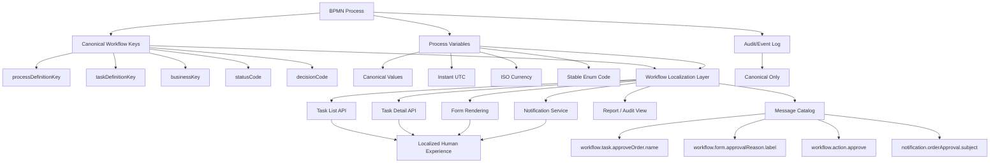

---

## 4. Practical Decomposition Map

| No | Area | Skill Praktis | Implementasi | Failure Mode |
|---:|---|---|---|---|
| 1 | **BPMN Key Governance** | Bedakan `id`, `name`, label, dan business status | `userTask id="approve_order"`; label dari catalog | Task routing bergantung pada nama localized |
| 2 | **Task Definition Localization** | Map `taskDefinitionKey` ke localized task name | `workflow.task.approveOrder.name` | Rename label merusak query/report |
| 3 | **Process Variable Policy** | Simpan canonical value di variable | `decisionCode=APPROVE`, bukan `Disetujui` | Gateway condition rusak saat bahasa berubah |
| 4 | **Form Localization** | Localize label/help/error, bukan variable name | `approvalReason` canonical; label localized | Form submit gagal karena variable name translated |
| 5 | **Action Localization** | Action code stabil, label localized | `APPROVE → Setujui` | Client mengirim label sebagai decision |
| 6 | **Notification Template** | Subject/body per locale | `notification.task.assigned.subject` | Email bahasa salah atau placeholder hilang |
| 7 | **SLA / Due Date** | Due date canonical, display localized | `dueAt=Instant`, `zoneId=Asia/Jakarta` | Task dianggap overdue salah timezone |
| 8 | **Assignment Text** | Candidate group/assignee canonical | `group=case_approver_l2`; label dari IAM/catalog | Permission label dipakai untuk ACL |
| 9 | **Audit Defensibility** | Audit workflow event canonical | `TASK_COMPLETED`, `decisionCode=REJECT` | Audit berubah saat translation berubah |
| 10 | **Task List API** | Return canonical + localized fields | `taskDefinitionKey + taskLabel` | UI parse task name |
| 11 | **Template Versioning** | Version email/SMS/PDF template | `templateCode + templateVersion + locale` | Tidak bisa rekonstruksi notifikasi historis |
| 12 | **Testing** | Test code stable across locale | id-ID/en-US same codes, different labels | Localization regressions masuk production |

---

## 5. BPMN Naming: `id` vs `name`

Contoh BPMN:

```xml id="e3fo0l"
<bpmn:userTask id="approve_order" name="Approve order">
  ...
</bpmn:userTask>
```

Rekomendasi:

| BPMN Attribute | Isi | Localized? |
|---|---|---:|
| `id` | Stable technical key | Tidak |
| `name` | Human-readable default label | Bisa English/default, tapi jangan jadi contract |
| `camunda:assignee` / assignment expression | User/group expression | Tidak sebagai localized label |
| Form reference/key | Stable form identifier | Tidak |
| Process variables | Canonical business data | Tidak |
| UI task label | Dari message catalog | Ya |

Camunda 8 Forms dapat dihubungkan ke user task atau start event; setelah diagram dengan linked form dideploy, Tasklist mengimpor form schema dan merender form pada task terkait. ([docs.camunda.io](https://docs.camunda.io/docs/components/modeler/forms/utilizing-forms/)) Untuk Tasklist localization di Camunda 8, dokumentasi menyatakan interface Tasklist dapat dilokalkan, dan form user task perlu didesain dalam bahasa lokal yang sesuai; Tasklist mendukung English, French, German, dan Spanish secara default. ([docs.camunda.io](https://docs.camunda.io/docs/components/tasklist/userguide/tasklist-localization/))

---

## 6. Workflow Message Catalog

Struktur resource:

```text id="sz117g"
src/main/resources/i18n/
  workflow.properties
  workflow_en_US.properties
  workflow_id_ID.properties

  notification.properties
  notification_en_US.properties
  notification_id_ID.properties

  forms.properties
  forms_en_US.properties
  forms_id_ID.properties
```

English:

```properties id="q6afm7"
# workflow_en_US.properties
workflow.process.orderFulfillment.name=Order fulfillment
workflow.task.approveOrder.name=Approve order
workflow.task.approveOrder.description=Review order details and choose whether to approve or reject.
workflow.task.reviewPayment.name=Review payment
workflow.task.resolveException.name=Resolve exception

workflow.action.approve=Approve
workflow.action.reject=Reject
workflow.action.returnForRevision=Return for revision
workflow.action.escalate=Escalate
```

Indonesian:

```properties id="fh74ys"
# workflow_id_ID.properties
workflow.process.orderFulfillment.name=Pemenuhan pesanan
workflow.task.approveOrder.name=Setujui pesanan
workflow.task.approveOrder.description=Tinjau detail pesanan dan pilih apakah akan menyetujui atau menolak.
workflow.task.reviewPayment.name=Tinjau pembayaran
workflow.task.resolveException.name=Selesaikan pengecualian

workflow.action.approve=Setujui
workflow.action.reject=Tolak
workflow.action.returnForRevision=Kembalikan untuk revisi
workflow.action.escalate=Eskalasi
```

---

## 7. Task Definition Key Mapper

```java id="gfjyfb"
public final class WorkflowMessageKeys {

    private WorkflowMessageKeys() {}

    public static String taskNameKey(String taskDefinitionKey) {
        return switch (taskDefinitionKey) {
            case "approve_order" -> "workflow.task.approveOrder.name";
            case "review_payment" -> "workflow.task.reviewPayment.name";
            case "resolve_exception" -> "workflow.task.resolveException.name";
            default -> "workflow.task.unknown.name";
        };
    }

    public static String taskDescriptionKey(String taskDefinitionKey) {
        return switch (taskDefinitionKey) {
            case "approve_order" -> "workflow.task.approveOrder.description";
            case "review_payment" -> "workflow.task.reviewPayment.description";
            case "resolve_exception" -> "workflow.task.resolveException.description";
            default -> "workflow.task.unknown.description";
        };
    }

    public static String actionLabelKey(String actionCode) {
        return switch (actionCode) {
            case "APPROVE" -> "workflow.action.approve";
            case "REJECT" -> "workflow.action.reject";
            case "RETURN_FOR_REVISION" -> "workflow.action.returnForRevision";
            case "ESCALATE" -> "workflow.action.escalate";
            default -> "workflow.action.unknown";
        };
    }
}
```

Kenapa explicit mapper lebih baik daripada dynamic key?

```java id="lfi4pc"
"workflow.task." + taskDefinitionKey + ".name"
```

Karena explicit mapper:

```text id="lyd5al"
lebih mudah dites
lebih aman saat rename key
bisa handle legacy task key
bisa detect unknown task
bisa menjaga domain vocabulary
```

---

## 8. Localized Task DTO

```java id="jwsj4q"
import java.time.Instant;
import java.util.List;

public record WorkflowTaskResponse(
    String taskId,
    String processInstanceId,
    String processDefinitionKey,
    String businessKey,
    String taskDefinitionKey,
    String taskLabel,
    String taskDescription,
    String assignee,
    List<String> candidateGroups,
    String createdAt,
    DueDateResponse dueAt,
    List<WorkflowActionResponse> availableActions
) {}

public record WorkflowActionResponse(
    String code,
    String label
) {}

public record DueDateResponse(
    String instant,
    String timezone,
    String formatted
) {}
```

Response `id-ID`:

```json id="b7p4gk"
{
  "taskId": "TASK-789",
  "processInstanceId": "PROC-456",
  "processDefinitionKey": "order_fulfillment",
  "businessKey": "ORD-123",
  "taskDefinitionKey": "approve_order",
  "taskLabel": "Setujui pesanan",
  "taskDescription": "Tinjau detail pesanan dan pilih apakah akan menyetujui atau menolak.",
  "assignee": "budi",
  "candidateGroups": ["order_approver_l2"],
  "createdAt": "2026-07-13T03:15:30Z",
  "dueAt": {
    "instant": "2026-07-14T10:00:00Z",
    "timezone": "Asia/Jakarta",
    "formatted": "14 Jul 2026, 17.00"
  },
  "availableActions": [
    {
      "code": "APPROVE",
      "label": "Setujui"
    },
    {
      "code": "REJECT",
      "label": "Tolak"
    }
  ]
}
```

---

## 9. Task Response Mapper

```java id="wtkxkb"
import java.time.ZoneId;
import java.util.List;
import java.util.Locale;

public class WorkflowTaskResponseMapper {

    private final MessageService workflowMessages;
    private final LocalizedDateTimeFormatter dateTimeFormatter;
    private final WorkflowActionPolicy actionPolicy;

    public WorkflowTaskResponseMapper(
        MessageService workflowMessages,
        LocalizedDateTimeFormatter dateTimeFormatter,
        WorkflowActionPolicy actionPolicy
    ) {
        this.workflowMessages = workflowMessages;
        this.dateTimeFormatter = dateTimeFormatter;
        this.actionPolicy = actionPolicy;
    }

    public WorkflowTaskResponse toResponse(
        WorkflowTask task,
        Locale locale,
        ZoneId zoneId
    ) {
        String taskNameKey = WorkflowMessageKeys.taskNameKey(task.taskDefinitionKey());
        String taskDescriptionKey = WorkflowMessageKeys.taskDescriptionKey(task.taskDefinitionKey());

        List<WorkflowActionResponse> actions = actionPolicy
            .availableActions(task)
            .stream()
            .map(actionCode -> new WorkflowActionResponse(
                actionCode,
                workflowMessages.message(
                    WorkflowMessageKeys.actionLabelKey(actionCode),
                    locale
                )
            ))
            .toList();

        return new WorkflowTaskResponse(
            task.taskId(),
            task.processInstanceId(),
            task.processDefinitionKey(),
            task.businessKey(),
            task.taskDefinitionKey(),
            workflowMessages.message(taskNameKey, locale),
            workflowMessages.message(taskDescriptionKey, locale),
            task.assignee(),
            task.candidateGroups(),
            task.createdAt().toString(),
            task.dueAt() == null
                ? null
                : new DueDateResponse(
                    task.dueAt().toString(),
                    zoneId.getId(),
                    dateTimeFormatter.formatMediumDateTime(
                        task.dueAt(),
                        zoneId,
                        locale
                    )
                ),
            actions
        );
    }
}
```

`WorkflowTask` sebaiknya canonical:

```java id="xbpn0c"
import java.time.Instant;
import java.util.List;

public record WorkflowTask(
    String taskId,
    String processInstanceId,
    String processDefinitionKey,
    String businessKey,
    String taskDefinitionKey,
    String assignee,
    List<String> candidateGroups,
    Instant createdAt,
    Instant dueAt,
    String businessStatusCode
) {}
```

---

## 10. Process Variables: Canonical Only

Camunda variables harus dipakai untuk process behavior. Jadi nilainya harus stabil.

Baik:

```json id="nwimw7"
{
  "orderId": "ORD-123",
  "orderStatusCode": "PENDING_APPROVAL",
  "amount": "1500000.00",
  "currencyCode": "IDR",
  "approvalDecisionCode": "APPROVE",
  "submittedAt": "2026-07-13T03:15:30Z"
}
```

Buruk:

```json id="clvveo"
{
  "orderStatus": "Menunggu persetujuan",
  "amount": "Rp1.500.000,00",
  "approvalDecision": "Setujui",
  "submittedAt": "13 Juli 2026 10.15"
}
```

Camunda 8 documentation menjelaskan process instance dapat dibuat dengan command yang menyebut BPMN process ID atau unique key dari process. Dalam model seperti ini, input variables yang diberikan saat start process sebaiknya tetap canonical agar gateway, worker, dan audit tidak bergantung bahasa. ([docs.camunda.io](https://docs.camunda.io/docs/components/concepts/process-instance-creation/))

---

## 11. Gateway Condition: Jangan Pakai Label

Buruk:

```xml id="twkxst"
<bpmn:conditionExpression>
  ${approvalDecision == 'Setujui'}
</bpmn:conditionExpression>
```

Baik:

```xml id="ovbpnq"
<bpmn:conditionExpression>
  ${approvalDecisionCode == 'APPROVE'}
</bpmn:conditionExpression>
```

Untuk rejection:

```xml id="n6c1k9"
<bpmn:conditionExpression>
  ${approvalDecisionCode == 'REJECT'}
</bpmn:conditionExpression>
```

Rule:

```text id="qdj3no"
Gateway expression harus membaca code.
UI boleh menampilkan label.
```

---

## 12. Form Variable Naming

Form field harus map ke variable canonical.

Form conceptual schema:

```json id="x2b9au"
{
  "components": [
    {
      "key": "approvalDecisionCode",
      "type": "select",
      "labelKey": "form.approval.decision.label",
      "options": [
        {
          "value": "APPROVE",
          "labelKey": "workflow.action.approve"
        },
        {
          "value": "REJECT",
          "labelKey": "workflow.action.reject"
        }
      ]
    },
    {
      "key": "approvalReason",
      "type": "textarea",
      "labelKey": "form.approval.reason.label"
    }
  ]
}
```

Localized rendering `id-ID`:

```json id="nqh7ru"
{
  "fields": [
    {
      "key": "approvalDecisionCode",
      "label": "Keputusan",
      "options": [
        {
          "value": "APPROVE",
          "label": "Setujui"
        },
        {
          "value": "REJECT",
          "label": "Tolak"
        }
      ]
    },
    {
      "key": "approvalReason",
      "label": "Alasan persetujuan"
    }
  ]
}
```

Submit payload:

```json id="fzljhe"
{
  "approvalDecisionCode": "APPROVE",
  "approvalReason": "Dokumen lengkap."
}
```

Jangan submit:

```json id="iuf6zv"
{
  "Keputusan": "Setujui"
}
```

---

## 13. Form Localization Catalog

```properties id="x2gstd"
# forms_en_US.properties
form.approval.decision.label=Decision
form.approval.reason.label=Approval reason
form.approval.reason.placeholder=Enter the reason for your decision.
form.approval.attachment.label=Supporting document
```

```properties id="tquqwu"
# forms_id_ID.properties
form.approval.decision.label=Keputusan
form.approval.reason.label=Alasan persetujuan
form.approval.reason.placeholder=Masukkan alasan untuk keputusan Anda.
form.approval.attachment.label=Dokumen pendukung
```

Validation message:

```properties id="e21vcz"
# validation_id_ID.properties
validation.approval.decision.required=Keputusan wajib dipilih.
validation.approval.reason.requiredWhenRejected=Alasan wajib diisi jika keputusan ditolak.
```

---

## 14. Form Schema Localization Service

```java id="la68g8"
import java.util.List;
import java.util.Locale;

public class WorkflowFormLocalizationService {

    private final MessageService formMessages;
    private final MessageService workflowMessages;

    public WorkflowFormLocalizationService(
        MessageService formMessages,
        MessageService workflowMessages
    ) {
        this.formMessages = formMessages;
        this.workflowMessages = workflowMessages;
    }

    public LocalizedFormSchema localize(
        FormSchema schema,
        Locale locale
    ) {
        List<LocalizedFormField> fields = schema.fields()
            .stream()
            .map(field -> localizeField(field, locale))
            .toList();

        return new LocalizedFormSchema(
            schema.formKey(),
            schema.version(),
            locale.toLanguageTag(),
            fields
        );
    }

    private LocalizedFormField localizeField(FormField field, Locale locale) {
        List<LocalizedFormOption> options = field.options()
            .stream()
            .map(option -> new LocalizedFormOption(
                option.value(),
                workflowMessages.message(option.labelKey(), locale)
            ))
            .toList();

        return new LocalizedFormField(
            field.key(),
            field.type(),
            formMessages.message(field.labelKey(), locale),
            field.placeholderKey() == null
                ? null
                : formMessages.message(field.placeholderKey(), locale),
            options
        );
    }
}
```

Records:

```java id="uyzr63"
public record FormSchema(
    String formKey,
    String version,
    List<FormField> fields
) {}

public record FormField(
    String key,
    String type,
    String labelKey,
    String placeholderKey,
    List<FormOption> options
) {}

public record FormOption(
    String value,
    String labelKey
) {}

public record LocalizedFormSchema(
    String formKey,
    String version,
    String locale,
    List<LocalizedFormField> fields
) {}

public record LocalizedFormField(
    String key,
    String type,
    String label,
    String placeholder,
    List<LocalizedFormOption> options
) {}

public record LocalizedFormOption(
    String value,
    String label
) {}
```

---

## 15. Camunda Tasklist vs Custom Task UI

Ada dua kemungkinan arsitektur.

| Mode | Karakteristik | Localization Strategy |
|---|---|---|
| Camunda Tasklist | Menggunakan Tasklist bawaan | Ikuti kemampuan localization/form di Tasklist; form bisa dibuat per bahasa |
| Custom Task UI | Backend expose task/form API sendiri | Backend/localization service render label dari catalog |
| Hybrid | Camunda untuk ops/internal, custom UI untuk user/business | Pastikan variable/action code sama |

Camunda 8 Tasklist localization documentation menyebut pendekatan localization dengan mendesain user task forms dalam bahasa lokal dan mengatur interface Tasklist agar memakai bahasa yang sama. Ini berarti jika butuh banyak bahasa dinamis per user di custom enterprise UI, sering lebih fleksibel membuat task/form API sendiri yang melokalisasi label berdasarkan `LocaleContext`. ([docs.camunda.io](https://docs.camunda.io/docs/components/tasklist/userguide/tasklist-localization/))

---

## 16. Notification Localization

Workflow biasanya memicu notification:

```text id="t5i7lg"
task assigned
task overdue
case escalated
approval completed
document rejected
payment due
SLA breach
```

Notification harus punya:

```text id="voegak"
templateCode
templateVersion
locale
channel
subject/body
canonical event data
delivery metadata
```

Canonical event:

```java id="i9z5xm"
import java.time.Instant;
import java.util.Map;

public record WorkflowNotificationEvent(
    String eventCode,
    String processDefinitionKey,
    String processInstanceId,
    String businessKey,
    String taskDefinitionKey,
    String recipientUserId,
    String recipientLocale,
    String recipientZoneId,
    Instant occurredAt,
    Map<String, Object> variables
) {}
```

Contoh:

```json id="kox2se"
{
  "eventCode": "TASK_ASSIGNED",
  "processDefinitionKey": "order_fulfillment",
  "businessKey": "ORD-123",
  "taskDefinitionKey": "approve_order",
  "recipientUserId": "usr-123",
  "recipientLocale": "id-ID",
  "recipientZoneId": "Asia/Jakarta",
  "occurredAt": "2026-07-13T03:15:30Z",
  "variables": {
    "orderId": "ORD-123",
    "amount": "1500000.00",
    "currencyCode": "IDR",
    "dueAt": "2026-07-14T10:00:00Z"
  }
}
```

---

## 17. Notification Template Catalog

```properties id="cj11ye"
# notification_en_US.properties
notification.taskAssigned.subject=New task assigned: {0}
notification.taskAssigned.body=You have a new task for order {0}. Please complete it by {1}.

notification.taskOverdue.subject=Task overdue: {0}
notification.taskOverdue.body=Task {0} for order {1} is overdue.
```

```properties id="vz01fv"
# notification_id_ID.properties
notification.taskAssigned.subject=Tugas baru diberikan: {0}
notification.taskAssigned.body=Anda memiliki tugas baru untuk pesanan {0}. Harap selesaikan sebelum {1}.

notification.taskOverdue.subject=Tugas melewati tenggat: {0}
notification.taskOverdue.body=Tugas {0} untuk pesanan {1} telah melewati tenggat.
```

Untuk email HTML panjang, gunakan template file:

```text id="sc3lna"
templates/email/task-assigned/en-US.html
templates/email/task-assigned/id-ID.html
templates/email/task-overdue/en-US.html
templates/email/task-overdue/id-ID.html
```

---

## 18. Notification Rendering Service

```java id="muzbv5"
import java.math.BigDecimal;
import java.time.Instant;
import java.time.ZoneId;
import java.util.Locale;
import java.util.Map;

public class WorkflowNotificationRenderer {

    private final MessageService notificationMessages;
    private final MessageService workflowMessages;
    private final LocalizedDateTimeFormatter dateTimeFormatter;
    private final LocalizedMoneyFormatter moneyFormatter;

    public WorkflowNotificationRenderer(
        MessageService notificationMessages,
        MessageService workflowMessages,
        LocalizedDateTimeFormatter dateTimeFormatter,
        LocalizedMoneyFormatter moneyFormatter
    ) {
        this.notificationMessages = notificationMessages;
        this.workflowMessages = workflowMessages;
        this.dateTimeFormatter = dateTimeFormatter;
        this.moneyFormatter = moneyFormatter;
    }

    public RenderedNotification renderTaskAssigned(
        WorkflowNotificationEvent event
    ) {
        Locale locale = Locale.forLanguageTag(event.recipientLocale());
        ZoneId zoneId = ZoneId.of(event.recipientZoneId());

        String taskLabel = workflowMessages.message(
            WorkflowMessageKeys.taskNameKey(event.taskDefinitionKey()),
            locale
        );

        String orderId = String.valueOf(event.variables().get("orderId"));

        Instant dueAt = Instant.parse(String.valueOf(event.variables().get("dueAt")));
        String dueAtText = dateTimeFormatter.formatMediumDateTime(
            dueAt,
            zoneId,
            locale
        );

        String subject = notificationMessages.message(
            "notification.taskAssigned.subject",
            locale,
            taskLabel
        );

        String body = notificationMessages.message(
            "notification.taskAssigned.body",
            locale,
            orderId,
            dueAtText
        );

        return new RenderedNotification(
            "TASK_ASSIGNED",
            "email.task-assigned",
            "1.0",
            locale.toLanguageTag(),
            subject,
            body
        );
    }
}
```

```java id="hpy2he"
public record RenderedNotification(
    String eventCode,
    String templateCode,
    String templateVersion,
    String locale,
    String subject,
    String body
) {}
```

---

## 19. Jakarta Mail UTF-8 Email

Untuk email, pastikan subject/body charset benar. Jakarta Mail `MimeMessage` merepresentasikan MIME-style email message. ([jakarta.ee](https://jakarta.ee/specifications/mail/2.1/apidocs/jakarta.mail/jakarta/mail/internet/mimemessage))

Contoh:

```java id="x6t6ra"
import jakarta.mail.Message;
import jakarta.mail.Session;
import jakarta.mail.internet.InternetAddress;
import jakarta.mail.internet.MimeMessage;

import java.nio.charset.StandardCharsets;

public class EmailSender {

    private final Session session;

    public EmailSender(Session session) {
        this.session = session;
    }

    public void sendEmail(
        String to,
        RenderedNotification notification
    ) throws Exception {
        MimeMessage message = new MimeMessage(session);

        message.setRecipient(Message.RecipientType.TO, new InternetAddress(to));
        message.setSubject(notification.subject(), StandardCharsets.UTF_8.name());
        message.setText(notification.body(), StandardCharsets.UTF_8.name(), "html");

        // transport.send(message) depending on infrastructure
    }
}
```

Jika body plain text:

```java id="xzf9kh"
message.setText(notification.body(), StandardCharsets.UTF_8.name());
```

Jika HTML, sanitize/escape variable yang masuk ke template.

---

## 20. Template Variable Safety

Jangan inject variable mentah ke HTML.

Buruk:

```html id="q18sb2"
<p>Hello ${customerName}</p>
```

Jika `customerName` berisi HTML/script, bisa terjadi injection pada email/client tertentu.

Gunakan escaping:

```java id="h8rvel"
public final class HtmlEscaper {

    private HtmlEscaper() {}

    public static String escape(String value) {
        if (value == null) {
            return "";
        }

        return value
            .replace("&", "&amp;")
            .replace("<", "&lt;")
            .replace(">", "&gt;")
            .replace("\"", "&quot;")
            .replace("'", "&#x27;");
    }
}
```

Rule:

```text id="zm34px"
Message/template rendering bukan sanitization.
Escape sesuai channel: HTML, SMS, JSON, PDF, CSV.
```

---

## 21. Template Versioning

Notification history harus bisa dijelaskan.

Table:

```sql id="u9z3x0"
CREATE TABLE notification_outbox (
    notification_id text PRIMARY KEY,
    event_code text NOT NULL,
    template_code text NOT NULL,
    template_version text NOT NULL,
    locale text NOT NULL,
    recipient_user_id text NOT NULL,
    channel text NOT NULL,
    subject text,
    body text,
    status_code text NOT NULL,
    created_at timestamptz NOT NULL,
    sent_at timestamptz
);
```

Simpan:

```text id="x5ue9o"
eventCode
templateCode
templateVersion
locale
canonical variables snapshot atau hash
rendered subject/body sesuai retention policy
delivery status
```

Untuk legal/compliance notification, simpan rendered content atau immutable template reference + variables snapshot agar bisa direkonstruksi.

---

## 22. Outbox Pattern untuk Notification

Workflow completion jangan langsung bergantung pada email provider.

Pola:

```text id="ty0gt7"
Camunda worker/service task
  ↓
write notification_outbox in transaction
  ↓
outbox publisher
  ↓
email/SMS/push provider
  ↓
delivery status update
```

Outbox event canonical:

```json id="vif5uy"
{
  "eventCode": "TASK_ASSIGNED",
  "templateCode": "email.task-assigned",
  "locale": "id-ID",
  "recipientUserId": "usr-123",
  "variables": {
    "taskDefinitionKey": "approve_order",
    "businessKey": "ORD-123",
    "dueAt": "2026-07-14T10:00:00Z"
  }
}
```

Manfaat:

```text id="od9p0m"
workflow tidak gagal hanya karena email provider down
retry lebih mudah
audit delivery jelas
template rendering bisa diobservasi
```

---

## 23. SLA, Due Date, dan Escalation Localization

SLA calculation harus canonical.

```json id="fp6z5z"
{
  "taskDefinitionKey": "approve_order",
  "dueAt": "2026-07-14T10:00:00Z",
  "businessCalendarCode": "ID_BUSINESS_DAY",
  "slaPolicyCode": "APPROVAL_1_BUSINESS_DAY"
}
```

Display localized:

```json id="hspky5"
{
  "dueAt": {
    "instant": "2026-07-14T10:00:00Z",
    "timezone": "Asia/Jakarta",
    "formatted": "14 Jul 2026, 17.00"
  },
  "slaLabel": "1 hari kerja"
}
```

Escalation event:

```json id="l96c6z"
{
  "eventCode": "TASK_ESCALATED",
  "taskDefinitionKey": "approve_order",
  "fromGroup": "order_approver_l1",
  "toGroup": "order_approver_l2",
  "reasonCode": "SLA_BREACH",
  "occurredAt": "2026-07-14T10:00:01Z"
}
```

Human label:

```text id="mz9mr9"
Tugas Setujui pesanan dieskalasi ke Approver Level 2 karena melewati SLA.
```

Audit tetap canonical.

---

## 24. Assignment and Candidate Group Localization

Candidate group:

```text id="m8hbu2"
order_approver_l1
order_approver_l2
case_reviewer
compliance_officer
```

Group label:

```properties id="ex4v0s"
# workflow_id_ID.properties
workflow.group.orderApproverL1=Approver Pesanan Level 1
workflow.group.orderApproverL2=Approver Pesanan Level 2
workflow.group.caseReviewer=Peninjau Kasus
workflow.group.complianceOfficer=Petugas Kepatuhan
```

Response:

```json id="nwqluw"
{
  "candidateGroups": [
    {
      "code": "order_approver_l2",
      "label": "Approver Pesanan Level 2"
    }
  ]
}
```

Jangan menyimpan label group sebagai ACL/permission key.

---

## 25. Business Status vs Workflow Task

Jangan samakan:

```text id="t7182a"
business status
workflow task
UI action
Camunda activity id
```

Contoh:

| Concept | Value |
|---|---|
| Business status | `PENDING_APPROVAL` |
| Task definition key | `approve_order` |
| Action code | `APPROVE` |
| Process definition key | `order_fulfillment` |
| UI label | `Setujui pesanan` |

Kenapa penting?

```text id="gaehfm"
Satu business status bisa punya beberapa task.
Satu task bisa menghasilkan beberapa action.
Satu action bisa mengubah status berbeda tergantung context.
Label bisa berubah tanpa mengubah lifecycle.
```

---

## 26. Event Log / Audit Pattern

Audit event:

```sql id="on1lhi"
CREATE TABLE workflow_audit_events (
    event_id text PRIMARY KEY,
    process_instance_id text NOT NULL,
    process_definition_key text NOT NULL,
    business_key text NOT NULL,
    task_definition_key text,
    event_code text NOT NULL,
    actor_id text,
    decision_code text,
    reason_code text,
    occurred_at timestamptz NOT NULL,
    payload jsonb NOT NULL
);
```

Example payload:

```json id="au3tl1"
{
  "fromStatusCode": "PENDING_APPROVAL",
  "toStatusCode": "APPROVED",
  "approvalDecisionCode": "APPROVE",
  "commentPresent": true
}
```

Localized audit view:

```json id="t84f3u"
{
  "eventCode": "TASK_COMPLETED",
  "eventLabel": "Tugas diselesaikan",
  "taskDefinitionKey": "approve_order",
  "taskLabel": "Setujui pesanan",
  "decisionCode": "APPROVE",
  "decisionLabel": "Setujui",
  "occurredAt": {
    "instant": "2026-07-13T03:15:30Z",
    "formatted": "13 Jul 2026, 10.15"
  }
}
```

---

## 27. API Design: Task Complete

Request harus canonical.

```http id="d9eh6v"
POST /workflow/tasks/TASK-789/complete
Accept-Language: id-ID
Content-Type: application/json
```

Body:

```json id="rxj2gw"
{
  "actionCode": "APPROVE",
  "variables": {
    "approvalReason": "Dokumen lengkap."
  }
}
```

Response localized:

```json id="yx467i"
{
  "code": "TASK_COMPLETED",
  "message": "Tugas Setujui pesanan berhasil diselesaikan.",
  "taskDefinitionKey": "approve_order",
  "actionCode": "APPROVE"
}
```

Do not accept:

```json id="rgjx4v"
{
  "action": "Setujui"
}
```

unless you are building a natural language interface with explicit mapping and validation.

---

## 28. Task Complete Service

```java id="aeet77"
public class WorkflowTaskCompletionService {

    private final WorkflowEngineClient workflowEngineClient;
    private final WorkflowActionPolicy actionPolicy;
    private final WorkflowAuditService auditService;

    public TaskCompletionResult completeTask(
        String taskId,
        CompleteTaskCommand command,
        Actor actor
    ) {
        WorkflowTask task = workflowEngineClient.getTask(taskId);

        if (!actionPolicy.isAllowed(task, command.actionCode(), actor)) {
            throw new BusinessException(
                ErrorCode.WORKFLOW_ACTION_NOT_ALLOWED,
                Map.of(
                    "taskDefinitionKey", task.taskDefinitionKey(),
                    "actionCode", command.actionCode()
                )
            );
        }

        Map<String, Object> variables = new HashMap<>(command.variables());
        variables.put("lastActionCode", command.actionCode());
        variables.put("lastActorId", actor.actorId());
        variables.put("lastActionAt", Instant.now().toString());

        workflowEngineClient.completeTask(taskId, variables);

        auditService.recordTaskCompleted(task, command.actionCode(), actor);

        return new TaskCompletionResult(
            task.taskDefinitionKey(),
            command.actionCode()
        );
    }
}
```

Command:

```java id="jl5k5e"
import java.util.Map;

public record CompleteTaskCommand(
    String actionCode,
    Map<String, Object> variables
) {}
```

---

## 29. Error Localization for Workflow

Error code:

```java id="cwb8et"
public enum WorkflowErrorCode {
    TASK_NOT_FOUND,
    TASK_ALREADY_COMPLETED,
    WORKFLOW_ACTION_NOT_ALLOWED,
    TASK_CLAIM_REQUIRED,
    TASK_ASSIGNEE_MISMATCH,
    PROCESS_INSTANCE_NOT_FOUND,
    INVALID_TASK_VARIABLES
}
```

Properties:

```properties id="sg4f03"
# errors_id_ID.properties
error.workflow.taskNotFound.title=Tugas tidak ditemukan
error.workflow.taskNotFound.detail=Tugas yang diminta tidak ditemukan.
error.workflow.actionNotAllowed.title=Aksi tidak diizinkan
error.workflow.actionNotAllowed.detail=Aksi {0} tidak dapat dilakukan untuk tugas {1}.
error.workflow.taskAlreadyCompleted.title=Tugas sudah selesai
error.workflow.taskAlreadyCompleted.detail=Tugas ini sudah diselesaikan sebelumnya.
```

Exception response:

```json id="ipe591"
{
  "type": "https://api.company.com/problems/workflow-action-not-allowed",
  "title": "Aksi tidak diizinkan",
  "status": 409,
  "detail": "Aksi Setujui tidak dapat dilakukan untuk tugas Setujui pesanan.",
  "code": "WORKFLOW_ACTION_NOT_ALLOWED",
  "metadata": {
    "taskDefinitionKey": "approve_order",
    "actionCode": "APPROVE"
  },
  "traceId": "01J..."
}
```

Notice:

```text id="fovvly"
detail localized
metadata canonical
```

---

## 30. Camunda 7 vs Camunda 8 Considerations

| Area | Camunda 7 | Camunda 8 |
|---|---|---|
| Engine model | Process engine | Zeebe-based orchestration |
| Task identity | `taskDefinitionKey` maps to BPMN userTask id | User task instance tied to BPMN user task |
| Forms | Embedded/generated/Camunda Forms depending version | Camunda Forms linked/imported into Tasklist |
| Tasklist localization | Tasklist customization possible | Tasklist supports limited default UI languages; forms should be designed in local language |
| Variables | Engine variables, Java serialization concerns | Zeebe variables, JSON-like payload orientation |
| Custom UI | Common in enterprise | Common if localization/worklist needs exceed Tasklist |

Camunda 8 variables documentation explains variables as data in process instances, with mappings used to customize how variables are merged into process instances. This supports the same principle: variables should carry canonical data, and presentation/localization should happen outside the process decision layer. ([docs.camunda.io](https://docs.camunda.io/docs/components/concepts/variables/))

---

## 31. Testing Strategy

### Test task key stable across locale

```java id="x6a9hd"
@Test
void taskDefinitionKeyShouldRemainStableAcrossLocales() {
    WorkflowTask task = sampleApproveOrderTask();

    WorkflowTaskResponse id = mapper.toResponse(
        task,
        Locale.forLanguageTag("id-ID"),
        ZoneId.of("Asia/Jakarta")
    );

    WorkflowTaskResponse en = mapper.toResponse(
        task,
        Locale.forLanguageTag("en-US"),
        ZoneId.of("Asia/Jakarta")
    );

    assertEquals(id.taskDefinitionKey(), en.taskDefinitionKey());
    assertNotEquals(id.taskLabel(), en.taskLabel());
}
```

### Test action code stable

```java id="tfkcqq"
@Test
void actionCodeShouldRemainStableAcrossLocales() {
    WorkflowTaskResponse id = responseFor("id-ID");
    WorkflowTaskResponse en = responseFor("en-US");

    assertEquals(
        id.availableActions().get(0).code(),
        en.availableActions().get(0).code()
    );

    assertNotEquals(
        id.availableActions().get(0).label(),
        en.availableActions().get(0).label()
    );
}
```

### Test process variables canonical

```java id="zy21k4"
@Test
void completingTaskShouldSubmitCanonicalDecisionCode() {
    CompleteTaskCommand command = new CompleteTaskCommand(
        "APPROVE",
        Map.of("approvalReason", "OK")
    );

    service.completeTask("TASK-123", command, actor);

    verify(workflowEngineClient).completeTask(
        eq("TASK-123"),
        argThat(vars -> "APPROVE".equals(vars.get("lastActionCode")))
    );
}
```

### Test notification localization

```java id="zednbq"
@Test
void taskAssignedNotificationShouldRenderInIndonesian() {
    WorkflowNotificationEvent event = taskAssignedEvent("id-ID", "Asia/Jakarta");

    RenderedNotification notification = renderer.renderTaskAssigned(event);

    assertEquals("id-ID", notification.locale());
    assertTrue(notification.subject().contains("Tugas"));
}
```

---

## 32. CI Quality Gates

```text id="peezno"
[ ] BPMN userTask id tidak mengandung localized label
[ ] Gateway expression tidak membandingkan localized text
[ ] Process variable enum/status/action memakai canonical code
[ ] Task response selalu mengirim taskDefinitionKey + taskLabel
[ ] Action response selalu mengirim code + label
[ ] Form field key tidak localized
[ ] Form label/help/placeholder localized dari catalog
[ ] Notification template punya locale dan version
[ ] Email subject/body UTF-8
[ ] Template placeholder konsisten antar locale
[ ] Workflow audit event canonical
[ ] Due date memakai Instant + display timezone
[ ] Tests membandingkan id-ID vs en-US untuk stability
```

---

## 33. Observability

Metric:

```text id="dh6e72"
workflow.task.localized.count{locale,taskDefinitionKey}
workflow.task.unknown_key.count{taskDefinitionKey}
workflow.action.localized.count{locale,actionCode}
workflow.notification.rendered.count{locale,templateCode}
workflow.notification.failed.count{locale,templateCode,reason}
workflow.form.localized.count{locale,formKey}
workflow.i18n.fallback_used.count{locale,key}
workflow.audit.event.count{eventCode,taskDefinitionKey}
```

Structured log:

```json id="bqeuzn"
{
  "event": "workflow.task.localized",
  "processDefinitionKey": "order_fulfillment",
  "taskDefinitionKey": "approve_order",
  "locale": "id-ID",
  "fallbackUsed": false,
  "businessKey": "ORD-123",
  "traceId": "01J..."
}
```

Notification log:

```json id="ay91f8"
{
  "event": "notification.rendered",
  "eventCode": "TASK_ASSIGNED",
  "templateCode": "email.task-assigned",
  "templateVersion": "1.0",
  "locale": "id-ID",
  "recipientUserId": "usr-123",
  "traceId": "01J..."
}
```

---

## 34. Anti-Pattern

| Anti-Pattern | Kenapa Buruk | Alternatif |
|---|---|---|
| BPMN `userTask id="Setujui Pesanan"` | Key tidak stabil dan localized | `id="approve_order"` |
| Gateway compare `"Setujui"` | Bahasa mengubah process behavior | Compare `APPROVE` |
| Process variable berisi formatted date | Timezone ambiguity | `Instant` ISO |
| Form variable name localized | Submit contract rapuh | Canonical field key |
| Client submit action label | Label bisa berubah | Submit action code |
| Notification template tanpa version | Tidak bisa audit historis | `templateCode + version` |
| Audit menyimpan localized sentence | Tidak defensible | Canonical event + localized view |
| Candidate group label jadi ACL key | Permission rusak | Group code + localized label |
| Due date display string saja | SLA salah | `Instant + ZoneId` |
| Email HTML variable tidak di-escape | Injection risk | Escape per channel |

---

## 35. Practical Review Checklist

```text id="ao86gv"
[ ] Apakah semua BPMN process/user task id canonical?
[ ] Apakah task `name` tidak dipakai sebagai contract?
[ ] Apakah taskDefinitionKey dipetakan ke message key?
[ ] Apakah form field key canonical?
[ ] Apakah option value canonical dan label localized?
[ ] Apakah complete task API menerima actionCode?
[ ] Apakah gateway condition memakai code?
[ ] Apakah notification event menyimpan canonical variables?
[ ] Apakah template subject/body per locale dan versioned?
[ ] Apakah due date/SLA memakai Instant dan business calendar?
[ ] Apakah candidate group/role memakai code, bukan label?
[ ] Apakah audit event canonical?
[ ] Apakah localized audit hanya view/projection?
[ ] Apakah tests memastikan code sama lintas locale?
[ ] Apakah missing workflow translation terukur via metric?
```

---

# Seri 11 Selesai

Kita sudah membahas:

```text id="r7e70g"
Camunda process/task key governance
taskDefinitionKey vs task label
process variable canonical policy
localized task API
form field localization
action code vs action label
notification template localization
Jakarta Mail UTF-8
template versioning
outbox pattern
SLA/due date localization
assignment/group label
workflow audit defensibility
Camunda 7 vs Camunda 8 considerations
testing, CI, observability
```

Rekomendasi berikutnya: **Seri 12 - Testing, CI/CD Governance, Observability, Security, dan Production Checklist**.

## Response:
7/13/2026, 10:32:28 PM

# Seri 12 dari 12 - Testing, CI/CD Governance, Observability, Security, dan Production Checklist

## 1. Tujuan Seri Ini

Seri terakhir ini menyatukan semua materi sebelumnya menjadi **operational checklist** untuk memastikan i18n/l10n tidak hanya “jalan di local”, tetapi aman di production.

Fokusnya:

```text id="tqpt7a"
unit test
integration test
contract test
message catalog validation
placeholder validation
fallback test
locale/timezone/currency test
database collation test
file export/import test
workflow localization test
CI/CD quality gate
observability
security
production readiness
```

Jakarta EE mendefinisikan internationalization sebagai proses menyiapkan aplikasi agar mendukung lebih dari satu bahasa dan format data, sedangkan localization adalah adaptasi aplikasi untuk region/locale tertentu, termasuk message, label UI, character set, encoding, date, dan currency format. ([Jakarta EE](https://jakarta.ee/learn/docs/jakartaee-tutorial/current/web/webi18n/webi18n.html?utm_source=chatgpt.com)) Java `ResourceBundle` sendiri memang dirancang agar program dapat memuat resource locale-specific dan menjaga sebagian besar informasi locale-specific di resource bundle, sehingga code tidak hardcoded terhadap locale user. ([Oracle Docs](https://docs.oracle.com/en/java/javase/17/docs/api/java.base/java/util/ResourceBundle.html?utm_source=chatgpt.com))

---

## 2. Final Mental Model

```text id="z10b5j"
i18n/l10n production readiness =
  correctness
  consistency
  security
  observability
  governance
  performance
  audit defensibility
```

Core invariant dari seluruh seri:

```text id="2nuv64"
Internal system canonical.
Human-facing boundary localized.
API contract stable.
Audit/log/event machine-readable.
Fallback observable.
Translation governed.
```

---

## 3. Diagram

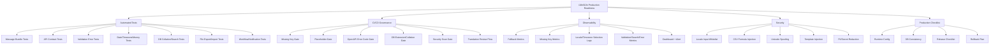

---

## 4. Test Pyramid untuk i18n/l10n

| Level | Tujuan | Contoh |
|---|---|---|
| Unit test | Logic kecil benar | Locale resolver, message resolver, formatter |
| Component test | Module boundary benar | ExceptionMapper, response mapper, form localizer |
| Integration test | Runtime dan DB benar | Jersey endpoint + PostgreSQL collation/search |
| Contract test | API stabil | `code` sama lintas locale, `message` boleh beda |
| Snapshot test | Output file/report stabil | CSV/Excel/PDF sample |
| Security test | Input/output aman | formula injection, unsupported locale |
| Performance test | Search/export tidak lambat | trigram query, large export streaming |
| Governance test | Catalog lengkap | missing key, placeholder mismatch |

JUnit parameterized tests berguna untuk menjalankan test method yang sama dengan argumen berbeda, misalnya locale `id-ID`, `en-US`, dan unsupported locale; dokumentasi JUnit menyebut parameterized tests memungkinkan satu test method dijalankan beberapa kali dengan argument berbeda. ([docs.junit.org](https://docs.junit.org/6.1.1/writing-tests/parameterized-classes-and-tests.html?utm_source=chatgpt.com))

---

## 5. Locale Matrix Test

Minimal supported matrix:

```text id="mh0bpj"
id-ID
en-US
unsupported: fr-FR
malformed: abc-INVALID
empty/no header
```

Contoh JUnit:

```java id="ox27y2"
@ParameterizedTest
@ValueSource(strings = {"id-ID", "en-US", "fr-FR"})
void orderStatusCodeShouldRemainStableAcrossLocales(String languageTag) {
    ApiResponse response = client.getOrder(
        "ORD-123",
        Map.of("Accept-Language", languageTag)
    );

    assertEquals("PENDING_APPROVAL", response.status().code());
    assertNotNull(response.status().label());
}
```

Test invariant:

```text id="fak3m7"
code sama
label boleh beda
Content-Language sesuai selected locale
fallback observable
```

---

## 6. Message Bundle Completeness Test

Tujuan:

```text id="twbnyj"
Semua supported locale punya key critical.
Base bundle lengkap.
Tidak ada key hilang untuk error/status/workflow/report.
```

Test sederhana:

```java id="c66afs"
import org.junit.jupiter.api.Test;

import java.util.Locale;
import java.util.ResourceBundle;
import java.util.Set;
import java.util.stream.Collectors;

import static org.junit.jupiter.api.Assertions.assertTrue;

class MessageBundleCompletenessTest {

    @Test
    void idIdShouldContainAllBaseMessageKeys() {
        assertLocaleComplete("i18n.messages", Locale.forLanguageTag("id-ID"));
    }

    @Test
    void idIdShouldContainAllErrorKeys() {
        assertLocaleComplete("i18n.errors", Locale.forLanguageTag("id-ID"));
    }

    @Test
    void idIdShouldContainAllWorkflowKeys() {
        assertLocaleComplete("i18n.workflow", Locale.forLanguageTag("id-ID"));
    }

    private void assertLocaleComplete(String bundleName, Locale locale) {
        ResourceBundle base = ResourceBundle.getBundle(bundleName, Locale.ROOT);
        ResourceBundle localized = ResourceBundle.getBundle(bundleName, locale);

        Set<String> missing = base.keySet()
            .stream()
            .filter(key -> !localized.containsKey(key))
            .collect(Collectors.toSet());

        assertTrue(
            missing.isEmpty(),
            "Missing keys in " + locale + " for " + bundleName + ": " + missing
        );
    }
}
```

Catatan: `ResourceBundle` bisa mengambil parent fallback. Untuk strict file-by-file check, parse `.properties` langsung agar tidak tertipu fallback.

---

## 7. Strict Properties File Check

```java id="u18ws2"
import java.io.InputStream;
import java.util.Properties;
import java.util.Set;
import java.util.stream.Collectors;

public class PropertiesFileLoader {

    public Properties load(String path) {
        try (InputStream input = getClass().getClassLoader().getResourceAsStream(path)) {
            if (input == null) {
                throw new IllegalArgumentException("Missing properties file: " + path);
            }

            Properties properties = new Properties();
            properties.load(input);
            return properties;
        } catch (Exception ex) {
            throw new IllegalStateException("Failed to load " + path, ex);
        }
    }

    public Set<String> keys(Properties properties) {
        return properties.keySet()
            .stream()
            .map(String::valueOf)
            .collect(Collectors.toSet());
    }
}
```

Test:

```java id="gzjbr8"
@Test
void idIdErrorsFileShouldContainSameKeysAsBaseFile() {
    PropertiesFileLoader loader = new PropertiesFileLoader();

    Set<String> baseKeys = loader.keys(loader.load("i18n/errors.properties"));
    Set<String> idKeys = loader.keys(loader.load("i18n/errors_id_ID.properties"));

    Set<String> missing = baseKeys.stream()
        .filter(key -> !idKeys.contains(key))
        .collect(Collectors.toSet());

    assertTrue(missing.isEmpty(), "Missing id-ID error keys: " + missing);
}
```

---

## 8. Placeholder Consistency Test

Tujuan:

```text id="8c3znw"
Translator tidak menghapus, menambah, atau salah menomori placeholder.
```

Regex Java `MessageFormat` sederhana:

```java id="m1n56g"
private static final Pattern PLACEHOLDER =
    Pattern.compile("\\{(\\d+)(?:,[^}]*)?}");
```

Test:

```java id="c33dqk"
@Test
void placeholdersShouldMatchAcrossLocales() {
    PropertiesFileLoader loader = new PropertiesFileLoader();

    Properties en = loader.load("i18n/messages_en_US.properties");
    Properties id = loader.load("i18n/messages_id_ID.properties");

    for (String key : en.stringPropertyNames()) {
        if (!id.containsKey(key)) {
            continue;
        }

        Set<String> enArgs = placeholders(en.getProperty(key));
        Set<String> idArgs = placeholders(id.getProperty(key));

        assertEquals(
            enArgs,
            idArgs,
            "Placeholder mismatch for key: " + key
        );
    }
}

private Set<String> placeholders(String pattern) {
    Matcher matcher = PLACEHOLDER.matcher(pattern);

    return matcher.results()
        .map(result -> result.group(1))
        .collect(Collectors.toSet());
}
```

Untuk ICU4J named placeholders/plural, buat validator khusus; jangan samakan parser Java `MessageFormat` dengan ICU pattern.

---

## 9. Format-All-Messages Test

Tujuan: menangkap pattern rusak, termasuk single quote problem.

```java id="uwy2bt"
@Test
void allMessageFormatPatternsShouldBeFormattable() {
    Locale locale = Locale.forLanguageTag("en-US");
    ResourceBundle bundle = ResourceBundle.getBundle("i18n.messages", locale);

    for (String key : bundle.keySet()) {
        String pattern = bundle.getString(key);
        Object[] args = dummyArgs(pattern);

        assertDoesNotThrow(
            () -> new MessageFormat(pattern, locale).format(args),
            "Invalid MessageFormat pattern for key: " + key
        );
    }
}

private Object[] dummyArgs(String pattern) {
    int max = placeholders(pattern)
        .stream()
        .mapToInt(Integer::parseInt)
        .max()
        .orElse(-1);

    Object[] args = new Object[max + 1];

    for (int i = 0; i < args.length; i++) {
        args[i] = "X" + i;
    }

    return args;
}
```

---

## 10. API Contract Test: Stable Code, Localized Message

```java id="fg8hnp"
@Test
void businessErrorCodeShouldRemainStableAcrossLocales() {
    ApiProblem id = cancelInvalidOrder("id-ID");
    ApiProblem en = cancelInvalidOrder("en-US");

    assertEquals("ORDER_CANNOT_BE_CANCELLED", id.code());
    assertEquals(id.code(), en.code());

    assertEquals(id.type(), en.type());
    assertEquals(id.status(), en.status());

    assertNotEquals(id.title(), en.title());
}
```

Invariant:

```text id="h5igdc"
code stable
type stable
status stable
title/detail localized
traceId present
Content-Language present
```

---

## 11. Validation Error Contract Test

```java id="p3g698"
@Test
void validationErrorShouldHaveCanonicalFieldAndLocalizedLabel() {
    ApiProblem problem = submitInvalidCustomer("id-ID");

    FieldViolationProblem emailViolation = problem.violations()
        .stream()
        .filter(v -> v.field().equals("customer.email"))
        .findFirst()
        .orElseThrow();

    assertEquals("EMAIL_INVALID", emailViolation.code());
    assertEquals("Email pelanggan", emailViolation.fieldLabel());
    assertEquals("Email pelanggan tidak valid.", emailViolation.message());
}
```

Test sensitive value:

```java id="n2jrzj"
@Test
void validationErrorShouldNotExposePasswordRejectedValue() {
    ApiProblem problem = submitInvalidPassword();

    FieldViolationProblem passwordViolation = problem.violations()
        .stream()
        .filter(v -> v.field().contains("password"))
        .findFirst()
        .orElseThrow();

    assertNull(passwordViolation.rejectedValue());
}
```

---

## 12. Date/Timezone/Money Test

```java id="u0i1ve"
@Test
void sameInstantShouldHaveSameCanonicalValueAcrossLocales() {
    OrderResponse id = getOrder("id-ID", "Asia/Jakarta");
    OrderResponse en = getOrder("en-US", "Asia/Jakarta");

    assertEquals(id.createdAt().instant(), en.createdAt().instant());
    assertEquals("2026-07-13T03:15:30Z", id.createdAt().instant());

    assertNotEquals(id.createdAt().formatted(), en.createdAt().formatted());
}
```

Money:

```java id="qw8z3l"
@Test
void moneyCanonicalValueShouldNotChangeAcrossLocale() {
    OrderResponse id = getOrder("id-ID", "Asia/Jakarta");
    OrderResponse en = getOrder("en-US", "Asia/Jakarta");

    assertEquals(id.amount().value(), en.amount().value());
    assertEquals(id.amount().currency(), en.amount().currency());
    assertNotEquals(id.amount().formatted(), en.amount().formatted());
}
```

---

## 13. Database Collation/Search Integration Test

Minimum test cases:

```text id="u3t758"
José found by Jose
case-insensitive lookup
accent-insensitive search
pagination stable
sort has tie-breaker
unsupported locale falls back to default collation
```

Example:

```java id="jbi4u3"
@Test
void accentInsensitiveSearchShouldFindNameWithDiacritics() {
    customerRepository.insertCustomer(
        "CUS-1",
        "José Álvarez",
        searchTextNormalizer.normalizeForSearch("José Álvarez")
    );

    List<CustomerRow> rows = customerMapper.searchCustomers(
        new CustomerSearchCriteria(
            "jose",
            SupportedCollation.ID_ID,
            20,
            0
        )
    );

    assertTrue(rows.stream()
        .anyMatch(row -> row.customerName().equals("José Álvarez")));
}
```

PostgreSQL supports collations at database, column, expression, and operation levels, and ICU collations can be used for Unicode-aware behavior. ([Oracle Docs](https://docs.oracle.com/en/java/javase/17/docs/api/java.base/java/util/ResourceBundle.html?utm_source=chatgpt.com)) Use DB integration tests against the same PostgreSQL major version and collation provider family used in production.

---

## 14. File Export/Import Test

CSV formula injection is a real class of issue: OWASP describes CSV Injection, also known as Formula Injection, as occurring when untrusted input is embedded into CSV files and spreadsheet programs interpret cells starting with `=` as formulas. ([OWASP Foundation](https://owasp.org/www-community/attacks/CSV_Injection?utm_source=chatgpt.com))

Test sanitizer:

```java id="xjnnud"
@ParameterizedTest
@ValueSource(strings = {
    "=HYPERLINK(\"http://evil\")",
    "+SUM(1,2)",
    "-10+20",
    "@cmd",
    "\t=1+1",
    "\r=1+1"
})
void spreadsheetCellsShouldEscapeFormulaInjection(String dangerous) {
    String safe = SpreadsheetCellSanitizer.safeTextCell(dangerous);

    assertTrue(safe.startsWith("'"));
}
```

Test human export:

```java id="u25lcf"
@Test
void humanCsvShouldIncludeLocalizedHeadersAndCanonicalMetadata() {
    String csv = exportHumanCsv("id-ID", "Asia/Jakarta");

    assertTrue(csv.contains("ID Pesanan"));
    assertTrue(csv.contains("created_at_utc"));
    assertTrue(csv.contains("Asia/Jakarta"));
}
```

Test import parser:

```java id="lnrrw8"
@Test
void importShouldParseIndonesianDecimalWithExplicitLocale() {
    BigDecimal value = decimalParser.parse(
        "1.500.000,25",
        Locale.forLanguageTag("id-ID")
    );

    assertEquals(new BigDecimal("1500000.25"), value);
}
```

---

## 15. Workflow/Camunda Localization Test

```java id="ku480e"
@Test
void workflowTaskShouldKeepCanonicalKeyAndLocalizeLabel() {
    WorkflowTask task = sampleTask("approve_order");

    WorkflowTaskResponse id = mapper.toResponse(
        task,
        Locale.forLanguageTag("id-ID"),
        ZoneId.of("Asia/Jakarta")
    );

    WorkflowTaskResponse en = mapper.toResponse(
        task,
        Locale.forLanguageTag("en-US"),
        ZoneId.of("Asia/Jakarta")
    );

    assertEquals("approve_order", id.taskDefinitionKey());
    assertEquals(id.taskDefinitionKey(), en.taskDefinitionKey());

    assertEquals("Setujui pesanan", id.taskLabel());
    assertEquals("Approve order", en.taskLabel());
}
```

Test action submit canonical:

```java id="a01g0g"
@Test
void completeTaskShouldSubmitActionCodeNotLocalizedLabel() {
    CompleteTaskCommand command = new CompleteTaskCommand(
        "APPROVE",
        Map.of("approvalReason", "OK")
    );

    service.completeTask("TASK-123", command, actor);

    verify(workflowEngineClient).completeTask(
        eq("TASK-123"),
        argThat(vars -> "APPROVE".equals(vars.get("lastActionCode")))
    );
}
```

---

## 16. CI/CD Quality Gates

### Minimum gates

```text id="zocv86"
[ ] Build fails on missing critical message keys
[ ] Build fails on placeholder mismatch
[ ] Build fails on invalid MessageFormat/ICU pattern
[ ] Build fails if ErrorCode lacks message keys
[ ] Build fails if OpenAPI problem schema changed unexpectedly
[ ] Build fails if locale whitelist invalid
[ ] DB migration checks required extension/collation
[ ] Tests cover id-ID, en-US, unsupported locale
[ ] Tests cover timezone Asia/Jakarta and UTC
[ ] Tests cover CSV/Excel formula injection
```

### Stronger gates

```text id="pqp7uo"
[ ] Translation completeness report attached to PR
[ ] Snapshot diff for critical report/export sample
[ ] Search query EXPLAIN checked for large tables
[ ] Security test for template injection and sensitive rejectedValue
[ ] Observability dashboard updated with new error/status/message keys
[ ] New locale requires explicit launch checklist
```

---

## 17. Maven Build Integration

Example test naming:

```text id="7htph9"
*BundleCompletenessTest
*PlaceholderConsistencyTest
*LocalizedApiContractTest
*LocalizedExportTest
*WorkflowLocalizationTest
```

Maven Surefire for unit tests, Failsafe for integration tests:

```xml id="wy3aau"
<build>
  <plugins>
    <plugin>
      <groupId>org.apache.maven.plugins</groupId>
      <artifactId>maven-surefire-plugin</artifactId>
      <version>3.5.3</version>
    </plugin>

    <plugin>
      <groupId>org.apache.maven.plugins</groupId>
      <artifactId>maven-failsafe-plugin</artifactId>
      <version>3.5.3</version>
      <executions>
        <execution>
          <goals>
            <goal>integration-test</goal>
            <goal>verify</goal>
          </goals>
        </execution>
      </executions>
    </plugin>
  </plugins>
</build>
```

Version contoh di atas perlu disesuaikan dengan BOM/dependency policy project.

---

## 18. GitHub Actions Pipeline Concept

```yaml id="i29jo4"
name: i18n-quality-gate

on:
  pull_request:
  push:
    branches: [ main ]

jobs:
  test:
    runs-on: ubuntu-latest

    services:
      postgres:
        image: postgres:17
        env:
          POSTGRES_PASSWORD: postgres
          POSTGRES_DB: app_test
        ports:
          - 5432:5432

    steps:
      - uses: actions/checkout@v4

      - uses: actions/setup-java@v4
        with:
          distribution: temurin
          java-version: '17'
          cache: maven

      - name: Run unit and integration tests
        run: mvn -B verify

      - name: Generate translation coverage report
        run: mvn -B -DskipTests exec:java -Dexec.mainClass=com.company.i18n.TranslationCoverageReport
```

Tambahkan environment variables eksplisit:

```yaml id="f3jvbg"
env:
  TZ: UTC
  LANG: C.UTF-8
  JAVA_TOOL_OPTIONS: "-Duser.timezone=UTC -Dfile.encoding=UTF-8"
```

Tujuannya bukan agar app bergantung pada default ini, tetapi agar CI deterministic.

---

## 19. Translation Coverage Report

Report minimal:

| Bundle | Locale | Total Keys | Missing | Placeholder Mismatch | Coverage |
|---|---|---:|---:|---:|---:|
| errors | id-ID | 120 | 0 | 0 | 100% |
| workflow | id-ID | 80 | 2 | 0 | 97.5% |
| reports | id-ID | 45 | 0 | 1 | 97.8% |

Output JSON untuk CI:

```json id="gq060l"
{
  "locale": "id-ID",
  "bundles": [
    {
      "bundle": "errors",
      "totalKeys": 120,
      "missingKeys": [],
      "placeholderMismatches": []
    }
  ],
  "passed": true
}
```

Policy:

```text id="xm985o"
errors/workflow/validation: strict
report/notification legal: strict
optional UI label: warning allowed during development
```

---

## 20. Release Governance

Setiap perubahan localization harus jelas jenisnya.

| Change Type | Risiko | Review |
|---|---|---|
| Tambah key baru | Medium | Engineer + QA |
| Ubah error message | Medium/High | Product/Support |
| Ubah legal notification | Critical | Legal/Compliance |
| Ubah status label | Medium | Product/BA |
| Ubah error code | Breaking | API governance |
| Tambah locale baru | High | Full readiness checklist |
| Ubah collation/search behavior | High | DB + QA + performance |
| Ubah date/currency formatting | High | Finance/Compliance bila relevan |

Rule:

```text id="4fhudw"
Message boleh terlihat seperti copy kecil, tetapi dampaknya bisa operational, legal, dan support-facing.
```

---

## 21. Error Code Governance

Error code adalah API contract.

Quality gate:

```java id="z8jezl"
@Test
void everyErrorCodeShouldHaveProblemTypeAndMessages() {
    for (ErrorCode code : ErrorCode.values()) {
        assertNotNull(code.type());
        assertTrue(messageService.exists(code.titleKey(), Locale.ROOT));
        assertTrue(messageService.exists(code.detailKey(), Locale.ROOT));
    }
}
```

Breaking change detection:

```text id="5g05hd"
Export previous ErrorCode list from main.
Compare current branch.
Fail if code removed or renamed without migration note.
```

Example previous registry:

```json id="n3tcgy"
[
  "VALIDATION_FAILED",
  "ORDER_NOT_FOUND",
  "ORDER_CANNOT_BE_CANCELLED"
]
```

---

## 22. Observability Model

OpenTelemetry defines semantic conventions as common names for operations and data across traces, metrics, logs, profiles, and resources, helping standardize telemetry naming across codebases and platforms. ([OpenTelemetry](https://opentelemetry.io/docs/concepts/semantic-conventions/?utm_source=chatgpt.com)) Use that spirit for i18n telemetry: stable names, low-cardinality labels, and no localized text as metric dimensions.

### Metrics

```text id="jptl34"
i18n.locale.selected.count{locale,source}
i18n.locale.fallback_used.count{requestedLocale,selectedLocale}
i18n.message.missing_key.count{bundle,locale}
i18n.message.placeholder_mismatch.count{bundle,locale}
i18n.message.format_failure.count{bundle,locale,formatter}
i18n.validation.failed.count{field,code,locale}
i18n.search.query.count{entity,locale,strategy}
i18n.export.completed.count{format,locale,reportCode}
i18n.notification.rendered.count{templateCode,locale}
```

Avoid:

```text id="x1006s"
message text as metric label
user-entered query as metric label
full path with IDs as metric label
PII as telemetry attribute
```

---

## 23. Structured Logs

Locale selection:

```json id="b875w2"
{
  "event": "i18n.locale.selected",
  "traceId": "01J...",
  "tenantId": "tenant-a",
  "requestedLocales": ["id-ID", "id", "en-US"],
  "selectedLocale": "id-ID",
  "source": "ACCEPT_LANGUAGE",
  "fallbackUsed": false
}
```

Missing key:

```json id="zlaxtm"
{
  "event": "i18n.message.missing_key",
  "traceId": "01J...",
  "bundle": "workflow",
  "key": "workflow.task.approveOrder.name",
  "locale": "id-ID",
  "fallbackLocale": "en-US"
}
```

API error:

```json id="e6wf41"
{
  "event": "api.error",
  "traceId": "01J...",
  "code": "ORDER_CANNOT_BE_CANCELLED",
  "status": 409,
  "locale": "id-ID",
  "pathTemplate": "/orders/{orderId}/cancel"
}
```

---

## 24. Alerts

| Alert | Threshold Example | Meaning |
|---|---|---|
| Missing key spike | > 10/min for 5 min | Bad deployment/translation gap |
| Fallback spike | > 5% localized responses | Locale not supported or bundle missing |
| Format failure | any critical template | Runtime message pattern broken |
| Unsupported locale spike | sudden increase | New market/client/device setting |
| Validation unknown field label | > threshold | Field catalog missing |
| Export failure spike | > 2% | Report renderer/import issue |
| Notification render failure | any critical template | User communication failure |
| Search latency spike | p95 > SLO | Index/collation/query issue |

---

## 25. Dashboard Layout

Recommended i18n dashboard:

```text id="x0cab4"
Panel 1: Locale distribution by service
Panel 2: Fallback rate by locale
Panel 3: Missing key count by bundle
Panel 4: Message format failures
Panel 5: Validation errors by field/code
Panel 6: Search latency by strategy/locale
Panel 7: Export/import success rate
Panel 8: Notification render/delivery by locale
Panel 9: Unsupported locale requests
Panel 10: Top fallback keys
```

For a senior engineer onboarding, this dashboard quickly reveals whether localization is a controlled system or hidden accidental behavior.

---

## 26. Security Checklist

### Locale input

```text id="d6o41x"
[ ] Locale whitelist enforced
[ ] Unsupported explicit locale rejected or safely fallback
[ ] Locale not used directly as file path
[ ] Locale not used as raw SQL collation
[ ] Locale not trusted from unauthenticated header for tenant/legal policy
```

### Message/template

```text id="9gwi8s"
[ ] User input escaped per channel
[ ] HTML email variables escaped
[ ] PDF/Word template variables sanitized
[ ] Missing critical legal template blocks send/release
[ ] Template version recorded
```

### File export/import

```text id="34omp6"
[ ] CSV/Excel formula injection escaped
[ ] File name generated server-side
[ ] Upload file size limited
[ ] MIME/content checked
[ ] Import error report redacts sensitive values
```

### Unicode

```text id="ig7jei"
[ ] Identifiers restricted to safe charset
[ ] Display text supports Unicode
[ ] Confusable/bidi controls handled for security-sensitive fields
[ ] Normalization policy documented per field
```

### Telemetry

```text id="d290cu"
[ ] No PII in metric labels
[ ] No localized message as primary log key
[ ] traceId present in localized errors
[ ] rejectedValue redacted for secrets
```

---

## 27. Production Runtime Checklist

```text id="5yeg4d"
[ ] JVM timezone explicitly UTC
[ ] Container TZ explicitly UTC
[ ] LANG/charset UTF-8
[ ] App never relies on Locale.getDefault() for response
[ ] App never relies on ZoneId.systemDefault() for business logic
[ ] DB timezone/session behavior known
[ ] PostgreSQL encoding UTF-8
[ ] Required PostgreSQL extensions installed
[ ] Required collations available
[ ] Collation version checked during DB upgrade
[ ] Supported locales configured centrally
[ ] Default locale configured centrally
[ ] Default timezone configured centrally
```

---

## 28. Database Readiness Checklist

```text id="nquyvm"
[ ] DB encoding = UTF-8
[ ] Collation provider documented: libc or ICU
[ ] Required ICU collations exist
[ ] unaccent installed if used
[ ] pg_trgm installed if used
[ ] citext installed if used
[ ] Search normalized columns backfilled
[ ] Trigram/FTS indexes created
[ ] Query EXPLAIN verified
[ ] Pagination ORDER BY has stable tie-breaker
[ ] Migration checks fail fast if collation/extension missing
```

---

## 29. OpenAPI / API Governance Checklist

```text id="zlmj5x"
[ ] Accept-Language documented
[ ] Content-Language documented
[ ] X-Locale documented if supported
[ ] X-Time-Zone documented if supported
[ ] application/problem+json documented
[ ] ErrorCode enum documented
[ ] Localized fields marked as non-contractual text
[ ] Stable fields marked as machine-readable
[ ] Date/time field semantics documented
[ ] Money value/currency/formatted contract documented
[ ] Validation violation schema documented
[ ] Examples include id-ID and en-US
```

---

## 30. Rollout Plan for Adding a New Locale

Example: add `ja-JP`.

```text id="acvigf"
1. Add locale to supported locale registry behind feature flag.
2. Add message bundles.
3. Run completeness and placeholder tests.
4. Add date/time/money snapshot tests.
5. Add DB collation/sort/search test if locale-specific sorting required.
6. Add report/export sample.
7. Add workflow/task/form/notification translation.
8. QA critical journeys.
9. Enable for internal tenant/user cohort.
10. Monitor fallback/missing key/render failure.
11. Gradually enable for production tenants.
```

Do not simply add:

```java id="iz0zgz"
Locale.forLanguageTag("ja-JP")
```

and call it done.

---

## 31. Rollback Plan

Localization rollback can be tricky because code and catalog move together.

Prepare:

```text id="t7fxu0"
[ ] Feature flag per locale
[ ] Ability to disable new locale
[ ] Safe fallback to default locale
[ ] Translation catalog version tied to service release
[ ] Notification template version rollback
[ ] Export/report version traceability
[ ] DB migration rollback or compatibility plan
```

For new locale release, fastest rollback is usually:

```text id="vwe7ai"
disable locale in supported locale registry
fallback users to default locale
keep code deployed
fix catalog
re-enable
```

---

## 32. Performance Checklist

```text id="jvo10x"
[ ] Message lookup not repeatedly loading files manually
[ ] Formatter creation measured if high-volume
[ ] ICU patterns cached if needed
[ ] Search queries use indexes
[ ] Export uses streaming/cursor/job for large files
[ ] Notification rendering async/outbox for volume
[ ] Dashboard monitors p95/p99 by locale where relevant
```

Do not prematurely optimize all message lookups; optimize after measurement.

---

## 33. Final Architecture Blueprint

```text id="vgn2g7"
app-i18n
  LocaleResolver
  TimeZoneResolver
  MessageService
  FormatterService
  FieldLabelService

app-api
  Jersey filters
  ExceptionMappers
  ProblemDetailsFactory
  Response mappers

app-domain
  Canonical enum/code/state
  Business exceptions
  Money/date value objects

app-persistence
  MyBatis mappers
  Translation tables
  Search normalized columns
  Collation-safe queries

app-workflow
  Camunda integration
  Task/action canonical mapping
  Form localization
  Notification events

app-reporting
  CSV/Excel/PDF/Word exporters
  Import parsers
  Report metadata

app-observability
  Metrics/logging/tracing attributes
  i18n dashboards/alerts
```

---

## 34. Final Anti-Pattern List

| Anti-Pattern | Consequence |
|---|---|
| Business logic compares localized text | Workflow/API breaks when language changes |
| Database stores localized status as source of truth | Query/audit/integration become unstable |
| API client parses message | Copy change becomes breaking change |
| Missing key silently falls back forever | Bugs hidden until customer complaint |
| Locale from request used as SQL fragment | Injection/invalid SQL risk |
| Date/time formatted without timezone | SLA/report/audit ambiguity |
| Money stored as formatted string | Financial calculation impossible/unsafe |
| CSV export without formula injection protection | Spreadsheet security risk |
| Translation files edited directly in production | No versioning/audit/review |
| Metrics use localized message label | High cardinality and unstable observability |
| Form field names localized | Submit contract breaks |
| Camunda gateway uses human label | Process behavior changes by language |
| Report lacks generatedAt/cutoff/locale/timezone | Not defensible |

---

## 35. Final Production Checklist

```text id="cxu25k"
[ ] Supported locales centrally defined
[ ] Locale negotiation deterministic
[ ] Locale fallback observable
[ ] Timezone resolution deterministic
[ ] Message bundles complete
[ ] Placeholder consistency tested
[ ] Error code registry stable
[ ] API problem response localized but machine-readable
[ ] Validation errors field-level and localized
[ ] Date/time/money canonical + formatted
[ ] PostgreSQL collation/search strategy documented
[ ] MyBatis dynamic SQL safe
[ ] File export/import human vs machine mode separated
[ ] Workflow keys canonical and labels localized
[ ] Notification templates versioned
[ ] Audit/event logs canonical
[ ] Dashboards/alerts exist
[ ] Security controls applied
[ ] New locale rollout/rollback plan exists
```

---

# Seri 12 Selesai

Kita sudah menyelesaikan seluruh seri **Localization / Internationalization di Java Jersey/JAX-RS Microservice**:

```text id="e3mytu"
1. Mental Model i18n/l10n
2. Locale Negotiation & LocaleContext
3. ResourceBundle, Message Catalog, Translation Key Governance
4. Parameterized Message, Pluralization, ICU4J, Fallback
5. Localized API Contract, Error Code, Problem Details, ExceptionMapper
6. Jakarta Validation Localization & Field-Level Error Mapping
7. Date, Timezone, Number, Currency Formatting
8. PostgreSQL Collation, Case/Accent Search, Unicode Text Behavior
9. MyBatis Query Pattern untuk Localized Data dan Search
10. File Export/Import Localization
11. Camunda Workflow, User Task, Notification, Template Localization
12. Testing, CI/CD Governance, Observability, Security, Production Checklist
```

Rekomendasi materi selanjutnya: **“Configuration Management & Feature Flags in Java Jersey/JAX-RS Microservice: Profiles, Tenant Config, Runtime Toggles, Secrets, and Safe Rollout”**.

---

**Sources:**

- [Internationalizing and Localizing Web Applications](https://jakarta.ee/learn/docs/jakartaee-tutorial/current/web/webi18n/webi18n.html?utm_source=chatgpt.com)
- [ResourceBundle (Java SE 17 & JDK 17)](https://docs.oracle.com/en/java/javase/17/docs/api/java.base/java/util/ResourceBundle.html?utm_source=chatgpt.com)
- [Parameterized Classes and Tests](https://docs.junit.org/6.1.1/writing-tests/parameterized-classes-and-tests.html?utm_source=chatgpt.com)
- [CSV Injection](https://owasp.org/www-community/attacks/CSV_Injection?utm_source=chatgpt.com)
- [Semantic Conventions](https://opentelemetry.io/docs/concepts/semantic-conventions/?utm_source=chatgpt.com)


---
Powered by [ChatGPT Exporter](https://www.chatgptexporter.com)