# ☑ cicd

**User:** Anonymous  
**Created:** 7/14/2026 0:00:01  
**Updated:** 7/14/2026 0:42:40  
**Exported:** 7/14/2026 21:40:28  
**Link:** [https://chatgpt.com/g/g-p-6a539ddc858881919467b6da20df4567-cheatsheet/c/6a55198c-a100-83ec-9f64-5e08cc66f37f](https://chatgpt.com/g/g-p-6a539ddc858881919467b6da20df4567-cheatsheet/c/6a55198c-a100-83ec-9f64-5e08cc66f37f)  

## Response:
7/14/2026, 12:01:31 AM

Saya akan susun sebagai peta keterampilan operasional end-to-end: local dev, build, repo workflow, CI/CD, runtime Linux/container, dan deployment path. Fokusnya integrasi praktis untuk Java Jersey/JAX-RS microservice, bukan mengulang detail Git/GitHub dasar yang sudah pernah dibuat.

Saya sudah cek ulang beberapa sumber resmi/primer untuk bagian yang mudah berubah: Maven, GitHub Actions, Bash/Linux, Jersey/Jakarta REST, dan praktik container build. Berikut saya susun sebagai satu peta terintegrasi, bukan daftar command mentah.

Tujuannya: membuat peta praktis keterampilan **Linux + Bash/Shell + Maven + Git/GitHub + GitHub Actions** sebagai fondasi kerja harian di **Java Jersey/JAX-RS microservice**, dari local development sampai CI/CD dan production troubleshooting.

Saya fokus pada skill yang benar-benar dipakai untuk onboarding cepat: build reproducibility, repo workflow, automation, deployment handoff, auditability, dan debugging runtime.

## Introduction

Untuk senior software engineer, area ini bukan sekadar “bisa command”. Ini adalah **operational backbone** dari microservice:

**Linux/Bash** memberi kemampuan membaca kondisi runtime, membuat script aman, dan melakukan troubleshooting. Bash sendiri adalah command language interpreter yang bisa mengeksekusi command dari input, string, atau file, sehingga sangat relevan untuk local tooling dan CI script. ([man7.org](https://man7.org/linux/man-pages/man1/bash.1.html?utm_source=chatgpt.com))

**Maven** menjadi pusat build lifecycle, dependency management, testing, packaging, dan release discipline. Maven punya lifecycle bawaan seperti `default`, `clean`, dan `site`; proses build aktual dijalankan oleh plugin-plugin Maven. ([Apache Maven](https://maven.apache.org/guides/introduction/introduction-to-the-lifecycle.html?utm_source=chatgpt.com))

**Git/GitHub** menjaga versioning, review, traceability, ownership, dan policy enforcement. Git adalah distributed version control system, sedangkan GitHub menambahkan collaboration layer seperti pull request, CODEOWNERS, security scanning, dan automation. ([Git SCM](https://git-scm.com/?utm_source=chatgpt.com))

**GitHub Actions** menjadi automation layer untuk CI/CD. Workflow didefinisikan sebagai YAML, berisi job dan step; job berjalan di runner, dan step bisa berupa shell script atau reusable action. ([GitHub Docs](https://docs.github.com/actions/using-workflows/workflow-syntax-for-github-actions?utm_source=chatgpt.com))

Untuk konteks **Java Jersey/JAX-RS**, build dan automation harus sadar terhadap versi Java, namespace `javax.*` vs `jakarta.*`, dependency Jersey, test pyramid, container image, serta deployment ke Kubernetes/on-prem/AWS/Azure. Jakarta RESTful Web Services sendiri adalah API dasar untuk membangun REST-style web service, dan Jersey menyediakan implementasi/stack untuk membangun RESTful services di JVM. ([Jakarta EE](https://jakarta.ee/specifications/restful-ws/?utm_source=chatgpt.com))

---

## Diagram

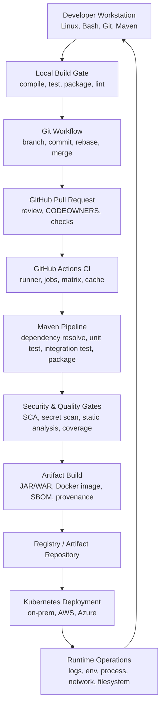

Mental model-nya: **developer machine dan CI runner harus menghasilkan artifact yang sama secara deterministik**. Kalau local build sukses tapi CI gagal, atau image jalan di laptop tapi gagal di Kubernetes, biasanya masalahnya ada di salah satu boundary: Java/Maven version, environment variable, file permission, network dependency, secret/config, dependency cache, atau script yang tidak idempotent.

---

## Decomposition Map

| # | Area | Practical categories / domain / skills | Relevansi untuk Java Jersey/JAX-RS microservice | Failure mode yang harus diwaspadai |
|---:|---|---|---|---|
| 1 | Linux filesystem | Memahami `/etc`, `/var`, `/opt`, `/tmp`, `/usr`, `/proc`, `/sys`, working directory, log directory, mount point | Membaca lokasi config, logs, temp file upload, JVM dump, container volume, dan runtime state | Aplikasi gagal karena path hardcoded, permission salah, disk penuh, atau temp directory tidak tersedia |
| 2 | Linux permissions | `chmod`, `chown`, user/group, executable bit, umask, file ownership dalam container | Penting untuk startup script, mounted secret/config, uploaded files, generated reports | CI sukses tapi container gagal karena script tidak executable atau app user tidak punya akses file |
| 3 | Linux process model | `ps`, `top`, `htop`, `kill`, signal, PID, parent-child process, exit code | Membaca apakah service benar-benar running, crash loop, zombie process, graceful shutdown | GitHub Actions step gagal tanpa pesan jelas karena exit code non-zero; Kubernetes restart karena signal tidak ditangani |
| 4 | Linux environment | `env`, `printenv`, `.profile`, `.bashrc`, exported variables, locale, timezone | Jersey service biasanya membaca DB URL, profile, feature flag, secret reference, timezone | Perbedaan local/CI/prod karena env var tidak ada, salah nama, atau berbeda casing |
| 5 | Linux networking | `curl`, `ss`, `netstat`, `dig`, `nslookup`, `ip`, `nc`, TLS handshake check | Debug call antar microservice, PostgreSQL, Camunda, message broker, ingress, readiness endpoint | Salah DNS, blocked port, TLS mismatch, proxy issue, connection timeout |
| 6 | Linux logs & diagnostics | `journalctl`, `dmesg`, log rotation, stdout/stderr, grep/awk/sed untuk log slicing | Membaca startup error, dependency failure, timeout, OOM, bad request pattern | Log hilang karena tidak diarahkan ke stdout/stderr di container, atau rotation tidak dikonfigurasi |
| 7 | Resource inspection | CPU, memory, disk, inode, file descriptor, thread count | Java service sering gagal karena heap, native memory, FD leak, thread exhaustion | Aplikasi terlihat “hang”, padahal FD penuh, disk penuh, atau GC pressure |
| 8 | Bash fundamentals | Quoting, variable expansion, command substitution, pipes, redirection, functions | Dipakai untuk script build, migration runner, smoke test, deployment helper | Script pecah karena whitespace, globbing, variable kosong, atau quoting salah |
| 9 | Bash safety | `set -euo pipefail`, trap, explicit exit code, idempotency, dry-run mode | CI/CD script harus fail-fast dan tidak silently pass | Pipeline hijau padahal command gagal di tengah pipe |
| 10 | Bash data processing | `grep`, `awk`, `sed`, `jq`, `yq`, `xargs`, `find` | Parsing JSON/YAML config, log analysis, bulk file operation, generated report | Script fragile karena parsing text yang formatnya berubah |
| 11 | Bash operational scripts | `run-local.sh`, `test.sh`, `build.sh`, `migrate.sh`, `smoke-test.sh`, `release.sh` | Membuat onboarding dev baru lebih cepat dan mengurangi tribal knowledge | Dokumentasi ada, tapi command sebenarnya tersebar dan tidak reproducible |
| 12 | Maven project model | `pom.xml`, parent POM, modules, properties, dependencyManagement, pluginManagement | Menentukan struktur build Jersey service, shared library, test module, integration-test module | Dependency version liar, plugin version tidak terkunci, build beda antar mesin |
| 13 | Maven lifecycle | `validate`, `compile`, `test`, `package`, `verify`, `install`, `deploy` | Membentuk quality gate bertahap dari compile sampai publish artifact | Developer hanya menjalankan `package`, CI menjalankan `verify`, hasil berbeda |
| 14 | Maven dependency governance | Direct vs transitive dependency, exclusions, BOM, dependency tree, convergence | Penting untuk Jersey, Jackson, Jakarta API, PostgreSQL driver, MyBatis, logging stack | Runtime `ClassNotFoundException`, `NoSuchMethodError`, duplicate class, CVE transitive |
| 15 | Maven wrapper | `mvnw`, `.mvn/wrapper`, pinned Maven distribution | Menyamakan Maven version di local dan CI | Local build memakai Maven berbeda dari CI |
| 16 | Maven Java version control | `maven-compiler-plugin`, release flag, toolchains, JDK 17+ compatibility | Memastikan source/target/release sesuai Java runtime organisasi | Compile sukses di JDK baru tapi artifact tidak kompatibel dengan target runtime |
| 17 | Maven profiles/settings | `settings.xml`, repository mirror, credentials, profiles, corporate proxy | Penting untuk private artifact repo, internal libraries, on-prem CI | Build gagal hanya di CI karena repo credential atau mirror config berbeda |
| 18 | Maven testing | Surefire, Failsafe, unit vs integration test, test naming convention | Memisahkan fast test dan test yang butuh DB/Camunda/container | Integration test tidak pernah jalan karena salah plugin atau naming |
| 19 | Maven quality/security plugins | Enforcer, Dependency Check, JaCoCo, Checkstyle/SpotBugs/Error Prone jika dipakai | Menjaga dependency convergence, coverage, dan known vulnerability gate | Build hijau tapi dependency rentan atau conflict baru masuk diam-diam |
| 20 | Git mental model | Working tree, index/staging, commit, branch, tag, remote, reflog | Dasar untuk menyelamatkan kerja, review diff, rollback, dan release traceability | Panic saat conflict/rebase karena tidak paham object/history |
| 21 | Git branch strategy | Feature branch, trunk-based, release branch, hotfix branch | Menentukan flow perubahan microservice dan koordinasi deployment | Long-lived branch drift, merge hell, hotfix sulit dilacak |
| 22 | Git commit hygiene | Atomic commit, conventional commit jika dipakai, signed commit jika diwajibkan | Memudahkan review, audit, bisect, changelog, rollback | PR besar sulit direview dan root cause bug susah dicari |
| 23 | Git history operations | `rebase`, `merge`, `cherry-pick`, `revert`, `reset`, `reflog` | Diperlukan saat sinkronisasi branch, backport fix, rollback commit | Salah pakai `reset --hard` atau force push ke shared branch |
| 24 | Git conflict resolution | Membaca conflict marker, semantic merge, rerun test after merge | Sering muncul saat banyak engineer menyentuh config, POM, migration, DTO | Conflict selesai secara text tapi logic rusak |
| 25 | Git advanced workspace | `worktree`, sparse checkout, submodule, hooks | Berguna untuk multi-branch work, monorepo, generated code, pre-commit checks | Submodule detached, hook tidak portable, workspace kotor |
| 26 | GitHub Pull Request workflow | PR description, reviewer assignment, draft PR, review comments, requested changes | Jalur utama quality control sebelum merge | PR terlalu besar, konteks kurang, reviewer hanya lihat syntax |
| 27 | GitHub ownership | CODEOWNERS, required review, team ownership, path-based responsibility | Memastikan area kritikal seperti auth, DB migration, workflow, deployment direview owner | Perubahan high-risk masuk tanpa reviewer yang tepat |
| 28 | GitHub branch protection | Required checks, required reviews, signed commits, linear history jika dipakai | Mengubah aturan engineering menjadi guardrail teknis | Admin bypass terlalu sering; branch protection tidak sinkron dengan risiko |
| 29 | GitHub security features | Secret scanning, Dependabot alerts, code scanning jika tersedia | Menangkap secret leak, vulnerable dependency, dan bug pattern lebih awal | Token masuk repo history; dependency rentan telat diketahui |
| 30 | GitHub Actions workflow model | Workflow, event trigger, job, step, runner, artifact, environment | Membentuk CI/CD untuk Maven build, test, package, scan, image build | Workflow terlalu kompleks, job dependency tidak jelas, gagal sulit didiagnosis |
| 31 | GitHub Actions Java setup | `actions/setup-java`, JDK distribution/version, Maven cache | Menyamakan JDK CI dengan target Java 17+ dan mempercepat dependency resolution | CI lambat, cache stale, JDK beda dari local |
| 32 | GitHub Actions matrix | Matrix Java version, OS, profile, DB version jika diperlukan | Berguna untuk compatibility test atau multi-runtime validation | Matrix terlalu luas, biaya CI naik, signal noise |
| 33 | GitHub Actions secrets & permissions | `secrets`, `vars`, OIDC, least privilege `permissions` | Mengamankan publish artifact, deploy, registry login, cloud auth | Secret terekspos di log, workflow punya permission terlalu luas |
| 34 | GitHub Actions artifacts | Build artifact, test report, coverage report, Docker metadata, SBOM | Evidence untuk debugging dan audit build | Artifact tidak disimpan; failure sulit direproduksi |
| 35 | GitHub Actions release pipeline | Tag trigger, semantic versioning, changelog, release notes, image tagging | Menghubungkan Git tag, Maven version, container image, dan deployment | Image tag tidak traceable ke commit |
| 36 | Docker build handoff | Multi-stage build, non-root user, minimal runtime image, layer caching | Java service dikemas ke image yang kecil dan lebih aman | Image besar, build lambat, secret ikut masuk layer |
| 37 | Kubernetes handoff | Readiness/liveness, config map, secret, resource request/limit, rollout | CI/CD harus menghasilkan artifact yang siap jalan di cluster | Pod crash loop karena env/config mismatch atau health endpoint salah |
| 38 | Production troubleshooting loop | Reproduce, inspect logs, compare env, check network, check version, rollback | Menghubungkan Git commit → image → deployment → runtime behavior | Debug spekulatif tanpa trace dari artifact ke source |
| 39 | Auditability | Commit SHA, PR link, CI run, artifact hash, image digest, deployment record | Penting untuk enterprise, compliance, incident postmortem | Tidak bisa membuktikan perubahan apa yang masuk ke production |
| 40 | Developer onboarding automation | `README`, `Makefile`/script wrapper, local Docker Compose, sample env, smoke test | Engineer baru bisa menjalankan service tanpa tanya banyak hal | Onboarding bergantung pada tribal knowledge |

Beberapa detail yang perlu dijadikan baseline organisasi: Maven 3.9.x masih menjadi jalur stabil umum, sementara Maven 4 sudah menargetkan kebutuhan JDK 17+ untuk menjalankan Maven dan perlu dievaluasi sesuai standar perusahaan sebelum dipakai luas. Maven Toolchains juga relevan jika organisasi ingin menjalankan Maven dengan satu JDK tetapi membangun project dengan JDK tertentu. ([Apache Maven](https://maven.apache.org/download.cgi?utm_source=chatgpt.com))

Untuk container build, gunakan multi-stage build agar stage compile/test terpisah dari runtime image; Docker mendokumentasikan bahwa multi-stage build membantu menghasilkan final image yang lebih kecil karena development/debugging tools tidak perlu ikut masuk ke image runtime. ([Docker Documentation](https://docs.docker.com/get-started/docker-concepts/building-images/multi-stage-builds/?utm_source=chatgpt.com))

---

## Roadmap alur belajar yang direkomendasikan

### 1. Minggu 1 - Linux/Bash untuk daily engineering

Target: bisa menjalankan, membaca, dan mendiagnosis service dari terminal.

Fokus:

- filesystem, permission, process, networking, logs
- `curl`, `ss`, `ps`, `top`, `df`, `du`, `find`, `grep`, `awk`, `sed`, `jq`
- Bash safety: quoting, exit code, `set -euo pipefail`
- buat script kecil: `build.sh`, `run-local.sh`, `smoke-test.sh`

Output praktis: satu folder `scripts/` yang bisa dipakai engineer baru untuk build, run, test, dan smoke check service.

---

### 2. Minggu 2 - Maven build reproducibility

Target: paham kenapa build bisa beda antara laptop, CI, dan server.

Fokus:

- Maven lifecycle
- parent POM, dependencyManagement, pluginManagement
- Maven Wrapper
- compiler plugin untuk Java 17+
- Surefire/Failsafe
- dependency tree dan dependency convergence
- Maven profile dan `settings.xml`

Output praktis: bisa menjelaskan `mvn clean verify` dari awal sampai akhir, termasuk dependency resolution dan test phase.

---

### 3. Minggu 3 - Git/GitHub collaboration workflow

Target: bisa bekerja cepat tanpa merusak branch/release flow.

Fokus:

- branch strategy perusahaan
- atomic commit
- rebase vs merge
- conflict resolution
- revert vs reset
- PR review habit
- CODEOWNERS dan required checks

Output praktis: PR kecil, jelas, traceable, dan mudah direview.

---

### 4. Minggu 4 - GitHub Actions CI/CD untuk Java Maven service

Target: bisa membaca, memperbaiki, dan mengembangkan workflow CI/CD.

Fokus:

- workflow trigger
- jobs, steps, runners
- `setup-java`
- Maven cache
- unit/integration test
- artifact upload
- Docker image build
- security scanning
- environment-specific deployment gate

Output praktis: pipeline minimal yang menjalankan build, test, package, scan, dan publish artifact/image.

---

### 5. Minggu 5 - End-to-end operational exercise

Target: menghubungkan source code sampai runtime.

Latihan:

1. ubah endpoint Jersey sederhana
2. tambah unit/integration test
3. build dengan Maven
4. push branch
5. buka PR
6. lihat GitHub Actions
7. build Docker image
8. deploy ke environment dev/staging
9. cek log, health endpoint, dan rollback path

Output praktis: paham full path **commit → PR → CI → artifact → image → deployment → runtime verification**.

---

## Skill invariants yang harus dipegang

1. **Build harus reproducible**  
   Versi Java, Maven, plugin, dependency, dan profile harus eksplisit.

2. **CI harus menjadi source of truth**  
   Local success berguna, tapi merge decision harus berdasarkan CI gate.

3. **Script harus aman dan idempotent**  
   Script deployment/build tidak boleh bergantung pada state tersembunyi.

4. **Artifact harus traceable**  
   Setiap JAR/image harus bisa ditelusuri ke commit SHA, PR, CI run, dan dependency set.

5. **Runtime debugging harus evidence-based**  
   Mulai dari log, env, version, network, resource, lalu baru hipotesis kode.

---

## Rekomendasi materi selanjutnya

Materi lanjutan paling bernilai setelah ini: **“Production Troubleshooting & Incident Response untuk Java Jersey/JAX-RS Microservice di Linux, Docker, dan Kubernetes”**.

Itu akan menyambungkan skill Linux/Bash/Maven/GitHub Actions ke kasus nyata: crash loop, timeout, memory leak, thread starvation, bad deployment, failed migration, dependency conflict, dan rollback.

---

**Sources:**

- [bash(1) - Linux manual page](https://man7.org/linux/man-pages/man1/bash.1.html?utm_source=chatgpt.com)
- [Introduction to the Build Lifecycle - Apache Maven](https://maven.apache.org/guides/introduction/introduction-to-the-lifecycle.html?utm_source=chatgpt.com)
- [Git](https://git-scm.com/?utm_source=chatgpt.com)
- [Workflow syntax for GitHub Actions](https://docs.github.com/actions/using-workflows/workflow-syntax-for-github-actions?utm_source=chatgpt.com)
- [Jakarta RESTful Web Services](https://jakarta.ee/specifications/restful-ws/?utm_source=chatgpt.com)
- [Multi-stage builds](https://docs.docker.com/get-started/docker-concepts/building-images/multi-stage-builds/?utm_source=chatgpt.com)

## Response:
7/14/2026, 12:04:10 AM

Total saya rekomendasikan **12 seri** untuk topik:

**Linux, Bash/Shell, Maven, Git, GitHub, GitHub Actions dalam Java Jersey/JAX-RS microservice application.**

Rinciannya:

| Seri | Topik |
|---:|---|
| 1 | Linux Fundamentals untuk Java Microservice Engineer |
| 2 | Linux Runtime Diagnostics: Process, Port, Network, Disk, Memory |
| 3 | Bash/Shell Scripting untuk Build, Test, Deploy, dan Troubleshooting |
| 4 | Maven Fundamentals: Lifecycle, POM, Dependency, Plugin |
| 5 | Maven untuk Java 17+ Jersey/JAX-RS Microservice |
| 6 | Maven Testing, Quality Gate, Dependency Governance, dan Reproducible Build |
| 7 | Git Practical Workflow: Branching, Commit, Merge, Rebase, Conflict |
| 8 | Git untuk Release, Hotfix, Rollback, Bisect, dan Audit Trail |
| 9 | GitHub Collaboration: PR, Review, CODEOWNERS, Branch Protection |
| 10 | GitHub Security & Repository Governance |
| 11 | GitHub Actions CI untuk Java Maven Microservice |
| 12 | GitHub Actions CD Pipeline: Docker Image, Artifact, Environment, Kubernetes Handoff |

Saya sarankan mulai dari **Seri 1 — Linux Fundamentals untuk Java Microservice Engineer**.

## Response:
7/14/2026, 12:05:01 AM

Saya mulai dari **Seri 1/12** dengan fokus Linux fundamentals yang langsung terpakai untuk Java Jersey/JAX-RS microservice: filesystem, user/permission, process, environment, service startup, dan basic troubleshooting.

# Seri 1/12 - Linux Fundamentals untuk Java Microservice Engineer

## Introduction

Seri ini membahas Linux sebagai **runtime surface** untuk Java Jersey/JAX-RS microservice. Maksudnya bukan belajar Linux secara akademis, tetapi memahami hal-hal yang langsung memengaruhi aplikasi: file, permission, process, environment variable, port, log, service startup, dan basic diagnostics.

Dalam konteks Java microservice, Linux adalah tempat aplikasi benar-benar hidup: entah sebagai proses biasa di VM/on-prem, service `systemd`, container Docker, atau pod Kubernetes. Jakarta RESTful Web Services sendiri adalah API dasar untuk membangun REST-style web service, sehingga saat service berjalan di Linux, problem teknis sering muncul di boundary antara kode REST, JVM, filesystem, network, dan konfigurasi runtime. ([Jakarta EE](https://jakarta.ee/specifications/restful-ws/?utm_source=chatgpt.com))

Bash relevan karena banyak automation lokal maupun CI/CD memakai shell command. Bash adalah command language interpreter yang menjalankan command dari input, string, atau file. ([man7.org](https://www.man7.org/linux/man-pages/man1/bash.1.html?utm_source=chatgpt.com))

---

## Diagram

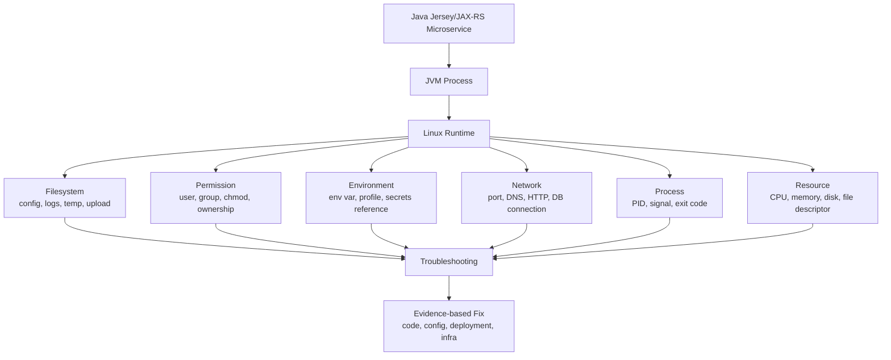

---

## Mental model utama

Java service di Linux bisa dipandang sebagai kombinasi dari:

```text
source code
  -> Maven build artifact
  -> JVM process
  -> Linux environment
  -> network dependencies
  -> filesystem dependencies
  -> logs and metrics
```

Kalau service gagal, jangan langsung menyimpulkan bug di kode. Banyak masalah muncul dari:

```text
wrong env var
wrong working directory
wrong file permission
wrong port binding
DNS failure
missing config
disk full
memory pressure
bad startup command
JDK mismatch
dependency not available
```

Linux fundamentals membantu membedakan mana masalah **application logic**, mana masalah **runtime configuration**, dan mana masalah **infrastructure**.

---

## Decomposition Map

| # | Domain / Skill | Yang perlu dipahami | Relevansi untuk Java Jersey/JAX-RS microservice | Command penting |
|---:|---|---|---|---|
| 1 | Filesystem hierarchy | Struktur direktori Linux seperti `/etc`, `/var`, `/tmp`, `/usr`, `/opt`, `/home`, `/proc` | Service butuh config, log, temp file, upload directory, certificate, atau mounted secret | `pwd`, `ls`, `tree`, `find`, `du`, `df` |
| 2 | Working directory | Directory tempat proses dijalankan | Relative path di Java bisa berubah tergantung cara service dijalankan | `pwd`, `readlink -f`, `ls -la` |
| 3 | File permission | Read/write/execute, owner, group, mode bit | Script gagal jalan, app gagal menulis file, cert tidak bisa dibaca | `chmod`, `chown`, `stat`, `umask` |
| 4 | User & group | User proses aplikasi, privilege, sudo boundary | Production service sebaiknya tidak jalan sebagai root kecuali ada alasan kuat | `whoami`, `id`, `groups`, `sudo -l` |
| 5 | Process model | PID, parent process, exit code, signal | JVM adalah proses Linux; crash, restart, shutdown, dan health check semua terkait process model | `ps`, `pgrep`, `kill`, `top`, `htop` |
| 6 | Exit code | `0` berarti sukses, non-zero berarti gagal | CI/CD dan shell script membaca exit code untuk menentukan pipeline sukses/gagal | `echo $?` |
| 7 | Environment variable | Config runtime yang disuntikkan dari shell, systemd, Docker, Kubernetes | DB URL, port, profile, secret reference, feature flag sering berasal dari env var | `env`, `printenv`, `export` |
| 8 | PATH & executable lookup | Cara shell mencari executable | Maven, Java, Docker, kubectl bisa beda versi karena PATH berbeda | `which`, `type`, `command -v`, `echo $PATH` |
| 9 | Java runtime visibility | JDK/JRE yang aktif | Java 17+ harus konsisten antara local, CI, dan runtime | `java -version`, `javac -version` |
| 10 | Port binding | Service listen di port tertentu | Jersey service gagal start kalau port sudah dipakai | `ss -lntp`, `lsof -i`, `curl` |
| 11 | DNS & connectivity | Name resolution dan koneksi antar service | Koneksi ke PostgreSQL, Camunda, service internal, atau API eksternal sering gagal karena DNS/network | `dig`, `nslookup`, `curl`, `nc` |
| 12 | HTTP probing | Cek endpoint secara langsung | Health check, readiness, API smoke test, auth/header test | `curl -i`, `curl -v`, `curl -fsS` |
| 13 | Log inspection | Membaca log secara efisien | Error startup, stack trace, timeout, SQL error, auth failure terlihat dari log | `tail`, `less`, `grep`, `awk`, `journalctl` |
| 14 | Disk usage | Kapasitas disk dan inode | Service bisa gagal saat menulis log, temp file, upload, heap dump, report | `df -h`, `df -i`, `du -sh` |
| 15 | Memory & CPU | Resource runtime | JVM bisa OOM, GC pressure, CPU spike, thread starvation | `free -h`, `top`, `vmstat` |
| 16 | File descriptor | Limit jumlah file/socket terbuka | Java service dengan banyak koneksi bisa gagal karena FD exhaustion | `ulimit -n`, `lsof`, `cat /proc/<pid>/limits` |
| 17 | `/proc` inspection | Runtime metadata process | Berguna saat ingin tahu command, env, cwd, limit proses | `cat /proc/<pid>/cmdline`, `ls -l /proc/<pid>/cwd` |
| 18 | Service startup | Cara service dijalankan | Bisa via shell, systemd, Docker entrypoint, Kubernetes command/args | `systemctl`, `journalctl`, `docker logs`, `kubectl logs` |
| 19 | Shell basics | Command, pipe, redirect, quoting | Dibutuhkan untuk debugging cepat dan script lokal | `|`, `>`, `2>`, `&&`, `||`, `"$VAR"` |
| 20 | Safety habit | Jangan asal menjalankan destructive command | Menghindari hapus file, overwrite config, atau restart service salah environment | `rm -i`, `cp -v`, dry-run pattern |

Filesystem Hierarchy Standard mendefinisikan guideline lokasi file dan direktori pada sistem UNIX-like agar lebih seragam untuk aplikasi, admin tools, development tools, dan scripts. ([refspecs.linuxfoundation.org](https://refspecs.linuxfoundation.org/FHS_3.0/fhs/index.html?utm_source=chatgpt.com))

---

## Practical Command Cheatsheet

### 1. Mengetahui posisi dan isi direktori

```bash
pwd
ls -lah
find . -maxdepth 2 -type f
du -sh .
df -h
```

Gunakan ini saat service gagal membaca config, gagal menulis file, atau path relatif tidak sesuai ekspektasi.

Contoh masalah umum:

```text
Local:
  ./config/application.yml ada

Runtime:
  working directory berbeda
  ./config/application.yml tidak ditemukan
```

Solusi engineering yang lebih aman: gunakan absolute path dari env var, misalnya:

```bash
export APP_CONFIG_PATH=/opt/my-service/config/application.yml
```

---

### 2. Mengecek permission file

```bash
ls -lah
stat app.jar
stat run.sh
chmod +x run.sh
chown appuser:appgroup app.jar
```

Interpretasi sederhana:

```text
r = read
w = write
x = execute

owner / group / others
```

Contoh:

```text
-rwxr-x--- appuser appgroup run.sh
```

Artinya:

```text
owner bisa read/write/execute
group bisa read/execute
others tidak punya akses
```

Untuk Java service, permission problem sering muncul pada:

```text
startup script
log directory
upload directory
temporary directory
mounted certificate
mounted secret
generated report directory
```

---

### 3. Mengecek user yang menjalankan service

```bash
whoami
id
groups
```

Kalau service berjalan di container atau VM production, penting tahu user-nya.

Anti-pattern:

```text
Service hanya jalan kalau user root.
```

Lebih baik:

```text
Service jalan sebagai dedicated non-root user.
Directory yang dibutuhkan diberi ownership eksplisit.
```

---

### 4. Mengecek Java dan Maven yang aktif

```bash
java -version
javac -version
mvn -version
./mvnw -version
which java
which mvn
echo "$JAVA_HOME"
echo "$PATH"
```

Dalam Java 17+ microservice, masalah umum adalah:

```text
Local pakai JDK 21
CI pakai JDK 17
Runtime pakai JRE berbeda
```

Efeknya bisa berupa:

```text
compile error
class file version error
library incompatibility
behavior berbeda antar environment
```

Prinsipnya: versi Java harus eksplisit di local, CI, Dockerfile, dan deployment manifest.

---

### 5. Mengecek process Java yang sedang berjalan

```bash
ps aux | grep java
pgrep -af java
top
```

Melihat command lengkap:

```bash
pgrep -af 'java|my-service'
```

Contoh output yang dicari:

```text
java -jar my-service.jar
-Dserver.port=8080
-Xms512m
-Xmx1024m
-Dconfig.file=/opt/my-service/application.yml
```

Yang harus diperhatikan:

```text
JAR mana yang dijalankan?
port berapa?
profile apa?
heap setting apa?
config file dari mana?
```

---

### 6. Mengecek exit code

```bash
./run.sh
echo $?
```

Makna:

```text
0     sukses
non-0 gagal
```

Dalam Bash/CI/CD, exit code adalah kontrak. GitHub Actions, Jenkins, atau script deploy biasanya menganggap command gagal jika exit code non-zero.

Contoh pattern:

```bash
mvn clean verify
echo $?
```

Lebih baik dalam script:

```bash
#!/usr/bin/env bash
set -euo pipefail

./mvnw clean verify
```

`set -euo pipefail` membantu script berhenti saat terjadi error, variable belum didefinisikan, atau command dalam pipeline gagal.

---

### 7. Mengecek environment variable

```bash
env
printenv
printenv APP_ENV
printenv DB_URL
```

Set sementara:

```bash
export APP_ENV=local
export SERVER_PORT=8080
```

Run service dengan env var:

```bash
APP_ENV=local SERVER_PORT=8080 java -jar target/my-service.jar
```

Masalah umum:

```text
DB_URL tidak ada
DB_URL ada tapi salah environment
SERVER_PORT berbeda dari health check
APP_ENV default ke production
secret variable typo
```

Ingat: env var adalah salah satu boundary paling rawan antara local, CI, Docker, Kubernetes, dan production.

---

### 8. Mengecek port yang sedang listen

```bash
ss -lntp
ss -lntp | grep 8080
```

Alternatif:

```bash
lsof -i :8080
```

Jika service gagal start dengan error seperti:

```text
Address already in use
```

Cek proses yang memakai port:

```bash
ss -lntp | grep 8080
```

Lalu lihat PID dan command-nya.

---

### 9. Mengecek endpoint service

```bash
curl -i http://localhost:8080/health
curl -i http://localhost:8080/api/v1/example
```

Verbose mode:

```bash
curl -v http://localhost:8080/health
```

Fail-fast untuk script:

```bash
curl -fsS http://localhost:8080/health
```

Pattern smoke test sederhana:

```bash
#!/usr/bin/env bash
set -euo pipefail

BASE_URL="${BASE_URL:-http://localhost:8080}"

curl -fsS "$BASE_URL/health"
curl -fsS "$BASE_URL/ready"
```

---

### 10. Mengecek DNS dan konektivitas

```bash
dig my-db.internal
nslookup my-db.internal
nc -vz my-db.internal 5432
curl -v http://another-service:8080/health
```

Untuk PostgreSQL:

```bash
nc -vz localhost 5432
nc -vz postgres.internal 5432
```

Untuk dependency HTTP:

```bash
curl -v http://camunda:8080/engine-rest/version
```

Masalah yang sering terlihat:

```text
DNS tidak resolve
port tertutup
service belum listen
network policy memblokir
proxy/TLS salah
dependency service down
```

---

### 11. Membaca log

File log:

```bash
tail -f app.log
tail -n 200 app.log
less app.log
grep -i error app.log
grep -i 'exception\|timeout\|refused' app.log
```

Systemd log:

```bash
journalctl -u my-service
journalctl -u my-service -f
journalctl -u my-service --since "1 hour ago"
```

Untuk service yang dijalankan via systemd, konfigurasi eksekusi bisa mengatur hal-hal seperti working directory dan environment proses service. ([FreeDesktop](https://www.freedesktop.org/software/systemd/man/systemd.exec.html?utm_source=chatgpt.com))

Yang dicari dari log Java service:

```text
startup banner
active profile
listening port
database connection
migration result
dependency client initialization
Jersey resource registration
exception stack trace
shutdown reason
```

---

### 12. Mengecek disk dan inode

```bash
df -h
df -i
du -sh /var/log/*
du -sh /tmp/*
```

Disk full bisa menyebabkan:

```text
log gagal ditulis
temporary file gagal dibuat
upload gagal
database local gagal
heap dump gagal dibuat
container eviction
```

Jangan hanya cek kapasitas disk. Cek juga inode:

```bash
df -i
```

Banyak file kecil bisa membuat inode habis walaupun disk belum penuh.

---

### 13. Mengecek memory

```bash
free -h
top
ps aux --sort=-%mem | head
```

Untuk proses Java:

```bash
pgrep -af java
ps -o pid,ppid,%mem,%cpu,cmd -p <PID>
```

Jika tersedia JDK tools:

```bash
jcmd <PID> VM.version
jcmd <PID> VM.flags
jcmd <PID> GC.heap_info
jcmd <PID> Thread.print
```

Gejala runtime:

```text
OOMKilled
high GC
slow response
thread starvation
native memory issue
container memory limit terlalu kecil
```

---

### 14. Mengecek file descriptor limit

```bash
ulimit -n
cat /proc/<PID>/limits
lsof -p <PID> | wc -l
```

File descriptor dipakai untuk:

```text
file
socket
database connection
HTTP connection
log file
pipe
```

Kalau habis, error yang mungkin muncul:

```text
Too many open files
connection failed
cannot open log file
database pool error
```

---

## Struktur direktori yang umum untuk service

Di VM/on-prem, struktur yang rapi bisa seperti ini:

```text
/opt/my-service/
  app.jar
  bin/
    run.sh
    stop.sh
  config/
    application.yml
  logs/
  tmp/
```

Atau:

```text
/etc/my-service/
  application.yml

/var/log/my-service/
  app.log

/opt/my-service/
  app.jar
```

Prinsipnya:

| Jenis file | Lokasi yang umum | Catatan |
|---|---|---|
| Binary / artifact | `/opt/my-service` | Artifact aplikasi |
| Config | `/etc/my-service` atau mounted config | Jangan hardcode secret |
| Log | `/var/log/my-service` atau stdout/stderr | Container lebih baik stdout/stderr |
| Temporary file | `/tmp` atau dedicated temp dir | Pastikan cleanup |
| Script | `/opt/my-service/bin` | Harus executable |

---

## Basic run script untuk local/on-prem

Contoh sederhana:

```bash
#!/usr/bin/env bash
set -euo pipefail

APP_HOME="$(cd "$(dirname "${BASH_SOURCE[0]}")/.." && pwd)"
APP_JAR="${APP_HOME}/app.jar"
CONFIG_FILE="${APP_CONFIG_FILE:-${APP_HOME}/config/application.yml}"
SERVER_PORT="${SERVER_PORT:-8080}"

echo "Starting service"
echo "APP_HOME=${APP_HOME}"
echo "CONFIG_FILE=${CONFIG_FILE}"
echo "SERVER_PORT=${SERVER_PORT}"

exec java \
  -Dserver.port="${SERVER_PORT}" \
  -Dconfig.file="${CONFIG_FILE}" \
  -jar "${APP_JAR}"
```

Kenapa pakai `exec`?

Karena proses shell digantikan oleh proses Java. Ini membantu signal handling, terutama saat dijalankan dalam container atau process supervisor.

---

## Basic diagnostic flow saat service gagal start

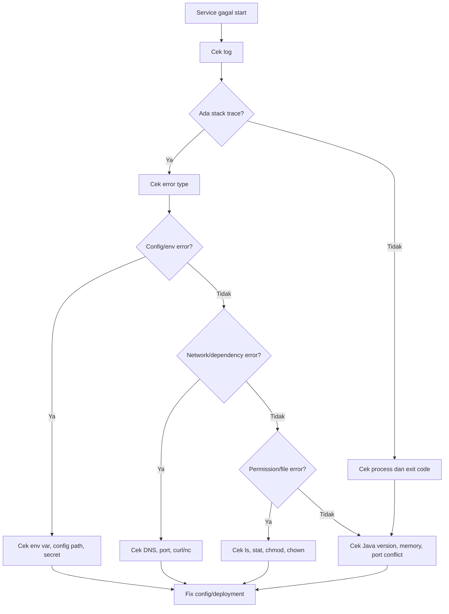

---

## Checklist saat debugging Java Jersey/JAX-RS service di Linux

| Pertanyaan | Command |
|---|---|
| Service process ada? | `pgrep -af java` |
| Port listen? | `ss -lntp | grep 8080` |
| Endpoint hidup? | `curl -i http://localhost:8080/health` |
| Config terbaca? | cek log startup dan `printenv` |
| Java version benar? | `java -version` |
| Working directory benar? | `pwd`, `/proc/<PID>/cwd` |
| File config ada? | `ls -lah /path/to/config` |
| Permission benar? | `stat file`, `id`, `ls -lah` |
| Disk penuh? | `df -h`, `df -i` |
| Memory cukup? | `free -h`, `top` |
| Dependency reachable? | `curl`, `nc -vz`, `dig` |
| Service manager log? | `journalctl -u service-name` |

---

## Common failure scenarios

### Scenario 1 - Endpoint tidak bisa diakses

Gejala:

```text
curl: connection refused
```

Cek:

```bash
pgrep -af java
ss -lntp | grep 8080
journalctl -u my-service -n 100
```

Kemungkinan:

```text
service belum start
port salah
service bind ke localhost, bukan 0.0.0.0
startup crash
firewall/network policy
```

---

### Scenario 2 - Service start tapi DB gagal connect

Gejala:

```text
Connection refused
UnknownHostException
timeout
authentication failed
```

Cek:

```bash
printenv DB_URL
dig postgres.internal
nc -vz postgres.internal 5432
```

Kemungkinan:

```text
DB host salah
port salah
credential salah
DNS salah
network blocked
database belum siap
```

---

### Scenario 3 - File upload gagal

Gejala:

```text
Permission denied
No space left on device
```

Cek:

```bash
df -h
df -i
ls -lah /upload/path
stat /upload/path
id
```

Kemungkinan:

```text
directory tidak ada
owner salah
permission kurang
disk penuh
inode habis
container volume read-only
```

---

### Scenario 4 - Local jalan, CI gagal

Cek:

```bash
java -version
mvn -version
./mvnw -version
echo "$JAVA_HOME"
echo "$PATH"
```

Kemungkinan:

```text
JDK berbeda
Maven berbeda
env var tidak ada
test bergantung state lokal
file path case-sensitive di Linux
script tidak executable
```

Linux biasanya case-sensitive, jadi file `Application.yml` dan `application.yml` dianggap berbeda. Ini sering menjadi sumber bug ketika developer sebelumnya memakai environment yang lebih permisif.

---

## Invariants untuk Senior Engineer

| Invariant | Penjelasan |
|---|---|
| Jangan percaya asumsi runtime | Validasi dengan command: process, env, port, log, filesystem |
| Config harus eksplisit | Jangan bergantung pada working directory tersembunyi |
| Permission harus intentional | Service user, owner, group, dan mode file harus jelas |
| Log harus bisa dibaca | Startup, config, dependency, dan failure reason harus terlihat |
| Exit code harus benar | Script tidak boleh sukses palsu |
| Local dan CI harus dekat | JDK, Maven, env, dan command harus disamakan |
| Debugging harus evidence-based | Lihat data dulu, baru hipotesis |

---

## Mini Lab untuk onboarding

Lakukan latihan ini di laptop Linux/WSL/container dev.

### Lab 1 - Inspect environment

```bash
whoami
id
pwd
echo "$PATH"
java -version
./mvnw -version
```

Tujuan: tahu siapa user aktif, working directory, PATH, Java, dan Maven.

---

### Lab 2 - Jalankan service lokal

```bash
./mvnw clean package
java -jar target/*.jar
```

Di terminal lain:

```bash
pgrep -af java
ss -lntp | grep 8080
curl -i http://localhost:8080/health
```

Tujuan: menghubungkan Maven artifact → JVM process → Linux port → HTTP endpoint.

---

### Lab 3 - Simulasikan port conflict

Terminal 1:

```bash
python3 -m http.server 8080
```

Terminal 2:

```bash
java -jar target/*.jar
```

Lalu cek:

```bash
ss -lntp | grep 8080
```

Tujuan: memahami error `Address already in use`.

---

### Lab 4 - Simulasikan permission error

```bash
mkdir /tmp/my-service-test
chmod 500 /tmp/my-service-test
touch /tmp/my-service-test/output.txt
```

Tujuan: melihat bagaimana permission error terjadi.

Cleanup:

```bash
chmod 700 /tmp/my-service-test
rm -rf /tmp/my-service-test
```

---

### Lab 5 - Buat smoke test script

```bash
cat > smoke-test.sh <<'EOF'
#!/usr/bin/env bash
set -euo pipefail

BASE_URL="${BASE_URL:-http://localhost:8080}"

echo "Checking health endpoint: ${BASE_URL}/health"
curl -fsS "${BASE_URL}/health"

echo
echo "Smoke test passed"
EOF

chmod +x smoke-test.sh
./smoke-test.sh
```

Tujuan: membuat validasi kecil yang bisa dipakai local dan CI.

---

## Kesalahan yang harus dihindari

| Anti-pattern | Risiko | Cara yang lebih baik |
|---|---|---|
| Hardcode path relatif | Gagal saat working directory berubah | Pakai env var atau absolute path |
| Run service sebagai root | Risiko security tinggi | Pakai dedicated non-root user |
| Script tanpa `set -e` | Error tersembunyi | Gunakan `set -euo pipefail` |
| Tidak cek exit code | Pipeline bisa sukses palsu | Pastikan command gagal menghasilkan non-zero |
| Tidak pin Java version | Local/CI/prod beda perilaku | Standarkan JDK |
| Log hanya ke file lokal | Sulit dibaca di container/K8s | Prefer stdout/stderr untuk container |
| Debug dari asumsi | Fix salah sasaran | Mulai dari process, log, env, network, resource |

---

## Ringkasan

Linux fundamentals untuk Java microservice bukan tentang menghafal banyak command. Intinya adalah memahami **kontrak antara aplikasi dan runtime**:

```text
process harus hidup
port harus listen
config harus tersedia
permission harus benar
dependency harus reachable
resource harus cukup
log harus bisa dibaca
exit code harus jujur
```

Kalau kontrak ini jelas, debugging menjadi jauh lebih cepat dan tidak spekulatif.

---

## Status

**Seri 1/12 selesai.**

Rekomendasi berikutnya: **Seri 2 - Linux Runtime Diagnostics: Process, Port, Network, Disk, Memory**.

---

**Sources:**

- [Jakarta RESTful Web Services](https://jakarta.ee/specifications/restful-ws/?utm_source=chatgpt.com)
- [bash(1) - Linux manual page](https://www.man7.org/linux/man-pages/man1/bash.1.html?utm_source=chatgpt.com)
- [Filesystem Hierarchy Standard](https://refspecs.linuxfoundation.org/FHS_3.0/fhs/index.html?utm_source=chatgpt.com)
- [systemd.exec](https://www.freedesktop.org/software/systemd/man/systemd.exec.html?utm_source=chatgpt.com)

## Response:
7/14/2026, 12:07:02 AM

Saya lanjut ke **Seri 2/12**. Fokusnya bukan command list generik, tapi diagnostic loop saat service Java/Jersey bermasalah: process, port, network, disk, memory, file descriptor, dan cara membaca sinyal kegagalan.

# Seri 2/12 - Linux Runtime Diagnostics: Process, Port, Network, Disk, Memory

## Introduction

Seri ini membahas cara mendiagnosis service Java Jersey/JAX-RS yang sedang berjalan atau gagal berjalan di Linux. Fokusnya adalah membangun **diagnostic loop** yang bisa dipakai saat:

```text
service tidak start
endpoint tidak reachable
response lambat
pod/container restart
CPU tinggi
memory naik terus
disk penuh
DB/API dependency timeout
file descriptor habis
```

Untuk microservice Java, runtime failure biasanya bukan cuma “bug di kode”. Sering kali penyebabnya ada di boundary:

```text
JVM process
Linux process
port binding
network path
filesystem
resource limit
container/Kubernetes limit
dependency external
```

Linux menyediakan banyak observability primitive melalui `/proc`; misalnya `/proc/<pid>/cmdline` menyimpan command line proses, `/proc/<pid>/limits` menampilkan soft/hard resource limits, dan `/proc/<pid>/fd` berisi file descriptor terbuka milik proses. Ini sangat berguna untuk debugging JVM process tanpa perlu langsung masuk ke profiler berat. ([man7.org](https://man7.org/linux/man-pages/man5/proc_pid_cmdline.5.html?utm_source=chatgpt.com))

---

## Diagram

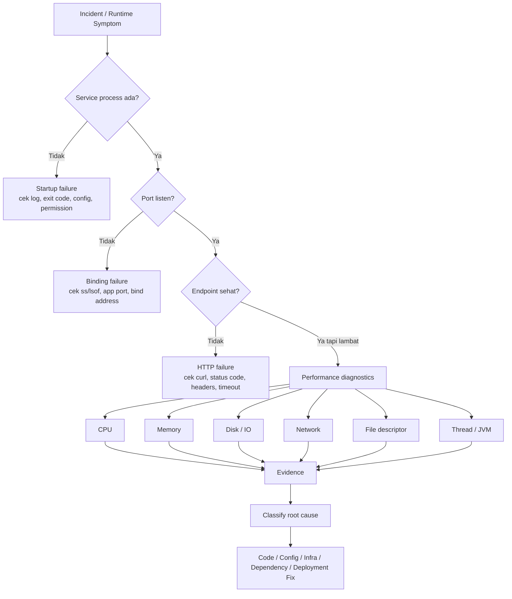

---

## Core diagnostic principle

Jangan mulai dari “kayaknya bug”. Mulai dari pertanyaan berurutan:

```text
1. Apakah prosesnya hidup?
2. Apakah command line proses benar?
3. Apakah Java/JAR/config/profile benar?
4. Apakah port listen?
5. Apakah endpoint bisa dipanggil dari host yang benar?
6. Apakah dependency reachable?
7. Apakah resource cukup?
8. Apakah ada limit yang kena?
9. Apakah log menunjukkan exception atau timeout?
10. Apakah ada perubahan commit/config/deployment baru?
```

Tujuan diagnostic bukan langsung menemukan semua hal, tetapi **mempersempit ruang masalah**.

---

## Decomposition Map

| # | Domain / Skill | Yang diperiksa | Command utama | Relevansi untuk Java Jersey/JAX-RS |
|---:|---|---|---|---|
| 1 | Process existence | Apakah JVM process hidup | `pgrep`, `ps` | Validasi service benar-benar running |
| 2 | Process identity | JAR, main class, JVM option, profile | `/proc/<pid>/cmdline`, `ps -ef` | Mencegah salah versi artifact/config |
| 3 | Parent process | Siapa yang menjalankan service | `ps -o pid,ppid,cmd`, `pstree` | Bedakan manual run, systemd, Docker, K8s |
| 4 | Exit behavior | Service crash atau stop normal | `echo $?`, logs, systemd status | Penting untuk CI, script, supervisor |
| 5 | Port binding | Port listen atau tidak | `ss -lntp`, `lsof -i` | Jersey app harus bind ke expected port |
| 6 | Bind address | Listen di `127.0.0.1` atau `0.0.0.0` | `ss -lntp` | Container/K8s butuh bind yang bisa dijangkau |
| 7 | HTTP probing | Status code, header, latency, TLS | `curl -i`, `curl -v`, `curl -fsS` | Cek health/readiness/API endpoint |
| 8 | DNS resolution | Host dependency resolve atau tidak | `dig`, `nslookup`, `getent hosts` | PostgreSQL, Camunda, internal service |
| 9 | TCP connectivity | Port dependency reachable | `nc -vz`, `ss`, `curl -v` | Debug connection refused/timeout |
| 10 | Active connections | Socket state, established, time-wait | `ss -antp` | Cek connection leak atau dependency overload |
| 11 | CPU usage | CPU spike, busy loop, hot process | `top`, `ps`, `pidstat` | Endpoint lambat atau thread busy |
| 12 | Memory usage | RSS, heap pressure, OOM indication | `free`, `top`, `ps`, `jcmd` | JVM memory vs container memory |
| 13 | Disk capacity | Disk dan inode | `df -h`, `df -i`, `du` | Log/temp/upload/report gagal |
| 14 | File descriptor | Jumlah socket/file terbuka | `lsof`, `/proc/<pid>/fd`, `ulimit` | Pool leak, socket leak, log/file leak |
| 15 | Resource limits | Soft/hard limit proses | `/proc/<pid>/limits` | Debug `Too many open files`, max process, stack |
| 16 | Thread diagnostics | Thread count, blocked thread | `jcmd Thread.print`, `jstack` | Deadlock, starvation, blocking IO |
| 17 | JVM flags | Heap, GC, system properties | `jcmd VM.flags`, `jcmd VM.system_properties` | Validasi runtime Java config |
| 18 | Log correlation | Exception, timeout, request ID | `journalctl`, `tail`, `grep` | Hubungkan gejala dengan failure |
| 19 | Time correlation | Kapan mulai bermasalah | log timestamp, deploy timestamp | Cocokkan dengan release/config change |
| 20 | Runtime classification | Code/config/infra/dependency | evidence summary | Menghindari fix spekulatif |

`ss` adalah utility untuk melihat socket statistics dan bisa menampilkan informasi TCP/state yang lebih kaya daripada pendekatan lama seperti `netstat`, sehingga berguna untuk memeriksa port listen dan koneksi aktif service. ([man7.org](https://man7.org/linux/man-pages/man8/ss.8.html?utm_source=chatgpt.com))

---

## 1. Process diagnostics

### Pertanyaan utama

```text
Apakah service benar-benar running sebagai proses Java?
```

Command:

```bash
pgrep -af java
ps aux | grep '[j]ava'
```

Contoh output:

```text
12345 java -Xms512m -Xmx1024m -jar my-service.jar --server.port=8080
```

Yang harus dicek:

| Field | Kenapa penting |
|---|---|
| PID | Dipakai untuk inspect `/proc`, `jcmd`, `kill`, `lsof` |
| JAR/main class | Pastikan artifact yang benar |
| JVM options | Heap, GC, system property |
| Config argument | Pastikan config file/env/profile benar |
| User | Pastikan bukan root kalau tidak perlu |
| Start time | Cocokkan dengan deployment/restart |

---

### Inspect command line via `/proc`

```bash
PID=12345
tr '\0' ' ' < /proc/$PID/cmdline
```

Kenapa ini penting?

Karena `ps` kadang terpotong atau kurang nyaman dibaca. `/proc/<pid>/cmdline` berisi command line proses yang sedang berjalan, selama proses tersebut bukan zombie. ([man7.org](https://man7.org/linux/man-pages/man5/proc_pid_cmdline.5.html?utm_source=chatgpt.com))

Cek juga current working directory:

```bash
readlink -f /proc/$PID/cwd
```

Cek executable:

```bash
readlink -f /proc/$PID/exe
```

Cek environment proses:

```bash
tr '\0' '\n' < /proc/$PID/environ | sort
```

Catatan penting: akses ke beberapa file `/proc/<pid>` bisa dibatasi oleh permission/user/security setting. Jadi jika command gagal, belum tentu proses tidak ada.

---

## 2. Process parent dan supervisor

Service bisa dijalankan oleh:

```text
manual shell
systemd
Docker entrypoint
Kubernetes container runtime
CI runner
```

Cek parent process:

```bash
PID=12345
ps -o pid,ppid,user,etime,cmd -p $PID
ps -o pid,ppid,user,etime,cmd -p $(ps -o ppid= -p $PID)
```

Kalau tersedia:

```bash
pstree -ap $PID
```

Interpretasi:

| Parent | Implikasi |
|---|---|
| `bash` | Kemungkinan manual run |
| `systemd` | Cek `systemctl` dan `journalctl` |
| container entrypoint | Cek Docker/Kubernetes logs |
| CI runner | Cek workflow logs |
| supervisor custom | Cek config supervisor |

Untuk `systemd`:

```bash
systemctl status my-service
journalctl -u my-service -n 200
journalctl -u my-service -f
```

---

## 3. Exit code diagnostics

Kalau service dijalankan manual:

```bash
java -jar target/my-service.jar
echo $?
```

Makna umum:

```text
0     proses selesai sukses
non-0 proses gagal
```

Dalam Bash dan CI/CD, exit code adalah sinyal utama sukses/gagal. Jangan abaikan.

Contoh script yang salah:

```bash
java -jar app.jar
echo "started"
```

Masalahnya: jika `java -jar app.jar` gagal, script masih bisa lanjut jika tidak pakai fail-fast.

Lebih baik:

```bash
#!/usr/bin/env bash
set -euo pipefail

java -jar app.jar
```

Untuk startup script yang menjalankan background process, hati-hati:

```bash
java -jar app.jar &
echo "started"
```

Ini bisa membuat script sukses walaupun aplikasi crash beberapa detik kemudian. Untuk CI smoke test, lebih baik tunggu health endpoint:

```bash
java -jar app.jar &
APP_PID=$!

for i in {1..30}; do
  if curl -fsS http://localhost:8080/health >/dev/null; then
    echo "service healthy"
    exit 0
  fi
  sleep 1
done

echo "service failed to become healthy"
kill "$APP_PID" || true
exit 1
```

---

## 4. Port diagnostics

### Pertanyaan utama

```text
Apakah service listen di port yang benar?
```

Command:

```bash
ss -lntp
ss -lntp | grep ':8080'
```

Contoh output:

```text
LISTEN 0 4096 0.0.0.0:8080 0.0.0.0:* users:(("java",pid=12345,fd=123))
```

Interpretasi penting:

| Bagian | Arti |
|---|---|
| `LISTEN` | Port sedang menerima koneksi |
| `0.0.0.0:8080` | Listen di semua interface IPv4 |
| `127.0.0.1:8080` | Hanya local host |
| `pid=12345` | Proses pemilik socket |
| `fd=123` | File descriptor socket |

### Bind address matters

Di local, ini sering cukup:

```text
127.0.0.1:8080
```

Di Docker/Kubernetes, sering perlu:

```text
0.0.0.0:8080
```

Karena kalau service hanya bind ke `127.0.0.1` di dalam container, service bisa tidak reachable dari luar container walaupun aplikasinya “running”.

---

## 5. HTTP endpoint diagnostics

### Health endpoint

```bash
curl -i http://localhost:8080/health
curl -i http://localhost:8080/ready
```

Untuk script:

```bash
curl -fsS http://localhost:8080/health
```

Pattern yang baik:

| Command | Kegunaan |
|---|---|
| `curl -i` | Tampilkan response header dan body |
| `curl -v` | Debug koneksi, DNS, TLS, request/response |
| `curl -fsS` | Cocok untuk script: fail on HTTP error, silent normal output, show error |

Cek latency kasar:

```bash
curl -o /dev/null -s -w \
'status=%{http_code} time_total=%{time_total} dns=%{time_namelookup} connect=%{time_connect}\n' \
http://localhost:8080/health
```

Output contoh:

```text
status=200 time_total=0.032 dns=0.001 connect=0.002
```

Interpretasi:

| Gejala | Kemungkinan |
|---|---|
| `connection refused` | Service tidak listen, port salah, crash |
| timeout | Network blocked, service hang, dependency blocking |
| `404` | Path salah, context path salah, route tidak terdaftar |
| `401/403` | Auth/security filter aktif |
| `500` | Exception aplikasi |
| `503` | Readiness dependency gagal |

---

## 6. DNS dan dependency diagnostics

Untuk microservice Java, dependency umum:

```text
PostgreSQL
Camunda
RabbitMQ
Redis/cache
internal REST API
object storage
identity provider
```

Cek DNS:

```bash
dig postgres.internal
nslookup postgres.internal
getent hosts postgres.internal
```

Cek TCP port:

```bash
nc -vz postgres.internal 5432
nc -vz camunda.internal 8080
```

Cek HTTP dependency:

```bash
curl -v http://camunda.internal:8080/engine-rest/version
```

Interpretasi cepat:

| Error | Makna awal |
|---|---|
| `Name or service not known` | DNS/hostname tidak resolve |
| `Connection refused` | Host reachable, tapi port tidak listen atau ditolak |
| `Operation timed out` | Network path blocked, firewall, routing, dependency hang |
| TLS certificate error | CA/truststore/SNI/cert mismatch |
| HTTP `401/403` | Credential/token/permission issue |
| HTTP `5xx` | Dependency error atau overloaded |

---

## 7. Active connection diagnostics

Cek semua koneksi TCP:

```bash
ss -antp
```

Filter untuk proses Java:

```bash
PID=12345
ss -antp | grep "pid=$PID"
```

Filter port DB:

```bash
ss -antp | grep ':5432'
```

State yang sering penting:

| State | Arti praktis |
|---|---|
| `LISTEN` | Service menerima koneksi |
| `ESTAB` | Koneksi aktif |
| `TIME-WAIT` | Koneksi baru ditutup, normal dalam jumlah wajar |
| `SYN-SENT` | Mencoba connect, belum established |
| `CLOSE-WAIT` | Remote sudah close, app belum close socket |
| Banyak `CLOSE-WAIT` | Indikasi kemungkinan connection leak |
| Banyak `SYN-SENT` | Dependency/network sulit dijangkau |

---

## 8. CPU diagnostics

`top` memberikan real-time view kondisi sistem dan daftar proses/thread yang dikelola kernel, sehingga cocok untuk inspeksi awal CPU/memory. ([man7.org](https://man7.org/linux/man-pages/man1/top.1.html?utm_source=chatgpt.com))

Command:

```bash
top
ps aux --sort=-%cpu | head
```

Untuk proses tertentu:

```bash
PID=12345
ps -p $PID -o pid,ppid,%cpu,%mem,etime,cmd
```

Jika tersedia:

```bash
pidstat -p $PID 1
```

Interpretasi:

| Gejala | Kemungkinan |
|---|---|
| CPU tinggi stabil | Busy loop, traffic tinggi, expensive query, serialization berat |
| CPU spike periodik | Scheduled job, batch, GC, polling |
| CPU rendah tapi response lambat | Blocking IO, DB wait, lock, thread starvation |
| Load average tinggi | CPU contention atau banyak process runnable/uninterruptible |

Untuk Java, lanjutkan dengan:

```bash
jcmd $PID Thread.print > thread-dump.txt
```

Cari:

```text
RUNNABLE thread yang dominan
BLOCKED thread
WAITING terlalu banyak
deadlock
pool thread habis
```

---

## 9. Memory diagnostics

Command dasar:

```bash
free -h
top
ps aux --sort=-%mem | head
```

Untuk proses Java:

```bash
PID=12345
ps -p $PID -o pid,%mem,rss,vsz,etime,cmd
```

RSS adalah memori resident yang benar-benar berada di RAM untuk proses. VSZ adalah virtual memory size; untuk JVM, VSZ bisa besar dan tidak selalu berarti real memory terpakai besar.

Jika tersedia JDK tools:

```bash
jcmd $PID VM.flags
jcmd $PID GC.heap_info
jcmd $PID VM.native_memory summary
```

Catatan: `VM.native_memory` butuh Native Memory Tracking aktif saat JVM start, misalnya:

```bash
-XX:NativeMemoryTracking=summary
```

Interpretasi umum:

| Gejala | Kemungkinan |
|---|---|
| Heap penuh | Object retention, cache tidak dibatasi, data load terlalu besar |
| RSS naik tapi heap stabil | Native memory, direct buffer, thread stack, mmap, metaspace |
| OOMKilled di K8s | Container memory limit terlampaui |
| Frequent GC | Heap terlalu kecil atau allocation rate tinggi |
| Slow response + memory tinggi | GC pressure atau swap |

Cek log untuk OOM:

```bash
grep -i 'outofmemory\|oom\|killed' app.log
dmesg | grep -i 'killed process'
```

---

## 10. Disk diagnostics

Command:

```bash
df -h
df -i
du -sh /var/log/*
du -sh /tmp/*
```

Bedakan:

| Resource | Command | Failure |
|---|---|---|
| Disk block | `df -h` | `No space left on device` |
| Inode | `df -i` | Tidak bisa buat file baru walau space terlihat ada |
| Directory growth | `du -sh` | Log/temp/upload membesar |
| Open deleted file | `lsof +L1` | Disk masih terpakai oleh file yang sudah dihapus tapi masih open |

Masalah khas Java service:

```text
log file tidak rotate
temp upload tidak cleanup
generated PDF/Excel/report menumpuk
heap dump besar
GC log besar
batch export besar
```

Cek file besar:

```bash
find /var/log -type f -size +100M -exec ls -lh {} \;
find /tmp -type f -size +100M -exec ls -lh {} \;
```

Cek file yang baru berubah:

```bash
find /var/log -type f -mmin -60 -exec ls -lh {} \;
```

---

## 11. File descriptor diagnostics

File descriptor dipakai untuk file, socket, pipe, log, DB connection, HTTP connection, dan resource OS lain. `/proc/<pid>/fd` berisi entry untuk setiap file descriptor terbuka milik proses. ([man7.org](https://man7.org/linux/man-pages/man5/proc_pid_fd.5.html?utm_source=chatgpt.com))

Cek limit:

```bash
ulimit -n
cat /proc/$PID/limits
```

`/proc/<pid>/limits` menampilkan soft limit, hard limit, dan unit untuk resource limits proses. ([man7.org](https://man7.org/linux/man-pages/man5/proc_pid_limits.5.html?utm_source=chatgpt.com))

Cek jumlah FD:

```bash
ls /proc/$PID/fd | wc -l
```

Cek tipe FD:

```bash
ls -l /proc/$PID/fd | head
lsof -p $PID | head
```

Cek socket count:

```bash
lsof -p $PID | grep TCP | wc -l
```

Gejala:

```text
java.io.IOException: Too many open files
database pool connection error
HTTP client connection error
log file cannot be opened
```

Interpretasi:

| Sinyal | Kemungkinan |
|---|---|
| FD naik terus | Leak file/socket/stream |
| Banyak TCP `CLOSE-WAIT` | App tidak close socket |
| Banyak file temp terbuka | File processing leak |
| Banyak connection ke DB | Pool terlalu besar atau leak |
| Limit kecil | `ulimit`/container/systemd perlu disesuaikan |

---

## 12. Thread diagnostics untuk Java

Command:

```bash
PID=12345
jcmd $PID Thread.print > thread-dump.txt
```

Alternatif:

```bash
jstack $PID > thread-dump.txt
```

Yang dicari:

| Pattern | Kemungkinan |
|---|---|
| Banyak `BLOCKED` | Lock contention |
| Banyak `WAITING` di pool | Normal jika idle; masalah jika semua request stuck |
| Banyak thread HTTP client | External dependency lambat |
| Banyak DB thread waiting | Query lambat atau pool habis |
| Deadlock section | Deadlock Java |
| Semua request thread busy | Thread starvation |

Untuk service Jersey/JAX-RS, perhatikan thread yang terkait:

```text
HTTP server worker
Jersey request handling
database pool
Camunda client/job worker
scheduler
async executor
logging appender
```

---

## 13. JVM runtime flags dan system properties

Cek flags:

```bash
jcmd $PID VM.flags
```

Cek system properties:

```bash
jcmd $PID VM.system_properties
```

Cek command line:

```bash
jcmd $PID VM.command_line
```

Yang perlu divalidasi:

```text
-Xms / -Xmx
GC setting
timezone
file.encoding
active profile
config path
server port
truststore/keystore
proxy setting
```

Contoh issue:

```text
Local timezone Asia/Jakarta
Runtime timezone UTC
Tanggal bisnis berubah saat serialisasi/deserialisasi
```

Atau:

```text
file.encoding berbeda
CSV/export/import rusak untuk karakter non-ASCII
```

---

## 14. Log diagnostics

Cek log startup:

```bash
tail -n 300 app.log
grep -i 'started\|listening\|port\|profile\|error\|exception' app.log
```

Cek log systemd:

```bash
journalctl -u my-service -n 300
journalctl -u my-service --since "2026-07-14 09:00:00"
```

Cek error pattern:

```bash
grep -iE 'exception|error|timeout|refused|denied|oom|killed|deadlock' app.log
```

Untuk microservice, log harus menjawab:

```text
service version berapa?
commit SHA berapa?
profile/environment apa?
port berapa?
DB config target mana?
migration jalan atau tidak?
dependency health bagaimana?
request ID/correlation ID apa?
```

Tanpa informasi ini, debugging akan lambat dan penuh tebakan.

---

## 15. Diagnostic playbook berdasarkan gejala

### A. Service tidak start

Urutan cek:

```bash
pgrep -af java
journalctl -u my-service -n 200
tail -n 200 app.log
java -version
ls -lah app.jar
```

Klasifikasi:

| Bukti | Kemungkinan |
|---|---|
| `ClassNotFoundException` | Dependency/package issue |
| `UnsupportedClassVersionError` | JDK runtime terlalu lama |
| `Permission denied` | File/script/config permission |
| `Address already in use` | Port conflict |
| `No such file` | Path/config/artifact salah |
| DB timeout saat startup | Dependency readiness issue |

---

### B. Service running tapi endpoint tidak bisa diakses

Urutan cek:

```bash
pgrep -af java
ss -lntp | grep 8080
curl -v http://localhost:8080/health
```

Jika di container/K8s:

```bash
curl -v http://127.0.0.1:8080/health
curl -v http://0.0.0.0:8080/health
```

Cek:

| Bukti | Kemungkinan |
|---|---|
| Port tidak listen | App belum start atau port config salah |
| Listen `127.0.0.1` | Tidak reachable dari luar container |
| `404` | Context path/path health salah |
| `401/403` | Health endpoint terkena auth filter |
| `503` | Readiness dependency gagal |

---

### C. Response lambat

Urutan cek:

```bash
curl -o /dev/null -s -w 'status=%{http_code} total=%{time_total}\n' http://localhost:8080/health
top
ps -p $PID -o pid,%cpu,%mem,rss,vsz,etime,cmd
ss -antp | grep "pid=$PID"
jcmd $PID Thread.print > thread-dump.txt
```

Klasifikasi:

| Bukti | Kemungkinan |
|---|---|
| CPU tinggi | CPU-bound logic, serialization, compression, loop |
| CPU rendah tapi request stuck | Blocking IO, DB/API wait |
| Banyak DB connection | Query lambat, pool issue |
| Thread pool penuh | Starvation |
| Memory tinggi + GC | GC pressure |

---

### D. Memory naik terus

Urutan cek:

```bash
ps -p $PID -o pid,%mem,rss,vsz,etime,cmd
jcmd $PID GC.heap_info
jcmd $PID VM.flags
ls /proc/$PID/fd | wc -l
```

Klasifikasi:

| Bukti | Kemungkinan |
|---|---|
| Heap naik terus | Object leak/cache tidak bounded |
| FD naik terus | File/socket leak |
| RSS naik, heap stabil | Native/direct buffer/metaspace/thread stack |
| Banyak thread | Executor leak atau thread creation tidak terkendali |

---

### E. Disk penuh

Urutan cek:

```bash
df -h
df -i
du -sh /var/log/* | sort -h
du -sh /tmp/* | sort -h
lsof +L1
```

Klasifikasi:

| Bukti | Kemungkinan |
|---|---|
| `/var/log` besar | Log rotation gagal |
| `/tmp` besar | Temp file tidak cleanup |
| Inode habis | Terlalu banyak file kecil |
| `lsof +L1` besar | File dihapus tapi masih dibuka proses |

---

### F. Dependency timeout

Urutan cek:

```bash
printenv | grep -i 'db\|camunda\|url\|host'
dig dependency.internal
nc -vz dependency.internal 5432
curl -v http://dependency.internal:8080/health
ss -antp | grep "pid=$PID"
```

Klasifikasi:

| Bukti | Kemungkinan |
|---|---|
| DNS gagal | Service discovery/config salah |
| TCP refused | Host reachable, port tidak listen |
| TCP timeout | Firewall/network policy/routing |
| HTTP 401/403 | Auth issue |
| HTTP 5xx | Dependency bermasalah |
| Banyak `SYN-SENT` | Network/dependency unreachable |

---

## 16. One-command diagnostic bundle

Untuk local/VM debugging, buat script seperti ini.

```bash
#!/usr/bin/env bash
set -euo pipefail

APP_PATTERN="${1:-java}"
PORT="${2:-8080}"

echo "== Time =="
date

echo
echo "== Java processes =="
pgrep -af "$APP_PATTERN" || true

PID="$(pgrep -f "$APP_PATTERN" | head -n 1 || true)"

if [[ -n "${PID}" ]]; then
  echo
  echo "== Selected PID =="
  echo "$PID"

  echo
  echo "== Process summary =="
  ps -p "$PID" -o pid,ppid,user,%cpu,%mem,rss,vsz,etime,cmd

  echo
  echo "== Command line =="
  tr '\0' ' ' < "/proc/$PID/cmdline" || true
  echo

  echo
  echo "== CWD =="
  readlink -f "/proc/$PID/cwd" || true

  echo
  echo "== Limits =="
  cat "/proc/$PID/limits" || true

  echo
  echo "== FD count =="
  ls "/proc/$PID/fd" 2>/dev/null | wc -l || true
fi

echo
echo "== Port listen =="
ss -lntp | grep ":${PORT}" || true

echo
echo "== Disk =="
df -h
df -i

echo
echo "== Memory =="
free -h

echo
echo "== Top CPU processes =="
ps aux --sort=-%cpu | head -n 10

echo
echo "== Top memory processes =="
ps aux --sort=-%mem | head -n 10

echo
echo "== Health check =="
curl -fsS "http://localhost:${PORT}/health" || true
echo
```

Pemakaian:

```bash
chmod +x diag.sh
./diag.sh my-service 8080
```

Gunakan script ini untuk baseline, bukan pengganti observability penuh.

---

## 17. Evidence summary template

Saat menemukan issue, biasakan menulis ringkasan seperti ini:

```text
Symptom:
- Endpoint /health timeout sejak 10:15 WIB.

Scope:
- Terjadi di service X environment staging.
- Service Y dan Z normal.

Evidence:
- Process Java PID 12345 hidup.
- Port 8080 listen di 0.0.0.0.
- curl localhost /health timeout > 10s.
- CPU rendah, memory normal.
- Thread dump menunjukkan semua request thread waiting di DB call.
- nc ke postgres:5432 sukses, tetapi query lambat di log.

Likely root cause:
- Bottleneck DB/query/pool, bukan port/network/service startup.

Next action:
- Cek slow query, DB pool metrics, recent migration/index change.
```

Ini membuat debugging defensible dan tidak spekulatif.

---

## 18. Senior-level heuristics

| Heuristic | Penjelasan |
|---|---|
| Process hidup belum berarti service sehat | Harus cek port dan endpoint |
| Port listen belum berarti dependency sehat | Readiness harus cek dependency penting |
| CPU rendah tidak berarti service normal | Bisa blocking IO atau deadlock |
| Memory container berbeda dari heap JVM | RSS/native/thread/direct buffer ikut dihitung |
| Disk penuh sering terlihat sebagai error aplikasi | File upload/log/temp bisa gagal |
| Banyak `CLOSE-WAIT` biasanya mencurigakan | Sering terkait socket tidak ditutup |
| Banyak `TIME-WAIT` belum tentu masalah | Bisa normal untuk traffic tinggi |
| Localhost di container bukan localhost host machine | Konteks network namespace penting |
| `curl` dari laptop ≠ `curl` dari pod/node | Selalu test dari lokasi network yang relevan |
| Jangan restart sebelum ambil evidence | Restart bisa menghapus sinyal penting |

---

## 19. Mini Lab

### Lab 1 - Inspect Java process

Jalankan service:

```bash
java -jar target/my-service.jar
```

Terminal lain:

```bash
PID=$(pgrep -f 'my-service' | head -n 1)

ps -p $PID -o pid,ppid,user,%cpu,%mem,etime,cmd
tr '\0' ' ' < /proc/$PID/cmdline
readlink -f /proc/$PID/cwd
cat /proc/$PID/limits
```

Target: memahami identitas proses.

---

### Lab 2 - Port binding

```bash
ss -lntp | grep 8080
curl -i http://localhost:8080/health
```

Target: membedakan process running vs port listening vs endpoint healthy.

---

### Lab 3 - Simulasi dependency unreachable

```bash
nc -vz localhost 5432
nc -vz 10.255.255.1 5432
```

Target: membedakan refused vs timeout.

---

### Lab 4 - FD observation

```bash
PID=$(pgrep -f 'my-service' | head -n 1)
ls /proc/$PID/fd | wc -l
lsof -p $PID | head
```

Target: melihat file/socket yang dibuka proses.

---

### Lab 5 - HTTP latency measurement

```bash
curl -o /dev/null -s -w \
'status=%{http_code} total=%{time_total} connect=%{time_connect}\n' \
http://localhost:8080/health
```

Target: mulai membaca latency dari sisi client.

---

## Runtime diagnostic checklist

| Layer | Pertanyaan | Command |
|---|---|---|
| Process | JVM hidup? | `pgrep -af java` |
| Identity | Artifact/config benar? | `/proc/<pid>/cmdline` |
| Supervisor | Dijalankan oleh siapa? | `ps -o pid,ppid,cmd` |
| Port | Listen di port benar? | `ss -lntp` |
| HTTP | Endpoint sehat? | `curl -i`, `curl -fsS` |
| DNS | Host resolve? | `dig`, `getent hosts` |
| TCP | Dependency reachable? | `nc -vz`, `curl -v` |
| CPU | Ada spike? | `top`, `ps`, `pidstat` |
| Memory | RSS/heap normal? | `free`, `ps`, `jcmd` |
| Disk | Space/inode cukup? | `df -h`, `df -i` |
| FD | Socket/file leak? | `/proc/<pid>/fd`, `lsof` |
| Thread | Blocking/deadlock? | `jcmd Thread.print` |
| Logs | Ada exception? | `tail`, `grep`, `journalctl` |

---

## Ringkasan

Seri ini membangun cara berpikir bahwa runtime diagnostics harus bergerak dari **observable facts** ke **root cause classification**:

```text
process
  -> command line/config
  -> port
  -> HTTP endpoint
  -> dependency network
  -> CPU/memory/disk/FD
  -> JVM thread/heap
  -> logs
  -> root cause
```

Untuk Java Jersey/JAX-RS microservice, pola ini membantu membedakan:

```text
application bug
configuration mistake
dependency outage
network issue
resource exhaustion
deployment mismatch
runtime limit
```

---

## Status

**Seri 2/12 selesai.**

Rekomendasi berikutnya: **Seri 3 - Bash/Shell Scripting untuk Build, Test, Deploy, dan Troubleshooting**.

---

**Sources:**

- [proc_pid_cmdline(5) - Linux manual page](https://man7.org/linux/man-pages/man5/proc_pid_cmdline.5.html?utm_source=chatgpt.com)

## Response:
7/14/2026, 12:09:15 AM

Saya lanjut ke **Seri 3/12**. Fokusnya Bash/Shell scripting sebagai “glue layer” untuk build, test, deploy, smoke test, dan troubleshooting—terutama supaya command local, CI, dan server tidak drift.

# Seri 3/12 - Bash/Shell Scripting untuk Build, Test, Deploy, dan Troubleshooting

## Introduction

Seri ini membahas Bash/Shell sebagai **automation glue** di Java Jersey/JAX-RS microservice. Dalam praktik senior engineer, Bash dipakai untuk menyatukan:

```text
local development
Maven build
test execution
database migration helper
Docker build
smoke test
GitHub Actions step
deployment helper
runtime diagnostics
rollback helper
```

Bash penting karena banyak workflow CI/CD dan operational script akhirnya tetap berjalan sebagai command-line script. Bash menyediakan exit status melalui special parameter `$?`, dan command/builtin umumnya mengembalikan `0` saat sukses dan non-zero saat gagal; ini menjadi dasar bagaimana CI/CD menentukan step sukses atau gagal. ([GNU](https://www.gnu.org/s/bash/manual/bash.html?utm_source=chatgpt.com))

Shell script juga rawan bug kecil yang berdampak besar, terutama karena word splitting, glob expansion, quoting, pipe failure, dan variable kosong. ShellCheck secara eksplisit menandai masalah seperti variable yang tidak di-quote karena bisa memicu word splitting dan glob expansion. ([shellcheck.net](https://www.shellcheck.net/wiki/SC2086?utm_source=chatgpt.com))

Target seri ini: membuat Bash script yang **aman, idempotent, observable, dan cocok dipakai local maupun CI**.

---

## Diagram

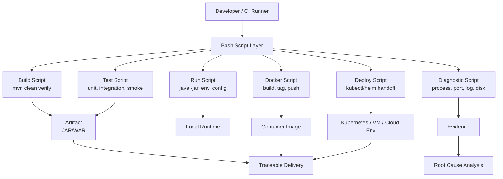

---

## Mental Model

Bash script yang baik bukan sekadar kumpulan command. Ia adalah **kontrak operasional**.

```text
Input:
  env var
  argument
  config file
  working directory
  dependency tools

Execution:
  validate
  run command
  capture failure
  print useful context
  exit honestly

Output:
  artifact
  log
  exit code
  evidence
```

Untuk microservice Java, script harus menjawab:

```text
Java version apa?
Maven command apa?
Profile apa?
Config dari mana?
Port berapa?
Artifact output di mana?
Docker image tag apa?
Health endpoint mana?
Kalau gagal, gagal di step mana?
```

---

## Decomposition Map

| # | Domain / Skill | Yang perlu dikuasai | Relevansi untuk Java Jersey/JAX-RS microservice | Failure mode yang dicegah |
|---:|---|---|---|---|
| 1 | Script structure | Shebang, strict mode, function, main flow | Membuat script build/run/test/deploy rapi | Script sulit dibaca dan sulit debug |
| 2 | Exit code discipline | `0`, non-zero, `$?`, `exit`, `return` | CI/CD menentukan sukses/gagal dari exit code | Pipeline hijau palsu |
| 3 | Strict mode | `set -euo pipefail` | Fail-fast saat command gagal, variable kosong, pipe gagal | Error tersembunyi |
| 4 | Quoting | `"$VAR"`, `"${array[@]}"` | Aman untuk path, argumen, secret, URL | Word splitting, globbing, path rusak |
| 5 | Argument parsing | `$1`, `shift`, flags sederhana | Script fleksibel untuk env/profile/port | Hardcoded command |
| 6 | Env var handling | Default value, required var, validation | DB URL, profile, token, port, image tag | Env var kosong/salah environment |
| 7 | Path handling | `SCRIPT_DIR`, absolute path, repo root | Script bisa dijalankan dari directory mana pun | Relative path pecah |
| 8 | Command availability | `command -v java`, `command -v mvn` | Validasi dependency tool sebelum jalan | Error terlambat dan membingungkan |
| 9 | Maven wrapper integration | `./mvnw` daripada global `mvn` | Build local dan CI lebih konsisten | Maven version drift |
| 10 | Java version check | `java -version`, parse major version bila perlu | Java 17+ harus eksplisit | Runtime mismatch |
| 11 | Logging script | `info`, `warn`, `error`, timestamp | CI log mudah dibaca | Root cause sulit dicari |
| 12 | Temporary file handling | `mktemp`, cleanup dengan `trap` | File processing, reports, smoke test | Temp file menumpuk |
| 13 | Signal handling | `trap`, cleanup child process | Local service test dan CI smoke test | Background process orphan |
| 14 | Idempotency | Aman di-run berkali-kali | Build/deploy/cleanup tidak merusak state | Re-run pipeline gagal |
| 15 | Dry-run mode | Print command tanpa execute | Deploy script lebih aman | Salah environment |
| 16 | Error classification | Fail karena config/tool/network/test | Debug lebih cepat | Semua error terlihat sama |
| 17 | Smoke testing | `curl -fsS`, retry loop | Validasi service benar-benar ready | Service process hidup tapi endpoint mati |
| 18 | Runtime diagnostics | `pgrep`, `ss`, `df`, `free`, `journalctl` | Debug VM/container/local runtime | Restart spekulatif |
| 19 | GitHub Actions compatibility | POSIX-ish command, explicit Bash shell | Script yang sama bisa dipakai di CI | Local script beda dari CI step |
| 20 | Security hygiene | Jangan echo secret, permission file, least privilege | Melindungi token, DB password, registry credential | Secret leak di log |

---

## 1. Struktur Bash Script yang Aman

Template dasar:

```bash
#!/usr/bin/env bash
set -euo pipefail

main() {
  echo "Hello from script"
}

main "$@"
```

Penjelasan:

| Bagian | Fungsi |
|---|---|
| `#!/usr/bin/env bash` | Menjalankan script dengan Bash dari environment |
| `set -e` | Stop saat command gagal |
| `set -u` | Error jika memakai variable yang belum didefinisikan |
| `set -o pipefail` | Pipeline gagal jika salah satu command dalam pipe gagal |
| `main "$@"` | Entry point jelas dan meneruskan semua argumen |

Google Shell Style Guide juga merekomendasikan script executable dimulai dengan shebang dan penggunaan opsi shell secara eksplisit, karena memanggil script dengan cara berbeda dapat mengubah perilaku jika opsi tidak diset di dalam script. ([Google GitHub](https://google.github.io/styleguide/shellguide.html?utm_source=chatgpt.com))

---

## 2. Exit Code Discipline

Exit code adalah kontrak utama antara script dan caller.

```bash
./build.sh
echo $?
```

Makna umum:

```text
0      sukses
non-0  gagal
```

Contoh buruk:

```bash
#!/usr/bin/env bash

./mvnw clean verify
echo "Build completed"
```

Masalah: tanpa strict mode, script bisa tetap lanjut dan memberi pesan misleading.

Contoh lebih baik:

```bash
#!/usr/bin/env bash
set -euo pipefail

./mvnw clean verify
echo "Build completed"
```

Contoh explicit failure:

```bash
#!/usr/bin/env bash
set -euo pipefail

if [[ ! -f "./pom.xml" ]]; then
  echo "ERROR: pom.xml not found. Run this script from repository root." >&2
  exit 1
fi
```

Rule praktis:

```text
Script harus gagal keras saat precondition tidak terpenuhi.
Script tidak boleh menyembunyikan command failure.
Script harus memberi pesan error yang bisa ditindaklanjuti.
```

---

## 3. Quoting: Skill Paling Penting di Bash

Masalah klasik Bash adalah variable tanpa quote.

Buruk:

```bash
rm -rf $TARGET_DIR
```

Lebih aman:

```bash
rm -rf "$TARGET_DIR"
```

Kenapa? Variable yang tidak di-quote bisa mengalami word splitting dan glob expansion; ShellCheck menandai pola ini karena input dengan spasi, newline, atau karakter glob bisa membuat script berperilaku berbeda dari yang dimaksud. ([shellcheck.net](https://www.shellcheck.net/wiki/SC2086?utm_source=chatgpt.com))

Contoh:

```bash
TARGET_DIR="/tmp/my service"
rm -rf $TARGET_DIR
```

Shell bisa membaca itu sebagai dua argumen:

```text
/tmp/my
service
```

Gunakan:

```bash
rm -rf "$TARGET_DIR"
```

Untuk array:

```bash
ARGS=(
  "-Dserver.port=${SERVER_PORT}"
  "-Dconfig.file=${CONFIG_FILE}"
  "-jar"
  "$APP_JAR"
)

java "${ARGS[@]}"
```

Rule praktis:

```text
Quote hampir semua variable: "$VAR"
Quote command substitution: "$(command)"
Untuk array, gunakan "${array[@]}"
Jangan quote wildcard kalau memang sengaja ingin glob expansion
```

---

## 4. Path Handling yang Tidak Bergantung Working Directory

Anti-pattern:

```bash
java -jar target/my-service.jar
```

Ini hanya aman jika script selalu dijalankan dari repo root.

Lebih baik:

```bash
#!/usr/bin/env bash
set -euo pipefail

SCRIPT_DIR="$(cd "$(dirname "${BASH_SOURCE[0]}")" && pwd)"
REPO_ROOT="$(cd "${SCRIPT_DIR}/.." && pwd)"

APP_JAR="${REPO_ROOT}/target/my-service.jar"

java -jar "$APP_JAR"
```

Dengan pola ini, script bisa dipanggil dari mana saja:

```bash
./scripts/run-local.sh
cd /tmp && /path/to/repo/scripts/run-local.sh
```

Untuk repo Java Maven, struktur umum:

```text
repo/
  pom.xml
  src/
  scripts/
    build.sh
    test.sh
    run-local.sh
    smoke-test.sh
```

---

## 5. Handling Required Environment Variable

Untuk env var wajib:

```bash
require_env() {
  local name="$1"

  if [[ -z "${!name:-}" ]]; then
    echo "ERROR: required environment variable ${name} is not set" >&2
    exit 1
  fi
}

require_env "DB_URL"
require_env "DB_USERNAME"
require_env "DB_PASSWORD"
```

Untuk default value:

```bash
APP_ENV="${APP_ENV:-local}"
SERVER_PORT="${SERVER_PORT:-8080}"
BASE_URL="${BASE_URL:-http://localhost:${SERVER_PORT}}"
```

Untuk env var optional:

```bash
JAVA_OPTS="${JAVA_OPTS:-}"
```

Rule praktis:

| Jenis config | Pattern |
|---|---|
| Wajib | fail-fast dengan `require_env` |
| Optional | default eksplisit |
| Secret | jangan echo value |
| URL/port/profile | print nama dan non-secret value untuk observability |

Contoh aman:

```bash
echo "APP_ENV=${APP_ENV}"
echo "SERVER_PORT=${SERVER_PORT}"
echo "DB_URL is set: $([[ -n "${DB_URL:-}" ]] && echo yes || echo no)"
```

Jangan:

```bash
echo "DB_PASSWORD=${DB_PASSWORD}"
```

---

## 6. Command Availability Check

Script harus mengecek tool yang dibutuhkan.

```bash
require_command() {
  local cmd="$1"

  if ! command -v "$cmd" >/dev/null 2>&1; then
    echo "ERROR: required command not found: ${cmd}" >&2
    exit 1
  fi
}

require_command java
require_command curl
require_command docker
```

Untuk Maven, prefer Maven Wrapper:

```bash
if [[ ! -x "./mvnw" ]]; then
  echo "ERROR: ./mvnw not found or not executable" >&2
  exit 1
fi
```

Lalu:

```bash
./mvnw --version
./mvnw clean verify
```

Kenapa ini penting?

```text
Global mvn di laptop bisa beda dari CI.
Maven Wrapper membuat command build lebih konsisten.
```

---

## 7. Build Script untuk Maven Java Service

`scripts/build.sh`:

```bash
#!/usr/bin/env bash
set -euo pipefail

SCRIPT_DIR="$(cd "$(dirname "${BASH_SOURCE[0]}")" && pwd)"
REPO_ROOT="$(cd "${SCRIPT_DIR}/.." && pwd)"

cd "$REPO_ROOT"

if [[ ! -x "./mvnw" ]]; then
  echo "ERROR: ./mvnw is missing or not executable" >&2
  exit 1
fi

echo "== Java version =="
java -version

echo
echo "== Maven version =="
./mvnw -version

echo
echo "== Building project =="
./mvnw clean verify

echo
echo "Build completed successfully"
```

Kenapa `clean verify`, bukan hanya `package`?

```text
verify biasanya lebih cocok sebagai quality gate karena mencakup lifecycle sampai tahap verification, termasuk integration test bila dikonfigurasi.
```

Catatan: detail eksekusi `verify` bergantung pada konfigurasi plugin Maven seperti Surefire/Failsafe. Jadi jangan mengasumsikan integration test otomatis jalan jika plugin/naming belum benar.

---

## 8. Test Script: Unit, Integration, Smoke

`scripts/test.sh`:

```bash
#!/usr/bin/env bash
set -euo pipefail

SCRIPT_DIR="$(cd "$(dirname "${BASH_SOURCE[0]}")" && pwd)"
REPO_ROOT="$(cd "${SCRIPT_DIR}/.." && pwd)"

cd "$REPO_ROOT"

TEST_SCOPE="${1:-all}"

case "$TEST_SCOPE" in
  unit)
    ./mvnw test
    ;;
  integration)
    ./mvnw verify -DskipUnitTests
    ;;
  all)
    ./mvnw clean verify
    ;;
  *)
    echo "Usage: $0 {unit|integration|all}" >&2
    exit 1
    ;;
esac
```

Namun hati-hati: property seperti `-DskipUnitTests` hanya bekerja jika POM memang menggunakannya. Jangan membuat script seolah-olah property valid kalau belum dikonfirmasi di `pom.xml`.

Versi yang lebih aman:

```bash
./mvnw clean verify
```

Lalu pisahkan unit/integration test di POM dengan konfigurasi yang eksplisit.

---

## 9. Run Local Script

`scripts/run-local.sh`:

```bash
#!/usr/bin/env bash
set -euo pipefail

SCRIPT_DIR="$(cd "$(dirname "${BASH_SOURCE[0]}")" && pwd)"
REPO_ROOT="$(cd "${SCRIPT_DIR}/.." && pwd)"

cd "$REPO_ROOT"

APP_ENV="${APP_ENV:-local}"
SERVER_PORT="${SERVER_PORT:-8080}"
APP_JAR="${APP_JAR:-}"

if [[ -z "$APP_JAR" ]]; then
  APP_JAR="$(find "$REPO_ROOT/target" -maxdepth 1 -type f -name "*.jar" | head -n 1)"
fi

if [[ -z "$APP_JAR" || ! -f "$APP_JAR" ]]; then
  echo "ERROR: application JAR not found. Run ./scripts/build.sh first." >&2
  exit 1
fi

echo "Starting service"
echo "APP_ENV=${APP_ENV}"
echo "SERVER_PORT=${SERVER_PORT}"
echo "APP_JAR=${APP_JAR}"

exec java \
  -Dapp.env="$APP_ENV" \
  -Dserver.port="$SERVER_PORT" \
  -jar "$APP_JAR"
```

Kenapa pakai `exec`?

```text
exec mengganti proses shell dengan proses Java.
Ini membantu signal handling karena signal diterima langsung oleh proses Java.
```

---

## 10. Smoke Test Script

`scripts/smoke-test.sh`:

```bash
#!/usr/bin/env bash
set -euo pipefail

SERVER_PORT="${SERVER_PORT:-8080}"
BASE_URL="${BASE_URL:-http://localhost:${SERVER_PORT}}"
TIMEOUT_SECONDS="${TIMEOUT_SECONDS:-30}"

echo "Running smoke test against ${BASE_URL}"

deadline=$((SECONDS + TIMEOUT_SECONDS))

until curl -fsS "${BASE_URL}/health" >/dev/null; do
  if (( SECONDS >= deadline )); then
    echo "ERROR: service did not become healthy within ${TIMEOUT_SECONDS}s" >&2
    exit 1
  fi

  sleep 1
done

echo "Health check passed"

curl -fsS "${BASE_URL}/ready" >/dev/null
echo "Readiness check passed"

echo "Smoke test completed successfully"
```

Kenapa smoke test penting?

```text
Process hidup belum tentu endpoint sehat.
Port listen belum tentu dependency siap.
Build sukses belum tentu service bisa start.
```

Untuk Jersey/JAX-RS, endpoint yang ideal:

```text
/health  -> process/service alive
/ready   -> dependency utama siap, misalnya DB, Camunda, message broker
```

---

## 11. Local Start + Smoke Test + Cleanup

Untuk CI lokal atau GitHub Actions, kadang perlu start service di background lalu smoke test.

`scripts/start-and-smoke.sh`:

```bash
#!/usr/bin/env bash
set -euo pipefail

SCRIPT_DIR="$(cd "$(dirname "${BASH_SOURCE[0]}")" && pwd)"
REPO_ROOT="$(cd "${SCRIPT_DIR}/.." && pwd)"

cd "$REPO_ROOT"

SERVER_PORT="${SERVER_PORT:-8080}"

cleanup() {
  if [[ -n "${APP_PID:-}" ]]; then
    echo "Stopping service PID=${APP_PID}"
    kill "$APP_PID" >/dev/null 2>&1 || true
    wait "$APP_PID" >/dev/null 2>&1 || true
  fi
}

trap cleanup EXIT INT TERM

./scripts/build.sh

echo "Starting service in background"
SERVER_PORT="$SERVER_PORT" ./scripts/run-local.sh &
APP_PID=$!

echo "Service PID=${APP_PID}"

BASE_URL="http://localhost:${SERVER_PORT}" ./scripts/smoke-test.sh

echo "Start and smoke test completed"
```

Poin penting:

| Pattern | Kenapa |
|---|---|
| `trap cleanup EXIT INT TERM` | Cleanup tetap jalan saat script gagal/interrupted |
| `APP_PID=$!` | Simpan PID background process |
| `wait` saat cleanup | Hindari zombie process |
| Smoke test setelah start | Validasi readiness, bukan hanya start command |

---

## 12. Docker Build Script

`scripts/docker-build.sh`:

```bash
#!/usr/bin/env bash
set -euo pipefail

SCRIPT_DIR="$(cd "$(dirname "${BASH_SOURCE[0]}")" && pwd)"
REPO_ROOT="$(cd "${SCRIPT_DIR}/.." && pwd)"

cd "$REPO_ROOT"

IMAGE_NAME="${IMAGE_NAME:-my-service}"
IMAGE_TAG="${IMAGE_TAG:-local}"
FULL_IMAGE="${IMAGE_NAME}:${IMAGE_TAG}"

if ! command -v docker >/dev/null 2>&1; then
  echo "ERROR: docker command not found" >&2
  exit 1
fi

echo "Building Docker image: ${FULL_IMAGE}"

docker build \
  --pull \
  -t "$FULL_IMAGE" \
  .

echo "Docker image built: ${FULL_IMAGE}"
```

Tagging yang lebih traceable:

```bash
GIT_SHA="$(git rev-parse --short=12 HEAD)"
IMAGE_TAG="${IMAGE_TAG:-${GIT_SHA}}"
```

Untuk enterprise pipeline, image tag idealnya bisa ditelusuri ke:

```text
commit SHA
GitHub Actions run
Maven version
Docker image digest
release tag
```

---

## 13. Docker Run + Smoke Test Script

`scripts/docker-smoke.sh`:

```bash
#!/usr/bin/env bash
set -euo pipefail

IMAGE_NAME="${IMAGE_NAME:-my-service}"
IMAGE_TAG="${IMAGE_TAG:-local}"
CONTAINER_NAME="${CONTAINER_NAME:-my-service-smoke}"
SERVER_PORT="${SERVER_PORT:-8080}"
FULL_IMAGE="${IMAGE_NAME}:${IMAGE_TAG}"

cleanup() {
  docker rm -f "$CONTAINER_NAME" >/dev/null 2>&1 || true
}

trap cleanup EXIT INT TERM

cleanup

docker run -d \
  --name "$CONTAINER_NAME" \
  -p "${SERVER_PORT}:8080" \
  -e APP_ENV=local \
  "$FULL_IMAGE"

BASE_URL="http://localhost:${SERVER_PORT}" ./scripts/smoke-test.sh

docker logs "$CONTAINER_NAME" --tail 100

echo "Docker smoke test passed"
```

Poin penting:

```text
docker run sukses belum berarti aplikasi sehat.
Smoke test tetap wajib.
Container logs harus dicetak saat gagal agar CI mudah dibaca.
```

Versi dengan log saat gagal:

```bash
if ! BASE_URL="http://localhost:${SERVER_PORT}" ./scripts/smoke-test.sh; then
  echo "Smoke test failed. Container logs:" >&2
  docker logs "$CONTAINER_NAME" >&2 || true
  exit 1
fi
```

---

## 14. Diagnostic Script untuk Runtime

`scripts/diag.sh`:

```bash
#!/usr/bin/env bash
set -euo pipefail

APP_PATTERN="${1:-java}"
PORT="${2:-8080}"

echo "== Time =="
date

echo
echo "== Java processes =="
pgrep -af "$APP_PATTERN" || true

PID="$(pgrep -f "$APP_PATTERN" | head -n 1 || true)"

if [[ -n "$PID" ]]; then
  echo
  echo "== Selected PID: $PID =="

  ps -p "$PID" -o pid,ppid,user,%cpu,%mem,rss,vsz,etime,cmd || true

  echo
  echo "== Command line =="
  tr '\0' ' ' < "/proc/$PID/cmdline" || true
  echo

  echo
  echo "== Current working directory =="
  readlink -f "/proc/$PID/cwd" || true

  echo
  echo "== File descriptor count =="
  ls "/proc/$PID/fd" 2>/dev/null | wc -l || true

  echo
  echo "== Limits =="
  cat "/proc/$PID/limits" || true
fi

echo
echo "== Listening port =="
ss -lntp | grep ":${PORT}" || true

echo
echo "== Disk =="
df -h || true
df -i || true

echo
echo "== Memory =="
free -h || true

echo
echo "== Health =="
curl -fsS "http://localhost:${PORT}/health" || true
echo
```

Gunakan:

```bash
./scripts/diag.sh my-service 8080
```

Script diagnostic sengaja memakai `|| true` pada beberapa command karena tujuannya mengumpulkan evidence sebanyak mungkin, bukan berhenti di command pertama yang gagal.

---

## 15. Deploy Helper Script

Untuk Kubernetes handoff sederhana:

`scripts/deploy-dev.sh`:

```bash
#!/usr/bin/env bash
set -euo pipefail

NAMESPACE="${NAMESPACE:-dev}"
DEPLOYMENT="${DEPLOYMENT:-my-service}"
CONTAINER="${CONTAINER:-my-service}"
IMAGE="${IMAGE:-}"

if [[ -z "$IMAGE" ]]; then
  echo "ERROR: IMAGE is required, example:" >&2
  echo "  IMAGE=registry.example.com/my-service:abc123 ./scripts/deploy-dev.sh" >&2
  exit 1
fi

echo "Deploying image"
echo "NAMESPACE=${NAMESPACE}"
echo "DEPLOYMENT=${DEPLOYMENT}"
echo "CONTAINER=${CONTAINER}"
echo "IMAGE=${IMAGE}"

kubectl -n "$NAMESPACE" set image \
  "deployment/${DEPLOYMENT}" \
  "${CONTAINER}=${IMAGE}"

kubectl -n "$NAMESPACE" rollout status \
  "deployment/${DEPLOYMENT}" \
  --timeout=120s

echo "Deployment completed"
```

Catatan penting:

```text
Script deploy harus explicit environment.
Jangan default ke production.
Untuk production, biasanya perlu approval gate, protected environment, atau release process.
```

---

## 16. Dry-run Mode untuk Script Berisiko

Untuk script yang mengubah environment, tambahkan dry-run.

```bash
DRY_RUN="${DRY_RUN:-false}"

run() {
  echo "+ $*"

  if [[ "$DRY_RUN" == "true" ]]; then
    return 0
  fi

  "$@"
}

run kubectl -n "$NAMESPACE" rollout status "deployment/${DEPLOYMENT}"
```

Pemakaian:

```bash
DRY_RUN=true ./scripts/deploy-dev.sh
```

Pattern ini membantu review command sebelum dieksekusi.

---

## 17. Logging Function

Gunakan logging sederhana agar output CI mudah dibaca.

```bash
timestamp() {
  date +"%Y-%m-%dT%H:%M:%S%z"
}

info() {
  echo "[$(timestamp)] INFO  $*"
}

warn() {
  echo "[$(timestamp)] WARN  $*" >&2
}

error() {
  echo "[$(timestamp)] ERROR $*" >&2
}
```

Contoh:

```bash
info "Building service"
warn "Using local profile"
error "DB_URL is required"
```

Untuk GitHub Actions, output yang rapi sangat membantu karena log pipeline panjang dan sering dibaca saat incident.

---

## 18. Argument Parsing Sederhana

Untuk script kecil, cukup pakai `case`.

```bash
#!/usr/bin/env bash
set -euo pipefail

COMMAND="${1:-}"

case "$COMMAND" in
  build)
    ./scripts/build.sh
    ;;
  test)
    ./scripts/test.sh all
    ;;
  smoke)
    ./scripts/smoke-test.sh
    ;;
  *)
    echo "Usage: $0 {build|test|smoke}" >&2
    exit 1
    ;;
esac
```

Untuk argument yang lebih banyak:

```bash
ENVIRONMENT="dev"
DRY_RUN="false"

while [[ $# -gt 0 ]]; do
  case "$1" in
    --env)
      ENVIRONMENT="$2"
      shift 2
      ;;
    --dry-run)
      DRY_RUN="true"
      shift
      ;;
    *)
      echo "Unknown argument: $1" >&2
      exit 1
      ;;
  esac
done
```

Rule praktis:

```text
Untuk script kecil: case sederhana cukup.
Untuk CLI kompleks: pertimbangkan bahasa lain seperti Python/Go/Java CLI.
Jangan membuat Bash terlalu pintar sampai sulit dites.
```

---

## 19. Retry Pattern untuk Dependency yang Belum Ready

Contoh retry HTTP:

```bash
wait_for_http() {
  local url="$1"
  local timeout_seconds="${2:-60}"
  local deadline=$((SECONDS + timeout_seconds))

  until curl -fsS "$url" >/dev/null; do
    if (( SECONDS >= deadline )); then
      echo "ERROR: timeout waiting for ${url}" >&2
      return 1
    fi

    sleep 1
  done
}

wait_for_http "http://localhost:8080/health" 60
```

Contoh retry TCP:

```bash
wait_for_tcp() {
  local host="$1"
  local port="$2"
  local timeout_seconds="${3:-60}"
  local deadline=$((SECONDS + timeout_seconds))

  until nc -vz "$host" "$port" >/dev/null 2>&1; do
    if (( SECONDS >= deadline )); then
      echo "ERROR: timeout waiting for ${host}:${port}" >&2
      return 1
    fi

    sleep 1
  done
}

wait_for_tcp "localhost" "5432" 60
```

Gunakan retry untuk readiness yang memang asynchronous, misalnya:

```text
container start
database boot
migration selesai
service register
dependency warmup
```

Jangan gunakan retry untuk menyembunyikan error permanen seperti credential salah.

---

## 20. GitHub Actions Integration

Workflow bisa memanggil script repo agar local dan CI memakai command yang sama.

Contoh:

```yaml
name: ci

on:
  pull_request:
  push:
    branches:
      - main

jobs:
  build:
    runs-on: ubuntu-latest

    steps:
      - uses: actions/checkout@v4

      - name: Set up Java
        uses: actions/setup-java@v4
        with:
          distribution: temurin
          java-version: "17"
          cache: maven

      - name: Build
        shell: bash
        run: ./scripts/build.sh

      - name: Smoke test
        shell: bash
        run: ./scripts/start-and-smoke.sh
```

GitHub Actions workflow didefinisikan dalam YAML dan terdiri dari event, job, dan step; step dapat menjalankan shell command atau menggunakan action. ([GNU](https://www.gnu.org/s/bash/manual/bash.html?utm_source=chatgpt.com))

Manfaat memanggil script repo:

```text
Local dan CI menjalankan command yang sama.
Perubahan command build direview di PR.
Tidak ada logic CI tersembunyi yang berbeda dari local dev.
Script bisa dites manual.
```

---

## 21. Security Hygiene dalam Bash

### Jangan echo secret

Buruk:

```bash
echo "DB_PASSWORD=$DB_PASSWORD"
```

Lebih aman:

```bash
echo "DB_PASSWORD is set: $([[ -n "${DB_PASSWORD:-}" ]] && echo yes || echo no)"
```

### Jangan pakai `set -x` di script yang mengandung secret

`set -x` menampilkan command setelah expansion. Ini bisa membocorkan token/password ke log.

Kalau perlu debug:

```bash
DEBUG="${DEBUG:-false}"

if [[ "$DEBUG" == "true" ]]; then
  set -x
fi
```

Namun jangan aktifkan di deploy step yang memuat secret.

### Validasi environment sebelum deploy

```bash
case "$ENVIRONMENT" in
  dev|staging)
    ;;
  prod)
    echo "ERROR: production deploy must use approved release workflow" >&2
    exit 1
    ;;
  *)
    echo "ERROR: unknown environment: $ENVIRONMENT" >&2
    exit 1
    ;;
esac
```

---

## 22. Anti-pattern Bash yang Sering Merusak Pipeline

| Anti-pattern | Contoh | Risiko | Perbaikan |
|---|---|---|---|
| Variable tidak di-quote | `rm -rf $DIR` | Word splitting/globbing | `rm -rf "$DIR"` |
| Tidak pakai strict mode | script lanjut setelah gagal | CI hijau palsu | `set -euo pipefail` |
| Path relatif rapuh | `cd ..` sembarang | Gagal dari working dir berbeda | Hitung `SCRIPT_DIR` |
| Echo secret | `echo $TOKEN` | Secret leak | Mask/log hanya status |
| Background process tanpa cleanup | `java -jar app.jar &` | Orphan process | `trap cleanup EXIT` |
| Deploy default production | `ENV=prod` default | Salah deploy | Default ke dev atau require explicit |
| Ignore failure | `cmd || true` di semua tempat | Error tersembunyi | Pakai hanya untuk evidence collection |
| Parsing JSON dengan `grep` | `grep token file.json` | Fragile | Pakai `jq` |
| Terlalu banyak logic | Bash jadi aplikasi | Sulit dites | Pindah ke Python/Go/Java CLI |
| Tidak print context | hanya “failed” | Debug lambat | Print command, env non-secret, version |

---

## 23. Recommended Scripts untuk Repo Java Microservice

Struktur minimal:

```text
scripts/
  build.sh
  test.sh
  run-local.sh
  smoke-test.sh
  start-and-smoke.sh
  docker-build.sh
  docker-smoke.sh
  diag.sh
```

Opsional untuk tim lebih matang:

```text
scripts/
  lint-shell.sh
  dependency-tree.sh
  migration-check.sh
  release-tag.sh
  deploy-dev.sh
  rollback-dev.sh
```

### `scripts/lint-shell.sh`

```bash
#!/usr/bin/env bash
set -euo pipefail

if ! command -v shellcheck >/dev/null 2>&1; then
  echo "ERROR: shellcheck is required" >&2
  exit 1
fi

find scripts -type f -name "*.sh" -print0 | xargs -0 shellcheck
```

ShellCheck berguna sebagai static analysis untuk shell script karena bisa memberi peringatan terhadap syntax issue dan semantic problem yang sering membuat script berperilaku aneh. ([GitHub](https://github.com/koalaman/shellcheck?utm_source=chatgpt.com))

---

## 24. Practical Review Checklist untuk Bash Script

Saat review PR yang mengubah script, cek ini:

| Checklist | Pertanyaan |
|---|---|
| Strict mode | Ada `set -euo pipefail`? |
| Quoting | Variable sudah di-quote? |
| Path | Tidak bergantung working directory? |
| Precondition | Tool/file/env wajib divalidasi? |
| Exit code | Failure menghasilkan non-zero? |
| Secrets | Tidak ada secret di log? |
| Cleanup | Background process/temp file dibersihkan? |
| Idempotency | Aman di-run ulang? |
| Environment | Tidak default ke prod? |
| Observability | Log cukup untuk debug CI? |
| ShellCheck | Script lolos shellcheck? |
| Portability | Memang Bash, bukan campuran Bash/sh ambigu? |

---

## 25. Mini Lab

### Lab 1 - Buat script build

Buat file:

```bash
mkdir -p scripts
cat > scripts/build.sh <<'EOF'
#!/usr/bin/env bash
set -euo pipefail

cd "$(dirname "$0")/.."

echo "== Java =="
java -version

echo "== Maven =="
./mvnw -version

echo "== Build =="
./mvnw clean verify
EOF

chmod +x scripts/build.sh
./scripts/build.sh
```

Target: build command jadi standar dan reusable.

---

### Lab 2 - Simulasi quoting bug

```bash
TARGET_DIR="/tmp/my service"

mkdir -p "$TARGET_DIR"
touch "$TARGET_DIR/file.txt"

ls $TARGET_DIR
```

Lalu bandingkan:

```bash
ls "$TARGET_DIR"
```

Target: memahami kenapa quoting wajib.

---

### Lab 3 - Simulasi strict mode

Tanpa strict mode:

```bash
cat > /tmp/no-strict.sh <<'EOF'
#!/usr/bin/env bash
echo "APP_ENV=$APP_ENV"
echo "done"
EOF

bash /tmp/no-strict.sh
```

Dengan strict mode:

```bash
cat > /tmp/strict.sh <<'EOF'
#!/usr/bin/env bash
set -euo pipefail
echo "APP_ENV=$APP_ENV"
echo "done"
EOF

bash /tmp/strict.sh
```

Target: melihat variable kosong langsung ketahuan.

---

### Lab 4 - Smoke test endpoint

```bash
cat > scripts/smoke-test.sh <<'EOF'
#!/usr/bin/env bash
set -euo pipefail

BASE_URL="${BASE_URL:-http://localhost:8080}"

curl -fsS "$BASE_URL/health" >/dev/null
echo "Health OK"
EOF

chmod +x scripts/smoke-test.sh
./scripts/smoke-test.sh
```

Target: membuat health check yang cocok untuk local dan CI.

---

### Lab 5 - ShellCheck

Install ShellCheck sesuai environment masing-masing, lalu:

```bash
shellcheck scripts/*.sh
```

Target: biasakan script direview otomatis, bukan hanya manual.

---

## Ringkasan

Bash/Shell scripting untuk Java microservice harus diperlakukan sebagai bagian dari engineering system, bukan catatan command pribadi.

Script yang baik harus:

```text
fail fast
quote safely
validate inputs
avoid hidden state
print useful context
protect secrets
clean up resources
return honest exit codes
work locally and in CI
```

Untuk Java Jersey/JAX-RS microservice, Bash paling berguna sebagai penghubung:

```text
Maven build
Java runtime
Docker image
GitHub Actions
Kubernetes handoff
runtime diagnostics
```

---

## Status

**Seri 3/12 selesai.**

Rekomendasi berikutnya: **Seri 4 - Maven Fundamentals: Lifecycle, POM, Dependency, Plugin**.

---

**Sources:**

- [Bash Reference Manual](https://www.gnu.org/s/bash/manual/bash.html?utm_source=chatgpt.com)
- [SC2086 – Double quote to prevent globbing and word ...](https://www.shellcheck.net/wiki/SC2086?utm_source=chatgpt.com)
- [Shell Style Guide](https://google.github.io/styleguide/shellguide.html?utm_source=chatgpt.com)
- [ShellCheck, a static analysis tool for shell scripts](https://github.com/koalaman/shellcheck?utm_source=chatgpt.com)

## Response:
7/14/2026, 12:11:26 AM

Saya lanjut ke **Seri 4/12**. Fokusnya Maven fundamentals sebagai build contract: lifecycle, POM, dependency graph, plugin execution, profile, dan bagaimana semua itu memengaruhi Java 17+ Jersey/JAX-RS microservice.

# Seri 4/12 - Maven Fundamentals: Lifecycle, POM, Dependency, Plugin

## Introduction

Seri ini membahas Maven sebagai **build contract** untuk Java Jersey/JAX-RS microservice. Maven bukan hanya alat untuk menjalankan `mvn package`; Maven menentukan bagaimana source code dikompilasi, dependency di-resolve, test dijalankan, artifact dibuat, plugin dieksekusi, dan hasil build dipublikasikan.

Untuk konteks Jersey/JAX-RS, Maven menjadi tempat kita mengunci hal-hal penting seperti:

```text
Java version
Jersey/Jakarta REST dependency
JSON/XML library
MyBatis/PostgreSQL driver
test dependencies
Maven plugin versions
packaging strategy
build profile
quality gate
artifact metadata
```

POM adalah unit kerja fundamental di Maven; file ini berisi informasi project dan konfigurasi yang dipakai Maven untuk membangun project. Maven juga memiliki default lokasi seperti `target`, `src/main/java`, dan `src/test/java`. ([Apache Maven](https://maven.apache.org/guides/introduction/introduction-to-the-pom.html?utm_source=chatgpt.com))

Jakarta RESTful Web Services menyediakan API dasar untuk membangun web service berbasis REST, sedangkan Jersey adalah framework RESTful Web Services untuk Java yang menyediakan implementasi/dukungan Jakarta REST/JAX-RS. ([Jakarta EE](https://jakarta.ee/specifications/restful-ws/?utm_source=chatgpt.com))

---

## Diagram

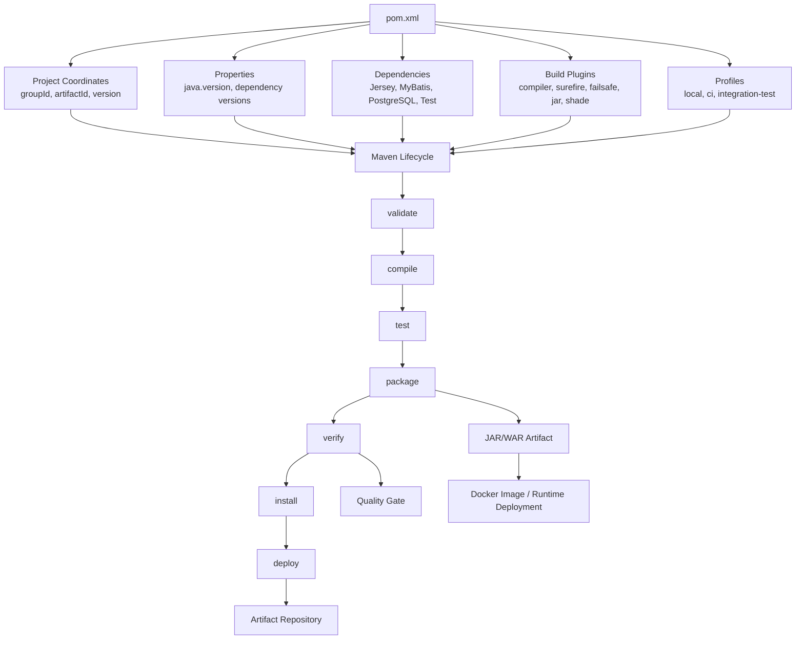

---

## Mental Model Maven

Maven bisa dipahami sebagai kombinasi dari empat konsep utama:

```text
POM         = deklarasi project
Lifecycle   = urutan fase build
Plugin      = mesin yang menjalankan pekerjaan
Dependency  = graph library yang dibutuhkan project
```

Relasinya:

```text
mvn clean verify
  -> Maven membaca pom.xml
  -> resolve parent/BOM/dependencies/plugins
  -> menjalankan lifecycle phases sampai verify
  -> plugin goals dieksekusi pada phase tertentu
  -> test dan quality gate berjalan
  -> artifact dihasilkan
```

Maven punya tiga built-in lifecycle: `default`, `clean`, dan `site`. Lifecycle `default` menangani build/deployment project, `clean` untuk pembersihan build output, dan `site` untuk pembuatan project site. ([Apache Maven](https://maven.apache.org/guides/introduction/introduction-to-the-lifecycle.html?utm_source=chatgpt.com))

---

## Decomposition Map

| # | Domain / Skill | Yang perlu dikuasai | Relevansi untuk Java Jersey/JAX-RS microservice | Failure mode yang dicegah |
|---:|---|---|---|---|
| 1 | Maven Coordinates | `groupId`, `artifactId`, `version`, `packaging` | Identitas artifact service/library | Artifact salah publish, dependency sulit dilacak |
| 2 | POM Structure | `properties`, `dependencies`, `build`, `profiles`, `dependencyManagement` | Pusat deklarasi build dan dependency | POM berantakan, version drift |
| 3 | Maven Lifecycle | `validate`, `compile`, `test`, `package`, `verify`, `install`, `deploy` | Membentuk quality gate build | Test tidak jalan, artifact dibuat sebelum valid |
| 4 | Phase vs Goal | Phase adalah titik lifecycle; goal adalah tugas plugin | Memahami kenapa command menjalankan banyak hal | Salah command Maven |
| 5 | Plugin Binding | Plugin goal di-bind ke phase | Compiler/test/package berjalan otomatis | Plugin tidak jalan atau jalan di phase salah |
| 6 | Dependency Scope | `compile`, `provided`, `runtime`, `test`, `system`, `import` | Classpath compile/test/runtime berbeda | `ClassNotFoundException`, JAR terlalu gemuk |
| 7 | Transitive Dependency | Dependency dari dependency | Jersey/Jackson/MyBatis membawa dependency lain | Version conflict, CVE transitive |
| 8 | Dependency Management | Mengunci versi dependency tanpa selalu mendeklarasikan dependency langsung | Parent POM dan multi-module governance | Versi beda antar module |
| 9 | Plugin Management | Mengunci versi/config plugin untuk child module | Konsistensi compiler/test/jar plugin | Build beda antar module |
| 10 | Properties | Centralized version/config | `java.version`, `jersey.version`, `maven.compiler.release` | Magic value tersebar |
| 11 | Parent POM | Inheritance konfigurasi umum | Standar build across service | Copy-paste POM |
| 12 | Multi-module Build | Aggregator/parent, module ordering | Service + shared library + integration test module | Build order kacau |
| 13 | Maven Wrapper | `./mvnw` untuk Maven version konsisten | Local dan CI lebih dekat | Global Maven berbeda |
| 14 | Repository Resolution | Local repo, remote repo, mirror, private repo | Internal artifact, corporate proxy | Dependency gagal resolve di CI |
| 15 | Settings.xml | Credential, mirror, profile eksternal | Artifact repository enterprise | Secret masuk POM |
| 16 | Profiles | Aktivasi build behavior berdasarkan property/env/file | `local`, `ci`, `integration-test` | Build behavior tersembunyi |
| 17 | Effective POM | POM final setelah parent/profile/plugin merge | Debug konfigurasi Maven | Bingung config berasal dari mana |
| 18 | Dependency Tree | Melihat graph dependency | Debug conflict Jersey/Jackson/logging | `NoSuchMethodError` |
| 19 | Enforcer Rules | Validasi Java/Maven/dependency convergence | Guardrail enterprise | Build lolos dengan dependency konflik |
| 20 | Test Plugins | Surefire/Failsafe | Unit vs integration test | Integration test tidak pernah jalan |
| 21 | Packaging | `jar`, `war`, shaded/fat jar | Cara service dijalankan | Artifact salah format |
| 22 | Reproducible Build | Pin version, wrapper, explicit plugin | CI/local/prod konsisten | “Works on my machine” |
| 23 | Artifact Metadata | Manifest, version, commit SHA jika dikonfigurasi | Traceability runtime | Tidak tahu artifact dari commit mana |
| 24 | Release Discipline | Snapshot vs release, deploy artifact | CI/CD dan repository hygiene | Snapshot masuk production |

---

## 1. POM sebagai pusat deklarasi project

Contoh POM minimal untuk service Java 17+:

```xml
<project xmlns="http://maven.apache.org/POM/4.0.0"
         xmlns:xsi="http://www.w3.org/2001/XMLSchema-instance"
         xsi:schemaLocation="
           http://maven.apache.org/POM/4.0.0
           https://maven.apache.org/xsd/maven-4.0.0.xsd">

  <modelVersion>4.0.0</modelVersion>

  <groupId>com.company.platform</groupId>
  <artifactId>customer-service</artifactId>
  <version>1.0.0-SNAPSHOT</version>
  <packaging>jar</packaging>

  <properties>
    <java.version>17</java.version>
    <project.build.sourceEncoding>UTF-8</project.build.sourceEncoding>
    <maven.compiler.release>${java.version}</maven.compiler.release>
  </properties>

</project>
```

POM berisi informasi yang dibutuhkan project dan konfigurasi plugin yang digunakan selama proses build; Maven melihat POM sebagai deklarasi “who/what/where”, sedangkan lifecycle menjawab “when/how”. ([Apache Maven](https://maven.apache.org/pom.html?utm_source=chatgpt.com))

### Praktik yang baik

| Elemen | Praktik |
|---|---|
| `groupId` | Gunakan namespace organisasi/domain |
| `artifactId` | Nama service/library spesifik |
| `version` | Gunakan `SNAPSHOT` untuk development, release version untuk artifact stabil |
| `packaging` | `jar` untuk runnable service; `war` jika deploy ke servlet container |
| `properties` | Simpan versi Java dan dependency utama secara terpusat |

---

## 2. Lifecycle: phase yang paling sering dipakai

Command Maven yang sering dipakai:

```bash
./mvnw clean compile
./mvnw clean test
./mvnw clean package
./mvnw clean verify
./mvnw clean install
./mvnw clean deploy
```

Lifecycle `default` punya phase bertahap. Jika menjalankan phase tertentu, Maven menjalankan semua phase sebelumnya di lifecycle yang sama sampai phase tersebut.

| Phase | Tujuan praktis | Kapan dipakai |
|---|---|---|
| `validate` | Validasi project/config | Awal build |
| `compile` | Compile source utama | Cek syntax dan dependency compile |
| `test` | Jalankan unit test | Feedback cepat |
| `package` | Buat artifact, misalnya JAR/WAR | Build artifact lokal |
| `verify` | Jalankan verifikasi tambahan | CI quality gate |
| `install` | Install artifact ke local Maven repo | Saat module lain butuh artifact lokal |
| `deploy` | Publish artifact ke remote repository | Release/CI publish |

Maven menjalankan build aktual melalui plugin goals yang terikat ke lifecycle phases; lifecycle menyediakan urutan, sedangkan plugin menjalankan pekerjaan konkret. ([Apache Maven](https://maven.apache.org/guides/introduction/introduction-to-the-lifecycle.html?utm_source=chatgpt.com))

### Praktik senior

Untuk PR CI, default aman biasanya:

```bash
./mvnw clean verify
```

Alasannya: `verify` adalah tempat yang lebih cocok untuk quality gate daripada hanya `package`, terutama bila integration test, coverage check, dependency check, atau enforcer rule dikonfigurasi.

---

## 3. Phase vs Plugin Goal

Ini sering membingungkan.

```text
phase = tahap lifecycle
goal  = tugas spesifik dari plugin
```

Contoh:

```bash
./mvnw test
```

`test` adalah lifecycle phase.

Contoh goal langsung:

```bash
./mvnw dependency:tree
./mvnw help:effective-pom
./mvnw versions:display-dependency-updates
```

Format goal:

```text
plugin-prefix:goal
```

Contoh:

| Goal | Fungsi |
|---|---|
| `dependency:tree` | Menampilkan dependency graph |
| `help:effective-pom` | Menampilkan POM final |
| `clean:clean` | Membersihkan output build |
| `surefire:test` | Menjalankan unit test via Surefire |
| `failsafe:integration-test` | Menjalankan integration test via Failsafe |

Prinsipnya:

```text
Gunakan lifecycle phase untuk build normal.
Gunakan plugin goal langsung untuk inspeksi, maintenance, atau debugging.
```

---

## 4. Dependency Scope

Dependency scope menentukan kapan dependency masuk ke classpath dan seberapa jauh transitivity dependency berlaku. Maven mendokumentasikan enam scope: `compile`, `provided`, `runtime`, `test`, `system`, dan `import`. ([Apache Maven](https://maven.apache.org/guides/introduction/introduction-to-dependency-mechanism.html?utm_source=chatgpt.com))

| Scope | Masuk compile? | Masuk runtime? | Masuk test? | Contoh penggunaan |
|---|---:|---:|---:|---|
| `compile` | Ya | Ya | Ya | Library utama aplikasi |
| `provided` | Ya | Tidak | Ya | API yang disediakan runtime/container |
| `runtime` | Tidak | Ya | Ya | JDBC driver |
| `test` | Tidak | Tidak | Ya | JUnit, Mockito, testcontainers |
| `system` | Ya | Tergantung manual | Ya | Hindari jika memungkinkan |
| `import` | Khusus BOM | Tidak langsung | Tidak langsung | Dependency management BOM |

Maven juga menjelaskan bahwa compile adalah default bila scope tidak diberikan; `provided` berarti artifact diharapkan tersedia dari JDK atau container saat runtime; `runtime` dibutuhkan saat eksekusi tetapi bukan compile; dan `test` hanya dibutuhkan untuk test. ([Apache Maven](https://maven.apache.org/repositories/dependencies.html?utm_source=chatgpt.com))

### Contoh dependency

```xml
<dependencies>
  <!-- Jersey/JAX-RS implementation -->
  <dependency>
    <groupId>org.glassfish.jersey.containers</groupId>
    <artifactId>jersey-container-grizzly2-http</artifactId>
    <version>${jersey.version}</version>
  </dependency>

  <!-- JSON support -->
  <dependency>
    <groupId>org.glassfish.jersey.media</groupId>
    <artifactId>jersey-media-json-jackson</artifactId>
    <version>${jersey.version}</version>
  </dependency>

  <!-- PostgreSQL JDBC driver: often runtime scope -->
  <dependency>
    <groupId>org.postgresql</groupId>
    <artifactId>postgresql</artifactId>
    <version>${postgresql.version}</version>
    <scope>runtime</scope>
  </dependency>

  <!-- Unit test -->
  <dependency>
    <groupId>org.junit.jupiter</groupId>
    <artifactId>junit-jupiter</artifactId>
    <version>${junit.version}</version>
    <scope>test</scope>
  </dependency>
</dependencies>
```

Catatan: contoh dependency Jersey di atas adalah pola umum. Versi dan artifact final harus disesuaikan dengan runtime yang dipakai perusahaan: embedded server, servlet container, app server, atau framework internal.

---

## 5. Dependency Graph dan Transitive Dependency

Maven dependency bukan flat list. Ia adalah graph.

```text
your-service
  -> jersey-media-json-jackson
      -> jackson-core
      -> jackson-databind
  -> mybatis
  -> postgresql
  -> logging library
```

Masalah umum:

```text
NoSuchMethodError
ClassNotFoundException
ClassCastException
duplicate logging binding
CVE dari transitive dependency
versi Jackson berbeda antar dependency
```

Command wajib:

```bash
./mvnw dependency:tree
```

Cari dependency tertentu:

```bash
./mvnw dependency:tree -Dincludes=com.fasterxml.jackson.core
./mvnw dependency:tree -Dincludes=org.glassfish.jersey
./mvnw dependency:tree -Dincludes=org.postgresql
```

Output dependency tree membantu menjawab:

```text
Dependency ini datang dari mana?
Versi mana yang menang?
Apakah ada dependency duplikat?
Apakah transitive dependency membawa versi lama?
```

---

## 6. `dependencyManagement` vs `dependencies`

Ini salah satu konsep Maven terpenting.

### `dependencies`

Benar-benar menambahkan dependency ke module.

```xml
<dependencies>
  <dependency>
    <groupId>org.postgresql</groupId>
    <artifactId>postgresql</artifactId>
  </dependency>
</dependencies>
```

### `dependencyManagement`

Mengatur versi/scope default, tetapi tidak otomatis menambahkan dependency ke module.

```xml
<dependencyManagement>
  <dependencies>
    <dependency>
      <groupId>org.postgresql</groupId>
      <artifactId>postgresql</artifactId>
      <version>${postgresql.version}</version>
      <scope>runtime</scope>
    </dependency>
  </dependencies>
</dependencyManagement>
```

Lalu module cukup:

```xml
<dependencies>
  <dependency>
    <groupId>org.postgresql</groupId>
    <artifactId>postgresql</artifactId>
  </dependency>
</dependencies>
```

Manfaat:

```text
Versi dependency dikontrol di satu tempat.
Child module tidak perlu mengulang version.
Dependency governance lebih mudah.
```

### Rule praktis

| Kebutuhan | Pakai |
|---|---|
| Menambahkan dependency ke module | `dependencies` |
| Mengunci versi dependency untuk banyak module | `dependencyManagement` |
| Mengimpor versi dari platform/BOM | `dependencyManagement` dengan scope `import` |
| Menghindari version drift | parent POM + dependencyManagement |

---

## 7. BOM: Bill of Materials

BOM digunakan untuk mengelola sekumpulan versi dependency yang saling kompatibel.

Pola:

```xml
<dependencyManagement>
  <dependencies>
    <dependency>
      <groupId>example.platform</groupId>
      <artifactId>example-bom</artifactId>
      <version>${example.bom.version}</version>
      <type>pom</type>
      <scope>import</scope>
    </dependency>
  </dependencies>
</dependencyManagement>
```

BOM berguna untuk:

```text
Jakarta/Jersey dependency set
internal platform libraries
cloud SDK families
observability libraries
testing stack
```

Risiko:

```text
BOM menyederhanakan version alignment, tetapi jangan buta.
Tetap cek dependency tree dan security scan.
```

---

## 8. Plugin dan `pluginManagement`

Dependency mengatur library aplikasi. Plugin mengatur proses build.

Contoh plugin penting:

```xml
<build>
  <plugins>
    <plugin>
      <groupId>org.apache.maven.plugins</groupId>
      <artifactId>maven-compiler-plugin</artifactId>
      <version>${maven.compiler.plugin.version}</version>
      <configuration>
        <release>${java.version}</release>
      </configuration>
    </plugin>
  </plugins>
</build>
```

### `plugins`

Plugin benar-benar digunakan oleh module.

### `pluginManagement`

Mengatur versi/config default plugin untuk child module, tapi tidak selalu otomatis mengeksekusi plugin kecuali plugin dideklarasikan/terikat sesuai lifecycle.

Pola parent POM:

```xml
<build>
  <pluginManagement>
    <plugins>
      <plugin>
        <groupId>org.apache.maven.plugins</groupId>
        <artifactId>maven-compiler-plugin</artifactId>
        <version>${maven.compiler.plugin.version}</version>
        <configuration>
          <release>${java.version}</release>
        </configuration>
      </plugin>
    </plugins>
  </pluginManagement>
</build>
```

Rule praktis:

| Kebutuhan | Pakai |
|---|---|
| Plugin harus jalan di module ini | `build/plugins` |
| Standarkan versi/config plugin untuk child | `build/pluginManagement` |
| Hindari plugin version implicit | Selalu pin version |
| Debug plugin config final | `help:effective-pom` |

---

## 9. Java 17+ dan Maven

Untuk Java 17+ service, minimal pastikan compiler plugin menggunakan `release`, bukan hanya `source`/`target`.

```xml
<properties>
  <java.version>17</java.version>
  <maven.compiler.release>${java.version}</maven.compiler.release>
</properties>
```

Atau eksplisit:

```xml
<plugin>
  <groupId>org.apache.maven.plugins</groupId>
  <artifactId>maven-compiler-plugin</artifactId>
  <version>${maven.compiler.plugin.version}</version>
  <configuration>
    <release>${java.version}</release>
  </configuration>
</plugin>
```

Catatan versioning Maven yang perlu diperhatikan saat onboarding: dokumentasi Maven saat ini menyatakan Maven 3.9.x stable membutuhkan JDK 8+, sedangkan Maven 4.0+ membutuhkan JDK 17 atau lebih tinggi untuk menjalankan Maven; Maven 4 tetap bisa membangun target JDK lain dengan toolchains. ([Apache Maven](https://maven.apache.org/install.html?utm_source=chatgpt.com))

Implikasi praktis:

```text
JDK untuk menjalankan Maven ≠ JDK target aplikasi.
Untuk enterprise, jangan upgrade Maven major version tanpa validasi plugin, CI, wrapper, dan repository behavior.
```

---

## 10. Maven Wrapper

Prefer:

```bash
./mvnw clean verify
```

Daripada:

```bash
mvn clean verify
```

Alasannya:

```text
./mvnw membuat Maven version lebih konsisten antar developer dan CI.
Global mvn bergantung instalasi laptop/runner.
```

File penting:

```text
mvnw
mvnw.cmd
.mvn/wrapper/
```

Checklist:

```bash
./mvnw -version
chmod +x mvnw
git status --short .mvn/wrapper mvnw mvnw.cmd
```

Prinsip: setiap repo service harus bisa menjelaskan **Maven version yang dipakai** tanpa mengandalkan instalasi global developer.

---

## 11. Profiles

Profiles bisa mengubah konfigurasi build berdasarkan property, environment, OS, JDK, file, atau activation tertentu. Maven mendokumentasikan bahwa environment variable seperti `FOO` dapat diakses sebagai property `env.FOO`, dengan catatan nama environment variable dinormalisasi uppercase di Windows. ([Apache Maven](https://maven.apache.org/guides/introduction/introduction-to-profiles.html?utm_source=chatgpt.com))

Contoh profile untuk integration test:

```xml
<profiles>
  <profile>
    <id>integration-test</id>
    <properties>
      <skip.integration.tests>false</skip.integration.tests>
    </properties>
  </profile>
</profiles>
```

Run:

```bash
./mvnw clean verify -Pintegration-test
```

### Risiko profile

Profiles powerful, tapi bisa membuat build sulit ditebak.

Anti-pattern:

```text
Local build tanpa profile lolos.
CI build dengan profile gagal.
Developer tidak tahu profile aktif.
```

Command inspeksi:

```bash
./mvnw help:active-profiles
./mvnw help:effective-pom
```

Rule praktis:

| Prinsip | Penjelasan |
|---|---|
| Profile harus sedikit | Jangan buat matrix behavior terlalu banyak |
| Nama profile harus jelas | `integration-test`, `ci`, `release`, bukan `special` |
| CI profile harus eksplisit | Jangan bergantung activation tersembunyi |
| Production behavior jangan hanya Maven profile | Runtime config sebaiknya explicit via deployment config |

---

## 12. Effective POM

Effective POM adalah POM final setelah Maven menggabungkan:

```text
project POM
parent POM
super POM
profiles
pluginManagement
dependencyManagement
default lifecycle bindings
```

Command:

```bash
./mvnw help:effective-pom > effective-pom.xml
```

Gunakan saat:

```text
plugin version tidak jelas
dependency version datang dari mana tidak jelas
profile aktif mengubah build
parent POM menyuntik config
CI berbeda dari local
```

Untuk dependency:

```bash
./mvnw dependency:tree > dependency-tree.txt
```

Untuk active profile:

```bash
./mvnw help:active-profiles
```

---

## 13. Unit Test vs Integration Test

Konvensi umum:

| Jenis test | Plugin | Naming umum | Maven phase |
|---|---|---|---|
| Unit test | Surefire | `*Test.java` | `test` |
| Integration test | Failsafe | `*IT.java`, `*ITCase.java` | `integration-test` / `verify` |

Pola POM:

```xml
<build>
  <plugins>
    <plugin>
      <groupId>org.apache.maven.plugins</groupId>
      <artifactId>maven-surefire-plugin</artifactId>
      <version>${maven.surefire.plugin.version}</version>
    </plugin>

    <plugin>
      <groupId>org.apache.maven.plugins</groupId>
      <artifactId>maven-failsafe-plugin</artifactId>
      <version>${maven.failsafe.plugin.version}</version>
      <executions>
        <execution>
          <goals>
            <goal>integration-test</goal>
            <goal>verify</goal>
          </goals>
        </execution>
      </executions>
    </plugin>
  </plugins>
</build>
```

Praktik penting:

```text
Unit test harus cepat dan tidak butuh dependency eksternal.
Integration test boleh butuh DB/container/service dependency.
CI harus eksplisit apakah menjalankan integration test.
```

Failure mode umum:

```text
Integration test tidak pernah jalan karena salah naming.
Failsafe belum dikonfigurasi.
Developer hanya menjalankan mvn test.
CI menjalankan mvn verify.
```

---

## 14. Packaging: JAR, WAR, dan Runnable Artifact

Pilihan packaging:

| Packaging | Cocok untuk | Catatan |
|---|---|---|
| `jar` | Microservice standalone | Umum untuk container runtime |
| `war` | Deploy ke servlet container/app server | Runtime menyediakan sebagian dependency |
| shaded/fat jar | Semua dependency digabung | Praktis, tapi perlu hati-hati duplicate resource/class |
| thin jar | Dependency terpisah | Lebih terkontrol, tapi deployment lebih kompleks |

Untuk Jersey/JAX-RS:

```text
Embedded HTTP server -> biasanya JAR runnable.
Servlet container -> biasanya WAR.
Enterprise app server -> perhatikan provided dependencies.
```

Dependency scope penting di sini. Jika runtime/container sudah menyediakan API tertentu, scope `provided` bisa dipakai. Jika aplikasi harus membawa sendiri dependency runtime, gunakan scope yang sesuai.

---

## 15. Repository dan `settings.xml`

Maven resolve dependency dari:

```text
local repository
remote repository
corporate mirror
private artifact repository
```

Default local repo biasanya:

```text
~/.m2/repository
```

`settings.xml` biasanya dipakai untuk:

```text
repository credential
mirror
proxy
server id
profile eksternal
```

Jangan taruh password/token private repository di `pom.xml`. Untuk CI, credential harus lewat secret manager/GitHub Actions secrets/artifact repository integration.

Contoh konsep:

```xml
<servers>
  <server>
    <id>company-artifacts</id>
    <username>${env.ARTIFACT_USER}</username>
    <password>${env.ARTIFACT_TOKEN}</password>
  </server>
</servers>
```

Catatan: detail interpolation credential tergantung cara `settings.xml` disediakan di environment/CI. Prinsipnya: POM harus reusable dan tidak memuat secret.

---

## 16. Command Cheatsheet

| Kebutuhan | Command |
|---|---|
| Build penuh | `./mvnw clean verify` |
| Compile saja | `./mvnw clean compile` |
| Unit test | `./mvnw test` |
| Package artifact | `./mvnw clean package` |
| Install ke local repo | `./mvnw clean install` |
| Lihat dependency tree | `./mvnw dependency:tree` |
| Cari dependency tertentu | `./mvnw dependency:tree -Dincludes=groupId` |
| Lihat effective POM | `./mvnw help:effective-pom` |
| Lihat active profiles | `./mvnw help:active-profiles` |
| Skip test sementara | `./mvnw clean package -DskipTests` |
| Offline build jika cache ada | `./mvnw -o clean verify` |
| Update snapshot | `./mvnw -U clean verify` |

Hati-hati:

```bash
-DskipTests
```

Biasanya masih meng-compile test tetapi tidak menjalankannya.

```bash
-Dmaven.test.skip=true
```

Biasanya skip compile dan execution test. Ini lebih berisiko jika dipakai sembarangan.

---

## 17. POM Skeleton untuk Java 17+ Jersey Service

Ini skeleton konseptual, bukan template final organisasi.

```xml
<project xmlns="http://maven.apache.org/POM/4.0.0"
         xmlns:xsi="http://www.w3.org/2001/XMLSchema-instance"
         xsi:schemaLocation="
           http://maven.apache.org/POM/4.0.0
           https://maven.apache.org/xsd/maven-4.0.0.xsd">

  <modelVersion>4.0.0</modelVersion>

  <groupId>com.company.platform</groupId>
  <artifactId>customer-service</artifactId>
  <version>1.0.0-SNAPSHOT</version>
  <packaging>jar</packaging>

  <properties>
    <java.version>17</java.version>
    <project.build.sourceEncoding>UTF-8</project.build.sourceEncoding>

    <jersey.version>3.1.x</jersey.version>
    <postgresql.version>REPLACE_WITH_APPROVED_VERSION</postgresql.version>
    <junit.version>REPLACE_WITH_APPROVED_VERSION</junit.version>

    <maven.compiler.plugin.version>REPLACE_WITH_APPROVED_VERSION</maven.compiler.plugin.version>
    <maven.surefire.plugin.version>REPLACE_WITH_APPROVED_VERSION</maven.surefire.plugin.version>
    <maven.failsafe.plugin.version>REPLACE_WITH_APPROVED_VERSION</maven.failsafe.plugin.version>
  </properties>

  <dependencyManagement>
    <dependencies>
      <!-- Optional: import approved internal/platform BOM here -->
    </dependencies>
  </dependencyManagement>

  <dependencies>
    <dependency>
      <groupId>org.glassfish.jersey.containers</groupId>
      <artifactId>jersey-container-grizzly2-http</artifactId>
      <version>${jersey.version}</version>
    </dependency>

    <dependency>
      <groupId>org.glassfish.jersey.media</groupId>
      <artifactId>jersey-media-json-jackson</artifactId>
      <version>${jersey.version}</version>
    </dependency>

    <dependency>
      <groupId>org.postgresql</groupId>
      <artifactId>postgresql</artifactId>
      <version>${postgresql.version}</version>
      <scope>runtime</scope>
    </dependency>

    <dependency>
      <groupId>org.junit.jupiter</groupId>
      <artifactId>junit-jupiter</artifactId>
      <version>${junit.version}</version>
      <scope>test</scope>
    </dependency>
  </dependencies>

  <build>
    <pluginManagement>
      <plugins>
        <plugin>
          <groupId>org.apache.maven.plugins</groupId>
          <artifactId>maven-compiler-plugin</artifactId>
          <version>${maven.compiler.plugin.version}</version>
          <configuration>
            <release>${java.version}</release>
          </configuration>
        </plugin>

        <plugin>
          <groupId>org.apache.maven.plugins</groupId>
          <artifactId>maven-surefire-plugin</artifactId>
          <version>${maven.surefire.plugin.version}</version>
        </plugin>

        <plugin>
          <groupId>org.apache.maven.plugins</groupId>
          <artifactId>maven-failsafe-plugin</artifactId>
          <version>${maven.failsafe.plugin.version}</version>
        </plugin>
      </plugins>
    </pluginManagement>

    <plugins>
      <plugin>
        <groupId>org.apache.maven.plugins</groupId>
        <artifactId>maven-compiler-plugin</artifactId>
      </plugin>

      <plugin>
        <groupId>org.apache.maven.plugins</groupId>
        <artifactId>maven-surefire-plugin</artifactId>
      </plugin>
    </plugins>
  </build>

</project>
```

Saya sengaja memakai placeholder `REPLACE_WITH_APPROVED_VERSION` untuk beberapa versi karena di perusahaan enterprise biasanya versi dependency dan plugin ditentukan oleh platform/BOM/security policy internal, bukan asal mengikuti versi internet terbaru.

---

## 18. Common Failure Scenarios

### Scenario 1 - `ClassNotFoundException`

Kemungkinan:

```text
dependency belum ditambahkan
scope salah
artifact tidak ikut packaging
runtime container tidak menyediakan dependency
```

Cek:

```bash
./mvnw dependency:tree
jar tf target/*.jar | grep SomeClass
```

---

### Scenario 2 - `NoSuchMethodError`

Kemungkinan:

```text
compile pakai versi library A
runtime memakai versi library A yang berbeda
transitive dependency override
duplicate dependency
```

Cek:

```bash
./mvnw dependency:tree -Dverbose
./mvnw dependency:tree -Dincludes=com.fasterxml.jackson.core
```

---

### Scenario 3 - Build local sukses, CI gagal

Kemungkinan:

```text
JDK beda
Maven beda
profile beda
settings.xml beda
private repo credential tidak ada
case-sensitive filesystem issue
test bergantung local state
```

Cek:

```bash
./mvnw -version
java -version
./mvnw help:active-profiles
./mvnw help:effective-pom
```

---

### Scenario 4 - Integration test tidak pernah jalan

Kemungkinan:

```text
test diberi nama *Test bukan *IT
Failsafe belum dikonfigurasi
CI hanya menjalankan mvn test
profile integration-test tidak aktif
```

Cek:

```bash
./mvnw clean verify -X
ls src/test/java
```

---

### Scenario 5 - Dependency versi tidak sesuai ekspektasi

Kemungkinan:

```text
versi dikontrol parent POM
BOM mengatur versi
dependency mediation memilih versi lain
profile mengubah dependency
```

Cek:

```bash
./mvnw dependency:tree
./mvnw help:effective-pom
```

---

## 19. Review Checklist untuk POM

Saat review PR yang mengubah `pom.xml`, cek:

| Checklist | Pertanyaan |
|---|---|
| Java version | Apakah Java 17+ dikunci eksplisit? |
| Plugin version | Apakah plugin penting punya version eksplisit? |
| Dependency version | Apakah versi dikontrol via property/BOM/dependencyManagement? |
| Scope | Apakah `compile`, `runtime`, `provided`, `test` benar? |
| Transitive impact | Sudah cek `dependency:tree`? |
| Test lifecycle | Apakah unit/integration test jalan di phase yang benar? |
| Security | Apakah dependency baru punya approval/security scan? |
| Packaging | Apakah artifact sesuai runtime? |
| Profile | Apakah profile baru jelas dan tidak menyembunyikan behavior? |
| CI compatibility | Apakah `./mvnw clean verify` tetap jalan? |
| Secret | Tidak ada credential/token di POM? |
| Reproducibility | Tidak ada version range liar atau plugin implicit? |

---

## 20. Senior Engineer Invariants

| Invariant | Penjelasan |
|---|---|
| Build command utama harus satu | Biasanya `./mvnw clean verify` |
| POM harus deklaratif | Hindari logic build yang terlalu tersembunyi |
| Version harus terkontrol | Dependency/plugin/JDK/Maven harus eksplisit |
| Dependency graph harus diaudit | Jangan hanya lihat direct dependency |
| Scope harus disengaja | Salah scope bisa pecah di runtime |
| CI harus menjalankan lifecycle yang tepat | Minimal compile, test, package, verify |
| Effective POM harus bisa dijelaskan | Kalau tidak bisa dijelaskan, build terlalu opaque |
| Runtime artifact harus traceable | Artifact harus bisa dikaitkan ke source/version |

---

## Mini Lab

### Lab 1 - Lihat effective POM

```bash
./mvnw help:effective-pom > effective-pom.xml
```

Cari:

```bash
grep -n "maven-compiler-plugin" effective-pom.xml
grep -n "maven-surefire-plugin" effective-pom.xml
grep -n "sourceEncoding" effective-pom.xml
```

Tujuan: memahami konfigurasi final Maven.

---

### Lab 2 - Lihat dependency tree

```bash
./mvnw dependency:tree > dependency-tree.txt
```

Cari dependency penting:

```bash
grep -i "jersey" dependency-tree.txt
grep -i "jackson" dependency-tree.txt
grep -i "postgresql" dependency-tree.txt
```

Tujuan: melihat dependency langsung dan transitive.

---

### Lab 3 - Bandingkan phase

```bash
./mvnw clean compile
./mvnw clean test
./mvnw clean package
./mvnw clean verify
```

Tujuan: memahami apa yang berjalan di setiap phase.

---

### Lab 4 - Cek active profile

```bash
./mvnw help:active-profiles
./mvnw help:active-profiles -Pintegration-test
```

Tujuan: melihat profile yang aktif.

---

### Lab 5 - Validasi Maven Wrapper

```bash
./mvnw -version
mvn -version
```

Tujuan: membandingkan Maven wrapper vs global Maven.

---

## Roadmap singkat penguasaan Maven

| Tahap | Fokus | Output |
|---:|---|---|
| 1 | POM basics | Bisa membaca coordinates, properties, dependencies |
| 2 | Lifecycle | Paham efek `compile`, `test`, `package`, `verify` |
| 3 | Dependency graph | Bisa debug transitive dependency |
| 4 | Plugin model | Bisa menjelaskan compiler/test/package plugin |
| 5 | Profiles/settings | Bisa bedakan local, CI, private repo config |
| 6 | Reproducible build | Bisa membuat local dan CI build konsisten |
| 7 | Enterprise governance | Dependency/plugin/security/version policy |

---

## Ringkasan

Maven adalah pusat kontrak build untuk Java Jersey/JAX-RS microservice.

Yang harus benar-benar dikuasai:

```text
pom.xml sebagai deklarasi project
lifecycle sebagai urutan build
plugin sebagai executor pekerjaan
dependency graph sebagai classpath source
scope sebagai batas compile/runtime/test
profile sebagai variasi build
wrapper sebagai penjaga konsistensi
effective-pom dan dependency-tree sebagai alat debugging
```

Untuk senior software engineer, kemampuan penting bukan hanya menjalankan command Maven, tetapi bisa menjawab:

```text
Kenapa dependency ini masuk?
Kenapa versi ini yang dipakai?
Plugin apa yang menjalankan test?
Phase mana yang menghasilkan artifact?
Apa bedanya local dan CI build?
Artifact ini bisa ditelusuri ke konfigurasi apa?
```

---

## Status

**Seri 4/12 selesai.**

Rekomendasi berikutnya: **Seri 5 - Maven untuk Java 17+ Jersey/JAX-RS Microservice**.

---

**Sources:**

- [Introduction to the POM - Apache Maven](https://maven.apache.org/guides/introduction/introduction-to-the-pom.html?utm_source=chatgpt.com)
- [Jakarta RESTful Web Services](https://jakarta.ee/specifications/restful-ws/?utm_source=chatgpt.com)

## Response:
7/14/2026, 12:13:43 AM

Saya lanjut ke **Seri 5/12**. Bagian ini akan lebih spesifik ke Maven setup untuk Java 17+ Jersey/JAX-RS microservice: dependency set, compiler config, packaging, testing, runtime profile, dan jebakan `javax.*` vs `jakarta.*`.

# Seri 5/12 - Maven untuk Java 17+ Jersey/JAX-RS Microservice

## Introduction

Seri ini masuk lebih spesifik ke penggunaan Maven untuk **Java 17+ Jersey/JAX-RS microservice**. Kalau Seri 4 membahas Maven fundamentals, seri ini membahas bagaimana Maven dipakai untuk membentuk service yang siap dikembangkan, dites, dipaketkan, dijalankan lokal, dimasukkan ke Docker image, dan dipakai di CI/CD.

Di Java 17+, konfigurasi Maven harus eksplisit: JDK, compiler release, dependency version, plugin version, test lifecycle, packaging, dan runtime classpath. Maven Compiler Plugin mendukung opsi `--release` dari `javac`; opsi ini memastikan source, target class file, dan public API yang tersedia mengikuti release Java yang ditentukan. Ini lebih aman daripada hanya memakai `source` dan `target` tanpa mengontrol API yang tersedia. ([Apache Maven](https://maven.apache.org/plugins/maven-compiler-plugin/examples/set-compiler-release.html?utm_source=chatgpt.com))

Untuk Jersey/JAX-RS, perlu hati-hati dengan transisi namespace. Jersey 3.x mendukung **Jakarta RESTful Web Services 3.0**, sedangkan Jakarta RESTful Web Services 4.0 adalah bagian dari Jakarta EE 11 dan mendeskripsikan API dasar untuk membangun REST-style web service. ([Jersey](https://jersey.github.io/?utm_source=chatgpt.com))

---

## Diagram

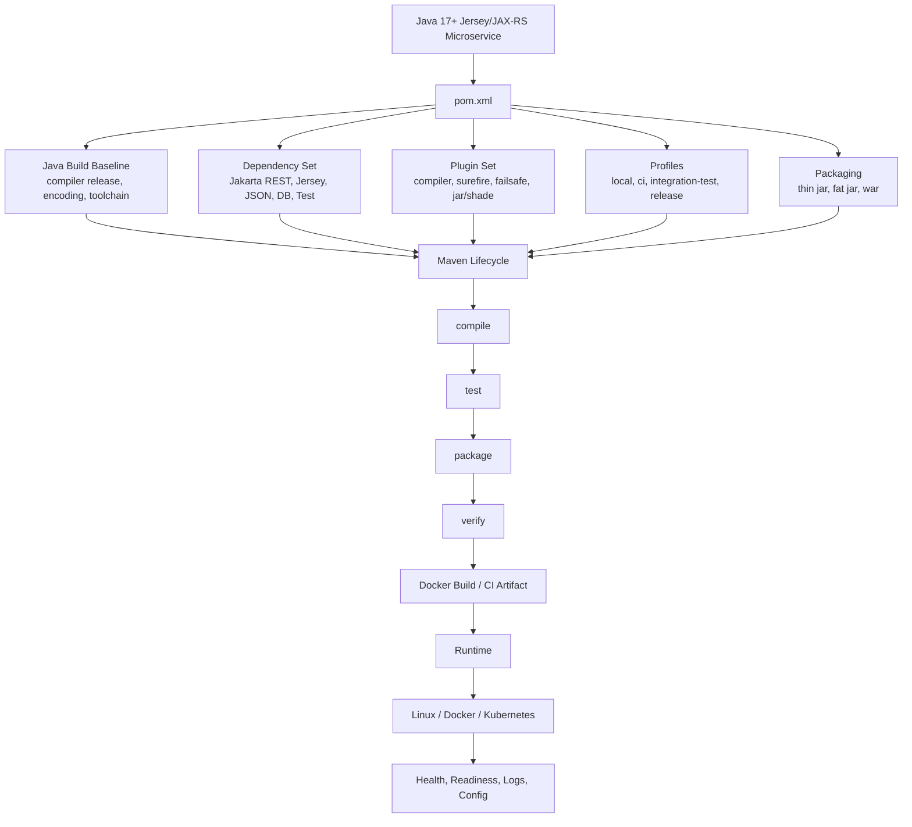

---

## Mental model

Untuk Java Jersey/JAX-RS microservice, Maven harus menjawab 8 pertanyaan:

```text id="maven-jersey-questions"
1. Java release target berapa?
2. Jersey/Jakarta REST stack mana yang dipakai?
3. Apakah namespace javax.* atau jakarta.*?
4. Dependency mana yang dibutuhkan saat compile, runtime, dan test?
5. Unit test dan integration test jalan di phase apa?
6. Artifact yang dibuat bentuknya apa: thin JAR, fat JAR, atau WAR?
7. Bagaimana artifact dijalankan di Linux/Docker?
8. Apakah local build dan CI build menjalankan kontrak yang sama?
```

Kalau jawaban ini tidak eksplisit di `pom.xml`, biasanya akan muncul problem seperti:

```text id="maven-jersey-common-problems"
build sukses di laptop tapi gagal di CI
runtime ClassNotFoundException
NoSuchMethodError karena dependency conflict
javax/jakarta mismatch
test tidak pernah jalan
JAR tidak bisa dijalankan
Docker image membawa artifact salah
CI hijau tapi service gagal start
```

---

## Decomposition Map

| # | Domain / Skill | Yang perlu dikuasai | Relevansi untuk Java 17+ Jersey/JAX-RS microservice | Failure mode yang dicegah |
|---:|---|---|---|---|
| 1 | Java release baseline | `maven.compiler.release`, JDK runtime, Java 17+ | Menjamin bytecode dan API Java sesuai target | `UnsupportedClassVersionError`, API mismatch |
| 2 | Maven Wrapper | `./mvnw`, `.mvn/wrapper` | Menyamakan Maven local dan CI | Maven version drift |
| 3 | Jakarta vs Javax namespace | `jakarta.*` vs `javax.*` | Jersey 3.x menggunakan Jakarta namespace | Compile/runtime mismatch |
| 4 | Jersey dependency set | container module, server integration, JSON support | Menentukan cara service menerima HTTP request dan serialize JSON | Missing provider, endpoint tidak terdaftar |
| 5 | Jakarta REST API dependency | API contract untuk resource/filter/exception mapper | Dasar annotation seperti `@Path`, `@GET`, `@POST` | API dependency salah versi |
| 6 | JSON provider | Jackson/JSON-B provider | Request/response body mapping | 415/500 karena provider tidak ada |
| 7 | Validation dependency | Jakarta Validation/Hibernate Validator jika dipakai | Validasi DTO request | Constraint tidak jalan |
| 8 | Database dependency | PostgreSQL driver, MyBatis | Runtime data access | Driver tidak ada saat runtime |
| 9 | Logging dependency | SLF4J binding/logback/log4j2 sesuai standar | Logs untuk observability | Duplicate binding/no logs |
| 10 | Test dependency | JUnit 5, Mockito, AssertJ, Testcontainers jika dipakai | Unit/integration test | Test tidak ditemukan |
| 11 | Surefire | Unit test execution | Fast feedback | Unit test tidak jalan |
| 12 | Failsafe | Integration test execution | DB/container/API integration test | IT tidak jalan di CI |
| 13 | Packaging strategy | JAR/WAR/fat JAR/thin JAR | Menentukan deployment mode | Artifact tidak runnable |
| 14 | Main class/startup | Manifest/main class/shade plugin/appassembler | `java -jar` atau command container | Service tidak bisa start |
| 15 | Profiles | `local`, `ci`, `integration-test`, `release` | Variasi build yang terkendali | Build behavior tersembunyi |
| 16 | Dependency tree | `dependency:tree` | Debug conflict Jersey/Jackson/Jakarta API | `NoSuchMethodError` |
| 17 | Effective POM | `help:effective-pom` | Debug parent/BOM/plugin profile | Bingung konfigurasi final |
| 18 | Enforcer | Java/Maven/dependency convergence rule | Enterprise build guardrail | Dependency konflik lolos |
| 19 | Reproducible metadata | version, commit SHA, manifest | Traceability artifact | Tidak tahu artifact dari commit mana |
| 20 | CI alignment | `./mvnw clean verify` | Local dan CI menjalankan gate sama | CI/local drift |
| 21 | Docker handoff | artifact path, startup command, health endpoint | Build image dari artifact benar | Image berisi JAR lama/salah |
| 22 | Runtime config | env var, system property, config file | Port/profile/DB config | Config tidak terbaca |

---

## 1. Java 17+ Maven baseline

Untuk Java 17+, gunakan `release`:

```xml id="java17-compiler-baseline"
<properties>
  <java.version>17</java.version>
  <maven.compiler.release>${java.version}</maven.compiler.release>
  <project.build.sourceEncoding>UTF-8</project.build.sourceEncoding>
</properties>
```

Atau eksplisit di plugin:

```xml id="compiler-plugin-java17"
<build>
  <plugins>
    <plugin>
      <groupId>org.apache.maven.plugins</groupId>
      <artifactId>maven-compiler-plugin</artifactId>
      <version>${maven.compiler.plugin.version}</version>
      <configuration>
        <release>${java.version}</release>
      </configuration>
    </plugin>
  </plugins>
</build>
```

Kenapa `release` penting?

```text id="release-reason"
source/target mengontrol level bahasa dan bytecode.
release juga membatasi API Java yang boleh dipakai sesuai target release.
```

Contoh masalah yang dicegah:

```text id="release-failure"
Developer compile dengan JDK 21.
Target runtime Java 17.
Kode tanpa sadar memakai API yang tidak ada di Java 17.
Build bisa lolos jika hanya source/target tidak cukup ketat.
Runtime gagal atau behavior tidak kompatibel.
```

Maven Compiler Plugin menjelaskan bahwa `--release` memastikan kode dikompilasi mengikuti aturan bahasa, class target, dan public API dari release Java yang ditentukan. ([Apache Maven](https://maven.apache.org/plugins/maven-compiler-plugin/examples/set-compiler-release.html?utm_source=chatgpt.com))

---

## 2. Baseline POM untuk Java 17+ Jersey/JAX-RS

Skeleton konseptual:

```xml id="jersey-java17-pom-skeleton"
<project xmlns="http://maven.apache.org/POM/4.0.0"
         xmlns:xsi="http://www.w3.org/2001/XMLSchema-instance"
         xsi:schemaLocation="
           http://maven.apache.org/POM/4.0.0
           https://maven.apache.org/xsd/maven-4.0.0.xsd">

  <modelVersion>4.0.0</modelVersion>

  <groupId>com.company.platform</groupId>
  <artifactId>case-service</artifactId>
  <version>1.0.0-SNAPSHOT</version>
  <packaging>jar</packaging>

  <properties>
    <java.version>17</java.version>
    <maven.compiler.release>${java.version}</maven.compiler.release>
    <project.build.sourceEncoding>UTF-8</project.build.sourceEncoding>

    <jersey.version>REPLACE_WITH_APPROVED_VERSION</jersey.version>
    <junit.version>REPLACE_WITH_APPROVED_VERSION</junit.version>
    <postgresql.version>REPLACE_WITH_APPROVED_VERSION</postgresql.version>

    <maven.compiler.plugin.version>REPLACE_WITH_APPROVED_VERSION</maven.compiler.plugin.version>
    <maven.surefire.plugin.version>REPLACE_WITH_APPROVED_VERSION</maven.surefire.plugin.version>
    <maven.failsafe.plugin.version>REPLACE_WITH_APPROVED_VERSION</maven.failsafe.plugin.version>
  </properties>

  <dependencies>
    <!-- Jersey / Jakarta REST dependencies go here -->

    <!-- DB / persistence dependencies go here -->

    <!-- Test dependencies go here -->
  </dependencies>

  <build>
    <plugins>
      <!-- compiler, test, packaging plugins go here -->
    </plugins>
  </build>

</project>
```

Saya sengaja memakai `REPLACE_WITH_APPROVED_VERSION`, karena di lingkungan enterprise versi dependency biasanya dikendalikan oleh parent POM, internal BOM, security policy, atau platform engineering. Jangan asal mengikuti versi terbaru tanpa validasi compatibility, CVE, dan runtime container.

---

## 3. Jakarta REST / Jersey dependency model

Ada dua pertanyaan penting:

```text id="jakarta-jersey-questions"
1. Service berjalan standalone embedded server atau deploy ke servlet container/app server?
2. Stack memakai Jersey 2.x javax.* atau Jersey 3.x jakarta.*?
```

Jersey 3.x adalah stack untuk Jakarta RESTful Web Services 3.0, sedangkan Jersey 2.x berada di era JAX-RS dengan namespace `javax.*`. ([Jersey](https://jersey.github.io/?utm_source=chatgpt.com))

Jakarta RESTful Web Services 4.0 saat ini adalah release untuk Jakarta EE 11, dan tujuannya mencakup penghapusan dependency JAXB dan ManagedBean support sambil menjaga backward compatibility dengan release sebelumnya. ([Jakarta EE](https://jakarta.ee/specifications/restful-ws/4.0/?utm_source=chatgpt.com))

### Namespace rule

| Stack | Namespace umum | Implikasi |
|---|---|---|
| Jersey 2.x / Java EE era | `javax.ws.rs.*` | Cocok untuk legacy JAX-RS |
| Jersey 3.x / Jakarta EE era | `jakarta.ws.rs.*` | Cocok untuk Jakarta namespace |
| Jakarta REST 4.0 / Jakarta EE 11 | `jakarta.ws.rs.*` | Lebih baru, cek runtime compatibility |

Jangan mencampur sembarangan:

```java id="bad-mixed-namespace"
import javax.ws.rs.GET;
import jakarta.ws.rs.Path;
```

Ini smell kuat. Biasanya service harus konsisten: semua `javax.*` atau semua `jakarta.*`, tergantung stack.

---

## 4. Dependency set untuk standalone Jersey service

Untuk standalone microservice, salah satu pola umum adalah embedded HTTP server, misalnya Grizzly.

Contoh konseptual:

```xml id="jersey-standalone-deps"
<dependencies>
  <dependency>
    <groupId>org.glassfish.jersey.containers</groupId>
    <artifactId>jersey-container-grizzly2-http</artifactId>
    <version>${jersey.version}</version>
  </dependency>

  <dependency>
    <groupId>org.glassfish.jersey.inject</groupId>
    <artifactId>jersey-hk2</artifactId>
    <version>${jersey.version}</version>
  </dependency>

  <dependency>
    <groupId>org.glassfish.jersey.media</groupId>
    <artifactId>jersey-media-json-jackson</artifactId>
    <version>${jersey.version}</version>
  </dependency>
</dependencies>
```

Makna:

| Dependency | Fungsi |
|---|---|
| `jersey-container-grizzly2-http` | Menjalankan Jersey di atas Grizzly HTTP server |
| `jersey-hk2` | Dependency injection support untuk Jersey |
| `jersey-media-json-jackson` | JSON serialization/deserialization provider berbasis Jackson |

Jersey menyediakan user guide untuk modul, dependency, resource/sub-resource, dan deployment/runtime environment; ini penting karena dependency final sangat bergantung pada deployment model. ([eclipse-ee4j.github.io](https://eclipse-ee4j.github.io/jersey.github.io/documentation/latest3x/index.html?utm_source=chatgpt.com))

---

## 5. Dependency set untuk servlet container / WAR

Jika service dikemas sebagai WAR dan dijalankan di servlet container, dependency-nya berbeda.

Contoh konseptual:

```xml id="jersey-war-deps"
<packaging>war</packaging>

<dependencies>
  <dependency>
    <groupId>org.glassfish.jersey.containers</groupId>
    <artifactId>jersey-container-servlet-core</artifactId>
    <version>${jersey.version}</version>
  </dependency>

  <dependency>
    <groupId>org.glassfish.jersey.inject</groupId>
    <artifactId>jersey-hk2</artifactId>
    <version>${jersey.version}</version>
  </dependency>

  <dependency>
    <groupId>org.glassfish.jersey.media</groupId>
    <artifactId>jersey-media-json-jackson</artifactId>
    <version>${jersey.version}</version>
  </dependency>
</dependencies>
```

Perhatikan scope `provided` hanya jika runtime/container memang menyediakan dependency tersebut. Kalau asal memberi `provided`, artifact bisa compile tapi gagal runtime.

Rule praktis:

| Runtime model | Packaging | Dependency style |
|---|---|---|
| Embedded server | `jar` | App membawa HTTP server/Jersey runtime |
| Servlet container | `war` | App membawa Jersey servlet integration, beberapa API bisa provided |
| App server Jakarta EE | `war`/enterprise packaging | Banyak API disediakan server, perlu cek compatibility server |

---

## 6. Jakarta REST resource class

Contoh resource dengan Jakarta namespace:

```java id="hello-resource"
package com.company.platform.caseapi.resource;

import jakarta.ws.rs.GET;
import jakarta.ws.rs.Path;
import jakarta.ws.rs.Produces;
import jakarta.ws.rs.core.MediaType;

@Path("/health")
public class HealthResource {

    @GET
    @Produces(MediaType.APPLICATION_JSON)
    public HealthResponse health() {
        return new HealthResponse("UP");
    }

    public record HealthResponse(String status) {}
}
```

Jakarta REST digunakan untuk memberi annotation pada class Java agar menjadi RESTful web service resource. ([Jakarta EE](https://jakarta.ee/learn/docs/jakartaee-tutorial/current/websvcs/rest/rest.html?utm_source=chatgpt.com))

Kesalahan umum:

```text id="resource-common-mistakes"
Resource class tidak terdaftar di ResourceConfig/Application.
Package scanning tidak mencakup package resource.
JSON provider tidak tersedia.
Annotation namespace campur javax/jakarta.
Endpoint terkena auth filter tanpa whitelist health check.
```

---

## 7. Jersey Application / ResourceConfig

Contoh sederhana:

```java id="jersey-resource-config"
package com.company.platform.caseapi;

import com.company.platform.caseapi.resource.HealthResource;
import org.glassfish.jersey.server.ResourceConfig;

public class CaseServiceApplication extends ResourceConfig {

    public CaseServiceApplication() {
        register(HealthResource.class);
        packages("com.company.platform.caseapi.resource");
    }
}
```

Maven relevansinya:

```text id="resource-config-maven"
Jika dependency Jersey server kurang, class ResourceConfig tidak tersedia.
Jika JSON provider kurang, response object bisa gagal diserialize.
Jika packaging salah, class resource bisa tidak masuk artifact.
```

---

## 8. Main class untuk standalone service

Contoh main class embedded Grizzly:

```java id="jersey-main-class"
package com.company.platform.caseapi;

import java.net.URI;
import org.glassfish.grizzly.http.server.HttpServer;
import org.glassfish.jersey.grizzly2.httpserver.GrizzlyHttpServerFactory;

public class Main {

    public static void main(String[] args) {
        String port = System.getProperty("server.port", "8080");
        URI baseUri = URI.create("http://0.0.0.0:" + port + "/");

        HttpServer server = GrizzlyHttpServerFactory.createHttpServer(
            baseUri,
            new CaseServiceApplication()
        );

        Runtime.getRuntime().addShutdownHook(new Thread(server::shutdownNow));

        System.out.println("Service started on " + baseUri);
    }
}
```

Catatan desain:

| Bagian | Alasan |
|---|---|
| `0.0.0.0` | Agar reachable dari container/Kubernetes |
| `server.port` system property | Runtime config bisa disuntik dari Docker/K8s |
| shutdown hook | Graceful-ish shutdown saat process menerima signal |
| explicit registration | Mengurangi magic package scanning |

---

## 9. Packaging runnable JAR

Jika ingin `java -jar target/service.jar`, JAR harus punya `Main-Class` di manifest, dan dependency runtime harus tersedia.

Ada dua strategi:

## Opsi A - Thin JAR

Artifact hanya berisi class aplikasi; dependency ada di luar.

Kelebihan:

```text id="thin-jar-pro"
lebih eksplisit
lebih kecil
dependency bisa dikelola layer Docker terpisah
```

Kekurangan:

```text id="thin-jar-con"
startup command lebih kompleks
perlu classpath lengkap
```

## Opsi B - Fat/Uber JAR

Semua dependency dikemas ke satu JAR.

Kelebihan:

```text id="fat-jar-pro"
mudah dijalankan dengan java -jar
cocok untuk container sederhana
```

Kekurangan:

```text id="fat-jar-con"
risiko duplicate resource/class
JAR besar
perlu konfigurasi merge resource/service loader dengan benar
```

Contoh dengan Maven Shade Plugin secara konseptual:

```xml id="shade-plugin-example"
<plugin>
  <groupId>org.apache.maven.plugins</groupId>
  <artifactId>maven-shade-plugin</artifactId>
  <version>${maven.shade.plugin.version}</version>
  <executions>
    <execution>
      <phase>package</phase>
      <goals>
        <goal>shade</goal>
      </goals>
      <configuration>
        <transformers>
          <transformer implementation="org.apache.maven.plugins.shade.resource.ManifestResourceTransformer">
            <mainClass>com.company.platform.caseapi.Main</mainClass>
          </transformer>
        </transformers>
      </configuration>
    </execution>
  </executions>
</plugin>
```

Review khusus fat JAR:

```text id="shade-review"
Apakah service loader resource tergabung benar?
Apakah signature files perlu dikecualikan?
Apakah duplicate dependency menimbulkan classpath shadowing?
Apakah artifact final jelas namanya?
```

---

## 10. Testing setup: JUnit 5 + Surefire

Maven Surefire Plugin mendukung JUnit Platform; untuk memakai JUnit Jupiter, project perlu menambahkan TestEngine implementation seperti `junit-jupiter-engine` atau dependency agregat yang menyediakannya. ([Apache Maven](https://maven.apache.org/surefire/maven-surefire-plugin/examples/junit-platform.html?utm_source=chatgpt.com))

Contoh dependency:

```xml id="junit5-deps"
<dependency>
  <groupId>org.junit.jupiter</groupId>
  <artifactId>junit-jupiter</artifactId>
  <version>${junit.version}</version>
  <scope>test</scope>
</dependency>
```

Contoh plugin:

```xml id="surefire-plugin"
<plugin>
  <groupId>org.apache.maven.plugins</groupId>
  <artifactId>maven-surefire-plugin</artifactId>
  <version>${maven.surefire.plugin.version}</version>
</plugin>
```

Unit test naming yang umum:

```text id="unit-test-naming"
*Test.java
*Tests.java
*TestCase.java
```

Contoh command:

```bash id="mvn-test-command"
./mvnw test
```

Rule:

```text id="unit-test-rule"
Unit test tidak boleh bergantung pada PostgreSQL real, Camunda real, network eksternal, atau filesystem state yang tidak dibuat test.
```

---

## 11. Integration testing dengan Failsafe

Maven Failsafe Plugin juga mendukung JUnit Platform dan menyediakan mekanisme untuk integration test lifecycle. ([Apache Maven](https://maven.apache.org/surefire/maven-failsafe-plugin/examples/junit-platform.html?utm_source=chatgpt.com))

Contoh plugin:

```xml id="failsafe-plugin"
<plugin>
  <groupId>org.apache.maven.plugins</groupId>
  <artifactId>maven-failsafe-plugin</artifactId>
  <version>${maven.failsafe.plugin.version}</version>
  <executions>
    <execution>
      <goals>
        <goal>integration-test</goal>
        <goal>verify</goal>
      </goals>
    </execution>
  </executions>
</plugin>
```

Naming umum:

```text id="it-test-naming"
*IT.java
*ITCase.java
```

Command:

```bash id="mvn-verify-command"
./mvnw clean verify
```

Kapan integration test dipakai:

```text id="integration-test-use"
Jersey endpoint test
serialization/deserialization test
database integration test
MyBatis mapper integration test
Camunda client/adapter integration test
container startup smoke test
```

Failure mode umum:

```text id="failsafe-failure-mode"
Test diberi nama *Test sehingga jalan di Surefire, bukan Failsafe.
Failsafe tidak dikonfigurasi sehingga *IT tidak pernah jalan.
CI hanya menjalankan mvn test.
Integration test butuh env var tapi tidak divalidasi.
```

---

## 12. Jersey endpoint integration test: pola konseptual

Contoh high-level:

```java id="jersey-health-it"
package com.company.platform.caseapi;

import static org.junit.jupiter.api.Assertions.assertEquals;

import java.net.URI;
import org.junit.jupiter.api.Test;

class HealthResourceIT {

    @Test
    void healthShouldReturnUp() {
        // Start embedded server or call test container base URL.
        // Then perform HTTP call and assert status/body.
        assertEquals("UP", "UP");
    }
}
```

Untuk test Jersey yang matang, biasanya ada salah satu pola:

| Pola | Cocok untuk | Catatan |
|---|---|---|
| Jersey test framework | Resource-level/API-level test | Cepat, dekat ke Jersey |
| Embedded server test | End-to-end ringan | Cocok untuk smoke local |
| Testcontainers | DB/broker/runtime dependency | Lebih realistis, lebih berat |
| Contract test | API compatibility | Cocok untuk service-to-service |

Prinsip:

```text id="jersey-it-principle"
Unit test menguji resource/service logic secara cepat.
Integration test menguji wiring Jersey, serialization, filter, mapper, dan dependency boundary.
Smoke test menguji artifact benar-benar bisa start.
```

---

## 13. Dependency scope untuk microservice

Contoh scope yang sering benar:

```xml id="scope-examples"
<dependencies>
  <!-- Needed at compile and runtime -->
  <dependency>
    <groupId>org.glassfish.jersey.media</groupId>
    <artifactId>jersey-media-json-jackson</artifactId>
    <version>${jersey.version}</version>
  </dependency>

  <!-- Needed at runtime, not usually directly compiled against -->
  <dependency>
    <groupId>org.postgresql</groupId>
    <artifactId>postgresql</artifactId>
    <version>${postgresql.version}</version>
    <scope>runtime</scope>
  </dependency>

  <!-- Needed only for tests -->
  <dependency>
    <groupId>org.junit.jupiter</groupId>
    <artifactId>junit-jupiter</artifactId>
    <version>${junit.version}</version>
    <scope>test</scope>
  </dependency>
</dependencies>
```

Rule praktis:

| Dependency | Scope yang sering dipakai | Catatan |
|---|---|---|
| Jersey runtime | `compile` | Jika aplikasi membawa sendiri Jersey |
| Jakarta API | `compile`/`provided` | Tergantung runtime menyediakan atau tidak |
| PostgreSQL driver | `runtime` | Jika kode tidak langsung compile terhadap driver class |
| MyBatis | `compile` | Dipakai kode langsung |
| JUnit/Mockito | `test` | Tidak boleh ikut runtime |
| Servlet API | `provided` | Jika container menyediakan |
| Logging implementation | `runtime`/`compile` tergantung standar | Hindari duplicate binding |

---

## 14. Jakarta API version alignment

Jangan asal mencampur:

```text id="bad-alignment"
Jersey 3.x
Jakarta REST API versi incompatible
Servlet API javax.*
Jackson/Jakarta module mismatch
Runtime container lama
```

Checklist alignment:

```text id="alignment-checklist"
Apakah semua import REST memakai jakarta.ws.rs.*?
Apakah servlet API memakai jakarta.servlet.* jika di stack Jakarta?
Apakah Jersey version compatible dengan Jakarta REST version yang dipakai?
Apakah app server/container support versi Jakarta EE terkait?
Apakah dependency tree tidak membawa javax.ws.rs-api lama?
```

Command:

```bash id="namespace-dependency-check"
./mvnw dependency:tree | grep -E 'javax.ws.rs|jakarta.ws.rs|jersey|servlet'
```

Kalau menemukan dua dunia sekaligus:

```text id="mixed-dependency-smell"
javax.ws.rs-api
jakarta.ws.rs-api
jersey 2.x
jersey 3.x
```

Itu perlu investigasi.

---

## 15. Dependency tree untuk Jersey/Jackson conflict

Command:

```bash id="dependency-tree-jersey-jackson"
./mvnw dependency:tree -Dincludes=org.glassfish.jersey
./mvnw dependency:tree -Dincludes=jakarta.ws.rs
./mvnw dependency:tree -Dincludes=javax.ws.rs
./mvnw dependency:tree -Dincludes=com.fasterxml.jackson.core
```

Gejala conflict:

```text id="dependency-conflict-symptoms"
NoSuchMethodError
ClassNotFoundException
MessageBodyProvider not found
Unsupported media type 415
Internal server error saat serialize DTO
Resource tidak ditemukan padahal class ada
```

Root cause yang sering:

```text id="dependency-conflict-root"
Versi Jackson ditarik oleh dependency lain.
Jersey media provider tidak ikut.
Jakarta REST API version tidak selaras.
javax/jakarta dependency campur.
Fat JAR merge resource salah.
```

---

## 16. Maven Enforcer untuk guardrail

Maven Enforcer bisa dipakai untuk memaksa rule build, misalnya minimum Java/Maven version atau dependency convergence.

Contoh konseptual:

```xml id="maven-enforcer-concept"
<plugin>
  <groupId>org.apache.maven.plugins</groupId>
  <artifactId>maven-enforcer-plugin</artifactId>
  <version>${maven.enforcer.plugin.version}</version>
  <executions>
    <execution>
      <id>enforce-build-rules</id>
      <goals>
        <goal>enforce</goal>
      </goals>
      <configuration>
        <rules>
          <requireJavaVersion>
            <version>[17,)</version>
          </requireJavaVersion>
          <requireMavenVersion>
            <version>[3.9,)</version>
          </requireMavenVersion>
          <dependencyConvergence />
        </rules>
      </configuration>
    </execution>
  </executions>
</plugin>
```

Manfaat:

```text id="enforcer-benefit"
Build gagal lebih awal jika Java/Maven salah.
Dependency conflict terlihat di CI.
Tidak menunggu runtime error.
```

Hati-hati:

```text id="enforcer-caution"
dependencyConvergence bisa strict dan perlu exclusion/BOM alignment.
Jangan aktifkan rule enterprise tanpa memahami dependency graph.
```

---

## 17. Profile untuk local, CI, dan integration test

Contoh profile:

```xml id="maven-profiles"
<profiles>
  <profile>
    <id>local</id>
    <properties>
      <app.env>local</app.env>
    </properties>
  </profile>

  <profile>
    <id>ci</id>
    <properties>
      <app.env>ci</app.env>
    </properties>
  </profile>

  <profile>
    <id>integration-test</id>
    <properties>
      <skip.integration.tests>false</skip.integration.tests>
    </properties>
  </profile>
</profiles>
```

Command:

```bash id="profile-commands"
./mvnw clean verify -Pci
./mvnw clean verify -Pintegration-test
./mvnw help:active-profiles
```

Rule:

```text id="profile-rules"
Profile boleh mengubah build behavior, tapi harus eksplisit.
Jangan menyembunyikan production behavior di Maven profile.
Runtime environment tetap sebaiknya dikendalikan deployment config.
```

---

## 18. Maven properties vs runtime config

Jangan campur dua hal ini:

| Jenis | Contoh | Kapan dievaluasi |
|---|---|---|
| Maven property | `${java.version}`, `${jersey.version}` | Saat build |
| Java system property | `-Dserver.port=8080` | Saat runtime |
| Environment variable | `SERVER_PORT=8080` | Saat runtime |
| Config file | `application.yml` | Saat runtime |

Anti-pattern:

```text id="build-runtime-antipattern"
Maven profile local mengubah konfigurasi runtime production.
Build artifact berbeda untuk tiap environment tanpa alasan kuat.
```

Lebih baik:

```text id="build-runtime-better"
Artifact sama.
Runtime config beda per environment.
Docker/Kubernetes menyuntik env/config/secrets.
```

Prinsip enterprise:

```text id="same-artifact-principle"
Build once, promote artifact.
Jangan rebuild artifact untuk setiap environment kecuali ada alasan kuat dan terkontrol.
```

---

## 19. Build metadata untuk traceability

Tambahkan metadata seperti:

```text id="metadata-needed"
artifact version
build time
commit SHA
branch/tag
CI run id
```

Bisa dimasukkan ke:

```text id="metadata-places"
MANIFEST.MF
generated properties file
/info endpoint
startup log
Docker image label
```

Contoh manifest concept:

```xml id="manifest-metadata-concept"
<plugin>
  <groupId>org.apache.maven.plugins</groupId>
  <artifactId>maven-jar-plugin</artifactId>
  <version>${maven.jar.plugin.version}</version>
  <configuration>
    <archive>
      <manifest>
        <mainClass>com.company.platform.caseapi.Main</mainClass>
      </manifest>
      <manifestEntries>
        <Build-Jdk>${java.version}</Build-Jdk>
        <Implementation-Title>${project.artifactId}</Implementation-Title>
        <Implementation-Version>${project.version}</Implementation-Version>
      </manifestEntries>
    </archive>
  </configuration>
</plugin>
```

Untuk commit SHA, biasanya disuntik dari CI:

```bash id="git-sha-property"
./mvnw clean package -Dgit.commit.sha="$(git rev-parse HEAD)"
```

Lalu dipakai di resource filtering atau manifest entry sesuai standar repo.

---

## 20. Docker handoff dari Maven artifact

Pattern sederhana:

```bash id="docker-handoff"
./mvnw clean package
docker build -t case-service:local .
```

Dockerfile konseptual:

```dockerfile id="dockerfile-jar"
FROM eclipse-temurin:17-jre

WORKDIR /app

COPY target/case-service.jar /app/app.jar

EXPOSE 8080

ENTRYPOINT ["java", "-jar", "/app/app.jar"]
```

Checklist Maven → Docker:

```text id="maven-docker-checklist"
Artifact name stabil atau Dockerfile memakai pattern yang benar.
Build Docker selalu setelah mvn clean package/verify.
JAR yang dicopy adalah artifact final, bukan original/unshaded salah.
Java runtime image sesuai target Java.
Health endpoint tersedia.
Service bind ke 0.0.0.0, bukan localhost saja.
```

Failure mode:

```text id="docker-handoff-failure"
Docker image berisi JAR lama.
JAR bukan runnable JAR.
JDK runtime image versi salah.
Service listen di 127.0.0.1.
Dependency runtime tidak ikut.
```

---

## 21. GitHub Actions Maven baseline

Workflow minimal konseptual:

```yaml id="github-actions-maven-java17"
name: ci

on:
  pull_request:
  push:
    branches:
      - main

jobs:
  build:
    runs-on: ubuntu-latest

    steps:
      - uses: actions/checkout@v4

      - name: Set up Java
        uses: actions/setup-java@v4
        with:
          distribution: temurin
          java-version: "17"
          cache: maven

      - name: Build and verify
        shell: bash
        run: ./mvnw clean verify

      - name: Show dependency tree on failure
        if: failure()
        shell: bash
        run: ./mvnw dependency:tree || true
```

GitHub Actions workflow memakai YAML, dan job berisi step yang dapat menjalankan shell command atau action. ([Apache Maven](https://maven.apache.org/surefire/maven-surefire-plugin/examples/junit-platform.html?utm_source=chatgpt.com))

Prinsip CI:

```text id="ci-principle"
CI harus menjalankan command yang sama dengan local build gate.
Jangan membuat logic build utama tersembunyi hanya di workflow YAML.
Pindahkan command kompleks ke scripts/build.sh jika sering dipakai lokal.
```

---

## 22. Recommended repository structure

```text id="recommended-repo-structure"
case-service/
  pom.xml
  mvnw
  mvnw.cmd
  .mvn/
    wrapper/
  src/
    main/
      java/
        com/company/platform/caseapi/
          Main.java
          CaseServiceApplication.java
          resource/
          filter/
          mapper/
          service/
          repository/
      resources/
        logback.xml
    test/
      java/
        com/company/platform/caseapi/
          resource/
          service/
          repository/
  scripts/
    build.sh
    run-local.sh
    smoke-test.sh
    docker-build.sh
  Dockerfile
  README.md
```

Untuk senior engineer, struktur ini harus menunjukkan boundary:

| Folder | Tanggung jawab |
|---|---|
| `resource` | REST endpoint layer |
| `filter` | HTTP/JAX-RS request/response filters |
| `mapper` | Exception mapper, DTO mapper |
| `service` | Business/application logic |
| `repository` | DB access, MyBatis mapper wrapper |
| `resources` | Runtime config/logging resources |
| `scripts` | Build/run/smoke automation |
| `Dockerfile` | Runtime image contract |

---

## 23. Common Maven/Jersey failure scenarios

### Scenario 1 - `MessageBodyWriter not found`

Gejala:

```text id="messagebodywriter-gejala"
HTTP 500 saat return DTO.
Log menyebut MessageBodyWriter/MessageBodyReader tidak ditemukan.
```

Kemungkinan:

```text id="messagebodywriter-root"
JSON provider belum ditambahkan.
jersey-media-json-jackson tidak ada.
DTO tidak serializable sesuai provider.
MediaType salah.
```

Cek:

```bash id="check-json-provider"
./mvnw dependency:tree -Dincludes=org.glassfish.jersey.media
```

---

### Scenario 2 - `ClassNotFoundException: jakarta.ws.rs.*`

Kemungkinan:

```text id="jakarta-classnotfound-root"
Jakarta REST API tidak tersedia saat runtime.
Dependency scope salah.
Runtime container tidak menyediakan API yang diasumsikan provided.
Artifact packaging tidak membawa dependency.
```

Cek:

```bash id="check-jakarta-api"
./mvnw dependency:tree -Dincludes=jakarta.ws.rs
jar tf target/*.jar | grep 'jakarta/ws/rs' || true
```

---

### Scenario 3 - `NoSuchMethodError` pada Jackson/Jersey

Kemungkinan:

```text id="nosuchmethod-root"
Transitive dependency membawa versi Jackson/Jersey berbeda.
BOM tidak align.
Fat JAR shadowing dependency.
```

Cek:

```bash id="check-jackson-tree"
./mvnw dependency:tree -Dincludes=com.fasterxml.jackson
./mvnw dependency:tree -Dverbose
```

---

### Scenario 4 - Endpoint 404 padahal resource class ada

Kemungkinan:

```text id="endpoint-404-root"
Resource class tidak diregister.
Package scanning salah.
Base URI/context path berbeda.
WAR deployment context path berbeda.
Annotation namespace mismatch.
```

Cek:

```text id="endpoint-404-check"
startup log resource registration
ResourceConfig packages/register
base URI
context path
curl -i endpoint final
```

---

### Scenario 5 - Build CI gagal, local sukses

Kemungkinan:

```text id="ci-local-maven-root"
JDK beda
Maven beda
Maven profile beda
settings.xml/private repository beda
test bergantung local service
case-sensitive path issue
wrapper tidak executable
```

Cek:

```bash id="ci-local-check"
./mvnw -version
java -version
./mvnw help:active-profiles
./mvnw help:effective-pom
./mvnw dependency:tree
```

---

## 24. Review Checklist untuk `pom.xml` Jersey/JAX-RS

| Area | Pertanyaan review |
|---|---|
| Java baseline | Apakah `maven.compiler.release` eksplisit? |
| Maven wrapper | Apakah repo memakai `./mvnw`? |
| Jersey version | Apakah konsisten dengan Jakarta/Javax namespace? |
| REST API | Apakah API dependency sesuai runtime? |
| JSON provider | Apakah provider JSON ada dan selaras? |
| DB dependency | Apakah PostgreSQL driver/MyBatis scope benar? |
| Test setup | Apakah JUnit 5 + Surefire jalan? |
| Integration test | Apakah Failsafe dikonfigurasi bila ada `*IT`? |
| Plugin versions | Apakah plugin penting dipin? |
| Dependency versions | Apakah diatur property/BOM/dependencyManagement? |
| Dependency tree | Apakah ada duplikasi `javax` dan `jakarta`? |
| Packaging | Apakah artifact runnable/deployable sesuai target? |
| CI command | Apakah `./mvnw clean verify` valid? |
| Secrets | Tidak ada credential di POM? |
| Runtime config | Tidak hardcode env-specific config ke build? |
| Traceability | Artifact bisa dilacak ke version/commit? |

---

## 25. Mini Lab

### Lab 1 - Validasi Java/Maven baseline

```bash id="lab-java-maven-baseline"
java -version
./mvnw -version
./mvnw clean compile
```

Tujuan:

```text id="lab1-goal"
Pastikan JDK dan Maven wrapper bisa compile dengan release Java target.
```

---

### Lab 2 - Cek dependency Jersey/Jakarta

```bash id="lab-jersey-tree"
./mvnw dependency:tree -Dincludes=org.glassfish.jersey
./mvnw dependency:tree -Dincludes=jakarta.ws.rs
./mvnw dependency:tree -Dincludes=javax.ws.rs
```

Tujuan:

```text id="lab2-goal"
Pastikan tidak ada campuran Jersey/Jakarta/Javax yang mencurigakan.
```

---

### Lab 3 - Jalankan unit test dan verify

```bash id="lab-test-verify"
./mvnw test
./mvnw clean verify
```

Tujuan:

```text id="lab3-goal"
Pastikan Surefire dan Failsafe lifecycle dipahami.
```

---

### Lab 4 - Lihat effective POM

```bash id="lab-effective-pom"
./mvnw help:effective-pom > effective-pom.xml
grep -n "maven-compiler-plugin" effective-pom.xml
grep -n "maven-surefire-plugin" effective-pom.xml
grep -n "maven-failsafe-plugin" effective-pom.xml
```

Tujuan:

```text id="lab4-goal"
Mengetahui plugin config final setelah parent/profile merge.
```

---

### Lab 5 - Package dan run artifact

```bash id="lab-run-artifact"
./mvnw clean package
java -jar target/*.jar
```

Terminal lain:

```bash id="lab-curl-health"
curl -i http://localhost:8080/health
```

Tujuan:

```text id="lab5-goal"
Validasi Maven artifact benar-benar bisa dijalankan sebagai service.
```

---

## Senior-level invariants

| Invariant | Penjelasan |
|---|---|
| Java release harus eksplisit | Jangan biarkan JDK lokal menentukan behavior build |
| Namespace harus konsisten | Jangan campur `javax.*` dan `jakarta.*` |
| Dependency graph harus dipahami | Direct dependency saja tidak cukup |
| Test lifecycle harus jelas | Unit test dan integration test harus berjalan di phase yang tepat |
| Artifact harus sesuai deployment model | JAR/WAR/fat JAR harus dipilih sadar |
| Build artifact harus environment-neutral | Runtime config disuntik saat deploy |
| CI harus menjalankan build contract yang sama | `./mvnw clean verify` harus meaningful |
| Runtime error sering berasal dari Maven config | Classpath, scope, provider, packaging, dan shade issue |

---

## Ringkasan

Maven untuk Java 17+ Jersey/JAX-RS microservice harus diperlakukan sebagai **kontrak build dan runtime handoff**.

Yang paling penting:

```text id="seri5-summary"
Gunakan maven.compiler.release untuk Java target.
Pastikan Jersey/Jakarta REST namespace konsisten.
Kelola dependency via property/BOM/dependencyManagement.
Pin plugin versions.
Pisahkan unit test dan integration test.
Pilih packaging sesuai runtime.
Cek dependency tree dan effective POM.
Pastikan artifact bisa dijalankan dan di-smoke-test.
Jangan hardcode runtime environment ke build artifact.
```

Untuk senior engineer, pertanyaan utamanya bukan hanya “build sukses atau tidak”, tapi:

```text id="seri5-senior-question"
Apakah artifact yang dibangun benar, reproducible, testable, traceable, dan sesuai runtime deployment?
```

---

## Status

**Seri 5/12 selesai.**

Rekomendasi berikutnya: **Seri 6 - Maven Testing, Quality Gate, Dependency Governance, dan Reproducible Build**.

---

**Sources:**

- [Setting the --release of the Java Compiler - Apache Maven](https://maven.apache.org/plugins/maven-compiler-plugin/examples/set-compiler-release.html?utm_source=chatgpt.com)
- [Eclipse Jersey](https://jersey.github.io/?utm_source=chatgpt.com)
- [Jakarta RESTful Web Services 4.0](https://jakarta.ee/specifications/restful-ws/4.0/?utm_source=chatgpt.com)
- [Jersey 3.1.1 User Guide](https://eclipse-ee4j.github.io/jersey.github.io/documentation/latest3x/index.html?utm_source=chatgpt.com)

## Response:
7/14/2026, 12:16:04 AM

Saya lanjut ke **Seri 6/12**. Fokusnya quality gate yang defensible: test lifecycle, coverage, dependency governance, Maven Enforcer, reproducible build, dan evidence yang bisa dipakai saat review/CI/release.

# Seri 6/12 - Maven Testing, Quality Gate, Dependency Governance, dan Reproducible Build

## Introduction

Seri ini membahas bagaimana Maven dijadikan **quality gate** untuk Java 17+ Jersey/JAX-RS microservice. Fokusnya bukan hanya “test jalan”, tetapi bagaimana build bisa memberi sinyal yang bisa dipercaya sebelum kode masuk ke branch utama, image, atau deployment environment.

Quality gate yang baik harus menjawab:

```text
Apakah kode compile?
Apakah unit test jalan?
Apakah integration test jalan?
Apakah coverage cukup sebagai guardrail?
Apakah dependency graph sehat?
Apakah ada vulnerable dependency?
Apakah dependency version converge?
Apakah artifact reproducible dan traceable?
Apakah CI menjalankan kontrak yang sama dengan local?
```

Untuk test lifecycle, Maven Surefire umum dipakai untuk unit test, sedangkan Maven Failsafe dipakai pada fase `integration-test` dan `verify` untuk integration test. Dokumentasi Surefire/JUnit Platform juga menekankan bahwa Maven perlu minimal satu TestEngine implementation agar test berbasis JUnit Platform dapat dijalankan. ([Apache Maven](https://maven.apache.org/surefire/maven-surefire-plugin/examples/junit-platform.html?utm_source=chatgpt.com))

---

## Diagram

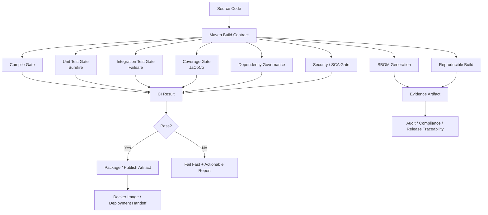

---

## Mental Model

Maven quality gate harus dipahami sebagai **lapisan validasi bertingkat**:

```text
validate
  -> apakah project config valid?

compile
  -> apakah source code valid terhadap Java/dependency compile classpath?

test
  -> apakah unit test cepat lolos?

package
  -> apakah artifact bisa dibuat?

verify
  -> apakah integration test, coverage, enforcer, scan, dan quality gate lolos?

install/deploy
  -> apakah artifact layak disimpan atau dipublikasikan?
```

Untuk PR CI, command utama yang biasanya paling meaningful adalah:

```bash
./mvnw clean verify
```

Karena `verify` adalah tempat yang cocok untuk mengikat Failsafe, coverage check, enforcer, dependency analysis, dan security/SBOM generation. Failsafe `verify` secara spesifik memverifikasi hasil integration test dan default-nya terikat ke fase `verify`. ([Apache Maven](https://maven.apache.org/surefire/maven-failsafe-plugin/verify-mojo.html?utm_source=chatgpt.com))

---

## Decomposition Map

| # | Domain / Skill | Yang perlu dikuasai | Relevansi untuk Jersey/JAX-RS microservice | Failure mode yang dicegah |
|---:|---|---|---|---|
| 1 | Test taxonomy | Unit, integration, component, contract, smoke | Menentukan test mana jalan di phase mana | Test lambat masuk unit phase |
| 2 | Surefire | Unit test execution | Test resource/service/mapper cepat | Unit test tidak terdeteksi |
| 3 | Failsafe | Integration test execution | Test endpoint, DB, container, wiring Jersey | Integration test tidak pernah jalan |
| 4 | JUnit Platform | Test engine, Jupiter, naming | Standard modern Java testing | Test ada tapi tidak dijalankan |
| 5 | Test naming convention | `*Test`, `*IT` | Memisahkan unit dan integration test | Test salah plugin |
| 6 | Coverage | JaCoCo report/check | Guardrail regression | Coverage turun tanpa disadari |
| 7 | Coverage policy | Line/branch/package/class threshold | Menjaga area kritikal | Coverage vanity metric |
| 8 | Dependency tree | Direct/transitive dependency | Debug Jersey/Jackson/Jakarta conflict | `NoSuchMethodError` |
| 9 | Dependency analysis | Used/unused/undeclared dependency | Membersihkan POM | Dependency liar |
| 10 | Dependency convergence | Versi dependency sama di graph | Mencegah classpath conflict | Runtime method/class mismatch |
| 11 | Maven Enforcer | Java/Maven/dependency rules | Build guardrail enterprise | Build lolos dengan environment salah |
| 12 | Security scanning | SCA known vulnerability | Dependency vulnerable terdeteksi | CVE masuk production |
| 13 | SBOM | CycloneDX/SPDX artifact inventory | Audit supply chain | Tidak tahu komponen artifact |
| 14 | Reproducible build | Timestamp/version determinism | Artifact integrity | Build tidak bisa dibandingkan |
| 15 | Plugin pinning | Pin plugin version | Build stabil local/CI | Plugin berubah implicit |
| 16 | Maven Wrapper | Pin Maven runtime | Local/CI konsisten | Global Maven drift |
| 17 | CI cache hygiene | Maven cache aman | CI cepat tapi tidak stale | Cache menyembunyikan problem |
| 18 | Test report artifact | Surefire/Failsafe reports | Evidence saat failure | Failure sulit dianalisis |
| 19 | Build metadata | commit SHA, version, timestamp | Traceability | Artifact tidak bisa dilacak |
| 20 | Fail-fast discipline | Gate gagal dengan pesan jelas | PR feedback cepat | Pipeline hijau palsu |

---

## 1. Test Taxonomy untuk Java Microservice

Jangan semua test diperlakukan sama.

| Jenis test | Scope | Maven plugin umum | Kecepatan | Contoh |
|---|---|---|---:|---|
| Unit test | Class/function kecil | Surefire | Cepat | service logic, mapper, validator |
| Resource test | REST resource tanpa dependency berat | Surefire atau Failsafe | Cepat/sedang | JAX-RS resource + mocked service |
| Integration test | Beberapa komponen nyata | Failsafe | Sedang/lambat | Jersey server + PostgreSQL/Testcontainers |
| Contract test | API compatibility | Failsafe/khusus | Sedang | consumer/provider contract |
| Smoke test | Artifact benar-benar start | Script/CI step | Sedang | `curl /health`, `curl /ready` |
| E2E test | Banyak service/environment | Biasanya pipeline terpisah | Lambat | staging workflow |

Rule praktis:

```text
Unit test:
  cepat, deterministik, tanpa network eksternal.

Integration test:
  boleh butuh DB/container/dependency lokal yang dikontrol.

Smoke test:
  memvalidasi artifact/package/image benar-benar bisa start.

E2E test:
  jangan dijadikan satu-satunya quality signal karena mahal dan lambat.
```

---

## 2. Surefire untuk Unit Test

Surefire cocok untuk unit test yang berjalan pada Maven phase `test`.

Contoh dependency JUnit 5:

```xml
<dependency>
  <groupId>org.junit.jupiter</groupId>
  <artifactId>junit-jupiter</artifactId>
  <version>${junit.version}</version>
  <scope>test</scope>
</dependency>
```

Contoh plugin:

```xml
<plugin>
  <groupId>org.apache.maven.plugins</groupId>
  <artifactId>maven-surefire-plugin</artifactId>
  <version>${maven.surefire.plugin.version}</version>
</plugin>
```

JUnit Platform membutuhkan TestEngine implementation agar test benar-benar dijalankan; dependency agregat seperti `junit-jupiter` biasanya dipakai untuk stack JUnit Jupiter, tetapi tetap pastikan dependency final ada di test classpath. ([Apache Maven](https://maven.apache.org/surefire/maven-surefire-plugin/examples/junit-platform.html?utm_source=chatgpt.com))

Naming umum unit test:

```text
*Test.java
*Tests.java
*TestCase.java
```

Command:

```bash
./mvnw test
```

Anti-pattern:

```text
Unit test connect ke DB shared.
Unit test butuh service eksternal.
Unit test tergantung urutan eksekusi.
Unit test hanya lolos di timezone tertentu.
Unit test membaca file lokal yang tidak ada di CI.
```

---

## 3. Failsafe untuk Integration Test

Failsafe dipakai untuk integration test agar failure dapat diproses pada fase `verify`, bukan menghentikan lifecycle terlalu awal di tengah fase `integration-test`. Dokumentasi Failsafe menyebut plugin ini digunakan selama fase `integration-test` dan `verify` untuk menjalankan integration test aplikasi. ([Apache Maven](https://maven.apache.org/surefire/maven-failsafe-plugin/?utm_source=chatgpt.com))

Contoh konfigurasi:

```xml
<plugin>
  <groupId>org.apache.maven.plugins</groupId>
  <artifactId>maven-failsafe-plugin</artifactId>
  <version>${maven.failsafe.plugin.version}</version>
  <executions>
    <execution>
      <goals>
        <goal>integration-test</goal>
        <goal>verify</goal>
      </goals>
    </execution>
  </executions>
</plugin>
```

Naming umum integration test:

```text
*IT.java
*ITCase.java
```

Command:

```bash
./mvnw clean verify
```

Untuk Jersey/JAX-RS microservice, integration test yang bernilai tinggi biasanya mencakup:

```text
Jersey resource registration
JSON serialization/deserialization
ExceptionMapper behavior
Request/response filter
Authentication/authorization filter boundary
MyBatis mapper + PostgreSQL
Migration compatibility
Health/readiness endpoint
```

---

## 4. Test Naming Strategy

Pemisahan naming test sangat penting.

```text
src/test/java/.../CaseServiceTest.java
  -> unit test, jalan via Surefire

src/test/java/.../CaseServiceIT.java
  -> integration test, jalan via Failsafe
```

Struktur sederhana:

```text
src/
  test/
    java/
      com/company/platform/caseapi/
        service/
          CaseServiceTest.java
        resource/
          CaseResourceTest.java
        integration/
          CaseResourceIT.java
          DatabaseMapperIT.java
```

Failure mode yang sering terjadi:

| Gejala | Penyebab |
|---|---|
| `*IT` tidak jalan | Failsafe tidak dikonfigurasi |
| Test lambat saat `mvn test` | Integration test dinamai `*Test` |
| CI hijau tapi integration rusak | CI hanya menjalankan `mvn test` |
| Test tidak terdeteksi | Tidak ada JUnit Platform TestEngine |
| Test flaky | Bergantung network/time/order/shared DB |

---

## 5. JaCoCo Coverage Gate

JaCoCo Maven Plugin menyediakan runtime agent untuk test dan bisa membuat report coverage. ([EclEmma](https://www.eclemma.org/jacoco/trunk/doc/maven.html?utm_source=chatgpt.com))

Contoh konfigurasi konseptual:

```xml
<plugin>
  <groupId>org.jacoco</groupId>
  <artifactId>jacoco-maven-plugin</artifactId>
  <version>${jacoco.version}</version>
  <executions>
    <execution>
      <id>prepare-agent</id>
      <goals>
        <goal>prepare-agent</goal>
      </goals>
    </execution>

    <execution>
      <id>report</id>
      <phase>verify</phase>
      <goals>
        <goal>report</goal>
      </goals>
    </execution>

    <execution>
      <id>check</id>
      <phase>verify</phase>
      <goals>
        <goal>check</goal>
      </goals>
      <configuration>
        <rules>
          <rule>
            <element>BUNDLE</element>
            <limits>
              <limit>
                <counter>LINE</counter>
                <value>COVEREDRATIO</value>
                <minimum>0.70</minimum>
              </limit>
            </limits>
          </rule>
        </rules>
      </configuration>
    </execution>
  </executions>
</plugin>
```

Coverage policy harus dipakai sebagai **guardrail**, bukan target kosmetik.

| Coverage target | Cocok untuk |
|---|---|
| Global line coverage | Baseline umum |
| Branch coverage | Logic percabangan penting |
| Package/class coverage | Area kritikal seperti auth, decisioning, workflow |
| Diff coverage | Perubahan baru wajib dites |
| Mutation testing | Logic kritikal, jika tim sudah matang |

Jangan membuat threshold asal tinggi kalau test-nya tidak meaningful. Lebih baik mulai realistis, misalnya baseline existing + gradual ratchet.

---

## 6. Dependency Tree sebagai Diagnostic Tool

Command wajib:

```bash
./mvnw dependency:tree
```

Filter dependency tertentu:

```bash
./mvnw dependency:tree -Dincludes=org.glassfish.jersey
./mvnw dependency:tree -Dincludes=jakarta.ws.rs
./mvnw dependency:tree -Dincludes=javax.ws.rs
./mvnw dependency:tree -Dincludes=com.fasterxml.jackson
./mvnw dependency:tree -Dincludes=org.postgresql
```

Untuk Java Jersey/JAX-RS, dependency tree membantu mendeteksi:

```text
Jersey 2.x dan Jersey 3.x tercampur
javax.ws.rs dan jakarta.ws.rs sama-sama muncul
Jackson version conflict
PostgreSQL driver version tidak sesuai
logging binding lebih dari satu
dependency rentan masuk via transitive dependency
```

Heuristic review:

```text
Kalau ada NoSuchMethodError, cek dependency tree.
Kalau ada ClassNotFoundException, cek scope dan packaging.
Kalau ada JSON provider error, cek Jersey media dependency.
Kalau ada javax/jakarta mismatch, cek transitive dependency.
```

---

## 7. Dependency Analysis

Maven Dependency Plugin punya goal untuk menganalisis dependency yang used/declared, used/undeclared, dan unused/declared. Dokumentasi plugin membedakan `dependency:analyze` untuk standalone use dan `dependency:analyze-only` untuk build lifecycle setelah `test-compile`. ([Apache Maven](https://maven.apache.org/plugins/maven-dependency-plugin/plugin-info.html?utm_source=chatgpt.com))

Command:

```bash
./mvnw dependency:analyze
```

Contoh binding ke lifecycle:

```xml
<plugin>
  <groupId>org.apache.maven.plugins</groupId>
  <artifactId>maven-dependency-plugin</artifactId>
  <version>${maven.dependency.plugin.version}</version>
  <executions>
    <execution>
      <id>analyze-dependencies</id>
      <phase>verify</phase>
      <goals>
        <goal>analyze-only</goal>
      </goals>
      <configuration>
        <failOnWarning>true</failOnWarning>
      </configuration>
    </execution>
  </executions>
</plugin>
```

Hati-hati: dependency analysis bisa false positive/false negative untuk reflection, annotation processing, service loader, runtime-only dependency, dan framework magic. Jadi gunakan sebagai gate dengan pengecualian yang disengaja, bukan dogma buta.

---

## 8. Maven Enforcer

Maven Enforcer adalah guardrail untuk memastikan build berjalan dengan aturan yang disepakati.

Contoh rule yang sering berguna:

```xml
<plugin>
  <groupId>org.apache.maven.plugins</groupId>
  <artifactId>maven-enforcer-plugin</artifactId>
  <version>${maven.enforcer.plugin.version}</version>
  <executions>
    <execution>
      <id>enforce-build-rules</id>
      <phase>validate</phase>
      <goals>
        <goal>enforce</goal>
      </goals>
      <configuration>
        <rules>
          <requireJavaVersion>
            <version>[17,)</version>
          </requireJavaVersion>

          <requireMavenVersion>
            <version>[3.9,)</version>
          </requireMavenVersion>

          <dependencyConvergence />
        </rules>
      </configuration>
    </execution>
  </executions>
</plugin>
```

Rule `dependencyConvergence` memastikan versi dependency yang sama dipakai di seluruh dependency tree; jika dua dependency menarik artifact yang sama dengan versi berbeda, rule ini dapat menggagalkan build. ([Apache Maven](https://maven.apache.org/enforcer/enforcer-rules/dependencyConvergence.html?utm_source=chatgpt.com))

Built-in rule Enforcer juga mencakup rule seperti dependency convergence, reactor module convergence, active profile requirement, dan environment variable requirement. ([Apache Maven](https://maven.apache.org/enforcer/enforcer-rules/index.html?utm_source=chatgpt.com))

---

## 9. Dependency Governance Strategy

Dependency governance bukan hanya “update versi”.

Layer yang perlu ada:

```text
1. Approved dependency source
2. Version pinning
3. BOM/dependencyManagement
4. Dependency tree review
5. Enforcer convergence
6. SCA vulnerability scanning
7. SBOM generation
8. License review jika diperlukan
9. Upgrade policy
10. Exception/waiver process
```

Untuk enterprise microservice, sebaiknya hindari:

```text
version range seperti [1.0,)
floating SNAPSHOT dependency
dependency tanpa owner
dependency baru tanpa alasan arsitektural
library besar untuk kebutuhan kecil
duplicate library dengan fungsi sama
manual JAR system scope
```

Prinsip senior:

```text
Dependency adalah bagian dari attack surface, runtime behavior, dan operational risk.
```

---

## 10. Security / SCA Gate

OWASP Dependency-Check adalah software composition analysis utility untuk mendeteksi publicly disclosed vulnerabilities di dependency aplikasi. ([GitHub](https://github.com/dependency-check/DependencyCheck?utm_source=chatgpt.com))

Contoh konseptual:

```xml
<plugin>
  <groupId>org.owasp</groupId>
  <artifactId>dependency-check-maven</artifactId>
  <version>${dependency.check.version}</version>
  <configuration>
    <failBuildOnCVSS>7.0</failBuildOnCVSS>
    <formats>
      <format>HTML</format>
      <format>JSON</format>
    </formats>
  </configuration>
  <executions>
    <execution>
      <phase>verify</phase>
      <goals>
        <goal>check</goal>
      </goals>
    </execution>
  </executions>
</plugin>
```

Catatan operasional penting: dokumentasi dependency-check-maven menyebut eksekusi pertama dapat memakan waktu lama karena perlu mengunduh dan memproses data vulnerability dari NVD. ([dependency-check.github.io](https://dependency-check.github.io/DependencyCheck/dependency-check-maven/index.html?utm_source=chatgpt.com))

Untuk CI enterprise, biasanya perlu strategi:

```text
cache vulnerability database
scheduled dependency scan
PR scan untuk dependency changes
threshold severity
suppression file dengan expiry
security team approval untuk waiver
report artifact disimpan di CI
```

---

## 11. SBOM dengan CycloneDX

CycloneDX Maven Plugin menghasilkan Software Bill of Materials yang berisi agregat direct dan transitive dependencies project. CycloneDX sendiri diposisikan sebagai full-stack SBOM standard untuk konteks application security dan supply chain component analysis. ([cyclonedx.github.io](https://cyclonedx.github.io/cyclonedx-maven-plugin/?utm_source=chatgpt.com))

Contoh konseptual:

```xml
<plugin>
  <groupId>org.cyclonedx</groupId>
  <artifactId>cyclonedx-maven-plugin</artifactId>
  <version>${cyclonedx.maven.plugin.version}</version>
  <executions>
    <execution>
      <phase>verify</phase>
      <goals>
        <goal>makeAggregateBom</goal>
      </goals>
    </execution>
  </executions>
  <configuration>
    <outputFormat>json</outputFormat>
    <outputName>bom</outputName>
  </configuration>
</plugin>
```

Output yang biasanya disimpan sebagai CI artifact:

```text
target/bom.json
target/bom.xml
```

SBOM berguna untuk:

```text
audit dependency
incident response saat CVE baru muncul
customer/security questionnaire
supply-chain review
release evidence
```

---

## 12. Reproducible Build

Maven punya panduan untuk reproducible builds, termasuk penggunaan property `project.build.outputTimestamp` agar plugin yang mendukung reproducible build memakai timestamp yang stabil pada archive output. ([Apache Maven](https://maven.apache.org/guides/mini/guide-reproducible-builds.html?utm_source=chatgpt.com))

Contoh:

```xml
<properties>
  <project.build.outputTimestamp>${git.commit.time}</project.build.outputTimestamp>
</properties>
```

Atau nilai tetap untuk eksperimen lokal:

```xml
<properties>
  <project.build.outputTimestamp>2026-01-01T00:00:00Z</project.build.outputTimestamp>
</properties>
```

Namun reproducible build bukan hanya timestamp. Untuk Maven/Java, sumber nondeterminism bisa berasal dari:

```text
timestamp archive
urutan file
generated source
plugin version floating
dependency SNAPSHOT
build path masuk artifact
locale/timezone
manifest generated metadata
container base image floating tag
```

Untuk senior engineer, target praktisnya:

```text
Artifact harus deterministik sejauh mungkin.
Jika belum bitwise reproducible, minimal build input dan metadata harus traceable.
```

---

## 13. Build Metadata dan Traceability

Artifact harus bisa menjawab:

```text
Dibangun dari commit apa?
Dibangun oleh CI run mana?
Versi Maven/JDK apa?
Dependency graph apa?
SBOM mana?
Image digest mana?
Deploy ke environment mana?
```

Contoh manifest metadata:

```xml
<plugin>
  <groupId>org.apache.maven.plugins</groupId>
  <artifactId>maven-jar-plugin</artifactId>
  <version>${maven.jar.plugin.version}</version>
  <configuration>
    <archive>
      <manifest>
        <mainClass>com.company.platform.caseapi.Main</mainClass>
      </manifest>
      <manifestEntries>
        <Implementation-Title>${project.artifactId}</Implementation-Title>
        <Implementation-Version>${project.version}</Implementation-Version>
        <Build-Jdk>${java.version}</Build-Jdk>
        <Build-Commit>${git.commit.sha}</Build-Commit>
      </manifestEntries>
    </archive>
  </configuration>
</plugin>
```

CI command:

```bash
./mvnw clean verify \
  -Dgit.commit.sha="$(git rev-parse HEAD)"
```

Jangan bergantung hanya pada file name seperti:

```text
case-service-latest.jar
```

Lebih baik:

```text
case-service-1.4.2.jar
commit SHA
CI run id
Docker image digest
SBOM artifact
```

---

## 14. CI Quality Gate Layout

Contoh layout job GitHub Actions:

```yaml
name: ci

on:
  pull_request:
  push:
    branches:
      - main

jobs:
  verify:
    runs-on: ubuntu-latest

    steps:
      - uses: actions/checkout@v4

      - name: Set up Java
        uses: actions/setup-java@v4
        with:
          distribution: temurin
          java-version: "17"
          cache: maven

      - name: Verify
        shell: bash
        run: ./mvnw clean verify

      - name: Upload test reports
        if: always()
        uses: actions/upload-artifact@v4
        with:
          name: test-reports
          path: |
            **/target/surefire-reports/**
            **/target/failsafe-reports/**
            **/target/site/jacoco/**
            **/target/bom.*
```

Quality gate sebaiknya **fail fast**, tetapi report tetap di-upload dengan `if: always()` agar failure bisa dianalisis.

---

## 15. Recommended Maven Quality Gate Profile

Untuk PR:

```bash
./mvnw clean verify
```

Untuk dependency/security scheduled scan:

```bash
./mvnw clean verify -Psecurity
```

Untuk release:

```bash
./mvnw clean verify -Prelease
```

Contoh profile konseptual:

```xml
<profiles>
  <profile>
    <id>security</id>
    <build>
      <plugins>
        <!-- dependency-check / SBOM plugin -->
      </plugins>
    </build>
  </profile>

  <profile>
    <id>release</id>
    <properties>
      <skip.integration.tests>false</skip.integration.tests>
    </properties>
  </profile>
</profiles>
```

Prinsip:

```text
PR gate harus cepat dan cukup ketat.
Nightly/scheduled gate boleh lebih berat.
Release gate harus paling lengkap.
```

---

## 16. Quality Gate Matrix

| Gate | PR | Main branch | Nightly | Release |
|---|---:|---:|---:|---:|
| Compile | Wajib | Wajib | Wajib | Wajib |
| Unit test | Wajib | Wajib | Wajib | Wajib |
| Integration test | Wajib jika tidak terlalu mahal | Wajib | Wajib | Wajib |
| Coverage check | Wajib | Wajib | Wajib | Wajib |
| Dependency convergence | Wajib | Wajib | Wajib | Wajib |
| Dependency analyze | Opsional/bertahap | Wajib | Wajib | Wajib |
| SCA vulnerability scan | Wajib untuk dependency change / atau full | Wajib | Wajib | Wajib |
| SBOM | Opsional | Wajib | Wajib | Wajib |
| Container smoke test | Disarankan | Wajib | Wajib | Wajib |
| Performance/regression test | Tidak | Opsional | Wajib jika ada | Wajib untuk critical release |

---

## 17. Failure Classification

Saat CI gagal, jangan hanya tulis “build failed”. Klasifikasikan.

| Failure | Contoh sinyal | Owner awal |
|---|---|---|
| Compile failure | Java syntax/API error | Developer |
| Unit test failure | Surefire report | Developer |
| Integration test failure | Failsafe report | Developer + infra jika dependency |
| Coverage failure | JaCoCo check | Developer |
| Dependency convergence | Enforcer failure | Developer/platform |
| Vulnerability finding | Dependency-check report | Developer/security |
| SBOM generation failure | CycloneDX plugin error | Developer/platform |
| Reproducibility issue | Hash berbeda | Build/platform |
| Repository resolution | Cannot resolve artifact | Platform/CI |
| Flaky test | intermittent failure | Developer/team |

Evidence yang harus disimpan:

```text
surefire-reports
failsafe-reports
jacoco report
dependency tree
effective POM
SBOM
SCA report
Maven version
Java version
commit SHA
```

---

## 18. Common Failure Scenarios

### Scenario 1 - JUnit 5 test tidak jalan

Gejala:

```text
Build sukses, tapi jumlah test 0.
```

Kemungkinan:

```text
Tidak ada TestEngine.
Surefire terlalu lama/tidak kompatibel.
Naming test salah.
Test class/package tidak masuk source set.
```

Cek:

```bash
./mvnw test -X
./mvnw dependency:tree -Dincludes=org.junit
```

---

### Scenario 2 - Integration test tidak pernah jalan

Gejala:

```text
mvn test hijau, tapi endpoint integration rusak.
```

Kemungkinan:

```text
CI hanya menjalankan mvn test.
Failsafe belum dikonfigurasi.
Test dinamai *Test bukan *IT.
Profile integration-test tidak aktif.
```

Cek:

```bash
./mvnw clean verify
ls target/failsafe-reports
```

---

### Scenario 3 - Coverage gate gagal

Gejala:

```text
jacoco:check failed
```

Kemungkinan:

```text
Kode baru tidak dites.
Threshold terlalu agresif untuk legacy baseline.
Generated code ikut dihitung.
DTO/config class ikut coverage target.
```

Solusi:

```text
Tambah test bermakna.
Exclude generated code jika valid.
Gunakan package-level threshold untuk area kritikal.
Naikkan threshold bertahap.
```

---

### Scenario 4 - Dependency convergence gagal

Gejala:

```text
Dependency convergence error for com.fasterxml.jackson.core:jackson-databind
```

Kemungkinan:

```text
Dua dependency menarik versi Jackson berbeda.
BOM belum align.
Dependency baru membawa transitive lama.
```

Cek:

```bash
./mvnw dependency:tree -Dincludes=com.fasterxml.jackson
```

Solusi:

```text
Atur dependencyManagement/BOM.
Upgrade dependency penyebab.
Exclusion jika benar-benar perlu.
```

---

### Scenario 5 - Vulnerability scan gagal

Gejala:

```text
Dependency-check menemukan CVE severity tinggi.
```

Langkah:

```text
Identifikasi dependency direct atau transitive.
Cek apakah versi fixed tersedia.
Upgrade direct dependency atau BOM.
Jika transitive, upgrade parent dependency atau exclude.
Jika false positive/accepted risk, buat suppression dengan expiry dan approval.
```

Jangan:

```text
Langsung menurunkan threshold.
Menghapus plugin dari CI.
Membuat suppression tanpa owner dan expiry.
```

---

## 19. POM Review Checklist untuk Quality Gate

| Area | Pertanyaan |
|---|---|
| Maven Wrapper | Apakah build memakai `./mvnw`? |
| Java version | Apakah Java release dipin? |
| Plugin versions | Apakah Surefire/Failsafe/Compiler/JaCoCo/Enforcer dipin? |
| Unit test | Apakah JUnit TestEngine tersedia? |
| Integration test | Apakah Failsafe dikonfigurasi? |
| Test naming | Apakah `*Test` dan `*IT` konsisten? |
| Coverage | Apakah threshold realistis dan meaningful? |
| Dependency tree | Apakah ada `javax`/`jakarta` campuran? |
| Enforcer | Apakah convergence/Java/Maven rule aktif? |
| SCA | Apakah vulnerability scan ada? |
| SBOM | Apakah SBOM dihasilkan untuk release? |
| Reproducibility | Apakah timestamp/build metadata terkendali? |
| CI evidence | Apakah report di-upload saat failure? |
| Secrets | Tidak ada credential di POM/log? |

---

## 20. Mini Lab

### Lab 1 - Jalankan unit test

```bash
./mvnw test
ls target/surefire-reports
```

Target:

```text
Pastikan unit test benar-benar dijalankan dan report muncul.
```

---

### Lab 2 - Jalankan integration test

```bash
./mvnw clean verify
ls target/failsafe-reports
```

Target:

```text
Pastikan Failsafe menjalankan integration test di fase verify.
```

---

### Lab 3 - Lihat dependency tree

```bash
./mvnw dependency:tree > dependency-tree.txt
grep -i "jersey\|jackson\|jakarta\|javax" dependency-tree.txt
```

Target:

```text
Deteksi conflict dependency yang relevan untuk Jersey/JAX-RS.
```

---

### Lab 4 - Lihat effective POM

```bash
./mvnw help:effective-pom > effective-pom.xml
grep -n "maven-surefire-plugin" effective-pom.xml
grep -n "maven-failsafe-plugin" effective-pom.xml
grep -n "maven-enforcer-plugin" effective-pom.xml
```

Target:

```text
Pahami konfigurasi final setelah parent/profile/pluginManagement.
```

---

### Lab 5 - Generate SBOM

```bash
./mvnw -DskipTests cyclonedx:makeAggregateBom
find . -name "bom.*"
```

Target:

```text
Melihat inventory dependency direct dan transitive.
```

---

## Senior-level Invariants

| Invariant | Penjelasan |
|---|---|
| `mvn test` bukan full quality gate | Ia biasanya hanya unit test |
| `mvn verify` harus meaningful | Integration/coverage/enforcer/security bisa diikat di sini |
| Test count harus terlihat | Build hijau dengan 0 test adalah red flag |
| Dependency graph adalah runtime risk | Direct dependency saja tidak cukup |
| Coverage adalah guardrail, bukan bukti kualitas penuh | Test harus memverifikasi behavior penting |
| Vulnerability scan perlu process | Ada upgrade, suppression, waiver, expiry |
| SBOM adalah release evidence | Berguna saat audit dan incident response |
| Reproducibility dimulai dari pinning | JDK, Maven, plugin, dependency, timestamp |
| CI report harus disimpan | Failure tanpa evidence memperlambat recovery |
| Quality gate harus bertahap | PR cepat, nightly/release lebih lengkap |

---

## Ringkasan

Seri ini menyambungkan Maven dari sekadar build tool menjadi **quality governance layer**.

Core pattern:

```text
./mvnw clean verify
  -> compile
  -> unit test via Surefire
  -> integration test via Failsafe
  -> coverage check via JaCoCo
  -> dependency governance via dependency tree/analyze/enforcer
  -> security scan/SBOM jika dikonfigurasi
  -> artifact siap dipaketkan jika semua gate lolos
```

Untuk Java Jersey/JAX-RS microservice, quality gate yang kuat harus melindungi area yang sering pecah:

```text
Jakarta/javax namespace
Jersey provider wiring
JSON serialization
DB/MyBatis integration
dependency convergence
runtime packaging
security vulnerability
artifact traceability
```

---

## Status

**Seri 6/12 selesai.**

Rekomendasi berikutnya: **Seri 7 - Git Practical Workflow: Branching, Commit, Merge, Rebase, Conflict**.

---

**Sources:**

- [Using JUnit 5 Platform – Maven Surefire Plugin](https://maven.apache.org/surefire/maven-surefire-plugin/examples/junit-platform.html?utm_source=chatgpt.com)
- [JaCoCo - Maven Plug-in](https://www.eclemma.org/jacoco/trunk/doc/maven.html?utm_source=chatgpt.com)
- [OWASP dependency-check is a software composition ...](https://github.com/dependency-check/DependencyCheck?utm_source=chatgpt.com)
- [Usage – dependency-check-maven](https://dependency-check.github.io/DependencyCheck/dependency-check-maven/index.html?utm_source=chatgpt.com)
- [CycloneDX Maven plugin](https://cyclonedx.github.io/cyclonedx-maven-plugin/?utm_source=chatgpt.com)

## Response:
7/14/2026, 12:18:31 AM

Saya lanjut ke **Seri 7/12**. Fokusnya Git workflow praktis: branch, commit hygiene, staging, merge/rebase, conflict resolution, revert/reset, dan cara menjaga history tetap reviewable serta aman untuk tim.

# Seri 7/12 - Git Practical Workflow: Branching, Commit, Merge, Rebase, Conflict

## Introduction

Seri ini membahas Git sebagai **local version-control engine** untuk kerja harian Java Jersey/JAX-RS microservice. Fokusnya bukan command hafalan, tetapi workflow yang aman untuk tim: membuat branch kecil, commit yang reviewable, sinkronisasi dengan remote, merge/rebase, conflict resolution, undo strategy, dan audit trail.

Git adalah distributed version control system yang dirancang untuk menangani project kecil sampai besar secara cepat dan efisien. Dalam konteks engineering team, kekuatan utamanya adalah kemampuan membuat branch murah, bekerja paralel, meninjau perubahan, dan menjaga history perubahan tetap dapat ditelusuri. ([git-scm.com](https://git-scm.com/?utm_source=chatgpt.com))

Git branching berarti developer bisa menyimpang dari main line development dan mengerjakan perubahan tanpa mengganggu main line tersebut. Ini sangat penting untuk microservice karena satu branch biasanya mewakili satu bug fix, feature kecil, migration adjustment, pipeline fix, atau refactor terbatas. ([git-scm.com](https://git-scm.com/book/en/v2/Git-Branching-Branches-in-a-Nutshell?utm_source=chatgpt.com))

---

## Diagram

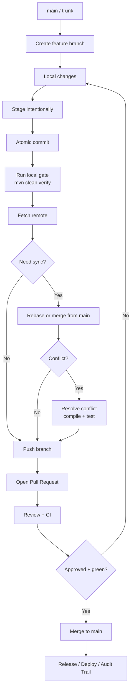

---

## Mental Model

Git workflow yang sehat menjaga tiga hal:

```text id="git-mental-model"
1. Local correctness
   Perubahan di laptop harus compile dan test.

2. Reviewability
   Commit dan PR harus cukup kecil untuk direview secara bermakna.

3. Traceability
   Setiap perubahan bisa dilacak dari commit -> PR -> CI -> release -> deployment.
```

Untuk Java Jersey/JAX-RS microservice, Git sering menyentuh area high-risk:

```text id="git-risk-areas"
pom.xml
Dockerfile
GitHub Actions workflow
database migration
Jersey resource/filter/mapper
MyBatis mapper XML/annotation
config file
Kubernetes manifest
security/auth code
```

Semakin tinggi risikonya, semakin penting commit kecil, PR jelas, dan conflict resolution yang tidak asal “textually clean”.

---

## Decomposition Map

| # | Domain / Skill | Yang perlu dikuasai | Relevansi untuk Java Jersey/JAX-RS microservice | Failure mode yang dicegah |
|---:|---|---|---|---|
| 1 | Working tree | File yang sedang berubah | Melihat perubahan sebelum commit | Perubahan tidak sengaja ikut commit |
| 2 | Staging area | Memilih perubahan yang masuk commit | Atomic commit | Commit terlalu besar |
| 3 | Commit hygiene | Commit kecil, pesan jelas, scoped | Review dan rollback mudah | History tidak bisa dipahami |
| 4 | Branching | Feature/fix/hotfix branch | Isolasi kerja dari main | Main rusak oleh eksperimen |
| 5 | Fetch vs pull | Ambil remote state vs ambil+integrasi | Sinkronisasi aman | Pull tidak sadar memicu merge/rebase |
| 6 | Merge | Menggabungkan branch dengan merge commit atau fast-forward | Integrasi branch | History bercabang tapi eksplisit |
| 7 | Rebase | Memindahkan commit di atas base baru | History linear sebelum PR | Rewrite history sembarangan |
| 8 | Conflict resolution | Menyelesaikan konflik text dan semantic | POM, migration, DTO, resource sering konflik | Compile sukses tapi logic rusak |
| 9 | Diff reading | Membaca perubahan sebelum stage/commit/PR | Review diri sendiri | Bug masuk karena tidak dicek |
| 10 | Log inspection | Melihat history, graph, author, commit | Audit perubahan | Tidak tahu perubahan dari mana |
| 11 | Reset | Memindahkan HEAD/index/working tree | Undo lokal | Menghapus kerja tanpa sadar |
| 12 | Revert | Membuat commit pembalik | Undo aman di shared branch | Rewrite shared history |
| 13 | Stash | Simpan sementara perubahan lokal | Context switching | Perubahan hilang/tercampur |
| 14 | Cherry-pick | Ambil commit tertentu | Backport/hotfix | Salah ambil perubahan |
| 15 | Bisect | Cari commit penyebab bug | Debug regression | Root cause spekulatif |
| 16 | Tags | Menandai release point | Release traceability | Release tidak bisa dilacak |
| 17 | Worktree | Banyak checkout branch paralel | Hotfix sambil kerja feature | Workspace kacau |
| 18 | Ignore rules | `.gitignore`, exclude generated files | Target/classes/log/temp tidak masuk repo | Artifact build ikut commit |
| 19 | Hooks | Pre-commit/pre-push local guardrail | Format/test/lint lokal | Guardrail tidak konsisten |
| 20 | Remote collaboration | Push, pull, PR, protected branch | Team workflow | Force push merusak kerja orang |

---

## 1. Working Tree, Index, Commit

Git punya tiga area penting:

```text id="git-three-areas"
working tree  = file yang sedang diedit
index/stage   = perubahan yang disiapkan untuk commit
commit        = snapshot permanen di history
```

Command inti:

```bash id="git-status-basic"
git status
git diff
git diff --staged
git add <file>
git commit
```

Workflow aman:

```bash id="git-basic-safe-flow"
git status
git diff
git add src/main/java/com/company/service/CaseService.java
git diff --staged
git commit -m "Fix case status transition validation"
```

Prinsip:

```text id="git-stage-principle"
Jangan pernah git add . secara refleks tanpa git diff.
Stage harus intentional.
Commit harus mewakili satu perubahan logis.
```

---

## 2. Branching Workflow

Branch adalah ruang kerja isolasi. Untuk microservice, branch sebaiknya pendek umur dan punya scope jelas.

Contoh naming:

```text id="branch-naming"
feature/case-escalation-rules
fix/null-status-transition
hotfix/order-submit-timeout
chore/update-maven-wrapper
ci/add-smoke-test
refactor/extract-case-policy
```

Command:

```bash id="branch-command"
git switch main
git fetch origin
git pull --ff-only
git switch -c feature/case-escalation-rules
```

Kenapa `--ff-only`?

```text id="ff-only-reason"
Agar local main tidak membuat merge commit tidak sengaja saat hanya ingin sinkron dengan remote main.
```

Checklist branch sehat:

| Checklist | Target |
|---|---|
| Scope kecil | Satu bug/feature/refactor |
| Umur pendek | Cepat PR |
| Sinkron rutin | Tidak terlalu jauh dari main |
| Nama jelas | Reviewer tahu maksud branch |
| Tidak campur topik | Feature tidak bercampur formatting massal |

---

## 3. Commit Hygiene

Commit yang baik menjawab:

```text id="commit-questions"
Apa yang berubah?
Kenapa berubah?
Area mana yang terdampak?
Bisakah commit ini direvert sendiri?
```

Contoh buruk:

```text id="bad-commit-msg"
fix
update
changes
wip
misc
```

Contoh lebih baik:

```text id="good-commit-msg"
Validate case transition before persisting status
Add readiness check for PostgreSQL dependency
Fix Maven Failsafe integration test binding
Refactor Jersey exception mapper registration
```

Format yang sering dipakai:

```text id="commit-format"
<type>: <short summary>

<body optional>
```

Contoh:

```text id="commit-example"
fix: validate escalation status before update

Reject invalid transition from CLOSED to IN_PROGRESS before
writing to PostgreSQL. This prevents inconsistent state when
retrying case update requests.
```

Jenis commit praktis:

| Type | Makna |
|---|---|
| `feat` | Perubahan behavior baru |
| `fix` | Bug fix |
| `refactor` | Struktur berubah tanpa behavior baru |
| `test` | Test only |
| `docs` | Dokumentasi |
| `chore` | Maintenance |
| `ci` | Pipeline/workflow |
| `build` | Maven/Docker/build system |

Tidak wajib memakai Conventional Commits kalau perusahaan tidak pakai, tapi prinsipnya tetap: **pesan commit harus menjelaskan intent, bukan hanya file berubah**.

---

## 4. Atomic Commit

Atomic commit berarti satu commit berisi satu perubahan logis.

Contoh anti-pattern:

```text id="non-atomic-commit"
Commit A:
- update endpoint
- rename package
- format 40 files
- update Maven dependency
- add migration
- fix unrelated CI
```

Lebih baik:

```text id="atomic-commit-example"
Commit 1: Add case escalation endpoint
Commit 2: Add service validation for escalation
Commit 3: Add MyBatis query for escalation lookup
Commit 4: Add integration test for escalation endpoint
Commit 5: Update CI smoke test path
```

Manfaat:

| Manfaat | Penjelasan |
|---|---|
| Review mudah | Reviewer fokus pada satu intent |
| Revert aman | Satu perubahan bisa dibalik |
| Bisect akurat | Regression lebih mudah dilacak |
| Conflict kecil | Merge/rebase lebih mudah |
| Audit jelas | Cocok untuk enterprise/compliance |

Gunakan partial staging:

```bash id="partial-staging"
git add -p
```

Lihat staged diff:

```bash id="staged-diff"
git diff --staged
```

---

## 5. Fetch, Pull, Push

### `git fetch`

Mengambil state remote tanpa mengubah working branch.

```bash id="git-fetch"
git fetch origin
```

Gunakan fetch saat ingin melihat remote dulu.

```bash id="after-fetch"
git log --oneline --graph --decorate --all --max-count=20
```

### `git pull`

Secara konsep adalah fetch + integrate. Integrasinya bisa merge atau rebase tergantung konfigurasi.

Untuk main:

```bash id="pull-ff-only"
git switch main
git pull --ff-only
```

### `git push`

Mengirim branch lokal ke remote.

```bash id="git-push"
git push -u origin feature/case-escalation-rules
```

Setelah branch tracking dibuat:

```bash id="git-push-simple"
git push
```

Prinsip:

```text id="fetch-pull-push-principle"
Fetch dulu kalau butuh observasi.
Pull --ff-only untuk main.
Push feature branch untuk PR.
Jangan force push ke shared branch.
```

---

## 6. Merge vs Rebase

Git documentation memisahkan command untuk branching/merging dan sharing/updating seperti `branch`, `merge`, `rebase`, `fetch`, `pull`, dan `push`; ini merefleksikan bahwa sinkronisasi local history dan integrasi perubahan adalah operasi berbeda yang harus dipahami. ([git-scm.com](https://git-scm.com/docs?utm_source=chatgpt.com))

### Merge

Merge menggabungkan dua history.

```bash id="merge-main"
git switch feature/case-escalation-rules
git fetch origin
git merge origin/main
```

Kelebihan:

```text id="merge-pro"
Tidak rewrite commit existing.
Aman untuk shared branch.
Menyimpan struktur branch sebenarnya.
```

Kekurangan:

```text id="merge-con"
History bisa ramai dengan merge commit.
```

### Rebase

Rebase memindahkan commit branch saat ini ke atas base baru.

```bash id="rebase-main"
git switch feature/case-escalation-rules
git fetch origin
git rebase origin/main
```

Git rebase dapat dipakai untuk menulis ulang rangkaian commit; interactive rebase memakai opsi `-i` dan memungkinkan developer mengubah commit lama, misalnya edit message, squash, atau reorder. ([git-scm.com](https://git-scm.com/book/en/v2/Git-Tools-Rewriting-History?utm_source=chatgpt.com))

Kelebihan:

```text id="rebase-pro"
History linear.
PR lebih mudah dibaca.
Commit branch terlihat seperti dibuat di atas main terbaru.
```

Kekurangan:

```text id="rebase-con"
Rewrite history.
Berbahaya jika dilakukan pada branch yang sudah dipakai banyak orang.
Perlu force push untuk update remote branch.
```

Rule sederhana:

| Situasi | Pilihan aman |
|---|---|
| Branch pribadi sebelum PR | Rebase boleh |
| Branch sudah dipakai banyak orang | Merge lebih aman |
| Main/protected branch | Jangan rewrite history |
| Ingin history linear sebelum PR | Rebase feature branch |
| Hotfix branch shared | Hindari rebase setelah orang lain ikut bekerja |

---

## 7. Safe Rebase Workflow

Workflow:

```bash id="safe-rebase"
git switch feature/case-escalation-rules
git fetch origin
git rebase origin/main
```

Jika conflict:

```bash id="rebase-conflict-flow"
# edit conflicted files
git status
git add <resolved-files>
git rebase --continue
```

Jika ingin batal:

```bash id="rebase-abort"
git rebase --abort
```

Setelah rebase selesai dan branch sudah pernah di-push:

```bash id="force-with-lease"
git push --force-with-lease
```

Gunakan `--force-with-lease`, bukan `--force`, karena lebih aman: ia menolak push jika remote branch berubah dengan cara yang tidak kamu miliki secara lokal.

Prinsip:

```text id="rebase-principle"
Rebase branch sendiri boleh.
Rebase branch orang lain berbahaya.
Rebase main/protected branch tidak boleh.
```

---

## 8. Interactive Rebase untuk Merapikan Commit

Command:

```bash id="interactive-rebase"
git rebase -i origin/main
```

Operasi umum:

| Operation | Fungsi |
|---|---|
| `pick` | Pakai commit |
| `reword` | Ubah commit message |
| `edit` | Berhenti untuk mengubah commit |
| `squash` | Gabungkan dengan commit sebelumnya, edit message |
| `fixup` | Gabungkan tanpa mempertahankan message |
| `drop` | Buang commit |

Contoh sebelum PR:

```text id="before-rebase"
a1 fix
b2 typo
c3 wip
d4 add escalation endpoint
```

Setelah interactive rebase:

```text id="after-rebase"
d4 Add case escalation endpoint
e5 Add tests for escalation transition validation
```

Kapan dipakai:

```text id="interactive-rebase-use"
Sebelum PR.
Sebelum meminta review ulang.
Untuk menghapus WIP/noise commit.
Untuk membuat commit sequence mudah dibaca.
```

Jangan dipakai:

```text id="interactive-rebase-dont"
Untuk rewrite main.
Untuk rewrite branch shared tanpa koordinasi.
Untuk menyembunyikan perubahan berisiko dari reviewer.
```

---

## 9. Conflict Resolution

Conflict bukan sekadar menghapus marker. Conflict harus diselesaikan secara **semantic**.

Conflict marker:

```text id="conflict-marker"
<<<<<<< HEAD
current branch content
=======
incoming branch content
>>>>>>> origin/main
```

Workflow:

```bash id="conflict-workflow"
git status
# buka file conflict
# resolve manual
git add <file>
git status
```

Jika sedang merge:

```bash id="merge-continue"
git commit
```

Jika sedang rebase:

```bash id="rebase-continue"
git rebase --continue
```

Kalau salah arah:

```bash id="abort-commands"
git merge --abort
git rebase --abort
```

Jenis conflict yang sering di Java microservice:

| File | Risiko |
|---|---|
| `pom.xml` | Dependency/plugin hilang atau duplicate |
| `Dockerfile` | Runtime image/startup command salah |
| GitHub Actions YAML | CI step hilang |
| DB migration | Urutan migration conflict |
| MyBatis XML | Query berubah tidak konsisten |
| DTO | API contract berubah |
| Jersey resource | Path/method/filter conflict |
| Config file | Env-specific setting tertukar |

Conflict resolution wajib diikuti:

```bash id="post-conflict-gate"
./mvnw clean verify
```

Kalau conflict menyentuh runtime/deployment:

```bash id="post-conflict-smoke"
./scripts/start-and-smoke.sh
```

---

## 10. Semantic Conflict

Ada conflict yang tidak ditandai Git.

Contoh:

```text id="semantic-conflict-example"
Branch A:
- rename field status -> caseStatus

Branch B:
- add MyBatis query using status

Git merge:
- tidak conflict secara text

Runtime:
- query/mapper rusak karena nama field sudah berubah
```

Area rawan semantic conflict:

```text id="semantic-conflict-areas"
DTO rename
database column rename
migration ordering
enum value addition
validation rule
state machine transition
Camunda BPMN variable
JSON field name
REST path contract
security permission name
```

Cara mendeteksi:

```text id="semantic-conflict-detection"
compile
unit test
integration test
migration test
contract test
smoke test
manual diff review
```

---

## 11. Diff Reading

Sebelum commit:

```bash id="pre-commit-diff"
git diff
git diff --staged
```

Setelah commit:

```bash id="show-commit"
git show --stat
git show --name-only
git show
```

Bandingkan branch dengan main:

```bash id="branch-diff"
git fetch origin
git diff origin/main...HEAD
git log --oneline origin/main..HEAD
```

Makna umum:

```text id="three-dot"
origin/main...HEAD menunjukkan perubahan branch dibanding merge-base dengan main.
```

Review diri sendiri sebelum PR:

```bash id="self-review"
git diff --stat origin/main...HEAD
git diff origin/main...HEAD
git log --oneline --decorate origin/main..HEAD
```

Checklist self-review:

```text id="self-review-checklist"
Apakah ada file tidak sengaja?
Apakah ada secret/config lokal?
Apakah ada generated file?
Apakah pom.xml berubah sesuai kebutuhan?
Apakah migration urut?
Apakah test ikut berubah?
Apakah rename/refactor terlalu luas?
```

---

## 12. Reset vs Revert

### Reset

`reset` memindahkan HEAD/index/working tree. Cocok untuk undo lokal.

Contoh membatalkan staged file:

```bash id="unstage-file"
git restore --staged file.txt
```

Reset commit lokal terakhir tapi simpan perubahan di working tree:

```bash id="reset-soft"
git reset --soft HEAD~1
```

Reset commit lokal terakhir dan simpan perubahan unstaged:

```bash id="reset-mixed"
git reset HEAD~1
```

Reset keras, berbahaya:

```bash id="reset-hard"
git reset --hard HEAD~1
```

Hati-hati: `reset --hard` bisa menghapus perubahan working tree.

### Revert

`revert` membuat commit baru yang membalik commit lama.

```bash id="git-revert"
git revert <commit-sha>
```

Gunakan revert untuk branch shared/main karena tidak rewrite history.

Rule:

| Situasi | Gunakan |
|---|---|
| Belum push, commit lokal salah | `reset` bisa |
| Sudah push ke branch pribadi | `reset` + `push --force-with-lease` bisa, hati-hati |
| Sudah merge ke main | `revert` |
| Production bug dari commit tertentu | `revert` lebih audit-friendly |
| Perlu membalik merge commit | `git revert -m` dengan hati-hati |

---

## 13. Restore

Git modern menyediakan `restore` untuk mengembalikan file.

Buang perubahan file di working tree:

```bash id="restore-file"
git restore src/main/java/com/company/service/CaseService.java
```

Unstage file:

```bash id="restore-staged"
git restore --staged pom.xml
```

Restore dari branch tertentu:

```bash id="restore-from-main"
git restore --source origin/main -- path/to/file
```

Prinsip:

```text id="restore-principle"
Gunakan restore untuk operasi file-level.
Gunakan reset untuk operasi history/index-level.
Gunakan revert untuk undo di shared history.
```

---

## 14. Stash

Stash berguna untuk context switching.

```bash id="stash-basic"
git stash push -m "wip escalation validation"
git stash list
git stash show -p stash@{0}
git stash pop
```

Stash file tertentu:

```bash id="stash-specific"
git stash push -m "wip pom change" -- pom.xml
```

Apply tanpa menghapus stash:

```bash id="stash-apply"
git stash apply stash@{0}
```

Drop stash:

```bash id="stash-drop"
git stash drop stash@{0}
```

Hati-hati:

```text id="stash-warning"
Stash bukan tempat penyimpanan jangka panjang.
Stash mudah lupa.
Lebih baik commit WIP di branch pribadi jika kerja akan ditinggal lama.
```

---

## 15. Cherry-pick

Cherry-pick mengambil commit tertentu ke branch saat ini.

```bash id="cherry-pick-basic"
git switch release/1.4
git cherry-pick <commit-sha>
```

Gunakan untuk:

```text id="cherry-pick-use"
backport bug fix ke release branch
ambil hotfix tanpa feature lain
membawa commit kecil ke branch berbeda
```

Risiko:

```text id="cherry-pick-risk"
Commit bergantung pada commit lain.
Conflict semantic tidak terlihat.
Backport melewati migration/config dependency.
History duplicate.
```

Checklist sebelum cherry-pick:

```text id="cherry-pick-checklist"
Apakah commit atomic?
Apakah ada dependency commit sebelumnya?
Apakah ada migration terkait?
Apakah test ikut dibawa?
Apakah release branch punya dependency yang sama?
```

---

## 16. Bisect untuk Mencari Regression

`git bisect` membantu menemukan commit penyebab bug dengan binary search.

Start:

```bash id="bisect-start"
git bisect start
git bisect bad
git bisect good <known-good-commit>
```

Setiap step:

```bash id="bisect-test"
./mvnw test
```

Tandai:

```bash id="bisect-mark"
git bisect good
# atau
git bisect bad
```

Selesai:

```bash id="bisect-reset"
git bisect reset
```

Jika ada script otomatis:

```bash id="bisect-run"
git bisect run ./scripts/test.sh
```

Cocok untuk:

```text id="bisect-use"
regression yang reproducible
test yang bisa membedakan good/bad
bug yang tidak jelas commit penyebabnya
```

Tidak cocok untuk:

```text id="bisect-not-use"
flaky test
bug hanya muncul di environment tertentu
bug yang butuh setup manual berat
```

---

## 17. Tags untuk Release

Tag menandai titik tertentu di history.

Annotated tag:

```bash id="annotated-tag"
git tag -a v1.4.2 -m "Release v1.4.2"
git push origin v1.4.2
```

Lihat tag:

```bash id="list-tags"
git tag --list
git show v1.4.2
```

Prinsip release:

```text id="tag-principle"
Tag release harus menunjuk commit yang CI-nya hijau.
Artifact/image harus bisa ditelusuri ke tag/commit.
Jangan retag release publik tanpa proses formal.
```

Traceability ideal:

```text id="release-trace"
Git tag
  -> commit SHA
  -> PR list
  -> CI run
  -> Maven artifact version
  -> Docker image digest
  -> deployment record
```

---

## 18. Worktree untuk Multi-Branch Work

`git worktree` memungkinkan checkout beberapa branch dari repo yang sama ke directory berbeda.

Contoh:

```bash id="worktree-example"
git worktree add ../case-service-hotfix hotfix/order-submit-timeout
git worktree list
```

Kegunaan:

```text id="worktree-use"
Sedang kerja feature, tiba-tiba perlu hotfix.
Tidak perlu stash banyak perubahan.
Bisa menjalankan dua branch paralel di directory terpisah.
```

Cleanup:

```bash id="worktree-remove"
git worktree remove ../case-service-hotfix
git worktree prune
```

Cocok untuk senior engineer yang sering context switching antara feature, review, hotfix, dan release verification.

---

## 19. `.gitignore`

Pastikan generated/build/local files tidak masuk repo.

Contoh untuk Java/Maven:

```gitignore id="gitignore-java-maven"
target/
*.class
*.log
*.tmp

# IDE
.idea/
*.iml
.vscode/

# OS
.DS_Store
Thumbs.db

# local env
.env
.env.local
```

Tapi hati-hati: beberapa file `.vscode` atau IDE config bisa sengaja dibagikan jika tim sepakat.

Cek file ter-track walau sudah di-ignore:

```bash id="tracked-ignored"
git ls-files target
```

Jika file sudah terlanjur tracked:

```bash id="remove-tracked-generated"
git rm --cached path/to/file
```

Prinsip:

```text id="gitignore-principle"
Build output tidak masuk Git.
Secret tidak masuk Git.
Local-only config tidak masuk Git.
File yang dibutuhkan build/CI harus masuk Git.
```

---

## 20. Hooks

Git hooks bisa menjalankan script lokal seperti pre-commit atau pre-push.

Contoh pre-push:

```bash id="pre-push-hook"
#!/usr/bin/env bash
set -euo pipefail

./mvnw test
```

Lokasi:

```text id="git-hooks-location"
.git/hooks/pre-push
```

Namun hooks lokal tidak otomatis versioned di repo. Untuk tim, lebih baik pakai tool/manajemen hooks atau dokumentasikan setup.

Prinsip:

```text id="hooks-principle"
Hooks membantu developer lokal.
CI tetap source of truth.
Jangan hanya mengandalkan local hooks untuk quality gate.
```

---

## 21. Practical Workflow untuk Java Microservice

### Awal kerja

```bash id="daily-start"
git switch main
git fetch origin
git pull --ff-only
git switch -c feature/add-readiness-db-check
```

### Saat coding

```bash id="daily-coding"
git status
git diff
./mvnw test
```

### Commit

```bash id="daily-commit"
git add -p
git diff --staged
git commit -m "Add PostgreSQL readiness check"
```

### Sync sebelum push

```bash id="daily-sync"
git fetch origin
git rebase origin/main
./mvnw clean verify
```

### Push

```bash id="daily-push"
git push -u origin feature/add-readiness-db-check
```

### Jika perlu update setelah rebase

```bash id="daily-force-lease"
git push --force-with-lease
```

---

## 22. Conflict Playbook untuk `pom.xml`

`pom.xml` conflict harus ekstra hati-hati.

Langkah:

```bash id="pom-conflict-playbook"
git status
# resolve pom.xml
./mvnw help:effective-pom > effective-pom.xml
./mvnw dependency:tree > dependency-tree.txt
./mvnw clean verify
```

Cek manual:

```text id="pom-conflict-check"
Apakah dependency baru hilang?
Apakah version property duplicate?
Apakah plugin execution hilang?
Apakah scope berubah?
Apakah parent/BOM berubah?
Apakah profile CI berubah?
```

Jangan hanya memilih “ours” atau “theirs” tanpa memahami efek build.

---

## 23. Conflict Playbook untuk Migration

DB migration conflict lebih berbahaya dari conflict biasa.

Cek:

```text id="migration-conflict-check"
Apakah nomor/timestamp migration duplicate?
Apakah urutan migration benar?
Apakah migration reversible jika standar tim mewajibkan?
Apakah ada dependency antar migration?
Apakah data migration aman untuk existing data?
Apakah MyBatis query sudah sesuai schema baru?
```

Command umum:

```bash id="migration-conflict-command"
git diff origin/main...HEAD -- db/migration
./mvnw clean verify
```

Jika ada local DB integration test:

```bash id="migration-it"
./mvnw clean verify -Pintegration-test
```

---

## 24. Conflict Playbook untuk Java Code

Untuk konflik di Java service/resource/repository:

```bash id="java-conflict-playbook"
git status
# resolve files
./mvnw clean compile
./mvnw test
./mvnw clean verify
```

Review semantic:

```text id="java-conflict-review"
Apakah method signature berubah?
Apakah DTO contract berubah?
Apakah ExceptionMapper masih menangani exception baru?
Apakah validation masih jalan?
Apakah MyBatis mapper sesuai model?
Apakah enum/state transition tetap valid?
```

---

## 25. Anti-pattern Git yang Harus Dihindari

| Anti-pattern | Risiko | Cara lebih baik |
|---|---|---|
| `git add .` tanpa diff | File tidak sengaja ikut commit | `git diff`, `git add -p` |
| Commit besar campur banyak topik | Review sulit | Atomic commit |
| Force push ke branch shared | Kerja orang hilang | `--force-with-lease`, koordinasi |
| Rebase main/protected branch | History rusak | Jangan rewrite protected branch |
| Resolve conflict hanya pilih ours/theirs | Semantic bug | Compile + test + review |
| Commit generated file | Repo noisy | `.gitignore`, `git rm --cached` |
| Commit secret | Security incident | Secret scanning + rotate secret |
| Merge main berkali-kali tanpa perlu | History noisy | Rebase branch pribadi atau ff-only |
| Reset hard tanpa backup | Kerja hilang | `git status`, branch backup |
| PR dari branch terlalu lama | Conflict besar | Branch kecil, sync rutin |

---

## 26. Emergency Recovery

### Melihat history HEAD

```bash id="reflog"
git reflog
```

`reflog` sering menyelamatkan setelah reset/rebase salah.

Restore branch dari commit reflog:

```bash id="reflog-restore"
git switch -c recovery/my-lost-work <commit-sha>
```

### Backup sebelum operasi berisiko

```bash id="backup-branch"
git branch backup/before-rebase
```

### Membatalkan rebase/merge

```bash id="abort-risky"
git rebase --abort
git merge --abort
```

### Cek file yang hilang

```bash id="lost-file-check"
git fsck --lost-found
```

Prinsip:

```text id="emergency-principle"
Sebelum rebase/reset besar, buat backup branch.
Saat panik, jangan menjalankan command destruktif tambahan.
Cek reflog dulu.
```

---

## 27. Senior Review Checklist untuk Git PR

Sebelum membuka PR:

| Checklist | Pertanyaan |
|---|---|
| Scope | Apakah PR punya satu tujuan jelas? |
| Diff | Sudah review `git diff origin/main...HEAD`? |
| Commit | Apakah commit atomic dan message jelas? |
| Build | Apakah `./mvnw clean verify` lolos? |
| Dependency | Jika POM berubah, sudah cek dependency tree? |
| Migration | Jika schema berubah, urutan migration aman? |
| Config | Tidak ada config lokal/secret? |
| Tests | Ada test untuk behavior baru/bug fix? |
| Runtime | Endpoint/health/smoke relevan sudah dicek? |
| Risk | Area high-risk diberi catatan di PR description? |
| Rollback | Perubahan bisa direvert dengan jelas? |

---

## 28. Recommended Git Aliases

Opsional, untuk mempercepat inspeksi.

```bash id="git-aliases"
git config --global alias.st status
git config --global alias.co switch
git config --global alias.br branch
git config --global alias.lg "log --oneline --graph --decorate --all"
git config --global alias.last "log -1 HEAD --stat"
git config --global alias.unstage "restore --staged"
```

Gunakan alias hanya untuk produktivitas pribadi. Dokumentasi tim tetap harus memakai command Git standar agar mudah diikuti semua orang.

---

## Mini Lab

### Lab 1 - Branch dan commit kecil

```bash id="lab-branch-commit"
git switch main
git pull --ff-only
git switch -c feature/git-lab
echo "test" > git-lab.txt
git status
git diff
git add git-lab.txt
git diff --staged
git commit -m "Add Git workflow lab file"
```

Target: paham working tree → stage → commit.

---

### Lab 2 - Partial staging

Edit dua bagian berbeda di file yang sama, lalu:

```bash id="lab-partial-stage"
git add -p
git diff --staged
git commit -m "Commit one logical change"
```

Target: membuat commit atomic walau file sama.

---

### Lab 3 - Rebase branch pribadi

```bash id="lab-rebase"
git fetch origin
git rebase origin/main
```

Jika conflict, resolve lalu:

```bash id="lab-rebase-continue"
git add <file>
git rebase --continue
```

Target: memahami rebase aman untuk branch pribadi.

---

### Lab 4 - Revert commit

```bash id="lab-revert"
git log --oneline
git revert <commit-sha>
```

Target: membalik perubahan tanpa rewrite history.

---

### Lab 5 - Reflog recovery

```bash id="lab-reflog"
git reflog
git branch recovery/test <commit-sha>
```

Target: tahu cara recovery setelah reset/rebase salah.

---

## Roadmap Singkat

| Tahap | Fokus | Output |
|---:|---|---|
| 1 | Working tree, stage, commit | Bisa membuat commit intentional |
| 2 | Branching | Bisa kerja di feature branch kecil |
| 3 | Diff/log | Bisa review diri sendiri sebelum PR |
| 4 | Merge/rebase | Bisa sync branch dengan main |
| 5 | Conflict | Bisa resolve conflict secara semantic |
| 6 | Undo | Bisa memilih restore/reset/revert dengan benar |
| 7 | Advanced | Stash, cherry-pick, bisect, worktree |
| 8 | Team workflow | PR kecil, audit trail, release tag |

---

## Ringkasan

Git workflow yang baik untuk Java Jersey/JAX-RS microservice adalah workflow yang menjaga perubahan tetap kecil, bisa direview, bisa dites, dan bisa dilacak.

Core pattern:

```text id="git-core-pattern"
git switch main
git pull --ff-only
git switch -c feature/small-change
# code
git diff
git add -p
git commit
./mvnw clean verify
git fetch origin
git rebase origin/main
git push -u origin feature/small-change
```

Invariants utama:

```text id="git-invariants"
Commit harus atomic.
Branch harus pendek umur.
PR harus mudah direview.
Conflict harus diselesaikan secara semantic.
Shared history jangan di-rewrite.
Undo di main pakai revert.
CI dan test tetap menjadi gate.
Artifact/release harus traceable ke commit.
```

---

## Status

**Seri 7/12 selesai.**

Rekomendasi berikutnya: **Seri 8 - Git untuk Release, Hotfix, Rollback, Bisect, dan Audit Trail**.

---

**Sources:**

- [Git](https://git-scm.com/?utm_source=chatgpt.com)

## Response:
7/14/2026, 12:20:46 AM

Saya lanjut ke **Seri 8/12**. Fokusnya Git untuk operasi yang lebih risk-sensitive: release tagging, hotfix/backport, rollback dengan revert, bisect regression, dan audit trail dari commit sampai deployment.

# Seri 8/12 - Git untuk Release, Hotfix, Rollback, Bisect, dan Audit Trail

## Introduction

Seri ini membahas Git untuk operasi yang lebih sensitif: **release, hotfix, rollback, regression investigation, dan audit trail**. Kalau Seri 7 fokus pada workflow harian, seri ini fokus pada situasi ketika perubahan sudah masuk branch utama, sudah dirilis, atau bahkan sudah berdampak ke environment.

Dalam konteks Java Jersey/JAX-RS microservice, operasi ini sering terjadi saat:

```text id="k9vqsn"
release butuh tag yang jelas
bug production perlu hotfix cepat
deployment perlu rollback aman
regression muncul setelah beberapa PR
dependency update merusak runtime
database migration gagal
CI hijau tapi service crash saat start
security patch perlu backport ke release branch lama
auditor/security team minta bukti commit -> PR -> artifact -> deploy
```

Git sendiri adalah distributed version control system untuk project kecil sampai besar, dan perannya dalam release engineering bukan hanya menyimpan source code, tetapi menjadi dasar traceability perubahan. ([git-scm.com](https://git-scm.com/?utm_source=chatgpt.com))

---

## Diagram

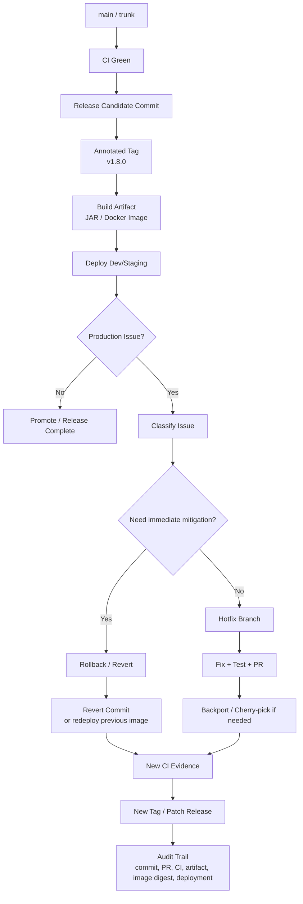

---

## Mental Model

Ada tiga konsep yang harus dibedakan:

```text id="release-hotfix-rollback-model"
Release:
  Menandai dan mempromosikan versi yang dianggap siap.

Hotfix:
  Perubahan kecil dan terarah untuk memperbaiki issue kritikal.

Rollback:
  Mengembalikan behavior/runtime ke kondisi aman sebelumnya.
```

Jangan mencampur ketiganya.

Contoh salah:

```text id="bad-release-thinking"
Production error muncul.
Langsung push commit ke main.
Langsung retag v1.4.0.
Langsung deploy latest.
Tidak ada PR, CI evidence, atau audit trail.
```

Contoh lebih aman:

```text id="good-release-thinking"
Production error muncul.
Klasifikasikan root cause.
Jika perlu mitigasi cepat, rollback ke image/tag sebelumnya.
Jika perlu code fix, buat hotfix branch.
Review dan CI tetap berjalan.
Buat patch release baru.
Trace commit, PR, CI, artifact, dan deployment.
```

---

## Decomposition Map

| # | Domain / Skill | Yang perlu dikuasai | Relevansi untuk Java Jersey/JAX-RS microservice | Failure mode yang dicegah |
|---:|---|---|---|---|
| 1 | Release branch model | Main/trunk, release branch, maintenance branch | Menentukan dari mana artifact production dibuat | Release tidak jelas sumbernya |
| 2 | Tagging | Lightweight vs annotated tag, naming, push tag | Menandai release commit | Tidak tahu commit mana dirilis |
| 3 | Versioning | Maven version, Git tag, Docker tag, image digest | Menghubungkan source ke artifact | Artifact tidak traceable |
| 4 | Release candidate | Commit yang lolos CI dan siap dipromote | Stabilitas sebelum production | Build dari commit yang belum tervalidasi |
| 5 | Hotfix branch | Branch dari release/main sesuai strategi | Perbaikan issue kritikal | Fix bercampur feature lain |
| 6 | Cherry-pick | Backport commit spesifik | Patch release branch lama | Salah bawa dependency commit |
| 7 | Revert | Commit pembalik untuk shared history | Rollback behavior secara aman | Rewrite main history |
| 8 | Rollback deployment | Redeploy artifact/image sebelumnya | Mitigasi cepat tanpa code change | Rebuild ulang artifact tidak sama |
| 9 | Bisect | Binary search commit penyebab regression | Debug bug yang mulai muncul di commit tertentu | Root cause spekulatif |
| 10 | Blame/log/show | Investigasi perubahan file/baris/commit | Mencari asal perubahan | Salah menuduh root cause |
| 11 | Audit trail | Commit, PR, CI, artifact, tag, deployment | Compliance/release evidence | Tidak bisa membuktikan perubahan |
| 12 | Protected branch | Required reviews/checks | Mencegah direct push ke main/release | Perubahan tak direview |
| 13 | Protected tag/ruleset | Mencegah tag release dihapus/diubah | Menjaga release anchor | Tag mutable merusak traceability |
| 14 | Signed commit/tag | Integrity signal jika policy aktif | Supply-chain control | Commit/tag sulit diverifikasi |
| 15 | Release notes | Ringkasan perubahan dan risiko | Komunikasi deploy | Tim ops tidak tahu impact |
| 16 | Patch release | Version bump kecil untuk fix | Jalur aman production fix | Hotfix tidak terdokumentasi |
| 17 | Migration rollback | Strategi DB rollback/forward fix | DB schema/data issue | Revert code tapi DB tetap berubah |
| 18 | Incident evidence | Log, commit range, deployment time | Root cause defensible | Debug hanya dari asumsi |
| 19 | Backport policy | Apa yang boleh masuk branch lama | Maintenance branch sehat | Branch lama divergen liar |
| 20 | Release checklist | Gate sebelum dan sesudah tag/deploy | Mengurangi release risk | Human error berulang |

---

## 1. Release Model

Ada beberapa model umum.

| Model | Bentuk | Cocok untuk | Risiko |
|---|---|---|---|
| Trunk-based release | Release dari `main` yang selalu hijau | Tim CI/CD matang | Butuh test/feature flag kuat |
| Release branch | `release/1.8` dibuat dari main | Patch maintenance jelas | Branch drift |
| GitFlow-style | develop/main/release/hotfix | Release periodik lebih formal | Berat untuk microservice kecil |
| Environment branch | `dev`, `staging`, `prod` branch | Sering ditemui legacy | Risiko config/code bercampur |

Untuk microservice modern, biasanya lebih sehat:

```text id="recommended-release-model"
main selalu deployable
release dibuat dari commit/tag yang CI-nya hijau
hotfix kecil masuk lewat PR
artifact dipromote antar environment, bukan rebuild sembarangan
```

Prinsip penting:

```text id="release-principle"
Release harus menunjuk commit immutable secara praktis.
Artifact harus bisa ditelusuri ke commit/tag tersebut.
```

---

## 2. Tagging untuk Release

Tag menandai commit tertentu.

### Annotated tag

```bash id="annotated-tag-command"
git tag -a v1.8.0 -m "Release v1.8.0"
git push origin v1.8.0
```

### Lightweight tag

```bash id="lightweight-tag-command"
git tag v1.8.0
```

Untuk release, lebih baik gunakan **annotated tag** karena membawa metadata tagger, date, dan message.

Lihat tag:

```bash id="show-tag"
git tag --list
git show v1.8.0
```

Cari commit dari tag:

```bash id="rev-parse-tag"
git rev-parse v1.8.0
```

Tag release sebaiknya mengikuti pola:

```text id="release-tag-pattern"
vMAJOR.MINOR.PATCH
v1.8.0
v1.8.1
v2.0.0
```

Atau jika organisasi punya format internal:

```text id="internal-tag-pattern"
service-name-v1.8.0
case-service-2026.07.14.1
```

Yang penting: konsisten dan bisa dipakai automation.

---

## 3. Jangan Retag Release Sembarangan

Secara teknis Git tag bisa dihapus dan dibuat ulang. Secara release engineering, ini berbahaya.

Anti-pattern:

```bash id="bad-retag"
git tag -d v1.8.0
git tag -a v1.8.0 -m "Retag"
git push --force origin v1.8.0
```

Risiko:

```text id="retag-risk"
Artifact lama dan baru sama-sama mengaku v1.8.0.
SBOM tidak cocok.
Docker image tag bisa menunjuk isi berbeda.
Audit trail rusak.
Rollback jadi ambigu.
Dependency downstream bisa mengambil source berbeda.
```

GitHub repository rulesets dapat dipakai untuk mengontrol interaksi terhadap branch dan tag, termasuk siapa yang boleh push ke branch tertentu atau siapa yang boleh menghapus/rename tag. Ini relevan untuk menjaga release tag agar tidak berubah sembarangan. ([GitHub Docs](https://docs.github.com/en/repositories/configuring-branches-and-merges-in-your-repository/managing-rulesets/creating-rulesets-for-a-repository?utm_source=chatgpt.com))

Prinsip:

```text id="tag-immutability-principle"
Jika release v1.8.0 salah, jangan ubah tag v1.8.0.
Buat v1.8.1.
```

---

## 4. Maven Version, Git Tag, Docker Tag, Image Digest

Release Java microservice biasanya melibatkan beberapa identifier.

| Identifier | Contoh | Fungsi |
|---|---|---|
| Git commit SHA | `a1b2c3d4...` | Source truth |
| Git tag | `v1.8.0` | Release marker |
| Maven version | `1.8.0` | Artifact version |
| JAR | `case-service-1.8.0.jar` | Build artifact |
| Docker tag | `case-service:1.8.0` | Human-friendly image ref |
| Docker digest | `sha256:...` | Immutable image identity |
| CI run id | `run-12345` | Build evidence |
| SBOM | `bom.json` | Dependency inventory |

Traceability chain ideal:

```text id="release-traceability-chain"
Git tag v1.8.0
  -> commit SHA a1b2c3
  -> GitHub PRs merged
  -> CI run
  -> Maven artifact case-service-1.8.0.jar
  -> SBOM bom.json
  -> Docker image digest sha256:...
  -> Kubernetes deployment revision
```

Untuk production deployment, image digest lebih kuat daripada tag karena tag bisa berubah, sedangkan digest menunjuk content tertentu.

---

## 5. Release Checklist

Sebelum tag:

```bash id="pre-release-check"
git switch main
git pull --ff-only
./mvnw clean verify
git status
```

Cek:

```text id="pre-release-checklist"
Branch benar?
Working tree clean?
CI main hijau?
Maven version benar?
Dependency/security gate lolos?
Integration test lolos?
SBOM/report tersedia jika wajib?
Release notes siap?
Migration risk dipahami?
Rollback plan jelas?
```

Buat tag:

```bash id="create-release-tag"
git tag -a v1.8.0 -m "Release v1.8.0"
git push origin v1.8.0
```

Setelah tag:

```text id="post-tag-checklist"
CI release workflow berjalan dari tag.
Artifact dibuat dari tag, bukan branch sembarang.
Docker image ditag sesuai release.
Image digest dicatat.
Deployment environment mencatat versi/digest.
Smoke test post-deploy jalan.
```

---

## 6. Hotfix Branch

Hotfix adalah perubahan kecil untuk memperbaiki issue kritikal. Hotfix harus punya scope sempit.

Ada dua pola utama.

### Hotfix dari `main`

Jika `main` merepresentasikan production atau sangat dekat production:

```bash id="hotfix-from-main"
git switch main
git pull --ff-only
git switch -c hotfix/fix-order-submit-timeout
```

### Hotfix dari release tag/branch

Jika production berjalan dari `release/1.8` atau tag `v1.8.0`:

```bash id="hotfix-from-release-branch"
git switch release/1.8
git pull --ff-only
git switch -c hotfix/1.8.1-order-submit-timeout
```

Atau dari tag:

```bash id="hotfix-from-tag"
git switch -c hotfix/1.8.1-order-submit-timeout v1.8.0
```

Workflow:

```bash id="hotfix-workflow"
# edit fix
./mvnw clean verify
git add -p
git commit -m "Fix order submit timeout handling"
git push -u origin hotfix/1.8.1-order-submit-timeout
```

Hotfix tetap harus lewat PR kecuali organisasi punya break-glass policy yang eksplisit.

---

## 7. Patch Release

Setelah hotfix merge:

```bash id="patch-release-tag"
git switch release/1.8
git pull --ff-only
git tag -a v1.8.1 -m "Release v1.8.1"
git push origin v1.8.1
```

Patch release harus menjawab:

```text id="patch-release-questions"
Bug apa yang diperbaiki?
Commit apa saja yang masuk?
Apakah ada migration?
Apakah backward compatible?
Apakah perlu config change?
Apakah sudah smoke test?
Apakah ada backport ke main atau sebaliknya?
```

Jangan memasukkan unrelated refactor ke hotfix. Hotfix harus:

```text id="hotfix-scope"
small
targeted
test-backed
reviewed
traceable
revertable
```

---

## 8. Backport dengan Cherry-pick

Backport sering dipakai untuk membawa commit dari main ke release branch lama.

Contoh:

```bash id="backport-cherry-pick"
git switch release/1.8
git pull --ff-only
git cherry-pick <fix-commit-sha>
./mvnw clean verify
git push
```

Kalau conflict:

```bash id="cherry-pick-conflict"
# resolve conflict
git add <resolved-files>
git cherry-pick --continue
```

Abort:

```bash id="cherry-pick-abort"
git cherry-pick --abort
```

Checklist sebelum cherry-pick:

```text id="backport-checklist"
Apakah commit atomic?
Apakah commit bergantung pada refactor lain?
Apakah dependency/POM di release branch compatible?
Apakah schema DB sama?
Apakah test ikut terbawa?
Apakah behavior di branch lama sama?
```

Anti-pattern:

```text id="bad-cherry-pick"
Cherry-pick commit besar yang berisi feature + fix + refactor.
Cherry-pick tanpa menjalankan test.
Cherry-pick migration tanpa cek urutan release branch.
```

---

## 9. Rollback: Deployment vs Code Revert

Rollback bisa berarti dua hal berbeda.

| Jenis rollback | Apa yang dilakukan | Kapan dipakai |
|---|---|---|
| Deployment rollback | Deploy ulang artifact/image sebelumnya | Mitigasi cepat |
| Code revert | Buat commit baru yang membalik commit bermasalah | Jika perlu memperbaiki branch/history |
| Config rollback | Kembalikan config sebelumnya | Issue karena env/config |
| Data rollback/forward fix | Perbaiki data/schema | Issue migration/data |

### Deployment rollback

Contoh konsep:

```text id="deployment-rollback"
Current production:
  case-service:v1.8.0 / digest A

Rollback:
  redeploy case-service:v1.7.3 / digest B
```

Keuntungan:

```text id="deployment-rollback-pro"
Cepat.
Tidak perlu code change.
Cocok untuk mitigasi incident.
```

Risiko:

```text id="deployment-rollback-risk"
Tidak aman jika DB migration sudah forward-only.
Tidak aman jika external contract sudah berubah.
Tidak aman jika message/event schema sudah berubah.
```

### Code revert

`git revert` membuat commit baru yang membalik patch dari commit sebelumnya. Dokumentasi Git menyebut `git revert` mengambil commit yang ada, membalik perubahan patch-nya, dan merekam commit baru; working tree harus clean. ([git-scm.com](https://git-scm.com/docs/git-revert.html?utm_source=chatgpt.com))

Command:

```bash id="git-revert-command"
git switch main
git pull --ff-only
git revert <bad-commit-sha>
./mvnw clean verify
git push
```

Untuk revert merge commit:

```bash id="revert-merge"
git revert -m 1 <merge-commit-sha>
```

Hati-hati dengan `-m`: parent yang dipilih menentukan sisi merge yang dianggap mainline.

---

## 10. Revert Strategy

Gunakan revert saat:

```text id="when-to-revert"
bad commit sudah masuk main
bad commit sudah dipush ke shared branch
perlu audit trail
perlu rollback behavior lewat PR
```

Jangan gunakan reset/force push untuk main/release branch.

Contoh revert aman:

```bash id="safe-revert-flow"
git switch main
git pull --ff-only
git switch -c revert/bad-readiness-change
git revert <bad-commit-sha>
./mvnw clean verify
git push -u origin revert/bad-readiness-change
```

Lalu buka PR.

Pesan PR:

```text id="revert-pr-message"
Reverts commit <sha> because readiness endpoint now blocks on a slow dependency,
causing Kubernetes rollout failures.

Validation:
- mvn clean verify passed
- local smoke test passed
- /health remains lightweight
- /ready still validates PostgreSQL connectivity
```

---

## 11. Rollback dan Database Migration

Ini bagian yang paling sering diremehkan.

Code revert tidak otomatis membalik database.

Contoh berbahaya:

```text id="db-rollback-danger"
Release v1.8.0:
  migration menambahkan NOT NULL column tanpa default
  code baru menulis column tersebut

Rollback code ke v1.7.3:
  code lama tidak menulis column baru
  insert gagal
```

Strategi aman:

| Strategi | Penjelasan |
|---|---|
| Expand-contract | Tambah schema backward-compatible dulu, hapus belakangan |
| Forward fix | Perbaiki dengan migration baru, bukan rollback destructive |
| Backward-compatible code | Code lama dan baru bisa hidup dengan schema transisi |
| Feature flag | Behavior baru bisa dimatikan |
| Data migration dry-run | Validasi sebelum production |
| Rollback runbook | Jelaskan apa yang aman/tidak aman di-rollback |

Checklist sebelum rollback:

```text id="db-rollback-checklist"
Apakah ada migration di release ini?
Apakah migration destructive?
Apakah code lama compatible dengan schema baru?
Apakah ada data transformation irreversible?
Apakah ada event/message schema berubah?
Apakah ada background job yang sudah memproses data baru?
```

---

## 12. Bisect untuk Regression

`git bisect` menggunakan binary search untuk menemukan commit yang memperkenalkan bug; prosesnya dimulai dengan menandai commit “bad” yang mengandung bug dan commit “good” sebelum bug ada, lalu Git memilih commit di antaranya untuk diuji sampai kandidat penyebab ditemukan. ([git-scm.com](https://git-scm.com/docs/git-bisect?utm_source=chatgpt.com))

Manual flow:

```bash id="bisect-manual-flow"
git bisect start
git bisect bad
git bisect good v1.7.3
```

Git akan checkout commit di tengah. Jalankan test atau reproduksi manual:

```bash id="bisect-test-manual"
./mvnw test
```

Tandai hasil:

```bash id="bisect-good-bad"
git bisect good
# atau
git bisect bad
```

Selesai:

```bash id="bisect-reset"
git bisect reset
```

Cocok untuk:

```text id="bisect-good-use"
Bug deterministic.
Ada known good commit.
Ada known bad commit.
Ada test/script yang bisa membedakan good/bad.
```

Tidak cocok untuk:

```text id="bisect-bad-use"
Flaky issue.
Bug tergantung environment eksternal.
Bug muncul karena data production tertentu saja.
History penuh merge kompleks dan test tidak deterministik.
```

---

## 13. Bisect Otomatis dengan Script

Jika punya script reproduksi:

```bash id="bisect-script"
#!/usr/bin/env bash
set -euo pipefail

./mvnw -q test -Dtest=CaseTransitionRegressionTest
```

Jalankan:

```bash id="bisect-run"
git bisect start
git bisect bad HEAD
git bisect good v1.7.3
git bisect run ./scripts/reproduce-regression.sh
git bisect reset
```

Exit code menentukan hasil:

```text id="bisect-exit-code"
0      good
1-127  bad
125    skip commit
```

Pattern script untuk skip jika build tidak bisa jalan karena commit lama:

```bash id="bisect-skip-script"
#!/usr/bin/env bash
set -euo pipefail

if ! ./mvnw -q -DskipTests compile; then
  exit 125
fi

./mvnw -q test -Dtest=CaseTransitionRegressionTest
```

---

## 14. Bisect untuk Java/Jersey Issue

Contoh kasus:

```text id="jersey-bisect-case"
Endpoint /cases/{id}/transition mulai return 500.
Versi v1.7.3 normal.
HEAD di main rusak.
```

Langkah:

```bash id="jersey-bisect-steps"
git bisect start
git bisect bad HEAD
git bisect good v1.7.3
git bisect run ./scripts/reproduce-case-transition-500.sh
```

Script:

```bash id="jersey-bisect-script"
#!/usr/bin/env bash
set -euo pipefail

./mvnw -q clean package

java -jar target/*.jar &
APP_PID=$!

cleanup() {
  kill "$APP_PID" >/dev/null 2>&1 || true
}
trap cleanup EXIT

for i in {1..30}; do
  if curl -fsS http://localhost:8080/health >/dev/null; then
    break
  fi
  sleep 1
done

HTTP_STATUS="$(
  curl -s -o /tmp/response.txt -w "%{http_code}" \
    -X POST http://localhost:8080/cases/123/transition \
    -H "Content-Type: application/json" \
    -d '{"targetStatus":"CLOSED"}'
)"

if [[ "$HTTP_STATUS" == "200" ]]; then
  exit 0
fi

exit 1
```

Catatan: script ini konseptual. Dalam repo nyata, perlu setup data test deterministik, DB test, port random/isolated, dan cleanup lebih kuat.

---

## 15. Git Log, Show, Blame untuk Investigasi

### Log ringkas

```bash id="git-log-basic"
git log --oneline --graph --decorate --all
```

### Commit range sejak release

```bash id="git-log-range"
git log --oneline v1.7.3..HEAD
```

### File-specific history

```bash id="git-log-file"
git log --oneline -- src/main/java/com/company/caseapi/resource/CaseResource.java
```

### Show commit

```bash id="git-show"
git show <commit-sha>
git show --stat <commit-sha>
```

### Blame

```bash id="git-blame"
git blame src/main/java/com/company/caseapi/resource/CaseResource.java
```

Gunakan `blame` untuk konteks, bukan menyalahkan orang. Pertanyaan yang benar:

```text id="blame-good-questions"
Perubahan ini bagian dari PR apa?
Apa intent perubahan ini?
Apakah ada issue/ticket terkait?
Apakah behavior ini masih valid?
```

---

## 16. Release Notes dari Git

Basic:

```bash id="release-notes-basic"
git log --oneline v1.7.3..v1.8.0
```

Dengan merge commits:

```bash id="release-notes-merges"
git log --merges --oneline v1.7.3..v1.8.0
```

Dengan author/date:

```bash id="release-notes-author-date"
git log --pretty=format:'%h %ad %an %s' --date=short v1.7.3..v1.8.0
```

Dengan changed files:

```bash id="release-changed-files"
git diff --name-only v1.7.3..v1.8.0
```

Release notes minimal harus berisi:

```text id="release-notes-content"
Version
Date
Commit/tag
Highlights
Bug fixes
Breaking changes
Migration/config changes
Security fixes
Known risks
Rollback notes
```

---

## 17. Audit Trail di GitHub

Di GitHub, audit trail tidak hanya Git history. Ada juga PR review, branch protection, workflow runs, release artifacts, dan organization audit log.

GitHub branch protection dapat digunakan untuk menegakkan workflow seperti required approving review dan required status checks sebelum pull request bisa merge ke protected branch. ([GitHub Docs](https://docs.github.com/en/repositories/configuring-branches-and-merges-in-your-repository/managing-protected-branches/managing-a-branch-protection-rule?utm_source=chatgpt.com))

GitHub organization audit log mencatat event aktivitas yang memengaruhi organisasi dalam jangka waktu tertentu; dokumentasi GitHub menyebut audit log organization mencantumkan event selama 180 hari terakhir dan hanya organization owners yang dapat mengaksesnya. ([GitHub Docs](https://docs.github.com/organizations/keeping-your-organization-secure/managing-security-settings-for-your-organization/reviewing-the-audit-log-for-your-organization?utm_source=chatgpt.com))

Audit trail ideal:

| Evidence | Sumber |
|---|---|
| Commit SHA | Git |
| Author/committer | Git |
| PR discussion | GitHub PR |
| Reviewer approval | GitHub PR review |
| Required checks | Branch protection / Actions |
| CI logs | GitHub Actions |
| Artifact | Maven repo / Actions artifact |
| SBOM | CI artifact |
| Docker image digest | Container registry |
| Deployment | Kubernetes/Argo/Helm/GitOps/tooling |
| Production incident | Incident ticket |
| Override/bypass | GitHub audit log / platform audit |

---

## 18. Protected Branch dan Release Branch

Protected branch membantu mencegah:

```text id="protected-branch-prevent"
direct push ke main
merge tanpa review
merge tanpa CI hijau
force push
branch deletion
bypass oleh non-admin
```

Minimum policy untuk enterprise microservice:

```text id="branch-protection-minimum"
main:
  require PR
  require at least 1-2 approvals
  require CODEOWNERS for critical paths
  require CI checks
  block force push
  block deletion

release/*:
  require PR
  require CI
  restrict who can push
  block force push
  block deletion
```

Critical paths:

```text id="critical-paths"
pom.xml
Dockerfile
.github/workflows/*
db/migration/*
src/main/java/**/auth/**
src/main/java/**/security/**
src/main/java/**/workflow/**
k8s/*
helm/*
```

---

## 19. Release Audit Template

Gunakan template seperti ini untuk release record:

```text id="release-audit-template"
Release:
- Service: case-service
- Version: v1.8.0
- Date: 2026-07-14
- Git tag: v1.8.0
- Commit SHA: <sha>
- Source branch: main
- CI run: <url/id>
- Maven artifact: case-service-1.8.0.jar
- Docker image: registry.example.com/case-service:1.8.0
- Docker digest: sha256:<digest>
- SBOM: bom.json
- Deployed environment: staging/prod
- Deployment time: <timestamp>
- Migration included: yes/no
- Config change included: yes/no
- Smoke test result: pass/fail
- Rollback target: v1.7.3 / digest
- Known risks:
- Approvals:
```

Untuk incident/hotfix:

```text id="hotfix-audit-template"
Hotfix:
- Incident/ticket:
- Symptom:
- Root cause:
- Fix commit:
- PR:
- CI:
- Release tag:
- Environments deployed:
- Validation:
- Backport needed:
- Rollback note:
```

---

## 20. Emergency Decision Tree

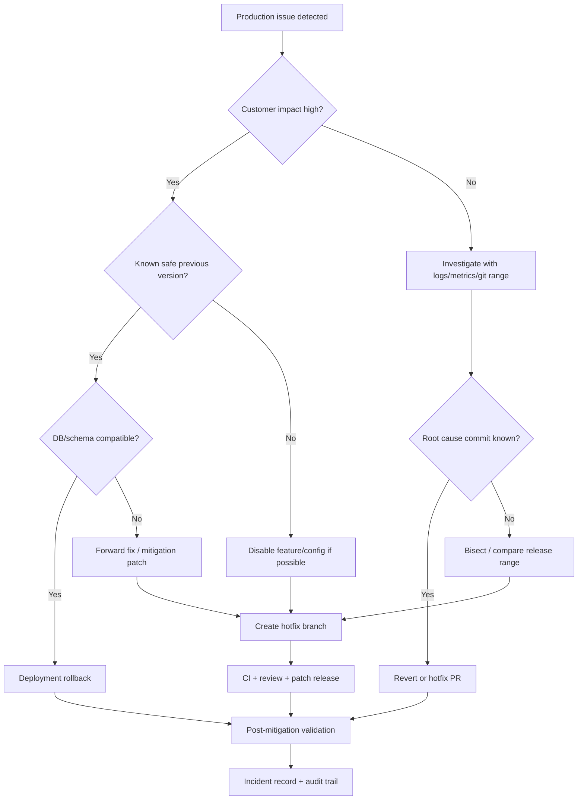

---

## 21. Common Failure Scenarios

### Scenario 1 - Release tag salah commit

Gejala:

```text id="wrong-tag-symptom"
v1.8.0 menunjuk commit yang belum lolos CI.
```

Mitigasi:

```text id="wrong-tag-mitigation"
Jika belum dipakai downstream, buat tag baru sesuai policy internal.
Jika sudah dipublish/deploy, jangan retag diam-diam.
Buat v1.8.1 dari commit benar.
Catat incident release metadata.
```

---

### Scenario 2 - Hotfix bercampur feature

Gejala:

```text id="hotfix-mixed-symptom"
Patch release berisi refactor besar dan feature baru.
```

Risiko:

```text id="hotfix-mixed-risk"
Regression tambahan.
Review lambat.
Rollback sulit.
Audit tidak jelas.
```

Solusi:

```text id="hotfix-mixed-solution"
Pisahkan fix minimal.
Cherry-pick hanya commit relevan.
Buat PR patch kecil.
Feature tetap di main branch normal.
```

---

### Scenario 3 - Rollback gagal karena migration

Gejala:

```text id="rollback-migration-symptom"
Code lama dideploy, tapi aplikasi gagal insert/query karena schema sudah berubah.
```

Solusi:

```text id="rollback-migration-solution"
Gunakan forward fix.
Buat migration compatibility.
Aktifkan feature flag off jika ada.
Jangan rollback code tanpa cek schema compatibility.
```

---

### Scenario 4 - Bisect gagal karena test flaky

Gejala:

```text id="bisect-flaky-symptom"
Commit yang sama kadang good kadang bad.
```

Solusi:

```text id="bisect-flaky-solution"
Stabilkan reproducer.
Gunakan test deterministic.
Pin environment.
Isolasi DB/data.
Jika perlu, jalankan test beberapa kali dalam script.
```

---

### Scenario 5 - Revert membuat bug lain

Gejala:

```text id="revert-new-bug-symptom"
Commit direvert, tapi dependency commit lain masih bergantung padanya.
```

Solusi:

```text id="revert-new-bug-solution"
Cek commit dependency graph secara manual.
Revert satu rangkaian commit jika perlu.
Jalankan full verify.
Review release range.
```

---

## 22. Command Cheatsheet

| Kebutuhan | Command |
|---|---|
| Tag release | `git tag -a v1.8.0 -m "Release v1.8.0"` |
| Push tag | `git push origin v1.8.0` |
| Show tag | `git show v1.8.0` |
| Commit SHA tag | `git rev-parse v1.8.0` |
| Log sejak release | `git log --oneline v1.7.3..v1.8.0` |
| Changed files sejak release | `git diff --name-only v1.7.3..v1.8.0` |
| Hotfix dari tag | `git switch -c hotfix/x v1.8.0` |
| Cherry-pick fix | `git cherry-pick <sha>` |
| Revert commit | `git revert <sha>` |
| Revert merge | `git revert -m 1 <merge-sha>` |
| Start bisect | `git bisect start` |
| Mark bad | `git bisect bad` |
| Mark good | `git bisect good <sha/tag>` |
| Auto bisect | `git bisect run ./script.sh` |
| End bisect | `git bisect reset` |
| File history | `git log -- path/to/file` |
| Show commit | `git show <sha>` |
| Blame file | `git blame path/to/file` |

---

## 23. Senior Engineer Invariants

| Invariant | Penjelasan |
|---|---|
| Release tag harus menunjuk commit yang tervalidasi | Jangan tag commit yang belum CI hijau |
| Jangan retag release yang sudah dipublish | Buat patch release baru |
| Hotfix harus kecil dan targeted | Jangan campur feature/refactor |
| Rollback deployment dan revert code berbeda | Pilih sesuai mitigasi dan audit |
| DB migration bisa membuat rollback tidak aman | Selalu cek schema/data compatibility |
| Bisect butuh reproducer deterministic | Flaky test merusak hasil |
| Shared branch tidak boleh direwrite | Gunakan revert |
| Artifact harus traceable ke commit/tag | Commit SHA saja tidak cukup tanpa CI/artifact link |
| Audit trail harus lintas sistem | Git, GitHub, CI, registry, deployment |
| Release process harus repeatable | Checklist/runbook lebih baik daripada tribal knowledge |

---

## Mini Lab

### Lab 1 - Buat release tag lokal

```bash id="lab-tag"
git switch main
git pull --ff-only
git tag -a v0.1.0-lab -m "Lab release v0.1.0"
git show v0.1.0-lab
```

Cleanup lokal:

```bash id="lab-tag-cleanup"
git tag -d v0.1.0-lab
```

Target: memahami annotated tag.

---

### Lab 2 - Buat release notes dari commit range

```bash id="lab-release-notes"
git log --oneline --decorate --max-count=20
git log --oneline <old-sha>..<new-sha>
git diff --name-only <old-sha>..<new-sha>
```

Target: melihat perubahan antara dua titik release.

---

### Lab 3 - Simulasi revert

```bash id="lab-revert"
git switch -c lab/revert-test
echo "bad change" > bad-change.txt
git add bad-change.txt
git commit -m "Add bad change for revert lab"

git revert HEAD
git log --oneline --max-count=3
```

Target: memahami revert sebagai commit baru.

---

### Lab 4 - Simulasi cherry-pick

```bash id="lab-cherry-pick"
git switch -c lab/source-change
echo "fix" > fix.txt
git add fix.txt
git commit -m "Add fix for cherry-pick lab"
FIX_SHA="$(git rev-parse HEAD)"

git switch main
git switch -c lab/backport-change
git cherry-pick "$FIX_SHA"
```

Target: memahami backport commit spesifik.

---

### Lab 5 - Simulasi bisect sederhana

Buat script test sederhana sesuai repo, lalu:

```bash id="lab-bisect"
git bisect start
git bisect bad HEAD
git bisect good <known-good-sha>
git bisect run ./scripts/reproduce.sh
git bisect reset
```

Target: memahami binary search commit penyebab regression.

---

## Roadmap Singkat

| Tahap | Fokus | Output |
|---:|---|---|
| 1 | Tagging & versioning | Bisa membuat release tag yang benar |
| 2 | Release checklist | Bisa memastikan commit/tag/artifact tervalidasi |
| 3 | Hotfix workflow | Bisa membuat patch fix kecil |
| 4 | Backport/cherry-pick | Bisa membawa fix ke release branch lama |
| 5 | Rollback/revert | Bisa memilih mitigation yang aman |
| 6 | Bisect | Bisa mencari regression commit |
| 7 | Audit trail | Bisa menjelaskan commit → PR → CI → artifact → deploy |
| 8 | Governance | Bisa menerapkan protected branch/tag/ruleset |

---

## Ringkasan

Git untuk release engineering bukan sekadar command. Ia adalah sistem kontrol perubahan yang harus menjaga:

```text id="seri8-summary"
release marker jelas
hotfix kecil dan aman
rollback tidak merusak data
regression bisa dilacak
audit trail bisa dibuktikan
artifact bisa ditelusuri
shared history tidak diacak
```

Core pattern yang perlu dipegang:

```text id="seri8-core-pattern"
Release:
  commit hijau -> annotated tag -> CI release -> artifact/image -> deploy -> smoke test

Hotfix:
  branch dari source benar -> fix kecil -> test -> PR -> patch tag -> deploy

Rollback:
  deployment rollback jika aman
  git revert jika perlu membalik behavior di branch
  forward fix jika DB/data sudah berubah

Regression:
  tentukan good/bad
  buat reproducer deterministic
  git bisect run
  validasi root cause
```

---

## Status

**Seri 8/12 selesai.**

Rekomendasi berikutnya: **Seri 9 - GitHub Collaboration: PR, Review, CODEOWNERS, Branch Protection**.

---

**Sources:**

- [Git](https://git-scm.com/?utm_source=chatgpt.com)
- [Creating rulesets for a repository](https://docs.github.com/en/repositories/configuring-branches-and-merges-in-your-repository/managing-rulesets/creating-rulesets-for-a-repository?utm_source=chatgpt.com)

## Response:
7/14/2026, 12:25:55 AM

Saya lanjut ke **Seri 9/12**. Fokusnya GitHub sebagai collaboration/governance layer: PR workflow, review discipline, CODEOWNERS, branch protection/rulesets, required checks, dan cara membuat perubahan high-risk tetap terkontrol.

# Seri 9/12 - GitHub Collaboration: PR, Review, CODEOWNERS, Branch Protection

## Introduction

Seri ini membahas GitHub sebagai **collaboration dan governance layer** di atas Git. Kalau Git mengatur version control lokal dan history, GitHub mengatur bagaimana perubahan masuk ke repository bersama: pull request, review, required checks, ownership, branch protection, repository rulesets, security visibility, dan audit trail.

Dalam Java Jersey/JAX-RS microservice, GitHub bukan sekadar tempat menyimpan kode. Ia menjadi kontrol perubahan untuk area yang berisiko tinggi:

```text id="github-risk-areas"
pom.xml
Dockerfile
.github/workflows/*
db/migration/*
src/main/java/**/resource/*
src/main/java/**/filter/*
src/main/java/**/mapper/*
src/main/java/**/auth/*
src/main/java/**/security/*
src/main/java/**/workflow/*
k8s/*
helm/*
```

GitHub branch protection dapat dipakai untuk menegakkan workflow seperti required approving review dan required status checks sebelum perubahan masuk ke protected branch. CODEOWNERS bisa meminta review otomatis dari owner ketika file tertentu berubah, selama CODEOWNERS berada di base branch PR. Repository rulesets juga bisa mengontrol interaksi terhadap branch dan tag, termasuk siapa yang boleh push, menghapus, atau mengubah ref tertentu. ([GitHub Docs](https://docs.github.com/en/repositories/configuring-branches-and-merges-in-your-repository/managing-protected-branches/managing-a-branch-protection-rule?utm_source=chatgpt.com))

---

## Diagram

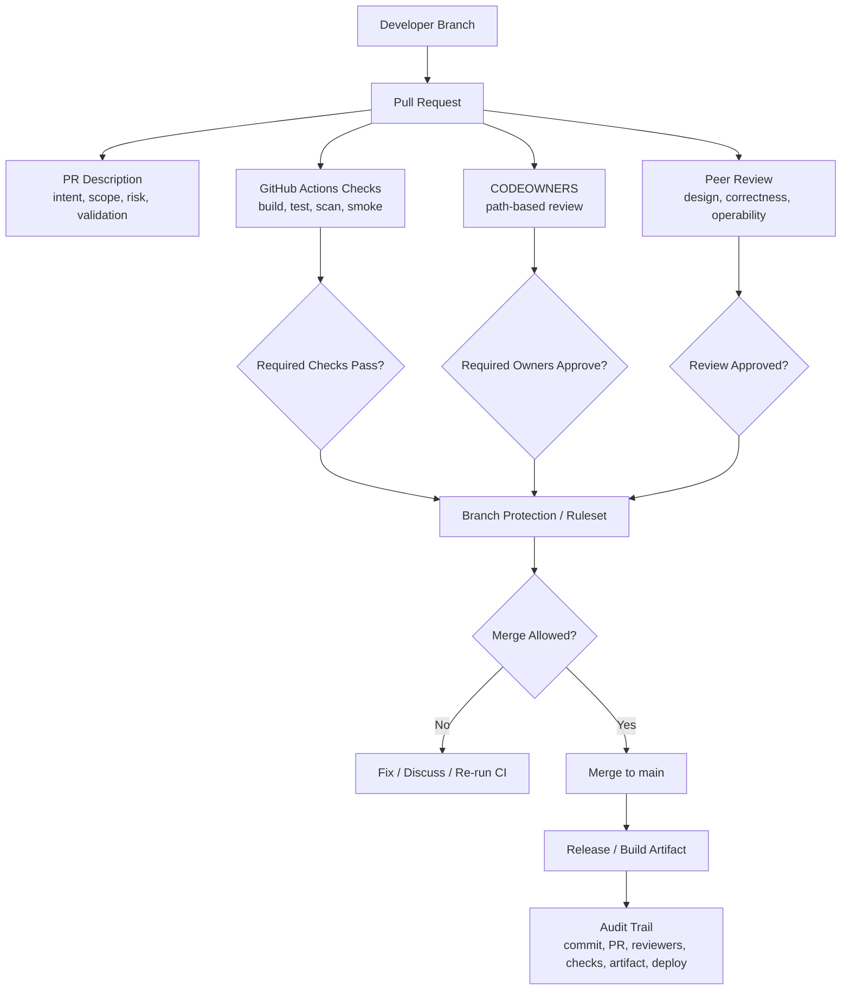

---

## Mental Model

GitHub collaboration yang sehat bukan hanya “buka PR lalu merge”. Ia adalah mekanisme untuk menjaga empat hal:

```text id="github-mental-model"
1. Correctness
   Kode benar, test relevan, dependency aman.

2. Reviewability
   Perubahan cukup kecil dan konteks PR jelas.

3. Accountability
   Area penting direview oleh owner yang tepat.

4. Traceability
   Commit -> PR -> review -> CI -> artifact -> deployment bisa ditelusuri.
```

Untuk senior engineer, GitHub harus dilihat sebagai **control plane perubahan software**. Ia mengubah aturan engineering menjadi guardrail teknis.

---

## Decomposition Map

| # | Domain / Skill | Yang perlu dikuasai | Relevansi untuk Java Jersey/JAX-RS microservice | Failure mode yang dicegah |
|---:|---|---|---|---|
| 1 | Pull Request design | Scope, intent, risk, validation | Membuat perubahan mudah direview | PR besar dan ambigu |
| 2 | PR description | Purpose, context, changes, test evidence | Reviewer paham alasan perubahan | Review hanya syntax |
| 3 | Review discipline | Correctness, maintainability, operability | Menjaga kualitas endpoint/service/DB/CI | Bug lolos karena review dangkal |
| 4 | Review roles | Author, reviewer, code owner, approver | Memisahkan tanggung jawab | Tidak jelas siapa bertanggung jawab |
| 5 | Draft PR | Early feedback sebelum final | Cocok untuk design/API/migration besar | Review terlambat |
| 6 | Required reviews | Approval wajib sebelum merge | Governance branch utama | Perubahan masuk tanpa review |
| 7 | CODEOWNERS | Path-based ownership | Owner auth/DB/CI/deploy otomatis diminta review | Area kritikal berubah tanpa owner |
| 8 | Branch protection | Required PR/checks/reviews | Main/release branch terlindungi | Direct push/force push |
| 9 | Repository rulesets | Branch/tag/push rules modern | Governance lintas branch/tag | Tag release mutable |
| 10 | Required status checks | CI wajib hijau | Build/test/scan gate | Merge saat CI merah |
| 11 | Conversation resolution | Review thread harus selesai | Menghindari unresolved concern | Komentar penting diabaikan |
| 12 | Merge strategy | Merge commit, squash, rebase merge | History sesuai strategi tim | History sulit dilacak |
| 13 | PR templates | Standardisasi context | Memastikan risk/test/rollback ditulis | PR minim informasi |
| 14 | Issue linking | PR terhubung ke ticket/incident | Audit dan planning | Perubahan tanpa konteks bisnis |
| 15 | Labels/milestones | Klasifikasi perubahan | Release planning | Sulit tracking PR |
| 16 | Security visibility | Secret scanning, Dependabot, code scanning | Dependency/security guardrail | Secret/CVE masuk repo |
| 17 | Review for CI changes | Workflow changes direview ketat | CI/CD adalah supply-chain surface | Pipeline bypass |
| 18 | Review for POM changes | Dependency/plugin changes diaudit | Mencegah runtime/security issue | Dependency conflict/CVE |
| 19 | Review for migrations | Schema/data change governance | DB rollback dan compatibility | Migration merusak prod |
| 20 | Audit trail | PR, approvals, checks, branch rule | Compliance dan incident review | Tidak bisa membuktikan proses |

---

## 1. Pull Request sebagai Unit Review

PR sebaiknya menjadi unit perubahan yang bisa dijawab dengan jelas:

```text id="pr-core-questions"
Apa masalah yang diselesaikan?
Apa perubahan behavior?
Apa risiko utama?
Bagaimana divalidasi?
Apa dampak ke runtime/deployment?
Bagaimana rollback atau mitigasinya?
```

PR yang baik biasanya:

```text id="good-pr-attributes"
kecil
fokus
punya konteks
punya test evidence
punya risk note
mudah direview
tidak mencampur feature + refactor + formatting massal
```

Anti-pattern:

```text id="bad-pr-attributes"
PR 80 file tanpa ringkasan
rename/refactor dicampur bug fix
dependency update tanpa alasan
migration tanpa rollback/compatibility note
CI workflow berubah tanpa reviewer platform
test hanya "works on my machine"
```

---

## 2. PR Description Template

Template praktis untuk Java microservice:

```markdown id="pr-template"
## Summary

Explain what this PR changes and why.

## Scope

- [ ] API / Jersey resource
- [ ] Service logic
- [ ] DB / MyBatis / migration
- [ ] Maven dependency/build
- [ ] Docker/Kubernetes/deployment
- [ ] GitHub Actions / CI
- [ ] Security/auth/permission
- [ ] Documentation only

## Behavior Change

Describe the observable behavior change.

## Validation

- [ ] `./mvnw clean verify`
- [ ] Unit tests added/updated
- [ ] Integration tests added/updated
- [ ] Smoke test run
- [ ] Manual curl/API check
- [ ] Dependency tree checked
- [ ] Migration tested

## Risk

Describe risks, affected paths, and compatibility concerns.

## Rollback / Mitigation

Explain how to revert, disable, or mitigate if this causes issues.

## Notes for Reviewer

Mention files or decisions that need extra attention.
```

Untuk PR kecil, template bisa diisi ringkas. Untuk PR high-risk, jangan kosongkan bagian risk/rollback.

---

## 3. PR Size dan Reviewability

Heuristic praktis:

| Ukuran PR | Status |
|---|---|
| < 200 lines changed | Ideal untuk review cepat |
| 200-500 lines | Masih wajar jika scope jelas |
| 500-1000 lines | Perlu justification dan struktur review |
| > 1000 lines | Biasanya perlu dipecah, kecuali generated/mechanical |

Bukan angka absolut, tapi sinyal risiko.

Cara memecah PR besar:

```text id="split-pr-strategy"
1. Refactor no-behavior-change dulu.
2. Tambah model/DTO.
3. Tambah DB migration.
4. Tambah service logic.
5. Tambah endpoint/resource.
6. Tambah tests.
7. Aktifkan behavior dengan feature flag/config.
```

Untuk reviewer, PR kecil berarti bisa mengecek correctness, bukan hanya membaca sekilas.

---

## 4. Review Discipline

Review yang baik mengecek beberapa layer.

| Layer | Pertanyaan review |
|---|---|
| Intent | Apakah perubahan menyelesaikan masalah yang benar? |
| API contract | Apakah endpoint/path/status code/body benar? |
| Validation | Apakah input divalidasi di boundary yang tepat? |
| Error handling | Apakah exception dimap ke response yang benar? |
| Persistence | Apakah query/migration aman dan efisien? |
| Transaction | Apakah boundary transaction benar? |
| Security | Apakah auth/permission tidak bypass? |
| Observability | Apakah log/metric/correlation cukup? |
| Config | Apakah behavior environment-neutral? |
| Tests | Apakah test mengunci behavior penting? |
| Operability | Apakah service tetap bisa deploy/rollback? |

Contoh komentar review yang baik:

```text id="good-review-comment"
This changes /ready to call the external payment service. That may make Kubernetes rollout depend on a third-party dependency. Can we keep /health lightweight and limit /ready to internal critical dependencies only?
```

Contoh komentar kurang berguna:

```text id="bad-review-comment"
Looks weird.
```

Komentar review harus actionable.

---

## 5. Review Roles

| Role | Tanggung jawab |
|---|---|
| Author | Menjelaskan intent, menjaga scope, menambahkan evidence |
| Reviewer | Memeriksa correctness dan risiko |
| CODEOWNER | Menjaga area/domain tertentu |
| Approver | Memberi approval setelah concern selesai |
| Maintainer | Memastikan branch rules dan merge strategy dipatuhi |
| Release owner | Memastikan PR masuk release yang benar |

Senior engineer sering berperan sebagai **risk router**: menentukan PR ini butuh reviewer siapa.

Contoh:

```text id="review-routing"
pom.xml berubah
  -> reviewer build/platform/security

db/migration berubah
  -> reviewer database/domain owner

.github/workflows berubah
  -> reviewer CI/CD/platform

auth filter berubah
  -> reviewer security/auth owner

Jersey resource public API berubah
  -> reviewer API/domain owner
```

---

## 6. CODEOWNERS

CODEOWNERS menentukan siapa yang otomatis diminta review saat file tertentu berubah. GitHub menyatakan CODEOWNERS harus berada di base branch dari PR agar code owners menerima review request. ([GitHub Docs](https://docs.github.com/repositories/managing-your-repositorys-settings-and-features/customizing-your-repository/about-code-owners?utm_source=chatgpt.com))

Lokasi umum:

```text id="codeowners-locations"
.github/CODEOWNERS
CODEOWNERS
docs/CODEOWNERS
```

Contoh:

```text id="codeowners-example"
# Global fallback
* @company/backend-leads

# Build and dependency governance
pom.xml @company/java-platform
.mvn/** @company/java-platform

# CI/CD
.github/workflows/** @company/platform-ci
Dockerfile @company/platform-runtime

# Database
db/migration/** @company/database-owners
src/main/resources/mybatis/** @company/database-owners

# Security-sensitive code
src/main/java/**/auth/** @company/security
src/main/java/**/security/** @company/security
src/main/java/**/filter/** @company/security @company/backend-leads

# API/resource layer
src/main/java/**/resource/** @company/api-owners

# Deployment
k8s/** @company/platform-runtime
helm/** @company/platform-runtime
```

Prinsip CODEOWNERS:

```text id="codeowners-principles"
Owner harus benar-benar aktif mereview.
Jangan membuat semua orang owner semua file.
Area high-risk harus punya owner eksplisit.
CODEOWNERS harus mengikuti struktur repo.
Review ownership harus diuji dari PR nyata.
```

---

## 7. CODEOWNERS Anti-pattern

| Anti-pattern | Risiko | Perbaikan |
|---|---|---|
| `* @all-engineers` | Review request noisy | Gunakan owner spesifik |
| Owner tidak aktif | PR menunggu tanpa respon | Pakai team aktif |
| Terlalu granular | Maintenance berat | Owner per domain/folder |
| Tidak mencakup CI/POM/migration | Area kritikal lolos | Tambahkan path high-risk |
| Owner personal tunggal | Bottleneck | Pakai team |
| Tidak sinkron dengan struktur repo | Review salah orang | Update saat folder berubah |

CODEOWNERS harus mencerminkan **sistem tanggung jawab**, bukan sekadar file mapping.

---

## 8. Branch Protection

Branch protection menjaga branch penting seperti `main`, `release/*`, atau `hotfix/*`.

GitHub branch protection dapat mewajibkan approving review dan status checks sebelum PR dapat merge ke protected branch. ([GitHub Docs](https://docs.github.com/en/repositories/configuring-branches-and-merges-in-your-repository/managing-protected-branches/managing-a-branch-protection-rule?utm_source=chatgpt.com))

Baseline untuk `main`:

```text id="main-branch-protection"
Require pull request before merging.
Require approvals.
Require review from CODEOWNERS.
Require status checks to pass.
Require branches to be up to date before merging, jika strategi tim membutuhkan.
Require conversation resolution.
Block force pushes.
Block deletion.
Restrict who can push directly.
```

Untuk `release/*`:

```text id="release-branch-protection"
Require pull request.
Require CI checks.
Require release owner approval.
Block force push.
Block deletion.
Restrict push to release maintainers.
Require signed tags/commits jika policy berlaku.
```

GitHub protected branches juga dapat digunakan untuk menentukan apakah collaborator bisa menghapus atau force push ke branch tertentu. ([GitHub Docs](https://docs.github.com/repositories/configuring-branches-and-merges-in-your-repository/managing-protected-branches/about-protected-branches?utm_source=chatgpt.com))

---

## 9. Repository Rulesets

Rulesets adalah mekanisme governance yang lebih fleksibel dan dapat menargetkan branch atau tag. GitHub mendokumentasikan bahwa rulesets bisa mengontrol bagaimana orang berinteraksi dengan branch dan tag tertentu, termasuk siapa yang dapat push ke branch atau menghapus/rename tag. ([GitHub Docs](https://docs.github.com/en/repositories/configuring-branches-and-merges-in-your-repository/managing-rulesets/about-rulesets?utm_source=chatgpt.com))

Gunakan rulesets untuk:

```text id="rulesets-use"
melindungi branch pattern seperti main, release/*
melindungi tag pattern seperti v*
membatasi force push
membatasi deletion
mewajibkan required checks
mewajibkan signed commits/tags jika policy aktif
mengatur bypass actor
```

Contoh target:

```text id="ruleset-targets"
Branches:
  main
  release/*
  hotfix/*

Tags:
  v*
  service-*-v*
```

Prinsip penting:

```text id="ruleset-principle"
Branch protection menjaga alur merge.
Tag ruleset menjaga release marker.
Push ruleset menjaga supply-chain hygiene.
```

Untuk enterprise, rulesets membantu mencegah release tag diubah diam-diam.

---

## 10. Required Status Checks

Required status checks memastikan PR tidak bisa merge sebelum CI hijau.

Untuk Java Jersey/JAX-RS microservice, required checks minimal:

```text id="required-checks-minimum"
maven-verify
unit-tests
integration-tests jika feasible
dependency/security scan
docker-build jika image dibangun
smoke-test jika artifact/image bisa dijalankan
```

Contoh GitHub Actions job names yang stabil:

```yaml id="stable-check-names"
jobs:
  maven_verify:
    name: maven-verify
    runs-on: ubuntu-latest
    steps:
      # ...
```

Kenapa nama check harus stabil?

```text id="stable-check-reason"
Branch protection merujuk nama check.
Jika nama job sering berubah, required check bisa tidak match atau membingungkan.
```

Baseline CI:

```yaml id="pr-ci-basic"
name: pr-ci

on:
  pull_request:

jobs:
  maven_verify:
    name: maven-verify
    runs-on: ubuntu-latest

    steps:
      - uses: actions/checkout@v4

      - name: Set up Java
        uses: actions/setup-java@v4
        with:
          distribution: temurin
          java-version: "17"
          cache: maven

      - name: Verify
        shell: bash
        run: ./mvnw clean verify
```

---

## 11. Conversation Resolution

Untuk PR high-risk, aktifkan kebiasaan:

```text id="conversation-resolution"
unresolved review thread harus diselesaikan sebelum merge
author harus menjawab concern substansial
reviewer harus re-review setelah perubahan
tidak boleh resolve komentar orang lain tanpa menjawab substansi
```

Komentar yang boleh resolve:

```text id="resolvable-comments"
typo fixed
test added
renamed as requested
explanation accepted by reviewer
```

Komentar yang tidak boleh diabaikan:

```text id="non-resolvable-comments"
security bypass concern
migration compatibility concern
rollback risk
CI failure explanation
runtime behavior ambiguity
API contract disagreement
```

---

## 12. Merge Strategy

GitHub umumnya menyediakan beberapa cara merge, tergantung setting repo:

| Strategy | Karakter | Cocok untuk |
|---|---|---|
| Merge commit | Menjaga commit branch dan merge node | Audit branch history |
| Squash merge | Semua commit PR jadi satu commit | PR kecil/medium, history main rapi |
| Rebase merge | Commit branch direplay ke main | Linear history dengan commit detail |

Rekomendasi praktis:

```text id="merge-strategy-recommendation"
Jika PR kecil dan commit internal noisy:
  squash merge cocok.

Jika commit sudah atomic dan penting untuk audit:
  merge commit atau rebase merge bisa dipertimbangkan.

Jika release/audit sangat penting:
  pastikan strategi tim konsisten dan mudah ditelusuri.
```

Yang penting bukan strategi tunggal, tetapi konsistensi.

Anti-pattern:

```text id="merge-antipattern"
PR squash semua perubahan besar tanpa release note.
Commit detail hilang padahal diperlukan audit.
Merge commit noise dari sync main berkali-kali.
Rebase merge commit yang tidak atomic.
```

---

## 13. Pull Request Template untuk High-risk Change

Untuk perubahan high-risk, gunakan template tambahan.

```markdown id="high-risk-pr-template"
## High-risk Change Checklist

### Area touched

- [ ] Authentication / authorization
- [ ] Permission / ACL
- [ ] Database migration
- [ ] CI/CD workflow
- [ ] Docker/Kubernetes deployment
- [ ] Maven dependency/plugin
- [ ] Public API contract
- [ ] Camunda/process workflow
- [ ] Data export/import
- [ ] Compliance/audit behavior

### Required validation

- [ ] `./mvnw clean verify`
- [ ] Dependency tree checked
- [ ] Integration test run
- [ ] Migration tested from previous schema
- [ ] Rollback/forward-fix plan documented
- [ ] Smoke test run
- [ ] Logs/metrics impact considered
- [ ] Security reviewer requested

### Risk statement

Explain what can go wrong and how we detect it.

### Rollback statement

Explain whether normal revert is safe. If not, explain forward-fix.
```

---

## 14. Review untuk `pom.xml`

`pom.xml` adalah supply-chain dan runtime risk.

Checklist review:

```text id="pom-review-checklist"
Apakah dependency baru benar-benar perlu?
Apakah dependency direct atau transitive?
Apakah version dikontrol BOM/dependencyManagement?
Apakah scope benar: compile/runtime/provided/test?
Apakah ada javax/jakarta conflict?
Apakah plugin version dipin?
Apakah dependency tree dicek?
Apakah security scan lolos?
Apakah license policy aman?
```

Command evidence:

```bash id="pom-review-commands"
./mvnw dependency:tree
./mvnw dependency:tree -Dincludes=jakarta.ws.rs
./mvnw dependency:tree -Dincludes=javax.ws.rs
./mvnw help:effective-pom
./mvnw clean verify
```

PR description harus menyebut:

```text id="pom-pr-description"
Dependency/plugin apa yang berubah.
Kenapa berubah.
Risiko compatibility.
Hasil dependency tree/security scan.
```

---

## 15. Review untuk GitHub Actions Workflow

CI workflow adalah bagian dari supply chain. Perubahan di `.github/workflows/**` harus direview ketat.

Checklist:

```text id="actions-review-checklist"
Apakah permission workflow least privilege?
Apakah secret tidak diecho ke log?
Apakah third-party action dipin ke SHA atau versi terpercaya sesuai policy?
Apakah pull_request_target dipakai? Jika ya, apakah aman?
Apakah deploy job punya environment approval?
Apakah required check name tetap stabil?
Apakah cache key aman dan tidak menyebabkan stale artifact?
Apakah artifact upload tidak mengekspos secret?
```

Required reviewer:

```text id="actions-reviewer"
platform/CI owner
security owner jika workflow menyentuh secret, token, deploy, OIDC
service owner jika workflow mengubah build/test service
```

---

## 16. Review untuk Database Migration

Migration harus diperlakukan sebagai perubahan production data contract.

Checklist:

```text id="migration-review-checklist"
Apakah migration backward-compatible?
Apakah ada destructive change?
Apakah ada lock risk pada table besar?
Apakah ada data backfill?
Apakah ada index creation yang mahal?
Apakah MyBatis mapper/query sudah sesuai?
Apakah rollback/forward-fix strategy jelas?
Apakah migration diuji dari schema sebelumnya?
Apakah multi-version app compatibility dipikirkan?
```

Pattern aman:

```text id="migration-safe-pattern"
expand:
  tambah column/table/index yang backward-compatible

dual-write/read-compatible:
  app bisa bekerja dengan schema lama dan baru selama transisi

contract:
  hapus column/behavior lama setelah semua app aman
```

Migration PR sebaiknya tidak digabung dengan feature besar tanpa staging.

---

## 17. Review untuk Jersey/JAX-RS API Change

Checklist:

```text id="jersey-review-checklist"
Apakah path/method/status code sesuai kontrak?
Apakah request DTO divalidasi?
Apakah response DTO backward-compatible?
Apakah error mapping jelas?
Apakah auth/permission diterapkan?
Apakah idempotency dipertimbangkan untuk POST/PUT?
Apakah pagination/filter/sort aman?
Apakah JSON provider/serialization tidak berubah diam-diam?
Apakah integration test endpoint ada?
Apakah curl/smoke evidence ditulis?
```

Contoh high-risk API change:

```text id="api-high-risk"
Mengubah field JSON response.
Mengubah status code.
Mengubah path.
Mengubah auth requirement.
Mengubah default filter.
Mengubah semantic enum/status.
```

Untuk API publik/internal-consumer, PR harus menyebut consumer impact.

---

## 18. Review untuk Config dan Deployment

Checklist:

```text id="deployment-review-checklist"
Apakah config environment-neutral?
Apakah secret tidak masuk repo?
Apakah default aman?
Apakah health/readiness path sesuai?
Apakah resource request/limit berubah?
Apakah port/containerPort/service targetPort selaras?
Apakah env var baru didokumentasikan?
Apakah rollout/rollback aman?
Apakah config change butuh coordinated deploy?
```

Untuk Kubernetes:

```text id="k8s-review-focus"
readiness/liveness probe
resource requests/limits
env/configmap/secret reference
service account/permission
network policy
ingress/route
deployment strategy
```

---

## 19. Labels dan PR Triage

Labels membantu review routing dan release planning.

Contoh label:

```text id="github-labels"
type:feature
type:bugfix
type:refactor
type:test
type:docs
area:api
area:db
area:ci
area:security
area:deployment
risk:low
risk:medium
risk:high
release:blocker
needs:security-review
needs:db-review
```

Manfaat:

```text id="label-benefits"
Reviewer cepat melihat area.
Release owner bisa filter risk.
Security/platform owner bisa menemukan PR yang butuh perhatian.
```

Label tidak menggantikan CODEOWNERS, tapi membantu triage.

---

## 20. Issue Linking

PR sebaiknya terhubung dengan ticket/issue.

Contoh:

```text id="issue-linking"
Fixes #123
Closes #456
Related to INCIDENT-2026-0714
Refs CASE-9821
```

Manfaat:

```text id="issue-linking-benefit"
Business context tidak hilang.
Audit trail lebih lengkap.
Release notes lebih mudah.
Postmortem bisa menelusuri perubahan.
```

Untuk bug production, PR description harus link ke incident/ticket dan menyebut validation.

---

## 21. Security dan Governance di GitHub

Beberapa fitur GitHub yang relevan:

```text id="github-security-features"
secret scanning
Dependabot alerts
Dependabot security updates
code scanning
branch protection
rulesets
audit log
required workflows/checks
environment protection
```

Dalam konteks seri ini, fokusnya adalah governance PR. Namun senior engineer harus sadar bahwa dependency, workflow, secret, dan permissions adalah bagian dari surface risk.

Minimum habit:

```text id="security-minimum-habit"
Jangan commit secret.
Review perubahan workflow dengan ketat.
Review dependency baru dengan dependency tree.
Gunakan least privilege permissions di GitHub Actions.
Jangan bypass branch protection tanpa incident/break-glass record.
```

---

## 22. Bypass dan Break-glass Policy

Dalam enterprise, kadang ada emergency bypass. Tapi bypass harus menjadi **exception tercatat**, bukan kebiasaan.

Break-glass record minimal:

```text id="break-glass-record"
Siapa yang bypass?
Kapan?
Kenapa?
Branch/tag apa?
Commit apa?
Check/review apa yang dilewati?
Apa mitigasi setelahnya?
Kapan follow-up PR dibuat?
```

Anti-pattern:

```text id="break-glass-antipattern"
Admin merge saat CI merah tanpa catatan.
Disable branch protection sementara.
Retag release diam-diam.
Push langsung ke main karena urgent.
```

Kalau bypass terjadi, harus ada follow-up:

```text id="break-glass-followup"
restore branch protection
run CI/release validation
create incident/change record
post-review PR
document root cause
```

---

## 23. Pull Request Review Checklist

Checklist untuk reviewer:

| Area | Pertanyaan |
|---|---|
| Scope | Apakah PR fokus? |
| Intent | Apakah alasan perubahan jelas? |
| Correctness | Apakah logic benar untuk happy path dan edge case? |
| API | Apakah contract berubah? |
| DB | Apakah migration/query aman? |
| Security | Apakah auth/permission aman? |
| Build | Apakah Maven/POM berubah? Sudah dicek? |
| CI | Apakah workflow berubah? Aman? |
| Test | Apakah test relevan dan cukup? |
| Operability | Apakah log/metric/health cukup? |
| Rollback | Apakah revert/rollback aman? |
| Evidence | Apakah CI dan manual validation jelas? |

Checklist untuk author sebelum request review:

```text id="author-checklist"
git diff origin/main...HEAD sudah direview
./mvnw clean verify lolos
PR description lengkap
risk/rollback ditulis jika relevan
reviewer/CODEOWNER sesuai
tidak ada secret/generated file
```

---

## 24. Minimal Branch Protection Policy

Untuk Java microservice enterprise, baseline yang masuk akal:

```text id="minimal-branch-policy"
main:
  require pull request
  require 1-2 approvals
  require CODEOWNERS review
  require maven-verify status check
  require security/dependency check jika tersedia
  require conversation resolution
  disallow force push
  disallow deletion

release/*:
  require pull request
  require release owner approval
  require CI check
  disallow force push
  disallow deletion

tags v*:
  restrict creation to release maintainers
  disallow deletion
  disallow update/force
```

Repository rulesets dapat digunakan untuk mengontrol branch/tag interaction dan dapat memiliki bypass actor tertentu seperti role, team, atau GitHub Apps. ([GitHub Docs](https://docs.github.com/en/enterprise-cloud%40latest/repositories/configuring-branches-and-merges-in-your-repository/managing-rulesets/available-rules-for-rulesets?utm_source=chatgpt.com))

---

## 25. Example Repository Setup

### `.github/CODEOWNERS`

```text id="example-codeowners"
# Default backend ownership
* @company/backend-leads

# Java build and dependency governance
pom.xml @company/java-platform
.mvn/** @company/java-platform

# CI/CD and runtime
.github/workflows/** @company/platform-ci
Dockerfile @company/platform-runtime
k8s/** @company/platform-runtime
helm/** @company/platform-runtime

# Database
db/migration/** @company/database-owners
src/main/resources/mybatis/** @company/database-owners

# Security-sensitive code
src/main/java/**/auth/** @company/security
src/main/java/**/security/** @company/security
src/main/java/**/filter/** @company/security

# REST API layer
src/main/java/**/resource/** @company/api-owners
src/main/java/**/mapper/** @company/api-owners
```

### `.github/pull_request_template.md`

```markdown id="example-pr-template"
## Summary

## Changes

## Validation

- [ ] `./mvnw clean verify`
- [ ] Unit/integration tests updated
- [ ] Smoke/manual test completed if needed

## Risk and rollback

## Reviewer notes
```

### GitHub Actions check name

```yaml id="example-action-check-name"
name: pr-ci

on:
  pull_request:

jobs:
  verify:
    name: maven-verify
    runs-on: ubuntu-latest
    steps:
      - uses: actions/checkout@v4
      - uses: actions/setup-java@v4
        with:
          distribution: temurin
          java-version: "17"
          cache: maven
      - run: ./mvnw clean verify
```

---

## 26. Common Failure Scenarios

### Scenario 1 - PR merge tanpa owner review

Gejala:

```text id="scenario-owner-review"
Auth filter berubah, tapi hanya direview oleh engineer non-security.
```

Root cause:

```text id="scenario-owner-root"
CODEOWNERS belum mencakup path.
Branch protection tidak require CODEOWNERS review.
```

Fix:

```text id="scenario-owner-fix"
Tambahkan CODEOWNERS untuk auth/security path.
Aktifkan required CODEOWNERS review.
```

---

### Scenario 2 - Required check tidak muncul

Gejala:

```text id="scenario-check-missing"
Branch protection meminta check lama, tapi workflow job name berubah.
```

Root cause:

```text id="scenario-check-root"
Nama job/check tidak stabil.
Workflow tidak berjalan pada pull_request.
Required check salah dipilih.
```

Fix:

```text id="scenario-check-fix"
Stabilkan job name.
Pastikan workflow trigger pull_request.
Update branch protection/ruleset.
```

---

### Scenario 3 - PR terlalu besar

Gejala:

```text id="scenario-large-pr"
Reviewer hanya approve karena tidak sanggup review detail.
```

Root cause:

```text id="scenario-large-root"
Feature, refactor, formatting, migration dicampur.
```

Fix:

```text id="scenario-large-fix"
Pecah PR.
Pisahkan refactor mechanical dari behavior change.
Minta draft PR/design review lebih awal.
```

---

### Scenario 4 - CI workflow change membuka bypass

Gejala:

```text id="scenario-ci-bypass"
PR mengubah workflow sehingga test tidak jalan atau deploy memakai token terlalu luas.
```

Root cause:

```text id="scenario-ci-root"
Workflow review tidak diproteksi.
CODEOWNERS tidak mencakup `.github/workflows/**`.
```

Fix:

```text id="scenario-ci-fix"
Tambahkan platform/security CODEOWNER.
Require review untuk workflow changes.
Least privilege permissions.
```

---

### Scenario 5 - Release tag berubah

Gejala:

```text id="scenario-tag-mutated"
Tag v1.8.0 tidak lagi menunjuk commit yang sama.
```

Root cause:

```text id="scenario-tag-root"
Tag tidak dilindungi.
Release maintainer force-pushed tag.
```

Fix:

```text id="scenario-tag-fix"
Gunakan tag ruleset.
Restrict tag creation/update/deletion.
Buat patch release baru, jangan retag diam-diam.
```

---

## 27. Senior-level Heuristics

| Heuristic | Penjelasan |
|---|---|
| PR adalah artifact komunikasi | Kode saja tidak cukup; intent dan risk harus jelas |
| CODEOWNERS adalah risk routing | Bukan sekadar auto-mention |
| Required checks harus stabil | Nama job berubah bisa merusak branch rule |
| CI workflow adalah supply-chain code | Review seperti production code |
| POM change adalah runtime/security change | Jangan dianggap sekadar build detail |
| Migration change adalah production data change | Butuh reviewer dan rollback thinking |
| Approval bukan formalitas | Approval berarti reviewer menerima risiko |
| Bypass harus tercatat | Emergency bukan alasan menghapus audit trail |
| Tag release harus dilindungi | Release marker harus immutable secara proses |
| Review komentar harus actionable | Hindari komentar samar yang tidak bisa ditindaklanjuti |

---

## 28. Mini Lab

### Lab 1 - Buat PR template

Buat file:

```bash id="lab-pr-template"
mkdir -p .github
cat > .github/pull_request_template.md <<'EOF'
## Summary

## Changes

## Validation

- [ ] `./mvnw clean verify`
- [ ] Tests updated
- [ ] Smoke/manual validation if needed

## Risk and rollback

## Reviewer notes
EOF
```

Target: semua PR punya struktur informasi minimum.

---

### Lab 2 - Buat CODEOWNERS awal

```bash id="lab-codeowners"
mkdir -p .github
cat > .github/CODEOWNERS <<'EOF'
* @company/backend-leads

pom.xml @company/java-platform
.github/workflows/** @company/platform-ci
Dockerfile @company/platform-runtime
db/migration/** @company/database-owners
src/main/java/**/security/** @company/security
src/main/java/**/auth/** @company/security
src/main/java/**/resource/** @company/api-owners
EOF
```

Target: path high-risk otomatis meminta review owner.

---

### Lab 3 - Self-review sebelum PR

```bash id="lab-self-review"
git fetch origin
git diff --stat origin/main...HEAD
git diff origin/main...HEAD
git log --oneline origin/main..HEAD
./mvnw clean verify
```

Target: author menemukan masalah sebelum reviewer.

---

### Lab 4 - Cek perubahan high-risk

```bash id="lab-high-risk-diff"
git diff --name-only origin/main...HEAD | grep -E 'pom.xml|\.github/workflows|db/migration|Dockerfile|k8s|helm|security|auth' || true
```

Target: tahu apakah PR perlu reviewer tambahan.

---

### Lab 5 - Evidence untuk PR

```bash id="lab-pr-evidence"
./mvnw clean verify
./mvnw dependency:tree > dependency-tree.txt
./mvnw help:effective-pom > effective-pom.xml
```

Target: punya evidence saat POM/dependency berubah.

---

## Roadmap Singkat

| Tahap | Fokus | Output |
|---:|---|---|
| 1 | PR hygiene | PR kecil, jelas, punya evidence |
| 2 | Review discipline | Review correctness, risk, operability |
| 3 | CODEOWNERS | Owner high-risk path otomatis |
| 4 | Branch protection | Main/release tidak bisa diubah sembarangan |
| 5 | Required checks | CI jadi merge gate |
| 6 | Rulesets | Branch/tag governance lebih kuat |
| 7 | Security governance | Workflow/POM/secret/dependency direview ketat |
| 8 | Audit trail | Commit → PR → review → CI → release bisa dibuktikan |

---

## Ringkasan

GitHub collaboration untuk Java Jersey/JAX-RS microservice harus menjaga perubahan tetap:

```text id="seri9-summary"
reviewable
tested
owned
traceable
protected
releasable
auditable
```

Core pattern:

```text id="seri9-core-pattern"
Developer branch
  -> PR kecil dengan deskripsi jelas
  -> CODEOWNERS meminta owner tepat
  -> GitHub Actions menjalankan required checks
  -> reviewer menyelesaikan concern
  -> branch protection/ruleset mengizinkan merge
  -> merge menghasilkan audit trail
```

Invariants penting:

```text id="seri9-invariants"
Main dan release branch harus protected.
CI checks harus required dan stabil.
CODEOWNERS harus mencakup path high-risk.
Workflow/POM/migration/security changes harus direview owner.
PR harus punya validation evidence.
Release tag harus dilindungi.
Bypass harus tercatat sebagai exception.
```

---

## Status

**Seri 9/12 selesai.**

Rekomendasi berikutnya: **Seri 10 - GitHub Security & Repository Governance**.

---

**Sources:**

- [Managing a branch protection rule](https://docs.github.com/en/repositories/configuring-branches-and-merges-in-your-repository/managing-protected-branches/managing-a-branch-protection-rule?utm_source=chatgpt.com)

## Response:
7/14/2026, 12:29:27 AM

Saya lanjut ke **Seri 10/12**. Fokusnya GitHub security & repository governance: secret scanning, Dependabot, code scanning, rulesets, permissions, repository hygiene, dan guardrail untuk supply chain.

# Seri 10/12 - GitHub Security & Repository Governance

## Introduction

Seri ini membahas GitHub sebagai **security governance layer** untuk Java Jersey/JAX-RS microservice. Fokusnya bukan hanya “repo aman”, tetapi bagaimana repository dikonfigurasi supaya perubahan kode, dependency, secrets, workflow, branch, tag, dan release artifact tetap terkendali.

Untuk stack Anda, area ini penting karena microservice Java biasanya punya banyak permukaan risiko:

```text
pom.xml / Maven dependency
GitHub Actions workflow
Dockerfile
Kubernetes manifest
database migration
Jersey resource/filter/exception mapper
auth/security code
secret/config reference
release tag
container image
```

GitHub menyediakan beberapa fitur yang relevan: **secret scanning + push protection**, **Dependabot alerts/security updates**, **code scanning/CodeQL**, **branch protection**, dan **repository rulesets**. Push protection dapat memblokir push yang mengandung secret dan membuat alert jika contributor melakukan bypass; Dependabot alerts memberi notifikasi dependency rentan; Dependabot security updates bisa membuat PR perbaikan jika dependency graph dan Dependabot alerts aktif. ([GitHub Docs](https://docs.github.com/en/code-security/how-tos/secure-your-secrets/prevent-future-leaks/enable-push-protection?utm_source=chatgpt.com))

---

## Diagram

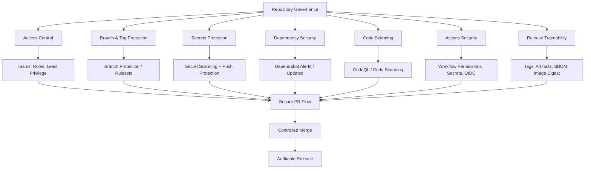

---

## Mental Model

GitHub security governance harus menjaga empat boundary:

```text
1. Who can change what
   Access, teams, CODEOWNERS, branch/ruleset protection.

2. What is allowed to enter the repo
   Secret scanning, dependency review, code scanning, required checks.

3. What automation can do
   GitHub Actions permissions, secrets, environments, OIDC, deployment gates.

4. What was released
   Git tag, commit SHA, CI run, artifact, SBOM, Docker image digest, deployment record.
```

Untuk senior engineer, GitHub governance bukan hanya tugas admin. Ini adalah bagian dari **software supply-chain control**.

---

## Decomposition Map

| # | Domain / Skill | Yang perlu dikuasai | Relevansi untuk Java Jersey/JAX-RS microservice | Failure mode yang dicegah |
|---:|---|---|---|---|
| 1 | Repository access | Role, team, maintainer, admin, least privilege | Membatasi siapa bisa mengubah repo/service | Terlalu banyak orang bisa push/merge |
| 2 | Branch protection | Required PR, review, status checks | Melindungi `main` dan `release/*` | Direct push ke branch penting |
| 3 | Repository rulesets | Branch/tag/push rules | Proteksi lebih konsisten untuk branch/tag pattern | Tag release diubah/dihapus |
| 4 | CODEOWNERS | Path-based required review | Owner auth/DB/CI otomatis direview | Area kritikal berubah tanpa owner |
| 5 | Required status checks | CI wajib hijau sebelum merge | Maven verify, tests, scan, Docker build | Merge saat build/test gagal |
| 6 | Secret scanning | Deteksi secret yang masuk repo | Token, DB password, cloud key | Secret leak |
| 7 | Push protection | Blokir push secret sebelum masuk repo | Mencegah leak lebih awal | Secret masuk history Git |
| 8 | Dependabot alerts | Alert dependency vulnerable | Maven dependency CVE | Dependency rentan terlambat diketahui |
| 9 | Dependabot security updates | PR otomatis untuk vulnerability fix | Patch dependency Java/Maven | Manual patch terlambat |
| 10 | Dependabot version updates | Update rutin dependency/plugin/action | Mengurangi dependency drift | Upgrade besar menumpuk |
| 11 | Code scanning | CodeQL/static analysis | Bug/security pattern di Java code | Issue security lolos review manual |
| 12 | Actions permissions | `GITHUB_TOKEN` least privilege | Workflow tidak punya permission berlebihan | CI token disalahgunakan |
| 13 | Secrets governance | Repo/org/environment secrets | Deploy credential, registry token | Secret tersebar tanpa kontrol |
| 14 | Environment protection | Approval untuk staging/prod deploy | Deploy production butuh gate | Deploy otomatis tanpa approval |
| 15 | Third-party actions governance | Pinning, allowed actions, review | Supply-chain risk di workflow | Action compromised/berubah |
| 16 | Dependency review | Review perubahan `pom.xml`/lock file | Cek direct/transitive dependency | Dependency risk masuk PR |
| 17 | SBOM | Inventory dependency artifact | Audit dan incident CVE | Tidak tahu komponen release |
| 18 | Release tag protection | Proteksi `v*` tag | Release immutable secara proses | Retag diam-diam |
| 19 | Audit trail | PR, checks, approvals, artifacts | Compliance/incident review | Tidak bisa bukti proses |
| 20 | Repository hygiene | `.gitignore`, archive, visibility, topics | Repo mudah dikelola | Repo berantakan/tidak jelas ownership |

---

## 1. Repository Access Control

Prinsip dasarnya: **least privilege**.

Jangan semua engineer menjadi admin repo. Pisahkan role berdasarkan kebutuhan:

| Role | Cocok untuk | Risiko jika terlalu luas |
|---|---|---|
| Read | Stakeholder, auditor, viewer | Rendah |
| Triage | Issue/PR triage | Salah label/close issue |
| Write | Developer aktif | Bisa push branch |
| Maintain | Tech lead/repo maintainer | Bisa manage sebagian setting |
| Admin | Platform/repo owner terbatas | Bisa ubah security/branch rules |

Untuk service enterprise, akses sebaiknya berbasis team:

```text
@company/backend-engineers
@company/backend-leads
@company/platform-ci
@company/security
@company/database-owners
@company/release-managers
```

Anti-pattern:

```text
Semua developer admin.
Akses individual tidak lewat team.
Mantan anggota tim masih punya akses.
Service critical tidak punya maintainer jelas.
```

---

## 2. Branch Protection

Branch protection menjaga branch penting agar perubahan tidak masuk tanpa proses. GitHub branch protection dapat mewajibkan review approval dan status checks sebelum PR bisa merge ke protected branch. ([GitHub Docs](https://docs.github.com/en/repositories/configuring-branches-and-merges-in-your-repository/managing-protected-branches/managing-a-branch-protection-rule?utm_source=chatgpt.com))

Baseline untuk `main`:

```text
Require pull request before merging.
Require at least 1-2 approvals.
Require CODEOWNERS review.
Require status checks to pass.
Require conversation resolution.
Disallow force pushes.
Disallow branch deletion.
Restrict who can push directly.
```

Baseline untuk `release/*`:

```text
Require pull request.
Require CI checks.
Require release owner approval.
Disallow force push.
Disallow deletion.
Restrict direct push to release maintainers only.
```

Untuk Java microservice, required checks minimal:

```text
maven-verify
unit-test
integration-test jika feasible
dependency/security scan
docker-build jika image wajib
smoke-test jika artifact/image bisa dijalankan
```

---

## 3. Repository Rulesets

Rulesets adalah governance layer untuk branch, tag, dan push. GitHub menjelaskan bahwa rulesets dapat mengontrol bagaimana orang berinteraksi dengan branch dan tag tertentu; push rulesets juga dapat dipakai untuk memblokir push ke repository internal/private dan fork network terkait. ([GitHub Docs](https://docs.github.com/en/repositories/configuring-branches-and-merges-in-your-repository/managing-rulesets/about-rulesets?utm_source=chatgpt.com))

Gunakan rulesets untuk:

```text
protect main
protect release/*
protect hotfix/*
protect v* release tags
block force push
block deletion
require signed commits/tags jika policy aktif
restrict branch/tag naming
restrict commit metadata jika perlu
```

Contoh ruleset target:

```text
Branches:
  main
  release/*
  hotfix/*

Tags:
  v*
  case-service-v*
```

Prinsip:

```text
Branch protection menjaga jalur merge.
Tag ruleset menjaga release marker.
Push ruleset menjaga apa yang boleh masuk ke repository.
```

---

## 4. Secret Scanning dan Push Protection

Secret scanning mencari token/credential yang ter-commit. Push protection mencegah secret masuk sejak tahap push. GitHub mendokumentasikan bahwa push protection dapat memblokir contributor dari pushing secrets dan membuat alert saat contributor melakukan bypass. ([GitHub Docs](https://docs.github.com/en/code-security/how-tos/secure-your-secrets/prevent-future-leaks/enable-push-protection?utm_source=chatgpt.com))

Yang harus dianggap secret:

```text
cloud access key
database password
API token
GitHub token
container registry credential
private key
JWT signing key
OAuth client secret
webhook secret
encryption key
```

Rule praktis:

```text
Secret tidak boleh ada di source code.
Secret tidak boleh ada di test fixture nyata.
Secret tidak boleh muncul di GitHub Actions log.
Secret tidak boleh disimpan di README/wiki.
Secret harus dikelola lewat secret manager atau GitHub secrets sesuai scope.
```

Jika secret terlanjur masuk Git history:

```text
1. Anggap secret compromised.
2. Rotate/revoke secret.
3. Investigasi exposure.
4. Hapus dari repo/history jika policy mengharuskan.
5. Tambahkan prevention: push protection, pre-commit scanner, docs.
```

Jangan hanya menghapus file dari commit terbaru. Secret yang pernah masuk Git history tetap harus dianggap bocor.

---

## 5. Dependabot Alerts dan Security Updates

Dependabot alerts memberi notifikasi dependency vulnerable. Dependabot security updates tersedia ketika dependency graph dan Dependabot alerts aktif, lalu dapat membuat PR untuk memperbarui dependency rentan. ([GitHub Docs](https://docs.github.com/code-security/dependabot/dependabot-alerts/about-dependabot-alerts?utm_source=chatgpt.com))

Untuk Maven project, manifest utama adalah:

```text
pom.xml
```

Dependabot membantu pada level:

```text
known vulnerability
security update PR
version update PR
dependency drift reduction
supply-chain visibility
```

Tapi Dependabot bukan pengganti review. Dependency update tetap harus dicek:

```text
Apakah major/minor/patch?
Apakah breaking change?
Apakah transitive dependency berubah besar?
Apakah Jersey/Jakarta namespace terdampak?
Apakah Jackson/MyBatis/PostgreSQL driver kompatibel?
Apakah test/integration test lolos?
```

---

## 6. Dependabot Configuration untuk Maven dan GitHub Actions

Contoh `.github/dependabot.yml`:

```yaml
version: 2

updates:
  - package-ecosystem: "maven"
    directory: "/"
    schedule:
      interval: "weekly"
    open-pull-requests-limit: 5
    labels:
      - "dependencies"
      - "java"
    commit-message:
      prefix: "build"

  - package-ecosystem: "github-actions"
    directory: "/"
    schedule:
      interval: "weekly"
    open-pull-requests-limit: 5
    labels:
      - "dependencies"
      - "github-actions"
    commit-message:
      prefix: "ci"
```

GitHub menyediakan opsi `dependabot.yml` untuk mengatur package ecosystem, schedule, dan cara Dependabot membuat PR update. ([GitHub Docs](https://docs.github.com/en/code-security/reference/supply-chain-security/dependabot-options-reference?utm_source=chatgpt.com))

Review checklist untuk Dependabot PR:

```text
mvn clean verify lolos
dependency tree dicek jika dependency runtime berubah
release notes dependency dibaca untuk major/minor update
security advisory dipahami
Docker build/smoke test lolos jika runtime dependency berubah
```

---

## 7. Code Scanning / CodeQL

Code scanning membantu menemukan vulnerability dan error pattern di kode. GitHub menyediakan CodeQL sebagai engine analisis kode; untuk setup, GitHub menyediakan default setup yang cepat, dan advanced setup untuk workflow yang dikustomisasi. ([GitHub Docs](https://docs.github.com/code-security/code-scanning/automatically-scanning-your-code-for-vulnerabilities-and-errors/about-code-scanning?utm_source=chatgpt.com))

Untuk Java, default setup sering cukup sebagai awal. Untuk repository high-risk, advanced setup lebih cocok karena Anda bisa mengontrol build command, query suite, branch, schedule, dan dependency khusus. GitHub juga mencatat default setup menggunakan metode paling sederhana untuk membuat CodeQL database dan menganalisis kode, lalu high-risk repositories dapat beralih ke advanced setup setelah alert awal ditangani. ([GitHub Docs](https://docs.github.com/en/code-security/how-tos/find-and-fix-code-vulnerabilities/manage-your-configuration/codeql-for-compiled-languages?utm_source=chatgpt.com))

Contoh advanced setup konseptual:

```yaml
name: codeql

on:
  pull_request:
  push:
    branches:
      - main
  schedule:
    - cron: "0 2 * * 1"

jobs:
  analyze:
    name: codeql-java
    runs-on: ubuntu-latest
    permissions:
      security-events: write
      contents: read

    steps:
      - uses: actions/checkout@v4

      - uses: actions/setup-java@v4
        with:
          distribution: temurin
          java-version: "17"
          cache: maven

      - uses: github/codeql-action/init@v3
        with:
          languages: java

      - run: ./mvnw clean compile -DskipTests

      - uses: github/codeql-action/analyze@v3
```

Untuk Java/Jersey service, CodeQL membantu menemukan pattern seperti:

```text
unsafe deserialization
path traversal
injection-related pattern
hardcoded credential
weak crypto usage
unsafe data flow
```

Namun tetap perlu review manual untuk domain logic seperti authorization rule, state transition, regulatory workflow, dan business invariants.

---

## 8. GitHub Actions Security

GitHub Actions adalah supply-chain surface. Workflow bisa build, test, publish artifact, push image, dan deploy. Karena itu workflow harus diperlakukan seperti production code.

Checklist utama:

```text
Use least privilege permissions.
Do not echo secrets.
Prefer environment protection for deploy jobs.
Review pull_request_target very carefully.
Pin third-party actions according to org policy.
Avoid untrusted script execution with secrets.
Separate build/test from deploy.
Upload only safe artifacts.
```

Contoh permission minimal untuk build-only job:

```yaml
permissions:
  contents: read
```

Contoh permission untuk CodeQL:

```yaml
permissions:
  contents: read
  security-events: write
```

Contoh permission untuk package publish mungkin butuh:

```yaml
permissions:
  contents: read
  packages: write
```

Prinsip:

```text
Jangan memberi write permission hanya karena mudah.
Jangan expose deployment secret ke PR dari fork.
Jangan menjalankan untrusted code dengan privileged token.
```

---

## 9. Secrets Scope: Repository, Environment, Organization

GitHub secrets biasanya bisa berada di beberapa scope:

| Scope | Cocok untuk | Risiko |
|---|---|---|
| Repository secret | Secret khusus satu repo | Sprawl jika banyak repo |
| Environment secret | Deploy secret per env | Lebih baik untuk staging/prod |
| Organization secret | Shared secret lintas repo | Harus dibatasi repo mana yang boleh akses |
| External secret manager | Enterprise secret governance | Integrasi lebih kompleks |

Untuk deployment:

```text
dev secret ≠ staging secret ≠ prod secret
```

Jangan pakai satu credential untuk semua environment.

Pattern lebih baik:

```text
Build job:
  no production secret

Test job:
  fake/local/test secret

Deploy staging:
  staging environment secret + approval optional

Deploy production:
  production environment secret + approval required
```

---

## 10. Environment Protection untuk Deploy

Untuk production, deploy job harus memakai GitHub Environment atau deployment gate sejenis:

```text
environment: production
required reviewers
deployment branch restriction
environment-specific secrets
```

Tujuannya:

```text
Build/test boleh otomatis.
Production deploy harus punya gate.
Secret production hanya tersedia di job production.
```

Contoh:

```yaml
jobs:
  deploy_prod:
    name: deploy-production
    runs-on: ubuntu-latest
    environment: production
    permissions:
      contents: read
      id-token: write

    steps:
      - uses: actions/checkout@v4
      - run: ./scripts/deploy-prod.sh
```

Jika cloud memakai OIDC, permission `id-token: write` hanya diberikan pada job yang benar-benar perlu.

---

## 11. Third-party Action Governance

Third-party GitHub Actions adalah dependency. Perlakukan seperti dependency Maven.

Review checklist:

```text
Apakah action dari publisher terpercaya?
Apakah action dipin ke major version, full SHA, atau policy organisasi?
Apakah action butuh secret?
Apakah action menjalankan script remote?
Apakah action punya permission berlebihan?
Apakah ada alternatif official action?
Apakah action dipakai di workflow yang berjalan pada PR eksternal?
```

Untuk workflow critical, gunakan:

```text
official GitHub actions jika tersedia
internal reusable workflow
pinned actions sesuai policy
CODEOWNERS untuk .github/workflows/**
```

---

## 12. Dependency Review untuk `pom.xml`

Setiap perubahan `pom.xml` adalah perubahan supply-chain dan runtime.

Checklist:

```text
Dependency baru benar-benar perlu?
Versi dikontrol BOM/dependencyManagement?
Scope benar?
Ada transitive dependency besar?
Ada CVE?
Ada license issue?
Ada conflict javax/jakarta?
Ada duplicate logging binding?
Ada dependency yang seharusnya test scope tapi compile scope?
```

Command evidence:

```bash
./mvnw clean verify
./mvnw dependency:tree > dependency-tree.txt
./mvnw dependency:tree -Dincludes=jakarta.ws.rs
./mvnw dependency:tree -Dincludes=javax.ws.rs
./mvnw dependency:tree -Dincludes=com.fasterxml.jackson
./mvnw help:effective-pom > effective-pom.xml
```

Untuk Jersey/JAX-RS, conflict yang sering kritikal:

```text
Jersey 2.x + Jersey 3.x tercampur
javax.ws.rs-api + jakarta.ws.rs-api tercampur
Jackson version berubah besar
Servlet API javax vs jakarta mismatch
```

---

## 13. Repository Hygiene

Governance juga mencakup kebersihan repository.

Checklist:

```text
README menjelaskan build/run/test.
CONTRIBUTING menjelaskan PR workflow.
CODEOWNERS ada dan valid.
PR template ada.
Dependabot config ada.
Branch/ruleset protection aktif.
.gitignore mencegah target/, log, .env.
Tidak ada secret sample nyata.
Release tag strategy jelas.
Repository visibility sesuai.
Archived repo diberi status jelas.
```

File yang disarankan:

```text
README.md
CONTRIBUTING.md
SECURITY.md
.github/CODEOWNERS
.github/pull_request_template.md
.github/dependabot.yml
.github/workflows/pr-ci.yml
.gitignore
```

Untuk enterprise, `SECURITY.md` membantu menjelaskan cara melaporkan vulnerability dan kontak security.

---

## 14. GitHub Security Policy Matrix

| Control | Minimum | Mature |
|---|---|---|
| Access | Team-based write access | Periodic access review |
| Branch protection | Required PR + CI | CODEOWNERS + conversation resolution + no bypass |
| Rulesets | Protect main/release | Protect branch, tag, push patterns org-wide |
| Secret scanning | Enabled | Push protection + bypass review |
| Dependabot alerts | Enabled | SLA by severity + dashboard |
| Dependabot updates | Weekly | Grouped strategy + auto-merge patch after tests |
| Code scanning | Default setup | Advanced CodeQL + custom queries |
| Actions permissions | Explicit minimal permissions | Org-level allowed actions + reusable workflows |
| Deploy secrets | Environment secrets | OIDC + external secret manager |
| Release | Tags | Protected tags + SBOM + image digest |
| Audit | PR/CI trail | Formal release evidence package |

---

## 15. Risk-based Security Gates

Tidak semua PR butuh gate yang sama. Gunakan risk-based routing.

| Perubahan | Gate tambahan |
|---|---|
| `pom.xml` | Dependency tree, SCA, platform/security review |
| `.github/workflows/**` | CI/platform review, permissions review |
| `Dockerfile` | Runtime/security review, image scan |
| `db/migration/**` | DB review, migration test |
| `src/**/auth/**` | Security review |
| `src/**/filter/**` | Security/API review |
| `src/**/resource/**` | API contract review |
| `k8s/**`, `helm/**` | Platform/runtime review |
| Release tag | Release manager approval |

---

## 16. Suggested CODEOWNERS for Security Governance

```text
# Default
* @company/backend-leads

# Build and dependency supply chain
pom.xml @company/java-platform @company/security
.mvn/** @company/java-platform

# GitHub automation
.github/workflows/** @company/platform-ci @company/security
.github/dependabot.yml @company/platform-ci @company/security
.github/CODEOWNERS @company/backend-leads

# Runtime packaging
Dockerfile @company/platform-runtime @company/security
k8s/** @company/platform-runtime
helm/** @company/platform-runtime

# Database
db/migration/** @company/database-owners
src/main/resources/mybatis/** @company/database-owners

# Security-sensitive code
src/main/java/**/auth/** @company/security
src/main/java/**/security/** @company/security
src/main/java/**/filter/** @company/security

# API
src/main/java/**/resource/** @company/api-owners
src/main/java/**/mapper/** @company/api-owners
```

Prinsip: CODEOWNERS bukan untuk memperlambat PR, tetapi untuk **routing risiko**.

---

## 17. Suggested Required Checks

Untuk `main`:

```text
maven-verify
codeql-java
dependency-review / dependency-scan
docker-build
smoke-test
```

Untuk `release/*`:

```text
maven-verify
integration-test
dependency-scan
docker-build
release-smoke-test
```

Untuk PR low-risk docs-only, organisasi bisa mengecualikan sebagian check dengan path filter, tetapi hati-hati: path filter yang salah bisa menjadi bypass.

---

## 18. Security Incident Playbook: Secret Leak

Jika ada secret masuk repo:

```text
1. Stop: jangan hanya merge revert.
2. Identify secret type dan scope.
3. Revoke/rotate credential.
4. Check usage logs di provider terkait.
5. Remove secret dari code.
6. Jika perlu, rewrite history dengan proses formal.
7. Enable/adjust push protection.
8. Tambahkan test/pre-commit rule bila pattern internal.
9. Buat incident note.
```

Evidence yang dicatat:

```text
commit SHA
PR/branch
secret type
rotation time
affected systems
exposure window
follow-up prevention
```

---

## 19. Security Incident Playbook: Vulnerable Dependency

Jika Dependabot/SCA menemukan CVE:

```text
1. Identifikasi direct vs transitive dependency.
2. Cek severity dan exploitability dalam konteks service.
3. Cek fixed version.
4. Update dependency/BOM.
5. Jalankan mvn clean verify.
6. Jalankan integration/smoke test jika runtime dependency.
7. Review breaking changes.
8. Merge PR dengan evidence.
9. Buat patch release jika production terdampak.
```

Untuk Maven:

```bash
./mvnw dependency:tree -Dincludes=<groupId>
./mvnw clean verify
```

Jangan langsung suppress alert tanpa owner, alasan, dan expiry.

---

## 20. Security Incident Playbook: Workflow Compromise Risk

Jika workflow berubah mencurigakan:

```text
1. Review diff .github/workflows/**.
2. Cek permission block.
3. Cek penggunaan secrets.
4. Cek third-party actions.
5. Cek trigger pull_request_target.
6. Cek artifact upload/download.
7. Cek deploy path.
8. Revert jika ada privilege escalation.
9. Rotate secret jika sempat terekspos.
```

High-risk smell:

```text
permissions: write-all
echo ${{ secrets.X }}
curl | bash
pull_request_target + checkout PR head + secrets
third-party action tidak dikenal
deploy from untrusted branch
```

---

## 21. Common Failure Scenarios

### Scenario 1 - Secret masuk Git history

Gejala:

```text
Token muncul di commit lama.
Secret scanning alert muncul.
```

Fix:

```text
Rotate/revoke secret.
Investigasi exposure.
Hapus secret dari code.
Tambahkan prevention.
Jangan hanya delete file di commit baru.
```

---

### Scenario 2 - Dependabot PR auto-merge merusak runtime

Gejala:

```text
Dependency patch terlihat minor, CI hijau, tapi runtime Jersey JSON serialization gagal.
```

Root cause:

```text
Test tidak mencakup provider/runtime path.
Dependency transitive berubah.
Smoke test tidak jalan.
```

Fix:

```text
Tambahkan endpoint integration test.
Cek dependency tree.
Review release notes dependency.
Jangan auto-merge runtime dependency tanpa gate cukup.
```

---

### Scenario 3 - Workflow punya permission terlalu luas

Gejala:

```yaml
permissions: write-all
```

Risiko:

```text
Job build biasa punya kemampuan write ke repo/package/security event.
Jika workflow/script compromised, impact lebih besar.
```

Fix:

```yaml
permissions:
  contents: read
```

Lalu tambahkan permission spesifik hanya di job yang membutuhkan.

---

### Scenario 4 - Release tag bisa dihapus

Gejala:

```text
Tag v1.8.0 bisa dihapus/ditimpa oleh maintainer biasa.
```

Fix:

```text
Tambahkan tag ruleset untuk v*.
Restrict creation/update/deletion.
Buat release process formal.
```

---

### Scenario 5 - CODEOWNERS tidak mencakup workflow

Gejala:

```text
Engineer mengubah .github/workflows/deploy.yml tanpa platform/security review.
```

Fix:

```text
Tambahkan .github/workflows/** ke CODEOWNERS.
Require CODEOWNERS review di branch protection/ruleset.
```

---

## 22. Practical Governance Checklist

Untuk repo Java Jersey/JAX-RS microservice, checklist minimum:

| Area | Checklist |
|---|---|
| Access | Write/admin access berbasis team |
| Branch | `main` protected |
| Release | `release/*` protected |
| Tag | `v*` tag protected/ruleset |
| PR | PR template tersedia |
| Ownership | CODEOWNERS mencakup high-risk path |
| CI | Required `maven-verify` |
| Secrets | Secret scanning + push protection aktif |
| Dependency | Dependabot alerts aktif |
| Updates | Dependabot config untuk Maven dan GitHub Actions |
| Code scanning | CodeQL/code scanning aktif |
| Actions | Explicit `permissions` |
| Deploy | Environment protection untuk production |
| Evidence | Test reports/SBOM/artifacts disimpan |
| Docs | README/SECURITY/CONTRIBUTING tersedia |

---

## 23. Mini Lab

### Lab 1 - Audit high-risk files in PR

```bash
git fetch origin
git diff --name-only origin/main...HEAD \
  | grep -E 'pom.xml|\.github/workflows|Dockerfile|db/migration|k8s|helm|auth|security|filter' || true
```

Target: tahu apakah PR perlu reviewer tambahan.

---

### Lab 2 - Generate dependency evidence

```bash
./mvnw clean verify
./mvnw dependency:tree > dependency-tree.txt
./mvnw help:effective-pom > effective-pom.xml
```

Target: evidence untuk PR yang mengubah `pom.xml`.

---

### Lab 3 - Add Dependabot config

```bash
mkdir -p .github
cat > .github/dependabot.yml <<'EOF'
version: 2

updates:
  - package-ecosystem: "maven"
    directory: "/"
    schedule:
      interval: "weekly"

  - package-ecosystem: "github-actions"
    directory: "/"
    schedule:
      interval: "weekly"
EOF
```

Target: mulai dependency update governance.

---

### Lab 4 - Check workflow permissions

```bash
grep -R "permissions:" -n .github/workflows || true
grep -R "write-all" -n .github/workflows || true
grep -R "secrets\." -n .github/workflows || true
```

Target: cari workflow yang terlalu privileged atau memakai secret.

---

### Lab 5 - CODEOWNERS security paths

```bash
mkdir -p .github
cat > .github/CODEOWNERS <<'EOF'
* @company/backend-leads

pom.xml @company/java-platform @company/security
.github/workflows/** @company/platform-ci @company/security
Dockerfile @company/platform-runtime @company/security
db/migration/** @company/database-owners
src/main/java/**/auth/** @company/security
src/main/java/**/security/** @company/security
src/main/java/**/filter/** @company/security
EOF
```

Target: high-risk path punya owner.

---

## Roadmap Singkat

| Tahap | Fokus | Output |
|---:|---|---|
| 1 | Access review | Repo role berbasis team |
| 2 | Branch protection | `main` dan `release/*` aman |
| 3 | Rulesets | Branch/tag/push governance |
| 4 | Secret protection | Secret scanning + push protection |
| 5 | Dependency security | Dependabot alerts/updates |
| 6 | Code scanning | CodeQL/default atau advanced setup |
| 7 | Actions hardening | Least privilege, environment protection |
| 8 | Release governance | Protected tags, SBOM, artifact traceability |

---

## Ringkasan

GitHub security & repository governance untuk Java Jersey/JAX-RS microservice harus menjaga:

```text
access terkendali
branch terlindungi
tag release tidak mutable
secret tidak masuk repo
dependency rentan cepat diketahui
workflow CI/CD tidak over-privileged
code scanning memberi early signal
PR high-risk dirouting ke owner tepat
artifact release bisa diaudit
```

Core pattern:

```text
CODEOWNERS + branch protection + rulesets
  -> required PR review
  -> required CI/security checks
  -> secret/dependency/code scanning
  -> controlled merge
  -> traceable release
```

---

## Status

**Seri 10/12 selesai.**

Rekomendasi berikutnya: **Seri 11 - GitHub Actions CI untuk Java Maven Microservice**.

---

**Sources:**

- [Enabling push protection for your repository](https://docs.github.com/en/code-security/how-tos/secure-your-secrets/prevent-future-leaks/enable-push-protection?utm_source=chatgpt.com)

## Response:
7/14/2026, 12:34:07 AM

Saya lanjut ke **Seri 11/12**. Fokusnya GitHub Actions CI untuk Java Maven microservice: workflow structure, runner, setup Java 17+, Maven cache, test/report artifact, Docker build check, matrix, dan hardening permission.

# Seri 11/12 - GitHub Actions CI untuk Java Maven Microservice

## Introduction

Seri ini membahas **GitHub Actions CI** untuk Java 17+ Maven microservice berbasis Jersey/JAX-RS. Fokusnya adalah membangun pipeline yang:

```text id="ci-goals"
reproducible
cepat
aman
mudah dibaca
punya evidence
cocok untuk branch protection
tidak over-privileged
bisa dikembangkan ke CD
```

GitHub Actions workflow didefinisikan dengan YAML. Di dalamnya ada event trigger, jobs, steps, runner, shell command, dan reusable actions. GitHub menjelaskan bahwa workflow syntax dapat mengatur event, job, step, permissions, environment, matrix, defaults, concurrency, dan banyak elemen lain. ([GitHub Docs](https://docs.github.com/actions/using-workflows/workflow-syntax-for-github-actions?utm_source=chatgpt.com))

Untuk Java Maven, GitHub menyediakan panduan resmi “Building and testing Java with Maven”, dan action `actions/setup-java` dapat mengatur Java version/distribution serta caching dependency Maven. ([GitHub Docs](https://docs.github.com/actions/guides/building-and-testing-java-with-maven?utm_source=chatgpt.com))

---

## Diagram

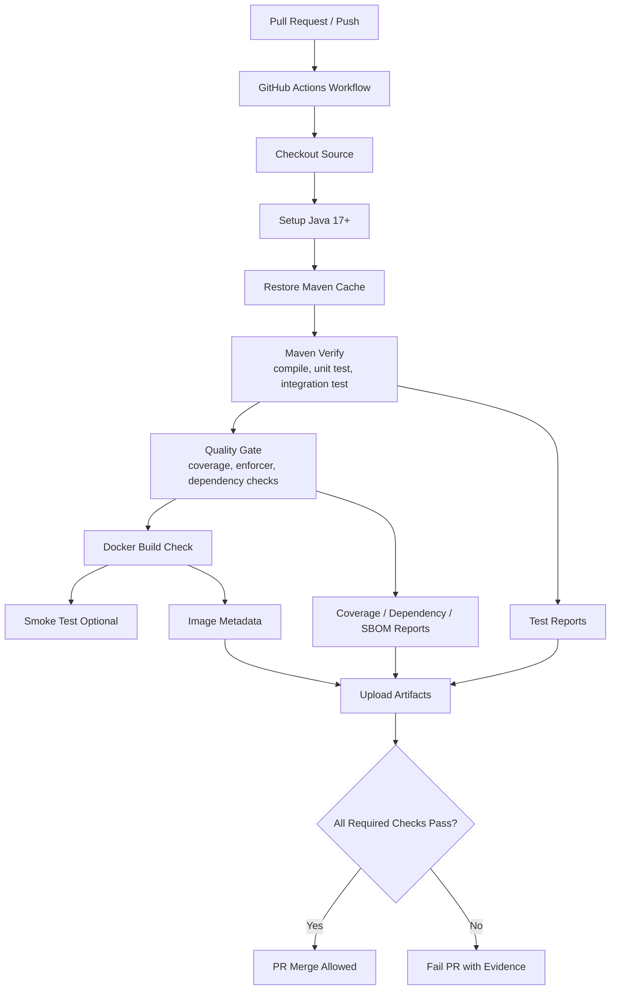

---

## Mental Model

GitHub Actions CI bukan sekadar “jalankan Maven di cloud”. Ia adalah **automated reviewer** untuk aspek yang bisa divalidasi mesin.

Untuk Java Jersey/JAX-RS microservice, CI harus menjawab:

```text id="ci-questions"
Apakah source compile di Java version target?
Apakah unit test jalan?
Apakah integration test jalan jika dikonfigurasi?
Apakah dependency graph sehat?
Apakah Maven plugin/dependency governance lolos?
Apakah artifact bisa dibuat?
Apakah Docker image bisa dibuild?
Apakah service bisa start dan health endpoint reachable?
Apakah report failure tersedia untuk dianalisis?
Apakah token/permission workflow minimal?
```

CI yang baik harus gagal **cepat**, tetapi tetap menyimpan evidence: Surefire/Failsafe reports, coverage, dependency tree, SBOM, logs, dan Docker build output.

---

## Decomposition Map

| # | Area | Skill yang perlu dikuasai | Relevansi untuk Java Maven/Jersey microservice | Failure mode yang dicegah |
|---:|---|---|---|---|
| 1 | Workflow trigger | `pull_request`, `push`, `workflow_dispatch`, `schedule` | Menentukan kapan CI jalan | CI tidak jalan di PR |
| 2 | Job model | job, step, runner, dependency antar job | Struktur pipeline jelas | Pipeline sulit debug |
| 3 | Runner | `ubuntu-latest`, self-hosted runner | Lingkungan eksekusi build | Build beda dari target |
| 4 | Checkout | `actions/checkout` | Mengambil source code | Source tidak lengkap |
| 5 | Java setup | `actions/setup-java`, distribution, version | Java 17+ baseline | JDK mismatch |
| 6 | Maven wrapper | `./mvnw` | Maven version lebih konsisten | Global Maven drift |
| 7 | Maven cache | setup-java cache/cache action | CI lebih cepat | Dependency download ulang |
| 8 | Maven verify | `./mvnw clean verify` | Build/test/quality gate utama | CI hijau palsu |
| 9 | Test reports | Surefire/Failsafe upload | Debug failure | Failure tanpa evidence |
| 10 | Dependency evidence | `dependency:tree`, effective POM | Debug POM/dependency change | Conflict tidak terlihat |
| 11 | Coverage artifact | JaCoCo report | Review quality gate | Coverage failure opaque |
| 12 | SBOM artifact | CycloneDX output | Supply-chain audit | Tidak tahu dependency release |
| 13 | Docker build check | Build image tanpa push | Validasi packaging/runtime | JAR salah masuk image |
| 14 | Smoke test | Start service lalu `curl /health` | Validasi artifact benar-benar hidup | Build sukses tapi service mati |
| 15 | Matrix build | JDK/OS/profile matrix | Compatibility testing | Variasi runtime tidak teruji |
| 16 | Concurrency | Cancel previous PR runs | Menghemat resource CI | Queue panjang dan noisy |
| 17 | Permissions | least privilege `GITHUB_TOKEN` | Workflow security | Token over-privileged |
| 18 | Secrets | hindari secret di PR CI | Supply-chain safety | Secret leak |
| 19 | Required checks | stable job names | Branch protection | Merge tanpa CI valid |
| 20 | Debuggability | grouped logs, artifacts, summaries | Faster incident/PR fix | CI failure sulit dipahami |

---

## 1. Workflow anatomy

File workflow biasanya ada di:

```text id="workflow-path"
.github/workflows/pr-ci.yml
```

Struktur dasar:

```yaml id="workflow-anatomy"
name: pr-ci

on:
  pull_request:
  push:
    branches:
      - main

permissions:
  contents: read

jobs:
  verify:
    name: maven-verify
    runs-on: ubuntu-latest

    steps:
      - name: Checkout
        uses: actions/checkout@v4

      - name: Set up Java
        uses: actions/setup-java@v4
        with:
          distribution: temurin
          java-version: "17"
          cache: maven

      - name: Verify
        shell: bash
        run: ./mvnw clean verify
```

Komponen penting:

| Komponen | Fungsi |
|---|---|
| `name` | Nama workflow yang tampil di GitHub |
| `on` | Event trigger |
| `permissions` | Permission default token |
| `jobs` | Kumpulan pekerjaan |
| `runs-on` | Runner OS/environment |
| `steps` | Urutan command/action |
| `uses` | Memakai action |
| `run` | Menjalankan shell command |

GitHub menjelaskan bahwa job adalah kumpulan step yang berjalan di runner yang sama, dan setiap step dapat berupa shell script atau action. ([GitHub Docs](https://docs.github.com/articles/getting-started-with-github-actions?utm_source=chatgpt.com))

---

## 2. Event trigger

Trigger umum untuk CI:

```yaml id="ci-triggers"
on:
  pull_request:
  push:
    branches:
      - main
```

Tambahan yang sering berguna:

```yaml id="ci-trigger-extra"
on:
  pull_request:
    branches:
      - main
      - release/**
  push:
    branches:
      - main
      - release/**
  workflow_dispatch:
```

Makna:

| Trigger | Kapan dipakai |
|---|---|
| `pull_request` | Validasi PR sebelum merge |
| `push` ke `main` | Validasi setelah merge |
| `push` ke `release/**` | Validasi release/hotfix branch |
| `workflow_dispatch` | Manual run |
| `schedule` | Nightly/security scan |

Untuk CI PR, jangan hanya pakai `push`. Kalau workflow tidak berjalan di `pull_request`, branch protection bisa kehilangan gate penting.

---

## 3. Permissions: least privilege

Default aman untuk build-only workflow:

```yaml id="permissions-minimal"
permissions:
  contents: read
```

GitHub workflow syntax mendukung `permissions` untuk menambah atau mengurangi permission default `GITHUB_TOKEN`, sehingga workflow hanya diberi akses yang diperlukan. ([GitHub Docs](https://docs.github.com/actions/using-workflows/workflow-syntax-for-github-actions?utm_source=chatgpt.com))

Untuk CodeQL:

```yaml id="permissions-codeql"
permissions:
  contents: read
  security-events: write
```

Untuk publish package:

```yaml id="permissions-package"
permissions:
  contents: read
  packages: write
```

Anti-pattern:

```yaml id="bad-permission"
permissions: write-all
```

Prinsip:

```text id="permission-principle"
Build/test job hampir selalu cukup contents: read.
Package publish/deploy job harus dipisah dan diberi permission spesifik.
Jangan memberi write permission ke semua job.
```

`GITHUB_TOKEN` adalah token instalasi GitHub App untuk repo workflow, dan permission-nya terbatas pada repository yang berisi workflow tersebut. ([GitHub Docs](https://docs.github.com/en/actions/concepts/security/github_token?utm_source=chatgpt.com))

---

## 4. Java setup untuk Maven

Gunakan `actions/setup-java`:

```yaml id="setup-java"
- name: Set up Java
  uses: actions/setup-java@v4
  with:
    distribution: temurin
    java-version: "17"
    cache: maven
```

`setup-java` mendukung setup versi Java yang diminta, caching dependency Maven/Gradle, konfigurasi untuk publishing Maven, dan beberapa fitur lain. ([GitHub](https://github.com/actions/setup-java?utm_source=chatgpt.com))

Checklist:

```text id="setup-java-checklist"
Java version sama dengan target project.
Distribution sesuai standar organisasi.
Maven cache aktif.
Build tetap memakai ./mvnw, bukan global mvn.
```

Validasi di workflow:

```yaml id="java-version-print"
- name: Print versions
  shell: bash
  run: |
    java -version
    ./mvnw -version
```

Ini membantu debugging saat ada JDK/Maven drift.

---

## 5. Maven cache

Dengan `setup-java`:

```yaml id="maven-cache-setup-java"
- uses: actions/setup-java@v4
  with:
    distribution: temurin
    java-version: "17"
    cache: maven
```

Atau pakai `actions/cache` manual jika perlu kontrol lebih besar:

```yaml id="maven-cache-manual"
- name: Cache Maven repository
  uses: actions/cache@v4
  with:
    path: ~/.m2/repository
    key: maven-${{ runner.os }}-${{ hashFiles('**/pom.xml') }}
    restore-keys: |
      maven-${{ runner.os }}-
```

GitHub dependency caching dirancang untuk menyimpan dependency/output yang sering dipakai ulang antar workflow run. Cache action mencari cache berdasarkan key dan cache version di branch run, lalu fallback ke prefix/restore keys dan default branch sesuai aturan scope cache. ([GitHub Docs](https://docs.github.com/en/actions/reference/workflows-and-actions/dependency-caching?utm_source=chatgpt.com))

Prinsip cache:

```text id="cache-principle"
Cache mempercepat build, bukan source of correctness.
CI harus tetap benar jika cache miss.
Jangan cache target/ sebagai pengganti build.
Jangan menyimpan secret di cache.
```

---

## 6. Maven verify job

Job minimum yang baik:

```yaml id="maven-verify-job"
jobs:
  verify:
    name: maven-verify
    runs-on: ubuntu-latest
    permissions:
      contents: read

    steps:
      - uses: actions/checkout@v4

      - uses: actions/setup-java@v4
        with:
          distribution: temurin
          java-version: "17"
          cache: maven

      - name: Verify
        shell: bash
        run: ./mvnw clean verify
```

Kenapa `clean verify`?

```text id="why-clean-verify"
clean menghindari artifact stale.
verify menjalankan lifecycle sampai verification gate.
Failsafe, JaCoCo, Enforcer, SBOM, dan dependency check sering diikat ke verify.
```

Untuk PR cepat, bisa ada job tambahan yang lebih ringan, tapi required check utama sebaiknya meaningful.

---

## 7. Upload test reports

Saat test gagal, CI harus menyimpan report.

```yaml id="upload-test-reports"
- name: Upload test reports
  if: always()
  uses: actions/upload-artifact@v4
  with:
    name: test-reports
    path: |
      **/target/surefire-reports/**
      **/target/failsafe-reports/**
```

Kenapa `if: always()`?

```text id="if-always-reason"
Agar report tetap di-upload walaupun test gagal.
Tanpa ini, failure sering kehilangan evidence paling penting.
```

Report yang perlu disimpan:

```text id="ci-reports"
Surefire reports
Failsafe reports
JaCoCo report
dependency tree
effective POM
SBOM
Docker logs saat smoke test gagal
```

---

## 8. Generate dependency evidence on failure

Tambahkan diagnostic step saat Maven gagal:

```yaml id="dependency-evidence-failure"
- name: Generate dependency evidence
  if: failure()
  shell: bash
  run: |
    ./mvnw -q dependency:tree > dependency-tree.txt || true
    ./mvnw -q help:effective-pom > effective-pom.xml || true

- name: Upload Maven diagnostics
  if: always()
  uses: actions/upload-artifact@v4
  with:
    name: maven-diagnostics
    path: |
      dependency-tree.txt
      effective-pom.xml
```

Untuk PR yang mengubah `pom.xml`, evidence ini sangat berguna.

---

## 9. CI untuk Maven + JaCoCo + SBOM

Jika POM sudah mengikat JaCoCo dan CycloneDX ke `verify`, workflow cukup upload output:

```yaml id="upload-quality-artifacts"
- name: Upload quality reports
  if: always()
  uses: actions/upload-artifact@v4
  with:
    name: quality-reports
    path: |
      **/target/site/jacoco/**
      **/target/bom.*
      **/target/dependency-check-report.*
```

Jika SBOM belum otomatis di `verify`, bisa jalan terpisah:

```yaml id="generate-sbom-ci"
- name: Generate SBOM
  shell: bash
  run: ./mvnw -DskipTests cyclonedx:makeAggregateBom

- name: Upload SBOM
  uses: actions/upload-artifact@v4
  with:
    name: sbom
    path: |
      **/target/bom.*
```

Untuk release pipeline, SBOM lebih penting daripada PR biasa. Tapi untuk dependency-heavy service, membuat SBOM di main branch juga sangat berguna.

---

## 10. Docker build check

CI PR sebaiknya minimal memastikan Docker image bisa dibuild.

```yaml id="docker-build-check"
jobs:
  docker_build:
    name: docker-build
    runs-on: ubuntu-latest
    permissions:
      contents: read
    needs:
      - verify

    steps:
      - uses: actions/checkout@v4

      - uses: actions/setup-java@v4
        with:
          distribution: temurin
          java-version: "17"
          cache: maven

      - name: Build application
        shell: bash
        run: ./mvnw clean package

      - name: Build Docker image
        shell: bash
        run: |
          docker build \
            --pull \
            -t case-service:${{ github.sha }} \
            .
```

PR CI biasanya tidak perlu push image. Cukup build untuk validasi packaging.

Failure yang dicegah:

```text id="docker-build-prevent"
Dockerfile copy path salah.
JAR final tidak ada.
Image base JDK/JRE salah.
Startup command salah.
File permission salah.
```

---

## 11. Smoke test job

Smoke test memastikan artifact/image benar-benar bisa start.

Contoh berbasis Docker:

```yaml id="docker-smoke-test"
jobs:
  smoke_test:
    name: smoke-test
    runs-on: ubuntu-latest
    permissions:
      contents: read
    needs:
      - verify

    steps:
      - uses: actions/checkout@v4

      - uses: actions/setup-java@v4
        with:
          distribution: temurin
          java-version: "17"
          cache: maven

      - name: Build artifact
        shell: bash
        run: ./mvnw clean package

      - name: Build image
        shell: bash
        run: docker build -t case-service:${{ github.sha }} .

      - name: Start container
        shell: bash
        run: |
          docker run -d \
            --name case-service \
            -p 8080:8080 \
            case-service:${{ github.sha }}

      - name: Smoke test
        shell: bash
        run: |
          for i in {1..60}; do
            if curl -fsS http://localhost:8080/health >/dev/null; then
              echo "Service is healthy"
              exit 0
            fi
            sleep 1
          done

          echo "Service failed to become healthy"
          docker logs case-service || true
          exit 1

      - name: Container logs
        if: always()
        shell: bash
        run: docker logs case-service || true

      - name: Cleanup
        if: always()
        shell: bash
        run: docker rm -f case-service || true
```

Smoke test cocok sebagai required check jika service bisa start tanpa dependency berat. Jika butuh PostgreSQL/Camunda/RabbitMQ, gunakan service containers atau docker compose pattern.

---

## 12. PostgreSQL service container untuk integration test

Jika integration test butuh PostgreSQL:

```yaml id="postgres-service-container"
jobs:
  integration_test:
    name: integration-test
    runs-on: ubuntu-latest
    permissions:
      contents: read

    services:
      postgres:
        image: postgres:16
        env:
          POSTGRES_DB: app_test
          POSTGRES_USER: app
          POSTGRES_PASSWORD: app
        ports:
          - 5432:5432
        options: >-
          --health-cmd "pg_isready -U app -d app_test"
          --health-interval 10s
          --health-timeout 5s
          --health-retries 5

    steps:
      - uses: actions/checkout@v4

      - uses: actions/setup-java@v4
        with:
          distribution: temurin
          java-version: "17"
          cache: maven

      - name: Integration test
        shell: bash
        env:
          DB_URL: jdbc:postgresql://localhost:5432/app_test
          DB_USERNAME: app
          DB_PASSWORD: app
        run: ./mvnw clean verify -Pintegration-test
```

Catatan:

```text id="service-container-note"
Credential test di service container bukan production secret.
Jangan gunakan secret production di PR CI.
Integration test harus membuat schema/data deterministik.
```

---

## 13. Matrix build

Matrix berguna untuk compatibility test.

Contoh JDK matrix:

```yaml id="jdk-matrix"
strategy:
  fail-fast: false
  matrix:
    java-version:
      - "17"
      - "21"
```

Full job:

```yaml id="matrix-job"
jobs:
  verify:
    name: maven-verify-java-${{ matrix.java-version }}
    runs-on: ubuntu-latest
    permissions:
      contents: read

    strategy:
      fail-fast: false
      matrix:
        java-version: ["17", "21"]

    steps:
      - uses: actions/checkout@v4

      - uses: actions/setup-java@v4
        with:
          distribution: temurin
          java-version: ${{ matrix.java-version }}
          cache: maven

      - run: ./mvnw clean verify
```

Kapan pakai matrix:

| Matrix | Cocok jika |
|---|---|
| Java 17 + 21 | Library/service harus compatible dua JDK |
| PostgreSQL versions | Query/migration harus support beberapa versi |
| Maven profiles | Ada profile `ci`, `integration-test`, `security` |
| OS matrix | Tooling harus jalan cross-platform |

Jangan pakai matrix terlalu luas tanpa alasan. CI lambat dan noisy membuat developer mengabaikan signal.

---

## 14. Concurrency

Untuk PR, biasanya cukup menjalankan workflow terbaru dan cancel run lama.

```yaml id="concurrency-pr"
concurrency:
  group: ${{ github.workflow }}-${{ github.ref }}
  cancel-in-progress: true
```

Manfaat:

```text id="concurrency-benefit"
Mengurangi queue.
Menghemat runner minutes.
Menghindari reviewer melihat hasil CI lama.
```

Untuk release/deploy, hati-hati dengan `cancel-in-progress`. Deployment job sering perlu concurrency group per environment dan tidak selalu boleh dicancel sembarangan.

---

## 15. Path filters

Untuk menghemat CI, kadang workflow hanya jalan saat file relevan berubah.

```yaml id="path-filter"
on:
  pull_request:
    paths:
      - "src/**"
      - "pom.xml"
      - ".github/workflows/pr-ci.yml"
      - "Dockerfile"
```

Hati-hati: path filter bisa menjadi bypass kalau terlalu sempit.

Contoh buruk:

```yaml id="bad-path-filter"
on:
  pull_request:
    paths:
      - "src/**"
```

Masalahnya perubahan `pom.xml`, Dockerfile, workflow, migration, atau config tidak menjalankan CI.

Prinsip:

```text id="path-filter-principle"
Path filter boleh dipakai untuk optimasi.
Jangan sampai melemahkan required checks untuk high-risk files.
```

---

## 16. Stable check names untuk branch protection

Jika branch protection mensyaratkan `maven-verify`, maka job name harus stabil.

Baik:

```yaml id="stable-job-name"
jobs:
  verify:
    name: maven-verify
```

Kurang baik:

```yaml id="unstable-job-name"
jobs:
  verify:
    name: maven-verify-${{ github.sha }}
```

Untuk matrix, required check bisa jadi banyak:

```text id="matrix-check-names"
maven-verify-java-17
maven-verify-java-21
```

Pastikan branch protection/ruleset mengarah ke nama yang benar.

---

## 17. Step summaries

GitHub Actions mendukung job summary via `$GITHUB_STEP_SUMMARY`.

Contoh:

```yaml id="step-summary"
- name: Write CI summary
  if: always()
  shell: bash
  run: |
    {
      echo "## CI Summary"
      echo ""
      echo "- Commit: \`${{ github.sha }}\`"
      echo "- Java: 17"
      echo "- Maven command: \`./mvnw clean verify\`"
      echo ""
      echo "Artifacts:"
      echo "- test-reports"
      echo "- maven-diagnostics"
    } >> "$GITHUB_STEP_SUMMARY"
```

Manfaat:

```text id="summary-benefit"
Reviewer tidak perlu menggali log panjang.
CI evidence lebih mudah dibaca.
```

---

## 18. Debugging failed workflow

Urutan debug:

```text id="workflow-debug-order"
1. Lihat job mana gagal.
2. Buka step pertama yang merah.
3. Cek command yang dijalankan.
4. Cek Java/Maven version.
5. Cek env var non-secret.
6. Cek Surefire/Failsafe report.
7. Cek dependency tree/effective POM jika POM berubah.
8. Reproduce local dengan command yang sama.
```

Command yang harus sama local dan CI:

```bash id="local-reproduce-ci"
./mvnw clean verify
```

Jika CI memakai profile:

```bash id="local-reproduce-profile"
./mvnw clean verify -Pci
```

Jika CI pakai env var:

```bash id="local-reproduce-env"
DB_URL=jdbc:postgresql://localhost:5432/app_test \
DB_USERNAME=app \
DB_PASSWORD=app \
./mvnw clean verify -Pintegration-test
```

---

## 19. Avoid CI-only business logic

Jangan letakkan logic build utama hanya di YAML.

Anti-pattern:

```yaml id="ci-only-logic"
- run: |
    export APP_ENV=ci
    ./mvnw clean package
    docker build ...
    java -jar ...
    curl ...
    # 80 lines more
```

Lebih baik:

```yaml id="scripted-ci"
- run: ./scripts/build.sh
- run: ./scripts/docker-build.sh
- run: ./scripts/docker-smoke.sh
```

Manfaat:

```text id="scripted-ci-benefit"
Local dan CI menjalankan logic yang sama.
Script bisa direview dan dites.
Workflow YAML tetap ringkas.
Onboarding lebih mudah.
```

---

## 20. Full PR CI example

Ini contoh workflow PR yang cukup matang untuk Java Maven microservice.

```yaml id="full-pr-ci"
name: pr-ci

on:
  pull_request:
  push:
    branches:
      - main

permissions:
  contents: read

concurrency:
  group: ${{ github.workflow }}-${{ github.ref }}
  cancel-in-progress: true

jobs:
  verify:
    name: maven-verify
    runs-on: ubuntu-latest
    permissions:
      contents: read

    steps:
      - name: Checkout
        uses: actions/checkout@v4

      - name: Set up Java
        uses: actions/setup-java@v4
        with:
          distribution: temurin
          java-version: "17"
          cache: maven

      - name: Print versions
        shell: bash
        run: |
          java -version
          ./mvnw -version

      - name: Verify
        shell: bash
        run: ./mvnw clean verify

      - name: Generate Maven diagnostics
        if: failure()
        shell: bash
        run: |
          ./mvnw -q dependency:tree > dependency-tree.txt || true
          ./mvnw -q help:effective-pom > effective-pom.xml || true

      - name: Upload test reports
        if: always()
        uses: actions/upload-artifact@v4
        with:
          name: test-reports
          path: |
            **/target/surefire-reports/**
            **/target/failsafe-reports/**

      - name: Upload quality reports
        if: always()
        uses: actions/upload-artifact@v4
        with:
          name: quality-reports
          path: |
            **/target/site/jacoco/**
            **/target/bom.*
            **/target/dependency-check-report.*

      - name: Upload Maven diagnostics
        if: always()
        uses: actions/upload-artifact@v4
        with:
          name: maven-diagnostics
          path: |
            dependency-tree.txt
            effective-pom.xml

      - name: Write CI summary
        if: always()
        shell: bash
        run: |
          {
            echo "## CI Summary"
            echo ""
            echo "- Check: maven-verify"
            echo "- Commit: \`${{ github.sha }}\`"
            echo "- Command: \`./mvnw clean verify\`"
            echo "- Artifacts: test-reports, quality-reports, maven-diagnostics"
          } >> "$GITHUB_STEP_SUMMARY"

  docker_build:
    name: docker-build
    runs-on: ubuntu-latest
    needs:
      - verify
    permissions:
      contents: read

    steps:
      - uses: actions/checkout@v4

      - uses: actions/setup-java@v4
        with:
          distribution: temurin
          java-version: "17"
          cache: maven

      - name: Build artifact
        shell: bash
        run: ./mvnw clean package -DskipTests

      - name: Build Docker image
        shell: bash
        run: |
          docker build \
            --pull \
            -t case-service:${{ github.sha }} \
            .
```

Catatan:

```text id="full-ci-note"
DskipTests di docker_build bisa diterima karena verify job sudah menjalankan test.
Jika docker_build bisa berjalan tanpa verify, jangan skip test sembarangan.
```

---

## 21. Full CI with PostgreSQL integration test

```yaml id="full-ci-postgres"
name: pr-ci

on:
  pull_request:
  push:
    branches:
      - main

permissions:
  contents: read

jobs:
  integration_test:
    name: maven-integration-test
    runs-on: ubuntu-latest
    permissions:
      contents: read

    services:
      postgres:
        image: postgres:16
        env:
          POSTGRES_DB: app_test
          POSTGRES_USER: app
          POSTGRES_PASSWORD: app
        ports:
          - 5432:5432
        options: >-
          --health-cmd "pg_isready -U app -d app_test"
          --health-interval 10s
          --health-timeout 5s
          --health-retries 5

    steps:
      - uses: actions/checkout@v4

      - uses: actions/setup-java@v4
        with:
          distribution: temurin
          java-version: "17"
          cache: maven

      - name: Verify with integration tests
        shell: bash
        env:
          DB_URL: jdbc:postgresql://localhost:5432/app_test
          DB_USERNAME: app
          DB_PASSWORD: app
        run: ./mvnw clean verify -Pintegration-test

      - name: Upload reports
        if: always()
        uses: actions/upload-artifact@v4
        with:
          name: integration-test-reports
          path: |
            **/target/surefire-reports/**
            **/target/failsafe-reports/**
```

Perhatikan:

```text id="postgres-ci-note"
Gunakan database test lokal di runner.
Jangan pakai shared staging DB untuk PR test.
Pastikan migration dijalankan dalam test setup.
Test harus idempotent dan isolated.
```

---

## 22. Workflow hardening checklist

| Area | Checklist |
|---|---|
| Trigger | `pull_request` aktif untuk PR |
| Permission | `contents: read` untuk build/test |
| Java | `setup-java` memakai Java target |
| Maven | Pakai `./mvnw`, bukan `mvn` global |
| Cache | Maven cache aktif tapi tidak jadi correctness dependency |
| Verify | Required check menjalankan `clean verify` |
| Report | Surefire/Failsafe upload dengan `if: always()` |
| Diagnostics | Dependency tree/effective POM tersedia |
| Docker | Image build check jika repo punya Dockerfile |
| Smoke | Health check jika service bisa start |
| Secrets | PR CI tidak memakai production secret |
| Actions | Third-party action terpercaya dan direview |
| Check name | Stabil untuk branch protection |
| Concurrency | Cancel run lama untuk PR |
| Summary | Job summary membantu reviewer |
| Path filter | Tidak membuka bypass untuk high-risk files |

---

## 23. Common failure scenarios

### Scenario 1 - CI hijau tapi test sebenarnya 0

Gejala:

```text id="zero-test-symptom"
Maven build sukses, tapi tidak ada Surefire report atau log menunjukkan Tests run: 0.
```

Kemungkinan:

```text id="zero-test-root"
JUnit engine tidak ada.
Naming test salah.
Surefire plugin terlalu lama/tidak kompatibel.
Test source path salah.
```

Fix:

```text id="zero-test-fix"
Tambahkan JUnit Jupiter dependency/engine.
Pin Surefire version.
Pastikan naming *Test.
Upload test reports.
Tambahkan check untuk test count jika perlu.
```

---

### Scenario 2 - CI lambat karena dependency download terus

Kemungkinan:

```text id="slow-ci-cache-root"
Maven cache belum aktif.
Cache key terlalu sering berubah.
Self-hosted runner cache dibersihkan.
```

Fix:

```yaml id="slow-ci-cache-fix"
- uses: actions/setup-java@v4
  with:
    distribution: temurin
    java-version: "17"
    cache: maven
```

---

### Scenario 3 - CI gagal hanya di GitHub Actions

Kemungkinan:

```text id="ci-only-failure-root"
JDK beda.
Linux case-sensitive path.
Env var tidak ada.
Test bergantung local file.
Timezone/locale berbeda.
Maven settings/private repo credential tidak ada.
```

Debug:

```yaml id="ci-only-debug"
- run: |
    java -version
    ./mvnw -version
    env | sort
```

Jangan print secret.

---

### Scenario 4 - Required check tidak match

Gejala:

```text id="required-check-mismatch"
PR tidak bisa merge karena required check expected tidak muncul.
```

Kemungkinan:

```text id="required-check-mismatch-root"
Job name berubah.
Workflow trigger tidak jalan.
Path filter mengecualikan perubahan.
Branch protection mengacu nama check lama.
```

Fix:

```text id="required-check-mismatch-fix"
Stabilkan job name.
Cek trigger pull_request.
Update branch protection/ruleset.
Hindari path filter terlalu sempit.
```

---

### Scenario 5 - Workflow over-privileged

Gejala:

```yaml id="overprivileged-yaml"
permissions: write-all
```

Fix:

```yaml id="least-privilege-yaml"
permissions:
  contents: read
```

Tambahkan permission hanya untuk job yang perlu publish/deploy.

---

## 24. Review checklist untuk workflow PR

Saat review `.github/workflows/*.yml`, cek:

```text id="workflow-review-checklist"
Apakah trigger benar?
Apakah permission minimal?
Apakah job name stabil?
Apakah Java version sesuai?
Apakah memakai ./mvnw?
Apakah report di-upload saat failure?
Apakah secret tidak diecho?
Apakah workflow tidak memberi deploy permission ke PR?
Apakah third-party action trusted?
Apakah pull_request_target tidak dipakai sembarangan?
Apakah path filter tidak membuka bypass?
Apakah Docker/smoke test masuk jika diperlukan?
```

---

## 25. Mini Lab

### Lab 1 - Buat workflow Maven verify

```bash id="lab-create-ci"
mkdir -p .github/workflows

cat > .github/workflows/pr-ci.yml <<'EOF'
name: pr-ci

on:
  pull_request:
  push:
    branches:
      - main

permissions:
  contents: read

jobs:
  verify:
    name: maven-verify
    runs-on: ubuntu-latest

    steps:
      - uses: actions/checkout@v4

      - uses: actions/setup-java@v4
        with:
          distribution: temurin
          java-version: "17"
          cache: maven

      - run: ./mvnw clean verify
EOF
```

Target: CI minimum untuk PR.

---

### Lab 2 - Tambahkan test report artifact

```yaml id="lab-test-report"
      - name: Upload test reports
        if: always()
        uses: actions/upload-artifact@v4
        with:
          name: test-reports
          path: |
            **/target/surefire-reports/**
            **/target/failsafe-reports/**
```

Target: failure punya evidence.

---

### Lab 3 - Tambahkan Maven diagnostics

```yaml id="lab-maven-diagnostics"
      - name: Generate Maven diagnostics
        if: failure()
        shell: bash
        run: |
          ./mvnw -q dependency:tree > dependency-tree.txt || true
          ./mvnw -q help:effective-pom > effective-pom.xml || true
```

Target: dependency/config issue lebih mudah dianalisis.

---

### Lab 4 - Cek permission workflow

```bash id="lab-permission-check"
grep -R "permissions:" -n .github/workflows || true
grep -R "write-all" -n .github/workflows || true
grep -R "secrets\." -n .github/workflows || true
```

Target: cari workflow yang over-privileged atau memakai secret.

---

### Lab 5 - Reproduce CI local

```bash id="lab-reproduce-ci"
java -version
./mvnw -version
./mvnw clean verify
```

Target: local dan CI memakai command yang sama.

---

## Roadmap Singkat

| Tahap | Fokus | Output |
|---:|---|---|
| 1 | Basic workflow | PR menjalankan `maven-verify` |
| 2 | Java/Maven alignment | `setup-java`, Maven wrapper, cache |
| 3 | Evidence | Upload reports, dependency tree, effective POM |
| 4 | Quality gates | JaCoCo, Enforcer, SCA, SBOM |
| 5 | Docker build | Validasi image build |
| 6 | Smoke test | Validasi service start dan health |
| 7 | Integration test | PostgreSQL/service container |
| 8 | Hardening | permissions, secrets, concurrency, stable checks |

---

## Ringkasan

GitHub Actions CI untuk Java Maven Jersey/JAX-RS microservice harus menjadi gate yang jelas, cepat, dan defensible.

Core pattern:

```text id="seri11-summary"
pull_request
  -> checkout
  -> setup Java 17+
  -> restore Maven cache
  -> ./mvnw clean verify
  -> upload test/quality reports
  -> docker build check
  -> optional smoke/integration test
  -> required status check untuk branch protection
```

Invariants penting:

```text id="seri11-invariants"
Gunakan ./mvnw.
Pin Java version.
Pakai permissions minimal.
Required check name harus stabil.
Upload evidence saat failure.
Jangan gunakan production secret di PR CI.
Cache mempercepat, bukan menggantikan correctness.
CI command harus bisa direproduce local.
Docker build dan smoke test melindungi runtime handoff.
```

---

## Status

**Seri 11/12 selesai.**

Rekomendasi berikutnya: **Seri 12 - GitHub Actions CD Pipeline: Docker Image, Artifact, Environment, Kubernetes Handoff**.

---

**Sources:**

- [Workflow syntax for GitHub Actions](https://docs.github.com/actions/using-workflows/workflow-syntax-for-github-actions?utm_source=chatgpt.com)
- [GitHub - actions/setup-java: Set up your ...](https://github.com/actions/setup-java?utm_source=chatgpt.com)

## Response:
7/14/2026, 12:37:32 AM

Saya lanjut ke **Seri 12/12**, penutup rangkaian ini. Fokusnya CD pipeline: build artifact, Docker image, registry push, GitHub Environment approval, cloud/on-prem credential strategy, Kubernetes rollout, smoke test, rollback, dan release traceability.

# Seri 12/12 - GitHub Actions CD Pipeline: Docker Image, Artifact, Environment, Kubernetes Handoff

## Introduction

Seri ini menutup rangkaian **Linux, Bash/Shell, Maven, Git, GitHub, dan GitHub Actions** dengan fokus **Continuous Delivery / Deployment** untuk Java 17+ Maven microservice berbasis Jersey/JAX-RS.

Kalau CI menjawab:

```text
Apakah perubahan ini aman untuk di-merge?
```

CD menjawab:

```text
Artifact mana yang akan dipromosikan?
Image mana yang akan dideploy?
Environment mana yang ditarget?
Credential apa yang dipakai?
Approval apa yang dibutuhkan?
Bagaimana rollout dicek?
Bagaimana rollback dilakukan?
Bagaimana semuanya diaudit?
```

GitHub Actions mendukung deployment ke environment yang dapat diberi protection rules seperti manual approval, wait timer, branch restriction, atau custom protection rule sebelum job deployment berjalan. Ini penting untuk memisahkan build/test otomatis dari deployment ke staging/production. ([GitHub Docs](https://docs.github.com/en/actions/reference/workflows-and-actions/deployments-and-environments?utm_source=chatgpt.com))

Untuk cloud credential, GitHub Actions dapat memakai OpenID Connect/OIDC agar workflow mengakses cloud provider tanpa menyimpan long-lived cloud credential sebagai GitHub secret. Ini sangat relevan untuk AWS/Azure/GCP/on-prem secret-broker pattern. ([GitHub Docs](https://docs.github.com/actions/security-for-github-actions/security-hardening-your-deployments/configuring-openid-connect-in-cloud-providers?utm_source=chatgpt.com))

---

## Diagram

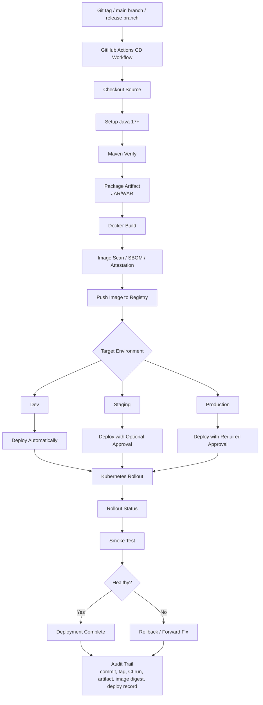

---

## Mental Model

CD pipeline yang baik harus memisahkan lima hal:

```text
1. Build
   Menghasilkan artifact dari source code.

2. Package
   Membuat container image dari artifact.

3. Publish
   Mengirim image/artifact ke registry/repository.

4. Promote
   Memilih image digest/tag untuk environment tertentu.

5. Deploy
   Mengubah runtime environment dan memverifikasi hasilnya.
```

Prinsip terpenting:

```text
Build once, promote the same artifact.
```

Artinya: jangan rebuild artifact berbeda untuk dev, staging, dan production kecuali ada alasan kuat. Yang berubah antar environment sebaiknya **config, secret, scaling, dan deployment target**, bukan isi binary/JAR/container image.

---

## Decomposition Map

| # | Area | Skill yang perlu dikuasai | Relevansi untuk Java Jersey/JAX-RS microservice | Failure mode yang dicegah |
|---:|---|---|---|---|
| 1 | Release trigger | tag, branch, manual dispatch | Menentukan kapan CD berjalan | Deploy dari commit salah |
| 2 | Artifact identity | commit SHA, Maven version, image tag, image digest | Traceability release | Tidak tahu versi production |
| 3 | Maven package | `./mvnw clean verify/package` | Build JAR/WAR final | Image berisi artifact stale |
| 4 | Docker build | Dockerfile, build context, labels | Packaging runtime service | Container tidak start |
| 5 | Registry push | GHCR/ECR/ACR/private registry | Menyimpan image deployable | Deploy image tidak tersedia |
| 6 | Image tagging | semantic version, SHA tag, branch tag | Human-friendly reference | Tag ambigu seperti `latest` |
| 7 | Image digest | immutable image identity | Deployment akurat | Tag berubah diam-diam |
| 8 | SBOM | dependency inventory | Supply-chain audit | Tidak tahu dependency artifact |
| 9 | Artifact attestation | provenance/integrity claim | Bukti build berasal dari workflow benar | Artifact tidak bisa diverifikasi |
| 10 | GitHub Environment | dev/staging/prod protection | Approval dan secret scope | Production deploy tanpa gate |
| 11 | OIDC | short-lived cloud auth | AWS/Azure deploy tanpa long-lived secret | Secret cloud bocor |
| 12 | Secrets | environment/repo/org secrets | Registry/deploy credential | Secret sprawl |
| 13 | Kubernetes context | kubeconfig/OIDC/cloud CLI | Akses cluster | Deploy ke cluster salah |
| 14 | Kubernetes rollout | `kubectl rollout status` | Verifikasi Deployment berhasil | Deploy dianggap sukses padahal pod gagal |
| 15 | Smoke test | `curl /health`, `/ready` | Runtime validation | Image jalan tapi service rusak |
| 16 | Rollback | rollout undo/redeploy previous digest | Mitigasi cepat | Incident makin lama |
| 17 | Deployment concurrency | satu deploy per environment | Mencegah race deploy | Dua deploy saling menimpa |
| 18 | Environment promotion | dev → staging → prod | Release discipline | Langsung prod tanpa validasi |
| 19 | Audit trail | PR, CI, tag, artifact, digest, deploy | Compliance/incident review | Tidak bisa rekonstruksi perubahan |
| 20 | On-prem/cloud variance | AWS/Azure/on-prem credential and network | Multi-platform deployment | Pipeline cloud-only tidak cocok on-prem |

---

## 1. CD Trigger Strategy

Trigger CD tidak boleh asal.

### Umum dipakai

```yaml
on:
  push:
    branches:
      - main
  workflow_dispatch:
  push:
    tags:
      - "v*"
```

Makna praktis:

| Trigger | Cocok untuk |
|---|---|
| `push` ke `main` | Auto deploy dev/staging |
| `push` tag `v*` | Release build/deploy |
| `workflow_dispatch` | Manual deploy/promote |
| `workflow_run` | CD setelah CI workflow sukses |
| `schedule` | Jarang untuk deploy; lebih cocok maintenance |

Rekomendasi enterprise:

```text
Dev:
  deploy otomatis dari main setelah CI hijau.

Staging:
  deploy dari main/tag dengan optional approval.

Production:
  deploy dari release tag atau selected image digest dengan required approval.
```

Jangan production deploy langsung dari setiap PR merge kecuali organisasi memang sudah matang dengan feature flags, automated rollback, observability, dan incident response.

---

## 2. Artifact Identity

Setiap release harus punya identitas yang jelas.

| Identity | Contoh | Fungsi |
|---|---|---|
| Git commit | `a1b2c3d4...` | Source truth |
| Git tag | `v1.8.0` | Release marker |
| Maven version | `1.8.0` | Java artifact version |
| Docker tag | `case-service:1.8.0` | Human-readable image ref |
| Docker SHA tag | `case-service:a1b2c3d4` | Commit-based image ref |
| Image digest | `sha256:...` | Immutable image identity |
| SBOM | `bom.json` | Dependency inventory |
| Attestation | provenance claim | Build provenance |

GitHub artifact attestations can establish provenance for binaries or container images, helping consumers verify where and how software was built. ([GitHub Docs](https://docs.github.com/actions/security-for-github-actions/using-artifact-attestations/using-artifact-attestations-to-establish-provenance-for-builds?utm_source=chatgpt.com))

Prinsip:

```text
Docker tag nyaman untuk manusia.
Image digest lebih kuat untuk deployment/audit.
```

---

## 3. CD Pipeline Stages

Pipeline CD yang defensible biasanya seperti ini:

```text
verify
  -> package
  -> docker build
  -> scan / SBOM / attestation
  -> push image
  -> deploy dev
  -> smoke test dev
  -> deploy staging
  -> smoke test staging
  -> approval
  -> deploy production
  -> rollout status
  -> smoke test production
  -> record release evidence
```

Untuk pipeline awal, jangan langsung kompleks. Minimal yang sehat:

```text
maven verify
docker build
docker push
deploy to dev/staging
rollout status
smoke test
```

---

## 4. GitHub Environment

Gunakan environment untuk memisahkan dev, staging, dan production.

Contoh job:

```yaml
jobs:
  deploy_staging:
    name: deploy-staging
    runs-on: ubuntu-latest
    environment: staging
```

Untuk production:

```yaml
jobs:
  deploy_production:
    name: deploy-production
    runs-on: ubuntu-latest
    environment: production
```

GitHub deployment environments dapat memakai protection rules seperti required reviewers, wait timer, branch/tag restriction, dan custom protection rules. ([GitHub Docs](https://docs.github.com/actions/deployment/targeting-different-environments/using-environments-for-deployment?utm_source=chatgpt.com))

Praktik:

| Environment | Gate |
|---|---|
| `dev` | Auto deploy boleh |
| `staging` | Optional approval atau branch restriction |
| `production` | Required reviewers + branch/tag restriction |
| `hotfix` | Release manager approval |
| `sandbox` | Manual dispatch boleh |

Jangan simpan production secret di repo-level secret jika hanya production deploy job yang butuh. Lebih aman gunakan **environment secret** untuk `production`.

---

## 5. OIDC untuk Cloud Deployment

Untuk AWS/Azure/GCP, lebih baik gunakan OIDC daripada long-lived cloud access key.

Dengan OIDC, workflow meminta short-lived token berdasarkan trust relationship antara GitHub dan cloud provider. GitHub mendokumentasikan OIDC sebagai cara agar workflow dapat mengakses resource cloud tanpa menyimpan credential jangka panjang sebagai secret. ([GitHub Docs](https://docs.github.com/actions/security-for-github-actions/security-hardening-your-deployments/configuring-openid-connect-in-cloud-providers?utm_source=chatgpt.com))

Prinsip trust policy:

```text
Repo tertentu.
Branch/tag tertentu.
Environment tertentu.
Workflow tertentu jika perlu.
Permission minimum.
Session duration terbatas.
```

Contoh konseptual permission GitHub Actions:

```yaml
permissions:
  contents: read
  id-token: write
```

`id-token: write` hanya diberikan ke job yang benar-benar perlu federated authentication.

Anti-pattern:

```text
Semua job diberi id-token: write.
Production cloud key disimpan sebagai repo secret.
Deploy job bisa berjalan dari branch mana pun.
OIDC trust policy terlalu luas.
```

---

## 6. Docker Build dan Push

Contoh build + push ke registry konseptual:

```yaml
jobs:
  build_image:
    name: build-image
    runs-on: ubuntu-latest
    permissions:
      contents: read
      packages: write

    outputs:
      image: ${{ steps.meta.outputs.image }}
      digest: ${{ steps.build.outputs.digest }}

    steps:
      - uses: actions/checkout@v4

      - uses: actions/setup-java@v4
        with:
          distribution: temurin
          java-version: "17"
          cache: maven

      - name: Verify and package
        shell: bash
        run: ./mvnw clean verify

      - name: Log in to registry
        shell: bash
        run: echo "${{ secrets.REGISTRY_TOKEN }}" | docker login registry.example.com -u "${{ secrets.REGISTRY_USER }}" --password-stdin

      - name: Build image
        shell: bash
        run: |
          IMAGE="registry.example.com/case-service:${{ github.sha }}"
          docker build \
            --pull \
            --label org.opencontainers.image.revision="${{ github.sha }}" \
            --label org.opencontainers.image.source="${{ github.repository }}" \
            -t "$IMAGE" \
            .
          echo "IMAGE=$IMAGE" >> "$GITHUB_ENV"

      - name: Push image
        shell: bash
        run: docker push "$IMAGE"
```

Catatan:

```text
Untuk GHCR, gunakan GITHUB_TOKEN dengan packages: write jika policy repo mengizinkan.
Untuk AWS ECR/Azure ACR, gunakan cloud login action/OIDC sesuai standar organisasi.
Untuk on-prem registry, gunakan credential yang dibatasi scope dan environment.
```

---

## 7. Dockerfile Handoff untuk Java 17+

Contoh sederhana:

```dockerfile
FROM eclipse-temurin:17-jre

WORKDIR /app

COPY target/case-service.jar /app/app.jar

EXPOSE 8080

ENTRYPOINT ["java", "-jar", "/app/app.jar"]
```

Lebih baik jika image punya non-root user:

```dockerfile
FROM eclipse-temurin:17-jre

WORKDIR /app

RUN useradd --system --uid 10001 appuser

COPY target/case-service.jar /app/app.jar

RUN chown -R appuser:appuser /app

USER appuser

EXPOSE 8080

ENTRYPOINT ["java", "-jar", "/app/app.jar"]
```

Checklist Dockerfile:

| Area | Checklist |
|---|---|
| Java version | Runtime image sesuai Java target |
| Artifact | Copy JAR final yang benar |
| User | Non-root jika memungkinkan |
| Port | Sesuai service port |
| Config | Via env/config, bukan hardcoded |
| Logs | stdout/stderr |
| Health | Endpoint tersedia |
| Labels | Commit/source/version label |
| Size | Jangan bawa Maven/cache/build tools ke runtime image jika tidak perlu |

---

## 8. Kubernetes Deployment Handoff

Kubernetes Deployment mengelola Pods untuk menjalankan workload aplikasi dan menyediakan declarative updates untuk Pods dan ReplicaSets. ([Kubernetes](https://kubernetes.io/docs/concepts/workloads/controllers/deployment/?utm_source=chatgpt.com))

Contoh Deployment minimal:

```yaml
apiVersion: apps/v1
kind: Deployment
metadata:
  name: case-service
  labels:
    app: case-service
spec:
  replicas: 2
  selector:
    matchLabels:
      app: case-service
  template:
    metadata:
      labels:
        app: case-service
    spec:
      containers:
        - name: case-service
          image: registry.example.com/case-service:CHANGE_ME
          ports:
            - containerPort: 8080
          env:
            - name: APP_ENV
              value: "staging"
          readinessProbe:
            httpGet:
              path: /ready
              port: 8080
            initialDelaySeconds: 10
            periodSeconds: 10
          livenessProbe:
            httpGet:
              path: /health
              port: 8080
            initialDelaySeconds: 30
            periodSeconds: 20
```

Untuk Java Jersey/JAX-RS:

```text
/health:
  lightweight, process-level health.

/ready:
  dependency readiness, misalnya PostgreSQL/Camunda/internal dependency penting.
```

Jangan membuat `/health` terlalu berat. Kalau `/health` memanggil DB/API eksternal, Kubernetes bisa membunuh pod sehat hanya karena dependency transient lambat.

---

## 9. Deploy dengan `kubectl set image`

Contoh sederhana:

```yaml
jobs:
  deploy_staging:
    name: deploy-staging
    runs-on: ubuntu-latest
    environment: staging
    needs:
      - build_image
    permissions:
      contents: read
      id-token: write

    steps:
      - uses: actions/checkout@v4

      - name: Configure Kubernetes credentials
        shell: bash
        run: ./scripts/configure-kube-staging.sh

      - name: Deploy image
        shell: bash
        env:
          IMAGE: registry.example.com/case-service:${{ github.sha }}
        run: |
          kubectl -n staging set image \
            deployment/case-service \
            case-service="$IMAGE"

          kubectl -n staging rollout status \
            deployment/case-service \
            --timeout=180s
```

`kubectl rollout status` menampilkan status rollout dan secara default menunggu sampai rollout terbaru selesai. Kubernetes docs juga mencatat bahwa jika rollout baru dimulai saat command berjalan, command akan mengikuti revision terbaru kecuali revision tertentu dipin. ([Kubernetes](https://kubernetes.io/docs/reference/kubectl/generated/kubectl_rollout/kubectl_rollout_status/?utm_source=chatgpt.com))

---

## 10. Deploy dengan Manifest Update

Alternatif: generate manifest lalu apply.

```bash
sed "s|IMAGE_PLACEHOLDER|$IMAGE|g" k8s/deployment.yaml | kubectl apply -f -
kubectl -n staging rollout status deployment/case-service --timeout=180s
```

Atau gunakan Kustomize/Helm/GitOps jika organisasi memakai itu.

Perbandingan:

| Approach | Kelebihan | Risiko |
|---|---|---|
| `kubectl set image` | Cepat dan sederhana | Drift dari Git manifest jika tidak dicatat |
| `kubectl apply` | Declarative | Perlu template/image substitution rapi |
| Helm | Cocok untuk chart/config kompleks | Bisa overkill |
| Kustomize | Native YAML overlay | Butuh struktur overlay disiplin |
| GitOps | Audit kuat via repo config | Butuh controller/platform |

Untuk enterprise, GitOps sering lebih defensible karena desired state ada di Git. Namun untuk onboarding awal, pahami dulu `kubectl set image`, `rollout status`, dan smoke test.

---

## 11. Smoke Test Setelah Rollout

Contoh:

```yaml
- name: Smoke test staging
  shell: bash
  run: |
    BASE_URL="https://staging.example.com/case-service"

    curl -fsS "$BASE_URL/health"
    curl -fsS "$BASE_URL/ready"
```

Lebih kuat dengan retry:

```bash
BASE_URL="${BASE_URL:-https://staging.example.com/case-service}"
TIMEOUT_SECONDS="${TIMEOUT_SECONDS:-120}"
deadline=$((SECONDS + TIMEOUT_SECONDS))

until curl -fsS "$BASE_URL/health" >/dev/null; do
  if (( SECONDS >= deadline )); then
    echo "ERROR: health endpoint not healthy after rollout" >&2
    exit 1
  fi
  sleep 2
done

curl -fsS "$BASE_URL/ready" >/dev/null
```

Smoke test harus minimal tapi meaningful:

```text
health endpoint
readiness endpoint
one safe read-only endpoint
optional auth/token check
optional version/info endpoint
```

Hindari smoke test yang mengubah production data kecuali test data dan cleanup-nya benar-benar aman.

---

## 12. Rollback Strategy

Kubernetes mendukung rollback rollout. `kubectl rollout undo` digunakan untuk rollback ke rollout sebelumnya atau revision tertentu. ([Kubernetes](https://kubernetes.io/docs/reference/kubectl/generated/kubectl_rollout/kubectl_rollout_undo/?utm_source=chatgpt.com))

Contoh:

```bash
kubectl -n production rollout undo deployment/case-service
kubectl -n production rollout status deployment/case-service --timeout=180s
```

Rollback ke revision tertentu:

```bash
kubectl -n production rollout history deployment/case-service
kubectl -n production rollout undo deployment/case-service --to-revision=3
```

Namun rollback tidak selalu aman.

Rollback **tidak aman** jika:

```text
DB migration destructive sudah jalan.
Message/event schema berubah incompatible.
External consumer sudah memakai contract baru.
Data sudah ditransformasi irreversible.
Feature baru sudah menghasilkan data format baru.
```

Dalam kasus seperti itu, gunakan **forward fix** atau compatibility migration, bukan rollback buta.

---

## 13. Deployment Concurrency

Jangan biarkan dua production deployment berjalan bersamaan.

```yaml
concurrency:
  group: deploy-production
  cancel-in-progress: false
```

Untuk staging:

```yaml
concurrency:
  group: deploy-staging
  cancel-in-progress: true
```

Prinsip:

| Environment | Concurrency policy |
|---|---|
| Dev | Boleh cancel run lama |
| Staging | Biasanya boleh cancel run lama |
| Production | Jangan cancel sembarangan; serialize deployment |
| Hotfix | Prioritas tinggi, tapi tetap tercatat |

---

## 14. Multi-environment Promotion

Pattern sederhana:

```text
main merged
  -> CI
  -> build image :sha
  -> deploy dev
  -> smoke dev

manual approval
  -> deploy staging
  -> smoke staging

release approval
  -> deploy production
  -> smoke production
```

YAML skeleton:

```yaml
jobs:
  build_image:
    name: build-image
    # build and push image

  deploy_dev:
    name: deploy-dev
    needs: build_image
    environment: dev
    # deploy automatically

  deploy_staging:
    name: deploy-staging
    needs: deploy_dev
    environment: staging
    # optional approval via environment rules

  deploy_production:
    name: deploy-production
    needs: deploy_staging
    environment: production
    # required approval via environment rules
```

Penting: image yang sama harus dipromosikan. Jangan build ulang di tiap environment.

---

## 15. Release Tag-based CD

Production sebaiknya dari tag release.

```yaml
name: release-cd

on:
  push:
    tags:
      - "v*"

permissions:
  contents: read
  packages: write
  id-token: write

jobs:
  build_release_image:
    name: build-release-image
    runs-on: ubuntu-latest
    steps:
      - uses: actions/checkout@v4

      - uses: actions/setup-java@v4
        with:
          distribution: temurin
          java-version: "17"
          cache: maven

      - name: Verify
        run: ./mvnw clean verify

      - name: Build and push image
        shell: bash
        run: |
          VERSION="${GITHUB_REF_NAME}"
          IMAGE="registry.example.com/case-service:${VERSION}"

          docker build \
            --label org.opencontainers.image.revision="${GITHUB_SHA}" \
            --label org.opencontainers.image.version="${VERSION}" \
            -t "$IMAGE" \
            .

          docker push "$IMAGE"
```

Tag release harus protected/ruleset. Jangan biarkan `v1.8.0` dihapus atau ditimpa diam-diam.

---

## 16. Artifact Attestation

Untuk supply-chain maturity, tambahkan artifact attestation untuk image atau build artifact. GitHub artifact attestations membantu membuat provenance dan integrity guarantee untuk software yang dibangun, dan consumer dapat memverifikasi asal-usul build tersebut. ([GitHub Docs](https://docs.github.com/en/actions/concepts/security/artifact-attestations?utm_source=chatgpt.com))

Konsep:

```text
Build artifact/image.
Generate attestation.
Store/publish attestation.
Verify attestation before deployment or release acceptance.
```

Untuk enterprise, ini berguna saat:

```text
customer security review
audit supply chain
incident response terhadap artifact
verifikasi image berasal dari workflow resmi
```

---

## 17. SBOM di CD

SBOM harus dihasilkan dan disimpan untuk release.

Contoh:

```yaml
- name: Generate SBOM
  shell: bash
  run: ./mvnw -DskipTests cyclonedx:makeAggregateBom

- name: Upload SBOM
  uses: actions/upload-artifact@v4
  with:
    name: sbom
    path: |
      **/target/bom.*
```

SBOM sebaiknya dikaitkan dengan:

```text
Git tag
commit SHA
Maven artifact
Docker image digest
release version
```

Saat CVE baru muncul, SBOM membantu menjawab:

```text
Release mana yang terdampak?
Image mana yang membawa dependency rentan?
Environment mana yang menjalankan image tersebut?
```

---

## 18. Full CD Workflow Skeleton

Contoh berikut konseptual, perlu disesuaikan dengan registry dan Kubernetes credential organisasi.

```yaml
name: cd

on:
  push:
    tags:
      - "v*"
  workflow_dispatch:
    inputs:
      environment:
        description: "Target environment"
        required: true
        type: choice
        options:
          - dev
          - staging
          - production
      image_tag:
        description: "Image tag or Git SHA to deploy"
        required: false

permissions:
  contents: read
  packages: write
  id-token: write

concurrency:
  group: cd-${{ github.event.inputs.environment || github.ref_name }}
  cancel-in-progress: false

jobs:
  build_image:
    name: build-image
    runs-on: ubuntu-latest

    outputs:
      image: ${{ steps.image.outputs.image }}

    steps:
      - uses: actions/checkout@v4

      - uses: actions/setup-java@v4
        with:
          distribution: temurin
          java-version: "17"
          cache: maven

      - name: Verify
        shell: bash
        run: ./mvnw clean verify

      - name: Generate SBOM
        shell: bash
        run: ./mvnw -DskipTests cyclonedx:makeAggregateBom || true

      - name: Build image
        id: image
        shell: bash
        run: |
          VERSION="${GITHUB_REF_NAME}"
          IMAGE="registry.example.com/case-service:${VERSION}"

          docker build \
            --pull \
            --label org.opencontainers.image.revision="${GITHUB_SHA}" \
            --label org.opencontainers.image.version="${VERSION}" \
            -t "$IMAGE" \
            .

          echo "image=$IMAGE" >> "$GITHUB_OUTPUT"

      - name: Push image
        shell: bash
        run: docker push "${{ steps.image.outputs.image }}"

      - name: Upload release evidence
        if: always()
        uses: actions/upload-artifact@v4
        with:
          name: release-evidence
          path: |
            **/target/surefire-reports/**
            **/target/failsafe-reports/**
            **/target/site/jacoco/**
            **/target/bom.*

  deploy_staging:
    name: deploy-staging
    runs-on: ubuntu-latest
    needs: build_image
    environment: staging

    steps:
      - uses: actions/checkout@v4

      - name: Configure kube access
        shell: bash
        run: ./scripts/configure-kube-staging.sh

      - name: Deploy
        shell: bash
        env:
          IMAGE: ${{ needs.build_image.outputs.image }}
        run: |
          kubectl -n staging set image \
            deployment/case-service \
            case-service="$IMAGE"

          kubectl -n staging rollout status \
            deployment/case-service \
            --timeout=180s

      - name: Smoke test
        shell: bash
        run: |
          curl -fsS https://staging.example.com/case-service/health
          curl -fsS https://staging.example.com/case-service/ready

  deploy_production:
    name: deploy-production
    runs-on: ubuntu-latest
    needs:
      - build_image
      - deploy_staging
    environment: production

    steps:
      - uses: actions/checkout@v4

      - name: Configure kube access
        shell: bash
        run: ./scripts/configure-kube-production.sh

      - name: Deploy
        shell: bash
        env:
          IMAGE: ${{ needs.build_image.outputs.image }}
        run: |
          kubectl -n production set image \
            deployment/case-service \
            case-service="$IMAGE"

          kubectl -n production rollout status \
            deployment/case-service \
            --timeout=300s

      - name: Smoke test
        shell: bash
        run: |
          curl -fsS https://api.example.com/case-service/health
          curl -fsS https://api.example.com/case-service/ready
```

---

## 19. On-prem vs AWS vs Azure Considerations

| Target | Credential strategy | Deployment path | Notes |
|---|---|---|---|
| On-prem Kubernetes | kubeconfig, VPN, self-hosted runner, internal OIDC broker | `kubectl`, Helm, GitOps | Network access sering jadi isu utama |
| AWS EKS | OIDC to AWS role, ECR, `aws eks update-kubeconfig` | `kubectl`, Helm, ArgoCD | Hindari long-lived AWS keys |
| Azure AKS | OIDC/federated credential, ACR, `az aks get-credentials` | `kubectl`, Helm, GitOps | Gunakan environment approval untuk prod |
| Hybrid | Registry shared + env-specific deploy | Promote image digest | Standardisasi image identity penting |

Untuk on-prem, sering kali GitHub-hosted runner tidak bisa mengakses cluster internal. Solusi umum:

```text
self-hosted runner di network internal
private runner scale set
GitOps controller yang pull dari repo
deployment broker internal
VPN/tunnel dengan kontrol ketat
```

Jangan membuka Kubernetes API production ke internet hanya demi GitHub-hosted runner.

---

## 20. GitOps Alternative

Jika organisasi memakai GitOps, CD pipeline tidak langsung `kubectl apply`. Ia mengubah repo environment/config.

Pattern:

```text
Build image
  -> push image
  -> update deployment repo image digest/tag
  -> PR ke environment repo
  -> GitOps controller sync cluster
```

Kelebihan:

```text
Desired state ada di Git.
Deployment punya PR/review trail.
Rollback bisa lewat Git revert.
Cluster pull, bukan CI push.
```

Kekurangan:

```text
Butuh platform/controller.
Lebih banyak repo/proses.
Debug butuh memahami controller sync.
```

GitOps cocok untuk enterprise dan multi-cluster, tapi tetap perlu memahami dasar rollout dan health check Kubernetes.

---

## 21. Deployment Evidence Template

Setiap deployment production sebaiknya menghasilkan record:

```text
Deployment:
- Service: case-service
- Environment: production
- Git tag: v1.8.0
- Commit SHA: <sha>
- GitHub workflow: cd
- GitHub run id: <run-id>
- Maven artifact: case-service-1.8.0.jar
- Docker image: registry.example.com/case-service:v1.8.0
- Docker digest: sha256:<digest>
- SBOM: bom.json
- Attestation: available yes/no
- Kubernetes namespace: production
- Deployment: case-service
- Rollout status: success/failure
- Smoke test: success/failure
- Approved by:
- Deployment time:
- Rollback target:
```

Ini sangat berguna untuk incident, compliance, dan release review.

---

## 22. Rollback Runbook Template

```text
Rollback Runbook: case-service

Pre-check:
- Identify current image digest.
- Identify previous known-good image digest.
- Check whether this release included DB migration.
- Check whether rollback is schema-compatible.
- Check whether message/API contract changed.

Rollback command:
- kubectl -n production rollout undo deployment/case-service

Validation:
- kubectl -n production rollout status deployment/case-service --timeout=300s
- curl -fsS https://api.example.com/case-service/health
- curl -fsS https://api.example.com/case-service/ready
- check error rate / latency / logs

If rollback unsafe:
- stop rollback
- use forward fix
- disable feature flag if available
- escalate to DB/platform/domain owner
```

---

## 23. Failure Scenarios

### Scenario 1 - Image pushed, deploy gagal

Kemungkinan:

```text
cluster tidak bisa pull image
registry credential salah
image tag salah
namespace salah
deployment/container name salah
network policy/secret/config missing
```

Cek:

```bash
kubectl -n staging describe pod <pod>
kubectl -n staging get events --sort-by=.metadata.creationTimestamp
kubectl -n staging rollout status deployment/case-service
```

---

### Scenario 2 - Rollout sukses, smoke test gagal

Kemungkinan:

```text
readiness probe tidak cukup kuat
ingress/service route salah
auth config salah
external dependency belum siap
app bind ke localhost
base path/context path berubah
```

Cek:

```bash
kubectl -n staging logs deployment/case-service
kubectl -n staging get svc,ingress
curl -v https://staging.example.com/case-service/health
```

---

### Scenario 3 - Production deployment salah image

Kemungkinan:

```text
deploy pakai tag latest
tag berubah
manual input salah
workflow mengambil branch bukan tag
image digest tidak dicatat
```

Solusi:

```text
Deploy by digest untuk production jika memungkinkan.
Catat image digest di evidence.
Protect release tags.
Hindari latest untuk production.
```

---

### Scenario 4 - Rollback gagal karena DB migration

Kemungkinan:

```text
release mengubah schema secara incompatible
code lama tidak cocok dengan schema baru
data sudah berubah format
```

Solusi:

```text
Gunakan forward fix.
Terapkan expand-contract migration.
Jangan rollback code sebelum cek schema compatibility.
```

---

### Scenario 5 - Credential cloud bocor

Kemungkinan:

```text
long-lived access key disimpan sebagai repo secret
workflow echo secret
third-party action compromise
```

Solusi:

```text
Rotate credential.
Audit cloud activity.
Pindah ke OIDC/federated credential.
Batasi permission job.
Batasi environment production.
```

---

## 24. CD Review Checklist

Saat review workflow CD:

| Area | Pertanyaan |
|---|---|
| Trigger | Apakah production hanya dari tag/approved workflow? |
| Permission | Apakah `id-token: write` hanya di job deploy? |
| Secret | Apakah production secret hanya di environment production? |
| Build | Apakah image dibangun dari commit/tag benar? |
| Maven | Apakah `./mvnw clean verify` jalan sebelum package? |
| Image | Apakah tag dan digest dicatat? |
| Registry | Apakah push aman dan scoped? |
| SBOM | Apakah release menghasilkan SBOM? |
| Attestation | Apakah provenance tersedia jika diwajibkan? |
| Deploy | Apakah namespace/deployment/container jelas? |
| Rollout | Apakah `kubectl rollout status` dicek? |
| Smoke | Apakah endpoint health/readiness dicek? |
| Rollback | Apakah rollback/forward-fix strategy jelas? |
| Concurrency | Apakah deploy per environment serialized? |
| Evidence | Apakah artifacts/logs disimpan? |

---

## 25. Mini Lab

### Lab 1 - Build image dengan tag commit

```bash
./mvnw clean package

IMAGE="case-service:$(git rev-parse --short=12 HEAD)"

docker build -t "$IMAGE" .

docker image inspect "$IMAGE"
```

Target: memahami image identity berbasis commit.

---

### Lab 2 - Run container dan smoke test

```bash
docker run -d --name case-service-lab -p 8080:8080 case-service:$(git rev-parse --short=12 HEAD)

curl -fsS http://localhost:8080/health
curl -fsS http://localhost:8080/ready

docker logs case-service-lab
docker rm -f case-service-lab
```

Target: memastikan artifact benar-benar runnable.

---

### Lab 3 - Kubernetes rollout status

```bash
kubectl -n dev set image deployment/case-service case-service="$IMAGE"
kubectl -n dev rollout status deployment/case-service --timeout=180s
```

Target: memahami deployment verification, bukan hanya apply manifest.

---

### Lab 4 - Rollout history dan rollback

```bash
kubectl -n dev rollout history deployment/case-service
kubectl -n dev rollout undo deployment/case-service
kubectl -n dev rollout status deployment/case-service --timeout=180s
```

Target: memahami rollback Kubernetes dasar.

---

### Lab 5 - Deployment evidence

Buat file evidence lokal:

```bash
cat > deployment-evidence.txt <<EOF
Service: case-service
Commit: $(git rev-parse HEAD)
Image: $IMAGE
Deployed at: $(date -u +"%Y-%m-%dT%H:%M:%SZ")
Environment: dev
EOF

cat deployment-evidence.txt
```

Target: membiasakan traceability.

---

## Senior-level Invariants

| Invariant | Penjelasan |
|---|---|
| Build once, promote same artifact | Jangan rebuild berbeda untuk tiap environment |
| Production deploy harus gated | Gunakan GitHub Environment approval/rules |
| Prefer OIDC over long-lived cloud secrets | Mengurangi risiko credential bocor |
| Jangan deploy `latest` ke production | Pakai version/SHA/digest |
| Rollout status wajib dicek | `kubectl apply` sukses belum berarti pod sehat |
| Smoke test wajib setelah deploy | Rollout sukses belum berarti endpoint sehat |
| Rollback tidak selalu aman | DB/data/schema bisa membuat rollback berbahaya |
| Evidence harus disimpan | Commit, tag, artifact, digest, SBOM, CI run |
| CD workflow adalah production code | Review seperti kode aplikasi |
| Environment secret harus scoped | Prod secret hanya untuk production job |

---

## Ringkasan

CD pipeline untuk Java Maven Jersey/JAX-RS microservice harus menyambungkan:

```text
Git tag / commit
  -> Maven verified artifact
  -> Docker image
  -> registry
  -> environment approval
  -> Kubernetes deployment
  -> rollout status
  -> smoke test
  -> audit evidence
```

Core pattern:

```text
CI:
  prove change is safe to merge

CD:
  prove artifact is safe to promote and deploy
```

Minimum defensible CD:

```text
./mvnw clean verify
docker build
docker push
deploy to environment
kubectl rollout status
curl /health and /ready
record image digest and commit SHA
```

---

## Status

**Seri 12/12 selesai.**

Dengan ini rangkaian **12/12 seri Linux, Bash/Shell, Maven, Git, GitHub, dan GitHub Actions untuk Java Jersey/JAX-RS microservice** sudah selesai.

Rekomendasi materi berikutnya: **Production Troubleshooting & Incident Response untuk Java Jersey/JAX-RS Microservice di Linux, Docker, Kubernetes, PostgreSQL, dan GitHub Actions**.

---

**Sources:**

- [Deployments and environments](https://docs.github.com/en/actions/reference/workflows-and-actions/deployments-and-environments?utm_source=chatgpt.com)
- [Deployments](https://kubernetes.io/docs/concepts/workloads/controllers/deployment/?utm_source=chatgpt.com)


---
Powered by [ChatGPT Exporter](https://www.chatgptexporter.com)