# ☑ compliance

**User:** Anonymous  
**Created:** 7/13/2026 23:02:23  
**Updated:** 7/14/2026 0:00:12  
**Exported:** 7/14/2026 21:39:59  
**Link:** [https://chatgpt.com/g/g-p-6a539ddc858881919467b6da20df4567-cheatsheet/c/6a550c0c-3efc-83ec-9b70-56568dc3ca04](https://chatgpt.com/g/g-p-6a539ddc858881919467b6da20df4567-cheatsheet/c/6a550c0c-3efc-83ec-9b70-56568dc3ca04)  

## Response:
7/13/2026, 11:04:00 PM

Saya akan susun sebagai peta onboarding praktis untuk software engineer, bukan audit checklist legal. Saya juga akan verifikasi versi/kerangka yang sensitif waktu seperti PCI DSS, CSA STAR, ISO/IEC 42001, dan SOC agar tidak memakai asumsi lama.

Saya sudah menemukan satu koreksi penting: untuk PCI, baseline aktif bukan lagi “PCI DSS v4.0” murni. PCI SSC menyatakan v4.0.1 diterbitkan sebagai revisi terbatas dan PCI DSS v4.0 retired pada 31 Desember 2024; jadi peta ini saya perlakukan sebagai **PCI DSS v4.0.1 / v4 family** untuk konteks 2026.

## Introduction

Decomposition map ini memandang **ISO/IEC 42001, ISO/IEC 27001, PCI DSS, SOC 2, CSA STAR, SOC 1/SSAE, HIPAA, dan GDPR** sebagai **engineering control ecosystem**, bukan sekadar dokumen audit. Untuk software engineer, fokus praktisnya adalah: memahami boundary sistem, data sensitivity, access control, auditability, secure SDLC, cloud shared responsibility, incident evidence, dan bagaimana perubahan kode bisa memengaruhi compliance posture.

Beberapa baseline penting yang perlu dipegang:

- **ISO/IEC 42001:2023** adalah standar untuk **Artificial Intelligence Management System / AIMS**, mencakup pengembangan, penyediaan, atau penggunaan AI secara bertanggung jawab. ([ISO](https://www.iso.org/standard/42001))  
- **ISO/IEC 27001:2022** adalah standar ISMS untuk mengelola risiko keamanan informasi, menjaga confidentiality, integrity, dan availability melalui proses risk management. ([ISO](https://www.iso.org/standard/27001))  
- **PCI DSS v4.0.1** adalah versi aktif yang relevan saat ini; PCI SSC menyatakan v4.0 retired pada **31 Desember 2024**, dan v4.0.1 tidak menambah/menghapus requirement, tetapi memperjelas requirement dan guidance. ([blog.pcisecuritystandards.org](https://blog.pcisecuritystandards.org/just-published-pci-dss-v4-0-1))  
- **SOC 2** memakai Trust Services Criteria untuk security, availability, processing integrity, confidentiality, dan privacy. ([AICPA & CIMA](https://www.aicpa-cima.com/resources/download/2017-trust-services-criteria-with-revised-points-of-focus-2022))  
- **CSA STAR Level 1** adalah self-assessment berbasis CAIQ/Cloud Controls Matrix, sedangkan **Level 2** adalah third-party audit/certification/attestation yang dapat dibangun di atas SOC 2 atau ISO/IEC 27001. ([cloudsecurityalliance.org](https://cloudsecurityalliance.org/star))  
- Untuk konteks CSG, Trust Center menyebut **CSG Encompass Platform SOC 2 Type II** memberi assurance atas Security dan Availability, sedangkan **Enterprise Cloud Services SOC 2 Type II + CSA STAR** mencakup Security, Availability, dan desain kontrol terhadap **CSA CCM v4.0.3**. ([CSG](https://www.csgi.com/trust-center/soc-2-type-2-encompass-platform)) ([CSG](https://www.csgi.com/trust-center/soc-2-type-2-csa-star-enterprise-cloud))  
- **HIPAA Security Rule** melindungi ePHI melalui administrative, physical, dan technical safeguards, serta berlaku untuk covered entities dan business associates. ([HHS.gov](https://www.hhs.gov/hipaa/for-professionals/security/laws-regulations/index.html))  
- **GDPR** mengatur perlindungan personal data di dalam dan luar EU, termasuk rights, processing obligations, dan transfer safeguards seperti SCC/BCR. ([European Commission](https://commission.europa.eu/law/law-topic/data-protection_en))  

---

## Diagram

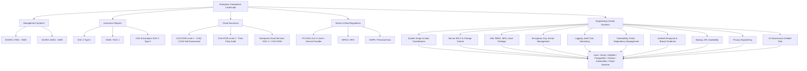

---

## Decomposition Map - Practical Categories / Domain / Skills

| No | Area | Yang Perlu Dipahami Software Engineer | Framework Terkait | Output Praktis di Engineering |
|---:|---|---|---|---|
| 1 | **Compliance literacy** | Paham bedanya certification, attestation, audit report, self-assessment, control, evidence, exception, compensating control. | ISO 27001, ISO 42001, SOC 1, SOC 2, CSA STAR, PCI DSS | Bisa membaca audit request tanpa salah tafsir; tahu mana yang wajib teknis, mana yang policy/process. |
| 2 | **System boundary & scope modelling** | Menentukan service, database, queue, API, batch job, infra, dan third-party dependency yang masuk scope. | ISO 27001, SOC 2, PCI DSS, HIPAA, GDPR, CSA STAR | Architecture diagram, data-flow diagram, trust boundary, CDE/ePHI/personal-data scope. |
| 3 | **Data classification** | Bedakan public, internal, confidential, restricted, personal data, special category data, ePHI, CHD, SAD, AI training data. | GDPR, HIPAA, PCI DSS, ISO 27001, ISO 42001 | Field-level classification di schema, DTO, API contract, log redaction policy. |
| 4 | **Data flow & lineage** | Tahu data dari mana, diproses di mana, disimpan di mana, dikirim ke siapa, dan dihapus kapan. | GDPR, HIPAA, PCI DSS, SOC 2, ISO 27001 | Data-flow diagram, retention map, data processing register, event lineage. |
| 5 | **Secure API design** | Authentication, authorization, input validation, rate limit, schema validation, error handling, idempotency. | ISO 27001, SOC 2, PCI DSS, HIPAA, GDPR | Secure Jersey/JAX-RS resource, consistent error response, request validation, no sensitive leakage. |
| 6 | **Authentication & identity** | SSO, OIDC/SAML, service account, token lifecycle, MFA, session handling, machine identity. | ISO 27001, SOC 2, PCI DSS, HIPAA, CSA STAR | Token validation filter, short-lived credentials, workload identity, secure session policy. |
| 7 | **Authorization & access model** | RBAC, ABAC, tenant isolation, least privilege, break-glass access, admin approval. | ISO 27001, SOC 2, HIPAA, GDPR, PCI DSS | Permission matrix, policy checks, database row filtering, privileged action audit. |
| 8 | **Secrets management** | Tidak hardcode password/API key; rotasi secret; secret injection di Kubernetes/cloud/on-prem. | ISO 27001, SOC 2, PCI DSS, CSA STAR | Vault/KMS/Secrets Manager integration, secret rotation runbook, no secret in GitHub. |
| 9 | **Encryption & key management** | TLS in transit, encryption at rest, envelope encryption, KMS/HSM, key rotation, crypto boundary. | PCI DSS, HIPAA, GDPR, ISO 27001, SOC 2 | TLS config, PostgreSQL encryption strategy, backup encryption, key ownership model. |
| 10 | **PCI cardholder data protection** | Memahami PAN, SAD, tokenization, masking, truncation, CDE segmentation, payment page script control. | PCI DSS v4.0.1 | Jangan log PAN, gunakan tokenization, isolate CDE service, enforce scanning/patching. |
| 11 | **HIPAA ePHI handling** | ePHI confidentiality, integrity, availability; minimum necessary; audit logs; business associate impact. | HIPAA | ePHI access logging, export control, secure messaging, breach investigation evidence. |
| 12 | **GDPR privacy engineering** | Lawful basis, consent, data subject rights, retention, minimization, purpose limitation, cross-border transfer. | GDPR | Delete/export/anonymize APIs, retention jobs, consent-aware processing, privacy-by-design review. |
| 13 | **SOC 2 control thinking** | Security dan availability biasanya paling relevan untuk platform; confidentiality/privacy tergantung scope. | SOC 2 Type II, CSG Encompass, Enterprise Cloud | Evidence bahwa kontrol berjalan konsisten: access review, incident logs, change approvals, uptime monitoring. |
| 14 | **SOC 1 / SSAE financial-control awareness** | Fokus pada kontrol yang memengaruhi internal control over financial reporting, bukan sekadar cyber security. | SSAE SOC 1 | Change control untuk billing/order/revenue logic, reconciliation, segregation of duties. |
| 15 | **CSA STAR / cloud assurance** | Cloud-specific controls: shared responsibility, tenant isolation, configuration, logging, encryption, vulnerability, governance. | CSA STAR Level 1 & 2, CCM, CAIQ | Cloud control mapping, customer questionnaire answers, architecture evidence. |
| 16 | **ISO 27001 ISMS mindset** | Risk assessment, risk treatment, Statement of Applicability, continual improvement, policy-to-control traceability. | ISO/IEC 27001 | Engineer bisa menghubungkan technical risk ke control dan remediation plan. |
| 17 | **ISO 42001 AI governance** | AI system inventory, model lifecycle, data governance, risk assessment, human oversight, monitoring, supplier AI risk. | ISO/IEC 42001 | AI feature risk log, prompt/model change control, model evaluation evidence, AI incident process. |
| 18 | **Secure SDLC** | Threat modeling, secure coding, peer review, SAST/DAST/SCA, dependency review, release gate. | ISO 27001, SOC 2, PCI DSS, CSA STAR | GitHub PR checklist, Maven dependency scanning, SBOM, security acceptance criteria. |
| 19 | **Change management** | Setiap perubahan production harus traceable: requester, reviewer, approver, test evidence, rollback plan. | SOC 2, SOC 1, ISO 27001, PCI DSS | PR approval, release notes, deployment record, rollback runbook. |
| 20 | **Vulnerability & patch management** | CVE triage, severity, SLA, exploitability, dependency upgrade, container image patching. | PCI DSS, ISO 27001, SOC 2, CSA STAR | Dependabot/SCA workflow, image scanning, patch exception record. |
| 21 | **Configuration hardening** | Secure baseline untuk Linux, Docker, Kubernetes, PostgreSQL, cloud IAM, network policies. | ISO 27001, PCI DSS, SOC 2, CSA STAR | CIS-style hardening, Kubernetes admission rules, restricted container runtime. |
| 22 | **Logging & audit trail** | Log harus cukup untuk forensic, tidak membocorkan data sensitif, immutable/retained sesuai kebutuhan. | SOC 2, HIPAA, PCI DSS, GDPR, ISO 27001 | Structured JSON log, correlation ID, audit event table, SIEM forwarding. |
| 23 | **Monitoring & alerting** | Availability, security event, anomaly, failed login, privilege escalation, data export, payment/data access. | SOC 2, PCI DSS, HIPAA, CSA STAR | Alert rules, SLO/SLA dashboard, incident escalation path. |
| 24 | **Incident response** | Detection, containment, eradication, recovery, postmortem, customer/regulator notification dependency. | ISO 27001, SOC 2, HIPAA, GDPR, PCI DSS | Incident timeline, evidence preservation, breach impact analysis. |
| 25 | **Backup, restore, DR** | Backup encryption, restore testing, RPO/RTO, DR failover, data consistency. | SOC 2 Availability, ISO 27001, HIPAA, CSA STAR | PostgreSQL backup test, Kubernetes recovery plan, disaster recovery evidence. |
| 26 | **Database governance** | Least privilege, schema migration control, stored procedure review, audit triggers, masking, retention. | ISO 27001, SOC 2, PCI DSS, HIPAA, GDPR | MyBatis query review, Flyway/Liquibase approval, PL/pgSQL audit pattern. |
| 27 | **Tenant isolation** | Prevent cross-customer data access in API, DB, cache, async worker, reporting, logs. | SOC 2, CSA STAR, GDPR, ISO 27001 | Tenant-aware query guard, integration tests for isolation, row-level security consideration. |
| 28 | **Evidence automation** | Compliance needs proof over time, not just “we do this”. Automate evidence capture from CI/CD, cloud, IAM, tickets. | SOC 2 Type II, ISO 27001, PCI DSS, CSA STAR | Evidence folder, control dashboard, automated screenshots/reports, ticket linkage. |
| 29 | **Third-party & subprocessor risk** | Vendor API, SaaS, cloud provider, payment gateway, AI provider, logging provider can expand compliance scope. | GDPR, HIPAA, PCI DSS, SOC 2, CSA STAR, ISO 27001 | Vendor inventory, DPA/BAA awareness, integration risk review, data-sharing diagram. |
| 30 | **Customer trust response** | Enterprise customers ask questionnaires; engineers must answer with architecture facts, not marketing claims. | SOC 2, CSA STAR, ISO 27001, PCI DSS, GDPR, HIPAA | Reusable technical answer bank, control mapping, architecture appendix. |

---

## Cara Membaca Framework Ini sebagai Software Engineer

Framework ini overlap, tetapi pusat gravitasinya berbeda:

| Framework | Mental Model Praktis |
|---|---|
| **ISO/IEC 27001** | “Apakah organisasi punya sistem manajemen risiko keamanan informasi yang konsisten?” |
| **ISO/IEC 42001** | “Apakah AI dikembangkan/digunakan secara governed, traceable, risk-based, dan responsible?” |
| **PCI DSS v4.0.1 Level 1 Service Provider** | “Apakah environment yang menyentuh cardholder data benar-benar discope, disegmentasi, diamankan, dan dibuktikan?” |
| **SOC 2 Type II** | “Apakah kontrol security/availability/etc. didesain dan beroperasi efektif sepanjang periode audit?” |
| **CSA STAR Level 1** | “Apakah cloud provider transparan melalui self-assessment CAIQ/CCM?” |
| **CSA STAR Level 2** | “Apakah cloud controls divalidasi pihak ketiga, biasanya di atas SOC 2 atau ISO 27001?” |
| **SOC 2 Type II - CSG Encompass Platform** | “Untuk platform ini, assurance utamanya Security dan Availability.” |
| **SOC 2 Type II + CSA STAR - Enterprise Cloud Services** | “Security/Availability + cloud control design terhadap CSA CCM v4.0.3.” |
| **SSAE SOC 1** | “Apakah kontrol sistem berdampak pada financial reporting customer?” |
| **HIPAA** | “Apakah ePHI dilindungi secara administratif, fisik, dan teknis?” |
| **GDPR** | “Apakah personal data diproses sah, minimal, transparan, aman, bisa diakses/dihapus, dan transfer-nya terkendali?” |

---

## Roadmap Alur Belajar yang Direkomendasikan

### Fase 1 - Foundation Compliance Engineering

Pelajari dulu vocabulary: **control, evidence, scope, risk, asset, data classification, audit finding, exception, compensating control**. Targetnya bukan hafal pasal, tetapi bisa membaca audit/compliance request dan menerjemahkannya menjadi engineering work item.

### Fase 2 - Data & Scope First

Buat mental model untuk setiap service: data apa yang masuk, diproses, disimpan, dikirim, dilog, dan dihapus. Ini paling penting untuk PCI DSS, HIPAA, GDPR, SOC 2, dan CSA STAR.

### Fase 3 - Secure SDLC & Runtime Controls

Masuk ke secure coding, dependency scanning, secrets management, access control, logging, vulnerability management, change control, dan incident response. Ini akan muncul berulang di ISO 27001, SOC 2, PCI DSS, dan CSA STAR.

### Fase 4 - Cloud & Platform Assurance

Pelajari shared responsibility, Kubernetes hardening, network segmentation, tenant isolation, backup/DR, cloud IAM, encryption, monitoring, dan evidence dari cloud/runtime.

### Fase 5 - Privacy, Healthcare, Payment, Financial Controls

Pisahkan domain data: **personal data**, **ePHI**, **cardholder data**, dan **financial-reporting-impacting data**. Jangan mencampur GDPR, HIPAA, PCI, dan SOC 1 karena risk objective-nya berbeda.

### Fase 6 - AI Governance

Baru masuk ISO/IEC 42001: AI inventory, model/prompt lifecycle, training data governance, evaluation, human oversight, AI incident handling, dan vendor AI risk.

---

## Rekomendasi Materi Selanjutnya

Materi selanjutnya yang paling berguna: **“Control Mapping Matrix: ISO 27001, SOC 2, PCI DSS, CSA STAR, HIPAA, GDPR ke Artefak Java/Jersey/MyBatis/PostgreSQL/Kubernetes”**. Ini akan mengubah framework di atas menjadi checklist praktis per artefak engineering: API, DB schema, CI/CD, deployment, logs, access review, incident evidence, dan architecture diagram.

---

**Sources:**

- [ISO/IEC 42001:2023 - AI management systems](https://www.iso.org/standard/42001)
- [Just Published: PCI DSS v4.0.1](https://blog.pcisecuritystandards.org/just-published-pci-dss-v4-0-1)
- [2017 Trust Services Criteria (With Revised Points of Focus – 2022) | Resources | AICPA & CIMA ](https://www.aicpa-cima.com/resources/download/2017-trust-services-criteria-with-revised-points-of-focus-2022)
- [STAR | Cloud Security Alliance (CSA)](https://cloudsecurityalliance.org/star)
- [SOC 2 Type II - CSG Encompass Platform](https://www.csgi.com/trust-center/soc-2-type-2-encompass-platform)
- [Summary of the HIPAA Security Rule | HHS.gov](https://www.hhs.gov/hipaa/for-professionals/security/laws-regulations/index.html)
- [Data protection - European Commission](https://commission.europa.eu/law/law-topic/data-protection_en)

## Response:
7/13/2026, 11:06:07 PM

Saya rekomendasikan **18 seri** untuk topik ini.

Urutan seri yang paling efektif:

1. **Compliance Engineering Foundation** — control, evidence, audit, risk, scope, exception  
2. **System Boundary, Scope & Data Flow Mapping**  
3. **Data Classification** — personal data, ePHI, CHD/PAN, confidential data, AI data  
4. **ISO/IEC 27001 for Software Engineer**  
5. **SOC 2 Type II for Software Engineer**  
6. **CSA STAR Level 1 & Level 2 for Cloud Services**  
7. **PCI DSS v4.0.1 Level 1 Service Provider**  
8. **HIPAA for Engineering Systems Handling ePHI**  
9. **GDPR Privacy Engineering**  
10. **SSAE SOC 1 / Financial Control Awareness**  
11. **ISO/IEC 42001 AI Governance for Engineers**  
12. **Secure SDLC & Change Management Evidence**  
13. **IAM, RBAC, Least Privilege, MFA, Service Accounts**  
14. **Encryption, Secrets, Key Management & Tokenization**  
15. **Logging, Audit Trail, Monitoring & Evidence Automation**  
16. **Vulnerability, Patch, Dependency & Container Security**  
17. **Cloud/Kubernetes/PostgreSQL Control Implementation**  
18. **Unified Control Mapping Matrix for Java/Jersey/MyBatis/PostgreSQL/Kubernetes**

Jadi totalnya: **18 seri**.

Rekomendasi mulai dari **Seri 1 — Compliance Engineering Foundation**, supaya nanti ISO, SOC, PCI, HIPAA, GDPR, CSA STAR, dan ISO 42001 tidak terasa seperti daftar aturan terpisah, tapi sebagai satu sistem kontrol engineering.

## Response:
7/13/2026, 11:06:26 PM

Saya mulai dengan **Seri 1/18 — Compliance Engineering Foundation**. Fokusnya: membangun bahasa bersama untuk control, evidence, risk, scope, audit, exception, dan cara menerjemahkannya menjadi pekerjaan engineering.

# Seri 1/18 - Compliance Engineering Foundation

## Introduction

Seri ini membangun fondasi agar ISO 42001, ISO 27001, PCI DSS, SOC 2, CSA STAR, SOC 1/SSAE, HIPAA, dan GDPR tidak terlihat seperti daftar audit yang terpisah. Untuk software engineer, cara paling praktis membacanya adalah sebagai **sistem kontrol engineering**: ada risiko, ada kontrol, ada implementasi teknis, ada bukti, ada review, dan ada perbaikan.

Baseline penting yang perlu diingat:

- **ISO/IEC 27001:2022** adalah standar ISMS untuk membangun, menjalankan, memelihara, dan memperbaiki information security management system. ([ISO](https://www.iso.org/standard/27001?utm_source=chatgpt.com))  
- **ISO/IEC 42001:2023** adalah standar AI management system yang menekankan governance, risk, transparency, dan continuous learning untuk sistem AI. ([ISO](https://www.iso.org/standard/42001?utm_source=chatgpt.com))  
- **PCI DSS v4.0.1** adalah baseline aktif keluarga PCI DSS v4; PCI DSS v4.0 sudah retired pada 31 Desember 2024. ([blog.pcisecuritystandards.org](https://blog.pcisecuritystandards.org/just-published-pci-dss-v4-0-1?utm_source=chatgpt.com))  
- **SOC 2** menggunakan Trust Services Criteria untuk Security, Availability, Processing Integrity, Confidentiality, dan Privacy. ([AICPA & CIMA](https://www.aicpa-cima.com/resources/download/2017-trust-services-criteria-with-revised-points-of-focus-2022?utm_source=chatgpt.com))  
- **CSA STAR Level 1** adalah self-assessment berbasis CAIQ/Cloud Controls Matrix, sedangkan Level 2 melibatkan third-party assessment/certification/attestation. ([cloudsecurityalliance.org](https://cloudsecurityalliance.org/star?utm_source=chatgpt.com))  
- **HIPAA Security Rule** menuntut administrative, physical, dan technical safeguards untuk melindungi ePHI. ([HHS.gov](https://www.hhs.gov/hipaa/for-professionals/security/laws-regulations/index.html?utm_source=chatgpt.com))  
- **GDPR** berfokus pada perlindungan personal data, hak individu, pemrosesan data, dan kewajiban organisasi. ([European Commission](https://commission.europa.eu/law/law-topic/data-protection_en?utm_source=chatgpt.com))  

Untuk onboarding sebagai senior software engineer, tujuan seri ini bukan menjadi auditor, tetapi bisa menjawab pertanyaan seperti:

> “Kalau saya mengubah API, schema database, deployment config, permission model, logging, atau integration vendor, kontrol compliance apa yang ikut terdampak?”

---

# Diagram

## 1. Compliance Engineering Mental Model

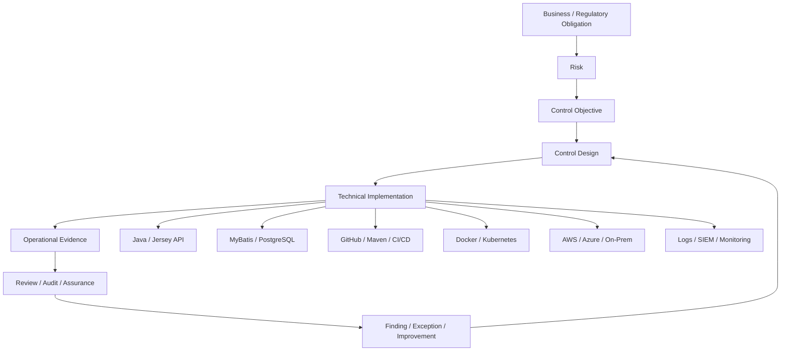

Maknanya sederhana:

- **Regulation / standard** tidak langsung berubah menjadi kode.
- Ia diterjemahkan menjadi **risk**.
- Risk diterjemahkan menjadi **control objective**.
- Control objective diterjemahkan menjadi **control design**.
- Control design diwujudkan dalam **kode, konfigurasi, proses, dan bukti operasional**.

---

## 2. Control Lifecycle State Machine

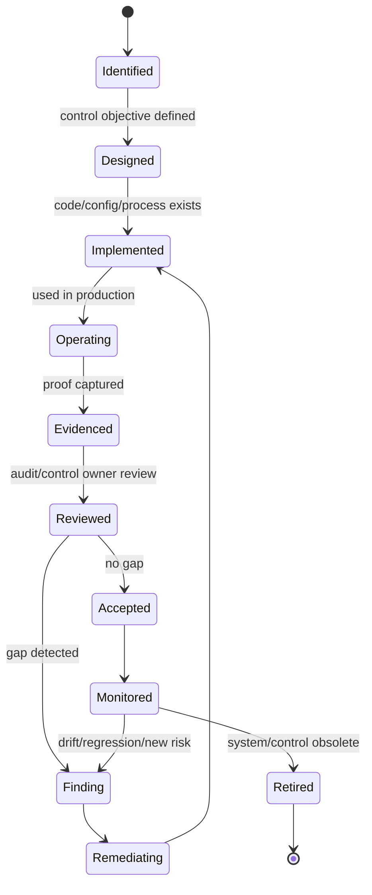

Ini penting karena banyak engineer keliru mengira compliance selesai saat fitur sudah dibuat. Dalam audit Type II, cloud assurance, PCI, atau ISO management system, pertanyaan utamanya sering: **apakah kontrol ini berjalan konsisten dalam periode waktu tertentu dan bisa dibuktikan?**

---

# Decomposition Map - Practical Categories / Domain / Skills

| No | Kategori | Skill / Knowledge yang Perlu Dikuasai | Relevansi untuk Software Engineer | Artefak Praktis |
|---:|---|---|---|---|
| 1 | **Control** | Memahami control sebagai mekanisme untuk mengurangi risk. Bisa berupa preventive, detective, corrective, manual, automated, atau hybrid. | Engineer perlu tahu apakah implementasi kode adalah kontrol utama, kontrol pendukung, atau hanya evidence generator. | Access check, validation rule, CI gate, audit log, alert rule. |
| 2 | **Control Objective** | Tujuan kontrol, bukan detail implementasi. Contoh: “hanya user berwenang yang dapat melihat data tenant.” | Membantu engineer memilih solusi yang benar, bukan sekadar memenuhi checklist. | Security requirement, acceptance criteria, control mapping. |
| 3 | **Control Design** | Rancangan bagaimana kontrol bekerja: siapa aktornya, kapan aktif, data apa yang dicegah/dideteksi, failure mode apa. | Penting saat membuat authorization, validation, workflow approval, atau deployment gate. | Design doc, sequence diagram, threat model. |
| 4 | **Control Operation** | Bukti bahwa kontrol benar-benar berjalan, bukan hanya pernah dibuat. | Sangat relevan untuk SOC 2 Type II karena Type II melihat operasi kontrol selama periode audit. AICPA menjelaskan SOC reports membantu user menilai risiko dari service outsourcing. ([AICPA & CIMA](https://www.aicpa-cima.com/resources/landing/system-and-organization-controls-soc-suite-of-services?utm_source=chatgpt.com)) | CI history, PR approvals, deployment logs, access review record. |
| 5 | **Evidence** | Bukti objektif bahwa kontrol ada dan berjalan. Evidence harus traceable, timestamped, dan ideally tidak mudah dimanipulasi. | Engineer sering diminta menyediakan log, screenshot, query result, PR link, deployment record. | GitHub PR, pipeline run, SIEM event, DB audit table, ticket. |
| 6 | **Scope** | Boundary sistem, data, user, infra, network, vendor, dan environment yang masuk compliance scope. | Scope menentukan seberapa besar dampak perubahan teknis. Service yang menyentuh PAN/ePHI/personal data punya risk lebih tinggi. | System boundary diagram, data flow diagram, asset inventory. |
| 7 | **Risk** | Kemungkinan dan dampak terjadinya masalah terhadap confidentiality, integrity, availability, privacy, safety, financial reporting, atau AI governance. | Engineer perlu menjelaskan kenapa bug tertentu high-risk walaupun secara teknis kecil. | Risk register, threat model, severity assessment. |
| 8 | **Asset** | Sesuatu yang perlu dilindungi: service, database, API key, model, dataset, container image, repository, CI secret, log archive. | Tanpa asset inventory, kontrol akses, patching, backup, dan monitoring mudah bolong. | Asset register, service catalog, repo ownership. |
| 9 | **Data Classification** | Mengklasifikasikan data: public, internal, confidential, restricted, personal data, ePHI, CHD/PAN, SAD, AI data. | Menentukan logging, masking, encryption, retention, access, dan incident severity. | Data classification matrix, DB column tags, DTO annotations. |
| 10 | **Trust Boundary** | Garis pemisah antara zone yang dipercaya dan tidak dipercaya: internet, internal service, database, third-party, tenant boundary. | Krusial untuk API, Kubernetes, service-to-service call, queue, dan integration vendor. | Architecture diagram, network policy, API gateway rule. |
| 11 | **Preventive Control** | Kontrol yang mencegah masalah terjadi. | Cocok untuk authz, input validation, dependency policy, deployment approval. | RBAC check, schema validation, branch protection, admission controller. |
| 12 | **Detective Control** | Kontrol yang mendeteksi masalah setelah atau saat terjadi. | Penting untuk monitoring, alerting, anomaly detection, access anomaly. | SIEM alert, failed login alert, suspicious export alert. |
| 13 | **Corrective Control** | Kontrol untuk memulihkan kondisi setelah masalah. | Dibutuhkan untuk incident response, rollback, restore, revoke token, patch. | Runbook, rollback script, backup restore test. |
| 14 | **Manual Control** | Kontrol yang membutuhkan manusia. | Masih umum pada access review, risk acceptance, approval, exception review. | Approval ticket, access review sign-off. |
| 15 | **Automated Control** | Kontrol yang berjalan otomatis. | Lebih kuat untuk engineering karena repeatable dan mudah dievidence-kan. | CI security scan, policy-as-code, automated log forwarding. |
| 16 | **Compensating Control** | Kontrol alternatif ketika kontrol utama tidak bisa diterapkan, tetapi risk tetap harus dikurangi. | Penting untuk legacy system, on-prem constraint, atau vendor limitation. | Exception document, extra monitoring, network isolation. |
| 17 | **Exception** | Penyimpangan yang disetujui sementara dari standar/kontrol. | Engineer perlu tahu exception harus punya owner, expiry, risk acceptance, dan remediation plan. | Exception ticket, expiry date, compensating control. |
| 18 | **Finding** | Gap yang ditemukan audit/review/testing. | Finding harus diterjemahkan menjadi backlog teknis yang jelas. | Remediation story, RCA, patch, control redesign. |
| 19 | **Audit Trail** | Jejak aktivitas penting: siapa melakukan apa, kapan, dari mana, terhadap objek apa, hasilnya apa. | Relevan untuk HIPAA, PCI, SOC 2, GDPR, dan incident investigation. | Audit event schema, immutable log, correlation ID. |
| 20 | **Segregation of Duties** | Pemisahan peran agar satu orang tidak bisa membuat, menyetujui, dan mengeksekusi perubahan berisiko sendiri. | Penting untuk SOC 1, SOC 2, ISO 27001, dan change management. | PR approval rule, production deploy restriction, admin role split. |
| 21 | **Least Privilege** | User/service hanya punya akses minimum yang diperlukan. | Salah satu kontrol paling sering muncul di security framework. | IAM role, DB grants, Kubernetes RBAC, service account scope. |
| 22 | **Change Management** | Setiap perubahan production harus terotorisasi, diuji, ditinjau, dan bisa ditelusuri. | Relevan langsung ke GitHub, Maven, CI/CD, Kubernetes deployment, DB migration. | PR, CI test, approval, release note, deployment record. |
| 23 | **Secure SDLC** | Security dimasukkan ke lifecycle development: design, code, test, review, release, monitor. | Menyatukan coding standard, dependency scanning, SAST, DAST, threat modeling, dan review. | PR checklist, SCA report, threat model, test evidence. |
| 24 | **Operational Resilience** | Kemampuan sistem tetap tersedia dan pulih dari gangguan. | Terkait SOC 2 Availability, ISO 27001, HIPAA availability safeguard, dan CSA STAR cloud assurance. | Backup, DR test, SLO dashboard, incident postmortem. |
| 25 | **Privacy Engineering** | Data minimization, purpose limitation, consent, retention, deletion, export, anonymization. | Dibutuhkan untuk GDPR dan juga privacy criterion di SOC 2 bila masuk scope. | DSAR workflow, deletion job, retention policy enforcement. |
| 26 | **AI Governance** | Inventory AI use case, model risk, training data, prompt/versioning, evaluation, human oversight. | Relevan jika produk memakai LLM, OCR, face recognition, recommendation, scoring, atau decision automation. | AI risk assessment, model card, evaluation log, human review workflow. |
| 27 | **Cloud Shared Responsibility** | Memahami mana tanggung jawab cloud provider, platform team, dan application team. | Penting untuk AWS/Azure/Kubernetes/On-Prem hybrid dan CSA STAR. CSA STAR Level 1 menggunakan CAIQ berbasis Cloud Controls Matrix untuk mendokumentasikan kontrol cloud. ([cloudsecurityalliance.org](https://cloudsecurityalliance.org/star?utm_source=chatgpt.com)) | Responsibility matrix, cloud control mapping, architecture evidence. |
| 28 | **Compliance Traceability** | Menghubungkan regulation → risk → control → implementation → evidence → owner. | Ini skill senior: membuat compliance bisa diaudit tanpa panik saat audit request datang. | Control mapping matrix, evidence index, ownership map. |

---

# Mapping Framework ke Cara Berpikir Engineer

| Framework | Pertanyaan Praktis untuk Engineer | Contoh Dampak Teknis |
|---|---|---|
| **ISO/IEC 27001** | Apakah risiko keamanan informasi dikelola melalui proses, kontrol, review, dan improvement yang konsisten? | Risk register, access control, patching, incident management, backup, supplier review. |
| **ISO/IEC 42001** | Apakah sistem AI punya governance, risk assessment, transparency, human oversight, dan lifecycle control? | AI inventory, model/prompt versioning, evaluation, AI incident handling. |
| **PCI DSS v4.0.1** | Apakah cardholder data environment jelas, segmented, terlindungi, dimonitor, dan tidak membocorkan PAN/SAD? | PAN masking, tokenization, no PAN in logs, CDE segmentation, vulnerability scan. |
| **SOC 2 Type II** | Apakah kontrol security/availability/etc. berjalan efektif dalam periode audit? | Evidence dari PR approval, deployment, monitoring, incident, access review. |
| **CSA STAR** | Apakah cloud security controls terdokumentasi dan/atau divalidasi pihak ketiga? | Cloud control mapping, tenant isolation, encryption, logging, vulnerability management. |
| **SOC 1 / SSAE** | Apakah sistem berdampak pada financial reporting customer? | Billing/order/revenue workflow, approval, reconciliation, audit trail. |
| **HIPAA** | Apakah ePHI dilindungi melalui administrative, physical, dan technical safeguards? HHS menjelaskan Security Rule berfokus pada confidentiality, integrity, dan availability ePHI. ([HHS.gov](https://www.hhs.gov/hipaa/for-professionals/security/index.html?utm_source=chatgpt.com)) | ePHI access log, encryption, access control, breach investigation evidence. |
| **GDPR** | Apakah personal data diproses sah, transparan, minimal, aman, dan subject rights bisa dipenuhi? | Consent-aware processing, retention, deletion, export, anonymization. |

---

# Practical Engineering Lens

## 1. Ketika Membuat API Baru

Pertanyaan compliance yang harus otomatis muncul:

| Pertanyaan | Kenapa Penting |
|---|---|
| Data apa yang masuk dan keluar? | Menentukan classification: personal data, ePHI, PAN, confidential, AI data. |
| Siapa boleh mengakses endpoint ini? | Terkait IAM, RBAC, least privilege, tenant isolation. |
| Apakah response/error bisa membocorkan data? | Terkait privacy, PCI, HIPAA, SOC 2 confidentiality. |
| Apakah event penting harus diaudit? | Terkait audit trail, forensic, access accountability. |
| Apakah endpoint butuh rate limit/idempotency? | Terkait availability, abuse prevention, reliability. |
| Apakah ada data yang tidak boleh dilog? | Terkait PCI PAN/SAD, ePHI, personal data, secret leakage. |

Contoh artifact:

```text
API: POST /cases/{caseId}/decision
Data classification: Restricted / personal data
AuthN: OIDC access token
AuthZ: case-assigned officer OR supervisor
Audit event: CASE_DECISION_SUBMITTED
Sensitive fields in logs: redact notes, identifiers, attachments
Retention: follow case retention policy
Evidence: PR approval, test result, deployed version, audit log sample
```

---

## 2. Ketika Mengubah Database Schema

Pertanyaan compliance:

| Pertanyaan | Kenapa Penting |
|---|---|
| Apakah kolom baru berisi personal data/ePHI/PAN? | Menentukan encryption, masking, retention, access. |
| Apakah migration irreversible? | Terkait rollback dan change management. |
| Apakah query baru bisa cross-tenant leak? | Terkait tenant isolation dan privacy. |
| Apakah field perlu audit history? | Terkait forensic dan compliance investigation. |
| Apakah field perlu deletion/anonymization? | Terkait GDPR retention dan right to erasure. |

Contoh artifact:

```text
Migration: V20260713_01_add_customer_risk_score.sql
Classification: personal data derived attribute
Access: restricted to risk-review role
Audit: update tracked in customer_audit_event
Retention: same as customer profile
Rollback: nullable column; safe rollback available
Reviewers: application owner + data owner
```

---

## 3. Ketika Mengubah CI/CD

Pertanyaan compliance:

| Pertanyaan | Kenapa Penting |
|---|---|
| Apakah branch protection tetap aktif? | Change control evidence. |
| Apakah dependency scan masih mandatory? | Vulnerability management. |
| Apakah secret bisa terekspos di logs? | Secrets management. |
| Apakah production deploy butuh approval? | Segregation of duties. |
| Apakah artifact build bisa ditelusuri ke commit? | Traceability dan audit evidence. |

Contoh artifact:

```text
Commit SHA -> Maven build -> test report -> SCA scan -> container image digest -> deployment approval -> Kubernetes rollout
```

Ini adalah rantai evidence yang sangat kuat.

---

# Common Misconceptions

| Misconception | Koreksi |
|---|---|
| “Compliance itu urusan auditor/security team.” | Salah. Engineer menghasilkan sebagian besar implementasi dan evidence teknis. |
| “Kalau sudah pakai encryption, berarti aman.” | Belum tentu. Perlu key management, access control, logging, rotation, dan operational evidence. |
| “SOC 2 sama dengan ISO 27001.” | Tidak sama. SOC 2 adalah attestation report berbasis Trust Services Criteria; ISO 27001 adalah management system standard untuk ISMS. |
| “PCI hanya urusan payment gateway.” | Tidak selalu. Jika sistem menyimpan, memproses, atau mentransmisikan cardholder data, scope bisa meluas. |
| “GDPR cuma privacy policy.” | Salah. GDPR berdampak ke data model, deletion, retention, export, consent, logging, dan vendor processing. |
| “HIPAA selalu berlaku kalau ada data kesehatan.” | Tidak otomatis. Konteks entity, business associate, dan ePHI penting. Namun secara engineering, data kesehatan tetap harus diperlakukan high sensitivity. |
| “Audit evidence bisa dibuat belakangan.” | Berbahaya. Evidence yang kuat harus lahir dari proses normal: PR, CI/CD, logs, ticket, monitoring. |

---

# Minimal Checklist untuk Engineer Saat Mengerjakan Ticket

Gunakan ini sebagai checklist ringan sebelum merge:

| Area | Pertanyaan |
|---|---|
| Scope | Apakah perubahan ini menyentuh data/system yang regulated atau customer-facing? |
| Data | Apakah ada personal data, ePHI, PAN, secret, credential, atau AI-sensitive data? |
| AuthN/AuthZ | Apakah akses sudah explicit dan testable? |
| Logging | Apakah log cukup untuk audit tapi tidak membocorkan data sensitif? |
| Validation | Apakah input/output tervalidasi dan error aman? |
| Change | Apakah PR, reviewer, test, dan deployment traceable? |
| Evidence | Bukti apa yang otomatis tercipta dari perubahan ini? |
| Failure Mode | Kalau kontrol gagal, bagaimana terdeteksi dan dipulihkan? |
| Retention | Apakah data baru punya aturan simpan/hapus? |
| Monitoring | Apakah ada alert untuk kondisi abnormal? |

---

# Roadmap Belajar Singkat - Seri 1

## Hari 1-2: Vocabulary

Pahami istilah: **control, evidence, scope, risk, asset, finding, exception, compensating control, control owner**.

## Hari 3-4: Apply ke Service Nyata

Ambil satu microservice. Buat:

```text
Service boundary
Data classification
Main risks
Existing controls
Evidence produced
Gaps
```

## Hari 5-7: Traceability

Buat mapping sederhana:

```text
Risk -> Control -> Code/Config -> Evidence -> Owner
```

Contoh:

```text
Risk:
Unauthorized user accesses another tenant's data

Control:
Tenant isolation enforced at API and query layer

Implementation:
Jersey auth filter + MyBatis tenant_id predicate + integration test

Evidence:
PR approval + test result + audit log sample

Owner:
Service team
```

---

# Output yang Sebaiknya Anda Buat Setelah Seri Ini

Untuk onboarding cepat, buat satu dokumen internal pribadi bernama:

```text
Compliance Engineering Notes - Service I Own
```

Isinya:

| Section | Isi |
|---|---|
| Service Name | Nama service / module |
| Business Function | Fungsi bisnis utama |
| Data Types | Personal data, ePHI, PAN, confidential, AI data, dll |
| Inbound APIs | Endpoint penting |
| Outbound Integrations | Vendor/service lain |
| DB Tables | Tabel penting dan sensitivity |
| Controls | Auth, logging, encryption, validation, monitoring |
| Evidence | PR, CI, deployment, logs, alerts |
| Known Gaps | Hal yang perlu ditanyakan ke team/security |

---

# Rekomendasi Materi Selanjutnya

Lanjut ke **Seri 2/18 - System Boundary, Scope & Data Flow Mapping**.

Kenapa ini paling penting setelah foundation: hampir semua framework compliance dimulai dari pertanyaan **“sistem mana yang masuk scope dan data apa yang mengalir di dalamnya?”** Kalau scope salah, kontrol, audit evidence, risk assessment, dan remediation juga ikut salah.

**Seri 1/18 selesai.**

---

**Sources:**

- [ISO/IEC 27001:2022 - Information security management ...](https://www.iso.org/standard/27001?utm_source=chatgpt.com)
- [Just Published: PCI DSS v4.0.1](https://blog.pcisecuritystandards.org/just-published-pci-dss-v4-0-1?utm_source=chatgpt.com)
- [2017 Trust Services Criteria (With Revised Points of Focus](https://www.aicpa-cima.com/resources/download/2017-trust-services-criteria-with-revised-points-of-focus-2022?utm_source=chatgpt.com)
- [STAR](https://cloudsecurityalliance.org/star?utm_source=chatgpt.com)
- [Summary of the HIPAA Security Rule](https://www.hhs.gov/hipaa/for-professionals/security/laws-regulations/index.html?utm_source=chatgpt.com)
- [Data protection - European Commission](https://commission.europa.eu/law/law-topic/data-protection_en?utm_source=chatgpt.com)

## Response:
7/13/2026, 11:08:12 PM

Saya lanjut ke **Seri 2/18 — System Boundary, Scope & Data Flow Mapping**. Fokusnya akan lebih praktis: bagaimana menentukan batas sistem, trust boundary, regulated-data path, dan artefak yang engineer perlu buat sebelum bicara kontrol.

# Seri 2/18 - System Boundary, Scope & Data Flow Mapping

## Introduction

Seri ini menjawab pertanyaan inti sebelum masuk ke kontrol ISO, SOC, PCI, HIPAA, GDPR, CSA, atau AI governance:

> **Sistem mana yang masuk scope, data apa yang mengalir, siapa aktornya, lewat boundary mana, dan bukti apa yang menunjukkan bahwa batas itu benar?**

Untuk software engineer, kesalahan scope adalah akar banyak masalah compliance. Kalau service dianggap “out of scope” padahal bisa mengakses data regulated, maka kontrol akses, logging, vulnerability scan, backup, incident response, dan audit evidence bisa salah semua.

Dalam PCI, guidance resmi PCI SSC bahkan menyarankan pendekatan konservatif: mulai dari asumsi bahwa semuanya masuk scope sampai terbukti tidak, dan segmentation hanya membantu mengurangi scope jika benar-benar dirancang dan diterapkan dengan baik. ([PCI Security Standards Council](https://listings.pcisecuritystandards.org/documents/Guidance-PCI-DSS-Scoping-and-Segmentation_v1.pdf))

Untuk GDPR, data-flow mapping dekat dengan **records of processing activities**: purpose, categories of personal data, recipients, transfer ke negara/organisasi lain, dan retention period harus bisa dijelaskan. ([European Commission](https://commission.europa.eu/about/service-standards-and-principles/transparency/data-processing-register_en))

Untuk HIPAA, boundary mapping penting karena Security Rule melindungi ePHI yang dibuat, diterima, disimpan, atau dikirim secara elektronik oleh covered entities dan business associates. ([HHS.gov](https://www.hhs.gov/hipaa/for-professionals/security/laws-regulations/index.html))

Untuk CSA STAR, cloud scope perlu jelas karena CSA CCM membantu memetakan cloud control, shared responsibility, cloud provider/customer responsibility, dan domain seperti IAM, logging, vulnerability management, encryption, data security, dan infrastructure security. ([Cloud Security Alliance](https://cloudsecurityalliance.org/research/cloud-controls-matrix))

---

# Diagram

## 1. System Boundary View

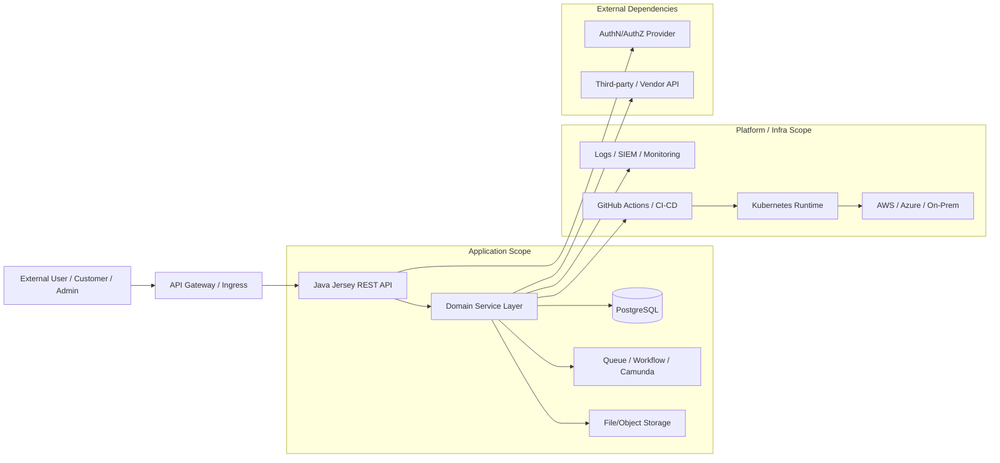

Maknanya:

- **Application scope**: kode, API, service, DB, workflow, storage.
- **Platform scope**: Kubernetes, container, CI/CD, network, cloud/on-prem.
- **External dependency scope**: identity provider, vendor API, payment gateway, AI provider, logging provider.
- **Compliance scope**: gabungan dari sistem yang menyimpan, memproses, mengirim, mengontrol, atau dapat memengaruhi data regulated.

---

## 2. Data Flow Mapping

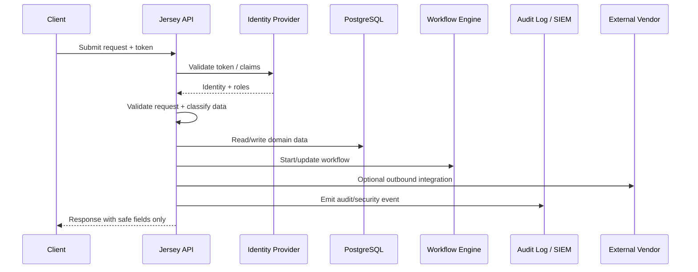

Pertanyaan penting dari diagram ini:

1. Apakah request membawa **personal data, ePHI, PAN/CHD, confidential data, AI data, atau secret**?
2. Apakah response membocorkan data yang tidak perlu?
3. Apakah outbound vendor menerima data regulated?
4. Apakah log menyimpan data sensitif?
5. Apakah workflow engine menyimpan payload sensitif?
6. Apakah database query aman dari cross-tenant leakage?
7. Apakah audit event cukup untuk investigasi?

---

# Decomposition Map - Practical Categories / Domain / Skills

| No | Area | Skill / Knowledge | Pertanyaan Praktis | Artefak Engineering |
|---:|---|---|---|---|
| 1 | **System Inventory** | Mencatat semua service, repo, database, job, queue, workflow, storage, dan integration. | Service apa saja yang menyentuh data regulated? | Service catalog, repo map, deployment map. |
| 2 | **Asset Boundary** | Memahami batas aset teknis: API, DB, container, namespace, CI secret, object storage, queue. | Aset mana yang menyimpan, memproses, atau mengirim data sensitif? | Asset inventory, ownership matrix. |
| 3 | **Data Boundary** | Memisahkan boundary berdasarkan jenis data: personal data, ePHI, CHD/PAN, financial data, AI data. | Data regulated mengalir lewat komponen mana? | Data classification map, column-level classification. |
| 4 | **Trust Boundary** | Menentukan perubahan trust level: internet ke internal, service ke DB, tenant A ke tenant B, app ke vendor. | Di titik mana input harus divalidasi ulang? | Trust boundary diagram, threat model. |
| 5 | **Network Boundary** | Memetakan ingress, egress, subnet, namespace, firewall, service mesh, network policy. | Apakah service yang out-of-scope bisa mencapai service in-scope? | Network diagram, Kubernetes NetworkPolicy. |
| 6 | **Application Boundary** | Menentukan endpoint, resource, service layer, domain module, worker, scheduler, async handler. | Endpoint mana yang expose data sensitif? | API inventory, OpenAPI spec, route matrix. |
| 7 | **Database Boundary** | Memetakan schema, table, view, materialized view, function, procedure, trigger, replication, backup. | Apakah data regulated muncul di table turunan, view, backup, atau replica? | ERD, DB lineage, migration review. |
| 8 | **Workflow Boundary** | Menentukan apakah Camunda menyimpan business key, variable, payload, document reference, atau decision history. | Apakah workflow variable berisi data yang seharusnya tidak persistent? | BPMN data map, process variable classification. |
| 9 | **Logging Boundary** | Memetakan application log, audit log, access log, security event, SIEM, APM trace. | Apakah log menyimpan PAN, ePHI, personal data, token, atau secret? | Logging policy, redaction rules, log sample evidence. |
| 10 | **File Boundary** | Memetakan upload/download, temporary file, object storage, generated PDF/Excel/CSV, antivirus scan. | File sensitif disimpan di mana dan berapa lama? | File lifecycle map, retention rule, encryption config. |
| 11 | **Integration Boundary** | Memetakan vendor API, payment gateway, identity provider, email/SMS, AI provider, analytics, support tooling. | Vendor menerima data apa dan apakah masuk processor/subprocessor? | Vendor data-flow map, DPA/BAA/contract reference. |
| 12 | **CI/CD Boundary** | Menentukan repo, branch, workflow, artifact, container registry, deployment pipeline, secret injection. | Apakah pipeline bisa mengubah production tanpa approval? | GitHub Actions map, release traceability. |
| 13 | **Runtime Boundary** | Memetakan container, pod, namespace, node, service account, volume, config map, secret, ingress. | Apakah pod punya permission lebih dari yang diperlukan? | Kubernetes architecture map, RBAC review. |
| 14 | **Cloud Boundary** | Memahami shared responsibility di AWS/Azure/on-prem. | Mana tanggung jawab cloud provider, platform team, dan app team? | Responsibility matrix, CSA CCM mapping. |
| 15 | **Tenant Boundary** | Mencegah data customer/tenant A terlihat oleh tenant B. | Apakah semua query, cache key, log, event, dan file path tenant-aware? | Tenant isolation tests, query guard, cache key standard. |
| 16 | **Environment Boundary** | Memisahkan dev, test, staging, production, sandbox, DR. | Apakah production data masuk environment non-prod? | Environment matrix, data masking policy. |
| 17 | **Access Boundary** | Memetakan human access, service account, DB role, admin role, break-glass, support access. | Siapa bisa membaca/mengubah data regulated? | Access matrix, RBAC policy, access review evidence. |
| 18 | **Evidence Boundary** | Menentukan bukti apa yang lahir dari sistem dan proses. | Bagaimana membuktikan scope, control, dan data flow benar? | Evidence index, diagram versioning, audit packet. |

---

# Scope Classification Model

Gunakan model ini untuk mengklasifikasikan komponen.

| Scope Type | Definisi | Contoh | Konsekuensi Engineering |
|---|---|---|---|
| **In-Scope Direct** | Komponen menyimpan, memproses, atau mengirim data regulated. | Jersey API yang menerima ePHI, PostgreSQL table berisi personal data, payment service yang menerima PAN. | Full control: auth, logging, encryption, vulnerability, backup, monitoring, evidence. |
| **In-Scope Indirect** | Komponen tidak menyimpan data regulated, tetapi bisa memengaruhi keamanan komponen in-scope. | CI/CD deployer, Kubernetes control plane, IAM provider, secrets manager. | Harus dikontrol karena compromise bisa berdampak ke data regulated. |
| **Connected-to-Scope** | Komponen terhubung ke sistem in-scope, tetapi tidak seharusnya punya akses data regulated. | Internal admin dashboard, monitoring tool, batch scheduler. | Perlu segmentation, least privilege, logging, egress restriction. |
| **Out-of-Scope with Evidence** | Komponen dikeluarkan dari scope karena tidak menyentuh, tidak mengontrol, dan tidak bisa memengaruhi data regulated. | Static marketing site yang isolated total. | Harus ada bukti isolasi, bukan sekadar klaim. |
| **Unknown Scope** | Belum jelas apakah komponen menyentuh data regulated. | Legacy worker, old reporting DB, undocumented vendor integration. | Perlakukan sebagai high-risk sampai selesai dianalisis. |

Prinsip praktisnya: **unknown scope harus dianggap berisiko sampai terbukti aman**. Ini sejalan dengan pendekatan konservatif dalam PCI scoping guidance yang menyarankan memulai dari asumsi semua komponen masuk scope sampai dapat diverifikasi sebaliknya. ([PCI Security Standards Council](https://listings.pcisecuritystandards.org/documents/Guidance-PCI-DSS-Scoping-and-Segmentation_v1.pdf))

---

# Data Flow Inventory Template

Untuk setiap flow, dokumentasikan seperti ini:

| Field | Isi |
|---|---|
| Flow ID | `DF-001` |
| Source | Client, service, DB, queue, vendor |
| Destination | API, DB, queue, file storage, SIEM, vendor |
| Trigger | User action, scheduled job, event, workflow transition |
| Data Category | Personal data, ePHI, CHD/PAN, confidential, AI data, metadata |
| Transport | HTTPS, JDBC, internal service call, message broker, file transfer |
| Storage | None, DB table, process variable, object storage, log, cache |
| AuthN/AuthZ | Token, service account, DB role, mTLS, IAM |
| Encryption | TLS, encryption at rest, KMS-managed key |
| Logging | Audit event, access log, app log, SIEM event |
| Retention | Duration, deletion/anonymization rule |
| Owner | Service owner / data owner |
| Evidence | Diagram, config, code reference, test, log sample |

Contoh:

| Field | Contoh |
|---|---|
| Flow ID | `DF-014` |
| Source | `case-api` |
| Destination | `PostgreSQL.case_decision` |
| Trigger | Officer submits case decision |
| Data Category | Personal data + restricted case data |
| Transport | JDBC over internal network |
| Storage | PostgreSQL primary DB + encrypted backup |
| AuthN/AuthZ | OIDC user token + role check + tenant/case assignment |
| Logging | `CASE_DECISION_SUBMITTED` audit event |
| Retention | Follows case retention policy |
| Owner | Case Management Team |
| Evidence | PR link, migration file, audit log sample, integration test |

---

# Practical Data Categories

| Data Category | Contoh | Framework yang Biasanya Terdampak | Engineering Concern |
|---|---|---|---|
| **Personal Data** | Nama, email, phone, address, customer ID, IP address jika bisa mengidentifikasi individu. | GDPR, SOC 2 Privacy, ISO 27001 | Minimization, consent/purpose, retention, export/delete. |
| **Special Category / Sensitive Personal Data** | Health data, biometric data, certain identity attributes. | GDPR, HIPAA jika ePHI, ISO 27001 | Strict access, strong audit, minimization, legal basis. |
| **ePHI** | Health information elektronik yang terkait individu dan covered context. | HIPAA | Access control, audit controls, integrity, transmission security. |
| **CHD/PAN** | Primary Account Number, cardholder name, expiration date, service code. | PCI DSS | CDE scoping, masking, tokenization, no unsafe logging. |
| **SAD** | CVV/CVC, full track data, PIN block. | PCI DSS | Umumnya tidak boleh disimpan setelah authorization. |
| **Financial Control Data** | Billing, revenue, order state, invoice state, settlement data. | SOC 1 / SSAE | Change control, reconciliation, approval, audit trail. |
| **Confidential Business Data** | Contract, pricing, customer configuration, internal case notes. | ISO 27001, SOC 2 | Need-to-know access, encryption, logging. |
| **AI Data** | Prompt, completion, model input/output, training data, embeddings, evaluation set. | ISO 42001, GDPR, ISO 27001 | Data provenance, model risk, privacy leakage, retention. |
| **Secrets / Credentials** | API key, DB password, private key, token, webhook secret. | ISO 27001, SOC 2, PCI, CSA | Vaulting, rotation, no logs, no Git commit. |
| **Telemetry / Logs** | Request ID, user ID, IP, trace, error stack, payload snippet. | SOC 2, GDPR, HIPAA, PCI | Redaction, retention, access control, forensic utility. |

---

# Boundary Patterns untuk Java/Jersey/MyBatis/PostgreSQL/Kubernetes

## 1. API Boundary

Di Jersey/JAX-RS, boundary utama biasanya ada di:

```text id="58wtb9"
Resource Class
-> Request Filter
-> Auth Context
-> DTO Validation
-> Service Layer
-> MyBatis Mapper
-> PostgreSQL
```

Checklist:

| Area | Pertanyaan |
|---|---|
| Resource | Endpoint ini expose data apa? |
| Filter | Apakah token divalidasi sebelum masuk resource? |
| DTO | Apakah field sensitif divalidasi dan dibatasi? |
| Service | Apakah business authorization dicek di sini? |
| Mapper | Apakah query selalu tenant-aware / subject-aware? |
| Response | Apakah response hanya mengembalikan field yang perlu? |

---

## 2. MyBatis / SQL Boundary

Risiko umum di layer MyBatis:

| Risiko | Contoh | Mitigasi |
|---|---|---|
| Cross-tenant leakage | Query lupa `tenant_id` | Query guard, integration test, DB policy. |
| Over-fetching | Mapper mengambil semua kolom termasuk sensitive field | Projection DTO, explicit column list. |
| Dynamic SQL unsafe | `${}` dipakai untuk user input | Gunakan `#{}` untuk bind parameter; whitelist untuk dynamic identifier. |
| Audit gap | Update/delete tanpa history | Audit table, trigger, domain event. |
| Retention gap | Data baru tidak ikut deletion job | Retention mapping per table/column. |

---

## 3. PostgreSQL Boundary

Yang harus dipetakan:

| Komponen PostgreSQL | Kenapa Perlu Masuk Boundary |
|---|---|
| Table | Menyimpan data regulated secara langsung. |
| View | Bisa mengekspos subset/superset data sensitif. |
| Materialized View | Menyalin data; sering lupa ikut retention/deletion. |
| Function / Procedure | Bisa membaca/mengubah data di luar jalur aplikasi. |
| Trigger | Bisa membuat audit trail atau side effect tersembunyi. |
| Extension | Bisa menambah surface area/security concern. |
| Backup | Menyimpan snapshot data regulated. |
| Replica | Membuat copy data regulated di environment lain. |

---

## 4. Kubernetes Boundary

Yang perlu dimodelkan:

| Komponen | Pertanyaan Boundary |
|---|---|
| Namespace | Apakah namespace production terisolasi dari dev/test? |
| ServiceAccount | Apakah pod punya akses API Kubernetes yang berlebihan? |
| Secret | Apakah secret disuntik aman dan tidak muncul di log/env dump? |
| ConfigMap | Apakah ada config sensitif yang salah taruh di ConfigMap? |
| NetworkPolicy | Apakah pod out-of-scope bisa reach pod in-scope? |
| Ingress | Apakah external exposure jelas? |
| Volume | Apakah persistent volume menyimpan data regulated? |
| Sidecar/Agent | Apakah APM/logging agent menerima payload sensitif? |

---

# Scope Decision Tree

Gunakan decision tree ini saat menganalisis service/module baru.

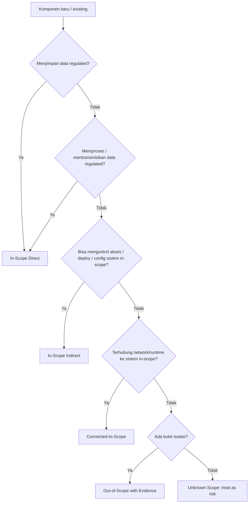

---

# Data Flow Failure Modes

| Failure Mode | Contoh | Dampak Compliance | Pencegahan |
|---|---|---|---|
| **Unmapped data copy** | Export CSV tersimpan di object storage tanpa retention. | GDPR/HIPAA/SOC 2 issue. | File lifecycle policy, retention tag. |
| **Sensitive log leakage** | Request body berisi PAN/ePHI tercetak di log error. | PCI/HIPAA/GDPR incident risk. | Redaction middleware, structured logging allowlist. |
| **Cross-tenant query** | MyBatis mapper lupa filter tenant. | SOC 2/GDPR confidentiality breach. | Tenant predicate test, query review. |
| **Workflow payload leak** | Camunda variable menyimpan full identity document. | Privacy and retention issue. | Store reference, not payload; classify variables. |
| **Non-prod data exposure** | Production DB dump dipakai di dev tanpa masking. | GDPR/HIPAA/ISO issue. | Masking, synthetic data, access restriction. |
| **Vendor data over-sharing** | AI/vendor API menerima personal data yang tidak perlu. | GDPR/ISO 42001/vendor risk. | Data minimization, DPA/subprocessor review. |
| **Backup forgotten scope** | Backup menyimpan PAN/ePHI tapi tidak dienkripsi/ditest restore. | PCI/HIPAA/SOC 2 availability/security issue. | Backup inventory, encryption, restore test. |
| **Monitoring over-collection** | APM captures request payload. | Privacy/security issue. | APM scrubber, field denylist, sampling policy. |
| **Out-of-scope false assumption** | Internal admin tool bisa reach CDE/ePHI DB. | Scope expansion. | Network segmentation, IAM isolation, evidence. |

---

# Minimum Artifact Set

Untuk setiap service penting, minimal punya 7 artefak ini:

| Artifact | Isi Minimum | Owner |
|---|---|---|
| **System Context Diagram** | User, API, DB, queue, vendor, cloud/on-prem boundary. | Tech Lead / Architect |
| **Data Flow Diagram** | Source, destination, data category, transport, storage. | Service Owner |
| **Data Classification Matrix** | Table/field/API payload/log classification. | Engineer + Data Owner |
| **Trust Boundary Diagram** | Internet/internal/vendor/tenant/admin boundary. | Security + Engineering |
| **Access Matrix** | Role, permission, service account, DB grants. | Engineering + IAM Owner |
| **Evidence Index** | PR, CI, deployment, logs, monitoring, access review. | Control Owner |
| **Scope Decision Record** | Why in-scope/out-of-scope/connected-to-scope. | Compliance + Engineering |

---

# Example - Service Boundary Record

```text id="dp5w2j"
Service Name:
case-decision-api

Runtime:
Java 17, Jersey/JAX-RS, Docker, Kubernetes

Primary Function:
Submit, review, and finalize regulatory case decisions

Inbound:
- POST /cases/{caseId}/decision
- GET /cases/{caseId}/decision
- PATCH /cases/{caseId}/decision/status

Outbound:
- PostgreSQL case schema
- Camunda process engine
- Notification service
- Audit logging pipeline

Data Categories:
- Personal data
- Confidential case data
- Derived risk score
- No PAN
- No ePHI unless case domain includes health context

Scope Classification:
In-Scope Direct for GDPR / ISO 27001 / SOC 2
Potential HIPAA only if tenant/customer workflow includes ePHI
Not PCI CDE unless payment/card data enters flow

Trust Boundaries:
- External user -> API gateway
- API -> identity provider
- API -> PostgreSQL
- API -> Camunda
- API -> logging/SIEM

Key Controls:
- OIDC token validation
- Case assignment authorization
- Tenant-aware MyBatis queries
- Audit event on decision submit/update
- Sensitive field redaction
- Kubernetes NetworkPolicy
- CI/CD approval before production deploy

Evidence:
- OpenAPI spec
- Data flow diagram
- MyBatis integration tests
- PR approval
- Deployment record
- Audit log sample
```

---

# Practical Review Checklist

Gunakan checklist ini saat design review atau PR review.

| Area | Review Question |
|---|---|
| Scope | Apakah komponen ini direct, indirect, connected, out-of-scope, atau unknown? |
| Data | Apakah semua data category sudah diklasifikasikan? |
| Flow | Apakah source/destination semua data flow terdokumentasi? |
| Storage | Apakah semua persistent copy diketahui, termasuk cache, log, backup, materialized view? |
| Access | Siapa user/service yang bisa read/write? |
| Tenant | Apakah tenant boundary berlaku di API, DB, cache, file, queue, workflow? |
| Vendor | Apakah data dikirim ke vendor/subprocessor? |
| Logging | Apakah log cukup untuk audit tapi tidak berisi data terlarang? |
| Retention | Apakah data punya lifecycle delete/anonymize/archive? |
| Evidence | Bukti apa yang menunjukkan boundary ini benar? |
| Drift | Bagaimana boundary bisa berubah diam-diam? |
| Owner | Siapa accountable kalau scope berubah? |

---

# Anti-Pattern yang Harus Dihindari

| Anti-Pattern | Kenapa Berbahaya | Cara Benar |
|---|---|---|
| “Service ini cuma internal, jadi aman.” | Internal service tetap bisa jadi path ke data regulated. | Tetap modelkan trust boundary dan access. |
| “Kita tidak menyimpan data, cuma lewat.” | Transmit/process tetap bisa masuk scope. | Dokumentasikan processing/transmission path. |
| “Data cuma ada di log sementara.” | Log bisa retained lama dan tersebar ke SIEM/APM. | Classify log sebagai storage surface. |
| “Backup bukan bagian aplikasi.” | Backup menyimpan data yang sama sensitifnya. | Masukkan backup ke data boundary. |
| “Camunda cuma workflow.” | Process variable/history bisa menyimpan payload sensitif. | Classify variable dan history retention. |
| “Vendor sudah certified, jadi selesai.” | Sertifikasi vendor tidak otomatis menghapus tanggung jawab integrasi. | Tetap dokumentasikan data sharing dan contract boundary. |
| “Out-of-scope karena tidak ada customer access.” | Admin/CI/service account tetap bisa memengaruhi sistem in-scope. | Evaluasi indirect scope. |
| “Diagram dibuat untuk audit saja.” | Diagram yang tidak dipakai engineer cepat basi. | Version diagram dekat repo/design doc. |

---

# Roadmap Belajar Singkat

## Hari 1 - Ambil 1 Service Nyata

Pilih satu microservice yang paling sering Anda sentuh. Jangan mulai dari seluruh enterprise landscape.

Output:

```text id="bkf8hd"
Service name
Business function
Inbound API
Outbound dependency
Database tables
Workflow/queue
Logs
Runtime
Owner
```

## Hari 2 - Buat Data Flow

Petakan minimal 5 flow:

```text id="bhndk1"
Client -> API
API -> DB
API -> Camunda
API -> Vendor
API -> Log/SIEM
```

Untuk setiap flow, isi: data category, transport, storage, auth, retention, evidence.

## Hari 3 - Tandai Scope

Label setiap komponen:

```text id="e1vxls"
In-Scope Direct
In-Scope Indirect
Connected-to-Scope
Out-of-Scope with Evidence
Unknown Scope
```

## Hari 4 - Cari Copy Tersembunyi

Periksa:

```text id="w8l18m"
Logs
APM traces
Cache
Object storage
Camunda variables
Materialized views
Backups
Replicas
Exports
Temporary files
```

## Hari 5 - Review dengan Team

Bawa diagram ke tech lead/security/platform team. Tujuan review bukan mencari sempurna, tetapi menemukan **unknown boundary**.

---

# Output yang Sebaiknya Anda Buat Setelah Seri Ini

Buat dokumen internal pribadi:

```text id="r33oq2"
System Boundary & Data Flow Notes - <Service Name>
```

Isi minimal:

| Section | Isi |
|---|---|
| Service Context | Fungsi, owner, repo, runtime |
| Scope Classification | Direct / indirect / connected / out-of-scope / unknown |
| Data Categories | Personal data, ePHI, PAN, financial, confidential, AI data |
| Data Flow Table | Source, destination, data, transport, storage |
| Trust Boundaries | Internet, internal, vendor, tenant, admin |
| Storage Surfaces | DB, cache, log, file, backup, workflow history |
| Access Paths | User, admin, service account, CI/CD |
| Evidence | Diagram, config, PR, test, logs |
| Open Questions | Boundary yang belum jelas |

---

# Rekomendasi Materi Selanjutnya

Lanjut ke **Seri 3/18 - Data Classification**.

Alasannya: setelah boundary dan data flow jelas, langkah berikutnya adalah menentukan **tingkat sensitivitas data**. Tanpa data classification, engineer tidak bisa menentukan apakah perlu masking, encryption, retention, deletion, restricted access, audit trail, tokenization, BAA/DPA, atau incident severity tertentu.

**Seri 2/18 selesai.**

---

**Sources:**

- [](https://listings.pcisecuritystandards.org/documents/Guidance-PCI-DSS-Scoping-and-Segmentation_v1.pdf)
- [Data processing register - European Commission](https://commission.europa.eu/about/service-standards-and-principles/transparency/data-processing-register_en)
- [Summary of the HIPAA Security Rule | HHS.gov](https://www.hhs.gov/hipaa/for-professionals/security/laws-regulations/index.html)
- [Cloud Controls Matrix | CSA](https://cloudsecurityalliance.org/research/cloud-controls-matrix)

## Response:
7/13/2026, 11:10:30 PM

Saya lanjut ke **Seri 3/18 — Data Classification**. Seri ini akan mengubah “data apa yang mengalir” menjadi keputusan teknis: masking, encryption, logging, retention, access control, deletion, tokenization, dan incident severity.

# Seri 3/18 - Data Classification

## Introduction

Setelah **Seri 2 - System Boundary & Data Flow Mapping**, sekarang kita masuk ke pertanyaan berikutnya:

> **Data ini masuk kategori apa, seberapa sensitif, kontrol apa yang wajib mengikuti data tersebut, dan bagaimana engineer mencegah data salah diproses, salah dilog, salah disimpan, atau salah dikirim?**

Data classification adalah fondasi untuk hampir semua kontrol compliance. Tanpa klasifikasi data, engineer tidak bisa menentukan:

- boleh atau tidak data masuk log,
- perlu masking atau tokenization,
- perlu encryption tambahan,
- siapa yang boleh akses,
- berapa lama data disimpan,
- apakah data boleh dikirim ke vendor,
- apakah deletion/export/anonymization wajib,
- apakah incident masuk low, medium, high, atau breach-level severity.

Untuk GDPR, personal data mencakup informasi yang berkaitan dengan individu yang teridentifikasi atau dapat diidentifikasi, dan special categories seperti data kesehatan, biometrik untuk identifikasi unik, genetic data, political opinions, religious beliefs, ethnic origin, trade union membership, sex life, dan sexual orientation mendapat perlindungan khusus. ([GDPR](https://gdpr-info.eu/issues/personal-data/?utm_source=chatgpt.com))

Untuk HIPAA, HHS menjelaskan bahwa Security Rule melindungi **electronic protected health information / ePHI**, yaitu protected health information yang maintained atau transmitted dalam electronic media, dan regulated entities harus menjaga confidentiality, integrity, dan availability ePHI melalui administrative, physical, dan technical safeguards. ([HHS.gov](https://www.hhs.gov/hipaa/for-professionals/security/laws-regulations/index.html))

Untuk PCI DSS, PCI SSC mendefinisikan **account data** sebagai cardholder data dan/atau sensitive authentication data; PCI DSS berlaku pada entitas yang menyimpan, memproses, atau mentransmisikan CHD/SAD atau dapat memengaruhi keamanan CDE. ([PCI Security Standards Council](https://www.pcisecuritystandards.org/glossary/?utm_source=chatgpt.com))

---

# Diagram

## 1. Data Classification Decision Flow

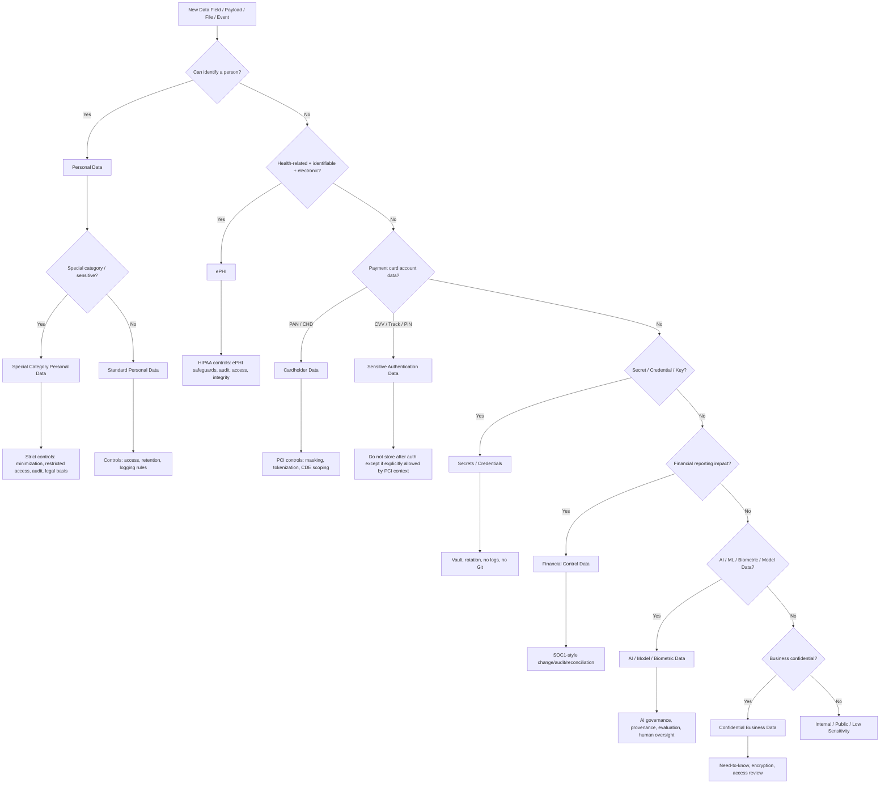

---

## 2. Data Classification as Engineering Control Input

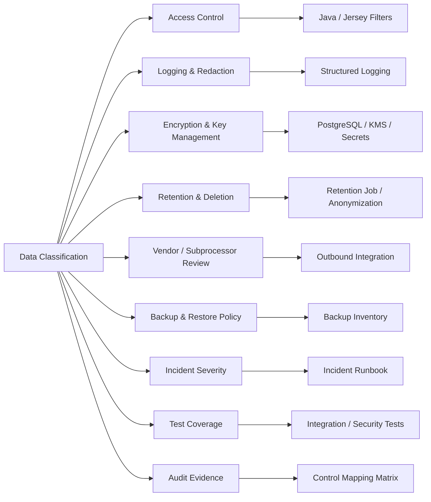

---

# Decomposition Map - Practical Categories / Domain / Skills

| No | Kategori Data | Penjelasan Praktis | Contoh | Framework Terkait | Konsekuensi Engineering |
|---:|---|---|---|---|---|
| 1 | **Public Data** | Data yang memang boleh dibuka publik. Tetap perlu integrity control. | Public documentation, public pricing page. | ISO 27001, SOC 2 | Tidak perlu restricted access, tapi tetap perlu change control dan integrity. |
| 2 | **Internal Data** | Data operasional internal, tidak untuk publik, tetapi tidak terlalu sensitif. | Internal service config non-secret, internal metrics. | ISO 27001, SOC 2 | Butuh access control internal dan logging wajar. |
| 3 | **Confidential Business Data** | Data bisnis yang jika bocor merugikan perusahaan/customer. | Contract terms, enterprise pricing, product roadmap, customer config. | ISO 27001, SOC 2 Confidentiality | Need-to-know access, encryption at rest, audit trail untuk akses penting. |
| 4 | **Restricted / Highly Confidential Data** | Data sangat sensitif dengan dampak tinggi. | Legal case notes, enforcement documents, investigation records. | ISO 27001, SOC 2, GDPR jika personal | Strong RBAC, audit log, masking, stricter retention. |
| 5 | **Personal Data** | Informasi yang terkait individu identified/identifiable. | Name, email, phone, address, user ID, IP address, device ID. | GDPR, ISO 27001, SOC 2 Privacy | Data minimization, retention, DSAR/export/delete, vendor review. |
| 6 | **Sensitive / Special Category Personal Data** | Personal data yang mendapat perlindungan khusus. | Health data, biometric identification, genetic data, ethnic origin, political opinion. | GDPR, HIPAA jika health/ePHI | Strict access, explicit purpose, audit, minimization, legal basis review. |
| 7 | **ePHI** | Individually identifiable health information dalam electronic media. | Diagnosis, treatment data, health claim, patient identifier. | HIPAA | Administrative/physical/technical safeguards, access audit, integrity, availability. |
| 8 | **Cardholder Data / CHD** | Data kartu pembayaran, terutama PAN dan atribut terkait. | PAN, cardholder name, expiration date, service code. | PCI DSS | CDE scoping, PAN masking, tokenization, no unsafe logs, segmentation. |
| 9 | **Sensitive Authentication Data / SAD** | Data autentikasi kartu yang sangat sensitif. | CVV/CVC, full track data, PIN block. | PCI DSS | Umumnya jangan disimpan setelah authorization; logging harus dicegah total. |
| 10 | **Financial Control Data** | Data yang berdampak ke financial reporting customer/perusahaan. | Billing state, invoice, settlement, revenue recognition, order status. | SSAE SOC 1, SOC 2, ISO 27001 | Change control kuat, audit trail, reconciliation, segregation of duties. |
| 11 | **Authentication Credentials** | Data untuk membuktikan identity. | Password hash, OTP seed, refresh token, session token. | ISO 27001, SOC 2, PCI, HIPAA | Hashing, rotation, no logs, short-lived tokens, secure storage. |
| 12 | **Secrets / Keys** | Secret machine-to-machine atau cryptographic material. | API key, DB password, private key, webhook secret. | ISO 27001, SOC 2, PCI, CSA STAR | Vault/KMS, rotation, no Git, no plain env dump, limited RBAC. |
| 13 | **Authorization Data** | Data yang menentukan hak akses. | Role, permission, ACL, group membership, policy attribute. | ISO 27001, SOC 2, HIPAA, GDPR | Strong integrity, audit changes, review, cache invalidation. |
| 14 | **Audit Trail Data** | Bukti aktivitas sistem/user. | Actor, action, timestamp, object ID, result, source IP. | SOC 2, HIPAA, PCI, ISO 27001 | Immutable-ish storage, retention, restricted access, correlation ID. |
| 15 | **Security Telemetry** | Data untuk deteksi dan forensic. | Failed login, suspicious export, privilege escalation, WAF event. | SOC 2, ISO 27001, PCI, CSA | SIEM forwarding, alerting, retention, redaction. |
| 16 | **Application Logs** | Log teknis runtime. Bisa berbahaya kalau berisi payload. | Error stack, request metadata, trace ID. | SOC 2, GDPR, HIPAA, PCI | Structured logging, allowlist fields, redaction, no token/PAN/ePHI. |
| 17 | **Operational Metrics** | Data numerik untuk health/performance. | Latency, error rate, queue lag, DB connection count. | SOC 2 Availability, ISO 27001 | Biasanya low sensitivity, tapi label/tenant dimension bisa sensitif. |
| 18 | **Workflow Data** | Data di Camunda variable/history/task/comment. | Process variable, assignee, decision payload. | SOC 2, GDPR, HIPAA, ISO 27001 | Jangan simpan full sensitive payload jika reference cukup; retention history. |
| 19 | **File / Document Data** | Data dalam upload/download/generated files. | PDF, Excel, CSV, Word doc, OCR result. | GDPR, HIPAA, PCI, ISO 27001 | Antivirus scan, content classification, encryption, retention, download audit. |
| 20 | **Derived / Inferred Data** | Data hasil kalkulasi yang tetap bisa sensitif. | Risk score, fraud score, eligibility score, profile segment. | GDPR, ISO 42001, SOC 2 | Explainability, access restriction, audit, model/rule versioning. |
| 21 | **AI Input / Prompt Data** | Data yang dikirim ke LLM/model. | Prompt containing customer case, transcript, document text. | ISO 42001, GDPR, ISO 27001 | Redaction, vendor review, no training unless approved, retention check. |
| 22 | **AI Output Data** | Output model yang bisa mengandung data, hallucination, sensitive inference. | Summary, recommendation, extracted entity, decision support. | ISO 42001, GDPR, SOC 2 | Human review, output validation, provenance, audit. |
| 23 | **Embedding / Vector Data** | Representasi numerik dari text/image/audio yang bisa tetap membawa informasi sensitif. | Vectorized case note, customer profile embedding. | ISO 42001, GDPR, ISO 27001 | Treat as sensitive derivative, protect vector DB, deletion strategy. |
| 24 | **Biometric Data** | Data tubuh/behavior untuk identifikasi. | Face template, fingerprint, voiceprint. | GDPR special category, ISO 42001, ISO 27001 | Strict purpose, strong encryption, consent/legal basis, template protection. |
| 25 | **Customer Configuration Data** | Konfigurasi tenant/customer yang bisa reveal business logic. | Feature flags, pricing rules, approval matrix, workflow config. | SOC 2, ISO 27001 | Tenant isolation, audit config changes, backup. |
| 26 | **Non-prod Data** | Data di dev/test/staging. Paling sering bocor karena dianggap tidak penting. | Prod dump di staging, masked customer data. | ISO 27001, SOC 2, GDPR, HIPAA | Masking/synthetic data, restricted access, no uncontrolled copies. |
| 27 | **Backup / Archive Data** | Copy dari production data. | DB backup, object archive, log archive. | SOC 2, HIPAA, PCI, GDPR | Encryption, retention, restore test, deletion limitation documented. |
| 28 | **Metadata** | Data “tentang data” yang bisa tetap sensitif. | IP, user agent, location, tenant ID, correlation ID. | GDPR, SOC 2, ISO 27001 | Jangan otomatis anggap harmless; assess identifiability. |
| 29 | **Data Subject Rights Data** | Data yang dibutuhkan untuk export/delete/rectify/restrict. | User profile, consent record, processing history. | GDPR | Searchability, deletion map, export format, identity verification. |
| 30 | **Control Evidence Data** | Data untuk membuktikan compliance. | PR approval, access review, CI scan, deployment log. | SOC 2, ISO 27001, PCI, CSA STAR | Integrity, retention, traceability, restricted modification. |

---

# Classification Levels yang Praktis Dipakai Engineer

Gunakan 5 level ini agar mudah diterapkan lintas framework.

| Level | Label | Definisi | Contoh | Default Control |
|---:|---|---|---|---|
| L0 | **Public** | Boleh diketahui publik. | Public docs, marketing content. | Integrity + change approval. |
| L1 | **Internal** | Hanya untuk internal, dampak rendah jika bocor. | Internal metrics, non-secret config. | Internal access, standard logging. |
| L2 | **Confidential** | Data bisnis/customer yang tidak boleh publik. | Customer config, contract metadata. | RBAC, encryption at rest, audit for sensitive actions. |
| L3 | **Restricted** | Data regulated/sensitive atau berdampak tinggi. | Personal data, ePHI, financial control data, case notes. | Strong RBAC, audit trail, redaction, retention, access review. |
| L4 | **Critical / Prohibited in Unsafe Surfaces** | Data yang tidak boleh muncul di log, Git, non-prod, payload vendor, atau persistent store tertentu. | PAN/SAD, secrets, private keys, raw biometric templates, passwords. | Vault/tokenization, no logs, no Git, strict runtime controls, incident escalation. |

Catatan penting: **classification level bukan hanya soal database column**. Field yang sama bisa berpindah surface:

```text id="5awbin"
HTTP request body
-> DTO
-> service object
-> MyBatis parameter
-> PostgreSQL row
-> audit event
-> app log
-> APM trace
-> backup
-> export CSV
-> vendor API
```

Setiap surface harus punya aturan sendiri.

---

# Data Classification Matrix untuk Java/Jersey/MyBatis/PostgreSQL

## 1. API DTO Classification

Contoh DTO:

```java id="2b1k2k"
public class CustomerVerificationRequest {
    public String customerId;          // L3: personal/customer identifier
    public String fullName;            // L3: personal data
    public String email;               // L3: personal data
    public String phoneNumber;         // L3: personal data
    public String identityDocumentNo;  // L4: highly sensitive identifier
    public String cardNumber;          // L4: PAN if real payment card number
    public String cvv;                 // L4: SAD - must not persist/log
    public String notes;               // L2/L3 depending content
}
```

Praktik yang benar:

| Field | Classification | API Rule | Log Rule | DB Rule |
|---|---|---|---|---|
| `customerId` | L3 | Allowed if authorized | Hash or partial only | Indexed carefully |
| `fullName` | L3 | Allowed if purpose exists | Avoid raw | Encrypt/mask depending policy |
| `email` | L3 | Allowed | Mask partially | Retention-aware |
| `identityDocumentNo` | L4 | Strict validation | Never raw | Encryption/tokenization |
| `cardNumber` | L4 PCI | Avoid; use payment provider/token | Never raw | Prefer token only |
| `cvv` | L4 PCI SAD | Only transient if unavoidable | Never | Do not store |
| `notes` | L2/L3/L4 | Content risk | Avoid raw | Consider DLP/redaction |

---

## 2. PostgreSQL Column Classification

Contoh metadata pribadi untuk schema review:

| Table | Column | Classification | Reason | Required Control |
|---|---|---|---|---|
| `customer` | `customer_id` | L3 | Identifies customer/person | RBAC, audit access |
| `customer` | `email` | L3 | Personal data | Mask in logs, retention |
| `customer` | `phone_number` | L3 | Personal data | Mask, restricted query |
| `customer` | `national_id` | L4 | Highly sensitive identifier | Encryption/tokenization |
| `payment_method` | `card_token` | L3/L4 | Payment token | Vault/provider control |
| `payment_method` | `pan_last4` | L2/L3 | Card metadata | Mask/display only |
| `payment_method` | `cvv` | Prohibited | SAD | Must not exist |
| `case_note` | `body` | L3/L4 | Free text may contain sensitive data | Restricted access, redaction strategy |
| `audit_event` | `actor_id` | L3 | User identifier | Retain, protect integrity |
| `audit_event` | `payload` | Risky | May accidentally contain sensitive data | Avoid arbitrary payload |

---

## 3. Log Classification

| Log Field | Aman? | Catatan |
|---|---:|---|
| `correlationId` | Ya | Harus non-sensitive random ID. |
| `requestId` | Ya | Jangan encode user/tenant info berlebihan. |
| `userId` | Tergantung | Bisa personal data; boleh untuk audit, batasi akses. |
| `tenantId` | Tergantung | Bisa confidential/customer metadata. |
| `email` | Hindari raw | Mask atau hash jika cukup. |
| `phone` | Hindari raw | Mask. |
| `PAN` | Tidak | Jangan log. |
| `CVV` | Tidak | Jangan pernah log/simpan. |
| `accessToken` | Tidak | Jangan log Authorization header. |
| `password` | Tidak | Jangan log. |
| `requestBody` | Biasanya tidak | Gunakan field allowlist, bukan dump full body. |
| `exception.stackTrace` | Ya, dengan kontrol | Pastikan message tidak mengandung payload/secret. |

---

# Classification Rules yang Bisa Ditanam di Code Review

## Rule 1 - Jangan Logging Full Object

Anti-pattern:

```java id="dlkx7s"
logger.info("Request payload: {}", request);
```

Masalah:

- DTO bisa berisi personal data, PAN, ePHI, secret, notes.
- `toString()` bisa berubah dan tiba-tiba membocorkan data.
- Log masuk SIEM/APM dan retained lama.

Lebih aman:

```java id="sdgqhz"
logger.info(
    "Customer verification submitted: requestId={}, customerIdHash={}, tenantId={}",
    requestId,
    hashForLog(request.customerId),
    tenantId
);
```

---

## Rule 2 - Gunakan Redaction by Default

Contoh helper konseptual:

```java id="49ckqs"
public final class LogRedactor {
    public static String maskEmail(String email) {
        if (email == null || !email.contains("@")) return "[REDACTED]";
        String[] parts = email.split("@", 2);
        return parts[0].substring(0, 1) + "***@" + parts[1];
    }

    public static String last4(String value) {
        if (value == null || value.length() < 4) return "[REDACTED]";
        return "****" + value.substring(value.length() - 4);
    }

    public static String secret() {
        return "[REDACTED]";
    }
}
```

---

## Rule 3 - Hindari Free-form Audit Payload

Anti-pattern:

```json id="zx3qyu"
{
  "event": "CUSTOMER_UPDATED",
  "payload": {
    "before": { "...": "full object" },
    "after": { "...": "full object" }
  }
}
```

Lebih aman:

```json id="e1wyeu"
{
  "event": "CUSTOMER_UPDATED",
  "actorId": "u-123",
  "targetType": "CUSTOMER",
  "targetIdHash": "h:8f21...",
  "changedFields": ["email", "phoneNumber"],
  "classification": "L3",
  "result": "SUCCESS",
  "timestamp": "2026-07-13T16:00:00Z"
}
```

Audit trail harus berguna untuk forensic, tetapi tidak berubah menjadi database bayangan berisi data sensitif.

---

# Data Classification by Surface

## 1. API Surface

| Surface | Risiko | Kontrol |
|---|---|---|
| Request body | Input sensitif bisa masuk sistem. | DTO validation, field classification, max size, schema. |
| Response body | Over-disclosure. | Explicit response DTO, field-level authz. |
| Error response | Leak stack trace/data. | Generic error, correlation ID. |
| Header | Token/session leak. | Never log Authorization/Cookie. |
| Query param | Masuk logs/proxy history. | Jangan taruh sensitive data di query param. |
| Multipart upload | File hidden sensitive content. | Scan, classify, limit, encrypt, retention. |

---

## 2. Database Surface

| Surface | Risiko | Kontrol |
|---|---|---|
| Table | Primary storage. | RBAC, encryption, retention. |
| View | Bisa expose data gabungan. | Review definition, grant minimal. |
| Materialized view | Copy data sensitif. | Refresh/retention/deletion handling. |
| Function/procedure | Bypass app control. | Review privilege/security definer. |
| Trigger | Side effect tersembunyi. | Document audit/replication behavior. |
| Index | Bisa menyimpan sensitive value. | Jangan index raw secret/high-sensitive identifiers sembarangan. |
| Backup | Copy jangka panjang. | Encrypt, retention, restore test. |
| Replica | Copy di lokasi/environment lain. | Access/network control. |

---

## 3. Messaging / Camunda / Async Surface

| Surface | Risiko | Kontrol |
|---|---|---|
| Queue message | Payload retained/retried/dead-letter. | Store reference, not sensitive full payload. |
| Dead-letter queue | Sensitive failed message tersimpan lama. | DLQ retention, restricted access, redaction. |
| Camunda variable | Persisted in runtime/history. | Classify variable, avoid raw documents. |
| BPMN business key | Bisa personal identifier. | Use opaque ID. |
| Task comments | Free text can contain sensitive data. | Restrict, audit, retention. |
| Worker logs | Payload leakage. | Redaction, structured logs. |

---

## 4. AI / Media Processing Surface

| Surface | Risiko | Kontrol |
|---|---|---|
| OCR input | Document bisa mengandung personal/ePHI/PAN. | Classify before/after extraction. |
| OCR output | Extracted text lebih mudah bocor/searchable. | Treat as at least same sensitivity as source. |
| Face recognition template | Biometric high sensitivity. | Strict encryption, purpose limitation. |
| Speech transcript | Bisa berisi personal/health/payment data. | Redaction, restricted access. |
| LLM prompt | Data dikirim ke model/vendor. | Minimize, redact, vendor approval. |
| LLM response | Bisa contain sensitive inference. | Validate, audit, human review. |
| Embedding | Derivative but still sensitive. | Protect vector DB, deletion mapping. |

---

# Classification-to-Control Matrix

| Classification | Access Control | Logging | Encryption | Retention | Vendor Sharing | Testing |
|---|---|---|---|---|---|---|
| L0 Public | Public/read-only | Normal | Optional | Standard | Allowed | Basic integrity |
| L1 Internal | Internal roles | Normal, no secrets | Standard | Standard | Internal-approved | Basic |
| L2 Confidential | Need-to-know | Avoid raw business data | At rest + transit | Defined | Contract/vendor check | Authz tests |
| L3 Restricted | Strong RBAC/ABAC | Redacted/hash only | Strong; key control | Strict lifecycle | DPA/BAA/security review | Negative tests + audit tests |
| L4 Critical | Highly restricted | Never raw | Tokenize/vault/HSM/KMS | Minimal/avoid persistence | Usually prohibited unless approved | Security tests + evidence |

---

# Practical Examples

## Example 1 - Email Address

| Context | Classification | Reason | Control |
|---|---|---|---|
| Login username | L3 | Identifies person. | Mask in logs, protect account lookup. |
| Notification recipient | L3 | Personal data. | Purpose-bound, retention. |
| Audit actor display | L3 | Identifies user. | Restricted audit access. |
| Aggregated metric by domain | L2/L3 | Could reveal customer. | Aggregate carefully. |

Lesson: **field yang sama bisa punya kontrol berbeda tergantung surface dan purpose.**

---

## Example 2 - Last 4 Digits of Card

| Data | Classification | Rule |
|---|---|---|
| Full PAN | L4 PCI CHD | Avoid storing; tokenize; mask; CDE scope. |
| Last 4 | L2/L3 depending context | Useful for display; still payment-related metadata. |
| CVV | L4 SAD | Jangan simpan/log. |

---

## Example 3 - Case Notes

Case note adalah field paling berbahaya karena free text.

```text id="bbnv0c"
"Customer said he was diagnosed with..."
"Card number is..."
"Passport number..."
"API key for integration..."
```

Konsekuensi:

| Risk | Mitigation |
|---|---|
| User memasukkan sensitive data tidak terduga. | Warning UI, DLP scanning, redaction. |
| Notes masuk log saat validation error. | Jangan log raw body. |
| Notes masuk full-text search. | Restricted index, access-aware search. |
| Notes masuk AI summarization. | Redact/minimize before model call. |

---

# Engineering Patterns

## 1. Field Classification Registry

Buat registry ringan per service:

```yaml id="4h4vqb"
fields:
  customer.email:
    classification: L3
    category: personal_data
    log_policy: masked
    retention: customer_profile_retention
    exportable: true
    erasable: true

  payment.cvv:
    classification: L4
    category: pci_sad
    log_policy: prohibited
    persistence: prohibited
    exportable: false
    erasable: n/a

  case.note:
    classification: L3
    category: free_text_sensitive
    log_policy: prohibited_raw
    retention: case_retention
    exportable: conditional
    erasable: conditional
```

---

## 2. Classification-aware DTO Design

Pisahkan request internal dan external response.

```java id="xmbdga"
public class CustomerInternalRecord {
    public String customerId;
    public String email;
    public String phoneNumber;
    public String nationalId;
    public String internalRiskScore;
}

public class CustomerResponse {
    public String customerId;
    public String maskedEmail;
    public String maskedPhoneNumber;
}
```

Prinsip: **jangan expose domain object langsung sebagai API response.**

---

## 3. Classification-aware MyBatis Query

Anti-pattern:

```sql id="44zby1"
SELECT * FROM customer WHERE customer_id = #{customerId}
```

Lebih baik:

```sql id="opjttk"
SELECT
    customer_id,
    email,
    phone_number,
    status
FROM customer
WHERE customer_id = #{customerId}
  AND tenant_id = #{tenantId}
```

Untuk endpoint tertentu, jangan ambil kolom yang tidak dibutuhkan.

---

## 4. Classification-aware Export

CSV/Excel/PDF export harus dianggap high-risk karena mudah menyebar.

Checklist export:

| Pertanyaan | Wajib? |
|---|---:|
| Apakah user authorized untuk semua row? | Ya |
| Apakah export masuk audit log? | Ya |
| Apakah file dienkripsi atau link temporary? | Ya untuk sensitive |
| Apakah field disesuaikan dengan role? | Ya |
| Apakah export punya expiry? | Ya |
| Apakah ada rate limit / approval untuk bulk export? | Ya untuk L3/L4 |

---

# Failure Modes yang Sering Terjadi

| Failure Mode | Contoh | Dampak |
|---|---|---|
| **Classification hanya di dokumen, tidak di code review** | Field baru `national_id` ditambah tanpa kontrol. | Sensitive data bocor ke API/log/export. |
| **Free text dianggap L2 padahal bisa berisi L4** | Notes berisi PAN/ePHI/secret. | PCI/HIPAA/GDPR incident. |
| **Log dianggap bukan storage** | Request body retained 180 hari di SIEM. | Scope dan breach impact membesar. |
| **Derived data dianggap tidak sensitive** | Risk score/profiling dianggap sekadar angka. | GDPR/AI governance issue. |
| **Materialized view lupa diklasifikasikan** | Copy personal data untuk reporting. | Retention/deletion gap. |
| **Non-prod memakai prod dump** | Engineer punya akses luas ke personal/ePHI data. | Major compliance finding. |
| **Vendor payload over-sharing** | LLM/vendor menerima full customer document. | GDPR/ISO 42001/vendor risk. |
| **Audit log menyimpan before/after full object** | Audit system jadi sensitive data warehouse. | Access, retention, breach impact membesar. |

---

# Pull Request Review Checklist

Gunakan checklist ini saat ada field, endpoint, table, log, export, integration, atau workflow variable baru.

| Area | Pertanyaan |
|---|---|
| Field | Apakah field baru sudah diklasifikasikan? |
| DTO | Apakah request/response DTO hanya berisi field yang perlu? |
| DB | Apakah column/table/view/materialized view masuk classification matrix? |
| Query | Apakah query mengambil kolom sensitif yang tidak diperlukan? |
| Log | Apakah ada full object/body/header/token/error message raw? |
| Audit | Apakah audit event cukup informatif tanpa raw sensitive data? |
| Export | Apakah export field-level authorization dan audited? |
| Vendor | Apakah data dikirim ke vendor/AI provider? |
| Retention | Apakah field ikut deletion/anonymization/archive rule? |
| Backup | Apakah data baru ikut backup dan retention policy? |
| Non-prod | Apakah data bisa muncul di staging/dev/test? |
| Test | Apakah ada test untuk redaction, authz, tenant isolation, deletion? |

---

# Minimal Data Classification Artifact

Buat file internal per service:

```text id="a38obl"
data-classification.md
```

Isi minimal:

```markdown id="sl98uv"
# Data Classification - <service-name>

## Scope
Runtime: Java 17, Jersey, MyBatis, PostgreSQL, Kubernetes
Data domains: customer, case, payment metadata, audit

## Classification Levels
L0 Public
L1 Internal
L2 Confidential
L3 Restricted
L4 Critical / Prohibited in unsafe surfaces

## API Payloads
| Endpoint | Field | Classification | Notes |
|---|---|---|---|

## Database
| Table | Column | Classification | Retention | Log Policy |
|---|---|---|---|---|

## Logs & Audit
| Event | Fields | Classification | Retention |
|---|---|---|---|

## Exports / Files
| File Type | Fields | Classification | Controls |
|---|---|---|---|

## Vendor / External Sharing
| Destination | Data Sent | Classification | Contract/Security Review |
|---|---|---|---|

## Open Questions
- ...
```

---

# Roadmap Belajar Singkat

## Hari 1 - Pahami Kategori Regulated Data

Fokus pada:

```text id="54odkg"
personal data
special category personal data
ePHI
CHD/PAN
SAD
secrets
financial control data
AI/prompt/embedding data
```

## Hari 2 - Klasifikasikan 1 Service

Ambil satu service nyata. Buat matrix:

```text id="lr4c7c"
API field -> DB column -> log event -> export field -> retention rule
```

## Hari 3 - Audit Logging dan Redaction

Cari semua:

```text id="txtilu"
logger.info(...)
logger.error(...)
toString()
request body dump
exception message
audit payload before/after
```

Tandai mana yang raw sensitive data.

## Hari 4 - Database dan View Review

Periksa:

```text id="dvjvx7"
tables
views
materialized views
functions
triggers
backups
replicas
exports
```

## Hari 5 - Vendor / AI / File Surface

Cari data yang keluar dari sistem:

```text id="vl8hxb"
email provider
SMS provider
payment provider
AI/LLM provider
OCR service
analytics
support tool
object storage
download link
```

---

# Output yang Sebaiknya Anda Buat Setelah Seri Ini

Buat satu artefak pribadi:

```text id="twusxp"
Data Classification Matrix - <Service Name>
```

Minimum kolom:

| Field | Isi |
|---|---|
| Data Element | Nama field/table/API/log/event/file. |
| Classification | L0-L4. |
| Data Category | Personal/ePHI/PCI/secret/financial/AI/confidential. |
| Source | User/API/vendor/system/generated. |
| Storage Surface | DB/log/cache/file/workflow/backup. |
| Allowed in Logs | Yes/masked/no. |
| Exportable | Yes/no/conditional. |
| Retention | Policy atau duration. |
| Access Control | Role/permission. |
| Evidence | PR/test/config/log sample/control mapping. |

---

# Rekomendasi Materi Selanjutnya

Lanjut ke **Seri 4/18 - ISO/IEC 27001 for Software Engineer**.

Kenapa: setelah scope dan data classification jelas, ISO 27001 akan lebih mudah dipahami sebagai sistem manajemen risiko keamanan informasi. Kita akan mapping ISO 27001 ke hal-hal konkret: service ownership, risk register, access control, secure SDLC, supplier risk, logging, incident, backup, change management, dan evidence yang engineer hasilkan dari GitHub/CI/CD/Kubernetes/PostgreSQL.

**Seri 3/18 selesai.**

---

**Sources:**

- [Personal Data - General Data Protection Regulation ...](https://gdpr-info.eu/issues/personal-data/?utm_source=chatgpt.com)
- [Summary of the HIPAA Security Rule | HHS.gov](https://www.hhs.gov/hipaa/for-professionals/security/laws-regulations/index.html)
- [Glossary](https://www.pcisecuritystandards.org/glossary/?utm_source=chatgpt.com)

## Response:
7/13/2026, 11:13:12 PM

Saya lanjut ke **Seri 4/18 — ISO/IEC 27001 for Software Engineer**. Fokusnya bukan menghafal klausul, tapi menerjemahkan ISMS, risk treatment, Annex A controls, dan evidence menjadi pekerjaan nyata di Java/Jersey/MyBatis/PostgreSQL/Kubernetes.

# Seri 4/18 - ISO/IEC 27001 for Software Engineer

## Introduction

**ISO/IEC 27001** adalah standar untuk **Information Security Management System / ISMS**. Cara praktis membacanya untuk software engineer:

> ISO 27001 bukan hanya “security checklist”, tetapi sistem manajemen risiko yang menghubungkan **asset → risk → control → implementation → evidence → review → improvement**.

ISO menjelaskan bahwa ISO/IEC 27001 mendefinisikan requirement untuk membangun, menjalankan, memelihara, dan terus memperbaiki ISMS. Standar ini berlaku lintas ukuran organisasi dan sektor, sehingga implementasinya sangat bergantung pada scope, risk assessment, dan control selection organisasi. ([ISO](https://www.iso.org/standard/27001?utm_source=chatgpt.com))

Untuk engineer, ISO 27001 biasanya terasa lewat hal-hal berikut:

- akses GitHub, production, database, Kubernetes, secret, dan cloud IAM;
- secure SDLC, PR review, dependency scan, release approval;
- vulnerability management;
- logging, monitoring, incident handling;
- backup, restore, disaster recovery;
- vendor/API integration;
- data classification, encryption, retention;
- evidence saat audit atau internal review.

ISO/IEC 27002 memberi guidance praktik kontrol keamanan seperti access control, cryptography, HR security, dan incident response; dalam praktik 27001:2022, Annex A control set biasanya dipahami sebagai 93 kontrol yang dikelompokkan ke empat tema: **Organizational, People, Physical, dan Technological**. ([ISO](https://www.iso.org/standard/75652.html?utm_source=chatgpt.com))

---

# Diagram

## 1. ISO 27001 Engineering Mental Model

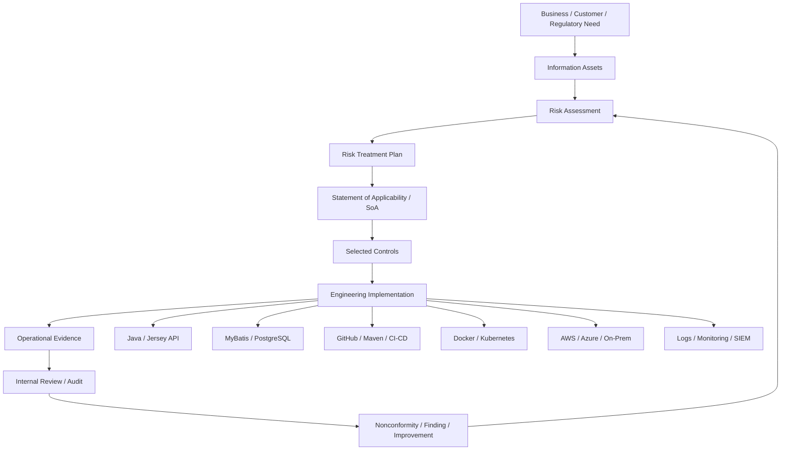

Makna diagram:

- ISO 27001 dimulai dari **asset dan risk**, bukan langsung dari tool.
- Tidak semua kontrol diterapkan sama rata.
- Kontrol dipilih berdasarkan risk treatment.
- Engineer berperan besar di bagian **implementation** dan **evidence**.

---

## 2. ISMS Lifecycle untuk Engineer

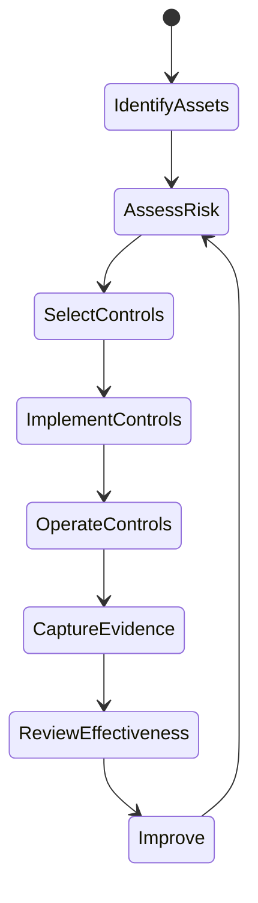

Dalam konteks kerja harian:

```text id="5u7wo0"
New API / DB change / deployment change
-> identify affected asset and data
-> assess risk
-> decide control impact
-> implement secure design
-> produce evidence through normal workflow
-> monitor and improve
```

---

# ISO 27001 Decomposition Map - Practical Categories / Domain / Skills

| No | Area ISO 27001 | Skill / Knowledge untuk Software Engineer | Contoh Implementasi di Stack Anda | Evidence Praktis |
|---:|---|---|---|---|
| 1 | **Context of Organization** | Paham sistem, layanan, customer, data, dan dependency yang masuk ISMS scope. | Service catalog untuk Java/Jersey service, PostgreSQL DB, Kubernetes namespace, GitHub repo. | System boundary diagram, service ownership map. |
| 2 | **ISMS Scope Awareness** | Tahu apakah service masuk scope ISO 27001 dan kenapa. | `case-api`, `billing-api`, `auth-service`, `workflow-engine`, `audit-log-service`. | Scope record, architecture diagram. |
| 3 | **Asset Inventory** | Mengidentifikasi asset informasi: repo, DB, secret, container image, backup, log, API, data set. | GitHub repo, Maven artifact, Docker image, DB schema, Camunda process, Kubernetes secret. | Asset register, CMDB, repo ownership. |
| 4 | **Information Classification** | Menentukan sensitivitas data dan kontrol turunan. | Personal data, case data, customer config, secrets, AI prompt, audit event. | Data classification matrix. |
| 5 | **Risk Assessment** | Menilai threat, likelihood, impact, existing control, residual risk. | Cross-tenant leak, credential exposure, SQL injection, broken authz, data loss. | Risk register, threat model, security review. |
| 6 | **Risk Treatment** | Memilih mitigate, avoid, transfer, accept. | Tambah RBAC, encrypt backup, isolate namespace, patch library, accept temporary exception. | Risk treatment plan, exception ticket. |
| 7 | **Statement of Applicability / SoA** | Memahami kontrol mana yang applicable dan justification-nya. | Tidak semua kontrol fisik dikerjakan app team, tapi technological controls banyak berdampak ke engineer. | SoA mapping ke implementation/evidence. |
| 8 | **Leadership & Accountability** | Paham ownership: siapa pemilik service, data, control, approval, incident. | Service owner, data owner, platform owner, security owner. | RACI, ownership file, CODEOWNERS. |
| 9 | **Policy-to-Code Translation** | Menerjemahkan policy menjadi guardrail teknis. | Password policy, access policy, logging policy, secure coding standard. | Policy mapping, CI checks, PR checklist. |
| 10 | **Secure SDLC** | Security sejak design sampai release. | Threat modeling, secure coding, PR review, SAST/SCA, integration tests. | PR, test report, scan result, release approval. |
| 11 | **Change Management** | Perubahan production harus authorized, tested, reviewed, traceable. | GitHub PR, branch protection, Maven build, deployment approval. | PR link, CI run, deployment record. |
| 12 | **Access Control** | Least privilege untuk user, admin, service account, DB role, cloud role. | Jersey auth filter, DB grants, Kubernetes RBAC, GitHub permissions. | Access matrix, access review record. |
| 13 | **Privileged Access** | Kontrol akses admin/root/production/break-glass. | Production DB admin, Kubernetes cluster-admin, cloud owner role. | Break-glass log, approval ticket, session log. |
| 14 | **Authentication** | Secure authentication untuk user dan service. | OIDC/JWT validation, mTLS, service account token, MFA for admin. | Auth config, test, IdP policy evidence. |
| 15 | **Cryptography** | Memakai crypto dengan benar, termasuk key lifecycle. | TLS, KMS, DB encryption, encrypted backup, signed artifacts. | TLS config, KMS policy, backup encryption evidence. |
| 16 | **Secrets Management** | Secret tidak boleh hardcoded, committed, atau muncul di log. | Vault/AWS Secrets Manager/Azure Key Vault/Kubernetes Secret dengan kontrol akses. | Secret scan result, rotation record. |
| 17 | **Logging** | Log cukup untuk security investigation, tapi tidak membocorkan data sensitif. | Structured JSON log, correlation ID, redaction, audit event. | Log sample, SIEM forwarding config. |
| 18 | **Monitoring** | Deteksi event abnormal dan security-relevant. | Failed login spike, privilege change, unusual export, error rate, pod restart. | Alert rules, dashboard, incident ticket. |
| 19 | **Vulnerability Management** | Identifikasi, triage, patch, dan verify vulnerability. | Maven dependency scan, container image scan, base image patch, CVE SLA. | SCA report, ticket, upgraded dependency PR. |
| 20 | **Malware / Supply Chain Protection** | Mencegah artifact/dependency/image berbahaya masuk pipeline. | Dependency pinning, repository allowlist, image scanning, artifact signing. | SBOM, scan report, provenance. |
| 21 | **Configuration Management** | Config aman dan konsisten lintas environment. | Kubernetes manifests, Helm/Kustomize, env var, feature flag. | Config review, Git history, deployment diff. |
| 22 | **Network Security** | Segmentasi dan kontrol koneksi. | Kubernetes NetworkPolicy, ingress policy, DB firewall, egress allowlist. | Network diagram, policy YAML, test. |
| 23 | **Backup & Restore** | Menjamin availability dan recoverability. | PostgreSQL backup, object storage archive, restore drill. | Backup job log, restore test evidence. |
| 24 | **Capacity & Availability** | Sistem cukup resilient terhadap load/failure. | HPA, resource limits, connection pool, queue backpressure. | SLO dashboard, load test result. |
| 25 | **Incident Management** | Report, triage, contain, eradicate, recover, postmortem. | Security incident runbook, log correlation, token revocation, patch release. | Incident timeline, RCA, corrective actions. |
| 26 | **Supplier / Vendor Security** | Vendor integration tidak memperluas risk tanpa kontrol. | Payment API, AI provider, email/SMS vendor, cloud services. | Vendor inventory, DPA/BAA/security review. |
| 27 | **Cloud Security** | Shared responsibility dan cloud control. | AWS/Azure IAM, KMS, logging, VPC, Kubernetes, managed DB. | Cloud control mapping, config evidence. |
| 28 | **Secure Disposal / Retention** | Data tidak disimpan lebih lama dari kebutuhan. | DB retention job, log retention, file expiry, backup retention. | Retention config, deletion job logs. |
| 29 | **Compliance Evidence Automation** | Evidence lahir otomatis dari proses engineering. | GitHub, CI/CD, monitoring, IAM export, DB audit. | Evidence index, automated report. |
| 30 | **Continual Improvement** | Finding, near miss, incident, dan review menjadi perbaikan sistem. | Hardening backlog, control redesign, regression test. | Corrective action, postmortem, control update. |

---

# ISO 27001 Clause View untuk Engineer

ISO 27001 memiliki struktur manajemen. Engineer tidak perlu menjadi auditor, tapi perlu tahu cara klausul ini muncul dalam pekerjaan teknis.

| Clause Area | Makna Praktis | Dampak ke Engineer |
|---|---|---|
| **4 - Context** | Organisasi menentukan scope, stakeholder, dan batas ISMS. | Engineer harus tahu service mana yang masuk scope dan dependency mana yang relevan. |
| **5 - Leadership** | Ada accountability, policy, dan role. | Ada service owner, code owner, data owner, control owner. |
| **6 - Planning** | Risk assessment dan risk treatment. | Design/security review harus berbasis risk, bukan opini. |
| **7 - Support** | Resource, competence, awareness, communication, documented information. | Engineer perlu training, dokumentasi, runbook, evidence yang rapi. |
| **8 - Operation** | Risk treatment dijalankan. | Kontrol benar-benar diimplementasi dalam code/config/process. |
| **9 - Performance Evaluation** | Monitoring, measurement, internal audit, management review. | Dashboard, alert, review evidence, metrics keamanan. |
| **10 - Improvement** | Nonconformity dan corrective action. | Finding menjadi backlog, RCA, patch, test, control improvement. |

---

# Annex A Themes - Cara Membaca sebagai Engineer

ISO/IEC 27002 memberi best practice dan control objectives untuk area seperti access control, cryptography, HR security, dan incident response. ([ISO](https://www.iso.org/standard/75652.html?utm_source=chatgpt.com)) Dalam ekosistem 27001:2022, Annex A control set biasanya diringkas menjadi empat tema berikut. ([GRC Solutions](https://grcsolutions.io/iso-27001-the-14-control-sets-of-annex-a-explained/?utm_source=chatgpt.com))

| Theme | Fokus | Relevansi Engineering |
|---|---|---|
| **Organizational Controls** | Governance, policies, asset management, supplier, incident, business continuity, compliance. | Service ownership, secure SDLC, vendor integration, incident runbook, evidence. |
| **People Controls** | Awareness, responsibilities, employment lifecycle, remote work, reporting. | Developer awareness, secure coding discipline, event reporting, privileged access behavior. |
| **Physical Controls** | Physical access, equipment, media, secure areas. | Biasanya lebih banyak ke infra/facility, tapi on-prem, laptop, storage media, dan hardware key tetap relevan. |
| **Technological Controls** | Access, authentication, malware, vulnerability, logging, network, encryption, secure coding, backup. | Bagian paling langsung ke Java/Jersey/PostgreSQL/Kubernetes/cloud engineering. |

---

# Deep Mapping ke Stack Anda

## 1. Java / Jersey API

| ISO 27001 Concern | Risiko | Implementasi Praktis |
|---|---|---|
| Access control | User melihat data tanpa hak. | Request filter untuk authN, service-layer authZ, permission matrix. |
| Secure coding | Injection, unsafe deserialization, broken validation. | Bean Validation, allowlist input, safe error response. |
| Logging | Sensitive data bocor ke log. | Structured logging + redaction + no full object logging. |
| Monitoring | Attack/error tidak terdeteksi. | Security event log, failed auth alert, anomaly metrics. |
| Change control | Endpoint sensitif berubah tanpa approval. | CODEOWNERS, PR approval, test gate. |

Contoh API review:

```text id="b0hhkm"
Endpoint:
POST /admin/users/{id}/roles

Risk:
Privilege escalation

Controls:
- MFA required for admin
- RBAC: only security-admin can modify roles
- Audit event emitted
- Change reason mandatory
- Alert on privileged role assignment

Evidence:
- PR approval
- Authz integration test
- Audit log sample
- Alert rule config
```

---

## 2. MyBatis / PostgreSQL

| ISO 27001 Concern | Risiko | Implementasi Praktis |
|---|---|---|
| Information access restriction | Query mengambil data tenant lain. | Wajib `tenant_id`, integration test, optional RLS. |
| Secure coding | SQL injection dari dynamic SQL. | Gunakan `#{}` binding, whitelist untuk identifier/order by. |
| Audit logging | Perubahan penting tidak traceable. | Audit table, trigger/domain event, actor ID. |
| Backup | Data hilang/rusak. | Automated backup + restore drill. |
| Retention | Data disimpan terlalu lama. | Retention job, archive/delete/anonymize. |
| Privileged access | DB admin akses tanpa kontrol. | Separate DB roles, approval, session logging. |

Contoh MyBatis anti-pattern:

```sql id="27sz0x"
SELECT *
FROM customer
WHERE id = #{id}
```

Lebih baik:

```sql id="5oyfsv"
SELECT
    id,
    tenant_id,
    status,
    masked_email
FROM customer
WHERE id = #{id}
  AND tenant_id = #{tenantId}
```

Prinsip ISO 27001-nya: **access restriction harus enforceable dan testable**, bukan hanya tertulis di policy.

---

## 3. GitHub / Maven / CI-CD

| ISO 27001 Concern | Risiko | Implementasi Praktis |
|---|---|---|
| Change management | Perubahan langsung ke main/production. | Branch protection, required review, required checks. |
| Secure SDLC | Vulnerability masuk release. | Maven SCA scan, SAST, test coverage gate. |
| Source code access | Repo sensitif diakses terlalu luas. | GitHub teams, CODEOWNERS, access review. |
| Secrets | Secret commit ke repo. | Secret scanning, pre-commit hooks, no secret in code. |
| Build integrity | Artifact tidak traceable. | Commit SHA → build → image digest → deployment. |

Evidence chain yang bagus:

```text id="nq4oev"
Jira/Ticket
-> GitHub PR
-> reviewer approval
-> CI tests
-> dependency scan
-> container image digest
-> deployment approval
-> Kubernetes rollout
-> monitoring dashboard
```

---

## 4. Docker / Kubernetes

| ISO 27001 Concern | Risiko | Implementasi Praktis |
|---|---|---|
| Configuration hardening | Container running privileged/root. | Non-root user, read-only FS, drop capabilities. |
| Access control | Pod/service account punya privilege berlebihan. | Minimal Kubernetes RBAC. |
| Network security | Service bebas akses DB/namespace lain. | NetworkPolicy, ingress/egress control. |
| Secret handling | Secret bocor via env/log/debug. | External secret manager, limited access. |
| Vulnerability | Base image usang. | Image scanning, patch cadence. |
| Availability | Pod overload/crash. | Requests/limits, probes, autoscaling. |

Contoh Kubernetes review:

```yaml id="al9644"
securityContext:
  runAsNonRoot: true
  readOnlyRootFilesystem: true
  allowPrivilegeEscalation: false
```

---

## 5. AWS / Azure / On-Prem

| ISO 27001 Concern | Risiko | Implementasi Praktis |
|---|---|---|
| Cloud IAM | Broad admin role. | Least privilege role, permission boundary. |
| Key management | Encryption key unmanaged. | KMS/Key Vault, rotation, access logs. |
| Network | Public exposure salah. | Private subnet, security group, firewall. |
| Logging | Cloud control plane tidak diaudit. | CloudTrail/Azure Activity Logs equivalent. |
| Backup | Restore tidak pernah dites. | Scheduled restore drill. |
| On-prem | Physical/network dependency tidak terlihat. | Asset inventory, patching, access control. |

---

# Control-to-Evidence Matrix

| Control Objective | Engineering Control | Evidence yang Kuat |
|---|---|---|
| Only authorized users access sensitive APIs | Jersey auth filter + service-layer permission check | Authz test, PR review, role matrix |
| Code changes are reviewed before release | GitHub branch protection + CODEOWNERS | PR approval, branch rule screenshot/export |
| Vulnerabilities are identified and remediated | Maven SCA + container scanning | Scan report, remediation ticket |
| Secrets are protected | Vault/KMS + secret scanning | Secret manager policy, scan result |
| Sensitive events are logged | Audit event schema + SIEM forwarding | Log sample, dashboard, alert rule |
| Production changes are traceable | CI/CD deployment pipeline | Deployment record, commit SHA, image digest |
| Data is recoverable | Backup + restore test | Backup job log, restore drill report |
| Incidents are handled consistently | Incident runbook + escalation | Incident ticket, timeline, RCA |
| Network is segmented | Kubernetes NetworkPolicy / firewall | Policy YAML, connectivity test |
| Access is periodically reviewed | IAM/GitHub/DB access review | Review record, removed access evidence |

---

# ISO 27001 Risk Thinking untuk Engineer

## Risk Formula Praktis

```text id="1q3z79"
Risk = Threat x Vulnerability x Impact
```

Contoh:

| Scenario | Threat | Vulnerability | Impact | Risk |
|---|---|---|---|---|
| MyBatis query lupa tenant filter | Broken authz / developer mistake | Tidak ada integration test tenant isolation | Data customer bocor | High |
| Secret ada di GitHub history | Credential misuse | Secret scanning tidak aktif | Unauthorized DB/API access | High |
| Backup belum pernah dites restore | DB corruption/ransomware | Restore procedure tidak tervalidasi | Downtime/data loss | High |
| Library Java punya CVE critical | Exploit dependency | Patch SLA tidak jalan | RCE/data breach | Critical |
| Admin role tidak direview | Privilege abuse | Access review tidak berjalan | Unauthorized production change | High |

---

# Risk Treatment Decision

| Treatment | Kapan Dipakai | Contoh Engineering |
|---|---|---|
| **Mitigate** | Risk dikurangi dengan kontrol. | Tambah authz test, patch CVE, encrypt backup. |
| **Avoid** | Aktivitas dihentikan karena terlalu berisiko. | Tidak menerima PAN langsung; pakai payment provider/tokenization. |
| **Transfer** | Sebagian risk dialihkan ke pihak lain, tetap perlu governance. | Managed cloud, payment gateway, cyber insurance. |
| **Accept** | Risk diterima secara sadar dan sementara/permanen. | Legacy dependency exception dengan expiry dan compensating control. |

Yang penting: engineer jangan diam-diam “accept risk” lewat keputusan teknis tanpa dokumentasi.

---

# Statement of Applicability / SoA - Versi Engineer

SoA biasanya dokumen formal compliance, tetapi engineer perlu memahami bentuk sederhananya:

| Control | Applicable? | Reason | Implementation | Evidence | Owner |
|---|---|---|---|---|---|
| Access to source code | Yes | Repo berisi business logic dan security config. | GitHub team, CODEOWNERS, branch protection. | Access review, PR history. | Eng Manager |
| Logging | Yes | Security investigation dan audit trail. | Structured logs + SIEM. | Log sample, SIEM config. | Platform/SRE |
| Management of technical vulnerabilities | Yes | Java dependencies dan container images punya CVE risk. | SCA/image scanning. | Scan report, patch ticket. | Service Team |
| Backup | Yes | PostgreSQL menyimpan critical data. | Daily encrypted backup + restore drill. | Backup log, restore report. | DBA/Platform |
| Data masking | Yes | Personal/restricted data di logs/non-prod. | Redaction + masked dataset. | Test result, config. | Service Team |

---

# Practical ISO 27001 Checklist Saat Mengerjakan Ticket

Gunakan saat design/PR review.

| Area | Pertanyaan |
|---|---|
| Asset | Asset apa yang berubah? API, DB, repo, secret, queue, workflow, cloud config? |
| Data | Data classification apa yang terdampak? |
| Risk | Risiko baru apa yang muncul? |
| Control | Kontrol apa yang harus ada atau berubah? |
| Access | Apakah role/user/service account berubah? |
| Logging | Apakah event security/audit perlu ditambah? |
| Secret | Apakah ada credential/token/key baru? |
| Dependency | Apakah library/container baru aman dan discan? |
| Config | Apakah config production berubah? |
| Backup | Apakah data baru ikut backup/restore/retention? |
| Evidence | Evidence apa yang otomatis tercipta dari PR/CI/deploy/log? |
| Owner | Siapa owner kontrol setelah release? |

---

# Common ISO 27001 Anti-Patterns

| Anti-Pattern | Kenapa Buruk | Perbaikan |
|---|---|---|
| “Sudah ada policy, berarti aman.” | Policy tanpa implementasi/evidence tidak cukup. | Buat control yang enforceable dan auditable. |
| “Security review nanti sebelum audit.” | Terlambat; evidence historis tidak bisa dibuat ulang dengan baik. | Evidence harus lahir dari proses normal. |
| “Semua engineer admin di GitHub/DB.” | Melanggar least privilege dan SoD. | Role-based access + periodic review. |
| “Log semua payload supaya gampang debug.” | Bisa membocorkan personal data, ePHI, PAN, secret. | Structured logging allowlist + redaction. |
| “Dependency scan boleh warning saja.” | Critical CVE bisa ikut production. | Severity gate + exception process. |
| “Backup ada, tapi restore belum pernah dicoba.” | Backup tanpa restore test belum membuktikan recoverability. | Restore drill berkala. |
| “Kubernetes secret aman karena namanya secret.” | Kubernetes Secret bukan magic vault; akses dan handling tetap penting. | KMS/external secret manager/RBAC. |
| “Out-of-scope service bebas kontrol.” | Bisa tetap connected-to-scope atau indirect scope. | Scope evidence + segmentation. |

---

# Mini Case Study - Endpoint Admin Role Update

## Feature

```text id="u7qm1s"
PATCH /admin/users/{userId}/roles
```

## ISO 27001 Risk

| Risk | Dampak |
|---|---|
| Unauthorized privilege escalation | User biasa menjadi admin. |
| Insider misuse | Admin mengubah role tanpa approval. |
| Audit gap | Tidak bisa tahu siapa mengubah role. |
| Broken rollback | Role tidak bisa dikembalikan cepat. |

## Controls

| Control | Implementasi |
|---|---|
| Strong authentication | Admin MFA melalui IdP. |
| Authorization | Hanya `security-admin` bisa ubah privileged roles. |
| Segregation | Untuk role tertentu perlu approval workflow. |
| Audit trail | Event `USER_ROLE_CHANGED`. |
| Alerting | Alert jika privileged role ditambahkan. |
| Change reason | Mandatory reason field. |
| Test | Negative authz tests. |

## Evidence

```text id="rdw7pa"
- PR approval by CODEOWNER
- Unit/integration test for forbidden role change
- Audit log sample
- Alert rule config
- Deployment record
- Access review entry
```

---

# Mini Case Study - Maven Dependency Critical CVE

## Scenario

```text id="cupx4u"
Library X in Java service has critical CVE.
```

## ISO 27001 View

| Element | Isi |
|---|---|
| Asset | Java service, Maven dependency, container image. |
| Risk | Exploit dependency → unauthorized access / RCE / data exposure. |
| Control | Vulnerability management. |
| Treatment | Upgrade dependency, test regression, deploy patch. |
| Evidence | SCA report, PR, CI, release, vulnerability ticket closure. |

## Good Engineering Flow

```text id="ssla1o"
SCA detects CVE
-> ticket created
-> severity assigned
-> owner triages exploitability
-> dependency upgraded
-> tests pass
-> container rebuilt
-> deployment completed
-> scan clean / risk accepted with expiry
```

---

# Minimal ISO 27001 Artifacts untuk Service Owner

Buat dokumen internal pribadi per service:

```text id="y2eryq"
iso27001-service-control-notes.md
```

Isi minimal:

| Section | Isi |
|---|---|
| Service Name | Nama service/module. |
| Owner | Team/person accountable. |
| Assets | Repo, DB, queue, storage, secrets, images, namespace. |
| Data Classification | L0-L4 dan kategori data. |
| Key Risks | Top 5 risk teknis. |
| Controls | Auth, logging, encryption, backup, CI/CD, monitoring. |
| Evidence | PR, CI, scan, deploy, log, dashboard, access review. |
| Open Exceptions | Risk accepted sementara + expiry. |
| Improvement Backlog | Hardening yang belum selesai. |

---

# Roadmap Belajar Singkat

## Hari 1 - Pahami ISMS Flow

Fokus pada:

```text id="963e8k"
asset -> risk -> control -> evidence -> review -> improvement
```

Jangan mulai dari hafalan Annex A.

## Hari 2 - Ambil Satu Service

Buat daftar:

```text id="n80obo"
assets
data
top risks
existing controls
missing evidence
```

## Hari 3 - Review Access dan Change Control

Periksa:

```text id="vmxpu6"
GitHub access
CODEOWNERS
branch protection
CI required checks
production deploy approval
DB access
Kubernetes service account
```

## Hari 4 - Review Logging, Vulnerability, Backup

Periksa:

```text id="mky229"
sensitive data in logs
dependency scan
container scan
backup schedule
restore evidence
alerting
```

## Hari 5 - Buat Control Mapping Mini

Format:

```text id="rsf3eg"
Risk -> Control -> Implementation -> Evidence -> Owner
```

Contoh:

```text id="7qpsnq"
Risk:
Unauthorized access to customer case data

Control:
Least privilege + tenant-aware authorization

Implementation:
Jersey auth filter + service-layer permission check + MyBatis tenant predicate

Evidence:
Authz integration test + PR approval + audit log sample

Owner:
Case Platform Team
```

---

# Output yang Sebaiknya Anda Buat Setelah Seri Ini

Buat satu matrix kecil:

| Risk | Control | Implementation | Evidence | Owner | Gap |
|---|---|---|---|---|---|
| Cross-tenant data leak | Tenant isolation | MyBatis tenant predicate + test | Test report + PR | Service Team | Need query guard |
| Secret leakage | Secret management | Vault/KMS + secret scan | Scan result | Platform | Rotation not automated |
| Unauthorized production change | Change control | Branch protection + deploy approval | PR + deploy log | DevOps | Emergency deploy process unclear |
| Data loss | Backup/restore | PostgreSQL backup + restore drill | Restore report | DBA | Restore not tested monthly |
| Sensitive log leakage | Logging control | Redaction + allowlist fields | Log sample | Service Team | Legacy logger still raw |

---

# Rekomendasi Materi Selanjutnya

Lanjut ke **Seri 5/18 - SOC 2 Type II for Software Engineer**.

Alasannya: ISO 27001 dan SOC 2 sering terlihat mirip, tetapi cara assurance-nya berbeda. ISO 27001 berfokus pada ISMS dan risk management, sedangkan SOC 2 Type II berfokus pada apakah kontrol yang relevan dengan Trust Services Criteria **beroperasi efektif selama periode audit**. Ini penting supaya Anda bisa memahami mengapa PR approval, access review, monitoring, incident ticket, dan deployment evidence harus konsisten dari waktu ke waktu.

**Seri 4/18 selesai.**

---

**Sources:**

- [ISO/IEC 27001:2022 - Information security management ...](https://www.iso.org/standard/27001?utm_source=chatgpt.com)
- [ISO 27001:2022 Annex A Controls Explained - GRC Solutions](https://grcsolutions.io/iso-27001-the-14-control-sets-of-annex-a-explained/?utm_source=chatgpt.com)

## Response:
7/13/2026, 11:15:30 PM

Saya lanjut ke **Seri 5/18 — SOC 2 Type II for Software Engineer**. Fokusnya: membedakan SOC 2 dari ISO 27001, lalu memetakan Trust Services Criteria menjadi kontrol harian seperti PR approval, access review, logging, monitoring, incident, backup, dan release evidence.

# Seri 5/18 - SOC 2 Type II for Software Engineer

## Introduction

**SOC 2 Type II** adalah assurance report untuk service organization. Untuk software engineer, cara paling praktis membacanya adalah:

> SOC 2 Type II ingin membuktikan bahwa kontrol yang relevan terhadap **Security, Availability, Processing Integrity, Confidentiality, dan/atau Privacy** bukan hanya dirancang, tetapi **beroperasi efektif selama periode pemeriksaan**.

AICPA menjelaskan SOC 2 sebagai examination atas kontrol di service organization yang relevan terhadap security, availability, processing integrity, confidentiality, atau privacy. ([AICPA & CIMA](https://www.aicpa-cima.com/resources/landing/system-and-organization-controls-soc-suite-of-services?utm_source=chatgpt.com)) AICPA juga menerbitkan Trust Services Criteria untuk kelima kategori tersebut. ([AICPA & CIMA](https://www.aicpa-cima.com/resources/download/2017-trust-services-criteria-with-revised-points-of-focus-2022?utm_source=chatgpt.com))

Perbedaan praktis dengan ISO 27001:

| ISO 27001 | SOC 2 Type II |
|---|---|
| Management system untuk information security risk. | Attestation report atas kontrol service organization. |
| Fokus pada ISMS, risk treatment, continual improvement. | Fokus pada design dan operating effectiveness kontrol selama periode audit. |
| Ada certification. | Ada auditor report, biasanya dibagikan terbatas ke customer/prospect/regulator tertentu. |
| Sangat risk-management oriented. | Sangat evidence-and-control-operation oriented. |

Untuk engineer, SOC 2 Type II biasanya muncul sebagai permintaan bukti:

```text
Show evidence that:
- production changes were reviewed and approved,
- access was granted based on least privilege,
- terminated users were removed,
- vulnerabilities were remediated,
- incidents were tracked,
- backups were tested,
- monitoring alerts operated,
- security events were logged,
- customer data was protected.
```

---

# Diagram

## 1. SOC 2 Type II Engineering Mental Model

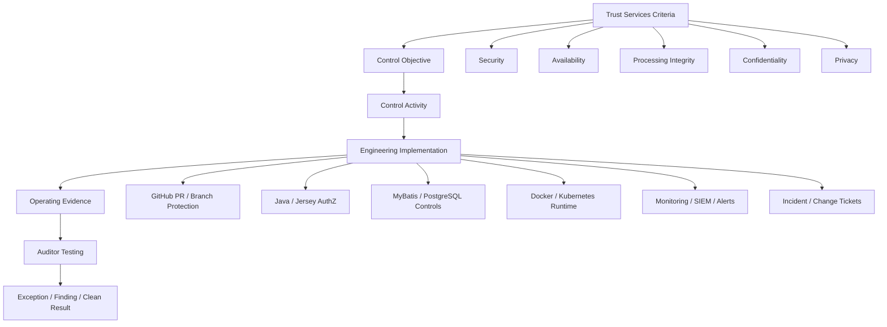

Makna utama:

- SOC 2 bukan hanya “punya kontrol”.
- SOC 2 Type II bertanya: **kontrol berjalan konsisten atau tidak?**
- Evidence harus berasal dari proses normal, bukan dibuat manual menjelang audit.

---

## 2. SOC 2 Type I vs Type II

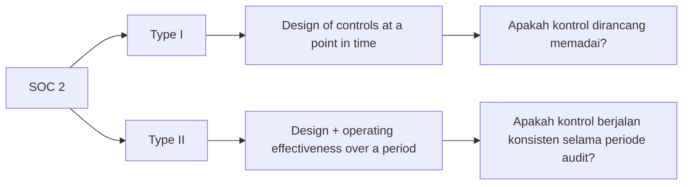

Secara praktik, Type II lebih berat bagi engineering karena auditor akan mengambil sample aktivitas selama periode tertentu: PR, deployment, access grant/removal, vulnerability ticket, incident, backup restore, alert response, dan access review.

---

# Decomposition Map - Practical Categories / Domain / Skills

| No | Area SOC 2 | Skill / Knowledge untuk Software Engineer | Implementasi Praktis di Stack Anda | Evidence yang Biasanya Diminta |
|---:|---|---|---|---|
| 1 | **Trust Services Criteria Literacy** | Paham lima kategori: Security, Availability, Processing Integrity, Confidentiality, Privacy. | Memetakan API, DB, CI/CD, infra, logs ke kategori yang relevan. | Control mapping matrix. |
| 2 | **Control Objective Thinking** | Memahami tujuan kontrol sebelum implementasi. | “Only authorized users can access tenant data.” | Design doc, security requirement. |
| 3 | **Control Activity** | Aktivitas spesifik untuk memenuhi objective. | PR review, access review, vulnerability scan, backup test. | Ticket, PR, report, screenshot/export. |
| 4 | **Operating Effectiveness** | Kontrol berjalan konsisten selama periode audit. | Required PR review tidak boleh dilewati tanpa exception. | Auditor sample: PR list, deploy log, approval record. |
| 5 | **Evidence Quality** | Evidence harus timestamped, traceable, complete, dan sulit dimanipulasi. | GitHub, CI, Kubernetes rollout, SIEM event, ticketing system. | Evidence index. |
| 6 | **Security Criterion** | Melindungi sistem dari unauthorized access, unauthorized disclosure, dan damage. | AuthN/AuthZ, vulnerability management, logging, encryption. | Authz tests, IAM review, scan result. |
| 7 | **Availability Criterion** | Sistem tersedia sesuai komitmen. | SLO/SLA, monitoring, backup, DR, capacity, incident response. | Uptime dashboard, incident report, restore test. |
| 8 | **Processing Integrity Criterion** | Processing complete, valid, accurate, timely, dan authorized. | Idempotency, validation, workflow state control, reconciliation. | Test report, job reconciliation, exception handling log. |
| 9 | **Confidentiality Criterion** | Confidential information dilindungi sesuai komitmen. | Encryption, RBAC, tenant isolation, export control. | Access matrix, log redaction, encryption evidence. |
| 10 | **Privacy Criterion** | Personal information dikumpulkan, digunakan, disimpan, dan dihapus sesuai notice/commitment. | Consent/purpose, DSAR, retention, deletion, data minimization. | Privacy workflow evidence, deletion job logs. |
| 11 | **Change Management** | Perubahan production harus authorized, tested, approved, traceable. | GitHub PR, CODEOWNERS, branch protection, CI/CD approval. | PR approval, CI result, deployment record. |
| 12 | **Logical Access** | Access lifecycle: request, approval, provisioning, review, removal. | GitHub team, DB role, Kubernetes RBAC, cloud IAM. | Access request ticket, access review, termination removal evidence. |
| 13 | **Privileged Access** | Admin/production access dikontrol ketat. | Break-glass, MFA, session logging, limited cluster-admin. | Break-glass ticket, privileged access review. |
| 14 | **Authentication** | User/service identity valid dan kuat. | OIDC, SSO, MFA, service accounts, short-lived tokens. | IdP policy, MFA enforcement evidence. |
| 15 | **Authorization** | Hak akses sesuai role, tenant, ownership, business rule. | Jersey filters + service-layer permission + MyBatis tenant predicate. | Authz test, code review, permission matrix. |
| 16 | **Vulnerability Management** | Deteksi, triage, patch, dan exception CVE. | Maven SCA, container scan, base image update. | Scan report, remediation PR, risk exception. |
| 17 | **Secure SDLC** | Security masuk ke design, coding, review, test, release. | Threat model, SAST/SCA, secure coding checklist. | PR checklist, scan results, design review. |
| 18 | **Incident Management** | Security/availability incident dicatat, ditangani, dan ditutup. | Incident ticket, RCA, corrective action. | Incident timeline, postmortem, closure evidence. |
| 19 | **Monitoring & Alerting** | Event penting terdeteksi dan ditindaklanjuti. | SIEM alert, SLO dashboard, failed login alert, pod restart alert. | Alert rule, alert firing sample, response ticket. |
| 20 | **Audit Logging** | Aktivitas penting tercatat dan bisa ditelusuri. | Audit event schema, correlation ID, actor/action/object/result. | Log sample, retention config, SIEM forwarding. |
| 21 | **Backup & Restore** | Data bisa dipulihkan. | PostgreSQL backup, restore drill, object storage recovery. | Backup logs, restore test result. |
| 22 | **Business Continuity / DR** | Sistem bisa bertahan atau pulih dari failure besar. | DR runbook, failover design, dependency mapping. | DR test, tabletop exercise. |
| 23 | **Data Protection** | Data customer dilindungi dari leakage. | Encryption, masking, redaction, tenant isolation. | Encryption config, redaction tests. |
| 24 | **Vendor Management** | Vendor/subprocessor tidak melemahkan kontrol. | AI provider, payment provider, email/SMS, cloud provider. | Vendor review, DPA/contract/security assessment. |
| 25 | **Configuration Management** | Production config aman dan traceable. | Kubernetes manifests, Helm/Kustomize, feature flags. | Git history, config approval, deployment diff. |
| 26 | **System Operations** | Job, queue, workflow, runtime health dijaga. | Camunda job monitoring, queue backlog alert, retry/DLQ process. | Runbook, alert, job execution logs. |
| 27 | **Customer Commitments** | Kontrol harus sesuai janji kontrak/security statement. | SLA, encryption promise, data retention promise. | Customer control mapping, policy-to-implementation evidence. |
| 28 | **Complementary User Entity Controls / CUECs** | Beberapa kontrol bergantung pada customer. | Customer harus mengelola user sendiri, SSO config, role assignment. | CUEC mapping, product admin guide. |
| 29 | **Exception Handling** | Penyimpangan dari kontrol harus disetujui dan punya expiry. | Emergency deploy, CVE exception, manual production access. | Exception ticket, approval, compensating control. |
| 30 | **Continuous Readiness** | Audit readiness sepanjang tahun. | Evidence automation, monthly control review. | Evidence dashboard, control owner checklist. |

---

# Trust Services Criteria - Engineering View

AICPA Trust Services Criteria mencakup Security, Availability, Processing Integrity, Confidentiality, dan Privacy. ([AICPA & CIMA](https://www.aicpa-cima.com/resources/download/2017-trust-services-criteria-with-revised-points-of-focus-2022?utm_source=chatgpt.com)) Tidak semua SOC 2 report memakai semua kategori; **Security** biasanya common baseline, sedangkan kategori lain dipilih sesuai service commitments dan system scope.

## 1. Security

Pertanyaan praktis:

> Apakah sistem terlindungi dari unauthorized access, unauthorized disclosure, dan perubahan/kerusakan yang tidak sah?

| Engineering Area | Contoh Kontrol |
|---|---|
| AuthN | SSO/OIDC, MFA untuk admin, service account identity. |
| AuthZ | RBAC/ABAC, tenant isolation, case ownership check. |
| Vulnerability | Maven SCA, image scan, patch SLA. |
| Secure SDLC | PR review, branch protection, SAST/SCA, threat modeling. |
| Logging | Security event log, SIEM forwarding. |
| Incident | Runbook, RCA, corrective action. |
| Secrets | Vault/KMS, no Git secrets, rotation. |
| Network | Kubernetes NetworkPolicy, firewall, ingress/egress control. |

Contoh evidence:

```text
- GitHub branch protection configuration
- PR approval sample
- Maven dependency scan result
- Authz integration test
- SIEM alert configuration
- Incident ticket and RCA
```

---

## 2. Availability

Pertanyaan praktis:

> Apakah sistem tersedia sesuai komitmen layanan?

| Engineering Area | Contoh Kontrol |
|---|---|
| Monitoring | SLO dashboard, health checks, latency/error alerts. |
| Capacity | Autoscaling, resource limits, DB connection pool. |
| Resilience | Retry, timeout, circuit breaker, graceful degradation. |
| Backup | Scheduled encrypted backup. |
| Restore | Restore drill/test. |
| DR | DR plan, dependency map, failover test/tabletop. |
| Incident Response | Severity model, escalation, postmortem. |

Contoh evidence:

```text
- Uptime/SLO dashboard
- Alert history
- Backup job logs
- Restore test result
- Incident postmortem
- Capacity review
```

Untuk Java/Jersey microservice, availability tidak hanya tentang Kubernetes “pod running”. Perlu juga melihat:

```text
API latency
DB pool exhaustion
Camunda job backlog
queue retry storm
external vendor timeout
thread pool starvation
memory pressure
slow PostgreSQL query
```

---

## 3. Processing Integrity

Pertanyaan praktis:

> Apakah processing lengkap, valid, akurat, tepat waktu, dan authorized?

Ini sering dilupakan karena engineer menganggap SOC 2 hanya security. Padahal untuk order management, billing, case management, workflow, dan enforcement lifecycle, processing integrity bisa sangat penting.

| Engineering Area | Contoh Kontrol |
|---|---|
| Input validation | Bean Validation, schema validation, business validation. |
| Idempotency | Idempotency key untuk payment/order/workflow submission. |
| Workflow state | Valid state transition di Camunda/domain state machine. |
| Reconciliation | Batch/job result dibandingkan source of truth. |
| Error handling | DLQ, retry policy, compensating transaction. |
| Authorization | Hanya authorized actor bisa trigger processing. |
| Completeness | Semua event/job diproses atau masuk exception queue. |

Contoh evidence:

```text
- Validation tests
- State transition tests
- Reconciliation report
- Job execution logs
- DLQ review ticket
- Idempotency test
```

Contoh control objective:

```text
All customer order state transitions are valid, authorized, auditable, and either completed successfully or captured in an exception workflow.
```

---

## 4. Confidentiality

Pertanyaan praktis:

> Apakah confidential information dilindungi sesuai komitmen?

| Engineering Area | Contoh Kontrol |
|---|---|
| Data classification | Identify confidential/restricted data. |
| Access | Need-to-know access, least privilege. |
| Encryption | TLS, encryption at rest, key management. |
| Logging | Redaction, no full payload logs. |
| Export | Field-level authorization, audit, expiry. |
| Tenant isolation | Prevent cross-tenant data leakage. |
| Vendor sharing | Data minimized and approved. |

Contoh evidence:

```text
- Data classification matrix
- Encryption config
- Access matrix
- Log redaction test
- Tenant isolation integration test
- Export audit event
```

---

## 5. Privacy

Pertanyaan praktis:

> Apakah personal information dikumpulkan, digunakan, disimpan, diungkapkan, dan dihapus sesuai komitmen privacy?

| Engineering Area | Contoh Kontrol |
|---|---|
| Purpose limitation | Field dikumpulkan karena purpose tertentu. |
| Consent/preference | Processing mengikuti consent/config. |
| Retention | Data deletion/anonymization lifecycle. |
| DSAR | Export/access/delete/rectify workflow. |
| Minimization | API/vendor hanya menerima data yang perlu. |
| Privacy incident | Breach assessment dan notification dependency. |

Contoh evidence:

```text
- Retention job logs
- Deletion/anonymization test
- DSAR workflow ticket
- Data inventory
- Vendor data-sharing map
```

---

# SOC 2 Control Operation Lifecycle

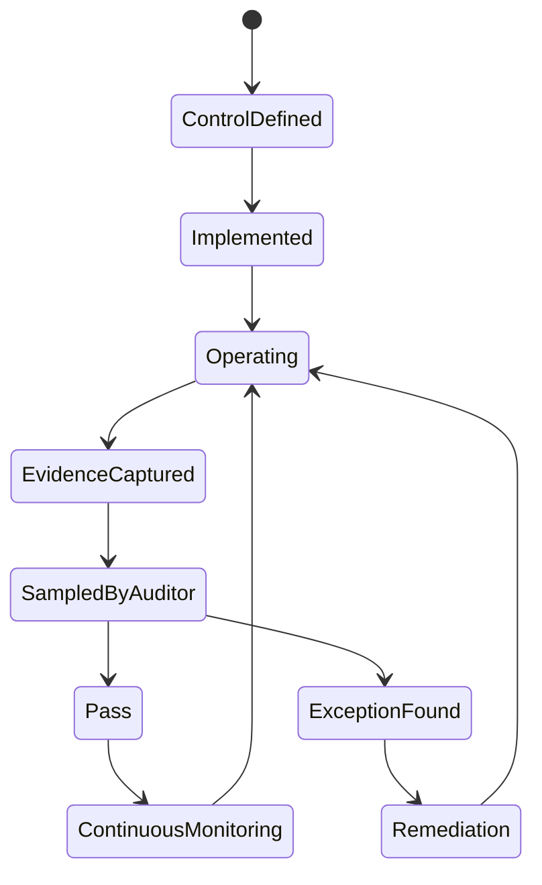

SOC 2 Type II failure sering terjadi bukan karena kontrol tidak ada, tetapi karena:

```text
kontrol ada,
tapi tidak berjalan konsisten,
atau evidence tidak lengkap,
atau ada exception tanpa approval,
atau satu sample gagal.
```

---

# SOC 2 Evidence Patterns

## 1. Strong Evidence

| Evidence | Kenapa Kuat |
|---|---|
| GitHub PR approval | Timestamped, actor jelas, terkait commit. |
| CI/CD run result | Otomatis, timestamped, linked ke build. |
| Container image digest | Traceable ke artifact immutable. |
| Kubernetes deployment history | Menunjukkan release terjadi. |
| IAM access review export | Menunjukkan periodic review. |
| SIEM alert + response ticket | Menunjukkan detect-and-respond. |
| Backup restore report | Membuktikan recoverability, bukan sekadar backup. |
| Vulnerability ticket + PR fix | Menunjukkan remediation. |

## 2. Weak Evidence

| Evidence | Masalah |
|---|---|
| Screenshot tanpa timestamp/context | Sulit diverifikasi. |
| “Kami biasanya review PR” | Klaim, bukan bukti. |
| Manual spreadsheet tidak ada owner | Mudah basi. |
| Policy dokumen saja | Tidak membuktikan operation. |
| Log sample random tanpa control linkage | Tidak jelas membuktikan apa. |

---

# SOC 2 Mapping ke Stack Anda

## 1. GitHub / Maven / CI-CD

| SOC 2 Concern | Control | Implementation | Evidence |
|---|---|---|---|
| Change approval | Production change reviewed. | Branch protection + CODEOWNERS. | PR approval. |
| Testing | Change validated. | Maven test + integration test. | CI test report. |
| Vulnerability | Dependency risk detected. | SCA scan. | SCA report. |
| Build traceability | Artifact linked to source. | Commit SHA + image digest. | Build log, registry digest. |
| Deployment authorization | Production deploy controlled. | Environment approval. | Deployment record. |

Evidence chain ideal:

```text
Ticket
-> PR
-> CODEOWNER approval
-> CI tests
-> SCA scan
-> image digest
-> release approval
-> Kubernetes rollout
-> monitoring check
```

---

## 2. Java / Jersey API

| SOC 2 Concern | Control | Implementation | Evidence |
|---|---|---|---|
| Unauthorized access | AuthN/AuthZ. | Request filter + service-layer permission. | Authz test, code review. |
| Input integrity | Validate request. | Bean Validation + business validation. | Validation tests. |
| Confidentiality | No sensitive leakage. | Response DTO + redaction. | Log sample, negative test. |
| Auditability | Key actions logged. | Audit event emitter. | Audit log sample. |
| Availability | API health monitored. | Health endpoint + metrics. | Dashboard, alert rule. |

Contoh audit event yang baik:

```json
{
  "eventType": "ROLE_UPDATED",
  "actorId": "user-123",
  "targetType": "USER",
  "targetId": "user-456",
  "result": "SUCCESS",
  "correlationId": "req-abc",
  "timestamp": "2026-07-13T16:00:00Z"
}
```

Hindari audit event yang menyimpan full before/after object berisi data sensitif.

---

## 3. MyBatis / PostgreSQL

| SOC 2 Concern | Control | Implementation | Evidence |
|---|---|---|---|
| Tenant confidentiality | Tenant isolation. | `tenant_id` predicate, optional RLS. | Integration test. |
| Processing integrity | Valid data mutation. | Transaction boundaries, constraints, state check. | Test result. |
| Unauthorized DB access | Least privilege DB role. | Separate read/write/admin roles. | DB grants export. |
| Change control | Schema change reviewed. | Liquibase/Flyway PR. | Migration PR approval. |
| Audit trail | Important DB changes tracked. | Audit table/domain event/trigger. | Audit log sample. |
| Availability | Recoverability. | Backup + restore test. | Restore report. |

MyBatis-specific SOC 2 risk:

| Risk | Why SOC 2 Cares |
|---|---|
| Dynamic SQL injection | Security. |
| Missing tenant predicate | Confidentiality/security. |
| Over-fetching sensitive columns | Confidentiality/privacy. |
| No transaction boundary | Processing integrity. |
| Silent partial batch failure | Processing integrity/availability. |
| No migration approval | Change management. |

---

## 4. Docker / Kubernetes

| SOC 2 Concern | Control | Implementation | Evidence |
|---|---|---|---|
| Runtime hardening | Secure container config. | Non-root, drop capabilities, read-only FS. | Manifest evidence. |
| Access control | Least privilege workload identity. | ServiceAccount + RBAC. | RBAC export. |
| Segmentation | Limit network paths. | NetworkPolicy. | Policy YAML + connectivity test. |
| Availability | Restart/probe/autoscale. | Liveness/readiness probes, HPA. | Deployment config + metrics. |
| Vulnerability | Image scanning. | Registry scanner. | Scan report. |
| Change traceability | GitOps/deploy record. | Commit-to-rollout linkage. | Deployment history. |

---

## 5. AWS / Azure / On-Prem

| SOC 2 Concern | Control | Implementation | Evidence |
|---|---|---|---|
| Cloud IAM | Least privilege. | IAM roles/groups/policies. | Access review export. |
| Logging | Control plane activity captured. | Cloud audit logs. | Log config/sample. |
| Encryption | Data at rest protected. | KMS/Key Vault. | Key policy/config. |
| Network | Exposure limited. | Security groups/firewall/private subnet. | Network config. |
| Backup | Recoverability. | Managed backup/snapshot. | Backup + restore evidence. |
| DR | Resilience. | Region/site failover plan. | DR test/tabletop. |

---

# Sample SOC 2 Controls for Engineering

## Control 1 - Code Changes

```text
Control Objective:
Production application changes are authorized, reviewed, tested, and traceable.

Control Activity:
All production code changes require pull request approval by authorized reviewers and successful CI checks before merge.

Implementation:
GitHub branch protection, CODEOWNERS, required Maven tests, SCA scan.

Evidence:
PR approval, CI run, SCA result, deployment record.
```

Failure mode:

```text
Emergency hotfix merged directly to main without approval and no exception ticket.
```

Correct response:

```text
Create exception record, document business reason, retrospective review, add preventive guardrail.
```

---

## Control 2 - Logical Access

```text
Control Objective:
Access to production systems is granted based on least privilege and removed when no longer needed.

Control Activity:
Production access requires approval, is reviewed periodically, and is removed upon role change or termination.

Implementation:
GitHub teams, Kubernetes RBAC, DB roles, cloud IAM, SSO groups.

Evidence:
Access request ticket, approval, access review export, deprovisioning ticket.
```

Failure mode:

```text
Former team member still has production DB read access.
```

---

## Control 3 - Vulnerability Management

```text
Control Objective:
Security vulnerabilities are identified, prioritized, and remediated in accordance with risk.

Control Activity:
Java dependencies and container images are scanned; high/critical vulnerabilities are tracked to remediation or approved exception.

Implementation:
Maven SCA, container scan, CVE triage SLA, exception process.

Evidence:
Scan report, remediation PR, ticket closure, exception approval.
```

---

## Control 4 - Backup and Restore

```text
Control Objective:
Critical data can be restored after data loss or system failure.

Control Activity:
PostgreSQL backups are performed regularly and restore tests are conducted periodically.

Implementation:
Encrypted DB backup, object storage lifecycle, restore drill.

Evidence:
Backup job logs, restore test report, issue ticket for failed restore.
```

Important: backup existence alone is weaker than **restore evidence**.

---

## Control 5 - Security Logging

```text
Control Objective:
Security-relevant events are logged, monitored, and retained for investigation.

Control Activity:
Authentication failures, privilege changes, data exports, admin actions, and security events are forwarded to SIEM.

Implementation:
Structured logs, audit event schema, redaction, SIEM forwarding.

Evidence:
Log sample, SIEM query, alert rule, incident ticket if triggered.
```

---

# SOC 2 Readiness Checklist untuk Engineer

Gunakan checklist ini saat PR/design/release.

| Area | Question |
|---|---|
| Change | Apakah perubahan punya PR, reviewer, CI pass, dan deployment trace? |
| Scope | Apakah perubahan menyentuh system/data dalam SOC 2 scope? |
| Security | Apakah authN/authZ berubah atau perlu test baru? |
| Availability | Apakah perubahan memengaruhi latency, retry, timeout, capacity, dependency? |
| Processing Integrity | Apakah perubahan bisa menyebabkan duplicate, missing, invalid, atau unauthorized processing? |
| Confidentiality | Apakah data confidential bisa masuk response/log/export/vendor? |
| Privacy | Apakah personal data baru dikumpulkan/disimpan/dikirim/dihapus? |
| Access | Apakah role/service account/permission berubah? |
| Logging | Apakah audit event cukup dan redacted? |
| Vulnerability | Apakah dependency/image baru discan? |
| Backup/DR | Apakah data baru ikut backup/restore/retention? |
| Evidence | Evidence apa yang akan auditor lihat 3-12 bulan lagi? |

---

# SOC 2 Failure Modes

| Failure Mode | Contoh | Dampak |
|---|---|---|
| **Control exists but not enforced** | Branch protection off untuk repo tertentu. | Auditor sample gagal. |
| **Control bypass tanpa exception** | Emergency deploy langsung ke prod. | Change management exception/finding. |
| **Evidence fragmented** | PR ada, deploy record tidak bisa dilink ke commit. | Traceability lemah. |
| **Access review formalitas** | Reviewer approve tanpa tahu user masih butuh akses. | Logical access control lemah. |
| **No removal evidence** | User keluar team tapi akses tidak dicabut tepat waktu. | Access lifecycle finding. |
| **Vulnerability exception tanpa expiry** | Critical CVE dibiarkan tanpa remediation date. | Vulnerability management gap. |
| **Backup tidak pernah restore-tested** | Backup job sukses tapi restore gagal. | Availability control gagal. |
| **Log mengandung sensitive data** | Debug log dump request body. | Confidentiality/privacy/security issue. |
| **Monitoring alert tidak ditindaklanjuti** | Alert firing tapi tidak ada ticket/response. | Monitoring control operation lemah. |
| **Manual control tanpa owner** | Monthly review tidak dilakukan karena owner pindah team. | Operating effectiveness failure. |

---

# Evidence Automation Strategy

Untuk SOC 2 Type II, semakin banyak evidence otomatis, semakin rendah risiko audit chaos.

## Evidence Sources

| Source | Evidence |
|---|---|
| GitHub | PR approval, branch protection, CODEOWNERS, review history. |
| GitHub Actions | CI test, SCA scan, build result. |
| Artifact Registry | Container image digest, scan result. |
| Kubernetes | Deployment history, manifest, RBAC, NetworkPolicy. |
| IAM/SSO | Access grant/removal, MFA policy, group membership. |
| Ticketing | Change ticket, access ticket, incident ticket, vulnerability ticket. |
| SIEM/APM | Security event, alert, incident response. |
| PostgreSQL | Backup logs, audit table, role grants. |
| Monitoring | Uptime, SLO, alert rule, incident correlation. |

## Ideal Evidence Index

```text
Control ID:
SOC2-CC-CHANGE-001

Control:
Production changes are reviewed and tested before deployment.

Evidence Source:
GitHub PR + CI + deployment pipeline

Evidence Frequency:
Per change

Owner:
Service team

Sample Query:
List all production deployments in audit period and linked PR/CI status.

Failure Handling:
If emergency deploy bypasses review, create exception ticket and retrospective approval.
```

---

# SOC 2 untuk Workflow / Camunda / Case Management

Karena Anda bekerja dengan enforcement lifecycle / case management style systems, SOC 2 bukan hanya infra-security. Banyak kontrol menyentuh **workflow correctness**.

| Workflow Concern | SOC 2 Category | Engineering Control |
|---|---|---|
| Invalid state transition | Processing Integrity | State machine guard + test. |
| Unauthorized approval | Security / Processing Integrity | Role + assignment check. |
| Missing audit trail | Security / Confidentiality | Actor/action/object/result event. |
| Duplicate task execution | Processing Integrity | Idempotency key + optimistic locking. |
| Stuck workflow | Availability / Processing Integrity | SLA monitor + stuck-job alert. |
| Sensitive process variable | Confidentiality / Privacy | Store reference, not full payload. |
| Manual override | Security / Processing Integrity | Approval + reason + audit. |
| Batch reconciliation | Processing Integrity | Source-target count validation. |

Contoh control objective:

```text
Case decisions can only move from REVIEW_PENDING to APPROVED when performed by an authorized reviewer assigned to the case, and every transition is logged with actor, timestamp, previous state, new state, and result.
```

---

# Mini Case Study - Customer Data Export

## Feature

```text
GET /customers/export?tenantId=...
```

## SOC 2 Risk

| Risk | Category |
|---|---|
| Unauthorized bulk export | Security / Confidentiality |
| Export contains personal data beyond user permission | Confidentiality / Privacy |
| Export job fails partially but reports success | Processing Integrity |
| Export file remains downloadable forever | Confidentiality / Privacy |
| Large export degrades service | Availability |

## Controls

| Control | Implementation |
|---|---|
| Authorization | Export permission + tenant role check. |
| Approval | Bulk export requires elevated approval. |
| Field filtering | Role-based export fields. |
| Audit event | `CUSTOMER_EXPORT_REQUESTED`, `CUSTOMER_EXPORT_DOWNLOADED`. |
| Expiry | Temporary signed URL with short TTL. |
| Monitoring | Alert on unusual export volume. |
| Integrity | Row count and checksum stored. |
| Privacy | Export includes only allowed fields. |

## Evidence

```text
- PR approval
- Authz integration test
- Export audit log sample
- Expiry configuration
- Alert rule
- Export job reconciliation log
```

---

# Mini Case Study - Production Access Request

## Scenario

Engineer needs temporary production DB read access for incident debugging.

## Good SOC 2 Flow

```text
Access request ticket
-> business justification
-> manager/service owner approval
-> time-bound access granted
-> privileged session logged
-> access removed after expiry
-> evidence retained
```

## Bad Flow

```text
"Tambahin aja dia ke prod-read group, nanti dicabut."
```

Masalahnya bukan hanya aksesnya, tetapi tidak ada bukti approval, duration, removal, dan review.

---

# Pull Request SOC 2 Checklist

Tambahkan mental checklist ini di PR review:

| Area | Question |
|---|---|
| AuthZ | Apakah role/tenant/case ownership diverifikasi? |
| Data | Apakah data confidential/personal/ePHI/PAN muncul di response/log/export? |
| Audit | Apakah action penting punya audit event? |
| Integrity | Apakah state transition valid dan idempotent? |
| Failure | Apa yang terjadi jika DB/vendor/Camunda call gagal? |
| Availability | Apakah timeout/retry/backpressure aman? |
| Change | Apakah migration/deploy bisa rollback? |
| Evidence | Apakah test/CI/PR cukup membuktikan kontrol? |
| Monitoring | Apakah ada metric/alert untuk failure penting? |
| Access | Apakah permission/service account baru minimal? |

---

# Common Misconceptions

| Misconception | Koreksi |
|---|---|
| “SOC 2 itu security certification.” | SOC 2 adalah attestation/report atas kontrol service organization, bukan certification seperti ISO. |
| “SOC 2 Type II cuma butuh policy.” | Type II butuh bukti kontrol beroperasi efektif selama periode audit. |
| “Kalau semua PR direview, pasti aman.” | Review harus berlaku untuk repo/scope yang benar, reviewer kompeten, dan exception terkendali. |
| “Availability cukup dengan Kubernetes restart.” | Availability juga butuh monitoring, capacity, dependency resilience, backup/restore, incident response. |
| “Processing integrity hanya urusan QA.” | Salah. State machine, idempotency, reconciliation, validation, dan authorization adalah engineering control. |
| “Log sebanyak mungkin membantu audit.” | Log yang bocor data sensitif bisa menjadi masalah confidentiality/privacy. |
| “Evidence bisa dikumpulkan nanti.” | Untuk Type II, evidence historis harus ada sepanjang periode. |

---

# Roadmap Belajar Singkat

## Hari 1 - Pahami Trust Services Criteria

Fokus dulu pada lima kategori:

```text
Security
Availability
Processing Integrity
Confidentiality
Privacy
```

Untuk setiap service, tanyakan kategori mana yang paling relevan.

## Hari 2 - Mapping Kontrol Harian

Ambil satu service dan mapping:

```text
PR review
CI test
SCA scan
deployment approval
access review
audit log
backup
monitoring
incident response
```

## Hari 3 - Evidence Chain

Buat evidence chain untuk satu deployment terakhir:

```text
Ticket -> PR -> CI -> image -> deploy -> monitor
```

Cari apakah ada link yang putus.

## Hari 4 - Access dan Vulnerability Review

Periksa:

```text
GitHub access
DB access
Kubernetes RBAC
cloud IAM
service account
critical CVE
container image scan
```

## Hari 5 - Processing Integrity Review

Untuk workflow/order/case service, review:

```text
valid state transitions
authorization per transition
idempotency
retry and DLQ
reconciliation
audit trail
```

---

# Output yang Sebaiknya Anda Buat Setelah Seri Ini

Buat dokumen internal pribadi:

```text
soc2-service-control-map.md
```

Isi minimal:

| Section | Isi |
|---|---|
| Service Scope | Service, repo, DB, runtime, owner. |
| Applicable TSC | Security, Availability, Processing Integrity, Confidentiality, Privacy. |
| Key Controls | Change, access, logging, vulnerability, backup, monitoring. |
| Evidence Sources | GitHub, CI, Kubernetes, SIEM, IAM, ticketing. |
| Control Gaps | Missing test, missing alert, weak evidence, unclear owner. |
| Exceptions | Emergency deploy, CVE exception, temporary access. |
| Audit Questions | Pertanyaan yang mungkin muncul dari auditor/customer. |

Contoh mini matrix:

| TSC | Risk | Control | Implementation | Evidence |
|---|---|---|---|---|
| Security | Unauthorized tenant access | Tenant-aware authz | Jersey filter + MyBatis predicate | Integration test + PR |
| Availability | DB outage causes API failure | Backup/restore + alerting | PostgreSQL backup + health alert | Restore test + dashboard |
| Processing Integrity | Duplicate workflow transition | Idempotency + state guard | Camunda business key + DB constraint | Test + job log |
| Confidentiality | Sensitive data leaked in logs | Redaction | Structured logging allowlist | Log sample + test |
| Privacy | Personal data retained too long | Retention job | Scheduled anonymization | Job log + deletion test |

---

# Rekomendasi Materi Selanjutnya

Lanjut ke **Seri 6/18 - CSA STAR Level 1 & Level 2 for Cloud Services**.

Kenapa: setelah memahami SOC 2, CSA STAR akan lebih mudah karena banyak kontrol cloud assurance bisa dipetakan ke SOC 2/ISO 27001, tetapi fokusnya lebih spesifik ke **cloud control transparency, CSA Cloud Controls Matrix, CAIQ, shared responsibility, tenant isolation, logging, encryption, vulnerability, IAM, dan cloud/Kubernetes evidence**.

**Seri 5/18 selesai.**

---

**Sources:**

- [System and Organization Controls: SOC Suite of Services](https://www.aicpa-cima.com/resources/landing/system-and-organization-controls-soc-suite-of-services?utm_source=chatgpt.com)

## Response:
7/13/2026, 11:17:48 PM

Saya lanjut ke **Seri 6/18 — CSA STAR Level 1 & Level 2 for Cloud Services**. Di sini saya akan tekankan sisi cloud assurance: CSA CCM/CAIQ, shared responsibility, tenant isolation, cloud/Kubernetes evidence, dan bagaimana ini nyambung ke SOC 2/ISO 27001.

# Seri 6/18 - CSA STAR Level 1 & Level 2 for Cloud Services

## Introduction

**CSA STAR** adalah framework assurance untuk cloud security, trust, assurance, dan risk. Untuk software engineer, cara paling praktis membacanya adalah:

> CSA STAR membantu customer dan auditor memahami apakah layanan cloud punya kontrol keamanan dan privacy yang jelas, terdokumentasi, dapat dibandingkan, dan - untuk Level 2 - tervalidasi pihak ketiga.

CSA STAR sangat relevan untuk environment **AWS, Azure, Kubernetes, on-prem hybrid, SaaS platform, managed service, dan enterprise cloud services**. CSA menjelaskan bahwa **STAR Level 1** adalah self-assessment menggunakan **CAIQ** berbasis **Cloud Controls Matrix / CCM**, sedangkan **STAR Level 2** adalah third-party assessment yang dapat berupa STAR Attestation untuk SOC 2 atau STAR Certification untuk ISO/IEC 27001. ([Cloud Security Alliance](https://cloudsecurityalliance.org/star))

Baseline terbaru yang perlu dipegang pada 2026: CSA merilis **Cloud Controls Matrix and CAIQ v4.1** pada Januari 2026. CCM v4.1 berisi **207 controls across 17 security domains**, dan CAIQ v4.1 adalah security questionnaire yang dapat digunakan untuk STAR Level 1 submission. ([Cloud Security Alliance](https://cloudsecurityalliance.org/artifacts/cloud-controls-matrix-v4-1)) CSA juga menyatakan bahwa v4.1 menggantikan CCM v4.0.13, dan STAR Registry menerima v4.0 maupun v4.1 dalam masa transisi sampai **Desember 2027**, setelah itu submission baru harus memakai v4.1. ([Cloud Security Alliance](https://cloudsecurityalliance.org/blog/2026/02/19/ccm-v4-1-transition-timeline))

---

# Diagram

## 1. CSA STAR Assurance Model

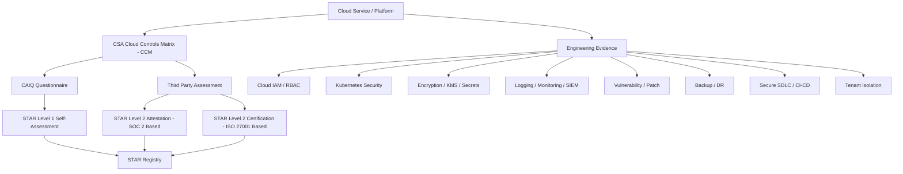

---

## 2. Shared Responsibility Model

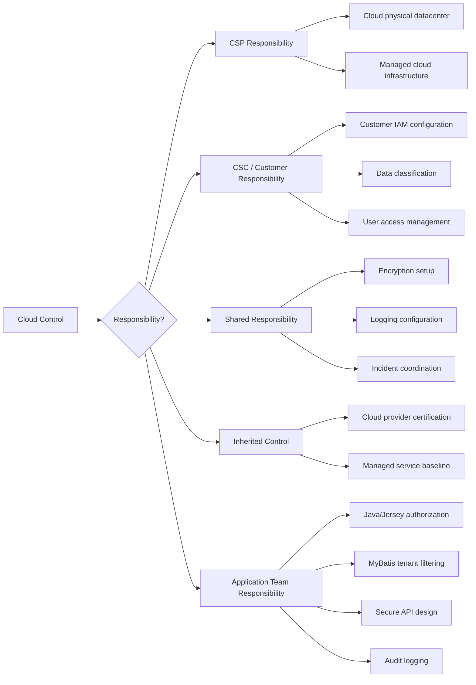

CSA menekankan bahwa CCM membantu memperjelas security roles antara cloud service provider dan customer melalui shared responsibility model. ([Cloud Security Alliance](https://cloudsecurityalliance.org/research/cloud-controls-matrix)) Untuk engineer, ini berarti: jangan menganggap “sudah di AWS/Azure” otomatis compliance selesai. Banyak kontrol tetap berada di application team.

---

# CSA STAR Level 1 vs Level 2

| Area | STAR Level 1 | STAR Level 2 |
|---|---|---|
| Nature | Self-assessment. | Third-party assessment. |
| Basis | CAIQ berbasis CCM. | CCM + SOC 2 attestation atau ISO/IEC 27001 certification path. |
| Purpose | Transparency dan baseline cloud control disclosure. | Higher assurance melalui audit/certification pihak ketiga. |
| Evidence Depth | Jawaban questionnaire + supporting evidence internal. | Auditor-tested evidence. |
| Output | Public registry self-assessment. | Registry entry dengan certification/attestation. |
| Engineer Impact | Menjawab “apakah kontrol ada?” | Membuktikan “kontrol berjalan dan bisa diuji.” |
| Dependency | Bisa menjadi langkah awal. | CSA menyebut Level 1 sebagai prerequisite untuk Level 2. ([Cloud Security Alliance](https://cloudsecurityalliance.org/blog/2024/03/23/csa-star-level-2-all-about-star-attestations-and-certifications)) |

---

# Decomposition Map - Practical Categories / Domain / Skills

| No | Area CSA STAR / CCM | Skill / Knowledge untuk Software Engineer | Implementasi Praktis di Stack Anda | Evidence Praktis |
|---:|---|---|---|---|
| 1 | **CSA STAR Literacy** | Paham Level 1, Level 2, CAIQ, CCM, STAR Registry, shared responsibility. | Bisa menjawab security questionnaire tanpa menebak. | CAIQ response, control mapping. |
| 2 | **CCM v4.1 Awareness** | Paham CCM sebagai cloud security/privacy control framework. | Mapping kontrol ke AWS/Azure/Kubernetes/app layer. | CCM-to-control matrix. |
| 3 | **CAIQ Response Discipline** | Menjawab yes/no dengan bukti, bukan klaim. | “Yes, Kubernetes NetworkPolicy enforced in prod namespace.” | Config, screenshot/export, test result. |
| 4 | **Shared Responsibility Mapping** | Memisahkan tanggung jawab cloud provider, platform team, app team, customer. | AWS/Azure managed service vs app security. | Responsibility matrix. |
| 5 | **Cloud Asset Inventory** | Mencatat cloud resources, namespace, service, DB, storage, IAM role, secret, image. | Kubernetes namespace, RDS/PostgreSQL, AKS/EKS, container registry. | Asset inventory, IaC repo. |
| 6 | **Cloud Data Flow Mapping** | Memetakan data masuk/keluar cloud, region, vendor, tenant, storage, log. | API → DB → object storage → SIEM → vendor. | Cloud data-flow diagram. |
| 7 | **Tenant Isolation** | Mencegah customer/tenant A mengakses data tenant B. | Tenant-aware MyBatis query, namespace isolation, cache key tenant-aware. | Isolation test, code review. |
| 8 | **Identity & Access Management** | IAM user/group/role, service account, workload identity, privileged access. | AWS IAM/Azure RBAC, Kubernetes RBAC, GitHub teams. | Access review, RBAC export. |
| 9 | **Privileged Access Control** | Kontrol admin/cloud root/cluster-admin/DB admin. | Break-glass, MFA, JIT access, session logging. | Approval ticket, access logs. |
| 10 | **Secrets Management** | Secret lifecycle: storage, injection, rotation, revocation. | Vault/KMS/Key Vault/Secrets Manager, Kubernetes external secret. | Rotation record, secret scan. |
| 11 | **Encryption & Key Management** | TLS, encryption at rest, KMS/HSM, key rotation, customer-managed keys. | PostgreSQL encryption, object storage encryption, KMS policy. | KMS config, TLS scan. |
| 12 | **Network Security** | Ingress, egress, private network, firewall, WAF, NetworkPolicy, segmentation. | API Gateway/Ingress, Kubernetes NetworkPolicy, security group. | Network diagram, policy YAML. |
| 13 | **Logging & Monitoring** | Cloud control plane logs, app logs, audit logs, security alerts. | SIEM forwarding, structured JSON logs, Kubernetes audit, cloud activity logs. | Alert rule, log sample. |
| 14 | **Threat & Vulnerability Management** | CVE detection, patching, container image scan, dependency scan. | Maven SCA, image scanning, base image patching. | Scan result, remediation PR. |
| 15 | **Secure SDLC** | Secure design, code review, SAST/SCA, CI/CD gate, artifact traceability. | GitHub Actions, CODEOWNERS, Maven build, signed images. | PR approval, CI report. |
| 16 | **Configuration & Change Management** | Cloud/IaC config must be reviewed and traceable. | Helm/Kustomize/Terraform/GitOps. | Git history, deployment diff. |
| 17 | **Backup, DR & Resilience** | Backup, restore test, RPO/RTO, failover, dependency resilience. | PostgreSQL backup, object storage lifecycle, DR runbook. | Restore report, DR test. |
| 18 | **Incident Response** | Detect, triage, contain, notify, recover, postmortem. | SIEM alert, incident ticket, token revocation, hotfix. | Incident timeline, RCA. |
| 19 | **Supply Chain / Third Party** | Vendor/cloud dependency, subprocessor, AI provider, payment provider. | Vendor API inventory, DPA/security review. | Vendor assessment. |
| 20 | **Data Security & Privacy** | Data classification, retention, deletion, masking, regionality. | DB column classification, log redaction, retention jobs. | Data matrix, deletion logs. |
| 21 | **Cloud Runtime Hardening** | Pod/container/node security. | Non-root container, read-only FS, restricted RBAC, resource limits. | Manifest evidence. |
| 22 | **Observability & Evidence Automation** | Evidence generated continuously. | Dashboards, policy-as-code reports, scan exports. | Evidence dashboard. |
| 23 | **Customer Transparency** | Clear answers to enterprise customer questionnaire. | Security docs, architecture appendix, CUECs. | Trust packet, CAIQ response. |
| 24 | **STAR Level 2 Readiness** | Prepare controls for third-party testing. | SOC 2/ISO evidence reuse mapped to CCM. | Audit packet. |

---

# CCM / CAIQ Practical View

CSA describes CCM v4.1 as a cloud cybersecurity control framework with **207 controls across 17 security domains**, and CAIQ as a set of yes/no questions for assessing controls. ([Cloud Security Alliance](https://cloudsecurityalliance.org/artifacts/cloud-controls-matrix-v4-1)) For software engineer, CAIQ questions should be translated into four things:

```text id="zzjr3o"
Question
-> Control objective
-> Technical implementation
-> Evidence
```

Contoh:

| CAIQ-style Question | Control Objective | Engineering Implementation | Evidence |
|---|---|---|---|
| Is access to cloud systems restricted based on least privilege? | Prevent unauthorized access. | IAM roles, Kubernetes RBAC, DB grants. | Access matrix, access review export. |
| Are logs collected and monitored? | Detect suspicious activity. | App logs + cloud activity logs + SIEM alerts. | Log sample, alert rule. |
| Are vulnerabilities identified and remediated? | Reduce exploit risk. | Maven SCA, image scan, patch SLA. | Scan report, remediation ticket. |
| Is data encrypted at rest and in transit? | Protect confidentiality. | TLS, KMS, DB/storage encryption. | TLS/KMS config. |
| Are changes reviewed before production deployment? | Prevent unauthorized/unsafe change. | GitHub PR, branch protection, CI gate. | PR approval, CI run, deployment record. |

---

# CSA STAR Mapping ke Stack Anda

## 1. Java / Jersey API

| CSA Concern | Risiko | Implementasi Praktis | Evidence |
|---|---|---|---|
| API security | Unauthorized access, broken object-level authorization. | OIDC/JWT validation, resource filter, service-layer authorization. | Authz integration test. |
| Data exposure | Sensitive data leaked via response/error. | Explicit response DTO, safe error model, redaction. | Test + log sample. |
| Tenant isolation | Cross-tenant data leak. | Tenant context enforced across service and MyBatis layer. | Tenant isolation tests. |
| Auditability | No forensic trail. | Structured audit events. | Audit log sample. |
| Availability | API overload/dependency timeout. | Timeout, retry, circuit breaker, health check. | Dashboard, alert config. |

---

## 2. MyBatis / PostgreSQL

| CSA Concern | Risiko | Implementasi Praktis | Evidence |
|---|---|---|---|
| Data security | Sensitive DB data overexposed. | Explicit column selection, DB grants, masking. | DB classification matrix. |
| Tenant isolation | Query missing tenant filter. | Mapper standards, integration tests, optional RLS. | Test report. |
| Processing integrity | Partial/duplicate mutation. | Transaction boundaries, constraints, idempotency. | Test + reconciliation report. |
| Backup | Data unrecoverable. | Encrypted backup + restore drill. | Restore test result. |
| Audit | DB changes not traceable. | Domain event/audit table/trigger. | Audit sample. |

MyBatis-specific cloud risk: dynamic SQL with `${}` can become injection path or unsafe query composition. Use bind parameters and whitelisted dynamic identifiers.

---

## 3. Kubernetes

| CSA Concern | Risiko | Implementasi Praktis | Evidence |
|---|---|---|---|
| Workload identity | Pod overprivileged. | Minimal ServiceAccount, workload identity. | RBAC export. |
| Runtime hardening | Container escape/escalation. | Non-root, no privilege escalation, read-only filesystem. | Manifest evidence. |
| Segmentation | Pod can reach sensitive service unnecessarily. | NetworkPolicy, namespace isolation. | Policy + connectivity test. |
| Secrets exposure | Secret visible to too many workloads. | External secrets, RBAC, no secret in ConfigMap. | Secret access review. |
| Availability | Pod crash/overload. | Probes, HPA, resource requests/limits. | Deployment config + metrics. |
| Image risk | Vulnerable base image. | Image scanning, pinned base image. | Scan report. |

Contoh hardened deployment fragment:

```yaml id="jaj1cu"
securityContext:
  runAsNonRoot: true
  allowPrivilegeEscalation: false
  readOnlyRootFilesystem: true
```

---

## 4. AWS / Azure / Hybrid / On-Prem

| CSA Concern | AWS/Azure/On-Prem Practical Control | Evidence |
|---|---|---|
| Cloud IAM | Least privilege role, MFA, JIT/break-glass. | IAM policy export, access review. |
| Network | Private subnet, security group/firewall, WAF, egress allowlist. | Network diagram, firewall rules. |
| Logging | Cloud activity logs, Kubernetes logs, app audit logs. | Log config, SIEM query. |
| Encryption | KMS/Key Vault, storage encryption, TLS. | Key policy, encryption config. |
| Backup | Managed backup/snapshot + restore test. | Backup logs, restore test. |
| DR | Region/site failover or recovery plan. | DR runbook/test. |
| On-prem | Physical/network/patch boundary. | Asset inventory, patch report. |
| Hybrid | Consistent identity, logging, segmentation. | Responsibility matrix. |

---

# CSA STAR Level 1 - Engineering Checklist

Level 1 adalah self-assessment, tetapi jangan diperlakukan sebagai “isi kuesioner asal yes”. CSA menyatakan self-assessment membantu mendokumentasikan security controls dan dipublikasikan untuk transparansi, dengan update tahunan. ([Cloud Security Alliance](https://cloudsecurityalliance.org/star))

## Langkah Praktis

| Step | Aktivitas | Output |
|---:|---|---|
| 1 | Tentukan cloud service scope. | Service boundary + cloud architecture. |
| 2 | Download/gunakan CAIQ v4.1 yang sesuai submission. | CAIQ working file. |
| 3 | Jawab berdasarkan evidence, bukan asumsi. | Yes/no + explanation. |
| 4 | Map jawaban ke controls. | CAIQ-to-control matrix. |
| 5 | Kumpulkan evidence teknis. | Evidence folder/index. |
| 6 | Review gap. | Remediation backlog. |
| 7 | Submit ke STAR Registry jika organisasi memilih. | Registry entry. |

## CAIQ Answer Quality

| Jawaban | Kualitas |
|---|---|
| “Yes, because we use AWS.” | Lemah. Tidak menjelaskan kontrol customer/app layer. |
| “Yes, production workloads run in private Kubernetes namespaces with NetworkPolicy, ingress restricted via API gateway, and egress limited to approved endpoints.” | Kuat. Spesifik dan testable. |
| “No.” | Bisa diterima jika jujur dan ada remediation plan. |
| “N/A.” | Harus punya justification kuat. |

---

# CSA STAR Level 2 - Engineering Checklist

STAR Level 2 melibatkan third-party audit oleh certified STAR auditors. CSA menjelaskan bahwa Level 2 dapat berupa **STAR Attestation for SOC 2** atau **STAR Certification for ISO/IEC 27001**; STAR Attestation renewal period disebut setiap 12 bulan, sedangkan STAR Certification mengikuti protokol ISO/IEC 27001 dan certificate biasanya 3 tahun kecuali diperbarui. ([Cloud Security Alliance](https://cloudsecurityalliance.org/blog/2024/03/23/csa-star-level-2-all-about-star-attestations-and-certifications))

## STAR Level 2 Readiness

| Area | Pertanyaan Auditor | Evidence |
|---|---|---|
| Scope | Cloud service mana yang dinilai? | Architecture diagram, asset inventory. |
| Governance | Siapa control owner? | RACI, policy, ownership map. |
| IAM | Bagaimana akses diberikan, direview, dicabut? | Access tickets, access review. |
| Change | Bagaimana production change dikontrol? | PR, CI, deployment approval. |
| Vulnerability | Bagaimana CVE diidentifikasi dan ditangani? | Scan report, patch tickets. |
| Logging | Log apa dikumpulkan dan dimonitor? | SIEM config, alert sample. |
| Incident | Bagaimana incident ditangani? | Incident tickets, RCA. |
| Encryption | Bagaimana data dilindungi? | KMS config, TLS evidence. |
| Tenant Isolation | Bagaimana customer data dipisah? | Tests, architecture, DB controls. |
| Resilience | Bagaimana availability dijaga? | Backup restore, DR test, SLO dashboard. |

---

# Shared Responsibility Matrix

Gunakan matrix ini untuk setiap cloud service.

| Control Area | Cloud Provider | Platform Team | Application Team | Customer |
|---|---|---|---|---|
| Physical datacenter security | Primary | Review inherited assurance | None | None |
| Cloud IAM baseline | Provides IAM service | Defines org policies | Uses least privilege roles | Manages own tenant users if applicable |
| Kubernetes cluster hardening | Managed service partial | Primary | Workload config | None |
| Application authorization | None | Guardrail support | Primary | Configures roles if product-admin model |
| Data classification | None | Framework support | Primary with data owner | Provides data context |
| Encryption at rest | Provides capability | Configures baseline | Uses correct storage/key | May choose CMK depending model |
| TLS in transit | Provides capability | Ingress/service mesh | API client/server config | Uses secure client |
| Logging infrastructure | Provides log service | Aggregation/SIEM | Emits meaningful events | Reviews own admin logs if exposed |
| Vulnerability scanning | May provide scanner | Platform scanner | Fixes app/dependency issues | None |
| Incident response | Provider incident handling | Platform response | App-level containment/fix | Customer notification/action if needed |
| Backup infrastructure | Provides capability | Backup platform | Defines app data recovery needs | None |
| Tenant isolation | Infra primitives | Runtime isolation | App/DB isolation primary | Correct tenant/user config |

---

# CSA Control Areas yang Paling Relevan untuk Engineer

Walaupun CCM punya 17 domain, engineer biasanya paling sering berurusan dengan area ini:

| Area | Why It Matters | Engineering Work |
|---|---|---|
| IAM | Cloud compromise sering bermula dari permission berlebihan. | Least privilege, MFA, service account, access review. |
| Logging & Monitoring | Tanpa visibility, incident tidak terdeteksi. | Structured logs, SIEM, alert rule, audit trail. |
| TVM / Vulnerability | Cloud workloads cepat berubah dan rentan drift. | CVE triage, Maven scan, image scan, patch SLA. |
| Application Security | API dan business logic adalah attack surface utama. | Authz, validation, secure error handling. |
| Data Security | Data tersebar di DB, logs, storage, backup, cache. | Classification, encryption, masking, retention. |
| Change & Configuration | Cloud misconfiguration sering jadi root cause. | IaC review, GitOps, deployment traceability. |
| Business Continuity | Cloud outage/vendor failure harus dimodelkan. | Backup, restore, DR, failover, runbook. |
| Supply Chain | Dependency, container, CI/CD, vendor chain. | SBOM, signing, SCA, vendor review. |
| Interoperability / Portability | Enterprise customer sering menanyakan exit strategy. | Export, backup, migration, API contract. |
| Privacy | SaaS/cloud biasanya memproses customer/personal data. | DPA, retention, minimization, deletion. |

---

# Evidence Pack untuk CSA STAR

Buat folder/logical index seperti ini:

```text id="1mx19g"
csa-star-evidence/
  01-scope/
  02-architecture/
  03-shared-responsibility/
  04-iam-access/
  05-network-security/
  06-kubernetes-runtime/
  07-encryption-secrets/
  08-logging-monitoring/
  09-vulnerability-management/
  10-secure-sdlc-change/
  11-backup-dr/
  12-incident-response/
  13-data-security-privacy/
  14-tenant-isolation/
  15-vendor-supply-chain/
```

## Evidence Quality Matrix

| Evidence | Strong / Weak | Catatan |
|---|---|---|
| GitHub PR + CI + deployment record | Strong | Traceable dan timestamped. |
| Kubernetes manifest from Git | Strong | Versioned dan reviewable. |
| IAM export + review approval | Strong | Cocok untuk access control. |
| SIEM alert config + event sample | Strong | Membuktikan detectability. |
| Restore test report | Strong | Lebih baik dari sekadar “backup enabled”. |
| Screenshot cloud console tanpa context | Medium/Weak | Perlu timestamp, owner, scope. |
| “We use managed cloud provider” | Weak | Tidak menjawab customer/app responsibility. |
| Policy tanpa implementation | Weak | Tidak membuktikan kontrol berjalan. |

---

# Practical CAIQ Response Template

Gunakan format internal seperti ini.

```text id="mzjsiw"
CAIQ Question ID:
IAM-XX

Question:
Are access privileges managed based on least privilege?

Answer:
Yes.

Control Owner:
Platform IAM Owner + Application Service Owner

Implementation:
- Human access managed through SSO groups.
- Production Kubernetes access restricted by RBAC.
- Application service account has namespace-scoped permissions.
- PostgreSQL access split by read/write/admin roles.
- Access review performed quarterly.

Evidence:
- IAM group export
- Kubernetes RBAC manifest
- DB grants export
- Access review ticket
- Break-glass procedure

Gaps:
- Need automate stale service account detection.

Status:
Implemented with improvement backlog.
```

---

# Cloud/Kubernetes Failure Modes

| Failure Mode | Contoh | CSA STAR Impact | Mitigasi |
|---|---|---|---|
| Over-broad cloud IAM | `AdministratorAccess` untuk banyak engineer. | IAM/access control gap. | Least privilege, JIT, access review. |
| Kubernetes cluster-admin abuse | Service account punya cluster-wide permissions. | Runtime security gap. | Namespace-scoped RBAC. |
| Missing NetworkPolicy | Semua pod bisa reach DB. | Segmentation weakness. | Default deny + explicit allow. |
| Secret in ConfigMap | Password/API key disimpan plaintext config. | Secrets management failure. | External secret manager. |
| Public storage bucket/container | Object storage expose customer files. | Data security incident. | Private by default, policy-as-code. |
| Logs contain payload | Request body masuk SIEM. | Privacy/confidentiality gap. | Redaction allowlist. |
| Image not scanned | Vulnerable container deployed. | TVM gap. | Required image scan gate. |
| No restore test | Backup assumed good. | Resilience evidence weak. | Restore drill. |
| No tenant isolation test | Cross-tenant bug tidak terdeteksi. | Cloud SaaS trust gap. | Automated isolation tests. |
| Vendor receives excess data | AI/analytics provider receives sensitive payload. | Supply chain/privacy gap. | Data minimization + vendor review. |
| Drift from IaC | Console changes not reflected in Git. | Change/config control gap. | GitOps, drift detection. |
| Unclear shared responsibility | Customer assumes provider handles app security. | Assurance ambiguity. | Responsibility matrix. |

---

# CSA STAR untuk Enterprise Cloud Services

Untuk enterprise cloud services, customer biasanya ingin jawaban yang lebih konkret dari “kami compliant”. Mereka ingin tahu:

| Customer Question | Engineer Answer yang Baik |
|---|---|
| Where is my data stored? | Region, storage surface, backup, logs, subprocessors. |
| How is my tenant isolated? | API authz, DB tenant predicate/RLS, cache key, namespace, tests. |
| Who can access production data? | IAM/RBAC model, privileged access, approval, logging. |
| Are changes reviewed? | PR, CODEOWNERS, CI, deployment approval. |
| How are vulnerabilities handled? | SCA/image scan, severity SLA, exception process. |
| Is data encrypted? | TLS, KMS, DB/storage encryption, key ownership. |
| What logs are collected? | Audit/security/system logs, redaction, retention. |
| What happens during an incident? | Incident severity, escalation, customer notification path. |
| Can you restore data? | Backup schedule + restore test evidence. |
| What does customer remain responsible for? | CUEC/shared responsibility guide. |

---

# CSA STAR + SOC 2 + ISO 27001 Relationship

| Framework | Focus | How CSA STAR Relates |
|---|---|---|
| **CSA STAR Level 1** | Cloud control self-assessment. | Uses CAIQ/CCM to disclose cloud controls. |
| **SOC 2 Type II** | Operating effectiveness of controls over time. | STAR Attestation can build on SOC 2 plus CCM. |
| **ISO/IEC 27001** | ISMS and risk management. | STAR Certification can build on ISO 27001 plus CCM. |
| **CSA CCM** | Cloud-specific control framework. | Provides cloud control objectives and mapping. |
| **CAIQ** | Questionnaire for cloud control transparency. | Practical submission/assessment format. |

CSA’s Level 2 page explicitly says organizations can choose **STAR Attestation for SOC 2** or **STAR Certification for ISO/IEC 27001**, and that STAR Level 1 is a prerequisite for Level 2. ([Cloud Security Alliance](https://cloudsecurityalliance.org/blog/2024/03/23/csa-star-level-2-all-about-star-attestations-and-certifications))

---

# Pull Request Checklist - CSA STAR Lens

Gunakan checklist ini untuk PR yang menyentuh cloud/runtime/security/data.

| Area | Question |
|---|---|
| Scope | Apakah perubahan menyentuh cloud control atau service dalam STAR scope? |
| IAM | Apakah role/service account baru least privilege? |
| Network | Apakah ingress/egress berubah? |
| Tenant | Apakah ada risiko cross-tenant access? |
| Data | Apakah data regulated masuk DB/log/cache/storage/vendor? |
| Secrets | Apakah ada secret baru? Di mana disimpan/dirotasi? |
| Logging | Apakah log cukup untuk audit dan aman dari sensitive leakage? |
| Vulnerability | Apakah dependency/image baru discan? |
| Change | Apakah IaC/config/deployment berubah lewat PR? |
| Backup | Apakah storage baru ikut backup/retention? |
| Monitoring | Apakah ada metric/alert untuk failure baru? |
| Evidence | Evidence apa yang mendukung CAIQ/CCM answer? |

---

# Mini Case Study - New Kubernetes Service

## Scenario

Tim membuat service baru:

```text id="adq79g"
customer-document-api
Java 17 + Jersey
MyBatis + PostgreSQL
Kubernetes
Object storage for PDF uploads
SIEM logging
```

## CSA STAR Analysis

| Area | Risk | Control |
|---|---|---|
| Data security | PDF mengandung personal/confidential data. | Encryption, retention, access control. |
| IAM | Pod bisa akses storage terlalu luas. | Namespace-scoped workload identity. |
| Tenant isolation | Tenant A bisa download file tenant B. | Tenant-aware object key + authorization test. |
| Logging | File metadata/payload masuk log. | Redaction + no content logging. |
| Network | Service exposed too broadly. | Ingress restriction + NetworkPolicy. |
| Vulnerability | New image/dependency risk. | Maven SCA + image scan. |
| Backup/retention | Files retained forever. | Lifecycle policy + deletion job. |
| Incident | Unauthorized download detection. | Audit event + alert on unusual download. |
| Evidence | Need support for CAIQ. | PR, config, tests, log sample. |

## Evidence Bundle

```text id="3qfng3"
- Architecture diagram
- Data flow diagram
- Kubernetes deployment manifest
- NetworkPolicy YAML
- ServiceAccount/RBAC config
- Object storage encryption config
- Retention lifecycle config
- Authz integration test
- Tenant isolation test
- Audit log sample
- Maven/container scan result
- Deployment record
```

---

# Mini Case Study - CAIQ Answer Gone Wrong

## Bad Answer

```text id="v49k07"
Question:
Are logs monitored for security events?

Answer:
Yes, we use cloud logging.
```

Masalah:

- Tidak menjelaskan log apa.
- Tidak menjelaskan security event.
- Tidak menjelaskan monitoring/alert.
- Tidak menjelaskan response process.
- Tidak punya evidence.

## Better Answer

```text id="n4kcp9"
Answer:
Yes. Application audit logs, Kubernetes runtime logs, and cloud control-plane logs are forwarded to the central SIEM. Alerts are configured for privileged role assignment, repeated failed authentication, suspicious export volume, and production deployment failure. Alerts create incident tickets according to severity.

Evidence:
- SIEM forwarding config
- Alert rule IDs
- Sample alert event
- Incident ticket sample
- Log retention configuration
```

---

# Roadmap Belajar Singkat

## Hari 1 - Pahami STAR, CCM, CAIQ

Fokus pada istilah:

```text id="4m8snn"
STAR Registry
Level 1
Level 2
CCM
CAIQ
shared responsibility
cloud control evidence
```

## Hari 2 - Mapping Cloud Service

Pilih satu service cloud. Buat:

```text id="ooi1ru"
cloud assets
data flow
tenant boundary
IAM roles
network paths
storage surfaces
logs
backup
```

## Hari 3 - Shared Responsibility Matrix

Isi matrix:

```text id="lzo3sn"
cloud provider
platform team
application team
customer
vendor/subprocessor
```

## Hari 4 - Evidence Pack

Kumpulkan evidence untuk:

```text id="cy0rie"
IAM
network
Kubernetes
encryption
secrets
logging
vulnerability
backup
incident
change management
tenant isolation
```

## Hari 5 - CAIQ-style Practice

Ambil 10 CAIQ-style questions dan jawab dengan format:

```text id="zfxjzc"
Answer
Implementation
Evidence
Owner
Gap
```

---

# Output yang Sebaiknya Anda Buat Setelah Seri Ini

Buat dokumen internal pribadi:

```text id="7gp5mf"
csa-star-cloud-service-map.md
```

Isi minimal:

| Section | Isi |
|---|---|
| Cloud Service Scope | Service, tenant, region, runtime, owner. |
| CSA Baseline | CCM/CAIQ version used, ideally v4.1 untuk 2026 readiness. |
| Shared Responsibility | CSP/platform/app/customer responsibility. |
| Cloud Assets | IAM, Kubernetes, DB, storage, logs, registry, secrets. |
| Data Flow | Source, destination, storage, vendor, logs. |
| Key Controls | IAM, encryption, logging, vulnerability, incident, backup, tenant isolation. |
| Evidence | Config, PR, scan, SIEM, dashboard, access review. |
| CAIQ Responses | Question, answer, implementation, evidence. |
| Gaps | Missing control/evidence/remediation. |

---

# Rekomendasi Materi Selanjutnya

Lanjut ke **Seri 7/18 - PCI DSS v4.0.1 Level 1 Service Provider**.

Kenapa: setelah CSA STAR, kita masuk ke compliance yang lebih preskriptif dan high-impact. PCI DSS akan memaksa kita berpikir sangat tajam tentang **scope**, **cardholder data environment / CDE**, **PAN/SAD**, **segmentation**, **tokenization**, **logging**, **vulnerability**, **secure SDLC**, dan bagaimana Java/Jersey/MyBatis/PostgreSQL/Kubernetes bisa tanpa sadar memperluas PCI scope.

**Seri 6/18 selesai.**

---

**Sources:**

- [STAR | Cloud Security Alliance (CSA)](https://cloudsecurityalliance.org/star)

## Response:
7/13/2026, 11:21:13 PM

Saya lanjut ke **Seri 7/18 — PCI DSS v4.0.1 Level 1 Service Provider**. Fokusnya akan sangat praktis: scoping CDE, PAN/SAD, tokenization, segmentation, logging, secure SDLC, vulnerability, dan dampaknya ke Java/Jersey/MyBatis/PostgreSQL/Kubernetes.

# Seri 7/18 - PCI DSS v4.0.1 Level 1 Service Provider

## Introduction

Untuk software engineer, **PCI DSS** harus dibaca sebagai framework pengamanan **payment account data** dan semua sistem yang menyimpan, memproses, mentransmisikan, atau bisa memengaruhi keamanan **Cardholder Data Environment / CDE**. PCI SSC menjelaskan PCI DSS sebagai baseline technical dan operational requirements untuk melindungi payment account data, dan audience-nya mencakup entity yang menyimpan, memproses, atau mentransmisikan **CHD/SAD**, atau yang dapat memengaruhi keamanan CDE. ([PCI Security Standards Council](https://www.pcisecuritystandards.org/standards/pci-dss/))

Baseline aktif yang aman untuk konteks 2026 adalah **PCI DSS v4.0.1**. PCI SSC menyatakan v4.0.1 adalah limited revision dari v4.0, tidak menambah atau menghapus requirement, dan PCI DSS v4.0 retired pada **31 Desember 2024**; setelah itu v4.0.1 menjadi satu-satunya versi aktif yang didukung PCI SSC. ([PCI Perspectives](https://blog.pcisecuritystandards.org/just-published-pci-dss-v4-0-1))

Untuk **Level 1 Service Provider**, jangan anggap level ini ditentukan universal hanya oleh PCI SSC. Validasi compliance biasanya ditentukan oleh payment brand/acquirer/program terkait. Mastercard, misalnya, menyatakan Level 1 service providers harus validasi PCI DSS setiap tahun melalui PCI assessment yang menghasilkan **ROC** oleh PCI SSC-approved QSA; Visa juga menyatakan PCI DSS compliance validation oleh QSA diperlukan sebelum service provider dapat masuk Visa Global Registry. ([Mastercard](https://www.mastercard.com/global/en/business/cybersecurity-fraud-prevention/site-data-protection-pci.html?utm_source=chatgpt.com))

---

# Diagram

## 1. PCI DSS Engineering Mental Model

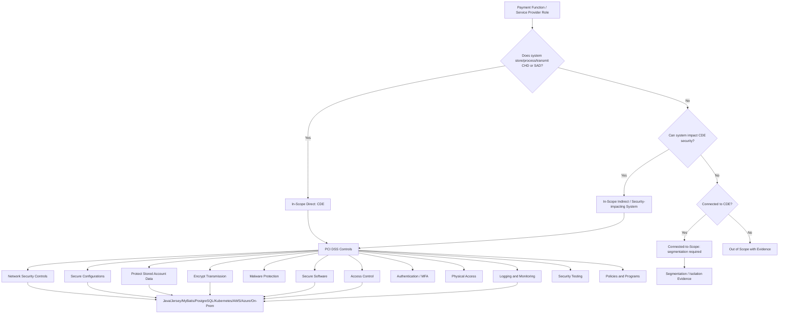

---

## 2. CDE Data Flow View

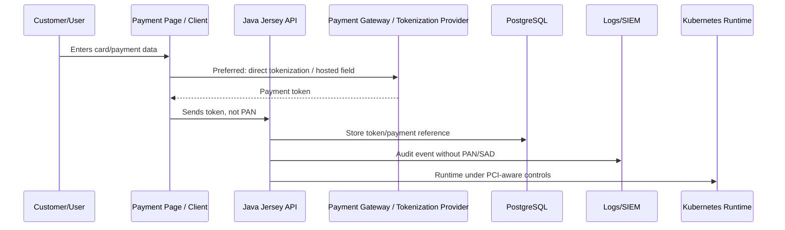

Target desain terbaik: **jangan biarkan PAN/SAD masuk application boundary jika tidak wajib**. Untuk Java/Jersey service, idealnya API menerima **payment token**, bukan raw card data.

---

# Key PCI Vocabulary untuk Engineer

| Istilah | Arti Praktis | Engineering Impact |
|---|---|---|
| **Account Data** | Kategori umum untuk cardholder data dan/atau sensitive authentication data. | Semua surface yang bisa menyimpan/memproses/mengirim account data harus dianalisis. |
| **CHD / Cardholder Data** | Biasanya mencakup PAN dan atribut terkait seperti cardholder name, expiration date, service code jika bersama PAN. | PAN harus dimasking, dienkripsi/tokenized, dan tidak boleh masuk log sembarangan. |
| **PAN / Primary Account Number** | Nomor kartu pembayaran utama. | Data paling penting dalam PCI; keberadaannya sering menentukan scope CDE. |
| **SAD / Sensitive Authentication Data** | Data autentikasi sensitif seperti CVV/CVC, full track data, PIN/PIN block. | Umumnya jangan disimpan setelah authorization; jangan pernah log. |
| **CDE / Cardholder Data Environment** | People, process, dan technology yang menyimpan, memproses, atau mentransmisikan CHD/SAD, plus komponen yang bisa memengaruhi security-nya. | Menentukan service, DB, network, CI/CD, Kubernetes, dan cloud asset yang masuk scope. |
| **Service Provider** | Entity yang menyediakan layanan yang dapat memengaruhi payment/security/payment data customer. | Bisa punya kewajiban ROC/AOC, customer responsibility matrix, TPSP controls. |
| **TPSP / Third-Party Service Provider** | Pihak ketiga yang menyimpan/memproses/transmit CHD/SAD atau memengaruhi CDE. | Vendor/payment gateway/cloud/logging/security provider perlu dimapping. |
| **ROC** | Report on Compliance. | Evidence formal hasil assessment QSA. |
| **AOC** | Attestation of Compliance. | Ringkasan attestation yang sering diminta customer/acquirer/payment brand. |
| **ASV Scan** | External vulnerability scan oleh Approved Scanning Vendor. | Public-facing CDE surface harus siap discan dan diremediasi. |

---

# Decomposition Map - Practical Categories / Domain / Skills

| No | PCI Area | Skill / Knowledge untuk Software Engineer | Implementasi Praktis di Stack Anda | Evidence Praktis |
|---:|---|---|---|---|
| 1 | **PCI Scope Literacy** | Paham apa yang membuat service masuk CDE atau security-impacting system. | Classify Java API, PostgreSQL DB, Kubernetes namespace, CI/CD, logs. | CDE boundary diagram, scope decision record. |
| 2 | **CHD/SAD Recognition** | Bisa mengenali PAN, CVV, track data, token, last4, payment reference. | DTO/schema/log review untuk field payment. | Data classification matrix. |
| 3 | **Scope Reduction** | Mengurangi scope dengan hosted payment page, tokenization, segmentation. | API hanya menerima token; PAN tidak masuk backend. | Tokenization architecture, gateway contract. |
| 4 | **CDE Segmentation** | Memisahkan network/runtime/service yang menyentuh CHD dari sistem lain. | Kubernetes namespace, NetworkPolicy, firewall, DB isolation. | Segmentation diagram, connectivity test. |
| 5 | **Network Security Controls** | Firewall, ingress/egress restriction, deny-by-default, no unnecessary exposure. | API gateway, security group, Kubernetes NetworkPolicy. | Network config, scan result. |
| 6 | **Secure Configuration** | Hardening OS/container/Kubernetes/PostgreSQL/app server. | Non-root container, no default password, secure TLS, minimal packages. | Hardening baseline, manifest, config review. |
| 7 | **Stored Account Data Protection** | PAN unreadable, no CVV storage, tokenization, masking, retention. | PostgreSQL encrypted/tokenized data; no SAD column. | DB schema review, encryption evidence. |
| 8 | **Transmission Encryption** | Strong cryptography over open/public networks. | HTTPS/TLS, service-to-service TLS/mTLS where needed. | TLS config, certificate evidence. |
| 9 | **Malware Protection** | Anti-malware and runtime protection where applicable. | Container image scanning, host security, EDR on nodes/on-prem. | Scan/EDR report. |
| 10 | **Secure Software Development** | Secure coding, threat modeling, vulnerability prevention. | Jersey validation, safe MyBatis SQL, no unsafe deserialization. | PR review, SAST/SCA, test report. |
| 11 | **Patch Management** | Timely patching for critical vulnerabilities. | Maven dependency upgrade, base image patch, OS/K8S patch. | CVE ticket, patch PR. |
| 12 | **Payment Page Script Security** | Untuk payment pages, script inventory, authorization, integrity/change detection. | Hosted fields/payment page script monitoring. | Script inventory, change detection alert. |
| 13 | **Access by Need-to-Know** | Least privilege untuk user/service/admin/DB. | RBAC, DB grants, Kubernetes service accounts. | Access matrix, review record. |
| 14 | **Strong Authentication / MFA** | Unique user ID, MFA untuk CDE access, secure service identity. | SSO/OIDC, MFA, service account, workload identity. | IdP policy, MFA evidence. |
| 15 | **Privileged Access** | Admin/root/DB/cloud/Kubernetes access dikontrol ketat. | Break-glass, JIT access, session logging. | Access approval, session log. |
| 16 | **Physical Access Awareness** | On-prem/server/media access control. | Relevant jika ada on-prem CDE, backup media, HSM. | Facility/media control evidence. |
| 17 | **Audit Logging** | Semua akses ke system components dan CHD harus traceable. | Structured audit logs, actor/action/object/result, SIEM. | Log sample, SIEM query. |
| 18 | **Log Protection** | Log tidak boleh berisi PAN/SAD/secret dan harus dilindungi dari modifikasi. | Redaction, immutable-ish retention, restricted access. | Redaction test, log access review. |
| 19 | **Security Testing** | Vulnerability scan, penetration test, segmentation test. | ASV external scan, internal scan, appsec test, network segmentation test. | Scan report, pentest report. |
| 20 | **File Integrity / Change Detection** | Deteksi perubahan tak sah pada file/script/config penting. | CI/CD integrity, payment page script detection, GitOps drift. | Alert/sample event. |
| 21 | **Incident Response** | Payment data incident harus cepat ditangani dan dieskalasi. | Runbook, forensic preservation, token/key revocation. | Incident ticket, RCA. |
| 22 | **TPSP Management** | Service provider/customer/vendor relationship jelas. | Payment gateway, cloud provider, SIEM, support tool, AI tool. | TPSP inventory, AOC/vendor review. |
| 23 | **Customer Responsibility / CUEC-like Mapping** | Customer harus tahu bagian kontrol yang menjadi tanggung jawab mereka. | Product admin guide, secure integration docs. | Responsibility matrix. |
| 24 | **Evidence Automation** | Evidence PCI tidak dikumpulkan manual menjelang audit. | GitHub/CI/K8S/SIEM/IAM evidence pipeline. | Evidence index. |
| 25 | **Targeted Risk Analysis** | PCI v4 family memakai pendekatan risk-based untuk requirement tertentu. | Risk analysis untuk frequency/control customized approach. | Risk analysis record. |
| 26 | **Customized Approach Awareness** | Requirement dapat dipenuhi dengan pendekatan berbeda jika objective tercapai dan dinilai. | Perlu QSA-aligned design, bukan improvisasi sepihak. | Customized approach worksheet/evidence. |
| 27 | **Data Retention & Disposal** | Jangan simpan account data lebih lama dari kebutuhan bisnis/legal. | Retention job, DB purge, token lifecycle. | Retention config, deletion logs. |
| 28 | **Masking & Display Control** | PAN hanya ditampilkan jika authorized dan sesuai kebutuhan. | Display last4, role-based access, no full PAN in UI/API. | UI/API test, access log. |
| 29 | **Database Security** | DB CDE harus segmented, encrypted, logged, least privilege. | PostgreSQL roles, views, stored procedures, backup encryption. | DB grants, schema review. |
| 30 | **Cloud/Kubernetes PCI Readiness** | Cloud runtime bisa memperluas CDE jika workload/payment data salah ditempatkan. | Namespace isolation, NetworkPolicy, workload identity, image scanning. | K8S manifests, scan report. |

---

# 12 PCI DSS Requirement Groups - Engineering View

PCI DSS v4.0.1 tetap berada pada struktur 12 requirement family untuk payment account data protection; dokumen PCI DSS v4.0.1 tersedia di PCI SSC Document Library. ([PCI Security Standards Council](https://www.pcisecuritystandards.org/document_library/))

| Req | Area | Terjemahan Praktis untuk Engineer |
|---:|---|---|
| 1 | **Install and maintain network security controls** | CDE harus punya network boundary jelas: firewall, ingress/egress, segmentation, Kubernetes NetworkPolicy. |
| 2 | **Apply secure configurations to all system components** | OS, container, DB, runtime, cloud, Kubernetes, dan app config harus hardened. |
| 3 | **Protect stored account data** | Jangan simpan PAN/SAD jika tidak perlu; gunakan tokenization, masking, encryption, retention. |
| 4 | **Protect CHD with strong cryptography during transmission** | TLS kuat untuk transport; jangan kirim PAN lewat channel tidak aman. |
| 5 | **Protect systems and networks from malicious software** | Malware/ransomware/host compromise harus dimitigasi sesuai platform. |
| 6 | **Develop and maintain secure systems and software** | Secure SDLC, patching, SAST/SCA, secure coding, payment page script control. |
| 7 | **Restrict access by business need-to-know** | Least privilege untuk user, service account, DB, Kubernetes, cloud. |
| 8 | **Identify users and authenticate access** | Unique ID, MFA, secure service identity, no shared accounts. |
| 9 | **Restrict physical access to cardholder data** | On-prem, media, hardware, paper, backup media, facility. |
| 10 | **Log and monitor access to system components and CHD** | Audit logging, SIEM, alerting, log integrity, no PAN/SAD in logs. |
| 11 | **Test security of systems and networks regularly** | Vulnerability scan, ASV, pentest, segmentation test, change detection. |
| 12 | **Support security with organizational policies and programs** | Policy, risk analysis, TPSP management, incident response, roles/responsibilities. |

---

# PCI Scope Model untuk Java/Jersey Microservice

## 1. Direct In-Scope

Komponen masuk **direct CDE scope** jika:

```text id="cj4tzv"
- menerima PAN/SAD,
- menyimpan PAN/SAD,
- memproses authorization/payment data,
- mengirim PAN/SAD ke payment network/gateway,
- menyimpan token yang secara kontraktual/security-impacting terkait payment processing,
- menyimpan log/file/export yang mengandung PAN/SAD.
```

Contoh:

| Komponen | Kenapa Direct In-Scope |
|---|---|
| `payment-api` menerima raw card number | Memproses PAN. |
| PostgreSQL table menyimpan PAN encrypted | Menyimpan CHD. |
| Queue message membawa PAN | Mentransmisikan CHD. |
| Error log berisi request body dengan card data | Log menjadi storage CHD. |
| Object storage berisi payment CSV dengan PAN | Menyimpan CHD. |

---

## 2. Security-Impacting In-Scope

Komponen tidak menyimpan CHD, tetapi bisa memengaruhi security CDE:

| Komponen | Kenapa Tetap In-Scope |
|---|---|
| GitHub repo/payment deployment pipeline | Bisa mengubah CDE code. |
| Kubernetes control plane/namespace | Mengontrol workload CDE. |
| CI/CD runner dengan deploy permission | Bisa deploy malicious code ke CDE. |
| Secret manager untuk payment service | Menyimpan credential CDE. |
| IAM/SSO admin role | Bisa memberi akses ke CDE. |
| Logging/SIEM admin | Bisa melihat atau memodifikasi evidence. |

---

## 3. Connected-to-Scope

Komponen terhubung ke CDE tetapi seharusnya tidak mengakses CHD:

| Komponen | Risiko | Kontrol |
|---|---|---|
| Customer service dashboard | Bisa query payment metadata. | Field masking, network segmentation, role restriction. |
| Reporting service | Bisa join data payment/customer. | Read-only projection, no PAN, audit. |
| Support tool | Bisa menampilkan transaction detail. | Last4 only, approval, audit. |
| Monitoring agent | Bisa collect payload. | Scrubbing/redaction. |
| Batch worker | Bisa process payment state. | Least privilege + queue payload minimization. |

---

# PAN/SAD Handling Rules

## 1. Design Rule

```text id="stz7hb"
Best PCI engineering decision:
Do not let raw PAN/SAD enter your Java/Jersey service unless the business architecture absolutely requires it.
```

Lebih aman:

```text id="ywlifl"
Customer browser/payment UI
-> hosted payment field / payment gateway
-> token returned
-> backend stores token/reference/last4 only
```

Lebih berisiko:

```text id="m1cn67"
Customer browser
-> Java/Jersey API receives PAN/CVV
-> app validates
-> logs/error handling/DB/APM may accidentally capture it
```

---

## 2. Data Handling Matrix

| Data | Store? | Log? | Display? | Preferred Pattern |
|---|---:|---:|---:|---|
| Full PAN | Avoid unless necessary | No | Rare, restricted | Tokenize, encrypt, mask |
| PAN last4 | Yes, if needed | Carefully | Yes | Display identifier only |
| Expiration date | If needed | Avoid raw with PAN | Limited | Store with payment token metadata |
| Cardholder name | If needed | Avoid | Role-based | Treat as personal/payment data |
| CVV/CVC | No after auth | Never | Never | Transient only if unavoidable |
| Full track data | No | Never | Never | Do not handle |
| PIN/PIN block | No unless issuer/acquirer-specific authorized context | Never | Never | Avoid entirely |
| Payment token | Yes | Mask/hash | Yes, limited | Preferred backend reference |
| Transaction ID | Yes | Yes, usually safe | Yes | Use for reconciliation/audit |

---

# PCI DSS Mapping ke Stack Anda

## 1. Java / Jersey API

| PCI Risk | Bad Pattern | Good Pattern |
|---|---|---|
| PAN masuk backend | `POST /payments` menerima `cardNumber`, `cvv`. | Hosted payment page/tokenization; backend menerima token. |
| Sensitive logging | `logger.info("payment request {}", dto)` | Log `paymentTokenHash`, `transactionId`, `correlationId`. |
| Broken access | User bisa lihat full payment detail. | Role-based access + last4 only. |
| Unsafe error | Error response menyertakan raw request. | Generic error + correlation ID. |
| No audit | Payment action tidak traceable. | `PAYMENT_AUTHORIZED`, `PAYMENT_REFUNDED`, `TOKEN_CREATED` audit events. |

Contoh safe logging:

```java id="0egxal"
logger.info(
    "Payment authorization requested: transactionId={}, tokenRef={}, tenantId={}, correlationId={}",
    transactionId,
    hashForLog(paymentToken),
    tenantId,
    correlationId
);
```

Anti-pattern:

```java id="r6lo2j"
logger.info("Payment request: {}", paymentRequest);
```

---

## 2. DTO/API Contract

Anti-pattern:

```java id="qrzbqk"
public class PaymentRequest {
    public String cardNumber;
    public String cvv;
    public String expiryMonth;
    public String expiryYear;
}
```

Lebih baik:

```java id="cqyui4"
public class PaymentRequest {
    public String paymentToken;
    public String transactionId;
    public BigDecimal amount;
    public String currency;
}
```

Kalau raw card data benar-benar harus diproses, perlakukan endpoint, runtime, logs, DB, CI/CD, monitoring, dan network path sebagai CDE penuh.

---

## 3. MyBatis / PostgreSQL

| PCI Risk | Contoh | Mitigasi |
|---|---|---|
| PAN disimpan raw | `payment_card.pan` plaintext | Jangan; tokenization/encryption kuat. |
| CVV column ada di schema | `payment_card.cvv` | Hapus; storage SAD setelah auth biasanya tidak boleh. |
| `SELECT *` over-fetch | Query mengambil sensitive columns | Explicit projection. |
| Audit full object | Audit table menyimpan before/after payment object | Store metadata, not full CHD. |
| Backup tidak terenkripsi | DB backup berisi CHD | Encrypt backup + restrict access. |
| Reporting replica berisi PAN | BI/reporting DB memperluas CDE | Tokenize/mask sebelum reporting. |
| Materialized view copy PAN | MV lupa masuk retention/scope | Jangan materialize PAN; review MV. |

Contoh safer table:

```sql id="z2uaec"
CREATE TABLE payment_method (
    id UUID PRIMARY KEY,
    tenant_id UUID NOT NULL,
    customer_id UUID NOT NULL,
    payment_token TEXT NOT NULL,
    card_brand TEXT,
    pan_last4 CHAR(4),
    expiry_month SMALLINT,
    expiry_year SMALLINT,
    created_at TIMESTAMPTZ NOT NULL,
    updated_at TIMESTAMPTZ NOT NULL
);
```

Yang harus dihindari:

```sql id="f55fkt"
CREATE TABLE payment_method (
    card_number TEXT,
    cvv TEXT
);
```

---

## 4. GitHub / Maven / CI/CD

| PCI Concern | Implementasi |
|---|---|
| Change control | Branch protection, CODEOWNERS, required approval. |
| Secure SDLC | SAST/SCA, dependency review, security test. |
| Secrets | Secret scanning, no payment gateway key in repo. |
| Build traceability | Commit SHA → Maven build → image digest → deploy. |
| Deployment approval | Production CDE deploy requires authorized approval. |
| Emergency change | Exception ticket + retrospective review. |
| Payment page scripts | Script inventory and change detection if app owns payment page. |

PCI SSC’s v4.0.1 announcement notes that the revision clarified Requirement 6 areas including critical vulnerability patch timing and payment page script applicability. ([PCI Perspectives](https://blog.pcisecuritystandards.org/just-published-pci-dss-v4-0-1))

---

## 5. Docker / Kubernetes

| PCI Concern | Practical Control |
|---|---|
| CDE segmentation | Separate namespace/node pool where needed; NetworkPolicy default deny. |
| Runtime hardening | Non-root, read-only FS, drop capabilities, no privileged containers. |
| Secrets | External secret manager; restricted service account access. |
| Image vulnerability | Image scan gate before deploy. |
| Logging | No request body logging; sidecar/APM scrubbing. |
| Access | Kubernetes RBAC least privilege. |
| Audit | K8S audit logs and deployment history. |
| Egress | Allowlist only payment gateway/vendor endpoints. |

Example Kubernetes baseline:

```yaml id="ec38to"
securityContext:
  runAsNonRoot: true
  allowPrivilegeEscalation: false
  readOnlyRootFilesystem: true
```

---

## 6. AWS / Azure / On-Prem

| PCI Concern | AWS/Azure/On-Prem Implementation |
|---|---|
| Network boundary | Private subnet/VNet, security group/firewall, WAF, ingress restriction. |
| Key management | KMS/Key Vault/HSM, rotation, least privilege key access. |
| Logging | Cloud activity logs, SIEM forwarding, alerting. |
| Vulnerability | VM/container/image scanning, OS patching. |
| Backup | Encrypted backup, restore test, restricted restore access. |
| On-prem | Physical access, network segmentation, patching, EDR. |
| Hybrid | Consistent IAM/logging/segmentation across cloud and on-prem. |

---

# PCI Evidence Model

## Evidence Chain untuk Payment Service Release

```text id="vk1ade"
Ticket
-> threat/security review if payment-impacting
-> GitHub PR
-> CODEOWNER approval
-> Maven tests
-> SAST/SCA
-> container scan
-> deployment approval
-> Kubernetes rollout
-> SIEM/audit event sample
-> post-deploy monitoring
```

## Evidence yang Biasanya Kuat

| Evidence | Membuktikan |
|---|---|
| CDE network diagram | Scope dan segmentation. |
| Data flow diagram | CHD/SAD/token path. |
| DB schema review | Tidak ada SAD/PAN raw storage. |
| GitHub PR approval | Change control. |
| SCA/image scan | Vulnerability management. |
| ASV scan report | External vulnerability scanning. |
| Penetration/segmentation test | Security testing dan scope isolation. |
| Access review | Least privilege. |
| SIEM alert/log sample | Monitoring/logging. |
| Incident runbook | Response readiness. |
| TPSP AOC | Vendor/service provider reliance. |
| Backup restore test | Recoverability. |

---

# PCI Failure Modes yang Sering Terjadi

| Failure Mode | Contoh | Dampak |
|---|---|---|
| **Scope salah** | Service dianggap out-of-scope padahal log menerima PAN. | CDE membesar; audit finding. |
| **PAN masuk log** | Full request body dilog saat error. | Data exposure serius. |
| **CVV tersimpan** | Column `cvv` ada di DB karena “untuk retry”. | High severity PCI violation. |
| **Token dianggap selalu out-of-scope** | Token dapat dipakai melakukan charge tanpa kontrol. | Token/payment reference tetap security-sensitive. |
| **APM captures payload** | Monitoring tool menyimpan request body. | Vendor/logging masuk scope. |
| **Reporting DB copy PAN** | BI replica berisi full payment table. | CDE meluas ke reporting. |
| **Payment page script tidak dimonitor** | Third-party script injection. | Payment data skimming risk. |
| **NetworkPolicy longgar** | Semua service bisa reach payment DB. | Segmentation gagal. |
| **Shared admin account** | Banyak engineer pakai satu DB admin. | Requirement identity/auditability gagal. |
| **Emergency deploy tanpa evidence** | Hotfix langsung ke production. | Change control exception. |
| **SCA warning diabaikan** | Critical CVE tetap production. | Vulnerability finding. |
| **Vendor tidak dimapping** | Payment/support/logging vendor menyentuh account data. | TPSP management gap. |

---

# PCI Pull Request Checklist

Gunakan untuk PR yang menyentuh payment, billing, checkout, token, refund, card metadata, customer payment method, payment UI, gateway integration, logs, atau payment reporting.

| Area | Question |
|---|---|
| Scope | Apakah PR ini membuat service masuk CDE atau memengaruhi CDE? |
| Data | Apakah ada PAN, CVV, track data, PIN, token, last4, transaction ID? |
| DTO | Apakah backend menerima raw card data atau token? |
| Logging | Apakah ada full request/response/body/header logging? |
| DB | Apakah ada kolom/table/view/MV/backup yang menyimpan account data? |
| Error Handling | Apakah exception bisa leak payload payment? |
| AuthZ | Siapa boleh melihat/mengubah payment method/refund/payment state? |
| Tenant | Apakah payment data tenant-isolated? |
| Vendor | Apakah data dikirim ke payment gateway/logging/APM/support tool? |
| Network | Apakah service baru bisa reach CDE/DB/payment gateway? |
| Secrets | Apakah payment gateway key disimpan aman dan dirotasi? |
| Vulnerability | Apakah dependency/image baru discan? |
| Audit | Apakah payment action punya audit event? |
| Retention | Apakah account data/token/payment records punya lifecycle? |
| Evidence | Evidence apa yang akan diminta QSA/customer nanti? |

---

# Mini Case Study - Refund API

## Feature

```text id="jnz0i6"
POST /payments/{paymentId}/refund
```

## PCI Risks

| Risk | Area |
|---|---|
| Unauthorized refund | Access control / processing integrity. |
| Payment token misuse | Data protection / authorization. |
| PAN/token leaked in logs | Logging / confidentiality. |
| Duplicate refund | Processing integrity. |
| Refund failure silent | Monitoring / reconciliation. |
| Gateway secret exposed | Secrets management. |

## Controls

| Control | Implementation |
|---|---|
| AuthN/AuthZ | Only finance/refund role or approved workflow. |
| Idempotency | Idempotency key per refund request. |
| Audit | `PAYMENT_REFUND_REQUESTED`, `PAYMENT_REFUND_SUCCEEDED`, `PAYMENT_REFUND_FAILED`. |
| Logging | No PAN/token raw; transaction ID only. |
| Gateway Secret | Secret manager, not env dump/Git. |
| Reconciliation | Refund job/report compared with gateway response. |
| Monitoring | Alert on unusual refund volume/failure. |
| Change Control | PR approval + tests + deployment evidence. |

## Evidence

```text id="de2zrk"
- PR approval
- Authz integration test
- Idempotency test
- Audit log sample
- Gateway secret storage evidence
- Reconciliation job output
- Alert rule
```

---

# Mini Case Study - Payment Page Script

## Scenario

Application owns checkout/payment page and loads third-party JavaScript.

## Risk

Payment page script injection/skimming can steal card data before tokenization.

## Controls

| Area | Control |
|---|---|
| Script Inventory | Semua script/payment page dependency didaftarkan. |
| Authorization | Perubahan script harus approved. |
| Integrity | SRI/CSP/change detection where applicable. |
| Monitoring | Unauthorized modification alert. |
| Deployment | Payment page change through PR/CI only. |
| Vendor | Third-party script/vendor reviewed. |

PCI SSC’s v4.0.1 update explicitly mentions clarification around managing payment page scripts under Requirement 6. ([PCI Perspectives](https://blog.pcisecuritystandards.org/just-published-pci-dss-v4-0-1))

---

# Mini Case Study - “Token Only” Backend

## Claim

```text id="r477vn"
Backend kami tidak menyimpan PAN, hanya payment token.
```

## Engineering Review

| Question | Why It Matters |
|---|---|
| Token berasal dari mana? | Hosted field/gateway or internal tokenization? |
| Token bisa digunakan untuk charge/refund? | Token tetap sensitive operational asset. |
| Apakah token masuk log? | Bisa disalahgunakan jika leaked. |
| Apakah token tenant-bound? | Mencegah cross-tenant misuse. |
| Apakah token disimpan di DB/reporting/backup? | Storage surface tetap perlu kontrol. |
| Apakah vendor/gateway AOC tersedia? | TPSP reliance evidence. |
| Apakah PAN pernah transit lewat app? | Menentukan CDE scope. |

Kesimpulan: tokenization mengurangi scope dan risiko, tetapi tidak menghapus kebutuhan access control, audit, secrets, vendor management, dan monitoring.

---

# Service Provider-Specific Concerns

Untuk service provider, bukan hanya sistem internal yang penting. Customer juga akan bertanya bagaimana layanan Anda melindungi payment data mereka.

| Area | Pertanyaan Customer/QSA | Jawaban/Evidence yang Dibutuhkan |
|---|---|---|
| Scope | Layanan mana yang PCI in-scope? | CDE boundary diagram. |
| Responsibility | Apa tanggung jawab provider vs customer? | Responsibility matrix. |
| AOC/ROC | Apakah ada attestation valid? | AOC / ROC summary where allowed. |
| TPSP | Vendor mana yang digunakan untuk payment/security/logging/cloud? | TPSP inventory + AOC/vendor assessment. |
| Segmentation | Bagaimana tenant/customer dipisahkan? | Architecture + tests. |
| Access | Siapa bisa akses CDE/customer data? | Access control + review. |
| Incident | Bagaimana customer diberi tahu jika incident? | Incident runbook + notification path. |
| Change | Bagaimana customer-impacting change dikontrol? | SDLC/change evidence. |
| Logging | Apa yang dilog dan berapa lama? | Log retention/redaction docs. |
| Vulnerability | Bagaimana vulnerability ditangani? | Scan and remediation process. |

---

# PCI Scope Reduction Strategy

Urutan strategi yang paling disarankan secara engineering:

| Priority | Strategy | Benefit |
|---:|---|---|
| 1 | **Avoid raw PAN/SAD** | Mengurangi CDE secara drastis. |
| 2 | **Hosted payment fields/page** | Browser langsung ke gateway/tokenization provider. |
| 3 | **Tokenization** | Backend hanya simpan token/payment reference. |
| 4 | **Network segmentation** | Membatasi sistem yang bisa reach CDE. |
| 5 | **Dedicated payment service** | Payment concern tidak tersebar ke semua microservice. |
| 6 | **Strict logging allowlist** | Mencegah PAN/SAD bocor ke logs/APM. |
| 7 | **Separate reporting model** | Reporting tidak copy payment account data. |
| 8 | **Vendor/TPSP mapping** | Memastikan dependency payment punya assurance. |
| 9 | **Automated evidence** | QSA/customer audit lebih cepat dan lebih defensible. |

---

# Practical PCI Artifacts untuk Service Owner

Buat file internal:

```text id="eogdj8"
pci-service-scope-map.md
```

Isi minimal:

| Section | Isi |
|---|---|
| Service Name | Nama service/module. |
| PCI Role | Merchant-facing service, payment gateway integration, token service, support tool, reporting, etc. |
| Scope Status | Direct CDE / security-impacting / connected / out-of-scope with evidence. |
| Data Types | PAN, SAD, token, last4, transaction ID, refund ID, payment metadata. |
| Data Flow | Source, destination, storage, transport, logs, vendor. |
| Storage Surface | DB, cache, queue, log, backup, file, APM, SIEM. |
| Access Model | Human, service account, DB role, Kubernetes/cloud IAM. |
| Network Boundary | Ingress/egress, segmentation, allowlist. |
| Controls | Encryption, masking, tokenization, logging, vulnerability, change. |
| Evidence | PR, CI, scan, SIEM, ASV, pentest, segmentation test, AOC. |
| Open Questions | Anything unknown must be treated as risk. |

---

# Roadmap Belajar Singkat

## Hari 1 - PCI Vocabulary

Pahami:

```text id="z3dt1t"
CHD
PAN
SAD
CDE
TPSP
ROC
AOC
ASV
QSA
tokenization
segmentation
```

## Hari 2 - Scope One Service

Ambil service yang paling dekat payment/billing/order:

```text id="pec9tr"
Does it store/process/transmit CHD/SAD?
Can it impact CDE security?
Is it connected to CDE?
What evidence proves segmentation?
```

## Hari 3 - Data Surface Hunt

Cari kemungkinan PAN/SAD/token muncul di:

```text id="nm8e22"
DTO
logs
exception
APM traces
DB tables
views
materialized views
queue messages
Camunda variables
files
exports
backups
reports
vendor payloads
```

## Hari 4 - Secure SDLC & CI/CD

Review:

```text id="ij144q"
branch protection
CODEOWNERS
required CI
SAST/SCA
container scan
secret scan
deployment approval
emergency exception process
```

## Hari 5 - Segmentation & Runtime

Review:

```text id="4l1jcg"
Kubernetes namespace
NetworkPolicy
service account
DB grants
cloud IAM
ingress/egress
payment gateway allowlist
SIEM/APM redaction
```

---

# Output yang Sebaiknya Anda Buat Setelah Seri Ini

Buat matrix kecil:

| Component | PCI Scope | Account Data? | Can Impact CDE? | Controls | Evidence | Gap |
|---|---|---|---|---|---|---|
| `payment-api` | Direct CDE | Token/last4, maybe PAN? | Yes | AuthZ, logging, tokenization | PR, tests, logs | Confirm no raw PAN |
| `payment-db` | Direct CDE | Token/payment metadata | Yes | DB grants, encryption, backup | Schema, grants | Review backups |
| `checkout-ui` | Direct/connected | Payment page | Yes | Script inventory/change detection | CSP/SRI/config | Need script monitor |
| `ci-cd` | Security-impacting | No | Yes | Branch protection, approval | GitHub evidence | Emergency process |
| `logging` | Connected/in-scope if payment metadata | Maybe | Yes | Redaction, restricted access | SIEM sample | APM payload check |
| `reporting` | Connected | Should be no PAN | Maybe | Masked projection | Query review | Validate exports |

---

# Rekomendasi Materi Selanjutnya

Lanjut ke **Seri 8/18 - HIPAA for Engineering Systems Handling ePHI**.

Kenapa: setelah PCI yang sangat preskriptif terhadap payment account data, HIPAA akan melatih pola pikir berbeda: perlindungan **electronic protected health information / ePHI** melalui administrative, physical, dan technical safeguards. Fokus engineering-nya akan masuk ke access control, audit controls, integrity, transmission security, minimum necessary, breach investigation, vendor/BAA awareness, dan bagaimana Java/Jersey/PostgreSQL/Kubernetes harus diperlakukan jika workflow menyentuh data kesehatan.

**Seri 7/18 selesai.**

---

**Sources:**

- [PCI Security Standards Council – Protect Payment Data with Industry-driven Security Standards, Training, and Programs](https://www.pcisecuritystandards.org/standards/pci-dss/)
- [Just Published: PCI DSS v4.0.1](https://blog.pcisecuritystandards.org/just-published-pci-dss-v4-0-1)
- [Mastercard Site Data Protection (SDP) Program & PCI](https://www.mastercard.com/global/en/business/cybersecurity-fraud-prevention/site-data-protection-pci.html?utm_source=chatgpt.com)

## Response:
7/13/2026, 11:23:48 PM

# Seri 8/18 - HIPAA for Engineering Systems Handling ePHI

## Introduction

Untuk software engineer, **HIPAA** perlu dibaca sebagai framework perlindungan **Protected Health Information / PHI**, terutama **electronic Protected Health Information / ePHI** ketika data dibuat, diterima, dipelihara, atau ditransmisikan secara elektronik.

Cara praktis membacanya:

> HIPAA bukan hanya “data kesehatan harus dienkripsi”. HIPAA menuntut kombinasi **administrative, physical, dan technical safeguards** untuk menjaga confidentiality, integrity, dan availability ePHI.

HHS menjelaskan bahwa **HIPAA Security Rule** menetapkan standar nasional untuk melindungi ePHI yang dibuat, diterima, digunakan, atau dipelihara oleh covered entity atau business associate, melalui administrative, physical, dan technical safeguards. ([HHS.gov](https://www.hhs.gov/hipaa/for-professionals/security/index.html?utm_source=chatgpt.com))

HHS juga menjelaskan bahwa **HIPAA Privacy Rule** menetapkan standar nasional untuk melindungi medical records dan individually identifiable health information, serta berlaku untuk health plans, health care clearinghouses, dan health care providers tertentu yang melakukan transaksi kesehatan tertentu secara elektronik. ([HHS.gov](https://www.hhs.gov/hipaa/for-professionals/privacy/index.html?utm_source=chatgpt.com))

Catatan penting untuk 2026: HHS menerbitkan **HIPAA Security Rule Notice of Proposed Rulemaking / NPRM** pada 27 Desember 2024 yang mengusulkan penguatan cybersecurity seperti encryption at rest/in transit, MFA, vulnerability scanning, penetration testing, network segmentation, dan backup/recovery controls. Karena ini disebut sebagai **proposed rule**, perlakukan sebagai forward-looking signal, bukan baseline final kecuali organisasi Anda sudah mengadopsinya sebagai internal control. ([HHS.gov](https://www.hhs.gov/hipaa/for-professionals/security/hipaa-security-rule-nprm/index.html?utm_source=chatgpt.com))

---

# Diagram

## 1. HIPAA Engineering Mental Model

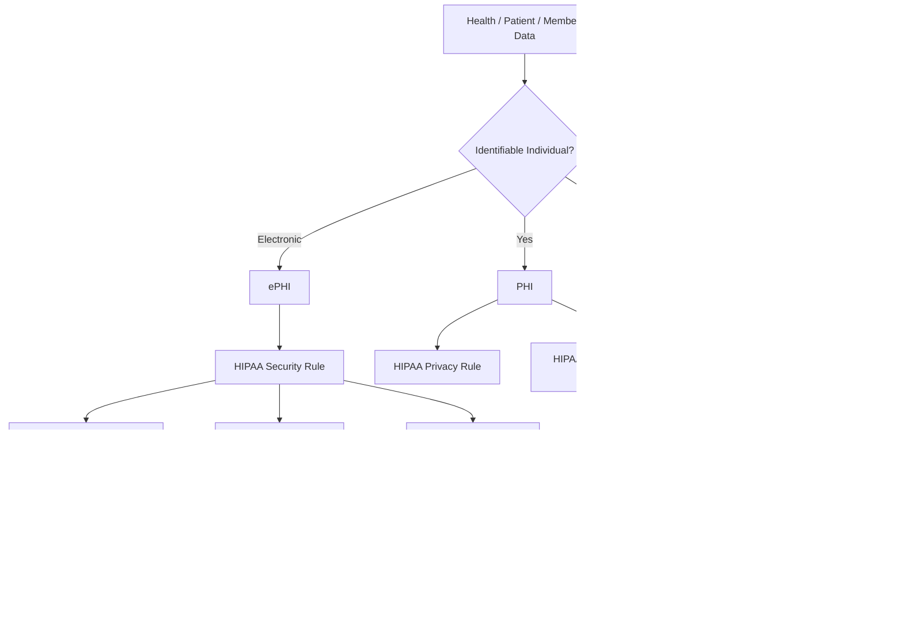

---

## 2. ePHI Data Flow View

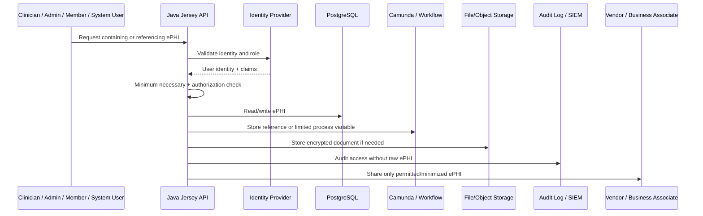

Pertanyaan utama engineer:

```text id="f4a9wz"
Apakah data ini ePHI?
Siapa boleh melihatnya?
Apakah aksesnya minimum necessary?
Apakah aksesnya diaudit?
Apakah data masuk log, workflow variable, file, backup, export, cache, vendor, atau AI provider?
Apakah incident bisa diinvestigasi?
```

---

# Key HIPAA Vocabulary untuk Engineer

| Istilah | Arti Praktis | Engineering Impact |
|---|---|---|
| **PHI** | Individually identifiable health information dalam konteks covered entity/business associate. | Data model, API, file, log, dan vendor sharing harus dikontrol. |
| **ePHI** | PHI dalam electronic media. | Fokus utama Security Rule: access, audit, integrity, transmission, availability. |
| **Covered Entity** | Health plan, health care clearinghouse, atau health care provider tertentu yang melakukan electronic transactions. | Menentukan apakah organisasi langsung diatur HIPAA. |
| **Business Associate / BA** | Pihak yang membuat, menerima, memelihara, atau mentransmisikan PHI atas nama covered entity atau BA lain. | Vendor/SaaS/platform Anda bisa terkena kewajiban HIPAA melalui BAA. |
| **BAA / Business Associate Agreement** | Kontrak yang membatasi penggunaan/disclosure PHI dan mengharuskan safeguarding PHI. | Integrasi vendor harus dicek apakah perlu BAA. |
| **Minimum Necessary** | Akses/disclosure PHI harus dibatasi ke minimum yang diperlukan. | API response, SQL projection, export, admin UI, vendor payload harus minim. |
| **Administrative Safeguards** | Process/policy/risk/workforce/vendor controls. | Risk analysis, access review, incident process, training, vendor management. |
| **Physical Safeguards** | Facility, workstation, device, media controls. | On-prem, laptop, removable media, backup media, workstation access. |
| **Technical Safeguards** | Technology controls untuk ePHI. | AuthN/AuthZ, audit logs, integrity, encryption/transmission controls. |
| **Unsecured PHI Breach** | Breach atas PHI yang tidak diamankan sesuai standar. | Incident severity, investigation, notification timeline. |

HHS menjelaskan bahwa business associates dan covered entities membutuhkan kontrak dengan business associates untuk memastikan PHI disafeguard, dan business associate juga dapat langsung bertanggung jawab atas pelanggaran tertentu HIPAA Rules. ([HHS.gov](https://www.hhs.gov/hipaa/for-professionals/covered-entities/sample-business-associate-agreement-provisions/index.html?utm_source=chatgpt.com))

---

# Decomposition Map - Practical Categories / Domain / Skills

| No | HIPAA Area | Skill / Knowledge untuk Software Engineer | Implementasi Praktis di Stack Anda | Evidence Praktis |
|---:|---|---|---|---|
| 1 | **HIPAA Applicability Awareness** | Paham kapan sistem menyentuh PHI/ePHI dan apakah organisasi bertindak sebagai covered entity, BA, atau subcontractor. | Classify service, vendor, tenant, integration. | Scope record, BAA/vendor map. |
| 2 | **ePHI Identification** | Membedakan health data biasa, identifiable health data, PHI, dan ePHI. | Data classification untuk API, DB, logs, files, workflows. | ePHI data inventory. |
| 3 | **Minimum Necessary Engineering** | Membatasi akses, response, export, dan vendor payload ke data yang dibutuhkan saja. | Field-level DTO, SQL projection, role-based response. | PR review, API tests. |
| 4 | **Administrative Safeguards** | Risk analysis, workforce access, incident process, vendor management, policy implementation. | Risk register, access workflow, incident runbook. | Risk analysis, access ticket, incident ticket. |
| 5 | **Physical Safeguards Awareness** | Paham implikasi workstation, device, media, facility, on-prem server. | Secure workstation, backup media controls, on-prem access. | Device/media/facility evidence. |
| 6 | **Technical Safeguards** | Access control, audit controls, integrity, authentication, transmission security. | AuthN/AuthZ, audit logs, hash/checksum, TLS. | Config, tests, log sample. |
| 7 | **Access Control** | Unique user access, emergency access, automatic logoff, encryption/decryption control. | OIDC/SSO, RBAC, break-glass, session timeout. | Auth config, access review. |
| 8 | **Audit Controls** | System activity involving ePHI must be recorded and reviewable. | Audit event table, SIEM forwarding, correlation ID. | Audit log sample, SIEM query. |
| 9 | **Integrity Controls** | ePHI harus terlindungi dari improper alteration/destruction. | DB constraints, optimistic locking, checksums, audit history. | Integrity tests, audit records. |
| 10 | **Person or Entity Authentication** | Memastikan user/service benar-benar identity yang diklaim. | OIDC/JWT validation, mTLS/service identity. | AuthN tests, IdP config. |
| 11 | **Transmission Security** | ePHI saat ditransmisikan harus dilindungi. | HTTPS/TLS, secure service-to-service channel, no ePHI in query params. | TLS config, integration config. |
| 12 | **Role-Based Access** | Akses ePHI berdasarkan job function, assignment, tenant, case, care relationship. | RBAC/ABAC, case assignment check, tenant isolation. | Permission matrix, negative tests. |
| 13 | **Break-glass Access** | Emergency access harus controlled dan audited. | Time-bound privileged access, reason required, alert. | Break-glass ticket, audit log. |
| 14 | **Audit Log Design** | Log harus cukup untuk forensic tetapi tidak menjadi PHI shadow database. | Actor/action/object/result; no raw clinical text. | Audit schema, redaction test. |
| 15 | **Application Logging Redaction** | App logs tidak boleh dump PHI/ePHI. | Structured logging allowlist, no full DTO/body logging. | Log sample, static/code review. |
| 16 | **Database ePHI Governance** | DB schema, views, functions, triggers, backups, replicas harus diklasifikasikan. | PostgreSQL grants, schema review, encrypted backup. | DB classification matrix. |
| 17 | **Workflow Data Governance** | Camunda variables/history/task comments bisa menyimpan ePHI. | Store references, not full ePHI payload; retention controls. | BPMN variable classification. |
| 18 | **File & Document Handling** | Medical documents, PDFs, images, OCR, transcripts harus diperlakukan sebagai ePHI jika identifiable. | Encrypted object storage, access audit, malware scan. | File lifecycle evidence. |
| 19 | **API Design for ePHI** | Endpoint harus enforce authZ, minimization, safe errors, rate limits. | Jersey filters, response DTO, validation. | API tests, OpenAPI review. |
| 20 | **Export & Reporting Controls** | Export ePHI high risk. | Approval, audit, temporary link, field filtering, expiry. | Export log, authz test. |
| 21 | **Vendor / BA Management** | Vendor yang menerima PHI/ePHI perlu BA/subcontractor analysis. | Email/SMS, cloud, AI, support, logging vendor. | BAA/vendor inventory. |
| 22 | **Incident & Breach Investigation** | Mampu menentukan who/what/when/where/how much ePHI affected. | Audit search, log correlation, affected record query. | Incident timeline, breach analysis. |
| 23 | **Backup & Availability** | ePHI availability adalah bagian Security Rule objective. | PostgreSQL backup, restore drill, DR. | Backup logs, restore test. |
| 24 | **Retention & Disposal** | ePHI tidak boleh disimpan tanpa lifecycle yang jelas. | Retention job, secure delete/archive, backup retention. | Deletion logs, retention policy. |
| 25 | **Non-prod Data Control** | Production ePHI tidak boleh bebas masuk dev/test/staging. | Synthetic/masked data, restricted staging access. | Masking evidence. |
| 26 | **Cloud/Kubernetes Controls** | ePHI di cloud/K8S tetap perlu IAM, segmentation, logging, encryption, vulnerability. | NetworkPolicy, workload identity, KMS, image scan. | K8S/cloud evidence. |
| 27 | **AI/LLM/OCR/Speech Use with ePHI** | AI provider atau OCR/transcription bisa menerima ePHI. | Redaction, BAA/vendor approval, no training unless approved. | AI data-flow review. |
| 28 | **Reproductive Health / Sensitive PHI Awareness** | Ada privacy restrictions tambahan untuk PHI terkait reproductive health dalam kondisi tertentu. | Request/disclosure workflow harus bisa menangani attestation/prohibited-purpose logic bila relevan. | Disclosure workflow evidence. |
| 29 | **Cybersecurity Proposed Rule Readiness** | Monitor proposed HIPAA Security Rule changes: MFA, encryption, segmentation, scanning, pentest. | Treat as maturity roadmap if not yet final. | Gap assessment. |
| 30 | **Evidence Automation** | Evidence harus lahir dari proses normal. | GitHub, CI/CD, IAM, SIEM, DB audit, K8S config. | Evidence index. |

HHS menyatakan Security Rule risk analysis mengharuskan regulated entities melakukan assessment yang akurat dan menyeluruh terhadap potential risks and vulnerabilities terhadap confidentiality, integrity, dan availability semua ePHI; HHS juga menekankan bahwa semua ePHI yang dibuat, diterima, dipelihara, atau ditransmisikan oleh organisasi berada dalam cakupan Security Rule. ([HHS.gov](https://www.hhs.gov/hipaa/for-professionals/security/guidance/cybersecurity-newsletter-january-2026/index.html?utm_source=chatgpt.com))

---

# HIPAA Safeguards - Engineering View

## 1. Administrative Safeguards

Administrative safeguards adalah process, policy, governance, workforce, risk, dan vendor controls.

| Area | Engineering Interpretation | Artefak |
|---|---|---|
| Risk Analysis | Identifikasi risiko terhadap ePHI di service, DB, log, cloud, vendor. | Risk register, threat model. |
| Risk Management | Mitigasi risk dengan control teknis/proses. | Remediation ticket, control implementation. |
| Workforce Access | Engineer/admin hanya dapat akses sesuai peran. | Access request, access review. |
| Security Incident Procedures | Incident harus bisa diinvestigasi. | Runbook, incident ticket, RCA. |
| Contingency Plan | Backup, restore, DR untuk ePHI. | Restore test, DR plan. |
| Evaluation | Kontrol dievaluasi berkala. | Control review, audit evidence. |
| Business Associate Management | Vendor/subcontractor yang menyentuh PHI harus dikontrol. | BAA/vendor inventory. |

---

## 2. Physical Safeguards

Untuk pure cloud SaaS, physical safeguards sering inherited dari cloud/on-prem/facility controls. Tetapi engineer tetap perlu aware karena ePHI bisa bocor lewat workstation, laptop, downloaded export, backup media, debug file, atau local dumps.

| Area | Engineering Interpretation |
|---|---|
| Workstation Use | Jangan download ePHI sembarangan untuk debugging. |
| Workstation Security | Laptop/device harus encrypted dan managed. |
| Device and Media Controls | Backup/export/removable media harus dikontrol. |
| Facility Access | On-prem server/network/storage harus punya access control. |
| Printed/Downloaded Data | Export PDF/CSV dengan ePHI harus audited dan expire. |

---

## 3. Technical Safeguards

Technical safeguards paling langsung ke software engineer.

| Area | Praktik Teknis |
|---|---|
| Access Control | Unique user, RBAC/ABAC, tenant/case assignment, emergency access. |
| Audit Controls | Audit event untuk access, create, update, delete, export, admin action. |
| Integrity | DB constraints, optimistic locking, hash/checksum, immutable-ish audit trail. |
| Authentication | OIDC/SSO, MFA untuk privileged access, service identity. |
| Transmission Security | TLS, no ePHI in URL/query string, secure integration. |

---

# Minimum Necessary - Engineering Translation

HHS menjelaskan bahwa minimum necessary standard mengharuskan covered entities mengevaluasi praktik mereka dan meningkatkan safeguards untuk membatasi akses/disclosure PHI yang tidak perlu atau tidak tepat. ([HHS.gov](https://www.hhs.gov/hipaa/for-professionals/privacy/guidance/minimum-necessary-requirement/index.html?utm_source=chatgpt.com))

Untuk engineer, ini berarti:

| Surface | Bad Pattern | Better Pattern |
|---|---|---|
| API Response | Return full patient/member object. | Return role-specific DTO. |
| SQL Query | `SELECT * FROM patient_record`. | Explicit field projection. |
| Logs | Log full request body. | Log correlation ID and object reference. |
| Export | Bulk export all columns. | Approval + field filtering + audit + expiry. |
| Vendor Payload | Send full clinical note to vendor. | Send minimum fields or de-identified data. |
| UI | Show all PHI to all support users. | Field-level permission and masking. |
| Workflow | Store full PHI in process variable. | Store reference ID and fetch under authorization. |

---

# HIPAA Mapping ke Stack Anda

## 1. Java / Jersey API

| HIPAA Risk | Bad Pattern | Good Pattern |
|---|---|---|
| Unauthorized ePHI access | Endpoint hanya cek user logged-in. | Role + tenant + case/care relationship check. |
| Over-disclosure | Response DTO berisi semua field patient/member. | Purpose-specific response DTO. |
| PHI in logs | `logger.info("request={}", dto)` | Structured log with redacted fields. |
| Unsafe errors | Stack trace/error berisi clinical data. | Generic error + correlation ID. |
| Missing audit | ePHI read/export tidak tercatat. | Audit event for view/export/update. |

Contoh audit event:

```json id="37948v"
{
  "eventType": "EPHI_RECORD_VIEWED",
  "actorId": "user-123",
  "actorRole": "case-reviewer",
  "targetType": "HEALTH_RECORD",
  "targetIdHash": "h:7f21...",
  "purpose": "case_review",
  "result": "SUCCESS",
  "correlationId": "req-abc",
  "timestamp": "2026-07-13T16:00:00Z"
}
```

Hindari audit event yang menyimpan full diagnosis, clinical note, transcript, medical document, atau patient payload.

---

## 2. MyBatis / PostgreSQL

| HIPAA Concern | Implementasi Praktis |
|---|---|
| Access restriction | Query wajib tenant/member/case-aware. |
| Minimum necessary | Explicit columns, no `SELECT *` for ePHI. |
| Integrity | Constraints, version column, transaction boundary. |
| Audit | Domain audit table for ePHI access/update/export. |
| Retention | Lifecycle job for archive/delete according to policy. |
| Backup | Encrypted backup + restore test. |
| Views/MV | Treat as ePHI copies if they include ePHI. |
| Stored procedures | Review privilege and side effects. |

Anti-pattern:

```sql id="u4mtyy"
SELECT *
FROM health_record
WHERE patient_id = #{patientId};
```

Better:

```sql id="a2xrzu"
SELECT
    record_id,
    patient_id,
    encounter_date,
    summary_status
FROM health_record
WHERE patient_id = #{patientId}
  AND tenant_id = #{tenantId}
  AND case_id = #{authorizedCaseId};
```

---

## 3. Camunda / Workflow

Camunda sering menjadi hidden ePHI store karena process variables dan history tables.

| Surface | Risiko | Kontrol |
|---|---|---|
| Process variable | Full PHI tersimpan lama. | Store reference ID, not full PHI. |
| Business key | Bisa berisi patient ID/identifier. | Use opaque ID. |
| Task comment | Free text bisa berisi PHI. | Restrict, audit, redaction warning. |
| History table | PHI retained beyond business need. | History cleanup/retention. |
| Incident/job logs | Error message bisa mengandung PHI. | Safe exception handling. |
| External task payload | PHI masuk worker logs. | Redact + minimize payload. |

Pattern yang lebih aman:

```text id="hnrq7h"
Camunda variable:
healthRecordRef = "hr_opaque_123"

Not:
diagnosis = "..."
clinicalNote = "..."
memberName = "..."
```

---

## 4. Logs / SIEM / Monitoring

| Log Type | HIPAA Risk | Control |
|---|---|---|
| App logs | PHI leaked through DTO/error. | Redaction allowlist. |
| Access logs | User/member identifiers exposed. | Hash/minimize where possible. |
| Audit logs | Needed for investigation but sensitive. | Restricted access, retention. |
| APM traces | Captures headers/body/query. | Disable body capture/scrubbers. |
| SIEM | Central copy of security/ePHI access events. | Access control, retention, integrity. |
| Metrics | Labels may contain patient/member IDs. | Never use PHI as metric labels. |

Anti-pattern:

```java id="aoxrc2"
logger.error("Failed to process health record {}", request);
```

Better:

```java id="ejxfgz"
logger.error(
    "Failed to process health record: recordRef={}, tenantId={}, correlationId={}, errorCode={}",
    hashForLog(recordRef),
    tenantId,
    correlationId,
    errorCode
);
```

---

## 5. Docker / Kubernetes

| HIPAA Concern | Practical Control |
|---|---|
| Workload isolation | Namespace isolation, NetworkPolicy. |
| Secret handling | External secret manager, restricted service account. |
| Runtime hardening | Non-root, no privilege escalation, read-only filesystem. |
| Logging | No PHI in container logs. |
| Access | Kubernetes RBAC least privilege. |
| Image security | Image scanning and patching. |
| Availability | Probes, autoscaling, resource limits. |
| Backup | Persistent volumes/object storage backup. |

---

## 6. AWS / Azure / On-Prem

| HIPAA Concern | Practical Control |
|---|---|
| Cloud IAM | Least privilege, MFA, access review. |
| Encryption | KMS/Key Vault, storage encryption, TLS. |
| Logging | Cloud activity logs + SIEM. |
| Backup/DR | Restore test and availability plan. |
| Vendor/cloud BA | Confirm BAA where PHI is handled. |
| Region/data residency | Data location and transfer awareness. |
| On-prem | Physical access, patching, workstation/device controls. |
| Hybrid | Consistent identity, logging, segmentation, encryption. |

---

# HIPAA Breach / Incident Engineering

HHS states covered entities must notify the Secretary if they discover a breach of unsecured PHI; for breaches affecting 500 or more individuals, notification must occur without unreasonable delay and no later than 60 calendar days from discovery. ([HHS.gov](https://www.hhs.gov/hipaa/for-professionals/breach-notification/breach-reporting/index.html?utm_source=chatgpt.com))

Engineer tidak menentukan legal breach sendirian, tetapi harus menyediakan data investigasi:

| Investigation Question | Evidence Needed |
|---|---|
| What happened? | Incident timeline, logs, alert, deployment history. |
| Which systems were affected? | Service boundary, asset inventory. |
| Was ePHI involved? | Data classification, affected records query. |
| How many individuals? | Query result, deduped affected subject list. |
| Who accessed it? | Audit log, IAM/session logs. |
| Was data encrypted/unsecured? | Encryption evidence, key status. |
| Was data exfiltrated? | Network logs, vendor logs, SIEM. |
| Has access been contained? | Token revocation, permission removal, patch deployment. |
| What corrective action? | RCA, remediation PR, control improvement. |

---

# HIPAA Failure Modes yang Sering Terjadi

| Failure Mode | Contoh | Dampak |
|---|---|---|
| **ePHI masuk log** | Full request body clinical note dilog saat error. | Breach risk, forensic complexity. |
| **No audit for read access** | User melihat record tanpa audit event. | Investigation lemah. |
| **Over-broad support access** | Semua support bisa melihat full PHI. | Minimum necessary failure. |
| **Production ePHI in dev** | Prod DB dump dipakai QA tanpa masking. | Major privacy/security risk. |
| **Camunda stores full ePHI** | Process variable berisi diagnosis/medical document text. | Hidden ePHI store. |
| **Vendor without BAA** | AI/transcription/logging vendor menerima PHI. | Contract/compliance gap. |
| **APM captures PHI** | Trace tool menyimpan request/response body. | Hidden disclosure. |
| **Weak incident evidence** | Tidak bisa tahu siapa mengakses record. | Breach assessment sulit. |
| **No restore test** | ePHI tidak bisa dipulihkan saat ransomware/outage. | Availability failure. |
| **Unbounded export** | CSV berisi PHI tersedia tanpa expiry. | Disclosure risk. |
| **Metric label contains PHI** | `patientId` jadi Prometheus label. | PHI menyebar ke observability stack. |
| **Free text field unmanaged** | Notes berisi diagnosis, ID, payment, secret. | Classification/control bypass. |

---

# HIPAA Pull Request Checklist

Gunakan checklist ini untuk PR yang menyentuh patient/member/health/care/case/claim/clinical/document/transcript/medical workflow.

| Area | Question |
|---|---|
| ePHI | Apakah PR ini membuat, menerima, menyimpan, mengirim, atau menampilkan ePHI? |
| Minimum Necessary | Apakah endpoint/query/response hanya mengambil field yang dibutuhkan? |
| AuthZ | Apakah akses berdasarkan role, tenant, assignment, dan purpose? |
| Audit | Apakah view/create/update/delete/export ePHI diaudit? |
| Logs | Apakah ada DTO/body/header/query param/exception raw yang bisa berisi PHI? |
| DB | Apakah table/view/MV/function/trigger/backup baru menyimpan ePHI? |
| Workflow | Apakah Camunda variable/history/comment menyimpan PHI? |
| File | Apakah upload/download/generate PDF/CSV berisi ePHI? |
| Export | Apakah export butuh approval, expiry, audit, field filtering? |
| Vendor | Apakah PHI dikirim ke vendor/logging/APM/AI/email/SMS? |
| Non-prod | Apakah data bisa muncul di dev/test/staging? |
| Encryption | Apakah transport/storage/backup sesuai policy? |
| Incident | Kalau bocor, apakah kita bisa tahu siapa/apa/kapan/berapa banyak? |
| Evidence | Evidence apa yang dihasilkan PR/CI/deploy/log? |

---

# Mini Case Study - Health Record Summary API

## Feature

```text id="h98vkp"
GET /members/{memberId}/health-summary
```

## HIPAA Risks

| Risk | Area |
|---|---|
| Unauthorized access to ePHI | Access control |
| Response over-discloses clinical data | Minimum necessary |
| PHI appears in logs/APM | Logging/privacy |
| No audit for record view | Audit controls |
| Cross-tenant/member leakage | Authorization/data isolation |
| Vendor receives PHI through monitoring | Business associate/vendor risk |

## Controls

| Control | Implementation |
|---|---|
| AuthN | OIDC token validation. |
| AuthZ | Role + tenant + member/case relationship check. |
| Minimum necessary | Summary DTO only; no full raw record. |
| Audit | `EPHI_HEALTH_SUMMARY_VIEWED`. |
| Logging | No raw PHI; correlation ID only. |
| Query | Explicit column projection; no `SELECT *`. |
| Monitoring | No PHI in metric label/trace body. |
| Test | Negative authz + redaction + tenant isolation tests. |

## Evidence

```text id="gd9w18"
- PR approval
- Authz integration test
- Data classification entry
- Audit log sample
- Log redaction test
- MyBatis mapper review
- Deployment record
```

---

# Mini Case Study - ePHI Export

## Feature

```text id="e0i9hc"
POST /reports/ephi-export
```

## Risks

| Risk | HIPAA Concern |
|---|---|
| User exports more PHI than needed | Minimum necessary |
| Export link shared publicly | Disclosure |
| Export file retained too long | Retention |
| No audit of download | Audit controls |
| Large export affects service | Availability |
| Export goes to vendor email/SMS | BA/vendor risk |

## Controls

| Control | Implementation |
|---|---|
| Approval | Bulk export requires elevated approval. |
| Field filtering | Role/purpose-based export schema. |
| Temporary storage | Encrypted object storage + short TTL. |
| Secure link | Signed URL with expiry. |
| Audit | Export requested/generated/downloaded/deleted events. |
| Rate limit | Prevent abusive bulk export. |
| Retention | Auto-delete file after expiry. |
| Evidence | Job log, audit event, storage lifecycle config. |

---

# Mini Case Study - AI Summarization of Medical Notes

## Feature

```text id="mqhfgk"
POST /clinical-notes/{id}/ai-summary
```

## HIPAA + AI Risks

| Risk | Concern |
|---|---|
| PHI sent to AI vendor without BAA | BA/vendor/compliance risk |
| Prompt retained by model provider | Unauthorized disclosure |
| Output hallucination used as fact | Patient safety/integrity risk |
| Summary leaks sensitive info to unauthorized role | Access control |
| Prompt/output logged | PHI leakage |
| No audit of AI-generated output | Accountability gap |

## Controls

| Control | Implementation |
|---|---|
| Vendor review | Confirm BAA/approved usage if PHI is sent. |
| Data minimization | Redact or send only necessary fields. |
| No training/retention | Enforce provider setting/contract if available. |
| Human review | AI output marked as draft/recommendation. |
| Audit | Prompt request/output access logged without raw PHI. |
| Access | Same or stricter authZ as source note. |
| Evidence | AI data-flow, vendor approval, audit event, evaluation test. |

---

# Proposed HIPAA Security Rule Readiness Lens

HHS’s 2024 NPRM proposed more specific cybersecurity requirements, including encryption of ePHI at rest and in transit with limited exceptions, MFA with limited exceptions, vulnerability scanning at least every six months, penetration testing at least once every 12 months, network segmentation, anti-malware, and separate technical controls for backup and recovery. ([HHS.gov](https://www.hhs.gov/hipaa/for-professionals/security/hipaa-security-rule-nprm/factsheet/index.html?utm_source=chatgpt.com))

Sebagai engineer, gunakan ini sebagai maturity roadmap:

| Proposed Direction | Engineering Readiness |
|---|---|
| Encryption at rest/in transit | Verify DB, object storage, backup, TLS, service-to-service traffic. |
| MFA | Ensure admin/privileged access has MFA/JIT/break-glass control. |
| Vulnerability scanning | Maven SCA, image scan, infra scan cadence. |
| Penetration testing | Scope app/API/cloud/K8S boundaries. |
| Network segmentation | Kubernetes NetworkPolicy, subnet/firewall, private endpoints. |
| Backup/recovery technical controls | Restore test, RPO/RTO, recovery runbook. |
| Anti-malware/config hardening | Container/host scanning, minimal images, hardened baseline. |

---

# HIPAA Evidence Pack

Buat evidence index seperti ini:

```text id="g6py5h"
hipaa-ephi-evidence/
  01-scope-and-data-flow/
  02-ephi-data-classification/
  03-risk-analysis/
  04-access-control/
  05-audit-logging/
  06-integrity-controls/
  07-transmission-security/
  08-encryption-and-secrets/
  09-backup-restore-dr/
  10-incident-response/
  11-vendor-baa/
  12-non-prod-data-control/
  13-export-and-reporting/
  14-ai-ocr-transcription/
  15-change-management/
```

## Evidence Quality

| Evidence | Kualitas |
|---|---|
| Authz integration test | Kuat. |
| Audit log sample with correlation ID | Kuat. |
| IAM/access review record | Kuat. |
| DB grants/schema classification | Kuat. |
| Restore test result | Kuat. |
| Vendor BAA/reference | Kuat jika applicable. |
| Policy only | Lemah jika tanpa implementation/evidence. |
| Screenshot tanpa scope/timestamp | Lemah. |
| “We encrypt everything” tanpa config | Lemah. |

---

# Roadmap Belajar Singkat

## Hari 1 - HIPAA Vocabulary

Pahami:

```text id="m55l1h"
PHI
ePHI
covered entity
business associate
BAA
minimum necessary
administrative safeguards
physical safeguards
technical safeguards
breach notification
```

## Hari 2 - ePHI Data Mapping

Ambil satu service dan cari ePHI di:

```text id="f8qy0r"
API payload
DB table
view/materialized view
Camunda variable
file/object storage
logs
APM trace
backup
export
vendor payload
AI/OCR/transcription flow
```

## Hari 3 - Access & Audit Controls

Review:

```text id="byv24d"
role matrix
tenant/member/case assignment
break-glass
audit event schema
read/export/update/delete logging
SIEM forwarding
```

## Hari 4 - Minimum Necessary & Logging

Cari:

```text id="fjzph9"
SELECT *
full DTO response
full request logging
raw exception messages
metric labels with identifiers
bulk export fields
vendor over-sharing
```

## Hari 5 - Incident Readiness

Pastikan bisa menjawab:

```text id="m2f1bo"
which records?
which individuals?
who accessed?
when?
what action?
was it encrypted?
was it exported?
which vendor?
what containment?
```

---

# Output yang Sebaiknya Anda Buat Setelah Seri Ini

Buat dokumen internal pribadi:

```text id="owu3y7"
hipaa-ephi-service-map.md
```

Isi minimal:

| Section | Isi |
|---|---|
| Service Name | Nama service/module. |
| HIPAA Role | Covered entity system / BA system / subcontractor / unknown. |
| ePHI Data Elements | Field, table, file, log, workflow variable. |
| Data Flow | Source, destination, storage, transport, vendor. |
| Access Model | Roles, permissions, tenant/member/case relationship. |
| Audit Events | View, create, update, delete, export, admin access. |
| Logging Rules | Allowed fields, redacted fields, prohibited fields. |
| Vendor/BAA | Vendor receiving PHI/ePHI. |
| Non-prod Controls | Masking/synthetic/restricted data. |
| Backup/Restore | Backup, restore test, retention. |
| Incident Evidence | Queries/logs needed for breach assessment. |
| Gaps | Missing control/evidence/owner. |

Contoh mini matrix:

| Component | ePHI? | Risk | Control | Evidence | Gap |
|---|---:|---|---|---|---|
| `health-summary-api` | Yes | Unauthorized access | Role + member relationship authZ | Authz test | Need purpose logging |
| `health_record` table | Yes | Overexposure | Explicit columns + DB grants | Schema review | Add column classification |
| Camunda process | Maybe | PHI in variables | Store reference only | Variable map | Review history cleanup |
| App logs | Maybe | PHI leakage | Redaction allowlist | Log sample | Check APM body capture |
| Export service | Yes | Bulk disclosure | Approval + expiry + audit | Export audit | Add anomaly alert |
| AI summarizer | Yes if raw note sent | Vendor disclosure | BAA + minimization | Vendor review | Confirm retention setting |

---

# Rekomendasi Materi Selanjutnya

Lanjut ke **Seri 9/18 - GDPR Privacy Engineering**.

Kenapa: setelah HIPAA, GDPR akan memperluas perspektif dari health-specific PHI ke **personal data lifecycle** secara umum: lawful basis, purpose limitation, data minimization, consent/preference, data subject rights, retention, deletion, anonymization, profiling/automated decisioning, cross-border transfer, subprocessors, dan privacy-by-design dalam Java/Jersey/MyBatis/PostgreSQL/Kubernetes.

**Seri 8/18 selesai.**

---

**Sources:**

- [The Security Rule](https://www.hhs.gov/hipaa/for-professionals/security/index.html?utm_source=chatgpt.com)

## Response:
7/13/2026, 11:26:07 PM

Saya lanjut ke **Seri 9/18 — GDPR Privacy Engineering**. Fokusnya: menerjemahkan personal data lifecycle ke desain API, database, logging, retention, DSAR, deletion/anonymization, vendor/subprocessor, transfer data, dan automated decisioning.

# Seri 9/18 - GDPR Privacy Engineering

## Introduction

Untuk software engineer, **GDPR** sebaiknya dibaca sebagai framework untuk mengelola **personal data lifecycle** dari awal sampai akhir:

```text
collect -> validate -> process -> store -> share -> log -> export -> retain -> delete/anonymize
```

Cara praktisnya:

> GDPR bukan hanya “privacy policy” atau “cookie banner”. GDPR berdampak langsung ke desain API, DTO, database schema, log, audit event, export, retention job, vendor integration, AI/LLM processing, backup, dan incident response.

European Commission menjelaskan bahwa GDPR adalah bagian dari aturan perlindungan data EU; panduan Commission sendiri menekankan konsep seperti personal data, processing, kapan GDPR berlaku, hak individu, prinsip data protection, kewajiban organisasi, dan transfer internasional. Commission juga menegaskan bahwa hanya teks GDPR yang punya kekuatan hukum, sedangkan guidance bersifat alat bantu pemahaman. ([European Commission](https://commission.europa.eu/law/law-topic/data-protection_en))

---

# Diagram

## 1. GDPR Engineering Mental Model

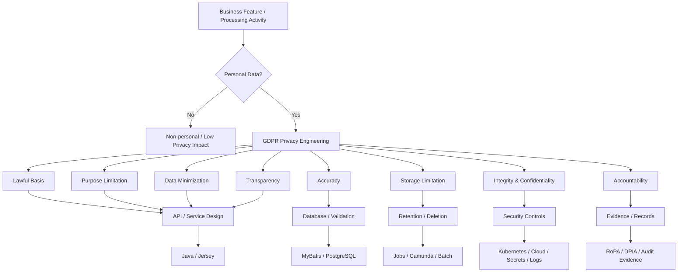

---

## 2. Personal Data Lifecycle

```mermaid id="j23kki"
sequenceDiagram
    participant User as Data Subject / User
    participant API as Java Jersey API
    participant DB as PostgreSQL
    participant Workflow as Camunda / Workflow
    participant Log as Logs / SIEM
    participant Vendor as Processor / Subprocessor
    participant Retention as Retention Job

    User->>API: Submit personal data
    API->>API: Validate purpose + lawful basis context
    API->>DB: Store only necessary fields
    API->>Workflow: Store reference, not excessive payload
    API->>Log: Emit audit/security event without raw personal data
    API->>Vendor: Share minimum necessary data under approved arrangement
    Retention->>DB: Delete / anonymize / archive after retention period
    User->>API: Access / rectification / deletion / portability request
```

Pertanyaan engineering utama:

```text
Data apa yang dikumpulkan?
Untuk purpose apa?
Apa lawful basis-nya?
Siapa controller/processor?
Di mana data disimpan?
Berapa lama?
Bisa diekspor?
Bisa dikoreksi?
Bisa dihapus?
Masuk log/vendor/AI/backup?
```

---

# Key GDPR Vocabulary untuk Engineer

| Istilah | Arti Praktis | Dampak Engineering |
|---|---|---|
| **Personal Data** | Data yang berkaitan dengan individu yang identified atau identifiable. | Nama, email, user ID, IP, device ID, tenant user, log metadata bisa masuk scope. |
| **Processing** | Operasi atas personal data: collect, store, read, update, share, delete, profile, analyze. | Hampir semua operasi API/DB/log/export adalah processing. |
| **Data Subject** | Individu yang datanya diproses. | User/customer/member/contact/admin/person. |
| **Controller** | Pihak yang menentukan purpose dan means pemrosesan. | Biasanya customer/organisasi produk, tergantung model layanan. |
| **Processor** | Pihak yang memproses data atas nama controller. | SaaS/vendor/cloud/analytics/email/AI provider bisa processor/subprocessor. |
| **Subprocessor** | Processor lanjutan yang dipakai processor utama. | Vendor chain harus dimapping. |
| **Lawful Basis** | Dasar hukum pemrosesan. | Consent, contract, legal obligation, legitimate interest, public task, vital interest. |
| **Purpose Limitation** | Data diproses hanya untuk tujuan yang jelas dan sah. | Field/endpoint/vendor payload harus purpose-bound. |
| **Data Minimization** | Hanya data yang perlu yang dikumpulkan/diproses. | No `SELECT *`, no full DTO response, no unnecessary export. |
| **Storage Limitation** | Data tidak disimpan lebih lama dari kebutuhan. | Retention job, deletion/anonymization, backup lifecycle. |
| **Data Subject Rights** | Hak akses, rectification, erasure, restriction, portability, objection, dan rights terkait automated decisioning. | Butuh search/export/delete/correct/restrict workflow. |
| **DPIA** | Data Protection Impact Assessment untuk high-risk processing. | Dibutuhkan untuk profiling, large-scale sensitive data, biometrics, AI risk. |
| **RoPA** | Records of Processing Activities. | Inventory purpose, data category, recipients, transfer, retention, controls. |
| **Privacy by Design & Default** | Data protection ditanam sejak desain dan default-nya privacy-preserving. | Field minimization, secure defaults, access restriction, retention by default. |

EDPB memiliki guideline khusus untuk **Data Protection by Design and by Default** pada Article 25 GDPR; ini relevan langsung ke engineering karena privacy harus masuk sejak desain produk/sistem, bukan setelah implementasi selesai. ([European Data Protection Board](https://www.edpb.europa.eu/documents/guideline/guidelines-42019-on-article-25-data-protection-by-design-and-by-default_en))

---

# Decomposition Map - Practical Categories / Domain / Skills

| No | GDPR Area | Skill / Knowledge untuk Software Engineer | Implementasi Praktis di Stack Anda | Evidence Praktis |
|---:|---|---|---|---|
| 1 | **GDPR Applicability Awareness** | Paham kapan sistem memproses personal data dan apakah user/data subject EU/EEA atau processing berada dalam scope GDPR. | Service classification, tenant/customer region awareness. | Scope record, data-flow diagram. |
| 2 | **Personal Data Identification** | Bisa mengenali direct identifier, indirect identifier, metadata, derived data, pseudonymous data. | Field classification di DTO, DB, logs, events. | Data classification matrix. |
| 3 | **Special Category Data** | Paham data sensitif seperti health, biometric, genetic, political, religious, ethnic, trade union, sex life/orientation. | Strict classification, restricted access, DPIA trigger. | Sensitive data inventory. |
| 4 | **Controller / Processor Mapping** | Paham role organisasi, customer, vendor, cloud provider, AI provider. | DPA/subprocessor map, customer responsibility matrix. | Processing role matrix. |
| 5 | **Lawful Basis Awareness** | Engineer tidak menentukan legal basis sendiri, tapi harus tahu feature butuh lawful basis yang jelas. | Require purpose/lawful-basis reference untuk new data collection. | Design doc, privacy review. |
| 6 | **Purpose Limitation** | Data hanya dipakai untuk purpose yang dinyatakan. | Purpose tag, processing policy, vendor payload scoping. | RoPA entry, design review. |
| 7 | **Data Minimization** | Ambil/simpan/kirim/tampilkan data seminimal mungkin. | DTO projection, SQL explicit columns, no full export. | PR review, API contract. |
| 8 | **Transparency Support** | Sistem mendukung pemberitahuan privacy yang benar. | Data inventory untuk privacy notice, product admin docs. | Data inventory, processing description. |
| 9 | **Accuracy** | Personal data harus bisa diperbarui/dikoreksi jika relevan. | Validation, correction workflow, audit correction. | Rectification ticket/log. |
| 10 | **Storage Limitation** | Data punya retention dan deletion lifecycle. | Scheduled retention job, archive/delete/anonymize. | Retention config, job logs. |
| 11 | **Integrity & Confidentiality** | Personal data dilindungi dari unauthorized access, loss, alteration, disclosure. | AuthZ, encryption, logging, tenant isolation. | Access tests, KMS config, audit logs. |
| 12 | **Accountability** | Organisasi harus bisa membuktikan kepatuhan. | Evidence automation, control mapping, RoPA support. | Evidence index. |
| 13 | **Data Subject Access Request / DSAR** | Mendukung akses data subject terhadap data mereka. | Search/export endpoint internal, identity verification flow. | DSAR workflow evidence. |
| 14 | **Rectification** | Mendukung koreksi data personal yang salah. | Update API, validation, audit old/new metadata. | Correction audit event. |
| 15 | **Erasure / Deletion** | Mendukung right to erasure jika applicable. | Delete/anonymize workflow, dependency map. | Deletion job logs. |
| 16 | **Restriction of Processing** | Menandai data agar tidak diproses untuk purpose tertentu. | Processing lock flag, policy guard. | Restriction status audit. |
| 17 | **Portability** | Data bisa diekspor dalam format umum jika applicable. | JSON/CSV export with scoped fields. | Export evidence. |
| 18 | **Objection Handling** | Menghormati objection untuk processing tertentu. | Preference/objection flags checked by processing jobs. | Preference audit. |
| 19 | **Consent & Preference Management** | Jika consent digunakan, harus bisa dicatat, dicabut, dan diaudit. | Consent ledger, versioned notice, opt-in/out. | Consent records. |
| 20 | **Automated Decisioning / Profiling** | Paham Article 22 risk: keputusan solely automated yang berdampak legal/signifikan. | Human review, explanation metadata, model/rule versioning. | Decision audit, model/rule version. |
| 21 | **DPIA Trigger Awareness** | High-risk processing perlu privacy impact assessment. | Biometric, AI scoring, large-scale monitoring, sensitive data. | DPIA record. |
| 22 | **Privacy by Design** | Privacy control masuk sejak design phase. | Threat/privacy model, minimization, secure defaults. | Design review checklist. |
| 23 | **Privacy by Default** | Default setting harus membatasi data collection/sharing. | Default opt-out/least data exposure where applicable. | Config evidence. |
| 24 | **Pseudonymization** | Mengurangi identifiability dengan mengganti identifier langsung. | Token/hash/opaque ID, separate lookup table. | Pseudonymization design. |
| 25 | **Anonymization** | Data dibuat tidak lagi personal data secara praktis. | Aggregation, generalization, irreversible transformation. | Anonymization method record. |
| 26 | **Logging & Telemetry Privacy** | Logs/metrics/traces bisa berisi personal data. | Redaction, no personal IDs as metric labels. | Log sample, APM config. |
| 27 | **Vendor / Processor Governance** | Vendor yang menerima personal data harus masuk data processing map. | Email/SMS, cloud, analytics, AI, support tools. | DPA/subprocessor inventory. |
| 28 | **International Transfer** | Transfer outside EU/EEA perlu safeguards seperti adequacy, SCC, BCR. | Region mapping, vendor location, remote access review. | Transfer impact/evidence. |
| 29 | **Breach Response** | Personal data breach butuh deteksi, assessment, dan possible notification. | Incident log, affected subject query, containment. | Incident timeline. |
| 30 | **Cross-system Deletion Propagation** | Deletion harus menjangkau DB, files, search index, cache, logs policy, vendor. | Deletion orchestration and tombstone. | Deletion trace. |
| 31 | **Backup and Retention Conflict** | Backup mungkin tidak bisa dihapus granular segera. | Documented restore/delete-after-restore process. | Backup policy. |
| 32 | **AI / LLM Privacy** | Prompt, output, embedding, training data bisa personal data. | Redaction, no training unless approved, model vendor review. | AI data-flow review. |
| 33 | **Data Localization / Residency Awareness** | Region/storage/processor location memengaruhi transfer analysis. | AWS/Azure region, backup region, support access location. | Region inventory. |
| 34 | **Evidence Automation** | Bukti privacy control harus traceable. | GitHub PR, CI, privacy review, retention job, DSAR ticket. | Evidence dashboard. |

---

# GDPR Principles - Engineering Translation

| GDPR Principle | Terjemahan untuk Engineer | Contoh Implementasi |
|---|---|---|
| **Lawfulness, fairness, transparency** | Jangan buat processing tersembunyi atau tanpa purpose/lawful-basis context. | Data processing registry, privacy review before collecting new field. |
| **Purpose limitation** | Data yang dikumpulkan untuk purpose A jangan dipakai untuk purpose B tanpa review. | Purpose tag, policy guard, vendor payload restrictions. |
| **Data minimization** | Jangan ambil semua field hanya karena mudah. | DTO projection, SQL explicit columns, role-based response. |
| **Accuracy** | Data penting harus bisa dikoreksi. | Validation, rectification workflow, correction audit. |
| **Storage limitation** | Data punya masa hidup. | Retention job, deletion/anonymization, archive policy. |
| **Integrity and confidentiality** | Lindungi data dari akses, perubahan, kehilangan, disclosure tidak sah. | RBAC, encryption, audit log, tenant isolation. |
| **Accountability** | Bisa membuktikan keputusan privacy dan kontrolnya. | RoPA, DPIA, evidence index, PR review. |

European Commission menyatakan EU data protection legislation memiliki safeguards untuk transfer ke third countries, termasuk adequacy decisions, SCC, dan BCR; ini penting karena cloud region, vendor, support access, dan subprocessor location dapat mengubah compliance analysis. ([European Commission](https://commission.europa.eu/law/law-topic/data-protection_en))

---

# Personal Data Classification for Engineers

| Data Type | Contoh | Sensitivity | Engineering Control |
|---|---|---:|---|
| Direct identifier | Name, email, phone, national ID | High | Masking, restricted access, retention. |
| Account identifier | User ID, customer ID, tenant user ID | Medium/High | Avoid raw logs; use opaque IDs. |
| Online identifier | IP address, cookie ID, device ID | Medium/High | Treat as personal if linkable. |
| Location data | GPS, address, region trail | High | Minimize, purpose-bound, retention. |
| Behavioral data | Clickstream, usage history | Medium/High | Consent/purpose, retention, aggregation. |
| Financial data | Payment history, billing contact | High | Access restriction, audit, encryption. |
| Health data | Diagnosis, care info, health claim | Very High | Special category controls; may overlap HIPAA/ePHI. |
| Biometric data | Face template, voiceprint, fingerprint | Very High | Strict purpose, encryption, DPIA trigger. |
| Derived data | Risk score, eligibility score, profile segment | High | Profiling/ADM review, explainability metadata. |
| Pseudonymous data | Hash/token/opaque ID linked elsewhere | Medium/High | Still personal data if re-identifiable. |
| Anonymous aggregate | Irreversible aggregate stats | Lower | Validate anonymization assumptions. |
| Logs/telemetry | IP, user ID, tenant ID, trace | Medium/High | Redaction, retention, access control. |
| AI data | Prompt, completion, embedding | Medium/High | Vendor review, redaction, deletion strategy. |

---

# GDPR Mapping ke Stack Anda

## 1. Java / Jersey API

| GDPR Risk | Bad Pattern | Better Pattern |
|---|---|---|
| Over-collection | Endpoint menerima banyak field “untuk jaga-jaga”. | Request DTO purpose-specific. |
| Over-disclosure | Response return full domain object. | Response DTO role/purpose-specific. |
| Hidden processing | Data dikirim ke analytics/vendor tanpa review. | Vendor data-flow review. |
| No DSAR support | Data tersebar tanpa lookup. | Subject identifier index/map. |
| Unsafe error | Error response memuat PII. | Generic error + correlation ID. |
| Raw logging | Request body penuh masuk log. | Structured logging allowlist. |

Contoh DTO lebih aman:

```java id="akec1s"
public class CustomerProfileResponse {
    public String customerId;
    public String displayName;
    public String maskedEmail;
}
```

Hindari:

```java id="6vtfhs"
public class CustomerProfileResponse {
    public String customerId;
    public String fullName;
    public String email;
    public String phone;
    public String address;
    public String nationalId;
    public String internalRiskScore;
    public String supportNotes;
}
```

Prinsipnya: **response harus mengikuti purpose dan role**, bukan mengikuti bentuk table/domain object.

---

## 2. MyBatis / PostgreSQL

| GDPR Concern | Implementasi Praktis |
|---|---|
| Data minimization | `SELECT` explicit columns, bukan `SELECT *`. |
| Purpose limitation | Separate table/column untuk processing purpose tertentu. |
| Access control | DB grants, service-layer authZ, tenant-aware predicates. |
| Retention | `retention_until`, `deleted_at`, anonymization job. |
| Rectification | Update workflow + correction audit. |
| DSAR | Subject lookup across tables. |
| Erasure | Delete/anonymize records and dependent objects. |
| Pseudonymization | Opaque IDs, token tables, salted hash for logs. |
| Auditability | Audit changes without storing full sensitive object. |

Anti-pattern:

```sql id="g97caa"
SELECT *
FROM customer
WHERE id = #{customerId}
```

Better:

```sql id="kbm1rl"
SELECT
    customer_id,
    display_name,
    email_masked,
    status
FROM customer
WHERE customer_id = #{customerId}
  AND tenant_id = #{tenantId}
```

---

## 3. PostgreSQL Data Lifecycle Pattern

Contoh schema support retention:

```sql id="hgvkq0"
CREATE TABLE customer_profile (
    customer_id UUID PRIMARY KEY,
    tenant_id UUID NOT NULL,
    display_name TEXT NOT NULL,
    email TEXT,
    phone TEXT,
    created_at TIMESTAMPTZ NOT NULL,
    updated_at TIMESTAMPTZ NOT NULL,
    retention_until TIMESTAMPTZ,
    deleted_at TIMESTAMPTZ,
    deletion_reason TEXT
);
```

Untuk anonymization:

```sql id="0y13ln"
UPDATE customer_profile
SET
    display_name = 'anonymous',
    email = NULL,
    phone = NULL,
    deleted_at = now(),
    deletion_reason = 'GDPR_ERASURE'
WHERE customer_id = :customerId;
```

Catatan: deletion nyata perlu memperhitungkan dependensi legal, fraud, billing, financial record, litigation hold, dan contractual obligation. Engineer perlu menyediakan mekanisme; legal/privacy team menentukan applicability.

---

## 4. Camunda / Workflow

| Surface | GDPR Risk | Control |
|---|---|---|
| Process variable | Personal data tersimpan di runtime/history. | Store reference, not raw payload. |
| Business key | Bisa mengandung user ID/email. | Use opaque ID. |
| Task comment | Free text bisa berisi PII. | Warning, restriction, retention. |
| History table | Data retained terlalu lama. | History cleanup policy. |
| Incident message | Error mengandung personal data. | Safe exception messages. |
| Human task assignment | Reveals sensitive processing context. | Restrict task visibility. |

Pattern yang lebih aman:

```text
processVariable.customerRef = "cust_opaque_123"
processVariable.requestType = "PROFILE_UPDATE"

Not:
processVariable.email = "person@example.com"
processVariable.fullAddress = "..."
processVariable.nationalId = "..."
```

---

## 5. Logs / SIEM / APM / Metrics

| Surface | GDPR Risk | Better Practice |
|---|---|---|
| App logs | PII leaked through DTO/error. | Allowlist log fields. |
| Access logs | IP/user ID retained. | Retention and restricted access. |
| APM traces | Request/response body captured. | Disable body capture or scrub. |
| Metrics | Labels contain user/customer IDs. | Never use personal data in metric labels. |
| Audit logs | Needed but can become personal data store. | Purpose-bound schema + restricted access. |
| Search index | PII copied into searchable system. | Retention/delete propagation. |
| Error tracking | Stack trace includes payload. | Scrub payload and headers. |

Anti-pattern:

```java id="dd1v11"
logger.info("Updating customer: {}", customerUpdateRequest);
```

Better:

```java id="fw066p"
logger.info(
    "Customer update requested: customerRef={}, fieldsChanged={}, correlationId={}",
    hashForLog(customerId),
    changedFields,
    correlationId
);
```

---

## 6. Docker / Kubernetes / Cloud

| GDPR Concern | Practical Control |
|---|---|
| Data residency | Know AWS/Azure region, backup region, support access region. |
| Access control | IAM/Kubernetes RBAC least privilege. |
| Secrets | No credentials in Git/logs; use KMS/Key Vault/Secrets Manager. |
| Encryption | TLS, storage encryption, backup encryption. |
| Log centralization | Logs may contain personal data; restrict and retain accordingly. |
| Non-prod | No raw production personal data in dev/test. |
| Backup | Backup retention aligned with policy; restore handling for deleted data. |
| Vendor | Cloud/SaaS subprocessors mapped. |

---

# Data Subject Rights - Engineering View

European Commission’s GDPR guidance points individuals to rights over their personal data and tells businesses to address individuals’ requests and organisational obligations; in engineering terms, this becomes a product/system capability, not only a legal inbox. ([European Commission](https://commission.europa.eu/law/law-topic/data-protection_en))

| Right | Engineering Capability | Implementation Notes |
|---|---|---|
| **Access** | Find and export personal data for a subject. | Subject identity resolution across tables/services. |
| **Rectification** | Correct inaccurate data. | Update workflow + audit. |
| **Erasure** | Delete/anonymize data if applicable. | Cross-system deletion orchestration. |
| **Restriction** | Stop certain processing while preserving data. | Processing status flag/policy check. |
| **Portability** | Export structured data in machine-readable format. | JSON/CSV export with scoped fields. |
| **Objection** | Respect objection to certain processing. | Preference/objection guard in jobs/services. |
| **Automated decisioning rights** | Avoid or control solely automated significant decisions. | Human review, contestability, rule/model metadata. |
| **Transparency** | Explain processing categories/purpose. | Data inventory, privacy notice support. |

---

# DSAR Architecture Pattern

```mermaid id="f0rjdp"
flowchart TD
    A[DSAR Request] --> B[Identity Verification]
    B --> C[Subject Resolution]
    C --> D[Data Discovery]
    D --> E[Service-by-Service Query]
    E --> F[Review / Redaction]
    F --> G[Export / Correction / Delete / Restrict]
    G --> H[Audit DSAR Completion]

    E --> E1[Customer API DB]
    E --> E2[Billing DB]
    E --> E3[Case DB]
    E --> E4[Logs / Audit]
    E --> E5[Files / Object Storage]
    E --> E6[Workflow / Camunda]
    E --> E7[Vendors / Subprocessors]
```

Engineering challenge terbesar bukan “delete satu row”. Biasanya masalahnya adalah:

```text
same person -> many identifiers -> many services -> many tables -> logs/files/backups/vendors
```

---

# DSAR Data Discovery Matrix

| System Surface | Access Request | Erasure Request | Notes |
|---|---:|---:|---|
| Primary DB | Include/export | Delete/anonymize if applicable | Need subject key mapping. |
| Audit log | Usually include limited metadata | Usually retained under security/legal basis | Avoid raw personal data. |
| App log | Usually difficult/limited | Retention-based purge | Do not log raw PII. |
| Object storage | Include files if applicable | Delete/anonymize if applicable | Need object ownership index. |
| Search index | Include matching docs | Delete from index | Reindex after deletion. |
| Cache | Not usually exported | Expire/invalidate | Ensure no long retention. |
| Workflow history | Include relevant records | Cleanup/anonymize if applicable | Camunda history can be hidden copy. |
| Backup | Not usually granular immediate delete | Delete after backup retention or special process | Document restore-time deletion procedure. |
| Vendor | Request through processor workflow | Request deletion if applicable | DPA/subprocessor process. |
| AI embeddings | Include if personal/linkable? | Delete vector by subject mapping | Need vector provenance. |

---

# Lawful Basis - Engineering Translation

Engineer biasanya tidak menentukan lawful basis final, tetapi harus membuat sistem yang dapat menghormatinya.

| Lawful Basis | Engineering Signal | Example |
|---|---|---|
| **Consent** | Consent record must be versioned and revocable. | Marketing email opt-in. |
| **Contract** | Processing needed to deliver service. | Account creation, billing contact. |
| **Legal obligation** | Retention/processing mandated by law. | Tax/invoice retention. |
| **Vital interests** | Emergency/life-critical context. | Rare in typical enterprise SaaS. |
| **Public task** | Public authority/public interest context. | Regulatory/government workflows. |
| **Legitimate interests** | Balancing test needed. | Fraud/security monitoring, limited analytics. |

Engineering design implication:

```text
personal data field
-> purpose
-> lawful basis reference
-> retention rule
-> access rule
-> export/delete behavior
```

---

# Consent / Preference Management Pattern

Jika consent dipakai, jangan hanya simpan boolean.

```sql id="79f7s4"
CREATE TABLE consent_event (
    consent_event_id UUID PRIMARY KEY,
    subject_id UUID NOT NULL,
    purpose TEXT NOT NULL,
    consent_status TEXT NOT NULL,
    notice_version TEXT NOT NULL,
    source TEXT NOT NULL,
    captured_at TIMESTAMPTZ NOT NULL,
    revoked_at TIMESTAMPTZ
);
```

Kenapa event-based lebih baik:

| Reason | Benefit |
|---|---|
| Consent berubah dari waktu ke waktu | Auditability. |
| Privacy notice punya versi | Bisa tahu user setuju pada teks mana. |
| Withdrawal perlu trace | Bukti kapan dicabut. |
| Multiple purposes | Marketing, analytics, profiling, sharing berbeda. |

---

# Automated Decisioning / Profiling

EDPB meng-endorse guideline tentang automated individual decision-making dan profiling pada awal GDPR; ini relevan jika sistem melakukan scoring, eligibility, risk assessment, recommendation, fraud decision, case prioritization, atau AI decision support. ([European Data Protection Board](https://www.edpb.europa.eu/documents/guideline/automated-decision-making-and-profiling_en))

| Area | Engineering Concern | Control |
|---|---|---|
| Solely automated decision | Keputusan tanpa human meaningful review. | Human-in-the-loop jika berdampak signifikan. |
| Profiling | Data subject dikategorikan/scored. | Purpose, transparency, minimization. |
| Model/rule versioning | Tidak bisa jelaskan decision basis. | Store model/rule version. |
| Contestability | User tidak bisa challenge outcome. | Review/appeal workflow. |
| Bias/fairness | Disparate impact. | Evaluation, monitoring. |
| Explainability metadata | Decision opaque. | Reason codes, feature categories, audit. |
| Retention | Score disimpan tanpa lifecycle. | Retention and refresh policy. |

Contoh decision audit:

```json id="mnd7o2"
{
  "decisionType": "CASE_PRIORITY_SCORE",
  "subjectRef": "subj_opaque_123",
  "modelVersion": "risk-score-v5.2",
  "inputCategories": ["case_history", "submission_metadata"],
  "scoreBand": "HIGH",
  "humanReviewerRequired": true,
  "createdAt": "2026-07-13T16:00:00Z"
}
```

---

# DPIA Trigger Awareness

DPIA adalah area privacy/legal, tetapi engineer harus tahu kapan mengangkat flag.

| Trigger Pattern | Contoh Engineering |
|---|---|
| Large-scale personal data processing | Analytics terhadap jutaan user events. |
| Special category data | Health/biometric data processing. |
| Systematic monitoring | Behavioral tracking, location monitoring. |
| Automated significant decisions | Eligibility/risk scoring. |
| New technology | LLM, face recognition, voice biometrics. |
| Cross-context reuse | Data support digunakan untuk AI training. |
| Extensive profiling | Segmentation/prediction of individuals. |
| Sensitive integrations | Vendor receives raw personal data. |

Output engineer untuk DPIA:

```text
data flow diagram
data categories
purpose
systems involved
vendor list
security controls
retention
access model
risk/failure modes
```

---

# International Transfers

Commission menjelaskan bahwa EU data protection legislation memiliki safeguards untuk transfer personal data ke third countries, termasuk **adequacy decisions, SCC, dan BCR**. ([European Commission](https://commission.europa.eu/law/law-topic/data-protection/international-dimension-data-protection_en)) SCC adalah model clauses yang sudah pre-approved oleh European Commission untuk transfer data dari EU/EEA ke controller/processor di luar EU/EEA dalam kondisi tertentu. ([European Commission](https://commission.europa.eu/law/law-topic/data-protection/international-dimension-data-protection/standard-contractual-clauses-scc_en)) BCR adalah kebijakan perlindungan data yang mengikat untuk transfer personal data di dalam grup perusahaan multinasional ke luar EU, dan harus mencakup prinsip data protection serta enforceable rights. ([European Commission](https://commission.europa.eu/law/law-topic/data-protection/international-dimension-data-protection/binding-corporate-rules-bcr_en))

Engineering implications:

| Surface | Transfer Risk |
|---|---|
| Cloud region | Data stored/replicated outside EU/EEA. |
| Backup region | Backup copy crosses border. |
| Support access | Non-EU support team remotely accesses EU data. |
| Vendor API | Processor/subprocessor outside EU/EEA receives personal data. |
| Logs/SIEM | EU user logs forwarded to non-EU system. |
| AI/LLM provider | Prompt/output processed outside region. |
| Email/SMS provider | Contact data routed globally. |
| CDN/cache | Personal URLs/tokens cached across regions. |

Minimum data-transfer inventory:

```text
data category
source region
destination region
recipient/vendor
role: controller/processor/subprocessor
transfer mechanism: adequacy/SCC/BCR/other
encryption
access restriction
retention
```

---

# Pseudonymization vs Anonymization

| Technique | Still Personal Data? | Engineering Notes |
|---|---:|---|
| Masking | Usually yes | Display/log safety, not true anonymization. |
| Hashing | Often yes | Re-identifiable if source/value dictionary exists. |
| Salted hash | Often yes if linkable | Better for logs, still controlled. |
| Tokenization | Usually yes if reversible/linkable | Good for minimization but access to token vault matters. |
| Pseudonymization | Yes | Reduces risk, does not remove GDPR obligations. |
| Aggregation | Maybe no if sufficiently broad | Beware small groups and re-identification. |
| Anonymization | No, if irreversible and non-identifiable | Harder than it looks; document method. |

Practical pattern:

```text
Use pseudonymization for operational systems.
Use anonymization for analytics only when re-identification risk is assessed.
```

---

# GDPR Pull Request Checklist

Gunakan checklist ini untuk PR yang menyentuh user/customer/person/member/contact/employee/behavioral/analytics/AI/logging/export.

| Area | Question |
|---|---|
| Personal Data | Apakah field/payload/log/event/file baru mengandung personal data? |
| Purpose | Untuk purpose apa data ini diproses? |
| Lawful Basis | Apakah privacy/legal/product owner sudah punya lawful-basis context? |
| Minimization | Apakah field ini benar-benar perlu? |
| DTO | Apakah response over-disclose? |
| SQL | Apakah query mengambil kolom personal yang tidak perlu? |
| Logs | Apakah raw PII masuk app log, APM, SIEM, metric label? |
| Retention | Apakah data punya retention/deletion rule? |
| DSAR | Apakah data bisa ditemukan/export/delete/correct jika diperlukan? |
| Vendor | Apakah data dikirim ke processor/subprocessor? |
| Transfer | Apakah data keluar EU/EEA atau region customer? |
| Consent | Jika consent-based, apakah withdrawal dihormati? |
| Profiling | Apakah ada scoring/segmentation/automated decision? |
| DPIA | Apakah feature ini high-risk? |
| Evidence | Evidence apa yang menunjukkan privacy-by-design? |

---

# Failure Modes yang Sering Terjadi

| Failure Mode | Contoh | Dampak |
|---|---|---|
| **Data minimization gagal** | API mengembalikan full profile padahal UI hanya butuh display name. | Over-disclosure. |
| **Logs jadi PII warehouse** | Request body/error payload masuk SIEM. | Breach impact membesar. |
| **DSAR tidak bisa dieksekusi** | Data subject tersebar di banyak service tanpa index. | Operational compliance failure. |
| **Deletion tidak propagate** | DB dihapus, search index/file/vendor tetap ada. | Erasure gap. |
| **Backup tidak dipikirkan** | Deleted user muncul lagi setelah restore. | Restore-time privacy bug. |
| **Purpose creep** | Data support digunakan untuk analytics/AI training. | Purpose limitation issue. |
| **Consent boolean saja** | Tidak tahu user setuju notice versi mana. | Consent evidence lemah. |
| **Pseudonymized dianggap anonymous** | Hash email dianggap keluar scope. | Salah klasifikasi. |
| **Metric label pakai userId/email** | Observability menyimpan high-cardinality personal data. | Privacy + performance issue. |
| **Vendor tidak dimapping** | Personal data dikirim ke email/SMS/AI/APM vendor. | Processor/subprocessor gap. |
| **Cross-border copy tersembunyi** | Backup/log dikirim ke region non-EU. | Transfer mechanism issue. |
| **Automated decision opaque** | Risk score menentukan outcome tanpa review/explanation. | Article 22/profiling risk. |

---

# Mini Case Study - Customer Profile API

## Feature

```text
GET /customers/{customerId}/profile
```

## GDPR Risks

| Risk | GDPR Concern |
|---|---|
| User sees too many fields | Data minimization/confidentiality |
| Wrong user sees another customer | Security/confidentiality |
| Response includes internal risk score | Profiling/transparency |
| Logs contain email/phone/address | Privacy/security |
| Data cannot be corrected | Rectification |
| Data retained after account closure | Storage limitation |

## Controls

| Control | Implementation |
|---|---|
| AuthZ | Tenant + role + customer ownership check. |
| Response minimization | Public profile DTO vs internal admin DTO. |
| Logging | Hash customer ID, no raw contact fields. |
| Audit | Profile viewed/updated events if sensitive. |
| Rectification | Update workflow with validation and audit. |
| Retention | `retention_until` and deletion/anonymization job. |

## Evidence

```text
- API contract
- Authz integration test
- Data classification entry
- Log redaction test
- Retention job config
- Correction audit event sample
```

---

# Mini Case Study - Right to Erasure

## Request

```text
Delete personal data for subject X.
```

## Engineering Flow

```mermaid id="w68bnf"
flowchart TD
    A[Erasure Request] --> B[Verify Identity]
    B --> C[Resolve Subject IDs]
    C --> D[Check Legal/Business Holds]
    D --> E{Can Erase?}
    E -- Yes --> F[Delete / Anonymize Primary DB]
    F --> G[Delete Files / Search Index / Cache]
    G --> H[Notify Vendors if Applicable]
    H --> I[Record Completion Evidence]
    E -- No / Partial --> J[Restrict Processing / Explain Retention Basis]
```

## Deletion Checklist

| Surface | Action |
|---|---|
| Primary DB | Delete/anonymize personal fields. |
| Foreign keys | Preserve referential integrity with anonymized subject. |
| Audit logs | Usually retain security metadata, avoid raw personal data. |
| Object storage | Delete subject-owned files if applicable. |
| Search index | Remove/reindex. |
| Cache | Invalidate. |
| Workflow | Cleanup/anonymize variables/history if applicable. |
| Vendor | Send deletion request if applicable. |
| Backup | Follow backup retention/restore-time deletion process. |
| Evidence | Completion log/ticket. |

---

# Mini Case Study - Analytics Event Pipeline

## Event

```json id="gpsd8a"
{
  "userId": "u-123",
  "email": "person@example.com",
  "page": "/pricing",
  "ip": "203.0.113.1",
  "deviceId": "dev-abc",
  "timestamp": "2026-07-13T16:00:00Z"
}
```

## Risks

| Risk | Problem |
|---|---|
| Email unnecessary | Violates minimization. |
| IP/device retained too long | Tracking/privacy risk. |
| UserId directly identifiable | DSAR/deletion needed. |
| Sent to non-EU vendor | Transfer/subprocessor concern. |
| Used for profiling | Purpose/transparency concern. |

## Better Event

```json id="emuxwk"
{
  "subjectHash": "h:8f21...",
  "pageCategory": "pricing",
  "sessionRegion": "EU",
  "timestamp": "2026-07-13T16:00:00Z"
}
```

Still personal if linkable, but lower risk and more defensible.

---

# Mini Case Study - LLM Customer Support Summarization

## Feature

```text
Summarize customer support ticket using LLM.
```

## GDPR Risks

| Risk | Concern |
|---|---|
| Prompt contains personal data | Processor/subprocessor and transfer. |
| Model provider retains prompt | Purpose/storage limitation. |
| Output contains inferred sensitive data | Accuracy/profiling. |
| Summary used for decisioning | Automated decisioning risk. |
| Logs store prompt/output | Privacy breach surface. |
| No deletion propagation | DSAR/erasure gap. |

## Controls

| Control | Implementation |
|---|---|
| Redaction | Remove unnecessary identifiers before prompt. |
| Vendor review | DPA, subprocessor, region, retention settings. |
| No training unless approved | Contract/config confirmation. |
| Human review | Output not treated as authoritative. |
| Prompt audit | Store metadata, not raw prompt when possible. |
| Deletion map | Ticket, summary, vector, vendor data lifecycle. |

---

# GDPR Evidence Pack

Buat evidence index:

```text
gdpr-privacy-engineering-evidence/
  01-scope-and-data-flow/
  02-data-classification/
  03-processing-purpose/
  04-controller-processor-map/
  05-dsar-workflows/
  06-retention-deletion/
  07-access-control/
  08-logging-redaction/
  09-vendor-subprocessor/
  10-international-transfers/
  11-dpia/
  12-automated-decisioning/
  13-ai-llm-processing/
  14-non-prod-data-controls/
  15-breach-response/
```

## Evidence Quality Matrix

| Evidence | Kualitas |
|---|---|
| Data-flow diagram with personal data categories | Kuat |
| Data classification matrix | Kuat |
| Retention job logs | Kuat |
| DSAR completion ticket | Kuat |
| Log redaction test | Kuat |
| DPA/subprocessor list | Kuat |
| Transfer region inventory | Kuat |
| DPIA record for high-risk processing | Kuat |
| “We do not collect much data” tanpa inventory | Lemah |
| Privacy policy saja | Lemah jika tidak didukung implementation |
| Screenshot tanpa timestamp/scope | Lemah |

---

# Practical GDPR Service Map Template

Buat dokumen internal:

```text
gdpr-service-privacy-map.md
```

Isi minimal:

| Section | Isi |
|---|---|
| Service Name | Nama service/module. |
| Processing Purpose | Purpose utama service. |
| Role | Controller/processor/subprocessor context. |
| Personal Data Elements | Field, table, log, file, event, model input/output. |
| Special Categories | Health, biometric, genetic, etc jika ada. |
| Lawful Basis Reference | Diisi bersama privacy/legal/product owner. |
| Data Flows | Source, destination, recipient, region. |
| Storage Surfaces | DB, cache, log, file, search, workflow, backup. |
| Retention | Duration, delete/anonymize/archive rule. |
| DSAR Support | Access/export/delete/rectify/restrict behavior. |
| Vendor/Subprocessor | Data sent, region, DPA/SCC/BCR if applicable. |
| Security Controls | AuthZ, encryption, audit, redaction. |
| Automated Decisioning | Rule/model/scoring/profiling. |
| Gaps | Missing owner/control/evidence. |

---

# Roadmap Belajar Singkat

## Hari 1 - GDPR Vocabulary

Fokus pada:

```text
personal data
processing
controller
processor
lawful basis
purpose limitation
data minimization
data subject rights
DPIA
RoPA
SCC/BCR
```

## Hari 2 - Personal Data Inventory

Ambil satu service dan cari personal data di:

```text
API payload
DB tables
views/materialized views
logs
metrics
APM traces
files
exports
Camunda variables
search index
cache
backup
vendor payload
AI prompt/output/embedding
```

## Hari 3 - DSAR & Retention

Cek apakah data bisa:

```text
found
exported
corrected
deleted/anonymized
restricted
excluded from processing
```

## Hari 4 - Logging, Vendor, Transfer

Review:

```text
raw PII in logs
PII in metrics labels
APM body capture
vendor/subprocessor payload
cloud/log/backup region
support access region
```

## Hari 5 - Automated Decisioning & AI

Cari:

```text
risk score
eligibility score
priority score
profiling
recommendation
LLM summary
embedding
biometric/face/voice processing
human review workflow
```

---

# Output yang Sebaiknya Anda Buat Setelah Seri Ini

Buat mini matrix seperti ini:

| Data Element | Purpose | Surface | Retention | DSAR Behavior | Vendor/Transfer | Control | Gap |
|---|---|---|---|---|---|---|---|
| `customer.email` | Account/contact | DB/API | Account lifetime + policy | Access/rectify/delete conditional | Email vendor | Mask logs, RBAC | Verify vendor DPA |
| `customer.phone` | Notification | DB/API | Purpose-bound | Access/rectify/delete | SMS vendor | Mask logs | Consent/preference check |
| `risk_score` | Case prioritization | DB/API | Case retention | Access maybe, explainability needed | None | Restricted access | Review profiling |
| `support_note` | Support case | DB/search | Case retention | Access/delete conditional | Support tool | Redaction warning | Free text DLP needed |
| `prompt_text` | AI summary | LLM vendor/log? | Minimal | Depends if retained | AI provider/non-EU? | Redaction | Confirm retention/training |
| `audit_actor_id` | Security audit | Audit log | Security retention | Limited access | SIEM | Restricted access | Avoid raw PII payload |

---

# Rekomendasi Materi Selanjutnya

Lanjut ke **Seri 10/18 - SSAE SOC 1 / Financial Control Awareness**.

Kenapa: setelah GDPR, kita pindah dari privacy lifecycle ke **financial-reporting-impacting systems**. SOC 1/SSAE akan penting jika platform Anda menyentuh order state, billing, invoice, revenue-impacting workflow, pricing, entitlement, settlement, reconciliation, atau customer financial controls. Fokusnya bukan privacy/security umum, tetapi **apakah sistem dan perubahan software dapat memengaruhi financial reporting customer/perusahaan secara benar, lengkap, akurat, authorized, dan auditable**.

**Seri 9/18 selesai.**

---

**Sources:**

- [Data protection - European Commission](https://commission.europa.eu/law/law-topic/data-protection_en)
- [Guidelines 4/2019 on Article 25 Data Protection by Design and by Default | European Data Protection Board](https://www.edpb.europa.eu/documents/guideline/guidelines-42019-on-article-25-data-protection-by-design-and-by-default_en)

## Response:
7/13/2026, 11:29:17 PM

# Seri 10/18 - SSAE SOC 1 / Financial Control Awareness

## Introduction

**SOC 1** berbeda dari SOC 2. Kalau SOC 2 banyak bicara tentang security, availability, confidentiality, privacy, dan processing integrity, **SOC 1 fokus pada kontrol di service organization yang relevan terhadap Internal Control over Financial Reporting / ICFR milik user entity/customer**. AICPA menjelaskan SOC 1 sebagai examination atas kontrol di service organization yang kemungkinan relevan terhadap internal control over financial reporting user entities. ([AICPA & CIMA](https://www.aicpa-cima.com/topic/audit-assurance/audit-and-assurance-greater-than-soc-1?utm_source=chatgpt.com))

Cara praktis membacanya untuk software engineer:

> SOC 1 bertanya: “Apakah sistem, workflow, data, dan perubahan software yang memengaruhi transaksi finansial dapat menghasilkan output yang lengkap, akurat, authorized, tepat waktu, traceable, dan bisa direkonsiliasi?”

SOC 1 biasanya relevan jika platform menyentuh area seperti:

```text id="r7pcn4"
order state
pricing
discount
tax
billing
invoice
payment allocation
revenue recognition support
entitlement
commission
settlement
refund
credit note
usage metering
customer financial reports
```

Untuk konteks enterprise CPQ / order management / billing-adjacent platform, SOC 1 mindset sangat penting karena bug kecil di state transition, pricing rule, effective date, rounding, reconciliation, atau migration bisa berdampak ke financial reporting customer.

---

# Diagram

## 1. SOC 1 Engineering Mental Model

```mermaid id="zz1po3"
flowchart TD
    A[Business Transaction] --> B[System Processing]
    B --> C[Financially Relevant Output]
    C --> D[Customer ICFR Impact]

    B --> B1[Order Workflow]
    B --> B2[Pricing / Discount]
    B --> B3[Billing / Invoice Data]
    B --> B4[Payment / Refund / Credit]
    B --> B5[Entitlement / Fulfillment]
    B --> B6[Usage Metering]
    B --> B7[Reporting / Export]

    D --> E[Control Objectives]
    E --> E1[Completeness]
    E --> E2[Accuracy]
    E --> E3[Authorization]
    E --> E4[Timeliness]
    E --> E5[Validity]
    E --> E6[Auditability]
    E --> E7[Reconciliation]

    E --> F[Engineering Controls]
    F --> F1[State Machine Guards]
    F --> F2[Validation Rules]
    F --> F3[Approval Workflow]
    F --> F4[Immutable Audit Trail]
    F --> F5[Idempotency]
    F --> F6[Reconciliation Jobs]
    F --> F7[Change Management]
```

---

## 2. SOC 1 vs SOC 2

```mermaid id="9woq8x"
flowchart LR
    A[SOC Reports] --> B[SOC 1]
    A --> C[SOC 2]

    B --> B1[Controls relevant to user entities' ICFR]
    C --> C1[Controls relevant to Security, Availability, Processing Integrity, Confidentiality, Privacy]

    B1 --> D[Financial transaction correctness]
    B1 --> E[Billing / invoice / order / revenue-impacting data]

    C1 --> F[Security and service trust criteria]
    C1 --> G[Availability / privacy / confidentiality]
```

SOC 1 dan SOC 2 bisa overlap di change management, access control, logging, incident, dan processing integrity. Bedanya: **SOC 1 menilai dampak kontrol terhadap financial reporting**, sedangkan SOC 2 menilai kontrol terhadap Trust Services Criteria. AICPA menempatkan SOC 1 dalam konteks ICFR, sementara SOC 2 untuk security, availability, processing integrity, confidentiality, atau privacy. ([AICPA & CIMA](https://www.aicpa-cima.com/topic/audit-assurance/audit-and-assurance-greater-than-soc-1?utm_source=chatgpt.com))

---

# Decomposition Map - Practical Categories / Domain / Skills

| No | SOC 1 Area | Skill / Knowledge untuk Software Engineer | Implementasi Praktis di Stack Anda | Evidence Praktis |
|---:|---|---|---|---|
| 1 | **SOC 1 Literacy** | Paham bahwa SOC 1 fokus ke ICFR user/customer, bukan security umum. | Identifikasi service yang memengaruhi billing, invoice, order, usage, revenue. | SOC 1 scope map. |
| 2 | **Financially Relevant System Identification** | Menentukan module yang berdampak finansial. | CPQ, order management, billing adapter, usage metering, refund workflow. | System boundary diagram. |
| 3 | **Transaction Lifecycle Mapping** | Memetakan transaksi dari quote/order sampai invoice/report. | Quote → order → fulfillment → usage → billing → invoice → adjustment. | Transaction flow diagram. |
| 4 | **Completeness Control** | Memastikan semua transaksi yang harus diproses benar-benar diproses. | Queue reconciliation, batch count check, missing-event detection. | Reconciliation report. |
| 5 | **Accuracy Control** | Memastikan amount, quantity, tax, discount, state, date, dan account benar. | Validation, deterministic calculation, unit/integration tests. | Calculation test report. |
| 6 | **Authorization Control** | Transaksi finansial hanya dibuat/diubah/diapprove oleh pihak berwenang. | RBAC, approval workflow, delegated authority matrix. | Approval audit trail. |
| 7 | **Validity Control** | Transaksi yang diproses adalah transaksi sah, bukan duplicate, fake, atau stale. | Idempotency, uniqueness constraint, source validation. | Idempotency test. |
| 8 | **Timeliness Control** | Transaksi diproses dalam window/cutoff yang benar. | Batch SLA, scheduler monitoring, cutoff validation. | Job execution logs. |
| 9 | **Cutoff Awareness** | Paham period close, effective date, invoice cycle, fiscal period. | Prevent late mutation without adjustment workflow. | Period close control evidence. |
| 10 | **Reconciliation** | Membandingkan source-target-total untuk mendeteksi missing/duplicate/error. | DB count/sum compare, gateway reconciliation, invoice total check. | Reconciliation job output. |
| 11 | **State Machine Governance** | Financial transaction state harus valid dan controlled. | Camunda + domain state transition guard. | State transition tests. |
| 12 | **Pricing Rule Governance** | Perubahan price/discount/tax/fee berdampak ke financial output. | Versioned pricing rules, approval, effective dates. | Rule change approval. |
| 13 | **Configuration Change Control** | Customer/product/billing config tidak boleh berubah tanpa audit. | Config versioning, maker-checker approval. | Config audit history. |
| 14 | **Code Change Management** | Code yang memengaruhi financial processing harus reviewed/tested. | GitHub PR, CODEOWNERS, CI, deployment approval. | PR + CI + deployment record. |
| 15 | **Segregation of Duties** | Pembuat, approver, deployer, dan operator tidak boleh terlalu terkonsentrasi. | PR review, approval workflow, production deploy gate. | Approval/access matrix. |
| 16 | **Access Control for Financial Data** | Data invoice/order/payment/adjustment hanya untuk role tertentu. | RBAC, DB grants, export restrictions. | Access review. |
| 17 | **Privileged Override Control** | Manual correction/override harus approved, reasoned, audited. | Admin override workflow, reason code, dual approval. | Override audit log. |
| 18 | **Audit Trail Design** | Setiap perubahan finansial penting harus traceable. | Actor/action/object/old-new metadata/reason/correlation ID. | Audit event sample. |
| 19 | **Immutability / Append-only Ledger Thinking** | Financial events lebih aman disimpan append-only daripada update-in-place. | Event ledger, adjustment rows, reversal events. | Ledger table and tests. |
| 20 | **Data Lineage** | Output invoice/report harus bisa ditelusuri ke source transaction. | Source event ID, order ID, invoice ID, correlation ID. | Lineage query. |
| 21 | **Exception Handling** | Failed transaction tidak boleh hilang diam-diam. | DLQ, exception queue, retry policy, manual review. | Exception queue report. |
| 22 | **Idempotency** | Retry tidak boleh membuat double-charge/double-invoice/double-order. | Idempotency key, unique constraint, request hash. | Idempotency test. |
| 23 | **Rounding & Precision** | Monetary value harus deterministik dan sesuai aturan. | `BigDecimal`, scale/rounding policy, currency-aware tests. | Calculation tests. |
| 24 | **Effective Dating** | Price/discount/tax/config berlaku pada waktu tertentu. | Valid-from/valid-to, timezone/cutoff handling. | Effective-date tests. |
| 25 | **Batch & Scheduler Controls** | Batch financial processing harus monitored dan reconcilable. | Job status, row count, checksum, alerting. | Batch run logs. |
| 26 | **Report & Export Control** | Customer financial reports harus complete/accurate. | Report versioning, query review, reconciliation. | Report sample + validation. |
| 27 | **Database Migration Control** | Schema/data migration bisa mengubah financial data. | Liquibase/Flyway review, rollback plan, migration test. | Migration PR and test. |
| 28 | **Master Data Governance** | Product, account, tax, currency, plan, entitlement master data berdampak finansial. | Versioned master data, approval, audit. | Master data audit. |
| 29 | **Complementary User Entity Controls / CUECs** | Beberapa kontrol bergantung pada customer. | Customer must review exports, configure tax/pricing, manage users. | CUEC documentation. |
| 30 | **Subservice Organization Awareness** | Vendor/subservice dapat memengaruhi financial processing. | Payment gateway, tax engine, billing provider, cloud scheduler. | Vendor/SOC report map. |
| 31 | **Evidence Automation** | Evidence SOC 1 harus lahir dari sistem normal. | PR, CI, workflow audit, reconciliation, job logs. | Evidence index. |
| 32 | **Defect Impact Assessment** | Bug harus dinilai apakah memengaruhi financial reporting. | RCA, affected transaction query, correction script. | Defect impact report. |
| 33 | **Correction / Adjustment Workflow** | Koreksi finansial harus controlled, bukan update manual. | Credit note, reversal, adjustment event. | Adjustment audit trail. |
| 34 | **Period Close Discipline** | Setelah close, perubahan harus adjustment, bukan rewrite history. | Lock period, close status, approved reopening. | Period lock evidence. |
| 35 | **Data Retention for Financial Records** | Financial records harus retained sesuai policy/legal/customer contract. | Retention rules, archive, deletion constraints. | Retention evidence. |

---

# SOC 1 Control Objectives - Engineering Translation

| Control Objective | Pertanyaan Engineering | Contoh Kontrol |
|---|---|---|
| **Completeness** | Apakah semua transaksi/event yang harus diproses sudah diproses? | Source-target count, queue drain check, batch reconciliation. |
| **Accuracy** | Apakah nilai, tanggal, quantity, currency, tax, dan state benar? | Calculation tests, constraints, deterministic rounding. |
| **Validity** | Apakah transaksi sah dan bukan duplicate/stale/unauthorized? | Idempotency, source validation, workflow state guard. |
| **Authorization** | Apakah transaksi/perubahan disetujui pihak berwenang? | RBAC, approval workflow, maker-checker. |
| **Timeliness** | Apakah transaksi diproses dalam periode/cutoff yang benar? | Scheduler SLA, period close lock, cutoff validation. |
| **Auditability** | Apakah transaksi bisa ditelusuri dari source ke output? | Audit trail, lineage ID, correlation ID. |
| **Reconciliation** | Apakah hasil antar sistem cocok? | Sum/count compare, exception report, settlement matching. |
| **Change Control** | Apakah perubahan code/config/rule berdampak finansial dikontrol? | PR, CI, approval, versioned config. |

---

# SOC 1 Mapping ke Stack Anda

## 1. Java / Jersey API

| SOC 1 Risk | Bad Pattern | Better Pattern |
|---|---|---|
| Unauthorized financial action | Endpoint refund/adjustment hanya cek login. | Role + authority limit + approval workflow. |
| Invalid state transition | API bisa langsung `ORDER_CREATED -> INVOICED`. | Explicit state machine guard. |
| Duplicate transaction | Retry menghasilkan double order/refund. | Idempotency key + unique constraint. |
| Amount mismatch | Calculation tersebar di controller/service berbeda. | Centralized calculation service + tests. |
| No audit trail | Update amount tanpa reason. | Mandatory reason + audit event. |
| Silent failure | Batch partial fail tetapi status sukses. | Exception queue + reconciliation. |

Contoh audit event:

```json id="k59961"
{
  "eventType": "ORDER_STATE_CHANGED",
  "actorId": "user-123",
  "orderId": "ord-456",
  "previousState": "APPROVED",
  "newState": "FULFILLMENT_PENDING",
  "reasonCode": "STANDARD_PROCESSING",
  "correlationId": "req-abc",
  "timestamp": "2026-07-13T16:00:00Z"
}
```

---

## 2. MyBatis / PostgreSQL

| SOC 1 Concern | Implementasi Praktis |
|---|---|
| Completeness | Source-target reconciliation table. |
| Accuracy | DB constraints, check constraints, precision rules. |
| Validity | Unique keys, state constraints, idempotency table. |
| Authorization | App-level check + DB role restriction. |
| Auditability | Append-only financial event/audit table. |
| Change Control | Migration PR review, test migration, rollback. |
| Cutoff | Period lock table, effective date validation. |
| Reporting | Versioned report query and reconciliation. |

Contoh idempotency table:

```sql id="dscf4h"
CREATE TABLE financial_idempotency_key (
    idempotency_key TEXT PRIMARY KEY,
    request_hash TEXT NOT NULL,
    operation_type TEXT NOT NULL,
    result_reference TEXT,
    created_at TIMESTAMPTZ NOT NULL
);
```

Contoh period lock:

```sql id="82w9tr"
CREATE TABLE financial_period (
    period_id TEXT PRIMARY KEY,
    start_at TIMESTAMPTZ NOT NULL,
    end_at TIMESTAMPTZ NOT NULL,
    status TEXT NOT NULL CHECK (status IN ('OPEN', 'CLOSED', 'LOCKED')),
    closed_at TIMESTAMPTZ,
    closed_by TEXT
);
```

---

## 3. Camunda / Workflow

SOC 1 sering sangat relevan untuk workflow karena financial transaction biasanya melewati state dan approval.

| Workflow Surface | SOC 1 Risk | Control |
|---|---|---|
| Process variable | Amount/order config berubah tanpa audit. | Versioned variable snapshot. |
| Human task | Approval dilakukan oleh role salah. | Candidate group + service-layer validation. |
| Boundary event | Timeout menyebabkan skipped billing step. | Explicit exception path. |
| Retry job | Duplicate external call. | Idempotency + external transaction reference. |
| Manual task completion | Approver sama dengan requester. | Segregation of duties check. |
| Process migration | Active instance berubah logic. | Migration approval and test. |
| Incident handling | Failed financial job hilang. | Incident queue + reconciliation. |

Contoh state transition guard:

```text id="rwj3yb"
ORDER_DRAFT
-> ORDER_APPROVED
-> FULFILLMENT_PENDING
-> FULFILLED
-> BILLING_READY
-> INVOICED
```

Forbidden:

```text id="s73j82"
ORDER_DRAFT -> INVOICED
FULFILLED -> ORDER_DRAFT
INVOICED -> price mutated directly
```

---

## 4. GitHub / Maven / CI/CD

| SOC 1 Concern | Practical Control |
|---|---|
| Financial code change | CODEOWNERS for billing/order/pricing modules. |
| Calculation correctness | Unit/property-based/regression tests. |
| Migration safety | Data migration dry-run and rollback plan. |
| Release traceability | Ticket → PR → CI → image → deploy. |
| SoD | Author cannot be sole approver for high-risk financial change. |
| Emergency change | Exception + retrospective approval + impact review. |
| Dependency risk | SCA scan for financial services. |
| Config/rule changes | Versioned rule/config repository with approval. |

Evidence chain:

```text id="q4dxi9"
Change ticket
-> PR
-> financial-domain reviewer approval
-> calculation regression test
-> migration test
-> CI pass
-> deployment approval
-> post-deploy reconciliation
```

---

## 5. Docker / Kubernetes / Runtime

| SOC 1 Concern | Practical Control |
|---|---|
| Batch job reliability | Kubernetes CronJob monitoring, retries, alerting. |
| Job duplicate execution | Leader election / idempotency / lock table. |
| Deployment correctness | Rollout status, canary, rollback. |
| Resource exhaustion | Limits, backpressure, DB pool sizing. |
| Financial job observability | Metrics for processed count, failed count, total amount. |
| Runtime access | Restricted exec into production pods. |
| Config drift | GitOps/IaC only, no manual console changes. |

Critical metric examples:

```text id="u4w9le"
billing_job_processed_count
billing_job_failed_count
invoice_total_amount
reconciliation_difference_amount
order_state_transition_failure_count
duplicate_idempotency_key_count
```

---

# Financial Data Surfaces

| Surface | Risk | Control |
|---|---|---|
| API request | Unauthorized or invalid financial action. | AuthZ, validation, idempotency. |
| API response | Wrong/overexposed financial data. | Role-based DTO. |
| Database table | Incorrect mutation or missing audit. | Constraints, audit, append-only ledger. |
| View/materialized view | Reporting wrong due to stale/copy logic. | Refresh control, report reconciliation. |
| Batch job | Missing/duplicate processing. | Job control, reconciliation, alerting. |
| Queue/DLQ | Event lost or duplicated. | Exactly-once illusion avoided; idempotency. |
| Camunda variable | Financial state hidden in workflow history. | Versioned references, controlled state. |
| Export/CSV | Customer financial report inaccurate. | Report validation, approval, versioning. |
| Cache | Stale price/entitlement. | TTL, cache invalidation, version key. |
| Config/feature flag | Financial logic changed without approval. | Versioned config, audit. |
| Backup/restore | Financial data restored inconsistently. | Restore testing, point-in-time recovery. |
| Manual script | Direct production data correction. | Script review, approval, audit output. |

---

# Financial Control Patterns

## 1. Append-only Financial Event Ledger

Financially relevant changes are safer when represented as events/adjustments rather than destructive updates.

```sql id="v1o78f"
CREATE TABLE financial_event (
    event_id UUID PRIMARY KEY,
    tenant_id UUID NOT NULL,
    source_system TEXT NOT NULL,
    source_reference TEXT NOT NULL,
    event_type TEXT NOT NULL,
    amount NUMERIC(18, 4),
    currency CHAR(3),
    effective_at TIMESTAMPTZ NOT NULL,
    created_at TIMESTAMPTZ NOT NULL,
    created_by TEXT NOT NULL,
    correlation_id TEXT NOT NULL
);
```

Benefits:

| Benefit | Why It Matters |
|---|---|
| Traceability | Bisa lihat urutan perubahan. |
| Reconciliation | Bisa sum/count by period/source. |
| Correction | Koreksi sebagai adjustment/reversal. |
| Auditability | Tidak overwrite history. |
| Period close | Closed period tidak diubah langsung. |

---

## 2. Maker-Checker Approval

Untuk perubahan finansial high-risk:

```mermaid id="ufbro6"
stateDiagram-v2
    [*] --> Draft
    Draft --> PendingApproval: submitted
    PendingApproval --> Approved: checker approves
    PendingApproval --> Rejected: checker rejects
    Approved --> Applied: system applies change
    Applied --> Audited
    Rejected --> Draft
```

Controls:

| Control | Implementation |
|---|---|
| Maker cannot approve own change | Compare requester and approver. |
| Approval authority limit | Amount threshold and role. |
| Reason mandatory | Required reason code/comment. |
| Audit event | Submission, approval, application. |
| Effective date | Change applies only in allowed period. |

---

## 3. Reconciliation Job Pattern

```mermaid id="8q7p7u"
flowchart LR
    A[Source Transactions] --> C[Reconciliation Job]
    B[Target Output / Invoice / Report] --> C
    C --> D{Match?}
    D -- Yes --> E[Record Success Evidence]
    D -- No --> F[Exception Queue]
    F --> G[Investigation / Correction]
```

Reconciliation dimensions:

| Dimension | Example |
|---|---|
| Count | Number of orders vs number of invoice lines. |
| Amount | Sum of charges vs invoice total. |
| State | All fulfilled orders are billing-ready or invoiced. |
| Date | Transactions included in correct period. |
| Currency | Currency conversion applied consistently. |
| Tenant/customer | No cross-customer inclusion. |
| External reference | Gateway/payment/tax engine references match. |

---

## 4. Period Close / Cutoff Control

Financial systems often require period discipline.

```text id="oa45t5"
Before period close:
- process transactions
- reconcile
- resolve exceptions
- approve close

After period close:
- block direct mutation
- use adjustment/reversal workflow
- audit all late changes
```

Anti-pattern:

```sql id="wx5ha2"
UPDATE invoice_line
SET amount = 100.00
WHERE invoice_id = 'INV-123';
```

Better:

```text id="gy3j8x"
Create approved adjustment event:
- original invoice line reference
- adjustment amount
- reason code
- approver
- effective period
```

---

# Rounding, Precision, Currency

Financial bugs often come from numeric handling.

| Issue | Bad Pattern | Better Pattern |
|---|---|---|
| Floating point money | `double amount` | `BigDecimal` with explicit scale/rounding. |
| Inconsistent rounding | Each service rounds differently. | Central rounding policy. |
| Currency ignored | Amount without currency. | Amount + ISO currency. |
| Timezone cutoff | Local date ambiguous. | Explicit timezone/calendar policy. |
| Tax/discount order | Different calculation order. | Versioned calculation engine. |
| Historical recalculation | Old invoice recalculated with new rules. | Store rule version/snapshot. |

Java pattern:

```java id="z2tv5d"
BigDecimal amount = new BigDecimal("10.00");
BigDecimal taxRate = new BigDecimal("0.11");

BigDecimal tax = amount
    .multiply(taxRate)
    .setScale(2, RoundingMode.HALF_UP);
```

Core rule:

```text id="d5voh3"
Never use binary floating point for monetary calculations.
```

---

# SOC 1 Evidence Model

## Strong Evidence

| Evidence | Membuktikan |
|---|---|
| Approved pricing rule change | Authorization/change control. |
| State transition test | Validity and processing integrity. |
| Reconciliation report | Completeness/accuracy. |
| Batch job run log | Timeliness/completeness. |
| Exception queue review | Failed items not ignored. |
| Audit trail sample | Traceability. |
| Period close lock evidence | Cutoff control. |
| PR + CI + deployment record | Code change control. |
| DB migration approval | Data/schema change control. |
| Access review | Least privilege over financial data. |
| Manual adjustment approval | Override control. |

## Weak Evidence

| Evidence | Problem |
|---|---|
| “Finance checks it manually” without record | No auditable evidence. |
| SQL script run from laptop | Weak change/SoD/audit. |
| Screenshot of report only | Does not prove completeness/accuracy. |
| Policy doc without test/report | Does not prove operating effectiveness. |
| Ad hoc spreadsheet reconciliation | Risky unless versioned, approved, controlled. |

---

# SOC 1 Failure Modes

| Failure Mode | Example | Financial Control Impact |
|---|---|---|
| **Duplicate event processing** | Retry creates two invoice lines. | Accuracy/validity failure. |
| **Missing event** | Fulfilled order never billed. | Completeness failure. |
| **Wrong cutoff** | Transaction posted to wrong period. | Timeliness/cutoff failure. |
| **Unauthorized override** | Support changes price manually. | Authorization failure. |
| **No audit reason** | Credit note created without reason. | Auditability failure. |
| **Config drift** | Production discount rule changed outside Git. | Change control failure. |
| **Stale cache** | Old price used after effective date. | Accuracy failure. |
| **Rounding inconsistency** | UI and invoice calculate differently. | Accuracy failure. |
| **Migration corrupts amount** | Column scale conversion truncates values. | Accuracy failure. |
| **Report query changed unreviewed** | Customer financial export wrong. | ICFR reporting risk. |
| **Manual SQL correction** | Direct DB update without approval. | SoD/audit/change failure. |
| **Unreviewed access** | Engineer has broad invoice/payment edit access. | Access control failure. |
| **Exception queue ignored** | Failed billing jobs accumulate. | Completeness/timeliness failure. |
| **Closed period mutation** | Old invoice changed in-place. | Cutoff/audit failure. |

---

# Pull Request Checklist - SOC 1 Lens

Gunakan checklist ini untuk PR yang menyentuh order, billing, invoice, pricing, refund, entitlement, financial reporting, usage, tax, discount, credit, settlement, workflow approval, atau customer financial export.

| Area | Question |
|---|---|
| Financial Impact | Apakah perubahan ini memengaruhi transaksi/output finansial? |
| Completeness | Apakah semua event/records tetap diproses? |
| Accuracy | Apakah amount/quantity/tax/discount/date/currency benar? |
| Validity | Apakah duplicate/stale/fake transaction dicegah? |
| Authorization | Siapa boleh trigger/approve/change transaksi ini? |
| State Machine | Apakah transition valid dan testable? |
| Cutoff | Apakah effective date/period close/fiscal period aman? |
| Reconciliation | Apakah ada count/sum/source-target check? |
| Audit | Apakah actor/action/object/reason/correlation dicatat? |
| Override | Apakah manual correction pakai approval dan reason? |
| Idempotency | Apakah retry aman dari duplicate financial effect? |
| Migration | Apakah data migration diuji terhadap amount/precision? |
| Config | Apakah pricing/tax/discount/config berubah via approval? |
| Reporting | Apakah export/report tetap complete dan accurate? |
| Evidence | Bukti apa yang akan dilihat auditor/customer? |

---

# Mini Case Study - Order State to Invoice

## Feature

```text id="tzfkm9"
When order reaches FULFILLED, create billing-ready record.
```

## SOC 1 Risks

| Risk | Control Objective |
|---|---|
| Fulfilled order not billed | Completeness |
| Draft/cancelled order billed | Validity |
| Wrong amount billed | Accuracy |
| Order billed twice | Validity/accuracy |
| Billing record created late | Timeliness |
| No trace from order to invoice | Auditability |
| Manual override unauthorized | Authorization |

## Controls

| Control | Implementation |
|---|---|
| State guard | Only `FULFILLED -> BILLING_READY`. |
| Idempotency | Unique constraint on `order_id` in billing record. |
| Amount snapshot | Store price/rule version at order approval. |
| Audit event | `BILLING_RECORD_CREATED`. |
| Reconciliation | Daily fulfilled-order vs billing-ready count. |
| Exception handling | Failed records go to review queue. |
| Cutoff | Effective billing period derived by approved calendar. |

## Evidence

```text id="tlhmzx"
- State transition integration test
- Unique constraint
- Reconciliation report
- Audit log sample
- Batch/job logs
- PR approval
```

---

# Mini Case Study - Pricing Rule Change

## Scenario

Product manager changes enterprise discount rule.

## SOC 1 Risks

| Risk | Impact |
|---|---|
| Wrong discount | Invoice/revenue impact. |
| Effective date wrong | Wrong period. |
| Unauthorized change | Financial control failure. |
| Historical recalculation | Prior invoices change unexpectedly. |
| No approval evidence | Audit weakness. |

## Controls

| Control | Implementation |
|---|---|
| Versioned pricing rule | Rule version and effective date. |
| Maker-checker | Requester cannot approve. |
| Test simulation | Preview affected customers/orders. |
| Approval threshold | Higher discount needs senior approval. |
| Immutable history | Old rule retained. |
| Audit event | Rule created/approved/activated. |

Example:

```json id="tq4txg"
{
  "ruleId": "discount-enterprise-2026-q3",
  "version": 4,
  "effectiveFrom": "2026-07-01",
  "effectiveTo": "2026-09-30",
  "approvedBy": "finance-controller-1",
  "approvedAt": "2026-06-25T10:00:00Z"
}
```

---

# Mini Case Study - Usage Metering

## Feature

```text id="j9r23a"
Collect API usage and generate monthly billable usage.
```

## SOC 1 Risks

| Risk | Control Objective |
|---|---|
| Usage event lost | Completeness |
| Usage event duplicated | Accuracy/validity |
| Usage assigned to wrong tenant | Accuracy/confidentiality |
| Late event posted wrong period | Cutoff/timeliness |
| Usage aggregation wrong | Accuracy |
| Manual correction unaudited | Authorization/auditability |

## Controls

| Control | Implementation |
|---|---|
| Event ID | Unique usage event ID. |
| Idempotency | Deduplicate by event ID. |
| Tenant binding | Tenant ID from trusted auth context, not client input only. |
| Aggregation test | Sum/count by tenant/period. |
| Late event policy | Controlled adjustment period. |
| Reconciliation | Raw usage count vs aggregated usage count. |
| Audit | Manual usage correction event. |

Metrics:

```text id="9cetdc"
usage_events_received_total
usage_events_duplicate_total
usage_events_late_total
usage_aggregation_difference_total
billable_usage_by_period_total
```

---

# Mini Case Study - Manual Credit Note

## Feature

```text id="m2al7o"
Finance user creates credit note for customer.
```

## Required Controls

| Control | Implementation |
|---|---|
| Authorization | Only finance role can request. |
| Approval | Amount threshold requires manager approval. |
| Segregation | Requester cannot approve own credit note. |
| Reason | Reason code and supporting reference required. |
| Attachment | Evidence document optional/required based on amount. |
| Audit | Request, approval, issuance, cancellation events. |
| Reconciliation | Credit note included in invoice/customer balance reconciliation. |
| Period | Cannot mutate closed period without adjustment path. |

Audit event:

```json id="xxrcdf"
{
  "eventType": "CREDIT_NOTE_APPROVED",
  "creditNoteId": "cn-123",
  "customerId": "cust-456",
  "amount": "250.00",
  "currency": "USD",
  "requestedBy": "user-1",
  "approvedBy": "user-2",
  "reasonCode": "SERVICE_CREDIT",
  "correlationId": "req-789",
  "timestamp": "2026-07-13T16:00:00Z"
}
```

---

# Complementary User Entity Controls / CUECs

SOC 1 report sering punya kontrol yang harus dilakukan oleh customer/user entity agar kontrol service organization efektif. Untuk engineer/platform team, CUEC harus diterjemahkan menjadi product/admin guidance.

| CUEC Area | Customer Responsibility | Product/Engineering Support |
|---|---|---|
| User access | Customer manages user roles properly. | Admin UI, role audit export, least privilege roles. |
| Input data accuracy | Customer provides accurate source data. | Validation, import error report. |
| Review reports | Customer reviews financial output. | Export with timestamp/version/source totals. |
| Configuration | Customer configures tax/pricing/account mapping correctly. | Config validation, approval, audit. |
| Reconciliation | Customer reconciles output to their records. | Reconciliation report and data lineage. |
| Timely action | Customer approves/corrects exceptions on time. | Exception dashboard and alerts. |

Engineering principle:

```text id="4qkqdt"
If a control depends on customer action, product must make that action visible, auditable, and hard to skip accidentally.
```

---

# Subservice Organization Awareness

SOC 1 may include subservice organizations depending on system design.

| Subservice | Financial Risk |
|---|---|
| Payment gateway | Payment/refund/settlement correctness. |
| Tax engine | Tax calculation accuracy. |
| Cloud provider | Availability/security of processing platform. |
| Email/document provider | Invoice delivery evidence. |
| Billing provider | Invoice generation or usage rating. |
| Identity provider | Authorization over financial actions. |
| Data warehouse | Financial report generation. |

Questions to ask:

```text id="p28q0h"
Does this vendor affect completeness, accuracy, authorization, timeliness, or auditability of financial data?
Do we rely on their SOC report?
Is the method inclusive or carve-out in the SOC report?
What complementary controls do we need?
```

---

# Defect Impact Assessment

SOC 1-relevant defects need stronger impact analysis.

## Example

```text id="qmh05f"
Bug:
Discount rule applied twice for enterprise customers from July 1 to July 10.
```

Impact assessment should answer:

| Question | Evidence |
|---|---|
| Which customers affected? | Query by rule version/date/customer segment. |
| Which transactions affected? | Order/invoice IDs. |
| Financial amount impact? | Sum difference. |
| Which period affected? | Fiscal/invoice period. |
| Has output been sent to customer? | Report/invoice delivery log. |
| Correction needed? | Credit/debit adjustment workflow. |
| Control failed? | Root cause and missing test/control. |
| Prevent recurrence? | Regression test, rule validation, approval change. |

Output:

```text id="y9z6ov"
affected_customers_count
affected_orders_count
affected_invoice_count
gross_amount_difference
net_amount_difference
periods_affected
correction_status
```

---

# SOC 1 Evidence Pack

Buat index seperti ini:

```text id="87h6el"
soc1-financial-control-evidence/
  01-scope-and-system-description/
  02-transaction-flow/
  03-financial-data-lineage/
  04-change-management/
  05-access-control/
  06-approval-workflows/
  07-state-machine-controls/
  08-pricing-config-controls/
  09-batch-job-controls/
  10-reconciliation/
  11-exception-handling/
  12-audit-trail/
  13-period-close-cutoff/
  14-manual-adjustments/
  15-defect-impact-assessments/
  16-cuecs/
  17-subservice-organizations/
```

---

# Practical SOC 1 Service Map Template

Buat dokumen internal:

```text id="772xol"
soc1-financial-control-service-map.md
```

Isi minimal:

| Section | Isi |
|---|---|
| Service Name | Nama service/module. |
| Financial Relevance | Order, billing, pricing, usage, invoice, refund, report, entitlement. |
| Transaction Flow | Source → processing → output → customer/financial report. |
| Control Objectives | Completeness, accuracy, validity, authorization, timeliness, auditability. |
| Key Data Elements | Amount, currency, quantity, tax, discount, state, effective date, customer/account. |
| State Machine | Valid states and transitions. |
| Approval Points | Who approves what, amount thresholds, SoD rules. |
| Reconciliation | Source-target checks, frequency, owner. |
| Audit Events | Event names and required fields. |
| Exception Handling | DLQ, retry, manual review, correction workflow. |
| Change Controls | Code/config/rule/migration approval. |
| CUECs | Customer controls required. |
| Evidence | PR, CI, reports, logs, approvals, reconciliation. |
| Gaps | Missing control/evidence/test/owner. |

---

# Roadmap Belajar Singkat

## Hari 1 - Pahami SOC 1 vs SOC 2

Fokus:

```text id="0ifz4l"
SOC 1 = ICFR impact
SOC 2 = Trust Services Criteria
```

Cari service yang menyentuh financial transaction, billing, order, pricing, usage, invoice, refund, or reports.

## Hari 2 - Transaction Flow Mapping

Petakan:

```text id="sv0ovo"
source transaction
processing logic
state changes
financial output
report/export
reconciliation point
```

## Hari 3 - Control Objective Review

Untuk setiap flow, jawab:

```text id="j8g8ng"
complete?
accurate?
valid?
authorized?
timely?
auditable?
reconciled?
```

## Hari 4 - Failure Mode Hunt

Cari:

```text id="dc6jcl"
duplicate processing
missing events
wrong cutoff
manual override
stale config
rounding error
migration risk
unreviewed report query
ignored exception queue
```

## Hari 5 - Evidence and Remediation

Buat matrix:

```text id="zh7yd0"
risk -> control -> implementation -> evidence -> owner -> gap
```

---

# Output yang Sebaiknya Anda Buat Setelah Seri Ini

Buat mini matrix seperti ini:

| Flow | SOC 1 Risk | Control | Implementation | Evidence | Gap |
|---|---|---|---|---|---|
| Fulfilled order → billing-ready | Missing billing record | Completeness | State transition + reconciliation | Job report | Need alert |
| Pricing rule activation | Wrong discount | Accuracy/authorization | Versioned rule + approval | Approval log | Add simulation |
| Refund API | Duplicate refund | Validity | Idempotency key | Test + DB constraint | Review gateway retry |
| Usage metering | Lost usage event | Completeness | Event ID + reconciliation | Aggregation report | Need late event policy |
| Credit note | Unauthorized adjustment | Authorization/SoD | Maker-checker approval | Audit log | Add threshold matrix |
| Invoice export | Wrong report total | Accuracy | Query review + total check | Report validation | Version report query |

---

# Rekomendasi Materi Selanjutnya

Lanjut ke **Seri 11/18 - ISO/IEC 42001 AI Governance for Engineers**.

Kenapa: setelah SOC 1, kita masuk ke governance sistem AI. Ini relevan jika platform memakai LLM, OCR, face recognition, speech-to-text, automated scoring, recommendation, classification, summarization, extraction, decision support, atau AI-assisted workflow. Fokusnya: AI inventory, risk assessment, data governance, model/prompt lifecycle, human oversight, evaluation, monitoring, supplier AI risk, incident handling, dan evidence engineering.

**Seri 10/18 selesai.**

---

**Sources:**

- [SOC 1® - SOC for Service Organizations: ICFR](https://www.aicpa-cima.com/topic/audit-assurance/audit-and-assurance-greater-than-soc-1?utm_source=chatgpt.com)

## Response:
7/13/2026, 11:32:00 PM

Saya lanjut ke **Seri 11/18 — ISO/IEC 42001 AI Governance for Engineers**. Fokusnya: AI inventory, risk assessment, data governance, model/prompt lifecycle, human oversight, evaluation, monitoring, supplier AI risk, incident handling, dan evidence yang bisa dibuat engineer.

# Seri 11/18 - ISO/IEC 42001 AI Governance for Engineers

## Introduction

**ISO/IEC 42001:2023** adalah standar manajemen untuk **Artificial Intelligence Management System / AIMS**. Untuk software engineer, cara praktis membacanya adalah:

> ISO 42001 bukan hanya “AI ethics document”, tetapi sistem governance untuk memastikan AI system diinventarisasi, dinilai risikonya, dikontrol sepanjang lifecycle, dimonitor setelah release, dan memiliki evidence yang bisa diaudit.

ISO menyebut ISO/IEC 42001 sebagai standar AI management system pertama di dunia, ditujukan untuk membantu organisasi mengelola risiko dan peluang AI secara terstruktur, termasuk tantangan seperti transparency, ethical considerations, dan continuous learning. ([ISO](https://www.iso.org/standard/42001?utm_source=chatgpt.com))

Untuk engineering, ISO 42001 sangat relevan jika platform memakai:

```text
LLM integration
AI assistant / chatbot
OCR
face recognition
face matching
speech-to-text
text-to-speech
document extraction
classification
recommendation
risk scoring
fraud scoring
case prioritization
automated decision support
AI summarization
AI-generated workflow recommendation
embedding / vector search
```

Selain ISO 42001, engineer juga perlu aware terhadap **NIST AI RMF** dan **EU AI Act** sebagai referensi risk-based AI governance. NIST AI RMF dikembangkan untuk membantu mengelola risiko AI terhadap individu, organisasi, dan masyarakat, sedangkan EU AI Act adalah Regulation (EU) 2024/1689 yang menetapkan harmonised rules on artificial intelligence. ([NIST](https://www.nist.gov/itl/ai-risk-management-framework?utm_source=chatgpt.com))

---

# Diagram

## 1. ISO 42001 Engineering Mental Model

```mermaid
flowchart TD
    A[AI Use Case / AI Feature] --> B[AI Inventory]
    B --> C[AI System Classification]
    C --> D[Risk Assessment]
    D --> E[Risk Treatment / Controls]
    E --> F[AI Lifecycle Governance]
    F --> G[Engineering Implementation]
    G --> H[Evaluation / Validation]
    H --> I[Deployment Approval]
    I --> J[Monitoring / Incident Detection]
    J --> K[Review / Improvement]
    K --> D

    G --> G1[Java / Jersey API]
    G --> G2[Prompt / Model Client]
    G --> G3[MyBatis / PostgreSQL]
    G --> G4[Vector DB / Embeddings]
    G --> G5[Camunda Workflow]
    G --> G6[Logs / Audit / SIEM]
    G --> G7[Docker / Kubernetes]
    G --> G8[AWS / Azure / On-Prem]
```

---

## 2. AI Lifecycle State Machine

```mermaid
stateDiagram-v2
    [*] --> Proposed
    Proposed --> Inventoried: AI use case recorded
    Inventoried --> RiskAssessed: impact/risk review
    RiskAssessed --> Designed: controls selected
    Designed --> Built: implementation
    Built --> Evaluated: testing/evaluation
    Evaluated --> Approved: governance approval
    Approved --> Deployed
    Deployed --> Monitored
    Monitored --> Incident: harmful/unsafe/unexpected behavior
    Incident --> Remediating
    Remediating --> Evaluated
    Monitored --> Retired: obsolete / replaced
    Retired --> [*]
```

Makna utamanya: AI feature tidak boleh diperlakukan seperti helper library biasa. AI system bisa berubah perilaku karena model update, prompt change, data drift, integration change, policy change, atau user misuse.

---

# Decomposition Map - Practical Categories / Domain / Skills

| No | Area ISO 42001 / AI Governance | Skill / Knowledge untuk Software Engineer | Implementasi Praktis di Stack Anda | Evidence Praktis |
|---:|---|---|---|---|
| 1 | **AI Governance Literacy** | Paham AI governance, AIMS, AI risk, model lifecycle, human oversight, accountability. | Engineer tahu kapan feature harus masuk AI inventory. | AI governance checklist. |
| 2 | **AI Inventory** | Semua AI use case harus tercatat: LLM, OCR, STT, TTS, scoring, extraction, recommendation. | Service catalog untuk AI endpoints/jobs. | AI system register. |
| 3 | **AI System Boundary** | Memetakan user, API, model, prompt, vendor, DB, logs, workflow, output consumer. | Java/Jersey API → model provider → PostgreSQL/Camunda. | AI system boundary diagram. |
| 4 | **AI Data Flow Mapping** | Menentukan input, output, training data, prompt, embedding, metadata, logs. | Prompt/data-flow map. | AI data-flow diagram. |
| 5 | **AI Risk Classification** | Menilai dampak AI: low-risk assistant vs high-impact decision support. | Risk tier untuk setiap AI feature. | Risk assessment record. |
| 6 | **Use Case Approval** | AI use case harus punya business purpose, owner, risk owner, allowed use. | Intake form sebelum development. | AI use case approval. |
| 7 | **Model Selection Governance** | Memilih model/vendor berdasarkan capability, data handling, security, latency, cost, compliance. | LLM provider, OCR engine, face API, STT service. | Model/vendor selection record. |
| 8 | **Supplier AI Risk** | Vendor AI bisa menyimpan prompt, melatih model, memproses data lintas region. | DPA/BAA/security review jika data regulated. | Vendor review evidence. |
| 9 | **Data Governance for AI** | Input/training/evaluation data harus jelas sumber, legal basis, classification, retention. | Dataset registry, prompt data policy. | Data provenance record. |
| 10 | **Prompt Governance** | Prompt adalah control surface: versioning, review, injection resistance, output constraints. | Prompt templates di Git, CODEOWNERS. | Prompt PR history. |
| 11 | **Model / Prompt Versioning** | Output harus bisa ditelusuri ke model version, prompt version, config version. | Store `modelVersion`, `promptVersion`, `policyVersion`. | Decision/output audit. |
| 12 | **Evaluation Framework** | AI harus diuji terhadap accuracy, robustness, safety, bias, privacy leakage, hallucination. | Golden dataset, regression eval, red-team prompts. | Evaluation report. |
| 13 | **Human Oversight** | Menentukan kapan human review wajib sebelum action. | Camunda approval task, reviewer UI. | Human review audit. |
| 14 | **Decision Support vs Automated Decision** | Bedakan AI recommendation dengan automated final decision. | Output AI diberi label advisory dan butuh confirmation. | Decision flow record. |
| 15 | **Explainability / Traceability** | Output penting harus punya reason, source, confidence, limitations. | Citation/source references, extracted evidence spans. | Output metadata. |
| 16 | **Transparency to User** | User harus tahu kapan berinteraksi dengan AI atau memakai AI-generated content. | UI label, API metadata, audit event. | Product/UI evidence. |
| 17 | **AI Safety Guardrails** | Prevent harmful output, unsafe instruction following, policy bypass, prompt injection. | Input/output filter, allowlist tool calls. | Guardrail tests. |
| 18 | **Prompt Injection Defense** | Melindungi system prompt, tools, retrieval context, and agent actions. | Instruction hierarchy, tool permission, content isolation. | Attack test results. |
| 19 | **RAG Governance** | Retrieval-Augmented Generation harus punya source quality, access filtering, freshness, citation. | Vector search with tenant-aware filter. | Retrieval test and source log. |
| 20 | **Embedding / Vector Data Control** | Embeddings bisa tetap membawa personal/confidential meaning. | Vector DB access control, deletion mapping. | Vector data inventory. |
| 21 | **Privacy & Personal Data Risk** | Prompt/output/embedding bisa personal data; DSAR/deletion/retention perlu dipikirkan. | Redaction, retention, vendor setting. | Privacy review. |
| 22 | **Security Risk** | AI integration bisa expose secret, data, tools, internal APIs. | Tool sandboxing, least privilege service account. | Security test. |
| 23 | **Bias / Fairness Awareness** | Scoring/classification bisa merugikan kelompok tertentu. | Bias test dataset, review metrics. | Fairness evaluation. |
| 24 | **Robustness & Drift Monitoring** | Performa AI bisa turun karena data/model/vendor berubah. | Evaluation replay, drift alert, output quality sampling. | Monitoring report. |
| 25 | **AI Incident Management** | AI incident: wrong output, harmful advice, privacy leak, unsafe automation. | Incident taxonomy and RCA. | AI incident ticket. |
| 26 | **Fallback / Degradation** | Jika AI gagal, sistem tetap aman. | Manual review fallback, deterministic rule fallback. | Fallback test. |
| 27 | **Audit Logging** | AI request/output/action harus traceable tanpa menyimpan raw sensitive data berlebihan. | AI audit event schema. | Audit log sample. |
| 28 | **AI Change Management** | Model, prompt, retrieval corpus, tool permission, threshold change harus reviewed. | GitHub PR + approval + eval gate. | Change evidence. |
| 29 | **Regulatory Awareness** | AI Act, GDPR, HIPAA, SOC 2, ISO 27001, PCI bisa overlap. | Risk mapping per AI use case. | Compliance mapping. |
| 30 | **AI Retirement** | Model/use case harus bisa dihentikan, diganti, dan evidence tetap retained. | Decommission plan, archived evaluation. | Retirement record. |

---

# ISO 42001 vs NIST AI RMF vs EU AI Act - Engineering View

| Framework | Fokus | Cara Engineer Menggunakannya |
|---|---|---|
| **ISO/IEC 42001** | Management system untuk AI governance, risk, lifecycle, accountability, continual improvement. | Membuat struktur AI inventory, ownership, lifecycle control, review, evidence. |
| **NIST AI RMF** | Framework risk management AI yang membantu organisasi mengelola risiko AI secara voluntary. | Dipakai sebagai operating model untuk identify, measure, manage, monitor AI risks. NIST menjelaskan AI RMF dikembangkan untuk membantu mengelola risiko AI terhadap individu, organisasi, dan masyarakat. ([NIST](https://www.nist.gov/itl/ai-risk-management-framework?utm_source=chatgpt.com)) |
| **EU AI Act** | Regulasi AI berbasis risiko di EU. | Dipakai untuk flag prohibited/high-risk/transparency obligations jika produk masuk EU atau memengaruhi EU context. EU menyebut AI Act sebagai legal framework komprehensif pertama untuk AI. ([Digital Strategy](https://digital-strategy.ec.europa.eu/en/policies/regulatory-framework-ai?utm_source=chatgpt.com)) |
| **GDPR** | Personal data, profiling, automated decisioning, data subject rights. | Penting untuk prompt, embeddings, AI scoring, face recognition, speech transcript, automated decisioning. |
| **ISO 27001 / SOC 2** | Security, access, logging, change, vulnerability, incident. | AI system tetap harus masuk secure SDLC dan control evidence. |

---

# AI System Classification

Gunakan klasifikasi praktis ini sebelum memilih kontrol.

| Class | Jenis AI | Contoh | Risk Level Umum | Kontrol Minimum |
|---|---|---|---:|---|
| A1 | **Assistive / Low Impact** | Draft email, summarize internal note. | Low/Medium | User disclosure, no autonomous action, redaction. |
| A2 | **Productivity AI with Sensitive Data** | Summarize customer case, OCR document. | Medium/High | Data classification, vendor review, audit, human review. |
| A3 | **Decision Support** | Risk score, case prioritization, fraud flag. | High | Human oversight, explainability, evaluation, bias checks. |
| A4 | **Automated Action AI** | Auto-approve/reject, auto-escalate enforcement. | High/Very High | Strong governance, approval, contestability, monitoring. |
| A5 | **Biometric / Face / Voice AI** | Face recognition, voice identification. | Very High | Strict purpose, consent/legal review, security, audit. |
| A6 | **Regulated Data AI** | AI over ePHI, PAN-adjacent data, financial reporting data. | High/Very High | HIPAA/PCI/SOC1/GDPR mapping, strict vendor controls. |
| A7 | **Agentic AI / Tool-Using AI** | AI can call APIs, update records, trigger workflows. | High/Very High | Tool permissions, sandbox, approval gates, audit, rollback. |

---

# AI Risk Taxonomy untuk Engineer

| Risk | Contoh | Engineering Control |
|---|---|---|
| **Hallucination** | AI membuat fakta palsu di case summary. | Source citation, confidence, human review. |
| **Prompt Injection** | Document berisi instruksi “ignore previous instruction”. | Retrieval isolation, instruction hierarchy, output validation. |
| **Data Leakage** | Prompt berisi personal data dikirim ke vendor tanpa approval. | Redaction, vendor review, no-training setting. |
| **Cross-tenant Leakage** | RAG mengambil dokumen tenant lain. | Tenant-aware retrieval filter and tests. |
| **Bias / Discrimination** | Risk score tidak adil terhadap kelompok tertentu. | Bias evaluation, feature review, human oversight. |
| **Automation Bias** | Reviewer terlalu percaya output AI. | UI warnings, require justification, sampling. |
| **Model Drift** | Accuracy turun setelah business/domain berubah. | Periodic eval, production monitoring. |
| **Vendor Model Change** | Provider mengganti model behavior. | Version pinning where possible, regression eval. |
| **Security Tool Abuse** | AI agent memanggil API destruktif. | Tool permission, approval gate, sandbox. |
| **Privacy Retention Gap** | Prompt/output tersimpan lama di logs/vector DB. | Retention policy and deletion mapping. |
| **Explainability Gap** | Tidak bisa menjelaskan kenapa score tinggi. | Reason codes, model metadata. |
| **Incident Investigation Gap** | Tidak tahu model/prompt/data apa yang menghasilkan output. | Audit metadata and traceability. |

---

# Mapping ke Java / Jersey / MyBatis / PostgreSQL / Kubernetes

## 1. Java / Jersey AI API

| Area | Praktik |
|---|---|
| API boundary | Endpoint AI harus jelas purpose dan data classification-nya. |
| AuthZ | AI output harus mengikuti permission user, tenant, case, role. |
| Input validation | Batasi input size, format, content type, file type. |
| Output validation | Cek structured output schema, prohibited fields, confidence. |
| Audit | Log metadata: actor, action, model, prompt version, result. |
| Safety | Jangan langsung mengeksekusi AI recommendation tanpa approval. |
| Error handling | Jangan expose prompt/system instruction/vendor details. |

Contoh AI audit event:

```json
{
  "eventType": "AI_SUMMARY_GENERATED",
  "actorId": "user-123",
  "tenantId": "tenant-456",
  "targetType": "CASE",
  "targetRef": "case_opaque_789",
  "modelProvider": "approved-provider",
  "modelVersion": "model-x-2026-06",
  "promptVersion": "case-summary-v4",
  "inputClassification": "L3_RESTRICTED",
  "humanReviewRequired": true,
  "result": "SUCCESS",
  "correlationId": "req-abc",
  "timestamp": "2026-07-13T16:00:00Z"
}
```

---

## 2. Prompt Template Governance

Anti-pattern:

```text
Prompt disimpan hardcoded di Java class tanpa versioning dan tanpa review.
```

Better pattern:

```text
prompts/
  case-summary/
    v1.md
    v2.md
    v3.md
```

Metadata:

```yaml
prompt_id: case-summary
version: v3
owner: case-platform-team
approved_by: ai-governance-review
allowed_data: case_notes_redacted
prohibited_data:
  - raw_pan
  - secrets
  - biometric_template
  - unrestricted_ephi
requires_human_review: true
```

Prompt changes harus diperlakukan seperti production logic change karena bisa mengubah output sistem.

---

## 3. MyBatis / PostgreSQL

| AI Surface | Risiko | Kontrol |
|---|---|---|
| AI input table | Menyimpan raw prompt berisi personal/confidential data. | Store minimized/redacted input or reference. |
| AI output table | Output hallucinated dianggap fakta. | Store review status, source, confidence. |
| Evaluation dataset | Berisi production sensitive data. | Masking, restricted access. |
| Embedding table | Vector tetap linkable ke sensitive content. | Tenant isolation, deletion map. |
| Prompt version table | Tidak traceable. | Versioned prompt registry. |
| Model result cache | Output lama/stale dipakai ulang. | TTL, version key, invalidation. |

Contoh table output AI:

```sql
CREATE TABLE ai_generated_output (
    output_id UUID PRIMARY KEY,
    tenant_id UUID NOT NULL,
    target_type TEXT NOT NULL,
    target_ref TEXT NOT NULL,
    ai_use_case TEXT NOT NULL,
    model_version TEXT NOT NULL,
    prompt_version TEXT NOT NULL,
    output_text TEXT NOT NULL,
    output_status TEXT NOT NULL CHECK (output_status IN ('DRAFT', 'REVIEWED', 'REJECTED', 'APPROVED')),
    human_review_required BOOLEAN NOT NULL,
    reviewed_by TEXT,
    reviewed_at TIMESTAMPTZ,
    created_at TIMESTAMPTZ NOT NULL
);
```

---

## 4. RAG / Vector Search

```mermaid
flowchart LR
    A[User Query] --> B[AuthZ Context]
    B --> C[Tenant/Case Filter]
    C --> D[Vector Search]
    D --> E[Retrieved Documents]
    E --> F[Prompt Assembly]
    F --> G[Model]
    G --> H[Answer + Sources]
    H --> I[Human Review / UI]
```

RAG-specific controls:

| Risk | Control |
|---|---|
| Tenant leakage | Tenant-aware vector filtering. |
| Stale source | Source freshness metadata. |
| Bad source quality | Approved corpus only. |
| Prompt injection from retrieved doc | Treat retrieved content as untrusted data. |
| No evidence | Store retrieval source IDs and prompt version. |
| DSAR deletion gap | Subject/document-to-vector mapping. |

---

## 5. Camunda / Workflow

AI dalam workflow harus sangat hati-hati.

| Pattern | Aman? | Catatan |
|---|---:|---|
| AI suggests next action; human approves | Lebih aman | Good for decision support. |
| AI auto-routes low-risk tickets | Medium | Need monitoring and override. |
| AI auto-approves/rejects cases | High risk | Needs strong governance and legal review. |
| AI writes process variables with final status | Risky | Must validate and audit. |
| AI summarizes documents for reviewer | Useful | Mark as AI-generated and require review. |

Contoh workflow:

```mermaid
stateDiagram-v2
    [*] --> CaseSubmitted
    CaseSubmitted --> AISummaryGenerated
    AISummaryGenerated --> HumanReviewRequired
    HumanReviewRequired --> ReviewerApproved
    HumanReviewRequired --> ReviewerRejected
    ReviewerApproved --> DecisionRecorded
```

---

## 6. Kubernetes / Cloud Runtime

| Area | AI-Specific Concern | Control |
|---|---|---|
| Secrets | Model API key leakage. | Secret manager, no logs, rotation. |
| Egress | AI service can call external vendor. | Egress allowlist. |
| Workload Identity | AI service can access too much data. | Least privilege service account. |
| GPU/Model Runtime | Model server exposed. | Network isolation and auth. |
| Logs | Prompts/outputs leak into container logs. | Redaction and allowlist. |
| Observability | Token usage/cost/latency monitored. | Metrics without sensitive labels. |
| Vendor Endpoint | Data leaves region. | Region/vendor policy. |

---

# AI Change Management

AI change bukan hanya code change.

| Change Type | Risk | Evidence |
|---|---|---|
| Prompt change | Output behavior berubah. | Prompt PR, eval result. |
| Model version change | Accuracy/safety berubah. | Regression eval. |
| Retrieval corpus change | Sources/output berubah. | Corpus approval, index log. |
| Embedding model change | Search behavior berubah. | Retrieval quality eval. |
| Threshold change | Decision/routing berubah. | Impact simulation. |
| Tool permission change | AI can perform new action. | Security review. |
| Vendor config change | Retention/training/region berubah. | Vendor config evidence. |
| Data preprocessing change | Bias/accuracy/privacy berubah. | Data review and test. |

Golden evidence chain:

```text
AI change ticket
-> risk assessment
-> prompt/model/config PR
-> evaluation report
-> security/privacy review if needed
-> approval
-> deployment
-> monitoring
```

---

# Evaluation Framework

Minimal evaluation dimensions:

| Dimension | Pertanyaan |
|---|---|
| **Task Accuracy** | Apakah output benar untuk use case? |
| **Completeness** | Apakah informasi penting tidak hilang? |
| **Groundedness** | Apakah output berdasarkan source yang benar? |
| **Hallucination Rate** | Seberapa sering output mengarang? |
| **Safety** | Apakah output melanggar batas policy? |
| **Privacy Leakage** | Apakah output mengungkap data tidak perlu? |
| **Bias/Fairness** | Apakah performa berbeda tidak wajar antar kelompok? |
| **Robustness** | Apakah tahan terhadap input buruk/noisy/adversarial? |
| **Security** | Apakah prompt injection berhasil? |
| **Human Review Quality** | Apakah reviewer bisa memahami dan mengoreksi output? |

Contoh eval record:

```yaml
eval_id: case-summary-eval-2026-07
use_case: case_summary
model_version: model-x-2026-06
prompt_version: case-summary-v4
dataset_version: gold-cases-v3
accuracy: 0.91
hallucination_rate: 0.03
source_grounding_pass_rate: 0.95
privacy_leakage_findings: 0
prompt_injection_pass_rate: 0.98
approved_for_release: true
approved_by: ai-risk-review
```

---

# AI Incident Taxonomy

| Incident Type | Contoh | Response |
|---|---|---|
| Privacy leakage | Output menyebut data tenant lain. | Contain, revoke, investigate, notify path. |
| Hallucinated critical fact | AI summary menyatakan fakta palsu. | Disable feature or require stricter review. |
| Unsafe automation | AI triggers wrong workflow transition. | Rollback, disable tool permission. |
| Prompt injection success | Retrieved document overrides system instruction. | Patch prompt assembly and filters. |
| Bias finding | Score unfairly impacts group. | Re-evaluate model/data/rules. |
| Vendor retention misconfig | Prompt stored/trained unexpectedly. | Vendor incident, config correction. |
| Security exposure | Model API key leaked. | Rotate key, audit usage. |
| Drift degradation | Accuracy drops after data distribution changes. | Re-train/reconfigure/fallback. |

AI incident evidence:

```text
incident timeline
affected users/tenants
input/output samples
model version
prompt version
retrieved source IDs
tool calls
human review status
vendor logs
containment action
corrective action
```

---

# Pull Request Checklist - ISO 42001 Lens

Gunakan untuk PR yang menyentuh AI, LLM, OCR, STT, TTS, face recognition, scoring, extraction, RAG, embedding, or automated workflow.

| Area | Question |
|---|---|
| Inventory | Apakah use case ini sudah masuk AI inventory? |
| Purpose | Apa purpose AI feature ini? |
| Risk | Apakah output memengaruhi keputusan penting? |
| Data | Data apa yang masuk prompt/model? Personal/ePHI/PAN/confidential? |
| Vendor | Apakah model/vendor sudah approved? |
| Prompt | Apakah prompt versioned dan reviewed? |
| Model | Apakah model/version/config tercatat? |
| Evaluation | Apakah ada eval sebelum release? |
| Human Oversight | Apakah human review diperlukan? |
| RAG | Apakah retrieval tenant-aware dan source-grounded? |
| Logging | Apakah prompt/output tidak bocor ke logs? |
| Security | Apakah prompt injection/tool abuse diuji? |
| Privacy | Apakah retention/deletion/DSAR dipikirkan? |
| Monitoring | Apakah ada metric kualitas, error, drift, incident? |
| Fallback | Apa yang terjadi jika AI gagal? |
| Evidence | Evidence apa yang menunjukkan AI governance berjalan? |

---

# Mini Case Study - AI Case Summary

## Feature

```text
POST /cases/{caseId}/ai-summary
```

## Risks

| Risk | Concern |
|---|---|
| Summary mengarang fakta | Hallucination / processing integrity |
| Summary berisi data tenant lain | Confidentiality / privacy |
| Prompt berisi sensitive case notes | GDPR / ISO 27001 / SOC 2 |
| Reviewer terlalu percaya summary | Automation bias |
| Tidak tahu prompt/model version | Traceability gap |
| Output dipakai final decision tanpa review | Human oversight gap |

## Controls

| Control | Implementation |
|---|---|
| AuthZ | User must have access to case. |
| RAG filter | Retrieve only documents from same tenant/case. |
| Prompt versioning | `case-summary-v4` in Git. |
| Output metadata | Model version, prompt version, source IDs. |
| Human review | Output status starts as `DRAFT`. |
| UI warning | “AI-generated; verify before use.” |
| Evaluation | Golden dataset and hallucination tests. |
| Audit | `AI_SUMMARY_GENERATED` and `AI_SUMMARY_APPROVED`. |

## Evidence

```text
- AI inventory entry
- Data-flow diagram
- Prompt PR
- Evaluation report
- Tenant isolation retrieval test
- Audit log sample
- Human review event
```

---

# Mini Case Study - OCR Document Extraction

## Feature

```text
Upload PDF -> OCR -> extract fields -> prefill form
```

## Risks

| Risk | Concern |
|---|---|
| OCR extracts wrong value | Accuracy |
| Document contains ePHI/PAN/PII | Privacy/security |
| Raw document sent to vendor | Supplier risk |
| Extracted text stored too long | Retention |
| OCR output treated as verified | Human oversight |
| File/log leaks document content | Confidentiality |

## Controls

| Control | Implementation |
|---|---|
| File classification | Classify uploaded document. |
| Vendor review | OCR provider approved for data type. |
| Extraction confidence | Low confidence requires manual review. |
| Human confirmation | Prefill only, not final truth. |
| Retention | Raw file and OCR text lifecycle. |
| Logging | No raw OCR text in logs. |
| Audit | Extraction generated/reviewed/accepted. |

---

# Mini Case Study - Risk Scoring / Case Prioritization

## Feature

```text
AI assigns risk score to regulatory case.
```

## Risks

| Risk | Concern |
|---|---|
| Bias against group/customer segment | Fairness |
| Score affects enforcement priority | High-impact decision support |
| No explanation | Accountability |
| Model drift | Accuracy degradation |
| Reviewer rubber-stamps AI | Automation bias |
| Wrong score impacts financial/legal outcome | SOC 1 / legal defensibility risk |

## Controls

| Control | Implementation |
|---|---|
| Human review | AI score cannot be final decision alone. |
| Reason codes | Store major contributing factors/categories. |
| Model version | Every score linked to model/rule version. |
| Evaluation | Bias, accuracy, drift metrics. |
| Override | Human can override with reason. |
| Monitoring | Score distribution and appeal outcomes. |
| Audit | Score generated, reviewed, overridden. |

---

# AI Evidence Pack

Buat folder/index seperti ini:

```text
iso42001-ai-governance-evidence/
  01-ai-inventory/
  02-ai-system-boundary/
  03-ai-data-flow/
  04-ai-risk-assessment/
  05-model-vendor-review/
  06-data-governance/
  07-prompt-versioning/
  08-evaluation-reports/
  09-human-oversight/
  10-security-and-prompt-injection-tests/
  11-privacy-review/
  12-rag-retrieval-tests/
  13-ai-change-management/
  14-ai-monitoring/
  15-ai-incident-response/
  16-retirement-records/
```

---

# Practical AI System Register Template

Buat dokumen internal:

```text
ai-system-register.md
```

Isi minimal:

| Field | Isi |
|---|---|
| AI System Name | Nama AI feature/system. |
| Owner | Product owner + engineering owner + risk owner. |
| Purpose | Business purpose. |
| AI Type | LLM, OCR, STT, TTS, classifier, scoring, RAG, biometric, etc. |
| User Impact | Low/medium/high. |
| Decision Role | Assistive, decision support, automated action. |
| Input Data | Data categories and classification. |
| Output Data | Output category and downstream use. |
| Model / Vendor | Provider, model name, version, region. |
| Prompt Version | If LLM/prompt-based. |
| Data Retention | Input/output/log/embedding retention. |
| Human Oversight | Required/not required and why. |
| Evaluation | Dataset, metrics, last eval date. |
| Monitoring | Quality, drift, incident, abuse metrics. |
| Compliance Mapping | GDPR/HIPAA/SOC2/ISO27001/PCI/SOC1 if relevant. |
| Known Risks | Top risks and mitigations. |
| Approval Status | Proposed/approved/deployed/retired. |

---

# Roadmap Belajar Singkat

## Hari 1 - AI Governance Vocabulary

Pahami:

```text
AI inventory
AIMS
AI risk assessment
model lifecycle
prompt governance
human oversight
evaluation
AI incident
supplier AI risk
```

## Hari 2 - Inventory AI Use Cases

Cari semua AI/automation di sistem:

```text
LLM
OCR
speech-to-text
face recognition
recommendation
risk scoring
classification
document extraction
embedding/vector search
workflow recommendation
```

## Hari 3 - Data Flow & Risk Assessment

Untuk satu AI feature, petakan:

```text
input data
output data
model/vendor
prompt
logs
database
workflow
human reviewer
downstream action
```

## Hari 4 - Evaluation & Change Control

Pastikan ada:

```text
prompt/model versioning
golden dataset
eval metrics
regression test
approval before release
rollback/fallback
```

## Hari 5 - Monitoring & Incident

Siapkan:

```text
AI audit event
quality monitoring
drift monitoring
prompt injection test
privacy leakage test
incident response flow
```

---

# Output yang Sebaiknya Anda Buat Setelah Seri Ini

Buat mini matrix seperti ini:

| AI Use Case | Risk Level | Input Data | Output Impact | Controls | Evidence | Gap |
|---|---:|---|---|---|---|---|
| Case summary | High | Case notes / documents | Reviewer decision support | RAG filter, human review, eval | Prompt PR, eval report | Need hallucination dashboard |
| OCR extraction | Medium/High | Uploaded PDF | Prefill fields | Confidence threshold, manual review | OCR test set | Need retention rule |
| Risk scoring | High | Case/customer history | Prioritization | Bias eval, reason codes, override | Model eval | Need appeal workflow |
| LLM support assistant | Medium | Support ticket | Agent productivity | Redaction, vendor review | Data-flow review | Confirm no-training config |
| Embedding search | High if sensitive | Documents/text | Retrieval context | Tenant filter, deletion map | Retrieval test | Need vector DSAR map |
| Face recognition | Very High | Biometric image/template | Identity match | Strict legal review, audit, encryption | Risk assessment | Need biometric retention policy |

---

# Rekomendasi Materi Selanjutnya

Lanjut ke **Seri 12/18 - Secure SDLC & Change Management Evidence**.

Kenapa: setelah ISO 42001, kita perlu menyatukan semua framework ke proses engineering harian. Secure SDLC dan change management adalah titik temu ISO 27001, SOC 2, PCI DSS, CSA STAR, HIPAA, GDPR, SOC 1, dan ISO 42001: PR review, branch protection, SAST/SCA, dependency scanning, threat modeling, privacy review, AI evaluation, migration review, deployment approval, rollback, dan evidence chain dari GitHub sampai Kubernetes.

**Seri 11/18 selesai.**

---

**Sources:**

- [ISO/IEC 42001:2023 - AI management systems](https://www.iso.org/standard/42001?utm_source=chatgpt.com)
- [AI Risk Management Framework | NIST](https://www.nist.gov/itl/ai-risk-management-framework?utm_source=chatgpt.com)
- [AI Act | Shaping Europe's digital future - European Union](https://digital-strategy.ec.europa.eu/en/policies/regulatory-framework-ai?utm_source=chatgpt.com)

## Response:
7/13/2026, 11:35:35 PM

# Seri 12/18 - Secure SDLC & Change Management Evidence

## Introduction

Seri ini menyatukan hampir semua framework sebelumnya ke praktik engineering harian:

```text
requirement/design
-> code
-> review
-> build
-> test
-> scan
-> approve
-> deploy
-> monitor
-> evidence
-> improve
```

Untuk software engineer, **Secure SDLC & Change Management Evidence** adalah jembatan antara policy compliance dan realitas GitHub/Maven/Java/Jersey/MyBatis/PostgreSQL/Docker/Kubernetes/cloud.

Cara praktisnya:

> Setiap perubahan yang berisiko harus bisa dijelaskan: kenapa dibuat, siapa yang review, apa yang diuji, vulnerability apa yang dicek, artifact mana yang dibuild, siapa yang approve deployment, bagaimana rollback, dan evidence apa yang membuktikan kontrol berjalan.

Baseline modern yang relevan:

- **NIST SSDF SP 800-218** memberi rekomendasi secure software development untuk mengurangi risiko vulnerability, dengan empat kelompok praktik: **Prepare the Organization, Protect the Software, Produce Well-Secured Software, dan Respond to Vulnerabilities**. ([NIST Computer Security Resource Center](https://csrc.nist.gov/pubs/sp/800/218/final?utm_source=chatgpt.com))  
- **OWASP SAMM** adalah open framework untuk membantu organisasi membangun dan mengukur software security strategy yang sesuai risiko organisasi; modelnya mencakup fungsi seperti Governance, Design, Implementation, Verification, dan Operations. ([OWASP](https://owasp.org/www-project-samm/?utm_source=chatgpt.com))  
- **SLSA** adalah framework software supply chain security untuk mencegah tampering, meningkatkan artifact integrity, dan mengamankan package/build infrastructure. ([SLSA](https://slsa.dev/?utm_source=chatgpt.com))  
- Untuk PCI DSS, PCI SSC menyatakan v4.0.1 tidak menambah/menghapus requirement dibanding v4.0, tetapi memperjelas intent/guidance; PCI DSS v4.0 retired pada 31 Desember 2024. ([PCI Perspectives](https://blog.pcisecuritystandards.org/just-published-pci-dss-v4-0-1?utm_source=chatgpt.com))  

---

# Diagram

## 1. Secure SDLC Evidence Chain

```mermaid
flowchart LR
    A[Ticket / Requirement] --> B[Design Review]
    B --> C[Threat / Privacy / Compliance Review]
    C --> D[GitHub PR]
    D --> E[Code Review / CODEOWNERS]
    E --> F[CI Tests]
    F --> G[SAST / SCA / Secret Scan]
    G --> H[Container Image Build]
    H --> I[Image Scan / SBOM / Provenance]
    I --> J[Deployment Approval]
    J --> K[Kubernetes Rollout]
    K --> L[Post-deploy Monitoring]
    L --> M[Evidence Index]

    M --> N[ISO 27001]
    M --> O[SOC 2 Type II]
    M --> P[PCI DSS]
    M --> Q[CSA STAR]
    M --> R[HIPAA]
    M --> S[GDPR]
    M --> T[SOC 1]
    M --> U[ISO 42001]
```

---

## 2. Change Risk State Machine

```mermaid
stateDiagram-v2
    [*] --> Proposed
    Proposed --> Classified: scope/data/risk assessed
    Classified --> Designed: controls defined
    Designed --> Implemented: code/config/migration created
    Implemented --> Reviewed: PR/security/domain review
    Reviewed --> Tested: CI/regression/security tests
    Tested --> Approved: release/deploy approval
    Approved --> Deployed
    Deployed --> Monitored
    Monitored --> Closed: evidence complete
    Monitored --> Incident: issue detected
    Incident --> Remediating
    Remediating --> Implemented
```

---

# Decomposition Map - Practical Categories / Domain / Skills

| No | Area | Skill / Knowledge untuk Software Engineer | Implementasi Praktis di Stack Anda | Evidence Praktis |
|---:|---|---|---|---|
| 1 | **Secure SDLC Literacy** | Paham security/compliance harus masuk sejak requirement, bukan setelah code selesai. | Design checklist sebelum PR besar. | Design review record. |
| 2 | **Change Classification** | Klasifikasikan change berdasarkan risk: low, medium, high, regulated, emergency. | Label PR/ticket: security, privacy, PCI, HIPAA, SOC1, AI. | Change risk label. |
| 3 | **Scope Impact Analysis** | Menilai apakah change menyentuh regulated data/system. | API/DB/log/vendor/runtime review. | Scope impact note. |
| 4 | **Threat Modeling** | Identifikasi abuse case, attacker path, trust boundary, failure mode. | STRIDE-style review untuk API/workflow. | Threat model. |
| 5 | **Privacy Review** | Menilai personal data, purpose, minimization, DSAR, retention, vendor. | GDPR checklist di design/PR. | Privacy review record. |
| 6 | **AI Risk Review** | Menilai prompt/model/data/vendor/human oversight/eval. | ISO 42001 AI intake. | AI risk assessment. |
| 7 | **Financial Impact Review** | Menilai order/billing/pricing/invoice/usage/reporting impact. | SOC 1 checklist. | Financial impact assessment. |
| 8 | **Secure Requirements** | Security acceptance criteria jelas dan testable. | “Unauthorized user gets 403” bukan “secure endpoint”. | Ticket acceptance criteria. |
| 9 | **Secure Architecture Review** | Review trust boundary, data flow, tenant isolation, encryption, logging. | Architecture/design review. | Diagram + review sign-off. |
| 10 | **Branch Protection** | Main/protected branch tidak bisa direct push. | GitHub branch rules. | Branch protection config. |
| 11 | **CODEOWNERS** | Perubahan sensitive area wajib domain/security owner review. | `/payment/**`, `/auth/**`, `/migrations/**`, `/prompts/**`. | CODEOWNERS file + PR approval. |
| 12 | **Pull Request Review Quality** | Review bukan formalitas; harus cek security, data, migration, tests. | PR template dengan checklist. | PR comments/approval. |
| 13 | **Static Application Security Testing / SAST** | Deteksi pattern raw vulnerability. | Java/Jersey/MyBatis scan. | SAST report. |
| 14 | **Software Composition Analysis / SCA** | Deteksi CVE dependency Maven. | Maven dependency scan. | SCA report + remediation. |
| 15 | **Secret Scanning** | Mencegah API key/password/token masuk Git. | GitHub secret scanning/pre-commit. | Secret scan result. |
| 16 | **Container Image Security** | Scan base image, OS packages, runtime config. | Docker image scan. | Image scan report. |
| 17 | **SBOM** | Inventory komponen software/artifact. | Maven/package/container SBOM. | SBOM artifact. |
| 18 | **Build Provenance** | Bukti artifact berasal dari source/build process yang benar. | Commit SHA → build → image digest. | Provenance/build metadata. |
| 19 | **Artifact Integrity** | Artifact tidak berubah diam-diam. | Image digest, signing, registry policy. | Signed artifact/digest. |
| 20 | **SLSA-style Supply Chain Thinking** | Mengurangi tampering di build/dependency/deploy pipeline. | Build isolation, provenance, dependency pinning. | SLSA/provenance evidence. |
| 21 | **Unit & Integration Tests** | Validasi logic, authz, tenant isolation, state transition. | JUnit/Testcontainers. | Test report. |
| 22 | **Security Regression Tests** | Vulnerability/failure lama tidak kembali. | Tests for injection, authz bypass, redaction. | Regression test result. |
| 23 | **Data Migration Review** | DB migration bisa merusak financial/privacy/compliance data. | Liquibase/Flyway PR review and dry-run. | Migration test report. |
| 24 | **MyBatis Query Review** | Cek `SELECT *`, tenant predicate, dynamic SQL, over-fetching. | Mapper review checklist. | PR review evidence. |
| 25 | **API Contract Review** | Request/response tidak over-collect/over-disclose. | OpenAPI review. | API diff. |
| 26 | **Logging Review** | No sensitive payload/token/PAN/ePHI/PII in logs. | Structured logging allowlist. | Log redaction test. |
| 27 | **Deployment Approval** | Production deploy controlled, especially regulated/high-risk change. | GitHub environment approval / release approval. | Deployment approval record. |
| 28 | **Rollback Planning** | Change punya rollback atau forward-fix plan. | Feature flag, migration rollback, image rollback. | Rollback plan. |
| 29 | **Emergency Change Process** | Emergency hotfix boleh, tapi controlled and evidenced. | Exception ticket + retrospective review. | Emergency change record. |
| 30 | **Post-deploy Verification** | Setelah deploy, cek health, logs, alerts, metrics, reconciliation. | Smoke test, dashboard, job check. | Post-deploy checklist. |
| 31 | **Change Traceability** | Bisa telusuri ticket → PR → build → image → deploy → monitoring. | Release evidence chain. | Traceability record. |
| 32 | **Exception Management** | Control bypass harus approved, time-bound, dan punya compensating control. | CVE exception, emergency deploy, temporary access. | Exception ticket. |
| 33 | **Evidence Automation** | Evidence lahir otomatis dari tools, bukan screenshot manual. | GitHub/CI/K8S/IAM/SIEM exports. | Evidence index/dashboard. |
| 34 | **Continuous Improvement** | Finding, incident, near miss menjadi perbaikan SDLC. | RCA → new test/gate/control. | Corrective action. |

---

# Secure SDLC Mapping ke Framework Compliance

| Framework | Yang Dicari dari Secure SDLC |
|---|---|
| **ISO 27001** | Risk-based secure development, change control, vulnerability management, access control, evidence, continual improvement. |
| **SOC 2 Type II** | Kontrol change/security/access/vulnerability/monitoring berjalan konsisten selama audit period. |
| **PCI DSS** | Secure software development, vulnerability remediation, payment page/script control, change management, logging, access restriction. |
| **CSA STAR** | Cloud control evidence: IAM, config, logging, vulnerability, secure deployment, shared responsibility. |
| **HIPAA** | ePHI safeguards, access/audit controls, transmission security, risk analysis, incident evidence. |
| **GDPR** | Privacy-by-design, minimization, retention, DSAR, vendor/subprocessor, transfer evidence. |
| **SOC 1** | Financial-impacting changes are authorized, accurate, complete, auditable, reconciled. |
| **ISO 42001** | AI feature intake, prompt/model change control, evaluation, human oversight, AI incident evidence. |

---

# Change Risk Classification

Gunakan klasifikasi ini sebelum menentukan review/gate.

| Risk Level | Contoh Change | Required Controls |
|---|---|---|
| **Low** | UI copy, non-sensitive refactor, internal docs. | Normal PR review + CI. |
| **Medium** | New endpoint non-sensitive, minor DB column, config change. | PR review, tests, SCA/secret scan. |
| **High** | AuthZ, tenant isolation, secrets, production config, DB migration, customer data export. | CODEOWNER review, security test, deployment approval, rollback. |
| **Regulated** | PCI/ePHI/personal data/financial reporting/AI decision support. | Compliance-specific checklist + evidence. |
| **Emergency** | Production incident hotfix, critical CVE patch. | Emergency approval, post-review, RCA, evidence, compensating control. |

---

# Secure SDLC Flow - Practical

## 1. Requirement / Ticket

Bad ticket:

```text
Build export endpoint.
```

Better ticket:

```text
Build customer export endpoint for authorized tenant admins.

Security/compliance acceptance criteria:
- Only tenant admin can request export.
- Export includes approved fields only.
- Export file expires after 24 hours.
- Export requested/downloaded/deleted events are audited.
- No personal data in app logs.
- Rate limit and alert for unusual export volume.
- Retention and deletion behavior documented.
```

---

## 2. Design Review

Minimum design review fields:

| Field | Question |
|---|---|
| Scope | System/data/framework impacted? |
| Data | Personal/ePHI/PAN/financial/AI/confidential? |
| Trust Boundary | Internet/internal/vendor/tenant/admin boundary? |
| AuthZ | Who can do what? |
| Storage | DB/cache/file/log/backup/workflow? |
| Vendor | Any external processor/subprocessor? |
| Failure Mode | What happens on partial failure? |
| Evidence | What proof will exist after release? |

---

## 3. PR Review

PR template for regulated systems:

```markdown
## Change Summary

## Risk Classification
- [ ] Low
- [ ] Medium
- [ ] High
- [ ] Regulated: PCI / HIPAA / GDPR / SOC1 / AI / Other

## Data Impact
- [ ] No sensitive data
- [ ] Personal data
- [ ] ePHI
- [ ] PAN/SAD/payment token
- [ ] Financial reporting data
- [ ] AI prompt/output/embedding
- [ ] Secrets

## Security Checklist
- [ ] AuthN/AuthZ checked
- [ ] Tenant isolation checked
- [ ] No raw sensitive data in logs
- [ ] Input validation added
- [ ] Output DTO minimized
- [ ] Tests added/updated
- [ ] Migration reviewed
- [ ] Rollback considered
- [ ] Monitoring/alerting considered
```

---

# GitHub / CI-CD Evidence Chain

## Ideal Traceability

```text
Jira/Ticket ID
-> GitHub PR
-> CODEOWNER approval
-> CI run
-> test report
-> SAST/SCA/secret scan
-> Docker image digest
-> SBOM/provenance
-> deployment approval
-> Kubernetes rollout
-> post-deploy verification
-> monitoring/alert evidence
```

## Evidence Matrix

| Evidence Source | What It Proves |
|---|---|
| Ticket | Business reason and acceptance criteria. |
| Design doc | Risk, scope, architecture decision. |
| PR | Code/config changed and reviewed. |
| CODEOWNERS | Correct reviewer required. |
| CI tests | Functional/security regression passed. |
| SAST | Static code risk checked. |
| SCA | Dependency CVEs checked. |
| Secret scan | No secrets committed. |
| SBOM | Component inventory exists. |
| Image digest | Deployed artifact traceable. |
| Deployment approval | Production change authorized. |
| Kubernetes rollout | Change actually deployed. |
| Monitoring | Change operated safely after release. |

---

# Secure SDLC Controls by Stack

## 1. Java / Jersey

| Risk | Control |
|---|---|
| Broken authZ | Resource filter + service-layer permission + negative tests. |
| Unsafe input | Bean Validation + business validation. |
| Data leakage | Response DTO + no domain object exposure. |
| Unsafe error | Error mapper with safe message + correlation ID. |
| Sensitive logs | Structured logging allowlist. |
| Insecure deserialization | Avoid unsafe polymorphic binding; restrict payloads. |
| Long-running request | Timeout, rate limit, async handling where appropriate. |

---

## 2. MyBatis / PostgreSQL

| Risk | Control |
|---|---|
| SQL injection | Use `#{}` bind parameters; whitelist dynamic identifiers. |
| Cross-tenant leak | Mandatory tenant predicate / optional RLS / tests. |
| Over-fetching | Explicit column list. |
| Financial corruption | Constraints, transactions, idempotency. |
| Migration failure | Dry-run, rollback, backup, data validation. |
| Audit gap | Audit events or audit tables. |
| Retention gap | Deletion/anonymization job included. |

Bad:

```sql
SELECT * FROM customer WHERE id = ${id}
```

Better:

```sql
SELECT customer_id, display_name, status
FROM customer
WHERE customer_id = #{customerId}
  AND tenant_id = #{tenantId}
```

---

## 3. Docker / Kubernetes

| Risk | Control |
|---|---|
| Privileged container | Run as non-root, drop capabilities, no privilege escalation. |
| Secret exposure | External secrets, RBAC, no env dump/logging. |
| Network overexposure | NetworkPolicy default deny + explicit allow. |
| Vulnerable image | Image scanning + base image patching. |
| Drift | GitOps/IaC review. |
| Bad rollout | Readiness/liveness probes, canary, rollback. |
| Runtime access abuse | Restricted `kubectl exec`, audit logging. |

Example hardened fragment:

```yaml
securityContext:
  runAsNonRoot: true
  allowPrivilegeEscalation: false
  readOnlyRootFilesystem: true
```

---

## 4. Maven / Dependencies

| Risk | Control |
|---|---|
| Known CVE | SCA scan and patch SLA. |
| Dependency confusion | Internal repository policy and namespace control. |
| Unpinned versions | Dependency lock/version discipline. |
| Transitive risk | Dependency tree review. |
| License/compliance risk | License scan if required. |
| Build reproducibility | Consistent build environment. |
| Supply chain tampering | Artifact signing/provenance where possible. |

NIST SSDF explicitly focuses on reducing software vulnerability risk through secure development practices, and SLSA focuses on artifact integrity and supply-chain tampering prevention. ([NIST Computer Security Resource Center](https://csrc.nist.gov/pubs/sp/800/218/final?utm_source=chatgpt.com))

---

# Change Management Controls

## 1. Normal Change

```mermaid
flowchart LR
    A[Ticket] --> B[PR]
    B --> C[Review]
    C --> D[CI/Scan]
    D --> E[Approval]
    E --> F[Deploy]
    F --> G[Verify]
    G --> H[Close Evidence]
```

Controls:

| Control | Evidence |
|---|---|
| PR required | PR link. |
| Reviewer required | Approval record. |
| CI pass | CI run. |
| Scan pass | Scan report. |
| Deploy approved | Environment approval. |
| Verify | Smoke test/dashboard. |

---

## 2. High-Risk Change

Additional controls:

| Area | Required Add-on |
|---|---|
| Auth/security | Security reviewer. |
| DB migration | DBA/data owner review. |
| Payment/PCI | PCI scope/logging check. |
| HIPAA/ePHI | ePHI audit/logging check. |
| GDPR | Privacy/data minimization review. |
| SOC 1 | Financial impact and reconciliation. |
| AI | Eval report and human oversight check. |
| Kubernetes/cloud | Platform review. |

---

## 3. Emergency Change

Emergency change is allowed only if controlled.

```text
Emergency condition
-> emergency approval
-> limited-scope change
-> deploy
-> monitor
-> retrospective PR/review if needed
-> RCA
-> permanent fix
-> evidence closure
```

Emergency anti-pattern:

```text
Direct prod change, no ticket, no reviewer, no deployment record, no RCA.
```

Better:

```text
Emergency ticket
business reason
approver
commands/change applied
time window
post-deploy validation
retrospective review
corrective action
```

---

# Secure SDLC Failure Modes

| Failure Mode | Example | Impact |
|---|---|---|
| **Security review too late** | Auth model reviewed after implementation. | Rework or hidden authZ bug. |
| **PR review formalitas** | Reviewer approves without reading migration/query. | Control ineffective. |
| **No CODEOWNER for sensitive paths** | Payment/auth code reviewed by unrelated engineer. | Weak change control. |
| **SCA warnings ignored** | Critical CVE shipped. | Vulnerability finding. |
| **Secret in Git history** | API key committed then deleted. | Credential compromise risk. |
| **Migration not tested** | Column conversion corrupts data. | SOC1/availability/data loss. |
| **Rollback impossible** | Destructive migration without backup/plan. | Recovery failure. |
| **Logs not reviewed** | New endpoint logs full DTO. | GDPR/HIPAA/PCI issue. |
| **AI prompt changed silently** | Output quality/safety changes without eval. | ISO42001 gap. |
| **Manual cloud console change** | Config drift outside Git. | CSA/SOC2 evidence gap. |
| **Emergency change undocumented** | Hotfix cannot be audited. | SOC2/ISO finding. |
| **Evidence fragmented** | Deploy cannot be linked to PR. | Type II/SOC audit weakness. |

---

# Framework-Specific PR Checklist

## PCI PR Questions

```text
Does this touch PAN/SAD/token/payment page/payment metadata?
Could PAN/SAD enter logs/APM/DB/queue/files?
Does it change payment page scripts?
Does it change CDE network/runtime/config?
```

## HIPAA PR Questions

```text
Does this create/read/update/export ePHI?
Is minimum necessary enforced?
Is ePHI access audited?
Could ePHI enter logs/APM/workflow variables?
```

## GDPR PR Questions

```text
Is new personal data collected?
What is purpose?
Can data be exported/deleted/rectified?
Is vendor/subprocessor involved?
Does retention exist?
```

## SOC 1 PR Questions

```text
Does this affect billing/order/pricing/invoice/usage/reporting?
Is completeness/accuracy/authorization/timeliness preserved?
Is reconciliation needed?
```

## ISO 42001 PR Questions

```text
Does this change model/prompt/retrieval/tool permission/evaluation?
Is human oversight required?
Is output traceable to model/prompt version?
```

---

# Evidence Automation Strategy

Manual screenshots are weak. Better evidence comes from systems.

| Control | Better Evidence Source |
|---|---|
| PR review | GitHub API/export. |
| Branch protection | GitHub rules export. |
| CI test | GitHub Actions run. |
| SCA/SAST | Tool report artifact. |
| Image scan | Registry scan. |
| Deployment | Kubernetes rollout / GitOps sync. |
| Access review | IAM/SSO export + approval. |
| Vulnerability remediation | CVE ticket + PR. |
| Incident response | Incident ticket + RCA. |
| Backup restore | Restore drill report. |
| AI eval | Evaluation artifact in repo. |
| Reconciliation | Job output stored with timestamp. |

---

# Mini Case Study - New Customer Export Endpoint

## Feature

```text
POST /customers/export
```

## Risks

| Risk | Framework |
|---|---|
| Unauthorized bulk export | SOC 2, GDPR, ISO 27001 |
| Personal data over-disclosure | GDPR |
| Export link retained too long | GDPR, SOC 2 |
| Log contains export data | GDPR/HIPAA if health context |
| Large export impacts availability | SOC 2 |
| Export affects financial report | SOC 1 if financial data included |

## Secure SDLC Controls

| Stage | Control |
|---|---|
| Requirement | Define allowed fields and roles. |
| Design | Data-flow and retention review. |
| PR | CODEOWNER + privacy/security checklist. |
| Test | AuthZ, field filtering, expiry, redaction. |
| Scan | SAST/SCA/secret scan. |
| Deploy | Approval required. |
| Monitor | Alert unusual export volume. |
| Evidence | PR, tests, audit log sample, retention config. |

---

# Mini Case Study - PostgreSQL Migration for Billing

## Change

```text
Add invoice_adjustment table and migrate historical adjustment data.
```

## Risks

| Risk | Framework |
|---|---|
| Amount precision loss | SOC 1 |
| Wrong period assignment | SOC 1 |
| Migration locks table too long | SOC 2 Availability |
| Personal data included | GDPR |
| Rollback impossible | ISO 27001/SOC 2 |
| Audit history missing | SOC 1/SOC 2 |

## Required Evidence

```text
migration PR
DB reviewer approval
dry-run result
row count before/after
sum amount before/after
rollback/forward-fix plan
post-deploy reconciliation
```

---

# Mini Case Study - AI Prompt Change

## Change

```text
Update prompt for case summary generation.
```

## Risks

| Risk | Framework |
|---|---|
| More hallucination | ISO 42001 |
| Sensitive data leakage | GDPR/HIPAA/SOC 2 |
| Changed decision support behavior | ISO 42001/SOC 1 if financial/legal impact |
| No traceability | ISO 42001 |

## Required Evidence

```text
prompt PR
prompt version bump
evaluation report
red-team/prompt injection test if relevant
human oversight confirmation
model/prompt metadata in audit event
rollback to prior prompt version
```

---

# Secure SDLC Operating Metrics

Track these as team health metrics.

| Metric | Why It Matters |
|---|---|
| % production deploys linked to PR | Change traceability. |
| % PRs with required CODEOWNER approval | Review control effectiveness. |
| Critical CVE mean time to remediate | Vulnerability management. |
| Emergency changes per month | Change process health. |
| Failed deployment rollback time | Recovery capability. |
| Secret scan findings | Credential hygiene. |
| SAST/SCA false positive age | Tool governance. |
| Migration failure count | DB change quality. |
| AuthZ regression defects | Security quality. |
| Sensitive logging findings | Privacy/security quality. |
| AI eval pass rate | AI governance quality. |
| Reconciliation exceptions | SOC 1 processing quality. |

---

# Minimal Secure SDLC Artifact Set

Buat folder atau evidence index:

```text
secure-sdlc-evidence/
  01-change-classification/
  02-design-review/
  03-threat-model/
  04-privacy-review/
  05-ai-review/
  06-financial-impact-review/
  07-pr-review/
  08-ci-test-results/
  09-sast-sca-secret-scan/
  10-sbom-provenance/
  11-container-scan/
  12-db-migration-review/
  13-deployment-approval/
  14-post-deploy-verification/
  15-exceptions-emergency-changes/
  16-remediation-and-rca/
```

---

# Roadmap Belajar Singkat

## Hari 1 - Understand the Evidence Chain

Fokus:

```text
ticket -> PR -> CI -> scan -> artifact -> deploy -> monitor -> evidence
```

## Hari 2 - Review GitHub Controls

Cek:

```text
branch protection
CODEOWNERS
required checks
PR template
secret scanning
deployment environments
review bypass permissions
```

## Hari 3 - Review Build & Supply Chain

Cek:

```text
Maven dependency scan
SBOM
container scan
image digest
artifact registry
build provenance
dependency pinning
```

## Hari 4 - Review High-Risk Changes

Ambil 3 PR terakhir yang menyentuh:

```text
auth
DB migration
logs
payment
personal data
financial data
AI prompt/model
Kubernetes config
```

Cek apakah evidence chain lengkap.

## Hari 5 - Create Control Mapping

Buat mapping:

```text
framework requirement/risk
-> control
-> engineering implementation
-> evidence source
-> owner
-> gap
```

---

# Output yang Sebaiknya Anda Buat Setelah Seri Ini

Buat mini matrix seperti ini:

| Change Type | Risk | Required Review | Required Test | Evidence | Gap |
|---|---|---|---|---|---|
| AuthZ change | Unauthorized access | Security + CODEOWNER | Negative authz tests | PR + test report | Add tenant regression |
| DB migration | Data corruption | DB/data owner | Dry-run + row/sum check | Migration report | Need rollback template |
| Payment change | PCI scope/logging | PCI/security | PAN/SAD log test | PR + log sample | Check APM scrubber |
| ePHI endpoint | HIPAA audit/minimum necessary | Privacy/security | Access + audit tests | Audit log sample | Add purpose field |
| Personal data export | GDPR DSAR/over-disclosure | Privacy | Field filter + expiry | Export test | Add vendor review |
| Billing rule | SOC 1 accuracy | Finance/domain owner | Calculation regression | Approval + reconciliation | Add simulation |
| AI prompt | ISO 42001 safety | AI owner/security | Eval + injection test | Eval report | Add drift monitor |
| K8S config | CSA/SOC2 runtime risk | Platform | Policy/rollout test | Manifest + rollout | Add NetworkPolicy test |

---

# Rekomendasi Materi Selanjutnya

Lanjut ke **Seri 13/18 - IAM, RBAC, Least Privilege, MFA, Service Accounts**.

Kenapa: setelah Secure SDLC, kontrol paling lintas-framework berikutnya adalah identity dan access. Hampir semua compliance regime menanyakan: siapa bisa akses apa, kenapa, bagaimana disetujui, bagaimana dicabut, bagaimana diaudit, dan apakah service account/DB/Kubernetes/cloud permission benar-benar least privilege.

**Seri 12/18 selesai.**

---

**Sources:**

- [Secure Software Development Framework (SSDF) Version 1.1](https://csrc.nist.gov/pubs/sp/800/218/final?utm_source=chatgpt.com)
- [OWASP SAMM](https://owasp.org/www-project-samm/?utm_source=chatgpt.com)
- [SLSA • Supply-chain Levels for Software Artifacts](https://slsa.dev/?utm_source=chatgpt.com)
- [Just Published: PCI DSS v4.0.1](https://blog.pcisecuritystandards.org/just-published-pci-dss-v4-0-1?utm_source=chatgpt.com)

## Response:
7/13/2026, 11:40:36 PM

Saya lanjut ke **Seri 13/18 — IAM, RBAC, Least Privilege, MFA, Service Accounts**. Fokusnya: access lifecycle end-to-end — human access, service account, DB grants, Kubernetes RBAC, cloud IAM, break-glass, access review, dan auditability.

# Seri 13/18 - IAM, RBAC, Least Privilege, MFA, Service Accounts

## Introduction

IAM adalah salah satu kontrol paling lintas-framework. Hampir semua standar yang sudah dibahas akan bertanya hal yang sama dengan bahasa berbeda:

> **Siapa bisa mengakses apa, dengan identitas apa, dari konteks mana, untuk tujuan apa, siapa yang menyetujui, kapan direview, kapan dicabut, dan apakah aksesnya bisa diaudit?**

Untuk software engineer, IAM bukan hanya urusan identity provider atau platform team. Banyak keputusan IAM justru hidup di application layer:

```text id="2b5kd6"
Jersey request filter
service-layer authorization
tenant isolation
MyBatis query predicate
PostgreSQL grants
Camunda task assignment
Kubernetes service account
cloud IAM role
CI/CD deploy permission
break-glass access
audit logging
```

Baseline modern yang relevan:

- **NIST SP 800-63-4** adalah guideline digital identity terbaru dari NIST untuk identity proofing, authentication, dan federation; dokumen ini menggantikan SP 800-63-3 per 1 Agustus 2025. ([NIST Computer Security Resource Center](https://csrc.nist.gov/pubs/sp/800/63/4/final?utm_source=chatgpt.com))  
- **NIST SP 800-207 Zero Trust Architecture** menekankan pergeseran dari perimeter statis menuju fokus pada users, assets, dan resources. ([NIST Computer Security Resource Center](https://csrc.nist.gov/pubs/sp/800/207/final?utm_source=chatgpt.com))  
- **CISA Zero Trust Maturity Model v2.0** memakai lima pillar utama: Identity, Devices, Networks, Applications and Workloads, dan Data. ([CISA](https://www.cisa.gov/sites/default/files/2023-04/zero_trust_maturity_model_v2_508.pdf?utm_source=chatgpt.com))  
- Untuk PCI DSS v4.0.1, requirement family yang sangat relevan adalah **Requirement 7 - restrict access by business need to know** dan **Requirement 8 - identify users and authenticate access to system components**. PCI SSC juga menyatakan v4.0.1 tidak menambah/menghapus requirement dibanding v4.0, tetapi memperjelas intent/guidance. ([PCI Perspectives](https://blog.pcisecuritystandards.org/just-published-pci-dss-v4-0-1?utm_source=chatgpt.com))  

---

# Diagram

## 1. IAM Engineering Mental Model

```mermaid id="fqllbq"
flowchart TD
    A[Actor] --> B{Actor Type}
    B --> B1[Human User]
    B --> B2[Admin / Privileged User]
    B --> B3[Service Account]
    B --> B4[CI/CD Pipeline]
    B --> B5[Vendor / Integration]
    B --> B6[AI Agent / Automation]

    B1 --> C[Identity Provider / SSO / OIDC / SAML]
    B2 --> C
    B3 --> D[Workload Identity / Secret / mTLS]
    B4 --> E[GitHub OIDC / Deploy Token / Environment Approval]
    B5 --> F[API Key / OAuth Client / mTLS]
    B6 --> G[Tool Permission / Policy Engine]

    C --> H[Authentication]
    D --> H
    E --> H
    F --> H
    G --> H

    H --> I[Authorization Decision]
    I --> I1[RBAC]
    I --> I2[ABAC]
    I --> I3[ACL]
    I --> I4[Policy Engine]
    I --> I5[Tenant / Case / Resource Ownership]

    I --> J[Enforcement Points]
    J --> J1[Jersey Filter]
    J --> J2[Service Layer]
    J --> J3[MyBatis Query]
    J --> J4[PostgreSQL Grant / RLS]
    J --> J5[Camunda Task / Process]
    J --> J6[Kubernetes RBAC]
    J --> J7[Cloud IAM]

    J --> K[Audit Evidence]
```

---

## 2. Access Lifecycle State Machine

```mermaid id="enm7li"
stateDiagram-v2
    [*] --> Requested
    Requested --> Approved: owner approves
    Requested --> Rejected
    Approved --> Provisioned
    Provisioned --> Active
    Active --> Reviewed: periodic access review
    Reviewed --> Active: still justified
    Reviewed --> Reduced: excessive access removed
    Active --> Suspended: risk / leave / investigation
    Active --> Revoked: role change / termination / expiry
    Reduced --> Active
    Suspended --> Active: reinstated
    Suspended --> Revoked
    Revoked --> [*]
```

Kontrol IAM gagal bukan hanya saat user tidak bisa login. Kontrol IAM gagal ketika akses diberikan tanpa alasan, privilege terlalu luas, service account tidak punya owner, token tidak pernah expired, atau access review hanya formalitas.

---

# Decomposition Map - Practical Categories / Domain / Skills

| No | IAM Area | Skill / Knowledge untuk Software Engineer | Implementasi Praktis di Stack Anda | Evidence Praktis |
|---:|---|---|---|---|
| 1 | **IAM Literacy** | Paham identity, authentication, authorization, access lifecycle, federation, MFA, service account. | Bisa membedakan login, permission, role, group, token, claim, policy. | IAM glossary/control map. |
| 2 | **Identity Source of Truth** | Menentukan sumber identitas utama: IdP/SSO/HRIS/directory/customer tenant. | OIDC/SAML claims mapped ke app roles. | IdP config, claim mapping. |
| 3 | **Authentication / AuthN** | Memastikan actor benar-benar identity yang diklaim. | OIDC/JWT validation, session validation, service identity. | AuthN test/config. |
| 4 | **Authorization / AuthZ** | Menentukan apakah actor boleh melakukan action pada resource tertentu. | Jersey filter + service-layer permission. | AuthZ integration tests. |
| 5 | **RBAC** | Role-based access: role menentukan permission. | `CASE_REVIEWER`, `TENANT_ADMIN`, `FINANCE_APPROVER`. | Role-permission matrix. |
| 6 | **ABAC** | Attribute-based access: keputusan berdasarkan role + tenant + assignment + state + context. | Case assigned reviewer, department, risk level, region. | Policy rules/tests. |
| 7 | **ACL** | Resource-specific allowlist/denylist. | Case-specific access, document-specific share. | ACL table/audit. |
| 8 | **Least Privilege** | Akses minimum sesuai job/function/service need. | Minimal API permission, DB grant, Kubernetes RBAC, cloud role. | Access review evidence. |
| 9 | **Need-to-Know** | Akses data sensitif hanya bila perlu untuk business purpose. | L3/L4 data only visible to approved roles. | Data access matrix. |
| 10 | **Separation of Duties / SoD** | Satu orang tidak boleh request, approve, dan execute high-risk action sendiri. | Maker-checker for refund/credit/pricing. | Approval workflow evidence. |
| 11 | **MFA** | Stronger authentication, terutama privileged/admin/CDE access. | IdP MFA policy for admins and production access. | MFA policy evidence. |
| 12 | **Privileged Access Management** | Admin/root/DB/cloud/Kubernetes access dikontrol ketat. | JIT access, break-glass, session logging. | Privileged access ticket/log. |
| 13 | **Break-glass Access** | Emergency access with reason, approval, expiry, alert, review. | Time-bound emergency production role. | Break-glass audit. |
| 14 | **Access Request Workflow** | Akses diberikan melalui request/approval yang jelas. | Ticket + owner approval + provisioning. | Access request ticket. |
| 15 | **Joiner/Mover/Leaver** | Akses diberikan/diperbarui/dicabut saat join, pindah role, keluar. | SSO group sync, periodic cleanup. | Deprovisioning evidence. |
| 16 | **Periodic Access Review** | Owner mengecek apakah akses masih dibutuhkan. | Quarterly GitHub/DB/K8S/cloud review. | Access review sign-off. |
| 17 | **Service Account Governance** | Machine identity harus punya owner, purpose, scope, expiry/rotation. | Kubernetes ServiceAccount, OAuth client, API key. | Service account inventory. |
| 18 | **Non-human Identity / NHI** | Mengelola identity untuk workload, bot, CI/CD, integration, AI agent. | Workload identity, short-lived tokens, no shared secrets. | NHI inventory. |
| 19 | **CI/CD Identity** | Pipeline deployment identity tidak boleh terlalu luas. | GitHub OIDC to cloud, environment approval. | CI identity config. |
| 20 | **Database Access Control** | DB role/grant harus minimal dan auditable. | PostgreSQL read/write/admin roles, schema grants. | DB grants export. |
| 21 | **Kubernetes RBAC** | Workload/human access ke cluster/namespace harus least privilege. | Role/RoleBinding, ServiceAccount. | RBAC manifest/export. |
| 22 | **Cloud IAM** | AWS/Azure role/policy harus scoped. | IAM role, managed identity, permission boundary. | IAM policy export. |
| 23 | **Tenant Isolation** | User/service hanya bisa akses tenant yang sah. | Tenant context in token + query predicate. | Tenant isolation tests. |
| 24 | **Resource Ownership Check** | Akses tidak cukup role; harus cek ownership/assignment/resource state. | Case assignment, document owner, account relation. | Negative authorization tests. |
| 25 | **Session Management** | Token/session lifecycle, timeout, refresh, revocation. | Short-lived access token, refresh policy. | Session config. |
| 26 | **Token Security** | JWT/API token tidak bocor, tidak diterima tanpa validation lengkap. | Validate issuer/audience/expiry/signature. | JWT validation tests. |
| 27 | **Secret-backed Access** | API keys/secrets harus dirotasi dan tidak masuk Git/log. | Vault/KMS/Secrets Manager. | Secret scan/rotation record. |
| 28 | **Authorization Caching** | Permission cache bisa stale setelah revocation/role change. | TTL, cache invalidation, token version. | Cache behavior test. |
| 29 | **Audit Logging of Access** | Access grant, revoke, privileged action, denied access, export harus dicatat. | Audit event schema. | Audit log sample. |
| 30 | **Policy-as-Code** | Access policy didefinisikan versioned/testable. | OPA/Cedar/custom rules, Git-reviewed policy. | Policy repo/test. |
| 31 | **Customer Admin Model** | Dalam SaaS, customer bisa mengelola user/role tenant sendiri. | Tenant admin UI + audit + guardrails. | Admin action audit. |
| 32 | **Vendor Access** | Vendor/support access harus approved, scoped, monitored, time-bound. | Support role, session recording, data masking. | Vendor access log. |
| 33 | **AI Agent Permissions** | AI/tool-using agent harus punya permission eksplisit dan terbatas. | Tool allowlist, human approval for destructive actions. | Agent tool audit. |
| 34 | **Access Evidence Automation** | Access evidence harus bisa diekspor dari IdP/IAM/GitHub/DB/K8S. | Scheduled access inventory. | Evidence dashboard. |

---

# IAM Mapping ke Compliance Framework

| Framework | IAM Concern |
|---|---|
| **ISO 27001** | Access control, privileged access, user lifecycle, secure authentication, asset ownership, supplier access. |
| **SOC 2 Type II** | Logical access lifecycle, access review, access removal, privileged access, MFA, audit evidence over time. |
| **PCI DSS v4.0.1** | Requirement 7 business need-to-know dan Requirement 8 unique user/authentication/MFA for system access. ([PCI Perspectives](https://blog.pcisecuritystandards.org/just-published-pci-dss-v4-0-1?utm_source=chatgpt.com)) |
| **CSA STAR** | Cloud IAM, shared responsibility, privileged access, tenant isolation, logging. |
| **HIPAA** | Unique user identification, emergency access, automatic logoff, encryption/decryption, audit controls. |
| **GDPR** | Integrity/confidentiality, access minimization, processor/subprocessor access, DSAR/admin access audit. |
| **SOC 1** | Segregation of duties, approval authority, financial data access, admin override audit. |
| **ISO 42001** | AI system access, AI agent tool permission, model/vendor access, human oversight, audit. |

---

# Authentication vs Authorization

Ini sering tercampur.

| Concept | Pertanyaan | Contoh |
|---|---|---|
| **Authentication** | “Siapa kamu?” | User login via SSO/OIDC; service proves identity with workload identity. |
| **Authorization** | “Kamu boleh melakukan apa terhadap resource ini?” | User can approve case only if assigned reviewer. |
| **Accounting / Audit** | “Apa yang kamu lakukan dan kapan?” | Audit event for role change, export, decision, access. |

Contoh bug umum:

```text id="iq00ng"
Endpoint sudah validate JWT, lalu dianggap aman.
```

Masalah: valid JWT hanya membuktikan identity. Belum membuktikan user boleh mengakses tenant/case/resource tersebut.

---

# RBAC, ABAC, ACL - Kapan Dipakai?

| Model | Cocok Untuk | Kelebihan | Risiko |
|---|---|---|---|
| **RBAC** | Role stabil dan sederhana. | Mudah dipahami, mudah diaudit. | Role explosion jika domain kompleks. |
| **ABAC** | Keputusan bergantung context/resource/state. | Fleksibel untuk tenant, region, assignment, sensitivity. | Sulit diaudit jika rule tersebar. |
| **ACL** | Resource-specific sharing. | Granular. | Bisa sulit dikelola pada skala besar. |
| **Policy-as-Code** | Rule kompleks dan perlu versioning/testing. | Testable, centralized. | Butuh maturity/tooling. |
| **Hybrid** | Enterprise SaaS/regulatory workflow. | Realistis. | Perlu desain matrix yang rapi. |

Untuk case management / enforcement lifecycle, biasanya model terbaik adalah hybrid:

```text id="l1doab"
RBAC:
role = CASE_REVIEWER

ABAC:
tenant_id matches
case is assigned to user/team
case state allows review
data classification <= user's clearance
region/jurisdiction matches

ACL:
specific document shared with user
```

---

# Application Authorization Pattern

## Recommended Layering

```mermaid id="i12o8s"
flowchart TD
    A[Request] --> B[Jersey AuthN Filter]
    B --> C[Security Context]
    C --> D[Resource Method]
    D --> E[Service-layer Authorization]
    E --> F[Domain Operation]
    F --> G[MyBatis Query with Tenant Predicate]
    G --> H[PostgreSQL Role / Optional RLS]
    H --> I[Audit Event]
```

Kenapa service-layer authZ penting:

| Layer | Kenapa Tidak Cukup Sendiri |
|---|---|
| API Gateway | Tidak tahu business resource ownership. |
| Jersey Resource Annotation | Baik untuk role kasar, lemah untuk case/tenant/state. |
| UI Check | Bisa dibypass. |
| DB Grant | Tidak tahu semua business rule. |
| MyBatis Predicate | Penting, tapi harus didukung domain authorization. |

---

# Java / Jersey Implementation Lens

## 1. Authentication Filter

Validasi minimal JWT/OIDC token:

```text id="vkpy00"
issuer
audience
signature
expiry
not-before
subject
tenant/context claims
required scopes
```

Contoh konseptual:

```java id="ucte35"
@Provider
@Priority(Priorities.AUTHENTICATION)
public class AuthenticationFilter implements ContainerRequestFilter {
    @Override
    public void filter(ContainerRequestContext requestContext) {
        String token = extractBearerToken(requestContext);
        AuthenticatedPrincipal principal = tokenValidator.validate(token);

        requestContext.setSecurityContext(
            new ApplicationSecurityContext(principal)
        );
    }
}
```

## 2. Service-layer Authorization

```java id="63t1st"
public CaseDecision getDecision(UserContext user, UUID tenantId, UUID caseId) {
    authorizationService.requirePermission(
        user,
        Permission.CASE_DECISION_READ,
        ResourceRef.caseRef(tenantId, caseId)
    );

    return caseDecisionRepository.findByTenantAndCase(tenantId, caseId)
        .orElseThrow(NotFoundException::new);
}
```

## 3. Jangan Bedakan 403/404 Sembarangan

Untuk resource sensitif, kadang lebih aman return `404` jika user tidak boleh tahu resource exists. Tapi untuk audit/internal API, `403` bisa lebih jelas. Pilih secara konsisten.

| Response | Kapan |
|---|---|
| **401 Unauthorized** | Tidak terautentikasi / token invalid. |
| **403 Forbidden** | Terautentikasi tapi tidak punya hak. |
| **404 Not Found** | Resource tidak ada atau existence harus disembunyikan. |

---

# MyBatis / PostgreSQL Authorization

## 1. Tenant Predicate Wajib

Anti-pattern:

```sql id="0fj78n"
SELECT *
FROM case_record
WHERE case_id = #{caseId}
```

Better:

```sql id="s86mj3"
SELECT
    case_id,
    tenant_id,
    status,
    assigned_team_id,
    summary
FROM case_record
WHERE case_id = #{caseId}
  AND tenant_id = #{tenantId}
```

## 2. DB Grants

Pisahkan role:

| DB Role | Akses |
|---|---|
| `app_readonly` | Read limited tables/views. |
| `app_rw` | Read/write application tables, no DDL. |
| `migration_role` | DDL/migration only via CI/CD. |
| `reporting_read` | Read masked/reporting views only. |
| `breakglass_admin` | Emergency only, logged and time-bound. |

## 3. Optional Row-Level Security

PostgreSQL RLS bisa membantu, tetapi jangan dianggap magic. Ia perlu desain context setting yang benar, test, dan operational discipline.

| RLS Benefit | RLS Risk |
|---|---|
| Defense-in-depth tenant isolation. | Salah konfigurasi bisa bypass. |
| Mengurangi impact query bug. | App harus set tenant context aman. |
| Centralized DB policy. | Debugging lebih kompleks. |

---

# Kubernetes RBAC

## 1. Human Access

| Role | Allowed |
|---|---|
| Developer | View logs/describe non-prod, limited prod read if approved. |
| SRE | Operational access to prod namespace. |
| Security | Audit/log/access review. |
| Cluster Admin | Very limited, break-glass or platform owner. |

## 2. Workload ServiceAccount

Anti-pattern:

```text id="b4ll9c"
All pods use default service account with broad permissions.
```

Better:

```yaml id="nyp350"
apiVersion: v1
kind: ServiceAccount
metadata:
  name: case-api-sa
  namespace: case-prod
```

Scoped RoleBinding:

```yaml id="ru7t8e"
apiVersion: rbac.authorization.k8s.io/v1
kind: Role
metadata:
  name: case-api-read-config
  namespace: case-prod
rules:
  - apiGroups: [""]
    resources: ["configmaps"]
    verbs: ["get", "list"]
```

Core rule:

```text id="ckvcvn"
A workload should not receive Kubernetes API permissions unless it explicitly needs them.
```

---

# Cloud IAM

## 1. AWS / Azure Pattern

| Concern | Good Practice |
|---|---|
| Human admin | SSO/federated access, MFA, JIT/elevated access. |
| Workload access | IAM role/managed identity, not static long-lived keys. |
| CI/CD deploy | OIDC federation from GitHub to cloud role. |
| Key access | KMS/Key Vault policy scoped by service. |
| Storage access | Bucket/container policy scoped by prefix/tenant/service. |
| Logging | Cloud control-plane audit logs enabled. |
| Access review | Periodic role/group review. |

## 2. Avoid Long-lived Static Keys

Bad:

```text id="jopk04"
AWS_ACCESS_KEY_ID and AWS_SECRET_ACCESS_KEY stored as GitHub secret forever.
```

Better:

```text id="t1vbb2"
GitHub Actions OIDC federation
-> short-lived cloud credentials
-> scoped deployment role
-> environment approval
```

---

# Service Account Governance

Service accounts are often more dangerous than human accounts because they are long-lived, powerful, and forgotten.

## Required Metadata

| Field | Required |
|---|---|
| Service Account Name | Yes |
| Owner Team | Yes |
| Purpose | Yes |
| System / Environment | Yes |
| Permissions | Yes |
| Data Access | Yes |
| Credential Type | Token/key/workload identity/mTLS |
| Rotation Policy | Yes if secret-backed |
| Expiry / Review Date | Yes |
| Last Used | Ideally yes |
| Break-glass? | If applicable |
| Decommission Plan | Yes |

Example:

```yaml id="4m2y2i"
service_account: case-api-prod
owner: case-platform-team
purpose: read/write case database and emit audit events
environment: production
permissions:
  kubernetes: namespace case-prod only
  database: app_rw_case_schema
  cloud_storage: read/write case-documents-prod/case/*
credential_type: workload_identity
rotation: managed
review_frequency: quarterly
data_access: L3 restricted case data
```

---

# Privileged Access & Break-glass

## Break-glass Flow

```mermaid id="22nqob"
flowchart TD
    A[Emergency Need] --> B[Open Break-glass Request]
    B --> C[State Business Reason]
    C --> D[Approval / On-call Authorization]
    D --> E[Grant Time-bound Access]
    E --> F[Session / Command Logging]
    F --> G[Perform Action]
    G --> H[Revoke Access]
    H --> I[Post-action Review]
    I --> J[Evidence Retained]
```

## Break-glass Requirements

| Requirement | Why |
|---|---|
| Named user, no shared account | Accountability. |
| Reason mandatory | Auditability. |
| Time-bound | Limits exposure. |
| Approval or emergency protocol | Prevent abuse. |
| Alert on use | Security visibility. |
| Session/action logging | Investigation. |
| Post-review | Detect misuse and improve controls. |

---

# MFA Strategy

MFA should be risk-based and strongest for privileged access.

| Access Type | MFA Expectation |
|---|---|
| Normal workforce SSO | MFA according to company policy/risk. |
| Production admin | Strong MFA required. |
| Cloud console | Strong MFA/JIT. |
| Kubernetes prod access | MFA via SSO/federation. |
| Database privileged access | MFA/JIT/bastion/session logging. |
| PCI CDE access | Strong MFA expected under PCI access/authentication controls. |
| Customer tenant admin | MFA strongly recommended/enforced depending product policy. |
| Service account | MFA not applicable; use workload identity/short-lived credential. |

NIST SP 800-63-4 is useful here because it gives current digital identity guidance across proofing, authentication, federation, authenticator management, and assertions. ([NIST Computer Security Resource Center](https://csrc.nist.gov/pubs/sp/800/63/4/final?utm_source=chatgpt.com))

---

# Tenant Isolation Authorization

For SaaS/multi-tenant systems, tenant isolation is an authorization control, not just a database design.

## Tenant Access Rule

```text id="lj0f0i"
User can access resource R only if:
- user is authenticated,
- user belongs to tenant T,
- resource belongs to tenant T,
- user has permission P,
- resource state allows action,
- data classification is allowed for user's clearance,
- no active restriction/hold denies access.
```

## Test Cases

| Test | Expected |
|---|---|
| Tenant A user requests Tenant A resource | Allowed if role permits. |
| Tenant A user requests Tenant B resource | Denied. |
| Tenant admin requests system admin function | Denied. |
| Suspended user requests resource | Denied. |
| User removed from role but token still valid | Denied after revocation/short TTL/cache invalidation. |
| Service account from service A accesses service B data | Denied unless explicitly allowed. |

---

# Access Review

Access review should not be ceremonial.

## Review Scope

| Surface | Review |
|---|---|
| IdP groups | Human workforce and admin roles. |
| GitHub org/repo | Repo admin/write/maintain access. |
| GitHub Actions environments | Who can approve deploy. |
| Cloud IAM | Admin, power user, service roles. |
| Kubernetes RBAC | Cluster/namespace roles. |
| PostgreSQL | DB users/roles/grants. |
| Secrets manager | Who can read/update secrets. |
| Production support tool | Customer data access. |
| Vendor access | Temporary/support/vendor accounts. |
| Service accounts | Owner, last used, permission scope. |

## Review Decision

| Decision | Meaning |
|---|---|
| Keep | Access still needed and appropriate. |
| Reduce | Access needed but privilege too broad. |
| Remove | No longer needed. |
| Investigate | Owner/purpose unclear. |
| Exception | Access risky but temporarily accepted with expiry. |

Evidence:

```text id="epgtxa"
review date
reviewer
scope
list of users/accounts reviewed
decision per account
changes made
exceptions with expiry
```

---

# Audit Event Design for IAM

## Access Grant Event

```json id="c654s5"
{
  "eventType": "ACCESS_GRANTED",
  "actorId": "admin-123",
  "targetPrincipal": "user-456",
  "grantedRole": "FINANCE_APPROVER",
  "scope": "tenant:tenant-789",
  "reason": "Q3 billing operations",
  "approvedBy": "manager-001",
  "expiresAt": "2026-09-30T23:59:59Z",
  "correlationId": "req-abc",
  "timestamp": "2026-07-13T16:00:00Z"
}
```

## Access Denied Event

```json id="ikmx8m"
{
  "eventType": "ACCESS_DENIED",
  "actorId": "user-123",
  "resourceType": "CASE",
  "resourceRef": "case_opaque_456",
  "permission": "CASE_DECISION_APPROVE",
  "reasonCode": "NOT_ASSIGNED_REVIEWER",
  "correlationId": "req-def",
  "timestamp": "2026-07-13T16:01:00Z"
}
```

Do not log raw sensitive data inside access events.

---

# IAM Failure Modes

| Failure Mode | Example | Impact |
|---|---|---|
| **AuthN confused with AuthZ** | Valid JWT allowed to any tenant resource. | Cross-tenant breach. |
| **Role explosion** | 200 roles with unclear permission overlap. | Unreviewable access. |
| **Over-broad admin** | Many users have production admin. | SOC 2/ISO/PCI finding. |
| **Shared account** | `prod-admin` used by multiple people. | No accountability. |
| **Service account without owner** | Old integration key still active. | Unknown attack path. |
| **Long-lived API key** | Key never rotated, stored in GitHub secret. | Credential compromise. |
| **No access removal** | User moved team but keeps DB access. | Least privilege failure. |
| **Stale permission cache** | Removed role still works for hours/days. | Revocation failure. |
| **Tenant predicate missing** | MyBatis query returns other tenant data. | Confidentiality/privacy breach. |
| **Break-glass not reviewed** | Emergency access becomes normal access. | Privileged access abuse. |
| **CI/CD role too broad** | Pipeline can modify all cloud resources. | Supply chain blast radius. |
| **Customer admin unguarded** | Tenant admin grants themselves hidden superuser. | Product security failure. |
| **AI agent overprivileged** | Agent can call destructive APIs. | Unsafe automation. |
| **Access review rubber-stamp** | Reviewer approves everything. | Control ineffective. |

---

# IAM Pull Request Checklist

Gunakan checklist ini untuk PR yang menyentuh auth, role, permission, token, tenant, DB query, service account, workflow assignment, admin action, export, or cloud/K8S config.

| Area | Question |
|---|---|
| AuthN | Apakah identity validated dengan issuer/audience/signature/expiry benar? |
| AuthZ | Apakah permission dicek di service layer, bukan UI saja? |
| Tenant | Apakah resource tenant-bound dan query tenant-aware? |
| Role | Apakah role baru jelas purpose dan owner-nya? |
| Permission | Apakah permission terlalu luas? |
| Sensitive Data | Apakah data classification butuh restricted access? |
| Admin | Apakah action privileged perlu MFA/approval/audit? |
| SoD | Apakah requester bisa approve action sendiri? |
| Service Account | Apakah account baru punya owner, purpose, least privilege? |
| Token | Apakah token/API key short-lived atau rotated? |
| DB | Apakah DB grants/query minim? |
| K8S/Cloud | Apakah RBAC/IAM scoped ke namespace/resource tertentu? |
| Audit | Apakah grant/revoke/use/deny dicatat? |
| Review | Apakah akses masuk periodic review? |
| Test | Apakah ada negative authZ and cross-tenant tests? |

---

# Mini Case Study - Case Approval Endpoint

## Feature

```text id="xqg5eu"
POST /cases/{caseId}/approve
```

## IAM Risks

| Risk | Control |
|---|---|
| User from tenant A approves tenant B case | Tenant isolation. |
| Case creator approves own case | SoD. |
| Reviewer not assigned approves case | Resource ownership/assignment. |
| User with stale role approves after removal | Token/session/cache invalidation. |
| Approval not audited | Audit trail. |
| Admin override hidden | Privileged action control. |

## Authorization Rule

```text id="7dij37"
Allow approve if:
- user is authenticated,
- user belongs to same tenant as case,
- user has CASE_APPROVER permission,
- user is assigned to case or user's team is assigned,
- user is not the original submitter if SoD applies,
- case state is REVIEW_PENDING,
- no restriction/hold blocks approval.
```

## Evidence

```text id="18p8bm"
- Permission matrix
- AuthZ integration tests
- Negative tenant isolation test
- SoD test
- Audit log sample
- PR approval
```

---

# Mini Case Study - Production DB Access

## Scenario

Engineer requests production DB read access for investigation.

## Good Flow

```text id="5bqtc4"
access request ticket
-> business reason
-> data owner approval
-> time-bound role grant
-> query/session logging
-> access revoked after expiry
-> post-access review
```

## Bad Flow

```text id="jubjmx"
"Kasih aja read access ke prod, nanti dicabut."
```

Risiko:

| Risk | Impact |
|---|---|
| No expiry | Access persists. |
| No approval | SOC2/ISO/PCI/HIPAA weakness. |
| Broad data access | GDPR/HIPAA/PCI risk. |
| No query log | Investigation weak. |
| No review | Least privilege failure. |

---

# Mini Case Study - Service Account for Reporting Job

## Service Account

```text id="jmwmrw"
reporting-job-prod
```

## Required Design

| Field | Decision |
|---|---|
| Owner | Data Platform Team |
| Purpose | Generate daily tenant usage report |
| DB Access | Read-only reporting views only |
| Tenant Scope | All tenants, but output partitioned and audited |
| Storage Access | Write reports to reporting bucket prefix only |
| Secret | Workload identity, no static key |
| Schedule | Kubernetes CronJob |
| Monitoring | Alert on failure/anomalous export size |
| Review | Quarterly service account review |

## Evidence

```text id="y53z1e"
- Service account inventory
- Kubernetes manifest
- DB grants
- Storage IAM policy
- Job audit log
- Access review
```

---

# Mini Case Study - AI Agent Tool Permission

## Feature

```text id="jyw7ed"
AI assistant can summarize case and suggest next workflow action.
```

## Risky Design

```text id="i0lbm0"
AI agent can call approveCase(), rejectCase(), assignPenalty(), exportData().
```

## Safer Design

| Tool | Permission |
|---|---|
| `summarizeCase` | Allowed if user can view case. |
| `suggestNextAction` | Allowed, advisory only. |
| `approveCase` | Not directly callable; human must approve. |
| `exportData` | Not callable by AI agent. |
| `createDraftDecision` | Allowed as draft only. |

Controls:

```text id="y8z4dt"
tool allowlist
user-context propagation
human approval for destructive/high-impact actions
tool call audit
rate limit
sensitive data redaction
```

---

# IAM Evidence Pack

Buat evidence index:

```text id="4k2n3k"
iam-access-control-evidence/
  01-identity-source-and-federation/
  02-role-permission-matrix/
  03-access-request-workflow/
  04-access-review/
  05-mfa-policy/
  06-privileged-access/
  07-break-glass/
  08-service-account-inventory/
  09-database-grants/
  10-kubernetes-rbac/
  11-cloud-iam/
  12-github-access/
  13-ci-cd-identity/
  14-tenant-isolation-tests/
  15-audit-logs/
  16-vendor-access/
  17-ai-agent-permissions/
```

---

# Practical IAM Service Map Template

Buat dokumen internal:

```text id="j4kdev"
iam-service-access-map.md
```

Isi minimal:

| Section | Isi |
|---|---|
| Service Name | Nama service/module. |
| Actors | Human, admin, service account, vendor, CI/CD, AI agent. |
| Identity Source | SSO/OIDC/SAML/API key/workload identity. |
| Roles | Role list and purpose. |
| Permissions | Action-resource mapping. |
| Sensitive Resources | Data/API requiring restricted access. |
| Authorization Rules | RBAC/ABAC/ACL/policy logic. |
| Tenant Isolation | Rule and test evidence. |
| Service Accounts | Owner, purpose, permissions, rotation/review. |
| DB Access | PostgreSQL roles/grants/views. |
| K8S/Cloud Access | ServiceAccount/RBAC/IAM roles. |
| Audit Events | Grant/revoke/use/deny/admin action. |
| Access Review | Frequency and owner. |
| Gaps | Over-broad access, missing tests, stale account. |

---

# Roadmap Belajar Singkat

## Hari 1 - Vocabulary & Model

Pahami:

```text id="ilj93o"
identity
authentication
authorization
RBAC
ABAC
ACL
least privilege
MFA
service account
privileged access
break-glass
access review
```

## Hari 2 - Map Access for One Service

Ambil satu service dan catat:

```text id="li3er2"
human users
admin users
service accounts
DB roles
Kubernetes service accounts
cloud IAM roles
GitHub deploy permissions
vendor access
```

## Hari 3 - Role Permission Matrix

Buat matrix:

```text id="c3ya1l"
role -> permission -> resource -> condition -> evidence
```

Contoh:

```text id="u0ab55"
CASE_REVIEWER
-> CASE_VIEW
-> case
-> same tenant and assigned team
-> authz integration test
```

## Hari 4 - Negative Testing

Tambahkan test untuk:

```text id="uajjcc"
wrong tenant
wrong role
wrong state
not assigned
removed role
expired token
service account overreach
admin override
```

## Hari 5 - Access Evidence

Kumpulkan:

```text id="uxkim8"
IdP groups
GitHub access
DB grants
Kubernetes RBAC
cloud IAM
service account inventory
access review
audit logs
```

---

# Output yang Sebaiknya Anda Buat Setelah Seri Ini

Buat mini matrix seperti ini:

| Actor | Access Needed | Current Permission | Risk | Control | Evidence | Gap |
|---|---|---|---|---|---|---|
| Case reviewer | View assigned cases | `CASE_REVIEWER` | Cross-tenant access | Tenant + assignment check | AuthZ test | Add stale role test |
| Tenant admin | Manage tenant users | `TENANT_ADMIN` | Privilege escalation | Scoped admin role + audit | Admin audit log | Add MFA requirement |
| Finance approver | Approve credit notes | `FINANCE_APPROVER` | SoD failure | Maker-checker | Approval log | Add threshold matrix |
| `case-api-prod` SA | Read/write case DB | `app_rw_case` | Over-broad DB access | Schema-level grants | DB grants export | Review unused grants |
| CI/CD deploy role | Deploy case service | Cloud deploy role | Supply chain blast radius | OIDC + env approval | GitHub deploy log | Scope role tighter |
| Support vendor | Temporary debug access | Support role | Data exposure | JIT + session log | Access ticket | Add auto-expiry |
| AI agent | Suggest next action | Tool access | Unsafe automation | Tool allowlist + human approval | Tool audit | Block destructive tools |

---

# Rekomendasi Materi Selanjutnya

Lanjut ke **Seri 14/18 - Encryption, Secrets, Key Management & Tokenization**.

Kenapa: setelah identity dan access, kontrol paling penting berikutnya adalah melindungi credential dan data secara kriptografis: TLS, encryption at rest, KMS/Key Vault, secret rotation, database encryption, backup encryption, tokenization untuk PCI/privacy, hashing untuk logs, certificate lifecycle, dan kesalahan umum seperti menyimpan secret di GitHub/Kubernetes ConfigMap/logs.

**Seri 13/18 selesai.**

---

**Sources:**

- [SP 800-63-4, Digital Identity Guidelines - NIST CSRC](https://csrc.nist.gov/pubs/sp/800/63/4/final?utm_source=chatgpt.com)
- [Zero Trust Maturity Model Version 2.0](https://www.cisa.gov/sites/default/files/2023-04/zero_trust_maturity_model_v2_508.pdf?utm_source=chatgpt.com)
- [Just Published: PCI DSS v4.0.1](https://blog.pcisecuritystandards.org/just-published-pci-dss-v4-0-1?utm_source=chatgpt.com)

## Response:
7/13/2026, 11:43:11 PM

# Seri 14/18 - Encryption, Secrets, Key Management & Tokenization

## Introduction

Seri ini membahas kontrol yang sering dianggap “sudah aman karena sudah pakai encryption”, padahal realitas engineering-nya jauh lebih kompleks.

Untuk software engineer, topik ini harus dibaca sebagai:

> Bagaimana data, credential, token, certificate, secret, dan cryptographic key dilindungi sepanjang lifecycle: dibuat, disimpan, digunakan, dirotasi, dicabut, diaudit, dan dipulihkan saat incident.

Baseline praktis:

- **NIST SP 800-57 Part 1 Rev. 5** memberi guidance dan best practice untuk cryptographic key management. Ini penting karena encryption yang kuat tetap bisa gagal jika key lifecycle buruk. ([NIST Computer Security Resource Center](https://csrc.nist.gov/pubs/sp/800/57/pt1/r5/final?utm_source=chatgpt.com))  
- **NIST SP 800-52 Rev. 2** memberi guidance pemilihan, konfigurasi, dan penggunaan TLS implementation. TLS melindungi data saat transmisi, tetapi harus dikonfigurasi benar. ([NIST Computer Security Resource Center](https://csrc.nist.gov/pubs/sp/800/52/r2/final?utm_source=chatgpt.com))  
- **OWASP Secrets Management Cheat Sheet** menekankan perlunya centralizing storage, provisioning, auditing, rotation, dan management of secrets agar secret tidak bocor dan tidak sulit ditelusuri saat compromise. ([OWASP Cheat Sheet Series](https://cheatsheetseries.owasp.org/cheatsheets/Secrets_Management_Cheat_Sheet.html?utm_source=chatgpt.com))  
- **PCI DSS v4.0.1** tersedia di PCI SSC Document Library dan tetap menjadi baseline PCI DSS aktif; PCI SSC menyatakan v4.0.1 tidak menambah/menghapus requirement dibanding v4.0, tetapi memperjelas intent/guidance. ([PCI Security Standards Council](https://www.pcisecuritystandards.org/document_library/?utm_source=chatgpt.com))  

---

# Diagram

## 1. Protection Layers

```mermaid id="7j8d1e"
flowchart TD
    A[Sensitive Data / Secret / Key] --> B{What is it?}

    B --> B1[Personal Data / ePHI / CHD / Confidential]
    B --> B2[Secret / Credential]
    B --> B3[Cryptographic Key]
    B --> B4[Token / Payment Token / Opaque ID]
    B --> B5[Certificate / Private Key]
    B --> B6[Password / Password Hash]

    B1 --> C[Encryption / Tokenization / Masking / Access Control]
    B2 --> D[Secrets Manager / Rotation / Least Privilege]
    B3 --> E[KMS / HSM / Key Lifecycle]
    B4 --> F[Token Vault / Mapping / Scope Binding]
    B5 --> G[PKI / Cert Lifecycle / mTLS / TLS]
    B6 --> H[Password Hashing / Salt / Work Factor]

    C --> I[Java / Jersey]
    D --> J[GitHub / CI-CD]
    E --> K[AWS KMS / Azure Key Vault / HSM]
    F --> L[PostgreSQL / Payment Provider]
    G --> M[Kubernetes / Ingress / Service Mesh]
    H --> N[Identity Provider / Auth Service]

    I --> O[Audit Evidence]
    J --> O
    K --> O
    L --> O
    M --> O
    N --> O
```

---

## 2. Key / Secret Lifecycle State Machine

```mermaid id="3lb3kl"
stateDiagram-v2
    [*] --> Created
    Created --> Stored: vault/KMS/HSM/secrets manager
    Stored --> Distributed: injected / accessed by workload
    Distributed --> Active: used by app/service
    Active --> Rotating: scheduled or emergency rotation
    Rotating --> Active: new key/secret active
    Active --> Suspended: suspected compromise
    Suspended --> Revoked
    Revoked --> Archived: evidence / recovery if required
    Archived --> Destroyed: end of retention
    Destroyed --> [*]
```

Kontrol yang sering hilang adalah **rotation, revocation, ownership, last-used visibility, dan emergency response**.

---

# Decomposition Map - Practical Categories / Domain / Skills

| No | Area | Skill / Knowledge untuk Software Engineer | Implementasi Praktis di Stack Anda | Evidence Praktis |
|---:|---|---|---|---|
| 1 | **Cryptography Literacy** | Paham bedanya encryption, hashing, signing, MAC, tokenization, masking. | Tidak memakai hash sebagai encryption atau masking sebagai anonymization. | Design review. |
| 2 | **Data-in-Transit Protection** | TLS untuk API, service-to-service, DB connection, vendor call. | HTTPS, JDBC TLS, mTLS where needed. | TLS config, cert evidence. |
| 3 | **Data-at-Rest Protection** | DB/storage/backup/object/file encryption. | PostgreSQL/storage encryption, backup encryption. | KMS/storage config. |
| 4 | **Application-Level Encryption** | Field/payload tertentu dienkripsi sebelum disimpan. | Encrypt L4 field before DB write. | Code review, key policy. |
| 5 | **Envelope Encryption** | Data key encrypts data; master key encrypts data key. | KMS data key pattern. | KMS usage evidence. |
| 6 | **Key Management** | Key owner, purpose, access, rotation, revocation, destruction. | KMS/Key Vault/HSM policy. | Key inventory. |
| 7 | **Key Separation** | Key berbeda untuk environment/purpose/tenant/data class. | Separate prod/non-prod, PCI/ePHI keys. | Key naming/policy. |
| 8 | **Key Rotation** | Rotasi rutin dan emergency rotation. | KMS rotation, application re-encryption plan. | Rotation record. |
| 9 | **Key Access Control** | Hanya workload/role tertentu bisa use/decrypt key. | IAM/KMS policy, Key Vault access policy. | Access review. |
| 10 | **Secrets Management** | Secret disimpan di vault/secrets manager, bukan Git/config/log. | AWS Secrets Manager, Azure Key Vault, Vault, Kubernetes External Secrets. | Secret inventory. |
| 11 | **Secret Injection** | Secret masuk runtime tanpa terekspos di image/repo/log. | Mounted file, env var with caution, sidecar/CSI driver. | Deployment manifest. |
| 12 | **Secret Rotation** | DB password/API key/webhook secret/token dirotasi. | Dual credential rollout. | Rotation runbook/log. |
| 13 | **Secret Detection** | Deteksi secret di repo, CI logs, container image. | GitHub secret scanning, pre-commit hooks. | Scan result. |
| 14 | **Secret Incident Response** | Jika secret bocor, revoke/rotate/audit usage cepat. | Emergency rotation playbook. | Incident ticket. |
| 15 | **Certificate Lifecycle** | Cert issuance, renewal, expiry monitoring, revocation. | TLS ingress cert, mTLS service cert. | Cert inventory. |
| 16 | **mTLS** | Mutual authentication service-to-service. | Service mesh or app-level mTLS. | mTLS config. |
| 17 | **Password Hashing** | Password tidak dienkripsi, tapi di-hash dengan salt dan work factor. | Argon2id/bcrypt/scrypt through IdP/auth service. | Hash policy. |
| 18 | **Tokenization** | Sensitive value diganti token; original disimpan di vault/provider. | Payment token, identity token, document token. | Token vault/provider evidence. |
| 19 | **PCI PAN Protection** | PAN harus dimasking/tokenized/encrypted; SAD jangan disimpan. | Payment gateway tokenization. | PCI data-flow evidence. |
| 20 | **Pseudonymization** | Identifier diganti opaque ID/hash untuk mengurangi privacy risk. | `subject_ref`, hashed log ID. | Pseudonymization design. |
| 21 | **Masking / Redaction** | Tampilan/log hanya menampilkan sebagian data. | Email masking, last4, redacted logs. | Log sample. |
| 22 | **Hashing for Logs** | Hash untuk correlation tanpa raw identifier. | Salted/HMAC hash for customer ID in logs. | Log design. |
| 23 | **Signing & Integrity** | Memastikan artifact/message tidak berubah. | JWT signature, webhook signature, image signing. | Signature verification evidence. |
| 24 | **Webhook Secret Verification** | Inbound webhook harus diverifikasi. | HMAC signature validation. | Integration tests. |
| 25 | **JWT Security** | Validate signature, issuer, audience, expiry, alg, key rotation. | OIDC/JWKS validation. | JWT tests. |
| 26 | **Database Credential Control** | DB user/password/role minimal dan rotated. | DB roles, secret manager, no shared admin. | DB grants + rotation. |
| 27 | **Backup Encryption** | Backup harus encrypted dan key access restricted. | Encrypted PostgreSQL backup/object storage. | Backup config. |
| 28 | **Non-prod Secret/Data Separation** | Prod keys/secrets/data tidak masuk dev/test. | Separate KMS/secrets/accounts. | Environment matrix. |
| 29 | **Kubernetes Secret Risk** | Kubernetes Secret bukan vault penuh; access/RBAC/encryption penting. | External Secrets/CSI/KMS provider. | K8S RBAC/config. |
| 30 | **Cloud KMS / Key Vault** | Cloud-native key protection and audit. | AWS KMS/Azure Key Vault. | Key policy/audit logs. |
| 31 | **HSM Awareness** | Hardware-backed key protection untuk high-assurance use cases. | HSM/KMS custom key store if required. | HSM evidence. |
| 32 | **Crypto Agility** | Bisa mengganti algorithm/key tanpa rewrite besar. | Versioned crypto envelope. | Crypto version field. |
| 33 | **Logging & APM Protection** | Secret/key/token tidak boleh masuk logs/traces. | Redaction, no env dump, no Authorization header logs. | Redaction tests. |
| 34 | **Evidence Automation** | Key/secret/cert evidence harus exportable. | KMS logs, vault audit, cert monitor, scan reports. | Evidence index. |

---

# Core Concepts - Jangan Tertukar

| Concept | Fungsi | Reversible? | Contoh |
|---|---|---:|---|
| **Encryption** | Menjaga confidentiality; bisa didekripsi dengan key. | Ya | Encrypt ePHI/PAN/file/backup. |
| **Hashing** | One-way digest untuk integrity/lookup/password hash. | Tidak secara desain | Password hash, file checksum. |
| **HMAC / MAC** | Integrity + authenticity dengan secret key. | Tidak | Webhook signature, log correlation hash. |
| **Digital Signature** | Integrity + authenticity + non-repudiation-ish dengan private key. | Tidak | Signed artifact, JWT signing. |
| **Tokenization** | Mengganti sensitive data dengan token; mapping disimpan terpisah. | Bisa jika token vault tersedia | Payment token. |
| **Masking** | Menyembunyikan sebagian data untuk display/log. | Raw data masih ada di backend | `****1234`, `a***@domain.com`. |
| **Pseudonymization** | Mengurangi identifiability dengan opaque ID/linkage. | Bisa linkable | `subject_ref`. |
| **Anonymization** | Menghilangkan identifiability secara praktis. | Tidak seharusnya | Aggregated irreversible stats. |

---

# Encryption Mapping ke Compliance Framework

| Framework | Encryption / Secret Concern |
|---|---|
| **ISO 27001** | Cryptography, key management, access control, secure configuration, asset protection. |
| **SOC 2 Type II** | Confidentiality/security controls over data, secrets, encryption, access, monitoring. |
| **PCI DSS v4.0.1** | Protect stored account data, protect CHD in transmission, manage cryptographic keys, restrict access. PCI DSS v4.0.1 is in PCI SSC Document Library. ([PCI Security Standards Council](https://www.pcisecuritystandards.org/document_library/?utm_source=chatgpt.com)) |
| **CSA STAR** | Cloud encryption, KMS, secrets, shared responsibility, tenant isolation, logging. |
| **HIPAA** | ePHI confidentiality, integrity, transmission security, encryption/decryption controls. |
| **GDPR** | Integrity/confidentiality, pseudonymization, encryption as risk reduction, breach impact mitigation. |
| **SOC 1** | Protect credentials/config and financial data integrity; signing/reconciliation can matter. |
| **ISO 42001** | Protect AI prompts, model credentials, embeddings, training data, vendor API keys. |

---

# Key Management - Practical Model

NIST SP 800-57 Part 1 provides key-management guidance and best practices for cryptographic keying material. ([NIST Computer Security Resource Center](https://csrc.nist.gov/pubs/sp/800/57/pt1/r5/final?utm_source=chatgpt.com)) Untuk engineer, terjemahkan menjadi lifecycle control berikut:

| Lifecycle Stage | Engineering Question |
|---|---|
| Generation | Key dibuat oleh sistem yang aman atau manual random asal? |
| Storage | Key disimpan di KMS/HSM/vault atau config file? |
| Access | Siapa/workload apa bisa use/decrypt key? |
| Usage | Key dipakai untuk purpose yang benar? |
| Rotation | Ada jadwal/prosedur rotasi? |
| Revocation | Jika compromise, bisa dicabut cepat? |
| Backup/Escrow | Apakah recovery key aman? |
| Destruction | Key bisa dihancurkan saat end-of-life? |
| Audit | Key usage tercatat? |
| Separation | Prod/non-prod/purpose/tenant dipisah? |

---

# Envelope Encryption Pattern

```mermaid id="1anvc6"
flowchart TD
    A[Plaintext Data] --> B[Generate Data Encryption Key - DEK]
    B --> C[Encrypt Data with DEK]
    B --> D[Encrypt DEK with KMS Customer Master Key]
    C --> E[Ciphertext Data]
    D --> F[Encrypted DEK]
    E --> G[Store in DB/Object Storage]
    F --> G

    G --> H[Read]
    H --> I[Call KMS to Decrypt DEK]
    I --> J[Decrypt Data]
```

## Why Useful

| Benefit | Explanation |
|---|---|
| Scale | KMS tidak harus encrypt/decrypt semua payload besar. |
| Rotation | Master key rotation bisa lebih mudah. |
| Separation | DEK per record/file/tenant memungkinkan blast radius lebih kecil. |
| Audit | KMS decrypt operation bisa diaudit. |
| Access Control | Hanya workload tertentu bisa decrypt DEK. |

---

# Secrets Management

OWASP menekankan centralizing storage, provisioning, auditing, rotation, dan management of secrets. ([OWASP Cheat Sheet Series](https://cheatsheetseries.owasp.org/cheatsheets/Secrets_Management_Cheat_Sheet.html?utm_source=chatgpt.com)) Untuk stack Anda, secret termasuk:

```text id="l33o9y"
DB password
API key
OAuth client secret
JWT signing key
webhook secret
payment gateway key
LLM provider API key
KMS key alias/config
TLS private key
mTLS client certificate
SSH key
GitHub deploy token
Kubernetes service account token
```

## Secret Storage Anti-patterns

| Anti-pattern | Kenapa Buruk |
|---|---|
| Secret di GitHub repo | Masuk history, sulit revoke penuh. |
| Secret di Docker image | Tersebar ke registry/node/cache. |
| Secret di Kubernetes ConfigMap | Bukan tempat secret. |
| Secret di plain env dump | Bisa keluar di logs/debug. |
| Secret di application.yaml committed | Source-code exposure. |
| Secret di CI logs | Retained dan searchable. |
| Shared secret antar banyak service | Sulit identifikasi source compromise. |
| Long-lived static key | Blast radius panjang. |

---

# Secret Injection Patterns

| Pattern | Pros | Cons / Caution |
|---|---|---|
| Environment variable | Simple. | Bisa muncul di dump/debug/proc; hati-hati. |
| Mounted file | Lebih mudah reload/permission. | File permission/lifecycle harus benar. |
| Sidecar/agent | Dynamic secret possible. | Operational complexity. |
| CSI Secret Store | Good for K8S/cloud integration. | Needs RBAC/KMS config. |
| Workload identity | Avoid static secret. | Requires cloud/K8S setup. |
| mTLS cert | Strong service identity. | Cert lifecycle/rotation complexity. |

Preferensi umum:

```text id="d6ml8q"
Prefer short-lived, scoped, workload-bound credentials over long-lived static secrets.
```

---

# Java / Jersey Implementation Lens

## 1. Do Not Log Secrets

Bad:

```java id="tzvhdy"
logger.info("Calling vendor with token {}", accessToken);
```

Better:

```java id="otzhx6"
logger.info(
    "Calling vendor: vendor={}, requestId={}, correlationId={}",
    vendorName,
    vendorRequestId,
    correlationId
);
```

## 2. Safe Config Loading

Bad:

```java id="gd5qvl"
String password = "prod-password";
```

Better:

```java id="e0g5uj"
String password = secretProvider.getSecret("case-api/prod/db-password");
```

## 3. Redact by Default

```java id="wa4ae7"
public final class SensitiveValue {
    private final String value;

    public SensitiveValue(String value) {
        this.value = value;
    }

    public String raw() {
        return value;
    }

    @Override
    public String toString() {
        return "[REDACTED]";
    }
}
```

---

# TLS / Data in Transit

NIST SP 800-52 Rev. 2 gives guidance for selecting, configuring, and using TLS implementations. ([NIST Computer Security Resource Center](https://csrc.nist.gov/pubs/sp/800/52/r2/final?utm_source=chatgpt.com)) Practical checklist:

| Surface | Control |
|---|---|
| Public API | HTTPS only, strong TLS config, HSTS if web-facing. |
| Service-to-service | TLS/mTLS depending trust model. |
| JDBC/PostgreSQL | TLS required for cross-host/network-sensitive DB connection. |
| Vendor API | HTTPS, certificate validation, no disabled hostname verification. |
| Webhook inbound | HTTPS + signature validation. |
| Internal admin UI | HTTPS, SSO/MFA. |
| Object storage download | Signed URL with short TTL + HTTPS. |

Anti-pattern:

```java id="gst599"
trustAllCertificates();
hostnameVerifier((host, session) -> true);
```

This should almost never exist outside controlled local test scaffolding.

---

# JWT / Token Security

| Check | Why |
|---|---|
| Signature | Prevent forged token. |
| Issuer | Token from trusted IdP only. |
| Audience | Token intended for this API. |
| Expiry | Limit lifetime. |
| Not-before | Avoid premature token use. |
| Algorithm allowlist | Prevent alg confusion. |
| Key rotation / JWKS | Support IdP signing key rotation. |
| Scope/claims | AuthZ input. |
| Token logging disabled | Prevent credential leakage. |

Bad:

```text id="suwkhj"
Decode JWT and trust claims without verifying signature.
```

Better:

```text id="aqhu5h"
Verify signature, issuer, audience, expiry, algorithm, and key ID via trusted JWKS.
```

---

# Tokenization

Tokenization is especially important for PCI and privacy minimization.

## Payment Tokenization

```mermaid id="raj8xq"
sequenceDiagram
    participant Browser
    participant Gateway as Payment Gateway / Token Vault
    participant API as Java Backend
    participant DB as PostgreSQL

    Browser->>Gateway: Raw card data
    Gateway-->>Browser: Payment token
    Browser->>API: Token + transaction metadata
    API->>DB: Store token, last4, brand, transaction ref
```

## Tokenization Benefits

| Benefit | Explanation |
|---|---|
| Scope reduction | Backend avoids raw PAN/SAD. |
| Blast radius reduction | Token leak may be less damaging than PAN depending token controls. |
| Access control | Token vault/provider can centralize sensitive mapping. |
| Display safety | Store last4/brand for UI. |
| Rotation/revocation | Token can often be revoked. |

Important: token is not automatically “non-sensitive.” If token can charge/refund/access account, protect it strongly.

---

# Hashing and HMAC for Logs

Hashing identifiers in logs can reduce exposure, but choose carefully.

| Technique | Use Case | Caution |
|---|---|---|
| Plain hash | Low sensitivity correlation. | Vulnerable to dictionary attacks for emails/phone. |
| Salted hash | Better for stored identifiers. | Salt management needed. |
| HMAC with secret key | Good for log correlation without raw ID. | HMAC key becomes secret. |
| Random opaque ID | Best when generated upfront. | Needs mapping table. |

Example concept:

```text id="4vehbw"
log_customer_ref = HMAC_SHA256(log_correlation_key, customer_id)
```

Do not use raw email/phone/customer name as log identifier.

---

# PostgreSQL / Database Protection

| Area | Control |
|---|---|
| Connection encryption | Require TLS where network path requires it. |
| DB credentials | Separate app roles, stored in secrets manager. |
| Column encryption | For highly sensitive fields if required. |
| Disk/storage encryption | Managed by infrastructure/cloud. |
| Backup encryption | Mandatory for sensitive/regulated data. |
| Key access | DB operator should not automatically decrypt app-level encrypted columns. |
| Views | Expose masked/limited fields for reporting. |
| Materialized views | Treat as copies of sensitive data. |
| Functions/procedures | Avoid leaking secrets/data through errors/logs. |
| Audit | Log access/change to sensitive data. |

Example safer reporting view:

```sql id="7kzbtz"
CREATE VIEW customer_reporting_view AS
SELECT
    customer_id,
    tenant_id,
    status,
    concat(left(email, 1), '***@', split_part(email, '@', 2)) AS masked_email
FROM customer;
```

---

# Kubernetes Secrets Risk

Kubernetes Secret objects should be treated as sensitive resources, not as complete secret-management solution by themselves.

| Risk | Control |
|---|---|
| Secret readable by too many users/service accounts | RBAC review. |
| Secret stored unencrypted in etcd | Enable encryption at rest / provider integration. |
| Secret exposed via env dump | Avoid debug dumps; prefer mounted file if appropriate. |
| Secret copied to logs | Redaction. |
| Secret in Helm values | Use sealed/external secrets, not plaintext. |
| Secret rotation requires pod restart | Plan rollout/reload strategy. |
| Default service account token auto-mounted | Disable where unnecessary. |

---

# AWS / Azure / Cloud KMS

| Concern | AWS/Azure Example |
|---|---|
| Key storage | AWS KMS / Azure Key Vault / Managed HSM. |
| Key access | IAM policy / Key Vault access policy/RBAC. |
| Audit | CloudTrail / Azure activity/audit logs. |
| Rotation | Managed rotation or planned manual rotation. |
| Separation | Separate key per env/purpose/data class. |
| Envelope encryption | Data key pattern. |
| Secret storage | Secrets Manager / Key Vault secrets. |
| Certificate | ACM / Key Vault certificates. |

Practical key naming:

```text id="k3owux"
kms/prod/case-api/ephi-field-encryption
kms/prod/payment-api/token-reference
kms/nonprod/case-api/test-data
```

Avoid:

```text id="64a79m"
one global key for everything
```

---

# Backup Encryption

Backup is often forgotten as sensitive data surface.

| Backup Type | Encryption Concern |
|---|---|
| PostgreSQL backup | Encrypt at storage and restrict restore access. |
| Object storage archive | Bucket encryption + key policy. |
| Log archive | Logs may contain personal/security metadata. |
| Snapshot | Snapshot copies all data classification. |
| Cross-region backup | May create GDPR transfer issue. |
| Restore environment | Do not restore prod sensitive data into weak non-prod. |

Evidence:

```text id="mpk0xa"
backup encryption config
KMS key policy
restore test evidence
backup access review
retention lifecycle
```

---

# Certificate Lifecycle

| Risk | Control |
|---|---|
| Certificate expires | Expiry monitoring and auto-renewal. |
| Private key leaked | Key rotation/reissue/revoke. |
| Weak TLS config | TLS scan and baseline. |
| Wrong hostname/SAN | Cert validation. |
| Self-signed unmanaged cert | Internal PKI or managed cert with inventory. |
| mTLS cert sprawl | Service identity inventory. |

Certificate inventory fields:

```text id="f58ixx"
common name / SAN
issuer
owner
environment
service
expiry date
renewal method
private key storage
revocation path
```

---

# Encryption / Secret Failure Modes

| Failure Mode | Example | Impact |
|---|---|---|
| **Key and ciphertext stored together** | App-level encrypted data + key in same DB/config. | Encryption ineffective. |
| **Hardcoded secret** | API key in Java source. | Credential compromise. |
| **Secret in logs** | Authorization header logged. | Account takeover/data breach. |
| **TLS verification disabled** | Trust-all certs in production. | MITM risk. |
| **One key for all data** | Same key for prod/non-prod/all tenants. | Huge blast radius. |
| **No rotation plan** | DB password unchanged for years. | Long-lived compromise. |
| **No revocation process** | Leaked webhook secret remains valid. | Continued abuse. |
| **K8S Secret overexposed** | Many users can read all namespace secrets. | Lateral movement. |
| **Backup unencrypted** | DB backup copied to weak storage. | Data breach. |
| **PAN token logged raw** | Token usable for payment action. | PCI/payment abuse risk. |
| **JWT accepted without audience check** | Token for another service accepted. | Auth bypass. |
| **Password encrypted, not hashed** | Reversible password storage. | Severe auth risk. |
| **Hash without salt/HMAC for PII** | Email hash easily reversed by dictionary. | Privacy leak. |
| **Cert expiry surprise** | API outage. | Availability incident. |
| **No ownership** | Nobody knows who uses a secret. | Rotation breaks production. |

---

# Pull Request Checklist - Encryption & Secrets Lens

Gunakan untuk PR yang menyentuh credentials, API integration, TLS, DB, logs, payment, personal/ePHI data, Kubernetes/cloud config, token/JWT, webhook, AI provider.

| Area | Question |
|---|---|
| Secrets | Apakah ada secret/API key/password/token baru? |
| Storage | Di mana secret disimpan? Vault/KMS/Secrets Manager atau code/config? |
| Injection | Bagaimana secret masuk runtime? |
| Rotation | Apakah secret bisa dirotasi tanpa downtime besar? |
| Logging | Apakah secret/token/header tidak masuk log/APM/error? |
| TLS | Apakah certificate validation aktif? |
| JWT | Apakah issuer/audience/signature/expiry divalidasi? |
| DB | Apakah DB credential least privilege? |
| Encryption | Apakah data sensitive at-rest/in-transit terlindungi? |
| Key | Siapa bisa decrypt/use key? |
| Backup | Apakah backup/copy/export juga encrypted? |
| Tokenization | Apakah raw sensitive value bisa diganti token? |
| Masking | Apakah display/log hanya masked? |
| K8S | Apakah Secret/RBAC/env/config aman? |
| Evidence | Evidence apa yang membuktikan kontrol ini? |

---

# Mini Case Study - Payment Token Storage

## Feature

```text id="igeos7"
Store customer payment method for recurring billing.
```

## Bad Design

```sql id="kmn2gv"
payment_method(card_number, cvv, expiry_month, expiry_year)
```

## Better Design

```sql id="6jditm"
payment_method(payment_token, pan_last4, card_brand, expiry_month, expiry_year)
```

## Controls

| Control | Implementation |
|---|---|
| Tokenization | Gateway returns payment token. |
| No SAD | CVV never persisted. |
| Log redaction | Token/PAN not logged raw. |
| Access | Payment token visible only to payment service. |
| Audit | Token create/update/delete events. |
| Key/secret | Gateway API key in secrets manager. |
| Rotation | Gateway credential rotation runbook. |

Evidence:

```text id="i77mg7"
payment data-flow diagram
DB schema
log sample
secret manager config
access review
gateway vendor evidence
```

---

# Mini Case Study - LLM Provider API Key

## Scenario

Java service calls LLM provider.

## Risks

| Risk | Impact |
|---|---|
| API key leaked in Git/logs | Unauthorized usage/data exposure/cost. |
| Prompt contains personal data | GDPR/HIPAA/vendor risk. |
| Key shared across services | No attribution/blast radius. |
| No rotation | Long compromise window. |
| Egress open to all endpoints | Data exfiltration path. |

## Controls

| Control | Implementation |
|---|---|
| Secret storage | Key in secrets manager. |
| Scope | Separate key per service/env. |
| Rotation | Rotation runbook and owner. |
| Logging | No prompt/API key in logs. |
| Vendor review | DPA/BAA/no-training/region as needed. |
| Egress | Allowlist provider endpoint. |
| Audit | AI call metadata only. |

---

# Mini Case Study - Webhook Signature

## Feature

```text id="jd8hb8"
Receive payment provider webhook.
```

## Risks

| Risk | Control |
|---|---|
| Forged webhook | HMAC signature verification. |
| Replay attack | Timestamp + nonce/idempotency. |
| Secret leakage | Webhook secret in secrets manager. |
| Duplicate event | Idempotency by event ID. |
| Raw payload logged | Redaction/no raw logs. |

Pseudo-flow:

```text id="nslgz0"
receive webhook
-> read raw body
-> verify signature with webhook secret
-> verify timestamp tolerance
-> check idempotency/event ID
-> process
-> audit event metadata
```

---

# Mini Case Study - Field-Level Encryption for Restricted Identifier

## Scenario

Store national identifier or highly sensitive case identifier.

## Design

| Area | Decision |
|---|---|
| Field | `national_id_ciphertext` |
| Key | KMS key specific to service/data class |
| Search | Use separate HMAC lookup value if exact lookup required |
| Display | Masked only |
| Access | Decrypt only in service method with explicit permission |
| Audit | Decrypt/view event logged |
| Rotation | Key version stored with ciphertext |
| Retention | Delete/anonymize with subject lifecycle |

Schema concept:

```sql id="a0640j"
CREATE TABLE customer_sensitive_identifier (
    customer_id UUID PRIMARY KEY,
    national_id_ciphertext BYTEA NOT NULL,
    national_id_lookup_hmac TEXT,
    key_version TEXT NOT NULL,
    created_at TIMESTAMPTZ NOT NULL,
    updated_at TIMESTAMPTZ NOT NULL
);
```

---

# Evidence Pack

Buat evidence index:

```text id="ao31js"
encryption-secrets-key-management-evidence/
  01-data-classification/
  02-encryption-architecture/
  03-kms-key-inventory/
  04-key-access-policies/
  05-key-rotation-records/
  06-secret-inventory/
  07-secret-rotation-records/
  08-secret-scan-results/
  09-tls-cert-inventory/
  10-tls-config-evidence/
  11-database-credential-controls/
  12-kubernetes-secret-rbac/
  13-backup-encryption/
  14-tokenization-design/
  15-log-redaction-tests/
  16-incident-response-runbooks/
```

---

# Practical Service Template

Buat dokumen internal:

```text id="mexs34"
encryption-secrets-service-map.md
```

Isi minimal:

| Section | Isi |
|---|---|
| Service Name | Nama service/module. |
| Sensitive Data | Personal/ePHI/PAN/secret/confidential/AI data. |
| Encryption in Transit | API, DB, vendor, service-to-service. |
| Encryption at Rest | DB, object storage, backup, log archive. |
| App-Level Encryption | Field/payload yang dienkripsi di app. |
| KMS/Key Vault | Key names, owner, purpose, access. |
| Secrets | DB password, API key, webhook secret, cert private key. |
| Secret Injection | How secret reaches runtime. |
| Rotation | Secret/key/cert rotation approach. |
| Tokenization | Token provider/vault/mapping. |
| Masking/Redaction | Display/log rules. |
| JWT/Webhook | Signature validation rules. |
| K8S/Cloud | Secret/RBAC/IAM controls. |
| Evidence | Config, logs, scans, access review. |
| Gaps | Missing rotation, broad access, weak evidence. |

---

# Roadmap Belajar Singkat

## Hari 1 - Concepts

Pahami:

```text id="jw7sbs"
encryption
hashing
HMAC
digital signature
tokenization
masking
pseudonymization
key management
secret management
certificate lifecycle
```

## Hari 2 - Secret Inventory

Cari semua secret di satu service:

```text id="w0fqzr"
DB password
API key
OAuth secret
JWT signing/verification config
webhook secret
TLS key/cert
payment gateway key
LLM provider key
Kubernetes secret
GitHub secret
```

## Hari 3 - Key & Encryption Mapping

Petakan:

```text id="76xkxf"
data element
encryption at rest
encryption in transit
key used
who can decrypt
rotation plan
backup encryption
```

## Hari 4 - Logging and Tokenization Review

Cari:

```text id="ld8mpp"
Authorization header logs
request body logs
API key logs
PAN/token logs
raw personal ID logs
secret in exception
APM body capture
```

## Hari 5 - Rotation and Incident Drill

Latih:

```text id="souoc0"
rotate DB password
rotate vendor API key
rotate webhook secret
reissue TLS cert
revoke leaked token
verify service still works
capture evidence
```

---

# Output yang Sebaiknya Anda Buat Setelah Seri Ini

Buat mini matrix:

| Asset | Type | Storage | Access | Rotation | Logging Rule | Evidence | Gap |
|---|---|---|---|---|---|---|---|
| DB password | Secret | Secrets Manager | `case-api-prod` only | 90/180 days or policy | Never log | Secret inventory | Need dual-credential rotation |
| Payment gateway key | Secret | Vault/KMS-backed | payment service only | Vendor policy | Never log | Rotation record | Add owner |
| TLS cert | Certificate | Ingress/cert manager | platform | Auto-renew | N/A | Cert inventory | Add expiry alert |
| National ID key | KMS key | KMS/Key Vault | case service decrypt only | Annual/crypto policy | Never raw | KMS policy | Add decrypt audit review |
| Payment token | Token | PostgreSQL | payment service | Provider lifecycle | Hash only | DB schema/log sample | Token misuse alert needed |
| Audit log HMAC key | Secret key | KMS/Vault | logging service | Policy-based | Never log | Key inventory | Define rotation strategy |
| Backup key | KMS key | KMS/Key Vault | backup/restore role | Policy-based | N/A | Backup config | Restore access review |

---

# Rekomendasi Materi Selanjutnya

Lanjut ke **Seri 15/18 - Logging, Audit Trail, Monitoring & Evidence Automation**.

Kenapa: setelah encryption dan secrets, kontrol berikutnya adalah visibility dan proof. Hampir semua framework membutuhkan bukti bahwa sistem bisa mendeteksi, merekam, menginvestigasi, dan membuktikan aktivitas penting: audit event schema, structured logging, SIEM forwarding, alerting, log redaction, retention, incident timeline, dashboard, dan automated evidence dari GitHub/CI/Kubernetes/PostgreSQL/cloud.

**Seri 14/18 selesai.**

---

**Sources:**

- [SP 800-57 Part 1 Rev. 5, Recommendation for Key Management](https://csrc.nist.gov/pubs/sp/800/57/pt1/r5/final?utm_source=chatgpt.com)
- [Secrets Management - OWASP Cheat Sheet Series](https://cheatsheetseries.owasp.org/cheatsheets/Secrets_Management_Cheat_Sheet.html?utm_source=chatgpt.com)
- [PCI Security Documents Library](https://www.pcisecuritystandards.org/document_library/?utm_source=chatgpt.com)

## Response:
7/13/2026, 11:46:12 PM

Saya lanjut ke **Seri 15/18 — Logging, Audit Trail, Monitoring & Evidence Automation**. Fokusnya: membedakan app log, audit trail, security event, metrics, traces, SIEM evidence, alerting, retention, redaction, dan bagaimana semuanya menjadi bukti compliance yang defensible.

# Seri 15/18 - Logging, Audit Trail, Monitoring & Evidence Automation

## Introduction

Seri ini membahas kontrol yang sering menjadi pembeda antara sistem yang “kelihatannya aman” dan sistem yang benar-benar **defensible** saat audit, incident, customer review, atau regulatory inquiry.

Cara praktis membacanya:

> Logging dan monitoring bukan sekadar debugging. Untuk compliance engineering, logging adalah kemampuan sistem untuk membuktikan **siapa melakukan apa, kapan, terhadap data/resource apa, hasilnya apa, dari mana, melalui versi sistem mana, dan apakah ada anomali yang perlu ditindaklanjuti**.

Baseline modern yang relevan:

- **OWASP Logging Cheat Sheet** menekankan logging aplikasi yang berguna untuk security monitoring, incident response, dan forensic, dengan perhatian khusus agar log tidak membocorkan data sensitif. ([OWASP Cheat Sheet Series](https://cheatsheetseries.owasp.org/cheatsheets/Logging_Cheat_Sheet.html?utm_source=chatgpt.com))  
- **OWASP Application Logging Vocabulary Cheat Sheet** menyediakan vocabulary security-event logging agar event lebih konsisten untuk monitoring dan alerting. ([OWASP Cheat Sheet Series](https://cheatsheetseries.owasp.org/cheatsheets/Logging_Vocabulary_Cheat_Sheet.html?utm_source=chatgpt.com))  
- **OpenTelemetry** adalah framework observability vendor-neutral untuk menghasilkan, mengumpulkan, dan mengekspor telemetry seperti **traces, metrics, dan logs**. ([OpenTelemetry](https://opentelemetry.io/docs/?utm_source=chatgpt.com))  
- **NIST Cybersecurity Framework 2.0** mengorganisasi outcome cybersecurity ke fungsi **Govern, Identify, Protect, Detect, Respond, dan Recover**, sehingga logging/monitoring terutama menjadi fondasi fungsi Detect, Respond, dan Recover. ([NIST Publications](https://nvlpubs.nist.gov/nistpubs/CSWP/NIST.CSWP.29.pdf?utm_source=chatgpt.com))  
- Untuk PCI, **PCI DSS v4.0.1** tetap baseline aktif keluarga PCI DSS v4 dalam PCI SSC Document Library; Requirement 10 berfokus pada logging dan monitoring access ke system components dan cardholder data. ([PCI Security Standards Council](https://www.pcisecuritystandards.org/document_library/?utm_source=chatgpt.com))  

---

# Diagram

## 1. Observability vs Auditability vs Evidence

```mermaid id="zr4n4y"
flowchart TD
    A[Runtime Activity] --> B[Application Logs]
    A --> C[Audit Trail]
    A --> D[Security Events]
    A --> E[Metrics]
    A --> F[Distributed Traces]
    A --> G[Cloud / Kubernetes / DB Logs]

    B --> H[Debugging / RCA]
    C --> I[Accountability / Compliance Evidence]
    D --> J[Threat Detection / SIEM]
    E --> K[SLO / Availability Monitoring]
    F --> L[Distributed Request Diagnosis]
    G --> M[Infrastructure / Control Evidence]

    H --> N[Incident Timeline]
    I --> N
    J --> N
    K --> N
    L --> N
    M --> N

    N --> O[Audit / Customer Assurance / Regulatory Response]
```

---

## 2. Evidence Automation Pipeline

```mermaid id="qg9z21"
flowchart LR
    A[GitHub PR / CI] --> E[Evidence Store]
    B[Kubernetes / Cloud Config] --> E
    C[PostgreSQL / DB Audit] --> E
    D[Application Audit Events] --> E
    F[SIEM / Alerts] --> E
    G[IAM / Access Reviews] --> E
    H[Backup / Restore Tests] --> E
    I[Vulnerability Scans] --> E

    E --> J[Control Mapping]
    J --> K[ISO 27001]
    J --> L[SOC 2]
    J --> M[PCI DSS]
    J --> N[CSA STAR]
    J --> O[HIPAA]
    J --> P[GDPR]
    J --> Q[SOC 1]
    J --> R[ISO 42001]
```

---

# Decomposition Map - Practical Categories / Domain / Skills

| No | Area | Skill / Knowledge untuk Software Engineer | Implementasi Praktis di Stack Anda | Evidence Praktis |
|---:|---|---|---|---|
| 1 | **Logging Literacy** | Paham beda app log, audit log, security event, metric, trace, evidence. | Standard logging taxonomy per service. | Logging standard. |
| 2 | **Structured Logging** | Log harus machine-readable dan konsisten. | JSON log dengan `timestamp`, `level`, `service`, `correlationId`. | Log sample. |
| 3 | **Correlation ID** | Menghubungkan request lintas service. | Jersey filter inject `correlationId`. | Trace/log sample. |
| 4 | **Audit Trail Design** | Merekam accountable business/security action. | Actor/action/resource/result/reason. | Audit event schema. |
| 5 | **Security Event Logging** | Event security harus mudah dideteksi. | Failed login, access denied, privilege change, export, admin override. | SIEM query. |
| 6 | **Business Event Logging** | Event domain penting untuk traceability. | Case approved, refund issued, pricing rule activated. | Domain event log. |
| 7 | **Processing Integrity Logs** | Membuktikan batch/workflow lengkap dan akurat. | Reconciliation count/sum, job result, DLQ review. | Reconciliation report. |
| 8 | **Metrics** | Mengukur health, capacity, error, latency, backlog, SLO. | Prometheus/OpenTelemetry metrics. | Dashboard. |
| 9 | **Distributed Tracing** | Melacak request lintas microservice. | OpenTelemetry trace context. | Trace sample. |
| 10 | **OpenTelemetry Instrumentation** | Instrumentasi logs/metrics/traces vendor-neutral. | OTel SDK/collector/exporter. | OTel config. |
| 11 | **SIEM Integration** | Security event dikirim ke central monitoring. | Forward logs to SIEM. | SIEM ingestion evidence. |
| 12 | **Alert Engineering** | Alert harus actionable, bukan noise. | Rules untuk auth anomaly, export spike, privileged access. | Alert rule. |
| 13 | **Alert Response Evidence** | Alert harus punya tindak lanjut. | Alert → incident ticket → RCA. | Alert/ticket link. |
| 14 | **Log Redaction** | Log tidak boleh membocorkan PII/ePHI/PAN/secret. | Allowlist fields, redactor, no body dump. | Redaction test. |
| 15 | **Sensitive Data Detection** | Cek log untuk leakage. | Pattern scan untuk PAN/token/email/secret. | Log scan result. |
| 16 | **Log Retention** | Retention sesuai security, privacy, customer, legal need. | Retention tiers by log type. | Retention config. |
| 17 | **Log Access Control** | Log sendiri bisa berisi sensitive metadata. | SIEM role, audit read access. | Access review. |
| 18 | **Log Integrity** | Log tidak mudah dimodifikasi/hapus tanpa jejak. | Append-only storage, restricted delete, object lock where available. | Storage policy. |
| 19 | **Time Synchronization** | Timestamp harus konsisten untuk forensic. | NTP/cluster time sync. | Infra config. |
| 20 | **Audit Event Schema Governance** | Event names/fields/version harus stabil. | Event catalog. | Audit schema doc. |
| 21 | **Cloud Control Plane Logs** | Cloud IAM/config/deploy activity harus terekam. | AWS/Azure activity logs. | Cloud log config. |
| 22 | **Kubernetes Audit/Runtime Logs** | K8S access/deployment/runtime harus visible. | K8S audit, workload logs, rollout history. | K8S evidence. |
| 23 | **PostgreSQL Auditability** | DB access/change penting harus traceable. | DB logs, audit tables, trigger/domain event. | DB audit sample. |
| 24 | **Camunda/Workflow Monitoring** | Process stuck, failed jobs, invalid transition harus terlihat. | Job incident alert, BPMN audit. | Workflow dashboard. |
| 25 | **File/Export Monitoring** | Bulk export dan sensitive download harus audited. | Export requested/generated/downloaded/deleted events. | Export audit logs. |
| 26 | **AI Observability** | Prompt/model/output/tool-call metadata harus traceable. | AI audit event, model/prompt version. | AI telemetry sample. |
| 27 | **Evidence Indexing** | Bukti kontrol harus mudah dicari berdasarkan control ID. | Evidence catalog. | Control-evidence matrix. |
| 28 | **Automated Evidence Collection** | Evidence diambil otomatis dari GitHub/CI/K8S/IAM/SIEM. | Scheduled export/report. | Evidence dashboard. |
| 29 | **Incident Timeline Construction** | Gabungkan log, trace, deploy, alert, access, DB event. | Incident timeline template. | RCA evidence. |
| 30 | **Detection Coverage Mapping** | Tahu risk mana yang punya detection dan mana yang blind spot. | Detection matrix. | Coverage review. |
| 31 | **Observability Cost Control** | High-cardinality metrics/log explosion dikendalikan. | Sampling, cardinality discipline, retention tier. | Cost/volume dashboard. |
| 32 | **Compliance Reporting** | Mengubah telemetry menjadi bukti audit. | Monthly control report. | Audit packet. |

---

# Log Type Taxonomy

| Type | Purpose | Example | Jangan Dipakai Untuk |
|---|---|---|---|
| **Application Log** | Debugging dan operational insight. | Error, warning, request metadata. | Menyimpan full sensitive payload. |
| **Audit Log** | Accountability dan compliance. | User approved case, admin changed role. | Debug stack trace. |
| **Security Event** | Detection dan incident response. | Failed login spike, privilege escalation. | Business analytics umum. |
| **Access Log** | Request-level access metadata. | Method, path, status, latency. | Raw query/body sensitive. |
| **Metric** | Time-series health/performance. | Latency p95, error rate, queue depth. | High-cardinality user IDs/email. |
| **Trace** | Request path lintas services. | Span API → DB → vendor. | Raw business data. |
| **DB Audit** | Data access/change accountability. | Role granted, sensitive table updated. | Replacing app-layer authorization. |
| **Cloud/K8S Audit** | Infra/control-plane accountability. | Deploy, IAM change, secret read. | Application business event. |
| **Evidence Record** | Bukti kontrol berjalan. | PR approval, scan report, restore test. | Runtime debugging. |

---

# Audit Event Schema

Audit event harus cukup kaya untuk forensic, tapi tidak berubah menjadi “shadow database” berisi data sensitif.

## Minimum Fields

```json id="gwq4b1"
{
  "eventId": "evt-uuid",
  "eventType": "CASE_APPROVED",
  "eventVersion": "1.0",
  "timestamp": "2026-07-13T16:00:00Z",
  "service": "case-api",
  "environment": "prod",
  "actorType": "USER",
  "actorId": "user-123",
  "tenantId": "tenant-456",
  "resourceType": "CASE",
  "resourceRef": "case_opaque_789",
  "action": "APPROVE",
  "result": "SUCCESS",
  "reasonCode": "STANDARD_REVIEW",
  "correlationId": "req-abc",
  "sourceIp": "203.0.113.1"
}
```

## Field Design Rules

| Field | Rule |
|---|---|
| `actorId` | Prefer opaque/internal ID, not email/name. |
| `resourceRef` | Opaque reference, not raw sensitive identifier. |
| `reasonCode` | Structured reason lebih baik dari free text. |
| `result` | `SUCCESS`, `DENIED`, `FAILED`, `PARTIAL`. |
| `correlationId` | Required untuk join dengan app logs/traces. |
| `eventVersion` | Required agar schema bisa evolve. |
| `sourceIp` | Treat as personal data in GDPR context. |
| `payload` | Avoid free-form raw object. |

---

# Events yang Wajib Dipertimbangkan

## 1. Identity & Access

| Event | Kenapa Penting |
|---|---|
| Login success/failure | Security detection. |
| MFA failure/bypass | Privileged access risk. |
| Access granted/revoked | SOC 2/ISO/IAM evidence. |
| Role changed | Privilege escalation detection. |
| Break-glass activated | High-risk admin access. |
| Access denied | Attack/abuse detection. |
| API key/service account created | Non-human identity governance. |
| Secret rotated/revoked | Secret lifecycle evidence. |

## 2. Sensitive Data

| Event | Kenapa Penting |
|---|---|
| Personal data exported | GDPR/SOC 2/privacy. |
| ePHI viewed/exported | HIPAA auditability. |
| Payment method changed | PCI/payment risk. |
| PAN/token operation | PCI scope/accountability. |
| Sensitive document downloaded | Confidentiality. |
| Bulk export requested | Exfiltration risk. |
| Retention deletion completed | GDPR/storage limitation evidence. |
| DSAR request fulfilled | Privacy evidence. |

## 3. Financial / SOC 1

| Event | Kenapa Penting |
|---|---|
| Pricing rule changed | Financial accuracy/authorization. |
| Credit note approved | SoD/auditability. |
| Refund issued | Financial/payment control. |
| Invoice generated | Completeness/accuracy. |
| Period closed/reopened | Cutoff control. |
| Reconciliation failed | Processing integrity. |
| Manual override applied | High-risk control. |

## 4. AI / ISO 42001

| Event | Kenapa Penting |
|---|---|
| AI output generated | AI traceability. |
| AI output approved/rejected | Human oversight. |
| Prompt version changed | AI change control. |
| Model version changed | AI lifecycle control. |
| Tool call executed by AI agent | Agent accountability. |
| Prompt injection detected | AI security incident. |
| AI evaluation failed | Release gate evidence. |

---

# Structured Logging Pattern untuk Java/Jersey

## Request Correlation Filter

```java id="z7j5b7"
@Provider
public class CorrelationIdFilter implements ContainerRequestFilter, ContainerResponseFilter {
    public static final String HEADER = "X-Correlation-Id";

    @Override
    public void filter(ContainerRequestContext requestContext) {
        String correlationId = requestContext.getHeaderString(HEADER);
        if (correlationId == null || correlationId.isBlank()) {
            correlationId = UUID.randomUUID().toString();
        }

        requestContext.setProperty("correlationId", correlationId);
        MDC.put("correlationId", correlationId);
    }

    @Override
    public void filter(ContainerRequestContext requestContext, ContainerResponseContext responseContext) {
        Object correlationId = requestContext.getProperty("correlationId");
        if (correlationId != null) {
            responseContext.getHeaders().putSingle(HEADER, correlationId.toString());
        }
        MDC.remove("correlationId");
    }
}
```

## Safe Application Log

```java id="rs7zl6"
logger.info(
    "Case decision submitted: caseRef={}, tenantId={}, actorId={}, correlationId={}",
    caseRef,
    tenantId,
    actorId,
    correlationId
);
```

## Dangerous Log

```java id="s7s6yd"
logger.info("Request body: {}", request);
logger.error("Failed with payload {}", payload, ex);
logger.debug("Authorization header {}", authHeader);
```

---

# Redaction Rules

## Never Log Raw

| Data | Rule |
|---|---|
| Password | Never. |
| Access token / refresh token | Never. |
| API key | Never. |
| Private key | Never. |
| CVV/CVC/SAD | Never. |
| Full PAN | Never. |
| Session cookie | Never. |
| Authorization header | Never. |
| Secret env/config | Never. |
| Raw biometric template | Never. |

## Avoid Raw / Mask or Hash

| Data | Safer Pattern |
|---|---|
| Email | Mask or HMAC. |
| Phone | Mask. |
| Customer ID | Opaque ID or HMAC. |
| IP address | Retain only if needed; restrict access. |
| ePHI/clinical text | Do not log raw. |
| Case notes | Do not log raw. |
| AI prompt/output | Metadata only unless approved secure store. |
| Payment token | Hash/opaque ref only. |
| National ID | Never raw; token/mask only. |

---

# Metrics Design

Metrics are not logs. Do not put user/customer-specific high-cardinality values in metric labels.

## Good Metrics

```text id="coj12n"
http_requests_total{service="case-api", method="POST", route="/cases/{id}/approve", status="200"}

case_approval_total{tenant_tier="enterprise", result="success"}

export_requests_total{export_type="customer", result="approved"}

billing_reconciliation_difference_amount{currency="USD", period="2026-07"}
```

## Bad Metrics

```text id="d7242z"
http_requests_total{email="person@example.com"}

case_approval_total{caseId="case-123456"}

customer_export_total{customerName="Alice"}

ai_prompt_tokens{promptText="..."}
```

## Core Metric Groups

| Group | Metrics |
|---|---|
| Availability | uptime, error rate, latency p50/p95/p99. |
| Capacity | CPU, memory, DB pool, queue depth. |
| Security | failed auth, access denied, privilege changes. |
| Data | export count, deletion jobs, retention failures. |
| Workflow | stuck jobs, DLQ count, invalid transitions. |
| Financial | reconciliation differences, duplicate events. |
| AI | eval pass rate, hallucination sample rate, prompt injection detection. |

---

# Distributed Tracing

OpenTelemetry supports traces, metrics, and logs, making it useful for distributed microservices and vendor-neutral observability. ([OpenTelemetry](https://opentelemetry.io/docs/?utm_source=chatgpt.com))

## Trace Design

| Span | Important Attributes |
|---|---|
| API request | route, method, status, correlation ID. |
| DB query | query name, table/domain, duration, not raw SQL with PII. |
| Vendor call | vendor name, endpoint category, latency, result. |
| Camunda task | process name, task type, duration, result. |
| AI call | use case, model version, prompt version, token count, no raw prompt by default. |
| Export job | export type, row count bucket, result, no raw subject list. |

## Trace Caution

| Risk | Mitigation |
|---|---|
| Trace captures request body | Disable body capture or scrub. |
| Trace attributes contain personal IDs | Use opaque/hash. |
| Error span contains sensitive exception | Safe exception messages. |
| Vendor payload captured | Scrubber. |

---

# Monitoring & Alerting

## Alert Quality Rules

| Rule | Explanation |
|---|---|
| Actionable | Alert harus punya owner dan runbook. |
| Specific | Alert harus menyebut service, signal, severity. |
| Low-noise | Jangan alert untuk hal yang tidak perlu tindakan. |
| Correlatable | Link ke dashboard/log query/trace. |
| Severity-aware | P1/P2/P3 jelas. |
| Evidence-producing | Alert response menghasilkan ticket/timeline. |

## Alert Examples

| Alert | Why |
|---|---|
| Privileged role assigned | Possible privilege escalation. |
| Break-glass activated | High-risk access. |
| Failed login spike | Attack or auth issue. |
| Access denied spike | Authorization attack or broken release. |
| Bulk export spike | Possible data exfiltration. |
| PAN/ePHI pattern detected in logs | Sensitive data leakage. |
| Reconciliation mismatch | SOC 1 processing issue. |
| DLQ backlog growing | Processing integrity/availability. |
| Backup failed | Availability/recovery risk. |
| Restore test failed | DR evidence failure. |
| AI prompt injection detected | AI security incident. |
| AI eval regression | AI release risk. |
| Kubernetes deployment outside pipeline | Change control drift. |

---

# Retention Strategy

Log retention harus diseimbangkan antara forensic, compliance, cost, dan privacy.

| Log Type | Typical Retention Logic |
|---|---|
| App debug logs | Shorter; operational need. |
| Security events | Longer; incident/forensic need. |
| Audit logs | Longer; compliance/accountability. |
| Access logs | Depends on security/privacy commitments. |
| Metrics | Aggregated longer; raw shorter. |
| Traces | Often shorter due to volume. |
| DB audit | Based on data sensitivity and audit need. |
| Financial audit | Based on SOC 1/legal/customer retention. |
| AI telemetry | Based on risk, privacy, evaluation need. |

Key rule:

```text id="r6myc4"
Retention without redaction increases breach impact.
Redaction without retention can weaken forensic capability.
Balance both by log type and data class.
```

---

# Evidence Automation

## Control Evidence Matrix

| Control | Evidence Source | Automation Method |
|---|---|---|
| PR review required | GitHub | Scheduled export/API query. |
| CI tests passed | GitHub Actions | Artifact collection. |
| Vulnerability scan | SCA/container scanner | Report export. |
| Deployment approved | GitHub env / GitOps | Deployment logs. |
| Access review completed | IAM/SSO | Review record export. |
| Break-glass used | IAM/PAM/SIEM | Alert + ticket. |
| Logs forwarded | SIEM | Ingestion dashboard. |
| Alert responded | Alert manager/ticketing | Alert-ticket link. |
| Backup completed | Backup system | Job report. |
| Restore tested | DR test ticket | Test report. |
| Retention job ran | Scheduler/log | Job audit event. |
| DSAR fulfilled | Ticket/app audit | Workflow evidence. |
| AI eval passed | CI/eval artifact | Eval report. |
| Reconciliation passed | Batch job | Reconciliation report. |

---

# Evidence Record Template

```yaml id="vbmxse"
control_id: SOC2-LOG-001
control_name: Security events are logged and monitored
frameworks:
  - SOC 2
  - ISO 27001
  - CSA STAR
  - PCI DSS
owner: Security Platform Team
system_scope:
  - case-api
  - identity-service
  - audit-log-service
evidence_source:
  - SIEM query
  - log forwarding config
  - alert rule
  - incident ticket
frequency: continuous
last_verified_at: 2026-07-13T16:00:00Z
known_gaps:
  - legacy-service not forwarding access denied events
```

---

# Framework-Specific Logging View

## ISO 27001

| Concern | Logging/Evidence |
|---|---|
| Access control | Access grant/revoke/use logs. |
| Incident management | Incident timeline and RCA. |
| Vulnerability | Scan/remediation evidence. |
| Change control | PR/deployment evidence. |
| Supplier/security event | Vendor incident and integration logs. |
| Continual improvement | Corrective actions after findings. |

## SOC 2 Type II

| Concern | Logging/Evidence |
|---|---|
| Operating effectiveness | Evidence over time, not one-time screenshot. |
| Security | Auth/security event logs. |
| Availability | SLO dashboard, incidents, backup/restore. |
| Processing integrity | Reconciliation and job logs. |
| Confidentiality/privacy | Export/access/deletion logs. |

## PCI DSS

| Concern | Logging/Evidence |
|---|---|
| Access to CDE | Unique user, admin access, authentication logs. |
| CHD access | Audit access to CHD/system components. |
| Log monitoring | SIEM/alerting review. |
| Log protection | Restricted modification/deletion. |
| PAN leakage | Redaction/detection. |

## HIPAA

| Concern | Logging/Evidence |
|---|---|
| ePHI access | View/export/update/delete audit. |
| Emergency access | Break-glass logs. |
| Integrity | Modification audit. |
| Incident | Who/what/when/which records. |
| Minimum necessary | Access and export field evidence. |

## GDPR

| Concern | Logging/Evidence |
|---|---|
| DSAR | Access/export/delete/rectify workflow evidence. |
| Breach | Affected subject investigation. |
| Retention | Deletion/anonymization job logs. |
| Vendor transfer | Processor/subprocessor logs. |
| Privacy by design | Review and control evidence. |

## SOC 1

| Concern | Logging/Evidence |
|---|---|
| Completeness | Source-target counts. |
| Accuracy | Reconciliation sums, validation. |
| Authorization | Approval logs. |
| Cutoff | Period close/open logs. |
| Adjustment | Credit/reversal audit trail. |
| Change | Pricing/reporting config versioning. |

## ISO 42001

| Concern | Logging/Evidence |
|---|---|
| AI traceability | Model/prompt/version metadata. |
| Human oversight | Review/approve/reject logs. |
| Evaluation | Eval report and release gate. |
| AI incident | Prompt injection, hallucination, leakage timeline. |
| Supplier AI | Vendor call metadata and data handling evidence. |

---

# Failure Modes

| Failure Mode | Example | Impact |
|---|---|---|
| **No audit log for sensitive action** | User exports ePHI but no event. | HIPAA/SOC2 investigation gap. |
| **Raw payload logging** | Request body with PAN/PII in logs. | PCI/GDPR/HIPAA breach risk. |
| **Metrics with user IDs** | Prometheus label contains email/customer ID. | Privacy + cardinality issue. |
| **Trace captures body** | APM stores prompt/clinical note. | Hidden sensitive store. |
| **Alert without owner** | Critical alert fires but nobody responds. | Control ineffective. |
| **Log retention too short** | Incident discovered after logs expired. | Forensic gap. |
| **Log retention too long** | Sensitive metadata retained unnecessarily. | Breach impact/privacy issue. |
| **Audit event free-form payload** | Audit contains full before/after object. | Sensitive shadow DB. |
| **Clock skew** | Timeline impossible to reconstruct. | Forensic/audit weakness. |
| **Evidence manually assembled** | Screenshots without context. | Weak audit defensibility. |
| **SIEM ingestion silently broken** | Logs stop forwarding. | Blind spot. |
| **No detection coverage map** | Critical risk has no alert. | Unknown exposure. |
| **Customer data in debug mode** | Debug logs enabled in prod. | Data leakage. |
| **AI prompt stored forever** | Sensitive prompts retained. | GDPR/ISO42001 gap. |

---

# Pull Request Checklist - Logging & Evidence Lens

Gunakan untuk PR yang menyentuh API, data access, auth, export, workflow, payment, ePHI, personal data, financial logic, AI, batch job, Kubernetes/cloud config.

| Area | Question |
|---|---|
| Audit | Apakah action penting butuh audit event? |
| Event Schema | Apakah event punya actor/action/resource/result/timestamp/correlationId? |
| Logging | Apakah ada full DTO/body/header/token/log raw? |
| Redaction | Apakah sensitive fields di-mask/hash/omit? |
| Metrics | Apakah metric label bebas personal/high-cardinality data? |
| Trace | Apakah trace tidak capture sensitive payload? |
| Alert | Apakah kondisi abnormal punya alert? |
| Runbook | Kalau alert fire, siapa bertindak dan bagaimana? |
| Retention | Apakah log/event retention sesuai data class? |
| Access | Siapa bisa membaca log/audit event? |
| Evidence | Apakah evidence otomatis tercipta? |
| Framework | Apakah ini berdampak PCI/HIPAA/GDPR/SOC1/AI? |
| Test | Apakah ada test untuk audit event/redaction? |

---

# Mini Case Study - Customer Data Export

## Feature

```text id="0ux9cn"
POST /customers/export
```

## Required Events

| Event | Purpose |
|---|---|
| `CUSTOMER_EXPORT_REQUESTED` | User requested export. |
| `CUSTOMER_EXPORT_APPROVED` | Approval evidence if required. |
| `CUSTOMER_EXPORT_GENERATED` | File created with row count/field set. |
| `CUSTOMER_EXPORT_DOWNLOADED` | Access evidence. |
| `CUSTOMER_EXPORT_EXPIRED` | Retention evidence. |
| `CUSTOMER_EXPORT_DELETED` | Deletion evidence. |

## Alert Candidates

| Alert | Why |
|---|---|
| Export volume spike | Possible exfiltration. |
| Export by unusual role/user | Abuse. |
| Export failure spike | Availability/integrity. |
| Export file not deleted after expiry | Retention gap. |

---

# Mini Case Study - ePHI Access

## Required Audit

```json id="7r7hz2"
{
  "eventType": "EPHI_RECORD_VIEWED",
  "actorId": "user-123",
  "tenantId": "tenant-456",
  "resourceType": "HEALTH_RECORD",
  "resourceRef": "hr_opaque_789",
  "purpose": "case_review",
  "result": "SUCCESS",
  "correlationId": "req-abc",
  "timestamp": "2026-07-13T16:00:00Z"
}
```

## Do Not Log

```text id="mx31bl"
diagnosis
clinical note
raw medical document
transcript
patient address
national ID
```

## Incident Question Support

| Question | Evidence |
|---|---|
| Who viewed ePHI? | Audit log by actor/resource. |
| Which records? | Resource refs. |
| When? | Timestamp. |
| From where? | Source IP/session context. |
| Why? | Purpose/reason code. |
| Was export/download involved? | Export/download events. |

---

# Mini Case Study - SOC 1 Reconciliation

## Job

```text id="fmxn9p"
Daily fulfilled orders -> billing-ready reconciliation
```

## Log/Evidence

```json id="dcz6rz"
{
  "eventType": "BILLING_RECONCILIATION_COMPLETED",
  "period": "2026-07-13",
  "sourceCount": 12450,
  "targetCount": 12450,
  "sourceAmount": "819230.45",
  "targetAmount": "819230.45",
  "differenceCount": 0,
  "differenceAmount": "0.00",
  "result": "SUCCESS",
  "jobRunId": "job-abc",
  "timestamp": "2026-07-13T23:59:00Z"
}
```

Alert if:

```text id="e76tzu"
differenceCount > 0
differenceAmount != 0
job missing
job late
exception queue not empty
```

---

# Mini Case Study - AI Summary

## AI Audit Event

```json id="pyrm9y"
{
  "eventType": "AI_SUMMARY_GENERATED",
  "tenantId": "tenant-456",
  "actorId": "user-123",
  "targetType": "CASE",
  "targetRef": "case_opaque_789",
  "modelVersion": "model-x-2026-06",
  "promptVersion": "case-summary-v4",
  "retrievalSourceCount": 8,
  "humanReviewRequired": true,
  "result": "SUCCESS",
  "correlationId": "req-abc",
  "timestamp": "2026-07-13T16:00:00Z"
}
```

Do not log raw prompt/output unless explicitly approved in a protected evidence store with retention/access controls.

---

# Evidence Pack

Buat evidence index seperti ini:

```text id="2ws6e8"
logging-monitoring-evidence/
  01-logging-standard/
  02-audit-event-catalog/
  03-security-event-catalog/
  04-log-redaction-tests/
  05-siem-forwarding/
  06-alert-rules/
  07-alert-response-tickets/
  08-dashboard-slo/
  09-opentelemetry-config/
  10-cloud-control-plane-logs/
  11-kubernetes-audit/
  12-postgresql-audit/
  13-camunda-workflow-monitoring/
  14-retention-config/
  15-log-access-review/
  16-incident-timelines/
  17-automated-evidence-reports/
```

---

# Practical Service Template

Buat dokumen internal:

```text id="ntbmey"
logging-audit-monitoring-service-map.md
```

Isi minimal:

| Section | Isi |
|---|---|
| Service Name | Nama service/module. |
| Log Types | App log, audit log, security event, metrics, traces. |
| Audit Events | Event names, required fields, schema version. |
| Sensitive Data Rules | What must never be logged. |
| Metrics | Availability, security, workflow, financial, AI metrics. |
| Traces | What spans exist and what attributes are allowed. |
| Alerts | Alert name, condition, severity, owner, runbook. |
| SIEM Forwarding | Source, destination, retention, parser. |
| Retention | By log/event type. |
| Access Control | Who can read/search/delete logs. |
| Evidence | Where audit/control evidence comes from. |
| Gaps | Blind spots, missing events, noisy alerts, retention mismatch. |

---

# Roadmap Belajar Singkat

## Hari 1 - Logging Taxonomy

Pahami beda:

```text id="ryjx9h"
application log
audit trail
security event
metric
trace
evidence record
```

## Hari 2 - Audit Event Catalog

Ambil satu service dan buat daftar:

```text id="kokw08"
sensitive reads
updates
deletes
exports
admin actions
role changes
workflow transitions
financial changes
AI outputs
```

## Hari 3 - Redaction Review

Cari:

```text id="nd8prc"
request body logs
response logs
Authorization header
cookies
PAN/CVV
ePHI
PII
secrets
AI prompts
stack traces with payload
```

## Hari 4 - Monitoring & Alerting

Review:

```text id="u1u80s"
failed login
access denied
privilege change
bulk export
DLQ backlog
reconciliation mismatch
backup failure
SIEM ingestion failure
AI safety event
```

## Hari 5 - Evidence Automation

Buat mapping:

```text id="1tftoy"
control -> evidence source -> collection method -> owner -> frequency
```

---

# Output yang Sebaiknya Anda Buat Setelah Seri Ini

Buat mini matrix:

| Event / Signal | Risk Covered | Framework | Evidence Source | Alert? | Gap |
|---|---|---|---|---|---|
| `ACCESS_GRANTED` | Unauthorized access | SOC2/ISO/PCI/HIPAA | Audit log/IAM | Yes for privileged | Add expiry field |
| `CUSTOMER_EXPORT_DOWNLOADED` | Data exfiltration/privacy | GDPR/SOC2 | App audit log | Yes for bulk | Add anomaly threshold |
| `EPHI_RECORD_VIEWED` | ePHI access | HIPAA | App audit log | Maybe | Add purpose code |
| `PAYMENT_TOKEN_UPDATED` | PCI/payment misuse | PCI/SOC2 | Payment audit | Yes | Check no token raw |
| `RECONCILIATION_FAILED` | Financial completeness | SOC1 | Batch job log | Yes | Add auto-ticket |
| `AI_SUMMARY_GENERATED` | AI traceability | ISO42001/GDPR | AI audit log | No unless failure | Add prompt version |
| `BREAK_GLASS_ACTIVATED` | Privileged access | SOC2/ISO/PCI | IAM/SIEM | Yes | Add post-review |
| `BACKUP_RESTORE_FAILED` | Availability/recovery | SOC2/HIPAA/ISO | DR test report | Yes | Add owner/runbook |
| `PAN_PATTERN_IN_LOG` | Sensitive leakage | PCI | Log scanner | Yes | Add blocking gate |
| `SIEM_INGESTION_STOPPED` | Detection blind spot | ISO/SOC2/CSA | SIEM health | Yes | Add heartbeat |

---

# Rekomendasi Materi Selanjutnya

Lanjut ke **Seri 16/18 - Vulnerability, Patch, Dependency & Container Security**.

Kenapa: setelah logging dan evidence, kontrol berikutnya adalah kemampuan menemukan dan menutup kelemahan sebelum menjadi incident: CVE triage, Maven dependency scanning, SAST/SCA, container image scanning, base image patching, Kubernetes hardening, SBOM, exploitability analysis, patch SLA, exception/risk acceptance, dan evidence remediation lintas ISO 27001, SOC 2, PCI DSS, CSA STAR, HIPAA, GDPR, SOC 1, dan ISO 42001.

**Seri 15/18 selesai.**

---

**Sources:**

- [Logging Cheat Sheet](https://cheatsheetseries.owasp.org/cheatsheets/Logging_Cheat_Sheet.html?utm_source=chatgpt.com)
- [Documentation](https://opentelemetry.io/docs/?utm_source=chatgpt.com)
- [The NIST Cybersecurity Framework (CSF) 2.0](https://nvlpubs.nist.gov/nistpubs/CSWP/NIST.CSWP.29.pdf?utm_source=chatgpt.com)
- [Document Library](https://www.pcisecuritystandards.org/document_library/?utm_source=chatgpt.com)

## Response:
7/13/2026, 11:49:11 PM

# Seri 16/18 - Vulnerability, Patch, Dependency & Container Security

## Introduction

Seri ini membahas kemampuan engineering untuk menemukan, memprioritaskan, memperbaiki, dan membuktikan remediation atas kelemahan keamanan sebelum menjadi incident.

Cara praktisnya:

> Vulnerability management bukan sekadar “scan lalu patch”. Untuk engineer, ini adalah lifecycle: **inventory → detect → triage → prioritize → fix/mitigate → verify → deploy → monitor → document exception → prevent recurrence**.

Baseline penting:

- **NVD / National Vulnerability Database** adalah repository pemerintah AS untuk standards-based vulnerability management data berbasis SCAP, termasuk software flaws, product names, impact metrics, dan data yang mendukung automation vulnerability management. ([NVD](https://nvd.nist.gov/?utm_source=chatgpt.com))  
- **CVE** memberi identifier unik untuk vulnerability agar berbagai pihak bisa membicarakan vulnerability yang sama secara konsisten. ([NVD](https://nvd.nist.gov/vuln?utm_source=chatgpt.com))  
- **CISA Known Exploited Vulnerabilities / KEV Catalog** membantu organisasi memprioritaskan vulnerability yang sudah diketahui dieksploitasi secara aktif; CISA menambahkan vulnerability ke KEV berdasarkan evidence of active exploitation. ([CISA](https://www.cisa.gov/known-exploited-vulnerabilities-catalog?utm_source=chatgpt.com))  
- **OWASP Dependency-Check** adalah Software Composition Analysis / SCA tool yang mencoba mendeteksi publicly disclosed vulnerabilities di dependencies project. ([OWASP](https://owasp.org/www-project-dependency-check/?utm_source=chatgpt.com))  
- **OWASP Docker Security Cheat Sheet** merangkum kesalahan umum dan best practice untuk mengamankan Docker containers. ([OWASP Cheat Sheet Series](https://cheatsheetseries.owasp.org/cheatsheets/Docker_Security_Cheat_Sheet.html?utm_source=chatgpt.com))  

---

# Diagram

## 1. Vulnerability Management Lifecycle

```mermaid id="aw2f0s"
flowchart TD
    A[Asset / Component Inventory] --> B[Scan / Detect]
    B --> C[Vulnerability Finding]
    C --> D[Triage]
    D --> E[Risk Prioritization]
    E --> F{Action?}

    F --> F1[Patch / Upgrade]
    F --> F2[Config Hardening]
    F --> F3[Compensating Control]
    F --> F4[Risk Exception]
    F --> F5[Remove Component]

    F1 --> G[Build / Test]
    F2 --> G
    F3 --> G
    F5 --> G

    G --> H[Deploy]
    H --> I[Verify Remediation]
    I --> J[Evidence]
    J --> K[Post-remediation Monitoring]
    K --> A

    F4 --> L[Approved Exception with Expiry]
    L --> J
```

---

## 2. Java Microservice Attack Surface

```mermaid id="nbhbjn"
flowchart TD
    A[Java/Jersey Microservice] --> B[Maven Dependencies]
    A --> C[Application Code]
    A --> D[MyBatis SQL]
    A --> E[PostgreSQL]
    A --> F[Docker Image]
    A --> G[Kubernetes Runtime]
    A --> H[Linux Base Image]
    A --> I[Cloud IAM / Network]
    A --> J[Secrets / Certificates]
    A --> K[CI/CD Pipeline]
    A --> L[Third-party APIs]
    A --> M[AI / OCR / Media Libraries]

    B --> N[SCA / CVE]
    C --> O[SAST / Secure Coding]
    D --> P[SQL Injection / Tenant Leak]
    E --> Q[Patch / Config / Extension]
    F --> R[Image Scan / SBOM]
    G --> S[RBAC / NetworkPolicy / Pod Security]
    H --> T[OS Package Patch]
    I --> U[Exposure / Misconfiguration]
    J --> V[Secret Leak / Rotation]
    K --> W[Supply Chain]
    L --> X[Vendor Risk]
    M --> Y[Native Library / Model Risk]
```

---

# Decomposition Map - Practical Categories / Domain / Skills

| No | Area | Skill / Knowledge untuk Software Engineer | Implementasi Praktis di Stack Anda | Evidence Praktis |
|---:|---|---|---|---|
| 1 | **Vulnerability Management Literacy** | Paham CVE, CWE, CVSS, EPSS, KEV, exploitability, remediation, mitigation, exception. | Tidak hanya melihat severity scanner secara buta. | Triage note. |
| 2 | **Asset Inventory** | Tahu service, repo, dependency, image, OS, runtime, DB, cluster, cloud resource. | Service catalog + SBOM + image inventory. | Asset inventory. |
| 3 | **SBOM** | Software Bill of Materials untuk daftar komponen. | Maven/container SBOM. | SBOM artifact. |
| 4 | **SCA / Dependency Scanning** | Deteksi vulnerable dependencies. | OWASP Dependency-Check, Dependabot, Snyk, osv-scanner, etc. | SCA report. |
| 5 | **Maven Dependency Hygiene** | Paham direct/transitive dependency, BOM, version pinning, shading. | `mvn dependency:tree`, Maven Enforcer. | Dependency review. |
| 6 | **CVE Triage** | Menentukan apakah CVE benar-benar applicable. | Check affected version, vulnerable code path, reachable usage. | Triage record. |
| 7 | **Exploitability Prioritization** | Prioritaskan KEV/active exploitation/internet-facing/privileged context. | CISA KEV check + runtime exposure analysis. | Priority decision. |
| 8 | **Patch SLA** | Menetapkan deadline berdasarkan severity/risk. | Critical/high patch window. | SLA tracker. |
| 9 | **Risk Exception** | Jika belum bisa patch, exception harus approved, time-bound, dengan mitigation. | Exception ticket. | Approval + expiry. |
| 10 | **Compensating Control** | Mitigation sementara saat patch belum bisa. | WAF rule, feature disable, network restriction, config hardening. | Mitigation evidence. |
| 11 | **SAST** | Deteksi vulnerability pattern di source code. | SQL injection, path traversal, unsafe deserialization. | SAST report. |
| 12 | **Secure Code Review** | Reviewer mencari vulnerability yang scanner bisa miss. | AuthZ, tenant isolation, logging, crypto misuse. | PR review evidence. |
| 13 | **Container Image Scanning** | Deteksi CVE di base image dan OS packages. | Registry scan, Trivy/Grype/etc. | Image scan report. |
| 14 | **Base Image Management** | Pakai base image minimal, maintained, patched. | Java runtime image, distroless/slim where appropriate. | Dockerfile review. |
| 15 | **Linux Patch Awareness** | OS package/kernel/userland library risk. | Node/VM/container base patch. | Patch report. |
| 16 | **Kubernetes Hardening** | RBAC, NetworkPolicy, Pod security, admission policy. | Non-root, no privileged, resource limits. | K8S policy evidence. |
| 17 | **Runtime Vulnerability Management** | Image yang sudah deployed tetap dimonitor. | Running image scan, drift detection. | Runtime inventory. |
| 18 | **PostgreSQL Patch & Config** | DB version, extension, auth config, TLS, grants. | Managed DB patch window, extension review. | DB patch evidence. |
| 19 | **MyBatis SQL Risk** | Dynamic SQL, `${}`, tenant predicate missing, over-fetching. | Mapper review and tests. | PR/test evidence. |
| 20 | **Secrets Exposure Detection** | Secret di repo, image, logs, CI. | Secret scanning. | Scan result. |
| 21 | **Dependency License / Provenance Awareness** | Supply-chain risk beyond CVE. | Trusted repositories, verified artifacts, license scan. | Dependency policy. |
| 22 | **Build Pipeline Security** | CI/CD can introduce vulnerable/tampered artifact. | Branch protection, isolated runner, provenance. | CI evidence. |
| 23 | **Artifact Integrity** | Deployed artifact traceable and unchanged. | Image digest/signing, SBOM, provenance. | Digest/signature. |
| 24 | **Third-party Advisory Monitoring** | Vendor/library advisories may arrive before scanner fully catches up. | GitHub Security Advisory, vendor notices. | Advisory ticket. |
| 25 | **False Positive Handling** | Scanner findings not applicable must be documented, not ignored. | VEX-style note or triage decision. | False-positive record. |
| 26 | **Regression Testing for Vuln Fix** | Past vulnerability should not reappear. | Security regression tests. | Test report. |
| 27 | **Emergency Patch Process** | Critical/KEV vulnerability needs accelerated flow. | Hotfix branch, emergency approval, RCA. | Emergency patch record. |
| 28 | **Exposure Management** | Internet-facing, admin-facing, CDE/ePHI/PII systems prioritized. | Route/ingress inventory. | Exposure map. |
| 29 | **Evidence Automation** | Scan/remediation evidence automatically collected. | CI artifacts, tickets, dashboards. | Evidence index. |
| 30 | **Post-Incident Learning** | Vulnerability incident becomes prevention. | New test/gate/control. | Corrective action. |

---

# Vulnerability Prioritization Model

Scanner severity saja tidak cukup. Gunakan kombinasi:

```text id="codzrt"
Risk = Severity x Exploitability x Exposure x Data Sensitivity x Business Impact x Compensating Controls
```

| Factor | Pertanyaan |
|---|---|
| **CVSS Severity** | Seberapa parah vulnerability menurut scoring umum? |
| **Known Exploited / KEV** | Apakah sudah ada evidence active exploitation? |
| **Exploit Availability** | Ada PoC publik/metasploit/exploit kit? |
| **Reachability** | Apakah vulnerable code path benar-benar dipakai? |
| **Exposure** | Internet-facing? Internal? Admin-only? Batch-only? |
| **Privilege Context** | Berjalan sebagai root/admin? Bisa lateral movement? |
| **Data Sensitivity** | Menyentuh PAN/ePHI/PII/financial/confidential/AI data? |
| **Blast Radius** | Single tenant, all tenants, cluster, cloud account? |
| **Compensating Controls** | WAF, network isolation, authZ, feature disabled? |
| **Patch Complexity** | Minor upgrade atau breaking change besar? |

CISA KEV harus diberi bobot tinggi karena KEV menunjukkan vulnerability yang sudah diketahui dieksploitasi aktif dan memiliki clear remediation guidance. ([CISA](https://www.cisa.gov/known-exploited-vulnerabilities-catalog?utm_source=chatgpt.com))

---

# Severity Decision Matrix

| Priority | Typical Condition | Action |
|---|---|---|
| **P0 Emergency** | KEV/active exploit + exposed system + sensitive data/privileged impact. | Patch/mitigate immediately, emergency change, leadership/security visibility. |
| **P1 Critical** | Critical CVSS or easy RCE/auth bypass on in-scope/runtime reachable component. | Patch within critical SLA. |
| **P2 High** | High severity or sensitive system but less exposed/reachable. | Patch within high SLA. |
| **P3 Medium** | Medium finding, not externally exposed, limited impact. | Patch in normal sprint/window. |
| **P4 Low / Hygiene** | Low severity, hard to exploit, strong controls. | Backlog with periodic review. |
| **Exception** | Patch not possible soon. | Approved, time-bound exception + mitigation. |

---

# Dependency Security for Maven / Java

## Maven-Specific Risk Areas

| Risk | Example | Control |
|---|---|---|
| Vulnerable direct dependency | Old Jersey/Jackson/PostgreSQL driver. | SCA + upgrade. |
| Vulnerable transitive dependency | Library brings old `commons-*`. | Dependency tree review/exclusion. |
| Dependency confusion | Internal package name resolved externally. | Repository policy, namespace control. |
| Version drift | Teams use inconsistent versions. | Maven BOM/dependency management. |
| Shaded vulnerable code | Vulnerable library embedded in another JAR. | Deeper SCA/manual advisory review. |
| Unmaintained library | No patches available. | Replace library. |
| Native library | OCR/media/ML library includes native CVE. | OS/native dependency scan. |
| Deserialization/parser risk | JSON/XML/parser vulnerable config. | Secure config + upgrade. |

## Useful Commands

```bash id="mszj52"
mvn dependency:tree
mvn versions:display-dependency-updates
mvn versions:display-plugin-updates
mvn test
```

## Maven Review Checklist

| Question | Why |
|---|---|
| Is the dependency necessary? | Reduce attack surface. |
| Is it maintained? | Patch availability. |
| Is version pinned/managed? | Reproducible builds. |
| Does it introduce vulnerable transitives? | Hidden risk. |
| Is it used in exposed path? | Reachability. |
| Does it parse untrusted input? | Higher risk. |
| Does it handle crypto/auth/XML/JSON/file? | Higher impact. |

---

# OWASP Dependency-Check / SCA View

OWASP Dependency-Check attempts to detect publicly disclosed vulnerabilities in project dependencies by identifying CPEs and linking to CVE entries. ([OWASP](https://owasp.org/www-project-dependency-check/?utm_source=chatgpt.com))

## What SCA Can Catch

| Finding | Example |
|---|---|
| Known CVE in library | Vulnerable Jackson version. |
| Known CVE in transitive | Vulnerable compression/parser dependency. |
| Outdated component | Old version with fixed advisory. |
| License issue | If tool supports license scanning. |
| SBOM component list | Inventory. |

## What SCA May Miss

| Blind Spot | Example |
|---|---|
| Vulnerable code not reachable | Scanner flags but app does not use path. |
| Vulnerable shaded/relocated code | Component identity hidden. |
| Misconfiguration vulnerability | Secure library used insecurely. |
| Business logic flaw | AuthZ bypass, tenant leak. |
| Zero-day | No CVE yet. |
| Vendor-specific advisory delay | Database not updated. |
| Custom code vulnerability | Needs SAST/review/testing. |

Practical conclusion:

```text id="q6ed4m"
SCA finding is an input to triage, not the final risk decision.
```

---

# SAST / Secure Code Review

## SAST Useful For

| Pattern | Example |
|---|---|
| SQL injection | String concatenation in query. |
| Path traversal | Unvalidated file path. |
| Command injection | Shell command with user input. |
| Hardcoded secret | API key in source. |
| Weak crypto | MD5/SHA1 for security usage. |
| Unsafe XML parsing | XXE. |
| Deserialization risk | Unsafe polymorphic deserialization. |
| SSRF | User-controlled URL fetch. |

## Manual Review Still Needed

| Manual Review Area | Why Scanner May Miss |
|---|---|
| Broken authorization | Business-specific rule. |
| Tenant isolation | Domain-specific context. |
| Minimum necessary | Privacy/business context. |
| SOC 1 financial accuracy | Domain logic. |
| AI prompt injection | Context-specific. |
| Logging sensitive data | Custom DTO/toString behavior. |
| Camunda workflow bypass | BPMN/domain-specific. |

---

# MyBatis Vulnerability Patterns

| Pattern | Risk | Better Practice |
|---|---|---|
| `${userInput}` | SQL injection. | Use `#{}` bind parameter. |
| Dynamic table/column from user | Injection/unauthorized query. | Whitelist allowed identifiers. |
| Missing tenant predicate | Cross-tenant data leak. | Mandatory tenant filter/test. |
| `SELECT *` | Over-fetching sensitive fields. | Explicit columns. |
| Free-form search across sensitive tables | Data exfiltration. | Field allowlist and rate limit. |
| Mapper returns domain with secret fields | Data leakage. | Purpose-specific DTO/projection. |

Bad:

```sql id="ib67aj"
SELECT *
FROM customer
WHERE name LIKE '%${keyword}%'
```

Better:

```sql id="hzzkgk"
SELECT customer_id, display_name, status
FROM customer
WHERE tenant_id = #{tenantId}
  AND display_name ILIKE '%' || #{keyword} || '%'
```

---

# Container Image Security

OWASP Docker Security Cheat Sheet highlights common misconfigurations and best practices for Docker container security. ([OWASP Cheat Sheet Series](https://cheatsheetseries.owasp.org/cheatsheets/Docker_Security_Cheat_Sheet.html?utm_source=chatgpt.com))

## Dockerfile Review Checklist

| Area | Better Practice |
|---|---|
| Base image | Minimal, trusted, maintained, pinned where practical. |
| User | Run as non-root. |
| Packages | Install only needed packages. |
| Secrets | Do not bake secrets into image. |
| Build stages | Use multi-stage build. |
| Permissions | Least file permissions. |
| Health check | Add if appropriate. |
| Updates | Rebuild regularly for patched base. |
| Digest | Deploy by digest where possible. |
| SBOM | Generate SBOM for image. |

Example:

```dockerfile id="ar2vxc"
FROM eclipse-temurin:17-jre

RUN useradd -r -u 10001 appuser
WORKDIR /app

COPY target/app.jar /app/app.jar

USER 10001

ENTRYPOINT ["java", "-jar", "/app/app.jar"]
```

---

# Kubernetes Security

## Pod / Workload Controls

| Risk | Control |
|---|---|
| Container runs as root | `runAsNonRoot: true`. |
| Privilege escalation | `allowPrivilegeEscalation: false`. |
| Writable filesystem | `readOnlyRootFilesystem: true` where possible. |
| Excess Linux capabilities | Drop capabilities. |
| No resource limits | CPU/memory limits. |
| Broad service account | Minimal ServiceAccount/RBAC. |
| Open network | NetworkPolicy default deny. |
| Secret overexposure | External secrets + RBAC. |
| Image unscanned | Admission policy or CI gate. |

Example fragment:

```yaml id="zwsux8"
securityContext:
  runAsNonRoot: true
  allowPrivilegeEscalation: false
  readOnlyRootFilesystem: true
```

---

# Runtime Vulnerability Management

A clean CI scan is not enough because runtime changes:

```text id="q7ylzt"
new CVEs are published after deployment
base image becomes vulnerable
cluster node OS becomes vulnerable
configuration drifts
new exploit becomes active
vendor advisory changes risk
```

## Runtime Inventory Needed

| Item | Why |
|---|---|
| Running image digest | Know exactly what is deployed. |
| Base image | Determine patch exposure. |
| Dependency SBOM | Match new CVEs to running services. |
| Kubernetes namespace | Scope affected services. |
| Internet exposure | Prioritize public workloads. |
| Data classification | Prioritize regulated/sensitive systems. |
| Owner | Route remediation. |

---

# PostgreSQL / Database Patch Security

| Area | Risk | Control |
|---|---|---|
| DB engine version | Known DB CVE. | Managed patch window. |
| Extensions | Vulnerable extension. | Extension inventory and patch. |
| Authentication config | Weak auth method. | Strong auth, TLS, least privilege. |
| Superuser access | Privileged abuse. | Limit superuser, break-glass. |
| Public schema grants | Unexpected create/execute. | Review grants. |
| Backup tool | Vulnerable backup agent. | Patch and restrict. |
| Stored procedures | Unsafe dynamic SQL. | Review and tests. |
| Replicas/reporting DB | Patch lag/exposure. | Include in inventory. |

---

# Vulnerability Remediation Workflow

## Ideal Flow

```text id="gzs9f0"
finding detected
-> assign owner
-> confirm affected asset/version
-> determine reachability/exposure
-> check KEV/exploit availability
-> classify priority
-> patch/mitigate/remove
-> test
-> deploy
-> rescan/verify
-> close with evidence
```

## Triage Record Template

```yaml id="bxx3j5"
finding_id: CVE-20XX-YYYY
source: SCA
service: case-api
component: example-lib
installed_version: 1.2.3
fixed_version: 1.2.4
severity: HIGH
kev_status: not_in_kev
exposure: internal_api
reachable: yes
data_classification: L3_RESTRICTED
decision: patch
owner: case-platform-team
target_date: 2026-07-20
remediation_pr: https://github/...
verification: rescan_passed
exception: none
```

---

# Patch / Upgrade Engineering Strategy

| Strategy | Kapan Digunakan |
|---|---|
| Minor/patch upgrade | Preferred when API-compatible. |
| Dependency override | Temporary if transitive dependency vulnerable. |
| Exclude transitive | Jika vulnerable transitive tidak dibutuhkan. |
| Replace library | Jika unmaintained/no fix. |
| Disable feature | Jika vulnerable feature optional. |
| Config mitigation | Jika vulnerability mitigated by secure config. |
| Network isolation | Jika patch tidak langsung bisa. |
| WAF rule | Temporary for web-exposed exploit path. |
| Rebuild base image | For OS package CVE. |
| Roll forward | Safer than rollback if old version vulnerable. |

---

# Exception Management

Exception bukan “abaikan vulnerability”. Exception harus formal.

## Exception Requirements

| Field | Required |
|---|---|
| Finding ID / CVE | Yes |
| Affected assets | Yes |
| Reason patch cannot be applied now | Yes |
| Risk assessment | Yes |
| Compensating controls | Yes |
| Approver / risk owner | Yes |
| Expiry date | Yes |
| Review cadence | Yes |
| Reopen condition | Yes |
| Evidence | Yes |

Bad exception:

```text id="vw79rs"
False positive / accepted.
```

Better:

```text id="tvfitm"
CVE not exploitable because vulnerable parser module is not included in packaged artifact.
Verified by dependency tree and runtime classpath check.
Exception expires in 30 days pending upstream fix.
```

---

# Evidence Model

## Strong Evidence

| Evidence | Membuktikan |
|---|---|
| SCA scan report | Dependency vulnerability detected/cleared. |
| Container scan report | OS/image CVE status. |
| PR upgrading dependency | Remediation action. |
| CI test report | Upgrade did not break tests. |
| Rescan result | Finding remediated. |
| Deployment record | Fixed artifact reached production. |
| Runtime image inventory | Vulnerable image no longer running. |
| Exception approval | Risk accepted formally. |
| Compensating control config | Mitigation applied. |
| KEV check | Active exploitation priority considered. |
| RCA | Prevention from incident/finding. |

## Weak Evidence

| Evidence | Problem |
|---|---|
| Screenshot of scanner dashboard only | May lack scope/timestamp/asset. |
| “Not exploitable” without proof | Unsupported assertion. |
| Closed ticket without scan result | No verification. |
| Dependency bumped but not deployed | Remediation incomplete. |
| Exception without expiry | Risk can persist forever. |

---

# Framework-Specific Vulnerability View

| Framework | Vulnerability/Patch Concern |
|---|---|
| **ISO 27001** | Technical vulnerability management, secure configuration, risk treatment, continual improvement. |
| **SOC 2 Type II** | Vulnerability controls operate consistently over audit period: scan, triage, remediation, exception. |
| **PCI DSS** | Vulnerability identification/remediation, secure software, patching, ASV/pentest/security testing. |
| **CSA STAR** | Cloud vulnerability, workload/container/infra scanning, shared responsibility. |
| **HIPAA** | ePHI risk analysis, protection against malware, vulnerability and patch readiness. |
| **GDPR** | Integrity/confidentiality; vulnerability that exposes personal data can become breach issue. |
| **SOC 1** | Vulnerability or patch failure affecting financial processing availability/integrity/change control. |
| **ISO 42001** | AI model/vendor/library vulnerability, prompt injection, model API key exposure, AI incident response. |

---

# Failure Modes

| Failure Mode | Example | Impact |
|---|---|---|
| **Scanner-only mindset** | SCA pass but authZ bug exists. | False sense of security. |
| **No asset inventory** | Vulnerable image running unknown service. | Patch blind spot. |
| **No owner** | Finding sits unassigned. | SLA miss. |
| **Severity-only priority** | CVSS medium KEV ignored. | Active exploit risk. |
| **Patch not deployed** | PR merged but prod still old image. | Finding remains. |
| **Runtime drift** | Hotfix container differs from scanned artifact. | Evidence gap. |
| **Transitive dependency ignored** | Vulnerable library brought indirectly. | Hidden exposure. |
| **Base image stale** | Java app patched, OS packages vulnerable. | Container risk. |
| **False positive undocumented** | Auditor/customer sees open critical. | Trust gap. |
| **Exception forever** | Accepted risk never revisited. | Control failure. |
| **No regression test** | Vulnerability class returns later. | Recurring defect. |
| **Secrets in scanner logs** | Tool output leaks credentials. | New incident. |
| **Patch breaks financial logic** | Dependency upgrade changes rounding/date behavior. | SOC 1 issue. |
| **AI library/vendor update untested** | OCR/LLM behavior changes. | ISO 42001 gap. |

---

# Pull Request Checklist - Vulnerability Lens

Gunakan untuk PR yang menambah/mengubah dependency, Dockerfile, base image, Kubernetes config, DB version, parsing/file/media library, auth library, AI/OCR/STT/TTS library, or vendor SDK.

| Area | Question |
|---|---|
| Dependency | Apakah dependency baru benar-benar perlu? |
| Maintained | Apakah library aktif maintained? |
| Version | Apakah version pinned/managed? |
| Transitive | Apakah membawa transitive vulnerable dependency? |
| Exposure | Apakah dependency parse untrusted input / internet-facing? |
| SCA | Apakah SCA pass atau findings ditriage? |
| SAST | Apakah code pattern baru aman? |
| Container | Apakah image scan pass? |
| Base Image | Apakah base image maintained dan minimal? |
| Secrets | Apakah ada secret di repo/image/log? |
| DB | Apakah DB/extension/migration punya patch/security review? |
| K8S | Apakah runtime hardening tetap aman? |
| Test | Apakah upgrade punya regression test? |
| Deploy | Apakah fixed artifact benar-benar deployed? |
| Evidence | Evidence apa yang membuktikan remediation? |

---

# Mini Case Study - Critical CVE in Maven Dependency

## Scenario

```text id="c8hrah"
SCA reports critical CVE in JSON/XML parsing dependency used by public API.
```

## Triage

| Question | Answer Needed |
|---|---|
| Is affected version present? | Maven dependency tree. |
| Is vulnerable code reachable? | API parses untrusted payload? |
| Is endpoint public? | Ingress/API gateway exposure. |
| Is exploit known/KEV? | Check KEV/advisories. |
| Is sensitive data involved? | PII/ePHI/payment/confidential. |
| Is fix available? | Fixed version. |
| Is upgrade breaking? | Tests/compatibility. |

## Remediation Evidence

```text id="b0aqdh"
SCA finding
dependency tree
PR upgrading dependency
CI/security regression test
rescan clean
deployment record
runtime image digest
```

---

# Mini Case Study - Vulnerable Container Base Image

## Scenario

```text id="o5j9fr"
Container scan reports high CVEs in base Linux packages.
```

## Actions

| Step | Action |
|---|---|
| 1 | Confirm image digest deployed. |
| 2 | Check fixed base image availability. |
| 3 | Rebuild app image with patched base. |
| 4 | Run tests and image scan. |
| 5 | Deploy patched image. |
| 6 | Verify old digest no longer running. |
| 7 | Close with evidence. |

Evidence:

```text id="keky88"
old image digest
new image digest
scan before/after
PR/Dockerfile change
Kubernetes rollout
runtime inventory showing old image removed
```

---

# Mini Case Study - MyBatis SQL Injection Risk

## Bad Mapper

```xml id="yrsvhz"
<select id="searchCustomers" resultType="Customer">
  SELECT *
  FROM customer
  WHERE tenant_id = #{tenantId}
    AND ${columnName} LIKE '%${keyword}%'
</select>
```

## Risks

| Risk | Why |
|---|---|
| SQL injection | `${}` injects raw text. |
| Over-fetching | `SELECT *` includes sensitive columns. |
| Abuse | User controls column/search behavior. |

## Better Pattern

```xml id="mk8pyo"
<select id="searchCustomers" resultType="CustomerSummary">
  SELECT customer_id, display_name, status
  FROM customer
  WHERE tenant_id = #{tenantId}
  <choose>
    <when test="field == 'displayName'">
      AND display_name ILIKE '%' || #{keyword} || '%'
    </when>
    <when test="field == 'status'">
      AND status = #{keyword}
    </when>
    <otherwise>
      AND 1 = 0
    </otherwise>
  </choose>
</select>
```

Add tests for malicious input.

---

# Mini Case Study - KEV Emergency Patch

## Scenario

```text id="sybmv0"
CISA KEV lists vulnerability affecting internet-facing component used by your service.
```

Because KEV indicates known exploited vulnerability, prioritize it above normal backlog. CISA adds vulnerabilities to the catalog based on evidence of active exploitation. ([CISA](https://www.cisa.gov/news-events/alerts/2026/06/16/cisa-adds-one-known-exploited-vulnerability-catalog?utm_source=chatgpt.com))

## Emergency Flow

```text id="q1ub8b"
create incident/security ticket
-> confirm affected assets
-> apply mitigation if patch not ready
-> patch/upgrade
-> run targeted tests
-> deploy emergency change
-> verify runtime fixed
-> monitor exploitation indicators
-> document RCA and prevention
```

---

# Mini Case Study - AI/OCR Native Library CVE

## Scenario

```text id="fhkwk0"
OCR service uses native image-processing library with CVE.
```

## Extra Risk

| Risk | Why |
|---|---|
| Untrusted file parsing | Uploaded images/PDFs can exploit parser. |
| Native code | Memory corruption/RCE risk. |
| Regulated data | Documents may contain PII/ePHI. |
| Container escape/lateral movement | If runtime overprivileged. |

## Controls

| Control | Implementation |
|---|---|
| Patch library/base image | Upgrade native package/image. |
| File sandboxing | Isolate OCR worker. |
| Resource limits | CPU/memory/time limits. |
| Malware/content scanning | Preprocess uploaded files. |
| Network egress limit | OCR pod cannot reach sensitive services. |
| Non-root runtime | Container hardening. |
| Quarantine | Failed/suspicious files isolated. |

---

# Evidence Pack

Buat evidence index:

```text id="t09z62"
vulnerability-patch-evidence/
  01-asset-inventory/
  02-sbom/
  03-sca-reports/
  04-sast-reports/
  05-secret-scan-reports/
  06-container-image-scans/
  07-runtime-image-inventory/
  08-cve-triage-records/
  09-kev-checks/
  10-remediation-prs/
  11-ci-regression-tests/
  12-deployment-records/
  13-rescan-verification/
  14-exceptions-and-risk-acceptance/
  15-compensating-controls/
  16-emergency-patch-records/
  17-post-incident-rca/
```

---

# Practical Service Template

Buat dokumen internal:

```text id="f8ku9i"
vulnerability-management-service-map.md
```

Isi minimal:

| Section | Isi |
|---|---|
| Service Name | Nama service/module. |
| Owner | Team responsible for remediation. |
| Runtime | Java version, base image, Kubernetes namespace, cloud environment. |
| Dependencies | Maven direct and critical transitive dependencies. |
| SBOM | SBOM location/version. |
| Scanners | SCA, SAST, secret scan, image scan, infra scan. |
| Patch SLA | Critical/high/medium target. |
| Exposure | Public/internal/admin/batch. |
| Data Sensitivity | PII/ePHI/PAN/financial/AI/confidential. |
| Runtime Inventory | Running image digest and deployment mapping. |
| Exception Process | Approver, expiry, compensating controls. |
| Evidence Sources | Scan reports, PRs, deploys, rescan. |
| Known Gaps | Blind spots, manual steps, unowned components. |

---

# Roadmap Belajar Singkat

## Hari 1 - Vocabulary

Pahami:

```text id="i9my0e"
CVE
CWE
CVSS
KEV
SCA
SAST
SBOM
VEX
exploitability
reachability
compensating control
risk exception
```

## Hari 2 - Inventory

Untuk satu service, kumpulkan:

```text id="3yysfm"
Maven dependency tree
Docker base image
running image digest
Kubernetes namespace
PostgreSQL version/extensions
CI/CD pipeline
external endpoints
data classification
```

## Hari 3 - Scan & Triage

Jalankan atau review:

```text id="shncgn"
SCA report
SAST report
secret scan
container scan
runtime image scan
KEV check
```

## Hari 4 - Remediation Flow

Ambil satu finding dan lakukan:

```text id="49l3cf"
confirm affected
check reachability
prioritize
patch/mitigate
test
deploy
rescan
collect evidence
```

## Hari 5 - Exception & Prevention

Buat:

```text id="eh1t8u"
exception template
patch SLA matrix
CODEOWNER for dependency/image changes
security regression test
evidence dashboard
```

---

# Output yang Sebaiknya Anda Buat Setelah Seri Ini

Buat mini matrix:

| Finding | Asset | Exposure | Data Sensitivity | Priority | Action | Evidence | Gap |
|---|---|---|---|---|---|---|---|
| CVE in JSON parser | `case-api` | Public API | PII/L3 | P1 | Upgrade dependency | PR + SCA clean | Add parser regression |
| CVE in base image | `payment-api` | Internal but PCI | Payment token | P1 | Rebuild image | Image scan + rollout | Runtime scan automation |
| SQL injection pattern | MyBatis mapper | Internal API | Customer data | P1 | Replace `${}` | PR + test | Add mapper lint rule |
| Secret in old commit | GitHub repo | Source exposure | Vendor API key | P0 | Rotate/revoke | Incident + rotation | Add pre-commit scan |
| Vulnerable OCR native lib | OCR worker | File upload | ePHI/PII | P0/P1 | Patch + sandbox | Image scan + tests | Add file fuzz test |
| PostgreSQL extension outdated | DB | Internal | Financial data | P2 | Patch extension | DB patch record | Add extension inventory |
| False positive CVE | Unused transitive | Not reachable | None | Exception | Document no reachability | Triage note | Review in 30 days |

---

# Rekomendasi Materi Selanjutnya

Lanjut ke **Seri 17/18 - Cloud/Kubernetes/PostgreSQL Control Implementation**.

Kenapa: setelah vulnerability dan patching, kita masuk ke implementasi kontrol konkret lintas runtime: Kubernetes RBAC, NetworkPolicy, Pod Security, image policy, secrets, probes, resource limits, cloud IAM, KMS/Key Vault, logging, PostgreSQL grants, RLS, backup/restore, schema migration controls, and evidence mapping untuk ISO 27001, SOC 2, PCI, CSA STAR, HIPAA, GDPR, SOC 1, dan ISO 42001.

**Seri 16/18 selesai.**

---

**Sources:**

- [NVD - Home](https://nvd.nist.gov/?utm_source=chatgpt.com)
- [Known Exploited Vulnerabilities Catalog](https://www.cisa.gov/known-exploited-vulnerabilities-catalog?utm_source=chatgpt.com)
- [OWASP Dependency-Check](https://owasp.org/www-project-dependency-check/?utm_source=chatgpt.com)
- [Docker Security Cheat Sheet](https://cheatsheetseries.owasp.org/cheatsheets/Docker_Security_Cheat_Sheet.html?utm_source=chatgpt.com)

## Response:
7/13/2026, 11:53:30 PM

# Seri 17/18 - Cloud/Kubernetes/PostgreSQL Control Implementation

## Introduction

Seri ini masuk ke implementasi kontrol konkret di runtime dan data layer:

```text id="3v0mad"
Cloud IAM / KMS / logging
-> Kubernetes RBAC / NetworkPolicy / Pod Security / secrets / rollout
-> PostgreSQL roles / grants / RLS / backup / PITR / audit
-> Java/Jersey/MyBatis application controls
-> evidence mapping
```

Cara praktis membacanya:

> Compliance control baru benar-benar berguna jika diterjemahkan menjadi konfigurasi, manifest, SQL policy, runtime guardrail, test, monitoring, dan evidence yang bisa ditunjukkan ulang saat audit atau incident.

Baseline penting:

- Kubernetes **NetworkPolicy** dipakai untuk menentukan traffic flow yang diizinkan antar Pod dan antara Pod dengan dunia luar. ([Kubernetes](https://kubernetes.io/docs/concepts/services-networking/network-policies/?utm_source=chatgpt.com))  
- Kubernetes **Pod Security Standards** mendefinisikan level **Privileged, Baseline, dan Restricted**; Restricted diarahkan untuk menerapkan current Pod hardening best practices dengan trade-off compatibility. ([Kubernetes](https://kubernetes.io/docs/concepts/security/pod-security-standards/?utm_source=chatgpt.com))  
- PostgreSQL **Row-Level Security / RLS** memungkinkan policy per-row untuk membatasi row mana yang bisa dikembalikan, diinsert, diupdate, atau didelete oleh query normal. ([PostgreSQL](https://www.postgresql.org/docs/current/ddl-rowsecurity.html?utm_source=chatgpt.com))  
- PostgreSQL backup memiliki beberapa pendekatan utama, termasuk SQL dump, file system level backup, dan continuous archiving/PITR; dokumentasi PostgreSQL menekankan pentingnya memahami teknik dan asumsi backup karena data berharga harus dibackup secara regular. ([PostgreSQL](https://www.postgresql.org/docs/current/backup.html?utm_source=chatgpt.com))  
- AWS KMS adalah managed service untuk membuat dan mengontrol keys yang digunakan untuk encryption dan signing data; customer managed keys memberi kontrol atas policy, IAM, grants, rotation, alias, tags, dan deletion schedule. ([AWS Documentation](https://docs.aws.amazon.com/kms/latest/developerguide/overview.html?utm_source=chatgpt.com))  
- Azure Key Vault digunakan untuk membuat dan memelihara keys, secrets, dan certificates untuk cloud resources, apps, dan solutions. ([Microsoft Learn](https://learn.microsoft.com/en-us/azure/key-vault/?utm_source=chatgpt.com))  

---

# Diagram

## 1. Control Implementation Stack

```mermaid id="5xgpnq"
flowchart TD
    A[Compliance Control Objective] --> B[Application Layer]
    A --> C[Database Layer]
    A --> D[Kubernetes Runtime]
    A --> E[Cloud / On-Prem Platform]
    A --> F[CI/CD Evidence]

    B --> B1[Jersey Filters]
    B --> B2[Service-layer AuthZ]
    B --> B3[MyBatis Tenant Predicate]
    B --> B4[Audit Event]
    B --> B5[Input Validation / DTO Minimization]

    C --> C1[PostgreSQL Roles / Grants]
    C --> C2[RLS Policies]
    C --> C3[Constraints / Transactions]
    C --> C4[Backup / PITR]
    C --> C5[Audit Tables / Triggers]

    D --> D1[Namespace]
    D --> D2[RBAC]
    D --> D3[NetworkPolicy]
    D --> D4[Pod Security]
    D --> D5[Secrets / ServiceAccount]
    D --> D6[Probes / Resource Limits]

    E --> E1[IAM]
    E --> E2[KMS / Key Vault]
    E --> E3[Cloud Logs]
    E --> E4[Private Network]
    E --> E5[Backup / DR]

    F --> F1[PR Approval]
    F --> F2[CI Tests]
    F --> F3[Image Scan]
    F --> F4[Deployment Record]
    F --> F5[Evidence Index]
```

---

## 2. Runtime Control Flow

```mermaid id="r6hwld"
sequenceDiagram
    participant User as User / Service / Job
    participant API as Java Jersey API
    participant Auth as AuthZ Service / Policy
    participant DB as PostgreSQL
    participant K8S as Kubernetes
    participant Cloud as Cloud IAM / KMS / Logs
    participant SIEM as SIEM / Evidence

    User->>API: Request with identity/context
    API->>Auth: Check role + tenant + resource + state
    Auth-->>API: Allow / Deny
    API->>DB: MyBatis query with tenant predicate
    DB->>DB: Role/Grant/RLS/Constraint applies
    API->>Cloud: Use KMS/secret/storage if needed
    API->>SIEM: Emit audit/security event
    K8S->>SIEM: Runtime/deploy/access logs
    Cloud->>SIEM: IAM/KMS/control-plane logs
```

---

# Decomposition Map - Practical Categories / Domain / Skills

| No | Area | Skill / Knowledge untuk Software Engineer | Implementasi Praktis di Stack Anda | Evidence Praktis |
|---:|---|---|---|---|
| 1 | **Control Implementation Literacy** | Menerjemahkan control objective menjadi app/DB/K8S/cloud config. | Control → implementation → evidence. | Control mapping. |
| 2 | **Runtime Scope Mapping** | Tahu service, namespace, DB, secret, cloud account, region, owner. | Service runtime inventory. | Runtime scope diagram. |
| 3 | **Kubernetes Namespace Governance** | Namespace sebagai boundary operasional, bukan security boundary tunggal. | Namespace per env/service/domain. | Namespace inventory. |
| 4 | **Kubernetes RBAC** | Least privilege untuk human dan workload. | Role/RoleBinding/ServiceAccount. | RBAC manifest/export. |
| 5 | **Kubernetes ServiceAccount** | Workload identity harus scoped dan punya owner. | Dedicated SA per workload. | SA inventory. |
| 6 | **NetworkPolicy** | Membatasi pod ingress/egress. | Default deny + explicit allow. | NetworkPolicy YAML + connectivity test. |
| 7 | **Pod Security** | Enforce non-root, no privilege escalation, restricted capabilities. | Pod Security Standards / admission policies. | Manifest + policy report. |
| 8 | **Container Runtime Hardening** | Image minimal, read-only FS, resource limits, no privileged. | Deployment securityContext. | Manifest evidence. |
| 9 | **Image Provenance & Scanning** | Deployed image traceable dan scanned. | Image digest, SBOM, scan gate. | Scan + rollout record. |
| 10 | **Secrets in Kubernetes** | Secret tidak bocor dan aksesnya dibatasi. | External Secrets/CSI/Vault/KMS integration. | Secret/RBAC evidence. |
| 11 | **ConfigMap Discipline** | Config bukan secret; config changes reviewed. | Config via GitOps/PR. | PR + config diff. |
| 12 | **Probes & Availability** | Liveness/readiness/startup probe benar. | Health endpoints. | Deployment manifest + dashboard. |
| 13 | **Resource Requests/Limits** | Mencegah noisy neighbor dan resource exhaustion. | CPU/memory request/limit. | Manifest + metrics. |
| 14 | **Deployment Strategy** | Rollout aman dan rollback jelas. | Rolling/canary/blue-green. | Deployment history. |
| 15 | **Cloud IAM** | Least privilege di AWS/Azure/on-prem identity. | IAM role/managed identity. | IAM policy export. |
| 16 | **Cloud KMS / Key Vault** | Key/secrets/certificates dikelola aman. | AWS KMS, Azure Key Vault. | Key policy/audit logs. |
| 17 | **Cloud Logging** | Control-plane activity terlihat. | CloudTrail/Azure Activity Logs/SIEM forwarding. | Log config/sample. |
| 18 | **Private Networking** | Database/storage/internal APIs tidak public tanpa alasan. | VPC/VNet/private endpoint/security group. | Network diagram/config. |
| 19 | **PostgreSQL Role Design** | App, migration, reporting, admin roles dipisah. | `app_rw`, `app_ro`, `migration_role`. | Grants export. |
| 20 | **PostgreSQL Grants** | Privilege table/schema/function minimal. | GRANT/REVOKE discipline. | Grants review. |
| 21 | **PostgreSQL RLS** | Defense-in-depth untuk tenant isolation. | `ALTER TABLE ENABLE ROW LEVEL SECURITY`. | RLS policy/test. |
| 22 | **PostgreSQL Constraints** | Integrity enforced di DB juga, bukan app saja. | FK, unique, check, exclusion constraints. | Schema DDL/tests. |
| 23 | **PostgreSQL Transaction Control** | Financial/workflow operation atomic. | Transaction boundaries, isolation review. | Integration tests. |
| 24 | **PostgreSQL Auditability** | Sensitive changes traceable. | Audit table/domain events/triggers. | Audit sample. |
| 25 | **Backup & PITR** | Data recoverable dan tested. | Base backup + WAL archive/PITR. | Restore test report. |
| 26 | **DB Migration Control** | Liquibase/Flyway migration reviewed/tested/rollback-aware. | Migration PR + dry-run. | Migration evidence. |
| 27 | **MyBatis Runtime Safety** | Tenant predicate, no unsafe dynamic SQL, explicit columns. | Mapper standards. | Mapper review/test. |
| 28 | **Observability Integration** | App/K8S/DB/cloud events correlated. | Correlation ID + logs + metrics + traces. | Dashboard/SIEM query. |
| 29 | **Evidence Mapping** | Setiap runtime control punya evidence source. | Control-evidence matrix. | Evidence index. |
| 30 | **Drift Detection** | Runtime config tidak berbeda dari Git/IaC. | GitOps/diff/scanner. | Drift report. |

---

# Kubernetes Control Implementation

## 1. Namespace Strategy

Namespace membantu isolasi operasional, ownership, RBAC scope, quota, dan policy assignment.

| Pattern | Kapan Cocok |
|---|---|
| Namespace per environment | `case-dev`, `case-staging`, `case-prod`. |
| Namespace per domain/service | `payment-prod`, `case-prod`, `workflow-prod`. |
| Namespace per regulated boundary | `pci-prod`, `ephi-prod`, `soc1-fin-prod`. |
| Namespace per tenant | Kadang untuk strong tenant isolation, tetapi operational overhead tinggi. |

Contoh inventory:

```text id="q0qvkf"
namespace: case-prod
owner: case-platform-team
data_classification: L3 restricted
framework_scope: SOC2, ISO27001, GDPR
services:
  - case-api
  - case-worker
  - case-scheduler
```

---

## 2. Kubernetes RBAC

RBAC harus dipisah antara human access dan workload access.

```yaml id="33rmnk"
apiVersion: v1
kind: ServiceAccount
metadata:
  name: case-api-sa
  namespace: case-prod
```

```yaml id="x33vta"
apiVersion: rbac.authorization.k8s.io/v1
kind: Role
metadata:
  name: case-api-read-config
  namespace: case-prod
rules:
  - apiGroups: [""]
    resources: ["configmaps"]
    verbs: ["get", "list"]
```

```yaml id="s9iu1p"
apiVersion: rbac.authorization.k8s.io/v1
kind: RoleBinding
metadata:
  name: case-api-read-config-binding
  namespace: case-prod
subjects:
  - kind: ServiceAccount
    name: case-api-sa
    namespace: case-prod
roleRef:
  kind: Role
  name: case-api-read-config
  apiGroup: rbac.authorization.k8s.io
```

Prinsip:

```text id="borj0q"
Jangan gunakan default service account untuk workload production.
Jangan beri cluster-admin kecuali benar-benar break-glass/platform admin.
Jangan beri workload permission ke Kubernetes API jika tidak butuh.
```

---

## 3. NetworkPolicy

Kubernetes NetworkPolicy menentukan traffic yang diizinkan untuk Pod; ini sangat relevan untuk segmentation, PCI CDE, ePHI boundary, tenant-sensitive services, dan database access restriction. ([Kubernetes](https://kubernetes.io/docs/concepts/services-networking/network-policies/?utm_source=chatgpt.com))

## Default Deny Pattern

```yaml id="uj2i80"
apiVersion: networking.k8s.io/v1
kind: NetworkPolicy
metadata:
  name: default-deny-all
  namespace: case-prod
spec:
  podSelector: {}
  policyTypes:
    - Ingress
    - Egress
```

## Allow API to DB Only

```yaml id="qri0s4"
apiVersion: networking.k8s.io/v1
kind: NetworkPolicy
metadata:
  name: allow-case-api-to-postgres
  namespace: case-prod
spec:
  podSelector:
    matchLabels:
      app: case-api
  policyTypes:
    - Egress
  egress:
    - to:
        - namespaceSelector:
            matchLabels:
              name: database-prod
          podSelector:
            matchLabels:
              app: postgres
      ports:
        - protocol: TCP
          port: 5432
```

Checklist:

| Question | Why |
|---|---|
| Apakah default deny aktif? | Mengurangi lateral movement. |
| Apakah egress dibatasi? | Mencegah exfiltration/vendor call liar. |
| Apakah DB hanya reachable dari service yang perlu? | Data protection. |
| Apakah monitoring/logging agent masih berfungsi? | Avoid breaking observability. |
| Apakah policy diuji? | YAML ada belum tentu efektif. |

---

## 4. Pod Security / Workload Hardening

Kubernetes Pod Security Standards menyediakan level Privileged, Baseline, dan Restricted; Restricted ditujukan untuk current Pod hardening best practices walau bisa membatasi compatibility. ([Kubernetes](https://kubernetes.io/docs/concepts/security/pod-security-standards/?utm_source=chatgpt.com))

Contoh baseline manifest:

```yaml id="o7sc3d"
apiVersion: apps/v1
kind: Deployment
metadata:
  name: case-api
  namespace: case-prod
spec:
  template:
    spec:
      serviceAccountName: case-api-sa
      automountServiceAccountToken: false
      containers:
        - name: case-api
          image: registry.example.com/case-api@sha256:...
          ports:
            - containerPort: 8080
          securityContext:
            runAsNonRoot: true
            runAsUser: 10001
            allowPrivilegeEscalation: false
            readOnlyRootFilesystem: true
            capabilities:
              drop: ["ALL"]
          resources:
            requests:
              cpu: "250m"
              memory: "512Mi"
            limits:
              cpu: "1"
              memory: "1Gi"
```

Catatan: `automountServiceAccountToken: false` hanya aman jika workload tidak perlu memanggil Kubernetes API.

---

## 5. Probes & Availability

```yaml id="ow0x1n"
readinessProbe:
  httpGet:
    path: /health/ready
    port: 8080
  initialDelaySeconds: 10
  periodSeconds: 10

livenessProbe:
  httpGet:
    path: /health/live
    port: 8080
  initialDelaySeconds: 30
  periodSeconds: 20

startupProbe:
  httpGet:
    path: /health/startup
    port: 8080
  failureThreshold: 30
  periodSeconds: 10
```

| Probe | Purpose |
|---|---|
| Startup | App diberi waktu boot sebelum dianggap gagal. |
| Readiness | Pod siap menerima traffic. |
| Liveness | Pod perlu restart jika stuck. |

Anti-pattern:

```text id="j7p6h3"
Liveness check melakukan query berat ke DB lalu restart massal saat DB lambat.
```

Better:

```text id="ec5hcy"
Readiness boleh cek dependency kritikal.
Liveness sebaiknya cek health internal ringan.
```

---

# Cloud Control Implementation

## 1. IAM

Cloud IAM harus scoped per workload, environment, dan purpose.

| Identity | Good Pattern |
|---|---|
| Human admin | SSO/federated, MFA, JIT, access review. |
| Application workload | Managed identity / IAM role, no long-lived key. |
| CI/CD | OIDC federation + environment approval. |
| Break-glass | Named, time-bound, logged, reviewed. |
| Vendor | Scoped, temporary, monitored. |

Example decision record:

```yaml id="3ws7ag"
identity: case-api-prod
type: workload_identity
cloud_permissions:
  - read secret case-api/prod/db
  - decrypt kms/prod/case-api
  - write logs
not_allowed:
  - list all secrets
  - read payment secrets
  - modify IAM
review_frequency: quarterly
```

---

## 2. KMS / Key Vault

AWS KMS gives customer managed keys where you control policies, IAM policies, grants, rotation, aliases, tags, and deletion scheduling; Azure Key Vault provides key, secret, and certificate management for Azure apps and cloud resources. ([AWS Documentation](https://docs.aws.amazon.com/kms/latest/developerguide/concepts.html?utm_source=chatgpt.com))

| Control | AWS / Azure Implementation |
|---|---|
| Key ownership | Key alias/name, owner tag. |
| Purpose separation | Key per env/service/data class. |
| Access control | IAM policy / Key Vault RBAC. |
| Rotation | Managed/manual rotation plan. |
| Audit | KMS/Key Vault logs forwarded to SIEM. |
| Deletion | Deletion schedule and approval. |
| Break-glass | Emergency decrypt/admin flow. |

Example key inventory:

```text id="mb7fzk"
key: kms/prod/case-api/restricted-field
owner: case-platform-team
purpose: app-level encryption for restricted identifiers
access:
  - case-api-prod decrypt
  - migration-job-prod decrypt during approved migration only
rotation: annual or policy-based
audit: KMS decrypt events forwarded to SIEM
```

---

## 3. Cloud Logging / Control Plane Evidence

| Source | Evidence |
|---|---|
| Cloud IAM logs | Who changed role/policy/access. |
| KMS/Key Vault logs | Key use, decrypt, secret read, policy change. |
| Network logs | Security group/firewall/private endpoint changes. |
| Storage logs | Object read/write/delete, public access change. |
| Managed DB logs | Admin action, backup, restore, failover. |
| Kubernetes audit | Deployment, secret read, exec, RBAC change. |

Compliance mapping:

| Framework | Why This Matters |
|---|---|
| SOC 2 | Logical access and change control evidence. |
| ISO 27001 | Monitoring, access control, incident evidence. |
| PCI DSS | CDE access/config monitoring. |
| CSA STAR | Cloud control transparency. |
| HIPAA | ePHI system activity and access evidence. |
| GDPR | Personal data breach investigation. |

---

# PostgreSQL Control Implementation

## 1. Role Design

Pisahkan roles berdasarkan purpose.

```sql id="j0e3w1"
CREATE ROLE app_case_read;
CREATE ROLE app_case_write;
CREATE ROLE app_case_migration;
CREATE ROLE app_case_reporting;
CREATE ROLE breakglass_dba;
```

Example grants:

```sql id="84lfxk"
GRANT USAGE ON SCHEMA case_app TO app_case_read;
GRANT SELECT ON ALL TABLES IN SCHEMA case_app TO app_case_read;

GRANT SELECT, INSERT, UPDATE ON ALL TABLES IN SCHEMA case_app TO app_case_write;

REVOKE CREATE ON SCHEMA public FROM PUBLIC;
```

Prinsip:

```text id="6k02f5"
Application runtime role tidak perlu DDL.
Migration role tidak dipakai oleh app runtime.
Reporting role tidak perlu akses raw sensitive tables jika masked views cukup.
Break-glass DBA harus time-bound dan audited.
```

---

## 2. Row-Level Security / RLS

PostgreSQL RLS dapat membatasi row yang terlihat atau bisa dimodifikasi oleh query normal berdasarkan policy. ([PostgreSQL](https://www.postgresql.org/docs/current/ddl-rowsecurity.html?utm_source=chatgpt.com))

Example table:

```sql id="fctxkz"
CREATE TABLE case_record (
    case_id UUID PRIMARY KEY,
    tenant_id UUID NOT NULL,
    status TEXT NOT NULL,
    summary TEXT,
    created_at TIMESTAMPTZ NOT NULL
);
```

Enable RLS:

```sql id="tr8cyr"
ALTER TABLE case_record ENABLE ROW LEVEL SECURITY;
```

Policy concept:

```sql id="b79n5c"
CREATE POLICY tenant_isolation_policy
ON case_record
USING (tenant_id = current_setting('app.current_tenant')::uuid)
WITH CHECK (tenant_id = current_setting('app.current_tenant')::uuid);
```

Set tenant context per transaction/session:

```sql id="qzgbih"
SELECT set_config('app.current_tenant', :tenantId, true);
```

Important caveats:

| Caveat | Why |
|---|---|
| RLS is defense-in-depth, not replacement for app authZ. | Business permission often richer than tenant filter. |
| Session context must be set safely. | Wrong tenant context causes leak/deny. |
| Connection pooling matters. | Context must not leak across requests. |
| Owner/superuser bypass behavior must be understood. | Test with actual runtime role. |
| Tests are mandatory. | Policy correctness is easy to overestimate. |

PostgreSQL `CREATE POLICY` defines row-level security policy; `USING` controls visibility of existing rows, while `WITH CHECK` controls rows created or modified by insert/update. ([PostgreSQL](https://www.postgresql.org/docs/current/sql-createpolicy.html?utm_source=chatgpt.com))

---

## 3. Constraints for Integrity

Database constraints are compliance controls, especially for SOC 1 and processing integrity.

```sql id="8h8hbk"
ALTER TABLE invoice_line
ADD CONSTRAINT invoice_line_amount_non_negative
CHECK (amount >= 0);

ALTER TABLE invoice_line
ADD CONSTRAINT invoice_line_unique_source
UNIQUE (tenant_id, source_event_id);
```

| Constraint | Control Objective |
|---|---|
| NOT NULL | Completeness. |
| UNIQUE | Duplicate prevention. |
| FK | Referential integrity. |
| CHECK | Valid range/state. |
| Exclusion | Prevent overlap conflicts. |
| Trigger/domain event | Auditability, but use carefully. |

---

## 4. Audit Table Pattern

```sql id="khs5hs"
CREATE TABLE audit_event (
    event_id UUID PRIMARY KEY,
    event_type TEXT NOT NULL,
    event_version TEXT NOT NULL,
    tenant_id UUID,
    actor_id TEXT,
    resource_type TEXT NOT NULL,
    resource_ref TEXT NOT NULL,
    action TEXT NOT NULL,
    result TEXT NOT NULL,
    reason_code TEXT,
    correlation_id TEXT NOT NULL,
    created_at TIMESTAMPTZ NOT NULL
);
```

Rules:

```text id="h25ze0"
Do not store raw PAN/ePHI/secrets/full personal payload in audit_event.
Use opaque references and structured reason codes.
```

---

## 5. Backup / PITR

PostgreSQL documentation describes SQL dump, file system level backup, and continuous archiving/PITR as main backup approaches. It also notes that successful continuous archiving recovery requires a continuous sequence of archived WAL files from at least the start time of the backup. ([PostgreSQL](https://www.postgresql.org/docs/current/backup.html?utm_source=chatgpt.com))

Backup control matrix:

| Control | Implementation |
|---|---|
| Scheduled backup | Automated base backup/snapshot/dump depending architecture. |
| WAL archiving | Required for PITR strategy. |
| Encryption | Backup encrypted using KMS/Key Vault or storage encryption. |
| Access control | Restore/download restricted. |
| Retention | Align with legal/customer/privacy policy. |
| Restore test | Regular restore drill. |
| Restore-time deletion | GDPR erasure handling after restore. |
| Evidence | Backup logs + restore report. |

Restore evidence template:

```yaml id="3wgrwt"
restore_test_id: restore-2026-07
database: case-prod
backup_time: 2026-07-12T00:00:00Z
restore_target_time: 2026-07-12T12:00:00Z
environment: isolated-restore
result: success
rto_actual: 42m
rpo_actual: 5m
validated_by:
  - row_count_check
  - checksum_check
  - application_smoke_test
issues_found: []
```

---

# MyBatis + PostgreSQL Control Pattern

## Safe Mapper Pattern

```xml id="3k91o1"
<select id="findCaseSummary" resultType="CaseSummary">
  SELECT
      case_id,
      tenant_id,
      status,
      summary,
      created_at
  FROM case_record
  WHERE tenant_id = #{tenantId}
    AND case_id = #{caseId}
</select>
```

## Dangerous Mapper Pattern

```xml id="ih3s54"
<select id="findCase" resultType="CaseRecord">
  SELECT *
  FROM case_record
  WHERE case_id = ${caseId}
</select>
```

## Mapper Review Checklist

| Check | Why |
|---|---|
| `#{}` not `${}` for user input | SQL injection prevention. |
| Tenant predicate present | Tenant isolation. |
| Explicit columns | Data minimization. |
| No sensitive over-fetch | GDPR/HIPAA/PCI. |
| Transaction boundary clear | Processing integrity. |
| Pagination/limits | Availability. |
| Locking strategy | Race condition prevention. |
| Error does not leak SQL/data | Confidentiality. |

---

# Java / Jersey Runtime Controls

## 1. Request Filter Stack

```text id="thxzht"
CorrelationIdFilter
-> AuthenticationFilter
-> AuthorizationFilter / Resource annotation
-> RequestValidation
-> Resource method
-> Service-layer authorization
-> MyBatis repository
-> AuditEventEmitter
```

## 2. Recommended Enforcement Split

| Control | Best Layer |
|---|---|
| Token validation | Jersey filter/security middleware. |
| Role coarse check | Filter/resource annotation. |
| Tenant/resource/state authZ | Service layer. |
| Row filtering | MyBatis predicate + optional RLS. |
| Data minimization | DTO/projection. |
| Audit event | Service/domain layer after decision. |
| Rate limit | Gateway/filter/service depending scope. |
| Idempotency | Service + DB unique constraint. |

---

# Control Examples by Framework

## 1. SOC 2 - Change + Access + Monitoring

| Control Objective | Implementation | Evidence |
|---|---|---|
| Production changes are reviewed and deployed through approved pipeline. | GitHub PR + CI + image digest + K8S rollout. | PR, CI, deployment record. |
| Production access is least privilege. | IAM/K8S/PostgreSQL roles reviewed. | Access review export. |
| Security events are logged and monitored. | App audit + cloud/K8S logs to SIEM. | SIEM query + alert. |

---

## 2. PCI - CDE Segmentation

| Control Objective | Implementation | Evidence |
|---|---|---|
| Only payment service can reach payment DB/token vault. | Namespace + NetworkPolicy + cloud firewall. | NetworkPolicy YAML + connectivity test. |
| Payment secrets restricted. | KMS/Secrets Manager policy + SA identity. | Key/secret access review. |
| PAN/SAD not in logs. | Logging allowlist + scanner. | Log redaction test. |

---

## 3. HIPAA - ePHI Access Controls

| Control Objective | Implementation | Evidence |
|---|---|---|
| ePHI access restricted to authorized users. | Jersey authZ + tenant/case check + DB grants/RLS. | AuthZ tests + grants. |
| ePHI access audited. | `EPHI_RECORD_VIEWED/EXPORTED` events. | Audit log sample. |
| ePHI recoverable. | Encrypted backup + restore drill. | Restore test report. |

---

## 4. GDPR - Privacy by Design

| Control Objective | Implementation | Evidence |
|---|---|---|
| Personal data minimized. | Explicit DTO + explicit MyBatis columns. | API/schema review. |
| Deletion/anonymization supported. | Retention job + subject mapping. | Deletion job logs. |
| Cross-border/cloud storage known. | Region inventory + vendor map. | Data-flow/region inventory. |

---

## 5. SOC 1 - Financial Processing

| Control Objective | Implementation | Evidence |
|---|---|---|
| No duplicate invoice from retry. | Idempotency key + unique constraint. | Test + DB constraint. |
| Financial state transitions valid. | Domain state machine + Camunda guard. | State transition tests. |
| Reconciliation detects mismatch. | Batch count/sum compare. | Reconciliation report. |

---

## 6. ISO 42001 - AI Runtime Control

| Control Objective | Implementation | Evidence |
|---|---|---|
| AI output traceable. | Store model/prompt version + audit event. | AI audit log. |
| RAG tenant isolation. | Vector search tenant filter + tests. | Retrieval isolation test. |
| Human oversight enforced. | Camunda human review before final decision. | Review audit event. |

---

# Drift Detection

Drift adalah kondisi runtime tidak sama dengan Git/IaC atau approved config.

| Drift Type | Example | Risk |
|---|---|---|
| Kubernetes manifest drift | Manual patch deployment in prod. | Change control gap. |
| IAM drift | Role permission expanded via console. | Access control gap. |
| DB grant drift | Manual GRANT to user. | Least privilege failure. |
| Network drift | Security group opened. | Exposure risk. |
| Secret drift | Secret changed without record. | Rotation/evidence gap. |
| RLS policy drift | Policy disabled/changed manually. | Tenant isolation failure. |
| Config drift | Feature flag changed outside approval. | Processing/compliance risk. |

Evidence:

```text id="8wvc1s"
drift scan report
approved baseline
diff
owner
remediation ticket
```

---

# Runtime Evidence Pack

Buat evidence index seperti ini:

```text id="fpn4jv"
cloud-k8s-postgresql-control-evidence/
  01-runtime-scope-inventory/
  02-kubernetes-namespaces/
  03-kubernetes-rbac/
  04-kubernetes-serviceaccounts/
  05-networkpolicies/
  06-pod-security/
  07-image-scans-and-digests/
  08-secrets-and-kms/
  09-cloud-iam/
  10-cloud-networking/
  11-cloud-control-plane-logs/
  12-postgresql-roles-grants/
  13-postgresql-rls/
  14-postgresql-backup-restore/
  15-db-migrations/
  16-audit-events/
  17-monitoring-alerting/
  18-drift-detection/
  19-control-mapping/
```

---

# Pull Request Checklist - Runtime Control Lens

Gunakan untuk PR yang menyentuh Kubernetes, cloud, DB, MyBatis, secrets, runtime config, ingress, network, backup, migration, or monitoring.

| Area | Question |
|---|---|
| Scope | Apakah service/namespace/DB/cloud resource masuk regulated scope? |
| K8S RBAC | Apakah ServiceAccount/human role least privilege? |
| Network | Apakah ingress/egress dibatasi dengan NetworkPolicy/firewall? |
| Pod Security | Apakah non-root, no privilege escalation, read-only FS jika bisa? |
| Image | Apakah image pinned/scanned dan digest traceable? |
| Secrets | Apakah secret berasal dari approved secrets manager? |
| IAM | Apakah cloud role scoped dan reviewed? |
| KMS | Apakah key access minimal dan logged? |
| DB Grants | Apakah role/grants minimal? |
| RLS | Apakah tenant-sensitive table butuh RLS/defense-in-depth? |
| MyBatis | Apakah tenant predicate dan explicit columns ada? |
| Backup | Apakah data baru ikut backup/restore/retention? |
| Migration | Apakah migration tested dan rollback/forward-fix jelas? |
| Observability | Apakah logs/metrics/alerts cukup? |
| Evidence | Evidence apa yang otomatis tercipta? |

---

# Mini Case Study - Regulated Case API on Kubernetes

## Service

```text id="qshj06"
case-api
Java 17 + Jersey
MyBatis + PostgreSQL
Kubernetes
Cloud KMS
SIEM
```

## Required Controls

| Layer | Control |
|---|---|
| API | AuthN/AuthZ, tenant/case check, audit events. |
| MyBatis | Tenant predicate, explicit columns, safe dynamic SQL. |
| PostgreSQL | `app_rw` role, grants, optional RLS, constraints. |
| Kubernetes | Dedicated namespace/SA, RBAC, NetworkPolicy, Pod Security. |
| Cloud | KMS for secrets/encryption, IAM least privilege. |
| Observability | Logs/metrics/traces/SIEM alerts. |
| Backup | Encrypted backup + restore test. |
| CI/CD | PR + scan + image digest + deploy approval. |

## Evidence

```text id="8hcbx8"
- Runtime inventory
- GitHub PR
- CI and image scan report
- Kubernetes manifest
- RBAC and NetworkPolicy YAML
- DB grants export
- RLS policy test if used
- KMS key policy
- Audit log sample
- Backup restore report
```

---

# Mini Case Study - PCI Payment Runtime Boundary

## Goal

```text id="jkhqr2"
Only payment-api can access payment token store and payment gateway.
```

## Controls

| Area | Implementation |
|---|---|
| Namespace | `payment-prod` separate from general app namespace. |
| Network | Default deny; allow egress only to token store/gateway/SIEM. |
| Secrets | Payment gateway secret only readable by `payment-api-sa`. |
| DB | Payment DB grants only to payment runtime role. |
| Logging | PAN/SAD/token raw redaction. |
| Cloud IAM | Payment KMS key only usable by payment service. |
| Monitoring | Alert on unusual payment export/token update. |

## Evidence

```text id="c9yeel"
NetworkPolicy connectivity test
KMS key policy
secret access review
DB grant export
log redaction test
payment audit event sample
```

---

# Mini Case Study - PostgreSQL RLS for Tenant Isolation

## Use Case

Multi-tenant table:

```sql id="7axnf9"
CREATE TABLE customer_case (
    case_id UUID PRIMARY KEY,
    tenant_id UUID NOT NULL,
    status TEXT NOT NULL,
    summary TEXT
);
```

## RLS

```sql id="7ta18i"
ALTER TABLE customer_case ENABLE ROW LEVEL SECURITY;

CREATE POLICY customer_case_tenant_policy
ON customer_case
USING (tenant_id = current_setting('app.tenant_id')::uuid)
WITH CHECK (tenant_id = current_setting('app.tenant_id')::uuid);
```

## App Pattern

```text id="pj6zpe"
Start transaction
-> set app.tenant_id from authenticated context
-> execute MyBatis query with tenant predicate too
-> commit/rollback
```

## Tests

| Test | Expected |
|---|---|
| Tenant A reads Tenant A row | Success. |
| Tenant A reads Tenant B row | No row/denied. |
| Tenant A inserts Tenant B row | Denied. |
| Missing tenant context | Denied/error. |
| Connection reused after prior tenant | No leakage. |
| Runtime role matches production role | Policy applies. |

---

# Mini Case Study - Backup Restore Evidence

## Scenario

Customer asks whether ePHI/customer data can be restored.

## Evidence Needed

```text id="vthfcz"
backup schedule
backup encryption
WAL archiving/PITR config if used
restore test date
RTO/RPO result
validation checks
access control to backup/restore role
```

## Validation Checks

| Check | Why |
|---|---|
| Row count | Completeness. |
| Checksum/sample record | Integrity. |
| App smoke test | Usability. |
| Permission test | Access control. |
| Audit log restored? | Investigation continuity. |
| Deletion handling | GDPR restore-time deletion. |

---

# Failure Modes

| Failure Mode | Example | Impact |
|---|---|---|
| **Namespace treated as full security boundary** | No NetworkPolicy/RBAC separation. | Lateral movement. |
| **Default ServiceAccount used** | Workload gets unintended token. | K8S API abuse. |
| **NetworkPolicy absent** | Any pod can reach DB. | Segmentation failure. |
| **Container runs as root** | Easier privilege escalation. | Runtime hardening gap. |
| **Secret in ConfigMap** | Credential exposed. | Secret management failure. |
| **Cloud role too broad** | App can read all secrets/buckets. | Blast radius high. |
| **DB app role has DDL** | App compromise can alter schema. | Integrity/compliance risk. |
| **Migration role used by app** | Runtime privilege too high. | SoD/least privilege failure. |
| **RLS assumed but not tested** | Policy bypass via owner/superuser/context issue. | Tenant leak. |
| **Backup not restore-tested** | Backup exists but unusable. | Availability failure. |
| **WAL archive gap** | PITR impossible to target time. | Recovery gap. |
| **Manual cloud console change** | Drift from approved config. | Audit finding. |
| **No evidence mapping** | Control exists but cannot be proven. | Audit weakness. |
| **Sensitive logs in central SIEM** | Logs become breach surface. | GDPR/HIPAA/PCI issue. |

---

# Practical Service Template

Buat dokumen internal:

```text id="88cexf"
runtime-control-service-map.md
```

Isi minimal:

| Section | Isi |
|---|---|
| Service Name | Nama service/module. |
| Runtime Scope | Namespace, deployment, image, DB, cloud resources. |
| Data Classification | PII/ePHI/PAN/financial/AI/confidential. |
| Kubernetes Controls | RBAC, SA, NetworkPolicy, Pod Security, probes, limits. |
| Cloud Controls | IAM, KMS/Key Vault, networking, logging, region. |
| PostgreSQL Controls | Roles, grants, RLS, constraints, audit, backup. |
| MyBatis Controls | Query patterns, tenant predicate, explicit columns. |
| Secrets | Secret source, access, rotation. |
| Observability | Logs, metrics, traces, alerts. |
| Backup/DR | Backup, PITR, restore evidence. |
| Drift Detection | How config drift is detected. |
| Evidence | Source and owner for each control. |
| Gaps | Missing control/test/evidence/owner. |

---

# Roadmap Belajar Singkat

## Hari 1 - Runtime Inventory

Ambil satu service dan catat:

```text id="ekzcxp"
namespace
deployment
service account
image digest
secrets
configmaps
network policies
cloud IAM role
KMS key
PostgreSQL DB/schema/role
backup
logs/alerts
```

## Hari 2 - Kubernetes Hardening

Review:

```text id="h96s20"
RBAC
ServiceAccount
automount token
NetworkPolicy
securityContext
resource requests/limits
probes
image scan
secrets
```

## Hari 3 - PostgreSQL Controls

Review:

```text id="y73a0d"
roles
grants
schema privileges
RLS candidates
constraints
audit tables
migration process
backup/restore
```

## Hari 4 - Cloud Controls

Review:

```text id="oh3ydc"
IAM role
KMS/Key Vault access
secret manager access
network exposure
control-plane logs
private endpoints
backup encryption
region/data residency
```

## Hari 5 - Evidence Mapping

Buat matrix:

```text id="pjccnw"
control objective
-> implementation
-> test
-> evidence source
-> owner
-> gap
```

---

# Output yang Sebaiknya Anda Buat Setelah Seri Ini

Buat mini matrix:

| Control Objective | Implementation | Test / Verification | Evidence | Gap |
|---|---|---|---|---|
| Only case API can access case DB | NetworkPolicy + DB grants | Connectivity + DB role test | NetworkPolicy YAML + grants export | Add egress test |
| Workload least privilege | Dedicated ServiceAccount + RBAC | RBAC review | SA/RoleBinding manifest | Disable token automount if unused |
| Tenant data isolated | MyBatis tenant predicate + optional RLS | Cross-tenant test | Test report + RLS policy | Add connection pool context test |
| Sensitive fields encrypted | KMS/Key Vault + app encryption | Decrypt permission test | Key policy + audit log | Add rotation runbook |
| Runtime hardened | Non-root, no privilege escalation, read-only FS | Policy scan | Manifest/policy report | Some apps need writable temp dir |
| Data recoverable | Backup + WAL/PITR + restore drill | Restore test | Restore report | Add GDPR restore-time deletion step |
| Deploy traceable | PR → CI → image digest → rollout | Release audit | GitHub/K8S record | Add drift detection |
| Security events visible | App/K8S/cloud logs to SIEM | SIEM query | Log forwarding evidence | Add ingestion heartbeat |

---

# Rekomendasi Materi Selanjutnya

Lanjut ke **Seri 18/18 - Unified Control Mapping Matrix for Java/Jersey/MyBatis/PostgreSQL/Kubernetes**.

Kenapa: seri terakhir akan menyatukan seluruh framework ke satu matrix praktis: control domain, framework mapping, Java/Jersey implementation, MyBatis/PostgreSQL implementation, Kubernetes/cloud implementation, evidence source, owner, test strategy, dan common gaps. Ini akan menjadi “master cheatsheet” untuk onboarding cepat dan review teknis sehari-hari.

**Seri 17/18 selesai.**

---

**Sources:**

- [Network Policies](https://kubernetes.io/docs/concepts/services-networking/network-policies/?utm_source=chatgpt.com)
- [Documentation: 18: 5.9. Row Security Policies](https://www.postgresql.org/docs/current/ddl-rowsecurity.html?utm_source=chatgpt.com)
- [AWS Key Management Service](https://docs.aws.amazon.com/kms/latest/developerguide/overview.html?utm_source=chatgpt.com)
- [Azure Key Vault documentation](https://learn.microsoft.com/en-us/azure/key-vault/?utm_source=chatgpt.com)

## Response:
7/13/2026, 11:57:50 PM

# Seri 18/18 - Unified Control Mapping Matrix for Java/Jersey/MyBatis/PostgreSQL/Kubernetes

## Introduction

Seri terakhir ini adalah **master cheatsheet** untuk menyatukan semua framework yang sudah dibahas:

```text id="oo8v7h"
ISO 27001
ISO 42001
SOC 2 Type II
CSA STAR
PCI DSS v4.0.1
HIPAA
GDPR
SSAE SOC 1
```

Cara praktis membacanya:

> Jangan mulai dari nama framework. Mulailah dari **control domain**: data, access, change, encryption, logging, vulnerability, incident, backup, cloud runtime, database, workflow, vendor, AI, dan evidence.

Framework berbeda bisa meminta hal yang sama dengan bahasa berbeda. ISO/IEC 27001 adalah standar ISMS untuk membangun, menjalankan, memelihara, dan meningkatkan information security management system; ISO/IEC 42001 memberi pendekatan management system untuk AI, termasuk risk assessment dan treatment; SOC reports memberi assurance atas kontrol service organization; PCI DSS v4.0.1 adalah versi aktif yang didukung PCI SSC setelah PCI DSS v4.0 retired pada 31 Desember 2024. ([ISO](https://www.iso.org/standard/27001?utm_source=chatgpt.com))

HIPAA Security Rule menuntut administrative, physical, dan technical safeguards untuk melindungi ePHI; CSA STAR menyediakan jalur assurance cloud termasuk Level 2 third-party audit; Kubernetes NetworkPolicy mengatur traffic flow antar Pod dan keluar cluster; PostgreSQL Row-Level Security dapat membatasi row yang terlihat atau dimodifikasi oleh query normal. ([HHS.gov](https://www.hhs.gov/hipaa/for-professionals/security/laws-regulations/index.html?utm_source=chatgpt.com))

---

# Diagram

## 1. Unified Compliance-to-Engineering Map

```mermaid id="mbdg3e"
flowchart TD
    A[Compliance Obligations] --> B[Control Domains]

    A --> A1[ISO 27001]
    A --> A2[SOC 2 Type II]
    A --> A3[CSA STAR]
    A --> A4[PCI DSS v4.0.1]
    A --> A5[HIPAA]
    A --> A6[GDPR]
    A --> A7[SOC 1 / SSAE]
    A --> A8[ISO 42001]

    B --> C1[Scope & Data Classification]
    B --> C2[IAM / RBAC / Least Privilege]
    B --> C3[Secure SDLC / Change Management]
    B --> C4[Encryption / Secrets / KMS]
    B --> C5[Logging / Audit / Monitoring]
    B --> C6[Vulnerability / Patch / Container Security]
    B --> C7[PostgreSQL / MyBatis Controls]
    B --> C8[Kubernetes / Cloud Controls]
    B --> C9[Backup / DR / Resilience]
    B --> C10[Privacy / DSAR / Retention]
    B --> C11[Payment / PCI CDE]
    B --> C12[Financial / SOC 1]
    B --> C13[AI Governance]
    B --> C14[Vendor / Third Party]
    B --> C15[Incident Response]

    C1 --> D[Java / Jersey / MyBatis / PostgreSQL / Kubernetes / Cloud]
    C2 --> D
    C3 --> D
    C4 --> D
    C5 --> D
    C6 --> D
    C7 --> D
    C8 --> D
    C9 --> D
    C10 --> D
    C11 --> D
    C12 --> D
    C13 --> D
    C14 --> D
    C15 --> D

    D --> E[Evidence]
    E --> F[Audit / Customer Assurance / Incident Defense]
```

---

## 2. Control Implementation Lifecycle

```mermaid id="r703gm"
flowchart LR
    A[Risk / Requirement] --> B[Control Objective]
    B --> C[Technical Design]
    C --> D[Implementation]
    D --> E[Test / Validation]
    E --> F[Deployment]
    F --> G[Monitoring]
    G --> H[Evidence]
    H --> I[Review / Audit]
    I --> J[Finding / Improvement]
    J --> A
```

---

# Master Mental Model

Gunakan urutan ini saat menghadapi fitur, PR, incident, audit request, atau customer questionnaire:

```text id="y3rj2l"
1. What system/service is in scope?
2. What data is involved?
3. Who or what can access it?
4. What can go wrong?
5. What control prevents/detects/corrects it?
6. Where is the control implemented?
7. How is the control tested?
8. What evidence proves it operated?
9. Who owns it?
10. What gap remains?
```

---

# Unified Control Mapping Matrix

| No | Control Domain | Framework Mapping | Java / Jersey Implementation | MyBatis / PostgreSQL Implementation | Kubernetes / Cloud Implementation | Evidence Source | Common Gaps |
|---:|---|---|---|---|---|---|---|
| 1 | **System Scope & Boundary** | ISO27001, SOC2, CSA, PCI, HIPAA, GDPR, SOC1, ISO42001 | Service inventory, API boundary, data-flow docs. | DB/schema/table/view inventory. | Namespace, cloud account, network, region inventory. | Architecture diagram, data-flow map. | Unknown hidden logs/files/workflows/vendors. |
| 2 | **Data Classification** | ISO27001, SOC2, PCI, HIPAA, GDPR, ISO42001 | DTO/field classification, safe response models. | Column/table/view/MV classification. | Storage/log/backup classification. | Data classification matrix. | Free text, logs, workflow variables ignored. |
| 3 | **Authentication** | ISO27001, SOC2, PCI, HIPAA, CSA | OIDC/JWT validation, issuer/audience/signature/expiry check. | DB auth via service role, no shared DB users. | SSO/MFA, workload identity, cloud IAM. | IdP config, auth tests. | Valid JWT treated as sufficient authorization. |
| 4 | **Authorization / RBAC / ABAC** | ISO27001, SOC2, PCI, HIPAA, GDPR, SOC1 | Service-layer permission, tenant/case/state check. | Tenant predicate, grants, optional RLS. | K8S RBAC, cloud IAM scoped roles. | Permission matrix, negative tests. | AuthZ only in UI/gateway. |
| 5 | **Least Privilege** | All major frameworks | Role-specific APIs and admin actions. | Separate read/write/migration/reporting roles. | Dedicated ServiceAccount, minimal IAM. | Access review, grants export. | App role has DDL/admin access. |
| 6 | **Segregation of Duties** | SOC1, SOC2, ISO27001, PCI | Maker-checker for refund, credit, pricing, admin override. | Approval metadata and audit trail. | Deploy approval separated from author where needed. | Approval logs, PR reviewers. | Same actor requests, approves, executes. |
| 7 | **Secure SDLC** | ISO27001, SOC2, PCI, CSA, ISO42001 | PR template, secure coding, validation, safe errors. | Migration review, mapper review. | IaC/GitOps review, image scan. | PR, CI, scan, deployment record. | Review exists but not risk-specific. |
| 8 | **Change Management** | ISO27001, SOC2, PCI, SOC1, CSA | Ticket-to-PR trace, feature flags, rollback. | Liquibase/Flyway migration with dry-run. | GitHub environment approval, K8S rollout. | Ticket → PR → CI → deploy. | Emergency change without retrospective evidence. |
| 9 | **Input Validation** | SOC2, PCI, HIPAA, GDPR, SOC1 | Bean Validation + business validation. | Constraints and check constraints. | API gateway size/rate guard. | Tests, validation errors. | Only syntactic validation, no business rule validation. |
| 10 | **Output Minimization** | GDPR, HIPAA, SOC2, PCI | Purpose-specific response DTO. | Explicit columns, masked views. | N/A | API contract, tests. | Return full domain object. |
| 11 | **Tenant Isolation** | SOC2, CSA, GDPR, HIPAA, PCI, ISO27001 | Tenant context from trusted token, not request body only. | Tenant predicate + optional RLS. | Namespace/network segmentation if needed. | Cross-tenant negative tests. | Missing predicate in one mapper/report. |
| 12 | **Encryption in Transit** | ISO27001, SOC2, PCI, HIPAA, GDPR, CSA | HTTPS clients, no disabled cert validation. | JDBC TLS where required. | TLS ingress, mTLS/service mesh if needed. | TLS config, scan. | Trust-all certs in production. |
| 13 | **Encryption at Rest** | ISO27001, SOC2, PCI, HIPAA, GDPR, CSA | App-level field encryption where required. | DB/storage/backup encryption. | KMS/Key Vault, encrypted volumes/storage. | KMS/storage config. | Backup/log archive forgotten. |
| 14 | **Secrets Management** | ISO27001, SOC2, PCI, HIPAA, CSA, ISO42001 | Secret provider abstraction, no hardcoded secret. | DB credentials from vault. | Secrets Manager/Key Vault/External Secrets. | Secret inventory, scan reports. | Secret in Git, ConfigMap, logs, image. |
| 15 | **Key Management** | ISO27001, SOC2, PCI, HIPAA, GDPR | Key purpose/version metadata. | Encrypted columns/backups tied to key policy. | KMS/Key Vault policy, rotation. | Key inventory, access logs. | One global key for everything. |
| 16 | **Tokenization / Pseudonymization** | PCI, GDPR, HIPAA, SOC2 | Use token/opaque refs instead of raw sensitive value. | Token table/vault mapping, HMAC lookup. | Payment gateway/token vault integration. | Tokenization design. | Token treated as non-sensitive despite misuse risk. |
| 17 | **Logging Standard** | ISO27001, SOC2, PCI, HIPAA, GDPR | Structured JSON logs with correlation ID. | DB audit/domain events. | K8S/cloud logs forwarded. | Log sample, SIEM query. | Full request/body dumped. |
| 18 | **Audit Trail** | SOC2, HIPAA, PCI, SOC1, GDPR, ISO42001 | Actor/action/resource/result/reason/correlation. | Audit table/domain event. | Cloud/K8S IAM audit logs. | Audit event catalog. | Audit payload stores raw sensitive object. |
| 19 | **Monitoring & Alerting** | ISO27001, SOC2, PCI, HIPAA, CSA | Security/business event emission. | Reconciliation/job metrics. | SIEM, cloud/K8S alerts. | Alert rule, ticket link. | Alerts noisy or ownerless. |
| 20 | **Vulnerability Management** | ISO27001, SOC2, PCI, CSA, HIPAA | SAST/SCA, dependency review. | DB/extension patching. | Image scan, base image patch, runtime inventory. | Scan report, remediation PR. | PR merged but vulnerable image still running. |
| 21 | **Container Hardening** | ISO27001, SOC2, CSA, PCI, HIPAA | N/A at app code except compatibility. | N/A | Non-root, no privilege escalation, read-only FS, resource limits. | Manifest, policy scan. | Runs as root with broad SA. |
| 22 | **Network Segmentation** | PCI, CSA, SOC2, ISO27001, HIPAA | Endpoint exposure inventory. | DB network access limited. | NetworkPolicy, firewall, private endpoint. | Network policy + connectivity test. | NetworkPolicy absent or not enforced by plugin. |
| 23 | **Backup & Restore** | SOC2, ISO27001, HIPAA, GDPR, SOC1 | App restore smoke test. | PostgreSQL backup/PITR/restore test. | Encrypted backup, DR runbook. | Restore report. | Backup exists but never restored. |
| 24 | **Incident Response** | ISO27001, SOC2, PCI, HIPAA, GDPR, CSA, ISO42001 | Incident hooks, correlation IDs. | Affected-data query support. | SIEM/cloud/K8S timeline. | Incident ticket, RCA. | Cannot identify affected subjects/records. |
| 25 | **Privacy Lifecycle** | GDPR, HIPAA, SOC2, ISO27001 | DSAR endpoints/workflows, minimization, consent/preference checks. | Retention/delete/anonymize jobs. | Region/vendor/log retention controls. | DSAR/deletion evidence. | Data deleted in DB but remains in search/index/vendor. |
| 26 | **PCI CDE Controls** | PCI DSS, SOC2, ISO27001, CSA | Backend receives token, not PAN/SAD; no PAN logs. | No SAD column, token/last4 only. | CDE segmentation, payment secrets/KMS. | PCI data-flow, log scan. | PAN enters logs/APM/export. |
| 27 | **HIPAA ePHI Controls** | HIPAA, SOC2, ISO27001, GDPR | Minimum necessary, ePHI access audit. | ePHI table/view/file classification. | BAA/vendor/cloud controls, encrypted backup. | ePHI audit log, access tests. | Camunda/APM stores hidden ePHI. |
| 28 | **SOC 1 Financial Controls** | SOC1, SOC2 Processing Integrity | Idempotency, state guard, approval workflow. | Constraints, ledger, reconciliation, period lock. | Batch monitoring, deploy/change evidence. | Reconciliation report, audit. | Manual SQL correction without approval. |
| 29 | **AI Governance** | ISO42001, GDPR, SOC2, ISO27001 | AI inventory, prompt version, human review. | Store model/prompt/output metadata. | Vendor/model access, egress, secrets. | AI eval, audit log. | Prompt/model changed without evaluation. |
| 30 | **Vendor / Third Party** | CSA, SOC2, ISO27001, HIPAA, GDPR, PCI, ISO42001 | Vendor integration registry. | Vendor data export tables/logs. | Cloud/SaaS/subprocessor inventory. | Vendor review, DPA/BAA/AOC. | Logging/APM/AI vendor receives sensitive data unnoticed. |
| 31 | **Evidence Automation** | All frameworks | Emit machine-readable audit/control evidence. | Evidence tables/reports. | GitHub/CI/K8S/cloud/IAM/SIEM exports. | Control-evidence matrix. | Screenshot-based evidence only. |
| 32 | **Continuous Improvement** | ISO27001, SOC2, ISO42001 | RCA → test/control update. | Query/test/migration guardrails improved. | Policy/drift/scanner improvement. | Corrective action record. | Findings closed without prevention. |

---

# Framework-to-Control Crosswalk

| Framework | Primary Lens | Most Important Control Domains |
|---|---|---|
| **ISO 27001** | ISMS, risk, security governance, continual improvement. | Scope, risk, IAM, secure SDLC, encryption, logging, incident, vulnerability, supplier, backup. |
| **SOC 2 Type II** | Operating effectiveness of controls over time. | Change management, logical access, monitoring, incident, availability, confidentiality, privacy, vulnerability. |
| **CSA STAR** | Cloud control transparency and cloud assurance. | Shared responsibility, cloud IAM, Kubernetes/cloud security, encryption, logging, vulnerability, tenant isolation. |
| **PCI DSS v4.0.1** | Payment account data and CDE protection. | CDE scope, PAN/SAD, segmentation, access, logging, vulnerability, secure software, encryption. |
| **HIPAA** | ePHI confidentiality, integrity, and availability. | Minimum necessary, access control, audit control, integrity, transmission security, vendor/BAA, incident. |
| **GDPR** | Personal data lifecycle and rights. | Purpose, minimization, DSAR, deletion, retention, privacy by design, transfer, processor/vendor, breach. |
| **SOC 1 / SSAE** | Customer financial reporting impact. | Completeness, accuracy, authorization, timeliness, reconciliation, cutoff, financial audit trail, change control. |
| **ISO 42001** | AI management system and AI lifecycle governance. | AI inventory, risk assessment, model/prompt governance, evaluation, human oversight, supplier AI, AI incidents. |

CSA STAR Level 2 uses third-party audit paths for cloud assurance; GDPR’s official EU guidance emphasizes personal-data protection, data subject rights, organizational obligations, and international transfers; Kubernetes Pod Security Standards define Privileged, Baseline, and Restricted levels for Pod hardening. ([Cloud Security Alliance](https://cloudsecurityalliance.org/star?utm_source=chatgpt.com))

---

# Engineering Surfaces Checklist

## 1. Java / Jersey

| Surface | Review Question |
|---|---|
| Resource class | Does endpoint expose regulated/sensitive data? |
| Request filter | AuthN, correlation ID, rate limit, error handling? |
| Service layer | Business authorization and state validation? |
| DTO | Minimization, masking, validation? |
| Exception mapper | No sensitive leak? |
| Audit emitter | Important action recorded? |
| Vendor client | Timeout, retry, TLS, data minimization? |
| AI client | Prompt/model/version/audit/human oversight? |

## 2. MyBatis

| Surface | Review Question |
|---|---|
| Mapper SQL | `#{}` not unsafe `${}`? |
| Tenant predicate | Present and tested? |
| Column selection | Explicit and minimized? |
| Dynamic SQL | Whitelisted identifiers? |
| Transactions | Correct boundary? |
| Batch operations | Idempotent and reconcilable? |
| Result mapping | Does it over-fetch sensitive fields? |

## 3. PostgreSQL

| Surface | Review Question |
|---|---|
| Roles/grants | Least privilege? |
| Schema | Sensitive tables classified? |
| Views/MVs | Hidden sensitive copies? |
| RLS | Needed/tested for tenant isolation? |
| Constraints | Integrity enforced? |
| Functions/procedures | Dynamic SQL safe? |
| Triggers/audit | Traceability without sensitive payload? |
| Backups | Encrypted and restore-tested? |
| Migrations | Reviewed, tested, rollback/forward-fix ready? |

## 4. Kubernetes / Cloud

| Surface | Review Question |
|---|---|
| Namespace | Scope, owner, environment, data classification? |
| ServiceAccount | Dedicated and minimal? |
| RBAC | Least privilege? |
| NetworkPolicy | Default deny and explicit allow? |
| Pod security | Non-root, no privilege escalation, limits? |
| Secrets | External/vault/KMS-backed? |
| Image | Scanned and traceable by digest? |
| IAM | Scoped role, no broad admin? |
| KMS/Key Vault | Key access audited and limited? |
| Logs | Forwarded and redacted? |
| Backup/DR | Tested and evidenced? |

---

# Unified Evidence Catalog

| Evidence | Supports Frameworks | Source |
|---|---|---|
| System/data-flow diagram | All | Architecture repository. |
| Data classification matrix | ISO27001, SOC2, PCI, HIPAA, GDPR, ISO42001 | Data governance docs. |
| PR approval + CODEOWNERS | ISO27001, SOC2, PCI, SOC1, ISO42001 | GitHub. |
| CI test report | ISO27001, SOC2, PCI, SOC1 | GitHub Actions. |
| SAST/SCA/container scan | ISO27001, SOC2, PCI, CSA, HIPAA | Scanner artifacts. |
| SBOM/image digest | SOC2, CSA, vulnerability, supply chain | CI/registry. |
| Deployment approval/rollout | SOC2, ISO27001, SOC1 | GitHub/Kubernetes/GitOps. |
| Access review | ISO27001, SOC2, PCI, HIPAA, CSA | IdP/IAM/DB/K8S. |
| DB grants export | ISO27001, SOC2, HIPAA, PCI, SOC1 | PostgreSQL. |
| RLS/tenant isolation tests | SOC2, GDPR, HIPAA, CSA | Automated tests. |
| NetworkPolicy connectivity test | PCI, CSA, SOC2, ISO27001 | K8S/network test. |
| KMS/key policy export | ISO27001, SOC2, PCI, HIPAA, GDPR | Cloud KMS/Key Vault. |
| Log redaction test | PCI, HIPAA, GDPR, SOC2 | Test/CI/log scan. |
| Audit event sample | SOC2, HIPAA, PCI, SOC1, ISO42001 | App audit log/SIEM. |
| Alert rule + response ticket | SOC2, ISO27001, PCI, HIPAA | SIEM/Alertmanager/ticketing. |
| Backup restore report | SOC2, HIPAA, ISO27001, SOC1 | DR test report. |
| DSAR/deletion evidence | GDPR | Privacy workflow/job logs. |
| Reconciliation report | SOC1, SOC2 Processing Integrity | Batch/job output. |
| AI evaluation report | ISO42001, GDPR, SOC2 | Eval artifact/CI. |
| Vendor review/DPA/BAA/AOC | CSA, SOC2, HIPAA, GDPR, PCI | Vendor management. |
| Incident RCA | All | Incident system. |

---

# Master PR Review Checklist

Gunakan checklist ini untuk PR high-risk.

```text id="dqkqkx"
[Scope]
- Does this change touch regulated/sensitive system or data?
- Does it change architecture, data flow, vendor, region, runtime, DB, or workflow?

[Data]
- What data classes are involved: PII, ePHI, PAN/SAD, token, financial, AI, confidential?
- Is the API/SQL/export/log minimized?

[Access]
- Is AuthN correct?
- Is AuthZ enforced in service layer?
- Are tenant/resource/state checks tested?
- Are DB/K8S/cloud permissions least privilege?

[Change]
- Is there a ticket, PR, CODEOWNER, CI, scan, deploy approval?
- Is rollback/forward-fix defined?
- Is emergency process needed?

[Security]
- Any new dependency, base image, secret, certificate, vendor endpoint?
- SAST/SCA/container/secret scan clean or triaged?

[Database]
- Any migration, new table/view/MV/function/trigger?
- Are constraints, transactions, audit, backup, retention considered?

[Runtime]
- Any K8S ServiceAccount/RBAC/NetworkPolicy/secret/config/ingress/egress change?
- Any cloud IAM/KMS/logging/region change?

[Logging]
- Are audit events added for sensitive/admin/financial/AI actions?
- Are logs/traces/metrics free of sensitive payloads?

[Privacy]
- Does this affect DSAR, deletion, retention, consent/preference, vendor/subprocessor, transfer?

[Financial]
- Does this affect order, billing, pricing, refund, invoice, usage, entitlement, reconciliation?

[AI]
- Does this change model, prompt, retrieval corpus, threshold, tool permission, evaluation, or human oversight?

[Evidence]
- What evidence will prove the control operated three months from now?
```

---

# Control-to-Test Strategy

| Control | Test Strategy |
|---|---|
| AuthZ | Positive + negative + cross-tenant tests. |
| Data minimization | Contract tests for DTO fields. |
| Log redaction | Unit/integration tests plus log scanner. |
| SQL safety | Mapper review, injection test, tenant predicate test. |
| RLS | Tenant A/B tests using production-like role. |
| Idempotency | Retry same request/event; assert no duplicate side effect. |
| Reconciliation | Controlled source/target mismatch test. |
| Retention | Test deletion/anonymization job on fixture data. |
| Backup restore | Periodic restore drill. |
| Kubernetes NetworkPolicy | Connectivity tests allowed/denied paths. |
| Pod security | Static manifest scanner/admission policy. |
| Secrets | Secret scan, no env/log dump. |
| Vulnerability fix | Rescan + regression test. |
| AI output | Golden dataset eval + prompt injection tests. |
| Human oversight | Workflow test ensures AI output starts as draft/review-required. |

PostgreSQL RLS needs explicit tests with the actual runtime role and connection-pool behavior, because policy correctness depends on how session context, role privileges, and queries interact. PostgreSQL documentation describes RLS as per-row policies that restrict rows returned or modified by normal queries. ([PostgreSQL](https://www.postgresql.org/docs/current/ddl-rowsecurity.html?utm_source=chatgpt.com))

---

# Common Unified Failure Modes

| Failure Mode | Root Cause | Framework Impact |
|---|---|---|
| Unknown data copy | Logs/APM/export/MV/vendor not inventoried. | GDPR, HIPAA, PCI, SOC2. |
| AuthN mistaken as AuthZ | Valid token allowed across tenants/resources. | SOC2, HIPAA, GDPR, ISO27001. |
| Control exists but no evidence | Manual process or screenshot-only proof. | SOC2 Type II, ISO, CSA, PCI. |
| PR reviewed but not by domain owner | CODEOWNERS missing for sensitive paths. | SOC1, PCI, ISO27001. |
| Vulnerability patched but not deployed | CI fixed artifact not rolled out. | SOC2, PCI, CSA. |
| Backup never restored | Availability assumed. | SOC2, HIPAA, ISO27001, SOC1. |
| Audit log contains sensitive payload | Audit becomes shadow sensitive database. | GDPR, HIPAA, PCI. |
| Service account overprivileged | Shared/broad machine identity. | ISO27001, SOC2, CSA, PCI. |
| Kubernetes no egress control | Any pod can reach sensitive DB/vendor. | CSA, PCI, SOC2. |
| Migration corrupts financial data | No dry-run/reconciliation. | SOC1. |
| AI prompt/model changes silently | No eval or traceability. | ISO42001, GDPR, SOC2. |
| Vendor receives sensitive data unnoticed | No subprocessor/BAA/DPA review. | GDPR, HIPAA, CSA, SOC2. |
| Deletion not propagated | DB deleted but cache/search/vendor/vector remains. | GDPR. |
| Tokenization misunderstood | Token treated as harmless. | PCI, SOC2. |
| Exception without expiry | Accepted risk becomes permanent. | ISO27001, SOC2, PCI. |

---

# Unified Control Implementation Patterns

## Pattern 1 - Sensitive API Endpoint

```text id="e8k0oa"
Jersey Resource
-> Authentication Filter
-> Service-layer Authorization
-> DTO Validation
-> MyBatis explicit query with tenant predicate
-> PostgreSQL role/grants/RLS if needed
-> Audit event
-> Structured log without sensitive payload
-> Metrics/alert
```

Use for:

```text id="6kzkm4"
customer export
ePHI view
payment token update
case approval
financial adjustment
AI summary generation
```

---

## Pattern 2 - Regulated Database Change

```text id="fi7yao"
Migration ticket
-> data classification review
-> migration PR
-> DB/domain owner approval
-> dry-run
-> row count / sum / constraint validation
-> backup/rollback or forward-fix plan
-> deploy
-> post-deploy verification
-> evidence record
```

Use for:

```text id="gvzv2x"
billing table
payment schema
health record table
personal data retention column
AI output table
audit table
```

---

## Pattern 3 - Kubernetes Runtime Boundary

```text id="nru6zp"
Dedicated namespace
-> dedicated ServiceAccount
-> minimal RBAC
-> NetworkPolicy default deny
-> explicit ingress/egress
-> Pod Security restricted-style controls
-> secrets via vault/KMS
-> image scan/digest
-> logs/metrics/alerts
-> drift detection
```

Use for:

```text id="vpf7v2"
PCI payment service
HIPAA/ePHI service
SOC1 billing worker
AI OCR worker
case management API
```

Kubernetes NetworkPolicy requires a network plugin that supports NetworkPolicy enforcement; otherwise, policy objects alone do not enforce traffic restrictions. ([Kubernetes](https://kubernetes.io/docs/concepts/services-networking/network-policies/?utm_source=chatgpt.com))

---

## Pattern 4 - AI Feature Governance

```text id="gxyyvz"
AI use case intake
-> AI inventory
-> data-flow + risk assessment
-> vendor/model review
-> prompt/model versioning
-> evaluation
-> human oversight
-> deployment approval
-> AI audit events
-> monitoring/incident process
```

Use for:

```text id="l8cfe8"
LLM summary
OCR extraction
speech transcription
face recognition
risk scoring
recommendation
agentic tool use
```

ISO/IEC 42001 is explicitly positioned by ISO as an AI management system standard that covers AI projects from risk assessment to treatment of risks, so engineering evidence should show lifecycle controls, not just model output quality. ([ISO](https://www.iso.org/standard/42001?utm_source=chatgpt.com))

---

# 30-Day Onboarding Execution Plan

## Week 1 - Inventory & Scope

Target output:

```text id="itsghb"
service inventory
data classification matrix
system/data-flow diagram
runtime inventory
initial risk/gap list
```

Focus:

| Day | Task |
|---:|---|
| 1 | Pick 1-2 critical services you own. |
| 2 | Map API, DB, logs, files, workflows, vendors. |
| 3 | Classify data: PII, ePHI, PAN/token, financial, AI, confidential. |
| 4 | Map runtime: namespace, IAM, KMS, secrets, DB roles, backup. |
| 5 | Identify top 10 gaps. |

---

## Week 2 - Access, Data, Logging

Target output:

```text id="ncz6le"
role-permission matrix
audit event catalog
log redaction checklist
tenant isolation tests
access review notes
```

Focus:

| Area | Work |
|---|---|
| AuthZ | Add/verify negative tests. |
| DB | Review tenant predicates and grants. |
| Logging | Remove raw body/secret/sensitive payload logs. |
| Audit | Add missing sensitive/admin/financial/AI events. |
| IAM | Map human/service/cloud/K8S access. |

---

## Week 3 - SDLC, Vulnerability, Runtime

Target output:

```text id="b9th7x"
secure SDLC evidence chain
vulnerability triage matrix
Kubernetes/cloud control map
migration review checklist
```

Focus:

| Area | Work |
|---|---|
| GitHub | Branch protection, CODEOWNERS, PR template. |
| CI/CD | SAST/SCA/container scan, secret scan, SBOM. |
| K8S | RBAC, NetworkPolicy, Pod Security, probes, limits. |
| Cloud | IAM/KMS/logging/private networking. |
| DB | Migration tests, backup/restore, RLS candidates. |

---

## Week 4 - Evidence & Executive Readiness

Target output:

```text id="gcagt8"
unified control matrix
evidence index
top gaps and remediation backlog
audit/customer questionnaire answer pack
```

Focus:

| Area | Work |
|---|---|
| Evidence | Link control → evidence source → owner. |
| Gaps | Rank by risk and compliance impact. |
| Customer readiness | Prepare short answers for security questionnaire. |
| Incident readiness | Verify timeline reconstruction. |
| Team sharing | Convert notes to onboarding checklist. |

---

# Master Artifact Template

Buat dokumen utama:

```text id="fuxsfm"
engineering-compliance-control-map.md
```

Isi minimal:

```markdown id="wtkr0q"
# Engineering Compliance Control Map

## 1. Service Scope
- Service:
- Owner:
- Repo:
- Runtime:
- Database:
- Cloud/Region:
- Framework scope:

## 2. Data Classification
| Data Element | Class | Surface | Retention | Controls | Gap |

## 3. Control Matrix
| Control Domain | Frameworks | Implementation | Test | Evidence | Owner | Gap |

## 4. Runtime Map
- Kubernetes namespace:
- ServiceAccount:
- NetworkPolicy:
- Cloud IAM:
- KMS/Key Vault:
- Secrets:
- PostgreSQL roles:
- Backup/restore:

## 5. Evidence Index
| Control ID | Evidence Source | Frequency | Owner | Last Verified |

## 6. Open Risks
| Risk | Impact | Likelihood | Mitigation | Owner | Target Date |

## 7. Audit / Customer Answers
- Access control:
- Encryption:
- Logging:
- Vulnerability:
- Incident:
- Backup/DR:
- Privacy:
- AI governance:
```

---

# Final Mini Matrix - Paling Praktis untuk Daily Work

| Daily Engineering Activity | Ask This | Evidence |
|---|---|---|
| Add endpoint | Data apa? Siapa boleh akses? Audit perlu? | API contract, authZ test, audit event. |
| Add DB column | Data class? Retention? DSAR? Backup? | Migration PR, data matrix. |
| Change SQL mapper | Tenant predicate? Explicit columns? Injection safe? | Mapper review, tests. |
| Add dependency | Maintained? CVE? Needed? | SCA report, dependency review. |
| Change Dockerfile | Base image patched? Non-root? Secrets? | Image scan, Dockerfile PR. |
| Change K8S manifest | RBAC/NetworkPolicy/Pod Security? | Manifest, policy scan. |
| Add secret | Vault/KMS? Rotation? Logs safe? | Secret inventory, scan. |
| Add vendor | Data sent? Region? DPA/BAA/AOC? | Vendor review. |
| Add export | Field minimization? Approval? Expiry? Audit? | Export tests, audit sample. |
| Add AI feature | Inventory? Prompt/model version? Eval? Human review? | AI register, eval report. |
| Change billing/pricing | Accuracy? Approval? Reconciliation? Cutoff? | SOC1 impact, tests, reconciliation. |
| Incident occurs | Can we reconstruct who/what/when/data affected? | Timeline, logs, RCA. |

---

# Rekomendasi Setelah Seri Selesai

Setelah 18 seri ini, langkah paling bernilai untuk onboarding Anda adalah membuat **1 service-level control map** untuk service yang paling dekat dengan pekerjaan Anda.

Prioritas pembuatan:

```text id="2ckf7s"
1. Service inventory + data-flow
2. Data classification matrix
3. IAM / role-permission matrix
4. API + DB + runtime control map
5. Evidence index
6. Top 10 risk/gap backlog
```

Kalau Anda ingin melanjutkan secara paling praktis, materi berikutnya yang paling cocok adalah:

```text id="t40elu"
Practical Control Review Checklist for One Real Java/Jersey/MyBatis/PostgreSQL/Kubernetes Service
```

Formatnya bisa berupa checklist audit teknis harian yang bisa langsung dipakai saat membaca repo, PR, DB schema, Kubernetes manifests, dan CI/CD pipeline.

**Seri 18/18 selesai. Seluruh rangkaian seri compliance engineering selesai.**

---

**Sources:**

- [ISO/IEC 27001:2022 - Information security management ...](https://www.iso.org/standard/27001?utm_source=chatgpt.com)
- [Summary of the HIPAA Security Rule](https://www.hhs.gov/hipaa/for-professionals/security/laws-regulations/index.html?utm_source=chatgpt.com)
- [STAR](https://cloudsecurityalliance.org/star?utm_source=chatgpt.com)
- [Documentation: 18: 5.9. Row Security Policies](https://www.postgresql.org/docs/current/ddl-rowsecurity.html?utm_source=chatgpt.com)
- [Network Policies](https://kubernetes.io/docs/concepts/services-networking/network-policies/?utm_source=chatgpt.com)


---
Powered by [ChatGPT Exporter](https://www.chatgptexporter.com)