# ☑ observability

**User:** Anonymous  
**Created:** 7/13/2026 8:10:20  
**Updated:** 7/13/2026 18:54:57  
**Exported:** 7/14/2026 21:21:52  
**Link:** [https://chatgpt.com/g/g-p-6a539ddc858881919467b6da20df4567-cheatsheet/c/6a543af9-2e90-83ec-937f-beaeb0a6eeb5](https://chatgpt.com/g/g-p-6a539ddc858881919467b6da20df4567-cheatsheet/c/6a543af9-2e90-83ec-937f-beaeb0a6eeb5)  

## Response:
7/13/2026, 8:10:38 AM

Saya akan susun sebagai peta kompetensi praktis untuk aplikasi Jersey/JAX-RS, bukan sekadar daftar library. Fokusnya: logging, metrics, tracing, telemetry pipeline, observability di Kubernetes/cloud/on-prem, serta failure/debugging model.

## Introduction

Untuk aplikasi **Jersey/JAX-RS based microservice**, observability bukan hanya “pasang logger”. Peta kompetensinya harus dibaca sebagai **telemetry control plane**: bagaimana request HTTP masuk, diproses oleh resource/service layer, memanggil MyBatis/PostgreSQL/Camunda/Kafka/Redis/HTTP client, lalu menghasilkan **logs, metrics, traces, profiling signal, audit/event signal**, dan akhirnya bisa dipakai untuk debugging, SLO, alerting, capacity planning, dan incident response.

Secara modern, stack yang paling relevan adalah kombinasi:

- **SLF4J** sebagai logging facade, dengan backend seperti **Logback** atau **Log4j2**. SLF4J memang dirancang sebagai abstraksi di atas berbagai logging framework. ([slf4j.org](https://www.slf4j.org/manual.html?utm_source=chatgpt.com))
- **Structured logging** dalam JSON, misalnya Logback `JsonEncoder` atau Log4j2 `JsonTemplateLayout`, agar log mudah di-query dan dikorelasikan. ([Logback](https://logback.qos.ch/apidocs/ch.qos.logback.classic/ch/qos/logback/classic/encoder/JsonEncoder.html?utm_source=chatgpt.com))
- **OpenTelemetry** untuk traces, metrics, dan logs secara vendor-neutral. Dokumentasi Java OpenTelemetry secara eksplisit mencakup telemetry data seperti metrics, logs, dan traces. ([OpenTelemetry](https://opentelemetry.io/docs/languages/java/?utm_source=chatgpt.com))
- **OpenTelemetry Java Agent** untuk zero-code instrumentation, termasuk banyak framework/library populer; agent bekerja dengan bytecode instrumentation dan menangkap inbound request, outbound HTTP, DB calls, dan boundary lain. ([OpenTelemetry](https://opentelemetry.io/docs/zero-code/java/agent/?utm_source=chatgpt.com))
- **W3C Trace Context** untuk propagasi `traceparent` dan `tracestate` antar service. ([W3C](https://www.w3.org/TR/trace-context/?utm_source=chatgpt.com))
- **OpenTelemetry Collector** sebagai pipeline vendor-agnostic dengan receivers, processors, exporters, dan connectors. ([OpenTelemetry](https://opentelemetry.io/docs/collector/configuration/?utm_source=chatgpt.com))

---

## Diagram

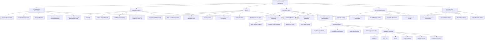

---

## Decomposition Map - Practical Categories / Domain / Skills

| No | Domain / Skill | Yang perlu dikuasai | Relevansi di Jersey/JAX-RS microservice | Output praktis |
|---:|---|---|---|---|
| 1 | Observability mental model | Bedakan **logging**, **metrics**, **tracing**, **profiling**, **audit**, dan **events** | Banyak tim mencampur semua signal ke log; hasilnya mahal, noisy, dan sulit dipakai saat incident | Observability taxonomy per service |
| 2 | Logging facade | SLF4J API, binding/provider, backend separation | Aplikasi Java modern sebaiknya tidak hard-code langsung ke backend tertentu | Standard logging dependency policy |
| 3 | Logging backend | Logback vs Log4j2, appender, encoder/layout, async logging | Menentukan format, performa, routing, dan behavior saat log volume tinggi | `logback.xml` / `log4j2.xml` production profile |
| 4 | Structured logging | JSON log, field naming, timestamp, level, logger, message, exception | Log text biasa sulit di-query; JSON log memudahkan index dan correlation | JSON log schema |
| 5 | MDC / contextual logging | `trace_id`, `span_id`, `request_id`, `correlation_id`, `tenant_id`, `user_id`, `case_id` | Di regulatory/case-management system, debugging butuh konteks lintas request dan lintas entity | MDC propagation standard |
| 6 | Request/response logging | Method, path template, status, latency, content-length, client IP, user-agent | Boundary HTTP adalah titik observasi utama di JAX-RS | JAX-RS filter logging |
| 7 | Payload logging policy | Kapan boleh log body, max size, masking, binary skip, sampling | Sangat penting untuk PII, credential, token, dan dokumen upload | Payload logging guardrail |
| 8 | Exception observability | ExceptionMapper, error code, cause chain, stacktrace policy | Error harus bisa ditelusuri tanpa membocorkan internal detail ke client | Error log + API error contract |
| 9 | HTTP access log vs application log | Access log di container/reverse proxy vs semantic app log | NGINX/Ingress log memberi traffic view; app log memberi business context | Access/app log separation |
| 10 | Distributed tracing | Span, trace, parent/child, span kind, attributes, events | Dibutuhkan untuk request yang melintasi service, DB, Kafka, Redis, Camunda, HTTP client | Trace topology per use case |
| 11 | W3C Trace Context | `traceparent`, `tracestate`, propagation rules | Membuat trace tetap nyambung antar service/vendor/tool | Header propagation standard |
| 12 | OpenTelemetry Java Agent | Zero-code instrumentation, env var config, supported libraries | Cocok untuk onboarding cepat karena bisa observability tanpa banyak ubah kode | Java agent rollout plan |
| 13 | Manual instrumentation | `@WithSpan`, custom span, span attribute, span event | Auto instrumentation tidak tahu business operation seperti “validate case”, “approve order”, “escalate task” | Business span convention |
| 14 | HTTP semantic conventions | HTTP method, route, status, server/client attributes | OpenTelemetry HTTP semantic conventions memberi bahasa standar untuk HTTP spans/metrics/logs. ([OpenTelemetry](https://opentelemetry.io/docs/specs/semconv/http/http-spans/?utm_source=chatgpt.com)) | Standard HTTP telemetry fields |
| 15 | Metrics model | Counter, gauge, histogram, timer, distribution | Metrics dipakai untuk alerting dan SLO, bukan untuk narasi debugging detail | Service metric catalog |
| 16 | RED metrics | Rate, Errors, Duration | Cocok untuk REST API: traffic, failure rate, latency | API health dashboard |
| 17 | USE metrics | Utilization, Saturation, Errors | Cocok untuk JVM, DB pool, thread pool, queue, pod resource | Runtime saturation dashboard |
| 18 | Metric cardinality control | Hindari label bernilai unik seperti request ID, user ID, order ID | Prometheus memperingatkan bahwa setiap labelset adalah time series tambahan dan cardinality tinggi mahal. ([Prometheus](https://prometheus.io/docs/practices/instrumentation/?utm_source=chatgpt.com)) | Metric naming/labeling policy |
| 19 | Business metrics | Case created, case approved, BPMN transition, SLA breached, order failed | Senior engineer perlu menghubungkan telemetry teknis dengan lifecycle domain | Business KPI metric map |
| 20 | JVM telemetry | Heap, non-heap, GC, thread count, deadlock, classloading | Java 17+ service sering gagal karena memory pressure, GC pause, thread starvation | JVM dashboard |
| 21 | JFR / profiling | Java Flight Recorder, JDK Mission Control, low-overhead production profiling | JFR berguna saat logs/metrics/traces tidak cukup menjelaskan CPU, allocation, lock contention. ([Red Hat Documentation](https://docs.redhat.com/es/documentation/red_hat_build_of_openjdk/17/html/using_jdk_flight_recorder_with_red_hat_build_of_openjdk/openjdk-flight-recorded-overview?utm_source=chatgpt.com)) | JFR incident playbook |
| 22 | MyBatis/PostgreSQL observability | SQL timing, slow query, connection pool, transaction boundary | Request latency sering berasal dari DB/query/lock, bukan resource class | DB span + slow query policy |
| 23 | Connection pool observability | Active/idle connections, wait time, timeout, leak detection | Saturasi pool menyebabkan cascading failure | Pool dashboard + alert |
| 24 | Kafka/Redis/Camunda telemetry | Consumer lag, retry, DLQ, Redis latency, BPMN job failures | Microservice tidak hanya HTTP; asynchronous path harus observable juga | Async flow telemetry map |
| 25 | Kubernetes logging architecture | stdout/stderr, container runtime logs, kubelet rotation, log shipper | Kubernetes container logs dikelola oleh kubelet dan runtime; log strategy harus cocok dengan itu. ([Kubernetes](https://kubernetes.io/docs/concepts/cluster-administration/logging/?utm_source=chatgpt.com)) | Container logging standard |
| 26 | OpenTelemetry Collector | Receivers, processors, exporters, connectors, pipeline per signal | Collector menghindari setiap service harus tahu detail backend observability | Collector config baseline |
| 27 | Log aggregation | Loki, ELK, OpenSearch, index strategy, retention | Menentukan query speed, cost, retention, dan operational usability | Log retention/index policy |
| 28 | Loki label design | Low-cardinality labels; jangan jadikan trace ID/order ID sebagai label | Loki docs menekankan label sebaiknya low-cardinality dan long-lived; trace/order ID jangan dijadikan label. ([Grafana Labs](https://grafana.com/docs/loki/latest/get-started/labels/bp-labels/?utm_source=chatgpt.com)) | Loki label convention |
| 29 | Trace-log correlation | Inject trace/span ID ke log | Membuat flow “lihat error log → buka trace lengkap” menjadi mungkin; OTel Java instrumentation mendukung MDC trace/span injection. ([GitHub](https://github.com/open-telemetry/opentelemetry-java-instrumentation?utm_source=chatgpt.com)) | Log-to-trace workflow |
| 30 | Sampling strategy | Head sampling, tail sampling, error-biased sampling | Semua trace tidak selalu bisa disimpan; harus tetap simpan trace penting | Sampling policy |
| 31 | Alerting | Threshold, burn-rate, anomaly, deduplication | Alert yang buruk membuat tim kebal alarm; alert harus actionable | Alert rule catalog |
| 32 | SLI/SLO/SLA | Availability, latency, correctness, freshness, workflow completion | Senior engineer perlu memetakan reliability ke user/business outcome | SLO per API/use case |
| 33 | Dashboard design | Golden signals, drilldown, service overview, dependency view | Dashboard harus menjawab “apa rusak, di mana, sejak kapan, dampaknya apa” | Grafana/Kibana dashboard |
| 34 | Incident debugging workflow | Correlation ID → logs → trace → metrics → DB/K8s → root cause | Mengurangi waktu diagnosis saat production issue | Incident runbook |
| 35 | Security observability | AuthN/AuthZ decisions, denied access, privilege escalation, suspicious pattern | Penting untuk platform enterprise/regulatory | Security event log schema |
| 36 | Audit vs diagnostic log | Audit immutable dan domain-significant; diagnostic log ephemeral dan teknis | Jangan jadikan application log sebagai satu-satunya audit trail | Audit event model |
| 37 | PII/secrets redaction | Token masking, password filtering, payload classification | Logging salah bisa menjadi data breach | Redaction library/filter |
| 38 | Environment/profile strategy | Local/dev/test/staging/prod logging levels dan exporters | Prod butuh JSON + correlation; local butuh readability | Profile-based config |
| 39 | Cost management | Retention, sampling, log level, cardinality, payload policy | Observability bisa menjadi cost center besar | Telemetry budget policy |
| 40 | Governance and standardization | Naming convention, dependency BOM, schema registry, review checklist | Banyak service akan sulit dioperasikan kalau telemetry field beda-beda | Observability engineering standard |

---

## Skill Grouping yang Paling Praktis

### 1. Application-side instrumentation

Fokusnya adalah kode di dalam service:

- JAX-RS `ContainerRequestFilter`
- JAX-RS `ContainerResponseFilter`
- JAX-RS `ExceptionMapper`
- Jersey client filters
- SLF4J logger usage
- MDC setup/cleanup
- custom metric emission
- custom OpenTelemetry spans

Invarian penting: **MDC harus selalu dibersihkan setelah request selesai**, terutama jika thread reuse terjadi di server/container.

---

### 2. Telemetry schema and correlation

Ini bagian yang sering menentukan apakah observability benar-benar berguna.

Field minimal yang sebaiknya distandardkan:

| Field | Tujuan |
|---|---|
| `service.name` | Identitas service |
| `service.version` | Versi deploy |
| `environment` | dev/staging/prod |
| `trace_id` | Korelasi log ke trace |
| `span_id` | Korelasi log ke span tertentu |
| `request_id` | Korelasi internal per request |
| `correlation_id` | Korelasi lintas sistem/domain |
| `tenant_id` | Multi-tenant diagnosis |
| `user_id` | Hanya jika aman dan sesuai policy |
| `case_id` / `order_id` | Simpan sebagai structured field, bukan metric/Loki label |
| `http.method` | HTTP method |
| `http.route` | Route template, bukan raw path dengan ID |
| `http.status_code` | Outcome teknis |
| `error.code` | Outcome aplikasi |
| `duration_ms` | Latency |

Untuk trace correlation lintas service, gunakan W3C Trace Context; `traceparent` membawa trace context portable, sedangkan `tracestate` membawa vendor-specific state. ([W3C](https://www.w3.org/TR/trace-context/?utm_source=chatgpt.com))

---

### 3. Logs

Praktisnya, log dibagi menjadi:

| Jenis log | Contoh | Retention | Catatan |
|---|---|---:|---|
| Access log | HTTP request selesai, status, latency | Sedang | Bisa dari app, NGINX, ingress, atau service mesh |
| Application log | Business step, validation failure, retry | Sedang | Harus structured |
| Error log | Exception, failed dependency call | Sedang/Panjang | Harus punya trace/correlation ID |
| Audit log | User action, approval, state transition | Panjang | Jangan bergantung pada stdout log saja |
| Security log | Login failure, denied permission, token anomaly | Panjang | Butuh redaction dan immutability |
| Diagnostic debug log | Detail sementara untuk investigation | Pendek | Jangan aktif permanen di prod |

---

### 4. Metrics

Untuk Jersey REST API, baseline metrics:

| Metric | Type | Label aman | Hindari |
|---|---|---|---|
| `http.server.requests` | histogram/timer | method, route, status class | raw URL, user ID, request ID |
| `http.client.requests` | histogram/timer | target service, method, status | full URL dengan query |
| `db.query.duration` | histogram | operation, statement group | raw SQL dengan parameter |
| `db.pool.active` | gauge | pool name | connection ID |
| `jvm.memory.used` | gauge | area/type | object identity |
| `jvm.gc.duration` | timer | gc name/action | stacktrace |
| `business.case.created` | counter | case type, channel | case ID |
| `business.workflow.sla_breached` | counter | workflow type, severity | user ID/order ID |

Rule kuat: **ID unik adalah field log/trace, bukan metric label**.

---

### 5. Tracing

Tracing paling berguna untuk menjawab:

- request lambat karena service mana?
- SQL mana yang dominan?
- apakah error terjadi sebelum atau sesudah Camunda/Kafka/Redis?
- retry terjadi berapa kali?
- apakah timeout berasal dari outbound dependency?
- apakah satu business operation memicu fan-out berlebihan?

Layer span yang ideal:

```text
HTTP SERVER span
  └── resource method span
      └── business/use-case span
          ├── MyBatis/PostgreSQL span
          ├── outbound HTTP client span
          ├── Kafka publish span
          ├── Redis span
          └── Camunda command/job span
```

Auto instrumentation bagus untuk boundary teknis, tetapi **manual span tetap dibutuhkan untuk domain operation** seperti `ValidateCase`, `ApproveOrder`, `EscalateTask`, `GenerateInvoice`, atau `StartBpmnProcess`.

---

### 6. Runtime and platform observability

Untuk Java 17+ di Docker/Kubernetes, jangan hanya lihat application logs.

Minimal yang perlu diamati:

- CPU throttling
- memory limit vs heap sizing
- GC pause
- thread pool saturation
- blocked/waiting threads
- connection pool exhaustion
- pod restart count
- readiness/liveness failure
- container OOMKilled
- node pressure
- network timeout
- DNS latency
- TLS handshake failure

Kubernetes logging model umum mengandalkan container stdout/stderr yang kemudian dikelola/dirotasi oleh kubelet/runtime dan dikumpulkan oleh logging agent. ([Kubernetes](https://kubernetes.io/docs/concepts/cluster-administration/logging/?utm_source=chatgpt.com))

---

## Roadmap Alur Belajar yang Direkomendasikan

### Phase 1 - Logging foundation

Pelajari:

1. SLF4J API
2. Logback atau Log4j2
3. JSON structured logging
4. MDC
5. log level discipline
6. redaction policy

Target output: satu service bisa menghasilkan log JSON konsisten dengan `trace_id`, `request_id`, `correlation_id`, `service.name`, dan `environment`.

---

### Phase 2 - Jersey/JAX-RS boundary observability

Pelajari:

1. `ContainerRequestFilter`
2. `ContainerResponseFilter`
3. `ExceptionMapper`
4. Jersey client filter
5. request timing
6. error response correlation

Target output: semua inbound dan outbound HTTP request bisa dilacak dari log.

---

### Phase 3 - OpenTelemetry tracing

Pelajari:

1. OpenTelemetry Java Agent
2. W3C Trace Context
3. auto instrumentation
4. manual spans
5. span attributes
6. sampling

Target output: satu request bisa diikuti lintas service, DB, Redis/Kafka/Camunda, dan outbound HTTP.

---

### Phase 4 - Metrics and SLO

Pelajari:

1. RED metrics
2. USE metrics
3. histogram/timer
4. cardinality control
5. Prometheus naming
6. alerting basics

Target output: dashboard API health + JVM health + DB pool health.

---

### Phase 5 - Telemetry pipeline

Pelajari:

1. OpenTelemetry Collector
2. receivers/processors/exporters
3. log shipper
4. Prometheus scraping
5. Kubernetes deployment pattern
6. retention and cost control

Target output: telemetry pipeline yang portable untuk on-prem, AWS, atau Azure.

---

### Phase 6 - Production debugging and incident response

Pelajari:

1. log-to-trace workflow
2. trace-to-metrics workflow
3. slow request investigation
4. memory/thread investigation
5. JFR capture
6. post-incident review

Target output: runbook untuk 5 kasus utama: latency spike, error spike, DB pool exhaustion, pod restart/OOM, downstream timeout.

---

### Phase 7 - Governance, audit, and regulatory defensibility

Pelajari:

1. audit event model
2. immutable audit trail
3. sensitive data policy
4. security decision logging
5. evidence reconstruction
6. retention/legal hold

Target output: observability yang bukan hanya membantu debugging, tetapi juga bisa menjelaskan **siapa melakukan apa, kapan, dari mana, terhadap entity apa, dan sistem mengambil keputusan apa**.

---

## Rekomendasi Materi Selanjutnya

Lanjutkan dengan cheatsheet seri pertama: **“Java Logging Foundation for Jersey/JAX-RS Microservices: SLF4J, Logback/Log4j2, Structured JSON Logging, MDC, and Redaction.”**

---

**Sources:**

- [SLF4J Manual](https://www.slf4j.org/manual.html?utm_source=chatgpt.com)
- [JsonEncoder (Logback-Parent 1.5.28 API) - QOS.ch](https://logback.qos.ch/apidocs/ch.qos.logback.classic/ch/qos/logback/classic/encoder/JsonEncoder.html?utm_source=chatgpt.com)
- [Java](https://opentelemetry.io/docs/languages/java/?utm_source=chatgpt.com)
- [Trace Context](https://www.w3.org/TR/trace-context/?utm_source=chatgpt.com)
- [Instrumentation](https://prometheus.io/docs/practices/instrumentation/?utm_source=chatgpt.com)
- [Chapter 1. Introduction to JDK Flight Recorder](https://docs.redhat.com/es/documentation/red_hat_build_of_openjdk/17/html/using_jdk_flight_recorder_with_red_hat_build_of_openjdk/openjdk-flight-recorded-overview?utm_source=chatgpt.com)
- [Logging Architecture](https://kubernetes.io/docs/concepts/cluster-administration/logging/?utm_source=chatgpt.com)
- [Label best practices | Grafana Loki documentation](https://grafana.com/docs/loki/latest/get-started/labels/bp-labels/?utm_source=chatgpt.com)
- [open-telemetry/opentelemetry-java-instrumentation](https://github.com/open-telemetry/opentelemetry-java-instrumentation?utm_source=chatgpt.com)

## Response:
7/13/2026, 8:12:49 AM

Total saya rekomendasikan **20 seri** untuk topik **Java Logging, Observability, Telemetry dalam Jersey/JAX-RS Microservice Application**.

Rinciannya:

| Seri | Topik |
|---:|---|
| 1 | Logging Foundation: SLF4J, Logback, Log4j2, log level discipline |
| 2 | Structured JSON Logging: schema, field naming, timestamp, exception format |
| 3 | MDC & Context Propagation: `trace_id`, `request_id`, `correlation_id`, `tenant_id`, `case_id` |
| 4 | Jersey/JAX-RS Request & Response Logging: `ContainerRequestFilter`, `ContainerResponseFilter` |
| 5 | Exception Observability: `ExceptionMapper`, error contract, stacktrace policy |
| 6 | Sensitive Data Protection: PII masking, token redaction, payload logging policy |
| 7 | Access Log vs Application Log vs Audit Log |
| 8 | OpenTelemetry Mental Model: logs, metrics, traces, resources, attributes |
| 9 | OpenTelemetry Java Agent: zero-code instrumentation untuk Java service |
| 10 | Manual Tracing: custom spans untuk business/domain operation |
| 11 | W3C Trace Context & Cross-Service Correlation |
| 12 | Metrics Foundation: counter, gauge, histogram, timer |
| 13 | RED Metrics for REST API: rate, errors, duration |
| 14 | USE Metrics for JVM, thread pool, DB pool, container resource |
| 15 | Metric Cardinality Control: label design, anti-pattern, cost control |
| 16 | MyBatis/PostgreSQL Observability: slow query, pool metrics, transaction visibility |
| 17 | Observability for Async/Integration Components: Kafka, Redis, Camunda, outbound HTTP |
| 18 | Kubernetes & Container Observability: stdout/stderr, pod restart, OOM, readiness/liveness |
| 19 | Telemetry Pipeline: OpenTelemetry Collector, Prometheus, Loki/ELK/OpenSearch, Jaeger/Tempo |
| 20 | Production Runbook: debugging latency spike, error spike, DB pool exhaustion, timeout, OOM |

Saya akan anggap **Decomposition Map sebelumnya bukan bagian dari 20 seri**, jadi kalau kita mulai, kita mulai dari **Seri 1/20**.

## Response:
7/13/2026, 8:13:08 AM

Saya mulai dari **Seri 1/20**. Fokus seri ini adalah fondasi logging yang harus stabil dulu sebelum masuk ke tracing, metrics, OTel, Kubernetes, dan incident runbook.

# Seri 1/20 - Java Logging Foundation untuk Jersey/JAX-RS Microservices

## 1. Tujuan Seri Ini

Seri pertama ini membangun fondasi: **bagaimana logging Java seharusnya dipasang, dipakai, dan dikendalikan** dalam aplikasi microservice berbasis **Jersey/JAX-RS**.

Target setelah seri ini:

- paham perbedaan **logging API**, **logging facade**, dan **logging implementation**
- tahu kapan memakai **SLF4J**, **Logback**, atau **Log4j2**
- bisa menentukan dependency Maven yang benar
- bisa menghindari konflik logging binding/provider
- punya disiplin penggunaan log level
- tahu struktur minimum konfigurasi logging production
- siap masuk ke seri berikutnya: **structured JSON logging**

---

## 2. Mental Model: Logging Layer di Java

Dalam aplikasi Java modern, logging idealnya dipisah menjadi tiga lapis:

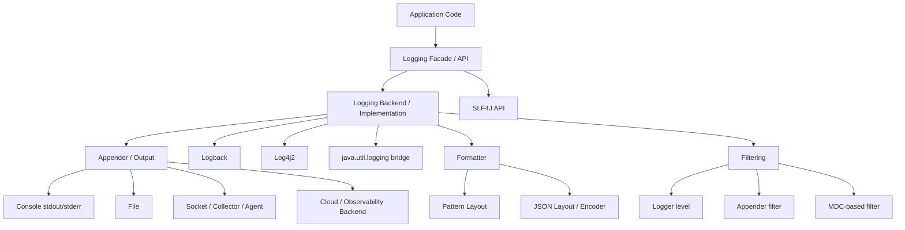

**Rule utama:** application code cukup bergantung pada **SLF4J API**, bukan langsung ke Logback atau Log4j2.

SLF4J adalah facade/abstraction untuk berbagai logging framework sehingga aplikasi bisa menulis log lewat API yang stabil, sementara backend logging bisa dipilih di deployment/classpath. ([SLF4J](https://www.slf4j.org/?utm_source=chatgpt.com))

---

## 3. Istilah Penting

| Istilah | Makna praktis | Contoh |
|---|---|---|
| Logging API | Interface yang dipakai kode aplikasi | `Logger`, `LoggerFactory` dari SLF4J |
| Logging facade | Abstraksi agar kode tidak terikat backend tertentu | SLF4J |
| Logging backend | Implementasi yang benar-benar menulis log | Logback, Log4j2 |
| Provider / binding | Jembatan dari SLF4J ke backend | `logback-classic`, `log4j-slf4j2-impl` |
| Appender | Tujuan output log | Console, file, socket |
| Layout / encoder | Format log event | pattern text, JSON |
| Logger name | Nama logger, biasanya class/package | `com.company.order.OrderResource` |
| Log level | Tingkat kepentingan event | TRACE, DEBUG, INFO, WARN, ERROR |
| MDC | Context key-value per execution/thread | `request_id`, `trace_id`, `tenant_id` |

Logback appender bertanggung jawab mengirim logging event ke destination, dan formatting biasanya didelegasikan ke layout atau encoder. ([Logback](https://logback.qos.ch/manual/appenders.html?utm_source=chatgpt.com)) Log4j2 juga memakai konsep appender dan layout; appender mengirim event, layout mengubah event ke bentuk yang dikonsumsi output. ([Apache Logging Services](https://logging.apache.org/log4j/2.x/manual/appenders.html?utm_source=chatgpt.com))

---

## 4. Dependency Strategy di Maven

### 4.1 Prinsip Dependency

Untuk microservice Java 17+:

```text id="rhum8c"
Application code
  depends on:
    slf4j-api

Runtime
  includes exactly one SLF4J provider/backend:
    logback-classic
    OR
    log4j-slf4j2-impl + log4j-core
```

Jangan memasang lebih dari satu provider SLF4J aktif dalam satu runtime. Kalau ada lebih dari satu backend, behavior bisa membingungkan: log dobel, binding warning, atau konfigurasi yang tidak dipakai.

---

## 5. Pilihan Backend: Logback vs Log4j2

| Aspek | Logback | Log4j2 |
|---|---|---|
| Posisi umum | Default populer di banyak aplikasi Java | Framework logging advanced dengan fitur kuat |
| SLF4J integration | `logback-classic` adalah implementation SLF4J | Untuk SLF4J 2 gunakan `log4j-slf4j2-impl` |
| Konfigurasi | `logback.xml` | `log4j2.xml` |
| Async logging | Ada async appender | Async logger/appender sangat matang |
| JSON support | Bisa lewat encoder/layout tambahan atau versi modern tertentu | JSON layout/template layout kuat |
| Cocok untuk | Service standar, sederhana, cukup | High-throughput/low-latency logging, konfigurasi kompleks |
| Risiko | Perlu encoder tambahan untuk JSON production-grade | Dependency bridge harus benar agar tidak loop |

Untuk SLF4J 2, Log4j menyediakan `log4j-slf4j2-impl` sebagai provider yang meneruskan call SLF4J 2 ke Log4j API. ([Maven Central](https://central.sonatype.com/artifact/org.apache.logging.log4j/log4j-slf4j2-impl?utm_source=chatgpt.com)) Dokumentasi Log4j juga membedakan binding untuk SLF4J 1.7 dan SLF4J 2.0; untuk SLF4J 2.0 gunakan `log4j-slf4j2-impl`. ([Apache Logging Services](https://logging.apache.org/log4j/3.x/log4j-slf4j-impl.html?utm_source=chatgpt.com))

---

## 6. Baseline Maven Pattern

### Opsi A - SLF4J + Logback

```xml id="z7op3f"
<dependencies>
    <!-- Logging facade used by application code -->
    <dependency>
        <groupId>org.slf4j</groupId>
        <artifactId>slf4j-api</artifactId>
    </dependency>

    <!-- SLF4J provider / backend -->
    <dependency>
        <groupId>ch.qos.logback</groupId>
        <artifactId>logback-classic</artifactId>
        <scope>runtime</scope>
    </dependency>
</dependencies>
```

### Opsi B - SLF4J + Log4j2

```xml id="inzjro"
<dependencies>
    <!-- Logging facade used by application code -->
    <dependency>
        <groupId>org.slf4j</groupId>
        <artifactId>slf4j-api</artifactId>
    </dependency>

    <!-- Log4j2 implementation -->
    <dependency>
        <groupId>org.apache.logging.log4j</groupId>
        <artifactId>log4j-api</artifactId>
        <scope>runtime</scope>
    </dependency>

    <dependency>
        <groupId>org.apache.logging.log4j</groupId>
        <artifactId>log4j-core</artifactId>
        <scope>runtime</scope>
    </dependency>

    <!-- SLF4J 2 provider for Log4j2 -->
    <dependency>
        <groupId>org.apache.logging.log4j</groupId>
        <artifactId>log4j-slf4j2-impl</artifactId>
        <scope>runtime</scope>
    </dependency>
</dependencies>
```

### Catatan Penting

Untuk aplikasi enterprise, sebaiknya version dikontrol lewat:

```xml id="msgqrd"
<dependencyManagement>
    ...
</dependencyManagement>
```

atau parent/platform BOM perusahaan.

Jangan hard-code versi sembarangan per service karena logging library termasuk dependency yang sensitif terhadap security fix dan runtime compatibility.

---

## 7. Struktur Logger di Kode Java

Contoh dasar:

```java id="df0wcq"
package com.company.order.api;

import org.slf4j.Logger;
import org.slf4j.LoggerFactory;

public class OrderResource {

    private static final Logger log = LoggerFactory.getLogger(OrderResource.class);

    public void submitOrder(String orderId) {
        log.info("Submitting order. orderId={}", orderId);
    }
}
```

### Kenapa `private static final`?

| Pilihan | Alasan |
|---|---|
| `private` | Logger tidak perlu diekspos |
| `static` | Satu logger per class, bukan per instance |
| `final` | Tidak berubah |
| `LoggerFactory.getLogger(CurrentClass.class)` | Nama logger mengikuti class/package |

---

## 8. Jangan Pakai String Concatenation di Log

Hindari:

```java id="b83hil"
log.debug("Order payload: " + payload);
```

Gunakan parameterized logging:

```java id="avc6ak"
log.debug("Order payload: {}", payload);
```

Alasannya: message construction bisa ditunda sampai level tersebut benar-benar aktif.

Untuk log yang mahal dihitung, gunakan guard:

```java id="g0jlf3"
if (log.isDebugEnabled()) {
    log.debug("Complex diagnostic data: {}", expensiveDiagnostic());
}
```

---

## 9. Log Level Discipline

### 9.1 Definisi Praktis

| Level | Gunakan untuk | Jangan gunakan untuk |
|---|---|---|
| TRACE | Detail sangat rendah: parser step, protocol detail, branch internal | Production default |
| DEBUG | Diagnostic saat troubleshooting | Business event normal |
| INFO | State transition penting, service lifecycle, request summary, business milestone | Spam per loop/per row |
| WARN | Kondisi abnormal tapi service masih bisa lanjut | Error yang benar-benar gagal |
| ERROR | Operation gagal dan butuh investigasi | Semua exception yang sudah handled normal |
| FATAL | Biasanya tidak dipakai di SLF4J umum | Jangan jadi kebiasaan |

### 9.2 Decision Table

| Situasi | Level yang tepat |
|---|---|
| Service started | INFO |
| Config penting ter-load | INFO |
| Request selesai normal | INFO atau access log khusus |
| Validation gagal karena input user | INFO atau WARN, tergantung domain |
| Dependency timeout | WARN atau ERROR |
| Retry akan dilakukan | WARN |
| Retry exhausted | ERROR |
| Unauthorized access biasa | WARN atau security log |
| Permission denied expected | INFO/WARN |
| Bug/null pointer | ERROR |
| SQL slow tapi berhasil | WARN |
| Circuit breaker open | WARN/ERROR |
| Payload detail untuk debugging | DEBUG, masked, sampled |

---

## 10. Logging di Jersey/JAX-RS: Layer yang Perlu Dipasang

Dalam aplikasi Jersey/JAX-RS, jangan menaruh semua log di resource method. Logging sebaiknya tersebar berdasarkan tanggung jawab.

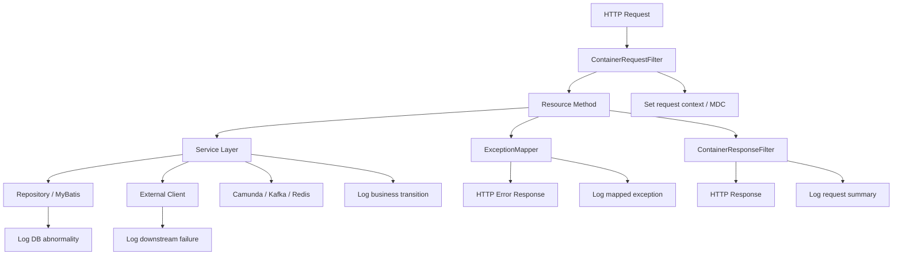

| Layer | Logging responsibility |
|---|---|
| `ContainerRequestFilter` | Ambil/generate request ID, correlation ID, set MDC |
| `ContainerResponseFilter` | Log method, route/path, status, duration |
| Resource class | Log business intent yang dekat API |
| Service layer | Log business state transition |
| Repository/MyBatis | Jangan log semua SQL manual; fokus slow/error/transaction boundary |
| External client | Log timeout, retry, downstream status |
| `ExceptionMapper` | Log exception dengan error code dan correlation ID |
| Background worker | Log job start/end/failure dengan job ID |

---

## 11. Baseline `logback.xml` untuk Local Development

Ini contoh awal, belum JSON production. JSON akan dibahas di Seri 2.

```xml id="00clgq"
<configuration>
    <property name="LOG_PATTERN"
              value="%d{yyyy-MM-dd'T'HH:mm:ss.SSSXXX} %-5level [%thread] %logger{36} trace_id=%X{trace_id} request_id=%X{request_id} correlation_id=%X{correlation_id} - %msg%n%ex"/>

    <appender name="CONSOLE" class="ch.qos.logback.core.ConsoleAppender">
        <encoder>
            <pattern>${LOG_PATTERN}</pattern>
        </encoder>
    </appender>

    <logger name="com.company" level="${APP_LOG_LEVEL:-INFO}" />

    <logger name="org.glassfish.jersey" level="WARN" />
    <logger name="org.apache.ibatis" level="WARN" />
    <logger name="org.postgresql" level="WARN" />

    <root level="${ROOT_LOG_LEVEL:-INFO}">
        <appender-ref ref="CONSOLE" />
    </root>
</configuration>
```

Logback dapat dikonfigurasi lewat file konfigurasi seperti XML, dan saat startup Logback mengikuti urutan tertentu untuk menemukan konfigurasi. ([Logback](https://logback.qos.ch/manual/configuration.html?utm_source=chatgpt.com))

---

## 12. Baseline `log4j2.xml` untuk Local Development

```xml id="xiz52b"
<Configuration status="WARN">
    <Properties>
        <Property name="LOG_PATTERN">
            %d{yyyy-MM-dd'T'HH:mm:ss.SSSXXX} %-5p [%t] %c{1.} trace_id=%X{trace_id} request_id=%X{request_id} correlation_id=%X{correlation_id} - %m%n%ex
        </Property>
    </Properties>

    <Appenders>
        <Console name="Console" target="SYSTEM_OUT">
            <PatternLayout pattern="${LOG_PATTERN}" />
        </Console>
    </Appenders>

    <Loggers>
        <Logger name="com.company" level="${env:APP_LOG_LEVEL:-INFO}" additivity="false">
            <AppenderRef ref="Console"/>
        </Logger>

        <Logger name="org.glassfish.jersey" level="WARN"/>
        <Logger name="org.apache.ibatis" level="WARN"/>
        <Logger name="org.postgresql" level="WARN"/>

        <Root level="${env:ROOT_LOG_LEVEL:-INFO}">
            <AppenderRef ref="Console"/>
        </Root>
    </Loggers>
</Configuration>
```

Log4j2 appender bertugas mengirim log event ke destination, sementara layout mengubah log event menjadi format output. ([Apache Logging Services](https://logging.apache.org/log4j/2.x/manual/appenders.html?utm_source=chatgpt.com))

---

## 13. Package-Level Logging Strategy

Jangan set semua logger ke DEBUG di production. Buat package policy.

| Package | Default prod | Saat incident |
|---|---:|---:|
| `com.company` | INFO | DEBUG terbatas |
| `com.company.order.api` | INFO | DEBUG |
| `com.company.order.service` | INFO | DEBUG |
| `com.company.order.repository` | INFO/WARN | DEBUG sementara |
| `org.glassfish.jersey` | WARN | INFO/DEBUG sementara |
| `org.apache.ibatis` | WARN | DEBUG sementara |
| `org.postgresql` | WARN | DEBUG sangat hati-hati |
| `org.camunda` | WARN/INFO | DEBUG sementara |
| `org.apache.kafka` | WARN | INFO/DEBUG sementara |
| `io.opentelemetry` | WARN | DEBUG hanya untuk setup telemetry |

---

## 14. Logging Anti-Patterns

| Anti-pattern | Masalah | Alternatif |
|---|---|---|
| Log semua request body | Bocor PII, mahal, noisy | Log metadata + payload sampling/masking |
| Log token/header auth | Security breach | Mask/redact |
| Log exception lalu throw lagi dan dilog ulang | Duplicate error | Log di boundary tunggal |
| Log `ERROR` untuk validation user biasa | Alert noise | INFO/WARN + error code |
| Log tanpa ID korelasi | Sulit tracing incident | MDC request/correlation ID |
| Log raw SQL dengan parameter sensitif | Data leakage | Slow query hash/template |
| Log per item dalam batch besar | Volume meledak | Summary log |
| Dynamic logger name per tenant/user | Cardinality/operational chaos | Static logger + structured field |
| `printStackTrace()` | Tidak masuk pipeline logging standar | `log.error("...", ex)` |
| Catch exception lalu log “failed” tanpa context | Tidak actionable | Sertakan operation, entity, error code |

---

## 15. Exception Logging Rule

Gunakan:

```java id="3s98mo"
try {
    service.submitOrder(command);
} catch (DownstreamTimeoutException ex) {
    log.warn("Downstream timeout while submitting order. orderId={} downstream={}",
            command.orderId(), "payment-service", ex);
    throw ex;
}
```

Bukan:

```java id="kvu0k3"
try {
    service.submitOrder(command);
} catch (Exception ex) {
    log.error("Error");
    throw ex;
}
```

### Rule praktis

| Rule | Penjelasan |
|---|---|
| Log exception sekali di boundary yang benar | Biasanya `ExceptionMapper`, worker boundary, atau scheduled job boundary |
| Sertakan operation | `submitOrder`, `approveCase`, `startWorkflow` |
| Sertakan safe identifier | `orderId`, `caseId`, `taskId`, kalau policy mengizinkan |
| Sertakan dependency | `postgresql`, `redis`, `camunda`, `payment-service` |
| Sertakan error code | Agar bisa dikorelasikan dengan API response |
| Jangan bocorkan secret | Token, password, authorization header harus disensor |

---

## 16. MDC Preview

MDC akan jadi seri khusus, tetapi fondasinya perlu dikenali dari sekarang.

SLF4J mendukung MDC sebagai map key-value yang dikelola logging framework; value tersebut bisa dimasukkan ke log message dan dipakai untuk filtering atau action tertentu. ([SLF4J](https://www.slf4j.org/manual.html?utm_source=chatgpt.com)) SLF4J `MDC.put(key, value)` mendelegasikan pekerjaan ke MDC milik underlying logging system, dan key tidak boleh null. ([SLF4J](https://www.slf4j.org/api/org/slf4j/MDC.html?utm_source=chatgpt.com))

Contoh awal:

```java id="wgf9vg"
import org.slf4j.MDC;

public void handle(String requestId, String correlationId) {
    try {
        MDC.put("request_id", requestId);
        MDC.put("correlation_id", correlationId);

        log.info("Handling request");
    } finally {
        MDC.clear();
    }
}
```

**Invarian penting:** selalu `MDC.clear()` di `finally`.

Alasannya: server Java memakai thread pool. Jika MDC tidak dibersihkan, request berikutnya bisa mewarisi context request sebelumnya.

---

## 17. Logging di Container/Kubernetes

Untuk Docker/Kubernetes, baseline-nya:

```text id="36ox1a"
Application writes log to stdout/stderr
Container runtime captures it
Kubernetes/node logging agent ships it
Backend stores/indexes it
Dashboard/query tool reads it
```

Implikasinya:

| Praktik | Alasan |
|---|---|
| Log ke console/stdout untuk containerized app | Lebih cocok dengan Docker/Kubernetes logging model |
| Hindari file log lokal di container | File hilang saat pod mati kecuali volume dikelola |
| Jangan rotate log sendiri di app container | Biasanya menjadi tanggung jawab runtime/node/logging agent |
| Gunakan JSON di production | Mudah di-parse oleh collector |
| Hindari multiline stacktrace mentah jika backend sulit parse | Pakai structured exception field di JSON logging |

---

## 18. Async Logging: Kapan Perlu?

Async logging memisahkan operasi I/O logging dari thread aplikasi. Log4j2 mendokumentasikan asynchronous logging sebagai teknik untuk meningkatkan performa dengan menjalankan operasi I/O di thread terpisah. ([Apache Logging Services](https://logging.apache.org/log4j/2.x/manual/async.html?utm_source=chatgpt.com))

Gunakan async logging jika:

- throughput tinggi
- log volume besar
- latency sensitif
- appender lambat
- sink logging remote/file berat

Tetapi pahami trade-off:

| Risiko | Penjelasan |
|---|---|
| Log bisa hilang saat crash | Buffer belum sempat flush |
| Backpressure tersembunyi | Queue penuh bisa drop/block tergantung config |
| Debugging lebih kompleks | Ordering bisa terasa tidak intuitif |
| Memory tambahan | Queue/buffer butuh memori |
| Shutdown harus graceful | Agar log tidak hilang |

Untuk kebanyakan service awal, mulai dari synchronous console logging dulu. Optimasi ke async setelah volume dan bottleneck terbukti.

---

## 19. Production Baseline Checklist

| Area | Checklist |
|---|---|
| Dependency | Hanya satu SLF4J provider aktif |
| API usage | Kode pakai SLF4J, bukan langsung backend |
| Format | JSON untuk production, pattern text boleh untuk local |
| Log level | Root INFO/WARN, package perusahaan INFO |
| Correlation | `request_id`, `correlation_id`, nanti `trace_id` |
| Exception | Stacktrace hanya pada boundary yang benar |
| Security | Header auth, token, password, secret di-redact |
| Payload | Tidak log body default |
| Container | Output ke stdout/stderr |
| Config | Bisa dikontrol via env var |
| Library noise | Jersey/MyBatis/PostgreSQL/Kafka di WARN default |
| Incident | Bisa naikkan level package tertentu secara terbatas |
| Audit | Jangan campur audit final dengan diagnostic log biasa |

---

## 20. Practical Implementation Skeleton

### 20.1 Logger Usage di Resource

```java id="h20aqv"
@Path("/orders")
@Produces(MediaType.APPLICATION_JSON)
@Consumes(MediaType.APPLICATION_JSON)
public class OrderResource {

    private static final Logger log = LoggerFactory.getLogger(OrderResource.class);

    private final OrderService orderService;

    public OrderResource(OrderService orderService) {
        this.orderService = orderService;
    }

    @POST
    public Response submitOrder(SubmitOrderRequest request) {
        log.info("Submit order request received. customerId={}", request.customerId());

        SubmitOrderResult result = orderService.submit(request);

        log.info("Submit order completed. orderId={} status={}",
                result.orderId(), result.status());

        return Response.status(Response.Status.CREATED)
                .entity(result)
                .build();
    }
}
```

### 20.2 Logger Usage di Service

```java id="wcenqf"
public class OrderService {

    private static final Logger log = LoggerFactory.getLogger(OrderService.class);

    public SubmitOrderResult submit(SubmitOrderRequest request) {
        log.debug("Validating submit order command");

        validate(request);

        log.info("Order validation passed. customerId={}", request.customerId());

        // business processing here

        return new SubmitOrderResult("ORD-123", "SUBMITTED");
    }
}
```

### 20.3 Logger Usage di Exception Boundary

```java id="2uv95s"
@Provider
public class GenericExceptionMapper implements ExceptionMapper<Throwable> {

    private static final Logger log = LoggerFactory.getLogger(GenericExceptionMapper.class);

    @Override
    public Response toResponse(Throwable ex) {
        String errorId = UUID.randomUUID().toString();

        log.error("Unhandled exception mapped to API error. errorId={}", errorId, ex);

        return Response.status(Response.Status.INTERNAL_SERVER_ERROR)
                .entity(Map.of(
                        "errorCode", "INTERNAL_ERROR",
                        "errorId", errorId
                ))
                .build();
    }
}
```

---

## 21. Decision Guide

### Untuk service baru, pilih apa?

| Kondisi | Rekomendasi |
|---|---|
| Service standar, tim familiar, butuh sederhana | SLF4J + Logback |
| Butuh async logging high-throughput | SLF4J + Log4j2 |
| Sudah ada company standard | Ikuti standard perusahaan |
| Aplikasi banyak dependency legacy | Audit dependency tree dulu |
| Akan pakai OpenTelemetry log correlation | Pastikan MDC/log format kompatibel |
| Running di Kubernetes | Console JSON logging |

---

## 22. Maven Dependency Audit

Jalankan:

```bash id="2tygbs"
mvn dependency:tree | grep -Ei "slf4j|logback|log4j|jul|commons-logging"
```

Cari masalah berikut:

```text id="3pv88p"
[ ] Ada lebih dari satu SLF4J provider
[ ] Ada log4j 1.x legacy
[ ] Ada commons-logging tanpa bridge strategy
[ ] Ada java.util.logging yang tidak diarahkan
[ ] Ada logback dan log4j2 backend bersamaan
[ ] Ada binding SLF4J 1.x dipakai bersama SLF4J 2.x
[ ] Ada dependency logging versi lama karena transitive dependency
```

---

## 23. What Good Looks Like

Logging foundation yang sehat terlihat seperti ini:

```text id="w35fuu"
1. Kode aplikasi hanya import org.slf4j.*
2. Runtime hanya punya satu backend aktif
3. Log level konsisten
4. Log bisa dikontrol lewat env var
5. Log punya correlation context
6. Tidak ada secret/PII bocor
7. Exception dilog pada boundary yang jelas
8. Production log siap menjadi JSON structured log
9. Log volume tidak meledak
10. Dependency tree bersih dari binding konflik
```

---

## 24. Ringkasan Seri 1

| Area | Kesimpulan |
|---|---|
| API | Gunakan SLF4J di application code |
| Backend | Pilih Logback atau Log4j2, jangan keduanya aktif |
| Config | Pisahkan local pattern logging dan production JSON logging |
| Level | INFO untuk lifecycle/business milestone, DEBUG untuk diagnosis, ERROR untuk failure nyata |
| Jersey | Boundary logging ada di filter dan exception mapper, bukan semua ditaruh di resource |
| MDC | Wajib untuk correlation, tetapi harus dibersihkan |
| Kubernetes | Log ke stdout/stderr, bukan file lokal container |
| Next step | Masuk ke structured JSON logging |

---

# Status

**Seri 1/20 selesai.**

Seri berikutnya yang direkomendasikan: **Seri 2/20 - Structured JSON Logging: schema, field naming, timestamp, exception format, dan production log contract untuk Jersey/JAX-RS microservice.**

---

**Sources:**

- [Simple Logging Facade for Java (SLF4J)](https://www.slf4j.org/?utm_source=chatgpt.com)
- [Chapter 4: Appenders - Logback](https://logback.qos.ch/manual/appenders.html?utm_source=chatgpt.com)
- [Appenders :: Apache Log4j](https://logging.apache.org/log4j/2.x/manual/appenders.html?utm_source=chatgpt.com)
- [org.apache.logging.log4j:log4j-slf4j2-impl - Maven Central](https://central.sonatype.com/artifact/org.apache.logging.log4j/log4j-slf4j2-impl?utm_source=chatgpt.com)

## Response:
7/13/2026, 8:15:13 AM

Lanjut ke **Seri 2/20**. Kali ini fokusnya mengubah logging dari “teks yang bisa dibaca manusia” menjadi **event data terstruktur** yang bisa di-query, dikorelasikan, dan dipakai saat incident.

# Seri 2/20 - Structured JSON Logging untuk Jersey/JAX-RS Microservices

## 1. Tujuan Seri Ini

Seri ini membahas bagaimana mengubah log dari teks bebas seperti ini:

```text id="fjf0u5"
2026-07-13 10:01:33 INFO Submit order completed
```

menjadi **event terstruktur** seperti ini:

```json id="a3vff7"
{
  "timestamp": "2026-07-13T10:01:33.421+07:00",
  "level": "INFO",
  "service_name": "order-service",
  "environment": "prod",
  "logger": "com.company.order.api.OrderResource",
  "thread": "http-nio-8080-exec-7",
  "message": "Submit order completed",
  "trace_id": "4bf92f3577b34da6a3ce929d0e0e4736",
  "span_id": "00f067aa0ba902b7",
  "request_id": "req-20260713-abc123",
  "correlation_id": "corr-778899",
  "tenant_id": "tenant-a",
  "order_id": "ORD-123",
  "http_method": "POST",
  "http_route": "/orders",
  "http_status": 201,
  "duration_ms": 84
}
```

Target praktis setelah seri ini:

- tahu kenapa production log sebaiknya JSON
- bisa mendesain **log event schema**
- bisa membedakan field teknis, field domain, dan field security
- bisa menghindari cardinality/log-indexing anti-pattern
- punya baseline konfigurasi Logback atau Log4j2 untuk JSON logging
- siap masuk ke Seri 3: **MDC & Context Propagation**

---

## 2. Kenapa Structured Logging Penting?

Plain text log cocok untuk manusia, tetapi buruk untuk mesin. Production incident biasanya butuh query seperti:

```text id="s7cykr"
Cari semua ERROR dari order-service
di tenant X
untuk correlation_id Y
dengan http_status >= 500
selama 15 menit terakhir
```

Dengan plain text, query seperti itu rapuh. Dengan JSON structured logging, setiap log event menjadi data record yang bisa difilter, di-aggregate, dan dikorelasikan.

OpenTelemetry mendefinisikan log data model agar log dari berbagai sumber bisa direpresentasikan secara konsisten sebagai `LogRecord`; model ini mencakup timestamp, severity, body, resource, attributes, trace ID, dan span ID. ([OpenTelemetry](https://opentelemetry.io/docs/specs/otel/logs/data-model/?utm_source=chatgpt.com))

---

## 3. Mental Model: Log Event sebagai Data Contract

Structured log harus diperlakukan seperti **API contract internal**.

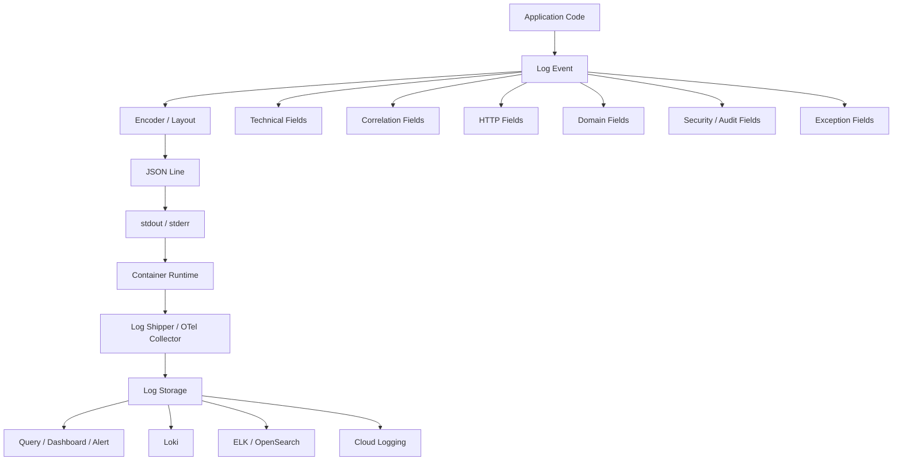

Invarian penting:

```text id="1kbsqz"
Satu log line = satu valid JSON object = satu event.
```

Jangan menghasilkan pretty-printed multiline JSON untuk production container log, karena banyak collector membaca log berbasis baris.

---

## 4. Structured Logging vs Audit Logging

Jangan samakan structured diagnostic log dengan audit trail.

| Aspek | Structured application log | Audit log |
|---|---|---|
| Tujuan | Debugging, observability, incident response | Bukti formal tentang aksi/keputusan |
| Retention | Biasanya pendek/sedang | Biasanya panjang |
| Mutability | Bisa dihapus sesuai retention | Sebaiknya immutable/append-only |
| Isi | Teknis + operasional | Domain-significant event |
| Contoh | “HTTP request failed” | “User A approved case B” |
| Storage | Loki/ELK/OpenSearch/cloud logging | Audit table/event store/WORM storage |
| Boleh sampled? | Kadang boleh | Umumnya tidak |
| Boleh hilang saat crash? | Tidak ideal, tapi mungkin | Tidak boleh untuk event kritikal |

Untuk sistem regulatory/case management, application log boleh membantu investigasi, tetapi **jangan dijadikan satu-satunya sumber kebenaran audit**.

---

## 5. Field Taxonomy

### 5.1 Field wajib minimum

| Field | Contoh | Catatan |
|---|---|---|
| `timestamp` | `2026-07-13T10:01:33.421+07:00` | Gunakan ISO-8601/RFC3339 style |
| `level` | `INFO` | Severity log |
| `service_name` | `order-service` | Nama service |
| `service_version` | `1.18.3` | Versi deploy |
| `environment` | `prod` | `local`, `dev`, `staging`, `prod` |
| `logger` | `com.company.order.api.OrderResource` | Nama logger/class |
| `thread` | `http-nio-8080-exec-7` | Berguna untuk thread issue |
| `message` | `Submit order completed` | Human-readable summary |

### 5.2 Field korelasi

| Field | Contoh | Tujuan |
|---|---|---|
| `trace_id` | `4bf92f3577b34da6a3ce929d0e0e4736` | Korelasi ke distributed trace |
| `span_id` | `00f067aa0ba902b7` | Korelasi ke span spesifik |
| `request_id` | `req-abc123` | Request lokal/service boundary |
| `correlation_id` | `corr-778899` | Business/system correlation lintas service |
| `parent_correlation_id` | `corr-parent-001` | Berguna untuk fan-out/async |
| `idempotency_key` | `idem-xyz` | Debug retry/idempotency |

### 5.3 Field HTTP

| Field | Contoh | Catatan |
|---|---|---|
| `http_method` | `POST` | Method |
| `http_route` | `/orders/{orderId}` | Gunakan route template |
| `http_path` | `/orders/ORD-123` | Hati-hati karena bisa high-cardinality |
| `http_status` | `201` | Status code |
| `http_status_class` | `2xx` | Bagus untuk aggregate |
| `duration_ms` | `84` | Latency |
| `client_ip` | `10.1.2.3` | Pertimbangkan privacy |
| `user_agent` | `curl/8.0` | Bisa panjang/noisy |
| `content_length` | `2048` | Metadata aman |
| `request_size_bytes` | `2048` | Lebih eksplisit |
| `response_size_bytes` | `512` | Untuk traffic/cost analysis |

OpenTelemetry HTTP semantic conventions mendefinisikan atribut standar untuk span/telemetry HTTP seperti method, route, status code, dan atribut client/server terkait. Ini penting agar nama field tidak dibuat sembarangan di tiap service. ([OpenTelemetry](https://opentelemetry.io/docs/specs/otel/logs/data-model/?utm_source=chatgpt.com))

### 5.4 Field domain

| Field | Contoh | Catatan |
|---|---|---|
| `tenant_id` | `tenant-a` | Jangan jadi metric label kalau cardinality tinggi |
| `user_id` | `usr-123` | Hati-hati PII |
| `case_id` | `CASE-2026-001` | Cocok di log/trace attribute |
| `order_id` | `ORD-123` | Jangan jadikan Loki label |
| `workflow_id` | `wf-991` | Camunda/process correlation |
| `business_action` | `ORDER_SUBMIT` | Bagus untuk query |
| `business_state_from` | `DRAFT` | State transition |
| `business_state_to` | `SUBMITTED` | State transition |

### 5.5 Field exception

| Field | Contoh | Catatan |
|---|---|---|
| `error_type` | `java.sql.SQLTimeoutException` | Class exception |
| `error_message` | `Query timed out` | Pastikan tidak bocor data sensitif |
| `error_code` | `DB_TIMEOUT` | Error code aplikasi |
| `error_id` | `err-abc123` | Tampilkan ke client untuk support |
| `stack_trace` | string/array | Production JSON harus parseable |
| `root_cause` | `SocketTimeoutException` | Berguna untuk grouping |

---

## 6. Naming Convention: Custom, ECS, atau OpenTelemetry?

Ada tiga pendekatan umum.

| Pendekatan | Cocok untuk | Contoh field |
|---|---|---|
| Custom internal schema | Tim ingin sederhana dan backend-agnostic | `service_name`, `trace_id`, `duration_ms` |
| Elastic Common Schema / ECS | Log masuk Elastic/OpenSearch-style pipeline | `@timestamp`, `log.level`, `service.name`, `trace.id` |
| OpenTelemetry Log Data Model | Telemetry lewat OTel Collector/vendor-neutral pipeline | `severity_text`, `body`, `resource`, `attributes`, `trace_id` |

Elastic Common Schema mendefinisikan field umum untuk menyimpan event data seperti logs dan metrics, termasuk area seperti `log.*`, `event.*`, `service.*`, dan lain-lain. ([Elastic](https://www.elastic.co/docs/reference/ecs?utm_source=chatgpt.com))

Rekomendasi praktis untuk perusahaan yang masih onboarding:

```text id="2git7k"
Gunakan schema internal sederhana,
tetapi align dengan konsep OpenTelemetry dan ECS.
```

Contoh mapping:

| Internal field | ECS equivalent | OTel concept |
|---|---|---|
| `timestamp` | `@timestamp` | `Timestamp` |
| `level` | `log.level` | `SeverityText` |
| `message` | `message` | `Body` |
| `service_name` | `service.name` | Resource attribute |
| `service_version` | `service.version` | Resource attribute |
| `trace_id` | `trace.id` | `TraceId` |
| `span_id` | `span.id` | `SpanId` |
| `environment` | `service.environment` / custom | Resource attribute |
| `error_type` | `error.type` | exception attribute |
| `event_action` | `event.action` | attribute |

---

## 7. Recommended JSON Log Contract

Ini baseline contract yang cukup kuat untuk Jersey/JAX-RS microservice:

```json id="52d3om"
{
  "timestamp": "2026-07-13T10:01:33.421+07:00",
  "level": "INFO",
  "service_name": "order-service",
  "service_version": "1.18.3",
  "environment": "prod",
  "logger": "com.company.order.api.OrderResource",
  "thread": "http-nio-8080-exec-7",
  "message": "Submit order completed",

  "trace_id": "4bf92f3577b34da6a3ce929d0e0e4736",
  "span_id": "00f067aa0ba902b7",
  "request_id": "req-20260713-abc123",
  "correlation_id": "corr-778899",

  "http_method": "POST",
  "http_route": "/orders",
  "http_status": 201,
  "http_status_class": "2xx",
  "duration_ms": 84,

  "tenant_id": "tenant-a",
  "user_id": "usr-456",
  "business_action": "ORDER_SUBMIT",
  "order_id": "ORD-123"
}
```

Untuk error:

```json id="cd0jl3"
{
  "timestamp": "2026-07-13T10:02:11.901+07:00",
  "level": "ERROR",
  "service_name": "order-service",
  "service_version": "1.18.3",
  "environment": "prod",
  "logger": "com.company.order.api.GenericExceptionMapper",
  "thread": "http-nio-8080-exec-9",
  "message": "Unhandled exception mapped to API error",

  "trace_id": "9d1c2b53136f48f5a7a3f1de708faf20",
  "span_id": "b2c8f6a71d332c90",
  "request_id": "req-20260713-def456",
  "correlation_id": "corr-112233",

  "http_method": "POST",
  "http_route": "/orders",
  "http_status": 500,
  "http_status_class": "5xx",
  "duration_ms": 2400,

  "error_id": "err-7c5e1",
  "error_code": "INTERNAL_ERROR",
  "error_type": "java.lang.IllegalStateException",
  "error_message": "Order transition is invalid",
  "root_cause": "java.lang.IllegalStateException",
  "stack_trace": "java.lang.IllegalStateException: Order transition is invalid..."
}
```

---

## 8. Field Design Rules

### 8.1 Gunakan field stabil

Baik:

```json id="1t0cnf"
{
  "business_action": "ORDER_SUBMIT",
  "order_id": "ORD-123"
}
```

Buruk:

```json id="ta6luz"
{
  "ORDER_SUBMIT_ORD-123": true
}
```

Field name harus stabil. Nilai boleh berubah; nama field jangan dinamis.

---

### 8.2 Jangan masukkan semua data ke `message`

Buruk:

```json id="r2ufwp"
{
  "message": "tenant=tenant-a orderId=ORD-123 status=SUBMITTED duration=84"
}
```

Baik:

```json id="he208q"
{
  "message": "Submit order completed",
  "tenant_id": "tenant-a",
  "order_id": "ORD-123",
  "status": "SUBMITTED",
  "duration_ms": 84
}
```

`message` harus ringkas untuk manusia. Detail queryable harus menjadi field.

---

### 8.3 Gunakan route template, bukan raw path, untuk aggregation

Baik:

```json id="g9lamu"
{
  "http_route": "/orders/{orderId}",
  "http_path": "/orders/ORD-123"
}
```

Buruk untuk aggregation:

```json id="8u1sk8"
{
  "http_route": "/orders/ORD-123"
}
```

Raw path dengan ID unik membuat grouping buruk dan bisa meningkatkan cardinality di backend observability.

---

### 8.4 Jangan jadikan ID unik sebagai label/index utama

ID seperti ini berguna di log body:

```text id="6rmy9y"
order_id
case_id
request_id
correlation_id
trace_id
user_id
```

Tetapi berbahaya bila dijadikan **label Loki**, **metric label**, atau **index dimension utama**.

Grafana Loki secara eksplisit merekomendasikan label yang low-cardinality dan long-lived; nilai seperti trace ID atau order ID tidak cocok sebagai label. ([Elastic](https://www.elastic.co/docs/reference/ecs/ecs-log?utm_source=chatgpt.com))

---

## 9. Logback JSON Logging

Ada dua pendekatan:

1. memakai JSON encoder bawaan Logback modern
2. memakai encoder eksternal seperti `logstash-logback-encoder`

Logback `JsonEncoder` menghasilkan satu JSON object per baris dalam format JSON Lines dan dapat menyertakan field seperti timestamp, level, message, MDC, marker, dan stack trace. ([Logback](https://logback.qos.ch/apidocs/ch.qos.logback.classic/ch/qos/logback/classic/encoder/JsonEncoder.html?utm_source=chatgpt.com)) Logback juga memakai konsep encoder untuk mengubah event menjadi bytes yang ditulis ke output stream. ([Logback](https://logback.qos.ch/manual/encoders.html?utm_source=chatgpt.com))

### 9.1 Baseline `logback.xml` dengan `JsonEncoder`

```xml id="3vg3md"
<configuration>
    <appender name="CONSOLE_JSON" class="ch.qos.logback.core.ConsoleAppender">
        <encoder class="ch.qos.logback.classic.encoder.JsonEncoder"/>
    </appender>

    <logger name="com.company" level="${APP_LOG_LEVEL:-INFO}" />

    <logger name="org.glassfish.jersey" level="WARN" />
    <logger name="org.apache.ibatis" level="WARN" />
    <logger name="org.postgresql" level="WARN" />

    <root level="${ROOT_LOG_LEVEL:-INFO}">
        <appender-ref ref="CONSOLE_JSON" />
    </root>
</configuration>
```

Catatan penting: cek versi Logback yang benar-benar dipakai oleh service. Kalau service memakai versi lama atau butuh schema JSON custom yang lebih kaya, biasanya tim memakai encoder tambahan.

### 9.2 Contoh dengan `logstash-logback-encoder`

Banyak enterprise Java service memakai ini karena mudah menambahkan custom field, MDC, dan JSON provider.

```xml id="vx2ajc"
<configuration>
    <appender name="CONSOLE_JSON" class="ch.qos.logback.core.ConsoleAppender">
        <encoder class="net.logstash.logback.encoder.LoggingEventCompositeJsonEncoder">
            <providers>
                <timestamp>
                    <fieldName>timestamp</fieldName>
                    <pattern>yyyy-MM-dd'T'HH:mm:ss.SSSXXX</pattern>
                </timestamp>

                <logLevel>
                    <fieldName>level</fieldName>
                </logLevel>

                <loggerName>
                    <fieldName>logger</fieldName>
                </loggerName>

                <threadName>
                    <fieldName>thread</fieldName>
                </threadName>

                <message>
                    <fieldName>message</fieldName>
                </message>

                <mdc />

                <stackTrace>
                    <fieldName>stack_trace</fieldName>
                </stackTrace>

                <pattern>
                    <pattern>
                        {
                          "service_name": "${SERVICE_NAME:-unknown-service}",
                          "service_version": "${SERVICE_VERSION:-unknown-version}",
                          "environment": "${ENVIRONMENT:-local}"
                        }
                    </pattern>
                </pattern>
            </providers>
        </encoder>
    </appender>

    <logger name="com.company" level="${APP_LOG_LEVEL:-INFO}" />

    <logger name="org.glassfish.jersey" level="WARN" />
    <logger name="org.apache.ibatis" level="WARN" />
    <logger name="org.postgresql" level="WARN" />

    <root level="${ROOT_LOG_LEVEL:-INFO}">
        <appender-ref ref="CONSOLE_JSON"/>
    </root>
</configuration>
```

Dependency Maven contoh:

```xml id="n83r8t"
<dependency>
    <groupId>net.logstash.logback</groupId>
    <artifactId>logstash-logback-encoder</artifactId>
    <version>${logstash.logback.encoder.version}</version>
</dependency>
```

Versi sebaiknya dikontrol lewat parent/BOM perusahaan, bukan asal copy dari internet.

---

## 10. Log4j2 JSON Logging

Untuk Log4j2, pilihan modern yang kuat adalah **JSON Template Layout**.

Log4j2 mendokumentasikan `JsonTemplateLayout` sebagai layout JSON yang customizable, efficient, dan garbage-free, yang menghasilkan `LogEvent` berdasarkan template JSON. ([Apache Logging Services](https://logging.apache.org/log4j/2.x/manual/json-template-layout.html?utm_source=chatgpt.com)) Dokumentasi Log4j2 juga merekomendasikan JSON Template Layout untuk structured logging. ([Apache Logging Services](https://logging.apache.org/log4j/2.x/manual/layouts.html?utm_source=chatgpt.com))

### 10.1 Maven dependency

```xml id="hxu65s"
<dependencies>
    <dependency>
        <groupId>org.slf4j</groupId>
        <artifactId>slf4j-api</artifactId>
    </dependency>

    <dependency>
        <groupId>org.apache.logging.log4j</groupId>
        <artifactId>log4j-api</artifactId>
        <scope>runtime</scope>
    </dependency>

    <dependency>
        <groupId>org.apache.logging.log4j</groupId>
        <artifactId>log4j-core</artifactId>
        <scope>runtime</scope>
    </dependency>

    <dependency>
        <groupId>org.apache.logging.log4j</groupId>
        <artifactId>log4j-slf4j2-impl</artifactId>
        <scope>runtime</scope>
    </dependency>

    <dependency>
        <groupId>org.apache.logging.log4j</groupId>
        <artifactId>log4j-layout-template-json</artifactId>
        <scope>runtime</scope>
    </dependency>
</dependencies>
```

### 10.2 Baseline `log4j2.xml`

```xml id="n4xwi6"
<Configuration status="WARN">
    <Appenders>
        <Console name="Console" target="SYSTEM_OUT">
            <JsonTemplateLayout eventTemplateUri="classpath:JsonLogEventTemplate.json"/>
        </Console>
    </Appenders>

    <Loggers>
        <Logger name="com.company" level="${env:APP_LOG_LEVEL:-INFO}" additivity="false">
            <AppenderRef ref="Console"/>
        </Logger>

        <Logger name="org.glassfish.jersey" level="WARN"/>
        <Logger name="org.apache.ibatis" level="WARN"/>
        <Logger name="org.postgresql" level="WARN"/>

        <Root level="${env:ROOT_LOG_LEVEL:-INFO}">
            <AppenderRef ref="Console"/>
        </Root>
    </Loggers>
</Configuration>
```

### 10.3 Contoh `JsonLogEventTemplate.json`

```json id="avgc09"
{
  "timestamp": {
    "$resolver": "timestamp",
    "pattern": {
      "format": "yyyy-MM-dd'T'HH:mm:ss.SSSXXX",
      "timeZone": "Asia/Jakarta"
    }
  },
  "level": {
    "$resolver": "level",
    "field": "name"
  },
  "logger": {
    "$resolver": "logger",
    "field": "name"
  },
  "thread": {
    "$resolver": "thread",
    "field": "name"
  },
  "message": {
    "$resolver": "message",
    "stringified": true
  },
  "service_name": "${env:SERVICE_NAME:-unknown-service}",
  "service_version": "${env:SERVICE_VERSION:-unknown-version}",
  "environment": "${env:ENVIRONMENT:-local}",
  "trace_id": {
    "$resolver": "mdc",
    "key": "trace_id"
  },
  "span_id": {
    "$resolver": "mdc",
    "key": "span_id"
  },
  "request_id": {
    "$resolver": "mdc",
    "key": "request_id"
  },
  "correlation_id": {
    "$resolver": "mdc",
    "key": "correlation_id"
  },
  "tenant_id": {
    "$resolver": "mdc",
    "key": "tenant_id"
  },
  "error": {
    "$resolver": "exception",
    "field": "stackTrace",
    "stackTrace": {
      "stringified": true
    }
  }
}
```

---

## 11. Structured Arguments di Java Code

### 11.1 Basic SLF4J parameterized logging

```java id="ur2u9d"
log.info("Submit order completed. orderId={} status={}", orderId, status);
```

Ini bagus untuk message, tetapi `orderId` dan `status` belum tentu menjadi JSON field terpisah, tergantung encoder/layout.

### 11.2 Dengan MDC untuk context lintas log

```java id="xmulm6"
MDC.put("order_id", orderId);
MDC.put("business_action", "ORDER_SUBMIT");

try {
    log.info("Submit order completed");
} finally {
    MDC.remove("order_id");
    MDC.remove("business_action");
}
```

Ini membuat `order_id` dan `business_action` muncul sebagai field JSON bila encoder memasukkan MDC.

### 11.3 Pattern yang direkomendasikan

Gunakan:

```java id="2gcy92"
log.info("Submit order completed");
```

Dengan context:

```json id="kwqz21"
{
  "message": "Submit order completed",
  "order_id": "ORD-123",
  "business_action": "ORDER_SUBMIT",
  "duration_ms": 84
}
```

Jangan hanya:

```java id="6bzcpp"
log.info("Submit order completed. orderId={} businessAction={} durationMs={}",
        orderId, "ORDER_SUBMIT", durationMs);
```

karena field penting mungkin hanya terkubur di message string.

---

## 12. Jersey/JAX-RS Boundary JSON Fields

Untuk inbound request, field yang ideal dihasilkan oleh `ContainerRequestFilter` dan `ContainerResponseFilter`.

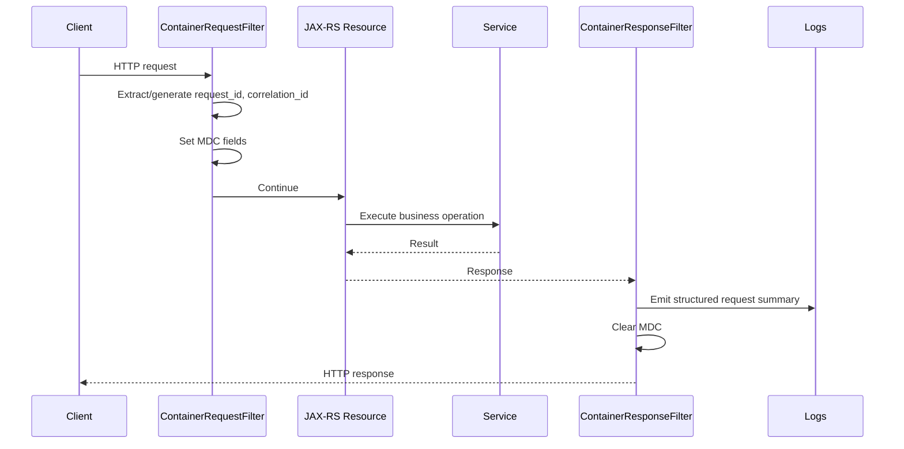

### Request start fields

| Field | Source |
|---|---|
| `request_id` | incoming header or generated |
| `correlation_id` | incoming header or generated |
| `trace_id` | OpenTelemetry context/MDC |
| `tenant_id` | auth token/header/domain resolver |
| `user_id` | security context |
| `http_method` | request context |
| `http_path` | request URI |
| `client_ip` | trusted proxy header / remote address |

### Response completion fields

| Field | Source |
|---|---|
| `http_status` | response context |
| `duration_ms` | request start timestamp |
| `response_size_bytes` | response metadata if available |
| `error_code` | mapped exception / response entity |
| `outcome` | `SUCCESS`, `CLIENT_ERROR`, `SERVER_ERROR` |

---

## 13. Example: JAX-RS Filter for Structured Context

Seri 3 akan membahas MDC lebih dalam. Untuk sekarang, lihat skeleton-nya.

```java id="2mofvy"
@Provider
@Priority(Priorities.AUTHENTICATION)
public class RequestContextFilter implements ContainerRequestFilter, ContainerResponseFilter {

    private static final Logger log = LoggerFactory.getLogger(RequestContextFilter.class);

    private static final String START_TIME = "request.startTimeNanos";

    @Override
    public void filter(ContainerRequestContext requestContext) {
        long start = System.nanoTime();
        requestContext.setProperty(START_TIME, start);

        String requestId = firstNonBlank(
                requestContext.getHeaderString("X-Request-Id"),
                UUID.randomUUID().toString()
        );

        String correlationId = firstNonBlank(
                requestContext.getHeaderString("X-Correlation-Id"),
                requestId
        );

        MDC.put("request_id", requestId);
        MDC.put("correlation_id", correlationId);
        MDC.put("http_method", requestContext.getMethod());
        MDC.put("http_path", requestContext.getUriInfo().getRequestUri().getPath());

        // Route template is better than raw path, but may require resource matching info.
        log.debug("HTTP request context initialized");
    }

    @Override
    public void filter(ContainerRequestContext requestContext,
                       ContainerResponseContext responseContext) {
        try {
            Object startObj = requestContext.getProperty(START_TIME);
            long durationMs = -1;

            if (startObj instanceof Long startNanos) {
                durationMs = TimeUnit.NANOSECONDS.toMillis(System.nanoTime() - startNanos);
            }

            MDC.put("http_status", String.valueOf(responseContext.getStatus()));
            MDC.put("http_status_class", statusClass(responseContext.getStatus()));
            MDC.put("duration_ms", String.valueOf(durationMs));

            log.info("HTTP request completed");
        } finally {
            MDC.clear();
        }
    }

    private static String statusClass(int status) {
        return (status / 100) + "xx";
    }

    private static String firstNonBlank(String value, String fallback) {
        return value == null || value.isBlank() ? fallback : value;
    }
}
```

---

## 14. Exception JSON Shape

Exception log harus queryable.

Minimal:

```json id="n0szft"
{
  "level": "ERROR",
  "message": "Database operation failed",
  "error_code": "DB_TIMEOUT",
  "error_type": "org.postgresql.util.PSQLException",
  "error_message": "canceling statement due to statement timeout",
  "dependency": "postgresql",
  "operation": "OrderRepository.insertOrder",
  "duration_ms": 5000,
  "trace_id": "..."
}
```

Untuk `ExceptionMapper`:

```java id="0nuzze"
@Provider
public class ApiExceptionMapper implements ExceptionMapper<ApiException> {

    private static final Logger log = LoggerFactory.getLogger(ApiExceptionMapper.class);

    @Override
    public Response toResponse(ApiException ex) {
        String errorId = UUID.randomUUID().toString();

        try {
            MDC.put("error_id", errorId);
            MDC.put("error_code", ex.errorCode());
            MDC.put("http_status", String.valueOf(ex.httpStatus()));

            if (ex.httpStatus() >= 500) {
                log.error("API exception mapped to server error", ex);
            } else {
                log.warn("API exception mapped to client error");
            }

            return Response.status(ex.httpStatus())
                    .entity(Map.of(
                            "errorCode", ex.errorCode(),
                            "errorId", errorId,
                            "message", ex.safeClientMessage()
                    ))
                    .build();
        } finally {
            MDC.remove("error_id");
            MDC.remove("error_code");
            MDC.remove("http_status");
        }
    }
}
```

---

## 15. Redaction dan Sensitive Fields

Structured logging membuat data lebih mudah dicari. Itu bagus untuk debugging, tetapi berbahaya bila field sensitif ikut masuk.

### Jangan pernah log field ini dalam bentuk asli

| Field | Risiko |
|---|---|
| `Authorization` header | Token leakage |
| `Cookie` | Session hijack |
| password / passphrase | Credential leak |
| refresh token | Long-lived access |
| access token | API impersonation |
| OTP / MFA code | Account takeover |
| private key | Catastrophic secret leak |
| full credit card number | Compliance/security issue |
| raw personal document | PII/data protection issue |

### Masking style

| Data | Contoh aman |
|---|---|
| Token | `Bearer eyJ...<redacted>` |
| Email | `a***@company.com` |
| Phone | `+62******1234` |
| Card | `**** **** **** 1234` |
| User ID internal | boleh jika bukan PII langsung |
| Case/order ID | boleh sesuai policy |

---

## 16. Payload Logging Policy

Default production stance:

```text id="khgdlu"
Do not log request/response body by default.
```

Kalau benar-benar perlu:

| Constraint | Rekomendasi |
|---|---|
| Hanya endpoint tertentu | allowlist |
| Hanya environment tertentu | dev/staging |
| Hanya error case | conditional |
| Ukuran payload | max bytes |
| PII | redact/mask |
| Binary upload | never log body |
| Sampling | aktifkan sampling |
| Expiry | log retention pendek |
| Access | batasi akses log backend |

Untuk Jersey/JAX-RS, payload logging butuh hati-hati karena membaca entity stream bisa mengganggu deserialization bila tidak dibuffer dengan benar. Untuk upload binary, multipart, file, dokumen, dan payload besar, log metadata saja.

---

## 17. JSON Logging Anti-Patterns

| Anti-pattern | Contoh | Dampak |
|---|---|---|
| Dynamic field names | `"order_ORD123": true` | Schema rusak |
| Semua masuk message | `"message": "tenant=x order=y"` | Sulit query |
| Pretty JSON multiline | beberapa baris per event | Collector kacau |
| Raw path sebagai route | `/orders/ORD-123` | Cardinality tinggi |
| Log body default | request JSON penuh | PII/cost risk |
| Stacktrace multiline tidak ter-escape | multiline text | Parsing buruk |
| Field type berubah | `duration_ms: "84"` lalu `84` | Index mapping conflict |
| Timestamp lokal tanpa timezone | `2026-07-13 10:01:33` | Ambigu lintas region |
| Log success terlalu banyak | per row/per loop | Cost/noise |
| User ID sebagai index label | `user_id` label | Cardinality/cost |

---

## 18. Field Type Discipline

Field type harus konsisten.

| Field | Type yang disarankan |
|---|---|
| `timestamp` | string datetime |
| `level` | string |
| `duration_ms` | number |
| `http_status` | number |
| `request_size_bytes` | number |
| `response_size_bytes` | number |
| `retry_count` | number |
| `success` | boolean |
| `tenant_id` | string |
| `order_id` | string |
| `error_code` | string |

Jangan begini:

```json id="9vgw42"
{ "duration_ms": "84" }
{ "duration_ms": 84 }
```

Pilih satu. Untuk analytics dan alerting, numeric lebih baik.

---

## 19. Environment Variables untuk Log Contract

Gunakan environment variable agar image/container yang sama bisa jalan di environment berbeda.

| Env var | Contoh |
|---|---|
| `SERVICE_NAME` | `order-service` |
| `SERVICE_VERSION` | `1.18.3` |
| `ENVIRONMENT` | `prod` |
| `APP_LOG_LEVEL` | `INFO` |
| `ROOT_LOG_LEVEL` | `WARN` |
| `LOG_FORMAT` | `json` |
| `LOG_PAYLOAD_ENABLED` | `false` |

Di Kubernetes:

```yaml id="jkc23z"
env:
  - name: SERVICE_NAME
    value: order-service
  - name: SERVICE_VERSION
    value: "1.18.3"
  - name: ENVIRONMENT
    value: prod
  - name: APP_LOG_LEVEL
    value: INFO
  - name: ROOT_LOG_LEVEL
    value: WARN
```

---

## 20. Local vs Production Format

| Environment | Format | Alasan |
|---|---|---|
| Local | Pattern text boleh | Mudah dibaca manusia |
| Test/CI | JSON atau pattern | Tergantung assertions/log capture |
| Staging | JSON | Sama dengan prod |
| Production | JSON Lines | Machine-readable, collector-friendly |

Jangan sampai local-only config berbeda terlalu jauh dari production. Minimal field penting tetap harus muncul.

---

## 21. Query Examples

### 21.1 Semua error dari service tertentu

```text id="azvv3q"
service_name = "order-service" AND level = "ERROR"
```

### 21.2 Semua request gagal untuk tenant tertentu

```text id="k1wh7k"
service_name = "order-service"
AND tenant_id = "tenant-a"
AND http_status >= 500
```

### 21.3 Investigasi satu correlation ID

```text id="mni9s3"
correlation_id = "corr-778899"
```

### 21.4 Investigasi latency endpoint

```text id="lilc64"
service_name = "order-service"
AND http_route = "/orders"
AND duration_ms > 1000
```

### 21.5 Cari error berdasarkan error code

```text id="ed0jlj"
error_code = "DB_TIMEOUT"
```

---

## 22. Production Log Contract Checklist

| Area | Checklist |
|---|---|
| Valid JSON | Satu log event = satu JSON object valid |
| Timestamp | Ada timezone/offset |
| Service identity | `service_name`, `service_version`, `environment` |
| Severity | `level` konsisten |
| Message | Ringkas dan human-readable |
| Correlation | `trace_id`, `span_id`, `request_id`, `correlation_id` |
| HTTP | method, route, status, duration |
| Error | error code, type, message, stack trace |
| Domain | tenant/case/order/workflow ID sesuai policy |
| Security | secret/token/header sensitif tidak bocor |
| Payload | body tidak dilog default |
| Cardinality | ID unik tidak jadi label/index utama |
| Type | numeric tetap numeric |
| Multiline | stacktrace aman dalam JSON |
| Runtime | stdout/stderr untuk container |

---

## 23. What Good Looks Like

Structured logging yang sehat terlihat seperti ini:

```text id="opxkme"
1. Bisa query log tanpa regex kompleks.
2. Bisa lompat dari error log ke trace.
3. Bisa filter berdasarkan service, environment, tenant, endpoint, error_code.
4. Bisa aggregate latency/error tanpa parsing message.
5. Tidak membocorkan token, password, atau payload sensitif.
6. Tidak membuat log backend mahal karena cardinality liar.
7. Format local, staging, dan prod tidak saling bertentangan.
8. Log event bisa dipakai saat incident review.
```

---

## 24. Ringkasan Seri 2

| Area | Kesimpulan |
|---|---|
| Format | Production log sebaiknya JSON Lines |
| Contract | Perlakukan log schema seperti API internal |
| Field wajib | timestamp, level, service, environment, logger, thread, message |
| Correlation | trace/span/request/correlation ID harus field terpisah |
| HTTP | method, route, status, duration wajib untuk REST API |
| Domain | tenant/case/order/workflow ID berguna, tapi hati-hati privacy/cardinality |
| Error | error code/type/message/stack trace harus queryable |
| Backend | Logback bisa memakai `JsonEncoder` atau encoder tambahan; Log4j2 cocok dengan `JsonTemplateLayout` |
| Security | payload dan secret harus guarded |
| Next step | MDC & context propagation |

---

# Status

**Seri 2/20 selesai.**

Seri berikutnya: **Seri 3/20 - MDC & Context Propagation: `trace_id`, `span_id`, `request_id`, `correlation_id`, `tenant_id`, `case_id`, cleanup discipline, dan propagation di thread pool / async flow.**

---

**Sources:**

- [Logs Data Model](https://opentelemetry.io/docs/specs/otel/logs/data-model/?utm_source=chatgpt.com)
- [Elastic Common Schema (ECS) reference](https://www.elastic.co/docs/reference/ecs?utm_source=chatgpt.com)
- [JsonEncoder (Logback-Parent 1.5.28 API) - QOS.ch](https://logback.qos.ch/apidocs/ch.qos.logback.classic/ch/qos/logback/classic/encoder/JsonEncoder.html?utm_source=chatgpt.com)
- [JSON Template Layout :: Apache Log4j](https://logging.apache.org/log4j/2.x/manual/json-template-layout.html?utm_source=chatgpt.com)

## Response:
7/13/2026, 8:33:06 AM

Lanjut ke **Seri 3/20**. Fokusnya adalah **context propagation**: memastikan setiap log, trace, dan error punya identitas request/domain yang konsisten dari awal sampai akhir eksekusi.

# Seri 3/20 - MDC & Context Propagation untuk Jersey/JAX-RS Microservices

## 1. Tujuan Seri Ini

Seri ini membahas cara memastikan setiap log dan telemetry event punya **konteks yang benar**.

Tanpa context propagation, log akan terlihat seperti ini:

```text
ERROR Failed to submit order
```

Dengan context propagation yang benar:

```json
{
  "level": "ERROR",
  "message": "Failed to submit order",
  "service_name": "order-service",
  "trace_id": "4bf92f3577b34da6a3ce929d0e0e4736",
  "span_id": "00f067aa0ba902b7",
  "request_id": "req-abc123",
  "correlation_id": "corr-778899",
  "tenant_id": "tenant-a",
  "user_id": "usr-456",
  "order_id": "ORD-123",
  "http_method": "POST",
  "http_route": "/orders"
}
```

Target setelah seri ini:

- paham perbedaan `request_id`, `correlation_id`, `trace_id`, `span_id`, `tenant_id`, dan domain ID
- bisa memasang MDC di Jersey/JAX-RS request lifecycle
- tahu kapan context harus dibuat, diteruskan, dan dibersihkan
- tahu bahaya MDC di thread pool, async execution, scheduler, Kafka consumer, Camunda job, dan background worker
- punya baseline propagation rule untuk inbound HTTP, outbound HTTP, async event, dan DB/business operation

SLF4J `MDC` adalah API untuk menyimpan diagnostic context sebagai key-value yang didelegasikan ke logging system di bawahnya. API ini menyediakan operasi seperti `put`, `get`, `remove`, `clear`, dan `putCloseable`. ([SLF4J](https://www.slf4j.org/api/org/slf4j/MDC.html?utm_source=chatgpt.com)) Logback juga mendokumentasikan MDC sebagai mekanisme untuk memperkaya log dengan konteks, dan contoh resminya membersihkan value setelah operasi selesai memakai `MDC.remove()`. ([Logback](https://logback.qos.ch/manual/mdc.html?utm_source=chatgpt.com))

---

## 2. Mental Model: Context bukan Log Message

Context adalah **metadata eksekusi** yang menjawab:

```text
request ini milik siapa,
bagian dari flow apa,
sedang memproses entity apa,
dipicu oleh event apa,
dan bisa dikorelasikan ke trace/log/service lain atau tidak.
```

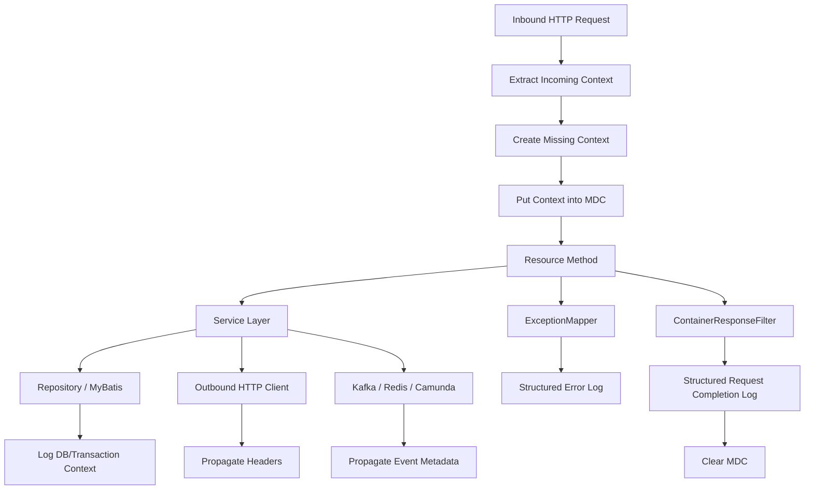

Invarian utama:

```text
Context harus hidup selama unit-of-work berjalan,
dan harus dibersihkan saat unit-of-work selesai.
```

Di request HTTP sinkron, unit-of-work biasanya satu HTTP request.  
Di Kafka consumer, unit-of-work biasanya satu message.  
Di Camunda external task/job worker, unit-of-work biasanya satu job/task execution.  
Di scheduled job, unit-of-work biasanya satu job run.

---

## 3. Jenis Context ID

| ID | Scope | Siapa yang membuat | Dipropagasikan? | Tujuan |
|---|---|---|---|---|
| `trace_id` | Distributed trace | OpenTelemetry/instrumentation | Ya | Korelasi span lintas service |
| `span_id` | Satu span/operation | OpenTelemetry | Ya, via trace context | Korelasi log ke span tertentu |
| `request_id` | Satu inbound request lokal | API gateway/service | Kadang | Debug request di satu boundary |
| `correlation_id` | Satu business/system flow | Upstream/system pertama | Ya | Korelasi lintas service/event |
| `tenant_id` | Tenant/customer partition | Auth/domain resolver | Ya, hati-hati | Multi-tenant debugging |
| `user_id` | Actor/user | Auth layer | Kadang | Audit/security/debugging |
| `case_id` / `order_id` | Domain entity | Application/domain layer | Kadang | Debug entity lifecycle |
| `workflow_instance_id` | BPMN/process instance | Camunda/process engine | Ya di workflow | Debug workflow execution |
| `job_id` | Background job | Worker/scheduler | Lokal/event | Debug async execution |
| `idempotency_key` | Retry-safe operation | Client/upstream | Ya | Debug duplicate/retry behavior |

---

## 4. Jangan Samakan Semua ID

### 4.1 `request_id`

`request_id` biasanya menunjuk ke satu HTTP request tertentu.

Contoh:

```text
POST /orders
X-Request-Id: req-001
```

Kegunaan:

- mencari log satu request di service tertentu
- support/debug cepat
- menghubungkan response error dengan log internal

Tapi `request_id` tidak selalu cukup untuk flow lintas banyak service.

---

### 4.2 `correlation_id`

`correlation_id` menunjuk ke satu **flow besar**.

Contoh:

```text
customer submit order
  -> order-service
  -> payment-service
  -> inventory-service
  -> camunda workflow
  -> kafka event
  -> notification-service
```

Semua bagian flow bisa berbagi:

```text
correlation_id = corr-778899
```

Kegunaan:

- debug business journey
- rekonstruksi flow lintas service
- menghubungkan sync + async processing
- investigasi case/order lifecycle

---

### 4.3 `trace_id`

`trace_id` berasal dari distributed tracing.

OpenTelemetry menjelaskan propagation sebagai mekanisme untuk memindahkan context antar service/process dengan cara serialize/deserialize context, dan instrumentation library biasanya menangani propagation ini secara transparan. ([OpenTelemetry](https://opentelemetry.io/docs/concepts/context-propagation/?utm_source=chatgpt.com))

Kegunaan:

- melihat tree eksekusi teknis
- latency breakdown
- parent-child span
- service dependency path

`trace_id` idealnya muncul di log, tetapi jangan menggantikan `correlation_id`.

Perbandingan praktis:

| Aspek | `trace_id` | `correlation_id` |
|---|---|---|
| Fokus | Technical execution graph | Business/system flow |
| Dibuat oleh | Tracing instrumentation | Gateway/upstream/domain |
| Berubah antar retry? | Bisa tergantung implementation | Sebaiknya tetap |
| Nyambung async? | Bisa, kalau propagation benar | Harus tetap dibawa |
| Dipakai oleh | Observability tooling | Developer/support/business ops |
| Cocok untuk audit? | Tidak sebagai primary audit key | Lebih cocok sebagai support key |

---

## 5. MDC: Apa yang Harus Masuk?

MDC sebaiknya berisi context yang:

1. relevan untuk hampir semua log dalam unit-of-work
2. aman untuk dilog
3. ukurannya kecil
4. tidak berubah terlalu sering
5. membantu query/debugging

### 5.1 MDC baseline untuk HTTP request

```text
request_id
correlation_id
trace_id
span_id
service_name
environment
http_method
http_route
tenant_id
user_id
```

### 5.2 MDC tambahan saat masuk domain operation

```text
business_action
case_id
order_id
workflow_instance_id
task_id
```

### 5.3 Jangan masuk MDC

| Jangan taruh di MDC | Alasan |
|---|---|
| request body penuh | besar, PII risk |
| response body penuh | besar, PII risk |
| access token | secret leakage |
| password | credential leakage |
| cookie/session | session hijack risk |
| raw SQL parameter sensitif | data leakage |
| large object/document | log bloat |
| list ribuan ID | log explosion |

---

## 6. Lifecycle MDC di Jersey/JAX-RS

Jersey menyediakan filter dan interceptor untuk memproses request/response di lifecycle JAX-RS. Dokumentasi Jersey menjelaskan penggunaan filter/interceptor, termasuk filter dengan akses ke request dan response context. ([Eclipse EE4J](https://eclipse-ee4j.github.io/jersey.github.io/documentation/latest/filters-and-interceptors.html?utm_source=chatgpt.com))

Untuk observability, pola dasarnya:

```text
ContainerRequestFilter:
  - extract/generate IDs
  - put base context into MDC
  - store start time

Resource/Service:
  - add domain context when known
  - log business milestone

ExceptionMapper:
  - add error context
  - log mapped exception

ContainerResponseFilter:
  - log request completion
  - clear MDC
```

---

## 7. Baseline Implementation: Request Context Filter

```java
package com.company.platform.observability;

import jakarta.annotation.Priority;
import jakarta.ws.rs.Priorities;
import jakarta.ws.rs.container.ContainerRequestContext;
import jakarta.ws.rs.container.ContainerRequestFilter;
import jakarta.ws.rs.container.ContainerResponseContext;
import jakarta.ws.rs.container.ContainerResponseFilter;
import jakarta.ws.rs.ext.Provider;
import org.slf4j.Logger;
import org.slf4j.LoggerFactory;
import org.slf4j.MDC;

import java.util.UUID;
import java.util.concurrent.TimeUnit;

@Provider
@Priority(Priorities.AUTHENTICATION)
public class RequestContextFilter implements ContainerRequestFilter, ContainerResponseFilter {

    private static final Logger log = LoggerFactory.getLogger(RequestContextFilter.class);

    private static final String START_NANOS = "observability.startNanos";

    private static final String HEADER_REQUEST_ID = "X-Request-Id";
    private static final String HEADER_CORRELATION_ID = "X-Correlation-Id";
    private static final String HEADER_TENANT_ID = "X-Tenant-Id";

    @Override
    public void filter(ContainerRequestContext requestContext) {
        long startNanos = System.nanoTime();
        requestContext.setProperty(START_NANOS, startNanos);

        String requestId = firstNonBlank(
                requestContext.getHeaderString(HEADER_REQUEST_ID),
                generateId("req")
        );

        String correlationId = firstNonBlank(
                requestContext.getHeaderString(HEADER_CORRELATION_ID),
                requestId
        );

        String tenantId = requestContext.getHeaderString(HEADER_TENANT_ID);

        MDC.put("request_id", requestId);
        MDC.put("correlation_id", correlationId);
        MDC.put("http_method", requestContext.getMethod());
        MDC.put("http_path", requestContext.getUriInfo().getPath());

        if (tenantId != null && !tenantId.isBlank()) {
            MDC.put("tenant_id", tenantId);
        }

        log.debug("Request context initialized");
    }

    @Override
    public void filter(ContainerRequestContext requestContext,
                       ContainerResponseContext responseContext) {
        try {
            long durationMs = durationMs(requestContext);

            MDC.put("http_status", String.valueOf(responseContext.getStatus()));
            MDC.put("http_status_class", statusClass(responseContext.getStatus()));
            MDC.put("duration_ms", String.valueOf(durationMs));

            log.info("HTTP request completed");
        } finally {
            MDC.clear();
        }
    }

    private static long durationMs(ContainerRequestContext requestContext) {
        Object start = requestContext.getProperty(START_NANOS);
        if (start instanceof Long startNanos) {
            return TimeUnit.NANOSECONDS.toMillis(System.nanoTime() - startNanos);
        }
        return -1L;
    }

    private static String statusClass(int status) {
        return (status / 100) + "xx";
    }

    private static String generateId(String prefix) {
        return prefix + "-" + UUID.randomUUID();
    }

    private static String firstNonBlank(String candidate, String fallback) {
        return candidate == null || candidate.isBlank() ? fallback : candidate;
    }
}
```

### Catatan penting

Kode di atas adalah baseline. Untuk production, validasi header harus lebih ketat:

| Header | Validasi |
|---|---|
| `X-Request-Id` | max length, allowed charset |
| `X-Correlation-Id` | max length, allowed charset |
| `X-Tenant-Id` | jangan percaya header publik tanpa auth |
| `traceparent` | biarkan OpenTelemetry yang handle |
| `Authorization` | jangan masuk MDC/log |

---

## 8. Cleanup Discipline

Ini bagian paling kritis.

Buruk:

```java
MDC.put("request_id", requestId);
log.info("Processing request");
// lupa clear
```

Baik:

```java
try {
    MDC.put("request_id", requestId);
    log.info("Processing request");
} finally {
    MDC.clear();
}
```

Atau untuk key spesifik:

```java
try {
    MDC.put("order_id", orderId);
    log.info("Processing order");
} finally {
    MDC.remove("order_id");
}
```

SLF4J menyediakan `MDC.putCloseable(key, value)` yang mengembalikan closeable object, sehingga key bisa otomatis dihapus saat `close()` dipanggil dalam try-with-resources. ([SLF4J](https://www.slf4j.org/api/org/slf4j/MDC.html?utm_source=chatgpt.com))

Contoh:

```java
try (MDC.MDCCloseable ignored = MDC.putCloseable("order_id", orderId)) {
    log.info("Processing order");
}
```

Ini bagus untuk context scoped kecil di service layer.

---

## 9. Domain Context di Service Layer

Jangan semua context dipasang di request filter, karena beberapa informasi baru diketahui setelah parsing/validasi.

Contoh:

```java
public class OrderService {

    private static final Logger log = LoggerFactory.getLogger(OrderService.class);

    public SubmitOrderResult submit(SubmitOrderCommand command) {
        try (MDC.MDCCloseable order = MDC.putCloseable("order_id", command.orderId());
             MDC.MDCCloseable action = MDC.putCloseable("business_action", "ORDER_SUBMIT")) {

            log.info("Order submission started");

            validate(command);
            persist(command);
            publishEvent(command);

            log.info("Order submission completed");

            return new SubmitOrderResult(command.orderId(), "SUBMITTED");
        }
    }
}
```

Output log akan otomatis membawa:

```json
{
  "correlation_id": "corr-778899",
  "request_id": "req-abc123",
  "order_id": "ORD-123",
  "business_action": "ORDER_SUBMIT",
  "message": "Order submission completed"
}
```

---

## 10. ExceptionMapper dan Error Context

Exception mapper adalah boundary yang baik untuk error logging, karena di sana error teknis diterjemahkan menjadi API response.

```java
@Provider
public class ApiExceptionMapper implements ExceptionMapper<ApiException> {

    private static final Logger log = LoggerFactory.getLogger(ApiExceptionMapper.class);

    @Override
    public Response toResponse(ApiException ex) {
        String errorId = "err-" + UUID.randomUUID();

        try (MDC.MDCCloseable e1 = MDC.putCloseable("error_id", errorId);
             MDC.MDCCloseable e2 = MDC.putCloseable("error_code", ex.errorCode());
             MDC.MDCCloseable e3 = MDC.putCloseable("http_status", String.valueOf(ex.httpStatus()))) {

            if (ex.httpStatus() >= 500) {
                log.error("API exception mapped to server error", ex);
            } else {
                log.warn("API exception mapped to client error");
            }

            return Response.status(ex.httpStatus())
                    .entity(Map.of(
                            "errorCode", ex.errorCode(),
                            "errorId", errorId,
                            "message", ex.safeClientMessage()
                    ))
                    .build();
        }
    }
}
```

Rule praktis:

| Error type | Log level | Stacktrace? |
|---|---:|---|
| Validation error normal | INFO/WARN | Tidak |
| Authorization denied expected | WARN/security log | Tidak selalu |
| Not found normal | INFO/WARN | Tidak |
| Downstream timeout | WARN/ERROR | Ya jika actionable |
| DB failure | ERROR | Ya |
| Unknown exception | ERROR | Ya |
| Business rule rejection expected | INFO/WARN | Tidak |

---

## 11. Outbound HTTP Propagation

Ketika service memanggil service lain, context harus diteruskan.

### Header yang umum

| Header | Tujuan |
|---|---|
| `traceparent` | W3C/OpenTelemetry trace propagation |
| `tracestate` | vendor-specific trace state |
| `X-Request-Id` | local/request support ID |
| `X-Correlation-Id` | business/system flow |
| `X-Tenant-Id` | tenant context, hanya jika aman |
| `Idempotency-Key` | retry/idempotency flow |

OpenTelemetry propagation biasanya menangani trace context secara otomatis bila instrumentation aktif. Jika perlu manual propagation, OpenTelemetry menyediakan Propagators API. ([OpenTelemetry](https://opentelemetry.io/docs/concepts/context-propagation/?utm_source=chatgpt.com))

### Jersey Client filter contoh

```java
import jakarta.ws.rs.client.ClientRequestContext;
import jakarta.ws.rs.client.ClientRequestFilter;
import jakarta.ws.rs.ext.Provider;
import org.slf4j.MDC;

@Provider
public class OutboundContextPropagationFilter implements ClientRequestFilter {

    @Override
    public void filter(ClientRequestContext requestContext) {
        putHeaderIfPresent(requestContext, "X-Request-Id", MDC.get("request_id"));
        putHeaderIfPresent(requestContext, "X-Correlation-Id", MDC.get("correlation_id"));
        putHeaderIfPresent(requestContext, "X-Tenant-Id", MDC.get("tenant_id"));
    }

    private static void putHeaderIfPresent(ClientRequestContext ctx, String name, String value) {
        if (value != null && !value.isBlank()) {
            ctx.getHeaders().putSingle(name, value);
        }
    }
}
```

Catatan:

```text
Jangan manual inject traceparent kalau OpenTelemetry agent/SDK sudah melakukannya,
kecuali arsitektur memang memerlukan manual propagation.
```

Kalau dua mekanisme sama-sama inject, hasilnya bisa konflik atau membingungkan.

---

## 12. Async / Thread Pool Problem

MDC sering berbasis thread-local. Artinya:

```text
MDC di thread A tidak otomatis tersedia di thread B.
```

Problem umum:

```java
MDC.put("correlation_id", "corr-123");

executor.submit(() -> {
    log.info("Running async task");
});
```

Log dalam async task bisa kehilangan `correlation_id`.

Lebih buruk lagi, kalau thread pool reuse dan MDC tidak dibersihkan, task berikutnya bisa mewarisi context yang salah.

---

## 13. Context-Aware Executor Wrapper

Pattern aman:

```java
public final class MdcAwareRunnable implements Runnable {

    private final Runnable delegate;
    private final Map<String, String> capturedContext;

    public MdcAwareRunnable(Runnable delegate) {
        this.delegate = delegate;
        this.capturedContext = MDC.getCopyOfContextMap();
    }

    @Override
    public void run() {
        Map<String, String> previous = MDC.getCopyOfContextMap();

        try {
            if (capturedContext == null) {
                MDC.clear();
            } else {
                MDC.setContextMap(capturedContext);
            }

            delegate.run();
        } finally {
            if (previous == null) {
                MDC.clear();
            } else {
                MDC.setContextMap(previous);
            }
        }
    }
}
```

Usage:

```java
executor.submit(new MdcAwareRunnable(() -> {
    log.info("Async task running with propagated MDC");
}));
```

Untuk `Callable`:

```java
public final class MdcAwareCallable<T> implements Callable<T> {

    private final Callable<T> delegate;
    private final Map<String, String> capturedContext;

    public MdcAwareCallable(Callable<T> delegate) {
        this.delegate = delegate;
        this.capturedContext = MDC.getCopyOfContextMap();
    }

    @Override
    public T call() throws Exception {
        Map<String, String> previous = MDC.getCopyOfContextMap();

        try {
            if (capturedContext == null) {
                MDC.clear();
            } else {
                MDC.setContextMap(capturedContext);
            }

            return delegate.call();
        } finally {
            if (previous == null) {
                MDC.clear();
            } else {
                MDC.setContextMap(previous);
            }
        }
    }
}
```

---

## 14. Context Propagation di CompletableFuture

Buruk:

```java
CompletableFuture.supplyAsync(() -> {
    log.info("Loading customer");
    return customerClient.getCustomer(customerId);
}, executor);
```

Lebih aman:

```java
CompletableFuture.supplyAsync(
        new MdcAwareSupplier<>(() -> {
            log.info("Loading customer");
            return customerClient.getCustomer(customerId);
        }),
        executor
);
```

Contoh wrapper:

```java
public final class MdcAwareSupplier<T> implements Supplier<T> {

    private final Supplier<T> delegate;
    private final Map<String, String> capturedContext;

    public MdcAwareSupplier(Supplier<T> delegate) {
        this.delegate = delegate;
        this.capturedContext = MDC.getCopyOfContextMap();
    }

    @Override
    public T get() {
        Map<String, String> previous = MDC.getCopyOfContextMap();

        try {
            if (capturedContext == null) {
                MDC.clear();
            } else {
                MDC.setContextMap(capturedContext);
            }

            return delegate.get();
        } finally {
            if (previous == null) {
                MDC.clear();
            } else {
                MDC.setContextMap(previous);
            }
        }
    }
}
```

---

## 15. Context di Kafka / Message Consumer

Untuk async event, context harus ikut di **message metadata/header**, bukan mengandalkan thread-local.

Contoh event header:

| Header | Isi |
|---|---|
| `correlation_id` | Flow bisnis |
| `traceparent` | Distributed trace |
| `tenant_id` | Tenant |
| `event_id` | ID event |
| `causation_id` | Event/command penyebab |
| `producer_service` | Service asal |

Consumer pattern:

```java
public void consume(OrderSubmittedEvent event, MessageHeaders headers) {
    try {
        putIfPresent("correlation_id", headers.get("correlation_id"));
        putIfPresent("tenant_id", headers.get("tenant_id"));
        putIfPresent("event_id", headers.get("event_id"));
        putIfPresent("business_action", "ORDER_SUBMITTED_CONSUME");
        putIfPresent("order_id", event.orderId());

        log.info("Consuming order submitted event");

        handler.handle(event);

        log.info("Order submitted event consumed");
    } catch (Exception ex) {
        log.error("Failed to consume order submitted event", ex);
        throw ex;
    } finally {
        MDC.clear();
    }
}

private static void putIfPresent(String key, String value) {
    if (value != null && !value.isBlank()) {
        MDC.put(key, value);
    }
}
```

Invarian:

```text
Set MDC at message boundary.
Clear MDC at message boundary.
```

---

## 16. Context di Camunda Worker / Job Execution

Untuk Camunda atau workflow engine, context minimal:

| Field | Tujuan |
|---|---|
| `process_definition_key` | Jenis process |
| `process_instance_id` | Instance spesifik |
| `business_key` | Business correlation |
| `activity_id` | BPMN activity |
| `job_id` / `external_task_id` | Unit kerja |
| `tenant_id` | Tenant |
| `correlation_id` | Flow lintas sistem |

Pattern:

```java
public void executeTask(ExternalTask task) {
    try {
        putIfPresent("process_instance_id", task.getProcessInstanceId());
        putIfPresent("business_key", task.getBusinessKey());
        putIfPresent("activity_id", task.getActivityId());
        putIfPresent("external_task_id", task.getId());
        putIfPresent("correlation_id", task.getVariable("correlationId"));

        log.info("Camunda external task started");

        // execute task

        log.info("Camunda external task completed");
    } catch (Exception ex) {
        log.error("Camunda external task failed", ex);
        throw ex;
    } finally {
        MDC.clear();
    }
}
```

---

## 17. Context di Scheduled Job

Scheduled job tidak punya inbound HTTP header. Jadi context harus dibuat sendiri.

```java
public void runDailyReconciliation() {
    try {
        MDC.put("job_name", "daily-reconciliation");
        MDC.put("job_run_id", "jobrun-" + UUID.randomUUID());
        MDC.put("correlation_id", "corr-job-" + UUID.randomUUID());

        log.info("Scheduled job started");

        reconciliationService.run();

        log.info("Scheduled job completed");
    } catch (Exception ex) {
        log.error("Scheduled job failed", ex);
        throw ex;
    } finally {
        MDC.clear();
    }
}
```

---

## 18. Context di MyBatis / Repository Layer

Repository tidak harus menambah banyak MDC. Biasanya cukup memanfaatkan context yang sudah ada.

Namun untuk operasi penting, boleh tambahkan scoped context:

```java
public void insertOrder(Order order) {
    try (MDC.MDCCloseable operation =
                 MDC.putCloseable("db_operation", "insert_order")) {

        log.debug("Inserting order");

        mapper.insert(order);
    }
}
```

Jangan log raw SQL parameter sensitif. Untuk SQL observability mendalam, lebih baik gunakan:

- slow query logging PostgreSQL
- MyBatis logging terbatas
- datasource proxy
- OpenTelemetry DB spans
- DB metrics

---

## 19. Header Trust Boundary

Jangan percaya semua incoming header dari internet.

| Context | Boleh dari client publik? | Catatan |
|---|---:|---|
| `X-Request-Id` | Ya, tapi validasi | Boleh override/generate ulang |
| `X-Correlation-Id` | Ya, tapi validasi | Bisa dipakai untuk support |
| `X-Tenant-Id` | Tidak langsung | Harus cocok dengan auth/token |
| `X-User-Id` | Tidak | Ambil dari authenticated principal |
| `Authorization` | Tidak dilog | Secret |
| `traceparent` | Biasanya ya | Biarkan tracing layer handle |
| `business_key` | Tergantung API | Validasi domain |

Validasi minimal:

```java
private static String sanitizeId(String value, String fallback) {
    if (value == null || value.isBlank()) {
        return fallback;
    }

    String trimmed = value.trim();

    if (trimmed.length() > 128) {
        return fallback;
    }

    if (!trimmed.matches("[A-Za-z0-9._:\\-]+")) {
        return fallback;
    }

    return trimmed;
}
```

---

## 20. Context Field Naming Standard

Gunakan snake_case atau dot notation secara konsisten. Jangan campur sembarangan.

### Opsi internal sederhana

```text
request_id
correlation_id
trace_id
span_id
tenant_id
user_id
case_id
order_id
workflow_instance_id
http_method
http_route
http_status
```

### Opsi lebih dekat ke OpenTelemetry/ECS

```text
trace.id
span.id
service.name
service.version
http.request.method
http.route
http.response.status_code
user.id
tenant.id
```

Rekomendasi praktis untuk onboarding:

```text
Mulai dengan snake_case internal agar mudah dipakai developer,
lalu mapping ke OTel/ECS dilakukan di collector/backend bila perlu.
```

Yang penting: konsisten lintas service.

---

## 21. Context Propagation Contract

Buat kontrak minimal antar service:

| Field | HTTP header | Kafka/event header | MDC key | Required? |
|---|---|---|---|---|
| Request ID | `X-Request-Id` | `request_id` | `request_id` | HTTP yes |
| Correlation ID | `X-Correlation-Id` | `correlation_id` | `correlation_id` | Yes |
| Trace context | `traceparent` | `traceparent` | `trace_id`/`span_id` | Yes if tracing enabled |
| Tenant | `X-Tenant-Id` | `tenant_id` | `tenant_id` | If multi-tenant |
| Idempotency | `Idempotency-Key` | `idempotency_key` | `idempotency_key` | For command APIs |
| Event ID | n/a | `event_id` | `event_id` | Async yes |
| Causation ID | n/a | `causation_id` | `causation_id` | Async recommended |

---

## 22. Common Failure Modes

| Failure | Gejala | Penyebab | Fix |
|---|---|---|---|
| Log kehilangan correlation ID | Log service layer kosong context | MDC tidak diset di filter | Set di request boundary |
| Log request berikutnya membawa ID lama | Context bocor antar request | `MDC.clear()` lupa | Clear di `finally` |
| Async log tidak punya context | CompletableFuture/thread pool kosong | MDC tidak otomatis lintas thread | Capture/restore MDC |
| Trace ada tapi log tidak punya trace ID | OTel tidak inject ke MDC/log | Missing config/instrumentation | Enable log correlation |
| Correlation ID berubah tiap service | Setiap service generate baru | Tidak propagate header | Forward incoming correlation |
| Tenant ID salah | Percaya header publik | Tidak validasi auth | Resolve dari security principal |
| Log terlalu mahal | Terlalu banyak ID jadi label/index | Cardinality buruk | ID sebagai field, bukan label |
| Error log tidak bisa dikaitkan ke response | Tidak ada `error_id` | Exception mapper tidak set context | Generate error ID |

---

## 23. What Good Looks Like

Context propagation yang sehat terlihat seperti ini:

```text
1. Setiap request completion log punya request_id dan correlation_id.
2. Setiap error response punya error_id yang muncul juga di log.
3. Setiap outbound HTTP call meneruskan correlation_id.
4. Setiap async event membawa correlation_id dan causation_id.
5. Setiap worker/job membuat job_run_id sendiri.
6. Setiap domain operation penting punya case_id/order_id/workflow_id.
7. MDC selalu dibersihkan di boundary.
8. Async/thread pool tidak kehilangan atau membocorkan context.
9. Log bisa dikorelasikan ke trace melalui trace_id/span_id.
10. Tenant/user context berasal dari sumber terpercaya.
```

---

## 24. Production Checklist

| Area | Checklist |
|---|---|
| Inbound HTTP | Extract/generate `request_id`, `correlation_id` |
| Header validation | Max length + charset |
| MDC setup | Dilakukan di request filter |
| MDC cleanup | `finally { MDC.clear(); }` |
| Domain context | Scoped dengan `putCloseable` |
| Exception mapper | Tambahkan `error_id`, `error_code`, `http_status` |
| Outbound HTTP | Forward correlation/request headers |
| Trace context | Gunakan OpenTelemetry propagation |
| Async executor | Capture/restore MDC |
| Kafka/event | Context masuk header event |
| Camunda job | Set process/task context |
| Scheduled job | Generate `job_run_id` |
| Security | Tenant/user dari auth, bukan blind header |
| Testing | Ada test untuk propagation dan cleanup |

---

## 25. Testing Strategy

### 25.1 Test request ID muncul di log

Gunakan log capture test library atau appender test.

Validasi:

```text
Given request with X-Correlation-Id=corr-test
When endpoint called
Then completion log contains correlation_id=corr-test
```

### 25.2 Test MDC cleanup

```text
Given request A with correlation_id=corr-A
And request B with no correlation header
When both processed on reused thread
Then request B must not contain corr-A
```

### 25.3 Test outbound propagation

```text
Given inbound correlation_id=corr-123
When service calls downstream
Then outbound request contains X-Correlation-Id=corr-123
```

### 25.4 Test async propagation

```text
Given MDC correlation_id=corr-async
When task submitted to executor
Then async task log contains corr-async
And MDC is restored/cleared after task
```

---

## 26. Ringkasan Seri 3

| Area | Kesimpulan |
|---|---|
| MDC | Key-value diagnostic context untuk memperkaya log |
| Boundary | Set di awal unit-of-work, clear di akhir |
| HTTP | Gunakan JAX-RS filters untuk request/response lifecycle |
| Domain | Tambahkan `case_id`, `order_id`, `business_action` secara scoped |
| Error | Exception mapper harus menambahkan `error_id` dan `error_code` |
| Propagation | Forward `correlation_id`; trace context sebaiknya lewat OTel |
| Async | MDC tidak otomatis lintas thread; perlu capture/restore |
| Security | Jangan percaya tenant/user header publik tanpa validasi |
| Testing | Uji propagation dan cleanup, bukan hanya happy path |

---

# Status

**Seri 3/20 selesai.**

Seri berikutnya: **Seri 4/20 - Jersey/JAX-RS Request & Response Logging: `ContainerRequestFilter`, `ContainerResponseFilter`, route template, latency, status mapping, dan request completion log yang production-grade.**

---

**Sources:**

- [MDC (SLF4J javadoc)](https://www.slf4j.org/api/org/slf4j/MDC.html?utm_source=chatgpt.com)
- [Chapter 8: Mapped Diagnostic Context - Logback](https://logback.qos.ch/manual/mdc.html?utm_source=chatgpt.com)
- [Context propagation](https://opentelemetry.io/docs/concepts/context-propagation/?utm_source=chatgpt.com)
- [Chapter 10. Filters and Interceptors](https://eclipse-ee4j.github.io/jersey.github.io/documentation/latest/filters-and-interceptors.html?utm_source=chatgpt.com)

## Response:
7/13/2026, 4:36:53 PM

Lanjut ke **Seri 4/20**. Fokusnya sekarang sangat praktis: membuat request/response logging di boundary Jersey/JAX-RS yang konsisten, aman, dan berguna saat production incident.

# Seri 4/20 - Jersey/JAX-RS Request & Response Logging

## 1. Tujuan Seri Ini

Seri ini fokus pada **HTTP boundary logging** di aplikasi **Jersey/JAX-RS**.

Targetnya bukan sekadar mencetak:

```text
POST /orders 201 84ms
```

Tetapi membuat **request completion log** yang production-grade:

```json
{
  "timestamp": "2026-07-13T10:30:41.120+07:00",
  "level": "INFO",
  "message": "HTTP request completed",
  "service_name": "order-service",
  "environment": "prod",
  "request_id": "req-abc123",
  "correlation_id": "corr-778899",
  "trace_id": "4bf92f3577b34da6a3ce929d0e0e4736",
  "span_id": "00f067aa0ba902b7",
  "http_method": "POST",
  "http_route": "/orders",
  "http_path": "/orders",
  "http_status": 201,
  "http_status_class": "2xx",
  "duration_ms": 84,
  "tenant_id": "tenant-a",
  "user_id": "usr-456",
  "outcome": "SUCCESS"
}
```

Yang ingin kita capai:

- setiap inbound HTTP request punya log completion yang konsisten
- latency dihitung akurat
- status code dan error outcome jelas
- route template dipakai, bukan raw path penuh
- MDC selalu dibersihkan
- payload tidak dilog sembarangan
- log bisa dikorelasikan ke trace, metrics, alert, dan incident runbook

Jakarta REST menyediakan `ContainerRequestFilter` untuk memfilter request di sisi container dan `ContainerResponseFilter` untuk memfilter response keluar; filter global perlu diberi `@Provider` agar ditemukan oleh runtime JAX-RS. ([Jakarta EE](https://jakarta.ee/specifications/restful-ws/3.0/apidocs/jakarta/ws/rs/container/containerrequestfilter?utm_source=chatgpt.com))

---

## 2. Mental Model: Request Logging Bukan Resource Logging

Logging HTTP boundary sebaiknya dilakukan di filter, bukan ditulis manual di setiap resource method.

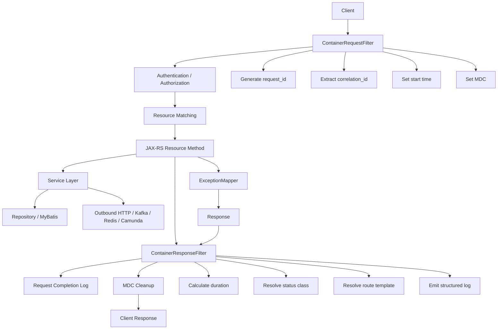

**Prinsipnya:**

```text
Resource/service layer log = business operation.
Request/response filter log = HTTP boundary completion.
ExceptionMapper log = error mapping.
```

Kalau semuanya dicampur di resource method, hasilnya biasanya tidak konsisten antar endpoint.

---

## 3. Apa yang Harus Dicatat di Request Completion Log?

Minimal field:

| Field | Contoh | Catatan |
|---|---|---|
| `message` | `HTTP request completed` | Stable message |
| `request_id` | `req-abc123` | Request lokal/support |
| `correlation_id` | `corr-778899` | Flow lintas service |
| `trace_id` | `...` | Dari OpenTelemetry bila aktif |
| `span_id` | `...` | Dari OpenTelemetry bila aktif |
| `http_method` | `POST` | Dari request context |
| `http_route` | `/orders/{orderId}` | Route template, bukan raw path |
| `http_path` | `/orders/ORD-123` | Optional; hati-hati cardinality/privacy |
| `http_status` | `201` | Dari response context |
| `http_status_class` | `2xx` | Untuk grouping |
| `duration_ms` | `84` | Hitung pakai monotonic clock |
| `outcome` | `SUCCESS` | Derived field |
| `tenant_id` | `tenant-a` | Dari auth/domain resolver |
| `user_id` | `usr-456` | Jika aman |
| `error_code` | `DB_TIMEOUT` | Jika error mapped |
| `error_id` | `err-xyz` | Jika response error |

OpenTelemetry HTTP semantic conventions mendefinisikan konvensi untuk HTTP spans, metrics, dan logs; atribut seperti HTTP method, route, status code, dan duration sebaiknya distandardkan agar telemetry lintas service tidak kacau. ([OpenTelemetry](https://opentelemetry.io/docs/specs/semconv/http/?utm_source=chatgpt.com))

---

## 4. Lifecycle Filter di JAX-RS/Jersey

Ada dua jenis filter utama untuk kebutuhan ini:

| Filter | Waktu eksekusi | Tanggung jawab logging |
|---|---|---|
| `ContainerRequestFilter` | Saat request masuk | set context, start time, request ID |
| `ContainerResponseFilter` | Saat response keluar | hitung duration, status, completion log, cleanup |
| `ExceptionMapper` | Saat exception diubah menjadi response | set error context dan error response |
| `ClientRequestFilter` | Saat outbound HTTP client call | propagate correlation headers |
| `ClientResponseFilter` | Saat outbound HTTP response diterima | log downstream call jika diperlukan |

Jersey documentation menjelaskan bahwa filter/interceptor dapat dipakai di sisi server maupun client, dan response filter memiliki akses ke request context secara read-only serta response context untuk modifikasi response. ([Eclipse EE4J](https://eclipse-ee4j.github.io/jersey.github.io/documentation/latest/filters-and-interceptors.html?utm_source=chatgpt.com))

---

## 5. Pre-Match vs Post-Match Filter

JAX-RS request filter bisa berjalan:

| Mode | Annotation | Kapan dipakai |
|---|---|---|
| Pre-match | `@PreMatching` | Sebelum resource matching |
| Post-match | default | Setelah resource method cocok |
| Name-bound | custom `@NameBinding` | Hanya endpoint tertentu |

Untuk logging completion, biasanya gunakan **post-match/global filter** karena kita ingin tahu resource/route yang cocok. Jakarta REST API menjelaskan bahwa pre-match request filter dipakai untuk mengubah input matching algorithm seperti HTTP method atau header sebelum runtime melakukan matching; jika tidak perlu mengubah matching, post-match request filter lebih direkomendasikan. ([javadoc.io](https://javadoc.io/doc/jakarta.ws.rs/jakarta.ws.rs-api/3.1.0/jakarta.ws.rs/jakarta/ws/rs/container/ContainerRequestContext.html?utm_source=chatgpt.com))

**Rule praktis:**

```text
Request ID / correlation ID boleh di pre-match.
Route template logging lebih cocok post-match.
Completion log sebaiknya di response filter.
```

---

## 6. Status dan Outcome Model

Jangan hanya simpan status code. Tambahkan derived outcome.

| HTTP status | `http_status_class` | `outcome` | Catatan |
|---:|---|---|---|
| 100-199 | `1xx` | `INFORMATIONAL` | Jarang di app log |
| 200-299 | `2xx` | `SUCCESS` | Normal |
| 300-399 | `3xx` | `REDIRECTION` | Biasanya gateway/proxy |
| 400-499 | `4xx` | `CLIENT_ERROR` | Bisa expected |
| 500-599 | `5xx` | `SERVER_ERROR` | Biasanya alert-worthy |
| lainnya | `unknown` | `UNKNOWN` | Defensive fallback |

Contoh helper:

```java
private static String statusClass(int status) {
    if (status >= 100 && status <= 599) {
        return (status / 100) + "xx";
    }
    return "unknown";
}

private static String outcome(int status) {
    if (status >= 200 && status <= 299) return "SUCCESS";
    if (status >= 300 && status <= 399) return "REDIRECTION";
    if (status >= 400 && status <= 499) return "CLIENT_ERROR";
    if (status >= 500 && status <= 599) return "SERVER_ERROR";
    return "UNKNOWN";
}
```

---

## 7. Timing: Pakai `System.nanoTime()`, Bukan `currentTimeMillis()`

Untuk durasi request, gunakan monotonic clock:

```java
long startNanos = System.nanoTime();
long durationMs = TimeUnit.NANOSECONDS.toMillis(System.nanoTime() - startNanos);
```

Alasannya:

| Clock | Cocok untuk | Risiko |
|---|---|---|
| `System.currentTimeMillis()` | timestamp manusia | Bisa berubah karena clock sync/NTP |
| `System.nanoTime()` | elapsed duration | Tidak untuk timestamp absolut |

Completion log tetap punya timestamp dari logging framework. Filter cukup menghitung duration.

---

## 8. Baseline Implementation: Request/Response Logging Filter

```java
package com.company.platform.observability;

import jakarta.annotation.Priority;
import jakarta.ws.rs.Priorities;
import jakarta.ws.rs.container.ContainerRequestContext;
import jakarta.ws.rs.container.ContainerRequestFilter;
import jakarta.ws.rs.container.ContainerResponseContext;
import jakarta.ws.rs.container.ContainerResponseFilter;
import jakarta.ws.rs.ext.Provider;
import org.slf4j.Logger;
import org.slf4j.LoggerFactory;
import org.slf4j.MDC;

import java.util.UUID;
import java.util.concurrent.TimeUnit;

@Provider
@Priority(Priorities.AUTHENTICATION)
public class HttpRequestLoggingFilter implements ContainerRequestFilter, ContainerResponseFilter {

    private static final Logger log = LoggerFactory.getLogger(HttpRequestLoggingFilter.class);

    private static final String START_NANOS = "observability.startNanos";

    private static final String HEADER_REQUEST_ID = "X-Request-Id";
    private static final String HEADER_CORRELATION_ID = "X-Correlation-Id";

    @Override
    public void filter(ContainerRequestContext requestContext) {
        requestContext.setProperty(START_NANOS, System.nanoTime());

        String requestId = sanitizeId(
                requestContext.getHeaderString(HEADER_REQUEST_ID),
                generateId("req")
        );

        String correlationId = sanitizeId(
                requestContext.getHeaderString(HEADER_CORRELATION_ID),
                requestId
        );

        MDC.put("request_id", requestId);
        MDC.put("correlation_id", correlationId);
        MDC.put("http_method", requestContext.getMethod());
        MDC.put("http_path", safePath(requestContext));
    }

    @Override
    public void filter(ContainerRequestContext requestContext,
                       ContainerResponseContext responseContext) {
        try {
            int status = responseContext.getStatus();
            long durationMs = durationMs(requestContext);

            MDC.put("http_status", String.valueOf(status));
            MDC.put("http_status_class", statusClass(status));
            MDC.put("outcome", outcome(status));
            MDC.put("duration_ms", String.valueOf(durationMs));

            String route = resolveRouteTemplate(requestContext);
            if (route != null && !route.isBlank()) {
                MDC.put("http_route", route);
            }

            if (status >= 500) {
                log.error("HTTP request completed");
            } else if (status >= 400) {
                log.warn("HTTP request completed");
            } else {
                log.info("HTTP request completed");
            }
        } finally {
            MDC.clear();
        }
    }

    private static long durationMs(ContainerRequestContext requestContext) {
        Object start = requestContext.getProperty(START_NANOS);
        if (start instanceof Long startNanos) {
            return TimeUnit.NANOSECONDS.toMillis(System.nanoTime() - startNanos);
        }
        return -1L;
    }

    private static String safePath(ContainerRequestContext requestContext) {
        String path = requestContext.getUriInfo().getPath();
        if (path == null || path.isBlank()) {
            return "/";
        }
        return "/" + path;
    }

    private static String resolveRouteTemplate(ContainerRequestContext requestContext) {
        /*
         * Baseline placeholder.
         *
         * In pure Jakarta REST, route template extraction is not as direct
         * as requestContext.getUriInfo().getPath().
         *
         * In Jersey, prefer using ExtendedUriInfo or ResourceInfo-based
         * reconstruction. See next section.
         */
        return null;
    }

    private static String statusClass(int status) {
        if (status >= 100 && status <= 599) {
            return (status / 100) + "xx";
        }
        return "unknown";
    }

    private static String outcome(int status) {
        if (status >= 200 && status <= 299) return "SUCCESS";
        if (status >= 300 && status <= 399) return "REDIRECTION";
        if (status >= 400 && status <= 499) return "CLIENT_ERROR";
        if (status >= 500 && status <= 599) return "SERVER_ERROR";
        return "UNKNOWN";
    }

    private static String generateId(String prefix) {
        return prefix + "-" + UUID.randomUUID();
    }

    private static String sanitizeId(String value, String fallback) {
        if (value == null || value.isBlank()) {
            return fallback;
        }

        String trimmed = value.trim();

        if (trimmed.length() > 128) {
            return fallback;
        }

        if (!trimmed.matches("[A-Za-z0-9._:\\-]+")) {
            return fallback;
        }

        return trimmed;
    }
}
```

---

## 9. Route Template: Kenapa Sulit tapi Penting?

Raw path:

```text
/orders/ORD-123/items/ITEM-789
```

Route template:

```text
/orders/{orderId}/items/{itemId}
```

Untuk observability, route template lebih baik karena:

| Raw path | Route template |
|---|---|
| High cardinality | Low cardinality |
| Sulit aggregate | Mudah aggregate |
| Bisa mengandung ID sensitif | Lebih aman |
| Buruk untuk dashboard | Bagus untuk latency/error per endpoint |
| Buruk untuk metrics label | Cocok sebagai label metrics |

OpenTelemetry HTTP conventions juga membedakan konsep HTTP route sebagai template yang cocok untuk telemetry, bukan sekadar path mentah. ([OpenTelemetry](https://opentelemetry.io/docs/specs/semconv/http/?utm_source=chatgpt.com))

---

## 10. Cara Resolve Route Template di Jersey

Jersey punya API spesifik bernama `ExtendedUriInfo`. Dokumentasinya menyebut `getMatchedTemplates()` mengembalikan daftar read-only `UriTemplate` untuk resource yang match, dengan urutan reverse request URI matching order. ([Eclipse EE4J](https://eclipse-ee4j.github.io/jersey.github.io/apidocs/2.29/jersey/org/glassfish/jersey/server/ExtendedUriInfo.html?utm_source=chatgpt.com))

Contoh Jersey-specific:

```java
import org.glassfish.jersey.server.ExtendedUriInfo;
import org.glassfish.jersey.uri.UriTemplate;

private static String resolveRouteTemplate(ContainerRequestContext requestContext) {
    if (!(requestContext.getUriInfo() instanceof ExtendedUriInfo extendedUriInfo)) {
        return null;
    }

    var templates = extendedUriInfo.getMatchedTemplates();

    if (templates == null || templates.isEmpty()) {
        return null;
    }

    /*
     * Jersey returns matched templates in reverse matching order.
     * For observability, we usually want root-to-leaf.
     */
    StringBuilder route = new StringBuilder();

    for (int i = templates.size() - 1; i >= 0; i--) {
        UriTemplate template = templates.get(i);
        String part = template.getTemplate();

        if (part == null || part.isBlank()) {
            continue;
        }

        if (!part.startsWith("/")) {
            route.append("/");
        }

        route.append(part);
    }

    String value = route.toString()
            .replaceAll("//+", "/");

    return value.isBlank() ? "/" : value;
}
```

Catatan:

```text
ExtendedUriInfo adalah Jersey-specific, bukan kontrak portable murni Jakarta REST.
```

Jika perusahaan ingin portable across Jersey/RESTEasy/Quarkus REST, gunakan abstraction sendiri atau fallback ke `ResourceInfo` reconstruction.

---

## 11. Alternatif Portable: ResourceInfo-Based Route Template

`ResourceInfo` bisa memberi resource class dan method yang match. Namun, `ResourceInfo` dapat bernilai null sebelum request berhasil di-match; jadi ini lebih cocok di post-match filter atau exception mapper, bukan pre-match. ([Payara Services Ltd](https://payara.fish/blog/get-resource-method-information-with-resourceinfo-in-jakarta-rest/?utm_source=chatgpt.com))

Contoh pendekatan:

```java
import jakarta.ws.rs.Path;
import jakarta.ws.rs.container.ContainerRequestContext;
import jakarta.ws.rs.container.ContainerResponseContext;
import jakarta.ws.rs.container.ContainerResponseFilter;
import jakarta.ws.rs.core.Context;
import jakarta.ws.rs.container.ResourceInfo;
import jakarta.ws.rs.ext.Provider;

import java.lang.reflect.Method;

@Provider
public class RouteTemplateResponseFilter implements ContainerResponseFilter {

    @Context
    private ResourceInfo resourceInfo;

    @Override
    public void filter(ContainerRequestContext requestContext,
                       ContainerResponseContext responseContext) {
        String route = resolveFromResourceInfo();
        if (route != null) {
            MDC.put("http_route", route);
        }
    }

    private String resolveFromResourceInfo() {
        if (resourceInfo == null) {
            return null;
        }

        Class<?> resourceClass = resourceInfo.getResourceClass();
        Method resourceMethod = resourceInfo.getResourceMethod();

        if (resourceClass == null || resourceMethod == null) {
            return null;
        }

        String classPath = pathValue(resourceClass.getAnnotation(Path.class));
        String methodPath = pathValue(resourceMethod.getAnnotation(Path.class));

        String combined = joinPath(classPath, methodPath);
        return combined.isBlank() ? "/" : combined;
    }

    private static String pathValue(Path path) {
        return path == null ? "" : path.value();
    }

    private static String joinPath(String left, String right) {
        String value = ("/" + nullToEmpty(left) + "/" + nullToEmpty(right))
                .replaceAll("//+", "/");

        if (value.length() > 1 && value.endsWith("/")) {
            value = value.substring(0, value.length() - 1);
        }

        return value;
    }

    private static String nullToEmpty(String value) {
        return value == null ? "" : value;
    }
}
```

Kelemahan pendekatan ini:

| Kelemahan | Dampak |
|---|---|
| Sub-resource locator bisa lebih rumit | Route mungkin tidak lengkap |
| Dynamic resource model | Bisa tidak akurat |
| Method tanpa `@Path` | Perlu handle class-level path saja |
| Vendor behavior | Tetap perlu dites di runtime aktual |

---

## 12. Recommended Pattern: Satu Completion Log per Request

Jangan log request start dan finish default kalau tidak perlu. Untuk production, biasanya cukup:

```text
1 request = 1 completion log
```

Kenapa?

| Pola | Dampak |
|---|---|
| log start + finish untuk semua request | volume 2x |
| log finish saja | cukup untuk status, duration, outcome |
| log start hanya untuk request panjang/streaming | optional |
| log payload default | berbahaya dan mahal |

Completion log sudah menjawab:

```text
request apa,
selesai kapan,
berapa lama,
status apa,
gagal/sukses,
milik tenant/user/entity mana,
trace/correlation ID apa.
```

---

## 13. Jangan Membaca Body di Request Logging Filter

Request body logging sering menggoda, tetapi berbahaya.

Risikonya:

| Risiko | Penjelasan |
|---|---|
| Mengganggu stream | Entity stream bisa hanya bisa dibaca sekali |
| PII/secret leakage | Body sering berisi data sensitif |
| Latency naik | Buffering body besar mahal |
| Memory pressure | Upload/file/multipart berbahaya |
| Log cost naik | Payload besar memperbesar ingestion |
| Compliance risk | Dokumen personal masuk log |

Default policy:

```text
Do not log request/response body in HTTP boundary logging.
```

Kalau perlu payload logging, buat filter khusus dengan:

- allowlist endpoint
- max size
- redaction
- sampling
- environment gate
- binary/multipart skip
- explicit security review

Itu akan dibahas lebih dalam di Seri 6.

---

## 14. Exception Flow: Response Filter Tetap Perlu Completion Log

`ExceptionMapper` bertugas mengubah exception menjadi `Response`; kontrak Jakarta REST `ExceptionMapper` memang memetakan Java exception ke response, dan provider mapper harus didaftarkan atau diberi `@Provider` untuk discovery. ([Jakarta EE](https://jakarta.ee/specifications/restful-ws/3.1/apidocs/jakarta.ws.rs/jakarta/ws/rs/ext/exceptionmapper?utm_source=chatgpt.com))

Model yang sehat:

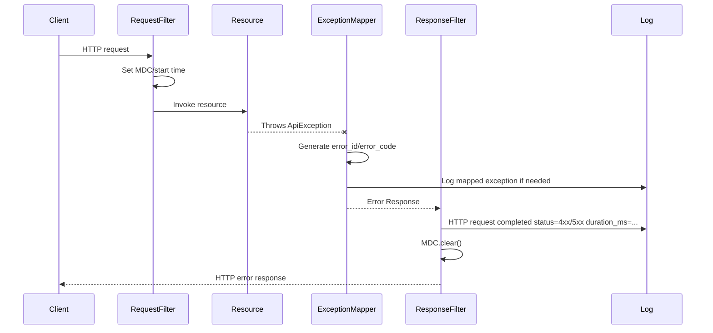

**Rule penting:**

```text
ExceptionMapper log = kenapa error terjadi.
ResponseFilter log = request selesai dengan status apa dan durasi berapa.
```

Keduanya berbeda. Jangan hanya punya salah satu.

---

## 15. Error Context dari ExceptionMapper ke ResponseFilter

Supaya completion log punya `error_code` dan `error_id`, mapper bisa menaruh metadata ke request property.

```java
public final class ObservabilityProperties {
    public static final String ERROR_ID = "observability.errorId";
    public static final String ERROR_CODE = "observability.errorCode";

    private ObservabilityProperties() {}
}
```

Exception mapper:

```java
@Provider
public class ApiExceptionMapper implements ExceptionMapper<ApiException> {

    private static final Logger log = LoggerFactory.getLogger(ApiExceptionMapper.class);

    @Context
    private jakarta.ws.rs.container.ContainerRequestContext requestContext;

    @Override
    public Response toResponse(ApiException ex) {
        String errorId = "err-" + UUID.randomUUID();

        requestContext.setProperty(ObservabilityProperties.ERROR_ID, errorId);
        requestContext.setProperty(ObservabilityProperties.ERROR_CODE, ex.errorCode());

        try (MDC.MDCCloseable e1 = MDC.putCloseable("error_id", errorId);
             MDC.MDCCloseable e2 = MDC.putCloseable("error_code", ex.errorCode())) {

            if (ex.httpStatus() >= 500) {
                log.error("API exception mapped to server error", ex);
            } else {
                log.warn("API exception mapped to client error");
            }
        }

        return Response.status(ex.httpStatus())
                .entity(Map.of(
                        "errorCode", ex.errorCode(),
                        "errorId", errorId,
                        "message", ex.safeClientMessage()
                ))
                .build();
    }
}
```

Response filter:

```java
private static void putErrorContextIfPresent(ContainerRequestContext requestContext) {
    putPropertyToMdc(requestContext, ObservabilityProperties.ERROR_ID, "error_id");
    putPropertyToMdc(requestContext, ObservabilityProperties.ERROR_CODE, "error_code");
}

private static void putPropertyToMdc(ContainerRequestContext requestContext,
                                     String propertyName,
                                     String mdcKey) {
    Object value = requestContext.getProperty(propertyName);
    if (value != null) {
        MDC.put(mdcKey, String.valueOf(value));
    }
}
```

---

## 16. Final Production-Grade Filter Skeleton

```java
package com.company.platform.observability;

import jakarta.annotation.Priority;
import jakarta.ws.rs.Priorities;
import jakarta.ws.rs.container.ContainerRequestContext;
import jakarta.ws.rs.container.ContainerRequestFilter;
import jakarta.ws.rs.container.ContainerResponseContext;
import jakarta.ws.rs.container.ContainerResponseFilter;
import jakarta.ws.rs.ext.Provider;
import org.slf4j.Logger;
import org.slf4j.LoggerFactory;
import org.slf4j.MDC;

import java.util.UUID;
import java.util.concurrent.TimeUnit;

@Provider
@Priority(Priorities.AUTHENTICATION)
public class HttpObservabilityFilter implements ContainerRequestFilter, ContainerResponseFilter {

    private static final Logger log = LoggerFactory.getLogger(HttpObservabilityFilter.class);

    private static final String START_NANOS = "observability.startNanos";

    private static final String HEADER_REQUEST_ID = "X-Request-Id";
    private static final String HEADER_CORRELATION_ID = "X-Correlation-Id";

    @Override
    public void filter(ContainerRequestContext requestContext) {
        requestContext.setProperty(START_NANOS, System.nanoTime());

        String requestId = sanitizeId(
                requestContext.getHeaderString(HEADER_REQUEST_ID),
                generateId("req")
        );

        String correlationId = sanitizeId(
                requestContext.getHeaderString(HEADER_CORRELATION_ID),
                requestId
        );

        MDC.put("request_id", requestId);
        MDC.put("correlation_id", correlationId);
        MDC.put("http_method", requestContext.getMethod());
        MDC.put("http_path", safePath(requestContext));

        /*
         * tenant_id and user_id should usually be set after authentication,
         * not blindly from public headers.
         */
    }

    @Override
    public void filter(ContainerRequestContext requestContext,
                       ContainerResponseContext responseContext) {
        try {
            int status = responseContext.getStatus();

            putIfPresent("http_route", resolveRouteTemplate(requestContext));
            putIfPresent("http_status", String.valueOf(status));
            putIfPresent("http_status_class", statusClass(status));
            putIfPresent("outcome", outcome(status));
            putIfPresent("duration_ms", String.valueOf(durationMs(requestContext)));

            putRequestPropertyToMdc(requestContext, "observability.errorId", "error_id");
            putRequestPropertyToMdc(requestContext, "observability.errorCode", "error_code");
            putRequestPropertyToMdc(requestContext, "observability.tenantId", "tenant_id");
            putRequestPropertyToMdc(requestContext, "observability.userId", "user_id");

            logCompletion(status);
        } finally {
            MDC.clear();
        }
    }

    private static void logCompletion(int status) {
        if (status >= 500) {
            log.error("HTTP request completed");
        } else if (status >= 400) {
            log.warn("HTTP request completed");
        } else {
            log.info("HTTP request completed");
        }
    }

    private static long durationMs(ContainerRequestContext requestContext) {
        Object start = requestContext.getProperty(START_NANOS);
        if (start instanceof Long startNanos) {
            return TimeUnit.NANOSECONDS.toMillis(System.nanoTime() - startNanos);
        }
        return -1L;
    }

    private static void putRequestPropertyToMdc(ContainerRequestContext requestContext,
                                                String propertyName,
                                                String mdcKey) {
        Object value = requestContext.getProperty(propertyName);
        if (value != null) {
            putIfPresent(mdcKey, String.valueOf(value));
        }
    }

    private static void putIfPresent(String key, String value) {
        if (value != null && !value.isBlank()) {
            MDC.put(key, value);
        }
    }

    private static String safePath(ContainerRequestContext requestContext) {
        String path = requestContext.getUriInfo().getPath();
        if (path == null || path.isBlank()) {
            return "/";
        }
        return "/" + path;
    }

    private static String resolveRouteTemplate(ContainerRequestContext requestContext) {
        /*
         * Implement with Jersey ExtendedUriInfo or ResourceInfo strategy.
         * Keep fallback null instead of putting raw path as http_route.
         */
        return null;
    }

    private static String statusClass(int status) {
        if (status >= 100 && status <= 599) {
            return (status / 100) + "xx";
        }
        return "unknown";
    }

    private static String outcome(int status) {
        if (status >= 200 && status <= 299) return "SUCCESS";
        if (status >= 300 && status <= 399) return "REDIRECTION";
        if (status >= 400 && status <= 499) return "CLIENT_ERROR";
        if (status >= 500 && status <= 599) return "SERVER_ERROR";
        return "UNKNOWN";
    }

    private static String generateId(String prefix) {
        return prefix + "-" + UUID.randomUUID();
    }

    private static String sanitizeId(String value, String fallback) {
        if (value == null || value.isBlank()) {
            return fallback;
        }

        String trimmed = value.trim();

        if (trimmed.length() > 128) {
            return fallback;
        }

        if (!trimmed.matches("[A-Za-z0-9._:\\-]+")) {
            return fallback;
        }

        return trimmed;
    }
}
```

---

## 17. Log Level untuk Completion Log

Ada dua pendekatan valid.

### Opsi A - Semua completion log `INFO`

```text
INFO HTTP request completed status=500 outcome=SERVER_ERROR
```

Kelebihan:

- tidak mencampur access log dengan error alert
- alert bisa berbasis metric, bukan log level
- mengurangi noise ERROR dari error yang sudah dimapped

Kekurangan:

- query error by level tidak langsung dapat semua HTTP 5xx

### Opsi B - 4xx `WARN`, 5xx `ERROR`

```text
WARN  HTTP request completed status=404
ERROR HTTP request completed status=500
```

Kelebihan:

- lebih mudah dicari
- terlihat jelas di log viewer

Kekurangan:

- bisa menciptakan alert noise
- 404/409/422 yang normal bisa terlalu noisy

Rekomendasi saya untuk enterprise microservice:

| Status | Completion log level |
|---|---:|
| 2xx | INFO |
| 3xx | INFO |
| 4xx expected | INFO/WARN, tergantung endpoint |
| 4xx suspicious/security | WARN |
| 5xx | ERROR |
| health check 2xx | DEBUG atau sampled/filtered |

Untuk production matang, **alert utama sebaiknya berbasis metrics/SLO**, bukan sekadar jumlah log ERROR.

---

## 18. Health Check dan Noise Control

Endpoint seperti ini bisa sangat noisy:

```text
/health
/ready
/live
/metrics
```

Jangan biarkan health check mendominasi log.

Strategi:

| Endpoint | Strategi |
|---|---|
| `/health` | skip success log atau DEBUG |
| `/ready` | skip success log, log failure |
| `/live` | skip success log |
| `/metrics` | skip log atau sample |
| business API | log normal |
| admin API | log normal + security context |

Contoh:

```java
private static boolean shouldSkipSuccessLog(ContainerRequestContext requestContext,
                                            int status) {
    String path = requestContext.getUriInfo().getPath();

    if (status >= 400) {
        return false;
    }

    return path.equals("health")
            || path.equals("ready")
            || path.equals("live")
            || path.equals("metrics");
}
```

---

## 19. Status Mapping dari Exception

Buat mapping eksplisit agar log dan API response konsisten.

| Exception | HTTP status | `error_code` | Log level |
|---|---:|---|---|
| `ValidationException` | 400 | `VALIDATION_ERROR` | INFO/WARN |
| `NotAuthorizedException` | 401 | `UNAUTHORIZED` | WARN |
| `ForbiddenException` | 403 | `FORBIDDEN` | WARN |
| `NotFoundException` | 404 | `NOT_FOUND` | INFO/WARN |
| `ConflictException` | 409 | `CONFLICT` | INFO/WARN |
| `OptimisticLockException` | 409 | `CONCURRENT_MODIFICATION` | WARN |
| `RateLimitException` | 429 | `RATE_LIMITED` | WARN |
| `DownstreamTimeoutException` | 504 | `DOWNSTREAM_TIMEOUT` | ERROR |
| `SQLException` / DB failure | 500 | `DATABASE_ERROR` | ERROR |
| Unknown exception | 500 | `INTERNAL_ERROR` | ERROR |

Completion log sebaiknya membawa `http_status`, `error_code`, dan `error_id`. Exception log membawa stack trace.

---

## 20. Response Header untuk Support

Agar support/user bisa melaporkan error yang bisa dicari di log, response sebaiknya membawa ID aman.

Contoh response header:

| Header | Tujuan |
|---|---|
| `X-Request-Id` | support request lokal |
| `X-Correlation-Id` | support flow lintas service |
| `X-Error-Id` | support error spesifik |

Response filter bisa menambahkan:

```java
private static void addSupportHeaders(ContainerRequestContext requestContext,
                                      ContainerResponseContext responseContext) {
    putHeaderFromMdc(responseContext, "X-Request-Id", "request_id");
    putHeaderFromMdc(responseContext, "X-Correlation-Id", "correlation_id");

    Object errorId = requestContext.getProperty("observability.errorId");
    if (errorId != null) {
        responseContext.getHeaders().putSingle("X-Error-Id", String.valueOf(errorId));
    }
}

private static void putHeaderFromMdc(ContainerResponseContext responseContext,
                                     String headerName,
                                     String mdcKey) {
    String value = MDC.get(mdcKey);
    if (value != null && !value.isBlank()) {
        responseContext.getHeaders().putSingle(headerName, value);
    }
}
```

Pastikan header ini tidak mengandung data sensitif.

---

## 21. Access Log vs Application Completion Log

Jangan bingung dengan access log dari NGINX, ingress, atau servlet container.

| Sumber | Contoh | Kelebihan | Kekurangan |
|---|---|---|---|
| NGINX/Ingress access log | method/path/status/upstream time | Melihat traffic sebelum app | Tidak tahu business context |
| Servlet container access log | HTTP boundary app server | Dekat runtime | Tidak tahu domain context |
| JAX-RS completion log | method/route/status/duration/correlation/tenant | Kaya context aplikasi | Tidak mencakup request yang gagal sebelum app |
| Exception log | stacktrace/error code | Root cause teknis | Bukan summary request |
| Audit log | user action/state transition | Regulatory evidence | Bukan diagnostic traffic log |

Idealnya punya:

```text
Ingress access log
+ application completion log
+ exception log
+ audit/domain event log
```

Masing-masing punya fungsi berbeda.

---

## 22. Testing Strategy

### 22.1 Test request ID generation

```text
Given request tanpa X-Request-Id
When endpoint dipanggil
Then completion log memiliki request_id generated
And response memiliki X-Request-Id
```

### 22.2 Test correlation propagation

```text
Given request dengan X-Correlation-Id=corr-test
When endpoint dipanggil
Then completion log memiliki correlation_id=corr-test
And response memiliki X-Correlation-Id=corr-test
```

### 22.3 Test error mapping

```text
Given endpoint throw ApiException(errorCode=VALIDATION_ERROR)
When request diproses
Then ExceptionMapper menghasilkan response 400
And completion log memiliki http_status=400
And error_code=VALIDATION_ERROR
```

### 22.4 Test MDC cleanup

```text
Given request A dengan correlation_id=corr-A
And request B tanpa correlation header
When keduanya diproses oleh thread pool
Then request B tidak membawa corr-A
```

### 22.5 Test health check noise

```text
Given GET /health returns 200
When request diproses
Then completion log tidak ditulis atau ditulis DEBUG
```

---

## 23. Common Failure Modes

| Failure | Gejala | Penyebab | Fix |
|---|---|---|---|
| Completion log tidak muncul | Request selesai tanpa log | Filter tidak terdaftar | `@Provider` atau register di `ResourceConfig` |
| Status selalu kosong | Response filter tidak set MDC | Salah lifecycle | Set status di `ContainerResponseFilter` |
| Duration `-1` | Start time tidak tersimpan | Request property hilang/salah key | Set property di request filter |
| Route high-cardinality | `http_route=/orders/ORD-123` | Pakai raw path | Gunakan route template |
| Correlation ID berubah | Generate ulang di tiap service | Header tidak diteruskan | Propagate `X-Correlation-Id` |
| Request berikutnya punya context lama | MDC bocor | Tidak `MDC.clear()` | Clear di `finally` |
| Error log double | Service log + mapper log + filter error | Boundary tidak jelas | Log stacktrace sekali di mapper/boundary |
| Log health check membanjiri | Readiness/liveness dicatat INFO | Tidak ada skip/sample | Filter endpoint teknis |
| Secret masuk log | Header/body dilog | Payload/header logging agresif | Redaction + denylist |
| Metrics kacau | Route label pakai raw path | Cardinality tinggi | Template route |

---

## 24. Production Checklist

| Area | Checklist |
|---|---|
| Registration | Filter terdaftar via `@Provider` atau `ResourceConfig` |
| Request ID | Generate jika tidak ada |
| Correlation ID | Preserve dari upstream |
| Header validation | Max length + charset |
| Start time | `System.nanoTime()` |
| Completion log | Satu log per request |
| Status | `http_status`, `http_status_class`, `outcome` |
| Duration | `duration_ms` numeric |
| Route | Template route jika memungkinkan |
| Raw path | Optional, jangan jadi metrics label |
| MDC | Set di request, clear di response |
| ExceptionMapper | Set `error_id` dan `error_code` |
| Support headers | Response punya request/correlation/error ID |
| Health endpoints | Skip/sample success log |
| Payload | Tidak dilog default |
| Security | Auth/token/cookie tidak dilog |
| Testing | Ada test propagation, cleanup, error, route |

---

## 25. What Good Looks Like

Request/response logging yang sehat terlihat seperti ini:

```text
1. Setiap business API request punya satu completion log.
2. Completion log punya request_id dan correlation_id.
3. Completion log punya method, route, status, duration, outcome.
4. 5xx membawa error_code dan error_id.
5. Exception stacktrace hanya dilog di boundary yang jelas.
6. Health check tidak membanjiri log.
7. Raw path tidak dipakai sebagai metric label.
8. Route template tersedia untuk dashboard latency/error.
9. MDC tidak bocor antar request.
10. Support bisa mencari error dari X-Error-Id atau X-Correlation-Id.
```

---

## 26. Ringkasan Seri 4

| Area | Kesimpulan |
|---|---|
| Boundary | Logging HTTP boundary sebaiknya di JAX-RS filter |
| Request filter | Set request/correlation ID, method, path, start time |
| Response filter | Hitung duration, status, outcome, completion log, cleanup |
| Route | Gunakan route template untuk observability |
| Exception | ExceptionMapper menangani error context dan stacktrace |
| Log volume | Satu completion log per request biasanya cukup |
| Payload | Jangan log body default |
| Health check | Skip/sample success log |
| Supportability | Tambahkan request/correlation/error ID ke response |
| Production | Test cleanup, propagation, status, duration, error mapping |

---

# Status

**Seri 4/20 selesai.**

Seri berikutnya: **Seri 5/20 - Exception Observability: `ExceptionMapper`, error contract, stacktrace policy, error taxonomy, retryability, user-safe message, dan korelasi error dengan API response.**

---

**Sources:**

- [ContainerRequestFilter (jakarta.ws.rs-api 3.0.0 API)](https://jakarta.ee/specifications/restful-ws/3.0/apidocs/jakarta/ws/rs/container/containerrequestfilter?utm_source=chatgpt.com)
- [Semantic conventions for HTTP](https://opentelemetry.io/docs/specs/semconv/http/?utm_source=chatgpt.com)
- [Chapter 10. Filters and Interceptors](https://eclipse-ee4j.github.io/jersey.github.io/documentation/latest/filters-and-interceptors.html?utm_source=chatgpt.com)
- [ContainerRequestContext (Jakarta RESTful WS API 3.1.0 ...](https://javadoc.io/doc/jakarta.ws.rs/jakarta.ws.rs-api/3.1.0/jakarta.ws.rs/jakarta/ws/rs/container/ContainerRequestContext.html?utm_source=chatgpt.com)
- [How To Get Resource Method Information With ...](https://payara.fish/blog/get-resource-method-information-with-resourceinfo-in-jakarta-rest/?utm_source=chatgpt.com)

## Response:
7/13/2026, 4:39:41 PM

Lanjut ke **Seri 5/20**. Seri ini akan merapikan error handling sebagai kontrak observability: bukan hanya “catch exception”, tetapi bagaimana error bisa dipahami oleh client, support, developer, dan incident responder.

# Seri 5/20 - Exception Observability untuk Jersey/JAX-RS Microservices

## 1. Tujuan Seri Ini

Seri ini membahas bagaimana error/exception di aplikasi **Jersey/JAX-RS** harus dimodelkan agar:

- response API aman untuk client
- log cukup detail untuk developer
- error bisa dicari oleh support
- incident responder bisa menghubungkan error ke request, trace, downstream dependency, DB, workflow, atau business entity
- error taxonomy konsisten lintas service

Di Jakarta REST, `ExceptionMapper<E extends Throwable>` adalah kontrak provider untuk mengubah Java exception menjadi `Response`; provider tersebut harus diregister secara programmatic atau diberi `@Provider` agar bisa ditemukan runtime. ([Jakarta EE](https://jakarta.ee/specifications/restful-ws/4.0/apidocs/jakarta.ws.rs/jakarta/ws/rs/ext/exceptionmapper?utm_source=chatgpt.com))

---

## 2. Mental Model: Exception Handling sebagai Boundary Translation

Exception observability bukan sekadar `try-catch`.

Model yang benar:

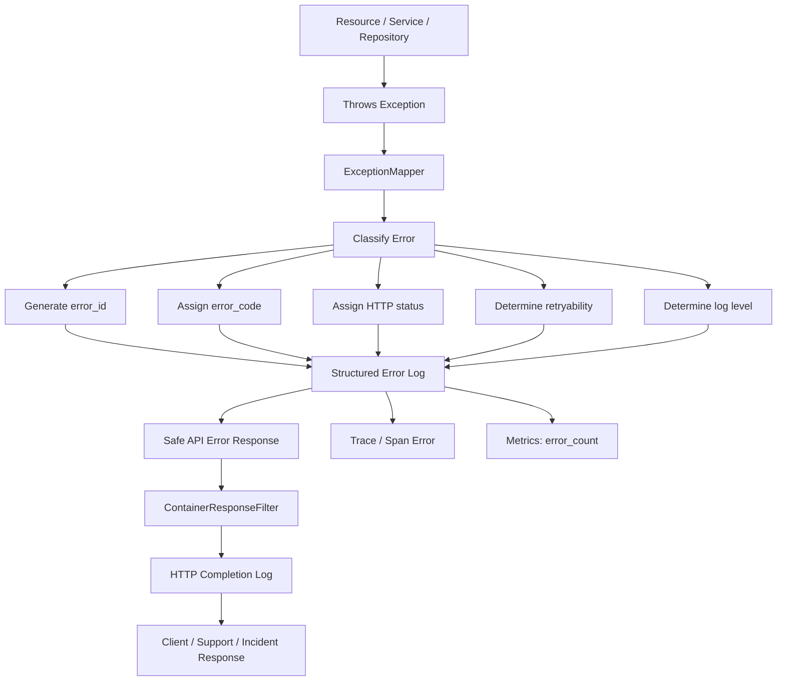

Prinsipnya:

```text id="q2fh1o"
Internal exception detail boleh masuk log/trace.
Client response hanya boleh berisi informasi aman, stabil, dan actionable.
```

---

## 3. Tiga Output dari Satu Exception

Saat exception terjadi, biasanya ada tiga output berbeda:

| Output | Audience | Isi |
|---|---|---|
| API response | Client / caller | `errorCode`, `errorId`, safe message |
| Error log | Developer / SRE | exception type, stacktrace, context, dependency |
| Completion log | Operator / dashboard | method, route, status, duration, error code |

Contoh:

### API response

```json id="7sqpw2"
{
  "errorCode": "ORDER_STATE_INVALID",
  "errorId": "err-01J8ZK9H3F0M",
  "message": "Order cannot be submitted in its current state."
}
```

### Error log

```json id="r6uwqy"
{
  "level": "WARN",
  "message": "API exception mapped to client error",
  "error_id": "err-01J8ZK9H3F0M",
  "error_code": "ORDER_STATE_INVALID",
  "error_type": "com.company.order.domain.InvalidOrderStateException",
  "http_status": 409,
  "retryable": false,
  "order_id": "ORD-123",
  "correlation_id": "corr-778899"
}
```

### Completion log

```json id="08iygn"
{
  "level": "WARN",
  "message": "HTTP request completed",
  "http_method": "POST",
  "http_route": "/orders/{orderId}/submit",
  "http_status": 409,
  "duration_ms": 42,
  "error_id": "err-01J8ZK9H3F0M",
  "error_code": "ORDER_STATE_INVALID",
  "correlation_id": "corr-778899"
}
```

---

## 4. Error Contract untuk API Response

Response error sebaiknya stabil dan tidak membocorkan detail internal.

Baseline contract:

```json id="rq34ai"
{
  "errorCode": "VALIDATION_ERROR",
  "errorId": "err-01J8ZK9H3F0M",
  "message": "Request validation failed.",
  "details": [
    {
      "field": "customerId",
      "code": "REQUIRED",
      "message": "customerId is required."
    }
  ]
}
```

| Field | Wajib? | Catatan |
|---|---:|---|
| `errorCode` | Ya | Stable, machine-readable |
| `errorId` | Ya | Untuk support/debugging |
| `message` | Ya | Aman untuk client |
| `details` | Optional | Cocok untuk validation |
| `retryable` | Optional | Berguna untuk client automation |
| `correlationId` | Optional | Bisa juga di header |
| `timestamp` | Optional | Biasanya log sudah punya timestamp |
| `path` | Optional | Hati-hati raw path dan privacy |

Jangan expose:

| Jangan expose ke client | Alasan |
|---|---|
| Java class name | Internal implementation leak |
| Stacktrace | Security leak |
| SQL query | Data/security leak |
| DB table/column detail | Internal schema leak |
| Downstream hostname internal | Infra leak |
| Token/header | Secret leak |
| Raw exception message dari library | Bisa berisi data sensitif |

---

## 5. Error Taxonomy

Error taxonomy adalah daftar error yang konsisten. Tanpa taxonomy, setiap service akan membuat error code sendiri-sendiri dan sulit dioperasikan.

### 5.1 Kategori besar

| Category | HTTP | Retryable? | Contoh |
|---|---:|---:|---|
| Validation | 400 | Tidak | field required, invalid format |
| Authentication | 401 | Tergantung | token missing/expired |
| Authorization | 403 | Tidak | permission denied |
| Not found | 404 | Tidak | order tidak ditemukan |
| Conflict | 409 | Tergantung | state conflict, optimistic lock |
| Rate limit | 429 | Ya, setelah delay | too many requests |
| Downstream timeout | 504 | Ya | service dependency timeout |
| Downstream bad response | 502 | Tergantung | dependency returns invalid response |
| DB unavailable | 503/500 | Ya | connection failure |
| Internal bug | 500 | Tidak langsung | null pointer, invariant violation |
| Workflow failure | 500/409 | Tergantung | Camunda process invalid state |

Jakarta REST `Response.Status` menyediakan status umum HTTP, dan aplikasi juga bisa menambahkan status code melalui implementasi `Response.StatusType`. ([Jakarta EE](https://jakarta.ee/specifications/restful-ws/3.1/apidocs/jakarta.ws.rs/jakarta/ws/rs/core/response.status?utm_source=chatgpt.com))

---

## 6. Recommended Error Code Style

Gunakan error code yang:

- uppercase
- stabil
- tidak terlalu teknis
- tidak menyertakan ID/entity spesifik
- bisa dikelompokkan

Contoh baik:

```text id="vaz62b"
VALIDATION_ERROR
ORDER_NOT_FOUND
ORDER_STATE_INVALID
CONCURRENT_MODIFICATION
DOWNSTREAM_TIMEOUT
DATABASE_UNAVAILABLE
WORKFLOW_TASK_FAILED
INTERNAL_ERROR
```

Contoh buruk:

```text id="sat0eb"
NullPointerException
SQL_ERROR_LINE_42
ORDER_ORD123_FAILED
PAYMENT_SERVICE_10_1_2_3_TIMEOUT
error1
BAD_THING
```

---

## 7. Exception Class Model

Buat base exception aplikasi yang membawa metadata.

```java id="l5j2jc"
public abstract class ApiException extends RuntimeException {

    private final String errorCode;
    private final int httpStatus;
    private final boolean retryable;
    private final String safeClientMessage;

    protected ApiException(
            String errorCode,
            int httpStatus,
            boolean retryable,
            String safeClientMessage,
            String internalMessage
    ) {
        super(internalMessage);
        this.errorCode = errorCode;
        this.httpStatus = httpStatus;
        this.retryable = retryable;
        this.safeClientMessage = safeClientMessage;
    }

    protected ApiException(
            String errorCode,
            int httpStatus,
            boolean retryable,
            String safeClientMessage,
            String internalMessage,
            Throwable cause
    ) {
        super(internalMessage, cause);
        this.errorCode = errorCode;
        this.httpStatus = httpStatus;
        this.retryable = retryable;
        this.safeClientMessage = safeClientMessage;
    }

    public String errorCode() {
        return errorCode;
    }

    public int httpStatus() {
        return httpStatus;
    }

    public boolean retryable() {
        return retryable;
    }

    public String safeClientMessage() {
        return safeClientMessage;
    }
}
```

Contoh domain exception:

```java id="91h15e"
public final class InvalidOrderStateException extends ApiException {

    public InvalidOrderStateException(String orderId, String currentState) {
        super(
                "ORDER_STATE_INVALID",
                409,
                false,
                "Order cannot be submitted in its current state.",
                "Order cannot be submitted. orderId=" + orderId + ", currentState=" + currentState
        );
    }
}
```

Contoh downstream exception:

```java id="jog27j"
public final class DownstreamTimeoutException extends ApiException {

    public DownstreamTimeoutException(String dependency, Throwable cause) {
        super(
                "DOWNSTREAM_TIMEOUT",
                504,
                true,
                "A downstream service did not respond in time.",
                "Downstream service timed out. dependency=" + dependency,
                cause
        );
    }
}
```

---

## 8. API Error Response DTO

```java id="pzob7w"
public record ApiErrorResponse(
        String errorCode,
        String errorId,
        String message,
        Boolean retryable,
        List<ApiErrorDetail> details
) {
    public static ApiErrorResponse simple(
            String errorCode,
            String errorId,
            String message,
            boolean retryable
    ) {
        return new ApiErrorResponse(
                errorCode,
                errorId,
                message,
                retryable,
                List.of()
        );
    }
}
```

```java id="4j9kki"
public record ApiErrorDetail(
        String field,
        String code,
        String message
) {
}
```

---

## 9. ExceptionMapper untuk ApiException

```java id="iu3cab"
package com.company.platform.error;

import jakarta.ws.rs.container.ContainerRequestContext;
import jakarta.ws.rs.core.Context;
import jakarta.ws.rs.core.Response;
import jakarta.ws.rs.ext.ExceptionMapper;
import jakarta.ws.rs.ext.Provider;
import org.slf4j.Logger;
import org.slf4j.LoggerFactory;
import org.slf4j.MDC;

import java.util.UUID;

@Provider
public class ApiExceptionMapper implements ExceptionMapper<ApiException> {

    private static final Logger log = LoggerFactory.getLogger(ApiExceptionMapper.class);

    @Context
    private ContainerRequestContext requestContext;

    @Override
    public Response toResponse(ApiException ex) {
        String errorId = generateErrorId();

        requestContext.setProperty("observability.errorId", errorId);
        requestContext.setProperty("observability.errorCode", ex.errorCode());
        requestContext.setProperty("observability.retryable", ex.retryable());

        try (MDC.MDCCloseable e1 = MDC.putCloseable("error_id", errorId);
             MDC.MDCCloseable e2 = MDC.putCloseable("error_code", ex.errorCode());
             MDC.MDCCloseable e3 = MDC.putCloseable("http_status", String.valueOf(ex.httpStatus()));
             MDC.MDCCloseable e4 = MDC.putCloseable("retryable", String.valueOf(ex.retryable()))) {

            logApiException(ex);

            ApiErrorResponse body = ApiErrorResponse.simple(
                    ex.errorCode(),
                    errorId,
                    ex.safeClientMessage(),
                    ex.retryable()
            );

            return Response.status(ex.httpStatus())
                    .entity(body)
                    .type("application/json")
                    .header("X-Error-Id", errorId)
                    .build();
        }
    }

    private static void logApiException(ApiException ex) {
        int status = ex.httpStatus();

        if (status >= 500) {
            log.error("API exception mapped to server error", ex);
        } else if (status == 401 || status == 403 || status == 429) {
            log.warn("API exception mapped to protected/client error");
        } else {
            log.info("API exception mapped to client error");
        }
    }

    private static String generateErrorId() {
        return "err-" + UUID.randomUUID();
    }
}
```

Catatan: `ExceptionMapper` dapat menghasilkan response, tetapi completion log tetap sebaiknya ditulis di `ContainerResponseFilter` agar semua request punya summary yang sama.

---

## 10. Generic ExceptionMapper untuk Unknown Exception

Jangan biarkan unknown exception bocor ke client.

```java id="ix3qr6"
@Provider
public class GenericExceptionMapper implements ExceptionMapper<Throwable> {

    private static final Logger log = LoggerFactory.getLogger(GenericExceptionMapper.class);

    @Context
    private ContainerRequestContext requestContext;

    @Override
    public Response toResponse(Throwable ex) {
        String errorId = "err-" + UUID.randomUUID();

        requestContext.setProperty("observability.errorId", errorId);
        requestContext.setProperty("observability.errorCode", "INTERNAL_ERROR");
        requestContext.setProperty("observability.retryable", false);

        try (MDC.MDCCloseable e1 = MDC.putCloseable("error_id", errorId);
             MDC.MDCCloseable e2 = MDC.putCloseable("error_code", "INTERNAL_ERROR");
             MDC.MDCCloseable e3 = MDC.putCloseable("http_status", "500");
             MDC.MDCCloseable e4 = MDC.putCloseable("retryable", "false")) {

            log.error("Unhandled exception mapped to internal error", ex);

            ApiErrorResponse body = ApiErrorResponse.simple(
                    "INTERNAL_ERROR",
                    errorId,
                    "An unexpected error occurred.",
                    false
            );

            return Response.status(Response.Status.INTERNAL_SERVER_ERROR)
                    .entity(body)
                    .type("application/json")
                    .header("X-Error-Id", errorId)
                    .build();
        }
    }
}
```

**Catatan penting:** mapper `Throwable` terlalu luas. Pastikan tidak menelan exception framework/security tertentu yang seharusnya ditangani runtime/security layer. Di beberapa runtime, mapper yang terlalu global bisa mengubah behavior default yang diinginkan.

---

## 11. Mapper untuk Validation Error

Bean Validation biasanya menghasilkan `ConstraintViolationException` atau exception validasi spesifik runtime. Jakarta REST specification juga menyebut implementasi harus menyediakan default exception mapper untuk `jakarta.validation.ValidationException`. ([Jakarta EE](https://jakarta.ee/specifications/restful-ws/3.1/jakarta-restful-ws-spec-3.1.html?utm_source=chatgpt.com))

Namun untuk API enterprise, sering lebih baik punya response format sendiri.

```java id="jawg0r"
@Provider
public class ConstraintViolationExceptionMapper
        implements ExceptionMapper<jakarta.validation.ConstraintViolationException> {

    private static final Logger log = LoggerFactory.getLogger(ConstraintViolationExceptionMapper.class);

    @Context
    private ContainerRequestContext requestContext;

    @Override
    public Response toResponse(jakarta.validation.ConstraintViolationException ex) {
        String errorId = "err-" + UUID.randomUUID();

        requestContext.setProperty("observability.errorId", errorId);
        requestContext.setProperty("observability.errorCode", "VALIDATION_ERROR");

        List<ApiErrorDetail> details = ex.getConstraintViolations()
                .stream()
                .map(v -> new ApiErrorDetail(
                        String.valueOf(v.getPropertyPath()),
                        "INVALID",
                        v.getMessage()
                ))
                .toList();

        try (MDC.MDCCloseable e1 = MDC.putCloseable("error_id", errorId);
             MDC.MDCCloseable e2 = MDC.putCloseable("error_code", "VALIDATION_ERROR");
             MDC.MDCCloseable e3 = MDC.putCloseable("http_status", "400")) {

            log.info("Request validation failed");

            ApiErrorResponse body = new ApiErrorResponse(
                    "VALIDATION_ERROR",
                    errorId,
                    "Request validation failed.",
                    false,
                    details
            );

            return Response.status(Response.Status.BAD_REQUEST)
                    .entity(body)
                    .type("application/json")
                    .header("X-Error-Id", errorId)
                    .build();
        }
    }
}
```

Validation error biasanya **tidak perlu stacktrace** karena itu expected client error.

---

## 12. Mapping Table Praktis

| Exception / Kondisi | HTTP | `error_code` | Retryable | Log level | Stacktrace |
|---|---:|---|---:|---:|---:|
| Missing/invalid field | 400 | `VALIDATION_ERROR` | Tidak | INFO | Tidak |
| Invalid enum/status | 400 | `INVALID_REQUEST` | Tidak | INFO | Tidak |
| Unauthenticated | 401 | `UNAUTHORIZED` | Tergantung | WARN | Tidak |
| Permission denied | 403 | `FORBIDDEN` | Tidak | WARN | Tidak |
| Entity not found | 404 | `NOT_FOUND` | Tidak | INFO/WARN | Tidak |
| Domain state invalid | 409 | `STATE_CONFLICT` | Tidak | INFO/WARN | Tidak |
| Optimistic lock | 409 | `CONCURRENT_MODIFICATION` | Ya | WARN | Optional |
| Rate limited | 429 | `RATE_LIMITED` | Ya | WARN | Tidak |
| Downstream timeout | 504 | `DOWNSTREAM_TIMEOUT` | Ya | ERROR | Ya |
| Downstream 5xx | 502 | `DOWNSTREAM_ERROR` | Ya | ERROR | Ya |
| DB connection failure | 503 | `DATABASE_UNAVAILABLE` | Ya | ERROR | Ya |
| SQL constraint unexpected | 500/409 | `DATABASE_CONSTRAINT_ERROR` | Tergantung | ERROR/WARN | Ya |
| Camunda job failure | 500 | `WORKFLOW_TASK_FAILED` | Tergantung | ERROR | Ya |
| Null pointer/bug | 500 | `INTERNAL_ERROR` | Tidak | ERROR | Ya |

---

## 13. Stacktrace Policy

Stacktrace itu mahal dan bisa noisy, tetapi sangat berguna untuk bug dan infrastructure failure.

| Kondisi | Stacktrace? | Alasan |
|---|---:|---|
| Validation 400 | Tidak | Expected |
| Not found normal | Tidak | Expected |
| Conflict normal | Tidak | Expected |
| Auth failure biasa | Tidak | Security noise |
| Permission denied suspicious | Optional/security event | Butuh investigasi |
| Downstream timeout | Ya | Root cause |
| DB failure | Ya | Root cause |
| Unknown exception | Ya | Bug |
| Retry exhausted | Ya | Penting |
| Circuit breaker open | Optional | Tergantung detail |

Rule:

```text id="zhrde0"
Stacktrace dilog saat ada bug, infrastructure failure, dependency failure, atau kondisi yang butuh developer investigation.
```

Jangan log stacktrace untuk semua 4xx.

---

## 14. OpenTelemetry Error Attributes

Untuk tracing, error harus muncul juga di span. OpenTelemetry semantic conventions menyediakan atribut exception seperti `exception.type`, `exception.message`, dan `exception.stacktrace`; dokumen semantic conventions juga memuat reserved attributes termasuk `error.type` dan atribut exception terkait. ([OpenTelemetry](https://opentelemetry.io/docs/specs/otel/semantic-conventions/?utm_source=chatgpt.com))

Contoh manual:

```java id="p90g39"
import io.opentelemetry.api.trace.Span;
import io.opentelemetry.api.trace.StatusCode;

public final class TelemetryErrors {

    public static void recordException(Throwable ex, String errorCode) {
        Span span = Span.current();

        span.recordException(ex);
        span.setStatus(StatusCode.ERROR, errorCode);
        span.setAttribute("error.code", errorCode);
        span.setAttribute("exception.type", ex.getClass().getName());

        if (ex.getMessage() != null) {
            span.setAttribute("exception.message", ex.getMessage());
        }
    }
}
```

Gunakan ini di boundary yang tepat. Jangan record exception berkali-kali di tiap layer.

---

## 15. Retryability sebagai Bagian dari Error Contract

Retryability harus eksplisit. Jangan biarkan client menebak.

| Error | Retry? | Catatan |
|---|---:|---|
| `VALIDATION_ERROR` | Tidak | Input salah |
| `UNAUTHORIZED` | Mungkin | Refresh token bisa membantu |
| `FORBIDDEN` | Tidak | Permission tidak cukup |
| `NOT_FOUND` | Biasanya tidak | Kecuali eventual consistency |
| `CONCURRENT_MODIFICATION` | Ya | Bisa retry dengan refresh state |
| `RATE_LIMITED` | Ya | Ikuti `Retry-After` |
| `DOWNSTREAM_TIMEOUT` | Ya | Dengan backoff/idempotency |
| `DATABASE_UNAVAILABLE` | Ya | Dengan backoff |
| `INTERNAL_ERROR` | Tidak otomatis | Bisa memperparah masalah |

Untuk 429/503, pertimbangkan header:

```text id="ix4dxg"
Retry-After: 30
```

---

## 16. Idempotency dan Error Handling

Retryability harus dikaitkan dengan idempotency.

Contoh:

| Operation | Retry aman? | Syarat |
|---|---:|---|
| GET order | Ya | Read-only |
| POST create order | Tergantung | Perlu `Idempotency-Key` |
| POST payment | Tergantung tinggi risiko | Wajib idempotency |
| PUT update order | Lebih aman | Jika full replace/versioned |
| PATCH partial update | Tergantung | Butuh version/ETag |
| POST submit workflow | Tergantung | Butuh business key/idempotency |

Jangan return `retryable=true` untuk command non-idempotent tanpa mekanisme deduplication.

---

## 17. Error ID vs Correlation ID

| ID | Scope | Dipakai untuk |
|---|---|---|
| `error_id` | Satu error occurrence | Support/debug error spesifik |
| `request_id` | Satu request | Debug request boundary |
| `correlation_id` | Satu flow | Debug journey lintas service |
| `trace_id` | Satu distributed trace | Debug teknis latency/dependency |

Semua boleh muncul di error log.

Contoh response header:

```text id="obxurg"
X-Request-Id: req-abc123
X-Correlation-Id: corr-778899
X-Error-Id: err-01J8ZK9H3F0M
```

---

## 18. Error Logging di Layer: Jangan Double Log

Anti-pattern:

```java id="a3sx84"
try {
    repository.save(order);
} catch (Exception ex) {
    log.error("Failed to save order", ex);
    throw ex;
}
```

Lalu exception mapper juga log lagi:

```java id="dc6ihb"
log.error("Unhandled exception", ex);
```

Hasil: duplicate stacktrace.

Pattern yang lebih baik:

| Layer | Boleh log? | Isi |
|---|---:|---|
| Repository | DEBUG/WARN untuk slow/unusual context | Jangan stacktrace jika hanya rethrow |
| Service | INFO/WARN business transition/failure expected | Tambahkan domain context |
| Boundary/Mapper | Ya | Stacktrace untuk final classified error |
| Worker boundary | Ya | Stacktrace job failure |
| Retry layer | WARN per retry, ERROR saat exhausted | Sertakan attempt count |

Rule:

```text id="dcmz3p"
Log stacktrace sekali di boundary tempat exception diklasifikasikan.
```

---

## 19. Wrapping Exception: Kapan dan Bagaimana

Wrapping berguna untuk menambahkan konteks domain/dependency.

Buruk:

```java id="byqc5j"
catch (SQLException ex) {
    throw new RuntimeException(ex);
}
```

Baik:

```java id="gcsug5"
catch (SQLException ex) {
    throw new DatabaseOperationException(
            "ORDER_INSERT_FAILED",
            "Failed to insert order.",
            "insert_order",
            ex
    );
}
```

Contoh class:

```java id="1kuvjm"
public final class DatabaseOperationException extends ApiException {

    private final String operation;

    public DatabaseOperationException(
            String errorCode,
            String safeMessage,
            String operation,
            Throwable cause
    ) {
        super(
                errorCode,
                500,
                true,
                safeMessage,
                "Database operation failed. operation=" + operation,
                cause
        );
        this.operation = operation;
    }

    public String operation() {
        return operation;
    }
}
```

Exception mapper bisa membaca field `operation()` dan menaruh ke MDC.

---

## 20. Security-Sensitive Error Handling

Security error perlu hati-hati.

| Kondisi | Response | Log |
|---|---|---|
| Token missing | 401 generic | WARN tanpa token |
| Token expired | 401 generic | INFO/WARN dengan principal jika aman |
| Permission denied | 403 generic | WARN dengan permission/resource |
| User enumeration risk | 404/generic | Jangan beri tahu user exists |
| Login failure | generic | security event, rate tracking |
| Suspicious access | generic | security log enriched |

Jangan response seperti:

```json id="d9tmxh"
{
  "message": "User exists but password wrong."
}
```

Lebih aman:

```json id="9b7qda"
{
  "errorCode": "AUTHENTICATION_FAILED",
  "errorId": "err-123",
  "message": "Authentication failed."
}
```

---

## 21. Domain/Regulatory Error Context

Untuk sistem case/order/regulatory, error log harus bisa menjawab:

```text id="otavib"
aksi apa yang gagal,
entity apa yang terdampak,
state sebelum/sesudah apa,
siapa aktornya,
workflow/task mana,
dependency mana,
dan apakah perlu kompensasi.
```

Field penting:

| Field | Contoh |
|---|---|
| `business_action` | `CASE_APPROVE` |
| `case_id` | `CASE-2026-001` |
| `order_id` | `ORD-123` |
| `workflow_instance_id` | `wf-991` |
| `task_id` | `task-881` |
| `state_from` | `UNDER_REVIEW` |
| `state_to` | `APPROVED` |
| `actor_id` | `usr-456` |
| `tenant_id` | `tenant-a` |
| `compensation_required` | `true` |

---

## 22. Exception Observability untuk MyBatis/PostgreSQL

Jangan expose SQL error mentah ke client.

| DB error | Response | Log |
|---|---|---|
| Unique constraint expected | 409 `DUPLICATE_RESOURCE` | WARN, constraint logical name |
| Foreign key expected | 409/400 `REFERENCE_INVALID` | WARN |
| Deadlock | 409/503 `DATABASE_CONFLICT` | WARN/ERROR, retryable true |
| Statement timeout | 504/503 `DATABASE_TIMEOUT` | ERROR |
| Connection failure | 503 `DATABASE_UNAVAILABLE` | ERROR |
| Unexpected SQL error | 500 `DATABASE_ERROR` | ERROR |

Contoh wrapper:

```java id="p9cwq3"
try {
    mapper.insertOrder(order);
} catch (PersistenceException ex) {
    throw databaseExceptionClassifier.classify("insert_order", ex);
}
```

Classifier bertugas mapping SQLState/exception cause ke error code yang aman.

---

## 23. Exception Observability untuk Outbound HTTP

Outbound dependency error harus membedakan:

| Kondisi | Error code | HTTP |
|---|---|---:|
| Connect timeout | `DOWNSTREAM_CONNECT_TIMEOUT` | 504 |
| Read timeout | `DOWNSTREAM_READ_TIMEOUT` | 504 |
| 4xx dari downstream | `DOWNSTREAM_CLIENT_ERROR` | 502/424/409 tergantung domain |
| 5xx dari downstream | `DOWNSTREAM_SERVER_ERROR` | 502 |
| Invalid response body | `DOWNSTREAM_INVALID_RESPONSE` | 502 |
| Circuit open | `DOWNSTREAM_CIRCUIT_OPEN` | 503 |
| Retry exhausted | `DOWNSTREAM_RETRY_EXHAUSTED` | 504/502 |

Log field:

```json id="m8ihvd"
{
  "dependency": "payment-service",
  "dependency_operation": "authorizePayment",
  "downstream_status": 504,
  "attempt": 3,
  "max_attempts": 3,
  "timeout_ms": 2000,
  "retryable": true
}
```

---

## 24. Exception Observability untuk Camunda/Workflow

Workflow error perlu konteks process.

| Kondisi | Error code | Catatan |
|---|---|---|
| Process start failed | `WORKFLOW_START_FAILED` | Sertakan process key |
| Task completion failed | `WORKFLOW_TASK_COMPLETE_FAILED` | Sertakan task ID |
| External task failed | `WORKFLOW_EXTERNAL_TASK_FAILED` | Sertakan retries |
| BPMN business error | `WORKFLOW_BUSINESS_ERROR` | Biasanya bukan 500 |
| Incident created | `WORKFLOW_INCIDENT_CREATED` | Perlu alert/ops |

Log field:

```json id="c40u7l"
{
  "process_definition_key": "orderFulfillment",
  "process_instance_id": "pi-123",
  "business_key": "ORD-123",
  "activity_id": "chargePayment",
  "external_task_id": "task-456",
  "error_code": "WORKFLOW_EXTERNAL_TASK_FAILED"
}
```

---

## 25. Problem Details: Perlukah RFC 7807 / RFC 9457?

Banyak API memakai format “Problem Details” (`application/problem+json`). Saat ini RFC 9457 menggantikan RFC 7807 sebagai standar Problem Details for HTTP APIs. Karena ini dapat berubah dan tergantung standar organisasi, jadikan ini pilihan arsitektur, bukan wajib.

Model custom yang kita pakai bisa dimapping ke problem details:

| Custom | Problem Details |
|---|---|
| `errorCode` | `type` atau extension `errorCode` |
| `errorId` | extension `errorId` |
| `message` | `detail` |
| HTTP status | `status` |
| short category | `title` |
| request path | `instance` |

Untuk enterprise internal, custom error contract sering lebih mudah. Untuk public API, problem details lebih interoperable.

---

## 26. Observability Properties Contract

Agar mapper dan response filter bisa berbagi metadata:

```java id="0awy8h"
public final class ObservabilityProperties {

    public static final String ERROR_ID = "observability.errorId";
    public static final String ERROR_CODE = "observability.errorCode";
    public static final String RETRYABLE = "observability.retryable";
    public static final String DEPENDENCY = "observability.dependency";
    public static final String BUSINESS_ACTION = "observability.businessAction";

    private ObservabilityProperties() {
    }
}
```

Di mapper:

```java id="c0ivz7"
requestContext.setProperty(ObservabilityProperties.ERROR_ID, errorId);
requestContext.setProperty(ObservabilityProperties.ERROR_CODE, ex.errorCode());
requestContext.setProperty(ObservabilityProperties.RETRYABLE, ex.retryable());
```

Di response filter:

```java id="tsbqvg"
putRequestPropertyToMdc(requestContext, ObservabilityProperties.ERROR_ID, "error_id");
putRequestPropertyToMdc(requestContext, ObservabilityProperties.ERROR_CODE, "error_code");
putRequestPropertyToMdc(requestContext, ObservabilityProperties.RETRYABLE, "retryable");
```

---

## 27. Testing Strategy

### 27.1 Contract test untuk error response

```text id="mxuvk3"
Given service throws InvalidOrderStateException
When POST /orders/{id}/submit
Then HTTP status is 409
And response body contains errorCode=ORDER_STATE_INVALID
And response body contains errorId
And response does not contain Java class name
And response does not contain stacktrace
```

### 27.2 Log test untuk error context

```text id="hkkfa3"
Given correlation_id=corr-test
When exception is mapped
Then error log contains correlation_id=corr-test
And error_code=ORDER_STATE_INVALID
And error_id is present
```

### 27.3 Completion log test

```text id="7ru00z"
Given exception mapper sets observability.errorCode
When response filter runs
Then completion log contains http_status=409
And error_code=ORDER_STATE_INVALID
```

### 27.4 Security leakage test

```text id="5gj9o1"
Given exception message contains SQL/table/internal hostname
When API response is returned
Then response message is safe and generic
```

---

## 28. Common Failure Modes

| Failure | Gejala | Penyebab | Fix |
|---|---|---|---|
| Stacktrace muncul ke client | Security leak | Return `ex.getMessage()` mentah | Pisahkan safe/internal message |
| Error tidak bisa dicari | Support hanya punya 500 | Tidak ada `error_id` | Generate error ID |
| Semua error jadi 500 | Client buruk, retry kacau | Tidak ada taxonomy | Buat mapper/classifier |
| Semua exception dilog ERROR | Alert noise | 4xx expected dianggap error | Level policy |
| Duplicate stacktrace | Log di banyak layer | Catch-log-rethrow | Log stacktrace di boundary |
| Error response inconsistent | Tiap mapper beda format | Tidak ada DTO standar | `ApiErrorResponse` |
| Validation terlalu verbose | PII di details | Field/message tidak disaring | Safe validation messages |
| Retry memperparah issue | Client retry non-idempotent | `retryable` asal true | Kaitkan dengan idempotency |
| DB detail bocor | SQL exception message ke client | Raw exception message | DB classifier + safe message |
| Completion log tanpa error code | Mapper tidak share metadata | Tidak pakai request property | Observability properties |

---

## 29. Production Checklist

| Area | Checklist |
|---|---|
| Error response | Standard DTO |
| Error ID | Selalu generate untuk mapped error |
| Error code | Stable dan documented |
| Safe message | Tidak bocor internal detail |
| HTTP status | Konsisten dengan taxonomy |
| Retryability | Explicit dan benar |
| Stacktrace | Hanya untuk failure yang perlu investigasi |
| Mapper registration | `@Provider` atau programmatic registration |
| Generic mapper | Ada, tapi tidak merusak security/runtime behavior |
| Validation mapper | Format details konsisten |
| DB classifier | SQL exception tidak bocor |
| Downstream classifier | Timeout/5xx/invalid response dibedakan |
| Response header | `X-Error-Id`, `X-Correlation-Id` |
| MDC | `error_id`, `error_code`, `retryable` |
| Response filter | Completion log membawa error metadata |
| Trace | Exception direkam ke span bila perlu |
| Tests | Contract, log, leakage, completion log |

---

## 30. What Good Looks Like

Exception observability yang sehat terlihat seperti ini:

```text id="2nc213"
1. Client menerima errorCode, errorId, dan safe message.
2. Support bisa mencari errorId di log.
3. Developer bisa melihat stacktrace dan context di log internal.
4. Completion log punya http_status, error_code, duration_ms.
5. Error code konsisten lintas service.
6. 4xx expected tidak membanjiri ERROR alert.
7. 5xx punya stacktrace dan trace correlation.
8. Retryable error benar-benar aman untuk retry.
9. DB/downstream/workflow error tidak bocor ke client.
10. Error bisa dikaitkan ke request_id, correlation_id, trace_id, tenant_id, dan domain entity.
```

---

## 31. Ringkasan Seri 5

| Area | Kesimpulan |
|---|---|
| ExceptionMapper | Boundary utama untuk translate exception ke response |
| API contract | Gunakan `errorCode`, `errorId`, safe `message`, optional `details` |
| Taxonomy | Error code dan HTTP status harus konsisten |
| Logging | Stacktrace hanya di boundary yang tepat |
| Completion log | Response filter tetap menulis summary request |
| Security | Jangan expose class name, stacktrace, SQL, token, hostname internal |
| Retryability | Harus eksplisit dan terkait idempotency |
| Domain | Tambahkan context entity/workflow/action |
| Trace | Record exception ke span bila relevan |
| Testing | Uji contract, log metadata, dan leakage |

---

# Status

**Seri 5/20 selesai.**

Seri berikutnya: **Seri 6/20 - Sensitive Data Protection: PII masking, token redaction, payload logging policy, header denylist/allowlist, dan guardrail agar observability tidak menjadi data leak.**

---

**Sources:**

- [ExceptionMapper (Jakarta RESTful WS API 4.0.0 API)](https://jakarta.ee/specifications/restful-ws/4.0/apidocs/jakarta.ws.rs/jakarta/ws/rs/ext/exceptionmapper?utm_source=chatgpt.com)
- [Semantic Conventions](https://opentelemetry.io/docs/specs/otel/semantic-conventions/?utm_source=chatgpt.com)

## Response:
7/13/2026, 4:41:50 PM

# Seri 6/20 - Sensitive Data Protection dalam Logging & Observability

## 1. Tujuan Seri Ini

Seri ini membahas guardrail agar **logging, observability, dan telemetry tidak berubah menjadi data leak**.

Di production, log sering dikumpulkan ke sistem terpusat seperti Loki, ELK/OpenSearch, cloud logging, SIEM, atau APM. Artinya, sekali data sensitif masuk log, data itu bisa:

- tersalin ke banyak backend
- tersimpan melebihi retention aplikasi utama
- dapat diakses oleh lebih banyak role daripada database utama
- sulit dihapus sepenuhnya
- muncul di alert, dashboard, export, incident report, atau screenshot

OWASP menekankan bahwa log dapat mengandung personal/sensitive information atau detail kode dan logic aplikasi, sehingga mekanisme logging dan data log harus dilindungi dari misuse, unauthorized access, modification, deletion, dan tampering. ([OWASP Cheat Sheet Series](https://cheatsheetseries.owasp.org/cheatsheets/Logging_Cheat_Sheet.html?utm_source=chatgpt.com))

Target setelah seri ini:

- tahu data apa yang **tidak boleh dilog**
- bisa membuat **header allowlist/denylist**
- bisa membuat **payload logging policy**
- bisa menerapkan **masking/redaction**
- tahu perbedaan masking, hashing, tokenization, encryption
- bisa menghindari log injection
- bisa membuat checklist secure logging untuk Jersey/JAX-RS microservice
- siap masuk ke Seri 7: **Access Log vs Application Log vs Audit Log**

---

## 2. Mental Model: Observability adalah Data Pipeline

Jangan pikir log hanya ada di aplikasi.

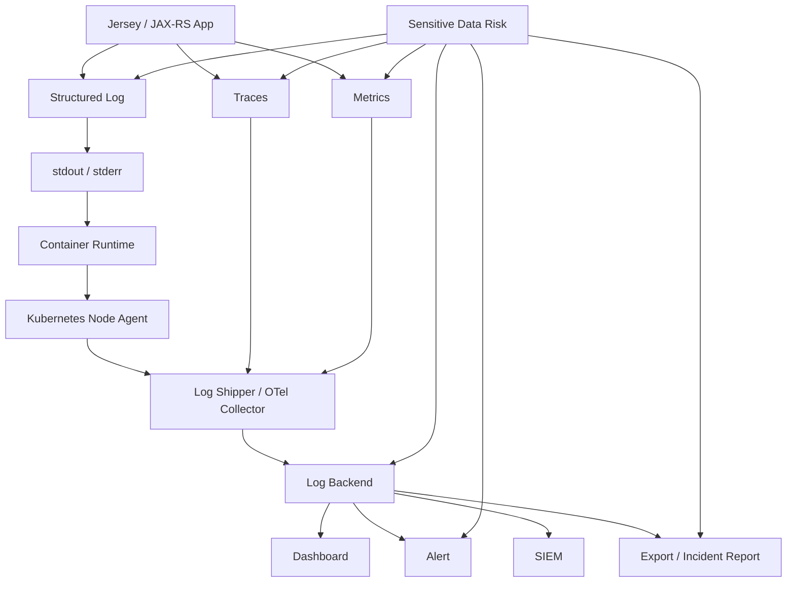

Kubernetes logging architecture secara umum mengandalkan container menulis ke `stdout`/`stderr`, lalu node-level agent mengumpulkan dan meneruskan log untuk aggregation; container sendiri tidak menyepakati format log tertentu. ([Kubernetes](https://kubernetes.io/docs/concepts/cluster-administration/logging/?utm_source=chatgpt.com))

Implikasinya:

```text id="o2xwcc"
Redaction sebaiknya dilakukan sedekat mungkin dengan sumber data,
bukan berharap backend observability selalu memperbaiki semuanya.
```

---

## 3. Data yang Tidak Boleh Dimasukkan ke Log

### 3.1 Secret dan credential

| Data | Contoh | Policy |
|---|---|---|
| Password | `password=Admin123!` | Never log |
| Access token | JWT, OAuth token | Never log raw |
| Refresh token | OAuth refresh token | Never log |
| API key | `x-api-key` | Never log raw |
| Private key | PEM key | Never log |
| Secret key | HMAC/AES key | Never log |
| Session ID | cookie/session token | Never log raw |
| OTP/MFA code | `123456` | Never log |
| Authorization header | `Bearer ...` | Never log raw |
| Cookie header | `JSESSIONID=...` | Never log raw |

### 3.2 PII / personal data

| Data | Contoh | Policy |
|---|---|---|
| Full name | `John Doe` | Avoid unless justified |
| Email | `john.doe@example.com` | Mask/hash if possible |
| Phone | `+6281234567890` | Mask |
| Address | street/home address | Avoid |
| National ID | KTP/NIK/passport | Never log raw |
| Date of birth | `1990-01-01` | Avoid |
| Bank account | account number | Never log raw |
| Card number | PAN | Never log raw |
| Biometric data | face/fingerprint | Never log |
| Health data | diagnosis/medical data | Never log raw |
| Uploaded document | ID scan/PDF | Never log body |

### 3.3 Internal sensitive details

| Data | Risiko |
|---|---|
| raw SQL query dengan parameter | PII/schema leakage |
| DB table/column internal | schema disclosure |
| internal hostname/IP | infrastructure reconnaissance |
| stacktrace ke client | implementation leakage |
| downstream credentials | secret leak |
| feature flag secret | control-plane leak |
| tenant isolation key | privilege escalation risk |
| encryption metadata sensitif | cryptographic leakage |

OWASP Top 10 2025 kategori Security Logging & Alerting Failures secara eksplisit memasukkan risiko logging sensitive information seperti PII atau PHI, serta risiko log/alert terlihat oleh user atau attacker. ([OWASP](https://owasp.org/Top10/2025/A09_2025-Security_Logging_and_Alerting_Failures/?utm_source=chatgpt.com))

---

## 4. Prinsip Secure Logging

| Prinsip | Makna praktis |
|---|---|
| Data minimization | Log hanya data yang benar-benar diperlukan |
| Deny by default | Jangan log payload/header kecuali allowlisted |
| Structured context only | Simpan metadata kecil, bukan raw object |
| Redact before emit | Sensor sebelum masuk logger |
| Safe client message | Jangan kirim internal error ke client |
| Stable schema | Hindari dynamic field yang sulit dikontrol |
| Access control | Log backend harus punya RBAC |
| Retention control | Data log tidak disimpan lebih lama dari perlu |
| Integrity | Audit/security log perlu proteksi tamper |
| Test leakage | Unit/integration test harus cek data sensitif tidak muncul |

NIST SP 800-92 adalah panduan log management yang menekankan perlunya praktik log management enterprise, termasuk pengembangan, implementasi, dan pemeliharaan log management yang efektif. ([NIST Computer Security Resource Center](https://csrc.nist.gov/pubs/sp/800/92/final?utm_source=chatgpt.com))

---

## 5. Redaction vs Masking vs Hashing vs Encryption

| Teknik | Contoh | Bisa dikembalikan? | Cocok untuk |
|---|---|---:|---|
| Redaction | `<redacted>` | Tidak | Token/password/header sensitif |
| Masking | `jo***@example.com` | Tidak penuh | Email/phone/card last 4 |
| Hashing | `sha256(email)` | Tidak praktis, tapi bisa dicocokkan | Correlation tanpa reveal |
| HMAC | `hmac_sha256(secret, value)` | Tidak | Stable pseudonymous ID |
| Tokenization | `tok_abc123` | Ya, lewat vault | Regulated data |
| Encryption | ciphertext | Ya, dengan key | Jarang untuk diagnostic log biasa |

Rekomendasi praktis:

```text id="ldugzx"
Secret/token: redact.
PII untuk debugging: mask atau HMAC.
Domain ID non-PII: boleh log jika sesuai policy.
Payload body: default jangan log.
```

---

## 6. Header Logging Policy

### 6.1 Denylist header

Jangan log header ini dalam bentuk raw:

```text id="h9fxrz"
Authorization
Proxy-Authorization
Cookie
Set-Cookie
X-Api-Key
Api-Key
X-Auth-Token
X-Csrf-Token
X-Forwarded-Client-Cert
Forwarded
```

Tambahkan header custom perusahaan:

```text id="ryvlf8"
X-Internal-Token
X-Service-Secret
X-Tenant-Secret
X-Signature
X-Webhook-Signature
```

### 6.2 Allowlist header

Header yang relatif aman untuk metadata:

```text id="947n2w"
X-Request-Id
X-Correlation-Id
Traceparent
Tracestate
User-Agent
Accept
Content-Type
Content-Length
Host
```

Tetap hati-hati:

| Header | Risiko |
|---|---|
| `User-Agent` | Bisa mengandung input attacker/log injection |
| `Host` | Bisa dipalsukan jika tidak divalidasi |
| `X-Forwarded-For` | Bisa PII/IP, harus trust proxy chain |
| `Referer` | Bisa mengandung token/query sensitive |
| `Forwarded` | Bisa mengandung IP/internal detail |

### 6.3 Helper Java untuk redaction header

```java id="d9ypv5"
public final class HeaderSanitizer {

    private static final Set<String> SENSITIVE_HEADERS = Set.of(
            "authorization",
            "proxy-authorization",
            "cookie",
            "set-cookie",
            "x-api-key",
            "api-key",
            "x-auth-token",
            "x-csrf-token",
            "x-signature",
            "x-webhook-signature"
    );

    private HeaderSanitizer() {
    }

    public static String sanitize(String headerName, String value) {
        if (value == null) {
            return null;
        }

        if (headerName == null) {
            return "<redacted>";
        }

        String normalized = headerName.toLowerCase(Locale.ROOT);

        if (SENSITIVE_HEADERS.contains(normalized)) {
            return "<redacted>";
        }

        return stripControlChars(truncate(value, 512));
    }

    private static String truncate(String value, int maxLength) {
        if (value.length() <= maxLength) {
            return value;
        }
        return value.substring(0, maxLength) + "...<truncated>";
    }

    private static String stripControlChars(String value) {
        return value.replaceAll("[\\r\\n\\t]", "_");
    }
}
```

---

## 7. Payload Logging Policy

Default rule:

```text id="s5pi9o"
Production service must not log request or response body by default.
```

### 7.1 Kapan payload boleh dilog?

| Kondisi | Boleh? | Syarat |
|---|---:|---|
| Local development | Ya | Dummy data |
| Staging | Terbatas | Redaction + allowlist |
| Production debugging | Sangat terbatas | Temporary, sampled, approved |
| Public API payload | Hindari | Metadata saja |
| Payment/auth payload | Tidak | Never raw |
| File upload/document | Tidak | Metadata saja |
| Binary/multipart | Tidak | Metadata saja |
| Validation failure | Terbatas | Field-level safe details |

### 7.2 Metadata yang aman sebagai pengganti body

| Metadata | Contoh |
|---|---|
| `request_size_bytes` | `2048` |
| `content_type` | `application/json` |
| `payload_schema` | `SubmitOrderRequest` |
| `payload_version` | `v2` |
| `field_count` | `12` |
| `validation_error_count` | `3` |
| `attachment_count` | `2` |
| `attachment_total_bytes` | `1048576` |
| `document_type` | `KTP`, hati-hati |
| `body_hash` | HMAC only if justified |

### 7.3 Jangan log DTO mentah

Buruk:

```java id="t4sdmf"
log.info("Submit order request={}", request);
```

Kenapa buruk?

- `toString()` bisa berubah
- field sensitif bisa ikut masuk
- nested object bisa besar
- sulit redact konsisten
- raw object bukan log contract

Lebih baik:

```java id="s7ddqw"
log.info("Submit order request received. itemCount={} paymentMethod={} channel={}",
        request.items().size(),
        request.paymentMethod(),
        request.channel());
```

Atau masukkan metadata aman ke MDC/scoped context.

---

## 8. Sensitive DTO Design

Jangan biarkan `toString()` membocorkan data.

### Buruk

```java id="m0np4c"
public record LoginRequest(
        String username,
        String password
) {
}
```

Record Java default `toString()` akan mencetak field.

```text id="33l6zz"
LoginRequest[username=john, password=Secret123]
```

### Lebih aman

```java id="x5wbst"
public record LoginRequest(
        String username,
        String password
) {
    @Override
    public String toString() {
        return "LoginRequest[username=" + maskUsername(username) + ", password=<redacted>]";
    }

    private static String maskUsername(String value) {
        if (value == null || value.isBlank()) {
            return "<blank>";
        }
        if (value.length() <= 2) {
            return "**";
        }
        return value.charAt(0) + "***";
    }
}
```

Tapi best practice tetap:

```text id="4b1yx9"
Jangan log DTO auth/payment/raw request sama sekali.
```

---

## 9. Redaction Utility untuk Common Values

```java id="217zxd"
public final class Redaction {

    private Redaction() {
    }

    public static String redact() {
        return "<redacted>";
    }

    public static String maskEmail(String email) {
        if (email == null || email.isBlank()) {
            return null;
        }

        int at = email.indexOf('@');
        if (at <= 1) {
            return "***";
        }

        String local = email.substring(0, at);
        String domain = email.substring(at + 1);

        return local.charAt(0) + "***@" + domain;
    }

    public static String maskPhone(String phone) {
        if (phone == null || phone.isBlank()) {
            return null;
        }

        String digits = phone.replaceAll("\\D", "");
        if (digits.length() <= 4) {
            return "****";
        }

        return "******" + digits.substring(digits.length() - 4);
    }

    public static String maskCard(String cardNumber) {
        if (cardNumber == null || cardNumber.isBlank()) {
            return null;
        }

        String digits = cardNumber.replaceAll("\\D", "");
        if (digits.length() < 4) {
            return "****";
        }

        return "**** **** **** " + digits.substring(digits.length() - 4);
    }

    public static String maskTokenPrefix(String token) {
        if (token == null || token.isBlank()) {
            return null;
        }

        int visible = Math.min(8, token.length());
        return token.substring(0, visible) + "...<redacted>";
    }
}
```

---

## 10. Structured Logging: Field-Level Redaction

Yang paling aman adalah **field-level logging**, bukan regex atas message string.

Buruk:

```java id="6bzk9q"
log.info("User login request={}", loginRequest);
```

Lebih baik:

```java id="3wri8e"
try (MDC.MDCCloseable user = MDC.putCloseable("username", Redaction.maskEmail(request.username()));
     MDC.MDCCloseable action = MDC.putCloseable("business_action", "LOGIN_ATTEMPT")) {

    log.info("Login attempt received");
}
```

Output:

```json id="nxwu8c"
{
  "message": "Login attempt received",
  "business_action": "LOGIN_ATTEMPT",
  "username": "j***@example.com"
}
```

---

## 11. Regex Redaction: Berguna tapi Jangan Jadi Satu-Satunya Kontrol

Regex redaction di logging encoder/collector berguna sebagai safety net.

Contoh pattern:

```text id="i63s0g"
(?i)(authorization\\s*[:=]\\s*bearer\\s+)[A-Za-z0-9._\\-]+
(?i)(password\\s*[:=]\\s*)[^\\s,}]+
(?i)(api[_-]?key\\s*[:=]\\s*)[^\\s,}]+
```

Masalah regex-only:

| Masalah | Dampak |
|---|---|
| False negative | Data sensitif lolos |
| False positive | Data penting hilang |
| Format berubah | Pattern tidak match |
| Nested JSON | Regex rapuh |
| Performance | Regex kompleks mahal |
| Encoding | Bisa bypass |

Penelitian terbaru tentang sensitive information in logs juga menyoroti bahwa praktik anonymization berbasis regex punya keterbatasan seperti manual effort dan generalizability yang buruk lintas format log. ([arXiv](https://arxiv.org/abs/2505.14976?utm_source=chatgpt.com))

Rule:

```text id="zy1lc2"
Redact at source first.
Use regex redaction as defense-in-depth.
```

---

## 12. OpenTelemetry Collector Redaction

Kalau telemetry dikirim lewat OpenTelemetry Collector, redaction bisa dilakukan di pipeline.

OpenTelemetry memiliki panduan handling sensitive data, termasuk processor seperti `redaction` untuk menghapus span/log/metric attributes yang tidak masuk allowlist, `attributes` untuk remove/modify attribute tertentu, `filter` untuk membuang telemetry tertentu, dan `transform` untuk transformasi berbasis ekspresi/regex. ([OpenTelemetry](https://opentelemetry.io/docs/security/handling-sensitive-data/?utm_source=chatgpt.com))

Contoh konsep konfigurasi Collector:

```yaml id="sq2sqk"
processors:
  attributes/redact:
    actions:
      - key: http.request.header.authorization
        action: delete
      - key: http.request.header.cookie
        action: delete
      - key: user.email
        action: hash
      - key: db.statement
        action: delete

service:
  pipelines:
    traces:
      receivers: [otlp]
      processors: [attributes/redact, batch]
      exporters: [otlp]
    logs:
      receivers: [otlp]
      processors: [attributes/redact, batch]
      exporters: [otlp]
```

Catatan:

```text id="t9xdbn"
Collector redaction membantu, tapi jangan dijadikan izin untuk logging data sensitif dari aplikasi.
```

---

## 13. OpenTelemetry Attribute Hygiene

OpenTelemetry Logs Data Model memodelkan log sebagai data yang bisa mencakup severity, body, resource, attributes, trace ID, dan span ID. Karena attributes bisa dipakai untuk query dan correlation, jangan masukkan data sensitif sebagai attributes tanpa policy. ([OpenTelemetry](https://opentelemetry.io/docs/specs/otel/logs/data-model/?utm_source=chatgpt.com))

Hindari:

```java id="ljjy2l"
span.setAttribute("user.password", password);
span.setAttribute("http.request.body", rawBody);
span.setAttribute("authorization", token);
```

Lebih aman:

```java id="whl06o"
span.setAttribute("auth.result", "FAILED");
span.setAttribute("auth.method", "PASSWORD");
span.setAttribute("user.id", userId);
span.setAttribute("tenant.id", tenantId);
```

Untuk DB:

```java id="tsvaqo"
span.setAttribute("db.operation.name", "insert_order");
// Jangan masukkan raw SQL dengan parameter sensitif jika policy melarang.
```

---

## 14. Log Injection Protection

Log injection terjadi saat input attacker masuk log lalu merusak format, membuat fake log line, atau menipu parser.

Contoh input jahat:

```text id="m9g3ot"
john@example.com
ERROR User admin logged in successfully
```

Kalau ditulis ke plain log:

```text id="mkjgmu"
INFO Login failed for john@example.com
ERROR User admin logged in successfully
```

Muncul fake event.

Proteksi:

| Risiko | Mitigasi |
|---|---|
| newline injection | strip/escape `\r`, `\n` |
| tab/control char | strip/replace |
| JSON break | gunakan encoder JSON, jangan concat manual |
| huge input | truncate |
| HTML/script di log viewer | output encoding di UI |
| terminal escape sequence | remove ANSI/control characters |

OWASP Top 10 2025 juga menyebut risiko injection atau serangan terhadap logging/monitoring systems jika log data tidak di-encode dengan benar. ([OWASP](https://owasp.org/Top10/2025/A09_2025-Security_Logging_and_Alerting_Failures/?utm_source=chatgpt.com))

Helper:

```java id="64vree"
public static String safeLogValue(String value, int maxLength) {
    if (value == null) {
        return null;
    }

    String cleaned = value
            .replaceAll("[\\r\\n\\t]", "_")
            .replaceAll("\\p{Cntrl}", "_");

    if (cleaned.length() > maxLength) {
        return cleaned.substring(0, maxLength) + "...<truncated>";
    }

    return cleaned;
}
```

---

## 15. Query Parameter Logging

Query string sering berisi sensitive data.

Buruk:

```text id="x7kiq4"
GET /callback?token=abc123&email=john@example.com
```

Jangan log raw full URL. Pisahkan path dan sanitized query metadata.

| Parameter | Policy |
|---|---|
| `token` | redact |
| `code` | redact untuk OAuth/callback |
| `password` | redact |
| `email` | mask/hash |
| `phone` | mask |
| `search` | truncate |
| `page`, `size`, `sort` | allowed |
| `status`, `type` | allowed |

Contoh sanitizer:

```java id="fwu3pp"
public final class QueryParamSanitizer {

    private static final Set<String> SENSITIVE_PARAMS = Set.of(
            "token",
            "access_token",
            "refresh_token",
            "code",
            "password",
            "secret",
            "api_key",
            "apikey",
            "email",
            "phone"
    );

    private QueryParamSanitizer() {
    }

    public static Map<String, String> sanitize(Map<String, List<String>> queryParams) {
        Map<String, String> result = new LinkedHashMap<>();

        for (Map.Entry<String, List<String>> entry : queryParams.entrySet()) {
            String key = entry.getKey();
            String normalized = key.toLowerCase(Locale.ROOT);

            if (SENSITIVE_PARAMS.contains(normalized)) {
                result.put(key, "<redacted>");
                continue;
            }

            List<String> values = entry.getValue();
            if (values == null || values.isEmpty()) {
                result.put(key, "");
            } else {
                result.put(key, HeaderSanitizer.sanitize(key, values.get(0)));
            }
        }

        return result;
    }
}
```

---

## 16. Jersey/JAX-RS Filter: Safe Header Metadata

Contoh menambahkan header metadata aman ke MDC.

```java id="xn2xa9"
@Provider
public class SafeHttpMetadataFilter implements ContainerRequestFilter {

    @Override
    public void filter(ContainerRequestContext requestContext) {
        putHeader("http_user_agent", requestContext, "User-Agent");
        putHeader("http_content_type", requestContext, "Content-Type");
        putHeader("http_accept", requestContext, "Accept");

        String contentLength = requestContext.getHeaderString("Content-Length");
        if (contentLength != null && contentLength.matches("\\d+")) {
            MDC.put("request_size_bytes", contentLength);
        }
    }

    private static void putHeader(String mdcKey,
                                  ContainerRequestContext requestContext,
                                  String headerName) {
        String value = requestContext.getHeaderString(headerName);
        String sanitized = HeaderSanitizer.sanitize(headerName, value);

        if (sanitized != null && !sanitized.isBlank()) {
            MDC.put(mdcKey, sanitized);
        }
    }
}
```

Jangan lakukan ini:

```java id="htgssk"
requestContext.getHeaders().forEach((name, values) ->
        log.info("Header {}={}", name, values)
);
```

Karena itu hampir pasti membocorkan `Authorization`, `Cookie`, atau header internal.

---

## 17. Response Logging: Header Sensitivity

Response juga bisa membocorkan data.

Jangan log raw:

```text id="2t6lmc"
Set-Cookie
Authorization
Location
```

`Location` bisa mengandung token pada beberapa callback flow. `Set-Cookie` jelas secret/session.

Boleh log metadata:

| Field | Contoh |
|---|---|
| `http_status` | `201` |
| `response_size_bytes` | `512` |
| `content_type` | `application/json` |
| `cache_control` | `no-store` |
| `rate_limit_remaining` | `120` |

---

## 18. Error Message Sanitization

Exception message dari library bisa mengandung data sensitif.

Contoh raw exception:

```text id="pgv084"
duplicate key value violates unique constraint "users_email_key"
Detail: Key (email)=(john@example.com) already exists.
```

Jangan return ini ke client dan hati-hati di log.

API response:

```json id="m2d5vk"
{
  "errorCode": "DUPLICATE_RESOURCE",
  "errorId": "err-123",
  "message": "Resource already exists."
}
```

Internal log boleh lebih detail, tetapi bisa disanitasi:

```json id="7odwsb"
{
  "error_code": "DUPLICATE_RESOURCE",
  "db_constraint": "users_email_key",
  "message": "Database constraint violation"
}
```

---

## 19. MyBatis/PostgreSQL Sensitive Logging

Jangan aktifkan SQL parameter logging penuh di production tanpa review.

Risiko:

```sql id="dr3wmk"
insert into users(email, phone, password_hash, national_id)
values('john@example.com', '+628...', '...', '327...')
```

Policy:

| Area | Policy |
|---|---|
| SQL statement template | Boleh terbatas |
| SQL parameter raw | Jangan default |
| Slow query | Boleh dengan normalized statement/query hash |
| SQLState | Boleh |
| constraint logical name | Boleh |
| DB username/host | Hati-hati |
| transaction ID | Boleh jika tidak sensitif |
| full result row | Jangan |

Contoh log aman:

```json id="50l9or"
{
  "message": "Database query timed out",
  "db_operation": "insert_order",
  "sql_state": "57014",
  "duration_ms": 5000,
  "query_hash": "q_8f2a91",
  "error_code": "DATABASE_TIMEOUT"
}
```

---

## 20. Kafka/Event Payload Sensitive Logging

Jangan log full event payload.

Buruk:

```java id="6wuzc3"
log.info("Publishing event={}", event);
```

Aman:

```java id="f3twu3"
try (MDC.MDCCloseable eventType = MDC.putCloseable("event_type", "OrderSubmitted");
     MDC.MDCCloseable eventId = MDC.putCloseable("event_id", event.id());
     MDC.MDCCloseable orderId = MDC.putCloseable("order_id", event.orderId())) {

    log.info("Publishing domain event");
}
```

Metadata aman:

| Field | Contoh |
|---|---|
| `event_id` | `evt-123` |
| `event_type` | `OrderSubmitted` |
| `event_version` | `2` |
| `topic` | `order.events` |
| `partition` | `4` |
| `offset` | `921991` |
| `key_hash` | HMAC jika key sensitif |
| `payload_size_bytes` | `1024` |

---

## 21. Camunda/Workflow Sensitive Logging

Workflow variables sering berisi data sensitif.

Jangan log:

```java id="6oxt66"
log.info("Variables={}", externalTask.getAllVariables());
```

Log metadata:

```java id="1ht4r7"
MDC.put("process_definition_key", task.getProcessDefinitionKey());
MDC.put("process_instance_id", task.getProcessInstanceId());
MDC.put("activity_id", task.getActivityId());
MDC.put("business_key", safeLogValue(task.getBusinessKey(), 128));

log.info("External task started");
```

Policy:

| Variable type | Policy |
|---|---|
| status/state | boleh |
| amount/currency | tergantung domain |
| user/customer detail | mask/avoid |
| uploaded document | never |
| token/secret | never |
| decision result | boleh jika tidak sensitif |
| rule input | hati-hati, bisa PII |

---

## 22. Metrics dan Cardinality Sensitive Data

Sensitive data juga bisa bocor lewat metric label.

Buruk:

```text id="8dlzrl"
http_requests_total{user_email="john@example.com"} 1
```

Buruk:

```text id="5w2r39"
order_processing_total{order_id="ORD-123"} 1
```

Baik:

```text id="6hrx0x"
http_requests_total{service="order-service", route="/orders/{id}", status_class="2xx"} 1
```

Metric label harus:

- low-cardinality
- bukan PII
- bukan unique ID
- bukan token/session
- bukan raw path
- bukan raw query

---

## 23. Trace Attribute Sensitive Data

Trace attributes sering dianggap aman karena bukan “log”, padahal tetap telemetry.

Jangan:

```java id="b93m2k"
span.setAttribute("request.body", rawJson);
span.setAttribute("user.email", email);
span.setAttribute("auth.token", token);
span.setAttribute("sql.params", params.toString());
```

Boleh:

```java id="2z18tr"
span.setAttribute("business.action", "ORDER_SUBMIT");
span.setAttribute("order.type", "STANDARD");
span.setAttribute("tenant.id", tenantId);
span.setAttribute("http.route", "/orders/{orderId}");
span.setAttribute("retry.count", retryCount);
```

Untuk user identifier, prefer internal opaque ID atau HMAC.

---

## 24. Retention dan Access Control

Sensitive logging protection bukan hanya masking.

| Control | Pertanyaan |
|---|---|
| Retention | Berapa lama log disimpan? |
| RBAC | Siapa bisa melihat production logs? |
| Export | Siapa bisa export logs ke CSV? |
| Alert | Apakah alert membawa potongan log sensitif? |
| Dashboard | Apakah dashboard bisa dilihat non-engineer? |
| Incident report | Apakah screenshot mengandung PII? |
| Backup | Apakah log backup ikut retention? |
| Deletion | Bagaimana hapus data jika diwajibkan? |
| SIEM | Apakah data dikirim ke vendor lain? |
| Cross-region | Apakah log pindah region? |

OWASP juga menekankan proteksi collected log data dari unauthorized access, modification, deletion, dan tampering setelah disimpan. ([OWASP Cheat Sheet Series](https://cheatsheetseries.owasp.org/cheatsheets/Logging_Cheat_Sheet.html?utm_source=chatgpt.com))

---

## 25. Environment-Based Logging Guardrail

| Environment | Payload log | Header log | PII |
|---|---:|---:|---:|
| Local | Boleh dengan dummy data | Allowlist | Dummy only |
| Dev shared | Terbatas | Allowlist | Mask |
| Test/CI | Terbatas | Allowlist | Synthetic data |
| Staging | Sangat terbatas | Allowlist | Mask/HMAC |
| Production | Default off | Strict allowlist | Avoid/mask/HMAC |

Contoh config:

```yaml id="idrt21"
observability:
  logging:
    payload:
      enabled: false
      maxBytes: 2048
      allowedRoutes:
        - /debug/safe-endpoint
    headers:
      mode: allowlist
    redaction:
      enabled: true
```

Di Java:

```java id="056uxb"
public record LoggingSecurityConfig(
        boolean payloadLoggingEnabled,
        int payloadMaxBytes,
        Set<String> allowedPayloadRoutes,
        boolean redactionEnabled
) {
}
```

---

## 26. Secure Logger Wrapper: Perlukah?

Untuk enterprise besar, bisa buat wrapper/helper agar developer tidak membuat keputusan sendiri-sendiri.

Contoh:

```java id="c8kc02"
public final class SafeLog {

    private SafeLog() {
    }

    public static String email(String email) {
        return Redaction.maskEmail(email);
    }

    public static String phone(String phone) {
        return Redaction.maskPhone(phone);
    }

    public static String token() {
        return Redaction.redact();
    }

    public static String externalInput(String value) {
        return safeLogValue(value, 512);
    }

    public static String id(String value) {
        return safeLogValue(value, 128);
    }

    private static String safeLogValue(String value, int maxLength) {
        if (value == null) {
            return null;
        }

        String cleaned = value
                .replaceAll("[\\r\\n\\t]", "_")
                .replaceAll("\\p{Cntrl}", "_");

        if (cleaned.length() > maxLength) {
            return cleaned.substring(0, maxLength) + "...<truncated>";
        }

        return cleaned;
    }
}
```

Usage:

```java id="kow8p7"
log.info("Customer lookup failed. email={}", SafeLog.email(email));
```

---

## 27. Code Review Checklist untuk Logging

Tambahkan checklist ini saat PR review:

```text id="fdpa0w"
[ ] Tidak ada log request/response body default.
[ ] Tidak ada log Authorization/Cookie/token/API key.
[ ] Tidak ada log DTO mentah yang mengandung secret/PII.
[ ] Tidak ada exception message mentah dikirim ke client.
[ ] Tidak ada raw SQL parameter di production log.
[ ] Tidak ada user email/phone/national ID sebagai metric label.
[ ] Tidak ada raw path dengan ID sebagai metric label.
[ ] Input external di-strip control chars/truncated.
[ ] Error log punya error_id dan correlation_id.
[ ] Payload logging, jika ada, gated by config + allowlist + max size + redaction.
[ ] Sensitive fields punya masking/redaction utility.
[ ] Unit/integration test memverifikasi secret tidak muncul.
```

---

## 28. Testing Sensitive Data Leakage

### 28.1 Unit test sanitizer

```java id="ts8j9f"
@Test
void shouldRedactAuthorizationHeader() {
    String sanitized = HeaderSanitizer.sanitize(
            "Authorization",
            "Bearer abc.def.ghi"
    );

    assertEquals("<redacted>", sanitized);
}
```

### 28.2 Integration test API log

```text id="3u62lj"
Given request contains Authorization: Bearer secret-token
And body contains password=Secret123
When endpoint returns error
Then captured logs must not contain "secret-token"
And captured logs must not contain "Secret123"
And captured logs contain correlation_id
And captured logs contain error_id
```

### 28.3 Regression test for DTO `toString()`

```text id="1gc7m2"
Given LoginRequest(username, password)
When toString() is called
Then output does not contain raw password
```

### 28.4 OTel collector redaction test

```text id="9d4at5"
Given span/log has attribute http.request.header.authorization
When telemetry passes collector
Then exported telemetry does not contain the attribute
```

---

## 29. Common Failure Modes

| Failure | Gejala | Penyebab | Fix |
|---|---|---|---|
| Token muncul di log | `Authorization=Bearer...` | Header dump | Header denylist/allowlist |
| Password muncul di log | DTO `toString()` | Log raw request | Jangan log DTO/auth payload |
| PII muncul di trace | `span.setAttribute("email", email)` | Trace dianggap aman | Attribute policy |
| PII muncul di metrics | label `user_email` | Salah desain label | Low-cardinality non-PII labels |
| SQL data bocor | MyBatis debug full params | SQL logging aktif | Disable/normalize |
| Fake log line | newline injection | External input tidak sanitize | Strip control chars |
| Error response bocor | `ex.getMessage()` ke client | Tidak ada safe message | Error contract |
| Log backend mahal | payload besar | Body logging | Disable payload default |
| Redaction gagal | regex tidak match | Regex-only | Redact at source |
| Audit data hilang | semua disensor | Tidak bedakan audit vs diagnostic | Audit model terpisah |

---

## 30. Production Checklist

| Area | Checklist |
|---|---|
| Header policy | Allowlist + denylist |
| Payload policy | Default off |
| DTO policy | Jangan log raw DTO sensitif |
| Exception policy | Safe client message |
| Redaction | Utility standar |
| Masking | Email/phone/card |
| Token | Always redacted |
| Query params | Sensitive params redacted |
| SQL | No raw parameter logs |
| Kafka/event | No full payload logs |
| Camunda | No full variable dump |
| Metrics | No PII/unique labels |
| Traces | No sensitive attributes |
| Collector | Defense-in-depth redaction |
| RBAC | Production log access restricted |
| Retention | Sesuai risk/compliance |
| Tests | Leakage regression tests |
| PR review | Secure logging checklist |

---

## 31. What Good Looks Like

Secure logging yang sehat terlihat seperti ini:

```text id="mc0yhk"
1. Developer tetap bisa debug tanpa melihat secret/raw PII.
2. Error log punya correlation_id, error_id, dan domain context.
3. Token, cookie, password, API key tidak pernah muncul.
4. Payload body tidak dilog default.
5. Header logging memakai allowlist.
6. Query params sensitif di-redact.
7. SQL parameter raw tidak muncul di production log.
8. Metrics/traces tidak membawa PII/unique sensitive labels.
9. Collector punya redaction defense-in-depth.
10. Ada automated test yang gagal jika secret bocor ke log.
```

---

## 32. Ringkasan Seri 6

| Area | Kesimpulan |
|---|---|
| Prinsip | Observability adalah data pipeline, bukan sekadar console output |
| Secret | Token, password, cookie, API key never log raw |
| PII | Avoid/mask/HMAC sesuai kebutuhan |
| Header | Gunakan allowlist; denylist untuk auth/cookie/secret |
| Payload | Default off di production |
| DTO | Jangan log raw object yang punya field sensitif |
| Regex | Berguna sebagai safety net, bukan kontrol utama |
| OTel | Attributes logs/traces/metrics juga harus disanitasi |
| Log injection | Strip control chars, truncate external input |
| DB/Event/Workflow | Log metadata, bukan raw SQL/payload/variables |
| Governance | Retention, RBAC, review checklist, leakage test |

---

# Status

**Seri 6/20 selesai.**

Seri berikutnya: **Seri 7/20 - Access Log vs Application Log vs Audit Log: perbedaan tujuan, schema, retention, storage, immutability, regulatory evidence, dan bagaimana memisahkan diagnostic log dari audit trail.**

---

**Sources:**

- [Logging - OWASP Cheat Sheet Series](https://cheatsheetseries.owasp.org/cheatsheets/Logging_Cheat_Sheet.html?utm_source=chatgpt.com)
- [Logging Architecture](https://kubernetes.io/docs/concepts/cluster-administration/logging/?utm_source=chatgpt.com)
- [A09:2025 Security Logging & Alerting Failures ...](https://owasp.org/Top10/2025/A09_2025-Security_Logging_and_Alerting_Failures/?utm_source=chatgpt.com)
- [SP 800-92, Guide to Computer Security Log Management](https://csrc.nist.gov/pubs/sp/800/92/final?utm_source=chatgpt.com)
- [SDLog: A Deep Learning Framework for Detecting Sensitive Information in Software Logs](https://arxiv.org/abs/2505.14976?utm_source=chatgpt.com)
- [Handling sensitive data](https://opentelemetry.io/docs/security/handling-sensitive-data/?utm_source=chatgpt.com)

## Response:
7/13/2026, 4:44:15 PM

Lanjut ke **Seri 7/20**. Di seri ini kita pisahkan tiga hal yang sering tercampur: access log untuk traffic, application log untuk diagnosis, dan audit log untuk bukti aksi/keputusan.

# Seri 7/20 - Access Log vs Application Log vs Audit Log

## 1. Tujuan Seri Ini

Seri ini membedakan tiga jenis log yang sering tercampur di aplikasi enterprise:

1. **Access log** - siapa/apa mengakses endpoint apa, status berapa, durasi berapa.
2. **Application log** - apa yang terjadi di dalam aplikasi untuk debugging/diagnosis.
3. **Audit log** - bukti formal bahwa actor/sistem melakukan aksi tertentu terhadap entity tertentu pada waktu tertentu.

Perbedaan ini penting karena masing-masing punya tujuan, schema, storage, retention, dan risk profile yang berbeda. OWASP menekankan bahwa logging harus disesuaikan dengan tujuan penggunaan, tidak terlalu sedikit dan tidak terlalu banyak, serta perlu mempertimbangkan integritas dan non-repudiation untuk event tertentu. ([OWASP Cheat Sheet Series](https://cheatsheetseries.owasp.org/cheatsheets/Logging_Cheat_Sheet.html?utm_source=chatgpt.com))

---

## 2. Mental Model

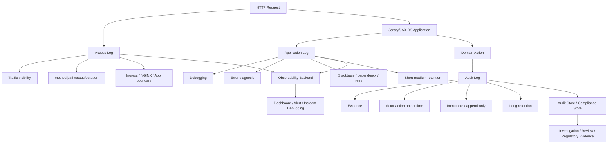

Ringkasnya:

```text id="p9mztn"
Access log menjawab: request apa masuk?
Application log menjawab: aplikasi melakukan apa dan kenapa gagal?
Audit log menjawab: siapa melakukan aksi apa terhadap entity apa, kapan, dan hasilnya apa?
```

---

## 3. Perbandingan Utama

| Aspek | Access Log | Application Log | Audit Log |
|---|---|---|---|
| Tujuan utama | Traffic observability | Debugging & diagnosis | Evidence & accountability |
| Audience | SRE, platform, backend engineer | Developer, SRE, support | Compliance, security, auditor, ops |
| Event source | Ingress, NGINX, API gateway, app filter | Application code | Domain/service layer |
| Isi utama | method, route/path, status, latency | business step, error, retry, dependency | actor, action, object, decision, result |
| Stacktrace | Tidak | Ya, untuk failure teknis | Umumnya tidak |
| Payload body | Tidak | Default tidak | Tidak; simpan reference/snapshot terbatas jika wajib |
| Retention | Pendek/sedang | Pendek/sedang | Panjang |
| Sampling | Boleh untuk noise tertentu | Boleh untuk debug tertentu | Umumnya tidak boleh untuk critical audit |
| Immutability | Tidak wajib | Tidak wajib | Sangat disarankan |
| Legal/regulatory value | Rendah/sedang | Rendah/sedang | Tinggi |
| Storage | Log backend | Log backend/APM | Audit DB/event store/WORM/SIEM |
| Mutability | Bisa expire/rotate | Bisa expire/rotate | Append-only/tamper-evident |
| Query utama | traffic/status/latency | root cause/correlation | actor/action/entity/timeline |

---

## 4. Access Log

Access log adalah catatan HTTP boundary. Biasanya dibuat oleh:

- API Gateway
- NGINX / reverse proxy
- Kubernetes Ingress Controller
- service mesh
- servlet container
- JAX-RS `ContainerResponseFilter`

Access log cocok untuk menjawab:

```text id="4tw97t"
Berapa request masuk?
Endpoint mana yang lambat?
Berapa banyak 4xx/5xx?
Client/source mana yang banyak gagal?
Apakah traffic spike?
Apakah latency naik sejak deploy?
```

---

## 5. Access Log Schema

Baseline access log JSON:

```json id="n1o6d0"
{
  "timestamp": "2026-07-13T10:40:11.209+07:00",
  "event_type": "http_access",
  "service_name": "order-service",
  "environment": "prod",
  "request_id": "req-abc123",
  "correlation_id": "corr-778899",
  "trace_id": "4bf92f3577b34da6a3ce929d0e0e4736",
  "http_method": "POST",
  "http_route": "/orders/{orderId}/submit",
  "http_path": "/orders/ORD-123/submit",
  "http_status": 409,
  "http_status_class": "4xx",
  "duration_ms": 42,
  "client_ip": "10.20.30.40",
  "user_agent": "internal-client/1.2.0",
  "request_size_bytes": 512,
  "response_size_bytes": 180,
  "outcome": "CLIENT_ERROR"
}
```

Field paling penting:

| Field | Wajib? | Catatan |
|---|---:|---|
| `timestamp` | Ya | Waktu request selesai |
| `event_type` | Ya | `http_access` |
| `service_name` | Ya | Nama service |
| `environment` | Ya | `dev`, `staging`, `prod` |
| `request_id` | Ya | Support/debug |
| `correlation_id` | Ya | Flow lintas service |
| `http_method` | Ya | GET/POST/etc |
| `http_route` | Ya | Route template |
| `http_status` | Ya | Status final |
| `duration_ms` | Ya | Latency |
| `outcome` | Ya | SUCCESS/CLIENT_ERROR/SERVER_ERROR |
| `client_ip` | Optional | Privacy/trust proxy consideration |
| `user_agent` | Optional | Bisa noisy dan dipalsukan |

Elastic Common Schema mendefinisikan `event.*` sebagai field konteks untuk log/metric event, sehingga field seperti event category/type/action/outcome berguna bila organisasi ingin schema yang lebih standar. ([Elastic](https://www.elastic.co/docs/reference/ecs/ecs-event?utm_source=chatgpt.com))

---

## 6. Access Log: Apa yang Tidak Boleh Ada

Access log sebaiknya **tidak** berisi:

| Jangan masuk access log | Alasan |
|---|---|
| Authorization header | Secret leak |
| Cookie / Set-Cookie | Session leak |
| request body | PII/secret/cost |
| response body | PII/secret/cost |
| raw query string penuh | Token/email bisa bocor |
| stacktrace | Bukan tempatnya |
| SQL statement | Bukan HTTP boundary |
| business decision detail | Masuk application/audit log |
| full user profile | PII |
| workflow variables | PII/domain leakage |

Access log harus ringan, stabil, dan bisa di-aggregate.

---

## 7. Application Log

Application log adalah log diagnostik dari dalam aplikasi.

Contoh:

```json id="19x2cg"
{
  "timestamp": "2026-07-13T10:40:11.180+07:00",
  "event_type": "application_log",
  "level": "WARN",
  "service_name": "order-service",
  "logger": "com.company.order.service.OrderSubmissionService",
  "message": "Order submit rejected due to invalid state",
  "request_id": "req-abc123",
  "correlation_id": "corr-778899",
  "order_id": "ORD-123",
  "business_action": "ORDER_SUBMIT",
  "state_from": "CANCELLED",
  "error_code": "ORDER_STATE_INVALID",
  "retryable": false
}
```

Application log cocok untuk menjawab:

```text id="z7zrht"
Kenapa request gagal?
Dependency mana yang timeout?
Retry sudah berapa kali?
DB operation apa yang lambat?
Workflow task mana yang gagal?
State transition apa yang ditolak?
```

OpenTelemetry Logs Data Model merepresentasikan log dengan timestamp, severity, body/message, resource, attributes, serta trace/span correlation; ini cocok sebagai mental model untuk application log modern. ([OpenTelemetry](https://opentelemetry.io/docs/specs/otel/logs/data-model/?utm_source=chatgpt.com))

---

## 8. Application Log Schema

Field umum application log:

| Field | Contoh | Catatan |
|---|---|---|
| `timestamp` | `2026-07-13T10:40:11.180+07:00` | Dari logging framework |
| `event_type` | `application_log` | Pembeda |
| `level` | `INFO`, `WARN`, `ERROR` | Severity |
| `service_name` | `order-service` | Service identity |
| `logger` | `OrderSubmissionService` | Class/package |
| `message` | `Order submit rejected` | Human-readable |
| `request_id` | `req-abc123` | Request correlation |
| `correlation_id` | `corr-778899` | Flow correlation |
| `trace_id` | `...` | Trace correlation |
| `tenant_id` | `tenant-a` | Multi-tenant |
| `business_action` | `ORDER_SUBMIT` | Domain action |
| `entity_type` | `ORDER` | Entity category |
| `entity_id` | `ORD-123` | Domain ID |
| `error_code` | `ORDER_STATE_INVALID` | Error taxonomy |
| `dependency` | `postgresql` | Jika dependency issue |
| `duration_ms` | `5000` | Untuk operation log |
| `retry_count` | `3` | Untuk retry flow |
| `stack_trace` | `...` | Hanya untuk error teknis |

---

## 9. Application Log Level Policy

| Kondisi | Level |
|---|---:|
| Service started/stopped | INFO |
| Business operation started/completed penting | INFO |
| Expected business rejection | INFO/WARN |
| Validation failed | INFO/WARN |
| Retry attempt | WARN |
| Retry exhausted | ERROR |
| Downstream timeout | WARN/ERROR |
| DB connection failure | ERROR |
| Unexpected exception | ERROR |
| Debug details | DEBUG |
| Very low-level protocol detail | TRACE |

Rule penting:

```text id="tlk9lp"
Jangan gunakan ERROR untuk semua 4xx.
Jangan gunakan INFO untuk semua internal detail.
Jangan gunakan DEBUG permanen di production.
```

---

## 10. Audit Log

Audit log adalah catatan domain/security yang menjadi bukti bahwa aksi/keputusan terjadi.

Audit log cocok untuk menjawab:

```text id="h1p9r5"
Siapa approve case ini?
Kapan status order berubah?
Apa nilai sebelum dan sesudah perubahan?
Siapa mengubah permission user?
Sistem otomatis mana yang menutup workflow?
Apakah aksi berhasil atau gagal?
Apa alasan keputusan?
```

OWASP memberi contoh audit log sebagai chronological record of activities yang memungkinkan rekonstruksi, review, dan pemeriksaan urutan transaksi yang dapat diatribusikan. ([OWASP Cheat Sheet Series](https://cheatsheetseries.owasp.org/cheatsheets/Logging_Cheat_Sheet.html?utm_source=chatgpt.com)) NIST SP 800-92 juga menyatakan perlunya praktik log management enterprise, termasuk generation, review, protection, dan retention audit records. ([NIST Computer Security Resource Center](https://csrc.nist.gov/pubs/sp/800/92/final?utm_source=chatgpt.com))

---

## 11. Audit Log Schema

Baseline audit event:

```json id="k1kl8o"
{
  "audit_event_id": "aud-01J8ZK9H3F0M",
  "timestamp": "2026-07-13T10:40:11.151+07:00",
  "event_type": "audit_event",
  "event_version": 1,

  "tenant_id": "tenant-a",
  "actor_type": "USER",
  "actor_id": "usr-456",
  "actor_display": "j***@company.com",

  "action": "ORDER_SUBMIT",
  "object_type": "ORDER",
  "object_id": "ORD-123",

  "result": "DENIED",
  "reason_code": "ORDER_STATE_INVALID",

  "state_before": "CANCELLED",
  "state_after": "CANCELLED",

  "source_service": "order-service",
  "source_ip": "10.20.30.40",
  "correlation_id": "corr-778899",
  "request_id": "req-abc123",

  "policy_id": "order-submit-policy-v3",
  "decision_id": "dec-88192"
}
```

Field audit minimal:

| Field | Wajib? | Catatan |
|---|---:|---|
| `audit_event_id` | Ya | Unique immutable ID |
| `timestamp` | Ya | Kapan event terjadi |
| `event_type` | Ya | `audit_event` |
| `event_version` | Ya | Schema evolution |
| `tenant_id` | Jika multi-tenant | Partition/accountability |
| `actor_type` | Ya | USER/SYSTEM/SERVICE |
| `actor_id` | Ya | Siapa melakukan |
| `action` | Ya | Apa yang dilakukan |
| `object_type` | Ya | Entity target |
| `object_id` | Ya | Entity ID |
| `result` | Ya | SUCCESS/DENIED/FAILED |
| `reason_code` | Optional | Alasan domain/security |
| `state_before` | Optional | Untuk state transition |
| `state_after` | Optional | Untuk state transition |
| `correlation_id` | Ya | Rekonstruksi flow |
| `source_service` | Ya | Service pencatat |
| `source_ip` | Optional | Privacy/trust boundary |
| `policy_id` | Optional | Keputusan policy |
| `decision_id` | Optional | Decision engine reference |

---

## 12. Audit Log Harus Domain-Significant

Tidak semua log adalah audit.

| Event | Audit? | Alasan |
|---|---:|---|
| User login success/failure | Ya | Security/accountability |
| User membuka halaman detail | Tergantung | Audit jika regulated/sensitive |
| User approve case | Ya | Domain decision |
| User submit order | Ya | Business action |
| System auto-escalate case | Ya | System decision |
| Permission changed | Ya | Security-critical |
| Password changed | Ya | Security-critical |
| HTTP request 200 | Tidak cukup | Itu access log |
| SQL query executed | Biasanya tidak | Diagnostic/DB log |
| NullPointerException | Tidak | Application error |
| Retry attempt | Tidak | Application log |
| Kafka message consumed | Tergantung | Audit jika merepresentasikan state/action penting |

Rule:

```text id="a2mhm5"
Audit log merekam aksi atau keputusan yang bermakna secara bisnis, keamanan, atau kepatuhan.
```

---

## 13. Actor Model

Audit event harus jelas siapa actor-nya.

| Actor type | Contoh | Catatan |
|---|---|---|
| `USER` | `usr-456` | Human authenticated user |
| `SERVICE` | `payment-service` | Service-to-service action |
| `SYSTEM` | `scheduler` | Internal automated action |
| `WORKFLOW` | `camunda-process` | BPMN/process driven action |
| `ADMIN` | `admin-123` | Privileged human |
| `SUPPORT` | `support-991` | Support/operator |
| `ANONYMOUS` | unknown | Hanya untuk event tertentu |

Jangan hanya simpan `username` display. Simpan stable actor ID.

---

## 14. Action Naming Convention

Gunakan action yang stabil dan domain-oriented.

Baik:

```text id="4lvfqh"
ORDER_CREATED
ORDER_SUBMITTED
ORDER_APPROVED
ORDER_REJECTED
CASE_ASSIGNED
CASE_ESCALATED
PERMISSION_GRANTED
PERMISSION_REVOKED
USER_LOGIN_SUCCEEDED
USER_LOGIN_FAILED
```

Buruk:

```text id="t6bmwx"
button_clicked
doSubmit
update
save
process
handleRequest
```

Pattern:

```text id="4cc299"
<NOUN>_<VERB_PAST>
```

atau:

```text id="1ye0ph"
<DOMAIN>_<ACTION>
```

Yang penting konsisten.

---

## 15. Result / Outcome Model

Audit log harus jelas hasilnya.

| Result | Makna |
|---|---|
| `SUCCESS` | Aksi berhasil dan state berubah/terkonfirmasi |
| `DENIED` | Aksi ditolak oleh policy/business rule |
| `FAILED` | Aksi gagal karena technical/runtime failure |
| `PARTIAL` | Sebagian berhasil, sebagian gagal |
| `PENDING` | Diterima tapi belum selesai |
| `CANCELLED` | Dibatalkan |
| `EXPIRED` | Tidak lagi valid karena timeout/expiry |

Bedakan `DENIED` dan `FAILED`.

```text id="dbh7ui"
DENIED = sistem sengaja menolak.
FAILED = sistem mencoba tetapi gagal secara teknis.
```

---

## 16. Audit Log vs Domain Event

Ini sering rancu.

| Aspek | Audit Log | Domain Event |
|---|---|---|
| Tujuan | Evidence/accountability | Integrasi/event-driven behavior |
| Consumer | Auditor/security/support | Service lain/process manager |
| Retention | Panjang | Tergantung event bus/storage |
| Immutability | Sangat penting | Penting tapi tergantung |
| Payload | Minimal evidence | Data untuk consumer |
| Failure handling | Tidak boleh hilang | Bisa retry/DLQ |
| Schema | Evidence schema | Integration schema |
| Sampling | Tidak | Tidak untuk event penting |
| Reprocessing | Biasanya tidak | Bisa |

Satu action bisa menghasilkan keduanya:

```text id="f94g4c"
User submits order
  -> write order state
  -> write audit event ORDER_SUBMITTED
  -> publish domain event OrderSubmitted
```

Jangan mengandalkan Kafka domain event sebagai satu-satunya audit log kecuali memang didesain dengan retention, immutability, access control, dan reconstruction guarantees yang sesuai.

---

## 17. Audit Log Storage Pattern

### Opsi 1 - Audit table di PostgreSQL

Cocok untuk banyak aplikasi enterprise.

```sql id="m6x5hq"
create table audit_event (
    audit_event_id uuid primary key,
    event_time timestamptz not null,
    event_type text not null,
    event_version integer not null,

    tenant_id text,
    actor_type text not null,
    actor_id text not null,
    action text not null,
    object_type text not null,
    object_id text not null,

    result text not null,
    reason_code text,

    state_before text,
    state_after text,

    source_service text not null,
    source_ip inet,
    request_id text,
    correlation_id text,
    trace_id text,

    metadata jsonb not null default '{}'::jsonb,

    created_at timestamptz not null default now()
);
```

Index awal:

```sql id="9xfm03"
create index idx_audit_event_object
    on audit_event (tenant_id, object_type, object_id, event_time desc);

create index idx_audit_event_actor
    on audit_event (tenant_id, actor_id, event_time desc);

create index idx_audit_event_correlation
    on audit_event (correlation_id);

create index idx_audit_event_action_time
    on audit_event (action, event_time desc);
```

### Opsi 2 - Append-only event store

Cocok bila audit log juga dipakai untuk reconstruct state atau event sourcing.

### Opsi 3 - WORM / immutable storage

Cocok untuk regulated/high-assurance systems.

### Opsi 4 - SIEM/security audit pipeline

Cocok untuk security events seperti login, permission changes, suspicious access.

---

## 18. Audit Log Immutability

Audit log sebaiknya append-only.

Larangan umum:

```text id="hgw43i"
Jangan UPDATE audit event.
Jangan DELETE audit event biasa.
Jangan overwrite actor/action/object/result.
```

Jika perlu koreksi, buat event koreksi:

```json id="9kz5r6"
{
  "action": "AUDIT_EVENT_CORRECTED",
  "object_type": "AUDIT_EVENT",
  "object_id": "aud-previous",
  "reason_code": "INCORRECT_ACTOR_METADATA",
  "result": "SUCCESS"
}
```

Untuk database PostgreSQL, guardrail bisa berupa:

- revoke `UPDATE`/`DELETE` dari role aplikasi
- trigger yang menolak update/delete
- partitioning + retention policy
- hash chain/tamper-evident metadata untuk kebutuhan lebih tinggi
- backup/replication policy

---

## 19. Contoh Trigger Append-Only di PostgreSQL

```sql id="ltknua"
create or replace function prevent_audit_event_modification()
returns trigger
language plpgsql
as $$
begin
    raise exception 'audit_event is append-only';
end;
$$;

create trigger trg_prevent_audit_event_update
before update on audit_event
for each row
execute function prevent_audit_event_modification();

create trigger trg_prevent_audit_event_delete
before delete on audit_event
for each row
execute function prevent_audit_event_modification();
```

Catatan: ini guardrail aplikasi/database, bukan pengganti kontrol akses, backup, dan storage-level immutability.

---

## 20. Audit Writer Pattern di Java

Jangan audit dengan `log.info(...)` biasa. Buat audit service eksplisit.

```java id="s90s5n"
public record AuditEventCommand(
        String tenantId,
        String actorType,
        String actorId,
        String action,
        String objectType,
        String objectId,
        String result,
        String reasonCode,
        String stateBefore,
        String stateAfter,
        String requestId,
        String correlationId,
        Map<String, Object> metadata
) {
}
```

```java id="zrs8he"
public interface AuditService {
    void record(AuditEventCommand command);
}
```

Implementation:

```java id="dmmta4"
public final class PostgresAuditService implements AuditService {

    private static final Logger log = LoggerFactory.getLogger(PostgresAuditService.class);

    private final AuditEventMapper mapper;

    public PostgresAuditService(AuditEventMapper mapper) {
        this.mapper = mapper;
    }

    @Override
    public void record(AuditEventCommand command) {
        AuditEventRecord record = AuditEventRecord.from(command);

        try {
            mapper.insert(record);
        } catch (Exception ex) {
            /*
             * Policy decision:
             * For critical audit events, failing to write audit may need to fail the business transaction.
             * For lower-critical events, route to fallback/DLQ.
             */
            log.error("Failed to write audit event. action={} objectType={} objectId={}",
                    command.action(),
                    command.objectType(),
                    command.objectId(),
                    ex);

            throw ex;
        }
    }
}
```

---

## 21. Audit Consistency: Same Transaction or Async?

Ada trade-off besar.

### Opsi A - Audit ditulis dalam transaksi bisnis yang sama

```text id="6ynz85"
BEGIN
  update order state
  insert audit_event
COMMIT
```

Kelebihan:

- audit dan state konsisten
- kalau audit gagal, business action gagal
- bagus untuk critical actions

Kekurangan:

- transaksi lebih berat
- audit table bisa mempengaruhi latency
- perlu desain index/partition baik

### Opsi B - Audit ditulis async

```text id="89tc9w"
Business action commit
  -> publish audit event
  -> audit consumer writes audit store
```

Kelebihan:

- latency utama lebih rendah
- audit pipeline bisa diskalakan
- cocok untuk event volume tinggi

Kekurangan:

- risiko audit lag/hilang jika pipeline buruk
- butuh retry/DLQ/exactly-once/idempotency
- lebih sulit membuktikan atomicity

Rekomendasi praktis:

| Action criticality | Pattern |
|---|---|
| Permission change | Same transaction / strongly guaranteed |
| Approval/rejection regulatory | Same transaction / strongly guaranteed |
| Login failure high volume | Async security pipeline boleh |
| Page view/access sensitive record | Async dengan durability kuat |
| Diagnostic-only event | Bukan audit |

---

## 22. Audit Failure Policy

Pertanyaan penting:

```text id="7dwnqb"
Jika audit write gagal, apakah business action boleh tetap sukses?
```

Jawabannya tergantung criticality.

| Event | Jika audit gagal |
|---|---|
| Permission granted/revoked | Fail business action |
| Case approved/rejected | Fail business action |
| Payment authorized | Fail atau fallback strongly durable |
| User login success | Bisa fallback security queue, tergantung policy |
| User viewed sensitive document | Biasanya harus strongly recorded |
| Non-sensitive preference changed | Bisa async/fallback |

Jangan biarkan policy ini implisit.

---

## 23. Audit Metadata: Jangan Berlebihan

Audit log harus cukup untuk evidence, tapi tidak menjadi payload dump.

Buruk:

```json id="29tjft"
{
  "action": "ORDER_SUBMITTED",
  "metadata": {
    "entire_request_body": "{... huge JSON ...}",
    "creditCardNumber": "4111111111111111",
    "accessToken": "..."
  }
}
```

Baik:

```json id="kbhn9k"
{
  "action": "ORDER_SUBMITTED",
  "object_type": "ORDER",
  "object_id": "ORD-123",
  "result": "SUCCESS",
  "metadata": {
    "channel": "WEB",
    "order_type": "STANDARD",
    "item_count": 3,
    "amount_bucket": "1000000-5000000"
  }
}
```

Rule:

```text id="tlzru9"
Audit metadata harus minimal, purpose-bound, dan aman.
```

---

## 24. Regulatory / Case Management Audit Pattern

Untuk case/order/workflow platform, audit event sering mengikuti state machine.

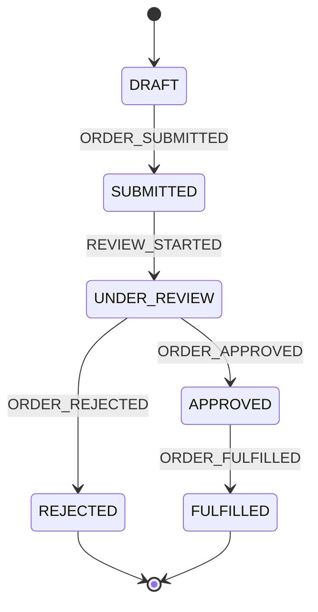

Audit event untuk transition:

```json id="2e5cz5"
{
  "audit_event_id": "aud-1001",
  "action": "ORDER_APPROVED",
  "object_type": "ORDER",
  "object_id": "ORD-123",
  "actor_type": "USER",
  "actor_id": "usr-456",
  "state_before": "UNDER_REVIEW",
  "state_after": "APPROVED",
  "result": "SUCCESS",
  "reason_code": "POLICY_CHECK_PASSED",
  "policy_id": "approval-policy-v4",
  "correlation_id": "corr-778899"
}
```

Invarian audit state transition:

```text id="n6itbz"
Jika state entity berubah karena aksi/keputusan penting,
audit event harus merekam state_before, state_after, actor, action, result, dan reason.
```

---

## 25. Access Log + Application Log + Audit Log untuk Satu Flow

Contoh flow: user submit order, tapi status order invalid.

### Access log

```json id="s1c4eh"
{
  "event_type": "http_access",
  "message": "HTTP request completed",
  "http_method": "POST",
  "http_route": "/orders/{orderId}/submit",
  "http_status": 409,
  "duration_ms": 42,
  "request_id": "req-abc123",
  "correlation_id": "corr-778899"
}
```

### Application log

```json id="juod9z"
{
  "event_type": "application_log",
  "level": "WARN",
  "message": "Order submit rejected due to invalid state",
  "business_action": "ORDER_SUBMIT",
  "order_id": "ORD-123",
  "state_from": "CANCELLED",
  "error_code": "ORDER_STATE_INVALID",
  "request_id": "req-abc123",
  "correlation_id": "corr-778899"
}
```

### Audit log

```json id="2wu4c2"
{
  "event_type": "audit_event",
  "action": "ORDER_SUBMIT",
  "object_type": "ORDER",
  "object_id": "ORD-123",
  "actor_type": "USER",
  "actor_id": "usr-456",
  "result": "DENIED",
  "reason_code": "ORDER_STATE_INVALID",
  "state_before": "CANCELLED",
  "state_after": "CANCELLED",
  "request_id": "req-abc123",
  "correlation_id": "corr-778899"
}
```

Tiga event ini mirip, tetapi bukan duplikat. Mereka melayani audience dan query berbeda.

---

## 26. Retention Strategy

| Log type | Retention umum | Catatan |
|---|---:|---|
| Access log | 7-90 hari | Tergantung traffic/cost/security |
| Application log | 7-90 hari | Bisa lebih pendek untuk DEBUG |
| Error log | 30-180 hari | Berguna untuk incident trend |
| Security log | 90 hari-multi-year | Tergantung policy |
| Audit log | multi-year | Tergantung regulasi/internal policy |
| Metrics | 15 hari-multi-year aggregate | Raw high-cardinality mahal |
| Traces | jam-minggu | Biasanya sampled |

Angka di atas bukan aturan hukum; gunakan kebijakan perusahaan, regulasi industri, dan kebutuhan investigasi.

---

## 27. Storage Separation

Jangan otomatis menyimpan semuanya di tempat yang sama.

| Data | Storage ideal |
|---|---|
| Access log | Loki/ELK/OpenSearch/cloud logging |
| Application log | Loki/ELK/OpenSearch/APM |
| Error event | Log backend + trace backend |
| Metrics | Prometheus/Mimir/Cloud Monitoring |
| Traces | Jaeger/Tempo/vendor APM |
| Audit log | PostgreSQL audit table/event store/SIEM/WORM |
| Security event | SIEM/security data lake |

Mengapa audit log sebaiknya dipisah?

| Alasan | Penjelasan |
|---|---|
| Retention berbeda | Audit biasanya lebih lama |
| Access control berbeda | Tidak semua engineer boleh lihat audit detail |
| Immutability berbeda | Audit perlu append-only/tamper-evident |
| Query berbeda | Audit query actor/action/object |
| Compliance berbeda | Audit bisa jadi evidence |
| Cost berbeda | Audit volume biasanya lebih kecil tapi retention panjang |

---

## 28. Access Control untuk Log

| Log type | Siapa boleh akses? |
|---|---|
| Access log | SRE/platform/backend terbatas |
| Application log | Developer/SRE/support terbatas |
| Error stacktrace | Developer/SRE, hati-hati detail internal |
| Audit log | Compliance/security/authorized ops |
| Security log | Security team/privileged ops |
| Production PII-bearing logs | Sangat terbatas |

OWASP menekankan collected log data perlu dilindungi dari unauthorized access, modification, deletion, dan tampering. ([OWASP Cheat Sheet Series](https://cheatsheetseries.owasp.org/cheatsheets/Logging_Cheat_Sheet.html?utm_source=chatgpt.com))

---

## 29. Log Event Classification

Tambahkan `event_type` agar query mudah:

| `event_type` | Contoh |
|---|---|
| `http_access` | request completion |
| `application_log` | diagnostic app log |
| `audit_event` | actor/action/object evidence |
| `security_event` | login, permission, suspicious access |
| `dependency_event` | downstream timeout/retry |
| `workflow_event` | BPMN task/process lifecycle |
| `db_event` | slow query/connection issue |
| `job_event` | scheduled/background job |

Untuk ECS-style classification, `event.action`, `event.outcome`, `event.category`, dan field terkait dapat dipakai agar log lebih konsisten lintas backend Elastic/OpenSearch-style. ([Elastic](https://www.elastic.co/docs/reference/ecs/ecs-event?utm_source=chatgpt.com))

---

## 30. Security Event vs Audit Event

Security event dan audit event overlap, tapi tidak sama.

| Event | Security log | Audit log |
|---|---:|---:|
| Login failed | Ya | Ya/tergantung |
| Login succeeded | Ya | Ya/tergantung |
| Permission granted | Ya | Ya |
| Permission denied | Ya | Bisa |
| Suspicious IP access | Ya | Tidak selalu |
| Case approved | Bisa | Ya |
| Data exported | Ya | Ya |
| Admin changed config | Ya | Ya |
| Rate limit triggered | Ya | Tidak selalu |
| Token validation failed | Ya | Tidak selalu |

Security event fokus pada threat detection.  
Audit event fokus pada accountability/evidence.

---

## 31. Implementation Pattern di Jersey/JAX-RS

### Access log

Ditulis di `ContainerResponseFilter`.

```java id="cbh5hq"
log.info("HTTP request completed");
```

Dengan MDC:

```text id="65kdus"
event_type=http_access
http_method=POST
http_route=/orders/{orderId}
http_status=409
duration_ms=42
```

### Application log

Ditulis di service/domain boundary.

```java id="cxzid1"
log.warn("Order submit rejected due to invalid state");
```

Dengan MDC:

```text id="7s1qjr"
event_type=application_log
business_action=ORDER_SUBMIT
order_id=ORD-123
state_from=CANCELLED
error_code=ORDER_STATE_INVALID
```

### Audit log

Ditulis via `AuditService`, bukan logger biasa.

```java id="j4qpx7"
auditService.record(new AuditEventCommand(
        tenantId,
        "USER",
        actorId,
        "ORDER_SUBMIT",
        "ORDER",
        orderId,
        "DENIED",
        "ORDER_STATE_INVALID",
        "CANCELLED",
        "CANCELLED",
        requestId,
        correlationId,
        Map.of("channel", "WEB")
));
```

---

## 32. MyBatis Mapper untuk Audit Insert

```java id="njusgu"
public interface AuditEventMapper {

    void insert(AuditEventRecord record);
}
```

Contoh MyBatis XML:

```xml id="eoa9ux"
<insert id="insert" parameterType="com.company.audit.AuditEventRecord">
    insert into audit_event (
        audit_event_id,
        event_time,
        event_type,
        event_version,
        tenant_id,
        actor_type,
        actor_id,
        action,
        object_type,
        object_id,
        result,
        reason_code,
        state_before,
        state_after,
        source_service,
        source_ip,
        request_id,
        correlation_id,
        trace_id,
        metadata
    )
    values (
        #{auditEventId},
        #{eventTime},
        #{eventType},
        #{eventVersion},
        #{tenantId},
        #{actorType},
        #{actorId},
        #{action},
        #{objectType},
        #{objectId},
        #{result},
        #{reasonCode},
        #{stateBefore},
        #{stateAfter},
        #{sourceService},
        #{sourceIp},
        #{requestId},
        #{correlationId},
        #{traceId},
        #{metadata, typeHandler=com.company.mybatis.JsonbTypeHandler}
    )
</insert>
```

---

## 33. Audit Event Idempotency

Audit write bisa retry. Maka audit event sebaiknya idempotent.

Pattern:

| Pattern | Contoh |
|---|---|
| deterministic audit ID | hash dari command ID + action |
| unique source event ID | `source_event_id` |
| unique constraint | `(source_service, source_event_id)` |
| idempotency key | dari request command |
| correlation + sequence | untuk ordered workflow |

Contoh constraint:

```sql id="fv66ur"
alter table audit_event
add column source_event_id text;

create unique index uq_audit_source_event
on audit_event (source_service, source_event_id)
where source_event_id is not null;
```

---

## 34. Audit Event Ordering

Audit sering perlu timeline.

Gunakan:

| Field | Fungsi |
|---|---|
| `event_time` | Waktu business event terjadi |
| `created_at` | Waktu record disimpan |
| `sequence_no` | Urutan per object/case jika diperlukan |
| `correlation_id` | Grouping flow |
| `causation_id` | Event penyebab |
| `parent_event_id` | Hierarki event |

Untuk distributed systems, timestamp saja tidak selalu cukup untuk urutan absolut. Jika urutan per entity penting, gunakan sequence/version dari entity state.

---

## 35. Audit Log untuk State Machine

Untuk entity state machine, audit sebaiknya mencatat:

```text id="7hpgrv"
entity_id
state_before
event/action
guard/policy decision
state_after
actor
result
reason
```

Contoh invariant:

```text id="osr4xx"
Audit state_after harus sama dengan state aktual setelah transaction commit.
```

Kalau audit dan update state dalam transaksi yang sama, invariant ini lebih mudah dijaga.

---

## 36. Anti-Patterns

| Anti-pattern | Dampak | Perbaikan |
|---|---|---|
| Audit pakai `log.info` biasa | Bisa hilang/expire, tidak immutable | `AuditService` + audit store |
| Semua access log dianggap audit | Banyak noise, bukti lemah | Audit hanya domain/security significant |
| Stacktrace masuk audit | Noise/security risk | Stacktrace di application log |
| Request body masuk audit | PII/cost/compliance risk | Metadata + reference |
| Audit async tanpa DLQ | Event bisa hilang | Durable queue + retry + DLQ |
| Audit table bisa di-update | Evidence rusak | Append-only permission/trigger |
| Actor hanya username display | Bisa berubah | Stable actor ID |
| Tidak ada result | Tidak tahu sukses/gagal | `SUCCESS/DENIED/FAILED` |
| Tidak ada reason_code | Keputusan tidak bisa dijelaskan | Standard reason code |
| Tidak ada schema version | Evolusi sulit | `event_version` |
| Audit dan domain event dicampur | Consumer/evidence kacau | Pisahkan contract |
| Semua log satu retention | Cost/risk salah | Retention per log type |

---

## 37. Testing Strategy

### 37.1 Access log test

```text id="7l5po5"
Given POST /orders/{id}/submit
When response is 409
Then access log contains event_type=http_access
And http_route=/orders/{orderId}/submit
And http_status=409
And duration_ms exists
And request body is not logged
```

### 37.2 Application log test

```text id="3n0r21"
Given order state is CANCELLED
When submit is attempted
Then application log contains business_action=ORDER_SUBMIT
And error_code=ORDER_STATE_INVALID
And order_id=ORD-123
```

### 37.3 Audit log test

```text id="0kixfk"
Given user usr-456 attempts ORDER_SUBMIT
When order state is invalid
Then audit_event is written with
actor_id=usr-456
action=ORDER_SUBMIT
object_id=ORD-123
result=DENIED
reason_code=ORDER_STATE_INVALID
```

### 37.4 Append-only test

```text id="7xwu2w"
Given audit_event exists
When application attempts update/delete
Then database rejects modification
```

### 37.5 Audit transaction test

```text id="m6l7gd"
Given critical action CASE_APPROVE
When audit insert fails
Then business transaction must rollback
```

---

## 38. Production Checklist

| Area | Checklist |
|---|---|
| Access log | One request completion log per business API request |
| Access schema | method, route, status, duration, request/correlation ID |
| App log | Diagnostic context, error code, dependency, stacktrace policy |
| Audit log | actor, action, object, result, timestamp |
| Audit storage | Separate audit table/store/SIEM as needed |
| Audit immutability | Append-only guardrail |
| Audit retention | Longer than diagnostic log |
| Audit access | RBAC stricter than app logs |
| Audit failure policy | Explicit per action criticality |
| Audit transaction | Same transaction for critical state changes |
| Domain event separation | Audit event != integration event |
| PII policy | No raw payload/secret in any log |
| Schema versioning | Audit events versioned |
| Queryability | Index actor/object/action/correlation/time |
| Testing | Access/app/audit tests separated |
| Review | PR checklist includes log classification |

---

## 39. What Good Looks Like

Logging architecture yang sehat terlihat seperti ini:

```text id="ubmj64"
1. Access log bisa menunjukkan traffic, latency, dan status per endpoint.
2. Application log bisa menjelaskan kenapa request gagal.
3. Audit log bisa membuktikan siapa melakukan apa terhadap entity apa.
4. Audit log tidak bergantung pada retention diagnostic log.
5. Audit event bersifat append-only atau minimal tamper-resistant.
6. Stacktrace tidak masuk audit log.
7. Payload/body tidak masuk access/application/audit log default.
8. Business-critical state transition punya audit event.
9. Error_id/correlation_id menghubungkan access log, application log, dan audit log.
10. Query audit bisa berdasarkan actor, object, action, result, dan waktu.
```

---

## 40. Ringkasan Seri 7

| Area | Kesimpulan |
|---|---|
| Access log | Untuk HTTP traffic, status, latency, route |
| Application log | Untuk debugging, error diagnosis, dependency issue |
| Audit log | Untuk evidence actor-action-object-time-result |
| Storage | Audit sebaiknya tidak hanya disimpan di log backend biasa |
| Retention | Audit umumnya lebih panjang dari diagnostic log |
| Immutability | Audit perlu append-only/tamper-resistant guardrail |
| Schema | Audit butuh actor, action, object, result, reason |
| Criticality | Audit failure policy harus eksplisit |
| Domain event | Jangan disamakan dengan audit event |
| Security | Jangan masukkan payload, secret, stacktrace ke audit |
| Testing | Uji access, app, dan audit log secara terpisah |

---

# Status

**Seri 7/20 selesai.**

Seri berikutnya: **Seri 8/20 - OpenTelemetry Mental Model: logs, metrics, traces, resources, attributes, semantic conventions, propagation, dan bagaimana OTel masuk ke aplikasi Jersey/JAX-RS.**

---

**Sources:**

- [Logging Cheat Sheet](https://cheatsheetseries.owasp.org/cheatsheets/Logging_Cheat_Sheet.html?utm_source=chatgpt.com)
- [Event fields | Elastic Common Schema (ECS)](https://www.elastic.co/docs/reference/ecs/ecs-event?utm_source=chatgpt.com)
- [Logs Data Model](https://opentelemetry.io/docs/specs/otel/logs/data-model/?utm_source=chatgpt.com)
- [SP 800-92, Guide to Computer Security Log Management](https://csrc.nist.gov/pubs/sp/800/92/final?utm_source=chatgpt.com)

## Response:
7/13/2026, 4:47:02 PM

Lanjut ke **Seri 8/20**. Sekarang kita naik satu level: dari logging lokal aplikasi menuju model OpenTelemetry sebagai fondasi vendor-neutral untuk logs, metrics, traces, propagation, dan semantic conventions.

# Seri 8/20 - OpenTelemetry Mental Model untuk Jersey/JAX-RS Microservices

## 1. Tujuan Seri Ini

Seri ini membahas **mental model OpenTelemetry** sebelum masuk ke implementasi Java Agent, manual tracing, metrics, dan collector.

OpenTelemetry adalah framework observability open-source/vendor-neutral untuk menghasilkan, mengumpulkan, dan mengekspor telemetry data seperti **traces, metrics, dan logs**. Dokumentasi resminya menjelaskan bahwa agar sistem observable, aplikasi harus di-instrument sehingga mengeluarkan traces, metrics, atau logs, lalu data tersebut dikirim ke observability backend. ([OpenTelemetry](https://opentelemetry.io/docs/what-is-opentelemetry/?utm_source=chatgpt.com))

Target setelah seri ini:

- paham posisi OpenTelemetry dalam stack observability
- paham perbedaan **logs, metrics, traces**
- paham konsep **resource, attribute, event, span, context, baggage**
- tahu kapan pakai **auto instrumentation** vs **manual instrumentation**
- paham bagaimana OTel masuk ke aplikasi **Jersey/JAX-RS**
- siap lanjut ke Seri 9: **OpenTelemetry Java Agent**

---

## 2. Mental Model Besar

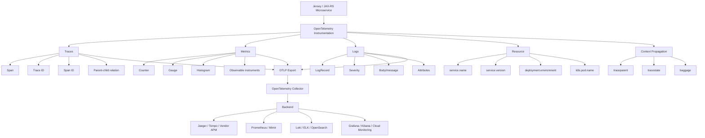

Ringkasnya:

```text id="k31mha"
OpenTelemetry bukan dashboard.
OpenTelemetry bukan log backend.
OpenTelemetry bukan APM vendor tertentu.

OpenTelemetry adalah standar + API + SDK + instrumentation + collector pipeline
untuk menghasilkan dan memindahkan telemetry secara vendor-neutral.
```

---

## 3. Tiga Signal Utama

OpenTelemetry Java documentation mencakup generation dan collection telemetry data seperti **metrics, logs, dan traces** menggunakan OpenTelemetry API dan SDK. ([OpenTelemetry](https://opentelemetry.io/docs/languages/java/?utm_source=chatgpt.com))

| Signal | Bentuk | Menjawab pertanyaan |
|---|---|---|
| Logs | Event detail | “Apa yang terjadi?” |
| Metrics | Agregasi numerik | “Seberapa sering/buruk/cepat?” |
| Traces | Flow eksekusi | “Request ini lewat mana dan lambat di mana?” |

### 3.1 Logs

Log cocok untuk detail diskrit:

```json id="85grj1"
{
  "message": "Order submit rejected due to invalid state",
  "error_code": "ORDER_STATE_INVALID",
  "order_id": "ORD-123",
  "correlation_id": "corr-778899"
}
```

OpenTelemetry Logs Data Model berstatus stable dan dirancang agar log dari berbagai sumber seperti application log files, machine-generated events, dan system logs bisa direpresentasikan secara konsisten. ([OpenTelemetry](https://opentelemetry.io/docs/specs/otel/logs/data-model/?utm_source=chatgpt.com))

### 3.2 Metrics

Metrics cocok untuk agregasi:

```text id="k3v1fx"
http.server.request.duration
http.server.request.count
db.client.operation.duration
jvm.memory.used
business.order.submitted.count
```

OpenTelemetry Metrics Data Model menjelaskan model metrics sebagai protocol specification dan semantic conventions untuk pengiriman pre-aggregated metric time series data. ([OpenTelemetry](https://opentelemetry.io/docs/specs/otel/metrics/data-model/?utm_source=chatgpt.com))

### 3.3 Traces

Trace cocok untuk melihat perjalanan request:

```text id="h3u2zm"
POST /orders
  -> validate order
  -> insert PostgreSQL
  -> publish Kafka event
  -> call payment-service
```

OpenTelemetry trace documentation menjelaskan bahwa tracer membuat span yang berisi informasi tentang apa yang terjadi untuk suatu operation, misalnya request di service. ([OpenTelemetry](https://opentelemetry.io/docs/concepts/signals/traces/?utm_source=chatgpt.com))

---

## 4. Logs vs Metrics vs Traces: Jangan Saling Menggantikan

| Pertanyaan | Signal terbaik |
|---|---|
| Request mana yang gagal? | Log + trace |
| Endpoint mana yang paling lambat? | Metrics |
| Kenapa satu request lambat? | Trace |
| Error code apa yang naik? | Metrics + logs |
| SQL operation mana yang lambat di request ini? | Trace |
| Berapa p95 latency `/orders`? | Metrics histogram |
| Apa stacktrace bug ini? | Log |
| Service dependency path request ini apa? | Trace |
| Berapa consumer lag? | Metrics |
| Actor mana approve case? | Audit log, bukan trace |

Rule:

```text id="e0qmtz"
Logs memberi detail.
Metrics memberi agregasi.
Traces memberi kausalitas/perjalanan.
```

---

## 5. Core Concepts OpenTelemetry

### 5.1 Resource

**Resource** menjelaskan “siapa yang menghasilkan telemetry”.

Contoh resource attributes:

```text id="x0j19j"
service.name=order-service
service.version=1.18.3
deployment.environment.name=prod
host.name=...
container.id=...
k8s.namespace.name=...
k8s.pod.name=...
cloud.provider=aws
cloud.region=ap-southeast-1
```

Resource penting karena telemetry tanpa resource akan sulit dibaca:

```text id="nwn4z1"
ERROR Database timeout
```

Lebih berguna:

```text id="wa9d7p"
ERROR Database timeout
service.name=order-service
service.version=1.18.3
deployment.environment.name=prod
k8s.pod.name=order-service-abc123
```

Semantic conventions OpenTelemetry juga mencakup **Resources** selain conventions untuk traces, metrics, logs, dan events. ([OpenTelemetry](https://opentelemetry.io/docs/specs/semconv/general/trace/?utm_source=chatgpt.com))

---

### 5.2 Attribute

**Attribute** adalah key-value metadata pada telemetry item.

Contoh span attributes:

```text id="3pqpp4"
http.request.method=POST
http.route=/orders/{orderId}/submit
http.response.status_code=409
error.type=ORDER_STATE_INVALID
tenant.id=tenant-a
```

Semantic conventions menyediakan nama umum untuk operasi dan data berbeda agar telemetry konsisten lintas codebase, libraries, dan platforms. ([OpenTelemetry](https://opentelemetry.io/docs/concepts/semantic-conventions/?utm_source=chatgpt.com))

---

### 5.3 Span

**Span** adalah unit kerja dalam trace.

Contoh:

```text id="nbk8mc"
Span: HTTP POST /orders/{orderId}/submit
Span: OrderService.submitOrder
Span: PostgreSQL INSERT order
Span: Kafka publish OrderSubmitted
Span: HTTP POST payment-service /authorize
```

Span biasanya punya:

| Field | Contoh |
|---|---|
| trace ID | `4bf92f3577b34da6a3ce929d0e0e4736` |
| span ID | `00f067aa0ba902b7` |
| parent span ID | span pemanggil |
| name | `POST /orders/{orderId}/submit` |
| kind | SERVER, CLIENT, PRODUCER, CONSUMER, INTERNAL |
| start/end time | timestamp |
| duration | end - start |
| status | OK/ERROR |
| attributes | key-value metadata |
| events | timestamped events dalam span |

---

### 5.4 Trace

**Trace** adalah kumpulan span yang merepresentasikan satu flow.

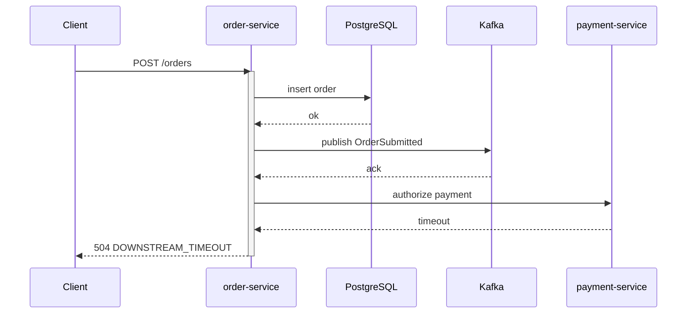

Trace membantu menjawab:

```text id="vjkaln"
Request ini lambat di DB, Kafka, Redis, Camunda, atau downstream HTTP?
```

---

### 5.5 Event dalam Span

Span event adalah timestamped annotation di dalam span.

Contoh event:

```text id="oj3nky"
validation.started
validation.failed
retry.attempt
cache.miss
business.rule.denied
```

Jangan berlebihan. Event dipakai untuk titik penting, bukan pengganti log.

---

### 5.6 Baggage

**Baggage** adalah key-value context yang bisa dipropagasikan lintas service.

OpenTelemetry baggage documentation menjelaskan bahwa dengan context propagation, baggage dapat diteruskan lintas service sehingga value seperti `clientId` tersedia untuk span, metrics, atau logs tambahan; instrumentation dapat mempropagasikan baggage secara otomatis. ([OpenTelemetry](https://opentelemetry.io/docs/concepts/signals/baggage/?utm_source=chatgpt.com))

Contoh baggage candidate:

```text id="p3s2z2"
tenant.id=tenant-a
business.channel=WEB
client.type=internal
```

Tapi hati-hati:

```text id="aaed5q"
Jangan memasukkan PII, token, secret, user email, atau high-cardinality ID ke baggage sembarangan.
```

Baggage ikut berjalan lintas service, sehingga exposure surface-nya lebih besar.

---

## 6. Context Propagation

Context propagation adalah mekanisme agar trace/log/metric bisa dikorelasikan lintas service dan process. OpenTelemetry menjelaskan bahwa context propagation memungkinkan signals seperti traces, metrics, dan logs dikorelasikan, meskipun dihasilkan di service berbeda. ([OpenTelemetry](https://opentelemetry.io/docs/concepts/context-propagation/?utm_source=chatgpt.com))

Header penting:

| Header | Tujuan |
|---|---|
| `traceparent` | W3C trace context utama |
| `tracestate` | vendor/state tambahan |
| `baggage` | business/user-defined context yang dipropagasikan |
| `X-Correlation-Id` | correlation ID aplikasi/perusahaan |
| `X-Request-Id` | request ID support/debug |

Model propagation:

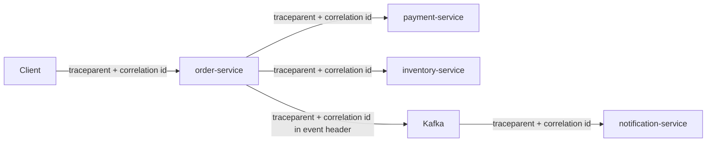

Rule:

```text id="juxwd8"
traceparent untuk distributed tracing.
correlation_id untuk business/support correlation.
Keduanya saling melengkapi, bukan saling menggantikan.
```

---

## 7. Semantic Conventions

Semantic conventions adalah vocabulary standar.

Tanpa semantic convention, tiap service bisa membuat field berbeda:

```text id="kw4ox3"
httpMethod
method
http_method
request.method
verb
```

Dengan semantic convention, field lebih seragam.

OpenTelemetry Semantic Conventions mendefinisikan common set of semantic attributes yang memberi makna pada data telemetry, termasuk span names/kind, metric instruments/units, attribute names, type, meaning, dan valid values. ([OpenTelemetry](https://opentelemetry.io/docs/specs/semconv/?utm_source=chatgpt.com))

### 7.1 HTTP semantic conventions

OpenTelemetry HTTP conventions mendefinisikan semantic conventions untuk HTTP spans, metrics, dan logs, untuk skema HTTP/HTTPS dan berbagai versi HTTP. ([OpenTelemetry](https://opentelemetry.io/docs/specs/semconv/http/?utm_source=chatgpt.com))

Contoh field modern yang umum:

| Concept | Contoh |
|---|---|
| HTTP method | `http.request.method=POST` |
| HTTP route | `http.route=/orders/{orderId}` |
| HTTP response status | `http.response.status_code=409` |
| URL path | `url.path=/orders/ORD-123` |
| Server address | `server.address=api.company.com` |
| Network protocol | `network.protocol.name=http` |

### 7.2 Exception semantic conventions

OpenTelemetry punya semantic conventions untuk exception di logs, termasuk recording exception melalui Logger API. ([OpenTelemetry](https://opentelemetry.io/docs/specs/semconv/exceptions/exceptions-logs/?utm_source=chatgpt.com))

Konsep yang sering muncul:

```text id="c3bh3f"
exception.type
exception.message
exception.stacktrace
error.type
```

---

## 8. OpenTelemetry dalam Jersey/JAX-RS Application

Untuk aplikasi Jersey/JAX-RS, OTel bisa masuk lewat dua jalur:

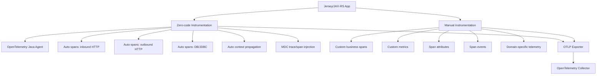

OpenTelemetry Java zero-code instrumentation menggunakan Java agent JAR yang di-attach ke aplikasi Java 8+ dan melakukan bytecode instrumentation untuk menangkap telemetry dari banyak libraries/frameworks; dokumentasinya menyebut capture di edge aplikasi seperti inbound requests, outbound HTTP calls, dan database calls. ([OpenTelemetry](https://opentelemetry.io/docs/zero-code/java/agent/?utm_source=chatgpt.com))

---

## 9. Auto Instrumentation vs Manual Instrumentation

| Aspek | Auto instrumentation | Manual instrumentation |
|---|---|---|
| Cara | Java agent / bytecode instrumentation | Kode eksplisit pakai OTel API |
| Cepat onboarding | Sangat cepat | Butuh coding |
| Inbound HTTP | Bagus | Biasanya tidak perlu manual |
| Outbound HTTP | Bagus jika library supported | Manual jika custom client |
| JDBC/DB | Bagus untuk baseline | Manual untuk business query grouping |
| Business operation | Tidak tahu domain | Sangat cocok |
| Domain state transition | Tidak tahu | Cocok |
| Custom metrics | Terbatas | Perlu manual |
| Risiko | Version compatibility/config | Developer discipline |
| Best use | Baseline observability cepat | Domain-level clarity |

Rekomendasi praktis:

```text id="q8ipri"
Mulai dengan OpenTelemetry Java Agent untuk baseline teknis.
Tambahkan manual instrumentation hanya untuk business operation yang penting.
```

---

## 10. Contoh Trace Ideal untuk Jersey/JAX-RS

```text id="gdetf8"
Trace: corr-778899 / POST /orders/{orderId}/submit

SERVER span:
  POST /orders/{orderId}/submit
  attributes:
    service.name=order-service
    http.request.method=POST
    http.route=/orders/{orderId}/submit
    http.response.status_code=409

INTERNAL span:
  OrderSubmissionService.submit
  attributes:
    business.action=ORDER_SUBMIT
    order.id=ORD-123
    tenant.id=tenant-a

CLIENT span:
  PostgreSQL SELECT order
  attributes:
    db.system.name=postgresql
    db.operation.name=SELECT

INTERNAL span event:
  business.rule.denied
  attributes:
    error.code=ORDER_STATE_INVALID
    state.current=CANCELLED
```

Auto instrumentation bisa membuat SERVER span dan DB span. Manual instrumentation dibutuhkan untuk `OrderSubmissionService.submit` dan `business.rule.denied`.

---

## 11. OTel dan Logging: Trace ID ke Log

Logging tetap penting. OTel membuat log lebih kuat jika `trace_id` dan `span_id` ikut masuk log.

Contoh log:

```json id="yru8f6"
{
  "level": "ERROR",
  "message": "Downstream payment authorization timed out",
  "service_name": "order-service",
  "trace_id": "4bf92f3577b34da6a3ce929d0e0e4736",
  "span_id": "00f067aa0ba902b7",
  "correlation_id": "corr-778899",
  "error_code": "DOWNSTREAM_TIMEOUT"
}
```

OpenTelemetry Java instrumentation repository menyebut bahwa trace information seperti trace IDs dan span IDs dapat di-inject ke custom application logs melalui Logger MDC auto-instrumentation. ([GitHub](https://github.com/open-telemetry/opentelemetry-java-instrumentation?utm_source=chatgpt.com))

Praktisnya:

```text id="06zxia"
Klik error log -> ambil trace_id -> buka trace lengkap -> lihat dependency lambat/error.
```

---

## 12. OTel dan Metrics

Metrics dari OTel digunakan untuk dashboard dan alerting.

Baseline service metrics:

| Metric | Tujuan |
|---|---|
| HTTP server request duration | latency endpoint |
| HTTP server request count | traffic |
| HTTP server error count | error rate |
| JVM memory | memory pressure |
| JVM GC duration | GC pause |
| DB operation duration | DB latency |
| connection pool usage | saturation |
| Kafka consumer lag | async backlog |
| business order submitted count | domain KPI |
| workflow SLA breached count | domain reliability |

Tetapi hati-hati dengan label/cardinality:

```text id="63ps7s"
Jangan pakai order_id, request_id, user_id, email, raw URL sebagai metric attributes.
```

---

## 13. OTel dan Logs

OpenTelemetry bisa menerima log dari:

- application logging framework
- log files
- stdout/stderr
- collector receiver
- OTLP logs exporter
- bridge/instrumentation tertentu

Tetapi untuk aplikasi Java enterprise, pola umum:

```text id="7jw5dz"
SLF4J/Logback/Log4j2 -> JSON logs to stdout
Node/log shipper or Collector -> backend
OTel trace/span IDs injected into MDC/log fields
```

Atau:

```text id="wjabzj"
Java app -> OTel logs SDK/exporter -> OTLP -> Collector
```

Untuk banyak tim, mulai dari JSON logs + trace correlation lebih sederhana daripada langsung memindahkan semua logging ke OTel Logs SDK.

---

## 14. OpenTelemetry Collector: Kenapa Penting?

Collector adalah pipeline antara aplikasi dan backend.

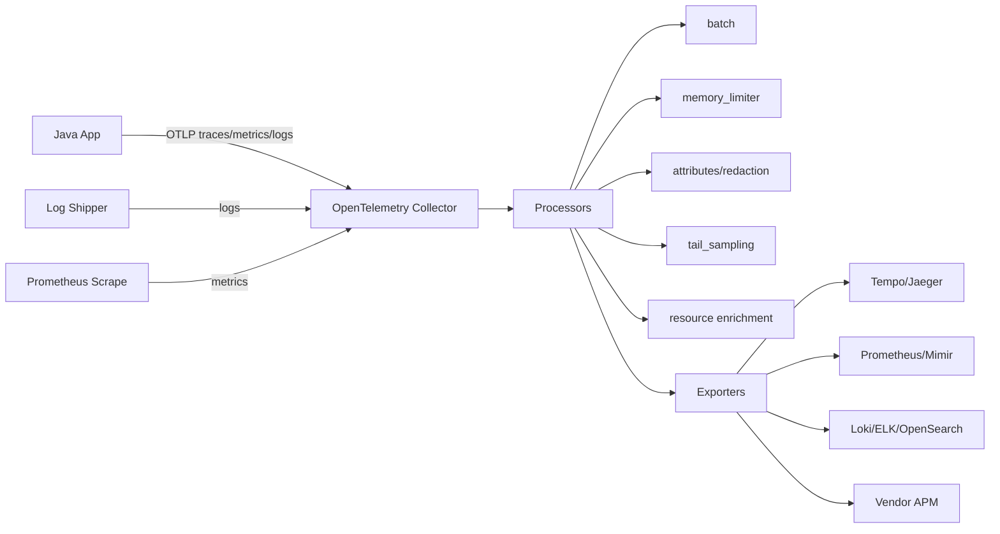

Collector membuat aplikasi tidak perlu tahu backend detail:

```text id="pu1gyb"
Aplikasi kirim OTLP ke Collector.
Collector yang memutuskan export ke Tempo, Jaeger, Datadog, New Relic, Azure Monitor, AWS X-Ray, Loki, Prometheus, dll.
```

---

## 15. Minimal OTel Environment Variables untuk Java Service

Untuk Java agent onboarding, biasanya konsep env var seperti ini:

```bash id="weasev"
JAVA_TOOL_OPTIONS="-javaagent:/otel/opentelemetry-javaagent.jar"

OTEL_SERVICE_NAME="order-service"
OTEL_RESOURCE_ATTRIBUTES="service.version=1.18.3,deployment.environment.name=prod"
OTEL_EXPORTER_OTLP_ENDPOINT="http://otel-collector:4317"
OTEL_TRACES_EXPORTER="otlp"
OTEL_METRICS_EXPORTER="otlp"
OTEL_LOGS_EXPORTER="none"
OTEL_PROPAGATORS="tracecontext,baggage"
```

Catatan:

```text id="jsm4x1"
Nama dan opsi konfigurasi harus mengikuti versi agent/SDK yang dipakai perusahaan.
Jangan copy config dari internet tanpa cek versi agent dan backend.
```

OpenTelemetry Java zero-code docs menyebut opsi umum untuk Java termasuk Java agent JAR, Spring Boot Starter, dan Quarkus extension; untuk Jersey/JAX-RS non-Spring, Java agent adalah jalur onboarding yang paling langsung. ([OpenTelemetry](https://opentelemetry.io/docs/zero-code/java/?utm_source=chatgpt.com))

---

## 16. Deployment di Docker/Kubernetes

Contoh mental model Kubernetes:

```yaml id="1v8kqa"
env:
  - name: JAVA_TOOL_OPTIONS
    value: "-javaagent:/otel/opentelemetry-javaagent.jar"
  - name: OTEL_SERVICE_NAME
    value: "order-service"
  - name: OTEL_RESOURCE_ATTRIBUTES
    value: "service.version=1.18.3,deployment.environment.name=prod"
  - name: OTEL_EXPORTER_OTLP_ENDPOINT
    value: "http://otel-collector.observability:4317"
  - name: OTEL_PROPAGATORS
    value: "tracecontext,baggage"
```

Zero-code instrumentation docs juga menyebut OpenTelemetry Operator untuk Kubernetes dapat meng-inject zero-code instrumentation untuk Java dan beberapa bahasa lain. ([OpenTelemetry](https://opentelemetry.io/docs/zero-code/?utm_source=chatgpt.com))

Untuk onboarding awal, ada dua opsi:

| Opsi | Cocok untuk |
|---|---|
| Bake agent JAR ke image | Kontrol eksplisit per service |
| Inject via init container/operator | Platform standardization |
| Mount agent via volume | On-prem/internal platform |
| Sidecar collector | Per-pod isolation |
| DaemonSet/gateway collector | Shared telemetry pipeline |

---

## 17. Jersey/JAX-RS Specific Instrumentation Thinking

Untuk Jersey/JAX-RS, pikirkan boundary berikut:

| Boundary | Signal |
|---|---|
| Inbound HTTP resource | SERVER span + HTTP metrics + access log |
| ExceptionMapper | error log + span status/error |
| ContainerResponseFilter | completion log + duration |
| Jersey Client | CLIENT span + propagation |
| MyBatis/JDBC | DB CLIENT span |
| PostgreSQL pool | metrics |
| Kafka producer/consumer | PRODUCER/CONSUMER span + lag metrics |
| Redis client | CLIENT span |
| Camunda job/external task | INTERNAL/CONSUMER-like span manual |
| Scheduled job | root span manual |
| Business transition | span/event + audit event |

---

## 18. Signal Correlation Model

Idealnya, satu production incident bisa dilihat dari semua signal.

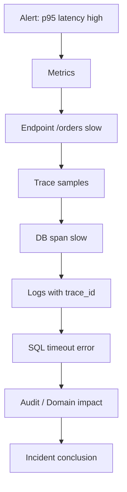

Korelasi minimal:

| Dari | Ke | Key |
|---|---|---|
| Log | Trace | `trace_id` |
| Trace | Log | `trace_id`, `span_id` |
| HTTP response | Log | `error_id`, `request_id` |
| Access log | Application log | `request_id`, `correlation_id` |
| Application log | Audit log | `correlation_id`, domain ID |
| Metrics | Trace | exemplar / route/status/time window |
| Async event | Consumer trace/log | `traceparent`, `correlation_id`, `event_id` |

---

## 19. OTel untuk Regulatory / Case Management Platform

Untuk domain case/order/workflow, OTel tidak menggantikan audit log. Tapi OTel membantu diagnosis teknis.

| Domain concern | Signal |
|---|---|
| Siapa approve case? | Audit log |
| Kenapa approval gagal? | App log + trace |
| Apakah SLA breached meningkat? | Metrics |
| Workflow task mana lambat? | Trace + metrics |
| Case state transition apa yang terjadi? | Audit log + app log |
| Downstream service mana memperlambat order? | Trace |
| Apakah DB pool saturated? | Metrics |
| Request support user X gagal di mana? | Log + trace + error ID |

Rule:

```text id="9c00t9"
OTel menjelaskan perilaku sistem.
Audit log membuktikan aksi/keputusan domain.
Keduanya saling melengkapi.
```

---

## 20. Naming and Attribute Governance

Buat naming standard internal agar tidak kacau.

### 20.1 Resource attributes

```text id="ts927p"
service.name
service.version
deployment.environment.name
service.namespace
service.instance.id
k8s.namespace.name
k8s.pod.name
cloud.provider
cloud.region
```

### 20.2 Business attributes

Pilih satu gaya dan konsisten:

```text id="5mghhx"
business.action
tenant.id
order.id
case.id
workflow.instance.id
error.code
retry.count
```

Catatan cardinality:

| Attribute | Trace/log | Metric label |
|---|---:|---:|
| `order.id` | Boleh jika policy | Jangan |
| `case.id` | Boleh jika policy | Jangan |
| `tenant.id` | Boleh, hati-hati | Tergantung jumlah tenant |
| `business.action` | Ya | Ya |
| `http.route` | Ya | Ya |
| `http.target` raw | Hati-hati | Jangan |
| `user.email` | Hindari/mask | Jangan |
| `request.id` | Log/trace only | Jangan |

---

## 21. Sampling Mental Model

Tidak semua trace harus disimpan.

| Strategy | Penjelasan |
|---|---|
| Head sampling | Keputusan sampling di awal trace |
| Tail sampling | Keputusan setelah melihat trace selesai |
| Error-biased sampling | Simpan lebih banyak trace error |
| Latency-biased sampling | Simpan trace lambat |
| Route-based sampling | Endpoint penting disimpan lebih banyak |
| Always-on local/dev | Untuk debugging |
| Low rate prod | Untuk cost control |

Rule praktis:

```text id="cuzxub"
Jangan sampling audit log.
Boleh sampling trace.
Boleh sampling debug logs.
Metrics biasanya tidak disampling seperti traces.
```

---

## 22. Common Failure Modes

| Failure | Gejala | Penyebab | Fix |
|---|---|---|---|
| Trace tidak nyambung antar service | Banyak root trace | Header propagation tidak jalan | `tracecontext` propagator + client instrumentation |
| Log tidak punya trace ID | Sulit buka trace dari log | MDC injection belum aktif | Enable log correlation / format log |
| Semua service bernama unknown | Backend sulit dibaca | `OTEL_SERVICE_NAME` tidak diset | Set resource/service name |
| Metrics mahal | Backend cardinality tinggi | Label pakai raw path/user/order ID | Gunakan route template/low-cardinality |
| Trace terlalu noisy | Terlalu banyak span manual | Instrumentasi berlebihan | Span hanya untuk boundary penting |
| Business flow tidak jelas | Trace hanya teknis | Tidak ada manual business span | Tambahkan custom spans/events |
| Secret masuk trace | Attribute salah | Masukkan token/body/email | Attribute hygiene |
| DB span ada tapi query tidak berguna | Raw/normalized mismatch | Config/library limitation | Tambah operation name/query hash |
| Async trace putus | Kafka/event header tidak propagate | Missing context propagation | Propagate `traceparent` + correlation ID |
| Alert tidak actionable | Metrics tanpa label route/status | Metric design buruk | Standard metric attributes |

---

## 23. Production Checklist

| Area | Checklist |
|---|---|
| Service identity | `OTEL_SERVICE_NAME` benar |
| Resource attributes | version, environment, namespace/pod |
| Export path | OTLP ke Collector, bukan hard-code vendor bila bisa |
| Propagation | `tracecontext,baggage` sesuai standard |
| Log correlation | `trace_id` dan `span_id` masuk structured log |
| HTTP route | route template, bukan raw path |
| Error mapping | `error.code`, `error.type`, span status |
| Manual spans | Hanya untuk business operation penting |
| Metrics | Low-cardinality attributes |
| Sensitive data | Tidak ada token/body/PII di attributes |
| Async | Kafka/Camunda/job context propagation |
| Sampling | Policy jelas untuk prod |
| Collector | batch, memory limiter, redaction, exporter |
| Dashboard | Metrics/logs/traces saling link |
| Tests | Propagation dan correlation diuji |

---

## 24. What Good Looks Like

OpenTelemetry adoption yang sehat terlihat seperti ini:

```text id="ks7clt"
1. Semua service punya service.name dan environment yang benar.
2. Inbound HTTP request otomatis punya SERVER span.
3. Outbound HTTP/JDBC otomatis punya CLIENT span.
4. Log punya trace_id/span_id.
5. Completion log punya request_id/correlation_id.
6. Trace tetap tersambung lintas HTTP service.
7. Async flow membawa traceparent dan correlation_id.
8. Metrics memakai route template dan low-cardinality labels.
9. Manual spans hanya dipakai untuk business operation penting.
10. Telemetry dikirim ke Collector, bukan setiap service hard-code backend.
```

---

## 25. Ringkasan Seri 8

| Area | Kesimpulan |
|---|---|
| OTel | Framework vendor-neutral untuk telemetry |
| Signal | Logs detail, metrics agregasi, traces flow |
| Resource | Identitas penghasil telemetry |
| Attribute | Metadata key-value pada signal |
| Span | Unit kerja dalam trace |
| Trace | Kumpulan span lintas service |
| Context propagation | Menghubungkan traces/logs/metrics lintas process |
| Baggage | Context tambahan yang ikut dipropagasikan, harus hati-hati |
| Semantic conventions | Vocabulary standar agar telemetry konsisten |
| Java Agent | Cara cepat mendapat baseline instrumentation |
| Manual instrumentation | Untuk business/domain operation |
| Collector | Pipeline vendor-neutral untuk export/process telemetry |
| Jersey/JAX-RS | Boundary utama: inbound HTTP, outbound client, DB, exception, async/job |
| Governance | Naming, cardinality, sensitive data, sampling harus distandardkan |

---

# Status

**Seri 8/20 selesai.**

Seri berikutnya: **Seri 9/20 - OpenTelemetry Java Agent: zero-code instrumentation untuk Jersey/JAX-RS service, konfigurasi Maven/Docker/Kubernetes, environment variables, log correlation, exporter, dan troubleshooting.**

---

**Sources:**

- [What is OpenTelemetry?](https://opentelemetry.io/docs/what-is-opentelemetry/?utm_source=chatgpt.com)
- [open-telemetry/opentelemetry-java-instrumentation](https://github.com/open-telemetry/opentelemetry-java-instrumentation?utm_source=chatgpt.com)

## Response:
7/13/2026, 4:49:44 PM

# Seri 9/20 - OpenTelemetry Java Agent untuk Jersey/JAX-RS Microservices

## 1. Tujuan Seri Ini

Seri ini membahas cara memakai **OpenTelemetry Java Agent** untuk mendapatkan observability baseline pada aplikasi **Java 17+ Jersey/JAX-RS microservice** tanpa banyak perubahan kode.

OpenTelemetry Java Agent adalah zero-code instrumentation: agent JAR di-attach ke aplikasi Java dan melakukan bytecode instrumentation untuk menangkap telemetry dari banyak library/framework, termasuk inbound request, outbound HTTP call, dan database call. Agent bisa dikonfigurasi lewat command-line arguments atau environment variables. ([GitHub](https://github.com/open-telemetry/opentelemetry-java-instrumentation?utm_source=chatgpt.com))

Target setelah seri ini:

- paham cara attach Java Agent
- tahu konfigurasi minimum untuk Docker/Kubernetes
- tahu env var penting seperti `OTEL_SERVICE_NAME`, `OTEL_RESOURCE_ATTRIBUTES`, `OTEL_EXPORTER_OTLP_ENDPOINT`
- bisa menghubungkan trace dengan log lewat `trace_id` dan `span_id`
- tahu cara troubleshoot agent yang tidak mengirim telemetry
- tahu batas auto instrumentation dan kapan perlu manual instrumentation

---

## 2. Mental Model Java Agent

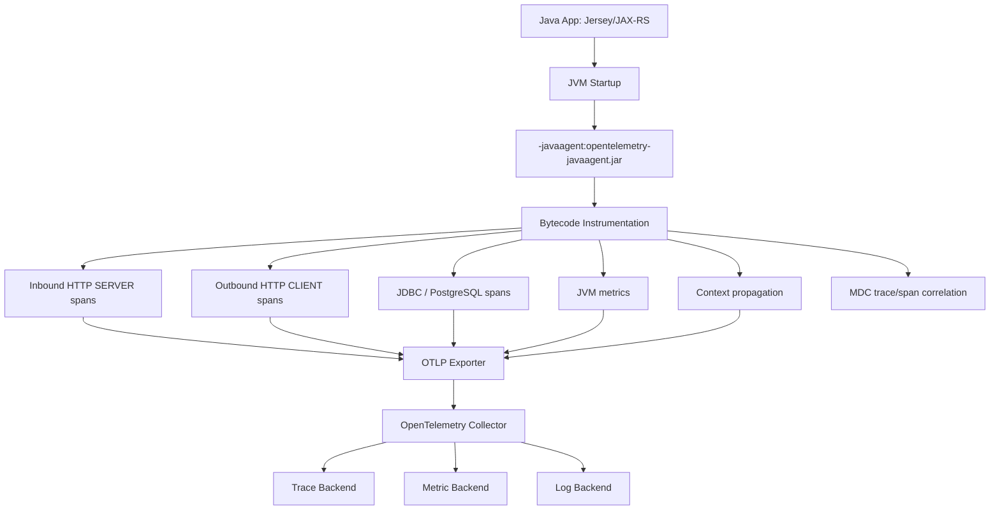

Intinya:

```text id="h9c9z9"
Aplikasi tidak perlu tahu backend observability.
Aplikasi cukup di-attach Java Agent.
Agent mengirim telemetry ke OpenTelemetry Collector.
Collector yang meneruskan ke Tempo/Jaeger/Prometheus/Loki/vendor APM.
```

---

## 3. Apa yang Bisa Didapat dari Zero-Code Instrumentation?

Dengan Java Agent, baseline yang biasanya langsung didapat:

| Area | Contoh telemetry |
|---|---|
| Inbound HTTP | SERVER span untuk request REST |
| Outbound HTTP | CLIENT span saat memanggil service lain |
| JDBC/PostgreSQL | DB CLIENT span |
| JVM | memory, GC, thread, classloading |
| Context propagation | `traceparent`, `tracestate`, baggage |
| Error tracking | span status/error pada exception tertentu |
| Log correlation | `trace_id` dan `span_id` bisa masuk MDC/log |
| Runtime metadata | service name, version, environment, container/K8s metadata |

OpenTelemetry Java Agent mendukung banyak library, framework, application server, dan JVM; dokumentasi resminya menyediakan halaman khusus supported libraries untuk daftar yang terus diperbarui. ([OpenTelemetry](https://opentelemetry.io/docs/zero-code/java/agent/supported-libraries/?utm_source=chatgpt.com))

---

## 4. Posisi Java Agent dalam Aplikasi Jersey/JAX-RS

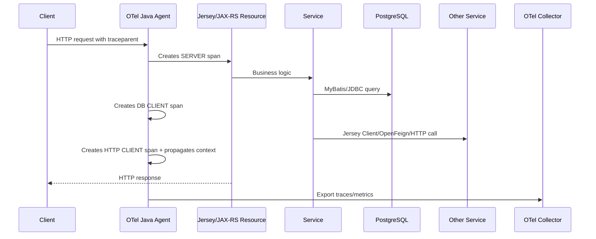

Yang perlu diperhatikan:

| Layer | Auto agent cukup? | Catatan |
|---|---:|---|
| HTTP inbound | Biasanya ya | Bergantung runtime/library yang supported |
| HTTP outbound | Biasanya ya | Bergantung client library |
| JDBC/PostgreSQL | Biasanya ya | MyBatis di atas JDBC tetap terlihat sebagai JDBC span |
| Business operation | Tidak | Perlu manual span |
| Audit log | Tidak | Harus domain-specific |
| Domain metrics | Tidak | Perlu manual metrics |
| Camunda workflow semantics | Terbatas | Sering butuh manual instrumentation |
| Kafka/Redis semantics | Bisa sebagian | Tetap cek supported library dan field yang keluar |

---

## 5. Cara Attach Java Agent

### 5.1 Command line langsung

```bash id="6hn9xr"
java \
  -javaagent:/opt/opentelemetry-javaagent.jar \
  -jar app.jar
```

### 5.2 Dengan `JAVA_TOOL_OPTIONS`

```bash id="0hk9yn"
export JAVA_TOOL_OPTIONS="-javaagent:/opt/opentelemetry-javaagent.jar"
java -jar app.jar
```

`JAVA_TOOL_OPTIONS` sering lebih nyaman di Docker/Kubernetes karena tidak perlu mengubah command utama image.

---

## 6. Konfigurasi Minimum

Konfigurasi minimum yang biasanya dibutuhkan:

```bash id="lgmuik"
OTEL_SERVICE_NAME=order-service
OTEL_RESOURCE_ATTRIBUTES=service.version=1.18.3,deployment.environment.name=prod
OTEL_EXPORTER_OTLP_ENDPOINT=http://otel-collector.observability:4317
OTEL_TRACES_EXPORTER=otlp
OTEL_METRICS_EXPORTER=otlp
OTEL_LOGS_EXPORTER=none
OTEL_PROPAGATORS=tracecontext,baggage
```

OpenTelemetry mendefinisikan spesifikasi environment variable agar nama dan parsing configuration seragam lintas implementasi. ([OpenTelemetry](https://opentelemetry.io/docs/specs/otel/configuration/sdk-environment-variables/?utm_source=chatgpt.com)) Dokumentasi Java agent juga menyebut bahwa konfigurasi agent dapat diberikan lewat environment variables, system properties, configuration file, dan extension. ([OpenTelemetry](https://opentelemetry.io/docs/zero-code/java/agent/configuration/?utm_source=chatgpt.com))

---

## 7. Env Var Penting

| Env var | Contoh | Fungsi |
|---|---|---|
| `JAVA_TOOL_OPTIONS` | `-javaagent:/otel/opentelemetry-javaagent.jar` | Attach agent |
| `OTEL_SERVICE_NAME` | `order-service` | Nama service |
| `OTEL_RESOURCE_ATTRIBUTES` | `service.version=1.18.3,deployment.environment.name=prod` | Metadata resource |
| `OTEL_EXPORTER_OTLP_ENDPOINT` | `http://otel-collector:4317` | Endpoint collector |
| `OTEL_TRACES_EXPORTER` | `otlp` | Export traces |
| `OTEL_METRICS_EXPORTER` | `otlp` | Export metrics |
| `OTEL_LOGS_EXPORTER` | `none` / `otlp` | Export logs via OTel |
| `OTEL_PROPAGATORS` | `tracecontext,baggage` | Context propagation |
| `OTEL_JAVAAGENT_DEBUG` | `true` | Debug agent startup/instrumentation |
| `OTEL_RESOURCE_DISABLED_KEYS` | optional | Disable resource attributes tertentu |

Untuk troubleshooting, dokumentasi getting started Java Agent menyebut `OTEL_JAVAAGENT_DEBUG=true`, tetapi debug log agent sangat verbose. ([OpenTelemetry](https://opentelemetry.io/docs/zero-code/java/agent/getting-started/?utm_source=chatgpt.com))

---

## 8. Docker Pattern

### 8.1 Dockerfile dengan agent di image

```dockerfile id="am4d65"
FROM eclipse-temurin:17-jre

WORKDIR /app

COPY target/order-service.jar /app/order-service.jar
COPY opentelemetry-javaagent.jar /otel/opentelemetry-javaagent.jar

ENV JAVA_TOOL_OPTIONS="-javaagent:/otel/opentelemetry-javaagent.jar"

ENTRYPOINT ["java", "-jar", "/app/order-service.jar"]
```

### 8.2 Runtime config

```bash id="chc95i"
docker run \
  -e OTEL_SERVICE_NAME=order-service \
  -e OTEL_RESOURCE_ATTRIBUTES=service.version=1.18.3,deployment.environment.name=local \
  -e OTEL_EXPORTER_OTLP_ENDPOINT=http://otel-collector:4317 \
  -e OTEL_TRACES_EXPORTER=otlp \
  -e OTEL_METRICS_EXPORTER=otlp \
  order-service:1.18.3
```

### 8.3 Trade-off bake agent ke image

| Kelebihan | Kekurangan |
|---|---|
| Sederhana dan eksplisit | Upgrade agent perlu rebuild image |
| Cocok untuk on-prem | Bisa beda versi antar service |
| Mudah dipahami developer | Platform sulit enforce standard |

---

## 9. Kubernetes Deployment Pattern

```yaml id="crv3qx"
apiVersion: apps/v1
kind: Deployment
metadata:
  name: order-service
spec:
  replicas: 3
  selector:
    matchLabels:
      app: order-service
  template:
    metadata:
      labels:
        app: order-service
    spec:
      containers:
        - name: order-service
          image: registry.company.com/order-service:1.18.3
          env:
            - name: JAVA_TOOL_OPTIONS
              value: "-javaagent:/otel/opentelemetry-javaagent.jar"

            - name: OTEL_SERVICE_NAME
              value: "order-service"

            - name: OTEL_RESOURCE_ATTRIBUTES
              value: "service.version=1.18.3,deployment.environment.name=prod,service.namespace=order-platform"

            - name: OTEL_EXPORTER_OTLP_ENDPOINT
              value: "http://otel-collector.observability:4317"

            - name: OTEL_TRACES_EXPORTER
              value: "otlp"

            - name: OTEL_METRICS_EXPORTER
              value: "otlp"

            - name: OTEL_LOGS_EXPORTER
              value: "none"

            - name: OTEL_PROPAGATORS
              value: "tracecontext,baggage"
```

OpenTelemetry zero-code docs juga menyebut bahwa di Kubernetes, OpenTelemetry Operator dapat meng-inject zero-code instrumentation untuk Java dan beberapa bahasa lain. ([OpenTelemetry](https://opentelemetry.io/docs/zero-code/java/agent/getting-started/?utm_source=chatgpt.com))

---

## 10. Agent Delivery Pattern di Kubernetes

| Pattern | Cara | Cocok untuk |
|---|---|---|
| Baked-in image | Agent JAR sudah di image | Tim kecil, kontrol app-level |
| Init container | Download/copy agent ke volume | Platform standardization |
| Shared volume | Agent di-mount | On-prem/private platform |
| OTel Operator injection | Operator inject agent/env | Kubernetes platform mature |
| Manual deployment env | Tambahkan `JAVA_TOOL_OPTIONS` per deployment | Transitional onboarding |

Rekomendasi praktis:

```text id="g9h9xu"
Awal onboarding: baked-in atau init container.
Saat scale banyak service: OTel Operator atau platform-level injection.
```

---

## 11. OTLP gRPC vs HTTP

Umumnya endpoint OTLP bisa menggunakan:

| Protocol | Port default umum | Catatan |
|---|---:|---|
| OTLP/gRPC | `4317` | Sering default untuk traces/metrics/logs |
| OTLP/HTTP | `4318` | Lebih firewall/proxy friendly |

Konfigurasi umum:

```bash id="vlx4po"
OTEL_EXPORTER_OTLP_ENDPOINT=http://otel-collector:4317
```

Atau jika memakai HTTP/protobuf:

```bash id="q1fkpt"
OTEL_EXPORTER_OTLP_PROTOCOL=http/protobuf
OTEL_EXPORTER_OTLP_ENDPOINT=http://otel-collector:4318
```

Pastikan protocol dan port cocok dengan Collector receiver. Banyak masalah “telemetry tidak muncul” berasal dari mismatch `4317` gRPC vs `4318` HTTP.

---

## 12. OpenTelemetry Collector Receiver Baseline

Aplikasi Java Agent biasanya mengirim OTLP ke Collector.

Contoh Collector minimal:

```yaml id="j6z2rz"
receivers:
  otlp:
    protocols:
      grpc:
        endpoint: 0.0.0.0:4317
      http:
        endpoint: 0.0.0.0:4318

processors:
  batch:
  memory_limiter:
    check_interval: 1s
    limit_mib: 512

exporters:
  debug:
    verbosity: basic

service:
  pipelines:
    traces:
      receivers: [otlp]
      processors: [memory_limiter, batch]
      exporters: [debug]

    metrics:
      receivers: [otlp]
      processors: [memory_limiter, batch]
      exporters: [debug]
```

Untuk production, `debug` diganti atau ditambah exporter ke backend seperti Tempo/Jaeger/vendor APM/Prometheus pipeline.

---

## 13. Log Correlation: Trace ID dan Span ID ke Log

Target log:

```json id="0w9ppm"
{
  "level": "ERROR",
  "message": "Downstream timeout",
  "service_name": "order-service",
  "trace_id": "4bf92f3577b34da6a3ce929d0e0e4736",
  "span_id": "00f067aa0ba902b7",
  "correlation_id": "corr-778899",
  "error_code": "DOWNSTREAM_TIMEOUT"
}
```

OpenTelemetry Java instrumentation mendukung injection trace information seperti trace IDs dan span IDs ke custom application logs melalui Logger MDC auto-instrumentation. ([GitHub](https://github.com/open-telemetry/opentelemetry-java-instrumentation?utm_source=chatgpt.com))

### 13.1 Logback pattern local

```xml id="xcpt8i"
<encoder>
    <pattern>
        %d{yyyy-MM-dd'T'HH:mm:ss.SSSXXX} %-5level [%thread] %logger{36}
        trace_id=%X{trace_id} span_id=%X{span_id}
        request_id=%X{request_id} correlation_id=%X{correlation_id}
        - %msg%n%ex
    </pattern>
</encoder>
```

### 13.2 Log4j2 pattern local

```xml id="raiw04"
<PatternLayout pattern="%d{yyyy-MM-dd'T'HH:mm:ss.SSSXXX} %-5p [%t] %c{1.} trace_id=%X{trace_id} span_id=%X{span_id} request_id=%X{request_id} correlation_id=%X{correlation_id} - %m%n%ex"/>
```

### 13.3 JSON logging

Pastikan JSON encoder/layout mengambil MDC fields:

```text id="33ns3e"
trace_id
span_id
request_id
correlation_id
tenant_id
error_id
error_code
```

---

## 14. Relationship: `trace_id` vs `correlation_id`

| Field | Sumber | Tujuan |
|---|---|---|
| `trace_id` | OpenTelemetry | Trace teknis lintas service |
| `span_id` | OpenTelemetry | Unit operation spesifik |
| `request_id` | Gateway/service | Support/debug request |
| `correlation_id` | Aplikasi/upstream | Business flow lintas sync/async |

Jangan mengganti semua correlation dengan trace ID.

```text id="knyo3g"
trace_id menjawab: request ini lewat span/service mana?
correlation_id menjawab: flow bisnis ini terkait command/event/case/order apa?
```

---

## 15. Context Propagation dengan Agent

Dengan agent aktif, context propagation untuk HTTP library yang supported biasanya otomatis:

```text id="j7frtb"
Inbound request memiliki traceparent
  -> agent extract context
  -> create SERVER span
  -> outbound HTTP client
  -> agent inject traceparent ke downstream
```

OpenTelemetry menjelaskan context propagation sebagai mekanisme memindahkan context antar service/process melalui serialize/deserialize, dan instrumentation library biasanya menangani propagation secara transparan. ([OpenTelemetry](https://opentelemetry.io/docs/languages/java/?utm_source=chatgpt.com))

Namun `correlation_id` custom tetap perlu diteruskan oleh aplikasi/filter/client interceptor sendiri.

---

## 16. Jersey Client Propagation untuk Correlation ID

Agent dapat mengurus `traceparent`, tetapi header custom seperti `X-Correlation-Id` sebaiknya tetap diurus aplikasi.

```java id="ajg4ei"
import jakarta.ws.rs.client.ClientRequestContext;
import jakarta.ws.rs.client.ClientRequestFilter;
import jakarta.ws.rs.ext.Provider;
import org.slf4j.MDC;

@Provider
public class CorrelationPropagationClientFilter implements ClientRequestFilter {

    @Override
    public void filter(ClientRequestContext requestContext) {
        putHeaderIfPresent(requestContext, "X-Request-Id", MDC.get("request_id"));
        putHeaderIfPresent(requestContext, "X-Correlation-Id", MDC.get("correlation_id"));
        putHeaderIfPresent(requestContext, "X-Tenant-Id", MDC.get("tenant_id"));
    }

    private static void putHeaderIfPresent(ClientRequestContext ctx, String name, String value) {
        if (value != null && !value.isBlank()) {
            ctx.getHeaders().putSingle(name, value);
        }
    }
}
```

Rule:

```text id="1t537x"
Biarkan OTel agent mengurus traceparent.
Aplikasi tetap mengurus correlation_id dan domain context.
```

---

## 17. Supported Libraries: Cara Mengecek

Karena daftar supported instrumentation bisa berubah, jangan mengandalkan ingatan. Cek halaman resmi “Supported Libraries” untuk agent yang dipakai. Dokumentasi OpenTelemetry menyatakan Java agent otomatis meng-instrument banyak library, framework, dan application server out of the box. ([OpenTelemetry](https://opentelemetry.io/docs/zero-code/java/agent/supported-libraries/?utm_source=chatgpt.com))

Checklist untuk stack Anda:

| Komponen | Yang dicek |
|---|---|
| Jersey/JAX-RS version | Apakah instrumentation JAX-RS/Jersey sesuai versi |
| Servlet container | Tomcat/Jetty/Grizzly/Payara/WildFly |
| Jersey Client | Apakah outbound client captured |
| JDBC driver | PostgreSQL JDBC spans |
| MyBatis | Biasanya lewat JDBC, tapi cek detail span |
| Kafka client | Producer/consumer spans |
| Redis client | Lettuce/Jedis support |
| Camunda | Biasanya perlu manual/domain instrumentation |
| Logback/Log4j2 | MDC trace/span injection |
| Java version | Java 17+ supported |

---

## 18. Resource Attributes yang Direkomendasikan

Minimal:

```text id="seqead"
service.name=order-service
service.version=1.18.3
deployment.environment.name=prod
service.namespace=order-platform
```

Kubernetes tambahan:

```text id="qbkzl8"
k8s.namespace.name=platform-prod
k8s.pod.name=order-service-abc123
k8s.container.name=order-service
k8s.deployment.name=order-service
```

Cloud/on-prem tambahan:

```text id="d5em9i"
cloud.provider=aws
cloud.region=ap-southeast-1
host.name=...
```

Jangan masukkan:

```text id="34uyq8"
request_id
order_id
case_id
user_email
access_token
```

Resource adalah metadata process/service, bukan request-specific context.

---

## 19. Contoh End-to-End Local dengan Docker Compose

```yaml id="pjyg0y"
services:
  order-service:
    image: registry.company.com/order-service:local
    environment:
      JAVA_TOOL_OPTIONS: "-javaagent:/otel/opentelemetry-javaagent.jar"
      OTEL_SERVICE_NAME: "order-service"
      OTEL_RESOURCE_ATTRIBUTES: "service.version=local,deployment.environment.name=local"
      OTEL_EXPORTER_OTLP_ENDPOINT: "http://otel-collector:4317"
      OTEL_TRACES_EXPORTER: "otlp"
      OTEL_METRICS_EXPORTER: "otlp"
      OTEL_LOGS_EXPORTER: "none"
      OTEL_PROPAGATORS: "tracecontext,baggage"
    depends_on:
      - otel-collector

  otel-collector:
    image: otel/opentelemetry-collector-contrib:latest
    command: ["--config=/etc/otelcol/config.yaml"]
    volumes:
      - ./otel-collector.yaml:/etc/otelcol/config.yaml
    ports:
      - "4317:4317"
      - "4318:4318"
```

Collector debug config:

```yaml id="mh9yqq"
receivers:
  otlp:
    protocols:
      grpc:
      http:

processors:
  batch:

exporters:
  debug:
    verbosity: detailed

service:
  pipelines:
    traces:
      receivers: [otlp]
      processors: [batch]
      exporters: [debug]
    metrics:
      receivers: [otlp]
      processors: [batch]
      exporters: [debug]
```

---

## 20. Production Configuration Baseline

```bash id="5fh5de"
JAVA_TOOL_OPTIONS="-javaagent:/otel/opentelemetry-javaagent.jar"

OTEL_SERVICE_NAME="order-service"
OTEL_RESOURCE_ATTRIBUTES="service.version=1.18.3,deployment.environment.name=prod,service.namespace=order-platform"

OTEL_EXPORTER_OTLP_ENDPOINT="http://otel-collector.observability.svc.cluster.local:4317"
OTEL_EXPORTER_OTLP_PROTOCOL="grpc"

OTEL_TRACES_EXPORTER="otlp"
OTEL_METRICS_EXPORTER="otlp"
OTEL_LOGS_EXPORTER="none"

OTEL_PROPAGATORS="tracecontext,baggage"
```

Untuk logs, banyak tim Java tetap memakai:

```text id="u94fib"
SLF4J/Logback/Log4j2 -> JSON stdout -> log shipper/collector -> log backend
```

dan memakai OTel agent terutama untuk traces/metrics + trace/log correlation. OpenTelemetry juga memiliki dukungan logs, tetapi untuk Java enterprise onboarding, JSON logs ke stdout sering lebih mudah dioperasikan.

---

## 21. Agent Debugging

Aktifkan hanya sementara:

```bash id="fvehtd"
OTEL_JAVAAGENT_DEBUG=true
```

Debug agent verbose. Jangan aktif permanen di production.

Checklist debug:

| Cek | Cara |
|---|---|
| Agent ter-load? | Log startup JVM menyebut OpenTelemetry agent |
| Env var terbaca? | Cek pod env/container config |
| Collector reachable? | DNS/network policy/service port |
| Protocol cocok? | gRPC `4317` vs HTTP `4318` |
| Service name benar? | Backend tidak menampilkan `unknown_service` |
| Trace muncul? | Generate request HTTP ke endpoint |
| Span DB muncul? | Jalankan query MyBatis/JDBC |
| Log punya trace_id? | Cek MDC/logback/log4j2 config |
| Downstream trace nyambung? | Cek propagation ke service lain |
| Sampling? | Trace mungkin disampling/drop |
| Collector drop? | Cek processor/exporter errors |

---

## 22. Troubleshooting Matrix

| Gejala | Kemungkinan penyebab | Perbaikan |
|---|---|---|
| Tidak ada trace sama sekali | Agent tidak attach | Cek `JAVA_TOOL_OPTIONS` dan path JAR |
| Service muncul `unknown_service` | `OTEL_SERVICE_NAME` tidak diset | Set env var |
| Trace ada tapi tidak ada DB span | JDBC driver/library tidak captured atau disabled | Cek supported libraries dan config |
| Trace putus antar service | Propagation tidak jalan | Cek `OTEL_PROPAGATORS`, outbound client instrumentation |
| Collector tidak menerima data | Endpoint/protocol salah | Cocokkan `4317 grpc` vs `4318 http` |
| Log tidak punya trace ID | MDC injection/log format belum benar | Tambahkan `%X{trace_id}` `%X{span_id}` |
| Banyak span noise | Auto instrumentation terlalu luas | Disable instrumentation tertentu |
| Startup lambat | Banyak instrumentation/agent overhead | Review disabled instrumentation |
| Telemetry mahal | Sampling/attribute/cardinality buruk | Sampling + cardinality control |
| Secret muncul di trace | Attribute capture terlalu agresif | Redaction/attribute denylist |
| Metrics high-cardinality | Raw route/path/user ID | Gunakan route template |

---

## 23. Disable Instrumentation Tertentu

Kadang perlu disable instrumentation yang noisy atau konflik. Dokumentasi Java agent menyediakan panduan untuk menonaktifkan instrumentation tertentu, termasuk opsi men-disable default auto instrumentation dan selectively re-enable instrumentation yang diinginkan. ([OpenTelemetry](https://opentelemetry.io/docs/zero-code/java/agent/disable/?utm_source=chatgpt.com))

Contoh konsep:

```bash id="3vdwes"
OTEL_INSTRUMENTATION_COMMON_DEFAULT_ENABLED=false
```

Lalu enable hanya yang diperlukan, atau disable instrumentation spesifik sesuai nama resmi instrumentation yang dipakai di versi agent Anda.

Catatan penting:

```text id="86ji7r"
Nama instrumentation dan opsi spesifik harus dicek di dokumentasi agent sesuai versi.
Jangan menebak nama env var untuk production.
```

---

## 24. Sampling Baseline

Awal local/dev:

```bash id="1ed4kj"
OTEL_TRACES_SAMPLER=always_on
```

Production sederhana:

```bash id="tqoqrx"
OTEL_TRACES_SAMPLER=parentbased_traceidratio
OTEL_TRACES_SAMPLER_ARG=0.10
```

Artinya: simpan sekitar 10% trace root baru, tetap mengikuti keputusan parent jika trace sudah masuk dari upstream.

Untuk production matang, pertimbangkan **tail sampling di Collector**, misalnya menyimpan:

- semua trace error
- semua trace lambat
- sample kecil trace sukses
- endpoint critical dengan rate lebih tinggi

---

## 25. Error Handling dengan Agent

Java Agent bisa menandai span error pada exception/status tertentu, tetapi domain error classification tetap harus di aplikasi.

Contoh yang tetap perlu manual/app layer:

| Kebutuhan | Auto agent cukup? |
|---|---:|
| `error_code=ORDER_STATE_INVALID` | Tidak |
| `retryable=false` | Tidak |
| `business_action=ORDER_SUBMIT` | Tidak |
| `case_id/order_id` | Tidak |
| safe client error response | Tidak |
| audit event | Tidak |

Jadi Seri 5 tetap relevan. Agent tidak menggantikan `ExceptionMapper`.

---

## 26. Manual Attribute dari Aplikasi: Hati-Hati

Setelah agent aktif, Anda mungkin ingin menambah manual span/attribute.

Contoh aman:

```java id="80t9zm"
Span.current().setAttribute("business.action", "ORDER_SUBMIT");
Span.current().setAttribute("order.type", "STANDARD");
Span.current().setAttribute("tenant.id", tenantId);
```

Hindari:

```java id="axx0e1"
Span.current().setAttribute("user.email", email);
Span.current().setAttribute("request.body", rawBody);
Span.current().setAttribute("authorization", token);
Span.current().setAttribute("order.payload", payload.toString());
```

Rule:

```text id="rr7z4h"
Trace attributes juga telemetry.
Perlakukan seperti log: tidak boleh memuat secret/raw PII.
```

---

## 27. OpenTelemetry Java Agent vs SDK Dependency di Maven

Untuk zero-code baseline:

```text id="v7zgs5"
Tidak perlu menambahkan OpenTelemetry SDK ke aplikasi.
Cukup attach Java Agent.
```

Untuk manual instrumentation:

```xml id="0ge3yp"
<dependency>
    <groupId>io.opentelemetry</groupId>
    <artifactId>opentelemetry-api</artifactId>
</dependency>
```

Biasanya aplikasi cukup compile against `opentelemetry-api`, sementara SDK/exporter tetap dikendalikan agent/platform.

Rule:

```text id="5nnl5c"
Jangan membuat dua pipeline telemetry tanpa sadar:
agent auto instrumentation + aplikasi membuat SDK/exporter sendiri.
```

---

## 28. OpenTelemetry Agent Extension

Java agent mendukung extension. Dokumentasi konfigurasi agent mencakup bagian extensions sebagai salah satu cara memperluas agent. ([OpenTelemetry](https://opentelemetry.io/docs/zero-code/java/agent/configuration/?utm_source=chatgpt.com))

Namun untuk onboarding awal:

```text id="abnq8o"
Jangan mulai dari custom extension.
Mulai dari agent standar + config + collector.
Extension hanya jika ada kebutuhan platform yang jelas.
```

Contoh kebutuhan extension:

- custom resource provider
- custom sampler
- custom exporter behavior
- internal framework instrumentation
- governance attribute injection

---

## 29. Security Considerations

| Area | Risiko | Mitigasi |
|---|---|---|
| Header capture | Token/cookie bocor | Disable/denylist sensitive headers |
| DB statement | SQL/PII bocor | Sanitize/disable raw statement jika perlu |
| Baggage | PII tersebar lintas service | Baggage allowlist |
| Resource attrs | Secrets di env var ikut | Jangan include secret env |
| Debug logs | Verbose internal info | Jangan aktif permanen |
| Collector export | Data keluar network | TLS/RBAC/network policy |
| Vendor backend | Data residency | Review compliance |
| Sampling | Missing critical error trace | Error-biased/tail sampling |
| Logs exporter | Duplicate sensitive logs | Pilih pipeline jelas |

OpenTelemetry memiliki panduan khusus untuk handling sensitive data, termasuk menggunakan redaction, attributes processor, filter processor, dan transform processor di Collector sebagai defense-in-depth. ([OpenTelemetry](https://opentelemetry.io/docs/languages/java/?utm_source=chatgpt.com))

---

## 30. Performance Considerations

| Area | Dampak |
|---|---|
| Startup | Agent menambah instrumentation startup overhead |
| CPU | Span creation/export butuh CPU |
| Memory | Buffers/export queues membutuhkan memori |
| Network | OTLP export traffic |
| Latency | Biasanya kecil, tapi tergantung config/exporter |
| Cardinality | Attributes high-cardinality membuat backend mahal |
| Debug mode | Sangat verbose, bisa berat |
| Always-on tracing | Cost lebih tinggi |

Praktik aman:

```text id="tmomxf"
Gunakan Collector dekat aplikasi.
Gunakan batch processor.
Gunakan sampling.
Batasi attribute cardinality.
Jangan aktifkan debug permanen.
```

---

## 31. Observability Rollout Plan

### Phase 1 - Local proof

```text id="coqkh5"
- Attach agent lokal
- Export ke Collector debug exporter
- Pastikan SERVER span muncul
- Pastikan service.name benar
```

### Phase 2 - Dev environment

```text id="4dnp22"
- Deploy agent di 1 service
- Export trace/metrics ke backend dev
- Cek log trace_id/span_id
- Cek outbound HTTP dan DB span
```

### Phase 3 - Staging

```text id="5r20vr"
- Enable beberapa service
- Validasi trace propagation lintas service
- Validasi sampling
- Validasi no sensitive data
- Buat dashboard awal
```

### Phase 4 - Production controlled rollout

```text id="5cqzsn"
- Enable per service/per namespace
- Mulai sampling konservatif
- Monitor overhead
- Monitor collector drop/error
- Review cost/cardinality
```

### Phase 5 - Standardization

```text id="c3h6vm"
- Platform injection
- Standard env var template
- Standard resource attributes
- Standard log correlation format
- Standard collector pipeline
```

---

## 32. Validation Checklist Setelah Deploy

| Check | Expected |
|---|---|
| Service muncul di backend | `service.name=order-service` |
| Environment muncul | `deployment.environment.name=prod` |
| HTTP SERVER span | Ada untuk endpoint JAX-RS |
| HTTP route | Template route jika supported |
| HTTP status | Ada |
| DB span | Ada saat MyBatis query |
| Outbound HTTP span | Ada saat call downstream |
| Trace propagation | Downstream span child dari upstream |
| Log correlation | Log punya `trace_id`/`span_id` |
| Error span | Error request marked error |
| JVM metrics | Memory/GC/thread muncul |
| Collector health | Tidak drop/export error |
| Sensitive data | Tidak ada token/body/PII raw |
| Cost/cardinality | Tidak ada label high-cardinality liar |

---

## 33. Production Anti-Patterns

| Anti-pattern | Dampak |
|---|---|
| Semua service hard-code endpoint vendor | Lock-in dan sulit migrasi |
| Tidak pakai Collector | Susah redaction/sampling/routing |
| `OTEL_SERVICE_NAME` kosong | Semua telemetry sulit dibaca |
| `always_on` production tanpa kontrol | Cost tinggi |
| Raw body/header ditangkap | Data leak |
| Trace ID tidak masuk log | Debug workflow patah |
| Agent version beda liar antar service | Behavior inconsistent |
| Tidak cek supported library | Ekspektasi salah |
| Manual SDK exporter + agent bersamaan | Duplicate/conflict pipeline |
| Debug mode permanen | Noise/overhead |
| Tidak ada rollout plan | Incident/cost surprise |

---

## 34. What Good Looks Like

OpenTelemetry Java Agent setup yang sehat terlihat seperti ini:

```text id="azcxsl"
1. Agent attach lewat JAVA_TOOL_OPTIONS atau platform injection.
2. service.name, service.version, environment selalu benar.
3. Traces dikirim ke Collector via OTLP.
4. Collector, bukan aplikasi, menangani routing/exporter backend.
5. Inbound HTTP request menghasilkan SERVER span.
6. Outbound HTTP dan JDBC menghasilkan CLIENT span.
7. Logs memiliki trace_id dan span_id.
8. correlation_id tetap dipropagasikan oleh aplikasi.
9. Sampling dan redaction dikendalikan.
10. Tidak ada secret/raw payload/PII di telemetry.
```

---

## 35. Ringkasan Seri 9

| Area | Kesimpulan |
|---|---|
| Java Agent | Zero-code baseline instrumentation |
| Attach | Pakai `-javaagent` atau `JAVA_TOOL_OPTIONS` |
| Config | Env vars adalah cara paling umum di container/K8s |
| Export | Kirim OTLP ke OpenTelemetry Collector |
| Resource | `service.name`, version, environment wajib benar |
| Logs | Gunakan MDC trace/span correlation |
| Propagation | Agent mengurus trace context untuk library supported |
| Correlation ID | Tetap tanggung jawab aplikasi |
| Supported libraries | Harus dicek sesuai versi agent |
| Troubleshooting | Cek agent load, endpoint, protocol, service name, collector |
| Security | Jangan capture secret/body/PII |
| Production | Gunakan rollout, sampling, redaction, collector pipeline |

---

# Status

**Seri 9/20 selesai.**

Seri berikutnya: **Seri 10/20 - Manual Tracing: custom spans untuk business/domain operation, span naming, attributes, events, error status, dan integrasi dengan Jersey/JAX-RS + MyBatis + Camunda/Kafka/Redis.**

---

**Sources:**

- [open-telemetry/opentelemetry-java-instrumentation](https://github.com/open-telemetry/opentelemetry-java-instrumentation?utm_source=chatgpt.com)
- [Supported Libraries](https://opentelemetry.io/docs/zero-code/java/agent/supported-libraries/?utm_source=chatgpt.com)

## Response:
7/13/2026, 4:51:51 PM

Lanjut ke **Seri 10/20**. Fokusnya sekarang adalah bagian yang tidak bisa diselesaikan oleh Java Agent saja: **manual tracing untuk operasi bisnis/domain** seperti submit order, approve case, workflow transition, retry, dan kompensasi.

# Seri 10/20 - Manual Tracing untuk Business / Domain Operation

## 1. Tujuan Seri Ini

Seri ini membahas **manual tracing**: kapan dan bagaimana menambahkan span sendiri di aplikasi **Java 17+ Jersey/JAX-RS microservice**.

Java Agent sudah bagus untuk baseline teknis:

```text
HTTP inbound
HTTP outbound
JDBC/PostgreSQL
JVM metrics
context propagation
trace_id/span_id ke log
```

Tapi Java Agent tidak tahu domain Anda:

```text
ORDER_SUBMIT
CASE_APPROVE
WORKFLOW_ESCALATE
POLICY_EVALUATE
RETRY_PAYMENT
COMPENSATE_FAILED_ORDER
```

Manual tracing mengisi gap itu.

OpenTelemetry mendefinisikan tracer sebagai komponen yang membuat spans; span berisi informasi tentang operation tertentu, misalnya request atau operation di service. ([OpenTelemetry](https://opentelemetry.io/docs/concepts/signals/traces/?utm_source=chatgpt.com)) Dokumentasi Java OpenTelemetry juga menjelaskan bahwa Java instrumentation dapat memakai OpenTelemetry API untuk membuat telemetry seperti traces, metrics, dan logs. ([OpenTelemetry](https://opentelemetry.io/docs/languages/java/?utm_source=chatgpt.com))

---

## 2. Mental Model

```mermaid id="s10-mental-model"
flowchart TD
    A[HTTP Request] --> B[Auto SERVER Span]
    B --> C[Jersey Resource]
    C --> D[Manual Business Span]
    D --> E[Service Layer]
    E --> F[Manual Domain Event / Span Event]
    E --> G[Auto JDBC Span]
    E --> H[Auto HTTP Client Span]
    E --> I[Manual Workflow Span]
    E --> J[Manual Kafka/Redis Context Span]

    G --> K[PostgreSQL / MyBatis]
    H --> L[Downstream Service]
    I --> M[Camunda]
    J --> N[Kafka / Redis]

    D --> O[Attributes]
    O --> O1[business.action]
    O --> O2[tenant.id]
    O --> O3[case.id / order.id]
    O --> O4[error.code]
    O --> O5[retry.count]

    D --> P[Logs with trace_id/span_id]
    D --> Q[Audit Event]
```

Ringkasnya:

```text
Auto instrumentation menjelaskan boundary teknis.
Manual tracing menjelaskan maksud bisnis di dalam boundary teknis.
```

---

## 3. Kapan Perlu Manual Span?

Manual span perlu jika operation:

| Kondisi | Contoh |
|---|---|
| Penting secara bisnis | `SubmitOrder`, `ApproveCase`, `EscalateTask` |
| Menentukan state transition | `DRAFT -> SUBMITTED`, `UNDER_REVIEW -> APPROVED` |
| Berisi policy/decision logic | authorization, eligibility, fraud/risk check |
| Memanggil banyak dependency | DB + Redis + HTTP + Kafka |
| Sering jadi sumber latency | pricing calculation, eligibility engine |
| Punya retry/compensation | retry payment, rollback reservation |
| Berjalan async | Kafka consumer, Camunda worker, scheduled job |
| Perlu dikaitkan ke audit | approval, rejection, permission change |
| Tidak terlihat oleh Java Agent | pure Java method/domain service |

Manual span **tidak perlu** untuk setiap method kecil.

---

## 4. Jangan Over-Instrument

Anti-pattern:

```text
Resource span
  validateFieldA span
  validateFieldB span
  mapDto span
  ifElseBranch span
  forEachItem span
  privateHelper span
```

Hasilnya trace penuh noise dan sulit dibaca.

Lebih baik:

```text
POST /orders/{orderId}/submit
  OrderSubmissionService.submit
    Validate order command
    Load order from DB
    Evaluate submit policy
    Persist state transition
    Publish OrderSubmitted event
```

Rule praktis:

```text
Buat span untuk unit kerja yang meaningful,
bukan untuk setiap method.
```

---

## 5. Span Naming Convention

Span name harus stabil, readable, dan low-cardinality.

Baik:

```text
OrderSubmissionService.submit
CaseApprovalService.approve
PolicyEvaluator.evaluate
CamundaExternalTask.processPayment
KafkaConsumer.consume OrderSubmitted
RedisLock.acquire
```

Buruk:

```text
submit order ORD-123
approve case CASE-2026-001
process user john@example.com
execute SQL select * from order where id = ORD-123
```

Jangan masukkan ID unik ke span name. ID unik boleh menjadi attribute jika policy mengizinkan.

| Bagian | Rekomendasi |
|---|---|
| Service operation | `OrderSubmissionService.submit` |
| Domain action | attribute `business.action=ORDER_SUBMIT` |
| Entity ID | attribute `order.id=ORD-123`, hati-hati privacy |
| Error code | attribute `error.code=ORDER_STATE_INVALID` |
| Retry count | attribute `retry.count=2` |

---

## 6. Span Kind

OpenTelemetry span punya kind untuk menjelaskan peran operation.

| SpanKind | Gunakan untuk |
|---|---|
| `SERVER` | inbound request, biasanya auto agent |
| `CLIENT` | outbound HTTP/DB/Redis call, biasanya auto agent |
| `PRODUCER` | publish message/event |
| `CONSUMER` | consume message/event |
| `INTERNAL` | business/domain operation internal |

Untuk manual business span di service layer, biasanya gunakan:

```java
SpanKind.INTERNAL
```

Untuk Kafka publish manual, bisa gunakan:

```java
SpanKind.PRODUCER
```

Untuk Kafka/Camunda/job consumer boundary, bisa gunakan:

```java
SpanKind.CONSUMER
```

---

## 7. Dependency Maven untuk Manual Tracing

Jika sudah memakai Java Agent, aplikasi biasanya cukup compile against OpenTelemetry API.

```xml id="s10-maven-api"
<dependency>
    <groupId>io.opentelemetry</groupId>
    <artifactId>opentelemetry-api</artifactId>
</dependency>
```

Jangan sembarangan menambahkan SDK/exporter sendiri kalau Java Agent sudah aktif.

```text
opentelemetry-api = aman untuk manual instrumentation
opentelemetry-sdk/exporter = hanya jika aplikasi memang mengelola pipeline sendiri
```

Untuk mayoritas microservice enterprise:

```text
Java Agent menyediakan SDK/exporter.
Kode aplikasi hanya memakai OpenTelemetry API.
```

---

## 8. Baseline Manual Span Pattern

```java id="s10-basic-span"
import io.opentelemetry.api.GlobalOpenTelemetry;
import io.opentelemetry.api.trace.Span;
import io.opentelemetry.api.trace.StatusCode;
import io.opentelemetry.api.trace.Tracer;
import io.opentelemetry.context.Scope;

public class OrderSubmissionService {

    private static final Tracer tracer =
            GlobalOpenTelemetry.getTracer("com.company.order");

    public SubmitOrderResult submit(SubmitOrderCommand command) {
        Span span = tracer.spanBuilder("OrderSubmissionService.submit")
                .startSpan();

        try (Scope scope = span.makeCurrent()) {
            span.setAttribute("business.action", "ORDER_SUBMIT");
            span.setAttribute("order.type", command.orderType());
            span.setAttribute("tenant.id", command.tenantId());

            SubmitOrderResult result = doSubmit(command);

            span.setAttribute("business.result", result.status());
            span.setStatus(StatusCode.OK);

            return result;
        } catch (Exception ex) {
            span.recordException(ex);
            span.setStatus(StatusCode.ERROR, "ORDER_SUBMIT_FAILED");
            span.setAttribute("error.code", "ORDER_SUBMIT_FAILED");
            throw ex;
        } finally {
            span.end();
        }
    }

    private SubmitOrderResult doSubmit(SubmitOrderCommand command) {
        // business logic
        return new SubmitOrderResult("SUBMITTED");
    }
}
```

Pattern wajib:

```text
start span
make current
set attributes
execute operation
record exception if needed
set status
end span in finally
```

---

## 9. `makeCurrent()` Itu Penting

Tanpa `makeCurrent()`, child operation mungkin tidak tersambung ke span yang benar.

Buruk:

```java id="s10-no-scope"
Span span = tracer.spanBuilder("OrderSubmissionService.submit").startSpan();

repository.insert(order); // child span mungkin tidak menjadi child dari span ini

span.end();
```

Baik:

```java id="s10-with-scope"
Span span = tracer.spanBuilder("OrderSubmissionService.submit").startSpan();

try (Scope scope = span.makeCurrent()) {
    repository.insert(order); // JDBC span menjadi child dari business span
} finally {
    span.end();
}
```

Dengan `makeCurrent()`, span menjadi current context pada thread tersebut sehingga child spans/log correlation lebih masuk akal.

---

## 10. Attribute Design

Attribute harus menjelaskan operation, bukan membocorkan data.

| Attribute | Baik? | Catatan |
|---|---:|---|
| `business.action=ORDER_SUBMIT` | Ya | Low-cardinality |
| `business.result=SUCCESS` | Ya | Low-cardinality |
| `tenant.id=tenant-a` | Tergantung | Hati-hati jumlah tenant/privacy |
| `order.id=ORD-123` | Tergantung | Trace/log boleh jika policy |
| `user.email=john@example.com` | Tidak | PII |
| `request.body={...}` | Tidak | Sensitive/large |
| `auth.token=...` | Tidak | Secret |
| `retry.count=2` | Ya | Numeric |
| `dependency.name=payment-service` | Ya | Low-cardinality |
| `error.code=DOWNSTREAM_TIMEOUT` | Ya | Low-cardinality |

OpenTelemetry semantic conventions menekankan penggunaan common semantic attributes agar telemetry konsisten lintas codebase, libraries, dan platforms. ([OpenTelemetry](https://opentelemetry.io/docs/languages/java/instrumentation/?utm_source=chatgpt.com)) Untuk error type pada HTTP metrics, OpenTelemetry juga menekankan nilai `error.type` sebaiknya predictable dan low-cardinality; prinsip ini bagus diterapkan juga pada error attribute custom. ([OpenTelemetry](https://opentelemetry.io/docs/specs/semconv/http/http-metrics/?utm_source=chatgpt.com))

---

## 11. Attribute Naming untuk Domain

Rekomendasi internal:

```text
business.action
business.result
business.rule
business.state.from
business.state.to
tenant.id
case.id
order.id
workflow.instance.id
workflow.activity.id
dependency.name
dependency.operation
retry.count
error.code
```

Contoh:

```java id="s10-attributes-domain"
span.setAttribute("business.action", "CASE_APPROVE");
span.setAttribute("business.state.from", "UNDER_REVIEW");
span.setAttribute("business.state.to", "APPROVED");
span.setAttribute("case.id", command.caseId());
span.setAttribute("tenant.id", command.tenantId());
```

Catatan:

```text
Gunakan domain ID di trace hanya jika policy internal mengizinkan.
Jangan gunakan email, phone, national ID, token, atau raw payload.
```

---

## 12. Span Event

Span event cocok untuk milestone dalam span.

Contoh:

```java id="s10-span-events"
span.addEvent("validation.started");

ValidationResult validation = validator.validate(command);

if (!validation.success()) {
    span.addEvent("validation.failed");
    span.setAttribute("error.code", validation.errorCode());
    throw new ValidationException(validation.errorCode());
}

span.addEvent("validation.passed");
```

Gunakan span event untuk:

| Event | Contoh |
|---|---|
| validation milestone | `validation.started`, `validation.failed` |
| policy decision | `policy.evaluated`, `policy.denied` |
| retry | `retry.attempt` |
| fallback | `fallback.used` |
| compensation | `compensation.started` |
| workflow transition | `workflow.transitioned` |
| cache decision | `cache.hit`, `cache.miss` |

Jangan gunakan span event sebagai dumping ground untuk payload.

---

## 13. Error Handling dalam Span

Pattern aman:

```java id="s10-error-pattern"
try (Scope scope = span.makeCurrent()) {
    return operation();
} catch (KnownBusinessException ex) {
    span.setAttribute("error.code", ex.errorCode());
    span.setAttribute("business.result", "DENIED");

    /*
     * Untuk expected business rejection,
     * tidak selalu perlu set span StatusCode.ERROR.
     * Ini tergantung apakah rejection dianggap error teknis atau outcome bisnis normal.
     */
    span.addEvent("business.rule.denied");

    throw ex;
} catch (Exception ex) {
    span.recordException(ex);
    span.setStatus(StatusCode.ERROR, "Unhandled operation failure");
    span.setAttribute("error.code", "INTERNAL_ERROR");
    throw ex;
} finally {
    span.end();
}
```

Poin penting:

| Kondisi | Span status |
|---|---|
| 2xx success | OK |
| 4xx validation expected | Bisa tetap OK atau unset, tergantung policy |
| 409 business conflict expected | Bisa bukan ERROR teknis |
| Downstream timeout | ERROR |
| DB failure | ERROR |
| Unknown exception | ERROR |
| Retry success setelah transient failure | Biasanya OK + retry events |
| Retry exhausted | ERROR |

OpenTelemetry memiliki panduan tentang recording errors pada spans dan metrics, termasuk recording exceptions dan penggunaan error information secara konsisten. ([OpenTelemetry](https://opentelemetry.io/docs/specs/semconv/general/recording-errors/?utm_source=chatgpt.com))

---

## 14. Jangan Semua 4xx Dianggap Trace Error

Contoh `ORDER_STATE_INVALID`:

```text
Client mencoba submit order yang sudah CANCELLED.
Sistem menolak sesuai business rule.
HTTP 409.
```

Itu bukan bug teknis. Trace bisa menunjukkan outcome:

```java id="s10-business-denied"
span.setAttribute("business.result", "DENIED");
span.setAttribute("error.code", "ORDER_STATE_INVALID");
span.addEvent("business.rule.denied");
```

Tapi tidak selalu perlu:

```java
span.setStatus(StatusCode.ERROR)
```

Bedakan:

| Failure | Technical error? |
|---|---:|
| validation gagal | Tidak selalu |
| permission denied | Tidak selalu |
| business rule denied | Tidak selalu |
| optimistic lock conflict | Tergantung |
| DB timeout | Ya |
| downstream unavailable | Ya |
| null pointer | Ya |

---

## 15. Manual Tracing di Jersey Resource

Biasanya resource method tidak perlu manual span karena inbound HTTP SERVER span sudah dibuat agent.

Tetapi boleh menambahkan attribute ke current span:

```java id="s10-resource-current-span"
@Path("/orders")
public class OrderResource {

    private final OrderSubmissionService orderSubmissionService;

    @POST
    @Path("/{orderId}/submit")
    public Response submit(@PathParam("orderId") String orderId,
                           SubmitOrderRequest request) {

        Span.current().setAttribute("business.action", "ORDER_SUBMIT");
        Span.current().setAttribute("order.id", orderId);

        SubmitOrderResult result = orderSubmissionService.submit(
                SubmitOrderCommand.from(orderId, request)
        );

        return Response.ok(result).build();
    }
}
```

Rule:

```text
Resource layer: tambahkan attribute ringan ke SERVER span.
Service layer: buat manual business span jika operation meaningful.
```

---

## 16. Manual Tracing di Service Layer

Contoh lebih production-grade:

```java id="s10-service-span"
public class OrderSubmissionService {

    private static final Tracer tracer =
            GlobalOpenTelemetry.getTracer("com.company.order");

    private final OrderRepository orderRepository;
    private final OrderPolicyEvaluator policyEvaluator;
    private final OrderEventPublisher eventPublisher;

    public SubmitOrderResult submit(SubmitOrderCommand command) {
        Span span = tracer.spanBuilder("OrderSubmissionService.submit")
                .startSpan();

        try (Scope scope = span.makeCurrent()) {
            span.setAttribute("business.action", "ORDER_SUBMIT");
            span.setAttribute("tenant.id", command.tenantId());
            span.setAttribute("order.id", command.orderId());

            span.addEvent("order.load.started");
            Order order = orderRepository.findById(command.orderId());
            span.addEvent("order.load.completed");

            span.setAttribute("business.state.from", order.status());

            PolicyDecision decision = policyEvaluator.canSubmit(order, command);
            span.setAttribute("policy.decision", decision.result());

            if (!decision.allowed()) {
                span.setAttribute("business.result", "DENIED");
                span.setAttribute("error.code", decision.reasonCode());
                span.addEvent("policy.denied");

                throw new InvalidOrderStateException(
                        command.orderId(),
                        order.status()
                );
            }

            order.submit();
            orderRepository.update(order);

            span.setAttribute("business.state.to", order.status());

            eventPublisher.publishOrderSubmitted(order);

            span.setAttribute("business.result", "SUCCESS");
            span.setStatus(StatusCode.OK);

            return new SubmitOrderResult(order.id(), order.status());
        } catch (InvalidOrderStateException ex) {
            /*
             * Expected domain rejection. Avoid stacktrace noise if policy says so.
             */
            span.setAttribute("error.code", ex.errorCode());
            span.setAttribute("business.result", "DENIED");
            throw ex;
        } catch (Exception ex) {
            span.recordException(ex);
            span.setStatus(StatusCode.ERROR, "ORDER_SUBMIT_FAILED");
            span.setAttribute("error.code", "ORDER_SUBMIT_FAILED");
            throw ex;
        } finally {
            span.end();
        }
    }
}
```

---

## 17. MyBatis/PostgreSQL Integration

Java Agent biasanya sudah menangkap JDBC spans, sehingga MyBatis query akan terlihat sebagai DB span jika lewat JDBC driver yang supported.

Manual span di repository biasanya tidak perlu untuk setiap mapper call.

Namun boleh untuk operation grouping:

```java id="s10-repo-grouping"
public class OrderRepository {

    private static final Tracer tracer =
            GlobalOpenTelemetry.getTracer("com.company.order.repository");

    private final OrderMapper mapper;

    public Order findById(String orderId) {
        Span span = tracer.spanBuilder("OrderRepository.findById")
                .startSpan();

        try (Scope scope = span.makeCurrent()) {
            span.setAttribute("db.operation.logical", "find_order_by_id");
            span.setAttribute("order.id", orderId);

            return mapper.findById(orderId);
        } catch (Exception ex) {
            span.recordException(ex);
            span.setStatus(StatusCode.ERROR, "ORDER_LOAD_FAILED");
            span.setAttribute("error.code", "ORDER_LOAD_FAILED");
            throw ex;
        } finally {
            span.end();
        }
    }
}
```

Tapi jangan terlalu banyak membuat repository span jika auto JDBC span sudah cukup.

Rekomendasi:

| Kebutuhan | Manual repository span? |
|---|---:|
| Query biasa | Tidak |
| Query kritikal/lambat | Ya |
| Multi-query transaction | Ya |
| Complex stored procedure | Ya |
| Batch operation | Ya |
| Simple CRUD | Biasanya tidak |

---

## 18. Transaction Span

Untuk operasi yang melibatkan beberapa DB changes:

```java id="s10-transaction-span"
public void transitionOrderState(Order order, String targetState) {
    Span span = tracer.spanBuilder("OrderTransaction.transitionState")
            .startSpan();

    try (Scope scope = span.makeCurrent()) {
        span.setAttribute("business.action", "ORDER_STATE_TRANSITION");
        span.setAttribute("order.id", order.id());
        span.setAttribute("business.state.from", order.status());
        span.setAttribute("business.state.to", targetState);

        transactionTemplate.execute(() -> {
            mapper.updateOrderState(order.id(), targetState);
            auditService.recordOrderTransition(order, targetState);
            outboxMapper.insertOrderEvent(order.id(), "OrderStateChanged");
            return null;
        });

        span.setAttribute("business.result", "SUCCESS");
    } catch (Exception ex) {
        span.recordException(ex);
        span.setStatus(StatusCode.ERROR, "ORDER_STATE_TRANSITION_FAILED");
        span.setAttribute("error.code", "ORDER_STATE_TRANSITION_FAILED");
        throw ex;
    } finally {
        span.end();
    }
}
```

Ini berguna karena trace akan menunjukkan satu operation domain yang membungkus beberapa JDBC spans.

---

## 19. Outbound HTTP Manual Context

Jika Jersey Client/OpenFeign sudah auto-instrumented, tidak perlu membuat CLIENT span manual.

Yang perlu ditambahkan:

```java
Span.current().setAttribute("dependency.name", "payment-service");
Span.current().setAttribute("dependency.operation", "authorizePayment");
```

Atau buat span internal untuk use case:

```java id="s10-payment-operation"
public PaymentResult authorizePayment(PaymentCommand command) {
    Span span = tracer.spanBuilder("PaymentGateway.authorize")
            .startSpan();

    try (Scope scope = span.makeCurrent()) {
        span.setAttribute("dependency.name", "payment-service");
        span.setAttribute("dependency.operation", "authorizePayment");
        span.setAttribute("payment.method", command.method());

        return paymentClient.authorize(command);
    } catch (PaymentTimeoutException ex) {
        span.recordException(ex);
        span.setStatus(StatusCode.ERROR, "PAYMENT_TIMEOUT");
        span.setAttribute("error.code", "DOWNSTREAM_TIMEOUT");
        span.setAttribute("retryable", true);
        throw ex;
    } finally {
        span.end();
    }
}
```

Auto HTTP CLIENT span akan menjadi child dari `PaymentGateway.authorize`.

---

## 20. Kafka Producer Manual Span

Kalau Kafka instrumentation belum cukup atau Anda ingin domain event context:

```java id="s10-kafka-producer"
public void publishOrderSubmitted(Order order) {
    Span span = tracer.spanBuilder("KafkaProducer.publish OrderSubmitted")
            .setSpanKind(SpanKind.PRODUCER)
            .startSpan();

    try (Scope scope = span.makeCurrent()) {
        span.setAttribute("messaging.system", "kafka");
        span.setAttribute("messaging.destination.name", "order.events");
        span.setAttribute("event.type", "OrderSubmitted");
        span.setAttribute("event.version", "2");
        span.setAttribute("order.id", order.id());

        OrderSubmittedEvent event = OrderSubmittedEvent.from(order);

        kafkaTemplate.send("order.events", order.id(), event);

        span.setAttribute("business.result", "EVENT_PUBLISHED");
    } catch (Exception ex) {
        span.recordException(ex);
        span.setStatus(StatusCode.ERROR, "ORDER_EVENT_PUBLISH_FAILED");
        span.setAttribute("error.code", "ORDER_EVENT_PUBLISH_FAILED");
        throw ex;
    } finally {
        span.end();
    }
}
```

Catatan:

```text
Jangan masukkan full event payload ke span attribute.
Masukkan event_type, event_version, topic, key hash jika perlu.
```

---

## 21. Kafka Consumer Manual Span

Consumer boundary adalah unit-of-work baru.

```java id="s10-kafka-consumer"
public void consumeOrderSubmitted(OrderSubmittedEvent event, MessageHeaders headers) {
    Span span = tracer.spanBuilder("KafkaConsumer.consume OrderSubmitted")
            .setSpanKind(SpanKind.CONSUMER)
            .startSpan();

    try (Scope scope = span.makeCurrent()) {
        span.setAttribute("messaging.system", "kafka");
        span.setAttribute("messaging.destination.name", headers.topic());
        span.setAttribute("event.type", "OrderSubmitted");
        span.setAttribute("event.id", headers.eventId());
        span.setAttribute("order.id", event.orderId());
        span.setAttribute("correlation.id", headers.correlationId());

        handler.handle(event);

        span.setAttribute("business.result", "SUCCESS");
    } catch (Exception ex) {
        span.recordException(ex);
        span.setStatus(StatusCode.ERROR, "ORDER_SUBMITTED_CONSUME_FAILED");
        span.setAttribute("error.code", "ORDER_SUBMITTED_CONSUME_FAILED");
        throw ex;
    } finally {
        span.end();
    }
}
```

Untuk trace propagation yang benar, header `traceparent` dari message harus diextract menjadi parent context. Banyak library/instrumentation bisa menangani ini, tapi jika custom wrapper/event bus dipakai, perlu manual extractor.

---

## 22. Redis Manual Span

Untuk Redis operation yang bermakna secara domain:

```java id="s10-redis-lock-span"
public <T> T withOrderLock(String orderId, Supplier<T> operation) {
    Span span = tracer.spanBuilder("RedisLock.withOrderLock")
            .startSpan();

    try (Scope scope = span.makeCurrent()) {
        span.setAttribute("redis.operation.logical", "acquire_order_lock");
        span.setAttribute("lock.name", "order-lock");
        span.setAttribute("order.id", orderId);

        boolean acquired = lockService.tryAcquire("order:" + orderId);

        span.setAttribute("lock.acquired", acquired);

        if (!acquired) {
            span.setAttribute("business.result", "LOCK_NOT_ACQUIRED");
            throw new ConcurrentOperationException(orderId);
        }

        try {
            return operation.get();
        } finally {
            lockService.release("order:" + orderId);
        }
    } catch (Exception ex) {
        span.recordException(ex);
        span.setStatus(StatusCode.ERROR, "ORDER_LOCK_OPERATION_FAILED");
        span.setAttribute("error.code", "ORDER_LOCK_OPERATION_FAILED");
        throw ex;
    } finally {
        span.end();
    }
}
```

Jangan span setiap `GET`/`SET` kecil kalau Redis client instrumentation sudah cukup.

Manual span berguna untuk semantic operation:

```text
distributed lock
idempotency check
rate-limit decision
job queue enqueue/dequeue
cache rebuild
```

---

## 23. Camunda Manual Span

Camunda/workflow sering butuh manual tracing karena business process context tidak selalu terlihat dari auto instrumentation.

```java id="s10-camunda-span"
public void handleExternalTask(ExternalTask task) {
    Span span = tracer.spanBuilder("CamundaExternalTask.handle")
            .setSpanKind(SpanKind.CONSUMER)
            .startSpan();

    try (Scope scope = span.makeCurrent()) {
        span.setAttribute("workflow.engine", "camunda");
        span.setAttribute("workflow.process_definition_key", task.getProcessDefinitionKey());
        span.setAttribute("workflow.process_instance_id", task.getProcessInstanceId());
        span.setAttribute("workflow.activity_id", task.getActivityId());
        span.setAttribute("workflow.external_task_id", task.getId());
        span.setAttribute("business.key", safe(task.getBusinessKey()));

        span.addEvent("external_task.started");

        executeBusinessLogic(task);

        span.addEvent("external_task.completed");
        span.setAttribute("business.result", "SUCCESS");
    } catch (Exception ex) {
        span.recordException(ex);
        span.setStatus(StatusCode.ERROR, "CAMUNDA_EXTERNAL_TASK_FAILED");
        span.setAttribute("error.code", "CAMUNDA_EXTERNAL_TASK_FAILED");
        span.addEvent("external_task.failed");
        throw ex;
    } finally {
        span.end();
    }
}
```

Jangan masukkan semua process variables sebagai span attributes.

---

## 24. Scheduled Job Manual Span

Scheduled job tidak punya inbound HTTP parent span. Maka buat root span.

```java id="s10-scheduled-job-span"
public void runDailyReconciliation() {
    Span span = tracer.spanBuilder("ScheduledJob.dailyReconciliation")
            .setSpanKind(SpanKind.INTERNAL)
            .startSpan();

    try (Scope scope = span.makeCurrent()) {
        String jobRunId = "jobrun-" + UUID.randomUUID();

        span.setAttribute("job.name", "daily-reconciliation");
        span.setAttribute("job.run_id", jobRunId);

        span.addEvent("job.started");

        reconciliationService.run();

        span.addEvent("job.completed");
        span.setAttribute("business.result", "SUCCESS");
    } catch (Exception ex) {
        span.recordException(ex);
        span.setStatus(StatusCode.ERROR, "DAILY_RECONCILIATION_FAILED");
        span.setAttribute("error.code", "DAILY_RECONCILIATION_FAILED");
        throw ex;
    } finally {
        span.end();
    }
}
```

Untuk job panjang, tambahkan milestone event, bukan span per row.

---

## 25. Manual Tracing dengan Annotation

OpenTelemetry Java instrumentation annotations menyediakan `@WithSpan` untuk membuat span di sekitar method, dan `@SpanAttribute` untuk menangkap argument sebagai attribute. Dokumentasi OpenTelemetry menjelaskan bahwa method dengan `@WithSpan` akan dibungkus span, sedangkan `@SpanAttribute` menangkap method argument sebagai attribute. ([OpenTelemetry](https://opentelemetry.io/docs/zero-code/java/spring-boot-starter/annotations/?utm_source=chatgpt.com))

Contoh:

```java id="s10-withspan"
import io.opentelemetry.instrumentation.annotations.SpanAttribute;
import io.opentelemetry.instrumentation.annotations.WithSpan;

public class OrderSubmissionService {

    @WithSpan("OrderSubmissionService.submit")
    public SubmitOrderResult submit(
            @SpanAttribute("order.id") String orderId,
            @SpanAttribute("tenant.id") String tenantId,
            SubmitOrderRequest request
    ) {
        Span.current().setAttribute("business.action", "ORDER_SUBMIT");

        // business logic
        return new SubmitOrderResult("SUBMITTED");
    }
}
```

Kelebihan:

| Kelebihan | Catatan |
|---|---|
| ringkas | cocok untuk simple span |
| mudah dibaca | span boundary terlihat di annotation |
| mengurangi boilerplate | tidak perlu try/finally manual untuk basic case |

Kekurangan:

| Kekurangan | Catatan |
|---|---|
| error handling kurang eksplisit | perlu tetap atur error_code/status jika custom |
| attribute argument raw bisa sensitif | jangan annotate DTO/PII |
| dependency/instrumentation harus benar | perlu cek setup agent/starter |
| kurang cocok untuk complex span lifecycle | gunakan programmatic API |

Rekomendasi:

```text
Gunakan @WithSpan untuk operation sederhana.
Gunakan programmatic API untuk business operation kompleks.
```

---

## 26. Annotation Anti-Pattern

Jangan begini:

```java
@WithSpan
public void process(@SpanAttribute("request") SubmitOrderRequest request) {
    ...
}
```

Karena `request.toString()` bisa membawa payload sensitif.

Lebih baik:

```java
@WithSpan("OrderSubmissionService.submit")
public void process(@SpanAttribute("order.id") String orderId,
                    @SpanAttribute("tenant.id") String tenantId) {
    Span.current().setAttribute("business.action", "ORDER_SUBMIT");
}
```

---

## 27. Context Propagation di Thread Pool

Manual tracing di async flow harus menjaga context.

Buruk:

```java id="s10-async-bad"
Span span = tracer.spanBuilder("OrderAsyncProcess").startSpan();

try (Scope scope = span.makeCurrent()) {
    executor.submit(() -> {
        // current span belum tentu tersedia di thread lain
        repository.updateSomething();
    });
} finally {
    span.end();
}
```

Lebih aman: capture context.

```java id="s10-async-context"
import io.opentelemetry.context.Context;

public void runAsync(Runnable task) {
    Context context = Context.current();

    executor.submit(() -> {
        try (Scope ignored = context.makeCurrent()) {
            task.run();
        }
    });
}
```

Jika juga memakai MDC, kombinasikan OTel context propagation dengan MDC capture/restore dari Seri 3.

---

## 28. CompletableFuture dengan Context

```java id="s10-completable-context"
public CompletableFuture<PaymentResult> authorizeAsync(PaymentCommand command) {
    Context context = Context.current();

    return CompletableFuture.supplyAsync(() -> {
        try (Scope ignored = context.makeCurrent()) {
            Span span = tracer.spanBuilder("PaymentGateway.authorizeAsync")
                    .startSpan();

            try (Scope spanScope = span.makeCurrent()) {
                span.setAttribute("dependency.name", "payment-service");
                span.setAttribute("business.action", "PAYMENT_AUTHORIZE");

                return paymentClient.authorize(command);
            } catch (Exception ex) {
                span.recordException(ex);
                span.setStatus(StatusCode.ERROR, "PAYMENT_AUTHORIZE_FAILED");
                span.setAttribute("error.code", "PAYMENT_AUTHORIZE_FAILED");
                throw ex;
            } finally {
                span.end();
            }
        }
    }, executor);
}
```

---

## 29. Trace + Log Correlation

Manual span berguna jika log di dalam span otomatis membawa `trace_id` dan `span_id`.

```java id="s10-trace-log-correlation"
Span span = tracer.spanBuilder("OrderSubmissionService.submit").startSpan();

try (Scope scope = span.makeCurrent()) {
    log.info("Order submission started");

    // log ini punya trace_id/span_id current span
    service.doWork();

    log.info("Order submission completed");
} finally {
    span.end();
}
```

Output log:

```json
{
  "message": "Order submission completed",
  "trace_id": "4bf92f3577b34da6a3ce929d0e0e4736",
  "span_id": "00f067aa0ba902b7",
  "business_action": "ORDER_SUBMIT"
}
```

OpenTelemetry Java instrumentation mendukung injection trace information seperti trace IDs dan span IDs ke application logs melalui MDC auto-instrumentation. ([OpenTelemetry](https://opentelemetry.io/docs/languages/java/instrumentation/?utm_source=chatgpt.com))

---

## 30. Trace + Audit Correlation

Audit log bukan trace, tapi harus bisa dikorelasikan.

Audit event sebaiknya menyimpan:

```text
trace_id
span_id
request_id
correlation_id
```

Contoh:

```java id="s10-audit-correlation"
Span current = Span.current();
SpanContext spanContext = current.getSpanContext();

auditService.record(new AuditEventCommand(
        tenantId,
        actorId,
        "ORDER_SUBMIT",
        "ORDER",
        orderId,
        "SUCCESS",
        MDC.get("request_id"),
        MDC.get("correlation_id"),
        spanContext.isValid() ? spanContext.getTraceId() : null,
        spanContext.isValid() ? spanContext.getSpanId() : null
));
```

Dengan ini, investigator bisa:

```text
audit event -> correlation_id -> application logs -> trace_id -> distributed trace
```

---

## 31. Manual Span Utility

Agar boilerplate tidak menyebar, buat helper.

```java id="s10-tracing-helper"
public final class Tracing {

    private Tracing() {
    }

    public static <T> T inSpan(Tracer tracer,
                               String spanName,
                               Map<String, Object> attributes,
                               Supplier<T> supplier) {
        Span span = tracer.spanBuilder(spanName).startSpan();

        try (Scope scope = span.makeCurrent()) {
            attributes.forEach((key, value) -> setAttribute(span, key, value));

            T result = supplier.get();

            span.setStatus(StatusCode.OK);
            return result;
        } catch (RuntimeException ex) {
            span.recordException(ex);
            span.setStatus(StatusCode.ERROR, ex.getClass().getSimpleName());
            throw ex;
        } finally {
            span.end();
        }
    }

    private static void setAttribute(Span span, String key, Object value) {
        if (value == null) {
            return;
        }

        if (value instanceof String s) {
            span.setAttribute(key, s);
        } else if (value instanceof Long l) {
            span.setAttribute(key, l);
        } else if (value instanceof Integer i) {
            span.setAttribute(key, i.longValue());
        } else if (value instanceof Boolean b) {
            span.setAttribute(key, b);
        } else if (value instanceof Double d) {
            span.setAttribute(key, d);
        } else {
            span.setAttribute(key, String.valueOf(value));
        }
    }
}
```

Usage:

```java id="s10-helper-usage"
return Tracing.inSpan(
        tracer,
        "OrderSubmissionService.submit",
        Map.of(
                "business.action", "ORDER_SUBMIT",
                "tenant.id", command.tenantId(),
                "order.id", command.orderId()
        ),
        () -> doSubmit(command)
);
```

Catatan: helper sederhana ini tidak menggantikan kebutuhan error classification custom untuk domain exception.

---

## 32. Better Domain-Specific Tracing Helper

```java id="s10-domain-tracing-helper"
public final class BusinessTracing {

    private BusinessTracing() {
    }

    public static Span startBusinessSpan(Tracer tracer,
                                         String spanName,
                                         String businessAction,
                                         String tenantId) {
        Span span = tracer.spanBuilder(spanName)
                .setSpanKind(SpanKind.INTERNAL)
                .startSpan();

        span.setAttribute("business.action", businessAction);

        if (tenantId != null && !tenantId.isBlank()) {
            span.setAttribute("tenant.id", tenantId);
        }

        return span;
    }

    public static void recordBusinessError(Span span,
                                           String errorCode,
                                           Throwable ex,
                                           boolean technicalError) {
        span.setAttribute("error.code", errorCode);

        if (technicalError) {
            span.recordException(ex);
            span.setStatus(StatusCode.ERROR, errorCode);
        } else {
            span.addEvent("business.error");
        }
    }
}
```

---

## 33. Span Granularity Guide

| Operation | Span? | Catatan |
|---|---:|---|
| JAX-RS inbound request | Auto | SERVER span |
| Resource method | Biasanya tidak | Tambahkan attributes saja |
| Service use case | Ya | Manual business span |
| Domain validation kompleks | Ya | Jika meaningful |
| Simple mapper DTO | Tidak | Noise |
| MyBatis single query | Auto JDBC cukup | Manual hanya jika critical |
| Multi-step DB transaction | Ya | Domain transaction span |
| Outbound HTTP call | Auto | Manual wrapper jika business gateway |
| Kafka publish/consume | Auto/manual | Tambahkan domain attributes |
| Redis lock/idempotency | Ya | Semantic operation |
| Camunda external task | Ya | Workflow context penting |
| Scheduled job | Ya | Root span |
| Audit write | Tidak selalu | Boleh event/attribute, audit store tetap utama |
| Loop per item ribuan | Jangan per item | Aggregate event/metric |

---

## 34. Trace Attribute Cardinality

Trace attributes lebih fleksibel daripada metric labels, tetapi tetap harus dikontrol.

| Attribute | Risiko |
|---|---|
| `request.body` | besar/sensitif |
| `user.email` | PII |
| `order.id` | high-cardinality, tapi bisa berguna |
| `case.id` | high-cardinality, tapi bisa berguna |
| `sql.params` | sensitif |
| `exception.message` | bisa berisi data |
| `raw.url` | token/query PII |
| `tenant.id` | tergantung jumlah tenant |
| `business.action` | aman |
| `http.route` | aman |

Rule:

```text
High-cardinality ID boleh dipertimbangkan di trace/log jika aman dan berguna,
tetapi jangan dipakai sebagai metric label.
```

---

## 35. Sampling Implication

Jika trace disampling, manual span bisa tidak muncul di backend.

Implikasi:

| Data | Boleh bergantung pada trace? |
|---|---:|
| Audit evidence | Tidak |
| Error response | Tidak |
| Critical business state | Tidak |
| Debug latency | Ya |
| Dependency chain | Ya |
| Performance diagnosis | Ya |

Rule:

```text
Manual trace adalah observability/debugging.
Audit log tetap sumber evidence.
Metrics tetap sumber alerting.
```

---

## 36. Manual Tracing Testing Strategy

### 36.1 Unit test attribute

```text
Given submit order command
When OrderSubmissionService.submit runs
Then span has business.action=ORDER_SUBMIT
And span has business.result=SUCCESS
```

Biasanya butuh OTel testing extension/exporter.

### 36.2 Integration test trace shape

```text
Given POST /orders/{id}/submit
When service calls DB and publishes event
Then trace contains:
- SERVER span POST /orders/{orderId}/submit
- INTERNAL span OrderSubmissionService.submit
- CLIENT span PostgreSQL query
- PRODUCER span Kafka publish OrderSubmitted
```

### 36.3 Error trace test

```text
Given payment service timeout
When submit order
Then trace has error_code=DOWNSTREAM_TIMEOUT
And span status ERROR
And logs contain same trace_id
```

### 36.4 Sensitive data test

```text
Given request contains Authorization header and password
When tracing runs
Then no span attribute contains token/password/raw body
```

---

## 37. Common Failure Modes

| Failure | Gejala | Penyebab | Fix |
|---|---|---|---|
| Manual span tidak muncul | Tidak di-export/sampled | Sampling atau span tidak ended | Pastikan `span.end()` di finally |
| Child DB span tidak nested | Trace tree flat/salah parent | Lupa `makeCurrent()` | Pakai `try (Scope scope = span.makeCurrent())` |
| Trace bocor lintas async | Parent hilang | Context tidak dipropagasi ke thread | Capture `Context.current()` |
| Span terlalu banyak | Trace sulit dibaca | Instrumentasi setiap method | Span hanya meaningful operation |
| Span name high-cardinality | Banyak unique operation | ID masuk span name | ID pindah ke attribute |
| Secret muncul di trace | Attribute raw payload/token | Tidak ada hygiene | Redaction/allowlist |
| Business error semua ERROR | Noise | 4xx expected dianggap technical failure | Bedakan denied vs failed |
| Annotation tidak bekerja | `@WithSpan` tidak aktif | Dependency/agent config kurang | Cek annotation instrumentation |
| Duplicate spans | Manual CLIENT span + auto client span | Instrumentasi ganda | Manual internal wrapper saja |
| Audit hilang | Mengandalkan trace | Trace sampled/retention pendek | Audit store terpisah |

---

## 38. Production Checklist

| Area | Checklist |
|---|---|
| Dependency | `opentelemetry-api` cukup jika agent aktif |
| Tracer name | Pakai package/module name stabil |
| Span name | Stabil, tidak mengandung ID unik |
| Scope | Selalu `makeCurrent()` untuk child spans |
| End span | Selalu `span.end()` di `finally` |
| Errors | `recordException` dan `StatusCode.ERROR` untuk technical failure |
| Business denial | Jangan otomatis jadikan technical error |
| Attributes | Low-cardinality untuk common fields |
| Sensitive data | Tidak ada token/body/PII raw |
| Async | Propagate OTel context dan MDC |
| Logs | trace/span ID masuk structured log |
| Audit | audit event simpan trace/correlation ID |
| Auto + manual | Hindari duplicate spans |
| Sampling | Jangan bergantung pada trace untuk evidence |
| Testing | Trace shape + error + sensitive data test |

---

## 39. What Good Looks Like

Manual tracing yang sehat terlihat seperti ini:

```text
1. Trace punya SERVER span dari HTTP request.
2. Di bawahnya ada business span seperti OrderSubmissionService.submit.
3. DB/HTTP/Kafka spans menjadi child dari business span.
4. Span name stabil dan tidak mengandung order_id/case_id.
5. Business attributes menjelaskan action, result, state transition.
6. Technical failure ditandai StatusCode.ERROR.
7. Expected business denial tidak membanjiri error traces.
8. Log di dalam span punya trace_id/span_id.
9. Audit event punya correlation_id dan trace_id.
10. Tidak ada secret/raw payload/PII di span attributes.
```

---

## 40. Ringkasan Seri 10

| Area | Kesimpulan |
|---|---|
| Manual tracing | Melengkapi Java Agent dengan domain visibility |
| Span utama | Business/use-case operation, bukan setiap method |
| Naming | Stable, low-cardinality, tanpa ID unik |
| Attributes | Gunakan `business.action`, `business.result`, `error.code`, state/domain context |
| Events | Milestone penting seperti validation, policy decision, retry, compensation |
| Error | Technical failure → `recordException` + `StatusCode.ERROR` |
| Business denial | Bisa menjadi outcome, bukan selalu trace error |
| Jersey | Resource span biasanya auto; service layer perlu manual span |
| MyBatis | Auto JDBC cukup untuk query; manual span untuk transaction/critical operation |
| Kafka/Redis/Camunda | Manual span berguna untuk semantic operation |
| Async | Context harus dipropagasikan ke thread/task |
| Audit | Trace bukan audit, tapi audit bisa menyimpan trace ID |
| Security | Trace attributes juga harus disanitasi |

---

# Status

**Seri 10/20 selesai.**

Seri berikutnya: **Seri 11/20 - W3C Trace Context & Cross-Service Correlation: `traceparent`, `tracestate`, baggage, `X-Correlation-Id`, propagation di Jersey Client, Kafka/event headers, Camunda jobs, dan async workflows.**

---

**Sources:**

- [Traces](https://opentelemetry.io/docs/concepts/signals/traces/?utm_source=chatgpt.com)

## Response:
7/13/2026, 4:54:23 PM

# Seri 11/20 - W3C Trace Context & Cross-Service Correlation

## 1. Tujuan Seri Ini

Seri ini membahas cara membuat telemetry tetap **tersambung lintas service, lintas protocol, dan lintas execution model**.

Di microservice nyata, satu business flow bisa melewati:

```text id="series11-001"
Jersey REST API
  -> Jersey Client / OpenFeign outbound HTTP
  -> PostgreSQL / MyBatis
  -> Kafka event
  -> Redis lock/idempotency
  -> Camunda workflow / external task
  -> scheduled job / retry worker
```

Tanpa propagation yang benar, trace akan terpecah menjadi banyak root trace dan log akan sulit dikorelasikan.

Target setelah seri ini:

- paham `traceparent`, `tracestate`, dan `baggage`
- paham beda `trace_id`, `span_id`, `request_id`, dan `correlation_id`
- bisa propagate context via Jersey Client
- bisa propagate context via Kafka/event headers
- bisa membawa context ke Camunda jobs/external tasks
- bisa menjaga correlation di async/thread pool
- tahu boundary trust/security untuk propagated context

W3C Trace Context mendefinisikan `traceparent` sebagai header portable untuk posisi request dalam trace graph, sedangkan `tracestate` dipakai untuk vendor-specific data tambahan. ([W3C](https://www.w3.org/TR/trace-context/?utm_source=chatgpt.com)) OpenTelemetry menggunakan propagator resmi; default propagator-nya memakai header dari W3C TraceContext specification. ([OpenTelemetry](https://opentelemetry.io/docs/concepts/context-propagation/?utm_source=chatgpt.com))

---

## 2. Mental Model

```mermaid id="series11-002"
flowchart TD
    A[Client / Upstream] -->|traceparent + X-Correlation-Id| B[Jersey API Service]

    B --> C[ContainerRequestFilter]
    C --> C1[Extract request_id]
    C --> C2[Extract correlation_id]
    C --> C3[OTel extracts trace context]
    C --> C4[Set MDC]

    B --> D[Business Service]
    D --> E[Outbound HTTP Client]
    E -->|traceparent + X-Correlation-Id| F[Downstream Service]

    D --> G[Kafka Producer]
    G -->|traceparent + correlation_id in headers| H[Kafka Topic]
    H --> I[Kafka Consumer]
    I --> J[Continue / Link Trace]

    D --> K[Camunda Start Process]
    K -->|businessKey + correlationId + trace context metadata| L[Workflow Instance]
    L --> M[External Task Worker]

    D --> N[Thread Pool / CompletableFuture]
    N --> O[Context Capture / Restore]

    F --> P[Logs / Metrics / Traces]
    I --> P
    M --> P
    O --> P
```

Prinsipnya:

```text id="series11-003"
Trace context menjahit technical execution graph.
Correlation ID menjahit business/support flow.
MDC menjahit logs dengan context yang sedang aktif.
Audit log menjahit evidence domain.
```

---

## 3. Empat ID yang Sering Tertukar

| ID | Dibuat oleh | Scope | Dipropagasikan? | Tujuan |
|---|---|---|---:|---|
| `trace_id` | OpenTelemetry/tracing layer | Satu distributed trace | Ya, via `traceparent` | Melihat tree teknis lintas service |
| `span_id` | OpenTelemetry/tracing layer | Satu operation/span | Ya, sebagai parent context | Melihat operation spesifik |
| `request_id` | API gateway/service | Satu inbound request | Kadang | Support/debug request boundary |
| `correlation_id` | Upstream/domain/platform | Satu business/system flow | Ya | Rekonstruksi journey lintas sync/async |

Rule kuat:

```text id="series11-004"
Jangan mengganti correlation_id dengan trace_id.
Jangan mengganti audit event ID dengan trace_id.
Jangan menjadikan request_id sebagai satu-satunya business correlation key.
```

---

## 4. W3C Trace Context

### 4.1 `traceparent`

Bentuk umum:

```text id="series11-005"
traceparent: 00-4bf92f3577b34da6a3ce929d0e0e4736-00f067aa0ba902b7-01
```

Struktur:

```text id="series11-006"
version-traceid-parentid-traceflags
```

| Bagian | Contoh | Makna |
|---|---|---|
| version | `00` | Versi format |
| trace-id | `4bf92f3577b34da6a3ce929d0e0e4736` | ID trace global |
| parent-id | `00f067aa0ba902b7` | Span ID parent |
| trace-flags | `01` | Flag, misalnya sampled |

`traceparent` adalah header utama yang harus dipertahankan lintas service agar trace tetap nyambung. W3C menyatakan setiap tracing tool harus mengatur `traceparent` dengan benar, bahkan jika tool tersebut memakai informasi vendor-specific di `tracestate`. ([W3C](https://www.w3.org/TR/trace-context/?utm_source=chatgpt.com))

---

### 4.2 `tracestate`

Bentuk umum:

```text id="series11-007"
tracestate: vendor1=value1,vendor2=value2
```

`tracestate` dipakai untuk informasi vendor-specific atau platform-specific.

Rule:

```text id="series11-008"
Aplikasi bisnis biasanya tidak perlu menulis tracestate manual.
Biarkan OpenTelemetry/vendor instrumentation yang mengelola tracestate.
```

Jangan masukkan data domain/PII/secret ke `tracestate`.

---

## 5. Baggage

Baggage adalah context application-defined yang bisa ikut dipropagasikan lintas service. W3C Baggage mendefinisikan standar untuk merepresentasikan dan mempropagasikan set application-defined properties terkait distributed request atau workflow execution. ([W3C](https://www.w3.org/TR/baggage/?utm_source=chatgpt.com)) OpenTelemetry menjelaskan baggage dapat tersedia lintas service untuk ditambahkan ke spans, metrics, atau logs, dan instrumentation dapat mempropagasikannya. ([OpenTelemetry](https://opentelemetry.io/docs/concepts/signals/baggage/?utm_source=chatgpt.com))

Contoh:

```text id="series11-009"
baggage: tenant.id=tenant-a,business.channel=WEB
```

Tapi baggage harus sangat dibatasi.

| Candidate baggage | Rekomendasi |
|---|---|
| `tenant.id` | Boleh jika non-sensitive dan cardinality terkendali |
| `business.channel` | Boleh |
| `client.type` | Boleh |
| `user.email` | Jangan |
| `access.token` | Jangan |
| `order.id` | Biasanya jangan; gunakan log/span attribute lokal |
| `case.id` | Hati-hati; jangan default lintas semua service |
| raw role/permission list | Jangan |
| payload data | Jangan |

Rule:

```text id="series11-010"
Baggage adalah propagated data.
Semakin luas propagasi, semakin besar risiko privacy, cost, dan coupling.
```

---

## 6. Propagation Matrix

| Context | HTTP Header | Kafka/Event Header | Camunda Variable/Metadata | MDC Key | Catatan |
|---|---|---|---|---|---|
| Trace context | `traceparent` | `traceparent` | `traceparent` jika perlu | `trace_id`, `span_id` | Dikelola OTel |
| Trace state | `tracestate` | `tracestate` | jarang | n/a | Vendor-specific |
| Baggage | `baggage` | `baggage` | optional | selected keys | Hati-hati |
| Request ID | `X-Request-Id` | `request_id` | `requestId` | `request_id` | Support/debug |
| Correlation ID | `X-Correlation-Id` | `correlation_id` | `correlationId` | `correlation_id` | Business flow |
| Tenant | `X-Tenant-Id` atau dari auth | `tenant_id` | `tenantId` | `tenant_id` | Jangan blind trust public header |
| Event ID | n/a | `event_id` | n/a | `event_id` | Async identity |
| Causation ID | n/a | `causation_id` | `causationId` | `causation_id` | Event chain |
| Idempotency key | `Idempotency-Key` | `idempotency_key` | optional | `idempotency_key` | Command retry |

---

## 7. Inbound HTTP di Jersey/JAX-RS

Dengan OpenTelemetry Java Agent, extraction `traceparent` biasanya otomatis untuk library/runtime yang supported. Tugas aplikasi:

1. extract/generate `request_id`
2. extract/generate/preserve `correlation_id`
3. validate custom headers
4. set MDC
5. jangan manual parse `traceparent` kecuali benar-benar perlu

```java id="series11-011"
@Provider
public class InboundCorrelationFilter implements ContainerRequestFilter, ContainerResponseFilter {

    private static final String REQUEST_ID = "X-Request-Id";
    private static final String CORRELATION_ID = "X-Correlation-Id";

    @Override
    public void filter(ContainerRequestContext requestContext) {
        String requestId = sanitizeId(
                requestContext.getHeaderString(REQUEST_ID),
                "req-" + UUID.randomUUID()
        );

        String correlationId = sanitizeId(
                requestContext.getHeaderString(CORRELATION_ID),
                requestId
        );

        MDC.put("request_id", requestId);
        MDC.put("correlation_id", correlationId);

        requestContext.setProperty("observability.requestId", requestId);
        requestContext.setProperty("observability.correlationId", correlationId);
    }

    @Override
    public void filter(ContainerRequestContext requestContext,
                       ContainerResponseContext responseContext) {
        try {
            responseContext.getHeaders().putSingle("X-Request-Id", MDC.get("request_id"));
            responseContext.getHeaders().putSingle("X-Correlation-Id", MDC.get("correlation_id"));
        } finally {
            MDC.clear();
        }
    }

    private static String sanitizeId(String value, String fallback) {
        if (value == null || value.isBlank()) {
            return fallback;
        }

        String trimmed = value.trim();

        if (trimmed.length() > 128) {
            return fallback;
        }

        if (!trimmed.matches("[A-Za-z0-9._:\\-]+")) {
            return fallback;
        }

        return trimmed;
    }
}
```

---

## 8. Outbound HTTP dengan Jersey Client

OpenTelemetry agent biasanya mengurus `traceparent` untuk HTTP client yang supported. Aplikasi tetap perlu propagate custom headers.

```java id="series11-012"
@Provider
public class OutboundCorrelationClientFilter implements ClientRequestFilter {

    @Override
    public void filter(ClientRequestContext requestContext) {
        putIfPresent(requestContext, "X-Request-Id", MDC.get("request_id"));
        putIfPresent(requestContext, "X-Correlation-Id", MDC.get("correlation_id"));
        putIfPresent(requestContext, "X-Tenant-Id", MDC.get("tenant_id"));
        putIfPresent(requestContext, "Idempotency-Key", MDC.get("idempotency_key"));
    }

    private static void putIfPresent(ClientRequestContext ctx, String name, String value) {
        if (value != null && !value.isBlank()) {
            ctx.getHeaders().putSingle(name, value);
        }
    }
}
```

Register ke Jersey Client:

```java id="series11-013"
Client client = ClientBuilder.newClient()
        .register(new OutboundCorrelationClientFilter());
```

Rule:

```text id="series11-014"
Jangan overwrite traceparent manual jika OTel agent sudah meng-inject.
Jangan propagate Authorization token ke downstream kecuali memang service-to-service auth design mengharuskan.
```

---

## 9. Manual Inject/Extract OpenTelemetry Context

Jika automatic instrumentation tidak tersedia, gunakan propagator API. OpenTelemetry menjelaskan context propagation sebagai serialize/deserialize context antar service/process, dan instrumentation library biasanya mengerjakan ini otomatis. ([OpenTelemetry](https://opentelemetry.io/docs/concepts/context-propagation/?utm_source=chatgpt.com))

### 9.1 Carrier untuk HTTP headers

Konsep injector:

```java id="series11-015"
import io.opentelemetry.api.GlobalOpenTelemetry;
import io.opentelemetry.context.Context;
import io.opentelemetry.context.propagation.TextMapSetter;

import jakarta.ws.rs.client.ClientRequestContext;

public final class OtelHttpPropagation {

    private static final TextMapSetter<ClientRequestContext> SETTER =
            (carrier, key, value) -> {
                if (carrier != null) {
                    carrier.getHeaders().putSingle(key, value);
                }
            };

    public static void inject(ClientRequestContext requestContext) {
        GlobalOpenTelemetry.getPropagators()
                .getTextMapPropagator()
                .inject(Context.current(), requestContext, SETTER);
    }
}
```

Konsep extractor:

```java id="series11-016"
import io.opentelemetry.api.GlobalOpenTelemetry;
import io.opentelemetry.context.Context;
import io.opentelemetry.context.propagation.TextMapGetter;

import jakarta.ws.rs.container.ContainerRequestContext;

public final class OtelHttpExtraction {

    private static final TextMapGetter<ContainerRequestContext> GETTER =
            new TextMapGetter<>() {
                @Override
                public Iterable<String> keys(ContainerRequestContext carrier) {
                    return carrier.getHeaders().keySet();
                }

                @Override
                public String get(ContainerRequestContext carrier, String key) {
                    if (carrier == null) {
                        return null;
                    }
                    return carrier.getHeaderString(key);
                }
            };

    public static Context extract(ContainerRequestContext requestContext) {
        return GlobalOpenTelemetry.getPropagators()
                .getTextMapPropagator()
                .extract(Context.current(), requestContext, GETTER);
    }
}
```

Catatan:

```text id="series11-017"
Jika Java Agent sudah aktif dan mendukung HTTP framework/client Anda,
jangan lakukan manual extract/inject ganda di path yang sama.
```

---

## 10. Cross-Service Header Contract

Buat kontrak eksplisit antar service.

| Header | Required | Owner | Catatan |
|---|---:|---|---|
| `traceparent` | Ya jika tracing aktif | OTel | Jangan manual kecuali fallback |
| `tracestate` | Optional | OTel/vendor | Jangan isi domain data |
| `baggage` | Optional | Platform/app | Allowlist ketat |
| `X-Request-Id` | Ya | Gateway/service | Boleh generated per boundary |
| `X-Correlation-Id` | Ya | Upstream first service | Preserve |
| `X-Tenant-Id` | Conditional | Auth/domain | Jangan trust dari public edge |
| `Idempotency-Key` | Untuk command | Client/upstream | Penting untuk retry |
| `X-Error-Id` | Response only | Error mapper | Jangan request-side |

---

## 11. Async Boundary Problem

HTTP propagation relatif mudah karena ada headers. Async lebih sulit karena context harus disimpan di metadata event/message/job.

```mermaid id="series11-018"
flowchart LR
    A[HTTP Request Trace A] --> B[Order Service]
    B --> C[Kafka Publish]
    C --> D[Kafka Topic]
    D --> E[Consumer Service]
    E --> F[New Processing Span]

    B -. without headers .-> G[Trace breaks]
    C -. with traceparent header .-> E
```

Untuk async, Anda harus memutuskan apakah consumer span:

1. menjadi **child** dari producer span
2. menjadi trace baru dengan **link** ke producer context
3. menjadi trace baru tetapi tetap punya `correlation_id`

Untuk banyak use case internal, child continuation via extracted `traceparent` cukup. Untuk messaging fan-out besar, delayed processing, atau batch, span links kadang lebih semantik.

OpenTelemetry messaging semantic conventions mendeskripsikan conventions untuk spans yang merepresentasikan interaksi dengan messaging systems. ([OpenTelemetry](https://opentelemetry.io/docs/specs/semconv/messaging/messaging-spans/?utm_source=chatgpt.com)) Kafka semantic conventions memperluas messaging semantic conventions khusus untuk Apache Kafka, tetapi status Kafka semconv masih Development, jadi cek versi/tooling yang digunakan. ([OpenTelemetry](https://opentelemetry.io/docs/specs/semconv/messaging/kafka/?utm_source=chatgpt.com))

---

## 12. Kafka Producer: Inject Trace Context ke Headers

Jika Kafka instrumentation agent sudah aktif, injection mungkin otomatis. Jika tidak, pattern manualnya seperti ini.

### 12.1 Carrier setter Kafka headers

```java id="series11-019"
import io.opentelemetry.context.propagation.TextMapSetter;
import org.apache.kafka.common.header.Headers;

import java.nio.charset.StandardCharsets;

public final class KafkaHeaderSetter implements TextMapSetter<Headers> {

    public static final KafkaHeaderSetter INSTANCE = new KafkaHeaderSetter();

    private KafkaHeaderSetter() {
    }

    @Override
    public void set(Headers carrier, String key, String value) {
        if (carrier == null || key == null || value == null) {
            return;
        }

        carrier.remove(key);
        carrier.add(key, value.getBytes(StandardCharsets.UTF_8));
    }
}
```

### 12.2 Producer inject

```java id="series11-020"
public ProducerRecord<String, OrderSubmittedEvent> buildRecord(OrderSubmittedEvent event) {
    ProducerRecord<String, OrderSubmittedEvent> record =
            new ProducerRecord<>("order.events", event.orderId(), event);

    GlobalOpenTelemetry.getPropagators()
            .getTextMapPropagator()
            .inject(Context.current(), record.headers(), KafkaHeaderSetter.INSTANCE);

    putHeader(record.headers(), "correlation_id", MDC.get("correlation_id"));
    putHeader(record.headers(), "request_id", MDC.get("request_id"));
    putHeader(record.headers(), "event_id", event.eventId());
    putHeader(record.headers(), "event_type", "OrderSubmitted");
    putHeader(record.headers(), "causation_id", MDC.get("causation_id"));

    return record;
}

private static void putHeader(Headers headers, String key, String value) {
    if (value != null && !value.isBlank()) {
        headers.remove(key);
        headers.add(key, value.getBytes(StandardCharsets.UTF_8));
    }
}
```

---

## 13. Kafka Consumer: Extract Trace Context dari Headers

### 13.1 Carrier getter Kafka headers

```java id="series11-021"
import io.opentelemetry.context.propagation.TextMapGetter;
import org.apache.kafka.common.header.Header;
import org.apache.kafka.common.header.Headers;

import java.nio.charset.StandardCharsets;
import java.util.ArrayList;
import java.util.List;

public final class KafkaHeaderGetter implements TextMapGetter<Headers> {

    public static final KafkaHeaderGetter INSTANCE = new KafkaHeaderGetter();

    private KafkaHeaderGetter() {
    }

    @Override
    public Iterable<String> keys(Headers carrier) {
        List<String> keys = new ArrayList<>();
        if (carrier != null) {
            for (Header header : carrier) {
                keys.add(header.key());
            }
        }
        return keys;
    }

    @Override
    public String get(Headers carrier, String key) {
        if (carrier == null || key == null) {
            return null;
        }

        Header header = carrier.lastHeader(key);
        if (header == null || header.value() == null) {
            return null;
        }

        return new String(header.value(), StandardCharsets.UTF_8);
    }
}
```

### 13.2 Consumer extract + MDC setup

```java id="series11-022"
public void consume(ConsumerRecord<String, OrderSubmittedEvent> record) {
    Context extractedContext = GlobalOpenTelemetry.getPropagators()
            .getTextMapPropagator()
            .extract(Context.current(), record.headers(), KafkaHeaderGetter.INSTANCE);

    try (Scope contextScope = extractedContext.makeCurrent()) {
        setupMdcFromKafkaHeaders(record.headers(), record.value());

        Span span = tracer.spanBuilder("KafkaConsumer.consume OrderSubmitted")
                .setSpanKind(SpanKind.CONSUMER)
                .startSpan();

        try (Scope spanScope = span.makeCurrent()) {
            span.setAttribute("messaging.system", "kafka");
            span.setAttribute("messaging.destination.name", record.topic());
            span.setAttribute("messaging.kafka.partition", record.partition());
            span.setAttribute("messaging.kafka.offset", record.offset());
            span.setAttribute("event.type", "OrderSubmitted");
            span.setAttribute("order.id", record.value().orderId());

            handler.handle(record.value());

            span.setAttribute("business.result", "SUCCESS");
        } catch (Exception ex) {
            span.recordException(ex);
            span.setStatus(StatusCode.ERROR, "ORDER_SUBMITTED_CONSUME_FAILED");
            span.setAttribute("error.code", "ORDER_SUBMITTED_CONSUME_FAILED");
            throw ex;
        } finally {
            span.end();
        }
    } finally {
        MDC.clear();
    }
}

private static void setupMdcFromKafkaHeaders(Headers headers, OrderSubmittedEvent event) {
    putMdc(headers, "correlation_id", "correlation_id");
    putMdc(headers, "request_id", "request_id");
    putMdc(headers, "event_id", "event_id");
    putMdc(headers, "causation_id", "causation_id");

    MDC.put("event_type", "OrderSubmitted");
    MDC.put("order_id", event.orderId());
}

private static void putMdc(Headers headers, String headerKey, String mdcKey) {
    Header header = headers.lastHeader(headerKey);
    if (header != null && header.value() != null) {
        MDC.put(mdcKey, new String(header.value(), StandardCharsets.UTF_8));
    }
}
```

---

## 14. Event Metadata Contract

Untuk event-driven flow, minimal metadata:

```json id="series11-023"
{
  "headers": {
    "traceparent": "00-...",
    "tracestate": "...",
    "correlation_id": "corr-778899",
    "event_id": "evt-123",
    "causation_id": "cmd-456",
    "producer_service": "order-service",
    "event_type": "OrderSubmitted",
    "event_version": "2",
    "tenant_id": "tenant-a"
  }
}
```

| Field | Fungsi |
|---|---|
| `event_id` | Identitas event |
| `causation_id` | Command/event penyebab |
| `correlation_id` | Business flow |
| `traceparent` | Technical trace continuity |
| `producer_service` | Source |
| `event_type` | Schema/handler routing |
| `event_version` | Schema evolution |
| `tenant_id` | Tenant partition/context |

Rule:

```text id="series11-024"
Event payload membawa data bisnis.
Event headers membawa metadata propagation/correlation.
Jangan simpan token/secret/raw PII di headers.
```

---

## 15. Camunda / Workflow Propagation

Workflow engine berbeda dari HTTP/Kafka karena context bisa disimpan sebagai:

- business key
- process variable
- local variable
- external task variable
- custom header/extension property
- outbox/event metadata

Untuk Camunda-style flow, propagation minimal:

| Context | Tempat |
|---|---|
| `correlation_id` | process variable atau business key mapping |
| `request_id` | variable optional; biasanya less important |
| `traceparent` | variable/header jika ingin trace continuity ke worker |
| `tenant_id` | tenant/process metadata |
| `business_key` | domain entity ID/correlation |
| `causation_id` | command/event ID |
| `actor_id` | audit/domain context, hati-hati |

### 15.1 Start process

```java id="series11-025"
Map<String, Object> variables = new HashMap<>();
variables.put("correlationId", MDC.get("correlation_id"));
variables.put("requestId", MDC.get("request_id"));
variables.put("tenantId", MDC.get("tenant_id"));
variables.put("causationId", MDC.get("causation_id"));

String traceparent = CurrentTraceContext.toTraceparentHeader();
if (traceparent != null) {
    variables.put("traceparent", traceparent);
}

runtimeService.startProcessInstanceByKey(
        "orderFulfillment",
        orderId,
        variables
);
```

`CurrentTraceContext.toTraceparentHeader()` di atas adalah placeholder konseptual. Jika auto instrumentation tidak menyediakan helper langsung, gunakan OTel propagator dengan carrier map:

```java id="series11-026"
Map<String, String> carrier = new HashMap<>();

GlobalOpenTelemetry.getPropagators()
        .getTextMapPropagator()
        .inject(Context.current(), carrier, Map::put);

String traceparent = carrier.get("traceparent");
```

### 15.2 External task worker extract

```java id="series11-027"
public void handleExternalTask(ExternalTask task) {
    Map<String, String> carrier = new HashMap<>();

    putIfPresent(carrier, "traceparent", task.getVariable("traceparent"));
    putIfPresent(carrier, "tracestate", task.getVariable("tracestate"));
    putIfPresent(carrier, "baggage", task.getVariable("baggage"));

    Context extracted = GlobalOpenTelemetry.getPropagators()
            .getTextMapPropagator()
            .extract(Context.current(), carrier, MapGetter.INSTANCE);

    try (Scope contextScope = extracted.makeCurrent()) {
        setupMdcFromTask(task);

        Span span = tracer.spanBuilder("CamundaExternalTask.handle")
                .setSpanKind(SpanKind.CONSUMER)
                .startSpan();

        try (Scope spanScope = span.makeCurrent()) {
            span.setAttribute("workflow.engine", "camunda");
            span.setAttribute("workflow.process_definition_key", task.getProcessDefinitionKey());
            span.setAttribute("workflow.process_instance_id", task.getProcessInstanceId());
            span.setAttribute("workflow.activity_id", task.getActivityId());
            span.setAttribute("business.key", safe(task.getBusinessKey()));

            execute(task);
        } finally {
            span.end();
        }
    } finally {
        MDC.clear();
    }
}
```

Map getter:

```java id="series11-028"
public final class MapGetter implements TextMapGetter<Map<String, String>> {

    public static final MapGetter INSTANCE = new MapGetter();

    private MapGetter() {
    }

    @Override
    public Iterable<String> keys(Map<String, String> carrier) {
        return carrier.keySet();
    }

    @Override
    public String get(Map<String, String> carrier, String key) {
        return carrier.get(key);
    }
}
```

---

## 16. Trace Continuity vs Trace Links untuk Workflow

Untuk workflow yang berjalan lama, trace continuity bisa menjadi debat desain.

| Pattern | Cocok untuk | Trade-off |
|---|---|---|
| Continue same trace | Short-lived async task | Trace mudah dibaca |
| New trace + correlation ID | Long-running workflow | Lebih realistis untuk proses panjang |
| New trace + span link | Fan-out/batch/delayed work | Lebih semantik, tapi tooling support bervariasi |
| Audit correlation only | Regulatory evidence | Tidak bergantung pada trace retention |

Rekomendasi praktis:

```text id="series11-029"
Untuk short async task: lanjutkan trace dengan traceparent.
Untuk long-running workflow: jangan bergantung pada satu trace panjang; gunakan correlation_id, business_key, audit event, dan optional span links.
```

---

## 17. Thread Pool / CompletableFuture Propagation

OTel context biasanya thread-local. MDC juga sering thread-local. Jadi async thread harus capture/restore.

```java id="series11-030"
public final class ContextAwareRunnable implements Runnable {

    private final Runnable delegate;
    private final Context otelContext;
    private final Map<String, String> mdcContext;

    public ContextAwareRunnable(Runnable delegate) {
        this.delegate = delegate;
        this.otelContext = Context.current();
        this.mdcContext = MDC.getCopyOfContextMap();
    }

    @Override
    public void run() {
        Map<String, String> previousMdc = MDC.getCopyOfContextMap();

        try (Scope ignored = otelContext.makeCurrent()) {
            if (mdcContext == null) {
                MDC.clear();
            } else {
                MDC.setContextMap(mdcContext);
            }

            delegate.run();
        } finally {
            if (previousMdc == null) {
                MDC.clear();
            } else {
                MDC.setContextMap(previousMdc);
            }
        }
    }
}
```

Usage:

```java id="series11-031"
executor.submit(new ContextAwareRunnable(() -> {
    log.info("Async operation running with propagated context");
    asyncService.process();
}));
```

Rule:

```text id="series11-032"
Jika pindah thread, context harus ikut.
Jika unit-of-work selesai, context harus dibersihkan.
```

---

## 18. Scheduled Job Correlation

Scheduled job tidak punya inbound `traceparent`.

Buat root trace baru dan correlation ID baru:

```java id="series11-033"
public void runNightlyJob() {
    String correlationId = "corr-job-" + UUID.randomUUID();
    String jobRunId = "jobrun-" + UUID.randomUUID();

    try {
        MDC.put("correlation_id", correlationId);
        MDC.put("job_run_id", jobRunId);
        MDC.put("job_name", "nightly-reconciliation");

        Span span = tracer.spanBuilder("ScheduledJob.nightlyReconciliation")
                .setSpanKind(SpanKind.INTERNAL)
                .startSpan();

        try (Scope scope = span.makeCurrent()) {
            span.setAttribute("job.name", "nightly-reconciliation");
            span.setAttribute("job.run_id", jobRunId);
            span.setAttribute("correlation.id", correlationId);

            reconciliationService.run();
        } finally {
            span.end();
        }
    } finally {
        MDC.clear();
    }
}
```

Jika job mem-publish event, event header harus membawa:

```text id="series11-034"
correlation_id
job_run_id
traceparent
event_id
causation_id
```

---

## 19. Trust Boundary

Jangan percaya semua propagated context dari public client.

| Data | Dari public client? | Policy |
|---|---:|---|
| `traceparent` | Boleh, tapi OTel validate | Jangan expose internal detail |
| `tracestate` | Hati-hati | Boleh drop at edge jika perlu |
| `baggage` | Sangat hati-hati | Biasanya filter/allowlist |
| `X-Correlation-Id` | Boleh validate | Max length/charset |
| `X-Request-Id` | Boleh validate | Bisa regenerate |
| `X-Tenant-Id` | Jangan blind trust | Resolve dari auth |
| `X-User-Id` | Jangan | Resolve dari auth |
| `Authorization` | Secret | Never log |
| `Idempotency-Key` | Boleh validate | Command-specific |

At public edge/API gateway:

```text id="series11-035"
Validate or regenerate request_id.
Preserve or normalize correlation_id.
Let OTel handle traceparent, but consider baggage allowlist.
Never trust tenant/user from unauthenticated headers.
```

---

## 20. Header Validation

```java id="series11-036"
public final class PropagationHeaderValidator {

    private static final int MAX_ID_LENGTH = 128;
    private static final Pattern SAFE_ID =
            Pattern.compile("[A-Za-z0-9._:\\-]+");

    private PropagationHeaderValidator() {
    }

    public static String safeId(String value, String fallback) {
        if (value == null || value.isBlank()) {
            return fallback;
        }

        String trimmed = value.trim();

        if (trimmed.length() > MAX_ID_LENGTH) {
            return fallback;
        }

        if (!SAFE_ID.matcher(trimmed).matches()) {
            return fallback;
        }

        return trimmed;
    }

    public static String safeBaggageValue(String value) {
        if (value == null || value.isBlank()) {
            return null;
        }

        String trimmed = value.trim();

        if (trimmed.length() > 256) {
            return null;
        }

        if (trimmed.contains("\r") || trimmed.contains("\n")) {
            return null;
        }

        return trimmed;
    }
}
```

---

## 21. Baggage Allowlist Pattern

Jangan pass-through semua baggage dari luar.

```java id="series11-037"
public final class BaggagePolicy {

    private static final Set<String> ALLOWED_KEYS = Set.of(
            "tenant.id",
            "business.channel",
            "client.type"
    );

    private BaggagePolicy() {
    }

    public static boolean isAllowed(String key) {
        return ALLOWED_KEYS.contains(key);
    }
}
```

Conceptual flow:

```text id="series11-038"
Inbound baggage
  -> parse
  -> allowlist keys
  -> sanitize values
  -> attach allowed baggage to context
  -> drop the rest
```

Jika belum punya governance matang, lebih aman:

```text id="series11-039"
OTEL_PROPAGATORS=tracecontext
```

atau aktifkan baggage hanya internal.

---

## 22. Correlation ID di Logs, Traces, Metrics, Audit

| Signal | Simpan `correlation_id`? | Catatan |
|---|---:|---|
| Application log | Ya | Sangat berguna |
| Access log | Ya | Support/debug |
| Error log | Ya | Support/debug |
| Trace attribute | Ya, jika aman | Bisa high-cardinality, tapi berguna |
| Metric label | Biasanya tidak | High-cardinality |
| Audit log | Ya | Rekonstruksi flow |
| Kafka header | Ya | Async correlation |
| Camunda variable | Ya | Workflow correlation |
| DB table bisnis | Kadang | Untuk command processing/outbox |

Rule:

```text id="series11-040"
correlation_id bagus untuk log/audit/event metadata.
correlation_id biasanya buruk sebagai metric label.
```

---

## 23. Propagation di Retry

Retry harus mempertahankan correlation, tetapi span/event harus menunjukkan attempt.

```java id="series11-041"
for (int attempt = 1; attempt <= maxAttempts; attempt++) {
    Span.current().addEvent("retry.attempt",
            Attributes.of(
                    AttributeKey.longKey("retry.attempt"), (long) attempt,
                    AttributeKey.longKey("retry.max_attempts"), (long) maxAttempts,
                    AttributeKey.stringKey("dependency.name"), "payment-service"
            ));

    try {
        return paymentClient.authorize(command);
    } catch (TimeoutException ex) {
        if (attempt == maxAttempts) {
            throw ex;
        }
    }
}
```

Log context:

```json id="series11-042"
{
  "message": "Retrying downstream call",
  "correlation_id": "corr-778899",
  "trace_id": "...",
  "dependency": "payment-service",
  "attempt": 2,
  "max_attempts": 3
}
```

---

## 24. Propagation di Idempotency

For command APIs:

```text id="series11-043"
POST /orders
Idempotency-Key: idem-abc123
X-Correlation-Id: corr-778899
traceparent: 00-...
```

Store:

| Field | Tempat |
|---|---|
| `idempotency_key` | DB/idempotency store |
| `correlation_id` | log/audit/event |
| `trace_id` | log/trace |
| `request_hash` | idempotency validation |
| `result_reference` | replay response |

Jangan gunakan `trace_id` sebagai idempotency key. Trace bisa berubah antar retry.

---

## 25. Propagation di Outbox Pattern

Jika service menulis DB state dan event outbox dalam satu transaksi:

```sql id="series11-044"
insert into outbox_event (
    event_id,
    event_type,
    aggregate_type,
    aggregate_id,
    correlation_id,
    causation_id,
    traceparent,
    payload,
    created_at
) values (...);
```

Outbox publisher kemudian membaca dan mengirim Kafka headers:

```text id="series11-045"
traceparent <- outbox.traceparent
correlation_id <- outbox.correlation_id
causation_id <- outbox.causation_id
event_id <- outbox.event_id
```

Ini menjaga context walaupun publish event terjadi setelah HTTP request selesai.

---

## 26. Propagation di DLQ / Retry Topic

DLQ event harus mempertahankan metadata asal.

| Header | Preserve? | Catatan |
|---|---:|---|
| `event_id` | Ya | Original event ID |
| `correlation_id` | Ya | Business flow |
| `causation_id` | Ya | Original cause |
| `traceparent` | Biasanya ya | Untuk diagnostic; bisa jadi old |
| `original_topic` | Ya | Debug |
| `failure_count` | Ya | Retry/DLQ |
| `last_error_code` | Ya | Diagnosis |
| `failed_at` | Ya | Timeline |
| `consumer_service` | Ya | Who failed |

Untuk reprocessing DLQ, buat trace baru tapi simpan metadata original:

```text id="series11-046"
new trace for reprocess attempt
+ original_correlation_id
+ original_event_id
+ original_traceparent as metadata/link if supported
```

---

## 27. Sequence: HTTP to Kafka to Worker

```mermaid id="series11-047"
sequenceDiagram
    participant Client
    participant API as order-service API
    participant DB as PostgreSQL Outbox
    participant Pub as outbox-publisher
    participant Kafka
    participant Worker as fulfillment-worker

    Client->>API: POST /orders + traceparent + X-Correlation-Id
    API->>API: OTel extracts trace context
    API->>API: MDC correlation_id
    API->>DB: insert order + outbox(traceparent, correlation_id)
    API-->>Client: 201 X-Correlation-Id
    Pub->>DB: read outbox
    Pub->>Kafka: publish event with traceparent + correlation_id
    Kafka->>Worker: consume event
    Worker->>Worker: extract traceparent + MDC correlation_id
    Worker->>Worker: process fulfillment
```

---

## 28. Sequence: HTTP to Camunda External Task

```mermaid id="series11-048"
sequenceDiagram
    participant Client
    participant API as case-service API
    participant Camunda
    participant Worker as external-task-worker
    participant Audit as audit_event

    Client->>API: POST /cases/{id}/approve + traceparent + X-Correlation-Id
    API->>API: Extract trace/correlation
    API->>Audit: CASE_APPROVE REQUESTED
    API->>Camunda: start/correlate process with correlationId + traceparent
    API-->>Client: 202 Accepted
    Camunda->>Worker: external task
    Worker->>Worker: extract traceparent/correlationId variables
    Worker->>Audit: CASE_APPROVE COMPLETED/FAILED
    Worker-->>Camunda: complete/fail task
```

---

## 29. Common Failure Modes

| Failure | Gejala | Penyebab | Fix |
|---|---|---|---|
| Trace putus antar HTTP service | Banyak root traces | `traceparent` tidak diteruskan | OTel propagator/client instrumentation |
| Log tidak bisa dikaitkan | Tidak ada `correlation_id` | Header tidak dipreserve | Inbound/outbound correlation filter |
| Kafka consumer trace root baru | Tidak extract headers | Missing Kafka propagation | Inject/extract traceparent |
| Event punya correlation tapi trace putus | Hanya custom headers | Tidak ada traceparent | Tambahkan traceparent |
| Camunda worker tidak punya context | Variables tidak membawa context | Start process tidak menyimpan metadata | Store correlationId/traceparent |
| Context bocor antar async task | MDC/thread-local reuse | Tidak clear/restore | Context-aware executor |
| Tenant salah | Trust `X-Tenant-Id` publik | Tidak validate auth | Resolve dari principal/token |
| Baggage berisi PII | Pass-through semua baggage | Tidak ada allowlist | Baggage allowlist/drop |
| Metric cardinality tinggi | correlation_id jadi metric label | Salah desain metric | Jangan pakai unique label |
| Retry trace membingungkan | Attempt tidak dicatat | Tidak ada retry event | Add span event/attributes |

---

## 30. Production Checklist

| Area | Checklist |
|---|---|
| HTTP inbound | Extract/generate request/correlation ID |
| HTTP outbound | Propagate `X-Correlation-Id` dan `X-Request-Id` |
| Trace context | Gunakan W3C `traceparent` via OTel |
| Tracestate | Jangan isi manual domain data |
| Baggage | Disable atau allowlist ketat |
| Jersey Client | Register correlation propagation filter |
| Kafka producer | Inject trace context dan event metadata |
| Kafka consumer | Extract trace context dan setup MDC |
| Camunda | Store `correlationId`, `businessKey`, optional `traceparent` |
| Thread pool | Capture/restore OTel context + MDC |
| Scheduled job | Generate correlation/job run ID |
| Retry | Preserve correlation, record attempt |
| Outbox | Persist trace/correlation metadata |
| DLQ | Preserve original event/correlation metadata |
| Security | Validate headers, never trust tenant/user blindly |
| Logs | Include `trace_id`, `span_id`, `correlation_id` |
| Audit | Include `correlation_id`, optional `trace_id` |

---

## 31. What Good Looks Like

Cross-service correlation yang sehat terlihat seperti ini:

```text id="series11-049"
1. HTTP service-to-service trace tersambung lewat traceparent.
2. Logs di semua service punya correlation_id yang sama untuk satu business flow.
3. Kafka events membawa traceparent, event_id, causation_id, correlation_id.
4. Consumers bisa melanjutkan atau menghubungkan trace dari producer.
5. Camunda workflows membawa correlationId/businessKey dan optional trace context.
6. Thread pool/CompletableFuture tidak kehilangan trace/MDC.
7. Retry mempertahankan correlation_id dan mencatat attempt.
8. Outbox menyimpan trace/correlation metadata sebelum publish async.
9. Baggage dibatasi allowlist dan tidak membawa PII/secret.
10. Audit log bisa menghubungkan actor-action-object ke logs/traces melalui correlation_id dan trace_id.
```

---

## 32. Ringkasan Seri 11

| Area | Kesimpulan |
|---|---|
| `traceparent` | Header utama W3C untuk distributed trace |
| `tracestate` | Vendor-specific trace state, jangan isi domain data manual |
| `baggage` | Propagated application context, harus allowlist |
| `correlation_id` | Business/support correlation lintas sync/async |
| `request_id` | Request boundary/support ID |
| Jersey inbound | Extract custom correlation, OTel extract trace |
| Jersey outbound | Propagate custom headers, OTel inject trace |
| Kafka | Context harus masuk headers, bukan payload utama |
| Camunda | Gunakan businessKey/correlationId/variables untuk workflow context |
| Async thread | Capture/restore OTel context dan MDC |
| Retry/outbox/DLQ | Preserve metadata asal |
| Security | Validasi propagated headers dan jangan trust tenant/user publik |
| Metrics | Jangan jadikan correlation/request ID sebagai label |

---

# Status

**Seri 11/20 selesai.**

Seri berikutnya: **Seri 12/20 - Metrics Foundation: counter, gauge, histogram, timer, metric naming, units, attributes/labels, dan dasar OpenTelemetry/Micrometer/Prometheus untuk Jersey/JAX-RS microservice.**

---

**Sources:**

- [Trace Context](https://www.w3.org/TR/trace-context/?utm_source=chatgpt.com)
- [Context propagation](https://opentelemetry.io/docs/concepts/context-propagation/?utm_source=chatgpt.com)

## Response:
7/13/2026, 4:57:01 PM

Lanjut ke **Seri 12/20**. Di seri ini kita masuk ke metrics sebagai dasar dashboard dan alerting: apa yang dihitung, bagaimana penamaannya, unitnya, dan label apa yang aman dipakai.

# Seri 12/20 - Metrics Foundation untuk Jersey/JAX-RS Microservices

## 1. Tujuan Seri Ini

Seri ini membahas fondasi **metrics** untuk aplikasi **Java 17+ Jersey/JAX-RS microservice**.

Kalau logs menjawab:

```text
Apa yang terjadi?
```

dan traces menjawab:

```text
Request ini lewat mana dan lambat di mana?
```

maka metrics menjawab:

```text
Seberapa sering?
Seberapa cepat?
Seberapa banyak?
Seberapa penuh?
Seberapa buruk?
Apakah membaik atau memburuk dari waktu ke waktu?
```

OpenTelemetry Metrics Data Model berstatus **Stable** dan dirancang untuk pengiriman pre-aggregated metric time series data, baik dari sistem existing maupun dari telemetry OpenTelemetry sendiri. ([OpenTelemetry](https://opentelemetry.io/docs/specs/otel/metrics/data-model/?utm_source=chatgpt.com)) OpenTelemetry Metrics API juga mendefinisikan instrument seperti **Counter**, **Histogram**, **Gauge**, **UpDownCounter**, dan varian asynchronous-nya. ([OpenTelemetry](https://opentelemetry.io/docs/specs/otel/metrics/api/?utm_source=chatgpt.com))

---

## 2. Mental Model Metrics

```mermaid
flowchart TD
    A[Jersey / JAX-RS Microservice] --> B[Metric Instruments]

    B --> C[Counter]
    B --> D[Gauge]
    B --> E[Histogram]
    B --> F[Timer / Duration]
    B --> G[UpDownCounter]

    C --> C1[Request count]
    C --> C2[Error count]
    C --> C3[Business event count]

    D --> D1[Queue size]
    D --> D2[Active DB connections]
    D --> D3[JVM memory used]

    E --> E1[HTTP duration]
    E --> E2[DB query duration]
    E --> E3[Downstream latency]

    F --> F1[Micrometer Timer]
    F --> F2[Prometheus histogram]
    F --> F3[OTel histogram]

    G --> G1[In-flight requests]
    G --> G2[Active jobs]
    G --> G3[Open sessions]

    B --> H[Attributes / Labels]
    H --> H1[service]
    H --> H2[route]
    H --> H3[method]
    H --> H4[status_class]
    H --> H5[dependency]
    H --> H6[error_code]

    B --> I[Backend]
    I --> I1[Prometheus]
    I --> I2[Grafana]
    I --> I3[OpenTelemetry Collector]
    I --> I4[Cloud Monitoring]
```

Rule utama:

```text
Metric adalah angka yang bisa diamati dari waktu ke waktu.
Metric harus stabil, murah, low-cardinality, dan actionable.
```

---

## 3. Metrics vs Logs vs Traces

| Pertanyaan | Signal terbaik |
|---|---|
| Berapa request per detik? | Metrics |
| Berapa p95 latency endpoint `/orders`? | Metrics |
| Request tertentu lambat di mana? | Trace |
| Error detail/stacktrace-nya apa? | Logs |
| Berapa DB pool active connection sekarang? | Metrics |
| Apakah Kafka consumer tertinggal? | Metrics |
| Siapa approve case tertentu? | Audit log |
| Kenapa order `ORD-123` gagal? | Logs + trace |
| Apakah 5xx naik setelah deploy? | Metrics + logs |
| Apakah workflow SLA breached meningkat? | Metrics + audit/domain data |

Ringkasnya:

```text
Metrics untuk tren dan alert.
Logs untuk detail event.
Traces untuk causal path.
Audit log untuk evidence.
```

---

## 4. Jenis Metric Instrument

### 4.1 Counter

Counter hanya naik.

Contoh:

```text
http.server.requests.total
order.submitted.total
payment.timeout.total
workflow.sla_breached.total
```

Gunakan untuk:

| Use case | Contoh |
|---|---|
| jumlah request | `http.server.requests.total` |
| jumlah error | `http.server.errors.total` |
| jumlah event bisnis | `order.submitted.total` |
| jumlah retry | `downstream.retry.total` |
| jumlah task gagal | `workflow.task.failed.total` |

Jangan gunakan counter untuk nilai yang bisa turun.

---

### 4.2 Gauge

Gauge adalah nilai saat ini. Micrometer mendefinisikan gauge sebagai handle untuk mendapatkan current value, misalnya ukuran collection/map atau jumlah thread dalam state tertentu; Micrometer juga memperingatkan agar tidak memakai gauge untuk sesuatu yang seharusnya dihitung dengan Counter. ([Micrometer Docs](https://docs.micrometer.io/micrometer/reference/concepts/gauges.html?utm_source=chatgpt.com))

Contoh:

```text
db.pool.connections.active
db.pool.connections.idle
queue.size
jvm.memory.used
kafka.consumer.lag
camunda.jobs.active
```

Gunakan untuk:

| Use case | Contoh |
|---|---|
| active DB connection | gauge |
| queue length | gauge |
| memory used | gauge |
| thread count | gauge |
| active workflow jobs | gauge |
| Redis connection count | gauge |

Jangan gunakan gauge untuk request count.

---

### 4.3 Histogram

Histogram merekam distribusi nilai.

Contoh:

```text
http.server.request.duration
db.client.operation.duration
downstream.client.request.duration
workflow.task.duration
order.submission.duration
```

Gunakan untuk:

| Use case | Kenapa histogram |
|---|---|
| latency HTTP | butuh p50/p95/p99 |
| DB query duration | butuh distribusi slow query |
| downstream latency | butuh tail latency |
| job duration | butuh durasi task |
| payload size | butuh distribusi ukuran |

Histogram penting karena rata-rata sering menipu.

---

### 4.4 Timer

Di Micrometer, `Timer` adalah meter untuk mengukur durasi; dokumentasi Micrometer menjelaskan meter primitives seperti `Timer`, `Counter`, `Gauge`, `DistributionSummary`, dan lainnya, serta menyebut `Timer` mengukur count of timed events dan total time of all timed events. ([Micrometer Docs](https://docs.micrometer.io/micrometer/reference/concepts/meters.html?utm_source=chatgpt.com))

Secara mental model:

```text
Timer = count + total duration + optional histogram/percentile
```

Dalam Prometheus/OpenTelemetry, timer biasanya dimodelkan sebagai histogram duration.

---

### 4.5 UpDownCounter

UpDownCounter bisa naik dan turun.

Contoh:

```text
http.server.requests.in_flight
jobs.active
workflow.instances.running
```

Gunakan untuk nilai yang merepresentasikan jumlah aktif:

```text
+1 saat request mulai
-1 saat request selesai
```

---

## 5. Counter vs Gauge vs Histogram

| Kebutuhan | Instrument |
|---|---|
| Berapa total request sejak service start? | Counter |
| Berapa request sedang berjalan sekarang? | UpDownCounter / Gauge |
| Berapa active DB connection sekarang? | Gauge |
| Berapa lama request berjalan? | Histogram / Timer |
| Berapa ukuran payload? | Histogram / DistributionSummary |
| Berapa jumlah order submitted? | Counter |
| Berapa Kafka consumer lag sekarang? | Gauge |
| Berapa retry attempt terjadi? | Counter |
| Berapa durasi Camunda task? | Histogram |
| Berapa workflow instances active? | Gauge |

---

## 6. Metric Naming

Prometheus menyarankan metric dan label naming convention sebagai style guide dan best practice; metric names sebaiknya jelas, memakai unit, dan merepresentasikan hal yang sama secara konsisten di semua label dimension. ([Prometheus](https://prometheus.io/docs/practices/naming/?utm_source=chatgpt.com))

### 6.1 Naming style umum

Prometheus-style:

```text
http_server_requests_total
http_server_request_duration_seconds
db_client_operation_duration_seconds
jvm_memory_used_bytes
order_submitted_total
workflow_sla_breached_total
```

OpenTelemetry-style:

```text
http.server.request.duration
db.client.operation.duration
jvm.memory.used
order.submitted.count
workflow.sla_breached.count
```

Keduanya valid, tergantung pipeline/backend.

Rekomendasi praktis:

```text
Di code Java, ikuti convention library/OTel/Micrometer yang dipakai.
Di backend Prometheus, pastikan nama hasil export mengikuti Prometheus convention.
Yang penting: konsisten lintas service.
```

---

## 7. Unit Naming

Metric harus jelas unitnya.

| Data | Unit disarankan |
|---|---|
| duration | seconds atau milliseconds, pilih sesuai convention |
| bytes | bytes |
| count | total/count |
| ratio | 0.0-1.0 atau percent, konsisten |
| queue size | items/messages |
| CPU | cores atau percent |
| memory | bytes |
| timestamp | unix time seconds/milliseconds |
| rate | per second |

Contoh baik:

```text
http_server_request_duration_seconds
jvm_memory_used_bytes
kafka_consumer_lag_messages
db_pool_wait_duration_seconds
```

Contoh buruk:

```text
request_time
memory
latency
count
size
```

Karena tidak jelas unit dan maknanya.

---

## 8. Labels / Attributes

Labels atau attributes adalah dimensi metric.

Contoh:

```text
http_server_request_duration_seconds{
  method="POST",
  route="/orders/{orderId}/submit",
  status_class="2xx"
}
```

Label yang baik:

| Label | Aman? | Alasan |
|---|---:|---|
| `method` | Ya | Low-cardinality |
| `route` | Ya, jika template | Low-cardinality |
| `status_class` | Ya | `2xx`, `4xx`, `5xx` |
| `status_code` | Ya | Terbatas |
| `service` | Ya | Terbatas |
| `dependency` | Ya | Terbatas |
| `error_code` | Ya, jika taxonomy stabil | Terbatas |
| `tenant_id` | Tergantung | Bisa high-cardinality |
| `order_id` | Tidak | Unique/high-cardinality |
| `request_id` | Tidak | Unique |
| `trace_id` | Tidak | Unique |
| `user_email` | Tidak | PII + high-cardinality |
| `raw_path` | Tidak | High-cardinality |
| `query_string` | Tidak | PII + high-cardinality |

---

## 9. Cardinality Control

Metric cardinality adalah jumlah kombinasi time series yang dihasilkan oleh metric name + label values.

Contoh buruk:

```text
http_requests_total{
  method="GET",
  path="/orders/ORD-123",
  user_id="usr-456",
  request_id="req-abc"
}
```

Setiap request bisa membuat time series baru. Ini mahal dan bisa merusak backend metrics.

Contoh baik:

```text
http_requests_total{
  method="GET",
  route="/orders/{orderId}",
  status_class="2xx"
}
```

Rule kuat:

```text
Unique ID masuk log/trace, bukan metric label.
```

---

## 10. RED Metrics untuk REST API

RED = **Rate, Errors, Duration**.

Untuk setiap endpoint REST penting:

| RED | Metric | Contoh |
|---|---|---|
| Rate | request count/rate | request per second |
| Errors | error count/rate | 5xx rate, business error rate |
| Duration | latency distribution | p50/p95/p99 |

Baseline REST metrics:

```text
http.server.requests.total
http.server.request.duration
```

Label:

```text
method
route
status_code
status_class
outcome
```

Jangan label dengan:

```text
request_id
trace_id
order_id
case_id
raw_path
raw_query
user_email
```

---

## 11. USE Metrics untuk Resource

USE = **Utilization, Saturation, Errors**.

Cocok untuk resource:

| Resource | Utilization | Saturation | Errors |
|---|---|---|---|
| CPU | CPU usage | CPU throttling/run queue | container CPU errors |
| Memory | memory used | memory near limit | OOMKilled |
| DB pool | active connections | wait queue/wait time | timeout/leak |
| Thread pool | active threads | queue size | rejected tasks |
| Kafka consumer | records/sec | consumer lag | commit failures |
| Redis | command rate | latency/pool wait | timeout |
| Camunda jobs | active jobs | backlog | failed jobs |

---

## 12. Golden Signals

Untuk service-level dashboard, gunakan:

| Signal | Contoh |
|---|---|
| Traffic | request rate |
| Errors | 4xx/5xx/error code rate |
| Latency | p50/p95/p99 |
| Saturation | DB pool, CPU, memory, queue |
| Availability | success ratio |
| Freshness | async lag/event delay |
| Correctness | business rejection/error rate |

Untuk microservice enterprise, saya sarankan baseline:

```text
RED untuk API
USE untuk runtime/resource
Business metrics untuk domain outcome
```

---

## 13. Metrics untuk Jersey/JAX-RS HTTP Boundary

Metric yang perlu ada:

| Metric | Type | Labels |
|---|---|---|
| `http.server.requests.total` | Counter | method, route, status_class |
| `http.server.request.duration` | Histogram | method, route, status_class |
| `http.server.requests.in_flight` | UpDownCounter/Gauge | method, route |
| `http.server.request.size` | Histogram | method, route |
| `http.server.response.size` | Histogram | method, route, status_class |

Completion log menjelaskan request tertentu.  
Metric menjelaskan tren seluruh request.

---

## 14. Implementasi Manual Metrics dengan OpenTelemetry API

### 14.1 Dependency

Jika memakai Java Agent, biasanya aplikasi cukup compile dengan OTel API.

```xml
<dependency>
    <groupId>io.opentelemetry</groupId>
    <artifactId>opentelemetry-api</artifactId>
</dependency>
```

### 14.2 Meter

```java
import io.opentelemetry.api.GlobalOpenTelemetry;
import io.opentelemetry.api.metrics.Meter;

public final class AppMetrics {

    private static final Meter meter =
            GlobalOpenTelemetry.getMeter("com.company.order");

    private AppMetrics() {
    }
}
```

---

## 15. Counter Example

```java
import io.opentelemetry.api.common.Attributes;
import io.opentelemetry.api.common.AttributeKey;
import io.opentelemetry.api.metrics.LongCounter;

public final class OrderMetrics {

    private static final Meter meter =
            GlobalOpenTelemetry.getMeter("com.company.order");

    private static final LongCounter orderSubmitted =
            meter.counterBuilder("order.submitted.count")
                    .setDescription("Number of submitted orders")
                    .setUnit("{order}")
                    .build();

    public static void recordOrderSubmitted(String channel, String orderType) {
        orderSubmitted.add(1, Attributes.of(
                AttributeKey.stringKey("channel"), channel,
                AttributeKey.stringKey("order.type"), orderType
        ));
    }
}
```

Label aman:

```text
channel=WEB/MOBILE/API
order.type=STANDARD/EXPRESS
```

Label buruk:

```text
order.id=ORD-123
customer.email=john@example.com
```

---

## 16. Histogram Example untuk Business Duration

```java
import io.opentelemetry.api.metrics.DoubleHistogram;

public final class OrderDurationMetrics {

    private static final Meter meter =
            GlobalOpenTelemetry.getMeter("com.company.order");

    private static final DoubleHistogram orderSubmissionDuration =
            meter.histogramBuilder("order.submission.duration")
                    .setDescription("Duration of order submission")
                    .setUnit("s")
                    .build();

    public static void recordSubmissionDuration(double seconds,
                                                String result,
                                                String orderType) {
        orderSubmissionDuration.record(seconds, Attributes.of(
                AttributeKey.stringKey("result"), result,
                AttributeKey.stringKey("order.type"), orderType
        ));
    }
}
```

Gunakan histogram untuk durasi agar bisa melihat p95/p99, bukan hanya rata-rata.

---

## 17. JAX-RS Filter untuk HTTP Duration Metric

Skeleton:

```java
@Provider
public class HttpMetricsFilter implements ContainerRequestFilter, ContainerResponseFilter {

    private static final String START_NANOS = "metrics.startNanos";

    private static final Meter meter =
            GlobalOpenTelemetry.getMeter("com.company.platform.http");

    private static final LongCounter requestCounter =
            meter.counterBuilder("http.server.requests.count")
                    .setDescription("Total HTTP server requests")
                    .setUnit("{request}")
                    .build();

    private static final DoubleHistogram requestDuration =
            meter.histogramBuilder("http.server.request.duration")
                    .setDescription("HTTP server request duration")
                    .setUnit("s")
                    .build();

    @Override
    public void filter(ContainerRequestContext requestContext) {
        requestContext.setProperty(START_NANOS, System.nanoTime());
    }

    @Override
    public void filter(ContainerRequestContext requestContext,
                       ContainerResponseContext responseContext) {
        long durationNanos = durationNanos(requestContext);
        double durationSeconds = durationNanos / 1_000_000_000.0;

        String method = requestContext.getMethod();
        String route = resolveRouteTemplate(requestContext);
        String statusClass = statusClass(responseContext.getStatus());

        Attributes attrs = Attributes.of(
                AttributeKey.stringKey("method"), method,
                AttributeKey.stringKey("route"), route,
                AttributeKey.stringKey("status_class"), statusClass
        );

        requestCounter.add(1, attrs);
        requestDuration.record(durationSeconds, attrs);
    }

    private static long durationNanos(ContainerRequestContext requestContext) {
        Object start = requestContext.getProperty(START_NANOS);
        if (start instanceof Long startNanos) {
            return System.nanoTime() - startNanos;
        }
        return 0L;
    }

    private static String statusClass(int status) {
        if (status >= 100 && status <= 599) {
            return (status / 100) + "xx";
        }
        return "unknown";
    }

    private static String resolveRouteTemplate(ContainerRequestContext requestContext) {
        /*
         * Use Jersey ExtendedUriInfo or ResourceInfo strategy.
         * Fallback to "unknown", not raw path.
         */
        return "unknown";
    }
}
```

Catatan:

```text
Jika OpenTelemetry Java Agent sudah otomatis mengeluarkan HTTP server metrics,
jangan menggandakan metric yang sama tanpa alasan.
```

---

## 18. Auto Metrics vs Manual Metrics

| Area | Auto instrumentation cukup? | Manual metrics perlu? |
|---|---:|---:|
| HTTP request duration | Biasanya ya | Jika butuh custom route/outcome |
| JVM memory/GC/thread | Biasanya ya | Jarang |
| JDBC duration | Biasanya ya | Jika butuh logical DB operation |
| DB pool | Tergantung library | Sering perlu |
| Business order count | Tidak | Ya |
| Workflow SLA breach | Tidak | Ya |
| Kafka lag | Tergantung platform | Sering dari exporter/operator |
| Redis lock failure | Tidak | Ya |
| Idempotency conflict | Tidak | Ya |
| Camunda business outcome | Tidak | Ya |

Rule:

```text
Auto metrics untuk technical baseline.
Manual metrics untuk domain outcome dan operational invariants.
```

---

## 19. Micrometer Mental Model

Micrometer populer di Java ecosystem sebagai metrics facade. Dokumentasinya menyebut meter primitives seperti `Timer`, `Counter`, `Gauge`, `DistributionSummary`, `LongTaskTimer`, `FunctionCounter`, `FunctionTimer`, dan `TimeGauge`. ([Micrometer Docs](https://docs.micrometer.io/micrometer/reference/concepts/meters.html?utm_source=chatgpt.com))

Walaupun banyak contoh Micrometer berasal dari Spring ecosystem, konsepnya tetap berguna untuk Java service umum:

| Micrometer | OTel equivalent mental model |
|---|---|
| Counter | Counter |
| Gauge | Gauge |
| Timer | Histogram duration + count |
| DistributionSummary | Histogram/distribution |
| LongTaskTimer | Long-running active duration |
| Tags | Attributes/labels |

Jika perusahaan sudah standard Micrometer + Prometheus, ikuti standard tersebut. Jika mulai baru dengan OTel-first, gunakan OTel metrics API + Collector.

---

## 20. Metrics untuk MyBatis/PostgreSQL

Baseline DB metrics:

| Metric | Type | Labels |
|---|---|---|
| `db.client.operation.duration` | Histogram | db.system, operation |
| `db.pool.connections.active` | Gauge | pool |
| `db.pool.connections.idle` | Gauge | pool |
| `db.pool.connections.pending` | Gauge | pool |
| `db.pool.connection.wait.duration` | Histogram | pool |
| `db.transaction.duration` | Histogram | transaction_type |
| `db.query.timeout.count` | Counter | operation |
| `db.deadlock.count` | Counter | operation |

Untuk MyBatis:

| Jangan | Alternatif |
|---|---|
| label raw SQL | logical operation |
| label parameter | query hash/log only |
| label table dynamic | operation group |
| metric per mapper method high-cardinality | stable operation name |

Contoh logical operation:

```text
operation=find_order_by_id
operation=insert_order
operation=transition_order_state
```

---

## 21. Metrics untuk Connection Pool

Connection pool saturation sering menyebabkan cascading failure.

Metric penting:

| Metric | Makna |
|---|---|
| active connections | koneksi sedang dipakai |
| idle connections | koneksi tersedia |
| max connections | kapasitas |
| pending/waiting threads | request menunggu koneksi |
| acquisition duration | waktu menunggu koneksi |
| timeout count | gagal dapat koneksi |
| leak detection count | potensi connection leak |

Alert awal:

```text
DB pool active / max > 0.85 selama 5 menit
atau
pool acquisition p95 naik drastis
atau
connection timeout count > 0
```

---

## 22. Metrics untuk Outbound HTTP

Untuk setiap dependency:

| Metric | Type | Labels |
|---|---|---|
| `http.client.request.duration` | Histogram | dependency, method, route, status_class |
| `http.client.requests.count` | Counter | dependency, status_class |
| `downstream.timeout.count` | Counter | dependency, operation |
| `downstream.retry.count` | Counter | dependency, operation |
| `downstream.circuit.open` | Gauge | dependency |
| `downstream.bulkhead.rejected.count` | Counter | dependency |

Label aman:

```text
dependency=payment-service
operation=authorize_payment
status_class=5xx
```

Label buruk:

```text
url=https://payment/orders/ORD-123?token=...
request_id=req-abc
```

---

## 23. Metrics untuk Kafka / Event-Driven Flow

| Metric | Type | Labels |
|---|---|---|
| `kafka.producer.records.count` | Counter | topic, result |
| `kafka.producer.send.duration` | Histogram | topic |
| `kafka.consumer.records.count` | Counter | topic, consumer_group |
| `kafka.consumer.processing.duration` | Histogram | topic, event_type |
| `kafka.consumer.lag` | Gauge | topic, partition, group |
| `event.processing.failed.count` | Counter | event_type, error_code |
| `event.dlq.count` | Counter/Gauge | topic, error_code |
| `event.age.duration` | Histogram | event_type |

Untuk event-driven system, tambahkan **freshness**:

```text
event age = now - event.created_at
```

Ini membantu mendeteksi consumer lambat walaupun error tidak naik.

---

## 24. Metrics untuk Redis

| Metric | Type | Labels |
|---|---|---|
| `redis.command.duration` | Histogram | command, logical_operation |
| `redis.timeout.count` | Counter | operation |
| `redis.lock.acquire.count` | Counter | lock_name, result |
| `redis.lock.wait.duration` | Histogram | lock_name |
| `redis.cache.hit.count` | Counter | cache_name |
| `redis.cache.miss.count` | Counter | cache_name |
| `redis.queue.size` | Gauge | queue_name |
| `redis.connection.active` | Gauge | pool |

Jangan label dengan raw key:

```text
redis_key=order:ORD-123
```

Gunakan logical name:

```text
cache_name=order_cache
lock_name=order_lock
queue_name=payment_retry_queue
```

---

## 25. Metrics untuk Camunda / Workflow

| Metric | Type | Labels |
|---|---|---|
| `workflow.instance.started.count` | Counter | process_key |
| `workflow.instance.completed.count` | Counter | process_key, result |
| `workflow.task.duration` | Histogram | process_key, activity_id |
| `workflow.task.failed.count` | Counter | process_key, activity_id, error_code |
| `workflow.incident.count` | Counter/Gauge | process_key, incident_type |
| `workflow.sla.breached.count` | Counter | process_key, sla_type |
| `workflow.active.instances` | Gauge | process_key |
| `workflow.job.backlog` | Gauge | job_type |

Label hati-hati:

| Label | Aman? |
|---|---:|
| `process_key` | Ya |
| `activity_id` | Ya |
| `error_code` | Ya |
| `process_instance_id` | Tidak |
| `business_key` | Tidak sebagai metric label |
| `case_id` | Tidak sebagai metric label |

---

## 26. Business Metrics

Business metrics bukan audit, tapi agregasi domain outcome.

Contoh untuk CPQ/order/case platform:

| Metric | Type | Labels |
|---|---|---|
| `order.created.count` | Counter | channel, order_type |
| `order.submitted.count` | Counter | channel, order_type |
| `order.approved.count` | Counter | approval_type |
| `order.rejected.count` | Counter | reason_code |
| `case.created.count` | Counter | case_type |
| `case.escalated.count` | Counter | escalation_reason |
| `case.sla.breached.count` | Counter | case_type, sla_type |
| `quote.generated.count` | Counter | product_family |
| `workflow.transition.count` | Counter | from_state, to_state |
| `policy.denied.count` | Counter | policy_name, reason_code |

Jangan masukkan `order_id`, `case_id`, `user_id` sebagai label.

---

## 27. Error Metrics

Error metrics harus berbasis taxonomy.

```text
application.errors.count{
  error_code="DOWNSTREAM_TIMEOUT",
  error_category="DEPENDENCY",
  retryable="true"
}
```

Label yang baik:

| Label | Contoh |
|---|---|
| `error_code` | `DOWNSTREAM_TIMEOUT` |
| `error_category` | `DEPENDENCY` |
| `retryable` | `true` |
| `dependency` | `payment-service` |
| `route` | `/orders/{orderId}/submit` |

Jangan:

```text
exception_message
stacktrace
request_id
order_id
raw_sql
```

---

## 28. In-Flight Request Metric

In-flight request berguna untuk melihat concurrency.

Dengan UpDownCounter:

```java
private static final LongUpDownCounter inFlightRequests =
        meter.upDownCounterBuilder("http.server.requests.in_flight")
                .setDescription("Number of in-flight HTTP requests")
                .setUnit("{request}")
                .build();
```

Di filter:

```java
@Override
public void filter(ContainerRequestContext requestContext) {
    Attributes attrs = Attributes.of(
            AttributeKey.stringKey("method"), requestContext.getMethod()
    );

    requestContext.setProperty("metrics.attrs", attrs);
    inFlightRequests.add(1, attrs);
}

@Override
public void filter(ContainerRequestContext requestContext,
                   ContainerResponseContext responseContext) {
    Object attrs = requestContext.getProperty("metrics.attrs");

    if (attrs instanceof Attributes attributes) {
        inFlightRequests.add(-1, attributes);
    }
}
```

Catatan: untuk route template, biasanya baru diketahui setelah matching, jadi perlu desain filter yang hati-hati.

---

## 29. Metric Aggregation: Rate, Ratio, Percentile

Raw counter kurang berguna tanpa query.

Contoh konsep:

| Tujuan | Formula mental |
|---|---|
| request rate | increase counter per time |
| error rate | error count / total count |
| availability | successful requests / total requests |
| p95 latency | histogram quantile |
| saturation | active / max |
| backlog growth | queue size trend |
| retry rate | retries / requests |
| DLQ rate | DLQ events / consumed events |

Dashboard sebaiknya menampilkan **rate dan ratio**, bukan hanya total.

---

## 30. SLI dari Metrics

SLI = Service Level Indicator.

Contoh:

| SLI | Formula |
|---|---|
| Availability | successful requests / total requests |
| Latency | p95 request duration |
| Error rate | 5xx / total requests |
| Dependency timeout rate | downstream timeouts / downstream calls |
| DB pool saturation | active connections / max connections |
| Workflow success ratio | completed workflows / started workflows |
| Event processing freshness | event processing age p95 |
| SLA breach rate | breached cases / total cases |

Metrics adalah dasar SLO/alerting. Logs bukan sumber utama untuk SLO.

---

## 31. Alerting Metrics: Jangan Alert Semua Hal

Alert harus actionable.

Contoh alert bagus:

```text
5xx rate > 2% selama 10 menit pada route critical
```

```text
DB pool acquisition timeout > 0 selama 5 menit
```

```text
Kafka consumer lag naik terus selama 15 menit dan event age p95 > 5 menit
```

Contoh alert buruk:

```text
Ada 1 WARN log
```

```text
CPU 80% selama 1 menit
```

```text
Request count turun tanpa konteks jam/hari
```

---

## 32. Metric Design Checklist

Untuk setiap metric baru, jawab:

```text
1. Pertanyaan apa yang dijawab metric ini?
2. Siapa yang akan memakai metric ini?
3. Apakah metric ini untuk dashboard, alert, capacity, atau business KPI?
4. Type-nya counter, gauge, histogram, atau updowncounter?
5. Unitnya apa?
6. Labelnya apa?
7. Apakah label low-cardinality?
8. Apakah ada PII/secret/unique ID?
9. Apakah metric ini duplikat dengan auto instrumentation?
10. Apa expected action jika metric buruk?
```

Kalau tidak ada action, metric mungkin tidak perlu.

---

## 33. Common Metric Anti-Patterns

| Anti-pattern | Dampak | Perbaikan |
|---|---|---|
| Label `request_id` | Cardinality meledak | Simpan di log/trace |
| Label `user_email` | PII + cardinality | Jangan |
| Label raw URL | Cardinality tinggi | Gunakan route template |
| Gauge untuk request count | Salah semantic | Counter |
| Counter untuk active connection | Salah semantic | Gauge |
| Average latency saja | Tail latency hilang | Histogram p95/p99 |
| Semua error jadi satu | Tidak actionable | error_code/category |
| Metric tanpa unit | Ambigu | Tambahkan unit |
| Metric per entity ID | Mahal | Aggregate by type/status |
| Manual metric duplikat auto metric | Confusing | Reuse/standardize |
| Label terlalu banyak | Query mahal | Minimal label |
| Business metric dari logs | Rapuh | Emit metric eksplisit |

---

## 34. Production Checklist

| Area | Checklist |
|---|---|
| HTTP RED | request rate, error rate, duration |
| Runtime USE | CPU, memory, thread, DB pool, queue |
| JVM | heap, GC, threads |
| DB | pool, query duration, timeout |
| Outbound | dependency latency/error/retry |
| Kafka/Event | lag, processing duration, DLQ, event age |
| Redis | latency, cache hit/miss, lock result |
| Camunda | task duration, failed jobs, incidents, SLA breach |
| Business | order/case/workflow counters |
| Naming | consistent, unit jelas |
| Labels | low-cardinality |
| PII | tidak ada PII/secret |
| Histogram | latency pakai histogram |
| Dashboard | metrics menjawab pertanyaan operasional |
| Alert | actionable |
| Duplication | tidak duplikat auto metrics |
| Review | metric design ikut PR review |

---

## 35. What Good Looks Like

Metrics foundation yang sehat terlihat seperti ini:

```text
1. Setiap API critical punya rate, error, duration.
2. Latency memakai histogram, bukan average saja.
3. Runtime saturation terlihat: DB pool, thread pool, memory, CPU.
4. Dependency call punya latency/error/retry metrics.
5. Async flow punya lag, event age, DLQ metrics.
6. Workflow punya failed task, incident, SLA breach metrics.
7. Business outcome punya counter stabil.
8. Label memakai route template dan taxonomy stabil.
9. Tidak ada request_id, order_id, user_email, raw path sebagai label.
10. Dashboard dan alert bisa dibuat tanpa parsing logs.
```

---

## 36. Ringkasan Seri 12

| Area | Kesimpulan |
|---|---|
| Counter | Untuk nilai monoton naik seperti request count/error count |
| Gauge | Untuk current value seperti queue size, active connections |
| Histogram | Untuk distribusi seperti latency dan payload size |
| Timer | Mental model durasi; di banyak backend menjadi histogram/count |
| Labels | Dimensi metric, harus low-cardinality |
| Naming | Harus jelas, konsisten, dan memiliki unit |
| RED | Rate, Errors, Duration untuk API |
| USE | Utilization, Saturation, Errors untuk resource |
| Business metrics | Emit eksplisit, jangan parsing log |
| Cardinality | Unique ID masuk log/trace, bukan metric label |
| Auto metrics | Bagus untuk baseline teknis |
| Manual metrics | Perlu untuk domain outcome dan invariants |
| Alerting | Metrics harus actionable |

---

# Status

**Seri 12/20 selesai.**

Seri berikutnya: **Seri 13/20 - RED Metrics for REST API: request rate, error rate, duration histogram, route template, status mapping, SLI/SLO untuk Jersey/JAX-RS endpoint, dan dashboard API health.**

---

**Sources:**

- [Metrics Data Model](https://opentelemetry.io/docs/specs/otel/metrics/data-model/?utm_source=chatgpt.com)
- [Gauges](https://docs.micrometer.io/micrometer/reference/concepts/gauges.html?utm_source=chatgpt.com)
- [Metric and label naming](https://prometheus.io/docs/practices/naming/?utm_source=chatgpt.com)

## Response:
7/13/2026, 4:59:43 PM

# Seri 13/20 - RED Metrics for REST API di Jersey/JAX-RS

## 1. Tujuan Seri Ini

Seri ini fokus pada **RED metrics** untuk REST API:

```text
R = Rate      → berapa banyak request?
E = Errors    → berapa banyak request gagal?
D = Duration  → seberapa lambat request?
```

Untuk aplikasi **Jersey/JAX-RS microservice**, RED metrics adalah fondasi untuk:

- API health dashboard
- alerting berbasis SLI/SLO
- deteksi regresi setelah deployment
- capacity planning
- incident triage
- korelasi dengan logs/traces

OpenTelemetry HTTP metric semantic conventions mendefinisikan metric seperti `http.server.request.duration` untuk durasi request HTTP server, dengan atribut seperti method, route, status code, dan error type; status dokumennya masih **Mixed**, jadi nama/atribut tertentu tetap harus dicek terhadap versi instrumentation yang dipakai. ([OpenTelemetry](https://opentelemetry.io/docs/specs/semconv/http/http-metrics/?utm_source=chatgpt.com))

---

## 2. Mental Model RED Metrics

```mermaid
flowchart TD
    A[Inbound HTTP Request] --> B[Jersey / JAX-RS Resource]
    B --> C[ContainerResponseFilter / OTel Agent]
    C --> D[RED Metrics]

    D --> R[Rate]
    D --> E[Errors]
    D --> L[Duration]

    R --> R1[requests/sec]
    R --> R2[traffic per route]
    R --> R3[traffic by method]

    E --> E1[5xx rate]
    E --> E2[4xx rate]
    E --> E3[error_code rate]
    E --> E4[availability ratio]

    L --> L1[p50 latency]
    L --> L2[p95 latency]
    L --> L3[p99 latency]
    L --> L4[tail latency]

    D --> S[SLI / SLO]
    S --> S1[Availability SLO]
    S --> S2[Latency SLO]
    S --> S3[Error budget]
    S --> S4[Burn-rate alerts]
```

Ringkasnya:

```text
Rate menjawab: apakah traffic berubah?
Errors menjawab: apakah service gagal?
Duration menjawab: apakah service lambat?
```

---

## 3. RED Metrics vs Completion Log

Satu request completion log:

```json
{
  "message": "HTTP request completed",
  "http_method": "POST",
  "http_route": "/orders/{orderId}/submit",
  "http_status": 409,
  "duration_ms": 42,
  "correlation_id": "corr-778899"
}
```

RED metrics dari banyak request:

```text
http_server_requests_total{method="POST",route="/orders/{orderId}/submit",status_class="4xx"} 18291
http_server_request_duration_seconds_bucket{method="POST",route="/orders/{orderId}/submit",le="0.5"} 17321
```

| Aspek | Completion log | RED metrics |
|---|---|---|
| Unit | Satu request/event | Agregasi banyak request |
| Cocok untuk | Debug request tertentu | Dashboard, alert, SLO |
| Query | `correlation_id`, `error_id` | rate, ratio, percentile |
| Cardinality | Boleh punya request/domain ID | Tidak boleh punya unique ID |
| Retention | Pendek/sedang | Bisa lebih panjang/agregat |
| Alerting | Kurang ideal | Sangat cocok |

---

## 4. Metric Utama untuk REST API

Minimal:

| Metric | Type | Tujuan |
|---|---|---|
| `http.server.requests.count` / `http_server_requests_total` | Counter | Total request |
| `http.server.request.duration` / `http_server_request_duration_seconds` | Histogram | Latency distribution |
| `http.server.requests.in_flight` | UpDownCounter/Gauge | Request sedang berjalan |
| `http.server.errors.count` | Counter optional | Error app-level jika tidak cukup dari status |
| `http.server.request.size` | Histogram optional | Ukuran request |
| `http.server.response.size` | Histogram optional | Ukuran response |

Kalau memakai OpenTelemetry Java Agent, sebagian HTTP server metrics bisa sudah otomatis keluar. Jangan membuat metric manual yang menduplikasi auto metric tanpa alasan jelas.

---

## 5. Labels / Attributes yang Aman

Untuk REST API, label yang disarankan:

| Label | Contoh | Catatan |
|---|---|---|
| `method` | `GET`, `POST` | Low-cardinality |
| `route` | `/orders/{orderId}` | Gunakan route template |
| `status_code` | `200`, `409`, `500` | Terbatas |
| `status_class` | `2xx`, `4xx`, `5xx` | Bagus untuk aggregate |
| `outcome` | `SUCCESS`, `CLIENT_ERROR`, `SERVER_ERROR` | Derived |
| `error_code` | `DOWNSTREAM_TIMEOUT` | Jika taxonomy stabil |
| `service` | `order-service` | Biasanya resource label |
| `environment` | `prod` | Biasanya resource label |

Jangan gunakan:

| Label | Kenapa buruk |
|---|---|
| `request_id` | unique per request |
| `trace_id` | unique per trace |
| `span_id` | unique per span |
| `correlation_id` | high-cardinality |
| `order_id` | high-cardinality |
| `case_id` | high-cardinality |
| `user_id` | high-cardinality dan bisa sensitif |
| `email` | PII |
| `raw_path` | high-cardinality |
| `query_string` | PII/high-cardinality |
| `exception_message` | high-cardinality/sensitive |

Rule kuat:

```text
Route template boleh jadi metric label.
Raw path tidak boleh jadi metric label.
```

---

## 6. Route Template adalah Kunci

Buruk:

```text
route="/orders/ORD-123/submit"
route="/orders/ORD-124/submit"
route="/orders/ORD-125/submit"
```

Baik:

```text
route="/orders/{orderId}/submit"
```

Jika route template tidak tersedia, lebih aman pakai:

```text
route="unknown"
```

daripada raw path.

Kenapa?

| Raw path | Route template |
|---|---|
| Cardinality meledak | Cardinality terkendali |
| Dashboard kacau | Dashboard rapi |
| Query mahal | Query ringan |
| Bisa berisi ID sensitif | Lebih aman |
| Percentile per endpoint tidak stabil | Percentile meaningful |

---

## 7. Status Mapping

Gunakan status class untuk aggregate.

| HTTP status | `status_class` | `outcome` |
|---:|---|---|
| 100-199 | `1xx` | `INFORMATIONAL` |
| 200-299 | `2xx` | `SUCCESS` |
| 300-399 | `3xx` | `REDIRECTION` |
| 400-499 | `4xx` | `CLIENT_ERROR` |
| 500-599 | `5xx` | `SERVER_ERROR` |
| lainnya | `unknown` | `UNKNOWN` |

Helper:

```java
private static String statusClass(int status) {
    if (status >= 100 && status <= 599) {
        return (status / 100) + "xx";
    }
    return "unknown";
}

private static String outcome(int status) {
    if (status >= 200 && status <= 299) return "SUCCESS";
    if (status >= 300 && status <= 399) return "REDIRECTION";
    if (status >= 400 && status <= 499) return "CLIENT_ERROR";
    if (status >= 500 && status <= 599) return "SERVER_ERROR";
    return "UNKNOWN";
}
```

---

## 8. Error Definition: 4xx Tidak Selalu Error SLO

Ini penting.

Tidak semua `4xx` harus dihitung sebagai **availability error**.

| Status | Contoh | Availability error? |
|---:|---|---:|
| 400 | request invalid | Biasanya tidak |
| 401 | token missing/expired | Biasanya tidak |
| 403 | permission denied | Biasanya tidak |
| 404 | entity tidak ditemukan | Tergantung API |
| 409 | business state conflict | Tergantung |
| 422 | validation semantic failed | Biasanya tidak |
| 429 | rate limited | Tergantung |
| 500 | bug/internal failure | Ya |
| 502 | downstream bad gateway | Ya |
| 503 | unavailable | Ya |
| 504 | timeout | Ya |

Untuk **technical availability SLI**, biasanya error utama adalah:

```text
5xx + selected 429/409/404 only if service responsibility says so
```

Untuk **business outcome metric**, 4xx domain rejection tetap penting, tapi jangan dicampur dengan server availability.

---

## 9. Dua Jenis Error Rate

### 9.1 Technical error rate

```text
technical_error_rate = 5xx_requests / total_requests
```

Cocok untuk SLO availability.

### 9.2 Business rejection rate

```text
business_rejection_rate = rejected_business_commands / total_business_commands
```

Contoh:

```text
ORDER_STATE_INVALID
POLICY_DENIED
VALIDATION_ERROR
CONCURRENT_MODIFICATION
```

Cocok untuk product/domain analysis, bukan selalu SRE availability.

---

## 10. Metric Design untuk Error Code

Jika memakai `error_code` sebagai label, pastikan taxonomy stabil.

Baik:

```text
error_code="DOWNSTREAM_TIMEOUT"
error_code="DATABASE_TIMEOUT"
error_code="ORDER_STATE_INVALID"
error_code="VALIDATION_ERROR"
```

Buruk:

```text
error_code="Timeout after 2345 ms to 10.2.3.4"
error_code="NullPointerException at line 87"
error_code="Order ORD-123 invalid"
```

Metric:

```text
http.server.errors.count{
  route="/orders/{orderId}/submit",
  status_class="5xx",
  error_code="DOWNSTREAM_TIMEOUT"
}
```

Kalau error code taxonomy belum matang, mulai dengan:

```text
status_class
outcome
error_category
```

baru tambahkan `error_code`.

---

## 11. Rate Metric

Rate biasanya dihitung dari counter.

Prometheus-style:

```promql
sum by (route, method) (
  rate(http_server_requests_total[5m])
)
```

Interpretasi:

```text
Berapa request per detik selama 5 menit terakhir,
dikelompokkan berdasarkan route dan method.
```

Contoh dashboard:

| Route | Method | RPS |
|---|---|---:|
| `/orders` | `POST` | 12.4 |
| `/orders/{orderId}` | `GET` | 55.2 |
| `/cases/{caseId}/approve` | `POST` | 1.8 |

---

## 12. Error Rate Metric

Technical 5xx rate:

```promql
sum(rate(http_server_requests_total{status_class="5xx"}[5m]))
/
sum(rate(http_server_requests_total[5m]))
```

Per route:

```promql
sum by (route) (
  rate(http_server_requests_total{status_class="5xx"}[5m])
)
/
sum by (route) (
  rate(http_server_requests_total[5m])
)
```

Dengan status code:

```promql
sum by (route, status_code) (
  rate(http_server_requests_total{status_class="5xx"}[5m])
)
```

---

## 13. Duration Metric

Gunakan histogram, bukan average saja.

Prometheus bisa menghitung quantile dari histogram menggunakan `histogram_quantile`; untuk classic histogram, contoh pola resminya memakai `histogram_quantile(0.95, sum by (le)(rate(..._bucket[5m])))`. ([Prometheus](https://prometheus.io/docs/practices/histograms/?utm_source=chatgpt.com))

p95 latency classic histogram:

```promql
histogram_quantile(
  0.95,
  sum by (le, route, method) (
    rate(http_server_request_duration_seconds_bucket[5m])
  )
)
```

p99 latency:

```promql
histogram_quantile(
  0.99,
  sum by (le, route, method) (
    rate(http_server_request_duration_seconds_bucket[5m])
  )
)
```

Kenapa p95/p99 penting?

| Metric | Kelemahan |
|---|---|
| average latency | Menyembunyikan tail latency |
| max latency | Terlalu noisy |
| p50 | Hanya median |
| p95 | Baik untuk user-visible latency |
| p99 | Baik untuk tail/incident detection |

---

## 14. Histogram Bucket Strategy

Bucket harus sesuai ekspektasi latency API.

Contoh bucket HTTP umum dalam detik:

```text
0.005
0.01
0.025
0.05
0.1
0.25
0.5
1
2.5
5
10
```

Untuk enterprise REST API:

| Endpoint type | Bucket focus |
|---|---|
| health check | sangat cepat |
| read simple | 10-500 ms |
| write transaction | 50 ms-2 s |
| workflow start | 100 ms-5 s |
| report/export | 1 s-60 s, mungkin metric terpisah |
| long-poll/streaming | jangan dicampur dengan API normal |

Rule:

```text
Jangan campur endpoint long-running dengan endpoint normal dalam SLO latency yang sama.
```

---

## 15. SLI untuk REST API

SLI yang umum:

| SLI | Definisi |
|---|---|
| Availability | good requests / total requests |
| Latency | proportion request lebih cepat dari threshold |
| Error rate | bad requests / total requests |
| Throughput | request rate |
| Saturation | in-flight / thread pool / DB pool |
| Correctness | valid successful business outcome / command total |

### 15.1 Availability SLI

```text
good = 2xx + selected expected 4xx
bad = 5xx + selected service-owned failures
```

Formula:

```text
availability = good / total
```

### 15.2 Latency SLI

Contoh:

```text
95% POST /orders selesai < 500 ms
99% GET /orders/{id} selesai < 300 ms
```

Atau berbasis good events:

```text
latency_good = requests with duration <= threshold
latency_total = all eligible requests
```

---

## 16. SLO untuk REST API

SLO harus berbasis user/business impact.

Contoh:

| Endpoint | SLI | SLO |
|---|---|---|
| `GET /orders/{id}` | availability | 99.9% success per 30 hari |
| `GET /orders/{id}` | latency | 95% < 300 ms |
| `POST /orders` | availability | 99.5% success per 30 hari |
| `POST /orders` | latency | 95% < 800 ms |
| `POST /cases/{id}/approve` | availability | 99.9% success per 30 hari |
| `POST /cases/{id}/approve` | latency | 95% < 1.5 s |
| `/health` | availability | Jangan dijadikan user SLO utama |

Jangan semua endpoint punya SLO yang sama. Endpoint critical harus dipisah.

---

## 17. Error Budget

Jika SLO availability 99.9%, error budget = 0.1%.

Dalam 30 hari:

```text
Total request eligible = 100,000,000
Allowed bad request = 0.1% = 100,000
```

Jika bad request sudah 80,000 dalam 10 hari, budget burn terlalu cepat.

Google SRE Workbook menjelaskan konsep burn rate: untuk SLO 99.9% selama 30 hari, error rate konstan 0.1% menghabiskan tepat seluruh error budget, yaitu burn rate 1. ([Google SRE](https://sre.google/workbook/alerting-on-slos/?utm_source=chatgpt.com))

---

## 18. Burn Rate Alerting

Daripada alert setiap ada sedikit error, gunakan burn rate.

Google Cloud Observability menjelaskan burn-rate alerting sebagai policy yang memberi notifikasi saat error budget dikonsumsi lebih cepat dari threshold tertentu. ([Google Cloud Documentation](https://docs.cloud.google.com/stackdriver/docs/solutions/slo-monitoring/alerting-on-budget-burn-rate?utm_source=chatgpt.com))

Contoh mental model:

| Burn rate | Makna |
|---:|---|
| 1x | budget habis tepat pada akhir window |
| 2x | budget habis 2x lebih cepat |
| 10x | incident serius |
| 14.4x | budget 30 hari bisa habis dalam kira-kira 2 hari |
| 60x | budget bisa habis sangat cepat |

Alert yang baik biasanya multi-window:

```text
Fast burn:
  5xx/error budget burn tinggi dalam 5m dan 1h

Slow burn:
  burn tinggi dalam 6h dan 24h
```

Tujuannya mengurangi false positive tetapi tetap cepat mendeteksi incident nyata.

---

## 19. Dashboard API Health

Minimal panel:

```text
1. Request rate by route
2. Error rate by route
3. 5xx count by route/status_code
4. p50/p95/p99 latency by route
5. Top slow endpoints
6. Top error_code
7. In-flight requests
8. Saturation: thread pool / DB pool
9. Downstream error/latency
10. Recent deploy marker
```

Layout praktis:

```mermaid
flowchart TD
    A[API Health Dashboard] --> B[Overview]
    A --> C[Route Drilldown]
    A --> D[Error Drilldown]
    A --> E[Latency Drilldown]
    A --> F[Dependency Drilldown]

    B --> B1[RPS]
    B --> B2[5xx rate]
    B --> B3[p95 latency]
    B --> B4[SLO burn]

    C --> C1[route]
    C --> C2[method]
    C --> C3[status_class]

    D --> D1[error_code]
    D --> D2[status_code]
    D --> D3[exception category]

    E --> E1[p50]
    E --> E2[p95]
    E --> E3[p99]

    F --> F1[DB]
    F --> F2[HTTP downstream]
    F --> F3[Kafka/Redis/Camunda]
```

---

## 20. Alert Examples

### 20.1 5xx rate alert

```text
Alert:
  5xx rate for critical routes > 2% for 10 minutes

Action:
  check route, error_code, recent deploy, dependency latency
```

### 20.2 Latency alert

```text
Alert:
  p95 latency for POST /orders > 1s for 15 minutes

Action:
  inspect traces, DB pool, downstream latency, thread pool
```

### 20.3 Availability burn alert

```text
Alert:
  Error budget burn rate high for service order-service

Action:
  evaluate SLO impact and incident severity
```

### 20.4 Traffic anomaly alert

```text
Alert:
  request rate drops > 70% compared to same time baseline

Action:
  check ingress, routing, upstream clients, deploy, auth failures
```

---

## 21. JAX-RS Manual RED Metrics Filter

Kalau auto instrumentation tidak cukup, buat filter.

```java
@Provider
public class RedMetricsFilter implements ContainerRequestFilter, ContainerResponseFilter {

    private static final String START_NANOS = "red.startNanos";

    private static final Meter meter =
            GlobalOpenTelemetry.getMeter("com.company.platform.http");

    private static final LongCounter requests =
            meter.counterBuilder("http.server.requests.count")
                    .setDescription("Total number of HTTP server requests")
                    .setUnit("{request}")
                    .build();

    private static final DoubleHistogram duration =
            meter.histogramBuilder("http.server.request.duration")
                    .setDescription("Duration of HTTP server requests")
                    .setUnit("s")
                    .build();

    @Override
    public void filter(ContainerRequestContext requestContext) {
        requestContext.setProperty(START_NANOS, System.nanoTime());
    }

    @Override
    public void filter(ContainerRequestContext requestContext,
                       ContainerResponseContext responseContext) {
        int status = responseContext.getStatus();

        String method = safeMethod(requestContext.getMethod());
        String route = resolveRouteTemplate(requestContext);
        String statusClass = statusClass(status);
        String outcome = outcome(status);

        Attributes attributes = Attributes.of(
                AttributeKey.stringKey("method"), method,
                AttributeKey.stringKey("route"), route,
                AttributeKey.stringKey("status_class"), statusClass,
                AttributeKey.stringKey("outcome"), outcome
        );

        requests.add(1, attributes);
        duration.record(durationSeconds(requestContext), attributes);
    }

    private static double durationSeconds(ContainerRequestContext requestContext) {
        Object start = requestContext.getProperty(START_NANOS);

        if (start instanceof Long startNanos) {
            return (System.nanoTime() - startNanos) / 1_000_000_000.0;
        }

        return 0.0;
    }

    private static String safeMethod(String method) {
        return method == null || method.isBlank() ? "UNKNOWN" : method;
    }

    private static String resolveRouteTemplate(ContainerRequestContext requestContext) {
        /*
         * Use Jersey ExtendedUriInfo or ResourceInfo.
         * Do not fallback to raw path as metric label.
         */
        return "unknown";
    }

    private static String statusClass(int status) {
        if (status >= 100 && status <= 599) {
            return (status / 100) + "xx";
        }
        return "unknown";
    }

    private static String outcome(int status) {
        if (status >= 200 && status <= 299) return "SUCCESS";
        if (status >= 300 && status <= 399) return "REDIRECTION";
        if (status >= 400 && status <= 499) return "CLIENT_ERROR";
        if (status >= 500 && status <= 599) return "SERVER_ERROR";
        return "UNKNOWN";
    }
}
```

Catatan:

```text
Gunakan filter manual hanya jika:
- auto metric tidak tersedia,
- route template salah,
- butuh label/outcome khusus,
- atau butuh compatibility dengan standard internal.
```

---

## 22. Error Code Metric dari ExceptionMapper

ExceptionMapper bisa menyimpan error code ke request property:

```java
requestContext.setProperty("observability.errorCode", ex.errorCode());
```

Response filter mengambilnya:

```java
private static String errorCode(ContainerRequestContext requestContext) {
    Object value = requestContext.getProperty("observability.errorCode");
    return value == null ? "none" : String.valueOf(value);
}
```

Tambahkan ke metric jika taxonomy stabil:

```java
Attributes attributes = Attributes.of(
        AttributeKey.stringKey("method"), method,
        AttributeKey.stringKey("route"), route,
        AttributeKey.stringKey("status_class"), statusClass,
        AttributeKey.stringKey("error_code"), errorCode(requestContext)
);
```

Namun hati-hati:

```text
error_code="none" untuk semua success bisa membuat label tambahan tidak perlu.
```

Alternatif: buat metric terpisah khusus errors:

```java
private static final LongCounter errors =
        meter.counterBuilder("http.server.errors.count")
                .setDescription("Total number of HTTP server errors")
                .setUnit("{error}")
                .build();
```

Record hanya untuk error:

```java
if (status >= 500 || errorCodeIsMeaningful(errorCode)) {
    errors.add(1, errorAttributes);
}
```

---

## 23. Availability SLI Query Example

Misal good request = bukan 5xx.

```promql
1 -
(
  sum(rate(http_server_requests_total{status_class="5xx"}[5m]))
  /
  sum(rate(http_server_requests_total[5m]))
)
```

Per route:

```promql
1 -
(
  sum by (route) (rate(http_server_requests_total{status_class="5xx"}[5m]))
  /
  sum by (route) (rate(http_server_requests_total[5m]))
)
```

Jika 4xx tertentu dihitung bad karena service responsibility, tambahkan mapping berdasarkan `error_code` atau status.

---

## 24. Latency SLI Query Example

p95 per route:

```promql
histogram_quantile(
  0.95,
  sum by (le, route) (
    rate(http_server_request_duration_seconds_bucket[5m])
  )
)
```

p99 per route:

```promql
histogram_quantile(
  0.99,
  sum by (le, route) (
    rate(http_server_request_duration_seconds_bucket[5m])
  )
)
```

Top slow endpoints:

```promql
topk(
  10,
  histogram_quantile(
    0.95,
    sum by (le, route) (
      rate(http_server_request_duration_seconds_bucket[5m])
    )
  )
)
```

---

## 25. Latency Good Event SLI

Kadang lebih baik menghitung proporsi request yang memenuhi threshold:

```text
good = request duration <= 500 ms
total = all eligible requests
latency_sli = good / total
```

Dengan histogram bucket:

```promql
sum(rate(http_server_request_duration_seconds_bucket{le="0.5"}[5m]))
/
sum(rate(http_server_request_duration_seconds_count[5m]))
```

Per route:

```promql
sum by (route) (
  rate(http_server_request_duration_seconds_bucket{le="0.5"}[5m])
)
/
sum by (route) (
  rate(http_server_request_duration_seconds_count[5m])
)
```

Ini sering lebih cocok untuk SLO daripada hanya melihat p95 line chart.

---

## 26. Endpoint Classification

Tidak semua endpoint masuk SLO yang sama.

| Endpoint class | Contoh | RED treatment |
|---|---|---|
| User-facing read | `GET /orders/{id}` | SLO latency + availability |
| User-facing command | `POST /orders` | SLO availability + correctness |
| Admin/internal | `/admin/reindex` | Separate dashboard |
| Health | `/health`, `/ready` | Exclude dari user SLO |
| Metrics | `/metrics` | Exclude |
| Batch/export | `/reports/export` | Separate latency SLO |
| Callback/webhook | `/webhooks/payment` | Separate availability/error semantics |
| Long-poll/stream | `/events/stream` | Separate metric model |

Tambahkan label low-cardinality:

```text
endpoint_class="user_read"
endpoint_class="user_command"
endpoint_class="internal"
endpoint_class="health"
```

Tapi jangan terlalu banyak label jika tidak dipakai.

---

## 27. Health Check Metrics

Health check bisa mendistorsi metrics.

Masalah:

```text
/health dipanggil setiap beberapa detik oleh Kubernetes
request rate tinggi, latency rendah, error hampir nol
```

Jika dicampur, service terlihat lebih sehat daripada real user API.

Strategi:

| Endpoint | Treatment |
|---|---|
| `/health` | exclude dari user SLO |
| `/ready` | monitor terpisah |
| `/live` | monitor terpisah |
| `/metrics` | exclude |
| `/internal/*` | dashboard internal terpisah |

Jangan hapus total; tetap berguna untuk platform readiness/liveness monitoring.

---

## 28. RED + Dependency Metrics

Kalau API latency naik, RED saja belum cukup. Tambahkan drilldown dependency:

| Dependency | Metric |
|---|---|
| PostgreSQL | query duration, pool active, wait duration |
| Downstream HTTP | client request duration, timeout count |
| Kafka | publish duration, consumer lag |
| Redis | command duration, lock failure |
| Camunda | task duration, incident count |

Dashboard flow:

```text
API p95 naik
  -> DB duration naik?
  -> DB pool saturated?
  -> downstream payment p95 naik?
  -> Redis lock wait naik?
  -> thread pool saturated?
```

---

## 29. RED + Trace Sampling

Saat error rate atau p95 latency naik, metrics memberi sinyal. Traces memberi contoh.

Ideal workflow:

```text
1. Alert: p95 POST /orders naik
2. Dashboard: route /orders/{orderId}/submit affected
3. Trace samples: slow traces show DB span dominates
4. Logs by trace_id: error_code=DATABASE_TIMEOUT
5. Root cause: DB pool saturation / slow query / lock contention
```

Metric tanpa trace sering kurang detail. Trace tanpa metric sulit tahu skala dampak.

---

## 30. RED + Logs

Log digunakan untuk drilldown.

Dari metric:

```text
5xx rate naik pada route /orders/{id}/submit
```

Ke logs:

```text
service_name=order-service
http_route=/orders/{orderId}/submit
http_status_class=5xx
time window=last 15m
```

Lalu group by:

```text
error_code
dependency
exception_type
deployment_version
pod_name
```

---

## 31. Deployment Dimension

Resource attribute penting:

```text
service.version
deployment.environment.name
k8s.namespace.name
k8s.pod.name
```

Untuk metrics, terlalu banyak pod-level chart bisa noisy. Gunakan pod-level untuk drilldown, bukan overview.

Useful queries:

```text
error rate by service.version
latency by service.version
request rate by old vs new deployment
```

Ini membantu mendeteksi regresi canary/rolling deploy.

---

## 32. Alert Severity

| Severity | Contoh |
|---|---|
| P1 | Critical route 5xx high + burn rate fast |
| P2 | p95 latency breach sustained |
| P3 | single non-critical route degraded |
| Ticket | slow burn / capacity trend |
| Info | traffic anomaly but no error/latency impact |

Jangan semua 5xx kecil menjadi pager.

Gunakan:

```text
impact + duration + criticality + burn rate
```

---

## 33. Dashboard Table yang Direkomendasikan

| Panel | Query concept |
|---|---|
| RPS total | sum rate requests |
| RPS by route | sum by route rate |
| Error rate | 5xx / total |
| Error count by code | rate grouped by status/error_code |
| p50 latency | histogram quantile 0.50 |
| p95 latency | histogram quantile 0.95 |
| p99 latency | histogram quantile 0.99 |
| Top slow routes | topk p95 |
| Top failing routes | topk 5xx rate |
| SLO burn | error budget burn |
| In-flight | current active requests |
| Version comparison | group by service.version |

---

## 34. Production Checklist

| Area | Checklist |
|---|---|
| Rate | Request counter tersedia |
| Errors | 5xx/error count tersedia |
| Duration | Histogram duration tersedia |
| Route | Route template, bukan raw path |
| Status | `status_code` dan/atau `status_class` |
| 4xx policy | Expected client errors tidak dicampur availability |
| Error code | Stable taxonomy jika jadi label |
| Health | Health/metrics endpoint dikeluarkan dari user SLO |
| Histogram | Bucket sesuai latency target |
| SLI | Availability dan latency SLI jelas |
| SLO | Target per endpoint class |
| Burn rate | Alert berbasis error budget |
| Dashboard | Overview + route drilldown + error drilldown |
| Correlation | Metric drilldown ke logs/traces |
| Cardinality | Tidak ada request/order/user/raw path label |
| Deploy | Resource version/env tersedia |

---

## 35. Common Failure Modes

| Failure | Gejala | Penyebab | Fix |
|---|---|---|---|
| Metrics backend mahal | Time series meledak | raw path/request ID sebagai label | route template only |
| Latency terlihat bagus palsu | Health check mendominasi | `/health` dicampur | exclude endpoint teknis |
| Alert terlalu noisy | Alert pada semua 4xx | Expected client error dihitung error | pisahkan business/client error |
| p95 tidak akurat | Bucket buruk | Bucket tidak sesuai latency | desain ulang bucket |
| Tidak bisa drilldown | Tidak ada route/status label | Metric terlalu global | tambah low-cardinality labels |
| Tidak bisa tahu root cause | Metrics saja | Tidak link ke traces/logs | trace/log correlation |
| SLO tidak bermakna | Semua endpoint disamakan | No endpoint class | klasifikasi endpoint |
| Error budget salah | denominator salah | total termasuk health/internal | filter eligible traffic |
| Canary regression tidak terlihat | no version dimension | resource attrs kosong | set service.version |
| Duplicate metric | auto + manual sama | tidak audit instrumentation | pilih satu standard |

---

## 36. What Good Looks Like

RED metrics yang sehat terlihat seperti ini:

```text
1. Setiap endpoint penting punya rate, error, dan duration.
2. Route metric memakai template seperti /orders/{orderId}.
3. Health/metrics endpoint tidak mencemari user-facing SLO.
4. 5xx dipakai untuk technical availability.
5. 4xx domain/client outcome dipantau terpisah.
6. Latency memakai histogram p95/p99, bukan average saja.
7. Error budget dan burn rate bisa dihitung.
8. Dashboard bisa drilldown route, status, error_code, version.
9. Alert berbasis impact dan SLO, bukan sekadar ada WARN/ERROR.
10. Metrics bisa diarahkan ke logs/traces untuk investigasi.
```

---

## 37. Ringkasan Seri 13

| Area | Kesimpulan |
|---|---|
| RED | Rate, Errors, Duration |
| Rate | Counter request, biasanya dihitung sebagai RPS |
| Errors | Pisahkan technical 5xx dari business/client rejection |
| Duration | Gunakan histogram untuk p95/p99 |
| Route | Wajib route template untuk label |
| Status | Gunakan `status_class` dan optional `status_code` |
| Error code | Boleh jadi label jika taxonomy stabil |
| Health endpoint | Exclude dari user SLO |
| SLI | Availability dan latency perlu definisi eksplisit |
| SLO | Beda per endpoint class |
| Burn rate | Alert yang lebih baik daripada threshold mentah |
| Dashboard | Overview + drilldown + dependency correlation |
| Anti-pattern | request_id/raw_path/user_id sebagai label |

---

# Status

**Seri 13/20 selesai.**

Seri berikutnya: **Seri 14/20 - USE Metrics for JVM, thread pool, DB pool, container resource: utilization, saturation, errors, dan cara membaca bottleneck runtime Java di Docker/Kubernetes.**

---

**Sources:**

- [Semantic conventions for HTTP metrics](https://opentelemetry.io/docs/specs/semconv/http/http-metrics/?utm_source=chatgpt.com)
- [Histograms and summaries](https://prometheus.io/docs/practices/histograms/?utm_source=chatgpt.com)
- [Chapter 5 - Alerting on SLOs](https://sre.google/workbook/alerting-on-slos/?utm_source=chatgpt.com)
- [Alerting on your burn rate | Google Cloud Observability](https://docs.cloud.google.com/stackdriver/docs/solutions/slo-monitoring/alerting-on-budget-burn-rate?utm_source=chatgpt.com)

## Response:
7/13/2026, 5:02:07 PM

# Seri 14/20 - USE Metrics untuk JVM, Thread Pool, DB Pool, dan Container Resource

## 1. Tujuan Seri Ini

Seri ini membahas **USE metrics** untuk membaca bottleneck runtime Java di Docker/Kubernetes.

USE =

```text id="p5kbzi"
U = Utilization  → resource sedang dipakai seberapa banyak?
S = Saturation   → apakah ada antrean / tekanan / menunggu?
E = Errors       → apakah resource gagal memenuhi permintaan?
```

Untuk aplikasi **Java 17+ Jersey/JAX-RS + MyBatis + PostgreSQL + Docker/Kubernetes**, USE metrics sangat penting karena banyak incident production bukan murni bug bisnis, tetapi resource bottleneck:

```text id="87jdpp"
DB connection pool habis
thread pool penuh
CPU throttling
heap pressure
GC pause naik
container memory mendekati limit
pod restart karena OOMKilled
Kafka consumer backlog
Redis connection timeout
```

OpenTelemetry mendefinisikan semantic conventions untuk JVM metrics seperti `jvm.memory.used`, `jvm.memory.committed`, `jvm.memory.limit`, `jvm.gc.duration`, `jvm.thread.count`, `jvm.class.count`, dan `jvm.cpu.time`. ([opentelemetry.io](https://opentelemetry.io/docs/specs/semconv/runtime/jvm-metrics/)) Kubernetes juga memiliki resource metrics pipeline: Metrics Server mengimplementasikan Metrics API untuk CPU dan memory usage pod/node, terutama untuk autoscaler seperti HPA/VPA dan perintah seperti `kubectl top`. ([kubernetes.io](https://kubernetes.io/docs/tasks/debug/debug-cluster/resource-metrics-pipeline/))

---

## 2. Mental Model USE

```mermaid id="4h0o6s"
flowchart TD
    A[Jersey / JAX-RS Service] --> B[JVM Runtime]
    A --> C[Thread Pools]
    A --> D[DB Connection Pool]
    A --> E[Container / Pod]
    A --> F[Node / Kubernetes]
    A --> G[External Resources]

    B --> B1[Heap / Non-heap]
    B --> B2[GC]
    B --> B3[Threads]
    B --> B4[CPU]

    C --> C1[HTTP worker pool]
    C --> C2[ExecutorService]
    C --> C3[Scheduler]
    C --> C4[Async worker]

    D --> D1[Active connections]
    D --> D2[Idle connections]
    D --> D3[Pending waiters]
    D --> D4[Connection timeout]

    E --> E1[CPU usage]
    E --> E2[CPU throttling]
    E --> E3[Memory working set]
    E --> E4[OOMKilled / restart]

    F --> F1[Node CPU]
    F --> F2[Node memory]
    F --> F3[Pod scheduling]
    F --> F4[Eviction]

    G --> G1[PostgreSQL]
    G --> G2[Redis]
    G --> G3[Kafka]
    G --> G4[Camunda]
```

Rule utama:

```text id="84r1zw"
RED metrics memberi tahu API sedang lambat/gagal.
USE metrics membantu menjawab resource mana yang menjadi penyebab.
```

---

## 3. USE vs RED

| Model | Fokus | Contoh |
|---|---|---|
| RED | Request/service behavior | request rate, error rate, duration |
| USE | Resource health | CPU, heap, thread pool, DB pool, queue |
| Business metrics | Domain outcome | order submitted, case approved, SLA breached |
| Logs/traces | Detail diagnosis | stacktrace, trace path, slow dependency |

Contoh incident:

```text id="s6raih"
RED:
  p95 POST /orders naik dari 300 ms ke 4 s

USE:
  db.pool.active/max = 100%
  db.pool.pending tinggi
  db.pool.connection.timeout.count > 0

Kesimpulan awal:
  API lambat karena DB connection pool saturation.
```

---

## 4. USE Formula

| USE | Pertanyaan | Contoh |
|---|---|---|
| Utilization | Resource terpakai berapa? | CPU 80%, DB active connection 90/100 |
| Saturation | Ada antrean/menunggu? | DB pending waiters 50, executor queue 10k |
| Errors | Ada kegagalan resource? | connection timeout, rejected task, OOMKilled |

Untuk setiap resource kritikal, cari tiga hal ini.

---

# Bagian A - JVM Metrics

## 5. JVM Memory

Metric penting:

| Metric | USE | Makna |
|---|---|---|
| `jvm.memory.used` | Utilization | Memory sedang dipakai |
| `jvm.memory.committed` | Utilization | Memory committed oleh JVM |
| `jvm.memory.limit` | Capacity | Batas max memory pool |
| `jvm.memory.used_after_last_gc` | Pressure | Memory tersisa setelah GC |
| container memory usage | Utilization | Memory proses/pod dari sisi container |
| container memory limit | Capacity | Limit Kubernetes/container |

OpenTelemetry JVM metrics convention menyebut namespace `jvm.memory.*` untuk JVM memory dan mendokumentasikan metric seperti used, committed, limit, dan used-after-last-GC. ([opentelemetry.io](https://opentelemetry.io/docs/specs/semconv/runtime/jvm-metrics/))

### Cara membaca

| Gejala | Kemungkinan |
|---|---|
| heap used naik lalu turun setelah GC | normal |
| heap used naik terus dan after-GC makin tinggi | memory leak / retention |
| heap near max + GC duration naik | heap pressure |
| non-heap/metaspace naik terus | classloader leak / dynamic class generation |
| container memory naik tapi heap stabil | native memory, direct buffer, thread stack, mmap |
| pod OOMKilled padahal heap belum max | container limit terlalu kecil untuk heap + non-heap + native |

---

## 6. Heap vs Container Memory

Ini sering membuat bingung.

```text id="zvowrl"
JVM heap bukan total memory container.
```

Total container memory bisa mencakup:

```text id="j1nyxz"
heap
non-heap/metaspace
thread stacks
direct buffers
JIT/code cache
GC/native structures
mapped files
JNI/native libraries
agent overhead
```

Maka konfigurasi `-Xmx` tidak boleh sama persis dengan Kubernetes memory limit.

Contoh buruk:

```yaml id="g3ws4t"
resources:
  limits:
    memory: "1024Mi"
env:
  JAVA_TOOL_OPTIONS: "-Xmx1024m"
```

Risiko: container OOM karena non-heap/native memory butuh ruang juga.

Lebih aman:

```yaml id="neqbza"
resources:
  limits:
    memory: "1024Mi"
env:
  JAVA_TOOL_OPTIONS: "-Xmx700m"
```

Atau gunakan container-aware JVM percentage flags sesuai standar platform internal.

---

## 7. JVM GC Metrics

Metric penting:

| Metric | USE | Makna |
|---|---|---|
| `jvm.gc.duration` | Saturation/latency | Durasi GC |
| allocation rate | Utilization pressure | Seberapa cepat object dibuat |
| promotion rate | Pressure | Object survive ke old gen |
| GC count | Activity | Seberapa sering GC |
| pause time | Saturation | Waktu app thread terganggu |
| old gen after GC | Pressure | Potensi leak |

OpenTelemetry mendefinisikan `jvm.gc.duration` sebagai metric garbage collection duration dalam JVM metrics semantic conventions. ([opentelemetry.io](https://opentelemetry.io/docs/specs/semconv/runtime/jvm-metrics/))

### Cara membaca

| Gejala | Kemungkinan |
|---|---|
| minor GC sering tapi pendek | allocation tinggi, bisa normal |
| GC pause panjang | heap pressure / collector tuning / allocation burst |
| old gen after GC naik terus | leak/retention |
| full GC muncul di latency spike | memory pressure serius |
| CPU tinggi + GC tinggi | GC overhead |
| latency naik tanpa CPU tinggi | bisa GC pause, DB pool wait, thread queue |

---

## 8. JVM Thread Metrics

Metric penting:

| Metric | USE | Makna |
|---|---|---|
| `jvm.thread.count` | Utilization | Jumlah thread |
| thread states | Saturation clue | RUNNABLE/BLOCKED/WAITING |
| deadlocked threads | Error | Deadlock |
| blocked thread count | Saturation | Lock contention |
| waiting/timed_waiting | Clue | Pool wait, sleep, IO wait |
| peak thread count | Capacity trend | Thread growth |

OpenTelemetry JVM metrics convention mendokumentasikan `jvm.thread.count` untuk thread JVM. ([opentelemetry.io](https://opentelemetry.io/docs/specs/semconv/runtime/jvm-metrics/))

### Cara membaca

| Gejala | Kemungkinan |
|---|---|
| thread count naik terus | thread leak / unbounded executor |
| banyak BLOCKED | lock contention |
| banyak WAITING pada DB pool | connection pool saturation |
| banyak RUNNABLE tapi CPU max | CPU-bound |
| banyak TIMED_WAITING pada HTTP client | downstream latency/timeout |
| request in-flight naik + worker pool penuh | thread starvation |

---

## 9. JVM CPU Metrics

Metric penting:

| Metric | USE | Makna |
|---|---|---|
| `jvm.cpu.time` | Utilization | CPU time consumed JVM |
| process CPU usage | Utilization | CPU proses |
| container CPU usage | Utilization | CPU container |
| container CPU throttling | Saturation | Limit CPU menahan app |
| node CPU saturation | Saturation | Node penuh |

OpenTelemetry JVM metric conventions mencakup `jvm.cpu.time`. Untuk process-level metrics, OpenTelemetry juga punya semantic conventions OS process metrics yang membedakan process metrics dari runtime metrics; process metrics mengambil pengukuran dari OS, bukan dari runtime language. ([opentelemetry.io](https://opentelemetry.io/docs/specs/semconv/system/process-metrics/))

### Cara membaca

| Gejala | Kemungkinan |
|---|---|
| CPU tinggi + latency naik | CPU bottleneck |
| CPU rendah + latency naik | IO wait, DB/downstream, lock, pool wait |
| CPU throttling tinggi | limit CPU terlalu ketat |
| CPU tinggi + GC duration tinggi | GC pressure |
| CPU tinggi setelah deploy | regression / hot loop / serialization issue |
| CPU per pod tidak seimbang | load balancing / sticky session / hot partition |

---

# Bagian B - Thread Pool Metrics

## 10. Thread Pool sebagai Resource

Thread pool adalah resource dengan capacity terbatas.

USE untuk thread pool:

| USE | Metric | Makna |
|---|---|---|
| Utilization | active threads / max threads | Seberapa penuh worker |
| Saturation | queue size / queue wait time | Ada antrean? |
| Errors | rejected task count | Task ditolak |

Thread pool penting untuk:

```text id="kx03ol"
HTTP server worker
Jersey async executor
CompletableFuture executor
scheduled job executor
Kafka consumer worker
Camunda external task worker
outbound HTTP bulkhead
Redis/job queue worker
```

---

## 11. Thread Pool Metric Baseline

| Metric | Type | Labels |
|---|---|---|
| `executor.threads.active` | Gauge | executor |
| `executor.threads.pool.size` | Gauge | executor |
| `executor.threads.max` | Gauge | executor |
| `executor.queue.size` | Gauge | executor |
| `executor.queue.remaining` | Gauge | executor |
| `executor.task.submitted.count` | Counter | executor |
| `executor.task.completed.count` | Counter | executor |
| `executor.task.duration` | Histogram | executor |
| `executor.task.rejected.count` | Counter | executor |
| `executor.queue.wait.duration` | Histogram | executor |

Label:

```text id="k2daxg"
executor=http-worker
executor=order-async
executor=camunda-worker
executor=kafka-consumer
```

Jangan label dengan task ID/request ID.

---

## 12. Cara Membaca Thread Pool

| Gejala | Interpretasi |
|---|---|
| active mendekati max + queue naik | saturation |
| queue naik tapi active rendah | worker stuck/config error |
| rejected count naik | capacity exhausted |
| task duration naik | downstream/DB/lock lambat |
| queue wait naik | user latency akan naik |
| pool size naik tak terkendali | unbounded thread creation |
| completed rate turun | worker bottleneck |
| active tinggi + CPU rendah | IO wait/downstream |

---

## 13. Thread Pool Anti-Patterns

| Anti-pattern | Dampak |
|---|---|
| unbounded queue | latency membengkak, memory naik |
| unbounded thread pool | CPU/context-switch/OOM risk |
| semua async pakai common pool | noisy neighbor |
| blocking IO di CPU pool | starvation |
| CPU-heavy task di HTTP worker | request latency naik |
| no rejection policy | failure tidak terlihat |
| no queue wait metric | saturation terlambat diketahui |
| no timeout | thread stuck lama |
| no bulkhead per dependency | satu dependency lambat menghabiskan semua thread |

---

# Bagian C - DB Connection Pool Metrics

## 14. DB Pool sebagai Bottleneck Paling Umum

Untuk stack MyBatis/PostgreSQL, DB pool sering jadi bottleneck utama.

USE untuk DB pool:

| USE | Metric | Makna |
|---|---|---|
| Utilization | active connections / max pool size | Pool sedang penuh? |
| Saturation | pending waiters / acquisition wait duration | Ada request menunggu koneksi? |
| Errors | connection timeout / validation failure | Gagal dapat koneksi? |

HikariCP mendukung metrics recording melalui registry/factory, misalnya dokumentasi wiki HikariCP menyebut Dropwizard Metrics dapat diaktifkan dengan mengatur `MetricRegistry`, dan HikariCP juga memiliki integration classes untuk Micrometer metrics tracker. ([github.com](https://github.com/brettwooldridge/HikariCP/wiki/Dropwizard-Metrics), [github.com](https://github.com/brettwooldridge/HikariCP/blob/dev/src/main/java/com/zaxxer/hikari/metrics/micrometer/MicrometerMetricsTrackerFactory.java))

---

## 15. DB Pool Metric Baseline

| Metric | Type | USE | Makna |
|---|---|---|---|
| `db.pool.connections.active` | Gauge | Utilization | Koneksi sedang dipakai |
| `db.pool.connections.idle` | Gauge | Capacity | Koneksi siap dipakai |
| `db.pool.connections.max` | Gauge | Capacity | Batas pool |
| `db.pool.connections.min` | Gauge | Config | Minimum idle |
| `db.pool.connections.pending` | Gauge | Saturation | Thread menunggu koneksi |
| `db.pool.connection.acquire.duration` | Histogram | Saturation | Waktu tunggu koneksi |
| `db.pool.connection.timeout.count` | Counter | Error | Timeout saat acquire |
| `db.pool.connection.creation.count` | Counter | Churn | Koneksi baru dibuat |
| `db.pool.connection.validation.failed.count` | Counter | Error | Koneksi invalid |

---

## 16. Cara Membaca DB Pool

| Gejala | Kemungkinan |
|---|---|
| active/max tinggi, pending tinggi | pool saturated |
| active tinggi, DB CPU rendah | transaction terlalu lama / connection leak / app idle holding connection |
| active tinggi, DB CPU tinggi | DB workload berat |
| pending naik, acquisition duration naik | bottleneck pool/DB |
| timeout count > 0 | user-visible failure |
| idle selalu 0 | pool terlalu kecil atau queries terlalu lama |
| active rendah tapi API lambat | bukan DB pool; cek downstream/thread/GC |
| connection creation tinggi | churn/network/db restart/maxLifetime terlalu agresif |
| leak detection muncul | connection tidak dikembalikan/transaction stuck |

---

## 17. DB Pool Incident Pattern

Contoh:

```text id="vzqxtl"
Symptoms:
  POST /orders p95 naik
  5xx naik
  db.pool.active = max
  db.pool.pending naik
  db.pool.acquire.duration p95 naik
  db.pool.timeout.count > 0
```

Kemungkinan:

```text id="x9gwuh"
1. Query lambat
2. Transaction terlalu panjang
3. Pool terlalu kecil
4. DB CPU/IO saturated
5. Connection leak
6. Downstream call dilakukan saat transaction masih memegang connection
```

Runbook awal:

```text id="9pks58"
1. Cek slow query / pg_stat_activity.
2. Cek transaction age.
3. Cek thread dump: banyak thread menunggu getConnection?
4. Cek recent deploy.
5. Cek connection leak logs.
6. Jangan langsung menaikkan pool size tanpa cek DB capacity.
```

---

## 18. DB Pool Size: Jangan Asal Besar

Pool lebih besar tidak selalu lebih baik.

Risiko pool terlalu besar:

```text id="t5rouv"
DB context switching naik
lock contention naik
query queue pindah ke DB
memory DB naik
latency memburuk
failure cascade
```

Pool terlalu kecil:

```text id="b0l8ae"
app menunggu koneksi
throughput rendah
timeout acquire
```

Prinsip:

```text id="u7j1zv"
Pool size harus disesuaikan dengan DB capacity, query duration, concurrency, dan SLO.
```

---

# Bagian D - Container / Kubernetes Resource Metrics

## 19. Container CPU

Metric penting:

| Metric | USE | Makna |
|---|---|---|
| container CPU usage | Utilization | CPU dipakai |
| CPU request | Capacity/reservation | CPU guaranteed untuk scheduling |
| CPU limit | Capacity/throttle boundary | Batas CPU |
| CPU throttling | Saturation | Container ditahan karena limit |
| node CPU usage | Saturation | Node pressure |

Kubernetes resource metrics pipeline menyediakan CPU dan memory usage untuk pod/node melalui Metrics API, tetapi primary role-nya adalah memberi resource usage metrics ke autoscaler, bukan histori observability jangka panjang. ([kubernetes.io](https://kubernetes.io/docs/tasks/debug/debug-cluster/resource-metrics-pipeline/)) Metrics Server sendiri mendeskripsikan dirinya sebagai sumber scalable dan efficient untuk container resource metrics untuk built-in autoscaling pipelines, termasuk akses via Metrics API dan `kubectl top`. ([github.com](https://github.com/kubernetes-sigs/metrics-server))

### Cara membaca CPU

| Gejala | Kemungkinan |
|---|---|
| CPU usage mendekati limit | CPU-bound |
| CPU throttling tinggi | limit terlalu ketat |
| latency naik saat throttling | CPU limit menyebabkan delay |
| CPU rendah tapi latency tinggi | IO wait, DB/downstream, lock, pool |
| CPU tinggi per satu pod saja | hot partition / imbalance |
| CPU node penuh | cluster capacity issue |

---

## 20. CPU Request vs Limit

| Field | Makna |
|---|---|
| CPU request | dipakai scheduler untuk placement; basis HPA utilization |
| CPU limit | batas maksimal CPU; bisa menyebabkan throttling |
| no request | scheduling dan HPA sulit |
| no limit | bisa burst, tapi berisiko noisy neighbor |

Contoh:

```yaml id="khtgpr"
resources:
  requests:
    cpu: "500m"
    memory: "768Mi"
  limits:
    cpu: "1000m"
    memory: "1024Mi"
```

Untuk latency-sensitive Java service, CPU throttling bisa sangat merusak p95/p99 walaupun average CPU terlihat “normal”.

---

## 21. Container Memory

Metric penting:

| Metric | USE | Makna |
|---|---|---|
| container memory working set | Utilization | Memory aktif |
| memory request | Scheduling | Reservation |
| memory limit | Hard boundary | Batas OOM |
| OOMKilled count/restart count | Error | Container mati |
| node memory pressure | Saturation | Node kehabisan memory |
| JVM heap/non-heap | Internal view | Memory dari JVM |

Cara membaca:

| Gejala | Kemungkinan |
|---|---|
| container memory mendekati limit | OOM risk |
| pod restart + reason OOMKilled | memory limit exceeded |
| heap stabil tapi container memory naik | native/direct/thread/metaspace |
| heap used naik terus | heap leak |
| non-heap naik terus | metaspace/classloader/direct memory |
| memory request terlalu rendah | eviction/noisy scheduling risk |

---

## 22. Pod Restart Metrics

Restart bukan sekadar “deployment biasa”.

Pantau:

| Metric | Makna |
|---|---|
| restart count | berapa kali container restart |
| last termination reason | OOMKilled/Error/Completed |
| readiness failures | pod tidak siap |
| liveness failures | pod dianggap unhealthy |
| startup probe failures | startup lambat/gagal |
| crashloop backoff | restart terus-menerus |

Kubernetes metrics reference mendokumentasikan metrics yang diekspor oleh komponen Kubernetes dan dapat di-scrape dalam format Prometheus. ([kubernetes.io](https://kubernetes.io/docs/reference/instrumentation/metrics/))

---

## 23. JVM vs Kubernetes View

| Pertanyaan | JVM metric | Container/K8s metric |
|---|---|---|
| Heap penuh? | `jvm.memory.used` / limit | tidak detail |
| GC lambat? | `jvm.gc.duration` | tidak tahu |
| Container dekat OOM? | tidak cukup | memory usage vs limit |
| CPU throttled? | tidak cukup | container throttling |
| Thread banyak? | `jvm.thread.count` | tidak tahu |
| Pod restart? | tidak tahu | restart count/reason |
| Node pressure? | tidak tahu | node metrics/events |

Rule:

```text id="q1h2eo"
JVM metrics dan Kubernetes metrics harus dibaca bersama.
Salah satu saja tidak cukup.
```

---

# Bagian E - USE untuk Service Dependencies

## 24. PostgreSQL USE

| USE | Metric |
|---|---|
| Utilization | DB CPU, active sessions, locks, I/O |
| Saturation | waiting queries, lock wait, connection queue |
| Errors | deadlock, statement timeout, connection failure |

App-side metrics:

```text id="m0eyip"
db.pool.active
db.pool.pending
db.query.duration
db.timeout.count
```

DB-side metrics:

```text id="892pto"
active queries
idle in transaction
lock wait
deadlock count
transaction age
checkpoint/write pressure
```

---

## 25. Redis USE

| USE | Metric |
|---|---|
| Utilization | command rate, memory used, connected clients |
| Saturation | command latency, blocked clients, pool wait |
| Errors | timeout, connection failure, rejected command |

App-side:

```text id="zaos02"
redis.command.duration
redis.timeout.count
redis.pool.active
redis.lock.acquire.failed.count
```

---

## 26. Kafka USE

| USE | Metric |
|---|---|
| Utilization | produce/consume rate |
| Saturation | consumer lag, event age, queue backlog |
| Errors | send failure, commit failure, DLQ count |

Most actionable:

```text id="oa2l92"
consumer lag
event age p95
DLQ rate
processing duration
rebalance count
```

---

## 27. Camunda / Workflow USE

| USE | Metric |
|---|---|
| Utilization | active process instances, active jobs |
| Saturation | job backlog, external task queue, SLA age |
| Errors | incident count, failed job count, retries exhausted |

Untuk workflow, saturation sering bukan CPU, tetapi:

```text id="ct8u4k"
task backlog
job retry backlog
incident accumulation
SLA breach trend
```

---

# Bagian F - Dashboard dan Runbook

## 28. Dashboard Runtime Health

Panel minimum:

```text id="ooyehh"
1. JVM heap used / max
2. JVM non-heap used
3. GC duration p95 / GC count
4. Thread count by state
5. Process/container CPU usage
6. CPU throttling
7. Container memory usage / limit
8. Pod restart count / OOMKilled
9. HTTP worker active/queue/rejected
10. DB pool active/idle/pending/acquire duration/timeout
11. Executor queue size/rejection
12. Dependency latency/error
```

---

## 29. Dashboard Layout

```mermaid id="ewtbz2"
flowchart TD
    A[Runtime Health Dashboard] --> B[API Symptoms]
    A --> C[JVM]
    A --> D[Thread Pools]
    A --> E[DB Pool]
    A --> F[Container / Pod]
    A --> G[Dependencies]

    B --> B1[p95 latency]
    B --> B2[5xx rate]
    B --> B3[in-flight requests]

    C --> C1[heap/non-heap]
    C --> C2[GC duration]
    C --> C3[thread count]

    D --> D1[active threads]
    D --> D2[queue size]
    D --> D3[rejected tasks]

    E --> E1[active/max]
    E --> E2[pending]
    E --> E3[acquire p95]
    E --> E4[timeouts]

    F --> F1[CPU usage]
    F --> F2[CPU throttle]
    F --> F3[memory/limit]
    F --> F4[restart/OOM]

    G --> G1[PostgreSQL]
    G --> G2[Redis]
    G --> G3[Kafka]
    G --> G4[Camunda]
```

---

## 30. Symptom-to-Bottleneck Table

| Symptom | Cek pertama | Kemungkinan |
|---|---|---|
| p95 latency naik, CPU tinggi | CPU + GC | CPU-bound/GC |
| p95 latency naik, CPU rendah | DB pool/downstream/thread queue | IO wait/saturation |
| 5xx naik, DB timeout | DB pool active/pending | Pool exhausted |
| pod restart | OOMKilled/reason | memory limit/leak |
| p99 latency spike periodic | GC duration | GC pause |
| throughput turun, queue naik | thread pool queue | worker saturation |
| error after deploy | service.version metrics | regression |
| one pod hot | pod-level RPS/CPU | load imbalance |
| Kafka lag naik | consumer duration/error | consumer slow/failing |
| Camunda incidents naik | failed jobs/retries | workflow/dependency failure |

---

## 31. Runbook: Latency Spike

```text id="mbrw8l"
1. Cek RED: route mana p95/p99 naik?
2. Cek CPU: usage dan throttling.
3. Cek JVM: GC duration dan heap pressure.
4. Cek HTTP worker/executor: active, queue, rejected.
5. Cek DB pool: active, pending, acquire duration.
6. Cek downstream: client latency/timeout.
7. Cek traces: span mana dominan?
8. Cek logs by trace_id/error_code.
9. Cek deploy marker/service.version.
10. Tentukan bottleneck dan mitigasi.
```

---

## 32. Runbook: DB Pool Exhaustion

```text id="j4an5a"
Symptoms:
  db.pool.active == max
  db.pool.pending > 0
  db.pool.acquire.duration p95 naik
  db.pool.timeout.count > 0

Immediate checks:
  - slow query
  - long transaction
  - idle in transaction
  - connection leak
  - DB CPU/IO
  - recent deploy
  - traffic spike

Mitigation:
  - reduce traffic / shed load
  - rollback bad deploy
  - kill stuck transaction if safe
  - fix query/index
  - reduce transaction scope
  - tune pool only after DB capacity check
```

---

## 33. Runbook: OOMKilled

```text id="oyyhef"
Symptoms:
  pod restart
  last termination reason OOMKilled
  container memory near limit before restart

Checks:
  - heap used vs max
  - non-heap/metaspace
  - direct buffer/native memory
  - thread count
  - large payload/batch
  - recent traffic/deploy
  - memory limit vs Xmx

Mitigation:
  - lower Xmx if container overhead ignored
  - increase memory limit if justified
  - fix memory leak
  - reduce batch/page size
  - cap payload buffering
  - analyze heap dump if reproducible
```

---

## 34. Runbook: CPU Throttling

```text id="71z5qj"
Symptoms:
  latency p95/p99 naik
  CPU usage near limit
  container CPU throttling high

Checks:
  - CPU limit too low?
  - request CPU vs limit
  - GC CPU?
  - serialization/compression hot path?
  - busy loop?
  - traffic spike?
  - pod replicas enough?

Mitigation:
  - adjust CPU limit/request
  - scale replicas
  - optimize hot path
  - reduce sync blocking
  - tune GC only with evidence
```

---

## 35. Alerting USE Metrics

Alert harus actionable.

| Alert | Kenapa actionable |
|---|---|
| DB pool pending > 0 + acquire p95 high | user latency akan naik |
| DB connection timeout > 0 | request gagal |
| executor rejected tasks > 0 | work dropped |
| container OOMKilled | service disruption |
| CPU throttling sustained + latency high | resource limit issue |
| GC pause p99 high + latency high | JVM memory pressure |
| Kafka event age p95 high | async processing behind |
| Camunda incident count increasing | workflow stuck |

Hindari alert mentah seperti:

```text id="vy0f2h"
heap > 70%
CPU > 70%
thread count > 200
```

Tanpa konteks duration, trend, dan user impact, alert seperti ini noisy.

---

## 36. USE Metrics Checklist per Resource

| Resource | Utilization | Saturation | Errors |
|---|---|---|---|
| CPU | usage | throttling/run queue | process crash |
| Memory | used/limit | GC pressure/near limit | OOMKilled |
| JVM heap | used/limit | GC duration | allocation failure/OOM |
| Threads | active/count | blocked/waiting/queue | deadlock/rejected |
| HTTP worker | active/max | queue/in-flight | rejected/timeout |
| DB pool | active/max | pending/acquire wait | acquire timeout |
| PostgreSQL | CPU/sessions | lock/wait/IO | deadlock/timeout |
| Redis | command rate/memory | latency/blocked/pool wait | timeout |
| Kafka | consume rate | lag/event age | DLQ/commit fail |
| Camunda | active jobs | backlog/SLA age | incidents/retries exhausted |
| Container | CPU/memory | throttle/near limit | restart/OOMKilled |

---

## 37. Common Failure Modes

| Failure | Gejala | Penyebab | Fix |
|---|---|---|---|
| API lambat tapi CPU rendah | Banyak thread waiting | DB/downstream/pool wait | Cek pool/dependency |
| API lambat saat CPU limit rendah | throttling tinggi | CPU limit terlalu ketat | Adjust request/limit/scale |
| OOMKilled walau heap kecil | native/non-heap/thread stack | Xmx terlalu dekat limit | Sisakan overhead |
| DB timeout sporadis | pool pending spike | traffic burst/slow query | Pool/query/backpressure |
| GC pause naik | heap pressure | leak/allocation burst | Heap analysis/tuning |
| queue naik terus | worker lebih lambat dari input | saturation | Scale/optimize/backpressure |
| rejected task naik | executor penuh | queue/pool limit tercapai | Bulkhead/tune/load shed |
| metrics tidak cocok | app vs k8s beda view | JVM/container metric beda | Baca keduanya |
| alert noisy | threshold statis | tidak terkait impact | Alert dengan RED+USE |
| pool dinaikkan sembarang | DB makin lambat | DB capacity ignored | Tune berdasarkan DB evidence |

---

## 38. Production Checklist

| Area | Checklist |
|---|---|
| JVM memory | heap, non-heap, limit, after-GC |
| GC | duration, count, pause p95/p99 |
| Threads | count/state/deadlock |
| CPU | process/container CPU, throttling |
| Container memory | usage vs limit, OOMKilled |
| Pod health | restart count, readiness/liveness failures |
| HTTP worker | active/max/queue/rejected |
| ExecutorService | queue, active, completed, rejected |
| DB pool | active, idle, max, pending, acquire duration, timeout |
| PostgreSQL | slow query, locks, active sessions |
| Redis | latency, timeout, pool, lock/cache metrics |
| Kafka | lag, event age, DLQ, processing duration |
| Camunda | incidents, failed jobs, backlog, SLA |
| Dashboard | RED + USE side-by-side |
| Alerting | impact + resource saturation |
| Labels | low-cardinality resource names |
| Runbook | latency, DB pool, OOM, CPU throttle |

---

## 39. What Good Looks Like

USE metrics yang sehat terlihat seperti ini:

```text id="k2vyat"
1. Saat API latency naik, dashboard langsung menunjukkan CPU/GC/thread/DB pool/dependency.
2. DB pool punya active, idle, pending, acquire duration, dan timeout metrics.
3. JVM memory dibaca bersama container memory.
4. CPU throttling terlihat, bukan hanya CPU usage.
5. Thread pool queue/rejected task terlihat.
6. OOMKilled/restart count terlihat.
7. Kafka/Camunda backlog terlihat sebagai saturation.
8. Alert tidak hanya threshold resource, tapi dikaitkan dengan user impact.
9. Tidak ada label high-cardinality seperti request_id/order_id pada resource metrics.
10. Runbook punya jalur diagnosis dari symptom ke bottleneck.
```

---

## 40. Ringkasan Seri 14

| Area | Kesimpulan |
|---|---|
| USE | Utilization, Saturation, Errors untuk resource |
| JVM memory | Heap bukan total container memory |
| GC | GC duration/pause adalah saturation signal |
| Threads | Thread state membantu bedakan CPU vs blocking |
| CPU | CPU throttling sangat penting di Kubernetes |
| DB pool | Active/max + pending + acquire duration + timeout wajib |
| Thread pool | Active, queue, rejected task wajib untuk async/worker |
| Container | Memory limit/OOMKilled dan CPU throttling harus dipantau |
| Kubernetes | Metrics Server berguna untuk autoscaling/current usage; histori tetap perlu observability backend |
| Dependencies | PostgreSQL/Redis/Kafka/Camunda juga dibaca dengan USE |
| Dashboard | RED menunjukkan gejala, USE menunjukkan bottleneck |
| Alerting | Gunakan kombinasi impact + saturation + errors |

---

# Status

**Seri 14/20 selesai.**

Seri berikutnya: **Seri 15/20 - Metric Cardinality Control: desain label, anti-pattern, cost control, route template, error taxonomy, tenant dimension, dan governance agar metrics backend tidak meledak.**

## Response:
7/13/2026, 5:04:32 PM

Lanjut ke **Seri 15/20**. Fokusnya adalah hal yang sering mahal diam-diam: **metric cardinality**—bagaimana desain label yang salah bisa membuat metrics backend berat, mahal, bahkan tidak usable.

# Seri 15/20 - Metric Cardinality Control

## 1. Tujuan Seri Ini

Seri ini membahas cara mengendalikan **metric cardinality** agar metrics backend seperti Prometheus, Grafana Mimir, VictoriaMetrics, Datadog, Cloud Monitoring, atau Azure Monitor tidak menjadi berat, mahal, lambat, dan sulit dipakai.

Prometheus mendefinisikan time series berdasarkan **metric name + kombinasi label key-value**; dokumentasi Prometheus secara eksplisit memperingatkan bahwa setiap kombinasi unik label menghasilkan time series baru, dan label high-cardinality seperti user ID atau email sebaiknya tidak dipakai. ([Prometheus](https://prometheus.io/docs/practices/naming/?utm_source=chatgpt.com)) Grafana juga menjelaskan bahwa high-cardinality metrics dapat membebani backend, memperlambat dashboard/alert query, dan menaikkan biaya observability. ([Grafana Labs](https://grafana.com/docs/grafana/latest/alerting/examples/high-cardinality-alerts/?utm_source=chatgpt.com))

Target setelah seri ini:

- paham apa itu cardinality
- bisa menghitung risiko cardinality sebelum metric dibuat
- tahu label mana yang aman dan berbahaya
- bisa mendesain metric untuk REST, DB, Kafka, Redis, Camunda, dan business metrics
- tahu cara memakai route template, error taxonomy, dan bounded labels
- punya governance checklist untuk PR review

---

## 2. Mental Model Cardinality

```mermaid id="series15-001"
flowchart TD
    A[Metric Name] --> B[Labels / Attributes]
    B --> C[Unique Label Combination]
    C --> D[Time Series]
    D --> E[Storage]
    D --> F[Query Cost]
    D --> G[Dashboard Speed]
    D --> H[Alert Evaluation]
    D --> I[Observability Cost]

    B --> B1[method=POST]
    B --> B2[route=/orders/{id}]
    B --> B3[status_class=5xx]
    B --> B4[tenant_id=tenant-a]
    B --> B5[order_id=ORD-123]
    B --> B6[request_id=req-abc]

    B5 --> J[High Cardinality Risk]
    B6 --> J
```

Formula mental:

```text id="series15-002"
Jumlah time series ≈ metric_name × semua kombinasi unik label values
```

Contoh sederhana:

```text id="series15-003"
http_requests_total
  method: 5 values
  route: 100 values
  status_class: 5 values

Total ≈ 5 × 100 × 5 = 2.500 time series
```

Masih masuk akal.

Tapi kalau tambah `user_id` dengan 1.000.000 value:

```text id="series15-004"
5 × 100 × 5 × 1.000.000 = 2.500.000.000 time series
```

Itu bisa menghancurkan metrics backend.

---

## 3. Cardinality vs Volume

Dua hal berbeda:

| Konsep | Makna | Contoh |
|---|---|---|
| Volume | Berapa banyak sample masuk per waktu | scrape tiap 15 detik |
| Cardinality | Berapa banyak unique time series | kombinasi label unik |
| High volume, low cardinality | Banyak sample tapi series terbatas | CPU usage per pod |
| Low volume, high cardinality | Jarang update tapi series banyak | metric per request ID |
| High volume, high cardinality | Paling berbahaya | request metric dengan user ID + raw path |

High-cardinality sering lebih berbahaya daripada sekadar traffic tinggi karena membuat index, storage, query, dan alert evaluation membengkak.

---

## 4. Contoh Cardinality Explosion

### Buruk

```text id="series15-005"
http_requests_total{
  method="GET",
  path="/orders/ORD-123",
  user_id="usr-456",
  request_id="req-789"
}
```

Masalah:

| Label | Masalah |
|---|---|
| `path` | raw path mengandung ID |
| `user_id` | high-cardinality |
| `request_id` | unique per request |
| kombinasi | time series baru terus-menerus |

### Baik

```text id="series15-006"
http_requests_total{
  method="GET",
  route="/orders/{orderId}",
  status_class="2xx"
}
```

Informasi unik seperti `request_id`, `trace_id`, `order_id`, dan `user_id` tetap boleh masuk **log/trace/audit**, tetapi bukan metric label.

---

## 5. Cardinality Budget

Setiap metric baru sebaiknya punya budget kasar.

Contoh REST metric:

| Label | Estimasi value |
|---|---:|
| `method` | 6 |
| `route` | 120 |
| `status_class` | 5 |
| `environment` | 4 |
| `service_version` | 3 active versions |

Estimasi:

```text id="series15-007"
6 × 120 × 5 × 4 × 3 = 43.200 series
```

Untuk satu metric HTTP global, ini mungkin masih wajar di platform besar, tapi perlu dicek terhadap kapasitas backend dan retention.

Kalau tambah `tenant_id` 5.000 tenant:

```text id="series15-008"
43.200 × 5.000 = 216.000.000 series
```

Itu sangat berbahaya.

---

## 6. Label Safety Classification

| Label | Risiko | Rekomendasi |
|---|---:|---|
| `method` | Rendah | Aman |
| `status_class` | Rendah | Aman |
| `status_code` | Rendah | Aman |
| `route` template | Rendah/sedang | Aman jika bounded |
| `dependency` | Rendah | Aman jika daftar service terbatas |
| `operation` logical | Rendah/sedang | Aman jika taxonomy |
| `error_code` | Sedang | Aman jika stable taxonomy |
| `topic` | Sedang | Aman jika topic terbatas |
| `consumer_group` | Sedang | Aman jika terbatas |
| `tenant_id` | Tinggi | Hati-hati, biasanya tidak global |
| `pod_name` | Sedang | Untuk infra drilldown, bukan semua business metrics |
| `service_version` | Sedang | Berguna untuk deploy analysis |
| `order_id` | Sangat tinggi | Jangan |
| `case_id` | Sangat tinggi | Jangan |
| `request_id` | Sangat tinggi | Jangan |
| `trace_id` | Sangat tinggi | Jangan |
| `user_id` | Sangat tinggi | Jangan |
| `email` | Sangat tinggi + PII | Jangan |
| raw URL/path | Sangat tinggi | Jangan |
| query string | Sangat tinggi + PII | Jangan |
| exception message | Sangat tinggi + sensitive | Jangan |

---

## 7. Cardinality Rule of Thumb

```text id="series15-009"
Low-cardinality:
  < 10 values

Medium-cardinality:
  10-1.000 values

High-cardinality:
  > 1.000 values

Unbounded:
  bisa terus bertambah tanpa batas
```

Yang paling berbahaya adalah **unbounded label**:

```text id="series15-010"
request_id
trace_id
uuid
timestamp
order_id
case_id
user_id
email
raw_path
raw_query
exception_message
sql_statement
```

---

## 8. Route Template Governance

Route adalah label penting untuk HTTP metrics, tetapi hanya aman jika memakai template.

| Buruk | Baik |
|---|---|
| `/orders/ORD-123` | `/orders/{orderId}` |
| `/cases/CASE-2026-001/approve` | `/cases/{caseId}/approve` |
| `/users/usr-456/profile` | `/users/{userId}/profile` |
| `/files/abc-uuid/download` | `/files/{fileId}/download` |
| `/search?q=john@example.com` | `/search` |

OpenTelemetry HTTP metrics conventions memakai atribut HTTP seperti method, route, status code, dan error type; untuk error type, dokumen OTel menekankan cardinality dalam satu instrumentation library sebaiknya rendah dan successful request tidak perlu set `error.type`. ([OpenTelemetry](https://opentelemetry.io/docs/specs/semconv/http/http-metrics/?utm_source=chatgpt.com))

Rule:

```text id="series15-011"
Metric label route = route template.
Log field http_path = boleh raw path jika aman.
Trace attribute url.path = hati-hati.
Metric label raw path = jangan.
```

---

## 9. Error Taxonomy dan Cardinality

`error_code` boleh menjadi label kalau taxonomy stabil dan bounded.

### Baik

```text id="series15-012"
VALIDATION_ERROR
ORDER_STATE_INVALID
CONCURRENT_MODIFICATION
DOWNSTREAM_TIMEOUT
DATABASE_TIMEOUT
WORKFLOW_TASK_FAILED
INTERNAL_ERROR
```

### Buruk

```text id="series15-013"
NullPointerException at OrderService.java:87
timeout after 2391ms from 10.20.30.40
duplicate key value violates users_email_key email=john@example.com
order ORD-123 invalid
```

Rule:

```text id="series15-014"
error_code boleh jadi metric label.
exception_message tidak boleh.
stacktrace tidak boleh.
raw SQL error detail tidak boleh.
```

OpenTelemetry juga menyarankan `error.type` memakai error code/canonical name/low-cardinality identifier pada semantic conventions tertentu. ([OpenTelemetry](https://opentelemetry.io/docs/specs/semconv/hardware/network/?utm_source=chatgpt.com))

---

## 10. Tenant Dimension: Boleh atau Tidak?

`tenant_id` sering menggoda karena enterprise/multi-tenant system ingin tahu tenant mana yang bermasalah. Tapi `tenant_id` bisa menjadi cardinality besar.

| Jumlah tenant | Rekomendasi |
|---:|---|
| < 10 | Bisa dipakai terbatas |
| 10-100 | Hati-hati, hanya metric tertentu |
| 100-1.000 | Jangan default global |
| > 1.000 | Hindari sebagai label utama |
| Tidak bounded | Jangan |

Alternatif:

| Kebutuhan | Alternatif |
|---|---|
| Debug tenant tertentu | log/trace search by `tenant_id` |
| Tenant top offenders | periodic analytics/report, bukan semua real-time metrics |
| Enterprise premium tenants | label `tenant_tier=premium` |
| Shard/region issue | label `tenant_shard`, `region` |
| Alert tenant critical | metric khusus allowlist tenant penting |
| Audit tenant action | audit log |

Pattern aman:

```text id="series15-015"
Gunakan tenant_tier, tenant_region, tenant_shard, atau customer_segment
daripada tenant_id global.
```

---

## 11. Service Version Dimension

`service.version` berguna untuk canary/rolling deployment.

Aman jika jumlah active version kecil:

```text id="series15-016"
service.version=1.18.3
service.version=1.18.4
```

Berguna untuk:

```text id="series15-017"
error rate by version
latency by version
traffic split canary vs stable
```

Tapi hati-hati jika versi mengandung build SHA unik yang terlalu banyak aktif.

Rekomendasi:

```text id="series15-018"
Resource attribute service.version: ya.
Metric label eksplisit service_version: hanya jika backend/resource model belum bisa group by version.
```

---

## 12. Pod Name Dimension

`pod_name` high-ish cardinality tetapi berguna untuk infrastructure drilldown.

Gunakan untuk:

- pod-level CPU/memory
- restart/OOMKilled
- per-pod request rate saat debugging imbalance
- noisy pod detection

Jangan gunakan untuk:

- long-retention business metrics
- dashboard overview utama
- SLO calculation utama

Pattern:

```text id="series15-019"
Overview: service/route/status.
Drilldown: pod_name.
Retention panjang: aggregate tanpa pod_name.
```

---

## 13. DB Metrics Cardinality

### Buruk

```text id="series15-020"
db_query_duration_seconds{
  sql="select * from orders where order_id='ORD-123'",
  mapper="OrderMapper.findById",
  parameter="ORD-123"
}
```

### Baik

```text id="series15-021"
db_query_duration_seconds{
  operation="find_order_by_id",
  db_system="postgresql",
  result="success"
}
```

Label aman:

| Label | Contoh |
|---|---|
| `db_system` | `postgresql` |
| `operation` | `find_order_by_id` |
| `transaction_type` | `order_submit` |
| `result` | `success`, `timeout`, `error` |
| `pool` | `primary`, `readonly` |

Jangan label dengan:

```text id="series15-022"
raw_sql
sql_params
table_name dynamic
constraint detail with value
order_id
customer_id
transaction_id
```

---

## 14. MyBatis Mapper Metrics

Boleh memakai mapper method sebagai label?

| Kondisi | Rekomendasi |
|---|---|
| Jumlah mapper method kecil dan stabil | Bisa |
| Mapper generated/dynamic banyak | Jangan |
| Ingin dashboard business DB operations | Pakai logical operation |
| Query sama dipakai banyak mapper | Standardize operation name |
| SQL dynamic by tenant/table | Jangan label table dynamic |

Contoh:

```text id="series15-023"
operation=insert_order
operation=find_order_by_id
operation=transition_order_state
operation=lock_order_for_update
```

Lebih baik daripada:

```text id="series15-024"
mapper=com.company.order.mapper.OrderMapper.selectByPrimaryKey
```

---

## 15. Outbound HTTP Cardinality

### Buruk

```text id="series15-025"
http_client_duration_seconds{
  url="https://payment.company.com/payments/PAY-123?token=abc",
  host="10.1.2.3",
  status="504"
}
```

### Baik

```text id="series15-026"
http_client_duration_seconds{
  dependency="payment-service",
  operation="authorize_payment",
  status_class="5xx"
}
```

Label aman:

| Label | Contoh |
|---|---|
| `dependency` | `payment-service` |
| `operation` | `authorize_payment` |
| `method` | `POST` |
| `route` | `/payments/authorize` |
| `status_class` | `5xx` |
| `error_code` | `DOWNSTREAM_TIMEOUT` |

Jangan label dengan raw downstream URL, raw host per pod/IP, request ID, payment ID, token, or query string.

---

## 16. Kafka/Event Metrics Cardinality

Label aman:

| Metric | Label aman |
|---|---|
| producer send duration | `topic`, `event_type`, `result` |
| consumer processing duration | `topic`, `consumer_group`, `event_type`, `result` |
| consumer lag | `topic`, `partition`, `consumer_group` |
| DLQ count | `source_topic`, `event_type`, `error_code` |
| event age | `event_type`, `topic` |

Label berbahaya:

```text id="series15-027"
event_id
correlation_id
causation_id
message_key raw
order_id
case_id
customer_id
payload_type dynamic uncontrolled
exception_message
```

`partition` bisa menjadi label karena bounded oleh topic configuration, tetapi tetap perhatikan jumlah topic × partition × group.

---

## 17. Redis Metrics Cardinality

Label aman:

| Label | Contoh |
|---|---|
| `command` | `GET`, `SET`, `EVAL`, `DEL` |
| `logical_operation` | `order_lock_acquire` |
| `cache_name` | `order_cache` |
| `queue_name` | `payment_retry_queue` |
| `lock_name` | `order_lock` |
| `result` | `hit`, `miss`, `timeout` |

Label berbahaya:

```text id="series15-028"
redis_key=order:ORD-123
lock_key=lock:order:ORD-123
session_id
user_id
token
full_lua_script
```

Pattern:

```text id="series15-029"
Redis key boleh masuk debug log jika aman.
Redis key tidak boleh masuk metric label.
```

---

## 18. Camunda / Workflow Metrics Cardinality

Label aman:

| Label | Contoh |
|---|---|
| `process_key` | `orderFulfillment` |
| `activity_id` | `chargePayment` |
| `task_type` | `external_task` |
| `incident_type` | `failedJob` |
| `error_code` | `PAYMENT_TIMEOUT` |
| `result` | `success`, `failed`, `incident` |

Label berbahaya:

```text id="series15-030"
process_instance_id
execution_id
external_task_id
business_key
case_id
order_id
worker_id unique per pod if too granular
exception_message
```

Workflow metrics harus menjawab agregasi:

```text id="series15-031"
process mana sering gagal?
activity mana paling lambat?
incident type apa yang naik?
SLA breach untuk process apa?
```

Bukan:

```text id="series15-032"
instance ID mana yang gagal?
```

Untuk instance tertentu, gunakan logs/audit/trace.

---

## 19. Business Metrics Cardinality

### Baik

```text id="series15-033"
order_submitted_total{
  channel="WEB",
  order_type="STANDARD",
  result="SUCCESS"
}
```

```text id="series15-034"
case_sla_breached_total{
  case_type="COMPLAINT",
  sla_type="FIRST_RESPONSE"
}
```

### Buruk

```text id="series15-035"
order_submitted_total{
  order_id="ORD-123",
  customer_email="john@example.com",
  sales_rep_id="usr-999"
}
```

Business metrics sebaiknya pakai kategori:

| Entity | Label aman |
|---|---|
| Order | `order_type`, `channel`, `result`, `reason_code` |
| Case | `case_type`, `priority`, `result`, `sla_type` |
| Quote | `product_family`, `quote_type`, `result` |
| Workflow | `process_key`, `activity_id`, `result` |
| Policy | `policy_name`, `decision`, `reason_code` |

Jangan pakai unique entity ID.

---

## 20. Label Value Normalization

Label value harus normalized dan bounded.

### Buruk

```text id="series15-036"
status="HTTP 200 OK"
status="200"
status="success"
status="SUCCESS"
```

### Baik

```text id="series15-037"
status_class="2xx"
outcome="success"
```

### Buruk

```text id="series15-038"
error_code="Downstream timed out after 2391 ms"
error_code="Timeout 2450ms"
error_code="Timeout payment-service host 10.1.2.3"
```

### Baik

```text id="series15-039"
error_code="DOWNSTREAM_TIMEOUT"
dependency="payment-service"
```

Rule:

```text id="series15-040"
Label value harus berasal dari enum/taxonomy, bukan free text.
```

---

## 21. Dynamic Label Name Anti-Pattern

Jangan membuat label key dinamis.

Buruk:

```text id="series15-041"
business_metric_total{
  order_ORD123="true"
}
```

Buruk:

```text id="series15-042"
validation_error_total{
  customerId_required="true",
  email_invalid="true"
}
```

Baik:

```text id="series15-043"
validation_error_total{
  field="customerId",
  rule="required"
}
```

Tapi `field` juga harus bounded. Jangan masukkan dynamic JSON path yang tidak terkontrol.

---

## 22. Free-Text Label Anti-Pattern

Jangan jadikan label:

```text id="series15-044"
exception_message
validation_message
sql_error_detail
user_agent full
referer
search_query
payload_type from user input
```

`user_agent` sering high-cardinality. Jika butuh observability client, lakukan parsing menjadi kategori bounded:

```text id="series15-045"
client_type=browser/mobile/internal
client_name=android/ios/web/postman/internal-service
```

---

## 23. Query Parameter Anti-Pattern

Buruk:

```text id="series15-046"
http_requests_total{
  route="/search",
  query="q=john@example.com&page=1"
}
```

Baik:

```text id="series15-047"
http_requests_total{
  route="/search",
  search_type="customer"
}
```

Kalau ingin tahu search query performance, simpan query hash di log/trace jika policy mengizinkan, bukan metric label.

---

## 24. Cardinality di Histograms

Histogram lebih mahal karena satu metric bisa menghasilkan banyak series per bucket.

Contoh Prometheus classic histogram:

```text id="series15-048"
http_request_duration_seconds_bucket{le="0.1", route="/orders"} ...
http_request_duration_seconds_bucket{le="0.5", route="/orders"} ...
http_request_duration_seconds_bucket{le="1.0", route="/orders"} ...
http_request_duration_seconds_sum{route="/orders"} ...
http_request_duration_seconds_count{route="/orders"} ...
```

Jika punya 10 bucket, setiap kombinasi label menghasilkan sekitar 12 series: bucket + sum + count.

Formula kasar:

```text id="series15-049"
histogram series ≈ label combinations × (bucket_count + 2)
```

Jadi label high-cardinality di histogram lebih berbahaya daripada counter sederhana.

---

## 25. Bucket Count Governance

Jangan membuat bucket terlalu banyak.

| Use case | Bucket strategy |
|---|---|
| HTTP API normal | 8-12 bucket umum |
| DB query | bucket lebih kecil untuk sub-second |
| batch job | bucket lebih panjang |
| workflow task | bucket sesuai SLA |
| payload size | bucket by bytes |
| long-running export | metric terpisah |

Rule:

```text id="series15-050"
Semakin banyak bucket, semakin mahal histogram.
Semakin banyak label, semakin mahal histogram.
Bucket × label combinations harus dihitung.
```

---

## 26. Cardinality Calculation Example: HTTP Histogram

Misal:

| Dimension | Values |
|---|---:|
| method | 6 |
| route | 150 |
| status_class | 5 |
| environment | 3 |
| service_version | 2 |
| buckets | 10 |

Label combinations:

```text id="series15-051"
6 × 150 × 5 × 3 × 2 = 27.000
```

Histogram series:

```text id="series15-052"
27.000 × (10 + 2) = 324.000 series
```

Kalau tambah tenant 2.000:

```text id="series15-053"
324.000 × 2.000 = 648.000.000 series
```

Itu tidak layak untuk kebanyakan backend.

---

## 27. Metrics Retention dan Cardinality

High-cardinality bukan hanya masalah saat ingest.

Dampaknya:

| Area | Dampak |
|---|---|
| Ingestion | sample processing berat |
| Storage | disk/object storage naik |
| Index | label index membengkak |
| Query | dashboard lambat |
| Alert | rule evaluation lambat |
| Compaction | backend lebih berat |
| Retention | biaya naik |
| Operability | engineer tidak tahu metric mana berguna |

Grafana Cloud menyediakan cardinality management dashboard untuk memahami distribusi metrics dan labels serta usage metrics yang dikirim ke Grafana Cloud Metrics. ([Grafana Labs](https://grafana.com/docs/grafana-cloud/cost-management-and-billing/analyze-costs/metrics-costs/prometheus-metrics-costs/cardinality-management/?utm_source=chatgpt.com))

---

## 28. Label Design Process

Sebelum menambahkan label baru, jawab:

```text id="series15-054"
1. Apakah label ini dipakai untuk alert?
2. Apakah dipakai untuk dashboard?
3. Apakah dipakai untuk aggregation?
4. Apakah nilainya bounded?
5. Berapa estimasi jumlah value sekarang?
6. Berapa estimasi 12 bulan ke depan?
7. Apakah mengandung PII/secret?
8. Apakah bisa diganti kategori?
9. Apakah lebih cocok di log/trace/audit?
10. Apakah cost-nya sepadan?
```

Kalau jawabannya “tidak tahu”, jangan jadikan label dulu.

---

## 29. Label Alternatives

| Ingin tahu | Jangan pakai label | Alternatif |
|---|---|---|
| request tertentu | `request_id` label | log/trace by request_id |
| user tertentu | `user_id` label | log/audit search |
| order tertentu | `order_id` label | log/audit/trace |
| tenant tertentu | `tenant_id` global label | tenant drilldown khusus / top tenant report |
| SQL tertentu | raw SQL label | logical operation + query hash di log |
| URL tertentu | raw path label | route template |
| error detail | exception_message label | error_code label + logs |
| slow payload tertentu | payload hash label | trace/log payload size + hash if approved |

---

## 30. Recording Rules / Pre-Aggregation

Untuk dashboard, sering lebih baik membuat pre-aggregated series.

Contoh raw:

```promql id="series15-055"
sum by (service, route, status_class) (
  rate(http_server_requests_total[5m])
)
```

Recording rule:

```yaml id="series15-056"
groups:
  - name: api.rules
    rules:
      - record: service_route:http_requests:rate5m
        expr: sum by (service, route, status_class) (
          rate(http_server_requests_total[5m])
        )
```

Manfaat:

| Manfaat | Catatan |
|---|---|
| dashboard lebih cepat | query sudah dihitung |
| standardisasi query | semua tim pakai metric turunan sama |
| mengurangi query complexity | bukan ingest cardinality |
| bisa kurangi kebutuhan label mentah di dashboard | tetap harus kontrol source |

Recording rules bukan izin untuk membuat label liar, tetapi membantu operasional dashboard/alert.

---

## 31. Collector / Backend Filtering

OpenTelemetry Collector bisa dipakai untuk:

- drop attributes tertentu
- aggregate metrics
- filter telemetry
- redact sensitive data
- route metrics ke backend berbeda

Namun prinsip tetap:

```text id="series15-057"
Fix at source first.
Collector filtering adalah safety net dan governance layer.
```

Kalau aplikasi sudah mengirim `request_id` sebagai metric label ke semua service, collector mungkin bisa drop label, tetapi time series/cardinality mungkin sudah terjadi di pipeline tertentu sebelum drop tergantung arsitektur. Lebih aman mencegah dari kode/instrumentation.

---

## 32. OpenTelemetry Views

OpenTelemetry Metrics API memiliki konsep instrument dan SDK dapat dikonfigurasi untuk mengubah aggregation/stream melalui Views. OpenTelemetry Metrics Data Model berstatus stable dan dirancang untuk mengekspor metric time series pre-aggregated. ([OpenTelemetry](https://opentelemetry.io/docs/specs/otel/metrics/data-model/?utm_source=chatgpt.com))

Kegunaan Views secara konseptual:

| Use case | Contoh |
|---|---|
| rename metric | standardisasi nama |
| drop attribute | hapus high-cardinality label |
| change aggregation | histogram bucket |
| set cardinality limit | membatasi ledakan |
| disable instrument | mematikan metric noisy |

Catatan: implementasi detail bergantung SDK/language/agent config yang dipakai perusahaan.

---

## 33. High-Cardinality Detection

Metric yang harus dipantau dari backend observability:

| Pertanyaan | Contoh |
|---|---|
| Metric apa yang punya series terbanyak? | top metrics by series count |
| Label apa yang paling banyak value? | top labels by cardinality |
| Service mana menghasilkan series terbanyak? | by service |
| Series mana tidak pernah dipakai dashboard/alert? | unused metrics |
| Cardinality naik sejak deploy apa? | by version/deploy marker |
| Apakah ada label baru tiba-tiba? | label churn |
| Apakah histogram meledak? | buckets × labels |

Grafana menyediakan contoh alert untuk high-cardinality metrics; dokumennya menjelaskan bahwa high cardinality dapat overload backend, memperlambat query dashboard/alert, dan meningkatkan biaya. ([Grafana Labs](https://grafana.com/docs/grafana/latest/alerting/examples/high-cardinality-alerts/?utm_source=chatgpt.com))

---

## 34. Alert untuk Cardinality

Contoh alert internal observability platform:

```text id="series15-058"
New time series rate for service X > threshold
```

```text id="series15-059"
Metric series count increased > 50% after deployment
```

```text id="series15-060"
Label value count for label 'path' > threshold
```

```text id="series15-061"
Top metric by series count changed unexpectedly
```

Yang paling penting:

```text id="series15-062"
Alert cardinality harus mengarah ke owner service dan metric name yang bermasalah.
```

---

## 35. Governance: Metric Review di PR

Checklist PR:

```text id="series15-063"
[ ] Metric name jelas dan punya unit.
[ ] Instrument type benar: counter/gauge/histogram.
[ ] Semua label punya bounded value.
[ ] Tidak ada request_id, trace_id, user_id, order_id, case_id.
[ ] Tidak ada raw path, query string, URL, SQL, exception message.
[ ] Route memakai template.
[ ] error_code berasal dari taxonomy.
[ ] tenant_id tidak dipakai default tanpa approval.
[ ] Histogram bucket count wajar.
[ ] Metric tidak duplikat auto-instrumentation.
[ ] Ada alasan dashboard/alert/SLO untuk metric ini.
[ ] Ada estimasi cardinality.
```

---

## 36. Metric Design Document Mini Template

Untuk metric baru:

```text id="series15-064"
Metric name:
Owner team:
Purpose:
Instrument type:
Unit:
Labels:
Estimated cardinality:
Dashboard usage:
Alert usage:
Retention need:
Sensitive data review:
Rollback/removal plan:
```

Contoh:

```text id="series15-065"
Metric name: workflow.task.duration
Owner team: order-platform
Purpose: monitor external task latency
Instrument type: histogram
Unit: seconds
Labels: process_key, activity_id, result
Estimated cardinality: 20 process_key × 80 activity_id × 3 result = 4.800 combinations
Dashboard usage: workflow health
Alert usage: p95 task duration and failed task count
Sensitive data review: no instance ID/business key
```

---

## 37. Standard Label Dictionary

Buat label dictionary lintas service.

| Label | Allowed values/source | Notes |
|---|---|---|
| `service` | service registry | resource-level |
| `environment` | `dev/staging/prod` | bounded |
| `method` | HTTP methods | bounded |
| `route` | route template | no raw path |
| `status_class` | `1xx-5xx` | bounded |
| `status_code` | HTTP status | bounded |
| `outcome` | `success/error/denied` | bounded |
| `dependency` | service catalog | bounded |
| `operation` | enum/logical operation | bounded |
| `error_code` | error taxonomy | bounded |
| `process_key` | BPMN process registry | bounded |
| `activity_id` | BPMN model IDs | bounded |
| `topic` | Kafka topic registry | bounded |
| `consumer_group` | group registry | bounded |
| `cache_name` | cache registry | bounded |
| `lock_name` | logical lock names | no raw key |

Label yang dilarang:

```text id="series15-066"
request_id
trace_id
span_id
correlation_id
order_id
case_id
user_id
email
phone
token
session_id
raw_path
raw_url
query_string
sql
sql_params
exception_message
stacktrace
payload
```

---

## 38. Cardinality by Signal

| Data | Logs | Traces | Metrics | Audit |
|---|---:|---:|---:|---:|
| `request_id` | Ya | Ya | Tidak | Optional |
| `trace_id` | Ya | Native | Tidak | Optional |
| `correlation_id` | Ya | Optional attr | Biasanya tidak | Ya |
| `order_id` | Ya, jika aman | Ya, jika aman | Tidak | Ya |
| `case_id` | Ya, jika aman | Ya, jika aman | Tidak | Ya |
| `tenant_id` | Ya | Optional | Hati-hati | Ya |
| `user_id` | Hati-hati | Hati-hati | Tidak | Ya |
| `email` | Mask/hash | Hindari | Tidak | Mask/controlled |
| `error_code` | Ya | Ya | Ya | Ya |
| `route` | Ya | Ya | Ya | n/a |
| `status_class` | Ya | Ya | Ya | n/a |

Rule:

```text id="series15-067"
Data high-cardinality bukan selalu dilarang.
Yang dilarang adalah memakainya sebagai metric label.
```

---

## 39. Case Study: REST API Metric Salah

### Problem

Tim membuat metric:

```text id="series15-068"
api_request_duration_seconds{
  method,
  path,
  status,
  user_id,
  tenant_id,
  app_version
}
```

Gejala:

```text id="series15-069"
dashboard lambat
Prometheus/Mimir storage naik
alert evaluation timeout
query p95 sering gagal
biaya observability naik
```

### Root cause

| Label | Problem |
|---|---|
| `path` | raw path berisi IDs |
| `user_id` | high-cardinality |
| `tenant_id` | mungkin ribuan |
| `app_version` | oke jika bounded |
| histogram | memperparah karena bucket |

### Fix

```text id="series15-070"
api_request_duration_seconds{
  method,
  route,
  status_class,
  app_version
}
```

Tenant-specific debugging pindah ke logs/traces.

---

## 40. Case Study: Workflow Metric Salah

### Problem

```text id="series15-071"
workflow_task_duration_seconds{
  process_instance_id,
  business_key,
  activity_id,
  worker_id,
  result
}
```

### Fix

```text id="series15-072"
workflow_task_duration_seconds{
  process_key,
  activity_id,
  result
}
```

Untuk investigasi instance:

```text id="series15-073"
Search logs/audit by process_instance_id or business_key.
```

---

## 41. Case Study: Redis Lock Metric Salah

### Problem

```text id="series15-074"
redis_lock_acquire_total{
  lock_key="order:ORD-123",
  result="failed"
}
```

### Fix

```text id="series15-075"
redis_lock_acquire_total{
  lock_name="order_lock",
  result="failed"
}
```

Kalau perlu tahu order mana yang konflik, log:

```json id="series15-076"
{
  "message": "Order lock acquisition failed",
  "lock_name": "order_lock",
  "order_id": "ORD-123",
  "correlation_id": "corr-778899"
}
```

---

## 42. Cost Control Strategy

| Strategy | Penjelasan |
|---|---|
| Start with fewer labels | Tambah label hanya jika benar-benar dipakai |
| Use route templates | Hindari raw path |
| Use taxonomy | error_code/operation bounded |
| Avoid unique IDs | request/order/user ID bukan metric label |
| Separate overview vs drilldown | pod/tenant hanya drilldown terbatas |
| Aggregate for dashboards | recording rules/pre-aggregation |
| Drop unused metrics | audit dashboard/alert usage |
| Limit histograms | bucket wajar |
| Review auto-instrumentation | agent bisa menghasilkan banyak metric |
| Monitor cardinality | alert series growth |
| Ownership | setiap metric punya owner |

Grafana cardinality management docs juga menekankan analisis distribusi metrics/labels dan usage untuk memahami metric mana yang disimpan dan dipakai. ([Grafana Labs](https://grafana.com/docs/grafana-cloud/cost-management-and-billing/analyze-costs/metrics-costs/prometheus-metrics-costs/cardinality-management/?utm_source=chatgpt.com))

---

## 43. Auto-Instrumentation Cardinality

OpenTelemetry Java Agent bisa otomatis menghasilkan HTTP/DB/runtime metrics. Ini bagus, tetapi tetap perlu review:

| Area | Risiko |
|---|---|
| HTTP route detection | route bisa `unknown` atau raw path jika tidak benar |
| DB statement attribute | raw SQL bisa high-cardinality/sensitive |
| messaging | topic/group/partition combinations |
| exception/error type | terlalu banyak jika class/error tidak dibatasi |
| resource attributes | pod/container/version combinations |
| experimental metrics | bisa berubah antar versi |

Dokumentasi OTel HTTP metric conventions menandai status HTTP semconv sebagai mixed, dan beberapa atribut seperti `error.type` perlu dijaga rendah dalam satu instrumentation library. ([OpenTelemetry](https://opentelemetry.io/docs/specs/semconv/http/http-metrics/?utm_source=chatgpt.com))

---

## 44. Safe Default Label Sets

### HTTP server

```text id="series15-077"
method
route
status_class
```

Optional:

```text id="series15-078"
status_code
endpoint_class
error_code only for error metric
```

### DB

```text id="series15-079"
db_system
operation
result
pool
```

### Outbound HTTP

```text id="series15-080"
dependency
operation
method
status_class
```

### Kafka

```text id="series15-081"
topic
consumer_group
event_type
result
```

### Redis

```text id="series15-082"
command
logical_operation
cache_name / lock_name / queue_name
result
```

### Camunda

```text id="series15-083"
process_key
activity_id
result
error_code
```

### Business

```text id="series15-084"
channel
entity_type
result
reason_code
```

---

## 45. Unsafe Label Sets

Hindari pola ini:

```text id="series15-085"
http_server_request_duration{
  method,
  raw_path,
  query,
  user_id,
  request_id
}
```

```text id="series15-086"
db_query_duration{
  sql,
  sql_params,
  order_id
}
```

```text id="series15-087"
kafka_consumer_processing_duration{
  event_id,
  correlation_id,
  message_key
}
```

```text id="series15-088"
workflow_task_duration{
  process_instance_id,
  business_key
}
```

```text id="series15-089"
redis_command_duration{
  redis_key
}
```

---

## 46. Cardinality Review for Existing Metrics

Langkah audit:

```text id="series15-090"
1. List top metrics by series count.
2. List top labels by unique values.
3. Identify metrics unused by dashboard/alerts.
4. Find labels containing ID/path/query/message.
5. Check new labels after recent deployment.
6. Separate auto vs manual metrics.
7. Decide: keep, aggregate, drop label, drop metric, reduce retention.
8. Assign owner and deadline.
```

Prioritas fix:

| Priority | Condition |
|---|---|
| P0 | PII/secret as label |
| P1 | request_id/trace_id/user_id/raw_path label |
| P2 | metric causing backend instability |
| P3 | unused high-cardinality metrics |
| P4 | duplicate metrics |
| P5 | naming/unit cleanup |

---

## 47. Migration Strategy untuk Metric Bermasalah

Jangan asal hapus metric jika dipakai alert.

Langkah aman:

```text id="series15-091"
1. Buat metric baru dengan label aman.
2. Update dashboard ke metric baru.
3. Update alert ke metric baru.
4. Jalankan paralel sementara.
5. Verify hasil dan query.
6. Deprecate metric lama.
7. Drop metric lama dari instrumentation/collector.
8. Dokumentasikan breaking change.
```

Nama bisa diberi suffix/version jika perlu, tapi jangan membuat duplikasi lama terlalu lama.

---

## 48. Production Checklist

| Area | Checklist |
|---|---|
| Label design | Semua label bounded |
| Route | Template route, bukan raw path |
| Error | `error_code` taxonomy, bukan message |
| Tenant | Tidak default global tanpa approval |
| User/entity ID | Tidak sebagai metric label |
| Histograms | Bucket count dihitung |
| DB | No raw SQL/params |
| HTTP client | No raw URL/query |
| Kafka | No event_id/correlation_id |
| Redis | No raw key |
| Camunda | No process_instance_id/business_key |
| Business | Category labels only |
| Auto metrics | Review route/error attributes |
| Cost | Top series monitored |
| Governance | PR checklist + owner |
| Migration | Safe deprecation path |

---

## 49. Common Failure Modes

| Failure | Gejala | Penyebab | Fix |
|---|---|---|---|
| Metrics backend mahal | Storage naik cepat | high-cardinality label | drop/aggregate label |
| Dashboard lambat | Query timeout | terlalu banyak series | recording rules + label cleanup |
| Alert lambat | evaluation timeout | high cardinality in alert query | pre-aggregate |
| Series explode setelah deploy | label baru dynamic | PR review kurang | rollback/drop label |
| HTTP metric meledak | raw path | route template gagal | fix route resolver |
| Error metric meledak | exception message as label | no error taxonomy | use error_code |
| DB metric bocor PII | SQL params as label | unsafe DB instrumentation | disable/drop attr |
| Tenant metrics mahal | tenant_id global | too many tenants | segment/shard/top-N |
| Histogram mahal | banyak bucket + labels | over-detailed histogram | reduce buckets/labels |
| Metric tidak berguna | tidak dipakai dashboard/alert | no ownership | delete/deprecate |

---

## 50. What Good Looks Like

Cardinality control yang sehat terlihat seperti ini:

```text id="series15-092"
1. Setiap metric punya owner, purpose, unit, dan label list.
2. Label berasal dari enum/taxonomy, bukan free text.
3. HTTP metrics memakai route template.
4. Unique ID tidak pernah menjadi metric label.
5. Histogram bucket count wajar dan dihitung.
6. Tenant dimension dipakai sangat selektif.
7. Error labels memakai stable error_code.
8. Existing metrics diaudit berdasarkan series count dan usage.
9. Dashboard memakai pre-aggregated/recording rules bila perlu.
10. Observability cost bisa dijelaskan per service/metric/label.
```

---

## 51. Ringkasan Seri 15

| Area | Kesimpulan |
|---|---|
| Cardinality | Jumlah kombinasi unique metric labels |
| Time series | Metric name + label set unik |
| Risiko | Storage, query, alert, cost, operability |
| Rule utama | Unique ID masuk log/trace/audit, bukan metric label |
| HTTP | Gunakan route template |
| Error | Gunakan stable error taxonomy |
| Tenant | Hati-hati, jangan default global |
| Histogram | Bucket × label combinations harus dihitung |
| DB | Logical operation, bukan raw SQL |
| Kafka | event_type/topic/group, bukan event_id |
| Redis | cache/lock/queue name, bukan raw key |
| Camunda | process_key/activity_id, bukan instance ID |
| Governance | PR checklist, metric owner, cardinality budget |
| Cost control | monitor top series, drop unused labels/metrics |

---

# Status

**Seri 15/20 selesai.**

Seri berikutnya: **Seri 16/20 - MyBatis/PostgreSQL Observability: slow query, pool metrics, transaction visibility, SQLState/error mapping, pg_stat_activity, lock wait, query plan, dan korelasi DB issue ke Jersey/JAX-RS request.**

---

**Sources:**

- [Metric and label naming](https://prometheus.io/docs/practices/naming/?utm_source=chatgpt.com)
- [Examples of high-cardinality alerts](https://grafana.com/docs/grafana/latest/alerting/examples/high-cardinality-alerts/?utm_source=chatgpt.com)
- [Semantic conventions for HTTP metrics](https://opentelemetry.io/docs/specs/semconv/http/http-metrics/?utm_source=chatgpt.com)

## Response:
7/13/2026, 5:13:09 PM

Lanjut ke **Seri 16/20**. Fokusnya sekarang: bagaimana membaca masalah database dari sisi aplikasi Java/MyBatis sampai PostgreSQL—pool, slow query, transaksi, lock wait, SQLState, dan korelasinya ke request/trace.

# Seri 16/20 - MyBatis/PostgreSQL Observability

## 1. Tujuan Seri Ini

Seri ini membahas observability khusus untuk layer **MyBatis + PostgreSQL** di aplikasi **Java 17+ Jersey/JAX-RS microservice**.

Di production, banyak incident API sebenarnya berasal dari database layer:

```text
API lambat
  -> DB pool penuh
  -> query lambat
  -> lock wait
  -> transaction terlalu panjang
  -> deadlock
  -> statement timeout
  -> connection leak
  -> missing index
  -> bad query plan
```

Target setelah seri ini:

- bisa membaca gejala database dari metrics, logs, traces, dan PostgreSQL views
- bisa membedakan **DB pool saturation**, **slow query**, **lock wait**, **transaction issue**, dan **DB resource bottleneck**
- bisa membuat log/metric/trace yang aman untuk MyBatis
- bisa mapping `SQLState` ke `error_code` aplikasi
- bisa memakai `pg_stat_activity`, `pg_locks`, `pg_stat_statements`, dan `EXPLAIN`
- bisa menghubungkan DB issue ke request Jersey/JAX-RS via `trace_id`, `request_id`, dan `correlation_id`

PostgreSQL menyediakan cumulative statistics system dan views seperti `pg_stat_activity` untuk melihat aktivitas server, termasuk wait event; `pg_stat_statements` menyediakan statistik planning/execution untuk SQL statements; dan `EXPLAIN ANALYZE` menjalankan statement lalu menambahkan actual run-time statistics ke plan output. ([PostgreSQL](https://www.postgresql.org/docs/current/monitoring-stats.html?utm_source=chatgpt.com))

---

## 2. Mental Model

```mermaid
flowchart TD
    A[Jersey/JAX-RS Request] --> B[Resource]
    B --> C[Service / Transaction Boundary]
    C --> D[MyBatis Mapper]
    D --> E[JDBC Driver]
    E --> F[HikariCP / DB Pool]
    F --> G[PostgreSQL]

    A --> H[Access Log / RED Metrics]
    C --> I[Application Log]
    C --> J[Manual Business Span]
    D --> K[DB Logical Operation Span]
    E --> L[Auto JDBC Span]
    F --> M[Pool Metrics]
    G --> N[PostgreSQL Internal Views]

    N --> N1[pg_stat_activity]
    N --> N2[pg_locks]
    N --> N3[pg_stat_statements]
    N --> N4[EXPLAIN / EXPLAIN ANALYZE]
    N --> N5[SQLSTATE / Error Codes]

    H --> O[Incident Diagnosis]
    I --> O
    J --> O
    K --> O
    L --> O
    M --> O
    N --> O
```

Prinsipnya:

```text
API observability memberi tahu request mana yang lambat/gagal.
DB observability memberi tahu kenapa database layer menyebabkan lambat/gagal.
```

---

## 3. Layer Observability MyBatis/PostgreSQL

| Layer | Yang diamati | Signal |
|---|---|---|
| Jersey/JAX-RS | route, status, duration | RED metrics, access log |
| Service | business action, transaction boundary | app log, manual span |
| MyBatis mapper | logical DB operation | span attribute, safe log |
| JDBC | actual DB call | auto DB span |
| DB pool | active, idle, pending, acquire time | metrics |
| PostgreSQL session | active query, wait event, transaction age | `pg_stat_activity` |
| PostgreSQL lock | blocker/waiter | `pg_locks`, `pg_stat_activity` |
| PostgreSQL query stats | total time, mean time, calls | `pg_stat_statements` |
| Query plan | scan/join/sort/index strategy | `EXPLAIN`, `EXPLAIN ANALYZE` |
| DB error | `SQLState`, constraint, timeout | exception mapper, error metric |

OpenTelemetry database semantic conventions mendefinisikan database client metrics seperti `db.client.operation.duration`; connection pool metrics di OTel saat ini masih berstatus development/mixed, jadi nama final dan dukungan tooling perlu dicek sesuai versi agent/SDK yang dipakai. ([OpenTelemetry](https://opentelemetry.io/docs/specs/semconv/db/database-metrics/?utm_source=chatgpt.com))

---

## 4. Gejala Utama dan Kemungkinan Penyebab

| Gejala API | Gejala DB/App | Kemungkinan |
|---|---|---|
| p95 API latency naik | DB pool pending naik | connection pool saturation |
| p95 API latency naik | PostgreSQL wait event `Lock` | lock wait |
| 5xx naik | `SQLState=57014` | statement timeout/query canceled |
| 409 naik | `SQLState=23505` | unique constraint conflict |
| 500/503 naik | connection failure | DB unavailable/network |
| throughput turun | active transaction lama | long transaction |
| CPU app rendah, latency tinggi | threads waiting for connection | DB pool exhausted |
| DB CPU tinggi | `pg_stat_statements` top query berat | slow query / missing index |
| intermittent failure | deadlock SQLState `40P01` | transaction ordering/locking issue |
| pod healthy tapi DB timeout | DB pool/DB saturation | dependency bottleneck |

PostgreSQL official error code appendix mencantumkan SQLSTATE seperti `23505` untuk `unique_violation`, `40001` untuk `serialization_failure`, dan `40P01` untuk `deadlock_detected`; mapping ini berguna untuk membuat error taxonomy aplikasi yang stabil. ([PostgreSQL](https://www.postgresql.org/docs/current/errcodes-appendix.html?utm_source=chatgpt.com))

---

# Bagian A - Metrics yang Wajib Ada

## 5. DB Pool Metrics

Untuk MyBatis/JDBC, DB pool hampir selalu critical resource.

| Metric | Type | USE | Makna |
|---|---|---|---|
| `db.pool.connections.active` | Gauge | Utilization | koneksi sedang dipakai |
| `db.pool.connections.idle` | Gauge | Capacity | koneksi siap dipakai |
| `db.pool.connections.max` | Gauge | Capacity | batas pool |
| `db.pool.connections.pending` | Gauge | Saturation | thread menunggu koneksi |
| `db.pool.connection.acquire.duration` | Histogram | Saturation | waktu tunggu ambil koneksi |
| `db.pool.connection.timeout.count` | Counter | Error | gagal ambil koneksi |
| `db.pool.connection.creation.count` | Counter | Churn | koneksi baru dibuat |
| `db.pool.connection.usage.duration` | Histogram | Utilization | lama koneksi dipakai |

HikariCP menyediakan integrasi metrics, termasuk melalui Dropwizard `MetricRegistry`, dan memiliki `MicrometerMetricsTrackerFactory` untuk integrasi Micrometer. ([Medium](https://medium.com/%40ashah.dev.in/hikaricp-prometheus-metrics-explained-c16c960871ef?utm_source=chatgpt.com))

---

## 6. Cara Membaca DB Pool Metrics

| Kondisi | Interpretasi |
|---|---|
| active mendekati max, pending > 0 | pool saturated |
| acquire duration p95 naik | request menunggu koneksi |
| timeout count > 0 | user-visible failure |
| active tinggi, idle 0 | pool selalu penuh |
| active tinggi, DB CPU rendah | koneksi ditahan lama / long transaction / connection leak |
| active tinggi, DB CPU tinggi | DB workload berat |
| pending naik setelah deploy | regression query/transaction atau traffic pattern berubah |
| creation count tinggi | koneksi sering dibuat/dibuang; cek network, maxLifetime, DB restart |
| idle banyak tapi API lambat | bottleneck bukan DB pool; cek query/downstream/thread/GC |

Runbook awal:

```text
Jika db.pool.pending > 0:
  1. cek active/max
  2. cek acquire duration
  3. cek timeout count
  4. cek pg_stat_activity untuk long query/long transaction
  5. cek thread dump apakah banyak thread menunggu connection
  6. cek recent deploy dan traffic spike
```

---

## 7. DB Client Metrics

Metric DB client yang bagus:

| Metric | Type | Labels aman |
|---|---|---|
| `db.client.operation.duration` | Histogram | `db.system`, `operation`, `result` |
| `db.client.operation.count` | Counter | `operation`, `result` |
| `db.client.error.count` | Counter | `operation`, `error_code`, `sql_state_class` |
| `db.transaction.duration` | Histogram | `transaction_type`, `result` |
| `db.transaction.rollback.count` | Counter | `transaction_type`, `reason_code` |
| `db.lock.wait.count` | Counter | `operation`, `lock_type` |
| `db.statement.timeout.count` | Counter | `operation` |

Label yang aman:

```text
db.system=postgresql
operation=find_order_by_id
operation=transition_order_state
result=success/error/timeout
sql_state_class=23/40/57/08
error_code=DATABASE_TIMEOUT
```

Jangan label dengan:

```text
raw_sql
sql_params
order_id
case_id
request_id
trace_id
exception_message
constraint detail containing value
```

---

## 8. Logical Operation Name

Untuk MyBatis, jangan jadikan raw SQL sebagai label. Gunakan logical operation.

| Mapper / SQL | Logical operation |
|---|---|
| `OrderMapper.findById` | `find_order_by_id` |
| `OrderMapper.insert` | `insert_order` |
| `OrderMapper.updateStatus` | `transition_order_state` |
| `OrderMapper.lockForUpdate` | `lock_order_for_update` |
| `AuditEventMapper.insert` | `insert_audit_event` |
| `OutboxMapper.insert` | `insert_outbox_event` |
| `CustomerMapper.findByEmail` | `find_customer_by_email` |
| Stored function call | `execute_pricing_calculation` |

OpenTelemetry semantic conventions bertujuan memberi nama/atribut telemetry yang konsisten lintas codebase dan platform; untuk database metrics, `db.client.operation.duration` adalah metric utama untuk durasi operasi DB client. ([OpenTelemetry](https://opentelemetry.io/docs/specs/semconv/db/database-metrics/?utm_source=chatgpt.com))

---

# Bagian B - Logging MyBatis yang Aman

## 9. MyBatis Logging: Gunakan Hati-Hati

MyBatis mendukung konfigurasi logging dan dapat menggunakan SLF4J atau Log4j 2; dokumentasi MyBatis menyebut bahwa jika menggunakan SLF4J atau Log4j 2, MyBatis akan memanggilnya dengan marker `MYBATIS`. ([MyBatis](https://mybatis.org/mybatis-3/logging.html?utm_source=chatgpt.com))

Namun di production, jangan asal menyalakan full SQL logging dengan parameter karena bisa membocorkan PII/secret dan menghasilkan log volume besar.

### Development

```xml
<settings>
    <setting name="logImpl" value="SLF4J"/>
</settings>
```

Atau untuk local debugging sementara:

```xml
<settings>
    <setting name="logImpl" value="STDOUT_LOGGING"/>
</settings>
```

`STDOUT_LOGGING` berguna di lokal, tetapi bukan pilihan production yang baik karena tidak structured, sulit dikontrol, dan bisa membocorkan parameter.

---

## 10. Policy SQL Logging

| Data | Production policy |
|---|---|
| logical operation | boleh |
| mapper method | boleh jika bounded |
| duration | wajib |
| row count | boleh |
| SQLState | boleh |
| error code | wajib |
| raw SQL template | terbatas, hati-hati |
| SQL parameter | default jangan |
| full result row | jangan |
| raw exception message | hati-hati, sanitize |
| constraint name | boleh jika tidak mengandung data sensitif |
| query hash | boleh |
| correlation/trace ID | wajib di log context |

Contoh log aman:

```json
{
  "message": "Database operation completed",
  "db_system": "postgresql",
  "db_operation": "find_order_by_id",
  "duration_ms": 18,
  "row_count": 1,
  "result": "success",
  "trace_id": "4bf92f...",
  "correlation_id": "corr-778899"
}
```

Contoh log buruk:

```json
{
  "message": "SQL executed",
  "sql": "select * from customer where email = 'john@example.com'",
  "params": {
    "email": "john@example.com",
    "password": "secret"
  }
}
```

---

## 11. Logging Slow Query di Aplikasi

Buat wrapper di repository/service boundary.

```java
public final class DbOperationLogger {

    private static final Logger log = LoggerFactory.getLogger(DbOperationLogger.class);

    private static final long SLOW_QUERY_THRESHOLD_MS = 500;

    private DbOperationLogger() {
    }

    public static <T> T measure(String operation, Supplier<T> supplier) {
        long startNanos = System.nanoTime();

        try {
            T result = supplier.get();
            long durationMs = elapsedMs(startNanos);

            if (durationMs >= SLOW_QUERY_THRESHOLD_MS) {
                try (MDC.MDCCloseable dbOperation = MDC.putCloseable("db_operation", operation);
                     MDC.MDCCloseable duration = MDC.putCloseable("duration_ms", String.valueOf(durationMs))) {
                    log.warn("Slow database operation completed");
                }
            }

            return result;
        } catch (RuntimeException ex) {
            long durationMs = elapsedMs(startNanos);

            try (MDC.MDCCloseable dbOperation = MDC.putCloseable("db_operation", operation);
                 MDC.MDCCloseable duration = MDC.putCloseable("duration_ms", String.valueOf(durationMs))) {
                log.error("Database operation failed", ex);
            }

            throw ex;
        }
    }

    private static long elapsedMs(long startNanos) {
        return TimeUnit.NANOSECONDS.toMillis(System.nanoTime() - startNanos);
    }
}
```

Usage:

```java
public Order findById(String orderId) {
    return DbOperationLogger.measure("find_order_by_id",
            () -> mapper.findById(orderId));
}
```

Ini tidak menggantikan DB-side slow query analysis, tetapi memberi korelasi ke `trace_id`, `correlation_id`, dan business operation.

---

# Bagian C - Tracing MyBatis/PostgreSQL

## 12. Auto JDBC Span vs Manual DB Span

Dengan OpenTelemetry Java Agent, JDBC calls sering otomatis muncul sebagai DB spans jika library/driver didukung. Manual span masih berguna untuk memberi konteks logical operation, transaction boundary, atau stored procedure yang penting.

| Kebutuhan | Auto JDBC span | Manual span |
|---|---:|---:|
| melihat DB call terjadi | Ya | Tidak perlu |
| melihat durasi JDBC | Ya | Tidak perlu |
| tahu business operation | Tidak | Ya |
| tahu transaction boundary | Tidak cukup | Ya |
| grouping beberapa query | Tidak | Ya |
| record error code domain | Terbatas | Ya |
| audit state transition | Tidak | Audit service |

---

## 13. Manual Span untuk DB Logical Operation

```java
public Order findById(String orderId) {
    Span span = tracer.spanBuilder("OrderRepository.findById")
            .startSpan();

    try (Scope scope = span.makeCurrent()) {
        span.setAttribute("db.system.name", "postgresql");
        span.setAttribute("db.operation.logical", "find_order_by_id");
        span.setAttribute("order.id", orderId);

        return mapper.findById(orderId);
    } catch (PersistenceException ex) {
        SqlErrorInfo sqlError = SqlErrorClassifier.classify(ex);

        span.setAttribute("error.code", sqlError.errorCode());
        span.setAttribute("db.sql_state", sqlError.sqlState());

        if (sqlError.technicalFailure()) {
            span.recordException(ex);
            span.setStatus(StatusCode.ERROR, sqlError.errorCode());
        }

        throw ex;
    } finally {
        span.end();
    }
}
```

Catatan:

```text
order.id boleh dipakai di trace/log jika policy internal mengizinkan.
Jangan jadikan order.id sebagai metric label.
```

---

## 14. Manual Span untuk Transaction Boundary

```java
public SubmitOrderResult submit(SubmitOrderCommand command) {
    Span span = tracer.spanBuilder("OrderTransaction.submit")
            .startSpan();

    try (Scope scope = span.makeCurrent()) {
        span.setAttribute("business.action", "ORDER_SUBMIT");
        span.setAttribute("transaction.type", "order_submit");
        span.setAttribute("tenant.id", command.tenantId());
        span.setAttribute("order.id", command.orderId());

        return transactionTemplate.execute(() -> {
            Order order = orderMapper.lockForUpdate(command.orderId());
            policy.checkCanSubmit(order);
            orderMapper.updateStatus(command.orderId(), "SUBMITTED");
            auditMapper.insert(AuditEventRecord.orderSubmitted(order));
            outboxMapper.insert(OrderSubmittedEvent.from(order));
            return SubmitOrderResult.success(order.id());
        });
    } catch (Exception ex) {
        span.recordException(ex);
        span.setStatus(StatusCode.ERROR, "ORDER_SUBMIT_TRANSACTION_FAILED");
        span.setAttribute("error.code", "ORDER_SUBMIT_TRANSACTION_FAILED");
        throw ex;
    } finally {
        span.end();
    }
}
```

Ini membantu trace terlihat seperti:

```text
POST /orders/{id}/submit
  OrderSubmissionService.submit
    OrderTransaction.submit
      JDBC SELECT ... FOR UPDATE
      JDBC UPDATE order
      JDBC INSERT audit_event
      JDBC INSERT outbox_event
```

---

# Bagian D - SQLState Mapping

## 15. Kenapa SQLState Penting?

`SQLState` lebih stabil daripada parsing string exception message.

Buruk:

```text
if (ex.getMessage().contains("duplicate key"))
```

Lebih baik:

```text
if ("23505".equals(sqlState))
```

PostgreSQL mendokumentasikan error codes dengan lima karakter SQLSTATE; beberapa yang sering muncul di aplikasi adalah integrity constraint violation, transaction rollback, deadlock, dan query cancellation. ([PostgreSQL](https://www.postgresql.org/docs/current/errcodes-appendix.html?utm_source=chatgpt.com))

---

## 16. Mapping SQLState ke Error Code Aplikasi

| SQLState | PostgreSQL condition | Error code aplikasi | HTTP |
|---|---|---|---:|
| `23505` | unique violation | `DUPLICATE_RESOURCE` | 409 |
| `23503` | foreign key violation | `REFERENCE_INVALID` | 400/409 |
| `23502` | not null violation | `DATABASE_NOT_NULL_VIOLATION` | 500/400 |
| `23514` | check violation | `DATABASE_CHECK_VIOLATION` | 400/409 |
| `23P01` | exclusion violation | `DATABASE_EXCLUSION_VIOLATION` | 409 |
| `40001` | serialization failure | `DATABASE_SERIALIZATION_FAILURE` | 409/503 |
| `40P01` | deadlock detected | `DATABASE_DEADLOCK` | 409/503 |
| `57014` | query canceled | `DATABASE_STATEMENT_TIMEOUT` | 504/503 |
| `55P03` | lock not available | `DATABASE_LOCK_NOT_AVAILABLE` | 409/503 |
| `53300` | too many connections | `DATABASE_TOO_MANY_CONNECTIONS` | 503 |
| `08006` | connection failure | `DATABASE_CONNECTION_FAILURE` | 503 |
| `42P01` | undefined table | `DATABASE_SCHEMA_ERROR` | 500 |
| `42703` | undefined column | `DATABASE_SCHEMA_ERROR` | 500 |
| `42883` | undefined function | `DATABASE_SCHEMA_ERROR` | 500 |

Catatan mapping HTTP tergantung konteks domain. Misalnya `23503` bisa berarti client mengirim reference invalid, tetapi juga bisa berarti bug aplikasi jika seharusnya data sudah tervalidasi.

---

## 17. SQLState Class

Dua digit pertama memberi class error.

| Class | Makna umum | Contoh |
|---|---|---|
| `08` | connection exception | DB/network connection issue |
| `22` | data exception | invalid datetime, numeric out of range |
| `23` | integrity constraint violation | unique/FK/check/not null |
| `25` | invalid transaction state | transaction misuse |
| `28` | invalid authorization | auth DB |
| `40` | transaction rollback | deadlock/serialization |
| `42` | syntax/access rule | schema/query bug |
| `53` | insufficient resources | too many connections |
| `55` | object not in prerequisite state | lock not available |
| `57` | operator intervention | query canceled |
| `58` | system error | IO/system issue |

Gunakan class untuk metric label:

```text
sql_state_class=23
sql_state_class=40
sql_state_class=57
```

Ini lebih low-cardinality daripada full message.

---

## 18. Java SQLState Classifier

```java
public record SqlErrorInfo(
        String sqlState,
        String sqlStateClass,
        String errorCode,
        boolean retryable,
        boolean technicalFailure
) {
}

public final class SqlErrorClassifier {

    private SqlErrorClassifier() {
    }

    public static SqlErrorInfo classify(Throwable throwable) {
        SQLException sqlException = findSqlException(throwable);

        if (sqlException == null || sqlException.getSQLState() == null) {
            return new SqlErrorInfo(null, null, "DATABASE_ERROR", false, true);
        }

        String state = sqlException.getSQLState();
        String stateClass = state.length() >= 2 ? state.substring(0, 2) : "unknown";

        return switch (state) {
            case "23505" -> new SqlErrorInfo(state, stateClass, "DUPLICATE_RESOURCE", false, false);
            case "23503" -> new SqlErrorInfo(state, stateClass, "REFERENCE_INVALID", false, false);
            case "40001" -> new SqlErrorInfo(state, stateClass, "DATABASE_SERIALIZATION_FAILURE", true, true);
            case "40P01" -> new SqlErrorInfo(state, stateClass, "DATABASE_DEADLOCK", true, true);
            case "57014" -> new SqlErrorInfo(state, stateClass, "DATABASE_STATEMENT_TIMEOUT", true, true);
            case "55P03" -> new SqlErrorInfo(state, stateClass, "DATABASE_LOCK_NOT_AVAILABLE", true, true);
            case "53300" -> new SqlErrorInfo(state, stateClass, "DATABASE_TOO_MANY_CONNECTIONS", true, true);
            case "08006" -> new SqlErrorInfo(state, stateClass, "DATABASE_CONNECTION_FAILURE", true, true);
            case "42P01", "42703", "42883" -> new SqlErrorInfo(state, stateClass, "DATABASE_SCHEMA_ERROR", false, true);
            default -> new SqlErrorInfo(state, stateClass, "DATABASE_ERROR", false, true);
        };
    }

    private static SQLException findSqlException(Throwable throwable) {
        Throwable current = throwable;

        while (current != null) {
            if (current instanceof SQLException sqlException) {
                return sqlException;
            }
            current = current.getCause();
        }

        return null;
    }
}
```

---

## 19. ExceptionMapper Mapping

```java
@Provider
public class PersistenceExceptionMapper implements ExceptionMapper<PersistenceException> {

    @Context
    private ContainerRequestContext requestContext;

    @Override
    public Response toResponse(PersistenceException exception) {
        SqlErrorInfo info = SqlErrorClassifier.classify(exception);
        String errorId = "err-" + UUID.randomUUID();

        requestContext.setProperty("observability.errorId", errorId);
        requestContext.setProperty("observability.errorCode", info.errorCode());

        try (MDC.MDCCloseable errorCode = MDC.putCloseable("error_code", info.errorCode());
             MDC.MDCCloseable sqlState = MDC.putCloseable("db_sql_state", String.valueOf(info.sqlState()));
             MDC.MDCCloseable sqlStateClass = MDC.putCloseable("db_sql_state_class", String.valueOf(info.sqlStateClass()));
             MDC.MDCCloseable retryable = MDC.putCloseable("retryable", String.valueOf(info.retryable()))) {

            if (info.technicalFailure()) {
                log.error("Database operation failed", exception);
            } else {
                log.warn("Database constraint rejected operation");
            }
        }

        int status = mapHttpStatus(info);

        ApiErrorResponse body = new ApiErrorResponse(
                info.errorCode(),
                errorId,
                safeClientMessage(info),
                info.retryable()
        );

        return Response.status(status)
                .entity(body)
                .header("X-Error-Id", errorId)
                .build();
    }

    private static int mapHttpStatus(SqlErrorInfo info) {
        return switch (info.errorCode()) {
            case "DUPLICATE_RESOURCE", "DATABASE_DEADLOCK",
                 "DATABASE_SERIALIZATION_FAILURE", "DATABASE_LOCK_NOT_AVAILABLE" -> 409;
            case "REFERENCE_INVALID" -> 400;
            case "DATABASE_STATEMENT_TIMEOUT" -> 504;
            case "DATABASE_TOO_MANY_CONNECTIONS", "DATABASE_CONNECTION_FAILURE" -> 503;
            default -> 500;
        };
    }

    private static String safeClientMessage(SqlErrorInfo info) {
        return switch (info.errorCode()) {
            case "DUPLICATE_RESOURCE" -> "Resource already exists.";
            case "REFERENCE_INVALID" -> "Referenced resource is invalid.";
            case "DATABASE_STATEMENT_TIMEOUT" -> "Database operation timed out.";
            case "DATABASE_DEADLOCK", "DATABASE_SERIALIZATION_FAILURE" ->
                    "The request could not be completed due to a concurrent update. Please retry.";
            default -> "Database operation failed.";
        };
    }
}
```

Jangan expose raw PostgreSQL error message ke client karena bisa berisi schema, constraint, atau value sensitif.

---

# Bagian E - PostgreSQL Runtime Views

## 20. `pg_stat_activity`

`pg_stat_activity` adalah view penting untuk melihat aktivitas backend PostgreSQL. Dokumentasi PostgreSQL menjelaskan cumulative statistics system dan contoh penggunaan wait event dari `pg_stat_activity`; view ini memberi visibility ke session/query yang sedang berjalan dan status/wait-nya. ([PostgreSQL](https://www.postgresql.org/docs/current/monitoring-stats.html?utm_source=chatgpt.com))

Query cepat:

```sql
select
    pid,
    usename,
    application_name,
    client_addr,
    state,
    wait_event_type,
    wait_event,
    now() - query_start as query_age,
    now() - xact_start as transaction_age,
    left(query, 200) as query
from pg_stat_activity
where datname = current_database()
order by query_start nulls last;
```

Kolom yang sering penting:

| Kolom | Makna |
|---|---|
| `pid` | backend process ID |
| `application_name` | nama app/client |
| `state` | active/idle/idle in transaction |
| `wait_event_type` | tipe wait |
| `wait_event` | detail wait |
| `query_start` | kapan query mulai |
| `xact_start` | kapan transaksi mulai |
| `backend_start` | kapan session dibuat |
| `client_addr` | alamat client |
| `query` | query terakhir/sedang berjalan |

---

## 21. Active Slow Queries

```sql
select
    pid,
    application_name,
    state,
    wait_event_type,
    wait_event,
    now() - query_start as query_age,
    now() - xact_start as transaction_age,
    left(query, 500) as query
from pg_stat_activity
where state = 'active'
  and query_start is not null
  and now() - query_start > interval '5 seconds'
order by query_age desc;
```

Interpretasi:

| Kondisi | Kemungkinan |
|---|---|
| `state='active'`, query_age tinggi, no wait | query sedang CPU/IO work |
| `wait_event_type='Lock'` | lock wait |
| `wait_event_type='Client'` | menunggu client, bisa app tidak fetch/commit |
| `wait_event_type='IO'` | disk/read/write pressure |
| `wait_event_type='LWLock'` | internal contention |
| query_age tinggi + transaction_age tinggi | long transaction |

---

## 22. Idle in Transaction

```sql
select
    pid,
    application_name,
    client_addr,
    now() - xact_start as transaction_age,
    now() - state_change as idle_age,
    left(query, 500) as last_query
from pg_stat_activity
where state = 'idle in transaction'
order by xact_start;
```

`idle in transaction` berbahaya karena transaction tetap terbuka walaupun session sedang idle. Dampaknya bisa mencakup lock tertahan, vacuum terhambat, dan connection pool habis.

Mitigasi aplikasi:

```text
1. pastikan transaction boundary kecil
2. jangan panggil downstream HTTP saat transaction DB terbuka
3. selalu close SqlSession/connection
4. gunakan timeout
5. gunakan @Transactional/transaction template dengan disiplin
6. set idle_in_transaction_session_timeout jika policy mengizinkan
```

---

## 23. Long Transactions

```sql
select
    pid,
    application_name,
    state,
    now() - xact_start as transaction_age,
    wait_event_type,
    wait_event,
    left(query, 500) as query
from pg_stat_activity
where xact_start is not null
  and now() - xact_start > interval '1 minute'
order by transaction_age desc;
```

Long transaction sering menyebabkan:

| Dampak | Penjelasan |
|---|---|
| lock tertahan | transaksi belum commit/rollback |
| row version tertahan | vacuum tidak bisa cleanup optimal |
| pool connection tertahan | connection tidak kembali |
| latency naik | request lain menunggu |
| deadlock risk naik | interleaving lock makin kompleks |

---

## 24. Lock Wait dan Blocking Query

Untuk melihat session yang menunggu lock:

```sql
select
    blocked.pid as blocked_pid,
    blocked.application_name as blocked_app,
    now() - blocked.query_start as blocked_age,
    blocked.wait_event_type,
    blocked.wait_event,
    left(blocked.query, 300) as blocked_query,

    blocker.pid as blocker_pid,
    blocker.application_name as blocker_app,
    now() - blocker.query_start as blocker_query_age,
    now() - blocker.xact_start as blocker_xact_age,
    left(blocker.query, 300) as blocker_query
from pg_stat_activity blocked
join pg_locks blocked_locks
  on blocked_locks.pid = blocked.pid
join pg_locks blocker_locks
  on blocker_locks.locktype = blocked_locks.locktype
 and blocker_locks.database is not distinct from blocked_locks.database
 and blocker_locks.relation is not distinct from blocked_locks.relation
 and blocker_locks.page is not distinct from blocked_locks.page
 and blocker_locks.tuple is not distinct from blocked_locks.tuple
 and blocker_locks.virtualxid is not distinct from blocked_locks.virtualxid
 and blocker_locks.transactionid is not distinct from blocked_locks.transactionid
 and blocker_locks.classid is not distinct from blocked_locks.classid
 and blocker_locks.objid is not distinct from blocked_locks.objid
 and blocker_locks.objsubid is not distinct from blocked_locks.objsubid
 and blocker_locks.pid <> blocked_locks.pid
join pg_stat_activity blocker
  on blocker.pid = blocker_locks.pid
where not blocked_locks.granted
  and blocker_locks.granted
order by blocked_age desc;
```

Untuk incident, PostgreSQL menyediakan fungsi yang lebih sederhana:

```sql
select
    blocked.pid as blocked_pid,
    pg_blocking_pids(blocked.pid) as blocking_pids,
    now() - blocked.query_start as blocked_age,
    blocked.wait_event_type,
    blocked.wait_event,
    left(blocked.query, 500) as blocked_query
from pg_stat_activity blocked
where cardinality(pg_blocking_pids(blocked.pid)) > 0
order by blocked_age desc;
```

`pg_stat_activity` dan wait events adalah starting point untuk melihat backend yang aktif atau menunggu; untuk lock investigation, kombinasikan dengan lock information dan blocking PIDs. ([PostgreSQL](https://www.postgresql.org/docs/current/monitoring-stats.html?utm_source=chatgpt.com))

---

# Bagian F - Query Statistics dengan `pg_stat_statements`

## 25. Kenapa `pg_stat_statements` Penting?

`pg_stat_statements` melacak statistik planning dan execution untuk semua SQL statements yang dieksekusi server, sehingga sangat berguna untuk menemukan query dengan total cost terbesar, rata-rata paling lambat, atau paling sering dipanggil. ([PostgreSQL](https://www.postgresql.org/docs/current/pgstatstatements.html?utm_source=chatgpt.com))

Aktivasi umumnya butuh extension dan konfigurasi `shared_preload_libraries`, tergantung setup PostgreSQL.

```sql
create extension if not exists pg_stat_statements;
```

---

## 26. Top Queries by Total Time

```sql
select
    queryid,
    calls,
    round(total_exec_time::numeric, 2) as total_exec_ms,
    round(mean_exec_time::numeric, 2) as mean_exec_ms,
    round(max_exec_time::numeric, 2) as max_exec_ms,
    rows,
    left(query, 500) as query
from pg_stat_statements
order by total_exec_time desc
limit 20;
```

Interpretasi:

| Kolom | Makna |
|---|---|
| `calls` | berapa kali query dipanggil |
| `total_exec_time` | total waktu execution |
| `mean_exec_time` | rata-rata execution |
| `max_exec_time` | execution terburuk |
| `rows` | total rows returned/affected |
| `queryid` | identifier normalized query |
| `query` | normalized query text |

---

## 27. Top Queries by Mean Time

```sql
select
    queryid,
    calls,
    round(mean_exec_time::numeric, 2) as mean_exec_ms,
    round(max_exec_time::numeric, 2) as max_exec_ms,
    round(total_exec_time::numeric, 2) as total_exec_ms,
    left(query, 500) as query
from pg_stat_statements
where calls >= 10
order by mean_exec_time desc
limit 20;
```

Gunakan `calls >= 10` agar tidak tertipu query sekali jalan yang kebetulan lambat.

---

## 28. Top Queries by Calls

```sql
select
    queryid,
    calls,
    round(mean_exec_time::numeric, 2) as mean_exec_ms,
    round(total_exec_time::numeric, 2) as total_exec_ms,
    left(query, 500) as query
from pg_stat_statements
order by calls desc
limit 20;
```

Query yang sangat sering dipanggil walau cepat bisa tetap menjadi cost besar.

Contoh:

```text
mean_exec_time = 2 ms
calls = 50 juta/hari
```

Itu tetap penting.

---

## 29. Query Fingerprint / Query ID di Log Aplikasi

Agar app log bisa dikaitkan ke `pg_stat_statements`, gunakan logical operation dan, jika tersedia, query hash/fingerprint internal.

Contoh log aplikasi:

```json
{
  "message": "Slow database operation completed",
  "db_operation": "find_order_by_id",
  "query_hash": "q_find_order_by_id_v1",
  "duration_ms": 812,
  "trace_id": "4bf92f...",
  "correlation_id": "corr-778899"
}
```

Jangan log raw parameter.

---

# Bagian G - EXPLAIN dan Query Plan

## 30. EXPLAIN vs EXPLAIN ANALYZE

`EXPLAIN` menampilkan query plan yang dipilih planner tanpa menjalankan query, sedangkan `EXPLAIN ANALYZE` benar-benar menjalankan statement dan menambahkan actual run-time statistics. PostgreSQL documentation juga menjelaskan bahwa `Planning time` di output `EXPLAIN ANALYZE` adalah waktu untuk membuat plan dari parsed query dan mengoptimalkannya, bukan termasuk parsing/rewriting. ([PostgreSQL](https://www.postgresql.org/docs/current/using-explain.html?utm_source=chatgpt.com))

Gunakan hati-hati:

```text
EXPLAIN ANALYZE untuk SELECT relatif aman jika read-only.
EXPLAIN ANALYZE untuk INSERT/UPDATE/DELETE benar-benar menjalankan perubahan kecuali dibungkus transaction rollback.
```

Pattern aman untuk DML:

```sql
begin;
explain analyze
update orders
set status = 'SUBMITTED'
where order_id = 'ORD-123';
rollback;
```

Tetap hati-hati dengan lock/trigger/side effect.

---

## 31. Format EXPLAIN yang Berguna

```sql
explain (analyze, buffers, verbose, format json)
select *
from orders
where order_id = 'ORD-123';
```

Yang dicari:

| Plan signal | Kemungkinan |
|---|---|
| Seq Scan pada table besar | missing index / filter tidak selective |
| rows estimate jauh dari actual | statistik outdated/skewed data |
| Sort besar | missing index / work_mem pressure |
| Hash Join besar | join cost tinggi |
| Nested Loop dengan actual loops besar | join order/index issue |
| Buffers shared read tinggi | disk IO |
| Buffers hit tinggi tapi lambat | CPU/lock/function cost |
| Planning time tinggi | query kompleks / banyak partition |
| Execution time tinggi | runtime problem |

---

## 32. Slow Query Diagnosis Workflow

```text
1. Dari API metrics: route lambat.
2. Dari trace: DB span dominan.
3. Dari app log: db_operation=find_order_by_id duration_ms=900.
4. Dari pg_stat_statements: queryid terkait punya mean/max tinggi.
5. Dari EXPLAIN ANALYZE: lihat plan dan actual rows.
6. Dari index/statistics: cek missing index/skew/outdated stats.
7. Dari pg_stat_activity: cek apakah slow karena lock/wait.
8. Fix: query rewrite/index/transaction scope/pagination/batch.
9. Verify: p95 API turun, query mean/max turun, DB pool pending hilang.
```

---

# Bagian H - MyBatis-Specific Observability

## 33. Mapper Boundary

MyBatis mapper sering terlalu low-level untuk observability domain. Jangan log semua mapper call, tapi observability untuk operation penting.

| Operation | Observability |
|---|---|
| simple lookup | auto JDBC span cukup |
| update state | app log + manual span |
| `SELECT ... FOR UPDATE` | manual span + lock awareness |
| batch insert | metric duration + rows |
| stored function/procedure | manual span + error mapping |
| dynamic SQL | logical operation + query hash |
| N+1 query suspect | metrics/traces by operation |

---

## 34. N+1 Query Detection

Gejala:

```text
API request lambat
trace berisi puluhan/ratusan JDBC spans sejenis
DB total time besar tapi tiap query kecil
```

Contoh trace buruk:

```text
GET /orders/{id}
  select order
  select item 1
  select item 2
  select item 3
  ...
  select item 100
```

Fix pattern:

```text
1. batch query dengan IN clause yang bounded
2. join/fetch aggregate sesuai kebutuhan
3. pisahkan read model
4. pagination
5. cache jika aman
6. hindari lazy load tersembunyi
```

Metric tambahan:

```text
db.operation.count per request
```

Jangan jadikan `request_id` sebagai metric label. Hitung di trace/log atau gunakan span event/attribute:

```java
Span.current().setAttribute("db.query.count", queryCount);
```

---

## 35. Batch Operation Observability

Untuk batch insert/update:

```json
{
  "message": "Batch database operation completed",
  "db_operation": "batch_insert_order_items",
  "batch_size": 500,
  "duration_ms": 1200,
  "result": "success"
}
```

Metric:

```text
db.batch.operation.duration{operation="batch_insert_order_items", result="success"}
db.batch.rows.count{operation="batch_insert_order_items"}
```

Hati-hati:

```text
Jangan log seluruh rows.
Jangan label dengan batch_id jika unique.
```

---

## 36. Stored Function / Procedure Observability

Untuk PL/pgSQL function/procedure:

| Field | Contoh |
|---|---|
| `db_operation` | `execute_pricing_calculation` |
| `routine_name` | `calculate_price_v3` |
| `duration_ms` | `850` |
| `result` | `success/error` |
| `sql_state` | `57014` |
| `error_code` | `DATABASE_STATEMENT_TIMEOUT` |

Jika routine memodifikasi state penting, tambahkan audit event di domain layer, bukan mengandalkan function log.

---

# Bagian I - Transaction Visibility

## 37. Transaction Boundary Design

Transaction terlalu besar sering menjadi akar masalah.

Buruk:

```text
BEGIN
  SELECT order FOR UPDATE
  call downstream payment-service
  call Redis
  update order
  insert audit
COMMIT
```

Masalah:

```text
Koneksi DB dan lock ditahan saat menunggu network call.
```

Lebih baik:

```text
1. Validasi input
2. Call dependency jika tidak perlu lock DB
3. BEGIN
4. SELECT FOR UPDATE
5. update state
6. insert audit/outbox
7. COMMIT
8. publish async from outbox
```

Rule:

```text
Jangan memegang transaction DB saat melakukan outbound HTTP call,
kecuali benar-benar didesain dan risikonya diterima.
```

---

## 38. Transaction Metrics

| Metric | Type | Labels |
|---|---|---|
| `db.transaction.duration` | Histogram | `transaction_type`, `result` |
| `db.transaction.rollback.count` | Counter | `transaction_type`, `reason_code` |
| `db.transaction.deadlock.count` | Counter | `transaction_type` |
| `db.transaction.serialization_failure.count` | Counter | `transaction_type` |
| `db.transaction.lock_wait.duration` | Histogram | `transaction_type` |

Example `transaction_type`:

```text
order_submit
case_approve
audit_write
outbox_publish_mark_sent
pricing_calculation
```

---

## 39. Transaction Log Example

```json
{
  "message": "Business transaction completed",
  "transaction_type": "order_submit",
  "business_action": "ORDER_SUBMIT",
  "duration_ms": 94,
  "db_operation_count": 4,
  "result": "success",
  "trace_id": "4bf92f...",
  "correlation_id": "corr-778899"
}
```

Failure:

```json
{
  "message": "Business transaction failed",
  "transaction_type": "order_submit",
  "business_action": "ORDER_SUBMIT",
  "duration_ms": 5012,
  "error_code": "DATABASE_DEADLOCK",
  "sql_state": "40P01",
  "retryable": true,
  "trace_id": "4bf92f...",
  "correlation_id": "corr-778899"
}
```

---

# Bagian J - PostgreSQL Application Name

## 40. Set `application_name`

Set `application_name` di JDBC URL agar `pg_stat_activity` menunjukkan service/source.

Contoh JDBC URL:

```text
jdbc:postgresql://postgres:5432/appdb?ApplicationName=order-service
```

Atau:

```text
jdbc:postgresql://postgres:5432/appdb?ApplicationName=order-service-prod
```

Lebih baik jika bisa memasukkan stable service identity:

```text
order-service
order-service:worker
order-service:outbox-publisher
```

Jangan memasukkan request ID ke `application_name`, karena itu high-cardinality dan bisa membuat monitoring DB berantakan.

---

## 41. Connection Pool Naming

Jika satu service punya beberapa datasource:

| Pool | Contoh |
|---|---|
| primary write | `order-primary` |
| read replica | `order-readonly` |
| audit DB | `audit-primary` |
| outbox publisher | `outbox-primary` |

Metrics:

```text
db.pool.connections.active{pool="order-primary"}
db.pool.connections.active{pool="order-readonly"}
```

Jangan:

```text
pool="order-primary-req-abc123"
```

---

# Bagian K - Correlation dari Request ke DB

## 42. Correlation Flow

```mermaid
sequenceDiagram
    participant Client
    participant API as Jersey API
    participant Service
    participant MyBatis
    participant PG as PostgreSQL
    participant Obs as Observability Backend

    Client->>API: POST /orders + X-Correlation-Id
    API->>API: set MDC request_id/correlation_id
    API->>Service: submit order
    Service->>Service: manual span business.action=ORDER_SUBMIT
    Service->>MyBatis: operation=transition_order_state
    MyBatis->>PG: JDBC query
    API->>Obs: access log + metrics
    Service->>Obs: app log + span
    MyBatis->>Obs: DB span/log metric
    PG->>Obs: pg_stat_statements / activity metrics
```

Ideal investigation:

```text
correlation_id -> request log -> trace_id -> DB span -> db_operation -> pg_stat_statements queryid -> EXPLAIN
```

---

## 43. Trace Attribute untuk DB Operation

```java
Span.current().setAttribute("db.operation.logical", "transition_order_state");
Span.current().setAttribute("db.system.name", "postgresql");
Span.current().setAttribute("transaction.type", "order_submit");
```

Untuk error:

```java
Span.current().setAttribute("db.sql_state", sqlError.sqlState());
Span.current().setAttribute("db.sql_state_class", sqlError.sqlStateClass());
Span.current().setAttribute("error.code", sqlError.errorCode());
```

Jangan:

```java
Span.current().setAttribute("db.sql.params", params.toString());
Span.current().setAttribute("customer.email", email);
Span.current().setAttribute("request.body", rawBody);
```

---

# Bagian L - Dashboard

## 44. DB Observability Dashboard

Panel minimum:

```text
1. DB pool active / max
2. DB pool pending
3. DB pool acquire duration p95
4. DB pool timeout count
5. DB operation duration p95 by operation
6. DB error count by error_code / SQLState class
7. Transaction duration p95 by transaction_type
8. Slow DB operations from app logs
9. pg_stat_activity active queries
10. idle in transaction count/age
11. lock wait count/age
12. pg_stat_statements top total time
13. pg_stat_statements top mean time
14. PostgreSQL CPU/IO/connection count
```

---

## 45. Dashboard Drilldown

```mermaid
flowchart TD
    A[API p95 latency high] --> B[Route Drilldown]
    B --> C[Trace samples]
    C --> D[DB span dominates]
    D --> E[DB pool metrics]
    D --> F[DB operation metrics]
    D --> G[PostgreSQL runtime views]

    E --> E1[pending/acquire timeout?]
    F --> F1[operation slow?]
    G --> G1[active slow query?]
    G --> G2[lock wait?]
    G --> G3[idle transaction?]
    G --> G4[pg_stat_statements top query?]

    G1 --> H[EXPLAIN / query optimization]
    G2 --> I[Lock/transaction fix]
    E1 --> J[Pool/transaction/query fix]
```

---

# Bagian M - Alerts

## 46. Alert yang Actionable

| Alert | Sinyal |
|---|---|
| DB pool pending sustained | `pending > 0` + acquire p95 naik |
| DB acquire timeout | timeout count > 0 |
| DB operation p95 high | by logical operation |
| statement timeout count | `SQLState=57014` |
| deadlock detected | `SQLState=40P01` |
| serialization failures high | `SQLState=40001` |
| idle in transaction age high | `pg_stat_activity` |
| lock wait age high | `pg_stat_activity` + locks |
| pg_stat_statements top query regression | mean/max time naik |
| DB connection errors | SQLState class `08` |
| too many connections | SQLState `53300` |

Hindari alert yang terlalu mentah:

```text
DB CPU > 70%
connection count > 100
query > 1s once
```

Lebih baik kaitkan dengan user impact:

```text
API p95 naik + db.pool.pending > 0
5xx naik + DATABASE_CONNECTION_FAILURE
DB lock wait > 30s pada route critical
```

---

# Bagian N - Runbooks

## 47. Runbook: API Lambat karena DB

```text
1. Cek RED: route mana yang lambat?
2. Cek trace: apakah DB span dominan?
3. Cek db_operation dari span/log.
4. Cek DB pool: active/max, pending, acquire p95.
5. Cek pg_stat_activity: active slow query, wait_event.
6. Cek lock wait: pg_blocking_pids.
7. Cek pg_stat_statements: total/mean/max query time.
8. Cek EXPLAIN ANALYZE untuk query kandidat.
9. Cek recent deploy/migration/index change.
10. Mitigasi: rollback, add index, kill blocker if safe, reduce traffic, tune pool carefully.
```

---

## 48. Runbook: DB Pool Exhaustion

```text
Symptoms:
  db.pool.active == max
  db.pool.pending > 0
  db.pool.acquire.duration p95 high
  db.pool.timeout.count > 0

Checks:
  - long transaction?
  - idle in transaction?
  - slow query?
  - lock wait?
  - connection leak?
  - traffic spike?
  - DB CPU/IO saturated?
  - recent deploy changed transaction scope?

Do not:
  - blindly increase max pool size
  - restart app without checking DB state
  - ignore idle in transaction
```

Mitigation:

```text
1. Rollback bad deploy if correlated.
2. Kill clearly stuck blocker only after impact/risk review.
3. Reduce transaction scope.
4. Fix slow query/index.
5. Add timeout/backpressure.
6. Tune pool only with DB capacity evidence.
```

---

## 49. Runbook: Deadlock

```text
Symptoms:
  SQLState=40P01
  error_code=DATABASE_DEADLOCK
  transaction rollback
```

Checks:

```text
1. Identify transaction_type.
2. Identify tables/rows accessed.
3. Compare lock acquisition order across code paths.
4. Check recent code/migration changes.
5. Check retry policy.
```

Fix:

```text
1. Ensure consistent lock ordering.
2. Keep transactions short.
3. Add retry for safe idempotent transaction.
4. Reduce unnecessary SELECT FOR UPDATE.
5. Add proper indexes to avoid broad lock scans.
```

`40P01` adalah PostgreSQL `deadlock_detected` error code, sehingga aplikasi bisa menangkapnya secara stabil via SQLSTATE dan menentukan retry jika transaksi aman/idempotent. ([PostgreSQL](https://www.postgresql.org/docs/current/errcodes-appendix.html?utm_source=chatgpt.com))

---

## 50. Runbook: Statement Timeout

```text
Symptoms:
  SQLState=57014
  error_code=DATABASE_STATEMENT_TIMEOUT
  API 504/503
```

Checks:

```text
1. Query mana timeout?
2. Apakah timeout karena slow plan atau lock wait?
3. Cek pg_stat_activity wait_event.
4. Cek pg_stat_statements mean/max time.
5. Cek EXPLAIN ANALYZE.
6. Cek data volume dan missing index.
```

Fix:

```text
1. Add/rework index.
2. Rewrite query.
3. Add pagination/limit.
4. Avoid large transaction.
5. Move heavy report/export to async job.
6. Adjust timeout only jika query memang valid dan SLO mengizinkan.
```

---

## 51. Runbook: Unique Constraint Conflict

```text
Symptoms:
  SQLState=23505
  error_code=DUPLICATE_RESOURCE
  HTTP 409
```

Checks:

```text
1. Apakah ini expected idempotency/concurrency?
2. Constraint mana yang kena?
3. Apakah client retry tanpa idempotency key?
4. Apakah race condition create entity?
5. Apakah upsert lebih cocok?
```

Fix:

```text
1. Return 409 dengan safe error response.
2. Gunakan idempotency key untuk create command.
3. Gunakan INSERT ... ON CONFLICT jika semantik sesuai.
4. Jangan expose raw duplicate value ke client/log publik.
```

---

# Bagian O - Best Practices MyBatis/PostgreSQL Observability

## 52. Do

```text
1. Gunakan logical db_operation.
2. Record duration, result, SQLState class, error_code.
3. Gunakan DB pool metrics.
4. Set application_name di JDBC.
5. Pakai trace_id/correlation_id di logs.
6. Gunakan pg_stat_activity untuk live issue.
7. Gunakan pg_stat_statements untuk top query.
8. Gunakan EXPLAIN ANALYZE untuk kandidat slow query.
9. Mapping SQLState ke error taxonomy aplikasi.
10. Keep transaction short.
```

## 53. Don’t

```text
1. Jangan log raw SQL params di production.
2. Jangan jadikan raw SQL sebagai metric label.
3. Jangan jadikan order_id/request_id sebagai metric label.
4. Jangan parse exception message untuk logic utama.
5. Jangan memegang DB transaction saat call downstream HTTP.
6. Jangan langsung menaikkan pool size tanpa cek DB capacity.
7. Jangan biarkan idle in transaction.
8. Jangan full SQL DEBUG permanen di production.
9. Jangan expose PostgreSQL error detail ke client.
10. Jangan menganggap semua DB error retryable.
```

---

## 54. Testing Strategy

### 54.1 SQLState classifier test

```text
Given SQLException SQLState=23505
When classified
Then error_code=DUPLICATE_RESOURCE
And retryable=false
And technicalFailure=false
```

### 54.2 No sensitive SQL log test

```text
Given query parameter contains email/password/token
When database operation fails
Then logs do not contain raw email/password/token
And logs contain db_operation, sql_state, error_code, correlation_id
```

### 54.3 DB pool saturation test

```text
Given pool size small and concurrent requests high
When requests exceed pool capacity
Then db.pool.pending increases
And acquire duration increases
And timeout count increases if threshold exceeded
```

### 54.4 Trace shape test

```text
Given POST /orders/{id}/submit
When service updates order and writes audit/outbox
Then trace contains:
- HTTP SERVER span
- OrderSubmissionService.submit span
- OrderTransaction.submit span
- JDBC spans
And logs contain same trace_id/correlation_id
```

---

## 55. Production Checklist

| Area | Checklist |
|---|---|
| Pool metrics | active, idle, max, pending, acquire duration, timeout |
| DB operation metrics | duration, count, result, error_code |
| Transaction metrics | duration, rollback, deadlock, serialization failure |
| MyBatis logs | no raw params in prod |
| SQLState mapping | classifier exists |
| Error mapper | DB errors mapped to safe API response |
| PostgreSQL visibility | `pg_stat_activity` accessible to ops |
| Query stats | `pg_stat_statements` available if approved |
| Query plan | EXPLAIN workflow documented |
| Locks | blocking query SQL ready |
| Transaction policy | no downstream HTTP inside DB transaction |
| JDBC app name | `application_name` set |
| Trace correlation | DB spans/logs have trace/correlation context |
| Cardinality | no raw SQL/order/request labels |
| Alerts | pool pending, timeout, deadlock, lock wait, slow operation |
| Runbooks | latency, pool exhaustion, deadlock, timeout |

---

## 56. Common Failure Modes

| Failure | Gejala | Penyebab | Fix |
|---|---|---|---|
| API lambat, DB pool pending | pool saturated | slow query/long tx/leak | inspect pg_stat_activity |
| DB CPU tinggi | top query expensive | missing index/bad plan | pg_stat_statements + EXPLAIN |
| Lock wait | wait_event Lock | long tx/blocker | find blocker, shorten tx |
| Deadlock | SQLState 40P01 | inconsistent lock order | order locks consistently |
| Statement timeout | SQLState 57014 | slow query/lock wait | plan/lock diagnosis |
| Duplicate conflict | SQLState 23505 | race/idempotency | 409/upsert/idempotency |
| Idle in transaction | state shows idle in transaction | app transaction leak | close/timeout/fix transaction |
| Metrics cardinality high | DB metrics explode | raw SQL/params labels | logical operation only |
| Sensitive data leak | SQL params in logs | MyBatis DEBUG/full params | disable/sanitize |
| Pool size raised but worse | DB overloaded | DB capacity ignored | optimize before scaling pool |

---

## 57. What Good Looks Like

MyBatis/PostgreSQL observability yang sehat terlihat seperti ini:

```text
1. Saat API lambat, trace menunjukkan apakah DB span dominan.
2. DB pool metrics langsung menunjukkan active, pending, acquire time, timeout.
3. App log mencatat db_operation, duration, SQLState, error_code, trace_id.
4. Tidak ada raw SQL parameter sensitif di production log.
5. SQLState dipetakan ke error_code aplikasi yang stabil.
6. pg_stat_activity bisa menunjukkan active query, lock wait, dan idle transaction.
7. pg_stat_statements menunjukkan query dengan total/mean/max execution time tertinggi.
8. EXPLAIN ANALYZE dipakai untuk kandidat query lambat dengan aman.
9. Transaction boundary pendek dan tidak menahan connection saat call downstream.
10. Dashboard dan alert bisa membedakan slow query, pool exhaustion, lock wait, dan DB unavailable.
```

---

## 58. Ringkasan Seri 16

| Area | Kesimpulan |
|---|---|
| MyBatis observability | Gunakan logical operation, bukan raw SQL sebagai label |
| DB pool | Active/max, pending, acquire duration, timeout wajib |
| SQLState | Basis stabil untuk error mapping |
| Logging | Jangan log raw params/result row di production |
| Tracing | Auto JDBC span + manual business/transaction span |
| `pg_stat_activity` | Live view untuk query, wait, transaction, session |
| `pg_locks` / blockers | Untuk lock wait investigation |
| `pg_stat_statements` | Untuk top query by total/mean/max time |
| `EXPLAIN ANALYZE` | Untuk actual runtime plan; hati-hati karena query dijalankan |
| Transaction | Keep short; jangan hold DB connection sambil call downstream |
| Alerts | Pool pending, timeout, deadlock, lock wait, slow operation |
| Correlation | `trace_id` + `correlation_id` menghubungkan API ke DB issue |

---

# Status

**Seri 16/20 selesai.**

Seri berikutnya: **Seri 17/20 - Observability for Async/Integration Components: Kafka, Redis, Camunda, outbound HTTP, retry, DLQ, event age, idempotency, distributed lock, dan workflow incident correlation.**

---

**Sources:**

- [Documentation: 18: 27.2. The Cumulative Statistics System](https://www.postgresql.org/docs/current/monitoring-stats.html?utm_source=chatgpt.com)
- [Semantic conventions for database client metrics](https://opentelemetry.io/docs/specs/semconv/db/database-metrics/?utm_source=chatgpt.com)
- [HikariCP Prometheus Metrics Explained | by Abhishek Shah](https://medium.com/%40ashah.dev.in/hikaricp-prometheus-metrics-explained-c16c960871ef?utm_source=chatgpt.com)
- [MyBatis 3 | Logging](https://mybatis.org/mybatis-3/logging.html?utm_source=chatgpt.com)

## Response:
7/13/2026, 5:18:46 PM

# Seri 17/20 - Observability for Async & Integration Components

## 1. Tujuan Seri Ini

Seri ini membahas observability untuk komponen integrasi yang sering menjadi sumber incident tersembunyi:

```text
Kafka / event-driven flow
Redis / cache / lock / queue / coordination
Camunda / BPMN workflow / job / incident
Outbound HTTP / downstream dependency
Retry / DLQ / idempotency / outbox
```

OpenTelemetry memiliki semantic conventions untuk messaging spans, metrics, dan logs; khusus Kafka, semantic conventions masih perlu dicek sesuai versi karena konvensi messaging/Kafka dapat berubah sebelum stabil penuh. ([OpenTelemetry](https://opentelemetry.io/docs/specs/semconv/messaging/?utm_source=chatgpt.com))

Target setelah seri ini:

- bisa membaca health async flow, bukan hanya HTTP API
- tahu metric penting untuk Kafka, Redis, Camunda, dan outbound HTTP
- bisa menghubungkan event, retry, DLQ, workflow incident ke `correlation_id` dan `trace_id`
- bisa membedakan failure teknis, business rejection, backlog, lag, stuck workflow, dan duplicate command
- siap lanjut ke observability pipeline di seri berikutnya

---

## 2. Mental Model

```mermaid
flowchart TD
    A[Jersey/JAX-RS API] --> B[Service Layer]
    B --> C[PostgreSQL / MyBatis]
    B --> D[Outbound HTTP]
    B --> E[Kafka Producer]
    B --> F[Redis]
    B --> G[Camunda Workflow]

    E --> H[Kafka Topic]
    H --> I[Kafka Consumer]
    I --> J[Downstream Processor]

    F --> F1[Cache]
    F --> F2[Distributed Lock]
    F --> F3[Idempotency Store]
    F --> F4[Job Queue]
    F --> F5[Rate Limiter]

    G --> G1[Process Instance]
    G --> G2[Job / External Task]
    G --> G3[Incident]
    G --> G4[Retry]

    D --> K[Downstream Service]

    C --> O[Logs / Metrics / Traces]
    D --> O
    E --> O
    I --> O
    F --> O
    G --> O
```

Prinsip utamanya:

```text
HTTP observability memberi tahu request masuk.
Async observability memberi tahu apakah pekerjaan lanjutan benar-benar selesai.
Integration observability memberi tahu dependency mana yang lambat, stuck, retry, atau gagal.
```

---

## 3. Signal Wajib untuk Integration Layer

| Area | Logs | Metrics | Traces | Audit |
|---|---|---|---|---|
| Outbound HTTP | dependency, status, timeout, retry | latency, error, retry, circuit state | client span | biasanya tidak |
| Kafka producer | topic, event type, event id | send count, send duration, failure | producer span | jika event domain penting |
| Kafka consumer | event id, offset, duration | lag, processing duration, DLQ | consumer span | jika mengubah state penting |
| Redis cache | hit/miss, timeout | hit ratio, command latency | client span | tidak |
| Redis lock | lock acquired/failed | acquire count, wait duration | internal/client span | jika mempengaruhi decision |
| Redis idempotency | duplicate/replay | duplicate count | span attribute | bisa terkait audit |
| Camunda workflow | process key, activity, incident | task duration, failed job, incident | workflow/task span | ya untuk domain transition |
| Retry/DLQ | attempt, reason, next retry | retry count, DLQ count, event age | span event/link | jika business significant |

---

# Bagian A - Kafka / Event-Driven Observability

## 4. Kafka Observability: Apa yang Harus Dijawab?

Kafka observability harus bisa menjawab:

```text
Apakah producer berhasil publish?
Apakah consumer masih mengejar backlog?
Berapa umur event sebelum diproses?
Event type mana yang paling sering gagal?
Apakah ada DLQ?
Apakah retry berhasil atau makin menumpuk?
Apakah trace/correlation nyambung dari producer ke consumer?
```

Kafka menyediakan Producer API untuk publish event dan Consumer API untuk subscribe/read/process event stream; dari sisi observability, dua boundary ini perlu dipantau terpisah. ([Kafka](https://kafka.apache.org/documentation/?utm_source=chatgpt.com))

---

## 5. Kafka Producer Metrics

| Metric | Type | Label aman |
|---|---|---|
| `kafka.producer.records.count` | Counter | `topic`, `event_type`, `result` |
| `kafka.producer.send.duration` | Histogram | `topic`, `event_type` |
| `kafka.producer.error.count` | Counter | `topic`, `event_type`, `error_code` |
| `kafka.producer.retry.count` | Counter | `topic`, `event_type` |
| `kafka.producer.record.size` | Histogram | `topic`, `event_type` |
| `outbox.publish.duration` | Histogram | `event_type`, `result` |
| `outbox.pending.count` | Gauge | `event_type` |

Jangan jadikan label:

```text
event_id
correlation_id
order_id
case_id
message_key raw
payload hash
exception_message
```

---

## 6. Kafka Producer Log Contract

```json
{
  "message": "Domain event published",
  "event_type": "OrderSubmitted",
  "event_version": "2",
  "event_id": "evt-123",
  "topic": "order.events",
  "partition": 4,
  "offset": 982177,
  "correlation_id": "corr-778899",
  "trace_id": "4bf92f...",
  "producer_service": "order-service"
}
```

Untuk failure:

```json
{
  "message": "Failed to publish domain event",
  "event_type": "OrderSubmitted",
  "event_id": "evt-123",
  "topic": "order.events",
  "error_code": "KAFKA_PRODUCER_SEND_FAILED",
  "retryable": true,
  "correlation_id": "corr-778899",
  "trace_id": "4bf92f..."
}
```

Jangan log full event payload secara default.

---

## 7. Kafka Consumer Metrics

Consumer side lebih penting untuk async health.

| Metric | Type | Makna |
|---|---|---|
| `kafka.consumer.records.count` | Counter | jumlah event diproses |
| `kafka.consumer.processing.duration` | Histogram | durasi handler |
| `kafka.consumer.error.count` | Counter | jumlah gagal |
| `kafka.consumer.retry.count` | Counter | retry processing |
| `kafka.consumer.dlq.count` | Counter | event masuk DLQ |
| `kafka.consumer.lag` | Gauge | gap offset consumer |
| `event.age.duration` | Histogram | umur event saat diproses |
| `event.processing.delay` | Histogram | delay publish → consume |
| `consumer.rebalance.count` | Counter | rebalancing |
| `consumer.commit.error.count` | Counter | offset commit gagal |

Consumer lag penting karena membantu mengidentifikasi consumer lambat atau stuck yang tidak mengejar data terbaru di topic. ([Confluent Docs](https://docs.confluent.io/platform/current/monitor/monitor-consumer-lag.html?utm_source=chatgpt.com))

---

## 8. Consumer Lag vs Event Age

| Metric | Menjawab | Kelemahan |
|---|---|---|
| Consumer lag | Berapa offset tertinggal? | Tidak selalu menunjukkan umur real event |
| Event age | Event ini sudah berumur berapa saat diproses? | Perlu timestamp event |
| Processing duration | Handler makan waktu berapa? | Tidak menunjukkan backlog |
| DLQ count | Berapa event gagal permanen? | Terlambat kalau alert hanya DLQ |

Gunakan kombinasi:

```text
consumer lag + event age + processing duration + error/DLQ count
```

Contoh event age:

```text
event_age_ms = now - event.created_at
```

---

## 9. Kafka Consumer Log Contract

```json
{
  "message": "Event processing completed",
  "event_type": "OrderSubmitted",
  "event_id": "evt-123",
  "topic": "order.events",
  "partition": 4,
  "offset": 982177,
  "consumer_group": "fulfillment-service",
  "duration_ms": 84,
  "event_age_ms": 3200,
  "result": "success",
  "correlation_id": "corr-778899",
  "trace_id": "4bf92f..."
}
```

Failure:

```json
{
  "message": "Event processing failed",
  "event_type": "OrderSubmitted",
  "event_id": "evt-123",
  "topic": "order.events",
  "partition": 4,
  "offset": 982177,
  "consumer_group": "fulfillment-service",
  "attempt": 3,
  "error_code": "FULFILLMENT_DOWNSTREAM_TIMEOUT",
  "retryable": true,
  "correlation_id": "corr-778899",
  "trace_id": "4bf92f..."
}
```

---

## 10. Kafka Trace Context

Event headers minimal:

```json
{
  "traceparent": "00-...",
  "tracestate": "...",
  "correlation_id": "corr-778899",
  "event_id": "evt-123",
  "causation_id": "cmd-456",
  "event_type": "OrderSubmitted",
  "event_version": "2",
  "producer_service": "order-service"
}
```

OpenTelemetry messaging spans mendefinisikan span untuk interaksi dengan messaging systems; untuk Kafka, convention-nya memperluas messaging conventions dan mencakup attributes/metric/span names, span kind, serta unit. ([OpenTelemetry](https://opentelemetry.io/docs/specs/semconv/messaging/messaging-spans/?utm_source=chatgpt.com))

Rule:

```text
Payload membawa data bisnis.
Headers membawa propagation dan metadata operasional.
```

---

## 11. DLQ Observability

DLQ bukan tempat sampah yang dilupakan. DLQ adalah sinyal produksi penting.

| Metric | Type | Label |
|---|---|---|
| `event.dlq.count` | Counter | `source_topic`, `event_type`, `error_code` |
| `event.dlq.size` | Gauge | `source_topic`, `event_type` |
| `event.dlq.age.duration` | Histogram | `event_type` |
| `event.reprocess.count` | Counter | `event_type`, `result` |
| `event.reprocess.duration` | Histogram | `event_type` |

DLQ log:

```json
{
  "message": "Event moved to DLQ",
  "event_type": "OrderSubmitted",
  "event_id": "evt-123",
  "source_topic": "order.events",
  "dlq_topic": "order.events.dlq",
  "failure_count": 5,
  "last_error_code": "FULFILLMENT_DOWNSTREAM_TIMEOUT",
  "correlation_id": "corr-778899",
  "original_trace_id": "4bf92f..."
}
```

Runbook DLQ:

```text
1. Group by event_type dan error_code.
2. Cek apakah failure baru terjadi setelah deploy.
3. Cek dependency yang dipanggil consumer.
4. Cek apakah payload schema/version berubah.
5. Cek apakah retryable atau poison message.
6. Reprocess hanya setelah root cause jelas.
```

---

## 12. Retry Observability

Retry harus terlihat sebagai data.

| Field | Contoh |
|---|---|
| `attempt` | `3` |
| `max_attempts` | `5` |
| `retry_delay_ms` | `30000` |
| `next_retry_at` | timestamp |
| `retry_policy` | `exponential_backoff` |
| `error_code` | `DOWNSTREAM_TIMEOUT` |
| `retryable` | `true` |

Metric:

```text
retry.count{component="kafka-consumer", error_code="DOWNSTREAM_TIMEOUT"}
retry.exhausted.count{component="kafka-consumer", event_type="OrderSubmitted"}
```

Jangan retry tanpa idempotency.

---

## 13. Outbox Pattern Observability

Outbox menjaga atomicity DB state + event record.

| Metric | Type | Makna |
|---|---|---|
| `outbox.pending.count` | Gauge | event belum dipublish |
| `outbox.oldest.age.duration` | Gauge/Histogram | umur event tertua |
| `outbox.publish.count` | Counter | publish success/fail |
| `outbox.publish.duration` | Histogram | durasi publish |
| `outbox.publish.error.count` | Counter | failure publish |
| `outbox.mark_sent.error.count` | Counter | gagal update status |

Outbox log:

```json
{
  "message": "Outbox event published",
  "outbox_event_id": "out-123",
  "event_type": "OrderSubmitted",
  "aggregate_type": "ORDER",
  "aggregate_id": "ORD-123",
  "duration_ms": 42,
  "correlation_id": "corr-778899",
  "trace_id": "4bf92f..."
}
```

Metric label jangan pakai `aggregate_id`.

---

# Bagian B - Redis Observability

## 14. Redis Observability: Apa yang Harus Dijawab?

Redis sering dipakai sebagai:

```text
cache
distributed lock
idempotency store
rate limiter
job queue ringan
distributed coordination
session/token store
keyspace notification source
```

Redis menyediakan dokumentasi untuk diagnosing latency issues dan latency monitoring; Redis latency biasanya adalah delay antara client mengirim command dan menerima reply, dan Redis punya fitur latency monitor untuk membantu troubleshoot sumber latency. ([Redis](https://redis.io/docs/latest/operate/oss_and_stack/management/optimization/latency/?utm_source=chatgpt.com))

---

## 15. Redis Metrics

| Metric | Type | Label aman |
|---|---|---|
| `redis.command.duration` | Histogram | `command`, `logical_operation`, `result` |
| `redis.command.count` | Counter | `command`, `logical_operation`, `result` |
| `redis.timeout.count` | Counter | `logical_operation` |
| `redis.connection.active` | Gauge | `pool` |
| `redis.connection.pending` | Gauge | `pool` |
| `redis.cache.hit.count` | Counter | `cache_name` |
| `redis.cache.miss.count` | Counter | `cache_name` |
| `redis.lock.acquire.count` | Counter | `lock_name`, `result` |
| `redis.lock.wait.duration` | Histogram | `lock_name` |
| `redis.queue.size` | Gauge | `queue_name` |
| `redis.rate_limit.rejected.count` | Counter | `limiter_name` |

Jangan label dengan raw key:

```text
order:ORD-123
session:abc123
lock:case:CASE-999
token:...
```

Gunakan logical name:

```text
cache_name=order_cache
lock_name=order_lock
queue_name=payment_retry_queue
limiter_name=submit_order_rate_limit
```

---

## 16. Redis Cache Observability

Cache metrics:

| Metric | Makna |
|---|---|
| cache hit count | request ditemukan di cache |
| cache miss count | request harus fallback ke source |
| cache hit ratio | hit / total lookup |
| cache load duration | durasi load dari DB/downstream |
| cache eviction count | data keluar dari cache |
| cache stale served count | stale response |
| cache rebuild count | rebuild/cache stampede indicator |

Log cache miss besar:

```json
{
  "message": "Cache miss",
  "cache_name": "order_cache",
  "lookup_type": "by_order_id",
  "result": "miss",
  "correlation_id": "corr-778899",
  "trace_id": "4bf92f..."
}
```

Jangan log key mentah jika mengandung ID sensitif; minimal gunakan `cache_name` dan `lookup_type`.

---

## 17. Distributed Lock Observability

Redis lock sering dipakai untuk concurrency control.

Metric:

| Metric | Type | Label |
|---|---|---|
| `redis.lock.acquire.count` | Counter | `lock_name`, `result` |
| `redis.lock.wait.duration` | Histogram | `lock_name` |
| `redis.lock.hold.duration` | Histogram | `lock_name` |
| `redis.lock.release.error.count` | Counter | `lock_name` |
| `redis.lock.expired.count` | Counter | `lock_name` |
| `redis.lock.contention.count` | Counter | `lock_name` |

Log:

```json
{
  "message": "Distributed lock acquisition failed",
  "lock_name": "order_lock",
  "lock_result": "not_acquired",
  "wait_ms": 250,
  "business_action": "ORDER_SUBMIT",
  "order_id": "ORD-123",
  "correlation_id": "corr-778899"
}
```

Rule:

```text
lock_name boleh jadi metric label.
lock_key mentah tidak boleh jadi metric label.
```

---

## 18. Redis Idempotency Observability

Idempotency penting untuk command API dan async retry.

Metric:

| Metric | Type | Label |
|---|---|---|
| `idempotency.check.count` | Counter | `operation`, `result` |
| `idempotency.duplicate.count` | Counter | `operation` |
| `idempotency.replay.count` | Counter | `operation` |
| `idempotency.store.duration` | Histogram | `operation`, `result` |
| `idempotency.conflict.count` | Counter | `operation`, `reason_code` |

Result taxonomy:

```text
new
duplicate_same_request
duplicate_conflict
replayed
expired
store_failed
```

Jangan gunakan `idempotency_key` sebagai metric label. Simpan di log jika aman dan perlu.

---

## 19. Redis Queue / Job Queue Observability

Jika Redis dipakai sebagai queue sederhana:

| Metric | Type | Makna |
|---|---|---|
| `redis.queue.size` | Gauge | backlog |
| `redis.queue.enqueued.count` | Counter | masuk queue |
| `redis.queue.dequeued.count` | Counter | diproses |
| `redis.queue.processing.duration` | Histogram | durasi job |
| `redis.queue.failed.count` | Counter | job gagal |
| `redis.queue.dead.count` | Counter/Gauge | dead-letter |
| `redis.queue.oldest.age.duration` | Gauge | umur job tertua |

Alert:

```text
queue_size naik terus
oldest_age > SLA
failed_count naik
dead_count > 0
```

---

## 20. Redis Latency Runbook

```text
Symptoms:
  Redis command duration p95 naik
  timeout count naik
  lock wait duration naik
  cache hit ratio turun

Checks:
  1. command apa yang lambat?
  2. key pattern/logical operation apa?
  3. Redis server CPU/memory/network?
  4. slowlog/latency monitor?
  5. connection pool pending?
  6. command blocking seperti KEYS/large scan?
  7. payload/value size membesar?
  8. client timeout terlalu rendah/tinggi?
```

Redis documentation membedakan latency dari sisi client/server dan menyediakan panduan diagnosis latency issues; gunakan tool Redis seperti latency monitor/slowlog sesuai akses operasional. ([Redis](https://redis.io/docs/latest/operate/oss_and_stack/management/optimization/latency/?utm_source=chatgpt.com))

---

# Bagian C - Outbound HTTP Observability

## 21. Outbound HTTP Metrics

Untuk setiap dependency:

| Metric | Type | Label aman |
|---|---|---|
| `http.client.request.duration` | Histogram | `dependency`, `operation`, `status_class` |
| `http.client.requests.count` | Counter | `dependency`, `operation`, `result` |
| `http.client.timeout.count` | Counter | `dependency`, `operation`, `timeout_type` |
| `http.client.retry.count` | Counter | `dependency`, `operation` |
| `http.client.circuit.open` | Gauge | `dependency` |
| `http.client.bulkhead.rejected.count` | Counter | `dependency` |
| `http.client.response.size` | Histogram | `dependency`, `operation` |

Label aman:

```text
dependency=payment-service
operation=authorize_payment
status_class=5xx
timeout_type=read_timeout
```

Jangan label dengan full URL, query string, token, request ID, atau entity ID.

---

## 22. Outbound HTTP Log Contract

```json
{
  "message": "Downstream HTTP call completed",
  "dependency": "payment-service",
  "dependency_operation": "authorize_payment",
  "http_method": "POST",
  "http_route": "/payments/authorize",
  "downstream_status": 504,
  "duration_ms": 3000,
  "attempt": 3,
  "max_attempts": 3,
  "error_code": "DOWNSTREAM_TIMEOUT",
  "retryable": true,
  "correlation_id": "corr-778899",
  "trace_id": "4bf92f..."
}
```

Rule:

```text
Log dependency name dan logical operation.
Jangan log raw request/response body downstream secara default.
```

---

## 23. Timeout Taxonomy

Pisahkan jenis timeout.

| Error code | Makna |
|---|---|
| `DOWNSTREAM_CONNECT_TIMEOUT` | gagal establish connection |
| `DOWNSTREAM_READ_TIMEOUT` | response tidak datang tepat waktu |
| `DOWNSTREAM_WRITE_TIMEOUT` | request body/write macet |
| `DOWNSTREAM_POOL_TIMEOUT` | client connection pool habis |
| `DOWNSTREAM_RETRY_EXHAUSTED` | semua retry gagal |
| `DOWNSTREAM_CIRCUIT_OPEN` | circuit breaker menolak call |
| `DOWNSTREAM_BULKHEAD_REJECTED` | bulkhead penuh |
| `DOWNSTREAM_INVALID_RESPONSE` | response tidak valid |
| `DOWNSTREAM_5XX` | service downstream error |
| `DOWNSTREAM_4XX` | downstream menolak request |

Metric label `error_code` harus taxonomy stabil, bukan exception message.

---

## 24. Retry / Circuit Breaker / Bulkhead

| Pattern | Signal |
|---|---|
| Retry | attempt count, retry exhausted |
| Circuit breaker | open/half-open/closed state |
| Bulkhead | rejected count, active permits |
| Timeout | timeout count by type |
| Rate limiter | rejected count |
| Fallback | fallback used count |
| Hedging | duplicate call count, winner latency |

Jangan hanya memantau final HTTP status. Retry bisa menyembunyikan dependency degradation.

Contoh:

```text
Final response 200
tetapi retry.count naik 10x
```

Itu sinyal dependency mulai tidak sehat.

---

# Bagian D - Camunda / Workflow Observability

## 25. Camunda Observability: Apa yang Harus Dijawab?

Workflow observability harus bisa menjawab:

```text
Process instance mana yang stuck?
Activity mana yang sering gagal?
External task mana yang lambat?
Incident type apa yang naik?
Retry habis di step mana?
Apakah SLA workflow terlewati?
Apakah failure teknis atau business rejection?
```

Camunda 8 Operate adalah tool untuk monitoring dan troubleshooting process instances di Zeebe, termasuk visibility ke active/completed instances. ([Camunda 8 Docs](https://docs.camunda.io/docs/components/operate/operate-introduction/?utm_source=chatgpt.com)) Camunda 8 incidents merepresentasikan problem dalam process execution ketika process instance stuck pada titik tertentu dan membutuhkan penanganan. ([Camunda 8 Docs](https://docs.camunda.io/docs/components/concepts/incidents/?utm_source=chatgpt.com)) Untuk Camunda 7, Camunda merekomendasikan penggunaan existing monitoring/alarming tools dan Cockpit untuk operasi sesuai kebutuhan. ([Camunda 8 Docs](https://docs.camunda.io/docs/8.7/components/best-practices/operations/operating-camunda-c7/?utm_source=chatgpt.com))

---

## 26. Workflow Metrics

| Metric | Type | Label aman |
|---|---|---|
| `workflow.instance.started.count` | Counter | `process_key` |
| `workflow.instance.completed.count` | Counter | `process_key`, `result` |
| `workflow.instance.duration` | Histogram | `process_key`, `result` |
| `workflow.task.duration` | Histogram | `process_key`, `activity_id`, `result` |
| `workflow.task.failed.count` | Counter | `process_key`, `activity_id`, `error_code` |
| `workflow.incident.count` | Counter/Gauge | `process_key`, `activity_id`, `incident_type` |
| `workflow.job.retry.count` | Counter | `process_key`, `activity_id` |
| `workflow.job.retries.exhausted.count` | Counter | `process_key`, `activity_id`, `error_code` |
| `workflow.sla.breached.count` | Counter | `process_key`, `sla_type` |
| `workflow.backlog.count` | Gauge | `process_key`, `activity_id` |

Jangan label dengan:

```text
process_instance_id
external_task_id
business_key
case_id
order_id
worker_instance_id
exception_message
```

---

## 27. Camunda Log Contract

```json
{
  "message": "Workflow task completed",
  "workflow_engine": "camunda",
  "process_key": "orderFulfillment",
  "process_instance_id": "proc-123",
  "business_key": "ORD-123",
  "activity_id": "chargePayment",
  "task_type": "external_task",
  "duration_ms": 1200,
  "result": "success",
  "correlation_id": "corr-778899",
  "trace_id": "4bf92f..."
}
```

Incident:

```json
{
  "message": "Workflow incident created",
  "workflow_engine": "camunda",
  "process_key": "orderFulfillment",
  "process_instance_id": "proc-123",
  "business_key": "ORD-123",
  "activity_id": "chargePayment",
  "incident_type": "failed_job",
  "error_code": "PAYMENT_DOWNSTREAM_TIMEOUT",
  "retries_left": 0,
  "correlation_id": "corr-778899",
  "trace_id": "4bf92f..."
}
```

Process variables jangan di-dump ke log.

---

## 28. Camunda Trace Strategy

Untuk short-running workflow task:

```text
continue trace via traceparent if context available
```

Untuk long-running process:

```text
gunakan correlation_id + business_key + audit event
jangan bergantung pada satu trace panjang
```

Recommended fields:

| Field | Logs | Metrics | Trace | Audit |
|---|---:|---:|---:|---:|
| `process_key` | Ya | Ya | Ya | Ya |
| `activity_id` | Ya | Ya | Ya | Optional |
| `process_instance_id` | Ya | Tidak | Ya, jika aman | Ya |
| `business_key` | Ya, jika aman | Tidak | Ya, hati-hati | Ya |
| `correlation_id` | Ya | Tidak | Optional | Ya |
| `incident_type` | Ya | Ya | Ya | Optional |
| `error_code` | Ya | Ya | Ya | Ya |

---

## 29. Workflow Incident Runbook

```text
1. Group incidents by process_key, activity_id, incident_type, error_code.
2. Cek apakah incident mulai setelah deploy/process definition change.
3. Cek external dependency activity tersebut.
4. Cek worker logs by correlation_id/process_instance_id.
5. Cek retry count dan retry exhausted.
6. Cek apakah incident disebabkan variable/schema mismatch.
7. Cek apakah compensation/manual intervention diperlukan.
8. Retry bottom-up pada step/subprocess yang gagal sesuai model operasi.
```

Camunda docs untuk operating Camunda 7 menekankan bahwa pada call activity yang gagal, retry dilakukan dari failing subprocess instance, sedangkan cancel dilakukan top-down dari parent process. ([Camunda 8 Docs](https://docs.camunda.io/docs/8.7/components/best-practices/operations/operating-camunda-c7/?utm_source=chatgpt.com))

---

# Bagian E - Cross-Cutting Patterns

## 30. Integration Metadata Contract

Gunakan metadata konsisten lintas integration.

| Field | HTTP | Kafka | Redis | Camunda | Log/MDC |
|---|---|---|---|---|---|
| `traceparent` | header | header | optional | variable/metadata | n/a |
| `correlation_id` | header | header | value metadata | variable | MDC |
| `request_id` | header | optional | optional | optional | MDC |
| `event_id` | n/a | header | job id | optional | MDC |
| `causation_id` | optional | header | optional | variable | MDC |
| `idempotency_key` | header | header/metadata | key/value | optional | MDC |
| `tenant_id` | auth-derived | header | metadata | variable | MDC |
| `error_code` | response/log | header/log | log | incident/log | MDC |

---

## 31. Async Error Taxonomy

| Error code | Component | Meaning |
|---|---|---|
| `EVENT_PUBLISH_FAILED` | Kafka producer | publish gagal |
| `EVENT_PROCESSING_FAILED` | Kafka consumer | handler gagal |
| `EVENT_SCHEMA_INVALID` | consumer | payload/schema tidak valid |
| `EVENT_RETRY_EXHAUSTED` | retry | semua attempt gagal |
| `EVENT_MOVED_TO_DLQ` | DLQ | poison/permanent failure |
| `REDIS_TIMEOUT` | Redis | command timeout |
| `LOCK_NOT_ACQUIRED` | Redis lock | lock contention |
| `IDEMPOTENCY_CONFLICT` | idempotency | same key beda payload |
| `WORKFLOW_TASK_FAILED` | Camunda | task gagal |
| `WORKFLOW_INCIDENT_CREATED` | Camunda | incident terbentuk |
| `DOWNSTREAM_TIMEOUT` | HTTP | dependency timeout |
| `DOWNSTREAM_CIRCUIT_OPEN` | HTTP | circuit breaker open |

---

## 32. Idempotency Observability

Idempotency wajib untuk command yang bisa retry.

| Metric | Type | Label |
|---|---|---|
| `idempotency.request.count` | Counter | `operation`, `result` |
| `idempotency.conflict.count` | Counter | `operation`, `reason_code` |
| `idempotency.replay.count` | Counter | `operation` |
| `idempotency.store.error.count` | Counter | `operation`, `error_code` |

Log:

```json
{
  "message": "Idempotent request replayed",
  "operation": "create_order",
  "idempotency_result": "replayed",
  "idempotency_key_hash": "hmac_abc123",
  "correlation_id": "corr-778899"
}
```

Jangan log raw idempotency key jika bisa dipakai sebagai credential-like replay key. Gunakan hash/HMAC jika perlu.

---

## 33. Event Age dan SLA

Event age sangat penting untuk async SLA.

| Metric | Makna |
|---|---|
| `event.age.duration` | umur event saat diterima |
| `event.processing.duration` | durasi handler |
| `event.end_to_end.duration` | publish sampai final completion |
| `workflow.sla.remaining` | waktu tersisa ke SLA |
| `workflow.sla.breached.count` | jumlah breach |

Contoh SLO async:

```text
95% OrderSubmitted events diproses < 2 menit.
99% PaymentRetry jobs selesai < 15 menit.
0 critical workflow incidents older than 30 menit.
```

---

## 34. Dashboard Async & Integration Health

Panel minimal:

```text
1. Kafka producer success/error by topic/event_type
2. Kafka consumer lag by topic/group
3. Event age p95 by event_type
4. Consumer processing duration p95
5. DLQ count by event_type/error_code
6. Retry exhausted count
7. Redis command duration p95
8. Redis cache hit ratio
9. Redis lock contention
10. Idempotency duplicate/conflict count
11. Outbound HTTP latency/error/retry by dependency
12. Circuit breaker state
13. Camunda incident count by process/activity
14. Workflow task duration p95
15. Workflow SLA breach count
```

---

## 35. Alert yang Actionable

| Alert | Sinyal |
|---|---|
| Consumer lag naik + event age p95 tinggi | consumer tertinggal |
| DLQ count > 0 untuk critical event | poison/permanent failure |
| Retry exhausted naik | transient failure jadi permanent |
| Outbox oldest age tinggi | publisher stuck |
| Redis lock contention tinggi | concurrency bottleneck |
| Redis timeout naik | Redis/server/network/client pool issue |
| Downstream timeout rate tinggi | dependency degraded |
| Circuit breaker open | dependency unavailable |
| Workflow incident count naik | process stuck |
| Workflow SLA breached | business impact |
| External task duration p95 tinggi | worker/dependency bottleneck |

Hindari alert noisy seperti:

```text
satu retry terjadi
satu cache miss terjadi
satu 4xx downstream expected terjadi
```

---

## 36. Runbook: Kafka Consumer Lag Naik

```text
1. Cek event age p95: apakah user-impact nyata?
2. Cek processing duration: handler melambat?
3. Cek error count dan retry count.
4. Cek DLQ count.
5. Cek consumer replicas dan partition assignment.
6. Cek downstream dependency consumer.
7. Cek DB pool/Redis lock di consumer.
8. Cek rebalance count.
9. Cek recent deploy/schema change.
10. Scale consumer atau rollback/fix bottleneck.
```

---

## 37. Runbook: Redis Lock Contention

```text
1. Cek lock_name mana yang contention.
2. Cek lock wait p95 dan acquire failure.
3. Cek business operation terkait.
4. Cek apakah lock hold duration terlalu lama.
5. Cek apakah operasi di dalam lock melakukan HTTP/DB lambat.
6. Cek timeout/TTL lock.
7. Cek duplicate/retry storm.
8. Fix: kecilkan critical section, ubah concurrency model, tune retry/backoff.
```

---

## 38. Runbook: Workflow Incident Naik

```text
1. Group by process_key, activity_id, error_code.
2. Cek apakah incident baru setelah deploy/model migration.
3. Cek worker logs by process_instance_id/correlation_id.
4. Cek dependency activity tersebut.
5. Cek process variables/schema mismatch.
6. Cek retry exhausted.
7. Tentukan: retry, compensate, manual repair, cancel, atau rollback.
8. Catat audit/event jika ada intervensi manual.
```

---

## 39. Runbook: Downstream Timeout Naik

```text
1. Group by dependency dan operation.
2. Cek connect vs read vs pool timeout.
3. Cek retry count dan retry exhausted.
4. Cek circuit breaker state.
5. Cek client connection pool saturation.
6. Cek downstream service RED metrics jika tersedia.
7. Cek network/DNS/TLS errors.
8. Cek apakah timeout terlalu besar/kecil.
9. Mitigasi: circuit breaker, fallback, load shedding, rollback, scale dependency.
```

---

## 40. Production Checklist

| Area | Checklist |
|---|---|
| Kafka headers | `traceparent`, `correlation_id`, `event_id`, `causation_id` |
| Kafka metrics | lag, event age, processing duration, DLQ, retry |
| Kafka logs | topic, partition, offset, event_type, event_id |
| Redis metrics | command duration, timeout, hit/miss, lock contention |
| Redis labels | no raw key |
| Camunda metrics | incident, failed job, task duration, SLA breach |
| Camunda logs | process key, activity ID, instance ID, business key, error code |
| Outbound HTTP | dependency latency, timeout, retry, circuit state |
| Idempotency | duplicate/conflict/replay metrics |
| Retry | attempt, max_attempts, retry_exhausted |
| DLQ | count, age, error_code, reprocess result |
| Correlation | logs/traces/audit connected by correlation ID |
| Cardinality | no event_id/request_id/order_id as metric label |
| Security | no token/payload/process variables dump |
| Runbook | lag, DLQ, Redis lock, incident, timeout |

---

## 41. Common Failure Modes

| Failure | Gejala | Penyebab | Fix |
|---|---|---|---|
| Async flow tampak sehat padahal stuck | HTTP 200 tapi event age naik | tidak monitor async | add lag/event age/SLA |
| Consumer lag naik | backlog | consumer slow/downstream slow | scale/fix handler |
| DLQ penuh | poison messages | schema/dependency/bug | classify + reprocess safely |
| Retry storm | dependency makin berat | retry tanpa backoff/circuit | backoff/jitter/circuit |
| Duplicate processing | state double update | no idempotency | idempotency key/store |
| Redis lock bottleneck | lock wait tinggi | critical section panjang | reduce lock scope |
| Redis timeout | command duration naik | server/client/network/pool | diagnose latency/pool |
| Workflow stuck | incidents naik | failed job/variable error | inspect process/activity |
| Trace putus async | consumer root trace | no traceparent headers | inject/extract context |
| Metrics meledak | high cardinality | event_id/key as labels | move to logs/traces |

---

## 42. What Good Looks Like

Async & integration observability yang sehat terlihat seperti ini:

```text
1. HTTP 202/200 tidak dianggap selesai jika async work belum selesai.
2. Kafka producer, consumer, lag, event age, DLQ, dan retry terlihat.
3. Redis cache, lock, idempotency, queue, dan timeout terlihat.
4. Camunda process, task, retry, incident, dan SLA terlihat.
5. Outbound HTTP dependency punya latency/error/retry/circuit metrics.
6. Setiap event punya correlation_id, event_id, causation_id, dan trace context jika relevan.
7. DLQ bisa diinvestigasi berdasarkan event_type dan error_code.
8. Workflow incident bisa dikaitkan ke logs/traces/audit.
9. Unique IDs masuk log/trace/audit, bukan metric label.
10. Runbook bisa membedakan backlog, poison message, dependency outage, lock contention, dan workflow stuck.
```

---

## 43. Ringkasan Seri 17

| Area | Kesimpulan |
|---|---|
| Kafka | Monitor producer, consumer, lag, event age, DLQ, retry |
| Redis | Monitor command latency, timeout, cache hit/miss, lock contention, idempotency |
| Camunda | Monitor process/task duration, failed job, incident, retry, SLA breach |
| Outbound HTTP | Monitor dependency latency, timeout, retry, circuit breaker |
| Retry | Harus terlihat dengan attempt, policy, exhausted count |
| DLQ | Bukan tempat sampah; harus ada dashboard dan runbook |
| Event age | Sinyal utama async backlog dan SLA |
| Idempotency | Wajib untuk retry-safe command/event processing |
| Correlation | `correlation_id`, `event_id`, `causation_id`, `traceparent` harus konsisten |
| Cardinality | Jangan jadikan event ID, key, order ID, process instance ID sebagai metric label |
| Security | Jangan dump payload, Redis key sensitif, atau Camunda variables |
| Runbook | Lag, DLQ, Redis lock, workflow incident, downstream timeout harus siap |

---

# Status

**Seri 17/20 selesai.**

Seri berikutnya: **Seri 18/20 - Kubernetes & Container Observability: stdout/stderr, pod restart, OOMKilled, readiness/liveness, resource requests/limits, logs per pod, deployment correlation, dan debugging production pod.**

---

**Sources:**

- [Semantic conventions for messaging systems](https://opentelemetry.io/docs/specs/semconv/messaging/?utm_source=chatgpt.com)
- [Introduction | Apache Kafka](https://kafka.apache.org/documentation/?utm_source=chatgpt.com)
- [Monitor Consumer Lag](https://docs.confluent.io/platform/current/monitor/monitor-consumer-lag.html?utm_source=chatgpt.com)
- [Diagnosing latency issues | Docs](https://redis.io/docs/latest/operate/oss_and_stack/management/optimization/latency/?utm_source=chatgpt.com)
- [Introduction to Operate | Camunda 8 Docs](https://docs.camunda.io/docs/components/operate/operate-introduction/?utm_source=chatgpt.com)

## Response:
7/13/2026, 5:22:42 PM

# Seri 18/20 - Kubernetes & Container Observability

## 1. Tujuan Seri Ini

Seri ini membahas observability dari sisi **container dan Kubernetes runtime** untuk aplikasi **Java 17+ Jersey/JAX-RS microservice**.

Fokusnya bukan lagi hanya:

```text
Apakah endpoint lambat?
Apakah DB pool penuh?
Apakah Kafka lag naik?
```

Tapi juga:

```text
Apakah pod restart?
Apakah container OOMKilled?
Apakah CPU throttling?
Apakah readiness probe gagal?
Apakah log aplikasi benar masuk stdout/stderr?
Apakah deployment versi baru menyebabkan error?
Apakah masalah terjadi di satu pod, satu node, atau semua replica?
```

Kubernetes menganjurkan aplikasi containerized menulis log ke `stdout` dan `stderr`, lalu kubelet/container runtime dan node-level logging agent menangani collection/forwarding log tersebut. Kubernetes juga menyediakan probes untuk memonitor kesehatan container, dan dapat restart container yang tidak sehat atau menghentikan traffic ke container yang belum ready. ([Kubernetes](https://kubernetes.io/docs/concepts/cluster-administration/logging/?utm_source=chatgpt.com))

---

## 2. Mental Model Kubernetes Observability

```mermaid
flowchart TD
    A[Jersey / JAX-RS Container] --> B[stdout / stderr Logs]
    A --> C[Metrics]
    A --> D[Traces]
    A --> E[Health Endpoints]

    B --> F[Kubelet / Container Runtime]
    F --> G[Node Log Agent]
    G --> H[Log Backend]

    C --> I[OTel Java Agent / App Metrics]
    I --> J[OTel Collector / Prometheus]
    J --> K[Metrics Backend]

    D --> L[OTel Collector]
    L --> M[Trace Backend]

    E --> N[readinessProbe]
    E --> O[livenessProbe]
    E --> P[startupProbe]

    N --> Q[Service Endpoint Routing]
    O --> R[Container Restart]
    P --> S[Slow Startup Protection]

    T[Kubernetes Events] --> U[kubectl describe]
    V[Pod Status] --> U
    W[Container Last State] --> U
```

Ringkasnya:

```text
Application observability menjelaskan perilaku service.
Kubernetes observability menjelaskan perilaku runtime tempat service hidup.
```

---

## 3. Yang Harus Terlihat di Kubernetes

| Area | Pertanyaan |
|---|---|
| Logs | Apakah log aplikasi masuk stdout/stderr dan bisa dicari per pod/version? |
| Pod lifecycle | Apakah pod Pending, Running, CrashLoopBackOff, Terminating, atau Evicted? |
| Restart | Apakah container restart? Kenapa? |
| OOMKilled | Apakah memory limit terlampaui? |
| CPU throttling | Apakah CPU limit menahan proses Java? |
| Memory pressure | Apakah container memory mendekati limit? |
| Probes | Apakah readiness/liveness/startup gagal? |
| Deployment | Apakah error muncul setelah rollout versi tertentu? |
| Replica spread | Apakah hanya satu pod/node yang bermasalah? |
| Resource config | Apakah requests/limits masuk akal untuk Java app? |
| Events | Apakah ada scheduling failure, image pull error, probe failure, eviction? |

---

# Bagian A - Container Logging

## 4. Logging ke stdout/stderr

Di Kubernetes, default yang paling aman untuk microservice adalah:

```text
Application logs -> stdout/stderr -> node logging agent -> centralized log backend
```

Kubernetes logging architecture menjelaskan bahwa containerized application sebaiknya menulis log ke `stdout` dan `stderr`; sidecar atau logging agent dapat membaca dan meneruskan stream tersebut ke backend log terpusat. ([Kubernetes](https://kubernetes.io/docs/concepts/cluster-administration/logging/?utm_source=chatgpt.com))

Untuk Java/Jersey service:

```text
SLF4J / Logback / Log4j2
  -> JSON encoder/layout
  -> stdout
  -> Kubernetes logging pipeline
  -> Loki / ELK / OpenSearch / Cloud Logging
```

---

## 5. Jangan Andalkan File Log Lokal di Container

Anti-pattern:

```text
/app/logs/application.log
/var/log/app/app.log
```

Masalah:

| Masalah | Dampak |
|---|---|
| Container ephemeral | Log hilang saat pod mati |
| Rotasi tidak jelas | Disk bisa penuh |
| Log agent belum tentu membaca file | Log tidak masuk backend |
| Multi-replica sulit | Harus masuk ke setiap pod |
| Debug incident lambat | Perlu exec ke container |
| Security risk | File bisa berisi data sensitif dan sulit dikontrol |

Jika ada legacy library yang hanya bisa menulis file, gunakan sidecar/agent dengan policy jelas. Tapi untuk aplikasi baru:

```text
Production app log: stdout/stderr, structured JSON.
```

---

## 6. Log Field Kubernetes yang Berguna

Centralized log backend sebaiknya menambahkan metadata Kubernetes:

| Field | Contoh |
|---|---|
| `k8s.namespace.name` | `prod-order` |
| `k8s.deployment.name` | `order-service` |
| `k8s.pod.name` | `order-service-7b8d9c8f9f-x2abc` |
| `k8s.container.name` | `order-service` |
| `k8s.node.name` | `node-pool-a-123` |
| `service.name` | `order-service` |
| `service.version` | `1.18.3` |
| `deployment.environment.name` | `prod` |

Aplikasi tetap perlu menulis field domain/trace:

```text
trace_id
span_id
request_id
correlation_id
tenant_id
error_id
error_code
business_action
```

---

## 7. Query Log Kubernetes yang Berguna

Contoh query investigasi:

```text
service.name="order-service"
deployment.environment.name="prod"
level="ERROR"
```

Per versi:

```text
service.name="order-service"
service.version="1.18.4"
level="ERROR"
```

Per pod bermasalah:

```text
k8s.pod.name="order-service-7b8d9c8f9f-x2abc"
```

Per request:

```text
correlation_id="corr-778899"
```

Per node:

```text
k8s.node.name="node-pool-a-123"
```

Kalau error hanya muncul di satu pod atau node, kemungkinan berbeda dengan error yang muncul di semua replica.

---

# Bagian B - Pod Lifecycle & Restart

## 8. Pod Status yang Harus Dipahami

| Status / Kondisi | Makna praktis |
|---|---|
| `Pending` | Pod belum bisa dijalankan/scheduled/image belum siap |
| `Running` | Pod sudah bind ke node dan container berjalan atau sedang start |
| `Succeeded` | Semua container selesai sukses |
| `Failed` | Container selesai gagal |
| `CrashLoopBackOff` | Container gagal start/berjalan lalu restart berulang |
| `ImagePullBackOff` | Image gagal ditarik |
| `ErrImagePull` | Error saat pull image |
| `Evicted` | Pod dikeluarkan karena resource pressure/policy |
| `Terminating` | Pod sedang dihentikan |
| `OOMKilled` | Container dimatikan karena memory limit |

Kubernetes menjelaskan `CrashLoopBackOff` sebagai kondisi ketika container dalam pod gagal start dengan benar dan terus mencoba lalu gagal dalam loop. ([Kubernetes](https://kubernetes.io/docs/concepts/workloads/pods/pod-lifecycle/?utm_source=chatgpt.com))

---

## 9. Metric dan Signal Restart

Pantau:

| Signal | Sumber |
|---|---|
| restart count | Kubernetes metrics / kube-state-metrics |
| last termination reason | pod status |
| last exit code | container state |
| previous logs | `kubectl logs --previous` |
| events | `kubectl describe pod` |
| readiness/liveness failures | events + metrics |
| OOMKilled | container last state reason |
| CrashLoopBackOff | pod status/events |

Contoh command:

```bash
kubectl get pod -n prod-order
kubectl describe pod -n prod-order order-service-xxx
kubectl logs -n prod-order order-service-xxx --previous
```

---

## 10. Restart Investigation Checklist

```text
1. Cek pod status dan restart count.
2. Cek last termination reason.
3. Cek exit code.
4. Cek logs current dan --previous.
5. Cek events dari kubectl describe.
6. Cek resource usage sebelum restart.
7. Cek OOMKilled atau probe failure.
8. Cek recent deploy/config/secret change.
9. Cek image pull/config mount/env var.
10. Cek apakah restart terjadi di satu pod, semua pod, atau satu node.
```

---

# Bagian C - OOMKilled & Memory

## 11. Apa Itu OOMKilled?

`OOMKilled` biasanya berarti container melewati memory limit sehingga kernel/container runtime membunuh proses. Kubernetes resource management memungkinkan setiap container memiliki request dan limit CPU/memory; memory limit adalah batas keras yang jika dilewati dapat menyebabkan container dihentikan. ([Kubernetes](https://kubernetes.io/docs/concepts/configuration/manage-resources-containers/?utm_source=chatgpt.com))

Untuk Java service, penyebab OOM tidak selalu heap:

```text
heap
metaspace
direct buffer
thread stack
JIT/code cache
native memory
mapped file
OpenTelemetry agent overhead
TLS/native libraries
```

---

## 12. JVM Heap vs Container Memory

Anti-pattern:

```yaml
resources:
  limits:
    memory: "1024Mi"

env:
  - name: JAVA_TOOL_OPTIONS
    value: "-Xmx1024m"
```

Masalah:

```text
Xmx 1024m tidak menyisakan ruang untuk non-heap/native/thread stack.
Container bisa OOMKilled walaupun heap terlihat "wajar".
```

Lebih aman:

```yaml
resources:
  limits:
    memory: "1024Mi"

env:
  - name: JAVA_TOOL_OPTIONS
    value: "-Xmx700m"
```

Atau gunakan policy platform berbasis percentage JVM container-aware, sesuai standar perusahaan.

---

## 13. Memory Metrics yang Harus Ada

| Metric | Makna |
|---|---|
| container memory usage / working set | memory yang dilihat Kubernetes/container |
| container memory limit | hard boundary |
| JVM heap used/max | heap Java |
| JVM non-heap used | metaspace/code cache/etc |
| JVM memory after GC | indikasi leak/retention |
| GC duration | tekanan memory |
| thread count | thread stack pressure |
| restart count | efek akhir |
| OOMKilled count/reason | bukti container killed |

Kubernetes Metrics Server menyediakan resource usage CPU/memory untuk pods dan nodes melalui Metrics API, yang sering dipakai oleh autoscaler dan `kubectl top`; untuk histori panjang, tetap butuh metrics backend observability. ([Kubernetes](https://kubernetes.io/docs/concepts/configuration/manage-resources-containers/?utm_source=chatgpt.com))

---

## 14. OOMKilled Runbook

```text
Symptoms:
  pod restart
  lastState.reason=OOMKilled
  container memory usage near limit
  logs terputus tiba-tiba

Checks:
  1. Cek container memory vs limit.
  2. Cek JVM heap vs Xmx.
  3. Cek non-heap/metaspace/direct memory.
  4. Cek GC before restart.
  5. Cek request payload/file upload/batch size.
  6. Cek thread count.
  7. Cek recent deploy/config change.
  8. Cek traffic spike.
  9. Cek memory leak pattern: after-GC memory naik terus.
```

Mitigasi:

```text
1. Jangan langsung naikkan memory tanpa bukti.
2. Pastikan Xmx < memory limit dengan ruang overhead.
3. Batasi payload buffering.
4. Batasi batch/page size.
5. Analisis heap dump jika reproducible.
6. Perbaiki leak/retention.
7. Scale out jika memang legitimate memory pressure.
```

---

# Bagian D - CPU & Throttling

## 15. CPU Request dan Limit

Kubernetes resource requests dipakai scheduler untuk menentukan placement, sedangkan limits membatasi resource container; CPU limit bisa menyebabkan throttling jika container mencoba memakai CPU di atas limit. ([Kubernetes](https://kubernetes.io/docs/concepts/configuration/manage-resources-containers/?utm_source=chatgpt.com))

Contoh:

```yaml
resources:
  requests:
    cpu: "500m"
    memory: "768Mi"
  limits:
    cpu: "1000m"
    memory: "1024Mi"
```

Makna:

| Field | Makna |
|---|---|
| `requests.cpu` | CPU yang diminta untuk scheduling |
| `limits.cpu` | batas CPU maksimum sebelum throttling |
| `requests.memory` | memory yang diminta untuk scheduling |
| `limits.memory` | batas memory; bisa OOMKilled jika lewat |

---

## 16. CPU Metrics yang Harus Ada

| Metric | Makna |
|---|---|
| container CPU usage | pemakaian CPU aktual |
| CPU request | baseline scheduling |
| CPU limit | batas throttling |
| CPU throttling | waktu/rasio container ditahan |
| JVM CPU time | CPU dari proses JVM |
| GC CPU/duration | CPU akibat GC |
| per-pod CPU | imbalance antar replica |
| per-node CPU | node pressure |

Cara membaca:

| Gejala | Kemungkinan |
|---|---|
| CPU usage dekat limit + throttling tinggi | limit terlalu ketat |
| latency p95 naik + throttling tinggi | CPU limit menyebabkan user impact |
| CPU tinggi + GC duration tinggi | memory/GC pressure |
| CPU tinggi tanpa GC | hot path, serialization, compression, loop |
| CPU rendah tapi latency tinggi | DB/downstream/lock/thread wait |
| satu pod CPU jauh lebih tinggi | hot partition/load imbalance |

---

## 17. CPU Throttling Runbook

```text
Symptoms:
  p95/p99 latency naik
  container CPU throttling naik
  CPU usage mendekati limit

Checks:
  1. Cek CPU usage vs CPU limit.
  2. Cek throttling rate/duration.
  3. Cek request rate per pod.
  4. Cek GC metrics.
  5. Cek recent deploy.
  6. Cek thread dumps/profiling jika CPU-bound.
  7. Cek apakah pod replicas cukup.
```

Mitigasi:

```text
1. Adjust CPU request/limit.
2. Scale replicas.
3. Optimasi hot path.
4. Kurangi synchronous blocking.
5. Hindari compression/serialization mahal di hot path.
6. Gunakan profiling untuk bukti, bukan tebakan.
```

---

# Bagian E - Readiness, Liveness, Startup Probes

## 18. Perbedaan Probe

Kubernetes probes adalah diagnosis periodik oleh kubelet; berdasarkan hasil probe, Kubernetes bisa restart container yang tidak sehat atau berhenti mengirim traffic ke container yang belum ready. ([Kubernetes](https://kubernetes.io/docs/concepts/workloads/pods/probes/?utm_source=chatgpt.com))

| Probe | Pertanyaan | Efek jika gagal |
|---|---|---|
| `startupProbe` | Apakah app sudah selesai startup? | Melindungi app slow startup dari liveness premature |
| `readinessProbe` | Apakah app siap menerima traffic? | Pod dikeluarkan dari Service endpoints |
| `livenessProbe` | Apakah app masih hidup/sehat? | Container direstart |
| Health endpoint | `/live`, `/ready`, `/health` | Implementasi aplikasi |

---

## 19. Probe Design untuk Jersey/JAX-RS

Endpoint yang disarankan:

```text
/live   -> proses JVM dan HTTP server masih hidup
/ready  -> service siap menerima traffic
/health -> optional aggregate, jangan selalu dipakai untuk liveness
```

### Liveness

Liveness harus ringan.

```text
/live checks:
  - process alive
  - HTTP server responsive
  - no heavy DB/downstream check
```

Jangan jadikan liveness tergantung DB/downstream. Kalau DB down sebentar lalu liveness gagal, Kubernetes bisa restart semua pod dan memperburuk incident.

### Readiness

Readiness boleh lebih ketat.

```text
/ready checks:
  - app initialized
  - config loaded
  - critical local dependencies ready
  - optional DB connectivity lightweight
```

Jika service tidak bisa melayani request tanpa DB, readiness boleh gagal saat DB benar-benar tidak tersedia. Tapi tetap hindari readiness yang terlalu mahal.

---

## 20. Probe YAML Baseline

```yaml
startupProbe:
  httpGet:
    path: /live
    port: 8080
  failureThreshold: 30
  periodSeconds: 5

readinessProbe:
  httpGet:
    path: /ready
    port: 8080
  initialDelaySeconds: 10
  periodSeconds: 10
  timeoutSeconds: 2
  failureThreshold: 3

livenessProbe:
  httpGet:
    path: /live
    port: 8080
  initialDelaySeconds: 30
  periodSeconds: 10
  timeoutSeconds: 2
  failureThreshold: 3
```

Kubernetes docs menyediakan konfigurasi liveness, readiness, dan startup probes, termasuk HTTP, TCP, dan exec probes. ([Kubernetes](https://kubernetes.io/docs/tasks/configure-pod-container/configure-liveness-readiness-startup-probes/?utm_source=chatgpt.com))

---

## 21. Probe Anti-Patterns

| Anti-pattern | Dampak |
|---|---|
| Liveness cek DB/downstream | restart storm saat dependency incident |
| Liveness terlalu agresif | pod restart padahal hanya slow |
| Readiness terlalu longgar | traffic masuk sebelum app siap |
| Startup tidak ada untuk app slow boot | CrashLoop karena liveness terlalu cepat |
| Probe timeout terlalu kecil | false failure saat GC/CPU throttle |
| Probe endpoint berat | probe sendiri membebani app |
| Probe log noisy | log penuh health check |
| Semua health endpoint masuk SLO user | SLO bias |
| `/ready` return 200 saat migration belum siap | traffic gagal setelah routed |

---

## 22. Probe Observability

Pantau:

| Signal | Makna |
|---|---|
| readiness failure count | pod tidak menerima traffic |
| liveness failure count | restart risk |
| startup failure count | app gagal boot lambat |
| probe latency | app health endpoint lambat |
| restart reason | efek liveness/OOM/crash |
| endpoint removal | traffic routing berubah |
| pod ready replicas | service capacity real |
| deployment available replicas | rollout health |

Runbook probe failure:

```text
1. Cek event pod: readiness/liveness failed?
2. Cek endpoint yang gagal dan response code.
3. Cek app logs sekitar waktu failure.
4. Cek CPU throttling dan GC pause.
5. Cek dependency check dalam /ready.
6. Cek startup time setelah deploy.
7. Cek apakah timeout/failureThreshold terlalu agresif.
```

---

# Bagian F - Deployment & Version Correlation

## 23. Deployment Metadata Wajib

Setiap telemetry harus bisa menjawab:

```text
Versi mana yang bermasalah?
Pod mana?
Namespace mana?
Node mana?
Deployment mana?
```

Resource attributes/log metadata:

| Field | Contoh |
|---|---|
| `service.name` | `order-service` |
| `service.version` | `1.18.4` |
| `deployment.environment.name` | `prod` |
| `k8s.namespace.name` | `order-prod` |
| `k8s.deployment.name` | `order-service` |
| `k8s.pod.name` | `order-service-xxx` |
| `k8s.node.name` | `node-a-123` |

OpenTelemetry resource attributes umum dipakai untuk memberi identitas service/runtime pada telemetry; untuk Kubernetes, collector/agent pipeline biasanya memperkaya telemetry dengan metadata pod/node/namespace. Gunakan resource attributes konsisten supaya metrics/logs/traces bisa di-group by version dan deployment.

---

## 24. Deployment Correlation Dashboard

Panel yang berguna:

```text
1. Error rate by service.version
2. p95 latency by service.version
3. RPS by service.version
4. Restarts by deployment/version
5. OOMKilled by version
6. Readiness failures by version
7. CPU/memory by version
8. Logs ERROR by version
```

Jika versi baru bermasalah:

```text
service.version=1.18.4 error_rate naik
service.version=1.18.3 normal
```

Maka root cause kemungkinan kuat terkait rollout.

---

## 25. Rollout Observability

Untuk rolling/canary deployment, pantau:

| Signal | Tujuan |
|---|---|
| traffic split by version | apakah versi baru menerima traffic? |
| error rate by version | regresi error |
| latency by version | regresi performance |
| restart by version | crash/regression |
| readiness by version | app tidak siap |
| resource usage by version | CPU/memory regression |
| business error by version | bug logic/domain |
| downstream errors by version | integration regression |

Runbook:

```text
1. Bandingkan old vs new version.
2. Cek error_code baru.
3. Cek route paling terdampak.
4. Cek pod logs versi baru.
5. Cek resource usage versi baru.
6. Rollback jika SLO/burn rate terdampak.
```

---

# Bagian G - Debugging Pod

## 26. Command Dasar Investigasi

```bash
kubectl get pods -n prod-order -o wide

kubectl describe pod -n prod-order order-service-xxx

kubectl logs -n prod-order order-service-xxx

kubectl logs -n prod-order order-service-xxx --previous

kubectl top pod -n prod-order

kubectl get events -n prod-order --sort-by=.lastTimestamp
```

Interpretasi cepat:

| Command | Dipakai untuk |
|---|---|
| `get pods -o wide` | pod status, node placement |
| `describe pod` | events, probes, last state, reasons |
| `logs` | log current container |
| `logs --previous` | log container sebelum restart |
| `top pod` | CPU/memory current |
| `get events` | scheduling/probe/pull/restart events |

---

## 27. Debug Pod Running

Jika perlu masuk container:

```bash
kubectl exec -n prod-order -it order-service-xxx -- /bin/sh
```

Tapi di production, gunakan hati-hati:

| Risiko | Catatan |
|---|---|
| Security | shell mungkin dibatasi |
| Audit | exec production harus tercatat |
| Mutasi state | jangan ubah file/config manual |
| Reproducibility | command manual sulit direplikasi |
| Minimal image | shell/tools mungkin tidak ada |

Lebih baik gunakan observability backend dan ephemeral debug container jika platform mengizinkan.

---

## 28. Debug Tanpa Shell

Untuk distroless/minimal images:

```bash
kubectl logs ...
kubectl describe pod ...
kubectl get pod -o yaml
kubectl top pod
kubectl events
```

Tambahkan aplikasi dengan:

```text
/ready
/live
/metrics
structured logs
OpenTelemetry traces
JVM metrics
```

Semakin minimal image, semakin penting telemetry yang benar.

---

# Bagian H - Kubernetes Events

## 29. Events yang Harus Diperhatikan

| Event | Kemungkinan |
|---|---|
| `FailedScheduling` | resource request terlalu besar / node constraint |
| `FailedMount` | secret/configmap/volume issue |
| `FailedPull` / `ImagePullBackOff` | image/tag/registry credentials |
| `Unhealthy` | readiness/liveness probe gagal |
| `Killing` | container dihentikan |
| `BackOff` | restart backoff |
| `Evicted` | node resource pressure |
| `OOMKilled` | memory limit |
| `Preempted` | scheduling/preemption |
| `NodeNotReady` | node issue |

Kubernetes events bisa cepat hilang/berotasi di banyak setup, jadi untuk production sebaiknya events dikirim juga ke centralized event/log pipeline.

---

## 30. Event Correlation

Saat incident:

```text
API 5xx naik
  -> cek deployment version
  -> cek pod restarts
  -> cek events sekitar waktu yang sama
  -> cek readiness/liveness failure
  -> cek OOMKilled / Evicted / ImagePull
```

Jangan hanya lihat application logs. Banyak penyebab runtime muncul pertama kali di Kubernetes events.

---

# Bagian I - Resource Requests/Limits untuk Java

## 31. Resource Config Checklist

| Area | Checklist |
|---|---|
| CPU request | cukup untuk baseline traffic |
| CPU limit | tidak terlalu ketat hingga throttling |
| Memory request | cukup untuk scheduling stabil |
| Memory limit | cukup untuk heap + non-heap + native |
| Xmx | lebih kecil dari memory limit |
| GC | sesuai Java version/workload |
| Pod replicas | cukup untuk traffic dan rollout |
| HPA | berdasarkan metric yang sesuai |
| PDB | menjaga availability saat disruption |
| readiness | mencegah traffic ke pod belum siap |
| startup | melindungi app slow start |
| liveness | hanya untuk benar-benar stuck/dead |

---

## 32. Java Container Sizing Rule of Thumb

```text
memory limit = heap + non-heap + native + thread stack + safety margin
```

Contoh kasar:

```text
Container limit: 1024Mi
Heap Xmx: 650-750Mi
Non-heap/native/thread/agent margin: 250-350Mi
```

Tidak ada angka universal. Gunakan metrics actual:

```text
heap used
non-heap used
container memory
GC
thread count
direct buffer usage jika tersedia
```

---

## 33. HPA Observability

Jika memakai Horizontal Pod Autoscaler:

| Signal | Pertanyaan |
|---|---|
| current replicas | berapa replica aktif? |
| desired replicas | HPA ingin berapa? |
| CPU/memory utilization | scaling trigger? |
| custom metric | apakah metric valid? |
| scale events | kapan scale up/down? |
| pending pods | apakah node cukup? |
| readiness delay | pod baru butuh waktu ready? |
| queue/lag | apakah CPU-based HPA cukup? |

Untuk async worker, CPU HPA sering kurang. Kafka lag/event age atau queue depth bisa lebih cocok sebagai scaling signal.

---

# Bagian J - Node-Level Observability

## 34. Node Matters

Kadang masalah hanya terjadi di satu node.

Pantau:

| Metric / Signal | Makna |
|---|---|
| node CPU usage | node saturation |
| node memory pressure | eviction risk |
| node disk pressure | log/image/storage issue |
| node network errors | connectivity |
| kubelet health | node agent problem |
| pod distribution | imbalance |
| container runtime errors | runtime issue |

Jika hanya pod di satu node yang error:

```text
Kemungkinan node-level issue, bukan application bug global.
```

---

## 35. Per-Pod vs Per-Service View

| View | Cocok untuk |
|---|---|
| Service-level | SLO, overview, alert |
| Version-level | deploy regression |
| Pod-level | noisy pod, restart, imbalance |
| Node-level | node pressure/runtime issue |
| Namespace-level | capacity/platform |
| Cluster-level | infra health |

Dashboard utama jangan terlalu pod-heavy, tapi drilldown harus bisa sampai pod/node.

---

# Bagian K - Logs, Metrics, Traces Correlation di Kubernetes

## 36. Correlation Model

```mermaid
flowchart TD
    A[Alert: 5xx / latency] --> B[Metrics by service/version]
    B --> C[Route affected]
    C --> D[Trace samples]
    D --> E[Pod/version attributes]
    E --> F[Logs for pod + trace_id]
    F --> G[Kubernetes events]
    G --> H[Pod restart/OOM/probe/node issue]
```

Kunci correlation:

| Dari | Ke | Key |
|---|---|---|
| metrics | logs | `service.name`, `service.version`, time window |
| logs | traces | `trace_id`, `span_id` |
| logs | pod | `k8s.pod.name` |
| pod | events | pod name + namespace |
| deployment | metrics/logs | `service.version`, deployment labels |
| node | pods | `k8s.node.name` |

---

## 37. Deployment Labels yang Direkomendasikan

```yaml
metadata:
  labels:
    app.kubernetes.io/name: order-service
    app.kubernetes.io/component: api
    app.kubernetes.io/part-of: order-platform
    app.kubernetes.io/version: "1.18.4"
    app.kubernetes.io/managed-by: helm
```

Gunakan label stabil agar observability dan operasi lebih mudah.

---

# Bagian L - Runbooks

## 38. Runbook: CrashLoopBackOff

```text
Symptoms:
  pod status CrashLoopBackOff
  restart count naik
  logs --previous berisi crash/startup error

Checks:
  1. kubectl describe pod
  2. kubectl logs --previous
  3. lastState reason dan exit code
  4. config/env var/secret missing
  5. image version dan command/args
  6. DB/downstream dependency saat startup
  7. readiness/liveness/startup probe
  8. memory/OOMKilled
  9. recent deploy/config change
```

Mitigasi:

```text
1. Rollback jika setelah deploy.
2. Fix config/secret/env.
3. Tambahkan startupProbe jika startup lambat.
4. Jangan hard-fail startup pada dependency non-critical.
5. Fix crash bug.
```

---

## 39. Runbook: Readiness Failure

```text
Symptoms:
  pod running tapi not ready
  service capacity turun
  readiness probe failed event

Checks:
  1. Cek /ready response dan latency.
  2. Cek app initialized?
  3. Cek dependency yang dipakai readiness.
  4. Cek DB pool/downstream.
  5. Cek CPU throttling/GC pause.
  6. Cek config/migration.
  7. Cek failureThreshold/timeoutSeconds.
```

Mitigasi:

```text
1. Pastikan readiness hanya cek readiness yang benar-benar perlu.
2. Pisahkan /live dan /ready.
3. Hindari readiness check mahal.
4. Tune timeout/failureThreshold sesuai startup/runtime behavior.
```

---

## 40. Runbook: Liveness Restart Storm

```text
Symptoms:
  banyak pod restart
  liveness probe failed
  traffic/error makin buruk

Checks:
  1. Apakah /live cek DB/downstream?
  2. Apakah timeout terlalu agresif?
  3. Apakah GC pause/CPU throttle membuat probe timeout?
  4. Apakah app sebenarnya masih bisa recover?
  5. Apakah dependency outage menyebabkan liveness gagal?
```

Mitigasi:

```text
1. Liveness harus cek process alive, bukan dependency health.
2. Pindahkan dependency check ke readiness.
3. Tambahkan startupProbe untuk startup lambat.
4. Tune probe threshold.
5. Rollback jika probe behavior berubah setelah deploy.
```

---

## 41. Runbook: ImagePullBackOff

```text
Symptoms:
  pod tidak start
  status ImagePullBackOff / ErrImagePull

Checks:
  1. image name/tag benar?
  2. registry reachable?
  3. imagePullSecrets benar?
  4. tag immutable atau hilang?
  5. namespace/service account punya permission?
  6. node bisa akses registry?
```

Mitigasi:

```text
1. Fix image/tag.
2. Fix registry credentials.
3. Gunakan immutable image digest/tag policy.
4. Cek CI/CD publish image.
```

---

## 42. Runbook: Pod Pending

```text
Symptoms:
  pod Pending lama

Checks:
  1. kubectl describe pod untuk FailedScheduling.
  2. resource request terlalu besar?
  3. node selector/affinity/taints/tolerations?
  4. PVC/volume binding?
  5. quota namespace?
  6. cluster capacity?
```

Mitigasi:

```text
1. Adjust requests.
2. Add capacity.
3. Fix affinity/toleration.
4. Fix PVC/storage.
5. Cek quota/limit range.
```

---

# Bagian M - Dashboard Kubernetes untuk Java Service

## 43. Dashboard Minimum

```text
1. Available replicas vs desired replicas
2. Pod restart count
3. Last termination reason
4. OOMKilled count
5. CPU usage vs request/limit
6. CPU throttling
7. Memory usage vs limit
8. JVM heap/non-heap
9. GC duration
10. Readiness/liveness failures
11. Error rate by service.version
12. Latency by service.version
13. Logs ERROR by pod/version
14. Kubernetes events by pod/deployment
15. Node placement and node pressure
```

---

## 44. Dashboard Drilldown

```mermaid
flowchart TD
    A[Service Health] --> B[Version Health]
    B --> C[Pod Health]
    C --> D[Container Runtime]
    D --> E[JVM Runtime]
    E --> F[Application Signal]
    F --> G[Dependency Signal]

    B --> B1[error rate by version]
    B --> B2[latency by version]

    C --> C1[restart count]
    C --> C2[readiness]
    C --> C3[pod logs]

    D --> D1[OOMKilled]
    D --> D2[CPU throttle]
    D --> D3[memory limit]

    E --> E1[heap]
    E --> E2[GC]
    E --> E3[threads]

    F --> F1[HTTP RED]
    F --> F2[error_code]

    G --> G1[DB pool]
    G --> G2[Kafka lag]
    G --> G3[Redis timeout]
```

---

# Bagian N - Alerting

## 45. Alert yang Actionable

| Alert | Kondisi |
|---|---|
| Pod restart spike | restart count naik dalam window pendek |
| OOMKilled | last termination reason OOMKilled |
| CrashLoopBackOff | pod status |
| readiness unavailable | ready replicas < desired |
| liveness restart storm | liveness failure + restarts |
| CPU throttling + latency | throttling sustained + p95 naik |
| memory near limit | memory usage high + growth trend |
| deployment regression | new version error rate > old |
| pod pending | pending > threshold |
| image pull failure | ImagePullBackOff |
| node pressure impact | many pods on node affected |

Hindari alert yang tidak actionable:

```text
CPU > 70% sebentar
memory > 70% sebentar
1 readiness failure transient
1 pod restart non-critical
```

Kaitkan alert dengan impact:

```text
ready replicas rendah + traffic error naik
CPU throttling + p95 latency naik
OOMKilled pada service critical
```

---

# Bagian O - Anti-Patterns

## 46. Kubernetes Observability Anti-Patterns

| Anti-pattern | Dampak |
|---|---|
| App log ke file lokal | hilang/tidak terpusat |
| Log plaintext tidak structured | sulit query |
| Tidak ada `service.version` | sulit deteksi deploy regression |
| Liveness cek DB/downstream | restart storm |
| Tidak ada startupProbe | app slow startup kena restart |
| Xmx = memory limit | OOMKilled |
| Tidak monitor CPU throttling | latency misterius |
| Tidak cek `logs --previous` | root cause restart hilang |
| Health endpoint masuk user SLO | SLO bias |
| Tidak kirim Kubernetes events ke backend | evidence hilang |
| Tidak set resource requests | scheduling/HPA kacau |
| Pod-level issue dilihat service-level saja | noisy pod/node tidak terlihat |
| Exec manual sebagai debugging utama | tidak repeatable/auditable |

---

## 47. Production Checklist

| Area | Checklist |
|---|---|
| Logs | JSON to stdout/stderr |
| Metadata | service, version, env, namespace, pod, node |
| Probes | startup/readiness/liveness terpisah |
| Liveness | tidak cek dependency berat |
| Readiness | cek kesiapan melayani traffic |
| Resource | requests/limits diset |
| Java memory | Xmx menyisakan overhead |
| CPU | throttling dimonitor |
| Memory | OOMKilled dimonitor |
| Restarts | restart count dan last reason dimonitor |
| Events | Kubernetes events dikumpulkan |
| Deploy | error/latency by version |
| Debug | `logs --previous`, describe, events tersedia |
| Dashboard | service → version → pod → node drilldown |
| Alert | impact + runtime signal |
| Security | exec/log access dibatasi |

---

## 48. Common Failure Modes

| Failure | Gejala | Penyebab | Fix |
|---|---|---|---|
| Log hilang setelah restart | tidak ada logs --previous/backend | log file lokal | stdout/stderr + collector |
| CrashLoopBackOff | restart terus | config/startup crash/OOM/probe | describe + previous logs |
| OOMKilled | pod restart reason OOMKilled | memory limit/Xmx/leak | sizing + heap/native analysis |
| Latency naik, CPU terlihat normal | throttling tidak dilihat | CPU limit | monitor throttling |
| Semua pod restart saat DB down | liveness cek DB | probe salah desain | DB check ke readiness |
| Pod tidak dapat traffic | readiness gagal | dependency/config/startup | inspect readiness |
| Canary error tidak terlihat | no version label | resource attrs kosong | set service.version |
| Pod pending | scheduling failed | requests/affinity/quota | describe pod |
| ImagePullBackOff | pod tidak start | image/tag/secret | fix registry/image |
| Health check mencemari metrics | /health masuk RED/SLO | no endpoint filtering | exclude technical endpoints |

---

## 49. What Good Looks Like

Kubernetes & container observability yang sehat terlihat seperti ini:

```text
1. Semua log aplikasi structured JSON ke stdout/stderr.
2. Log, metric, dan trace punya service.name, service.version, namespace, pod, node.
3. Readiness, liveness, dan startup probe punya fungsi berbeda.
4. Liveness tidak bergantung pada DB/downstream.
5. OOMKilled, restart count, dan last termination reason terlihat.
6. CPU throttling terlihat dan dikorelasikan dengan latency.
7. JVM heap/non-heap dibaca bersama container memory.
8. Dashboard bisa drilldown dari service ke version, pod, container, node.
9. Kubernetes events tersedia di backend observability.
10. Rollout regression bisa dideteksi dari error/latency by version.
```

---

## 50. Ringkasan Seri 18

| Area | Kesimpulan |
|---|---|
| Logging | Container log idealnya stdout/stderr, bukan file lokal |
| Metadata | Kubernetes metadata wajib untuk drilldown pod/version/node |
| Pod lifecycle | CrashLoopBackOff, OOMKilled, Pending, ImagePullBackOff harus dipahami |
| OOMKilled | Java heap bukan total memory container |
| CPU | CPU throttling sering menjelaskan p95/p99 latency misterius |
| Probes | Startup, readiness, liveness punya tujuan berbeda |
| Liveness | Jangan cek dependency berat |
| Readiness | Menentukan apakah pod menerima traffic |
| Deployment | Selalu korelasikan error/latency dengan service.version |
| Events | Kubernetes events adalah evidence penting |
| Debug | `describe`, `logs --previous`, `top`, events adalah command dasar |
| Dashboard | Service → version → pod → node drilldown |
| Alert | Gabungkan impact user + runtime signal |

---

# Status

**Seri 18/20 selesai.**

Seri berikutnya: **Seri 19/20 - Telemetry Pipeline: OpenTelemetry Collector, Prometheus, Loki/ELK/OpenSearch, Jaeger/Tempo, processors, exporters, sampling, redaction, routing, dan production pipeline topology.**

---

**Sources:**

- [Logging Architecture](https://kubernetes.io/docs/concepts/cluster-administration/logging/?utm_source=chatgpt.com)

## Response:
7/13/2026, 5:26:28 PM

Lanjut ke **Seri 19/20**. Seri ini membahas jalur telemetry end-to-end: dari aplikasi Java/Kubernetes ke Collector, lalu ke backend logs, metrics, dan traces—termasuk sampling, redaction, routing, dan topology production.

# Seri 19/20 - Telemetry Pipeline: OpenTelemetry Collector, Prometheus, Loki/ELK/OpenSearch, Jaeger/Tempo

## 1. Tujuan Seri Ini

Seri ini membahas **pipeline telemetry production**: bagaimana logs, metrics, dan traces dari aplikasi **Java 17+ Jersey/JAX-RS di Docker/Kubernetes** dikumpulkan, diproses, difilter, disampling, diredact, lalu dikirim ke backend observability.

OpenTelemetry Collector adalah komponen vendor-agnostic untuk **receive, process, dan export telemetry data**. Collector mengurangi kebutuhan menjalankan banyak agent/collector berbeda dan bisa menerima/mengekspor data ke berbagai format dan backend seperti Jaeger, Prometheus, Fluent Bit, dan vendor observability lain. ([OpenTelemetry](https://opentelemetry.io/docs/collector/?utm_source=chatgpt.com))

Target setelah seri ini:

- paham posisi Collector dalam arsitektur observability
- bisa membedakan receiver, processor, exporter, extension, dan pipeline
- tahu topology Collector di Kubernetes: sidecar, DaemonSet/agent, gateway, agent-to-gateway
- tahu jalur metrics ke Prometheus/Mimir/Cloud Monitoring
- tahu jalur logs ke Loki/ELK/OpenSearch
- tahu jalur traces ke Jaeger/Tempo/vendor APM
- paham sampling, redaction, batching, routing, dan backpressure
- tahu production checklist dan runbook pipeline

---

## 2. Mental Model Telemetry Pipeline

```mermaid id="series19-001"
flowchart TD
    A[Jersey/JAX-RS Java Service] --> B[OpenTelemetry Java Agent]
    A --> C[SLF4J JSON Logs to stdout]
    A --> D[App Metrics / JVM Metrics]

    B --> E[OTLP Traces]
    B --> F[OTLP Metrics]
    B --> G[Optional OTLP Logs]

    C --> H[Node Log Agent / Collector Filelog Receiver]
    D --> I[Prometheus Scrape / OTLP Metrics]

    E --> J[OpenTelemetry Collector]
    F --> J
    G --> J
    H --> J
    I --> J

    J --> K[Processors]
    K --> K1[batch]
    K --> K2[memory_limiter]
    K --> K3[attributes / resource]
    K --> K4[filter]
    K --> K5[redaction / transform]
    K --> K6[sampling]
    K --> K7[routing]

    K --> L[Exporters]
    L --> M[Trace Backend: Jaeger / Tempo / Vendor APM]
    L --> N[Metric Backend: Prometheus / Mimir / VictoriaMetrics / Cloud]
    L --> O[Log Backend: Loki / Elasticsearch / OpenSearch]
    L --> P[SIEM / Security / Audit Pipeline]
```

Rule ringkas:

```text id="series19-002"
Aplikasi menghasilkan telemetry.
Collector mengatur pipeline.
Backend menyimpan, meng-query, memvisualisasikan, dan meng-alert.
```

---

## 3. Komponen Collector

OpenTelemetry Collector config berisi komponen seperti **receivers**, **processors**, **exporters**, dan **service pipelines**. Dokumentasi Collector menyebut konfigurasi dilakukan untuk menyesuaikan Collector dengan kebutuhan observability. ([OpenTelemetry](https://opentelemetry.io/docs/collector/configuration/?utm_source=chatgpt.com))

| Komponen | Fungsi | Contoh |
|---|---|---|
| Receiver | menerima telemetry | `otlp`, `prometheus`, `filelog`, `k8s_cluster` |
| Processor | memproses/mengubah/mengurangi data | `batch`, `memory_limiter`, `attributes`, `resource`, `filter`, `transform`, `tail_sampling` |
| Exporter | mengirim telemetry keluar | `otlp`, `prometheusremotewrite`, `loki`, `elasticsearch`, `debug` |
| Extension | fungsi non-pipeline | health check, pprof, zpages, auth |
| Service pipeline | menghubungkan receiver → processor → exporter | traces/metrics/logs pipelines |

Mental model:

```text id="series19-003"
receiver -> processor(s) -> exporter(s)
```

---

## 4. Signal Pipeline Terpisah

Walaupun satu Collector bisa menangani logs, metrics, dan traces, pipeline-nya biasanya dipisah:

```yaml id="series19-004"
service:
  pipelines:
    traces:
      receivers: [otlp]
      processors: [memory_limiter, batch]
      exporters: [otlp/tempo]

    metrics:
      receivers: [otlp, prometheus]
      processors: [memory_limiter, batch]
      exporters: [prometheusremotewrite]

    logs:
      receivers: [otlp, filelog]
      processors: [memory_limiter, batch]
      exporters: [loki]
```

Alasannya:

| Signal | Karakter |
|---|---|
| Traces | banyak span, sampling penting |
| Metrics | time series, cardinality penting |
| Logs | volume besar, redaction dan label/index penting |
| Audit/security | retention/access/compliance beda |

---

## 5. OTLP: Bahasa Umum Telemetry

OTLP adalah protocol umum OpenTelemetry untuk mengirim metrics, logs, dan traces. Grafana docs menjelaskan OTLP sebagai cara unified untuk collect, process, dan export telemetry data-metrics, logs, dan traces-ke observability stack. ([Grafana Labs](https://grafana.com/docs/opentelemetry/ingest/?utm_source=chatgpt.com))

Umumnya:

| Protocol | Port umum | Cocok |
|---|---:|---|
| OTLP/gRPC | `4317` | service-to-collector internal |
| OTLP/HTTP | `4318` | proxy/firewall friendly |

Kesalahan umum:

```text id="series19-005"
Aplikasi mengirim HTTP ke port gRPC 4317,
atau gRPC ke port HTTP 4318.
```

Gejalanya:

```text id="series19-006"
trace tidak muncul
collector receiver error
connection reset / malformed frame / 404
```

---

# Bagian A - Topology Deployment

## 6. Topology 1: Direct to Backend

```mermaid id="series19-007"
flowchart LR
    A[Java Service] --> B[Vendor Backend / Tempo / Prometheus Remote Write]
```

Kelebihan:

| Kelebihan | Catatan |
|---|---|
| sederhana | cocok lokal/POC |
| sedikit komponen | cepat mulai |
| latensi pipeline rendah | tidak ada gateway |

Kekurangan:

| Kekurangan | Dampak |
|---|---|
| aplikasi tahu backend | vendor lock-in/config tersebar |
| redaction/sampling tersebar | governance sulit |
| credential backend di banyak service | security overhead |
| routing multi-backend sulit | tidak scalable |
| backpressure langsung ke app | risiko runtime |

Rekomendasi:

```text id="series19-008"
Hindari direct-to-backend untuk production enterprise kecuali ada alasan platform kuat.
```

---

## 7. Topology 2: Gateway Collector

```mermaid id="series19-009"
flowchart LR
    A[Java Service A] --> G[Collector Gateway]
    B[Java Service B] --> G
    C[Worker Service] --> G
    G --> T[Tempo / Jaeger]
    G --> M[Mimir / Prometheus Remote Write]
    G --> L[Loki / OpenSearch / Elastic]
```

Gateway Collector adalah pattern di mana aplikasi atau Collector lain mengirim telemetry ke satu OTLP endpoint yang disediakan oleh satu atau lebih Collector instance sebagai service, misalnya Kubernetes Deployment, biasanya per cluster, data center, atau region. ([OpenTelemetry](https://opentelemetry.io/docs/collector/deploy/gateway/?utm_source=chatgpt.com))

Kelebihan:

| Kelebihan | Catatan |
|---|---|
| aplikasi hanya tahu satu endpoint | `otel-collector:4317` |
| routing/sampling/redaction terpusat | governance lebih mudah |
| credentials backend di gateway | lebih aman |
| multi-backend lebih mudah | fan-out exporter |
| cocok Kubernetes | service endpoint stabil |

Kekurangan:

| Kekurangan | Catatan |
|---|---|
| gateway jadi critical path | perlu HA |
| traffic telemetry terpusat | sizing penting |
| node metadata enrichment bisa kurang | perlu k8sattributes/agents |
| tail sampling butuh memory | sizing dan policy |

---

## 8. Topology 3: Agent / DaemonSet Collector

```mermaid id="series19-010"
flowchart TD
    A[Pod A] --> D[Collector Agent on Node]
    B[Pod B] --> D
    C[Pod C] --> D
    D --> G[Gateway / Backend]
```

Collector agent biasanya berjalan per node sebagai DaemonSet. Cocok untuk:

| Use case | Kenapa |
|---|---|
| collect container logs | dekat dengan log files |
| enrich k8s/node metadata | tahu node context |
| reduce network fan-out | pod kirim ke localhost/node |
| buffer lokal | partial resilience |
| scrape node/pod metrics | node-local collection |

OpenTelemetry docs memiliki panduan Collector dan Kubernetes untuk memakai Collector memonitor Kubernetes dan service yang berjalan di Kubernetes. ([OpenTelemetry](https://opentelemetry.io/docs/platforms/kubernetes/collector/?utm_source=chatgpt.com))

---

## 9. Topology 4: Agent-to-Gateway

```mermaid id="series19-011"
flowchart LR
    subgraph Node1
        A1[Service Pod] --> DA[Collector Agent]
        A2[Service Pod] --> DA
    end

    subgraph Node2
        B1[Service Pod] --> DB[Collector Agent]
        B2[Service Pod] --> DB
    end

    DA --> G[Collector Gateway]
    DB --> G

    G --> T[Trace Backend]
    G --> M[Metric Backend]
    G --> L[Log Backend]
```

OpenTelemetry agent-to-gateway pattern menggabungkan agents dan gateways; dokumentasinya menjelaskan bahwa agents dan gateways menyelesaikan problem berbeda dan bisa digabungkan untuk arsitektur observability yang lebih lengkap. ([OpenTelemetry](https://opentelemetry.io/docs/collector/deploy/other/agent-to-gateway/?utm_source=chatgpt.com))

Rekomendasi production enterprise:

```text id="series19-012"
Agent/DaemonSet untuk local collection dan metadata.
Gateway untuk routing, sampling, auth, export, dan policy.
```

---

## 10. Topology 5: Sidecar Collector

```mermaid id="series19-013"
flowchart LR
    A[App Container] --> S[Collector Sidecar]
    S --> G[Gateway / Backend]
```

Cocok untuk:

| Use case | Catatan |
|---|---|
| isolasi per workload | high-security/special pipeline |
| app khusus | legacy/protocol custom |
| local buffering | per-pod |
| service mesh-like pattern | tapi lebih mahal |

Kekurangan:

```text id="series19-014"
Sidecar menambah CPU/memory per pod.
Config/upgrade lebih banyak.
Tidak selalu perlu untuk semua service.
```

---

## 11. OpenTelemetry Operator

OpenTelemetry Operator untuk Kubernetes mengelola Collector dan auto-instrumentation workload menggunakan OpenTelemetry instrumentation libraries. ([OpenTelemetry](https://opentelemetry.io/docs/platforms/kubernetes/operator/?utm_source=chatgpt.com))

Cocok jika platform sudah matang:

| Fungsi | Manfaat |
|---|---|
| manage Collector CRD | standardisasi deployment |
| inject Java agent | lebih sedikit perubahan app |
| central config | governance |
| rollout instrumentation | konsisten lintas service |

Tetap perlu governance:

```text id="series19-015"
Operator memudahkan injection.
Operator tidak otomatis menyelesaikan cardinality, redaction, SLO, dan dashboard design.
```

---

# Bagian B - Metrics Pipeline

## 12. Metrics Source

Untuk stack Java/Kubernetes, metrics bisa datang dari:

| Source | Cara |
|---|---|
| OTel Java Agent | OTLP metrics ke Collector |
| App custom metrics | OTel API / Micrometer |
| JVM metrics | Java Agent / JMX / Micrometer |
| Kubernetes metrics | kubelet/cAdvisor/kube-state-metrics |
| Prometheus exporters | scrape endpoint `/metrics` |
| PostgreSQL/Redis/Kafka exporters | scrape/exporter |
| Collector internal metrics | self-observability |

Prometheus memakai model time series dengan metric name dan key-value labels; Prometheus juga punya PromQL untuk query dan alerting. ([Prometheus](https://prometheus.io/?utm_source=chatgpt.com))

---

## 13. Prometheus Scrape vs OTLP Metrics

| Pattern | Penjelasan | Cocok |
|---|---|---|
| Prometheus scrape | Prometheus menarik `/metrics` endpoint | classic Prometheus ecosystem |
| OTLP push | app/agent mengirim ke Collector | OpenTelemetry-first |
| Remote write | Prometheus/Collector kirim ke long-term backend | Mimir/Victoria/Cloud |
| Hybrid | scrape + OTLP | real production umum |

Prometheus `scrape_config` mendeskripsikan target dan parameter scrape; target bisa static atau discovery-based. ([Prometheus](https://prometheus.io/docs/prometheus/latest/configuration/configuration/?utm_source=chatgpt.com)) Remote write dirancang agar sample dapat dipropagasikan real-time dari sender ke receiver. ([Prometheus](https://prometheus.io/docs/specs/prw/remote_write_spec/?utm_source=chatgpt.com))

---

## 14. Metrics Pipeline Contoh

```yaml id="series19-016"
receivers:
  otlp:
    protocols:
      grpc:
        endpoint: 0.0.0.0:4317
      http:
        endpoint: 0.0.0.0:4318

  prometheus:
    config:
      scrape_configs:
        - job_name: 'otel-collector'
          scrape_interval: 15s
          static_configs:
            - targets: ['0.0.0.0:8888']

processors:
  memory_limiter:
    check_interval: 1s
    limit_mib: 1024

  batch:

exporters:
  prometheusremotewrite:
    endpoint: https://mimir.example.com/api/v1/push

  debug:
    verbosity: basic

service:
  pipelines:
    metrics:
      receivers: [otlp, prometheus]
      processors: [memory_limiter, batch]
      exporters: [prometheusremotewrite, debug]
```

Catatan:

```text id="series19-017"
Gunakan debug exporter hanya untuk troubleshooting/dev, bukan default high-volume production.
```

---

## 15. Recording Rules

Prometheus recording rules digunakan untuk precompute expression yang sering dibutuhkan atau mahal, lalu menyimpan hasilnya sebagai time series baru agar query dashboard/alert lebih cepat. ([Prometheus](https://prometheus.io/docs/prometheus/latest/configuration/recording_rules/?utm_source=chatgpt.com))

Contoh:

```yaml id="series19-018"
groups:
  - name: api-recording-rules
    rules:
      - record: service_route:http_requests:rate5m
        expr: |
          sum by (service, route, status_class) (
            rate(http_server_requests_total[5m])
          )

      - record: service_route:http_5xx_ratio:rate5m
        expr: |
          sum by (service, route) (
            rate(http_server_requests_total{status_class="5xx"}[5m])
          )
          /
          sum by (service, route) (
            rate(http_server_requests_total[5m])
          )
```

Prometheus juga punya naming guidance untuk recording rules, umumnya `level:metric:operations`. ([Prometheus](https://prometheus.io/docs/practices/rules/?utm_source=chatgpt.com))

---

## 16. Metrics Pipeline Checklist

| Area | Checklist |
|---|---|
| source | app/JVM/K8s/exporter jelas |
| label | low-cardinality |
| scrape interval | sesuai kebutuhan dan biaya |
| remote write | retry/backpressure dipantau |
| recording rules | untuk query mahal |
| retention | sesuai SLO/capacity need |
| alert rules | actionable |
| cardinality monitoring | wajib |
| HA | Prometheus/remote backend strategy |
| service discovery | Kubernetes labels stabil |
| security | auth/TLS ke remote write/backend |

---

# Bagian C - Logs Pipeline

## 17. Logs Source

Untuk Java/Kubernetes:

| Source | Cara |
|---|---|
| application logs | JSON ke stdout/stderr |
| container logs | node log files |
| Kubernetes events | event exporter |
| ingress logs | NGINX/Ingress controller |
| audit/security logs | dedicated pipeline |
| DB logs | PostgreSQL log collector |
| Collector logs | self-observability |

Kubernetes logging architecture menganjurkan aplikasi container menulis ke stdout/stderr, lalu node-level logging agent mengirim log ke backend. Ini sudah dibahas di Seri 18, dan menjadi asumsi pipeline di sini.

---

## 18. Loki vs ELK/OpenSearch Mental Model

| Backend | Model | Cocok |
|---|---|---|
| Loki | index labels, store log chunks | Kubernetes logs, cost-efficient label-based query |
| Elasticsearch/Elastic | inverted index/search analytics | full-text search, rich querying |
| OpenSearch | search/analytics/log observability | open-source search/log analytics |
| Cloud Logging | managed logs | cloud-native ops |

Loki label docs menyatakan labels dimaksudkan untuk low-cardinality values yang mendeskripsikan source logs; high-cardinality data yang sering dicari sebaiknya bukan label, karena label high-cardinality seperti trace ID atau order ID tidak disarankan. ([Grafana Labs](https://grafana.com/docs/loki/latest/get-started/labels/?utm_source=chatgpt.com)) Grafana Loki best practices juga menyarankan dynamic labels dibatasi low-cardinality, idealnya puluhan values, dan tidak mengekstrak ephemeral values seperti trace ID atau order ID menjadi label. ([Grafana Labs](https://grafana.com/docs/loki/latest/get-started/labels/bp-labels/?utm_source=chatgpt.com))

OpenSearch menyediakan observability capabilities untuk monitoring aplikasi, infrastruktur, dan AI agents; dokumentasinya juga menyebut Data Prepper untuk transform unstructured log data menjadi structured data agar query/filter lebih baik. ([OpenSearch Documentation](https://docs.opensearch.org/latest/observing-your-data/?utm_source=chatgpt.com)) Elastic Observability menggabungkan logs, metrics, application traces, dan user experience data untuk analisis cross-referenced. ([Elastic](https://www.elastic.co/docs/solutions/observability?utm_source=chatgpt.com))

---

## 19. Log Label vs Log Field

Untuk Loki, bedakan:

| Data | Loki label? | Log field? |
|---|---:|---:|
| `service_name` | Ya | Ya |
| `environment` | Ya | Ya |
| `namespace` | Ya | Ya |
| `pod` | Hati-hati | Ya |
| `level` | Ya, jika bounded | Ya |
| `trace_id` | Tidak | Ya |
| `correlation_id` | Tidak | Ya |
| `request_id` | Tidak | Ya |
| `order_id` | Tidak | Ya jika aman |
| `error_code` | Mungkin | Ya |
| `route` | Mungkin | Ya |
| `tenant_id` | Hati-hati | Ya jika aman |

Rule:

```text id="series19-019"
Label/index untuk filtering umum dan low-cardinality.
Field/body untuk detail investigasi high-cardinality.
```

---

## 20. Logs Pipeline Contoh

```yaml id="series19-020"
receivers:
  filelog:
    include:
      - /var/log/pods/*/*/*.log
    start_at: end
    operators:
      - type: json_parser
        parse_from: body

processors:
  memory_limiter:
    check_interval: 1s
    limit_mib: 512

  batch:

  attributes/redact:
    actions:
      - key: authorization
        action: delete
      - key: cookie
        action: delete
      - key: password
        action: delete
      - key: access_token
        action: delete

exporters:
  loki:
    endpoint: http://loki-gateway/loki/api/v1/push

service:
  pipelines:
    logs:
      receivers: [filelog]
      processors: [memory_limiter, attributes/redact, batch]
      exporters: [loki]
```

Catatan:

```text id="series19-021"
Nama receiver/exporter dan opsi bisa berbeda tergantung Collector distribution.
Selalu cek dokumentasi komponen sesuai versi.
```

---

## 21. Redaction di Logs Pipeline

Defense-in-depth:

```text id="series19-022"
App layer:
  jangan log secret/PII

Collector layer:
  drop/redact field sensitif

Backend layer:
  access control, retention, audit access
```

Contoh field yang harus didrop/redact:

```text id="series19-023"
authorization
cookie
set-cookie
password
access_token
refresh_token
api_key
secret
private_key
otp
raw_body
```

Collector redaction bukan pengganti coding discipline.

---

## 22. Logs Pipeline Checklist

| Area | Checklist |
|---|---|
| format | JSON line |
| source | stdout/stderr container |
| metadata | k8s namespace/pod/container/node |
| labels/index | low-cardinality |
| fields | trace_id/correlation_id/error_id |
| redaction | token/secret/PII |
| multiline | stacktrace handling |
| retention | by env/service/security |
| access | RBAC, export restrictions |
| sampling/drop | debug/noisy logs |
| audit | separate pipeline jika critical |
| cost | volume + label/index control |

---

# Bagian D - Traces Pipeline

## 23. Trace Source

| Source | Cara |
|---|---|
| OTel Java Agent | automatic spans |
| Manual tracing | business spans |
| Kafka/Redis/Camunda manual spans | async/integration |
| Ingress/service mesh | edge traces |
| DB/client instrumentation | dependency spans |

Trace backend options:

| Backend | Catatan |
|---|---|
| Jaeger | tracing backend; Jaeger can work with OTel/OTLP in modern versions |
| Tempo | trace backend in Grafana stack |
| Vendor APM | Datadog/New Relic/Dynatrace/etc |
| OpenSearch/Elastic APM | integrated observability |

Jaeger architecture docs menyebut OpenTelemetry Collector dapat ditempatkan di depan Jaeger dalam collection pipeline jika sudah memakai OTel Collectors untuk gathering/pre-processing/enriching tracing data; Collector bisa dijalankan sebagai sidecar, host agent/daemon, atau remote service cluster. ([Jaeger](https://www.jaegertracing.io/docs/2.dev/architecture/?utm_source=chatgpt.com)) Jaeger collector API docs juga menyebut OTLP data diterima via gRPC/HTTP, tetapi Jaeger hanya menyimpan tracing data. ([Jaeger](https://www.jaegertracing.io/docs/1.76/architecture/apis/?utm_source=chatgpt.com))

---

## 24. Trace Pipeline Contoh

```yaml id="series19-024"
receivers:
  otlp:
    protocols:
      grpc:
      http:

processors:
  memory_limiter:
    check_interval: 1s
    limit_mib: 1024

  batch:

  tail_sampling:
    decision_wait: 10s
    num_traces: 50000
    policies:
      - name: keep-errors
        type: status_code
        status_code:
          status_codes: [ERROR]

      - name: keep-slow-traces
        type: latency
        latency:
          threshold_ms: 2000

      - name: sample-success
        type: probabilistic
        probabilistic:
          sampling_percentage: 10

exporters:
  otlp/tempo:
    endpoint: tempo-distributor:4317
    tls:
      insecure: true

service:
  pipelines:
    traces:
      receivers: [otlp]
      processors: [memory_limiter, tail_sampling, batch]
      exporters: [otlp/tempo]
```

Tail sampling membuat keputusan setelah melihat trace lebih lengkap, sehingga cocok untuk menyimpan semua error/slow traces dan men-sample success traces.

---

## 25. Head Sampling vs Tail Sampling

| Sampling | Di mana keputusan dibuat | Kelebihan | Kekurangan |
|---|---|---|---|
| Head sampling | awal trace, di SDK/agent | murah, sederhana | bisa drop trace error yang baru diketahui di akhir |
| Tail sampling | setelah trace berjalan, di Collector | bisa keep error/slow traces | butuh memory, latency keputusan, Collector stateful |
| Probabilistic | persentase random | mudah | tidak impact-aware |
| Rule-based | route/status/latency/error | lebih useful | config lebih kompleks |

Rekomendasi:

```text id="series19-025"
Dev/staging: always_on atau sample tinggi.
Production awal: head sampling konservatif.
Production matang: tail sampling untuk keep error/slow/critical traces.
```

---

## 26. Trace Retention

| Trace type | Retention rekomendasi umum |
|---|---|
| successful normal traces | pendek/sampled |
| error traces | lebih lama |
| slow traces | lebih lama |
| critical business routes | lebih tinggi sampling |
| debug traces | pendek |
| audit evidence | jangan bergantung pada traces |

Rule:

```text id="series19-026"
Trace bukan audit store.
Trace bisa disampling dan retention-nya lebih pendek.
```

---

## 27. Trace Pipeline Checklist

| Area | Checklist |
|---|---|
| OTLP endpoint | gRPC/HTTP sesuai |
| service.name | tidak unknown |
| resource attrs | version/env/k8s |
| sampling | policy jelas |
| error traces | disimpan |
| slow traces | disimpan |
| critical routes | sampling lebih tinggi |
| async context | Kafka/Camunda traceparent |
| backend | Jaeger/Tempo/vendor |
| retention | sesuai cost/use |
| correlation | logs punya trace_id |
| sensitive attrs | no payload/token/PII |
| self-observability | dropped spans/export errors |

---

# Bagian E - Processors Penting

## 28. `memory_limiter`

Tujuan:

```text id="series19-027"
Mencegah Collector kehabisan memory saat ingest/export tinggi.
```

Pakai di awal processor list.

```yaml id="series19-028"
processors:
  memory_limiter:
    check_interval: 1s
    limit_mib: 1024
```

Jika tidak ada memory limiter, Collector bisa OOMKilled saat backend lambat atau traffic telemetry spike.

---

## 29. `batch`

Tujuan:

```text id="series19-029"
Mengirim telemetry dalam batch agar export lebih efisien.
```

```yaml id="series19-030"
processors:
  batch:
    timeout: 5s
    send_batch_size: 8192
```

Batch processor hampir selalu dipakai production.

---

## 30. `resource`

Tujuan:

```text id="series19-031"
Menambah atau memperbaiki resource attributes.
```

Contoh:

```yaml id="series19-032"
processors:
  resource/add-env:
    attributes:
      - key: deployment.environment.name
        value: prod
        action: upsert
      - key: service.namespace
        value: order-platform
        action: upsert
```

Jangan override resource dari app tanpa alasan.

---

## 31. `attributes`

Tujuan:

```text id="series19-033"
Menambah, mengubah, atau menghapus attributes pada telemetry.
```

Contoh drop field sensitif:

```yaml id="series19-034"
processors:
  attributes/drop-sensitive:
    actions:
      - key: http.request.header.authorization
        action: delete
      - key: http.request.header.cookie
        action: delete
      - key: user.email
        action: delete
```

---

## 32. `filter`

Tujuan:

```text id="series19-035"
Drop telemetry yang tidak dibutuhkan atau terlalu noisy.
```

Contoh konsep:

```yaml id="series19-036"
processors:
  filter/drop-health-traces:
    traces:
      span:
        - 'attributes["http.route"] == "/health"'
```

Gunakan hati-hati:

```text id="series19-037"
Jangan drop signal yang dibutuhkan SLO/audit/security.
```

---

## 33. `transform`

Tujuan:

```text id="series19-038"
Normalize, map, atau sanitize attributes.
```

Contoh use case:

| Use case | Contoh |
|---|---|
| normalize env | `production` → `prod` |
| map service name | legacy names |
| derive status_class | from status_code |
| redact URL query | drop query params |
| rename attribute | internal schema alignment |

---

## 34. `tail_sampling`

Tujuan:

```text id="series19-039"
Keep traces yang error/lambat/critical, drop sebagian traces normal.
```

Peringatan:

| Risiko | Catatan |
|---|---|
| memory usage | harus menyimpan span sementara |
| late spans | decision_wait perlu disesuaikan |
| distributed collectors | trace harus terkumpul di collector yang sama |
| config complexity | policies harus diuji |
| debugging | dropped traces tidak tersedia |

---

## 35. `routing`

Tujuan:

```text id="series19-040"
Kirim telemetry ke backend berbeda berdasarkan env/service/tenant/security class.
```

Contoh:

| Condition | Export |
|---|---|
| `environment=prod` | prod backend |
| `environment=dev` | dev backend |
| `service.namespace=payment` | restricted backend |
| `log.security=true` | SIEM |
| `tenant.region=eu` | EU backend |

Routing sangat penting untuk data residency dan compliance.

---

# Bagian F - Exporters & Backends

## 36. Metrics Exporters

| Exporter | Tujuan |
|---|---|
| `prometheus` | Collector expose endpoint untuk di-scrape |
| `prometheusremotewrite` | push metrics ke remote write backend |
| `otlp` | forward metrics ke OTel-native backend |
| cloud/vendor exporter | managed monitoring |

Prometheus remote write dirancang untuk propagate samples real-time dari sender ke receiver. ([Prometheus](https://prometheus.io/docs/specs/prw/remote_write_spec/?utm_source=chatgpt.com))

---

## 37. Logs Exporters

| Exporter/backend | Cocok |
|---|---|
| Loki | Kubernetes app logs, label-based |
| Elasticsearch/Elastic | full-text search/log analytics |
| OpenSearch | log analytics/search/observability |
| OTLP logs | OTel-native backend |
| cloud logging | managed cloud logs |
| SIEM exporter | security events |

Loki label best practices penting jika memakai Loki: label harus low-cardinality dan tidak berisi trace/order ID. ([Grafana Labs](https://grafana.com/docs/loki/latest/get-started/labels/bp-labels/?utm_source=chatgpt.com))

---

## 38. Trace Exporters

| Exporter/backend | Cocok |
|---|---|
| OTLP → Tempo | Grafana stack |
| OTLP → Jaeger | tracing visualization |
| OTLP → vendor APM | managed APM |
| debug | dev/troubleshooting |

Grafana Cloud/Grafana stack dapat menerima OTLP dan route metrics, logs, traces, dan profiles ke backend yang sesuai seperti Loki, Mimir, dan Tempo. ([Grafana Labs](https://grafana.com/docs/opentelemetry/?utm_source=chatgpt.com))

---

# Bagian G - Production Pipeline Topology

## 39. Recommended Kubernetes Production Topology

```mermaid id="series19-041"
flowchart TD
    subgraph AppPods[Application Pods]
        A1[order-service + Java Agent]
        A2[case-service + Java Agent]
        A3[worker-service + Java Agent]
    end

    subgraph NodeAgents[Collector / Log Agent DaemonSet]
        N1[Node Agent 1]
        N2[Node Agent 2]
    end

    subgraph Gateway[Collector Gateway HA]
        G1[Collector Gateway Pod 1]
        G2[Collector Gateway Pod 2]
        G3[Collector Gateway Pod 3]
    end

    A1 -->|OTLP traces/metrics| G1
    A2 -->|OTLP traces/metrics| G2
    A3 -->|OTLP traces/metrics| G3

    A1 -->|stdout logs| N1
    A2 -->|stdout logs| N2
    A3 -->|stdout logs| N1

    N1 -->|logs + node metadata| G1
    N2 -->|logs + node metadata| G2

    G1 --> T[Tempo/Jaeger/APM]
    G2 --> M[Mimir/Prometheus/Cloud Metrics]
    G3 --> L[Loki/OpenSearch/Elastic]
    G1 --> S[SIEM/Security Pipeline]
```

Recommended pattern:

```text id="series19-042"
Apps send OTLP to Gateway.
Node agents collect logs and Kubernetes metadata.
Gateway handles routing, sampling, redaction, batching, exporter credentials.
```

---

## 40. HA dan Scaling Collector

| Area | Pertanyaan |
|---|---|
| replicas | berapa gateway replicas? |
| load balancing | service distributes OTLP? |
| queue | exporter queue enabled? |
| memory | memory_limiter configured? |
| CPU | enough for parsing/sampling? |
| backpressure | what happens if backend down? |
| autoscaling | based on CPU/memory/queue? |
| PDB | collector not all down during maintenance |
| config rollout | safe rollout with canary |
| self-monitoring | collector metrics/logs/traces |

Collector gateway harus dianggap production component critical.

---

## 41. Collector Self-Observability

Pantau Collector sendiri:

| Signal | Makna |
|---|---|
| received spans/metrics/logs | ingest rate |
| exported spans/metrics/logs | export success |
| dropped telemetry | data loss |
| refused telemetry | overload/config issue |
| exporter queue size | backend slow |
| exporter send failed | backend/network/auth issue |
| processor latency | CPU/config issue |
| memory usage | OOM risk |
| CPU usage | saturation |
| receiver errors | client/protocol mismatch |
| config reload failure | bad config |

Runbook:

```text id="series19-043"
Jika telemetry hilang:
  1. cek app agent logs
  2. cek collector receiver metrics
  3. cek processor dropped/refused
  4. cek exporter send failures
  5. cek backend ingest
  6. cek network/auth/DNS/protocol
```

---

# Bagian H - Security, Privacy, Compliance

## 42. Data Classification

Pisahkan pipeline jika perlu:

| Data | Pipeline |
|---|---|
| app diagnostics logs | log backend |
| security events | SIEM |
| audit events | audit store/WORM/SIEM |
| traces | trace backend |
| metrics | metrics backend |
| PII-heavy logs | restricted index/backend |
| dev/test logs | low retention backend |

Rule:

```text id="series19-044"
Audit log tidak boleh bergantung pada sampled traces atau short-retention app logs.
```

---

## 43. Redaction Layering

```mermaid id="series19-045"
flowchart LR
    A[Application] --> B[Collector]
    B --> C[Backend]
    C --> D[Access Control]

    A --> A1[Do not emit secrets]
    B --> B1[Drop/redact sensitive attributes]
    C --> C1[Index/retention policy]
    D --> D1[RBAC/audit access]
```

Layer responsibilities:

| Layer | Responsibility |
|---|---|
| App | jangan emit token/PII/body |
| Collector | redact/drop/sanitize defense-in-depth |
| Backend | index policy, retention, RBAC |
| Governance | review, data classification, audit |

---

## 44. TLS/Auth

Production pipeline perlu:

| Segment | Kontrol |
|---|---|
| app → collector | network policy, mTLS/TLS jika required |
| collector → backend | TLS, auth token, secret management |
| backend access | RBAC/SSO |
| cross-region export | data residency |
| SIEM export | secure routing |
| config secrets | Kubernetes Secret/Vault |

Jangan hard-code backend credentials di application image.

---

## 45. Retention Policy

| Signal | Typical retention pattern |
|---|---|
| metrics raw high-res | pendek |
| metrics aggregated | lebih panjang |
| logs debug/info | pendek |
| logs error | sedang |
| security logs | panjang sesuai policy |
| audit logs | panjang/immutable sesuai compliance |
| traces success | pendek/sampled |
| traces error/slow | lebih panjang |
| profiles | pendek |

Retensi tergantung regulasi dan kebijakan perusahaan. Jangan mengasumsikan satu retention untuk semua signal.

---

# Bagian I - Cost Control

## 46. Cost Drivers

| Signal | Cost driver |
|---|---|
| Metrics | cardinality, scrape interval, retention |
| Logs | volume, index/labels, retention |
| Traces | span volume, sampling, retention |
| Collector | CPU/memory, parsing, sampling |
| Network | cross-zone/region export |
| Storage | raw vs aggregated, compression |
| Query | dashboard/alert complexity |

Control levers:

```text id="series19-046"
sampling
filtering
redaction
label control
log level
retention
aggregation
routing
drop noisy telemetry
```

---

## 47. High-Value vs Low-Value Telemetry

High-value:

```text id="series19-047"
errors
slow traces
critical route metrics
DB pool saturation
consumer lag
workflow incidents
audit/security events
deployment regression
```

Low-value/noisy:

```text id="series19-048"
health check success logs
debug logs in prod
trace every successful request at 100%
metrics with request_id label
full request/response payload logs
per-row batch logs
```

---

## 48. Sampling Strategy

| Signal | Sampling strategy |
|---|---|
| Metrics | generally no sampling; aggregate/cardinality control |
| Logs | log level/filter/sample debug/noisy logs |
| Traces | head/tail sampling |
| Audit | no sampling |
| Security events | usually no sampling for critical events |

Rule:

```text id="series19-049"
Jangan sampling audit.
Jangan sampling metrics SLO.
Boleh sampling traces sukses.
Boleh filter noisy logs.
```

---

# Bagian J - Environment-Specific Pipeline

## 49. Local / Developer

```text id="series19-050"
Java app -> Collector debug exporter
JSON logs -> console
traces -> local Jaeger/Tempo optional
metrics -> local Prometheus optional
```

Goals:

| Goal | Catatan |
|---|---|
| cepat debug | simple |
| no production credentials | aman |
| high sampling | boleh |
| low retention | local only |

---

## 50. Dev / Shared Environment

```text id="series19-051"
apps -> dev Collector -> dev backend
```

Policy:

```text id="series19-052"
lower retention
higher sampling
less strict cost
still redact secrets
no real PII if possible
```

---

## 51. Staging

```text id="series19-053"
apps -> staging Collector -> staging observability backend
```

Staging harus mirip prod:

```text id="series19-054"
same pipeline shape
same resource attributes
same redaction
similar sampling
similar dashboards
```

---

## 52. Production

```text id="series19-055"
apps/node agents -> HA Collector Gateway -> backend(s)
```

Production policy:

| Area | Policy |
|---|---|
| sampling | controlled |
| redaction | strict |
| retention | tiered |
| access | RBAC |
| routing | env/security-aware |
| audit/security | separate pipeline |
| cardinality | enforced |
| dashboards | SLO/runbook-ready |
| collector | HA/self-monitored |

---

# Bagian K - Example End-to-End Config

## 53. Baseline Gateway Collector

```yaml id="series19-056"
receivers:
  otlp:
    protocols:
      grpc:
        endpoint: 0.0.0.0:4317
      http:
        endpoint: 0.0.0.0:4318

processors:
  memory_limiter:
    check_interval: 1s
    limit_mib: 2048

  resource/defaults:
    attributes:
      - key: deployment.environment.name
        value: prod
        action: insert

  attributes/drop-sensitive:
    actions:
      - key: http.request.header.authorization
        action: delete
      - key: http.request.header.cookie
        action: delete
      - key: http.response.header.set_cookie
        action: delete
      - key: user.email
        action: delete
      - key: enduser.id
        action: delete

  batch:
    timeout: 5s
    send_batch_size: 8192

exporters:
  otlp/tempo:
    endpoint: tempo-distributor.observability:4317
    tls:
      insecure: true

  prometheusremotewrite/mimir:
    endpoint: http://mimir-nginx.observability/api/v1/push

  otlp/vendor:
    endpoint: vendor-otel-gateway.example.com:4317
    headers:
      api-key: ${env:VENDOR_API_KEY}

  debug:
    verbosity: basic

service:
  pipelines:
    traces:
      receivers: [otlp]
      processors: [memory_limiter, resource/defaults, attributes/drop-sensitive, batch]
      exporters: [otlp/tempo]

    metrics:
      receivers: [otlp]
      processors: [memory_limiter, resource/defaults, batch]
      exporters: [prometheusremotewrite/mimir]

    logs:
      receivers: [otlp]
      processors: [memory_limiter, resource/defaults, attributes/drop-sensitive, batch]
      exporters: [otlp/vendor]
```

Catatan:

```text id="series19-057"
Config ini baseline konseptual.
Nama komponen, opsi, dan exporter harus divalidasi terhadap distribusi Collector yang dipakai.
```

---

## 54. Java App Env ke Collector

```yaml id="series19-058"
env:
  - name: JAVA_TOOL_OPTIONS
    value: "-javaagent:/otel/opentelemetry-javaagent.jar"

  - name: OTEL_SERVICE_NAME
    value: "order-service"

  - name: OTEL_RESOURCE_ATTRIBUTES
    value: "service.version=1.18.4,deployment.environment.name=prod,service.namespace=order-platform"

  - name: OTEL_EXPORTER_OTLP_ENDPOINT
    value: "http://otel-collector-gateway.observability:4317"

  - name: OTEL_EXPORTER_OTLP_PROTOCOL
    value: "grpc"

  - name: OTEL_TRACES_EXPORTER
    value: "otlp"

  - name: OTEL_METRICS_EXPORTER
    value: "otlp"

  - name: OTEL_LOGS_EXPORTER
    value: "none"

  - name: OTEL_PROPAGATORS
    value: "tracecontext,baggage"
```

---

# Bagian L - Troubleshooting Pipeline

## 55. Telemetry Tidak Muncul

Runbook:

```text id="series19-059"
1. App: agent loaded?
2. App: OTEL_SERVICE_NAME benar?
3. App: endpoint/protocol benar? 4317 gRPC vs 4318 HTTP.
4. Network: app bisa reach Collector?
5. Collector: receiver menerima data?
6. Collector: processor drop/refuse data?
7. Collector: exporter gagal?
8. Backend: ingest endpoint benar?
9. Backend: query filter benar?
10. Sampling/filter: data sengaja didrop?
```

---

## 56. Logs Tidak Muncul

```text id="series19-060"
1. App log ke stdout/stderr?
2. Log JSON valid satu line?
3. Node agent/filelog receiver membaca path benar?
4. Kubernetes metadata enrichment jalan?
5. Redaction/filter tidak drop semua?
6. Exporter ke Loki/Elastic/OpenSearch sehat?
7. Label cardinality tidak ditolak?
8. Query backend filter benar?
```

---

## 57. Metrics Tidak Muncul

```text id="series19-061"
1. App menghasilkan OTLP metrics atau /metrics?
2. Scrape config/service discovery benar?
3. Collector prometheus receiver/OTLP receiver aktif?
4. Remote write exporter sehat?
5. Backend menerima samples?
6. Metric name berubah karena translation?
7. Cardinality limit/drop?
8. Recording rule belum dibuat?
```

---

## 58. Traces Tidak Muncul

```text id="series19-062"
1. Java agent attach?
2. Requests benar-benar masuk service?
3. Traces exporter otlp aktif?
4. OTLP endpoint/protocol benar?
5. Collector traces pipeline aktif?
6. Tail/head sampling drop?
7. Exporter ke Tempo/Jaeger/vendor sehat?
8. service.name bukan unknown?
9. Query time range benar?
```

---

## 59. Collector Overloaded

Gejala:

```text id="series19-063"
collector CPU tinggi
memory tinggi
dropped telemetry naik
exporter queue penuh
exporter timeout
OOMKilled
```

Penyebab:

```text id="series19-064"
traffic telemetry naik
backend lambat/down
sampling terlalu berat
log parsing mahal
histogram/cardinality meledak
batch terlalu besar/kecil
collector replicas kurang
```

Mitigasi:

```text id="series19-065"
1. scale collector
2. enable/tune memory_limiter
3. tune batch/export queue
4. reduce log parsing
5. drop noisy telemetry
6. fix cardinality source
7. isolate heavy pipelines
8. check backend availability
```

---

# Bagian M - Dashboard untuk Telemetry Pipeline

## 60. Pipeline Health Dashboard

Panel minimum:

```text id="series19-066"
1. Collector ingest rate by signal
2. Collector export rate by signal/backend
3. Dropped/refused telemetry
4. Exporter send failures
5. Exporter queue size
6. Collector CPU/memory
7. Collector pod restarts/OOMKilled
8. OTLP receiver errors
9. Backend ingest errors
10. Sampling rate / traces kept vs dropped
11. Log volume by service
12. Metrics series count by service
13. Top high-cardinality metrics/labels
14. Backend query latency
15. Alert evaluation duration/failures
```

---

## 61. Observability of Observability

```mermaid id="series19-067"
flowchart TD
    A[Application Telemetry] --> B[Collector]
    B --> C[Backend]

    B --> D[Collector Metrics]
    C --> E[Backend Metrics]
    D --> F[Pipeline Dashboard]
    E --> F

    F --> G[Alert: Pipeline Broken]
```

Rule:

```text id="series19-068"
Observability pipeline juga harus observable.
Kalau Collector/backend gagal, Anda bisa buta saat incident.
```

---

# Bagian N - Alerting Pipeline

## 62. Alert Pipeline yang Actionable

| Alert | Makna |
|---|---|
| Collector exporter failure sustained | backend/network/auth issue |
| Collector dropped telemetry > 0 sustained | data loss |
| OTLP receiver error spike | app/protocol mismatch |
| Collector OOMKilled/restart | sizing/config issue |
| Trace ingest drops suddenly | instrumentation/pipeline broken |
| Log volume drops to zero for service | logging pipeline broken/app down |
| Metrics series count spikes | cardinality regression |
| Backend remote write failures | metrics loss |
| Alertmanager notification failure | paging broken |

Alertmanager menangani alert dari Prometheus server, termasuk deduplication, grouping, routing ke receiver seperti email/PagerDuty/OpsGenie, serta silencing dan inhibition. ([Prometheus](https://prometheus.io/docs/alerting/latest/alertmanager/?utm_source=chatgpt.com))

---

# Bagian O - Production Governance

## 63. Ownership

Setiap telemetry pipeline perlu owner:

| Area | Owner |
|---|---|
| Java instrumentation | service team + platform |
| Collector config | platform/SRE |
| backend storage | platform/SRE |
| dashboards | service team + SRE |
| alerts | service owner |
| audit/security logs | security/compliance + app |
| redaction policy | security + platform |
| cost/cardinality | platform + service owners |

---

## 64. Change Management

Perubahan pipeline harus diperlakukan seperti production config:

```text id="series19-069"
1. PR review.
2. Config validation.
3. Staging test.
4. Canary rollout.
5. Monitor dropped telemetry.
6. Rollback plan.
7. Document breaking changes.
```

Risiko perubahan:

```text id="series19-070"
drop telemetry critical
redaction salah
routing salah region
sampling terlalu agresif
exporter auth gagal
collector OOM
dashboard/alert broken
```

---

## 65. Data Contract

Telemetry contract minimal:

```text id="series19-071"
service.name
service.version
deployment.environment.name
k8s.namespace.name
k8s.pod.name
trace_id/span_id in logs
correlation_id in logs/events/audit
http.route template
error_code taxonomy
business_action taxonomy
no secret/PII raw
```

---

## 66. Backend Selection Guide

| Kebutuhan | Backend cocok |
|---|---|
| Kubernetes logs cost-efficient | Loki |
| full-text log search kuat | Elasticsearch/OpenSearch |
| Prometheus ecosystem | Prometheus/Mimir/VictoriaMetrics |
| traces Grafana stack | Tempo |
| distributed tracing UI classic | Jaeger |
| managed cloud ops | Cloud-native monitoring/logging |
| unified commercial APM | Vendor APM |
| security events | SIEM |
| audit evidence | audit DB/WORM/SIEM |

Tidak ada satu backend yang ideal untuk semua organisasi. Yang penting pipeline tidak mengunci aplikasi ke satu vendor.

---

# Bagian P - Common Failure Modes

## 67. Failure Modes

| Failure | Gejala | Penyebab | Fix |
|---|---|---|---|
| Trace hilang | no traces in backend | agent/exporter/protocol/sampling | check app→collector→backend |
| Logs hilang | no app logs | not stdout/filelog path/exporter | fix log pipeline |
| Metrics hilang | dashboard blank | scrape/OTLP/remote write issue | check receiver/exporter |
| Collector OOM | pod restart | no memory limiter/backpressure | tune/scale/drop |
| Backend biaya naik | storage/query cost | high cardinality/log volume | label/log governance |
| Sensitive data bocor | token/PII in backend | app emitted + no redaction | fix source + redact |
| Slow dashboard | queries timeout | no recording rules/high cardinality | preaggregate/fix labels |
| Tail sampling drop wrong traces | missing incident traces | policy bad/decision wait | tune sampling |
| Routing salah | prod data to dev/backend wrong region | config error | route tests |
| Duplicate telemetry | double instrumentation/export | agent + SDK/exporter overlap | choose one pipeline |

---

## 68. Anti-Patterns

| Anti-pattern | Dampak |
|---|---|
| App kirim langsung ke banyak backend | config tersebar/vendor lock-in |
| Tidak pakai Collector production | sulit redaction/routing/sampling |
| Debug exporter aktif high volume | log spam/overhead |
| Collector tanpa self-monitoring | buta saat pipeline rusak |
| Semua traces always_on prod | cost tinggi |
| Logs pakai label trace_id/order_id | cardinality Loki meledak |
| Metrics pakai request_id/user_id | time series meledak |
| Audit log lewat sampled trace | evidence hilang |
| Hard-code credential backend di app | security risk |
| Satu retention untuk semua signal | cost/compliance buruk |
| Tidak ada staging pipeline | config prod berisiko |
| Tidak ada rollback config | outage lebih lama |

---

## 69. Production Checklist

| Area | Checklist |
|---|---|
| Topology | agent/gateway pattern jelas |
| Collector HA | replicas, PDB, resources |
| Receivers | OTLP gRPC/HTTP configured |
| Metrics | scrape/OTLP/remote write jelas |
| Logs | stdout/stderr JSON + log backend |
| Traces | OTLP + backend + sampling |
| Processors | memory_limiter, batch, resource, redaction |
| Sampling | policy by env/route/error/latency |
| Redaction | token/cookie/password/body drop |
| Routing | env/region/security-aware |
| Security | TLS/auth/secrets/network policy |
| Self-monitoring | collector/backend metrics |
| Cardinality | monitored and governed |
| Retention | tiered by signal/env |
| Dashboards | pipeline health dashboard |
| Alerts | dropped telemetry/export failures |
| Runbooks | no logs/no metrics/no traces/collector overload |
| Change mgmt | PR, staging, canary, rollback |
| Data contract | service/version/env/trace/correlation/error_code |

---

## 70. What Good Looks Like

Telemetry pipeline yang sehat terlihat seperti ini:

```text id="series19-072"
1. Aplikasi hanya perlu tahu endpoint OTLP Collector, bukan semua backend.
2. Collector menerima, memproses, dan mengekspor telemetry secara vendor-neutral.
3. Metrics, logs, dan traces punya pipeline terpisah tapi saling berkorelasi.
4. Logs structured JSON masuk stdout/stderr dan dikirim ke backend log.
5. Metrics punya cardinality terkendali dan recording rules untuk query mahal.
6. Traces disampling dengan policy yang menyimpan error/slow/critical traces.
7. Redaction dilakukan di app dan Collector.
8. Collector punya HA, resource limit, memory limiter, batch, dan self-monitoring.
9. Backend cost dikontrol via sampling, label discipline, retention, dan filtering.
10. Pipeline failure sendiri punya alert dan runbook.
```

---

## 71. Ringkasan Seri 19

| Area | Kesimpulan |
|---|---|
| Collector | Vendor-agnostic receive/process/export telemetry |
| Pipeline | Receiver → processors → exporters |
| Topology | Gateway atau agent-to-gateway paling umum untuk production |
| Metrics | OTLP/scrape/remote-write; cardinality dan recording rules penting |
| Logs | stdout/stderr JSON; Loki/Elastic/OpenSearch; label/index low-cardinality |
| Traces | OTLP ke Jaeger/Tempo/vendor; sampling penting |
| Processors | `memory_limiter`, `batch`, `resource`, `attributes`, `filter`, `transform`, `tail_sampling` |
| Sampling | Head murah, tail lebih impact-aware |
| Redaction | App first, Collector as safety net |
| Routing | env/region/security/backend-specific |
| Security | TLS, auth, RBAC, secrets management |
| Cost | log volume, metric cardinality, trace sampling, retention |
| Self-observability | Collector/backend harus dimonitor |
| Governance | ownership, PR review, staging, canary, rollback |

---

# Status

**Seri 19/20 selesai.**

Seri berikutnya: **Seri 20/20 - Production Runbook: debugging latency spike, error spike, DB pool exhaustion, timeout, OOMKilled, missing telemetry, incident workflow, postmortem evidence, dan checklist observability readiness.**

---

**Sources:**

- [Collector](https://opentelemetry.io/docs/collector/?utm_source=chatgpt.com)
- [Send and ingest OTLP data | OpenTelemetry documentation](https://grafana.com/docs/opentelemetry/ingest/?utm_source=chatgpt.com)
- [Prometheus - Monitoring system & time series database](https://prometheus.io/?utm_source=chatgpt.com)
- [Observability](https://docs.opensearch.org/latest/observing-your-data/?utm_source=chatgpt.com)
- [Elastic Observability solution overview | Elastic Docs](https://www.elastic.co/docs/solutions/observability?utm_source=chatgpt.com)
- [Architecture](https://www.jaegertracing.io/docs/2.dev/architecture/?utm_source=chatgpt.com)

## Response:
7/13/2026, 5:29:36 PM

# Seri 20/20 - Production Runbook & Observability Readiness

## 1. Tujuan Seri Ini

Seri terakhir ini menggabungkan semua materi observability menjadi **runbook production** yang bisa dipakai saat incident.

Fokusnya:

```text id="series20-001"
latency spike
error spike
DB pool exhaustion
downstream timeout
Kafka lag / DLQ
Redis lock contention
Camunda incident
OOMKilled / CrashLoopBackOff
missing telemetry
incident workflow
postmortem evidence
observability readiness checklist
```

Runbook yang baik tidak hanya menjawab “apa yang error?”, tapi membantu engineer bergerak cepat dari:

```text id="series20-002"
alert -> scope impact -> isolate symptom -> identify bottleneck -> mitigate -> verify -> document -> prevent recurrence
```

Google SRE menekankan postmortem yang blameless, berisi timeline, impact, root cause, trigger, resolution, dan action items; contoh postmortem SRE juga menunjukkan deteksi dari HTTP 500 tinggi, mitigasi, root cause, dan follow-up action items. ([Google SRE](https://sre.google/sre-book/example-postmortem/?utm_source=chatgpt.com))

---

## 2. Mental Model Incident Debugging

```mermaid id="series20-003"
flowchart TD
    A[Alert / User Report] --> B[Confirm Impact]
    B --> C[Scope]
    C --> C1[Service]
    C --> C2[Route]
    C --> C3[Version]
    C --> C4[Region / Namespace]
    C --> C5[Pod / Node]
    C --> C6[Tenant / Segment]

    C --> D[Identify Symptom]
    D --> D1[Latency]
    D --> D2[Errors]
    D --> D3[Timeout]
    D --> D4[Backlog]
    D --> D5[Crash / Restart]
    D --> D6[Missing Telemetry]

    D --> E[Correlate Signals]
    E --> E1[Metrics]
    E --> E2[Logs]
    E --> E3[Traces]
    E --> E4[Kubernetes Events]
    E --> E5[DB Runtime Views]
    E --> E6[Audit / Domain Events]

    E --> F[Hypothesis]
    F --> G[Mitigation]
    G --> H[Verify Recovery]
    H --> I[Postmortem / Action Items]
```

Prinsip utama:

```text id="series20-004"
Metrics menunjukkan skala dan tren.
Logs menunjukkan detail kejadian.
Traces menunjukkan jalur eksekusi.
Kubernetes events menunjukkan runtime/container evidence.
DB/runtime views menunjukkan kondisi dependency sebenarnya.
Audit log menunjukkan evidence bisnis.
```

---

## 3. Incident Triage: 10 Menit Pertama

Saat alert masuk, jangan langsung lompat ke root cause. Mulai dari impact.

```text id="series20-005"
1. Apa yang terdampak?
2. Seberapa besar dampaknya?
3. Mulai kapan?
4. Apakah masih berlangsung?
5. Apakah terkait deploy/config/migration?
6. Apakah hanya satu route/service/pod/region/tenant?
7. Apakah user-facing, async, atau internal?
8. Apakah ada mitigation cepat yang aman?
9. Siapa owner service/dependency?
10. Evidence apa yang harus disimpan sebelum hilang?
```

Kubernetes pod/container evidence seperti last termination state dan events bisa cepat berubah saat restart berulang, jadi saat crash loop atau OOM, segera ambil `describe`, `logs --previous`, dan events.

---

## 4. Command Center Dashboard

Satu dashboard incident minimal harus punya:

```text id="series20-006"
1. Error rate by service/route/version
2. p50/p95/p99 latency by route/version
3. Request rate by route
4. Saturation: DB pool, thread pool, CPU, memory, GC
5. Dependency latency/error: PostgreSQL, Redis, Kafka, Camunda, outbound HTTP
6. Kubernetes: restarts, OOMKilled, readiness/liveness failures
7. Async: Kafka lag, event age, DLQ, workflow incidents
8. Recent deploy markers
9. Collector/backend telemetry health
10. Link ke logs/traces by trace_id/correlation_id
```

Jika dashboard tidak bisa menjawab ini, observability readiness belum selesai.

---

# Bagian A - Runbook Latency Spike

## 5. Definisi

Latency spike berarti request menjadi lambat, biasanya terlihat dari:

```text id="series20-007"
p95/p99 latency naik
duration histogram memburuk
timeout naik
in-flight request naik
queue/pool saturation naik
```

Jangan hanya lihat average. Average bisa tetap normal saat p99 sudah buruk.

---

## 6. Latency Spike Flow

```mermaid id="series20-008"
flowchart TD
    A[Alert: p95/p99 latency high] --> B[Scope route/service/version]
    B --> C[Traffic spike?]
    C --> D[Check Traces]
    D --> E{Dominant span?}

    E -->|DB| F[DB pool + pg_stat_activity + pg_stat_statements]
    E -->|HTTP dependency| G[Downstream latency/timeout/retry]
    E -->|Redis| H[Redis latency/lock/cache]
    E -->|Kafka/Camunda| I[Async backlog/workflow task]
    E -->|App CPU| J[CPU/throttling/profiling]
    E -->|GC| K[Heap/GC pause]
    E -->|Thread wait| L[Thread pool queue/blocked/waiting]

    F --> M[Mitigate]
    G --> M
    H --> M
    I --> M
    J --> M
    K --> M
    L --> M
    M --> N[Verify p95/p99 recovery]
```

---

## 7. Latency Spike Checklist

```text id="series20-009"
1. Scope route: endpoint mana?
2. Scope version: versi baru atau semua versi?
3. Scope pod/node: satu pod/node atau semua?
4. Scope dependency: DB/Redis/Kafka/Camunda/downstream?
5. Cek traffic: RPS naik atau normal?
6. Cek traces: span mana paling lama?
7. Cek DB pool: active, pending, acquire duration, timeout.
8. Cek thread pool: active, queue, rejected.
9. Cek CPU throttling dan GC duration.
10. Cek logs: error_code/timeout/retry.
```

---

## 8. Latency Spike Query/Signals

| Signal | Yang dicari |
|---|---|
| HTTP p95/p99 by route | route terdampak |
| latency by service.version | deploy regression |
| trace samples slow | span dominan |
| DB pool pending | connection wait |
| `pg_stat_activity` wait event | lock/IO/client wait |
| downstream duration | dependency lambat |
| Redis lock wait | contention |
| Kafka event age | async backlog |
| Camunda task duration | workflow bottleneck |
| CPU throttling | container limit |
| GC duration | memory pressure |

PostgreSQL `pg_stat_activity` menyediakan satu row per server process dengan informasi aktivitas saat ini, sehingga berguna untuk melihat query aktif, wait event, dan transaction age saat latency terjadi. ([PostgreSQL](https://www.postgresql.org/docs/current/monitoring-stats.html?utm_source=chatgpt.com))

---

## 9. Latency Spike Mitigasi

| Penyebab | Mitigasi cepat |
|---|---|
| deploy regression | rollback/canary stop |
| traffic spike | scale out, rate limit, shed load |
| DB pool exhausted | reduce traffic, fix/kill blocker, rollback, tune carefully |
| slow query | rollback query/migration, add index if safe |
| downstream slow | circuit breaker, fallback, timeout, disable feature |
| Redis lock contention | reduce concurrency, backoff, shrink critical section |
| CPU throttling | scale replicas, adjust CPU limit/request |
| GC pressure | reduce payload/batch, rollback, memory tuning |
| thread pool queue | scale workers, backpressure, isolate pool |

---

# Bagian B - Runbook Error Spike

## 10. Definisi

Error spike berarti error rate meningkat.

Pisahkan:

```text id="series20-010"
technical error:
  5xx, timeout, DB unavailable, bug, dependency failure

business/client rejection:
  4xx validation, permission denied, state conflict
```

Jangan semua 4xx dihitung sebagai availability failure.

---

## 11. Error Spike Flow

```mermaid id="series20-011"
flowchart TD
    A[Alert: error rate high] --> B[Group by route/status/error_code]
    B --> C[Group by service.version]
    C --> D{New version only?}

    D -->|Yes| E[Rollback / pause rollout]
    D -->|No| F[Check dependency/resource]

    F --> G{Error category}
    G -->|DB| H[SQLState + DB pool + PostgreSQL views]
    G -->|Downstream| I[HTTP client timeout/status/retry]
    G -->|Kafka/DLQ| J[Consumer logs/DLQ/retry]
    G -->|Redis| K[timeout/lock/idempotency]
    G -->|Camunda| L[incident/failed job]
    G -->|App bug| M[Exception stacktrace + trace]

    H --> N[Mitigate]
    I --> N
    J --> N
    K --> N
    L --> N
    M --> N
```

---

## 12. Error Spike Checklist

```text id="series20-012"
1. Error_code apa yang naik?
2. Status class/code apa?
3. Route mana?
4. Versi mana?
5. Pod/node mana?
6. Apakah stacktrace baru?
7. Apakah dependency error juga naik?
8. Apakah DB SQLState tertentu muncul?
9. Apakah timeout/retry/circuit open naik?
10. Apakah business rejection atau technical failure?
```

---

## 13. Error Grouping

Group by:

```text id="series20-013"
service.name
service.version
http.route
http.status_class
error_code
dependency
sql_state_class
k8s.pod.name
k8s.node.name
```

Jangan group metric by request ID/trace ID/order ID. Gunakan itu untuk log/trace search detail.

---

## 14. Error Spike Mitigasi

| Error | Mitigasi |
|---|---|
| `INTERNAL_ERROR` after deploy | rollback |
| `DATABASE_CONNECTION_FAILURE` | failover/check DB/network |
| `DATABASE_DEADLOCK` | retry safe transaction, reduce concurrency |
| `DATABASE_STATEMENT_TIMEOUT` | kill blocker/fix query/rollback |
| `DOWNSTREAM_TIMEOUT` | circuit breaker/fallback/scale dependency |
| `KAFKA_PRODUCER_SEND_FAILED` | check broker/network/outbox retry |
| `EVENT_RETRY_EXHAUSTED` | stop reprocessing, inspect poison messages |
| `REDIS_TIMEOUT` | check Redis latency/pool/network |
| `WORKFLOW_INCIDENT_CREATED` | group by process/activity, fix worker/dependency |
| `VALIDATION_ERROR` spike | check client release/API contract |

---

# Bagian C - Runbook DB Pool Exhaustion

## 15. Symptoms

```text id="series20-014"
db.pool.active == max
db.pool.pending > 0
db.pool.acquire.duration p95 naik
db.pool.connection.timeout.count > 0
API p95/p99 naik
5xx/503/504 naik
```

---

## 16. DB Pool Exhaustion Flow

```mermaid id="series20-015"
flowchart TD
    A[DB pool pending/timeout] --> B[Check active/max]
    B --> C[Check pg_stat_activity]
    C --> D{What is DB doing?}

    D -->|Long active query| E[pg_stat_statements + EXPLAIN]
    D -->|Lock wait| F[pg_blocking_pids + blocker]
    D -->|Idle in transaction| G[Find app/transaction leak]
    D -->|DB CPU/IO high| H[DB resource bottleneck]
    D -->|DB normal but pool full| I[Connection leak/long app transaction]

    E --> J[Mitigate]
    F --> J
    G --> J
    H --> J
    I --> J
```

---

## 17. PostgreSQL Commands

Active slow queries:

```sql id="series20-016"
select
    pid,
    application_name,
    state,
    wait_event_type,
    wait_event,
    now() - query_start as query_age,
    now() - xact_start as transaction_age,
    left(query, 500) as query
from pg_stat_activity
where state = 'active'
  and query_start is not null
order by query_age desc
limit 20;
```

Idle in transaction:

```sql id="series20-017"
select
    pid,
    application_name,
    client_addr,
    now() - xact_start as transaction_age,
    now() - state_change as idle_age,
    left(query, 500) as last_query
from pg_stat_activity
where state = 'idle in transaction'
order by xact_start;
```

Blocking PIDs:

```sql id="series20-018"
select
    pid as blocked_pid,
    pg_blocking_pids(pid) as blocking_pids,
    now() - query_start as blocked_age,
    wait_event_type,
    wait_event,
    left(query, 500) as blocked_query
from pg_stat_activity
where cardinality(pg_blocking_pids(pid)) > 0
order by blocked_age desc;
```

`pg_stat_statements` menyediakan statistik planning dan execution untuk SQL statements, sehingga cocok untuk mencari query dengan total/mean/max execution time tinggi setelah kandidat operasi ditemukan. ([PostgreSQL](https://www.postgresql.org/docs/current/pgstatstatements.html?utm_source=chatgpt.com))

---

## 18. DB Pool Exhaustion: Do / Don’t

Do:

```text id="series20-019"
1. Cek long query.
2. Cek lock wait.
3. Cek idle in transaction.
4. Cek recent deploy/migration.
5. Cek query plan.
6. Cek connection leak.
7. Kurangi traffic jika service critical.
8. Rollback jika jelas akibat deploy.
```

Don’t:

```text id="series20-020"
1. Jangan langsung menaikkan pool size.
2. Jangan restart semua pod tanpa melihat DB state.
3. Jangan kill query tanpa tahu owner/impact.
4. Jangan ignore idle in transaction.
5. Jangan menambah retry storm saat DB sudah saturated.
```

---

# Bagian D - Runbook Downstream Timeout

## 19. Symptoms

```text id="series20-021"
DOWNSTREAM_CONNECT_TIMEOUT
DOWNSTREAM_READ_TIMEOUT
DOWNSTREAM_POOL_TIMEOUT
DOWNSTREAM_RETRY_EXHAUSTED
http.client.request.duration p95 naik
retry.count naik
circuit.open=true
```

---

## 20. Downstream Timeout Flow

```mermaid id="series20-022"
flowchart TD
    A[Downstream timeout spike] --> B[Group by dependency/operation]
    B --> C{Timeout type}
    C -->|Connect| D[Network/DNS/TLS/service unavailable]
    C -->|Read| E[Downstream slow]
    C -->|Pool| F[Client pool saturated]
    C -->|Retry exhausted| G[Retry storm / bad timeout policy]

    D --> H[Check downstream health]
    E --> H
    F --> I[Check local client pool/bulkhead]
    G --> J[Check retry/circuit breaker]

    H --> K[Mitigate]
    I --> K
    J --> K
```

---

## 21. Downstream Timeout Checklist

```text id="series20-023"
1. Dependency mana?
2. Operation mana?
3. Timeout type apa?
4. Apakah status 5xx dari downstream naik?
5. Apakah retry count naik?
6. Apakah circuit breaker open?
7. Apakah client connection pool penuh?
8. Apakah DNS/TLS/network error?
9. Apakah downstream deploy baru?
10. Apakah fallback/load shedding tersedia?
```

---

## 22. Mitigasi Timeout

| Penyebab | Mitigasi |
|---|---|
| downstream outage | circuit breaker, fallback, degrade gracefully |
| read timeout | increase capacity downstream, reduce slow operation |
| connect timeout | network/DNS/service discovery investigation |
| pool timeout | tune client pool/bulkhead, reduce concurrency |
| retry storm | add exponential backoff/jitter, cap retries |
| dependency partial failure | route away, disable feature, bulkhead |
| bad timeout config | align timeout with SLO and retry budget |

---

# Bagian E - Runbook Kafka Lag / DLQ

## 23. Symptoms

```text id="series20-024"
consumer lag naik
event age p95 naik
consumer processing duration naik
consumer error/retry naik
DLQ count naik
outbox pending/oldest age naik
```

---

## 24. Kafka Lag Flow

```mermaid id="series20-025"
flowchart TD
    A[Kafka lag/event age high] --> B[Group by topic/group/event_type]
    B --> C{Processing slow or failing?}
    C -->|Slow| D[Check consumer processing duration]
    C -->|Failing| E[Check error_code/retry/DLQ]
    C -->|No consumption| F[Check consumer replicas/assignment/rebalance]
    D --> G[Check dependencies DB/Redis/HTTP]
    E --> H[Check schema/poison messages]
    F --> I[Check deploy/config/broker]
    G --> J[Mitigate]
    H --> J
    I --> J
```

Consumer lag adalah sinyal penting untuk mengetahui consumer tertinggal atau tidak mengejar data terbaru. Jangan hanya melihat lag; kombinasikan dengan event age karena lag offset tidak selalu sama dengan user-impact delay. ([OpenTelemetry](https://opentelemetry.io/docs/collector/configuration/?utm_source=chatgpt.com))

---

## 25. Kafka Lag Checklist

```text id="series20-026"
1. Topic dan consumer group mana?
2. Event type mana?
3. Event age p95 berapa?
4. Processing duration naik?
5. Error/retry/DLQ naik?
6. Consumer replicas cukup?
7. Partition assignment seimbang?
8. Rebalance count naik?
9. Dependency consumer lambat?
10. Schema/event version berubah?
```

---

## 26. DLQ Runbook

```text id="series20-027"
1. Stop blind reprocessing.
2. Group DLQ by event_type, error_code, producer_version.
3. Ambil contoh event ID dan correlation_id.
4. Cek consumer logs/traces.
5. Cek schema compatibility.
6. Bedakan poison message vs dependency transient.
7. Fix root cause.
8. Reprocess batch kecil.
9. Monitor retry/DLQ/event age.
10. Catat audit jika reprocess mengubah state bisnis.
```

---

# Bagian F - Runbook Redis Lock / Cache / Idempotency

## 27. Redis Lock Contention

Symptoms:

```text id="series20-028"
redis.lock.acquire.result=failed naik
lock.wait.duration p95 naik
business conflict/retry naik
ORDER_LOCK_NOT_ACQUIRED
```

Checklist:

```text id="series20-029"
1. lock_name mana?
2. business_action apa?
3. lock hold duration tinggi?
4. critical section melakukan DB/downstream lambat?
5. retry/backoff menyebabkan storm?
6. TTL lock terlalu pendek/panjang?
7. traffic spike atau duplicate command?
```

Mitigasi:

```text id="series20-030"
1. Kurangi critical section.
2. Jangan pegang lock saat call dependency lambat.
3. Tambahkan jitter/backoff.
4. Perbaiki idempotency.
5. Review concurrency model.
```

---

## 28. Redis Cache Issue

Symptoms:

```text id="series20-031"
cache hit ratio turun
DB load naik
Redis timeout naik
cache rebuild count naik
```

Checklist:

```text id="series20-032"
1. cache_name mana?
2. hit/miss ratio berubah sejak kapan?
3. TTL/config berubah?
4. key invalidation berubah?
5. cache stampede?
6. Redis memory/eviction/latency?
7. DB load ikut naik?
```

Mitigasi:

```text id="series20-033"
1. restore TTL/config.
2. add request coalescing/singleflight.
3. warm cache jika aman.
4. add stale-while-revalidate jika sesuai.
5. scale Redis/read replica if supported.
```

---

## 29. Idempotency Conflict

Symptoms:

```text id="series20-034"
idempotency.conflict.count naik
duplicate command naik
HTTP 409 meningkat
event duplicate processing
```

Checklist:

```text id="series20-035"
1. operation mana?
2. same idempotency key dengan payload berbeda?
3. client retry bug?
4. timeout menyebabkan duplicate submission?
5. idempotency TTL terlalu pendek?
6. hash/canonical request berubah?
```

Mitigasi:

```text id="series20-036"
1. return deterministic replay response.
2. fix client retry behavior.
3. extend TTL jika perlu.
4. normalize request hash.
5. audit state-changing duplicate attempts.
```

---

# Bagian G - Runbook Camunda / Workflow Incident

## 30. Symptoms

```text id="series20-037"
workflow.incident.count naik
failed jobs naik
external task duration p95 naik
workflow SLA breached
process stuck
retries exhausted
```

Camunda 8 incidents menunjukkan problem dalam process execution ketika process instance stuck pada titik tertentu dan membutuhkan tindakan; untuk Camunda 8, Operate menyediakan visibility dan troubleshooting process instances. ([OpenTelemetry](https://opentelemetry.io/docs/collector/configuration/?utm_source=chatgpt.com))

---

## 31. Workflow Incident Flow

```mermaid id="series20-038"
flowchart TD
    A[Workflow incident spike] --> B[Group by process_key/activity_id/error_code]
    B --> C{Failure type}
    C -->|Worker/dependency| D[Check worker logs/traces]
    C -->|Variable/schema| E[Check process variables/schema version]
    C -->|BPMN/model| F[Check deployment/model change]
    C -->|Retry exhausted| G[Check retry policy]
    C -->|SLA breach| H[Check backlog/task duration]

    D --> I[Mitigate]
    E --> I
    F --> I
    G --> I
    H --> I
```

---

## 32. Workflow Incident Checklist

```text id="series20-039"
1. process_key mana?
2. activity_id mana?
3. incident_type apa?
4. error_code apa?
5. process definition version baru?
6. worker version baru?
7. dependency activity tersebut sehat?
8. variables/schema berubah?
9. retry habis atau masih berjalan?
10. perlu retry, compensation, manual repair, atau cancel?
```

---

## 33. Workflow Mitigasi

| Penyebab | Mitigasi |
|---|---|
| worker bug | rollback worker |
| dependency timeout | circuit breaker/retry/fix dependency |
| variable schema mismatch | migration/compatibility handler |
| BPMN model bug | rollback/fix process definition |
| retry exhausted | manual retry setelah root cause fix |
| stuck due to lock/resource | fix bottleneck |
| business rejection | audit + domain handling, bukan blind retry |
| SLA breach | scale workers, prioritize backlog |

---

# Bagian H - Runbook OOMKilled / CrashLoopBackOff

## 34. OOMKilled Flow

```mermaid id="series20-040"
flowchart TD
    A[Pod restart / OOMKilled] --> B[Get describe + previous logs]
    B --> C[Check memory usage vs limit]
    C --> D{Heap or non-heap?}
    D -->|Heap grows| E[Heap leak / large payload / batch]
    D -->|Container grows but heap stable| F[Native/direct/thread/metaspace]
    D -->|After deploy| G[Version regression]
    E --> H[Mitigate]
    F --> H
    G --> H
```

Kubernetes resource management docs menjelaskan memory limit sebagai batas resource container; jika container menggunakan memory melebihi limit, container bisa dihentikan oleh runtime/kernel. ([Kubernetes](https://kubernetes.io/?utm_source=chatgpt.com))

---

## 35. OOMKilled Checklist

```text id="series20-041"
1. kubectl describe pod.
2. lastState.reason=OOMKilled?
3. kubectl logs --previous.
4. container memory before restart.
5. JVM heap used/max.
6. JVM non-heap/metaspace.
7. GC duration/count.
8. thread count.
9. payload/batch/file upload spike.
10. service.version / recent deploy.
```

Mitigasi:

```text id="series20-042"
1. Rollback jika regression.
2. Kurangi batch/page/payload buffering.
3. Pastikan Xmx < container memory limit.
4. Tambah memory limit hanya jika demand valid.
5. Ambil heap dump/profiling jika reproducible.
6. Investigasi native/direct memory jika heap stabil.
```

---

## 36. CrashLoopBackOff Checklist

```text id="series20-043"
1. kubectl get pod -o wide.
2. kubectl describe pod.
3. kubectl logs --previous.
4. Exit code dan reason.
5. ConfigMap/Secret/env var.
6. Image/tag/command/args.
7. StartupProbe/livenessProbe terlalu agresif?
8. Dependency hard fail saat startup?
9. OOMKilled?
10. Recent deploy/config change?
```

Kubernetes pod lifecycle docs menjelaskan `CrashLoopBackOff` sebagai kondisi container yang gagal start/berjalan lalu terus direstart dengan backoff. ([Kubernetes](https://kubernetes.io/?utm_source=chatgpt.com))

---

# Bagian I - Runbook Missing Telemetry

## 37. Gejala

```text id="series20-044"
logs tidak muncul
metrics blank
traces hilang
service.name unknown
trace tidak nyambung
dashboard kosong
Collector dropped telemetry naik
```

Collector terdiri dari receiver, processor, exporter, dan service pipeline; ketika telemetry hilang, debug harus mengikuti urutan app → receiver → processor → exporter → backend. ([OpenTelemetry](https://opentelemetry.io/docs/collector/configuration/?utm_source=chatgpt.com))

---

## 38. Missing Traces

```text id="series20-045"
1. Java agent loaded?
2. OTEL_SERVICE_NAME benar?
3. OTEL_TRACES_EXPORTER=otlp?
4. OTEL_EXPORTER_OTLP_ENDPOINT benar?
5. gRPC/HTTP protocol dan port cocok?
6. Collector traces receiver menerima?
7. Sampling/drop policy?
8. Exporter ke Tempo/Jaeger/vendor sehat?
9. Query time range/service name benar?
10. Trace context propagation jalan?
```

Tail sampling punya constraint penting: semua span untuk satu trace harus diterima oleh collector instance yang sama agar keputusan sampling efektif. ([GitHub](https://github.com/open-telemetry/opentelemetry-collector-contrib/blob/main/processor/tailsamplingprocessor/README.md?utm_source=chatgpt.com))

---

## 39. Missing Logs

```text id="series20-046"
1. App menulis stdout/stderr?
2. JSON log valid satu line?
3. Log level terlalu tinggi?
4. Node log agent/filelog receiver membaca path benar?
5. Kubernetes metadata enrichment berjalan?
6. Filter/redaction drop semua?
7. Exporter log backend gagal?
8. Label/index cardinality ditolak?
9. Query backend filter salah?
10. Apakah pod restart sebelum log terkirim?
```

Kubernetes logging architecture menganjurkan stdout/stderr untuk container logs dan node-level agent untuk mengumpulkan log dari node. ([Kubernetes](https://kubernetes.io/?utm_source=chatgpt.com))

---

## 40. Missing Metrics

```text id="series20-047"
1. Metric dihasilkan app/agent?
2. Scrape atau OTLP?
3. Endpoint /metrics reachable?
4. Collector metrics pipeline aktif?
5. Remote write/exporter sehat?
6. Backend menerima samples?
7. Metric name berubah karena translation?
8. Label/cardinality limit drop?
9. Recording rule belum ada?
10. Query time window/labels benar?
```

---

## 41. Collector Overload

Symptoms:

```text id="series20-048"
collector CPU/memory tinggi
dropped telemetry
exporter queue penuh
exporter send failure
collector OOMKilled
backend unavailable
```

Mitigasi:

```text id="series20-049"
1. Scale collector replicas.
2. Pastikan memory_limiter dan batch processor aktif.
3. Kurangi log parsing berat.
4. Drop/sampling noisy telemetry.
5. Fix cardinality source.
6. Cek backend latency/auth/network.
7. Pisahkan pipeline logs/traces/metrics jika perlu.
8. Rollback config collector terbaru.
```

OpenTelemetry processor docs menjelaskan processors mengubah, memfilter, dan memperkaya telemetry saat mengalir di pipeline; `memory_limiter` dan `batch` adalah processor umum untuk menjaga stabilitas/efisiensi pipeline. ([OpenTelemetry](https://opentelemetry.io/docs/collector/components/processor/?utm_source=chatgpt.com))

---

# Bagian J - Incident Workflow

## 42. Roles

| Role | Tanggung jawab |
|---|---|
| Incident Commander | koordinasi, prioritas, komunikasi |
| Tech Lead / Investigator | diagnosis teknis |
| Scribe | timeline, keputusan, evidence |
| Communicator | update stakeholder/customer |
| Service Owner | keputusan mitigasi/rollback |
| Platform/SRE | infra/observability/K8s/backend |
| Domain Owner | business impact/audit/compensation |

Untuk incident besar, jangan semua orang debugging tanpa koordinasi.

---

## 43. Incident Timeline Template

```text id="series20-050"
[HH:MM] Alert fired: ...
[HH:MM] IC assigned: ...
[HH:MM] Impact confirmed: ...
[HH:MM] Scope: service/route/version/region/tenant ...
[HH:MM] First hypothesis: ...
[HH:MM] Mitigation attempted: ...
[HH:MM] Result: ...
[HH:MM] Root cause candidate: ...
[HH:MM] Recovery verified: ...
[HH:MM] Incident resolved: ...
```

Timeline harus mencatat fakta, bukan asumsi.

---

## 44. Mitigation Decision Matrix

| Mitigasi | Cocok untuk | Risiko |
|---|---|---|
| Rollback | deploy regression | data/schema compatibility |
| Scale out | CPU/thread/consumer saturation | cost, dependency pressure |
| Rate limit | traffic spike/abuse | user impact |
| Circuit breaker | dependency outage | degraded feature |
| Feature flag off | faulty feature | product impact |
| Kill blocker query | lock incident | data/transaction risk |
| Pause consumer | poison message/bug | backlog naik |
| Reprocess DLQ | setelah fix | duplicate/state risk |
| Increase timeout | legitimate slow op | latency/user wait |
| Increase pool | pool too small with DB capacity | DB overload |

Rule:

```text id="series20-051"
Mitigate user impact dulu.
Root cause analysis lengkap boleh menyusul, tetapi evidence harus disimpan.
```

---

## 45. Verification Setelah Mitigasi

Jangan menganggap incident selesai hanya karena deploy/rollback dilakukan.

Verifikasi:

```text id="series20-052"
1. Error rate kembali normal.
2. p95/p99 latency kembali normal.
3. Traffic normal.
4. DB pool pending hilang.
5. Retry/DLQ tidak bertambah.
6. Kafka lag/event age turun.
7. Camunda incidents berhenti bertambah.
8. Pod restarts berhenti.
9. Collector/backend telemetry sehat.
10. Business KPI/audit impact diketahui.
```

---

# Bagian K - Postmortem Evidence

## 46. Evidence yang Harus Disimpan

| Evidence | Contoh |
|---|---|
| Alert snapshot | alert name, time, threshold |
| Dashboard snapshot | error/latency/saturation |
| Logs | error samples by correlation_id/error_code |
| Traces | representative slow/error trace IDs |
| Kubernetes evidence | pod describe, events, previous logs |
| DB evidence | pg_stat_activity, blockers, pg_stat_statements |
| Deploy evidence | version, commit, migration |
| Config evidence | changed env/config/secret/feature flag |
| Business impact | order/case/workflow affected |
| Mitigation steps | rollback, scale, flag off |
| Timeline | actions and results |
| Follow-ups | owner, due date, verification plan |

---

## 47. Postmortem Template

```text id="series20-053"
Title:
Date/time:
Severity:
Services affected:
Customer/business impact:
Detection:
What happened:
Timeline:
Root cause:
Trigger:
Contributing factors:
What went well:
What went poorly:
Where we got lucky:
Resolution:
Action items:
Follow-up owners:
Evidence links:
```

SRE postmortem culture menganjurkan blameless analysis dan fokus pada perbaikan sistem, bukan menyalahkan individu. ([Google SRE](https://sre.google/workbook/postmortem-culture/?utm_source=chatgpt.com))

---

## 48. Good Action Items

Baik:

```text id="series20-054"
Add DB pool pending alert for order-service by 2026-07-20, owner: Platform.
Add integration test for idempotency duplicate payload conflict by 2026-07-22, owner: Order team.
Change liveness endpoint to exclude DB check by 2026-07-18, owner: API team.
```

Buruk:

```text id="series20-055"
Be more careful.
Monitor better.
Fix bugs.
Improve observability.
```

Action item harus punya:

```text id="series20-056"
owner
deadline
specific change
verification method
```

---

# Bagian L - Observability Readiness Checklist

## 49. Service Identity

```text id="series20-057"
[ ] service.name benar
[ ] service.version benar
[ ] deployment.environment.name benar
[ ] service.namespace/team owner jelas
[ ] k8s namespace/deployment/pod metadata masuk telemetry
```

---

## 50. Logs Readiness

```text id="series20-058"
[ ] JSON logs ke stdout/stderr
[ ] trace_id/span_id masuk logs
[ ] request_id/correlation_id masuk logs
[ ] error_id/error_code masuk error logs
[ ] no token/password/cookie/raw body
[ ] access/app/audit log dipisah
[ ] health check success tidak noisy
[ ] logs bisa dicari by service/version/pod/correlation_id
```

---

## 51. Metrics Readiness

```text id="series20-059"
[ ] HTTP RED metrics tersedia
[ ] JVM metrics tersedia
[ ] DB pool metrics tersedia
[ ] thread/executor metrics tersedia
[ ] outbound HTTP metrics tersedia
[ ] Kafka lag/event age/DLQ tersedia jika pakai Kafka
[ ] Redis cache/lock/idempotency metrics tersedia jika pakai Redis
[ ] Camunda incident/task/SLA metrics tersedia jika pakai Camunda
[ ] no high-cardinality labels
[ ] SLI/SLO query tersedia untuk endpoint critical
```

---

## 52. Traces Readiness

```text id="series20-060"
[ ] Java agent aktif
[ ] inbound HTTP SERVER span muncul
[ ] outbound HTTP/JDBC spans muncul
[ ] manual business spans untuk operation penting
[ ] error/slow traces tersimpan
[ ] trace_id link ke logs
[ ] context propagation lintas service
[ ] Kafka/Camunda async propagation jika relevan
[ ] no raw payload/token/PII attributes
```

---

## 53. Kubernetes Readiness

```text id="series20-061"
[ ] readiness/liveness/startup probe benar
[ ] liveness tidak cek dependency berat
[ ] Xmx < memory limit dengan overhead
[ ] CPU throttling dimonitor
[ ] OOMKilled/restart dimonitor
[ ] logs --previous bisa diakses
[ ] Kubernetes events dikumpulkan
[ ] error/latency by service.version tersedia
[ ] pod/node drilldown tersedia
```

---

## 54. Database Readiness

```text id="series20-062"
[ ] db.pool.active/idle/max/pending/acquire/timeout metrics
[ ] SQLState classifier ada
[ ] DB errors map ke safe API error
[ ] pg_stat_activity query siap
[ ] blocker query siap
[ ] pg_stat_statements tersedia atau ada alternatif
[ ] EXPLAIN workflow terdokumentasi
[ ] transaction duration metrics/logs
[ ] no raw SQL params in prod logs
```

---

## 55. Async/Integration Readiness

```text id="series20-063"
[ ] event headers punya correlation_id/event_id/causation_id/traceparent
[ ] consumer lag dan event age ada
[ ] DLQ count/age/reprocess metrics ada
[ ] retry attempt/exhausted terlihat
[ ] outbox pending/oldest age ada
[ ] Redis lock/cache/idempotency terlihat
[ ] Camunda process/task/incident/SLA terlihat
[ ] downstream timeout/retry/circuit metrics ada
```

---

## 56. Pipeline Readiness

```text id="series20-064"
[ ] Collector HA
[ ] memory_limiter dan batch processor aktif
[ ] exporter failures dimonitor
[ ] dropped telemetry dimonitor
[ ] logs/metrics/traces pipeline dashboard ada
[ ] sampling policy jelas
[ ] redaction policy aktif
[ ] backend retention jelas
[ ] cardinality monitoring ada
[ ] pipeline runbook ada
```

---

# Bagian M - Final Production Runbook Index

## 57. Runbook Index

| Incident | First dashboard | First drilldown |
|---|---|---|
| Latency spike | API RED | traces + USE |
| Error spike | error by route/version/code | logs + dependency |
| DB pool exhaustion | DB pool dashboard | pg_stat_activity |
| Slow query | trace DB span | pg_stat_statements + EXPLAIN |
| Deadlock | SQLState/error metric | transaction logs |
| Downstream timeout | dependency dashboard | retry/circuit/pool |
| Kafka lag | async dashboard | event age + consumer logs |
| DLQ spike | DLQ dashboard | event_type/error_code |
| Redis timeout | Redis dashboard | command/operation latency |
| Redis lock contention | lock metrics | business_action logs |
| Camunda incident | workflow dashboard | process/activity logs |
| OOMKilled | K8s runtime | previous logs + memory |
| CrashLoopBackOff | K8s events | describe + previous logs |
| Readiness failure | pod readiness | probe logs/events |
| Missing telemetry | pipeline dashboard | app→collector→backend |

---

## 58. The Golden Path saat Incident

```text id="series20-065"
1. Confirm impact.
2. Scope by service, route, version, environment, pod/node.
3. Identify primary symptom: latency/error/backlog/crash/missing telemetry.
4. Check metrics first for scale.
5. Use traces for path.
6. Use logs for detail.
7. Use Kubernetes/DB/runtime evidence for infrastructure/dependency cause.
8. Mitigate safely.
9. Verify recovery.
10. Preserve evidence.
11. Postmortem with action items.
```

---

## 59. Anti-Patterns Saat Incident

| Anti-pattern | Dampak |
|---|---|
| langsung restart semua pod | evidence hilang, bisa memperburuk |
| langsung menaikkan DB pool | bisa overload DB |
| reprocess DLQ tanpa root cause | duplicate/corrupt state |
| ignore version dimension | deploy regression terlambat terlihat |
| rely only on logs | skala impact tidak jelas |
| rely only on metrics | detail root cause kurang |
| treat all 4xx as outage | false incident |
| liveness restart storm | dependency issue jadi app outage |
| no timeline | postmortem lemah |
| action item “monitor better” | tidak prevent recurrence |

---

## 60. What Good Looks Like

Observability production yang matang terlihat seperti ini:

```text id="series20-066"
1. Alert langsung menunjukkan impact dan owner.
2. Dashboard bisa scope issue ke route, version, pod, node, dependency.
3. Logs, metrics, dan traces saling link.
4. DB, Kafka, Redis, Camunda, dan Kubernetes punya runbook.
5. Error code taxonomy konsisten.
6. Unique IDs ada di log/trace/audit, bukan metric label.
7. Pipeline telemetry sendiri dimonitor.
8. Incident mitigation bisa dilakukan dengan evidence, bukan tebakan.
9. Postmortem menghasilkan action item spesifik, owner, dan deadline.
10. Setelah incident, readiness checklist diperbarui.
```

---

## 61. Ringkasan Seri 20

| Area | Kesimpulan |
|---|---|
| Latency | Scope route/version, trace dominant span, cek USE |
| Error | Group by error_code/status/route/version |
| DB | Pool metrics + `pg_stat_activity` + `pg_stat_statements` |
| Downstream | timeout taxonomy, retry, circuit breaker |
| Kafka | lag + event age + DLQ + retry |
| Redis | command latency, lock contention, idempotency |
| Camunda | incident, failed job, activity, SLA |
| Kubernetes | restart, OOMKilled, probes, events, previous logs |
| Missing telemetry | app → collector → backend |
| Incident workflow | IC, timeline, mitigation, verification |
| Postmortem | blameless, evidence-based, action items |
| Readiness | checklist per logs/metrics/traces/K8s/DB/async/pipeline |

---

# Status

**Seri 20/20 selesai.**

Dengan ini, rangkaian **Java Logging, Observability, Telemetry untuk Jersey/JAX-RS Microservices** sudah selesai dari fondasi logging sampai production runbook.

Rekomendasi materi berikutnya: **Java Security Observability & Auditability** - mencakup authentication/authorization logging, security event taxonomy, audit integrity, suspicious activity detection, SIEM integration, access review evidence, dan secure-by-default observability untuk enterprise microservices.

---

**Sources:**

- [Incident Postmortem Example for Outage Resolution](https://sre.google/sre-book/example-postmortem/?utm_source=chatgpt.com)
- [Documentation: 18: 27.2. The Cumulative Statistics System](https://www.postgresql.org/docs/current/monitoring-stats.html?utm_source=chatgpt.com)
- [Configuration](https://opentelemetry.io/docs/collector/configuration/?utm_source=chatgpt.com)
- [Kubernetes](https://kubernetes.io/?utm_source=chatgpt.com)
- [Tail Sampling Processor](https://github.com/open-telemetry/opentelemetry-collector-contrib/blob/main/processor/tailsamplingprocessor/README.md?utm_source=chatgpt.com)


---
Powered by [ChatGPT Exporter](https://www.chatgptexporter.com)