# ☑ oop

**User:** Anonymous  
**Created:** 7/15/2026 1:19:33  
**Updated:** 7/15/2026 2:05:12  
**Exported:** 7/15/2026 11:16:15  
**Link:** [https://chatgpt.com/g/g-p-6a539ddc858881919467b6da20df4567-cheatsheet/c/6a567d90-670c-83ec-9c9f-f9066912bf00](https://chatgpt.com/g/g-p-6a539ddc858881919467b6da20df4567-cheatsheet/c/6a567d90-670c-83ec-9c9f-f9066912bf00)  

## Response:
7/15/2026, 1:20:16 AM

Saya akan buat map yang fokus praktis untuk microservice Jersey/JAX-RS: bukan teori Java dasar saja, tapi bagaimana generics, reflection, OOP, dan functional style muncul di resource layer, service layer, mapper, validation, repository/MyBatis, dan cross-cutting concern.

## Introduction

Core yang diminta: **Generics, Reflection, OOP, dan Functional Java** dalam konteks **Java Jersey/JAX-RS based microservice**. Ini bukan sekadar fitur bahasa Java, tetapi fondasi untuk membuat service yang **type-safe, extensible, testable, maintainable, dan framework-friendly**.

Untuk konteks modern Java, map ini aman dipakai untuk baseline **Java 17+**, dan tetap relevan untuk Java 21/25. Per Juli 2026, Oracle menyebut **JDK 26 sebagai latest release**, sementara **JDK 25 adalah latest Long-Term Support / LTS release**; jadi untuk enterprise onboarding, mindset yang aman adalah: kuasai Java 17/21 style, lalu pahami fitur modern seperti records, sealed classes, pattern matching, dan virtual-thread-aware design jika stack perusahaan sudah bergerak ke JDK lebih baru. ([Oracle](https://www.oracle.com/java/technologies/downloads/?utm_source=chatgpt.com))

Secara praktis:

- **Generics** menjaga kontrak tipe pada DTO, response wrapper, mapper, repository, validator, dan helper reusable.
- **Reflection** biasanya tidak dipakai langsung di business logic, tetapi sangat penting untuk memahami cara Jersey, JSON binding, Bean Validation, MyBatis, annotation scanning, dan dependency injection bekerja.
- **OOP** tetap menjadi struktur utama microservice Java: resource → service → domain → repository → integration.
- **Functional style** membantu membuat mapping, filtering, validation, transformation, retry decision, dan pipeline data lebih ekspresif tanpa mengorbankan readability.

Oracle menjelaskan bahwa generics membuat type menjadi parameter untuk class/interface/method dan membantu menangkap bug lebih awal di compile-time; implementasinya memakai **type erasure**, sehingga generic type tidak menjadi class runtime baru. ([Oracle Documentation](https://docs.oracle.com/javase/tutorial/java/generics/why.html?utm_source=chatgpt.com)) Reflection sendiri dipakai untuk mengakses/menelaah class, field, method, constructor, dan member class pada runtime. ([Oracle Documentation](https://docs.oracle.com/javase/tutorial/reflect/?utm_source=chatgpt.com)) Lambda expression memungkinkan fungsi diperlakukan sebagai argumen method, atau “code as data”, yang menjadi dasar functional style di Java modern. ([Oracle Documentation](https://docs.oracle.com/javase/tutorial/java/javaOO/lambdaexpressions.html?utm_source=chatgpt.com))

---

## Diagram

```mermaid
flowchart TD
    A[Java Jersey/JAX-RS Microservice] --> B[OOP Structure]
    A --> C[Generics Type Safety]
    A --> D[Reflection Runtime Metadata]
    A --> E[Functional Composition]

    B --> B1[Resource Layer]
    B --> B2[Service Layer]
    B --> B3[Domain Model]
    B --> B4[Repository / MyBatis]
    B --> B5[Integration Adapter]

    C --> C1[ResponseEnvelope<T>]
    C --> C2[Page<T> / Result<T,E>]
    C --> C3[Generic Mapper]
    C --> C4[Generic Repository Contract]
    C --> C5[Bounded Type Parameters]
    C --> C6[Wildcard PECS]

    D --> D1[JAX-RS Annotation Scanning]
    D --> D2[Providers / Filters / Interceptors]
    D --> D3[MessageBodyReader/Writer]
    D --> D4[Bean Validation Metadata]
    D --> D5[MyBatis TypeHandler]
    D --> D6[Runtime Type Pitfalls]

    E --> E1[Predicate<T>]
    E --> E2[Function<T,R>]
    E --> E3[Consumer<T>]
    E --> E4[Supplier<T>]
    E --> E5[Stream Pipeline]
    E --> E6[Optional / Result Handling]

    B3 --> F[Defensible Business Logic]
    C --> F
    D --> G[Framework Extensibility]
    E --> H[Composable Data Flow]

    F --> I[Testable, Maintainable, Type-Safe Service]
    G --> I
    H --> I
```

Jakarta RESTful Web Services membedakan konsep resource method, sub-resource, provider, filter, entity interceptor, invocation, dan WebTarget; ini penting karena OOP, reflection, generics, dan functional style akan sering muncul di titik-titik ekstensi tersebut. ([Jakarta EE](https://jakarta.ee/specifications/restful-ws/4.0/jakarta-restful-ws-spec-4.0.html)) Jersey juga mendukung resource class, provider, dan `Application` subclass sebagai managed/CDI beans, sehingga desain OOP dan dependency boundaries tetap penting. ([Eclipse EE4J](https://eclipse-ee4j.github.io/jersey.github.io/documentation/latest/user-guide.html))

---

## Decomposition Map

| Area | Practical category / skill | Di mana muncul di Jersey/JAX-RS microservice | Yang perlu dikuasai | Risiko / failure mode |
|---|---|---|---|---|
| **Generics** | Generic DTO wrapper | `ApiResponse<T>`, `PagedResponse<T>`, `ErrorResponse<TDetail>` | Membuat response contract type-safe tanpa cast | Terlalu generic sampai contract API tidak jelas |
| **Generics** | Generic command/query/result model | `Command<TPayload>`, `Query<TCriteria, TResult>`, `Result<T, E>` | Memisahkan success/failure secara eksplisit | `Result<Object, Object>` menjadi tidak bermakna |
| **Generics** | Generic mapper | `Mapper<S, T>`, `DtoMapper<Entity, Dto>` | Reusable mapping tanpa kehilangan tipe | Mapping terlalu abstrak, sulit debugging |
| **Generics** | Bounded type parameter | `<T extends BaseEntity>`, `<E extends Enum<E>>` | Membatasi generic hanya untuk tipe valid | Bound salah desain, inheritance jadi dipaksa |
| **Generics** | Wildcard usage | `List<? extends Event>`, `Consumer<? super Command>` | Paham PECS: producer extends, consumer super | Compile error membingungkan karena variance |
| **Generics** | Generic repository contract | `Repository<ID, Entity>` | Kontrak umum untuk persistence access | Dengan MyBatis, jangan memaksa generic repository kalau SQL tiap entity sangat spesifik |
| **Generics** | Type erasure awareness | Runtime generic info hilang sebagian | Paham kapan perlu `Class<T>`, `TypeReference<T>` | Deserialization salah tipe, `ClassCastException` |
| **Generics** | Generic exception mapper pattern | `ExceptionMapper<E extends Throwable>` | Map exception ke response dengan type safety | Mapper terlalu umum menangkap error yang seharusnya spesifik |
| **Generics** | Generic validation helper | `Validator<T>`, `Rule<T>` | Rule engine kecil untuk DTO/domain | Rule menjadi “framework dalam framework” |
| **Generics** | MyBatis TypeHandler generic | `BaseTypeHandler<E>` | Custom mapping enum, JSONB, value object | Salah register Java/JDBC type menyebabkan mapping gagal; MyBatis memilih TypeHandler berdasarkan Java/JDBC type metadata. ([MyBatis](https://mybatis.org/mybatis-3/configuration.html)) |
| **Reflection** | Annotation scanning | `@Path`, `@GET`, `@POST`, `@Provider`, `@Context` | Paham framework menemukan resource/provider | Runtime failure jika annotation/config tidak terdaftar |
| **Reflection** | Resource method discovery | Jersey membaca method, parameter, annotation | Paham binding `@PathParam`, `@QueryParam`, entity body | Method overload/ambiguous path dapat membuat route sulit dilacak |
| **Reflection** | Provider registration | `MessageBodyReader<T>`, `MessageBodyWriter<T>`, filters, interceptors | Paham extension point JAX-RS | Provider tidak aktif karena tidak discan/register |
| **Reflection** | Dependency injection metadata | CDI/HK2 injection ke resource/service/provider | Constructor injection, scope, lifecycle | Field injection sulit dites; scope salah dapat menyebabkan shared mutable state |
| **Reflection** | Bean Validation inspection | Constraint annotation pada DTO | Paham validation pipeline sebelum business logic | Validasi tersebar, error response tidak konsisten |
| **Reflection** | JSON/XML binding | Jackson/JSON-B/JAXB membaca field/getter/constructor | DTO immutability, constructor, record support | Private field/constructor config salah → serialization/deserialization error |
| **Reflection** | MyBatis mapper proxy | Interface mapper diproxy oleh MyBatis | Paham XML/annotation mapper binding | Method signature tidak match statement/resultMap |
| **Reflection** | Runtime class loading | Plugin/extension discovery, optional provider | `Class<?>`, constructor lookup, method lookup | Security/performance issue jika dipakai bebas di business logic |
| **Reflection** | Generic type inspection | `ParameterizedType`, `getGenericSuperclass()` | Ambil tipe generic saat runtime bila metadata tersedia | Type erasure membuat tipe aktual tidak selalu tersedia |
| **Reflection** | Test utilities | Inspect annotation, auto-generate test cases, verify mapping | Contract test untuk resource/provider | Test rapuh karena terlalu bergantung detail internal |
| **OOP** | Resource class design | `OrderResource`, `PaymentResource`, `CaseResource` | Resource hanya HTTP boundary, bukan business core | Fat resource: logic bisnis menumpuk di controller |
| **OOP** | Service layer contract | `OrderService`, `PaymentService`, `CaseLifecycleService` | Interface/implementation separation bila ada variasi nyata | Interface kosong hanya demi “pattern” menambah noise |
| **OOP** | Domain model | Entity, aggregate-like model, value object | Invariant domain, state transition, behavior placement | Anemic model berlebihan; semua logic pindah ke util/service |
| **OOP** | Encapsulation | Private state, constructor/factory validation | Lindungi invariant object | Setter bebas membuat object invalid |
| **OOP** | Polymorphism | Strategy, handler, processor, adapter | Ganti `if/else` panjang dengan subtype/strategy | Hierarchy terlalu dalam, sulit dipahami |
| **OOP** | Composition over inheritance | Service composed from repository/client/mapper/validator | Build behavior dari dependency kecil | Inheritance antar service biasanya rapuh |
| **OOP** | Sealed class/interface | Model closed set: status event, command type, failure reason | Bagus untuk domain yang varian-nya terbatas | Tidak cocok untuk extension point terbuka |
| **OOP** | Records as DTO/value object | Request/response DTO, immutable projection | Concise immutable carrier | Jangan taruh behavior kompleks yang butuh lifecycle mutable |
| **OOP** | Exception hierarchy | `DomainException`, `ValidationException`, `ExternalSystemException` | Error taxonomy untuk `ExceptionMapper` | Exception terlalu generic → observability buruk |
| **OOP** | Adapter/port boundary | External API client, payment adapter, document adapter | Isolasi sistem eksternal | Bocornya vendor model ke domain internal |
| **Functional** | Predicate | Filtering rule, authorization rule, validation rule | `Predicate<T>`, composition `and/or/negate` | Predicate anonim terlalu kompleks, unreadable |
| **Functional** | Function mapper | DTO ↔ domain, entity ↔ response | `Function<T,R>` untuk transformasi sederhana | Mapping besar dalam lambda panjang |
| **Functional** | Consumer side effect | Audit logging, event publishing callback | Bedakan pure transform vs side effect | Side effect tersembunyi dalam stream pipeline |
| **Functional** | Supplier factory | Lazy creation, fallback, retry value supplier | `Supplier<T>` untuk deferred execution | Supplier menangkap state mutable berbahaya |
| **Functional** | Stream pipeline | Filter/map/group/sort data kecil-menengah | Collection transformation readable | Stream untuk logic bercabang kompleks jadi sulit debug |
| **Functional** | Optional | Absence handling untuk lookup | Hindari null di service boundary tertentu | Jangan pakai `Optional` untuk field DTO/entity |
| **Functional** | CompletableFuture | Async composition untuk call eksternal tertentu | Combine independent remote calls | Thread pool starvation, exception handling lupa |
| **Functional** | Higher-order utility | Retry predicate, backoff policy, validation combinator | Behavior sebagai parameter | Terlalu abstrak untuk tim yang belum familiar |
| **Functional** | Immutability mindset | DTO, config, request context | Kurangi mutation bug | Copy object terlalu banyak bila tidak perlu |
| **Functional** | Pattern matching style | `instanceof` pattern, switch expression | Cleaner branching untuk sealed/domain result | Jangan jadikan switch besar sebagai pengganti polymorphism |

---

## Mental Model Praktis

### 1. OOP = struktur utama aplikasi

Di microservice Java/Jersey, OOP biasanya menjadi skeleton:

```text
Resource -> Application Service -> Domain Logic -> Repository / External Adapter
```

Resource class menerima HTTP request. Service menjalankan use case. Domain menjaga invariant. Repository/MyBatis mengurus persistence. Adapter mengisolasi sistem eksternal.

Prinsip penting: **JAX-RS resource bukan tempat business logic utama**. Ia sebaiknya hanya melakukan request parsing, auth context extraction, call service, lalu response mapping.

---

### 2. Generics = kontrak tipe reusable

Generics cocok untuk pola seperti:

```java
public record ApiResponse<T>(
    boolean success,
    T data,
    ErrorResponse error
) {}
```

Atau:

```java
public interface Mapper<S, T> {
    T map(S source);
}
```

Gunakan generics jika ada **struktur sama, tipe berbeda**. Jangan gunakan generics hanya agar terlihat advanced. Kalau setiap entity punya SQL, lifecycle, dan rule berbeda, generic repository terlalu agresif justru mengaburkan domain.

---

### 3. Reflection = mekanisme framework, bukan default business logic

Jersey, JSON binding, Bean Validation, dan MyBatis banyak memakai metadata runtime: class, annotation, method, parameter, field, constructor. Jakarta RESTful WS mendefinisikan provider sebagai implementasi extension interface yang memperluas runtime, termasuk filter dan entity interceptor. ([Jakarta EE](https://jakarta.ee/specifications/restful-ws/4.0/jakarta-restful-ws-spec-4.0.html))

Artinya, senior engineer perlu bisa membaca error seperti:

```text
No MessageBodyWriter found
No injection source found
Ambiguous resource method
Could not instantiate provider
Invalid bound statement
TypeHandler was not found
```

Itu sering bukan error business logic, tetapi error **reflection/configuration/runtime discovery**.

---

### 4. Functional = komposisi behavior kecil

Functional style cocok untuk logic seperti:

```java
Predicate<Order> isPayable =
    order -> order.status() == OrderStatus.APPROVED
          && order.amount().compareTo(BigDecimal.ZERO) > 0;
```

Atau:

```java
Function<OrderEntity, OrderResponse> toResponse =
    entity -> new OrderResponse(entity.id(), entity.status(), entity.totalAmount());
```

Gunakan untuk transformasi, filtering, policy kecil, dan pipeline sederhana. Jangan memaksakan stream/lambda untuk workflow panjang yang butuh observability, logging, branching, dan transaction boundary jelas.

---

## Practical Skill Clusters

| Cluster | Fokus belajar | Contoh implementasi praktis |
|---|---|---|
| **Type-safe API model** | Generics + records + response wrapper | `ApiResponse<T>`, `PagedResponse<T>`, `ProblemDetail<T>` |
| **Framework extension** | Reflection + annotation + provider | Custom `ExceptionMapper`, `ContainerRequestFilter`, `MessageBodyWriter<T>` |
| **Domain modeling** | OOP + sealed/records/value object | `PaymentCommand`, `CaseStatus`, `OrderStateTransition` |
| **Persistence boundary** | OOP + MyBatis + generics terbatas | Mapper interface, resultMap, custom TypeHandler |
| **Validation pipeline** | Functional + OOP | `Rule<T>`, `Predicate<T>`, Bean Validation + domain validation |
| **Mapping pipeline** | Generics + functional | `Mapper<S,T>`, `Function<Entity,Dto>` |
| **Error handling** | OOP exception hierarchy + JAX-RS mapper | `DomainExceptionMapper`, `ExternalSystemExceptionMapper` |
| **Runtime troubleshooting** | Reflection mental model | Debug provider scanning, annotation mismatch, classpath/module issue |
| **Testability** | Interface boundary + pure functions | Unit test service, mapper, validator, exception mapper |
| **Extensibility** | Strategy + functional parameter | Payment strategy, notification channel, document processor |

---

## Roadmap Alur Belajar Direkomendasikan

| Urutan | Materi | Output praktis |
|---:|---|---|
| 1 | **OOP layering dalam Jersey/JAX-RS** | Resource-service-domain-repository skeleton yang bersih |
| 2 | **Generics untuk DTO, mapper, result, pagination** | `ApiResponse<T>`, `PagedResponse<T>`, `Mapper<S,T>` |
| 3 | **Generic bounds, wildcard, PECS, type erasure** | Bisa desain helper generic tanpa compile-time trap |
| 4 | **Reflection & annotation runtime model** | Paham bagaimana Jersey/MyBatis/validation menemukan class dan method |
| 5 | **JAX-RS provider extension** | Custom `ExceptionMapper`, request filter, response filter |
| 6 | **Functional interfaces & lambda** | `Predicate`, `Function`, `Supplier`, `Consumer` untuk validation/mapping |
| 7 | **Stream, Optional, CompletableFuture dengan batasan enterprise** | Pipeline yang readable dan debuggable |
| 8 | **OOP + functional + generics dalam domain workflow** | Rule engine kecil, strategy handler, state transition |
| 9 | **Runtime failure troubleshooting** | Checklist error reflection, provider, serialization, MyBatis binding |
| 10 | **Testing patterns** | Unit test untuk mapper/rule/service + integration test provider/resource |

---

## Rekomendasi Materi Selanjutnya

Setelah decomposition map ini, materi paling natural berikutnya adalah:

**“Java Annotation, Meta-Annotation, Runtime Discovery, dan Provider Registration dalam Jersey/JAX-RS Microservice.”**

Alasannya: topik itu menjadi jembatan langsung antara **Reflection**, **JAX-RS annotations**, **Bean Validation**, **MyBatis mapper/type handler**, dan **framework extension point** yang sering muncul di real project enterprise.

---

**Sources:**

- [Java Downloads](https://www.oracle.com/java/technologies/downloads/?utm_source=chatgpt.com)
- [Why Use Generics? - The Java™ Tutorials](https://docs.oracle.com/javase/tutorial/java/generics/why.html?utm_source=chatgpt.com)
- [Jakarta RESTful Web Services](https://jakarta.ee/specifications/restful-ws/4.0/jakarta-restful-ws-spec-4.0.html)
- [Jersey 2.47 User Guide](https://eclipse-ee4j.github.io/jersey.github.io/documentation/latest/user-guide.html)
- [MyBatis 3 | Configuration – mybatis](https://mybatis.org/mybatis-3/configuration.html)

## Response:
7/15/2026, 1:21:54 AM

Total saya rekomendasikan **12 seri** untuk topik **Generics, Reflection, OOP, Functional dalam Java Jersey/JAX-RS microservice**.

1. OOP Layering dalam Jersey/JAX-RS Microservice  
2. Generics untuk API Response, DTO, Mapper, Pagination  
3. Generic Bounds, Wildcards, PECS, dan Type Erasure  
4. Reflection Fundamental untuk Framework-Based Java  
5. Annotation, Meta-Annotation, dan Runtime Discovery  
6. JAX-RS Resource, Provider, Filter, Interceptor Internals  
7. Exception Hierarchy dan Generic Exception Mapping  
8. Functional Interfaces: Predicate, Function, Supplier, Consumer  
9. Stream, Optional, dan Collection Transformation Patterns  
10. OOP + Functional untuk Validation, Rule, dan Policy Design  
11. Generics/Reflection dalam MyBatis, JSON Binding, Bean Validation  
12. Practical Failure Analysis, Testing, dan Refactoring Patterns  

Seri ini akan saya susun **practical-first**, fokus ke implementasi nyata di Java 17+ / Jersey / JAX-RS / MyBatis / enterprise microservice, bukan teori Java dasar.

## Response:
7/15/2026, 1:22:09 AM

Saya mulai dari **Seri 1/12: OOP Layering dalam Jersey/JAX-RS Microservice**. Fokusnya akan praktis: struktur package, boundary antar layer, contoh kode, failure mode, dan cara pakainya di project nyata.

# Seri 1/12 - OOP Layering dalam Jersey/JAX-RS Microservice

## Tujuan Seri Ini

Fokus seri ini adalah membentuk **struktur OOP yang practical** untuk microservice berbasis **Java 17+ / Jersey / JAX-RS / MyBatis / PostgreSQL**.

Masalah yang ingin dicegah:

- resource/controller terlalu gemuk;
- service layer jadi kumpulan script procedural;
- domain logic tersebar di DTO, mapper, SQL, dan resource;
- repository/MyBatis bocor ke business logic;
- external system model bocor ke internal domain;
- sulit unit test karena dependency dan boundary tidak jelas.

Dalam JAX-RS, resource class adalah class Java yang diekspos sebagai endpoint HTTP melalui annotation seperti `@Path`, `@GET`, `@POST`, `@Consumes`, dan `@Produces`. Provider, filter, dan interceptor dipakai untuk memperluas runtime JAX-RS, misalnya untuk request/response filtering atau entity processing. ([Jakarta EE](https://jakarta.ee/specifications/restful-ws/4.0/jakarta-restful-ws-spec-4.0.html?utm_source=chatgpt.com)) Jersey juga mendukung managed bean/CDI bean sebagai root resource class, provider, dan `Application` subclass; ini penting karena desain OOP dan dependency boundary akan berinteraksi langsung dengan lifecycle framework. ([Eclipse EE4J](https://eclipse-ee4j.github.io/jersey.github.io/documentation/latest/user-guide.html?utm_source=chatgpt.com))

---

# 1. Mental Model Layering

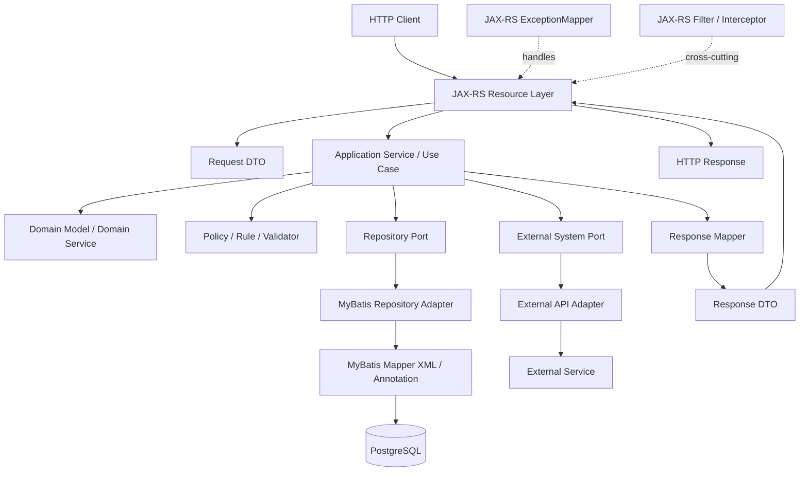

Rule utamanya:

```text id="anrk5e"
HTTP concern berhenti di Resource.
Use case orchestration berada di Application Service.
Business invariant berada di Domain.
Database detail berada di Repository Adapter / MyBatis.
External API detail berada di External Adapter.
Error-to-HTTP mapping berada di ExceptionMapper.
```

---

# 2. Recommended Package Structure

Contoh struktur package yang cukup practical untuk enterprise microservice:

```text id="ybnjeu"
com.company.caseapp
├── api
│   ├── resource
│   │   └── CaseResource.java
│   ├── dto
│   │   ├── SubmitCaseRequest.java
│   │   ├── CaseResponse.java
│   │   └── ApiResponse.java
│   └── mapper
│       └── CaseApiMapper.java
│
├── application
│   ├── service
│   │   └── CaseApplicationService.java
│   ├── command
│   │   └── SubmitCaseCommand.java
│   └── result
│       └── SubmitCaseResult.java
│
├── domain
│   ├── model
│   │   ├── Case.java
│   │   ├── CaseId.java
│   │   └── CaseStatus.java
│   ├── policy
│   │   └── CaseSubmissionPolicy.java
│   └── exception
│       └── InvalidCaseTransitionException.java
│
├── port
│   ├── persistence
│   │   └── CaseRepository.java
│   └── external
│       └── CustomerVerificationGateway.java
│
├── infrastructure
│   ├── persistence
│   │   ├── mybatis
│   │   │   ├── CaseMyBatisMapper.java
│   │   │   └── CaseRepositoryMyBatisAdapter.java
│   │   └── entity
│   │       └── CaseRecord.java
│   └── external
│       └── CustomerVerificationHttpClient.java
│
└── support
    ├── error
    │   ├── DomainExceptionMapper.java
    │   └── ErrorResponse.java
    └── config
        └── JerseyApplication.java
```

Ini bukan struktur absolut. Tapi secara practical, struktur ini membantu memisahkan:

| Package | Isi | Tidak boleh berisi |
|---|---|---|
| `api.resource` | JAX-RS endpoint | SQL, domain transition kompleks, external API parsing |
| `api.dto` | request/response contract | persistence entity, MyBatis annotation |
| `application.service` | orchestration use case | HTTP-specific object seperti `Response`, `UriInfo`, `HttpHeaders` |
| `domain.model` | invariant bisnis | dependency ke Jersey, MyBatis, HTTP client |
| `port` | interface boundary | implementasi vendor/framework |
| `infrastructure` | MyBatis, HTTP client, adapter | business rule utama |
| `support.error` | exception-to-response mapping | use case orchestration |

---

# 3. Practical Layer Responsibility

| Layer | Tanggung jawab | Contoh | Anti-pattern |
|---|---|---|---|
| Resource | HTTP boundary | parse path/query/body, call service, return response | Query DB langsung dari resource |
| Request DTO | API input contract | `SubmitCaseRequest` | Menaruh behavior domain kompleks |
| Application Service | Use case orchestration | submit case, approve case, cancel order | Menjadi God Service berisi semua rule |
| Domain Model | Business invariant | status transition, amount rule, lifecycle rule | Object hanya getter/setter tanpa rule |
| Domain Policy | Rule yang reusable | eligibility, validation, escalation rule | Rule tersebar di SQL dan controller |
| Repository Port | Abstraksi persistence | `CaseRepository` | Interface terlalu generic tanpa kebutuhan |
| MyBatis Adapter | Implementasi persistence | call mapper, convert record/domain | Bocor `ResultMap`/SQL detail ke service |
| External Port | Abstraksi sistem luar | verification, payment, notification | Return DTO vendor langsung ke domain |
| Exception Mapper | Error-to-HTTP mapping | domain error → 400/409/422/500 | `try-catch` berulang di setiap endpoint |
| Filter/Interceptor | Cross-cutting | correlation ID, auth context, audit | Business rule ditempatkan di filter |

---

# 4. Contoh Implementasi Practical

## 4.1 DTO Layer

DTO sebaiknya mewakili **kontrak API**, bukan domain internal.

```java id="7gj1nr"
package com.company.caseapp.api.dto;

import java.math.BigDecimal;

public record SubmitCaseRequest(
    String customerId,
    BigDecimal requestedAmount,
    String productCode
) {}
```

```java id="9twyos"
package com.company.caseapp.api.dto;

public record CaseResponse(
    String caseId,
    String status,
    String customerId,
    String productCode
) {}
```

```java id="jfs7px"
package com.company.caseapp.api.dto;

public record ApiResponse<T>(
    boolean success,
    T data,
    ErrorBody error
) {
    public static <T> ApiResponse<T> ok(T data) {
        return new ApiResponse<>(true, data, null);
    }

    public static <T> ApiResponse<T> failed(ErrorBody error) {
        return new ApiResponse<>(false, null, error);
    }
}
```

Java records cocok untuk immutable data carrier seperti DTO dan value object; Oracle mendokumentasikan record class sebagai bentuk class khusus untuk mendeklarasikan carrier data secara ringkas. ([Oracle Documentation](https://docs.oracle.com/en/java/javase/17/language/records.html?utm_source=chatgpt.com))

---

## 4.2 Resource Layer

Resource hanya mengurus HTTP boundary.

```java id="8avfka"
package com.company.caseapp.api.resource;

import com.company.caseapp.api.dto.ApiResponse;
import com.company.caseapp.api.dto.CaseResponse;
import com.company.caseapp.api.dto.SubmitCaseRequest;
import com.company.caseapp.api.mapper.CaseApiMapper;
import com.company.caseapp.application.command.SubmitCaseCommand;
import com.company.caseapp.application.result.SubmitCaseResult;
import com.company.caseapp.application.service.CaseApplicationService;

import jakarta.inject.Inject;
import jakarta.ws.rs.Consumes;
import jakarta.ws.rs.POST;
import jakarta.ws.rs.Path;
import jakarta.ws.rs.Produces;
import jakarta.ws.rs.core.MediaType;
import jakarta.ws.rs.core.Response;

@Path("/cases")
@Consumes(MediaType.APPLICATION_JSON)
@Produces(MediaType.APPLICATION_JSON)
public class CaseResource {

    private final CaseApplicationService caseService;
    private final CaseApiMapper mapper;

    @Inject
    public CaseResource(CaseApplicationService caseService, CaseApiMapper mapper) {
        this.caseService = caseService;
        this.mapper = mapper;
    }

    @POST
    public Response submit(SubmitCaseRequest request) {
        SubmitCaseCommand command = mapper.toCommand(request);

        SubmitCaseResult result = caseService.submit(command);

        CaseResponse response = mapper.toResponse(result);

        return Response
            .status(Response.Status.CREATED)
            .entity(ApiResponse.ok(response))
            .build();
    }
}
```

Practical rule:

```text id="ldmv0r"
Resource boleh tahu HTTP.
Resource boleh tahu DTO.
Resource boleh tahu application service.
Resource tidak boleh tahu MyBatis mapper XML, SQL, database table, atau external vendor payload.
```

---

## 4.3 API Mapper

Mapper menjaga agar DTO tidak langsung bocor ke application/domain.

```java id="ca0nb4"
package com.company.caseapp.api.mapper;

import com.company.caseapp.api.dto.CaseResponse;
import com.company.caseapp.api.dto.SubmitCaseRequest;
import com.company.caseapp.application.command.SubmitCaseCommand;
import com.company.caseapp.application.result.SubmitCaseResult;

public class CaseApiMapper {

    public SubmitCaseCommand toCommand(SubmitCaseRequest request) {
        return new SubmitCaseCommand(
            request.customerId(),
            request.requestedAmount(),
            request.productCode()
        );
    }

    public CaseResponse toResponse(SubmitCaseResult result) {
        return new CaseResponse(
            result.caseId(),
            result.status(),
            result.customerId(),
            result.productCode()
        );
    }
}
```

Kenapa tidak langsung kirim `SubmitCaseRequest` ke service?

Karena `SubmitCaseRequest` adalah **API contract**. Service sebaiknya menerima **use-case command**, agar ketika API berubah, business orchestration tidak ikut rusak.

---

## 4.4 Application Command dan Result

```java id="36w8q9"
package com.company.caseapp.application.command;

import java.math.BigDecimal;

public record SubmitCaseCommand(
    String customerId,
    BigDecimal requestedAmount,
    String productCode
) {}
```

```java id="vn35sv"
package com.company.caseapp.application.result;

public record SubmitCaseResult(
    String caseId,
    String status,
    String customerId,
    String productCode
) {}
```

Command/result bukan wajib untuk semua endpoint. Tapi untuk use case yang penting, panjang, atau sering berubah, pattern ini membuat boundary lebih stabil.

---

## 4.5 Application Service

Application service melakukan orchestration, bukan menyimpan semua rule.

```java id="cs2u1l"
package com.company.caseapp.application.service;

import com.company.caseapp.application.command.SubmitCaseCommand;
import com.company.caseapp.application.result.SubmitCaseResult;
import com.company.caseapp.domain.model.Case;
import com.company.caseapp.domain.policy.CaseSubmissionPolicy;
import com.company.caseapp.port.external.CustomerVerificationGateway;
import com.company.caseapp.port.persistence.CaseRepository;

public class CaseApplicationService {

    private final CaseRepository caseRepository;
    private final CustomerVerificationGateway customerVerificationGateway;
    private final CaseSubmissionPolicy submissionPolicy;

    public CaseApplicationService(
        CaseRepository caseRepository,
        CustomerVerificationGateway customerVerificationGateway,
        CaseSubmissionPolicy submissionPolicy
    ) {
        this.caseRepository = caseRepository;
        this.customerVerificationGateway = customerVerificationGateway;
        this.submissionPolicy = submissionPolicy;
    }

    public SubmitCaseResult submit(SubmitCaseCommand command) {
        boolean customerVerified =
            customerVerificationGateway.isVerified(command.customerId());

        submissionPolicy.assertCanSubmit(
            command.customerId(),
            command.requestedAmount(),
            command.productCode(),
            customerVerified
        );

        Case newCase = Case.createSubmitted(
            command.customerId(),
            command.requestedAmount(),
            command.productCode()
        );

        Case saved = caseRepository.save(newCase);

        return new SubmitCaseResult(
            saved.id().value(),
            saved.status().name(),
            saved.customerId(),
            saved.productCode()
        );
    }
}
```

Application service boleh:

- mulai use case;
- call repository;
- call external gateway;
- call domain policy;
- manage transaction boundary;
- publish event;
- compose result.

Application service tidak ideal untuk:

- detail SQL;
- HTTP response code;
- parsing JSON;
- vendor-specific payload;
- semua rule domain secara inline.

---

## 4.6 Domain Model

Domain model menyimpan invariant inti.

```java id="s2gt3i"
package com.company.caseapp.domain.model;

import java.math.BigDecimal;
import java.util.UUID;

public final class Case {

    private final CaseId id;
    private final String customerId;
    private final BigDecimal requestedAmount;
    private final String productCode;
    private final CaseStatus status;

    private Case(
        CaseId id,
        String customerId,
        BigDecimal requestedAmount,
        String productCode,
        CaseStatus status
    ) {
        if (customerId == null || customerId.isBlank()) {
            throw new IllegalArgumentException("customerId is required");
        }
        if (requestedAmount == null || requestedAmount.signum() <= 0) {
            throw new IllegalArgumentException("requestedAmount must be positive");
        }
        if (productCode == null || productCode.isBlank()) {
            throw new IllegalArgumentException("productCode is required");
        }

        this.id = id;
        this.customerId = customerId;
        this.requestedAmount = requestedAmount;
        this.productCode = productCode;
        this.status = status;
    }

    public static Case createSubmitted(
        String customerId,
        BigDecimal requestedAmount,
        String productCode
    ) {
        return new Case(
            new CaseId(UUID.randomUUID().toString()),
            customerId,
            requestedAmount,
            productCode,
            CaseStatus.SUBMITTED
        );
    }

    public Case approve() {
        if (status != CaseStatus.SUBMITTED) {
            throw new InvalidCaseTransitionException(
                "Only SUBMITTED case can be approved"
            );
        }

        return new Case(
            id,
            customerId,
            requestedAmount,
            productCode,
            CaseStatus.APPROVED
        );
    }

    public CaseId id() {
        return id;
    }

    public String customerId() {
        return customerId;
    }

    public BigDecimal requestedAmount() {
        return requestedAmount;
    }

    public String productCode() {
        return productCode;
    }

    public CaseStatus status() {
        return status;
    }
}
```

```java id="j8us4p"
package com.company.caseapp.domain.model;

public record CaseId(String value) {
    public CaseId {
        if (value == null || value.isBlank()) {
            throw new IllegalArgumentException("caseId is required");
        }
    }
}
```

```java id="85d5nr"
package com.company.caseapp.domain.model;

public enum CaseStatus {
    SUBMITTED,
    APPROVED,
    REJECTED,
    CANCELLED
}
```

Practical rule:

```text id="v9n2ye"
Kalau rule menentukan apakah object boleh berubah state,
letakkan sedekat mungkin dengan domain object atau domain policy.
```

---

## 4.7 Domain Policy

Policy cocok untuk rule yang:

- reusable;
- butuh beberapa input;
- tidak nyaman ditempatkan di entity;
- sering berubah karena business/regulatory requirement.

```java id="dzw413"
package com.company.caseapp.domain.policy;

import java.math.BigDecimal;

public class CaseSubmissionPolicy {

    private static final BigDecimal MAX_REQUEST_AMOUNT =
        new BigDecimal("100000000");

    public void assertCanSubmit(
        String customerId,
        BigDecimal requestedAmount,
        String productCode,
        boolean customerVerified
    ) {
        if (!customerVerified) {
            throw new CaseSubmissionRejectedException(
                "Customer is not verified"
            );
        }

        if (requestedAmount.compareTo(MAX_REQUEST_AMOUNT) > 0) {
            throw new CaseSubmissionRejectedException(
                "Requested amount exceeds maximum limit"
            );
        }

        if (productCode == null || productCode.isBlank()) {
            throw new CaseSubmissionRejectedException(
                "Product code is required"
            );
        }
    }
}
```

Practical decision:

| Rule type | Taruh di mana |
|---|---|
| Object selalu tidak boleh invalid | Constructor / factory domain object |
| State transition | Domain object / domain service |
| Rule eligibility use-case | Domain policy |
| Rule yang butuh external call | Application service orchestrates, policy decides |
| Rule presentasi API | DTO validation / resource boundary |
| Rule database integrity | DB constraint, tapi jangan hanya di DB |

---

## 4.8 Repository Port

```java id="ki591b"
package com.company.caseapp.port.persistence;

import com.company.caseapp.domain.model.Case;
import com.company.caseapp.domain.model.CaseId;

import java.util.Optional;

public interface CaseRepository {

    Case save(Case caseData);

    Optional<Case> findById(CaseId caseId);
}
```

Interface ini mewakili kebutuhan domain/application, bukan bentuk database.

Jangan mulai dari:

```java id="4qaoa7"
// Hindari jika belum benar-benar perlu
public interface GenericRepository<ID, ENTITY> {
    ENTITY save(ENTITY entity);
    ENTITY update(ENTITY entity);
    Optional<ENTITY> findById(ID id);
    void delete(ID id);
}
```

Generic repository terlihat rapi, tetapi dalam MyBatis sering kurang cocok karena SQL tiap aggregate biasanya spesifik, resultMap spesifik, join spesifik, dan performance tuning spesifik. MyBatis memang memberi mekanisme configuration, mapper, type aliases, type handlers, dan mapping detail yang sangat SQL-aware. ([MyBatis](https://mybatis.org/mybatis-3/configuration.html?utm_source=chatgpt.com))

---

## 4.9 MyBatis Adapter

```java id="snfz6h"
package com.company.caseapp.infrastructure.persistence.mybatis;

import com.company.caseapp.infrastructure.persistence.entity.CaseRecord;
import org.apache.ibatis.annotations.Mapper;
import org.apache.ibatis.annotations.Param;

@Mapper
public interface CaseMyBatisMapper {

    int insert(CaseRecord record);

    CaseRecord findById(@Param("caseId") String caseId);
}
```

```java id="1ab2ue"
package com.company.caseapp.infrastructure.persistence.entity;

import java.math.BigDecimal;

public record CaseRecord(
    String caseId,
    String customerId,
    BigDecimal requestedAmount,
    String productCode,
    String status
) {}
```

```java id="59kwrg"
package com.company.caseapp.infrastructure.persistence.mybatis;

import com.company.caseapp.domain.model.Case;
import com.company.caseapp.domain.model.CaseId;
import com.company.caseapp.port.persistence.CaseRepository;

import java.util.Optional;

public class CaseRepositoryMyBatisAdapter implements CaseRepository {

    private final CaseMyBatisMapper mapper;
    private final CasePersistenceMapper persistenceMapper;

    public CaseRepositoryMyBatisAdapter(
        CaseMyBatisMapper mapper,
        CasePersistenceMapper persistenceMapper
    ) {
        this.mapper = mapper;
        this.persistenceMapper = persistenceMapper;
    }

    @Override
    public Case save(Case caseData) {
        mapper.insert(persistenceMapper.toRecord(caseData));
        return caseData;
    }

    @Override
    public Optional<Case> findById(CaseId caseId) {
        return Optional.ofNullable(mapper.findById(caseId.value()))
            .map(persistenceMapper::toDomain);
    }
}
```

Practical rule:

```text id="x5ylvz"
MyBatis mapper interface dan record persistence adalah infrastructure detail.
Application service sebaiknya hanya tahu CaseRepository.
```

---

## 4.10 External Gateway Port

```java id="3p62zp"
package com.company.caseapp.port.external;

public interface CustomerVerificationGateway {

    boolean isVerified(String customerId);
}
```

```java id="j0j21m"
package com.company.caseapp.infrastructure.external;

import com.company.caseapp.port.external.CustomerVerificationGateway;

public class CustomerVerificationHttpClient implements CustomerVerificationGateway {

    private final ExternalCustomerClient client;

    public CustomerVerificationHttpClient(ExternalCustomerClient client) {
        this.client = client;
    }

    @Override
    public boolean isVerified(String customerId) {
        ExternalCustomerResponse response = client.getCustomer(customerId);
        return "VERIFIED".equals(response.verificationStatus());
    }
}
```

Practical rule:

```text id="wv0owh"
Vendor response DTO tidak boleh menyebar ke domain/application layer.
Ubah response vendor menjadi konsep internal secepat mungkin di adapter.
```

---

# 5. Exception Mapping

Jangan melakukan `try-catch` yang sama di setiap resource.

```java id="y5v8x5"
package com.company.caseapp.support.error;

import com.company.caseapp.api.dto.ApiResponse;
import jakarta.ws.rs.core.Response;
import jakarta.ws.rs.ext.ExceptionMapper;
import jakarta.ws.rs.ext.Provider;

@Provider
public class DomainExceptionMapper implements ExceptionMapper<DomainException> {

    @Override
    public Response toResponse(DomainException exception) {
        ErrorBody error = new ErrorBody(
            exception.errorCode(),
            exception.getMessage()
        );

        return Response
            .status(Response.Status.UNPROCESSABLE_ENTITY)
            .entity(ApiResponse.failed(error))
            .build();
    }
}
```

JAX-RS provider adalah extension interface untuk memperluas runtime, termasuk mapper, filter, dan interceptor; karena itu exception mapping lebih cocok menjadi provider daripada diulang di resource. ([Jakarta EE](https://jakarta.ee/specifications/restful-ws/4.0/jakarta-restful-ws-spec-4.0.html?utm_source=chatgpt.com))

---

# 6. Practical Request Flow

Contoh request:

```http id="4gz6dh"
POST /cases
Content-Type: application/json

{
  "customerId": "CUST-001",
  "requestedAmount": 5000000,
  "productCode": "LOAN_BASIC"
}
```

Flow yang sehat:

```text id="u53xaz"
1. CaseResource menerima SubmitCaseRequest
2. CaseApiMapper mengubah request DTO menjadi SubmitCaseCommand
3. CaseApplicationService menjalankan use case submit
4. CustomerVerificationGateway mengecek customer
5. CaseSubmissionPolicy mengevaluasi eligibility
6. Case domain object dibuat dalam status SUBMITTED
7. CaseRepository menyimpan melalui MyBatis adapter
8. Application service mengembalikan SubmitCaseResult
9. Resource mengubah result menjadi CaseResponse
10. Response HTTP 201 dikembalikan
```

Yang tidak sehat:

```text id="x2c8as"
1. Resource menerima request
2. Resource query MyBatis langsung
3. Resource call external API langsung
4. Resource melakukan semua validation
5. Resource menentukan status transition
6. Resource build SQL-related response
```

---

# 7. Design Heuristics untuk Senior Engineer

## 7.1 Resource harus tipis, tapi tidak kosong total

Resource boleh:

- validate HTTP-specific concern;
- baca header/path/query;
- pilih status code;
- call application service;
- convert command/response.

Resource jangan:

- menjalankan SQL;
- menentukan lifecycle domain;
- parse vendor response;
- menjalankan retry external system;
- menyimpan transaction logic kompleks.

---

## 7.2 Service boleh orchestration, tapi jangan jadi dumping ground

Application service bagus untuk:

```text id="1hknj4"
load data -> check policy -> call domain behavior -> save -> publish event/result
```

Application service buruk jika menjadi:

```text id="37spch"
500-line method berisi validation, SQL decision, HTTP mapping, JSON parsing, vendor mapping, audit logic, retry, dan state machine
```

---

## 7.3 Domain harus menjaga invariant

Kalau `Case` tidak boleh approve dari status `CANCELLED`, rule itu jangan hanya ada di UI, SQL, atau resource. Letakkan di domain method seperti:

```java id="jqduwg"
public Case approve() {
    if (status != CaseStatus.SUBMITTED) {
        throw new InvalidCaseTransitionException(
            "Only SUBMITTED case can be approved"
        );
    }

    return new Case(id, customerId, requestedAmount, productCode, CaseStatus.APPROVED);
}
```

---

## 7.4 Infrastructure harus mudah diganti

Kalau besok persistence berubah dari MyBatis ke jOOQ/JPA/plain JDBC, application service idealnya tidak berubah banyak.

Kalau besok customer verification pindah dari REST ke message-based API, domain juga tidak perlu berubah.

Boundary yang benar:

```text id="7vlwmi"
Application Service -> Port Interface -> Infrastructure Adapter
```

Bukan:

```text id="52s11f"
Application Service -> Vendor SDK / MyBatis Mapper / HTTP Client detail
```

---

# 8. Common Failure Modes

| Failure | Gejala | Penyebab | Perbaikan |
|---|---|---|---|
| Fat Resource | Resource 300-1000 baris | HTTP + business + DB campur | Extract application service |
| Anemic Domain ekstrem | Semua logic ada di service | Domain hanya getter/setter | Pindahkan invariant dan transition ke domain |
| God Service | Satu service mengurus semua use case | Boundary use case tidak jelas | Split per use case/application service |
| Leaky MyBatis | Service tahu mapper XML/resultMap/table | Persistence detail bocor | Tambahkan repository port + adapter |
| Vendor model leak | Domain pakai DTO external API | Adapter tidak mapping ke internal model | Tambahkan gateway port |
| Exception tersebar | Banyak `try-catch` sama di resource | Tidak ada `ExceptionMapper` | Buat mapper per kategori error |
| Transaction kabur | Save partial, external call gagal | Boundary tidak didefinisikan | Tentukan unit-of-work dan compensation |
| Over-abstraction | Banyak interface tanpa variasi | Pattern dipakai terlalu dini | Interface hanya untuk boundary nyata |
| Under-abstraction | Semua concrete class dipanggil langsung | Sulit testing dan ganti implementasi | Pakai port untuk persistence/external |
| DTO-domain coupling | API change merusak domain | DTO dipakai sebagai domain object | Pisahkan DTO, command, domain |

---

# 9. Practical Checklist Saat Review Code

Gunakan checklist ini saat membaca codebase baru.

## Resource Layer

- Apakah resource hanya menangani HTTP concern?
- Apakah ada SQL atau MyBatis mapper langsung di resource?
- Apakah response code konsisten?
- Apakah exception mapping diulang-ulang?
- Apakah DTO API dipisah dari domain/entity?

## Application Service

- Apakah satu method merepresentasikan satu use case?
- Apakah orchestration terbaca jelas?
- Apakah external call melalui port/interface?
- Apakah persistence melalui repository port?
- Apakah transaction boundary jelas?

## Domain

- Apakah invariant utama dilindungi?
- Apakah state transition punya method eksplisit?
- Apakah object bisa dibuat dalam kondisi invalid?
- Apakah domain bebas dari framework dependency?

## Persistence

- Apakah MyBatis mapper hanya ada di infrastructure?
- Apakah SQL-specific model tidak bocor ke service?
- Apakah mapping domain ↔ record jelas?
- Apakah query kompleks punya nama yang domain-readable?

## External Integration

- Apakah vendor DTO berhenti di adapter?
- Apakah timeout/retry/error mapping jelas?
- Apakah external failure diterjemahkan ke error internal?
- Apakah application service tidak tahu detail endpoint vendor?

---

# 10. Mini Exercise Practical

Ambil satu endpoint di project nyata, lalu klasifikasikan baris kodenya:

```text id="eysd8x"
[HTTP]        path/query/header/body/status code
[Mapping]     DTO <-> command/result/domain
[UseCase]     orchestration langkah bisnis
[Domain]      invariant/state transition
[Persistence] SQL/MyBatis/table/resultMap
[External]    vendor API/client/payload
[Error]       exception/error response
[CrossCutting] logging/audit/correlation/auth
```

Kalau dalam satu resource method ada lebih dari 4 kategori besar, kemungkinan resource tersebut mulai terlalu gemuk.

---

# 11. Ringkasan Seri 1

OOP layering yang sehat untuk Jersey/JAX-RS microservice:

```text id="p0r3zo"
Resource = HTTP boundary
DTO = API contract
Mapper = translation boundary
Application Service = use case orchestration
Domain = invariant + lifecycle behavior
Policy = reusable business rule
Repository Port = persistence contract
MyBatis Adapter = persistence implementation
External Gateway = external system contract
ExceptionMapper = error-to-HTTP boundary
Filter/Interceptor = cross-cutting concern
```

Kesimpulan practical:

- Jangan mulai dari framework; mulai dari use case dan boundary.
- Jangan biarkan resource menjadi tempat semua logic.
- Jangan biarkan domain tahu HTTP, MyBatis, atau external vendor.
- Jangan memaksakan generic repository kalau query domain sangat spesifik.
- Gunakan interface untuk boundary yang memang punya alasan: persistence, external system, asynchronous publisher, policy variation.
- Gunakan DTO, command, result, dan domain model untuk menjaga perubahan API tidak merusak business core.

---

## Status

**Seri 1/12 selesai.**

Seri berikutnya yang direkomendasikan: **Seri 2/12 - Generics untuk API Response, DTO, Mapper, Pagination, dan Result Pattern dalam Jersey/JAX-RS Microservice.**

---

**Sources:**

- [Jakarta RESTful Web Services](https://jakarta.ee/specifications/restful-ws/4.0/jakarta-restful-ws-spec-4.0.html?utm_source=chatgpt.com)
- [Jersey 2.47 User Guide](https://eclipse-ee4j.github.io/jersey.github.io/documentation/latest/user-guide.html?utm_source=chatgpt.com)
- [6 Record Classes - Java](https://docs.oracle.com/en/java/javase/17/language/records.html?utm_source=chatgpt.com)
- [MyBatis 3 | Configuration](https://mybatis.org/mybatis-3/configuration.html?utm_source=chatgpt.com)

## Response:
7/15/2026, 1:23:52 AM

Saya lanjut ke **Seri 2/12: Generics untuk API Response, DTO, Mapper, Pagination, dan Result Pattern**. Fokusnya implementasi reusable yang tetap type-safe, bukan abstraksi generik yang malah menyulitkan debugging.

# Seri 2/12 - Generics untuk API Response, DTO, Mapper, Pagination, dan Result Pattern

## Tujuan Seri Ini

Seri ini fokus pada penggunaan **Java Generics** yang benar-benar practical di microservice **Java 17+ / Jersey / JAX-RS / MyBatis / PostgreSQL**.

Targetnya bukan “semua harus generic”, tetapi:

```text id="85rumh"
Gunakan generics untuk struktur yang sama tetapi tipe datanya berbeda.
Jangan gunakan generics untuk menyembunyikan perbedaan domain yang sebenarnya penting.
```

Generics di Java memungkinkan class, interface, dan method menerima **type parameter**, sehingga kode reusable tetap type-safe. Oracle juga menjelaskan bahwa Java generics memakai **type erasure**, artinya generic type sebagian besar dihapus saat compile-time dan bytecode runtime tetap memakai class/interface biasa; ini penting saat berurusan dengan JSON serialization, JAX-RS response entity, mapper, dan reflection. ([Dev.java](https://dev.java/learn/generics/?utm_source=chatgpt.com))

---

# 1. Mental Model

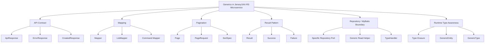

---

# 2. Practical Decomposition Map

| Area | Practical skill | Contoh penggunaan | Kapan dipakai | Kapan dihindari |
|---|---|---|---|---|
| API response | `ApiResponse<T>` | response sukses generic | Semua endpoint punya envelope seragam | API publik yang butuh raw contract berbeda per endpoint |
| Error detail | `ErrorResponse<TDetail>` | validation error, field error, domain error | Error punya detail bervariasi | Error cukup string/code sederhana |
| Pagination | `Page<T>` | list cases, orders, users | Query list dengan metadata total/limit/offset | Streaming besar atau cursor-based API yang berbeda |
| Mapping | `Mapper<S,T>` | entity → DTO, request → command | Mapping sederhana dan reusable | Mapping kompleks dengan dependency/context banyak |
| List mapping | `ListMapper<S,T>` | `List<Entity>` → `List<Response>` | Transformasi collection standar | Per item butuh external call/transaction |
| Result pattern | `Result<T,E>` | service return success/failure eksplisit | Domain/use case yang failure-nya expected | Exception lebih cocok untuk bug/infrastructure failure |
| Bounded generic | `<T extends Identifiable<ID>>` | generic ID extraction | Type punya kontrak jelas | Bound dipaksakan hanya demi reuse |
| Wildcard | `List<? extends Event>` | read-only producer | Membaca kumpulan subtype | Perlu add item ke collection |
| Lower bound | `Consumer<? super DomainEvent>` | event sink | Menulis/mengonsumsi subtype | Membaca subtype spesifik dari collection |
| Runtime type | `GenericEntity<List<T>>` | preserve generic entity di JAX-RS response | Response entity butuh generic metadata | Return concrete DTO biasa |

---

# 3. API Response Generic

## 3.1 Basic `ApiResponse<T>`

Pola umum:

```java id="h40ej5"
package com.company.common.api;

public record ApiResponse<T>(
    boolean success,
    T data,
    ErrorResponse<?> error
) {
    public static <T> ApiResponse<T> ok(T data) {
        return new ApiResponse<>(true, data, null);
    }

    public static ApiResponse<Void> ok() {
        return new ApiResponse<>(true, null, null);
    }

    public static ApiResponse<Void> failed(ErrorResponse<?> error) {
        return new ApiResponse<>(false, null, error);
    }
}
```

Contoh pemakaian di resource:

```java id="h4376a"
@GET
@Path("/{caseId}")
public Response findById(@PathParam("caseId") String caseId) {
    CaseResponse response = caseService.findById(caseId);
    return Response.ok(ApiResponse.ok(response)).build();
}
```

Output:

```json id="mbe4l0"
{
  "success": true,
  "data": {
    "caseId": "CASE-001",
    "status": "SUBMITTED"
  },
  "error": null
}
```

Practical note:

```text id="9sxzh2"
ApiResponse<T> cocok kalau organisasi ingin envelope response seragam.
Kalau API contract sudah mengikuti RFC 7807 / Problem Details atau standar lain, jangan memaksakan envelope tambahan tanpa alasan.
```

---

## 3.2 Error Response dengan Generic Detail

```java id="bqcmee"
package com.company.common.api;

public record ErrorResponse<TDetail>(
    String code,
    String message,
    TDetail detail
) {}
```

Field validation detail:

```java id="hfwfsz"
public record FieldError(
    String field,
    String reason
) {}
```

Pemakaian:

```java id="j5zl9z"
List<FieldError> fieldErrors = List.of(
    new FieldError("customerId", "must not be blank"),
    new FieldError("requestedAmount", "must be positive")
);

ErrorResponse<List<FieldError>> error = new ErrorResponse<>(
    "VALIDATION_ERROR",
    "Request validation failed",
    fieldErrors
);
```

Response:

```json id="y68dip"
{
  "success": false,
  "data": null,
  "error": {
    "code": "VALIDATION_ERROR",
    "message": "Request validation failed",
    "detail": [
      {
        "field": "customerId",
        "reason": "must not be blank"
      },
      {
        "field": "requestedAmount",
        "reason": "must be positive"
      }
    ]
  }
}
```

Manfaatnya:

| Tanpa generic | Dengan generic |
|---|---|
| `Object detail` tanpa kontrak | `TDetail` memberi kontrak compile-time |
| Cast manual | Lebih type-safe |
| Error detail tidak terdokumentasi jelas | Lebih mudah dihubungkan ke OpenAPI/schema |
| Risiko runtime mismatch | Mismatch lebih cepat terlihat |

---

# 4. DTO Generic: Hati-Hati Jangan Berlebihan

Java record cocok untuk DTO/value carrier karena record adalah class khusus untuk membawa fixed set of values secara ringkas; Java 17 API juga mendeskripsikan `Record` sebagai carrier yang shallowly immutable. ([Oracle Documentation](https://docs.oracle.com/en/java/javase/17/language/records.html?utm_source=chatgpt.com))

Contoh DTO biasa:

```java id="kcrbrk"
public record CaseResponse(
    String caseId,
    String status,
    String customerId
) {}
```

Contoh DTO generic yang masih masuk akal:

```java id="1p62pi"
public record LookupItem<TValue>(
    TValue value,
    String label
) {}
```

Pemakaian:

```java id="ktc1lx"
LookupItem<String> status = new LookupItem<>("SUBMITTED", "Submitted");
LookupItem<Integer> priority = new LookupItem<>(1, "High");
```

Namun hindari DTO seperti ini:

```java id="029793"
// Terlalu abstrak dan miskin domain meaning
public record GenericDto<A, B, C, D>(
    A field1,
    B field2,
    C field3,
    D field4
) {}
```

Kenapa buruk?

```text id="90yefc"
Generic DTO yang terlalu abstrak menghilangkan makna domain.
API contract harus jelas dibaca oleh manusia, bukan hanya lolos compile.
```

---

# 5. Generic Mapper Pattern

## 5.1 Mapper Interface

```java id="6o4wmh"
package com.company.common.mapping;

public interface Mapper<S, T> {
    T map(S source);
}
```

Contoh implementasi:

```java id="iffi3g"
package com.company.caseapp.api.mapper;

import com.company.common.mapping.Mapper;
import com.company.caseapp.application.result.CaseDetailResult;
import com.company.caseapp.api.dto.CaseResponse;

public class CaseResponseMapper
    implements Mapper<CaseDetailResult, CaseResponse> {

    @Override
    public CaseResponse map(CaseDetailResult source) {
        return new CaseResponse(
            source.caseId(),
            source.status(),
            source.customerId()
        );
    }
}
```

Pemakaian:

```java id="h3797g"
CaseResponse response = caseResponseMapper.map(result);
```

---

## 5.2 Default Method untuk List Mapping

```java id="7fv7l9"
package com.company.common.mapping;

import java.util.List;

public interface Mapper<S, T> {

    T map(S source);

    default List<T> mapList(List<S> sources) {
        if (sources == null || sources.isEmpty()) {
            return List.of();
        }

        return sources.stream()
            .map(this::map)
            .toList();
    }
}
```

Pemakaian:

```java id="fbbjli"
List<CaseResponse> responses = caseResponseMapper.mapList(results);
```

Practical caveat:

```text id="m2jy8d"
mapList cocok untuk pure in-memory transformation.
Jangan pakai mapList kalau setiap item perlu query DB, call external API, atau membuka transaction sendiri.
```

---

## 5.3 Mapper dengan Context

Kadang mapping butuh context, misalnya locale, timezone, permission, atau base URL.

```java id="frtke7"
public interface ContextualMapper<S, T, C> {
    T map(S source, C context);
}
```

Context:

```java id="lzhuzu"
public record MappingContext(
    String locale,
    String timezone,
    boolean includeSensitiveData
) {}
```

Implementasi:

```java id="hjjdrk"
public class CaseDetailMapper
    implements ContextualMapper<CaseDetailResult, CaseDetailResponse, MappingContext> {

    @Override
    public CaseDetailResponse map(
        CaseDetailResult source,
        MappingContext context
    ) {
        return new CaseDetailResponse(
            source.caseId(),
            source.status(),
            context.includeSensitiveData() ? source.internalNote() : null
        );
    }
}
```

Gunakan mapper context kalau memang mapping butuh informasi runtime. Jangan membuat mapper mengambil `HttpServletRequest`, `UriInfo`, atau dependency terlalu banyak jika bisa dihindari.

---

# 6. Pagination dengan `Page<T>`

## 6.1 Page Request

```java id="vpm485"
package com.company.common.pagination;

public record PageRequest(
    int limit,
    int offset
) {
    private static final int DEFAULT_LIMIT = 20;
    private static final int MAX_LIMIT = 100;

    public PageRequest {
        if (limit <= 0) {
            limit = DEFAULT_LIMIT;
        }

        if (limit > MAX_LIMIT) {
            limit = MAX_LIMIT;
        }

        if (offset < 0) {
            offset = 0;
        }
    }
}
```

## 6.2 Page Response

```java id="sm8ohv"
package com.company.common.pagination;

import java.util.List;

public record Page<T>(
    List<T> items,
    int limit,
    int offset,
    long total
) {
    public Page {
        items = items == null ? List.of() : List.copyOf(items);
    }

    public boolean hasNext() {
        return offset + items.size() < total;
    }

    public boolean hasPrevious() {
        return offset > 0;
    }
}
```

## 6.3 Resource Usage

```java id="4xu6bl"
@GET
public Response searchCases(
    @QueryParam("status") String status,
    @QueryParam("limit") @DefaultValue("20") int limit,
    @QueryParam("offset") @DefaultValue("0") int offset
) {
    PageRequest pageRequest = new PageRequest(limit, offset);

    Page<CaseResponse> page = caseService.search(status, pageRequest);

    return Response.ok(ApiResponse.ok(page)).build();
}
```

Output:

```json id="bk7l62"
{
  "success": true,
  "data": {
    "items": [
      {
        "caseId": "CASE-001",
        "status": "SUBMITTED"
      }
    ],
    "limit": 20,
    "offset": 0,
    "total": 134
  },
  "error": null
}
```

---

## 6.4 Repository Port untuk Pagination

```java id="7jdo3w"
public interface CaseRepository {

    Page<Case> search(
        CaseSearchCriteria criteria,
        PageRequest pageRequest
    );
}
```

Criteria:

```java id="hxi8eq"
public record CaseSearchCriteria(
    String status,
    String customerId,
    String productCode
) {}
```

MyBatis adapter:

```java id="2opvg2"
public class CaseRepositoryMyBatisAdapter implements CaseRepository {

    private final CaseMyBatisMapper mapper;
    private final CasePersistenceMapper persistenceMapper;

    @Override
    public Page<Case> search(
        CaseSearchCriteria criteria,
        PageRequest pageRequest
    ) {
        List<CaseRecord> records = mapper.search(
            criteria,
            pageRequest.limit(),
            pageRequest.offset()
        );

        long total = mapper.count(criteria);

        List<Case> cases = records.stream()
            .map(persistenceMapper::toDomain)
            .toList();

        return new Page<>(
            cases,
            pageRequest.limit(),
            pageRequest.offset(),
            total
        );
    }
}
```

MyBatis mapper:

```java id="n48uvz"
public interface CaseMyBatisMapper {

    List<CaseRecord> search(
        @Param("criteria") CaseSearchCriteria criteria,
        @Param("limit") int limit,
        @Param("offset") int offset
    );

    long count(@Param("criteria") CaseSearchCriteria criteria);
}
```

---

## 6.5 Offset vs Cursor

| Pattern | Cocok untuk | Kelebihan | Risiko |
|---|---|---|---|
| Offset pagination | Admin table, search result, backoffice UI | Mudah dipahami, mudah implementasi | Lambat untuk offset besar, data bisa bergeser |
| Cursor pagination | Feed, event list, audit trail, high-volume data | Lebih stabil untuk data besar | Contract lebih kompleks |
| Keyset pagination | Data ordered by indexed column | Performa lebih baik | Tidak cocok untuk arbitrary sorting |
| Streaming | Export/report besar | Memory lebih hemat | Response lifecycle lebih kompleks |

Untuk onboarding cepat, mulai dari `Page<T>` offset dulu. Untuk table besar seperti audit/event/log, segera evaluasi cursor/keyset.

---

# 7. Result Pattern dengan Generics

## 7.1 Kenapa Perlu Result Pattern?

Exception cocok untuk error yang exceptional: bug, dependency failure, invariant violation serius, atau kondisi yang memang ingin diputus sebagai exception.

Namun untuk failure yang expected, misalnya:

- customer tidak eligible;
- case tidak boleh di-approve;
- duplicate request;
- validation bisnis gagal;
- external verification memberi status rejected;

`Result<T,E>` bisa membuat alur lebih eksplisit.

Java `Optional` sendiri didesain terutama sebagai return type untuk merepresentasikan “no result” ketika `null` rawan error, tetapi Optional tidak membawa alasan kegagalan; untuk failure yang perlu reason/code, gunakan result object sendiri. ([Oracle Documentation](https://docs.oracle.com/en/java/javase/17/docs/api/java.base/java/util/Optional.html?utm_source=chatgpt.com))

---

## 7.2 Simple Result

```java id="wjxok4"
package com.company.common.result;

public sealed interface Result<T, E>
    permits Result.Success, Result.Failure {

    boolean isSuccess();

    record Success<T, E>(T value) implements Result<T, E> {
        @Override
        public boolean isSuccess() {
            return true;
        }
    }

    record Failure<T, E>(E error) implements Result<T, E> {
        @Override
        public boolean isSuccess() {
            return false;
        }
    }

    static <T, E> Result<T, E> success(T value) {
        return new Success<>(value);
    }

    static <T, E> Result<T, E> failure(E error) {
        return new Failure<>(error);
    }
}
```

Pemakaian:

```java id="0gp6p6"
Result<SubmitCaseResult, BusinessError> result =
    caseService.submit(command);
```

Handling:

```java id="kejn62"
if (result instanceof Result.Success<SubmitCaseResult, BusinessError> success) {
    return Response.status(Response.Status.CREATED)
        .entity(ApiResponse.ok(success.value()))
        .build();
}

if (result instanceof Result.Failure<SubmitCaseResult, BusinessError> failure) {
    return Response.status(Response.Status.UNPROCESSABLE_ENTITY)
        .entity(ApiResponse.failed(
            new ErrorResponse<>(
                failure.error().code(),
                failure.error().message(),
                failure.error()
            )
        ))
        .build();
}

throw new IllegalStateException("Unknown result type");
```

Practical note:

```text id="e2rg8t"
Result<T,E> berguna jika failure adalah bagian normal dari flow.
ExceptionMapper lebih cocok jika domain memilih throw exception untuk invalid operation.
Jangan campur keduanya tanpa policy yang jelas.
```

---

## 7.3 Business Error

```java id="dftr6z"
public record BusinessError(
    String code,
    String message,
    String field
) {
    public static BusinessError customerNotVerified() {
        return new BusinessError(
            "CUSTOMER_NOT_VERIFIED",
            "Customer is not verified",
            "customerId"
        );
    }

    public static BusinessError amountExceedsLimit() {
        return new BusinessError(
            "AMOUNT_EXCEEDS_LIMIT",
            "Requested amount exceeds allowed limit",
            "requestedAmount"
        );
    }
}
```

Service:

```java id="iw7uiv"
public Result<SubmitCaseResult, BusinessError> submit(
    SubmitCaseCommand command
) {
    if (!customerVerificationGateway.isVerified(command.customerId())) {
        return Result.failure(BusinessError.customerNotVerified());
    }

    if (command.requestedAmount().compareTo(MAX_AMOUNT) > 0) {
        return Result.failure(BusinessError.amountExceedsLimit());
    }

    Case newCase = Case.createSubmitted(
        command.customerId(),
        command.requestedAmount(),
        command.productCode()
    );

    Case saved = caseRepository.save(newCase);

    return Result.success(new SubmitCaseResult(
        saved.id().value(),
        saved.status().name(),
        saved.customerId(),
        saved.productCode()
    ));
}
```

---

## 7.4 Kapan Result, Kapan Exception?

| Kondisi | Gunakan Result | Gunakan Exception |
|---|---:|---:|
| Business rejection expected | Ya | Bisa, tapi harus konsisten |
| Input invalid dari client | Bisa | Ya, umum dengan validation/mapper |
| Entity not found | Bisa | Bisa |
| Database down | Tidak | Ya |
| Timeout external system | Biasanya tidak | Ya, lalu map ke 502/503/504 |
| Programming bug | Tidak | Ya |
| State transition invalid | Bisa | Ya, jika dianggap invariant violation |
| Validation banyak field | Ya | Bisa dengan validation exception |

Rekomendasi practical:

```text id="bvyz36"
Untuk project enterprise, pilih satu style utama:
1. exception-driven domain + centralized ExceptionMapper, atau
2. Result-driven application service + explicit response mapping.

Jangan membuat sebagian endpoint pakai exception, sebagian Result, sebagian return null, tanpa convention.
```

---

# 8. Bounded Generics

Oracle mendokumentasikan bounded type parameter dengan syntax seperti `<T extends SomeType>`, dan `extends` di sini berlaku umum untuk class maupun interface. ([Oracle Documentation](https://docs.oracle.com/javase/tutorial/java/generics/bounded.html?utm_source=chatgpt.com))

## 8.1 Identifiable Contract

```java id="y6izfy"
public interface Identifiable<ID> {
    ID id();
}
```

Domain:

```java id="eumz92"
public record CaseId(String value) {}

public final class Case implements Identifiable<CaseId> {
    private final CaseId id;

    @Override
    public CaseId id() {
        return id;
    }
}
```

Generic helper:

```java id="fyvw1c"
public final class EntityUtils {

    private EntityUtils() {}

    public static <ID, T extends Identifiable<ID>> List<ID> extractIds(
        List<T> entities
    ) {
        return entities.stream()
            .map(Identifiable::id)
            .toList();
    }
}
```

Pemakaian:

```java id="s4r1lp"
List<CaseId> caseIds = EntityUtils.extractIds(cases);
```

---

## 8.2 Bounded Generic untuk Enum

```java id="8cjhoe"
public final class EnumParser {

    private EnumParser() {}

    public static <E extends Enum<E>> E parseEnum(
        Class<E> enumType,
        String value
    ) {
        if (value == null || value.isBlank()) {
            throw new IllegalArgumentException("enum value is required");
        }

        return Enum.valueOf(enumType, value.trim().toUpperCase());
    }
}
```

Pemakaian:

```java id="4xli11"
CaseStatus status = EnumParser.parseEnum(CaseStatus.class, "submitted");
```

Bound `<E extends Enum<E>>` memastikan method hanya menerima enum type.

---

# 9. Wildcards dan PECS secara Practical

Oracle mendokumentasikan upper bounded wildcard dengan `? extends Type` dan lower bounded wildcard dengan `? super Type`. ([Oracle Documentation](https://docs.oracle.com/javase/tutorial/java/generics/upperBounded.html?utm_source=chatgpt.com))

Rule praktis yang paling berguna:

```text id="u6n6pd"
Producer Extends, Consumer Super.
Kalau collection menghasilkan data untuk dibaca: ? extends T.
Kalau collection menerima data untuk ditulis: ? super T.
```

## 9.1 `? extends T` untuk Read-Only Producer

```java id="dqdb5i"
public interface DomainEvent {}

public record CaseSubmittedEvent(String caseId) implements DomainEvent {}

public record CaseApprovedEvent(String caseId) implements DomainEvent {}
```

```java id="g230di"
public void publishAll(List<? extends DomainEvent> events) {
    for (DomainEvent event : events) {
        eventPublisher.publish(event);
    }
}
```

Bisa menerima:

```java id="nkw1sx"
List<CaseSubmittedEvent> submittedEvents = List.of(
    new CaseSubmittedEvent("CASE-001")
);

publishAll(submittedEvents);
```

Tapi di dalam `publishAll`, jangan menambahkan event baru ke list tersebut.

---

## 9.2 `? super T` untuk Consumer

```java id="hjpjfp"
public void addCaseEvents(List<? super CaseSubmittedEvent> sink) {
    sink.add(new CaseSubmittedEvent("CASE-001"));
}
```

Bisa menerima:

```java id="3n1dpg"
List<DomainEvent> domainEvents = new ArrayList<>();
addCaseEvents(domainEvents);
```

---

## 9.3 Tanpa Wildcard: Invariant

```java id="v0uxag"
List<CaseSubmittedEvent> submitted = List.of(
    new CaseSubmittedEvent("CASE-001")
);

// Ini tidak otomatis valid:
// List<DomainEvent> events = submitted;
```

Kenapa? Karena `List<CaseSubmittedEvent>` bukan subtype dari `List<DomainEvent>`. Ini sering membingungkan saat onboarding, tetapi justru melindungi type safety.

---

# 10. Type Erasure dan JAX-RS Response

Karena Java generics mengalami type erasure, generic type seperti `List<CaseResponse>` bisa terlihat sebagai raw `List` pada runtime jika metadata tidak dipertahankan. Oracle menjelaskan bahwa compiler menghapus type parameter dan menggantinya dengan bound atau `Object` bila unbounded; JAX-RS/Jakarta REST juga menyediakan `GenericType<T>` untuk mewakili generic message entity type dengan actual type parameter. ([Oracle Documentation](https://docs.oracle.com/javase/tutorial/java/generics/genTypes.html?utm_source=chatgpt.com))

## 10.1 Resource Return Concrete Type

Paling sederhana:

```java id="7kynfp"
@GET
public List<CaseResponse> listCases() {
    return caseService.listCases();
}
```

JAX-RS runtime bisa melihat generic return type dari method signature.

## 10.2 Dengan `Response.ok(entity)`

Jika membungkus entity dalam `Response`, kadang metadata generic entity lebih sulit dipertahankan. Jakarta RESTful Web Services specification menyebut resource method boleh return `void`, `Response`, `GenericEntity`, atau Java type lain; return type tersebut akan dipetakan menjadi response entity body. ([Jakarta EE](https://jakarta.ee/specifications/restful-ws/4.0/jakarta-restful-ws-spec-4.0.pdf?utm_source=chatgpt.com))

Contoh aman untuk generic list:

```java id="jq37de"
@GET
public Response listCases() {
    List<CaseResponse> cases = caseService.listCases();

    GenericEntity<List<CaseResponse>> entity =
        new GenericEntity<List<CaseResponse>>(cases) {};

    return Response.ok(entity).build();
}
```

`GenericEntity` dipakai untuk mempertahankan informasi generic entity saat runtime, terutama ketika runtime perlu memilih `MessageBodyWriter` yang sesuai. Dokumentasi lama `javax.ws.rs.core.GenericEntity` menjelaskan problem yang sama: type erasure membuat `List<String>` tampak sebagai raw `List<?>` pada runtime, sehingga wrapper ini dapat dipakai untuk menangkap generic type. ([Oracle Documentation](https://docs.oracle.com/javaee/6/api/javax/ws/rs/core/GenericEntity.html?utm_source=chatgpt.com))

Practical rule:

```text id="74rbw8"
Kalau return type method langsung List<CaseResponse>, biasanya metadata lebih jelas.
Kalau return Response.ok(list).build(), pertimbangkan GenericEntity untuk generic collection.
```

---

# 11. Generic API Client Response

Untuk service yang memanggil external REST API, sering ada pola:

```java id="ekdbvs"
public record ExternalApiResponse<T>(
    String status,
    T data,
    ExternalError error
) {}
```

Tapi karena type erasure, deserializing `ExternalApiResponse<CustomerDto>` butuh metadata type yang benar. Untuk JAX-RS client, `GenericType<T>` dapat dipakai untuk mewakili generic response type. ([Jakarta EE](https://jakarta.ee/specifications/restful-ws/4.0/apidocs/jakarta.ws.rs/jakarta/ws/rs/core/generictype?utm_source=chatgpt.com))

Contoh konsep:

```java id="j3u8lw"
GenericType<ExternalApiResponse<CustomerDto>> responseType =
    new GenericType<ExternalApiResponse<CustomerDto>>() {};

ExternalApiResponse<CustomerDto> response =
    webTarget
        .path("/customers/{id}")
        .resolveTemplate("id", customerId)
        .request()
        .get(responseType);
```

Practical note:

```text id="jzeb7x"
Kalau generic response dari external API gagal deserialize,
cek apakah runtime menerima Class<T> saja atau butuh GenericType<T>/TypeReference<T>.
```

---

# 12. Generic Repository: Gunakan Secukupnya

## 12.1 Yang Sering Terlihat

```java id="7hobc4"
public interface Repository<ID, ENTITY> {
    ENTITY save(ENTITY entity);
    Optional<ENTITY> findById(ID id);
    void delete(ID id);
}
```

Kelihatannya rapi. Tapi di MyBatis-heavy application, query biasanya domain-specific:

```java id="7xor8r"
List<CaseRecord> findCasesPendingEscalation(
    @Param("limit") int limit
);

List<CaseRecord> findCasesByCustomerAndStatus(
    @Param("customerId") String customerId,
    @Param("status") String status
);
```

Jadi repository generic penuh sering kurang cocok.

---

## 12.2 Practical Compromise

Gunakan repository spesifik:

```java id="8m3ekv"
public interface CaseRepository {

    Case save(Case caseData);

    Optional<Case> findById(CaseId caseId);

    Page<Case> search(
        CaseSearchCriteria criteria,
        PageRequest pageRequest
    );

    List<Case> findPendingEscalation(int limit);
}
```

Gunakan generic untuk helper kecil:

```java id="4iyx7t"
public interface ReadOnlyRepository<ID, ENTITY> {
    Optional<ENTITY> findById(ID id);
}
```

Atau untuk shared mapper:

```java id="bc0kk2"
public interface PersistenceMapper<DOMAIN, RECORD> {

    RECORD toRecord(DOMAIN domain);

    DOMAIN toDomain(RECORD record);
}
```

Implementasi:

```java id="mfusx2"
public class CasePersistenceMapper
    implements PersistenceMapper<Case, CaseRecord> {

    @Override
    public CaseRecord toRecord(Case domain) {
        return new CaseRecord(
            domain.id().value(),
            domain.customerId(),
            domain.requestedAmount(),
            domain.productCode(),
            domain.status().name()
        );
    }

    @Override
    public Case toDomain(CaseRecord record) {
        return Case.rehydrate(
            new CaseId(record.caseId()),
            record.customerId(),
            record.requestedAmount(),
            record.productCode(),
            CaseStatus.valueOf(record.status())
        );
    }
}
```

---

# 13. Generic Validation Rule

Generic validation cocok untuk rule kecil yang reusable.

```java id="hxt54y"
public interface Rule<T> {
    Optional<BusinessError> validate(T target);
}
```

Rules:

```java id="9peuhp"
public class CustomerRequiredRule implements Rule<SubmitCaseCommand> {

    @Override
    public Optional<BusinessError> validate(SubmitCaseCommand command) {
        if (command.customerId() == null || command.customerId().isBlank()) {
            return Optional.of(new BusinessError(
                "CUSTOMER_REQUIRED",
                "Customer ID is required",
                "customerId"
            ));
        }

        return Optional.empty();
    }
}
```

Validator:

```java id="gt4nhr"
public class RuleValidator<T> {

    private final List<Rule<T>> rules;

    public RuleValidator(List<Rule<T>> rules) {
        this.rules = List.copyOf(rules);
    }

    public List<BusinessError> validate(T target) {
        return rules.stream()
            .map(rule -> rule.validate(target))
            .flatMap(Optional::stream)
            .toList();
    }
}
```

Pemakaian:

```java id="173bia"
RuleValidator<SubmitCaseCommand> validator =
    new RuleValidator<>(List.of(
        new CustomerRequiredRule(),
        new AmountPositiveRule()
    ));

List<BusinessError> errors = validator.validate(command);
```

Practical warning:

```text id="vai3oj"
Rule<T> bagus untuk rule sederhana dan composable.
Untuk workflow kompleks, state transition, approval matrix, atau SLA escalation, lebih baik pakai domain service/state machine/BPMN.
```

---

# 14. Generic Command Handler Pattern

Pattern ini berguna jika aplikasi punya banyak use case command.

```java id="4xcv40"
public interface CommandHandler<C, R> {
    R handle(C command);
}
```

Command:

```java id="luj9rw"
public record SubmitCaseCommand(
    String customerId,
    BigDecimal requestedAmount,
    String productCode
) {}
```

Handler:

```java id="3r7ijf"
public class SubmitCaseHandler
    implements CommandHandler<SubmitCaseCommand, SubmitCaseResult> {

    private final CaseRepository repository;

    public SubmitCaseHandler(CaseRepository repository) {
        this.repository = repository;
    }

    @Override
    public SubmitCaseResult handle(SubmitCaseCommand command) {
        Case newCase = Case.createSubmitted(
            command.customerId(),
            command.requestedAmount(),
            command.productCode()
        );

        Case saved = repository.save(newCase);

        return new SubmitCaseResult(
            saved.id().value(),
            saved.status().name(),
            saved.customerId(),
            saved.productCode()
        );
    }
}
```

Kapan cocok:

| Cocok | Tidak cocok |
|---|---|
| Banyak use case command | Service masih sedikit |
| Ingin handler per use case | Tim belum familiar |
| Butuh middleware pipeline | Hanya CRUD sederhana |
| Ingin command audit/tracing | Abstraksi menambah noise |

---

# 15. Generic Factory dengan `Class<T>`

Karena type erasure, kadang method generic butuh `Class<T>`.

```java id="jwepgu"
public final class SimpleFactory {

    public <T> T create(Class<T> type) {
        try {
            return type.getDeclaredConstructor().newInstance();
        } catch (ReflectiveOperationException exception) {
            throw new IllegalArgumentException(
                "Cannot instantiate " + type.getName(),
                exception
            );
        }
    }
}
```

Pemakaian:

```java id="ik0s6p"
CaseResponse response = factory.create(CaseResponse.class);
```

Tapi untuk DTO record tanpa no-arg constructor, pola ini tidak cocok. Gunakan explicit constructor/factory atau mapper.

Practical rule:

```text id="ox939z"
Kalau generic method butuh runtime type, pass Class<T>, GenericType<T>, atau TypeReference<T>.
Jangan berharap T tersedia otomatis di runtime karena type erasure.
```

---

# 16. Anti-Patterns Generics di Enterprise Codebase

| Anti-pattern | Contoh | Kenapa buruk | Alternatif |
|---|---|---|---|
| Generic everything | `BaseService<T, ID, R, Q, C>` | Sulit dibaca dan debug | Service spesifik per use case |
| Raw type | `List items` | Hilang type safety | `List<CaseResponse>` |
| Object detail everywhere | `Object data` | Runtime cast/error | `ApiResponse<T>` |
| Generic DTO abstrak | `GenericDto<A,B,C>` | API tidak bermakna | DTO spesifik domain |
| Generic repository dipaksakan | `Repository<T,ID>` untuk semua | SQL domain-specific tersembunyi | Repository spesifik + helper generic |
| Optional field | `record X(Optional<String> name)` | Serialization/API contract sering aneh | nullable field + validation jelas |
| Wildcard berlebihan | `List<? extends ? super T>` | Tidak maintainable | Sederhanakan API |
| Result + Exception campur acak | service kadang return failure, kadang throw | Caller bingung | Pilih convention |
| Generic mapper dengan reflection | auto-map semua field | Debug sulit, silent mapping bug | Explicit mapper / MapStruct |
| Cast suppression | `@SuppressWarnings("unchecked")` tersebar | Menyembunyikan bug | Isolasi cast di satu tempat dengan test |

---

# 17. Practical Implementation Template

Berikut template minimal yang bisa langsung dipakai.

```text id="qs6n15"
common
├── api
│   ├── ApiResponse<T>
│   ├── ErrorResponse<TDetail>
│   └── FieldError
├── pagination
│   ├── Page<T>
│   └── PageRequest
├── mapping
│   ├── Mapper<S,T>
│   └── ContextualMapper<S,T,C>
└── result
    ├── Result<T,E>
    └── BusinessError
```

Contoh flow endpoint search:

```java id="edxj0w"
@GET
public Response search(
    @QueryParam("status") String status,
    @QueryParam("limit") @DefaultValue("20") int limit,
    @QueryParam("offset") @DefaultValue("0") int offset
) {
    PageRequest pageRequest = new PageRequest(limit, offset);

    Page<CaseResponse> page = caseApplicationService.search(
        new CaseSearchCriteria(status),
        pageRequest
    );

    return Response.ok(ApiResponse.ok(page)).build();
}
```

Service:

```java id="3na4r2"
public Page<CaseResponse> search(
    CaseSearchCriteria criteria,
    PageRequest pageRequest
) {
    Page<Case> cases = caseRepository.search(criteria, pageRequest);

    List<CaseResponse> responses = cases.items().stream()
        .map(caseMapper::toResponse)
        .toList();

    return new Page<>(
        responses,
        cases.limit(),
        cases.offset(),
        cases.total()
    );
}
```

---

# 18. Review Checklist

Saat melihat penggunaan generics di codebase, cek ini:

## API Contract

- Apakah `ApiResponse<T>` membuat response lebih konsisten?
- Apakah `T` jelas dari signature?
- Apakah error detail punya tipe yang meaningful?
- Apakah API schema masih mudah dibaca?

## Mapper

- Apakah `Mapper<S,T>` benar-benar reusable?
- Apakah mapper tetap explicit?
- Apakah mapping list tidak menyembunyikan DB/external call?
- Apakah mapping context dibatasi?

## Pagination

- Apakah `Page<T>` membawa `items`, `limit`, `offset`, `total`?
- Apakah limit punya maximum?
- Apakah query besar butuh cursor/keyset?
- Apakah count query terlalu mahal?

## Result Pattern

- Apakah failure expected dimodelkan jelas?
- Apakah exception masih dipakai untuk infrastructure/unexpected failure?
- Apakah caller handling success/failure secara eksplisit?
- Apakah error code konsisten?

## Runtime Type

- Apakah `Response.ok(list).build()` butuh `GenericEntity`?
- Apakah external generic response butuh `GenericType<T>`?
- Apakah ada raw type warning?
- Apakah ada unchecked cast yang tersebar?

---

# 19. Decision Matrix

| Kebutuhan | Pattern |
|---|---|
| Response envelope seragam | `ApiResponse<T>` |
| Error detail berbeda-beda | `ErrorResponse<TDetail>` |
| List dengan metadata | `Page<T>` |
| Mapping satu tipe ke tipe lain | `Mapper<S,T>` |
| Mapping butuh locale/permission | `ContextualMapper<S,T,C>` |
| Failure expected | `Result<T,E>` |
| Absence tanpa reason | `Optional<T>` |
| Runtime generic response JAX-RS client | `GenericType<T>` |
| Runtime generic response JAX-RS server | `GenericEntity<T>` |
| Shared entity ID extraction | `<T extends Identifiable<ID>>` |
| Read-only collection subtype | `? extends T` |
| Write-only consumer subtype | `? super T` |
| SQL domain-specific | Repository spesifik, bukan generic penuh |

---

# 20. Mini Exercise Practical

Ambil 3 endpoint dari codebase:

```text id="b26iw8"
GET /cases/{id}
GET /cases?status=SUBMITTED&limit=20&offset=0
POST /cases
```

Lalu desain signature ideal:

```java id="dvjgnq"
ApiResponse<CaseResponse>
ApiResponse<Page<CaseResponse>>
ApiResponse<SubmitCaseResult>
```

Kemudian cek:

```text id="s0fwvo"
1. Apakah DTO response spesifik dan readable?
2. Apakah pagination generic tetapi metadata jelas?
3. Apakah mapper explicit?
4. Apakah service return exception atau Result secara konsisten?
5. Apakah ada raw List/Object?
6. Apakah Response.ok(list).build() butuh GenericEntity?
```

---

# Ringkasan Seri 2

Generics yang practical di Jersey/JAX-RS microservice sebaiknya dipakai untuk:

```text id="ak4zcc"
ApiResponse<T>
ErrorResponse<TDetail>
Page<T>
Mapper<S,T>
ContextualMapper<S,T,C>
Result<T,E>
Rule<T>
CommandHandler<C,R>
GenericType<T>
GenericEntity<T>
```

Prinsip utamanya:

```text id="kmqpgp"
Generic untuk struktur yang sama.
Spesifik untuk makna domain yang berbeda.
```

Jangan menjadikan generics sebagai alat untuk membuat framework internal yang terlalu abstrak. Di enterprise microservice, kode yang mudah dibaca, mudah dites, dan mudah di-debug biasanya lebih berharga daripada abstraksi yang tampak elegan.

---

## Status

**Seri 2/12 selesai.**

Seri berikutnya yang direkomendasikan: **Seri 3/12 - Generic Bounds, Wildcards, PECS, dan Type Erasure secara Practical di Java Microservice.**

---

**Sources:**

- [Generics](https://dev.java/learn/generics/?utm_source=chatgpt.com)
- [6 Record Classes - Java](https://docs.oracle.com/en/java/javase/17/language/records.html?utm_source=chatgpt.com)
- [Jakarta RESTful Web Services](https://jakarta.ee/specifications/restful-ws/4.0/jakarta-restful-ws-spec-4.0.pdf?utm_source=chatgpt.com)

## Response:
7/15/2026, 1:25:55 AM

Saya lanjut ke **Seri 3/12: Generic Bounds, Wildcards, PECS, dan Type Erasure**. Seri ini akan lebih tajam ke kasus nyata: desain signature method, repository/helper, JAX-RS response/client, JSON binding, MyBatis TypeHandler, dan jebakan runtime generic.

# Seri 3/12 - Generic Bounds, Wildcards, PECS, dan Type Erasure secara Practical

## Tujuan Seri Ini

Seri ini fokus ke bagian generics yang sering membuat developer Java bingung saat masuk codebase enterprise:

```text id="04pc1z"
<T extends X>
? extends X
? super X
List<Child> bukan List<Parent>
Type erasure
GenericEntity<T>
GenericType<T>
BaseTypeHandler<T>
```

Dalam microservice **Java 17+ / Jersey / JAX-RS / MyBatis**, topik ini muncul di:

- API response generic;
- mapper generic;
- pagination;
- event publishing;
- validation rule;
- repository/helper;
- custom MyBatis `TypeHandler`;
- JAX-RS client/server generic response;
- JSON serialization/deserialization;
- runtime reflection issue.

Oracle mendokumentasikan bahwa bounded type parameter memakai bentuk seperti `<T extends SomeType>`, dan kata `extends` di konteks generics berarti bisa **extends class** atau **implements interface**. ([Oracle Documentation](https://docs.oracle.com/javase/tutorial/java/generics/bounded.html?utm_source=chatgpt.com)) Oracle juga menjelaskan bahwa type erasure menghapus type parameter saat compile, menggantinya dengan bound pertama atau `Object` bila unbounded, lalu compiler menambahkan cast/bridge method bila diperlukan. ([Oracle Documentation](https://docs.oracle.com/javase/tutorial/java/generics/erasure.html?utm_source=chatgpt.com))

---

# 1. Mental Model

```mermaid id="fl4hw0"
flowchart TD
    A[Generics Advanced Practical] --> B[Bounded Type Parameter]
    A --> C[Wildcards]
    A --> D[PECS]
    A --> E[Type Erasure]
    A --> F[Runtime Generic Metadata]

    B --> B1["<T extends BaseEntity>"]
    B --> B2["<E extends Enum<E>>"]
    B --> B3["<T extends Interface>"]
    B --> B4["Multiple Bounds"]

    C --> C1["? extends T"]
    C --> C2["? super T"]
    C --> C3["?"]
    C --> C4["Invariant Generic Type"]

    D --> D1["Producer Extends"]
    D --> D2["Consumer Super"]

    E --> E1["T hilang di runtime"]
    E --> E2["List<String> dan List<Integer> sama-sama List"]
    E --> E3["Tidak bisa new T()"]
    E --> E4["Tidak bisa instanceof List<String>"]

    F --> F1["Class<T>"]
    F --> F2["GenericType<T>"]
    F --> F3["GenericEntity<T>"]
    F --> F4["TypeReference<T>"]
    F --> F5["ParameterizedType"]
```

Inti praktisnya:

```text id="g0t3wi"
Bound digunakan saat generic type harus punya kemampuan tertentu.
Wildcard digunakan saat method ingin fleksibel terhadap subtype/supertype.
Type erasure menjelaskan kenapa generic aman di compile-time, tapi tidak selalu tersedia di runtime.
```

---

# 2. Decomposition Map

| Area | Skill | Bentuk | Kegunaan practical | Risiko |
|---|---|---|---|---|
| Bounded type | Upper bound | `<T extends Identifiable<ID>>` | Generic helper hanya menerima object yang punya ID | Bound dipaksakan ke domain yang tidak natural |
| Enum bound | Recursive bound | `<E extends Enum<E>>` | Parser enum generic | Error message buruk jika input tidak divalidasi |
| Multiple bounds | Class + interface | `<T extends BaseEntity & Auditable>` | Helper untuk tipe yang harus punya beberapa capability | Hierarchy terlalu kompleks |
| Wildcard producer | Upper wildcard | `List<? extends DomainEvent>` | Baca collection subtype sebagai parent | Tidak bisa add item kecuali `null` |
| Wildcard consumer | Lower wildcard | `Consumer<? super CaseEvent>` | Kirim subtype ke consumer parent | Saat baca balik, tipe menjadi kurang spesifik |
| Invariance | Generic default | `List<Child> != List<Parent>` | Menjaga type safety | Membingungkan saat passing collection |
| Type erasure | Compile-time only generic | `T` hilang di runtime | Tidak ada overhead runtime untuk generic type baru | Runtime deserialization butuh metadata tambahan |
| Runtime type token | Explicit type | `Class<T>` | Factory/parser sederhana | Tidak cukup untuk nested generic |
| JAX-RS client | Generic response type | `GenericType<ApiResponse<CaseDto>>` | Read generic response dari API | Salah type token → deserialization gagal |
| JAX-RS server | Generic response entity | `GenericEntity<List<CaseDto>>` | Preserve generic metadata saat return `Response` | Sering dilupakan pada list/map generic |
| MyBatis | Generic type handler | `BaseTypeHandler<T>` | Enum, JSONB, value object mapping | Null handling dan JDBC type harus eksplisit |

---

# 3. Bounded Type Parameter

## 3.1 Basic Bound: `<T extends Identifiable<ID>>`

Gunakan bound jika method generic perlu memanggil behavior tertentu.

```java id="nordae"
public interface Identifiable<ID> {
    ID id();
}
```

```java id="h0nen2"
public record CaseId(String value) {}

public final class Case implements Identifiable<CaseId> {
    private final CaseId id;

    public Case(CaseId id) {
        this.id = id;
    }

    @Override
    public CaseId id() {
        return id;
    }
}
```

Generic helper:

```java id="nwstpy"
public final class IdExtractor {

    private IdExtractor() {}

    public static <ID, T extends Identifiable<ID>> List<ID> extractIds(
        Collection<T> items
    ) {
        return items.stream()
            .map(Identifiable::id)
            .toList();
    }
}
```

Pemakaian:

```java id="rmue5v"
List<CaseId> ids = IdExtractor.extractIds(cases);
```

Kenapa perlu bound?

Tanpa bound:

```java id="pnh6y2"
public static <T> List<?> extractIds(Collection<T> items) {
    // Compiler tidak tahu T punya method id()
}
```

Dengan bound, compiler tahu `T` pasti punya method `id()`.

---

## 3.2 Bound untuk Domain Entity

Contoh `BaseEntity`:

```java id="495zvu"
public abstract class BaseEntity<ID> {

    private final ID id;

    protected BaseEntity(ID id) {
        this.id = id;
    }

    public ID id() {
        return id;
    }
}
```

Domain:

```java id="h3dooq"
public final class Case extends BaseEntity<CaseId> {

    public Case(CaseId id) {
        super(id);
    }
}
```

Helper:

```java id="7rkhns"
public static <ID, T extends BaseEntity<ID>> Optional<T> findFirstById(
    Collection<T> items,
    ID id
) {
    return items.stream()
        .filter(item -> item.id().equals(id))
        .findFirst();
}
```

Practical warning:

```text id="vyktky"
BaseEntity berguna jika domain memang punya pola sama.
Jangan memaksa semua domain object extend BaseEntity kalau sebagian adalah value object, projection, event, atau DTO.
```

---

# 4. Multiple Bounds

Java mengizinkan multiple bounds:

```java id="c7ywhs"
<T extends SomeClass & InterfaceA & InterfaceB>
```

Class harus berada paling kiri jika ada class bound.

Contoh:

```java id="8sxepl"
public interface Auditable {
    String createdBy();
    Instant createdAt();
}

public abstract class BaseEntity<ID> {
    private final ID id;

    protected BaseEntity(ID id) {
        this.id = id;
    }

    public ID id() {
        return id;
    }
}
```

Helper:

```java id="3jv1uo"
public static <ID, T extends BaseEntity<ID> & Auditable> AuditSnapshot snapshot(
    T entity
) {
    return new AuditSnapshot(
        entity.id().toString(),
        entity.createdBy(),
        entity.createdAt()
    );
}
```

Gunakan multiple bounds jika method benar-benar butuh semua capability tersebut.

Jangan buat seperti ini kalau hanya ingin terlihat generic:

```java id="ua9ca5"
public static <
    T extends BaseEntity<ID> & Auditable & Versioned & SoftDeletable & TenantScoped,
    ID
> void process(T entity) {
    // terlalu banyak constraint
}
```

Kalau bound terlalu panjang, biasanya desain capability terlalu dipaksa.

---

# 5. Enum Bound: `<E extends Enum<E>>`

Ini sangat practical untuk parsing enum dari request/query/path.

```java id="dbt1bl"
public final class EnumParser {

    private EnumParser() {}

    public static <E extends Enum<E>> E parse(
        Class<E> enumType,
        String rawValue
    ) {
        if (rawValue == null || rawValue.isBlank()) {
            throw new IllegalArgumentException("Enum value is required");
        }

        try {
            return Enum.valueOf(
                enumType,
                rawValue.trim().toUpperCase(Locale.ROOT)
            );
        } catch (IllegalArgumentException exception) {
            throw new IllegalArgumentException(
                "Invalid value '%s' for enum %s".formatted(
                    rawValue,
                    enumType.getSimpleName()
                ),
                exception
            );
        }
    }
}
```

Pemakaian di resource:

```java id="zr8o6k"
@GET
public Response search(@QueryParam("status") String statusParam) {
    CaseStatus status = EnumParser.parse(CaseStatus.class, statusParam);

    Page<CaseResponse> page = caseService.searchByStatus(status);

    return Response.ok(ApiResponse.ok(page)).build();
}
```

Kenapa butuh `Class<E>`?

Karena `E` tidak tersedia otomatis di runtime akibat type erasure. Jadi runtime perlu diberi type token eksplisit.

---

# 6. Generic Method vs Generic Class

## 6.1 Generic Class

```java id="zhqsry"
public final class Page<T> {

    private final List<T> items;
    private final int limit;
    private final int offset;
    private final long total;

    public Page(List<T> items, int limit, int offset, long total) {
        this.items = List.copyOf(items);
        this.limit = limit;
        this.offset = offset;
        this.total = total;
    }

    public List<T> items() {
        return items;
    }
}
```

Gunakan generic class jika object memang membawa type parameter sebagai bagian dari state.

## 6.2 Generic Method

```java id="r5pbm8"
public static <S, T> List<T> mapList(
    List<S> sources,
    Function<S, T> mapper
) {
    return sources.stream()
        .map(mapper)
        .toList();
}
```

Gunakan generic method jika generic hanya diperlukan pada operasi tertentu.

Practical rule:

```text id="1pqcv5"
Kalau type parameter dipakai oleh banyak method dan state object, pakai generic class.
Kalau type parameter hanya dipakai sekali pada operasi utility, pakai generic method.
```

---

# 7. Invariance: `List<Child>` Bukan `List<Parent>`

Ini jebakan paling umum.

```java id="f8z8sh"
interface DomainEvent {}

record CaseSubmittedEvent(String caseId) implements DomainEvent {}
record CaseApprovedEvent(String caseId) implements DomainEvent {}
```

Ini tidak valid:

```java id="i4ssoj"
List<CaseSubmittedEvent> submittedEvents = List.of(
    new CaseSubmittedEvent("CASE-001")
);

// Compile error:
// List<DomainEvent> events = submittedEvents;
```

Kenapa?

Kalau `List<CaseSubmittedEvent>` boleh dianggap `List<DomainEvent>`, maka kode ini bisa terjadi:

```java id="cjvlgh"
events.add(new CaseApprovedEvent("CASE-002"));
```

Padahal list aslinya adalah list khusus `CaseSubmittedEvent`. Jadi Java melarangnya untuk menjaga type safety.

Solusinya: gunakan wildcard sesuai arah pemakaian.

---

# 8. PECS: Producer Extends, Consumer Super

## 8.1 Producer Extends

Kalau method hanya membaca item dari collection, gunakan `? extends`.

```java id="9t2m8c"
public void publishAll(List<? extends DomainEvent> events) {
    for (DomainEvent event : events) {
        eventPublisher.publish(event);
    }
}
```

Bisa menerima:

```java id="5ris7v"
List<CaseSubmittedEvent> submittedEvents = List.of(
    new CaseSubmittedEvent("CASE-001")
);

publishAll(submittedEvents);
```

Tapi tidak bisa menambahkan `DomainEvent` baru ke `events`:

```java id="n0vq16"
public void publishAll(List<? extends DomainEvent> events) {
    // Tidak boleh:
    // events.add(new CaseApprovedEvent("CASE-002"));
}
```

Mental model:

```text id="3zwkrv"
? extends DomainEvent = saya bisa membaca isinya sebagai DomainEvent,
tapi saya tidak tahu list ini sebenarnya List<CaseSubmittedEvent>,
List<CaseApprovedEvent>, atau subtype lain.
```

---

## 8.2 Consumer Super

Kalau method ingin menulis subtype ke consumer/list, gunakan `? super`.

```java id="6qkuxl"
public void appendSubmittedEvent(
    List<? super CaseSubmittedEvent> target,
    CaseSubmittedEvent event
) {
    target.add(event);
}
```

Bisa menerima:

```java id="2m9a3h"
List<DomainEvent> domainEvents = new ArrayList<>();
appendSubmittedEvent(
    domainEvents,
    new CaseSubmittedEvent("CASE-001")
);
```

Bisa juga:

```java id="1n54gx"
List<Object> objects = new ArrayList<>();
appendSubmittedEvent(
    objects,
    new CaseSubmittedEvent("CASE-001")
);
```

Mental model:

```text id="aw7jmk"
? super CaseSubmittedEvent = saya bisa memasukkan CaseSubmittedEvent,
karena target pasti CaseSubmittedEvent atau parent-nya.
```

---

# 9. Wildcard Practical di Microservice

## 9.1 Event Publisher

```java id="b2v9ad"
public interface EventPublisher {

    void publish(DomainEvent event);

    default void publishAll(Collection<? extends DomainEvent> events) {
        events.forEach(this::publish);
    }
}
```

Kenapa `? extends DomainEvent`?

Karena event list adalah producer. Kita membaca item dan mem-publish.

---

## 9.2 Audit Sink

```java id="do5vq5"
public interface AuditSink<T> {
    void write(T item);
}
```

Method yang menerima sink:

```java id="nyy7tf"
public void auditCase(
    AuditSink<? super CaseAuditEvent> sink,
    CaseAuditEvent event
) {
    sink.write(event);
}
```

Kenapa `? super CaseAuditEvent`?

Karena sink adalah consumer. Ia menerima item.

---

## 9.3 Mapper Registry

Kadang ingin registry mapper yang menerima berbagai subtype.

```java id="d1kqgi"
public interface Mapper<S, T> {
    T map(S source);
}
```

Untuk membaca mapper dari subtype tertentu, jangan terlalu cepat memakai wildcard rumit:

```java id="rjhnpe"
// Sering membuat API sulit dipakai
Mapper<? super CaseEntity, ? extends CaseResponse> mapper;
```

Untuk codebase enterprise, signature explicit sering lebih maintainable:

```java id="9e02vf"
Mapper<CaseEntity, CaseResponse> mapper;
```

Practical rule:

```text id="0gqac5"
Wildcard bagus di boundary method.
Wildcard buruk jika disimpan sebagai field/internal state yang sering dipakai.
```

---

# 10. Unbounded Wildcard `?`

Gunakan `?` saat tipe detail tidak penting.

```java id="u0jkyu"
public void logCollectionSize(Collection<?> collection) {
    log.info("size={}", collection.size());
}
```

Contoh lain:

```java id="6hjshm"
public void logResponse(ApiResponse<?> response) {
    log.info("success={}", response.success());
}
```

`?` berarti:

```text id="lrriis"
Saya tahu ini generic type, tapi saya tidak butuh tahu tipe aktualnya.
```

Jangan gunakan `?` kalau setelah itu butuh memproses tipe detail.

---

# 11. Type Erasure secara Practical

## 11.1 Apa yang Terjadi?

Secara compile-time:

```java id="0n3vep"
List<String> names = List.of("A", "B");
List<Integer> numbers = List.of(1, 2);
```

Secara runtime, keduanya pada dasarnya adalah `List`. Generic type `String` dan `Integer` tidak menjadi class runtime baru. Oracle menyebut type erasure memastikan tidak ada class baru dibuat untuk parameterized type, sehingga generics tidak menambah runtime overhead class baru. ([Oracle Documentation](https://docs.oracle.com/javase/tutorial/java/generics/erasure.html?utm_source=chatgpt.com))

Konsekuensi practical:

```java id="2k9gee"
// Tidak bisa:
if (items instanceof List<String>) {
}
```

Yang bisa:

```java id="ufrgkj"
if (items instanceof List<?>) {
}
```

---

## 11.2 Tidak Bisa `new T()`

Ini tidak bisa:

```java id="51bkxn"
public class Factory<T> {

    public T create() {
        // Compile error:
        // return new T();
    }
}
```

Solusi 1: pass `Supplier<T>`.

```java id="eb3yg4"
public class Factory<T> {

    private final Supplier<T> supplier;

    public Factory(Supplier<T> supplier) {
        this.supplier = supplier;
    }

    public T create() {
        return supplier.get();
    }
}
```

Pemakaian:

```java id="nqw7p3"
Factory<ArrayList<String>> factory = new Factory<>(ArrayList::new);
ArrayList<String> list = factory.create();
```

Solusi 2: pass `Class<T>` jika memang perlu reflection.

```java id="4x7zfl"
public final class ReflectiveFactory<T> {

    private final Class<T> type;

    public ReflectiveFactory(Class<T> type) {
        this.type = type;
    }

    public T create() {
        try {
            return type.getDeclaredConstructor().newInstance();
        } catch (ReflectiveOperationException exception) {
            throw new IllegalStateException(
                "Cannot create instance of " + type.getName(),
                exception
            );
        }
    }
}
```

Untuk enterprise code, `Supplier<T>` biasanya lebih bersih daripada reflection.

---

# 12. Runtime Generic Metadata di JAX-RS

## 12.1 Problem

Kalau resource langsung return concrete generic type:

```java id="m3qo9b"
@GET
public List<CaseResponse> listCases() {
    return service.listCases();
}
```

Runtime punya informasi method return type.

Tapi kalau menggunakan `Response`:

```java id="exrjv2"
@GET
public Response listCases() {
    List<CaseResponse> cases = service.listCases();
    return Response.ok(cases).build();
}
```

Kadang runtime hanya melihat entity sebagai `ArrayList` atau `List`, dan generic element type bisa tidak jelas.

---

## 12.2 Server Side: `GenericEntity<T>`

Gunakan `GenericEntity` untuk mempertahankan generic entity type pada response.

```java id="8lf9ov"
@GET
public Response listCases() {
    List<CaseResponse> cases = service.listCases();

    GenericEntity<List<CaseResponse>> entity =
        new GenericEntity<List<CaseResponse>>(cases) {};

    return Response.ok(entity).build();
}
```

Practical usage:

```text id="zer0k3"
Pakai GenericEntity saat:
- return Response;
- entity berupa List<T>, Map<K,V>, Page<T>, ApiResponse<Page<T>>;
- MessageBodyWriter/JSON provider perlu generic metadata.
```

---

## 12.3 Client Side: `GenericType<T>`

Di JAX-RS client, `GenericType<T>` merepresentasikan generic message entity type dan mendukung inline instantiation untuk actual type parameter. ([Jakarta EE](https://jakarta.ee/specifications/restful-ws/4.0/apidocs/jakarta.ws.rs/jakarta/ws/rs/core/generictype?utm_source=chatgpt.com))

Contoh:

```java id="n7q8ix"
GenericType<ApiResponse<Page<CaseResponse>>> responseType =
    new GenericType<ApiResponse<Page<CaseResponse>>>() {};

ApiResponse<Page<CaseResponse>> response =
    target
        .path("/cases")
        .request()
        .get(responseType);
```

Kalau hanya pakai class:

```java id="vq68ol"
ApiResponse response = target
    .path("/cases")
    .request()
    .get(ApiResponse.class);
```

Maka tipe nested seperti `Page<CaseResponse>` hilang. Akibatnya `data.items` bisa menjadi `List<Map<String, Object>>`, bukan `List<CaseResponse>`.

---

# 13. Runtime Generic Metadata di JSON Binding

Untuk JSON library seperti Jackson, pola umumnya adalah memakai type token untuk nested generic.

Contoh konsep:

```java id="ufsd7c"
TypeReference<ApiResponse<Page<CaseResponse>>> typeRef =
    new TypeReference<ApiResponse<Page<CaseResponse>>>() {};

ApiResponse<Page<CaseResponse>> response =
    objectMapper.readValue(json, typeRef);
```

Tanpa type reference:

```java id="smx1ru"
ApiResponse response = objectMapper.readValue(json, ApiResponse.class);
```

Masalahnya sama:

```text id="e35fas"
ApiResponse.class hanya memberi raw class.
Ia tidak membawa informasi T = Page<CaseResponse>.
```

Practical debugging clue:

```text id="on2yqd"
Jika setelah deserialization data menjadi LinkedHashMap,
biasanya generic type metadata tidak diberikan ke deserializer.
```

---

# 14. Type Erasure dan MyBatis TypeHandler

MyBatis menyediakan `BaseTypeHandler<T>` sebagai base TypeHandler untuk tipe generic, dan dokumentasi API MyBatis 3.5.19 menyebut sejak 3.5.0 class ini tidak memanggil `ResultSet.wasNull()` / `CallableStatement.wasNull()`, sehingga null handling perlu dilakukan oleh subclass. ([MyBatis](https://mybatis.org/mybatis-3/apidocs/org/apache/ibatis/type/BaseTypeHandler.html?utm_source=chatgpt.com))

## 14.1 Value Object TypeHandler

Value object:

```java id="z9yvdi"
public record CaseId(String value) {
    public CaseId {
        if (value == null || value.isBlank()) {
            throw new IllegalArgumentException("caseId is required");
        }
    }
}
```

TypeHandler:

```java id="zrbv0u"
@MappedTypes(CaseId.class)
@MappedJdbcTypes(JdbcType.VARCHAR)
public class CaseIdTypeHandler extends BaseTypeHandler<CaseId> {

    @Override
    public void setNonNullParameter(
        PreparedStatement ps,
        int i,
        CaseId parameter,
        JdbcType jdbcType
    ) throws SQLException {
        ps.setString(i, parameter.value());
    }

    @Override
    public CaseId getNullableResult(
        ResultSet rs,
        String columnName
    ) throws SQLException {
        String value = rs.getString(columnName);
        return value == null ? null : new CaseId(value);
    }

    @Override
    public CaseId getNullableResult(
        ResultSet rs,
        int columnIndex
    ) throws SQLException {
        String value = rs.getString(columnIndex);
        return value == null ? null : new CaseId(value);
    }

    @Override
    public CaseId getNullableResult(
        CallableStatement cs,
        int columnIndex
    ) throws SQLException {
        String value = cs.getString(columnIndex);
        return value == null ? null : new CaseId(value);
    }
}
```

Registration di MyBatis config bisa dilakukan via package scan atau explicit type handler; MyBatis configuration memang mencakup settings, type aliases, type handlers, object factory, plugins, environments, databaseIdProvider, dan mappers. ([MyBatis](https://mybatis.org/mybatis-3/configuration.html?utm_source=chatgpt.com))

---

## 14.2 Generic Enum TypeHandler: Hati-Hati

Generic enum handler terlihat menarik:

```java id="26vpya"
public abstract class EnumNameTypeHandler<E extends Enum<E>>
    extends BaseTypeHandler<E> {

    private final Class<E> enumType;

    protected EnumNameTypeHandler(Class<E> enumType) {
        this.enumType = enumType;
    }

    @Override
    public void setNonNullParameter(
        PreparedStatement ps,
        int i,
        E parameter,
        JdbcType jdbcType
    ) throws SQLException {
        ps.setString(i, parameter.name());
    }

    @Override
    public E getNullableResult(ResultSet rs, String columnName)
        throws SQLException {
        String value = rs.getString(columnName);
        return value == null ? null : Enum.valueOf(enumType, value);
    }

    @Override
    public E getNullableResult(ResultSet rs, int columnIndex)
        throws SQLException {
        String value = rs.getString(columnIndex);
        return value == null ? null : Enum.valueOf(enumType, value);
    }

    @Override
    public E getNullableResult(CallableStatement cs, int columnIndex)
        throws SQLException {
        String value = cs.getString(columnIndex);
        return value == null ? null : Enum.valueOf(enumType, value);
    }
}
```

Concrete handler:

```java id="vhdjpi"
@MappedTypes(CaseStatus.class)
@MappedJdbcTypes(JdbcType.VARCHAR)
public class CaseStatusTypeHandler
    extends EnumNameTypeHandler<CaseStatus> {

    public CaseStatusTypeHandler() {
        super(CaseStatus.class);
    }
}
```

Kenapa tetap perlu concrete class?

Karena MyBatis registration dan runtime mapping perlu tahu tipe spesifik. Generic base class bisa reusable, tapi registration biasanya tetap spesifik per enum/value type.

---

# 15. Type Erasure dan Overloading

Ini tidak valid:

```java id="138e3f"
public void handle(List<String> values) {}

public void handle(List<Integer> values) {}
```

Setelah erasure, keduanya menjadi kira-kira:

```java id="4qjvmb"
public void handle(List values) {}
public void handle(List values) {}
```

Solusi:

```java id="8xi6m9"
public void handleNames(List<String> values) {}

public void handleNumbers(List<Integer> values) {}
```

Atau gunakan wrapper domain:

```java id="w8ityk"
public record CustomerNames(List<String> values) {}

public record RetryDelays(List<Integer> values) {}
```

Lalu:

```java id="4zacsc"
public void handle(CustomerNames names) {}

public void handle(RetryDelays delays) {}
```

Practical rule:

```text id="931gk8"
Jangan overload method hanya dengan generic parameter berbeda.
Erasure akan membuat signature bentrok.
```

---

# 16. Type Erasure dan Static Field

Generic type parameter tidak bisa dipakai sebagai static state per type.

```java id="r1xjwc"
public class Cache<T> {
    // Ini shared untuk semua T, bukan per Cache<String>, Cache<Integer>
    private static final Map<String, Object> STORE = new ConcurrentHashMap<>();
}
```

`Cache<String>` dan `Cache<Integer>` tidak punya static field berbeda. Mereka class runtime yang sama.

Kalau butuh cache per type:

```java id="7gs0g1"
public final class TypedCache {

    private final Map<Class<?>, Map<String, Object>> store =
        new ConcurrentHashMap<>();

    public <T> void put(Class<T> type, String key, T value) {
        store.computeIfAbsent(type, ignored -> new ConcurrentHashMap<>())
            .put(key, value);
    }

    public <T> Optional<T> get(Class<T> type, String key) {
        Object value = store
            .getOrDefault(type, Map.of())
            .get(key);

        return Optional.ofNullable(value)
            .map(type::cast);
    }
}
```

---

# 17. Practical Signature Patterns

## 17.1 Good: Read-only Input

```java id="qex6fw"
public void publishEvents(Collection<? extends DomainEvent> events)
```

Karena input adalah producer.

## 17.2 Good: Write-only Output

```java id="dn01fc"
public void collectErrors(
    ValidationResult result,
    Collection<? super FieldError> errors
)
```

Karena collection adalah consumer.

## 17.3 Good: Exact Type untuk Mapper

```java id="t29l98"
public interface Mapper<S, T> {
    T map(S source);
}
```

Lebih mudah dipakai daripada:

```java id="l9nbjc"
Mapper<? super S, ? extends T>
```

Kecuali benar-benar butuh variance.

## 17.4 Good: Runtime Type Token

```java id="95ggcf"
public <T> T readJson(String json, Class<T> type)
```

Untuk non-generic DTO.

```java id="j9x4fz"
public <T> T readJson(String json, TypeReference<T> type)
```

Untuk nested generic.

## 17.5 Good: Generic Bound untuk Capability

```java id="98zw7c"
public <T extends Validatable> void validate(T target)
```

## 17.6 Bad: Generic Soup

```java id="ejpbk1"
public interface BaseService<
    ID,
    ENTITY,
    REQUEST,
    RESPONSE,
    CREATE_COMMAND,
    UPDATE_COMMAND,
    SEARCH_CRITERIA,
    ERROR
> {
}
```

Ini biasanya terlalu abstrak dan sulit dipakai.

---

# 18. Practical Failure Modes

| Failure | Contoh | Root cause | Fix |
|---|---|---|---|
| Raw type warning | `List items` | Generic type tidak ditulis | `List<CaseResponse>` |
| `ClassCastException` setelah JSON parse | `data` jadi `Map` | Type token generic hilang | Pakai `GenericType` / `TypeReference` |
| Tidak bisa pass `List<Child>` ke method `List<Parent>` | `publish(List<DomainEvent>)` | Generic invariant | Ubah ke `Collection<? extends DomainEvent>` |
| Tidak bisa add ke `List<? extends T>` | `events.add(...)` gagal | Producer-only wildcard | Gunakan `? super T` atau exact type |
| Mapper generic sulit dipakai | nested wildcard | Variance berlebihan | Gunakan exact `Mapper<S,T>` |
| MyBatis TypeHandler tidak kepakai | handler generic tidak spesifik | registration tidak jelas | Buat concrete handler per type |
| Null dari DB menyebabkan error | `new CaseId(null)` | null handling di handler kurang eksplisit | Return null atau fail sesuai policy |
| Overload compile error | `handle(List<String>)`, `handle(List<Integer>)` | erasure signature sama | Rename method/wrapper type |
| Tidak bisa `new T()` | factory generic | T hilang di runtime | Pass `Supplier<T>` atau `Class<T>` |
| `instanceof List<String>` gagal | runtime check generic | type erasure | Check `List<?>`, lalu validate elements |

---

# 19. Design Heuristics

## 19.1 Gunakan Bound Saat Butuh Capability

Bagus:

```java id="790ptv"
public <T extends Identifiable<ID>, ID> ID getId(T item) {
    return item.id();
}
```

Buruk:

```java id="l0zkea"
public <T extends BaseDomainObject> void process(T item) {
    // tidak memakai behavior khusus BaseDomainObject
}
```

Kalau method tidak memakai capability dari bound, bound itu kemungkinan tidak perlu.

---

## 19.2 Gunakan Wildcard di Parameter, Bukan Return Type

Bagus:

```java id="nj8di1"
public void publish(Collection<? extends DomainEvent> events)
```

Biasanya buruk:

```java id="bk4jkj"
public Collection<? extends DomainEvent> loadEvents()
```

Return wildcard membuat caller susah memakai hasilnya. Lebih baik return tipe yang jelas:

```java id="gzw4yd"
public List<DomainEvent> loadEvents()
```

Atau spesifik:

```java id="43s4ct"
public List<CaseSubmittedEvent> loadSubmittedEvents()
```

---

## 19.3 Jangan Simpan Wildcard sebagai Field Jika Tidak Perlu

Kurang nyaman:

```java id="u6ilup"
private final Mapper<? super CaseEntity, ? extends CaseResponse> mapper;
```

Lebih jelas:

```java id="4o3ugs"
private final Mapper<CaseEntity, CaseResponse> mapper;
```

Wildcard bagus untuk API boundary yang butuh fleksibilitas, bukan untuk semua internal field.

---

## 19.4 Untuk Runtime Generic, Selalu Tanyakan: “Apakah T Masih Ada?”

Jika kode seperti ini gagal:

```java id="x0s2vx"
ApiResponse<Page<CaseResponse>> response = client.get(...);
```

Tanyakan:

```text id="yf4r5s"
Apakah runtime tahu T = Page<CaseResponse>?
Apakah runtime tahu Page berisi CaseResponse?
Apakah kita hanya memberi ApiResponse.class?
Apakah perlu GenericType / TypeReference?
```

---

# 20. Mini Case Study

## Problem

Endpoint:

```http id="ixh66i"
GET /cases
```

Mengembalikan:

```json id="5ax0aj"
{
  "success": true,
  "data": {
    "items": [
      {
        "caseId": "CASE-001",
        "status": "SUBMITTED"
      }
    ],
    "limit": 20,
    "offset": 0,
    "total": 1
  },
  "error": null
}
```

Client code buruk:

```java id="rczc24"
ApiResponse response = target
    .path("/cases")
    .request()
    .get(ApiResponse.class);

Object data = response.data();
```

Akibat:

```text id="2fwnx8"
data menjadi Map.
items menjadi List<Map<String,Object>>.
Caller harus cast manual.
Bug baru muncul runtime.
```

Client code lebih aman:

```java id="fof79w"
GenericType<ApiResponse<Page<CaseResponse>>> type =
    new GenericType<ApiResponse<Page<CaseResponse>>>() {};

ApiResponse<Page<CaseResponse>> response = target
    .path("/cases")
    .request()
    .get(type);

List<CaseResponse> cases = response.data().items();
```

Server code lebih aman jika return `Response`:

```java id="qxrnbq"
@GET
public Response listCases() {
    ApiResponse<Page<CaseResponse>> response =
        ApiResponse.ok(caseService.search());

    GenericEntity<ApiResponse<Page<CaseResponse>>> entity =
        new GenericEntity<ApiResponse<Page<CaseResponse>>>(response) {};

    return Response.ok(entity).build();
}
```

---

# 21. Practical Checklist Saat Review Code

## Bounds

- Apakah `<T extends X>` benar-benar butuh method dari `X`?
- Apakah `X` class/interface yang natural untuk domain?
- Apakah multiple bounds membuat desain terlalu kaku?
- Apakah enum parser memakai `<E extends Enum<E>>` dan `Class<E>`?

## Wildcards

- Apakah input read-only memakai `? extends T`?
- Apakah output/write-only memakai `? super T`?
- Apakah return type mengandung wildcard yang menyulitkan caller?
- Apakah wildcard disimpan sebagai field padahal exact type cukup?

## Type Erasure

- Apakah ada `get(ApiResponse.class)` untuk response generic?
- Apakah deserialization nested generic memakai `GenericType` / `TypeReference`?
- Apakah ada `instanceof List<String>` atau overload by generic type?
- Apakah ada unchecked cast yang tersebar?

## MyBatis

- Apakah custom `BaseTypeHandler<T>` menangani null secara eksplisit?
- Apakah handler generic punya concrete subclass/register type?
- Apakah `@MappedTypes` dan `@MappedJdbcTypes` sesuai?
- Apakah value object mapping diuji dengan null dan invalid value?

---

# 22. Decision Matrix

| Situasi | Gunakan |
|---|---|
| Method perlu object yang punya `id()` | `<T extends Identifiable<ID>>` |
| Method perlu enum class | `<E extends Enum<E>>` + `Class<E>` |
| Input collection hanya dibaca | `Collection<? extends T>` |
| Collection diisi dengan subtype | `Collection<? super T>` |
| Tipe detail tidak penting | `<?>` |
| Return generic list via `Response` | `GenericEntity<List<T>>` |
| JAX-RS client baca nested generic | `GenericType<ApiResponse<Page<T>>>` |
| JSON read nested generic | `TypeReference<ApiResponse<Page<T>>>` |
| Factory tanpa reflection | `Supplier<T>` |
| Factory dengan runtime class | `Class<T>` |
| MyBatis custom value object | `BaseTypeHandler<ValueObject>` |
| Mapper internal sederhana | `Mapper<S,T>` exact type |

---

# 23. Mini Exercise Practical

Ambil code ini:

```java id="ednfva"
public void publish(List<DomainEvent> events) {
    events.forEach(eventPublisher::publish);
}
```

Lalu coba panggil dengan:

```java id="u31ocl"
List<CaseSubmittedEvent> events = List.of(
    new CaseSubmittedEvent("CASE-001")
);

publish(events);
```

Kalau compile error, ubah signature menjadi:

```java id="b6qb7n"
public void publish(Collection<? extends DomainEvent> events) {
    events.forEach(eventPublisher::publish);
}
```

Lalu ambil code client ini:

```java id="rw8i3s"
ApiResponse response = target
    .path("/cases")
    .request()
    .get(ApiResponse.class);
```

Ubah menjadi:

```java id="up38sh"
GenericType<ApiResponse<Page<CaseResponse>>> type =
    new GenericType<ApiResponse<Page<CaseResponse>>>() {};

ApiResponse<Page<CaseResponse>> response = target
    .path("/cases")
    .request()
    .get(type);
```

Target exercise:

```text id="qi5h2w"
1. Paham kenapa List<Child> bukan List<Parent>.
2. Paham kapan memakai ? extends.
3. Paham kapan memakai ? super.
4. Paham kenapa generic type hilang di runtime.
5. Paham kapan perlu Class<T>, GenericType<T>, GenericEntity<T>, atau TypeReference<T>.
```

---

# Ringkasan Seri 3

Inti practical seri ini:

```text id="24txc2"
<T extends X> = T harus punya capability X.
? extends X = saya membaca X dari producer.
? super X = saya menulis X ke consumer.
List<Child> bukan List<Parent> karena generic invariant.
T tidak selalu tersedia di runtime karena type erasure.
Nested generic butuh type token eksplisit.
```

Dalam Jersey/JAX-RS microservice, ini paling sering muncul pada:

```text id="tto75w"
ApiResponse<T>
Page<T>
Mapper<S,T>
Rule<T>
CommandHandler<C,R>
Collection<? extends DomainEvent>
Consumer<? super Event>
GenericEntity<ApiResponse<Page<T>>>
GenericType<ApiResponse<Page<T>>>
BaseTypeHandler<T>
```

Prinsip senior-level-nya:

```text id="wdq2oc"
Gunakan generics untuk compile-time safety.
Gunakan wildcard untuk API flexibility.
Gunakan runtime type token saat melewati batas reflection/serialization.
Jangan membuat generic abstraction yang menghilangkan makna domain.
```

---

## Status

**Seri 3/12 selesai.**

Seri berikutnya yang direkomendasikan: **Seri 4/12 - Reflection Fundamental untuk Framework-Based Java: Class, Method, Field, Annotation, Constructor, dan Runtime Discovery di Jersey/JAX-RS Microservice.**

---

**Sources:**

- [Bounded Type Parameters - The Java™ Tutorials](https://docs.oracle.com/javase/tutorial/java/generics/bounded.html?utm_source=chatgpt.com)
- [GenericType (Jakarta RESTful WS API 4.0.0 API)](https://jakarta.ee/specifications/restful-ws/4.0/apidocs/jakarta.ws.rs/jakarta/ws/rs/core/generictype?utm_source=chatgpt.com)
- [BaseTypeHandler (mybatis 3.5.19 API)](https://mybatis.org/mybatis-3/apidocs/org/apache/ibatis/type/BaseTypeHandler.html?utm_source=chatgpt.com)

## Response:
7/15/2026, 1:27:53 AM

Saya lanjut ke **Seri 4/12: Reflection Fundamental untuk Framework-Based Java**. Fokusnya bukan reflection sebagai trik, tapi sebagai cara memahami kenapa Jersey, JSON binding, Bean Validation, MyBatis, dan DI bisa bekerja—serta bagaimana men-debug failure runtime-nya.

# Seri 4/12 - Reflection Fundamental untuk Framework-Based Java

## Tujuan Seri Ini

Reflection di Java bukan sekadar fitur untuk “mengakses private field” atau “membuat object secara dinamis”. Dalam microservice **Java 17+ / Jersey / JAX-RS / MyBatis**, reflection adalah fondasi mental untuk memahami bagaimana framework membaca:

```text
@Path, @GET, @POST
@Provider
@Consumes, @Produces
@Inject
@Valid
@JsonProperty / JSON-B annotation
@Mapper / MyBatis mapper interface
TypeHandler
constructor, method, field, parameter, generic type
```

Oracle menjelaskan Reflection API sebagai mekanisme untuk memeriksa class, method, field, constructor, array, enum, dan member pada runtime. Ini yang membuat framework bisa menemukan class, membaca annotation, membuat instance, memanggil method, dan menghubungkan metadata runtime ke behavior aplikasi. ([Oracle Documentation](https://docs.oracle.com/javase/tutorial/reflect/?utm_source=chatgpt.com))

Dalam Jakarta REST/JAX-RS, resource dan provider sangat bergantung pada annotation-based programming model. Jakarta REST juga mendefinisikan provider, filter, dan interceptor sebagai extension point runtime. ([Jakarta EE](https://jakarta.ee/specifications/restful-ws/4.0/jakarta-restful-ws-spec-4.0.html?utm_source=chatgpt.com)) Jersey sebagai implementasi JAX-RS juga menyediakan model resource, provider, application configuration, dan extension SPI untuk membangun REST service. ([Eclipse EE4J](https://eclipse-ee4j.github.io/jersey.github.io/documentation/latest/user-guide.html?utm_source=chatgpt.com))

---

# 1. Mental Model

```mermaid
flowchart TD
    A[Java Reflection in Microservice] --> B[Class Metadata]
    A --> C[Annotation Metadata]
    A --> D[Method/Constructor Invocation]
    A --> E[Field Access]
    A --> F[Generic Type Metadata]
    A --> G[Framework Discovery]

    B --> B1[Class<?>]
    B --> B2[getName/getPackage/getSuperclass]
    B --> B3[getInterfaces]

    C --> C1[@Path]
    C --> C2[@Provider]
    C --> C3[@Consumes/@Produces]
    C --> C4[@Inject]
    C --> C5[@Valid]

    D --> D1[getDeclaredConstructor]
    D --> D2[newInstance]
    D --> D3[getDeclaredMethod]
    D --> D4[invoke]

    E --> E1[getDeclaredField]
    E --> E2[setAccessible]
    E --> E3[DTO / JSON Binding]

    F --> F1[ParameterizedType]
    F --> F2[GenericEntity<T>]
    F --> F3[GenericType<T>]
    F --> F4[Type Erasure Trap]

    G --> G1[Jersey Resource Discovery]
    G --> G2[ExceptionMapper Discovery]
    G --> G3[MyBatis Mapper Proxy]
    G --> G4[Bean Validation]
    G --> G5[JSON Serialization]
```

Core idea:

```text
Reflection membuat framework bisa bekerja dengan class yang belum diketahui secara eksplisit saat compile-time.
Tetapi semakin banyak behavior runtime yang bergantung pada reflection, semakin penting konfigurasi, annotation, constructor, visibility, dan generic metadata.
```

---

# 2. Decomposition Map

| Area | Skill praktis | Dipakai oleh | Contoh failure |
|---|---|---|---|
| `Class<?>` | Membaca metadata class | Jersey, DI, JSON binding, MyBatis | Class tidak discan / tidak terdaftar |
| Constructor reflection | Membuat instance runtime | DI container, JSON binding, provider loading | No default constructor / constructor injection gagal |
| Method reflection | Menemukan dan invoke method | JAX-RS resource method, MyBatis mapper proxy | Ambiguous resource method / wrong method signature |
| Field reflection | Membaca/menulis field | JSON binding, validation, test utility | Private field tidak terbaca karena visibility/module |
| Annotation reflection | Membaca annotation runtime | `@Path`, `@Provider`, `@Mapper`, `@Valid` | Annotation retention salah / provider tidak aktif |
| Parameter reflection | Membaca parameter metadata | JAX-RS param binding, validation | Missing `@PathParam`, `@QueryParam`, entity body ambigu |
| Generic type reflection | Membaca `T`, `List<T>`, `Map<K,V>` | JAX-RS `GenericType`, JSON mapper | `List<Map>` bukan `List<DTO>` |
| Dynamic proxy | Interface runtime implementation | MyBatis mapper, AOP, client proxy | Mapper XML statement tidak match method |
| Classpath scanning | Menemukan class runtime | Jersey package scanning, DI, MyBatis | Package salah, module tidak terbuka |
| Accessibility | Private/protected member access | JSON binding, reflection utility | `IllegalAccessException`, JPMS access issue |

---

# 3. Reflection Bukan Default Business Logic

Di enterprise microservice, gunakan reflection untuk:

```text
framework integration
annotation-based extension
generic serialization/deserialization
diagnostic tooling
test helper tertentu
library/framework code
```

Hindari reflection untuk:

```text
business rule utama
state transition domain
payment calculation
approval logic
policy enforcement utama
core validation yang harus mudah dibaca
```

Kenapa?

Karena reflection:

| Dampak | Penjelasan |
|---|---|
| Compile-time safety menurun | Banyak error baru muncul runtime |
| Refactoring lebih riskan | Rename method/field bisa tidak terdeteksi |
| Debug lebih sulit | Stacktrace framework-heavy |
| Performance overhead | Biasanya bukan masalah besar, tapi tetap ada |
| JPMS/module issue | Java module system bisa membatasi reflective access |
| Security concern | Membuka private/internal member bisa berisiko |

Prinsip practical:

```text
Reflection bagus sebagai boundary mechanism.
Reflection buruk sebagai domain modeling mechanism.
```

---

# 4. `Class<?>` Fundamental

## 4.1 Mendapatkan Class Object

```java
Class<CaseResource> type1 = CaseResource.class;

CaseResource resource = new CaseResource(caseService, mapper);
Class<?> type2 = resource.getClass();

Class<?> type3 = Class.forName(
    "com.company.caseapp.api.resource.CaseResource"
);
```

`Class<?>` adalah entry point utama reflection.

Contoh diagnostic utility:

```java
public final class ClassInspector {

    private ClassInspector() {}

    public static void printBasicInfo(Class<?> type) {
        System.out.println("Name      = " + type.getName());
        System.out.println("Simple    = " + type.getSimpleName());
        System.out.println("Package   = " + type.getPackageName());
        System.out.println("Superclass= " + type.getSuperclass());
        System.out.println("Interfaces= " + Arrays.toString(type.getInterfaces()));
    }
}
```

Pemakaian:

```java
ClassInspector.printBasicInfo(CaseResource.class);
```

Output contoh:

```text
Name      = com.company.caseapp.api.resource.CaseResource
Simple    = CaseResource
Package   = com.company.caseapp.api.resource
Superclass= class java.lang.Object
Interfaces= []
```

---

# 5. Annotation Reflection

Annotation reflection adalah alasan utama kenapa framework seperti Jersey bisa membaca resource class.

## 5.1 Contoh Resource

```java
@Path("/cases")
@Consumes(MediaType.APPLICATION_JSON)
@Produces(MediaType.APPLICATION_JSON)
public class CaseResource {

    @GET
    @Path("/{caseId}")
    public Response findById(@PathParam("caseId") String caseId) {
        return Response.ok().build();
    }

    @POST
    public Response submit(SubmitCaseRequest request) {
        return Response.status(Response.Status.CREATED).build();
    }
}
```

## 5.2 Membaca Annotation Class

```java
public final class JaxRsAnnotationInspector {

    private JaxRsAnnotationInspector() {}

    public static void inspectResource(Class<?> resourceClass) {
        Path path = resourceClass.getAnnotation(Path.class);

        if (path == null) {
            System.out.println("Not a root JAX-RS resource");
            return;
        }

        System.out.println("Resource path = " + path.value());

        Consumes consumes = resourceClass.getAnnotation(Consumes.class);
        Produces produces = resourceClass.getAnnotation(Produces.class);

        if (consumes != null) {
            System.out.println("Consumes = " + Arrays.toString(consumes.value()));
        }

        if (produces != null) {
            System.out.println("Produces = " + Arrays.toString(produces.value()));
        }
    }
}
```

Pemakaian:

```java
JaxRsAnnotationInspector.inspectResource(CaseResource.class);
```

## 5.3 Membaca Annotation Method

```java
public static void inspectMethods(Class<?> resourceClass) {
    for (Method method : resourceClass.getDeclaredMethods()) {
        if (method.isAnnotationPresent(GET.class)) {
            System.out.println("GET method = " + method.getName());
        }

        if (method.isAnnotationPresent(POST.class)) {
            System.out.println("POST method = " + method.getName());
        }

        Path methodPath = method.getAnnotation(Path.class);
        if (methodPath != null) {
            System.out.println("Path = " + methodPath.value());
        }
    }
}
```

JAX-RS runtime melakukan versi yang jauh lebih kompleks dari proses ini: membaca annotation, mencocokkan HTTP method, path, media type, parameter binding, provider, filter, interceptor, dan entity reader/writer. Jakarta REST mendefinisikan model ini melalui resource method, provider, filter, dan interceptor. ([Jakarta EE](https://jakarta.ee/specifications/restful-ws/4.0/jakarta-restful-ws-spec-4.0.html?utm_source=chatgpt.com))

---

# 6. Annotation Retention: Trap yang Sering Terjadi

Custom annotation harus punya retention runtime jika ingin dibaca reflection.

## 6.1 Salah

```java
public @interface Audited {
    String action();
}
```

Default retention bukan `RUNTIME`, sehingga reflection tidak bisa membacanya saat runtime.

## 6.2 Benar

```java
@Retention(RetentionPolicy.RUNTIME)
@Target({ElementType.METHOD, ElementType.TYPE})
public @interface Audited {
    String action();
}
```

Inspector:

```java
public static Optional<Audited> findAuditAnnotation(Method method) {
    return Optional.ofNullable(method.getAnnotation(Audited.class));
}
```

Pemakaian:

```java
@Audited(action = "SUBMIT_CASE")
@POST
public Response submit(SubmitCaseRequest request) {
    return Response.status(Response.Status.CREATED).build();
}
```

Practical rule:

```text
Kalau annotation ingin dibaca framework/runtime, wajib RetentionPolicy.RUNTIME.
Kalau hanya untuk compiler/checker, RUNTIME tidak selalu perlu.
```

---

# 7. Constructor Reflection

Framework sering perlu membuat instance class.

## 7.1 Constructor No-Arg

```java
public class SimpleProvider {

    public SimpleProvider() {
    }
}
```

Reflection:

```java
Constructor<SimpleProvider> constructor =
    SimpleProvider.class.getDeclaredConstructor();

SimpleProvider provider = constructor.newInstance();
```

## 7.2 Constructor Injection

```java
public class CaseResource {

    private final CaseApplicationService service;

    @Inject
    public CaseResource(CaseApplicationService service) {
        this.service = service;
    }
}
```

DI container membaca constructor yang diberi `@Inject`, lalu mencari dependency yang sesuai. Jersey mendukung resource/provider/application sebagai managed object dalam model framework-nya. ([Eclipse EE4J](https://eclipse-ee4j.github.io/jersey.github.io/documentation/latest/user-guide.html?utm_source=chatgpt.com))

## 7.3 Failure Mode

| Failure | Gejala | Penyebab |
|---|---|---|
| No suitable constructor | Resource/provider gagal dibuat | Tidak ada no-arg constructor dan DI tidak bisa resolve constructor |
| Unsatisfied dependency | Injection gagal | Dependency belum registered |
| Multiple injectable constructors | Runtime bingung | Lebih dari satu constructor diberi annotation injection |
| Private constructor issue | Instantiation gagal | Constructor tidak accessible |
| Circular dependency | Startup gagal | A butuh B, B butuh A |

Rekomendasi:

```text
Untuk resource/service/provider: gunakan constructor injection yang eksplisit.
Hindari field injection untuk code yang ingin mudah dites.
```

---

# 8. Method Reflection

## 8.1 Invoke Method secara Reflection

```java
public class CaseService {

    public String normalizeStatus(String status) {
        return status.trim().toUpperCase(Locale.ROOT);
    }
}
```

Reflection:

```java
CaseService service = new CaseService();

Method method = CaseService.class.getDeclaredMethod(
    "normalizeStatus",
    String.class
);

String result = (String) method.invoke(service, " submitted ");
```

Output:

```text
SUBMITTED
```

## 8.2 Kenapa Ini Penting di Jersey?

JAX-RS runtime perlu menemukan method seperti:

```java
@GET
@Path("/{caseId}")
public Response findById(@PathParam("caseId") String caseId)
```

Lalu runtime perlu tahu:

```text
method name
HTTP verb annotation
path annotation
parameter annotations
return type
generic return type
declared exceptions
media type
```

Framework lalu membuat invocation plan:

```text
HTTP GET /cases/CASE-001
-> match CaseResource
-> match findById
-> extract caseId from path
-> convert string to parameter type
-> invoke method
-> serialize response entity
```

---

# 9. Parameter Reflection

Parameter reflection penting untuk binding seperti `@PathParam`, `@QueryParam`, `@HeaderParam`.

```java
public Response findById(
    @PathParam("caseId") String caseId,
    @HeaderParam("X-Correlation-ID") String correlationId
) {
    return Response.ok().build();
}
```

Inspector:

```java
public static void inspectParameters(Method method) {
    Parameter[] parameters = method.getParameters();

    for (Parameter parameter : parameters) {
        System.out.println("Parameter type = " + parameter.getType());

        PathParam pathParam = parameter.getAnnotation(PathParam.class);
        if (pathParam != null) {
            System.out.println("PathParam = " + pathParam.value());
        }

        HeaderParam headerParam = parameter.getAnnotation(HeaderParam.class);
        if (headerParam != null) {
            System.out.println("HeaderParam = " + headerParam.value());
        }
    }
}
```

Practical failure:

```java
@GET
@Path("/{caseId}")
public Response findById(String caseId) {
    return Response.ok().build();
}
```

Problem:

```text
Parameter tidak diberi @PathParam.
Runtime tidak tahu caseId harus diambil dari path.
```

Correct:

```java
@GET
@Path("/{caseId}")
public Response findById(@PathParam("caseId") String caseId) {
    return Response.ok().build();
}
```

---

# 10. Field Reflection

Field reflection banyak dipakai oleh serialization/deserialization library, validation framework, dan test utility.

## 10.1 Membaca Field

```java
public record SubmitCaseRequest(
    String customerId,
    BigDecimal requestedAmount,
    String productCode
) {}
```

Record field dapat diinspect:

```java
public static void inspectFields(Class<?> type) {
    for (Field field : type.getDeclaredFields()) {
        System.out.println(field.getName() + " : " + field.getType());
    }
}
```

## 10.2 Private Field Access

```java
public class MutableCaseRequest {
    private String customerId;
}
```

```java
MutableCaseRequest request = new MutableCaseRequest();

Field field = MutableCaseRequest.class.getDeclaredField("customerId");
field.setAccessible(true);
field.set(request, "CUST-001");
```

Practical warning:

```text
setAccessible(true) sebaiknya tidak dipakai di business logic.
Ia lebih cocok di framework/library/test utility.
Pada JPMS/module world, reflective access juga bisa dibatasi.
```

---

# 11. Generic Type Reflection

## 11.1 Method Return Type vs Generic Return Type

```java
public List<CaseResponse> listCases() {
    return List.of();
}
```

Inspector:

```java
Method method = CaseResource.class.getDeclaredMethod("listCases");

Class<?> rawReturnType = method.getReturnType();
Type genericReturnType = method.getGenericReturnType();

System.out.println(rawReturnType);
System.out.println(genericReturnType);
```

Output concept:

```text
interface java.util.List
java.util.List<com.company.caseapp.api.dto.CaseResponse>
```

`getReturnType()` memberi raw class.  
`getGenericReturnType()` memberi type metadata yang bisa berupa `ParameterizedType`.

## 11.2 Membaca ParameterizedType

```java
Type genericReturnType = method.getGenericReturnType();

if (genericReturnType instanceof ParameterizedType parameterizedType) {
    Type rawType = parameterizedType.getRawType();
    Type[] actualTypes = parameterizedType.getActualTypeArguments();

    System.out.println("Raw type = " + rawType);
    System.out.println("Actual type = " + Arrays.toString(actualTypes));
}
```

Ini penting untuk memahami kenapa `List<CaseResponse>` bisa terbaca dari method signature, tetapi bisa hilang saat object sudah masuk ke `Response.ok(entity)` tanpa generic metadata tambahan.

---

# 12. Reflection dan Type Erasure

Java generics aman di compile-time, tetapi banyak informasi generic hilang saat runtime karena type erasure. Dampaknya:

```java
List<String> names = List.of("A");
List<Integer> numbers = List.of(1);

System.out.println(names.getClass() == numbers.getClass());
```

Hasilnya secara konsep:

```text
true
```

Karena runtime class-nya sama-sama immutable/list implementation, bukan `List<String>` dan `List<Integer>` sebagai class berbeda.

Yang tidak bisa:

```java
if (items instanceof List<String>) {
    // illegal
}
```

Yang bisa:

```java
if (items instanceof List<?>) {
    // valid
}
```

Practical implication:

```text
Saat melewati boundary runtime seperti JSON mapper, JAX-RS client, JAX-RS Response, atau reflection utility, nested generic sering butuh Type token eksplisit.
```

---

# 13. JAX-RS Server: `GenericEntity<T>`

Problem:

```java
@GET
public Response listCases() {
    List<CaseResponse> cases = service.listCases();
    return Response.ok(cases).build();
}
```

Runtime bisa kehilangan element type `CaseResponse`.

Lebih aman:

```java
@GET
public Response listCases() {
    List<CaseResponse> cases = service.listCases();

    GenericEntity<List<CaseResponse>> entity =
        new GenericEntity<List<CaseResponse>>(cases) {};

    return Response.ok(entity).build();
}
```

Untuk nested generic:

```java
@GET
public Response searchCases() {
    ApiResponse<Page<CaseResponse>> response =
        ApiResponse.ok(service.searchCases());

    GenericEntity<ApiResponse<Page<CaseResponse>>> entity =
        new GenericEntity<ApiResponse<Page<CaseResponse>>>(response) {};

    return Response.ok(entity).build();
}
```

Gunakan ini terutama saat:

```text
Response.ok(entity).build()
entity = List<T>
entity = Page<T>
entity = ApiResponse<T>
entity = ApiResponse<Page<T>>
entity = Map<String, T>
```

---

# 14. JAX-RS Client: `GenericType<T>`

Problem client:

```java
ApiResponse response = target
    .path("/cases")
    .request()
    .get(ApiResponse.class);
```

Akibat umum:

```text
data menjadi LinkedHashMap / Map
items menjadi List<Map<String,Object>>
caller perlu cast manual
bug baru muncul runtime
```

Solusi:

```java
GenericType<ApiResponse<Page<CaseResponse>>> type =
    new GenericType<ApiResponse<Page<CaseResponse>>>() {};

ApiResponse<Page<CaseResponse>> response = target
    .path("/cases")
    .request()
    .get(type);
```

Jakarta REST menyediakan `GenericType<T>` untuk merepresentasikan generic message entity type ketika actual type parameter perlu dipertahankan saat runtime. ([Jakarta EE](https://jakarta.ee/specifications/restful-ws/4.0/jakarta-restful-ws-spec-4.0.html?utm_source=chatgpt.com))

---

# 15. Reflection dalam Jersey Resource Discovery

Jersey/JAX-RS runtime biasanya melakukan proses seperti ini secara konseptual:

```text
1. Scan package / register Application
2. Temukan class dengan @Path
3. Temukan method dengan @GET/@POST/@PUT/@DELETE/...
4. Baca @Path di class dan method
5. Baca @Consumes/@Produces
6. Baca parameter annotation
7. Pilih MessageBodyReader untuk request body
8. Invoke resource method
9. Pilih MessageBodyWriter untuk response body
10. Jalankan filters/interceptors/providers
```

Contoh application config:

```java
@ApplicationPath("/api")
public class JerseyApplication extends ResourceConfig {

    public JerseyApplication() {
        packages("com.company.caseapp.api.resource");
        packages("com.company.caseapp.support.error");
        register(CorrelationIdFilter.class);
        register(DomainExceptionMapper.class);
    }
}
```

Failure umum:

| Failure | Gejala | Root cause |
|---|---|---|
| Endpoint 404 | Resource tidak ditemukan | Package scanning salah / class tidak registered |
| 405 Method Not Allowed | Path match tapi HTTP method tidak match | Annotation HTTP verb salah/hilang |
| 415 Unsupported Media Type | Request body tidak bisa dibaca | `@Consumes` mismatch / provider hilang |
| 406 Not Acceptable | Response media type tidak cocok | `@Produces` mismatch |
| 500 No MessageBodyWriter | Response type tidak bisa diserialize | Provider tidak tersedia / generic metadata hilang |
| Injection failure | Resource gagal dibuat | Dependency belum registered |
| Ambiguous resource method | Startup/runtime error | Dua method match path+verb serupa |

---

# 16. Reflection dalam `ExceptionMapper`

```java
@Provider
public class DomainExceptionMapper
    implements ExceptionMapper<DomainException> {

    @Override
    public Response toResponse(DomainException exception) {
        ErrorResponse<?> error = new ErrorResponse<>(
            exception.errorCode(),
            exception.getMessage(),
            null
        );

        return Response
            .status(Response.Status.UNPROCESSABLE_ENTITY)
            .entity(ApiResponse.failed(error))
            .build();
    }
}
```

Framework menemukan mapper karena:

```text
class punya @Provider
class implements ExceptionMapper<DomainException>
generic type mapper menunjukkan exception target
class terdaftar lewat package scanning / register()
```

Failure umum:

| Failure | Penyebab |
|---|---|
| Exception tetap jadi 500 generic | Mapper tidak terdaftar |
| Mapper tidak terpanggil | Exception type tidak match |
| Mapper terlalu umum menangkap semua | `ExceptionMapper<Throwable>` mendahului mapper spesifik |
| Error response tidak terserialize | DTO error bermasalah / provider JSON tidak aktif |
| Mapper dependency gagal | Constructor injection mapper tidak resolve |

Practical guideline:

```text
Buat mapper spesifik untuk DomainException, ValidationException, ExternalSystemException.
Hindari langsung membuat ExceptionMapper<Throwable> kecuali sebagai fallback terakhir.
```

---

# 17. Reflection dalam Filter dan Interceptor

Filter/interceptor adalah provider JAX-RS untuk cross-cutting concern. Jakarta REST menjelaskan filter dan entity interceptor sebagai provider yang dapat diregister di configurable type seperti client atau web target. ([Jakarta EE](https://jakarta.ee/specifications/restful-ws/4.0/jakarta-restful-ws-spec-4.0.html?utm_source=chatgpt.com))

Contoh request filter:

```java
@Provider
@Priority(Priorities.AUTHENTICATION)
public class CorrelationIdFilter implements ContainerRequestFilter {

    @Override
    public void filter(ContainerRequestContext requestContext) {
        String correlationId = requestContext.getHeaderString("X-Correlation-ID");

        if (correlationId == null || correlationId.isBlank()) {
            correlationId = UUID.randomUUID().toString();
        }

        requestContext.setProperty("correlationId", correlationId);
    }
}
```

Filter ditemukan karena:

```text
@Provider
implements ContainerRequestFilter
registered/scanned by Jersey
```

Gunakan filter untuk:

```text
correlation ID
logging metadata
authentication context extraction
request/response header manipulation
audit metadata capture
```

Jangan gunakan filter untuk:

```text
business approval rule
case status transition
payment decision
domain validation utama
SQL access langsung
```

---

# 18. Reflection dalam MyBatis Mapper

MyBatis banyak menggunakan interface mapper dan runtime proxy.

Contoh mapper:

```java
@Mapper
public interface CaseMyBatisMapper {

    CaseRecord findById(@Param("caseId") String caseId);

    int insert(CaseRecord record);
}
```

XML:

```xml
<mapper namespace="com.company.caseapp.infrastructure.persistence.mybatis.CaseMyBatisMapper">

    <select id="findById" resultType="com.company.caseapp.infrastructure.persistence.entity.CaseRecord">
        SELECT
            case_id AS caseId,
            customer_id AS customerId,
            status AS status
        FROM cases
        WHERE case_id = #{caseId}
    </select>

    <insert id="insert">
        INSERT INTO cases (
            case_id,
            customer_id,
            status
        )
        VALUES (
            #{caseId},
            #{customerId},
            #{status}
        )
    </insert>

</mapper>
```

MyBatis configuration mencakup settings, type aliases, type handlers, object factory, plugins, environments, databaseIdProvider, dan mappers; konfigurasi ini berpengaruh besar terhadap behavior runtime MyBatis. ([MyBatis](https://mybatis.org/mybatis-3/configuration.html?utm_source=chatgpt.com))

Failure umum:

| Failure | Gejala | Root cause |
|---|---|---|
| Invalid bound statement | Mapper method tidak ketemu statement XML | namespace/id mismatch |
| Parameter not found | `#{caseId}` tidak resolve | `@Param` hilang / nama parameter mismatch |
| Result mapping salah | Field null atau salah isi | alias column/resultMap salah |
| TypeHandler not found | Value object/enum gagal mapping | type handler belum register |
| Mapper bean tidak ada | Injection mapper gagal | package scan mapper salah |
| Too many results | Expected one but query return many | SQL/select method tidak sesuai |

Practical review:

```text
Mapper interface method name harus match XML statement id.
XML namespace harus full qualified name interface mapper.
Gunakan @Param untuk multi-parameter.
Gunakan resultMap jika mapping tidak trivial.
```

---

# 19. Reflection dalam JSON Binding

JSON binding library membaca:

```text
class
constructor
record component
getter/setter
field
annotation
generic type
visibility
```

Contoh DTO record:

```java
public record CaseResponse(
    String caseId,
    String status,
    String customerId
) {}
```

Biasanya cocok untuk response DTO karena immutable dan explicit.

Contoh failure:

| Failure | Penyebab umum |
|---|---|
| Cannot deserialize | Constructor tidak cocok / no creator |
| Unknown property | JSON field tidak ada di DTO |
| Field null | Nama property mismatch |
| Infinite recursion | Object graph cyclic |
| Generic data jadi Map | Type token hilang |
| Private field tidak terbaca | Visibility/access config |

Practical rule:

```text
Untuk API DTO, gunakan shape yang jelas dan mudah diserialize.
Hindari entity persistence langsung sebagai response DTO.
```

---

# 20. Reflection dalam Bean Validation

Bean Validation membaca annotation pada field, method, parameter, atau record component.

```java
public record SubmitCaseRequest(
    @NotBlank String customerId,
    @NotNull @Positive BigDecimal requestedAmount,
    @NotBlank String productCode
) {}
```

Resource:

```java
@POST
public Response submit(@Valid SubmitCaseRequest request) {
    SubmitCaseResult result = caseService.submit(mapper.toCommand(request));

    return Response.status(Response.Status.CREATED)
        .entity(ApiResponse.ok(result))
        .build();
}
```

Failure umum:

| Failure | Penyebab |
|---|---|
| Validasi tidak jalan | `@Valid` tidak dipasang / provider validation belum aktif |
| Error response tidak konsisten | Constraint violation tidak dimap centralized |
| Nested object tidak divalidasi | `@Valid` hilang pada nested field |
| Constraint salah target | Annotation diletakkan di tempat yang tidak dibaca |
| Message tidak sesuai locale | Message interpolator/config belum diatur |

Practical pattern:

```text
DTO validation = shape/input contract.
Domain validation = invariant bisnis.
Jangan hanya mengandalkan DTO validation untuk lifecycle rule.
```

---

# 21. Reflection dan Java Modules / JPMS

Pada Java 9+, module system dapat membatasi reflective access.

Contoh `module-info.java`:

```java
module com.company.caseapp {
    requires jakarta.ws.rs;
    requires jakarta.inject;

    exports com.company.caseapp.api.dto;
    exports com.company.caseapp.api.resource;

    opens com.company.caseapp.api.dto;
}
```

Perbedaan penting:

| Keyword | Makna |
|---|---|
| `exports` | Package bisa dipakai compile-time oleh module lain |
| `opens` | Package boleh diakses reflection runtime |
| `opens ... to` | Reflection dibuka hanya untuk module tertentu |

Practical implication:

```text
Kalau JSON binding/DI/validation gagal mengakses constructor/field/class pada modular app,
cek apakah package perlu opens.
```

Contoh lebih spesifik:

```java
opens com.company.caseapp.api.dto to com.fasterxml.jackson.databind;
```

Atau untuk Jakarta JSON-B/provider tertentu, sesuaikan module target-nya.

---

# 22. Practical Reflection Utility: Resource Scanner Mini

Ini contoh kecil untuk memahami bagaimana framework berpikir. Bukan untuk dipakai menggantikan Jersey.

```java
public final class ResourceScanner {

    private ResourceScanner() {}

    public static List<ResourceEndpoint> scan(Class<?> resourceClass) {
        Path rootPath = resourceClass.getAnnotation(Path.class);

        if (rootPath == null) {
            return List.of();
        }

        List<ResourceEndpoint> endpoints = new ArrayList<>();

        for (Method method : resourceClass.getDeclaredMethods()) {
            String httpMethod = resolveHttpMethod(method);

            if (httpMethod == null) {
                continue;
            }

            Path methodPath = method.getAnnotation(Path.class);

            endpoints.add(new ResourceEndpoint(
                httpMethod,
                combinePath(rootPath.value(), methodPath == null ? "" : methodPath.value()),
                method.getName(),
                method.getGenericReturnType().getTypeName()
            ));
        }

        return endpoints;
    }

    private static String resolveHttpMethod(Method method) {
        if (method.isAnnotationPresent(GET.class)) {
            return "GET";
        }
        if (method.isAnnotationPresent(POST.class)) {
            return "POST";
        }
        if (method.isAnnotationPresent(PUT.class)) {
            return "PUT";
        }
        if (method.isAnnotationPresent(DELETE.class)) {
            return "DELETE";
        }
        if (method.isAnnotationPresent(PATCH.class)) {
            return "PATCH";
        }
        return null;
    }

    private static String combinePath(String root, String child) {
        String normalizedRoot = root.startsWith("/") ? root : "/" + root;

        if (child == null || child.isBlank()) {
            return normalizedRoot;
        }

        String normalizedChild = child.startsWith("/") ? child : "/" + child;
        return normalizedRoot + normalizedChild;
    }
}
```

DTO:

```java
public record ResourceEndpoint(
    String httpMethod,
    String path,
    String methodName,
    String returnType
) {}
```

Pemakaian:

```java
List<ResourceEndpoint> endpoints =
    ResourceScanner.scan(CaseResource.class);

endpoints.forEach(System.out::println);
```

Output concept:

```text
ResourceEndpoint[httpMethod=GET, path=/cases/{caseId}, methodName=findById, returnType=jakarta.ws.rs.core.Response]
ResourceEndpoint[httpMethod=POST, path=/cases, methodName=submit, returnType=jakarta.ws.rs.core.Response]
```

---

# 23. Practical Reflection Utility: Annotation Contract Test

Gunakan reflection untuk test kecil agar convention tetap terjaga.

## 23.1 Test Resource Wajib `@Produces`

```java
class ResourceAnnotationTest {

    @Test
    void allResourcesShouldDeclareProducesJson() {
        List<Class<?>> resources = List.of(
            CaseResource.class,
            PaymentResource.class
        );

        for (Class<?> resource : resources) {
            assertTrue(
                resource.isAnnotationPresent(Produces.class),
                resource.getSimpleName() + " must declare @Produces"
            );

            Produces produces = resource.getAnnotation(Produces.class);

            assertTrue(
                Arrays.asList(produces.value()).contains(MediaType.APPLICATION_JSON),
                resource.getSimpleName() + " must produce application/json"
            );
        }
    }
}
```

## 23.2 Test Semua Provider Punya `@Provider`

```java
class ProviderAnnotationTest {

    @Test
    void exceptionMappersShouldDeclareProvider() {
        List<Class<?>> mappers = List.of(
            DomainExceptionMapper.class,
            ValidationExceptionMapper.class
        );

        for (Class<?> mapper : mappers) {
            assertTrue(
                mapper.isAnnotationPresent(Provider.class),
                mapper.getSimpleName() + " must declare @Provider"
            );
        }
    }
}
```

Reflection bagus untuk **contract test**, bukan untuk menggantikan readability kode produksi.

---

# 24. Practical Failure Analysis

## 24.1 `No MessageBodyWriter found`

Kemungkinan:

```text
response entity type tidak didukung JSON provider
generic metadata hilang
DTO tidak bisa diserialize
@Produces salah
JSON provider belum registered
class/package tidak visible karena JPMS
```

Cek:

```text
Apakah endpoint return Response.ok(list).build()?
Apakah perlu GenericEntity<List<DTO>>?
Apakah DTO punya property yang bisa dibaca?
Apakah dependency JSON provider ada?
Apakah @Produces application/json?
```

## 24.2 `No injection source found`

Kemungkinan:

```text
parameter resource tidak diberi annotation
DI dependency tidak registered
constructor injection tidak bisa diresolve
provider/resource bukan managed class
```

Cek:

```text
@PathParam / QueryParam / HeaderParam ada?
@Inject constructor benar?
Service binding/registration ada?
```

## 24.3 `Invalid bound statement`

Kemungkinan MyBatis:

```text
namespace XML tidak sama dengan FQCN mapper interface
id statement tidak sama dengan method name
XML mapper tidak masuk classpath
mapper package tidak discan
```

Cek:

```text
namespace
statement id
mapper-locations
package scan
resource packaging di Maven
```

## 24.4 `IllegalAccessException`

Kemungkinan:

```text
field/method/constructor tidak accessible
module tidak opens package
security/access restriction
```

Cek:

```text
visibility
setAccessible
module-info.java
opens directive
library compatibility dengan Java version
```

---

# 25. Reflection Usage Decision Matrix

| Kebutuhan | Pakai reflection? | Alternatif lebih baik |
|---|---:|---|
| Framework membaca `@Path` | Ya | N/A |
| Custom annotation scanner untuk test | Ya | N/A |
| Membuat object DTO biasa | Biasanya tidak | Constructor/factory/mapper |
| Mapping entity ke DTO otomatis | Hati-hati | MapStruct / explicit mapper |
| Domain rule dispatch | Biasanya tidak | Strategy / polymorphism / sealed type |
| Dynamic plugin loading | Bisa | Registry eksplisit jika sederhana |
| JSON deserialization generic | Ya, via type token | `GenericType` / `TypeReference` |
| MyBatis mapper proxy | Framework internal | Mapper interface + XML/annotation |
| Private field mutation | Hindari | Constructor/setter/test fixture builder |
| API endpoint documentation scan | Bisa | OpenAPI generator / framework metadata |

---

# 26. Code Review Checklist

## Resource / JAX-RS

- Apakah semua resource punya `@Path`?
- Apakah method punya HTTP verb annotation yang tepat?
- Apakah `@Consumes` dan `@Produces` konsisten?
- Apakah parameter binding jelas?
- Apakah provider/filter/interceptor terdaftar?

## DTO / JSON

- Apakah DTO mudah diserialize/deserialze?
- Apakah nested generic memakai type token saat client deserialize?
- Apakah response generic via `Response` perlu `GenericEntity`?
- Apakah entity persistence tidak langsung diekspos sebagai DTO?

## DI / Constructor

- Apakah constructor injection eksplisit?
- Apakah dependency bisa diresolve?
- Apakah lifecycle/scope masuk akal?
- Apakah ada circular dependency?

## MyBatis

- Apakah mapper XML namespace benar?
- Apakah statement id match method?
- Apakah `@Param` digunakan untuk multi-parameter?
- Apakah type handler terdaftar?
- Apakah XML masuk artifact Maven?

## JPMS

- Apakah package DTO/resource perlu `opens`?
- Apakah module dependency lengkap?
- Apakah framework butuh reflective access?

---

# 27. Mini Exercise Practical

Ambil satu resource class di codebase, lalu lakukan audit manual:

```text
1. Class-level annotations:
   - @Path?
   - @Consumes?
   - @Produces?

2. Method-level annotations:
   - @GET/@POST/@PUT/@DELETE?
   - @Path?
   - method return type?

3. Parameter annotations:
   - @PathParam?
   - @QueryParam?
   - @HeaderParam?
   - @Valid?

4. Provider dependencies:
   - ExceptionMapper ada?
   - MessageBodyReader/Writer tersedia?
   - Filter/interceptor terdaftar?

5. Generic metadata:
   - Return List<T> langsung?
   - Return Response.ok(list)?
   - Perlu GenericEntity?

6. Runtime registration:
   - Package scanning benar?
   - Application/ResourceConfig register benar?
```

Target output exercise:

```text
Endpoint mana yang aman secara reflection discovery.
Endpoint mana yang rawan 404/405/415/406/500.
Provider mana yang belum pasti aktif.
Generic response mana yang rawan kehilangan type metadata.
```

---

# Ringkasan Seri 4

Reflection adalah fondasi runtime untuk framework-based Java:

```text
Class<?> = metadata class
Method = metadata/invocation method
Field = metadata/access field
Constructor = object creation
Annotation = runtime configuration marker
ParameterizedType = generic metadata
GenericEntity = preserve generic response type server-side
GenericType = preserve generic response type client-side
Dynamic proxy = mapper/client/interface implementation runtime
```

Dalam Jersey/JAX-RS microservice, reflection paling sering muncul pada:

```text
resource discovery
provider registration
exception mapper
filter/interceptor
parameter binding
message body reader/writer
JSON serialization/deserialization
Bean Validation
MyBatis mapper proxy
TypeHandler
JPMS reflective access
```

Prinsip praktisnya:

```text
Biarkan framework memakai reflection.
Gunakan reflection secara sadar untuk test/diagnostic/extension.
Jangan jadikan reflection sebagai pengganti desain domain yang eksplisit.
```

---

## Status

**Seri 4/12 selesai.**

Seri berikutnya yang direkomendasikan: **Seri 5/12 - Annotation, Meta-Annotation, Runtime Discovery, dan Custom Annotation Design dalam Jersey/JAX-RS Microservice.**

---

**Sources:**

- [Trail: The Reflection API (The Java™ Tutorials)](https://docs.oracle.com/javase/tutorial/reflect/?utm_source=chatgpt.com)
- [Jakarta RESTful Web Services](https://jakarta.ee/specifications/restful-ws/4.0/jakarta-restful-ws-spec-4.0.html?utm_source=chatgpt.com)
- [Jersey 2.47 User Guide](https://eclipse-ee4j.github.io/jersey.github.io/documentation/latest/user-guide.html?utm_source=chatgpt.com)
- [MyBatis 3 | Configuration](https://mybatis.org/mybatis-3/configuration.html?utm_source=chatgpt.com)

## Response:
7/15/2026, 1:33:27 AM

Saya lanjut ke **Seri 5/12: Annotation, Meta-Annotation, Runtime Discovery, dan Custom Annotation Design**. Fokusnya practical: bagaimana annotation memicu behavior framework, bagaimana mendesain custom annotation yang aman, dan bagaimana menghindari “magic runtime” yang sulit dilacak.

# Seri 5/12 - Annotation, Meta-Annotation, Runtime Discovery, dan Custom Annotation Design

## Tujuan Seri Ini

Seri ini fokus pada penggunaan **annotation** secara practical dalam microservice **Java 17+ / Jersey / JAX-RS / MyBatis**.

Annotation di Java bukan hanya dekorasi kode. Dalam framework-based Java, annotation adalah **metadata contract** yang dibaca runtime atau build tool untuk menentukan behavior:

```text
@Path, @GET, @POST
@Provider
@Consumes, @Produces
@NameBinding
@Priority
@Inject
@Valid
@Mapper
@Param
@MappedTypes
@MappedJdbcTypes
@Retention
@Target
@Documented
@Repeatable
```

Dalam Jakarta RESTful Web Services, annotation seperti `@GET`, `@POST`, `@PUT`, `@DELETE`, dan `@HEAD` digunakan sebagai request method designator untuk menghubungkan Java method ke HTTP method. Jakarta REST juga menyediakan `@NameBinding` sebagai meta-annotation untuk mengikat filter/interceptor ke resource method atau application di sisi server. ([Jakarta EE](https://jakarta.ee/learn/docs/jakartaee-tutorial/current/websvcs/rest/rest.html?utm_source=chatgpt.com))

---

# 1. Mental Model

```mermaid
flowchart TD
    A[Annotation in Java Microservice] --> B[Language Metadata]
    A --> C[JAX-RS Runtime Discovery]
    A --> D[Cross-Cutting Binding]
    A --> E[Validation & Serialization]
    A --> F[MyBatis Mapping]
    A --> G[Custom Annotation Design]

    B --> B1["@Retention"]
    B --> B2["@Target"]
    B --> B3["@Documented"]
    B --> B4["@Repeatable"]

    C --> C1["@Path"]
    C --> C2["@GET/@POST/@PUT/@DELETE"]
    C --> C3["@Consumes/@Produces"]
    C --> C4["@Provider"]

    D --> D1["@NameBinding"]
    D --> D2["@Priority"]
    D --> D3[Filters]
    D --> D4[Interceptors]

    E --> E1["@Valid"]
    E --> E2[Constraint Annotations]
    E --> E3[JSON Binding Annotations]

    F --> F1["@Mapper"]
    F --> F2["@Param"]
    F --> F3["@MappedTypes"]
    F --> F4["@MappedJdbcTypes"]

    G --> G1["@Audited"]
    G --> G2["@RequiresPermission"]
    G --> G3["@Idempotent"]
    G --> G4["@BusinessOperation"]
```

Core idea:

```text
Annotation = metadata.
Reflection/runtime discovery = pembaca metadata.
Framework behavior = aksi berdasarkan metadata.
```

Jadi saat terjadi error seperti endpoint tidak ditemukan, filter tidak jalan, exception mapper tidak aktif, validation tidak terpanggil, atau MyBatis statement tidak match, sering kali akar masalahnya adalah **annotation metadata tidak ada, salah target, salah retention, tidak ter-scan, atau tidak di-register**.

---

# 2. Decomposition Map

| Area | Practical skill | Contoh annotation | Dipakai untuk | Failure mode |
|---|---|---|---|---|
| Java meta-annotation | Mengatur annotation sendiri | `@Retention`, `@Target` | Membuat custom annotation valid | Annotation tidak terbaca runtime |
| JAX-RS resource | HTTP endpoint mapping | `@Path`, `@GET`, `@POST` | Routing request ke method | 404/405 karena annotation salah |
| Media type | Request/response content negotiation | `@Consumes`, `@Produces` | JSON/XML negotiation | 415/406 |
| Provider discovery | Register extension runtime | `@Provider` | ExceptionMapper, filter, interceptor | Provider tidak aktif |
| Name binding | Bind filter ke endpoint tertentu | `@NameBinding` | Security/audit/idempotency filter | Filter jalan global atau tidak jalan |
| Priority ordering | Urutan filter/interceptor | `@Priority` | Auth sebelum audit/logging | Ordering salah |
| Validation | DTO input validation | `@Valid`, constraint annotations | Validate request body | Invalid request lolos |
| MyBatis mapper | SQL binding | `@Mapper`, `@Param` | Mapper proxy dan parameter binding | Invalid bound statement / param not found |
| TypeHandler | DB ↔ Java type mapping | `@MappedTypes`, `@MappedJdbcTypes` | Value object, enum, JSONB | TypeHandler tidak kepakai |
| Custom operation metadata | Audit/business semantics | `@BusinessOperation` | Observability, audit, policy | Magic annotation tanpa ownership |

---

# 3. Java Meta-Annotation Fundamental

Meta-annotation adalah annotation yang dipasang pada annotation lain.

Java annotation package mendefinisikan `Retention`, `RetentionPolicy`, `Target`, `Repeatable`, dan annotation-related type lain; `Retention` menentukan berapa lama annotation dipertahankan, sedangkan `Target` menentukan konteks tempat annotation boleh dipakai. ([Oracle Documentation](https://docs.oracle.com/en/java/javase/25/docs/api/java.base/java/lang/annotation/package-summary.html?utm_source=chatgpt.com))

## 3.1 `@Retention`

```java
@Retention(RetentionPolicy.RUNTIME)
@Target(ElementType.METHOD)
public @interface Audited {
    String action();
}
```

Retention policy yang umum:

| Retention | Makna | Cocok untuk |
|---|---|---|
| `SOURCE` | Hilang setelah compile | Static analysis, code generation source-level |
| `CLASS` | Ada di `.class`, belum tentu tersedia reflection runtime | Bytecode tooling |
| `RUNTIME` | Bisa dibaca reflection runtime | JAX-RS, DI, validation, custom runtime scanner |

Kalau custom annotation ingin dibaca oleh filter, interceptor, reflection utility, atau runtime framework, gunakan:

```java
@Retention(RetentionPolicy.RUNTIME)
```

Kalau tidak, annotation bisa terlihat di source code tetapi tidak bisa ditemukan saat runtime.

---

## 3.2 `@Target`

```java
@Target(ElementType.METHOD)
public @interface Audited {
    String action();
}
```

Target umum:

| Target | Dipasang di | Contoh |
|---|---|---|
| `TYPE` | class/interface/enum/record | `@Path`, `@Provider` |
| `METHOD` | method | `@GET`, `@POST`, `@Audited` |
| `PARAMETER` | parameter method/constructor | `@PathParam`, `@QueryParam` |
| `FIELD` | field | validation/serialization |
| `CONSTRUCTOR` | constructor | DI/testing |
| `ANNOTATION_TYPE` | annotation lain | `@NameBinding`, custom meta-annotation |
| `RECORD_COMPONENT` | record component | DTO validation/serialization |

Contoh multi-target:

```java
@Retention(RetentionPolicy.RUNTIME)
@Target({ElementType.TYPE, ElementType.METHOD})
public @interface BusinessOperation {
    String value();
}
```

Artinya annotation ini boleh dipasang di class maupun method.

---

## 3.3 `@Documented`

```java
@Documented
@Retention(RetentionPolicy.RUNTIME)
@Target(ElementType.METHOD)
public @interface Audited {
    String action();
}
```

Gunakan `@Documented` untuk annotation yang menjadi bagian dari contract publik tim/project, supaya muncul di generated Javadoc.

---

## 3.4 `@Repeatable`

Repeatable annotation memungkinkan annotation yang sama dipasang lebih dari sekali pada target yang sama. Java Language Specification menjelaskan annotation interface menjadi repeatable jika dideklarasikan dengan `@Repeatable` dan menunjuk ke container annotation yang memiliki method `value()` bertipe array annotation tersebut. ([Oracle Documentation](https://docs.oracle.com/javase/specs/jls/se16/html/jls-9.html?utm_source=chatgpt.com))

Contoh practical:

```java
@Repeatable(RequiredPermissions.class)
@Retention(RetentionPolicy.RUNTIME)
@Target(ElementType.METHOD)
public @interface RequiredPermission {
    String value();
}
```

Container:

```java
@Retention(RetentionPolicy.RUNTIME)
@Target(ElementType.METHOD)
public @interface RequiredPermissions {
    RequiredPermission[] value();
}
```

Pemakaian:

```java
@GET
@Path("/{caseId}")
@RequiredPermission("case:read")
@RequiredPermission("case:audit:view")
public Response findById(@PathParam("caseId") String caseId) {
    return Response.ok().build();
}
```

Gunakan repeatable annotation kalau satu method memang bisa punya banyak metadata sejenis.

---

# 4. JAX-RS Annotation sebagai Runtime Contract

## 4.1 Resource Class

```java
@Path("/cases")
@Consumes(MediaType.APPLICATION_JSON)
@Produces(MediaType.APPLICATION_JSON)
public class CaseResource {

    @GET
    @Path("/{caseId}")
    public Response findById(@PathParam("caseId") String caseId) {
        return Response.ok().build();
    }

    @POST
    public Response submit(SubmitCaseRequest request) {
        return Response.status(Response.Status.CREATED).build();
    }
}
```

Runtime membaca metadata ini untuk membangun routing table:

```text
Class path    = /cases
Method GET    = /{caseId}
Method POST   = /cases
Consumes      = application/json
Produces      = application/json
PathParam     = caseId
```

JAX-RS request method designator seperti `@GET` dan `@POST` menentukan HTTP method yang diproses oleh Java method tersebut. ([Jakarta EE](https://jakarta.ee/learn/docs/jakartaee-tutorial/current/websvcs/rest/rest.html?utm_source=chatgpt.com))

---

## 4.2 Common Resource Annotation Failure

| Symptom | Kemungkinan penyebab | Contoh |
|---|---|---|
| 404 Not Found | `@Path` class/method salah atau resource tidak ter-scan | package scanning keliru |
| 405 Method Not Allowed | Path match, HTTP verb tidak match | method lupa `@POST` |
| 415 Unsupported Media Type | `@Consumes` tidak cocok | client kirim JSON, endpoint hanya consume XML |
| 406 Not Acceptable | `@Produces` tidak cocok dengan `Accept` header | client minta XML, endpoint produce JSON |
| Param null | `@PathParam/@QueryParam` hilang/salah nama | path `{caseId}`, param `"id"` |
| Provider tidak aktif | `@Provider` hilang atau tidak registered | exception mapper tidak terpanggil |

---

# 5. Provider Annotation

Provider adalah extension point runtime JAX-RS. Jakarta REST mendefinisikan provider, filter, dan entity interceptor sebagai bagian dari extensibility model. ([Jakarta EE](https://jakarta.ee/specifications/restful-ws/4.0/jakarta-restful-ws-spec-4.0?utm_source=chatgpt.com))

## 5.1 Exception Mapper

```java
@Provider
public class DomainExceptionMapper
    implements ExceptionMapper<DomainException> {

    @Override
    public Response toResponse(DomainException exception) {
        ErrorResponse<Void> error = new ErrorResponse<>(
            exception.errorCode(),
            exception.getMessage(),
            null
        );

        return Response.status(Response.Status.UNPROCESSABLE_ENTITY)
            .entity(ApiResponse.failed(error))
            .build();
    }
}
```

Framework menemukan mapper karena:

```text
1. Class punya @Provider
2. Class implements ExceptionMapper<DomainException>
3. Class masuk package scan / registered manually
```

## 5.2 Filter

```java
@Provider
@Priority(Priorities.AUTHENTICATION)
public class CorrelationIdFilter implements ContainerRequestFilter {

    @Override
    public void filter(ContainerRequestContext requestContext) {
        String correlationId =
            requestContext.getHeaderString("X-Correlation-ID");

        if (correlationId == null || correlationId.isBlank()) {
            correlationId = UUID.randomUUID().toString();
        }

        requestContext.setProperty("correlationId", correlationId);
    }
}
```

`@Priority` berasal dari Jakarta Annotations dan digunakan untuk memberi urutan pemakaian class/parameter; efek spesifiknya ditentukan oleh specification yang memakai annotation tersebut, misalnya interceptor/filter ordering. ([Jakarta EE](https://jakarta.ee/specifications/annotations/3.0/annotations-spec-3.0?utm_source=chatgpt.com))

---

# 6. `@NameBinding`: Custom Annotation untuk Bind Filter/Interceptor

Ini salah satu fitur paling practical untuk microservice.

Masalah:

```text
Tidak semua endpoint perlu audit.
Tidak semua endpoint perlu permission check yang sama.
Tidak semua endpoint perlu idempotency.
Tidak semua endpoint perlu special logging.
```

Solusi: buat custom annotation berbasis `@NameBinding`.

Jakarta REST mendefinisikan `@NameBinding` sebagai meta-annotation untuk membuat annotation yang mengikat filter/interceptor ke resource method atau application; name binding hanya didukung pada Server API. ([Jakarta EE](https://jakarta.ee/specifications/restful-ws/4.0/jakarta-restful-ws-spec-4.0.html?utm_source=chatgpt.com))

---

## 6.1 Custom Annotation `@Audited`

```java
@NameBinding
@Retention(RetentionPolicy.RUNTIME)
@Target({ElementType.TYPE, ElementType.METHOD})
public @interface Audited {
}
```

Filter:

```java
@Audited
@Provider
@Priority(Priorities.USER)
public class AuditFilter implements ContainerRequestFilter {

    private final AuditService auditService;

    public AuditFilter(AuditService auditService) {
        this.auditService = auditService;
    }

    @Override
    public void filter(ContainerRequestContext requestContext) {
        String path = requestContext.getUriInfo()
            .getRequestUri()
            .getPath();

        String method = requestContext.getMethod();

        auditService.recordAccess(method, path);
    }
}
```

Resource:

```java
@Path("/cases")
@Consumes(MediaType.APPLICATION_JSON)
@Produces(MediaType.APPLICATION_JSON)
public class CaseResource {

    @GET
    @Path("/{caseId}")
    @Audited
    public Response findById(@PathParam("caseId") String caseId) {
        return Response.ok().build();
    }
}
```

Result:

```text
AuditFilter hanya aktif untuk endpoint yang diberi @Audited.
```

---

## 6.2 Class-Level Name Binding

```java
@Path("/admin/cases")
@Audited
public class AdminCaseResource {

    @GET
    public Response search() {
        return Response.ok().build();
    }

    @POST
    public Response create(CreateCaseRequest request) {
        return Response.status(Response.Status.CREATED).build();
    }
}
```

Dengan class-level `@Audited`, semua method dalam resource tersebut terkena binding.

Gunakan class-level binding kalau seluruh resource punya concern yang sama.

---

# 7. Custom Annotation dengan Attribute

`@NameBinding` annotation biasanya marker saja. Kalau butuh attribute seperti action name, sering lebih baik pisahkan antara:

```text
1. Binding annotation untuk mengaktifkan filter
2. Metadata annotation untuk memberi detail operation
```

## 7.1 Binding Annotation

```java
@NameBinding
@Retention(RetentionPolicy.RUNTIME)
@Target({ElementType.TYPE, ElementType.METHOD})
public @interface Audited {
}
```

## 7.2 Metadata Annotation

```java
@Retention(RetentionPolicy.RUNTIME)
@Target(ElementType.METHOD)
public @interface AuditAction {
    String value();
}
```

Resource:

```java
@POST
@Audited
@AuditAction("CASE_SUBMIT")
public Response submit(SubmitCaseRequest request) {
    return Response.status(Response.Status.CREATED).build();
}
```

Kenapa dipisah?

| Annotation | Fungsi |
|---|---|
| `@Audited` | Mengaktifkan filter |
| `@AuditAction("CASE_SUBMIT")` | Memberi metadata bisnis |

Ini lebih jelas daripada menjadikan satu annotation melakukan terlalu banyak hal.

---

# 8. Membaca Annotation Method dari Filter

Dalam JAX-RS filter, untuk membaca annotation method resource, inject `ResourceInfo`.

```java
@Audited
@Provider
public class AuditFilter implements ContainerRequestFilter {

    @Context
    private ResourceInfo resourceInfo;

    private final AuditService auditService;

    public AuditFilter(AuditService auditService) {
        this.auditService = auditService;
    }

    @Override
    public void filter(ContainerRequestContext requestContext) {
        Method resourceMethod = resourceInfo.getResourceMethod();

        AuditAction auditAction =
            resourceMethod.getAnnotation(AuditAction.class);

        String action = auditAction == null
            ? "UNKNOWN_ACTION"
            : auditAction.value();

        auditService.record(
            action,
            requestContext.getMethod(),
            requestContext.getUriInfo().getPath()
        );
    }
}
```

Practical caveat:

```text
Kalau annotation bisa dipasang di class dan method,
filter perlu cek method-level dulu, lalu fallback ke class-level.
```

Contoh helper:

```java
public final class AnnotationLookup {

    private AnnotationLookup() {}

    public static <A extends Annotation> Optional<A> findOnMethodOrClass(
        ResourceInfo resourceInfo,
        Class<A> annotationType
    ) {
        Method method = resourceInfo.getResourceMethod();

        A methodAnnotation = method.getAnnotation(annotationType);
        if (methodAnnotation != null) {
            return Optional.of(methodAnnotation);
        }

        Class<?> resourceClass = resourceInfo.getResourceClass();
        return Optional.ofNullable(resourceClass.getAnnotation(annotationType));
    }
}
```

Pemakaian:

```java
String action = AnnotationLookup
    .findOnMethodOrClass(resourceInfo, AuditAction.class)
    .map(AuditAction::value)
    .orElse("UNKNOWN_ACTION");
```

---

# 9. `@RequiresPermission` untuk Authorization Metadata

## 9.1 Annotation

```java
@Retention(RetentionPolicy.RUNTIME)
@Target({ElementType.TYPE, ElementType.METHOD})
public @interface RequiresPermission {
    String value();
}
```

Untuk name binding:

```java
@NameBinding
@Retention(RetentionPolicy.RUNTIME)
@Target({ElementType.TYPE, ElementType.METHOD})
public @interface Secured {
}
```

Resource:

```java
@GET
@Path("/{caseId}")
@Secured
@RequiresPermission("case:read")
public Response findById(@PathParam("caseId") String caseId) {
    return Response.ok().build();
}
```

Filter:

```java
@Secured
@Provider
@Priority(Priorities.AUTHORIZATION)
public class AuthorizationFilter implements ContainerRequestFilter {

    @Context
    private ResourceInfo resourceInfo;

    private final PermissionService permissionService;

    public AuthorizationFilter(PermissionService permissionService) {
        this.permissionService = permissionService;
    }

    @Override
    public void filter(ContainerRequestContext requestContext) {
        RequiresPermission permission = AnnotationLookup
            .findOnMethodOrClass(resourceInfo, RequiresPermission.class)
            .orElseThrow(() -> new ForbiddenException("Permission metadata missing"));

        UserPrincipal user = resolveUser(requestContext);

        if (!permissionService.hasPermission(user, permission.value())) {
            throw new ForbiddenException("Insufficient permission");
        }
    }

    private UserPrincipal resolveUser(ContainerRequestContext requestContext) {
        return (UserPrincipal) requestContext.getSecurityContext()
            .getUserPrincipal();
    }
}
```

Practical rule:

```text
Authorization annotation sebaiknya menyatakan metadata policy,
bukan menjalankan logic policy langsung.
Logic tetap berada di PermissionService / policy engine.
```

---

# 10. Idempotency Annotation

Untuk endpoint payment/order/case submission, idempotency sering penting.

## 10.1 Annotation

```java
@NameBinding
@Retention(RetentionPolicy.RUNTIME)
@Target(ElementType.METHOD)
public @interface Idempotent {
}
```

Optional metadata:

```java
@Retention(RetentionPolicy.RUNTIME)
@Target(ElementType.METHOD)
public @interface IdempotencyConfig {
    String headerName() default "Idempotency-Key";
    int ttlSeconds() default 86400;
}
```

Resource:

```java
@POST
@Idempotent
@IdempotencyConfig(ttlSeconds = 3600)
public Response submit(SubmitCaseRequest request) {
    SubmitCaseResult result = caseService.submit(request);
    return Response.status(Response.Status.CREATED)
        .entity(ApiResponse.ok(result))
        .build();
}
```

Filter skeleton:

```java
@Idempotent
@Provider
@Priority(Priorities.USER)
public class IdempotencyFilter implements ContainerRequestFilter {

    @Context
    private ResourceInfo resourceInfo;

    private final IdempotencyService idempotencyService;

    public IdempotencyFilter(IdempotencyService idempotencyService) {
        this.idempotencyService = idempotencyService;
    }

    @Override
    public void filter(ContainerRequestContext requestContext) {
        IdempotencyConfig config = AnnotationLookup
            .findOnMethodOrClass(resourceInfo, IdempotencyConfig.class)
            .orElse(new DefaultIdempotencyConfig());

        String key = requestContext.getHeaderString(config.headerName());

        if (key == null || key.isBlank()) {
            throw new BadRequestException(
                "Missing idempotency header: " + config.headerName()
            );
        }

        idempotencyService.assertRequestCanProceed(key, config.ttlSeconds());
    }
}
```

Practical warning:

```text
Idempotency biasanya tidak cukup hanya dengan request filter.
Untuk benar-benar aman, perlu persistence lock/unique constraint/cache/store,
response replay policy, dan transaction boundary yang jelas.
```

Annotation hanya mengaktifkan concern. Correctness tetap harus ada di service/storage design.

---

# 11. Custom Annotation untuk Business Operation

Ini berguna untuk audit, tracing, observability, dan reporting.

```java
@Retention(RetentionPolicy.RUNTIME)
@Target({ElementType.TYPE, ElementType.METHOD})
public @interface BusinessOperation {
    String value();
    String domain() default "";
    RiskLevel risk() default RiskLevel.NORMAL;
}
```

Enum:

```java
public enum RiskLevel {
    LOW,
    NORMAL,
    HIGH,
    CRITICAL
}
```

Pemakaian:

```java
@POST
@Audited
@BusinessOperation(
    value = "CASE_SUBMIT",
    domain = "CASE_MANAGEMENT",
    risk = RiskLevel.HIGH
)
public Response submit(SubmitCaseRequest request) {
    return Response.status(Response.Status.CREATED).build();
}
```

Filter membaca metadata:

```java
BusinessOperation operation = AnnotationLookup
    .findOnMethodOrClass(resourceInfo, BusinessOperation.class)
    .orElse(null);

if (operation != null) {
    auditService.recordBusinessOperation(
        operation.value(),
        operation.domain(),
        operation.risk()
    );
}
```

Kapan berguna:

| Use case | Manfaat |
|---|---|
| Audit trail | Operation name konsisten |
| Observability | Log/metric berdasarkan business operation |
| Risk-based control | Endpoint high-risk bisa diberi treatment khusus |
| Compliance | Action bisa dipetakan ke control/evidence |
| Documentation | Endpoint metadata lebih eksplisit |

---

# 12. Annotation vs Configuration

Tidak semua hal cocok jadi annotation.

| Cocok sebagai annotation | Lebih cocok sebagai config |
|---|---|
| Metadata dekat dengan code | Environment-specific value |
| Route, provider, binding | Timeout/retry per environment |
| Permission name | Secret/key/token |
| Audit action | Feature toggle |
| Operation classification | URL external service |
| Validation constraint | Rate limit yang sering berubah |

Contoh buruk:

```java
@ExternalServiceUrl("https://prod.vendor.example.com")
public class VendorClient {
}
```

Kenapa buruk?

```text
URL environment-specific.
Harus berasal dari configuration, bukan annotation di source code.
```

Lebih baik:

```java
public class VendorClient {

    private final URI baseUri;

    public VendorClient(VendorClientConfig config) {
        this.baseUri = config.baseUri();
    }
}
```

---

# 13. Runtime Discovery: Package Scanning vs Explicit Register

## 13.1 Package Scanning

```java
@ApplicationPath("/api")
public class JerseyApplication extends ResourceConfig {

    public JerseyApplication() {
        packages("com.company.caseapp.api.resource");
        packages("com.company.caseapp.support.error");
        packages("com.company.caseapp.support.filter");
    }
}
```

Kelebihan:

```text
Lebih sedikit manual registration.
Resource/provider baru otomatis ditemukan jika package benar.
```

Risiko:

```text
Startup lebih opaque.
Class bisa tidak ter-scan karena package salah.
Provider aktif tanpa disadari jika masuk package scan.
```

Jersey documentation membahas konfigurasi resource/provider melalui `ResourceConfig`, package scanning, dan registration API; untuk filters/interceptors, Jersey juga mendokumentasikan name binding serta dynamic binding sebagai mekanisme binding filter/interceptor ke resource method. ([Eclipse EE4J](https://eclipse-ee4j.github.io/jersey.github.io/documentation/latest31x/filters-and-interceptors.html?utm_source=chatgpt.com))

---

## 13.2 Explicit Register

```java
@ApplicationPath("/api")
public class JerseyApplication extends ResourceConfig {

    public JerseyApplication() {
        register(CaseResource.class);
        register(DomainExceptionMapper.class);
        register(ValidationExceptionMapper.class);
        register(CorrelationIdFilter.class);
        register(AuditFilter.class);
    }
}
```

Kelebihan:

```text
Lebih eksplisit.
Lebih mudah audit.
Lebih aman untuk service kecil-menengah.
```

Risiko:

```text
Resource/provider baru bisa lupa didaftarkan.
```

Rekomendasi practical:

| Kondisi | Rekomendasi |
|---|---|
| Service kecil | Explicit register |
| Service menengah | Package scan terbatas + contract test |
| Service besar | Kombinasi explicit critical provider + package scan resource |
| Regulated/compliance-heavy | Prefer explicit untuk security/audit provider |

---

# 14. Contract Test untuk Annotation Discovery

Karena annotation-driven system rentan “kelihatan benar tapi runtime tidak aktif”, buat test untuk convention penting.

## 14.1 Semua Resource Harus `@Produces(JSON)`

```java
class ResourceContractTest {

    private final List<Class<?>> resourceClasses = List.of(
        CaseResource.class,
        PaymentResource.class,
        OrderResource.class
    );

    @Test
    void resourcesShouldProduceJson() {
        for (Class<?> resourceClass : resourceClasses) {
            Produces produces = resourceClass.getAnnotation(Produces.class);

            assertNotNull(
                produces,
                resourceClass.getSimpleName() + " must have @Produces"
            );

            assertTrue(
                Arrays.asList(produces.value())
                    .contains(MediaType.APPLICATION_JSON),
                resourceClass.getSimpleName() + " must produce JSON"
            );
        }
    }
}
```

## 14.2 Semua ExceptionMapper Harus `@Provider`

```java
class ProviderContractTest {

    private final List<Class<?>> mapperClasses = List.of(
        DomainExceptionMapper.class,
        ValidationExceptionMapper.class,
        ExternalSystemExceptionMapper.class
    );

    @Test
    void exceptionMappersShouldDeclareProvider() {
        for (Class<?> mapperClass : mapperClasses) {
            assertTrue(
                mapperClass.isAnnotationPresent(Provider.class),
                mapperClass.getSimpleName() + " must have @Provider"
            );
        }
    }
}
```

## 14.3 Endpoint High-Risk Harus `@Audited`

```java
class AuditAnnotationContractTest {

    @Test
    void submitCaseShouldBeAudited() throws NoSuchMethodException {
        Method method = CaseResource.class.getDeclaredMethod(
            "submit",
            SubmitCaseRequest.class
        );

        assertTrue(
            method.isAnnotationPresent(Audited.class),
            "submit endpoint must be audited"
        );

        assertTrue(
            method.isAnnotationPresent(BusinessOperation.class),
            "submit endpoint must declare business operation"
        );
    }
}
```

Ini simple, tapi sangat berguna dalam regulated enterprise environment.

---

# 15. Annotation Design Rules

## 15.1 Nama Annotation Harus Menjelaskan Intent

Bagus:

```java
@Audited
@Secured
@Idempotent
@BusinessOperation("CASE_SUBMIT")
@RequiresPermission("case:submit")
```

Kurang bagus:

```java
@Process
@Handle
@Check
@Custom
@Enabled
```

Annotation harus menjawab:

```text
Metadata apa yang diberikan?
Behavior apa yang diaktifkan?
Siapa pembacanya?
Apa failure mode kalau tidak dipasang?
```

---

## 15.2 Jangan Membuat Annotation yang Terlalu Banyak Tanggung Jawab

Buruk:

```java
@Retention(RetentionPolicy.RUNTIME)
@Target(ElementType.METHOD)
public @interface EnterpriseEndpoint {
    String permission();
    String auditAction();
    boolean idempotent();
    int retryCount();
    String rateLimit();
    String externalSystem();
}
```

Masalah:

```text
Annotation menjadi god metadata.
Sulit evolve.
Susah tahu siapa memakai field mana.
Perubahan kecil mempengaruhi banyak concern.
```

Lebih baik dipisah:

```java
@Secured
@RequiresPermission("case:submit")
@Audited
@AuditAction("CASE_SUBMIT")
@Idempotent
@BusinessOperation(value = "CASE_SUBMIT", risk = RiskLevel.HIGH)
```

---

## 15.3 Annotation Tidak Boleh Menyembunyikan Business Logic Kompleks

Buruk:

```java
@ApproveCaseIfEligible
public Response approve(String caseId) {
    return Response.ok().build();
}
```

Ini berbahaya karena approval logic tersembunyi di annotation/filter/interceptor.

Lebih baik:

```java
@Audited
@RequiresPermission("case:approve")
@BusinessOperation(value = "CASE_APPROVE", risk = RiskLevel.HIGH)
public Response approve(@PathParam("caseId") String caseId) {
    ApproveCaseResult result = caseService.approve(caseId);
    return Response.ok(ApiResponse.ok(result)).build();
}
```

Authorization, audit, metadata boleh annotation-driven. Tetapi domain transition tetap eksplisit di service/domain.

---

# 16. Annotation untuk MyBatis

## 16.1 `@Param`

```java
public interface CaseMyBatisMapper {

    List<CaseRecord> search(
        @Param("status") String status,
        @Param("limit") int limit,
        @Param("offset") int offset
    );
}
```

XML:

```xml
<select id="search" resultMap="CaseRecordResultMap">
    SELECT *
    FROM cases
    WHERE status = #{status}
    LIMIT #{limit}
    OFFSET #{offset}
</select>
```

Failure umum:

```text
Parameter 'status' not found.
```

Penyebab:

```java
List<CaseRecord> search(String status, int limit, int offset);
```

Tanpa `@Param`, nama parameter bisa tidak sesuai dengan yang dipakai XML, tergantung compilation/debug metadata dan MyBatis configuration.

---

## 16.2 TypeHandler Annotation

```java
@MappedTypes(CaseId.class)
@MappedJdbcTypes(JdbcType.VARCHAR)
public class CaseIdTypeHandler extends BaseTypeHandler<CaseId> {
    // implementation
}
```

MyBatis configuration mencakup type handlers dan mappers; registration yang benar menentukan apakah mapper/type handler dipakai runtime. ([Jakarta EE](https://jakarta.ee/specifications/annotations/3.0/annotations-spec-3.0?utm_source=chatgpt.com))

Practical checklist:

```text
@MappedTypes sesuai Java type?
@MappedJdbcTypes sesuai JDBC type?
Handler masuk package scan?
Handler diuji untuk null DB value?
Handler diuji untuk invalid DB value?
```

---

# 17. Annotation dan Bean Validation

DTO:

```java
public record SubmitCaseRequest(
    @NotBlank String customerId,
    @NotNull @Positive BigDecimal requestedAmount,
    @NotBlank String productCode
) {}
```

Resource:

```java
@POST
public Response submit(@Valid SubmitCaseRequest request) {
    SubmitCaseResult result = caseService.submit(
        mapper.toCommand(request)
    );

    return Response.status(Response.Status.CREATED)
        .entity(ApiResponse.ok(result))
        .build();
}
```

Practical distinction:

| Validation type | Tempat | Contoh |
|---|---|---|
| Shape validation | DTO | required, length, format |
| Business validation | Domain/policy | customer eligible, amount limit |
| State validation | Domain model | cannot approve cancelled case |
| Persistence validation | DB constraint | unique key, foreign key |
| Security validation | Filter/service | permission, tenant access |

Jangan menganggap `@Valid` menggantikan domain rule.

---

# 18. Annotation dan OpenAPI/Documentation

Annotation sering dipakai juga untuk API documentation. Namun prinsipnya sama:

```text
Documentation annotation harus mengikuti behavior asli,
bukan menjadi sumber kebenaran yang berbeda.
```

Anti-pattern:

```text
@Operation bilang response 201,
tapi resource return 200.

@Schema bilang field required,
tapi DTO tidak punya validation dan service menerima null.

@SecurityRequirement dipasang,
tapi endpoint tidak benar-benar secured.
```

Practical review:

```text
Security annotation, validation annotation, dan OpenAPI annotation harus sinkron.
```

---

# 19. Annotation Runtime Failure Analysis

## 19.1 Filter Tidak Jalan

Cek:

```text
Apakah filter punya @Provider?
Apakah filter registered/package-scanned?
Kalau name-bound, apakah filter dan endpoint memakai annotation binding yang sama?
Apakah @NameBinding ada di custom annotation?
Apakah custom annotation RetentionPolicy.RUNTIME?
Apakah target annotation cocok dengan tempat pemasangan?
```

## 19.2 ExceptionMapper Tidak Terpanggil

Cek:

```text
Apakah mapper punya @Provider?
Apakah mapper registered?
Apakah generic ExceptionMapper<T> sesuai exception yang dilempar?
Apakah ada mapper yang lebih general menangkap duluan?
Apakah exception dibungkus menjadi exception lain?
```

## 19.3 Endpoint Tidak Ketemu

Cek:

```text
Apakah class punya @Path?
Apakah method punya HTTP verb annotation?
Apakah method-level @Path benar?
Apakah Application/ResourceConfig scan package yang benar?
Apakah base path @ApplicationPath benar?
```

## 19.4 Validation Tidak Jalan

Cek:

```text
Apakah parameter diberi @Valid?
Apakah validation provider aktif?
Apakah annotation dipasang pada target yang dibaca?
Apakah nested object juga diberi @Valid?
Apakah exception mapper untuk ConstraintViolationException ada?
```

## 19.5 MyBatis Param Tidak Ketemu

Cek:

```text
Apakah multi-parameter method memakai @Param?
Apakah nama @Param sama dengan #{...} di XML?
Apakah XML namespace match mapper FQCN?
Apakah statement id match method name?
```

---

# 20. Practical Pattern: Annotation Registry Test

Untuk service yang banyak annotation, buat inventory test.

```java
class EndpointMetadataInventoryTest {

    @Test
    void printEndpointMetadata() {
        List<Class<?>> resources = List.of(
            CaseResource.class,
            PaymentResource.class
        );

        for (Class<?> resource : resources) {
            Path rootPath = resource.getAnnotation(Path.class);

            for (Method method : resource.getDeclaredMethods()) {
                String httpMethod = resolveHttpMethod(method);
                if (httpMethod == null) {
                    continue;
                }

                Path methodPath = method.getAnnotation(Path.class);
                BusinessOperation operation =
                    method.getAnnotation(BusinessOperation.class);
                RequiresPermission permission =
                    method.getAnnotation(RequiresPermission.class);

                System.out.printf(
                    "%s %s%s operation=%s permission=%s%n",
                    httpMethod,
                    rootPath == null ? "" : rootPath.value(),
                    methodPath == null ? "" : methodPath.value(),
                    operation == null ? "-" : operation.value(),
                    permission == null ? "-" : permission.value()
                );
            }
        }
    }

    private String resolveHttpMethod(Method method) {
        if (method.isAnnotationPresent(GET.class)) return "GET";
        if (method.isAnnotationPresent(POST.class)) return "POST";
        if (method.isAnnotationPresent(PUT.class)) return "PUT";
        if (method.isAnnotationPresent(DELETE.class)) return "DELETE";
        if (method.isAnnotationPresent(PATCH.class)) return "PATCH";
        return null;
    }
}
```

Output contoh:

```text
GET /cases/{caseId} operation=CASE_VIEW permission=case:read
POST /cases operation=CASE_SUBMIT permission=case:submit
POST /payments operation=PAYMENT_CREATE permission=payment:create
```

Manfaat:

```text
Cepat melihat endpoint mana yang belum punya audit/permission metadata.
Berguna untuk onboarding dan review compliance/security.
```

---

# 21. Recommended Annotation Set untuk Microservice Enterprise

## 21.1 API Boundary

```java
@Path
@GET
@POST
@PUT
@PATCH
@DELETE
@Consumes
@Produces
@PathParam
@QueryParam
@HeaderParam
@DefaultValue
```

## 21.2 Provider / Cross-Cutting

```java
@Provider
@Priority
@NameBinding
@Context
```

## 21.3 Validation

```java
@Valid
@NotNull
@NotBlank
@NotEmpty
@Size
@Pattern
@Positive
@Min
@Max
```

## 21.4 MyBatis

```java
@Mapper
@Param
@MappedTypes
@MappedJdbcTypes
```

## 21.5 Custom Project-Level

```java
@Audited
@AuditAction
@Secured
@RequiresPermission
@Idempotent
@IdempotencyConfig
@BusinessOperation
@TenantScopedOperation
```

---

# 22. Design Matrix

| Kebutuhan | Annotation design |
|---|---|
| Mengaktifkan filter tertentu | `@NameBinding` marker annotation |
| Menyimpan metadata audit | Separate metadata annotation, misalnya `@AuditAction` |
| Menentukan permission endpoint | `@RequiresPermission("x:y")` |
| Menentukan operation domain/risk | `@BusinessOperation(...)` |
| Endpoint harus idempotent | `@Idempotent` + service/storage enforcement |
| Multiple permission | `@Repeatable` atau array attribute |
| Annotation dibaca runtime | `@Retention(RUNTIME)` |
| Annotation untuk method only | `@Target(METHOD)` |
| Annotation untuk class/method | `@Target({TYPE, METHOD})` |
| Annotation untuk annotation lain | `@Target(ANNOTATION_TYPE)` |
| Urutan filter/interceptor | `@Priority` |

---

# 23. Anti-Patterns

| Anti-pattern | Contoh | Kenapa buruk | Alternatif |
|---|---|---|---|
| Missing runtime retention | custom annotation tanpa `@Retention(RUNTIME)` | Tidak bisa dibaca runtime | Tambahkan retention |
| God annotation | `@EnterpriseEndpoint(...)` | Terlalu banyak concern | Pecah annotation |
| Hidden business logic | `@ApproveIfEligible` | Logic tidak eksplisit | Service/domain method |
| Environment value in annotation | `@Url("prod...")` | Tidak portable | Config/property |
| Security annotation tanpa enforcement | `@RequiresPermission` tapi filter tidak ada | False sense of security | Contract test + filter |
| Audit annotation tanpa operation metadata | hanya `@Audited` | Audit kurang bermakna | Tambah `@AuditAction` |
| Annotation naming vague | `@Check`, `@Process` | Intent tidak jelas | Nama spesifik |
| Provider tidak registered | `@Provider` ada tapi package tidak discan | Runtime tidak aktif | Explicit register/test |
| Class-level annotation overreach | semua endpoint kena security/audit tanpa sadar | Behavior terlalu luas | Method-level untuk sensitive action |
| Annotation digunakan untuk orchestration bisnis | workflow disembunyikan | Debug sulit | Explicit use case service |

---

# 24. Practical Checklist Saat Review Code

## Custom Annotation

- Ada `@Retention(RUNTIME)` jika dibaca runtime?
- Ada `@Target` yang sesuai?
- Nama annotation jelas?
- Attribute tidak terlalu banyak?
- Ada class/filter/service yang benar-benar membaca annotation itu?
- Ada test yang memastikan annotation dipakai?

## JAX-RS Resource

- Class punya `@Path`?
- Method punya HTTP verb?
- Parameter path/query/header diberi annotation?
- `@Consumes/@Produces` konsisten?
- Endpoint high-risk punya audit/security metadata?

## Provider / Filter

- Provider punya `@Provider`?
- Name-bound filter punya annotation binding yang sama dengan endpoint?
- Ada `@Priority` kalau urutan penting?
- Provider terdaftar di `ResourceConfig` atau package scan?
- Tidak ada business logic utama di filter?

## MyBatis

- Multi-parameter mapper method memakai `@Param`?
- TypeHandler punya `@MappedTypes/@MappedJdbcTypes`?
- Mapper XML namespace dan method id match?
- Package scan mapper/type handler benar?

## Validation

- Request body diberi `@Valid`?
- Constraint annotation dipasang di target yang benar?
- Nested object juga divalidasi?
- Constraint violation dimap ke error response konsisten?

---

# 25. Mini Exercise Practical

Ambil 5 endpoint penting di project, lalu buat tabel:

```text
Endpoint
HTTP Method
@Audited?
@AuditAction?
@Secured?
@RequiresPermission?
@BusinessOperation?
@Idempotent?
@Valid?
```

Contoh hasil:

| Endpoint | Method | Audit | Permission | Operation | Idempotent | Validation |
|---|---|---:|---|---|---:|---:|
| `/cases/{id}` | GET | Ya | `case:read` | `CASE_VIEW` | Tidak | N/A |
| `/cases` | POST | Ya | `case:submit` | `CASE_SUBMIT` | Ya | Ya |
| `/cases/{id}/approve` | POST | Ya | `case:approve` | `CASE_APPROVE` | Ya | Ya |
| `/payments` | POST | Ya | `payment:create` | `PAYMENT_CREATE` | Ya | Ya |
| `/admin/users` | GET | Ya | `admin:user:read` | `USER_ADMIN_SEARCH` | Tidak | N/A |

Target exercise:

```text
1. Temukan endpoint penting yang belum diaudit.
2. Temukan endpoint yang punya permission annotation tapi enforcement filter tidak jelas.
3. Temukan endpoint POST/PUT/PATCH tanpa @Valid.
4. Temukan endpoint mutation yang butuh idempotency.
5. Temukan annotation custom yang tidak punya runtime reader.
```

---

# Ringkasan Seri 5

Annotation adalah metadata contract. Framework seperti Jersey/JAX-RS, Bean Validation, JSON binding, dan MyBatis membaca metadata ini melalui runtime discovery/reflection.

Prinsip utama:

```text
@Retention menentukan apakah annotation bisa dibaca runtime.
@Target menentukan annotation boleh dipasang di mana.
@Provider membuat extension JAX-RS dapat ditemukan.
@NameBinding mengikat filter/interceptor ke resource tertentu.
@Priority mengatur ordering concern.
Custom annotation harus punya pembaca yang jelas.
Annotation tidak boleh menyembunyikan business logic utama.
```

Dalam Jersey/JAX-RS microservice, annotation paling practical digunakan untuk:

```text
routing endpoint
content negotiation
parameter binding
provider registration
exception mapping
filter/interceptor binding
security metadata
audit metadata
idempotency marker
validation
MyBatis parameter/type mapping
runtime contract testing
```

---

## Status

**Seri 5/12 selesai.**

Seri berikutnya yang direkomendasikan: **Seri 6/12 - JAX-RS Resource, Provider, Filter, Interceptor Internals: Bagaimana Request Diproses dari HTTP sampai Response.**

---

**Sources:**

- [Building RESTful Web Services with Jakarta REST](https://jakarta.ee/learn/docs/jakartaee-tutorial/current/websvcs/rest/rest.html?utm_source=chatgpt.com)
- [java.lang.annotation (Java SE 25 & JDK 25)](https://docs.oracle.com/en/java/javase/25/docs/api/java.base/java/lang/annotation/package-summary.html?utm_source=chatgpt.com)
- [Chapter 10. Filters and Interceptors](https://eclipse-ee4j.github.io/jersey.github.io/documentation/latest31x/filters-and-interceptors.html?utm_source=chatgpt.com)

## Response:
7/15/2026, 1:35:54 AM

Saya lanjut ke **Seri 6/12: JAX-RS Resource, Provider, Filter, dan Interceptor Internals**. Fokusnya request lifecycle nyata: dari HTTP masuk, matching resource, binding parameter/body, filter/interceptor, service call, exception mapper, sampai response keluar.

# Seri 6/12 - JAX-RS Resource, Provider, Filter, dan Interceptor Internals

## Tujuan Seri Ini

Seri ini membahas **bagaimana request benar-benar diproses** dalam microservice **Java Jersey/JAX-RS**:

```text
HTTP request
-> server/container
-> JAX-RS runtime
-> request filter
-> resource matching
-> parameter binding
-> message body reader
-> resource method
-> service/domain/repository
-> exception mapper jika error
-> message body writer
-> response filter
-> HTTP response
```

Di level senior engineer, yang penting bukan hanya bisa membuat endpoint `@GET` / `@POST`, tapi bisa menjawab:

- kenapa endpoint tidak ketemu?
- kenapa request body tidak bisa dibaca?
- kenapa filter tidak jalan?
- kenapa exception mapper tidak terpanggil?
- kenapa response tidak bisa diserialize?
- kenapa provider aktif di semua endpoint padahal hanya ingin endpoint tertentu?
- kapan pakai filter, interceptor, provider, mapper, atau resource biasa?

Jakarta REST mendefinisikan **filter dan entity interceptor sebagai provider**, sehingga keduanya bisa diregister ke runtime dan dipakai untuk memodifikasi request/response processing. ([Jakarta EE](https://jakarta.ee/specifications/restful-ws/4.0/jakarta-restful-ws-spec-4.0.html?utm_source=chatgpt.com)) Jersey juga menyediakan mekanisme filter, interceptor, provider, name binding, dan dynamic binding untuk mengontrol request/response pipeline. ([Eclipse EE4J](https://eclipse-ee4j.github.io/jersey.github.io/documentation/latest3x/user-guide.html?utm_source=chatgpt.com))

---

# 1. Big Picture Request Lifecycle

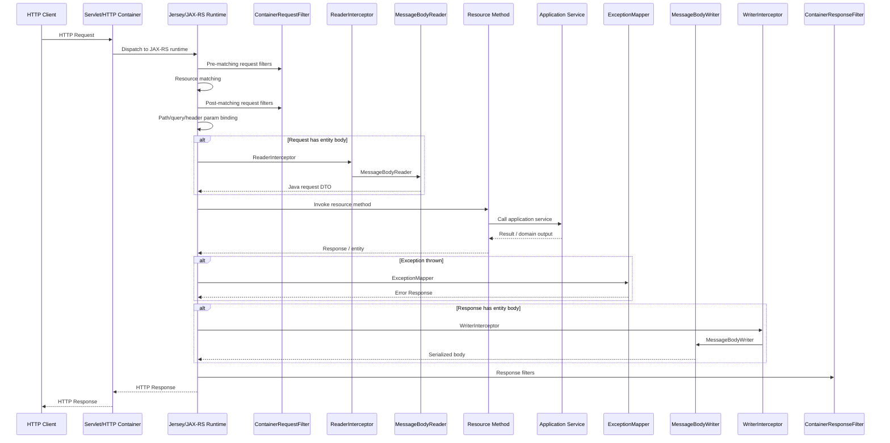

Practical mental model:

```text
Filter       = metadata/header/request/response envelope concern.
Interceptor  = entity body read/write concern.
Provider     = extension object known by JAX-RS runtime.
Resource     = HTTP endpoint boundary.
ExceptionMapper = exception-to-response translator.
MessageBodyReader/Writer = JSON/XML/body conversion.
```

---

# 2. Decomposition Map

| Area | Component | Tanggung jawab | Contoh penggunaan | Failure mode umum |
|---|---|---|---|---|
| Routing | `@Path`, HTTP method annotation | Mencocokkan request ke resource method | `GET /cases/{id}` | 404, 405, ambiguous resource |
| Resource | Resource class/method | HTTP boundary | `CaseResource.submit()` | Fat resource |
| Param binding | `@PathParam`, `@QueryParam`, `@HeaderParam` | Bind HTTP metadata ke parameter Java | `caseId`, `limit`, correlation ID | Param null/salah tipe |
| Request filter | `ContainerRequestFilter` | Pre/post request processing | auth, correlation ID, idempotency | filter tidak registered / salah priority |
| Response filter | `ContainerResponseFilter` | Modify response metadata | add headers, audit, response logging | header tidak muncul |
| Reader interceptor | `ReaderInterceptor` | Wrap request body deserialization | decrypt/decompress/body audit | body consumed dua kali |
| Writer interceptor | `WriterInterceptor` | Wrap response body serialization | compress/sign/encrypt | response body corrupt |
| Message body reader | `MessageBodyReader<T>` | HTTP body → Java object | JSON to DTO | 415 / no reader |
| Message body writer | `MessageBodyWriter<T>` | Java object → HTTP body | DTO to JSON | 500 no writer |
| Exception mapper | `ExceptionMapper<E>` | Exception → HTTP response | domain error → 422 | mapper tidak terpanggil |
| Provider registration | `@Provider`, `ResourceConfig.register()` | Runtime discovery | mapper/filter/interceptor | provider tidak aktif |
| Name binding | `@NameBinding` | Filter/interceptor hanya endpoint tertentu | `@Audited`, `@Secured` | filter terlalu global / tidak jalan |
| Priority | `@Priority` | Ordering provider | auth sebelum audit | ordering salah |

---

# 3. Layer Pipeline: Apa yang Terjadi di Setiap Tahap

## 3.1 HTTP Container → JAX-RS Runtime

Sebelum masuk resource, request diterima dulu oleh HTTP server/container. Dalam deployment modern, bisa melalui:

```text
Ingress / Load Balancer
-> reverse proxy
-> servlet container / embedded server
-> Jersey/JAX-RS runtime
```

Di tahap ini biasanya sudah ada hal-hal seperti TLS termination, request size limit, proxy header, dan container-level timeout. Setelah itu barulah JAX-RS runtime mencoba memproses request sebagai REST resource.

Practical concern:

| Concern | Biasanya di mana |
|---|---|
| TLS termination | ingress/load balancer |
| max request body size | ingress/container |
| base path `/api` | `@ApplicationPath` / servlet config |
| resource routing | JAX-RS runtime |
| auth header extraction | filter |
| business permission check | filter + service/policy |
| domain workflow | application service/domain |

---

## 3.2 Resource Matching

Contoh resource:

```java
@Path("/cases")
@Consumes(MediaType.APPLICATION_JSON)
@Produces(MediaType.APPLICATION_JSON)
public class CaseResource {

    @GET
    @Path("/{caseId}")
    public Response findById(@PathParam("caseId") String caseId) {
        return Response.ok().build();
    }

    @POST
    public Response submit(@Valid SubmitCaseRequest request) {
        return Response.status(Response.Status.CREATED).build();
    }
}
```

JAX-RS runtime secara konseptual membangun routing table:

```text
GET  /cases/{caseId} -> CaseResource.findById
POST /cases          -> CaseResource.submit
```

Yang dicocokkan:

```text
base application path
class-level @Path
method-level @Path
HTTP method annotation
@Consumes
@Produces
path/query/header parameter
entity body compatibility
```

Jakarta REST memakai annotation seperti resource path, request method designator, provider, filter, dan interceptor untuk membentuk model request processing runtime. ([Jakarta EE](https://jakarta.ee/specifications/restful-ws/4.0/jakarta-restful-ws-spec-4.0.html?utm_source=chatgpt.com))

---

# 4. Resource Method: Boundary, Bukan Tempat Semua Logic

Resource method idealnya tipis:

```java
@POST
public Response submit(@Valid SubmitCaseRequest request) {
    SubmitCaseCommand command = mapper.toCommand(request);

    SubmitCaseResult result = caseService.submit(command);

    CaseResponse response = mapper.toResponse(result);

    return Response.status(Response.Status.CREATED)
        .entity(ApiResponse.ok(response))
        .build();
}
```

Resource method boleh:

```text
membaca HTTP path/query/header/body
memanggil mapper
memanggil application service
menentukan HTTP status code
membentuk Response
```

Resource method sebaiknya tidak:

```text
query MyBatis langsung
memanggil external API langsung
menjalankan state transition domain kompleks
menyimpan retry logic
membangun SQL
melakukan audit manual berulang
menangkap semua exception manual
```

Anti-pattern:

```java
@POST
public Response submit(SubmitCaseRequest request) {
    // Terlalu banyak concern di resource
    if (request.customerId() == null) {
        return Response.status(400).build();
    }

    Customer customer = externalCustomerClient.getCustomer(request.customerId());

    if (!customer.verified()) {
        return Response.status(422).build();
    }

    CaseRecord record = new CaseRecord(...);
    caseMyBatisMapper.insert(record);

    auditMapper.insert(...);

    return Response.status(201).entity(record).build();
}
```

Masalahnya:

```text
HTTP concern, validation, external integration, persistence, audit, dan domain rule campur.
Testing sulit.
Error handling tidak konsisten.
Refactoring mahal.
```

---

# 5. Provider: Extension Object Runtime

Provider adalah class yang dikenal oleh runtime JAX-RS untuk memperluas behavior. Contohnya:

```text
ExceptionMapper
ContainerRequestFilter
ContainerResponseFilter
ReaderInterceptor
WriterInterceptor
MessageBodyReader
MessageBodyWriter
ContextResolver
ParamConverterProvider
```

Provider biasanya diberi:

```java
@Provider
public class DomainExceptionMapper implements ExceptionMapper<DomainException> {
    ...
}
```

Atau diregister eksplisit:

```java
public class JerseyApplication extends ResourceConfig {

    public JerseyApplication() {
        register(CaseResource.class);
        register(DomainExceptionMapper.class);
        register(CorrelationIdFilter.class);
        register(AuditFilter.class);
    }
}
```

Practical rule:

```text
@Provider membuat class eligible sebagai provider.
Tetapi provider tetap harus masuk discovery/registration path runtime.
```

Jangan berasumsi `@Provider` otomatis aktif jika package tidak di-scan atau class tidak diregister.

---

# 6. Request Filter

## 6.1 Use Case Umum

`ContainerRequestFilter` cocok untuk:

```text
correlation ID
authentication token extraction
authorization guard
tenant context extraction
idempotency key check
request metadata logging
request rejection sebelum masuk resource
```

Contoh correlation ID filter:

```java
@Provider
@Priority(Priorities.AUTHENTICATION)
public class CorrelationIdRequestFilter implements ContainerRequestFilter {

    public static final String CORRELATION_ID_PROPERTY = "correlationId";

    @Override
    public void filter(ContainerRequestContext requestContext) {
        String correlationId =
            requestContext.getHeaderString("X-Correlation-ID");

        if (correlationId == null || correlationId.isBlank()) {
            correlationId = UUID.randomUUID().toString();
        }

        requestContext.setProperty(CORRELATION_ID_PROPERTY, correlationId);
    }
}
```

Kenapa request property?

Karena property bisa dibaca lagi oleh filter lain, resource, atau response filter dalam satu request lifecycle.

---

## 6.2 Abort Request dari Filter

Filter bisa menghentikan request sebelum resource method dipanggil.

```java
@Provider
@Priority(Priorities.AUTHENTICATION)
public class AuthenticationFilter implements ContainerRequestFilter {

    @Override
    public void filter(ContainerRequestContext requestContext) {
        String authorization =
            requestContext.getHeaderString(HttpHeaders.AUTHORIZATION);

        if (authorization == null || authorization.isBlank()) {
            ErrorResponse<Void> error = new ErrorResponse<>(
                "UNAUTHENTICATED",
                "Missing Authorization header",
                null
            );

            requestContext.abortWith(
                Response.status(Response.Status.UNAUTHORIZED)
                    .entity(ApiResponse.failed(error))
                    .build()
            );
        }
    }
}
```

Practical warning:

```text
abortWith cocok untuk request-level rejection seperti auth missing.
Jangan pakai filter untuk menjalankan business transition seperti approve case, submit payment, atau cancel order.
```

---

# 7. Pre-Matching vs Post-Matching Request Filter

## 7.1 Post-Matching Filter

Default request filter berjalan setelah resource matching.

```java
@Provider
public class DefaultRequestFilter implements ContainerRequestFilter {

    @Override
    public void filter(ContainerRequestContext requestContext) {
        // Resource sudah matched.
    }
}
```

Cocok untuk:

```text
auth check berdasarkan resource method
audit metadata berdasarkan annotation method
permission check dengan ResourceInfo
```

## 7.2 Pre-Matching Filter

Pre-matching filter berjalan sebelum resource matching.

```java
@Provider
@PreMatching
public class HttpMethodOverrideFilter implements ContainerRequestFilter {

    @Override
    public void filter(ContainerRequestContext requestContext) {
        String override =
            requestContext.getHeaderString("X-HTTP-Method-Override");

        if (override != null && !override.isBlank()) {
            requestContext.setMethod(override.toUpperCase(Locale.ROOT));
        }
    }
}
```

Cocok untuk:

```text
method override
path normalization
early request rejection
very early correlation setup
```

Hindari pre-matching untuk permission check berbasis annotation method, karena resource method belum tentu diketahui.

---

# 8. Response Filter

`ContainerResponseFilter` berjalan saat response sedang keluar.

Contoh menambahkan correlation ID ke response:

```java
@Provider
public class CorrelationIdResponseFilter implements ContainerResponseFilter {

    @Override
    public void filter(
        ContainerRequestContext requestContext,
        ContainerResponseContext responseContext
    ) {
        Object correlationId =
            requestContext.getProperty(
                CorrelationIdRequestFilter.CORRELATION_ID_PROPERTY
            );

        if (correlationId != null) {
            responseContext.getHeaders()
                .putSingle("X-Correlation-ID", correlationId.toString());
        }
    }
}
```

Cocok untuk:

```text
response header
security header
correlation ID propagation
response metadata logging
audit completion status
cache-control header
```

Jangan digunakan untuk:

```text
mengubah business result secara diam-diam
menjalankan database mutation utama
mengganti domain error menjadi success
```

---

# 9. Filter Ordering dengan `@Priority`

Filter ordering penting jika ada banyak concern.

Contoh urutan yang umum:

```text
1. correlation ID
2. authentication
3. tenant resolution
4. authorization
5. idempotency
6. audit/logging
7. resource method
8. response logging/header filter
```

Contoh:

```java
@Provider
@Priority(Priorities.AUTHENTICATION)
public class AuthenticationFilter implements ContainerRequestFilter {
    ...
}
```

```java
@Provider
@Priority(Priorities.AUTHORIZATION)
public class AuthorizationFilter implements ContainerRequestFilter {
    ...
}
```

`@Priority` digunakan oleh Jakarta annotation ecosystem untuk menentukan urutan atau prioritas komponen ketika specification yang memakai annotation tersebut mendefinisikan ordering behavior. ([Jakarta EE](https://jakarta.ee/specifications/restful-ws/4.0/jakarta-restful-ws-spec-4.0.html?utm_source=chatgpt.com))

Practical failure:

| Gejala | Penyebab |
|---|---|
| Authorization filter gagal karena user null | Auth filter berjalan setelah authorization |
| Audit tidak punya user context | Audit berjalan sebelum auth |
| Idempotency tidak tahu tenant | Idempotency berjalan sebelum tenant resolution |
| Response header hilang | Response filter tidak registered / overwritten |

---

# 10. Name Binding: Filter Hanya untuk Endpoint Tertentu

Kalau filter diberi `@Provider` tanpa name binding, ia bisa berlaku global. Untuk membatasi filter hanya endpoint tertentu, gunakan `@NameBinding`.

## 10.1 Annotation

```java
@NameBinding
@Retention(RetentionPolicy.RUNTIME)
@Target({ElementType.TYPE, ElementType.METHOD})
public @interface Audited {
}
```

## 10.2 Filter

```java
@Audited
@Provider
@Priority(Priorities.USER)
public class AuditFilter implements ContainerRequestFilter {

    @Context
    private ResourceInfo resourceInfo;

    private final AuditService auditService;

    public AuditFilter(AuditService auditService) {
        this.auditService = auditService;
    }

    @Override
    public void filter(ContainerRequestContext requestContext) {
        Method method = resourceInfo.getResourceMethod();

        auditService.recordStart(
            requestContext.getMethod(),
            requestContext.getUriInfo().getPath(),
            method.getName()
        );
    }
}
```

## 10.3 Resource

```java
@Path("/cases")
public class CaseResource {

    @POST
    @Audited
    public Response submit(SubmitCaseRequest request) {
        return Response.status(Response.Status.CREATED).build();
    }

    @GET
    @Path("/{caseId}")
    public Response findById(@PathParam("caseId") String caseId) {
        return Response.ok().build();
    }
}
```

Hasil:

```text
AuditFilter berjalan untuk POST /cases.
AuditFilter tidak berjalan untuk GET /cases/{caseId}.
```

Name binding adalah mekanisme penting untuk menghindari filter terlalu global. Jersey mendukung name binding dan dynamic binding untuk mengikat filter/interceptor ke resource tertentu. ([Eclipse EE4J](https://eclipse-ee4j.github.io/jersey.github.io/documentation/latest3x/user-guide.html?utm_source=chatgpt.com))

---

# 11. ReaderInterceptor dan WriterInterceptor

Perbedaan utama:

```text
Filter      = request/response metadata, headers, status, context.
Interceptor = entity body stream, sebelum/sesudah MessageBodyReader/Writer.
```

Red Hat docs menjelaskan perbedaan praktis ini dengan ringkas: filter memodifikasi request/response headers, sementara interceptor menangani message body dan membungkus `MessageBodyReader` atau `MessageBodyWriter`. ([Red Hat Documentation](https://docs.redhat.com/en/documentation/red_hat_jboss_enterprise_application_platform/7.4/html/developing_web_services_applications/developing_jakarta_restful_web_services_web_services?utm_source=chatgpt.com))

## 11.1 ReaderInterceptor

Digunakan saat request body dibaca.

```java
@Provider
public class RequestBodyAuditInterceptor implements ReaderInterceptor {

    @Override
    public Object aroundReadFrom(ReaderInterceptorContext context)
        throws IOException, WebApplicationException {

        MediaType mediaType = context.getMediaType();

        // Jangan sembarang baca InputStream di sini,
        // karena bisa menghabiskan body sebelum MessageBodyReader.
        Object entity = context.proceed();

        // entity sudah menjadi Java object setelah MessageBodyReader
        return entity;
    }
}
```

Use case:

```text
decrypt request body
decompress request body
validate body signature
audit deserialized entity secara hati-hati
wrap input stream
```

## 11.2 WriterInterceptor

Digunakan saat response body ditulis.

```java
@Provider
public class ResponseSigningInterceptor implements WriterInterceptor {

    @Override
    public void aroundWriteTo(WriterInterceptorContext context)
        throws IOException, WebApplicationException {

        Object entity = context.getEntity();

        // Bisa inspect entity sebelum diserialize.
        // Bisa wrap OutputStream untuk signing/compression.

        context.proceed();
    }
}
```

Use case:

```text
compress response body
encrypt response body
sign response payload
post-process serialized stream
```

Practical warning:

```text
Interceptor lebih rawan bug daripada filter karena berhubungan dengan stream.
Kalau hanya perlu header/status/log metadata, gunakan filter.
```

---

# 12. MessageBodyReader dan MessageBodyWriter

## 12.1 MessageBodyReader

Mengubah HTTP request body menjadi Java object.

Contoh konseptual:

```text
application/json body
-> MessageBodyReader
-> SubmitCaseRequest
```

Jika reader tidak tersedia atau media type tidak cocok, hasilnya sering:

```text
415 Unsupported Media Type
No MessageBodyReader found
Cannot deserialize request entity
```

## 12.2 MessageBodyWriter

Mengubah Java object menjadi response body.

Contoh:

```text
CaseResponse
-> MessageBodyWriter
-> application/json body
```

Jika writer tidak tersedia:

```text
No MessageBodyWriter found
500 Internal Server Error
```

## 12.3 Custom MessageBodyWriter Example

Jarang dibutuhkan jika JSON provider sudah cukup. Tapi kadang berguna untuk format custom.

```java
@Provider
@Produces("text/csv")
public class CsvCaseResponseWriter
    implements MessageBodyWriter<List<CaseResponse>> {

    @Override
    public boolean isWriteable(
        Class<?> type,
        Type genericType,
        Annotation[] annotations,
        MediaType mediaType
    ) {
        return List.class.isAssignableFrom(type)
            && mediaType.isCompatible(MediaType.valueOf("text/csv"));
    }

    @Override
    public void writeTo(
        List<CaseResponse> cases,
        Class<?> type,
        Type genericType,
        Annotation[] annotations,
        MediaType mediaType,
        MultivaluedMap<String, Object> httpHeaders,
        OutputStream entityStream
    ) throws IOException {
        StringBuilder csv = new StringBuilder();
        csv.append("caseId,status,customerId\n");

        for (CaseResponse item : cases) {
            csv.append(item.caseId()).append(',')
                .append(item.status()).append(',')
                .append(item.customerId()).append('\n');
        }

        entityStream.write(csv.toString().getBytes(StandardCharsets.UTF_8));
    }
}
```

Practical warning:

```text
Generic MessageBodyWriter<List<CaseResponse>> bisa tricky karena type erasure.
Pastikan genericType dicek jika writer harus hanya berlaku untuk List<CaseResponse>.
```

---

# 13. ExceptionMapper

Exception mapper mengubah exception menjadi HTTP response.

## 13.1 Domain Exception Mapper

```java
@Provider
public class DomainExceptionMapper
    implements ExceptionMapper<DomainException> {

    @Override
    public Response toResponse(DomainException exception) {
        ErrorResponse<Void> error = new ErrorResponse<>(
            exception.errorCode(),
            exception.getMessage(),
            null
        );

        return Response.status(Response.Status.UNPROCESSABLE_ENTITY)
            .entity(ApiResponse.failed(error))
            .type(MediaType.APPLICATION_JSON_TYPE)
            .build();
    }
}
```

## 13.2 Validation Exception Mapper

```java
@Provider
public class ConstraintViolationExceptionMapper
    implements ExceptionMapper<ConstraintViolationException> {

    @Override
    public Response toResponse(ConstraintViolationException exception) {
        List<FieldError> errors = exception.getConstraintViolations()
            .stream()
            .map(violation -> new FieldError(
                violation.getPropertyPath().toString(),
                violation.getMessage()
            ))
            .toList();

        ErrorResponse<List<FieldError>> error = new ErrorResponse<>(
            "VALIDATION_ERROR",
            "Request validation failed",
            errors
        );

        return Response.status(Response.Status.BAD_REQUEST)
            .entity(ApiResponse.failed(error))
            .type(MediaType.APPLICATION_JSON_TYPE)
            .build();
    }
}
```

## 13.3 External System Exception Mapper

```java
@Provider
public class ExternalSystemExceptionMapper
    implements ExceptionMapper<ExternalSystemException> {

    @Override
    public Response toResponse(ExternalSystemException exception) {
        ErrorResponse<Void> error = new ErrorResponse<>(
            "EXTERNAL_SYSTEM_ERROR",
            "External dependency failed",
            null
        );

        return Response.status(Response.Status.BAD_GATEWAY)
            .entity(ApiResponse.failed(error))
            .type(MediaType.APPLICATION_JSON_TYPE)
            .build();
    }
}
```

Practical mapping convention:

| Exception | HTTP status | Reason |
|---|---:|---|
| malformed JSON | 400 | request cannot be parsed |
| Bean Validation failure | 400 | invalid input shape |
| domain rule rejected | 409 / 422 | valid shape, invalid business state |
| not found | 404 | resource absent |
| unauthorized | 401 | no/invalid authentication |
| forbidden | 403 | authenticated but not allowed |
| external timeout | 504 | gateway timeout |
| external rejected/downstream error | 502 / 503 | dependency failure |
| unexpected bug | 500 | internal failure |

---

# 14. Param Binding Internals

Resource method:

```java
@GET
@Path("/{caseId}")
public Response findById(
    @PathParam("caseId") String caseId,
    @QueryParam("includeAudit") @DefaultValue("false") boolean includeAudit,
    @HeaderParam("X-Correlation-ID") String correlationId
) {
    ...
}
```

Binding source:

| Annotation | Source |
|---|---|
| `@PathParam` | URI path variable |
| `@QueryParam` | query string |
| `@HeaderParam` | HTTP header |
| `@CookieParam` | cookie |
| `@MatrixParam` | matrix URI parameter |
| `@BeanParam` | composite parameter object |

Practical DTO for query params:

```java
public class CaseSearchParams {

    @QueryParam("status")
    private String status;

    @QueryParam("customerId")
    private String customerId;

    @QueryParam("limit")
    @DefaultValue("20")
    private int limit;

    @QueryParam("offset")
    @DefaultValue("0")
    private int offset;

    public CaseSearchCriteria toCriteria() {
        return new CaseSearchCriteria(status, customerId);
    }

    public PageRequest toPageRequest() {
        return new PageRequest(limit, offset);
    }
}
```

Resource:

```java
@GET
public Response search(@BeanParam CaseSearchParams params) {
    Page<CaseResponse> page = caseService.search(
        params.toCriteria(),
        params.toPageRequest()
    );

    return Response.ok(ApiResponse.ok(page)).build();
}
```

Practical warning:

```text
BeanParam bagus untuk query/header/path grouping.
Jangan jadikan BeanParam sebagai domain object.
```

---

# 15. ParamConverterProvider

Kalau sering mengubah string path/query menjadi value object, gunakan converter.

## 15.1 Value Object

```java
public record CaseId(String value) {
    public CaseId {
        if (value == null || value.isBlank()) {
            throw new IllegalArgumentException("caseId is required");
        }
    }
}
```

## 15.2 Converter

```java
@Provider
public class CaseIdParamConverterProvider implements ParamConverterProvider {

    @Override
    @SuppressWarnings("unchecked")
    public <T> ParamConverter<T> getConverter(
        Class<T> rawType,
        Type genericType,
        Annotation[] annotations
    ) {
        if (!rawType.equals(CaseId.class)) {
            return null;
        }

        return (ParamConverter<T>) new ParamConverter<CaseId>() {
            @Override
            public CaseId fromString(String value) {
                return new CaseId(value);
            }

            @Override
            public String toString(CaseId value) {
                return value.value();
            }
        };
    }
}
```

Resource:

```java
@GET
@Path("/{caseId}")
public Response findById(@PathParam("caseId") CaseId caseId) {
    CaseResponse response = caseService.findById(caseId);
    return Response.ok(ApiResponse.ok(response)).build();
}
```

Manfaat:

```text
Resource tidak perlu parsing manual.
Value object langsung masuk boundary.
Parsing convention terpusat.
```

Risiko:

```text
Kalau converter tidak registered, runtime gagal bind parameter.
Kalau exception converter tidak dimap, error response bisa tidak konsisten.
```

---

# 16. ResourceConfig: Registration Strategy

## 16.1 Explicit Register

```java
@ApplicationPath("/api")
public class JerseyApplication extends ResourceConfig {

    public JerseyApplication() {
        register(CaseResource.class);
        register(PaymentResource.class);

        register(DomainExceptionMapper.class);
        register(ConstraintViolationExceptionMapper.class);
        register(ExternalSystemExceptionMapper.class);

        register(CorrelationIdRequestFilter.class);
        register(CorrelationIdResponseFilter.class);
        register(AuthenticationFilter.class);
        register(AuthorizationFilter.class);

        register(CaseIdParamConverterProvider.class);
    }
}
```

Kelebihan:

```text
lebih eksplisit
mudah diaudit
provider penting tidak “aktif diam-diam”
bagus untuk service regulated/compliance-heavy
```

Kekurangan:

```text
resource/provider baru bisa lupa didaftarkan
registration list bisa panjang
```

## 16.2 Package Scanning

```java
@ApplicationPath("/api")
public class JerseyApplication extends ResourceConfig {

    public JerseyApplication() {
        packages("com.company.caseapp.api.resource");
        packages("com.company.caseapp.support.provider");
        packages("com.company.caseapp.support.filter");
    }
}
```

Kelebihan:

```text
lebih ringkas
resource/provider baru otomatis ditemukan
```

Kekurangan:

```text
lebih opaque
package salah -> runtime tidak menemukan class
provider bisa aktif tanpa disadari
```

Rekomendasi practical:

| Kondisi | Strategy |
|---|---|
| service kecil | explicit register |
| service sedang | package scan resource + explicit critical provider |
| banyak resource | package scan terbatas |
| security/compliance heavy | explicit security/audit provider |
| troubleshooting startup | temporary explicit register untuk isolasi |

---

# 17. Failure Mode by HTTP Status

## 17.1 404 Not Found

Kemungkinan:

```text
base path salah
class @Path salah
method @Path salah
resource tidak registered
package scan tidak mencakup package resource
deployment context path salah
```

Checklist:

```text
@ApplicationPath?
ResourceConfig register/packages?
class-level @Path?
method-level @Path?
URL client sudah benar?
```

## 17.2 405 Method Not Allowed

Kemungkinan:

```text
path match, HTTP method tidak match
endpoint hanya @GET tapi client kirim POST
method lupa @POST/@PUT/@DELETE
```

Checklist:

```text
HTTP verb annotation ada?
client method benar?
ada method lain dengan path sama tapi verb beda?
```

## 17.3 415 Unsupported Media Type

Kemungkinan:

```text
Content-Type client tidak cocok dengan @Consumes
JSON provider tidak tersedia
request body tidak bisa dibaca
```

Checklist:

```text
client kirim Content-Type: application/json?
resource punya @Consumes(application/json)?
JSON provider dependency ada?
DTO bisa dideserialize?
```

## 17.4 406 Not Acceptable

Kemungkinan:

```text
Accept header client tidak cocok dengan @Produces
endpoint hanya produce JSON tapi client minta XML
```

Checklist:

```text
client Accept header?
resource @Produces?
MessageBodyWriter tersedia?
```

## 17.5 500 No MessageBodyWriter

Kemungkinan:

```text
response DTO tidak bisa diserialize
generic metadata hilang
JSON provider tidak registered
return object bukan DTO serializable
circular reference
```

Checklist:

```text
return Response.ok(list).build()?
perlu GenericEntity?
DTO punya shape jelas?
ada cyclic object graph?
```

---

# 18. Practical Flow Example: Submit Case

## 18.1 Request

```http
POST /api/cases
Content-Type: application/json
Accept: application/json
Authorization: Bearer <token>
X-Correlation-ID: corr-001
Idempotency-Key: idem-001

{
  "customerId": "CUST-001",
  "requestedAmount": 5000000,
  "productCode": "LOAN_BASIC"
}
```

## 18.2 Pipeline Ideal

```text
1. CorrelationIdRequestFilter reads/generates correlation ID.
2. AuthenticationFilter validates token.
3. TenantFilter resolves tenant context.
4. AuthorizationFilter checks permission metadata.
5. IdempotencyFilter checks idempotency key.
6. MessageBodyReader deserializes JSON to SubmitCaseRequest.
7. Bean Validation validates SubmitCaseRequest.
8. CaseResource.submit maps request to command.
9. CaseApplicationService.submit executes use case.
10. Repository/External adapter invoked through ports.
11. Result mapped to CaseResponse.
12. MessageBodyWriter serializes response to JSON.
13. CorrelationIdResponseFilter adds X-Correlation-ID.
14. Client receives 201 Created.
```

## 18.3 Code Skeleton

Resource:

```java
@Path("/cases")
@Consumes(MediaType.APPLICATION_JSON)
@Produces(MediaType.APPLICATION_JSON)
public class CaseResource {

    private final CaseApplicationService caseService;
    private final CaseApiMapper mapper;

    @Inject
    public CaseResource(
        CaseApplicationService caseService,
        CaseApiMapper mapper
    ) {
        this.caseService = caseService;
        this.mapper = mapper;
    }

    @POST
    @Audited
    @Secured
    @RequiresPermission("case:submit")
    @Idempotent
    @BusinessOperation(
        value = "CASE_SUBMIT",
        domain = "CASE_MANAGEMENT",
        risk = RiskLevel.HIGH
    )
    public Response submit(@Valid SubmitCaseRequest request) {
        SubmitCaseCommand command = mapper.toCommand(request);

        SubmitCaseResult result = caseService.submit(command);

        CaseResponse response = mapper.toResponse(result);

        return Response.status(Response.Status.CREATED)
            .entity(ApiResponse.ok(response))
            .build();
    }
}
```

---

# 19. Practical Flow Example: Error Case

## 19.1 Domain Error

Service throws:

```java
throw new CaseSubmissionRejectedException(
    "CUSTOMER_NOT_VERIFIED",
    "Customer is not verified"
);
```

Mapper:

```java
@Provider
public class CaseSubmissionRejectedExceptionMapper
    implements ExceptionMapper<CaseSubmissionRejectedException> {

    @Override
    public Response toResponse(CaseSubmissionRejectedException exception) {
        ErrorResponse<Void> error = new ErrorResponse<>(
            exception.errorCode(),
            exception.getMessage(),
            null
        );

        return Response.status(Response.Status.UNPROCESSABLE_ENTITY)
            .entity(ApiResponse.failed(error))
            .type(MediaType.APPLICATION_JSON_TYPE)
            .build();
    }
}
```

Response:

```json
{
  "success": false,
  "data": null,
  "error": {
    "code": "CUSTOMER_NOT_VERIFIED",
    "message": "Customer is not verified",
    "detail": null
  }
}
```

## 19.2 Pipeline

```text
Resource method invoked.
Application service throws domain exception.
JAX-RS runtime catches exception.
Matching ExceptionMapper selected.
Mapper creates Response.
MessageBodyWriter serializes ErrorResponse.
ResponseFilter still can add correlation header.
Client receives 422.
```

---

# 20. Filter vs Interceptor vs ExceptionMapper vs Resource

| Kebutuhan | Tempat terbaik |
|---|---|
| Add correlation ID | request + response filter |
| Validate JWT exists | request filter |
| Decode authenticated user | request filter |
| Check business permission metadata | request filter + permission service |
| Validate request DTO shape | Bean Validation |
| Execute domain workflow | application service |
| Enforce domain invariant | domain model/policy |
| Convert exception to HTTP response | ExceptionMapper |
| Add response security headers | response filter |
| Compress response body | WriterInterceptor / server config |
| Decrypt request body | ReaderInterceptor |
| Parse custom path value object | ParamConverterProvider |
| Serialize custom media type | MessageBodyWriter |
| Deserialize custom media type | MessageBodyReader |
| Audit business operation | filter + application event/audit service |
| Idempotency correctness | filter marker + persistent idempotency service |

---

# 21. Common Anti-Patterns

| Anti-pattern | Contoh | Masalah | Perbaikan |
|---|---|---|---|
| Fat resource | resource call DB/external langsung | sulit test/refactor | move to service/adapter |
| Global filter berlebihan | semua endpoint kena audit/security yang tidak perlu | unpredictable behavior | name binding |
| Business logic di filter | approval/cancel/payment logic di filter | hidden workflow | service/domain |
| Body dibaca manual di filter | InputStream habis sebelum deserializer | request body kosong | use ReaderInterceptor/wrapper |
| Catch-all exception mapper terlalu awal | `ExceptionMapper<Throwable>` | mapper spesifik tidak jelas | mapper spesifik + fallback |
| Provider tidak registered | `@Provider` tapi package tidak discan | tidak aktif | explicit register/test |
| Priority tidak jelas | auth/audit/tenant acak | context hilang | define priority policy |
| Entity persistence sebagai response | return MyBatis record langsung | leak schema DB | DTO mapping |
| Missing GenericEntity | `Response.ok(List<T>)` | generic metadata hilang | use `GenericEntity` |
| Idempotency hanya header check | duplicate tetap terjadi | correctness palsu | unique key/store/transaction |

---

# 22. Testing Strategy

## 22.1 Unit Test Resource

Fokus:

```text
request DTO -> command
service dipanggil
response status benar
response entity benar
```

Contoh pseudo:

```java
@Test
void submitShouldReturnCreated() {
    SubmitCaseRequest request = new SubmitCaseRequest(
        "CUST-001",
        new BigDecimal("5000000"),
        "LOAN_BASIC"
    );

    when(caseService.submit(any()))
        .thenReturn(new SubmitCaseResult("CASE-001", "SUBMITTED"));

    Response response = resource.submit(request);

    assertEquals(201, response.getStatus());
}
```

## 22.2 Unit Test Filter

Fokus:

```text
header dibaca
property diset
abortWith dipanggil saat invalid
```

Contoh:

```java
@Test
void authenticationFilterShouldAbortWhenAuthorizationMissing() {
    ContainerRequestContext context = mock(ContainerRequestContext.class);

    when(context.getHeaderString(HttpHeaders.AUTHORIZATION))
        .thenReturn(null);

    filter.filter(context);

    verify(context).abortWith(argThat(response ->
        response.getStatus() == 401
    ));
}
```

## 22.3 Integration Test JAX-RS Runtime

Fokus:

```text
resource discovery
provider registration
filter chain
exception mapper
JSON reader/writer
validation
```

Test ini penting karena banyak bug JAX-RS baru muncul di runtime discovery.

## 22.4 Contract Test Annotation

```java
@Test
void mutationEndpointsShouldBeAuditedAndSecured() throws Exception {
    Method submit = CaseResource.class.getDeclaredMethod(
        "submit",
        SubmitCaseRequest.class
    );

    assertTrue(submit.isAnnotationPresent(Audited.class));
    assertTrue(submit.isAnnotationPresent(Secured.class));
    assertTrue(submit.isAnnotationPresent(RequiresPermission.class));
}
```

---

# 23. Debugging Playbook

## 23.1 Endpoint Tidak Terpanggil

Cek berurutan:

```text
1. URL base path benar?
2. @ApplicationPath benar?
3. Resource registered/package-scanned?
4. Class punya @Path?
5. Method punya @Path?
6. Method punya @GET/@POST/etc?
7. Content-Type cocok @Consumes?
8. Accept cocok @Produces?
```

## 23.2 Filter Tidak Jalan

Cek:

```text
1. Ada @Provider?
2. Registered di ResourceConfig?
3. Jika name-bound, endpoint punya annotation binding?
4. Custom binding punya @NameBinding?
5. RetentionPolicy.RUNTIME?
6. Target TYPE/METHOD sesuai?
7. Priority tidak membuat asumsi salah?
```

## 23.3 ExceptionMapper Tidak Terpanggil

Cek:

```text
1. Exception type yang dilempar benar?
2. Mapper generic type cocok?
3. Mapper punya @Provider?
4. Mapper registered?
5. Exception tidak dibungkus framework menjadi exception lain?
6. Ada mapper lain yang lebih umum?
```

## 23.4 Request Body Gagal

Cek:

```text
1. Content-Type application/json?
2. @Consumes application/json?
3. DTO bisa dideserialize?
4. JSON valid?
5. JSON provider dependency ada?
6. ReaderInterceptor tidak menghabiskan stream?
```

## 23.5 Response Body Gagal

Cek:

```text
1. @Produces application/json?
2. DTO serializable?
3. Tidak return object framework/internal?
4. Tidak ada cyclic reference?
5. Generic response perlu GenericEntity?
6. MessageBodyWriter tersedia?
```

---

# 24. Practical Design Guideline untuk Enterprise Microservice

## 24.1 Standard Provider Set

Untuk service enterprise, minimal punya provider seperti:

```text
CorrelationIdRequestFilter
CorrelationIdResponseFilter
AuthenticationFilter
AuthorizationFilter
AuditFilter
ConstraintViolationExceptionMapper
DomainExceptionMapper
ExternalSystemExceptionMapper
UnexpectedExceptionMapper
ParamConverterProvider untuk value object penting
```

## 24.2 Standard Annotation Set

```text
@Secured
@RequiresPermission
@Audited
@AuditAction
@Idempotent
@BusinessOperation
```

## 24.3 Standard Error Contract

```java
public record ErrorResponse<TDetail>(
    String code,
    String message,
    TDetail detail
) {}
```

```java
public record ApiResponse<T>(
    boolean success,
    T data,
    ErrorResponse<?> error
) {}
```

## 24.4 Standard Request Context

```java
public record RequestContext(
    String correlationId,
    String tenantId,
    String userId,
    Set<String> permissions
) {}
```

Context bisa diisi oleh filter, lalu digunakan service via explicit parameter atau context provider. Untuk service/domain penting, lebih defensible jika context penting diberikan eksplisit daripada tersembunyi di thread local.

---

# 25. Mini Exercise Practical

Ambil satu endpoint mutation di project, misalnya:

```text
POST /cases/{caseId}/approve
```

Lalu gambar lifecycle-nya:

```text
1. Request masuk dari client
2. Correlation filter
3. Authentication filter
4. Tenant filter
5. Authorization filter
6. Idempotency filter
7. MessageBodyReader
8. Bean Validation
9. Resource method
10. Application service
11. Domain state transition
12. Repository save
13. Event/audit publish
14. Response DTO mapping
15. MessageBodyWriter
16. Response filter
17. Client receives response
```

Kemudian jawab:

```text
Filter mana yang global?
Filter mana yang name-bound?
Exception apa saja yang bisa keluar?
Mapper mana yang menangani exception tersebut?
Apakah endpoint butuh idempotency?
Apakah response generic butuh GenericEntity?
Apakah permission/audit annotation sudah ada?
Apakah request body divalidasi?
```

---

# Ringkasan Seri 6

Request lifecycle Jersey/JAX-RS bisa dipahami sebagai pipeline:

```text
HTTP request
-> request filter
-> resource matching
-> parameter binding
-> reader interceptor
-> message body reader
-> resource method
-> application service/domain
-> exception mapper jika error
-> writer interceptor
-> message body writer
-> response filter
-> HTTP response
```

Komponen utamanya:

```text
Resource = HTTP endpoint boundary
Provider = extension object runtime
ContainerRequestFilter = request metadata/control
ContainerResponseFilter = response metadata/control
ReaderInterceptor = request body stream wrapper
WriterInterceptor = response body stream wrapper
MessageBodyReader = request body to Java object
MessageBodyWriter = Java object to response body
ExceptionMapper = exception to HTTP response
ParamConverterProvider = string param to custom Java type
NameBinding = apply provider to selected endpoints
Priority = define execution order
```

Prinsip practical:

```text
Gunakan resource untuk HTTP boundary.
Gunakan service/domain untuk business workflow.
Gunakan filter untuk cross-cutting request/response concern.
Gunakan interceptor untuk body stream concern.
Gunakan exception mapper untuk error contract.
Gunakan provider registration secara eksplisit untuk komponen kritikal.
```

---

## Status

**Seri 6/12 selesai.**

Seri berikutnya yang direkomendasikan: **Seri 7/12 - Exception Hierarchy dan Generic Exception Mapping dalam Jersey/JAX-RS Microservice.**

---

**Sources:**

- [Jakarta RESTful Web Services](https://jakarta.ee/specifications/restful-ws/4.0/jakarta-restful-ws-spec-4.0.html?utm_source=chatgpt.com)
- [Jersey 3.1.1 User Guide](https://eclipse-ee4j.github.io/jersey.github.io/documentation/latest3x/user-guide.html?utm_source=chatgpt.com)
- [Chapter 2. Developing Jakarta RESTful Web Services ...](https://docs.redhat.com/en/documentation/red_hat_jboss_enterprise_application_platform/7.4/html/developing_web_services_applications/developing_jakarta_restful_web_services_web_services?utm_source=chatgpt.com)

## Response:
7/15/2026, 1:40:22 AM

Saya lanjut ke **Seri 7/12: Exception Hierarchy dan Generic Exception Mapping**. Fokusnya practical: taxonomy exception, mapping HTTP status, error contract, kapan throw exception vs return Result, dan bagaimana membuat error handling konsisten di Jersey/JAX-RS.

# Seri 7/12 - Exception Hierarchy dan Generic Exception Mapping dalam Jersey/JAX-RS Microservice

## Tujuan Seri Ini

Seri ini fokus pada desain **exception hierarchy** dan **exception-to-HTTP mapping** yang practical untuk microservice berbasis **Java 17+ / Jersey / JAX-RS / MyBatis / PostgreSQL / external integration**.

Masalah yang ingin dicegah:

```text id="f1mrtc"
try-catch berulang di setiap resource
semua error jadi 500
domain error tidak punya error code stabil
external system error bocor ke client
stacktrace bocor ke response
validation error tidak konsisten
exception hierarchy terlalu abstrak
ExceptionMapper<Throwable> menelan semua error terlalu awal
```

Dalam Jakarta REST/JAX-RS, `ExceptionMapper<E extends Throwable>` adalah provider yang memetakan Java exception menjadi `Response`; mapper harus diregister programmatically atau diberi `@Provider` agar dapat ditemukan saat provider scanning. Method `toResponse(E exception)` bertugas mengubah exception menjadi HTTP response, dan jika method itu sendiri melempar runtime exception, hasilnya menjadi 500 Internal Server Error. ([Jakarta EE](https://jakarta.ee/specifications/restful-ws/4.0/apidocs/jakarta.ws.rs/jakarta/ws/rs/ext/exceptionmapper))

---

# 1. Mental Model

```mermaid id="pzgb8x"
flowchart TD
    A[Exception in Jersey/JAX-RS Microservice] --> B[Where Exception Happens]
    A --> C[Exception Taxonomy]
    A --> D[HTTP Mapping]
    A --> E[Error Contract]
    A --> F[Observability]
    A --> G[Testing]

    B --> B1[Resource]
    B --> B2[Application Service]
    B --> B3[Domain Model / Policy]
    B --> B4[Repository / MyBatis]
    B --> B5[External Adapter]
    B --> B6[Filter / Interceptor]

    C --> C1[ValidationException]
    C --> C2[DomainException]
    C --> C3[NotFoundException]
    C --> C4[ConflictException]
    C --> C5[ExternalSystemException]
    C --> C6[InfrastructureException]
    C --> C7[UnexpectedException]

    D --> D1[400 Bad Request]
    D --> D2[401 Unauthorized]
    D --> D3[403 Forbidden]
    D --> D4[404 Not Found]
    D --> D5[409 Conflict]
    D --> D6[422 Unprocessable Entity]
    D --> D7[502/503/504]
    D --> D8[500 Internal Server Error]

    E --> E1[ApiResponse<T>]
    E --> E2[ErrorResponse<TDetail>]
    E --> E3[FieldError]
    E --> E4[Correlation ID]
    E --> E5[Error Code]

    F --> F1[Log with correlationId]
    F --> F2[Metric by errorCode]
    F --> F3[Audit high-risk failures]

    G --> G1[Unit Test Mapper]
    G --> G2[Resource Integration Test]
    G --> G3[Contract Test Error Shape]
```

Core idea:

```text id="3i7jxg"
Domain/service boleh throw exception yang meaningful.
Resource tidak perlu try-catch berulang.
ExceptionMapper menjadi boundary yang menerjemahkan exception internal menjadi HTTP error contract.
```

---

# 2. Decomposition Map

| Area | Skill practical | Contoh | Tujuan | Failure mode |
|---|---|---|---|---|
| Exception taxonomy | Klasifikasi error | `DomainException`, `ExternalSystemException` | Error lebih mudah dimap dan diobservasi | Semua jadi `RuntimeException` |
| Error code | Stable machine-readable code | `CASE_NOT_FOUND`, `CUSTOMER_NOT_VERIFIED` | Client/log/metric konsisten | Message dipakai sebagai logic |
| HTTP status mapping | Exception → status | domain reject → 422, conflict → 409 | Response predictable | Domain error jadi 500 |
| Generic error response | `ErrorResponse<TDetail>` | field error, external detail | Detail type-safe | `Object detail` tanpa kontrak |
| Base mapper | Abstract mapper reusable | `BaseAppExceptionMapper<E>` | Kurangi duplikasi | Generic mapper tidak terdaftar karena tidak concrete |
| Specific mapper | Concrete `@Provider` | `DomainExceptionMapper` | JAX-RS discovery jelas | Mapper lupa `@Provider/register` |
| Fallback mapper | `ExceptionMapper<Throwable>` | unexpected error | Prevent raw stacktrace | Menelan mapper spesifik jika salah desain |
| WebApplicationException | HTTP-aware exception | `BadRequestException`, `ForbiddenException` | Cepat untuk HTTP boundary | Dipakai di domain core |
| External error translation | Vendor exception → internal exception | timeout → `ExternalTimeoutException` | Vendor detail tidak bocor | External DTO/error bocor ke client |
| Observability | correlation ID, log level, metric | `errorCode`, `operation`, `caseId` | Troubleshooting cepat | log noise / PII leak |
| Testing | mapper/resource integration test | assert status + body | Contract stabil | Error shape berubah tanpa sadar |

---

# 3. Recommended Error Contract

Gunakan error response yang stabil, machine-readable, dan tidak membocorkan internal implementation.

```java id="no6ya8"
package com.company.common.api;

public record ApiResponse<T>(
    boolean success,
    T data,
    ErrorResponse<?> error
) {
    public static <T> ApiResponse<T> ok(T data) {
        return new ApiResponse<>(true, data, null);
    }

    public static ApiResponse<Void> failed(ErrorResponse<?> error) {
        return new ApiResponse<>(false, null, error);
    }
}
```

```java id="0ublm6"
package com.company.common.api;

public record ErrorResponse<TDetail>(
    String code,
    String message,
    TDetail detail,
    String correlationId
) {}
```

Contoh field error detail:

```java id="c8yuu7"
public record FieldError(
    String field,
    String reason
) {}
```

Contoh external error detail yang aman:

```java id="nlg2cm"
public record ExternalFailureDetail(
    String system,
    String category,
    boolean retryable
) {}
```

Response example:

```json id="18c65x"
{
  "success": false,
  "data": null,
  "error": {
    "code": "CUSTOMER_NOT_VERIFIED",
    "message": "Customer is not verified",
    "detail": null,
    "correlationId": "corr-123"
  }
}
```

Practical rule:

```text id="a4ot8i"
Client boleh bergantung ke error.code.
Client tidak boleh bergantung ke exception class name atau stacktrace.
```

---

# 4. Exception Taxonomy yang Practical

## 4.1 Base Application Exception

```java id="8jteg9"
package com.company.common.error;

import jakarta.ws.rs.core.Response;

public abstract class AppException extends RuntimeException {

    private final String errorCode;
    private final Response.Status status;
    private final Object detail;
    private final boolean retryable;

    protected AppException(
        String errorCode,
        String message,
        Response.Status status,
        Object detail,
        boolean retryable
    ) {
        super(message);
        this.errorCode = errorCode;
        this.status = status;
        this.detail = detail;
        this.retryable = retryable;
    }

    protected AppException(
        String errorCode,
        String message,
        Response.Status status,
        Object detail,
        boolean retryable,
        Throwable cause
    ) {
        super(message, cause);
        this.errorCode = errorCode;
        this.status = status;
        this.detail = detail;
        this.retryable = retryable;
    }

    public String errorCode() {
        return errorCode;
    }

    public Response.Status status() {
        return status;
    }

    public Object detail() {
        return detail;
    }

    public boolean retryable() {
        return retryable;
    }
}
```

Catatan practical: menyimpan `Response.Status` di base exception memang membuat exception layer tahu HTTP. Ini acceptable kalau `AppException` memang dibuat khusus untuk REST application boundary. Kalau ingin domain benar-benar bersih dari HTTP, simpan `ErrorCategory` di exception, lalu mapper yang menentukan HTTP status.

---

## 4.2 Domain Exception

```java id="d0dp2o"
package com.company.caseapp.domain.exception;

import com.company.common.error.AppException;
import jakarta.ws.rs.core.Response;

public abstract class DomainException extends AppException {

    protected DomainException(
        String errorCode,
        String message,
        Response.Status status,
        Object detail
    ) {
        super(errorCode, message, status, detail, false);
    }
}
```

Contoh domain exception:

```java id="6lnrny"
public final class CaseSubmissionRejectedException extends DomainException {

    public CaseSubmissionRejectedException(String reason) {
        super(
            "CASE_SUBMISSION_REJECTED",
            reason,
            Response.Status.UNPROCESSABLE_ENTITY,
            null
        );
    }
}
```

```java id="e5udk2"
public final class InvalidCaseTransitionException extends DomainException {

    public InvalidCaseTransitionException(String currentStatus, String targetStatus) {
        super(
            "INVALID_CASE_TRANSITION",
            "Case cannot transition from %s to %s"
                .formatted(currentStatus, targetStatus),
            Response.Status.CONFLICT,
            new TransitionErrorDetail(currentStatus, targetStatus)
        );
    }
}
```

```java id="btwbfm"
public record TransitionErrorDetail(
    String currentStatus,
    String targetStatus
) {}
```

---

## 4.3 Not Found Exception

```java id="jse369"
package com.company.common.error;

import jakarta.ws.rs.core.Response;

public final class ResourceNotFoundException extends AppException {

    public ResourceNotFoundException(String resourceType, String resourceId) {
        super(
            resourceType.toUpperCase() + "_NOT_FOUND",
            "%s not found".formatted(resourceType),
            Response.Status.NOT_FOUND,
            new NotFoundDetail(resourceType, resourceId),
            false
        );
    }
}
```

```java id="e1mi49"
public record NotFoundDetail(
    String resourceType,
    String resourceId
) {}
```

Usage:

```java id="5pj15d"
public Case findById(CaseId caseId) {
    return caseRepository.findById(caseId)
        .orElseThrow(() -> new ResourceNotFoundException(
            "case",
            caseId.value()
        ));
}
```

---

## 4.4 Conflict Exception

```java id="eqh502"
public final class ResourceConflictException extends AppException {

    public ResourceConflictException(
        String errorCode,
        String message,
        Object detail
    ) {
        super(
            errorCode,
            message,
            Response.Status.CONFLICT,
            detail,
            false
        );
    }
}
```

Usage:

```java id="05zsk1"
if (caseRepository.existsByExternalReference(command.externalReference())) {
    throw new ResourceConflictException(
        "DUPLICATE_EXTERNAL_REFERENCE",
        "A case with the same external reference already exists",
        new DuplicateReferenceDetail(command.externalReference())
    );
}
```

---

## 4.5 External System Exception

```java id="b07cvr"
public abstract class ExternalSystemException extends AppException {

    protected ExternalSystemException(
        String errorCode,
        String message,
        Response.Status status,
        ExternalFailureDetail detail,
        boolean retryable,
        Throwable cause
    ) {
        super(errorCode, message, status, detail, retryable, cause);
    }
}
```

```java id="3d8awp"
public final class ExternalTimeoutException extends ExternalSystemException {

    public ExternalTimeoutException(String system, Throwable cause) {
        super(
            "EXTERNAL_TIMEOUT",
            "External system timeout",
            Response.Status.GATEWAY_TIMEOUT,
            new ExternalFailureDetail(system, "TIMEOUT", true),
            true,
            cause
        );
    }
}
```

```java id="kl67dc"
public final class ExternalBadGatewayException extends ExternalSystemException {

    public ExternalBadGatewayException(String system, Throwable cause) {
        super(
            "EXTERNAL_BAD_GATEWAY",
            "External system failed",
            Response.Status.BAD_GATEWAY,
            new ExternalFailureDetail(system, "BAD_GATEWAY", true),
            true,
            cause
        );
    }
}
```

Practical rule:

```text id="89l3dt"
Vendor-specific exception jangan bocor ke application service/resource.
Terjemahkan di adapter menjadi exception internal yang stabil.
```

---

## 4.6 Infrastructure Exception

```java id="vnj54y"
public final class PersistenceException extends AppException {

    public PersistenceException(String message, Throwable cause) {
        super(
            "PERSISTENCE_ERROR",
            message,
            Response.Status.INTERNAL_SERVER_ERROR,
            null,
            false,
            cause
        );
    }
}
```

Usage di repository adapter:

```java id="vwkd4p"
public Case save(Case caseData) {
    try {
        mapper.insert(persistenceMapper.toRecord(caseData));
        return caseData;
    } catch (RuntimeException exception) {
        throw new PersistenceException(
            "Failed to save case",
            exception
        );
    }
}
```

Catatan: jangan selalu wrap semua exception MyBatis kalau wrapping menghilangkan informasi penting untuk observability. Simpan cause, log internal dengan correlation ID, tapi response ke client tetap aman.

---

# 5. HTTP Status Mapping

| Kategori error | Exception | Status | Kapan dipakai |
|---|---|---:|---|
| Malformed JSON / invalid shape | `BadRequestException`, validation mapper | 400 | request tidak valid secara format/constraint |
| Unauthenticated | `NotAuthorizedException` / custom auth exception | 401 | token hilang/salah |
| Unauthorized secara permission | `ForbiddenException` / custom forbidden | 403 | user valid tapi tidak punya akses |
| Resource tidak ada | `ResourceNotFoundException` | 404 | case/order/payment tidak ditemukan |
| Duplicate / state conflict | `ResourceConflictException`, `InvalidCaseTransitionException` | 409 | konflik dengan state/resource saat ini |
| Business rejection | `DomainException` tertentu | 422 | shape valid, tapi rule bisnis menolak |
| External dependency failure | `ExternalBadGatewayException` | 502 | downstream gagal memberi response valid |
| External dependency unavailable | `ExternalUnavailableException` | 503 | dependency down/maintenance/circuit open |
| External timeout | `ExternalTimeoutException` | 504 | downstream timeout |
| Bug/unexpected | fallback mapper | 500 | error internal tidak terklasifikasi |

Practical distinction:

```text id="56gljd"
400 = request shape salah.
409 = request valid tetapi konflik dengan state sekarang.
422 = request valid secara struktur, tetapi gagal business rule.
500 = bug/internal failure, bukan business rejection.
```

---

# 6. Base Generic Exception Mapper

Karena semua mapper biasanya membentuk response yang mirip, gunakan abstract generic base mapper.

```java id="2xb3v5"
package com.company.common.error;

import com.company.common.api.ApiResponse;
import com.company.common.api.ErrorResponse;
import jakarta.ws.rs.core.Context;
import jakarta.ws.rs.core.HttpHeaders;
import jakarta.ws.rs.core.MediaType;
import jakarta.ws.rs.core.Response;
import jakarta.ws.rs.ext.ExceptionMapper;

public abstract class BaseAppExceptionMapper<E extends AppException>
    implements ExceptionMapper<E> {

    @Context
    private HttpHeaders httpHeaders;

    @Override
    public Response toResponse(E exception) {
        String correlationId = extractCorrelationId();

        ErrorResponse<Object> error = new ErrorResponse<>(
            exception.errorCode(),
            exception.getMessage(),
            exception.detail(),
            correlationId
        );

        logException(exception, correlationId);

        return Response.status(exception.status())
            .type(MediaType.APPLICATION_JSON_TYPE)
            .entity(ApiResponse.failed(error))
            .build();
    }

    private String extractCorrelationId() {
        if (httpHeaders == null) {
            return null;
        }

        String value = httpHeaders.getHeaderString("X-Correlation-ID");
        return value == null || value.isBlank() ? null : value;
    }

    protected void logException(E exception, String correlationId) {
        // Keep implementation in subclass or shared logger.
        // Avoid logging sensitive data.
    }
}
```

Penting: **abstract generic mapper tidak cukup untuk JAX-RS discovery**. Tetap buat concrete mapper yang diberi `@Provider` atau diregister programmatically. JAX-RS `ExceptionMapper` adalah provider contract dan provider harus registered atau annotated dengan `@Provider` agar ditemukan runtime. ([Jakarta EE](https://jakarta.ee/specifications/restful-ws/4.0/apidocs/jakarta.ws.rs/jakarta/ws/rs/ext/exceptionmapper))

---

# 7. Concrete Exception Mappers

## 7.1 Domain Exception Mapper

```java id="qj6yyd"
package com.company.caseapp.support.error;

import com.company.caseapp.domain.exception.DomainException;
import com.company.common.error.BaseAppExceptionMapper;
import jakarta.ws.rs.ext.Provider;

@Provider
public class DomainExceptionMapper
    extends BaseAppExceptionMapper<DomainException> {
}
```

## 7.2 Resource Not Found Mapper

```java id="xm6v1e"
@Provider
public class ResourceNotFoundExceptionMapper
    extends BaseAppExceptionMapper<ResourceNotFoundException> {
}
```

## 7.3 Conflict Mapper

```java id="rx8g99"
@Provider
public class ResourceConflictExceptionMapper
    extends BaseAppExceptionMapper<ResourceConflictException> {
}
```

## 7.4 External System Mapper

```java id="431k3k"
@Provider
public class ExternalSystemExceptionMapper
    extends BaseAppExceptionMapper<ExternalSystemException> {
}
```

Practical guideline:

```text id="cwk2ey"
Base mapper boleh generic.
Mapper yang didaftarkan sebaiknya concrete dan jelas exception target-nya.
```

---

# 8. Validation Exception Mapper

Bean Validation biasanya menghasilkan `ConstraintViolationException`.

```java id="aybtz0"
package com.company.common.error;

import com.company.common.api.ApiResponse;
import com.company.common.api.ErrorResponse;
import com.company.common.api.FieldError;
import jakarta.validation.ConstraintViolationException;
import jakarta.ws.rs.core.MediaType;
import jakarta.ws.rs.core.Response;
import jakarta.ws.rs.ext.ExceptionMapper;
import jakarta.ws.rs.ext.Provider;

import java.util.List;

@Provider
public class ConstraintViolationExceptionMapper
    implements ExceptionMapper<ConstraintViolationException> {

    @Override
    public Response toResponse(ConstraintViolationException exception) {
        List<FieldError> errors = exception.getConstraintViolations()
            .stream()
            .map(violation -> new FieldError(
                violation.getPropertyPath().toString(),
                violation.getMessage()
            ))
            .toList();

        ErrorResponse<List<FieldError>> error = new ErrorResponse<>(
            "VALIDATION_ERROR",
            "Request validation failed",
            errors,
            null
        );

        return Response.status(Response.Status.BAD_REQUEST)
            .type(MediaType.APPLICATION_JSON_TYPE)
            .entity(ApiResponse.failed(error))
            .build();
    }
}
```

Usage:

```java id="6psq68"
public record SubmitCaseRequest(
    @NotBlank String customerId,
    @NotNull @Positive BigDecimal requestedAmount,
    @NotBlank String productCode
) {}
```

```java id="vxyiu7"
@POST
public Response submit(@Valid SubmitCaseRequest request) {
    SubmitCaseResult result = caseService.submit(mapper.toCommand(request));

    return Response.status(Response.Status.CREATED)
        .entity(ApiResponse.ok(result))
        .build();
}
```

Practical rule:

```text id="q5v9ka"
DTO validation menangani input shape.
Domain exception menangani business invariant.
Jangan campur semua validation menjadi satu kategori error.
```

---

# 9. WebApplicationException: Kapan Dipakai?

`WebApplicationException` adalah runtime exception JAX-RS untuk menghasilkan HTTP error response spesifik dari resource method, provider, atau `StreamingOutput`, dan hanya efektif jika dilempar sebelum response committed. ([Jakarta EE](https://jakarta.ee/specifications/restful-ws/4.0/apidocs/jakarta.ws.rs/jakarta/ws/rs/webapplicationexception))

Contoh yang masih acceptable di resource/filter boundary:

```java id="nmqr7y"
if (authorization == null || authorization.isBlank()) {
    throw new NotAuthorizedException("Missing Authorization header");
}
```

Atau:

```java id="6u88fb"
if (!permissionService.hasPermission(user, "case:approve")) {
    throw new ForbiddenException("Insufficient permission");
}
```

Namun hindari ini di domain model:

```java id="587u5q"
// Hindari di domain core
public Case approve() {
    if (status != CaseStatus.SUBMITTED) {
        throw new BadRequestException("Invalid transition");
    }
    ...
}
```

Lebih baik:

```java id="y36eou"
public Case approve() {
    if (status != CaseStatus.SUBMITTED) {
        throw new InvalidCaseTransitionException(
            status.name(),
            CaseStatus.APPROVED.name()
        );
    }
    ...
}
```

Practical distinction:

| Tempat | Boleh pakai `WebApplicationException`? | Rekomendasi |
|---|---:|---|
| Resource | Ya, untuk HTTP concern sederhana | acceptable |
| Filter | Ya, untuk auth/security/request rejection | acceptable |
| Application service | Sebaiknya tidak | pakai app/domain exception |
| Domain model | Tidak ideal | pakai domain exception |
| Repository | Tidak | pakai persistence/infrastructure exception |
| External adapter | Tidak | translate ke external system exception |

---

# 10. Result Pattern vs Exception

Seri sebelumnya sudah menyinggung `Result<T,E>`. Di sini decision-nya:

| Kondisi | Lebih cocok Exception | Lebih cocok Result |
|---|---:|---:|
| Invalid state transition | Ya | Bisa |
| Not found | Ya | Bisa |
| Expected business rejection | Bisa | Ya |
| Multiple validation errors | Bisa | Ya |
| DB down | Ya | Tidak |
| External timeout | Ya | Tidak |
| Programming bug | Ya | Tidak |
| Flow butuh explicit branching | Bisa | Ya |
| Endpoint REST biasa | Ya, dengan mapper | Bisa, tapi resource lebih verbose |
| Internal computation pure | Bisa | Ya |

Practical convention yang saya rekomendasikan untuk enterprise Jersey service:

```text id="8ccyi2"
Gunakan exception untuk boundary service/domain yang gagal dan perlu dipetakan ke HTTP.
Gunakan Result<T,E> untuk pure domain/policy computation yang failure-nya bagian normal dari decision tree.
Jangan campur tanpa convention.
```

Contoh kombinasi sehat:

```java id="49nu16"
public Result<Void, BusinessError> checkEligibility(SubmitCaseCommand command) {
    if (command.requestedAmount().compareTo(MAX_AMOUNT) > 0) {
        return Result.failure(BusinessError.amountExceedsLimit());
    }

    return Result.success(null);
}
```

Application service menerjemahkan:

```java id="u4qo6q"
Result<Void, BusinessError> eligibility =
    eligibilityPolicy.checkEligibility(command);

if (eligibility instanceof Result.Failure<Void, BusinessError> failure) {
    throw new CaseSubmissionRejectedException(
        failure.error().message()
    );
}
```

Jadi policy tetap pure, sementara REST boundary tetap memakai exception mapper.

---

# 11. Exception Hierarchy yang Disarankan

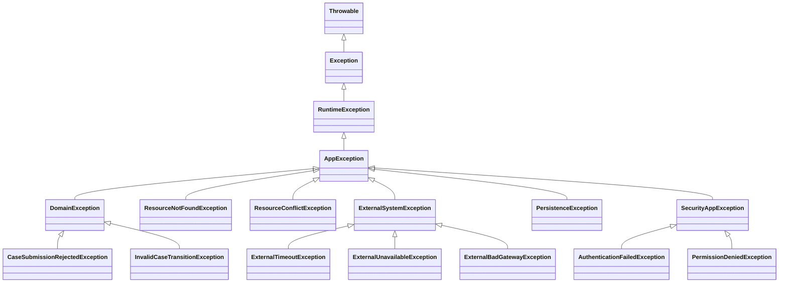

Practical note:

```text id="j9bed9"
Hierarchy jangan terlalu dalam.
Biasanya 2-3 level cukup:
AppException -> category exception -> specific exception.
```

---

# 12. Error Code Design

Error code sebaiknya stabil, uppercase, dan domain-readable.

| Good | Bad |
|---|---|
| `CASE_NOT_FOUND` | `ERR_001` tanpa dokumentasi |
| `INVALID_CASE_TRANSITION` | `RuntimeException` |
| `CUSTOMER_NOT_VERIFIED` | `Customer not verified` sebagai code |
| `DUPLICATE_EXTERNAL_REFERENCE` | `DuplicateException` |
| `EXTERNAL_TIMEOUT` | `HTTP_504` |
| `VALIDATION_ERROR` | `BAD_REQUEST` saja |

Guideline:

```text id="y9ns0n"
errorCode = identitas problem.
message = penjelasan manusia.
status = transport-level mapping.
detail = structured context aman.
correlationId = troubleshooting handle.
```

Jangan masukkan:

```text id="dqvkl3"
SQL query lengkap
stacktrace
password/token
PII yang tidak perlu
vendor raw response sensitif
internal class/package name
```

---

# 13. Centralized Error Factory

Untuk menghindari duplikasi, buat factory kecil.

```java id="4cj4aq"
public final class ErrorResponses {

    private ErrorResponses() {}

    public static ErrorResponse<Object> from(
        AppException exception,
        String correlationId
    ) {
        return new ErrorResponse<>(
            exception.errorCode(),
            exception.getMessage(),
            exception.detail(),
            correlationId
        );
    }

    public static ErrorResponse<Void> unexpected(String correlationId) {
        return new ErrorResponse<>(
            "INTERNAL_SERVER_ERROR",
            "Unexpected internal error",
            null,
            correlationId
        );
    }

    public static ErrorResponse<List<FieldError>> validation(
        List<FieldError> fieldErrors,
        String correlationId
    ) {
        return new ErrorResponse<>(
            "VALIDATION_ERROR",
            "Request validation failed",
            fieldErrors,
            correlationId
        );
    }
}
```

Mapper jadi lebih bersih:

```java id="xuxpcx"
ErrorResponse<Object> error =
    ErrorResponses.from(exception, correlationId);
```

---

# 14. Fallback Exception Mapper

Fallback mapper diperlukan supaya unexpected exception tidak membocorkan stacktrace.

```java id="a6bnsc"
@Provider
public class UnexpectedExceptionMapper
    implements ExceptionMapper<Throwable> {

    @Override
    public Response toResponse(Throwable exception) {
        String correlationId = null; // ambil dari request context/header/provider

        logUnexpected(exception, correlationId);

        ErrorResponse<Void> error =
            ErrorResponses.unexpected(correlationId);

        return Response.status(Response.Status.INTERNAL_SERVER_ERROR)
            .type(MediaType.APPLICATION_JSON_TYPE)
            .entity(ApiResponse.failed(error))
            .build();
    }

    private void logUnexpected(Throwable exception, String correlationId) {
        // Log full stacktrace internal only.
        // Do not expose stacktrace to client.
    }
}
```

Jersey documentation menyebut custom exception mapping provider dapat dipakai ketika tidak tepat melempar `WebApplicationException`; Jersey juga mencatat adanya default exception mapper sejak Jersey 3.1.0 sebagai requirement JAX-RS 3.1, dan default mapper diproses di akhir chain jika tidak ada mapper lain yang menangani. ([Eclipse EE4J](https://eclipse-ee4j.github.io/jersey.github.io/documentation/latest3x/user-guide.html))

Practical warning:

```text id="yf7d0s"
ExceptionMapper<Throwable> adalah fallback terakhir.
Jangan jadikan tempat business mapping utama.
```

---

# 15. Mapper Selection dan Specificity

Desain praktis:

```text id="pr9jdd"
ConstraintViolationExceptionMapper -> validation error
ResourceNotFoundExceptionMapper -> not found
ResourceConflictExceptionMapper -> conflict
DomainExceptionMapper -> domain rejection
ExternalSystemExceptionMapper -> downstream failure
UnexpectedExceptionMapper -> fallback
```

Jangan hanya punya:

```java id="poswwb"
@Provider
public class AllExceptionMapper implements ExceptionMapper<Exception> {
    ...
}
```

Masalah:

```text id="1nw3wd"
Semua error diperlakukan mirip.
Domain, validation, external, dan bug tidak terpisah.
Observability buruk.
HTTP status sering salah.
```

Lebih baik beberapa mapper berdasarkan kategori.

---

# 16. External Adapter Exception Translation

Contoh external client adapter:

```java id="cplu5t"
public class CustomerVerificationHttpClient
    implements CustomerVerificationGateway {

    private final ExternalCustomerClient client;

    @Override
    public boolean isVerified(String customerId) {
        try {
            ExternalCustomerResponse response =
                client.getCustomer(customerId);

            return "VERIFIED".equals(response.verificationStatus());

        } catch (SocketTimeoutException exception) {
            throw new ExternalTimeoutException(
                "CUSTOMER_SERVICE",
                exception
            );

        } catch (ExternalClientUnavailableException exception) {
            throw new ExternalUnavailableException(
                "CUSTOMER_SERVICE",
                exception
            );

        } catch (RuntimeException exception) {
            throw new ExternalBadGatewayException(
                "CUSTOMER_SERVICE",
                exception
            );
        }
    }
}
```

Practical rule:

```text id="ve8ppx"
External adapter adalah tempat menerjemahkan vendor-specific failure menjadi internal failure taxonomy.
Application service tidak perlu tahu apakah vendor melempar FeignException, ProcessingException, SQLException, atau SDK-specific exception.
```

---

# 17. MyBatis / PostgreSQL Exception Translation

Repository adapter:

```java id="u7m0j2"
public class CaseRepositoryMyBatisAdapter implements CaseRepository {

    private final CaseMyBatisMapper mapper;
    private final CasePersistenceMapper persistenceMapper;

    @Override
    public Case save(Case caseData) {
        try {
            mapper.insert(persistenceMapper.toRecord(caseData));
            return caseData;

        } catch (DuplicateKeyException exception) {
            throw new ResourceConflictException(
                "DUPLICATE_CASE",
                "Case already exists",
                new DuplicateResourceDetail("case", caseData.id().value())
            );

        } catch (RuntimeException exception) {
            throw new PersistenceException(
                "Failed to save case",
                exception
            );
        }
    }
}
```

Kalau tidak pakai Spring exception hierarchy, tangkap exception MyBatis/JDBC yang relevan sesuai stack perusahaan.

Practical guideline:

```text id="n1pvxh"
Constraint unik yang memang bagian dari business rule bisa diterjemahkan ke 409.
DB connectivity/SQL bug/mapper bug jangan diterjemahkan ke 400/409; itu internal/infrastructure failure.
```

---

# 18. Exception di Filter dan Interceptor

Filter boleh throw exception atau `abortWith`.

Contoh auth filter:

```java id="4gctx9"
@Provider
@Priority(Priorities.AUTHENTICATION)
public class AuthenticationFilter implements ContainerRequestFilter {

    @Override
    public void filter(ContainerRequestContext requestContext) {
        String authorization =
            requestContext.getHeaderString(HttpHeaders.AUTHORIZATION);

        if (authorization == null || authorization.isBlank()) {
            throw new AuthenticationFailedException(
                "Missing Authorization header"
            );
        }
    }
}
```

Mapper:

```java id="ptkg3k"
@Provider
public class SecurityAppExceptionMapper
    extends BaseAppExceptionMapper<SecurityAppException> {
}
```

Practical note:

```text id="q2hyb2"
Filter exception tetap harus masuk error contract yang sama.
Jangan biarkan auth/security failure punya response shape berbeda dari domain/validation error.
```

---

# 19. Logging Strategy

## 19.1 Log Level by Category

| Exception | Log level | Reason |
|---|---|---|
| Validation error | DEBUG / INFO rendah | client input salah, sering terjadi |
| Not found | INFO / DEBUG | normal pada lookup tertentu |
| Domain rejection | INFO | expected business failure |
| Conflict | INFO / WARN | bisa indikasi race/idempotency issue |
| External timeout | WARN | dependency issue |
| External unavailable | WARN / ERROR | dependency down |
| Persistence error | ERROR | internal/infrastructure |
| Unexpected exception | ERROR | bug/internal unknown |

## 19.2 Log Format

Minimal structured log fields:

```text id="6ipmij"
timestamp
level
service
operation
correlationId
tenantId
userId
errorCode
exceptionClass
httpStatus
resourcePath
method
retryable
```

Jangan log:

```text id="m3i024"
access token
password
full PII payload
raw vendor response sensitif
credit card data
large request/response body
```

---

# 20. Correlation ID Integration

Idealnya correlation ID sudah dibuat di request filter.

```java id="8uibdf"
@Provider
public class CorrelationIdFilter
    implements ContainerRequestFilter, ContainerResponseFilter {

    public static final String PROPERTY = "correlationId";

    @Override
    public void filter(ContainerRequestContext requestContext) {
        String correlationId =
            requestContext.getHeaderString("X-Correlation-ID");

        if (correlationId == null || correlationId.isBlank()) {
            correlationId = UUID.randomUUID().toString();
        }

        requestContext.setProperty(PROPERTY, correlationId);
    }

    @Override
    public void filter(
        ContainerRequestContext requestContext,
        ContainerResponseContext responseContext
    ) {
        Object correlationId = requestContext.getProperty(PROPERTY);

        if (correlationId != null) {
            responseContext.getHeaders()
                .putSingle("X-Correlation-ID", correlationId.toString());
        }
    }
}
```

Exception mapper bisa membaca dari request context provider atau header/context abstraction. Jangan membuat setiap mapper punya cara berbeda mengambil correlation ID.

---

# 21. Retryable Error Flag

Untuk distributed system, `retryable` berguna untuk log/metrics/internal decision, tapi hati-hati mengeksposnya ke public client.

```java id="5gp5fz"
public record ErrorResponse<TDetail>(
    String code,
    String message,
    TDetail detail,
    String correlationId
) {}
```

Retryable bisa disimpan internal di exception:

```java id="ox1l6o"
public boolean retryable() {
    return retryable;
}
```

Atau disertakan hanya pada internal API:

```java id="b6t8ys"
public record InternalErrorResponse<TDetail>(
    String code,
    String message,
    TDetail detail,
    String correlationId,
    boolean retryable
) {}
```

Practical rule:

```text id="uqz5v4"
Jangan memberi sinyal retryable ke client publik kalau belum ada idempotency dan rate-limit policy yang aman.
```

---

# 22. Practical Resource Tanpa Try-Catch

Resource ideal:

```java id="5imbez"
@Path("/cases")
@Consumes(MediaType.APPLICATION_JSON)
@Produces(MediaType.APPLICATION_JSON)
public class CaseResource {

    private final CaseApplicationService caseService;
    private final CaseApiMapper mapper;

    @POST
    public Response submit(@Valid SubmitCaseRequest request) {
        SubmitCaseCommand command = mapper.toCommand(request);

        SubmitCaseResult result = caseService.submit(command);

        CaseResponse response = mapper.toResponse(result);

        return Response.status(Response.Status.CREATED)
            .entity(ApiResponse.ok(response))
            .build();
    }
}
```

Service:

```java id="q6dgo7"
public SubmitCaseResult submit(SubmitCaseCommand command) {
    if (!customerVerificationGateway.isVerified(command.customerId())) {
        throw new CaseSubmissionRejectedException(
            "Customer is not verified"
        );
    }

    Case newCase = Case.createSubmitted(
        command.customerId(),
        command.requestedAmount(),
        command.productCode()
    );

    Case saved = caseRepository.save(newCase);

    return new SubmitCaseResult(
        saved.id().value(),
        saved.status().name(),
        saved.customerId(),
        saved.productCode()
    );
}
```

ExceptionMapper yang menangani response.

Manfaat:

```text id="wd8foe"
Resource lebih bersih.
Error response konsisten.
Service tetap fokus use case.
Testing mapper bisa terpisah.
```

---

# 23. Anti-Patterns

| Anti-pattern | Contoh | Masalah | Perbaikan |
|---|---|---|---|
| Try-catch di semua resource | setiap endpoint catch `Exception` | duplikasi, status tidak konsisten | centralized `ExceptionMapper` |
| Semua error 500 | domain reject jadi internal error | client tidak bisa handle | taxonomy + mapper |
| Stacktrace ke client | `exception.toString()` sebagai message | security leak | generic external message |
| Message sebagai code | client parse message | fragile | stable `errorCode` |
| `ExceptionMapper<Throwable>` terlalu pintar | semua logic mapping di fallback | sulit maintain | mapper per kategori |
| Vendor exception bocor | response berisi SDK error | coupling dan security risk | translate di adapter |
| DB exception jadi 400 | SQL failure dianggap client error | misleading | persistence/internal error |
| Domain throw `BadRequestException` | domain tahu HTTP | coupling | domain exception |
| Catch lalu return null | service gagal diam-diam | NPE belakangan | throw meaningful exception |
| Log semua validation error as ERROR | noise | alert fatigue | log level sesuai kategori |
| Sensitive detail di `detail` | token, SQL, PII | data leak | sanitize detail |
| Tidak test mapper | error contract berubah diam-diam | breaking API | mapper + integration test |

---

# 24. Unit Test Exception Mapper

```java id="83ebuw"
class DomainExceptionMapperTest {

    @Test
    void shouldMapDomainExceptionToUnprocessableEntity() {
        DomainExceptionMapper mapper = new DomainExceptionMapper();

        CaseSubmissionRejectedException exception =
            new CaseSubmissionRejectedException("Customer is not verified");

        Response response = mapper.toResponse(exception);

        assertEquals(422, response.getStatus());

        ApiResponse<?> body = (ApiResponse<?>) response.getEntity();

        assertFalse(body.success());
        assertEquals(
            "CASE_SUBMISSION_REJECTED",
            body.error().code()
        );
    }
}
```

Jika base mapper memakai `@Context`, unit test bisa butuh constructor/context abstraction agar tidak tergantung injection runtime.

Better design:

```java id="8p05un"
public interface CorrelationIdProvider {
    String currentCorrelationId();
}
```

Lalu mapper menerima provider via constructor.

---

# 25. Integration Test Resource + Mapper

Test ini memastikan JAX-RS runtime benar-benar menemukan mapper.

Pseudo flow:

```text id="4n1ydk"
1. Start JerseyTest / in-memory test container.
2. Register resource + mapper.
3. Mock service melempar DomainException.
4. Call endpoint.
5. Assert HTTP status dan JSON body.
```

Contoh konseptual:

```java id="zkodcn"
@Test
void submitShouldReturn422WhenCustomerNotVerified() {
    SubmitCaseRequest request = new SubmitCaseRequest(
        "CUST-001",
        new BigDecimal("5000000"),
        "LOAN_BASIC"
    );

    Response response = target("/cases")
        .request(MediaType.APPLICATION_JSON)
        .post(Entity.json(request));

    assertEquals(422, response.getStatus());

    ApiResponse<?> body = response.readEntity(ApiResponse.class);

    assertFalse(body.success());
}
```

Practical target:

```text id="eu68mv"
Unit test membuktikan mapper logic benar.
Integration test membuktikan mapper terdaftar dan dipakai runtime.
```

---

# 26. Error Contract Test

Buat test yang menjaga shape response error.

```java id="xqzscr"
@Test
void errorResponseShouldHaveStableShape() {
    ErrorResponse<FieldError> error = new ErrorResponse<>(
        "VALIDATION_ERROR",
        "Request validation failed",
        new FieldError("customerId", "must not be blank"),
        "corr-123"
    );

    assertNotNull(error.code());
    assertNotNull(error.message());
    assertNotNull(error.correlationId());
}
```

Untuk API publik/internal dengan kontrak kuat, lanjutkan dengan OpenAPI contract test.

---

# 27. Code Review Checklist

## Exception Hierarchy

- Apakah exception punya `errorCode` stabil?
- Apakah exception category jelas?
- Apakah status mapping konsisten?
- Apakah domain exception tidak bergantung pada vendor/DB?
- Apakah hierarchy tidak terlalu dalam?

## ExceptionMapper

- Apakah mapper concrete punya `@Provider` atau registered?
- Apakah mapper tidak return `null` tanpa sengaja?
- Apakah mapper tidak melempar exception baru?
- Apakah response `Content-Type` konsisten?
- Apakah fallback mapper tidak membocorkan stacktrace?

## Resource

- Apakah resource bebas dari try-catch repetitive?
- Apakah resource tidak mem-build error response manual berkali-kali?
- Apakah validation memakai `@Valid` untuk request DTO?
- Apakah domain/service exception dibiarkan ke mapper?

## External / Persistence

- Apakah vendor exception diterjemahkan di adapter?
- Apakah DB unique conflict menjadi 409 jika business-relevant?
- Apakah infrastructure failure tidak dipetakan menjadi 400?
- Apakah retryable failure ditandai internal?

## Observability

- Apakah log punya correlation ID?
- Apakah errorCode masuk metric/log?
- Apakah log level sesuai kategori?
- Apakah sensitive data tidak bocor?
- Apakah alert hanya untuk error yang actionable?

---

# 28. Practical Mini Exercise

Ambil 5 error dari project nyata, lalu klasifikasikan:

```text id="p3r2yo"
1. Customer not verified
2. Case not found
3. Duplicate external reference
4. Customer service timeout
5. MyBatis mapper XML salah
```

Mapping ideal:

| Error | Exception | Status | Retryable | Client message |
|---|---|---:|---:|---|
| Customer not verified | `CaseSubmissionRejectedException` | 422 | Tidak | Customer is not verified |
| Case not found | `ResourceNotFoundException` | 404 | Tidak | case not found |
| Duplicate external reference | `ResourceConflictException` | 409 | Tidak | Duplicate external reference |
| Customer service timeout | `ExternalTimeoutException` | 504 | Ya | External system timeout |
| MyBatis XML salah | `PersistenceException` / fallback | 500 | Tidak | Unexpected internal error |

Target exercise:

```text id="6thgp8"
1. Tentukan exception class.
2. Tentukan errorCode.
3. Tentukan HTTP status.
4. Tentukan apakah detail aman untuk client.
5. Tentukan log level.
6. Tentukan mapper yang menangani.
```

---

# 29. Recommended Package Structure

```text id="8ahqhk"
com.company.common
├── api
│   ├── ApiResponse.java
│   ├── ErrorResponse.java
│   └── FieldError.java
├── error
│   ├── AppException.java
│   ├── ResourceNotFoundException.java
│   ├── ResourceConflictException.java
│   ├── PersistenceException.java
│   ├── ExternalSystemException.java
│   ├── ExternalTimeoutException.java
│   ├── BaseAppExceptionMapper.java
│   ├── ConstraintViolationExceptionMapper.java
│   └── UnexpectedExceptionMapper.java
│
com.company.caseapp
├── domain
│   └── exception
│       ├── DomainException.java
│       ├── CaseSubmissionRejectedException.java
│       └── InvalidCaseTransitionException.java
└── support
    └── error
        ├── DomainExceptionMapper.java
        ├── ResourceNotFoundExceptionMapper.java
        ├── ResourceConflictExceptionMapper.java
        └── ExternalSystemExceptionMapper.java
```

---

# Ringkasan Seri 7

Exception handling yang sehat di Jersey/JAX-RS microservice terdiri dari:

```text id="gy3kph"
1. Exception taxonomy yang jelas.
2. Error code yang stabil.
3. Error response contract yang konsisten.
4. ExceptionMapper per kategori.
5. Fallback mapper untuk unexpected error.
6. Translation layer untuk DB/external/vendor exception.
7. Logging/metrics berbasis errorCode + correlationId.
8. Test untuk mapper dan error contract.
```

Prinsip practical:

```text id="ioozdv"
Resource tidak perlu try-catch berulang.
Domain tidak perlu tahu HTTP exception.
Adapter menerjemahkan vendor/DB failure.
ExceptionMapper menerjemahkan exception internal menjadi HTTP response.
Fallback mapper melindungi client dari stacktrace/internal detail.
```

---

## Status

**Seri 7/12 selesai.**

Seri berikutnya yang direkomendasikan: **Seri 8/12 - Functional Interfaces: Predicate, Function, Supplier, Consumer untuk Validation, Mapping, Policy, Retry Decision, dan Composition Pattern dalam Java Microservice.**

---

**Sources:**

- [ExceptionMapper (Jakarta RESTful WS API 4.0.0 API)](https://jakarta.ee/specifications/restful-ws/4.0/apidocs/jakarta.ws.rs/jakarta/ws/rs/ext/exceptionmapper)
- [Jersey 3.1.1 User Guide](https://eclipse-ee4j.github.io/jersey.github.io/documentation/latest3x/user-guide.html)

## Response:
7/15/2026, 1:43:34 AM

Saya lanjut ke **Seri 8/12: Functional Interfaces — Predicate, Function, Supplier, Consumer**. Fokusnya practical: validation, mapping, policy composition, retry decision, lazy execution, dan batas aman agar lambda/stream tidak membuat business flow sulit dibaca.

# Seri 8/12 - Functional Interfaces: Predicate, Function, Supplier, Consumer

## Tujuan Seri Ini

Seri ini membahas penggunaan **functional interfaces** secara practical dalam microservice **Java 17+ / Jersey / JAX-RS / MyBatis / PostgreSQL / external integration**.

Fokusnya bukan membuat Java menjadi “murni functional programming”, tetapi memakai functional style untuk bagian yang memang cocok:

```text id="y1ukl5"
validation rule
mapping DTO/entity/domain
policy composition
filtering/search criteria
retry decision
lazy execution
fallback handling
event/audit callback
small reusable behavior
```

Java menyediakan package `java.util.function` untuk functional interfaces seperti `Predicate`, `Function`, `Supplier`, dan `Consumer`. `Predicate<T>` adalah boolean-valued function dengan method `test(T)`, sedangkan `Consumer<T>` merepresentasikan operation yang menerima input dan tidak mengembalikan result, biasanya melalui side-effect. ([Oracle Documentation](https://docs.oracle.com/en/java/javase/25/docs/api/java.base/java/util/function/Predicate.html?utm_source=chatgpt.com))

---

# 1. Mental Model

```mermaid id="qffpbm"
flowchart TD
    A[Functional Interfaces in Java Microservice] --> B[Predicate<T>]
    A --> C[Function<T,R>]
    A --> D[Supplier<T>]
    A --> E[Consumer<T>]
    A --> F[BiFunction / BiPredicate / BiConsumer]
    A --> G[Stream Pipeline]
    A --> H[Optional Handling]

    B --> B1[Validation Rule]
    B --> B2[Eligibility Check]
    B --> B3[Retry Decision]
    B --> B4[Filter Criteria]

    C --> C1[DTO Mapping]
    C --> C2[Entity to Domain]
    C --> C3[Domain to Response]
    C --> C4[Error Transform]

    D --> D1[Lazy Value]
    D --> D2[Fallback]
    D --> D3[Factory]
    D --> D4[Deferred External Call]

    E --> E1[Audit Callback]
    E --> E2[Event Publish]
    E --> E3[Logging Side Effect]
    E --> E4[Mutation Boundary]

    F --> F1[Context-aware Mapping]
    F --> F2[Two-input Policy]
    F --> F3[Merge/Combine]

    G --> G1[filter]
    G --> G2[map]
    G --> G3[flatMap]
    G --> G4[collect/toList]

    H --> H1[map]
    H --> H2[flatMap]
    H --> H3[orElseGet]
    H --> H4[orElseThrow]
```

Core idea:

```text id="zyvr9h"
Predicate<T>  = tanya benar/salah.
Function<T,R> = ubah T menjadi R.
Supplier<T>   = hasilkan T tanpa input, sering lazy.
Consumer<T>   = terima T dan lakukan side effect.
```

---

# 2. Decomposition Map

| Area | Functional interface | Practical use | Contoh di microservice | Risiko |
|---|---|---|---|---|
| Validation | `Predicate<T>` | rule boolean sederhana | amount > 0, status valid | error reason hilang kalau hanya boolean |
| Business policy | `Predicate<T>` / custom `Rule<T>` | eligibility composition | customer verified AND amount allowed | policy kompleks jadi lambda panjang |
| Mapping | `Function<T,R>` | transformasi object | entity → DTO, DTO → command | mapping besar jadi unreadable |
| Lazy execution | `Supplier<T>` | deferred value/call | fallback lookup, lazy error message | supplier menangkap mutable state |
| Side effect | `Consumer<T>` | audit/log/event | publish domain event | side effect tersembunyi di stream |
| Contextual mapping | `BiFunction<T,C,R>` | mapping dengan context | response mapping dengan locale/permission | parameter context terlalu besar |
| Retry decision | `Predicate<Throwable>` | decide retryable | retry timeout only | retry non-idempotent operation |
| Error handling | `Function<Throwable,E>` | exception → error detail | external exception mapping | detail sensitif bocor |
| Collection transform | stream + function | list mapping/filtering | cases → responses | stream untuk flow kompleks |
| Optional | function/supplier | absence handling | find or throw | Optional dipakai sebagai field DTO/entity |
| Composition | `and`, `or`, `compose`, `andThen` | reusable behavior chain | validation + policy chain | chaining terlalu abstrak |
| Callback | `Consumer<T>` | hook after action | audit after state transition | ordering/transaction boundary kabur |

---

# 3. Predicate<T>: Boolean Rule

`Predicate<T>` merepresentasikan fungsi boolean atas satu argumen dan memiliki method utama `test(T)`. Ia juga menyediakan composition method seperti `and`, `or`, dan `negate`. ([Oracle Documentation](https://docs.oracle.com/en/java/javase/25/docs/api/java.base/java/util/function/Predicate.html?utm_source=chatgpt.com))

## 3.1 Simple Predicate

```java id="vh6m27"
Predicate<BigDecimal> positiveAmount =
    amount -> amount != null && amount.signum() > 0;
```

Pemakaian:

```java id="hsu9h5"
if (!positiveAmount.test(command.requestedAmount())) {
    throw new CaseSubmissionRejectedException(
        "Requested amount must be positive"
    );
}
```

---

## 3.2 Predicate untuk Domain Eligibility

```java id="58v284"
public record SubmitCaseCommand(
    String customerId,
    BigDecimal requestedAmount,
    String productCode,
    boolean customerVerified
) {}
```

Predicates:

```java id="h4ri33"
Predicate<SubmitCaseCommand> hasVerifiedCustomer =
    SubmitCaseCommand::customerVerified;

Predicate<SubmitCaseCommand> hasPositiveAmount =
    command -> command.requestedAmount() != null
        && command.requestedAmount().signum() > 0;

Predicate<SubmitCaseCommand> hasProductCode =
    command -> command.productCode() != null
        && !command.productCode().isBlank();
```

Composition:

```java id="nq1su1"
Predicate<SubmitCaseCommand> canSubmitCase =
    hasVerifiedCustomer
        .and(hasPositiveAmount)
        .and(hasProductCode);
```

Pemakaian:

```java id="ku1n7k"
if (!canSubmitCase.test(command)) {
    throw new CaseSubmissionRejectedException(
        "Case submission is not eligible"
    );
}
```

Practical issue:

```text id="yc092a"
Predicate hanya memberi true/false.
Untuk validation yang perlu error detail, Predicate saja tidak cukup.
```

---

## 3.3 Predicate + Error Reason

Untuk validation yang perlu reason, gunakan custom functional interface atau `Rule<T>`.

```java id="lnrh1f"
@FunctionalInterface
public interface Rule<T> {
    Optional<BusinessError> validate(T target);
}
```

Business error:

```java id="vrz3rm"
public record BusinessError(
    String code,
    String message,
    String field
) {}
```

Rules:

```java id="86j932"
Rule<SubmitCaseCommand> customerVerifiedRule = command -> {
    if (!command.customerVerified()) {
        return Optional.of(new BusinessError(
            "CUSTOMER_NOT_VERIFIED",
            "Customer is not verified",
            "customerId"
        ));
    }

    return Optional.empty();
};
```

```java id="pxi5wg"
Rule<SubmitCaseCommand> positiveAmountRule = command -> {
    if (command.requestedAmount() == null
        || command.requestedAmount().signum() <= 0) {

        return Optional.of(new BusinessError(
            "INVALID_AMOUNT",
            "Requested amount must be positive",
            "requestedAmount"
        ));
    }

    return Optional.empty();
};
```

Validator:

```java id="g3136z"
public final class RuleValidator<T> {

    private final List<Rule<T>> rules;

    public RuleValidator(List<Rule<T>> rules) {
        this.rules = List.copyOf(rules);
    }

    public List<BusinessError> validate(T target) {
        return rules.stream()
            .map(rule -> rule.validate(target))
            .flatMap(Optional::stream)
            .toList();
    }
}
```

Pemakaian:

```java id="nmfhpq"
RuleValidator<SubmitCaseCommand> validator =
    new RuleValidator<>(List.of(
        customerVerifiedRule,
        positiveAmountRule
    ));

List<BusinessError> errors = validator.validate(command);

if (!errors.isEmpty()) {
    throw new BusinessValidationException(errors);
}
```

Practical rule:

```text id="p2d5p5"
Predicate cocok untuk decision kecil.
Rule<T> lebih cocok jika perlu error code, message, field, atau detail.
```

---

# 4. Predicate untuk Retry Decision

Retry sebaiknya tidak hardcoded di mana-mana. Buat predicate untuk menentukan exception mana yang retryable.

```java id="3q3us1"
Predicate<Throwable> retryOnTimeout =
    throwable -> throwable instanceof ExternalTimeoutException;

Predicate<Throwable> retryOnUnavailable =
    throwable -> throwable instanceof ExternalUnavailableException;

Predicate<Throwable> retryableExternalFailure =
    retryOnTimeout.or(retryOnUnavailable);
```

Pemakaian konseptual:

```java id="c6p98d"
public <T> T executeWithRetry(
    Supplier<T> operation,
    Predicate<Throwable> retryable,
    int maxAttempts
) {
    int attempt = 0;

    while (true) {
        try {
            attempt++;
            return operation.get();
        } catch (Throwable throwable) {
            if (attempt >= maxAttempts || !retryable.test(throwable)) {
                throw throwable;
            }
        }
    }
}
```

Usage:

```java id="x5j5s5"
CustomerProfile profile = executeWithRetry(
    () -> customerClient.getCustomer(customerId),
    retryableExternalFailure,
    3
);
```

Practical warning:

```text id="i9foc5"
Retry hanya aman jika operation idempotent atau punya idempotency key.
Jangan retry POST payment/order/case mutation tanpa desain idempotency.
```

---

# 5. Function<T,R>: Mapping dan Transformation

`Function<T,R>` menerima input tipe `T` dan menghasilkan output tipe `R`. Ini paling cocok untuk mapping object kecil-menengah.

## 5.1 Entity to Domain

Persistence record:

```java id="131s01"
public record CaseRecord(
    String caseId,
    String customerId,
    BigDecimal requestedAmount,
    String productCode,
    String status
) {}
```

Domain:

```java id="1p0zm9"
public final class Case {
    // fields, factory, behavior
}
```

Function:

```java id="21rvc5"
Function<CaseRecord, Case> toDomain = record -> Case.rehydrate(
    new CaseId(record.caseId()),
    record.customerId(),
    record.requestedAmount(),
    record.productCode(),
    CaseStatus.valueOf(record.status())
);
```

Pemakaian:

```java id="gwbtgn"
Optional<Case> found = Optional.ofNullable(mapper.findById(caseId.value()))
    .map(toDomain);
```

---

## 5.2 Domain to Response

```java id="fma06i"
Function<Case, CaseResponse> toResponse = caseData -> new CaseResponse(
    caseData.id().value(),
    caseData.status().name(),
    caseData.customerId(),
    caseData.productCode()
);
```

Pemakaian:

```java id="321hrc"
List<CaseResponse> responses = cases.stream()
    .map(toResponse)
    .toList();
```

Java Stream API supports aggregate operations such as filtering and transforming elements from collections, including the common pattern of `stream() -> filter() -> map() -> terminal operation`. ([Oracle Documentation](https://docs.oracle.com/en/java/javase/25/docs/api/java.base/java/util/stream/Stream.html?utm_source=chatgpt.com))

---

## 5.3 Function Composition

```java id="4jqjkm"
Function<SubmitCaseRequest, SubmitCaseCommand> requestToCommand =
    request -> new SubmitCaseCommand(
        request.customerId(),
        request.requestedAmount(),
        request.productCode()
    );

Function<SubmitCaseCommand, SubmitCaseCommand> normalizeCommand =
    command -> new SubmitCaseCommand(
        command.customerId().trim(),
        command.requestedAmount(),
        command.productCode().trim().toUpperCase(Locale.ROOT)
    );

Function<SubmitCaseRequest, SubmitCaseCommand> normalizedRequestToCommand =
    requestToCommand.andThen(normalizeCommand);
```

Pemakaian:

```java id="ll1jrn"
SubmitCaseCommand command =
    normalizedRequestToCommand.apply(request);
```

Practical rule:

```text id="0k41wq"
Function composition bagus untuk transformasi kecil.
Kalau chain mulai mengandung branching, logging, DB call, external call, atau transaction, ubah menjadi service method eksplisit.
```

---

# 6. Function vs Mapper Class

Functional style:

```java id="xow3fs"
Function<Case, CaseResponse> toResponse = caseData -> new CaseResponse(...);
```

Class-based mapper:

```java id="mgjdwf"
public class CaseApiMapper {

    public CaseResponse toResponse(Case caseData) {
        return new CaseResponse(...);
    }
}
```

Decision matrix:

| Kondisi | Gunakan `Function<T,R>` | Gunakan mapper class |
|---|---:|---:|
| Mapping kecil dan lokal | Ya | Bisa |
| Mapping dipakai di banyak class | Bisa | Ya |
| Mapping butuh dependency | Tidak ideal | Ya |
| Mapping butuh context/locale/permission | Bisa dengan `BiFunction` | Biasanya ya |
| Mapping kompleks | Tidak | Ya |
| Perlu unit test khusus | Bisa | Ya |
| Perlu MapStruct | Tidak | Ya |

Rekomendasi practical:

```text id="az1b7v"
Untuk mapping API/domain/persistence yang stabil dan banyak dipakai, pakai mapper class.
Untuk transformasi lokal kecil dalam method, Function cukup.
```

---

# 7. BiFunction<T,U,R>: Mapping dengan Context

Kadang mapping butuh context.

```java id="4z358i"
public record MappingContext(
    String locale,
    boolean includeSensitiveData
) {}
```

```java id="rzyauy"
BiFunction<Case, MappingContext, CaseResponse> toResponseWithContext =
    (caseData, context) -> new CaseResponse(
        caseData.id().value(),
        caseData.status().name(),
        caseData.customerId(),
        context.includeSensitiveData()
            ? caseData.internalNote()
            : null
    );
```

Pemakaian:

```java id="jj6uvl"
CaseResponse response = toResponseWithContext.apply(
    caseData,
    new MappingContext("id-ID", false)
);
```

Practical caveat:

```text id="h0nx4n"
Jika context terus bertambah, jangan pakai BiFunction.
Buat mapper class dengan dependency/context object yang jelas.
```

---

# 8. Supplier<T>: Lazy Value, Factory, Fallback

`Supplier<T>` menghasilkan nilai tanpa input. Ini berguna untuk lazy execution.

## 8.1 Lazy Error Creation

```java id="k1le4u"
public Case getOrThrow(
    Optional<Case> optionalCase,
    Supplier<? extends RuntimeException> exceptionSupplier
) {
    return optionalCase.orElseThrow(exceptionSupplier);
}
```

Pemakaian:

```java id="x8sa9u"
Case caseData = getOrThrow(
    caseRepository.findById(caseId),
    () -> new ResourceNotFoundException("case", caseId.value())
);
```

Kenapa supplier?

Karena exception baru dibuat hanya jika `Optional` kosong.

`Optional` di Java API terutama dimaksudkan sebagai return type untuk merepresentasikan “no result” ketika penggunaan `null` rawan error; variabel `Optional` sendiri seharusnya tidak pernah bernilai `null`. ([Oracle Documentation](https://docs.oracle.com/en/java/javase/25/docs/api/java.base/java/util/Optional.html?utm_source=chatgpt.com))

---

## 8.2 Fallback dengan `orElseGet`

Buruk jika fallback mahal:

```java id="d5j2xi"
CustomerProfile profile = cache.find(customerId)
    .orElse(customerClient.getCustomer(customerId));
```

Masalah:

```text id="avgcew"
orElse argument dievaluasi segera.
customerClient.getCustomer tetap dipanggil walaupun cache hit.
```

Lebih baik:

```java id="q41cnw"
CustomerProfile profile = cache.find(customerId)
    .orElseGet(() -> customerClient.getCustomer(customerId));
```

`orElseGet` memakai supplier sehingga fallback lazy.

---

## 8.3 Supplier untuk Factory

```java id="zux8pv"
public final class ObjectFactory<T> {

    private final Supplier<T> supplier;

    public ObjectFactory(Supplier<T> supplier) {
        this.supplier = supplier;
    }

    public T create() {
        return supplier.get();
    }
}
```

Pemakaian:

```java id="w7w4f8"
ObjectFactory<ArrayList<String>> factory =
    new ObjectFactory<>(ArrayList::new);

ArrayList<String> list = factory.create();
```

Ini sering lebih bersih daripada reflection `newInstance()`.

---

## 8.4 Supplier untuk Deferred External Call

```java id="0i03nz"
Supplier<CustomerVerificationResult> verificationCall =
    () -> customerVerificationGateway.verify(command.customerId());
```

Dapat dikombinasikan dengan retry/time limiter/circuit breaker wrapper:

```java id="9x7u3m"
CustomerVerificationResult result =
    retryExecutor.execute(verificationCall);
```

Practical rule:

```text id="2tbrh3"
Supplier cocok untuk operation yang ingin ditunda.
Pastikan operation yang disimpan di Supplier tidak menyembunyikan side effect besar tanpa nama yang jelas.
```

---

# 9. Consumer<T>: Side Effect yang Disadari

`Consumer<T>` menerima satu input dan tidak mengembalikan result; Java API menyebut `Consumer` expected to operate via side-effects. ([Java Downloads](https://download.java.net/java/early_access/loom/docs/api/java.base/java/util/function/Consumer.html?utm_source=chatgpt.com))

Karena itu, gunakan dengan hati-hati.

## 9.1 Event Publisher Consumer

```java id="u6l1o9"
Consumer<DomainEvent> publishEvent =
    eventPublisher::publish;
```

Pemakaian:

```java id="wiktz3"
domainEvents.forEach(publishEvent);
```

## 9.2 Audit Consumer

```java id="3yh4rj"
Consumer<Case> auditCaseSubmitted =
    caseData -> auditService.record(
        "CASE_SUBMITTED",
        caseData.id().value()
    );
```

Pemakaian:

```java id="gzs4k3"
auditCaseSubmitted.accept(savedCase);
```

---

## 9.3 Consumer Composition dengan `andThen`

```java id="x4o8n7"
Consumer<Case> audit =
    caseData -> auditService.record("CASE_SUBMITTED", caseData.id().value());

Consumer<Case> publish =
    caseData -> eventPublisher.publish(
        new CaseSubmittedEvent(caseData.id().value())
    );

Consumer<Case> afterSubmit = audit.andThen(publish);
```

Pemakaian:

```java id="9g0u43"
afterSubmit.accept(savedCase);
```

Practical warning:

```text id="uoxrfm"
Consumer composition bisa menyembunyikan ordering dan transaction boundary.
Untuk audit/event yang harus konsisten dengan DB commit, gunakan explicit outbox/event mechanism.
```

---

# 10. Functional Style dalam Application Service

## 10.1 Sebelum

```java id="06vi4u"
public SubmitCaseResult submit(SubmitCaseCommand command) {
    if (command.customerId() == null || command.customerId().isBlank()) {
        throw new CaseSubmissionRejectedException("Customer ID is required");
    }

    if (command.requestedAmount() == null
        || command.requestedAmount().signum() <= 0) {
        throw new CaseSubmissionRejectedException("Amount must be positive");
    }

    Case newCase = Case.createSubmitted(
        command.customerId(),
        command.requestedAmount(),
        command.productCode()
    );

    Case saved = caseRepository.save(newCase);

    eventPublisher.publish(new CaseSubmittedEvent(saved.id().value()));

    return mapper.toResult(saved);
}
```

## 10.2 Setelah: Functional Secukupnya

```java id="f5jzm3"
public SubmitCaseResult submit(SubmitCaseCommand command) {
    List<BusinessError> errors = submitCaseValidator.validate(command);

    if (!errors.isEmpty()) {
        throw new BusinessValidationException(errors);
    }

    Case newCase = createCase.apply(command);

    Case saved = caseRepository.save(newCase);

    afterCaseSubmitted.accept(saved);

    return toSubmitCaseResult.apply(saved);
}
```

Dependencies:

```java id="qur8ap"
private final RuleValidator<SubmitCaseCommand> submitCaseValidator;

private final Function<SubmitCaseCommand, Case> createCase =
    command -> Case.createSubmitted(
        command.customerId(),
        command.requestedAmount(),
        command.productCode()
    );

private final Function<Case, SubmitCaseResult> toSubmitCaseResult =
    caseData -> new SubmitCaseResult(
        caseData.id().value(),
        caseData.status().name(),
        caseData.customerId(),
        caseData.productCode()
    );

private final Consumer<Case> afterCaseSubmitted =
    caseData -> eventPublisher.publish(
        new CaseSubmittedEvent(caseData.id().value())
    );
```

Practical concern:

```text id="ud05ke"
Kalau Function/Consumer menjadi field dan menangkap dependency/service,
pastikan readability tetap lebih baik daripada method biasa.
Sering kali method private lebih jelas daripada field lambda.
```

Alternative lebih readable:

```java id="3jhq22"
private Case createCase(SubmitCaseCommand command) {
    return Case.createSubmitted(
        command.customerId(),
        command.requestedAmount(),
        command.productCode()
    );
}

private SubmitCaseResult toResult(Case caseData) {
    return new SubmitCaseResult(
        caseData.id().value(),
        caseData.status().name(),
        caseData.customerId(),
        caseData.productCode()
    );
}

private void afterSubmitted(Case caseData) {
    eventPublisher.publish(
        new CaseSubmittedEvent(caseData.id().value())
    );
}
```

Rule:

```text id="l0gpb8"
Functional interface bagus kalau behavior perlu dipassing/composed.
Private method lebih baik kalau hanya ingin memecah method panjang.
```

---

# 11. Stream Pipeline Practical

Stream cocok untuk transformation collection.

## 11.1 Mapping List

```java id="2k7d2p"
List<CaseResponse> responses = cases.stream()
    .map(caseMapper::toResponse)
    .toList();
```

## 11.2 Filtering

```java id="ajxbeb"
List<Case> pendingCases = cases.stream()
    .filter(caseData -> caseData.status() == CaseStatus.SUBMITTED)
    .toList();
```

## 11.3 Grouping

```java id="e06142"
Map<CaseStatus, List<Case>> byStatus = cases.stream()
    .collect(Collectors.groupingBy(Case::status));
```

## 11.4 Avoid Side Effects in Stream

Hindari:

```java id="dmsuh2"
cases.stream()
    .filter(caseData -> caseData.status() == CaseStatus.SUBMITTED)
    .map(caseRepository::save)
    .forEach(eventPublisher::publish);
```

Masalah:

```text id="won7hl"
DB mutation dan event publish tersembunyi dalam stream.
Error handling dan transaction boundary tidak jelas.
Debugging sulit.
```

Lebih jelas:

```java id="txktjb"
for (Case caseData : cases) {
    if (caseData.status() != CaseStatus.SUBMITTED) {
        continue;
    }

    Case saved = caseRepository.save(caseData);

    eventPublisher.publish(
        new CaseUpdatedEvent(saved.id().value())
    );
}
```

Practical rule:

```text id="kefml8"
Stream bagus untuk pure transformation.
Loop biasa sering lebih baik untuk mutation, transaction, logging detail, dan error handling kompleks.
```

---

# 12. Performance Note: Stream vs Loop

Stream tidak otomatis lebih cepat dari loop. Ia lebih expressive untuk transformation, tetapi bisa membawa overhead alokasi dan dispatch tambahan. Penelitian tentang profiling Java Streams mencatat bahwa stream abstraction dapat menimbulkan overhead, terutama karena extra object allocations, reclamation, dan virtual method calls; ini penting untuk workload performance-sensitive. ([arXiv](https://arxiv.org/abs/2302.10006?utm_source=chatgpt.com))

Practical guideline:

| Kondisi | Pilihan |
|---|---|
| mapping/filter list kecil-menengah | stream OK |
| readability stream lebih tinggi | stream OK |
| hot path sangat performance-sensitive | benchmark |
| mutation/transaction per item | loop biasa |
| perlu early exit kompleks | loop biasa |
| parallel stream di service request path | hati-hati, biasanya hindari |
| batch processing besar | benchmark + profiling |

Jangan melakukan micro-optimization tanpa data. Untuk endpoint biasa, readability dan correctness lebih penting. Untuk batch/reporting/high-throughput path, ukur dengan benchmark/profiler.

---

# 13. Optional + Functional Methods

Optional cocok untuk return type “mungkin tidak ada”, bukan untuk field DTO/entity.

## 13.1 Find or Throw

```java id="92bfqd"
public Case findRequired(CaseId caseId) {
    return caseRepository.findById(caseId)
        .orElseThrow(() -> new ResourceNotFoundException(
            "case",
            caseId.value()
        ));
}
```

## 13.2 Map Optional

```java id="f6ko43"
public Optional<CaseResponse> findResponse(CaseId caseId) {
    return caseRepository.findById(caseId)
        .map(caseMapper::toResponse);
}
```

## 13.3 FlatMap Optional

```java id="o8amrs"
public Optional<CustomerProfile> findCustomerForCase(CaseId caseId) {
    return caseRepository.findById(caseId)
        .flatMap(caseData -> customerRepository.findById(
            new CustomerId(caseData.customerId())
        ));
}
```

Practical warning:

```text id="vmt6d4"
Jangan pakai Optional sebagai field DTO/entity.
Optional paling cocok sebagai return type method.
```

---

# 14. Custom Functional Interface untuk Checked Exception

Java built-in `Function` tidak bisa throw checked exception tanpa wrapping.

```java id="43o8az"
@FunctionalInterface
public interface ThrowingSupplier<T> {
    T get() throws Exception;
}
```

Wrapper:

```java id="pxjyxi"
public final class CheckedExceptions {

    private CheckedExceptions() {}

    public static <T> Supplier<T> unchecked(ThrowingSupplier<T> supplier) {
        return () -> {
            try {
                return supplier.get();
            } catch (Exception exception) {
                throw new RuntimeException(exception);
            }
        };
    }
}
```

Pemakaian:

```java id="vzd2ey"
Supplier<CustomerProfile> supplier = CheckedExceptions.unchecked(
    () -> externalClient.fetchCustomer(customerId)
);
```

Practical warning:

```text id="6p9cp9"
Jangan sembarang wrap checked exception menjadi RuntimeException tanpa taxonomy.
Untuk external/DB failure, lebih baik translate ke AppException yang meaningful.
```

Lebih baik:

```java id="crlbgj"
public CustomerProfile fetchCustomer(String customerId) {
    try {
        return externalClient.fetchCustomer(customerId);
    } catch (TimeoutException exception) {
        throw new ExternalTimeoutException("CUSTOMER_SERVICE", exception);
    } catch (Exception exception) {
        throw new ExternalBadGatewayException("CUSTOMER_SERVICE", exception);
    }
}
```

---

# 15. Higher-Order Utility: Execute Around

Functional interface berguna untuk pattern “execute around”.

## 15.1 Timing Wrapper

```java id="2xeltu"
public final class TimedExecutor {

    public <T> T execute(String operationName, Supplier<T> operation) {
        long start = System.nanoTime();

        try {
            return operation.get();
        } finally {
            long durationNanos = System.nanoTime() - start;
            metrics.recordDuration(operationName, durationNanos);
        }
    }
}
```

Usage:

```java id="5etwzq"
Case saved = timedExecutor.execute(
    "case.repository.save",
    () -> caseRepository.save(newCase)
);
```

## 15.2 Transaction-Like Wrapper Concept

```java id="pejo0p"
public <T> T withinTransaction(Supplier<T> operation) {
    transactionManager.begin();

    try {
        T result = operation.get();
        transactionManager.commit();
        return result;
    } catch (RuntimeException exception) {
        transactionManager.rollback();
        throw exception;
    }
}
```

Usage:

```java id="9rw4oq"
SubmitCaseResult result = withinTransaction(() -> {
    Case saved = caseRepository.save(newCase);
    outboxRepository.save(new CaseSubmittedEvent(saved.id().value()));
    return toResult(saved);
});
```

Practical warning:

```text id="2y839f"
Transaction boundary harus eksplisit dan mudah dilacak.
Jangan menyembunyikan external network call di dalam transaction supplier kecuali memang disengaja.
```

---

# 16. Functional Policy Composition

## 16.1 Policy Interface

```java id="klvrvf"
@FunctionalInterface
public interface Policy<T> {
    Decision evaluate(T target);
}
```

Decision:

```java id="5osw89"
public sealed interface Decision
    permits Decision.Allowed, Decision.Denied {

    record Allowed() implements Decision {}

    record Denied(String code, String reason) implements Decision {}

    static Decision allowed() {
        return new Allowed();
    }

    static Decision denied(String code, String reason) {
        return new Denied(code, reason);
    }
}
```

Policy implementation:

```java id="94gjwd"
Policy<SubmitCaseCommand> amountLimitPolicy = command -> {
    BigDecimal max = new BigDecimal("100000000");

    if (command.requestedAmount().compareTo(max) > 0) {
        return Decision.denied(
            "AMOUNT_LIMIT_EXCEEDED",
            "Requested amount exceeds limit"
        );
    }

    return Decision.allowed();
};
```

## 16.2 Policy Composer

```java id="j1q4by"
public final class Policies {

    private Policies() {}

    public static <T> Policy<T> allOf(List<Policy<T>> policies) {
        return target -> {
            for (Policy<T> policy : policies) {
                Decision decision = policy.evaluate(target);

                if (decision instanceof Decision.Denied) {
                    return decision;
                }
            }

            return Decision.allowed();
        };
    }
}
```

Usage:

```java id="f5o0ua"
Policy<SubmitCaseCommand> submitPolicy = Policies.allOf(List.of(
    customerVerifiedPolicy,
    amountLimitPolicy,
    productAllowedPolicy
));

Decision decision = submitPolicy.evaluate(command);

if (decision instanceof Decision.Denied denied) {
    throw new CaseSubmissionRejectedException(denied.reason());
}
```

Practical note:

```text id="b3cs7s"
Policy<T> lebih kaya daripada Predicate<T> karena membawa alasan deny.
Untuk regulated/business-heavy logic, jangan hanya boolean.
```

---

# 17. Functional Interfaces di Jersey Resource

Resource boleh memakai function kecil, tetapi jangan terlalu functional sampai HTTP flow kabur.

## 17.1 Simple Mapper Function

```java id="37btdq"
@GET
@Path("/{caseId}")
public Response findById(@PathParam("caseId") String rawCaseId) {
    Function<String, CaseId> parseCaseId = CaseId::new;

    CaseResponse response = caseService.findById(
        parseCaseId.apply(rawCaseId)
    );

    return Response.ok(ApiResponse.ok(response)).build();
}
```

Lebih baik jika parsing dipakai berulang:

```java id="q3knfd"
@GET
@Path("/{caseId}")
public Response findById(@PathParam("caseId") CaseId caseId) {
    CaseResponse response = caseService.findById(caseId);
    return Response.ok(ApiResponse.ok(response)).build();
}
```

Dengan `ParamConverterProvider`.

Rule:

```text id="13i1aa"
Functional style di resource hanya untuk glue kecil.
Kalau dipakai berulang, jadikan mapper/converter/service eksplisit.
```

---

# 18. Functional Interfaces di MyBatis Boundary

Stream mapping cocok di repository adapter:

```java id="wbi9l5"
public Page<Case> search(CaseSearchCriteria criteria, PageRequest pageRequest) {
    List<CaseRecord> records = mapper.search(
        criteria,
        pageRequest.limit(),
        pageRequest.offset()
    );

    List<Case> cases = records.stream()
        .map(persistenceMapper::toDomain)
        .toList();

    long total = mapper.count(criteria);

    return new Page<>(
        cases,
        pageRequest.limit(),
        pageRequest.offset(),
        total
    );
}
```

Ini aman karena:

```text id="p9ht9l"
stream hanya melakukan pure transformation CaseRecord -> Case.
Tidak ada DB call per item.
Tidak ada side effect tersembunyi.
```

Hindari:

```java id="jbl71n"
List<Case> cases = records.stream()
    .map(record -> {
        auditMapper.insert(...);
        return persistenceMapper.toDomain(record);
    })
    .toList();
```

Karena stream mapping tidak lagi pure.

---

# 19. Functional Interfaces untuk Error Mapping

```java id="tzdu2o"
Function<AppException, ErrorResponse<Object>> toErrorResponse =
    exception -> new ErrorResponse<>(
        exception.errorCode(),
        exception.getMessage(),
        exception.detail(),
        correlationIdProvider.currentCorrelationId()
    );
```

Pemakaian:

```java id="g2nxuz"
ErrorResponse<Object> error = toErrorResponse.apply(exception);
```

Untuk mapper yang lebih serius, lebih baik factory class:

```java id="vqmfto"
public class ErrorResponseFactory {

    private final CorrelationIdProvider correlationIdProvider;

    public ErrorResponseFactory(CorrelationIdProvider correlationIdProvider) {
        this.correlationIdProvider = correlationIdProvider;
    }

    public ErrorResponse<Object> from(AppException exception) {
        return new ErrorResponse<>(
            exception.errorCode(),
            exception.getMessage(),
            exception.detail(),
            correlationIdProvider.currentCorrelationId()
        );
    }
}
```

Rule:

```text id="0zw34a"
Function bagus untuk mapping lokal.
Factory/service lebih baik jika mapping butuh dependency, policy, masking, localization, atau logging.
```

---

# 20. Method Reference vs Lambda

Method reference:

```java id="z6w1a2"
cases.stream()
    .map(caseMapper::toResponse)
    .toList();
```

Lambda:

```java id="5s756d"
cases.stream()
    .map(caseData -> caseMapper.toResponse(caseData))
    .toList();
```

Gunakan method reference jika lebih jelas. Gunakan lambda jika perlu logic tambahan.

Jangan membuat lambda terlalu panjang:

```java id="qh8xmk"
cases.stream()
    .map(caseData -> {
        // 30 lines of business logic
    })
    .toList();
```

Lebih baik extract method:

```java id="zh2v7u"
cases.stream()
    .map(this::toCaseResponse)
    .toList();
```

---

# 21. Anti-Patterns Functional Style

| Anti-pattern | Contoh | Masalah | Perbaikan |
|---|---|---|---|
| Lambda terlalu panjang | 30-line lambda | sulit dibaca/test | extract method/class |
| Stream dengan side effect DB | `map(repository::save)` | transaction/error kabur | loop eksplisit |
| Predicate untuk validation kaya detail | `false` saja | reason hilang | `Rule<T>` / `Policy<T>` |
| Supplier menyembunyikan external call | `Supplier<T> op` tanpa nama | flow tidak jelas | method named `fetchCustomer` |
| Consumer untuk event publish dalam transaction | `afterSubmit.accept(saved)` | commit boundary kabur | outbox/service eksplisit |
| Optional sebagai field DTO | `Optional<String> name` | serialization contract aneh | nullable field + validation |
| Parallel stream di request path | `.parallelStream()` | thread pool contention | explicit executor jika perlu |
| Function field untuk logic biasa | field lambda di service | lebih sulit debug | private method |
| Composition berlebihan | `f.andThen(g).andThen(h)...` | stacktrace/readability buruk | named steps |
| Catch checked exception di lambda asal wrap | `throw new RuntimeException(e)` | taxonomy hilang | translate exception |

---

# 22. Practical Checklist Code Review

## Predicate / Rule

- Apakah boolean cukup, atau perlu error reason?
- Apakah predicate namanya jelas?
- Apakah composition `and/or` masih readable?
- Apakah rule bisnis penting tidak tersembunyi dalam lambda anonim?

## Function / Mapper

- Apakah mapping pure?
- Apakah mapping tidak melakukan DB/external call?
- Apakah mapping cukup kecil?
- Apakah lebih cocok mapper class?

## Supplier

- Apakah lazy execution memang dibutuhkan?
- Apakah supplier tidak menangkap mutable state berbahaya?
- Apakah supplier tidak menyembunyikan side effect penting?
- Apakah fallback mahal memakai `orElseGet`, bukan `orElse`?

## Consumer

- Apakah side effect disengaja dan terlihat?
- Apakah ordering penting?
- Apakah transaction boundary jelas?
- Apakah event/audit side effect aman jika operation gagal setelahnya?

## Stream

- Apakah stream hanya transformation/filtering?
- Apakah ada side effect tersembunyi?
- Apakah pipeline terlalu panjang?
- Apakah loop biasa lebih mudah dibaca?
- Apakah hot path perlu benchmark?

---

# 23. Decision Matrix

| Kebutuhan | Gunakan |
|---|---|
| Boolean decision sederhana | `Predicate<T>` |
| Validation dengan error detail | `Rule<T>` / `Policy<T>` |
| Object transformation lokal | `Function<T,R>` |
| Mapping reusable/complex | Mapper class |
| Mapping dengan context | `BiFunction<T,C,R>` atau mapper class |
| Lazy fallback | `Supplier<T>` / `orElseGet` |
| Lazy exception | `Supplier<? extends RuntimeException>` |
| Side effect callback | `Consumer<T>` |
| Two-input decision | `BiPredicate<T,U>` |
| Two-input combine | `BiFunction<T,U,R>` |
| Pure list mapping/filtering | Stream |
| Mutation per item | Loop biasa |
| Optional absence handling | `Optional.map/flatMap/orElseThrow` |
| Retry decision | `Predicate<Throwable>` |
| Execute-around wrapper | `Supplier<T>` |

---

# 24. Practical Mini Exercise

Ambil endpoint:

```text id="a6ibsg"
POST /cases
```

Coba pisahkan behavior:

```text id="oq2pjf"
1. Request DTO -> Command
2. Command validation
3. Eligibility policy
4. Domain creation
5. Save case
6. Publish event/audit
7. Domain/result -> Response DTO
```

Klasifikasikan:

| Step | Cocok functional? | Interface |
|---|---:|---|
| Request DTO → Command | Ya | `Function<SubmitCaseRequest, SubmitCaseCommand>` |
| Validation with detail | Ya, tapi custom | `Rule<SubmitCaseCommand>` |
| Eligibility decision | Ya, custom richer than boolean | `Policy<SubmitCaseCommand>` |
| Domain creation | Bisa | `Function<SubmitCaseCommand, Case>` |
| Save case | Tidak ideal sebagai stream map | explicit repository call |
| Publish event/audit | Bisa callback, tapi hati-hati | `Consumer<Case>` |
| Result → Response DTO | Ya | `Function<SubmitCaseResult, CaseResponse>` |

Target exercise:

```text id="j0r7l4"
Gunakan functional interface untuk transformation/rule kecil.
Gunakan service/domain method eksplisit untuk workflow utama, transaction, persistence, dan side effect penting.
```

---

# 25. Recommended Package Structure

```text id="vypldu"
com.company.common
├── functional
│   ├── Rule.java
│   ├── Policy.java
│   ├── Decision.java
│   ├── ThrowingSupplier.java
│   └── CheckedExceptions.java
├── validation
│   ├── RuleValidator.java
│   └── BusinessError.java
├── retry
│   ├── RetryExecutor.java
│   └── RetryPredicates.java
└── mapping
    ├── Mapper.java
    └── ContextualMapper.java

com.company.caseapp
├── application
│   ├── policy
│   │   └── SubmitCasePolicy.java
│   ├── validation
│   │   └── SubmitCaseRules.java
│   └── mapper
│       └── CaseApplicationMapper.java
└── api
    └── mapper
        └── CaseApiMapper.java
```

---

# Ringkasan Seri 8

Functional interfaces practical di Java microservice:

```text id="3w34k8"
Predicate<T>  = boolean rule / filter / retry decision.
Function<T,R> = mapping / transformation.
Supplier<T>   = lazy value / fallback / deferred operation.
Consumer<T>   = side effect / callback / event/audit hook.
BiFunction    = mapping dengan dua input/context.
Rule<T>       = validation dengan error detail.
Policy<T>     = business decision dengan reason.
```

Prinsip senior-level:

```text id="clx4li"
Functional style bagus untuk behavior kecil, pure, composable.
OOP/service method lebih baik untuk workflow utama, transaction, persistence, dan side effect penting.
Stream bagus untuk transformation; loop lebih baik untuk mutation dan error handling kompleks.
Predicate cukup untuk true/false; gunakan Rule/Policy jika butuh alasan bisnis.
Supplier bagus untuk lazy execution; jangan menyembunyikan side effect besar.
Consumer berarti side effect; treat sebagai boundary yang harus jelas.
```

---

## Status

**Seri 8/12 selesai.**

Seri berikutnya yang direkomendasikan: **Seri 9/12 - Stream, Optional, dan Collection Transformation Patterns dalam Java Jersey/JAX-RS Microservice.**

---

**Sources:**

- [Predicate (Java SE 25 & JDK 25)](https://docs.oracle.com/en/java/javase/25/docs/api/java.base/java/util/function/Predicate.html?utm_source=chatgpt.com)
- [Consumer (Java SE 25 & JDK 25 [build 1])](https://download.java.net/java/early_access/loom/docs/api/java.base/java/util/function/Consumer.html?utm_source=chatgpt.com)
- [Profiling and Optimizing Java Streams](https://arxiv.org/abs/2302.10006?utm_source=chatgpt.com)

## Response:
7/15/2026, 1:48:02 AM

# Seri 9/12 - Stream, Optional, dan Collection Transformation Patterns

## Tujuan Seri Ini

Seri ini fokus pada penggunaan **Stream**, **Optional**, dan transformasi collection secara practical dalam microservice **Java 17+ / Jersey/JAX-RS / MyBatis / PostgreSQL**.

Yang ingin dicapai:

```text id="2zqvgq"
mapping entity/record/domain/DTO dengan jelas
filtering dan grouping data in-memory secara aman
menghindari null-handling berantakan
menghindari stream pipeline yang menyembunyikan side effect
membedakan kapan Stream bagus dan kapan loop biasa lebih baik
menghindari Optional misuse di DTO/entity
```

Oracle mendeskripsikan stream pipeline sebagai kombinasi source, zero-or-more intermediate operations seperti `filter`, dan terminal operation seperti `count` atau `forEach`; artinya Stream adalah pipeline transformasi data, bukan container data. ([Oracle Documentation](https://docs.oracle.com/en/java/javase/25/docs/api/java.base/java/util/stream/Stream.html?utm_source=chatgpt.com)) Optional merepresentasikan nilai yang mungkin ada atau tidak ada, dan sejak Java 9 punya `Optional.stream()` yang berguna untuk flatten `Stream<Optional<T>>` menjadi `Stream<T>`. ([Oracle Documentation](https://docs.oracle.com/en/java/javase/25/docs/api/java.base/java/util/Optional.html?utm_source=chatgpt.com))

---

# 1. Mental Model

```mermaid id="mu3xrx"
flowchart TD
    A[Collection Transformation in Java Microservice] --> B[Stream]
    A --> C[Optional]
    A --> D[Collectors]
    A --> E[Mapping Patterns]
    A --> F[Failure Boundaries]
    A --> G[Performance/Readability]

    B --> B1[filter]
    B --> B2[map]
    B --> B3[flatMap]
    B --> B4[sorted]
    B --> B5[distinct]
    B --> B6[limit/skip]

    C --> C1[map]
    C --> C2[flatMap]
    C --> C3[orElseThrow]
    C --> C4[orElseGet]
    C --> C5[stream]

    D --> D1[toList]
    D --> D2[toMap]
    D --> D3[groupingBy]
    D --> D4[partitioningBy]
    D --> D5[joining]

    E --> E1[Record -> Domain]
    E --> E2[Domain -> DTO]
    E --> E3[DTO -> Command]
    E --> E4[Page<T> mapping]

    F --> F1[No DB call in map]
    F --> F2[No external call in stream]
    F --> F3[No hidden mutation]
    F --> F4[Explicit transaction]

    G --> G1[Stream for pure transformation]
    G --> G2[Loop for mutation/error handling]
    G --> G3[Benchmark hot path]
```

Core rule:

```text id="zhufyq"
Stream bagus untuk transformasi data yang pure dan lokal.
Loop biasa sering lebih baik untuk mutation, transaction, external call, dan error handling bercabang.
Optional bagus sebagai return type, bukan sebagai field DTO/entity.
```

---

# 2. Decomposition Map

| Area | Pattern | Cocok untuk | Contoh | Risiko |
|---|---|---|---|---|
| Mapping | `map()` | object A → object B | `CaseRecord -> Case` | mapping terlalu besar dalam lambda |
| Filtering | `filter()` | pilih item yang memenuhi predicate | status `SUBMITTED` | business reason hilang kalau hanya boolean |
| Flattening | `flatMap()` | flatten nested list/optional | `List<List<Event>> -> List<Event>` | pipeline sulit dibaca |
| Grouping | `Collectors.groupingBy()` | agregasi per key | group case by status | memory besar untuk dataset besar |
| Partitioning | `partitioningBy()` | true/false bucket | eligible vs rejected | hanya cocok dua kategori |
| To map | `Collectors.toMap()` | lookup map | `caseId -> case` | duplicate key exception |
| Optional find | `orElseThrow()` | not found handling | find case or throw 404 | exception supplier salah/mahal |
| Optional fallback | `orElseGet()` | lazy fallback | cache miss → external call | `orElse()` memanggil fallback eager |
| Optional flatten | `Optional.stream()` | flatten present values | list optional results | jangan overuse Optional |
| Page mapping | `Page<T>.map()` | page domain → response | `Page<Case> -> Page<CaseResponse>` | metadata hilang jika manual |
| Side effects | `forEach()` | side effect eksplisit | publish event | transaction/order kabur |
| Batch mutation | loop biasa | save/update banyak item | update statuses | stream menyembunyikan error handling |
| Performance | benchmark/profiling | hot path | high-volume transformation | premature optimization |

---

# 3. Stream Fundamental: Source → Intermediate → Terminal

Contoh basic:

```java id="lzkydr"
List<CaseResponse> responses = cases.stream()
    .filter(caseData -> caseData.status() == CaseStatus.SUBMITTED)
    .map(caseMapper::toResponse)
    .toList();
```

Struktur pipeline:

```text id="jga36m"
source              = cases
intermediate op     = filter(...)
intermediate op     = map(...)
terminal op         = toList()
```

Stream operations bersifat lazy sampai terminal operation dipanggil. Jadi ini belum mengeksekusi transformasi:

```java id="3pnabt"
Stream<CaseResponse> stream = cases.stream()
    .filter(caseData -> caseData.status() == CaseStatus.SUBMITTED)
    .map(caseMapper::toResponse);
```

Eksekusi baru terjadi saat:

```java id="bjazr2"
List<CaseResponse> responses = stream.toList();
```

Practical implication:

```text id="q0ujjx"
Jangan taruh side effect penting dalam intermediate operation seperti map/filter.
Karena eksekusinya lazy dan bisa membingungkan saat debugging.
```

Oracle juga memberi catatan bahwa side-effect dari behavioral parameter stream bisa mengejutkan, dan selain terminal operation seperti `forEach`/`forEachOrdered`, side-effect belum tentu selalu dieksekusi bila implementasi stream dapat mengoptimasi pipeline tanpa mengubah hasil komputasi. ([Oracle Documentation](https://docs.oracle.com/en/java/javase/25/docs/api/java.base/java/util/stream/package-summary.html?utm_source=chatgpt.com))

---

# 4. Mapping Pattern: Record → Domain

Dalam MyBatis-heavy application, repository adapter sering menerima persistence record lalu mengubahnya ke domain.

```java id="x81kvk"
public record CaseRecord(
    String caseId,
    String customerId,
    BigDecimal requestedAmount,
    String productCode,
    String status
) {}
```

```java id="50zk6o"
public final class CasePersistenceMapper {

    public Case toDomain(CaseRecord record) {
        return Case.rehydrate(
            new CaseId(record.caseId()),
            record.customerId(),
            record.requestedAmount(),
            record.productCode(),
            CaseStatus.valueOf(record.status())
        );
    }
}
```

Repository adapter:

```java id="3ob2mc"
public List<Case> findPendingCases(int limit) {
    List<CaseRecord> records = myBatisMapper.findPendingCases(limit);

    return records.stream()
        .map(persistenceMapper::toDomain)
        .toList();
}
```

Ini penggunaan stream yang sehat karena:

```text id="hda8l9"
mapping pure
tidak ada DB call per item
tidak ada external call
tidak ada mutation tersembunyi
```

---

# 5. Mapping Pattern: Domain → DTO

```java id="9m9pjg"
public record CaseResponse(
    String caseId,
    String status,
    String customerId,
    String productCode
) {}
```

Mapper:

```java id="r4122q"
public final class CaseApiMapper {

    public CaseResponse toResponse(Case caseData) {
        return new CaseResponse(
            caseData.id().value(),
            caseData.status().name(),
            caseData.customerId(),
            caseData.productCode()
        );
    }
}
```

Service/resource:

```java id="kf67sj"
List<CaseResponse> responses = cases.stream()
    .map(caseApiMapper::toResponse)
    .toList();
```

Practical rule:

```text id="2zvx4b"
Kalau mapping digunakan berulang, pakai mapper class.
Kalau mapping sekali pakai dan pendek, lambda lokal masih oke.
```

---

# 6. Page<T> Mapping Pattern

Daripada mapping page secara manual berulang, buat `Page<T>.map()`.

```java id="3rujgd"
public record Page<T>(
    List<T> items,
    int limit,
    int offset,
    long total
) {
    public Page {
        items = items == null ? List.of() : List.copyOf(items);
    }

    public <R> Page<R> map(Function<? super T, ? extends R> mapper) {
        List<R> mappedItems = items.stream()
            .map(mapper)
            .toList();

        return new Page<>(
            mappedItems,
            limit,
            offset,
            total
        );
    }
}
```

Repository returns domain page:

```java id="8zsska"
Page<Case> cases = caseRepository.search(criteria, pageRequest);
```

Application/resource maps to response page:

```java id="efyzbc"
Page<CaseResponse> responsePage =
    cases.map(caseApiMapper::toResponse);
```

Manfaat:

```text id="zbcntw"
metadata pagination tidak hilang
mapping lebih konsisten
tidak perlu copy-paste limit/offset/total
```

---

# 7. Filtering Pattern

## 7.1 Simple Filter

```java id="ovwwe4"
List<Case> submittedCases = cases.stream()
    .filter(caseData -> caseData.status() == CaseStatus.SUBMITTED)
    .toList();
```

## 7.2 Named Predicate

Kalau predicate mulai punya makna bisnis, beri nama.

```java id="x6xm12"
Predicate<Case> isSubmitted =
    caseData -> caseData.status() == CaseStatus.SUBMITTED;

Predicate<Case> hasPositiveAmount =
    caseData -> caseData.requestedAmount().signum() > 0;
```

Composition:

```java id="er2tzf"
List<Case> eligibleCases = cases.stream()
    .filter(isSubmitted.and(hasPositiveAmount))
    .toList();
```

Practical warning:

```text id="4qv1e8"
filter cocok untuk memilih data.
Jika item ditolak perlu reason/code, gunakan Rule/Policy, bukan hanya Predicate.
```

---

# 8. FlatMap Pattern

## 8.1 Flatten Nested List

```java id="b40ttr"
public record CaseWithEvents(
    Case caseData,
    List<DomainEvent> events
) {}
```

Flatten all events:

```java id="fvzct8"
List<DomainEvent> events = casesWithEvents.stream()
    .flatMap(item -> item.events().stream())
    .toList();
```

## 8.2 FlatMap Optional

Repository returns optional:

```java id="wasm6s"
Optional<Customer> findCustomerByCase(Case caseData) {
    return customerRepository.findById(
        new CustomerId(caseData.customerId())
    );
}
```

Get present customers only:

```java id="q4e1iu"
List<Customer> customers = cases.stream()
    .map(this::findCustomerByCase)
    .flatMap(Optional::stream)
    .toList();
```

`Optional.stream()` returns a sequential stream with one value if present, otherwise an empty stream, which makes it suitable for flattening optional values in stream pipelines. ([Oracle Documentation](https://docs.oracle.com/en/java/javase/25/docs/api/java.base/java/util/Optional.html?utm_source=chatgpt.com))

Practical warning:

```text id="9sao1k"
Jangan pakai flatMap untuk menyembunyikan DB call per item.
Kalau findCustomerByCase query DB satu per satu, ini bisa jadi N+1 query problem.
```

Lebih baik untuk data besar:

```java id="clhkcw"
Set<CustomerId> customerIds = cases.stream()
    .map(Case::customerId)
    .map(CustomerId::new)
    .collect(Collectors.toSet());

Map<CustomerId, Customer> customersById =
    customerRepository.findByIds(customerIds);
```

---

# 9. Grouping Pattern

## 9.1 Group by Status

```java id="ksn099"
Map<CaseStatus, List<Case>> casesByStatus = cases.stream()
    .collect(Collectors.groupingBy(Case::status));
```

Pemakaian:

```java id="ulav09"
List<Case> submitted = casesByStatus.getOrDefault(
    CaseStatus.SUBMITTED,
    List.of()
);
```

## 9.2 Count by Status

```java id="tr0sec"
Map<CaseStatus, Long> countByStatus = cases.stream()
    .collect(Collectors.groupingBy(
        Case::status,
        Collectors.counting()
    ));
```

Output concept:

```text id="bc8k62"
SUBMITTED -> 12
APPROVED  -> 8
REJECTED  -> 3
```

## 9.3 Group DTO Summary

```java id="77xl7n"
public record CaseStatusSummary(
    String status,
    long count
) {}
```

```java id="xwqr7g"
List<CaseStatusSummary> summaries = countByStatus.entrySet()
    .stream()
    .map(entry -> new CaseStatusSummary(
        entry.getKey().name(),
        entry.getValue()
    ))
    .sorted(Comparator.comparing(CaseStatusSummary::status))
    .toList();
```

Practical rule:

```text id="r5mgpb"
Grouping in-memory cocok untuk hasil query kecil-menengah.
Untuk dataset besar, lakukan aggregation di SQL.
```

PostgreSQL jauh lebih cocok untuk agregasi besar:

```sql id="m91ix7"
SELECT status, COUNT(*)
FROM cases
WHERE tenant_id = #{tenantId}
GROUP BY status;
```

---

# 10. Partitioning Pattern

Jika hanya ada dua bucket: true/false.

```java id="54gk8n"
Map<Boolean, List<Case>> partitioned = cases.stream()
    .collect(Collectors.partitioningBy(
        caseData -> caseData.status() == CaseStatus.SUBMITTED
    ));
```

Akses:

```java id="88295v"
List<Case> submitted = partitioned.get(true);
List<Case> nonSubmitted = partitioned.get(false);
```

Lebih readable dengan wrapper:

```java id="k2yfbz"
public record CasePartition(
    List<Case> submitted,
    List<Case> others
) {}
```

```java id="2la47q"
CasePartition partition = new CasePartition(
    partitioned.getOrDefault(true, List.of()),
    partitioned.getOrDefault(false, List.of())
);
```

Cocok untuk:

```text id="dr6u4x"
eligible vs not eligible
valid vs invalid
success vs failed
retryable vs non-retryable
```

---

# 11. toMap Pattern dan Duplicate Key

## 11.1 Simple Lookup Map

```java id="tq8t6q"
Map<CaseId, Case> caseById = cases.stream()
    .collect(Collectors.toMap(
        Case::id,
        Function.identity()
    ));
```

## 11.2 Duplicate Key Problem

Kalau ada duplicate ID, `toMap` tanpa merge function akan throw exception.

Lebih explicit:

```java id="68o9jd"
Map<CaseId, Case> caseById = cases.stream()
    .collect(Collectors.toMap(
        Case::id,
        Function.identity(),
        (existing, replacement) -> existing
    ));
```

Atau fail dengan pesan lebih jelas:

```java id="w5dibx"
Map<CaseId, Case> caseById = cases.stream()
    .collect(Collectors.toMap(
        Case::id,
        Function.identity(),
        (left, right) -> {
            throw new IllegalStateException(
                "Duplicate case id: " + left.id().value()
            );
        }
    ));
```

Practical rule:

```text id="qm98ax"
Kalau key harus unique secara domain, duplicate harus fail jelas.
Kalau duplicate valid, definisikan merge policy secara eksplisit.
```

---

# 12. Sorting Pattern

## 12.1 Sort by Created Date

```java id="9xmzds"
List<Case> sorted = cases.stream()
    .sorted(Comparator.comparing(Case::createdAt))
    .toList();
```

Descending:

```java id="fftv2a"
List<Case> sorted = cases.stream()
    .sorted(Comparator.comparing(Case::createdAt).reversed())
    .toList();
```

## 12.2 Null-Safe Comparator

```java id="mf8zds"
List<Case> sorted = cases.stream()
    .sorted(Comparator.comparing(
        Case::submittedAt,
        Comparator.nullsLast(Comparator.naturalOrder())
    ))
    .toList();
```

Practical rule:

```text id="fc88o6"
Sorting in-memory cocok untuk small/medium list setelah data sudah tersedia.
Untuk paginated API, sorting harus dilakukan di SQL agar limit/offset benar.
```

Buruk:

```java id="byj6gy"
List<Case> page = caseRepository.findAll().stream()
    .sorted(Comparator.comparing(Case::createdAt).reversed())
    .skip(offset)
    .limit(limit)
    .toList();
```

Lebih baik:

```sql id="m0p5kp"
SELECT *
FROM cases
WHERE tenant_id = #{tenantId}
ORDER BY created_at DESC
LIMIT #{limit}
OFFSET #{offset};
```

---

# 13. Distinct Pattern

`distinct()` bergantung pada `equals()` dan `hashCode()`.

```java id="oq57yz"
List<CustomerId> uniqueCustomerIds = cases.stream()
    .map(caseData -> new CustomerId(caseData.customerId()))
    .distinct()
    .toList();
```

Untuk domain object, pastikan equality jelas. Jika hanya distinct by key, gunakan map/set.

```java id="uae80m"
Set<CaseId> seen = new HashSet<>();

List<Case> uniqueCases = cases.stream()
    .filter(caseData -> seen.add(caseData.id()))
    .toList();
```

Practical warning:

```text id="fvozip"
Stateful predicate seperti seen.add(...) punya side effect.
Aman untuk sequential stream kecil, tapi hindari untuk parallel stream.
```

Lebih eksplisit dengan loop:

```java id="l2abxa"
Map<CaseId, Case> unique = new LinkedHashMap<>();

for (Case caseData : cases) {
    unique.putIfAbsent(caseData.id(), caseData);
}

List<Case> uniqueCases = List.copyOf(unique.values());
```

---

# 14. Optional Pattern: Find or Throw

Repository port:

```java id="l4x6xi"
public interface CaseRepository {
    Optional<Case> findById(CaseId caseId);
}
```

Application service:

```java id="mssm8i"
public CaseResponse findById(CaseId caseId) {
    Case caseData = caseRepository.findById(caseId)
        .orElseThrow(() -> new ResourceNotFoundException(
            "case",
            caseId.value()
        ));

    return caseApiMapper.toResponse(caseData);
}
```

Kenapa bagus?

```text id="8qf8dp"
absence explicit
tidak return null
exception dibuat lazy
not found mapping centralized
```

---

# 15. Optional Pattern: `orElse` vs `orElseGet`

Ini jebakan penting.

## 15.1 `orElse` Eager

```java id="ug88pw"
CustomerProfile profile = cache.find(customerId)
    .orElse(customerClient.fetch(customerId));
```

`customerClient.fetch(customerId)` bisa dievaluasi walaupun cache hit.

## 15.2 `orElseGet` Lazy

```java id="8s91eb"
CustomerProfile profile = cache.find(customerId)
    .orElseGet(() -> customerClient.fetch(customerId));
```

Practical rule:

```text id="mcmtse"
Gunakan orElse untuk fallback murah/konstan.
Gunakan orElseGet untuk fallback mahal, external call, DB call, atau object creation besar.
```

Contoh aman:

```java id="5rotel"
String displayName = optionalName.orElse("Unknown");
```

Contoh harus lazy:

```java id="qktv6h"
CustomerProfile profile = cache.find(customerId)
    .orElseGet(() -> customerRepository.findRequired(customerId));
```

---

# 16. Optional Anti-Pattern di DTO/Entity

Hindari:

```java id="4f3hvw"
public record CaseResponse(
    String caseId,
    Optional<String> internalNote
) {}
```

Kenapa?

```text id="7ijb60"
serialization bisa tidak sesuai ekspektasi
API contract menjadi aneh
client tidak butuh tahu konsep Optional Java
field Optional bisa null juga jika object dibuat salah
```

Lebih baik:

```java id="q7tc15"
public record CaseResponse(
    String caseId,
    String internalNote
) {}
```

Untuk required/optional contract, pakai validation/schema/documentation.

Practical rule:

```text id="pxfupj"
Optional cocok sebagai return type method.
Jangan pakai Optional sebagai field DTO, entity, request, response, atau persistence record.
```

---

# 17. Optional Chain: Jangan Terlalu Pintar

Contoh terlalu pintar:

```java id="af7vuu"
String region = caseRepository.findById(caseId)
    .flatMap(caseData -> customerRepository.findById(new CustomerId(caseData.customerId())))
    .flatMap(customer -> addressRepository.findPrimary(customer.id()))
    .map(Address::region)
    .orElse("UNKNOWN");
```

Masalah:

```text id="m00qoa"
terlihat ringkas, tapi menyembunyikan beberapa repository call
sulit logging step mana yang kosong
sulit membedakan case not found vs customer not found vs address missing
```

Lebih jelas:

```java id="lk6bke"
Case caseData = caseRepository.findById(caseId)
    .orElseThrow(() -> new ResourceNotFoundException(
        "case",
        caseId.value()
    ));

Customer customer = customerRepository
    .findById(new CustomerId(caseData.customerId()))
    .orElseThrow(() -> new ResourceNotFoundException(
        "customer",
        caseData.customerId()
    ));

Optional<Address> address =
    addressRepository.findPrimary(customer.id());

String region = address
    .map(Address::region)
    .orElse("UNKNOWN");
```

Rule:

```text id="fssbir"
Optional chain bagus untuk transformasi kecil.
Untuk workflow multi-repository, lebih baik step eksplisit.
```

---

# 18. Stream dan Exception Handling

Hindari melempar checked exception dari lambda dengan wrapper asal-asalan.

Buruk:

```java id="l8xc80"
List<CustomerProfile> profiles = customerIds.stream()
    .map(id -> {
        try {
            return externalClient.fetch(id);
        } catch (IOException exception) {
            throw new RuntimeException(exception);
        }
    })
    .toList();
```

Lebih baik untuk external call:

```java id="t6o1ri"
List<CustomerProfile> profiles = new ArrayList<>();

for (CustomerId id : customerIds) {
    try {
        profiles.add(externalClient.fetch(id));
    } catch (IOException exception) {
        throw new ExternalBadGatewayException(
            "CUSTOMER_SERVICE",
            exception
        );
    }
}
```

Atau jika benar-benar mapping pure dengan method yang sudah translate exception:

```java id="a6ha6e"
List<CustomerProfile> profiles = customerIds.stream()
    .map(customerGateway::fetchProfile)
    .toList();
```

Dengan syarat `fetchProfile` sendiri sudah translate exception dengan benar.

Practical rule:

```text id="0klmzd"
Jika lambda perlu try-catch panjang, stream mungkin bukan pilihan paling readable.
```

---

# 19. Side Effect dalam Stream: Batas Aman

## 19.1 Relatif Aman: Logging Debug Ringan

```java id="kugeha"
List<CaseResponse> responses = cases.stream()
    .peek(caseData -> log.debug("Mapping case {}", caseData.id().value()))
    .map(caseMapper::toResponse)
    .toList();
```

Tetapi bahkan `peek` sebaiknya hanya untuk debugging sementara.

## 19.2 Berbahaya: DB Mutation

```java id="ec1vje"
cases.stream()
    .filter(Case::isExpired)
    .map(caseRepository::save)
    .forEach(eventPublisher::publish);
```

Lebih baik:

```java id="smugr9"
for (Case caseData : cases) {
    if (!caseData.isExpired()) {
        continue;
    }

    Case expired = caseData.expire();
    Case saved = caseRepository.save(expired);

    eventPublisher.publish(
        new CaseExpiredEvent(saved.id().value())
    );
}
```

Kenapa loop lebih baik?

```text id="2kxbd0"
urutan jelas
error handling jelas
transaction boundary lebih mudah dilihat
logging per step lebih mudah
debugger lebih nyaman
```

---

# 20. N+1 Query Trap dalam Stream

Buruk:

```java id="3mayr2"
List<CaseDetailResponse> responses = cases.stream()
    .map(caseData -> {
        Customer customer = customerRepository
            .findById(new CustomerId(caseData.customerId()))
            .orElseThrow();

        return caseMapper.toDetailResponse(caseData, customer);
    })
    .toList();
```

Jika ada 100 cases, bisa ada 100 query customer.

Lebih baik:

```java id="180e0t"
Set<CustomerId> customerIds = cases.stream()
    .map(caseData -> new CustomerId(caseData.customerId()))
    .collect(Collectors.toSet());

Map<CustomerId, Customer> customersById =
    customerRepository.findByIds(customerIds);

List<CaseDetailResponse> responses = cases.stream()
    .map(caseData -> {
        CustomerId customerId = new CustomerId(caseData.customerId());
        Customer customer = customersById.get(customerId);

        return caseMapper.toDetailResponse(caseData, customer);
    })
    .toList();
```

Atau jika relationship harus ditarik dari DB, gunakan SQL join/resultMap/projection.

Rule:

```text id="k3cj3o"
Stream tidak memperbaiki N+1 problem.
Kalau lambda melakukan repository call per item, cek ulang desain query.
```

---

# 21. Parallel Stream: Hati-Hati di Microservice

Hindari default:

```java id="oofuvb"
cases.parallelStream()
    .map(caseMapper::toResponse)
    .toList();
```

Risiko:

```text id="a603ht"
menggunakan common ForkJoinPool
bisa mengganggu request lain
tidak cocok untuk operation blocking seperti DB/external call
ordering/error handling lebih sulit
benefit tidak pasti tanpa benchmark
```

Gunakan parallelism hanya jika:

```text id="2h2dk8"
data cukup besar
operation CPU-bound
tidak blocking IO
function pure/thread-safe
sudah benchmark
tidak mengganggu request thread model
```

Untuk external call parallel, lebih baik pakai concurrency model eksplisit seperti executor, CompletableFuture, structured concurrency, atau framework resilience yang jelas-bukan `parallelStream()` diam-diam.

---

# 22. Collection Transformation di Resource Layer

Resource boleh melakukan mapping kecil, tetapi jangan banyak transformasi.

Acceptable:

```java id="g40hn4"
@GET
public Response search(@BeanParam CaseSearchParams params) {
    Page<CaseResponse> page = caseService.search(
        params.toCriteria(),
        params.toPageRequest()
    );

    return Response.ok(ApiResponse.ok(page)).build();
}
```

Kurang ideal:

```java id="jashv7"
@GET
public Response search(@BeanParam CaseSearchParams params) {
    List<CaseRecord> records = mapper.search(...);

    List<CaseResponse> responses = records.stream()
        .filter(...)
        .map(...)
        .sorted(...)
        .toList();

    return Response.ok(responses).build();
}
```

Karena resource jadi mengambil tanggung jawab persistence/business transformation.

Rule:

```text id="52yl1r"
Resource boleh mapping HTTP DTO.
Transformation domain/persistence sebaiknya di service/mapper/adapter.
```

---

# 23. Collection Transformation di Repository Adapter

Cocok:

```java id="vw4w34"
public Page<Case> search(CaseSearchCriteria criteria, PageRequest pageRequest) {
    List<CaseRecord> records = myBatisMapper.search(
        criteria,
        pageRequest.limit(),
        pageRequest.offset()
    );

    List<Case> cases = records.stream()
        .map(persistenceMapper::toDomain)
        .toList();

    long total = myBatisMapper.count(criteria);

    return new Page<>(cases, pageRequest.limit(), pageRequest.offset(), total);
}
```

Tidak cocok:

```java id="upoqt2"
public Page<Case> search(...) {
    return myBatisMapper.findAll().stream()
        .filter(...)
        .sorted(...)
        .skip(pageRequest.offset())
        .limit(pageRequest.limit())
        .map(persistenceMapper::toDomain)
        .collect(...);
}
```

Karena filtering/sorting/pagination harusnya di SQL untuk correctness dan performance.

---

# 24. Collection Transformation di Application Service

Cocok untuk business-level transformation:

```java id="5g6yic"
public CaseSearchResponse searchCases(
    CaseSearchCriteria criteria,
    PageRequest pageRequest
) {
    Page<Case> cases = caseRepository.search(criteria, pageRequest);

    Page<CaseResponse> responsePage =
        cases.map(caseApiMapper::toResponse);

    Map<CaseStatus, Long> summary =
        cases.items().stream()
            .collect(Collectors.groupingBy(
                Case::status,
                Collectors.counting()
            ));

    return new CaseSearchResponse(responsePage, summary);
}
```

Caveat:

```text id="401kh8"
Summary di atas hanya summary untuk page saat ini, bukan seluruh result set.
Kalau butuh summary global, query agregasi terpisah di DB.
```

Ini penting agar tidak salah mengartikan data.

---

# 25. Stream untuk Validation Summary

Misal validator menghasilkan list error.

```java id="7rtike"
List<BusinessError> errors = rules.stream()
    .map(rule -> rule.validate(command))
    .flatMap(Optional::stream)
    .toList();
```

Group by field:

```java id="76oq5s"
Map<String, List<BusinessError>> errorsByField = errors.stream()
    .collect(Collectors.groupingBy(BusinessError::field));
```

Convert to API field errors:

```java id="zq15tb"
List<FieldError> fieldErrors = errors.stream()
    .map(error -> new FieldError(
        error.field(),
        error.message()
    ))
    .toList();
```

Ini cocok karena validation result transformation biasanya pure.

---

# 26. Stream untuk Error Response Mapping

```java id="m0h3h4"
public ErrorResponse<List<FieldError>> toErrorResponse(
    ConstraintViolationException exception,
    String correlationId
) {
    List<FieldError> fieldErrors = exception.getConstraintViolations()
        .stream()
        .map(violation -> new FieldError(
            violation.getPropertyPath().toString(),
            violation.getMessage()
        ))
        .toList();

    return new ErrorResponse<>(
        "VALIDATION_ERROR",
        "Request validation failed",
        fieldErrors,
        correlationId
    );
}
```

Ini penggunaan stream yang bagus:

```text id="ijik0e"
source kecil/menengah
mapping pure
tidak ada IO
tujuan jelas
```

---

# 27. Collectors.joining untuk Logging/Message Ringan

```java id="2wpp9j"
String missingFields = fieldErrors.stream()
    .map(FieldError::field)
    .collect(Collectors.joining(", "));
```

Response message:

```java id="7qkafq"
String message = "Missing required fields: " + missingFields;
```

Practical warning:

```text id="1xjyyx"
Jangan membuat error message client bergantung hanya pada string gabungan.
Tetap kirim structured detail list.
```

---

# 28. Batching Pattern

Misal ingin memproses list command.

## 28.1 Kalau Pure Validation

Stream cocok:

```java id="mrl4nl"
List<BusinessError> errors = commands.stream()
    .flatMap(command -> validator.validate(command).stream())
    .toList();
```

## 28.2 Kalau Save ke DB per Item

Loop lebih baik:

```java id="5rmrgw"
List<Case> savedCases = new ArrayList<>();

for (SubmitCaseCommand command : commands) {
    Case caseData = Case.createSubmitted(
        command.customerId(),
        command.requestedAmount(),
        command.productCode()
    );

    Case saved = caseRepository.save(caseData);
    savedCases.add(saved);
}
```

## 28.3 Kalau Butuh Partial Success

Gunakan result object explicit:

```java id="ux8czt"
public record BatchItemResult<T>(
    int index,
    boolean success,
    T data,
    ErrorResponse<?> error
) {}
```

Loop:

```java id="6nqbj8"
List<BatchItemResult<CaseResponse>> results = new ArrayList<>();

for (int i = 0; i < commands.size(); i++) {
    SubmitCaseCommand command = commands.get(i);

    try {
        CaseResponse response = submitSingle(command);
        results.add(new BatchItemResult<>(i, true, response, null));
    } catch (AppException exception) {
        results.add(new BatchItemResult<>(
            i,
            false,
            null,
            errorResponseFactory.from(exception)
        ));
    }
}
```

Stream bisa dilakukan, tapi loop lebih jelas untuk partial failure dan indexing.

---

# 29. Immutability dan Defensive Copy

Kalau menerima list di record:

```java id="ul1qpq"
public record Page<T>(
    List<T> items,
    int limit,
    int offset,
    long total
) {
    public Page {
        items = items == null ? List.of() : List.copyOf(items);
    }
}
```

Kenapa `List.copyOf`?

```text id="2df0rf"
mencegah caller mengubah list setelah Page dibuat
lebih aman untuk response/data carrier
mengurangi shared mutable state
```

Caveat:

```text id="i2ktlg"
List.copyOf membuat shallow immutable copy.
Object di dalam list tetap bisa mutable jika tipe item mutable.
```

---

# 30. Null Collection Handling

Hindari return null collection.

Buruk:

```java id="wn0p1o"
public List<Case> findCases() {
    if (noData) {
        return null;
    }
}
```

Lebih baik:

```java id="xg2od8"
public List<Case> findCases() {
    if (noData) {
        return List.of();
    }
}
```

Stream safe:

```java id="9hxt92"
List<CaseResponse> responses = cases.stream()
    .map(caseMapper::toResponse)
    .toList();
```

Jika input dari external source bisa null, normalize di boundary:

```java id="m3oj2m"
List<ExternalCaseDto> externalCases =
    response.cases() == null ? List.of() : response.cases();
```

Practical rule:

```text id="54m8bc"
Di internal code, collection kosong lebih baik daripada null.
Normalize null di boundary adapter.
```

---

# 31. Performance dan Memory Considerations

## 31.1 Jangan Load Semua Data untuk Diproses In-Memory

Buruk:

```java id="vd8qy0"
List<Case> allCases = caseRepository.findAll();

List<Case> page = allCases.stream()
    .filter(...)
    .sorted(...)
    .skip(offset)
    .limit(limit)
    .toList();
```

Lebih baik:

```java id="eax30v"
Page<Case> page = caseRepository.search(criteria, pageRequest);
```

Dengan SQL:

```sql id="55ierj"
SELECT *
FROM cases
WHERE status = #{status}
ORDER BY created_at DESC
LIMIT #{limit}
OFFSET #{offset};
```

## 31.2 Intermediate Collections

Pipeline ini membuat dua collection:

```java id="s4x7t3"
List<Case> submitted = cases.stream()
    .filter(Case::isSubmitted)
    .toList();

List<CaseResponse> responses = submitted.stream()
    .map(caseMapper::toResponse)
    .toList();
```

Bisa digabung:

```java id="yq4xy9"
List<CaseResponse> responses = cases.stream()
    .filter(Case::isSubmitted)
    .map(caseMapper::toResponse)
    .toList();
```

Tapi jangan gabungkan kalau readability turun.

---

# 32. Stream vs Loop Decision Matrix

| Situasi | Stream | Loop |
|---|---:|---:|
| Pure map/filter | Bagus | Bisa |
| Group/count small-medium list | Bagus | Bisa |
| Need early break complex | Kurang | Bagus |
| Per item DB save | Kurang | Bagus |
| Per item external call | Kurang | Bagus |
| Complex try-catch per item | Kurang | Bagus |
| Transaction boundary per item | Kurang | Bagus |
| Debug step-by-step | Bisa, tapi kurang nyaman | Bagus |
| CPU-bound transformation besar | Bisa, benchmark | Bisa |
| Need parallelism | Hati-hati | Explicit executor lebih jelas |
| Need readable business workflow | Kadang | Sering lebih baik |

---

# 33. Anti-Patterns

| Anti-pattern | Contoh | Masalah | Alternatif |
|---|---|---|---|
| Stream for DB mutation | `.map(repository::save)` | transaction/error kabur | loop explicit |
| N+1 query in stream | `.map(id -> repo.findById(id))` | lambat | batch query |
| Optional as DTO field | `Optional<String> name` | API contract buruk | nullable + validation/schema |
| `orElse` for expensive fallback | `orElse(externalCall())` | fallback tetap dipanggil | `orElseGet` |
| `peek` for business logic | `.peek(audit::record)` | side effect tersembunyi | explicit call |
| Grouping huge dataset in memory | `findAll().stream().groupingBy` | memory/perf buruk | SQL aggregation |
| Sorting after pagination | page lalu sort | hasil salah | sort di SQL sebelum limit |
| Pagination in memory | `findAll().skip().limit()` | boros dan salah | DB pagination |
| Parallel stream in request | `.parallelStream()` | common pool contention | explicit concurrency |
| Swallow exception in lambda | `catch -> null` | data corrupt | result/error explicit |

---

# 34. Practical Checklist Code Review

## Stream

- Apakah pipeline pure?
- Apakah ada DB/external call di `map/filter/flatMap`?
- Apakah ada side effect di `peek`?
- Apakah sorting/filtering/pagination seharusnya di SQL?
- Apakah stream terlalu panjang?
- Apakah duplicate key di `toMap` ditangani?

## Optional

- Apakah Optional hanya sebagai return type?
- Apakah `orElseGet` dipakai untuk fallback mahal?
- Apakah `orElseThrow` memakai exception meaningful?
- Apakah Optional chain tidak menyembunyikan multi-step workflow?
- Apakah `Optional.stream()` dipakai untuk flatten dengan jelas?

## Collection

- Apakah method mengembalikan empty list, bukan null?
- Apakah defensive copy dibutuhkan?
- Apakah collection mutable dibagikan lintas layer?
- Apakah data besar diproses di DB, bukan memory?

## Repository/MyBatis

- Apakah filtering/sorting/pagination dilakukan di SQL?
- Apakah aggregation besar dilakukan di SQL?
- Apakah stream hanya untuk record → domain mapping?
- Apakah ada N+1 query tersembunyi?

## Service

- Apakah stream tidak menyembunyikan transaction boundary?
- Apakah loop lebih cocok untuk partial failure?
- Apakah event publish/audit dilakukan secara eksplisit?

---

# 35. Practical Mini Exercise

Ambil endpoint:

```text id="hi2ztu"
GET /cases?status=SUBMITTED&limit=20&offset=0
```

Desain ideal:

```text id="qh3x5x"
1. Resource menerima query params.
2. Resource membuat CaseSearchCriteria dan PageRequest.
3. Application service memanggil repository.search().
4. Repository/MyBatis melakukan WHERE, ORDER BY, LIMIT, OFFSET di SQL.
5. Repository adapter map CaseRecord -> Case dengan stream.
6. Application service map Page<Case> -> Page<CaseResponse>.
7. Resource return ApiResponse<Page<CaseResponse>>.
```

Contoh code:

```java id="0l3y9o"
@GET
public Response search(@BeanParam CaseSearchParams params) {
    Page<CaseResponse> page = caseService.search(
        params.toCriteria(),
        params.toPageRequest()
    );

    return Response.ok(ApiResponse.ok(page)).build();
}
```

Service:

```java id="4qf3mt"
public Page<CaseResponse> search(
    CaseSearchCriteria criteria,
    PageRequest pageRequest
) {
    Page<Case> cases = caseRepository.search(criteria, pageRequest);

    return cases.map(caseApiMapper::toResponse);
}
```

Repository:

```java id="ez64vm"
public Page<Case> search(
    CaseSearchCriteria criteria,
    PageRequest pageRequest
) {
    List<CaseRecord> records = myBatisMapper.search(
        criteria,
        pageRequest.limit(),
        pageRequest.offset()
    );

    long total = myBatisMapper.count(criteria);

    List<Case> cases = records.stream()
        .map(persistenceMapper::toDomain)
        .toList();

    return new Page<>(
        cases,
        pageRequest.limit(),
        pageRequest.offset(),
        total
    );
}
```

SQL:

```sql id="h3c781"
SELECT
    case_id AS caseId,
    customer_id AS customerId,
    requested_amount AS requestedAmount,
    product_code AS productCode,
    status
FROM cases
WHERE status = #{criteria.status}
ORDER BY created_at DESC
LIMIT #{limit}
OFFSET #{offset};
```

Target review:

```text id="x6xij2"
Stream hanya dipakai untuk mapping.
Filtering/pagination ada di SQL.
Page metadata tidak hilang.
Resource tetap tipis.
```

---

# Ringkasan Seri 9

Prinsip practical:

```text id="mj6jk3"
Stream = transformasi collection yang pure dan lokal.
Optional = return type untuk absence, bukan field DTO/entity.
Collectors = agregasi kecil-menengah di memory.
SQL = filtering/sorting/pagination/agregasi besar.
Loop = mutation, transaction, external call, partial failure, error handling kompleks.
```

Pattern yang paling berguna:

```text id="uzq964"
records.stream().map(persistenceMapper::toDomain).toList()
domainPage.map(apiMapper::toResponse)
optional.orElseThrow(...)
optional.orElseGet(...)
stream.flatMap(Optional::stream)
Collectors.groupingBy(...)
Collectors.toMap(..., mergeFunction)
```

Batas aman:

```text id="f4diux"
Jangan sembunyikan DB call di stream.
Jangan sembunyikan external call di stream.
Jangan pakai Optional sebagai field.
Jangan pagination di memory untuk data besar.
Jangan parallelStream di request path tanpa benchmark.
Jangan gunakan peek untuk business side effect.
```

---

## Status

**Seri 9/12 selesai.**

Seri berikutnya yang direkomendasikan: **Seri 10/12 - OOP + Functional untuk Validation, Rule, Policy, dan Decision Design dalam Java Microservice.**

---

**Sources:**

- [Stream (Java SE 25 & JDK 25)](https://docs.oracle.com/en/java/javase/25/docs/api/java.base/java/util/stream/Stream.html?utm_source=chatgpt.com)

## Response:
7/15/2026, 1:52:05 AM

Saya lanjut ke **Seri 10/12: OOP + Functional untuk Validation, Rule, Policy, dan Decision Design**. Fokusnya practical: bagaimana memodelkan rule bisnis yang punya alasan, evidence, severity, dan auditability—bukan sekadar `true/false`.

# Seri 10/12 - OOP + Functional untuk Validation, Rule, Policy, dan Decision Design

## Tujuan Seri Ini

Seri ini fokus pada cara memodelkan **validation**, **rule**, **policy**, dan **decision** di Java microservice dengan kombinasi **OOP + functional style**.

Targetnya bukan sekadar membuat `Predicate<T>` atau `if-else` lebih pendek. Targetnya adalah membuat rule bisnis yang:

```text id="t5j9ra"
mudah dibaca
mudah dites
punya error code stabil
punya alasan penolakan
bisa dikomposisi
bisa diaudit
bisa diobservasi
tidak tersembunyi di resource/controller
tidak tersebar di SQL, DTO, mapper, dan service secara acak
```

Java `Predicate<T>` memang cocok untuk fungsi boolean atas satu input, dan Java API menyediakan composition method seperti `and`, `or`, dan `negate`. Tetapi untuk rule bisnis enterprise, `true/false` sering tidak cukup karena sistem butuh **reason**, **field**, **severity**, **decision code**, dan kadang **evidence**. ([Oracle Documentation](https://docs.oracle.com/en/java/javase/25/docs/api/java.base/java/util/function/Predicate.html?utm_source=chatgpt.com))

Jakarta Validation juga mendukung constraint pada object model, object graph, parameter method, return value method, dan constructor. Itu bagus untuk **shape validation**, tetapi business policy seperti eligibility, state transition, SLA, payment risk, atau regulatory condition sebaiknya tetap dimodelkan eksplisit di domain/application layer. ([Jakarta EE](https://jakarta.ee/specifications/bean-validation/3.1/jakarta-validation-spec-3.1.html?utm_source=chatgpt.com))

---

# 1. Mental Model

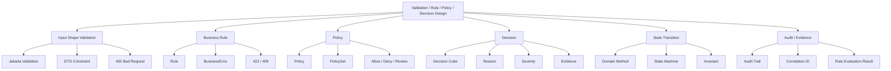

Core distinction:

```text id="fbm72s"
Validation = apakah input/object valid?
Rule = satu kondisi bisnis yang bisa dievaluasi.
Policy = kumpulan rule yang merepresentasikan keputusan bisnis.
Decision = hasil evaluasi yang punya status, reason, code, dan evidence.
```

---

# 2. Decomposition Map

| Area | Pattern | Tanggung jawab | Contoh | Failure mode |
|---|---|---|---|---|
| DTO validation | Jakarta Validation | Validasi bentuk input | `@NotBlank`, `@Positive`, `@Size` | Rule bisnis dipaksa jadi annotation DTO |
| Rule boolean | `Predicate<T>` | Cek sederhana true/false | amount positive | Tidak punya reason |
| Rule kaya detail | `Rule<T>` | Satu rule dengan error detail | customer verified | Terlalu banyak class kecil tanpa grouping |
| Policy | `Policy<T>` | Kombinasi rule untuk decision | submit case eligibility | Policy jadi if-else raksasa |
| Decision | `Decision` sealed interface | Hasil allow/deny/review | `Allowed`, `Denied`, `ManualReview` | Caller hanya cek boolean |
| Evidence | `DecisionEvidence` | Data pendukung audit | checked customer status | Bocor PII/data sensitif |
| Severity | enum severity | Prioritas failure | `ERROR`, `WARNING`, `REVIEW` | Semua dianggap fatal |
| Rule set | `RuleSet<T>` | Evaluasi banyak rule | collect all errors | Order/short-circuit tidak jelas |
| State transition | domain method | Jaga invariant lifecycle | `case.approve()` | Validasi status tersebar di service |
| Exception bridge | mapper/service | Decision → exception/response | denied → 422 | HTTP status tidak konsisten |
| Auditability | evaluation result | Simpan decision trace | regulatory evidence | Terlalu verbose / sensitive |
| Testing | unit test per rule/policy | Regression safety | approve rejected when cancelled | Hanya test happy path |

---

# 3. Empat Level Validation

Di microservice enterprise, jangan campur semua validation ke satu tempat.

| Level | Lokasi | Contoh | Output error |
|---|---|---|---|
| **Shape validation** | DTO / Jakarta Validation | required, format, size, positive | 400 |
| **Semantic validation** | Application rule/policy | customer exists, amount within limit | 422 |
| **State validation** | Domain model/state machine | cannot approve cancelled case | 409 |
| **Persistence validation** | DB constraint/repository adapter | unique key, FK, check constraint | 409 / 500 tergantung konteks |

Contoh DTO validation:

```java id="74ntyp"
public record SubmitCaseRequest(
    @NotBlank String customerId,
    @NotNull @Positive BigDecimal requestedAmount,
    @NotBlank String productCode
) {}
```

Contoh semantic/business validation:

```java id="wlq4qs"
if (!customerVerificationGateway.isVerified(command.customerId())) {
    throw new CaseSubmissionRejectedException(
        "CUSTOMER_NOT_VERIFIED",
        "Customer is not verified"
    );
}
```

Contoh state validation:

```java id="42ke3k"
public Case approve() {
    if (status != CaseStatus.SUBMITTED) {
        throw new InvalidCaseTransitionException(
            status.name(),
            CaseStatus.APPROVED.name()
        );
    }

    return new Case(id, customerId, amount, productCode, CaseStatus.APPROVED);
}
```

Practical rule:

```text id="0r3gne"
DTO validation menjaga request shape.
Policy menjaga business eligibility.
Domain menjaga invariant/state transition.
DB menjaga integrity terakhir.
```

---

# 4. Predicate<T>: Kapan Cukup?

`Predicate<T>` cukup kalau hanya butuh boolean.

```java id="5nw0ou"
Predicate<SubmitCaseCommand> hasPositiveAmount =
    command -> command.requestedAmount() != null
        && command.requestedAmount().signum() > 0;
```

Composition:

```java id="rsz64l"
Predicate<SubmitCaseCommand> canSubmit =
    hasPositiveAmount
        .and(command -> command.productCode() != null)
        .and(command -> !command.productCode().isBlank());
```

Masalahnya:

```java id="3ggyc0"
if (!canSubmit.test(command)) {
    throw new CaseSubmissionRejectedException(
        "Case cannot be submitted"
    );
}
```

Kita kehilangan:

```text id="rf8rrf"
rule mana yang gagal
field mana yang bermasalah
error code apa
severity apa
apakah perlu manual review
apakah denial final atau warning
```

Jadi `Predicate<T>` bagus untuk:

```text id="1kfj3v"
filtering collection
retry decision sederhana
guard kecil
internal helper
```

Tapi untuk business decision enterprise, naikkan menjadi `Rule<T>` atau `Policy<T>`.

---

# 5. Rule<T>: Validation dengan Reason

## 5.1 Business Error

```java id="krl4n6"
public record BusinessError(
    String code,
    String message,
    String field,
    Severity severity
) {}
```

```java id="ms9rab"
public enum Severity {
    INFO,
    WARNING,
    ERROR,
    REVIEW_REQUIRED
}
```

## 5.2 Rule Interface

```java id="i7u7ag"
@FunctionalInterface
public interface Rule<T> {

    Optional<BusinessError> validate(T target);

    default Rule<T> and(Rule<T> next) {
        return target -> {
            Optional<BusinessError> first = this.validate(target);
            return first.isPresent() ? first : next.validate(target);
        };
    }
}
```

## 5.3 Rule Implementasi sebagai Lambda

```java id="x9i35j"
Rule<SubmitCaseCommand> customerRequiredRule = command -> {
    if (command.customerId() == null || command.customerId().isBlank()) {
        return Optional.of(new BusinessError(
            "CUSTOMER_REQUIRED",
            "Customer ID is required",
            "customerId",
            Severity.ERROR
        ));
    }

    return Optional.empty();
};
```

```java id="6qywwd"
Rule<SubmitCaseCommand> amountPositiveRule = command -> {
    if (command.requestedAmount() == null
        || command.requestedAmount().signum() <= 0) {

        return Optional.of(new BusinessError(
            "INVALID_AMOUNT",
            "Requested amount must be positive",
            "requestedAmount",
            Severity.ERROR
        ));
    }

    return Optional.empty();
};
```

Practical note:

```text id="i85zk5"
Lambda rule cocok untuk rule kecil dan lokal.
Kalau rule butuh dependency, audit metadata, config, atau testing khusus, buat class.
```

---

# 6. Rule Class untuk Rule yang Punya Dependency

Contoh rule yang butuh external/customer gateway.

```java id="fjfvn8"
public final class CustomerVerifiedRule
    implements Rule<SubmitCaseCommand> {

    private final CustomerVerificationGateway customerVerificationGateway;

    public CustomerVerifiedRule(
        CustomerVerificationGateway customerVerificationGateway
    ) {
        this.customerVerificationGateway = customerVerificationGateway;
    }

    @Override
    public Optional<BusinessError> validate(SubmitCaseCommand command) {
        boolean verified = customerVerificationGateway
            .isVerified(command.customerId());

        if (!verified) {
            return Optional.of(new BusinessError(
                "CUSTOMER_NOT_VERIFIED",
                "Customer is not verified",
                "customerId",
                Severity.ERROR
            ));
        }

        return Optional.empty();
    }
}
```

Tapi hati-hati:

```text id="16gr7j"
Rule yang melakukan external call bukan pure rule.
Pastikan timeout, retry, idempotency, dan observability jelas.
```

Alternatif lebih bersih:

```java id="ctwch0"
public record SubmitCaseContext(
    SubmitCaseCommand command,
    boolean customerVerified,
    CustomerRiskLevel riskLevel
) {}
```

Rule menjadi pure:

```java id="aqmogm"
public final class CustomerVerifiedRule
    implements Rule<SubmitCaseContext> {

    @Override
    public Optional<BusinessError> validate(SubmitCaseContext context) {
        if (!context.customerVerified()) {
            return Optional.of(new BusinessError(
                "CUSTOMER_NOT_VERIFIED",
                "Customer is not verified",
                "customerId",
                Severity.ERROR
            ));
        }

        return Optional.empty();
    }
}
```

Application service yang fetch external data:

```java id="vkejgx"
boolean verified = customerVerificationGateway
    .isVerified(command.customerId());

SubmitCaseContext context = new SubmitCaseContext(
    command,
    verified,
    riskLevel
);

List<BusinessError> errors = submitCasePolicy.evaluate(context);
```

Practical rule:

```text id="ifhm06"
Lebih baik rule menerima context yang sudah kaya data,
daripada rule diam-diam memanggil DB/external system.
```

---

# 7. RuleSet<T>: Collect All vs Fail Fast

## 7.1 Collect All Errors

```java id="138tsq"
public final class RuleSet<T> {

    private final List<Rule<T>> rules;

    public RuleSet(List<Rule<T>> rules) {
        this.rules = List.copyOf(rules);
    }

    public List<BusinessError> validateAll(T target) {
        return rules.stream()
            .map(rule -> rule.validate(target))
            .flatMap(Optional::stream)
            .toList();
    }
}
```

Cocok untuk:

```text id="o8rmdg"
DTO/business validation yang ingin menampilkan semua error sekaligus
batch validation
form-like validation
```

## 7.2 Fail Fast

```java id="b1cywe"
public Optional<BusinessError> validateFirst(T target) {
    for (Rule<T> rule : rules) {
        Optional<BusinessError> error = rule.validate(target);

        if (error.isPresent()) {
            return error;
        }
    }

    return Optional.empty();
}
```

Cocok untuk:

```text id="ydypcn"
rule mahal
rule punya dependency external
security/authorization
state transition
short-circuit business decision
```

Decision matrix:

| Kebutuhan | Strategy |
|---|---|
| Tampilkan semua field error | collect all |
| Stop saat auth gagal | fail fast |
| Stop saat customer tidak eligible | fail fast |
| Kumpulkan warning + error | collect all |
| Rule punya urutan dependency | fail fast / ordered policy |
| Rule mahal/external | fail fast atau prefetch context |

---

# 8. Policy<T>: Lebih dari Validasi

Validation biasanya menghasilkan valid/invalid. Policy bisa menghasilkan:

```text id="6jtd51"
allowed
denied
manual review
allowed with warning
requires additional approval
```

## 8.1 Decision Model

```java id="c4kk3z"
public sealed interface Decision
    permits Decision.Allowed,
            Decision.Denied,
            Decision.ManualReview,
            Decision.AllowedWithWarnings {

    String code();

    record Allowed() implements Decision {
        @Override
        public String code() {
            return "ALLOWED";
        }
    }

    record Denied(
        String code,
        String reason,
        List<DecisionEvidence> evidence
    ) implements Decision {}

    record ManualReview(
        String code,
        String reason,
        List<DecisionEvidence> evidence
    ) implements Decision {}

    record AllowedWithWarnings(
        List<BusinessError> warnings
    ) implements Decision {
        @Override
        public String code() {
            return "ALLOWED_WITH_WARNINGS";
        }
    }

    static Decision allowed() {
        return new Allowed();
    }

    static Decision denied(
        String code,
        String reason,
        List<DecisionEvidence> evidence
    ) {
        return new Denied(code, reason, evidence);
    }

    static Decision manualReview(
        String code,
        String reason,
        List<DecisionEvidence> evidence
    ) {
        return new ManualReview(code, reason, evidence);
    }
}
```

Evidence:

```java id="97n2no"
public record DecisionEvidence(
    String key,
    String value
) {}
```

Practical warning:

```text id="36d1z4"
Evidence harus aman untuk audit/log.
Jangan masukkan token, full PII, raw sensitive payload, atau SQL detail.
```

---

## 8.2 Policy Interface

```java id="0mfyff"
@FunctionalInterface
public interface Policy<T> {
    Decision evaluate(T target);
}
```

Contoh policy:

```java id="vbi0kg"
public final class SubmitCasePolicy
    implements Policy<SubmitCaseContext> {

    private static final BigDecimal MAX_AUTO_AMOUNT =
        new BigDecimal("100000000");

    @Override
    public Decision evaluate(SubmitCaseContext context) {
        SubmitCaseCommand command = context.command();

        if (!context.customerVerified()) {
            return Decision.denied(
                "CUSTOMER_NOT_VERIFIED",
                "Customer is not verified",
                List.of(new DecisionEvidence(
                    "customerId",
                    maskCustomerId(command.customerId())
                ))
            );
        }

        if (command.requestedAmount().compareTo(MAX_AUTO_AMOUNT) > 0) {
            return Decision.manualReview(
                "AMOUNT_REQUIRES_REVIEW",
                "Requested amount requires manual review",
                List.of(new DecisionEvidence(
                    "requestedAmount",
                    command.requestedAmount().toPlainString()
                ))
            );
        }

        return Decision.allowed();
    }

    private String maskCustomerId(String customerId) {
        if (customerId == null || customerId.length() < 4) {
            return "****";
        }

        return "****" + customerId.substring(customerId.length() - 4);
    }
}
```

Policy ini lebih kaya daripada `Predicate` karena bisa membedakan:

```text id="7ueuy3"
denied final
manual review
allowed
allowed with warning
```

---

# 9. PolicySet<T>: Komposisi Banyak Policy

## 9.1 Ordered Policy Set

```java id="g0ct7d"
public final class PolicySet<T> {

    private final List<Policy<T>> policies;

    public PolicySet(List<Policy<T>> policies) {
        this.policies = List.copyOf(policies);
    }

    public Decision evaluate(T target) {
        List<BusinessError> warnings = new ArrayList<>();

        for (Policy<T> policy : policies) {
            Decision decision = policy.evaluate(target);

            if (decision instanceof Decision.Denied denied) {
                return denied;
            }

            if (decision instanceof Decision.ManualReview review) {
                return review;
            }

            if (decision instanceof Decision.AllowedWithWarnings allowedWithWarnings) {
                warnings.addAll(allowedWithWarnings.warnings());
            }
        }

        if (!warnings.isEmpty()) {
            return new Decision.AllowedWithWarnings(warnings);
        }

        return Decision.allowed();
    }
}
```

## 9.2 Why Loop, Not Stream?

Bisa saja pakai stream, tapi loop lebih jelas karena:

```text id="y66ruo"
ada short-circuit
ada state warnings
ada ordering
ada beberapa tipe decision
lebih mudah debug
```

Stream bukan selalu lebih baik. Untuk policy decision yang punya branching dan state, loop eksplisit biasanya lebih maintainable.

---

# 10. Integrasi Policy ke Application Service

```java id="t0p91s"
public class CaseApplicationService {

    private final CustomerVerificationGateway customerVerificationGateway;
    private final SubmitCasePolicy submitCasePolicy;
    private final CaseRepository caseRepository;
    private final CaseApplicationMapper mapper;

    public SubmitCaseResult submit(SubmitCaseCommand command) {
        boolean customerVerified = customerVerificationGateway
            .isVerified(command.customerId());

        SubmitCaseContext context = new SubmitCaseContext(
            command,
            customerVerified
        );

        Decision decision = submitCasePolicy.evaluate(context);

        if (decision instanceof Decision.Denied denied) {
            throw new CaseSubmissionRejectedException(
                denied.code(),
                denied.reason()
            );
        }

        if (decision instanceof Decision.ManualReview review) {
            Case reviewCase = Case.createForManualReview(
                command.customerId(),
                command.requestedAmount(),
                command.productCode(),
                review.code()
            );

            Case saved = caseRepository.save(reviewCase);
            return mapper.toSubmitCaseResult(saved);
        }

        Case submitted = Case.createSubmitted(
            command.customerId(),
            command.requestedAmount(),
            command.productCode()
        );

        Case saved = caseRepository.save(submitted);

        return mapper.toSubmitCaseResult(saved);
    }
}
```

Practical observation:

```text id="xd4jeo"
Application service tetap orchestration.
Policy hanya memutuskan.
Domain tetap membuat state yang valid.
Repository tetap persistence.
```

Jangan membuat policy langsung save DB atau return `Response`.

---

# 11. State Transition Rule di Domain

Business policy menentukan apakah request boleh dilanjutkan. Tetapi invariant state transition sebaiknya tetap di domain.

```java id="d9zzy9"
public final class Case {

    private final CaseStatus status;

    public Case approve() {
        if (status != CaseStatus.SUBMITTED) {
            throw new InvalidCaseTransitionException(
                status.name(),
                CaseStatus.APPROVED.name()
            );
        }

        return withStatus(CaseStatus.APPROVED);
    }

    public Case reject(String reason) {
        if (status == CaseStatus.APPROVED) {
            throw new InvalidCaseTransitionException(
                status.name(),
                CaseStatus.REJECTED.name()
            );
        }

        return withStatus(CaseStatus.REJECTED);
    }

    private Case withStatus(CaseStatus newStatus) {
        return new Case(
            id,
            customerId,
            requestedAmount,
            productCode,
            newStatus
        );
    }
}
```

Policy bisa menjawab:

```text id="6a4v2y"
apakah user/request/context eligible untuk approve?
```

Domain menjawab:

```text id="7f6p0i"
apakah object dalam status ini boleh berubah ke status target?
```

Ini dua hal yang berbeda.

---

# 12. Rule vs Policy vs Domain Method

| Concern | Contoh | Tempat |
|---|---|---|
| Field required | customerId not blank | DTO validation |
| Amount positive | requestedAmount > 0 | DTO + domain guard |
| Customer verified | external verification result | policy/application context |
| Product allowed | productCode enabled | policy |
| User has permission | `case:approve` | authorization filter/service |
| Case can approve | status is SUBMITTED | domain method |
| Duplicate reference | unique externalRef | repository/DB + conflict translation |
| Manual review threshold | amount > limit | policy |
| SLA escalation | age > threshold | policy/domain service/BPMN |
| Regulatory hold | customer flagged | policy + evidence |

Practical rule:

```text id="j97aw5"
Policy boleh berubah karena business decision berubah.
Domain invariant berubah lebih jarang dan melindungi object dari state invalid.
```

---

# 13. Decision → Exception Bridge

Jangan biarkan resource melakukan mapping decision secara manual berulang.

Buat bridge:

```java id="37nnip"
public final class DecisionExceptionFactory {

    public RuntimeException toException(Decision decision) {
        if (decision instanceof Decision.Denied denied) {
            return new BusinessDecisionDeniedException(
                denied.code(),
                denied.reason(),
                denied.evidence()
            );
        }

        if (decision instanceof Decision.ManualReview review) {
            return new ManualReviewRequiredException(
                review.code(),
                review.reason(),
                review.evidence()
            );
        }

        throw new IllegalArgumentException(
            "Decision is not an exception decision: " + decision.code()
        );
    }
}
```

Service:

```java id="5qvr6k"
Decision decision = submitPolicy.evaluate(context);

if (decision instanceof Decision.Denied
    || decision instanceof Decision.ManualReview) {
    throw decisionExceptionFactory.toException(decision);
}
```

Namun untuk manual review, sering bukan exception. Ia bisa menjadi valid business path:

```java id="h4nq8p"
if (decision instanceof Decision.ManualReview review) {
    return createManualReviewCase(command, review);
}
```

Decision matrix:

| Decision | Perlakuan |
|---|---|
| `Allowed` | lanjut normal |
| `AllowedWithWarnings` | lanjut + warning/audit |
| `Denied` | throw domain/app exception |
| `ManualReview` | bisa create review task/case, bukan error |
| `RequiresAdditionalApproval` | create approval workflow |
| `Deferred` | schedule/async process |

---

# 14. Warning Handling

Kadang rule tidak memblokir, tapi memberi warning.

```java id="tx08ac"
public final class HighAmountWarningPolicy
    implements Policy<SubmitCaseContext> {

    private static final BigDecimal WARNING_AMOUNT =
        new BigDecimal("50000000");

    @Override
    public Decision evaluate(SubmitCaseContext context) {
        if (context.command().requestedAmount().compareTo(WARNING_AMOUNT) > 0) {
            return new Decision.AllowedWithWarnings(List.of(
                new BusinessError(
                    "HIGH_AMOUNT_WARNING",
                    "Requested amount is high",
                    "requestedAmount",
                    Severity.WARNING
                )
            ));
        }

        return Decision.allowed();
    }
}
```

Response result bisa menyertakan warning:

```java id="xba2w6"
public record SubmitCaseResult(
    String caseId,
    String status,
    List<BusinessError> warnings
) {}
```

Practical rule:

```text id="27d3m3"
Warning jangan disamakan dengan error.
Warning bisa dipakai untuk audit, UI banner, atau downstream review.
```

---

# 15. Evidence dan Auditability

Untuk domain/regulatory system, decision tanpa evidence sering sulit dipertahankan.

```java id="5hj0tw"
public record PolicyEvaluationResult(
    String policyName,
    Decision decision,
    Instant evaluatedAt,
    List<DecisionEvidence> evidence
) {}
```

Policy evaluator:

```java id="w2k8xj"
public final class AuditablePolicyEvaluator<T> {

    private final String policyName;
    private final Policy<T> policy;
    private final Clock clock;

    public AuditablePolicyEvaluator(
        String policyName,
        Policy<T> policy,
        Clock clock
    ) {
        this.policyName = policyName;
        this.policy = policy;
        this.clock = clock;
    }

    public PolicyEvaluationResult evaluate(T target) {
        Decision decision = policy.evaluate(target);

        List<DecisionEvidence> evidence = switch (decision) {
            case Decision.Denied denied -> denied.evidence();
            case Decision.ManualReview review -> review.evidence();
            case Decision.Allowed ignored -> List.of();
            case Decision.AllowedWithWarnings warnings -> List.of();
        };

        return new PolicyEvaluationResult(
            policyName,
            decision,
            Instant.now(clock),
            evidence
        );
    }
}
```

Practical concern:

```text id="m8341v"
Audit evidence harus cukup untuk menjelaskan decision,
tetapi tidak boleh membocorkan data sensitif secara berlebihan.
```

---

# 16. Rule Metadata

Agar rule lebih traceable, buat rule punya ID/nama.

```java id="x7wj0c"
public interface NamedRule<T> extends Rule<T> {

    String ruleId();

    String description();
}
```

Implementasi:

```java id="omg8a5"
public final class AmountLimitRule
    implements NamedRule<SubmitCaseContext> {

    private final BigDecimal maxAmount;

    public AmountLimitRule(BigDecimal maxAmount) {
        this.maxAmount = maxAmount;
    }

    @Override
    public String ruleId() {
        return "CASE_SUBMIT_AMOUNT_LIMIT";
    }

    @Override
    public String description() {
        return "Submitted case amount must not exceed configured limit";
    }

    @Override
    public Optional<BusinessError> validate(SubmitCaseContext context) {
        if (context.command().requestedAmount().compareTo(maxAmount) > 0) {
            return Optional.of(new BusinessError(
                "AMOUNT_LIMIT_EXCEEDED",
                "Requested amount exceeds allowed limit",
                "requestedAmount",
                Severity.ERROR
            ));
        }

        return Optional.empty();
    }
}
```

Evaluator dengan trace:

```java id="e89zul"
public record RuleEvaluation(
    String ruleId,
    boolean passed,
    BusinessError error
) {}
```

```java id="7khynf"
public final class RuleEvaluator<T> {

    private final List<NamedRule<T>> rules;

    public RuleEvaluator(List<NamedRule<T>> rules) {
        this.rules = List.copyOf(rules);
    }

    public List<RuleEvaluation> evaluate(T target) {
        List<RuleEvaluation> result = new ArrayList<>();

        for (NamedRule<T> rule : rules) {
            Optional<BusinessError> error = rule.validate(target);

            result.add(new RuleEvaluation(
                rule.ruleId(),
                error.isEmpty(),
                error.orElse(null)
            ));
        }

        return result;
    }
}
```

Ini membantu:

```text id="05g6t8"
debugging
audit trail
testing
explaining why request was rejected
compliance evidence
```

---

# 17. Configurable Rule

Banyak rule enterprise bergantung pada config.

```java id="73tq5v"
public record SubmitCaseRuleConfig(
    BigDecimal maxAutoSubmitAmount,
    Set<String> allowedProductCodes
) {}
```

Policy:

```java id="c3y8th"
public final class ProductAllowedPolicy
    implements Policy<SubmitCaseContext> {

    private final SubmitCaseRuleConfig config;

    public ProductAllowedPolicy(SubmitCaseRuleConfig config) {
        this.config = config;
    }

    @Override
    public Decision evaluate(SubmitCaseContext context) {
        String productCode = context.command().productCode();

        if (!config.allowedProductCodes().contains(productCode)) {
            return Decision.denied(
                "PRODUCT_NOT_ALLOWED",
                "Product is not allowed for submission",
                List.of(new DecisionEvidence("productCode", productCode))
            );
        }

        return Decision.allowed();
    }
}
```

Practical rule:

```text id="8v5j5p"
Rule threshold/config sebaiknya externalized,
tapi evaluation logic tetap explicit dan testable.
```

Jangan hardcode environment-specific value di annotation atau resource.

---

# 18. Composable Validation untuk Request Command

## 18.1 Command

```java id="b2pfpl"
public record SubmitCaseCommand(
    String customerId,
    BigDecimal requestedAmount,
    String productCode
) {}
```

## 18.2 Rule Factory

```java id="4buqrt"
public final class SubmitCaseRules {

    private SubmitCaseRules() {}

    public static Rule<SubmitCaseCommand> customerRequired() {
        return command -> {
            if (command.customerId() == null || command.customerId().isBlank()) {
                return Optional.of(new BusinessError(
                    "CUSTOMER_REQUIRED",
                    "Customer ID is required",
                    "customerId",
                    Severity.ERROR
                ));
            }

            return Optional.empty();
        };
    }

    public static Rule<SubmitCaseCommand> positiveAmount() {
        return command -> {
            if (command.requestedAmount() == null
                || command.requestedAmount().signum() <= 0) {

                return Optional.of(new BusinessError(
                    "INVALID_AMOUNT",
                    "Requested amount must be positive",
                    "requestedAmount",
                    Severity.ERROR
                ));
            }

            return Optional.empty();
        };
    }

    public static Rule<SubmitCaseCommand> productRequired() {
        return command -> {
            if (command.productCode() == null || command.productCode().isBlank()) {
                return Optional.of(new BusinessError(
                    "PRODUCT_REQUIRED",
                    "Product code is required",
                    "productCode",
                    Severity.ERROR
                ));
            }

            return Optional.empty();
        };
    }
}
```

## 18.3 Validator

```java id="0l47kc"
RuleSet<SubmitCaseCommand> commandRules = new RuleSet<>(List.of(
    SubmitCaseRules.customerRequired(),
    SubmitCaseRules.positiveAmount(),
    SubmitCaseRules.productRequired()
));

List<BusinessError> errors = commandRules.validateAll(command);

if (!errors.isEmpty()) {
    throw new BusinessValidationException(errors);
}
```

Practical note:

```text id="329wpl"
Kalau Jakarta Validation sudah mengecek field required/positive di DTO,
jangan duplikasi semua rule di command kecuali command juga dibuat dari sumber non-HTTP.
```

Untuk command yang bisa datang dari message queue, batch job, scheduler, atau internal API, command-level validation tetap berguna.

---

# 19. Policy untuk Authorization vs Business Rule

Authorization policy:

```java id="a65jzx"
public interface PermissionPolicy {
    boolean hasPermission(UserContext user, String permission);
}
```

Business policy:

```java id="lbu37i"
public interface Policy<T> {
    Decision evaluate(T target);
}
```

Jangan campur:

```java id="favlsv"
if (!user.hasPermission("case:approve")
    || caseData.status() != CaseStatus.SUBMITTED
    || caseData.amount().compareTo(MAX) > 0) {
    ...
}
```

Lebih jelas:

```text id="286zlz"
AuthorizationFilter/PermissionService:
- apakah user boleh mencoba action?

Application/Business Policy:
- apakah request/action eligible secara bisnis?

Domain:
- apakah object boleh transition?
```

Practical distinction:

| Concern | Failure status |
|---|---:|
| belum login | 401 |
| tidak punya permission | 403 |
| object tidak ditemukan | 404 |
| object state konflik | 409 |
| business rule menolak | 422 |
| manual review required | bisa 201/202 dengan status review, bukan error |

---

# 20. Manual Review sebagai First-Class Outcome

Dalam regulated workflow, “tidak auto-approved” belum tentu error.

```java id="tijsy0"
public record SubmitCaseResult(
    String caseId,
    String status,
    String decisionCode,
    String decisionReason
) {}
```

Service:

```java id="izddfv"
Decision decision = submitCasePolicy.evaluate(context);

if (decision instanceof Decision.ManualReview review) {
    Case reviewCase = Case.createPendingReview(
        command.customerId(),
        command.requestedAmount(),
        command.productCode(),
        review.code()
    );

    Case saved = caseRepository.save(reviewCase);

    return new SubmitCaseResult(
        saved.id().value(),
        saved.status().name(),
        review.code(),
        review.reason()
    );
}
```

HTTP response:

```json id="24s9k7"
{
  "success": true,
  "data": {
    "caseId": "CASE-001",
    "status": "PENDING_REVIEW",
    "decisionCode": "AMOUNT_REQUIRES_REVIEW",
    "decisionReason": "Requested amount requires manual review"
  },
  "error": null
}
```

Practical rule:

```text id="5ft9ul"
Manual review sering valid outcome, bukan exception.
Jangan membuat semua non-approved decision menjadi error.
```

---

# 21. Testing Strategy

## 21.1 Unit Test Rule

```java id="lgh7zp"
class AmountLimitRuleTest {

    @Test
    void shouldFailWhenAmountExceedsLimit() {
        AmountLimitRule rule = new AmountLimitRule(
            new BigDecimal("100000000")
        );

        SubmitCaseContext context = new SubmitCaseContext(
            new SubmitCaseCommand(
                "CUST-001",
                new BigDecimal("150000000"),
                "LOAN_BASIC"
            ),
            true
        );

        Optional<BusinessError> error = rule.validate(context);

        assertTrue(error.isPresent());
        assertEquals("AMOUNT_LIMIT_EXCEEDED", error.get().code());
    }
}
```

## 21.2 Unit Test Policy

```java id="eq2f9r"
class SubmitCasePolicyTest {

    @Test
    void shouldDenyWhenCustomerNotVerified() {
        SubmitCasePolicy policy = new SubmitCasePolicy();

        SubmitCaseContext context = new SubmitCaseContext(
            new SubmitCaseCommand(
                "CUST-001",
                new BigDecimal("1000000"),
                "LOAN_BASIC"
            ),
            false
        );

        Decision decision = policy.evaluate(context);

        assertInstanceOf(Decision.Denied.class, decision);

        Decision.Denied denied = (Decision.Denied) decision;
        assertEquals("CUSTOMER_NOT_VERIFIED", denied.code());
    }
}
```

## 21.3 Unit Test Manual Review

```java id="hfjv0t"
@Test
void shouldRequireManualReviewWhenAmountExceedsAutoLimit() {
    SubmitCasePolicy policy = new SubmitCasePolicy();

    SubmitCaseContext context = new SubmitCaseContext(
        new SubmitCaseCommand(
            "CUST-001",
            new BigDecimal("200000000"),
            "LOAN_BASIC"
        ),
        true
    );

    Decision decision = policy.evaluate(context);

    assertInstanceOf(Decision.ManualReview.class, decision);
    assertEquals("AMOUNT_REQUIRES_REVIEW", decision.code());
}
```

Practical rule:

```text id="o39q94"
Rule/policy test harus memverifikasi decision code, bukan hanya class/status.
```

---

# 22. Integration dengan ExceptionMapper

Business validation exception:

```java id="ryotyc"
public final class BusinessValidationException extends AppException {

    public BusinessValidationException(List<BusinessError> errors) {
        super(
            "BUSINESS_VALIDATION_ERROR",
            "Business validation failed",
            Response.Status.UNPROCESSABLE_ENTITY,
            errors,
            false
        );
    }
}
```

Mapper menggunakan base mapper dari seri 7:

```java id="93h6gv"
@Provider
public class BusinessValidationExceptionMapper
    extends BaseAppExceptionMapper<BusinessValidationException> {
}
```

Output:

```json id="zg66u2"
{
  "success": false,
  "data": null,
  "error": {
    "code": "BUSINESS_VALIDATION_ERROR",
    "message": "Business validation failed",
    "detail": [
      {
        "code": "INVALID_AMOUNT",
        "message": "Requested amount must be positive",
        "field": "requestedAmount",
        "severity": "ERROR"
      }
    ],
    "correlationId": "corr-123"
  }
}
```

JAX-RS `ExceptionMapper` provider harus diregister atau diberi `@Provider` agar runtime bisa menemukannya saat provider scanning. ([Jakarta EE](https://jakarta.ee/specifications/restful-ws/4.0/apidocs/jakarta.ws.rs/jakarta/ws/rs/ext/exceptionmapper?utm_source=chatgpt.com))

---

# 23. Practical Design: Rule Evaluation Result untuk Audit

```java id="w73j1d"
public record RuleEvaluationResult(
    String ruleId,
    boolean passed,
    String errorCode,
    String message,
    Severity severity
) {}
```

Evaluator:

```java id="2vrsza"
public final class AuditableRuleEvaluator<T> {

    private final List<NamedRule<T>> rules;

    public AuditableRuleEvaluator(List<NamedRule<T>> rules) {
        this.rules = List.copyOf(rules);
    }

    public List<RuleEvaluationResult> evaluate(T target) {
        List<RuleEvaluationResult> results = new ArrayList<>();

        for (NamedRule<T> rule : rules) {
            Optional<BusinessError> error = rule.validate(target);

            results.add(error
                .map(businessError -> new RuleEvaluationResult(
                    rule.ruleId(),
                    false,
                    businessError.code(),
                    businessError.message(),
                    businessError.severity()
                ))
                .orElseGet(() -> new RuleEvaluationResult(
                    rule.ruleId(),
                    true,
                    null,
                    null,
                    null
                ))
            );
        }

        return results;
    }
}
```

Service bisa menyimpan audit:

```java id="aend7v"
List<RuleEvaluationResult> evaluations =
    ruleEvaluator.evaluate(context);

auditService.recordRuleEvaluation(
    "CASE_SUBMIT",
    command.customerId(),
    evaluations
);
```

Practical warning:

```text id="npncfe"
Audit rule evaluation jangan menyimpan raw payload sensitif tanpa masking.
```

---

# 24. Anti-Patterns

| Anti-pattern | Contoh | Masalah | Alternatif |
|---|---|---|---|
| Semua rule di resource | `if` panjang di endpoint | resource gemuk | service/policy |
| Predicate untuk semua | `Predicate<T>` saja | reason hilang | `Rule<T>` / `Policy<T>` |
| Rule memanggil external diam-diam | rule melakukan HTTP call | latency tersembunyi | prefetch context |
| Policy return boolean | `true/false` | decision tidak explainable | `Decision` object |
| Semua denied jadi exception | manual review dianggap error | workflow salah | first-class outcome |
| Domain invariant di policy saja | status transition di luar domain | object bisa invalid | domain method |
| Rule tanpa ID | sulit audit/test | tidak traceable | `NamedRule` |
| Error code dari message | client parse text | fragile | stable code |
| Evidence terlalu detail | PII/token/raw payload | data leak | masked evidence |
| Stream untuk complex policy | chain sulit debug | maintainability buruk | loop eksplisit |
| Config hardcoded | threshold di code | sulit change | config object |
| Duplication DTO/domain validation | rule sama di banyak tempat | drift | define ownership |

---

# 25. Code Review Checklist

## Validation Layering

- Apakah DTO validation hanya shape/input constraint?
- Apakah business rule tidak dipaksa masuk annotation DTO?
- Apakah domain invariant tetap ada di domain object?
- Apakah DB constraint diterjemahkan dengan benar jika business-relevant?

## Rule Design

- Apakah rule punya error code stabil?
- Apakah rule punya field/severity jika perlu?
- Apakah rule kecil dan testable?
- Apakah rule butuh dependency? Kalau iya, apakah dependency itu pantas?
- Apakah rule ID dibutuhkan untuk audit?

## Policy Design

- Apakah policy return `Decision`, bukan boolean?
- Apakah `Denied`, `ManualReview`, `AllowedWithWarnings` dibedakan?
- Apakah decision evidence aman?
- Apakah policy tidak melakukan persistence/HTTP response?
- Apakah order rule/policy jelas?

## Application Service

- Apakah service melakukan orchestration saja?
- Apakah external data diprefetch sebelum policy evaluation?
- Apakah decision diterjemahkan ke workflow yang benar?
- Apakah manual review bukan error jika memang valid outcome?
- Apakah exception bridge konsisten?

## Testing

- Apakah tiap rule penting punya unit test?
- Apakah policy test mencakup deny, allow, manual review, warning?
- Apakah test assert decision code?
- Apakah exception mapper test mencakup detail error?
- Apakah audit/evidence tidak berisi sensitive data?

---

# 26. Decision Matrix

| Kebutuhan | Pattern |
|---|---|
| Cek boolean kecil | `Predicate<T>` |
| Validasi dengan error detail | `Rule<T>` |
| Validasi banyak rule | `RuleSet<T>` |
| Rule perlu traceability | `NamedRule<T>` |
| Keputusan bisnis kaya outcome | `Policy<T>` |
| Kombinasi policy berurutan | `PolicySet<T>` |
| Hasil allow/deny/review | sealed `Decision` |
| Audit decision | `PolicyEvaluationResult` |
| Audit rule-by-rule | `RuleEvaluationResult` |
| Rule butuh data external | prefetch context |
| Manual review | first-class result/status |
| State transition | domain method |
| Persistence uniqueness | DB constraint + exception translation |
| Error HTTP | exception mapper |

---

# 27. Practical Mini Exercise

Ambil use case:

```text id="9w69be"
POST /cases/{caseId}/approve
```

Pecah menjadi:

| Concern | Pertanyaan | Lokasi |
|---|---|---|
| Authentication | user sudah login? | filter |
| Authorization | user punya `case:approve`? | filter/permission service |
| Existence | case ada? | application service/repository |
| State invariant | case status boleh approve? | domain method |
| Business policy | amount/risk/customer boleh auto approve? | policy |
| Decision outcome | allowed/denied/manual review? | decision |
| Persistence | simpan status baru | repository |
| Audit | rekam rule/decision | audit service/outbox |
| Error response | map exception | exception mapper |

Target implementasi:

```text id="z7qi1k"
1. Resource tetap tipis.
2. Service fetch case dan context.
3. Policy mengevaluasi business eligibility.
4. Domain method menjaga state transition.
5. Repository menyimpan.
6. ExceptionMapper menangani failure.
7. Audit menyimpan decision/rule evaluation jika diperlukan.
```

---

# 28. Recommended Package Structure

```text id="d4g480"
com.company.common
├── rule
│   ├── Rule.java
│   ├── NamedRule.java
│   ├── RuleSet.java
│   ├── RuleEvaluationResult.java
│   └── Severity.java
├── policy
│   ├── Policy.java
│   ├── PolicySet.java
│   ├── Decision.java
│   ├── DecisionEvidence.java
│   └── PolicyEvaluationResult.java
└── error
    ├── BusinessValidationException.java
    └── BusinessDecisionDeniedException.java

com.company.caseapp
├── application
│   ├── context
│   │   └── SubmitCaseContext.java
│   ├── policy
│   │   ├── SubmitCasePolicy.java
│   │   ├── ProductAllowedPolicy.java
│   │   └── AmountReviewPolicy.java
│   └── rule
│       ├── AmountLimitRule.java
│       └── CustomerVerifiedRule.java
└── domain
    └── model
        └── Case.java
```

---

# Ringkasan Seri 10

Inti practical seri ini:

```text id="r7awtx"
Predicate<T> cocok untuk true/false kecil.
Rule<T> cocok untuk validation dengan error detail.
Policy<T> cocok untuk business decision yang punya outcome.
Decision harus eksplisit: allowed, denied, manual review, warning.
Domain method tetap menjaga state invariant.
Application service melakukan orchestration.
ExceptionMapper menerjemahkan failure ke response.
Audit/evidence harus cukup, tapi aman.
```

Prinsip desain:

```text id="95op71"
Jangan sembunyikan rule bisnis penting dalam lambda anonim.
Jangan jadikan policy sebagai tempat persistence atau HTTP response.
Jangan anggap manual review sebagai error jika itu valid workflow.
Jangan hanya return boolean untuk keputusan yang butuh penjelasan.
Jangan duplikasi validation tanpa ownership yang jelas.
```

---

## Status

**Seri 10/12 selesai.**

Seri berikutnya yang direkomendasikan: **Seri 11/12 - Generics/Reflection dalam MyBatis, JSON Binding, Bean Validation, dan Jersey Runtime Integration.**

---

**Sources:**

- [Predicate (Java SE 25 & JDK 25)](https://docs.oracle.com/en/java/javase/25/docs/api/java.base/java/util/function/Predicate.html?utm_source=chatgpt.com)
- [Jakarta Validation specification](https://jakarta.ee/specifications/bean-validation/3.1/jakarta-validation-spec-3.1.html?utm_source=chatgpt.com)

## Response:
7/15/2026, 1:57:51 AM

Saya lanjut ke **Seri 11/12: Generics/Reflection dalam MyBatis, JSON Binding, Bean Validation, dan Jersey Runtime Integration**. Fokusnya practical integration: type erasure, generic response/client, DTO binding, validation metadata, MyBatis mapper proxy/type handler, dan debugging runtime failure.

# Seri 11/12 - Generics/Reflection dalam MyBatis, JSON Binding, Bean Validation, dan Jersey Runtime Integration

## Tujuan Seri Ini

Seri ini menyatukan topik **Generics**, **Reflection**, **Annotation**, **Runtime Discovery**, dan **Type Erasure** dalam integrasi nyata:

```text
Jersey/JAX-RS runtime
JSON binding / serialization
Jakarta Validation / Bean Validation
MyBatis mapper proxy
MyBatis TypeHandler
Generic API response
Generic pagination
Generic client response
ExceptionMapper
Provider registration
```

Fokusnya adalah memahami kenapa error runtime seperti ini sering terjadi:

```text
No MessageBodyWriter found
No MessageBodyReader found
Cannot deserialize value
ConstraintViolationException tidak konsisten
Invalid bound statement
Parameter 'xxx' not found
TypeHandler was null / not found
ApiResponse.data jadi LinkedHashMap
List<DTO> jadi List<Map<String,Object>>
Provider tidak aktif
ExceptionMapper tidak terpanggil
```

JAX-RS/Jakarta REST memakai resource, provider, filter, interceptor, `GenericEntity`, `GenericType`, dan `ExceptionMapper` sebagai bagian dari runtime contract; provider harus ditemukan/diregister agar bisa aktif. ([Jakarta EE](https://jakarta.ee/specifications/restful-ws/4.0/jakarta-restful-ws-spec-4.0.pdf?utm_source=chatgpt.com)) MyBatis juga sangat bergantung pada konfigurasi runtime seperti `settings`, `typeAliases`, `typeHandlers`, `objectFactory`, `plugins`, `environments`, dan `mappers`; konfigurasi ini berpengaruh langsung terhadap behavior mapper dan SQL execution. ([MyBatis](https://mybatis.org/mybatis-3/configuration.html?utm_source=chatgpt.com))

---

# 1. Mental Model

```mermaid
flowchart TD
    A[Java Microservice Runtime Integration] --> B[Jersey / JAX-RS]
    A --> C[JSON Binding]
    A --> D[Jakarta Validation]
    A --> E[MyBatis]
    A --> F[Generics + Reflection]

    B --> B1[Resource Discovery]
    B --> B2[Provider Discovery]
    B --> B3[ExceptionMapper]
    B --> B4[GenericEntity / GenericType]

    C --> C1[DTO Constructor / Record]
    C --> C2[Field / Getter / Annotation]
    C --> C3[Generic Type Token]
    C --> C4[MessageBodyReader / Writer]

    D --> D1[Constraint Annotation]
    D --> D2[@Valid]
    D --> D3[Object Graph Validation]
    D --> D4[ConstraintViolationException]

    E --> E1[Mapper Interface Proxy]
    E --> E2[XML Statement Binding]
    E --> E3[@Param]
    E --> E4[ResultMap]
    E --> E5[TypeHandler<T>]

    F --> F1[Type Erasure]
    F --> F2[Class<T>]
    F --> F3[ParameterizedType]
    F --> F4[Runtime Discovery]
```

Core idea:

```text
Compile-time generics memberi type safety.
Runtime framework memakai reflection dan metadata.
Saat melewati boundary framework, generic type sering harus dipertahankan secara eksplisit.
```

---

# 2. Decomposition Map

| Area | Runtime mechanism | Dipakai untuk | Praktisnya | Failure mode |
|---|---|---|---|---|
| Jersey resource | annotation + reflection | `@Path`, `@GET`, `@POST` | route request ke method | 404/405 |
| Jersey provider | `@Provider` / register | mapper/filter/interceptor | extension runtime | provider tidak aktif |
| ExceptionMapper | generic target exception | exception → response | centralized error | mapper tidak terpanggil |
| GenericEntity | preserve server-side generic entity | `Response.ok(List<T>)` | response body generic aman | writer salah/tidak ketemu |
| GenericType | preserve client-side generic type | `client.get(GenericType<T>)` | deserialize nested generic | data jadi `Map` |
| JSON binding | reflection constructor/field/record | JSON ↔ DTO | request/response body | deserialize/serialize gagal |
| Bean Validation | annotation metadata | DTO/domain validation | `@Valid`, constraints | validation tidak jalan |
| MyBatis mapper | dynamic proxy + XML binding | SQL execution | mapper interface → SQL | invalid bound statement |
| MyBatis @Param | parameter name metadata | SQL parameter binding | `#{caseId}` | parameter not found |
| ResultMap | field/column mapping | DB row → object | explicit mapping | field null/salah |
| TypeHandler<T> | generic type conversion | DB type ↔ Java type | enum/value object/JSONB | handler tidak kepakai |
| Type erasure | generic erased at runtime | `T` hilang | butuh type token | `ClassCastException` |

---

# 3. Jersey/JAX-RS Generic Response: Server Side

## 3.1 Problem: Generic Hilang saat Return `Response`

Contoh umum:

```java
@GET
public Response listCases() {
    List<CaseResponse> cases = caseService.listCases();

    return Response.ok(cases).build();
}
```

Secara compile-time kita tahu `cases` adalah `List<CaseResponse>`. Tetapi ketika masuk ke `Response.ok(Object)`, runtime kadang hanya melihat entity sebagai `List` / `ArrayList`, bukan `List<CaseResponse>`.

Akibatnya bisa muncul:

```text
No MessageBodyWriter found
wrong writer selected
generic item type tidak jelas
```

## 3.2 Solusi: `GenericEntity<T>`

```java
@GET
public Response listCases() {
    List<CaseResponse> cases = caseService.listCases();

    GenericEntity<List<CaseResponse>> entity =
        new GenericEntity<List<CaseResponse>>(cases) {};

    return Response.ok(entity).build();
}
```

Untuk nested generic:

```java
@GET
public Response searchCases(@BeanParam CaseSearchParams params) {
    Page<CaseResponse> page = caseService.search(
        params.toCriteria(),
        params.toPageRequest()
    );

    ApiResponse<Page<CaseResponse>> response = ApiResponse.ok(page);

    GenericEntity<ApiResponse<Page<CaseResponse>>> entity =
        new GenericEntity<ApiResponse<Page<CaseResponse>>>(response) {};

    return Response.ok(entity).build();
}
```

Practical rule:

```text
Kalau resource return concrete List<T> langsung, method signature membantu runtime.
Kalau resource return Response.ok(entity), pertimbangkan GenericEntity untuk nested generic.
```

---

# 4. Jersey/JAX-RS Generic Response: Client Side

## 4.1 Problem: `ApiResponse.class` Tidak Cukup

Buruk:

```java
ApiResponse response = target
    .path("/cases")
    .request(MediaType.APPLICATION_JSON_TYPE)
    .get(ApiResponse.class);
```

Masalah:

```text
ApiResponse.class hanya raw class.
Runtime tidak tahu T = Page<CaseResponse>.
data bisa menjadi LinkedHashMap.
items bisa menjadi List<Map<String,Object>>.
```

## 4.2 Solusi: `GenericType<T>`

```java
GenericType<ApiResponse<Page<CaseResponse>>> responseType =
    new GenericType<ApiResponse<Page<CaseResponse>>>() {};

ApiResponse<Page<CaseResponse>> response = target
    .path("/cases")
    .request(MediaType.APPLICATION_JSON_TYPE)
    .get(responseType);
```

JAX-RS menyediakan `GenericType<T>` untuk menjaga actual generic type saat membaca message entity generic di client/runtime boundary. ([JavaDoc](https://javadoc.io/doc/jakarta.ws.rs/jakarta.ws.rs-api/latest/index.html?utm_source=chatgpt.com))

Checklist:

```text
ApiResponse<T>?
Page<T>?
List<T>?
Map<String,T>?
ExternalApiResponse<T>?
```

Kalau ya, jangan hanya pakai `.class`; pakai `GenericType<T>` di JAX-RS client.

---

# 5. JSON Binding dan Type Erasure

## 5.1 Non-Generic DTO Aman dengan `Class<T>`

```java
CaseResponse response =
    objectMapper.readValue(json, CaseResponse.class);
```

Aman karena `CaseResponse.class` membawa tipe runtime yang cukup.

## 5.2 Nested Generic Butuh Type Token

Buruk:

```java
ApiResponse response =
    objectMapper.readValue(json, ApiResponse.class);
```

Lebih aman:

```java
TypeReference<ApiResponse<Page<CaseResponse>>> typeRef =
    new TypeReference<ApiResponse<Page<CaseResponse>>>() {};

ApiResponse<Page<CaseResponse>> response =
    objectMapper.readValue(json, typeRef);
```

Practical symptom:

```text
Kalau field data setelah deserialize menjadi LinkedHashMap,
hampir pasti generic type metadata hilang.
```

## 5.3 DTO Shape yang Aman

Response DTO:

```java
public record CaseResponse(
    String caseId,
    String status,
    String customerId,
    String productCode
) {}
```

Request DTO:

```java
public record SubmitCaseRequest(
    String customerId,
    BigDecimal requestedAmount,
    String productCode
) {}
```

Kenapa record cocok?

```text
shape eksplisit
immutable carrier
mudah dibaca
cocok untuk request/response DTO
lebih sedikit setter mutation
```

Practical warning:

```text
Jangan expose MyBatis record/entity langsung sebagai API DTO.
Jangan pakai Optional sebagai DTO field.
Jangan membuat GenericDto<A,B,C> untuk API contract publik/internal.
```

---

# 6. JSON Binding Failure Modes

| Failure | Gejala | Penyebab umum | Fix |
|---|---|---|---|
| `Cannot deserialize` | request body gagal | constructor/record/property mismatch | DTO shape jelas |
| unknown property | JSON field ekstra | strict mapper config | align contract / ignore policy |
| field null | property name mismatch | snake_case vs camelCase | annotation/naming strategy |
| `LinkedHashMap` | nested generic hilang | pakai raw `Class` | `GenericType` / `TypeReference` |
| infinite recursion | stack overflow / huge JSON | cyclic domain graph | DTO khusus, jangan expose entity graph |
| no writer | response gagal | provider/DTO/generic issue | JSON provider + GenericEntity |
| wrong date format | parse/serialize gagal | date config mismatch | standardize ISO format |

Practical guideline:

```text
API DTO harus menjadi serialization boundary.
Domain/entity graph tidak otomatis cocok menjadi JSON contract.
```

---

# 7. Bean Validation / Jakarta Validation Integration

Jakarta Validation mendukung constraint pada object model, object graph, method parameter, method return value, dan constructor; ini membuatnya cocok untuk input shape validation dan contract validation, tetapi bukan pengganti policy bisnis. ([Jakarta EE](https://jakarta.ee/specifications/bean-validation/3.1/jakarta-validation-spec-3.1.html?utm_source=chatgpt.com))

## 7.1 DTO Validation

```java
public record SubmitCaseRequest(
    @NotBlank String customerId,
    @NotNull @Positive BigDecimal requestedAmount,
    @NotBlank String productCode
) {}
```

Resource:

```java
@POST
public Response submit(@Valid SubmitCaseRequest request) {
    SubmitCaseCommand command = mapper.toCommand(request);

    SubmitCaseResult result = caseService.submit(command);

    return Response.status(Response.Status.CREATED)
        .entity(ApiResponse.ok(mapper.toResponse(result)))
        .build();
}
```

## 7.2 Nested Validation

```java
public record SubmitCaseRequest(
    @NotBlank String customerId,
    @Valid ProductRequest product,
    @NotNull @Positive BigDecimal requestedAmount
) {}
```

```java
public record ProductRequest(
    @NotBlank String productCode,
    @NotBlank String productType
) {}
```

Tanpa `@Valid` di nested object, constraint dalam nested object bisa tidak dievaluasi.

## 7.3 Validation Error Mapper

```java
@Provider
public class ConstraintViolationExceptionMapper
    implements ExceptionMapper<ConstraintViolationException> {

    @Override
    public Response toResponse(ConstraintViolationException exception) {
        List<FieldError> fieldErrors = exception.getConstraintViolations()
            .stream()
            .map(violation -> new FieldError(
                violation.getPropertyPath().toString(),
                violation.getMessage()
            ))
            .toList();

        ErrorResponse<List<FieldError>> error = new ErrorResponse<>(
            "VALIDATION_ERROR",
            "Request validation failed",
            fieldErrors,
            null
        );

        return Response.status(Response.Status.BAD_REQUEST)
            .type(MediaType.APPLICATION_JSON_TYPE)
            .entity(ApiResponse.failed(error))
            .build();
    }
}
```

Practical rule:

```text
Jakarta Validation = request shape / input contract.
Policy/domain validation = business eligibility dan invariant.
```

---

# 8. Bean Validation Failure Modes

| Failure | Gejala | Penyebab | Fix |
|---|---|---|---|
| Validation tidak jalan | invalid request lolos | `@Valid` tidak dipasang | tambah `@Valid` |
| Nested object tidak dicek | nested invalid lolos | nested field tidak `@Valid` | tambah `@Valid` |
| Error shape beda | response validation tidak konsisten | mapper tidak ada | `ConstraintViolationExceptionMapper` |
| Semua jadi 500 | validation exception tidak dimap | provider tidak registered | register mapper |
| Constraint salah target | annotation tidak berefek | dipasang di tempat yang tidak dibaca | cek field/record component/param |
| Business rule dipaksakan | DTO annotation kompleks | salah layer | pindah ke policy/domain |

---

# 9. MyBatis Mapper Proxy dan Reflection

MyBatis mapper interface biasanya terlihat seperti interface biasa:

```java
@Mapper
public interface CaseMyBatisMapper {

    CaseRecord findById(@Param("caseId") String caseId);

    List<CaseRecord> search(
        @Param("criteria") CaseSearchCriteria criteria,
        @Param("limit") int limit,
        @Param("offset") int offset
    );

    int insert(CaseRecord record);
}
```

Tetapi runtime-nya bukan implementasi manual. MyBatis membuat proxy dan menghubungkan method interface ke SQL statement XML/annotation.

XML:

```xml
<mapper namespace="com.company.caseapp.infrastructure.persistence.mybatis.CaseMyBatisMapper">

    <select id="findById" resultMap="CaseRecordResultMap">
        SELECT
            case_id,
            customer_id,
            requested_amount,
            product_code,
            status
        FROM cases
        WHERE case_id = #{caseId}
    </select>

</mapper>
```

Binding penting:

```text
namespace XML = fully qualified mapper interface name
statement id = method name
parameter name = @Param name / parameter object property
resultMap/resultType = output mapping
```

MyBatis Mapper XML documentation menjelaskan mapping statement seperti `select`, `insert`, `update`, `delete`, `resultMap`, `parameterType`, dan `typeHandler`, termasuk kemampuan override TypeHandler pada mapping tertentu. ([MyBatis](https://mybatis.org/mybatis-3/sqlmap-xml.html?utm_source=chatgpt.com))

---

# 10. MyBatis `@Param` dan Parameter Binding

## 10.1 Multi-Parameter Wajib Jelas

Baik:

```java
List<CaseRecord> search(
    @Param("status") String status,
    @Param("limit") int limit,
    @Param("offset") int offset
);
```

XML:

```xml
<select id="search" resultMap="CaseRecordResultMap">
    SELECT *
    FROM cases
    WHERE status = #{status}
    ORDER BY created_at DESC
    LIMIT #{limit}
    OFFSET #{offset}
</select>
```

Buruk:

```java
List<CaseRecord> search(String status, int limit, int offset);
```

XML tetap memakai:

```xml
WHERE status = #{status}
```

Failure:

```text
Parameter 'status' not found.
Available parameters are [arg0, arg1, arg2, param1, param2, param3]
```

Practical rule:

```text
Untuk MyBatis method dengan lebih dari satu parameter, gunakan @Param.
Untuk parameter object, pastikan property name sesuai XML.
```

---

# 11. MyBatis Record Mapping

Persistence record:

```java
public record CaseRecord(
    String caseId,
    String customerId,
    BigDecimal requestedAmount,
    String productCode,
    String status
) {}
```

ResultMap eksplisit:

```xml
<resultMap id="CaseRecordResultMap"
           type="com.company.caseapp.infrastructure.persistence.entity.CaseRecord">
    <constructor>
        <arg column="case_id" javaType="string"/>
        <arg column="customer_id" javaType="string"/>
        <arg column="requested_amount" javaType="java.math.BigDecimal"/>
        <arg column="product_code" javaType="string"/>
        <arg column="status" javaType="string"/>
    </constructor>
</resultMap>
```

Atau alias column sesuai property/constructor:

```sql
SELECT
    case_id AS caseId,
    customer_id AS customerId,
    requested_amount AS requestedAmount,
    product_code AS productCode,
    status AS status
FROM cases
WHERE case_id = #{caseId}
```

Practical note:

```text
Untuk record/immutable object, constructor mapping harus jelas.
Untuk mapping kompleks, resultMap lebih defensible daripada resultType otomatis.
```

---

# 12. MyBatis ResultMap Failure Modes

| Failure | Gejala | Penyebab | Fix |
|---|---|---|---|
| field null | property tidak terisi | column alias mismatch | alias/resultMap eksplisit |
| constructor gagal | cannot instantiate | constructor arg mismatch | constructor resultMap |
| wrong enum | enum parse gagal | DB value tidak match enum | TypeHandler |
| duplicate rows | object graph salah | join/resultMap salah | resultMap dengan id/collection |
| too many results | expected one | SQL return >1 | query/unique constraint |
| invalid bound statement | mapper method tidak ketemu | namespace/id mismatch | cek XML namespace/id |
| XML tidak loaded | mapper tidak ditemukan | resource path/build salah | cek mappers config |

---

# 13. MyBatis TypeHandler<T>

TypeHandler menghubungkan tipe Java dengan tipe JDBC/DB.

Use case practical:

```text
CaseId value object <-> VARCHAR
CaseStatus enum <-> VARCHAR
Money <-> NUMERIC
JsonPayload <-> JSONB
EncryptedString <-> BYTEA/TEXT
```

## 13.1 Value Object TypeHandler

Value object:

```java
public record CaseId(String value) {
    public CaseId {
        if (value == null || value.isBlank()) {
            throw new IllegalArgumentException("caseId is required");
        }
    }
}
```

TypeHandler:

```java
@MappedTypes(CaseId.class)
@MappedJdbcTypes(JdbcType.VARCHAR)
public class CaseIdTypeHandler extends BaseTypeHandler<CaseId> {

    @Override
    public void setNonNullParameter(
        PreparedStatement ps,
        int i,
        CaseId parameter,
        JdbcType jdbcType
    ) throws SQLException {
        ps.setString(i, parameter.value());
    }

    @Override
    public CaseId getNullableResult(ResultSet rs, String columnName)
        throws SQLException {
        String value = rs.getString(columnName);
        return value == null ? null : new CaseId(value);
    }

    @Override
    public CaseId getNullableResult(ResultSet rs, int columnIndex)
        throws SQLException {
        String value = rs.getString(columnIndex);
        return value == null ? null : new CaseId(value);
    }

    @Override
    public CaseId getNullableResult(CallableStatement cs, int columnIndex)
        throws SQLException {
        String value = cs.getString(columnIndex);
        return value == null ? null : new CaseId(value);
    }
}
```

Config package scan:

```xml
<typeHandlers>
    <package name="com.company.caseapp.infrastructure.persistence.typehandler"/>
</typeHandlers>
```

Atau explicit:

```xml
<typeHandlers>
    <typeHandler handler="com.company.caseapp.infrastructure.persistence.typehandler.CaseIdTypeHandler"/>
</typeHandlers>
```

---

# 14. Generic Enum TypeHandler

Base class:

```java
public abstract class EnumNameTypeHandler<E extends Enum<E>>
    extends BaseTypeHandler<E> {

    private final Class<E> enumType;

    protected EnumNameTypeHandler(Class<E> enumType) {
        this.enumType = enumType;
    }

    @Override
    public void setNonNullParameter(
        PreparedStatement ps,
        int i,
        E parameter,
        JdbcType jdbcType
    ) throws SQLException {
        ps.setString(i, parameter.name());
    }

    @Override
    public E getNullableResult(ResultSet rs, String columnName)
        throws SQLException {
        String value = rs.getString(columnName);
        return value == null ? null : Enum.valueOf(enumType, value);
    }

    @Override
    public E getNullableResult(ResultSet rs, int columnIndex)
        throws SQLException {
        String value = rs.getString(columnIndex);
        return value == null ? null : Enum.valueOf(enumType, value);
    }

    @Override
    public E getNullableResult(CallableStatement cs, int columnIndex)
        throws SQLException {
        String value = cs.getString(columnIndex);
        return value == null ? null : Enum.valueOf(enumType, value);
    }
}
```

Concrete handler:

```java
@MappedTypes(CaseStatus.class)
@MappedJdbcTypes(JdbcType.VARCHAR)
public class CaseStatusTypeHandler
    extends EnumNameTypeHandler<CaseStatus> {

    public CaseStatusTypeHandler() {
        super(CaseStatus.class);
    }
}
```

Kenapa tetap butuh concrete handler?

```text
Karena runtime/MyBatis registration perlu tahu tipe spesifik.
Generic base class membantu reuse logic, bukan menggantikan metadata registration.
```

---

# 15. PostgreSQL JSONB + TypeHandler Pattern

Misal DB column `payload jsonb`.

Domain/value object:

```java
public record CaseMetadata(
    String sourceSystem,
    String externalReference,
    Map<String, Object> attributes
) {}
```

TypeHandler konsep:

```java
@MappedTypes(CaseMetadata.class)
@MappedJdbcTypes(JdbcType.OTHER)
public class CaseMetadataJsonbTypeHandler
    extends BaseTypeHandler<CaseMetadata> {

    private final ObjectMapper objectMapper;

    public CaseMetadataJsonbTypeHandler() {
        this.objectMapper = new ObjectMapper();
    }

    @Override
    public void setNonNullParameter(
        PreparedStatement ps,
        int i,
        CaseMetadata parameter,
        JdbcType jdbcType
    ) throws SQLException {
        try {
            PGobject jsonObject = new PGobject();
            jsonObject.setType("jsonb");
            jsonObject.setValue(objectMapper.writeValueAsString(parameter));
            ps.setObject(i, jsonObject);
        } catch (JsonProcessingException exception) {
            throw new SQLException("Failed to serialize CaseMetadata", exception);
        }
    }

    @Override
    public CaseMetadata getNullableResult(ResultSet rs, String columnName)
        throws SQLException {
        return read(rs.getString(columnName));
    }

    @Override
    public CaseMetadata getNullableResult(ResultSet rs, int columnIndex)
        throws SQLException {
        return read(rs.getString(columnIndex));
    }

    @Override
    public CaseMetadata getNullableResult(CallableStatement cs, int columnIndex)
        throws SQLException {
        return read(cs.getString(columnIndex));
    }

    private CaseMetadata read(String json) throws SQLException {
        if (json == null || json.isBlank()) {
            return null;
        }

        try {
            return objectMapper.readValue(json, CaseMetadata.class);
        } catch (JsonProcessingException exception) {
            throw new SQLException("Failed to deserialize CaseMetadata", exception);
        }
    }
}
```

Practical notes:

```text
JSONB TypeHandler harus jelas null handling.
Jangan simpan schema bisnis penting hanya di JSONB kalau perlu query/index kuat.
Untuk nested generic JSONB, TypeReference mungkin dibutuhkan.
```

---

# 16. TypeHandler Failure Modes

| Failure | Gejala | Root cause | Fix |
|---|---|---|---|
| TypeHandler tidak kepakai | value object mapping gagal | handler tidak registered | package scan / explicit handler |
| enum parse gagal | `IllegalArgumentException` | DB value tidak match enum | validate DB values / custom parser |
| null handling error | NPE/new Value(null) | handler tidak cek null | return null atau fail explicit |
| JSONB deserialize jadi Map | generic metadata hilang | raw class | TypeReference |
| wrong JDBC type | set/get gagal | `JdbcType` mismatch | `VARCHAR`, `OTHER`, `NUMERIC` sesuai |
| handler terlalu generic | MyBatis tidak resolve | mapped type tidak spesifik | concrete handler |
| sensitive data leak | log raw JSON | logging buruk | sanitize |

---

# 17. Boundary Mapping: Jangan Campur DTO, Domain, Record

## 17.1 Empat Model Berbeda

```text
SubmitCaseRequest  = API request DTO
SubmitCaseCommand  = application use-case command
Case               = domain model
CaseRecord         = persistence record/MyBatis model
CaseResponse       = API response DTO
```

Flow:

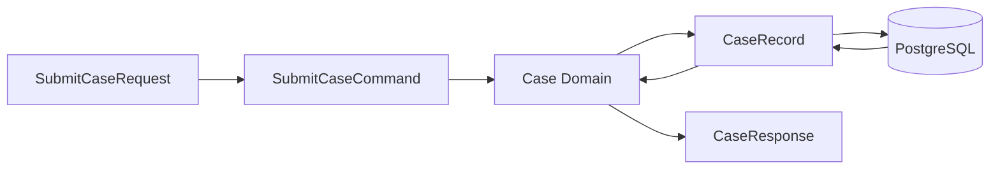

## 17.2 Mapper Responsibilities

```java
public class CaseApiMapper {

    public SubmitCaseCommand toCommand(SubmitCaseRequest request) {
        return new SubmitCaseCommand(
            request.customerId(),
            request.requestedAmount(),
            request.productCode()
        );
    }

    public CaseResponse toResponse(Case caseData) {
        return new CaseResponse(
            caseData.id().value(),
            caseData.status().name(),
            caseData.customerId(),
            caseData.productCode()
        );
    }
}
```

```java
public class CasePersistenceMapper {

    public CaseRecord toRecord(Case caseData) {
        return new CaseRecord(
            caseData.id().value(),
            caseData.customerId(),
            caseData.requestedAmount(),
            caseData.productCode(),
            caseData.status().name()
        );
    }

    public Case toDomain(CaseRecord record) {
        return Case.rehydrate(
            new CaseId(record.caseId()),
            record.customerId(),
            record.requestedAmount(),
            record.productCode(),
            CaseStatus.valueOf(record.status())
        );
    }
}
```

Practical rule:

```text
API DTO jangan jadi persistence record.
Persistence record jangan jadi domain object.
Domain object jangan diexpose langsung sebagai JSON response.
```

---

# 18. Provider Registration Matrix

| Component | Annotation | Register needed? | Failure if missing |
|---|---|---:|---|
| Resource | `@Path` | yes, package scan/register | 404 |
| ExceptionMapper | `@Provider` | yes, package scan/register | exception jadi default/500 |
| Filter | `@Provider` | yes | filter tidak jalan |
| Name-bound filter | `@NameBinding` + `@Provider` | yes | filter global/tidak jalan |
| MessageBodyWriter | `@Provider` | yes | no writer |
| MessageBodyReader | `@Provider` | yes | no reader |
| ParamConverterProvider | `@Provider` | yes | param custom gagal |
| MyBatis mapper | `@Mapper` / config | yes | mapper bean/proxy tidak ada |
| TypeHandler | `@MappedTypes` / config | yes | conversion gagal |

Jersey documentation menyebut filter, interceptor, dan provider sebagai teknik untuk memodifikasi request/application processing; provider lifecycle/registration menjadi bagian penting dari runtime behavior. ([Eclipse EE4J](https://eclipse-ee4j.github.io/jersey.github.io/documentation/latest3x/user-guide.html?utm_source=chatgpt.com))

---

# 19. Runtime Failure Analysis Playbook

## 19.1 `No MessageBodyWriter found`

Cek:

```text
1. Response entity class serializable?
2. JSON provider ada?
3. @Produces application/json?
4. Return Response.ok(List<T>) tanpa GenericEntity?
5. DTO punya cyclic reference?
6. Provider package registered?
```

Fix umum:

```java
GenericEntity<ApiResponse<Page<CaseResponse>>> entity =
    new GenericEntity<ApiResponse<Page<CaseResponse>>>(response) {};

return Response.ok(entity).build();
```

---

## 19.2 `No MessageBodyReader found`

Cek:

```text
1. Request Content-Type benar?
2. @Consumes cocok?
3. DTO bisa dibuat dari JSON?
4. JSON provider tersedia?
5. ReaderInterceptor tidak menghabiskan stream?
6. Custom MessageBodyReader registered?
```

---

## 19.3 `ConstraintViolationException` Jadi 500

Cek:

```text
1. ConstraintViolationExceptionMapper ada?
2. Mapper punya @Provider?
3. Mapper registered/package scanned?
4. Mapper return Response valid?
5. JSON error DTO bisa diserialize?
```

---

## 19.4 `Invalid bound statement`

Cek:

```text
1. XML namespace = mapper interface FQCN?
2. XML statement id = method name?
3. XML masuk classpath?
4. mapper-locations benar?
5. mapper package scanned?
```

Example mismatch:

```xml
<mapper namespace="com.company.caseapp.CaseMapper">
```

Padahal interface:

```java
com.company.caseapp.infrastructure.persistence.mybatis.CaseMyBatisMapper
```

Fix:

```xml
<mapper namespace="com.company.caseapp.infrastructure.persistence.mybatis.CaseMyBatisMapper">
```

---

## 19.5 `Parameter 'status' not found`

Cek:

```text
1. Method punya banyak parameter?
2. @Param dipasang?
3. Nama @Param sama dengan XML?
4. Kalau pakai parameter object, property name benar?
```

Fix:

```java
List<CaseRecord> search(
    @Param("status") String status,
    @Param("limit") int limit,
    @Param("offset") int offset
);
```

---

## 19.6 `ApiResponse.data` Jadi `LinkedHashMap`

Cek:

```text
1. Client deserialize pakai ApiResponse.class?
2. Nested generic butuh GenericType/TypeReference?
3. Response type ApiResponse<Page<CaseResponse>>?
```

Fix JAX-RS client:

```java
GenericType<ApiResponse<Page<CaseResponse>>> type =
    new GenericType<ApiResponse<Page<CaseResponse>>>() {};

ApiResponse<Page<CaseResponse>> response =
    target.request().get(type);
```

Fix Jackson:

```java
TypeReference<ApiResponse<Page<CaseResponse>>> type =
    new TypeReference<ApiResponse<Page<CaseResponse>>>() {};

ApiResponse<Page<CaseResponse>> response =
    objectMapper.readValue(json, type);
```

---

# 20. Contract Tests untuk Runtime Integration

## 20.1 Resource Annotation Test

```java
class ResourceContractTest {

    @Test
    void resourcesShouldProduceJson() {
        List<Class<?>> resources = List.of(
            CaseResource.class,
            PaymentResource.class
        );

        for (Class<?> resource : resources) {
            assertTrue(resource.isAnnotationPresent(Produces.class));

            Produces produces = resource.getAnnotation(Produces.class);

            assertTrue(Arrays.asList(produces.value())
                .contains(MediaType.APPLICATION_JSON));
        }
    }
}
```

## 20.2 Provider Registration Test

```java
class ProviderContractTest {

    @Test
    void exceptionMappersShouldHaveProviderAnnotation() {
        List<Class<?>> mappers = List.of(
            DomainExceptionMapper.class,
            ConstraintViolationExceptionMapper.class,
            ExternalSystemExceptionMapper.class
        );

        for (Class<?> mapper : mappers) {
            assertTrue(
                mapper.isAnnotationPresent(Provider.class),
                mapper.getSimpleName() + " must have @Provider"
            );
        }
    }
}
```

## 20.3 MyBatis Mapper XML Contract

Minimal static check:

```text
Mapper interface FQCN == XML namespace
method name == select/insert/update/delete id
multi parameter method == @Param present
resultMap referenced exists
TypeHandler class exists and registered
```

---

# 21. Practical Integration Template

## 21.1 API Layer

```java
@Path("/cases")
@Consumes(MediaType.APPLICATION_JSON)
@Produces(MediaType.APPLICATION_JSON)
public class CaseResource {

    private final CaseApplicationService service;
    private final CaseApiMapper mapper;

    @POST
    public Response submit(@Valid SubmitCaseRequest request) {
        SubmitCaseCommand command = mapper.toCommand(request);

        Case result = service.submit(command);

        return Response.status(Response.Status.CREATED)
            .entity(ApiResponse.ok(mapper.toResponse(result)))
            .build();
    }

    @GET
    public Response search(@BeanParam CaseSearchParams params) {
        Page<CaseResponse> page = service.search(
            params.toCriteria(),
            params.toPageRequest()
        );

        ApiResponse<Page<CaseResponse>> response = ApiResponse.ok(page);

        GenericEntity<ApiResponse<Page<CaseResponse>>> entity =
            new GenericEntity<ApiResponse<Page<CaseResponse>>>(response) {};

        return Response.ok(entity).build();
    }
}
```

## 21.2 Application Layer

```java
public Page<CaseResponse> search(
    CaseSearchCriteria criteria,
    PageRequest pageRequest
) {
    Page<Case> cases = caseRepository.search(criteria, pageRequest);

    return cases.map(apiMapper::toResponse);
}
```

## 21.3 Repository Adapter

```java
public Page<Case> search(
    CaseSearchCriteria criteria,
    PageRequest pageRequest
) {
    List<CaseRecord> records = mapper.search(
        criteria,
        pageRequest.limit(),
        pageRequest.offset()
    );

    long total = mapper.count(criteria);

    List<Case> cases = records.stream()
        .map(persistenceMapper::toDomain)
        .toList();

    return new Page<>(cases, pageRequest.limit(), pageRequest.offset(), total);
}
```

## 21.4 MyBatis Mapper

```java
public interface CaseMyBatisMapper {

    List<CaseRecord> search(
        @Param("criteria") CaseSearchCriteria criteria,
        @Param("limit") int limit,
        @Param("offset") int offset
    );

    long count(@Param("criteria") CaseSearchCriteria criteria);
}
```

XML:

```xml
<select id="search" resultMap="CaseRecordResultMap">
    SELECT
        case_id,
        customer_id,
        requested_amount,
        product_code,
        status
    FROM cases
    WHERE
        (#{criteria.status} IS NULL OR status = #{criteria.status})
    ORDER BY created_at DESC
    LIMIT #{limit}
    OFFSET #{offset}
</select>
```

---

# 22. Anti-Patterns

| Anti-pattern | Contoh | Masalah | Alternatif |
|---|---|---|---|
| Raw generic client | `.get(ApiResponse.class)` | data jadi Map | `GenericType<ApiResponse<Page<T>>>` |
| Response generic tanpa metadata | `Response.ok(list)` | writer/type ambiguity | `GenericEntity<List<T>>` |
| Entity sebagai DTO | return MyBatis record | DB schema bocor | API DTO |
| DTO sebagai domain | service menerima request DTO | API change rusak domain | command |
| Optional field DTO | `Optional<String>` | JSON contract aneh | nullable field + schema |
| MyBatis tanpa @Param | multi param method | param not found | `@Param` |
| Auto result mapping terlalu percaya | field null diam-diam | alias mismatch | resultMap eksplisit |
| Generic TypeHandler tanpa concrete registration | base handler saja | handler tidak resolve | concrete handler |
| Validation dianggap business policy | semua pakai `@Valid` | rule bisnis bocor/salah layer | policy/domain |
| Catch JSON/MyBatis error di resource | try-catch berulang | tidak konsisten | mapper/adapter translation |
| Package scan terlalu luas | provider aktif diam-diam | behavior sulit audit | explicit critical registration |
| Package scan salah | provider/resource tidak aktif | runtime failure | contract/integration test |

---

# 23. Code Review Checklist

## Jersey/JAX-RS

- Resource registered/package-scanned?
- Provider critical registered explicitly?
- ExceptionMapper punya `@Provider`?
- Generic response via `Response` memakai `GenericEntity` bila perlu?
- JAX-RS client nested generic memakai `GenericType`?
- `@Consumes/@Produces` konsisten?

## JSON Binding

- DTO shape jelas?
- Record/constructor property match?
- Nested generic deserialize dengan type token?
- Tidak expose domain/entity graph?
- Tidak ada cyclic reference?
- Date/time format standard?

## Bean Validation

- Request body diberi `@Valid`?
- Nested object diberi `@Valid`?
- Constraint violation mapper ada?
- Business rule tidak dipaksa menjadi DTO annotation?
- Error detail field/path readable?

## MyBatis

- XML namespace sama dengan mapper FQCN?
- Statement id sama dengan method name?
- Multi-param method punya `@Param`?
- `resultMap` eksplisit untuk record/complex mapping?
- TypeHandler registered?
- TypeHandler null handling jelas?
- Query filtering/sorting/pagination di SQL, bukan memory?

## Generics / Reflection

- Tidak ada raw type?
- Tidak ada unchecked cast tersebar?
- `Class<T>` dipakai hanya untuk non-nested type?
- Nested generic pakai `GenericType` / `TypeReference`?
- Generic helper tidak menghilangkan makna domain?

---

# 24. Practical Mini Exercise

Ambil endpoint:

```text
GET /cases?status=SUBMITTED&limit=20&offset=0
```

Audit integrasinya:

```text
1. Resource
   - @Path?
   - @GET?
   - @Produces JSON?
   - @BeanParam benar?

2. Response
   - ApiResponse<Page<CaseResponse>>?
   - Jika return Response, perlu GenericEntity?

3. Service
   - Page<Case> -> Page<CaseResponse> via Page.map?

4. Repository
   - SQL WHERE/LIMIT/OFFSET di MyBatis?
   - Tidak filter/pagination di memory?

5. MyBatis
   - mapper interface method match XML id?
   - @Param limit/offset/criteria?
   - resultMap/alias benar?

6. Client
   - kalau call endpoint ini dari service lain, pakai GenericType<ApiResponse<Page<CaseResponse>>>?

7. Test
   - integration test response JSON shape?
   - mapper XML test?
   - validation/error contract test?
```

Target:

```text
Tidak ada raw generic.
Tidak ada DTO/entity leak.
Tidak ada provider yang "kelihatan ada" tapi tidak aktif.
Tidak ada MyBatis param/resultMap mismatch.
Tidak ada pagination/filtering besar di memory.
```

---

# Ringkasan Seri 11

Seri ini menyatukan practical runtime integration:

```text
Jersey/JAX-RS memakai reflection + annotation untuk resource/provider discovery.
JSON binding memakai reflection + type metadata untuk serialize/deserialize.
Bean Validation memakai annotation metadata untuk constraint evaluation.
MyBatis memakai mapper proxy + XML/annotation + TypeHandler.
Generics aman di compile-time, tetapi type erasure membuat nested generic perlu type token.
```

Pattern penting:

```text
GenericEntity<ApiResponse<Page<T>>> untuk server-side generic response.
GenericType<ApiResponse<Page<T>>> untuk JAX-RS client-side generic read.
TypeReference<ApiResponse<Page<T>>> untuk Jackson nested generic.
@Valid + ConstraintViolationExceptionMapper untuk DTO validation.
@Mapper/@Param/resultMap untuk MyBatis binding.
BaseTypeHandler<T> + concrete handler untuk value object/enum/JSONB.
DTO-command-domain-record-response separation.
```

Prinsip senior-level:

```text
Jangan percaya compile-time generic akan selalu tersedia di runtime.
Jangan campur model API, domain, dan persistence.
Jangan bergantung pada package scanning tanpa contract/integration test.
Jangan expose framework/runtime failure mentah ke client.
Debug runtime integration dari metadata: annotation, registration, generic type, mapper namespace, statement id, and TypeHandler.
```

---

## Status

**Seri 11/12 selesai.**

Seri berikutnya yang direkomendasikan: **Seri 12/12 - Practical Failure Analysis, Testing, Refactoring Patterns, dan Final Checklist untuk Generics, Reflection, OOP, Functional dalam Java Jersey/JAX-RS Microservice.**

---

**Sources:**

- [Jakarta RESTful Web Services](https://jakarta.ee/specifications/restful-ws/4.0/jakarta-restful-ws-spec-4.0.pdf?utm_source=chatgpt.com)
- [MyBatis 3 | Configuration](https://mybatis.org/mybatis-3/configuration.html?utm_source=chatgpt.com)
- [Jakarta RESTful Web Services 4.0 API Specification](https://javadoc.io/doc/jakarta.ws.rs/jakarta.ws.rs-api/latest/index.html?utm_source=chatgpt.com)
- [Jersey 3.1.1 User Guide](https://eclipse-ee4j.github.io/jersey.github.io/documentation/latest3x/user-guide.html?utm_source=chatgpt.com)

## Response:
7/15/2026, 2:03:17 AM

# Seri 12/12 - Practical Failure Analysis, Testing, Refactoring Patterns, dan Final Checklist

## Tujuan Seri Ini

Seri terakhir ini merangkum cara **menganalisis failure**, **menulis test yang tepat**, dan **melakukan refactoring bertahap** untuk topik:

```text id="o5hl8p"
OOP layering
Generics
Reflection
Annotation/runtime discovery
JAX-RS resource/provider/filter/interceptor
ExceptionMapper
Functional interfaces
Stream/Optional
Rule/Policy/Decision design
MyBatis mapper/type handler
JSON binding
Bean Validation
```

Di Java Jersey/JAX-RS microservice, banyak bug tidak muncul sebagai compile error, tetapi sebagai **runtime integration failure** karena framework membaca annotation, generic metadata, provider registration, mapper XML, dan type handler pada runtime. Jakarta REST/JAX-RS memang memakai model resource dan provider seperti filter, interceptor, message body reader/writer, serta exception mapper sebagai extension runtime. ([Jakarta EE](https://jakarta.ee/specifications/restful-ws/4.0/?utm_source=chatgpt.com)) MyBatis juga sangat bergantung pada konfigurasi runtime seperti `typeHandlers`, `mappers`, dan XML statement binding. ([mybatis.org](https://mybatis.org/mybatis-3/configuration.html?utm_source=chatgpt.com))

---

# 1. Final Mental Model

```mermaid id="y3rk02"
flowchart TD
    A[Java Jersey/JAX-RS Microservice Quality] --> B[Design Boundary]
    A --> C[Runtime Metadata]
    A --> D[Error Handling]
    A --> E[Testing Strategy]
    A --> F[Refactoring]
    A --> G[Operational Debugging]

    B --> B1[Resource]
    B --> B2[Application Service]
    B --> B3[Domain]
    B --> B4[Repository Port]
    B --> B5[Infrastructure Adapter]

    C --> C1[Annotation]
    C --> C2[Reflection]
    C --> C3[Generic Type Token]
    C --> C4[Provider Registration]
    C --> C5[MyBatis XML]

    D --> D1[Exception Taxonomy]
    D --> D2[ExceptionMapper]
    D --> D3[Error Code]
    D --> D4[Correlation ID]

    E --> E1[Unit Test]
    E --> E2[Contract Test]
    E --> E3[Integration Test]
    E --> E4[Runtime Smoke Test]

    F --> F1[Extract Mapper]
    F --> F2[Extract Policy]
    F --> F3[Introduce DTO/Command]
    F --> F4[Replace Raw Generic]
    F --> F5[Centralize Error Mapping]

    G --> G1[404/405]
    G --> G2[415/406]
    G --> G3[No Reader/Writer]
    G --> G4[Invalid Bound Statement]
    G --> G5[LinkedHashMap Data]
```

Core principle:

```text id="52u3v4"
Kalau compile error, Java type system membantu.
Kalau runtime failure, cek metadata: annotation, registration, generic type, mapper XML, type handler, provider, dan serialization shape.
```

---

# 2. Failure Analysis Map

| Symptom | Kemungkinan root cause | Layer | First check |
|---|---|---|---|
| 404 endpoint tidak ketemu | `@Path` salah, resource tidak registered | JAX-RS | `ResourceConfig`, package scan, `@ApplicationPath` |
| 405 method not allowed | HTTP verb annotation salah/hilang | JAX-RS | `@GET/@POST/@PUT/@DELETE` |
| 415 unsupported media type | `Content-Type` tidak cocok `@Consumes` | JAX-RS/JSON | request header + `@Consumes` |
| 406 not acceptable | `Accept` tidak cocok `@Produces` | JAX-RS/JSON | client `Accept` + `@Produces` |
| No MessageBodyReader | JSON provider/body DTO issue | JSON/JAX-RS | provider dependency, DTO constructor/record |
| No MessageBodyWriter | response DTO/generic provider issue | JSON/JAX-RS | `@Produces`, DTO, `GenericEntity` |
| ExceptionMapper tidak jalan | mapper tidak `@Provider`/registered | JAX-RS provider | package scan/register |
| Validation tidak jalan | `@Valid` hilang/provider tidak aktif | Bean Validation | resource parameter, nested `@Valid` |
| Semua error jadi 500 | taxonomy/mapper hilang | Error handling | mapper kategori + fallback |
| `data` jadi `LinkedHashMap` | raw generic deserialization | Generics/JSON | `GenericType` / `TypeReference` |
| `Parameter not found` | MyBatis multi-param tanpa `@Param` | MyBatis | mapper method signature |
| `Invalid bound statement` | XML namespace/id mismatch | MyBatis | XML namespace + statement id |
| Field DB null/salah | alias/resultMap mismatch | MyBatis | SQL alias/resultMap |
| TypeHandler tidak kepakai | handler tidak registered/concrete | MyBatis | `@MappedTypes`, config scan |
| `ClassCastException` generic | unchecked/raw type | Generics | raw `List`, raw `ApiResponse` |
| Rule sulit diaudit | policy hanya boolean | Domain policy | `Decision`, `BusinessError`, evidence |

---

# 3. Debugging Playbook by Symptom

## 3.1 Endpoint 404

Checklist:

```text id="89y61y"
1. Apakah URL client termasuk context path dan @ApplicationPath?
2. Apakah class resource punya @Path?
3. Apakah method-level @Path benar?
4. Apakah resource masuk ResourceConfig.register() atau package scan?
5. Apakah package scan terlalu sempit?
6. Apakah deployment artifact membawa class resource?
```

Contoh fix:

```java id="y4j1ny"
@ApplicationPath("/api")
public class JerseyApplication extends ResourceConfig {

    public JerseyApplication() {
        register(CaseResource.class);
    }
}
```

Atau:

```java id="859gsp"
public JerseyApplication() {
    packages("com.company.caseapp.api.resource");
}
```

---

## 3.2 Endpoint 405

Checklist:

```text id="xbe54g"
1. Path sudah match?
2. HTTP method client benar?
3. Method resource punya @GET/@POST/@PUT/@PATCH/@DELETE?
4. Ada dua method path sama tapi verb berbeda?
5. Client/proxy mengubah method?
```

Contoh:

```java id="85mhb9"
@POST
@Path("/{caseId}/approve")
public Response approve(@PathParam("caseId") CaseId caseId) {
    ...
}
```

---

## 3.3 415 / 406

415 biasanya karena request body/media type masuk tidak cocok.

```text id="oo30hg"
Client Content-Type: application/json
Resource @Consumes(MediaType.APPLICATION_JSON)
MessageBodyReader JSON tersedia
DTO bisa dibaca
```

406 biasanya karena response media type tidak cocok.

```text id="f12rt7"
Client Accept: application/json
Resource @Produces(MediaType.APPLICATION_JSON)
MessageBodyWriter JSON tersedia
DTO bisa ditulis
```

Resource standard:

```java id="eimarm"
@Path("/cases")
@Consumes(MediaType.APPLICATION_JSON)
@Produces(MediaType.APPLICATION_JSON)
public class CaseResource {
}
```

---

## 3.4 No MessageBodyWriter

Checklist:

```text id="fx9xbr"
1. Response entity DTO biasa atau object framework/internal?
2. JSON provider aktif?
3. @Produces application/json?
4. Entity generic nested?
5. Jika return Response.ok(entity), perlu GenericEntity?
6. DTO punya cyclic reference?
```

Fix untuk generic response:

```java id="r6xr00"
ApiResponse<Page<CaseResponse>> response = ApiResponse.ok(page);

GenericEntity<ApiResponse<Page<CaseResponse>>> entity =
    new GenericEntity<ApiResponse<Page<CaseResponse>>>(response) {};

return Response.ok(entity).build();
```

---

## 3.5 `ApiResponse.data` Menjadi `LinkedHashMap`

Buruk:

```java id="ac6ej5"
ApiResponse response = target
    .path("/cases")
    .request()
    .get(ApiResponse.class);
```

Fix JAX-RS client:

```java id="542ozt"
GenericType<ApiResponse<Page<CaseResponse>>> type =
    new GenericType<ApiResponse<Page<CaseResponse>>>() {};

ApiResponse<Page<CaseResponse>> response =
    target.path("/cases").request().get(type);
```

Fix Jackson:

```java id="cow2gf"
TypeReference<ApiResponse<Page<CaseResponse>>> type =
    new TypeReference<ApiResponse<Page<CaseResponse>>>() {};

ApiResponse<Page<CaseResponse>> response =
    objectMapper.readValue(json, type);
```

Root cause:

```text id="es693i"
ApiResponse.class tidak membawa informasi T = Page<CaseResponse>.
Type erasure membuat runtime butuh type token eksplisit.
```

---

## 3.6 MyBatis `Invalid bound statement`

Checklist:

```text id="blz0y3"
1. XML namespace sama dengan fully qualified mapper interface?
2. XML statement id sama dengan method name?
3. XML file masuk classpath?
4. Mapper package discan?
5. Mapper XML location benar di Maven/resource config?
```

Interface:

```java id="vii1em"
package com.company.caseapp.infrastructure.persistence.mybatis;

public interface CaseMyBatisMapper {
    CaseRecord findById(@Param("caseId") String caseId);
}
```

XML harus:

```xml id="hfijq0"
<mapper namespace="com.company.caseapp.infrastructure.persistence.mybatis.CaseMyBatisMapper">

    <select id="findById" resultMap="CaseRecordResultMap">
        SELECT *
        FROM cases
        WHERE case_id = #{caseId}
    </select>

</mapper>
```

---

## 3.7 MyBatis `Parameter not found`

Buruk:

```java id="k5albi"
List<CaseRecord> search(String status, int limit, int offset);
```

XML:

```xml id="jv3vuw"
WHERE status = #{status}
LIMIT #{limit}
OFFSET #{offset}
```

Fix:

```java id="tdgoev"
List<CaseRecord> search(
    @Param("status") String status,
    @Param("limit") int limit,
    @Param("offset") int offset
);
```

Practical rule:

```text id="31zk8w"
Kalau MyBatis mapper method punya lebih dari satu parameter, gunakan @Param secara eksplisit.
```

---

# 4. Testing Strategy Map

| Test type | Target | Cocok untuk | Tidak cocok untuk |
|---|---|---|---|
| Unit test | satu class/method | mapper, rule, policy, domain method | provider discovery |
| Contract test | annotation/shape convention | resource/provider metadata | full request lifecycle |
| Integration test | beberapa layer runtime | JAX-RS resource + provider + JSON + validation | semua edge case kecil |
| Repository integration test | MyBatis + DB/testcontainer | XML/resultMap/typeHandler | domain policy |
| End-to-end smoke test | deployed service path | routing/auth/serialization happy path | exhaustive logic |
| Regression test | bug yang pernah terjadi | mencegah bug berulang | desain baru tanpa bug history |

JUnit adalah framework testing JVM modern; JUnit 6 saat ini membutuhkan Java 17 atau lebih baru, sehingga cocok dengan baseline modern Java 17+. ([junit.org](https://junit.org/?utm_source=chatgpt.com)) Untuk project yang masih memakai JUnit 5, user guide JUnit tetap menyediakan fitur seperti assertions, lifecycle callbacks, dan parameterized tests. ([docs.junit.org](https://docs.junit.org/5.10.0-RC2/user-guide/index.html?utm_source=chatgpt.com))

---

# 5. Unit Test: Domain Method

Contoh domain invariant:

```java id="1j9yes"
public Case approve() {
    if (status != CaseStatus.SUBMITTED) {
        throw new InvalidCaseTransitionException(
            status.name(),
            CaseStatus.APPROVED.name()
        );
    }

    return withStatus(CaseStatus.APPROVED);
}
```

Test:

```java id="lc3exu"
class CaseTest {

    @Test
    void approveShouldChangeSubmittedCaseToApproved() {
        Case caseData = Case.rehydrate(
            new CaseId("CASE-001"),
            "CUST-001",
            new BigDecimal("1000000"),
            "LOAN_BASIC",
            CaseStatus.SUBMITTED
        );

        Case approved = caseData.approve();

        assertEquals(CaseStatus.APPROVED, approved.status());
    }

    @Test
    void approveShouldFailWhenCaseIsCancelled() {
        Case caseData = Case.rehydrate(
            new CaseId("CASE-001"),
            "CUST-001",
            new BigDecimal("1000000"),
            "LOAN_BASIC",
            CaseStatus.CANCELLED
        );

        InvalidCaseTransitionException exception = assertThrows(
            InvalidCaseTransitionException.class,
            caseData::approve
        );

        assertEquals("INVALID_CASE_TRANSITION", exception.errorCode());
    }
}
```

Target:

```text id="f7aoq1"
State transition tidak boleh hanya dites lewat resource endpoint.
Domain invariant harus punya unit test sendiri.
```

---

# 6. Unit Test: Mapper

API mapper:

```java id="zv02eh"
public class CaseApiMapper {

    public SubmitCaseCommand toCommand(SubmitCaseRequest request) {
        return new SubmitCaseCommand(
            request.customerId(),
            request.requestedAmount(),
            request.productCode()
        );
    }

    public CaseResponse toResponse(Case caseData) {
        return new CaseResponse(
            caseData.id().value(),
            caseData.status().name(),
            caseData.customerId(),
            caseData.productCode()
        );
    }
}
```

Test:

```java id="v1gsye"
class CaseApiMapperTest {

    private final CaseApiMapper mapper = new CaseApiMapper();

    @Test
    void shouldMapRequestToCommand() {
        SubmitCaseRequest request = new SubmitCaseRequest(
            "CUST-001",
            new BigDecimal("1000000"),
            "LOAN_BASIC"
        );

        SubmitCaseCommand command = mapper.toCommand(request);

        assertEquals("CUST-001", command.customerId());
        assertEquals("LOAN_BASIC", command.productCode());
    }

    @Test
    void shouldMapDomainToResponse() {
        Case caseData = Case.rehydrate(
            new CaseId("CASE-001"),
            "CUST-001",
            new BigDecimal("1000000"),
            "LOAN_BASIC",
            CaseStatus.SUBMITTED
        );

        CaseResponse response = mapper.toResponse(caseData);

        assertEquals("CASE-001", response.caseId());
        assertEquals("SUBMITTED", response.status());
    }
}
```

Target:

```text id="q5uo1g"
Mapping critical jangan hanya diasumsikan benar.
Test mapper terutama saat field banyak, naming berbeda, atau data sensitif harus disembunyikan.
```

---

# 7. Unit Test: Rule dan Policy

Rule:

```java id="q3i0ja"
public final class AmountLimitRule
    implements NamedRule<SubmitCaseContext> {

    private final BigDecimal maxAmount;

    public AmountLimitRule(BigDecimal maxAmount) {
        this.maxAmount = maxAmount;
    }

    @Override
    public Optional<BusinessError> validate(SubmitCaseContext context) {
        if (context.command().requestedAmount().compareTo(maxAmount) > 0) {
            return Optional.of(new BusinessError(
                "AMOUNT_LIMIT_EXCEEDED",
                "Requested amount exceeds allowed limit",
                "requestedAmount",
                Severity.ERROR
            ));
        }

        return Optional.empty();
    }

    @Override
    public String ruleId() {
        return "CASE_SUBMIT_AMOUNT_LIMIT";
    }
}
```

Test:

```java id="w6fxzj"
class AmountLimitRuleTest {

    @Test
    void shouldReturnErrorWhenAmountExceedsLimit() {
        AmountLimitRule rule = new AmountLimitRule(
            new BigDecimal("100000000")
        );

        SubmitCaseContext context = new SubmitCaseContext(
            new SubmitCaseCommand(
                "CUST-001",
                new BigDecimal("150000000"),
                "LOAN_BASIC"
            ),
            true
        );

        Optional<BusinessError> error = rule.validate(context);

        assertTrue(error.isPresent());
        assertEquals("AMOUNT_LIMIT_EXCEEDED", error.get().code());
    }
}
```

Policy test:

```java id="uai2mm"
class SubmitCasePolicyTest {

    @Test
    void shouldDenyWhenCustomerNotVerified() {
        SubmitCasePolicy policy = new SubmitCasePolicy();

        SubmitCaseContext context = new SubmitCaseContext(
            new SubmitCaseCommand(
                "CUST-001",
                new BigDecimal("1000000"),
                "LOAN_BASIC"
            ),
            false
        );

        Decision decision = policy.evaluate(context);

        assertInstanceOf(Decision.Denied.class, decision);
        assertEquals("CUSTOMER_NOT_VERIFIED", decision.code());
    }
}
```

Target:

```text id="51gv5h"
Test rule/policy harus assert code dan outcome, bukan hanya boolean.
```

---

# 8. Unit Test: ExceptionMapper

Mapper:

```java id="jtlfsh"
@Provider
public class DomainExceptionMapper
    extends BaseAppExceptionMapper<DomainException> {
}
```

Jika mapper bergantung pada injected context, lebih mudah test jika ada factory:

```java id="4lvnus"
public class ErrorResponseFactory {

    public ErrorResponse<Object> from(
        AppException exception,
        String correlationId
    ) {
        return new ErrorResponse<>(
            exception.errorCode(),
            exception.getMessage(),
            exception.detail(),
            correlationId
        );
    }
}
```

Test factory:

```java id="9lhnhx"
class ErrorResponseFactoryTest {

    @Test
    void shouldCreateErrorResponseFromAppException() {
        ErrorResponseFactory factory = new ErrorResponseFactory();

        AppException exception = new ResourceNotFoundException(
            "case",
            "CASE-001"
        );

        ErrorResponse<Object> response = factory.from(
            exception,
            "corr-123"
        );

        assertEquals("CASE_NOT_FOUND", response.code());
        assertEquals("corr-123", response.correlationId());
    }
}
```

Test mapper:

```java id="uamliq"
class DomainExceptionMapperTest {

    @Test
    void shouldMapDomainExceptionTo422() {
        DomainExceptionMapper mapper = new DomainExceptionMapper();

        CaseSubmissionRejectedException exception =
            new CaseSubmissionRejectedException(
                "CUSTOMER_NOT_VERIFIED",
                "Customer is not verified"
            );

        Response response = mapper.toResponse(exception);

        assertEquals(422, response.getStatus());
        assertNotNull(response.getEntity());
    }
}
```

Target:

```text id="25ry3b"
Mapper test memastikan status dan error body stabil.
Integration test tetap dibutuhkan untuk membuktikan mapper registered.
```

---

# 9. Contract Test: Annotation dan Provider

## 9.1 Resource Contract

```java id="zxz4lt"
class ResourceContractTest {

    private final List<Class<?>> resources = List.of(
        CaseResource.class,
        PaymentResource.class
    );

    @Test
    void resourcesShouldProduceJson() {
        for (Class<?> resource : resources) {
            Produces produces = resource.getAnnotation(Produces.class);

            assertNotNull(
                produces,
                resource.getSimpleName() + " must declare @Produces"
            );

            assertTrue(
                Arrays.asList(produces.value())
                    .contains(MediaType.APPLICATION_JSON),
                resource.getSimpleName() + " must produce application/json"
            );
        }
    }
}
```

## 9.2 Provider Contract

```java id="xtgblb"
class ProviderContractTest {

    @Test
    void exceptionMappersShouldHaveProviderAnnotation() {
        List<Class<?>> mappers = List.of(
            DomainExceptionMapper.class,
            ConstraintViolationExceptionMapper.class,
            ExternalSystemExceptionMapper.class,
            UnexpectedExceptionMapper.class
        );

        for (Class<?> mapper : mappers) {
            assertTrue(
                mapper.isAnnotationPresent(Provider.class),
                mapper.getSimpleName() + " must have @Provider"
            );
        }
    }
}
```

## 9.3 Security/Audit Metadata Contract

```java id="0aspf2"
class EndpointMetadataContractTest {

    @Test
    void submitCaseShouldBeSecuredAndAudited() throws Exception {
        Method submit = CaseResource.class.getDeclaredMethod(
            "submit",
            SubmitCaseRequest.class
        );

        assertTrue(submit.isAnnotationPresent(Secured.class));
        assertTrue(submit.isAnnotationPresent(RequiresPermission.class));
        assertTrue(submit.isAnnotationPresent(Audited.class));
        assertTrue(submit.isAnnotationPresent(BusinessOperation.class));
    }
}
```

Target:

```text id="i2mw7e"
Contract test menangkap bug "kelihatan ada di code, tapi annotation penting hilang".
```

---

# 10. Integration Test: Jersey Runtime

Integration test perlu membuktikan:

```text id="p0pznt"
resource ditemukan
JSON reader/writer jalan
validation jalan
exception mapper aktif
filter/header jalan
generic response shape benar
```

Contoh konseptual dengan test container:

```java id="sihzad"
class CaseResourceIntegrationTest extends JerseyTest {

    @Override
    protected Application configure() {
        return new ResourceConfig()
            .register(CaseResource.class)
            .register(ConstraintViolationExceptionMapper.class)
            .register(DomainExceptionMapper.class)
            .register(CorrelationIdFilter.class);
    }

    @Test
    void submitShouldReturn400WhenRequestInvalid() {
        SubmitCaseRequest request = new SubmitCaseRequest(
            "",
            BigDecimal.ZERO,
            ""
        );

        Response response = target("/cases")
            .request(MediaType.APPLICATION_JSON_TYPE)
            .post(Entity.json(request));

        assertEquals(400, response.getStatus());
    }
}
```

Target:

```text id="bzmlqy"
Unit test tidak membuktikan provider discovery.
Integration test membuktikan runtime benar-benar memakai provider.
```

---

# 11. Repository Integration Test: MyBatis

Yang perlu dites:

```text id="mt8t0k"
mapper XML namespace/id
@Param binding
resultMap/constructor mapping
TypeHandler
SQL WHERE/LIMIT/OFFSET
unique constraint translation
null handling
```

Contoh test konseptual:

```java id="e1na55"
class CaseRepositoryMyBatisIntegrationTest {

    @Test
    void findByIdShouldMapRecordToDomain() {
        insertCase("CASE-001", "CUST-001", "SUBMITTED");

        Optional<Case> result = repository.findById(
            new CaseId("CASE-001")
        );

        assertTrue(result.isPresent());
        assertEquals(CaseStatus.SUBMITTED, result.get().status());
    }

    @Test
    void searchShouldApplyLimitAndOffset() {
        insertManyCases(30);

        Page<Case> page = repository.search(
            new CaseSearchCriteria("SUBMITTED", null, null),
            new PageRequest(10, 0)
        );

        assertEquals(10, page.items().size());
    }
}
```

Target:

```text id="8zdjcq"
MyBatis mapping tidak cukup dites dengan mock.
Perlu integration test dengan DB/test schema karena banyak bug ada di XML/SQL/resultMap/typeHandler.
```

---

# 12. Generic Contract Test

Test bahwa JSON/client generic tidak menjadi `Map`.

```java id="30sfh3"
class GenericDeserializationTest {

    @Test
    void shouldDeserializeNestedGenericResponse() throws Exception {
        String json = """
            {
              "success": true,
              "data": {
                "items": [
                  {
                    "caseId": "CASE-001",
                    "status": "SUBMITTED",
                    "customerId": "CUST-001",
                    "productCode": "LOAN_BASIC"
                  }
                ],
                "limit": 20,
                "offset": 0,
                "total": 1
              },
              "error": null
            }
            """;

        TypeReference<ApiResponse<Page<CaseResponse>>> type =
            new TypeReference<ApiResponse<Page<CaseResponse>>>() {};

        ApiResponse<Page<CaseResponse>> response =
            objectMapper.readValue(json, type);

        assertInstanceOf(
            CaseResponse.class,
            response.data().items().getFirst()
        );
    }
}
```

Target:

```text id="rffvit"
Bug raw generic sering baru ketahuan saat client membaca response.
Buat test untuk response generic penting.
```

---

# 13. Refactoring Pattern 1 - Fat Resource ke Layered Design

## Sebelum

```java id="za50ov"
@POST
public Response submit(SubmitCaseRequest request) {
    if (request.customerId() == null) {
        return Response.status(400).build();
    }

    Customer customer = customerClient.getCustomer(request.customerId());

    if (!customer.verified()) {
        return Response.status(422).build();
    }

    CaseRecord record = new CaseRecord(...);
    caseMapper.insert(record);

    return Response.status(201).entity(record).build();
}
```

## Masalah

```text id="3qzvyw"
resource terlalu gemuk
DTO langsung ke DB
external call di resource
error response manual
domain model tidak ada
test sulit
```

## Setelah

```java id="qlc53w"
@POST
public Response submit(@Valid SubmitCaseRequest request) {
    SubmitCaseCommand command = mapper.toCommand(request);

    SubmitCaseResult result = caseService.submit(command);

    return Response.status(Response.Status.CREATED)
        .entity(ApiResponse.ok(mapper.toResponse(result)))
        .build();
}
```

Service:

```java id="9pfzwt"
public SubmitCaseResult submit(SubmitCaseCommand command) {
    boolean verified = customerVerificationGateway
        .isVerified(command.customerId());

    SubmitCaseContext context = new SubmitCaseContext(command, verified);

    Decision decision = submitCasePolicy.evaluate(context);

    if (decision instanceof Decision.Denied denied) {
        throw new CaseSubmissionRejectedException(
            denied.code(),
            denied.reason()
        );
    }

    Case newCase = Case.createSubmitted(
        command.customerId(),
        command.requestedAmount(),
        command.productCode()
    );

    Case saved = caseRepository.save(newCase);

    return mapper.toResult(saved);
}
```

Refactoring steps:

```text id="7lo9sz"
1. Extract DTO -> command mapper.
2. Extract service method.
3. Extract external client behind gateway port.
4. Extract repository port.
5. Introduce domain model.
6. Centralize error handling with ExceptionMapper.
7. Add tests per extracted component.
```

---

# 14. Refactoring Pattern 2 - Raw Generic ke Type-Safe Generic

## Sebelum

```java id="szemrb"
public record ApiResponse(
    boolean success,
    Object data,
    Object error
) {}
```

Client:

```java id="x0713v"
ApiResponse response = client.get(ApiResponse.class);
Map<String, Object> data = (Map<String, Object>) response.data();
```

## Setelah

```java id="frfuze"
public record ApiResponse<T>(
    boolean success,
    T data,
    ErrorResponse<?> error
) {}
```

Client:

```java id="iybgmd"
GenericType<ApiResponse<Page<CaseResponse>>> type =
    new GenericType<ApiResponse<Page<CaseResponse>>>() {};

ApiResponse<Page<CaseResponse>> response =
    target.request().get(type);
```

Refactoring steps:

```text id="40kfuw"
1. Introduce ApiResponse<T>.
2. Replace Object data with T.
3. Replace raw clients with GenericType/TypeReference.
4. Add generic deserialization test.
5. Remove unchecked casts.
```

---

# 15. Refactoring Pattern 3 - Try-Catch Berulang ke ExceptionMapper

## Sebelum

```java id="z09n9g"
@GET
@Path("/{caseId}")
public Response findById(@PathParam("caseId") String caseId) {
    try {
        CaseResponse response = service.findById(new CaseId(caseId));
        return Response.ok(ApiResponse.ok(response)).build();
    } catch (ResourceNotFoundException exception) {
        return Response.status(404)
            .entity(ApiResponse.failed(...))
            .build();
    } catch (Exception exception) {
        return Response.status(500)
            .entity(ApiResponse.failed(...))
            .build();
    }
}
```

## Setelah

```java id="wvia13"
@GET
@Path("/{caseId}")
public Response findById(@PathParam("caseId") CaseId caseId) {
    CaseResponse response = service.findById(caseId);

    return Response.ok(ApiResponse.ok(response)).build();
}
```

Mapper:

```java id="zq2uio"
@Provider
public class ResourceNotFoundExceptionMapper
    extends BaseAppExceptionMapper<ResourceNotFoundException> {
}
```

Refactoring steps:

```text id="fy46js"
1. Buat error contract.
2. Buat exception taxonomy.
3. Buat mapper kategori.
4. Register provider.
5. Hapus try-catch dari resource.
6. Tambah integration test error response.
```

---

# 16. Refactoring Pattern 4 - Boolean Policy ke Decision Object

## Sebelum

```java id="wpqgxv"
boolean eligible = policy.canSubmit(command);

if (!eligible) {
    throw new CaseSubmissionRejectedException("Not eligible");
}
```

## Masalah

```text id="9ns9c8"
reason hilang
error code hilang
manual review tidak bisa dibedakan
audit evidence tidak ada
```

## Setelah

```java id="ryj8pd"
Decision decision = policy.evaluate(context);

if (decision instanceof Decision.Denied denied) {
    throw new CaseSubmissionRejectedException(
        denied.code(),
        denied.reason()
    );
}

if (decision instanceof Decision.ManualReview review) {
    return createManualReviewCase(command, review);
}
```

Refactoring steps:

```text id="fsv124"
1. Introduce Decision sealed interface.
2. Map old false to Denied.
3. Tambah decision code.
4. Tambah manual review/warning jika perlu.
5. Tambah unit test per outcome.
```

---

# 17. Refactoring Pattern 5 - MyBatis Auto Mapping ke Explicit ResultMap

## Sebelum

```xml id="6gs5b4"
<select id="findById" resultType="CaseRecord">
    SELECT *
    FROM cases
    WHERE case_id = #{caseId}
</select>
```

## Masalah

```text id="7mu8j5"
SELECT * rawan perubahan schema
alias tidak jelas
record constructor mapping bisa gagal
field null diam-diam
```

## Setelah

```xml id="0k4jzb"
<resultMap id="CaseRecordResultMap"
           type="com.company.caseapp.infrastructure.persistence.entity.CaseRecord">
    <constructor>
        <arg column="case_id" javaType="string"/>
        <arg column="customer_id" javaType="string"/>
        <arg column="requested_amount" javaType="java.math.BigDecimal"/>
        <arg column="product_code" javaType="string"/>
        <arg column="status" javaType="string"/>
    </constructor>
</resultMap>

<select id="findById" resultMap="CaseRecordResultMap">
    SELECT
        case_id,
        customer_id,
        requested_amount,
        product_code,
        status
    FROM cases
    WHERE case_id = #{caseId}
</select>
```

Refactoring steps:

```text id="wl11dj"
1. Hilangkan SELECT *.
2. Tambah column list eksplisit.
3. Tambah resultMap.
4. Tambah integration test mapping.
5. Tambah TypeHandler bila ada value object/enum.
```

---

# 18. Refactoring Pattern 6 - Stream Side Effect ke Loop Eksplisit

## Sebelum

```java id="k4f4u1"
cases.stream()
    .filter(Case::isExpired)
    .map(caseData -> caseRepository.save(caseData.expire()))
    .forEach(eventPublisher::publish);
```

## Masalah

```text id="ksbxrf"
mutation tersembunyi
transaction boundary kabur
error handling sulit
event publish rawan tidak konsisten
```

## Setelah

```java id="g1lunl"
for (Case caseData : cases) {
    if (!caseData.isExpired()) {
        continue;
    }

    Case expired = caseData.expire();
    Case saved = caseRepository.save(expired);

    eventPublisher.publish(
        new CaseExpiredEvent(saved.id().value())
    );
}
```

Lebih baik untuk reliability:

```java id="kb1m7l"
for (Case caseData : cases) {
    if (!caseData.isExpired()) {
        continue;
    }

    Case expired = caseData.expire();
    Case saved = caseRepository.save(expired);

    outboxRepository.save(
        new CaseExpiredEvent(saved.id().value())
    );
}
```

Refactoring rule:

```text id="m5lu5p"
Stream untuk pure transformation.
Loop untuk mutation, transaction, external call, partial failure, dan eventing.
```

---

# 19. Refactoring Pattern 7 - Reflection Utility yang Berbahaya ke Explicit Mapper

## Sebelum

```java id="z9u2nb"
public <S, T> T autoMap(S source, Class<T> targetType) {
    // reflection copy same-name fields
}
```

Masalah:

```text id="gd1hww"
silent mapping bug
field rename tidak aman
nested object ambigu
security leak jika field sensitif ikut tercopy
debugging sulit
```

## Setelah

```java id="mrkqf9"
public class CaseApiMapper {

    public CaseResponse toResponse(Case caseData) {
        return new CaseResponse(
            caseData.id().value(),
            caseData.status().name(),
            caseData.customerId(),
            caseData.productCode()
        );
    }
}
```

Practical rule:

```text id="s4f6jm"
Reflection boleh untuk framework/test/diagnostic.
Untuk business/API mapping penting, explicit mapper lebih aman.
```

---

# 20. Refactoring Pattern 8 - Optional Chain Tersembunyi ke Workflow Eksplisit

## Sebelum

```java id="5r27i9"
String region = caseRepository.findById(caseId)
    .flatMap(caseData -> customerRepository.findById(
        new CustomerId(caseData.customerId())
    ))
    .flatMap(customer -> addressRepository.findPrimary(customer.id()))
    .map(Address::region)
    .orElse("UNKNOWN");
```

## Masalah

```text id="stbmzq"
multi-repository call tersembunyi
not found reason hilang
logging sulit
error status tidak jelas
```

## Setelah

```java id="69xx81"
Case caseData = caseRepository.findById(caseId)
    .orElseThrow(() -> new ResourceNotFoundException(
        "case",
        caseId.value()
    ));

Customer customer = customerRepository.findById(
        new CustomerId(caseData.customerId())
    )
    .orElseThrow(() -> new ResourceNotFoundException(
        "customer",
        caseData.customerId()
    ));

String region = addressRepository.findPrimary(customer.id())
    .map(Address::region)
    .orElse("UNKNOWN");
```

Rule:

```text id="8h3v4d"
Optional chain bagus untuk transformasi kecil.
Workflow lintas repository/service lebih baik eksplisit.
```

---

# 21. Final Architecture Checklist

## Resource Layer

- Resource tipis?
- Tidak query MyBatis langsung?
- Tidak call external API langsung?
- Tidak ada business workflow panjang?
- `@Path`, HTTP method, `@Consumes`, `@Produces` jelas?
- Request DTO diberi `@Valid`?
- Generic response memakai `GenericEntity` jika perlu?
- Security/audit/idempotency annotation ada untuk endpoint penting?

## Application Service

- Mengorkestrasi use case, bukan HTTP detail?
- Menerima command/context, bukan request DTO?
- Memanggil port, bukan adapter/vendor langsung?
- Transaction boundary jelas?
- Decision/policy handling eksplisit?
- Manual review/warning diperlakukan sebagai outcome yang benar?
- Tidak berisi SQL/JSON/vendor payload detail?

## Domain

- Invariant dan state transition ada di domain?
- Tidak tahu HTTP/JAX-RS/MyBatis/vendor SDK?
- Exception domain punya error code stabil?
- Value object validasi dirinya sendiri?
- Tidak terlalu anemic untuk lifecycle penting?

## Repository / MyBatis

- Repository port spesifik domain?
- MyBatis mapper hanya di infrastructure?
- XML namespace/id match interface?
- Multi-param method pakai `@Param`?
- Query filtering/sorting/pagination di SQL?
- ResultMap eksplisit untuk mapping kompleks/record?
- TypeHandler terdaftar dan diuji?
- DB exception diterjemahkan dengan tepat?

## API / DTO / JSON

- Request/response DTO berbeda dari domain dan record?
- Tidak expose entity graph?
- Tidak pakai `Optional` sebagai field DTO?
- Date/time/number format konsisten?
- Nested generic client memakai `GenericType`/`TypeReference`?
- Error contract stabil?

## Error Handling

- Exception taxonomy jelas?
- Error code stabil?
- ExceptionMapper per kategori?
- Fallback mapper aman?
- Stacktrace tidak bocor ke client?
- Correlation ID masuk response/log?
- External/vendor exception diterjemahkan di adapter?
- Validation error dan business error dibedakan?

## Functional / Stream / Optional

- Predicate hanya untuk boolean sederhana?
- Rule/Policy membawa reason/code jika business-critical?
- Stream hanya untuk pure transformation?
- Tidak ada DB/external call tersembunyi dalam stream?
- Loop dipakai untuk mutation/transaction/error handling?
- `orElseGet` untuk fallback mahal?
- Optional hanya sebagai return type?

---

# 22. Final Testing Checklist

| Component | Minimal tests |
|---|---|
| Domain model | state transition, invalid transition |
| Value object | valid/invalid construction |
| API mapper | request → command, domain/result → response |
| Persistence mapper | record ↔ domain |
| Rule | pass/fail + error code |
| Policy | allowed, denied, manual review, warning |
| Application service | orchestration happy path + major failure |
| ExceptionMapper | status + body + error code |
| Resource | status code + service call |
| JAX-RS integration | validation, provider, JSON reader/writer |
| MyBatis integration | XML statement, resultMap, typeHandler |
| Generic client | nested generic not Map |
| Contract metadata | security/audit/provider annotation |
| Regression | every production bug gets a test |

---

# 23. Final Runtime Debug Checklist

Saat incident/debugging, gunakan urutan ini.

## Untuk HTTP Routing

```text id="rz3hmc"
URL -> context path -> @ApplicationPath -> @Path class -> @Path method -> HTTP verb
```

## Untuk Body Parsing

```text id="t6jfcq"
Content-Type -> @Consumes -> MessageBodyReader -> DTO shape -> validation
```

## Untuk Response Serialization

```text id="8u5v5h"
Accept -> @Produces -> entity type -> GenericEntity? -> MessageBodyWriter -> DTO graph
```

## Untuk Error

```text id="0rrpbg"
thrown exception class -> mapper registered? -> mapper specificity -> response body -> fallback mapper
```

## Untuk MyBatis

```text id="bci6jf"
mapper interface -> XML namespace -> statement id -> @Param -> resultMap -> TypeHandler -> SQL result
```

## Untuk Generic Client

```text id="x626tx"
raw .class? -> nested generic? -> GenericType/TypeReference? -> data is DTO or Map?
```

---

# 24. Practical “Smell → Fix” Table

| Smell | Kemungkinan masalah | Fix |
|---|---|---|
| Resource >100 lines | too many responsibilities | extract service/mapper/policy |
| `Response.status(...)` repeated everywhere | error mapping scattered | ExceptionMapper |
| `Object data` | raw response contract | `ApiResponse<T>` |
| `List` raw type | lost type safety | `List<T>` |
| `@SuppressWarnings("unchecked")` everywhere | unsafe generic handling | isolate cast/type token |
| `Response.ok(list)` for generic list | generic metadata risk | `GenericEntity<List<T>>` |
| `.get(ApiResponse.class)` | raw client read | `GenericType<ApiResponse<T>>` |
| MyBatis method with 3 params no `@Param` | param binding risk | add `@Param` |
| `SELECT *` in mapper | fragile mapping | explicit columns/resultMap |
| Policy returns boolean | decision not explainable | sealed `Decision` |
| Stream contains `save()` | hidden side effect | loop/transaction boundary |
| Optional field in DTO | bad JSON contract | nullable field/schema |
| External SDK exception in service | adapter leak | translate in gateway adapter |
| Domain throws `BadRequestException` | HTTP leak into domain | domain exception |
| Validation rule in SQL only | business logic hidden | policy/domain + DB constraint |

---

# 25. Recommended Final Package Structure

```text id="v0mpfz"
com.company.caseapp
├── api
│   ├── resource
│   │   └── CaseResource.java
│   ├── dto
│   │   ├── SubmitCaseRequest.java
│   │   └── CaseResponse.java
│   └── mapper
│       └── CaseApiMapper.java
│
├── application
│   ├── service
│   │   └── CaseApplicationService.java
│   ├── command
│   │   └── SubmitCaseCommand.java
│   ├── result
│   │   └── SubmitCaseResult.java
│   ├── context
│   │   └── SubmitCaseContext.java
│   ├── policy
│   │   └── SubmitCasePolicy.java
│   └── mapper
│       └── CaseApplicationMapper.java
│
├── domain
│   ├── model
│   │   ├── Case.java
│   │   ├── CaseId.java
│   │   └── CaseStatus.java
│   └── exception
│       ├── DomainException.java
│       └── InvalidCaseTransitionException.java
│
├── port
│   ├── persistence
│   │   └── CaseRepository.java
│   └── external
│       └── CustomerVerificationGateway.java
│
├── infrastructure
│   ├── persistence
│   │   ├── mybatis
│   │   │   └── CaseMyBatisMapper.java
│   │   ├── entity
│   │   │   └── CaseRecord.java
│   │   ├── mapper
│   │   │   └── CasePersistenceMapper.java
│   │   ├── typehandler
│   │   │   ├── CaseIdTypeHandler.java
│   │   │   └── CaseStatusTypeHandler.java
│   │   └── CaseRepositoryMyBatisAdapter.java
│   └── external
│       └── CustomerVerificationHttpClient.java
│
└── support
    ├── error
    │   ├── DomainExceptionMapper.java
    │   ├── ConstraintViolationExceptionMapper.java
    │   └── UnexpectedExceptionMapper.java
    ├── filter
    │   ├── CorrelationIdFilter.java
    │   └── AuditFilter.java
    └── config
        └── JerseyApplication.java
```

---

# 26. Roadmap Setelah Seri Ini

Untuk memperkuat onboarding teknis, urutan lanjut yang paling practical:

```text id="0f9afb"
1. Ambil 1 endpoint nyata dari codebase.
2. Gambar lifecycle request-nya dari resource sampai DB/external.
3. Tandai semua boundary: DTO, command, domain, repository, adapter.
4. Audit annotation/provider/filter/mapper yang aktif.
5. Cari raw generic/Object/unchecked cast.
6. Cari try-catch manual di resource.
7. Cari MyBatis mapper XML yang rawan.
8. Tambahkan minimal 1 unit test, 1 integration test, dan 1 contract test.
9. Refactor kecil tanpa mengubah behavior.
10. Dokumentasikan pattern sebagai team convention.
```

---

# 27. Ringkasan Final 12 Seri

```text id="7vbu57"
Seri 1  - OOP Layering dalam Jersey/JAX-RS Microservice
Seri 2  - Generics untuk API Response, DTO, Mapper, Pagination, Result Pattern
Seri 3  - Generic Bounds, Wildcards, PECS, dan Type Erasure
Seri 4  - Reflection Fundamental untuk Framework-Based Java
Seri 5  - Annotation, Meta-Annotation, Runtime Discovery, Custom Annotation
Seri 6  - JAX-RS Resource, Provider, Filter, Interceptor Internals
Seri 7  - Exception Hierarchy dan Generic Exception Mapping
Seri 8  - Functional Interfaces: Predicate, Function, Supplier, Consumer
Seri 9  - Stream, Optional, dan Collection Transformation Patterns
Seri 10 - OOP + Functional untuk Validation, Rule, Policy, Decision Design
Seri 11 - Generics/Reflection dalam MyBatis, JSON Binding, Bean Validation, Jersey Runtime
Seri 12 - Practical Failure Analysis, Testing, Refactoring Patterns, Final Checklist
```

---

# Final Summary

Inti dari seluruh seri:

```text id="gtd2jk"
OOP memberi struktur dan boundary.
Generics memberi type safety dan reusable model.
Reflection menjelaskan cara framework bekerja di runtime.
Annotation menjadi metadata contract.
Functional style membantu composition kecil yang pure.
Stream/Optional membantu transformation dan absence handling.
Rule/Policy/Decision membuat business logic explainable.
ExceptionMapper membuat error handling konsisten.
MyBatis/Jersey/JSON/Validation butuh runtime metadata yang benar.
Testing harus mencakup unit, contract, integration, dan regression.
```

Prinsip senior-level paling penting:

```text id="j3iavv"
Buat boundary eksplisit.
Jangan sembunyikan business logic di reflection, stream, annotation, atau mapper XML.
Jaga type information saat melewati runtime boundary.
Pisahkan API DTO, command, domain, persistence record, dan response DTO.
Centralize error mapping.
Test runtime discovery, bukan hanya logic class.
Refactor bertahap dengan test sebagai safety net.
```

---

## Status

**Seri 12/12 selesai.**

Dengan ini, seri **Generics, Reflection, OOP, Functional dalam Java Jersey/JAX-RS based microservice application** sudah selesai.

---

**Sources:**

- [Jakarta RESTful Web Services 4.0](https://jakarta.ee/specifications/restful-ws/4.0/?utm_source=chatgpt.com)
- [MyBatis 3 | Configuration](https://mybatis.org/mybatis-3/configuration.html?utm_source=chatgpt.com)
- [JUnit](https://junit.org/?utm_source=chatgpt.com)
- [JUnit 5 User Guide](https://docs.junit.org/5.10.0-RC2/user-guide/index.html?utm_source=chatgpt.com)


---
Powered by [ChatGPT Exporter](https://www.chatgptexporter.com)