# ☑ kafka

**User:** Anonymous  
**Created:** 7/12/2026 22:44:15  
**Updated:** 7/13/2026 18:55:45  
**Exported:** 7/14/2026 21:26:23  
**Link:** [https://chatgpt.com/g/g-p-6a539ddc858881919467b6da20df4567-cheatsheet/c/6a53b647-2c28-83ec-89bf-fb0e3178521e](https://chatgpt.com/g/g-p-6a539ddc858881919467b6da20df4567-cheatsheet/c/6a53b647-2c28-83ec-89bf-fb0e3178521e)  

## Response:
7/12/2026, 10:44:15 PM

Iya. Saya akan pakai daftar materi yang sudah muncul di project ini, lalu membuat decomposition map Kafka yang fokus ke domain/skill tanpa mengulang detail cheatsheet lain seperti Java, Docker, Kubernetes, atau PostgreSQL.

Iya.

**Cheatsheet / decomposition map yang sudah pernah dibuat di project ini:**

Git, GitHub, GitHub Actions, Java, Java Data Type / Type System / Collections / Stream, Java Bit / Number / Text / Temporal, Java Concurrency, Java Concurrency Pattern, Java Data Structure Pattern, Java Standard & Console I/O, Java File & Filesystem I/O, Java Networking / Sockets / URI / URL / IPC, Java HTTP Client, Java HTTP Web Server, Java Utilities & Data Processing, Java Cryptography, Java Secure Communication, Java PKI, Java Authentication & Authorization, Java XML Processing, Java SQL Package, Java Tricks / Common Pattern / Design Pattern, Linux, Bash/Shell, Java JDK Tooling, Maven, Docker / Docker Compose / Docker Swarm, Kubernetes, Jakarta Namespace, Jakarta RESTful Web Service with Jersey, PostgreSQL.

# Decomposition Map - Kafka

## Introduction

Kafka adalah **distributed event streaming platform**: sistem untuk publish/subscribe event, menyimpan event secara durable, memproses stream, dan menghubungkan data antar sistem. Di dokumentasi Apache Kafka 4.3, Kafka dijelaskan sebagai platform yang menggabungkan tiga kapabilitas inti: write/read event stream, durable storage, dan stream processing, dengan deployment di bare metal, VM, container, on-premise, dan cloud. ([Apache Kafka](https://kafka.apache.org/43/getting-started/introduction/))

Untuk konteks onboarding 2026: rilis Apache Kafka yang aktif/supported saat ini mencakup **4.3.1**, dirilis 25 Juni 2026. Versi ini adalah bugfix release yang memperbaiki sekitar 15 issue sejak 4.3.0, termasuk critical Kafka Streams RocksDB native memory leak. ([Apache Kafka](https://kafka.apache.org/community/downloads/))

Kafka perlu dipahami dalam beberapa lapisan: **event model → client API → partitioning/replication → processing → integration → operations → security → reliability**. Jangan mulai dari command-line dulu; mulai dari invariant sistemnya: ordering hanya kuat di level partition, consumer membaca berdasarkan offset, durability bergantung pada replication/ack/ISR, dan scaling bergantung pada partitioning.

## Diagram

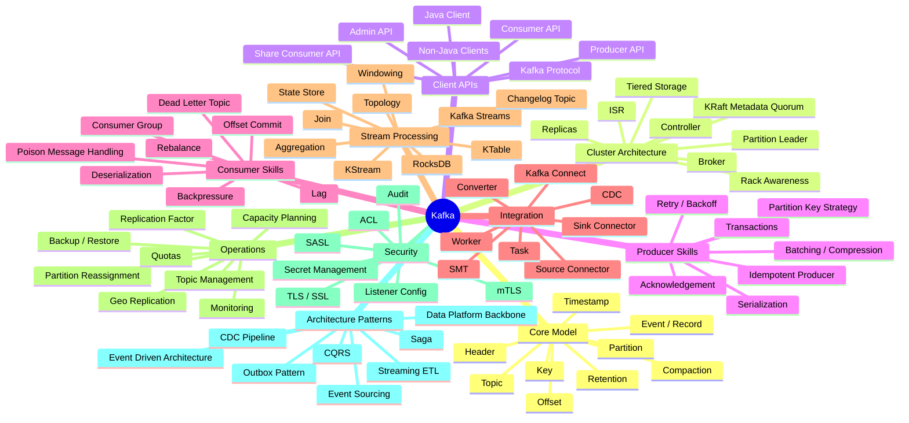

## Tabular Decomposition

| Area | Items / Skills | Informasi singkat |
|---|---|---|
| **Core Event Model** | Event / record, key, value, header, timestamp | Unit data Kafka adalah event/record. Secara konseptual event punya key, value, timestamp, dan optional metadata headers. ([Apache Kafka](https://kafka.apache.org/43/getting-started/introduction/)) |
| **Topic** | Topic design, naming, ownership, retention | Topic adalah tempat event disimpan. Topic bersifat multi-producer dan multi-subscriber; event tidak otomatis hilang setelah dikonsumsi, melainkan mengikuti konfigurasi retention. ([Apache Kafka](https://kafka.apache.org/43/getting-started/introduction/)) |
| **Partition** | Partition count, key routing, ordering boundary | Topic dipartisi agar data tersebar ke beberapa broker dan bisa dibaca/ditulis paralel. Event dengan key yang sama masuk ke partition yang sama, dan ordering dijamin pada level topic-partition. ([Apache Kafka](https://kafka.apache.org/43/getting-started/introduction/)) |
| **Offset** | Consumer position, commit, replay | Offset adalah posisi baca consumer dalam partition. Skill penting: kapan commit offset, bagaimana replay, bagaimana menangani duplicate processing. |
| **Replication** | Replication factor, leader/follower, ISR | Replication dilakukan di level topic-partition agar data tetap tersedia saat broker gagal. Dokumentasi Kafka memberi contoh production setting umum replication factor 3. ([Apache Kafka](https://kafka.apache.org/43/getting-started/introduction/)) |
| **Cluster Architecture** | Broker, controller, KRaft, metadata quorum | Kafka 4.x memakai KRaft sebagai mode metadata. Dalam KRaft, server bisa berperan sebagai broker, controller, atau kombinasi; combined mode tidak direkomendasikan untuk critical deployment. ([Apache Kafka](https://kafka.apache.org/43/operations/kraft/)) |
| **KRaft Operations** | Controller quorum, dynamic quorum, controller bootstrap | Controller ikut dalam metadata quorum. Biasanya dipilih 3 atau 5 controller; mayoritas controller harus hidup agar cluster tetap available. ([Apache Kafka](https://kafka.apache.org/43/operations/kraft/)) |
| **Producer API** | Publish event, batching, compression, acks, retries | Producer API mengirim stream data ke topic Kafka. Untuk Java/Maven, artifact utamanya adalah `org.apache.kafka:kafka-clients`, versi dokumen saat ini 4.3.1. ([Apache Kafka](https://kafka.apache.org/43/apis/)) |
| **Consumer API** | Poll loop, offset commit, group coordination, lag | Consumer API membaca stream data dari topic. Fokus skill: offset safety, idempotent processing, retry strategy, dan rebalance handling. ([Apache Kafka](https://kafka.apache.org/43/apis/)) |
| **Share Consumer API** | Share group, cooperative message processing | Kafka 4.x mendokumentasikan Share Consumer API sebagai API untuk aplikasi dalam share group agar bisa consume dan process data secara cooperative dari Kafka topics. ([Apache Kafka](https://kafka.apache.org/43/apis/)) |
| **Admin API** | Topic, broker, ACL, inspection | Admin API dipakai untuk manage dan inspect topic, broker, ACL, dan objek Kafka lain. Ini penting untuk tooling internal, automation, dan platform governance. ([Apache Kafka](https://kafka.apache.org/43/apis/)) |
| **Serialization** | JSON, Avro, Protobuf, schema compatibility | Broker Kafka menyimpan bytes; kontrak data dijaga di sisi producer/consumer dan biasanya melalui schema registry. Skill penting: forward/backward compatibility, schema evolution, dan breaking change detection. |
| **Delivery Semantics** | At-most-once, at-least-once, exactly-once, idempotence, transactions | Kafka menyediakan guarantee seperti exactly-once processing, tetapi implementasinya bergantung pada producer config, transaction boundary, offset commit, dan sink behavior. ([Apache Kafka](https://kafka.apache.org/43/getting-started/introduction/)) |
| **Consumer Group** | Parallelism, rebalance, partition assignment | Consumer group memungkinkan beberapa consumer membagi partition. Skill penting: consumer count ≤/≥ partition count, rebalance impact, static membership, dan lag diagnosis. |
| **Lag & Backpressure** | Consumer lag, slow consumer, retry storm | Lag adalah sinyal utama apakah consumer kalah cepat dari producer. Jangan langsung tambah consumer; cek partition count, processing latency, external dependency, commit behavior, dan rebalance frequency. |
| **Error Handling** | Poison message, retry topic, DLT, parking lot | Kafka tidak otomatis menyelesaikan bad message. Desain harus menentukan retry policy, dead-letter topic, idempotency key, dan observability untuk failure. |
| **Kafka Connect** | Source connector, sink connector, worker, task | Connect API dipakai untuk connector yang menarik data dari source ke Kafka atau mendorong data Kafka ke sink. Banyak user tidak perlu menulis API langsung karena bisa memakai pre-built connectors. ([Apache Kafka](https://kafka.apache.org/43/apis/)) |
| **CDC** | Debezium-style CDC, outbox, PostgreSQL integration | Untuk stack PostgreSQL, Kafka sering dipakai bersama CDC/outbox agar perubahan database dipublish sebagai event tanpa coupling langsung antar service. |
| **SMT / Converter** | Single Message Transform, converter, schema handling | Dalam Connect, transform dan converter menentukan bagaimana data dari source menjadi Kafka record dan sebaliknya. Ini area penting untuk data contract. |
| **Kafka Streams** | Streams API, KStream, KTable, topology | Streams API mentransformasi stream dari input topic ke output topic. Kafka Streams tersedia sebagai library Java dengan Maven artifact `kafka-streams`. ([Apache Kafka](https://kafka.apache.org/43/apis/)) |
| **Stateful Stream Processing** | Aggregation, join, windowing, state store, changelog | Skill kunci untuk real-time processing: windowing, event-time, table/stream join, local state store, changelog topic, dan recovery. |
| **RocksDB in Streams** | Local state, memory, disk, restore | Kafka Streams sering memakai RocksDB untuk state store. Catatan terbaru: Kafka 4.3.1 memperbaiki critical RocksDB native memory leak pada Kafka Streams. ([Apache Kafka](https://kafka.apache.org/community/downloads/)) |
| **Topic Configuration** | Retention, compaction, min ISR, cleanup policy | Topic config menentukan umur data, compaction, durability, dan behavior recovery. Ini sering lebih penting daripada kode application. |
| **Broker Configuration** | Listeners, log dirs, network, IO, quotas | Skill platform: broker tuning, disk layout, network throughput, listener separation, quotas, dan rolling restart. |
| **Partition Reassignment** | Cluster expansion, broker decommission, rebalancing | Kafka menyediakan tooling untuk partition reassignment saat ekspansi cluster, redistribusi topic, atau decommission broker. ([Apache Kafka](https://kafka.apache.org/41/operations/basic-kafka-operations/)) |
| **Rack Awareness** | AZ/rack failure isolation | Rack awareness menyebarkan replicas partition yang sama ke rack/AZ berbeda untuk mengurangi risiko data loss saat rack/AZ gagal. ([Apache Kafka](https://kafka.apache.org/41/operations/basic-kafka-operations/)) |
| **Tiered Storage** | Local disk + remote storage | Area platform untuk mengelola data lebih lama dan mengurangi tekanan disk lokal. Cocok untuk replay panjang, audit, dan event history. |
| **Geo Replication** | MirrorMaker, active/passive, disaster recovery | Skill untuk multi-cluster, multi-region, DR, data locality, dan migration. Harus jelas apakah targetnya backup, analytics copy, atau active-active. |
| **Security** | TLS, SASL, mTLS, ACL, listener config | Dokumentasi Kafka 4.3 memecah security menjadi overview, listener config, SSL encryption/authentication, SASL authentication, authorization/ACL, dan hardening existing cluster. ([Apache Kafka](https://kafka.apache.org/43/)) |
| **Observability** | JMX metrics, lag, throughput, under-replicated partitions | SRE Kafka wajib bisa membaca consumer lag, broker health, request latency, ISR shrink/expand, disk usage, controller health, dan rebalance frequency. |
| **Capacity Planning** | Throughput, partition count, message size, retention size | Hitung kapasitas dari ingress bytes/sec, egress fan-out, retention, replication factor, compression ratio, dan peak traffic. |
| **Architecture Patterns** | Event-driven architecture, CQRS, event sourcing, saga, outbox | Kafka bukan sekadar queue. Pilih pattern sesuai invariant: ordering, replay, auditability, coupling, latency, dan failure recovery. |
| **Anti-patterns** | Kafka as RPC, over-partitioning, no schema contract, infinite retry | Banyak kegagalan Kafka berasal dari salah mental model: menganggap Kafka seperti synchronous API, membuat topic tanpa ownership, atau retry tanpa batas. |

## Roadmap Alur Belajar Singkat

1. **Mental model dulu**: event, topic, partition, offset, ordering, retention, replication.  
2. **Client development**: Producer API, Consumer API, Admin API, serialization, offset commit, retry, DLT.  
3. **Reliability semantics**: idempotent producer, transactions, at-least-once vs exactly-once, duplicate handling.  
4. **Data modeling**: topic naming, partition key, schema evolution, retention/compaction.  
5. **Kafka Connect + CDC**: source/sink connector, PostgreSQL CDC, outbox, connector operations.  
6. **Kafka Streams**: stateless processing, stateful processing, joins, windows, state store, changelog.  
7. **Operations**: KRaft, broker/controller separation, monitoring, lag, reassignment, rack awareness, capacity planning.  
8. **Security & production hardening**: TLS/SASL/ACL, listener config, quotas, audit, DR, geo-replication.

**Rekomendasi materi selanjutnya:** buat **Kafka Core Concepts & Mental Model Cheatsheet** sebelum masuk ke Producer/Consumer API, karena itu akan mencegah salah desain di partitioning, ordering, retry, dan offset handling.

---

**Sources:**

- [Introduction | Apache Kafka](https://kafka.apache.org/43/getting-started/introduction/)

## Response:
7/12/2026, 11:29:36 PM

Saya akan susun cheatsheet ini sebagai fondasi mental model: apa yang dijamin Kafka, apa yang tidak dijamin, dan bagaimana konsep-konsepnya saling berhubungan di production.

# Cheatsheet - Kafka Core Concepts & Mental Model

## 1. Inti mental model Kafka

Kafka paling aman dipahami sebagai **distributed, replicated, append-only log** untuk event. Bukan sekadar message queue.

Kafka menggabungkan tiga kemampuan utama: **publish/subscribe event stream**, **menyimpan event secara durable**, dan **memproses stream secara real-time maupun retrospectively**. Kafka juga bisa dijalankan di bare metal, VM, container, on-premise, maupun cloud. ([Apache Kafka](https://kafka.apache.org/43/getting-started/introduction/))

Mental model paling penting:

```text
Producer -> Topic -> Partition Log -> Consumer Group -> Offset Commit
                 \-> Replication -> Broker/Controller -> Durability/Availability
```

Kafka tidak “mengirim message ke consumer” seperti queue klasik. Producer **menulis record ke log**, consumer **membaca dari posisi offset**, dan Kafka menyimpan event sampai retention/compaction menghapusnya.

---

## 2. Diagram konsep dasar

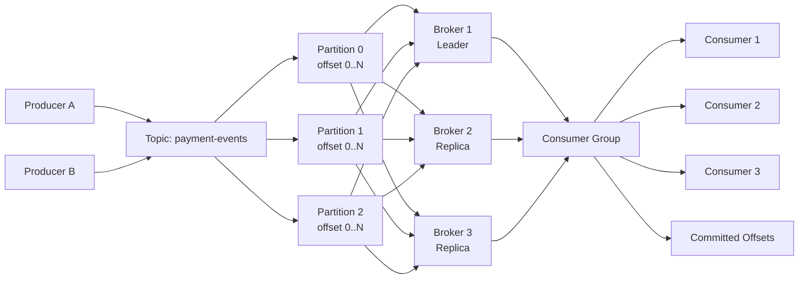

---

## 3. Vocabulary utama

| Konsep | Arti singkat | Mental model |
|---|---|---|
| **Event / Record / Message** | Fakta bahwa sesuatu terjadi. Secara konseptual punya key, value, timestamp, dan optional headers. ([Apache Kafka](https://kafka.apache.org/43/getting-started/introduction/)) | “Immutable fact” |
| **Producer** | Aplikasi yang menulis event ke Kafka. | Writer ke log |
| **Consumer** | Aplikasi yang membaca event dari Kafka. | Reader dari log |
| **Topic** | Nama stream event, misalnya `payment-events`, `case-status-changed`. | Folder logis untuk event sejenis |
| **Partition** | Shard dari topic. Event sebenarnya ditulis ke partition. | Ordered append-only log |
| **Offset** | Posisi record dalam partition. | Nomor urut posisi baca |
| **Key** | Nilai untuk menentukan routing record ke partition. | Penentu locality dan ordering |
| **Broker** | Server Kafka yang menyimpan partition log. | Storage node |
| **Controller** | Komponen yang mengelola metadata cluster, leader election, dan koordinasi broker. | Control plane |
| **Replication factor** | Jumlah copy partition. | Data redundancy |
| **Leader replica** | Replica yang menerima write untuk partition. | Primary copy |
| **Follower replica** | Replica yang mengikuti log leader. | Backup copy |
| **ISR** | In-sync replicas, replica yang masih cukup sinkron dengan leader. | Set replica yang eligible untuk durability |
| **Consumer group** | Sekumpulan consumer yang membagi partition. | Horizontal scaling pembacaan |
| **Retention** | Kebijakan berapa lama event disimpan. | Time/size-based history |
| **Compaction** | Menyimpan minimal nilai terakhir per key. | Latest-state log |

---

## 4. Topic, partition, dan ordering

### Topic

Topic adalah stream logis. Satu topic bisa punya banyak producer dan banyak subscriber. Event di topic tidak otomatis dihapus setelah dibaca; Kafka menyimpannya sesuai konfigurasi retention topic. ([Apache Kafka](https://kafka.apache.org/43/getting-started/introduction/))

Contoh topic:

```text
case-created
case-status-changed
payment-authorized
document-uploaded
audit-events
```

### Partition

Topic dipartisi agar Kafka bisa scale. Setiap partition adalah log berurutan. Event dengan key yang sama diarahkan ke partition yang sama, dan consumer membaca event dalam urutan yang sama seperti event ditulis pada topic-partition tersebut. ([Apache Kafka](https://kafka.apache.org/43/getting-started/introduction/))

Konsekuensi penting:

| Desain | Dampak |
|---|---|
| 1 topic, 1 partition | Ordering global kuat, tapi throughput/parallelism rendah |
| 1 topic, banyak partition | Throughput tinggi, ordering hanya per partition |
| Key stabil, misalnya `caseId` | Semua event untuk case yang sama berurutan |
| Key random/null | Distribusi bisa merata, tapi ordering bisnis lemah |
| Menambah partition setelah production | Mapping key bisa berubah dan ordering historis untuk key tertentu bisa terganggu; Kafka juga tidak otomatis redistribute existing data. ([Apache Kafka](https://kafka.apache.org/43/operations/basic-kafka-operations/)) |

Rule praktis:

```text
Butuh ordering per entity? Pakai entityId sebagai key.
Butuh scale tinggi? Tambah partition, tapi jangan berharap global ordering.
Butuh replay historis? Retention harus cukup panjang.
```

---

## 5. Offset: posisi baca, bukan status message

Offset adalah posisi record dalam partition. Consumer tidak “mengambil lalu menghapus” message. Consumer membaca dari offset tertentu, lalu menyimpan progress-nya dengan commit offset.

```text
Partition 0:
offset 0 -> event A
offset 1 -> event B
offset 2 -> event C
offset 3 -> event D
```

Consumer bisa:

| Operasi | Makna |
|---|---|
| Read offset 2 | Membaca event di posisi 2 |
| Commit offset 3/4 tergantung API semantics | Menandai progress baca |
| Seek backward | Replay event lama |
| Seek forward | Skip event |
| Reset offset | Reprocess dari awal/latest/posisi tertentu |

Mental model penting:

```text
Offset commit bukan bukti business processing sukses.
Offset commit hanya bukti consumer group menyimpan posisi baca.
```

Karena itu, dalam aplikasi production, offset commit harus dipikirkan bersama:

| Concern | Pertanyaan desain |
|---|---|
| Idempotency | Kalau event diproses dua kali, aman? |
| Transaction boundary | Commit DB dulu atau commit offset dulu? |
| Retry | Retry inline, retry topic, atau dead-letter topic? |
| Replay | Apakah handler deterministic? |
| Audit | Apakah event bisa diproses ulang tanpa merusak state? |

---

## 6. Consumer group dan parallelism

Consumer group membuat beberapa consumer bekerja bersama membaca satu atau lebih topic. Untuk consumer group klasik, satu partition dalam satu consumer group hanya diproses oleh satu consumer pada satu waktu. Maka jumlah partition membatasi parallelism efektif.

```text
Topic: payment-events
Partitions: 3

Consumer Group A:
- Consumer 1 -> Partition 0
- Consumer 2 -> Partition 1
- Consumer 3 -> Partition 2
- Consumer 4 -> idle
```

| Kondisi | Dampak |
|---|---|
| Consumer < partition | Satu consumer membaca beberapa partition |
| Consumer = partition | Parallelism maksimal seimbang |
| Consumer > partition | Sebagian consumer idle |
| Consumer mati | Partition dipindahkan ke consumer lain melalui rebalance |
| Consumer lambat | Lag naik |

Kafka 4.3 juga mendokumentasikan **Share Consumer API**, yaitu model share group di mana beberapa share consumer bisa consume secara kooperatif, dengan record acquisition lock yang dapat di-acknowledge, release, reject, renew, atau timeout. Ini berbeda dari mental model consumer group klasik. ([Apache Kafka](https://kafka.apache.org/43/design/design/))

---

## 7. Replication, leader, follower, ISR

Kafka mereplikasi log setiap topic-partition ke beberapa server berdasarkan replication factor. Dalam kondisi normal, satu partition punya satu leader dan beberapa follower. Semua write masuk ke leader; follower menyalin log dari leader. ([Apache Kafka](https://kafka.apache.org/43/design/design/))

```text
Partition 0, replication factor = 3

Broker 1: Leader
Broker 2: Follower
Broker 3: Follower
```

| Konsep | Makna |
|---|---|
| **Leader** | Replica utama untuk read/write partition |
| **Follower** | Replica yang mengikuti leader |
| **ISR** | Replica yang masih dianggap in-sync |
| **Replication factor 3** | Ada 3 copy data |
| **min.insync.replicas** | Minimum replica sinkron yang dibutuhkan agar write dianggap aman |
| **acks=all** | Producer menunggu acknowledgment dari replica yang diperlukan, bukan hanya leader |

Kafka docs menyebut replication factor 2 atau 3 sebagai rekomendasi umum agar mesin bisa dibounce tanpa mengganggu konsumsi data, dan contoh umum production setting adalah replication factor 3. ([Apache Kafka](https://kafka.apache.org/43/operations/basic-kafka-operations/)) ([Apache Kafka](https://kafka.apache.org/43/getting-started/introduction/))

Mental model durability:

```text
Durability ≠ hanya replication factor.
Durability = replication factor + min.insync.replicas + producer acks + ISR health.
```

---

## 8. Broker, controller, dan KRaft

Di Kafka modern, metadata cluster dikelola dengan **KRaft**. Dalam KRaft mode, server Kafka bisa dikonfigurasi sebagai broker, controller, atau combined broker+controller. Combined mode lebih cocok untuk development/small use case dan tidak direkomendasikan untuk deployment critical. ([Apache Kafka](https://kafka.apache.org/43/operations/kraft/))

Controller dalam KRaft ikut dalam metadata quorum. Dokumentasi Kafka menyebut admin biasanya memilih 3 atau 5 controller; mayoritas controller harus hidup agar availability tetap terjaga. Dengan 3 controller, cluster bisa toleran terhadap 1 controller failure; dengan 5 controller, toleran terhadap 2 controller failure. ([Apache Kafka](https://kafka.apache.org/43/operations/kraft/))

Mental split:

| Layer | Tanggung jawab |
|---|---|
| **Broker / data plane** | Menyimpan partition, melayani produce/fetch |
| **Controller / control plane** | Metadata, broker registration, partition leadership |
| **Client** | Producer, consumer, admin, streams, connect |
| **Topic config** | Retention, compaction, replication, partitioning |
| **Group coordinator** | Consumer group membership dan offset coordination |

---

## 9. Retention vs compaction

Kafka bisa menyimpan event lebih lama daripada sistem queue biasa. Event tidak dihapus hanya karena sudah dikonsumsi; event dihapus berdasarkan retention policy topic. ([Apache Kafka](https://kafka.apache.org/43/getting-started/introduction/))

### Retention

Retention cocok untuk event history:

```text
cleanup.policy=delete
retention.ms=604800000    # 7 hari
```

Use case:

| Use case | Cocok? |
|---|---|
| Audit event 30 hari | Ya |
| Replay pipeline data | Ya |
| Temporary command queue | Bisa, tapi harus hati-hati |
| Latest state cache | Lebih cocok compaction |

### Compaction

Log compaction menyimpan minimal nilai terakhir untuk setiap key dalam satu topic-partition. Kafka menjelaskan compaction sebagai retention per-record yang menghapus record lama jika ada update lebih baru dengan key yang sama; offset tetap valid dan ordering tidak diubah. ([Apache Kafka](https://kafka.apache.org/43/design/design/))

```text
cleanup.policy=compact
key = customerId
value = latest customer state
```

Use case:

| Use case | Cocok? |
|---|---|
| Latest customer profile | Ya |
| Latest case status | Ya |
| Cache rebuild | Ya |
| Full immutable audit trail | Tidak cukup jika hanya compacted |

---

## 10. Delivery semantics

Kafka bisa digunakan untuk beberapa model delivery guarantee, tetapi hasil akhirnya bergantung pada kombinasi producer config, broker config, consumer offset commit, dan side effect aplikasi.

| Semantics | Makna | Risiko |
|---|---|---|
| **At-most-once** | Message bisa hilang, tapi tidak diproses ulang | Data loss |
| **At-least-once** | Message tidak hilang, tapi bisa diproses lebih dari sekali | Duplicate processing |
| **Exactly-once** | Efek pemrosesan muncul sekali dalam boundary tertentu | Kompleks; perlu idempotence/transactions dan sink support |

Kafka documentation menyebut Kafka menyediakan guarantee seperti exactly-once processing, tetapi secara praktis ini harus dipahami sebagai guarantee dalam boundary Kafka/transactional processing tertentu, bukan “semua side effect eksternal otomatis exactly once.” ([Apache Kafka](https://kafka.apache.org/43/getting-started/introduction/))

Prinsip aman untuk aplikasi enterprise:

```text
Desain consumer seolah-olah event bisa datang lebih dari sekali.
```

Artinya:

| Area | Praktik aman |
|---|---|
| Database write | Gunakan idempotency key / unique constraint |
| External API call | Hindari side effect non-idempotent tanpa dedup |
| Offset commit | Commit setelah processing sukses |
| Retry | Batasi retry; pakai DLT untuk poison message |
| Replay | Handler harus aman diulang |

---

## 11. Kafka APIs dalam mental model

Kafka 4.3 mendokumentasikan enam API inti: Producer, Consumer, Share Consumer, Streams, Connect, dan Admin API. API page Kafka 4.3.1 juga menunjukkan Maven dependency `org.apache.kafka:kafka-clients:4.3.1` untuk producer/consumer/admin dan `org.apache.kafka:kafka-streams:4.3.1` untuk Streams. ([Apache Kafka](https://kafka.apache.org/43/apis/?utm_source=chatgpt.com))

| API | Dipakai untuk | Mental model |
|---|---|---|
| **Producer API** | Menulis event ke topic | Write path |
| **Consumer API** | Membaca event dari topic | Read path |
| **Share Consumer API** | Cooperative consumption dalam share group | Work sharing model |
| **Streams API** | Transformasi stream input topic ke output topic | Stateful/stateless stream processing |
| **Connect API** | Integrasi source/sink seperti DB, file, search, data warehouse | Data movement |
| **Admin API** | Manage topic, broker, ACL, metadata | Control/automation |

---

## 12. Core invariants yang harus diingat

| Invariant | Penjelasan |
|---|---|
| **Ordering hanya kuat di partition** | Jangan desain flow yang butuh global ordering lintas partition. |
| **Key menentukan locality** | Key yang sama biasanya diarahkan ke partition yang sama; ini fondasi ordering per entity. |
| **Consumer tidak menghapus event** | Event disimpan sampai retention/compaction. |
| **Offset adalah progress baca** | Bukan bukti business transaction sukses. |
| **Partition menentukan parallelism maksimum** | Dalam consumer group klasik, consumer lebih banyak dari partition tidak menambah throughput. |
| **Replication bukan pengganti backup/DR** | Replication membantu availability, tapi salah hapus topic atau bad event tetap bisa tereplikasi. |
| **Kafka bukan RPC** | Kafka cocok untuk async event flow, bukan request/response blocking sebagai default. |
| **Exactly-once bukan sihir** | Perlu boundary transaksi jelas dan idempotency di aplikasi/sink. |
| **Retention adalah product decision** | Menentukan replay window, auditability, storage cost, dan compliance. |
| **Topic adalah contract** | Topic tanpa owner, schema, dan compatibility policy akan menjadi coupling tersembunyi. |

---

## 13. Mental model: Kafka vs Queue vs Database

| Aspek | Kafka | Queue klasik | Database |
|---|---|---|---|
| Data model | Append-only event log | Message queue | Mutable records/tables |
| Message setelah consume | Tetap ada sampai retention/compaction | Biasanya hilang/ack-delete | Tetap ada sampai diubah/dihapus |
| Replay | Natural | Biasanya sulit | Query-based |
| Ordering | Per partition | Queue-dependent | Query/order-dependent |
| Scaling | Partition-based | Queue/consumer-based | Sharding/read replica/index |
| Use case utama | Event streaming, replay, integration | Work dispatch | Source of truth/state |
| Query ad hoc | Tidak cocok | Tidak cocok | Cocok |
| State mutation | Tidak langsung | Tidak langsung | Langsung |

Kesalahan umum: memakai Kafka sebagai database utama. Kafka menyimpan event, tapi query model, indexing, constraints, dan transactional business state biasanya tetap di database atau state store khusus.

---

## 14. Topic design mental checklist

Sebelum membuat topic, jawab ini:

| Pertanyaan | Kenapa penting |
|---|---|
| Event ini fakta, command, atau state snapshot? | Menentukan naming dan retention. |
| Siapa owner topic? | Mencegah topic yatim. |
| Apa key-nya? | Menentukan ordering dan partitioning. |
| Butuh ordering per apa? | Case ID, account ID, customer ID, tenant ID, dsb. |
| Berapa retention? | Replay, audit, storage cost. |
| Delete atau compact? | History vs latest state. |
| Apa schema contract? | JSON bebas sering bermasalah di evolution. |
| Apa compatibility rule? | Backward, forward, full, none. |
| Siapa consumer-nya? | Jangan desain hanya dari sisi producer. |
| Apa DLT/retry policy? | Poison message harus punya jalur keluar. |
| Data sensitif? | PII, encryption, masking, ACL. |
| Cross-region? | DR, latency, data residency. |

---

## 15. Event naming dan topic naming

Gunakan nama event sebagai fakta masa lalu, bukan instruksi.

| Lebih baik | Kurang baik |
|---|---|
| `case-created` | `create-case` |
| `case-status-changed` | `change-case-status` |
| `payment-authorized` | `authorize-payment` |
| `document-uploaded` | `upload-document` |
| `customer-risk-score-updated` | `update-risk-score` |

Pattern naming topic:

```text
<domain>.<entity>.<event>
case.lifecycle.status-changed
payment.authorization.approved
document.storage.uploaded
audit.case.action-recorded
```

Untuk enterprise/regulatory system, pisahkan:

| Topic type | Contoh |
|---|---|
| Business event | `case.status-changed` |
| Audit event | `audit.case-action-recorded` |
| Integration event | `integration.crm.customer-updated` |
| Retry topic | `case.status-changed.retry.5m` |
| DLT | `case.status-changed.dlt` |
| Compact state topic | `case.current-state.compacted` |

---

## 16. Producer mental model

Producer bertanggung jawab untuk:

| Concern | Pertanyaan |
|---|---|
| Key selection | Event harus masuk partition mana? |
| Serialization | Format value apa? JSON, Avro, Protobuf? |
| Header | Correlation ID, causation ID, tenant ID, trace ID? |
| Acknowledgment | Butuh throughput atau durability lebih kuat? |
| Retry | Aman retry tanpa duplicate? |
| Idempotence | Producer duplicate bisa dicegah? |
| Transaction | Perlu atomic write ke beberapa topic/partition? |
| Backpressure | Apa yang terjadi kalau broker lambat? |

Contoh event envelope:

```json
{
  "eventId": "01JABC...",
  "eventType": "CaseStatusChanged",
  "occurredAt": "2026-07-12T10:15:30Z",
  "producer": "case-service",
  "correlationId": "corr-123",
  "causationId": "cmd-456",
  "tenantId": "tenant-a",
  "schemaVersion": 3,
  "payload": {
    "caseId": "CASE-1001",
    "fromStatus": "UNDER_REVIEW",
    "toStatus": "ESCALATED",
    "reason": "SLA_BREACH"
  }
}
```

---

## 17. Consumer mental model

Consumer bukan hanya `poll()` lalu proses. Consumer adalah state machine.

```text
poll -> deserialize -> validate -> process -> side effect -> commit offset
                    \-> retry / DLT / skip / stop
```

| Failure point | Risiko | Mitigasi |
|---|---|---|
| Deserialization gagal | Consumer stuck di poison message | DLT deserialization handler |
| Business validation gagal | Event tidak valid | Reject/DLT + alert |
| DB write gagal sementara | Retry storm | Bounded retry + backoff |
| DB write sukses, commit offset gagal | Event diproses ulang | Idempotent write |
| Commit offset dulu, DB write gagal | Data loss secara bisnis | Jangan commit terlalu awal |
| Consumer lambat | Lag naik | Optimize handler / scale partition / isolate dependency |

Rule paling aman:

```text
At-least-once + idempotent consumer > mengejar exactly-once tanpa boundary jelas.
```

---

## 18. Lag mental model

Consumer lag berarti consumer group tertinggal dari latest offset partition.

```text
lag = latest broker offset - committed consumer offset
```

Lag tinggi bisa disebabkan oleh:

| Penyebab | Cara pikir |
|---|---|
| Processing lambat | Handler CPU/IO berat |
| External dependency lambat | DB/API downstream bottleneck |
| Partition terlalu sedikit | Parallelism tidak cukup |
| Rebalance sering | Consumer tidak stabil |
| Batch terlalu besar/kecil | Tuning poll/batch kurang tepat |
| Poison message | Consumer stuck di event tertentu |
| Hot key | Satu partition jauh lebih berat |

Jangan langsung menambah consumer. Kalau partition hanya 3, consumer ke-4 tidak membantu untuk consumer group klasik.

---

## 19. Common anti-patterns

| Anti-pattern | Kenapa buruk | Alternatif |
|---|---|---|
| Kafka sebagai synchronous RPC | Latency, timeout, correlation, error semantics jadi rumit | REST/gRPC untuk command/query sync |
| Topic tanpa schema contract | Consumer mudah rusak saat payload berubah | Schema registry / versioned contract |
| Key null untuk event berurutan | Ordering bisnis hilang | Pakai entity ID sebagai key |
| Infinite retry di consumer | Poison message menahan partition | Retry topic + DLT |
| DLT tanpa ownership | Message mati tidak pernah diperbaiki | DLT dashboard + SLA |
| Satu topic untuk semua event | Coupling dan schema kacau | Topic per bounded context/event family |
| Terlalu banyak topic kecil | Operational overhead | Konsolidasi by domain jika contract sama |
| Terlalu banyak partition | Metadata, file handle, rebalance overhead | Capacity planning |
| Commit offset sebelum side effect sukses | Data loss bisnis | Commit setelah sukses |
| Menambah partition sembarangan | Key mapping/order berubah | Rencanakan partition sejak awal |

---

## 20. Production mental checklist

| Area | Checklist minimum |
|---|---|
| Topic | Owner, naming, partition, replication, retention, cleanup policy |
| Event | Event ID, event type, timestamp, schema version, correlation ID |
| Key | Entity ID yang merepresentasikan ordering boundary |
| Producer | `acks`, retry, idempotence, compression, batching |
| Consumer | Idempotency, retry, DLT, offset commit strategy |
| Observability | Lag, throughput, error rate, DLT count, processing latency |
| Security | TLS/SASL, ACL, secret management, PII policy |
| Operations | Broker health, ISR, under-replicated partitions, disk, controller quorum |
| Compliance | Retention, deletion, masking, auditability |
| DR | Backup/export, geo-replication, recovery procedure |

---

## 21. Mini decision matrix

| Kebutuhan | Kafka cocok? | Catatan |
|---|---:|---|
| Event-driven microservices | Ya | Cocok untuk decoupling async |
| Audit trail immutable | Ya | Retention harus sesuai kebutuhan audit |
| Real-time analytics pipeline | Ya | Bisa dikombinasikan dengan Connect/Streams/Flink |
| CDC dari PostgreSQL | Ya | Biasanya via connector/outbox pattern |
| Request/response user-facing | Kadang | REST/gRPC biasanya lebih jelas |
| Job queue sederhana | Bisa | Tapi jangan abaikan ordering, retry, DLT |
| Source of truth utama | Biasanya tidak | DB tetap lebih cocok untuk mutable transactional state |
| Global ordering semua event | Tidak ideal | Kafka ordering kuatnya per partition |
| Query fleksibel/ad hoc | Tidak | Gunakan DB/search/warehouse |

---

## 22. Ringkasan 10 kalimat

1. Kafka adalah event log terdistribusi, bukan sekadar queue.  
2. Producer menulis event ke topic.  
3. Topic dipecah menjadi partition.  
4. Partition adalah unit ordering, storage, replication, dan parallelism.  
5. Offset adalah posisi baca consumer dalam partition.  
6. Consumer group membagi partition antar consumer.  
7. Event tidak hilang setelah dibaca; retention/compaction yang menentukan umur data.  
8. Replication membuat data lebih available, tetapi durability tetap bergantung pada config dan ISR.  
9. Exactly-once harus dipahami sebagai boundary teknis tertentu, bukan jaminan otomatis untuk semua side effect eksternal.  
10. Desain Kafka yang baik dimulai dari event contract, partition key, retention, idempotency, retry, dan observability.

---

## Roadmap belajar singkat

1. **Core model**: event, topic, partition, offset, retention.  
2. **Producer/Consumer**: key, serialization, offset commit, retry, DLT.  
3. **Reliability**: replication, ISR, `acks`, idempotency, transactions.  
4. **Topic design**: naming, schema, partition count, retention/compaction.  
5. **Operations**: broker, controller, KRaft, monitoring, lag.  
6. **Integration**: Kafka Connect, CDC, outbox pattern.  
7. **Processing**: Kafka Streams, windowing, join, state store.

**Rekomendasi materi selanjutnya:** **Kafka Producer & Consumer API Cheatsheet untuk Java 17+**, fokus pada producer config, consumer poll loop, offset commit strategy, retry/DLT, idempotency, dan contoh pola implementasi yang aman untuk service berbasis Java/Jakarta.

---

**Sources:**

- [Introduction | Apache Kafka](https://kafka.apache.org/43/getting-started/introduction/)

## Response:
7/12/2026, 11:32:15 PM

# Cheatsheet - Kafka Producer & Consumer API untuk Java 17+

## 1. Scope

Cheatsheet ini melanjutkan **Kafka Core Concepts & Mental Model** dan fokus ke sisi aplikasi Java: bagaimana service menulis event sebagai **producer**, membaca event sebagai **consumer**, mengatur offset, retry, idempotency, error handling, dan konfigurasi aman untuk production.

Kafka 4.3 mendokumentasikan **Producer API** untuk mengirim stream data ke topic dan **Consumer API** untuk membaca stream data dari topic. Dependency resmi untuk keduanya adalah `org.apache.kafka:kafka-clients:4.3.1`. Kafka 4.3 juga menyatakan Java 17, Java 21, dan Java 25 fully supported, sehingga cocok untuk stack Java 17+. ([Apache Kafka](https://kafka.apache.org/43/apis/))

---

## 2. Mental model Producer vs Consumer

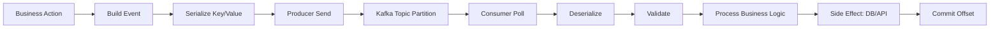

Prinsip utamanya:

| Bagian | Mental model |
|---|---|
| **Producer** | Menulis event ke log Kafka |
| **Consumer** | Membaca event dari posisi offset tertentu |
| **Serializer** | Mengubah object Java menjadi byte |
| **Deserializer** | Mengubah byte Kafka menjadi object Java |
| **Offset commit** | Menyimpan posisi baca consumer group |
| **Retry** | Menghadapi temporary failure |
| **DLT** | Menyimpan event gagal permanen / poison message |
| **Idempotency** | Melindungi sistem dari duplicate processing |

---

## 3. Maven dependency

Gunakan `kafka-clients` untuk Producer API, Consumer API, Share Consumer API, dan Admin API. Dokumentasi Kafka 4.3.1 mencantumkan artifact ini untuk Producer dan Consumer API. ([Apache Kafka](https://kafka.apache.org/43/apis/))

```xml
<dependency>
    <groupId>org.apache.kafka</groupId>
    <artifactId>kafka-clients</artifactId>
    <version>4.3.1</version>
</dependency>
```

Untuk production, jangan hardcode versi di banyak module. Lebih aman taruh di parent `pom.xml` atau dependency management.

---

# Part A - Producer API

## 4. Producer lifecycle

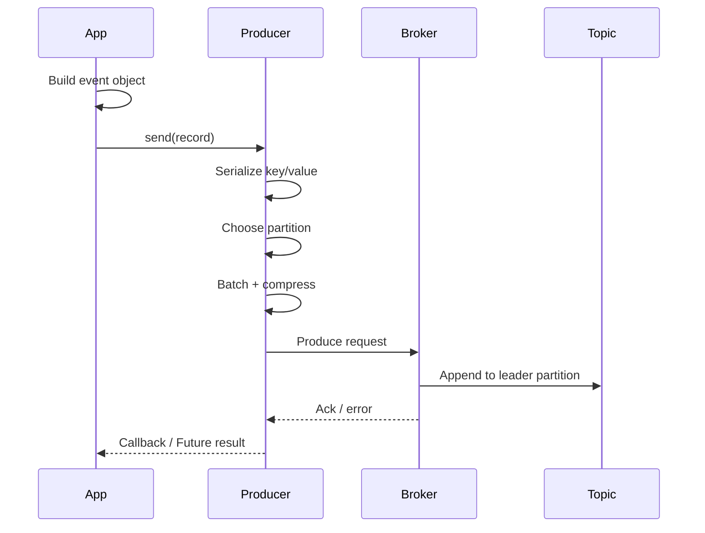

Producer bukan sekadar `send()`. Di belakangnya ada batching, partitioning, compression, retry, metadata lookup, dan acknowledgement.

---

## 5. Producer configuration penting

Kafka producer membutuhkan `bootstrap.servers`, `key.serializer`, dan `value.serializer`. `bootstrap.servers` adalah daftar host/port awal untuk menemukan cluster, dan dokumentasi Kafka merekomendasikan lebih dari satu server agar lebih resilien jika salah satu server down. ([Apache Kafka](https://kafka.apache.org/43/configuration/producer-configs/))

| Config | Fungsi | Catatan production |
|---|---|---|
| `bootstrap.servers` | Initial broker list | Isi minimal 2-3 broker/load balancer endpoint |
| `key.serializer` | Serializer untuk key | Umumnya `StringSerializer` untuk ID |
| `value.serializer` | Serializer untuk payload | JSON/Avro/Protobuf/custom |
| `client.id` | Identitas logical client | Pakai nama service + instance |
| `acks` | Berapa kuat producer menunggu ack broker | Untuk durability kuat biasanya `all` |
| `retries` | Retry transient error | Default Kafka 4.3 sangat tinggi; lebih baik kontrol via `delivery.timeout.ms` |
| `delivery.timeout.ms` | Batas total waktu send berhasil/gagal | Harus ≥ `request.timeout.ms + linger.ms` |
| `enable.idempotence` | Mencegah duplicate dari retry producer | Biasanya aktifkan untuk producer penting |
| `compression.type` | Compression batch | Kafka mendukung `none`, `gzip`, `snappy`, `lz4`, `zstd` |
| `batch.size` | Ukuran batch per partition | Lebih besar = throughput naik, memory naik |
| `linger.ms` | Delay kecil untuk menunggu batch | Kafka 4.0+ default `5ms` |
| `max.request.size` | Batas request producer | Cocokkan dengan broker/topic max message size |

Kafka menjelaskan bahwa `retries` akan mengirim ulang record yang gagal karena transient error sampai sukses, gagal permanen, atau melewati `delivery.timeout.ms`. Dokumentasi juga memperingatkan bahwa retry tanpa idempotence dan dengan `max.in.flight.requests.per.connection > 1` bisa mengubah urutan record jika batch pertama gagal lalu batch kedua berhasil lebih dulu. ([Apache Kafka](https://kafka.apache.org/43/configuration/producer-configs/))

---

## 6. Producer config baseline

### Baseline aman untuk event bisnis

```java
Properties props = new Properties();

props.put(ProducerConfig.BOOTSTRAP_SERVERS_CONFIG, "kafka-1:9092,kafka-2:9092,kafka-3:9092");
props.put(ProducerConfig.CLIENT_ID_CONFIG, "case-service-producer");

props.put(ProducerConfig.KEY_SERIALIZER_CLASS_CONFIG, StringSerializer.class.getName());
props.put(ProducerConfig.VALUE_SERIALIZER_CLASS_CONFIG, StringSerializer.class.getName());

props.put(ProducerConfig.ACKS_CONFIG, "all");
props.put(ProducerConfig.ENABLE_IDEMPOTENCE_CONFIG, "true");
props.put(ProducerConfig.DELIVERY_TIMEOUT_MS_CONFIG, "120000");
props.put(ProducerConfig.REQUEST_TIMEOUT_MS_CONFIG, "30000");

props.put(ProducerConfig.COMPRESSION_TYPE_CONFIG, "zstd");
props.put(ProducerConfig.LINGER_MS_CONFIG, "5");
props.put(ProducerConfig.BATCH_SIZE_CONFIG, "32768");
```

Catatan: `zstd` bagus untuk payload event yang cukup besar/berulang, tetapi uji CPU cost. Untuk latency sangat rendah, `linger.ms` bisa diturunkan, tetapi throughput dan compression ratio bisa turun.

---

## 7. Producer record anatomy

```java
ProducerRecord<String, String> record = new ProducerRecord<>(
    "case.status-changed",     // topic
    "CASE-1001",               // key
    eventJson                  // value
);

record.headers().add("eventType", "CaseStatusChanged".getBytes(StandardCharsets.UTF_8));
record.headers().add("correlationId", correlationId.getBytes(StandardCharsets.UTF_8));
record.headers().add("schemaVersion", "1".getBytes(StandardCharsets.UTF_8));
```

| Field | Rekomendasi |
|---|---|
| `topic` | Nama stream event |
| `key` | Entity ID untuk ordering boundary, misalnya `caseId` |
| `value` | Payload event |
| `headers` | Metadata teknis: event type, trace ID, correlation ID |
| `timestamp` | Pakai event occurrence time bila perlu audit/event-time |

---

## 8. Producer send patterns

### Pattern 1 - Fire-and-forget

```java
producer.send(record);
```

Tidak disarankan untuk event penting, karena error bisa tidak terlihat.

### Pattern 2 - Async callback

```java
producer.send(record, (metadata, exception) -> {
    if (exception != null) {
        log.error("Failed to publish event topic={} key={}",
                record.topic(), record.key(), exception);
        return;
    }

    log.info("Published topic={} partition={} offset={}",
            metadata.topic(), metadata.partition(), metadata.offset());
});
```

Cocok untuk service dengan throughput tinggi. Pastikan error callback benar-benar dimonitor.

### Pattern 3 - Sync wait

```java
RecordMetadata metadata = producer.send(record).get();
```

Lebih sederhana untuk command-line tool, migration, atau test, tetapi di request path bisa menambah latency.

---

## 9. Producer decision matrix

| Kebutuhan | Config / pattern |
|---|---|
| Durability kuat | `acks=all`, replication topic cukup, `min.insync.replicas` benar |
| Hindari duplicate akibat retry producer | `enable.idempotence=true` |
| Throughput tinggi | `batch.size`, `linger.ms`, `compression.type` |
| Latency rendah | `linger.ms` kecil, payload kecil, hindari blocking `.get()` |
| Ordering per entity | Gunakan stable key, misalnya `caseId` |
| Error visibility | Callback wajib logging + metrics |
| Payload besar | Compression + evaluasi `max.request.size` dan broker/topic limit |
| Secure cluster | TLS/SASL config, truststore/keystore, secret management |

---

# Part B - Consumer API

## 10. Consumer lifecycle

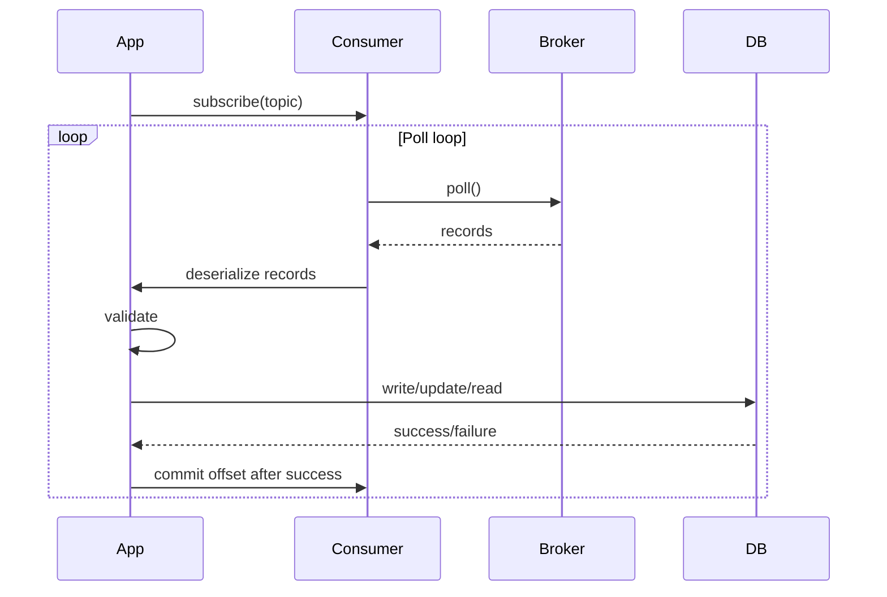

Consumer API membaca stream data dari topic Kafka. Untuk consumer group biasa, `group.id` adalah identitas group dan diperlukan saat consumer memakai group management via `subscribe(...)` atau offset management berbasis Kafka. ([Apache Kafka](https://kafka.apache.org/43/apis/))

---

## 11. Consumer configuration penting

| Config | Fungsi | Catatan production |
|---|---|---|
| `bootstrap.servers` | Initial broker list | Sama seperti producer, isi lebih dari satu endpoint |
| `group.id` | Identitas consumer group | Stabil per logical application |
| `key.deserializer` | Deserializer key | Harus match serializer producer |
| `value.deserializer` | Deserializer value | JSON/Avro/Protobuf/custom |
| `enable.auto.commit` | Commit offset otomatis | Default Kafka adalah `true`; untuk business processing penting biasanya set `false` |
| `auto.offset.reset` | Posisi awal jika offset belum ada/hilang | `latest`, `earliest`, `none`, atau `by_duration:<duration>` |
| `max.poll.records` | Jumlah record maksimum per poll | Kontrol batch processing |
| `max.poll.interval.ms` | Batas waktu antar poll sebelum dianggap stuck | Naikkan jika processing batch lama |
| `session.timeout.ms` | Timeout deteksi consumer mati untuk classic protocol | Default 45 detik |
| `heartbeat.interval.ms` | Interval heartbeat classic protocol | Harus lebih rendah dari session timeout |
| `fetch.min.bytes` | Minimum data fetch | Lebih besar = throughput naik, latency bisa naik |
| `max.partition.fetch.bytes` | Limit fetch per partition | Perhatikan payload besar |

Kafka 4.3 menjelaskan `auto.offset.reset` mendukung `earliest`, `latest`, `by_duration:<duration>`, dan `none`; default-nya `latest`. Dokumentasi juga memperingatkan bahwa mengubah jumlah partition ketika `auto.offset.reset=latest` dapat menyebabkan kehilangan delivery untuk consumer baru pada partition baru yang belum punya initial offset. ([Apache Kafka](https://kafka.apache.org/43/configuration/consumer-configs/))

---

## 12. Consumer config baseline

```java
Properties props = new Properties();

props.put(ConsumerConfig.BOOTSTRAP_SERVERS_CONFIG, "kafka-1:9092,kafka-2:9092,kafka-3:9092");
props.put(ConsumerConfig.CLIENT_ID_CONFIG, "case-service-consumer-1");
props.put(ConsumerConfig.GROUP_ID_CONFIG, "case-service-status-projector");

props.put(ConsumerConfig.KEY_DESERIALIZER_CLASS_CONFIG, StringDeserializer.class.getName());
props.put(ConsumerConfig.VALUE_DESERIALIZER_CLASS_CONFIG, StringDeserializer.class.getName());

props.put(ConsumerConfig.ENABLE_AUTO_COMMIT_CONFIG, "false");
props.put(ConsumerConfig.AUTO_OFFSET_RESET_CONFIG, "earliest");

props.put(ConsumerConfig.MAX_POLL_RECORDS_CONFIG, "100");
props.put(ConsumerConfig.MAX_POLL_INTERVAL_MS_CONFIG, "300000");
props.put(ConsumerConfig.SESSION_TIMEOUT_MS_CONFIG, "45000");
```

Baseline ini cocok untuk consumer yang melakukan business processing dan ingin commit offset hanya setelah processing sukses.

---

## 13. Poll loop aman

```java
try (KafkaConsumer<String, String> consumer = new KafkaConsumer<>(props)) {
    consumer.subscribe(List.of("case.status-changed"));

    while (running.get()) {
        ConsumerRecords<String, String> records = consumer.poll(Duration.ofSeconds(1));

        for (ConsumerRecord<String, String> record : records) {
            try {
                process(record);
            } catch (RecoverableException e) {
                // Jangan commit dulu jika ingin retry record ini.
                throw e;
            } catch (NonRecoverableException e) {
                publishToDlt(record, e);
                // Setelah DLT sukses, record boleh dianggap handled.
            }
        }

        consumer.commitSync();
    }
}
```

Core invariant:

```text
Commit offset hanya setelah record dianggap selesai secara bisnis.
```

Kalau commit dilakukan sebelum DB write/API call sukses, sistem bisa kehilangan event secara bisnis. Kalau DB write sukses tapi commit offset gagal, event bisa diproses ulang; karena itu consumer harus idempotent.

---

## 14. Offset commit strategy

| Strategy | Kapan dipakai | Risiko |
|---|---|---|
| `enable.auto.commit=true` | Consumer sederhana, read-only, low-risk | Bisa commit sebelum processing selesai |
| `commitSync()` per batch | Aman dan sederhana | Throughput lebih rendah |
| `commitAsync()` | Throughput lebih tinggi | Error commit harus ditangani hati-hati |
| Commit per partition offset | Batch besar/mixed partition | Lebih kompleks, tapi lebih presisi |
| External offset store | Butuh atomicity dengan DB sendiri | Jangan campur sembarangan dengan Kafka offset |

Kafka config menyatakan `enable.auto.commit=true` membuat offset consumer di-commit periodik di background; default-nya `true`, sehingga untuk handler yang punya side effect penting biasanya perlu diubah ke manual commit. ([Apache Kafka](https://kafka.apache.org/43/configuration/consumer-configs/))

---

## 15. Manual commit per partition

Untuk batch besar, commit offset secara eksplisit per partition bisa lebih aman.

```java
Map<TopicPartition, OffsetAndMetadata> offsetsToCommit = new HashMap<>();

for (ConsumerRecord<String, String> record : records) {
    process(record);

    TopicPartition tp = new TopicPartition(record.topic(), record.partition());
    offsetsToCommit.put(tp, new OffsetAndMetadata(record.offset() + 1));
}

consumer.commitSync(offsetsToCommit);
```

Kenapa `record.offset() + 1`? Karena offset yang di-commit adalah posisi berikutnya yang akan dibaca, bukan offset record terakhir yang sudah diproses.

---

# Part C - Error Handling

## 16. Error taxonomy

| Error type | Contoh | Aksi |
|---|---|---|
| **Transient infrastructure error** | DB timeout, network blip | Retry dengan backoff |
| **Downstream unavailable** | Service dependency mati | Pause consumer / retry topic |
| **Poison message** | Payload invalid, schema rusak | DLT |
| **Business reject** | Status transition tidak valid | DLT atau audit reject |
| **Deserialization error** | JSON tidak bisa diparse | DLT raw payload |
| **Bug consumer** | Null pointer, logic error | Stop consumer + alert |

Jangan samakan semua error sebagai retry. Poison message yang di-retry terus akan menahan partition dan menaikkan lag.

---

## 17. Retry strategy

### Option 1 - Inline retry

```text
process -> fail -> sleep/backoff -> retry same record
```

Cocok untuk error sangat singkat. Tidak cocok untuk outage panjang karena consumer thread tertahan.

### Option 2 - Retry topic

```text
main topic -> retry.1m -> retry.5m -> retry.30m -> DLT
```

Cocok untuk production karena tidak menahan partition utama terlalu lama.

### Option 3 - DLT langsung

```text
main topic -> DLT
```

Cocok untuk validation failure, schema incompatible, missing required field, atau event yang memang tidak bisa diproses.

---

## 18. DLT event envelope

```json
{
  "originalTopic": "case.status-changed",
  "originalPartition": 2,
  "originalOffset": 10491,
  "originalKey": "CASE-1001",
  "failedAt": "2026-07-12T10:15:30Z",
  "consumerGroup": "case-service-status-projector",
  "errorClass": "InvalidStatusTransitionException",
  "errorMessage": "Cannot move CLOSED case to UNDER_REVIEW",
  "payload": {
    "caseId": "CASE-1001",
    "fromStatus": "CLOSED",
    "toStatus": "UNDER_REVIEW"
  }
}
```

DLT harus punya owner, dashboard, alert, dan playbook replay. DLT tanpa ownership hanya memindahkan masalah, bukan menyelesaikan masalah.

---

# Part D - Idempotency dan Transaction Boundary

## 19. Consumer idempotency

Consumer harus aman menerima event yang sama lebih dari sekali.

```sql
CREATE TABLE processed_kafka_event (
    consumer_group text NOT NULL,
    topic text NOT NULL,
    partition_no int NOT NULL,
    offset_no bigint NOT NULL,
    event_id text,
    processed_at timestamptz NOT NULL DEFAULT now(),
    PRIMARY KEY (consumer_group, topic, partition_no, offset_no)
);
```

Pattern:

```java
@Transactional
public void process(ConsumerRecord<String, String> record) {
    if (alreadyProcessed(record)) {
        return;
    }

    applyBusinessChange(record);
    markProcessed(record);
}
```

Lebih baik pakai `eventId` sebagai idempotency key jika producer menjamin global uniqueness. Offset-based idempotency aman untuk satu consumer group dan satu topic-partition, tetapi tidak selalu cukup untuk dedup lintas pipeline.

---

## 20. Producer idempotency

Producer idempotence melindungi dari duplicate akibat retry producer, tetapi bukan pengganti business idempotency. Kafka config menjelaskan idempotence mensyaratkan retry aktif; jika config konflik dan idempotence tidak diaktifkan eksplisit, idempotence bisa dinonaktifkan. ([Apache Kafka](https://kafka.apache.org/43/configuration/producer-configs/))

Gunakan kombinasi:

```text
Producer idempotence
+ stable eventId
+ database unique constraint
+ consumer idempotent handler
```

---

## 21. Outbox pattern untuk service dengan PostgreSQL

Problem umum:

```text
DB commit sukses, Kafka publish gagal
atau
Kafka publish sukses, DB commit gagal
```

Solusi umum enterprise: **transactional outbox**.

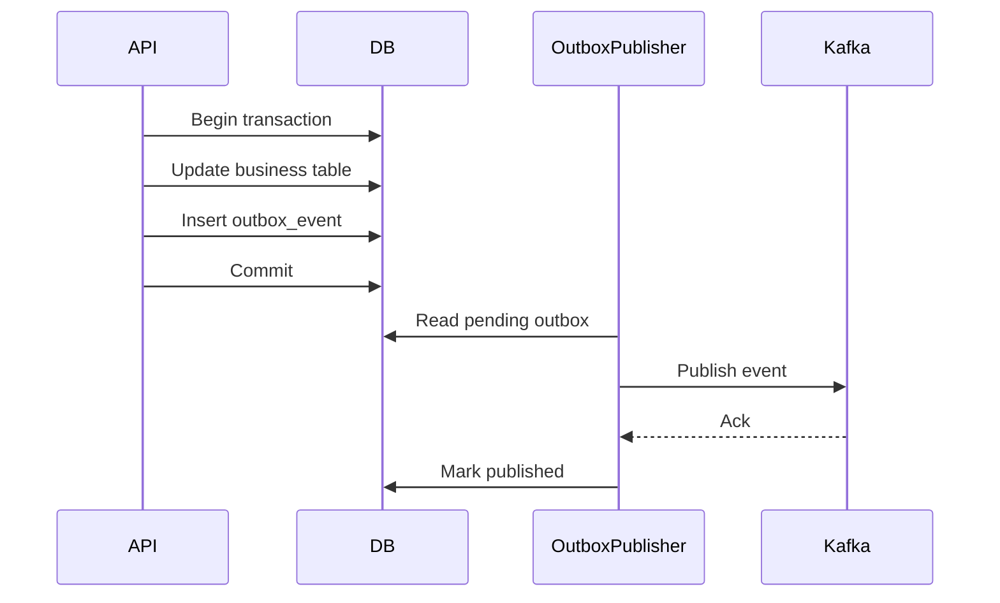

Di stack PostgreSQL + Kafka, outbox membuat perubahan state bisnis dan rencana publish event berada dalam satu transaksi database. Publisher kemudian mengirim event ke Kafka secara asynchronous.

---

# Part E - Producer/Consumer dalam Jakarta/JAX-RS Service

## 22. Producer sebagai singleton application component

KafkaProducer thread-safe untuk dipakai bersama, jadi biasanya dibuat satu instance per application lifecycle, bukan per request.

```java
@ApplicationScoped
public class KafkaEventPublisher implements AutoCloseable {

    private final KafkaProducer<String, String> producer;

    public KafkaEventPublisher() {
        this.producer = new KafkaProducer<>(producerProps());
    }

    public void publishCaseStatusChanged(String caseId, String payloadJson) {
        ProducerRecord<String, String> record =
                new ProducerRecord<>("case.status-changed", caseId, payloadJson);

        producer.send(record, (metadata, exception) -> {
            if (exception != null) {
                // metric + log + optional outbox retry
                return;
            }

            // metric success
        });
    }

    @Override
    public void close() {
        producer.flush();
        producer.close();
    }
}
```

Di aplikasi Jersey/Jakarta, lifecycle harus jelas: init saat aplikasi start, `flush/close` saat shutdown. Jangan membuat producer baru di setiap request.

---

## 23. Consumer sebagai background worker

Untuk JAX-RS application, consumer biasanya bukan resource endpoint. Ia background worker yang hidup bersama aplikasi atau dipisah sebagai service/deployment sendiri.

```java
public final class CaseStatusConsumer implements Runnable {

    private final KafkaConsumer<String, String> consumer;
    private final AtomicBoolean running = new AtomicBoolean(true);

    public CaseStatusConsumer(Properties props) {
        this.consumer = new KafkaConsumer<>(props);
    }

    @Override
    public void run() {
        consumer.subscribe(List.of("case.status-changed"));

        try {
            while (running.get()) {
                ConsumerRecords<String, String> records =
                        consumer.poll(Duration.ofSeconds(1));

                for (ConsumerRecord<String, String> record : records) {
                    process(record);
                }

                consumer.commitSync();
            }
        } finally {
            consumer.close();
        }
    }

    public void shutdown() {
        running.set(false);
        consumer.wakeup();
    }
}
```

Untuk Kubernetes, consumer shutdown harus memperhatikan graceful termination: stop polling, selesaikan batch yang sedang diproses, commit offset jika sukses, lalu close consumer.

---

# Part F - Observability

## 24. Metrics yang wajib ada

| Metric | Makna |
|---|---|
| Producer send success count | Event berhasil dipublish |
| Producer send failure count | Event gagal publish |
| Producer send latency | Waktu sampai ack |
| Producer retry count | Indikator broker/network issue |
| Consumer records processed | Throughput consumer |
| Consumer processing latency | Waktu business handler |
| Consumer lag | Selisih latest offset vs committed offset |
| Consumer error count | Error per topic/group |
| DLT count | Jumlah event gagal permanen |
| Rebalance count | Stabilitas consumer group |

`client.id` membantu tracking source request di server-side request logging Kafka. ([Apache Kafka](https://kafka.apache.org/43/configuration/producer-configs/))

---

## 25. Logging minimum

Producer log:

```text
eventType
topic
key
partition
offset
correlationId
schemaVersion
durationMs
result
```

Consumer log:

```text
consumerGroup
topic
partition
offset
key
eventType
correlationId
processingDurationMs
commitStatus
errorClass
```

Jangan log full payload jika mengandung PII, credential, dokumen, data regulator, atau data case sensitif.

---

# Part G - Common Failure Mode

## 26. Failure mode table

| Failure | Gejala | Root cause umum | Mitigasi |
|---|---|---|---|
| Producer timeout | Send gagal setelah delay | Broker lambat, network, ISR kurang | Retry, monitor broker, cek `acks/minISR` |
| Duplicate event | Consumer memproses ulang | Commit gagal setelah side effect sukses | Idempotent consumer |
| Message hilang secara bisnis | Offset commit duluan | Auto commit / commit sebelum processing sukses | Manual commit after success |
| Lag naik | Consumer tertinggal | Handler lambat, partition kurang, downstream lambat | Optimize, scale partition, retry topic |
| Rebalance sering | Consumer group tidak stabil | Poll terlalu lama, heartbeat/session issue | Tuning `max.poll.interval.ms`, batch size |
| Poison message blocking | Partition stuck | Payload invalid selalu gagal | DLT |
| Ordering rusak | Event entity tidak urut | Key salah/null, partition berubah | Stable key per entity |
| Payload gagal parse | Deserializer error | Schema berubah tanpa compatibility | Schema governance |
| Producer memory pressure | Send block/fail | Broker lambat, buffer penuh | Backpressure, tune `buffer.memory`, alert |
| DLT menumpuk | Banyak bad event | Bug producer/consumer/schema | DLT triage SLA |

---

## 27. Anti-patterns khusus Producer/Consumer

| Anti-pattern | Kenapa buruk | Alternatif |
|---|---|---|
| Producer dibuat per request | Mahal, connection churn | Singleton producer |
| Consumer di JAX-RS endpoint thread | Lifecycle kacau | Background worker/deployment terpisah |
| `enable.auto.commit=true` untuk DB writes | Bisa commit sebelum side effect sukses | Manual commit |
| Key selalu null | Ordering bisnis hilang | Pakai entity ID |
| Retry infinite di consumer | Partition stuck | Bounded retry + DLT |
| DLT tanpa alert | Error diam-diam menumpuk | Dashboard + owner |
| Commit per record untuk semua kasus | Aman tapi bisa lambat | Batch commit / per partition commit |
| `.get()` pada producer di hot path | Request latency naik | Async callback + outbox |
| Payload tanpa schema version | Evolusi contract berbahaya | Versioned schema |
| Mengandalkan Kafka exactly-once untuk semua side effect | Salah boundary | Idempotency di DB/API |

---

# 28. Checklist desain sebelum implementasi

## Producer checklist

| Pertanyaan | Keputusan |
|---|---|
| Topic apa? | Nama topic jelas |
| Key apa? | Entity ID untuk ordering |
| Format payload apa? | JSON/Avro/Protobuf |
| Ada schema version? | Wajib |
| Ada event ID? | Wajib untuk dedup |
| Publish dari request path atau outbox? | Untuk DB transaction, pilih outbox |
| Error publish ke mana? | Retry/outbox/alert |
| Perlu compression? | Biasanya ya untuk event besar |
| Perlu idempotence? | Ya untuk event penting |
| Secret/security config dari mana? | Env/secret manager |

## Consumer checklist

| Pertanyaan | Keputusan |
|---|---|
| Consumer group apa? | Stable logical group |
| Auto commit atau manual? | Manual untuk side effect penting |
| Processing idempotent? | Harus |
| Retry policy? | Inline/retry topic/DLT |
| DLT topic? | Ada owner dan alert |
| Batch size? | Sesuai latency dan DB capacity |
| Rebalance handling? | Graceful shutdown |
| Offset reset? | `earliest`, `latest`, `none`, atau `by_duration` |
| Observability? | Lag, error, DLT, processing latency |
| Replay aman? | Handler deterministic dan idempotent |

---

# 29. Minimal implementation skeleton

## Event model

```java
public record CaseStatusChangedEvent(
        String eventId,
        String caseId,
        String fromStatus,
        String toStatus,
        Instant occurredAt,
        String correlationId,
        int schemaVersion
) {}
```

## Producer service

```java
public final class CaseEventProducer {

    private final KafkaProducer<String, String> producer;
    private final ObjectMapper objectMapper;

    public CaseEventProducer(KafkaProducer<String, String> producer,
                             ObjectMapper objectMapper) {
        this.producer = producer;
        this.objectMapper = objectMapper;
    }

    public void publish(CaseStatusChangedEvent event) {
        try {
            String payload = objectMapper.writeValueAsString(event);

            ProducerRecord<String, String> record =
                    new ProducerRecord<>("case.status-changed", event.caseId(), payload);

            record.headers().add("eventId", event.eventId().getBytes(StandardCharsets.UTF_8));
            record.headers().add("eventType", "CaseStatusChanged".getBytes(StandardCharsets.UTF_8));
            record.headers().add("correlationId", event.correlationId().getBytes(StandardCharsets.UTF_8));
            record.headers().add("schemaVersion", Integer.toString(event.schemaVersion()).getBytes(StandardCharsets.UTF_8));

            producer.send(record, (metadata, exception) -> {
                if (exception != null) {
                    throw new EventPublishException("Failed to publish case event", exception);
                }
            });
        } catch (JsonProcessingException e) {
            throw new EventSerializationException("Failed to serialize case event", e);
        }
    }
}
```

## Consumer handler

```java
public final class CaseStatusChangedHandler {

    private final ObjectMapper objectMapper;
    private final CaseRepository caseRepository;
    private final ProcessedEventRepository processedEventRepository;

    public void handle(ConsumerRecord<String, String> record) {
        String eventId = readHeader(record, "eventId");

        if (processedEventRepository.exists(eventId)) {
            return;
        }

        try {
            CaseStatusChangedEvent event =
                    objectMapper.readValue(record.value(), CaseStatusChangedEvent.class);

            caseRepository.applyStatusChange(
                    event.caseId(),
                    event.fromStatus(),
                    event.toStatus(),
                    event.occurredAt()
            );

            processedEventRepository.markProcessed(eventId);

        } catch (JsonProcessingException e) {
            throw new NonRecoverableEventException("Invalid JSON payload", e);
        }
    }
}
```

---

# 30. Ringkasan cepat

| Area | Rule of thumb |
|---|---|
| Producer instance | Singleton, jangan per request |
| Producer key | Pakai entity ID |
| Producer send | Async callback untuk hot path |
| Producer reliability | `acks=all`, idempotence, retry bounded by delivery timeout |
| Consumer commit | Manual commit setelah processing sukses |
| Consumer handler | Harus idempotent |
| Retry | Jangan infinite retry di partition utama |
| DLT | Wajib punya owner, alert, dan replay playbook |
| Offset | Progress baca, bukan bukti business success |
| Schema | Versioned dan governed |

---

## Roadmap belajar singkat

1. Producer basics: config, key, serialization, callback.  
2. Consumer basics: poll loop, group, offset commit.  
3. Reliability: idempotency, retry, DLT, graceful shutdown.  
4. Integration: outbox pattern dengan PostgreSQL.  
5. Production: metrics, lag, rebalance, partition scaling.  

**Rekomendasi materi selanjutnya:** **Kafka Topic Design, Partitioning, Ordering & Schema Contract Cheatsheet**, karena setelah memahami producer/consumer, keputusan paling kritis berikutnya adalah desain topic, key, schema evolution, retention, dan DLT contract.

---

**Sources:**

- [API | Apache Kafka](https://kafka.apache.org/43/apis/)

## Response:
7/12/2026, 11:34:07 PM

# Cheatsheet - Kafka Topic Design, Partitioning, Ordering & Schema Contract

## 1. Scope

Cheatsheet ini membahas keputusan desain Kafka yang biasanya paling mahal kalau salah sejak awal:

```text
Topic name
→ event type
→ partition key
→ partition count
→ ordering guarantee
→ retention / compaction
→ schema contract
→ retry / DLT contract
→ ownership & governance
```

Versi referensi yang dipakai: dokumentasi Apache Kafka **4.3.x**. Apache Kafka **4.3.1** dirilis 25 Juni 2026 dan saat ini tercatat sebagai supported release di halaman download Kafka. ([Apache Kafka](https://kafka.apache.org/community/downloads/?utm_source=chatgpt.com))

---

## 2. Mental model utama

Topic bukan sekadar “nama queue”. Topic adalah **kontrak data antar sistem**.

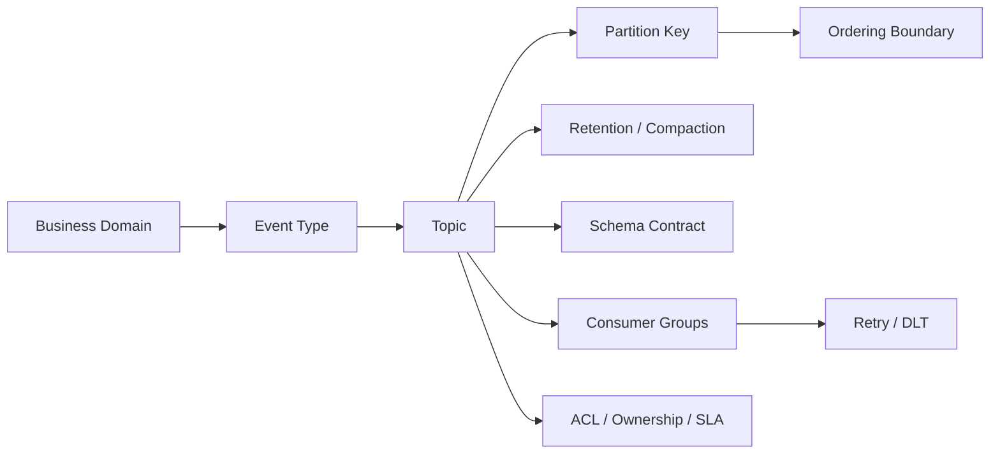

Satu topic yang buruk bisa menyebabkan:

| Masalah | Dampak |
|---|---|
| Key salah | Ordering bisnis rusak |
| Partition count salah | Throughput mentok atau operational overhead tinggi |
| Retention salah | Replay tidak bisa / storage membengkak |
| Schema tanpa governance | Consumer rusak saat producer berubah |
| Topic terlalu generik | Coupling tinggi dan debugging sulit |
| DLT tanpa owner | Failure diam-diam menumpuk |
| Topic berisi data sensitif tanpa policy | Risiko compliance dan security |

---

## 3. Topic design sebagai contract

Sebelum membuat topic, jawab 8 pertanyaan ini:

| Pertanyaan | Kenapa penting |
|---|---|
| Event ini merepresentasikan **fakta**, **command**, atau **state snapshot**? | Menentukan naming, retention, dan consumer expectation |
| Siapa **owner** topic? | Harus ada tim yang bertanggung jawab atas schema dan lifecycle |
| Apa **business key** event? | Menentukan partition dan ordering |
| Apakah ordering dibutuhkan? Per apa? | Kafka ordering kuatnya di partition |
| Siapa consumer utama? | Topic bukan milik producer saja |
| Berapa lama event harus disimpan? | Menentukan retention dan storage |
| Apakah topic immutable history atau latest state? | Menentukan `delete`, `compact`, atau `compact,delete` |
| Apa schema compatibility policy? | Menentukan cara evolusi payload |

---

# Part A - Topic Naming

## 4. Prinsip naming topic

Gunakan topic name yang menjelaskan **domain + entity/event family + event/state type**.

```text
<domain>.<entity>.<event-or-stream-type>
```

Contoh:

```text
case.lifecycle.status-changed
case.assignment.assigned
payment.authorization.approved
document.storage.uploaded
audit.case.action-recorded
integration.crm.customer-updated
```

Topic name yang baik harus:

| Kriteria | Contoh |
|---|---|
| Domain jelas | `case`, `payment`, `document` |
| Entity jelas | `lifecycle`, `authorization`, `storage` |
| Event/fungsi jelas | `status-changed`, `approved`, `uploaded` |
| Tidak terlalu teknis | Hindari nama seperti `case-service-topic-1` |
| Tidak terlalu generik | Hindari `events`, `messages`, `notifications` |
| Stabil | Jangan sering rename topic |

---

## 5. Event name: fakta masa lalu, bukan perintah

Kafka cocok untuk event: **sesuatu yang sudah terjadi**.

| Baik | Kurang baik |
|---|---|
| `case-created` | `create-case` |
| `case-status-changed` | `change-case-status` |
| `payment-authorized` | `authorize-payment` |
| `document-uploaded` | `upload-document` |
| `user-risk-score-updated` | `update-risk-score` |

Rule praktis:

```text
Kalau namanya imperative/command, cek ulang:
apakah ini benar event, atau sebenarnya command/request?
```

---

## 6. Topic category

| Category | Tujuan | Contoh | Retention umum |
|---|---|---|---|
| **Business event topic** | Merekam fakta domain | `case.status-changed` | Hari/bulan/tahun sesuai audit |
| **Integration topic** | Data movement antar sistem | `integration.crm.customer-updated` | Sesuai SLA integrasi |
| **Audit topic** | Jejak aktivitas dan compliance | `audit.case.action-recorded` | Panjang, regulated |
| **State compacted topic** | Latest state per key | `case.current-state` | `compact` |
| **Retry topic** | Delay/retry processing | `case.status-changed.retry.5m` | Pendek |
| **DLT topic** | Failure terminal | `case.status-changed.dlt` | Cukup panjang untuk triage |
| **Internal topic** | Dipakai Streams/Connect/app internal | `case-processor-store-changelog` | Dikelola framework/app |

---

# Part B - Partitioning

## 7. Partition adalah unit scale dan ordering

Topic dipartisi agar Kafka bisa scale. Partition adalah unit penyimpanan log, unit parallelism consumer, dan boundary ordering. Kafka tidak mendukung pengurangan jumlah partition topic; jumlah partition bisa ditambah, tetapi tidak bisa dikurangi. ([Apache Kafka](https://kafka.apache.org/43/operations/basic-kafka-operations/?utm_source=chatgpt.com))

```text
Topic: case.status-changed
Partition 0: CASE-1, CASE-8, CASE-9
Partition 1: CASE-2, CASE-3
Partition 2: CASE-4, CASE-5, CASE-6
```

Ordering kuat hanya berlaku dalam satu partition. Jadi, kalau semua event untuk `CASE-1001` harus berurutan, `caseId` harus menjadi key.

---

## 8. Partition key selection

Partition key adalah keputusan desain yang sangat penting.

| Pilihan key | Cocok untuk | Risiko |
|---|---|---|
| `caseId` | Ordering per case | Hot partition kalau ada case sangat aktif |
| `customerId` | Ordering per customer | Customer besar bisa jadi hot key |
| `tenantId` | Isolasi tenant | Tenant besar membuat imbalance |
| `paymentId` | Ordering per payment | Kurang cocok kalau perlu ordering per account |
| Composite key | Boundary lebih presisi | Harus stabil dan konsisten |
| Null key | Distribusi throughput | Tidak ada ordering per entity |
| Random UUID | Throughput merata | Ordering bisnis hilang |

Rule utama:

```text
Partition key = entity yang membutuhkan ordering.
```

Bukan entity yang paling mudah tersedia.

---

## 9. Contoh partition key berdasarkan domain

| Domain | Event | Key yang biasanya benar | Kenapa |
|---|---|---|---|
| Case management | `case.status-changed` | `caseId` | Status transition harus urut per case |
| Enforcement workflow | `enforcement.action-recorded` | `caseId` atau `enforcementId` | Audit lifecycle harus konsisten |
| Payment | `payment.authorized` | `paymentId` atau `accountId` | Tergantung ordering yang dibutuhkan |
| Document | `document.uploaded` | `documentId` | Lifecycle dokumen per dokumen |
| Notification | `notification.requested` | `recipientId` atau null | Tergantung dedup/rate limit |
| User activity | `user.activity-recorded` | `userId` | Ordering activity per user |
| CDC table | `customer.updated` | primary key DB | Latest state per row |

---

## 10. Composite key pattern

Kadang single key terlalu kasar.

```text
tenantId + ":" + caseId
```

Contoh:

```java
String key = tenantId + ":" + caseId;
```

Gunakan composite key kalau:

| Kondisi | Alasan |
|---|---|
| Multi-tenant | Menghindari collision antar tenant |
| Entity ID tidak global | Butuh namespace |
| Ordering butuh boundary spesifik | Misalnya per tenant+case |
| DLT/replay butuh traceability | Key menjelaskan context |

Hindari composite key yang berubah format sembarangan. Key adalah bagian dari contract.

---

## 11. Hot partition

Hot partition terjadi saat satu partition menerima traffic jauh lebih besar daripada partition lain.

```text
Partition 0: 90% traffic
Partition 1: 5%
Partition 2: 5%
```

Penyebab umum:

| Penyebab | Contoh |
|---|---|
| Hot key | Satu `tenantId` sangat besar |
| Key terlalu kasar | Semua event pakai `country=ID` |
| Partition count terlalu kecil | Traffic naik drastis |
| Producer routing custom buruk | Semua record masuk partition sama |
| Event type tercampur | Heavy event dan light event dalam topic sama |

Mitigasi:

| Strategi | Trade-off |
|---|---|
| Key lebih granular | Ordering berubah boundary |
| Pisah topic untuk high-volume entity | Operational overhead naik |
| Tambah partition | Tidak mengubah existing data; key mapping bisa berubah untuk event baru |
| Salting key | Throughput naik, ordering per entity rusak |
| Dedicated consumer flow | Kompleksitas naik |

---

## 12. Menambah partition: hati-hati

Kafka dapat menambah partition pada existing topic, tetapi tidak bisa mengurangi partition topic. ([Apache Kafka](https://kafka.apache.org/43/operations/basic-kafka-operations/?utm_source=chatgpt.com))

Masalah penting: jika producer memakai hash key ke partition, penambahan partition dapat mengubah mapping key untuk event baru. Dampaknya, event untuk entity yang sama bisa berpindah partition setelah perubahan. Ini bisa mengganggu asumsi ordering per entity secara historis.

```text
Sebelum:
caseId=CASE-1 -> partition 1

Setelah partition ditambah:
caseId=CASE-1 -> partition 4
```

Checklist sebelum menambah partition:

| Pertanyaan | Kenapa |
|---|---|
| Apakah consumer bergantung pada ordering per key? | Risiko ordering boundary berubah |
| Apakah topic dipakai untuk compacted state? | Key movement perlu dipahami |
| Apakah producer pakai custom partitioner? | Behavior bisa berbeda |
| Apakah consumer lag/throughput memang bottleneck partition? | Jangan menambah partition tanpa diagnosis |
| Apakah monitoring partition skew tersedia? | Perlu validasi setelah perubahan |

---

# Part C - Ordering

## 13. Ordering guarantee

Kafka memberikan ordering dalam satu partition, bukan global ordering lintas partition.

```text
Topic: case.status-changed

Partition 0:
CASE-1 CREATED
CASE-1 REVIEW_STARTED
CASE-1 ESCALATED

Partition 1:
CASE-2 CREATED
CASE-2 CLOSED
```

Yang dijamin:

| Guarantee | Status |
|---|---|
| Ordering dalam satu partition | Ya |
| Ordering untuk key yang sama selama mapping key stabil | Ya, secara praktis |
| Ordering global satu topic multi-partition | Tidak |
| Ordering antar topic | Tidak |
| Ordering antar consumer group | Tidak relevan; tiap group punya offset sendiri |

---

## 14. Ordering pattern

| Kebutuhan ordering | Desain |
|---|---|
| Global ordering semua event | 1 partition, tapi throughput rendah |
| Ordering per case | Key = `caseId` |
| Ordering per customer | Key = `customerId` |
| Ordering per aggregate root | Key = aggregate ID |
| Tidak butuh ordering | Null/random key bisa diterima |
| Ordering + high throughput | Partition by entity, bukan global |

Untuk sistem case management/regulatory lifecycle, ordering biasanya penting di level **case**, **workflow instance**, **enforcement action**, atau **regulated entity**, bukan global semua event.

---

## 15. Out-of-order dari perspektif bisnis

Walaupun Kafka menjaga order partition, aplikasi masih bisa melihat out-of-order secara bisnis karena:

| Penyebab | Contoh |
|---|---|
| Producer berbeda | Service A dan B publish event entity sama ke topic yang sama |
| Clock timestamp berbeda | `occurredAt` tidak monotonic |
| Retry/replay | Event lama dipublish ulang |
| Topic berbeda | Event lifecycle tersebar ke beberapa topic |
| Key salah | Event entity sama masuk partition berbeda |
| Async DB transaction | Event publish tidak sesuai urutan commit |

Mitigasi:

| Strategi | Kapan dipakai |
|---|---|
| Single writer per aggregate | Lifecycle kritikal |
| Outbox based on DB commit order | State transition dari DB |
| Sequence number per entity | Deteksi missing/out-of-order |
| Version field | Optimistic concurrency |
| Consumer idempotency + monotonic check | Mencegah state mundur |
| Event-time handling | Stream processing/windowing |

---

## 16. Sequence number pattern

Untuk lifecycle sensitif, tambahkan versi/sequence.

```json
{
  "eventId": "evt-123",
  "caseId": "CASE-1001",
  "caseVersion": 17,
  "eventType": "CaseStatusChanged",
  "fromStatus": "UNDER_REVIEW",
  "toStatus": "ESCALATED",
  "occurredAt": "2026-07-12T10:15:30Z"
}
```

Consumer bisa menolak atau menunda event jika `caseVersion` tidak sesuai.

| Kondisi | Aksi |
|---|---|
| `event.version == currentVersion + 1` | Apply |
| `event.version <= currentVersion` | Duplicate/late event, ignore/idempotent |
| `event.version > currentVersion + 1` | Missing event, park/retry/alert |

---

# Part D - Retention & Compaction

## 17. Retention delete

Default cleanup policy Kafka adalah delete. Retention berbasis waktu/ukuran menghapus log segment lama ketika melewati batas retention. Kafka juga menyimpan event walaupun sudah dikonsumsi sampai retention/compaction menghapusnya. ([docs.confluent.io](https://docs.confluent.io/platform/current/installation/configuration/topic-configs.html?utm_source=chatgpt.com))

Contoh:

```bash
kafka-configs.sh \
  --bootstrap-server kafka-1:9092 \
  --entity-type topics \
  --entity-name case.status-changed \
  --alter \
  --add-config retention.ms=2592000000
```

`2592000000 ms` = 30 hari.

Cocok untuk:

| Use case | Kenapa |
|---|---|
| Event history | Butuh replay window |
| Audit sementara | Ada batas waktu penyimpanan |
| Retry/DLT | Perlu triage window |
| Integration buffer | Consumer bisa catch up |

---

## 18. Log compaction

Log compaction adalah mekanisme retention per-record yang menyimpan setidaknya nilai terakhir untuk setiap key. Record lama dengan key sama dapat dihapus jika sudah ada update lebih baru. ([docs.confluent.io](https://docs.confluent.io/kafka/design/log_compaction.html?utm_source=chatgpt.com))

```bash
kafka-configs.sh \
  --bootstrap-server kafka-1:9092 \
  --entity-type topics \
  --entity-name case.current-state \
  --alter \
  --add-config cleanup.policy=compact
```

Cocok untuk:

| Use case | Kenapa |
|---|---|
| Latest customer profile | Butuh state terbaru per customer |
| Latest case state | Rebuild projection |
| Configuration stream | Latest value per config key |
| CDC upsert topic | Latest row per primary key |

Tidak cocok sebagai satu-satunya audit trail, karena record lama per key bisa hilang setelah compaction.

---

## 19. `compact,delete`

Beberapa topic memakai kombinasi compaction dan deletion: simpan latest value per key, tapi tetap batasi umur/ukuran log agar tidak tumbuh tanpa batas. Dokumentasi Kafka/Confluent menjelaskan compaction bisa dikombinasikan dengan deletion sebagai retention policy per topic. ([docs.confluent.io](https://docs.confluent.io/kafka/design/log_compaction.html?utm_source=chatgpt.com))

```bash
--add-config cleanup.policy=compact,delete,retention.ms=7776000000
```

Cocok untuk:

| Use case | Contoh |
|---|---|
| Latest state dengan batas umur | `case.current-state` 90 hari |
| Cache rebuild terbatas | Snapshot latest state |
| GDPR/data minimization | Jangan simpan tanpa batas |

---

## 20. Tombstone

Untuk compacted topic, tombstone biasanya berarti record dengan key tertentu dan value null. Ini memberi sinyal bahwa key tersebut bisa dihapus saat compaction.

```text
key=CASE-1001
value=null
```

Gunakan tombstone untuk:

| Use case | Catatan |
|---|---|
| Delete latest state | Misalnya case archived/deleted |
| CDC delete event | Row dihapus dari source DB |
| Cache invalidation | Consumer harus handle null value |

Consumer compacted topic wajib siap menerima `value == null`.

---

# Part E - Schema Contract

## 21. Kafka payload adalah bytes

Kafka broker tidak memahami domain object Java. Broker menyimpan key/value sebagai bytes. Schema contract ada di producer/consumer ecosystem.

Pilihan umum:

| Format | Kelebihan | Kekurangan |
|---|---|---|
| JSON | Mudah dibaca, fleksibel | Schema governance lemah kalau tanpa validasi |
| JSON Schema | Human-readable + schema | Butuh registry/tooling |
| Avro | Compact, schema evolution matang | Kurang human-readable |
| Protobuf | Compact, strongly typed | Field evolution perlu disiplin |
| String/raw | Simple | Mudah chaos untuk event penting |

---

## 22. Event envelope standar

Gunakan envelope untuk metadata stabil dan payload untuk domain content.

```json
{
  "eventId": "01JZVV1ZXQQ6W2XJ9J0Y6Q8YHT",
  "eventType": "CaseStatusChanged",
  "eventVersion": 3,
  "occurredAt": "2026-07-12T10:15:30Z",
  "publishedAt": "2026-07-12T10:15:31Z",
  "producer": "case-service",
  "correlationId": "corr-123",
  "causationId": "cmd-456",
  "tenantId": "tenant-a",
  "payload": {
    "caseId": "CASE-1001",
    "fromStatus": "UNDER_REVIEW",
    "toStatus": "ESCALATED",
    "reasonCode": "SLA_BREACH"
  }
}
```

Field minimum:

| Field | Wajib? | Fungsi |
|---|---:|---|
| `eventId` | Ya | Dedup/idempotency |
| `eventType` | Ya | Routing dan deserialization |
| `eventVersion` / `schemaVersion` | Ya | Evolusi contract |
| `occurredAt` | Ya | Waktu kejadian bisnis |
| `publishedAt` | Disarankan | Waktu publish |
| `producer` | Ya | Ownership/debugging |
| `correlationId` | Ya | Trace request |
| `causationId` | Disarankan | Link ke command/event penyebab |
| `tenantId` | Jika multi-tenant | Isolation/security |
| `payload` | Ya | Domain data |

---

## 23. Schema evolution rules

| Perubahan | Biasanya aman? | Catatan |
|---|---:|---|
| Tambah optional field | Ya | Consumer lama mengabaikan |
| Tambah required field tanpa default | Tidak | Consumer/produser lama bisa rusak |
| Rename field | Tidak | Anggap breaking change |
| Hapus field | Berisiko | Aman hanya jika semua consumer tidak pakai |
| Ubah tipe field | Tidak | Breaking |
| Ubah meaning field | Tidak | Breaking walau nama sama |
| Tambah enum value | Berisiko | Consumer lama harus handle unknown |
| Split event type | Berisiko | Perlu migration plan |
| Ganti key semantics | Sangat berisiko | Bisa merusak partition/order |

Rule aman:

```text
Schema boleh evolve, tapi semantic contract jangan berubah diam-diam.
```

---

## 24. Compatibility policy

| Policy | Makna | Cocok untuk |
|---|---|---|
| Backward compatible | Consumer baru bisa baca data lama | Consumer deployment lebih cepat |
| Forward compatible | Consumer lama bisa baca data baru | Producer deployment lebih cepat |
| Full compatible | Dua arah | Enterprise contract stabil |
| None | Tidak ada jaminan | Eksperimen/internal sementara |

Untuk event penting antar service, gunakan minimal **backward** atau **full compatibility**. Untuk regulated/audit event, perubahan schema harus versioned dan terdokumentasi.

---

## 25. Header vs payload

| Taruh di header | Taruh di payload |
|---|---|
| Correlation ID | Business data |
| Trace ID | Case status |
| Schema version | Amount, reason, actor |
| Event type | Domain fields |
| Tenant ID untuk routing/security | Data yang harus direplay sebagai fakta bisnis |
| Producer app | Regulatory evidence |

Jangan menaruh data bisnis penting hanya di header jika consumer/projection/audit menyimpan payload saja.

---

# Part F - Topic Count & Event Granularity

## 26. Satu topic banyak event type vs satu event type per topic

### Option A - Satu topic per event family

```text
case.lifecycle.events
```

Berisi:

```text
CaseCreated
CaseAssigned
CaseStatusChanged
CaseClosed
```

Cocok jika:

| Kondisi | Alasan |
|---|---|
| Ordering lifecycle harus satu stream | Semua event case dalam satu partition by `caseId` |
| Consumer sering butuh semua event family | Projection lifecycle |
| Schema envelope kuat | Bisa routing by `eventType` |
| Volume event relatif seimbang | Tidak ada event type yang mendominasi |

### Option B - Satu topic per event type

```text
case.created
case.assigned
case.status-changed
case.closed
```

Cocok jika:

| Kondisi | Alasan |
|---|---|
| Consumer berbeda jauh | Coupling lebih rendah |
| Retention berbeda | Topic config bisa spesifik |
| Sensitivitas data berbeda | ACL lebih presisi |
| Volume berbeda jauh | Scaling lebih mudah |

Decision rule:

```text
Kalau retention, ACL, consumer, volume, atau schema lifecycle berbeda jauh,
pisahkan topic.
```

---

## 27. Jangan terlalu generik

Hindari:

```text
events
notifications
case-events
all-domain-events
service-a-output
```

Masalah:

| Masalah | Dampak |
|---|---|
| Ownership kabur | Tidak ada yang menjaga schema |
| ACL terlalu luas | Data bocor ke consumer yang tidak perlu |
| Retention tidak cocok semua | Storage/compliance buruk |
| Consumer filtering berat | Semua consumer membaca noise |
| Schema campur aduk | Evolution sulit |

---

# Part G - Retry & DLT Topic Contract

## 28. Retry topic naming

Gunakan nama yang jelas menunjukkan source topic dan delay.

```text
case.status-changed.retry.1m
case.status-changed.retry.5m
case.status-changed.retry.30m
case.status-changed.dlt
```

Retry topic sebaiknya punya retention pendek, misalnya cukup untuk durasi retry window.

| Topic | Tujuan |
|---|---|
| `.retry.1m` | Retry cepat |
| `.retry.5m` | Retry medium |
| `.retry.30m` | Retry setelah dependency pulih |
| `.dlt` | Failure terminal untuk triage |

---

## 29. DLT contract

DLT bukan tempat sampah tanpa struktur. DLT harus memuat metadata failure.

```json
{
  "originalTopic": "case.status-changed",
  "originalPartition": 2,
  "originalOffset": 10491,
  "originalKey": "CASE-1001",
  "failedAt": "2026-07-12T10:15:30Z",
  "consumerGroup": "case-service-status-projector",
  "errorClass": "InvalidStatusTransitionException",
  "errorMessage": "Cannot move CLOSED case to UNDER_REVIEW",
  "retryCount": 3,
  "payload": {
    "caseId": "CASE-1001",
    "fromStatus": "CLOSED",
    "toStatus": "UNDER_REVIEW"
  }
}
```

DLT topic checklist:

| Area | Checklist |
|---|---|
| Owner | Ada tim accountable |
| Alert | DLT count naik harus terlihat |
| Retention | Cukup panjang untuk investigasi |
| Replay | Ada tool/procedure reprocess |
| Security | ACL sama atau lebih ketat dari source |
| PII | Jangan expose payload sensitif sembarangan |
| Classification | Error type jelas |

---

# Part H - Security, ACL, dan Governance

## 30. ACL by topic

Kafka menyediakan authorization framework dan ACL. Pada KRaft cluster, default authorizer Kafka menyimpan ACL di metadata cluster. ([Apache Kafka](https://kafka.apache.org/43/security/authorization-and-acls/?utm_source=chatgpt.com))

Minimal governance:

| Principal | Permission |
|---|---|
| Producer service | `WRITE`, `DESCRIBE` ke topic yang dimiliki |
| Consumer service | `READ`, `DESCRIBE` ke topic yang dikonsumsi |
| Admin/platform | Manage topic/config |
| Observability tool | Describe/read metadata sesuai kebutuhan |
| Replay tool | Read source + write target/retry |

Hindari service diberi wildcard read/write ke semua topic kecuali memang platform component.

---

## 31. Topic ownership metadata

Untuk enterprise, simpan registry internal:

| Metadata | Contoh |
|---|---|
| Topic name | `case.status-changed` |
| Owner team | Case Platform |
| Producer | `case-service` |
| Primary consumers | `case-projection-service`, `audit-service` |
| Data classification | Confidential / PII |
| Retention | 365 days |
| Cleanup policy | delete |
| Partition key | `caseId` |
| Schema | `CaseStatusChanged v3` |
| Compatibility | Full |
| DLT | `case.status-changed.dlt` |
| SLA | P99 publish < 200ms, consumer lag < 5m |
| Runbook | Link internal |

---

# Part I - Topic Configuration Cheatsheet

## 32. Config penting

| Config | Fungsi | Catatan |
|---|---|---|
| `cleanup.policy` | `delete`, `compact`, atau kombinasi | Menentukan retention model |
| `retention.ms` | Retention berbasis waktu | Untuk `delete` dan kombinasi |
| `retention.bytes` | Retention berbasis ukuran | Guardrail storage |
| `segment.ms` | Roll segment berdasarkan waktu | Retention bekerja pada segment |
| `segment.bytes` | Ukuran segment log | Pengaruh cleanup granularity |
| `min.insync.replicas` | Minimum ISR untuk write aman | Dipakai bersama producer `acks=all` |
| `max.message.bytes` | Ukuran max message topic | Cocokkan producer/consumer/broker |
| `compression.type` | Compression topic | Bisa inherit producer |
| `message.timestamp.type` | CreateTime atau LogAppendTime | Event-time vs broker-time |
| `delete.retention.ms` | Tombstone retention | Penting untuk compacted topic |
| `min.compaction.lag.ms` | Minimum umur sebelum compact | Mengontrol compaction timing |

---

## 33. Baseline topic config

### Business event topic

```bash
kafka-topics.sh \
  --bootstrap-server kafka-1:9092 \
  --create \
  --topic case.status-changed \
  --partitions 12 \
  --replication-factor 3 \
  --config cleanup.policy=delete \
  --config retention.ms=31536000000 \
  --config min.insync.replicas=2
```

Cocok untuk immutable business event dengan replay/audit window 1 tahun.

---

### Latest state compacted topic

```bash
kafka-topics.sh \
  --bootstrap-server kafka-1:9092 \
  --create \
  --topic case.current-state \
  --partitions 12 \
  --replication-factor 3 \
  --config cleanup.policy=compact \
  --config min.insync.replicas=2
```

Cocok untuk latest state per `caseId`.

---

### Retry topic

```bash
kafka-topics.sh \
  --bootstrap-server kafka-1:9092 \
  --create \
  --topic case.status-changed.retry.5m \
  --partitions 12 \
  --replication-factor 3 \
  --config cleanup.policy=delete \
  --config retention.ms=604800000 \
  --config min.insync.replicas=2
```

Cocok untuk retry window pendek-menengah.

---

### DLT topic

```bash
kafka-topics.sh \
  --bootstrap-server kafka-1:9092 \
  --create \
  --topic case.status-changed.dlt \
  --partitions 12 \
  --replication-factor 3 \
  --config cleanup.policy=delete \
  --config retention.ms=2592000000 \
  --config min.insync.replicas=2
```

DLT retention 30 hari hanya contoh. Untuk regulatory/compliance, retention harus mengikuti policy internal.

---

# Part J - Decision Matrix

## 34. Retention decision

| Kebutuhan | Config |
|---|---|
| Event history sementara | `cleanup.policy=delete` |
| Latest state per key | `cleanup.policy=compact` |
| Latest state tapi bounded storage | `cleanup.policy=compact,delete` |
| Audit panjang | `delete` dengan `retention.ms` panjang atau archival pipeline |
| DLT triage | `delete` dengan retention sesuai SLA investigasi |
| CDC upsert | `compact` atau `compact,delete` |
| CDC delete support | Compacted topic + tombstone handling |

---

## 35. Partition key decision

| Kebutuhan | Key |
|---|---|
| Ordering per case | `caseId` |
| Ordering per workflow instance | `processInstanceId` |
| Ordering per customer/account | `customerId` / `accountId` |
| Ordering per tenant saja | `tenantId`, tapi hati-hati hot tenant |
| No ordering, throughput tinggi | null key / generated key |
| Multi-tenant entity | `tenantId:entityId` |
| CDC | Source table primary key |

---

## 36. Topic split decision

Pisah topic jika:

| Kondisi | Contoh |
|---|---|
| Retention berbeda | `audit.*` 7 tahun, business event 90 hari |
| ACL berbeda | PII vs non-PII |
| Volume sangat berbeda | `case.viewed` jauh lebih besar dari `case.closed` |
| Consumer berbeda total | Analytics vs operational service |
| Schema lifecycle berbeda | Frequent experimental event vs stable contract |
| Ordering tidak perlu sama | Notification vs case lifecycle |

Gabungkan dalam satu topic family jika:

| Kondisi | Contoh |
|---|---|
| Ordering lifecycle harus sama | Semua event per case |
| Consumer selalu butuh semua event | Projection builder |
| Volume seimbang | Tidak ada event super noisy |
| Retention sama | Semua event lifecycle disimpan sama |
| ACL sama | Data classification sama |

---

# Part K - Failure Modeling

## 37. Failure mode karena desain topic

| Failure | Penyebab | Dampak | Mitigasi |
|---|---|---|---|
| Consumer lag permanen | Partition terlalu sedikit | Throughput mentok | Tambah partition dengan analisis ordering |
| Ordering rusak | Key salah/null | State transition salah | Key by aggregate ID |
| Hot partition | Key terlalu kasar | Satu broker/consumer berat | Granular key / split topic |
| Replay tidak cukup | Retention terlalu pendek | Recovery gagal | Retention berdasarkan RTO/RPO |
| Storage meledak | Retention terlalu panjang | Disk pressure | Retention bytes/archival |
| Consumer break setelah deploy producer | Schema breaking | Incident integrasi | Schema compatibility gate |
| DLT tidak tertangani | Tidak ada owner | Silent data loss | Alert + runbook |
| Data sensitif bocor | ACL topic terlalu luas | Compliance incident | Least privilege ACL |
| Topic chaos | Naming tanpa governance | Operasi sulit | Topic registry |

---

## 38. Design review checklist

Sebelum approve topic baru:

```text
[ ] Topic name mengikuti convention
[ ] Topic owner jelas
[ ] Producer dan consumer utama diketahui
[ ] Event adalah fakta masa lalu, bukan command tersembunyi
[ ] Partition key sesuai ordering boundary
[ ] Partition count punya alasan kapasitas
[ ] Retention sesuai replay/audit/compliance
[ ] Cleanup policy benar: delete/compact/compact,delete
[ ] Schema version dan compatibility policy jelas
[ ] DLT/retry topic didefinisikan
[ ] ACL/security classification jelas
[ ] Metrics dan alert disiapkan
[ ] Replay/backfill strategy ada
[ ] Migration/deprecation plan ada jika mengganti topic lama
```

---

## 39. Contoh topic design lengkap

### Use case

Case management system perlu publish event saat status case berubah.

### Desain

| Item | Keputusan |
|---|---|
| Topic | `case.lifecycle.status-changed` |
| Event type | `CaseStatusChanged` |
| Key | `tenantId:caseId` |
| Partition count | 12 awal, review berdasarkan throughput/lag |
| Replication factor | 3 |
| Cleanup policy | `delete` |
| Retention | 1 tahun atau sesuai compliance |
| Schema | JSON Schema / Avro / Protobuf versioned |
| Compatibility | Full/backward minimal |
| Producer | `case-service` |
| Consumers | `audit-service`, `case-projection-service`, `notification-service` |
| DLT | `case.lifecycle.status-changed.dlt` |
| Retry | `.retry.1m`, `.retry.5m`, `.retry.30m` |
| ACL | Producer write only, consumers read only |
| Observability | publish failure, consumer lag, DLT count, processing latency |

### Event example

```json
{
  "eventId": "01JZVV1ZXQQ6W2XJ9J0Y6Q8YHT",
  "eventType": "CaseStatusChanged",
  "eventVersion": 3,
  "occurredAt": "2026-07-12T10:15:30Z",
  "publishedAt": "2026-07-12T10:15:31Z",
  "producer": "case-service",
  "correlationId": "corr-123",
  "tenantId": "tenant-a",
  "payload": {
    "caseId": "CASE-1001",
    "previousStatus": "UNDER_REVIEW",
    "newStatus": "ESCALATED",
    "reasonCode": "SLA_BREACH",
    "actorId": "user-789"
  }
}
```

---

# 40. Anti-patterns

| Anti-pattern | Kenapa buruk | Alternatif |
|---|---|---|
| Topic bernama `events` | Tidak jelas contract/owner | Domain-specific topic |
| Semua event masuk satu topic | ACL, retention, schema kacau | Split by bounded context/event family |
| Satu event type terlalu banyak topic | Operational overhead | Gabungkan jika lifecycle sama |
| Key null untuk lifecycle event | Ordering hilang | Key by aggregate/entity ID |
| Partition count asal besar | Metadata/rebalance overhead | Capacity-based sizing |
| Retention default dibiarkan | Replay/compliance tidak terkontrol | Explicit retention |
| Compacted topic untuk audit | History lama bisa hilang | Separate audit topic |
| Schema berubah diam-diam | Consumer incident | Compatibility check |
| DLT tanpa replay tool | Failure menumpuk | DLT workflow |
| Menambah partition tanpa review | Ordering/key mapping risk | Design review |

---

# 41. Ringkasan cepat

| Area | Rule of thumb |
|---|---|
| Topic | Contract antar sistem, bukan sekadar queue |
| Name | Domain + entity/event family + event |
| Event | Fakta masa lalu |
| Key | Entity yang butuh ordering |
| Partition | Unit scale dan ordering |
| Ordering | Hanya kuat dalam partition |
| Retention | Product/compliance decision |
| Compaction | Latest state per key, bukan audit full history |
| Schema | Versioned dan governed |
| DLT | Harus punya owner, alert, dan replay plan |
| Security | ACL least privilege per topic |

---

## Roadmap belajar singkat

1. Pahami topic sebagai **data contract**.  
2. Tentukan **event type** dan **partition key** dari invariant bisnis.  
3. Pilih **retention/compaction** berdasarkan replay, audit, dan compliance.  
4. Definisikan **schema compatibility** sebelum producer/consumer deploy.  
5. Siapkan **retry/DLT** sebagai bagian dari contract, bukan tambahan belakangan.  
6. Review **ACL, ownership, observability, dan replay strategy** sebelum production.

**Rekomendasi materi selanjutnya:** **Kafka Reliability, Delivery Semantics, Idempotency, Retry & DLT Cheatsheet**, karena setelah topic dan contract benar, risiko terbesar berikutnya adalah duplicate processing, lost business effect, poison message, retry storm, dan replay yang tidak aman.

---

**Sources:**

- [Downloads | Apache Kafka](https://kafka.apache.org/community/downloads/?utm_source=chatgpt.com)
- [Kafka Topic Configuration Reference for Confluent Platform](https://docs.confluent.io/platform/current/installation/configuration/topic-configs.html?utm_source=chatgpt.com)

## Response:
7/12/2026, 11:36:04 PM

Saya lanjutkan ke reliability layer: delivery semantics, idempotency, transaksi, offset commit, retry/DLT, dan failure modes yang sering menyebabkan duplicate, lost update, atau consumer stuck.

# Cheatsheet - Kafka Reliability, Delivery Semantics, Idempotency, Retry & DLT

## 1. Scope

Cheatsheet ini fokus pada pertanyaan production paling penting:

```text
Apakah event bisa hilang?
Apakah event bisa double processed?
Kapan offset boleh di-commit?
Kapan retry aman?
Kapan harus masuk DLT?
Apakah exactly-once benar-benar berlaku untuk DB/API eksternal?
```

Kafka membagi reliability menjadi dua problem besar: **durability saat producer publish message** dan **guarantee saat consumer memproses message**. Dokumentasi Kafka juga menekankan bahwa klaim “exactly once” harus dibaca hati-hati karena hasilnya bergantung pada failure scenario, producer/consumer, dan output system. ([Apache Kafka](https://kafka.apache.org/43/design/design/))

---

## 2. Mental model utama

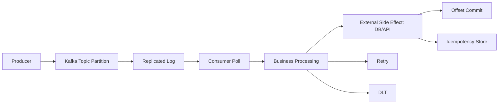

Core invariant:

```text
Kafka bisa menjaga log dan offset.
Aplikasi tetap harus menjaga business effect.
```

Kafka bisa membantu mencegah duplicate write ke Kafka, melakukan transaksi antar Kafka topic, dan mengatur offset secara transactional. Namun, ketika consumer menulis ke PostgreSQL, memanggil REST API, mengirim email, atau melakukan side effect eksternal lain, reliability harus dirancang di aplikasi dan output system.

---

## 3. Delivery semantics

| Semantics | Arti | Contoh desain | Risiko |
|---|---|---|---|
| **At-most-once** | Message mungkin hilang, tapi tidak diproses ulang | Commit offset sebelum processing | Business data loss |
| **At-least-once** | Message tidak hilang, tapi bisa diproses ulang | Process dulu, commit offset setelah sukses | Duplicate processing |
| **Exactly-once dalam Kafka boundary** | Consume-transform-produce antar Kafka topic bisa atomik | Kafka transactions / Kafka Streams | Tidak otomatis berlaku untuk DB/API eksternal |
| **Effectively-once** | Efek bisnis muncul sekali karena idempotency/dedup | At-least-once + idempotent DB write | Butuh desain eksplisit |

Kafka mendefinisikan at-most-once, at-least-once, dan exactly-once sebagai kemungkinan delivery guarantee. Untuk exactly-once, Kafka mendukungnya terutama saat membaca dari Kafka, memproses, dan menulis kembali ke Kafka topic dengan transactional producer dan consumer `read_committed`; untuk destination system lain, perlu kerja sama dari sistem output atau strategi penyimpanan offset bersama output. ([Apache Kafka](https://kafka.apache.org/43/design/design/))

---

## 4. Producer reliability

Producer reliability ditentukan oleh kombinasi:

```text
acks
+ retries
+ delivery.timeout.ms
+ enable.idempotence
+ max.in.flight.requests.per.connection
+ topic replication
+ min.insync.replicas
```

### Config penting

| Config | Fungsi | Rule production |
|---|---|---|
| `acks=all` | Producer menunggu acknowledgment kuat dari broker/ISR | Pakai untuk event penting |
| `enable.idempotence=true` | Mencegah duplicate akibat producer retry | Default true jika tidak ada config konflik |
| `retries` | Retry transient error | Jangan kontrol retry hanya dari angka ini; pahami `delivery.timeout.ms` |
| `delivery.timeout.ms` | Batas total waktu sampai send sukses/gagal | Gunakan sebagai guardrail retry producer |
| `max.in.flight.requests.per.connection` | Jumlah request belum di-ack per koneksi | Dengan idempotence true, ordering tetap dijaga sampai batas yang didukung |
| `transactional.id` | Mengaktifkan transactional producer | Untuk consume-process-produce transactional |

Kafka 4.3 menyatakan `enable.idempotence=true` membuat producer memastikan hanya satu copy message ditulis ke stream; idempotence membutuhkan `acks=all`, `retries > 0`, dan `max.in.flight.requests.per.connection <= 5`. Jika config konflik dan idempotence tidak eksplisit diaktifkan, idempotence bisa disabled; jika eksplisit enabled dan konflik, Kafka melempar `ConfigException`. ([Apache Kafka](https://kafka.apache.org/43/configuration/producer-configs/))

---

## 5. Broker/topic durability

Producer config saja tidak cukup. Topic dan broker harus mendukung durability.

| Setting | Arti |
|---|---|
| `replication.factor=3` | Ada 3 copy partition |
| `min.insync.replicas=2` | Minimal 2 replica harus in-sync untuk write sukses saat `acks=all` |
| `acks=all` | Producer menunggu write dianggap aman sesuai ISR |
| ISR sehat | Replica tidak tertinggal dari leader |

Kafka menjelaskan `min.insync.replicas` sebagai minimum jumlah in-sync replicas, termasuk leader, yang diperlukan agar write sukses saat producer memakai `acks=all`; jika ISR lebih sedikit dari nilai ini, producer akan menerima exception seperti `NotEnoughReplicas` atau `NotEnoughReplicasAfterAppend`. Kombinasi umum production adalah replication factor 3, `min.insync.replicas=2`, dan producer `acks=all`. ([Apache Kafka](https://kafka.apache.org/43/configuration/broker-configs/))

### Baseline topic durability

```bash
kafka-topics.sh \
  --bootstrap-server kafka-1:9092 \
  --create \
  --topic case.status-changed \
  --partitions 12 \
  --replication-factor 3 \
  --config min.insync.replicas=2
```

### Baseline producer durability

```properties
acks=all
enable.idempotence=true
delivery.timeout.ms=120000
request.timeout.ms=30000
max.in.flight.requests.per.connection=5
```

---

## 6. Consumer reliability: offset commit adalah titik bahaya

Consumer offset commit bukan bukti bahwa business processing sukses. Offset commit hanya menyimpan posisi baca consumer group.

```text
poll -> process -> side effect -> commit offset
```

Kafka consumer punya `enable.auto.commit`; jika true, offset di-commit secara periodik di background. Default-nya true, sehingga untuk consumer yang melakukan DB write/API call penting, biasanya harus diset `false` agar offset hanya di-commit setelah processing dianggap sukses. ([Apache Kafka](https://kafka.apache.org/43/configuration/consumer-configs/))

### Commit matrix

| Urutan | Hasil jika crash | Semantics |
|---|---|---|
| Commit offset → process DB | Crash setelah commit sebelum DB write = event hilang secara bisnis | At-most-once |
| Process DB → commit offset | Crash setelah DB write sebelum commit = event diproses ulang | At-least-once |
| Process DB idempotent → commit offset | Crash tetap aman karena duplicate ditahan | Effectively-once |
| Kafka transaction output topic + offset | Output Kafka dan offset atomik | Exactly-once dalam Kafka boundary |
| DB write + Kafka offset tanpa idempotency | Tidak atomik | Risky |

Rule:

```text
Untuk business side effect, pilih at-least-once + idempotent consumer.
```

---

## 7. Consumer config baseline

```properties
enable.auto.commit=false
auto.offset.reset=earliest
isolation.level=read_committed
max.poll.records=100
max.poll.interval.ms=300000
```

`isolation.level=read_committed` membuat `consumer.poll()` hanya mengembalikan transactional messages yang sudah committed; default `read_uncommitted` dapat mengembalikan message dari aborted transaction. Non-transactional messages tetap dikembalikan di kedua mode. ([Apache Kafka](https://kafka.apache.org/43/configuration/consumer-configs/))

---

## 8. Exactly-once: batas yang benar

Kafka exactly-once paling tepat dipahami sebagai:

```text
Kafka topic input
-> processing
-> Kafka topic output
+ offset commit
dalam satu Kafka transaction
```

Kafka menjelaskan bahwa transactional producer bisa menulis output records dan update posisi consumer secara atomik. Untuk pola ini, consumer harus memakai partition assignment, producer memakai transaction, dan offset consumer ikut ditulis dalam transaction. Kafka juga menyarankan `isolation.level=read_committed`, `enable.auto.commit=false`, dan producer dengan `transactional.id`. ([Apache Kafka](https://kafka.apache.org/43/design/design/))

### Transactional producer config

```properties
enable.idempotence=true
transactional.id=case-processor-instance-01
acks=all
```

`transactional.id` mengaktifkan transactional delivery; jika tidak dikonfigurasi, producer terbatas pada idempotent delivery. Jika `transactional.id` dikonfigurasi, `enable.idempotence` implied. Kafka juga mencatat transaksi secara default memerlukan cluster minimal tiga broker untuk production recommendation. ([Apache Kafka](https://kafka.apache.org/43/configuration/producer-configs/))

---

## 9. Exactly-once bukan otomatis untuk PostgreSQL/API

Ini batas penting:

```text
Kafka transaction tidak otomatis membuat PostgreSQL transaction ikut atomik.
Kafka transaction tidak otomatis membuat REST API call idempotent.
Kafka transaction tidak otomatis mencegah email terkirim dua kali.
```

Untuk external system, gunakan salah satu:

| Pattern | Cocok untuk | Penjelasan |
|---|---|---|
| **Idempotent consumer** | DB write, projection, status update | Simpan `eventId` atau offset sebagai dedup key |
| **Inbox table** | Consumer banyak side effect | Terima event ke tabel inbox, proses controlled |
| **Outbox pattern** | Producer publish setelah DB commit | DB update dan event intent dalam satu transaksi |
| **Offset stored with output** | Sink khusus | Simpan progress baca bersama hasil output |
| **External idempotency key** | REST/payment/email API | Kirim key agar provider dedup |
| **Kafka Streams EOS** | Kafka-to-Kafka processing | Gunakan framework yang mengelola transaksi |

---

## 10. Idempotent consumer patterns

### Pattern A - Dedup by `eventId`

```sql
CREATE TABLE processed_event (
    event_id text PRIMARY KEY,
    consumer_group text NOT NULL,
    topic text NOT NULL,
    partition_no int NOT NULL,
    offset_no bigint NOT NULL,
    processed_at timestamptz NOT NULL DEFAULT now()
);
```

```java
@Transactional
public void handle(Event event, ConsumerRecord<String, String> record) {
    if (processedEventRepository.exists(event.eventId())) {
        return;
    }

    applyBusinessChange(event);
    processedEventRepository.insert(
        event.eventId(),
        record.topic(),
        record.partition(),
        record.offset()
    );
}
```

Cocok jika producer menjamin `eventId` globally unique.

---

### Pattern B - Dedup by Kafka coordinate

```sql
CREATE TABLE processed_kafka_offset (
    consumer_group text NOT NULL,
    topic text NOT NULL,
    partition_no int NOT NULL,
    offset_no bigint NOT NULL,
    processed_at timestamptz NOT NULL DEFAULT now(),
    PRIMARY KEY (consumer_group, topic, partition_no, offset_no)
);
```

Cocok untuk dedup internal consumer group. Kurang ideal jika event yang sama bisa dipublish ulang ke topic lain atau offset berbeda.

---

### Pattern C - Natural idempotency

```sql
ALTER TABLE case_status_history
ADD CONSTRAINT uq_case_status_event UNIQUE (case_id, case_version);
```

Cocok untuk event lifecycle dengan sequence/version.

```text
Jika caseVersion sudah pernah diterapkan, ignore.
Jika caseVersion = currentVersion + 1, apply.
Jika caseVersion > currentVersion + 1, park/retry karena ada gap.
```

---

## 11. Retry strategy

Retry bukan satu mekanisme tunggal. Pilih berdasarkan jenis error.

| Error | Retry? | Aksi |
|---|---:|---|
| DB timeout | Ya | Retry dengan backoff |
| Downstream 503 | Ya | Retry topic / pause consumer |
| Payload JSON invalid | Tidak | DLT |
| Schema incompatible | Tidak langsung | DLT + alert producer |
| Business invariant invalid | Biasanya tidak | DLT / reject event |
| Duplicate event | Tidak | Ignore idempotently |
| Missing referenced data | Tergantung | Retry terbatas / parking topic |
| Bug consumer | Tidak | Stop + alert |

---

## 12. Inline retry

```text
poll -> process -> fail -> sleep/backoff -> retry same record
```

Kelebihan:

| Plus | Minus |
|---|---|
| Sederhana | Menahan partition |
| Cocok untuk error sangat singkat | Bisa menaikkan lag |
| Tidak butuh topic tambahan | Bisa menyebabkan retry storm |

Gunakan untuk retry sangat pendek, misalnya 2-3 kali dengan backoff kecil.

```java
for (int attempt = 1; attempt <= 3; attempt++) {
    try {
        process(record);
        return;
    } catch (RecoverableException e) {
        sleep(backoff(attempt));
    }
}

throw new RetryExhaustedException();
```

---

## 13. Retry topic pattern

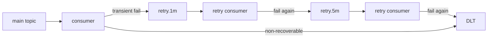

Contoh topic:

```text
case.status-changed
case.status-changed.retry.1m
case.status-changed.retry.5m
case.status-changed.retry.30m
case.status-changed.dlt
```

Retry topic cocok jika dependency downstream bisa outage beberapa menit dan Anda tidak mau partition utama tertahan.

---

## 14. DLT: Dead Letter Topic

DLT adalah terminal path untuk event yang tidak bisa diproses setelah retry policy selesai, atau event yang memang invalid sejak awal.

DLT bukan tempat sampah. DLT adalah **failure contract**.

### DLT envelope

```json
{
  "failureId": "01JZV...",
  "failedAt": "2026-07-12T10:15:30Z",
  "consumerGroup": "case-service-status-projector",
  "originalTopic": "case.status-changed",
  "originalPartition": 2,
  "originalOffset": 10491,
  "originalKey": "tenant-a:CASE-1001",
  "retryCount": 3,
  "errorClass": "InvalidStatusTransitionException",
  "errorMessage": "Cannot move CLOSED case to UNDER_REVIEW",
  "correlationId": "corr-123",
  "payload": {
    "eventId": "evt-456",
    "caseId": "CASE-1001",
    "fromStatus": "CLOSED",
    "toStatus": "UNDER_REVIEW"
  }
}
```

### DLT checklist

| Area | Wajib ada |
|---|---|
| Ownership | Tim owner jelas |
| Alert | DLT count naik harus terlihat |
| Retention | Cukup untuk investigasi |
| Classification | PII/security sama atau lebih ketat dari source |
| Replay tool | Bisa reprocess setelah fix |
| Root cause | Error class/message/correlation ID |
| Original coordinate | Topic, partition, offset, key |
| Retry count | Supaya tahu sudah melewati jalur apa |

---

## 15. Retry vs DLT decision matrix

| Kondisi | Aksi |
|---|---|
| Network timeout 1x | Inline retry |
| DB unavailable 5 menit | Retry topic |
| API downstream rate limited | Retry topic dengan backoff |
| Invalid JSON | DLT langsung |
| Missing required field | DLT langsung |
| Unknown enum value | DLT atau tolerant parser, tergantung contract |
| Business state conflict sementara | Retry terbatas |
| Business rule impossible | DLT/reject |
| Event duplicate | Ignore |
| Consumer bug | Stop consumer, alert, jangan commit sembarangan |

---

## 16. Offset handling dengan retry/DLT

### Case 1 - Retry topic publish sukses

```text
main record gagal
-> publish ke retry topic sukses
-> commit offset main
```

Ini benar karena event tidak hilang; ia berpindah jalur ke retry topic.

### Case 2 - DLT publish sukses

```text
main record invalid
-> publish ke DLT sukses
-> commit offset main
```

Ini benar karena event sudah ditangani sebagai terminal failure.

### Case 3 - Retry/DLT publish gagal

```text
main record gagal
-> publish retry/DLT gagal
-> jangan commit offset main
```

Kalau commit offset main saat retry/DLT publish gagal, event hilang.

---

## 17. Consumer poll loop pattern

```java
while (running.get()) {
    ConsumerRecords<String, String> records = consumer.poll(Duration.ofSeconds(1));

    Map<TopicPartition, OffsetAndMetadata> offsets = new HashMap<>();

    for (ConsumerRecord<String, String> record : records) {
        try {
            processIdempotently(record);

            TopicPartition tp = new TopicPartition(record.topic(), record.partition());
            offsets.put(tp, new OffsetAndMetadata(record.offset() + 1));

        } catch (RecoverableException e) {
            publishToRetryTopic(record, e);

            TopicPartition tp = new TopicPartition(record.topic(), record.partition());
            offsets.put(tp, new OffsetAndMetadata(record.offset() + 1));

        } catch (NonRecoverableException e) {
            publishToDlt(record, e);

            TopicPartition tp = new TopicPartition(record.topic(), record.partition());
            offsets.put(tp, new OffsetAndMetadata(record.offset() + 1));
        }
    }

    if (!offsets.isEmpty()) {
        consumer.commitSync(offsets);
    }
}
```

Catatan penting: `record.offset() + 1` adalah offset berikutnya yang akan dibaca, bukan offset record terakhir yang sudah diproses.

---

## 18. Poison message handling

Poison message adalah record yang selalu gagal diproses.

Gejala:

```text
consumer stuck di partition tertentu
lag naik
offset tidak maju
log error sama berulang
```

Penyebab:

| Penyebab | Contoh |
|---|---|
| Payload invalid | JSON rusak |
| Schema breaking | Producer rename field |
| Business impossible | CLOSED -> UNDER_REVIEW tidak valid |
| Missing reference | ID tidak ada dan tidak akan ada |
| Consumer bug | Null pointer |

Mitigasi:

```text
Detect -> classify -> DLT -> commit -> alert -> fix -> replay jika aman
```

Jangan infinite retry poison message di main partition.

---

## 19. Outbox pattern untuk producer reliability

Problem:

```text
DB commit sukses, Kafka publish gagal.
Kafka publish sukses, DB commit gagal.
```

Solusi umum: transactional outbox.

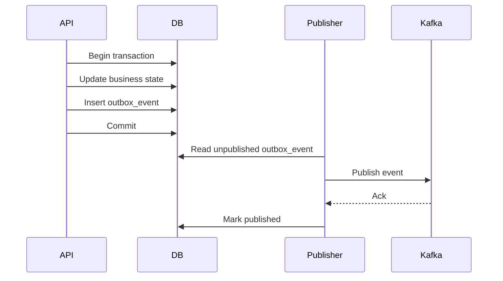

### Outbox table minimal

```sql
CREATE TABLE outbox_event (
    id uuid PRIMARY KEY,
    aggregate_type text NOT NULL,
    aggregate_id text NOT NULL,
    event_type text NOT NULL,
    event_version int NOT NULL,
    topic text NOT NULL,
    partition_key text NOT NULL,
    payload jsonb NOT NULL,
    headers jsonb NOT NULL DEFAULT '{}'::jsonb,
    status text NOT NULL DEFAULT 'PENDING',
    retry_count int NOT NULL DEFAULT 0,
    created_at timestamptz NOT NULL DEFAULT now(),
    published_at timestamptz
);
```

Outbox cocok untuk Java/JAX-RS + PostgreSQL karena business state dan event intent bisa ditulis dalam satu transaksi database.

---

## 20. Inbox pattern untuk consumer reliability

Inbox pattern berguna jika consumer menerima event, lalu processing-nya panjang atau punya beberapa side effect.

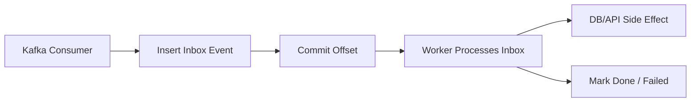

### Inbox table minimal

```sql
CREATE TABLE inbox_event (
    event_id text PRIMARY KEY,
    topic text NOT NULL,
    partition_no int NOT NULL,
    offset_no bigint NOT NULL,
    key text,
    payload jsonb NOT NULL,
    status text NOT NULL DEFAULT 'RECEIVED',
    retry_count int NOT NULL DEFAULT 0,
    received_at timestamptz NOT NULL DEFAULT now(),
    processed_at timestamptz
);
```

Kelebihan:

| Plus | Trade-off |
|---|---|
| Offset bisa cepat maju setelah event tersimpan durable | Ada worker tambahan |
| Processing bisa retry dari DB | Latency bisa naik |
| Audit lebih jelas | Perlu cleanup dan monitoring |
| Cocok untuk workflow panjang | Kompleksitas operasional naik |

---

## 21. Failure modeling table

| Failure | Apa yang terjadi | Risiko | Mitigasi |
|---|---|---|---|
| Producer send timeout | Producer tidak tahu pasti record masuk atau tidak | Duplicate saat retry manual | Idempotent producer + eventId |
| Broker ISR kurang | Write gagal dengan `acks=all` | Event tidak publish | Alert ISR + retry/outbox |
| Consumer crash sebelum process | Offset belum commit | Record dibaca ulang | Aman |
| Consumer crash setelah DB write sebelum commit | Record dibaca ulang | Duplicate DB write | Idempotent consumer |
| Consumer commit sebelum DB write | Record dianggap selesai | Business data loss | Manual commit setelah sukses |
| DLT publish gagal | Event gagal dan tidak tersimpan terminal | Loss jika offset tetap commit | Jangan commit |
| Retry infinite | Partition stuck | Lag naik | Retry topic + DLT |
| Rebalance saat processing | Partition pindah consumer | Duplicate/incomplete processing | Idempotency + graceful shutdown |
| Transaction aborted | Output transactional tidak visible pada `read_committed` | Consumer default bisa lihat jika `read_uncommitted` | Gunakan `read_committed` |
| External API timeout | Tidak tahu side effect terjadi atau tidak | Duplicate external action | Idempotency key external |

---

## 22. Graceful shutdown di Kubernetes

Consumer harus berhenti dengan aman saat pod termination.

```text
SIGTERM
-> stop accepting new work
-> wakeup consumer
-> finish current record/batch
-> publish retry/DLT if needed
-> commit processed offsets
-> close consumer
```

Checklist:

| Item | Tujuan |
|---|---|
| Handle SIGTERM | Pod shutdown tidak brutal |
| `consumer.wakeup()` | Keluar dari `poll()` |
| Stop polling new records | Jangan ambil batch baru |
| Commit only processed offsets | Hindari false progress |
| Close producer/consumer | Flush network resource |
| `terminationGracePeriodSeconds` cukup | Batch punya waktu selesai |
| Idempotent handler | Aman jika tetap duplicate |

---

## 23. Observability minimum

| Metric | Kenapa penting |
|---|---|
| Producer success/failure count | Publish reliability |
| Producer retry count | Broker/network pressure |
| Producer request latency | Early warning |
| `NotEnoughReplicas` errors | ISR/durability issue |
| Consumer lag per partition | Backlog dan hot partition |
| Processing latency | Handler bottleneck |
| Commit failure count | Risiko duplicate |
| Retry topic rate | Downstream instability |
| DLT count | Terminal failure |
| Rebalance count | Consumer group instability |
| Duplicate ignored count | Idempotency signal |
| Outbox pending age | Publish pipeline stuck |
| Inbox pending age | Consumer worker stuck |

Alert yang berguna:

```text
DLT count > 0 untuk event critical
consumer lag age > SLA
outbox pending age > threshold
retry topic growth sustained
under-replicated / ISR shrink
producer error rate naik
```

---

## 24. Config cheat sheet

### Producer event penting

```properties
acks=all
enable.idempotence=true
delivery.timeout.ms=120000
request.timeout.ms=30000
retries=2147483647
max.in.flight.requests.per.connection=5
compression.type=zstd
client.id=case-service-producer
```

Kafka producer `retries` mengulang request yang gagal karena transient error sampai sukses, gagal non-transient, atau melewati `delivery.timeout.ms`; Kafka merekomendasikan mengontrol retry behavior lewat `delivery.timeout.ms`, dan memperingatkan bahwa retry tanpa idempotence plus `max.in.flight.requests.per.connection > 1` bisa mengubah ordering record. ([Apache Kafka](https://kafka.apache.org/43/configuration/producer-configs/))

### Consumer business processing

```properties
enable.auto.commit=false
isolation.level=read_committed
max.poll.records=100
max.poll.interval.ms=300000
client.id=case-status-projector-1
group.id=case-status-projector
```

### Topic critical event

```properties
replication.factor=3
min.insync.replicas=2
cleanup.policy=delete
retention.ms=31536000000
```

---

## 25. Java skeleton: idempotent consumer + DLT

```java
public void handleRecord(ConsumerRecord<String, String> record) {
    try {
        Event event = parse(record.value());

        transactionTemplate.executeWithoutResult(tx -> {
            if (processedEventRepository.exists(event.eventId())) {
                return;
            }

            businessService.apply(event);
            processedEventRepository.markProcessed(
                event.eventId(),
                record.topic(),
                record.partition(),
                record.offset()
            );
        });

    } catch (RecoverableException e) {
        retryPublisher.publish(record, e);

    } catch (NonRecoverableException e) {
        dltPublisher.publish(record, e);
    }
}
```

Key point:

```text
DB transaction melindungi business write + processed marker.
Kafka offset commit dilakukan setelah function ini selesai sukses.
```

---

## 26. Java skeleton: DLT publisher

```java
public void publishToDlt(ConsumerRecord<String, String> record, Exception error) {
    DltMessage dlt = new DltMessage(
        UUID.randomUUID().toString(),
        Instant.now(),
        "case-status-projector",
        record.topic(),
        record.partition(),
        record.offset(),
        record.key(),
        error.getClass().getName(),
        error.getMessage(),
        record.value()
    );

    String dltPayload = objectMapper.writeValueAsString(dlt);

    ProducerRecord<String, String> dltRecord =
        new ProducerRecord<>(
            record.topic() + ".dlt",
            record.key(),
            dltPayload
        );

    producer.send(dltRecord).get(); // sync boleh dipakai agar offset main tidak commit sebelum DLT tersimpan
}
```

Untuk high throughput, bisa async, tetapi harus tetap punya mekanisme yang menjamin offset main tidak di-commit sebelum DLT publish sukses.

---

## 27. Design checklist

```text
[ ] Producer memakai stable eventId
[ ] Producer memakai key sesuai ordering boundary
[ ] Producer memakai acks=all untuk event penting
[ ] Idempotence producer aktif
[ ] Topic replication factor dan min.insync.replicas sesuai durability target
[ ] Consumer auto commit dimatikan untuk side effect penting
[ ] Consumer commit setelah processing/retry/DLT sukses
[ ] Consumer idempotent via eventId / natural key / offset table
[ ] Retry policy dibedakan antara transient dan non-recoverable
[ ] DLT punya schema, owner, retention, alert, replay procedure
[ ] External API call memakai idempotency key jika tersedia
[ ] Outbox dipakai untuk DB update + publish event
[ ] Inbox dipakai jika consumer processing panjang/kompleks
[ ] Graceful shutdown diuji
[ ] Replay diuji di staging
[ ] Observability mencakup lag, retry, DLT, duplicate, outbox/inbox age
```

---

## 28. Anti-patterns

| Anti-pattern | Dampak | Alternatif |
|---|---|---|
| Mengandalkan `enable.auto.commit=true` untuk DB write | Offset bisa maju sebelum DB sukses | Manual commit |
| Menganggap Kafka exactly-once berlaku untuk PostgreSQL otomatis | False safety | Idempotent DB write / inbox |
| Infinite retry di main consumer | Partition stuck | Retry topic + DLT |
| DLT tanpa alert | Silent data loss | DLT owner + dashboard |
| Producer retry manual tanpa eventId | Duplicate sulit dideteksi | Stable eventId |
| `acks=1` untuk event critical | Durability lebih lemah | `acks=all` + min ISR |
| Commit offset setelah DLT publish gagal | Event hilang | Commit hanya setelah DLT sukses |
| External API tanpa idempotency key | Double charge/double action | Idempotency key |
| Replay tanpa dry-run | State rusak | Replay tool + idempotency |
| Menyembunyikan poison message dengan skip manual | Audit hilang | DLT dengan metadata lengkap |

---

## 29. Ringkasan cepat

| Area | Rule of thumb |
|---|---|
| Producer reliability | `acks=all`, idempotence, timeout jelas |
| Topic durability | Replication factor 3 + `min.insync.replicas=2` untuk critical event |
| Consumer commit | Commit setelah processing sukses atau setelah retry/DLT publish sukses |
| Default safety | At-least-once + idempotent consumer |
| Exactly-once | Aman dalam Kafka-to-Kafka transaction boundary |
| External DB/API | Butuh idempotency/outbox/inbox |
| Retry | Untuk transient failure |
| DLT | Untuk terminal failure atau retry exhausted |
| Poison message | Jangan infinite retry |
| Replay | Harus idempotent dan observable |

---

## Roadmap belajar singkat

1. Kuasai `acks`, ISR, idempotent producer, dan topic durability.  
2. Kuasai manual offset commit dan failure matrix consumer.  
3. Implementasikan idempotent consumer dengan `eventId` atau natural business key.  
4. Pisahkan transient retry dan non-recoverable DLT.  
5. Tambahkan outbox untuk producer yang berangkat dari PostgreSQL transaction.  
6. Uji replay, duplicate, crash-after-DB-before-commit, dan DLT publish failure.

**Rekomendasi materi selanjutnya:** **Kafka Connect, CDC, Debezium-style Pipeline & Transactional Outbox with PostgreSQL**, karena setelah reliability dasar jelas, integrasi paling umum di stack Java/PostgreSQL adalah menerbitkan perubahan database ke Kafka tanpa kehilangan event dan tanpa dual-write bug.

---

**Sources:**

- [Design | Apache Kafka](https://kafka.apache.org/43/design/design/)

## Response:
7/13/2026, 12:49:48 AM

# Cheatsheet - Kafka Connect, CDC, Debezium-style Pipeline & Transactional Outbox with PostgreSQL

## 1. Scope

Cheatsheet ini membahas integrasi Kafka dengan sistem eksternal, terutama **PostgreSQL → Kafka** menggunakan **Kafka Connect**, **CDC**, **Debezium-style connector**, dan **Transactional Outbox Pattern**.

Fokusnya bukan lagi producer/consumer manual di Java, tetapi pipeline data yang lebih operasional:

```text id="x9gzou"
PostgreSQL transaction
→ WAL / outbox table
→ Debezium PostgreSQL connector
→ Kafka Connect worker
→ Kafka topic
→ downstream consumer / projector / audit / analytics
```

Kafka Connect adalah framework untuk streaming data secara scalable dan reliable antara Kafka dan sistem lain; Kafka docs menyebut Connect bisa ingest database, collect metrics, dan memindahkan dataset besar ke/dari Kafka. Kafka Connect juga menyediakan standalone/distributed mode dan REST API untuk submit/manage connector. ([Apache Kafka](https://kafka.apache.org/43/kafka-connect/overview/?utm_source=chatgpt.com))

---

## 2. Mental model utama

Kafka Connect bukan library yang ditanam di microservice biasa. Kafka Connect adalah **runtime integration platform**.

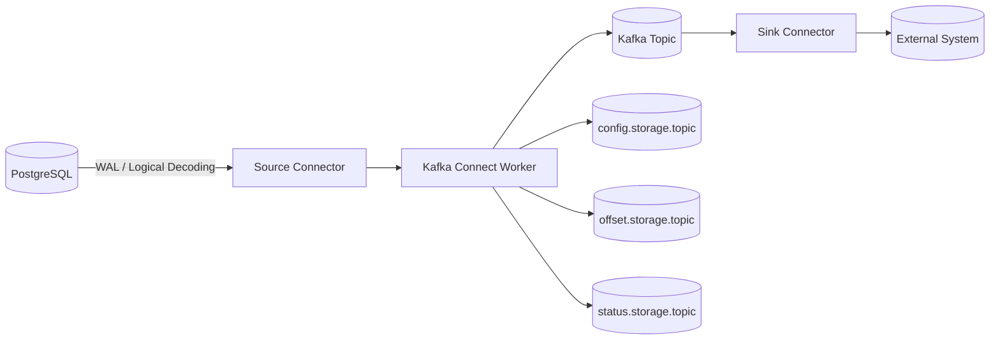

Mental split:

| Komponen | Tanggung jawab |
|---|---|
| **Connector** | Konfigurasi logical integration, misalnya PostgreSQL CDC connector |
| **Task** | Unit kerja executable yang melakukan polling/read/write |
| **Worker** | JVM process yang menjalankan connector/task |
| **Source connector** | Membaca dari sistem eksternal lalu menulis ke Kafka |
| **Sink connector** | Membaca dari Kafka lalu menulis ke sistem eksternal |
| **Converter** | Mengubah data Connect internal menjadi bytes Kafka, misalnya JSON/Avro |
| **SMT** | Single Message Transform; transform ringan per record |
| **Internal topics** | Menyimpan config, offset, dan status Connect cluster |

Kafka Connect user guide menjelaskan `key.converter` dan `value.converter` sebagai kelas yang mengubah format Kafka Connect internal ke bentuk serialized yang ditulis/dibaca dari Kafka; ini independen dari connector sehingga connector bisa bekerja dengan format seperti JSON atau Avro. ([Apache Kafka](https://kafka.apache.org/43/kafka-connect/user-guide/?utm_source=chatgpt.com))

---

## 3. Kafka Connect vs application producer

| Aspek | Kafka Producer di aplikasi | Kafka Connect / Debezium |
|---|---|---|
| Lokasi logic | Di service Java/Jakarta | Di Connect worker |
| Cocok untuk | Domain event eksplisit | Data movement / CDC / integration |
| Source of event | Application code | Database WAL / external system |
| Ownership | Application team | Platform/integration/data team |
| Transaction coupling | Perlu outbox/manual publish | CDC membaca commit DB |
| Deployment | Service deployment | Connect cluster deployment |
| Scaling | Scale service instance | Scale Connect worker/task |
| Error handling | App code | Connector config, retry, status, DLQ |
| Schema | App-defined | Connector/event schema |
| Observability | App metrics | Connect/task/connector metrics |

Rule praktis:

```text id="3y0jxa"
Gunakan producer manual untuk domain event yang diputuskan aplikasi.
Gunakan CDC/Connect untuk menangkap perubahan database atau integrasi sistem eksternal.
Gunakan outbox + CDC untuk menghindari dual-write bug.
```

---

## 4. CDC: Change Data Capture

CDC adalah pola untuk menangkap perubahan data yang sudah commit di database, lalu mengalirkannya ke sistem lain.

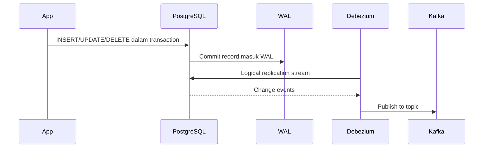

Debezium PostgreSQL connector menangkap row-level changes pada schema PostgreSQL. Saat pertama kali connect, connector mengambil consistent snapshot awal; setelah snapshot selesai, connector terus menangkap row-level insert, update, dan delete yang sudah committed, lalu menghasilkan change event record ke Kafka topic. ([Debezium](https://debezium.io/documentation/reference/stable/connectors/postgresql.html?utm_source=chatgpt.com))

---

## 5. PostgreSQL logical replication mental model

PostgreSQL logical replication mereplikasi objek data dan perubahannya berdasarkan replication identity, biasanya primary key. PostgreSQL docs menjelaskan logical replication sebagai metode replikasi data object dan perubahannya, berbeda dari physical replication yang mereplikasi block-level data. ([PostgreSQL](https://www.postgresql.org/docs/current/logical-replication.html?utm_source=chatgpt.com))

```text id="nrfhxi"
PostgreSQL table changes
→ WAL
→ logical decoding
→ replication slot
→ Debezium connector
→ Kafka topic
```

Komponen penting:

| Komponen | Fungsi |
|---|---|
| `wal_level=logical` | Mengaktifkan logical decoding |
| Publication | Menentukan tabel yang dipublish |
| Replication slot | Menahan WAL sampai consumer/connector membacanya |
| Output plugin | Format decoding, umum: `pgoutput` |
| Replication user | User khusus dengan privilege terbatas |
| Replication identity | Menentukan data key/old row untuk update/delete |

Debezium menggunakan PostgreSQL logical decoding dan replication slot. Replication slot menjamin WAL yang dibutuhkan Debezium tetap disimpan bahkan saat Debezium outage, tetapi slot yang tertinggal harus dimonitor karena dapat menyebabkan konsumsi disk/WAL berlebihan. ([Debezium](https://debezium.io/documentation/reference/stable/postgres-plugins.html?utm_source=chatgpt.com))

---

## 6. Kafka Connect deployment mode

| Mode | Kegunaan | Catatan |
|---|---|---|
| **Standalone** | Dev, local test, small/simple deployment | Config biasanya file lokal |
| **Distributed** | Production, HA, multi-worker | Worker membentuk cluster dan membagi task |
| **Debezium Server** | CDC ke non-Kafka sink seperti Kinesis/Pub/Sub/Pulsar | Alternatif Kafka Connect penuh |
| **Embedded engine** | CDC dalam custom Java app | Lebih fleksibel, tapi lifecycle/ops ditanggung aplikasi |

Kafka Connect mendukung standalone dan distributed mode: dari centrally managed service untuk organisasi besar sampai deployment kecil untuk development/testing. ([Apache Kafka](https://kafka.apache.org/43/kafka-connect/overview/?utm_source=chatgpt.com)) Debezium juga menyediakan Debezium Server dan embedded engine sebagai alternatif penggunaan connector di luar Kafka Connect penuh. ([Debezium](https://debezium.io/documentation/reference/stable/architecture.html?utm_source=chatgpt.com))

---

## 7. Distributed Kafka Connect cluster

Dalam distributed mode, worker dengan `group.id` yang sama membentuk satu Connect cluster. Semua worker dalam cluster harus memakai internal topic yang sama untuk configuration, offset, dan status; cluster yang berbeda tidak boleh share `group.id` atau internal topics. ([Confluent Docs](https://docs.confluent.io/platform/current/connect/userguide.html?utm_source=chatgpt.com))

```properties id="yt7a3h"
bootstrap.servers=kafka-1:9092,kafka-2:9092,kafka-3:9092
group.id=connect-cluster-prod

config.storage.topic=connect-prod-configs
offset.storage.topic=connect-prod-offsets
status.storage.topic=connect-prod-status
```

Internal topic mental model:

| Internal topic | Isi | Cleanup |
|---|---|---|
| `config.storage.topic` | Connector configuration | Compacted |
| `offset.storage.topic` | Source connector offsets | Compacted |
| `status.storage.topic` | Connector/task status | Compacted |

Kafka Connect config docs mencatat `offset.storage.partitions` default 25 untuk topic offset storage. ([Apache Kafka](https://kafka.apache.org/43/configuration/kafka-connect-configs/?utm_source=chatgpt.com))

---

## 8. Connector lifecycle

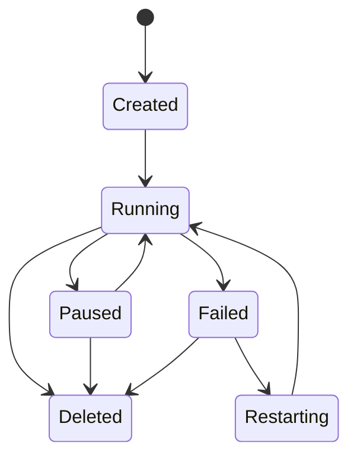

Operasi umum:

| Operasi | Tujuan |
|---|---|
| Create connector | Register config connector |
| Pause connector | Stop sementara tanpa hapus config |
| Resume connector | Lanjut dari offset terakhir |
| Restart connector/task | Recovery dari error |
| Update config | Ubah include list, converter, SMT, dsb |
| Delete connector | Stop dan hapus connector config |
| Inspect status | Lihat task running/failed |

Kafka Connect REST layer menyediakan API administrasi untuk melihat konfigurasi connector, status task, mengubah behavior, dan restart task. ([Apache Kafka](https://kafka.apache.org/43/kafka-connect/administration/?utm_source=chatgpt.com))

---

# Part A - Debezium PostgreSQL CDC

## 9. Debezium PostgreSQL connector

Debezium PostgreSQL connector berjalan sebagai Kafka Connect source connector.

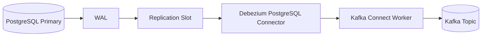

Debezium PostgreSQL connector menangkap perubahan committed dari WAL melalui logical decoding. Dokumentasi Debezium menyebut connector ini bertindak sebagai PostgreSQL client, mengubah event menjadi Debezium create/update/delete events, lalu Kafka Connect menulis change event record ke topic yang sesuai dalam urutan yang dihasilkan. ([Debezium](https://debezium.io/documentation/reference/stable/connectors/postgresql.html?utm_source=chatgpt.com))

---

## 10. Snapshot + streaming

Debezium PostgreSQL punya dua fase besar:

| Fase | Apa yang terjadi | Risiko |
|---|---|---|
| **Initial snapshot** | Connector membaca state awal tabel secara konsisten | Load DB, durasi panjang |
| **Streaming** | Connector membaca perubahan committed dari WAL | Slot lag, WAL retention |

Debezium melakukan initial consistent snapshot karena PostgreSQL server biasanya tidak menyimpan seluruh history database di WAL. Setelah snapshot, connector stream perubahan row-level yang committed. ([Debezium](https://debezium.io/documentation/reference/stable/connectors/postgresql.html?utm_source=chatgpt.com))

Mental model:

```text id="i0dlsg"
Snapshot = baseline state
WAL streaming = incremental committed changes
```

---

## 11. Topic default Debezium

Secara default, Debezium mengirim perubahan tiap tabel ke topic terpisah. Debezium docs menyatakan default behavior connector adalah streaming events ke separate Kafka topic untuk setiap table. ([Debezium](https://debezium.io/documentation/reference/stable/connectors/postgresql.html?utm_source=chatgpt.com))

Contoh pola nama topic umum:

```text id="25pwrq"
<topic.prefix>.<schema>.<table>

case-db.public.case
case-db.public.case_status_history
case-db.public.outbox_event
```

Kelebihan:

| Plus | Minus |
|---|---|
| Mapping source table jelas | Consumer melihat struktur CDC teknis |
| Cocok untuk replication/data lake | Kurang ideal untuk domain event publik |
| Mudah audit asal row | Bisa coupling ke schema DB |

Untuk domain event antar microservice, jangan mengekspos semua tabel internal sebagai contract publik tanpa governance.

---

## 12. Minimal PostgreSQL preparation

Contoh konseptual:

```sql id="hd02vd"
-- postgresql.conf
-- wal_level = logical
-- max_replication_slots = 10
-- max_wal_senders = 10

CREATE ROLE debezium_user WITH LOGIN REPLICATION PASSWORD '***';

GRANT CONNECT ON DATABASE appdb TO debezium_user;
GRANT USAGE ON SCHEMA public TO debezium_user;
GRANT SELECT ON ALL TABLES IN SCHEMA public TO debezium_user;

CREATE PUBLICATION dbz_publication
FOR TABLE public.outbox_event;
```

PostgreSQL docs menjelaskan logical replication menggunakan publisher dan subscriber melalui `CREATE PUBLICATION` dan `CREATE SUBSCRIPTION`; configuration untuk logical replication juga bergantung pada parameter seperti replication slots dan WAL senders. ([PostgreSQL](https://www.postgresql.org/docs/current/runtime-config-replication.html?utm_source=chatgpt.com))

Security rule:

```text id="6frvaz"
Jangan pakai superuser untuk Debezium kalau bisa.
Buat dedicated replication user dengan privilege minimum.
```

Debezium docs juga menyarankan dedicated replication user dengan privilege spesifik daripada memberikan superuser karena superuser membuka risiko akses data berlebihan. ([Debezium](https://debezium.io/documentation/reference/stable/connectors/postgresql.html?utm_source=chatgpt.com))

---

## 13. Minimal Debezium connector config

Contoh baseline untuk outbox table:

```json id="d89j2n"
{
  "name": "case-service-postgres-outbox",
  "config": {
    "connector.class": "io.debezium.connector.postgresql.PostgresConnector",
    "topic.prefix": "case-service",
    "database.hostname": "postgres",
    "database.port": "5432",
    "database.user": "debezium_user",
    "database.password": "${file:/opt/connect/secrets/postgres.properties:password}",
    "database.dbname": "appdb",

    "plugin.name": "pgoutput",
    "slot.name": "case_service_outbox_slot",
    "publication.name": "dbz_publication",

    "schema.include.list": "public",
    "table.include.list": "public.outbox_event",

    "snapshot.mode": "initial",

    "transforms": "outbox",
    "transforms.outbox.type": "io.debezium.transforms.outbox.EventRouter"
  }
}
```

Debezium connector configuration dikirim ke Kafka Connect service, lalu service menyimpan konfigurasi dan menjalankan connector task yang connect ke PostgreSQL, membaca transaction log, dan stream change event records ke Kafka topics. ([Debezium](https://debezium.io/documentation/reference/stable/connectors/postgresql.html?utm_source=chatgpt.com))

---

# Part B - Transactional Outbox Pattern

## 14. Problem: dual-write bug

Masalah klasik:

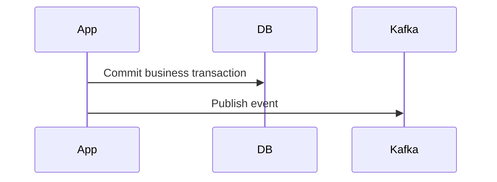

Failure matrix:

| Step | Failure | Akibat |
|---|---|---|
| DB commit sukses, Kafka publish gagal | State berubah, event tidak ada | Downstream tidak tahu |
| Kafka publish sukses, DB commit gagal | Event menyatakan fakta palsu | Downstream salah state |
| Retry publish tanpa eventId | Duplicate | Consumer double process |
| Publish sebelum commit | Consumer melihat data belum committed | Race condition |

Dual-write bug terjadi karena DB transaction dan Kafka publish bukan satu atomic transaction.

---

## 15. Solusi: transactional outbox

Transactional outbox menyimpan event intent di tabel database yang sama dengan business state dalam satu transaksi DB.

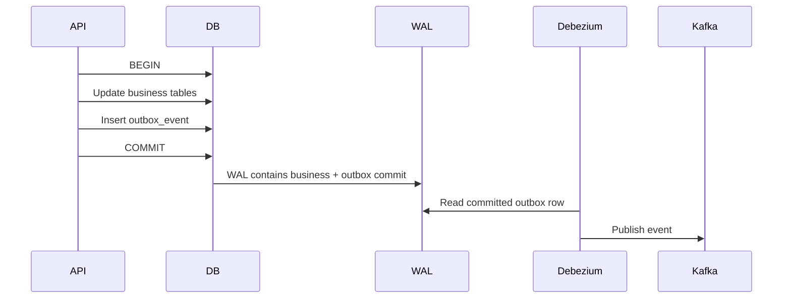

Core invariant:

```text id="rh9mly"
Jika business transaction commit, outbox row commit.
Jika business transaction rollback, outbox row tidak ada.
```

Debezium docs mendeskripsikan outbox pattern sebagai cara aman dan reliable untuk bertukar data antar microservice dengan menghindari inkonsistensi antara internal state service di database dan state dalam event yang dikonsumsi service lain. ([Debezium](https://debezium.io/documentation/reference/stable/transformations/mongodb-outbox-event-router.html?utm_source=chatgpt.com))

---

## 16. Outbox table design

Baseline table:

```sql id="gqq2t0"
CREATE TABLE outbox_event (
    id uuid PRIMARY KEY,
    aggregate_type text NOT NULL,
    aggregate_id text NOT NULL,
    event_type text NOT NULL,
    event_version int NOT NULL,
    payload jsonb NOT NULL,
    metadata jsonb NOT NULL DEFAULT '{}'::jsonb,
    occurred_at timestamptz NOT NULL,
    created_at timestamptz NOT NULL DEFAULT now()
);

CREATE INDEX idx_outbox_event_aggregate
ON outbox_event (aggregate_type, aggregate_id, created_at);
```

Optional fields:

| Field | Fungsi |
|---|---|
| `id` | Event ID / idempotency key |
| `aggregate_type` | Entity root, misalnya `Case` |
| `aggregate_id` | Partition key candidate |
| `event_type` | Domain event type |
| `event_version` | Schema version |
| `payload` | Domain event payload |
| `metadata` | correlation ID, causation ID, actor, tenant |
| `occurred_at` | Waktu bisnis event terjadi |
| `created_at` | Waktu row outbox dibuat |

---

## 17. Insert outbox dalam transaction

```java id="dq0xm7"
@Transactional
public void changeCaseStatus(ChangeStatusCommand command) {
    Case caze = caseRepository.findForUpdate(command.caseId());

    caze.changeStatus(command.newStatus(), command.actorId());

    OutboxEvent event = OutboxEvent.of(
        UUID.randomUUID(),
        "Case",
        caze.id(),
        "CaseStatusChanged",
        3,
        Map.of(
            "caseId", caze.id(),
            "previousStatus", caze.previousStatus(),
            "newStatus", caze.status(),
            "reasonCode", command.reasonCode()
        ),
        Map.of(
            "correlationId", command.correlationId(),
            "tenantId", command.tenantId(),
            "actorId", command.actorId()
        ),
        Instant.now()
    );

    outboxRepository.insert(event);
}
```

Tidak ada `producer.send()` di transaction ini. Service hanya menulis DB state dan outbox event dalam transaction yang sama.

---

## 18. Outbox Event Router SMT

Debezium Outbox Event Router SMT membaca row outbox dan mengubahnya menjadi event Kafka yang lebih cocok sebagai domain event, bukan raw CDC row.

```text id="e8g5b2"
Raw Debezium CDC event for outbox_event table
→ EventRouter SMT
→ Topic by aggregate/event route
→ Kafka message key = aggregate_id
→ Kafka payload = payload column
→ Headers = event id/type/metadata
```

Debezium Outbox Event Router mendukung arbitrary payload formats; untuk PostgreSQL, payload JSON umum disimpan sebagai `jsonb`, dan SMT bisa melewatkan nilai payload tanpa modifikasi atau memperluas JSON sesuai konfigurasi. ([Debezium](https://debezium.io/documentation/reference/stable/transformations/outbox-event-router.html?utm_source=chatgpt.com))

Contoh config konseptual:

```json id="kiomga"
{
  "transforms": "outbox",
  "transforms.outbox.type": "io.debezium.transforms.outbox.EventRouter",
  "transforms.outbox.route.by.field": "aggregate_type",
  "transforms.outbox.table.field.event.id": "id",
  "transforms.outbox.table.field.event.key": "aggregate_id",
  "transforms.outbox.table.field.event.payload": "payload",
  "transforms.outbox.table.field.event.type": "event_type"
}
```

Catatan: nama property bisa berbeda tergantung versi Debezium dan layout tabel. Validasi terhadap dokumentasi Debezium versi yang dipakai di environment.

---

## 19. Selective SMT

Jangan aplikasikan Outbox Event Router ke semua event Debezium jika connector juga menangkap tabel lain. Debezium docs menyarankan menerapkan SMT secara selektif karena connector juga bisa memancarkan heartbeat, metadata schema change, transaction metadata, dan event selain data change target. ([Debezium](https://debezium.io/documentation/reference/stable/transformations/outbox-event-router.html?utm_source=chatgpt.com))

Pattern:

```text id="7fa989"
Capture only outbox table
atau
Use SMT predicate / route.topic.regex
```

Jika satu connector hanya untuk outbox table, desainnya lebih mudah dioperasikan.

---

# Part C - Raw CDC vs Outbox

## 20. Raw CDC

Raw CDC berarti publish semua perubahan tabel.

```text id="ch1ctc"
public.case
public.case_assignment
public.case_status_history
→ Kafka topics per table
```

Cocok untuk:

| Use case | Kenapa |
|---|---|
| Data replication | Butuh mirror table |
| Data lake / analytics | Struktur tabel masih berguna |
| Search indexing | Bisa rebuild index |
| Audit teknis | Perubahan row-level |
| Legacy integration | Tidak bisa ubah app untuk tulis outbox |

Risiko:

| Risiko | Penjelasan |
|---|---|
| DB schema bocor sebagai public contract | Consumer coupling ke tabel internal |
| Banyak noise | Semua update teknis ikut publish |
| Semantik bisnis tidak jelas | Row update ≠ domain event |
| Migration sulit | Rename column/table memecah consumer |
| PII exposure | Semua column bisa terbawa |

---

## 21. Outbox CDC

Outbox CDC berarti hanya outbox event yang dipublish.

```text id="h0sm1e"
business transaction writes:
- case table
- case_status_history table
- outbox_event table

Debezium captures:
- outbox_event only
```

Cocok untuk:

| Use case | Kenapa |
|---|---|
| Microservice domain events | Contract stabil |
| Regulatory lifecycle event | Semantik jelas |
| Integration event | Payload curated |
| Avoid dual-write | Atomic dengan DB transaction |
| Event schema governance | Versioned payload |

Risiko:

| Risiko | Mitigasi |
|---|---|
| Developer lupa tulis outbox | Domain service pattern / transaction hook |
| Outbox table tumbuh | Retention/cleanup policy |
| Event payload salah | Test contract |
| Connector stuck | Monitor slot lag/WAL |
| Replay butuh hati-hati | Idempotent consumer |

---

## 22. Decision matrix

| Kebutuhan | Pilihan |
|---|---|
| Mirror database ke data lake | Raw CDC |
| Publish domain event antar service | Outbox CDC |
| Search index dari table state | Raw CDC atau compacted projection |
| Audit bisnis/regulatory | Domain event/outbox, bukan raw CDC saja |
| Legacy DB tanpa app changes | Raw CDC |
| Avoid dual-write bug | Outbox CDC |
| High semantic stability | Outbox CDC |
| Minimal app code change | Raw CDC |
| Minimal consumer coupling | Outbox CDC |

Rule:

```text id="7w1dsq"
Raw CDC adalah integrasi data.
Outbox CDC adalah integrasi domain event.
```

---

# Part D - Kafka Connect configs

## 23. Worker config penting

```properties id="zz71zz"
bootstrap.servers=kafka-1:9092,kafka-2:9092,kafka-3:9092
group.id=connect-cluster-prod

key.converter=org.apache.kafka.connect.json.JsonConverter
value.converter=org.apache.kafka.connect.json.JsonConverter
key.converter.schemas.enable=false
value.converter.schemas.enable=false

config.storage.topic=connect-prod-configs
offset.storage.topic=connect-prod-offsets
status.storage.topic=connect-prod-status

offset.flush.interval.ms=10000
plugin.path=/opt/kafka/plugins
rest.port=8083
```

| Config | Fungsi |
|---|---|
| `bootstrap.servers` | Kafka bootstrap broker |
| `group.id` | Identitas Connect cluster distributed |
| `key.converter` | Converter Kafka record key |
| `value.converter` | Converter Kafka record value |
| `config.storage.topic` | Internal topic config |
| `offset.storage.topic` | Internal topic source offsets |
| `status.storage.topic` | Internal topic connector/task status |
| `offset.flush.interval.ms` | Interval flush offset source connector |
| `plugin.path` | Lokasi connector plugin |
| `rest.port` | Port REST API Connect |

Kafka Connect user guide mendefinisikan `bootstrap.servers`, `key.converter`, dan `value.converter` sebagai config dasar worker untuk koneksi Kafka dan serialization format. ([Apache Kafka](https://kafka.apache.org/43/kafka-connect/user-guide/?utm_source=chatgpt.com))

---

## 24. Converter choice

| Converter | Cocok untuk | Catatan |
|---|---|---|
| JSON without schema | Dev/simple integration | Mudah dibaca, governance lemah |
| JSON with schema | Integrasi menengah | Payload lebih verbose |
| Avro | Enterprise event contract | Butuh schema registry |
| Protobuf | Strong contract + compact | Perlu disiplin field numbering |
| String/ByteArray | Specialized | Hindari untuk domain event tanpa governance |

Untuk outbox payload JSON, pastikan apakah payload akan keluar sebagai object JSON atau escaped string. Debezium Outbox Event Router punya opsi untuk JSON payload dan ekspansi JSON tergantung konfigurasi. ([Debezium](https://debezium.io/documentation/reference/stable/transformations/outbox-event-router.html?utm_source=chatgpt.com))

---

## 25. Error handling Kafka Connect

Kafka Connect punya error handling di level connector/worker, tapi jangan menganggap semua connector punya behavior identik.

Decision:

| Error | Umumnya |
|---|---|
| Temporary Kafka unavailable | Connector/task retry atau fail sesuai config |
| PostgreSQL unavailable | Connector berhenti/gagal sampai source kembali |
| Bad record transform | Bisa fail task atau route ke DLQ jika dikonfigurasi |
| Converter error | Biasanya task fail jika tidak ditangani |
| Permission error DB | Startup/config failure |
| Replication slot invalid | Connector perlu intervention |

Debezium docs memuat bagian behavior saat terjadi error seperti configuration/startup errors, PostgreSQL unavailable, cluster failures, Kafka Connect process stop/crash, Kafka unavailable, dan connector stopped for duration. ([Debezium](https://debezium.io/documentation/reference/stable/connectors/postgresql.html?utm_source=chatgpt.com))

---

# Part E - Ordering, offset, dan transaction semantics

## 26. Ordering CDC

CDC order berasal dari commit/WAL order. Namun, desain topic dan partition tetap penting.

| Concern | Penjelasan |
|---|---|
| DB commit order | Debezium membaca committed changes |
| Per-table topic | Ordering per topic/partition |
| Partition key | Menentukan ordering Kafka downstream |
| Outbox aggregate_id key | Menjaga ordering per aggregate |
| Multiple connectors | Bisa memecah ordering global |
| Multiple databases | Tidak ada global order lintas DB |

Untuk lifecycle event, gunakan `aggregate_id` sebagai Kafka key agar semua event satu aggregate masuk partition yang sama.

---

## 27. Offset Connect vs consumer offset

Kafka Connect source connector menyimpan offset source-nya sendiri di internal offset topic. Ini berbeda dari consumer group offset biasa.

```text id="cdmc2s"
Debezium source offset:
- LSN / WAL position
- snapshot position
- connector state

Consumer offset:
- Kafka topic partition offset
```

Jangan campur mental model:

| Offset | Disimpan di | Makna |
|---|---|---|
| Debezium source offset | Connect `offset.storage.topic` | Posisi baca PostgreSQL/WAL |
| Kafka consumer offset | `__consumer_offsets` | Posisi baca consumer group dari Kafka topic |
| Outbox event ID | DB/Kafka payload | Business idempotency |

---

## 28. Transactional guarantee outbox

Outbox menjamin:

```text id="9hu6gm"
Business state + event intent atomic di PostgreSQL.
```

Outbox tidak otomatis menjamin:

```text id="xcrqps"
Kafka publish exactly once secara end-to-end ke semua consumer.
Consumer side effect exactly once.
External API idempotency.
```

Karena itu downstream consumer tetap harus idempotent.

---

# Part F - PostgreSQL operational risks

## 29. Replication slot lag dan WAL growth

Ini risiko production paling penting pada Debezium PostgreSQL.

```text id="rxf2zw"
Connector mati / tertinggal
→ replication slot tidak maju
→ PostgreSQL menahan WAL
→ disk penuh
→ database incident
```

Debezium docs menekankan bahwa replication slot menahan WAL yang dibutuhkan Debezium saat outage, sehingga replication slots harus dimonitor untuk menghindari disk consumption berlebihan dan catalog bloat jika slot tidak digunakan terlalu lama. ([Debezium](https://debezium.io/documentation/reference/stable/postgres-plugins.html?utm_source=chatgpt.com))

Metrics/checks:

| Check | Tujuan |
|---|---|
| Replication slot active/inactive | Slot masih dipakai? |
| WAL retained bytes | Apakah WAL menumpuk? |
| Connector lag | Connector tertinggal berapa jauh |
| Outbox table growth | Apakah cleanup jalan |
| Kafka Connect task status | Failed/running |
| PostgreSQL disk free | Guardrail utama |
| Publication exists | Connector masih punya source |
| Privilege valid | Setelah migration/restore |

---

## 30. PostgreSQL primary-only constraint

Logical decoding replication slots untuk Debezium PostgreSQL berjalan di primary. Debezium docs menjelaskan connector hanya bisa berjalan pada active primary, bukan hot/warm standby; jika primary fail/demoted, connector stop, dan jika server lain dipromosikan menjadi primary maka connector configuration perlu disesuaikan sebelum restart. ([Debezium](https://debezium.io/documentation/reference/1.9/connectors/postgresql.html?utm_source=chatgpt.com))

Implication:

| Scenario | Dampak |
|---|---|
| Primary failover | Connector perlu reconnect/reconfig |
| DNS endpoint menunjuk primary baru | Lebih mudah recovery |
| Slot tidak tersedia di primary baru | Perlu recreate/recover offset dengan hati-hati |
| Publication hilang setelah restore/upgrade | Connector gagal |

---

## 31. Outbox table cleanup

Outbox row yang sudah dipublish tetap ada di DB kecuali dibersihkan.

Strategi cleanup:

| Strategi | Cara |
|---|---|
| Time-based delete | Delete row older than N days |
| Partitioned outbox table | Drop old partition |
| Archive then delete | Untuk audit |
| Tombstone/soft delete | Jarang perlu |
| Connector-only retention | Tidak cukup; DB tetap tumbuh |

Contoh:

```sql id="lkg3pi"
DELETE FROM outbox_event
WHERE created_at < now() - interval '7 days';
```

Untuk traffic tinggi, gunakan partitioning by `created_at` agar cleanup tidak membuat table bloat besar.

---

# Part G - Kubernetes / Docker deployment

## 32. Kafka Connect di container

Minimal concerns:

| Concern | Catatan |
|---|---|
| Plugin path | Connector JAR harus tersedia di image/volume |
| Secrets | Jangan hardcode DB password di config |
| REST API | Batasi akses; jangan public |
| Persistent config | Config ada di internal topic, bukan filesystem |
| Rolling restart | Distributed mode rebalance tasks |
| Resource limit | Snapshot bisa butuh memory/CPU |
| Liveness/readiness | Jangan restart task terlalu agresif |
| Network | Connect harus akses Kafka dan PostgreSQL |

Deployment model:

```text id="6ujkqq"
Deployment: kafka-connect
Replicas: 2-3 workers
Image: Kafka Connect + Debezium plugin
ConfigMap: worker config
Secret: DB credentials, truststore
Service: REST API internal only
```

---

## 33. Connector config as code

Jangan manage connector manual via curl di production tanpa source control.

Pattern:

```text id="ba9wqx"
connector-config.json
→ reviewed in GitHub PR
→ applied by CI/CD or GitOps job
→ verified via Connect REST status
```

Benefit:

| Benefit | Penjelasan |
|---|---|
| Audit | Siapa ubah connector config |
| Rollback | Bisa revert config |
| Drift detection | Config live vs repo |
| Review | Table include, topic route, secrets, transforms |
| Compliance | Perubahan data pipeline terdokumentasi |

---

# Part H - Observability

## 34. Kafka Connect metrics

| Metric | Kenapa penting |
|---|---|
| Connector/task status | Running/failed |
| Source record poll rate | Connector membaca source? |
| Source record write rate | Connector menulis ke Kafka? |
| Source record active count | Backlog internal |
| Offset commit success/failure | Offset source aman? |
| Task restart count | Stability |
| Error count | Data/config issue |
| DLQ count | Bad record |
| Batch size / processing time | Throughput |
| Worker rebalance time | Connect cluster stability |

---

## 35. Debezium PostgreSQL metrics

| Metric | Kenapa penting |
|---|---|
| Snapshot running/completed | Initial load state |
| MilliSecondsBehindSource | CDC lag |
| Last event timestamp | Freshness |
| Number of committed transactions | Activity |
| Replication slot lag | WAL growth risk |
| Queue remaining capacity | Backpressure |
| Error count | Connector health |
| Schema change events | Migration impact |

---

## 36. Alerts minimum

```text id="klbcft"
[critical] replication slot retained WAL > threshold
[critical] PostgreSQL disk free < threshold
[critical] connector task FAILED
[warning] CDC lag > SLA
[warning] outbox table rows/age > threshold
[warning] DLQ count > 0 for critical connector
[warning] Connect worker rebalance frequent
[warning] source record write rate = 0 while DB has writes
```

---

# Part I - Failure modes

## 37. Failure modeling table

| Failure | Gejala | Risiko | Mitigasi |
|---|---|---|---|
| Connect worker crash | Task pindah/restart | Delay CDC | Distributed mode, monitor status |
| Connector config error | Task failed startup | No events | Config validation + GitOps |
| PostgreSQL primary failover | Connector stop | CDC gap until recovery | Stable primary endpoint, runbook |
| Replication slot lag | WAL grows | Disk full DB | Monitor slot/WAL, alert, fix connector |
| Kafka unavailable | Connector cannot write | Offset may not advance | Kafka HA, monitor task errors |
| Outbox table grows | DB bloat | Performance degradation | Partition/cleanup |
| Bad SMT config | Wrong topic/key/payload | Consumer break | Staging replay + contract test |
| Schema migration breaks CDC | Connector error | Pipeline stopped | Migration checklist |
| Publication missing | Connector cannot capture | No CDC | Migration/restore validation |
| Duplicate event after restart | Consumer sees duplicate | Double side effect | Consumer idempotency |
| Raw CDC exposes PII | Security incident | Compliance breach | Column filtering/masking/ACL |

---

## 38. Schema migration checklist

Sebelum migration tabel yang dicapture:

```text id="u3p9bg"
[ ] Apakah tabel masuk publication/table.include.list?
[ ] Apakah column rename akan memecah consumer?
[ ] Apakah primary key berubah?
[ ] Apakah replication identity cukup untuk update/delete?
[ ] Apakah outbox payload schema version naik?
[ ] Apakah SMT route/key masih valid?
[ ] Apakah downstream consumer tolerant terhadap field baru?
[ ] Apakah snapshot ulang diperlukan?
[ ] Apakah connector harus pause/resume?
[ ] Apakah migration diuji di staging dengan Debezium aktif?
```

---

# Part J - Security

## 39. Security checklist

| Area | Checklist |
|---|---|
| PostgreSQL user | Dedicated replication user, least privilege |
| Secrets | DB password via Secret/secret manager |
| Kafka auth | SASL/TLS/mTLS sesuai cluster |
| Topic ACL | Connector write hanya ke topic target |
| Connect REST API | Internal only + auth/proxy |
| Plugin supply chain | JAR connector diverifikasi/version pinned |
| Payload filtering | Jangan publish column sensitif tanpa perlu |
| Audit | Connector config changes logged |
| Network | Connect hanya bisa akses Kafka/DB yang perlu |
| DLQ | ACL sama/lebih ketat dari source topic |

---

## 40. Data classification

Untuk regulatory/case platform:

| Data | Perlakuan |
|---|---|
| Case ID | Internal/confidential |
| Actor/user ID | Confidential |
| PII subject | Mask/filter/encrypt sesuai policy |
| Enforcement reason | Confidential/regulatory |
| Audit payload | Retention dan access ketat |
| Error payload in DLQ | Jangan longgar; bisa berisi full event |
| Raw CDC table | Sangat hati-hati karena bisa expose semua column |

---

# Part K - Example end-to-end design

## 41. Use case

Service `case-service` memakai PostgreSQL. Saat status case berubah, downstream `audit-service`, `notification-service`, dan `case-projection-service` harus menerima event tanpa dual-write bug.

## 42. Recommended design

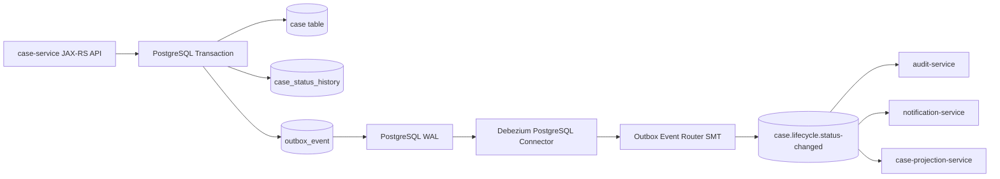

## 43. Topic contract

| Item | Decision |
|---|---|
| Topic | `case.lifecycle.status-changed` |
| Key | `tenantId:caseId` |
| Payload | Domain event JSON |
| Event ID | Outbox `id` |
| Version | `event_version` |
| Producer | Debezium connector on behalf of `case-service` |
| Source | `public.outbox_event` |
| Retention | sesuai audit/replay |
| DLT | consumer-specific DLT |
| ACL | Connect writes, consumers read |

## 44. Outbox row example

```json id="nwrowl"
{
  "id": "2d39a98e-471e-4f2f-931c-0d2f3c87d9e6",
  "aggregate_type": "Case",
  "aggregate_id": "tenant-a:CASE-1001",
  "event_type": "CaseStatusChanged",
  "event_version": 3,
  "payload": {
    "caseId": "CASE-1001",
    "previousStatus": "UNDER_REVIEW",
    "newStatus": "ESCALATED",
    "reasonCode": "SLA_BREACH"
  },
  "metadata": {
    "tenantId": "tenant-a",
    "correlationId": "corr-123",
    "actorId": "user-789"
  },
  "occurred_at": "2026-07-13T08:15:30Z"
}
```

---

# Part L - Anti-patterns

| Anti-pattern | Kenapa buruk | Alternatif |
|---|---|---|
| Publish Kafka langsung setelah DB commit | Dual-write bug | Transactional outbox |
| Capture semua table sebagai public event | Consumer coupling ke DB schema | Outbox/domain event |
| Debezium pakai superuser | Security exposure | Dedicated replication user |
| Replication slot tidak dimonitor | WAL bisa memenuhi disk | Slot/WAL alert |
| Connect REST API public | Config/data pipeline risk | Internal only + auth |
| Connector config manual tanpa Git | Drift dan audit lemah | Config as code |
| Outbox tidak dibersihkan | DB bloat | Partition + cleanup |
| DLT/DLQ tanpa owner | Silent data loss | Owner + alert + replay |
| SMT terlalu kompleks | Debugging sulit | Simple routing; logic di app/consumer |
| Raw CDC untuk audit bisnis | Semantik lemah | Explicit domain/audit event |
| Tidak idempotent downstream | Duplicate merusak state | Event ID + dedup |
| Menganggap CDC = exactly once end-to-end | False safety | Idempotent consumer |

---

# 45. Design review checklist

```text id="r4l74d"
[ ] Apakah use case butuh raw CDC atau domain outbox event?
[ ] Apakah outbox insert satu transaksi dengan business state?
[ ] Apakah outbox table punya event_id, aggregate_id, event_type, version, payload?
[ ] Apakah aggregate_id cocok sebagai Kafka key?
[ ] Apakah Debezium hanya capture tabel yang diperlukan?
[ ] Apakah replication slot, publication, dan plugin jelas?
[ ] Apakah PostgreSQL user least privilege?
[ ] Apakah Connect internal topics unik per cluster?
[ ] Apakah connector config disimpan di Git?
[ ] Apakah converter/format sesuai schema governance?
[ ] Apakah SMT route/topic/key diuji?
[ ] Apakah replication slot lag dan WAL growth dimonitor?
[ ] Apakah outbox cleanup ada?
[ ] Apakah downstream consumer idempotent?
[ ] Apakah failover PostgreSQL punya runbook?
[ ] Apakah data sensitif difilter/dimasking/dibatasi ACL?
```

---

# 46. Ringkasan cepat

| Area | Rule of thumb |
|---|---|
| Kafka Connect | Runtime integrasi, bukan business service |
| Source connector | External system → Kafka |
| Sink connector | Kafka → external system |
| Debezium PostgreSQL | CDC dari committed row changes via logical decoding |
| Replication slot | Menjamin WAL tidak hilang, tapi bisa membuat WAL menumpuk |
| Raw CDC | Bagus untuk replication/data pipeline, raw sebagai table changes |
| Outbox CDC | Bagus untuk domain event antar microservice |
| Outbox transaction | Business state + event intent atomic di DB |
| Outbox SMT | Mengubah raw outbox CDC menjadi domain event Kafka |
| Internal topics | Config, offset, status Connect cluster |
| Production risk terbesar | Slot lag/WAL growth, connector failed, schema drift |
| Downstream safety | Tetap perlu idempotent consumer |

---

## Roadmap belajar singkat

1. Pahami Kafka Connect worker, connector, task, converter, SMT.  
2. Pahami PostgreSQL logical replication, WAL, publication, replication slot.  
3. Bedakan raw CDC vs domain outbox event.  
4. Implementasikan outbox table dan event envelope.  
5. Konfigurasi Debezium PostgreSQL connector + Outbox Event Router SMT.  
6. Tambahkan monitoring replication slot lag, WAL growth, task status, outbox cleanup.  
7. Uji failover, connector restart, duplicate event, schema migration, dan replay.

**Rekomendasi materi selanjutnya:** **Kafka Connect Operations, Monitoring, Deployment on Docker/Kubernetes & Troubleshooting Cheatsheet**, karena setelah memahami CDC/outbox, skill berikutnya adalah menjalankan Connect cluster secara aman: plugin packaging, REST API, task failure, connector restart, internal topics, secrets, WAL lag, dan runbook incident.

---

**Sources:**

- [Overview | Apache Kafka](https://kafka.apache.org/43/kafka-connect/overview/?utm_source=chatgpt.com)
- [Debezium connector for PostgreSQL](https://debezium.io/documentation/reference/stable/connectors/postgresql.html?utm_source=chatgpt.com)
- [Documentation: 18: Chapter 29. Logical Replication](https://www.postgresql.org/docs/current/logical-replication.html?utm_source=chatgpt.com)
- [How to Use Kafka Connect for Confluent Platform](https://docs.confluent.io/platform/current/connect/userguide.html?utm_source=chatgpt.com)

## Response:
7/13/2026, 12:52:20 AM

# Cheatsheet - Kafka Connect Operations, Monitoring, Deployment on Docker/Kubernetes & Troubleshooting

## 1. Scope

Cheatsheet ini fokus pada cara menjalankan **Kafka Connect** secara production-grade:

```text
Kafka Connect worker
→ connector plugin
→ connector config
→ task lifecycle
→ internal topics
→ REST API
→ monitoring
→ Kubernetes deployment
→ secrets
→ troubleshooting
→ incident runbook
```

Kafka Connect adalah tool untuk streaming data secara scalable dan reliable antara Kafka dan sistem eksternal; Kafka Connect dapat dipakai untuk ingest database, collect metrics, dan memindahkan dataset besar ke/dari Kafka. ([kafka.apache.org](https://kafka.apache.org/43/kafka-connect/overview/?utm_source=chatgpt.com))

---

## 2. Mental model operasional

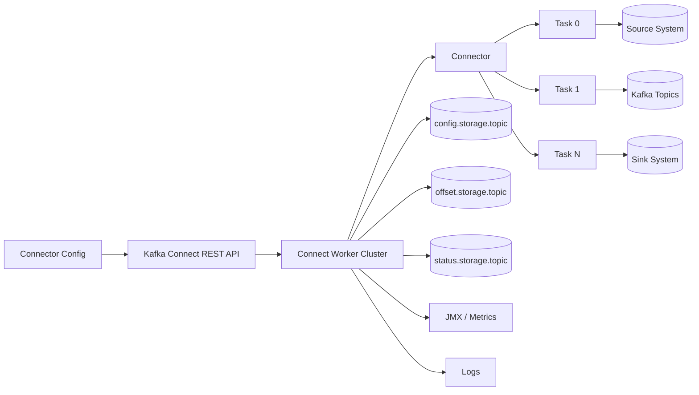

Kafka Connect bukan “library helper” di aplikasi. Ia adalah **runtime integrasi** yang punya worker, plugin, connector, task, REST API, internal topic, dan lifecycle sendiri.

---

## 3. Vocabulary operasional

| Konsep | Arti | Catatan production |
|---|---|---|
| **Worker** | JVM process yang menjalankan connector/task | Scale worker untuk HA dan kapasitas |
| **Connector** | Konfigurasi logical pipeline | Misalnya PostgreSQL source connector |
| **Task** | Unit kerja aktual yang dijalankan worker | Connector dapat punya 1 atau banyak task |
| **Plugin** | JAR connector + dependency | Harus tersedia di `plugin.path` |
| **Converter** | Serialization format key/value | JSON, Avro, Protobuf, ByteArray |
| **SMT** | Single Message Transform | Transform ringan; jangan taruh business logic kompleks |
| **Internal topics** | Topic Kafka untuk config, offset, status | Critical state Kafka Connect |
| **REST API** | Interface operasi connector | Create, update, pause, resume, restart, status |
| **DLQ / DLQ topic** | Topic untuk bad records | Perlu owner, alert, retention |
| **Source offset** | Posisi baca source system | Berbeda dari consumer offset biasa |

---

# Part A - Deployment Model

## 4. Standalone vs distributed mode

| Mode | Cocok untuk | Jangan pakai untuk |
|---|---|---|
| **Standalone** | Local dev, demo, quick test, simple file-based connector | Production HA |
| **Distributed** | Production, HA, multi-worker, managed connector lifecycle | Setup sekali jalan tanpa governance |

Dalam distributed mode, Kafka Connect menyimpan **offsets, configs, dan task statuses** di Kafka topics. Worker dengan cluster yang sama memakai `group.id` dan internal topics yang sama. ([Apache Kafka](https://kafka.apache.org/43/kafka-connect/user-guide/?utm_source=chatgpt.com))

Rule:

```text
Production Kafka Connect = distributed mode.
Standalone mode = local/dev/testing.
```

---

## 5. Distributed worker baseline config

```properties
bootstrap.servers=kafka-1:9092,kafka-2:9092,kafka-3:9092
group.id=connect-prod

config.storage.topic=connect-prod-configs
offset.storage.topic=connect-prod-offsets
status.storage.topic=connect-prod-status

key.converter=org.apache.kafka.connect.json.JsonConverter
value.converter=org.apache.kafka.connect.json.JsonConverter
key.converter.schemas.enable=false
value.converter.schemas.enable=false

plugin.path=/opt/kafka/plugins
rest.port=8083

offset.flush.interval.ms=10000
```

| Config | Fungsi | Risiko jika salah |
|---|---|---|
| `bootstrap.servers` | Kafka endpoint | Worker tidak bisa join/connect |
| `group.id` | Identitas Connect cluster | Collision antar cluster |
| `config.storage.topic` | Connector config | Connector config hilang/tercampur |
| `offset.storage.topic` | Source offsets | Source connector replay/skip risk |
| `status.storage.topic` | Connector/task status | Monitoring/status kacau |
| `key.converter` | Format key Kafka | Consumer tidak bisa decode |
| `value.converter` | Format value Kafka | Schema/payload rusak |
| `plugin.path` | Lokasi plugin JAR | Connector class tidak ditemukan |
| `offset.flush.interval.ms` | Interval flush offset source | Trade-off duplicate vs overhead |

Kafka Connect config docs mendefinisikan `config.storage.topic`, `offset.storage.topic`, dan `status.storage.topic` sebagai storage config/offset/status connector; converter mengubah format Kafka Connect internal ke format serialized yang ditulis/dibaca Kafka. ([Apache Kafka](https://kafka.apache.org/39/configuration/kafka-connect-configs/?utm_source=chatgpt.com))

---

## 6. Internal topics: jangan disepelekan

Internal topics adalah state Kafka Connect. Jika salah konfigurasi, connector bisa restart kacau, offset hilang, atau cluster Connect berbeda saling mengganggu.

| Internal topic | Isi | Cleanup policy |
|---|---|---|
| `config.storage.topic` | Connector dan task config | `compact` |
| `offset.storage.topic` | Source connector offsets | `compact` |
| `status.storage.topic` | Connector/task status | `compact` |

Best practice:

```text
Buat internal topics secara eksplisit.
Gunakan replication factor >= 3 untuk production.
Gunakan cleanup.policy=compact.
Jangan share internal topics antar Connect cluster berbeda.
```

Confluent docs juga menekankan bahwa internal topics harus sama untuk worker dalam `group.id` yang sama, dan jika dibuat manual sebaiknya compacted serta highly replicated. ([Confluent Docs](https://docs.confluent.io/platform/current/connect/references/allconfigs.html?utm_source=chatgpt.com))

---

## 7. Internal topic creation example

```bash
kafka-topics.sh \
  --bootstrap-server kafka-1:9092 \
  --create \
  --topic connect-prod-configs \
  --partitions 1 \
  --replication-factor 3 \
  --config cleanup.policy=compact

kafka-topics.sh \
  --bootstrap-server kafka-1:9092 \
  --create \
  --topic connect-prod-offsets \
  --partitions 25 \
  --replication-factor 3 \
  --config cleanup.policy=compact

kafka-topics.sh \
  --bootstrap-server kafka-1:9092 \
  --create \
  --topic connect-prod-status \
  --partitions 5 \
  --replication-factor 3 \
  --config cleanup.policy=compact
```

`offset.storage.topic` biasanya butuh partition lebih banyak daripada config topic karena source offset update bisa lebih aktif. Kafka Connect docs mencatat offset storage partition default historisnya tinggi, misalnya 25 partition. ([Apache Kafka](https://kafka.apache.org/43/kafka-connect/user-guide/?utm_source=chatgpt.com))

---

# Part B - Docker Deployment

## 8. Docker mental model

```text
Base image Kafka Connect
+ connector plugin JARs
+ worker config
+ secrets
+ network access Kafka/source/sink
= running Connect worker
```

Struktur image yang umum:

```text
/opt/kafka/
  config/
    connect-distributed.properties
  plugins/
    debezium-postgres/
      debezium-connector-postgres.jar
      dependency-1.jar
      dependency-2.jar
```

---

## 9. Dockerfile example

```dockerfile
FROM apache/kafka:4.3.1

USER root

RUN mkdir -p /opt/kafka/plugins/debezium-postgres

COPY plugins/debezium-postgres/ /opt/kafka/plugins/debezium-postgres/
COPY connect-distributed.properties /opt/kafka/config/connect-distributed.properties

USER appuser

CMD ["connect-distributed.sh", "/opt/kafka/config/connect-distributed.properties"]
```

Production notes:

| Concern | Rekomendasi |
|---|---|
| Plugin version | Pin versi connector |
| Dependency conflict | Isolasi per folder plugin |
| Secrets | Jangan bake ke image |
| Logs | STDOUT/structured logging |
| JVM memory | Set via container env |
| Healthcheck | REST API + task status, bukan hanya port open |

---

## 10. Docker Compose local example

```yaml
services:
  kafka-connect:
    image: internal/kafka-connect-debezium:4.3.1
    ports:
      - "8083:8083"
    environment:
      CONNECT_BOOTSTRAP_SERVERS: kafka:9092
      CONNECT_GROUP_ID: connect-local
      CONNECT_CONFIG_STORAGE_TOPIC: connect-local-configs
      CONNECT_OFFSET_STORAGE_TOPIC: connect-local-offsets
      CONNECT_STATUS_STORAGE_TOPIC: connect-local-status
      CONNECT_KEY_CONVERTER: org.apache.kafka.connect.json.JsonConverter
      CONNECT_VALUE_CONVERTER: org.apache.kafka.connect.json.JsonConverter
      CONNECT_KEY_CONVERTER_SCHEMAS_ENABLE: "false"
      CONNECT_VALUE_CONVERTER_SCHEMAS_ENABLE: "false"
      CONNECT_PLUGIN_PATH: /opt/kafka/plugins
    depends_on:
      - kafka
      - postgres
```

Gunakan Compose untuk local onboarding, bukan sebagai template mentah production.

---

# Part C - Kubernetes Deployment

## 11. Kubernetes mental model

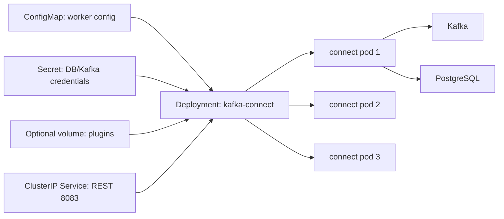

Di Kubernetes, Kafka Connect biasanya dijalankan sebagai **Deployment** dengan beberapa replicas. Config connector sebaiknya dikelola sebagai config-as-code melalui CI/CD atau operator, bukan manual permanen via `curl`.

---

## 12. Kubernetes deployment baseline

```yaml
apiVersion: apps/v1
kind: Deployment
metadata:
  name: kafka-connect
spec:
  replicas: 3
  selector:
    matchLabels:
      app: kafka-connect
  template:
    metadata:
      labels:
        app: kafka-connect
    spec:
      containers:
        - name: kafka-connect
          image: internal/kafka-connect-debezium:4.3.1
          ports:
            - containerPort: 8083
          envFrom:
            - configMapRef:
                name: kafka-connect-config
            - secretRef:
                name: kafka-connect-secrets
          readinessProbe:
            httpGet:
              path: /
              port: 8083
            initialDelaySeconds: 20
            periodSeconds: 10
          livenessProbe:
            httpGet:
              path: /
              port: 8083
            initialDelaySeconds: 60
            periodSeconds: 30
          resources:
            requests:
              cpu: "500m"
              memory: "1Gi"
            limits:
              cpu: "2"
              memory: "4Gi"
```

Readiness/liveness hanya memeriksa worker REST API. Untuk production, tambahkan monitoring status connector/task karena worker bisa sehat sementara task connector gagal.

---

## 13. Service internal untuk REST API

```yaml
apiVersion: v1
kind: Service
metadata:
  name: kafka-connect
spec:
  type: ClusterIP
  selector:
    app: kafka-connect
  ports:
    - name: rest
      port: 8083
      targetPort: 8083
```

REST API Kafka Connect harus dianggap control plane. Jangan expose public internet. REST API dipakai untuk status, create/remove connector, pause/resume, dan restart tanpa menghentikan process. ([Confluent Docs](https://docs.confluent.io/platform/current/connect/references/restapi.html?utm_source=chatgpt.com))

---

## 14. Operator option: Strimzi

Jika organisasi memakai Kubernetes-native Kafka, Strimzi adalah opsi populer untuk menjalankan Kafka dan Kafka Connect di Kubernetes/OpenShift. Strimzi mendeskripsikan dirinya sebagai cara menjalankan Apache Kafka cluster di Kubernetes/OpenShift dengan berbagai konfigurasi deployment. ([GitHub](https://github.com/strimzi/strimzi-kafka-operator?utm_source=chatgpt.com))

| Pendekatan | Kelebihan | Trade-off |
|---|---|---|
| Raw Deployment | Simple, universal | Banyak lifecycle manual |
| Helm chart internal | Standardisasi | Masih perlu governance |
| Strimzi KafkaConnect CR | Kubernetes-native, declarative | Perlu belajar CRD/operator |
| Managed Kafka Connect | Operasional lebih ringan | Vendor lock-in / biaya / batas fitur |

---

# Part D - Connector Config as Code

## 15. Jangan manual permanen via curl

Manual REST API boleh untuk eksperimen, tetapi production connector config sebaiknya ada di Git.

```text
connector-config.json
→ Pull Request
→ Review: topic, table include, credentials, SMT, DLQ, ACL
→ CI/CD apply to Connect REST API
→ Verify status
→ Alert if failed
```

Benefit:

| Benefit | Dampak |
|---|---|
| Audit trail | Siapa ubah connector config |
| Rollback | Bisa revert |
| Drift detection | Live config vs Git |
| Peer review | Mengurangi salah route/table |
| Compliance | Data pipeline terdokumentasi |

---

## 16. Connector config repository structure

```text
kafka-connect-configs/
  prod/
    case-service-postgres-outbox.json
    audit-sink-elasticsearch.json
  staging/
    case-service-postgres-outbox.json
  scripts/
    apply-connector.sh
    diff-connector.sh
    validate-connector.sh
```

---

## 17. Apply connector config

```bash
CONNECT_URL="http://kafka-connect:8083"
CONNECTOR_NAME="case-service-postgres-outbox"

curl -sS -X PUT \
  -H "Content-Type: application/json" \
  --data @case-service-postgres-outbox.json \
  "$CONNECT_URL/connectors/$CONNECTOR_NAME/config"
```

Kafka Connect REST API mendukung administrasi connector seperti melihat konfigurasi/status dan mengubah behavior connector/task. ([Apache Kafka](https://kafka.apache.org/43/kafka-connect/administration/?utm_source=chatgpt.com))

---

## 18. Validate status after apply

```bash
curl -sS "http://kafka-connect:8083/connectors/case-service-postgres-outbox/status" | jq
```

Contoh status yang diharapkan:

```json
{
  "name": "case-service-postgres-outbox",
  "connector": {
    "state": "RUNNING",
    "worker_id": "10.1.2.3:8083"
  },
  "tasks": [
    {
      "id": 0,
      "state": "RUNNING",
      "worker_id": "10.1.2.4:8083"
    }
  ],
  "type": "source"
}
```

---

# Part E - REST API Operations

## 19. REST API command table

| Operasi | Endpoint | Tujuan |
|---|---|---|
| List connectors | `GET /connectors` | Melihat semua connector |
| Get config | `GET /connectors/{name}/config` | Inspect config live |
| Upsert config | `PUT /connectors/{name}/config` | Create/update connector |
| Get status | `GET /connectors/{name}/status` | Connector/task state |
| Pause | `PUT /connectors/{name}/pause` | Stop sementara |
| Resume | `PUT /connectors/{name}/resume` | Lanjut |
| Restart connector | `POST /connectors/{name}/restart` | Restart connector |
| Restart task | `POST /connectors/{name}/tasks/{id}/restart` | Restart task spesifik |
| Delete | `DELETE /connectors/{name}` | Hapus connector |

Kafka Connect menyediakan pause/resume API; saat source connector dipause, Connect berhenti polling records tambahan, dan saat sink connector dipause, Connect berhenti push messages ke sink. ([Apache Kafka](https://kafka.apache.org/43/kafka-connect/administration/?utm_source=chatgpt.com))

---

## 20. Pause vs stop vs delete

| Aksi | Efek | Kapan |
|---|---|---|
| **Pause** | Connector tetap ada, task berhenti sementara | Maintenance source/sink |
| **Resume** | Lanjut dari state/offset | Setelah maintenance |
| **Restart** | Restart connector/task | Recover dari failure transient |
| **Delete** | Hapus config connector dari Connect cluster | Decommission |
| **Scale worker** | Rebalance task antar worker | Capacity/HA |

Jangan delete connector hanya untuk maintenance. Gunakan pause/resume agar offset/config tetap utuh.

---

# Part F - Plugin Management

## 21. Plugin packaging

Connector plugin harus tersedia di semua worker dalam cluster. Jika satu worker tidak punya plugin yang sama, task bisa gagal saat rebalance ke worker tersebut.

```text
Semua worker dalam Connect cluster harus punya plugin set yang konsisten.
```

| Problem | Gejala | Fix |
|---|---|---|
| Plugin missing | `ClassNotFoundException` / connector not found | Install JAR di `plugin.path` |
| Version mismatch | Task behavior beda antar worker | Pin image version |
| Dependency conflict | Runtime exception | Isolasi plugin folder |
| Plugin added but not visible | Connect belum rescan/restart | Restart worker / plugin discovery |
| Only one pod updated | Rebalance gagal random | Rolling update semua pods |

---

## 22. Plugin inspection

```bash
curl -sS http://kafka-connect:8083/connector-plugins | jq
```

Gunakan untuk memastikan plugin sudah loaded sebelum apply connector config.

---

# Part G - Secrets & Security

## 23. Secret handling

Jangan commit password di connector config. Pilihan umum:

| Pendekatan | Catatan |
|---|---|
| Kubernetes Secret env var | Simple |
| File-based secret provider | Baik untuk Kafka Connect config provider |
| Vault/secret manager | Lebih enterprise |
| Mounted truststore/keystore | Untuk TLS/mTLS |
| External secret operator | Cocok untuk GitOps |

Contoh placeholder:

```json
{
  "database.password": "${file:/opt/connect/secrets/postgres.properties:password}"
}
```

---

## 24. Security checklist

| Area | Checklist |
|---|---|
| Kafka auth | SASL/TLS/mTLS sesuai platform |
| Kafka ACL | Connector hanya write/read topic yang perlu |
| REST API | Internal only, auth/proxy/network policy |
| DB user | Least privilege, replication role jika CDC |
| Secrets | Tidak masuk image/Git/log |
| Plugin supply chain | Version pinned, checksum/scanning |
| DLQ topic | ACL sama/lebih ketat dari source |
| Logs | Jangan log payload PII |
| Network policy | Connect hanya akses Kafka/source/sink |
| Audit | Connector config changes tercatat |

---

# Part H - Monitoring

## 25. Monitoring layers

```text
Kafka Connect health
+ Connector/task status
+ Source/sink system health
+ Kafka broker/topic health
+ Internal topic health
+ DLQ/error rate
+ JVM/container health
```

Kafka metrics tersedia melalui JMX; Kafka docs menyebut cara termudah melihat metric yang tersedia adalah memakai JConsole ke running Kafka client/server, dan rate metrics biasanya punya cumulative count dengan suffix `-total`. ([Apache Kafka](https://kafka.apache.org/41/operations/monitoring/?utm_source=chatgpt.com))

---

## 26. Worker-level metrics

| Metric | Arti | Sinyal buruk |
|---|---|---|
| Worker up | REST/JVM process hidup | Pod restart loop |
| JVM heap usage | Memory pressure | OOM / GC tinggi |
| CPU usage | Processing pressure | CPU throttling |
| Task count | Berapa task berjalan | Task hilang |
| Rebalance count/time | Worker/task reassignment | Rebalance sering |
| Request rate REST | Operasi control plane | Spike mencurigakan |
| Error logs | Runtime issue | Error berulang |

---

## 27. Connector/task metrics

| Metric | Arti | Alert |
|---|---|---|
| Connector state | RUNNING/PAUSED/FAILED | FAILED |
| Task state | RUNNING/FAILED | FAILED |
| Source record poll rate | Source dibaca | Nol padahal DB berubah |
| Source record write rate | Kafka menerima output | Nol padahal source aktif |
| Sink record read rate | Sink connector membaca Kafka | Nol padahal topic ada data |
| Sink record send rate | Sink menerima output | Nol/menurun |
| Error count | Transform/converter/source/sink error | Naik |
| Batch size | Ukuran batch | Drop/spike ekstrem |
| Offset commit failure | Offset source bermasalah | Naik |
| DLQ write count | Bad records diarahkan DLQ | >0 untuk critical pipeline |

REST API dapat dipakai untuk melihat status connector dan task, termasuk worker yang assigned. ([Confluent Docs](https://docs.confluent.io/platform/current/connect/monitoring.html?utm_source=chatgpt.com))

---

## 28. Debezium PostgreSQL metrics

| Metric / check | Arti | Risiko |
|---|---|---|
| Connector task state | CDC running/failed | Event berhenti |
| Snapshot running/completed | Initial snapshot progress | Snapshot stuck |
| MilliSecondsBehindSource | Lag CDC | Data stale |
| Last event timestamp | Freshness | Pipeline idle/stuck |
| Source record write rate | Output Kafka | Nol padahal DB aktif |
| Replication slot active | Slot dipakai | Slot inactive |
| WAL retained bytes | WAL tertahan slot | Disk penuh |
| PostgreSQL disk free | Storage safety | DB outage |
| Outbox table age/count | Outbox cleanup | DB bloat |

Debezium PostgreSQL connector menangkap row-level changes pada schema PostgreSQL. Untuk Debezium/PostgreSQL, replication slot mempertahankan WAL yang dibutuhkan saat outage; slot harus dimonitor agar tidak menyebabkan konsumsi disk berlebihan atau catalog bloat jika tidak digunakan terlalu lama. ([Debezium](https://debezium.io/documentation/reference/stable/connectors/postgresql.html?utm_source=chatgpt.com))

---

## 29. Alerts minimum

```text
[critical] connector task FAILED
[critical] Connect worker replicas < desired
[critical] PostgreSQL replication slot retained WAL > threshold
[critical] PostgreSQL disk free < threshold
[critical] Kafka internal topic under-replicated
[warning] CDC lag > SLA
[warning] DLQ count > 0
[warning] source write rate = 0 while source has writes
[warning] task restart count increasing
[warning] Connect worker rebalance frequent
[warning] outbox table oldest row age > threshold
```

---

# Part I - Troubleshooting by Symptom

## 30. Connector not listed

| Check | Command / Action |
|---|---|
| REST API reachable? | `curl http://kafka-connect:8083/` |
| Wrong Connect cluster? | Check service/namespace |
| Config applied? | `GET /connectors` |
| CI/CD apply failed? | Check pipeline logs |
| Connector deleted? | Check Git history / audit |

---

## 31. Connector FAILED

```bash
curl -sS http://kafka-connect:8083/connectors/<name>/status | jq
```

| Possible root cause | Evidence | Fix |
|---|---|---|
| Bad config | Error in status trace/log | Fix config, PUT config |
| Missing plugin | Class not found | Install plugin, restart workers |
| DB unavailable | Connection refused/timeout | Restore DB/network |
| Kafka auth error | Authorization/SASL errors | Fix ACL/secret |
| Converter error | Serialization exception | Fix converter/schema |
| SMT error | Transform exception | Fix SMT config/data |
| Source permission | Permission denied | Fix DB grants |

---

## 32. Task FAILED but connector RUNNING

Kafka Connect bisa menampilkan connector RUNNING tapi task FAILED. Status task lebih penting daripada status connector saja.

| Action | Command |
|---|---|
| Inspect task | `GET /connectors/{name}/status` |
| Restart task | `POST /connectors/{name}/tasks/{id}/restart` |
| Check logs | Worker pod assigned task |
| Validate root cause | Jangan restart loop tanpa fix |

---

## 33. Plugin not found

Gejala:

```text
Failed to find any class that implements Connector
ClassNotFoundException
NoClassDefFoundError
```

Checklist:

```text
[ ] JAR ada di folder plugin.path
[ ] Semua dependency connector ada
[ ] Folder plugin tidak bercampur dependency konflik
[ ] Semua worker punya plugin yang sama
[ ] Worker sudah restart/rescan
[ ] Image tag benar di semua pods
```

---

## 34. CDC lag naik

```mermaid
flowchart TD
    A[CDC lag naik] --> B{Connector task running?}
    B -->|No| C[Fix task failure]
    B -->|Yes| D{Kafka write healthy?}
    D -->|No| E[Check Kafka broker/topic/ACL]
    D -->|Yes| F{PostgreSQL source slow?}
    F -->|Yes| G[Check DB load/WAL/locks]
    F -->|No| H{Connect resource saturated?}
    H -->|Yes| I[CPU/memory/GC/tune tasks]
    H -->|No| J[Check SMT/converter/error logs]
```

Root cause umum:

| Cause | Evidence | Action |
|---|---|---|
| Connector failed | Task FAILED | Fix error, restart |
| Kafka unavailable/slow | Producer errors in Connect logs | Fix Kafka |
| DB slow | High DB load, replication lag | DB tuning |
| Snapshot running | Snapshot metrics active | Wait/tune snapshot |
| SMT expensive | High CPU, low throughput | Simplify SMT |
| Worker throttled | Kubernetes CPU throttling | Increase resources |
| DLQ/error storm | Error count naik | Fix data/config |

---

## 35. PostgreSQL WAL disk usage naik

Ini incident serius untuk CDC pipeline.

```text
Connector tertinggal / slot inactive
→ replication slot tidak maju
→ WAL tertahan
→ disk PostgreSQL penuh
```

Runbook:

```text
1. Cek PostgreSQL disk free.
2. Cek replication slot active dan retained WAL.
3. Cek connector/task status.
4. Jika connector failed, fix root cause.
5. Jika connector tidak diperlukan, drop slot dengan approval.
6. Jika slot masih diperlukan, jangan drop sembarangan; pahami risiko data gap.
7. Setelah recovery, validasi CDC lag turun dan WAL cleanup terjadi.
```

Debezium/PostgreSQL replication slot memang menahan WAL yang dibutuhkan connector selama outage; ini bagus untuk durability CDC, tetapi berbahaya jika slot tidak maju. ([Red Hat Documentation](https://docs.redhat.com/en/documentation/red_hat_integration/2020.q1/html/debezium_user_guide/debezium-connector-for-postgresql?utm_source=chatgpt.com))

---

## 36. Connector stuck after PostgreSQL failover

| Check | Kenapa |
|---|---|
| Endpoint menunjuk primary baru? | Debezium harus connect ke primary |
| Replication slot ada di primary baru? | Slot mungkin tidak ikut failover |
| Publication masih ada? | Restore/failover bisa beda |
| Offset Connect masih valid? | LSN lama mungkin tidak ada |
| Connector config hostname berubah? | Perlu update config |
| DB user privilege masih valid? | Role/grant bisa berbeda |

Untuk Debezium PostgreSQL, connector menangkap perubahan dari PostgreSQL melalui logical decoding dan replication stream; saat topologi DB berubah, validasi ulang slot, publication, permission, dan offset. ([Debezium](https://debezium.io/documentation/reference/stable/connectors/postgresql.html?utm_source=chatgpt.com))

---

## 37. Sink connector duplicate writes

| Cause | Penjelasan | Mitigasi |
|---|---|---|
| At-least-once sink | Sink retry setelah partial success | Idempotent sink writes |
| Offset commit gagal | Record dikirim lagi | Upsert/unique key |
| Task rebalance | Record bisa diproses ulang | Sink idempotency |
| External system timeout | Tidak tahu sukses/gagal | External idempotency key |
| DLQ disabled | Bad record stop task | Configure DLQ or fail-fast intentionally |

Rule:

```text
Sink connector harus dianggap at-least-once kecuali connector dan sink membuktikan sebaliknya.
```

---

## 38. DLQ naik

| Root cause | Evidence | Action |
|---|---|---|
| Schema incompatible | Converter/schema error | Rollback/fix producer/schema |
| Bad data | Specific records fail | DLT triage |
| SMT config salah | All records fail | Fix transform |
| Sink constraint | DB unique/foreign key fail | Fix sink model / ordering |
| Permission issue | Authorization failure | Fix ACL/grants |
| Payload too large | RecordTooLarge | Adjust limit or payload design |

DLQ harus punya alert, retention, owner, dan replay procedure.

---

# Part J - Operations Playbook

## 39. Deploy new connector

```text
[ ] Connector config PR approved
[ ] Plugin exists in all workers
[ ] Target topics exist / auto-create policy understood
[ ] Kafka ACL ready
[ ] Source/sink credentials ready
[ ] Secrets mounted
[ ] Internal topics healthy
[ ] Apply config via CI/CD
[ ] Verify connector RUNNING
[ ] Verify all tasks RUNNING
[ ] Verify records flowing
[ ] Verify DLQ empty
[ ] Verify lag within SLA
```

---

## 40. Update connector config

```text
[ ] Identify whether update triggers restart/rebalance
[ ] Check backward compatibility
[ ] Pause connector if source/sink maintenance needed
[ ] Apply config
[ ] Verify status
[ ] Monitor error/DLQ/lag
[ ] Keep rollback config ready
```

---

## 41. Restart connector safely

| Scenario | Action |
|---|---|
| Transient DB/network issue resolved | Restart failed connector/task |
| Config changed | PUT config, then verify |
| Plugin changed | Rolling restart worker pods |
| Task failed due to poison record | Configure DLQ/fix data, then restart |
| Source outage ongoing | Pause connector instead of restart-loop |

---

## 42. Pause for maintenance

```bash
curl -X PUT http://kafka-connect:8083/connectors/<name>/pause
```

Use when:

| Use case | Reason |
|---|---|
| Source DB maintenance | Avoid exception spam |
| Sink maintenance | Stop pushing records |
| Schema migration | Controlled transition |
| Downstream outage | Stop sink connector |

Resume:

```bash
curl -X PUT http://kafka-connect:8083/connectors/<name>/resume
```

Kafka Connect pause/resume behavior berbeda untuk source dan sink connector: source connector berhenti polling records baru, sink connector berhenti pushing messages baru. ([Apache Kafka](https://kafka.apache.org/43/kafka-connect/administration/?utm_source=chatgpt.com))

---

## 43. Decommission connector

```text
[ ] Confirm no consumers/dependencies need pipeline
[ ] Pause connector
[ ] Wait/verify no in-flight processing
[ ] Export live config for archive
[ ] Delete connector
[ ] Decide whether to keep/drop internal offsets
[ ] Decide whether to keep/drop source replication slot/publication
[ ] Remove ACLs/secrets
[ ] Remove connector config from Git
[ ] Update data catalog/topic registry
```

Untuk Debezium PostgreSQL, jangan lupa replication slot/publication. Slot yang tertinggal dapat menahan WAL dan berisiko memenuhi disk.

---

# Part K - Kubernetes Failure Modes

## 44. Pod restart loop

| Cause | Evidence | Fix |
|---|---|---|
| Bad worker config | Crash on startup | Fix ConfigMap |
| Missing secret | Env/mount error | Fix Secret |
| Plugin dependency error | Startup logs | Fix image |
| OOMKilled | K8s events | Increase memory/tune JVM |
| CPU throttling | Metrics | Increase request/limit |
| Cannot reach Kafka | Network/DNS/TLS | Fix network/secret |
| REST port conflict | Startup error | Fix config |

---

## 45. Rolling update risk

| Risk | Mitigation |
|---|---|
| All pods restart at once | RollingUpdate strategy |
| Task rebalance storm | Stagger rollout |
| Plugin version mismatch | Immutable image tag |
| Connector tasks assigned to old/new mixed plugin | Roll plugin carefully |
| Readiness too shallow | Verify connector status after rollout |
| Connector fail unnoticed | Alert task FAILED |

---

## 46. Resource sizing

| Resource | What drives it |
|---|---|
| CPU | SMT, converters, compression, serialization |
| Memory | Batches, connector buffers, converter/schema, snapshot |
| Network | Source read + Kafka write/read + sink write |
| Disk | Usually low unless local temp/logs large |
| DB load | Snapshot, polling, CDC read |
| Kafka load | Produced/consumed record volume |

Rule:

```text
Kafka Connect scaling bottleneck bisa ada di worker, Kafka, source DB, sink system, atau transform.
Jangan scale worker sebelum tahu bottleneck-nya.
```

---

# Part L - Configuration Patterns

## 47. Source connector baseline concerns

| Concern | Pertanyaan |
|---|---|
| Offset | Di mana source offset disimpan? |
| Snapshot | Apakah initial snapshot diperlukan? |
| Include list | Tabel/resource mana yang dicapture? |
| Key | Apa key Kafka record? |
| Topic routing | Topic target apa? |
| Converter | Format payload apa? |
| DLQ | Ke mana bad record? |
| Lag | Metric apa yang menunjukkan freshness? |
| Source permission | User punya privilege minimum? |
| Backpressure | Apa yang terjadi saat Kafka lambat? |

---

## 48. Sink connector baseline concerns

| Concern | Pertanyaan |
|---|---|
| Consumer group | Connector group/offset apa? |
| Delivery | Apakah sink idempotent? |
| Upsert/delete | Bagaimana mapping event ke sink? |
| Error handling | Fail-fast atau DLQ? |
| Ordering | Apakah sink butuh order per key? |
| Batch | Batch size cocok dengan sink? |
| Retry | Retry policy aman? |
| Schema | Sink menerima schema evolution? |
| Backpressure | Sink lambat → Kafka lag naik? |

---

# Part M - Anti-patterns

| Anti-pattern | Dampak | Alternatif |
|---|---|---|
| Connect REST API public | Connector bisa diubah/dihapus sembarang | Internal service + auth/network policy |
| Connector config manual tanpa Git | Drift dan audit lemah | Config-as-code |
| Semua worker plugin beda versi | Failure saat rebalance | Immutable image, same plugin set |
| Internal topics auto-created default tanpa review | Replication/partition salah | Create explicitly |
| Liveness probe terlalu agresif | Restart loop dan rebalance storm | Conservative probe |
| Hanya monitor worker up | Task bisa FAILED diam-diam | Monitor connector/task status |
| Debezium slot tidak dimonitor | PostgreSQL disk penuh | WAL/slot alert |
| DLQ tanpa owner | Silent data loss | Owner + SLA + replay |
| SMT jadi business logic | Sulit test/debug | Logic di app/stream processor |
| Secrets di connector JSON Git | Credential leak | Secret provider |
| Drop replication slot saat panik | Potensi data gap | Runbook + approval |
| Scale worker untuk semua masalah | Salah diagnosis | Bottleneck analysis |

---

# Part N - Production Checklist

```text
[ ] Distributed mode digunakan
[ ] Worker replicas >= 2 untuk HA
[ ] Internal topics dibuat eksplisit, compacted, replicated
[ ] group.id unik per Connect cluster
[ ] Plugin version dipin dan konsisten di semua worker
[ ] Connector config disimpan di Git
[ ] REST API internal only
[ ] Secrets tidak ada di image/Git/log
[ ] Kafka ACL least privilege
[ ] Source/sink credentials least privilege
[ ] Connector/task status dimonitor
[ ] JMX metrics diexpose
[ ] DLQ configured untuk bad records yang perlu ditahan
[ ] DLQ punya alert, owner, retention, replay procedure
[ ] Debezium replication slot/WAL lag dimonitor
[ ] PostgreSQL disk free dimonitor
[ ] Outbox cleanup berjalan
[ ] Rollout plugin/config punya rollback
[ ] Failover DB/Kafka diuji
[ ] Connector restart/rebalance diuji
```

---

# 49. Ringkasan cepat

| Area | Rule of thumb |
|---|---|
| Deployment | Production pakai distributed mode |
| Internal topics | Treat as critical state |
| REST API | Control plane; jangan public |
| Plugin | Sama di semua worker |
| Config | GitOps/config-as-code |
| Monitoring | Task status lebih penting dari worker up |
| Debezium | Monitor replication slot dan WAL growth |
| Kubernetes | Probe jangan terlalu agresif |
| DLQ | Harus punya owner dan alert |
| Troubleshooting | Diagnosis dari status → logs → metrics → source/sink/Kafka |

---

## Roadmap belajar singkat

1. Pahami worker, connector, task, plugin, internal topics.  
2. Jalankan distributed Kafka Connect dengan internal topics eksplisit.  
3. Kelola connector config via Git/CI, bukan manual permanen.  
4. Tambahkan monitoring worker, connector, task, DLQ, JMX.  
5. Untuk Debezium, monitor replication slot, WAL growth, CDC lag, dan PostgreSQL disk.  
6. Latih runbook: task failed, plugin missing, CDC lag, WAL growth, PostgreSQL failover, DLQ naik.  

**Rekomendasi materi selanjutnya:** **Kafka Streams Core Concepts, KStream/KTable, Windowing, State Store & Exactly-Once Processing Cheatsheet**, karena setelah Connect/CDC, skill berikutnya adalah memproses event stream secara stateful untuk projection, aggregation, enrichment, dan real-time workflow.

---

**Sources:**

- [User Guide | Apache Kafka](https://kafka.apache.org/43/kafka-connect/user-guide/?utm_source=chatgpt.com)
- [Kafka Connect Worker Configuration Properties for ...](https://docs.confluent.io/platform/current/connect/references/allconfigs.html?utm_source=chatgpt.com)
- [strimzi/strimzi-kafka-operator: Apache Kafka® running on ...](https://github.com/strimzi/strimzi-kafka-operator?utm_source=chatgpt.com)
- [Debezium connector for PostgreSQL](https://debezium.io/documentation/reference/stable/connectors/postgresql.html?utm_source=chatgpt.com)
- [Chapter 2. Debezium Connector for PostgreSQL](https://docs.redhat.com/en/documentation/red_hat_integration/2020.q1/html/debezium_user_guide/debezium-connector-for-postgresql?utm_source=chatgpt.com)

## Response:
7/13/2026, 12:55:00 AM

Saya lanjut ke Kafka Streams: bedakan dulu kapan memakai Kafka Streams dibanding consumer biasa, lalu masuk ke KStream/KTable, topology, state store, windowing, joins, dan exactly-once processing.

# Cheatsheet - Kafka Streams Core Concepts, KStream/KTable, Windowing, State Store & Exactly-Once Processing

## 1. Scope

Kafka Streams adalah **Java library** untuk membangun aplikasi stream processing langsung di atas Kafka. Berbeda dari Kafka Connect yang fokus ke integrasi source/sink, Kafka Streams fokus ke **transformasi, enrichment, join, aggregation, projection, dan stateful processing** dari satu/lebih topic input ke satu/lebih topic output. Dokumentasi Apache Kafka menjelaskan Streams API sebagai API untuk membangun aplikasi stream processing dan microservices dengan transformasi, stateful operations seperti aggregation/join, windowing, event-time processing, dan output ke Kafka topic lain. ([Apache Kafka](https://kafka.apache.org/documentation/?utm_source=chatgpt.com))

Mental model:

```text
Kafka topics
→ Kafka Streams application
→ topology
→ processors
→ state stores
→ changelog / repartition topics
→ output topics
```

Kafka Streams cocok ketika Anda butuh **logic processing di aplikasi Java** yang lebih kaya daripada consumer biasa, tapi tidak ingin menjalankan framework stream processing eksternal seperti Flink/Spark.

---

## 2. Diagram besar

```mermaid
flowchart LR
    A[(Input Topic A)] --> S[Kafka Streams App]
    B[(Input Topic B)] --> S

    S --> T[Topology]
    T --> P1[Stateless Processor]
    T --> P2[Stateful Processor]
    P2 --> SS[(Local State Store)]
    SS --> CL[(Changelog Topic)]

    P2 --> RP[(Repartition Topic)]
    RP --> P3[Aggregation / Join]

    P3 --> O[(Output Topic)]

    subgraph Runtime
        I1[Instance 1]
        I2[Instance 2]
        I3[Instance 3]
    end

    T -. distributed across .-> I1
    T -. distributed across .-> I2
    T -. distributed across .-> I3
```

---

## 3. Kafka Streams vs Consumer biasa vs Kafka Connect

| Aspek | Kafka Consumer biasa | Kafka Streams | Kafka Connect |
|---|---|---|---|
| Fokus | Baca topic dan process manual | Stream processing DSL/Processor API | Integrasi source/sink |
| State | Manual di DB/cache | State store lokal + changelog | Internal connector offset/status |
| Join | Manual dan kompleks | Built-in KStream/KTable joins | Bukan fokus utama |
| Windowing | Manual | Built-in time/session windows | Bukan fokus utama |
| Aggregation | Manual | Built-in count/sum/reduce/aggregate | Bukan fokus utama |
| Scaling | Consumer group manual | Stream tasks by partition | Worker/task connector |
| Output | Manual producer | `to()`, topology output | Source/sink connector |
| Cocok untuk | Handler bisnis sederhana | Projection, enrichment, aggregation, stream-table join | CDC, sink DB/search/data lake |

Rule praktis:

```text
Consumer biasa = process event satu per satu.
Kafka Streams = bentuk pipeline processing.
Kafka Connect = pindahkan data antar sistem.
```

---

## 4. Core vocabulary

| Konsep | Arti | Mental model |
|---|---|---|
| **Topology** | Graph processing Kafka Streams | Blueprint pipeline |
| **Source processor** | Node yang membaca input topic | Entry point |
| **Stream processor** | Node transform/filter/map/join/aggr | Operator |
| **Sink processor** | Node yang menulis output topic | Exit point |
| **KStream** | Stream of immutable event records | Event log |
| **KTable** | Changelog stream yang merepresentasikan table/state terbaru | Latest state by key |
| **GlobalKTable** | KTable yang direplikasi penuh ke setiap instance | Lookup table kecil/global |
| **State store** | Local storage untuk stateful processing | Local materialized view |
| **Changelog topic** | Kafka topic backup state store | State recovery log |
| **Repartition topic** | Internal topic untuk reshuffle key | Redistribute by key |
| **Task** | Unit eksekusi Kafka Streams | Assigned per partition/subtopology |
| **Application ID** | Identitas aplikasi Streams | Consumer group + internal topic prefix |
| **Processor API** | API low-level untuk custom processor | Manual topology control |
| **DSL API** | API high-level seperti `map`, `filter`, `join`, `groupBy` | Declarative stream pipeline |

Kafka Streams dibangun di atas Kafka client dan storage layer; stateful processing, fault tolerance, dan processing guarantee-nya bergantung pada mekanisme Kafka di bawahnya. ([Confluent Docs](https://docs.confluent.io/platform/current/streams/concepts.html?utm_source=chatgpt.com))

---

# Part A - Mental Model Kafka Streams

## 5. Kafka Streams adalah aplikasi Java biasa

Kafka Streams bukan cluster terpisah seperti Kafka broker. Kafka Streams adalah library yang Anda embed dalam aplikasi Java.

```text
java -jar case-streams-app.jar
```

Beberapa instance aplikasi dengan `application.id` yang sama akan membentuk satu logical Kafka Streams application dan membagi workload berdasarkan Kafka partitions.

```text
Instance 1 -> task partition 0, 1
Instance 2 -> task partition 2, 3
Instance 3 -> task partition 4, 5
```

Konsekuensi:

| Hal | Dampak |
|---|---|
| Scale out app instance | Processing parallelism naik sampai batas partition |
| Instance mati | Task dipindah ke instance lain |
| State store lokal hilang | Dipulihkan dari changelog topic |
| `application.id` berubah | Dianggap aplikasi baru, offset/internal topic berbeda |
| Input partition sedikit | Parallelism terbatas |

---

## 6. Topology

Topology adalah graph operasi stream processing.

```mermaid
flowchart LR
    A[Source: case.status-changed] --> B[Filter valid events]
    B --> C[Map to projection event]
    C --> D[Group by tenantId]
    D --> E[Aggregate counts]
    E --> F[State Store: case-count-by-tenant]
    E --> G[Sink: case.metrics.updated]
```

Contoh DSL sederhana:

```java
StreamsBuilder builder = new StreamsBuilder();

KStream<String, String> input =
        builder.stream("case.status-changed");

input
    .filter((key, value) -> value != null)
    .mapValues(value -> transform(value))
    .to("case.status-projected");

KafkaStreams streams = new KafkaStreams(builder.build(), props);
streams.start();
```

---

## 7. `application.id`

`application.id` adalah identitas paling penting Kafka Streams.

```properties
application.id=case-status-streams
bootstrap.servers=kafka-1:9092,kafka-2:9092,kafka-3:9092
```

Fungsi `application.id`:

| Fungsi | Penjelasan |
|---|---|
| Consumer group ID | Membagi input partitions antar instance |
| Prefix internal topics | Repartition/changelog topic memakai app id |
| Offset namespace | Progress baca aplikasi |
| State namespace | State store terkait app id |

Jangan ganti `application.id` sembarangan di production. Mengganti `application.id` bisa membuat aplikasi dianggap pipeline baru.

---

# Part B - KStream, KTable, GlobalKTable

## 8. KStream

`KStream` adalah stream record event. Setiap record adalah kejadian individual.

```text
CASE-1 -> CaseCreated
CASE-1 -> CaseStatusChanged
CASE-1 -> CaseClosed
```

Gunakan `KStream` untuk:

| Use case | Contoh |
|---|---|
| Event lifecycle | `case.status-changed` |
| Audit event | `audit.case.action-recorded` |
| Notification trigger | `notification.requested` |
| Click/activity stream | `user.activity-recorded` |
| Payment events | `payment.authorized` |

KStream mental model:

```text
Setiap record penting sebagai event.
Record lama tidak digantikan oleh record baru.
```

---

## 9. KTable

`KTable` adalah abstraction dari **changelog stream**. Record dengan key yang sama dianggap sebagai update terbaru untuk key tersebut; secara table analogy, record diperlakukan sebagai upsert atau delete jika value null/tombstone. Dokumentasi Kafka menjelaskan KTable sebagai changelog stream di mana setiap record merepresentasikan update, dan value baru menggantikan value sebelumnya untuk key yang sama. ([Apache Kafka](https://kafka.apache.org/41/streams/developer-guide/dsl-api/?utm_source=chatgpt.com))

```text
CASE-1 -> status=CREATED
CASE-1 -> status=UNDER_REVIEW
CASE-1 -> status=ESCALATED
```

Sebagai table:

```text
CASE-1 -> ESCALATED
```

Gunakan `KTable` untuk:

| Use case | Contoh |
|---|---|
| Latest state | current case state |
| Lookup table | customer profile |
| Compact topic | `case.current-state` |
| Aggregated result | count by tenant |
| Materialized projection | SLA state per case |

KTable mental model:

```text
Record baru dengan key sama menggantikan state sebelumnya.
```

---

## 10. GlobalKTable

`GlobalKTable` adalah table yang direplikasi ke semua instance Kafka Streams. Ini cocok untuk lookup kecil/menengah yang dibutuhkan oleh semua task.

Contoh:

```text
reference.case-priority
reference.region
reference.status-definition
```

Gunakan `GlobalKTable` jika:

| Kondisi | Cocok? |
|---|---|
| Data referensi relatif kecil | Ya |
| Semua instance butuh lookup lokal | Ya |
| Topic sangat besar | Hati-hati |
| Update sangat sering | Hati-hati |
| Butuh co-partitioned join | KTable biasa mungkin lebih cocok |

---

## 11. KStream vs KTable decision

| Kebutuhan | Pilihan |
|---|---|
| Memproses setiap event | KStream |
| Menyimpan latest state per key | KTable |
| Aggregation result | KTable |
| Join event dengan latest reference state | KStream-KTable join |
| Join dua event stream berdasarkan waktu | KStream-KStream join |
| Lookup kecil tersedia di semua instance | GlobalKTable |
| Audit trail lengkap | KStream |
| Current state projection | KTable / compacted topic |

---

# Part C - Stateless Operations

## 12. Stateless operations

Stateless operation tidak butuh state historis antar record.

| Operation | Fungsi |
|---|---|
| `filter` | Buang record yang tidak memenuhi kondisi |
| `map` | Ubah key dan value |
| `mapValues` | Ubah value saja |
| `flatMap` | Satu record menjadi banyak record |
| `flatMapValues` | Satu value menjadi banyak value |
| `peek` | Side-effect ringan untuk logging/metrics |
| `branch` | Pecah stream berdasarkan predicate |
| `merge` | Gabung beberapa stream |
| `selectKey` | Ubah key record |
| `to` | Tulis ke output topic |

Contoh:

```java
KStream<String, CaseEvent> events =
        builder.stream("case.lifecycle.events");

events
    .filter((key, event) -> event != null)
    .filter((key, event) -> "CaseStatusChanged".equals(event.eventType()))
    .mapValues(event -> toProjectionCommand(event))
    .to("case.projection.commands");
```

Stateless operation relatif mudah di-scale karena tidak perlu local state store.

---

## 13. `selectKey` dan repartition risk

Mengubah key sering memicu kebutuhan repartition untuk operasi downstream seperti `groupByKey`, join, atau aggregation.

```java
stream
    .selectKey((oldKey, event) -> event.tenantId())
    .groupByKey()
    .count();
```

Mental model:

```text
Jika key berubah dan operasi berikutnya butuh grouping by key,
Kafka Streams mungkin membuat repartition topic internal.
```

Confluent docs menjelaskan bahwa Kafka Streams mengelola topic untuk `repartition()` sebagai internal topic, dan topic ini dipakai untuk scaling sub-topology downstream. ([Confluent Docs](https://docs.confluent.io/platform/current/streams/developer-guide/dsl-api.html?utm_source=chatgpt.com))

---

# Part D - Stateful Operations

## 14. Stateful operations

Stateful operation membutuhkan ingatan/history.

| Operation | Butuh state? | Contoh |
|---|---:|---|
| `count` | Ya | Count case per tenant |
| `aggregate` | Ya | SLA breach count |
| `reduce` | Ya | Latest summary |
| `join` | Ya, tergantung join | Enrich event dengan state |
| `windowedBy` | Ya | Count per 5 menit |
| `suppress` | Ya | Emit final window result |
| `transform` dengan store | Ya | Custom state machine |

Contoh aggregation:

```java
KTable<String, Long> countByTenant =
    events
        .selectKey((caseId, event) -> event.tenantId())
        .groupByKey()
        .count(Materialized.as("case-count-by-tenant"));
```

---

## 15. State store

State store adalah local storage yang dikelola Kafka Streams untuk stateful processing. Untuk fault tolerance, Kafka Streams menjaga changelog Kafka topic untuk setiap state store sehingga update state dapat dipulihkan saat instance gagal. ([Confluent Docs](https://docs.confluent.io/platform/current/streams/architecture.html?utm_source=chatgpt.com))

```mermaid
flowchart LR
    A[Input Records] --> B[Aggregation]
    B --> C[(Local State Store)]
    C --> D[(Changelog Topic)]
    D -. restore after crash .-> C
```

Jenis state store umum:

| Store | Cocok untuk |
|---|---|
| Key-value store | Latest state per key |
| Window store | State per time window |
| Session store | State per session/gap |
| Timestamped store | State dengan timestamp |
| Versioned store | Query historical versions, jika tersedia dan cocok |

---

## 16. State store bukan database umum

State store berguna untuk stream processing, tapi jangan disamakan dengan database aplikasi utama.

| State store | Database |
|---|---|
| Local ke instance Kafka Streams | Terpusat/clustered |
| Dipulihkan dari changelog topic | Backup/replication DB sendiri |
| Optimized untuk stream tasks | Optimized untuk query bisnis |
| Lifecycle terkait app topology | Lifecycle domain data |
| Query terbatas/interaktif | Query fleksibel |

Gunakan state store untuk **processing state**, bukan sebagai satu-satunya source of truth bisnis.

---

## 17. Changelog topic

Changelog topic menyimpan update state store agar state bisa dipulihkan saat task pindah instance atau local disk hilang. Untuk setiap state store, Kafka Streams menjaga changelog Kafka topic yang replicated; changelog topic dipartisi agar tiap task/state store instance punya partition changelog sendiri. ([Confluent Docs](https://docs.confluent.io/platform/current/streams/architecture.html?utm_source=chatgpt.com))

Contoh internal topic:

```text
case-status-streams-case-count-by-tenant-changelog
```

Production implication:

| Concern | Dampak |
|---|---|
| Changelog topic replication | State recovery durability |
| Disk local hilang | State restore dari changelog |
| Changelog besar | Recovery lama |
| State store besar | Pod startup/rebalance lama |
| App id berubah | Changelog lama tidak dipakai |
| Internal topic cleanup salah | State bisa rusak |

Kafka 4.3 upgrade guide juga mencatat perubahan internal: Kafka Streams 4.3 menyimpan offset changelog state store di dalam masing-masing state store, bukan lagi hanya di satu `.checkpoint` file per task; perubahan ini transparan untuk mayoritas user, dan state store tetap dipulihkan dari changelog pada skenario EOS crash. ([Apache Kafka](https://kafka.apache.org/43/streams/upgrade-guide/?utm_source=chatgpt.com))

---

# Part E - Windowing

## 18. Kenapa windowing perlu?

Stream tidak punya “akhir” seperti batch file. Windowing membuat batas waktu untuk aggregation/join.

```text
Count case created per 5 minutes
Count SLA breach per hour
Detect duplicate payment within 10 minutes
Join request and response within 30 seconds
```

Windowing menjawab:

```text
Aggregation ini berlaku untuk rentang waktu mana?
```

---

## 19. Jenis window

| Window type | Mental model | Use case |
|---|---|---|
| **Tumbling window** | Fixed window, tidak overlap | Count per 5 menit |
| **Hopping window** | Fixed window, overlap | Moving count/rate |
| **Sliding window** | Berdasarkan jarak waktu antar event | Event correlation |
| **Session window** | Window berdasarkan aktivitas + inactivity gap | User session / case burst |
| **Join window** | Rentang waktu untuk stream-stream join | Match request-response |

Contoh tumbling window:

```java
KTable<Windowed<String>, Long> counts =
    events
        .groupByKey()
        .windowedBy(TimeWindows.ofSizeWithNoGrace(Duration.ofMinutes(5)))
        .count();
```

---

## 20. Event time vs processing time

| Time | Arti | Risiko |
|---|---|---|
| Event time | Waktu kejadian bisnis | Event bisa telat/out-of-order |
| Processing time | Waktu diproses aplikasi | Tidak merepresentasikan kejadian asli |
| Ingestion/log append time | Waktu masuk Kafka | Bergantung broker/producer timing |

Untuk workflow/regulatory event, biasanya `occurredAt` atau event-time domain lebih bermakna daripada processing time.

---

## 21. Late event dan grace period

Late event adalah event yang datang setelah window utama hampir/selesai. Grace period menentukan toleransi keterlambatan.

```java
.windowedBy(
    TimeWindows
        .ofSizeAndGrace(Duration.ofMinutes(5), Duration.ofMinutes(1))
)
```

Mental model:

```text
Window size = rentang aggregation.
Grace period = toleransi event telat.
```

Trade-off:

| Grace kecil | Grace besar |
|---|---|
| Output lebih cepat final | Output final lebih lambat |
| Late event lebih banyak drop | Lebih toleran terhadap delay |
| State retention lebih kecil | State retention lebih besar |

---

# Part F - Joins

## 22. Join types

| Join | Mental model | Use case |
|---|---|---|
| KStream-KStream | Join dua event stream dalam time window | Request-response correlation |
| KStream-KTable | Enrich event dengan latest state | Case event + customer profile |
| KTable-KTable | Join dua latest-state tables | Customer + risk profile |
| KStream-GlobalKTable | Enrich event dengan replicated lookup | Event + reference data |

---

## 23. KStream-KTable join

Contoh: enrich case event dengan latest case profile.

```java
KStream<String, CaseEvent> caseEvents =
    builder.stream("case.status-changed");

KTable<String, CaseProfile> caseProfiles =
    builder.table("case.current-state");

KStream<String, EnrichedCaseEvent> enriched =
    caseEvents.join(
        caseProfiles,
        (event, profile) -> enrich(event, profile)
    );

enriched.to("case.status-changed.enriched");
```

Mental model:

```text
Untuk setiap event KStream,
ambil latest value dari KTable berdasarkan key.
```

Key harus cocok. Jika key berbeda, perlu rekey/repartition.

---

## 24. KStream-KStream join

Contoh: join command requested dengan command completed dalam 30 detik.

```java
KStream<String, CommandRequested> requested =
    builder.stream("case.command-requested");

KStream<String, CommandCompleted> completed =
    builder.stream("case.command-completed");

KStream<String, CommandLifecycle> joined =
    requested.join(
        completed,
        (req, done) -> new CommandLifecycle(req, done),
        JoinWindows.ofTimeDifferenceAndGrace(
            Duration.ofSeconds(30),
            Duration.ofSeconds(10)
        )
    );
```

Mental model:

```text
Dua event stream hanya bisa join jika event pasangan datang dalam join window.
```

---

## 25. Join checklist

| Pertanyaan | Kenapa penting |
|---|---|
| Key kedua stream/table sama? | Join berbasis key |
| Perlu repartition? | Repartition mahal |
| Data co-partitioned? | Untuk join tertentu |
| Late event ditoleransi berapa lama? | Grace/window |
| Null/missing reference bagaimana? | Left join vs inner join |
| State store size berapa? | Window/join menyimpan buffer |
| Apa output duplicate mungkin terjadi? | Update table bisa retrigger |
| Apakah event-time benar? | Join window bergantung timestamp |

---

# Part G - Repartitioning

## 26. Repartitioning

Repartitioning terjadi saat data perlu disusun ulang berdasarkan key baru.

```text
Input key = caseId
Need aggregate by tenantId
→ selectKey(tenantId)
→ repartition by tenantId
→ groupByKey/count
```

Diagram:

```mermaid
flowchart LR
    A[(Input Topic key=caseId)] --> B[selectKey tenantId]
    B --> C[(Internal Repartition Topic)]
    C --> D[groupByKey]
    D --> E[count by tenant]
```

Repartitioning bukan gratis.

| Cost | Penjelasan |
|---|---|
| Network IO | Record ditulis dan dibaca lagi lewat Kafka |
| Storage | Internal topic menyimpan data sementara |
| Latency | Ada hop tambahan |
| Operational visibility | Internal topic perlu dimonitor |
| Ordering | Ordering berubah mengikuti key baru |

Rule:

```text
Desain input topic key sedekat mungkin dengan processing utama.
```

---

## 27. Repartition anti-pattern

| Anti-pattern | Dampak | Alternatif |
|---|---|---|
| Banyak `selectKey` berantai | Banyak internal topic | Rancang key awal |
| Aggregate by field high-cardinality tak perlu | State store membengkak | Pre-aggregate/filter |
| Join tanpa co-partitioning review | Unexpected repartition / error | Topic/key design review |
| Internal topic tidak dimonitor | Lag/storage tidak terlihat | Monitor internal topics |
| Menganggap repartition hanya operasi memory | Salah; lewat Kafka topic | Capacity planning |

---

# Part H - Processing Guarantees

## 28. At-least-once vs exactly-once

Kafka Streams mendukung processing guarantee `at_least_once` dan `exactly_once_v2`. Dokumentasi Kafka 4.3 menyebut `processing.guarantee` menerima `"at_least_once"` sebagai default dan `"exactly_once_v2"` untuk EOS version 2; opsi lama `"exactly_once"` dan `"exactly_once_beta"` sudah deprecated, dan `exactly_once_v2` membutuhkan broker version 2.5 atau lebih baru. ([Apache Kafka](https://kafka.apache.org/43/streams/developer-guide/config-streams/?utm_source=chatgpt.com))

| Guarantee | Makna praktis |
|---|---|
| `at_least_once` | Record bisa diproses ulang saat failure |
| `exactly_once_v2` | Kafka Streams memakai transaksi Kafka untuk menyatukan output Kafka dan progress processing |
| External DB/API | Tetap perlu idempotency di luar Kafka |

Config:

```properties
processing.guarantee=exactly_once_v2
```

---

## 29. Commit interval

`commit.interval.ms` mengatur frekuensi commit progress. Untuk at-least-once, commit berarti menyimpan processor offsets; untuk exactly-once, commit berarti commit transaction yang mencakup menyimpan posisi dan membuat output topic visible ke consumer `read_committed`. ([Confluent Docs](https://docs.confluent.io/platform/current/streams/developer-guide/config-streams.html?utm_source=chatgpt.com))

```properties
commit.interval.ms=1000
```

Trade-off:

| Commit lebih sering | Commit lebih jarang |
|---|---|
| Recovery duplicate window lebih kecil | Throughput bisa lebih tinggi |
| Overhead lebih besar | Failure replay lebih besar |
| Latency output transactional bisa lebih rendah | Output transactional bisa lebih batchy |

Kafka config docs mencatat default `commit.interval.ms` berbeda: ketika `processing.guarantee=exactly_once_v2`, default-nya 100 ms; selain itu default-nya 30000 ms. ([Apache Kafka](https://kafka.apache.org/41/configuration/kafka-streams-configs/?utm_source=chatgpt.com))

---

## 30. Exactly-once boundary

Kafka Streams exactly-once harus dipahami dalam boundary Kafka:

```text
Input Kafka topic
→ Kafka Streams processing
→ output Kafka topic
+ state store changelog
+ consumed offsets
```

Tidak otomatis mencakup:

```text
PostgreSQL write
REST API call
email sending
filesystem write
external workflow engine side effect
```

Jadi, kalau Kafka Streams processor memanggil external system, tetap gunakan idempotency key, outbox/inbox, atau desain side effect yang aman.

---

# Part I - SerDes dan Schema

## 31. SerDes

Kafka Streams membutuhkan SerDes untuk key/value.

```java
props.put(StreamsConfig.DEFAULT_KEY_SERDE_CLASS_CONFIG, Serdes.String().getClass());
props.put(StreamsConfig.DEFAULT_VALUE_SERDE_CLASS_CONFIG, Serdes.String().getClass());
```

Contoh typed stream:

```java
Consumed<String, CaseEvent> consumed =
    Consumed.with(Serdes.String(), caseEventSerde);

KStream<String, CaseEvent> events =
    builder.stream("case.status-changed", consumed);
```

| Format | Cocok untuk |
|---|---|
| String/JSON | Simple/dev |
| JSON Schema | JSON dengan contract |
| Avro | Enterprise schema evolution |
| Protobuf | Compact + strongly typed |
| Custom SerDe | Domain-specific, tapi perlu hati-hati |

---

## 32. Schema evolution pada Streams

Kafka Streams sering menjadi consumer sekaligus producer. Jadi ia harus menjaga dua contract:

```text
Input schema compatibility
+ output schema compatibility
```

Checklist:

| Area | Pertanyaan |
|---|---|
| Input | Bisa baca versi lama dan baru? |
| Output | Apakah consumer downstream siap? |
| State store | Apakah perubahan model merusak state lama? |
| Changelog | Apakah SerDe state store compatible? |
| Reprocess | Apakah topology baru bisa replay data lama? |
| Windowed output | Apakah key format berubah? |

Perubahan schema state store lebih berisiko daripada perubahan payload stateless karena state lama harus bisa dibaca saat restore.

---

# Part J - Interactive Queries

## 33. Interactive queries

Kafka Streams bisa expose state store untuk query lokal. Ini berguna untuk projection ringan atau status lookup, tetapi perlu desain routing karena state store per key berada di instance tertentu.

```text
GET /cases/CASE-1001/current-state
→ cari host yang punya key CASE-1001
→ route request ke instance tersebut
→ query local state store
```

Gunakan untuk:

| Use case | Cocok? |
|---|---|
| Current projection per key | Ya |
| Low-latency local lookup | Ya |
| Ad hoc analytics | Tidak |
| Complex query/filter | Tidak |
| Regulatory reporting penuh | Biasanya tidak; gunakan DB/warehouse |

---

# Part K - Java Skeleton

## 34. Maven dependency

Untuk Kafka Streams, gunakan artifact `org.apache.kafka:kafka-streams`. Kafka API docs mencantumkan dependency `kafka-streams` untuk Streams API. ([Apache Kafka](https://kafka.apache.org/documentation/?utm_source=chatgpt.com))

```xml
<dependency>
    <groupId>org.apache.kafka</groupId>
    <artifactId>kafka-streams</artifactId>
    <version>4.3.1</version>
</dependency>
```

---

## 35. Minimal Kafka Streams app

```java
public final class CaseStatusStreamsApp {

    public static void main(String[] args) {
        Properties props = new Properties();

        props.put(StreamsConfig.APPLICATION_ID_CONFIG, "case-status-streams");
        props.put(StreamsConfig.BOOTSTRAP_SERVERS_CONFIG,
                "kafka-1:9092,kafka-2:9092,kafka-3:9092");

        props.put(StreamsConfig.DEFAULT_KEY_SERDE_CLASS_CONFIG,
                Serdes.String().getClass().getName());
        props.put(StreamsConfig.DEFAULT_VALUE_SERDE_CLASS_CONFIG,
                Serdes.String().getClass().getName());

        props.put(StreamsConfig.PROCESSING_GUARANTEE_CONFIG,
                StreamsConfig.EXACTLY_ONCE_V2);

        StreamsBuilder builder = new StreamsBuilder();

        KStream<String, String> input =
                builder.stream("case.status-changed");

        input
            .filter((key, value) -> value != null)
            .mapValues(CaseStatusStreamsApp::normalize)
            .to("case.status-changed.normalized");

        KafkaStreams streams = new KafkaStreams(builder.build(), props);

        Runtime.getRuntime().addShutdownHook(new Thread(streams::close));

        streams.start();
    }

    private static String normalize(String value) {
        return value;
    }
}
```

---

## 36. Aggregation example

```java
StreamsBuilder builder = new StreamsBuilder();

KStream<String, CaseStatusChanged> events =
    builder.stream(
        "case.status-changed",
        Consumed.with(Serdes.String(), caseStatusChangedSerde)
    );

KTable<String, Long> breachCountByTenant =
    events
        .filter((key, event) -> "SLA_BREACH".equals(event.reasonCode()))
        .selectKey((key, event) -> event.tenantId())
        .groupByKey(Grouped.with(Serdes.String(), caseStatusChangedSerde))
        .count(Materialized.as("sla-breach-count-by-tenant"));

breachCountByTenant
    .toStream()
    .to(
        "case.metrics.sla-breach-count-by-tenant",
        Produced.with(Serdes.String(), Serdes.Long())
    );
```

---

## 37. Windowed aggregation example

```java
KTable<Windowed<String>, Long> breachCount5Min =
    events
        .filter((key, event) -> "SLA_BREACH".equals(event.reasonCode()))
        .selectKey((key, event) -> event.tenantId())
        .groupByKey(Grouped.with(Serdes.String(), caseStatusChangedSerde))
        .windowedBy(
            TimeWindows.ofSizeAndGrace(
                Duration.ofMinutes(5),
                Duration.ofMinutes(1)
            )
        )
        .count(Materialized.as("sla-breach-count-5m"));
```

---

## 38. KStream-KTable enrichment example

```java
KStream<String, CaseStatusChanged> statusEvents =
    builder.stream(
        "case.status-changed",
        Consumed.with(Serdes.String(), caseStatusChangedSerde)
    );

KTable<String, CaseCurrentState> currentState =
    builder.table(
        "case.current-state",
        Consumed.with(Serdes.String(), caseCurrentStateSerde)
    );

KStream<String, EnrichedCaseStatusChanged> enriched =
    statusEvents.join(
        currentState,
        (event, state) -> new EnrichedCaseStatusChanged(event, state)
    );

enriched.to(
    "case.status-changed.enriched",
    Produced.with(Serdes.String(), enrichedSerde)
);
```

---

# Part L - Deployment & Operations

## 39. Kafka Streams di Kubernetes

Kafka Streams app biasanya di-deploy seperti microservice Java biasa.

```text
Deployment: case-status-streams
Replicas: 3
ConfigMap: Kafka config
Secret: Kafka auth/TLS
PVC/emptyDir: state.dir
Service: optional, jika expose interactive query
```

Config penting:

```properties
application.id=case-status-streams
bootstrap.servers=kafka-1:9092,kafka-2:9092,kafka-3:9092
state.dir=/var/lib/kafka-streams
processing.guarantee=exactly_once_v2
num.stream.threads=2
```

| Config | Fungsi |
|---|---|
| `application.id` | Identitas app/group/internal topic |
| `state.dir` | Lokasi local state store |
| `num.stream.threads` | Jumlah stream threads per instance |
| `processing.guarantee` | At-least-once atau EOS |
| `commit.interval.ms` | Frekuensi commit/transaction |
| `replication.factor` | Replication internal topics, bila auto-created |

---

## 40. Stateful app dan local disk

Untuk stateful topology, `state.dir` penting.

| Storage | Kelebihan | Risiko |
|---|---|---|
| `emptyDir` | Simple, cepat | State hilang saat pod pindah; restore dari changelog |
| PVC | Restore lokal lebih cepat | Operasional volume lebih kompleks |
| Local SSD | Cepat | Node affinity/ops lebih kompleks |

Kalau state store besar, restore dari changelog bisa lama. Monitor restore time, changelog size, dan rebalance behavior.

---

## 41. Internal topics

Kafka Streams dapat membuat internal topics:

| Internal topic | Fungsi |
|---|---|
| Repartition topic | Redistribute records by new key |
| Changelog topic | Backup state store |
| Subscription/metadata internal | Bergantung fitur/topology |

Jangan treat internal topics sebagai noise. Untuk production, mereka bagian dari reliability pipeline.

---

## 42. Monitoring minimum

| Metric | Kenapa penting |
|---|---|
| Input records rate | Apakah app menerima data |
| Process latency | Bottleneck processor |
| Commit latency/rate | Progress dan transaction health |
| Poll latency | Consumer health |
| Task count/state | Assignment dan stability |
| Rebalance count/time | App instability |
| State restore progress | Recovery time |
| Changelog topic lag | State recovery pressure |
| Repartition topic throughput | Shuffle cost |
| Error rate | Deserialization/processing failure |
| Dropped records | Timestamp/window/serde issue |
| Output records rate | Output pipeline health |
| RocksDB/state store metrics | State pressure |

Kafka exposes metrics melalui JMX; dokumentasi Kafka menyatakan JMX dapat dipakai untuk melihat metric Kafka client/server yang tersedia. ([Stack Overflow](https://stackoverflow.com/questions/78999045/kafka-streams-state-store-changelog-topic-deleteion?utm_source=chatgpt.com))

---

## 43. Alerts minimum

```text
[critical] Kafka Streams app instances below desired replicas
[critical] stream thread died / app ERROR state
[critical] processing error rate high
[critical] output topic write failures
[warning] rebalance frequency high
[warning] state restore taking too long
[warning] consumer lag above SLA
[warning] repartition topic throughput/storage spike
[warning] changelog topic under-replicated
[warning] RocksDB/state store disk usage high
```

---

# Part M - Failure Modes

## 44. Failure modeling table

| Failure | Gejala | Risiko | Mitigasi |
|---|---|---|---|
| App instance crash | Task reassigned | Duplicate/reprocessing window | Idempotent output / EOS |
| State dir lost | Restore from changelog | Slow recovery | Monitor changelog, PVC if needed |
| Changelog topic under-replicated | State recovery risk | State loss risk | Replication/min ISR |
| SerDe change incompatible | Restore fails | App cannot start | Schema compatibility test |
| Repartition explosion | Internal topic huge | Cost/latency spike | Key design review |
| Hot key | One task overloaded | Lag per partition | Better key/split topic |
| Late events dropped | Window result wrong | Incorrect metrics | Grace period/timestamp extractor |
| External API call in processor | Duplicate side effects | Business inconsistency | Avoid or use idempotency |
| App id changed | New offsets/state | Full reprocess or missed expectation | Treat app id as migration |
| Rolling deploy bad | Rebalance storm | Lag/spike | Gradual rollout |

---

## 45. Common troubleshooting

| Symptom | Check |
|---|---|
| No output records | Input topic, SerDe, filter predicate, topology, output ACL |
| App stuck restoring state | Changelog size, broker throughput, local disk, state dir |
| Lag naik | Processing latency, hot key, downstream write, repartition |
| Duplicate output | Processing guarantee, restart, non-idempotent sink |
| Join missing results | Key mismatch, window too small, late events, co-partitioning |
| Aggregation wrong | Key selection, timestamp extractor, grace, tombstones |
| App fails after schema change | SerDe compatibility, state store changelog compatibility |
| Rebalance frequent | Pod restarts, CPU throttling, max poll/processing, rolling deploy |
| Disk full | State store size, RocksDB, changelog restore temp, logs |
| Internal topics huge | Repartition/state store design |

---

# Part N - Design Patterns

## 46. Projection builder

```text
case.status-changed
→ Kafka Streams
→ case.current-state
```

Use case:

| Cocok untuk | Catatan |
|---|---|
| Current case state | KTable/materialized state |
| Dashboard counters | Aggregation |
| SLA projection | Stateful processor |
| Search indexing preprocessor | Output topic to sink connector |

---

## 47. Enrichment pipeline

```text
case.event
+ customer.current-state
→ enriched.case.event
```

Gunakan KStream-KTable join jika event perlu diperkaya latest state.

---

## 48. Real-time metrics

```text
case.status-changed
→ groupBy tenant
→ window 5m
→ count
→ metrics topic
```

Cocok untuk operational dashboards, alerting, dan SLA monitoring.

---

## 49. Workflow/state-machine guard

Kafka Streams bisa digunakan untuk mendeteksi transition anomali:

```text
previous state store
+ incoming event
→ validate transition
→ emit valid event / anomaly event
→ update state store
```

Contoh invariant:

```text
OPEN -> UNDER_REVIEW -> ESCALATED -> CLOSED
CLOSED -> UNDER_REVIEW = invalid
```

Untuk regulatory systems, pattern ini kuat untuk **defensibility** karena setiap transition bisa di-audit.

---

# Part O - Anti-patterns

| Anti-pattern | Dampak | Alternatif |
|---|---|---|
| Kafka Streams untuk sekadar consume satu topic lalu DB write | Overkill | Consumer biasa |
| Memanggil REST API non-idempotent di processor | Duplicate side effect | Output topic + downstream idempotent consumer |
| State store sebagai database utama | Query/lifecycle mismatch | DB/projection store |
| Mengubah `application.id` tanpa migration | Reprocess/offset reset | Migration plan |
| Repartition tanpa sadar | Internal topic/cost besar | Rancang key |
| SerDe state store berubah breaking | App gagal restore | Versioned schema |
| Window grace terlalu kecil | Late event drop | Sesuaikan lateness |
| GlobalKTable untuk data besar | Memory/disk besar di semua instance | KTable join/co-partition |
| Tidak monitor internal topics | Incident tersembunyi | Monitor changelog/repartition |
| Semua logic di Processor API custom | Sulit maintain | DSL dulu, Processor API bila perlu |

---

# Part P - Production Checklist

```text
[ ] application.id stabil dan terdokumentasi
[ ] Input topic key sesuai kebutuhan join/aggregation
[ ] SerDe input/output/state compatible
[ ] Topology diuji dengan TopologyTestDriver
[ ] Repartition topics dipahami
[ ] State stores diberi nama eksplisit
[ ] Changelog topics replication cukup
[ ] Window/grace sesuai lateness event nyata
[ ] processing.guarantee dipilih sadar: at_least_once atau exactly_once_v2
[ ] External side effect dihindari atau dibuat idempotent
[ ] state.dir dan disk sizing jelas
[ ] Metrics JMX diexpose
[ ] Lag, rebalance, restore, error, output rate dimonitor
[ ] Deployment rolling strategy tidak memicu storm
[ ] Reset/replay procedure tersedia
[ ] Schema migration stateful diuji
```

---

# 50. Ringkasan cepat

| Area | Rule of thumb |
|---|---|
| Kafka Streams | Java library untuk stream processing |
| KStream | Event stream; setiap record penting |
| KTable | Latest state per key dari changelog stream |
| GlobalKTable | Lookup table direplikasi ke semua instance |
| Topology | Graph processing |
| State store | Local processing state |
| Changelog topic | Backup/recovery state store |
| Repartition topic | Shuffle data by new key |
| Windowing | Batas waktu untuk aggregation/join |
| Join | Key dan time window menentukan hasil |
| Exactly-once | Berlaku kuat dalam Kafka processing boundary |
| External side effect | Tetap perlu idempotency |
| App ID | Identitas dan state namespace; jangan sembarang ubah |

---

## Roadmap belajar singkat

1. Pahami `KStream`, `KTable`, `GlobalKTable`.  
2. Bangun topology stateless: `filter`, `mapValues`, `branch`, `to`.  
3. Masuk ke stateful: `groupByKey`, `count`, `aggregate`, `Materialized`.  
4. Pelajari windowing: tumbling, hopping, session, grace period.  
5. Pelajari joins: KStream-KTable, KStream-KStream, KTable-KTable.  
6. Pahami internal topics: repartition dan changelog.  
7. Aktifkan dan uji `exactly_once_v2` hanya setelah memahami boundary-nya.  
8. Uji failure: restart app, state restore, duplicate, late event, schema migration.

**Rekomendasi materi selanjutnya:** **Kafka Streams Testing, TopologyTestDriver, Local Development & Debugging Cheatsheet**, karena sebelum production, topology harus bisa diuji deterministic: input event → state store → output topic → windowed result → failure/replay scenario.

---

**Sources:**

- [Introduction | Apache Kafka](https://kafka.apache.org/documentation/?utm_source=chatgpt.com)
- [Kafka Streams Basics for Confluent Platform](https://docs.confluent.io/platform/current/streams/concepts.html?utm_source=chatgpt.com)
- [Kafka Streams - State Store changelog topic deleteion](https://stackoverflow.com/questions/78999045/kafka-streams-state-store-changelog-topic-deleteion?utm_source=chatgpt.com)

## Response:
7/13/2026, 12:57:57 AM

# Cheatsheet - Kafka Streams Testing, TopologyTestDriver, Local Development & Debugging

## 1. Scope

Cheatsheet ini fokus pada cara menguji Kafka Streams secara deterministic:

```text
input topic event
→ topology
→ state store
→ output topic
→ window result
→ punctuator
→ edge case
→ replay/failure scenario
```

Kafka Streams menyediakan artifact `kafka-streams-test-utils` untuk testing. Di Kafka 4.3.1, dependency test utility resminya adalah `org.apache.kafka:kafka-streams-test-utils:4.3.1`. `TopologyTestDriver` dapat menjalankan topology yang dibuat dengan DSL `StreamsBuilder` atau Processor API tanpa Kafka broker sungguhan, menangkap output records, dan mengakses embedded state stores. ([Apache Kafka](https://kafka.apache.org/43/streams/developer-guide/testing/))

---

## 2. Mental model testing Kafka Streams

```mermaid
flowchart LR
    A[Test Input Topic] --> B[TopologyTestDriver]
    B --> C[Topology]
    C --> D[Processor / DSL Operators]
    D --> E[(State Store)]
    E --> F[Assert Store State]
    D --> G[Test Output Topic]
    G --> H[Assert Output Records]

    B --> I[Mocked Wall Clock]
    B --> J[Event-time Records]
```

Testing Kafka Streams bukan hanya mengecek output topic. Untuk topology stateful, test juga harus memverifikasi:

| Area | Yang diuji |
|---|---|
| Input event | Key, value, timestamp, header |
| Transformasi | Filter, map, branch, enrich |
| State store | Insert/update/delete state |
| Windowing | Window boundary, grace, late event |
| Join | Key alignment, missing side, time window |
| Output topic | Key, value, timestamp, headers |
| Punctuator | Event-time dan wall-clock behavior |
| SerDe | Serialization/deserialization compatibility |
| Failure behavior | Bad payload, duplicate, tombstone, replay |

---

# Part A - Testing Strategy

## 3. Testing pyramid untuk Kafka Streams

```text
Unit test pure functions
↓
Processor unit test
↓
TopologyTestDriver test
↓
Embedded Kafka / Testcontainers integration test
↓
Staging replay test
↓
Production observability
```

| Level | Tool | Tujuan |
|---|---|---|
| Pure unit test | JUnit/AssertJ | Test mapping, validation, transition rules |
| Processor unit test | `MockProcessorContext` | Test custom Processor/Transformer |
| Topology test | `TopologyTestDriver` | Test full topology tanpa broker |
| Integration test | Testcontainers/Embedded Kafka | Test broker behavior, partitioning, config, SerDe registry |
| Replay test | Staging Kafka | Test data historis dan schema lama |
| Production monitor | Metrics/logs | Validasi behavior aktual |

Rule:

```text
TopologyTestDriver bagus untuk correctness.
Embedded Kafka bagus untuk integration realism.
Replay test bagus untuk production confidence.
```

---

## 4. Kapan pakai TopologyTestDriver?

Gunakan `TopologyTestDriver` untuk:

| Use case | Cocok? |
|---|---:|
| Test DSL topology | Ya |
| Test Processor API topology | Ya |
| Test state store update | Ya |
| Test output topic records | Ya |
| Test windowed aggregation | Ya |
| Test event-time punctuation | Ya |
| Test wall-clock punctuation | Ya |
| Test SerDe basic behavior | Ya |
| Test real broker partition assignment | Tidak |
| Test real consumer group rebalance | Tidak |
| Test network/security Kafka | Tidak |
| Test ACL/TLS/SASL | Tidak |
| Test broker config / min ISR | Tidak |

Apache Kafka 4.3 docs menjelaskan bahwa `TopologyTestDriver` mensimulasikan runtime Kafka Streams yang membaca records dari input topic dan menjalankan traversal topology; output bisa dibaca melalui `TestOutputTopic`, dan state stores bisa diakses melalui test driver. ([Apache Kafka](https://kafka.apache.org/43/streams/developer-guide/testing/))

---

## 5. Kapan pakai MockProcessorContext?

Gunakan `MockProcessorContext` kalau Anda menulis custom `Processor`, `Transformer`, atau `ValueTransformer` dan ingin menguji unit logic-nya tanpa membangun topology penuh. Dokumentasi Kafka 4.3 menyebut `MockProcessorContext` disediakan dalam `test-utils` karena Processor biasanya forward hasil ke `ProcessorContext`, bukan return value langsung. ([Apache Kafka](https://kafka.apache.org/43/streams/developer-guide/testing/))

| Use case | Tool |
|---|---|
| Test custom Processor logic | `MockProcessorContext` |
| Test forwarded records | `MockProcessorContext.forwarded()` |
| Test `context.commit()` dipanggil | `MockProcessorContext.committed()` |
| Test metadata topic/partition/offset | `context.setRecordMetadata(...)` |
| Test scheduled punctuator registration | `context.scheduledPunctuators()` |
| Test full topology behavior | `TopologyTestDriver` |

---

# Part B - Maven & Project Setup

## 6. Maven dependency

```xml
<dependencies>
    <dependency>
        <groupId>org.apache.kafka</groupId>
        <artifactId>kafka-streams</artifactId>
        <version>4.3.1</version>
    </dependency>

    <dependency>
        <groupId>org.apache.kafka</groupId>
        <artifactId>kafka-streams-test-utils</artifactId>
        <version>4.3.1</version>
        <scope>test</scope>
    </dependency>

    <dependency>
        <groupId>org.junit.jupiter</groupId>
        <artifactId>junit-jupiter</artifactId>
        <version>5.11.4</version>
        <scope>test</scope>
    </dependency>

    <dependency>
        <groupId>org.assertj</groupId>
        <artifactId>assertj-core</artifactId>
        <version>3.27.3</version>
        <scope>test</scope>
    </dependency>
</dependencies>
```

Kafka 4.3 testing docs mencantumkan `kafka-streams-test-utils` sebagai regular test dependency untuk test codebase. ([Apache Kafka](https://kafka.apache.org/43/streams/developer-guide/testing/))

---

## 7. Pisahkan topology builder dari runtime

Jangan bikin topology langsung di `main()`. Pisahkan agar mudah diuji.

### Buruk

```java
public static void main(String[] args) {
    StreamsBuilder builder = new StreamsBuilder();

    builder.stream("case.status-changed")
           .mapValues(...)
           .to("case.status-projected");

    KafkaStreams streams = new KafkaStreams(builder.build(), props);
    streams.start();
}
```

### Lebih baik

```java
public final class CaseTopologyFactory {

    public Topology build() {
        StreamsBuilder builder = new StreamsBuilder();

        builder
            .stream("case.status-changed", Consumed.with(Serdes.String(), caseEventSerde()))
            .filter((key, event) -> event != null)
            .mapValues(this::toProjection)
            .to("case.status-projected", Produced.with(Serdes.String(), projectionSerde()));

        return builder.build();
    }

    private CaseProjection toProjection(CaseStatusChanged event) {
        return new CaseProjection(
            event.caseId(),
            event.newStatus(),
            event.occurredAt()
        );
    }
}
```

Manfaat:

| Benefit | Dampak |
|---|---|
| Test mudah | Test cukup panggil `build()` |
| Runtime clean | `main()` hanya config/start/stop |
| Topology reusable | Bisa di-debug dan di-print |
| Dependency injection mudah | SerDe, mapper, config bisa disuntik |

---

# Part C - Basic TopologyTestDriver

## 8. Minimal topology test

```java
class CaseTopologyTest {

    private TopologyTestDriver testDriver;
    private TestInputTopic<String, CaseStatusChanged> inputTopic;
    private TestOutputTopic<String, CaseProjection> outputTopic;

    private final Serde<String> stringSerde = Serdes.String();
    private final Serde<CaseStatusChanged> caseEventSerde = JsonSerde.of(CaseStatusChanged.class);
    private final Serde<CaseProjection> projectionSerde = JsonSerde.of(CaseProjection.class);

    @BeforeEach
    void setUp() {
        Topology topology = new CaseTopologyFactory().build();

        Properties props = new Properties();
        props.put(StreamsConfig.APPLICATION_ID_CONFIG, "case-topology-test");
        props.put(StreamsConfig.BOOTSTRAP_SERVERS_CONFIG, "dummy:9092");
        props.put(StreamsConfig.DEFAULT_KEY_SERDE_CLASS_CONFIG, Serdes.String().getClass().getName());

        testDriver = new TopologyTestDriver(topology, props);

        inputTopic = testDriver.createInputTopic(
            "case.status-changed",
            stringSerde.serializer(),
            caseEventSerde.serializer()
        );

        outputTopic = testDriver.createOutputTopic(
            "case.status-projected",
            stringSerde.deserializer(),
            projectionSerde.deserializer()
        );
    }

    @AfterEach
    void tearDown() {
        testDriver.close();
    }

    @Test
    void shouldProjectCaseStatusChanged() {
        inputTopic.pipeInput(
            "CASE-1001",
            new CaseStatusChanged("CASE-1001", "UNDER_REVIEW", "ESCALATED")
        );

        KeyValue<String, CaseProjection> output = outputTopic.readKeyValue();

        assertThat(output.key).isEqualTo("CASE-1001");
        assertThat(output.value.status()).isEqualTo("ESCALATED");
        assertThat(outputTopic.isEmpty()).isTrue();
    }
}
```

`TestInputTopic` dipakai untuk pipe message ke input topic dengan serializer, sedangkan `TestOutputTopic` dipakai untuk membaca hasil output dengan deserializer. Kafka 4.3 docs juga menekankan test driver harus ditutup agar resource dilepas. ([Apache Kafka](https://kafka.apache.org/43/streams/developer-guide/testing/))

---

## 9. Test record key, value, timestamp, headers

Untuk topology production, sering kali key/header/timestamp sama pentingnya dengan value.

```java
@Test
void shouldPreserveCorrelationHeader() {
    Headers headers = new RecordHeaders()
        .add("correlationId", "corr-123".getBytes(StandardCharsets.UTF_8));

    inputTopic.pipeInput(
        new TestRecord<>(
            "CASE-1001",
            new CaseStatusChanged("CASE-1001", "OPEN", "CLOSED"),
            headers,
            Instant.parse("2026-07-13T10:00:00Z")
        )
    );

    TestRecord<String, CaseProjection> output = outputTopic.readRecord();

    assertThat(output.key()).isEqualTo("CASE-1001");
    assertThat(output.value().status()).isEqualTo("CLOSED");
    assertThat(output.getRecordTime())
        .isEqualTo(Instant.parse("2026-07-13T10:00:00Z"));
}
```

Checklist output assertion:

| Field | Kenapa penting |
|---|---|
| Key | Partitioning/order downstream |
| Value | Business payload |
| Timestamp | Windowing/event-time |
| Headers | Trace, schema, tenant, correlation |
| Output count | Hindari duplicate unexpected |
| Output topic empty | Pastikan tidak ada extra event |

---

# Part D - Test Stateless Topology

## 10. Filter test

```java
@Test
void shouldDropInvalidEvent() {
    inputTopic.pipeInput("CASE-1001", new CaseStatusChanged("CASE-1001", null, "ESCALATED"));

    assertThat(outputTopic.isEmpty()).isTrue();
}
```

Test yang wajib untuk filter:

| Scenario | Expected |
|---|---|
| Valid event | Output ada |
| Null value / tombstone | Drop atau handle sesuai contract |
| Missing required field | Drop/DLT/anomaly |
| Unsupported event type | Drop/route |
| Wrong tenant | Drop/route |
| Duplicate event | Drop atau idempotent behavior |

---

## 11. Branch/route test

Topology:

```java
events
    .split(Named.as("case-route-"))
    .branch((key, event) -> "ESCALATED".equals(event.newStatus()),
        Branched.withConsumer(s -> s.to("case.escalated")))
    .defaultBranch(
        Branched.withConsumer(s -> s.to("case.normal")));
```

Test:

```java
@Test
void shouldRouteEscalatedCase() {
    inputTopic.pipeInput("CASE-1", new CaseStatusChanged("CASE-1", "OPEN", "ESCALATED"));

    TestOutputTopic<String, CaseStatusChanged> escalated =
        testDriver.createOutputTopic("case.escalated", stringSerde.deserializer(), caseEventSerde.deserializer());

    TestOutputTopic<String, CaseStatusChanged> normal =
        testDriver.createOutputTopic("case.normal", stringSerde.deserializer(), caseEventSerde.deserializer());

    assertThat(escalated.readValue().newStatus()).isEqualTo("ESCALATED");
    assertThat(normal.isEmpty()).isTrue();
}
```

---

# Part E - Test Stateful Topology

## 12. State store test

Topology:

```java
KTable<String, Long> countByTenant =
    events
        .selectKey((caseId, event) -> event.tenantId())
        .groupByKey(Grouped.with(Serdes.String(), caseEventSerde))
        .count(Materialized.as("case-count-by-tenant"));
```

Test:

```java
@Test
void shouldUpdateStateStoreCountByTenant() {
    ReadOnlyKeyValueStore<String, Long> store =
        testDriver.getKeyValueStore("case-count-by-tenant");

    inputTopic.pipeInput("CASE-1", event("tenant-a", "CASE-1"));
    inputTopic.pipeInput("CASE-2", event("tenant-a", "CASE-2"));
    inputTopic.pipeInput("CASE-3", event("tenant-b", "CASE-3"));

    assertThat(store.get("tenant-a")).isEqualTo(2L);
    assertThat(store.get("tenant-b")).isEqualTo(1L);
}
```

Kafka 4.3 docs menyatakan state stores bisa diakses lewat test driver sebelum atau sesudah test; akses sebelum test berguna untuk pre-populate state, sedangkan akses sesudah test berguna untuk memverifikasi update state. ([Apache Kafka](https://kafka.apache.org/43/streams/developer-guide/testing/))

---

## 13. Pre-populate state store

```java
@Test
void shouldUseExistingState() {
    KeyValueStore<String, CaseCurrentState> store =
        testDriver.getKeyValueStore("case-current-state-store");

    store.put("CASE-1001", new CaseCurrentState("CASE-1001", "UNDER_REVIEW", 3));

    inputTopic.pipeInput(
        "CASE-1001",
        new CaseStatusChanged("CASE-1001", "UNDER_REVIEW", "ESCALATED", 4)
    );

    CaseCurrentState updated = store.get("CASE-1001");

    assertThat(updated.status()).isEqualTo("ESCALATED");
    assertThat(updated.version()).isEqualTo(4);
}
```

Gunakan pre-populate untuk test:

| Scenario | Contoh |
|---|---|
| Existing aggregate state | Case sudah `UNDER_REVIEW` |
| Duplicate detection | `eventId` sudah pernah diproses |
| Version transition | Current version 3, incoming version 4 |
| Join lookup | Customer profile sudah ada |
| Tombstone behavior | Existing state dihapus |

---

## 14. Tombstone test

Kafka Streams topology harus jelas ketika menerima value `null`.

```java
@Test
void shouldDeleteStateOnTombstone() {
    KeyValueStore<String, CaseCurrentState> store =
        testDriver.getKeyValueStore("case-current-state-store");

    store.put("CASE-1001", new CaseCurrentState("CASE-1001", "OPEN", 1));

    inputTopic.pipeInput("CASE-1001", null);

    assertThat(store.get("CASE-1001")).isNull();
}
```

Decision:

| Tombstone behavior | Kapan |
|---|---|
| Delete state | Compacted state stream |
| Ignore | Business event topic yang tidak menerima null |
| Route to anomaly | Kalau tombstone unexpected |
| DLT | Kalau null melanggar contract |

---

# Part F - Test Windowing

## 15. Windowed aggregation test

Topology:

```java
KTable<Windowed<String>, Long> count =
    events
        .selectKey((key, event) -> event.tenantId())
        .groupByKey(Grouped.with(Serdes.String(), caseEventSerde))
        .windowedBy(TimeWindows.ofSizeAndGrace(
            Duration.ofMinutes(5),
            Duration.ofMinutes(1)
        ))
        .count();

count.toStream().to("case.count.5m");
```

Test:

```java
@Test
void shouldCountEventsInFiveMinuteWindow() {
    Instant t0 = Instant.parse("2026-07-13T10:00:00Z");

    inputTopic.pipeInput("CASE-1", event("tenant-a", "CASE-1"), t0);
    inputTopic.pipeInput("CASE-2", event("tenant-a", "CASE-2"), t0.plusSeconds(30));
    inputTopic.pipeInput("CASE-3", event("tenant-a", "CASE-3"), t0.plus(Duration.ofMinutes(6)));

    TestOutputTopic<Windowed<String>, Long> windowOutput =
        testDriver.createOutputTopic(
            "case.count.5m",
            WindowedSerdes.timeWindowedSerdeFrom(String.class).deserializer(),
            Serdes.Long().deserializer()
        );

    List<KeyValue<Windowed<String>, Long>> results = windowOutput.readKeyValuesToList();

    assertThat(results).isNotEmpty();
}
```

Test penting untuk window:

| Scenario | Expected |
|---|---|
| Event dalam window sama | Count naik di window sama |
| Event melewati boundary | Masuk window baru |
| Late event masih dalam grace | Diterima |
| Late event melewati grace | Dropped/ignored sesuai config |
| Tombstone | Behavior jelas |
| Out-of-order timestamp | Masih benar sesuai event-time |

---

## 16. Event-time vs wall-clock punctuation

`TopologyTestDriver` mendukung punctuations. Event-time punctuation dipicu otomatis berdasarkan timestamp record yang diproses. Wall-clock punctuation dipicu dengan memajukan wall-clock time test driver secara manual. ([Apache Kafka](https://kafka.apache.org/43/streams/developer-guide/testing/))

### Event-time test

```java
@Test
void shouldTriggerEventTimePunctuation() {
    Instant t0 = Instant.parse("2026-07-13T10:00:00Z");

    inputTopic.pipeInput("a", event("tenant-a", "CASE-1"), t0);
    inputTopic.pipeInput("b", event("tenant-a", "CASE-2"), t0.plusSeconds(10));

    assertThat(outputTopic.isEmpty()).isFalse();
}
```

### Wall-clock test

```java
@Test
void shouldTriggerWallClockPunctuation() {
    testDriver.advanceWallClockTime(Duration.ofSeconds(60));

    assertThat(outputTopic.isEmpty()).isFalse();
}
```

Use case punctuation:

| Punctuation type | Cocok untuk |
|---|---|
| Event-time | Flush berdasarkan event timestamp |
| Wall-clock | Periodic cleanup, heartbeat, timeout scan |
| Manual advance | Deterministic test |

---

# Part G - Test Joins

## 17. KStream-KTable join test

Topology:

```java
KStream<String, CaseStatusChanged> statusEvents =
    builder.stream("case.status-changed", Consumed.with(Serdes.String(), caseEventSerde));

KTable<String, CaseProfile> profileTable =
    builder.table("case.profile", Consumed.with(Serdes.String(), caseProfileSerde));

statusEvents
    .join(profileTable, EnrichedCaseStatus::new)
    .to("case.status.enriched");
```

Test:

```java
@Test
void shouldEnrichStatusEventWithLatestProfile() {
    TestInputTopic<String, CaseProfile> profileInput =
        testDriver.createInputTopic(
            "case.profile",
            stringSerde.serializer(),
            caseProfileSerde.serializer()
        );

    TestOutputTopic<String, EnrichedCaseStatus> enrichedOutput =
        testDriver.createOutputTopic(
            "case.status.enriched",
            stringSerde.deserializer(),
            enrichedSerde.deserializer()
        );

    profileInput.pipeInput("CASE-1001", new CaseProfile("CASE-1001", "HIGH_RISK"));

    inputTopic.pipeInput(
        "CASE-1001",
        new CaseStatusChanged("CASE-1001", "OPEN", "ESCALATED")
    );

    EnrichedCaseStatus enriched = enrichedOutput.readValue();

    assertThat(enriched.profile().riskLevel()).isEqualTo("HIGH_RISK");
}
```

Join test checklist:

| Scenario | Expected |
|---|---|
| Table state exists before stream event | Join output exists |
| Table state missing | Inner join no output / left join null |
| Table updated before next event | Next event uses latest table value |
| Key mismatch | No join |
| Tombstone in table | State removed |
| Multiple stream events | Each event enriches with current table state |

---

## 18. KStream-KStream join test

```java
@Test
void shouldJoinCommandRequestedAndCompletedWithinWindow() {
    Instant t0 = Instant.parse("2026-07-13T10:00:00Z");

    requestedInput.pipeInput("CMD-1", new CommandRequested("CMD-1"), t0);
    completedInput.pipeInput("CMD-1", new CommandCompleted("CMD-1"), t0.plusSeconds(20));

    CommandLifecycle result = lifecycleOutput.readValue();

    assertThat(result.commandId()).isEqualTo("CMD-1");
}
```

Negative test:

```java
@Test
void shouldNotJoinOutsideWindow() {
    Instant t0 = Instant.parse("2026-07-13T10:00:00Z");

    requestedInput.pipeInput("CMD-1", new CommandRequested("CMD-1"), t0);
    completedInput.pipeInput("CMD-1", new CommandCompleted("CMD-1"), t0.plusMinutes(10));

    assertThat(lifecycleOutput.isEmpty()).isTrue();
}
```

---

# Part H - Processor API Testing

## 19. MockProcessorContext

Contoh custom processor:

```java
public final class InvalidTransitionDetector
        implements Processor<String, CaseStatusChanged, String, CaseAnomaly> {

    private ProcessorContext<String, CaseAnomaly> context;
    private KeyValueStore<String, String> statusStore;

    @Override
    public void init(ProcessorContext<String, CaseAnomaly> context) {
        this.context = context;
        this.statusStore = context.getStateStore("case-status-store");
    }

    @Override
    public void process(Record<String, CaseStatusChanged> record) {
        String current = statusStore.get(record.key());
        String next = record.value().newStatus();

        if ("CLOSED".equals(current) && "UNDER_REVIEW".equals(next)) {
            context.forward(record.withValue(new CaseAnomaly(record.key(), current, next)));
            return;
        }

        statusStore.put(record.key(), next);
    }
}
```

Unit test:

```java
@Test
void shouldForwardAnomalyForInvalidTransition() {
    InvalidTransitionDetector processor = new InvalidTransitionDetector();

    MockProcessorContext<String, CaseAnomaly> context = new MockProcessorContext<>();

    KeyValueStore<String, String> store =
        Stores.keyValueStoreBuilder(
            Stores.inMemoryKeyValueStore("case-status-store"),
            Serdes.String(),
            Serdes.String()
        ).withLoggingDisabled().build();

    store.init(context.getStateStoreContext(), store);
    context.register(store, null);

    processor.init(context);

    store.put("CASE-1001", "CLOSED");

    processor.process(new Record<>(
        "CASE-1001",
        new CaseStatusChanged("CASE-1001", "CLOSED", "UNDER_REVIEW"),
        Instant.now().toEpochMilli()
    ));

    assertThat(context.forwarded()).hasSize(1);
}
```

Kafka 4.3 docs menyebut `MockProcessorContext` dapat menangkap forwarded records, commit calls, record metadata, state store registration, dan scheduled punctuators untuk unit testing Processor API. ([Apache Kafka](https://kafka.apache.org/43/streams/developer-guide/testing/))

---

# Part I - Local Development

## 20. Local dev modes

| Mode | Tool | Kapan |
|---|---|---|
| Pure unit | JUnit | Mapping/rule sederhana |
| Topology test | TopologyTestDriver | Default untuk topology |
| Local Kafka | Docker Compose | Smoke test manual |
| Testcontainers | JUnit integration | CI integration test |
| Staging Kafka | Real env | Replay, security, schema registry |

---

## 21. Docker Compose local Kafka Streams dev

```yaml
services:
  kafka:
    image: apache/kafka:4.3.1
    ports:
      - "9092:9092"

  case-streams-app:
    build: .
    environment:
      BOOTSTRAP_SERVERS: kafka:9092
      APPLICATION_ID: case-status-streams-local
    depends_on:
      - kafka
```

Local Kafka berguna untuk:

| Use case | Kenapa |
|---|---|
| Verify broker connection | TopologyTestDriver tidak pakai broker |
| Verify topic config | Internal topic, repartition, changelog |
| Verify partitioning | Real partitions |
| Verify SerDe registry | Kalau pakai Schema Registry |
| Manual debugging | Produce/consume CLI |

---

## 22. Debugging topology shape

Cetak topology saat startup/test.

```java
Topology topology = new CaseTopologyFactory().build();
System.out.println(topology.describe());
```

Gunakan untuk memeriksa:

| Hal | Kenapa |
|---|---|
| Source topics | Apakah topic benar |
| Sink topics | Apakah output benar |
| State stores | Nama store eksplisit |
| Repartition topics | Apakah ada repartition tak disengaja |
| Processor names | Membantu metrics/debug |
| Sub-topology | Memahami task graph |

---

# Part J - Debugging Failure

## 23. Symptom-based debugging

| Symptom | Kemungkinan penyebab | Test/debug |
|---|---|---|
| Output kosong | Filter terlalu ketat, key mismatch, join missing | Assert setiap stage / topology describe |
| Output duplicate | Aggregation emits updates, replay, join semantics | Assert output count |
| Window result salah | Timestamp salah, grace salah, timezone mental bug | Pipe input dengan explicit `Instant` |
| Join tidak keluar | Key beda, table belum populated, window miss | Test key/table setup |
| State store tidak berubah | Store name salah, materialization missing | `getKeyValueStore` |
| Tombstone crash | Null value tidak dihandle | Pipe null |
| SerDe error | Object mapper/schema salah | Test serde roundtrip |
| Late event drop | Grace terlalu kecil | Pipe out-of-order timestamps |
| Punctuator tidak jalan | Wall-clock tidak di-advance | `advanceWallClockTime` |
| Repartition tidak disadari | `selectKey/groupBy` | `topology.describe()` |

---

## 24. SerDe roundtrip test

Jangan hanya test topology. Test SerDe juga.

```java
@Test
void serdeShouldRoundTripCaseEvent() {
    CaseStatusChanged event =
        new CaseStatusChanged("CASE-1001", "OPEN", "ESCALATED");

    Serializer<CaseStatusChanged> serializer = caseEventSerde.serializer();
    Deserializer<CaseStatusChanged> deserializer = caseEventSerde.deserializer();

    byte[] bytes = serializer.serialize("case.status-changed", event);
    CaseStatusChanged decoded = deserializer.deserialize("case.status-changed", bytes);

    assertThat(decoded).isEqualTo(event);
}
```

Wajib untuk:

| Format | Risiko |
|---|---|
| JSON | Field rename, missing constructor, enum unknown |
| Avro | Schema registry mock, compatibility |
| Protobuf | Field number, default value |
| Custom SerDe | Backward compatibility |
| Windowed key | Deserializer config salah |

---

## 25. Test invalid payload behavior

Kalau production consumer akan menerima payload buruk, test failure path.

```java
@Test
void shouldRouteInvalidPayloadToAnomalyTopic() {
    rawInputTopic.pipeInput("CASE-1001", "{ invalid-json");

    CaseAnomaly anomaly = anomalyOutputTopic.readValue();

    assertThat(anomaly.reason()).contains("Invalid JSON");
}
```

Decision:

| Error | Expected |
|---|---|
| Invalid JSON | anomaly/DLT/fail-fast |
| Unknown enum | tolerant parser atau anomaly |
| Missing required field | anomaly/DLT |
| Null key | drop/anomaly |
| Null value | tombstone/delete/ignore |
| Duplicate event ID | ignore |

---

# Part K - Integration Testing

## 26. TopologyTestDriver limitation

`TopologyTestDriver` tidak menggantikan real Kafka.

| Tidak diuji oleh TopologyTestDriver | Butuh |
|---|---|
| Broker availability | Integration/staging |
| Topic partitioning nyata | Embedded Kafka/Testcontainers |
| Consumer group rebalance | Integration/staging |
| ACL/TLS/SASL | Integration/staging |
| Internal topic creation | Local/real Kafka |
| Changelog restore dari broker | Integration/staging |
| Schema Registry compatibility | Mock/integration registry |
| Backpressure/throughput | Load test |
| Kubernetes shutdown/restart | Staging |
| Exactly-once transaction runtime | Integration/staging |

Jadi, gunakan TopologyTestDriver untuk **correctness**, bukan untuk membuktikan semua runtime property production.

---

## 27. Testcontainers pattern

```java
@Testcontainers
class CaseStreamsIntegrationTest {

    @Container
    static KafkaContainer kafka =
        new KafkaContainer(DockerImageName.parse("apache/kafka:4.3.1"));

    @Test
    void shouldRunAgainstRealKafka() {
        String bootstrapServers = kafka.getBootstrapServers();

        // create topics
        // start KafkaStreams
        // produce input
        // consume output
        // assert
    }
}
```

Gunakan integration test untuk:

| Scenario | Kenapa |
|---|---|
| Real topic partitioning | Hash/key distribution nyata |
| Internal topics | Repartition/changelog creation |
| Rebalance | Multi-instance behavior |
| Exactly-once config | Transaction behavior |
| SerDe registry | Schema Registry integration |
| Startup/shutdown | Lifecycle real |

---

# Part L - Replay & Regression Testing

## 28. Golden event fixtures

Simpan event contoh sebagai fixture.

```text
src/test/resources/events/
  case-status-changed-v1.json
  case-status-changed-v2.json
  case-status-changed-invalid-missing-status.json
  case-status-changed-unknown-enum.json
  case-status-changed-tombstone.json
```

Benefit:

| Benefit | Dampak |
|---|---|
| Regression stable | Perubahan schema ketahuan |
| Reviewable | Event contract bisa dibaca |
| Replayable | Bisa dipakai di topology/integration test |
| Edge case jelas | Invalid, duplicate, late, tombstone |

---

## 29. Replay test scenario

```text
Given historical events v1, v2, v3
When topology v4 processes all events
Then output projection is correct
And state store final state is valid
And no unexpected anomaly records are produced
```

Checklist replay:

| Test | Tujuan |
|---|---|
| Schema lama bisa dibaca | Backward compatibility |
| Event duplicate aman | Idempotency |
| Out-of-order aman | State transition guard |
| Tombstone aman | Delete handling |
| Late event behavior benar | Window/grace |
| State final benar | Projection correctness |
| Output count expected | Tidak ada duplicate storm |

---

# Part M - Test Design Patterns

## 30. Projection builder test

```text
case.status-changed
→ case.current-state
```

Test cases:

| Scenario | Expected |
|---|---|
| CREATED | State created |
| STATUS_CHANGED | State updated |
| Duplicate version | Ignored |
| Lower version | Ignored/anomaly |
| Version gap | Park/anomaly |
| CLOSED | State closed |
| Tombstone | State deleted |

---

## 31. Aggregation test

```text
case.status-changed
→ count by tenant
```

Test cases:

| Scenario | Expected |
|---|---|
| 1 event tenant A | Count A = 1 |
| 2 events tenant A | Count A = 2 |
| 1 event tenant B | Count B = 1 |
| Tombstone/delete | Count behavior defined |
| Replayed event | Duplicate handling if applicable |
| Window boundary | Count split correctly |

---

## 32. Enrichment test

```text
case.event + customer.profile → enriched.case.event
```

Test cases:

| Scenario | Expected |
|---|---|
| Profile exists | Output enriched |
| Profile missing | No output or null field |
| Profile updated | Later event uses latest profile |
| Profile tombstone | Later event not enriched |
| Key mismatch | No output |
| GlobalKTable data large | Test not enough; needs performance review |

---

## 33. State machine guard test

```text
previous state + incoming transition → valid/anomaly
```

Test cases:

| Current | Incoming | Expected |
|---|---|---|
| `OPEN` | `UNDER_REVIEW` | Valid |
| `UNDER_REVIEW` | `ESCALATED` | Valid |
| `ESCALATED` | `CLOSED` | Valid |
| `CLOSED` | `UNDER_REVIEW` | Anomaly |
| `OPEN` | `CLOSED` | Depends on rule |
| `null` | `ESCALATED` | Anomaly or bootstrap rule |

Untuk regulatory workflow, test state machine harus menjadi prioritas karena ia membuktikan defensibility lifecycle.

---

# Part N - CI/CD Quality Gates

## 34. Minimum CI checks

```text
[ ] Unit tests pure functions
[ ] SerDe roundtrip tests
[ ] TopologyTestDriver tests
[ ] State store tests
[ ] Window boundary tests
[ ] Join positive/negative tests
[ ] Tombstone/null tests
[ ] Invalid payload tests
[ ] Duplicate/replay tests
[ ] Topology describe snapshot check
[ ] Integration test against real Kafka for critical topology
```

---

## 35. Topology snapshot test

Simpan `topology.describe()` sebagai golden snapshot untuk mendeteksi topology berubah tanpa sadar.

```java
@Test
void topologyDescriptionShouldNotChangeUnexpectedly() {
    String description = new CaseTopologyFactory().build().describe().toString();

    assertThat(description).contains("case.status-changed");
    assertThat(description).contains("case.status-projected");
    assertThat(description).contains("case-current-state-store");
}
```

Jangan terlalu brittle, tapi berguna untuk mendeteksi:

| Perubahan | Risiko |
|---|---|
| Repartition topic baru | Latency/cost naik |
| Store name berubah | State/changelog migration issue |
| Source topic berubah | Input hilang |
| Sink topic berubah | Downstream break |
| Processor name berubah | Metrics berubah |

---

# Part O - Anti-patterns

| Anti-pattern | Dampak | Alternatif |
|---|---|---|
| Hanya test happy path | Edge case production bocor | Test invalid/null/late/duplicate |
| Tidak set timestamp eksplisit | Window test flaky/salah | Selalu pipe `Instant` |
| Tidak assert output topic empty | Duplicate tidak ketahuan | `assertThat(output.isEmpty()).isTrue()` |
| Tidak test state store | Stateful bug tersembunyi | Assert store final state |
| Menganggap TopologyTestDriver = real Kafka | False confidence | Tambah integration test |
| SerDe tidak diuji | Runtime error saat deploy | SerDe roundtrip test |
| Store name auto-generated | Test/ops sulit | Named store/operator |
| Processor API tanpa MockProcessorContext test | Logic sulit diisolasi | Unit test processor |
| Tidak test tombstone | Null crash production | Pipe null test |
| Tidak test replay | Duplicate/reprocess rusak | Replay fixtures |

---

# Part P - Production Readiness Checklist

```text
[ ] Topology builder terpisah dari runtime
[ ] Semua operator/state store penting diberi nama eksplisit
[ ] TopologyTestDriver menutup resource setiap test
[ ] Test input memakai key yang realistis
[ ] Test input memakai timestamp eksplisit untuk windowing
[ ] Header/correlation/tenant diuji jika dipakai downstream
[ ] State store diuji setelah setiap skenario penting
[ ] Output topic count diuji
[ ] Tombstone/null diuji
[ ] Late/out-of-order event diuji
[ ] Duplicate/replay diuji
[ ] SerDe roundtrip diuji
[ ] Schema lama diuji dengan fixture
[ ] Processor API custom diuji dengan MockProcessorContext
[ ] Minimal satu integration test memakai real Kafka untuk topology critical
[ ] Staging replay tersedia sebelum major topology/schema migration
```

---

# 36. Ringkasan cepat

| Area | Rule of thumb |
|---|---|
| TopologyTestDriver | Test full topology tanpa broker |
| TestInputTopic | Pipe input deterministic |
| TestOutputTopic | Assert output records |
| State store | Assert state, bukan hanya output |
| Timestamp | Wajib eksplisit untuk windowing |
| Punctuator | Event-time otomatis, wall-clock manual |
| MockProcessorContext | Unit test Processor API |
| SerDe | Test roundtrip |
| Tombstone | Test `null` value |
| Replay | Test schema lama dan duplicate |
| Integration test | Tetap perlu untuk real Kafka behavior |

---

## Roadmap belajar singkat

1. Pisahkan topology builder dari runtime app.  
2. Buat test stateless: filter, map, branch, output.  
3. Buat test stateful: state store, aggregation, tombstone.  
4. Buat test windowing dengan timestamp eksplisit dan late event.  
5. Buat test join: KStream-KTable dan KStream-KStream.  
6. Buat test Processor API dengan `MockProcessorContext` jika ada custom processor.  
7. Tambahkan integration test real Kafka untuk topology critical.  
8. Tambahkan replay fixture untuk schema lama, duplicate, invalid, dan out-of-order event.

**Rekomendasi materi selanjutnya:** **Kafka Security, TLS/SASL, ACL, Multi-Tenancy & Secret Management Cheatsheet**, karena setelah aplikasi dan pipeline berjalan, production readiness berikutnya adalah memastikan access control, encryption, topic isolation, tenant boundary, dan secret lifecycle aman.

---

**Sources:**

- [Testing a Streams Application | Apache Kafka](https://kafka.apache.org/43/streams/developer-guide/testing/)

## Response:
7/13/2026, 1:00:25 AM

# Cheatsheet - Kafka Security, TLS/SASL, ACL, Multi-Tenancy & Secret Management

## 1. Scope

Cheatsheet ini fokus pada security Kafka untuk environment production:

```text id="9mzuu7"
network encryption
→ authentication
→ authorization
→ listener design
→ ACL model
→ service principals
→ topic isolation
→ multi-tenancy
→ secrets
→ audit
→ operational hardening
```

Kafka security terdiri dari beberapa lapisan. Dokumentasi Apache Kafka 4.3 menyebut Kafka mendukung autentikasi koneksi ke broker menggunakan **SSL/TLS** atau **SASL**, encryption untuk data in-transit antar broker dan client, authorization melalui ACL, serta quota untuk membatasi resource client. ([kafka.apache.org](https://kafka.apache.org/43/security/security-overview/))

Mental model paling penting:

```text id="6i06yq"
TLS answers: is traffic encrypted?
Authentication answers: who are you?
Authorization answers: what are you allowed to do?
Audit answers: what did you do?
Quota answers: how much are you allowed to use?
```

---

## 2. Diagram besar security Kafka

```mermaid id="78g3jy"
flowchart LR
    APP[Producer / Consumer / Connect / Streams] -->|TLS / SASL_SSL| L[Kafka Listener]

    L --> AUTHN[Authentication]
    AUTHN --> P[Principal]

    P --> AUTHZ[Authorizer / ACL]
    AUTHZ --> R[Kafka Resource]

    R --> TOPIC[Topic]
    R --> GROUP[Consumer Group]
    R --> CLUSTER[Cluster]
    R --> TX[Transactional ID]
    R --> DLQ[DLT / Retry Topic]

    AUTHZ --> AUDIT[Authorization Logs / Audit]
    AUTHZ --> QUOTA[Client Quotas]
```

---

## 3. Security vocabulary

| Konsep | Arti | Mental model |
|---|---|---|
| **TLS / SSL** | Enkripsi channel network | Melindungi traffic dari sniffing/MITM |
| **mTLS** | Mutual TLS: server dan client sama-sama pakai certificate | Identity via certificate |
| **SASL** | Framework autentikasi client/broker | Identity via mechanism seperti SCRAM, OAuth, Kerberos |
| **SASL_SSL** | SASL authentication di atas TLS encryption | Pilihan umum production |
| **Principal** | Identitas Kafka setelah authenticated | `User:case-service` |
| **ACL** | Access Control List | Principal boleh operasi apa pada resource apa |
| **Authorizer** | Komponen broker yang mengevaluasi ACL | Policy enforcement |
| **Resource** | Topic, group, cluster, transactional ID, delegation token | Object yang dilindungi |
| **Operation** | Read, Write, Create, Describe, Alter, Delete, IdempotentWrite, dll | Aksi yang diminta |
| **Listener** | Endpoint Kafka dengan protocol/security berbeda | Internal/external/controller |
| **JAAS** | Konfigurasi SASL Java | Credential/login module |
| **Truststore** | CA/cert yang dipercaya client/server | “Siapa yang saya percaya?” |
| **Keystore** | Private key + certificate identity | “Siapa saya?” |
| **Secret rotation** | Pergantian credential/cert berkala | Lifecycle security |
| **Quota** | Limit traffic/request/resource per client/principal | Blast-radius control |

---

# Part A - Security Layers

## 4. Layered mental model

| Layer | Tujuan | Contoh |
|---|---|---|
| **Network boundary** | Membatasi siapa bisa connect ke broker | Security group, firewall, Kubernetes NetworkPolicy |
| **Encryption** | Melindungi traffic | TLS |
| **Authentication** | Memastikan identitas client | SASL/SCRAM, mTLS, OAuth, Kerberos |
| **Authorization** | Membatasi operasi | ACL |
| **Data isolation** | Membatasi topic/schema/tenant | Naming, ACL, per-tenant topic |
| **Secret management** | Melindungi credential | K8s Secret, Vault, AWS/Azure secret manager |
| **Audit** | Trace aktivitas | Broker auth logs, config change logs |
| **Quota** | Membatasi abuse/noisy neighbor | Producer/consumer/request quotas |
| **Operational controls** | Hardening lifecycle | Rotation, least privilege, break-glass |

Rule:

```text id="3ypb6a"
Jangan mengandalkan satu lapisan.
Network private tanpa ACL tetap berbahaya.
ACL tanpa TLS tetap membocorkan data di jaringan.
TLS tanpa audit sulit diinvestigasi.
```

---

## 5. Production baseline

Untuk production enterprise, baseline yang sehat biasanya:

```text id="if4zpn"
SASL_SSL atau mTLS
+ ACL least privilege
+ per-service principal
+ topic naming governance
+ secrets managed outside code
+ audit logs
+ quotas
+ no public broker access
```

| Area | Baseline |
|---|---|
| Listener client | `SASL_SSL` atau `SSL` mTLS |
| Inter-broker | TLS dan auth, sesuai deployment |
| Controller listener | Secure listener untuk KRaft controller |
| Client identity | Satu principal per service/app |
| ACL | Explicit allow, no wildcard luas |
| Secrets | Tidak ada di Git/image/log |
| Topic | Data classification + owner |
| DLT/retry | ACL sama atau lebih ketat dari source |
| Kafka Connect REST | Internal only + auth/proxy |
| Monitoring | Auth failure, authorization failure, ACL changes |

---

# Part B - TLS / SSL Encryption

## 6. TLS: apa yang dilindungi?

TLS melindungi traffic Kafka di jaringan. Kafka mendokumentasikan encryption menggunakan SSL untuk data yang ditransmisikan antara broker dan client, antar broker, serta tool. ([kafka.apache.org](https://kafka.apache.org/43/security/security-overview/))

TLS menjawab:

```text id="lkmhho"
Apakah data Kafka terenkripsi saat lewat jaringan?
Apakah client benar-benar connect ke broker yang sah?
```

TLS tidak menjawab:

```text id="cxq2pe"
Apakah client boleh baca topic?
Apakah payload terenkripsi saat tersimpan di Kafka log?
Apakah consumer boleh melihat field PII?
```

---

## 7. TLS modes

| Mode | Penjelasan | Cocok untuk |
|---|---|---|
| **Server-side TLS** | Client memverifikasi broker certificate | Encryption + broker identity |
| **mTLS** | Broker juga memverifikasi client certificate | Client identity via certificate |
| **SASL over TLS** | TLS untuk encryption, SASL untuk identity | Banyak production setup |
| **PLAINTEXT** | Tanpa encryption/auth | Local dev only / isolated test |

Protocol Kafka listener umum:

| Protocol | Encryption | Authentication |
|---|---:|---:|
| `PLAINTEXT` | Tidak | Tidak |
| `SSL` | Ya | Optional/umumnya cert-based |
| `SASL_PLAINTEXT` | Tidak | Ya |
| `SASL_SSL` | Ya | Ya |

Rule:

```text id="0bszjv"
Jangan pakai SASL_PLAINTEXT untuk traffic production yang membawa data sensitif.
Gunakan SASL_SSL atau SSL/mTLS.
```

---

## 8. Broker TLS config contoh

Contoh konseptual:

```properties id="25tvq4"
listeners=CLIENT://0.0.0.0:9093
advertised.listeners=CLIENT://kafka-1.example.internal:9093
listener.security.protocol.map=CLIENT:SSL
inter.broker.listener.name=CLIENT

ssl.keystore.location=/etc/kafka/secrets/kafka.server.keystore.p12
ssl.keystore.password=${file:/etc/kafka/secrets/ssl.properties:keystore.password}
ssl.key.password=${file:/etc/kafka/secrets/ssl.properties:key.password}
ssl.truststore.location=/etc/kafka/secrets/kafka.server.truststore.p12
ssl.truststore.password=${file:/etc/kafka/secrets/ssl.properties:truststore.password}
ssl.client.auth=required
```

Catatan:

| Config | Fungsi |
|---|---|
| `listeners` | Address broker bind |
| `advertised.listeners` | Address yang diberikan ke client |
| `listener.security.protocol.map` | Mapping listener name ke protocol |
| `ssl.keystore.*` | Identity broker |
| `ssl.truststore.*` | CA/cert yang dipercaya broker |
| `ssl.client.auth=required` | mTLS client certificate required |

---

## 9. Client TLS config contoh

```properties id="79jzo7"
bootstrap.servers=kafka-1.example.internal:9093,kafka-2.example.internal:9093
security.protocol=SSL

ssl.truststore.location=/app/secrets/kafka.client.truststore.p12
ssl.truststore.password=${KAFKA_TRUSTSTORE_PASSWORD}

ssl.keystore.location=/app/secrets/case-service.keystore.p12
ssl.keystore.password=${KAFKA_KEYSTORE_PASSWORD}
ssl.key.password=${KAFKA_KEY_PASSWORD}

client.id=case-service-producer
```

Jika hanya server-side TLS tanpa mTLS, client biasanya hanya butuh truststore.

---

## 10. TLS failure modes

| Gejala | Kemungkinan penyebab |
|---|---|
| `SSLHandshakeException` | Truststore salah, cert expired, hostname mismatch |
| Client connect ke bootstrap tapi gagal ke broker lain | `advertised.listeners` salah |
| Works locally, fails in Kubernetes | DNS/SAN certificate tidak cocok |
| Broker start gagal | Keystore password/key password salah |
| mTLS client ditolak | Client cert tidak trusted / expired |
| Hanya satu broker gagal | Cert broker individual salah |
| Setelah rotation semua gagal | Truststore belum memuat CA/cert baru |

Checklist debugging:

```text id="10f3ns"
[ ] Cert belum expired
[ ] SAN cocok dengan advertised hostname
[ ] Truststore berisi CA yang benar
[ ] Keystore berisi private key + cert chain
[ ] Client memakai security.protocol yang benar
[ ] Listener map benar
[ ] advertised.listeners reachable dari client network
```

---

# Part C - SASL Authentication

## 11. SASL mechanisms

Kafka security overview mencantumkan dukungan SASL mechanism seperti **GSSAPI/Kerberos**, **PLAIN**, **SCRAM-SHA-256**, **SCRAM-SHA-512**, **OAUTHBEARER**, dan kemampuan plug-in custom callback handler. ([kafka.apache.org](https://kafka.apache.org/43/security/security-overview/))

| Mechanism | Cocok untuk | Catatan |
|---|---|---|
| `PLAIN` | Simple auth di environment terkontrol | Harus di atas TLS; credential static |
| `SCRAM-SHA-256/512` | Username/password lebih aman daripada PLAIN | Umum untuk self-managed Kafka |
| `OAUTHBEARER` | Integrasi IdP/OAuth/OIDC | Cocok enterprise/cloud-native |
| `GSSAPI` | Kerberos | Umum di enterprise lama/Hadoop ecosystem |
| Custom SASL | Integrasi internal khusus | Complexity tinggi |

Rule:

```text id="nmnuf6"
SASL PLAIN tanpa TLS = credential bocor di jaringan.
SCRAM/OAuth/Kerberos tetap sebaiknya pakai TLS untuk data encryption.
```

---

## 12. Client SASL/SCRAM config contoh

```properties id="p4dllx"
bootstrap.servers=kafka-1.example.internal:9093,kafka-2.example.internal:9093
security.protocol=SASL_SSL
sasl.mechanism=SCRAM-SHA-512

sasl.jaas.config=org.apache.kafka.common.security.scram.ScramLoginModule required \
  username="case-service" \
  password="${KAFKA_SCRAM_PASSWORD}";

ssl.truststore.location=/app/secrets/kafka.truststore.p12
ssl.truststore.password=${KAFKA_TRUSTSTORE_PASSWORD}

client.id=case-service-producer
```

Kafka SASL docs menyatakan SCRAM-SHA-256 dan SCRAM-SHA-512 dapat digunakan dengan TLS untuk secure authentication. ([kafka.apache.org](https://kafka.apache.org/40/security/authentication-using-sasl/))

---

## 13. Client SASL/PLAIN config contoh

```properties id="8xdb9v"
security.protocol=SASL_SSL
sasl.mechanism=PLAIN

sasl.jaas.config=org.apache.kafka.common.security.plain.PlainLoginModule required \
  username="case-service" \
  password="${KAFKA_PASSWORD}";
```

Gunakan hanya jika:

| Kondisi | Harus |
|---|---|
| PLAIN dipakai | Selalu `SASL_SSL`, bukan `SASL_PLAINTEXT` |
| Credential static | Rotation policy jelas |
| Banyak service | Per-service principal, bukan shared user |
| Kubernetes | Secret tidak masuk env/log sembarangan |

---

## 14. OAuth/OIDC mental model

```text id="vyp601"
Service identity
→ obtains token from IdP
→ sends token to Kafka via SASL/OAUTHBEARER
→ broker validates token
→ maps token subject/claim to Kafka principal
→ ACL authorizes operation
```

Cocok untuk:

| Use case | Kenapa |
|---|---|
| Enterprise centralized identity | Integrasi IdP |
| Short-lived credential | Token expiry/rotation natural |
| Cloud-native workload identity | Bisa terhubung ke IAM/OIDC |
| Fine-grained principal mapping | Claim-based identity |

Trade-off: setup lebih kompleks dan sangat bergantung pada broker distribution/operator/managed Kafka yang dipakai.

---

## 15. SASL failure modes

| Gejala | Kemungkinan penyebab |
|---|---|
| `SaslAuthenticationException` | Username/password/token salah |
| `UnsupportedSaslMechanismException` | Broker/client mechanism mismatch |
| Auth sukses, read gagal | ACL kurang, bukan authn problem |
| Works in one env only | Secret beda/env var salah |
| Token expired | OAuth refresh/token config salah |
| Broker tidak start | JAAS broker config salah |
| Client timeout | Listener protocol mismatch |

Debug split:

```text id="y8di2l"
Authentication failure = identity tidak diterima.
Authorization failure = identity diterima tapi tidak boleh melakukan operasi.
```

---

# Part D - Listener Design

## 16. Listener adalah security boundary

Kafka listener menentukan endpoint, advertised address, dan security protocol. Dokumentasi Kafka 4.3 memisahkan konfigurasi listener dan memberi contoh penggunaan listener berbeda untuk broker/controller/client dengan security protocol map. ([kafka.apache.org](https://kafka.apache.org/43/security/listener-configuration/))

Contoh logical listener:

| Listener | Audience | Protocol |
|---|---|---|
| `INTERNAL` | Aplikasi dalam cluster/VPC | `SASL_SSL` |
| `EXTERNAL` | Aplikasi luar VPC/on-prem | `SASL_SSL` + stricter network |
| `REPLICATION` | Inter-broker traffic | `SSL`/`SASL_SSL` |
| `CONTROLLER` | KRaft controller quorum | `SSL`/`SASL_SSL` |

---

## 17. Listener config pattern

```properties id="l61g46"
listeners=INTERNAL://0.0.0.0:9093,EXTERNAL://0.0.0.0:9094
advertised.listeners=INTERNAL://kafka-1.kafka.svc:9093,EXTERNAL://kafka-1.example.com:9094

listener.security.protocol.map=INTERNAL:SASL_SSL,EXTERNAL:SASL_SSL
inter.broker.listener.name=INTERNAL
```

Common bug:

| Bug | Dampak |
|---|---|
| `advertised.listeners` memakai hostname internal untuk external client | Client bootstrap sukses lalu gagal connect broker |
| Listener protocol map salah | Handshake gagal |
| Semua traffic lewat listener public | Risiko security dan latency |
| Controller listener diexpose ke client | Control plane exposure |
| DNS SAN cert tidak match advertised hostname | TLS handshake gagal |

---

# Part E - Authorization & ACL

## 18. Authorization mental model

Setelah client authenticated, Kafka memetakan client menjadi **principal**, lalu authorizer mengecek apakah principal boleh melakukan operasi terhadap resource.

```text id="w8yqrz"
Principal: User:case-service
Operation: WRITE
Resource: Topic:case.status-changed
Decision: ALLOW / DENY
```

Kafka ships dengan pluggable authorization framework melalui `authorizer.class.name`. Untuk KRaft clusters, Kafka menyediakan default implementation yang menyimpan ACL di metadata cluster/KRaft metadata log melalui `org.apache.kafka.metadata.authorizer.StandardAuthorizer`. ([kafka.apache.org](https://kafka.apache.org/43/security/authorization-and-acls/))

---

## 19. Resource types ACL

| Resource | Contoh | Dipakai untuk |
|---|---|---|
| `Topic` | `case.status-changed` | Produce/consume topic |
| `Group` | `case-status-projector` | Consumer group |
| `Cluster` | `kafka-cluster` | Admin/idempotent write/cluster ops |
| `TransactionalId` | `case-service-tx-*` | Transactional producer |
| `DelegationToken` | token resource | Token management |
| `User` | principal | Some delegation/security operations |

---

## 20. Operation types praktis

| Operation | Arti praktis |
|---|---|
| `Read` | Baca topic / join consumer group |
| `Write` | Produce ke topic |
| `Create` | Buat topic/resource |
| `Describe` | Lihat metadata topic/group |
| `Delete` | Hapus topic/resource |
| `Alter` | Ubah config |
| `DescribeConfigs` | Lihat config |
| `AlterConfigs` | Ubah config |
| `IdempotentWrite` | Producer idempotent write di cluster |
| `ClusterAction` | Internal broker/cluster action |
| `All` | Semua operasi; sangat hati-hati |

Kafka ACL docs menjelaskan ACL adalah daftar principal, host, operation, permission type, dan resource pattern; ACL CLI menggunakan `kafka-acls.sh`. ([kafka.apache.org](https://kafka.apache.org/43/security/authorization-and-acls/))

---

## 21. ACL pattern: producer

Producer service biasanya butuh:

```text id="bidqft"
WRITE + DESCRIBE pada topic target
IdempotentWrite pada cluster jika idempotent producer dipakai
TransactionalId permission jika transactional producer dipakai
```

Contoh:

```bash id="tig0vg"
kafka-acls.sh \
  --bootstrap-server kafka-1:9093 \
  --command-config admin.properties \
  --add \
  --allow-principal User:case-service \
  --operation Write \
  --operation Describe \
  --topic case.status-changed
```

Jika idempotent producer aktif:

```bash id="vfldzx"
kafka-acls.sh \
  --bootstrap-server kafka-1:9093 \
  --command-config admin.properties \
  --add \
  --allow-principal User:case-service \
  --operation IdempotentWrite \
  --cluster
```

---

## 22. ACL pattern: consumer

Consumer service biasanya butuh:

```text id="y5w44n"
READ + DESCRIBE pada topic source
READ pada consumer group
```

Contoh:

```bash id="qwwmfa"
kafka-acls.sh \
  --bootstrap-server kafka-1:9093 \
  --command-config admin.properties \
  --add \
  --allow-principal User:case-projection-service \
  --operation Read \
  --operation Describe \
  --topic case.status-changed

kafka-acls.sh \
  --bootstrap-server kafka-1:9093 \
  --command-config admin.properties \
  --add \
  --allow-principal User:case-projection-service \
  --operation Read \
  --group case-projection-service
```

---

## 23. ACL pattern: Kafka Streams app

Kafka Streams app bisa butuh lebih banyak ACL karena membaca input topic, menulis output topic, memakai consumer group, membuat/memakai internal topics, dan transactional IDs jika exactly-once.

| Resource | Permission |
|---|---|
| Input topics | `Read`, `Describe` |
| Output topics | `Write`, `Describe` |
| Internal topics | `Create`, `Read`, `Write`, `Describe` |
| Consumer group / application.id | `Read` |
| TransactionalId | `Describe`, `Write` / sesuai requirement |
| Cluster | `IdempotentWrite` jika diperlukan |

Internal topic Kafka Streams biasanya memakai prefix `application.id`. Maka ACL bisa dibuat berbasis prefixed resource pattern, tetapi jangan terlalu luas.

---

## 24. ACL pattern: Kafka Connect

Kafka Connect butuh ACL untuk dua sisi:

```text id="tv1bwi"
Worker internal topics
+ connector source/sink topics
```

| Principal | Resource | Permission |
|---|---|---|
| Connect worker | Internal config topic | Read/Write/Describe |
| Connect worker | Internal offset topic | Read/Write/Describe |
| Connect worker | Internal status topic | Read/Write/Describe |
| Source connector | Target topics | Write/Describe/Create jika auto-create |
| Sink connector | Source topics | Read/Describe |
| Sink connector | Consumer group | Read |
| DLQ | Write/Describe |

Lebih aman pakai principal berbeda untuk Connect cluster per environment/domain jika memungkinkan.

---

## 25. ACL least privilege matrix

| Client type | Topic | Group | Cluster | TransactionalId |
|---|---|---|---|---|
| Producer biasa | Write, Describe | - | IdempotentWrite jika idempotent | - |
| Consumer biasa | Read, Describe | Read | - | - |
| Kafka Streams | Read input, Write output/internal | Read app id | IdempotentWrite jika EOS | Access app transactional IDs |
| Kafka Connect source | Write target/internal | Maybe internal | Create if allowed | - |
| Kafka Connect sink | Read source | Read group | - | - |
| Admin automation | Create/Alter/Describe/Delete scoped | Describe/Alter scoped | Admin scoped | Scoped |

---

## 26. ACL anti-patterns

| Anti-pattern | Kenapa buruk | Alternatif |
|---|---|---|
| Satu principal dipakai semua service | Audit dan least privilege hilang | Per-service principal |
| Wildcard topic `*` untuk app | Data exfiltration risk | Prefix/domain scoped |
| Consumer diberi Write | Bisa corrupt topic | Read-only |
| Producer diberi Read | Bisa bocor data | Write-only |
| DLT ACL lebih longgar dari source | Sensitive failure payload bocor | Sama/lebih ketat |
| Admin credential dipakai aplikasi | Blast radius besar | Dedicated service principal |
| `allow.everyone.if.no.acl.found=true` di prod | Resource tanpa ACL jadi terbuka | Explicit ACL |
| ACL manual tanpa review | Drift/security gap | ACL as code |

---

# Part F - Multi-Tenancy

## 27. Multi-tenancy di Kafka

Kafka multi-tenancy berarti beberapa tenant/domain/team/service berbagi cluster Kafka dengan isolasi yang cukup.

Isolasi bisa dilakukan di beberapa level:

| Level | Pattern |
|---|---|
| Cluster | Dedicated cluster per environment/tenant besar |
| Namespace/topic | Prefix topic per tenant/domain |
| Principal | Per-service/per-tenant credential |
| ACL | Scope principal ke topic/group tertentu |
| Quota | Limit throughput per principal/client |
| Schema | Subject namespace per domain/tenant |
| Network | Separate listener/VPC/security group |
| Encryption | Field-level encryption untuk data sensitif |
| Observability | Metrics per tenant/principal |

---

## 28. Topic naming untuk multi-tenant

Pattern:

```text id="8dfaxa"
<env>.<tenant>.<domain>.<event>
prod.tenant-a.case.status-changed
prod.tenant-b.case.status-changed
```

Atau untuk tenant sebagai payload/key, bukan topic:

```text id="v2avwr"
case.status-changed
key = tenantId:caseId
payload.tenantId = tenant-a
```

Decision matrix:

| Pattern | Kelebihan | Kekurangan |
|---|---|---|
| Topic per tenant | ACL/retention/quota mudah | Banyak topic |
| Shared topic dengan tenantId | Operasi lebih sederhana | ACL per tenant sulit |
| Cluster per tenant besar | Isolasi kuat | Biaya/operasi tinggi |
| Domain prefix | Governance mudah | Tenant isolation tergantung ACL/payload |

Rule:

```text id="cbewro"
Jika tenant isolation adalah compliance boundary keras, shared topic biasanya tidak cukup.
```

---

## 29. Multi-tenant ACL pattern

### Topic per tenant

```text id="zye4yb"
tenant-a.case.*
tenant-b.case.*
```

ACL:

```bash id="pdul8n"
kafka-acls.sh \
  --bootstrap-server kafka-1:9093 \
  --command-config admin.properties \
  --add \
  --allow-principal User:tenant-a-case-service \
  --operation Write \
  --operation Describe \
  --topic tenant-a.case. \
  --resource-pattern-type prefixed
```

### Shared topic

```text id="nl5a3m"
case.status-changed
payload.tenantId = tenant-a
```

Kafka ACL tidak bisa memfilter row/message-level berdasarkan payload tenant. Kalau service punya `Read` topic, ia bisa membaca semua tenant dalam topic itu.

Implication:

```text id="7d16lk"
Kafka ACL adalah resource-level, bukan payload-level authorization.
```

---

## 30. Quotas

Quota membatasi resource usage. Kafka security overview menyebut quota sebagai mekanisme untuk membatasi penggunaan resource oleh client. ([kafka.apache.org](https://kafka.apache.org/43/security/security-overview/))

Gunakan quota untuk:

| Risiko | Quota membantu |
|---|---|
| Producer noisy neighbor | Batasi produce bandwidth |
| Consumer abuse | Batasi fetch bandwidth |
| Request storm | Batasi request rate |
| Tenant besar mendominasi cluster | Per-principal/per-client quota |
| Bug retry loop | Kurangi blast radius |

Quota bukan pengganti ACL. Quota membatasi **berapa banyak**, bukan **boleh apa**.

---

# Part G - Secret Management

## 31. Secret categories

| Secret | Contoh | Rotation concern |
|---|---|---|
| SASL password | SCRAM/PLAIN password | Periodic rotation |
| OAuth client secret | OIDC client credential | Short-lived/managed rotation |
| Keystore password | Private key storage | Rotate with cert |
| Private key | mTLS identity | Protect strongly |
| Truststore password | CA trust store | Less sensitive but still secret |
| JAAS config | Contains password | Jangan log |
| Admin credential | ACL/config automation | Break-glass only |
| Schema Registry credential | Event contract access | Rotate |
| Connect source DB password | PostgreSQL CDC user | Rotate carefully |

---

## 32. Secret handling rules

```text id="kk5vpe"
[ ] Jangan taruh secret di Git
[ ] Jangan bake secret ke Docker image
[ ] Jangan print config penuh ke log
[ ] Jangan pakai admin credential untuk app
[ ] Gunakan per-service credential
[ ] Rotate credential berkala
[ ] Punya emergency revoke path
[ ] Audit siapa mengakses secret
```

Kubernetes pattern:

| Pattern | Catatan |
|---|---|
| Kubernetes Secret env var | Simple, tapi bisa muncul di env dump |
| Mounted Secret file | Baik untuk keystore/truststore/JAAS |
| External Secrets Operator | Sinkron dari Vault/AWS/Azure/GCP |
| CSI Secrets Store | Mount secret dari provider |
| Vault Agent | Dynamic secret/rotation |

---

## 33. Secret config di aplikasi Java

Hindari:

```properties id="h9tmk4"
sasl.jaas.config=... password="plain-text-in-file";
```

Lebih baik:

```properties id="g7sk6q"
sasl.jaas.config=org.apache.kafka.common.security.scram.ScramLoginModule required \
  username="${KAFKA_USERNAME}" \
  password="${KAFKA_PASSWORD}";
```

Atau render config saat runtime dari secret store.

Untuk Kafka Connect, gunakan config provider/file secret pattern:

```json id="7y2c58"
{
  "database.password": "${file:/opt/connect/secrets/postgres.properties:password}"
}
```

---

## 34. Rotation strategy

| Credential | Rotation approach |
|---|---|
| SASL password | Create second credential / update secret / rolling restart |
| TLS certificate | Trust overlap: deploy new CA/cert before removing old |
| OAuth token | Short-lived token refresh |
| Admin credential | Break-glass rotation + audit |
| Connect DB password | Ensure connector can reconnect; avoid breaking replication user |
| Schema Registry credential | Rotate app and registry side together |

TLS rotation rule:

```text id="0d60sk"
Selalu punya overlap trust period.
Jangan ganti CA/cert broker dan client truststore tanpa fase transisi.
```

---

# Part H - Data Protection

## 35. Encryption in transit vs at rest vs field-level

| Layer | Melindungi dari | Catatan |
|---|---|---|
| TLS in transit | Sniffing/MITM di network | Wajib untuk data sensitif |
| Disk encryption | Disk/node theft | Biasanya storage/platform responsibility |
| Kafka log encryption | Bergantung platform/distribution | Self-managed perlu cek storage |
| Field-level encryption | Consumer/operator tidak boleh lihat field tertentu | Kompleks tapi kuat |
| Tokenization/masking | Mengurangi exposure PII | Cocok untuk analytics/integration |

Kafka TLS tidak otomatis mengenkripsi payload saat tersimpan di Kafka log. Jika compliance meminta payload tetap encrypted di broker/disk, gunakan storage encryption atau application-level/field-level encryption.

---

## 36. Sensitive data di topic

Untuk sistem regulatory/case management:

| Data | Risiko |
|---|---|
| PII subject | Privacy/compliance |
| Case detail | Confidential/regulatory |
| Enforcement reason | Sensitive decision evidence |
| Actor/user ID | Internal audit/security |
| Document metadata | Bisa expose case context |
| DLT payload | Sering berisi full event + error |
| Raw CDC | Bisa membawa seluruh column tabel |

Rule:

```text id="5km62x"
DLT/retry topic harus dianggap sama sensitifnya dengan source topic.
Kadang lebih sensitif karena memuat error context tambahan.
```

---

## 37. Payload minimization

| Prinsip | Contoh |
|---|---|
| Kirim ID bukan full object jika cukup | `caseId`, bukan semua detail case |
| Pisahkan sensitive topic | `case.sensitive.evidence-uploaded` |
| Mask field yang tidak perlu | partial identifier |
| Gunakan reference token | consumer fetch detail via authorized API |
| Hindari raw CDC untuk public contract | pakai outbox curated event |
| Batasi retention | sesuai compliance/audit need |

Trade-off: terlalu minim payload bisa membuat consumer tight-coupled ke synchronous API. Cari balance antara decoupling dan data minimization.

---

# Part I - Kafka Connect & Streams Security

## 38. Kafka Connect security

Kafka Connect perlu diamankan di dua plane:

```text id="jejzr2"
Data plane: connector read/write Kafka/source/sink
Control plane: REST API create/update/delete connector
```

Checklist:

| Area | Kontrol |
|---|---|
| Connect REST API | Internal only, auth/proxy, NetworkPolicy |
| Worker principal | ACL internal topics + connector topics |
| Source credentials | Secret manager, least privilege |
| Sink credentials | Secret manager, least privilege |
| DLQ topics | ACL ketat |
| Plugin supply chain | Pin version, scan JAR |
| Config as code | PR review untuk topic/table/secret refs |
| Logs | Jangan log payload/secret |
| Multi-connector cluster | Hindari satu principal terlalu powerful |

Kafka Connect REST API adalah control plane; jika terbuka, attacker bisa membuat connector baru untuk mengekstrak data atau menghapus/mengubah pipeline.

---

## 39. Kafka Streams security

Kafka Streams butuh ACL untuk:

| Resource | Kenapa |
|---|---|
| Input topics | Read stream source |
| Output topics | Write result |
| Internal repartition topics | Shuffle |
| Internal changelog topics | State recovery |
| Consumer group = `application.id` | Stream task assignment |
| Transactional IDs | Exactly-once |
| Cluster IdempotentWrite | Idempotent/EOS producer |

Security checklist Kafka Streams:

```text id="hl451m"
[ ] application.id stabil dan scoped
[ ] internal topic prefix tidak conflict
[ ] ACL prefixed hanya untuk app internal topic
[ ] output topic ACL eksplisit
[ ] input topic ACL read-only
[ ] state store local disk protected
[ ] interactive query endpoint secured
[ ] exactly-once transactional IDs scoped
```

Jika expose interactive queries, endpoint HTTP-nya harus punya authz sendiri. Kafka ACL tidak melindungi HTTP endpoint aplikasi.

---

# Part J - Audit & Monitoring

## 40. Security signals yang harus dimonitor

| Signal | Kenapa |
|---|---|
| Authentication failure count | Credential brute force / misconfig |
| Authorization denied count | ACL missing atau abuse |
| ACL changes | Security posture berubah |
| Topic creation/deletion | Data governance |
| Config changes | Retention/security drift |
| Principal activity | Audit service usage |
| Admin operation | High-risk control action |
| Secret rotation event | Lifecycle compliance |
| Broker listener exposure | Network drift |
| Connect REST operation | Pipeline control-plane activity |

---

## 41. Authorization failure diagnosis

| Error | Arti |
|---|---|
| `TopicAuthorizationException` | Principal tidak boleh access topic |
| `GroupAuthorizationException` | Principal tidak boleh access consumer group |
| `ClusterAuthorizationException` | Principal tidak boleh cluster-level operation |
| `TransactionalIdAuthorizationException` | Principal tidak boleh transactional ID |
| `SaslAuthenticationException` | Authentication gagal |
| `SSLHandshakeException` | TLS handshake gagal |

Diagnosis order:

```text id="vopwon"
1. Apakah client connect ke listener yang benar?
2. Apakah TLS handshake sukses?
3. Apakah authentication sukses?
4. Principal Kafka menjadi apa?
5. ACL resource/operation/pattern sudah tepat?
6. Apakah topic/group/transactional.id yang dipakai sesuai config runtime?
```

---

## 42. ACL as code

Untuk enterprise, ACL sebaiknya dikelola seperti code.

```text id="zv4d7l"
acl/
  prod/
    case-service-producer.yaml
    case-projection-consumer.yaml
    kafka-connect-case.yaml
  staging/
    ...
```

Contoh YAML konseptual:

```yaml id="g28k60"
principal: User:case-service
permissions:
  - resourceType: Topic
    resourceName: case.status-changed
    patternType: LITERAL
    operations: [Write, Describe]
  - resourceType: Cluster
    resourceName: kafka-cluster
    patternType: LITERAL
    operations: [IdempotentWrite]
```

Benefit:

| Benefit | Dampak |
|---|---|
| Reviewable | Least privilege bisa dikaji |
| Auditable | Siapa ubah akses |
| Repeatable | Environment consistency |
| Drift detection | Live ACL vs desired ACL |
| Rollback | Revert permission change |

---

# Part K - Environment & Cloud Considerations

## 43. On-prem vs AWS/Azure/self-managed

| Environment | Security concern |
|---|---|
| On-prem | Certificate lifecycle, firewall, Kerberos/SCRAM, audit integration |
| AWS self-managed | Security group, IAM around secret storage, TLS, disk encryption |
| Azure self-managed | VNet/NSG, Key Vault, managed identity integration |
| Kubernetes | NetworkPolicy, Secret mount, pod identity, service mesh interactions |
| Managed Kafka | Provider IAM/SASL/TLS model, ACL abstraction, private link |
| Hybrid | DNS/listener/cert SAN, latency, firewall, data residency |

Rule:

```text id="mn12rm"
Listener design dan certificate SAN sering menjadi sumber masalah utama di hybrid/on-prem/cloud.
```

---

## 44. Kubernetes hardening

| Area | Recommendation |
|---|---|
| NetworkPolicy | Kafka client pod hanya bisa akses broker/ports yang perlu |
| Secrets | Mount as file untuk keystore/truststore |
| RBAC | Batasi siapa bisa read Secret |
| Pod security | Jangan run privileged tanpa alasan |
| ServiceAccount | Workload identity jika pakai cloud secret |
| Logs | Scrub config/secret |
| Init container | Bisa fetch cert/secret |
| Rolling restart | Untuk rotation cert/password |
| Sidecar/proxy | Pastikan tidak memecah TLS/SASL behavior |

---

# Part L - Common Reference Configs

## 45. Java Producer - SASL_SSL SCRAM

```properties id="5dgu01"
bootstrap.servers=kafka-1:9093,kafka-2:9093,kafka-3:9093
client.id=case-service-producer

security.protocol=SASL_SSL
sasl.mechanism=SCRAM-SHA-512
sasl.jaas.config=org.apache.kafka.common.security.scram.ScramLoginModule required \
  username="${KAFKA_USERNAME}" \
  password="${KAFKA_PASSWORD}";

ssl.truststore.location=/app/secrets/kafka.truststore.p12
ssl.truststore.password=${KAFKA_TRUSTSTORE_PASSWORD}

acks=all
enable.idempotence=true
```

---

## 46. Java Consumer - SASL_SSL SCRAM

```properties id="b3n5g7"
bootstrap.servers=kafka-1:9093,kafka-2:9093,kafka-3:9093
client.id=case-projection-consumer-1
group.id=case-projection-service

security.protocol=SASL_SSL
sasl.mechanism=SCRAM-SHA-512
sasl.jaas.config=org.apache.kafka.common.security.scram.ScramLoginModule required \
  username="${KAFKA_USERNAME}" \
  password="${KAFKA_PASSWORD}";

ssl.truststore.location=/app/secrets/kafka.truststore.p12
ssl.truststore.password=${KAFKA_TRUSTSTORE_PASSWORD}

enable.auto.commit=false
```

---

## 47. Kafka Streams - SASL_SSL SCRAM + EOS

```properties id="0267bs"
application.id=case-status-streams
bootstrap.servers=kafka-1:9093,kafka-2:9093,kafka-3:9093

security.protocol=SASL_SSL
sasl.mechanism=SCRAM-SHA-512
sasl.jaas.config=org.apache.kafka.common.security.scram.ScramLoginModule required \
  username="${KAFKA_USERNAME}" \
  password="${KAFKA_PASSWORD}";

ssl.truststore.location=/app/secrets/kafka.truststore.p12
ssl.truststore.password=${KAFKA_TRUSTSTORE_PASSWORD}

processing.guarantee=exactly_once_v2
```

---

## 48. Kafka Connect worker - SASL_SSL SCRAM

```properties id="5acp75"
bootstrap.servers=kafka-1:9093,kafka-2:9093,kafka-3:9093
group.id=connect-prod

security.protocol=SASL_SSL
sasl.mechanism=SCRAM-SHA-512
sasl.jaas.config=org.apache.kafka.common.security.scram.ScramLoginModule required \
  username="${KAFKA_USERNAME}" \
  password="${KAFKA_PASSWORD}";

ssl.truststore.location=/opt/connect/secrets/kafka.truststore.p12
ssl.truststore.password=${file:/opt/connect/secrets/kafka.properties:truststore.password}

config.storage.topic=connect-prod-configs
offset.storage.topic=connect-prod-offsets
status.storage.topic=connect-prod-status
```

---

# Part M - Failure Modeling

## 49. Security failure modes

| Failure | Gejala | Risiko | Mitigasi |
|---|---|---|---|
| Broker exposed publicly | Unknown connections | Data breach/DoS | Private network/firewall |
| PLAINTEXT listener in prod | Traffic readable | Credential/data leak | Disable or isolate dev-only |
| Shared principal | Audit kabur | Blast radius besar | Per-service principal |
| Wildcard ACL luas | Over-permission | Data exfiltration | Least privilege |
| DLT ACL loose | Sensitive failure payload bocor | Compliance incident | Same/stricter ACL |
| Cert expired | Outage | App cannot connect | Cert expiry alert/rotation |
| Secret leaked in logs | Credential compromise | Unauthorized access | Scrub logs/revoke/rotate |
| `advertised.listeners` wrong | Client connect fails | Outage | DNS/cert/listener validation |
| Connect REST exposed | Pipeline takeover | Data exfiltration | Internal only/auth |
| ACL drift | Unexpected access | Governance failure | ACL as code/drift detection |
| Token expiry not refreshed | Auth failure | Outage | Refresh config/monitor |
| Rotation without overlap | Mass outage | Client cannot trust broker | Staged rotation |

---

## 50. Security design review checklist

```text id="wqfchc"
[ ] Kafka listener tidak public kecuali benar-benar diperlukan
[ ] Client listener memakai TLS/SASL_SSL/mTLS
[ ] Controller/inter-broker listener aman
[ ] Principal per service/app/environment
[ ] Admin principal tidak dipakai aplikasi
[ ] ACL producer hanya Write/Describe topic target
[ ] ACL consumer hanya Read/Describe topic source + Read group
[ ] Kafka Streams internal topic ACL scoped ke application.id
[ ] Kafka Connect internal topic dan connector topic ACL jelas
[ ] DLT/retry topic punya ACL sama/lebih ketat dari source
[ ] Secret tidak ada di Git/image/log
[ ] Cert/secret rotation punya runbook
[ ] Topic classification dan retention sesuai sensitivity
[ ] Payload PII diminimalkan/masked/encrypted jika perlu
[ ] Auth/authz failure dimonitor
[ ] ACL/config changes diaudit
[ ] Quota diterapkan untuk tenant/service kritikal
[ ] Interactive query/Connect REST API secured
```

---

# Part N - Anti-patterns

| Anti-pattern | Dampak | Alternatif |
|---|---|---|
| `PLAINTEXT` listener production | Data/credential exposure | `SASL_SSL`/`SSL` |
| SASL PLAIN tanpa TLS | Password bocor | PLAIN over TLS atau SCRAM/OAuth |
| Semua service pakai `User:app` | Audit dan isolation gagal | Per-service principal |
| ACL wildcard `Topic:*` | Service bisa baca/tulis semua topic | Scope per topic/prefix |
| DLT world-readable | Data sensitif bocor | ACL ketat |
| Manual ACL via CLI tanpa record | Drift | ACL as code |
| Cert rotation big bang | Outage | Staged rotation dengan overlap |
| Secret sebagai env lalu dicetak debug | Leak | File mount/secret provider + log scrub |
| Connect REST API exposed | Connector takeover | Internal only + auth |
| Shared topic untuk tenant compliance boundary | Tenant leakage | Topic/cluster per tenant |
| Menganggap Kafka ACL bisa filter payload tenant | False security | Topic/cluster isolation |
| Admin credential di CI umum | Blast radius | Scoped automation credential |

---

# 51. Ringkasan cepat

| Area | Rule of thumb |
|---|---|
| TLS | Encrypt traffic dan verify broker identity |
| mTLS | Certificate-based client identity |
| SASL | Username/token/Kerberos based authentication |
| SASL_SSL | Production-friendly default |
| Principal | Identitas yang dievaluasi ACL |
| ACL | Resource-level authorization |
| KRaft ACL | StandardAuthorizer menyimpan ACL di metadata cluster |
| Listener | Security boundary; internal/external/controller dipisah |
| Multi-tenancy | Kafka ACL tidak filter payload |
| Secrets | Tidak boleh masuk Git/image/log |
| DLT | Sama sensitif atau lebih sensitif dari source |
| Quota | Batasi noisy neighbor |
| Audit | Monitor auth failure, denied ops, ACL/config changes |

---

## Roadmap belajar singkat

1. Pahami bedanya **TLS encryption**, **authentication**, dan **authorization**.  
2. Kuasai listener design: internal, external, inter-broker, controller.  
3. Pilih authentication: mTLS, SCRAM, OAuth/OIDC, atau Kerberos sesuai environment.  
4. Desain principal per service dan ACL least privilege.  
5. Tambahkan security untuk Kafka Connect, Kafka Streams, retry, dan DLT topic.  
6. Terapkan secret management dan rotation runbook.  
7. Tambahkan monitoring auth failure, authorization denied, ACL changes, cert expiry, dan quota usage.  
8. Review multi-tenancy: shared topic vs topic per tenant vs cluster per tenant.

**Rekomendasi materi selanjutnya:** **Kafka Observability, Monitoring, Lag, Broker Health, Capacity Planning & Incident Runbook Cheatsheet**, karena setelah security, production skill paling penting adalah membaca sinyal Kafka: consumer lag, ISR, broker disk, request latency, throughput, rebalance, hot partition, dan incident recovery.

## Response:
7/13/2026, 1:04:04 AM

# Cheatsheet - Kafka Observability, Monitoring, Lag, Broker Health, Capacity Planning & Incident Runbook

## 1. Scope

Cheatsheet ini fokus pada kemampuan production Kafka: membaca sinyal, membedakan normal vs incident, dan menentukan tindakan operasional.

```text
broker health
→ topic health
→ partition / replica health
→ producer health
→ consumer lag
→ rebalance
→ disk / network / JVM
→ capacity planning
→ alerting
→ incident runbook
```

Kafka observability tidak boleh hanya “consumer lag naik”. Lag hanyalah gejala. Penyebabnya bisa ada di producer spike, consumer lambat, hot partition, broker disk, ISR shrink, network, rebalancing, downstream DB lambat, atau salah topic design.

Apache Kafka 4.3 mendokumentasikan monitoring Kafka melalui JMX metrics. Remote JMX disabled by default, dan jika diaktifkan di production harus diamankan karena JMX dapat membuka akses monitoring/control ke broker atau aplikasi. Kafka docs juga menyebut cara termudah melihat available metrics adalah memakai JConsole ke Kafka client/server yang berjalan. ([Apache Kafka](https://kafka.apache.org/43/operations/monitoring/))

---

## 2. Mental model observability Kafka

```mermaid
flowchart LR
    P[Producer] --> B[Broker]
    B --> T[Topic / Partition]
    T --> R[Replica / ISR]
    T --> C[Consumer Group]
    C --> D[Downstream DB/API]

    B --> M[Broker Metrics]
    P --> PM[Producer Metrics]
    C --> CM[Consumer Metrics]
    D --> DM[Downstream Metrics]

    M --> A[Alerting]
    PM --> A
    CM --> A
    DM --> A
```

Core idea:

```text
Kafka incident analysis = correlate producer rate + broker health + partition health + consumer lag + downstream latency.
```

Jangan menyimpulkan “consumer kurang banyak” hanya karena lag naik. Bisa jadi partition count kurang, hot key, broker throttling, DB downstream lambat, atau consumer sedang rebalance.

---

# Part A - Observability Layers

## 3. Layer observability

| Layer | Pertanyaan utama | Contoh sinyal |
|---|---|---|
| **Cluster** | Apakah cluster sehat? | broker up, controller health, request latency |
| **Broker** | Apakah broker overloaded? | CPU, disk, network, heap, request queue |
| **Topic** | Apakah topic traffic normal? | bytes in/out, messages in, retention size |
| **Partition** | Apakah partition seimbang? | leader distribution, partition size, hot partition |
| **Replica / ISR** | Apakah data replicated aman? | under-replicated, ISR shrink/expand |
| **Producer** | Apakah write path sehat? | send latency, error, retry, throttle |
| **Consumer** | Apakah read path sehat? | lag, processing latency, commit error |
| **Consumer group** | Apakah group stabil? | rebalance count, member churn |
| **Kafka Connect** | Apakah connector jalan? | task state, source lag, DLQ |
| **Kafka Streams** | Apakah topology stabil? | task state, restore, changelog lag |
| **Infrastructure** | Apakah node/pod sehat? | disk, network, CPU, memory, file descriptor |

---

## 4. Signals vs symptoms

| Symptom | Bisa berarti |
|---|---|
| Consumer lag naik | Consumer lambat, downstream lambat, hot partition, rebalance, producer spike |
| Under-replicated partitions | Broker down, disk/network lambat, replication lag |
| Producer timeout | Broker overloaded, ISR kurang, network issue, request queue |
| Fetch latency naik | Broker disk/network, consumer config, large batch |
| Rebalance sering | Pod restart, heartbeat/session issue, long processing |
| Disk naik cepat | Retention terlalu panjang, topic spike, Connect slot lag upstream, log cleaner tertinggal |
| DLT naik | Schema break, poison message, business invariant fail |
| ISR shrink | Follower tertinggal, broker resource pressure |
| Request handler idle rendah | Broker thread saturation |
| Controller metric abnormal | Metadata/controller plane issue |

---

# Part B - Broker & Cluster Metrics

## 5. Broker metrics minimum

Kafka monitoring docs menyebut beberapa metric penting seperti `MessagesInPerSec`, `BytesInPerSec`, `ReplicationBytesInPerSec`, dan berbagai request/controller metrics. Kafka rate metrics juga punya cumulative count metric dengan suffix `-total`, misalnya `records-consumed-rate` punya `records-consumed-total`. ([Apache Kafka](https://kafka.apache.org/43/operations/monitoring/))

| Metric | Makna | Sinyal buruk |
|---|---|---|
| `MessagesInPerSec` | Jumlah message masuk | Spike tidak normal |
| `BytesInPerSec` | Bytes masuk dari client | Ingress spike |
| `BytesOutPerSec` | Bytes keluar ke client | Egress spike |
| `ReplicationBytesInPerSec` | Replication traffic masuk | Replication pressure |
| `ReplicationBytesOutPerSec` | Replication traffic keluar | Replication pressure |
| Request latency | Latency produce/fetch | Broker lambat |
| Request queue time | Waktu request menunggu | Thread saturation |
| Network processor idle | Kapasitas network thread | Rendah terus |
| Request handler idle | Kapasitas request handler | Rendah terus |
| Active controller count | Controller aktif | Harus konsisten |
| Offline partitions | Partition tanpa leader | Critical |
| Under-replicated partitions | Replica tidak fully caught up | Warning/Critical |
| ISR shrink/expand rate | ISR berubah | Instability |

---

## 6. Broker health decision table

| Kondisi | Interpretasi | Aksi awal |
|---|---|---|
| Broker down | Data plane capacity turun | Cek node/pod, disk, logs |
| Offline partition > 0 | Ada partition tidak bisa dilayani | Critical incident |
| Under-replicated partitions naik | Follower tertinggal | Cek broker/network/disk |
| ISR shrink rate naik | Replica keluar ISR | Cek broker pressure |
| Request latency naik semua broker | Cluster-wide pressure | Cek traffic spike, network, disk |
| Request latency naik 1 broker | Broker-specific issue | Cek disk/node/hot leader |
| Disk usage tinggi | Retention/storage pressure | Cek topic size, retention, cleanup |
| CPU tinggi | Compression, TLS, request load, GC | Cek top topics/client |
| Network tinggi | Ingress/egress spike, replication | Cek consumer fan-out |
| Heap/GC tinggi | JVM pressure | Cek config, memory, broker logs |

---

## 7. Offline partitions vs under-replicated partitions

| Condition | Meaning | Severity |
|---|---|---|
| **Offline partition** | Tidak ada leader yang available untuk partition | Critical |
| **Under-replicated partition** | Leader ada, tapi replica tidak lengkap/in-sync | Warning/Critical |
| **ISR shrink** | Replica keluar dari in-sync replica set | Warning |
| **ISR expand** | Replica masuk kembali ke ISR | Recovery signal |

Mental model:

```text
Offline partition = availability problem.
Under-replicated partition = durability / resilience degradation.
```

Jika under-replicated terjadi saat broker maintenance singkat, mungkin expected. Jika berlanjut atau meluas, itu tanda replication tidak mampu mengejar.

---

## 8. Controller / metadata plane

Di Kafka modern dengan KRaft, controller adalah control plane metadata. Untuk monitoring, pisahkan antara:

| Plane | Gejala jika bermasalah |
|---|---|
| **Data plane / broker** | Produce/fetch lambat, broker down, disk penuh |
| **Control plane / controller** | Leader election, metadata update, topic create/delete, broker registration terganggu |

Sinyal yang perlu dimonitor:

| Metric / check | Kenapa |
|---|---|
| Controller quorum health | Metadata availability |
| Active controller consistency | Harus jelas controller aktif |
| Broker registration | Broker join/leave |
| Partition leadership changes | Bisa spike saat instability |
| Metadata request latency | Client discovery/metadata impact |
| Controller logs | Leader election/quorum issue |

---

# Part C - Topic, Partition, Replica Health

## 9. Topic metrics

| Metric | Makna |
|---|---|
| Message in rate | Event rate |
| Bytes in/out | Volume traffic |
| Topic size | Storage footprint |
| Partition count | Parallelism dan metadata load |
| Replication factor | Redundancy |
| Retention bytes/time | Storage lifecycle |
| Cleanup policy | Delete/compact behavior |
| Max message size | Large payload risk |
| Compression ratio | Network/disk efficiency |
| Leader distribution | Load balance antar broker |

Kafka topic config docs menjelaskan `cleanup.policy=delete` membuang old segments setelah retention time/size tercapai, sedangkan `compact` mempertahankan latest value per key; `retention.ms` adalah batas waktu retensi log dan juga merepresentasikan SLA seberapa cepat consumer harus membaca data sebelum data dibuang. ([Apache Kafka](https://kafka.apache.org/41/configuration/topic-configs/))

---

## 10. Partition-level observability

Partition adalah unit ordering, scale, replication, dan failure. Jangan hanya lihat rata-rata topic.

| Check | Kenapa |
|---|---|
| Partition size skew | Hot partition / key skew |
| Partition leader distribution | Broker tertentu overload |
| Consumer lag per partition | Satu partition bisa stuck |
| Produce rate per partition | Hot key |
| Fetch rate per partition | Consumer imbalance |
| Replica lag per partition | Durability risk |
| Partition count vs consumer count | Parallelism limit |
| Largest partition age/size | Retention/cleanup issue |

Contoh diagnosis:

```text
Topic average lag = 10k records
Partition 0 lag = 90k
Partition lainnya = ~0
→ bukan masalah consumer count umum; kemungkinan hot partition / poison message / slow key.
```

---

## 11. Hot partition

Hot partition terjadi saat sebagian besar traffic masuk ke satu partition.

```text
case.status-changed
partition 0: 70 MB/s
partition 1: 3 MB/s
partition 2: 2 MB/s
```

Root cause umum:

| Cause | Contoh |
|---|---|
| Hot key | Satu tenant/customer/case sangat aktif |
| Key terlalu kasar | Key = `tenantId`, tenant besar dominan |
| Null/random behavior tidak sesuai | Distribusi producer tidak seperti asumsi |
| Partition count terlalu kecil | Traffic tidak cukup tersebar |
| Custom partitioner buruk | Semua record diarahkan ke partition tertentu |
| Topic campur heavy/light event | Event noisy mendominasi |

Mitigasi:

| Mitigasi | Trade-off |
|---|---|
| Ubah key lebih granular | Ordering boundary berubah |
| Split topic high-volume event | Operasional bertambah |
| Tambah partition | Key mapping bisa berubah |
| Salting key | Ordering per entity rusak |
| Isolasi tenant besar | Topic/cluster khusus |
| Perbaiki producer partitioner | Butuh deploy producer |

---

## 12. Partition reassignment

Kafka menyediakan partition reassignment tool untuk memindahkan partition antar broker. Dokumentasi Kafka menjelaskan reassignment bisa `--generate`, `--execute`, dan `--verify`; tool ini membantu memindahkan data, tetapi tidak otomatis menganalisis distribusi data ideal, sehingga admin harus menentukan topic/partition mana yang perlu dipindahkan. ([Apache Kafka](https://kafka.apache.org/43/operations/basic-kafka-operations/))

Gunakan reassignment untuk:

| Use case | Catatan |
|---|---|
| Expand cluster | Pindahkan partition ke broker baru |
| Decommission broker | Pindahkan replica keluar dari broker |
| Balance disk | Pindahkan partition besar |
| Balance leader/load | Rebalance leadership/replica |
| Increase replication factor | Dengan reassignment plan |

Checklist:

```text
[ ] Ambil snapshot current assignment
[ ] Identifikasi partition besar/hot
[ ] Buat reassignment plan
[ ] Gunakan throttle agar tidak membebani cluster
[ ] Execute
[ ] Verify
[ ] Monitor ISR, latency, network, disk
[ ] Simpan rollback plan
```

---

# Part D - Consumer Lag

## 13. Consumer lag mental model

```text
lag = latest offset di broker - committed offset consumer group
```

Lag dapat dihitung sebagai records lag, tetapi untuk incident biasanya lebih berguna juga memahami **lag age**: seberapa tua event paling lama yang belum diproses.

| Lag type | Makna |
|---|---|
| Records lag | Jumlah record tertinggal |
| Bytes lag | Volume data tertinggal |
| Time lag / lag age | Keterlambatan berdasarkan timestamp |
| Partition lag | Lag spesifik partition |
| Group lag | Aggregated lag consumer group |
| Max partition lag | Partition paling tertinggal |

Rule:

```text
Untuk SLA bisnis, lag age sering lebih bermakna daripada jumlah records.
100k tiny events mungkin ringan; 1k large events bisa berat.
```

---

## 14. Consumer lag diagnosis tree

```mermaid
flowchart TD
    A[Consumer lag naik] --> B{Producer rate naik?}
    B -->|Ya| C[Traffic spike / capacity issue]
    B -->|Tidak| D{Consumer processing latency naik?}

    D -->|Ya| E[Downstream DB/API/CPU bottleneck]
    D -->|Tidak| F{Lag hanya 1 partition?}

    F -->|Ya| G[Hot partition / poison message]
    F -->|Tidak| H{Rebalance sering?}

    H -->|Ya| I[Group instability]
    H -->|Tidak| J{Broker latency/ISR issue?}

    J -->|Ya| K[Broker/cluster problem]
    J -->|Tidak| L[Config/batch/fetch/commit issue]
```

---

## 15. Lag root cause table

| Root cause | Evidence | Fix |
|---|---|---|
| Producer spike | Bytes/messages in naik | Scale consumer, capacity review |
| Consumer handler lambat | Processing latency naik | Optimize handler/downstream |
| DB/API downstream lambat | DB latency/error naik | Fix downstream, retry topic |
| Partition terlalu sedikit | Consumer idle > partition | Tambah partition dengan review |
| Hot partition | Lag hanya partition tertentu | Key/topic redesign |
| Poison message | Offset stuck di record sama | DLT / fix parser |
| Rebalance sering | Group rebalance count naik | Stabilize pods/timeouts |
| Large message | Fetch/deserialize lambat | Payload redesign/compression |
| Broker overloaded | Fetch latency naik | Broker capacity/rebalance |
| Commit gagal | Commit error naik | Fix group/session/network |
| Auto-scaling buruk | Consumer churn | Stabilize autoscaler |
| Long GC | JVM pause | Memory/GC tuning |

---

## 16. Consumer group stability

Consumer group instability sering terlihat seperti lag.

Sinyal:

| Signal | Arti |
|---|---|
| Rebalance count naik | Partition assignment sering berubah |
| Member count flapping | Consumer join/leave |
| Pod restart | Kubernetes lifecycle problem |
| `max.poll.interval.ms` exceeded | Processing terlalu lama antar poll |
| Session timeout | Heartbeat tidak stabil |
| Commit failure | Consumer tidak lagi owner partition |

Kafka Streams 4.3 juga menambahkan metrics untuk membedakan group protocol consumer/classic/streams, termasuk streams group state dan streams group rebalance rate/count. ([Apache Kafka](https://kafka.apache.org/43/streams/developer-guide/streams-rebalance-protocol/))

Mitigasi umum:

| Problem | Fix |
|---|---|
| Processing batch terlalu lama | Turunkan `max.poll.records`, naikkan `max.poll.interval.ms` |
| Pod sering restart | Fix healthcheck/resource |
| Autoscaler agresif | Stabilization window |
| Long blocking I/O | Retry topic / async boundary |
| Consumer stuck poison message | DLT |
| GC pause | Heap/GC tuning |

---

## 17. Lag alert design

Jangan alert hanya pada absolute lag.

Lebih baik gunakan kombinasi:

| Alert | Tujuan |
|---|---|
| Lag age > SLA | Impact bisnis |
| Max partition lag > threshold | Hot/stuck partition |
| Lag growing for N minutes | Backlog tidak mengecil |
| Consumer records consumed rate = 0 | Consumer stuck |
| Rebalance rate high | Group unstable |
| DLT count > 0 | Terminal failures |
| Processing latency P95/P99 high | Handler bottleneck |
| Downstream error rate high | Dependency bottleneck |

Contoh alert logic:

```text
CRITICAL:
consumer_lag_age_seconds{group="case-projection"} > 300 for 10m

WARNING:
max_partition_lag{group="case-projection"} increasing for 15m

CRITICAL:
records_consumed_rate == 0 AND topic_messages_in_rate > 0 for 5m
```

---

# Part E - Producer Observability

## 18. Producer metrics

| Metric | Makna | Sinyal buruk |
|---|---|---|
| Record send rate | Throughput producer | Drop/spike |
| Record error rate | Send gagal | Incident write path |
| Record retry rate | Retry producer | Broker/network pressure |
| Request latency | Waktu produce request | Broker/network/ISR issue |
| Record queue time | Waktu di buffer producer | Backpressure |
| Buffer available bytes | Sisa buffer | Buffer pressure |
| Batch size | Efisiensi batching | Terlalu kecil/besar |
| Compression rate | Efisiensi compression | Cost/ratio issue |
| Throttle time | Quota throttling | Quota exceeded |
| Outbox pending age | Jika pakai outbox | Publish pipeline stuck |

Producer timeout tidak selalu berarti record tidak masuk Kafka. Producer bisa tidak tahu apakah write berhasil ketika timeout. Karena itu event harus punya `eventId`, producer idempotence aktif untuk event penting, dan consumer tetap idempotent.

---

## 19. Producer failure diagnosis

| Symptom | Kemungkinan |
|---|---|
| Retry rate naik | Broker/network transient, leader move |
| Timeout naik | Broker overloaded, ISR kurang, request queue |
| Throttle time naik | Quota membatasi producer |
| Buffer exhausted | Broker lambat atau producer terlalu cepat |
| Error `NotEnoughReplicas` | ISR < `min.insync.replicas` |
| Serialization error | Payload/schema issue |
| Large record error | Message size limit |
| Auth error | Credential/ACL/security config |
| Outbox pending age naik | Publisher stuck/Kafka unavailable |

---

# Part F - Kafka Connect / CDC Observability

## 20. Kafka Connect metrics

| Metric / check | Makna |
|---|---|
| Connector state | RUNNING/PAUSED/FAILED |
| Task state | Task-level health |
| Source record poll rate | Source dibaca |
| Source record write rate | Kafka output |
| Sink record read/send rate | Sink throughput |
| Error count | Connector/transformation/converter issue |
| DLQ count | Bad records routed |
| Offset commit success/failure | Source offset durability |
| Worker rebalance | Task reassignment |
| REST API status | Control plane health |

Kafka Connect REST API dan status endpoint harus dipantau karena worker process bisa sehat sementara task connector gagal.

---

## 21. Debezium/PostgreSQL CDC metrics

| Metric | Kenapa penting |
|---|---|
| Replication slot active | Slot dipakai connector |
| WAL retained bytes | Risiko disk penuh |
| CDC lag / milliseconds behind source | Freshness data |
| Snapshot running/completed | Initial load progress |
| Outbox table row count | Cleanup health |
| Outbox oldest row age | Publisher/cleanup stuck |
| Source record write rate | Event keluar ke Kafka |
| Connector task state | Pipeline hidup/mati |
| PostgreSQL disk free | Guardrail critical |

Runbook utama:

```text
Connector tertinggal → replication slot tidak maju → WAL tertahan → disk PostgreSQL penuh.
```

Ini bukan Kafka broker issue, tetapi sering muncul di pipeline Kafka/CDC.

---

# Part G - Kafka Streams Observability

## 22. Kafka Streams metrics

| Metric / check | Makna |
|---|---|
| App state | CREATED/RUNNING/REBALANCING/ERROR |
| Stream thread state | Thread health |
| Task count/state | Assignment |
| Process rate | Throughput processing |
| Process latency | Operator bottleneck |
| Poll latency | Consumer side |
| Commit latency | Offset/transaction progress |
| Rebalance count/time | Stability |
| State restore progress | Recovery time |
| Changelog topic lag | State recovery pressure |
| Repartition topic throughput | Shuffle cost |
| RocksDB/store metrics | State store pressure |
| Output rate/error | Sink topic health |

Kafka Streams incident sering disebabkan oleh state restore lama, repartition topic besar, schema incompatible pada state store/changelog, atau rolling deployment yang memicu rebalance storm.

---

## 23. Streams-specific alerts

```text
[critical] stream app state = ERROR
[critical] stream thread died
[warning] rebalance rate high
[warning] restore remaining records high for long duration
[warning] changelog topic under-replicated
[warning] repartition topic throughput spike
[warning] state.dir disk usage high
[warning] processing latency P99 high
```

---

# Part H - Disk, Retention, Storage Capacity

## 24. Kafka disk mental model

Kafka broker disk usage dipengaruhi oleh:

```text
topic ingress rate
× retention duration
× replication factor
× compression ratio
× consumer/replay backlog
+ internal topics
+ compaction overhead
+ segment/index overhead
```

Approximation:

```text
storage_needed =
daily_ingress_bytes_after_compression
× retention_days
× replication_factor
× safety_factor
```

Contoh:

```text
Ingress after compression = 500 GB/day
Retention = 7 days
Replication factor = 3
Safety factor = 1.3

Storage ≈ 500 × 7 × 3 × 1.3 = 13.65 TB
```

---

## 25. Retention capacity knobs

| Config | Makna |
|---|---|
| `retention.ms` | Berapa lama log disimpan |
| `retention.bytes` | Berapa besar log per partition sebelum delete |
| `segment.bytes` | Ukuran file segment |
| `segment.ms` | Kapan segment di-roll |
| `cleanup.policy` | `delete`, `compact`, atau kombinasi |
| `delete.retention.ms` | Tombstone retention untuk compacted topic |
| `min.cleanable.dirty.ratio` | Compaction trigger behavior |
| `local.retention.ms/bytes` | Local retention untuk tiered storage scenario |

Kafka docs mencatat retention dan cleaning dilakukan per segment; `segment.bytes`/`segment.ms` memengaruhi granularitas cleanup. `retention.ms` default Kafka topic config adalah 7 hari di dokumentasi topic config, tetapi production sebaiknya explicit per topic sesuai SLA/compliance. ([Apache Kafka](https://kafka.apache.org/41/configuration/topic-configs/))

---

## 26. Disk alerting

| Alert | Severity |
|---|---|
| Broker disk usage > 75% | Warning |
| Broker disk usage > 85% | Critical |
| Disk projected full < 24h | Critical |
| Topic growth rate abnormal | Warning |
| Retention cleanup not reducing size | Warning/Critical |
| Log cleaner lag high | Warning |
| One broker disk much higher | Imbalance |
| Internal topic growth abnormal | Investigation |

Runbook disk:

```text
1. Identify broker with high disk.
2. Identify largest topics/partitions on broker.
3. Check traffic spike vs retention issue.
4. Check under-replicated/offline partition risk.
5. Avoid deleting Kafka data manually from filesystem.
6. Consider retention adjustment, topic cleanup, partition reassignment, broker expansion.
7. Monitor ISR and latency during mitigation.
```

---

# Part I - Capacity Planning

## 27. Capacity dimensions

| Dimension | Questions |
|---|---|
| Ingress throughput | MB/s, records/s, peak multiplier |
| Egress throughput | Fan-out consumer count |
| Retention | Days/months, compliance |
| Replication factor | Usually 3 for critical topics |
| Partition count | Parallelism, key distribution |
| Broker count | Capacity + failure tolerance |
| Disk | Retention × RF × growth |
| Network | Produce + consume + replication |
| CPU | Compression, TLS, request handling |
| Memory | Page cache, JVM heap |
| File descriptors | Partitions/segments |
| Recovery time | Rebuild/restore/reassignment duration |

---

## 28. Topic capacity estimation

| Input | Example |
|---|---:|
| Average event size after compression | 1 KB |
| Events per second average | 5,000 |
| Peak multiplier | 3× |
| Daily average ingress | ~432 GB/day |
| Retention | 14 days |
| Replication factor | 3 |
| Safety factor | 1.3 |
| Required storage | ~23.6 TB |

Formula:

```text
daily_ingress = avg_event_size × events_per_sec × 86400
storage = daily_ingress × retention_days × replication_factor × safety_factor
peak_network = avg_event_size × peak_events_per_sec × replication/fanout factor
```

---

## 29. Partition planning

Partition count dipengaruhi oleh:

| Factor | Effect |
|---|---|
| Required consumer parallelism | Consumer group max parallelism |
| Producer throughput | More partitions can increase write parallelism |
| Key cardinality | Low cardinality causes skew |
| Ordering boundary | More partitions reduce global order |
| Broker count | Leaders should distribute |
| Rebalance cost | More partitions = more metadata/rebalance overhead |
| State store/changelog | Streams state per partition |
| Future growth | Hard to reduce partitions |

Rule:

```text
Partition count adalah capacity + ordering decision.
Jangan hanya “banyak partition supaya aman”.
```

---

## 30. Broker count planning

Broker count harus cukup untuk:

| Requirement | Explanation |
|---|---|
| Normal traffic | CPU/network/disk under target |
| One broker failure | Remaining brokers handle load |
| Maintenance rolling restart | Capacity during broker down |
| Reassignment | Extra replication traffic |
| Growth | Headroom |
| Controller/quorum design | KRaft control plane availability |

Capacity guardrail umum:

```text
Plan kapasitas agar cluster tetap sehat saat N-1 broker.
```

Untuk cluster critical, jangan desain normal load sudah 80-90% capacity.

---

## 31. Network planning

Kafka network bukan hanya producer ingress.

```text
Network = producer ingress + consumer egress + replication + reassignment + internal traffic
```

Consumer fan-out bisa lebih mahal daripada ingress.

Contoh:

```text
Producer ingress: 100 MB/s
Replication factor 3: replication adds ~200 MB/s internal writes
3 independent consumer groups: egress ~300 MB/s
Total network pressure jauh lebih besar dari ingress.
```

---

# Part J - Alerting Strategy

## 32. Alert hierarchy

| Level | Contoh | Response |
|---|---|---|
| **Page / Critical** | Offline partitions, broker disk almost full, connector critical failed | Immediate action |
| **Warning** | Lag growing, ISR shrink, disk >75%, DLT >0 | Investigate |
| **Info** | Deployment/rebalance, topic created | Audit/context |

Jangan page untuk metric noisy yang tidak actionable.

Good alert:

```text
Consumer lag age > 10 minutes for group X on topic Y
AND records consumed rate < records produced rate
for 15 minutes
```

Bad alert:

```text
Consumer lag > 1000
```

Karena 1000 records bisa normal atau critical tergantung event size/SLA.

---

## 33. Minimum alert set

```text
[CRITICAL] OfflinePartitionsCount > 0
[CRITICAL] UnderReplicatedPartitions sustained and growing
[CRITICAL] Broker disk projected full < 24h
[CRITICAL] Active controller/quorum abnormal
[CRITICAL] Critical connector task FAILED
[CRITICAL] Consumer lag age > business SLA
[CRITICAL] Producer error rate high for critical producer
[WARNING] ISR shrink rate high
[WARNING] Broker request latency P99 high
[WARNING] Rebalance rate high
[WARNING] DLT count > 0
[WARNING] Topic growth abnormal
[WARNING] Partition skew high
[WARNING] Outbox/CDC lag high
```

---

# Part K - Dashboards

## 34. Executive / service dashboard

| Panel | Purpose |
|---|---|
| Critical pipeline status | Green/yellow/red per domain |
| Consumer lag age by service | Business freshness |
| DLT count by topic/group | Data failure |
| Producer error rate | Write path |
| End-to-end latency | Event occurrence → processing |
| Throughput trend | Capacity/growth |
| Top incidents last 24h | Operational awareness |

---

## 35. Kafka platform dashboard

| Panel | Purpose |
|---|---|
| Broker up/down | Cluster availability |
| Offline partitions | Critical availability |
| Under-replicated partitions | Durability risk |
| Controller/quorum health | Metadata plane |
| Request latency P95/P99 | Broker performance |
| Bytes in/out per broker | Load distribution |
| Disk usage per broker | Storage risk |
| Network usage per broker | Capacity |
| JVM heap/GC | Runtime health |
| Leader count per broker | Balance |
| Partition count per broker | Metadata/load |

---

## 36. Topic dashboard

| Panel | Purpose |
|---|---|
| Messages in rate | Traffic |
| Bytes in/out | Volume |
| Partition skew | Hot partition |
| Topic size | Storage |
| Retention config | Lifecycle |
| Replication factor | Durability |
| Under-replicated partitions | Health |
| Producer/client IDs | Ownership |
| Consumer groups | Fan-out |
| DLT/retry topics | Failure |

---

## 37. Consumer group dashboard

| Panel | Purpose |
|---|---|
| Lag by partition | Hot/stuck partition |
| Lag age | SLA |
| Records consumed rate | Throughput |
| Processing latency | App bottleneck |
| Commit rate/error | Offset health |
| Rebalance count | Stability |
| Member count | Group health |
| DLT count | Terminal failure |
| Downstream latency | Root cause |
| Pod restarts | Infra cause |

---

# Part L - Incident Runbooks

## 38. Runbook: consumer lag spike

```text
1. Identify affected topic, group, partition.
2. Check if producer rate increased.
3. Check lag distribution: all partitions or one/few partitions?
4. Check consumer processing latency and error logs.
5. Check downstream DB/API latency.
6. Check consumer group rebalances and pod restarts.
7. Check broker fetch/request latency.
8. If poison message: route to DLT after diagnosis.
9. If capacity issue: scale consumers only if partitions allow.
10. If partition bottleneck: plan key/topic/partition change.
11. Validate lag decreasing after mitigation.
```

Do not:

```text
- Blindly restart all consumers.
- Blindly add consumers when partition count is low.
- Skip/commit offset without DLT/audit.
- Increase partition count without ordering review.
```

---

## 39. Runbook: under-replicated partitions

```text
1. Identify affected brokers/topics/partitions.
2. Check if a broker is down.
3. Check broker disk/network/CPU.
4. Check replication traffic and follower lag.
5. Check recent reassignment/maintenance.
6. Avoid broker restart storm.
7. Restore failed broker if possible.
8. If broker cannot recover, reassign replicas.
9. Monitor ISR recovery.
10. Confirm min.insync.replicas and producer errors.
```

Risk:

```text
Under-replicated partition reduces failure tolerance.
If another broker fails before ISR recovers, availability/durability risk rises.
```

---

## 40. Runbook: offline partitions

```text
1. Treat as critical.
2. Identify topics/partitions without leader.
3. Check broker availability for replicas.
4. Check controller/quorum health.
5. Restore broker(s) hosting replicas if possible.
6. Review unclean leader election policy carefully.
7. Communicate producer/consumer impact.
8. Validate partition leadership restored.
9. Check data loss risk if unclean election used.
```

Kafka topic config docs explicitly warn that unclean leader election may allow replicas outside ISR to become leader as a last resort, and doing so can result in data loss. ([Apache Kafka](https://kafka.apache.org/41/configuration/topic-configs/))

---

## 41. Runbook: broker disk filling

```text
1. Identify broker and mount.
2. Identify largest directories/topics/partitions.
3. Check topic growth and retention configs.
4. Check if cleanup/compaction is running.
5. Check replication/reassignment in progress.
6. If immediate risk: reduce retention for non-critical topics after approval.
7. Move partitions off broker if imbalance.
8. Add broker/disk capacity if systemic.
9. Never delete random log files manually.
10. Confirm disk growth stabilized.
```

Emergency levers:

| Lever | Risk |
|---|---|
| Reduce retention | Data replay loss |
| Delete unused topic | Data loss if wrong |
| Reassign partitions | Extra load during move |
| Add broker/storage | Slower but safest |
| Stop noisy producer | Business impact |
| Drop CDC slot upstream | Data gap risk |

---

## 42. Runbook: producer timeouts

```text
1. Identify producer client.id, topic, error type.
2. Check broker produce request latency.
3. Check ISR/min.insync.replicas.
4. Check topic leader broker health.
5. Check network/TLS/auth failures.
6. Check producer buffer exhaustion/retry.
7. Check quota throttle time.
8. If using outbox, monitor pending age.
9. Validate publish success after fix.
10. Watch for duplicate event handling downstream.
```

---

## 43. Runbook: DLT spike

```text
1. Identify source topic, consumer group, error class.
2. Sample DLT payload safely.
3. Classify: schema, poison data, business reject, downstream issue.
4. Check if producer deployment/schema changed.
5. Stop/reduce blast radius if producer emits bad events.
6. Fix consumer or producer.
7. Replay DLT only after idempotency confirmed.
8. Track resolved/ignored/reprocessed counts.
```

DLT is not resolved until:

```text
root cause known
+ fix deployed
+ replay/ignore decision made
+ residual DLT count handled
```

---

## 44. Runbook: Kafka Connect CDC lag / WAL growth

```text
1. Check connector and task state.
2. Check Debezium source lag.
3. Check PostgreSQL replication slot active and retained WAL.
4. Check PostgreSQL disk free.
5. Check Kafka write errors from Connect.
6. Check connector logs for schema/permission/slot errors.
7. Resume/restart connector if root cause fixed.
8. If slot is obsolete, drop only with approval.
9. Confirm WAL retained size decreases.
10. Confirm Kafka topic receives new events.
```

Critical warning:

```text
Do not drop replication slot casually.
Dropping slot can create CDC data gap.
```

---

# Part M - On-Call Triage Framework

## 45. Five-question triage

Saat alert Kafka masuk, jawab berurutan:

```text
1. Apakah availability terdampak?
   offline partition, broker down, producer cannot write

2. Apakah durability terdampak?
   under-replicated, ISR shrink, min ISR errors

3. Apakah freshness terdampak?
   lag age, CDC lag, Streams restore

4. Apakah correctness terdampak?
   DLT, schema break, duplicate, out-of-order

5. Apakah capacity terdampak?
   disk, network, CPU, partition skew
```

---

## 46. Impact classification

| Impact | Contoh | Severity |
|---|---|---|
| Data unavailable | Offline partition | Critical |
| Write path down | Producer critical cannot write | Critical |
| Replication degraded | Under-replicated sustained | High |
| Data stale | Consumer lag > SLA | High/Medium |
| Bad data | DLT spike/schema break | High |
| Capacity risk | Disk projected full < 24h | Critical |
| Noise only | Temporary rebalance during deploy | Low/Info |

---

# Part N - Anti-patterns

| Anti-pattern | Dampak | Alternatif |
|---|---|---|
| Alert hanya absolute lag | Banyak false positive/negative | Lag age + growth rate |
| Rata-rata topic saja | Hot partition tersembunyi | Per-partition metrics |
| Restart consumer saat lag tanpa diagnosis | Rebalance makin buruk | Root-cause tree |
| Scale consumer > partition count | Tidak membantu | Tambah partition/rekey jika aman |
| Mengabaikan DLT kecil | Silent data loss | DLT alert + owner |
| Tidak monitor broker disk | Kafka outage | Disk projection alert |
| Tidak monitor ISR | Durability degradation | ISR/URP alert |
| JMX remote tanpa security | Security exposure | Secure JMX/exporter |
| Tidak monitor downstream | Salah menyalahkan Kafka | DB/API metrics |
| Manual delete log files | Corruption/data loss | Retention/reassignment |
| Reassignment tanpa throttle | Cluster overload | Throttled reassignment |
| Capacity plan tanpa fan-out | Network underestimated | Include consumer egress |

---

# Part O - Production Checklist

```text
[ ] JMX/metrics exporter aktif dan diamankan
[ ] Broker up/down monitored
[ ] Offline partitions alert
[ ] Under-replicated partitions alert
[ ] ISR shrink/expand monitored
[ ] Request latency P95/P99 monitored
[ ] Disk usage and projected-full alert
[ ] Bytes/messages in/out per broker/topic monitored
[ ] Partition skew dashboard
[ ] Consumer lag per partition monitored
[ ] Consumer lag age monitored
[ ] Rebalance rate monitored
[ ] Producer error/retry/latency monitored
[ ] DLT/retry topic count monitored
[ ] Kafka Connect task status monitored
[ ] CDC replication slot/WAL lag monitored
[ ] Kafka Streams state/restore/rebalance monitored
[ ] Topic retention and size audited
[ ] Capacity model updated periodically
[ ] Incident runbooks tested
[ ] On-call knows when not to restart blindly
```

---

# 47. Ringkasan cepat

| Area | Rule of thumb |
|---|---|
| Lag | Gejala, bukan root cause |
| Lag age | Lebih dekat ke SLA bisnis |
| Partition metrics | Wajib untuk hot partition |
| Offline partition | Critical availability incident |
| Under-replicated | Durability/failure-tolerance degraded |
| Disk | Capacity incident paling berbahaya |
| Producer timeout | Bisa broker/ISR/network/quota |
| Rebalance | Bisa membuat lag naik tanpa code bug |
| DLT | Failure contract, bukan tempat sampah |
| Capacity | Hitung ingress + fan-out + replication |
| JMX | Useful, tapi secure di production |
| Runbook | Diagnosis sebelum restart/scale |

---

## Roadmap belajar singkat

1. Pahami metrics dasar broker: request latency, bytes in/out, offline partition, under-replicated partition.  
2. Kuasai consumer lag: records lag, lag age, lag per partition, rebalance.  
3. Bangun dashboard per layer: broker, topic, consumer group, producer, Connect, Streams.  
4. Latih runbook: lag spike, disk filling, under-replicated partition, offline partition, DLT spike.  
5. Buat capacity model: ingress, egress fan-out, retention, replication factor, partition count, broker headroom.  
6. Audit alert: harus actionable, tidak hanya absolute threshold.

**Rekomendasi materi selanjutnya:** **Kafka Performance Tuning, Producer/Consumer Throughput, Compression, Batching, Fetching, Broker Tuning & Benchmarking Cheatsheet**, karena setelah observability, skill berikutnya adalah melakukan tuning berbasis metrik, bukan trial-and-error.

---

**Sources:**

- [Monitoring | Apache Kafka](https://kafka.apache.org/43/operations/monitoring/)

## Response:
7/13/2026, 1:09:17 AM

Bisa. Untuk **Kafka track**, materi yang sudah disajikan:

1. Kafka Core Concepts & Mental Model  
2. Kafka Producer & Consumer API untuk Java 17+  
3. Kafka Topic Design, Partitioning, Ordering & Schema Contract  
4. Kafka Reliability, Delivery Semantics, Idempotency, Retry & DLT  
5. Kafka Connect, CDC, Debezium-style Pipeline & Transactional Outbox with PostgreSQL  
6. Kafka Connect Operations, Monitoring, Deployment on Docker/Kubernetes & Troubleshooting  
7. Kafka Streams Core Concepts, KStream/KTable, Windowing, State Store & Exactly-Once Processing  
8. Kafka Streams Testing, TopologyTestDriver, Local Development & Debugging  
9. Kafka Security, TLS/SASL, ACL, Multi-Tenancy & Secret Management  
10. Kafka Observability, Monitoring, Lag, Broker Health, Capacity Planning & Incident Runbook  

## Sisa materi yang direkomendasikan

| Urutan | Materi | Fokus |
|---:|---|---|
| 11 | **Kafka Performance Tuning, Producer/Consumer Throughput, Compression, Batching, Fetching, Broker Tuning & Benchmarking** | Tuning berbasis metrik: producer batching, compression, consumer fetch, broker latency, throughput test |
| 12 | **Kafka Broker, KRaft, Cluster Architecture, Controller Quorum & Operations** | Broker internals, KRaft, controller quorum, metadata, listener, broker roles |
| 13 | **Kafka Topic Operations, Partition Reassignment, Replication Factor, Rebalancing & Cluster Expansion** | Operasi topic/broker: tambah broker, pindah partition, expand cluster, decommission |
| 14 | **Kafka Storage Internals, Log Segments, Retention, Compaction, Tiered Storage & Cleanup** | Bagaimana Kafka menyimpan data, segment, index, compaction, disk pressure |
| 15 | **Kafka Schema Governance, Schema Registry, Avro/Protobuf/JSON Schema & Compatibility Strategy** | Kontrak event, evolusi schema, compatibility, breaking changes |
| 16 | **Kafka Event-Driven Architecture Patterns** | EDA, event notification, event-carried state transfer, event sourcing, CQRS, saga, choreography |
| 17 | **Kafka with Java/Jakarta Microservices Integration Patterns** | Integrasi praktis dengan Jersey/JAX-RS, lifecycle, DI, config, graceful shutdown |
| 18 | **Kafka with PostgreSQL Patterns** | Outbox, inbox, CDC, projection tables, idempotency table, replay-safe DB writes |
| 19 | **Kafka Deployment on Docker/Kubernetes, On-Prem/AWS/Azure Architecture** | Deployment topology, networking, storage, security, cloud/on-prem hybrid |
| 20 | **Kafka Disaster Recovery, Backup, Restore, MirrorMaker 2, Multi-Cluster & Geo-Replication** | DR, migration, cross-region replication, active/passive, failover |
| 21 | **Kafka Testing Strategy Beyond Streams** | Producer/consumer integration test, contract test, Testcontainers, chaos test, replay test |
| 22 | **Kafka Anti-Patterns & Production Failure Casebook** | Kesalahan desain umum, incident patterns, failure modelling, recovery strategy |
| 23 | **Kafka Governance for Enterprise Platform** | Topic registry, ownership, lifecycle, naming convention, ACL review, data classification |
| 24 | **Kafka End-to-End Reference Architecture for Case Management / Regulatory Workflow Platform** | Contoh arsitektur lengkap: case lifecycle events, audit, notification, projection, SLA monitoring |

Kalau mengikuti urutan paling natural, lanjutannya adalah:

**Kafka Performance Tuning, Producer/Consumer Throughput, Compression, Batching, Fetching, Broker Tuning & Benchmarking Cheatsheet.**

## Response:
7/13/2026, 1:11:08 AM

# Cheatsheet - Kafka Performance Tuning, Producer/Consumer Throughput, Compression, Batching, Fetching, Broker Tuning & Benchmarking

## 1. Scope

Cheatsheet ini fokus pada **tuning Kafka berbasis metrik**, bukan trial-and-error:

```text
producer throughput
→ producer latency
→ batching
→ compression
→ consumer fetch
→ consumer processing
→ broker thread/network/disk
→ partitioning
→ benchmarking
→ tuning loop
```

Kafka performance tuning harus selalu dimulai dari pertanyaan:

```text
Bottleneck-nya di mana?
Producer?
Broker?
Topic/partition?
Consumer?
Downstream DB/API?
Network?
Disk?
Security/TLS?
```

Kafka 4.3 menyediakan banyak konfigurasi producer, consumer, dan broker yang mempengaruhi throughput/latency. Misalnya, producer batching dikendalikan oleh `batch.size` dan `linger.ms`; `linger.ms` default Kafka 4.x adalah 5 ms, dan Kafka docs menjelaskan default ini berubah dari 0 ke 5 sejak Kafka 4.0 karena batch yang lebih efisien sering memberi latency yang setara atau lebih rendah meskipun ada sedikit wait. ([Apache Kafka](https://kafka.apache.org/43/configuration/producer-configs/))

---

## 2. Mental model performa Kafka

```mermaid
flowchart LR
    A[Producer App] --> B[Producer Buffer]
    B --> C[Batching]
    C --> D[Compression]
    D --> E[Network Request]
    E --> F[Broker Network Threads]
    F --> G[Broker Request / IO Threads]
    G --> H[Partition Leader Log]
    H --> I[Replication]
    H --> J[Consumer Fetch]
    J --> K[Consumer Poll]
    K --> L[Deserialize]
    L --> M[Business Processing]
    M --> N[Offset Commit]
```

Core principle:

```text
Kafka throughput tinggi berasal dari sequential log I/O, batching, compression, partition parallelism, dan consumer group parallelism.
Kafka latency rendah berasal dari batch kecil, wait kecil, broker sehat, partition tidak hot, dan downstream cepat.
```

Trade-off utama:

| Optimasi | Biasanya menaikkan | Biasanya menurunkan / mengorbankan |
|---|---:|---|
| `linger.ms` naik | Throughput, compression ratio | Latency individual record |
| `batch.size` naik | Throughput | Memory usage |
| Compression aktif | Network/disk efficiency | CPU |
| `fetch.min.bytes` naik | Consumer throughput | Fetch latency |
| `max.poll.records` naik | Batch efficiency | Processing duration / rebalance risk |
| Partition count naik | Parallelism | Metadata/rebalance overhead |
| Replication factor naik | Durability | Disk/network write amplification |
| TLS/SASL | Security | CPU/latency overhead |
| Exactly-once | Correctness guarantee | Transaction overhead |

---

# Part A - Performance Vocabulary

## 3. Vocabulary penting

| Istilah | Arti | Kenapa penting |
|---|---|---|
| **Throughput** | Records/sec atau MB/sec | Kapasitas pipeline |
| **Latency** | Waktu event dari produce sampai consume/process | SLA freshness |
| **End-to-end latency** | `occurredAt → producer ack → broker → consumer process` | Dampak bisnis |
| **Producer latency** | `send() → ack` | Write path health |
| **Consumer lag** | Latest offset - committed offset | Backlog |
| **Lag age** | Usia event tertua yang belum diproses | SLA lebih bermakna |
| **Batch** | Sekumpulan record dalam satu request | Kunci throughput |
| **Compression ratio** | Rasio ukuran sebelum/sesudah compression | Efisiensi disk/network |
| **Hot partition** | Satu partition jauh lebih sibuk | Parallelism collapse |
| **ISR** | In-sync replicas | Durability dan write availability |
| **Request queue time** | Waktu request menunggu di broker | Broker saturation |
| **Fetch size** | Data yang diambil consumer per request | Throughput consumer |
| **Backpressure** | Komponen downstream lebih lambat dari upstream | Lag/retry/buffer naik |

---

## 4. Performance dimensions

| Dimension | Pertanyaan tuning |
|---|---|
| Producer | Apakah producer membatch cukup? Compression cocok? Buffer penuh? Retry naik? |
| Broker | Apakah network/request/IO thread saturated? Disk/network cukup? |
| Topic | Apakah partition cukup? Ada hot partition? Retention/storage normal? |
| Consumer | Apakah poll/fetch optimal? Processing latency tinggi? Commit lambat? |
| Downstream | Apakah DB/API/cache lebih lambat dari Kafka? |
| Data model | Apakah payload terlalu besar? Key membuat skew? |
| Security | Apakah TLS/SASL overhead sudah diperhitungkan? |
| Reliability | Apakah `acks=all`, transactions, replication menambah latency? |
| Infrastructure | CPU, memory, disk, network, file descriptor, kernel config |

---

# Part B - Producer Tuning

## 5. Producer write path

```mermaid
sequenceDiagram
    participant App
    participant Producer
    participant Broker
    participant Replica

    App->>Producer: send(record)
    Producer->>Producer: serialize
    Producer->>Producer: partition
    Producer->>Producer: buffer
    Producer->>Producer: batch
    Producer->>Producer: compress
    Producer->>Broker: produce request
    Broker->>Broker: append leader log
    Broker->>Replica: replicate
    Replica-->>Broker: ack
    Broker-->>Producer: ack
```

Producer tuning terutama mengatur:

```text
batching + compression + in-flight requests + retry/timeout + durability settings
```

---

## 6. Producer configs penting

| Config | Fungsi | Dampak tuning |
|---|---|---|
| `batch.size` | Upper bound ukuran batch per partition | Naik → throughput naik, memory naik |
| `linger.ms` | Wait max agar batch terisi | Naik → request lebih sedikit, latency bisa naik |
| `compression.type` | Compression batch | Mengurangi network/disk, menambah CPU |
| `buffer.memory` | Memory total untuk buffer producer | Terlalu kecil → `send()` block/fail |
| `max.block.ms` | Max blocking saat buffer/metadata unavailable | Guardrail backpressure |
| `acks` | Ack durability | `all` lebih durable, latency bisa naik |
| `enable.idempotence` | Dedup retry producer | Biasanya aktif untuk event penting |
| `retries` | Retry transient error | Kafka menyarankan kontrol via `delivery.timeout.ms` |
| `delivery.timeout.ms` | Upper bound success/failure send | Harus ≥ `request.timeout.ms + linger.ms` |
| `max.request.size` | Limit request producer | Perlu align dengan broker/topic max message |
| `client.id` | Identitas client | Wajib untuk observability |

Kafka 4.3 docs menyebut `compression.type` berlaku untuk seluruh data producer dan valid value-nya `none`, `gzip`, `snappy`, `lz4`, dan `zstd`; compression bekerja pada full batch, sehingga efektivitas batching ikut menentukan compression ratio. Docs juga menjelaskan `retries` akan resend record untuk transient error sampai sukses, non-transient failure, atau `delivery.timeout.ms` habis; pengguna umumnya disarankan membiarkan `retries` default dan mengontrol behavior lewat `delivery.timeout.ms`. ([Apache Kafka](https://kafka.apache.org/43/configuration/producer-configs/))

---

## 7. `batch.size` dan `linger.ms`

`batch.size` adalah batas atas ukuran batch per partition. Batch kecil membuat batching lebih jarang dan dapat menurunkan throughput; batch terlalu besar bisa memboroskan memory karena producer mengalokasikan buffer untuk batch yang diantisipasi. `linger.ms` adalah batas waktu producer menunggu record tambahan sebelum mengirim batch yang belum penuh. ([Apache Kafka](https://kafka.apache.org/43/configuration/producer-configs/))

```text
batch.size = "seberapa besar batch boleh tumbuh"
linger.ms  = "berapa lama producer mau menunggu batch terisi"
```

| Goal | Setting direction |
|---|---|
| Throughput tinggi | Naikkan `linger.ms`, naikkan `batch.size`, aktifkan compression |
| Latency rendah | Kecilkan `linger.ms`, batch moderat |
| CPU rendah | Hindari compression berat, batch moderat |
| Network rendah | Compression + batching lebih agresif |
| Payload kecil banyak | Batching sangat membantu |
| Payload besar | Batch size mungkin kurang relevan; cek `max.request.size` |

Baseline umum:

```properties
batch.size=32768
linger.ms=5
compression.type=zstd
```

Untuk latency-sensitive:

```properties
batch.size=16384
linger.ms=0
compression.type=lz4
```

Untuk throughput-heavy:

```properties
batch.size=65536
linger.ms=10
compression.type=zstd
```

Catatan: angka baseline harus divalidasi dengan benchmark workload sendiri.

---

## 8. Compression decision

| Compression | Karakter umum | Cocok untuk |
|---|---|---|
| `none` | CPU rendah, network/disk tinggi | Local/dev, payload kecil, latency ekstrem |
| `snappy` | Cepat, compression sedang | Throughput umum, CPU moderate |
| `lz4` | Sangat cepat, latency baik | Low-latency dengan compression |
| `gzip` | Ratio baik, CPU tinggi | Data archival/low-rate |
| `zstd` | Ratio sangat baik, modern default candidate | High-throughput event payload, bandwidth/disk sensitif |

Decision rule:

```text
Kalau bottleneck network/disk → coba zstd/lz4.
Kalau bottleneck CPU → coba lz4/snappy atau compression level lebih rendah.
Kalau payload sangat kecil dan low-rate → compression mungkin tidak signifikan.
```

Compression bekerja lebih baik ketika batch lebih besar. Jadi jangan menilai compression hanya dengan satu record kecil.

---

## 9. Producer durability vs throughput

| Setting | Performance impact | Reliability impact |
|---|---|---|
| `acks=0` | Latency rendah | Bisa loss tanpa tahu |
| `acks=1` | Cepat | Leader ack saja |
| `acks=all` | Latency lebih tinggi | Lebih durable bersama ISR |
| `enable.idempotence=true` | Sedikit overhead | Mencegah duplicate retry producer |
| `transactional.id` | Lebih mahal | Atomic Kafka transaction |
| RF 3 + minISR 2 | Write lebih aman | Butuh ISR sehat |

Kafka broker docs menjelaskan `min.insync.replicas` menentukan jumlah minimal ISR termasuk leader agar write sukses saat producer memakai `acks=all`; contoh umum adalah replication factor 3, `min.insync.replicas=2`, dan producer `acks=all`, sehingga mayoritas replica harus persist write sebelum dianggap sukses dan terlihat ke consumer. ([Apache Kafka](https://kafka.apache.org/43/configuration/broker-configs/))

---

## 10. Producer metrics wajib

| Metric | Diagnosis |
|---|---|
| `record-send-rate` | Throughput record |
| `byte-rate` / outgoing byte rate | Throughput bytes |
| `record-error-rate` | Error send |
| `record-retry-rate` | Broker/network/ISR issue |
| `request-latency-avg/p99` | Write path latency |
| `record-queue-time-avg/p99` | Backpressure sebelum send |
| `buffer-available-bytes` | Buffer pressure |
| `batch-size-avg` | Efektivitas batching |
| `compression-rate-avg` | Efektivitas compression |
| `produce-throttle-time` | Quota throttling |

Kafka monitoring docs menjelaskan Kafka server dan Java clients expose metrics via JMX, dan rate metrics punya cumulative metric dengan suffix `-total`. Remote JMX disabled by default dan harus diamankan jika diaktifkan di production. ([Apache Kafka](https://kafka.apache.org/43/operations/monitoring/))

---

## 11. Producer tuning diagnosis

| Gejala | Kemungkinan | Aksi |
|---|---|---|
| Throughput rendah, latency rendah | Batch terlalu kecil / linger kecil | Naikkan `linger.ms`, `batch.size` |
| Network tinggi | Compression kurang | Aktifkan `lz4`/`zstd` |
| CPU producer tinggi | Compression terlalu berat / serialization mahal | Turunkan compression level, optimize serializer |
| `bufferpool-wait-time` naik | Buffer penuh | Naikkan `buffer.memory`, perbaiki broker/downstream |
| Retry naik | Broker/network/ISR issue | Cek broker request latency dan ISR |
| Timeout naik | Broker lambat atau ISR kurang | Cek `NotEnoughReplicas`, request queue |
| Record too large | Payload/request limit | Redesign payload atau align limits |
| Ordering issue | Retry tanpa idempotence/in-flight | Aktifkan idempotence, review key |
| P99 latency naik saat throughput naik | Broker/backpressure | Cek broker network/request/disk |

---

# Part C - Consumer Tuning

## 12. Consumer read path

```mermaid
sequenceDiagram
    participant Consumer
    participant Broker
    participant App
    participant DB

    Consumer->>Broker: fetch request
    Broker-->>Consumer: record batches
    Consumer->>Consumer: cache fetched records
    App->>Consumer: poll()
    Consumer-->>App: records
    App->>App: deserialize/process
    App->>DB: side effect
    App->>Consumer: commit offset
```

Consumer tuning mengatur dua hal berbeda:

```text
Fetch behavior dari broker
+ processing behavior di aplikasi
```

`max.poll.records` tidak mengubah underlying fetch behavior; consumer dapat cache records dari fetch request dan mengembalikannya bertahap dari setiap `poll()`. ([Apache Kafka](https://kafka.apache.org/43/configuration/consumer-configs/))

---

## 13. Consumer configs penting

| Config | Fungsi | Dampak tuning |
|---|---|---|
| `fetch.min.bytes` | Minimum data yang broker coba kumpulkan sebelum reply | Naik → throughput naik, latency naik |
| `fetch.max.wait.ms` | Max wait jika data belum memenuhi `fetch.min.bytes` | Naik → batching fetch lebih besar |
| `fetch.max.bytes` | Max data per fetch request | Naik → throughput, memory |
| `max.partition.fetch.bytes` | Max data per partition per fetch | Perlu > max message batch |
| `max.poll.records` | Max record returned per `poll()` | Kontrol batch processing app |
| `max.poll.interval.ms` | Max delay antar poll | Processing batch panjang perlu lebih besar |
| `session.timeout.ms` | Consumer failure detection | Terlalu kecil → rebalance |
| `heartbeat.interval.ms` | Heartbeat classic group protocol | Umumnya ≤ 1/3 session timeout |
| `receive.buffer.bytes` | TCP receive buffer | Network tuning |
| `enable.auto.commit` | Auto commit offset | Usually false untuk side-effect penting |

Kafka 4.3 docs menjelaskan `fetch.min.bytes` yang lebih besar membuat server menunggu data lebih banyak sehingga throughput server bisa naik, dengan biaya latency tambahan. `fetch.max.wait.ms` adalah batas waktu broker menunggu jika data belum cukup untuk memenuhi `fetch.min.bytes`. ([Apache Kafka](https://kafka.apache.org/43/configuration/consumer-configs/))

---

## 14. Consumer fetch tuning

### Low latency consumer

```properties
fetch.min.bytes=1
fetch.max.wait.ms=100
max.poll.records=100
max.partition.fetch.bytes=1048576
```

Cocok untuk:

```text
notification
workflow trigger
user-facing near-real-time reaction
```

### High throughput consumer

```properties
fetch.min.bytes=1048576
fetch.max.wait.ms=500
max.poll.records=1000
fetch.max.bytes=52428800
max.partition.fetch.bytes=4194304
```

Cocok untuk:

```text
batch projection
analytics ingestion
bulk indexing
non-interactive pipeline
```

`max.partition.fetch.bytes` adalah maksimum data per partition yang dikembalikan server; jika batch pertama pada partition pertama lebih besar dari limit ini, batch tetap dikembalikan agar consumer bisa progress. Docs juga menyebut limit ukuran batch broker/topic dikendalikan oleh `message.max.bytes` atau `max.message.bytes`. ([Apache Kafka](https://kafka.apache.org/43/configuration/consumer-configs/))

---

## 15. `max.poll.records` bukan fetch size

Mental model penting:

```text
fetch.max.bytes / max.partition.fetch.bytes = berapa banyak data diambil dari broker
max.poll.records = berapa banyak record diberikan ke aplikasi per poll
```

Kafka docs eksplisit menyebut `max.poll.records` tidak mempengaruhi underlying fetching behavior; consumer cache records dari fetch request dan mengembalikannya secara incremental dari setiap poll. ([Apache Kafka](https://kafka.apache.org/43/configuration/consumer-configs/))

Implikasi:

| Masalah | Salah tuning | Benar tuning |
|---|---|---|
| App processing batch terlalu lama | Naikkan fetch size | Turunkan `max.poll.records` |
| Broker request terlalu sering | Turunkan max poll | Naikkan `fetch.min.bytes`/`fetch.max.wait.ms` |
| Memory consumer tinggi | Naikkan poll interval | Cek fetch bytes dan record size |
| Rebalance karena processing lama | Naikkan fetch size | Turunkan poll records / naikkan max poll interval |

---

## 16. Consumer processing tuning

Consumer sering lambat bukan karena Kafka, tapi karena handler.

| Bottleneck | Sinyal | Mitigasi |
|---|---|---|
| DB write lambat | DB latency naik | Batch DB write, index, connection pool |
| REST API lambat | HTTP latency/error | Retry topic, circuit breaker |
| Deserialization mahal | CPU tinggi | Optimized SerDe, schema format |
| Business logic CPU-heavy | CPU tinggi | Parallelize safely, optimize algorithm |
| Large payload | GC/memory tinggi | Payload minimization |
| Commit terlalu sering | Commit latency tinggi | Commit per batch/partition |
| Poison message | Offset stuck | DLT |
| Hot key | Lag satu partition | Key redesign |

Rule:

```text
Consumer throughput = min(fetch throughput, processing throughput, downstream throughput).
```

---

## 17. Consumer group scaling

| Kondisi | Efek |
|---|---|
| Consumer < partitions | Consumer membaca lebih dari satu partition |
| Consumer = partitions | Parallelism maksimal consumer group klasik |
| Consumer > partitions | Sebagian consumer idle |
| Hot partition | Tambah consumer tidak membantu |
| Processing stateful/order-sensitive | Parallelism dibatasi key/partition |
| Downstream bottleneck | Tambah consumer bisa memperparah DB/API |

Decision:

```text
Jika lag semua partition naik dan consumer CPU tinggi → scale consumer jika partition cukup.
Jika lag satu partition naik → hot partition/poison message, bukan jumlah consumer.
Jika DB latency naik → scale consumer bisa memperburuk.
```

---

# Part D - Broker Tuning

## 18. Broker performance path

```text
network thread
→ request queue
→ IO/request handler thread
→ log append/fetch
→ page cache/disk
→ replication fetch
→ response
```

Broker tuning harus sangat hati-hati. Banyak bottleneck lebih baik diselesaikan lewat topic/key/client tuning daripada mengubah broker config.

---

## 19. Broker configs penting

| Config | Fungsi | Tuning concern |
|---|---|---|
| `num.network.threads` | Thread menerima request dan mengirim response | Naik jika network processor saturated |
| `num.io.threads` | Thread memproses request termasuk disk I/O | Naik jika request handler saturated |
| `queued.max.requests` | Queue request data-plane sebelum block network thread | Guardrail overload |
| `num.replica.fetchers` | Fetcher thread untuk replication follower | Naik jika replication lag karena fetcher kurang |
| `socket.send.buffer.bytes` | TCP send buffer | Network tuning |
| `socket.receive.buffer.bytes` | TCP receive buffer | Network tuning |
| `message.max.bytes` | Max record batch broker | Align producer/consumer/topic |
| `log.segment.bytes/ms` | Segment rolling | Cleanup/retention granularity |
| `log.cleaner.threads` | Compaction threads | Compacted topic workload |
| `background.threads` | Background task thread | Internal ops |

Kafka broker docs menyebut `num.io.threads` adalah jumlah thread server untuk processing request termasuk disk I/O, default 8; `num.network.threads` adalah jumlah thread untuk menerima request dari network dan mengirim response, default 3, dengan thread pool per listener kecuali controller listener. ([Apache Kafka](https://kafka.apache.org/43/configuration/broker-configs/))

---

## 20. Broker bottleneck matrix

| Gejala | Kemungkinan bottleneck | Aksi |
|---|---|---|
| Network processor idle rendah | Network threads saturated | Naikkan `num.network.threads`, cek egress fan-out |
| Request handler idle rendah | IO/request threads saturated | Naikkan `num.io.threads`, cek disk/CPU |
| Request queue time naik | Broker overloaded | Kurangi load, tambah broker, rebalance |
| Disk IO wait tinggi | Disk bottleneck | SSD, broker expansion, retention review |
| Network outbound tinggi | Banyak consumer fan-out | Scale broker/network, cache locality |
| ISR shrink | Follower tertinggal | Cek disk/network/replica fetchers |
| Produce latency tinggi | Leader broker hot | Leader rebalance, partition redistribution |
| Fetch latency tinggi | Broker/disk/network slow | Cek topic hot partitions |
| CPU tinggi | TLS/compression/request load | Tune compression, CPU, security offload? |
| GC tinggi | Heap pressure | JVM/heap/logs/partition count review |

---

## 21. Broker scaling vs tuning

| Problem | Prefer |
|---|---|
| Cluster-wide CPU/network/disk near capacity | Add brokers / capacity |
| One broker hot | Rebalance leaders/partitions |
| One topic hot | Topic/key/partition redesign |
| One partition hot | Key redesign / split workload |
| Request threads saturated cluster-wide | Broker tuning + capacity |
| Log cleaner lag | Compaction tuning / topic cleanup |
| Retention storage pressure | Retention/tiered storage/capacity |
| Replication lag after adding broker | Throttled reassignment / fetcher tuning |

Rule:

```text
Jangan menjadikan broker tuning sebagai kompensasi desain key/topic yang buruk.
```

---

# Part E - Partition & Topic Performance

## 22. Partition as performance unit

Partition mempengaruhi:

```text
producer parallelism
consumer parallelism
broker leader distribution
replication work
metadata overhead
state store/changelog size
rebalancing cost
```

| Terlalu sedikit partition | Terlalu banyak partition |
|---|---|
| Consumer parallelism mentok | Metadata overhead tinggi |
| Hot partition lebih mungkin | Rebalance lebih mahal |
| Broker load tidak tersebar | File/segment overhead |
| Throughput topic terbatas | Recovery/reassignment lebih berat |
| Sederhana | Operasional kompleks |

---

## 23. Partition count decision

Pertimbangkan:

| Faktor | Pertanyaan |
|---|---|
| Target throughput | Berapa MB/s per topic? |
| Consumer parallelism | Berapa worker maksimal? |
| Ordering boundary | Per key apa harus urut? |
| Broker count | Leader tersebar cukup? |
| Key cardinality | Apakah cukup untuk distribusi? |
| Growth | Apakah partition count masih cukup 6-12 bulan? |
| Statefulness | Apakah Streams state store bertambah per partition? |
| Rebalance cost | Berapa toleransi recovery? |

Formula kasar:

```text
partitions >= max(
  required_producer_parallelism,
  required_consumer_parallelism,
  broker_distribution_need
)
```

Tapi jangan lupa: menambah partition setelah production bisa mengubah key-to-partition mapping untuk event baru.

---

## 24. Topic config performance

| Config | Performance impact |
|---|---|
| `cleanup.policy=delete` | Cleanup sederhana |
| `cleanup.policy=compact` | Log cleaner CPU/disk work |
| `retention.ms/bytes` | Storage footprint |
| `segment.bytes` | Cleanup granularity vs file count |
| `compression.type` | Broker-side behavior / inherit producer |
| `max.message.bytes` | Large message support |
| `min.insync.replicas` | Durability vs write availability |
| `unclean.leader.election.enable` | Availability vs data loss risk |

Large message warning:

```text
Kafka bisa membawa message besar, tapi performance sering memburuk.
Lebih baik simpan payload besar di object storage/document store dan kirim reference/event metadata.
```

---

# Part F - End-to-End Latency

## 25. Latency breakdown

```text
event creation time
+ producer serialization
+ producer batching/linger
+ producer network
+ broker append/replication
+ consumer fetch wait
+ consumer poll wait
+ deserialization
+ business processing
+ downstream side effect
+ offset commit
```

Untuk tuning, ukur tiap bagian. Jangan hanya ukur “Kafka latency”.

---

## 26. Latency instrumentation

Event envelope:

```json
{
  "eventId": "evt-123",
  "occurredAt": "2026-07-13T10:00:00Z",
  "publishedAt": "2026-07-13T10:00:01Z",
  "producer": "case-service",
  "correlationId": "corr-789",
  "payload": {}
}
```

Consumer metrics:

```text
broker_latency = consumed_timestamp - publishedAt
business_freshness = processedAt - occurredAt
processing_latency = handlerEnd - handlerStart
commit_latency = commitEnd - commitStart
```

| Metric | Arti |
|---|---|
| `publishedAt - occurredAt` | App delay sebelum publish |
| Kafka record timestamp to poll time | Broker/consumer delay |
| Processing duration | Handler cost |
| Commit duration | Offset path |
| End-to-end | Business SLA |

---

## 27. Latency tuning matrix

| Latency source | Tuning |
|---|---|
| Producer linger | Kurangi `linger.ms` |
| Producer serialization | Optimize serializer / schema |
| Producer ack | Review `acks`, ISR health |
| Broker request queue | Broker capacity/tuning |
| Replication | ISR/network/disk health |
| Consumer fetch wait | Kurangi `fetch.min.bytes`, `fetch.max.wait.ms` |
| Consumer batch processing | Kurangi `max.poll.records` |
| Downstream DB/API | Optimize downstream / async / retry topic |
| Rebalance | Stabilize consumer group |
| Hot partition | Key redesign |

---

# Part G - Benchmarking

## 28. Benchmarking principle

Benchmark Kafka harus menjawab:

```text
Dengan payload, key distribution, partition count, security, replication, retention, consumer fan-out, dan deployment yang mirip production:
berapa throughput, latency P50/P95/P99, error rate, CPU, disk, network, dan lag?
```

Jangan benchmark hanya dengan default local cluster lalu menerapkan hasilnya ke production.

---

## 29. Benchmark dimensions

| Dimension | Harus dicatat |
|---|---|
| Kafka version | Misalnya 4.3.x |
| Broker count | Jumlah broker/controller |
| Instance/node spec | CPU, RAM, disk, network |
| Storage | SSD/HDD/network disk |
| Security | PLAINTEXT vs SASL_SSL/mTLS |
| Replication factor | 1/2/3 |
| `min.insync.replicas` | 1/2 |
| Partition count | Per topic |
| Message size | Avg/P95/P99 |
| Key distribution | Uniform/hot key |
| Producer config | Batch, linger, compression, acks |
| Consumer config | Fetch, poll, commit |
| Consumer work | No-op vs DB write vs API call |
| Retention/compaction | Delete vs compact |
| Metrics window | Warmup dan duration |

---

## 30. Producer perf test

Kafka distribution biasanya menyediakan performance tools; dokumentasi Confluent untuk Kafka tools menjelaskan `kafka-producer-perf-test.sh` sebagai tool untuk menghasilkan banyak data guna menguji producer performance, dengan parameter seperti topic, jumlah record, record size, throughput, dan producer props. ([Confluent Docs](https://docs.confluent.io/kafka/operations-tools/kafka-tools.html))

Contoh:

```bash
kafka-producer-perf-test.sh \
  --topic perf.test.12p \
  --num-records 10000000 \
  --record-size 1024 \
  --throughput -1 \
  --producer-props \
    bootstrap.servers=kafka-1:9092,kafka-2:9092,kafka-3:9092 \
    acks=all \
    compression.type=zstd \
    linger.ms=5 \
    batch.size=32768
```

Uji beberapa matrix:

```text
compression.type = none / lz4 / zstd
linger.ms = 0 / 5 / 10 / 50
batch.size = 16384 / 32768 / 65536
acks = 1 / all
record-size = 512 / 1024 / 4096 / realistic payload
```

---

## 31. Consumer perf test

Contoh generic:

```bash
kafka-consumer-perf-test.sh \
  --bootstrap-server kafka-1:9092,kafka-2:9092,kafka-3:9092 \
  --topic perf.test.12p \
  --messages 10000000 \
  --threads 4 \
  --consumer.config consumer-perf.properties
```

`consumer-perf.properties`:

```properties
fetch.min.bytes=1048576
fetch.max.wait.ms=500
max.partition.fetch.bytes=4194304
enable.auto.commit=false
```

Gunakan consumer perf test untuk mengukur fetch/consume raw throughput, bukan business processing. Untuk service nyata, tetap perlu load test yang menjalankan handler asli.

---

## 32. Benchmark anti-patterns

| Anti-pattern | Kenapa buruk |
|---|---|
| Benchmark RF=1 lalu production RF=3 | Write amplification berbeda |
| PLAINTEXT benchmark, prod SASL_SSL | CPU/latency berbeda |
| No-op consumer, prod DB write | Bottleneck berbeda |
| Uniform key, prod hot tenant | Partition skew tidak terlihat |
| Payload 100 byte, prod 5 KB | Network/serde berbeda |
| Test 1 menit tanpa warmup | JIT/page cache/metadata noise |
| Hanya average latency | P99/P999 bisa buruk |
| Tidak monitor broker | Tidak tahu bottleneck |
| Tidak test failure | Tidak tahu behavior saat broker down |
| Tidak dokumentasi config | Hasil tidak reproducible |

---

# Part H - Tuning Methodology

## 33. Tuning loop

```mermaid
flowchart TD
    A[Define SLA / Target] --> B[Measure Baseline]
    B --> C[Identify Bottleneck]
    C --> D[Change One Variable]
    D --> E[Run Benchmark]
    E --> F[Compare P50/P95/P99 + Resource]
    F --> G{Target Met?}
    G -->|No| C
    G -->|Yes| H[Document Config + Guardrails]
```

Rule:

```text
Satu perubahan per eksperimen.
Ukur throughput, latency, error, CPU, memory, disk, network, broker health, lag.
```

---

## 34. Tuning order yang aman

1. **Validasi workload**: payload size, key distribution, event rate, consumer fan-out.  
2. **Ukur baseline**: producer latency, broker latency, consumer lag, CPU/network/disk.  
3. **Cek topic/partition**: partition cukup? hot partition? leader imbalance?  
4. **Tune producer**: batch, linger, compression, buffer.  
5. **Tune consumer**: fetch, poll, batch processing, downstream.  
6. **Tune broker**: hanya jika broker metrics menunjukkan saturation.  
7. **Scale capacity**: tambah broker/consumer/partition jika tuning tidak cukup.  
8. **Run failure test**: broker down, consumer restart, retry storm.  
9. **Dokumentasi**: config, target, hasil, rollback.

---

# Part I - Scenario Playbooks

## 35. Scenario: ingin throughput producer lebih tinggi

Checklist:

```text
[ ] Apakah topic punya partition cukup?
[ ] Apakah producer mengirim key yang menyebar?
[ ] Apakah batch-size avg kecil?
[ ] Apakah linger terlalu rendah?
[ ] Apakah compression mati?
[ ] Apakah producer CPU cukup?
[ ] Apakah broker request latency rendah?
[ ] Apakah network/disk masih punya headroom?
[ ] Apakah acks/minISR menyebabkan latency karena ISR tidak sehat?
```

Actions:

```properties
linger.ms=5..20
batch.size=32768..131072
compression.type=lz4/zstd
buffer.memory=67108864
```

---

## 36. Scenario: ingin latency lebih rendah

Checklist:

```text
[ ] Apakah latency berasal dari producer linger?
[ ] Apakah producer waiting karena buffer penuh?
[ ] Apakah broker request queue naik?
[ ] Apakah consumer fetch.min.bytes terlalu tinggi?
[ ] Apakah max.poll.records terlalu besar?
[ ] Apakah downstream processing lambat?
[ ] Apakah rebalance sering?
```

Actions:

```properties
# producer
linger.ms=0..5
compression.type=lz4

# consumer
fetch.min.bytes=1
fetch.max.wait.ms=50..100
max.poll.records=50..200
```

Trade-off: throughput dan compression ratio bisa turun.

---

## 37. Scenario: consumer lag naik

Checklist:

```text
[ ] Lag semua partition atau satu partition?
[ ] Produce rate naik?
[ ] Processing latency naik?
[ ] Downstream DB/API lambat?
[ ] Rebalance sering?
[ ] Consumer CPU/memory tinggi?
[ ] Consumer count <= partition count?
[ ] max.poll.records terlalu besar?
[ ] Ada poison message?
```

Actions:

| Cause | Action |
|---|---|
| Semua partition lag + CPU tinggi | Scale consumer jika partition cukup |
| Semua partition lag + DB lambat | Fix DB/API; jangan asal scale |
| Satu partition lag | Hot key/poison message |
| Rebalance sering | Stabilize consumer group |
| Fetch terlalu kecil | Naikkan `fetch.min.bytes`, `fetch.max.bytes` |
| Processing batch terlalu lama | Turunkan `max.poll.records` |

---

## 38. Scenario: broker request latency naik

Checklist:

```text
[ ] Semua broker atau satu broker?
[ ] Request queue time naik?
[ ] Network processor idle rendah?
[ ] Request handler idle rendah?
[ ] Disk IO wait tinggi?
[ ] Under-replicated partitions naik?
[ ] Leader count tidak seimbang?
[ ] Ada reassignment/replication traffic?
[ ] Ada consumer fan-out spike?
```

Actions:

| Cause | Action |
|---|---|
| One broker hot | Leader/partition rebalance |
| Cluster network high | Capacity/network/consumer fan-out |
| IO thread saturated | Tune `num.io.threads`, add broker |
| Network thread saturated | Tune `num.network.threads`, add broker |
| Disk bottleneck | Storage/capacity/retention |
| Reassignment traffic | Throttle reassignment |

---

## 39. Scenario: payload besar

Kafka bisa membawa record besar jika config disesuaikan, tapi ini sering berdampak buruk.

Checklist:

```text
[ ] Apakah payload perlu ada di Kafka?
[ ] Bisa pakai object storage + reference?
[ ] max.request.size producer sesuai?
[ ] max.message.bytes topic/broker sesuai?
[ ] max.partition.fetch.bytes consumer sesuai?
[ ] fetch.max.bytes consumer sesuai?
[ ] Compression efektif?
[ ] Memory consumer cukup?
[ ] DLT/retry topic juga bisa handle?
```

Prefer:

```text
Kafka event: metadata + reference URI + checksum + content type + size
Payload besar: object storage / document store
```

---

## 40. Scenario: TLS/SASL overhead tinggi

Checklist:

```text
[ ] CPU broker/client tinggi?
[ ] TLS handshake sering karena connection churn?
[ ] Producer dibuat per request?
[ ] Compression + TLS menumpuk CPU?
[ ] Cipher/cert config sesuai platform?
[ ] Connection pooling/lifecycle benar?
```

Actions:

| Cause | Action |
|---|---|
| Producer per request | Singleton producer |
| Consumer churn | Stabilize pods/autoscaling |
| CPU TLS tinggi | Scale CPU/broker, review cipher |
| Compression CPU tinggi | Switch zstd→lz4/snappy |
| Too many connections | Client lifecycle/pooling |

---

# Part J - Java/Jakarta Service Tuning

## 41. Producer lifecycle

Untuk Java/Jakarta microservice:

```text
KafkaProducer adalah resource mahal.
Buat singleton per app/service lifecycle.
Jangan buat producer per request.
```

Pattern:

```java
@ApplicationScoped
public final class KafkaPublisher implements AutoCloseable {
    private final KafkaProducer<String, String> producer;

    public KafkaPublisher(Properties props) {
        this.producer = new KafkaProducer<>(props);
    }

    public CompletionStage<RecordMetadata> publish(ProducerRecord<String, String> record) {
        CompletableFuture<RecordMetadata> future = new CompletableFuture<>();

        producer.send(record, (metadata, error) -> {
            if (error != null) future.completeExceptionally(error);
            else future.complete(metadata);
        });

        return future;
    }

    @Override
    public void close() {
        producer.flush();
        producer.close();
    }
}
```

---

## 42. Consumer processing model

| Model | Cocok untuk | Risiko |
|---|---|---|
| Single-thread poll+process | Simple ordering | Throughput terbatas |
| Poll thread + worker pool | Throughput higher | Offset commit/order kompleks |
| Consumer per partition/thread | Control kuat | Operasional kompleks |
| Kafka Streams | Stateful topology | Internal topics/state management |
| Connect sink/source | Data movement | Connector semantics |

Jika memakai worker pool, jangan commit offset sebelum semua record sebelumnya di partition yang sama selesai. Kalau butuh ordering per partition, jangan proses record satu partition secara paralel sembarangan.

---

## 43. DB write optimization

| Pattern | Kapan |
|---|---|
| Single-row write | Low throughput, strict logic |
| Batch insert/update | High throughput projection |
| Upsert idempotent | At-least-once safe |
| Inbox table | Processing panjang/complex |
| Connection pool tuning | DB bottleneck |
| Prepared statements | CPU/parse overhead |
| Partitioned table | High-volume audit/event store |

Kafka consumer tuning tidak akan menyelesaikan DB yang lambat.

---

# Part K - Config Baselines

## 44. Producer configs by goal

### Balanced event producer

```properties
acks=all
enable.idempotence=true
linger.ms=5
batch.size=32768
compression.type=zstd
delivery.timeout.ms=120000
request.timeout.ms=30000
buffer.memory=67108864
max.request.size=1048576
```

### Low-latency producer

```properties
acks=all
enable.idempotence=true
linger.ms=0
batch.size=16384
compression.type=lz4
delivery.timeout.ms=30000
request.timeout.ms=10000
```

### High-throughput producer

```properties
acks=all
enable.idempotence=true
linger.ms=10
batch.size=65536
compression.type=zstd
buffer.memory=134217728
delivery.timeout.ms=120000
```

---

## 45. Consumer configs by goal

### Balanced business consumer

```properties
enable.auto.commit=false
fetch.min.bytes=1
fetch.max.wait.ms=500
max.poll.records=100
max.poll.interval.ms=300000
max.partition.fetch.bytes=1048576
```

### Low-latency consumer

```properties
enable.auto.commit=false
fetch.min.bytes=1
fetch.max.wait.ms=50
max.poll.records=50
max.poll.interval.ms=300000
```

### High-throughput consumer

```properties
enable.auto.commit=false
fetch.min.bytes=1048576
fetch.max.wait.ms=500
fetch.max.bytes=52428800
max.partition.fetch.bytes=4194304
max.poll.records=1000
max.poll.interval.ms=900000
```

---

## 46. Broker tuning candidates

Jangan apply tanpa metrik.

```properties
num.network.threads=3
num.io.threads=8
num.replica.fetchers=1
queued.max.requests=500
```

Naikkan hanya jika ada evidence:

| Config | Evidence |
|---|---|
| `num.network.threads` | Network processor idle rendah |
| `num.io.threads` | Request handler idle rendah |
| `num.replica.fetchers` | Replication lag/follower fetch bottleneck |
| `queued.max.requests` | Request queue pressure, tapi hati-hati memory/latency |
| `log.cleaner.threads` | Compaction backlog |
| Broker count | Cluster capacity near limit |

---

# Part L - Metrics-to-Action Map

## 47. Producer

| Metric naik/turun | Interpretasi | Action |
|---|---|---|
| Batch size avg kecil | Batching kurang | Naikkan linger/batch |
| Compression rate buruk | Batch kecil/payload entropy tinggi | Tune batch/compression |
| Request latency naik | Broker/network/ISR | Cek broker |
| Retry rate naik | Transient errors | Cek ISR/network |
| Buffer wait naik | Backpressure | Broker/capacity/buffer |
| Error rate naik | Publish failure | Triage error type |

---

## 48. Consumer

| Metric naik/turun | Interpretasi | Action |
|---|---|---|
| Lag age naik | SLA freshness risk | Root cause tree |
| Records consumed rate rendah | Consumer stuck/slow | Check processing/downstream |
| Processing latency naik | Handler bottleneck | Optimize app/DB/API |
| Rebalance count naik | Group unstable | Fix lifecycle/timeouts |
| Commit latency naik | Coordinator/broker issue | Check broker/group |
| DLT naik | Bad data/poison | Triage DLT |

---

## 49. Broker

| Metric naik/turun | Interpretasi | Action |
|---|---|---|
| Request queue time naik | Broker saturated | Capacity/tuning |
| Network idle rendah | Network threads busy | Tune/scale |
| Handler idle rendah | IO threads busy | Tune/scale |
| Disk usage naik cepat | Retention/spike | Topic/storage review |
| Under-replicated naik | Replication issue | Broker/network/disk |
| Offline partitions > 0 | Availability incident | Critical runbook |

---

# Part M - Anti-patterns

| Anti-pattern | Dampak | Alternatif |
|---|---|---|
| Tuning tanpa baseline | Tidak tahu efek | Measure first |
| Banyak config diubah sekaligus | Tidak tahu penyebab | One variable at a time |
| Fokus average latency | P99 buruk tersembunyi | P50/P95/P99/P999 |
| Benchmark no-op consumer | DB bottleneck tidak terlihat | Test handler nyata |
| Producer per request | Connection churn, TLS overhead | Singleton producer |
| Compression dipilih tanpa CPU metric | CPU bottleneck | Compare lz4/zstd/snappy |
| Scale consumer > partition | Idle consumer | Partition/key review |
| Tambah partition untuk hot key | Tidak selalu membantu | Key redesign |
| Large payload langsung di Kafka | Memory/network/lag | Store reference |
| Broker tuning untuk desain topic buruk | Masking root cause | Fix key/topic |
| Reassignment tanpa throttle | Latency spike | Throttled reassignment |
| Auto-scaling consumer agresif | Rebalance storm | Stabilization window |

---

# Part N - Production Checklist

```text
[ ] Workload profile jelas: record size, rate, key distribution
[ ] SLA jelas: throughput, P95/P99 latency, lag age
[ ] Producer metrics aktif: latency, retry, error, batch, buffer
[ ] Consumer metrics aktif: lag age, processing latency, rebalance, commit
[ ] Broker metrics aktif: request latency, queue, disk, network, ISR
[ ] Topic partition skew dashboard ada
[ ] Benchmark mencerminkan RF, minISR, security, payload, fan-out production
[ ] Producer singleton, bukan per request
[ ] Consumer offset commit strategy aman
[ ] Downstream DB/API dimonitor bersama Kafka
[ ] Large payload policy jelas
[ ] Compression dipilih berdasarkan CPU/network/disk metrics
[ ] Capacity model memasukkan ingress + egress fan-out + replication
[ ] Tuning change didokumentasikan dengan hasil sebelum/sesudah
```

---

# 50. Ringkasan cepat

| Area | Rule of thumb |
|---|---|
| Performance tuning | Measure → bottleneck → one change → compare |
| Producer throughput | Batch + linger + compression |
| Producer latency | Linger kecil + broker sehat |
| Consumer throughput | Fetch batch + processing cepat |
| Consumer latency | Fetch wait kecil + batch processing kecil |
| Broker tuning | Berdasarkan request/network/disk metrics |
| Partition | Unit scale dan bottleneck |
| Hot partition | Tambah consumer tidak membantu |
| Compression | Hemat network/disk, makan CPU |
| Large payload | Hindari; kirim reference |
| Benchmark | Harus mirip production |
| P99 | Lebih penting daripada average |

---

## Roadmap belajar singkat

1. Ukur baseline producer, broker, consumer, dan downstream.  
2. Tune producer: `linger.ms`, `batch.size`, `compression.type`, buffer.  
3. Tune consumer: `fetch.min.bytes`, `fetch.max.wait.ms`, `max.poll.records`, processing batch.  
4. Validasi topic/partition: hot partition, skew, partition count.  
5. Baru tune broker jika metrics menunjukkan saturation.  
6. Jalankan benchmark matrix yang mencerminkan production: RF, minISR, TLS/SASL, payload, fan-out.  
7. Dokumentasikan hasil dan rollback.

**Rekomendasi materi selanjutnya:** **Kafka Broker, KRaft, Cluster Architecture, Controller Quorum & Operations Cheatsheet**, karena setelah tuning performa, penting memahami arsitektur broker/controller/KRaft agar bisa membaca failure mode, metadata plane issue, broker role, quorum, dan operasi cluster.

---

**Sources:**

- [Producer Configs | Apache Kafka](https://kafka.apache.org/43/configuration/producer-configs/)
- [Kafka Command Line Interface (CLI) Tools | Confluent Documentation](https://docs.confluent.io/kafka/operations-tools/kafka-tools.html)

## Response:
7/13/2026, 1:15:31 AM

# Cheatsheet - Kafka Broker, KRaft, Cluster Architecture, Controller Quorum & Operations

## 1. Scope

Cheatsheet ini fokus pada **arsitektur cluster Kafka modern**:

```text
broker
→ controller
→ KRaft metadata quorum
→ metadata log
→ listener
→ storage formatting
→ broker registration
→ partition leadership
→ controller operations
→ failure modes
```

Mulai Kafka 4.x, mental model Kafka production harus berpusat pada **KRaft**, bukan ZooKeeper. Dalam KRaft mode, setiap Kafka server dapat berperan sebagai **broker**, **controller**, atau kombinasi keduanya melalui `process.roles`; mode combined lebih sederhana untuk dev/small use case, tetapi tidak direkomendasikan untuk deployment critical karena controller tidak terisolasi dari broker. ([Apache Kafka](https://kafka.apache.org/43/operations/kraft/))

---

## 2. Mental model besar

```mermaid
flowchart LR
    subgraph ControlPlane["Control Plane: KRaft Controllers"]
        C1[Controller 1<br/>metadata quorum voter]
        C2[Controller 2<br/>metadata quorum voter]
        C3[Controller 3<br/>metadata quorum voter]
        ML[(Cluster Metadata Log)]
        C1 <--> ML
        C2 <--> ML
        C3 <--> ML
    end

    subgraph DataPlane["Data Plane: Brokers"]
        B1[Broker 1<br/>partition leaders/followers]
        B2[Broker 2<br/>partition leaders/followers]
        B3[Broker 3<br/>partition leaders/followers]
    end

    P[Producer] --> B1
    P --> B2
    C[Consumer] --> B2
    C --> B3

    B1 -. metadata fetch/register .-> C1
    B2 -. metadata fetch/register .-> C1
    B3 -. metadata fetch/register .-> C1

    B1 <--> B2
    B2 <--> B3
    B3 <--> B1
```

Kafka cluster punya dua plane utama:

| Plane | Komponen | Tanggung jawab |
|---|---|---|
| **Control plane** | Controller quorum | Metadata cluster, broker registration, topic/partition metadata, partition leadership |
| **Data plane** | Brokers | Produce/fetch request, log storage, partition replica, replication |
| **Client plane** | Producers, consumers, admin clients | Publish, consume, inspect/manage cluster |
| **Storage plane** | Log dirs, metadata log dir | Data log partition dan metadata log KRaft |
| **Network plane** | Listeners | Client, inter-broker, controller communication |

Core invariant:

```text
Broker melayani data.
Controller mengelola metadata.
KRaft quorum menjaga metadata tetap consistent.
```

---

# Part A - Core Architecture

## 3. Broker

Broker adalah Kafka server yang menyimpan dan melayani topic-partition data. Broker dapat menjadi leader untuk sebagian partition dan follower untuk partition lain.

| Tanggung jawab broker | Penjelasan |
|---|---|
| Produce request | Menerima write dari producer ke partition leader |
| Fetch request | Melayani read dari consumer |
| Replica fetch | Follower broker menarik data dari leader |
| Log storage | Menyimpan segment, index, snapshot tertentu |
| Group coordination | Menangani consumer group coordination |
| Transaction coordination | Menangani transactional producer state |
| Metadata consumption | Mengikuti metadata dari controller quorum |
| Quota/security enforcement | Menegakkan authz/quota sesuai config |

Mental model:

```text
Broker = data node.
Ia bukan hanya "server Kafka", tapi pemilik log partition.
```

---

## 4. Controller

Controller adalah Kafka server yang menjalankan control-plane responsibilities. Dalam KRaft mode, controller ikut dalam **metadata quorum**, dan setiap controller adalah active atau hot standby untuk active controller saat ini. Kafka docs menyebut admin biasanya memilih **3 atau 5 controller**; mayoritas controller harus hidup untuk menjaga availability. Dengan 3 controller, cluster toleran terhadap 1 controller failure; dengan 5 controller, toleran terhadap 2 controller failure. ([Apache Kafka](https://kafka.apache.org/43/operations/kraft/))

| Tanggung jawab controller | Penjelasan |
|---|---|
| Broker registration | Mencatat broker aktif/fenced |
| Topic metadata | Menyimpan topic/partition config |
| Partition leadership | Menentukan leader partition |
| Metadata log append | Menulis perubahan metadata ke quorum |
| Feature/version metadata | Mengelola metadata version/feature level |
| Controller quorum membership | Mengelola dynamic/static controller quorum |
| Cluster metadata propagation | Broker membaca metadata dari controller |

Mental model:

```text
Controller = metadata brain.
Kalau controller quorum tidak available, cluster kehilangan kemampuan control-plane.
```

---

## 5. KRaft metadata quorum

KRaft menggantikan peran ZooKeeper untuk metadata Kafka. Metadata cluster disimpan sebagai log yang direplikasi oleh controller quorum.

```mermaid
flowchart TD
    A[Admin creates topic] --> B[Active Controller]
    B --> C[Append metadata record]
    C --> D[KRaft Metadata Log]
    D --> E[Replicate to controller voters]
    E --> F[Commit after quorum]
    F --> G[Brokers observe metadata update]
```

| Konsep | Arti |
|---|---|
| **Metadata log** | Log internal berisi perubahan metadata cluster |
| **Quorum leader** | Controller aktif yang memimpin metadata log |
| **Voter** | Controller yang ikut voting/replication quorum |
| **Observer** | Node yang mengikuti metadata tanpa voting |
| **High watermark** | Metadata log offset yang sudah committed |
| **Election** | Pemilihan controller leader baru |
| **Snapshot** | Compact representation dari metadata state |

Kafka 4.3 menyediakan metric KRaft quorum dan metadata log seperti current state, current leader, current epoch, high watermark, log end offset, average/max commit latency, election latency, dan metadata snapshot metrics. ([Apache Kafka](https://kafka.apache.org/43/operations/monitoring/))

---

## 6. Broker vs Controller vs Combined mode

Kafka server role ditentukan oleh `process.roles`. Di KRaft, nilainya dapat berupa `broker`, `controller`, atau `broker,controller`. Kafka broker config 4.3 juga mencantumkan `node.id`, `log.dirs`, `process.roles`, `controller.quorum.bootstrap.servers`, dan `controller.listener.names` sebagai essential configurations. ([Apache Kafka](https://kafka.apache.org/43/configuration/broker-configs/))

| Mode | Config | Cocok untuk | Catatan |
|---|---|---|---|
| Dedicated broker | `process.roles=broker` | Production data plane | Broker tidak ikut voting controller |
| Dedicated controller | `process.roles=controller` | Production control plane | Lebih isolated |
| Combined | `process.roles=broker,controller` | Dev/small cluster | Tidak direkomendasikan untuk critical deployment |
| Static quorum | `controller.quorum.voters` | Legacy KRaft style | Di Kafka 4.3 dynamic quorum lebih direkomendasikan untuk cluster baru |
| Dynamic quorum | `controller.quorum.bootstrap.servers` | Modern KRaft ops | Controller membership bisa dikelola lebih fleksibel |

---

# Part B - Node Identity & Storage

## 7. `node.id`

`node.id` adalah identitas Kafka server. Dalam KRaft mode, `node.id` wajib ketika `process.roles` tidak kosong. ([Apache Kafka](https://kafka.apache.org/43/configuration/broker-configs/))

```properties
node.id=101
process.roles=broker
```

Rule:

```text
node.id harus unik dalam cluster.
Jangan reuse node.id tanpa memahami data directory dan metadata.
```

| Salah praktik | Risiko |
|---|---|
| Reuse `node.id` dengan data dir berbeda | Metadata/log identity kacau |
| Ganti `node.id` broker existing | Broker dianggap node lain |
| Duplicate `node.id` | Registration conflict |
| Tidak sinkron dengan controller membership | Controller/broker gagal join |

---

## 8. `log.dirs` dan `metadata.log.dir`

| Config | Fungsi |
|---|---|
| `log.dirs` | Lokasi log data topic-partition |
| `metadata.log.dir` | Lokasi metadata log KRaft jika dipisah |
| `node.id` | Node identity |
| `cluster.id` | Cluster identity di `meta.properties` |

Kafka KRaft docs menjelaskan bahwa cluster ID dibuat dengan `kafka-storage.sh random-uuid` dan harus dipakai saat memformat setiap server dengan `kafka-storage.sh format`. Berbeda dari mekanisme lama, Kafka tidak otomatis memformat blank storage directory karena auto-format dapat menyembunyikan error condition, terutama untuk metadata log. ([Apache Kafka](https://kafka.apache.org/43/operations/kraft/))

Contoh:

```bash
CLUSTER_ID="$(bin/kafka-storage.sh random-uuid)"

bin/kafka-storage.sh format \
  --cluster-id "$CLUSTER_ID" \
  --config config/broker.properties \
  --no-initial-controllers
```

---

## 9. Storage formatting mental model

```text
Generate cluster ID
→ format controller storage
→ format broker storage
→ start controllers
→ start brokers
→ brokers register with controller
```

| Tahap | Tujuan |
|---|---|
| Generate cluster ID | Identitas cluster konsisten |
| Format controller | Membuat metadata log state awal |
| Format broker | Membuat `meta.properties` dan identity storage |
| Start controller quorum | Control plane available |
| Start brokers | Data plane register ke controller |
| Create topics | Metadata topic/partition masuk metadata log |

Kafka 4.3 mendukung bootstrap controller dengan satu voter lalu menambah controller secara dinamis, atau bootstrap dengan multiple controllers menggunakan `--initial-controllers`; untuk broker/controller baru pada existing cluster, gunakan `--no-initial-controllers`. ([Apache Kafka](https://kafka.apache.org/43/operations/kraft/))

---

# Part C - Listener Architecture

## 10. Listener categories

Kafka listener menentukan jalur network untuk berbagai jenis komunikasi.

| Listener | Dipakai oleh | Fungsi |
|---|---|---|
| `CLIENT` | Producer/consumer/admin | Client traffic |
| `INTERNAL` | Client internal/VPC/Kubernetes | Internal app traffic |
| `EXTERNAL` | Client dari luar network | External/hybrid access |
| `BROKER` / inter-broker | Broker antar broker | Replication/data plane |
| `CONTROLLER` | Broker/controller ke controller quorum | Metadata/control plane |

Kafka broker config menjelaskan `advertised.listeners` sebagai address yang dipublikasikan ke client dan broker, berguna ketika address bind berbeda dari address yang harus dipakai client, seperti di cloud/IaaS environment. ([Apache Kafka](https://kafka.apache.org/43/configuration/broker-configs/))

---

## 11. Listener config example - dedicated broker

```properties
process.roles=broker
node.id=101

listeners=INTERNAL://0.0.0.0:9092
advertised.listeners=INTERNAL://broker-101.kafka.svc:9092
listener.security.protocol.map=INTERNAL:SASL_SSL,CONTROLLER:SASL_SSL

inter.broker.listener.name=INTERNAL
controller.listener.names=CONTROLLER
controller.quorum.bootstrap.servers=controller-1.kafka.svc:9093,controller-2.kafka.svc:9093,controller-3.kafka.svc:9093

log.dirs=/var/lib/kafka/data
```

Catatan:

```text
Broker tidak expose CONTROLLER listener.
Broker hanya tahu controller.listener.names untuk komunikasi ke controller quorum.
```

---

## 12. Listener config example - dedicated controller

```properties
process.roles=controller
node.id=1

listeners=CONTROLLER://0.0.0.0:9093
listener.security.protocol.map=CONTROLLER:SASL_SSL
controller.listener.names=CONTROLLER
controller.quorum.bootstrap.servers=controller-1.kafka.svc:9093,controller-2.kafka.svc:9093,controller-3.kafka.svc:9093

log.dirs=/var/lib/kafka/controller-data
```

Controller listener adalah control-plane endpoint. Jangan expose ke aplikasi biasa.

---

## 13. Listener failure modes

| Failure | Gejala | Penyebab umum |
|---|---|---|
| Bootstrap sukses, produce/fetch gagal | Client mendapat broker address yang tidak reachable | `advertised.listeners` salah |
| TLS handshake gagal | `SSLHandshakeException` | SAN/cert/truststore mismatch |
| Broker tidak bisa register | Broker tidak bisa reach controller | `controller.quorum.bootstrap.servers`/listener/security salah |
| Controller quorum tidak terbentuk | No leader/quorum | Controller listener/network/security issue |
| External client gagal, internal sukses | DNS/NAT/listener external salah | Advertised external hostname salah |
| Replication lambat | Inter-broker listener/network bottleneck | Network/security/resource issue |

Rule:

```text
listeners = alamat bind.
advertised.listeners = alamat yang dipakai client/broker untuk connect.
Kesalahan advertised.listeners adalah akar banyak incident Kafka di Docker/Kubernetes/cloud.
```

---

# Part D - KRaft Quorum Design

## 14. Controller quorum sizing

| Controller count | Toleransi failure | Catatan |
|---:|---:|---|
| 1 | 0 | Dev only |
| 3 | 1 | Baseline production kecil/menengah |
| 5 | 2 | Production critical / HA lebih tinggi |
| 2 / 4 | Tidak ideal | Even quorum tidak memberi toleransi sebaik odd quorum |

Kafka docs menyebut mayoritas controller harus hidup agar availability terjaga; 3 controller toleran terhadap 1 failure, 5 controller toleran terhadap 2 failure. ([Apache Kafka](https://kafka.apache.org/43/operations/kraft/))

Mental model:

```text
Quorum availability = butuh majority.
3 controller → majority 2.
5 controller → majority 3.
```

---

## 15. Dedicated controller placement

| Placement | Rekomendasi |
|---|---|
| Same rack/AZ semua controller | Buruk |
| 3 controller di 3 AZ/rack | Baik |
| Controller di node overloaded broker | Buruk untuk critical |
| Dedicated small nodes | Umum untuk production |
| Controller + broker combined | Dev/small only |
| Controller public network | Buruk |
| Controller private/control network | Baik |

Controller tidak menangani client produce/fetch, tetapi sangat kritikal untuk metadata availability. Jangan menempatkan controller pada node yang sering terkena workload spike broker.

---

## 16. Static vs dynamic quorum

Kafka 4.3 KRaft docs membedakan **dynamic controller quorums** dan cara lama **static controller quorums**. Dalam dynamic quorum, `controller.quorum.voters` tidak diset dan `controller.quorum.bootstrap.servers` digunakan; dalam static quorum, setiap broker/controller harus menspesifikasikan semua controller di `controller.quorum.voters`. ([Apache Kafka](https://kafka.apache.org/43/operations/kraft/))

| Mode | Config | Operational implication |
|---|---|---|
| Static quorum | `controller.quorum.voters=id@host:port,...` | Membership keras di config |
| Dynamic quorum | `controller.quorum.bootstrap.servers=host:port,...` | Membership dikelola melalui metadata/quorum tool |
| Unknown | Cek `kafka-features.sh` | Lihat `kraft.version` finalized level |

Kafka 4.3 docs menyatakan `controller.quorum.voters` adalah cara lama untuk mendefinisikan membership controller quorum dan tidak boleh diset jika memakai dynamic quorum; gunakan `controller.quorum.bootstrap.servers`. ([Apache Kafka](https://kafka.apache.org/43/configuration/broker-configs/))

---

## 17. Dynamic quorum membership operations

Untuk dynamic quorum, Kafka menyediakan operasi add/remove controller melalui `kafka-metadata-quorum.sh`.

```bash
# Describe metadata quorum status
bin/kafka-metadata-quorum.sh \
  --bootstrap-server broker-1:9092 \
  describe --status
```

Kafka docs menunjukkan `kafka-metadata-quorum.sh describe --status` untuk menampilkan state metadata quorum seperti ClusterId, LeaderId, HighWatermark, MaxFollowerLag, CurrentVoters, dan CurrentObservers. ([Apache Kafka](https://kafka.apache.org/43/operations/kraft/))

Add controller flow:

```text
Provision new controller
→ format storage with existing cluster ID
→ start controller
→ wait until caught up
→ kafka-metadata-quorum.sh add-controller
→ verify voters
```

Remove controller flow:

```text
kafka-metadata-quorum.sh remove-controller
→ wait metadata update
→ stop old controller
→ remove/decommission node
→ verify majority/quorum health
```

Kafka docs menekankan bahwa remove-controller command digunakan sebelum controller dimatikan agar controller dikeluarkan dari quorum terlebih dahulu. ([Apache Kafka](https://kafka.apache.org/43/operations/kraft/))

---

# Part E - Broker Registration & Lifecycle

## 18. Broker startup lifecycle

```mermaid
sequenceDiagram
    participant Broker
    participant Controller as Active Controller
    participant Quorum as KRaft Quorum
    participant Clients

    Broker->>Broker: Read meta.properties
    Broker->>Controller: Connect via controller.quorum.bootstrap.servers
    Broker->>Controller: Register broker
    Controller->>Quorum: Append broker registration metadata
    Quorum-->>Controller: Commit metadata
    Controller-->>Broker: Broker active / metadata stream
    Broker-->>Clients: Serve produce/fetch after ready
```

Broker harus dapat menemukan active controller melalui `controller.quorum.bootstrap.servers`; Kafka docs menyatakan semua broker dan controller harus menyetel property tersebut. ([Apache Kafka](https://kafka.apache.org/43/operations/kraft/))

---

## 19. Broker states: active, fenced, unfenced

| State | Arti |
|---|---|
| Active broker | Broker dikenal controller dan melayani traffic |
| Fenced broker | Broker terdaftar tapi tidak boleh melayani partition leadership |
| Unfenced broker | Broker eligible untuk melayani |
| Dead/unreachable broker | Controller tidak menerima heartbeat |
| Decommissioned broker | Broker dikeluarkan dari cluster |

Monitoring KRaft controller menyediakan metric seperti `FencedBrokerCount`, `ActiveBrokerCount`, broker heartbeat timeout count, dan metadata processing metrics. ([Apache Kafka](https://kafka.apache.org/43/operations/monitoring/))

---

## 20. Rolling restart broker

```text
1 broker at a time
→ wait broker rejoin
→ wait ISR recover
→ verify under-replicated partitions back to 0
→ continue next broker
```

Checklist rolling restart:

```text
[ ] Controller quorum healthy
[ ] No offline partitions
[ ] Under-replicated partitions = 0 sebelum mulai
[ ] Broker disk/network sehat
[ ] Produce error rate normal
[ ] Consumer lag normal
[ ] Restart satu broker
[ ] Wait ISR recovery
[ ] Verify preferred leaders if needed
```

Anti-pattern:

```text
Restart banyak broker sekaligus pada RF=3/minISR=2
→ bisa membuat producer acks=all gagal atau partition offline.
```

---

# Part F - Partition Leadership & Replication

## 21. Partition leader/follower

```mermaid
flowchart LR
    P[Producer] --> L[Broker 1<br/>Partition 0 Leader]
    L --> F1[Broker 2<br/>Follower]
    L --> F2[Broker 3<br/>Follower]
    C[Consumer] --> L
```

| Role | Fungsi |
|---|---|
| Leader replica | Menerima produce/fetch untuk partition |
| Follower replica | Menyalin log dari leader |
| ISR | Replica yang cukup sinkron |
| Controller | Menentukan leader dan metadata |
| Broker | Menyimpan dan melayani replica |

Broker leadership harus tersebar merata. Jika satu broker memegang terlalu banyak leader partition dari topic hot, broker itu menjadi bottleneck.

---

## 22. Leader election

Leader election terjadi saat:

| Kondisi | Contoh |
|---|---|
| Broker down | Leader partition di broker tersebut pindah |
| Controlled shutdown | Kafka memindahkan leader secara controlled |
| Preferred leader election | Mengembalikan leader ke preferred replica |
| Partition reassignment | Replica set berubah |
| ISR berubah | Leader/follower eligibility berubah |
| Controller failover | Metadata leadership controller berubah |

Failure-sensitive rule:

```text
Leader election data plane berbeda dari controller leader election.
Partition leader = leader untuk topic partition.
Controller leader = leader metadata quorum.
```

---

## 23. Preferred leader imbalance

Preferred leader adalah replica pertama dalam assignment partition yang idealnya menjadi leader saat cluster sehat.

| Metric / condition | Arti |
|---|---|
| Preferred replica imbalance | Banyak partition tidak dipimpin preferred replica |
| One broker leader-heavy | Load broker tidak seimbang |
| Under-replicated partitions | Jangan lakukan balancing sebelum replication pulih |
| Recent maintenance | Imbalance bisa wajar sementara |

Controller metrics Kafka 4.3 mencakup `PreferredReplicaImbalanceCount`, yaitu jumlah topic partitions yang leader-nya bukan preferred leader. ([Apache Kafka](https://kafka.apache.org/43/operations/monitoring/))

---

# Part G - Cluster Operations

## 24. Create topic operation

```text
AdminClient/kafka-topics.sh
→ broker receives request
→ active controller validates
→ metadata log append
→ quorum commit
→ brokers observe metadata
→ topic available
```

Failure modes:

| Failure | Kemungkinan |
|---|---|
| Topic create timeout | Controller/metadata issue |
| Authz denied | Admin principal ACL kurang |
| Topic exists | Idempotent create needed |
| Invalid replication factor | Broker count kurang |
| Invalid config | Topic config salah |
| Metadata propagation delay | Broker/client belum refresh |

---

## 25. Add broker

```text
Provision node
→ assign unique node.id
→ configure listeners/security/log.dirs
→ format storage with cluster ID
→ start broker
→ broker registers
→ reassign partitions intentionally
```

Important:

```text
Menambah broker tidak otomatis memindahkan existing partitions secara ideal.
Broker baru hanya available; data movement perlu reassignment.
```

Checklist:

```text
[ ] node.id unik
[ ] cluster ID benar
[ ] log.dirs mounted
[ ] listener advertised reachable
[ ] security secret valid
[ ] broker registered active
[ ] partition reassignment plan disiapkan
[ ] throttle reassignment
[ ] monitor ISR/network/disk
```

---

## 26. Decommission broker

```text
Identify broker
→ move partition replicas away
→ verify broker no longer hosts replicas
→ remove from load/listeners
→ stop broker
→ clean storage after approval
```

Checklist:

```text
[ ] No offline/URP before start
[ ] Generate reassignment excluding broker
[ ] Execute with throttle
[ ] Verify all replicas moved
[ ] Verify no partition leader/follower remains
[ ] Stop broker
[ ] Remove infra/DNS/monitoring
```

Anti-pattern:

```text
Stop broker first, reassign later
→ unnecessary under-replication and availability risk.
```

---

## 27. Add controller - dynamic quorum

```text
Provision controller
→ format with existing cluster ID
→ start as observer
→ wait catch-up
→ add-controller
→ verify voter set
```

Kafka docs menyebut controller baru harus dimonitor sampai caught up menggunakan `kafka-metadata-quorum.sh describe --replication`, lalu ditambahkan dengan `add-controller`. ([Apache Kafka](https://kafka.apache.org/43/operations/kraft/))

---

## 28. Remove controller - dynamic quorum

```text
remove-controller
→ verify voter removed
→ stop controller
→ decommission node
```

Never:

```text
Stop/remove multiple controllers before confirming quorum majority.
```

With 3 controllers, taking 2 down means no majority.

---

# Part H - Configuration Cheatsheet

## 29. Essential broker/controller configs

| Config | Role | Fungsi |
|---|---|---|
| `node.id` | broker/controller | Unique node identity |
| `process.roles` | broker/controller | `broker`, `controller`, atau both |
| `log.dirs` | broker/controller | Storage path |
| `metadata.log.dir` | optional | Separate metadata log path |
| `listeners` | broker/controller | Bind endpoints |
| `advertised.listeners` | broker | Endpoint advertised to clients |
| `listener.security.protocol.map` | both | Listener-to-security mapping |
| `inter.broker.listener.name` | broker | Listener untuk broker-to-broker |
| `controller.listener.names` | both | Listener names untuk controller communication |
| `controller.quorum.bootstrap.servers` | both | Bootstrap metadata quorum |
| `controller.quorum.voters` | static quorum only | Old/static voter set |

Kafka 4.3 broker config docs mencantumkan `controller.listener.names` sebagai listener yang dipakai controller; broker akan selalu memakai listener pertama dalam list itu untuk berkomunikasi dengan controller quorum. ([Apache Kafka](https://kafka.apache.org/43/configuration/broker-configs/))

---

## 30. Dedicated broker config skeleton

```properties
############################
# Identity
############################
process.roles=broker
node.id=101

############################
# Storage
############################
log.dirs=/var/lib/kafka/data

############################
# Listeners
############################
listeners=INTERNAL://0.0.0.0:9092
advertised.listeners=INTERNAL://broker-101.kafka.svc:9092
listener.security.protocol.map=INTERNAL:SASL_SSL,CONTROLLER:SASL_SSL
inter.broker.listener.name=INTERNAL

############################
# KRaft Controllers
############################
controller.listener.names=CONTROLLER
controller.quorum.bootstrap.servers=controller-1.kafka.svc:9093,controller-2.kafka.svc:9093,controller-3.kafka.svc:9093
```

---

## 31. Dedicated controller config skeleton

```properties
############################
# Identity
############################
process.roles=controller
node.id=1

############################
# Storage
############################
log.dirs=/var/lib/kafka/controller-data

############################
# Controller Listener
############################
listeners=CONTROLLER://0.0.0.0:9093
listener.security.protocol.map=CONTROLLER:SASL_SSL
controller.listener.names=CONTROLLER

############################
# KRaft Quorum Bootstrap
############################
controller.quorum.bootstrap.servers=controller-1.kafka.svc:9093,controller-2.kafka.svc:9093,controller-3.kafka.svc:9093
```

---

## 32. Combined dev config skeleton

```properties
process.roles=broker,controller
node.id=1

listeners=PLAINTEXT://localhost:9092,CONTROLLER://localhost:9093
advertised.listeners=PLAINTEXT://localhost:9092
listener.security.protocol.map=PLAINTEXT:PLAINTEXT,CONTROLLER:PLAINTEXT

inter.broker.listener.name=PLAINTEXT
controller.listener.names=CONTROLLER
controller.quorum.bootstrap.servers=localhost:9093

log.dirs=/tmp/kafka-combined
```

Gunakan untuk local/dev. Jangan jadikan template production critical.

---

# Part I - Monitoring KRaft & Broker Architecture

## 33. KRaft metrics

| Metric | Arti |
|---|---|
| Current State | leader/candidate/voted/follower/unattached/observer |
| Current Leader | ID quorum leader |
| Current Epoch | Epoch quorum sekarang |
| High Watermark | Metadata log committed watermark |
| Log End Offset | Akhir raft log |
| Avg/Max Commit Latency | Latency commit metadata record |
| Avg/Max Election Latency | Latency pemilihan leader |
| Fetch Records Rate | Records fetched dari quorum leader |
| Append Records Rate | Records appended oleh quorum leader |
| Active Controller Count | 0/1 active controller pada node |
| Fenced Broker Count | Broker fenced dari sudut controller |
| Active Broker Count | Broker aktif dari sudut controller |
| Metadata Error Count | Error metadata processing |

Kafka 4.3 monitoring docs menyatakan KRaft metrics bergantung pada role node yang ditentukan oleh `process.roles`; beberapa metrics tersedia di controller, broker, atau keduanya. ([Apache Kafka](https://kafka.apache.org/43/operations/monitoring/))

---

## 34. Broker architecture metrics

| Area | Metric / check |
|---|---|
| Broker availability | Broker up/down, active broker count |
| Partition availability | Offline partitions |
| Replication health | Under-replicated partitions, ISR shrink/expand |
| Leadership balance | Leader count per broker, preferred replica imbalance |
| Request path | Produce/fetch latency, request queue |
| Thread saturation | Network processor idle, request handler idle |
| Disk | Disk usage, log dir errors |
| Network | Bytes in/out, replication bytes |
| Security | Auth failure, authz denied |
| Controller metadata | Metadata lag/error |

---

## 35. Command-line inspection

### Metadata quorum status

```bash
bin/kafka-metadata-quorum.sh \
  --bootstrap-server broker-1:9092 \
  describe --status
```

### Metadata quorum replication

```bash
bin/kafka-metadata-quorum.sh \
  --bootstrap-server broker-1:9092 \
  describe --replication
```

### Topic description

```bash
bin/kafka-topics.sh \
  --bootstrap-server broker-1:9092 \
  --describe \
  --topic case.status-changed
```

### Broker API versions

```bash
bin/kafka-broker-api-versions.sh \
  --bootstrap-server broker-1:9092
```

### Dump metadata log/snapshot

Kafka docs menyebut `kafka-dump-log.sh` dapat dipakai untuk decode metadata records dari metadata log atau snapshot dengan `--cluster-metadata-decoder`. ([Apache Kafka](https://kafka.apache.org/43/operations/kraft/))

```bash
bin/kafka-dump-log.sh \
  --cluster-metadata-decoder \
  --files metadata_log_dir/__cluster_metadata-0/00000000000000000000.log
```

---

# Part J - Failure Modes

## 36. Controller quorum failure

| Failure | Gejala | Dampak | Mitigasi |
|---|---|---|---|
| 1 of 3 controller down | Quorum masih hidup | Reduced tolerance | Restore controller |
| 2 of 3 controller down | No majority | Control-plane unavailable | Restore majority immediately |
| Controller listener broken | Brokers cannot discover/register | Metadata operations fail | Fix listener/network/security |
| Metadata commit latency high | Topic/admin ops slow | Control-plane delay | Check controller CPU/network/disk |
| Election loop | Controller instability | Metadata unavailable/intermittent | Check quorum connectivity |
| Misconfigured dynamic/static quorum | Node cannot join | Bootstrap failure | Validate config/format state |

---

## 37. Broker failure

| Failure | Gejala | Dampak | Mitigasi |
|---|---|---|---|
| Broker down | Partition leaders move | Reduced capacity/URP | Restart/replace broker |
| Broker disk full | Broker crash/read-only symptoms | Produce/fetch impact | Free capacity safely |
| Broker network partial failure | ISR shrink/fetch latency | Replication/client errors | Fix network |
| Broker fenced | Broker not serving | Capacity reduced | Inspect controller logs |
| Log dir failure | Replica unavailable | URP/offline risk | Replace disk/reassign |
| Listener advertised wrong | Clients fail after bootstrap | App outage | Fix advertised listeners |

---

## 38. Metadata log / storage failure

| Failure | Risk |
|---|---|
| Controller metadata log corrupted | Controller cannot participate |
| Broker data log lost | Replica loss; recovery via replication if RF healthy |
| Wrong cluster ID on node | Node cannot join intended cluster |
| Reformat existing node accidentally | Potential data/metadata loss |
| Reuse stale data dir | Identity/config conflict |

Rule:

```text
Never reformat Kafka storage as a troubleshooting shortcut.
Format only during provisioning or controlled replacement with explicit plan.
```

---

## 39. Listener/security failure

| Failure | Gejala |
|---|---|
| Controller listener unreachable | Broker registration/controller quorum issues |
| Inter-broker listener wrong | Replication failure |
| Client listener wrong | Client timeout/connect failure |
| TLS cert SAN mismatch | SSL handshake failure |
| SASL mismatch | Authentication failure |
| ACL missing | Authorization exception |

Diagnosis order:

```text
Network reachable?
→ DNS correct?
→ advertised listener correct?
→ TLS handshake?
→ SASL auth?
→ ACL authz?
→ broker/controller state?
```

---

# Part K - Architecture Decision Patterns

## 40. Dedicated vs combined roles

| Condition | Recommended |
|---|---|
| Local onboarding | Combined |
| CI/dev cluster | Combined or small dedicated |
| Production low criticality | Dedicated preferred |
| Production critical | Dedicated controllers + dedicated brokers |
| Heavy broker traffic | Dedicated controllers |
| Frequent broker scaling | Dedicated controllers |
| Strict isolation | Dedicated controllers |

Decision rule:

```text
If you need to scale/restart brokers independently from controllers, use dedicated roles.
```

---

## 41. 3 vs 5 controllers

| Factor | 3 controllers | 5 controllers |
|---|---|---|
| Failure tolerance | 1 | 2 |
| Cost | Lower | Higher |
| Operational complexity | Lower | Higher |
| Election quorum size | 2 | 3 |
| Criticality | Standard production | High criticality |
| AZ/rack placement | 3 AZ ideal | 5 zones/racks if available |

Do not choose 5 controllers if placement collapses into same failure domain. Five controllers on one rack is worse than three across three independent failure domains.

---

## 42. Broker count

| Broker count | Typical use |
|---:|---|
| 1 | Dev only |
| 3 | Small production baseline |
| 5+ | Production growth |
| 6+ | Better balance/capacity |
| 9+ | Larger multi-tenant/event platform |

Broker count planning should account for:

```text
normal traffic
+ one broker failure
+ rolling maintenance
+ replication factor
+ consumer fan-out
+ partition count
+ disk retention
```

---

## 43. Failure domain placement

| Resource | Placement |
|---|---|
| Controllers | Across AZ/racks |
| Brokers | Across AZ/racks |
| Replicas | Rack-aware assignment |
| Client traffic | Prefer local/AZ-aware where possible |
| Storage | Persistent, monitored |
| Network | Separate internal/control where possible |

Kafka topic operations docs support rack awareness for spreading replicas across racks/AZs to reduce correlated failure risk; this belongs in cluster architecture, not just topic config.

---

# Part L - Kubernetes / On-Prem / Cloud Notes

## 44. Kubernetes

| Concern | Recommendation |
|---|---|
| Broker identity | Stable `node.id` via StatefulSet ordinal or operator |
| Storage | PersistentVolume, not ephemeral |
| Advertised listener | Use stable DNS per broker |
| Controllers | Dedicated StatefulSet or operator-managed nodes |
| Pod disruption | PDB to avoid losing quorum/too many brokers |
| Rolling restart | One broker/controller at a time |
| Secrets | Mount TLS/SASL secrets |
| Readiness | Broker ready only after registered/serving |
| Liveness | Conservative to avoid restart storms |

Anti-pattern:

```text
Kafka broker as stateless Deployment with random identity and ephemeral disk.
```

---

## 45. On-prem

| Concern | Recommendation |
|---|---|
| Rack awareness | Map broker racks |
| Disk | Dedicated disks, monitor failure |
| DNS | Stable forward/reverse DNS |
| Firewall | Separate client/broker/controller ports |
| Cert lifecycle | Strong PKI process |
| Hardware failure | Runbook for disk/node replacement |
| Network | Low-latency reliable inter-broker network |

---

## 46. AWS/Azure/hybrid

| Concern | Recommendation |
|---|---|
| AZ placement | Spread controllers/brokers |
| Security groups/NSG | Restrict listener ports |
| DNS | Advertised listeners resolvable by clients |
| Private connectivity | PrivateLink/VPN/ExpressRoute as needed |
| Disk | Provisioned throughput/IOPS |
| Cert SAN | Include advertised hostnames |
| Cross-region | Prefer MirrorMaker/replication strategy, not stretched quorum casually |

Avoid stretched controller quorum across high-latency regions unless Kafka distribution/operator explicitly supports and you understand quorum latency impact.

---

# Part M - Operational Runbooks

## 47. Runbook: controller down

```text
1. Confirm controller count and quorum majority.
2. Check failed controller process/node/pod.
3. Check disk/log dir and metadata log errors.
4. Check controller listener/TLS/SASL.
5. Restart or replace one controller.
6. Verify quorum status with kafka-metadata-quorum.sh.
7. Confirm active controller and voter set.
8. Do not restart additional controllers until quorum stable.
```

---

## 48. Runbook: broker cannot start

```text
1. Read startup logs.
2. Validate node.id.
3. Validate cluster ID in meta.properties.
4. Validate log.dirs permissions/mounts.
5. Validate process.roles.
6. Validate controller.quorum.bootstrap.servers reachability.
7. Validate listener/security config.
8. Check storage was not accidentally reformatted.
9. Start broker and verify registration.
```

---

## 49. Runbook: clients cannot connect after broker restart

```text
1. Check broker registered active.
2. Check advertised.listeners.
3. Test DNS from client pod/host.
4. Test TLS cert SAN/truststore.
5. Test SASL credentials.
6. Check ACL/authz errors.
7. Check broker logs for listener binding.
8. Check firewall/security group/network policy.
```

---

## 50. Runbook: add broker

```text
1. Provision storage/network/secrets.
2. Assign unique node.id.
3. Configure broker role and listeners.
4. Format storage with existing cluster ID.
5. Start broker.
6. Verify active broker count.
7. Reassign partitions intentionally.
8. Monitor network/ISR/request latency.
9. Verify balance after reassignment.
```

---

## 51. Runbook: remove broker

```text
1. Confirm cluster healthy.
2. Generate reassignment plan excluding broker.
3. Execute reassignment with throttle.
4. Verify no replicas remain.
5. Stop broker.
6. Remove infrastructure/DNS/monitoring.
7. Update capacity model.
```

---

## 52. Runbook: add/remove controller

```text
Add:
1. Provision controller.
2. Format with existing cluster ID.
3. Start as controller.
4. Wait replication catch-up.
5. add-controller.
6. Verify voter set and quorum.

Remove:
1. remove-controller while node still alive.
2. Verify voter removed.
3. Stop/decommission node.
4. Confirm quorum majority remains.
```

---

# Part N - Anti-patterns

| Anti-pattern | Dampak | Alternatif |
|---|---|---|
| Combined broker/controller untuk critical prod | Controller tidak isolated | Dedicated controllers |
| 2 controller quorum | Poor fault tolerance | 3 atau 5 controllers |
| Controllers satu rack/AZ | Correlated failure | Spread failure domains |
| Reformat storage saat error | Data/metadata loss | Diagnose first |
| Random `node.id` di Kubernetes | Broker identity chaos | Stable StatefulSet/operator |
| Advertised listener copy-paste | Client outage | Validate from client network |
| Stop controller sebelum remove quorum | Quorum risk | remove-controller first |
| Stop broker sebelum reassign | URP/offline risk | Move replicas first |
| Add broker berharap auto-balance | Load tetap tidak pindah | Partition reassignment |
| Ignore KRaft metrics | Metadata issue terlambat terlihat | Monitor quorum/controller |
| Controller listener public | Control-plane exposure | Private/internal only |
| All nodes same failure domain | HA palsu | Rack/AZ-aware placement |

---

# Part O - Production Checklist

```text
[ ] process.roles dipisah untuk production critical
[ ] 3 atau 5 dedicated controllers
[ ] Controllers tersebar di failure domain berbeda
[ ] Brokers punya stable node.id
[ ] Storage diformat dengan cluster ID yang benar
[ ] log.dirs persistent dan monitored
[ ] controller.quorum.bootstrap.servers benar
[ ] controller.listener.names benar
[ ] advertised.listeners valid dari network client
[ ] inter-broker listener valid dan secure
[ ] Controller listener tidak public
[ ] KRaft quorum metrics dimonitor
[ ] Active/Fenced broker count dimonitor
[ ] Offline/under-replicated partitions alert
[ ] Preferred leader imbalance dimonitor
[ ] Runbook add/remove broker tersedia
[ ] Runbook add/remove controller tersedia
[ ] Rolling restart procedure diuji
[ ] Partition reassignment procedure dengan throttle tersedia
[ ] Kubernetes PDB/StatefulSet/operator config melindungi quorum
```

---

# 53. Ringkasan cepat

| Area | Rule of thumb |
|---|---|
| Broker | Data plane: produce/fetch/log/replication |
| Controller | Control plane: metadata/leadership/broker registration |
| KRaft quorum | Replicated metadata log |
| `process.roles` | `broker`, `controller`, atau combined |
| Production critical | Dedicated controllers + dedicated brokers |
| Controller count | 3 atau 5, odd quorum |
| Majority | Quorum butuh mayoritas hidup |
| `node.id` | Stable unique server identity |
| Storage format | Explicit dengan cluster ID |
| Listener | Bind vs advertised harus dipahami |
| Dynamic quorum | Prefer modern KRaft operations |
| Add broker | Tidak otomatis balance data |
| Remove broker | Reassign dulu, stop kemudian |
| Remove controller | Remove from quorum dulu, stop kemudian |

---

## Roadmap belajar singkat

1. Pahami split **broker/data plane** vs **controller/control plane**.  
2. Kuasai `process.roles`, `node.id`, `log.dirs`, listener, dan storage formatting.  
3. Pahami KRaft quorum: voters, leader, high watermark, election, metadata log.  
4. Latih command: `kafka-metadata-quorum.sh`, `kafka-topics.sh --describe`, `kafka-dump-log.sh`.  
5. Pelajari operations: add/remove broker, add/remove controller, rolling restart, reassignment.  
6. Tambahkan monitoring untuk KRaft quorum, controller metrics, broker registration, ISR, and preferred leader imbalance.

**Rekomendasi materi selanjutnya:** **Kafka Topic Operations, Partition Reassignment, Replication Factor, Rebalancing & Cluster Expansion Cheatsheet**, karena setelah paham broker/controller/KRaft, langkah berikutnya adalah operasi nyata: membuat/mengubah topic, menambah broker, memindahkan partition, meningkatkan replication factor, dan menjaga cluster tetap balanced tanpa merusak availability.

---

**Sources:**

- [KRaft | Apache Kafka](https://kafka.apache.org/43/operations/kraft/)

## Response:
7/13/2026, 1:19:54 AM

Saya lanjut ke operasi topic dan partition: fokusnya bukan konsep lagi, tapi runbook praktis untuk create/alter topic, reassignment, replication factor, broker expansion, dan balancing tanpa mengorbankan availability.

# Cheatsheet - Kafka Topic Operations, Partition Reassignment, Replication Factor, Rebalancing & Cluster Expansion

## 1. Scope

Cheatsheet ini fokus ke operasi nyata Kafka cluster:

```text
create topic
→ alter topic config
→ add partitions
→ change replication factor
→ reassign partitions
→ rebalance leaders
→ expand cluster
→ decommission broker
→ validate ISR / lag / disk / latency
```

Kafka topic operation bukan sekadar menjalankan CLI. Setiap perubahan topic/partition memengaruhi **ordering**, **consumer parallelism**, **replication**, **broker load**, **disk usage**, dan **recovery behavior**.

Kafka 4.3 dokumentasi operasi menyatakan Kafka **tidak mendukung pengurangan jumlah partition topic**; partition bisa ditambah, tetapi tidak bisa dikurangi. Ini berarti keputusan partition count adalah keputusan arsitektural jangka panjang, bukan tuning sembarangan. ([Apache Kafka](https://kafka.apache.org/43/operations/basic-kafka-operations/?utm_source=chatgpt.com))

---

## 2. Mental model operasi topic

```mermaid
flowchart LR
    A[Topic Operation] --> B[Metadata Change]
    B --> C[KRaft Controller]
    C --> D[Metadata Log Commit]
    D --> E[Brokers Observe Change]

    E --> F[Partition Leaders]
    E --> G[Replicas / ISR]
    E --> H[Consumers]
    E --> I[Producers]

    F --> J[Availability]
    G --> K[Durability]
    H --> L[Lag / Rebalance]
    I --> M[Write Latency / Errors]
```

Core idea:

```text
Topic operation = metadata change + possible data movement + client impact.
```

Ada dua jenis operasi besar:

| Jenis operasi | Contoh | Risiko utama |
|---|---|---|
| **Metadata-only operation** | Ubah retention, cleanup policy, topic config tertentu | Salah config, data retention berubah |
| **Topology/data movement operation** | Reassignment, replication factor change, broker expansion | Network/disk spike, ISR shrink, latency naik |
| **Partitioning operation** | Add partitions | Ordering/key mapping impact |
| **Lifecycle operation** | Delete/decommission | Data loss jika salah |

---

# Part A - Topic Lifecycle Operations

## 3. Create topic

Contoh business event topic:

```bash
bin/kafka-topics.sh \
  --bootstrap-server kafka-1:9092 \
  --create \
  --topic case.lifecycle.status-changed \
  --partitions 12 \
  --replication-factor 3 \
  --config cleanup.policy=delete \
  --config retention.ms=31536000000 \
  --config min.insync.replicas=2
```

Kafka mendokumentasikan replication di level topic-partition, dan contoh production setting umum adalah **replication factor 3**, yaitu tiga copy data agar broker maintenance/failure bisa ditoleransi lebih baik. ([Apache Kafka](https://kafka.apache.org/documentation/?utm_source=chatgpt.com))

| Config | Makna |
|---|---|
| `--partitions 12` | Jumlah partition topic |
| `--replication-factor 3` | Jumlah replica per partition |
| `cleanup.policy=delete` | Segment lama dihapus berdasarkan retention |
| `retention.ms=31536000000` | Retention 1 tahun |
| `min.insync.replicas=2` | Minimal 2 ISR untuk write sukses jika producer `acks=all` |

---

## 4. Describe topic

```bash
bin/kafka-topics.sh \
  --bootstrap-server kafka-1:9092 \
  --describe \
  --topic case.lifecycle.status-changed
```

Output penting yang harus dibaca:

```text
Topic: case.lifecycle.status-changed
PartitionCount: 12
ReplicationFactor: 3
Configs: min.insync.replicas=2,cleanup.policy=delete,retention.ms=31536000000

Partition: 0
Leader: 2
Replicas: 2,3,4
Isr: 2,3,4
```

| Field | Arti |
|---|---|
| `PartitionCount` | Jumlah partition |
| `ReplicationFactor` | Jumlah replica |
| `Leader` | Broker yang melayani produce/fetch partition itu |
| `Replicas` | Broker yang menyimpan copy partition |
| `Isr` | Replica yang sedang in-sync |
| `Configs` | Override config topic |

Red flag:

```text
Replicas: 2,3,4
Isr: 2
```

Artinya replication factor tetap 3, tetapi hanya broker 2 yang masih in-sync. Ini durability/failure-tolerance risk.

---

## 5. Alter topic config

Contoh ubah retention:

```bash
bin/kafka-configs.sh \
  --bootstrap-server kafka-1:9092 \
  --entity-type topics \
  --entity-name case.lifecycle.status-changed \
  --alter \
  --add-config retention.ms=2592000000
```

Contoh ubah `min.insync.replicas`:

```bash
bin/kafka-configs.sh \
  --bootstrap-server kafka-1:9092 \
  --entity-type topics \
  --entity-name case.lifecycle.status-changed \
  --alter \
  --add-config min.insync.replicas=2
```

Topic config `retention.bytes` di Kafka 4.3 berlaku pada level partition; untuk menghitung total retention bytes satu topic, kalikan limit per partition dengan jumlah partition. ([Apache Kafka](https://kafka.apache.org/43/configuration/topic-configs/?utm_source=chatgpt.com))

---

## 6. Describe topic configs

```bash
bin/kafka-configs.sh \
  --bootstrap-server kafka-1:9092 \
  --entity-type topics \
  --entity-name case.lifecycle.status-changed \
  --describe
```

Checklist config:

| Config | Pertanyaan |
|---|---|
| `retention.ms` | Apakah replay/audit window cukup? |
| `retention.bytes` | Apakah storage bounded? |
| `cleanup.policy` | `delete`, `compact`, atau `compact,delete`? |
| `min.insync.replicas` | Cocok dengan replication factor dan `acks=all`? |
| `max.message.bytes` | Cocok dengan producer/consumer limit? |
| `segment.bytes` / `segment.ms` | Cleanup granularity sesuai? |
| `delete.retention.ms` | Tombstone compacted topic cukup lama? |

`cleanup.policy=delete` membuang segment lama ketika retention time/size tercapai; `compact` mempertahankan latest value per key; dan kombinasi `delete,compact` memungkinkan segment lama tetap dibuang sambil retained segment tetap dicompact. ([Confluent Docs](https://docs.confluent.io/platform/current/installation/configuration/topic-configs.html?utm_source=chatgpt.com))

---

## 7. Delete topic

```bash
bin/kafka-topics.sh \
  --bootstrap-server kafka-1:9092 \
  --delete \
  --topic case.lifecycle.status-changed
```

Delete topic harus dianggap destructive operation.

Checklist sebelum delete:

```text
[ ] Topic owner approve
[ ] Tidak ada active producer
[ ] Tidak ada active consumer critical
[ ] Retention/export/archive sudah diputuskan
[ ] DLT/retry topic terkait dicek
[ ] ACL/schema/topic registry diperbarui
[ ] Monitoring dashboard diperbarui
[ ] Rollback strategy realistis? Biasanya tidak
```

Anti-pattern:

```text
Delete topic untuk “membersihkan lag”.
```

Kalau problem-nya poison message, schema break, atau consumer bug, delete topic hanya menghapus evidence dan memperbesar risiko data loss.

---

# Part B - Add Partitions

## 8. Add partitions

Kafka mendukung penambahan partition menggunakan `kafka-topics.sh --alter --partitions`, tetapi tidak mendukung pengurangan partition count. ([Apache Kafka](https://kafka.apache.org/43/operations/basic-kafka-operations/?utm_source=chatgpt.com))

```bash
bin/kafka-topics.sh \
  --bootstrap-server kafka-1:9092 \
  --alter \
  --topic case.lifecycle.status-changed \
  --partitions 24
```

Setelah operasi ini:

```text
Partition count: 12 → 24
Existing records: tetap di partition lama
New records: bisa masuk partition baru tergantung partitioner/key
```

Confluent Kafka topic operations docs menekankan bahwa menambah partition tidak mengubah partitioning data existing, dan jika data dipartisi dengan pola seperti `hash(key) % number_of_partitions`, penambahan partition dapat mengubah mapping key untuk record baru. ([Confluent Docs](https://docs.confluent.io/kafka/operations-tools/topic-operations.html?utm_source=chatgpt.com))

---

## 9. Risiko add partitions

| Risiko | Penjelasan |
|---|---|
| Ordering per key terganggu | Key yang sama bisa diarahkan ke partition baru setelah jumlah partition berubah |
| Existing data tidak redistribusi otomatis | Partition baru hanya menerima record baru |
| Consumer rebalance | Consumer group akan menerima assignment baru |
| Lag sementara | Rebalance/fetch state berubah |
| State store impact | Kafka Streams state/changelog/repartition bisa terdampak |
| Operational surprise | Alert/dashboards partition-level perlu update |

Rule:

```text
Add partition aman untuk scale throughput, tetapi tidak netral terhadap ordering/key semantics.
```

---

## 10. Kapan boleh add partitions?

| Kondisi | Add partition cocok? |
|---|---:|
| Consumer parallelism mentok karena partition kurang | Ya |
| Producer throughput topic mentok | Ya, jika key distribution cukup |
| Topic tidak bergantung ordering per key historis | Lebih aman |
| Event key null/random dan ordering tidak penting | Lebih aman |
| Topic lifecycle event per entity | Hati-hati |
| Kafka Streams stateful topology bergantung key | Hati-hati |
| Hot key tunggal | Biasanya tidak menyelesaikan |
| Disk imbalance existing data | Tidak cukup; perlu reassignment |

Decision rule:

```text
Kalau problem-nya hot key, add partition sering tidak membantu.
Kalau problem-nya parallelism umum, add partition bisa membantu.
```

---

## 11. Add partition checklist

```text
[ ] Mengapa partition perlu ditambah?
[ ] Apakah bottleneck benar-benar partition count?
[ ] Apakah topic butuh ordering per key?
[ ] Apa partition key producer?
[ ] Apakah producer memakai default partitioner atau custom?
[ ] Apakah consumer group siap rebalance?
[ ] Apakah Kafka Streams app terdampak?
[ ] Apakah DLT/retry topic juga perlu partition count sama?
[ ] Apakah monitoring/dashboard support partition baru?
[ ] Apakah rollback mungkin? Tidak bisa reduce partition.
```

---

# Part C - Replication Factor Operations

## 12. Replication factor mental model

Replication factor adalah jumlah copy untuk setiap partition.

```text
Topic: case.lifecycle.status-changed
Partition 0:
  Replica on broker 1
  Replica on broker 2
  Replica on broker 3
```

Replication factor dikonfigurasi pada level topic, dan unit replication Kafka adalah topic partition. ([Confluent Docs](https://docs.confluent.io/kafka/design/replication.html?utm_source=chatgpt.com))

| RF | Toleransi umum |
|---:|---|
| 1 | Tidak tahan broker loss |
| 2 | Tahan 1 broker loss hanya jika replica sehat, tapi maintenance risk lebih tinggi |
| 3 | Production baseline umum untuk critical topics |
| >3 | Higher durability/read locality use case, biaya disk/network lebih besar |

---

## 13. `min.insync.replicas` dan producer `acks`

`min.insync.replicas` menentukan jumlah minimum replica in-sync yang harus acknowledge write ketika producer memakai `acks=all`; jika minimum tidak terpenuhi, producer menerima exception seperti `NotEnoughReplicas` atau `NotEnoughReplicasAfterAppend`. ([Apache Kafka](https://kafka.apache.org/30/generated/topic_config.html?utm_source=chatgpt.com))

Common production pattern:

```text
replication.factor = 3
min.insync.replicas = 2
producer acks = all
```

| Kondisi | Hasil |
|---|---|
| ISR = 3 | Write sukses |
| ISR = 2 | Write sukses |
| ISR = 1 | Write gagal untuk `acks=all` + minISR 2 |
| Broker down 1 | Masih bisa write jika ISR tersisa 2 |
| Broker down 2 | Write critical gagal, tapi ini lebih aman daripada menerima write tidak durable |

---

## 14. Increase replication factor

Replication factor tidak dinaikkan dengan sekadar mengubah topic config. Secara operasional, menaikkan replication factor berarti **menambahkan replica baru ke assignment partition** melalui reassignment.

Mental model:

```text
Before:
Partition 0 replicas: [1,2]

After RF increase:
Partition 0 replicas: [1,2,3]
```

Command flow:

```text
1. Describe current assignment.
2. Buat reassignment JSON dengan replica tambahan.
3. Execute reassignment.
4. Verify reassignment.
5. Monitor ISR sampai semua replica baru in-sync.
```

---

## 15. Contoh reassignment JSON untuk increase RF

```json
{
  "version": 1,
  "partitions": [
    {
      "topic": "case.lifecycle.status-changed",
      "partition": 0,
      "replicas": [1, 2, 3]
    },
    {
      "topic": "case.lifecycle.status-changed",
      "partition": 1,
      "replicas": [2, 3, 4]
    }
  ]
}
```

Execute:

```bash
bin/kafka-reassign-partitions.sh \
  --bootstrap-server kafka-1:9092 \
  --reassignment-json-file increase-rf.json \
  --execute
```

Verify:

```bash
bin/kafka-reassign-partitions.sh \
  --bootstrap-server kafka-1:9092 \
  --reassignment-json-file increase-rf.json \
  --verify
```

Kafka 4.3 Basic Operations mendokumentasikan partition reassignment sebagai mekanisme untuk redistribusi partitions, dengan flow generate/execute/verify melalui `kafka-reassign-partitions.sh`; dokumentasi juga menyatakan tool ini tidak otomatis menganalisis seluruh distribusi data dan admin perlu menentukan topic yang akan dipindah. ([Apache Kafka](https://kafka.apache.org/43/operations/basic-kafka-operations/?utm_source=chatgpt.com))

---

## 16. Increase RF checklist

```text
[ ] Broker target punya disk/network capacity
[ ] Tidak ada offline partition
[ ] Under-replicated partitions normal/sehat
[ ] Reassignment plan direview
[ ] Replica tersebar lintas broker/rack/AZ
[ ] Throttle reassignment dipertimbangkan
[ ] Producer error/latency dimonitor
[ ] ISR dimonitor sampai replica baru masuk ISR
[ ] Topic describe diverifikasi
```

Risiko:

| Risiko | Mitigasi |
|---|---|
| Network spike | Reassignment throttle |
| Disk spike | Capacity check |
| ISR shrink | Monitor broker/disk/network |
| Producer latency naik | Jalankan saat low traffic |
| Broker overload | Batch reassignment kecil-kecil |

---

# Part D - Partition Reassignment

## 17. Apa itu partition reassignment?

Partition reassignment adalah operasi memindahkan replica partition ke broker lain atau mengubah replica set.

Use case:

| Use case | Contoh |
|---|---|
| Add broker | Redistribusi partition ke broker baru |
| Decommission broker | Pindahkan semua replica keluar broker lama |
| Balance disk | Pindahkan partition besar |
| Balance leader load | Kurangi broker leader-heavy |
| Increase replication factor | Tambah replica |
| Fix rack placement | Sebar replica lintas rack/AZ |
| Recover from bad assignment | Koreksi topic yang terlalu berat di satu broker |

---

## 18. Reassignment flow

```mermaid
flowchart TD
    A[Identify Goal] --> B[Collect Current Assignment]
    B --> C[Build Reassignment JSON]
    C --> D[Dry Review]
    D --> E[Execute With Throttle]
    E --> F[Monitor Progress]
    F --> G[Verify]
    G --> H[Post-check ISR / Disk / Latency]
```

Operational rule:

```text
Reassignment adalah data movement.
Selalu monitor broker disk, network, request latency, ISR, dan consumer lag.
```

---

## 19. Generate reassignment plan

Buat file topics:

```json
{
  "version": 1,
  "topics": [
    { "topic": "case.lifecycle.status-changed" }
  ]
}
```

Generate:

```bash
bin/kafka-reassign-partitions.sh \
  --bootstrap-server kafka-1:9092 \
  --topics-to-move-json-file topics-to-move.json \
  --broker-list "1,2,3,4,5,6" \
  --generate
```

Kafka reassignment tool dapat menghasilkan assignment candidate, lalu admin menjalankan `--execute` dan `--verify`; tetapi operator tetap perlu mengevaluasi apakah assignment tersebut cocok dengan kapasitas, rack, topic size, dan hot partition. ([Apache Kafka](https://kafka.apache.org/43/operations/basic-kafka-operations/?utm_source=chatgpt.com))

---

## 20. Execute reassignment

```bash
bin/kafka-reassign-partitions.sh \
  --bootstrap-server kafka-1:9092 \
  --reassignment-json-file reassignment.json \
  --execute
```

Dengan throttle:

```bash
bin/kafka-reassign-partitions.sh \
  --bootstrap-server kafka-1:9092 \
  --reassignment-json-file reassignment.json \
  --execute \
  --throttle 50000000
```

Throttle mengurangi risiko reassignment memakan seluruh network/disk capacity. Nilai throttle harus disesuaikan dengan kapasitas cluster dan urgency.

---

## 21. Verify reassignment

```bash
bin/kafka-reassign-partitions.sh \
  --bootstrap-server kafka-1:9092 \
  --reassignment-json-file reassignment.json \
  --verify
```

Post-check:

```bash
bin/kafka-topics.sh \
  --bootstrap-server kafka-1:9092 \
  --describe \
  --topic case.lifecycle.status-changed
```

Checklist selesai:

```text
[ ] Reassignment verify selesai
[ ] ISR semua partition lengkap
[ ] Under-replicated partitions = 0
[ ] Broker disk lebih seimbang
[ ] Broker network/request latency normal
[ ] Consumer lag stabil/turun
[ ] Producer error rate normal
[ ] Preferred leader imbalance dicek
```

---

## 22. Reassignment risk table

| Risiko | Gejala | Mitigasi |
|---|---|---|
| Broker network saturated | Produce/fetch latency naik | Throttle, batch kecil |
| Disk I/O saturated | Request latency naik | Throttle, low traffic window |
| ISR shrink | Under-replicated naik | Pause/slow reassignment |
| Consumer lag naik | Fetch latency/rebalance | Monitor; avoid peak hours |
| Producer timeout | Broker overloaded/minISR issue | Reduce throttle, check ISR |
| Assignment buruk | Broker disk makin skew | Review plan sebelum execute |
| Terlalu banyak topic sekaligus | Cluster-wide pressure | Reassign bertahap |
| Reassignment tertinggal lama | Replica copy lambat | Cek broker/network/disk |

---

# Part E - Cluster Expansion

## 23. Add broker mental model

Menambahkan broker **tidak otomatis memindahkan existing partition** secara optimal. Broker baru tersedia sebagai target, tetapi existing data tetap di broker lama sampai reassignment dilakukan.

```text
Step 1: add broker
Step 2: broker registered
Step 3: reassign partitions to broker baru
Step 4: verify balance
```

Kafka 4.3 Basic Operations menyatakan partition reassignment dapat digunakan saat cluster expansion; tool membantu memindahkan partition ke broker baru, tetapi admin tetap perlu memilih/mengelola reassignment plan. ([Apache Kafka](https://kafka.apache.org/43/operations/basic-kafka-operations/?utm_source=chatgpt.com))

---

## 24. Add broker runbook

```text
1. Provision broker node/pod.
2. Assign stable unique node.id.
3. Mount persistent log.dirs.
4. Configure listeners/security.
5. Format storage with existing cluster ID.
6. Start broker.
7. Verify broker active.
8. Generate reassignment plan including new broker.
9. Execute reassignment with throttle.
10. Verify ISR and disk balance.
```

Commands:

```bash
bin/kafka-broker-api-versions.sh \
  --bootstrap-server new-broker:9092
```

```bash
bin/kafka-topics.sh \
  --bootstrap-server kafka-1:9092 \
  --describe \
  --topic case.lifecycle.status-changed
```

---

## 25. Expansion checklist

```text
[ ] Broker registered active
[ ] Advertised listener reachable
[ ] Security/ACL config valid
[ ] Disk capacity enough
[ ] New broker included in monitoring
[ ] Reassignment plan generated
[ ] Reassignment throttled
[ ] No under-replicated partitions after move
[ ] Leader distribution reviewed
[ ] Capacity model updated
```

---

# Part F - Broker Decommission

## 26. Decommission mental model

```text
Move replicas away first.
Stop broker later.
```

If you stop broker first:

```text
broker down
→ replicas unavailable
→ under-replicated partitions
→ possible producer errors if minISR not met
```

Correct flow:

```text
reassign partition replicas off broker
→ verify no replica remains
→ stop broker
→ remove infrastructure
```

---

## 27. Decommission runbook

```text
1. Identify broker ID to remove.
2. Confirm cluster healthy: no offline partition, no sustained URP.
3. List partitions hosted on broker.
4. Generate reassignment excluding broker.
5. Execute reassignment with throttle.
6. Verify reassignment complete.
7. Confirm broker hosts no replicas.
8. Stop broker.
9. Remove monitoring/DNS/infra.
10. Update capacity model.
```

Example generate with broker list excluding broker 6:

```bash
bin/kafka-reassign-partitions.sh \
  --bootstrap-server kafka-1:9092 \
  --topics-to-move-json-file topics-to-move.json \
  --broker-list "1,2,3,4,5" \
  --generate
```

---

## 28. Decommission checklist

```text
[ ] Broker target removal approved
[ ] Remaining brokers have disk/network capacity
[ ] All affected topics identified
[ ] Reassignment plan excludes broker
[ ] Reassignment completed
[ ] Topic describe shows no replica on broker
[ ] Under-replicated partitions = 0
[ ] Consumer lag normal
[ ] Producer errors normal
[ ] Broker stopped only after verification
```

Anti-pattern:

```text
kubectl delete pod / shutdown VM dulu, baru mikir reassignment.
```

---

# Part G - Leader Balancing

## 29. Leader distribution

Replica assignment tidak cukup; leader assignment juga penting.

```text
Broker 1:
  replicas: balanced
  leaders: too many hot partitions
```

Gejala leader imbalance:

| Gejala | Arti |
|---|---|
| Broker 1 CPU/network tinggi | Terlalu banyak leader/hot leader |
| Produce latency topic tertentu tinggi | Leader partition berada di broker hot |
| Bytes in/out skew antar broker | Load tidak tersebar |
| Preferred replica imbalance naik | Banyak leader bukan preferred replica |

---

## 30. Preferred leader election

Preferred leader election mengembalikan partition leader ke preferred replica jika replica tersebut in-sync.

Use case:

| Use case | Kenapa |
|---|---|
| Setelah broker restart | Leader mungkin pindah |
| Setelah maintenance | Leadership tidak kembali otomatis sesuai ekspektasi |
| Load imbalance | Preferred layout lebih balanced |
| Setelah reassignment | Leader placement perlu distabilkan |

Command umum:

```bash
bin/kafka-leader-election.sh \
  --bootstrap-server kafka-1:9092 \
  --election-type preferred \
  --all-topic-partitions
```

Checklist sebelum leader election:

```text
[ ] Under-replicated partitions = 0
[ ] ISR sehat
[ ] Broker tidak overloaded
[ ] Tidak sedang reassignment besar
[ ] Monitor produce/fetch latency
```

---

## 31. Leader balancing vs partition reassignment

| Problem | Tool |
|---|---|
| Replica berada di broker yang salah | Partition reassignment |
| Leader tidak di preferred replica | Preferred leader election |
| Broker disk imbalance | Partition reassignment |
| Broker CPU/network leader-heavy | Leader election atau reassignment |
| Hot key satu partition | Key/topic redesign |
| Consumer lag satu partition | Poison/hot partition diagnosis |

Rule:

```text
Leader election tidak memindahkan data.
Reassignment memindahkan replica data.
```

---

# Part H - Rack Awareness & Failure Domains

## 32. Rack awareness

Rack awareness menyebarkan replica partition ke rack/AZ berbeda agar satu rack/AZ failure tidak menghilangkan semua replica.

Example:

```text
Partition 0 replicas:
  broker 1 rack-a
  broker 2 rack-b
  broker 3 rack-c
```

Kafka operations docs membahas rack awareness untuk menyebarkan replica ke rack berbeda agar risiko correlated failure berkurang. ([Apache Kafka](https://kafka.apache.org/43/operations/basic-kafka-operations/?utm_source=chatgpt.com))

---

## 33. Rack-aware checklist

```text
[ ] broker.rack diset dengan benar
[ ] Replica topic critical tersebar lintas rack/AZ
[ ] Controller juga tersebar lintas failure domain
[ ] Reassignment plan mempertahankan rack diversity
[ ] Broker baru punya rack metadata benar
[ ] Monitoring bisa group by rack/AZ
```

Anti-pattern:

```text
RF=3 tetapi semua replica berada di rack/AZ yang sama.
```

Secara angka terlihat replicated, tetapi failure domain-nya tetap lemah.

---

# Part I - Topic Config Operations

## 34. Retention change

### Increase retention

```bash
bin/kafka-configs.sh \
  --bootstrap-server kafka-1:9092 \
  --entity-type topics \
  --entity-name audit.case.action-recorded \
  --alter \
  --add-config retention.ms=220752000000
```

Increase retention impact:

| Dampak | Catatan |
|---|---|
| Disk usage naik | Perlu capacity planning |
| Replay window naik | Baik untuk audit/recovery |
| Cleanup lebih lama | Segment lama bertahan |
| Compliance | Pastikan sesuai policy |

### Decrease retention

```bash
bin/kafka-configs.sh \
  --bootstrap-server kafka-1:9092 \
  --entity-type topics \
  --entity-name case.lifecycle.status-changed \
  --alter \
  --add-config retention.ms=604800000
```

Decrease retention impact:

| Dampak | Catatan |
|---|---|
| Data lama bisa terhapus | Irreversible |
| Consumer yang lag bisa kehilangan data | Perlu cek lag dulu |
| Storage turun | Setelah cleanup berjalan |
| Audit/replay window mengecil | Approval diperlukan |

---

## 35. Cleanup policy change

```bash
bin/kafka-configs.sh \
  --bootstrap-server kafka-1:9092 \
  --entity-type topics \
  --entity-name case.current-state \
  --alter \
  --add-config cleanup.policy=compact
```

Decision:

| Cleanup policy | Cocok untuk |
|---|---|
| `delete` | Immutable event history dengan retention |
| `compact` | Latest state per key |
| `compact,delete` | Latest state + bounded storage |
| Empty/no cleanup | Sangat hati-hati; infinite retention |

Jangan ubah event audit topic menjadi compacted topic jika masih membutuhkan full immutable history. Compaction mempertahankan latest value per key, bukan semua history. ([Confluent Docs](https://docs.confluent.io/platform/current/installation/configuration/topic-configs.html?utm_source=chatgpt.com))

---

## 36. Message size change

Topic-level:

```bash
bin/kafka-configs.sh \
  --bootstrap-server kafka-1:9092 \
  --entity-type topics \
  --entity-name document.event \
  --alter \
  --add-config max.message.bytes=5242880
```

Perlu alignment:

| Layer | Config |
|---|---|
| Producer | `max.request.size` |
| Topic | `max.message.bytes` |
| Broker | `message.max.bytes` |
| Consumer | `fetch.max.bytes`, `max.partition.fetch.bytes` |

Rule:

```text
Kalau payload besar perlu menaikkan limit di banyak layer, mungkin desain event-nya salah.
Pertimbangkan object storage + reference.
```

---

# Part J - Operational Validation

## 37. Pre-change validation

Sebelum operasi besar:

```text
[ ] Cluster health normal
[ ] Offline partitions = 0
[ ] Under-replicated partitions = 0
[ ] Broker disk headroom cukup
[ ] Broker network/CPU normal
[ ] Consumer lag normal
[ ] Producer error rate normal
[ ] Tidak ada deployment besar bersamaan
[ ] Rollback/abort plan jelas
[ ] Owner topic approve
```

---

## 38. During-change monitoring

Monitor:

| Metric | Kenapa |
|---|---|
| Under-replicated partitions | Reassignment/replication pressure |
| Offline partitions | Availability incident |
| Producer request latency | Write path impact |
| Producer error/retry | Client impact |
| Consumer lag | Read path impact |
| Broker disk usage | Data movement/storage risk |
| Broker network in/out | Reassignment traffic |
| Request queue time | Broker saturation |
| ISR shrink/expand | Replica stability |
| Controller metadata latency | Metadata pressure |

---

## 39. Post-change validation

```text
[ ] kafka-topics --describe sesuai target
[ ] kafka-configs --describe sesuai target
[ ] Reassignment verify complete
[ ] ISR lengkap
[ ] URP kembali 0
[ ] Disk balance membaik
[ ] Leader distribution masuk akal
[ ] Consumer lag kembali normal
[ ] Producer error kembali normal
[ ] Dashboard/registry/config-as-code diperbarui
```

---

# Part K - Config as Code & Governance

## 40. Topic as code

Jangan buat topic production manual tanpa source of truth.

Contoh declarative topic spec:

```yaml
name: case.lifecycle.status-changed
owner: case-platform
data_classification: confidential
partitions: 12
replication_factor: 3
configs:
  cleanup.policy: delete
  retention.ms: 31536000000
  min.insync.replicas: 2
key:
  field: tenantId:caseId
  ordering_boundary: case
consumers:
  - audit-service
  - case-projection-service
  - notification-service
dlt:
  name: case.lifecycle.status-changed.dlt
```

Benefit:

| Benefit | Dampak |
|---|---|
| Audit | Siapa ubah topic/config |
| Review | Partition/key/retention bisa dikaji |
| Consistency | Staging/prod tidak drift |
| Recovery | Bisa recreate metadata lebih mudah |
| Security | ACL/data classification terhubung |
| Compliance | Retention dan owner jelas |

---

## 41. Topic change review checklist

```text
[ ] Apa tujuan perubahan?
[ ] Apakah change metadata-only atau data movement?
[ ] Apa dampak ke ordering?
[ ] Apa dampak ke consumer lag?
[ ] Apa dampak ke disk/network?
[ ] Apa dampak ke ACL/schema/registry?
[ ] Apakah DLT/retry topic juga perlu berubah?
[ ] Apakah rollback mungkin?
[ ] Apakah window maintenance diperlukan?
[ ] Siapa approver bisnis/platform?
```

---

# Part L - Failure Modes

## 42. Failure mode table

| Failure | Penyebab | Dampak | Mitigasi |
|---|---|---|---|
| Add partition merusak ordering | Key mapping berubah | State transition salah | Review key/order sebelum change |
| Reassignment terlalu agresif | No throttle | Broker latency/ISR shrink | Throttle, batch kecil |
| Broker decommission terlalu cepat | Stop sebelum move replica | URP/offline partition | Reassign dulu |
| RF increase overload | Copy data besar | Disk/network spike | Capacity + throttle |
| Retention decrease salah | Data terhapus | Replay/audit loss | Approval + lag check |
| Cleanup policy salah | Compaction/delete tidak sesuai | Data hilang/menumpuk | Config review |
| Message size naik sembarangan | Memory/latency naik | Consumer/broker pressure | Payload redesign |
| Leader imbalance | Maintenance/restart | Broker hot | Preferred leader election |
| Rack awareness rusak | Reassignment salah | Correlated failure risk | Rack-aware plan |
| Topic delete salah | Data loss | Incident besar | Topic-as-code + approval |

---

## 43. Incident: reassignment membuat cluster lambat

Runbook:

```text
1. Confirm reassignment in progress.
2. Check broker network/disk/request latency.
3. Check URP/ISR shrink.
4. Reduce reassignment throttle if too aggressive.
5. Pause additional reassignment batches.
6. Avoid restarting brokers unless necessary.
7. Monitor until ISR stabilizes.
8. Continue in smaller batches.
```

Do not:

```text
- Start another large reassignment.
- Restart many brokers.
- Change retention randomly.
```

---

## 44. Incident: add partition caused ordering issue

Runbook:

```text
1. Identify affected topic and producer partitioning.
2. Confirm partition count change time.
3. Check event key mapping before/after.
4. Identify affected entities.
5. Stop or pause affected consumers if state corruption risk.
6. Rebuild projection from trusted source if possible.
7. Consider topic v2 migration if ordering contract broken.
8. Add governance rule preventing partition change without key review.
```

Karena Kafka tidak bisa reduce partition count, remediation sering membutuhkan topic baru atau consumer logic yang lebih defensif.

---

## 45. Incident: retention decrease deleted needed data

Runbook:

```text
1. Stop further config changes.
2. Confirm exact retention change timestamp.
3. Determine affected offset/time range.
4. Check backup/archive/mirror/tiered storage availability.
5. Check downstream projections and consumers needing replay.
6. Restore from backup/archive if available.
7. If not recoverable, document data gap.
8. Add approval guardrail for retention decrease.
```

---

# Part M - Command Reference

## 46. Topic commands

```bash
# Create topic
bin/kafka-topics.sh \
  --bootstrap-server kafka-1:9092 \
  --create \
  --topic my.topic \
  --partitions 12 \
  --replication-factor 3

# Describe topic
bin/kafka-topics.sh \
  --bootstrap-server kafka-1:9092 \
  --describe \
  --topic my.topic

# Add partitions
bin/kafka-topics.sh \
  --bootstrap-server kafka-1:9092 \
  --alter \
  --topic my.topic \
  --partitions 24

# Delete topic
bin/kafka-topics.sh \
  --bootstrap-server kafka-1:9092 \
  --delete \
  --topic my.topic
```

---

## 47. Config commands

```bash
# Describe topic config
bin/kafka-configs.sh \
  --bootstrap-server kafka-1:9092 \
  --entity-type topics \
  --entity-name my.topic \
  --describe

# Alter topic config
bin/kafka-configs.sh \
  --bootstrap-server kafka-1:9092 \
  --entity-type topics \
  --entity-name my.topic \
  --alter \
  --add-config retention.ms=604800000

# Delete topic config override
bin/kafka-configs.sh \
  --bootstrap-server kafka-1:9092 \
  --entity-type topics \
  --entity-name my.topic \
  --alter \
  --delete-config retention.ms
```

---

## 48. Reassignment commands

```bash
# Generate reassignment
bin/kafka-reassign-partitions.sh \
  --bootstrap-server kafka-1:9092 \
  --topics-to-move-json-file topics-to-move.json \
  --broker-list "1,2,3,4,5" \
  --generate

# Execute reassignment
bin/kafka-reassign-partitions.sh \
  --bootstrap-server kafka-1:9092 \
  --reassignment-json-file reassignment.json \
  --execute

# Execute with throttle
bin/kafka-reassign-partitions.sh \
  --bootstrap-server kafka-1:9092 \
  --reassignment-json-file reassignment.json \
  --execute \
  --throttle 50000000

# Verify reassignment
bin/kafka-reassign-partitions.sh \
  --bootstrap-server kafka-1:9092 \
  --reassignment-json-file reassignment.json \
  --verify
```

---

## 49. Leader election command

```bash
bin/kafka-leader-election.sh \
  --bootstrap-server kafka-1:9092 \
  --election-type preferred \
  --all-topic-partitions
```

Use carefully after validating ISR health.

---

# Part N - Anti-patterns

| Anti-pattern | Dampak | Alternatif |
|---|---|---|
| Add partition untuk semua lag | Tidak menyelesaikan hot key/downstream bottleneck | Diagnose lag per partition |
| Add partition tanpa ordering review | Key ordering bisa rusak | Review partition key |
| Menganggap broker baru auto-balance | Load tetap di broker lama | Reassignment |
| Stop broker sebelum decommission reassignment | URP/offline risk | Move replicas first |
| Reassignment semua topic sekaligus | Cluster overload | Batch + throttle |
| Ubah retention untuk free disk tanpa approval | Data replay/audit loss | Capacity/runbook |
| Delete topic untuk clear problem | Evidence/data hilang | DLT/replay/fix root cause |
| RF=3 tapi semua replica satu rack | HA palsu | Rack awareness |
| Preferred leader election saat ISR buruk | Instability | Tunggu ISR sehat |
| Topic config manual tanpa registry | Drift | Topic-as-code |

---

# Part O - Production Checklist

```text
[ ] Topic registry/source of truth tersedia
[ ] Topic owner jelas
[ ] Partition count punya alasan kapasitas/order
[ ] Replication factor sesuai criticality
[ ] min.insync.replicas sesuai RF dan producer acks
[ ] Retention config sesuai replay/audit/compliance
[ ] Cleanup policy benar
[ ] DLT/retry topic ikut didesain
[ ] Add partition punya approval ordering review
[ ] Reassignment selalu pakai plan + verify
[ ] Reassignment besar memakai throttle
[ ] Broker expansion diikuti reassignment
[ ] Broker decommission memindahkan replica dulu
[ ] Rack awareness diverifikasi
[ ] Leader balance dimonitor
[ ] Pre/during/post change checklist dipakai
[ ] Dashboard mencakup URP, ISR, disk, network, latency, lag
```

---

# 50. Ringkasan cepat

| Area | Rule of thumb |
|---|---|
| Partition | Bisa ditambah, tidak bisa dikurangi |
| Add partition | Bisa mengubah key mapping untuk record baru |
| Existing data | Tidak otomatis pindah ke partition baru |
| RF increase | Dilakukan lewat reassignment |
| Reassignment | Data movement; monitor disk/network/ISR |
| Add broker | Tidak otomatis balance existing data |
| Decommission broker | Reassign dulu, stop kemudian |
| Leader election | Memindahkan leadership, bukan data |
| Retention decrease | Bisa menyebabkan irreversible data loss |
| Cleanup policy | `compact` bukan audit history |
| Rack awareness | RF tanpa failure-domain spread tidak cukup |
| Topic ops | Harus config-as-code dan reviewable |

---

## Roadmap belajar singkat

1. Kuasai create/describe/alter/delete topic.  
2. Pahami risiko add partition terhadap ordering dan key mapping.  
3. Kuasai replication factor, ISR, `min.insync.replicas`, dan `acks=all`.  
4. Latih reassignment generate/execute/verify di non-production.  
5. Latih add broker dan decommission broker dengan reassignment.  
6. Tambahkan rack-awareness dan leader balancing ke operational checklist.  
7. Terapkan topic-as-code untuk mencegah drift dan perubahan berbahaya.

**Rekomendasi materi selanjutnya:** **Kafka Storage Internals, Log Segments, Retention, Compaction, Tiered Storage & Cleanup Cheatsheet**, karena setelah operasi topic/reassignment, penting memahami bagaimana Kafka menyimpan data di disk, kapan data benar-benar dihapus, bagaimana compaction bekerja, dan kenapa disk pressure sering menjadi incident besar.

---

**Sources:**

- [Basic Kafka Operations](https://kafka.apache.org/43/operations/basic-kafka-operations/?utm_source=chatgpt.com)
- [Kafka Topic Configuration Reference for Confluent Platform](https://docs.confluent.io/platform/current/installation/configuration/topic-configs.html?utm_source=chatgpt.com)

## Response:
7/13/2026, 1:24:16 AM

# Cheatsheet - Kafka Storage Internals, Log Segments, Retention, Compaction, Tiered Storage & Cleanup

## 1. Scope

Cheatsheet ini membahas bagaimana Kafka menyimpan data di disk dan bagaimana data akhirnya dibersihkan:

```text
partition log
→ log segment
→ active segment
→ offset index
→ time index
→ retention
→ delete cleanup
→ log compaction
→ tombstone
→ tiered storage
→ disk pressure
→ cleanup incident
```

Kafka storage perlu dipahami karena banyak incident Kafka terlihat seperti “consumer lag” atau “broker lambat”, padahal akar masalahnya adalah **disk penuh**, **retention salah**, **segment terlalu besar**, **compaction tertinggal**, **topic compacted salah pakai**, atau **tiered storage salah dikonfigurasi**.

Kafka topic config di Kafka 4.3 mendefinisikan `retention.ms`, `retention.bytes`, `segment.bytes`, `cleanup.policy`, `delete.retention.ms`, `min.cleanable.dirty.ratio`, dan local retention untuk tiered storage sebagai konfigurasi topic-level yang langsung memengaruhi lifecycle log. ([Apache Kafka](https://kafka.apache.org/43/configuration/topic-configs/))

---

## 2. Mental model besar Kafka storage

```mermaid
flowchart LR
    A[Topic] --> B[Partition]
    B --> C[Append-only Log]
    C --> D[Segment 00000000000000000000.log]
    C --> E[Segment 00000000000000102400.log]
    C --> F[Active Segment]

    D --> D1[Offset Index]
    D --> D2[Time Index]
    D --> D3[Transaction / Producer Snapshot metadata]

    C --> R[Retention / Delete Cleanup]
    C --> K[Log Compaction]
    C --> T[Tiered Storage]

    T --> L[Local Hot Tier]
    T --> M[Remote Cold Tier]
```

Core mental model:

```text
Kafka topic = kumpulan partition.
Partition = append-only log.
Log = kumpulan segment file.
Cleanup terjadi per segment, bukan per record individual.
Compaction mempertahankan latest value per key, bukan seluruh history.
```

---

# Part A - Kafka Log Anatomy

## 3. Topic, partition, log

Kafka menyimpan data pada level **topic partition**. Producer menulis record ke partition leader, broker menambah record ke log, consumer membaca berdasarkan offset.

```text
topic: case.lifecycle.status-changed
partition: 0
offset: 0,1,2,3,4,...
```

Setiap partition adalah urutan record yang bertambah terus:

```text
offset 0  -> CaseCreated
offset 1  -> CaseStatusChanged
offset 2  -> CaseAssigned
offset 3  -> CaseEscalated
offset 4  -> CaseClosed
```

Important invariant:

```text
Offset unik hanya dalam satu partition.
Tidak ada global offset lintas topic atau lintas partition.
```

---

## 4. Segment file

Kafka tidak menyimpan satu file besar tak terbatas. Log partition dibagi menjadi banyak **segment**.

```text
case.lifecycle.status-changed-0/
  00000000000000000000.log
  00000000000000000000.index
  00000000000000000000.timeindex
  00000000000000000000.snapshot

  00000000000000102400.log
  00000000000000102400.index
  00000000000000102400.timeindex
  00000000000000102400.snapshot
```

| File | Fungsi |
|---|---|
| `.log` | Record batch Kafka |
| `.index` | Mapping offset ke posisi byte dalam `.log` |
| `.timeindex` | Mapping timestamp ke offset |
| `.snapshot` / producer snapshot | Metadata producer/transaction terkait recovery |
| `leader-epoch-checkpoint` | Metadata leader epoch untuk recovery/truncation |
| `partition.metadata` | Metadata partition directory |

Kafka topic config `segment.bytes` mengontrol ukuran segment file; retention dan cleaning selalu dilakukan **per file/segment**, sehingga segment besar berarti file lebih sedikit tetapi kontrol retention lebih kasar. Default `segment.bytes` di Kafka 4.3 adalah 1 GiB. ([Apache Kafka](https://kafka.apache.org/43/configuration/topic-configs/))

---

## 5. Active segment vs closed segment

```text
closed segment 0
closed segment 1
active segment 2  ← record baru ditulis di sini
```

| Segment type | Bisa dihapus retention? | Bisa dicompact? |
|---|---:|---:|
| Active segment | Umumnya belum | Tidak seperti closed segment |
| Closed segment | Ya | Ya, jika eligible |
| Uploaded remote segment | Untuk tiered storage | Bergantung tiered lifecycle |

Important:

```text
Kafka retention tidak menghapus record satu per satu.
Kafka menghapus closed segment yang eligible.
```

Karena cleanup dilakukan per segment, `segment.bytes` dan `segment.ms` memengaruhi kapan data benar-benar bisa dibersihkan. Segment besar bisa membuat data bertahan lebih lama dari yang Anda bayangkan karena Kafka menunggu segment eligible. ([Apache Kafka](https://kafka.apache.org/43/configuration/topic-configs/))

---

# Part B - Retention Delete Policy

## 6. `cleanup.policy=delete`

Default cleanup policy Kafka adalah `delete`. Dengan policy ini, Kafka membuang segment lama ketika sudah melewati batas waktu atau ukuran retention.

```properties
cleanup.policy=delete
retention.ms=604800000
retention.bytes=-1
```

Kafka 4.3 topic config menyatakan `retention.ms` mengontrol waktu maksimum log dipertahankan sebelum old log segment dibuang jika menggunakan delete retention policy; nilai ini juga merepresentasikan SLA seberapa cepat consumer harus membaca data. Default `retention.ms` adalah 7 hari. ([Apache Kafka](https://kafka.apache.org/43/configuration/topic-configs/))

---

## 7. `retention.ms`

```properties
retention.ms=604800000   # 7 days
```

| Value | Arti |
|---|---|
| `604800000` | Simpan sekitar 7 hari |
| `86400000` | Simpan sekitar 1 hari |
| `-1` | Tidak ada time-based limit |
| Sangat kecil | Data cepat dihapus; consumer lag bisa kehilangan data |
| Sangat besar | Disk usage naik |

Decision rule:

```text
retention.ms = replay window + audit need + consumer recovery SLA.
```

Contoh:

| Topic | Retention umum |
|---|---|
| Notification trigger | 1-7 hari |
| Business lifecycle event | 30-365 hari |
| Audit/regulatory event | Sesuai compliance, bisa tahun |
| Retry topic | Menit/jam/hari sesuai retry policy |
| DLT | Cukup lama untuk triage/replay |
| Internal changelog | Ikuti framework/processing semantics |

---

## 8. `retention.bytes`

```properties
retention.bytes=107374182400   # 100 GiB per partition
```

Kafka 4.3 menjelaskan `retention.bytes` berlaku pada **level partition**, bukan total topic; untuk menghitung total retention bytes topic, kalikan nilai tersebut dengan jumlah partition. Default-nya `-1`, artinya tidak ada size limit dan hanya time limit yang berlaku. ([Apache Kafka](https://kafka.apache.org/43/configuration/topic-configs/))

Formula:

```text
max_topic_size ≈ retention.bytes × partition_count × replication_factor
```

Contoh:

```text
retention.bytes = 100 GiB
partition_count = 12
replication_factor = 3

Raw replicated storage ≈ 100 × 12 × 3 = 3600 GiB
```

Important:

```text
retention.bytes adalah per partition.
Jangan salah mengira itu total topic size.
```

---

## 9. `segment.bytes`

```properties
segment.bytes=1073741824   # 1 GiB default
```

`segment.bytes` menentukan ukuran segment file. Karena cleanup dilakukan per segment, ukuran segment memengaruhi granularitas cleanup. Segment besar mengurangi jumlah file tetapi membuat retention lebih kasar; segment kecil membuat cleanup lebih granular tetapi menambah file/index overhead. ([Apache Kafka](https://kafka.apache.org/43/configuration/topic-configs/))

| Segment besar | Segment kecil |
|---|---|
| File lebih sedikit | File lebih banyak |
| Cleanup kurang granular | Cleanup lebih granular |
| Index/file descriptor lebih sedikit | Index/file descriptor lebih banyak |
| Cocok high-throughput | Cocok topic low-volume dengan retention presisi |
| Data bisa bertahan lebih lama dari retention nominal | Cleanup lebih cepat eligible |

---

## 10. `segment.ms`

`segment.ms` memaksa roll segment berdasarkan waktu, walaupun `segment.bytes` belum tercapai.

Gunakan saat:

| Use case | Kenapa |
|---|---|
| Low-volume topic | Segment tidak cepat penuh |
| Retention presisi | Segment harus close agar bisa dihapus |
| Tiered storage test | Mempercepat segment rolling |
| Cleanup predictable | Menghindari active segment terlalu lama |

Contoh:

```properties
segment.ms=3600000   # roll segment tiap 1 jam
```

---

# Part C - Storage Capacity

## 11. Storage formula

```text
storage_needed =
daily_ingress_after_compression
× retention_days
× replication_factor
× safety_factor
```

Contoh:

```text
Daily ingress after compression = 500 GiB/day
Retention = 14 days
Replication factor = 3
Safety factor = 1.3

Storage ≈ 500 × 14 × 3 × 1.3
        ≈ 27.3 TiB
```

Jangan lupa egress/fan-out tidak selalu menambah disk topic, tetapi menambah network dan broker load.

---

## 12. Faktor storage yang sering dilupakan

| Faktor | Dampak |
|---|---|
| Replication factor | Mengalikan storage |
| Internal topics | Connect, Streams, transactions, consumer offsets |
| Changelog topic | Bisa besar untuk Kafka Streams |
| Repartition topic | Bisa spike saat traffic tinggi |
| DLT/retry topics | Bisa menumpuk jika error |
| Compaction overhead | Cleaner butuh ruang kerja |
| Reassignment | Sementara bisa menaikkan data movement |
| Tiered storage local tier | Local retention tetap butuh kapasitas |
| Segment/index files | Overhead file system |
| Skew partition | Satu broker bisa penuh duluan |

---

## 13. Disk pressure symptoms

| Gejala | Kemungkinan |
|---|---|
| Broker disk usage naik cepat | Producer spike, retention besar, topic baru |
| Satu broker lebih penuh | Partition size skew / assignment imbalance |
| Cleanup tidak menurunkan disk | Segment belum eligible, active segment besar |
| Compacted topic tetap besar | Compaction lag, high key cardinality, tombstone retention |
| Consumer lag lalu data hilang | Retention lebih pendek dari recovery time |
| Broker request latency naik | Disk I/O pressure |
| Under-replicated partitions naik | Disk/network tidak mampu replication |
| Kafka Connect CDC incident | Upstream PostgreSQL WAL penuh, bukan broker Kafka |

---

# Part D - Compaction

## 14. `cleanup.policy=compact`

Log compaction mempertahankan **latest value per key**. Ini cocok untuk topic yang merepresentasikan state terbaru, bukan immutable audit history.

```properties
cleanup.policy=compact
```

Kafka 4.3 topic config mendukung `cleanup.policy` bernilai `delete`, `compact`, atau kombinasi keduanya. Default-nya `delete`. ([Apache Kafka](https://kafka.apache.org/43/configuration/topic-configs/))

Mental model:

```text
Before compaction:
CASE-1 -> status=OPEN
CASE-2 -> status=OPEN
CASE-1 -> status=UNDER_REVIEW
CASE-1 -> status=CLOSED

After compaction eventually:
CASE-2 -> status=OPEN
CASE-1 -> status=CLOSED
```

Important:

```text
Compaction is eventual.
Jangan menganggap record lama hilang langsung setelah update baru datang.
```

---

## 15. Kapan memakai compacted topic?

| Use case | Cocok? |
|---|---:|
| Current state per key | Ya |
| Kafka Streams changelog | Ya |
| Lookup/reference data | Ya |
| CDC latest state | Ya |
| User/session profile state | Ya |
| Audit trail immutable | Tidak |
| Business event history lengkap | Tidak |
| Legal/regulatory evidence history | Tidak |
| Event sourcing stream | Biasanya tidak, kecuali snapshot topic terpisah |

Rule:

```text
Event history → delete retention.
Latest state → compact.
Latest state + bounded disk → compact,delete.
```

---

## 16. Tombstone

Tombstone adalah record dengan key dan value `null`.

```text
CASE-1 -> null
```

Untuk compacted topic, tombstone berarti “delete key ini dari compacted state”. Namun tombstone sendiri juga punya retention window sebelum dibersihkan.

Kafka 4.3 topic config `delete.retention.ms` default 1 hari dan mengontrol retention untuk delete tombstone markers di log cleaner. ([Apache Kafka](https://kafka.apache.org/43/configuration/topic-configs/))

Example:

```bash
bin/kafka-console-producer.sh \
  --bootstrap-server kafka-1:9092 \
  --topic case.current-state \
  --property parse.key=true \
  --property key.separator=:
```

Input:

```text
CASE-1001:
```

Artinya key `CASE-1001` dengan null value, bergantung producer/tool serialization.

---

## 17. Compaction configs penting

| Config | Fungsi |
|---|---|
| `cleanup.policy=compact` | Mengaktifkan compaction |
| `delete.retention.ms` | Berapa lama tombstone dipertahankan |
| `min.cleanable.dirty.ratio` | Dirty ratio threshold agar log eligible dicompact |
| `min.compaction.lag.ms` | Minimum umur record sebelum boleh dicompact |
| `max.compaction.lag.ms` | Batas maksimum record tidak dicompact |
| `segment.bytes` | Segment granularity |
| `log.cleaner.threads` | Broker-level cleaner worker |
| `log.cleaner.io.max.bytes.per.second` | Broker-level cleaner I/O throttle |

Kafka 4.3 mendefinisikan `min.cleanable.dirty.ratio` default `0.5`; jika `min.compaction.lag.ms` atau `max.compaction.lag.ms` juga diset, compactor mempertimbangkan dirty ratio dan durasi dirty records saat menentukan eligibilitas compaction. ([Apache Kafka](https://kafka.apache.org/43/configuration/topic-configs/))

---

## 18. Compaction is not deduplication guarantee

Compaction bukan mekanisme idempotency consumer.

| Salah paham | Koreksi |
|---|---|
| “Compaction menghapus duplicate langsung” | Compaction eventual |
| “Consumer tidak akan melihat duplicate” | Consumer bisa melihat semua record sebelum compaction |
| “Compacted topic cocok untuk audit” | Tidak, karena history lama bisa hilang |
| “Tombstone langsung hapus semua” | Tombstone juga menunggu cleanup |
| “Compaction mempertahankan order lengkap” | Hanya latest per key yang dijamin bertahan |

Untuk idempotency, tetap gunakan:

```text
eventId
idempotency table
unique constraint
dedup state store
business version
```

---

## 19. Compacted topic design

Contoh `case.current-state`:

```yaml
topic: case.current-state
cleanup.policy: compact
key: tenantId:caseId
value:
  caseId: string
  status: string
  version: int
  updatedAt: timestamp
```

Producer rule:

```text
Setiap update state untuk key yang sama harus memakai key Kafka yang sama.
```

Jika key berubah, compaction tidak bisa menggantikan state lama.

Bad:

```text
key = random UUID
value.caseId = CASE-1001
```

Good:

```text
key = tenant-a:CASE-1001
value.caseId = CASE-1001
```

---

# Part E - Delete + Compact Combined

## 20. `cleanup.policy=compact,delete`

Kombinasi ini berarti Kafka melakukan compaction dan juga membuang segment lama berdasarkan retention.

```properties
cleanup.policy=compact,delete
retention.ms=2592000000
```

Gunakan untuk:

| Use case | Contoh |
|---|---|
| Latest state tetapi bounded retention | State cache topic |
| State snapshot yang tidak perlu disimpan selamanya | Projection snapshot |
| Topic dengan GDPR/data lifecycle concern | Latest state tidak indefinite |
| Intermediate state | Stream processing output |

Jangan gunakan untuk audit history yang harus lengkap.

---

## 21. Decision table

| Kebutuhan | Cleanup policy |
|---|---|
| Semua event harus tersedia dalam replay window | `delete` |
| Hanya latest value per key penting | `compact` |
| Latest value penting, tapi storage harus bounded | `compact,delete` |
| DLT untuk triage | `delete` |
| Retry topic | `delete` |
| Kafka Streams changelog | Biasanya `compact` |
| Current-state projection | `compact` |
| Audit/regulatory history | `delete`, retention sesuai compliance |

---

# Part F - Tiered Storage

## 22. Apa itu tiered storage?

Tiered storage memisahkan storage Kafka menjadi:

```text
local tier  = disk broker, hot data
remote tier = external storage, cold completed segments
```

Kafka 4.3 docs menjelaskan tiered storage sebagai cluster dengan dua tier: local tier memakai local disk broker seperti Kafka biasa, sedangkan remote tier memakai external storage seperti HDFS atau S3 untuk menyimpan completed log segments. ([Apache Kafka](https://kafka.apache.org/43/operations/tiered-storage/))

```mermaid
flowchart LR
    A[Producer Writes] --> B[Broker Local Active Segment]
    B --> C[Closed Segment]
    C --> D[Remote Storage Upload]
    D --> E[Local Segment Eligible for Deletion]
    F[Consumer Old Offset] --> G[Remote Fetch]
```

---

## 23. Tiered storage broker + topic switch

Kafka 4.3 docs menyatakan tiered storage tidak aktif default di broker; broker-side switch adalah `remote.log.storage.system.enable=true`. Setelah broker-side feature benar, topic-level switch adalah `remote.storage.enable=true`, default-nya `false`. ([Apache Kafka](https://kafka.apache.org/43/operations/tiered-storage/))

Broker-level:

```properties
remote.log.storage.system.enable=true
remote.log.storage.manager.class.name=<RemoteStorageManager implementation>
remote.log.storage.manager.class.path=<plugin path>
```

Topic-level:

```properties
remote.storage.enable=true
local.retention.ms=86400000
retention.ms=2592000000
```

Important caveat:

```text
Apache Kafka 4.3 docs menyatakan Apache Kafka tidak menyediakan out-of-the-box RemoteStorageManager implementation untuk production remote object storage; Quick Start memakai LocalTieredStorage test implementation untuk preview/testing. ([Apache Kafka](https://kafka.apache.org/43/operations/tiered-storage/))
```

Artinya di production Anda harus memastikan distribusi/vendor/operator Kafka Anda menyediakan remote storage implementation yang sesuai, atau menggunakan plugin yang benar-benar didukung organisasi.

---

## 24. Local retention vs global retention

Dengan tiered storage, ada dua retention horizon:

| Config | Makna |
|---|---|
| `local.retention.ms` | Berapa lama segment tetap di disk lokal broker |
| `local.retention.bytes` | Size limit local tier |
| `retention.ms` | Berapa lama data dipertahankan secara keseluruhan |
| `retention.bytes` | Size limit total retention secara keseluruhan |
| `remote.storage.enable` | Topic memakai tiered storage |
| `remote.log.copy.disable` | Stop copy ke remote, remote log menjadi read-only |
| `remote.log.delete.on.disable` | Delete remote logs saat disable |

Kafka 4.3 tiered storage config menyatakan `log.local.retention.ms` default `-2`, yang berarti memakai `log.retention.ms`; effective local retention harus kurang dari atau sama dengan total retention. `log.local.retention.bytes` juga default `-2` dan harus kurang dari atau sama dengan `log.retention.bytes`. ([Apache Kafka](https://kafka.apache.org/43/configuration/tiered-storage-configs/))

---

## 25. Segment upload lifecycle

Kafka docs menyebut local log segment eligible untuk deletion hanya setelah segment tersebut diupload ke remote. Dalam contoh tiered storage 4.3, `remote.storage.enable=true` mengaktifkan tiered storage di topic, `local.retention.ms` mengontrol berapa lama local segment disimpan, dan `retention.ms` mengontrol kapan segment di remote storage dihapus. ([Apache Kafka](https://kafka.apache.org/43/operations/tiered-storage/))

Mental model:

```text
Active segment belum diupload.
Closed segment bisa diupload ke remote.
Local deletion menunggu upload sukses.
Remote deletion mengikuti total retention.
```

---

## 26. Tiered storage limitations

Kafka 4.3 tiered storage docs mencantumkan beberapa limitasi, termasuk **no support for compacted topics**, perlu menonaktifkan tiered storage pada semua topic yang memakainya sebelum broker-level tiered storage dimatikan, dan admin action terkait tiered storage membutuhkan client 3.0+. ([Apache Kafka](https://kafka.apache.org/43/operations/tiered-storage/))

Implication:

| Topic type | Tiered storage cocok? |
|---|---:|
| Long-retention immutable event | Ya |
| Audit event high-volume | Ya, dengan governance |
| Replay/event history | Ya |
| Compacted current-state topic | Tidak, sesuai limitasi Kafka 4.3 docs |
| Kafka Streams changelog compacted | Tidak cocok dengan limitasi tersebut |
| Low-latency hot topic only | Belum tentu perlu |
| DLT long retention | Bisa, jika provider mendukung dan akses replay diterima |

---

## 27. Tiered storage monitoring

Kafka 4.3 monitoring docs menyediakan metrics tiered storage seperti remote reader queue, remote fetch/copy throttle, remote fetch time, retention size percent, dan local retention size percent. Local retention size percent membantu operator memonitor tekanan local disk untuk tiered storage topic secara terpisah dari remote storage. ([Apache Kafka](https://kafka.apache.org/43/operations/monitoring/))

| Metric | Kenapa penting |
|---|---|
| Remote copy rate/time | Upload segment ke remote sehat? |
| Remote fetch rate/time | Replay old data dari remote lambat? |
| Remote copy throttle time | Copy dibatasi quota? |
| Remote fetch throttle time | Fetch dibatasi quota? |
| Remote log reader queue size | Backlog remote read |
| Retention size percent | Total local + remote vs retention limit |
| Local retention size percent | Tekanan local disk |
| Remote storage errors | Provider/plugin/network issue |

---

# Part G - File Deletion & Cleanup Timing

## 28. `file.delete.delay.ms`

Kafka 4.3 topic config `file.delete.delay.ms` menentukan waktu tunggu sebelum file dihapus dari filesystem; default-nya 1 menit. ([Apache Kafka](https://kafka.apache.org/43/configuration/topic-configs/))

```properties
file.delete.delay.ms=60000
```

Artinya setelah segment eligible untuk deletion, file tidak selalu langsung hilang dari disk.

---

## 29. Kenapa disk tidak langsung turun setelah retention diubah?

Penyebab umum:

| Penyebab | Penjelasan |
|---|---|
| Active segment belum roll | Active segment tidak eligible |
| Segment besar | Retention per segment, bukan per record |
| `file.delete.delay.ms` | Delay sebelum file dihapus |
| Retention check interval | Cleanup berjalan periodik |
| Consumer lag tidak memblok delete | Kafka retention tidak menunggu consumer biasa |
| Compaction backlog | Cleaner belum selesai |
| Tiered upload belum selesai | Local delete menunggu remote upload |
| Filesystem reporting | Disk free update tidak instan |

Runbook:

```text
1. Cek topic config retention.
2. Cek segment.bytes/segment.ms.
3. Cek apakah segment sudah closed.
4. Cek broker log cleaner / retention cleanup.
5. Cek disk per broker.
6. Jangan delete file manual dari log.dirs.
```

---

# Part H - Operational Commands

## 30. Describe topic config

```bash
bin/kafka-configs.sh \
  --bootstrap-server kafka-1:9092 \
  --entity-type topics \
  --entity-name case.lifecycle.status-changed \
  --describe
```

---

## 31. Set retention

```bash
bin/kafka-configs.sh \
  --bootstrap-server kafka-1:9092 \
  --entity-type topics \
  --entity-name case.lifecycle.status-changed \
  --alter \
  --add-config retention.ms=2592000000
```

---

## 32. Set compacted topic

```bash
bin/kafka-configs.sh \
  --bootstrap-server kafka-1:9092 \
  --entity-type topics \
  --entity-name case.current-state \
  --alter \
  --add-config cleanup.policy=compact,delete,retention.ms=2592000000,delete.retention.ms=86400000
```

---

## 33. Set segment size

```bash
bin/kafka-configs.sh \
  --bootstrap-server kafka-1:9092 \
  --entity-type topics \
  --entity-name low.volume.audit \
  --alter \
  --add-config segment.bytes=134217728,segment.ms=3600000
```

---

## 34. Enable tiered storage on topic

```bash
bin/kafka-configs.sh \
  --bootstrap-server kafka-1:9092 \
  --entity-type topics \
  --entity-name audit.case.action-recorded \
  --alter \
  --add-config remote.storage.enable=true,local.retention.ms=86400000,retention.ms=31536000000
```

Gunakan hanya jika broker-side tiered storage dan remote storage implementation sudah tersedia dan tervalidasi.

---

# Part I - Design Patterns

## 35. Immutable event topic

```yaml
topic: case.lifecycle.status-changed
cleanup.policy: delete
retention.ms: 31536000000
segment.bytes: 1073741824
key: tenantId:caseId
```

Cocok untuk:

| Use case |
|---|
| Business lifecycle event |
| Audit replay |
| Downstream projection rebuild |
| DLT root-cause investigation |

---

## 36. Current-state topic

```yaml
topic: case.current-state
cleanup.policy: compact
key: tenantId:caseId
delete.retention.ms: 86400000
```

Cocok untuk:

| Use case |
|---|
| Latest case status |
| Lookup table |
| Cache warmup |
| Stream-table join |
| Projection snapshot |

---

## 37. Bounded current-state topic

```yaml
topic: case.current-state.bounded
cleanup.policy: compact,delete
retention.ms: 2592000000
key: tenantId:caseId
```

Cocok untuk state yang tidak boleh disimpan selamanya.

---

## 38. Long-retention audit topic with tiered storage

```yaml
topic: audit.case.action-recorded
cleanup.policy: delete
remote.storage.enable: true
local.retention.ms: 86400000
retention.ms: 220752000000
key: tenantId:caseId
```

Cocok jika:

| Kondisi |
|---|
| Data immutable |
| Replay lama dibutuhkan |
| Local disk mahal |
| Remote fetch latency acceptable |
| Provider tiered storage production-ready |
| Topic bukan compacted topic |

---

# Part J - Failure Modes

## 39. Failure mode table

| Failure | Gejala | Root cause | Mitigasi |
|---|---|---|---|
| Broker disk penuh | Broker error/crash/latency tinggi | Retention terlalu besar, topic spike, cleanup lag | Capacity, retention review, reassignment |
| Data hilang sebelum consumer baca | Consumer offset out of range | Retention terlalu pendek | Increase retention, monitor lag age |
| Disk tidak turun setelah retention decrease | Segment belum eligible / active segment | Segment size/time terlalu besar | Wait roll, tune segment.ms/bytes |
| Compacted topic masih besar | Cleaner lag / high key cardinality | Compaction belum selesai | Monitor cleaner, tune configs |
| Audit topic kehilangan history | Salah pakai `compact` | Misunderstood compaction | Gunakan `delete` untuk audit |
| Tombstone hilang terlalu cepat | `delete.retention.ms` pendek | Slow consumer scan dari beginning | Naikkan tombstone retention |
| Tiered storage remote fetch lambat | Remote storage/network/plugin | Old replay slow | Monitor remote fetch, tune/provider |
| Local disk tetap penuh dengan tiered | Upload gagal/local retention salah | Remote copy failure/config | Fix remote copy, monitor local retention |
| Tiered storage disabled salah | Startup/remote log issue | Topic masih pakai tiered storage | Disable per topic dulu sesuai docs |
| Large segment low-volume topic | Retention tidak presisi | Segment tidak roll | Set `segment.ms` |

---

## 40. Disk full incident runbook

```text
1. Identify broker and filesystem.
2. Identify largest topic-partitions on broker.
3. Check topic retention configs.
4. Check if growth is normal traffic, DLT spike, retry storm, or reassignment.
5. Check if cleanup/compaction/tiered upload is lagging.
6. Avoid manual deletion from log.dirs.
7. For non-critical topics, reduce retention with approval.
8. For imbalance, plan reassignment.
9. For systemic capacity, add broker/disk.
10. Validate disk growth stabilizes.
```

Emergency levers:

| Lever | Risk |
|---|---|
| Reduce retention | Data replay/audit loss |
| Delete unused topic | Irreversible data loss |
| Stop noisy producer | Business impact |
| Add disk/broker | Slower but safer |
| Reassign partitions | Extra network/disk pressure |
| Disable tiered incorrectly | Startup/remote log risk |

---

## 41. Compaction incident runbook

```text
1. Confirm topic cleanup.policy.
2. Check whether key is stable and non-null.
3. Check topic size and dirty ratio.
4. Check log cleaner metrics/logs.
5. Check tombstone volume and delete.retention.ms.
6. Verify consumer expectation: latest-state or full-history?
7. If audit history was compacted, assess data loss.
8. Fix topic design or migrate to new topic if needed.
```

---

## 42. Tiered storage incident runbook

```text
1. Check topic remote.storage.enable.
2. Check broker remote.log.storage.system.enable.
3. Check RemoteStorageManager plugin/provider health.
4. Check remote copy errors and copy throttle.
5. Check local retention size percent.
6. Check remote fetch queue/time if old replay slow.
7. Check object store / HDFS / remote backend availability.
8. Do not disable broker-level tiered storage while topics still use it.
9. If disabling topic tiered storage, choose read-only remote logs vs delete remote logs intentionally.
```

Kafka 4.3 docs warn that disabling tiered storage at the cluster level while topics still have tiered storage enabled can cause startup exception; topic-level disable has separate options for making remote logs read-only or deleting all remote logs. ([Apache Kafka](https://kafka.apache.org/43/operations/tiered-storage/))

---

# Part K - Monitoring Checklist

## 43. Broker storage metrics

| Metric / check | Purpose |
|---|---|
| Disk usage per broker | Capacity risk |
| Disk usage trend | Projected full |
| Partition size per broker | Skew |
| Topic size | Top storage consumers |
| Log dir failure | Broker storage failure |
| Request latency | Disk pressure symptom |
| Under-replicated partitions | Replication affected |
| Reassignment traffic | Temporary data movement |

---

## 44. Retention / cleanup metrics

| Metric / check | Purpose |
|---|---|
| Topic retention config | Governance |
| Segment count | File/cleanup overhead |
| Oldest segment age | Cleanup working? |
| Log cleaner backlog | Compaction lag |
| Tombstone rate | Delete churn |
| DLT topic size | Error backlog |
| Retry topic size | Retry storm |
| Consumer lag age | Retention safety |

---

## 45. Tiered storage metrics

| Metric / check | Purpose |
|---|---|
| Remote copy rate/time | Upload health |
| Remote fetch rate/time | Old replay health |
| Remote copy throttle | Quota pressure |
| Remote fetch throttle | Read pressure |
| Remote reader queue size | Backlog |
| Local retention size percent | Local disk risk |
| Total retention size percent | Overall retention pressure |
| Remote storage backend errors | Provider/network issue |

Kafka 4.3 monitoring docs explicitly list remote storage metrics including remote log reader task queue size, remote fetch/copy throttle times, remote reader fetch rate/time, retention size percent, and local retention size percent. ([Apache Kafka](https://kafka.apache.org/43/operations/monitoring/))

---

# Part L - Config Review Checklist

```text
[ ] Apakah topic immutable history atau latest-state?
[ ] cleanup.policy sudah sesuai?
[ ] retention.ms cukup untuk replay dan consumer recovery?
[ ] retention.bytes disadari per partition?
[ ] segment.bytes/segment.ms cocok dengan volume topic?
[ ] DLT dan retry topic punya retention yang cukup?
[ ] compacted topic punya stable non-null key?
[ ] delete.retention.ms cukup untuk slow full scan?
[ ] min.cleanable.dirty.ratio sesuai compaction expectation?
[ ] Disk capacity menghitung replication factor?
[ ] Tiered storage hanya untuk topic yang didukung?
[ ] Monitoring local + remote retention aktif?
[ ] Ada approval untuk retention decrease?
[ ] Topic config disimpan sebagai code?
```

---

# Part M - Anti-patterns

| Anti-pattern | Dampak | Alternatif |
|---|---|---|
| Menganggap retention menghapus record per record | Disk tidak turun sesuai ekspektasi | Pahami segment-level cleanup |
| `retention.bytes` dianggap total topic | Disk under-estimated | Kalikan partition count dan RF |
| Audit topic pakai `compact` | History hilang | `delete` dengan retention sesuai compliance |
| Compacted topic key random | Compaction tidak efektif | Key = entity identity |
| `delete.retention.ms` terlalu pendek | Tombstone hilang sebelum slow consumer baca | Set sesuai full-scan SLA |
| Segment terlalu besar untuk low-volume topic | Retention tidak presisi | Set `segment.ms` |
| Manual delete file di `log.dirs` | Corruption/data loss | Pakai Kafka config/admin ops |
| DLT retention terlalu pendek | Root cause evidence hilang | Retention sesuai triage SLA |
| Tiered storage untuk compacted topic | Tidak didukung di Kafka 4.3 docs | Gunakan local compacted topic |
| Disable tiered broker-level sembarangan | Startup/remote log problem | Disable per topic dulu |

---

# 46. Ringkasan cepat

| Area | Rule of thumb |
|---|---|
| Partition | Append-only log |
| Segment | Unit file storage dan cleanup |
| Active segment | Belum eligible untuk cleanup normal |
| Retention | Menghapus closed segment berdasarkan time/size |
| `retention.bytes` | Per partition, bukan per topic |
| `segment.bytes` | Cleanup granularity vs file count |
| Compaction | Latest value per key, eventual |
| Tombstone | Null value untuk delete key di compacted topic |
| Audit topic | Jangan compact kalau butuh full history |
| Tiered storage | Local hot tier + remote cold tier |
| Local retention | Disk broker untuk tiered topic |
| Remote retention | Total retention horizon |
| Disk incident | Jangan delete file manual |

---

## Roadmap belajar singkat

1. Pahami struktur topic → partition → log → segment.  
2. Kuasai `retention.ms`, `retention.bytes`, `segment.bytes`, dan `segment.ms`.  
3. Bedakan `delete`, `compact`, dan `compact,delete`.  
4. Pelajari tombstone dan `delete.retention.ms`.  
5. Hitung kapasitas storage dengan replication factor dan safety factor.  
6. Pelajari tiered storage: local vs remote retention, remote copy/fetch, dan limitasinya.  
7. Latih runbook: disk full, retention salah, compaction lag, dan tiered storage failure.

**Rekomendasi materi selanjutnya:** **Kafka Schema Governance, Schema Registry, Avro/Protobuf/JSON Schema & Compatibility Strategy Cheatsheet**, karena setelah memahami storage dan lifecycle data, langkah berikutnya adalah menjaga kontrak event agar producer-consumer tidak rusak saat schema berubah.

---

**Sources:**

- [Topic Configs | Apache Kafka](https://kafka.apache.org/43/configuration/topic-configs/)

## Response:
7/13/2026, 1:26:30 AM

# Cheatsheet - Kafka Schema Governance, Schema Registry, Avro/Protobuf/JSON Schema & Compatibility Strategy

## 1. Scope

Cheatsheet ini membahas cara menjaga **kontrak event Kafka** agar producer dan consumer tidak rusak saat payload berubah:

```text id="wo0ewn"
event contract
→ schema format
→ schema registry
→ subject naming
→ compatibility mode
→ schema evolution
→ versioning
→ CI/CD checks
→ migration strategy
→ governance
```

Schema governance penting karena Kafka adalah sistem asynchronous. Producer dan consumer sering deploy di waktu berbeda, membaca data lama, replay dari awal topic, atau memproses event dari beberapa versi schema sekaligus.

Schema Registry Confluent adalah REST service untuk validasi, penyimpanan, dan retrieval schema **Avro, JSON Schema, dan Protobuf**, serta menyediakan serializer/deserializer untuk Kafka clients agar schema dapat disimpan dan diambil saat serialize/deserialize message. ([Confluent Docs](https://docs.confluent.io/platform/current/schema-registry/index.html))

---

## 2. Mental model besar

```mermaid id="yxcczf"
flowchart LR
    A[Producer Code] --> B[Schema]
    B --> C[Schema Registry]
    C --> D[Schema ID]
    A --> E[Kafka Serializer]
    E --> F[Kafka Message<br/>schema id + payload]
    F --> G[Kafka Topic]
    G --> H[Kafka Deserializer]
    H --> C
    H --> I[Consumer Code]
```

Core idea:

```text id="i8r1cp"
Topic adalah transport.
Schema adalah contract.
Schema Registry adalah source of truth contract.
Compatibility rule adalah guardrail perubahan.
```

Tanpa schema governance, masalah umum yang muncul:

| Masalah | Dampak |
|---|---|
| Field dihapus producer | Consumer lama crash |
| Tipe field berubah | Deserialization error |
| Required field ditambah | Producer/consumer beda versi rusak |
| Enum berubah | Unknown value handling error |
| Topic berisi banyak event tanpa strategi | Consumer bingung schema mana |
| JSON bebas tanpa registry | Breaking change baru ketahuan di production |
| Consumer replay data lama | Tidak bisa baca schema historis |
| DLT spike | Payload incompatible |

---

# Part A - Schema Registry Concepts

## 3. Schema Registry

Schema Registry menyimpan schema sebagai versi dalam **subject** tertentu.

```text id="qwpdl1"
subject: case.lifecycle.status-changed-value
version: 1
schema id: 100021

subject: case.lifecycle.status-changed-value
version: 2
schema id: 100045
```

| Konsep | Arti |
|---|---|
| **Schema** | Definisi struktur message |
| **Subject** | Namespace versioning schema |
| **Version** | Urutan schema dalam subject |
| **Schema ID** | ID global schema |
| **Compatibility mode** | Rule apakah schema baru boleh diregister |
| **Serializer** | Register/lookup schema dan encode message |
| **Deserializer** | Ambil schema berdasarkan ID dan decode message |
| **Schema reference** | Schema yang merujuk schema lain |
| **Subject naming strategy** | Cara menentukan subject dari topic/record/message |

Confluent Schema Registry mendukung beberapa format schema sekaligus; Avro, Protobuf, dan JSON Schema memiliki serializer/deserializer masing-masing, dan schema reference juga didukung untuk ketiga format tersebut. ([Confluent Docs](https://docs.confluent.io/platform/current/schema-registry/fundamentals/serdes-develop/index.html))

---

## 4. Message wire format mental model

Untuk serializer berbasis Schema Registry, payload Kafka bukan hanya raw object. Umumnya message menyertakan schema identifier agar consumer tahu schema mana yang dipakai.

```text id="s4dpnk"
Kafka record value =
magic byte
+ schema id
+ encoded payload
```

Untuk Avro serializer Confluent, dokumentasi menyebut serializer tidak menyertakan full schema dalam message, melainkan schema ID bersama magic byte, lalu binary encoding dari data. Ini berbeda dari format yang menyertakan schema penuh di setiap message. ([Confluent Docs](https://docs.confluent.io/platform/current/schema-registry/fundamentals/serdes-develop/serdes-avro.html))

Implikasi:

| Implikasi | Penjelasan |
|---|---|
| Payload ringkas | Schema tidak dikirim penuh setiap message |
| Registry critical | Consumer butuh akses schema saat deserialize |
| Replay butuh schema lama | Schema version historis harus tetap tersedia |
| DLT perlu schema context | Simpan schema ID / error metadata |
| Registry outage risk | Client cache membantu, tapi cold start bisa terdampak |

---

## 5. Subject

Subject adalah unit versioning dan compatibility.

Default yang paling sering:

```text id="pucb4f"
<topic-name>-key
<topic-name>-value
```

Contoh:

```text id="5qy2ny"
case.lifecycle.status-changed-key
case.lifecycle.status-changed-value
```

Subject menjawab:

```text id="tdz1u0"
Schema ini berevolusi terhadap schema mana?
Compatibility dicek terhadap subject apa?
```

Jika subject salah, compatibility rule bisa menjadi terlalu longgar atau terlalu ketat.

---

## 6. Subject naming strategies

| Strategy | Subject | Cocok untuk |
|---|---|---|
| `TopicNameStrategy` | `<topic>-key`, `<topic>-value` | Satu schema utama per topic |
| `RecordNameStrategy` | Full record/message name | Schema reusable lintas topic |
| `TopicRecordNameStrategy` | `<topic>-<record>` | Banyak event type dalam satu topic, tapi scoped per topic |

Confluent docs menjelaskan subject naming strategy untuk Avro, Protobuf, dan JSON Schema; untuk `RecordNameStrategy`, subject name berasal dari record fullname Avro, message name Protobuf, atau title JSON Schema. ([Confluent Docs](https://docs.confluent.io/platform/current/schema-registry/fundamentals/serdes-develop/index.html))

Decision:

| Kebutuhan | Pilihan |
|---|---|
| Satu event type per topic | `TopicNameStrategy` |
| Banyak event type dalam satu topic | `TopicRecordNameStrategy` atau schema references |
| Record dipakai lintas topic | `RecordNameStrategy` |
| Governance sederhana | `TopicNameStrategy` |
| Domain event family dalam satu topic | Hati-hati; gunakan reference/union/oneOf strategy |

---

# Part B - Schema Formats

## 7. Avro vs Protobuf vs JSON Schema

| Format | Kelebihan | Kekurangan | Cocok untuk |
|---|---|---|---|
| **Avro** | Sangat kuat untuk schema evolution, compact, umum di Kafka | Kurang natural untuk contract-first RPC | Data/event streaming, analytics |
| **Protobuf** | Compact, codegen kuat, umum untuk gRPC, field numbers stabil | Perlu disiplin tag/reserved, evolution nuance | Event + gRPC/domain contract |
| **JSON Schema** | Human-readable, cocok dengan JSON ecosystem | Compatibility lebih tricky, payload bisa lebih verbose jika raw JSON | Integrasi, public-ish contract, debugging |
| **Plain JSON tanpa registry** | Cepat mulai, mudah dibaca | Governance lemah, breaking change telat ketahuan | Dev/prototype only |
| **String/Map bebas** | Fleksibel | Hampir tidak ada contract | Hindari untuk critical events |

Confluent Schema Registry mendukung Avro, Protobuf, dan JSON Schema out-of-the-box dengan serializer/deserializer Java masing-masing: `KafkaAvroSerializer`, `KafkaProtobufSerializer`, dan `KafkaJsonSchemaSerializer`. ([Confluent Docs](https://docs.confluent.io/platform/current/schema-registry/fundamentals/serdes-develop/index.html))

---

## 8. Avro example

```json id="jfg5cv"
{
  "type": "record",
  "name": "CaseStatusChanged",
  "namespace": "com.company.caseplatform.events",
  "fields": [
    { "name": "eventId", "type": "string" },
    { "name": "caseId", "type": "string" },
    { "name": "previousStatus", "type": ["null", "string"], "default": null },
    { "name": "newStatus", "type": "string" },
    { "name": "occurredAt", "type": "string" },
    { "name": "reasonCode", "type": ["null", "string"], "default": null }
  ]
}
```

Avro evolution rule praktis:

| Change | Aman? | Syarat |
|---|---:|---|
| Add optional field | Ya | Ada default/null |
| Remove optional field | Biasanya ya | Consumer tidak bergantung field itu |
| Add required field | Berbahaya | Consumer lama/data lama tidak punya field |
| Remove required field | Berbahaya | Consumer lama mungkin butuh field |
| Rename field | Breaking | Treat as add new + deprecate old |
| Change type | Berbahaya | Hanya widening tertentu yang aman |

Confluent compatibility docs menyatakan kemampuan menghapus field dengan tetap compatible bergantung pada apakah field tersebut optional atau memiliki default value pada schema awal. ([Confluent Docs](https://docs.confluent.io/platform/current/schema-registry/fundamentals/schema-evolution.html))

---

## 9. Protobuf example

```proto id="dmh795"
syntax = "proto3";

package com.company.caseplatform.events;

message CaseStatusChanged {
  string event_id = 1;
  string case_id = 2;
  string previous_status = 3;
  string new_status = 4;
  string occurred_at = 5;
  string reason_code = 6;
}
```

Protobuf evolution rule praktis:

| Change | Aman? | Catatan |
|---|---:|---|
| Add new optional field with new tag | Ya | Jangan reuse tag |
| Remove field | Bisa | Reserve tag number dan name |
| Rename field | Wire-compatible | Tapi code/API semantics berubah |
| Change field number | Breaking | Jangan pernah |
| Reuse deleted field number | Breaking/dangerous | Reserve |
| Change field type | Berbahaya | Banyak type change tidak aman |
| Add required field | Jangan | Protobuf best practice melarang required baru |

Official Protobuf best practices menyatakan: jangan reuse tag number, reserve tag number untuk field yang dihapus, reserve enum number yang dihapus, jangan ubah tipe field, dan jangan menambah required field. ([Protocol Buffers](https://protobuf.dev/best-practices/dos-donts/?utm_source=chatgpt.com))

---

## 10. JSON Schema example

```json id="7sm7dz"
{
  "$schema": "https://json-schema.org/draft/2020-12/schema",
  "title": "CaseStatusChanged",
  "type": "object",
  "additionalProperties": false,
  "required": ["eventId", "caseId", "newStatus", "occurredAt"],
  "properties": {
    "eventId": { "type": "string" },
    "caseId": { "type": "string" },
    "previousStatus": { "type": ["string", "null"] },
    "newStatus": { "type": "string" },
    "occurredAt": { "type": "string", "format": "date-time" },
    "reasonCode": { "type": ["string", "null"] }
  }
}
```

JSON Schema governance harus hati-hati dengan `additionalProperties`.

| Model | Meaning |
|---|---|
| `additionalProperties: true` | Open model; unknown fields allowed |
| `additionalProperties: false` | Closed model; unknown fields rejected |
| Strict compatibility | Rules depend on open/closed model |
| Lenient compatibility | Lebih permisif |

Confluent docs menjelaskan bahwa JSON Schema compatibility bergantung pada `compatibilityPolicy` dan content model; open content model dengan `additionalProperties: true` atau omitted memiliki rule berbeda dari closed model `additionalProperties: false`. ([Confluent Docs](https://docs.confluent.io/platform/current/schema-registry/fundamentals/schema-evolution.html))

---

# Part C - Compatibility Modes

## 11. Compatibility mode

Compatibility mode menjawab:

```text id="s7rq1e"
Apakah schema baru boleh diregister terhadap schema lama?
```

| Mode | Pertanyaan praktis |
|---|---|
| `BACKWARD` | Consumer baru bisa baca data lama? |
| `FORWARD` | Consumer lama bisa baca data baru? |
| `FULL` | Backward + forward terhadap latest version? |
| `BACKWARD_TRANSITIVE` | Consumer baru bisa baca semua versi lama? |
| `FORWARD_TRANSITIVE` | Consumer lama dari semua versi bisa baca data baru? |
| `FULL_TRANSITIVE` | Full compatibility terhadap semua versi? |
| `NONE` | Tidak enforce compatibility |

Confluent Schema Registry default compatibility type adalah `BACKWARD`. Dokumentasi Confluent juga menyebut defaultnya bukan `BACKWARD_TRANSITIVE`; `BACKWARD` umum dipakai di Kafka agar consumer baru dapat rewind ke awal topic dan membaca data lama. ([Confluent Docs](https://docs.confluent.io/platform/current/schema-registry/fundamentals/schema-evolution.html))

---

## 12. Backward compatibility

```text id="mx4wkt"
New consumer + new schema
can read old data written with old schema.
```

Cocok untuk Kafka karena consumer bisa replay dari awal topic.

Contoh safe-ish:

```text id="zqdfhw"
v1:
caseId, newStatus

v2:
caseId, newStatus, reasonCode default null
```

| Change | Backward? |
|---|---:|
| Add optional field with default | Ya |
| Remove required field | Bisa breaking untuk old consumer, tapi backward fokus new reader |
| Change required field type | Biasanya tidak |
| Rename field | Tidak |

---

## 13. Forward compatibility

```text id="0mq3bf"
Old consumer + old schema
can read new data written with new schema.
```

Cocok jika producer sering deploy lebih dulu dan consumer lama harus tetap aman.

Contoh safe-ish:

```text id="6orval"
v1 consumer ignores unknown optional field in v2.
```

Risiko: forward compatibility lebih sulit karena Anda harus memprediksi perubahan masa depan. Confluent docs menyebut `FORWARD` lebih sulit dipakai karena harus mengantisipasi semua future changes, dan dengan `FORWARD` tidak dijamin bisa membaca old messages saat rewind. ([Confluent Docs](https://docs.confluent.io/platform/current/schema-registry/fundamentals/schema-evolution.html?utm_source=chatgpt.com))

---

## 14. Full compatibility

```text id="699c2a"
New consumer reads old data
AND
old consumer reads new data.
```

Cocok untuk environment dengan deployment producer/consumer tidak terkoordinasi dan kontrak harus sangat stabil.

Trade-off:

| Plus | Minus |
|---|---|
| Aman untuk rolling deployment | Evolusi schema lebih terbatas |
| Cocok banyak consumer | Perlu disiplin optional/default |
| Mengurangi DLT schema break | Bisa memperlambat perubahan model |

---

## 15. Transitive compatibility

Non-transitive mode mengecek schema baru terhadap versi terakhir. Transitive mode mengecek schema baru terhadap semua versi sebelumnya.

```text id="x2fqbg"
BACKWARD:
v3 compatible dengan v2

BACKWARD_TRANSITIVE:
v3 compatible dengan v1 dan v2
```

Gunakan transitive jika:

| Kondisi | Kenapa |
|---|---|
| Topic retention panjang | Consumer bisa replay data sangat lama |
| Consumer deploy jarang | Versi lama masih hidup |
| Audit/regulatory replay | Semua versi historis harus terbaca |
| Banyak consumer | Sulit koordinasi upgrade |
| Schema sering berubah | Risiko breaking chain lebih tinggi |

Apicurio Registry juga mendefinisikan mode seperti `BACKWARD`, `BACKWARD_TRANSITIVE`, `FORWARD`, `FULL`, dan `FULL_TRANSITIVE`; misalnya `BACKWARD_TRANSITIVE` berarti client dengan artifact baru bisa membaca data yang ditulis memakai semua artifact version sebelumnya. ([apicur.io](https://www.apicur.io/registry/docs/apicurio-registry/3.3.x/getting-started/assembly-rule-reference.html))

---

## 16. Recommended compatibility by topic type

| Topic type | Recommended |
|---|---|
| Business domain event | `BACKWARD_TRANSITIVE` atau `FULL_TRANSITIVE` |
| Audit/regulatory event | `BACKWARD_TRANSITIVE` minimum |
| DLT/retry topic | Ikuti source topic, sering `BACKWARD_TRANSITIVE` |
| Current-state compacted topic | `BACKWARD` atau `BACKWARD_TRANSITIVE` |
| Internal pipeline topic | `BACKWARD` jika owner tunggal |
| Public integration topic | `FULL_TRANSITIVE` |
| Experimental topic | `BACKWARD` |
| High-control single producer/consumer | `BACKWARD` cukup |

Untuk Protobuf, Confluent docs menyebut best practice menggunakan `BACKWARD_TRANSITIVE`, karena menambah message type baru tidak forward compatible. ([Confluent Docs](https://docs.confluent.io/platform/current/schema-registry/fundamentals/schema-evolution.html))

---

# Part D - Evolution Rules

## 17. Safe change matrix

| Change | Avro | Protobuf | JSON Schema | Catatan |
|---|---|---|---|---|
| Add optional field | Aman | Aman dengan new tag | Aman jika optional | Default/null penting |
| Add required field | Berbahaya | Jangan | Berbahaya | Data lama tidak punya field |
| Remove optional field | Umumnya aman | Bisa, reserve tag | Bergantung compatibility | Consumer lama mungkin masih pakai |
| Remove required field | Berbahaya | Bisa wire-wise tapi semantik risky | Berbahaya | Deprecate dulu |
| Rename field | Breaking | Wire ok kalau tag sama, API berubah | Breaking | Treat as new field |
| Change type | Berbahaya | Jangan | Berbahaya | Widening tertentu mungkin aman |
| Add enum value | Hati-hati | Hati-hati | Hati-hati | Consumer lama unknown handling |
| Remove enum value | Berbahaya | Reserve number | Berbahaya | Data lama mungkin masih ada |
| Reuse field/tag | N/A | Jangan | N/A | Protobuf critical |
| Change semantics | Schema mungkin lolos | Tetap breaking bisnis | Tetap breaking bisnis | Contract includes meaning |

---

## 18. Semantic compatibility

Schema compatibility hanya mengecek struktur. Ia tidak menjamin semantik bisnis tidak berubah.

Contoh schema-compatible tapi business-breaking:

```text id="wznjjg"
Field: status
Old meaning: current case status
New meaning: target status requested by user
```

Atau:

```text id="n0av0v"
reasonCode:
Old: SLA_BREACH, MANUAL_REVIEW
New: numeric regulatory reason code disguised as string
```

Governance rule:

```text id="58nzdj"
Jangan hanya review schema diff.
Review semantic diff.
```

Checklist semantic change:

| Pertanyaan | Kenapa |
|---|---|
| Apakah arti field berubah? | Consumer logic bisa salah |
| Apakah unit berubah? | milliseconds vs seconds |
| Apakah timezone berubah? | date-time bug |
| Apakah enum meaning berubah? | Decision logic salah |
| Apakah null sekarang punya arti baru? | Consumer branching berubah |
| Apakah field jadi PII? | Security/compliance impact |
| Apakah ordering/key berubah? | Partition semantics impact |

---

## 19. Deprecation pattern

Jangan langsung delete/rename field. Gunakan staged migration.

```text id="8cmeyy"
v1: oldField
v2: oldField + newField
v3: oldField deprecated, newField primary
v4: remove oldField only after all consumers safe + retention window passed
```

Example Avro-ish:

```json id="xjbx3i"
{
  "name": "statusReason",
  "type": ["null", "string"],
  "default": null,
  "doc": "Replaces reasonCode. reasonCode is deprecated."
}
```

Governance:

| Step | Action |
|---|---|
| Add new field | Backward-compatible |
| Dual-write | Producer fills old and new |
| Consumer migration | Consumers read new field |
| Monitor usage | Check no old consumers |
| Retention wait | Old messages expire or still readable |
| Remove old field | Only if compatible policy allows and approved |

---

## 20. Enum evolution

Enum changes are deceptively dangerous.

Bad:

```text id="ge5q1q"
Add new status = "REOPENED"
Old consumer has switch without default
→ crash or wrong branch
```

Best practices:

| Practice | Why |
|---|---|
| Always have `UNKNOWN` / `UNSPECIFIED` enum | Consumer fallback |
| Consumer switch must have default branch | Avoid crash |
| Do not reuse enum numeric value in Protobuf | Data corruption risk |
| Reserve deleted enum values in Protobuf | Prevent reuse |
| Treat new enum value as behavior change | Requires consumer review |
| Document state transition rules | Schema alone insufficient |

Official Protobuf best practices recommend including an unspecified value in enum and reserving numbers for deleted enum values. ([Protocol Buffers](https://protobuf.dev/best-practices/dos-donts/?utm_source=chatgpt.com))

---

# Part E - Event Contract Design

## 21. Event envelope vs payload

Recommended event envelope:

```json id="k3sk2d"
{
  "eventId": "evt-123",
  "eventType": "CaseStatusChanged",
  "eventVersion": 3,
  "occurredAt": "2026-07-13T10:00:00Z",
  "publishedAt": "2026-07-13T10:00:01Z",
  "tenantId": "tenant-a",
  "correlationId": "corr-789",
  "causationId": "cmd-456",
  "producer": "case-service",
  "payload": {
    "caseId": "CASE-1001",
    "previousStatus": "UNDER_REVIEW",
    "newStatus": "ESCALATED",
    "reasonCode": "SLA_BREACH"
  }
}
```

| Field | Fungsi |
|---|---|
| `eventId` | Idempotency/dedup |
| `eventType` | Routing/semantics |
| `eventVersion` | Business schema version |
| `occurredAt` | Event time |
| `publishedAt` | Kafka publish time |
| `tenantId` | Multi-tenancy |
| `correlationId` | Trace request/workflow |
| `causationId` | Cause/effect chain |
| `producer` | Ownership |
| `payload` | Domain data |

---

## 22. Header vs payload

| Taruh di header | Taruh di payload |
|---|---|
| Correlation ID | Domain facts |
| Trace ID | Business state |
| Schema/event type hint | Data needed for replay |
| Tenant routing hint | Tenant ID if business-relevant |
| Producer metadata | Event time |
| Serialization metadata | Status/reason/data changes |

Rule:

```text id="ravhk0"
Jika field dibutuhkan untuk replay, audit, atau business correctness, taruh di payload.
Header boleh hilang/diabaikan oleh beberapa tooling.
```

---

## 23. Key schema

Kafka key juga contract.

Contoh key:

```json id="42kyun"
{
  "tenantId": "tenant-a",
  "caseId": "CASE-1001"
}
```

Atau simple string:

```text id="9hc1hq"
tenant-a:CASE-1001
```

Key governance:

| Concern | Why |
|---|---|
| Key menentukan partition | Ordering dan load distribution |
| Key menentukan compaction identity | Latest state correctness |
| Key perlu schema juga | Consumer/Streams/Connect bisa decode |
| Key change adalah breaking operational change | Repartition/order impact |
| Null key harus deliberate | Random/sticky partitioning |

---

# Part F - Multiple Event Types in One Topic

## 24. One topic per event type vs event family

| Pattern | Example | Pros | Cons |
|---|---|---|---|
| One event type per topic | `case.status-changed` | Simple schema, simple ACL | Banyak topic |
| Event family topic | `case.lifecycle.events` | Fewer topics, ordering per case family | Multi-schema complexity |
| Generic domain topic | `case.events` | Flexible | Governance lemah |
| Global event bus topic | `events` | Simple at first | Hampir pasti kacau |

Rule:

```text id="yrjsj3"
Untuk onboarding dan production safety, prefer event type/family yang jelas.
Hindari global generic topic.
```

---

## 25. Multi-event schema strategy

Jika satu topic berisi banyak event type, perlu strategi schema.

| Strategy | Cara |
|---|---|
| Wrapper envelope | `oneOf` / union payload |
| Schema references | Main schema references event-specific schemas |
| TopicRecordNameStrategy | Subject per topic + record |
| Event type header | Routing metadata |
| Separate topic | Hindari kompleksitas jika event sangat berbeda |

Confluent docs menyatakan schema references dapat digunakan untuk menggabungkan beberapa event type dalam satu topic sambil menjaga subject-topic constraints; JSON Schema bisa memakai `oneOf` dengan `$ref`, dan `TopicNameStrategy` membantu enforce subject-topic constraints. ([Confluent Docs](https://docs.confluent.io/platform/current/schema-registry/fundamentals/serdes-develop/index.html))

---

# Part G - Java Client Integration

## 26. Maven dependencies - Confluent serializers

Contoh konseptual untuk Avro:

```xml id="4ljbz8"
<dependency>
  <groupId>io.confluent</groupId>
  <artifactId>kafka-avro-serializer</artifactId>
  <version>${confluent.version}</version>
</dependency>
```

Protobuf:

```xml id="dq52li"
<dependency>
  <groupId>io.confluent</groupId>
  <artifactId>kafka-protobuf-serializer</artifactId>
  <version>${confluent.version}</version>
</dependency>
```

JSON Schema:

```xml id="rw2l7t"
<dependency>
  <groupId>io.confluent</groupId>
  <artifactId>kafka-json-schema-serializer</artifactId>
  <version>${confluent.version}</version>
</dependency>
```

Pastikan versi serializer kompatibel dengan versi Schema Registry/Confluent Platform yang digunakan. Confluent docs menyatakan versioning clients ke Schema Registry mengikuti Confluent Platform versions. ([Confluent Docs](https://docs.confluent.io/platform/current/schema-registry/fundamentals/serdes-develop/index.html))

---

## 27. Producer config - Avro

```properties id="ypf1s6"
bootstrap.servers=kafka-1:9092,kafka-2:9092
key.serializer=org.apache.kafka.common.serialization.StringSerializer
value.serializer=io.confluent.kafka.serializers.KafkaAvroSerializer

schema.registry.url=http://schema-registry:8081
auto.register.schemas=false
use.latest.version=false

acks=all
enable.idempotence=true
client.id=case-service-producer
```

Governance note:

| Config | Recommendation |
|---|---|
| `auto.register.schemas=true` | Dev only / controlled tooling |
| `auto.register.schemas=false` | Production app should use pre-registered schema |
| `use.latest.version=true` | Hati-hati; bisa hide mismatch |
| Subject strategy | Explicit jika bukan default |

Confluent docs menyebut serializers dan Kafka Connect converters untuk supported schema formats otomatis register schema secara default. Untuk production governance, sering lebih aman menonaktifkan auto-register di aplikasi dan melakukan registration lewat CI/CD. ([Confluent Docs](https://docs.confluent.io/platform/current/schema-registry/fundamentals/serdes-develop/index.html))

---

## 28. Consumer config - Avro

```properties id="fzbbkm"
bootstrap.servers=kafka-1:9092,kafka-2:9092
group.id=case-projection-service

key.deserializer=org.apache.kafka.common.serialization.StringDeserializer
value.deserializer=io.confluent.kafka.serializers.KafkaAvroDeserializer

schema.registry.url=http://schema-registry:8081
specific.avro.reader=true

enable.auto.commit=false
auto.offset.reset=earliest
```

`auto.offset.reset=earliest` + backward-compatible schema penting jika consumer harus replay dari awal topic.

---

## 29. Kafka Connect converters

Kafka Connect memakai converter untuk key/value.

Avro converter example:

```properties id="4oiqa7"
key.converter=io.confluent.connect.avro.AvroConverter
key.converter.schema.registry.url=http://schema-registry:8081

value.converter=io.confluent.connect.avro.AvroConverter
value.converter.schema.registry.url=http://schema-registry:8081
```

JSON Schema converter:

```properties id="673nib"
value.converter=io.confluent.connect.json.JsonSchemaConverter
value.converter.schema.registry.url=http://schema-registry:8081
```

Confluent docs menyebut Kafka Connect terintegrasi dengan Schema Registry melalui converters. ([Confluent Docs](https://docs.confluent.io/platform/current/schema-registry/index.html))

---

# Part H - CI/CD Governance

## 30. Schema as code

Simpan schema di Git.

```text id="x9tolb"
schemas/
  case/
    lifecycle/
      case-status-changed.avsc
      case-created.avsc
      case-closed.avsc
  audit/
    case-action-recorded.avsc
```

PR harus menunjukkan:

| Change | Review |
|---|---|
| Field added | Optional/default? |
| Field removed | Deprecation done? retention window? |
| Type changed | Breaking? |
| Enum changed | Consumer fallback? |
| Subject changed | Compatibility scope? |
| New topic | Owner/retention/ACL/schema |
| PII field added | Data classification/security |

---

## 31. CI compatibility check

Pipeline schema:

```text id="xdy2p6"
schema file changed
→ lint schema
→ check compatibility against registry
→ register schema in staging
→ run contract tests
→ require approval
→ register schema in prod
→ deploy producer
```

Pseudo command:

```bash id="ci6qqh"
curl -X POST \
  -H "Content-Type: application/vnd.schemaregistry.v1+json" \
  --data @schema-compatibility-request.json \
  http://schema-registry:8081/compatibility/subjects/case.lifecycle.status-changed-value/versions/latest
```

---

## 32. Compatibility policy as code

```yaml id="2wd0d4"
subject: case.lifecycle.status-changed-value
format: AVRO
compatibility: BACKWARD_TRANSITIVE
owner: case-platform
classification: confidential
retention: 365d
reviewers:
  - case-platform
  - data-platform
  - security-if-pii
```

Governance rule:

```text id="ydgnmi"
Schema change should not bypass code review.
Schema Registry is runtime guardrail, Git is governance source of truth.
```

---

# Part I - Migration Strategies

## 33. Compatible evolution

Flow:

```text id="7hqwwx"
1. Add optional field with default.
2. Register schema v2.
3. Deploy consumers tolerant to v2.
4. Deploy producers writing v2.
5. Monitor deserialization errors.
```

Use for:

| Change |
|---|
| Add optional metadata |
| Add new payload field |
| Add new enum with tolerant consumer |
| Add new event type in wrapper with consumer fallback |

---

## 34. Breaking change strategy: new topic

Jika schema change benar-benar breaking:

```text id="h6p4cr"
case.status-changed.v1
→ case.status-changed.v2
```

Migration:

```text id="ck8hzv"
1. Create v2 topic.
2. Register v2 schema.
3. Deploy dual producer or bridge.
4. Migrate consumers one by one.
5. Keep v1 until retention/consumer migration complete.
6. Decommission v1 with approval.
```

Use when:

| Breaking scenario |
|---|
| Key changes |
| Event meaning changes |
| Required field model changes |
| Split/merge event semantics |
| Unit/time semantics change |
| Topic cleanup policy changes semantic |
| Consumer population large/uncontrolled |

---

## 35. Breaking change strategy: dual fields

```text id="vnv7v8"
v1: reasonCode
v2: reasonCode + statusReason
v3: statusReason primary, reasonCode deprecated
v4: reasonCode removed after safe window
```

Use if:

| Condition |
|---|
| Field rename |
| Type replacement |
| Semantic refinement |
| Backward compatibility possible |
| Consumers can migrate gradually |

---

## 36. Breaking change strategy: translation layer

```mermaid id="r904ma"
flowchart LR
    A[(old-topic)] --> B[Translator App]
    B --> C[(new-topic)]
    C --> D[New Consumers]
    A --> E[Old Consumers]
```

Use for:

| Condition |
|---|
| Legacy producer cannot change |
| Need v1→v2 transformation |
| Gradual consumer migration |
| External integration contract |

---

# Part J - Testing

## 37. Schema tests

| Test | Tujuan |
|---|---|
| Schema lint | Valid syntax |
| Compatibility test | Registry accepts evolution |
| SerDe roundtrip | Java object ↔ bytes |
| Old data read by new schema | Backward proof |
| New data read by old consumer | Forward proof |
| Unknown enum handling | Robustness |
| Null/default handling | Replay safety |
| DLT error metadata | Debuggability |
| Golden fixtures | Regression |

---

## 38. Golden fixtures

```text id="sz0fg3"
src/test/resources/events/
  case-status-changed-v1.avro.json
  case-status-changed-v2.avro.json
  case-status-changed-v3-null-reason.avro.json
  case-status-changed-v3-unknown-enum.avro.json
```

Test:

```text id="j0l234"
Given historical v1/v2/v3 fixture
When current consumer deserializes/processes it
Then output projection remains correct
```

---

## 39. SerDe roundtrip test

```java id="ovcwcu"
@Test
void shouldRoundTripCaseStatusChanged() {
    CaseStatusChanged event = CaseStatusChanged.newBuilder()
        .setEventId("evt-1")
        .setCaseId("CASE-1001")
        .setNewStatus("ESCALATED")
        .setOccurredAt("2026-07-13T10:00:00Z")
        .build();

    byte[] bytes = serializer.serialize("case.lifecycle.status-changed", event);
    CaseStatusChanged decoded =
        deserializer.deserialize("case.lifecycle.status-changed", bytes);

    assertThat(decoded.getCaseId()).isEqualTo("CASE-1001");
    assertThat(decoded.getNewStatus()).isEqualTo("ESCALATED");
}
```

---

# Part K - Security & Data Governance

## 40. Schema is data governance

Schema harus memuat klasifikasi data.

| Field | Classification |
|---|---|
| `caseId` | Confidential |
| `tenantId` | Confidential |
| `subjectName` | PII |
| `actorId` | Confidential |
| `reasonCode` | Regulatory-sensitive |
| `documentUrl` | Sensitive |
| `evidenceText` | Highly sensitive |

Governance:

```text id="4vtcu2"
Schema review harus melibatkan security/privacy jika field baru membawa PII atau regulated data.
```

---

## 41. Schema Registry security

Checklist:

```text id="4n92qn"
[ ] Schema Registry endpoint internal only
[ ] AuthN/AuthZ enabled if available
[ ] TLS for registry traffic
[ ] Producer/consumer credentials scoped
[ ] CI credential can register schema
[ ] App credential ideally read-only schema access
[ ] Audit schema changes
[ ] No schema deletion without approval
[ ] Backup registry storage
```

Schema Registry availability matters for cold start and uncached schema lookup. Client caches help, but production should still monitor registry latency, error rate, and request rate.

---

# Part L - Failure Modes

## 42. Failure mode table

| Failure | Gejala | Root cause | Mitigasi |
|---|---|---|---|
| Consumer deserialization error | DLT spike | Producer registered incompatible schema | Compatibility check in CI |
| Producer cannot register schema | Deploy fail | Registry unavailable/auth | Pre-register schema, monitor registry |
| Old consumer breaks on new field | Runtime error | No forward compatibility/tolerant parser | Use full compatibility or consumer fallback |
| Replay fails | Consumer cannot read old data | Non-transitive compatibility | Use backward transitive |
| Enum unknown crash | Switch no default | New enum value | Add UNKNOWN/default branch |
| Protobuf data corruption | Reused tag number | Bad evolution | Reserve deleted tags |
| JSON unknown field rejected | `additionalProperties=false` | Closed model with old consumer | Compatibility strategy |
| Schema auto-registered wrong subject | Subject strategy mismatch | Misconfig serializer | Explicit subject strategy |
| PII leaked | Field added without review | Governance gap | Data classification review |
| Schema deleted | Replay/cold consumer fail | Registry cleanup mistake | No-delete policy/backup |

---

## 43. Incident runbook: incompatible schema deployed

```text id="hn43ar"
1. Identify topic, subject, schema version, producer deployment.
2. Check Schema Registry version history.
3. Confirm consumer error / DLT samples.
4. Stop or roll back producer if still emitting bad messages.
5. Register compatible schema if possible.
6. Patch consumer only if safe and fast.
7. Reprocess DLT after fix.
8. Add CI compatibility gate that would have caught it.
```

---

## 44. Incident runbook: replay cannot deserialize old data

```text id="2q8w4f"
1. Identify offset/time range failing.
2. Extract schema ID from failing records if possible.
3. Fetch schema by ID from registry.
4. Confirm current consumer supports historical schema.
5. If schema missing, restore registry backup if available.
6. If schema incompatible, create migration/translator.
7. Add backward-transitive policy for long-retention topic.
```

---

## 45. Incident runbook: Protobuf tag reused

```text id="1n8ui5"
1. Stop producer emitting reused tag schema.
2. Identify records produced with bad schema version.
3. Determine if consumers misinterpreted field.
4. Register corrected schema with new tag.
5. Reserve old/deleted tag numbers.
6. Reprocess or compensate affected downstream state.
7. Add proto lint rule for reserved/deleted fields.
```

---

# Part M - Registry Alternatives

## 46. Confluent Schema Registry vs Apicurio

| Area | Confluent Schema Registry | Apicurio Registry |
|---|---|---|
| Ecosystem | Strong Confluent/Kafka integration | Open source / Red Hat ecosystem |
| Formats | Avro, Protobuf, JSON Schema | Multiple artifact types, Avro/JSON Schema/Protobuf support depends usage |
| Compatibility | Subject-level compatibility | Rules at artifact/group/global levels |
| Kafka Connect | Converters available | Converters available in ecosystem |
| REST API | Confluent API | Apicurio API + compatibility layers |
| Deployment | Confluent Platform/Cloud/self-managed | Self-managed / Red Hat build |

Apicurio Registry rule reference describes compatibility rules that can be applied at artifact, group, or global level, with more specific rules overriding broader ones. ([Red Hat Documentation](https://docs.redhat.com/en/documentation/red_hat_build_of_apicurio_registry/3.2/html/apicurio_registry_user_guide/registry-compatibility-modes_registry?utm_source=chatgpt.com))

---

# Part N - Enterprise Governance Model

## 47. Topic + schema registry catalog

For each event:

```yaml id="o27abv"
event: CaseStatusChanged
topic: case.lifecycle.status-changed
subject: case.lifecycle.status-changed-value
format: AVRO
compatibility: BACKWARD_TRANSITIVE
owner: case-platform
producer: case-service
consumers:
  - audit-service
  - notification-service
  - case-projection-service
classification: confidential
pii: false
retention: 365d
key: tenantId:caseId
schema_file: schemas/case/CaseStatusChanged.avsc
```

---

## 48. Schema review checklist

```text id="tefxmp"
[ ] Subject naming benar
[ ] Format schema sesuai use case
[ ] Compatibility mode sesuai retention/replay
[ ] Field baru optional/default jika perlu
[ ] Tidak ada rename/delete tanpa migration plan
[ ] Enum baru punya consumer fallback
[ ] Protobuf tag tidak reused dan deleted tag reserved
[ ] JSON Schema additionalProperties deliberate
[ ] Key schema tidak berubah tanpa partition/order review
[ ] PII/data classification direview
[ ] Golden fixture ditambah
[ ] SerDe roundtrip test ada
[ ] Consumer compatibility test ada
[ ] DLT/replay plan jelas
```

---

# Part O - Anti-patterns

| Anti-pattern | Dampak | Alternatif |
|---|---|---|
| Plain JSON tanpa schema untuk critical event | Breaking change telat ketahuan | Registry + JSON Schema/Avro/Protobuf |
| Auto-register schema dari production app | Schema liar masuk registry | Pre-register via CI |
| Compatibility `NONE` di prod | Consumer mudah rusak | Backward/full policy |
| Rename field langsung | Breaking change | Add new + deprecate old |
| Add required field | Replay/old data rusak | Optional + default |
| Protobuf reuse tag | Data corruption | Reserve deleted tags |
| Enum switch tanpa default | Crash saat enum baru | UNKNOWN/default branch |
| Subject strategy tidak konsisten | Compatibility salah scope | Standardize strategy |
| Schema review hanya syntax | Business meaning berubah | Semantic review |
| Delete schema historis | Replay/cold consumer gagal | Retain schema history |
| Shared generic topic `events` | Governance kacau | Topic per type/family |
| PII field tanpa review | Compliance incident | Data classification gate |

---

# 49. Ringkasan cepat

| Area | Rule of thumb |
|---|---|
| Schema | Contract event |
| Registry | Source of truth schema |
| Subject | Unit compatibility/versioning |
| Schema ID | Identifier di payload |
| Avro | Strong Kafka evolution support |
| Protobuf | Compact, strong codegen, tag discipline required |
| JSON Schema | Human-readable, content model matters |
| Backward | New consumer reads old data |
| Forward | Old consumer reads new data |
| Full | Both directions |
| Transitive | Checks against all previous versions |
| Production default | Prefer `BACKWARD_TRANSITIVE` for long-retention Kafka topics |
| Breaking change | Usually new topic or staged migration |
| Governance | Schema-as-code + CI compatibility check |

---

## Roadmap belajar singkat

1. Pahami subject, schema ID, serializer/deserializer, dan compatibility mode.  
2. Pilih format: Avro, Protobuf, atau JSON Schema sesuai ekosistem.  
3. Tetapkan subject naming strategy.  
4. Terapkan compatibility policy per topic type.  
5. Simpan schema sebagai code dan jalankan compatibility check di CI.  
6. Buat golden fixtures untuk schema lama dan replay test.  
7. Terapkan migration pattern untuk breaking changes.  
8. Tambahkan data classification dan security review untuk field sensitif.

**Rekomendasi materi selanjutnya:** **Kafka Event-Driven Architecture Patterns Cheatsheet**, karena setelah schema governance, langkah berikutnya adalah memahami pola arsitektur: event notification, event-carried state transfer, event sourcing, CQRS, saga/choreography, projection, dan workflow integration.

---

**Sources:**

- [Schema Registry for Confluent Platform | Confluent Documentation](https://docs.confluent.io/platform/current/schema-registry/index.html)
- [Proto Best Practices](https://protobuf.dev/best-practices/dos-donts/?utm_source=chatgpt.com)
- [Apicurio Registry content rule reference :: Apicurio Registry](https://www.apicur.io/registry/docs/apicurio-registry/3.3.x/getting-started/assembly-rule-reference.html)
- [Chapter 11. Apicurio Registry schema compatibility modes](https://docs.redhat.com/en/documentation/red_hat_build_of_apicurio_registry/3.2/html/apicurio_registry_user_guide/registry-compatibility-modes_registry?utm_source=chatgpt.com)

## Response:
7/13/2026, 1:30:42 AM

Saya lanjut ke pola arsitektur event-driven dengan Kafka: event notification, event-carried state transfer, CQRS/projection, event sourcing, saga/choreography, outbox/inbox, dan workflow integration.

# Cheatsheet - Kafka Event-Driven Architecture Patterns

## 1. Scope

Cheatsheet ini membahas pola arsitektur event-driven dengan Kafka untuk microservices:

```text id="k9v3ha"
event notification
→ event-carried state transfer
→ pub/sub fan-out
→ CQRS projection
→ event sourcing
→ saga choreography
→ saga orchestration
→ transactional outbox
→ inbox/idempotent consumer
→ workflow integration
→ audit/event log
```

Event-driven architecture adalah pola desain di mana sistem mendeteksi, memproses, mengelola, dan bereaksi terhadap event saat event terjadi; pendekatan ini umum dipakai untuk membangun sistem loosely coupled, scalable, dan resilient. Namun EDA juga membawa kompleksitas seperti ordering, eventual consistency, event modelling, dan operational overhead. ([Confluent](https://www.confluent.io/learn/event-driven-architecture/))

---

## 2. Mental model besar

```mermaid id="f1t6bm"
flowchart LR
    A[Command / User Action] --> B[Service Owns State]
    B --> C[(Service Database)]
    B --> D[Domain Event]

    D --> E[(Kafka Topic)]
    E --> F[Projection Service]
    E --> G[Notification Service]
    E --> H[Audit Service]
    E --> I[Workflow / Saga Participant]
    E --> J[Analytics / Search]

    F --> P[(Read Model)]
    G --> N[Email/SMS/Push]
    H --> AU[(Audit Store)]
    I --> K[Next Local Transaction]
```

Core principle:

```text id="ubf3sb"
Service tidak memanggil semua downstream secara sinkron.
Service mempublikasikan fakta bisnis.
Downstream bereaksi secara independen.
```

---

# Part A - Event Vocabulary

## 3. Event, command, query

| Tipe pesan | Bentuk nama | Makna | Contoh |
|---|---|---|---|
| **Command** | Imperative | Permintaan melakukan sesuatu | `ApproveCase`, `AssignInvestigator` |
| **Event** | Past tense / fact | Fakta sesuatu sudah terjadi | `CaseApproved`, `InvestigatorAssigned` |
| **Query** | Request data | Permintaan membaca data | `GetCaseSummary` |
| **Document/message** | Data transfer | Payload integrasi | `CaseSnapshotExported` |

Rule:

```text id="w1nk7g"
Command meminta aksi.
Event menyatakan fakta.
Query meminta data.
```

Event-driven architecture sering memakai event processing, event sourcing, CQRS, dan pub/sub messaging untuk membangun sistem yang scalable dan resilient. ([Confluent](https://www.confluent.io/learn/event-driven-architecture/))

---

## 4. Domain event vs integration event

| Jenis | Audience | Isi | Contoh |
|---|---|---|---|
| **Domain event** | Internal bounded context | Fakta domain detail | `CaseStatusChanged` |
| **Integration event** | Service lain / external system | Fakta stabil, curated | `CaseEscalatedForExternalReview` |
| **Audit event** | Compliance/audit | Evidence lengkap | `CaseActionRecorded` |
| **State event** | Projection/cache | Latest state | `CaseCurrentStateUpdated` |
| **Technical event** | Platform/ops | System lifecycle | `ConnectorTaskFailed` |

Rule:

```text id="iwkw1w"
Jangan otomatis expose semua domain event internal sebagai public integration event.
Integration event harus lebih stabil, curated, dan governed.
```

---

## 5. Event envelope

```json id="n8avj3"
{
  "eventId": "evt-123",
  "eventType": "CaseStatusChanged",
  "eventVersion": 3,
  "occurredAt": "2026-07-13T10:00:00Z",
  "publishedAt": "2026-07-13T10:00:01Z",
  "tenantId": "tenant-a",
  "correlationId": "corr-789",
  "causationId": "cmd-456",
  "producer": "case-service",
  "payload": {
    "caseId": "CASE-1001",
    "previousStatus": "UNDER_REVIEW",
    "newStatus": "ESCALATED",
    "reasonCode": "SLA_BREACH"
  }
}
```

| Field | Fungsi |
|---|---|
| `eventId` | Idempotency dan deduplication |
| `eventType` | Routing dan semantic contract |
| `eventVersion` | Evolusi schema/semantik |
| `occurredAt` | Waktu kejadian bisnis |
| `publishedAt` | Waktu publish ke Kafka |
| `tenantId` | Multi-tenancy |
| `correlationId` | Trace request |
| `causationId` | Chain sebab-akibat |
| `producer` | Ownership |
| `payload` | Fakta domain |

---

# Part B - Pattern 1: Event Notification

## 6. Event Notification

Event notification adalah pola ketika producer hanya memberi tahu bahwa sesuatu terjadi, tetapi tidak membawa semua data yang dibutuhkan consumer.

```mermaid id="q68nl9"
sequenceDiagram
    participant Case as Case Service
    participant Kafka
    participant Notif as Notification Service
    participant API as Case API

    Case->>Kafka: CaseStatusChanged { caseId }
    Kafka-->>Notif: consume event
    Notif->>API: GET /cases/{caseId}
    API-->>Notif: case details
    Notif->>Notif: send notification
```

Contoh event:

```json id="ca2n7p"
{
  "eventId": "evt-1",
  "eventType": "CaseStatusChanged",
  "payload": {
    "caseId": "CASE-1001"
  }
}
```

## 7. Kapan cocok?

| Cocok jika | Alasan |
|---|---|
| Payload sensitif | Consumer fetch detail lewat API dengan authz |
| Data besar | Event tidak membawa object besar |
| Consumer butuh data terbaru | Fetch latest dari owner |
| Event hanya trigger | Consumer tidak butuh semua context |
| Owner ingin kontrol akses | API authorization tetap berlaku |

## 8. Risiko

| Risiko | Penjelasan |
|---|---|
| Temporal coupling | Consumer perlu producer API tersedia |
| N+1 call | Banyak event → banyak API call |
| State drift | Consumer fetch state terbaru, bukan state saat event terjadi |
| Latency naik | Async event + sync API |
| Partial outage | Kafka sehat tapi API down |

Rule:

```text id="0udkza"
Event notification cocok sebagai trigger.
Tidak cocok jika consumer perlu historical fact persis saat event terjadi.
```

---

# Part C - Pattern 2: Event-Carried State Transfer

## 9. Event-Carried State Transfer

Event membawa data yang cukup agar consumer tidak perlu memanggil producer lagi.

```mermaid id="rm25v8"
sequenceDiagram
    participant Case as Case Service
    participant Kafka
    participant Projection as Projection Service

    Case->>Kafka: CaseStatusChanged { caseId, previousStatus, newStatus, reasonCode }
    Kafka-->>Projection: consume event
    Projection->>Projection: update local read model
```

Contoh:

```json id="x1p5v7"
{
  "eventId": "evt-2",
  "eventType": "CaseStatusChanged",
  "payload": {
    "caseId": "CASE-1001",
    "previousStatus": "UNDER_REVIEW",
    "newStatus": "ESCALATED",
    "reasonCode": "SLA_BREACH",
    "changedBy": "user-789",
    "changedAt": "2026-07-13T10:00:00Z"
  }
}
```

## 10. Kapan cocok?

| Cocok jika | Alasan |
|---|---|
| Projection/read model | Consumer punya data cukup untuk update |
| Downstream harus resilient | Tidak tergantung API producer |
| Replay penting | Event membawa fakta historis |
| Audit-ish use case | Event bisa disimpan sebagai evidence |
| High throughput | Menghindari API fan-out |

## 11. Risiko

| Risiko | Penjelasan |
|---|---|
| Payload membesar | Storage/network naik |
| Data duplication | Data tersebar di banyak service |
| PII exposure | Event membawa data sensitif |
| Schema governance wajib | Banyak consumer bergantung payload |
| Data stale | Consumer projection eventually consistent |

Rule:

```text id="hmktqk"
Event-carried state transfer menukar runtime coupling dengan data governance complexity.
```

---

# Part D - Pattern 3: Pub/Sub Fan-Out

## 12. Pub/Sub Fan-Out

Satu event dipakai banyak consumer group secara independen.

```mermaid id="mgwq2a"
flowchart LR
    A[case-service] --> T[(case.lifecycle.status-changed)]

    T --> B[audit-service<br/>group=audit]
    T --> C[notification-service<br/>group=notification]
    T --> D[projection-service<br/>group=projection]
    T --> E[analytics-ingestor<br/>group=analytics]
```

Kafka cocok untuk pattern ini karena topic log bisa dibaca oleh banyak consumer group tanpa producer harus tahu siapa saja consumer-nya. EDA secara umum mempromosikan loose coupling dan independent development/deployment antar komponen. ([Confluent](https://www.confluent.io/learn/event-driven-architecture/))

## 13. Design rules

| Rule | Penjelasan |
|---|---|
| Producer tidak tahu consumer | Hindari hardcoded downstream |
| Consumer punya group berbeda | Fan-out independen |
| Event schema stabil | Banyak consumer bergantung kontrak |
| DLT per consumer | Failure satu consumer tidak menghambat consumer lain |
| Monitor lag per group | Setiap consumer punya SLA sendiri |

Anti-pattern:

```text id="j5f4pk"
Producer publish event hanya untuk satu consumer spesifik,
lalu encode logic downstream di producer.
```

---

# Part E - Pattern 4: CQRS Projection

## 14. CQRS Projection

CQRS memisahkan write model dari read model. Dalam event-driven system, write-side menghasilkan event, lalu projection service membangun read-side table/search index/materialized view.

```mermaid id="xigjvg"
flowchart LR
    API[Command API] --> W[Write Model]
    W --> DB[(Write DB)]
    W --> E[(Kafka Event Topic)]
    E --> P[Projection Builder]
    P --> R[(Read Model)]
    Query[Query API] --> R
```

Confluent menjelaskan CQRS sebagai teknik di mana computation dilakukan saat data ditulis, bukan saat dibaca; event log dapat direduce menjadi table-shaped read model agar query tidak perlu menghitung ulang seluruh history setiap kali dibaca. ([Confluent](https://developer.confluent.io/courses/event-sourcing/cqrs/))

## 15. Contoh projection

Topic:

```text id="5vy3vj"
case.lifecycle.status-changed
```

Read model:

```sql id="ghwvkt"
CREATE TABLE case_summary (
    tenant_id text NOT NULL,
    case_id text NOT NULL,
    status text NOT NULL,
    status_reason text,
    updated_at timestamptz NOT NULL,
    version bigint NOT NULL,
    PRIMARY KEY (tenant_id, case_id)
);
```

Consumer logic:

```text id="pb2xnh"
consume CaseStatusChanged
→ validate version
→ upsert case_summary
→ commit offset
```

## 16. CQRS decision table

| Cocok jika | Tidak cocok jika |
|---|---|
| Query berat dan spesifik | Data kecil/simple CRUD cukup |
| Banyak read path berbeda | Strong consistency langsung wajib |
| Butuh search/index/materialized view | Tim belum siap eventual consistency |
| Read scale beda dari write scale | Projection correctness belum bisa dijaga |
| Replay/rebuild projection dibutuhkan | Event contract belum stabil |

Rule:

```text id="4ecxdd"
CQRS projection harus bisa direbuild dari event source atau trusted source.
Jika tidak bisa rebuild, projection menjadi database utama tanpa disadari.
```

---

# Part F - Pattern 5: Event Sourcing

## 17. Event Sourcing

Event sourcing menyimpan perubahan state sebagai sequence of events, bukan hanya menyimpan state terbaru. Current state dibangun dengan membaca dan mengurangi event history secara kronologis. Confluent menjelaskan event sourcing sebagai cara menyimpan data menggunakan log of events, lalu current state dihitung dari event-event tersebut. ([Confluent](https://developer.confluent.io/courses/event-sourcing/cqrs/))

```mermaid id="jpcn1a"
flowchart LR
    A[Command] --> B[Aggregate]
    B --> C[(Event Store / Event Log)]
    C --> D[Replay Events]
    D --> E[Current State]
    C --> F[Projection Builder]
    F --> G[(Read Model)]
```

Contoh event stream per aggregate:

```text id="plxz8u"
CASE-1001:
1. CaseCreated
2. CaseAssigned
3. CaseStatusChanged
4. CaseEscalated
5. CaseClosed
```

## 18. Kafka sebagai event store?

Kafka bisa dipakai untuk event log, replay, dan streaming; tetapi menjadikan Kafka sebagai **primary event store** harus sangat hati-hati.

| Concern | Pertanyaan |
|---|---|
| Retention | Apakah event disimpan selamanya atau sesuai compliance? |
| Compaction | Jangan compact event sourcing history |
| Ordering | Apakah key menjamin order per aggregate? |
| Snapshot | Bagaimana mempercepat aggregate load? |
| Schema evolution | Bisa baca event lama? |
| GDPR/privacy | Bagaimana menghapus/masking data sensitif? |
| Query | Apakah read model dibangun terpisah? |
| Migration | Bagaimana event upcasting? |
| Disaster recovery | Bagaimana backup/restore event log? |

Rule:

```text id="7qsuiw"
Kafka bisa menjadi backbone event streaming.
Primary event sourcing store adalah keputusan arsitektur besar, bukan default.
```

## 19. Event sourcing vs event-carried state

| Aspek | Event-carried state transfer | Event sourcing |
|---|---|---|
| Tujuan | Integrasi antar service | Source of truth state |
| Event history | Untuk downstream/replay | Core persistence model |
| State terbaru | Ada di DB utama | Dibangun dari event |
| Kompleksitas | Medium | High |
| Schema evolution | Penting | Sangat kritikal |
| Snapshot | Opsional | Sering perlu |
| Audit | Kuat jika retention cukup | Sangat kuat secara model |
| Privacy deletion | Perlu governance | Lebih sulit |

---

# Part G - Pattern 6: Saga Choreography

## 20. Saga Choreography

Saga adalah sequence of local transactions untuk menjaga konsistensi antar service tanpa distributed transaction. Dalam choreography, setiap local transaction publish domain event yang memicu local transaction berikutnya di service lain. Jika local transaction gagal karena business rule, saga menjalankan compensating transactions. ([microservices.io](https://microservices.io/patterns/data/saga.html))

```mermaid id="kuhwc2"
sequenceDiagram
    participant Case as Case Service
    participant Kafka
    participant Risk as Risk Service
    participant Notify as Notification Service

    Case->>Case: Escalate case locally
    Case->>Kafka: CaseEscalated
    Kafka-->>Risk: consume CaseEscalated
    Risk->>Risk: open risk review
    Risk->>Kafka: RiskReviewOpened
    Kafka-->>Notify: consume RiskReviewOpened
    Notify->>Notify: send notification
```

## 21. Kapan cocok?

| Cocok jika | Alasan |
|---|---|
| Workflow sederhana | Event chain mudah dipahami |
| Service benar-benar autonomous | Tidak ada central coordinator |
| Failure compensation jelas | Setiap service tahu rollback/compensate |
| Coupling ingin minimal | Producer tidak tahu peserta saga |
| Event audit penting | Setiap step sebagai fakta |

## 22. Risiko choreography

| Risiko | Penjelasan |
|---|---|
| Flow tersebar | Sulit melihat end-to-end process |
| Cyclic event chain | Event A memicu B memicu A |
| Debugging sulit | Tidak ada single orchestrator |
| Compensation rumit | Banyak participant |
| Versioning sulit | Banyak service tergantung event |
| Duplicate/out-of-order | Harus idempotent dan version-aware |

Rule:

```text id="d6cdzq"
Choreography cocok untuk proses sederhana dan autonomous.
Untuk workflow panjang/regulatory-critical, orchestration sering lebih defensible.
```

---

# Part H - Pattern 7: Saga Orchestration

## 23. Saga Orchestration

Dalam orchestration, ada orchestrator yang menentukan step apa yang harus dijalankan oleh participant. Microservices.io membedakan choreography dan orchestration: choreography memakai domain event antar local transaction, sedangkan orchestration memakai orchestrator yang memberi tahu participant local transaction apa yang perlu dijalankan. ([microservices.io](https://microservices.io/patterns/data/saga.html))

```mermaid id="mhxxkl"
sequenceDiagram
    participant Orch as Case Workflow Orchestrator
    participant Kafka
    participant Case as Case Service
    participant Risk as Risk Service
    participant Notify as Notification Service

    Orch->>Kafka: Command: EscalateCase
    Kafka-->>Case: consume command
    Case->>Kafka: CaseEscalated
    Kafka-->>Orch: observe result

    Orch->>Kafka: Command: OpenRiskReview
    Kafka-->>Risk: consume command
    Risk->>Kafka: RiskReviewOpened
    Kafka-->>Orch: observe result

    Orch->>Kafka: Command: SendNotification
    Kafka-->>Notify: consume command
    Notify->>Kafka: NotificationSent
```

## 24. Kapan cocok?

| Cocok jika | Alasan |
|---|---|
| Workflow panjang | Flow terlihat eksplisit |
| Regulatory process | Audit dan explainability lebih kuat |
| Compensation kompleks | Orchestrator bisa manage state |
| SLA per step | Orchestrator bisa monitor timeout |
| Human task involved | Cocok dengan BPMN/Camunda |
| Need process visibility | State workflow terpusat |

## 25. Risiko orchestration

| Risiko | Penjelasan |
|---|---|
| Orchestrator jadi god service | Terlalu banyak business logic |
| Coupling ke participant | Orchestrator tahu commands/results |
| Bottleneck proses | Orchestrator critical path |
| Versioning workflow | Step contract berubah |
| State complexity | Orchestrator perlu durable state |

Rule:

```text id="o8fma2"
Orchestrator mengelola process state.
Domain service tetap pemilik domain state.
```

---

# Part I - Pattern 8: Transactional Outbox

## 26. Transactional Outbox

Transactional outbox menyimpan business state dan outbox event di database yang sama dalam satu transaksi. Event dari outbox lalu dipublish ke Kafka oleh proses terpisah, misalnya CDC atau Kafka connector. Pattern ini mengatasi dual-write problem ketika service harus update database dan publish event ke Kafka. ([Confluent](https://developer.confluent.io/courses/microservices/the-transactional-outbox-pattern/))

```mermaid id="rapg01"
sequenceDiagram
    participant API
    participant DB
    participant Outbox
    participant CDC
    participant Kafka

    API->>DB: BEGIN
    API->>DB: update case state
    API->>Outbox: insert outbox_event
    API->>DB: COMMIT

    CDC->>Outbox: read committed event
    CDC->>Kafka: publish event
```

## 27. Outbox invariants

```text id="0hxf3h"
Jika business transaction commit, outbox row commit.
Jika business transaction rollback, outbox row tidak ada.
```

Confluent menjelaskan bahwa outbox pattern memindahkan transactional logic ke database: update state dan outbox table dilakukan bersama dalam transaksi, kemudian proses terpisah mengirim event dari outbox ke Kafka; proses publish ini biasanya memberi at-least-once delivery sehingga downstream tetap harus siap menerima duplicate. ([Confluent](https://developer.confluent.io/courses/microservices/the-transactional-outbox-pattern/))

## 28. Outbox table

```sql id="lcr6lg"
CREATE TABLE outbox_event (
    id uuid PRIMARY KEY,
    aggregate_type text NOT NULL,
    aggregate_id text NOT NULL,
    event_type text NOT NULL,
    event_version int NOT NULL,
    payload jsonb NOT NULL,
    metadata jsonb NOT NULL DEFAULT '{}'::jsonb,
    occurred_at timestamptz NOT NULL,
    created_at timestamptz NOT NULL DEFAULT now()
);
```

## 29. Kapan wajib dipertimbangkan?

| Kondisi | Kenapa |
|---|---|
| Service update DB lalu publish Kafka | Hindari dual-write bug |
| Event adalah fakta dari state DB | Outbox atomic dengan state |
| PostgreSQL + Debezium tersedia | CDC outbox natural |
| Event penting untuk downstream | Tidak boleh hilang |
| Regulatory/audit event | Harus traceable |

Anti-pattern:

```text id="nj12md"
commit DB
→ producer.send()
→ ignore failure
```

---

# Part J - Pattern 9: Inbox / Idempotent Consumer

## 30. Inbox Pattern

Inbox menyimpan event yang diterima sebelum atau saat diproses agar consumer idempotent dan recoverable.

```mermaid id="u7du4d"
sequenceDiagram
    participant Kafka
    participant Consumer
    participant DB

    Kafka-->>Consumer: Event E
    Consumer->>DB: BEGIN
    Consumer->>DB: INSERT inbox_event(eventId)
    Consumer->>DB: apply business effect
    Consumer->>DB: COMMIT
    Consumer->>Kafka: commit offset
```

## 31. Inbox table

```sql id="vfq41s"
CREATE TABLE inbox_event (
    event_id uuid PRIMARY KEY,
    topic text NOT NULL,
    partition int NOT NULL,
    offset_value bigint NOT NULL,
    event_type text NOT NULL,
    received_at timestamptz NOT NULL DEFAULT now(),
    processed_at timestamptz,
    status text NOT NULL
);
```

## 32. Idempotency patterns

| Pattern | Kapan |
|---|---|
| `eventId` unique table | General event dedup |
| `(topic, partition, offset)` unique | Kafka-coordinate dedup |
| Natural business key | `caseId + version` |
| Upsert projection | Read model updates |
| External idempotency key | REST/API side effect |
| State version guard | Reject old/lower version |

Rule:

```text id="bbr4fc"
Kafka at-least-once + consumer idempotency = effectively-once business effect.
```

---

# Part K - Pattern 10: Projection / Materialized View

## 33. Projection Builder

Projection builder membangun read model dari event stream.

```mermaid id="s4ys5g"
flowchart LR
    A[(case.lifecycle.events)] --> B[Projection Consumer]
    B --> C[(case_summary)]
    B --> D[(case_timeline)]
    B --> E[(case_search_index)]
```

Contoh projection rules:

| Event | Projection effect |
|---|---|
| `CaseCreated` | Insert `case_summary` |
| `CaseStatusChanged` | Update status/version |
| `CaseAssigned` | Update assignee |
| `CaseClosed` | Mark closed |
| `CaseReopened` | Reopen state if version valid |

## 34. Projection invariants

```text id="52srms"
Projection harus idempotent.
Projection harus bisa direbuild.
Projection harus punya version/order guard.
Projection bukan source of truth command-side.
```

SQL upsert example:

```sql id="0t3xlq"
INSERT INTO case_summary (
    tenant_id, case_id, status, version, updated_at
)
VALUES (
    :tenantId, :caseId, :status, :version, :updatedAt
)
ON CONFLICT (tenant_id, case_id)
DO UPDATE SET
    status = EXCLUDED.status,
    version = EXCLUDED.version,
    updated_at = EXCLUDED.updated_at
WHERE case_summary.version < EXCLUDED.version;
```

---

# Part L - Pattern 11: Stream Processing / Enrichment

## 35. Stream processing pattern

Kafka Streams/Flink-style processing dipakai untuk transformasi stateful/stateless:

```text id="zxbow7"
filter
map
enrich
join
aggregate
window
route
detect anomaly
```

```mermaid id="oxg0yo"
flowchart LR
    A[(case.status-changed)] --> S[Stream Processor]
    B[(case.current-state)] --> S
    S --> C[(case.status-changed.enriched)]
    S --> D[(case.metrics.sla-breach-count-5m)]
    S --> E[(case.anomaly.invalid-transition)]
```

Use case:

| Use case | Pattern |
|---|---|
| Enrich event dengan reference data | KStream-KTable join |
| Hitung SLA breach per 5 menit | Windowed aggregation |
| Detect invalid transition | Stateful processor |
| Route events by type/severity | Branch/split |
| Build compacted current-state topic | Reduce/aggregate |

---

# Part M - Pattern 12: Audit Log / Regulatory Evidence

## 36. Audit event pattern

Untuk regulatory/case platform, event Kafka sering dipakai sebagai audit trail, tetapi harus dibedakan dari domain event biasa.

```json id="60quzs"
{
  "eventId": "audit-123",
  "eventType": "CaseActionRecorded",
  "tenantId": "tenant-a",
  "caseId": "CASE-1001",
  "actorId": "user-789",
  "action": "STATUS_CHANGED",
  "previousValue": "UNDER_REVIEW",
  "newValue": "ESCALATED",
  "reasonCode": "SLA_BREACH",
  "occurredAt": "2026-07-13T10:00:00Z",
  "sourceSystem": "case-service",
  "correlationId": "corr-789"
}
```

## 37. Audit rules

| Rule | Kenapa |
|---|---|
| Immutable topic | Audit history tidak boleh dicompact sembarangan |
| Retention sesuai compliance | Replay/evidence window |
| Strong schema governance | Evidence harus readable |
| Access control ketat | Audit sering mengandung data sensitif |
| EventId/correlationId wajib | Traceability |
| Actor dan reason jelas | Defensibility |
| DLT juga secured | DLT bisa berisi payload sensitif |

Rule:

```text id="h8gsko"
Audit topic bukan tempat membuang semua debug log.
Audit event harus menjawab: siapa melakukan apa, kapan, terhadap apa, dan kenapa.
```

---

# Part N - Pattern 13: Workflow Integration with Camunda/BPMN

## 38. Kafka + workflow engine

Kafka bisa berinteraksi dengan Camunda/BPMN dalam dua arah:

```mermaid id="hf4mgt"
flowchart LR
    A[(Kafka Domain Events)] --> B[Workflow Event Consumer]
    B --> C[Camunda Process Instance]

    C --> D[Service Task / External Task]
    D --> E[Command Producer]
    E --> F[(Kafka Command Topic)]

    F --> G[Domain Service]
    G --> H[(Kafka Result Event)]
    H --> B
```

## 39. Pattern pilihan

| Pattern | Kapan |
|---|---|
| Event starts process | `CaseEscalated` memulai BPMN |
| Event correlates message | `RiskReviewCompleted` melanjutkan process |
| Workflow emits command | BPMN meminta service melakukan aksi |
| Service emits result event | Domain service melaporkan hasil |
| Orchestrated saga | BPMN sebagai orchestrator |
| Human task + event | Manual review dipicu event |

## 40. Guardrails

| Guardrail | Penjelasan |
|---|---|
| BPMN jangan mutate DB service langsung | Pakai command/API service owner |
| Correlation key jelas | `caseId`, `processBusinessKey`, `correlationId` |
| Idempotent message correlation | Event duplicate tidak boleh double-complete task |
| Timeout/compensation explicit | Workflow harus handle no-response |
| Domain state tetap di service | Workflow state bukan source of truth domain |
| Audit event terpisah | Workflow history ≠ business audit lengkap |

---

# Part O - Choosing the Right Pattern

## 41. Decision matrix

| Kebutuhan | Pattern utama |
|---|---|
| Notify downstream bahwa sesuatu terjadi | Event notification |
| Downstream perlu data tanpa API call | Event-carried state transfer |
| Banyak consumer independen | Pub/sub fan-out |
| Query cepat dan scalable | CQRS projection |
| Full state history sebagai source of truth | Event sourcing |
| Distributed transaction sederhana | Saga choreography |
| Workflow panjang/regulatory | Saga orchestration / BPMN |
| Avoid DB + Kafka dual-write | Transactional outbox |
| Consumer side-effect aman dari duplicate | Inbox/idempotent consumer |
| Enrichment/aggregation/windowing | Stream processing |
| Compliance evidence | Audit event log |

---

## 42. Pattern combination umum

| Combination | Use case |
|---|---|
| Outbox + Event-carried state | Reliable domain event publication |
| Outbox + CQRS projection | Reliable projection rebuild |
| Event sourcing + CQRS | Event store + read model |
| Saga orchestration + outbox | Workflow commands/results reliable |
| Choreography + idempotent consumer | Lightweight distributed workflow |
| Kafka Streams + compacted topic | Current-state materialized view |
| CDC + outbox router | PostgreSQL transaction → Kafka event |
| Audit event + schema registry | Regulatory evidence contract |

---

# Part P - Architecture Examples

## 43. Case lifecycle architecture

```mermaid id="f09fo6"
flowchart LR
    API[Case API] --> CS[case-service]
    CS --> DB[(PostgreSQL)]
    CS --> OB[(outbox_event)]

    OB --> DBZ[Debezium]
    DBZ --> K1[(case.lifecycle.status-changed)]

    K1 --> AUD[audit-service]
    K1 --> PRJ[case-projection-service]
    K1 --> NOTIF[notification-service]
    K1 --> WF[workflow-orchestrator]

    PRJ --> RM[(case_summary)]
    AUD --> AS[(audit_store)]
    WF --> CMD[(case.commands)]
    CMD --> CS
```

Pattern mapping:

| Component | Pattern |
|---|---|
| `case-service + outbox_event` | Transactional outbox |
| `case.lifecycle.status-changed` | Event-carried state transfer |
| `case-projection-service` | CQRS projection |
| `audit-service` | Audit log |
| `workflow-orchestrator` | Saga orchestration |
| `case.commands` | Command topic |
| Consumer dedup table | Inbox/idempotent consumer |

---

## 44. SLA breach detection

```mermaid id="c22b35"
flowchart LR
    A[(case.lifecycle.events)] --> S[Kafka Streams]
    B[(case.current-state)] --> S
    S --> C[(case.sla-breach-detected)]
    C --> W[Workflow]
    C --> N[Notification]
    C --> A1[Audit]
```

Pattern mapping:

| Need | Pattern |
|---|---|
| State tracking | KTable/current-state |
| Time-based detection | Windowing / state store |
| Trigger workflow | Event notification/event-carried |
| Audit | Audit event |
| Duplicate safety | EventId + inbox |

---

# Part Q - Failure Modeling

## 45. Failure mode table

| Failure | Pattern affected | Mitigation |
|---|---|---|
| Event lost after DB commit | Producer manual publish | Transactional outbox |
| Duplicate event | Any at-least-once pipeline | Idempotent consumer/inbox |
| Consumer reads old schema | Schema evolution | Backward/transitive compatibility |
| API unavailable after notification | Event notification | Event-carried state or retry |
| Projection stale | CQRS | Lag monitoring + rebuild |
| Wrong event ordering | Lifecycle topic | Key by aggregate + version guard |
| Saga stuck | Choreography/orchestration | Timeout + compensation |
| Event loop | Choreography | Causation ID + loop guard |
| Audit incomplete | Audit event | Explicit audit schema + required fields |
| PII overexposed | Event-carried state | Data minimization + ACL + encryption |
| Workflow double-completes | BPMN integration | Idempotent correlation |
| DLT ignored | Any consumer | DLT owner + alert + replay |

---

## 46. Event loop detection

Event loop example:

```text id="yhvu9i"
Service A consumes BUpdated → emits AUpdated
Service B consumes AUpdated → emits BUpdated
```

Mitigation:

| Mitigation | Cara |
|---|---|
| Causation ID | Track chain |
| Source service header | Ignore self-origin where appropriate |
| Event type specificity | Hindari generic `Updated` |
| State-change guard | Emit event only if state changed |
| Idempotency | Duplicate no-op |
| Loop alert | Detect repeated correlation ID |

---

# Part R - Testing Strategy

## 47. Architecture-level tests

| Test | Pattern |
|---|---|
| Outbox transaction rollback | Outbox |
| Duplicate event replay | Idempotent consumer |
| Projection rebuild from beginning | CQRS |
| Event schema old version replay | Schema governance |
| Saga compensation path | Saga |
| Workflow timeout | Orchestration |
| DLT replay | Error handling |
| Ordering by aggregate | Topic/key design |
| PII field scan | Data governance |
| Event loop scenario | Choreography |

## 48. Replay test

```text id="8r91a3"
Given historical case lifecycle events
When projection service replays from offset 0
Then case_summary final state matches expected
And duplicate events do not change result
And invalid transition is routed to anomaly topic
```

## 49. Saga test

```text id="pgkpuh"
Given CaseEscalated
When Risk Service rejects review creation
Then compensating event CaseEscalationRejected is emitted
And Case Service marks escalation failed
And audit event records reason
```

---

# Part S - Governance Checklist

## 50. Event design checklist

```text id="dddfvd"
[ ] Event name is past-tense fact
[ ] Producer owns the fact
[ ] Topic name matches domain/event family
[ ] Key matches ordering boundary
[ ] Payload contains enough data for intended pattern
[ ] PII/data classification reviewed
[ ] Schema registered and compatibility policy set
[ ] eventId/correlationId/causationId present
[ ] Versioning strategy defined
[ ] Consumer idempotency expected
[ ] DLT/retry strategy defined
[ ] Replay/rebuild story defined
[ ] Owner and SLA documented
```

## 51. Pattern review checklist

```text id="f4v03b"
[ ] Is this event notification or event-carried state?
[ ] Does consumer need exact historical state?
[ ] Is synchronous API call acceptable?
[ ] Is this workflow simple enough for choreography?
[ ] Is orchestration needed for visibility/compliance?
[ ] Is there a dual-write risk?
[ ] Is outbox/inbox needed?
[ ] Can projection be rebuilt?
[ ] What happens on duplicate/out-of-order events?
[ ] What is the compensation path?
```

---

# Part T - Anti-patterns

| Anti-pattern | Dampak | Alternatif |
|---|---|---|
| Event bernama command: `ProcessPayment` | Semantik kabur | `PaymentProcessed` atau command topic terpisah |
| Generic topic `events` | Governance kacau | Topic per type/family |
| Payload terlalu minim untuk projection | Consumer sync call storm | Event-carried state |
| Payload terlalu besar berisi semua DB row | PII/coupling/storage tinggi | Curated integration event |
| Choreography untuk workflow kompleks | Flow sulit dilacak | Orchestration/BPMN |
| Orchestrator mengubah DB semua service | God service | Command/result events |
| Event sourcing tanpa schema evolution | Replay gagal | Versioning/upcasting |
| Projection tanpa rebuild path | Data drift permanen | Replayable projection |
| Outbox tanpa cleanup | DB bloat | Partition/cleanup |
| Consumer tanpa idempotency | Duplicate side effect | Inbox/dedup |
| Audit pakai compacted topic | History hilang | Immutable audit topic |
| DLT tanpa owner | Silent data loss | Owner + alert + replay runbook |

---

# 52. Ringkasan cepat

| Area | Rule of thumb |
|---|---|
| Event notification | Trigger ringan, consumer fetch detail |
| Event-carried state | Event membawa cukup data |
| Pub/sub | Banyak consumer independen |
| CQRS | Write model terpisah dari read model |
| Event sourcing | State disimpan sebagai event history |
| Choreography | Event antar service menggerakkan saga |
| Orchestration | Orchestrator mengatur workflow |
| Outbox | Hindari DB + Kafka dual-write |
| Inbox | Idempotent consumer side effect |
| Projection | Materialized read model dari event |
| Audit event | Evidence, bukan debug log |
| Workflow integration | Command/result event + correlation |
| Rule utama | Fakta bisnis harus jelas, versioned, replayable, dan idempotent-safe |

---

## Roadmap belajar singkat

1. Bedakan command, event, query, dan document message.  
2. Kuasai event notification vs event-carried state transfer.  
3. Terapkan pub/sub fan-out dengan consumer group dan DLT terpisah.  
4. Bangun CQRS projection yang idempotent dan replayable.  
5. Pelajari saga choreography untuk workflow sederhana.  
6. Gunakan orchestration/BPMN untuk workflow panjang dan regulatory-critical.  
7. Terapkan transactional outbox untuk semua DB + Kafka dual-write risk.  
8. Tambahkan inbox/idempotent consumer untuk semua side effect penting.  
9. Review event design dengan schema, security, audit, retention, dan replay plan.

**Rekomendasi materi selanjutnya:** **Kafka with Java/Jakarta Microservices Integration Patterns Cheatsheet**, karena setelah memahami pola arsitektur, langkah berikutnya adalah implementasi praktis di service Java/Jakarta: producer lifecycle, consumer worker, DI, config, graceful shutdown, health check, retry/DLT, outbox, inbox, dan observability.

---

**Sources:**

- [Event-Driven Architecture (EDA): A Complete Introduction](https://www.confluent.io/learn/event-driven-architecture/)
- [What is CQRS in Event Sourcing Patterns?](https://developer.confluent.io/courses/event-sourcing/cqrs/)
- [Pattern: Saga](https://microservices.io/patterns/data/saga.html)

## Response:
7/13/2026, 6:27:16 AM

Sisa **7 seri lagi** dari roadmap Kafka track yang sebelumnya kita susun.

| Urutan | Materi tersisa | Fokus |
|---:|---|---|
| 17 | **Kafka with Java/Jakarta Microservices Integration Patterns** | Producer lifecycle, consumer worker, DI, config, graceful shutdown, health check, retry/DLT, outbox/inbox, observability di service Java/Jakarta/Jersey |
| 18 | **Kafka with PostgreSQL Patterns** | Outbox, inbox, CDC, projection table, idempotency table, replay-safe DB writes |
| 19 | **Kafka Deployment on Docker/Kubernetes, On-Prem/AWS/Azure Architecture** | Deployment topology, networking, storage, security, hybrid cloud/on-prem |
| 20 | **Kafka Disaster Recovery, Backup, Restore, MirrorMaker 2, Multi-Cluster & Geo-Replication** | DR, migration, cross-region replication, active/passive, failover |
| 21 | **Kafka Testing Strategy Beyond Streams** | Producer/consumer integration test, contract test, Testcontainers, chaos test, replay test |
| 22 | **Kafka Anti-Patterns & Production Failure Casebook** | Kesalahan desain umum, incident patterns, failure modelling, recovery strategy |
| 23 | **Kafka Governance for Enterprise Platform** | Topic registry, ownership, lifecycle, naming convention, ACL review, data classification |

Seri ke-24 yang sebelumnya saya sebut sebagai **End-to-End Reference Architecture for Case Management / Regulatory Workflow Platform** lebih cocok dijadikan **capstone/bonus** setelah 7 seri utama selesai, bukan bagian wajib roadmap inti.

## Response:
7/13/2026, 6:27:45 AM

# Cheatsheet - Kafka with Java/Jakarta Microservices Integration Patterns  
## Dengan Jersey/JAX-RS + MyBatis

## 1. Scope

Karena stack Anda memakai **Java 17+**, **Jakarta RESTful Web Services/Jersey**, **Kafka Java Client**, **PostgreSQL**, dan **MyBatis**, fokus cheatsheet ini adalah integrasi praktis di level service:

```text
REST endpoint
→ service layer
→ MyBatis transaction
→ outbox/inbox/projection
→ Kafka producer
→ Kafka consumer worker
→ retry/DLT
→ health check
→ graceful shutdown
→ observability
```

Kafka `KafkaProducer` di Java client bersifat **thread-safe**, dan dokumentasi Kafka menyarankan sharing satu producer instance antar thread biasanya lebih cepat daripada membuat banyak producer; sebaliknya `KafkaConsumer` **tidak thread-safe**, sehingga desain consumer harus memakai satu consumer per polling thread atau sinkronisasi ketat. ([Apache Kafka](https://kafka.apache.org/43/javadoc/org/apache/kafka/clients/producer/KafkaProducer.html?utm_source=chatgpt.com))

MyBatis relevan di sini karena `SqlSession` adalah interface utama untuk execute command, mendapatkan mapper, dan mengelola transaksi; `SqlSessionFactory` membuat `SqlSession`, dan pola unit-of-work MyBatis menekankan session yang dibuka harus ditutup, biasanya dengan `try-with-resources`. ([MyBatis](https://mybatis.org/mybatis-3/java-api.html))

---

# 2. Mental model integrasi

```mermaid
flowchart LR
    API[Jersey Resource / REST Endpoint]
    SVC[Application Service]
    MB[MyBatis Mapper]
    DB[(PostgreSQL)]
    OB[(outbox_event)]
    KAFKA[(Kafka Topic)]
    CW[Kafka Consumer Worker]
    IB[(inbox_event)]
    PRJ[(projection table)]
    DLT[(DLT Topic)]

    API --> SVC
    SVC --> MB
    MB --> DB
    MB --> OB
    OB --> KAFKA

    KAFKA --> CW
    CW --> IB
    CW --> PRJ
    CW --> DLT
```

Rule utama:

```text
REST request boleh synchronous.
Kafka processing harus async, idempotent, observable, dan graceful saat shutdown.
MyBatis transaction harus menjadi boundary untuk DB effect, inbox/outbox, dan projection update.
```

---

# Part A - Architecture Building Blocks

## 3. Komponen utama di service Java/Jakarta

| Komponen | Scope | Tanggung jawab |
|---|---|---|
| `JAX-RS Resource` | Request scoped / per request | HTTP API boundary |
| `Application Service` | Stateless / application scoped | Business use case |
| `SqlSessionFactory` | Application scoped | Membuat `SqlSession` |
| `SqlSession` | Unit of work | Transaction + mapper access |
| `KafkaProducer` | Application singleton | Publish event/command |
| `KafkaConsumer` | Worker-thread local | Poll topic dan process record |
| `Consumer Worker` | Background lifecycle | Poll loop, retry, DLT, commit offset |
| `Outbox Publisher` | Background/CDC | Publish committed DB event |
| `Health Resource` | REST endpoint | Readiness/liveness |
| `Metrics` | Cross-cutting | Lag, publish latency, DLT, DB latency |

---

## 4. Pattern pilihan

| Use case | Pattern yang disarankan |
|---|---|
| REST command mengubah DB lalu emit event | **MyBatis transaction + Outbox** |
| REST command hanya publish command/event tanpa DB state | Direct Kafka producer |
| Kafka event update projection table | Consumer + MyBatis transaction + manual offset commit |
| Kafka event memicu side effect penting | Inbox + idempotency |
| Kafka event gagal transient | Retry topic |
| Kafka event poison/non-retryable | DLT |
| Long-running workflow | Kafka + Camunda/BPMN correlation |
| CDC PostgreSQL ke Kafka | Debezium/outbox router |

Rule:

```text
Jika ada DB write + Kafka publish dalam satu use case, default-kan ke outbox.
Jangan commit DB lalu producer.send() tanpa recovery path.
```

---

# Part B - Maven Dependencies

## 5. Baseline dependency

```xml
<dependencies>
    <!-- Kafka Java Client -->
    <dependency>
        <groupId>org.apache.kafka</groupId>
        <artifactId>kafka-clients</artifactId>
        <version>4.3.1</version>
    </dependency>

    <!-- MyBatis -->
    <dependency>
        <groupId>org.mybatis</groupId>
        <artifactId>mybatis</artifactId>
        <version>3.5.19</version>
    </dependency>

    <!-- PostgreSQL JDBC -->
    <dependency>
        <groupId>org.postgresql</groupId>
        <artifactId>postgresql</artifactId>
        <version>42.7.7</version>
    </dependency>

    <!-- Jakarta REST API -->
    <dependency>
        <groupId>jakarta.ws.rs</groupId>
        <artifactId>jakarta.ws.rs-api</artifactId>
        <version>4.0.0</version>
        <scope>provided</scope>
    </dependency>
</dependencies>
```

Jakarta RESTful Web Services 4.0 adalah bagian dari Jakarta EE 11 dan menyediakan API dasar untuk membangun web services mengikuti gaya arsitektur REST. ([Jakarta EE](https://jakarta.ee/specifications/restful-ws/4.0/?utm_source=chatgpt.com))

---

# Part C - Producer Integration

## 6. Producer lifecycle

Kafka producer harus dibuat sebagai **singleton application-level**, bukan per request. Kafka docs menyatakan producer punya buffer pool dan background I/O thread; jika tidak ditutup setelah digunakan, resource tersebut bisa leak. ([Apache Kafka](https://kafka.apache.org/43/javadoc/org/apache/kafka/clients/producer/KafkaProducer.html?utm_source=chatgpt.com))

```text
Application startup
→ create KafkaProducer
→ share for all REST requests / services
→ flush/close on shutdown
```

### Producer singleton

```java
@ApplicationScoped
public final class KafkaPublisher implements AutoCloseable {
    private final KafkaProducer<String, String> producer;
    private final String topic;

    public KafkaPublisher(Properties kafkaProps, String topic) {
        this.producer = new KafkaProducer<>(kafkaProps);
        this.topic = topic;
    }

    public CompletableFuture<RecordMetadata> publish(
            String key,
            String payload,
            Map<String, String> headers
    ) {
        ProducerRecord<String, String> record =
                new ProducerRecord<>(topic, key, payload);

        headers.forEach((name, value) ->
                record.headers().add(name, value.getBytes(StandardCharsets.UTF_8))
        );

        CompletableFuture<RecordMetadata> future = new CompletableFuture<>();

        producer.send(record, (metadata, exception) -> {
            if (exception != null) {
                future.completeExceptionally(exception);
            } else {
                future.complete(metadata);
            }
        });

        return future;
    }

    @Override
    public void close() {
        producer.flush();
        producer.close(Duration.ofSeconds(15));
    }
}
```

---

## 7. Producer config baseline

```properties
bootstrap.servers=kafka-1:9092,kafka-2:9092,kafka-3:9092
client.id=case-service-producer

key.serializer=org.apache.kafka.common.serialization.StringSerializer
value.serializer=org.apache.kafka.common.serialization.StringSerializer

acks=all
enable.idempotence=true
delivery.timeout.ms=120000
request.timeout.ms=30000
linger.ms=5
batch.size=32768
compression.type=zstd
```

Kafka producer `send()` bersifat asynchronous: record ditambahkan ke buffer dan method segera return, sehingga producer dapat melakukan batching untuk efisiensi. `acks` mengontrol kapan request dianggap complete; `acks=all` adalah setting paling durable tetapi lebih lambat. ([Apache Kafka](https://kafka.apache.org/43/javadoc/org/apache/kafka/clients/producer/KafkaProducer.html?utm_source=chatgpt.com))

---

## 8. Direct publish dari REST endpoint

Cocok hanya jika tidak ada DB state mutation yang harus atomic dengan Kafka publish.

```java
@Path("/cases/{caseId}/notifications")
public final class CaseNotificationResource {
    private final KafkaPublisher publisher;

    public CaseNotificationResource(KafkaPublisher publisher) {
        this.publisher = publisher;
    }

    @POST
    public Response notifyCase(@PathParam("caseId") String caseId) {
        String eventId = UUID.randomUUID().toString();

        String payload = """
            {
              "eventId": "%s",
              "eventType": "CaseNotificationRequested",
              "caseId": "%s"
            }
            """.formatted(eventId, caseId);

        publisher.publish(caseId, payload, Map.of(
            "eventId", eventId,
            "eventType", "CaseNotificationRequested"
        ));

        return Response.accepted().build();
    }
}
```

Risk:

| Risiko | Mitigasi |
|---|---|
| Publish gagal setelah HTTP accepted | Outbox atau status tracking |
| Tidak ada idempotency | `eventId` dan consumer dedup |
| Client retry membuat duplicate | Idempotency key |
| Fire-and-forget hilang observability | Capture callback + metrics |

---

# Part D - MyBatis + Outbox Pattern

## 9. Kenapa outbox penting dengan MyBatis?

Dengan MyBatis, transaction boundary biasanya eksplisit di sekitar `SqlSession`. Default `openSession()` membuat transaction scope dan bukan auto-commit; MyBatis docs menunjukkan pola `try (SqlSession session = sqlSessionFactory.openSession()) { ... session.commit(); }`. ([MyBatis](https://mybatis.org/mybatis-3/java-api.html))

Gunakan ini untuk atomic write:

```text
update business table
+ insert outbox_event
+ commit
```

Jika rollback:

```text
business table tidak berubah
outbox_event tidak ada
```

---

## 10. Outbox table

```sql
CREATE TABLE outbox_event (
    id uuid PRIMARY KEY,
    aggregate_type text NOT NULL,
    aggregate_id text NOT NULL,
    event_type text NOT NULL,
    event_version int NOT NULL,
    kafka_topic text NOT NULL,
    kafka_key text NOT NULL,
    payload jsonb NOT NULL,
    headers jsonb NOT NULL DEFAULT '{}'::jsonb,
    occurred_at timestamptz NOT NULL,
    created_at timestamptz NOT NULL DEFAULT now(),
    published_at timestamptz,
    publish_status text NOT NULL DEFAULT 'PENDING',
    publish_attempt int NOT NULL DEFAULT 0,
    last_error text
);

CREATE INDEX idx_outbox_pending
ON outbox_event (publish_status, created_at)
WHERE publish_status = 'PENDING';
```

Untuk Debezium outbox, kolom bisa disesuaikan ke format outbox event router. Untuk polling publisher manual, kolom `publish_status`, `published_at`, dan `publish_attempt` berguna.

---

## 11. MyBatis mapper untuk business + outbox

```java
public interface CaseMapper {
    int updateStatus(CaseStatusUpdate update);
    CaseRecord findByIdForUpdate(@Param("caseId") String caseId);
}

public interface OutboxMapper {
    int insertOutboxEvent(OutboxEvent event);
}
```

XML contoh:

```xml
<update id="updateStatus">
    UPDATE case_record
    SET status = #{newStatus},
        version = version + 1,
        updated_at = now()
    WHERE case_id = #{caseId}
      AND version = #{expectedVersion}
</update>

<insert id="insertOutboxEvent">
    INSERT INTO outbox_event (
        id,
        aggregate_type,
        aggregate_id,
        event_type,
        event_version,
        kafka_topic,
        kafka_key,
        payload,
        headers,
        occurred_at
    )
    VALUES (
        #{id},
        #{aggregateType},
        #{aggregateId},
        #{eventType},
        #{eventVersion},
        #{kafkaTopic},
        #{kafkaKey},
        #{payload, typeHandler=com.company.JsonbTypeHandler},
        #{headers, typeHandler=com.company.JsonbTypeHandler},
        #{occurredAt}
    )
</insert>
```

---

## 12. Application service dengan MyBatis transaction

```java
public final class CaseApplicationService {
    private final SqlSessionFactory sqlSessionFactory;

    public CaseApplicationService(SqlSessionFactory sqlSessionFactory) {
        this.sqlSessionFactory = sqlSessionFactory;
    }

    public void changeStatus(ChangeCaseStatusCommand command) {
        try (SqlSession session = sqlSessionFactory.openSession(false)) {
            CaseMapper caseMapper = session.getMapper(CaseMapper.class);
            OutboxMapper outboxMapper = session.getMapper(OutboxMapper.class);

            CaseRecord current = caseMapper.findByIdForUpdate(command.caseId());

            if (!canTransition(current.status(), command.newStatus())) {
                throw new IllegalStateException("Invalid status transition");
            }

            int updated = caseMapper.updateStatus(new CaseStatusUpdate(
                command.caseId(),
                current.version(),
                command.newStatus()
            ));

            if (updated != 1) {
                throw new OptimisticLockException("Case version changed");
            }

            OutboxEvent event = OutboxEvent.caseStatusChanged(
                UUID.randomUUID(),
                command.caseId(),
                command.tenantId(),
                current.status(),
                command.newStatus(),
                command.correlationId()
            );

            outboxMapper.insertOutboxEvent(event);

            session.commit();
        } catch (RuntimeException e) {
            throw e;
        }
    }

    private boolean canTransition(String from, String to) {
        return !("CLOSED".equals(from) && "UNDER_REVIEW".equals(to));
    }
}
```

MyBatis `SqlSession` menyediakan `commit()` dan `rollback()` sebagai bagian dari transaction handling; session harus ditutup setelah selesai. ([MyBatis](https://mybatis.org/mybatis-3/java-api.html))

---

## 13. REST endpoint dengan outbox

```java
@Path("/cases/{caseId}/status")
@Consumes(MediaType.APPLICATION_JSON)
@Produces(MediaType.APPLICATION_JSON)
public final class CaseStatusResource {
    private final CaseApplicationService service;

    public CaseStatusResource(CaseApplicationService service) {
        this.service = service;
    }

    @PUT
    public Response changeStatus(
            @PathParam("caseId") String caseId,
            ChangeStatusRequest request,
            @HeaderParam("X-Correlation-ID") String correlationId
    ) {
        service.changeStatus(new ChangeCaseStatusCommand(
            request.tenantId(),
            caseId,
            request.newStatus(),
            request.expectedVersion(),
            correlationId
        ));

        return Response.accepted().build();
    }
}
```

Response `202 Accepted` cocok jika Kafka publish dilakukan async melalui outbox publisher atau CDC. Response `200 OK` cocok jika request hanya menjamin DB transaction sukses, bukan semua downstream consumer sudah selesai.

---

# Part E - Outbox Publisher Manual

## 14. Polling publisher

Jika belum pakai Debezium, bisa buat outbox publisher internal.

```mermaid
flowchart LR
    OP[Outbox Publisher Worker] --> DB[(outbox_event)]
    OP --> K[(Kafka)]
    OP --> DB2[mark published / retry]
```

Pattern:

```text
select pending rows
→ publish to Kafka
→ on callback success mark PUBLISHED
→ on failure increment attempt / last_error
```

---

## 15. Outbox polling SQL

```sql
SELECT *
FROM outbox_event
WHERE publish_status = 'PENDING'
ORDER BY created_at
LIMIT 100
FOR UPDATE SKIP LOCKED;
```

`FOR UPDATE SKIP LOCKED` berguna jika ada beberapa publisher worker agar tidak mengambil row yang sama. Pastikan urutan per aggregate tetap dijaga jika ordering penting.

---

## 16. Outbox publisher skeleton

```java
public final class OutboxPublisherWorker implements Runnable, AutoCloseable {
    private final SqlSessionFactory sqlSessionFactory;
    private final KafkaPublisher kafkaPublisher;
    private final AtomicBoolean running = new AtomicBoolean(true);

    @Override
    public void run() {
        while (running.get()) {
            try {
                publishBatch();
                Thread.sleep(500);
            } catch (InterruptedException e) {
                Thread.currentThread().interrupt();
                running.set(false);
            } catch (Exception e) {
                // log + metric
            }
        }
    }

    private void publishBatch() {
        try (SqlSession session = sqlSessionFactory.openSession(false)) {
            OutboxMapper mapper = session.getMapper(OutboxMapper.class);

            List<OutboxEvent> events = mapper.lockPendingEvents(100);

            for (OutboxEvent event : events) {
                try {
                    kafkaPublisher.publish(
                        event.kafkaKey(),
                        event.payload().toString(),
                        event.headersAsMap()
                    ).join();

                    mapper.markPublished(event.id());
                } catch (Exception e) {
                    mapper.markPublishFailed(event.id(), e.getMessage());
                }
            }

            session.commit();
        }
    }

    @Override
    public void close() {
        running.set(false);
    }
}
```

Caveat:

```text
Manual polling publisher bisa duplicate jika publish sukses tetapi markPublished gagal.
Karena itu consumer tetap harus idempotent.
```

---

# Part F - Consumer Worker Integration

## 17. Consumer lifecycle

Kafka consumer bukan thread-safe; satu `KafkaConsumer` sebaiknya dimiliki oleh satu worker thread. Dokumentasi Kafka juga menyatakan consumer mempertahankan TCP connections ke broker dan harus ditutup agar koneksi tidak leak. ([Apache Kafka](https://kafka.apache.org/43/javadoc/org/apache/kafka/clients/consumer/KafkaConsumer.html?utm_source=chatgpt.com))

```text
application start
→ start consumer worker thread
→ create KafkaConsumer inside that thread
→ poll loop
→ process record using MyBatis
→ commit offset after DB commit
→ shutdown via wakeup()
→ close consumer
```

---

## 18. Consumer config baseline

```properties
bootstrap.servers=kafka-1:9092,kafka-2:9092,kafka-3:9092
client.id=case-projection-consumer-1
group.id=case-projection-service

key.deserializer=org.apache.kafka.common.serialization.StringDeserializer
value.deserializer=org.apache.kafka.common.serialization.StringDeserializer

enable.auto.commit=false
auto.offset.reset=earliest
max.poll.records=100
max.poll.interval.ms=300000
```

Kafka docs membedakan consumer **position** dan **committed position**: position bergerak saat `poll()` mengembalikan records, sedangkan committed position adalah offset yang disimpan aman untuk recovery; consumer bisa memilih auto commit atau manual commit melalui commit API. ([Apache Kafka](https://kafka.apache.org/43/javadoc/org/apache/kafka/clients/consumer/KafkaConsumer.html?utm_source=chatgpt.com))

---

## 19. Consumer worker skeleton dengan MyBatis

```java
public final class CaseProjectionConsumer implements Runnable, AutoCloseable {
    private final Properties consumerProps;
    private final SqlSessionFactory sqlSessionFactory;
    private final String topic;
    private KafkaConsumer<String, String> consumer;
    private final AtomicBoolean running = new AtomicBoolean(true);

    public CaseProjectionConsumer(
            Properties consumerProps,
            SqlSessionFactory sqlSessionFactory,
            String topic
    ) {
        this.consumerProps = consumerProps;
        this.sqlSessionFactory = sqlSessionFactory;
        this.topic = topic;
    }

    @Override
    public void run() {
        consumer = new KafkaConsumer<>(consumerProps);
        consumer.subscribe(List.of(topic));

        try {
            while (running.get()) {
                ConsumerRecords<String, String> records =
                        consumer.poll(Duration.ofMillis(1000));

                Map<TopicPartition, OffsetAndMetadata> offsetsToCommit =
                        new HashMap<>();

                for (ConsumerRecord<String, String> record : records) {
                    processOneRecord(record);

                    offsetsToCommit.put(
                        new TopicPartition(record.topic(), record.partition()),
                        new OffsetAndMetadata(record.offset() + 1)
                    );
                }

                if (!offsetsToCommit.isEmpty()) {
                    consumer.commitSync(offsetsToCommit);
                }
            }
        } catch (WakeupException e) {
            if (running.get()) {
                throw e;
            }
        } finally {
            consumer.close(Duration.ofSeconds(10));
        }
    }

    private void processOneRecord(ConsumerRecord<String, String> record) {
        try (SqlSession session = sqlSessionFactory.openSession(false)) {
            InboxMapper inbox = session.getMapper(InboxMapper.class);
            ProjectionMapper projection = session.getMapper(ProjectionMapper.class);

            EventEnvelope event = EventEnvelope.fromJson(record.value());

            boolean inserted = inbox.insertIfAbsent(new InboxEvent(
                event.eventId(),
                record.topic(),
                record.partition(),
                record.offset(),
                event.eventType()
            )) == 1;

            if (!inserted) {
                session.commit();
                return;
            }

            projection.upsertCaseSummary(event.toCaseSummaryUpdate());

            inbox.markProcessed(event.eventId());

            session.commit();
        }
    }

    @Override
    public void close() {
        running.set(false);
        if (consumer != null) {
            consumer.wakeup();
        }
    }
}
```

Kafka docs menyebut `wakeup()` adalah metode thread-safe yang berguna untuk membatalkan blocking poll; thread yang sedang blocking akan menerima `WakeupException`. ([Apache Kafka](https://kafka.apache.org/25/javadoc/org/apache/kafka/clients/consumer/KafkaConsumer.html?utm_source=chatgpt.com))

---

# Part G - MyBatis Inbox Pattern

## 20. Inbox table

```sql
CREATE TABLE inbox_event (
    event_id uuid PRIMARY KEY,
    topic text NOT NULL,
    partition_no int NOT NULL,
    offset_value bigint NOT NULL,
    event_type text NOT NULL,
    received_at timestamptz NOT NULL DEFAULT now(),
    processed_at timestamptz,
    status text NOT NULL DEFAULT 'RECEIVED'
);

CREATE UNIQUE INDEX uq_inbox_kafka_coordinate
ON inbox_event (topic, partition_no, offset_value);
```

Use case:

| Kolom | Fungsi |
|---|---|
| `event_id` | Business dedup |
| `topic, partition_no, offset_value` | Kafka coordinate trace |
| `status` | RECEIVED / PROCESSED / FAILED |
| `processed_at` | Audit processing |

---

## 21. Inbox mapper

```java
public interface InboxMapper {
    int insertIfAbsent(InboxEvent event);
    int markProcessed(@Param("eventId") UUID eventId);
}
```

```xml
<insert id="insertIfAbsent">
    INSERT INTO inbox_event (
        event_id,
        topic,
        partition_no,
        offset_value,
        event_type
    )
    VALUES (
        #{eventId},
        #{topic},
        #{partitionNo},
        #{offsetValue},
        #{eventType}
    )
    ON CONFLICT (event_id) DO NOTHING
</insert>

<update id="markProcessed">
    UPDATE inbox_event
    SET status = 'PROCESSED',
        processed_at = now()
    WHERE event_id = #{eventId}
</update>
```

---

## 22. Projection mapper idempotent

```sql
CREATE TABLE case_summary (
    tenant_id text NOT NULL,
    case_id text NOT NULL,
    status text NOT NULL,
    version bigint NOT NULL,
    updated_at timestamptz NOT NULL,
    PRIMARY KEY (tenant_id, case_id)
);
```

```xml
<insert id="upsertCaseSummary">
    INSERT INTO case_summary (
        tenant_id,
        case_id,
        status,
        version,
        updated_at
    )
    VALUES (
        #{tenantId},
        #{caseId},
        #{status},
        #{version},
        #{updatedAt}
    )
    ON CONFLICT (tenant_id, case_id)
    DO UPDATE SET
        status = EXCLUDED.status,
        version = EXCLUDED.version,
        updated_at = EXCLUDED.updated_at
    WHERE case_summary.version &lt; EXCLUDED.version
</insert>
```

Rule:

```text
Offset commit dilakukan setelah MyBatis transaction commit.
Jika commit offset gagal setelah DB commit, event bisa diproses ulang.
Karena itu DB operation harus idempotent.
```

---

# Part H - Offset Commit Strategy

## 23. Commit offset setelah DB commit

```mermaid
sequenceDiagram
    participant K as Kafka
    participant C as Consumer
    participant DB as PostgreSQL

    K-->>C: record offset 100
    C->>DB: BEGIN
    C->>DB: insert inbox + update projection
    C->>DB: COMMIT
    C->>K: commit offset 101
```

| Urutan | Semantics |
|---|---|
| Commit offset sebelum DB | At-most-once; bisa data loss |
| DB commit sebelum offset commit | At-least-once; bisa duplicate |
| DB commit + idempotent table | Effectively-once business effect |
| Kafka transaction only | Exactly-once dalam Kafka boundary, bukan DB external |

---

## 24. Commit per batch vs per record

| Strategy | Pros | Cons |
|---|---|---|
| Commit per record | Recovery precise | Slow |
| Commit per batch | Efficient | Replay batch saat crash |
| Commit per partition offset map | Balance | Perlu tracking benar |
| Async commit | Low latency | Error handling lebih tricky |
| Sync commit | Simpler correctness | Blocking |

Untuk MyBatis + PostgreSQL projection, baseline aman:

```text
process DB transaction per record atau per small batch
→ commitSync offset setelah DB commit
```

---

# Part I - Retry & DLT Integration

## 25. Error taxonomy

| Error | Retry? | Action |
|---|---:|---|
| PostgreSQL transient connection error | Ya | Retry topic / inline limited retry |
| Deadlock/serialization failure | Ya | Retry with backoff |
| Downstream HTTP 503 | Ya | Retry topic |
| Invalid JSON/schema | Tidak | DLT |
| Missing required business field | Tidak / manual | DLT |
| Invalid state transition | Depends | Anomaly topic / DLT |
| Duplicate event | Tidak | No-op + commit |
| Unknown event type | Tidak | DLT/anomaly |

---

## 26. Consumer process with DLT

```java
private void processOneRecord(ConsumerRecord<String, String> record) {
    try {
        processBusinessTransaction(record);
    } catch (NonRetryableEventException e) {
        publishDlt(record, e);
    } catch (RetryableInfrastructureException e) {
        publishRetry(record, e);
    }
}
```

Important:

```text
Jika publish retry/DLT sukses, commit offset source record.
Jika publish retry/DLT gagal, jangan commit offset source record.
```

---

## 27. DLT envelope

```json
{
  "dltId": "dlt-123",
  "sourceTopic": "case.lifecycle.status-changed",
  "sourcePartition": 3,
  "sourceOffset": 928172,
  "sourceKey": "tenant-a:CASE-1001",
  "eventId": "evt-456",
  "errorClass": "InvalidStateTransitionException",
  "errorMessage": "CLOSED -> UNDER_REVIEW is invalid",
  "failedAt": "2026-07-13T10:30:00Z",
  "consumerGroup": "case-projection-service",
  "payload": {}
}
```

---

# Part J - Application Lifecycle in Jersey/Jakarta

## 28. Startup/shutdown components

Untuk aplikasi Jersey/Jakarta, Anda butuh lifecycle hook untuk:

```text
create SqlSessionFactory
create KafkaProducer singleton
start consumer workers
start outbox publisher
register shutdown hook
close workers
close producer
close datasource
```

Possible mechanisms:

| Environment | Mechanism |
|---|---|
| Servlet container | `ServletContextListener` |
| Jakarta EE/CDI runtime | `@PostConstruct` / `@PreDestroy` |
| Jersey standalone/Grizzly/Jetty | app bootstrap code |
| Kubernetes | SIGTERM + graceful shutdown |

---

## 29. ServletContextListener example

```java
public final class AppLifecycleListener implements ServletContextListener {
    private ExecutorService executor;
    private CaseProjectionConsumer consumer;
    private KafkaPublisher publisher;
    private SqlSessionFactory sqlSessionFactory;

    @Override
    public void contextInitialized(ServletContextEvent sce) {
        sqlSessionFactory = MyBatisFactory.build();
        publisher = KafkaFactory.buildPublisher();

        consumer = new CaseProjectionConsumer(
            KafkaFactory.consumerProps(),
            sqlSessionFactory,
            "case.lifecycle.status-changed"
        );

        executor = Executors.newFixedThreadPool(2);
        executor.submit(consumer);
    }

    @Override
    public void contextDestroyed(ServletContextEvent sce) {
        if (consumer != null) {
            consumer.close();
        }

        if (executor != null) {
            executor.shutdown();
            try {
                executor.awaitTermination(20, TimeUnit.SECONDS);
            } catch (InterruptedException e) {
                Thread.currentThread().interrupt();
            }
        }

        if (publisher != null) {
            publisher.close();
        }
    }
}
```

---

# Part K - Health Checks

## 30. Health dimensions

| Health | Meaning |
|---|---|
| Liveness | Process masih hidup |
| Readiness | Siap menerima traffic |
| Kafka producer health | Metadata/publish path sehat |
| Kafka consumer health | Poll loop aktif, last poll recent |
| DB health | PostgreSQL reachable |
| Outbox health | Pending age tidak melewati SLA |
| DLT health | DLT tidak naik abnormal |
| Lag health | Consumer lag age dalam SLA |

---

## 31. Health endpoint

```java
@Path("/health")
@Produces(MediaType.APPLICATION_JSON)
public final class HealthResource {
    private final HealthService health;

    @GET
    @Path("/live")
    public Response live() {
        return Response.ok(Map.of("status", "UP")).build();
    }

    @GET
    @Path("/ready")
    public Response ready() {
        HealthReport report = health.readiness();

        if (report.ready()) {
            return Response.ok(report).build();
        }

        return Response.status(Response.Status.SERVICE_UNAVAILABLE)
            .entity(report)
            .build();
    }
}
```

Readiness sebaiknya tidak terlalu agresif. Jangan membuat pod restart hanya karena consumer lag sementara. Pisahkan **readiness HTTP API** dari **consumer pipeline health** jika service tetap bisa melayani REST read/write tertentu.

---

# Part L - Graceful Shutdown di Kubernetes

## 32. Shutdown sequence

```text
SIGTERM
→ stop accepting new HTTP traffic
→ stop outbox publisher loop
→ wakeup Kafka consumer
→ finish current record/batch DB transaction
→ commit offsets already safely processed
→ close consumer
→ flush/close producer
→ exit before terminationGracePeriodSeconds
```

Kafka consumer `wakeup()` adalah cara aman untuk menghentikan blocking poll dari thread lain. ([Apache Kafka](https://kafka.apache.org/25/javadoc/org/apache/kafka/clients/consumer/KafkaConsumer.html?utm_source=chatgpt.com))

---

## 33. Kubernetes checklist

```text
[ ] terminationGracePeriodSeconds cukup
[ ] readiness berubah menjadi false sebelum shutdown panjang
[ ] consumer.wakeup() dipanggil saat shutdown
[ ] producer.flush() sebelum close
[ ] MyBatis SqlSession ditutup dalam finally/try-with-resources
[ ] offset tidak di-commit sebelum DB commit
[ ] worker executor shutdown terkontrol
[ ] no poison message endless loop tanpa DLT
```

---

# Part M - Threading Model

## 34. Producer threading

| Pattern | Status |
|---|---|
| Single shared producer | Recommended |
| Producer per request | Anti-pattern |
| Producer per thread | Biasanya tidak perlu |
| Async callback | Recommended |
| Blocking `get()` di request thread | Hati-hati latency |
| Flush per message | Anti-pattern |

KafkaProducer thread-safe dan sharing single instance biasanya lebih cepat daripada multiple instances. ([Apache Kafka](https://kafka.apache.org/43/javadoc/org/apache/kafka/clients/producer/KafkaProducer.html?utm_source=chatgpt.com))

---

## 35. Consumer threading

| Pattern | Status |
|---|---|
| One consumer per thread | Safe baseline |
| One consumer shared many threads | Tidak aman |
| Poll thread + worker pool | Bisa, tapi offset tracking kompleks |
| Multiple consumers same group | Scale by partition |
| Consumer per partition manual assign | Advanced |
| Kafka Streams | Untuk topology stateful |

KafkaConsumer tidak thread-safe, dan unsynchronized multi-threaded access bisa menyebabkan `ConcurrentModificationException`. ([Apache Kafka](https://kafka.apache.org/43/javadoc/org/apache/kafka/clients/consumer/KafkaConsumer.html?utm_source=chatgpt.com))

---

## 36. Poll thread + worker pool warning

```text
poll thread mengambil records
→ worker pool process async
→ offset commit hanya boleh setelah semua record sebelumnya pada partition selesai
```

Risk:

| Risiko | Dampak |
|---|---|
| Commit offset terlalu cepat | Data loss |
| Worker selesai out-of-order | Ordering rusak |
| Partition revoked saat processing | Commit failed |
| max.poll.interval exceeded | Rebalance |
| Backpressure tidak dikontrol | Memory naik |

Baseline lebih aman untuk onboarding:

```text
single-thread poll + process small batch
```

Naikkan kompleksitas hanya jika metrik membuktikan bottleneck.

---

# Part N - Config & Secrets

## 37. Config source

| Config | Source |
|---|---|
| Kafka bootstrap servers | env/config map |
| Kafka security | secret |
| Topic names | config map / app config |
| Consumer group ID | config |
| MyBatis config | classpath + env |
| DB URL/user/pass | secret |
| Schema registry URL | config |
| Retry/DLT topic names | config |
| Health thresholds | config |

---

## 38. Example env

```properties
APP_ENV=prod
KAFKA_BOOTSTRAP_SERVERS=kafka-1:9093,kafka-2:9093
KAFKA_SECURITY_PROTOCOL=SASL_SSL
KAFKA_SASL_MECHANISM=SCRAM-SHA-512
KAFKA_USERNAME=case-service
KAFKA_PASSWORD=***
KAFKA_CASE_STATUS_TOPIC=case.lifecycle.status-changed
KAFKA_CASE_STATUS_DLT_TOPIC=case.lifecycle.status-changed.dlt

DB_URL=jdbc:postgresql://postgres:5432/case_db
DB_USERNAME=case_service
DB_PASSWORD=***
```

Rule:

```text
Secret jangan masuk Git, image, atau log.
Kafka client properties jangan di-dump penuh jika mengandung password/JAAS.
```

---

# Part O - Observability

## 39. Metrics minimum

| Metric | Label penting |
|---|---|
| `kafka_publish_success_total` | topic, eventType |
| `kafka_publish_failure_total` | topic, exception |
| `kafka_publish_latency_ms` | topic |
| `kafka_consumer_records_total` | topic, group |
| `kafka_consumer_processing_latency_ms` | topic, eventType |
| `kafka_consumer_failure_total` | errorClass |
| `kafka_dlt_publish_total` | sourceTopic, errorClass |
| `mybatis_transaction_latency_ms` | useCase |
| `db_projection_update_total` | projection |
| `outbox_pending_count` | topic |
| `outbox_oldest_pending_age_seconds` | topic |
| `inbox_duplicate_total` | topic |
| `consumer_last_poll_age_seconds` | group |

---

## 40. Structured log fields

```json
{
  "level": "INFO",
  "message": "processed kafka event",
  "eventId": "evt-123",
  "eventType": "CaseStatusChanged",
  "topic": "case.lifecycle.status-changed",
  "partition": 3,
  "offset": 928172,
  "consumerGroup": "case-projection-service",
  "caseId": "CASE-1001",
  "tenantId": "tenant-a",
  "correlationId": "corr-789",
  "durationMs": 42
}
```

---

# Part P - Testing Strategy

## 41. Test layers

| Layer | Tool |
|---|---|
| Mapper SQL test | Testcontainers PostgreSQL |
| Service transaction test | MyBatis + PostgreSQL |
| Producer serialization test | Unit/contract test |
| Consumer handler test | Unit + fake record |
| Consumer integration test | Testcontainers Kafka + PostgreSQL |
| Outbox publisher test | PostgreSQL + Kafka |
| DLT behavior test | Poison payload |
| Replay/idempotency test | Duplicate event fixtures |
| Shutdown test | Worker close/wakeup |

---

## 42. Critical tests

```text
[ ] DB update + outbox insert commit together
[ ] DB rollback means no outbox row
[ ] Consumer duplicate event is no-op
[ ] Projection ignores lower version
[ ] Offset commit happens after DB commit
[ ] Invalid payload goes to DLT
[ ] Retryable DB error does not commit source offset unless retry event published
[ ] Consumer shutdown closes KafkaConsumer
[ ] Producer close flushes pending records
```

---

# Part Q - Anti-patterns

| Anti-pattern | Dampak | Alternatif |
|---|---|---|
| Producer dibuat per REST request | Connection churn, latency, resource leak | Singleton producer |
| Consumer shared across threads | Race/exception | One consumer per thread |
| Auto commit untuk DB side-effect | Data loss risk | Manual commit after DB commit |
| DB commit lalu Kafka publish langsung | Dual-write bug | Outbox |
| Offset commit sebelum MyBatis commit | At-most-once/data loss | Commit offset after DB commit |
| MyBatis `SqlSession` disimpan singleton | Transaction/threading bug | Session per unit-of-work |
| Tidak pakai inbox | Duplicate side effect | Inbox/idempotency |
| DLT tanpa owner | Silent data loss | DLT alert + replay runbook |
| Health check restart consumer saat lag naik | Rebalance storm | Alert, jangan liveness-kill |
| Blocking publish di REST tanpa timeout | Thread exhaustion | Async/timeout/outbox |
| Flush producer per event | Throughput jatuh | Batch/linger |
| Worker pool tanpa offset tracking | Data loss/order bug | Single-thread baseline atau partition-aware tracking |

---

# 43. Production Checklist

```text
[ ] KafkaProducer singleton application-scoped
[ ] KafkaProducer ditutup saat shutdown
[ ] KafkaConsumer dibuat dan dipakai dalam satu worker thread
[ ] consumer.wakeup() dipakai untuk shutdown
[ ] enable.auto.commit=false untuk consumer DB side-effect
[ ] Offset commit setelah MyBatis transaction commit
[ ] SqlSessionFactory application-scoped
[ ] SqlSession per unit-of-work dan selalu ditutup
[ ] Outbox dipakai untuk DB write + Kafka publish
[ ] Inbox/idempotency dipakai untuk consumer side-effect
[ ] Projection SQL idempotent/version-aware
[ ] Retry/DLT topic tersedia
[ ] DLT envelope menyimpan source topic/partition/offset/error
[ ] Health check memisahkan liveness dan readiness
[ ] Outbox pending age dimonitor
[ ] Consumer lag age dimonitor
[ ] Publish/processing latency dimonitor
[ ] Structured logs memuat eventId/correlationId/topic/partition/offset
[ ] Integration tests memakai PostgreSQL + Kafka
```

---

# 44. Ringkasan cepat

| Area | Rule of thumb |
|---|---|
| Producer | Singleton, thread-safe, close saat shutdown |
| Consumer | Tidak thread-safe; satu consumer per polling thread |
| MyBatis | `SqlSessionFactory` singleton, `SqlSession` per unit-of-work |
| REST + DB + Kafka | Gunakan outbox |
| Kafka + DB side effect | Gunakan inbox/idempotency |
| Offset | Commit setelah DB commit |
| Retry | Retry topic untuk transient failure |
| DLT | Untuk poison/non-retryable event |
| Shutdown | `consumer.wakeup()` + producer flush/close |
| Observability | eventId, correlationId, topic, partition, offset wajib terlihat |

---

## Roadmap belajar singkat

1. Buat producer singleton dan shutdown hook.  
2. Buat MyBatis transaction boundary untuk service layer.  
3. Terapkan outbox untuk REST command yang mengubah DB.  
4. Buat consumer worker single-thread baseline.  
5. Terapkan inbox dan projection upsert idempotent.  
6. Tambahkan retry/DLT dan structured logging.  
7. Tambahkan health check dan metrics.  
8. Baru pertimbangkan worker pool atau Kafka Streams jika bottleneck sudah terbukti.

**Rekomendasi materi selanjutnya:** **Kafka with PostgreSQL Patterns Cheatsheet**, khusus memperdalam pola MyBatis + PostgreSQL: outbox, inbox, projection table, idempotency table, replay-safe writes, locking, transaction isolation, SKIP LOCKED, JSONB payload, dan cleanup/partitioning table.

---

**Sources:**

- [Class KafkaProducer<K,V>](https://kafka.apache.org/43/javadoc/org/apache/kafka/clients/producer/KafkaProducer.html?utm_source=chatgpt.com)
- [MyBatis 3 | Java API – mybatis](https://mybatis.org/mybatis-3/java-api.html)
- [Jakarta RESTful Web Services 4.0](https://jakarta.ee/specifications/restful-ws/4.0/?utm_source=chatgpt.com)

## Response:
7/13/2026, 6:30:34 AM

# Cheatsheet - Kafka with PostgreSQL Patterns  
## Dengan MyBatis, Outbox, Inbox, CDC, Projection, Idempotency & Replay-Safe Writes

## 1. Scope

Cheatsheet ini fokus pada pola integrasi **Kafka + PostgreSQL + MyBatis** untuk microservice Java/Jakarta:

```text
Kafka event
→ PostgreSQL transaction
→ MyBatis mapper
→ outbox_event
→ inbox_event
→ projection table
→ idempotent write
→ SKIP LOCKED worker
→ CDC/Debezium
→ cleanup/partitioning
→ replay safety
```

PostgreSQL sering menjadi boundary paling penting untuk correctness. Kafka memberi **at-least-once delivery**, sedangkan PostgreSQL memberi **transactional state**. Tugas kita adalah menyambungkan keduanya tanpa dual-write bug, duplicate side effect, lost event, atau projection corruption.

MyBatis cocok untuk pola ini karena `SqlSession` adalah interface utama untuk menjalankan command, mengambil mapper, dan mengelola transaksi; `SqlSession` dibuat oleh `SqlSessionFactory`, sehingga pattern yang sehat adalah `SqlSessionFactory` application-scoped dan `SqlSession` per unit-of-work. ([MyBatis](https://mybatis.org/mybatis-3/java-api.html))

---

# 2. Mental model besar

```mermaid
flowchart LR
    API[Jersey/JAX-RS Command API]
    SVC[Application Service]
    MB[MyBatis Mapper]
    DB[(PostgreSQL Business Tables)]
    OUT[(outbox_event)]
    DBZ[Debezium / Outbox Publisher]
    K[(Kafka Topic)]
    CON[Kafka Consumer]
    INB[(inbox_event)]
    PRJ[(projection tables)]
    DLT[(DLT / anomaly topic)]

    API --> SVC
    SVC --> MB
    MB --> DB
    MB --> OUT
    OUT --> DBZ
    DBZ --> K
    K --> CON
    CON --> INB
    CON --> PRJ
    CON --> DLT
```

Core invariant:

```text
Business state dan outbox event harus commit dalam transaksi PostgreSQL yang sama.

Consumer side effect ke PostgreSQL harus idempotent.

Offset Kafka boleh di-commit hanya setelah transaksi PostgreSQL berhasil commit.
```

---

# Part A - Pattern Map

## 3. Pola utama Kafka + PostgreSQL

| Pattern | Problem yang diselesaikan | PostgreSQL object | Kafka object |
|---|---|---|---|
| **Transactional Outbox** | DB commit + Kafka publish atomic intent | `outbox_event` | event topic |
| **Polling Outbox Publisher** | Publish outbox tanpa CDC | `outbox_event` + `SKIP LOCKED` | producer |
| **Debezium Outbox CDC** | Publish event dari WAL/CDC | `outbox_event` | Kafka Connect topic |
| **Inbox Pattern** | Dedup event consumer | `inbox_event` | consumed topic |
| **Projection Table** | Read model/query model | `case_summary`, `case_timeline` | source event topic |
| **Idempotent Upsert** | Safe reprocessing | unique key + `ON CONFLICT` | at-least-once Kafka |
| **Offset Table** | DB + offset atomic tracking | `processed_kafka_offset` | topic/partition/offset |
| **DLT Metadata Store** | Debug/replay poison event | `failed_event` optional | DLT topic |
| **Cleanup/Partitioning** | Control table growth | partitioned tables | retention/replay policy |

PostgreSQL `INSERT ... ON CONFLICT` dapat melakukan `DO NOTHING` atau `DO UPDATE`, dan PostgreSQL mendokumentasikan bahwa `ON CONFLICT DO UPDATE` memberi hasil atomic insert-or-update untuk tiap row, selama tidak ada error independen. Ini sangat berguna untuk idempotent consumer/projection. ([PostgreSQL](https://www.postgresql.org/docs/current/sql-insert.html))

---

# Part B - Transactional Outbox

## 4. Kenapa outbox wajib untuk DB + Kafka?

Anti-pattern:

```text
1. BEGIN DB
2. UPDATE case_record
3. COMMIT DB
4. producer.send(event)
5. Kafka publish gagal
```

Hasilnya:

```text
Database berubah,
tetapi event tidak keluar.
Downstream tidak tahu perubahan.
```

Atau kebalikannya:

```text
Kafka publish sukses,
DB rollback.
Downstream melihat event untuk state yang tidak pernah commit.
```

Outbox menyelesaikan ini dengan membuat **event intent** sebagai row database yang commit bersama business state.

```text
BEGIN
  update business table
  insert outbox_event
COMMIT
```

Debezium mendefinisikan outbox pattern sebagai cara aman dan reliable untuk bertukar data antar microservice dengan menghindari inkonsistensi antara state internal service di database dan event yang dikonsumsi service lain. ([Debezium](https://debezium.io/documentation/reference/stable/transformations/outbox-event-router.html))

---

## 5. Outbox table - versi generic untuk MyBatis polling publisher

```sql
CREATE TABLE outbox_event (
    id uuid PRIMARY KEY,
    aggregate_type text NOT NULL,
    aggregate_id text NOT NULL,
    event_type text NOT NULL,
    event_version int NOT NULL,

    kafka_topic text NOT NULL,
    kafka_key text NOT NULL,

    payload jsonb NOT NULL,
    headers jsonb NOT NULL DEFAULT '{}'::jsonb,

    occurred_at timestamptz NOT NULL,
    created_at timestamptz NOT NULL DEFAULT now(),

    publish_status text NOT NULL DEFAULT 'PENDING',
    publish_attempt int NOT NULL DEFAULT 0,
    next_attempt_at timestamptz NOT NULL DEFAULT now(),
    published_at timestamptz,
    last_error text
);

CREATE INDEX idx_outbox_pending
ON outbox_event (next_attempt_at, created_at)
WHERE publish_status = 'PENDING';
```

Kenapa index partial?

PostgreSQL partial index hanya berisi row yang memenuhi predicate; ini cocok untuk queue-like table seperti outbox karena query paling sering hanya mencari row `PENDING`. Partial index dapat mengurangi ukuran index dan mempercepat update karena tidak semua row perlu masuk index. ([PostgreSQL](https://www.postgresql.org/docs/current/indexes-partial.html))

---

## 6. Outbox table - versi Debezium Outbox Event Router

Jika menggunakan Debezium Outbox Event Router default, struktur outbox table biasanya mengikuti kolom dasar:

```sql
CREATE TABLE outbox_event (
    id uuid PRIMARY KEY,
    aggregatetype varchar(255) NOT NULL,
    aggregateid varchar(255) NOT NULL,
    type varchar(255) NOT NULL,
    payload jsonb,
    timestamp timestamptz NOT NULL DEFAULT now()
);
```

Debezium Outbox Event Router mengasumsikan tabel outbox berisi kolom seperti `id`, `aggregatetype`, `aggregateid`, `type`, dan `payload`; `aggregateid` dipakai sebagai Kafka message key, penting untuk menjaga ordering partition. Payload default dapat berupa JSON/`jsonb` di PostgreSQL. ([Debezium](https://debezium.io/documentation/reference/stable/transformations/outbox-event-router.html))

---

## 7. MyBatis mapper untuk outbox

```java
public interface OutboxMapper {
    int insertOutboxEvent(OutboxEvent event);

    List<OutboxEvent> lockPendingEvents(@Param("limit") int limit);

    int markPublished(@Param("id") UUID id);

    int markPublishFailed(
        @Param("id") UUID id,
        @Param("lastError") String lastError,
        @Param("nextAttemptAt") OffsetDateTime nextAttemptAt
    );
}
```

XML:

```xml
<insert id="insertOutboxEvent">
    INSERT INTO outbox_event (
        id,
        aggregate_type,
        aggregate_id,
        event_type,
        event_version,
        kafka_topic,
        kafka_key,
        payload,
        headers,
        occurred_at
    )
    VALUES (
        #{id},
        #{aggregateType},
        #{aggregateId},
        #{eventType},
        #{eventVersion},
        #{kafkaTopic},
        #{kafkaKey},
        #{payload, typeHandler=com.company.mybatis.JsonbTypeHandler},
        #{headers, typeHandler=com.company.mybatis.JsonbTypeHandler},
        #{occurredAt}
    )
</insert>
```

---

## 8. Service transaction: business update + outbox insert

```java
public final class CaseApplicationService {
    private final SqlSessionFactory sqlSessionFactory;

    public CaseApplicationService(SqlSessionFactory sqlSessionFactory) {
        this.sqlSessionFactory = sqlSessionFactory;
    }

    public void changeStatus(ChangeCaseStatusCommand command) {
        try (SqlSession session = sqlSessionFactory.openSession(false)) {
            CaseMapper caseMapper = session.getMapper(CaseMapper.class);
            OutboxMapper outboxMapper = session.getMapper(OutboxMapper.class);

            CaseRecord current = caseMapper.findByIdForUpdate(
                command.tenantId(),
                command.caseId()
            );

            if (!CaseTransitions.canMove(current.status(), command.newStatus())) {
                throw new InvalidTransitionException(current.status(), command.newStatus());
            }

            int updated = caseMapper.updateStatus(
                command.tenantId(),
                command.caseId(),
                command.expectedVersion(),
                command.newStatus()
            );

            if (updated != 1) {
                throw new OptimisticLockException("Case version changed");
            }

            OutboxEvent event = OutboxEvent.of(
                UUID.randomUUID(),
                "Case",
                command.tenantId() + ":" + command.caseId(),
                "CaseStatusChanged",
                1,
                "case.lifecycle.status-changed",
                command.tenantId() + ":" + command.caseId(),
                Map.of(
                    "eventId", UUID.randomUUID().toString(),
                    "tenantId", command.tenantId(),
                    "caseId", command.caseId(),
                    "previousStatus", current.status(),
                    "newStatus", command.newStatus(),
                    "version", current.version() + 1,
                    "occurredAt", OffsetDateTime.now().toString()
                ),
                Map.of(
                    "correlationId", command.correlationId(),
                    "producer", "case-service"
                ),
                OffsetDateTime.now()
            );

            outboxMapper.insertOutboxEvent(event);

            session.commit();
        }
    }
}
```

`findByIdForUpdate` berguna ketika transition membutuhkan current state yang konsisten. PostgreSQL `SELECT ... FOR UPDATE` mengunci row yang dikembalikan; jika row sudah dikunci transaksi lain, command akan menunggu atau dapat memakai `NOWAIT`/`SKIP LOCKED` tergantung kebutuhan. ([PostgreSQL](https://www.postgresql.org/docs/current/sql-select.html))

---

# Part C - Polling Outbox Publisher

## 9. Kapan pakai polling publisher?

| Kondisi | Polling outbox cocok? |
|---|---:|
| Belum ada Debezium/Kafka Connect | Ya |
| Volume event rendah-menengah | Ya |
| Butuh implementasi cepat | Ya |
| Ordering per aggregate sangat ketat | Bisa, tapi perlu hati-hati |
| Volume sangat tinggi | Lebih baik CDC/Debezium |
| Ingin event publish near-real-time dari WAL | Debezium lebih cocok |
| Banyak service dengan outbox | Debezium/Connect lebih scalable secara ops |

---

## 10. Query worker dengan `FOR UPDATE SKIP LOCKED`

```sql
SELECT *
FROM outbox_event
WHERE publish_status = 'PENDING'
  AND next_attempt_at <= now()
ORDER BY created_at
LIMIT #{limit}
FOR UPDATE SKIP LOCKED;
```

PostgreSQL `SKIP LOCKED` membuat row yang tidak bisa langsung dikunci akan dilewati; dokumentasi PostgreSQL memperingatkan bahwa ini menghasilkan view data yang tidak konsisten untuk penggunaan umum, tetapi cocok untuk menghindari lock contention pada queue-like table yang diakses banyak consumer/worker. ([PostgreSQL](https://www.postgresql.org/docs/current/sql-select.html))

---

## 11. MyBatis XML untuk lock pending events

```xml
<select id="lockPendingEvents" resultMap="OutboxEventResultMap">
    SELECT
        id,
        aggregate_type,
        aggregate_id,
        event_type,
        event_version,
        kafka_topic,
        kafka_key,
        payload,
        headers,
        occurred_at,
        created_at,
        publish_attempt
    FROM outbox_event
    WHERE publish_status = 'PENDING'
      AND next_attempt_at &lt;= now()
    ORDER BY created_at
    LIMIT #{limit}
    FOR UPDATE SKIP LOCKED
</select>
```

---

## 12. Publisher worker

```java
public final class OutboxPublisher implements Runnable, AutoCloseable {
    private final SqlSessionFactory sqlSessionFactory;
    private final KafkaProducer<String, String> producer;
    private final AtomicBoolean running = new AtomicBoolean(true);

    public OutboxPublisher(SqlSessionFactory sqlSessionFactory,
                           KafkaProducer<String, String> producer) {
        this.sqlSessionFactory = sqlSessionFactory;
        this.producer = producer;
    }

    @Override
    public void run() {
        while (running.get()) {
            try {
                publishOneBatch();
                Thread.sleep(300);
            } catch (InterruptedException e) {
                Thread.currentThread().interrupt();
                running.set(false);
            } catch (Exception e) {
                // log + metric: outbox_publisher_loop_failure_total
            }
        }
    }

    private void publishOneBatch() {
        try (SqlSession session = sqlSessionFactory.openSession(false)) {
            OutboxMapper mapper = session.getMapper(OutboxMapper.class);

            List<OutboxEvent> events = mapper.lockPendingEvents(100);

            for (OutboxEvent event : events) {
                ProducerRecord<String, String> record =
                    new ProducerRecord<>(
                        event.kafkaTopic(),
                        event.kafkaKey(),
                        event.payloadJson()
                    );

                event.headers().forEach((k, v) ->
                    record.headers().add(k, v.getBytes(StandardCharsets.UTF_8))
                );

                try {
                    producer.send(record).get(30, TimeUnit.SECONDS);
                    mapper.markPublished(event.id());
                } catch (Exception publishError) {
                    mapper.markPublishFailed(
                        event.id(),
                        publishError.getMessage(),
                        OffsetDateTime.now().plusSeconds(backoffSeconds(event.publishAttempt()))
                    );
                }
            }

            session.commit();
        }
    }

    private long backoffSeconds(int attempt) {
        return Math.min(300, (long) Math.pow(2, Math.min(attempt, 8)));
    }

    @Override
    public void close() {
        running.set(false);
    }
}
```

Important caveat:

```text
Jika Kafka publish sukses tetapi markPublished gagal,
event bisa dipublish ulang.

Consumer tetap wajib idempotent.
```

---

## 13. Polling publisher failure matrix

| Failure | Hasil | Mitigasi |
|---|---|---|
| DB commit business + outbox sukses, publisher mati | Event belum publish | Worker resume dari `PENDING` |
| Kafka publish gagal | Row tetap `PENDING` / retry | Backoff + alert oldest pending age |
| Kafka publish sukses, DB mark published gagal | Duplicate publish possible | Consumer idempotent |
| Worker crash saat lock row | Transaction rollback, lock release | Worker lain bisa ambil |
| `SKIP LOCKED` worker banyak | Parallel publish | Perhatikan ordering aggregate |
| Row poison payload | Publish selalu gagal | Move to `FAILED` after max attempts |

---

# Part D - Debezium Outbox CDC

## 14. Kapan pakai Debezium?

| Kondisi | Debezium cocok? |
|---|---:|
| Butuh publish event dari committed DB transaction | Ya |
| Volume outbox tinggi | Ya |
| Ingin menghindari polling query | Ya |
| Sudah pakai Kafka Connect | Ya |
| Bisa mengelola replication slot/WAL | Ya |
| Tidak punya operational owner Kafka Connect | Hati-hati |
| Perlu transform event outbox ke topic domain | Ya |

Debezium Outbox Event Router dirancang untuk membaca perubahan dari outbox table dan menerapkan SMT `io.debezium.transforms.outbox.EventRouter`; dokumentasinya juga menyarankan connector yang memakai SMT ini sebaiknya menangkap perubahan dari outbox table saja, atau memakai predicate agar transform hanya diterapkan ke outbox event. ([Debezium](https://debezium.io/documentation/reference/stable/transformations/outbox-event-router.html))

---

## 15. Basic Debezium outbox config

```json
{
  "name": "case-service-outbox",
  "config": {
    "connector.class": "io.debezium.connector.postgresql.PostgresConnector",

    "database.hostname": "postgres",
    "database.port": "5432",
    "database.user": "debezium_user",
    "database.password": "${file:/opt/connect/secrets/postgres.properties:password}",
    "database.dbname": "case_db",

    "topic.prefix": "case-service",
    "plugin.name": "pgoutput",
    "slot.name": "case_service_outbox_slot",
    "publication.name": "case_service_publication",

    "schema.include.list": "public",
    "table.include.list": "public.outbox_event",

    "transforms": "outbox",
    "transforms.outbox.type": "io.debezium.transforms.outbox.EventRouter"
  }
}
```

Debezium Outbox Event Router mendukung payload JSON dan Avro; untuk PostgreSQL JSON, sumber kolom payload dapat berupa `jsonb`. ([Debezium](https://debezium.io/documentation/reference/stable/transformations/outbox-event-router.html))

---

## 16. Debezium outbox table rule

Debezium docs menyatakan semua perubahan di outbox table diharapkan berupa **INSERT operations**; outbox table berfungsi seperti queue, update tidak diperbolehkan untuk event record, dan SMT otomatis memfilter operasi DELETE pada outbox table. ([Debezium](https://debezium.io/documentation/reference/stable/transformations/outbox-event-router.html))

Implication:

```text
Jika memakai Debezium outbox, jangan update row outbox untuk publish_status.

Event outbox adalah immutable insert-only event intent.
```

Untuk cleanup, gunakan strategi:

```text
delete old outbox rows setelah aman
atau partition-drop old partitions
atau archive
```

---

# Part E - Inbox Pattern

## 17. Kenapa inbox?

Kafka consumer bisa menerima duplicate karena:

```text
DB commit sukses
offset commit gagal
consumer restart
record diproses ulang
```

Inbox pattern membuat duplicate menjadi no-op.

---

## 18. Inbox table

```sql
CREATE TABLE inbox_event (
    event_id uuid PRIMARY KEY,

    topic text NOT NULL,
    partition_no int NOT NULL,
    offset_value bigint NOT NULL,

    event_type text NOT NULL,
    tenant_id text,
    aggregate_id text,

    received_at timestamptz NOT NULL DEFAULT now(),
    processed_at timestamptz,
    status text NOT NULL DEFAULT 'RECEIVED',
    error_message text
);

CREATE UNIQUE INDEX uq_inbox_kafka_coordinate
ON inbox_event (topic, partition_no, offset_value);
```

Decision:

| Unique key | Kapan |
|---|---|
| `event_id` | Business event punya ID stabil |
| `(topic, partition_no, offset_value)` | Dedup Kafka-coordinate |
| `(tenant_id, aggregate_id, event_version)` | Domain version guard |
| External idempotency key | Side effect ke API lain |

---

## 19. Insert-if-absent mapper

```xml
<insert id="insertInboxIfAbsent">
    INSERT INTO inbox_event (
        event_id,
        topic,
        partition_no,
        offset_value,
        event_type,
        tenant_id,
        aggregate_id
    )
    VALUES (
        #{eventId},
        #{topic},
        #{partitionNo},
        #{offsetValue},
        #{eventType},
        #{tenantId},
        #{aggregateId}
    )
    ON CONFLICT (event_id) DO NOTHING
</insert>
```

PostgreSQL `ON CONFLICT DO NOTHING` menghindari error unique violation dan cocok untuk dedup duplicate event. `ON CONFLICT DO UPDATE` cocok untuk projection upsert, tetapi untuk inbox dedup biasanya `DO NOTHING` lebih eksplisit. ([PostgreSQL](https://www.postgresql.org/docs/current/sql-insert.html))

---

## 20. Consumer with inbox + MyBatis transaction

```java
public void process(ConsumerRecord<String, String> record) {
    EventEnvelope event = EventEnvelope.parse(record.value());

    try (SqlSession session = sqlSessionFactory.openSession(false)) {
        InboxMapper inbox = session.getMapper(InboxMapper.class);
        CaseProjectionMapper projection = session.getMapper(CaseProjectionMapper.class);

        int inserted = inbox.insertInboxIfAbsent(new InboxEvent(
            event.eventId(),
            record.topic(),
            record.partition(),
            record.offset(),
            event.eventType(),
            event.tenantId(),
            event.aggregateId()
        ));

        if (inserted == 0) {
            session.commit();
            return; // duplicate event, safe no-op
        }

        projection.applyStatusChanged(event.toStatusProjection());

        inbox.markProcessed(event.eventId());

        session.commit();
    }
}
```

Offset commit tetap di luar transaction DB:

```text
DB transaction commit sukses
→ commit Kafka offset
```

---

# Part F - Projection Tables

## 21. Projection table pattern

Projection table adalah read model yang dibangun dari event Kafka.

```sql
CREATE TABLE case_summary (
    tenant_id text NOT NULL,
    case_id text NOT NULL,

    status text NOT NULL,
    assignee_id text,
    priority text,

    version bigint NOT NULL,
    last_event_id uuid NOT NULL,
    updated_at timestamptz NOT NULL,

    PRIMARY KEY (tenant_id, case_id)
);
```

Projection harus:

```text
idempotent
version-aware
replay-safe
rebuildable
observable
```

---

## 22. Idempotent projection upsert

```xml
<insert id="upsertCaseSummary">
    INSERT INTO case_summary (
        tenant_id,
        case_id,
        status,
        assignee_id,
        priority,
        version,
        last_event_id,
        updated_at
    )
    VALUES (
        #{tenantId},
        #{caseId},
        #{status},
        #{assigneeId},
        #{priority},
        #{version},
        #{eventId},
        #{updatedAt}
    )
    ON CONFLICT (tenant_id, case_id)
    DO UPDATE SET
        status = EXCLUDED.status,
        assignee_id = EXCLUDED.assignee_id,
        priority = EXCLUDED.priority,
        version = EXCLUDED.version,
        last_event_id = EXCLUDED.last_event_id,
        updated_at = EXCLUDED.updated_at
    WHERE case_summary.version &lt; EXCLUDED.version
</insert>
```

Version guard:

```text
Incoming version 5 updates version 4.
Incoming version 4 after version 5 is ignored.
Duplicate version 5 is ignored or validated.
```

PostgreSQL `ON CONFLICT DO UPDATE ... WHERE` dapat mengunci row tetapi tidak mengembalikan row jika `WHERE` condition tidak terpenuhi; ini cocok untuk version-aware upsert yang mengabaikan stale event. ([PostgreSQL](https://www.postgresql.org/docs/current/sql-insert.html))

---

## 23. Projection event handling matrix

| Scenario | Expected action |
|---|---|
| New aggregate | Insert row |
| Higher version | Update row |
| Same event ID duplicate | No-op |
| Same version different event ID | Anomaly |
| Lower version | Ignore or anomaly |
| Missing version | DLT/anomaly |
| Invalid transition | DLT/anomaly |
| Tombstone/delete event | Mark deleted or delete row |

---

# Part G - Offset Table Pattern

## 24. Kapan simpan offset di PostgreSQL?

Normalnya offset commit ke Kafka cukup. Tetapi simpan offset di PostgreSQL berguna jika:

| Kondisi | Kenapa |
|---|---|
| Mau atomic DB effect + progress marker | Offset table commit bareng DB |
| Mau audit processing | Trace event processed |
| Mau rebuild/replay deterministic | Bisa track processed range |
| Mau custom recovery | Start berdasarkan DB marker |
| Side effect sangat critical | Progress harus queryable |

---

## 25. Offset table

```sql
CREATE TABLE processed_kafka_offset (
    consumer_name text NOT NULL,
    topic text NOT NULL,
    partition_no int NOT NULL,
    next_offset bigint NOT NULL,
    updated_at timestamptz NOT NULL DEFAULT now(),

    PRIMARY KEY (consumer_name, topic, partition_no)
);
```

Update:

```sql
INSERT INTO processed_kafka_offset (
    consumer_name,
    topic,
    partition_no,
    next_offset,
    updated_at
)
VALUES (
    #{consumerName},
    #{topic},
    #{partitionNo},
    #{nextOffset},
    now()
)
ON CONFLICT (consumer_name, topic, partition_no)
DO UPDATE SET
    next_offset = GREATEST(
        processed_kafka_offset.next_offset,
        EXCLUDED.next_offset
    ),
    updated_at = now();
```

Caveat:

```text
Jika memakai Kafka consumer group, Kafka tetap butuh committed offset untuk assignment/recovery normal.

DB offset table adalah audit/progress marker tambahan, bukan pengganti mekanisme consumer group kecuali Anda sengaja memakai assign/seek custom.
```

---

# Part H - Transaction Isolation & Locking

## 26. Isolation default dan konsekuensi

PostgreSQL `READ COMMITTED` membuat `UPDATE`, `DELETE`, `SELECT FOR UPDATE`, dan `SELECT FOR SHARE` mencari target row yang committed pada awal command; jika row itu sudah di-update transaksi lain, transaksi kedua menunggu transaksi pertama commit/rollback, lalu kondisi `WHERE` dievaluasi ulang terhadap row versi terbaru. ([PostgreSQL](https://www.postgresql.org/docs/current/transaction-iso.html))

Implication untuk consumer/projection:

```text
Gunakan optimistic version condition di WHERE.

Jangan asumsikan row yang dibaca sebelum update masih sama tanpa lock/version check.
```

---

## 27. Locking pattern

### Pessimistic lock

```sql
SELECT *
FROM case_record
WHERE tenant_id = #{tenantId}
  AND case_id = #{caseId}
FOR UPDATE;
```

Cocok untuk:

| Use case |
|---|
| Validasi state transition |
| Cegah concurrent conflicting command |
| Serialisasi update aggregate |
| Workflow step yang butuh current state kuat |

### Optimistic update

```sql
UPDATE case_record
SET status = #{newStatus},
    version = version + 1,
    updated_at = now()
WHERE tenant_id = #{tenantId}
  AND case_id = #{caseId}
  AND version = #{expectedVersion};
```

Cocok untuk:

| Use case |
|---|
| REST command dengan expected version |
| High-throughput update |
| Conflict detected by affected row count |

---

## 28. `SKIP LOCKED` untuk queue table

Use case:

```text
outbox publisher worker
retry worker
cleanup worker
manual replay queue
```

Query:

```sql
SELECT *
FROM outbox_event
WHERE publish_status = 'PENDING'
ORDER BY created_at
LIMIT 100
FOR UPDATE SKIP LOCKED;
```

PostgreSQL menyatakan `SKIP LOCKED` cocok untuk menghindari lock contention ketika banyak consumer mengakses queue-like table, tetapi karena ia melewati row yang terkunci, hasilnya bukan view konsisten untuk general-purpose query. ([PostgreSQL](https://www.postgresql.org/docs/current/sql-select.html))

---

# Part I - JSONB Payload & TypeHandler

## 29. Kenapa pakai `jsonb`?

`jsonb` berguna untuk payload event/outbox karena:

| Benefit | Catatan |
|---|---|
| Struktur fleksibel | Cocok untuk event envelope |
| Bisa divalidasi sebagian | Check constraint/function |
| Bisa di-query | Debug/admin |
| Bisa di-index dengan GIN | Untuk query tertentu |
| Cocok dengan Debezium outbox | Payload JSON dari PostgreSQL |

PostgreSQL mendukung GIN index untuk mencari key atau key/value pairs dalam banyak dokumen `jsonb`; operator class default mendukung operator existence dan containment, sedangkan `jsonb_path_ops` mendukung containment/jsonpath dengan trade-off berbeda. ([PostgreSQL](https://www.postgresql.org/docs/current/datatype-json.html))

---

## 30. JSONB TypeHandler untuk MyBatis

```java
public final class JsonbTypeHandler extends BaseTypeHandler<JsonNode> {
    private static final ObjectMapper OBJECT_MAPPER = new ObjectMapper();

    @Override
    public void setNonNullParameter(
            PreparedStatement ps,
            int i,
            JsonNode parameter,
            JdbcType jdbcType
    ) throws SQLException {
        PGobject jsonObject = new PGobject();
        jsonObject.setType("jsonb");
        jsonObject.setValue(parameter.toString());
        ps.setObject(i, jsonObject);
    }

    @Override
    public JsonNode getNullableResult(ResultSet rs, String columnName) throws SQLException {
        String value = rs.getString(columnName);
        return parse(value);
    }

    @Override
    public JsonNode getNullableResult(ResultSet rs, int columnIndex) throws SQLException {
        String value = rs.getString(columnIndex);
        return parse(value);
    }

    @Override
    public JsonNode getNullableResult(CallableStatement cs, int columnIndex) throws SQLException {
        String value = cs.getString(columnIndex);
        return parse(value);
    }

    private JsonNode parse(String value) throws SQLException {
        if (value == null) {
            return null;
        }

        try {
            return OBJECT_MAPPER.readTree(value);
        } catch (JsonProcessingException e) {
            throw new SQLException("Invalid JSONB payload", e);
        }
    }
}
```

---

## 31. JSONB indexes

Generic GIN index:

```sql
CREATE INDEX idx_outbox_payload_gin
ON outbox_event
USING gin (payload);
```

Expression index untuk field spesifik:

```sql
CREATE INDEX idx_outbox_payload_case_id
ON outbox_event ((payload ->> 'caseId'));
```

Partial index untuk debug failed event:

```sql
CREATE INDEX idx_outbox_failed_event_type
ON outbox_event (event_type, created_at)
WHERE publish_status = 'FAILED';
```

Rule:

```text
Jangan index seluruh JSONB payload tanpa query pattern jelas.
Index mengikuti query debugging/ops yang benar-benar dipakai.
```

---

# Part J - Cleanup & Partitioning

## 32. Kenapa cleanup penting?

Tabel seperti ini bisa tumbuh cepat:

```text
outbox_event
inbox_event
failed_event
projection_history
audit_event_store
```

Tanpa cleanup:

| Risiko |
|---|
| Index bloat |
| Vacuum pressure |
| Query pending worker lambat |
| Backup membesar |
| Disk pressure |
| Migration lambat |

---

## 33. Partition outbox/inbox by time

```sql
CREATE TABLE outbox_event (
    id uuid NOT NULL,
    aggregate_type text NOT NULL,
    aggregate_id text NOT NULL,
    event_type text NOT NULL,
    payload jsonb NOT NULL,
    created_at timestamptz NOT NULL DEFAULT now(),
    PRIMARY KEY (id, created_at)
) PARTITION BY RANGE (created_at);
```

Monthly partition:

```sql
CREATE TABLE outbox_event_2026_07
PARTITION OF outbox_event
FOR VALUES FROM ('2026-07-01') TO ('2026-08-01');
```

PostgreSQL table partitioning docs menyebut bulk load/delete dapat dilakukan dengan menambah/menghapus partition; `DROP TABLE` partition individual atau `ALTER TABLE DETACH PARTITION` jauh lebih cepat daripada bulk operation dan menghindari overhead vacuum dari bulk `DELETE`. ([PostgreSQL](https://www.postgresql.org/docs/current/ddl-partitioning.html?utm_source=chatgpt.com))

---

## 34. Cleanup dengan partition detach/drop

Detach:

```sql
ALTER TABLE outbox_event
DETACH PARTITION outbox_event_2026_01;
```

Drop after archive:

```sql
DROP TABLE outbox_event_2026_01;
```

PostgreSQL `ALTER TABLE` mendukung `ATTACH PARTITION` dan `DETACH PARTITION`, termasuk contoh attach range/list/hash/default partition dan detach partition. ([PostgreSQL](https://www.postgresql.org/docs/current/sql-altertable.html?utm_source=chatgpt.com))

---

## 35. Cleanup policy table

| Table | Retention suggestion |
|---|---|
| `outbox_event` published | 7-30 hari atau sesuai audit |
| `outbox_event` failed | Sampai resolved + audit window |
| `inbox_event` processed | Minimal selama Kafka retention/replay window |
| `failed_event` | Sampai triage/replay selesai |
| projection table | Current data; soft delete jika perlu |
| audit store | Sesuai compliance |

Rule:

```text
Inbox retention harus ≥ window di mana duplicate/replay masih mungkin terjadi.

Jika Kafka topic bisa direplay 30 hari, inbox 1 hari mungkin terlalu pendek.
```

---

# Part K - Replay-Safe Writes

## 36. Replay problem

Saat replay dari offset lama:

```text
Consumer menerima event lama lagi
→ projection update ulang
→ side effect bisa double
```

Projection replay harus:

```text
idempotent
ordered per aggregate
version-aware
skip stale events
detect anomaly
```

---

## 37. Replay-safe SQL patterns

### Insert once

```sql
INSERT INTO inbox_event (event_id, topic, partition_no, offset_value, event_type)
VALUES (:eventId, :topic, :partitionNo, :offsetValue, :eventType)
ON CONFLICT (event_id) DO NOTHING;
```

### Upsert only newer version

```sql
INSERT INTO case_summary (tenant_id, case_id, status, version, updated_at)
VALUES (:tenantId, :caseId, :status, :version, :updatedAt)
ON CONFLICT (tenant_id, case_id)
DO UPDATE SET
    status = EXCLUDED.status,
    version = EXCLUDED.version,
    updated_at = EXCLUDED.updated_at
WHERE case_summary.version < EXCLUDED.version;
```

### Detect same-version conflict

```sql
SELECT status, last_event_id
FROM case_summary
WHERE tenant_id = :tenantId
  AND case_id = :caseId
  AND version = :version;
```

If same version but different payload:

```text
route to anomaly
do not blindly overwrite
```

---

## 38. Side effect safety matrix

| Side effect | Replay-safe strategy |
|---|---|
| Projection table | Upsert with version guard |
| Email/SMS | Dedup by eventId in sent table |
| External REST call | Idempotency key |
| Workflow message correlation | Correlation idempotency table |
| Audit insert | Unique eventId |
| Search index | Deterministic document ID + version |
| Cache update | Versioned put |
| File generation | Content hash / unique job ID |

---

# Part L - Failure Mode Playbook

## 39. DB commit succeeds, Kafka publish fails

| Without outbox | With outbox |
|---|---|
| Event lost | Outbox row remains |
| Manual reconciliation needed | Publisher/CDC retries |
| Downstream stale | Event eventually published |
| Hard to detect | Outbox pending age alert |

Metric:

```text
outbox_oldest_pending_age_seconds
```

Alert:

```text
outbox_oldest_pending_age_seconds > 300 for 10m
```

---

## 40. Consumer DB commit succeeds, offset commit fails

Outcome:

```text
PostgreSQL updated
Kafka offset not committed
record processed again after restart/rebalance
```

Mitigation:

```text
inbox_event unique event_id
projection upsert version guard
external idempotency key
```

---

## 41. Poison event

Examples:

| Poison type | Action |
|---|---|
| Invalid JSON | DLT |
| Missing eventId | DLT |
| Unknown eventType | DLT/anomaly |
| Invalid transition | anomaly topic |
| Version gap | park/retry/anomaly depending domain |
| Constraint violation | classify: business vs bug |
| DB deadlock | retry |

DLT payload should include:

```text
source topic
partition
offset
key
eventId
error class
error message
consumer group
failedAt
original payload
```

---

# Part M - Monitoring

## 42. PostgreSQL + Kafka metrics

| Metric | Why |
|---|---|
| `outbox_pending_count` | Publisher backlog |
| `outbox_oldest_pending_age_seconds` | Freshness SLA |
| `outbox_publish_attempt_total` | Retry pressure |
| `inbox_duplicate_total` | Duplicate rate |
| `projection_upsert_total` | Projection throughput |
| `projection_stale_event_total` | Out-of-order/replay signal |
| `consumer_db_transaction_latency_ms` | DB bottleneck |
| `consumer_offset_commit_latency_ms` | Kafka progress |
| `dlt_publish_total` | Poison events |
| `db_deadlock_total` | Lock contention |
| `db_serialization_failure_total` | Isolation conflict |
| `jsonb_payload_parse_failure_total` | Payload/schema issue |

---

## 43. SQL observability queries

Pending outbox:

```sql
SELECT count(*) AS pending_count,
       min(created_at) AS oldest_pending
FROM outbox_event
WHERE publish_status = 'PENDING';
```

Failed outbox:

```sql
SELECT event_type,
       count(*) AS failed_count,
       max(created_at) AS last_failed
FROM outbox_event
WHERE publish_status = 'FAILED'
GROUP BY event_type
ORDER BY failed_count DESC;
```

Inbox duplicate pressure:

```sql
SELECT event_type,
       count(*) AS processed_count
FROM inbox_event
WHERE processed_at >= now() - interval '1 hour'
GROUP BY event_type;
```

Projection stale events:

```sql
SELECT *
FROM projection_anomaly
WHERE created_at >= now() - interval '1 day'
ORDER BY created_at DESC;
```

---

# Part N - MyBatis Transaction Rules

## 44. Rules

```text
SqlSessionFactory: application-scoped.
SqlSession: per transaction / per unit-of-work.
Mapper: obtained from current SqlSession.
Commit: explicit after all DB changes succeed.
Rollback: on exception.
Close: always via try-with-resources.
```

MyBatis documentation emphasizes `SqlSession` as the primary interface for command execution, mapper retrieval, and transaction management; `SqlSessionFactory` creates `SqlSession` instances. ([MyBatis](https://mybatis.org/mybatis-3/java-api.html))

---

## 45. Good MyBatis transaction boundary

```java
try (SqlSession session = sqlSessionFactory.openSession(false)) {
    MapperA a = session.getMapper(MapperA.class);
    MapperB b = session.getMapper(MapperB.class);

    a.doSomething();
    b.insertOutboxEvent();

    session.commit();
} catch (RuntimeException e) {
    throw e;
}
```

Avoid:

```java
// BAD: SqlSession as singleton field
private final SqlSession session;

// BAD: commit inside mapper
mapper.updateAndCommit();

// BAD: commit DB, then publish Kafka directly without outbox
session.commit();
producer.send(event);
```

---

# Part O - Testing Strategy

## 46. Tests yang wajib

| Test | Purpose |
|---|---|
| DB update + outbox insert commit together | Outbox atomicity |
| Exception rollback removes business update + outbox | Transaction safety |
| Outbox worker duplicate publish tolerated | Idempotent consumer |
| `SKIP LOCKED` workers do not lock same row | Parallel publisher |
| Inbox duplicate event no-op | Idempotency |
| Projection ignores lower version | Replay safety |
| Same version different payload becomes anomaly | Correctness |
| Offset commit after DB commit | At-least-once safe |
| DLT on invalid payload | Poison handling |
| Partition cleanup does not remove needed inbox | Replay safety |

---

## 47. Testcontainers integration test shape

```text
start PostgreSQL
run migrations
start Kafka
insert REST command
assert outbox row exists
run outbox publisher
consume Kafka event
run projection consumer
assert case_summary updated
send duplicate event
assert no duplicate side effect
```

---

# Part P - Production Checklist

```text
[ ] Semua DB write + Kafka event memakai outbox
[ ] Outbox event insert berada dalam transaksi yang sama dengan business update
[ ] Consumer memakai inbox atau idempotent constraint
[ ] Projection memakai ON CONFLICT + version guard
[ ] Offset commit setelah DB commit
[ ] DLT tersedia untuk poison event
[ ] Retry strategy jelas untuk transient DB/Kafka failure
[ ] Outbox pending count dan oldest pending age dimonitor
[ ] Inbox retention ≥ Kafka replay/retention window
[ ] Outbox/inbox table cleanup tersedia
[ ] Table high-volume dipartition by time
[ ] JSONB TypeHandler dites
[ ] JSONB indexes hanya untuk query nyata
[ ] SKIP LOCKED dipakai hanya untuk queue-like worker
[ ] Deadlock/serialization failure diretry secara terkontrol
[ ] MyBatis SqlSession tidak singleton
[ ] Semua mapper dipanggil dalam transaction boundary yang jelas
```

---

# 48. Anti-patterns

| Anti-pattern | Dampak | Alternatif |
|---|---|---|
| DB commit lalu Kafka publish langsung | Lost event / dual-write bug | Transactional outbox |
| Kafka event diproses tanpa inbox | Duplicate side effect | Inbox/idempotency |
| Projection overwrite tanpa version guard | Stale event corrupts state | `ON CONFLICT ... WHERE version < excluded.version` |
| Offset commit sebelum DB commit | Data loss | Commit offset after DB commit |
| Outbox polling tanpa `SKIP LOCKED` | Worker contention | `FOR UPDATE SKIP LOCKED` |
| Outbox table tidak dibersihkan | DB bloat | Partition + retention cleanup |
| Inbox retention terlalu pendek | Duplicate replay bocor | Retention ≥ Kafka replay window |
| JSONB semua field di-index | Index bloat | Index query-specific |
| `SqlSession` singleton | Transaction/thread bug | Session per unit-of-work |
| Debezium outbox row di-update | Tidak sesuai insert-only model | Immutable insert-only outbox |
| DLT tanpa source offset metadata | Sulit replay/debug | DLT envelope lengkap |

---

# 49. Ringkasan cepat

| Area | Rule of thumb |
|---|---|
| Outbox | Atomic DB state + event intent |
| Debezium outbox | Insert-only table + EventRouter SMT |
| Polling outbox | `FOR UPDATE SKIP LOCKED` |
| Inbox | Dedup consumer side effect |
| Projection | Upsert version-aware |
| Offset | Commit setelah DB commit |
| JSONB | Baik untuk payload, index seperlunya |
| Partitioning | Gunakan untuk cleanup high-volume table |
| MyBatis | `SqlSessionFactory` singleton, `SqlSession` per transaction |
| Replay safety | Idempotency + version guard + anomaly detection |
| Cleanup | Inbox/outbox retention harus mengikuti Kafka replay policy |

---

## Roadmap belajar singkat

1. Terapkan transactional outbox untuk semua command yang mengubah PostgreSQL dan perlu publish Kafka event.  
2. Pilih outbox publisher: polling worker untuk sederhana, Debezium untuk CDC production-grade.  
3. Terapkan inbox pada consumer yang menulis DB atau melakukan side effect.  
4. Buat projection table dengan `ON CONFLICT` dan version guard.  
5. Tambahkan DLT/anomaly topic untuk poison event dan invalid transition.  
6. Partition outbox/inbox high-volume by time.  
7. Tambahkan monitoring: outbox pending age, inbox duplicate, projection stale event, DLT count.  
8. Test replay dan duplicate delivery dengan PostgreSQL + Kafka integration test.

**Status seri:** belum selesai. Setelah seri ini, tersisa **5 seri utama**:

1. Kafka Deployment on Docker/Kubernetes, On-Prem/AWS/Azure Architecture  
2. Kafka Disaster Recovery, Backup, Restore, MirrorMaker 2, Multi-Cluster & Geo-Replication  
3. Kafka Testing Strategy Beyond Streams  
4. Kafka Anti-Patterns & Production Failure Casebook  
5. Kafka Governance for Enterprise Platform

**Rekomendasi materi selanjutnya:** **Kafka Deployment on Docker/Kubernetes, On-Prem/AWS/Azure Architecture Cheatsheet**.

---

**Sources:**

- [MyBatis 3 | Java API – mybatis](https://mybatis.org/mybatis-3/java-api.html)
- [PostgreSQL: Documentation: 18: INSERT](https://www.postgresql.org/docs/current/sql-insert.html)
- [Outbox Event Router :: Debezium Documentation](https://debezium.io/documentation/reference/stable/transformations/outbox-event-router.html)

## Response:
7/13/2026, 6:33:10 AM

Saya lanjut ke deployment architecture: Docker/Kubernetes untuk dev dan production, plus pertimbangan on-prem/AWS/Azure seperti listener, storage, security, broker identity, controller quorum, dan operasional day-2.

# Cheatsheet - Kafka Deployment on Docker/Kubernetes, On-Prem/AWS/Azure Architecture

## 1. Scope

Cheatsheet ini fokus pada deployment architecture Kafka untuk environment yang realistis:

```text
local Docker
→ Docker Compose dev
→ Kubernetes self-managed / operator
→ on-prem bare metal / VM
→ AWS MSK / self-managed
→ Azure Event Hubs Kafka endpoint / HDInsight / self-managed
→ hybrid networking
→ storage
→ listeners
→ security
→ observability
→ day-2 operations
```

Kafka deployment harus dipikirkan sebagai **stateful distributed system**, bukan sekadar container biasa. Di Kafka modern dengan KRaft, server bisa berperan sebagai `broker`, `controller`, atau combined, tetapi Apache Kafka 4.3 docs menyarankan production critical menghindari combined broker+controller mode dan memakai controller terpisah; docs juga menyebut controller quorum umumnya memakai 3 atau 5 controller, dengan mayoritas controller harus hidup agar cluster tetap available. ([Apache Kafka](https://kafka.apache.org/43/operations/kraft/?utm_source=chatgpt.com))

---

## 2. Mental model deployment

```mermaid
flowchart LR
    subgraph Control["Control Plane"]
        C1[Controller 1]
        C2[Controller 2]
        C3[Controller 3]
    end

    subgraph Data["Data Plane"]
        B1[Broker 1]
        B2[Broker 2]
        B3[Broker 3]
    end

    subgraph Clients["Client Plane"]
        P[Producers]
        K[Consumers]
        A[Admin / Connect / Streams]
    end

    P --> B1
    P --> B2
    K --> B2
    K --> B3
    A --> B1

    B1 -. metadata .-> C1
    B2 -. metadata .-> C2
    B3 -. metadata .-> C3

    B1 <--> B2
    B2 <--> B3
    B3 <--> B1
```

Deployment Kafka selalu punya beberapa dimensi:

| Dimensi | Keputusan |
|---|---|
| Runtime | Docker, VM, bare metal, Kubernetes, managed service |
| Role | Dedicated broker, dedicated controller, combined dev |
| Storage | Local disk, persistent volume, managed disk, JBOD |
| Network | Internal listener, external listener, inter-broker, controller |
| Security | TLS, SASL, ACL, secret management |
| Availability | AZ/rack spread, RF, minISR, controller quorum |
| Operations | Rolling restart, scaling, reassignment, backup/DR |
| Observability | Broker health, lag, disk, ISR, controller quorum |

---

# Part A - Deployment Modes

## 3. Deployment mode comparison

| Mode | Cocok untuk | Hindari untuk |
|---|---|---|
| Single Docker container | Local onboarding, quick test | Production |
| Docker Compose multi-node | Local integration test | HA production |
| Kubernetes + operator | Platform team dengan K8s maturity | Tim tanpa K8s/storage/network maturity |
| VM / bare metal self-managed | On-prem, predictable infra, strong ops team | Tim kecil tanpa Kafka ops |
| AWS MSK | AWS-native managed Kafka | Workload butuh kontrol broker sangat custom |
| Azure Event Hubs Kafka endpoint | Managed event ingestion dengan Kafka protocol | Workload yang butuh semua fitur broker Kafka |
| Azure HDInsight Kafka | Native Kafka cluster di Azure managed/Hadoop ecosystem | New platform tanpa alasan kuat / jika Event Hubs cukup |
| Confluent Cloud / managed Kafka lain | Fully managed Kafka ecosystem | Strict self-hosting requirement |

Rule:

```text
Kafka self-managed = Anda mengelola broker, storage, listener, scaling, upgrade, security, incident.
Managed Kafka = provider mengelola sebagian control-plane/ops, tapi Anda tetap mengelola topic design, client, schema, lag, DLT, dan data contract.
```

---

# Part B - Local Docker

## 4. Official Docker image

Apache Kafka quickstart 4.3.1 menyediakan JVM-based image `apache/kafka:4.3.1` dan native image `apache/kafka-native:4.3.1`; quickstart juga menunjukkan Kafka dapat dijalankan via local downloaded files atau Docker image. ([Apache Kafka](https://kafka.apache.org/quickstart/))

```bash
docker pull apache/kafka:4.3.1

docker run -p 9092:9092 apache/kafka:4.3.1
```

Gunakan ini untuk:

| Use case |
|---|
| Quick onboarding |
| Local producer/consumer smoke test |
| CLI exploration |
| Basic topic create/consume |
| Demo Kafka API |

Jangan gunakan single-container mode untuk menguji:

```text
controller quorum
broker failure
replication behavior
rack awareness
multi-listener networking
production security
rolling upgrade
```

---

## 5. Docker env mapping

Official Docker Hub page untuk `apache/kafka` menyebut broker configuration bisa dioverride via environment variable yang diawali `KAFKA_`, dan dot pada nama config diganti underscore; misalnya `num.partitions` menjadi `KAFKA_NUM_PARTITIONS`. ([Docker Hub](https://hub.docker.com/r/apache/kafka))

Contoh:

```bash
docker run -p 9092:9092 \
  -e KAFKA_NODE_ID=1 \
  -e KAFKA_PROCESS_ROLES=broker,controller \
  -e KAFKA_LISTENERS=PLAINTEXT://:9092,CONTROLLER://:9093 \
  -e KAFKA_ADVERTISED_LISTENERS=PLAINTEXT://localhost:9092 \
  -e KAFKA_CONTROLLER_LISTENER_NAMES=CONTROLLER \
  -e KAFKA_CONTROLLER_QUORUM_VOTERS=1@localhost:9093 \
  apache/kafka:4.3.1
```

Catatan: contoh di atas cocok untuk dev/lab. Untuk production critical, gunakan dedicated broker/controller, persistent storage, secure listener, dan controller quorum 3/5 node.

---

## 6. Docker Compose dev topology

```yaml
services:
  kafka:
    image: apache/kafka:4.3.1
    container_name: kafka-dev
    ports:
      - "9092:9092"
    environment:
      KAFKA_NODE_ID: 1
      KAFKA_PROCESS_ROLES: broker,controller
      KAFKA_LISTENERS: PLAINTEXT://:9092,CONTROLLER://:9093
      KAFKA_ADVERTISED_LISTENERS: PLAINTEXT://localhost:9092
      KAFKA_CONTROLLER_LISTENER_NAMES: CONTROLLER
      KAFKA_CONTROLLER_QUORUM_VOTERS: 1@localhost:9093
      KAFKA_OFFSETS_TOPIC_REPLICATION_FACTOR: 1
      KAFKA_TRANSACTION_STATE_LOG_REPLICATION_FACTOR: 1
      KAFKA_TRANSACTION_STATE_LOG_MIN_ISR: 1
```

Dev checklist:

```text
[ ] Broker reachable dari host
[ ] advertised.listeners cocok dengan network client
[ ] Topic bisa create/describe
[ ] Producer/consumer integration test jalan
[ ] Data boleh ephemeral
[ ] Tidak disamakan dengan production topology
```

---

# Part C - Kubernetes Deployment Model

## 7. Kenapa Kafka di Kubernetes itu tricky?

Kubernetes `StatefulSet` dirancang untuk workload yang butuh stable network identity, stable persistent storage, dan ordered graceful deployment/scaling; ini cocok secara konsep untuk broker Kafka yang butuh identitas node stabil dan storage persistent. ([Kubernetes](https://kubernetes.io/docs/concepts/workloads/controllers/statefulset/))

Tetapi Kafka di Kubernetes tetap sulit karena:

| Concern | Kenapa sulit |
|---|---|
| Broker identity | `node.id` harus stabil |
| Advertised listeners | Internal/external DNS harus benar |
| Persistent storage | PVC harus durable dan performa cukup |
| Controller quorum | Pod disruption tidak boleh menjatuhkan majority |
| Rolling restart | Harus satu per satu dan tunggu ISR |
| Broker scaling | Tambah pod tidak otomatis rebalance partition |
| Rack/AZ awareness | Perlu node labels / topology spread |
| Security | TLS/SASL secrets, cert rotation |
| Observability | Metrics, logs, lag, disk, controller quorum |

---

## 8. StatefulSet vs Operator

| Approach | Pros | Cons |
|---|---|---|
| Raw StatefulSet | Kontrol penuh, simple untuk lab | Banyak day-2 ops manual |
| Helm chart | Reusable deploy | Masih perlu paham internals |
| Strimzi Operator | CRD Kafka-native, automates many ops | Perlu belajar operator model |
| Managed Kafka | Ops broker jauh berkurang | Less low-level control |

Strimzi documentation menyebut tersedia custom resource untuk Kafka/KafkaNodePool deployment dengan KRaft mode, termasuk contoh ephemeral/persistent single atau multi-node deployment; dokumentasi storage Strimzi juga menyebut `KafkaNodePool` dipakai untuk konfigurasi storage KRaft, dan `jbod` direkomendasikan untuk production Kafka cluster. ([Strimzi](https://strimzi.io/docs/operators/latest/deploying))

---

## 9. Kubernetes resource model

```mermaid
flowchart LR
    NS[Namespace kafka]
    OP[Kafka Operator]
    CR[Kafka CR]
    NP[KafkaNodePool CR]
    SS[StatefulSet]
    PVC[PVC / PV]
    SVC[Headless + Bootstrap Services]
    POD[Broker / Controller Pods]

    OP --> CR
    OP --> NP
    CR --> SS
    NP --> SS
    SS --> POD
    POD --> PVC
    SVC --> POD
```

| Resource | Fungsi |
|---|---|
| `Namespace` | Isolasi Kafka resources |
| `Kafka` CR | Cluster definition |
| `KafkaNodePool` CR | Node role/storage/replica pool |
| `StatefulSet` | Stable pod identity |
| `PVC/PV` | Persistent log storage |
| `Headless Service` | Stable DNS per pod |
| `Bootstrap Service` | Client entrypoint |
| `Secret` | TLS/SASL cert/password |
| `ConfigMap` | Non-secret config |
| `PodDisruptionBudget` | Melindungi voluntary disruption |

---

## 10. PodDisruptionBudget

Kubernetes PDB membatasi jumlah pod yang boleh down secara bersamaan akibat voluntary disruptions, sehingga cocok untuk workload high availability dan quorum-based application; Kubernetes docs juga menekankan provider/cluster owner harus menghormati PDB agar efektif. ([Kubernetes](https://kubernetes.io/docs/tasks/run-application/configure-pdb/))

Contoh konsep:

```yaml
apiVersion: policy/v1
kind: PodDisruptionBudget
metadata:
  name: kafka-broker-pdb
spec:
  maxUnavailable: 1
  selector:
    matchLabels:
      app: kafka-broker
```

Rule:

```text
Untuk broker RF=3/minISR=2, jangan biarkan voluntary disruption menjatuhkan banyak broker sekaligus.
Untuk 3 controller, jangan biarkan 2 controller down sekaligus karena majority hilang.
```

---

# Part D - Kubernetes Storage

## 11. Persistent storage

Kafka broker storage harus persistent untuk production.

| Storage type | Cocok untuk |
|---|---|
| `emptyDir` | Dev/lab only |
| Single PVC | Small/medium cluster |
| JBOD multiple PVC | Higher throughput/capacity |
| Local PV | High performance, ops lebih sulit |
| Network block storage | Cloud managed disk/EBS/Azure Disk |
| Object storage/tiered storage | Long retention/cold data, jika supported |

Strimzi docs menjelaskan ephemeral storage memakai `emptyDir` dan tidak cocok untuk topic dengan replication factor 1; docs juga menyebut persistent storage bisa memakai `persistent-claim` atau `jbod`, dengan JBOD direkomendasikan untuk production Kafka cluster. ([Strimzi](https://strimzi.io/docs/operators/latest/deploying))

---

## 12. Storage checklist

```text
[ ] Storage class sesuai IOPS/throughput workload
[ ] PVC tidak auto-delete saat pod restart
[ ] Disk usage alert per broker
[ ] Reclaim policy dipahami
[ ] Backup/DR strategy jelas
[ ] Broker pod tidak scheduled ke node tanpa disk capacity
[ ] Rack/AZ topology spread sesuai replication placement
[ ] Expansion procedure diuji
```

Anti-pattern:

```text
Kafka broker di Kubernetes dengan ephemeral disk
+ replication factor 1
+ tidak ada backup
= data loss menunggu waktu.
```

---

# Part E - Kafka KRaft Production Topology

## 13. Dedicated roles

Apache Kafka 4.3 docs menyatakan `process.roles` dapat berupa `broker`, `controller`, atau `broker,controller`; combined mode lebih sederhana untuk development, tetapi tidak direkomendasikan untuk critical deployment karena controller tidak isolated dan tidak bisa di-roll/scale terpisah dari broker. ([Apache Kafka](https://kafka.apache.org/43/operations/kraft/?utm_source=chatgpt.com))

Recommended production critical topology:

```text
3 controllers dedicated
+
3+ brokers dedicated
+
RF=3 for critical topics
+
minISR=2
+
rack/AZ spread
```

---

## 14. Controller quorum

```text
3 controllers → tolerate 1 controller failure
5 controllers → tolerate 2 controller failures
```

Kafka 4.3 docs menjelaskan mayoritas controller harus hidup untuk availability, dan `controller.quorum.bootstrap.servers` harus diset oleh setiap broker dan controller agar node dapat menemukan active controller. ([Apache Kafka](https://kafka.apache.org/43/operations/kraft/?utm_source=chatgpt.com))

Controller placement:

| Rule | Kenapa |
|---|---|
| Spread across racks/AZ | Hindari correlated failure |
| Dedicated nodes/pods | Isolasi control plane |
| Private listener only | Jangan expose metadata plane |
| PDB strict | Jaga majority |
| Monitor quorum status | Deteksi metadata issue |

---

## 15. Broker topology

| Cluster size | Use case |
|---:|---|
| 1 broker | Local/dev only |
| 3 brokers | Small production baseline |
| 5-6 brokers | Better capacity and maintenance headroom |
| 9+ brokers | Multi-tenant platform / high throughput |

Rule:

```text
Plan kapasitas agar cluster tetap sehat saat N-1 broker.
Rolling maintenance harus tetap bisa produce/consume untuk critical topics.
```

---

# Part F - Listener & Networking

## 16. Listener types

```text
CLIENT_INTERNAL
CLIENT_EXTERNAL
INTER_BROKER
CONTROLLER
```

| Listener | Audience | Security |
|---|---|---|
| Internal client | Apps in same VPC/K8s/on-prem network | SASL_SSL/mTLS |
| External client | Cross-VPC/on-prem/cloud | SASL_SSL + firewall/private link/VPN |
| Inter-broker | Broker replication | TLS/mTLS/SASL |
| Controller | Broker/controller metadata | Private + TLS/SASL |

Most common incident:

```text
bootstrap works
metadata returns advertised broker host
client cannot reach advertised host
```

Root cause: `advertised.listeners` salah untuk network client.

---

## 17. Kubernetes listener patterns

| Pattern | Use case |
|---|---|
| ClusterIP internal bootstrap | Apps in same cluster |
| Headless service per broker | Broker identity |
| NodePort | Simple external lab, not ideal |
| LoadBalancer per broker | External clients |
| Ingress/Gateway TCP | Platform-managed external access |
| PrivateLink / internal LB | Cloud private access |
| Service mesh | Hati-hati; Kafka TCP + TLS/SASL must be validated |

Checklist:

```text
[ ] Client bisa resolve bootstrap DNS
[ ] Client bisa reach every advertised broker
[ ] TLS certificate SAN cocok dengan advertised hostname
[ ] Security group / firewall allow broker ports
[ ] Internal dan external listener tidak tertukar
[ ] Controller listener tidak exposed ke app
```

---

# Part G - On-Prem / VM / Bare Metal

## 18. On-prem architecture

```text
3 or 5 dedicated controllers
+
N brokers across racks
+
local SSD/NVMe/JBOD
+
rack awareness
+
private DNS
+
TLS/SASL/ACL
+
Prometheus/Grafana/JMX
```

On-prem strengths:

| Strength |
|---|
| Predictable network/storage |
| Full control over broker config |
| Easier dedicated disk layout |
| Lower steady-state cost for large workloads |

On-prem risks:

| Risk |
|---|
| Hardware replacement process |
| Certificate lifecycle manual |
| Disk failure handling |
| Rack-aware placement discipline |
| Upgrade/patching burden |
| DR must be built by team |

---

## 19. On-prem checklist

```text
[ ] Dedicated disks for Kafka log.dirs
[ ] SSD/NVMe for high throughput
[ ] Stable DNS per broker/controller
[ ] NTP/time sync
[ ] Rack labels configured
[ ] Firewall separates client/broker/controller ports
[ ] TLS cert includes advertised hostnames
[ ] OS limits tuned: file descriptors, disk scheduler, network buffers
[ ] Monitoring covers disk SMART/IO wait/filesystem
[ ] Runbook for disk replacement and broker rebuild
```

---

# Part H - AWS Architecture

## 20. AWS options

| Option | Description |
|---|---|
| Amazon MSK Provisioned | Managed Apache Kafka cluster |
| Amazon MSK Serverless | Managed serverless Kafka-compatible option |
| Self-managed Kafka on EC2 | Full control, full ops burden |
| Kafka on EKS via operator | Kubernetes-native, ops burden remains |
| Confluent Cloud / managed provider | Fully managed Kafka ecosystem |

Amazon MSK is AWS’s managed service for Apache Kafka: AWS manages control-plane operations such as creating, updating, and deleting clusters, while applications still use Apache Kafka data-plane operations such as producing and consuming. ([AWS Documentation](https://docs.aws.amazon.com/msk/latest/developerguide/what-is-msk.html?utm_source=chatgpt.com))

---

## 21. AWS MSK HA baseline

AWS MSK best practices recommend a three-AZ cluster, RF at least 3, and `min.insync.replicas` at most `RF - 1`; the docs specifically warn RF=1 can lead to offline partitions during rolling update, RF=2 may lead to data loss, and `minISR=2` allows three-way replicated topics to remain available when one replica is offline. AWS also recommends keeping broker CPU utilization under 60% for operational headroom during broker failures, patching, and rolling upgrades. ([AWS Documentation](https://docs.aws.amazon.com/msk/latest/developerguide/bestpractices.html))

AWS MSK production checklist:

```text
[ ] Multi-AZ cluster
[ ] RF >= 3 for critical topics
[ ] minISR = 2 for RF=3 topics
[ ] CPU headroom under 60%
[ ] Broker storage autoscaling / alerts
[ ] CloudWatch metrics + Prometheus/JMX if needed
[ ] IAM/SASL/TLS policy decided
[ ] Client subnets/security groups configured
[ ] Reassignment strategy for broker changes
```

---

## 22. AWS self-managed checklist

| Area | Recommendation |
|---|---|
| Compute | EC2 instances sized for network/disk/CPU |
| Storage | EBS throughput/IOPS or instance store with replication strategy |
| Network | Same-region/AZ-aware placement |
| Security | Security groups, TLS, SASL, IAM/Vault secrets |
| DNS | Stable broker names |
| Backup/DR | MirrorMaker 2 / Cluster Linking equivalent / snapshots are not enough |
| Monitoring | CloudWatch + JMX exporter + broker logs |
| Upgrade | Rolling upgrade runbook |

Rule:

```text
EBS snapshot is not a Kafka-level backup strategy by itself.
Kafka restore requires topic/offset/config/schema/ACL/consumer state thinking.
```

---

# Part I - Azure Architecture

## 23. Azure options

| Option | Description |
|---|---|
| Azure Event Hubs Kafka endpoint | Managed event streaming with Kafka protocol endpoint |
| Kafka on HDInsight | Azure-managed native Kafka cluster style |
| Self-managed Kafka on Azure VMs | Full control |
| Kafka on AKS via operator | Kubernetes-native deployment |
| Confluent Cloud on Azure | Managed Kafka ecosystem |

Azure Event Hubs provides an Apache Kafka endpoint so Kafka applications can stream data into Event Hubs often with configuration changes only; Microsoft’s docs also map Kafka concepts to Event Hubs concepts: Kafka cluster → namespace, topic → event hub, partition → partition, consumer group → consumer group, offset → offset. ([Microsoft Learn](https://learn.microsoft.com/en-us/azure/event-hubs/azure-event-hubs-apache-kafka-overview))

---

## 24. Azure Event Hubs Kafka endpoint caveat

Event Hubs Kafka endpoint is **Kafka protocol compatible**, not identical to operating an Apache Kafka broker cluster. Microsoft docs explicitly note Event Hubs is a fully managed cloud-native service with no servers, disks, networks, or brokers for users to manage, and traffic goes through a single stable endpoint rather than exposing all brokers. The same page notes TLS is required, and clients can use SASL_SSL with OAuth/OAUTHBEARER or SAS-based SASL/PLAIN depending on auth model. ([Microsoft Learn](https://learn.microsoft.com/en-us/azure/event-hubs/azure-event-hubs-apache-kafka-overview))

Use Event Hubs Kafka endpoint if:

| Cocok jika |
|---|
| You want managed ingestion |
| Kafka client compatibility is enough |
| You do not need full broker-level operations |
| Azure-native integration matters |
| Operational simplicity > Kafka internals control |

Be careful if you need:

```text
Kafka broker-level tuning
custom broker configs
full Kafka Streams/transactions feature parity
topic-level operational semantics identical to Apache Kafka
Kafka Connect ecosystem exactly as self-managed
```

Microsoft docs currently mark Kafka Streams and Kafka transactions support for Event Hubs as public preview in Premium/Dedicated tiers, and Kafka compression support is limited in the documented page to `gzip` for Premium/Dedicated tiers. ([Microsoft Learn](https://learn.microsoft.com/en-us/azure/event-hubs/azure-event-hubs-apache-kafka-overview))

---

## 25. Azure HDInsight Kafka

Azure HDInsight Kafka uses Azure Managed Disks as the backing store; Microsoft docs mention managed disks can provide up to 16 TB storage per Kafka broker, and HDInsight lets you change worker node count after cluster creation, but Kafka partition replicas should be rebalanced after scaling so Kafka can use the new worker count. ([Microsoft Learn](https://learn.microsoft.com/en-us/azure/hdinsight/kafka/apache-kafka-introduction))

Use HDInsight Kafka if:

| Cocok jika |
|---|
| Need native Kafka cluster on Azure-managed platform |
| Existing HDInsight/Hadoop ecosystem |
| Need broker semantics closer to Apache Kafka |
| Organization already operates HDInsight |

Checklist:

```text
[ ] Managed disk sizing
[ ] Worker node count and broker count
[ ] Replica rebalance after scaling
[ ] Update domain / fault domain placement
[ ] TLS/SASL/security integration
[ ] Monitoring and patching model understood
```

---

# Part J - Hybrid / Multi-Environment Networking

## 26. Hybrid topology patterns

| Pattern | Use case |
|---|---|
| Apps and Kafka same VPC/VNet | Lowest complexity |
| Apps in Kubernetes, Kafka external | Need advertised listener reachability |
| On-prem apps to cloud Kafka | VPN/Direct Connect/ExpressRoute |
| Cloud apps to on-prem Kafka | Firewall, DNS, cert SAN |
| Multi-region active-passive | DR / failover |
| Multi-cluster replication | Migration, analytics, DR |
| Event bridge via managed service | Simplify cross-cloud integration |

Hybrid Kafka failure often comes from:

```text
DNS mismatch
firewall only opens bootstrap broker
advertised broker host unreachable
TLS certificate SAN missing external name
NAT/load balancer breaks broker identity
latency across regions impacts consumer/producer SLA
```

---

## 27. Listener validation checklist

Run validation from **the same network as the client**:

```bash
# DNS
nslookup broker-1.kafka.internal

# TCP
nc -vz broker-1.kafka.internal 9093

# TLS
openssl s_client -connect broker-1.kafka.internal:9093 -servername broker-1.kafka.internal

# Kafka metadata
kafka-broker-api-versions.sh --bootstrap-server broker-1.kafka.internal:9093 \
  --command-config client.properties
```

Checklist:

```text
[ ] Bootstrap reachable
[ ] Every advertised broker reachable
[ ] TLS SAN matches advertised hostname
[ ] SASL auth succeeds
[ ] ACL permits intended operation
[ ] Client can fetch metadata and produce/consume
```

---

# Part K - Security Deployment Baseline

## 28. Security by environment

| Environment | Minimal acceptable |
|---|---|
| Local Docker | PLAINTEXT acceptable |
| Shared dev | SASL_SSL preferred |
| Staging | Production-like TLS/SASL/ACL |
| Production internal | SASL_SSL or mTLS + ACL |
| Cross-network/hybrid | SASL_SSL/mTLS + private connectivity |
| Multi-tenant platform | Per-service principal + ACL + quota |

Security checklist:

```text
[ ] No PLAINTEXT listener exposed in production
[ ] Per-service principal
[ ] ACL least privilege
[ ] DLT/retry topics secured
[ ] TLS cert rotation runbook
[ ] Secrets in K8s Secret/Vault/Secrets Manager/Key Vault
[ ] Kafka Connect REST internal/protected
[ ] Schema Registry internal/protected
[ ] Audit auth failure and ACL changes
```

---

# Part L - Deployment Sizing

## 29. Capacity planning inputs

```text
events/sec
avg payload size
peak multiplier
retention days
replication factor
consumer fan-out
compression
partition count
broker count
AZ/rack placement
security overhead
```

Storage formula:

```text
storage_needed =
daily_ingress_after_compression
× retention_days
× replication_factor
× safety_factor
```

Network formula:

```text
network_pressure =
producer ingress
+ replication traffic
+ consumer egress fan-out
+ reassignment/maintenance traffic
```

---

## 30. Deployment sizing matrix

| Workload | Deployment implication |
|---|---|
| High throughput | More brokers, SSD/NVMe, compression, partition spread |
| Long retention | More storage or tiered storage |
| Many consumers | Egress/network heavy |
| Stateful Streams | State store/changelog storage |
| Cross-AZ RF=3 | AZ network cost/latency consideration |
| Large messages | Avoid if possible; use object store reference |
| Strict security | TLS/SASL CPU overhead |
| Multi-tenant | Quota, ACL, topic governance |

---

# Part M - Rolling Operations

## 31. Rolling restart rule

```text
one broker/controller at a time
→ wait ready
→ wait ISR recover
→ continue
```

Pre-check:

```text
[ ] Offline partitions = 0
[ ] Under-replicated partitions = 0
[ ] Controller quorum healthy
[ ] Broker disk and CPU healthy
[ ] Producer error rate normal
[ ] Consumer lag acceptable
[ ] No large reassignment running
```

During restart:

```text
[ ] Watch ISR shrink/expand
[ ] Watch producer latency/errors
[ ] Watch consumer lag
[ ] Watch controller quorum
[ ] Watch broker rejoin
```

---

## 32. Scaling brokers

Adding brokers does not automatically rebalance existing partitions. After adding broker capacity, you need partition reassignment to move replicas and leaders intentionally.

```text
add broker
→ verify active broker
→ generate reassignment
→ execute with throttle
→ verify ISR
→ balance leaders
```

---

## 33. Kubernetes rolling upgrade

With Kubernetes/operator:

```text
upgrade operator if needed
→ verify CRD compatibility
→ canary / non-prod
→ broker rolling update
→ controller quorum health
→ ISR recovery between pods
→ client compatibility check
```

Kubernetes PDB helps voluntary disruption control, but it does not replace Kafka-level health checks such as ISR, offline partitions, and controller quorum status.

---

# Part N - Observability Deployment Baseline

## 34. Metrics stack

| Layer | Metrics |
|---|---|
| Kafka broker | JMX exporter / vendor metrics |
| Kafka clients | producer/consumer metrics |
| Kubernetes | pod, PVC, node, network |
| Storage | disk used, IOPS, throughput, latency |
| Network | broker in/out, errors, cross-AZ |
| Controller | KRaft quorum status |
| Connect | connector/task status |
| Streams | state, rebalance, restore |
| PostgreSQL outbox | pending age, failed count |
| DLT | count, age, owner |

Dashboard minimum:

```text
[ ] Broker up/down
[ ] Offline partitions
[ ] Under-replicated partitions
[ ] ISR shrink/expand
[ ] Disk usage per broker/PVC
[ ] Bytes in/out per broker/topic
[ ] Request latency P95/P99
[ ] Consumer lag age
[ ] DLT count
[ ] Controller quorum status
[ ] Reassignment progress
```

---

# Part O - Reference Architectures

## 35. Local developer stack

```mermaid
flowchart LR
    APP[Java/Jersey App] --> K[(Kafka Docker)]
    APP --> PG[(PostgreSQL Docker)]
    APP --> M[MyBatis]
```

Use:

```text
Docker Compose
single broker
PostgreSQL
optional Schema Registry
```

Goal:

```text
developer productivity
integration tests
no HA expectation
```

---

## 36. Kubernetes self-managed production

```mermaid
flowchart LR
    subgraph K8S["Kubernetes Cluster"]
        OP[Kafka Operator]
        C1[Controller Pod 1]
        C2[Controller Pod 2]
        C3[Controller Pod 3]
        B1[Broker Pod 1 + PVC]
        B2[Broker Pod 2 + PVC]
        B3[Broker Pod 3 + PVC]
        B4[Broker Pod 4 + PVC]
        SVC[Bootstrap + Per-broker Services]
    end

    APP[Java/Jakarta Services] --> SVC
    OP --> C1
    OP --> B1
```

Must-have:

```text
[ ] Dedicated controller node pool
[ ] Broker node pool with persistent storage
[ ] PDB for controller and broker
[ ] TLS/SASL secrets
[ ] Rack/AZ aware scheduling
[ ] Metrics and alerts
[ ] Reassignment procedure
```

---

## 37. AWS MSK production

```mermaid
flowchart LR
    subgraph AWS["AWS VPC"]
        MSK[(Amazon MSK 3-AZ Cluster)]
        APP[EKS/EC2 Java Services]
        PG[(RDS PostgreSQL)]
        CW[CloudWatch]
    end

    APP --> MSK
    APP --> PG
    MSK --> CW
```

Must-have:

```text
[ ] Three-AZ cluster
[ ] RF=3, minISR=2
[ ] CPU headroom
[ ] Storage autoscaling/alerts
[ ] IAM/SASL/TLS decision
[ ] Client subnets and SGs
[ ] Topic/config governance still owned by your team
```

AWS docs specifically recommend three-AZ MSK clusters, RF at least 3, `minISR` at most `RF - 1`, and CPU utilization under 60% for operational headroom. ([AWS Documentation](https://docs.aws.amazon.com/msk/latest/developerguide/bestpractices.html))

---

## 38. Azure Event Hubs Kafka endpoint

```mermaid
flowchart LR
    APP[Java Kafka Client] --> EH[(Azure Event Hubs Namespace)]
    EH --> AF[Azure Functions / Stream Analytics / Databricks]
```

Use if:

```text
managed event streaming is more important than broker-level Kafka control
```

Be careful:

```text
Kafka protocol support does not mean full Apache Kafka broker equivalence.
Validate Kafka Streams, transactions, compression, quota, and ecosystem requirements.
```

Microsoft docs state Event Hubs provides a Kafka endpoint with Kafka concepts mapped to Event Hubs, but also emphasize that Event Hubs is a fully managed cloud-native service without user-managed brokers/disks/networks and uses a single stable endpoint rather than exposing all brokers. ([Microsoft Learn](https://learn.microsoft.com/en-us/azure/event-hubs/azure-event-hubs-apache-kafka-overview))

---

# Part P - Failure Modes

## 39. Deployment failure mode table

| Failure | Environment | Symptom | Mitigation |
|---|---|---|---|
| Wrong `advertised.listeners` | Docker/K8s/cloud | Bootstrap OK, produce fails | Validate from client network |
| Ephemeral broker storage | K8s | Data loss after pod reschedule | Persistent PVC/JBOD |
| Controller quorum loss | KRaft | Metadata operations fail | 3/5 controllers, PDB, spread |
| Broker identity changed | K8s | Broker cannot rejoin / data mismatch | Stable `node.id`, StatefulSet/operator |
| Cert SAN mismatch | All | TLS handshake fail | Cert includes advertised names |
| RF=1 in prod | All | Offline partition on broker loss | RF=3 critical topics |
| minISR too high | All | Produce unavailable during maintenance | minISR = RF - 1 or lower |
| Add broker no rebalance | All | New broker idle | Partition reassignment |
| Disk full | All | Broker latency/crash | Retention/capacity/reassignment |
| Event Hubs feature mismatch | Azure | App feature fails | Validate feature parity early |
| PDB absent | K8s | Node drain kills too many pods | PDB per broker/controller pool |
| Kafka Connect REST exposed | K8s/cloud | Connector takeover risk | Internal/authenticated only |

---

## 40. Runbook: client cannot connect

```text
1. Confirm bootstrap DNS resolves from client network.
2. Confirm TCP port reachable.
3. Run kafka-broker-api-versions.
4. Inspect metadata returned advertised broker addresses.
5. Test each advertised broker host:port.
6. Validate TLS certificate SAN.
7. Validate SASL credentials.
8. Validate ACL.
9. Check broker listener logs.
```

---

## 41. Runbook: Kubernetes broker pod restarted

```text
1. Check pod reason: OOMKilled, eviction, node drain, liveness.
2. Check PVC attached to same broker identity.
3. Check broker logs for meta.properties / cluster ID / node ID issue.
4. Check ISR and under-replicated partitions.
5. Wait for broker rejoin and ISR recovery.
6. Avoid restarting another broker until cluster healthy.
7. If pod scheduled to bad node, cordon/drain carefully with PDB.
```

---

## 42. Runbook: controller quorum degraded

```text
1. Determine controller count and majority needed.
2. Check which controllers are down.
3. Stop voluntary disruptions.
4. Restore one controller at a time.
5. Verify metadata quorum status.
6. Do not roll brokers/controllers while majority at risk.
```

---

# Part Q - Environment Decision Guide

## 43. Should we self-manage Kafka?

| Question | If yes |
|---|---|
| Need custom broker configs? | Self-managed or dedicated managed Kafka |
| Need exact Apache Kafka semantics? | Native Kafka/MSK/Confluent/self-managed |
| Need minimal ops burden? | Managed Kafka/Event Hubs |
| Need Kafka Connect ecosystem? | Native Kafka/Confluent/MSK + Connect |
| Need strict on-prem deployment? | Self-managed on VM/bare metal/K8s |
| Need Azure-native ingestion with Kafka clients? | Event Hubs Kafka endpoint |
| Need huge long retention? | Tiered storage / managed tiered storage |
| Team has Kafka ops expertise? | Self-managed possible |
| Team lacks ops maturity? | Prefer managed |

---

## 44. Production readiness checklist

```text
[ ] Deployment mode chosen intentionally
[ ] Dedicated brokers/controllers for production critical
[ ] 3 or 5 controllers
[ ] RF=3/minISR=2 for critical topics
[ ] Broker storage persistent and monitored
[ ] Broker identities stable
[ ] Listeners validated from every client network
[ ] TLS/SASL/ACL enabled for production
[ ] Secrets managed outside image/Git
[ ] Rack/AZ awareness configured
[ ] PDB / maintenance guardrails configured
[ ] Metrics and alerting ready
[ ] Rolling restart tested
[ ] Broker scale-out + reassignment tested
[ ] Disaster recovery strategy documented
[ ] Topic/config/schema/ACL as code
[ ] Runbooks tested in non-prod
```

---

# Part R - Anti-patterns

| Anti-pattern | Dampak | Alternatif |
|---|---|---|
| Treat Kafka as stateless Deployment | Data/identity chaos | StatefulSet/operator/managed service |
| Single broker production | No HA | 3+ brokers |
| Combined broker/controller critical prod | Control/data plane coupled | Dedicated roles |
| Ephemeral disk production | Data loss | Persistent disk/JBOD |
| RF=1 critical topic | Offline/data loss risk | RF=3 |
| Expose controller listener | Control-plane risk | Private controller network |
| Bootstrap reachable but brokers unreachable | Client outage | Correct advertised listeners |
| Rely only on PDB | Kafka-level health ignored | PDB + ISR/quorum checks |
| Add brokers expecting auto-balance | New brokers idle | Reassignment |
| Use Event Hubs as exact Kafka replacement without validation | Feature mismatch | Compatibility assessment |
| Store secrets in image/env dump | Credential leak | Secret manager/mounted secret |
| No DR design | Long outage/data gap | MirrorMaker/backup/failover plan |

---

# 45. Ringkasan cepat

| Area | Rule of thumb |
|---|---|
| Docker | Local/dev only unless carefully engineered |
| Kubernetes | Use StatefulSet/operator + persistent storage |
| Strimzi | Strong option for K8s Kafka ops |
| KRaft | Dedicated broker/controller for critical prod |
| Controllers | 3 or 5, majority required |
| Storage | Persistent, monitored, sized for retention × RF |
| Listener | Validate advertised address from client network |
| AWS MSK | Three-AZ, RF≥3, minISR=2 for RF=3 |
| Azure Event Hubs | Kafka protocol endpoint, not full broker equivalence |
| HDInsight Kafka | Native Kafka on Azure managed disks, rebalance after scale |
| Scaling | Add broker + reassignment |
| Security | SASL_SSL/mTLS + ACL |
| Ops | Rolling one node at a time, wait for ISR/quorum |

---

## Roadmap belajar singkat

1. Jalankan single-node Docker hanya untuk onboarding dan local tests.  
2. Pahami listener dan `advertised.listeners` sampai bisa menjelaskan bootstrap vs broker address.  
3. Pelajari KRaft dedicated broker/controller topology.  
4. Untuk Kubernetes, pelajari StatefulSet, PVC, PDB, Strimzi/KafkaNodePool, dan storage class.  
5. Untuk AWS, pahami MSK HA baseline: 3 AZ, RF≥3, minISR=2, CPU headroom.  
6. Untuk Azure, bedakan Event Hubs Kafka endpoint vs native Kafka cluster.  
7. Latih rolling restart, add broker, reassignment, and listener validation di non-prod.  
8. Baru masuk DR/multi-cluster setelah single-cluster deployment sehat.

**Status seri:** belum selesai. Setelah seri ini, tersisa **4 seri utama**:

1. Kafka Disaster Recovery, Backup, Restore, MirrorMaker 2, Multi-Cluster & Geo-Replication  
2. Kafka Testing Strategy Beyond Streams  
3. Kafka Anti-Patterns & Production Failure Casebook  
4. Kafka Governance for Enterprise Platform

**Rekomendasi materi selanjutnya:** **Kafka Disaster Recovery, Backup, Restore, MirrorMaker 2, Multi-Cluster & Geo-Replication Cheatsheet**.

---

**Sources:**

- [KRaft - Apache Kafka](https://kafka.apache.org/43/operations/kraft/?utm_source=chatgpt.com)
- [apache/kafka - Docker Image](https://hub.docker.com/r/apache/kafka)
- [StatefulSets | Kubernetes](https://kubernetes.io/docs/concepts/workloads/controllers/statefulset/)
- [Deploying and Managing (1.1.0)](https://strimzi.io/docs/operators/latest/deploying)
- [Welcome to the Amazon MSK Developer Guide](https://docs.aws.amazon.com/msk/latest/developerguide/what-is-msk.html?utm_source=chatgpt.com)
- [Apache Kafka Protocol Support in Azure Event Hubs - Azure Event Hubs | Microsoft Learn](https://learn.microsoft.com/en-us/azure/event-hubs/azure-event-hubs-apache-kafka-overview)

## Response:
7/13/2026, 6:36:59 AM

# Cheatsheet - Kafka Disaster Recovery, Backup, Restore, MirrorMaker 2, Multi-Cluster & Geo-Replication

## 1. Scope

Cheatsheet ini fokus ke **DR Kafka production**:

```text
failure domain
→ RPO/RTO
→ backup vs replication
→ active/passive
→ active/active
→ MirrorMaker 2
→ offset checkpoint
→ failover
→ failback
→ topic/config/schema/ACL recovery
→ PostgreSQL/outbox consistency
→ operational drill
```

Kafka DR bukan hanya “punya cluster kedua”. Yang perlu dipulihkan adalah **event data, topic config, consumer offset, ACL, schema registry, Kafka Connect state, Kafka Streams state, producer routing, consumer idempotency, dan database state**. MirrorMaker 2 di Apache Kafka 4.3 didesain untuk cross-cluster replication: ia bisa mereplikasi topic beserta config, consumer group offset, ACL, menjaga partitioning, mendeteksi topic/partition baru, menyediakan metric replication latency, dan berjalan fault-tolerant serta horizontally scalable karena berbasis Kafka Connect. ([Apache Kafka](https://kafka.apache.org/43/operations/geo-replication-cross-cluster-data-mirroring/))

---

## 2. Mental model DR Kafka

```mermaid
flowchart LR
    subgraph Primary["Primary Site / Region"]
        PAPP[Producers]
        PK[(Kafka Primary)]
        PDB[(PostgreSQL Primary)]
        PC[Consumers]
    end

    subgraph DR["DR Site / Region"]
        DK[(Kafka DR)]
        DDB[(PostgreSQL DR)]
        DAPP[Standby Producers / Apps]
        DC[Standby Consumers]
    end

    PK -->|MirrorMaker 2 / Replication| DK
    PDB -->|DB Replication / Backup| DDB

    PAPP --> PK
    PC --> PK

    DAPP -. failover .-> DK
    DC -. failover .-> DK
```

Core principle:

```text
Kafka DR = data replication + metadata recovery + application failover + idempotent reprocessing.
```

Jangan menganggap Kafka replication otomatis menyelesaikan seluruh business recovery. Kafka topic bisa sudah replicated, tetapi kalau PostgreSQL belum sinkron, schema registry hilang, ACL belum ada, atau consumer offset tidak siap, aplikasi tetap gagal saat failover.

---

# Part A - DR Vocabulary

## 3. Istilah penting

| Istilah | Arti praktis |
|---|---|
| **RPO** | Berapa banyak data boleh hilang. Contoh: maksimal 30 detik event Kafka. |
| **RTO** | Berapa lama sistem boleh tidak tersedia. Contoh: maksimal 15 menit sampai consume di DR aktif. |
| **Failover** | Memindahkan traffic/app ke DR cluster. |
| **Failback** | Mengembalikan traffic ke primary setelah pulih. |
| **Active/Passive** | Primary aktif, DR standby menerima replication. |
| **Active/Active** | Dua cluster aktif menerima traffic dan saling replicate. |
| **Cold standby** | Infrastruktur DR belum sepenuhnya aktif. RTO tinggi. |
| **Warm standby** | Cluster DR hidup, data direplikasi, app mungkin standby. |
| **Hot standby** | DR siap menerima traffic cepat. |
| **Split brain** | Dua sisi sama-sama menerima write untuk domain yang sama tanpa conflict strategy. |
| **Replication lag** | Delay antara source dan target cluster. |
| **Offset translation** | Mapping offset source ke replicated topic di target. |
| **DR drill** | Latihan failover/failback terkontrol. |

---

## 4. RPO/RTO untuk Kafka

| Target | Kafka implication |
|---|---|
| RPO 0 | Sangat sulit lintas region; butuh synchronous-ish design, latency tinggi, dan tidak selalu realistis. |
| RPO detik-menit | MirrorMaker/MSK Replicator/managed replication + monitoring lag. |
| RTO menit | DR cluster hot/warm, app config siap, offset checkpoint siap. |
| RTO jam | Restore manual dari backup/config-as-code mungkin cukup. |
| RTO hari | Cold standby / rebuild infra. |

Rule:

```text
RPO ditentukan oleh replication lag dan data source durability.
RTO ditentukan oleh kesiapan cluster, app, DNS/routing, offsets, schema, ACL, dan runbook.
```

---

## 5. Backup vs replication

| Mekanisme | Tujuan | Cocok untuk | Tidak cukup untuk |
|---|---|---|---|
| **Kafka replication** | Menjaga copy data di cluster lain | DR, migration, geo-distribution | Historical point-in-time restore |
| **Topic retention** | Replay window dalam cluster | Reprocess, rebuild projection | Cluster-loss protection |
| **Tiered storage** | Long retention / cheaper storage | Replay lama, storage offload | Full DR sendirian |
| **Config-as-code** | Restore metadata/config | Topic, ACL, schema, connectors | Event payload |
| **Filesystem snapshot** | Infra/storage backup tertentu | Broker recovery tertentu | Portable Kafka restore kompleks |
| **Database backup** | Restore PostgreSQL | Business state | Kafka topic/event log |
| **Schema registry backup** | Restore schema history | Deserialization/replay | Topic data |
| **DLT archive** | Triage failed events | Debug/replay poison event | Main topic recovery |

Rule:

```text
Replication untuk continuity.
Backup untuk recovery point.
Config-as-code untuk rebuild.
Idempotency untuk safe replay.
```

---

# Part B - What Must Be Recovered?

## 6. Kafka DR inventory

| Asset | Kenapa penting | Recovery source |
|---|---|---|
| Topic data | Event stream utama | MirrorMaker 2 / managed replication |
| Topic configs | Retention, compaction, minISR | MirrorMaker config sync + topic-as-code |
| Partition count | Ordering/parallelism | Replication + config-as-code |
| Consumer group offsets | Resume processing | MirrorMaker checkpoint/offset sync |
| ACLs | App access | MirrorMaker ACL replication + ACL-as-code |
| Schema registry | Deserialization/replay | Schema registry backup/schema-as-code |
| Kafka Connect configs | CDC/outbox/sink pipelines | Connector config-as-code |
| Kafka Streams app state | State stores/changelog | Changelog topics + app rebuild |
| DLT/retry topics | Failed event recovery | Replication/retention |
| Producer config | Bootstrap, topic names, auth | App config/secrets |
| Consumer idempotency | Duplicate-safe failover | PostgreSQL inbox/unique constraints |
| PostgreSQL state | Business source of truth | DB replication/backup |
| Outbox table | Event publication intent | DB replication/CDC |

---

## 7. Kafka-only DR is incomplete

Kafka DR harus disinkronkan dengan database dan aplikasi.

Contoh failure:

```text
Primary Kafka replicated to DR.
Primary PostgreSQL not replicated.
Failover consumers start in DR.
Consumers update DR projection from events,
but command-side DB state is missing or stale.
```

Untuk stack Anda, minimal pikirkan:

```text
Kafka topics
+ PostgreSQL primary/replica/backup
+ MyBatis transaction/outbox/inbox tables
+ Debezium/Kafka Connect state
+ Schema Registry
+ ACL/secrets
+ consumer offset translation
```

---

# Part C - Multi-Cluster Topologies

## 8. Active/Passive

```mermaid
flowchart LR
    A[(Kafka Primary)] -->|A -> B| B[(Kafka Secondary)]
    P[Producers] --> A
    C[Consumers] --> A

    P2[Producers after failover] -.-> B
    C2[Consumers after failover] -.-> B
```

Apache Kafka docs mencontohkan active/passive sebagai unidirectional flow `primary->secondary.enabled=true` dan `secondary->primary.enabled=false`; replication flow bersifat directional dari source ke target. ([Apache Kafka](https://kafka.apache.org/43/operations/geo-replication-cross-cluster-data-mirroring/))

| Kelebihan | Kekurangan |
|---|---|
| Lebih sederhana | DR tidak aktif write sampai failover |
| Conflict lebih sedikit | RTO bergantung cutover |
| Cocok untuk regulated workflow | Failback tetap perlu rencana |
| Lebih mudah diuji | Resource DR tetap harus dibiayai |

Cocok untuk mayoritas enterprise systems yang ingin DR tanpa conflict multi-writer.

---

## 9. Active/Active

```mermaid
flowchart LR
    A[(Kafka Region A)] <-->|A -> B and B -> A| B[(Kafka Region B)]
    PA[Producers A] --> A
    PB[Producers B] --> B
    CA[Consumers A] --> A
    CB[Consumers B] --> B
```

Kafka docs mencontohkan active/active sebagai bidirectional flows, misalnya `us-west->us-east.enabled=true` dan `us-east->us-west.enabled=true`; docs juga menjelaskan MirrorMaker memakai replication policy agar replicated topics tidak masuk ke topic-partition yang sama, dan default replicated topic name memakai format `{source}.{source_topic_name}`. ([Apache Kafka](https://kafka.apache.org/43/operations/geo-replication-cross-cluster-data-mirroring/))

| Kelebihan | Kekurangan |
|---|---|
| Low-latency regional write | Conflict handling sulit |
| Regional autonomy | Loop/duplicate/conflict strategy wajib |
| Potentially better availability | Topic naming dan consumer semantics kompleks |
| Cocok untuk multi-region ingestion | Tidak cocok untuk single aggregate multi-writer tanpa design matang |

Rule:

```text
Active/active Kafka bukan berarti active/active business state otomatis aman.
Kalau aggregate yang sama bisa diubah di dua region, Anda butuh conflict model.
```

---

## 10. Aggregation / fan-in

```mermaid
flowchart LR
    A[(edge-a)] --> C[(central)]
    B[(edge-b)] --> C
    D[(edge-c)] --> C
```

Use case:

| Use case |
|---|
| Edge/site local Kafka ke central analytics |
| Branch/regional events ke data platform |
| IoT/event ingestion |
| Local autonomy + central reporting |

Kafka docs menyebut MirrorMaker flow juga bisa membentuk aggregation, fan-out, dan forwarding topologies, seperti `A->K, B->K, C->K` untuk aggregation dan `K->A, K->B, K->C` untuk fan-out. ([Apache Kafka](https://kafka.apache.org/43/operations/geo-replication-cross-cluster-data-mirroring/))

---

## 11. Fan-out

```mermaid
flowchart LR
    C[(central)] --> A[(region-a)]
    C --> B[(region-b)]
    C --> D[(region-c)]
```

Use case:

| Use case |
|---|
| Distribute master/reference events |
| Push governance/configuration events |
| Replicate curated domain event to regional systems |
| Serve local consumers near region |

---

# Part D - MirrorMaker 2 Fundamentals

## 12. Apa itu MirrorMaker 2?

MirrorMaker 2 adalah tool geo-replication Kafka yang dibangun di atas Kafka Connect. Ia memakai connectors untuk consume dari source cluster dan produce ke target cluster. Kafka docs menyebut MirrorMaker dapat mereplikasi topics, topic configurations, consumer groups/offsets, ACLs, menjaga partitioning, auto-detect topic/partition baru, dan menyediakan replication metrics. ([Apache Kafka](https://kafka.apache.org/43/operations/geo-replication-cross-cluster-data-mirroring/))

MirrorMaker 2 components:

| Component | Fungsi |
|---|---|
| `MirrorSourceConnector` | Replicate topic data source → target |
| `MirrorCheckpointConnector` | Emit consumer offset checkpoints |
| `MirrorHeartbeatConnector` | Emit heartbeat untuk connectivity/latency |
| Kafka Connect workers | Runtime distributed |
| Internal topics | Offset/config/status/checkpoint/heartbeat/sync metadata |
| Replication policy | Menentukan nama topic replicated |
| Topic/group filters | Menentukan apa yang direplikasi |

---

## 13. Replication flow

```text
source_cluster -> target_cluster
```

Contoh:

```properties
clusters = primary, secondary

primary.bootstrap.servers = broker1-primary:9092,broker2-primary:9092
secondary.bootstrap.servers = broker1-secondary:9092,broker2-secondary:9092

primary->secondary.enabled = true
primary->secondary.topics = case\..*,audit\..*
primary->secondary.groups = case-.*,audit-.*
```

Kafka docs menyebut flow didefinisikan dengan format `{source_cluster}->{target_cluster}` dan setiap flow bisa dikonfigurasi independen; by default flow mereplikasi semua topic dan consumer group kecuali yang dikecualikan. ([Apache Kafka](https://kafka.apache.org/43/operations/geo-replication-cross-cluster-data-mirroring/))

---

## 14. MirrorMaker 2 basic active/passive config

```properties
# Cluster aliases
clusters = primary, secondary

primary.bootstrap.servers = primary-kafka-1:9092,primary-kafka-2:9092
secondary.bootstrap.servers = secondary-kafka-1:9092,secondary-kafka-2:9092

# Replication flow
primary->secondary.enabled = true
secondary->primary.enabled = false

# Scope
primary->secondary.topics = case\..*,audit\..*,notification\..*
primary->secondary.groups = case-.*,audit-.*,notification-.*

# Scale
tasks.max = 8

# Topic config / offset / heartbeat behavior
refresh.topics.enabled = true
refresh.groups.enabled = true
emit.checkpoints.enabled = true
emit.heartbeats.enabled = true

# Important for transactional source topics
primary.consumer.isolation.level = read_committed
```

Kafka docs merekomendasikan `tasks.max` minimal 2, lebih tinggi sesuai resource dan jumlah topic-partition, agar workload MirrorMaker bisa didistribusikan ke lebih dari satu process; docs juga merekomendasikan `isolation.level=read_committed` saat mereplikasi data dari source cluster untuk memfilter aborted transactions. ([Apache Kafka](https://kafka.apache.org/43/operations/geo-replication-cross-cluster-data-mirroring/))

---

## 15. Security config MirrorMaker

```properties
primary.security.protocol=SASL_SSL
primary.sasl.mechanism=SCRAM-SHA-512
primary.sasl.jaas.config=org.apache.kafka.common.security.scram.ScramLoginModule required \
  username="mm2-primary-reader" \
  password="${PRIMARY_PASSWORD}";

secondary.security.protocol=SASL_SSL
secondary.sasl.mechanism=SCRAM-SHA-512
secondary.sasl.jaas.config=org.apache.kafka.common.security.scram.ScramLoginModule required \
  username="mm2-secondary-writer" \
  password="${SECONDARY_PASSWORD}";
```

MirrorMaker supports the same security settings as Kafka Connect, and Kafka docs show per-cluster security config such as SSL truststore/keystore for a target cluster. ([Apache Kafka](https://kafka.apache.org/43/operations/geo-replication-cross-cluster-data-mirroring/))

ACL baseline:

| Principal | Source cluster | Target cluster |
|---|---|---|
| MM2 source reader | Read/Describe source topics, Read groups | - |
| MM2 target writer | - | Write/Create/Describe target topics |
| MM2 admin | Describe configs, sync configs/ACLs as needed | Create/Alter configs/ACLs as needed |
| MM2 internal | Connect internal topics | Connect internal topics |

---

# Part E - Topic Naming & Replication Policy

## 16. Default remote topic naming

By default, MirrorMaker replicated topics di target diberi prefix source cluster:

```text
source topic: case.lifecycle.status-changed
target topic: primary.case.lifecycle.status-changed
```

Kafka docs menjelaskan default replicated topic name adalah `{source}.{source_topic_name}` untuk mencegah records dari cluster berbeda ditulis ke topic-partition yang sama; separator default `.` bisa dikustomisasi dengan `replication.policy.separator`, atau replication policy bisa diganti dengan custom implementation. ([Apache Kafka](https://kafka.apache.org/43/operations/geo-replication-cross-cluster-data-mirroring/))

---

## 17. Kenapa prefix penting?

| Alasan | Penjelasan |
|---|---|
| Hindari collision | Topic dari dua cluster tidak menimpa satu sama lain |
| Hindari loop | Replicated topic bisa dikenali |
| Trace source | Consumer tahu asal cluster |
| Active/active safety | Event dari A dan B tetap dibedakan |

Trade-off:

| Default prefix | Original topic name |
|---|---|
| Lebih aman untuk multi-cluster | Consumer failover harus ganti topic name |
| Mencegah collision | Lebih mudah untuk app jika nama sama |
| Jelas source-nya | Perlu mekanisme loop prevention lain |

Untuk active/passive DR, banyak tim ingin consumer di DR membaca nama topic yang sama. Itu bisa dicapai dengan custom replication policy atau managed replication tertentu, tetapi harus benar-benar diuji agar tidak membuat loop/collision.

---

# Part F - Consumer Offsets & Checkpoints

## 18. Offset problem saat failover

Source topic dan target replicated topic tidak selalu punya offset identik secara aman untuk consumer group. Perlu checkpoint/offset translation.

```text
Primary:
case.lifecycle.status-changed partition 0 offset 10000

Secondary:
primary.case.lifecycle.status-changed partition 0 offset 9980 or translated equivalent
```

MirrorMaker config docs mendefinisikan `emit.offset-syncs.enabled`, `emit.checkpoints.enabled`, `groups`, `groups.exclude`, `sync.group.offsets.enabled`, dan checkpoint interval properties untuk mereplikasi dan menerjemahkan consumer group offset. ([Apache Kafka](https://kafka.apache.org/43/configuration/mirrormaker-configs/?utm_source=chatgpt.com))

---

## 19. Checkpoint-related topics

MirrorMaker 2 memakai metadata seperti:

| Topic / metadata | Fungsi |
|---|---|
| offset-syncs | Mapping source offset ke target offset |
| checkpoints | Consumer group offset checkpoints |
| heartbeats | Connectivity/latency signal |
| Connect internal topics | Config/status/offset connector runtime |

Config docs Kafka 4.3 menyebut `emit.offset-syncs.enabled` harus aktif agar `MirrorCheckpointConnector` bisa sync group offsets atau emit checkpoints; `emit.checkpoints.enabled` mengontrol apakah consumer offsets direplikasi ke target cluster; `sync.group.offsets.enabled` dapat menulis translated offsets ke `__consumer_offsets` target selama tidak ada active consumers dengan group itu di target. ([Apache Kafka](https://kafka.apache.org/43/configuration/mirrormaker-configs/?utm_source=chatgpt.com))

---

## 20. Offset failover rules

```text
Jika consumer group aktif di DR sebelum failover,
jangan sembarang sync offsets ke group yang sama.

Jika group belum aktif di target,
checkpoint/sync bisa membantu start dari posisi translated.
```

Risk table:

| Risiko | Dampak |
|---|---|
| Offset target terlalu lama | Consumer reprocess banyak event |
| Offset target terlalu maju | Event skipped/data loss |
| Consumer aktif di dua cluster dengan same group | Confusing progress / double processing |
| Topic name berubah karena prefix | App config perlu mapping |
| Replication lag masih tinggi | RPO lebih buruk |

Rule:

```text
Consumer DR harus idempotent.
Even with checkpoint, failover can reprocess records.
```

Untuk stack Anda, inbox/idempotent table di PostgreSQL tetap wajib.

---

# Part G - DR for PostgreSQL + MyBatis + Kafka

## 21. Dual-state problem

Kafka event stream dan PostgreSQL business state harus sama-sama masuk DR plan.

```mermaid
flowchart LR
    PDB[(PostgreSQL Primary)] -->|DB Replication / Backup| DDB[(PostgreSQL DR)]
    PK[(Kafka Primary)] -->|MM2| DK[(Kafka DR)]

    PDB --> OUT[(outbox_event)]
    OUT --> PK
```

Jika PostgreSQL DR tertinggal lebih jauh dari Kafka DR:

```text
Kafka event sudah sampai DR,
tapi DB row sumber belum ada di DR.
```

Jika Kafka DR tertinggal lebih jauh dari PostgreSQL DR:

```text
DB state sudah berubah di DR,
tapi event untuk projection/workflow belum tersedia.
```

---

## 22. Outbox-aware DR

Dengan transactional outbox:

| Failure | Recovery behavior |
|---|---|
| DB commit + outbox row ada, Kafka publish belum | Outbox publisher/CDC bisa publish setelah recovery |
| Kafka publish sudah replicated, DB failover belum | Consumer idempotency harus tahan duplicate/reorder |
| Primary app down setelah commit | Outbox row tetap evidence |
| Debezium slot tertinggal | Monitor WAL/CDC lag |
| Failover DB + Kafka bersamaan | Need cutover order |

DR rule:

```text
Untuk source-of-truth service, recovery order biasanya:
database state first
→ outbox/CDC state
→ Kafka publication
→ consumers/projections.
```

---

## 23. PostgreSQL DR alignment checklist

```text
[ ] PostgreSQL primary/replica/backup RPO jelas
[ ] outbox_event ikut direplikasi/backed up
[ ] inbox_event retention cukup untuk failover duplicate
[ ] projection tables bisa rebuild dari Kafka
[ ] Debezium replication slot strategy jelas saat DB failover
[ ] Kafka Connect/Debezium config tersedia di DR
[ ] MyBatis app config bisa menunjuk DB DR + Kafka DR
[ ] failover order didokumentasikan
```

---

# Part H - Backup Strategy

## 24. Apa yang harus di-backup?

| Asset | Backup mechanism |
|---|---|
| Topic definitions | Topic-as-code |
| Topic configs | Topic registry / Git |
| ACLs | ACL-as-code |
| Schema registry schemas | Schema-as-code + registry DB backup |
| Connector configs | Connector-as-code |
| Kafka Streams app configs | App config-as-code |
| Consumer group intent | Group registry / app config |
| Kafka data | Cross-cluster replication / retention / tiered storage |
| PostgreSQL | DB backup/replication |
| Outbox/inbox tables | PostgreSQL backup/replication |
| Secrets/certs | Secret manager backup/rotation plan |
| Dashboards/alerts | IaC/export |
| Runbooks | Versioned docs |

Rule:

```text
Kafka broker log directory snapshot alone is rarely a clean, portable enterprise restore plan.
Treat Kafka DR as data replication + metadata-as-code + app recovery.
```

---

## 25. Config-as-code structure

```text
kafka-platform/
  topics/
    prod/
      case.lifecycle.status-changed.yaml
      audit.case.action-recorded.yaml
  acls/
    prod/
      case-service.yaml
      audit-service.yaml
  schemas/
    case/
      CaseStatusChanged.avsc
  connectors/
    prod/
      debezium-case-outbox.json
      mm2-primary-secondary.properties
  dashboards/
  runbooks/
```

Benefit:

| Benefit | Dampak |
|---|---|
| Rebuild cluster faster | RTO turun |
| Reviewable changes | Human error turun |
| DR dry-run possible | Confidence naik |
| Diff primary vs DR | Drift detection |
| Audit/compliance | Who changed what |

---

# Part I - Failover Strategy

## 26. Active/passive failover flow

```mermaid
sequenceDiagram
    participant Ops
    participant Primary
    participant MM2
    participant DR
    participant Apps

    Ops->>Primary: detect outage / declare incident
    Ops->>MM2: check replication lag / last checkpoint
    Ops->>DR: verify topics/configs/ACLs/schema
    Ops->>Apps: stop writes to primary
    Ops->>Apps: switch bootstrap servers to DR
    Apps->>DR: start producers/consumers
    Ops->>DR: monitor lag/DLT/errors
```

Failover checklist:

```text
[ ] Incident declared and owner assigned
[ ] Primary write path stopped/fenced if possible
[ ] Replication lag measured
[ ] DR cluster healthy
[ ] Required topics exist
[ ] Required schemas exist
[ ] ACLs/secrets valid
[ ] Consumer offsets translated/checkpointed
[ ] PostgreSQL DR state ready
[ ] Producers switched to DR bootstrap
[ ] Consumers started in controlled order
[ ] DLT/retry monitored
[ ] Business validation passed
```

---

## 27. Cutover order

General safe order:

```text
1. Freeze/stop primary producers if possible.
2. Wait for MirrorMaker lag to drain or accept RPO.
3. Stop primary consumers if they can side-effect.
4. Validate DR topics, offsets, schemas, ACLs.
5. Promote/switch PostgreSQL if needed.
6. Start DR consumers.
7. Start DR producers / redirect app traffic.
8. Monitor errors, DLT, lag, duplicate processing.
```

If primary is completely down and cannot be fenced:

```text
Assume potential data gap.
Record last known replicated offset/time.
Failover with explicit RPO acceptance.
Reconcile later from primary if it returns.
```

---

## 28. Consumer startup after failover

Options:

| Strategy | Pros | Cons |
|---|---|---|
| Use replicated checkpoints | Less reprocessing | Offset translation complexity |
| Start from earliest | Safe if idempotent | Large replay / slow RTO |
| Start from latest | Fast | Data loss risk |
| Manual seek to known offset/time | Controlled | Requires tooling |
| Rebuild projection offline first | Correctness | Longer RTO |

Recommended for critical consumers:

```text
Use checkpoints where available
+ idempotent inbox/projection
+ monitor replay duplicates
+ business validation query.
```

---

# Part J - Failback Strategy

## 29. Failback is harder than failover

After DR has accepted writes, primary is no longer authoritative.

Possible states:

```text
Primary old data
DR new data
Replication direction changed?
Consumers processed side effects in DR
PostgreSQL primary/DR diverged?
```

Failback options:

| Option | Description |
|---|---|
| Keep DR as new primary | Simplest after major incident |
| Reverse replication DR → old primary | Requires careful flow and topic naming |
| Rebuild old primary from DR | Safer if feasible |
| Dual-write reconcile | Dangerous; avoid unless designed |
| Manual data reconciliation | Last resort |

---

## 30. Failback runbook

```text
1. Decide whether old primary returns as primary or becomes new secondary.
2. Stop/fence writes on target side before direction switch.
3. Ensure all DR-produced topics/events are replicated back.
4. Verify PostgreSQL state reconciliation.
5. Recreate or verify topic configs, ACLs, schemas.
6. Validate consumer offsets and idempotency.
7. Switch app traffic gradually.
8. Keep high monitoring window.
9. Document data gaps or duplicates.
```

Rule:

```text
Never fail back just because infrastructure is up.
Fail back only after data authority is clear.
```

---

# Part K - Active/Active Design Rules

## 31. Active/active conflict taxonomy

| Conflict | Example |
|---|---|
| Same aggregate updated in two regions | `CASE-1001` status changed in A and B |
| Same event ID generated twice | UUID collision unlikely, but idempotency key conflict possible |
| Ordering conflict | A sees `OPEN→CLOSED`, B sees `OPEN→UNDER_REVIEW` |
| Duplicate replicated event | A event replicated to B and back |
| Consumer double side effect | Notification sent twice |
| Schema/version mismatch | Region A producer newer than B consumer |

---

## 32. Active/active safe patterns

| Pattern | Why safer |
|---|---|
| Region owns disjoint tenants | No same-aggregate conflict |
| Region owns disjoint aggregate ranges | Clear write ownership |
| Single-writer per aggregate | Avoid conflict |
| Local ingestion, central reconciliation | Domain-specific merge |
| Commands routed to owner region | Stronger ordering |
| CRDT-like data | Rare for business workflows |
| Idempotent side effects | Duplicate safe |
| Event source includes origin region | Trace and loop prevention |

For regulatory case workflow, safest active/active model is usually:

```text
tenant/region ownership
or
single-writer per case
or
active/passive.
```

---

# Part L - Managed Replication Options

## 33. Amazon MSK Replicator

Amazon MSK Replicator is a fully managed Amazon MSK feature for replicating data across MSK clusters in the same or different AWS Regions, and AWS docs currently also describe support for replication from self-managed Apache Kafka clusters to Amazon MSK Provisioned clusters with Express brokers; source and target MSK clusters must be in the same AWS account for MSK-to-MSK replication. ([AWS Documentation](https://docs.aws.amazon.com/msk/latest/developerguide/msk-replicator.html?utm_source=chatgpt.com))

Use if:

| Cocok jika |
|---|
| You are on AWS MSK |
| Want managed replication operations |
| Need same-region or cross-region MSK replication |
| Prefer AWS-native monitoring/security integration |

Still validate:

```text
topic naming behavior
consumer offset behavior
ACL/config replication scope
RPO/RTO under load
failback process
cost
```

---

## 34. Azure Event Hubs Geo-DR caveat

Azure Event Hubs Kafka endpoint is not a full Apache Kafka broker cluster; it exposes a Kafka-compatible endpoint for Event Hubs. If using Event Hubs rather than native Kafka, DR strategy follows Event Hubs features and limitations, not MirrorMaker broker-to-broker assumptions. In the prior deployment section, Microsoft docs described Event Hubs as a managed service with Kafka concept mapping and a single stable endpoint rather than exposing all brokers. ([Microsoft Azure](https://azure.microsoft.com/en-us?utm_source=chatgpt.com))

For Azure-native Kafka-like ingestion, validate:

```text
namespace-level geo-recovery behavior
consumer group behavior
Kafka protocol feature support
transactions/Streams/Connect compatibility
retention and capture/archive
failover alias behavior
```

---

# Part M - MirrorMaker 2 Operations

## 35. Where to run MirrorMaker?

Kafka docs recommend running MirrorMaker processes close to the **target** cluster to minimize producer lag, because Kafka producers generally struggle more with high-latency/unreliable network than consumers; this is described as “consume from remote, produce to local.” ([Apache Kafka](https://kafka.apache.org/43/operations/geo-replication-cross-cluster-data-mirroring/))

```text
Primary DC          Secondary DC
Kafka Primary  ---> MirrorMaker near Secondary ---> Kafka Secondary
```

Rule:

```text
Run MM2 near target cluster unless you have strong reason otherwise.
```

---

## 36. Scaling MirrorMaker

MirrorMaker is based on Kafka Connect. Kafka docs state MirrorMaker processes configured for the same clusters run distributed: they find each other, share configuration, load balance work, and you can run additional processes to increase replication throughput. ([Apache Kafka](https://kafka.apache.org/43/operations/geo-replication-cross-cluster-data-mirroring/))

Scaling checklist:

```text
[ ] tasks.max sized for topic-partitions
[ ] Connect worker resources sufficient
[ ] Target producer throughput sufficient
[ ] Source consumer fetch throughput sufficient
[ ] Network bandwidth measured
[ ] Replication latency monitored
[ ] Internal topics RF configured
```

---

## 37. Monitoring MirrorMaker

Kafka docs list MirrorMaker metrics under `kafka.connect.mirror`, tagged by source, target, topic, and partition; metrics include record count/rate, record age, replication latency, and byte rate/count. ([Apache Kafka](https://kafka.apache.org/43/operations/geo-replication-cross-cluster-data-mirroring/))

Monitor:

| Metric | Why |
|---|---|
| `replication-latency-ms` | RPO proxy |
| `record-age-ms` | Age of replicated records |
| `record-rate` | Throughput |
| `byte-rate` | Bandwidth |
| Source consumer lag | Source catch-up |
| Target produce error/retry | Target health |
| Connector/task state | Runtime health |
| Heartbeat age | Connectivity |
| Checkpoint freshness | Consumer failover readiness |
| Internal topic health | MM2 state durability |

Alerts:

```text
[CRITICAL] replication latency > RPO for N minutes
[CRITICAL] MirrorSourceConnector task FAILED
[WARNING] checkpoint age too old
[WARNING] heartbeat missing
[WARNING] target produce error rate high
```

---

# Part N - DR Testing / Drill

## 38. DR drill types

| Drill | Tujuan |
|---|---|
| Tabletop exercise | Review roles/runbook |
| Read-only DR validation | Verify replicated topics/schema/config |
| Consumer replay drill | Start consumer in DR with idempotency |
| Producer cutover drill | Route test producer to DR |
| Full failover drill | Switch app traffic |
| Failback drill | Return to primary/new primary |
| Chaos drill | Kill MM2, block network, lose broker |

---

## 39. DR drill checklist

```text
[ ] Define test window and owner
[ ] Define success criteria: RPO/RTO, data validation, app health
[ ] Freeze or use test topics if needed
[ ] Capture source offsets/timestamps before drill
[ ] Validate target topics/configs/ACLs/schema
[ ] Validate PostgreSQL DR readiness
[ ] Start DR consumers with idempotency enabled
[ ] Run business validation queries
[ ] Monitor DLT, duplicates, lag, replication latency
[ ] Roll back or complete failover intentionally
[ ] Produce postmortem/action items
```

Success criteria example:

```text
RPO <= 60 seconds
RTO <= 15 minutes
No lost business event
Duplicate rate tolerated and idempotently ignored
Projection row counts match expected
No unauthorized ACL failures
```

---

# Part O - Validation Queries & Checks

## 40. Kafka validation

```bash
# Source topic
kafka-topics.sh \
  --bootstrap-server primary:9092 \
  --describe \
  --topic case.lifecycle.status-changed

# Target replicated topic
kafka-topics.sh \
  --bootstrap-server secondary:9092 \
  --describe \
  --topic primary.case.lifecycle.status-changed
```

Validate:

```text
[ ] Partition count matches
[ ] Replication factor target appropriate
[ ] Configs match or intentionally differ
[ ] Latest replicated timestamp within RPO
[ ] Consumer group checkpoint fresh
[ ] ACL allows DR apps
```

---

## 41. PostgreSQL validation

```sql
-- Outbox pending age
SELECT count(*) AS pending_count,
       min(created_at) AS oldest_pending
FROM outbox_event
WHERE publish_status = 'PENDING';

-- Inbox duplicate tracking
SELECT event_type, count(*)
FROM inbox_event
WHERE received_at >= now() - interval '1 hour'
GROUP BY event_type;

-- Projection consistency sample
SELECT tenant_id, count(*) AS case_count
FROM case_summary
GROUP BY tenant_id;
```

---

## 42. Schema validation

```text
[ ] All subjects exist in DR registry
[ ] Latest and historical versions exist
[ ] Compatibility mode matches primary
[ ] Producer/consumer credentials can read registry
[ ] Golden fixture deserialization passes
```

---

# Part P - Failure Modes

## 43. Failure mode table

| Failure | Symptom | Mitigation |
|---|---|---|
| MM2 task failed | Replication stops | Alert connector/task state |
| Replication lag high | RPO violated | Scale MM2, network/broker tuning |
| Target topic missing | Consumer failover fails | Topic/config sync + topic-as-code |
| ACL missing in DR | Authz exception | ACL-as-code / ACL replication |
| Schema missing | Deserialization failure | Schema-as-code + registry backup |
| Offset checkpoint stale | Reprocess/skip risk | Monitor checkpoint age |
| Topic prefix mismatch | App reads wrong topic | Topic mapping config |
| Split brain write | Conflicting events | Fence old primary / single-writer |
| Failback too early | Data divergence | Define data authority first |
| DB DR lag > Kafka lag | Consumers see event but DB state absent | Align DB/Kafka cutover |
| DLT not replicated | Poison evidence missing | Include DLT in replication scope |
| Retry topic not replicated | Retry workflow breaks | Include retry topics or drain before failover |
| Consumer not idempotent | Duplicate side effects | Inbox/idempotency |

---

## 44. Incident: primary Kafka down

Runbook:

```text
1. Declare Kafka primary incident.
2. Determine if primary producers can be fenced/stopped.
3. Check last MirrorMaker replicated timestamp/offset.
4. Decide RPO acceptance.
5. Validate DR cluster health.
6. Validate PostgreSQL DR if app writes/reads DB.
7. Switch producer bootstrap to DR.
8. Start/enable DR consumers.
9. Monitor DLT, duplicates, lag, app errors.
10. Communicate data gap window if any.
```

---

## 45. Incident: MirrorMaker lag rising

Runbook:

```text
1. Check MM2 connector/task state.
2. Check source consumer lag.
3. Check target producer latency/retry/error.
4. Check network bandwidth/latency.
5. Check target broker request latency/ISR/disk.
6. Check topic volume spike or large messages.
7. Increase tasks.max / MM2 workers if bottleneck is MM2.
8. Throttle noisy source if needed.
9. Confirm replication latency returns within RPO.
```

---

## 46. Incident: failover caused duplicates

Runbook:

```text
1. Confirm affected consumer groups/topics.
2. Check offset checkpoint position.
3. Verify inbox/idempotency tables.
4. Quantify duplicate event IDs.
5. Confirm side effects were no-op or compensated.
6. Adjust consumer start offset/checkpoint strategy.
7. Improve DR drill/test for offset translation.
```

---

## 47. Incident: failback risk

Runbook:

```text
1. Freeze writes if possible.
2. Identify authoritative cluster after incident.
3. Compare event ranges primary vs DR.
4. Compare PostgreSQL primary vs DR state.
5. Decide rebuild old primary or keep DR as new primary.
6. If reversing replication, configure flow carefully.
7. Validate topic naming/loop prevention.
8. Run controlled cutover.
```

---

# Part Q - Pattern Decision Matrix

## 48. Which DR pattern?

| Requirement | Recommended pattern |
|---|---|
| Simple enterprise DR | Active/passive MM2 |
| Multi-region local ingestion | Active/active with ownership partitioning |
| Analytics centralization | Fan-in aggregation |
| Regional read locality | Fan-out |
| AWS MSK-to-MSK | MSK Replicator or MM2 |
| Strict Apache Kafka control | MirrorMaker 2 / self-managed |
| Low ops burden | Managed replication |
| Complex business workflow | Active/passive unless conflict model strong |
| PostgreSQL source-of-truth | DB DR + outbox-aware Kafka DR |
| Regulated audit | Long retention + replicated audit topics + schema backup |

---

## 49. Active/passive baseline architecture

```text
Primary:
  Java/Jakarta services
  PostgreSQL primary
  Kafka primary
  Kafka Connect/Debezium primary

Secondary:
  PostgreSQL replica/standby
  Kafka secondary
  MirrorMaker near secondary
  Standby apps configured but disabled
  Schema/ACL/topic/config replicated or as-code applied
```

Run mode:

```text
normal:
  producers → primary Kafka
  consumers → primary Kafka
  MM2 primary → secondary

failover:
  producers → secondary Kafka
  consumers → secondary Kafka
  DB → promoted secondary
```

---

# Part R - Anti-Patterns

| Anti-pattern | Dampak | Alternatif |
|---|---|---|
| “Kafka topic replicated, berarti DR selesai” | Schema/ACL/offset/app/DB gagal | Full DR inventory |
| No RPO/RTO | Tidak tahu target recovery | Define measurable objectives |
| Active/active tanpa ownership | Conflict/split brain | Single-writer per aggregate |
| Failover tanpa fence primary | Duplicate divergent writes | Stop/fence old primary |
| Start DR consumer from latest | Silent data loss | Checkpoint/earliest + idempotency |
| Consumer tidak idempotent | Duplicate side effects | Inbox/unique constraints |
| DLT tidak direplikasi | Evidence hilang | Replicate DLT or archive |
| Schema registry tidak di-backup | Replay gagal | Schema-as-code + registry backup |
| MM2 config drift antar node | Inconsistent replication | Shared config-as-code |
| Ignore replication lag | RPO palsu | Alert on replication latency |
| Failback tanpa reconciliation | Data divergence | Authority decision + rebuild |
| DB DR dan Kafka DR dipisah tanpa plan | Inconsistent business state | Coordinated cutover |

Kafka docs specifically warn that MirrorMaker processes sharing a target cluster share configuration; inconsistent configs across processes can create racy behavior, so consistent MirrorMaker configuration via automation/shared config is important. ([Apache Kafka](https://kafka.apache.org/43/operations/geo-replication-cross-cluster-data-mirroring/))

---

# 50. Production Checklist

```text
[ ] RPO/RTO defined per domain/topic
[ ] DR topology chosen: active/passive, active/active, fan-in, fan-out
[ ] MirrorMaker/MSK Replicator/managed replication configured
[ ] Replication scope includes main, retry, DLT, audit topics
[ ] Topic configs replicated or topic-as-code applied
[ ] ACLs replicated or ACL-as-code applied
[ ] Schema registry backed up / schema-as-code available
[ ] Consumer group checkpoint strategy defined
[ ] Consumers idempotent via inbox/unique constraints
[ ] PostgreSQL DR aligned with Kafka DR
[ ] Outbox table included in DB DR plan
[ ] Kafka Connect/Debezium configs available in DR
[ ] Secrets/certs available and rotated safely in DR
[ ] Replication latency alert tied to RPO
[ ] Heartbeat/checkpoint freshness monitored
[ ] Failover runbook tested
[ ] Failback runbook tested
[ ] DR drill produces action items
```

---

# 51. Ringkasan cepat

| Area | Rule of thumb |
|---|---|
| DR target | Define RPO/RTO first |
| Replication | MirrorMaker 2 replicates cross-cluster data/metadata |
| Active/passive | Default safer enterprise pattern |
| Active/active | Needs ownership/conflict model |
| Offset | Checkpoint helps, idempotency still required |
| Topic naming | Default MM2 prefixes source alias |
| MM2 placement | Prefer near target cluster |
| DB alignment | PostgreSQL DR must be coordinated |
| Backup | Use config-as-code + schema backup + DB backup |
| Failover | Fence primary, validate lag, switch apps |
| Failback | Harder than failover; decide authority |
| Drill | Test before incident |

---

## Roadmap belajar singkat

1. Tentukan RPO/RTO per topic/domain.  
2. Pilih topology: active/passive, active/active, aggregation, atau fan-out.  
3. Konfigurasi MirrorMaker 2/MSK Replicator/managed replication sesuai environment.  
4. Pastikan schema, ACL, topic config, connector config, retry, dan DLT masuk DR plan.  
5. Buat consumer idempotent dengan inbox/unique constraints.  
6. Sinkronkan strategi Kafka DR dengan PostgreSQL DR dan outbox/inbox.  
7. Latih failover dan failback di non-production.  
8. Monitor replication latency, checkpoint age, heartbeat, DLT, dan lag.

**Status seri:** belum selesai. Setelah seri ini, tersisa **3 seri utama**:

1. Kafka Testing Strategy Beyond Streams  
2. Kafka Anti-Patterns & Production Failure Casebook  
3. Kafka Governance for Enterprise Platform

**Rekomendasi materi selanjutnya:** **Kafka Testing Strategy Beyond Streams Cheatsheet**.

---

**Sources:**

- [Geo-Replication (Cross-Cluster Data Mirroring) | Apache Kafka](https://kafka.apache.org/43/operations/geo-replication-cross-cluster-data-mirroring/)
- [Amazon MSK Replicator](https://docs.aws.amazon.com/msk/latest/developerguide/msk-replicator.html?utm_source=chatgpt.com)
- [Microsoft Azure: Cloud Computing Services](https://azure.microsoft.com/en-us?utm_source=chatgpt.com)

## Response:
7/13/2026, 6:40:08 AM

# Cheatsheet - Kafka Testing Strategy Beyond Streams  
## Dengan Java/Jakarta, MyBatis, PostgreSQL, Testcontainers, Contract Test, Replay Test & Chaos Test

## 1. Scope

Cheatsheet ini fokus pada testing Kafka **di luar Kafka Streams**:

```text
producer test
→ consumer handler test
→ MyBatis transaction test
→ outbox test
→ inbox/idempotency test
→ retry/DLT test
→ contract/schema test
→ integration test with Kafka + PostgreSQL
→ replay test
→ chaos/failure test
→ CI pipeline strategy
```

Kafka testing tidak cukup dengan “producer bisa publish” dan “consumer bisa consume”. Untuk microservice Java/Jakarta + MyBatis, yang harus diuji adalah **event contract, transaction boundary, idempotency, offset commit timing, retry/DLT behavior, replay safety, dan failure recovery**.

Kafka Java client menyediakan `MockProducer` untuk testing kode yang memakai producer; secara default mock ini menyelesaikan setiap `send()` secara synchronous dan sukses, tetapi bisa dikonfigurasi agar test mengontrol completion atau error. Kafka juga menyediakan `MockConsumer` untuk testing kode consumer, tetapi mock consumer ini tidak thread-safe. ([Apache Kafka](https://kafka.apache.org/43/javadoc/org/apache/kafka/clients/producer/MockProducer.html))

---

# 2. Mental model testing Kafka

```mermaid
flowchart TD
    A[Unit Test] --> B[Component Test]
    B --> C[Contract Test]
    C --> D[Integration Test]
    D --> E[Replay Test]
    E --> F[Chaos / Failure Test]
    F --> G[Staging / DR Drill]

    A1[Pure logic] --> A
    B1[Producer/Consumer handler] --> B
    C1[Schema + event contract] --> C
    D1[Kafka + PostgreSQL + MyBatis] --> D
    E1[Historical events] --> E
    F1[Broker/DB/network failure] --> F
```

Testing pyramid untuk Kafka microservice:

| Layer | Tujuan | Tool |
|---|---|---|
| Unit test | Pure business logic, mapper input/output, event builder | JUnit, AssertJ |
| Producer unit test | Record topic/key/header/payload benar | `MockProducer` |
| Consumer handler unit test | Payload → DB command / DLT decision | Fake record, mock service |
| MyBatis integration test | SQL, transaction, mapper, constraint | Testcontainers PostgreSQL |
| Kafka integration test | Produce/consume real broker | Testcontainers Kafka |
| Outbox/inbox test | Atomicity dan idempotency | PostgreSQL + Kafka |
| Contract test | Schema compatibility dan payload shape | Schema Registry / JSON Schema / Avro / Protobuf |
| Replay test | Historical event tetap bisa diproses | Fixtures + embedded/test Kafka |
| Chaos test | Failure behavior | Toxiproxy, container stop, DB kill |
| Staging drill | End-to-end readiness | Non-prod Kafka + DB |

---

# Part A - Testing Principles

## 3. Apa yang wajib dibuktikan?

Untuk Kafka-based microservice, test harus membuktikan:

```text
[ ] Producer mengirim topic/key/header/payload yang benar
[ ] Event schema compatible
[ ] Outbox insert atomic dengan business DB change
[ ] Consumer idempotent terhadap duplicate event
[ ] Consumer commit offset hanya setelah DB commit
[ ] Retryable error masuk retry path
[ ] Non-retryable/poison event masuk DLT
[ ] Projection replay-safe
[ ] Consumer tidak corrupt state saat event out-of-order
[ ] Consumer graceful shutdown tidak commit record yang belum selesai
[ ] App tetap observable saat failure
```

Kafka Consumer docs membedakan **position** dan **committed position**: position otomatis maju saat `poll()` mengembalikan records, sedangkan committed position adalah offset yang dipakai untuk recovery setelah restart; manual commit memberi kontrol kapan record dianggap consumed. Docs juga menekankan bahwa commit setelah insert DB menghasilkan at-least-once behavior karena crash setelah DB insert tetapi sebelum offset commit dapat membuat batch diproses ulang. ([Apache Kafka](https://kafka.apache.org/43/javadoc/org/apache/kafka/clients/consumer/KafkaConsumer.html))

---

## 4. Testing strategy berdasarkan risiko

| Risiko | Test yang dibutuhkan |
|---|---|
| Lost event setelah DB commit | Outbox atomicity test |
| Duplicate side effect | Inbox/idempotency test |
| Schema breaking change | Contract compatibility test |
| Poison message blocking consumer | DLT test |
| DB deadlock/transient error | Retry test |
| Offset committed terlalu cepat | Commit-order test |
| Projection corrupt karena stale event | Version guard replay test |
| Consumer rebalance saat processing | Graceful shutdown/rebalance test |
| Kafka unavailable | Producer/outbox retry test |
| PostgreSQL unavailable | Consumer retry/DLT behavior test |
| DLT tidak bisa publish | Source offset tidak boleh commit |

---

# Part B - Dependency Setup

## 5. Maven test dependencies

```xml
<dependencies>
    <!-- Kafka client -->
    <dependency>
        <groupId>org.apache.kafka</groupId>
        <artifactId>kafka-clients</artifactId>
        <version>4.3.1</version>
    </dependency>

    <!-- JUnit 5 -->
    <dependency>
        <groupId>org.junit.jupiter</groupId>
        <artifactId>junit-jupiter</artifactId>
        <version>5.11.4</version>
        <scope>test</scope>
    </dependency>

    <!-- AssertJ -->
    <dependency>
        <groupId>org.assertj</groupId>
        <artifactId>assertj-core</artifactId>
        <version>3.27.3</version>
        <scope>test</scope>
    </dependency>

    <!-- Testcontainers Kafka -->
    <dependency>
        <groupId>org.testcontainers</groupId>
        <artifactId>testcontainers-kafka</artifactId>
        <version>2.0.5</version>
        <scope>test</scope>
    </dependency>

    <!-- Testcontainers PostgreSQL -->
    <dependency>
        <groupId>org.testcontainers</groupId>
        <artifactId>postgresql</artifactId>
        <version>2.0.5</version>
        <scope>test</scope>
    </dependency>

    <!-- MyBatis -->
    <dependency>
        <groupId>org.mybatis</groupId>
        <artifactId>mybatis</artifactId>
        <version>3.5.19</version>
    </dependency>
</dependencies>
```

Testcontainers Kafka module saat ini mendukung `org.testcontainers.kafka.KafkaContainer` untuk image `apache/kafka` dan `apache/kafka-native`, serta `ConfluentKafkaContainer` untuk image Confluent; dependency Maven yang ditampilkan docs adalah `org.testcontainers:testcontainers-kafka:2.0.5`. ([Testcontainers](https://java.testcontainers.org/modules/kafka/))

---

# Part C - Producer Tests

## 6. Producer wrapper design

Agar producer mudah dites, jangan langsung sebar `KafkaProducer` ke seluruh code. Bungkus dalam interface.

```java
public interface EventPublisher {
    void publishCaseStatusChanged(CaseStatusChangedEvent event);
}
```

Implementasi production:

```java
public final class KafkaEventPublisher implements EventPublisher {
    private final Producer<String, String> producer;
    private final String topic;

    public KafkaEventPublisher(Producer<String, String> producer, String topic) {
        this.producer = producer;
        this.topic = topic;
    }

    @Override
    public void publishCaseStatusChanged(CaseStatusChangedEvent event) {
        ProducerRecord<String, String> record =
            new ProducerRecord<>(
                topic,
                event.tenantId() + ":" + event.caseId(),
                event.toJson()
            );

        record.headers().add("eventId", event.eventId().getBytes(UTF_8));
        record.headers().add("eventType", "CaseStatusChanged".getBytes(UTF_8));
        record.headers().add("correlationId", event.correlationId().getBytes(UTF_8));

        producer.send(record);
    }
}
```

---

## 7. Unit test dengan `MockProducer`

```java
@Test
void shouldPublishCaseStatusChangedWithCorrectKeyHeadersAndPayload() {
    MockProducer<String, String> producer =
        new MockProducer<>(
            true,
            new StringSerializer(),
            new StringSerializer()
        );

    KafkaEventPublisher publisher =
        new KafkaEventPublisher(producer, "case.lifecycle.status-changed");

    CaseStatusChangedEvent event = new CaseStatusChangedEvent(
        "evt-1",
        "tenant-a",
        "CASE-1001",
        "UNDER_REVIEW",
        "ESCALATED",
        "corr-1"
    );

    publisher.publishCaseStatusChanged(event);

    List<ProducerRecord<String, String>> history = producer.history();

    assertThat(history).hasSize(1);

    ProducerRecord<String, String> record = history.get(0);

    assertThat(record.topic()).isEqualTo("case.lifecycle.status-changed");
    assertThat(record.key()).isEqualTo("tenant-a:CASE-1001");
    assertThat(record.value()).contains("\"eventType\":\"CaseStatusChanged\"");
    assertThat(headerValue(record, "eventId")).isEqualTo("evt-1");
    assertThat(headerValue(record, "eventType")).isEqualTo("CaseStatusChanged");
    assertThat(headerValue(record, "correlationId")).isEqualTo("corr-1");
}
```

`MockProducer` menyimpan sent records dalam history dan punya method seperti `completeNext()`, `errorNext(...)`, `history()`, dan flags transaksi; ini membuatnya cocok untuk unit test producer wrapper tanpa real broker. ([Apache Kafka](https://kafka.apache.org/43/javadoc/org/apache/kafka/clients/producer/MockProducer.html))

---

## 8. Producer failure test

```java
@Test
void shouldSurfacePublishFailure() {
    MockProducer<String, String> producer =
        new MockProducer<>(
            false,
            new StringSerializer(),
            new StringSerializer()
        );

    KafkaEventPublisher publisher =
        new KafkaEventPublisher(producer, "case.lifecycle.status-changed");

    CompletableFuture<RecordMetadata> future =
        publisher.publishAsync(CaseStatusChangedEvent.sample());

    producer.errorNext(new TimeoutException("simulated timeout"));

    assertThatThrownBy(future::join)
        .hasCauseInstanceOf(TimeoutException.class);
}
```

Test ini penting untuk memastikan callback error tidak diam-diam hilang.

---

## 9. Producer test checklist

```text
[ ] topic benar
[ ] key benar sesuai ordering boundary
[ ] eventId ada
[ ] eventType ada
[ ] correlationId/causationId ada
[ ] payload valid JSON/schema
[ ] timestamp/occurredAt benar
[ ] producer failure terlihat ke caller atau outbox retry
[ ] tidak flush per message
[ ] tidak membuat producer per request
```

---

# Part D - Consumer Handler Unit Tests

## 10. Pisahkan poll loop dari business handler

Bad:

```java
while (true) {
    ConsumerRecords<String, String> records = consumer.poll(...);
    for (ConsumerRecord<String, String> record : records) {
        // parse, validate, DB, retry, DLT, commit
        // all mixed here
    }
}
```

Good:

```java
public interface KafkaRecordHandler {
    ProcessingResult handle(ConsumerRecord<String, String> record);
}
```

```java
public final class CaseStatusChangedHandler implements KafkaRecordHandler {
    private final CaseProjectionService projectionService;

    @Override
    public ProcessingResult handle(ConsumerRecord<String, String> record) {
        EventEnvelope event = EventEnvelope.parse(record.value());

        if (!"CaseStatusChanged".equals(event.eventType())) {
            return ProcessingResult.nonRetryable("Unknown event type");
        }

        projectionService.apply(event);

        return ProcessingResult.success();
    }
}
```

Dengan pemisahan ini, unit test handler tidak perlu real Kafka.

---

## 11. Consumer handler test

```java
@Test
void shouldApplyProjectionForValidCaseStatusChangedEvent() {
    CaseProjectionService projectionService = mock(CaseProjectionService.class);

    CaseStatusChangedHandler handler =
        new CaseStatusChangedHandler(projectionService);

    ConsumerRecord<String, String> record =
        new ConsumerRecord<>(
            "case.lifecycle.status-changed",
            0,
            10L,
            "tenant-a:CASE-1001",
            """
            {
              "eventId": "evt-1",
              "eventType": "CaseStatusChanged",
              "tenantId": "tenant-a",
              "payload": {
                "caseId": "CASE-1001",
                "newStatus": "ESCALATED",
                "version": 5
              }
            }
            """
        );

    ProcessingResult result = handler.handle(record);

    assertThat(result.status()).isEqualTo(ProcessingStatus.SUCCESS);

    verify(projectionService).apply(any(EventEnvelope.class));
}
```

---

## 12. Poison event test

```java
@Test
void shouldClassifyInvalidJsonAsNonRetryable() {
    CaseStatusChangedHandler handler =
        new CaseStatusChangedHandler(mock(CaseProjectionService.class));

    ConsumerRecord<String, String> record =
        new ConsumerRecord<>(
            "case.lifecycle.status-changed",
            0,
            11L,
            "tenant-a:CASE-1001",
            "{ invalid json"
        );

    ProcessingResult result = handler.handle(record);

    assertThat(result.status()).isEqualTo(ProcessingStatus.NON_RETRYABLE);
    assertThat(result.errorCode()).isEqualTo("INVALID_JSON");
}
```

---

## 13. Consumer handler matrix

| Input | Expected result |
|---|---|
| Valid event | `SUCCESS` |
| Duplicate event | `SUCCESS_NOOP` |
| Invalid JSON | `NON_RETRYABLE` |
| Unknown event type | `NON_RETRYABLE` atau anomaly |
| Missing `eventId` | `NON_RETRYABLE` |
| DB connection transient | `RETRYABLE` |
| Constraint violation duplicate | `SUCCESS_NOOP` |
| Invalid business transition | DLT/anomaly |
| Lower version event | stale/no-op |
| Same version different payload | anomaly |

---

# Part E - `MockConsumer` Tests

## 14. Kapan pakai `MockConsumer`?

Gunakan `MockConsumer` untuk test poll-loop behavior ringan:

```text
assignment
poll records
commit offsets
pause/resume
rebalance callback
shutdown path
```

Jangan pakai `MockConsumer` untuk membuktikan:

```text
real broker networking
group rebalance sungguhan
serialization wire compatibility
ACL/TLS/SASL
minISR/replication
throughput/latency
```

`MockConsumer` adalah mock untuk interface `Consumer` dan tidak thread-safe; docs menyebut `schedulePollTask(Runnable)` bisa dipakai untuk multithreaded tests ketika driver thread menunggu `poll()` dipanggil oleh background thread. ([Apache Kafka](https://kafka.apache.org/43/javadoc/org/apache/kafka/clients/consumer/MockConsumer.html))

---

## 15. Minimal `MockConsumer` test

```java
@Test
void shouldProcessRecordAndCommitNextOffset() {
    MockConsumer<String, String> consumer = new MockConsumer<>("earliest");

    TopicPartition tp = new TopicPartition("case.lifecycle.status-changed", 0);

    consumer.assign(List.of(tp));
    consumer.updateBeginningOffsets(Map.of(tp, 0L));

    consumer.addRecord(new ConsumerRecord<>(
        "case.lifecycle.status-changed",
        0,
        0L,
        "tenant-a:CASE-1001",
        validEventJson()
    ));

    RecordingHandler handler = new RecordingHandler();

    ConsumerPoller poller = new ConsumerPoller(consumer, handler);

    poller.pollOnce();

    assertThat(handler.processed()).hasSize(1);

    OffsetAndMetadata committed =
        consumer.committed(Set.of(tp)).get(tp);

    assertThat(committed.offset()).isEqualTo(1L);
}
```

Kafka docs menekankan committed offset harus berupa offset **next message** yang akan dibaca, bukan offset record terakhir yang baru diproses. ([Apache Kafka](https://kafka.apache.org/43/javadoc/org/apache/kafka/clients/consumer/KafkaConsumer.html))

---

# Part F - MyBatis + PostgreSQL Integration Tests

## 16. Kenapa mapper harus integration-tested?

MyBatis memakai SQL eksplisit. Risiko yang tidak terlihat di unit test:

```text
syntax SQL salah
resultMap salah
typeHandler JSONB salah
transaction boundary salah
constraint tidak sesuai
ON CONFLICT salah
FOR UPDATE SKIP LOCKED salah
migration belum jalan
```

MyBatis docs menjelaskan `SqlSession` adalah interface utama untuk execute command, mendapatkan mapper, dan mengelola transaksi; docs juga menekankan session yang dibuka harus ditutup, dan menunjukkan unit-of-work pattern dengan `try (SqlSession session = sqlSessionFactory.openSession()) { ... session.commit(); }`. ([MyBatis](https://mybatis.org/mybatis-3/java-api.html))

---

## 17. Testcontainers PostgreSQL setup

```java
@Testcontainers
class OutboxMapperIT {

    @Container
    static PostgreSQLContainer<?> postgres =
        new PostgreSQLContainer<>("postgres:17")
            .withDatabaseName("case_db")
            .withUsername("test")
            .withPassword("test");

    private SqlSessionFactory sqlSessionFactory;

    @BeforeEach
    void setUp() {
        runMigrations(postgres.getJdbcUrl(), postgres.getUsername(), postgres.getPassword());
        sqlSessionFactory = MyBatisTestFactory.from(postgres);
    }

    @Test
    void shouldInsertOutboxEventInTransaction() {
        try (SqlSession session = sqlSessionFactory.openSession(false)) {
            OutboxMapper mapper = session.getMapper(OutboxMapper.class);

            mapper.insertOutboxEvent(OutboxEvent.sample());

            session.commit();
        }

        try (SqlSession session = sqlSessionFactory.openSession(true)) {
            OutboxMapper mapper = session.getMapper(OutboxMapper.class);

            assertThat(mapper.countAll()).isEqualTo(1);
        }
    }
}
```

---

## 18. Transaction rollback test

```java
@Test
void shouldRollbackBusinessUpdateAndOutboxInsertTogether() {
    assertThatThrownBy(() -> {
        try (SqlSession session = sqlSessionFactory.openSession(false)) {
            CaseMapper caseMapper = session.getMapper(CaseMapper.class);
            OutboxMapper outboxMapper = session.getMapper(OutboxMapper.class);

            caseMapper.updateStatus("tenant-a", "CASE-1001", "ESCALATED");

            outboxMapper.insertOutboxEvent(OutboxEvent.sample());

            throw new RuntimeException("simulate failure before commit");
        }
    }).isInstanceOf(RuntimeException.class);

    try (SqlSession session = sqlSessionFactory.openSession(true)) {
        CaseMapper caseMapper = session.getMapper(CaseMapper.class);
        OutboxMapper outboxMapper = session.getMapper(OutboxMapper.class);

        assertThat(caseMapper.findStatus("tenant-a", "CASE-1001"))
            .isEqualTo("UNDER_REVIEW");

        assertThat(outboxMapper.countAll()).isZero();
    }
}
```

Test ini membuktikan business state dan outbox event berada dalam satu transaction boundary.

---

# Part G - Kafka + PostgreSQL Integration Tests

## 19. Testcontainers Kafka setup

```java
@Testcontainers
class KafkaPostgresIntegrationTest {

    @Container
    static KafkaContainer kafka =
        new KafkaContainer("apache/kafka-native:3.8.0");

    @Container
    static PostgreSQLContainer<?> postgres =
        new PostgreSQLContainer<>("postgres:17")
            .withDatabaseName("case_db")
            .withUsername("test")
            .withPassword("test");

    @Test
    void shouldConsumeKafkaEventAndUpdateProjection() {
        String bootstrapServers = kafka.getBootstrapServers();

        createTopic(bootstrapServers, "case.lifecycle.status-changed", 1);

        produce(
            bootstrapServers,
            "case.lifecycle.status-changed",
            "tenant-a:CASE-1001",
            validStatusChangedEvent()
        );

        CaseProjectionConsumer consumer =
            new CaseProjectionConsumer(
                consumerProps(bootstrapServers),
                sqlSessionFactory,
                "case.lifecycle.status-changed"
            );

        consumer.pollAndProcessUntilRecords(1);

        assertProjection("tenant-a", "CASE-1001", "ESCALATED");
    }
}
```

Testcontainers Kafka docs menunjukkan container Kafka dapat dibuat dalam test dan bootstrap server didapat lewat `kafka.getBootstrapServers()`, sehingga test atau proses lain di mesin test bisa mengakses broker tersebut. ([Testcontainers](https://java.testcontainers.org/modules/kafka/))

---

## 20. End-to-end happy path test

```text
Given REST command ChangeCaseStatus
When service updates PostgreSQL and inserts outbox_event
And outbox publisher publishes Kafka event
And projection consumer consumes event
Then case_summary updated
And inbox_event marked PROCESSED
And source offset committed
```

Test shape:

```java
@Test
void shouldProcessCommandThroughOutboxKafkaAndProjection() {
    callRestChangeStatus("CASE-1001", "ESCALATED");

    await().untilAsserted(() ->
        assertOutboxPublished("CaseStatusChanged", "CASE-1001")
    );

    await().untilAsserted(() ->
        assertKafkaContains("case.lifecycle.status-changed", "tenant-a:CASE-1001")
    );

    startProjectionConsumerAndWait();

    await().untilAsserted(() ->
        assertCaseSummaryStatus("tenant-a", "CASE-1001", "ESCALATED")
    );

    assertInboxProcessed("evt-1");
}
```

---

# Part H - Outbox Tests

## 21. Outbox atomicity tests

| Test | Expected |
|---|---|
| Business update success + outbox insert success | Both committed |
| Business update fails | No outbox row |
| Outbox insert fails | Business update rollback |
| Service crash before commit | No partial state |
| Outbox publisher down | Pending row remains |
| Outbox publish succeeds but markPublished fails | Duplicate possible, consumer idempotent |

---

## 22. Outbox publisher duplicate test

```java
@Test
void shouldTolerateDuplicatePublishWhenMarkPublishedFails() {
    insertPendingOutboxEvent("evt-1");

    OutboxPublisher publisher =
        new OutboxPublisher(sqlSessionFactory, kafkaProducer);

    simulateKafkaSendSuccess();
    simulateDbFailureOnMarkPublished();

    publisher.publishOneBatch();

    // event still pending because mark failed
    assertOutboxStatus("evt-1", "PENDING");

    // next run can publish again
    publisher.publishOneBatch();

    assertKafkaEventCount("evt-1", 2);
}
```

Expected downstream:

```text
Consumer receives evt-1 twice
Inbox unique event_id makes second one no-op
```

---

## 23. `SKIP LOCKED` worker test

```java
@Test
void twoOutboxWorkersShouldNotLockSameRows() {
    insertPendingOutboxEvents(200);

    ExecutorService executor = Executors.newFixedThreadPool(2);

    Future<List<UUID>> worker1 =
        executor.submit(() -> lockPendingEventIds(100));

    Future<List<UUID>> worker2 =
        executor.submit(() -> lockPendingEventIds(100));

    List<UUID> ids1 = worker1.get();
    List<UUID> ids2 = worker2.get();

    assertThat(ids1).doesNotContainAnyElementsOf(ids2);
}
```

---

# Part I - Inbox / Idempotency Tests

## 24. Duplicate event test

```java
@Test
void shouldProcessDuplicateEventOnlyOnce() {
    String eventJson = validStatusChangedEvent("evt-1", 5, "ESCALATED");

    ConsumerRecord<String, String> record1 =
        record(0L, "tenant-a:CASE-1001", eventJson);

    ConsumerRecord<String, String> record2 =
        record(1L, "tenant-a:CASE-1001", eventJson);

    handler.handle(record1);
    handler.handle(record2);

    assertInboxCount("evt-1", 1);
    assertCaseSummaryVersion("tenant-a", "CASE-1001", 5);
    assertProjectionUpdateCount("tenant-a", "CASE-1001", 1);
}
```

---

## 25. Stale event test

```java
@Test
void shouldIgnoreLowerVersionEventDuringReplay() {
    handler.handle(record(0L, event("evt-5", 5, "ESCALATED")));
    handler.handle(record(1L, event("evt-4", 4, "UNDER_REVIEW")));

    assertCaseSummaryStatus("tenant-a", "CASE-1001", "ESCALATED");
    assertCaseSummaryVersion("tenant-a", "CASE-1001", 5);
    assertStaleEventRecorded("evt-4");
}
```

---

## 26. Same version conflict test

```java
@Test
void shouldRouteSameVersionDifferentPayloadToAnomaly() {
    handler.handle(record(0L, event("evt-a", 5, "ESCALATED")));
    handler.handle(record(1L, event("evt-b", 5, "CLOSED")));

    assertCaseSummaryStatus("tenant-a", "CASE-1001", "ESCALATED");
    assertAnomalyExists("SAME_VERSION_DIFFERENT_PAYLOAD", "CASE-1001", 5);
}
```

---

# Part J - Retry & DLT Tests

## 27. Retryable failure test

```java
@Test
void shouldPublishToRetryTopicWhenDbConnectionFails() {
    CaseProjectionService projectionService =
        new FailingProjectionService(new TransientDbException("connection reset"));

    RetryPublisher retryPublisher = mock(RetryPublisher.class);
    DltPublisher dltPublisher = mock(DltPublisher.class);

    KafkaRecordProcessor processor =
        new KafkaRecordProcessor(projectionService, retryPublisher, dltPublisher);

    ProcessingOutcome outcome =
        processor.process(record(100L, validEventJson()));

    assertThat(outcome.shouldCommitSourceOffset()).isTrue();

    verify(retryPublisher).publishRetry(any(), any());
    verifyNoInteractions(dltPublisher);
}
```

Rule:

```text
Jika retry event berhasil dipublish,
source offset boleh commit.

Jika retry publish gagal,
source offset jangan commit.
```

---

## 28. DLT test

```java
@Test
void shouldPublishDltForInvalidJsonAndCommitSourceOffset() {
    RetryPublisher retryPublisher = mock(RetryPublisher.class);
    DltPublisher dltPublisher = mock(DltPublisher.class);

    KafkaRecordProcessor processor =
        new KafkaRecordProcessor(projectionService, retryPublisher, dltPublisher);

    ProcessingOutcome outcome =
        processor.process(record(101L, "{ invalid json"));

    assertThat(outcome.shouldCommitSourceOffset()).isTrue();

    verify(dltPublisher).publishDlt(argThat(dlt ->
        dlt.sourceOffset() == 101L &&
        dlt.errorClass().equals("InvalidJsonException") &&
        dlt.originalPayload().contains("invalid json")
    ));

    verifyNoInteractions(retryPublisher);
}
```

---

## 29. DLT publish failure test

```java
@Test
void shouldNotCommitSourceOffsetWhenDltPublishFails() {
    DltPublisher dltPublisher = mock(DltPublisher.class);

    doThrow(new TimeoutException("kafka unavailable"))
        .when(dltPublisher)
        .publishDlt(any());

    KafkaRecordProcessor processor =
        new KafkaRecordProcessor(projectionService, retryPublisher, dltPublisher);

    ProcessingOutcome outcome =
        processor.process(record(102L, "{ invalid json"));

    assertThat(outcome.shouldCommitSourceOffset()).isFalse();
}
```

Ini salah satu test paling penting untuk mencegah silent data loss.

---

# Part K - Contract / Schema Tests

## 30. Contract test goals

Contract test menjawab:

```text
Apakah event yang diproduksi service masih bisa dibaca consumer?
Apakah schema baru compatible dengan schema lama?
Apakah payload example/golden fixture valid?
Apakah field wajib ada?
Apakah enum baru punya fallback?
```

Untuk Kafka, contract test harus dilakukan **sebelum deploy producer**.

---

## 31. JSON contract test

```java
@Test
void caseStatusChangedEventShouldMatchContract() {
    String eventJson = eventBuilder.caseStatusChanged(
        "tenant-a",
        "CASE-1001",
        "UNDER_REVIEW",
        "ESCALATED"
    );

    Set<ValidationMessage> errors =
        jsonSchema.validate(jsonMapper.readTree(eventJson));

    assertThat(errors).isEmpty();
}
```

Contract checklist:

```text
[ ] required fields ada
[ ] unknown field policy jelas
[ ] enum valid
[ ] date-time format valid
[ ] eventId non-null
[ ] eventType benar
[ ] key sesuai payload aggregate
[ ] PII field sesuai classification
```

---

## 32. Golden fixture compatibility

```text
src/test/resources/events/case-status-changed/
  v1-basic.json
  v2-with-reason-code.json
  v3-with-actor.json
  invalid-missing-event-id.json
  invalid-unknown-status.json
```

Test:

```java
@ParameterizedTest
@ValueSource(strings = {
    "events/case-status-changed/v1-basic.json",
    "events/case-status-changed/v2-with-reason-code.json",
    "events/case-status-changed/v3-with-actor.json"
})
void currentConsumerShouldReadHistoricalEvents(String fixturePath) {
    String json = readResource(fixturePath);

    ProcessingResult result = handler.handle(record(0L, json));

    assertThat(result.status()).isIn(
        ProcessingStatus.SUCCESS,
        ProcessingStatus.SUCCESS_NOOP
    );
}
```

---

# Part L - Replay Tests

## 33. Kenapa replay test penting?

Kafka memungkinkan consumer mengatur posisi dengan `seek`, `seekToBeginning`, dan `seekToEnd`; docs juga menyebut consumer bisa re-consume older records atau skip ke latest, dan re-consuming history berguna untuk rebuild local state jika state lokal hilang selama Kafka masih menyimpan history. ([Apache Kafka](https://kafka.apache.org/43/javadoc/org/apache/kafka/clients/consumer/KafkaConsumer.html))

Replay test membuktikan:

```text
historical event masih readable
projection bisa dibangun ulang
duplicate event tidak merusak state
out-of-order/stale event tidak overwrite state baru
```

---

## 34. Projection rebuild test

```java
@Test
void shouldRebuildProjectionFromHistoricalEvents() {
    List<String> events = List.of(
        event("evt-1", 1, "CREATED"),
        event("evt-2", 2, "UNDER_REVIEW"),
        event("evt-3", 3, "ESCALATED"),
        event("evt-4", 4, "CLOSED")
    );

    truncateProjectionTables();

    for (int i = 0; i < events.size(); i++) {
        handler.handle(record(i, events.get(i)));
    }

    assertCaseSummaryStatus("tenant-a", "CASE-1001", "CLOSED");
    assertCaseSummaryVersion("tenant-a", "CASE-1001", 4);
}
```

---

## 35. Replay with duplicates

```java
@Test
void replayShouldBeIdempotentWithDuplicates() {
    List<String> events = List.of(
        event("evt-1", 1, "CREATED"),
        event("evt-2", 2, "UNDER_REVIEW"),
        event("evt-2", 2, "UNDER_REVIEW"),
        event("evt-3", 3, "ESCALATED")
    );

    replay(events);

    assertCaseSummaryStatus("tenant-a", "CASE-1001", "ESCALATED");
    assertInboxCount("evt-2", 1);
}
```

---

# Part M - Offset Commit Tests

## 36. Commit order test

```java
@Test
void shouldCommitOffsetOnlyAfterDbCommit() {
    RecordingSqlSession sqlSession = new RecordingSqlSession();
    RecordingConsumer consumer = new RecordingConsumer();

    ConsumerWorker worker =
        new ConsumerWorker(consumer, sqlSession, handler);

    worker.processOne(record(10L, validEventJson()));

    assertThat(sqlSession.events()).containsSubsequence(
        "BEGIN",
        "INSERT_INBOX",
        "UPDATE_PROJECTION",
        "COMMIT"
    );

    assertThat(consumer.committedOffsets())
        .containsEntry(tp("case.lifecycle.status-changed", 0), 11L);

    assertThat(sqlSession.commitTime())
        .isBefore(consumer.commitTime());
}
```

---

## 37. DB failure means no offset commit

```java
@Test
void shouldNotCommitOffsetWhenDbTransactionFails() {
    ProjectionService projection =
        event -> { throw new TransientDbException("deadlock"); };

    ConsumerWorker worker =
        new ConsumerWorker(consumer, projection, retryPublisher, dltPublisher);

    worker.processOne(record(10L, validEventJson()));

    assertThat(consumer.committedOffsets()).isEmpty();
}
```

---

## 38. Offset table test

Jika Anda menyimpan offset di PostgreSQL:

```java
@Test
void shouldStoreProjectionAndOffsetAtomically() {
    handler.handle(record(10L, validEventJson()));

    assertCaseSummaryStatus("tenant-a", "CASE-1001", "ESCALATED");
    assertDbOffset("case-projection-service", "case.lifecycle.status-changed", 0, 11L);
}
```

Kafka docs menyebut storing offsets outside Kafka bisa dipakai ketika result processing dan offset disimpan di sistem yang sama secara atomic; untuk relational database, offset dan result bisa disimpan dalam satu transaksi. ([Apache Kafka](https://kafka.apache.org/43/javadoc/org/apache/kafka/clients/consumer/KafkaConsumer.html))

---

# Part N - Consumer Rebalance & Shutdown Tests

## 39. Kenapa shutdown/rebalance perlu dites?

Kafka consumer akan rebalance jika process gagal, consumer baru join, partition baru ditambahkan, atau consumer tidak memanggil `poll()` dalam `max.poll.interval.ms`; docs menyebut saat `max.poll.interval.ms` terlewati consumer bisa leave group, dan offset commit dapat gagal karena hanya active group members yang boleh commit offset. ([Apache Kafka](https://kafka.apache.org/43/javadoc/org/apache/kafka/clients/consumer/KafkaConsumer.html))

Risiko:

```text
record sedang diproses
pod kena SIGTERM
offset belum commit
consumer lain mengambil partition
duplicate processing terjadi
```

Expected:

```text
duplicate boleh terjadi
side effect harus idempotent
shutdown tidak boleh commit record yang belum DB commit
```

---

## 40. Graceful shutdown test

```java
@Test
void shouldWakeupConsumerAndCloseGracefully() throws Exception {
    MockConsumer<String, String> consumer = new MockConsumer<>("earliest");

    ConsumerWorker worker = new ConsumerWorker(consumer, handler);

    ExecutorService executor = Executors.newSingleThreadExecutor();

    Future<?> future = executor.submit(worker::run);

    worker.close();

    future.get(5, TimeUnit.SECONDS);

    assertThat(worker.isClosed()).isTrue();
}
```

---

## 41. Long processing test

```java
@Test
void shouldNotCommitRecordIfShutdownHappensBeforeProcessingCompletes() {
    BlockingHandler handler = new BlockingHandler();

    ConsumerWorker worker = new ConsumerWorker(consumer, handler);

    worker.startProcessing(record(10L, validEventJson()));

    worker.closeBeforeHandlerCompletes();

    assertThat(consumer.committedOffsets()).isEmpty();
}
```

---

# Part O - Admin / Topic Tests

## 42. AdminClient for test setup

Gunakan Admin client untuk membuat topic di integration test, bukan mengandalkan auto-create topic.

```java
static void createTopic(String bootstrapServers, String topic, int partitions) {
    Properties props = new Properties();
    props.put(AdminClientConfig.BOOTSTRAP_SERVERS_CONFIG, bootstrapServers);

    try (AdminClient admin = AdminClient.create(props)) {
        NewTopic newTopic = new NewTopic(topic, partitions, (short) 1);
        admin.createTopics(List.of(newTopic)).all().get(30, TimeUnit.SECONDS);
    }
}
```

Kafka 4.3 `AdminClient` docs menyatakan client code sebaiknya memakai interface `Admin`, tetapi `AdminClient.create(Properties)` tetap membuat Kafka admin client dengan konfigurasi yang diberikan; interface admin mencakup method seperti create/describe/delete topics, describe groups, offsets, ACL, dan operasi metadata lainnya. ([Apache Kafka](https://kafka.apache.org/43/javadoc/org/apache/kafka/clients/admin/AdminClient.html))

---

## 43. Topic config integration test

```java
@Test
void topicShouldHaveExpectedPartitionCount() {
    TopicDescription description =
        admin.describeTopics(List.of("case.lifecycle.status-changed"))
            .topicNameValues()
            .get("case.lifecycle.status-changed")
            .get();

    assertThat(description.partitions()).hasSize(12);
}
```

Test topic config cocok untuk platform repo / governance pipeline:

```text
[ ] partition count
[ ] replication factor
[ ] cleanup.policy
[ ] retention.ms
[ ] min.insync.replicas
[ ] DLT topic exists
[ ] retry topic exists
```

---

# Part P - Chaos / Failure Tests

## 44. Failure scenarios yang perlu diuji

| Scenario | Expected |
|---|---|
| Kafka broker restart | Producer retries / outbox pending, no lost event |
| Kafka unavailable | REST command still commits outbox or returns controlled error |
| PostgreSQL unavailable | Consumer does not commit source offset unless retry/DLT published |
| DLT topic unavailable | Source offset not committed |
| Schema invalid | DLT |
| Consumer killed after DB commit before offset commit | Duplicate processed as no-op |
| Outbox publisher killed after Kafka send before markPublished | Duplicate event tolerated |
| Network latency high | Backoff/retry/timeout observable |
| Rebalance during processing | No data loss, duplicate safe |
| DLT spike | Alert fires |

---

## 45. Kafka unavailable test

```java
@Test
void shouldKeepOutboxPendingWhenKafkaUnavailable() {
    insertPendingOutboxEvent("evt-1");

    KafkaProducer<String, String> failingProducer =
        producerThatThrows(new TimeoutException("broker unavailable"));

    OutboxPublisher publisher =
        new OutboxPublisher(sqlSessionFactory, failingProducer);

    publisher.publishOneBatch();

    assertOutboxStatus("evt-1", "PENDING");
    assertOutboxAttempt("evt-1", 1);
}
```

---

## 46. Consumer crash after DB commit test

```java
@Test
void shouldHandleCrashAfterDbCommitBeforeOffsetCommit() {
    ConsumerRecord<String, String> record =
        record(10L, event("evt-1", 5, "ESCALATED"));

    handler.handle(record); // DB commit succeeds

    // simulate crash before offset commit
    // restart consumer, same record delivered again
    handler.handle(record);

    assertInboxCount("evt-1", 1);
    assertCaseSummaryVersion("tenant-a", "CASE-1001", 5);
}
```

---

# Part Q - CI Pipeline Strategy

## 47. CI stages

```mermaid
flowchart LR
    A[Compile] --> B[Unit Tests]
    B --> C[Mapper Tests]
    C --> D[Contract Tests]
    D --> E[Kafka + PostgreSQL Integration Tests]
    E --> F[Replay Fixtures]
    F --> G[Docker Image]
    G --> H[Staging Smoke]
```

Recommended split:

| Stage | Run frequency |
|---|---|
| Unit tests | Every push |
| Producer/consumer handler tests | Every push |
| MyBatis mapper tests | Every PR |
| Contract tests | Every PR touching event/schema |
| Testcontainers Kafka+PostgreSQL | Every PR or merge gate |
| Replay test | Every PR touching consumer/projection |
| Chaos tests | Nightly / pre-release |
| Performance tests | Scheduled / release candidate |
| DR drill | Periodic non-prod |

---

## 48. Test tagging

```java
@Tag("unit")
@Tag("integration")
@Tag("contract")
@Tag("replay")
@Tag("chaos")
```

Maven profiles:

```xml
<profiles>
    <profile>
        <id>unit</id>
        <properties>
            <groups>unit</groups>
        </properties>
    </profile>

    <profile>
        <id>integration</id>
        <properties>
            <groups>integration</groups>
        </properties>
    </profile>
</profiles>
```

---

# Part R - Test Data Design

## 49. Event fixtures

```text
src/test/resources/events/
  case-status-changed/
    v1-created.json
    v1-under-review.json
    v2-escalated-with-reason.json
    v3-closed-with-actor.json
    duplicate-event.json
    stale-version.json
    invalid-json.txt
    missing-event-id.json
    unknown-status.json
```

Fixture rules:

```text
[ ] Include oldest supported schema
[ ] Include latest schema
[ ] Include optional fields missing
[ ] Include null fields
[ ] Include unknown enum
[ ] Include duplicate eventId
[ ] Include stale version
[ ] Include invalid payload
```

---

## 50. Deterministic test IDs

Use deterministic IDs:

```text
tenant-a
CASE-1001
evt-000001
corr-000001
```

Avoid:

```text
UUID.randomUUID() everywhere
now() everywhere
random topic names without cleanup
```

Inject clock:

```java
Clock fixedClock =
    Clock.fixed(Instant.parse("2026-07-13T10:00:00Z"), ZoneOffset.UTC);
```

---

# Part S - Test Observability

## 51. Assertions beyond DB state

Jangan hanya assert table update. Assert juga:

```text
[ ] metric increment
[ ] structured log contains eventId/topic/partition/offset
[ ] DLT envelope contains source offset
[ ] retry attempt count correct
[ ] outbox pending age changes
[ ] inbox duplicate counter increments
```

Example:

```java
assertThat(logs)
    .anyMatch(log -> log.contains("eventId=evt-1")
                  && log.contains("topic=case.lifecycle.status-changed")
                  && log.contains("offset=10"));
```

---

# Part T - Anti-Patterns

| Anti-pattern | Dampak | Alternatif |
|---|---|---|
| Hanya test producer send success | Tidak tahu consumer/DB correctness | End-to-end integration test |
| Mock semua Kafka/DB | SQL/serialization/rebalance bug tidak terlihat | Testcontainers |
| Tidak test duplicate event | Side effect double | Inbox/idempotency test |
| Tidak test stale version | Projection corrupt | Version guard replay test |
| Auto-create topic di test | Config mismatch production | Admin create topic explicitly |
| Test pakai latest schema saja | Replay event lama gagal | Golden fixtures |
| Tidak test DLT publish failure | Source offset bisa hilang | Assert no commit if DLT fail |
| Consumer handler campur poll loop | Sulit test business behavior | Separate handler |
| Random time/UUID tanpa kontrol | Flaky test | Fixed clock/deterministic ID |
| CI integration test terlalu berat semua PR | Pipeline lambat | Tag/profile |
| Chaos test tanpa assertion | Demo bukan test | Define expected invariant |
| Performance test di unit test pipeline | Flaky/lambat | Scheduled benchmark |

---

# 52. Production Test Checklist

```text
[ ] Producer wrapper tested with MockProducer
[ ] Producer failure callback tested
[ ] Consumer handler tested without real Kafka
[ ] MockConsumer test covers commit offset behavior
[ ] MyBatis mapper tested with real PostgreSQL
[ ] Outbox atomicity tested
[ ] Outbox duplicate publish tested
[ ] Inbox duplicate event tested
[ ] Projection version guard tested
[ ] DLT path tested
[ ] DLT publish failure tested
[ ] Retryable DB failure tested
[ ] Kafka + PostgreSQL integration test exists
[ ] Contract/schema compatibility test exists
[ ] Historical fixture replay test exists
[ ] Shutdown/rebalance behavior tested
[ ] Topic config validated in integration/platform tests
[ ] Chaos/failure tests scheduled
[ ] CI separates unit, integration, contract, replay, chaos
```

---

# 53. Ringkasan cepat

| Area | Rule of thumb |
|---|---|
| Producer test | Gunakan `MockProducer` untuk topic/key/header/payload |
| Consumer test | Pisahkan handler dari poll loop |
| MockConsumer | Cocok untuk poll/commit logic, bukan real broker semantics |
| MyBatis | Integration test dengan PostgreSQL nyata |
| Kafka integration | Testcontainers Kafka untuk broker nyata |
| Outbox | Test atomicity dan duplicate publish |
| Inbox | Test duplicate delivery no-op |
| Offset | Commit setelah DB commit |
| DLT | Test poison event dan DLT publish failure |
| Replay | Golden fixtures schema lama wajib |
| Chaos | Test failure invariants, bukan sekadar mematikan container |
| CI | Pisahkan test cepat dan test berat |

---

## Roadmap belajar singkat

1. Refactor producer/consumer agar testable: wrapper producer dan handler terpisah dari poll loop.  
2. Tambahkan unit test producer dengan `MockProducer`.  
3. Tambahkan handler test untuk valid, duplicate, invalid JSON, retryable, dan non-retryable event.  
4. Tambahkan MyBatis mapper integration test dengan PostgreSQL Testcontainers.  
5. Tambahkan Kafka + PostgreSQL integration test untuk outbox, inbox, projection, retry, dan DLT.  
6. Tambahkan contract test dan golden fixture replay test.  
7. Tambahkan chaos test terjadwal untuk Kafka down, DB down, DLT fail, crash after DB commit, dan graceful shutdown.

**Status seri:** belum selesai. Setelah seri ini, tersisa **2 seri utama**:

1. **Kafka Anti-Patterns & Production Failure Casebook**  
2. **Kafka Governance for Enterprise Platform**

**Rekomendasi materi selanjutnya:** **Kafka Anti-Patterns & Production Failure Casebook Cheatsheet**.

---

**Sources:**

- [MockProducer (kafka 4.3.1 API)](https://kafka.apache.org/43/javadoc/org/apache/kafka/clients/producer/MockProducer.html)
- [Kafka Module - Testcontainers for Java](https://java.testcontainers.org/modules/kafka/)
- [MyBatis 3 | Java API – mybatis](https://mybatis.org/mybatis-3/java-api.html)

## Response:
7/13/2026, 6:42:56 AM

# Cheatsheet - Kafka Anti-Patterns & Production Failure Casebook  
## Untuk Java/Jakarta + MyBatis + PostgreSQL Microservices

## 1. Scope

Cheatsheet ini berisi **anti-pattern Kafka yang sering menyebabkan incident production**, khususnya pada stack:

```text
Java 17+
Jersey/JAX-RS
MyBatis
PostgreSQL
Kafka producer/consumer
Outbox/inbox
Kubernetes / on-prem / cloud
```

Fokusnya bukan teori Kafka lagi, tapi pola kegagalan nyata:

```text
lost event
duplicate side effect
consumer lag salah diagnosis
poison message
hot partition
bad key
wrong retention
schema breaking change
DLT tidak dikelola
outbox backlog
rebalance storm
broker disk full
misconfigured listeners
false exactly-once assumption
```

Kafka menyediakan mekanisme durability, batching, retry, consumer group, retention, dan monitoring; tetapi banyak incident muncul karena fitur-fitur ini dipakai dengan asumsi yang salah. Misalnya, producer `acks=all` adalah guarantee terkuat di sisi producer selama ada ISR yang hidup, tetapi bukan jaminan bahwa side effect di PostgreSQL atau API eksternal menjadi exactly-once. Kafka producer idempotence juga mencegah duplicate di stream akibat retry producer, bukan menggantikan idempotency bisnis di consumer. ([Apache Kafka](https://kafka.apache.org/43/configuration/producer-configs/))

---

# 2. Mental model anti-pattern

```mermaid
flowchart LR
    A[Wrong Assumption] --> B[Bad Design]
    B --> C[Hidden Risk]
    C --> D[Traffic Spike / Failure]
    D --> E[Production Incident]
    E --> F[Patch / Runbook]
    F --> G[Governance / Test / Monitoring]
```

Most Kafka incidents follow this pattern:

```text
Asumsi kecil yang salah
→ tidak terlihat di dev
→ muncul saat traffic tinggi, replay, broker restart, schema change, atau downstream lambat.
```

---

# Part A - Executive Anti-Pattern Map

## 3. Anti-pattern summary table

| Area | Anti-pattern | Dampak |
|---|---|---|
| Producer | `acks=0/1` untuk event critical | Lost event |
| Producer | Producer dibuat per request | Latency, connection churn, TLS overhead |
| Producer | Retry tanpa idempotence/order awareness | Duplicate/reordering |
| Topic | Key asal-asalan/null | Hot partition, ordering rusak |
| Topic | Generic topic `events` | Governance kacau |
| Topic | Add partition tanpa review ordering | Key mapping berubah |
| Consumer | `enable.auto.commit=true` untuk DB side effect | Data loss |
| Consumer | Commit offset sebelum DB commit | At-most-once bug |
| Consumer | Tidak idempotent | Duplicate email/API/write |
| Consumer | Poison message tanpa DLT | Consumer stuck |
| Consumer | Scale consumer > partition lalu berharap throughput naik | Consumer idle |
| PostgreSQL | DB commit lalu Kafka publish langsung | Dual-write bug |
| PostgreSQL | Projection overwrite tanpa version guard | State corrupt |
| Schema | Plain JSON tanpa contract | Breaking change telat ketahuan |
| Schema | Add required field | Replay/old consumer rusak |
| Ops | Tidak monitor URP/offline partition/disk | Incident terlambat |
| Ops | Delete topic untuk “clear lag” | Data loss |
| DR | Replication dianggap backup lengkap | Restore gagal |
| Security | DLT/retry topic tidak diamankan | Data leakage |
| Governance | Topic tanpa owner/retention/ACL | Platform debt |

---

# Part B - Producer Failure Casebook

## 4. Case 1 - `acks=1` untuk business-critical event

### Symptom

```text
Producer success.
Kafka topic kadang kehilangan event saat broker leader crash.
Downstream projection/audit tidak menerima event.
```

### Root cause

Producer memakai:

```properties
acks=1
```

Dengan `acks=1`, leader broker menulis record ke local log lalu merespons tanpa menunggu follower replication; jika leader gagal setelah ack tapi sebelum follower replicate, record dapat hilang. Kafka docs menjelaskan `acks=all` membuat leader menunggu semua in-sync replica acknowledge dan merupakan guarantee terkuat yang tersedia di producer. ([Apache Kafka](https://kafka.apache.org/43/configuration/producer-configs/))

### Corrective action

```properties
acks=all
enable.idempotence=true
retries=2147483647
delivery.timeout.ms=120000
```

### Prevention checklist

```text
[ ] Critical event producer memakai acks=all
[ ] Topic RF >= 3
[ ] min.insync.replicas = 2 untuk RF=3
[ ] Producer error/retry metrics dimonitor
[ ] Event tetap idempotent di consumer
```

---

## 5. Case 2 - Producer dibuat per REST request

### Symptom

```text
REST latency tinggi.
CPU naik.
TLS handshake banyak.
Connection count broker tinggi.
Kadang timeout saat traffic spike.
```

### Root cause

Bad:

```java
@POST
public Response publish(Request req) {
    KafkaProducer<String, String> producer = new KafkaProducer<>(props);
    producer.send(record).get();
    producer.close();
    return Response.ok().build();
}
```

Kafka producer punya buffer dan background I/O; `send()` asynchronous dan producer melakukan batching. Membuat producer per request membuang keuntungan batching dan menambah overhead koneksi. Kafka docs juga menjelaskan `batch.size`, `linger.ms`, dan compression bekerja pada batch; batching yang buruk menurunkan throughput dan compression ratio. ([Apache Kafka](https://kafka.apache.org/43/configuration/producer-configs/))

### Corrective action

```text
KafkaProducer singleton per application/service lifecycle.
Flush/close saat shutdown.
```

### Safer pattern

```java
@ApplicationScoped
public final class KafkaPublisher implements AutoCloseable {
    private final KafkaProducer<String, String> producer;

    public CompletionStage<RecordMetadata> publish(ProducerRecord<String, String> record) {
        CompletableFuture<RecordMetadata> future = new CompletableFuture<>();
        producer.send(record, (metadata, error) -> {
            if (error != null) future.completeExceptionally(error);
            else future.complete(metadata);
        });
        return future;
    }

    public void close() {
        producer.flush();
        producer.close(Duration.ofSeconds(15));
    }
}
```

---

## 6. Case 3 - Retry producer tanpa memahami ordering

### Symptom

```text
Consumer menerima event versi 6 sebelum versi 5.
Projection status mundur.
Case summary corrupt.
```

### Root cause

Producer retry aktif, idempotence tidak aktif, dan in-flight request lebih dari 1. Kafka docs memperingatkan bahwa retry dengan `enable.idempotence=false` dan `max.in.flight.requests.per.connection > 1` dapat mengubah ordering jika batch pertama gagal lalu retry, sementara batch kedua sukses lebih dulu. ([Apache Kafka](https://kafka.apache.org/43/configuration/producer-configs/))

### Corrective action

```properties
enable.idempotence=true
acks=all
max.in.flight.requests.per.connection=5
```

### Consumer-side protection

```sql
ON CONFLICT (tenant_id, case_id)
DO UPDATE SET
  status = EXCLUDED.status,
  version = EXCLUDED.version
WHERE case_summary.version < EXCLUDED.version;
```

Rule:

```text
Producer ordering protection penting.
Consumer version guard tetap wajib.
```

---

# Part C - Topic & Partition Failure Casebook

## 7. Case 4 - Kafka key salah

### Symptom

```text
Satu partition lag besar.
Consumer lain idle.
Tambah consumer tidak membantu.
Broker leader partition tertentu hot.
```

### Root cause

Bad key:

```text
key = tenantId
```

Jika satu tenant sangat besar, semua event tenant tersebut masuk partition yang sama.

Better key:

```text
key = tenantId + ":" + caseId
```

Kafka default partitioner memilih partition berdasarkan hash key jika key ada; jika key null, partitioner memakai sticky partitioning untuk batching. Karena ordering Kafka dijamin di level partition, pemilihan key adalah keputusan ordering sekaligus load distribution. ([Apache Kafka](https://kafka.apache.org/43/configuration/producer-configs/))

### Corrective action

| Problem | Fix |
|---|---|
| Hot tenant | Key lebih granular |
| Butuh order per case | `tenantId:caseId` |
| Butuh order per payment | `tenantId:paymentId` |
| Butuh order per workflow | `tenantId:workflowInstanceId` |
| Tidak butuh order | Random/high-cardinality key |

---

## 8. Case 5 - Add partition merusak ordering

### Symptom

```text
Setelah partition count dinaikkan, key yang sama mulai masuk partition berbeda untuk event baru.
Consumer melihat event lifecycle out-of-order.
```

### Root cause

Menambah partition pada topic yang key mapping-nya bergantung jumlah partition. Kafka operations docs menyatakan Kafka mendukung penambahan partition, tetapi tidak mendukung pengurangan jumlah partition topic. Karena itu perubahan partition count harus dianggap irreversible operational decision. ([Apache Kafka](https://kafka.apache.org/43/operations/basic-kafka-operations/))

### Corrective action

```text
Sebelum add partition:
[ ] Review ordering boundary
[ ] Review producer partitioner
[ ] Review Kafka Streams stateful topology
[ ] Review DLT/retry topic partition count
[ ] Siapkan migration jika ordering contract tidak bisa dijaga
```

### Safer alternatives

| Situation | Alternative |
|---|---|
| Hot key | Redesign key / split aggregate ownership |
| Butuh more throughput | Add topic version dengan partition count baru |
| Consumer bottleneck DB | Optimize DB, bukan add partition |
| Current topic ordering critical | Create topic v2 and migrate carefully |

---

## 9. Case 6 - Generic topic `events`

### Symptom

```text
Consumer bingung filter event.
Schema campur.
ACL terlalu luas.
DLT susah ditriage.
Topic retention tidak cocok untuk semua event.
```

### Root cause

Semua event dimasukkan ke satu topic:

```text
events
```

### Corrective action

Gunakan topic per event type atau event family yang jelas:

```text
case.lifecycle.status-changed
case.lifecycle.created
audit.case.action-recorded
notification.delivery.requested
```

### Rule

```text
Topic adalah contract dan operational boundary.
Kalau retention, ACL, schema, owner, dan consumer berbeda jauh, jangan campur di topic yang sama.
```

---

# Part D - Consumer Failure Casebook

## 10. Case 7 - `enable.auto.commit=true` untuk DB write consumer

### Symptom

```text
Kafka offset sudah maju.
DB projection tidak update.
Event tidak diproses ulang.
Data hilang secara silent.
```

### Root cause

Consumer memakai default:

```properties
enable.auto.commit=true
```

Kafka 4.3 consumer docs menyatakan `enable.auto.commit=true` membuat offset consumer di-commit secara periodik di background. Untuk consumer yang melakukan DB side effect, background commit bisa terjadi sebelum DB transaction selesai. ([Apache Kafka](https://kafka.apache.org/43/configuration/consumer-configs/))

### Corrective action

```properties
enable.auto.commit=false
```

Processing order:

```text
poll
→ begin DB transaction
→ insert inbox
→ update projection/side effect
→ commit DB
→ commit Kafka offset
```

---

## 11. Case 8 - Commit offset sebelum DB commit

### Symptom

```text
Consumer log: processed event.
Offset committed.
DB rollback karena constraint/deadlock.
Event tidak diulang.
```

### Root cause

Bad:

```java
process(record);
consumer.commitSync();
db.commit();
```

### Correct sequence

```java
db.begin();
processBusinessEffect(record);
db.commit();

consumer.commitSync(Map.of(
    topicPartition,
    new OffsetAndMetadata(record.offset() + 1)
));
```

Kafka consumer docs membedakan current position dan committed position; committed offset adalah posisi yang dipakai consumer saat recovery. Karena itu offset harus merepresentasikan work yang benar-benar sudah aman. ([Apache Kafka](https://kafka.apache.org/43/configuration/consumer-configs/))

---

## 12. Case 9 - Consumer tidak idempotent

### Symptom

```text
Email terkirim dua kali.
External API dipanggil dua kali.
Projection duplicate row.
Audit duplicate.
```

### Root cause

Kafka consumer normalnya at-least-once jika DB commit dilakukan sebelum offset commit. Crash setelah DB commit tetapi sebelum offset commit akan membuat event diproses ulang.

### Corrective action

Gunakan inbox/idempotency table:

```sql
CREATE TABLE inbox_event (
    event_id uuid PRIMARY KEY,
    topic text NOT NULL,
    partition_no int NOT NULL,
    offset_value bigint NOT NULL,
    processed_at timestamptz
);
```

```sql
INSERT INTO inbox_event (event_id, topic, partition_no, offset_value)
VALUES (:eventId, :topic, :partition, :offset)
ON CONFLICT (event_id) DO NOTHING;
```

### Rule

```text
Duplicate delivery bukan bug Kafka.
Tidak idempotent adalah bug aplikasi.
```

---

## 13. Case 10 - Poison message tanpa DLT

### Symptom

```text
Consumer stuck di offset tertentu.
Lag naik terus.
Restart consumer tidak membantu.
```

### Root cause

Consumer selalu gagal pada payload yang sama:

```text
invalid JSON
missing eventId
unknown enum
schema mismatch
invalid business transition
```

Tetapi tidak ada DLT strategy.

### Corrective action

```text
Non-retryable error
→ publish DLT
→ commit source offset only if DLT publish succeeds
```

DLT envelope:

```json
{
  "sourceTopic": "case.lifecycle.status-changed",
  "sourcePartition": 3,
  "sourceOffset": 928172,
  "sourceKey": "tenant-a:CASE-1001",
  "eventId": "evt-123",
  "errorClass": "InvalidJsonException",
  "failedAt": "2026-07-13T10:30:00Z",
  "consumerGroup": "case-projection-service",
  "payload": {}
}
```

---

## 14. Case 11 - Consumer processing terlalu lama sampai rebalance

### Symptom

```text
Consumer sering rebalance.
Record diproses ulang.
Lag naik turun.
CommitFailedException.
```

### Root cause

`max.poll.records` terlalu besar atau business processing terlalu lama sehingga consumer tidak memanggil `poll()` sebelum `max.poll.interval.ms`.

Kafka 4.3 consumer docs menyatakan `max.poll.interval.ms` adalah delay maksimum antar pemanggilan `poll()` ketika memakai consumer group management; jika timeout ini terlewati, consumer dianggap failed dan group akan rebalance. Docs juga menjelaskan `max.poll.records` membatasi jumlah record yang dikembalikan per `poll()`, tetapi tidak mengubah underlying fetch behavior. ([Apache Kafka](https://kafka.apache.org/43/configuration/consumer-configs/))

### Corrective action

| Cause | Fix |
|---|---|
| Batch terlalu besar | Turunkan `max.poll.records` |
| DB lambat | Optimize DB / batch write / index |
| API downstream lambat | Retry topic / circuit breaker |
| Processing CPU-heavy | Scale partition-aware |
| Rebalance saat rolling deploy | Static membership / graceful shutdown |

Baseline:

```properties
max.poll.records=100
max.poll.interval.ms=300000
enable.auto.commit=false
```

---

# Part E - PostgreSQL + MyBatis Failure Casebook

## 15. Case 12 - DB commit lalu Kafka publish langsung

### Symptom

```text
Case status berubah di PostgreSQL.
Event tidak ada di Kafka.
Projection downstream stale.
Audit tidak lengkap.
```

### Root cause

Bad:

```java
session.commit();
producer.send(event).get();
```

Jika producer gagal setelah DB commit, event hilang.

### Corrective action

Transactional outbox:

```text
BEGIN
  update case_record
  insert outbox_event
COMMIT
```

```sql
CREATE TABLE outbox_event (
    id uuid PRIMARY KEY,
    aggregate_id text NOT NULL,
    event_type text NOT NULL,
    kafka_topic text NOT NULL,
    kafka_key text NOT NULL,
    payload jsonb NOT NULL,
    created_at timestamptz NOT NULL DEFAULT now(),
    publish_status text NOT NULL DEFAULT 'PENDING'
);
```

---

## 16. Case 13 - Outbox backlog tidak dimonitor

### Symptom

```text
REST command sukses.
Kafka event terlambat puluhan menit.
Downstream SLA breach.
Tidak ada alert.
```

### Root cause

Outbox publisher/CDC tertinggal, tetapi tidak ada metric:

```text
outbox_pending_count
outbox_oldest_pending_age_seconds
```

### Corrective action

SQL monitor:

```sql
SELECT count(*) AS pending_count,
       extract(epoch from now() - min(created_at)) AS oldest_pending_age_seconds
FROM outbox_event
WHERE publish_status = 'PENDING';
```

Alert:

```text
outbox_oldest_pending_age_seconds > 300 for 10m
```

---

## 17. Case 14 - Projection overwrite tanpa version guard

### Symptom

```text
Case status sudah CLOSED.
Replay event lama membuat status kembali UNDER_REVIEW.
```

### Root cause

Bad SQL:

```sql
UPDATE case_summary
SET status = :status
WHERE case_id = :caseId;
```

### Corrective action

```sql
INSERT INTO case_summary (
    tenant_id, case_id, status, version, updated_at
)
VALUES (
    :tenantId, :caseId, :status, :version, :updatedAt
)
ON CONFLICT (tenant_id, case_id)
DO UPDATE SET
    status = EXCLUDED.status,
    version = EXCLUDED.version,
    updated_at = EXCLUDED.updated_at
WHERE case_summary.version < EXCLUDED.version;
```

Rule:

```text
Projection table harus idempotent dan version-aware.
```

---

# Part F - Schema & Contract Failure Casebook

## 18. Case 15 - Plain JSON tanpa schema governance

### Symptom

```text
Producer deploy sukses.
Consumer production mulai DLT spike.
Field yang dibutuhkan berubah nama.
```

### Root cause

Event payload bebas:

```json
{
  "case_id": "CASE-1001",
  "status": "ESCALATED"
}
```

Lalu producer berubah:

```json
{
  "caseId": "CASE-1001",
  "newStatus": "ESCALATED"
}
```

### Corrective action

```text
Schema registry / JSON Schema / Avro / Protobuf
+ compatibility checks in CI
+ golden fixtures
+ consumer tolerant parsing
```

---

## 19. Case 16 - Add required field

### Symptom

```text
Consumer baru gagal replay event lama.
DLT saat membaca offset lama.
```

### Root cause

Schema v2 menambahkan required field tanpa default:

```json
{
  "name": "reasonCode",
  "type": "string"
}
```

Event lama tidak punya field tersebut.

### Corrective action

```json
{
  "name": "reasonCode",
  "type": ["null", "string"],
  "default": null
}
```

Rule:

```text
Untuk Kafka replay, field baru harus optional atau punya default.
```

---

## 20. Case 17 - Enum baru tanpa fallback

### Symptom

```text
Consumer crash dengan IllegalArgumentException: unknown status REOPENED.
```

### Root cause

Consumer:

```java
switch (status) {
    case OPEN -> ...
    case CLOSED -> ...
}
```

Tidak ada default branch.

### Corrective action

```java
switch (status) {
    case OPEN -> ...
    case CLOSED -> ...
    default -> routeToAnomaly(event, "UNKNOWN_STATUS");
}
```

Governance:

```text
[ ] Enum baru harus direview semua consumer penting
[ ] Consumer switch wajib default branch
[ ] Unknown value masuk anomaly/DLT, bukan crash loop
```

---

# Part G - Storage, Retention & DLT Failure Casebook

## 21. Case 18 - Retention terlalu pendek

### Symptom

```text
Consumer down 3 hari.
Topic retention 1 hari.
Saat consumer start, offset out of range.
Data hilang.
```

### Root cause

Retention tidak disesuaikan dengan recovery SLA consumer.

Kafka topic config docs menjelaskan `retention.ms` adalah waktu maksimum log dipertahankan sebelum old log segment dibuang saat memakai delete cleanup policy, dan nilai ini merepresentasikan SLA seberapa cepat consumer harus membaca data. ([Apache Kafka](https://kafka.apache.org/43/configuration/topic-configs/))

### Corrective action

```text
retention.ms >= max consumer downtime/replay SLA + operational buffer
```

Checklist:

```text
[ ] Consumer criticality diketahui
[ ] Lag age alert < retention window
[ ] DLT retention cukup untuk triage
[ ] Retry topic retention cukup untuk retry policy
```

---

## 22. Case 19 - DLT menjadi kuburan permanen

### Symptom

```text
DLT naik setiap hari.
Tidak ada owner.
Tidak ada replay.
Tidak ada dashboard.
```

### Root cause

DLT dibuat sebagai “tempat buang error”, bukan operational workflow.

### Corrective action

DLT governance:

```text
[ ] DLT topic punya owner
[ ] DLT count/age alert
[ ] DLT payload punya source topic/partition/offset
[ ] DLT classification: schema, poison, business, infra
[ ] Replay tool/runbook tersedia
[ ] DLT retention sesuai triage SLA
[ ] DLT topic secured karena bisa berisi PII
```

---

## 23. Case 20 - Compacted topic dipakai untuk audit

### Symptom

```text
Audit history tidak lengkap.
Hanya latest value per key tersisa.
```

### Root cause

Topic audit memakai:

```properties
cleanup.policy=compact
```

Compaction mempertahankan latest value per key, bukan seluruh history. Untuk audit/regulatory event, gunakan delete retention dengan retention yang sesuai compliance, bukan compaction.

### Corrective action

```properties
cleanup.policy=delete
retention.ms=<compliance window>
```

---

# Part H - Broker / Cluster Ops Failure Casebook

## 24. Case 21 - Under-replicated partitions diabaikan

### Symptom

```text
Broker restart kecil berubah menjadi outage.
Producer acks=all mulai gagal.
```

### Root cause

Cluster sudah punya under-replicated partitions sebelum maintenance, tetapi rolling restart tetap dilakukan.

Kafka monitoring docs menyebut Kafka server dan Java clients expose metrics via JMX; monitoring Kafka harus mencakup broker/topic/request/error/replication metrics. Remote JMX disabled by default dan harus diamankan jika diaktifkan di production. ([Apache Kafka](https://kafka.apache.org/43/operations/monitoring/))

### Corrective action

Pre-maintenance gate:

```text
[ ] Offline partitions = 0
[ ] Under-replicated partitions = 0
[ ] Active controller/quorum healthy
[ ] Broker disk usage safe
[ ] Producer error rate normal
[ ] Consumer lag acceptable
```

---

## 25. Case 22 - Wrong `advertised.listeners`

### Symptom

```text
Client bisa connect ke bootstrap.
Tapi produce/consume gagal setelah metadata fetch.
```

### Root cause

Bootstrap broker reachable, tetapi metadata mengembalikan broker address yang tidak bisa dijangkau client.

### Corrective action

Validate dari network client:

```bash
nslookup broker-1.kafka.internal
nc -vz broker-1.kafka.internal 9093
openssl s_client -connect broker-1.kafka.internal:9093 -servername broker-1.kafka.internal
kafka-broker-api-versions.sh --bootstrap-server broker-1.kafka.internal:9093 --command-config client.properties
```

Rule:

```text
Bootstrap reachable belum cukup.
Client harus bisa reach semua advertised broker host:port.
```

---

## 26. Case 23 - Add broker tapi load tidak pindah

### Symptom

```text
Broker baru idle.
Broker lama tetap penuh.
Disk skew tetap buruk.
```

### Root cause

Menambah broker tidak otomatis memindahkan existing partitions.

Kafka basic operations docs menjelaskan partition reassignment digunakan untuk memindahkan partition antar broker; tool mendukung generate/execute/verify, tetapi admin tetap perlu mengelola rencana reassignment. ([Apache Kafka](https://kafka.apache.org/43/operations/basic-kafka-operations/))

### Corrective action

```text
Add broker
→ verify broker active
→ generate reassignment
→ execute with throttle
→ verify ISR
→ leader balancing
```

---

# Part I - DR / Multi-Cluster Failure Casebook

## 27. Case 24 - MirrorMaker dianggap backup lengkap

### Symptom

```text
Kafka DR cluster punya topic.
Tapi failover gagal karena schema registry/ACL/consumer offset tidak siap.
```

### Root cause

Replicated topic data dianggap cukup.

Kafka MirrorMaker 2 mereplikasi topics beserta config, consumer groups/offsets, ACLs, menjaga partitioning, mendeteksi topic/partition baru, dan menyediakan metrics replication latency; tetapi DR tetap membutuhkan aplikasi, schema registry, PostgreSQL, connector config, secrets, dan runbook yang konsisten. ([Apache Kafka](https://kafka.apache.org/43/operations/geo-replication-cross-cluster-data-mirroring/))

### Corrective action

DR inventory:

```text
[ ] topic data
[ ] topic configs
[ ] schemas
[ ] ACLs
[ ] consumer offsets/checkpoints
[ ] connector configs
[ ] PostgreSQL state
[ ] outbox/inbox tables
[ ] secrets/certs
[ ] DLT/retry topics
[ ] app bootstrap config
```

---

## 28. Case 25 - Active/active tanpa ownership

### Symptom

```text
Region A menutup case.
Region B membuka ulang case di waktu hampir sama.
Event replicate dua arah.
Projection conflict.
```

### Root cause

Tidak ada single-writer rule per aggregate.

### Corrective action

Safe active/active patterns:

| Pattern | Penjelasan |
|---|---|
| Tenant ownership | Tenant A hanya write di region A |
| Aggregate ownership | Case tertentu punya owner region |
| Command routing | Command diroute ke owner |
| Active/passive | Untuk workflow regulatory yang sulit merge |
| Conflict resolution explicit | Domain-specific reconciliation |

Rule:

```text
Active/active Kafka bukan active/active domain correctness otomatis.
```

---

# Part J - Security & Compliance Failure Casebook

## 29. Case 26 - DLT/retry topic tidak secure

### Symptom

```text
Topic utama punya ACL ketat.
DLT topic bisa dibaca banyak service.
Payload DLT mengandung PII/original event.
```

### Root cause

DLT dianggap technical topic, bukan data topic.

### Corrective action

```text
DLT/retry topic ACL minimal sama ketat dengan source topic.
DLT payload classification sama atau lebih sensitif dari source event.
```

Checklist:

```text
[ ] DLT ACL reviewed
[ ] Retry ACL reviewed
[ ] DLT retention reviewed
[ ] DLT encrypted/in-transit protected
[ ] Logs tidak mencetak full payload sensitif
```

---

## 30. Case 27 - Secret Kafka client tercetak di log

### Symptom

```text
Log app berisi sasl.jaas.config/password.
```

### Root cause

Aplikasi dump seluruh Kafka properties saat startup.

### Corrective action

Mask config keys:

```text
password
sasl.jaas.config
ssl.key.password
ssl.keystore.password
ssl.truststore.password
```

Rule:

```text
Jangan log raw Kafka client properties.
```

---

# Part K - Diagnosis Playbook by Symptom

## 31. Symptom: consumer lag naik

```text
1. Lag semua partition atau satu partition?
2. Produce rate naik?
3. Consumer processing latency naik?
4. DB/API downstream lambat?
5. Rebalance sering?
6. DLT/retry naik?
7. Hot partition?
8. Consumer count <= partition count?
```

| Finding | Likely cause | Action |
|---|---|---|
| Semua partition lag | Consumer/downstream bottleneck | Scale/optimize handler |
| Satu partition lag | Hot key/poison message | Inspect key/offset |
| Lag + DB latency | DB bottleneck | DB tuning, backpressure |
| Lag + rebalance | Poll interval/shutdown issue | Tune max.poll/process model |
| Lag + DLT spike | Bad data/schema | Fix producer/schema |

---

## 32. Symptom: producer timeout naik

```text
1. Broker request latency?
2. ISR shrink?
3. Network issue?
4. Buffer memory exhausted?
5. Topic minISR too high for current failure?
6. Large message?
7. Authentication/authorization errors?
```

| Finding | Action |
|---|---|
| ISR low | Fix broker/replication |
| Request queue high | Broker capacity/tuning |
| Buffer wait high | Backpressure/capacity |
| Record too large | Redesign payload / adjust limits |
| Auth errors | Fix ACL/credentials |

---

## 33. Symptom: projection corrupt

```text
1. Duplicate events?
2. Out-of-order events?
3. Missing version guard?
4. Schema semantic change?
5. Replayed old topic?
6. Same aggregate key changed?
```

| Finding | Action |
|---|---|
| Duplicate | Inbox/dedup |
| Stale event overwrote state | Version guard |
| Key changed | Repartition/migration plan |
| Schema semantics changed | Contract governance |
| Replay not tested | Golden fixture replay tests |

---

# Part L - Senior Engineer Review Checklist

## 34. Design review checklist

```text
[ ] Apa business fact yang event represent?
[ ] Siapa owner topic?
[ ] Apa key dan ordering boundary?
[ ] Apa retention dan replay SLA?
[ ] Apakah event schema governed?
[ ] Apakah producer memakai acks=all/idempotence?
[ ] Apakah DB + Kafka write memakai outbox?
[ ] Apakah consumer side effect idempotent?
[ ] Apakah offset commit setelah DB commit?
[ ] Apakah DLT/retry punya owner dan alert?
[ ] Apakah projection punya version guard?
[ ] Apakah consumer lag age dimonitor?
[ ] Apakah topic/config/ACL/schema as code?
[ ] Apakah DR plan mencakup schema, ACL, DB, connector?
```

---

## 35. Incident review checklist

```text
[ ] Apa event/topic/consumer group terdampak?
[ ] Offset range mana yang terdampak?
[ ] Ada data loss atau duplicate?
[ ] Apakah DLT/retry involved?
[ ] Apakah schema berubah?
[ ] Apakah producer config berubah?
[ ] Apakah broker/topic config berubah?
[ ] Apakah DB/outbox/inbox sehat?
[ ] Apakah alert datang terlalu lambat?
[ ] Apakah test seharusnya menangkap ini?
[ ] Apa guardrail permanen?
```

---

# Part M - Anti-Pattern Quick Reference

## 36. Anti-pattern → safer pattern

| Anti-pattern | Safer pattern |
|---|---|
| DB commit then Kafka publish | Transactional outbox |
| Consumer auto commit | Manual commit after DB commit |
| Consumer no idempotency | Inbox / unique constraint |
| Projection blind overwrite | Version-aware upsert |
| Event without schema | Schema registry / contract test |
| Required field added | Optional/default field |
| Generic topic | Domain topic per type/family |
| Null/random key by accident | Intentional key design |
| Add partitions casually | Ordering review |
| DLT as graveyard | DLT owner + alert + replay |
| Kafka-only DR | Kafka + DB + schema + ACL + app DR |
| Broker expansion without reassignment | Add broker + reassignment |
| Delete topic to fix lag | Fix consumer/root cause |
| Log secrets | Mask sensitive config |
| Health check kills lagging consumer | Alert, backpressure, DLT; don’t restart-loop |

---

# Part N - Production Guardrails

## 37. Minimum guardrails

```text
[ ] Producer baseline config enforced
[ ] Consumer baseline config enforced
[ ] Topic-as-code required
[ ] Schema-as-code required
[ ] ACL-as-code required
[ ] Outbox mandatory for DB+Kafka write
[ ] Inbox mandatory for DB/API side-effect consumer
[ ] DLT mandatory for non-retryable event
[ ] DLT owner mandatory
[ ] Retention review mandatory
[ ] Partition change approval mandatory
[ ] Critical dashboard mandatory
[ ] Replay test mandatory for projection
[ ] DR drill scheduled
```

---

## 38. Producer baseline

```properties
acks=all
enable.idempotence=true
delivery.timeout.ms=120000
request.timeout.ms=30000
linger.ms=5
batch.size=32768
compression.type=zstd
client.id=<service-name>-producer
```

---

## 39. Consumer baseline for DB side effects

```properties
enable.auto.commit=false
auto.offset.reset=earliest
max.poll.records=100
max.poll.interval.ms=300000
client.id=<service-name>-consumer
group.id=<service-name>
```

Kafka 4.3 docs note `auto.offset.reset=latest` can cause delivery loss when partitions are added and no initial offsets exist for new partitions before consumers reset offsets; for critical replay-oriented consumers, choose reset policy deliberately rather than relying on defaults. ([Apache Kafka](https://kafka.apache.org/43/configuration/consumer-configs/))

---

# 40. Ringkasan cepat

| Problem | Diagnosis cepat |
|---|---|
| Event hilang | Cek DB+Kafka dual-write, producer acks, retention |
| Duplicate side effect | Cek inbox/idempotency |
| Lag tinggi | Cek lag per partition, DB latency, rebalance, poison |
| Projection corrupt | Cek version guard, duplicate, key, schema |
| Producer timeout | Cek ISR, broker latency, network, buffer |
| Consumer stuck | Cek poison event dan DLT |
| Broker hot | Cek hot partition/leader imbalance |
| Disk penuh | Cek retention, DLT/retry spike, reassignment |
| DR failover gagal | Cek schema/ACL/offset/DB/app config |
| Security incident | Cek DLT/retry payload, logs, ACL |

---

## Roadmap belajar singkat

1. Hafalkan anti-pattern paling fatal: **DB commit lalu Kafka publish**, **auto commit consumer**, **consumer tidak idempotent**, **projection tanpa version guard**.  
2. Review semua service Kafka di codebase: producer config, consumer config, topic key, outbox/inbox, DLT, retention.  
3. Tambahkan guardrail di CI/CD: schema check, topic-as-code, ACL-as-code, integration test, replay test.  
4. Tambahkan dashboard minimum: lag age, DLT count, outbox pending age, producer error, broker URP/offline partition, disk.  
5. Lakukan incident tabletop: lost event, duplicate side effect, poison message, broker restart, DR failover.

**Status seri:** belum selesai. Setelah seri ini, tersisa **1 seri utama**:

1. **Kafka Governance for Enterprise Platform**

**Rekomendasi materi selanjutnya:** **Kafka Governance for Enterprise Platform Cheatsheet** - topik registry, ownership, lifecycle, naming convention, ACL review, schema governance, data classification, retention policy, dan operating model platform.

---

**Sources:**

- [Producer Configs | Apache Kafka](https://kafka.apache.org/43/configuration/producer-configs/)

## Response:
7/13/2026, 6:45:33 AM

# Cheatsheet - Kafka Governance for Enterprise Platform  
## Topic Registry, Ownership, Lifecycle, ACL, Schema, Data Classification & Operating Model

## 1. Scope

Ini seri terakhir dari roadmap Kafka utama. Fokusnya adalah **governance Kafka sebagai enterprise platform**, bukan sekadar penggunaan Kafka di satu service.

Governance menjawab:

```text id="wqk9ar"
Siapa owner topic?
Siapa boleh produce/consume?
Apa retention dan classification-nya?
Schema compatibility apa yang wajib?
Bagaimana topic dibuat, diubah, dihapus?
Bagaimana DLT/retry dikelola?
Bagaimana audit, quota, monitoring, dan DR direview?
```

Kafka governance penting karena Kafka biasanya menjadi shared platform. Tanpa governance, cluster berubah menjadi kumpulan topic liar: tidak jelas owner-nya, retention tidak konsisten, ACL terlalu luas, schema berubah sembarangan, DLT tidak ditangani, dan consumer tidak tahu kontrak event yang sebenarnya.

Kafka menyediakan dasar teknis untuk governance: ACL authorization, topic configs, quotas, JMX/metrics, topic operations, dan cross-cluster replication. Di KRaft cluster, Kafka default authorizer menyimpan ACL di cluster metadata atau KRaft metadata log; ACL dapat dikelola dengan `kafka-acls.sh`. ([Apache Kafka](https://kafka.apache.org/43/security/authorization-and-acls/))

---

# 2. Mental model governance

```mermaid id="h4cl2x"
flowchart LR
    A[Business Domain] --> B[Event Contract]
    B --> C[Topic Registry]
    C --> D[Schema Registry]
    C --> E[ACL Registry]
    C --> F[Retention Policy]
    C --> G[Data Classification]
    C --> H[Monitoring & SLO]
    C --> I[DR Policy]

    D --> J[CI/CD Gate]
    E --> J
    F --> J
    G --> J
    H --> J
    I --> J

    J --> K[Kafka Cluster]
```

Core principle:

```text id="z6b2ol"
Topic bukan sekadar nama di Kafka.
Topic adalah kontrak operasional, keamanan, data, schema, ownership, dan lifecycle.
```

---

# Part A - Governance Domain Map

## 3. Area governance utama

| Area | Pertanyaan governance |
|---|---|
| Topic registry | Topic ini untuk apa, owner-nya siapa, SLA-nya apa? |
| Naming convention | Nama topic konsisten dan bisa dibaca? |
| Ownership | Siapa producer owner, consumer owner, platform owner? |
| Schema governance | Schema format, compatibility, subject, versioning? |
| ACL/security | Siapa boleh Read/Write/Create/Alter/Delete? |
| Data classification | Public, internal, confidential, PII, regulated? |
| Retention | Berapa lama data disimpan dan kenapa? |
| Partitioning | Berapa partition, key apa, ordering boundary apa? |
| Reliability | RF, minISR, acks, idempotency expectations? |
| Consumer governance | Consumer group, lag SLO, DLT owner? |
| DLT/retry governance | Failed events ditangani siapa dan berapa SLA-nya? |
| Quota/multi-tenancy | Siapa boleh pakai resource berapa? |
| Observability | Dashboard dan alert minimum apa? |
| DR | Topic masuk DR scope atau tidak? |
| Lifecycle | Create, change, deprecate, delete flow apa? |
| Audit | Siapa ubah topic/config/ACL/schema dan kapan? |

---

## 4. Enterprise roles

| Role | Tanggung jawab |
|---|---|
| **Domain Owner** | Definisi event dan arti bisnis |
| **Producer Owner** | Menjamin event dipublish benar dan reliable |
| **Consumer Owner** | Menjamin consumer idempotent, lag sehat, DLT ditangani |
| **Kafka Platform Team** | Cluster, ACL, quota, monitoring, broker ops |
| **Data Governance/Security** | Classification, PII, retention compliance |
| **Schema Steward** | Schema compatibility dan evolution |
| **SRE/Ops** | Alert, incident, DR drill, runbook |
| **Architecture Review Board** | Review pattern besar: event sourcing, active/active, public integration |

Rule:

```text id="o6fy83"
Setiap topic production harus punya owner manusia/tim, bukan hanya nama service.
```

---

# Part B - Topic Registry

## 5. Topic registry minimal

Simpan topic registry sebagai code, misalnya YAML.

```yaml id="o6ro5n"
name: case.lifecycle.status-changed
domain: case-management
description: Published when a case status changes.
owner:
  team: case-platform
  slack: "#case-platform"
  email: case-platform@example.com
producer:
  service: case-service
  principal: User:case-service
key:
  format: string
  fields:
    - tenantId
    - caseId
  ordering_boundary: case
value:
  schema_format: avro
  schema_subject: case.lifecycle.status-changed-value
  compatibility: BACKWARD_TRANSITIVE
data_classification:
  level: confidential
  contains_pii: false
  regulated: true
retention:
  policy: delete
  retention_ms: 31536000000
reliability:
  partitions: 12
  replication_factor: 3
  min_insync_replicas: 2
consumers:
  - service: audit-service
    group_id: audit-service
    principal: User:audit-service
    sla_lag_age_seconds: 300
  - service: notification-service
    group_id: notification-service
    principal: User:notification-service
    sla_lag_age_seconds: 60
dlt:
  topic: case.lifecycle.status-changed.dlt
  owner: case-platform
  retention_ms: 2592000000
dr:
  replicated: true
  rpo_seconds: 60
  rto_minutes: 15
lifecycle:
  status: active
  created_at: "2026-07-13"
  review_cycle: quarterly
```

---

## 6. Topic registry fields

| Field | Wajib? | Kenapa |
|---|---:|---|
| `name` | Ya | Identitas topic |
| `domain` | Ya | Ownership domain |
| `description` | Ya | Arti bisnis |
| `owner.team` | Ya | Eskalasi |
| `producer.service` | Ya | Source of truth |
| `key.fields` | Ya | Ordering dan compaction semantics |
| `schema_subject` | Ya | Schema governance |
| `compatibility` | Ya | Evolution rule |
| `data_classification` | Ya | Security/compliance |
| `retention` | Ya | Disk/compliance/replay |
| `partitions` | Ya | Capacity dan parallelism |
| `replication_factor` | Ya | Durability |
| `min_insync_replicas` | Ya | Write availability/durability |
| `consumers` | Ya jika known | Lag SLO dan ACL |
| `dlt` | Ya untuk event critical | Failure handling |
| `dr` | Ya untuk production | Recovery plan |
| `lifecycle.status` | Ya | Active/deprecated/deleted |

Topic configs seperti `retention.ms`, `retention.bytes`, `cleanup.policy`, `segment.bytes`, dan `min.insync.replicas` adalah konfigurasi topic-level yang langsung memengaruhi retention, cleanup, dan durability. `min.insync.replicas` menentukan minimum ISR yang diperlukan agar write dengan producer `acks=all` sukses. ([Apache Kafka](https://kafka.apache.org/41/configuration/topic-configs/?utm_source=chatgpt.com))

---

# Part C - Naming Convention

## 7. Naming format

Rekomendasi:

```text id="fxy4k4"
<domain>.<entity-or-capability>.<event-or-stream-type>
```

Contoh:

```text id="v6cc92"
case.lifecycle.status-changed
case.lifecycle.created
case.assignment.assigned
case.assignment.unassigned
audit.case.action-recorded
notification.delivery.requested
billing.invoice.issued
identity.user.role-changed
```

Rule:

```text id="rxg5lh"
Gunakan nama yang menjelaskan fakta bisnis, bukan nama class Java atau nama tabel database.
```

---

## 8. Naming by topic type

| Topic type | Pattern | Contoh |
|---|---|---|
| Domain event | `<domain>.<entity>.<past-tense-event>` | `case.lifecycle.status-changed` |
| Current state | `<domain>.<entity>.current-state` | `case.lifecycle.current-state` |
| Command topic | `<domain>.<capability>.commands` | `case.workflow.commands` |
| Retry topic | `<source-topic>.retry.<delay>` | `case.lifecycle.status-changed.retry.5m` |
| DLT topic | `<source-topic>.dlt` | `case.lifecycle.status-changed.dlt` |
| Audit topic | `audit.<domain>.<event>` | `audit.case.action-recorded` |
| CDC raw topic | `cdc.<db>.<schema>.<table>` | `cdc.case_db.public.case_record` |
| Internal topic | `<app>.internal.<purpose>` | `case-projection.internal.repartition` |

Anti-pattern:

```text id="mr71nx"
events
data
messages
case
topic1
test-prod
```

---

## 9. Naming review checklist

```text id="jy3k5t"
[ ] Nama domain jelas
[ ] Nama event past-tense fact
[ ] Tidak generic
[ ] Tidak mengandung environment jika cluster sudah environment-specific
[ ] Tidak expose detail tabel DB kecuali memang CDC topic
[ ] Retry/DLT jelas menurunkan source topic
[ ] Bisa dibaca oleh engineer baru
```

---

# Part D - Topic Lifecycle Governance

## 10. Lifecycle states

```mermaid id="rgh2ia"
flowchart LR
    A[Proposed] --> B[Approved]
    B --> C[Active]
    C --> D[Deprecated]
    D --> E[Draining]
    E --> F[Deleted / Archived]
```

| State | Arti |
|---|---|
| `proposed` | Topic request baru |
| `approved` | Lulus review, belum dibuat |
| `active` | Dipakai production |
| `deprecated` | Tidak boleh consumer/producer baru |
| `draining` | Menunggu retention/replay selesai |
| `deleted` | Topic sudah dihapus |
| `archived` | Data/config disimpan untuk audit |

---

## 11. Create topic workflow

```text id="16va6p"
1. Team submit topic registry PR.
2. Architecture/data/security review.
3. CI validate naming, schema, ACL, config.
4. Platform applies topic + ACL + schema.
5. Producer deploy.
6. Consumer onboarding.
7. Dashboard/alert enabled.
```

Kafka Basic Operations docs menjelaskan operasi umum topic tersedia via tools di direktori `bin/`, termasuk create/describe/alter/delete topic dan reassignment; governance sebaiknya membungkus operasi ini dalam workflow review, bukan operasi manual langsung di production. ([Apache Kafka](https://kafka.apache.org/43/operations/basic-kafka-operations/?utm_source=chatgpt.com))

---

## 12. Change topic workflow

Jenis change:

| Change | Approval |
|---|---|
| Retention increase | Owner + platform |
| Retention decrease | Owner + data governance + consumer owners |
| Partition increase | Owner + platform + ordering review |
| Cleanup policy change | Architecture + data governance |
| Schema compatible change | Schema steward + CI |
| Schema breaking change | New topic/migration review |
| ACL add consumer | Topic owner + security/platform |
| DLT retention change | Owner + compliance if sensitive |
| Delete topic | Strong approval + archive decision |

Rule:

```text id="wqr6ii"
Retention decrease, cleanup policy change, partition increase, and delete topic are high-risk changes.
```

---

## 13. Delete/deprecate topic checklist

```text id="i1h73e"
[ ] Producer stopped
[ ] Consumers confirmed migrated/stopped
[ ] DLT/retry topics reviewed
[ ] Schema subjects archived policy decided
[ ] Data archive/export decided
[ ] Retention window passed
[ ] ACLs removed
[ ] Dashboards/alerts removed
[ ] Topic registry state updated
[ ] Deletion approved by owner + platform + governance
```

Anti-pattern:

```text id="p37y7z"
Delete topic untuk menyelesaikan lag atau poison message.
```

---

# Part E - ACL & Security Governance

## 14. Kafka ACL model

Kafka ACL secara umum menjawab:

```text id="9vhgfo"
Principal P
Allowed/Denied Operation O
From Host H
On Resource R
Matching Pattern RP
```

Kafka docs mendefinisikan ACL dalam format “Principal {P} is [Allowed|Denied] Operation {O} From Host {H} on any Resource {R} matching ResourcePattern {RP}”, dan ACL dikelola memakai `kafka-acls.sh`. ([Apache Kafka](https://kafka.apache.org/43/security/authorization-and-acls/))

---

## 15. Principal per service

Rekomendasi:

```text id="kyklk4"
User:case-service
User:audit-service
User:notification-service
User:case-projection-service
User:kafka-connect-case-outbox
User:mm2-primary-secondary
```

Anti-pattern:

```text id="lw77c9"
User:app
User:admin
User:developer
Satu credential dipakai semua service
```

Rule:

```text id="uy9zog"
Satu service = satu principal.
Satu principal = least privilege ACL.
```

---

## 16. ACL matrix by workload

| Workload | Needed ACL |
|---|---|
| Producer | `Write`, `Describe` on target topic |
| Idempotent producer | May need cluster-level `IdempotentWrite` depending setup |
| Consumer | `Read`, `Describe` on source topic + `Read` on consumer group |
| Transactional producer | Topic ACL + transactional ID ACL |
| Kafka Streams | Input read, output write, internal topic create/read/write, group read |
| Kafka Connect source | Read source system + write Kafka topic + internal topics |
| Kafka Connect sink | Read Kafka topic + group read + internal topics |
| Admin automation | Create/Alter/Describe configs only in controlled scope |
| MirrorMaker 2 | Read source topics/groups, write target topics, sync configs/ACL if enabled |

Example ACL-as-code:

```yaml id="2wwohe"
principal: User:case-service
grants:
  - resource_type: Topic
    resource_name: case.lifecycle.status-changed
    pattern_type: LITERAL
    operations: [Write, Describe]
  - resource_type: Topic
    resource_name: case.lifecycle.status-changed.dlt
    pattern_type: LITERAL
    operations: [Write, Describe]
```

---

## 17. ACL review checklist

```text id="vxfkxt"
[ ] Principal service-specific
[ ] No wildcard unless justified
[ ] DLT/retry ACL same sensitivity as source topic
[ ] Consumer group ACL specific
[ ] Admin ACL not given to app
[ ] Old service ACL removed after migration
[ ] ACL changes reviewed in PR
[ ] Break-glass admin principal audited
```

---

## 18. Data classification drives ACL

| Classification | ACL posture |
|---|---|
| Public/internal low risk | Standard service ACL |
| Confidential | Explicit producer/consumer approval |
| PII | Security/data governance approval |
| Regulated | Audit trail, stricter retention, strict consumers |
| Highly sensitive | Additional encryption/tokenization/masking review |

Rule:

```text id="7i8zgr"
DLT dan retry topic mewarisi classification dari source topic.
Kadang lebih sensitif karena menyimpan original payload + error context.
```

---

# Part F - Schema Governance

## 19. Compatibility policy

Schema Registry enforces compatibility by comparing new schema versions against previous versions. Confluent docs define Backward as “new consumers can read old data,” Forward as “old consumers can read new data,” Full as both directions, and Transitive as checking against all previous versions rather than only the latest; the Confluent Schema Registry default compatibility mode is `BACKWARD`. ([Confluent Documentation](https://docs.confluent.io/platform/current/schema-registry/fundamentals/schema-evolution.html))

Recommended baseline:

| Topic type | Compatibility |
|---|---|
| Business event long retention | `BACKWARD_TRANSITIVE` |
| Audit/regulatory event | `BACKWARD_TRANSITIVE` or stricter |
| Public integration event | `FULL_TRANSITIVE` |
| Current-state compacted topic | `BACKWARD` or `BACKWARD_TRANSITIVE` |
| Internal short-lived topic | `BACKWARD` |
| Experimental/dev topic | `BACKWARD`, never `NONE` in prod |

---

## 20. Schema-as-code registry entry

```yaml id="zrv1et"
subject: case.lifecycle.status-changed-value
topic: case.lifecycle.status-changed
format: AVRO
compatibility: BACKWARD_TRANSITIVE
owner: case-platform
schema_file: schemas/case/CaseStatusChanged.avsc
reviewers:
  - case-platform
  - data-platform
  - security-if-pii
```

CI gates:

```text id="tvuwo1"
[ ] Schema parses
[ ] Compatibility check passes
[ ] Golden fixtures pass
[ ] Consumer replay test passes
[ ] PII classification updated
[ ] Docs/event catalog updated
```

Confluent docs note that adding a new field in Avro requires a default value for old data to be read with the new schema; without a default, the new schema is not backward compatible because old data lacks that field. ([Confluent Documentation](https://docs.confluent.io/platform/current/schema-registry/fundamentals/schema-evolution.html))

---

## 21. Schema change classification

| Change | Risk | Governance action |
|---|---|---|
| Add optional field with default | Low | Schema PR + CI |
| Add required field | High | Avoid; staged migration |
| Remove optional field | Medium | Consumer review |
| Rename field | High | Add new + deprecate old |
| Change type | High | New field/topic |
| Add enum | Medium | Consumer fallback review |
| Remove enum | High | Migration |
| Change meaning of field | High | Semantic review even if schema passes |
| Key schema change | Very high | Topic v2/repartition plan |

Rule:

```text id="vc9ud8"
Schema compatibility bukan semantic compatibility.
Arti field juga harus direview.
```

---

# Part G - Retention & Data Lifecycle Governance

## 22. Retention class

| Class | Example | Typical governance |
|---|---|---|
| Short-lived trigger | notification requested | 1-7 hari |
| Business event | case status changed | 30-365 hari |
| Audit/regulatory | audit case action | Sesuai compliance |
| Retry | retry 5m/30m | Jam-hari |
| DLT | failed events | Triage SLA + replay window |
| Current state compacted | case current state | Compact / compact+delete |
| Internal repartition/changelog | Streams internal | Framework-owned + monitored |

Kafka topic config docs describe `retention.ms` as the maximum time to retain a log before old log segments are discarded under delete cleanup policy; this value effectively sets how quickly consumers must read data before it can be removed. ([Apache Kafka](https://kafka.apache.org/41/configuration/topic-configs/?utm_source=chatgpt.com))

---

## 23. Retention governance checklist

```text id="ihrj6j"
[ ] Retention has business reason
[ ] Retention >= consumer recovery SLA
[ ] Retention decrease requires approval
[ ] DLT retention >= triage SLA
[ ] Retry topic retention >= retry policy
[ ] Audit retention matches compliance
[ ] Storage capacity formula updated
[ ] Tiered storage eligibility reviewed
[ ] PII deletion/legal hold policy considered
```

---

## 24. Cleanup policy governance

| Cleanup policy | Governance rule |
|---|---|
| `delete` | For immutable event history |
| `compact` | For latest-state keyed topic |
| `compact,delete` | For latest-state with bounded retention |
| Audit + `compact` | Usually forbidden |
| Random key + compact | Usually useless |

Rule:

```text id="58tdeg"
Audit topic tidak boleh compacted kecuali ada design/legal approval yang sangat eksplisit.
Compaction mempertahankan latest value per key, bukan full history.
```

---

# Part H - Partition, Key & Capacity Governance

## 25. Partition decision record

```yaml id="zc8u1d"
topic: case.lifecycle.status-changed
partitions: 12
reason:
  expected_peak_events_per_second: 2500
  consumer_parallelism_target: 12
  ordering_boundary: tenantId:caseId
  growth_horizon_months: 12
reviewed_by:
  - kafka-platform
  - case-platform
```

Governance questions:

```text id="20v5h7"
[ ] Apa target throughput?
[ ] Apa ordering boundary?
[ ] Berapa consumer parallelism?
[ ] Apakah key cardinality cukup?
[ ] Apakah ada hot tenant/key?
[ ] Apakah partition count bisa tumbuh nanti tanpa merusak semantics?
[ ] Apakah DLT/retry partition count diselaraskan?
```

Kafka operations docs explain that partition count controls how a topic is sharded, impacts the maximum consumer parallelism, and Kafka supports adding partitions but not reducing a topic’s partition count. ([Apache Kafka](https://kafka.apache.org/43/operations/basic-kafka-operations/?utm_source=chatgpt.com))

---

## 26. Key governance

| Topic | Recommended key |
|---|---|
| Case lifecycle | `tenantId:caseId` |
| Payment | `tenantId:paymentId` |
| User identity | `tenantId:userId` |
| Workflow event | `tenantId:processInstanceId` |
| Audit action | `tenantId:caseId` or audit aggregate ID |
| Notification delivery | `tenantId:notificationId` |
| Current-state compacted | Entity identity key |

Rule:

```text id="q0muuy"
Key menentukan ordering, partitioning, and compaction identity.
Key change adalah breaking operational change.
```

---

## 27. Capacity review

Storage formula:

```text id="u9r2vv"
storage =
daily_ingress_after_compression
× retention_days
× replication_factor
× safety_factor
```

Network formula:

```text id="s8g07x"
network =
producer ingress
+ replication
+ consumer fan-out
+ reassignment/maintenance
```

Capacity approval harus mencakup:

```text id="2cxok8"
[ ] Expected avg and peak throughput
[ ] Avg/P95 payload size
[ ] Retention days
[ ] RF/minISR
[ ] Consumer count/fan-out
[ ] DLT/retry multiplier
[ ] DR replication multiplier
[ ] Tiered storage if applicable
```

---

# Part I - Quotas & Multi-Tenancy Governance

## 28. Kenapa quota?

Multi-tenant cluster butuh guardrail supaya satu tenant/service tidak memonopoli broker CPU, network, atau request path. Kafka docs menjelaskan client quotas dapat membatasi network bandwidth dan request rate; request-rate quota membatasi persentase waktu broker network/I/O threads yang dipakai client group, sedangkan bandwidth quota membatasi bytes/sec. ([Apache Kafka](https://kafka.apache.org/43/design/design/?utm_source=chatgpt.com))

Kafka multi-tenancy docs juga menekankan quotas sebagai mekanisme penting agar tenant yang menulis/membaca volume sangat tinggi tidak mengganggu client lain; quota bisa diterapkan berdasarkan user principal/client-id dan juga ada broker-side quotas seperti connection limits. ([Apache Kafka](https://kafka.apache.org/43/operations/multi-tenancy/?utm_source=chatgpt.com))

---

## 29. Quota policy

| Workload | Governance |
|---|---|
| Standard service | Default producer/consumer quota |
| Critical service | Higher quota with approval |
| Batch backfill/replay | Temporary quota/window |
| Kafka Connect CDC | Dedicated quota |
| MirrorMaker/DR | Dedicated high quota |
| Experimental workload | Low quota |
| Noisy tenant | Throttle + owner escalation |

Example quota command:

```bash id="wc1ulo"
bin/kafka-configs.sh \
  --bootstrap-server kafka-1:9092 \
  --alter \
  --add-config 'producer_byte_rate=10485760,consumer_byte_rate=20971520,request_percentage=100' \
  --entity-type users \
  --entity-name case-service
```

Kafka Basic Operations docs show quotas can be configured at `(user, client-id)`, user, client-id, or defaults; by default, clients receive unlimited quota unless custom/default quotas are configured. ([Apache Kafka](https://kafka.apache.org/43/operations/basic-kafka-operations/?utm_source=chatgpt.com))

---

## 30. Multi-tenant guardrails

```text id="8n9g5p"
[ ] Per-service principal
[ ] client.id standardized
[ ] Quota per principal/client-id
[ ] Topic ownership registry
[ ] Consumer lag SLO per group
[ ] Chargeback/showback by domain/team
[ ] No wildcard ACL for tenant apps
[ ] DLT/retry included in quota/capacity model
```

---

# Part J - Consumer Group Governance

## 31. Consumer group registry

```yaml id="siv49r"
group_id: case-projection-service
service: case-projection-service
owner: case-platform
source_topics:
  - case.lifecycle.status-changed
processing:
  side_effect: postgresql_projection
  idempotency: inbox_event
  offset_commit: after_db_commit
sla:
  max_lag_age_seconds: 120
  dlt_triage_hours: 4
dlt:
  topic: case.lifecycle.status-changed.dlt
```

---

## 32. Consumer governance checklist

```text id="jovulk"
[ ] group.id stable and meaningful
[ ] Consumer owner known
[ ] Lag SLO defined
[ ] DLT owner known
[ ] enable.auto.commit=false for DB/API side effects
[ ] Idempotency strategy documented
[ ] Offset commit strategy documented
[ ] Replay behavior tested
[ ] Schema compatibility tested
[ ] Runbook for lag spike exists
```

Kafka monitoring docs list consumer metrics such as commit latency, fetch latency, records consumed rate, and records lag max, and producer metrics such as record error/retry/send rates and request latency. Governance should require dashboards that expose these per service/client-id where possible. ([Apache Kafka](https://kafka.apache.org/43/operations/monitoring/?utm_source=chatgpt.com))

---

# Part K - DLT & Retry Governance

## 33. DLT registry

```yaml id="fqha4o"
source_topic: case.lifecycle.status-changed
dlt_topic: case.lifecycle.status-changed.dlt
owner: case-platform
classification: confidential
retention_ms: 2592000000
triage_sla_hours: 4
replay_allowed: true
replay_tool: case-event-replayer
required_fields:
  - sourceTopic
  - sourcePartition
  - sourceOffset
  - eventId
  - errorClass
  - errorMessage
  - failedAt
  - payload
```

---

## 34. DLT policy

| Rule | Reason |
|---|---|
| DLT owner required | Failed events need humans |
| DLT alert required | Avoid silent data loss |
| DLT retention explicit | Triage/replay window |
| DLT ACL same or stricter | Contains original payload |
| DLT schema documented | Replay/debug tooling |
| DLT replay runbook | Recovery |
| DLT classification inherited | Security |
| DLT trend reviewed | Quality signal |

Anti-pattern:

```text id="2j75yv"
DLT sebagai kuburan permanen tanpa owner.
```

---

# Part L - Observability Governance

## 35. Mandatory dashboards

| Dashboard | Audience | Minimum metrics |
|---|---|---|
| Platform cluster | Kafka platform/SRE | broker up, URP, offline partitions, disk, request latency |
| Topic health | Topic owner | bytes in/out, produce rate, size, partition skew |
| Consumer group | Consumer owner | lag records, lag age, processing latency, DLT |
| Producer health | Producer owner | send rate, error rate, retry rate, request latency |
| Outbox health | Service owner | pending count, oldest pending age, failed publish |
| DLT health | Topic owner | DLT count, age, top error class |
| DR health | Platform/SRE | replication lag, checkpoint age, heartbeat |

Kafka monitoring docs state Kafka server and Java clients expose metrics through JMX, and remote JMX is disabled by default; if remote JMX is enabled in production, authentication/security must be configured to prevent unauthorized monitoring or control. ([Apache Kafka](https://kafka.apache.org/43/operations/monitoring/))

---

## 36. Minimum alerts

```text id="gawdb3"
[CRITICAL] Offline partitions > 0
[CRITICAL] Under-replicated partitions sustained
[CRITICAL] Broker disk usage > threshold
[CRITICAL] Controller quorum unhealthy
[WARNING] Consumer lag age > SLO
[WARNING] DLT count increase > threshold
[WARNING] Outbox oldest pending age > SLA
[WARNING] Producer error/retry rate high
[WARNING] Replication lag > RPO
[WARNING] Quota throttle time sustained
```

Kafka monitoring docs include metrics for broker topic message/byte rates, producer error/retry/send rates, request latency, quota throttle time, and consumer lag/commit/fetch metrics. ([Apache Kafka](https://kafka.apache.org/43/operations/monitoring/?utm_source=chatgpt.com))

---

# Part M - DR Governance

## 37. DR classification per topic

| DR class | Meaning |
|---|---|
| `none` | Tidak direplikasi |
| `best_effort` | Replicated, no strict RPO |
| `standard` | RPO/RTO defined |
| `critical` | Strict RPO/RTO, regular drill |
| `regulated` | DR + audit + compliance evidence |

Example:

```yaml id="smo71x"
dr:
  class: critical
  replicated: true
  target_cluster: kafka-dr-jakarta
  rpo_seconds: 60
  rto_minutes: 15
  include_dlt: true
  include_retry: true
  validation:
    - topic_exists
    - schema_exists
    - acl_exists
    - checkpoint_fresh
```

MirrorMaker 2 supports cross-cluster replication and can replicate topics, topic configurations, consumer group offsets, and ACLs; it also provides metrics such as replication latency, making it useful for DR governance, but schema registry, application config, PostgreSQL state, and secrets still need separate governance. ([Apache Kafka](https://kafka.apache.org/documentation/?utm_source=chatgpt.com))

---

## 38. DR checklist

```text id="n4gagi"
[ ] Topic included/excluded intentionally
[ ] DLT/retry topic included if needed
[ ] Schema subject available in DR
[ ] ACL available in DR
[ ] Consumer offset/checkpoint strategy defined
[ ] PostgreSQL/outbox/inbox DR aligned
[ ] RPO/RTO measurable
[ ] Failover runbook tested
[ ] Failback runbook tested
```

---

# Part N - CI/CD Governance

## 39. Git repo structure

```text id="5yc99z"
kafka-platform/
  topics/
    prod/
      case.lifecycle.status-changed.yaml
      audit.case.action-recorded.yaml
  schemas/
    case/
      CaseStatusChanged.avsc
  acls/
    prod/
      case-service.yaml
      audit-service.yaml
  quotas/
    prod/
      case-service.yaml
  connectors/
    prod/
      debezium-case-outbox.json
      mm2-primary-dr.properties
  dashboards/
  runbooks/
```

---

## 40. CI checks

```text id="5rxgr7"
[ ] Topic name matches convention
[ ] Owner exists
[ ] Classification exists
[ ] Retention exists and within policy
[ ] Partition count has decision record
[ ] RF/minISR valid
[ ] Schema compatibility passes
[ ] ACL least privilege check
[ ] DLT exists for critical topic
[ ] DR policy present for production topic
[ ] Dashboard/alert generated
[ ] Delete/deprecate requires approval
```

---

## 41. Policy-as-code examples

### Reject topic without owner

```rego id="k1cutx"
deny[msg] {
  input.kind == "topic"
  not input.owner.team
  msg := sprintf("topic %s must define owner.team", [input.name])
}
```

### Reject compacted audit topic

```rego id="6p98t3"
deny[msg] {
  startswith(input.name, "audit.")
  input.retention.policy == "compact"
  msg := sprintf("audit topic %s must not use compact cleanup policy", [input.name])
}
```

### Require DLT for critical topic

```rego id="jendgf"
deny[msg] {
  input.criticality == "critical"
  not input.dlt.topic
  msg := sprintf("critical topic %s must define DLT", [input.name])
}
```

---

# Part O - Operating Model

## 42. Governance ceremonies

| Cadence | Activity |
|---|---|
| Per PR | Topic/schema/ACL/config review |
| Weekly | DLT review, lag SLO review |
| Monthly | Top storage topics, quota review, consumer ownership review |
| Quarterly | Topic lifecycle/deprecation review, DR drill |
| Per incident | Postmortem + governance rule update |
| Per major release | Compatibility, replay, DR readiness review |

---

## 43. RACI

| Activity | Domain | Platform | Security | SRE | Consumer Owner |
|---|---|---|---|---|---|
| New topic request | A/R | C/R | C if sensitive | C | C |
| ACL grant | A | R | C | C | C |
| Schema change | R | C | C if PII | - | C |
| Retention decrease | A | C | C | C | C |
| Partition increase | A | R/C | - | C | C |
| DLT triage | A/R | C | C if sensitive | C | R |
| DR drill | C | R | C | A/R | C |
| Delete topic | A | R | C | C | C |

Legend:

```text id="d12pua"
R = Responsible
A = Accountable
C = Consulted
```

---

# Part P - Templates

## 44. New topic request template

```text id="f1vay6"
Topic name:
Business domain:
Event description:
Producer service:
Known consumers:
Kafka key:
Ordering requirement:
Expected events/sec:
Expected payload size:
Retention requirement:
Data classification:
Contains PII?
Schema format:
Compatibility mode:
DLT needed?
Retry needed?
DR needed?
Owner team:
Runbook link:
```

---

## 45. Consumer onboarding template

```text id="txfe04"
Consumer service:
Consumer group ID:
Source topic:
Purpose:
Side effect type: DB/API/notification/workflow/analytics
Idempotency strategy:
Offset commit strategy:
Expected lag SLO:
DLT handling plan:
Replay capability:
Owner team:
Required ACL:
```

---

## 46. Schema change template

```text id="dsfi30"
Subject:
Current version:
Proposed version:
Change type:
Backward compatible?
Forward compatible?
Transitive compatible?
Fields added:
Fields removed:
Enum changes:
Semantic changes:
Consumer impact:
Golden fixtures updated?
Replay test result:
Migration plan:
```

---

## 47. DLT triage template

```text id="a52s8x"
DLT topic:
Source topic:
Consumer group:
Error class:
First seen:
Count:
Sample event IDs:
Root cause category:
Producer bug / consumer bug / schema issue / bad data / infra issue:
Replay needed?
Fix owner:
Target resolution date:
```

---

# Part Q - Governance Anti-Patterns

| Anti-pattern | Dampak | Governance fix |
|---|---|---|
| Topic dibuat manual di production | Tidak ada audit/owner | Topic-as-code |
| Wildcard ACL untuk app | Data leakage | Least privilege ACL |
| Schema auto-register dari app prod | Schema liar masuk | CI pre-register |
| `compatibility=NONE` | Consumer mudah rusak | Backward/full policy |
| DLT tanpa owner | Silent data loss | DLT registry + alert |
| Retention ditentukan sembarang | Disk/data loss/compliance risk | Retention class policy |
| Topic generic `events` | Governance kacau | Domain topic naming |
| Consumer group tidak terdaftar | Lag/DLT tidak ada owner | Consumer registry |
| Partition change tanpa review | Ordering rusak | Partition decision record |
| Quota tidak ada di multi-tenant cluster | Noisy neighbor | Quota policy |
| DR hanya topic replication | Failover gagal | Full DR inventory |
| Dashboard tidak wajib | Incident telat | Observability baseline |
| Delete topic tanpa lifecycle | Data loss | Deprecate/drain/delete flow |

---

# 48. Production Governance Checklist

```text id="yqzv7w"
[ ] Semua production topic ada di topic registry
[ ] Semua topic punya owner team
[ ] Semua topic punya data classification
[ ] Semua topic punya retention policy
[ ] Semua topic punya schema subject atau alasan tanpa schema
[ ] Semua topic punya ACL-as-code
[ ] Semua critical topic punya DLT/retry strategy
[ ] Semua consumer group critical punya lag SLO
[ ] Semua DB/API side-effect consumer punya idempotency strategy
[ ] Semua schema change lewat compatibility check
[ ] Semua retention decrease lewat approval
[ ] Semua partition increase lewat ordering review
[ ] Semua sensitive DLT/retry topic punya ACL ketat
[ ] Quota diterapkan untuk multi-tenant cluster
[ ] Dashboard dan alert minimum aktif
[ ] DR policy per topic jelas
[ ] Topic lifecycle review berjalan berkala
```

---

# 49. Ringkasan cepat

| Area | Rule of thumb |
|---|---|
| Topic | Contract, bukan hanya queue |
| Owner | Wajib untuk semua topic |
| Naming | Domain + entity + event fact |
| Schema | Schema-as-code + compatibility gate |
| ACL | Per-service principal + least privilege |
| Classification | Source topic, retry, dan DLT harus konsisten |
| Retention | Berdasarkan replay/compliance/SLA |
| Partition | Decision record + ordering review |
| Quota | Wajib untuk shared/multi-tenant cluster |
| Consumer | Registry + lag SLO + DLT owner |
| DLT | Operational workflow, bukan kuburan |
| Observability | Mandatory dashboard + alert |
| DR | Topic, schema, ACL, offsets, DB, app config |
| Lifecycle | Proposed → active → deprecated → draining → deleted |

---

## Roadmap implementasi singkat

1. Buat **topic registry** sebagai Git repo.  
2. Standarkan **naming convention** dan topic request template.  
3. Terapkan **schema-as-code** dan compatibility check di CI.  
4. Terapkan **ACL-as-code** dengan principal per service.  
5. Tambahkan **data classification** untuk source, retry, dan DLT topic.  
6. Tambahkan **retention class** dan approval untuk retention decrease.  
7. Buat **consumer group registry** dengan lag SLO dan DLT owner.  
8. Terapkan **quota policy** untuk multi-tenant cluster.  
9. Buat dashboard minimum untuk platform, topic, consumer, producer, outbox, dan DLT.  
10. Jalankan quarterly lifecycle review dan DR drill.

**Status seri:** selesai. Semua **23 seri utama Kafka track** sudah selesai.

Seri opsional yang paling masuk akal berikutnya adalah **Kafka End-to-End Reference Architecture for Case Management / Regulatory Workflow Platform**, sebagai capstone yang menggabungkan Java/Jakarta, MyBatis, PostgreSQL outbox/inbox, Camunda/workflow, Kafka governance, deployment, testing, observability, dan DR dalam satu arsitektur referensi.

---

**Sources:**

- [Authorization and ACLs | Apache Kafka](https://kafka.apache.org/43/security/authorization-and-acls/)
- [Schema Evolution & Compatibility Types | Backward, Forward, Full, Transitive | Confluent Documentation](https://docs.confluent.io/platform/current/schema-registry/fundamentals/schema-evolution.html)


---
Powered by [ChatGPT Exporter](https://www.chatgptexporter.com)