# ☑ nginx

**User:** Anonymous  
**Created:** 7/12/2026 23:47:06  
**Updated:** 7/13/2026 18:55:02  
**Exported:** 7/14/2026 21:23:20  
**Link:** [https://chatgpt.com/g/g-p-6a539ddc858881919467b6da20df4567-cheatsheet/c/6a53c506-5100-83ec-ba7c-07f7e79b4a6d](https://chatgpt.com/g/g-p-6a539ddc858881919467b6da20df4567-cheatsheet/c/6a53c506-5100-83ec-ba7c-07f7e79b4a6d)  

## Response:
7/12/2026, 11:47:06 PM

Saya akan susun sebagai peta onboarding teknis, bukan sekadar daftar fitur: mulai dari NGINX core, deployment di Docker, lalu pola integrasi di Kubernetes/Ingress/Gateway. Saya juga akan pisahkan NGINX OSS, NGINX Plus, ingress-nginx komunitas, dan NGINX Ingress Controller agar tidak tercampur.

Temuan penting yang memengaruhi roadmap: Kubernetes sekarang merekomendasikan Gateway API dibanding Ingress untuk desain baru; Ingress API tetap GA tetapi frozen, dan proyek komunitas `ingress-nginx` diumumkan pensiun setelah Maret 2026. Jadi peta belajar perlu memasukkan migration path, bukan hanya “pakai Ingress NGINX”.

Iya.

**Cheatsheet / decomposition map yang sudah pernah dibuat di project ini berdasarkan konteks yang tersedia:**

Java SE, Java data type/type system/collection/stream, Java bit/number/text/temporal, Java concurrency, concurrency pattern, data structure pattern, Java IO, networking, HTTP Client, HTTP Webserver, utilities/data processing, cryptography, secure communication, PKI, authentication/authorization, XML/JAXP, SQL package, Java tricks/design pattern, Linux, Bash/Shell, JDK Tooling, Maven, Git, GitHub, GitHub Actions, Jakarta Namespace, Jakarta platform model, namespace governance, dependency/runtime compatibility, Jersey/JAX-RS bootstrap & lifecycle, request lifecycle & extension points, PostgreSQL, PostgreSQL SQL Language, Kafka, Kafka core concepts, Docker/Docker Compose/Docker Swarm, Kubernetes, RabbitMQ, Redis, MyBatis + PostgreSQL, JSON/XML processing & mapping, MapStruct, Bean Validation, HTTP contract-first communication, gRPC contract-first communication, database migration/seeding with Liquibase/Flyway, dependency injection/context/HK2/Weld/AOP/config/resources, Scrum for Senior Software Engineer, CSG Enterprise CPQ & Order Management Platform.

# Decomposition Map - NGINX, NGINX in Docker, NGINX in Kubernetes

## 1. Introduction

NGINX perlu dipahami sebagai **traffic boundary component**, bukan hanya “web server”. Dalam sistem Java/Jakarta/Jersey/Camunda/PostgreSQL modern, NGINX biasanya berada di depan aplikasi untuk menjalankan peran seperti **reverse proxy, load balancer, TLS termination, static content server, cache, compression, routing, rate limiting, observability point, dan security boundary**. NGINX sendiri secara resmi diposisikan sebagai HTTP web server, reverse proxy, content cache, load balancer, TCP/UDP proxy server, dan mail proxy server. ([Nginx](https://nginx.org/))

Untuk konteks Kubernetes, penting membedakan beberapa istilah yang sering tertukar:

- **NGINX OSS**: binary/server NGINX open source.
- **NGINX Plus**: versi komersial dengan fitur tambahan seperti active health checks, monitoring, dynamic upstream management, dan support enterprise; sebagian fitur advanced load balancing/health check ada di Plus. ([Nginx](https://nginx.org/en/docs/http/load_balancing.html))
- **ingress-nginx**: controller komunitas Kubernetes yang memakai NGINX sebagai data plane.
- **F5 NGINX Ingress Controller**: controller dari F5/NGINX, berbeda dari `ingress-nginx`.
- **NGINX Gateway Fabric**: implementasi Gateway API yang menggunakan NGINX sebagai data plane untuk Kubernetes. ([NGINX Documentation](https://docs.nginx.com/nginx-gateway-fabric/))

Catatan penting per 2026: Kubernetes merekomendasikan **Gateway API** dibanding Ingress untuk desain baru; Ingress API masih GA, tetapi frozen dan tidak dikembangkan lebih lanjut. ([Kubernetes](https://v1-35.docs.kubernetes.io/docs/concepts/services-networking/ingress-controllers/)) Selain itu, proyek komunitas **Ingress NGINX / ingress-nginx** diumumkan pensiun: maintenance dihentikan setelah Maret 2026, tidak ada release/bugfix/security update baru, meskipun deployment lama tetap bisa berjalan. ([Kubernetes](https://kubernetes.io/blog/2025/11/11/ingress-nginx-retirement/))

---

## 2. Diagram

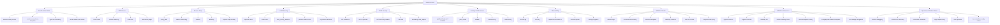

---

## 3. Tabular Decomposition

| Area | Skill / Item | Inti yang harus dipahami | Relevansi untuk stack Java/Jersey/Camunda |
|---|---|---|---|
| NGINX mental model | Edge proxy vs app server | NGINX berada di boundary traffic; aplikasi Java tetap fokus pada business logic. | Memisahkan concern: TLS, routing, compression, timeout, static assets, dan security headers tidak selalu perlu ditanam di Jersey. |
| Core runtime | Master/worker process | NGINX memakai model event-driven worker process; tuning dilakukan lewat worker, connection, keepalive, file descriptor, dan OS limits. | Penting saat traffic tinggi ke REST API, worker starvation, atau koneksi upstream lambat. |
| Configuration hierarchy | `main`, `events`, `http`, `server`, `location`, `upstream` | Konfigurasi NGINX bersifat hierarchical; directive bisa diwariskan atau override tergantung konteks. | Menghindari bug konfigurasi karena timeout/header/cache diletakkan di scope yang salah. |
| Virtual host | `server_name`, `listen`, SNI | Satu NGINX bisa melayani banyak domain/service. | Berguna untuk multi-service internal tools, admin UI, Camunda UI/API, dan REST backend. |
| Location matching | `location`, prefix, exact, regex | Routing path sangat bergantung pada urutan dan tipe match. | Salah `location` bisa membuat `/api`, `/engine-rest`, atau static frontend salah route. |
| Reverse proxy | `proxy_pass` | Mengirim request ke upstream backend. | Pola umum: NGINX → Jersey REST service, NGINX → Camunda REST API, NGINX → frontend static app. |
| Header forwarding | `Host`, `X-Forwarded-*`, `X-Real-IP` | Backend perlu tahu original scheme, host, IP, dan proxy chain. | Penting untuk audit trail, callback URL, OpenAPI generated link, security logging, dan absolute redirect. |
| Proxy buffering | `proxy_buffering` | Secara default proxy buffering aktif; NGINX membaca response upstream lalu menyimpannya di buffer/temp file jika perlu. ([Nginx](https://nginx.org/en/docs/http/ngx_http_proxy_module.html)) | Bisa membantu throughput, tetapi perlu hati-hati untuk streaming/SSE/large response. |
| Request buffering | `proxy_request_buffering` | Dengan buffering aktif, request body dibaca penuh sebelum dikirim ke upstream. ([Nginx](https://nginx.org/en/docs/http/ngx_http_proxy_module.html)) | Penting untuk upload file besar ke REST endpoint; bisa menyebabkan latency/disk pressure. |
| Timeout control | `proxy_connect_timeout`, `proxy_read_timeout`, `proxy_send_timeout` | Timeout NGINX harus sinkron dengan SLA backend. | Mencegah client menggantung terlalu lama ketika Jersey/Camunda/PostgreSQL lambat. |
| Load balancing | `upstream` | NGINX bisa mendistribusikan traffic ke beberapa backend. | Berguna untuk horizontal scaling service Java di VM, Docker, atau Kubernetes. |
| Passive health check | `max_fails`, `fail_timeout` | NGINX OSS memiliki passive health check; server gagal akan sementara dihindari. ([Nginx](https://nginx.org/en/docs/http/load_balancing.html)) | Membantu failover sederhana, tetapi bukan pengganti readiness/liveness check aplikasi. |
| TLS termination | `ssl_certificate`, `ssl_protocols`, session cache | NGINX sering menjadi terminasi HTTPS. Official docs merekomendasikan worker sesuai processor, keepalive, shared session cache, dan tuning session lifetime untuk mengurangi beban TLS. ([Nginx](https://nginx.org/en/docs/http/ngx_http_ssl_module.html)) | Mengurangi beban TLS di Java app dan menyederhanakan certificate lifecycle. |
| Upstream TLS/mTLS | HTTPS ke backend | Bisa mengenkripsi koneksi NGINX → backend, termasuk mTLS pada pola tertentu. | Relevan untuk zero-trust internal service, on-prem, dan regulated environments. |
| Security headers | HSTS, CSP, X-Frame-Options, etc. | Header security bisa ditambahkan di edge. | Cocok untuk frontend/static app dan REST API gateway layer. |
| Rate limiting | `limit_req`, `limit_conn` | Membatasi request rate dan concurrent connections. | Melindungi Jersey/Camunda dari burst, retry storm, dan abuse. |
| Static content | `root`, `alias`, cache headers | NGINX efisien untuk static files. | Umum untuk serve Vue/React frontend yang memanggil Jakarta REST API. |
| Caching | `proxy_cache` | Response upstream bisa di-cache di NGINX. | Berguna untuk read-heavy endpoint non-personalized; berbahaya untuk data sensitif jika key/cache-control salah. |
| Compression | gzip / optional modules | Mengurangi response size. | Efektif untuk JSON besar, static JS/CSS, OpenAPI docs. |
| Logging | access/error log | Observability dasar: status, upstream time, request time, request id. | Sangat penting untuk triage 502/504, slow endpoint, audit, dan correlation dengan log Java. |
| Debugging | `nginx -t`, reload, error log | Validasi config sebelum reload wajib. | Mencegah outage karena syntax error config. |
| Docker image | Official NGINX image | Official image mendukung template envsubst: file `/etc/nginx/templates/*.template` diproses menjadi config di `/etc/nginx/conf.d`. ([Docker Hub](https://hub.docker.com/_/nginx)) | Cocok untuk build once deploy many: beda environment cukup env var/config. |
| Docker config strategy | baked config vs mounted config vs template | Pilih antara immutable image, mounted config, atau runtime templating. | Untuk CI/CD enterprise, biasanya template + env var + ConfigMap/Secret lebih fleksibel. |
| Docker read-only | read-only container | Official image menjelaskan mode read-only butuh mount writable untuk path seperti `/var/cache/nginx` dan `/var/run`. ([Docker Hub](https://hub.docker.com/_/nginx)) | Relevan untuk hardening container security. |
| Docker Compose | local reverse proxy | Compose bisa mensimulasikan NGINX → app → database. | Berguna untuk onboarding lokal: frontend, Jersey app, Camunda, PostgreSQL. |
| Kubernetes Ingress | Ingress object | Ingress mengekspos service HTTP/HTTPS ke luar cluster via rule host/path. ([Kubernetes](https://kubernetes.io/docs/concepts/services-networking/ingress/?utm_source=chatgpt.com)) | Banyak cluster existing masih memakai Ingress untuk expose API. |
| Ingress controller | Controller wajib ada | Ingress resource tidak bekerja sendiri; harus ada ingress controller. ([Kubernetes](https://v1-35.docs.kubernetes.io/docs/concepts/services-networking/ingress-controllers/)) | Perlu tahu controller apa yang dipakai cluster: ingress-nginx, NGINX IC, ALB Controller, Application Gateway, etc. |
| ingress-nginx | Community controller | Bisa dikustomisasi via ConfigMap, annotations, dan custom template. ([kubernetes.github.io](https://kubernetes.github.io/ingress-nginx/user-guide/nginx-configuration/)) | Masih banyak dipakai, tetapi desain baru perlu hati-hati karena status retirement setelah Maret 2026. |
| Gateway API | Successor to Ingress | Gateway API adalah successor Ingress, tetapi tidak memakai kind `Ingress`; migrasi butuh konversi resource. ([Kubernetes](https://kubernetes.io/docs/concepts/services-networking/gateway/)) | Untuk desain baru Kubernetes, ini kandidat default yang lebih future-facing. |
| NGINX Gateway Fabric | Gateway API implementation | NGINX Gateway Fabric mengimplementasikan Gateway API dengan NGINX sebagai data plane; control plane menerjemahkan resource Gateway API menjadi config NGINX. ([NGINX Documentation](https://docs.nginx.com/nginx-gateway-fabric/)) | Cocok dievaluasi untuk Kubernetes modern, hybrid, multi-cloud, dan standardisasi routing. |
| Certificate automation | cert-manager integration | Sertifikat bisa dikelola otomatis di Kubernetes. | Mengurangi manual certificate rotation untuk API/domain internal. |
| Failure modes | 400/413/499/502/503/504 | Error NGINX sering menunjukkan boundary issue: bad request, body too large, client closed, upstream down, timeout. | Skill wajib untuk incident response. |
| Production governance | config review, canary, rollback | NGINX config adalah production-critical artifact. | Perlu PR review, smoke test, reload validation, metrics, dan rollback plan. |

---

## 4. Mental Model Praktis

### A. NGINX sebagai reverse proxy di depan Java/Jersey

```text
Client
  ↓ HTTPS
NGINX
  - TLS termination
  - routing /api/*
  - security headers
  - request size limit
  - timeout
  - logging
  ↓ HTTP/HTTPS
Jakarta/Jersey service
  ↓
PostgreSQL / Camunda / other services
```

Yang harus dijaga:

| Concern | Di NGINX | Di Java/Jersey |
|---|---|---|
| TLS public endpoint | Ya | Tidak wajib |
| Business validation | Tidak | Ya |
| Authentication | Bisa pre-auth / gateway auth | Tetap validasi token/identity |
| Authorization | Minimal edge-level | Tetap domain-level |
| Timeout | Ya, boundary timeout | Ya, app/database timeout |
| Request size | Ya | Ya |
| Correlation ID | Generate/pass-through | Log dan propagate |
| Audit event | Bukan sumber utama | Sumber utama domain audit |

---

### B. NGINX in Docker

```text
Docker image:
  nginx:stable / nginx:alpine / pinned version

Runtime:
  /etc/nginx/nginx.conf
  /etc/nginx/conf.d/*.conf
  /etc/nginx/templates/*.template  -> envsubst -> /etc/nginx/conf.d/*.conf
  /usr/share/nginx/html
  /var/cache/nginx
  /var/run
```

Pola yang biasanya sehat:

```text
Build image:
  static frontend files + default templates

Runtime:
  env vars / mounted config / secrets
  run nginx in foreground
  expose 8080/8443 internally
  non-root if possible
  read-only filesystem if feasible
```

Anti-pattern yang perlu dihindari:

| Anti-pattern | Risiko |
|---|---|
| Hardcode backend URL di image | Tidak portable antar dev/staging/prod |
| Pakai `latest` image tag | Build tidak reproducible |
| Mount seluruh `/etc/nginx` tanpa kontrol | Bisa override config penting |
| Log ke file internal container saja | Hilang saat container restart; sulit dikumpulkan |
| Tidak menjalankan `nginx -t` sebelum deploy | Outage karena config invalid |
| Menaruh secret/certificate private key dalam image | Risiko leakage |

---

### C. NGINX in Kubernetes

Ada tiga pola besar:

```text
Pattern 1 - NGINX as sidecar
Pod:
  nginx container
  app container
Use case:
  local reverse proxy, static files, TLS internal, legacy adapter

Pattern 2 - NGINX as standalone Deployment
Service:
  nginx-service
  app-service
Use case:
  internal gateway, frontend gateway, shared proxy

Pattern 3 - NGINX as cluster ingress/gateway data plane
External LB
  ↓
Ingress Controller / Gateway Controller
  ↓
Kubernetes Services
  ↓
Pods
```

Untuk sistem baru, arah belajarnya sebaiknya:

```text
Ingress basic knowledge
  ↓
Controller-specific behavior
  ↓
Gateway API model
  ↓
NGINX Gateway Fabric / alternative Gateway implementation
  ↓
Migration and production governance
```

Alasannya: Ingress masih banyak ditemukan di existing cluster, tetapi Kubernetes sendiri sudah mengarahkan desain baru ke Gateway API dan Ingress API tidak lagi dikembangkan. ([Kubernetes](https://v1-35.docs.kubernetes.io/docs/concepts/services-networking/ingress-controllers/))

---

## 5. Breakdown Domain / Skill Tree

| Level | Domain | Fokus belajar |
|---|---|---|
| Foundation | HTTP & TCP fundamentals | Host, path, headers, body, status code, connection, keepalive, TLS, DNS |
| NGINX Core | Config grammar | `nginx.conf`, context, directive inheritance, include, validation |
| NGINX HTTP | Server/location | Virtual host, path routing, static files, redirects, error pages |
| Reverse Proxy | Upstream routing | `proxy_pass`, upstream pools, header forwarding, timeouts |
| Performance | Buffering/cache/compression | Response buffering, request buffering, gzip, cache key, cache invalidation |
| Reliability | Health/failover | Passive health check, retry, `proxy_next_upstream`, upstream failure semantics |
| Security | TLS/rate limit/access control | TLS termination, mTLS, HSTS, CSP, CORS boundary, rate limit |
| Observability | Logs/metrics/tracing | Access log format, upstream latency, request id, status distribution |
| Docker | Container packaging | Official image, mounted config, envsubst template, read-only filesystem |
| Kubernetes | Ingress/Gateway | Ingress resource, controller behavior, Gateway API, GatewayClass, HTTPRoute |
| Production Ops | Rollout/debugging | `nginx -t`, reload, blue/green, canary, config drift, incident patterns |
| Enterprise | Governance | standard config snippets, security baseline, cert rotation, compliance audit |

---

## 6. Roadmap Alur Belajar yang Direkomendasikan

1. **Hari 1 - NGINX mental model**
   Pelajari `server`, `location`, `proxy_pass`, `upstream`, `access_log`, `error_log`.

2. **Hari 2 - Reverse proxy untuk Java/Jersey**
   Fokus pada header forwarding, timeout, body size, buffering, 502/504 debugging.

3. **Hari 3 - TLS, security, dan rate limiting**
   Pelajari TLS termination, HSTS, security headers, `limit_req`, `limit_conn`, dan mTLS concept.

4. **Hari 4 - NGINX in Docker**
   Buat image/container dengan template config, envsubst, mounted config, read-only mode, dan Compose local setup.

5. **Hari 5 - NGINX in Kubernetes**
   Pelajari Ingress, Ingress Controller, Service, Endpoint, ConfigMap, annotation, cert-manager.

6. **Hari 6 - Gateway API**
   Pelajari GatewayClass, Gateway, HTTPRoute, TLSRoute/TCPRoute secara konseptual.

7. **Hari 7 - Production failure modelling**
   Simulasikan upstream down, slow backend, large upload, wrong DNS, cert expired, bad config, dan retry storm.

---

## Rekomendasi materi selanjutnya

Lanjutkan dengan **cheatsheet “NGINX Core Configuration, Reverse Proxy, Upstream, Timeout, Buffering, and Failure Modes for Java/Jersey Services”** karena itu paling langsung berguna untuk debugging production traffic.

---

**Sources:**

- [nginx](https://nginx.org/)
- [F5 NGINX Gateway Fabric | NGINX Documentation](https://docs.nginx.com/nginx-gateway-fabric/)
- [Ingress Controllers | Kubernetes](https://v1-35.docs.kubernetes.io/docs/concepts/services-networking/ingress-controllers/)
- [Ingress NGINX Retirement: What You Need to Know | Kubernetes](https://kubernetes.io/blog/2025/11/11/ingress-nginx-retirement/)
- [nginx - Official Image | Docker Hub](https://hub.docker.com/_/nginx)
- [Introduction - Ingress-Nginx Controller](https://kubernetes.github.io/ingress-nginx/user-guide/nginx-configuration/)

## Response:
7/12/2026, 11:49:04 PM

Baik, kita mulai dari fondasi yang paling sering dipakai saat aplikasi Java/Jersey berada di belakang NGINX: konfigurasi inti, reverse proxy, upstream, timeout, buffering, dan pola kegagalan 502/503/504.

# Cheatsheet - NGINX Core Configuration, Reverse Proxy, Upstream, Timeout, Buffering, and Failure Modes for Java/Jersey Services

## 1. Introduction

Untuk aplikasi **Java/Jakarta RESTful Web Service dengan Jersey**, NGINX biasanya berperan sebagai **traffic boundary** di depan aplikasi: menerima request dari client, melakukan TLS termination, routing path, meneruskan header penting, membatasi ukuran request, mengatur timeout, melakukan buffering, dan mencatat access/error log.

Mental model yang tepat:

```text
Client
  ↓
NGINX
  - HTTP/TLS boundary
  - route matching
  - reverse proxy
  - timeout/buffering/rate limit/logging
  ↓
Java/Jersey Application
  - REST resource
  - validation
  - business logic
  - transaction boundary
  ↓
PostgreSQL / Camunda / other services
```

NGINX official docs menyebut `ngx_http_proxy_module` sebagai module untuk meneruskan request ke server lain, dan contoh dasarnya adalah `location / { proxy_pass http://localhost:8000; ... }`. Jadi fokus utama kita di sini adalah memahami **bagaimana request dipetakan, diteruskan, ditunggu, di-buffer, di-retry, dan gagal**. ([Nginx](https://nginx.org/en/docs/http/ngx_http_proxy_module.html))

---

## 2. Diagram Alur Request

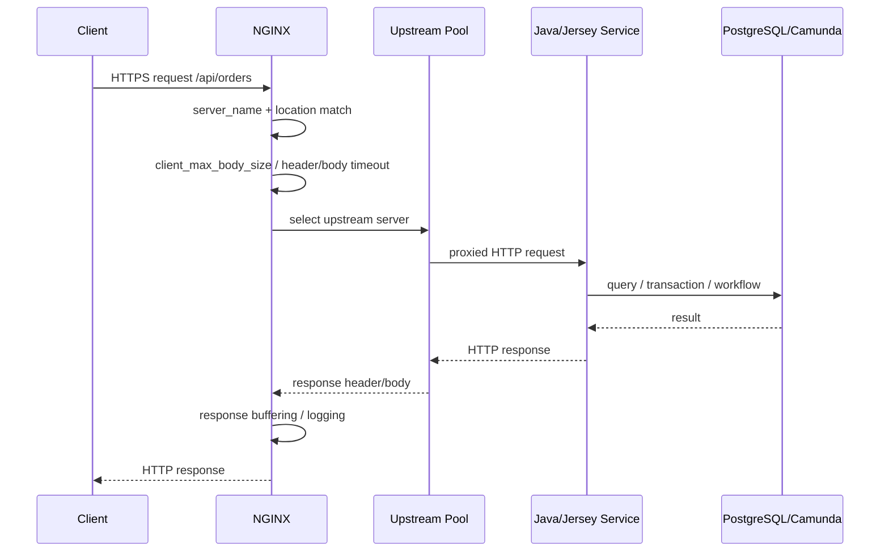

---

## 3. Core Configuration Anatomy

Struktur konfigurasi NGINX yang perlu dikuasai:

```nginx
# nginx.conf

worker_processes auto;

events {
    worker_connections 4096;
}

http {
    include       mime.types;
    default_type  application/octet-stream;

    log_format main_ext
        '$remote_addr - $remote_user [$time_local] '
        '"$request" $status $body_bytes_sent '
        'rt=$request_time '
        'urt=$upstream_response_time '
        'uct=$upstream_connect_time '
        'uht=$upstream_header_time '
        'upstream=$upstream_addr '
        'reqid=$request_id';

    access_log /var/log/nginx/access.log main_ext;
    error_log  /var/log/nginx/error.log warn;

    upstream jersey_api {
        server jersey-app-1:8080 max_fails=3 fail_timeout=10s;
        server jersey-app-2:8080 max_fails=3 fail_timeout=10s;
    }

    server {
        listen 80;
        server_name api.example.local;

        client_max_body_size 10m;

        location /api/ {
            proxy_pass http://jersey_api/;

            proxy_set_header Host              $host;
            proxy_set_header X-Real-IP         $remote_addr;
            proxy_set_header X-Forwarded-For   $proxy_add_x_forwarded_for;
            proxy_set_header X-Forwarded-Proto $scheme;
            proxy_set_header X-Request-ID      $request_id;

            proxy_connect_timeout 3s;
            proxy_send_timeout    30s;
            proxy_read_timeout    30s;

            proxy_buffering on;
            proxy_request_buffering on;
        }
    }
}
```

NGINX dapat reload konfigurasi dengan mekanisme graceful: saat menerima sinyal HUP, master process mengecek validitas syntax, mencoba membuka log/listener baru, lalu memulai worker baru dan meminta worker lama selesai secara graceful; jika konfigurasi baru gagal diterapkan, NGINX rollback ke konfigurasi lama. Ini alasan `nginx -t` + reload lebih aman daripada restart kasar. ([Nginx](https://nginx.org/en/docs/control.html))

---

## 4. Tabel Decomposition Directive Penting

| Area | Directive | Fungsi | Catatan untuk Java/Jersey |
|---|---|---|---|
| Routing | `server_name` | Memilih virtual host berdasarkan host/domain. | Pastikan domain API, admin, frontend, dan internal endpoint tidak tercampur. |
| Routing | `location` | Mencocokkan path request. | Hati-hati dengan `/api` vs `/api/`; efeknya besar ke URI yang diteruskan. |
| Reverse proxy | `proxy_pass` | Menentukan target upstream. | Dengan URI di `proxy_pass`, bagian path yang match bisa diganti; tanpa URI, request URI diteruskan apa adanya. ([Nginx](https://nginx.org/en/docs/http/ngx_http_proxy_module.html)) |
| Header | `proxy_set_header Host $host` | Meneruskan host asli ke backend. | Penting untuk generated URL, redirect, audit, tenant/domain resolution. |
| Header | `X-Forwarded-For` | Meneruskan chain IP client/proxy. | Backend harus treat header ini sebagai trusted hanya jika datang dari proxy tepercaya. |
| Header | `X-Forwarded-Proto` | Memberi tahu backend apakah request asli HTTP/HTTPS. | Penting untuk secure redirect, cookie secure, callback URL. |
| Correlation | `X-Request-ID` | Mengirim request id ke backend. | Jersey logging filter sebaiknya membaca/meneruskan id ini. |
| Timeout | `proxy_connect_timeout` | Timeout membuat koneksi ke upstream. | Kalau sering kena, cek DNS, service discovery, pod down, firewall, listener app. Default official docs: `60s`; biasanya production API perlu lebih rendah. ([Nginx](https://nginx.org/en/docs/http/ngx_http_proxy_module.html)) |
| Timeout | `proxy_send_timeout` | Timeout saat NGINX mengirim request ke upstream. | Relevan untuk upload/body besar atau upstream lambat membaca request. ([Nginx](https://nginx.org/en/docs/http/ngx_http_proxy_module.html)) |
| Timeout | `proxy_read_timeout` | Timeout menunggu data response dari upstream. | Ini bukan total response timeout; dihitung antar dua operasi read berturut-turut. ([Nginx](https://nginx.org/en/docs/http/ngx_http_proxy_module.html)) |
| Buffering | `proxy_buffering` | Buffer response dari upstream sebelum/selama dikirim ke client. | Default `on`; bagus untuk API biasa, kurang cocok untuk streaming/SSE. ([Nginx](https://nginx.org/en/docs/http/ngx_http_proxy_module.html)) |
| Buffering | `proxy_request_buffering` | Buffer request body client sebelum dikirim ke upstream. | Default `on`; melindungi Java app dari slow upload, tetapi bisa memakai disk NGINX untuk body besar. ([Nginx](https://nginx.org/en/docs/http/ngx_http_proxy_module.html)) |
| Upload size | `client_max_body_size` | Batas ukuran request body. | Default `1m`; jika exceed, NGINX return 413. Cocok diset per endpoint upload, bukan global terlalu besar. ([Nginx](https://nginx.org/en/docs/http/ngx_http_core_module.html)) |
| Client timeout | `client_body_timeout` | Timeout membaca body dari client. | Kalau client upload lambat, bisa 408 sebelum sampai ke Java app. ([Nginx](https://nginx.org/en/docs/http/ngx_http_core_module.html)) |
| Upstream | `upstream` | Mendefinisikan pool backend. | Untuk VM/Docker manual; di Kubernetes biasanya upstream dihasilkan controller. |
| Upstream health | `max_fails`, `fail_timeout` | Passive health check. | NGINX OSS menandai server failed berdasarkan error komunikasi; bukan active `/health` probe seperti Kubernetes readiness. ([Nginx](https://nginx.org/en/docs/http/load_balancing.html)) |
| Retry | `proxy_next_upstream` | Menentukan kondisi request dicoba ke server lain. | Default `error timeout`; hati-hati untuk POST/PUT/PATCH agar tidak menggandakan side effect. ([Nginx](https://nginx.org/en/docs/http/ngx_http_proxy_module.html)) |
| Keepalive | `keepalive` | Cache idle connection ke upstream. | Pada docs saat ini, sejak 1.29.7 upstream keepalive default aktif dengan limit 32 per worker; pada versi lama sering perlu explicit config. Jangan set terlalu tinggi karena tidak membatasi total koneksi upstream. ([Nginx](https://nginx.org/en/docs/http/ngx_http_upstream_module.html)) |
| HTTP version | `proxy_http_version` | Versi HTTP ke upstream. | Official docs saat ini menunjukkan default `1.1`; untuk versi lama/konfigurasi tertentu, sering explicit `proxy_http_version 1.1` dipakai bersama keepalive/WebSocket. ([Nginx](https://nginx.org/en/docs/http/ngx_http_proxy_module.html)) |

---

## 5. `proxy_pass` - Bagian yang Sering Menjebak

### A. Dengan trailing slash

```nginx
location /api/ {
    proxy_pass http://jersey_api/;
}
```

Request:

```text
/api/orders/123
```

Dikirim ke upstream sebagai:

```text
/orders/123
```

### B. Tanpa URI di `proxy_pass`

```nginx
location /api/ {
    proxy_pass http://jersey_api;
}
```

Request:

```text
/api/orders/123
```

Dikirim ke upstream sebagai:

```text
/api/orders/123
```

Official docs menjelaskan bahwa jika `proxy_pass` memiliki URI, bagian normalized request URI yang match dengan `location` akan diganti oleh URI pada `proxy_pass`; jika `proxy_pass` tidak memiliki URI, request URI diteruskan dalam bentuk aslinya. ([Nginx](https://nginx.org/en/docs/http/ngx_http_proxy_module.html))

**Rule praktis untuk Jersey:**

| Kondisi | Pola yang cocok |
|---|---|
| Jersey app expose resource mulai dari `/orders`, `/customers`, `/health` | `location /api/ { proxy_pass http://app/; }` |
| Jersey app expose resource mulai dari `/api/orders`, `/api/customers` | `location /api/ { proxy_pass http://app; }` |
| Ada servlet context path seperti `/my-service/api` | Jangan tebak; cek actual route di app/container. |

---

## 6. Timeout Model

Timeout harus dilihat sebagai **budget chain**, bukan angka random.

```text
Client timeout
  > Load balancer timeout
    > NGINX proxy_read_timeout
      > Java HTTP server timeout
        > Jersey resource timeout
          > DB / Camunda / external call timeout
```

Prinsipnya: komponen paling dalam tidak boleh dibiarkan menggantung lebih lama dari boundary luar tanpa alasan jelas.

### Timeout utama

| Directive | Mengukur apa | Gejala jika salah |
|---|---|---|
| `proxy_connect_timeout` | Waktu connect ke upstream | 502/504, upstream tidak bisa dijangkau |
| `proxy_send_timeout` | Jeda saat mengirim request ke upstream | Upload lambat, upstream lambat membaca body |
| `proxy_read_timeout` | Jeda saat membaca response dari upstream | 504 jika backend terlalu lama tidak mengirim data |
| `client_body_timeout` | Jeda saat membaca body dari client | 408 dari NGINX |
| `send_timeout` | Jeda saat mengirim response ke client | Client lambat bisa diputus |

`proxy_read_timeout` sering disalahpahami sebagai total durasi response. Official docs menyatakan timeout ini berlaku **antara dua operasi read berturut-turut**, bukan untuk seluruh transmisi response. Jika upstream tidak mengirim apa pun dalam interval itu, koneksi ditutup. ([Nginx](https://nginx.org/en/docs/http/ngx_http_proxy_module.html))

### Rekomendasi awal untuk REST API biasa

```nginx
proxy_connect_timeout 3s;
proxy_send_timeout    30s;
proxy_read_timeout    30s;
send_timeout          30s;
```

Untuk endpoint long-running, jangan otomatis menaikkan `proxy_read_timeout` ke beberapa menit. Lebih sehat gunakan pola:

```text
POST /jobs
  → return 202 Accepted + jobId

GET /jobs/{jobId}
  → polling status

atau

callback/event/webhook
```

Ini lebih cocok untuk service yang melibatkan Camunda workflow, external integration, atau proses database berat.

---

## 7. Buffering Model

### A. Response buffering

```nginx
proxy_buffering on;
```

Dengan buffering aktif, NGINX membaca response dari upstream secepat mungkin dan menyimpannya di buffer memory; jika tidak cukup, sebagian dapat disimpan ke temporary file. Jika buffering dimatikan, response diteruskan ke client secara sinkron saat diterima dari upstream. ([Nginx](https://nginx.org/en/docs/http/ngx_http_proxy_module.html))

| Mode | Cocok untuk | Risiko |
|---|---|---|
| `proxy_buffering on` | JSON API biasa, HTML, static-ish response | Bisa menunda streaming; response besar bisa memakai temp file |
| `proxy_buffering off` | SSE, streaming, progressive response | Upstream worker/thread bisa tertahan lebih lama oleh client lambat |

Untuk Jersey endpoint biasa, default `on` biasanya masuk akal. Untuk SSE/event stream:

```nginx
location /api/events/ {
    proxy_pass http://jersey_api/events/;
    proxy_buffering off;
    proxy_read_timeout 1h;
}
```

### B. Request buffering

```nginx
proxy_request_buffering on;
```

Dengan request buffering aktif, NGINX membaca seluruh request body dari client sebelum mengirimkannya ke upstream. Official docs mencatat default-nya `on`. ([Nginx](https://nginx.org/en/docs/http/ngx_http_proxy_module.html))

| Mode | Cocok untuk | Risiko |
|---|---|---|
| `proxy_request_buffering on` | REST API biasa, upload kecil/sedang | Upload besar bisa memakai disk NGINX; backend baru menerima setelah body selesai |
| `proxy_request_buffering off` | Streaming upload ke backend | Java app harus siap menghadapi slow client dan connection occupancy |

Untuk upload file besar:

```nginx
location /api/files/ {
    client_max_body_size 100m;

    proxy_request_buffering off;
    proxy_buffering on;

    proxy_connect_timeout 3s;
    proxy_send_timeout    120s;
    proxy_read_timeout    120s;

    proxy_pass http://jersey_api/files/;
}
```

Tetapi jangan hanya mengubah NGINX. Pastikan limit di Java HTTP server, Jersey multipart config, application validation, storage policy, dan antivirus/security scanning juga selaras.

---

## 8. Upstream dan Load Balancing

Contoh basic:

```nginx
upstream jersey_api {
    server 10.10.1.11:8080 max_fails=3 fail_timeout=10s;
    server 10.10.1.12:8080 max_fails=3 fail_timeout=10s;
}

server {
    location /api/ {
        proxy_pass http://jersey_api/;
    }
}
```

NGINX reverse proxy memiliki passive health check: jika komunikasi ke server tertentu gagal, server itu bisa ditandai failed dan dihindari sementara; `max_fails` menentukan jumlah consecutive unsuccessful attempts dalam periode `fail_timeout`, dan `fail_timeout` juga menentukan berapa lama server dianggap failed. ([Nginx](https://nginx.org/en/docs/http/load_balancing.html))

### Load balancing method umum

| Method | Kapan dipakai | Catatan |
|---|---|---|
| Round robin default | General API | Default dan cukup untuk banyak kasus. |
| `least_conn` | Request duration tidak merata | Berguna saat beberapa endpoint lebih berat. |
| `ip_hash` | Butuh sticky-ish routing berbasis IP | Kurang ideal jika client di belakang NAT besar. |
| Weighted server | Backend beda kapasitas | Cocok saat instance tidak homogen. |
| Backup server | Failover sederhana | Bukan pengganti HA yang matang. |

Untuk service Java stateless, usahakan **tidak bergantung pada sticky session**. Simpan state di database/cache/workflow engine, bukan memory instance.

---

## 9. Retry dan Idempotency

Default `proxy_next_upstream` adalah:

```nginx
proxy_next_upstream error timeout;
```

Official docs menyebut directive ini menentukan kapan request diteruskan ke server berikutnya, termasuk kondisi seperti `error`, `timeout`, `invalid_header`, `http_500`, `http_502`, `http_503`, `http_504`, dan juga opsi `non_idempotent`. ([Nginx](https://nginx.org/en/docs/http/ngx_http_proxy_module.html))

### Prinsip untuk Java/Jersey

| Request | Aman di-retry otomatis? | Catatan |
|---|---:|---|
| `GET /catalogs` | Biasanya ya | Pastikan tidak ada side effect. |
| `HEAD /health` | Ya | Cocok untuk health/readiness. |
| `POST /orders` | Tidak otomatis | Bisa membuat order ganda. |
| `PUT /customers/{id}` | Tergantung | Aman jika benar-benar idempotent. |
| `PATCH /cases/{id}` | Biasanya tidak | Partial update sering non-idempotent. |
| `DELETE /resource/{id}` | Tergantung | Secara HTTP idempotent, tetapi audit/event side effect tetap perlu dipikirkan. |

Pola aman untuk endpoint mutasi:

```text
Client sends Idempotency-Key
  ↓
Jersey service checks idempotency table
  ↓
Only first successful mutation is committed
  ↓
Repeated request returns same logical result
```

Untuk domain order management/regulatory/case management, retry otomatis tanpa idempotency key adalah sumber bug serius: duplikasi command, workflow ganda, double notification, dan audit trail membingungkan.

---

## 10. Failure Modes

| Status / Gejala | Kemungkinan penyebab | Cek pertama | Aksi |
|---|---|---|---|
| 400 | Header invalid, request line terlalu besar, malformed request | NGINX error log, access log, header size | Cek client/proxy sebelumnya, cookie/header terlalu besar |
| 408 | Client lambat mengirim header/body | `client_header_timeout`, `client_body_timeout` | Cek network client, upload behavior |
| 413 | Body lebih besar dari limit | `client_max_body_size` | Set limit spesifik endpoint; jangan global unlimited |
| 414 | URI terlalu panjang | Request line terlalu besar | Jangan kirim payload via query string |
| 499 | Client menutup koneksi sebelum response selesai | Access log: `request_time`, `upstream_response_time`; client timeout | Cek slow backend atau timeout client. NGINX ticket/mailing list menjelaskan 499 berarti client closed connection. ([Nginx Trac](https://trac.nginx.org/nginx/ticket/2163?utm_source=chatgpt.com)) |
| 500 dari NGINX | Error internal config/runtime | error log | Cek rewrite, auth subrequest, filesystem, permission |
| 500 dari upstream | Java app return 500 | `$upstream_status`, app log | Debug exception/transaction/domain logic |
| 502 | Bad gateway: upstream down/refused/reset/invalid response | error log: connect refused, reset, invalid header | Cek app port, pod/container health, listener, crash loop |
| 503 | Upstream unavailable / no live upstream / rate limiting possible | upstream state, limit config | Cek passive health, deployment, capacity |
| 504 | Gateway timeout | `proxy_read_timeout`, slow Java/DB/external call | Cek latency breakdown: NGINX → Java → DB/Camunda |
| Random slow response | Buffering, GC pause, DB lock, thread pool saturation | access log timing variables | Tambahkan log `$upstream_response_time`, Java metrics, DB slow query |
| Works direct, fails via NGINX | Header/path/proxy_pass mismatch | Compare request URI and headers | Cek trailing slash, Host, X-Forwarded headers |

---

## 11. Observability Minimum

Gunakan log format yang menangkap waktu dan upstream.

```nginx
log_format api_json escape=json
'{'
  '"time":"$time_iso8601",'
  '"remote_addr":"$remote_addr",'
  '"request":"$request",'
  '"status":$status,'
  '"request_time":$request_time,'
  '"upstream_addr":"$upstream_addr",'
  '"upstream_status":"$upstream_status",'
  '"upstream_connect_time":"$upstream_connect_time",'
  '"upstream_header_time":"$upstream_header_time",'
  '"upstream_response_time":"$upstream_response_time",'
  '"request_id":"$request_id"'
'}';

access_log /var/log/nginx/api-access.log api_json;
```

Variabel seperti `$request_id`, `$request_time`, `$status`, `$remote_addr`, `$host`, dan `$request_uri` tersedia dalam HTTP core module NGINX. `$request_time` mengukur durasi sejak byte pertama request dibaca dari client, sedangkan `$request_id` adalah unique request identifier dari 16 random bytes. ([Nginx](https://nginx.org/en/docs/http/ngx_http_core_module.html))

Untuk Jersey, buat filter seperti ini secara konseptual:

```text
Incoming request
  ↓
Read X-Request-ID
  ↓
Put into MDC/log context
  ↓
Propagate to downstream HTTP/gRPC call
  ↓
Return X-Request-ID in response
```

Tanpa correlation id, debugging 502/504 akan terlalu mahal karena harus mencocokkan timestamp manual antara access log NGINX, log Java, log DB, dan log Camunda.

---

## 12. Production Baseline untuk Java/Jersey API

```nginx
upstream jersey_api {
    least_conn;

    server jersey-app-1.internal:8080 max_fails=3 fail_timeout=10s;
    server jersey-app-2.internal:8080 max_fails=3 fail_timeout=10s;

    # Untuk versi lama, biasanya explicit.
    # Pada docs terbaru 1.29.7+, upstream keepalive default sudah aktif.
    keepalive 32;
}

server {
    listen 443 ssl http2;
    server_name api.example.com;

    client_max_body_size 10m;
    client_body_timeout 30s;
    send_timeout 30s;

    location /api/ {
        proxy_pass http://jersey_api/;

        proxy_http_version 1.1;
        proxy_set_header Connection "";

        proxy_set_header Host              $host;
        proxy_set_header X-Real-IP         $remote_addr;
        proxy_set_header X-Forwarded-For   $proxy_add_x_forwarded_for;
        proxy_set_header X-Forwarded-Proto $scheme;
        proxy_set_header X-Request-ID      $request_id;

        proxy_connect_timeout 3s;
        proxy_send_timeout    30s;
        proxy_read_timeout    30s;

        proxy_buffering on;
        proxy_request_buffering on;

        proxy_next_upstream error timeout http_502 http_503 http_504;
        proxy_next_upstream_tries 2;
    }

    location /api/health {
        proxy_pass http://jersey_api/health;
        proxy_connect_timeout 1s;
        proxy_read_timeout 2s;
    }
}
```

Catatan: jangan copy-paste nilai timeout ini ke semua endpoint. Endpoint upload, report export, SSE, workflow callback, dan health check harus punya profile berbeda.

---

## 13. Debugging Checklist

### Saat 502

```bash
nginx -t
grep -i "connect() failed\|upstream prematurely closed\|invalid header" /var/log/nginx/error.log
curl -v http://jersey-app-1.internal:8080/health
ss -lntp | grep 8080
```

Cek:

```text
Apakah app listen di port benar?
Apakah DNS resolve?
Apakah firewall/security group/network policy mengizinkan?
Apakah app crash/restart?
Apakah app mengirim response header valid?
```

### Saat 504

```text
Cek access log:
- request_time
- upstream_connect_time
- upstream_header_time
- upstream_response_time

Jika connect cepat tapi response lama:
  masalah kemungkinan di Java app, DB, Camunda, external call, lock, GC, thread pool.

Jika connect lama/gagal:
  masalah kemungkinan network, service discovery, capacity, listener backlog.
```

### Saat 413

```text
Cek:
- client_max_body_size di http/server/location
- apakah location yang match benar
- apakah ada reverse proxy/LB lain di depan NGINX
- limit di Java/Jersey multipart/server container
```

### Saat path salah

```bash
curl -v https://api.example.com/api/orders/123
```

Cek:

```text
NGINX location: /api/
proxy_pass dengan slash atau tanpa slash?
Jersey base path: /orders atau /api/orders?
Servlet context path?
```

---

## 14. Common Anti-Patterns

| Anti-pattern | Dampak |
|---|---|
| Menaikkan `proxy_read_timeout` ke 10 menit untuk semua endpoint | Menyembunyikan desain API yang buruk; worker/resource lebih lama tertahan. |
| Retry POST tanpa idempotency | Duplikasi transaksi/order/workflow. |
| `client_max_body_size 0` global | Membuka risiko abuse dan resource exhaustion. |
| Tidak meneruskan `X-Forwarded-Proto` | Backend salah mengira request HTTP, menyebabkan redirect/cookie/callback salah. |
| Tidak log upstream timing | 502/504 sulit dibedakan antara network, app, DB, atau client. |
| Satu config timeout untuk semua endpoint | Upload, health check, API biasa, dan streaming punya karakteristik berbeda. |
| Terlalu percaya `X-Forwarded-For` dari internet | Client bisa spoof header jika tidak dibersihkan di edge. |
| Menjadikan NGINX sebagai tempat business logic | Sulit diuji, sulit diaudit, dan rawan drift antar environment. |

---

## 15. Roadmap Belajar Singkat

1. **Core config**
   Kuasai `http`, `server`, `location`, `upstream`, `include`, `nginx -t`, reload.

2. **Reverse proxy**
   Fokus pada `proxy_pass`, trailing slash behavior, `proxy_set_header`.

3. **Timeout**
   Pahami `proxy_connect_timeout`, `proxy_send_timeout`, `proxy_read_timeout`, `client_body_timeout`.

4. **Buffering**
   Bedakan request buffering vs response buffering, terutama untuk upload dan streaming.

5. **Failure mode**
   Latih membaca 400/408/413/499/502/503/504 dari access log dan error log.

6. **Java/Jersey integration**
   Implement correlation id, forwarded headers handling, timeout budget, idempotency key, dan health endpoint.

7. **Production hardening**
   Tambahkan rate limit, TLS policy, security headers, structured logs, config test, canary rollout.

---

## Rekomendasi materi selanjutnya

Lanjutkan ke **“NGINX Reverse Proxy Patterns for Java/Jersey: Path Routing, Header Forwarding, TLS Termination, CORS, Security Headers, and Auth Boundary”** karena itu langsung menyambung dari config dasar ke pola production yang paling sering muncul.

---

**Sources:**

- [Module ngx_http_proxy_module](https://nginx.org/en/docs/http/ngx_http_proxy_module.html)
- [2163 (nginx suddenly stop accepting request & returns 499)](https://trac.nginx.org/nginx/ticket/2163?utm_source=chatgpt.com)

## Response:
7/13/2026, 8:31:15 AM

Saya rekomendasikan **total 12 seri** untuk jalur NGINX ini.

**Status saat ini: 1 seri selesai, sisa 11 seri lagi.**

| Seri | Materi | Status |
|---:|---|---|
| 1 | NGINX Core Configuration, Reverse Proxy, Upstream, Timeout, Buffering, Failure Modes | **Selesai** |
| 2 | Reverse Proxy Patterns for Java/Jersey: Path Routing, Header Forwarding, TLS Termination, CORS, Security Headers, Auth Boundary | Belum |
| 3 | NGINX Location Matching, Rewrite, Redirect, URI Normalization, and `proxy_pass` Pitfalls | Belum |
| 4 | NGINX Upstream, Load Balancing, Keepalive, Retry, Health Check, and Idempotency | Belum |
| 5 | NGINX TLS/HTTPS, mTLS, Certificates, HSTS, Cipher Policy, and Certificate Rotation | Belum |
| 6 | NGINX Security Hardening: Rate Limit, Request Size, Header Control, IP Allow/Deny, WAF Boundary | Belum |
| 7 | NGINX Observability: Access Log, Error Log, Metrics, Correlation ID, OpenTelemetry Integration | Belum |
| 8 | NGINX for Static Frontend + Java API Backend: SPA Routing, Cache Headers, Compression, CDN Boundary | Belum |
| 9 | NGINX in Docker: Image Strategy, Config Template, Envsubst, Compose, Non-root, Read-only Runtime | Belum |
| 10 | NGINX in Kubernetes: Ingress, ingress-nginx, NGINX Ingress Controller, ConfigMap, Annotation, cert-manager | Belum |
| 11 | Gateway API and NGINX Gateway Fabric: GatewayClass, Gateway, HTTPRoute, Migration from Ingress | Belum |
| 12 | Production Runbook: Debugging 400/413/499/502/503/504, Rollout, Canary, Rollback, Incident Checklist | Belum |

Jadi **sisa 11 seri lagi**. Materi berikutnya yang paling tepat adalah **Seri 2 — Reverse Proxy Patterns for Java/Jersey**.

## Response:
7/13/2026, 8:31:34 AM

Saya lanjutkan ke Seri 2. Fokusnya bukan mengulang dasar `proxy_pass`, tetapi pola production: routing antar context path, forwarded headers, TLS boundary, CORS, security headers, dan batas tanggung jawab auth antara NGINX dan service Java/Jersey.

# Seri 2/12 - NGINX Reverse Proxy Patterns for Java/Jersey

## Path Routing, Header Forwarding, TLS Termination, CORS, Security Headers, and Auth Boundary

## 1. Introduction

Seri ini fokus pada **pola reverse proxy production** ketika NGINX berada di depan aplikasi **Java/Jakarta RESTful Web Service/Jersey**.

Yang ingin kita kuasai bukan hanya “request diteruskan ke backend”, tetapi:

```text id="jo99d7"
Client / Browser / Mobile / External System
  ↓
NGINX
  - host/path routing
  - TLS termination
  - forwarded headers
  - CORS boundary
  - security headers
  - rate/security guardrail
  - optional auth delegation
  ↓
Java/Jersey Service
  - authentication verification
  - authorization/domain permission
  - validation
  - business logic
  - audit
```

NGINX sendiri memang secara resmi diposisikan sebagai web server, reverse proxy, cache, load balancer, TCP/UDP proxy, dan mail proxy. Jadi perannya sebagai boundary layer memang natural, tetapi jangan sampai NGINX mengambil alih business/domain logic yang seharusnya tetap di Java service. ([Nginx](https://nginx.org/?utm_source=chatgpt.com))

---

## 2. Diagram Mental Model

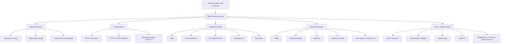

---

## 3. Reverse Proxy Pattern Utama

| Pattern | Bentuk | Kapan dipakai | Risiko utama |
|---|---|---|---|
| Host-based routing | `api.example.com`, `admin.example.com` | Memisahkan API, admin, frontend, callback, internal service | Salah `server_name` bisa expose endpoint yang tidak semestinya |
| Path-based routing | `/api/`, `/camunda/`, `/admin/` | Banyak service di bawah satu domain | Salah trailing slash membuat path upstream berubah |
| Context-path preservation | `/api/orders` tetap `/api/orders` | Backend memang expose `/api/*` | Duplikasi prefix jika salah `proxy_pass` |
| Context-path stripping | `/api/orders` menjadi `/orders` | Backend expose resource tanpa prefix `/api` | Resource 404 jika backend sebenarnya butuh prefix |
| TLS termination | Client HTTPS, upstream HTTP | Umum di private network/container network | Internal traffic tidak encrypted kecuali network trusted |
| End-to-end TLS | Client HTTPS, upstream HTTPS | Regulated/high-security environment | Sertifikat upstream dan truststore harus dikelola |
| Auth delegation | NGINX memanggil auth service via `auth_request` | Centralized auth check | Jangan pindahkan authorization domain ke NGINX |
| CORS at edge | NGINX handle preflight/header | SPA frontend + API beda origin | Wildcard + credentials berbahaya/tidak valid |
| Security headers at edge | HSTS/CSP/X-Frame/etc | Frontend/static/API boundary | `add_header` inheritance sering menjebak |

---

## 4. Baseline Reverse Proxy untuk Java/Jersey API

```nginx id="bxgy5d"
upstream jersey_api {
    server jersey-app-1.internal:8080 max_fails=3 fail_timeout=10s;
    server jersey-app-2.internal:8080 max_fails=3 fail_timeout=10s;
    keepalive 32;
}

server {
    listen 443 ssl;
    server_name api.example.com;

    ssl_certificate     /etc/nginx/tls/api.crt;
    ssl_certificate_key /etc/nginx/tls/api.key;

    client_max_body_size 10m;

    location /api/ {
        proxy_pass http://jersey_api/;

        proxy_http_version 1.1;
        proxy_set_header Connection "";

        proxy_set_header Host              $host;
        proxy_set_header X-Real-IP         $remote_addr;
        proxy_set_header X-Forwarded-For   $proxy_add_x_forwarded_for;
        proxy_set_header X-Forwarded-Proto $scheme;
        proxy_set_header X-Request-ID      $request_id;

        proxy_connect_timeout 3s;
        proxy_send_timeout    30s;
        proxy_read_timeout    30s;
    }
}
```

`proxy_set_header` adalah directive utama untuk membentuk header yang dikirim ke upstream, dan NGINX menyediakan variable seperti `$proxy_add_x_forwarded_for` untuk menambahkan IP client ke chain `X-Forwarded-For`. ([Nginx](https://nginx.org/en/docs/http/ngx_http_proxy_module.html))

---

## 5. Path Routing dan Context Path

### Pattern A - Strip `/api/` sebelum masuk ke Jersey

```nginx id="qhk632"
location /api/ {
    proxy_pass http://jersey_api/;
}
```

Request:

```text id="g0egb5"
/api/orders/123
```

Masuk ke Jersey sebagai:

```text id="te3gbp"
/orders/123
```

Cocok jika Jersey resource kamu seperti ini:

```java id="8gj99e"
@Path("/orders")
public class OrderResource {
    @GET
    @Path("/{id}")
    public Response getOrder(@PathParam("id") String id) {
        ...
    }
}
```

---

### Pattern B - Pertahankan `/api/` saat masuk ke Jersey

```nginx id="ixbsv2"
location /api/ {
    proxy_pass http://jersey_api;
}
```

Request:

```text id="ohgcxs"
/api/orders/123
```

Masuk ke Jersey sebagai:

```text id="ezib58"
/api/orders/123
```

Cocok jika aplikasi punya base path `/api`, misalnya:

```java id="bjjgu6"
@ApplicationPath("/api")
public class RestApplication extends ResourceConfig {
}
```

Perbedaan trailing slash pada `proxy_pass` ini penting. Dokumentasi NGINX menjelaskan bahwa jika `proxy_pass` memiliki URI, bagian normalized URI yang match dengan `location` akan diganti oleh URI tersebut; jika `proxy_pass` tidak memiliki URI, request URI diteruskan sebagaimana diterima. ([Nginx](https://nginx.org/en/docs/http/ngx_http_proxy_module.html?utm_source=chatgpt.com))

---

## 6. Routing untuk Multi-Service

Contoh domain tunggal dengan beberapa backend:

```nginx id="qlhzim"
upstream order_api {
    server order-service:8080;
}

upstream customer_api {
    server customer-service:8080;
}

upstream camunda_api {
    server camunda-rest:8080;
}

server {
    listen 443 ssl;
    server_name platform.example.com;

    location /orders/ {
        proxy_pass http://order_api/;
        include conf.d/proxy-common.conf;
    }

    location /customers/ {
        proxy_pass http://customer_api/;
        include conf.d/proxy-common.conf;
    }

    location /camunda/ {
        proxy_pass http://camunda_api/;
        include conf.d/proxy-common.conf;
    }
}
```

`proxy-common.conf`:

```nginx id="y3iz6p"
proxy_http_version 1.1;
proxy_set_header Connection "";

proxy_set_header Host              $host;
proxy_set_header X-Real-IP         $remote_addr;
proxy_set_header X-Forwarded-For   $proxy_add_x_forwarded_for;
proxy_set_header X-Forwarded-Proto $scheme;
proxy_set_header X-Request-ID      $request_id;

proxy_connect_timeout 3s;
proxy_send_timeout    30s;
proxy_read_timeout    30s;
```

Prinsipnya: **routing boleh di NGINX, domain ownership tetap di service**.

---

## 7. Header Forwarding yang Wajib Dipahami

| Header | Isi | Dipakai untuk | Catatan |
|---|---|---|---|
| `Host` | Host asli dari client | Tenant/domain routing, generated link, callback URL | Biasanya teruskan `$host`, bukan upstream host |
| `X-Real-IP` | IP client langsung | Logging sederhana | Belum cukup untuk multi-proxy chain |
| `X-Forwarded-For` | Chain IP client/proxy | Audit, rate analysis, incident forensics | Jangan percaya jika NGINX bukan edge terpercaya |
| `X-Forwarded-Proto` | `http` atau `https` | Secure redirect, cookie secure, absolute URL | Wajib jika TLS terminate di NGINX |
| `X-Forwarded-Host` | Host asli | URL reconstruction | Berguna jika backend butuh original host |
| `X-Request-ID` | Correlation ID | Observability lintas NGINX/Java/DB | Java MDC/log context harus membawanya |
| `Forwarded` | Standardized forwarded info | Alternatif standard RFC-style | Banyak stack masih memakai `X-Forwarded-*` |

### Baseline header untuk Jersey

```nginx id="jo5ieo"
proxy_set_header Host              $host;
proxy_set_header X-Real-IP         $remote_addr;
proxy_set_header X-Forwarded-For   $proxy_add_x_forwarded_for;
proxy_set_header X-Forwarded-Proto $scheme;
proxy_set_header X-Forwarded-Host  $host;
proxy_set_header X-Request-ID      $request_id;
```

Di sisi Java/Jersey, minimal lakukan ini:

```text id="c3z3ih"
Inbound request
  ↓
Read X-Request-ID
  ↓
Put into logging MDC
  ↓
Propagate to outbound HTTP/gRPC/Kafka message headers
  ↓
Return X-Request-ID in response
```

---

## 8. TLS Termination Pattern

### Pattern A - TLS terminate di NGINX, upstream HTTP

```text id="uyv04h"
Client --HTTPS--> NGINX --HTTP--> Java/Jersey
```

Contoh:

```nginx id="6vxr2i"
server {
    listen 443 ssl;
    server_name api.example.com;

    ssl_certificate     /etc/nginx/tls/api.crt;
    ssl_certificate_key /etc/nginx/tls/api.key;

    location /api/ {
        proxy_pass http://jersey_api/;
        proxy_set_header X-Forwarded-Proto https;
    }
}
```

Ini umum untuk Docker/Kubernetes/private network karena TLS cost dan certificate lifecycle diletakkan di edge. Dokumentasi NGINX menyebut SSL termination dapat melepaskan upstream application server dari beban enkripsi TLS; directive seperti `ssl_protocols` dan `ssl_ciphers` digunakan untuk membatasi versi/cipher yang diizinkan. ([NGINX Documentation](https://docs.nginx.com/nginx/admin-guide/security-controls/terminating-ssl-http/))

---

### Pattern B - TLS terminate di NGINX, upstream juga HTTPS

```text id="v5a43y"
Client --HTTPS--> NGINX --HTTPS--> Java/Jersey
```

Contoh:

```nginx id="qtx7se"
upstream jersey_api_tls {
    server jersey-app-1.internal:8443;
    server jersey-app-2.internal:8443;
}

location /api/ {
    proxy_pass https://jersey_api_tls/;

    proxy_ssl_server_name on;
    proxy_ssl_verify on;
    proxy_ssl_trusted_certificate /etc/nginx/trust/internal-ca.crt;

    proxy_set_header Host $host;
    proxy_set_header X-Forwarded-Proto https;
}
```

Cocok jika internal network tidak dianggap trusted, ada compliance requirement, atau traffic melewati segment/network yang tidak sepenuhnya dikontrol.

---

### Pattern C - HTTP redirect ke HTTPS

```nginx id="1i9ngp"
server {
    listen 80;
    server_name api.example.com;

    return 301 https://$host$request_uri;
}
```

Biasanya dipasangkan dengan HSTS. Namun HSTS harus diterapkan hati-hati karena browser akan mengingat kebijakan HTTPS untuk domain tersebut. NGINX mendukung penambahan arbitrary response header memakai `add_header`, dan parameter `always` membuat header ditambahkan terlepas dari response code. ([Nginx](https://nginx.org/en/docs/http/ngx_http_headers_module.html))

---

## 9. Security Headers di NGINX

Baseline awal:

```nginx id="zn18ch"
add_header Strict-Transport-Security "max-age=31536000; includeSubDomains" always;
add_header X-Content-Type-Options "nosniff" always;
add_header X-Frame-Options "DENY" always;
add_header Referrer-Policy "no-referrer" always;
add_header Permissions-Policy "geolocation=(), microphone=(), camera=()" always;
```

Untuk frontend SPA, CSP perlu lebih hati-hati:

```nginx id="ed6y8z"
add_header Content-Security-Policy "default-src 'self'; frame-ancestors 'none'; object-src 'none'; base-uri 'self'" always;
```

Catatan penting: `add_header` punya aturan inheritance yang sering menjebak. Jika kamu mendefinisikan `add_header` di level `location`, header dari level parent tidak otomatis digabung kecuali mengikuti aturan inheritance versi NGINX yang digunakan; pada dokumentasi saat ini, NGINX juga memiliki `add_header_inherit` sejak 1.29.3 untuk mengubah aturan inheritance. ([Nginx](https://nginx.org/en/docs/http/ngx_http_headers_module.html))

Prinsip praktis:

| Header | Cocok di NGINX? | Catatan |
|---|---:|---|
| HSTS | Ya | Hanya untuk HTTPS domain yang sudah stabil |
| `X-Content-Type-Options` | Ya | Hampir selalu aman |
| `X-Frame-Options` | Ya | Jangan `DENY` jika memang perlu iframe |
| CSP | Bisa | Harus disesuaikan dengan frontend |
| CORS | Bisa | Perlu whitelist origin, jangan wildcard sembarangan |
| Domain-specific permission | Tidak | Tetap di Java service |

---

## 10. CORS Boundary

CORS adalah mekanisme browser. NGINX bisa mengirim header CORS, tetapi keputusan business/security tetap perlu jelas: origin mana yang boleh, method apa yang boleh, header apa yang boleh, dan apakah credentials/cookie boleh.

MDN menjelaskan bahwa `Access-Control-Allow-Origin` bisa berupa satu origin eksplisit atau `*`; tetapi untuk credentialed request, server tidak boleh memakai wildcard `*`, dan harus memakai origin eksplisit. ([MDN Web Docs](https://developer.mozilla.org/en-US/docs/Web/HTTP/Guides/CORS))

### Simple CORS pattern dengan whitelist origin

```nginx id="5vzoic"
map $http_origin $cors_origin {
    default "";
    "https://app.example.com"   $http_origin;
    "https://admin.example.com" $http_origin;
}

server {
    listen 443 ssl;
    server_name api.example.com;

    location /api/ {
        if ($request_method = OPTIONS) {
            add_header Access-Control-Allow-Origin      $cors_origin always;
            add_header Access-Control-Allow-Credentials "true" always;
            add_header Access-Control-Allow-Methods     "GET, POST, PUT, PATCH, DELETE, OPTIONS" always;
            add_header Access-Control-Allow-Headers     "Authorization, Content-Type, X-Request-ID, Idempotency-Key" always;
            add_header Access-Control-Max-Age           600 always;
            return 204;
        }

        add_header Access-Control-Allow-Origin      $cors_origin always;
        add_header Access-Control-Allow-Credentials "true" always;
        add_header Access-Control-Expose-Headers    "X-Request-ID" always;

        proxy_pass http://jersey_api/;
        include conf.d/proxy-common.conf;
    }
}
```

CORS preflight memakai request `OPTIONS` dan membawa header seperti `Origin`, `Access-Control-Request-Method`, dan `Access-Control-Request-Headers`; response server menjawab dengan header seperti `Access-Control-Allow-Methods` dan `Access-Control-Allow-Headers`. ([MDN Web Docs](https://developer.mozilla.org/en-US/docs/Web/HTTP/Guides/CORS))

### CORS decision table

| Kondisi | Konfigurasi aman |
|---|---|
| Public API tanpa cookie/token browser credentials | Bisa `Access-Control-Allow-Origin: *`, tetapi tetap batasi method/header |
| SPA dengan cookie/session | Harus explicit origin; tidak boleh `*` |
| SPA dengan Bearer token | Tetap sebaiknya explicit origin |
| Internal admin UI | Explicit origin + auth kuat + no wildcard |
| Multi-tenant custom domains | Perlu dynamic allowlist, jangan regex terlalu longgar |
| Endpoint machine-to-machine | Biasanya tidak perlu CORS karena bukan browser |

---

## 11. Auth Boundary: Apa yang Boleh di NGINX vs Java?

### Prinsip utama

NGINX boleh menjadi **authentication gate** atau **pre-check layer**, tetapi **authorization domain** sebaiknya tetap di aplikasi Java/Jersey.

```text id="47y23h"
NGINX:
  - block unauthenticated request
  - validate coarse token/session via auth service
  - rate limit abusive traffic
  - protect internal endpoints

Java/Jersey:
  - verify identity context
  - check role/permission
  - check domain ownership
  - enforce workflow/case/order state transition
  - write audit trail
```

NGINX `auth_request` module melakukan authorization berdasarkan subrequest: jika subrequest mengembalikan 2xx maka akses diizinkan; 401/403 menolak akses; response lain dianggap error. Module ini tidak selalu built by default dan harus di-enable saat build dengan parameter yang sesuai. ([Nginx](https://nginx.org/en/docs/http/ngx_http_auth_request_module.html))

### Example: external auth service

```nginx id="7somj8"
location /api/ {
    auth_request /_auth;
    auth_request_set $user_id $upstream_http_x_user_id;
    auth_request_set $roles   $upstream_http_x_roles;

    proxy_set_header X-User-ID $user_id;
    proxy_set_header X-Roles   $roles;

    proxy_pass http://jersey_api/;
    include conf.d/proxy-common.conf;
}

location = /_auth {
    internal;

    proxy_pass http://auth-service.internal/validate;

    proxy_pass_request_body off;
    proxy_set_header Content-Length "";
    proxy_set_header X-Original-URI $request_uri;
    proxy_set_header Authorization $http_authorization;
}
```

Di Java/Jersey, tetap validasi ulang konteks keamanan, minimal:

```text id="x3q3h3"
- Apakah user valid?
- Apakah token/session masih berlaku?
- Apakah user boleh melihat resource ini?
- Apakah user boleh melakukan transisi state ini?
- Apakah action ini perlu audit?
- Apakah delegated header dari NGINX hanya dipercaya dari network/proxy tepercaya?
```

Jangan membiarkan client publik mengirim `X-User-ID` langsung ke aplikasi. Header identity hasil auth proxy harus dianggap valid hanya jika request datang dari NGINX/internal trusted network.

---

## 12. Rate Limit sebagai Guardrail

Rate limit di NGINX cocok untuk melindungi endpoint login, search, expensive report, public callback, atau endpoint yang rawan retry storm.

```nginx id="375nva"
http {
    limit_req_zone $binary_remote_addr zone=per_ip_api:10m rate=10r/s;

    server {
        location /api/ {
            limit_req zone=per_ip_api burst=20 nodelay;

            proxy_pass http://jersey_api/;
            include conf.d/proxy-common.conf;
        }
    }
}
```

`ngx_http_limit_req_module` membatasi request rate per key dengan metode leaky bucket; `limit_req_zone` mendefinisikan shared memory zone dan rate, sedangkan `limit_req` menerapkan limit di konteks `server` atau `location`. ([Nginx](https://nginx.org/en/docs/http/ngx_http_limit_req_module.html))

Untuk sistem enterprise, rate limit NGINX adalah guardrail, bukan quota/billing/domain throttling yang authoritative. Jika limit harus tenant-aware, user-aware, atau contract-aware, biasanya perlu diterapkan di API gateway/service layer dengan data domain yang benar.

---

## 13. Pattern untuk Endpoint Berbeda

### A. API biasa

```nginx id="zf6yzw"
location /api/ {
    client_max_body_size 10m;

    proxy_connect_timeout 3s;
    proxy_send_timeout    30s;
    proxy_read_timeout    30s;

    proxy_pass http://jersey_api/;
    include conf.d/proxy-common.conf;
}
```

### B. Health check

```nginx id="plbcax"
location = /api/health {
    proxy_connect_timeout 1s;
    proxy_read_timeout    2s;

    proxy_pass http://jersey_api/health;
    include conf.d/proxy-common.conf;
}
```

Health check harus cepat, deterministic, dan tidak bergantung pada proses berat.

### C. Upload file

```nginx id="rtyfgi"
location /api/files/ {
    client_max_body_size 100m;

    proxy_request_buffering off;
    proxy_send_timeout    120s;
    proxy_read_timeout    120s;

    proxy_pass http://jersey_api/files/;
    include conf.d/proxy-common.conf;
}
```

### D. Server-Sent Events / streaming

```nginx id="4dtlvu"
location /api/events/ {
    proxy_buffering off;
    proxy_read_timeout 1h;

    proxy_pass http://jersey_api/events/;
    include conf.d/proxy-common.conf;
}
```

### E. Admin/internal endpoint

```nginx id="krmuhv"
location /internal/ {
    allow 10.0.0.0/8;
    deny all;

    proxy_pass http://jersey_api/internal/;
    include conf.d/proxy-common.conf;
}
```

---

## 14. Jersey Integration Checklist

| Concern | Di NGINX | Di Java/Jersey |
|---|---|---|
| Path prefix | Normalize route | Pastikan `@ApplicationPath`/`@Path` sesuai |
| Client IP | Forward `X-Forwarded-For` | Parse hanya dari trusted proxy |
| Scheme | Forward `X-Forwarded-Proto` | Pakai untuk generated URL/cookie policy |
| Correlation ID | Generate/pass `X-Request-ID` | Masukkan ke MDC dan response |
| Auth | Optional `auth_request` | Tetap enforce permission |
| CORS | Bisa handle di edge | Jangan konflik dengan CORS filter Java |
| Request size | `client_max_body_size` | Validasi ukuran/file type/domain rule |
| Timeout | Boundary timeout | App/database/external timeout lebih spesifik |
| Rate limit | Guardrail | Tenant/user/domain quota authoritative |
| Audit | Log traffic | Audit domain event di service |

---

## 15. Common Pitfalls

| Pitfall | Akibat | Cara menghindari |
|---|---|---|
| `proxy_pass http://app/` vs `proxy_pass http://app` tidak dipahami | 404 karena path berubah | Test dengan `curl -v` dan log `$request_uri` |
| Tidak forward `X-Forwarded-Proto` | Backend mengira request HTTP | Set header eksplisit |
| CORS wildcard dengan credentials | Browser block response | Gunakan explicit origin |
| CORS dikonfigurasi di NGINX dan Java sekaligus | Duplicate/conflicting headers | Pilih satu owner |
| NGINX dipercaya sebagai satu-satunya authorization | Privilege bypass saat traffic tidak lewat NGINX | Enforce domain permission di Java |
| Client bisa kirim `X-User-ID` sendiri | Identity spoofing | Strip/overwrite identity headers di NGINX |
| `add_header` diletakkan di nested location tanpa paham inheritance | Security header hilang di endpoint tertentu | Test semua status code dan location |
| Semua endpoint pakai timeout sama | Upload/streaming/report rusak atau terlalu longgar | Buat profile per endpoint |
| Rate limit per IP di belakang NAT besar | Banyak user dianggap satu client | Pertimbangkan key lain seperti authenticated user/tenant di layer app |

---

## 16. Production Review Checklist

Sebelum konfigurasi reverse proxy dianggap siap production:

```text id="36z7x7"
[ ] Semua route punya owner service yang jelas
[ ] Path prefix sudah dites: /api, /api/, /api/orders
[ ] Header Host/X-Forwarded-* sudah benar
[ ] X-Request-ID muncul di NGINX log dan Java log
[ ] TLS certificate valid dan rotation path jelas
[ ] HTTP → HTTPS redirect berjalan
[ ] HSTS hanya aktif untuk domain yang siap HTTPS permanen
[ ] CORS hanya allow origin yang valid
[ ] Tidak ada wildcard CORS untuk credentialed request
[ ] Security headers muncul di 2xx, 4xx, dan 5xx jika diperlukan
[ ] Auth boundary jelas: NGINX pre-check, Java enforce domain permission
[ ] Request size limit sesuai endpoint
[ ] Timeout sesuai endpoint
[ ] Rate limit diuji dalam dry run/staging
[ ] 401, 403, 404, 413, 429/503, 502, 504 sudah diuji
```

---

## 17. Roadmap Belajar Singkat

1. **Path routing**
   Latih semua kombinasi `location /api/` dan `proxy_pass` dengan/without trailing slash.

2. **Header forwarding**
   Pastikan Java/Jersey membaca `X-Request-ID`, `X-Forwarded-Proto`, dan trusted client IP dengan benar.

3. **TLS boundary**
   Pahami kapan cukup terminate di NGINX dan kapan perlu upstream TLS/mTLS.

4. **CORS**
   Buat whitelist origin, handle preflight, dan hindari wildcard untuk credentialed request.

5. **Security headers**
   Terapkan baseline header dan test inheritance antar `server`/`location`.

6. **Auth boundary**
   Gunakan NGINX hanya sebagai gate/guardrail; authorization domain tetap di Java service.

7. **Endpoint profile**
   Pisahkan config API biasa, upload, streaming, health check, admin/internal endpoint.

---

## Status seri

**Seri 2 selesai. Sisa 10 seri lagi.**

Rekomendasi berikutnya: **Seri 3 - NGINX Location Matching, Rewrite, Redirect, URI Normalization, and `proxy_pass` Pitfalls**.

---

**Sources:**

- [nginx](https://nginx.org/?utm_source=chatgpt.com)
- [NGINX SSL Termination | NGINX Documentation](https://docs.nginx.com/nginx/admin-guide/security-controls/terminating-ssl-http/)
- [Cross-Origin Resource Sharing (CORS) - HTTP | MDN](https://developer.mozilla.org/en-US/docs/Web/HTTP/Guides/CORS)

## Response:
7/13/2026, 8:33:21 AM

Saya lanjutkan ke Seri 3. Fokusnya adalah bagian yang paling sering menyebabkan bug production: urutan `location`, efek trailing slash, rewrite/redirect, normalisasi URI, dan perbedaan path yang diterima NGINX vs path yang masuk ke Jersey.

# Seri 3/12 - NGINX Location Matching, Rewrite, Redirect, URI Normalization, and `proxy_pass` Pitfalls

## 1. Introduction

Seri ini membahas bagian NGINX yang sering terlihat sederhana tetapi paling sering menyebabkan bug production:

```text
/api/orders/123 masuk ke backend sebagai apa?
/api vs /api/ redirect atau tidak?
location regex menang atau prefix menang?
rewrite mengubah URI lalu location dipilih ulang atau tetap?
redirect dari backend berubah ke URL publik atau bocor ke internal host?
```

Untuk aplikasi **Java/Jersey**, masalah ini biasanya muncul sebagai:

```text
404 di Jersey padahal endpoint ada
redirect loop
CORS preflight masuk ke backend yang salah
/api/api/orders karena prefix dobel
/orders hilang prefix karena proxy_pass strip path
backend generate Location: http://localhost:8080/...
static frontend menelan API route
health check kena auth/routing normal
```

NGINX melakukan `location` matching terhadap **normalized URI**: decoding `%XX`, menyelesaikan `.` dan `..`, serta secara default menggabungkan beberapa slash menjadi satu melalui `merge_slashes on`. Setelah itu, NGINX memilih location berdasarkan exact match, prefix terpanjang, pengecualian `^~`, lalu regex sesuai urutan konfigurasi. ([Nginx](https://nginx.org/en/docs/http/ngx_http_core_module.html))

---

## 2. Diagram Mental Model

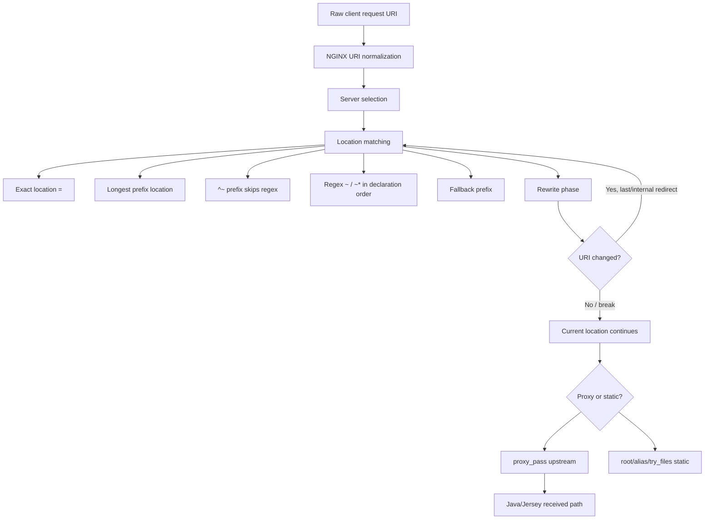

---

## 3. Location Matching Order

NGINX `location` bukan “dibaca dari atas ke bawah” secara sederhana. Urutannya:

| Prioritas | Bentuk | Arti | Contoh |
|---:|---|---|---|
| 1 | Exact match | Menang langsung jika URI sama persis | `location = /health` |
| 2 | Longest prefix | Prefix terpanjang disimpan sebagai kandidat | `location /api/internal/` menang atas `/api/` |
| 3 | `^~` prefix | Jika prefix ini menang, regex tidak dicek | `location ^~ /static/` |
| 4 | Regex | Dicek sesuai urutan kemunculan | `location ~* \.(js|css)$` |
| 5 | Prefix fallback | Jika tidak ada regex cocok, pakai prefix terpanjang | `location /` |

Dokumentasi NGINX menjelaskan bahwa prefix location diperiksa dulu dan prefix terpanjang diingat; regex lalu diperiksa sesuai urutan konfigurasi dan first match menang; jika tidak ada regex cocok, prefix yang diingat tadi dipakai. Modifier `^~` membuat regex tidak dicek, sedangkan `=` menghentikan pencarian langsung jika exact match cocok. ([Nginx](https://nginx.org/en/docs/http/ngx_http_core_module.html))

---

## 4. Contoh Location Matching

```nginx
server {
    listen 80;
    server_name api.example.local;

    location = / {
        return 200 "root exact";
    }

    location / {
        return 200 "root prefix";
    }

    location /api/ {
        return 200 "api prefix";
    }

    location ^~ /api/internal/ {
        return 200 "internal prefix no regex";
    }

    location ~* \.(json|xml)$ {
        return 200 "regex json xml";
    }
}
```

Hasil:

| Request | Location yang menang | Kenapa |
|---|---|---|
| `/` | `location = /` | Exact match menang langsung |
| `/home` | `location /` | Prefix fallback |
| `/api/orders` | `location /api/` | Longest prefix |
| `/api/orders.json` | regex `\.(json\|xml)$` | Regex menang atas prefix biasa |
| `/api/internal/status.json` | `location ^~ /api/internal/` | `^~` mencegah regex dicek |
| `/unknown.xml` | regex `\.(json\|xml)$` | Prefix `/` disimpan, tapi regex cocok |

Implikasi untuk Java/Jersey: jangan letakkan regex umum seperti `~* \.(json|xml)$` jika kamu tidak sadar bahwa regex itu bisa mengambil alih route `/api/orders.json`.

---

## 5. Exact Match untuk Endpoint Khusus

Gunakan exact location untuk endpoint yang harus deterministic:

```nginx
location = /health {
    access_log off;
    proxy_pass http://jersey_api/health;
}

location = /ready {
    access_log off;
    proxy_pass http://jersey_api/ready;
}
```

Kenapa?

```text
/health        → health check
/health/extra  → bukan health check
/health.json   → bukan health check
```

Untuk Kubernetes, load balancer, atau monitoring, exact match membuat health endpoint tidak ikut aturan umum seperti auth, CORS, rewrite, SPA fallback, atau regex static.

---

## 6. Prefix `/api` vs `/api/`

Ini pitfall klasik.

```nginx
location /api {
    proxy_pass http://jersey_api;
}
```

Akan match:

```text
/api
/api/
/api/orders
/apix
/api-v2
```

Biasanya bukan yang diinginkan.

Lebih aman:

```nginx
location = /api {
    return 301 /api/;
}

location /api/ {
    proxy_pass http://jersey_api/;
}
```

NGINX punya special behavior: jika prefix location berakhir dengan `/` dan request diproses oleh directive seperti `proxy_pass`, maka request yang sama tetapi tanpa trailing slash akan diberi permanent redirect 301 ke versi dengan slash. Jika perilaku ini tidak diinginkan, exact location bisa didefinisikan khusus. ([Nginx](https://nginx.org/en/docs/http/ngx_http_core_module.html))

---

## 7. `proxy_pass` Trailing Slash Matrix

Ini bagian paling penting.

### Case A - Strip prefix

```nginx
location /api/ {
    proxy_pass http://jersey_api/;
}
```

| Client request | Path ke Jersey |
|---|---|
| `/api/orders` | `/orders` |
| `/api/customers/123` | `/customers/123` |

Cocok jika Jersey resource:

```java
@Path("/orders")
public class OrderResource {}
```

---

### Case B - Preserve prefix

```nginx
location /api/ {
    proxy_pass http://jersey_api;
}
```

| Client request | Path ke Jersey |
|---|---|
| `/api/orders` | `/api/orders` |
| `/api/customers/123` | `/api/customers/123` |

Cocok jika Jersey app punya:

```java
@ApplicationPath("/api")
public class RestApplication extends ResourceConfig {}
```

---

### Case C - Map ke prefix upstream lain

```nginx
location /public-api/ {
    proxy_pass http://jersey_api/internal-api/;
}
```

| Client request | Path ke Jersey |
|---|---|
| `/public-api/orders` | `/internal-api/orders` |
| `/public-api/customers/123` | `/internal-api/customers/123` |

Cocok untuk compatibility layer, tapi jangan dipakai sembarangan karena membingungkan debugging.

Dokumentasi NGINX menjelaskan: jika `proxy_pass` memiliki URI, bagian normalized request URI yang match dengan location diganti oleh URI tersebut; jika `proxy_pass` tanpa URI, request URI diteruskan dalam bentuk yang sama seperti dikirim client, atau full normalized changed URI jika URI sudah diubah. ([Nginx](https://nginx.org/en/docs/http/ngx_http_proxy_module.html))

---

## 8. Rule Praktis untuk Java/Jersey

| Jersey setup | NGINX pattern |
|---|---|
| Resource dimulai dari `/orders`, `/customers` | `location /api/ { proxy_pass http://app/; }` |
| Jersey punya `@ApplicationPath("/api")` | `location /api/ { proxy_pass http://app; }` |
| Servlet context path `/order-service` + app path `/api` | Preserve path atau map eksplisit, jangan tebak |
| Backend lama expose `/rest/v1` tapi publik ingin `/api` | `proxy_pass http://app/rest/v1/;` |
| Endpoint health `/health` tidak di bawah `/api` | exact `location = /health` |
| Frontend SPA dan API satu domain | `location /api/` harus menang sebelum SPA fallback |

---

## 9. URI Normalization dan `merge_slashes`

Default:

```nginx
merge_slashes on;
```

Artinya request seperti:

```text
/api//orders
```

Untuk matching location, bisa dinormalisasi menjadi:

```text
/api/orders
```

Dokumentasi menyebut `merge_slashes on` penting agar prefix dan regex location cocok dengan benar; mematikannya bisa diperlukan untuk kasus tertentu seperti URI berisi base64 dengan `/`, tetapi dari sisi security lebih baik menghindari mematikannya. ([Nginx](https://nginx.org/en/docs/http/ngx_http_core_module.html))

Rekomendasi untuk enterprise API:

```text
Biarkan merge_slashes on
Jangan desain API yang bergantung pada double slash
Jangan pakai path segment base64 mentah; gunakan URL-safe base64/base64url
Validasi canonical path di aplikasi jika menyangkut authorization/resource ownership
```

---

## 10. `$uri` vs `$request_uri`

Ini penting untuk logging, rewrite, dan proxying.

| Variable | Isi | Karakteristik |
|---|---|---|
| `$request_uri` | Original URI dari client, termasuk query string | Biasanya belum diubah, cocok untuk log/debug |
| `$uri` | Normalized/current URI internal NGINX | Bisa berubah karena rewrite/internal redirect |
| `$args` | Query string tanpa `?` | Bisa dipakai saat membentuk upstream URI |
| `$is_args` | `?` jika ada query string, kosong jika tidak | Berguna untuk concat query aman |

Contoh debug log:

```nginx
log_format route_debug
    'request_uri="$request_uri" uri="$uri" args="$args" '
    'status=$status upstream="$upstream_addr" '
    'upstream_status="$upstream_status"';

access_log /var/log/nginx/route-debug.log route_debug;
```

Jika kamu sedang debug `proxy_pass`/rewrite, log `$request_uri` dan `$uri` bersamaan.

---

## 11. `rewrite` vs `return`

### Gunakan `return` untuk redirect sederhana

```nginx
server {
    listen 80;
    server_name api.example.com;

    return 301 https://$host$request_uri;
}
```

Atau canonical slash:

```nginx
location = /api {
    return 301 /api/;
}
```

### Gunakan `rewrite` untuk mengubah URI internal atau pattern kompleks

```nginx
location /legacy/ {
    rewrite ^/legacy/(.*)$ /api/v1/$1 last;
}
```

`ngx_http_rewrite_module` digunakan untuk mengubah request URI memakai regex PCRE, mengembalikan redirect, dan memilih konfigurasi secara kondisional. Directive rewrite module pada level server dijalankan berurutan, lalu NGINX mencari location berdasarkan URI; jika URI direwrite, proses location search dapat diulang, tetapi dibatasi maksimal 10 kali. ([Nginx](https://nginx.org/en/docs/http/ngx_http_rewrite_module.html))

---

## 12. `rewrite last` vs `rewrite break`

### `last` - ubah URI dan cari location lagi

```nginx
location /legacy/ {
    rewrite ^/legacy/(.*)$ /api/v1/$1 last;
}

location /api/v1/ {
    proxy_pass http://jersey_api/;
}
```

Flow:

```text
/legacy/orders
  ↓ rewrite last
/api/v1/orders
  ↓ location matching ulang
location /api/v1/
```

### `break` - ubah URI tetapi tetap di location saat ini

```nginx
location /legacy/ {
    rewrite ^/legacy/(.*)$ /api/v1/$1 break;
    proxy_pass http://jersey_api;
}
```

Flow:

```text
/legacy/orders
  ↓ rewrite break
/api/v1/orders
  ↓ tetap dalam location /legacy/
  ↓ proxy_pass jalan dari location yang sama
```

Rule praktis:

| Tujuan | Gunakan |
|---|---|
| Ingin route diproses oleh location lain | `last` |
| Ingin tetap dalam location saat ini lalu proxy | `break` |
| Ingin redirect ke client | `return 301/302/...` |
| Ingin canonical HTTP → HTTPS | `return`, bukan rewrite |
| Ingin legacy URL internal mapping | `rewrite ... last` atau `break`, tergantung target |

---

## 13. Jangan Terlalu Banyak `if` di `location`

Contoh yang sering muncul:

```nginx
location /api/ {
    if ($request_method = OPTIONS) {
        add_header ...;
        return 204;
    }

    proxy_pass http://jersey_api/;
}
```

Ini sering dipakai untuk CORS dan bisa bekerja, tetapi jangan jadikan `if` sebagai mini programming language di NGINX. Untuk routing, lebih baik gunakan `map`, location yang jelas, atau pisahkan concern.

Pola lebih rapi untuk value selection:

```nginx
map $http_origin $cors_origin {
    default "";
    "https://app.example.com" $http_origin;
    "https://admin.example.com" $http_origin;
}
```

Lalu pakai:

```nginx
add_header Access-Control-Allow-Origin $cors_origin always;
```

---

## 14. Named Location

Named location menggunakan `@` dan tidak dipilih langsung dari request normal.

```nginx
location / {
    try_files $uri $uri/ @spa;
}

location @spa {
    rewrite ^ /index.html break;
}
```

Dokumentasi NGINX menyatakan location dengan prefix `@` adalah named location, tidak digunakan untuk regular request processing, tetapi untuk request redirection internal. Named location tidak bisa nested dan tidak boleh punya nested location. ([Nginx](https://nginx.org/en/docs/http/ngx_http_core_module.html))

Named location cocok untuk:

```text
SPA fallback
custom error handler
internal fallback ke upstream
try_files fallback
```

---

## 15. `try_files` untuk Static Frontend + API

Pola umum untuk frontend SPA + API backend:

```nginx
server {
    listen 80;
    server_name app.example.local;

    root /usr/share/nginx/html;

    location /api/ {
        proxy_pass http://jersey_api/;
        include conf.d/proxy-common.conf;
    }

    location / {
        try_files $uri $uri/ /index.html;
    }
}
```

Kenapa `location /api/` harus ada sebelum fallback? Secara matching, prefix `/api/` lebih spesifik daripada `/`, sehingga API tidak akan ditelan SPA fallback. Tetapi hati-hati jika ada regex static seperti ini:

```nginx
location ~* \.(json|xml)$ {
    root /usr/share/nginx/html;
}
```

Maka request `/api/orders.json` bisa masuk regex, bukan API, kecuali `/api/` diberi `^~`:

```nginx
location ^~ /api/ {
    proxy_pass http://jersey_api/;
    include conf.d/proxy-common.conf;
}
```

---

## 16. `root` vs `alias`

### `root`

```nginx
location /images/ {
    root /var/www;
}
```

Request:

```text
/images/logo.png
```

File path:

```text
/var/www/images/logo.png
```

### `alias`

```nginx
location /images/ {
    alias /mnt/assets/;
}
```

Request:

```text
/images/logo.png
```

File path:

```text
/mnt/assets/logo.png
```

NGINX docs menyebut `alias` mengganti path location dengan path filesystem yang diberikan. Jika `alias` digunakan di regex location, regex sebaiknya punya capture dan `alias` merujuk capture tersebut. ([Nginx](https://nginx.org/en/docs/http/ngx_http_core_module.html))

Rule praktis:

```text
Gunakan root jika filesystem mengikuti URL path.
Gunakan alias jika URL prefix berbeda dari filesystem path.
Pastikan trailing slash location dan alias konsisten.
Jangan mencampur alias + regex tanpa capture yang jelas.
```

---

## 17. Redirect dari Backend: `proxy_redirect`

Masalah umum:

```text
Client akses:
https://api.example.com/api/login

Backend membalas:
Location: http://localhost:8080/login/success
```

Client kemudian diarahkan ke host internal yang tidak valid.

NGINX punya `proxy_redirect` untuk mengubah header `Location` dan `Refresh` dari upstream response. Dokumentasi memberi contoh header `Location: http://localhost:8000/two/...` dapat ditulis ulang menjadi URL frontend yang benar; `proxy_redirect default` juga menggunakan kombinasi `location` dan `proxy_pass` untuk replacement default. ([Nginx](https://nginx.org/en/docs/http/ngx_http_proxy_module.html))

Contoh:

```nginx
location /api/ {
    proxy_pass http://jersey_api/;

    proxy_redirect http://jersey-api.internal:8080/ /api/;
}
```

Atau jika backend sudah benar menggunakan forwarded headers:

```nginx
proxy_redirect off;
```

Rekomendasi: untuk aplikasi Java/Jersey modern, lebih baik backend generate URL berdasarkan `Host` dan `X-Forwarded-Proto` yang benar, bukan terlalu banyak rewrite redirect di NGINX.

---

## 18. Pattern: Legacy URL ke API Baru

Misal URL lama:

```text
/old-api/order/123
```

Akan diarahkan internal ke:

```text
/api/orders/123
```

### Internal rewrite

```nginx
location /old-api/ {
    rewrite ^/old-api/order/(.+)$ /api/orders/$1 last;
}

location /api/ {
    proxy_pass http://jersey_api/;
}
```

Client tetap melihat `/old-api/order/123`, tetapi backend menerima route baru setelah internal rewrite.

### External redirect

```nginx
location /old-api/ {
    return 301 /api/orders$request_uri;
}
```

Ini contoh buruk karena `$request_uri` membawa seluruh path lama. Lebih benar:

```nginx
location ~ ^/old-api/order/(.+)$ {
    return 301 /api/orders/$1;
}
```

Pilih internal rewrite jika compatibility harus transparan. Pilih external redirect jika ingin client pindah ke URL baru secara permanen.

---

## 19. Pattern: API Version Routing

```nginx
location /api/v1/ {
    proxy_pass http://jersey_v1/;
    include conf.d/proxy-common.conf;
}

location /api/v2/ {
    proxy_pass http://jersey_v2/;
    include conf.d/proxy-common.conf;
}
```

Atau jika satu backend menangani prefix version:

```nginx
location /api/ {
    proxy_pass http://jersey_api;
    include conf.d/proxy-common.conf;
}
```

Decision table:

| Kondisi | Pattern |
|---|---|
| v1 dan v2 beda service/deployment | Route di NGINX/Kubernetes |
| v1 dan v2 satu aplikasi | Preserve prefix ke Jersey |
| Migrasi gradual per endpoint | Gunakan exact/prefix location lebih spesifik |
| Canary/weighted routing | Jangan manual location saja; gunakan upstream strategy/Ingress/Gateway/service mesh |

---

## 20. Pattern: Admin/Internal Route

```nginx
location ^~ /internal/ {
    allow 10.0.0.0/8;
    deny all;

    proxy_pass http://jersey_api/internal/;
    include conf.d/proxy-common.conf;
}
```

Gunakan `^~` agar regex umum tidak mengambil alih route internal.

Tambahkan exact route untuk endpoint sensitif jika perlu:

```nginx
location = /internal/metrics {
    allow 10.0.0.0/8;
    deny all;

    proxy_pass http://jersey_api/internal/metrics;
}
```

Jangan hanya mengandalkan NGINX. Java/Jersey tetap harus mengamankan endpoint internal, karena suatu saat traffic bisa datang dari path lain, port internal, atau misconfiguration Kubernetes.

---

## 21. Pattern: Static Assets Tidak Mengambil API

Konfigurasi yang rawan:

```nginx
location / {
    try_files $uri $uri/ /index.html;
}

location ~* \.(js|css|png|jpg|json)$ {
    expires 1y;
}
```

Masalah:

```text
/api/report.json
```

Bisa masuk regex static.

Lebih aman:

```nginx
location ^~ /api/ {
    proxy_pass http://jersey_api/;
    include conf.d/proxy-common.conf;
}

location ~* \.(js|css|png|jpg|jpeg|gif|svg|ico)$ {
    expires 1y;
    try_files $uri =404;
}

location / {
    try_files $uri $uri/ /index.html;
}
```

Perhatikan saya tidak memasukkan `.json` ke static asset regex kecuali benar-benar diperlukan, karena banyak API memakai `.json`.

---

## 22. Pattern: CORS Preflight Exact Handling

Kalau preflight hanya untuk API:

```nginx
location ^~ /api/ {
    if ($request_method = OPTIONS) {
        add_header Access-Control-Allow-Origin $cors_origin always;
        add_header Access-Control-Allow-Methods "GET, POST, PUT, PATCH, DELETE, OPTIONS" always;
        add_header Access-Control-Allow-Headers "Authorization, Content-Type, X-Request-ID, Idempotency-Key" always;
        add_header Access-Control-Max-Age 600 always;
        return 204;
    }

    proxy_pass http://jersey_api/;
    include conf.d/proxy-common.conf;
}
```

Jangan letakkan CORS global di semua location jika ada static frontend, admin route, dan internal route yang butuh policy berbeda.

---

## 23. Debugging Routing

Tambahkan temporary header di staging:

```nginx
add_header X-Debug-Request-URI $request_uri always;
add_header X-Debug-URI         $uri always;
add_header X-Debug-Location    "api-prefix" always;
```

Contoh:

```nginx
location ^~ /api/ {
    add_header X-Debug-Location "api-prefix" always;

    proxy_pass http://jersey_api/;
    include conf.d/proxy-common.conf;
}
```

Lalu test:

```bash
curl -i https://app.example.local/api/orders/123
curl -i https://app.example.local/api
curl -i https://app.example.local/api/
curl -i https://app.example.local/api/orders.json
curl -i https://app.example.local/static/app.js
curl -i https://app.example.local/unknown/frontend/route
```

Minimal test matrix:

| Test | Yang dicek |
|---|---|
| `/api` | Redirect ke `/api/` atau handled exact |
| `/api/` | Masuk API, bukan SPA |
| `/api/orders` | Prefix strip/preserve benar |
| `/api/orders.json` | Tidak diambil regex static |
| `/internal/metrics` | Access restriction benar |
| `/static/app.js` | Static asset benar |
| `/dashboard/orders` | SPA fallback benar |
| `/../api/orders` | Normalisasi/security behavior benar |
| `/api//orders` | Double slash behavior benar |

---

## 24. Anti-Patterns

| Anti-pattern | Akibat |
|---|---|
| `location /api` tanpa exact `/api` dan prefix `/api/` | `/apix`, `/api-v2` ikut match |
| Tidak paham trailing slash `proxy_pass` | Path backend berubah diam-diam |
| Regex static terlalu umum | API route ditelan static handler |
| Semua redirect pakai `rewrite` | Config sulit dibaca; `return` lebih tepat untuk redirect sederhana |
| Rewrite chain panjang | Bisa loop; NGINX membatasi rewrite loop sampai 10 kali |
| CORS preflight jatuh ke SPA fallback | Browser gagal walau backend benar |
| Backend redirect ke internal host | Client melihat `localhost`, pod DNS, atau private hostname |
| `alias` tanpa trailing slash konsisten | File path salah |
| Mengandalkan NGINX untuk authorization path-sensitive | Bypass bisa terjadi jika route lain terbuka |
| Tidak punya route debug log/header di staging | Routing bug sulit dibuktikan |

---

## 25. Production Baseline Pattern

```nginx
server {
    listen 443 ssl;
    server_name app.example.com;

    root /usr/share/nginx/html;

    # Canonical API slash
    location = /api {
        return 301 /api/;
    }

    # API must not be stolen by regex static locations
    location ^~ /api/ {
        proxy_pass http://jersey_api/;

        proxy_http_version 1.1;
        proxy_set_header Connection "";

        proxy_set_header Host              $host;
        proxy_set_header X-Real-IP         $remote_addr;
        proxy_set_header X-Forwarded-For   $proxy_add_x_forwarded_for;
        proxy_set_header X-Forwarded-Proto $scheme;
        proxy_set_header X-Request-ID      $request_id;

        proxy_connect_timeout 3s;
        proxy_send_timeout    30s;
        proxy_read_timeout    30s;
    }

    # Exact health route if exposed at edge
    location = /health {
        access_log off;
        proxy_pass http://jersey_api/health;
    }

    # Static assets
    location ~* \.(js|css|png|jpg|jpeg|gif|svg|ico|woff2?)$ {
        expires 30d;
        try_files $uri =404;
    }

    # SPA fallback
    location / {
        try_files $uri $uri/ /index.html;
    }
}
```

---

## 26. Checklist Review PR NGINX Routing

```text
[ ] Apakah /api dan /api/ diperlakukan jelas?
[ ] Apakah proxy_pass strip atau preserve prefix secara sengaja?
[ ] Apakah ada regex location yang bisa mengambil API route?
[ ] Apakah route health/readiness exact match?
[ ] Apakah static fallback tidak menelan API?
[ ] Apakah rewrite memakai last/break dengan sengaja?
[ ] Apakah redirect sederhana memakai return, bukan rewrite?
[ ] Apakah backend Location header tidak bocor ke internal hostname?
[ ] Apakah root vs alias benar?
[ ] Apakah $request_uri dan $uri sudah dilog saat debug?
[ ] Apakah route internal diberi ^~ atau exact agar tidak kena regex umum?
[ ] Apakah Java/Jersey @ApplicationPath cocok dengan mapping NGINX?
```

---

## 27. Roadmap Belajar Singkat

1. Hafalkan urutan matching: `=`, longest prefix, `^~`, regex order, prefix fallback.
2. Latih matrix `location /api/` dengan `proxy_pass http://app/` vs `proxy_pass http://app`.
3. Biasakan exact match untuk `/health`, `/ready`, `/metrics`, dan canonical redirect.
4. Gunakan `^~` untuk API/internal route agar tidak diambil regex static.
5. Pakai `return` untuk redirect sederhana; pakai `rewrite` hanya jika memang perlu URI transformation.
6. Log `$request_uri` dan `$uri` saat debugging.
7. Validasi mapping terhadap `@ApplicationPath` dan `@Path` di Jersey.

---

## Status seri

**Seri 3 selesai. Sisa 9 seri lagi.**

Rekomendasi berikutnya: **Seri 4 - NGINX Upstream, Load Balancing, Keepalive, Retry, Health Check, and Idempotency**.

---

**Sources:**

- [Module ngx_http_core_module](https://nginx.org/en/docs/http/ngx_http_core_module.html)

## Response:
7/13/2026, 4:37:09 PM

# Seri 4/12 - NGINX Upstream, Load Balancing, Keepalive, Retry, Health Check, and Idempotency

## 1. Introduction

Seri ini membahas bagaimana NGINX memilih backend Java/Jersey, menjaga koneksi ke upstream, melakukan failover, melakukan retry, dan bagaimana keputusan itu bisa berdampak pada **duplikasi transaksi**, **workflow ganda**, **side effect berulang**, atau **audit trail yang membingungkan**.

Mental model-nya:

```text id="aszp06"
Client
  ↓
NGINX
  - select upstream server
  - reuse or open connection
  - detect connection failure
  - optionally retry another upstream
  - log upstream timing/status
  ↓
Java/Jersey instance A/B/C
  ↓
PostgreSQL / Camunda / external systems
```

Dalam NGINX, grup backend didefinisikan lewat `upstream`; directive seperti `server`, `max_fails`, `fail_timeout`, `keepalive`, `least_conn`, `ip_hash`, dan `proxy_next_upstream` menentukan bagaimana traffic dialirkan dan bagaimana failure diperlakukan. NGINX OSS mendukung passive health check lewat mekanisme kegagalan komunikasi, sedangkan active periodic health check tersedia lewat module health check komersial/NGINX Plus. ([Nginx](https://nginx.org/en/docs/http/ngx_http_upstream_module.html?utm_source=chatgpt.com))

---

## 2. Diagram

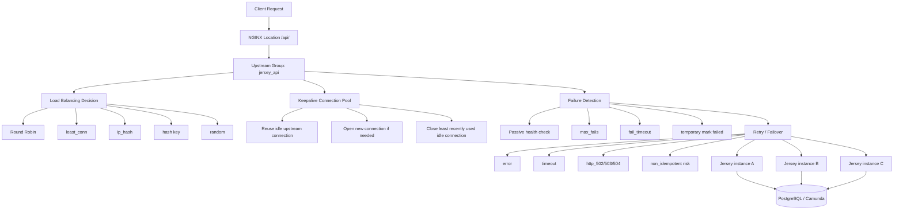

---

## 3. Upstream Basic

Contoh basic:

```nginx id="czt42r"
upstream jersey_api {
    server jersey-app-1.internal:8080;
    server jersey-app-2.internal:8080;
    server jersey-app-3.internal:8080;
}

server {
    listen 443 ssl;
    server_name api.example.com;

    location /api/ {
        proxy_pass http://jersey_api/;
        include conf.d/proxy-common.conf;
    }
}
```

Secara default, NGINX memakai **weighted round-robin** untuk membagi request ke server dalam upstream group. Server bisa diberi parameter seperti `weight`, `max_fails`, `fail_timeout`, `backup`, `down`, dan `max_conns`. ([Nginx](https://nginx.org/en/docs/http/load_balancing.html?utm_source=chatgpt.com))

---

## 4. Load Balancing Methods

| Method | Contoh | Cocok untuk | Catatan |
|---|---|---|---|
| Round robin default | tanpa directive khusus | API stateless umum | Default paling sederhana. |
| Weighted round robin | `server app1 weight=3;` | Instance beda kapasitas | Instance dengan weight lebih tinggi menerima lebih banyak request. |
| `least_conn` | `least_conn;` | Request duration tidak merata | Cocok jika ada endpoint berat dan ringan bercampur. |
| `ip_hash` | `ip_hash;` | Butuh affinity berbasis IP | Kurang akurat jika banyak client di belakang NAT/proxy. |
| `hash` | `hash $request_uri consistent;` | Cache affinity / key-based routing | Perlu desain key yang stabil. |
| `random` | `random two least_conn;` | Distribusi acak dengan pilihan ringan | Bisa berguna untuk high-scale balancing sederhana. |

Contoh `least_conn`:

```nginx id="7bv6w4"
upstream jersey_api {
    least_conn;

    server jersey-app-1.internal:8080;
    server jersey-app-2.internal:8080;
    server jersey-app-3.internal:8080;
}
```

Untuk aplikasi Java/Jersey stateless, `round robin` atau `least_conn` biasanya lebih sehat daripada sticky routing. Sticky routing sering menjadi tanda bahwa state masih tersimpan di memory instance, bukan di storage yang benar seperti database, cache, atau workflow engine.

---

## 5. Weighted Server

```nginx id="44izkj"
upstream jersey_api {
    server jersey-app-large.internal:8080 weight=4;
    server jersey-app-small-1.internal:8080 weight=1;
    server jersey-app-small-2.internal:8080 weight=1;
}
```

Gunakan `weight` jika backend tidak homogen, misalnya VM lama dan baru berbeda CPU/memory, atau ada instance canary dengan kapasitas kecil. Namun untuk Kubernetes, biasanya lebih baik scaling dilakukan via jumlah Pod dan resource request/limit, bukan weight manual di NGINX static config.

---

## 6. Backup Server

```nginx id="kxc8ma"
upstream jersey_api {
    server jersey-app-1.internal:8080;
    server jersey-app-2.internal:8080;

    server jersey-backup.internal:8080 backup;
}
```

`backup` server hanya dipakai ketika primary server tidak tersedia. Ini berguna untuk failover sederhana, tetapi jangan dianggap sebagai high availability penuh. Jika backup berbeda versi, schema, config, atau dependency, failover bisa menghasilkan bug yang lebih buruk daripada downtime singkat.

---

## 7. Passive Health Check

Contoh:

```nginx id="ijhp4d"
upstream jersey_api {
    server jersey-app-1.internal:8080 max_fails=3 fail_timeout=10s;
    server jersey-app-2.internal:8080 max_fails=3 fail_timeout=10s;
}
```

`max_fails` menentukan jumlah consecutive unsuccessful attempts selama window `fail_timeout`; jika terpenuhi, server ditandai failed selama `fail_timeout`. Default `max_fails` adalah `1`; jika diset `0`, health check untuk server tersebut dinonaktifkan. Setelah interval `fail_timeout`, NGINX akan mencoba server itu lagi memakai request client nyata. ([Nginx](https://nginx.org/en/docs/http/load_balancing.html?utm_source=chatgpt.com))

Implikasinya:

```text id="x1ef4d"
Passive health check bukan probe /health aktif.
NGINX baru tahu backend bermasalah setelah request client gagal.
Recovery juga diprobe oleh traffic client.
```

Untuk Java/Jersey, ini berarti endpoint `/health` atau `/ready` tidak otomatis dipanggil oleh NGINX OSS upstream biasa. Kalau ingin active health check native NGINX, itu masuk fitur commercial health check module/NGINX Plus; di Kubernetes, health check lebih sering dilakukan oleh readiness/liveness probe dan Service endpoint selection.

---

## 8. Active Health Check: NGINX Plus vs OSS

NGINX punya `ngx_http_upstream_hc_module` untuk periodic health checks dengan directive `health_check`, termasuk parameter seperti `interval`, `fails`, dan `passes`; dokumentasi modul tersebut menyatakan bahwa modul ini tersedia sebagai bagian dari commercial subscription. ([Nginx](https://nginx.org/en/docs/http/ngx_http_upstream_hc_module.html?utm_source=chatgpt.com))

Contoh konseptual NGINX Plus:

```nginx id="qs8m6n"
upstream jersey_api {
    zone jersey_api 64k;

    server jersey-app-1.internal:8080;
    server jersey-app-2.internal:8080;
}

server {
    location /api/ {
        proxy_pass http://jersey_api;
        health_check uri=/health interval=5s fails=2 passes=2;
    }
}
```

Untuk NGINX OSS, pola production biasanya:

```text id="b7g1ra"
Kubernetes:
  readinessProbe decides whether Pod receives traffic

VM/Docker non-Kubernetes:
  external load balancer / monitoring checks health
  NGINX passive health check handles connection failure
  deployment automation removes bad node from upstream
```

---

## 9. Keepalive: Jangan Salah Paham

`keepalive` di upstream berarti NGINX menyimpan idle connection ke backend agar bisa dipakai ulang. Ini mengurangi overhead TCP/TLS handshake dan connection churn. Dokumentasi NGINX saat ini menyebut sejak versi 1.29.7, upstream keepalive connections aktif secara default dengan limit 32 koneksi per worker; sebelum versi tersebut, `keepalive` sering perlu dikonfigurasi eksplisit. Dokumentasi juga menekankan bahwa `keepalive` tidak membatasi total koneksi yang bisa dibuka worker ke upstream. ([Nginx](https://nginx.org/en/docs/http/ngx_http_upstream_module.html?utm_source=chatgpt.com))

Contoh explicit:

```nginx id="h8iytt"
upstream jersey_api {
    least_conn;

    server jersey-app-1.internal:8080 max_fails=3 fail_timeout=10s;
    server jersey-app-2.internal:8080 max_fails=3 fail_timeout=10s;

    keepalive 32;
}

server {
    location /api/ {
        proxy_http_version 1.1;
        proxy_set_header Connection "";

        proxy_pass http://jersey_api/;
    }
}
```

Poin penting:

| Item | Arti |
|---|---|
| `keepalive 32` | Menyimpan maksimal 32 idle upstream connection per worker. |
| Bukan total connection cap | Worker tetap bisa membuka koneksi aktif lebih banyak. |
| Per worker | Total idle connection kira-kira `worker_processes × keepalive`. |
| Per upstream group | Dihitung untuk upstream group tersebut. |
| Tidak sama dengan TCP keepalive | Ini HTTP upstream connection reuse, bukan OS-level socket keepalive. |

---

## 10. Keepalive vs `max_conns`

`keepalive` mengatur idle connection cache. `max_conns` membatasi jumlah active connections ke server upstream, tetapi harus dipakai hati-hati karena idle keepalive connection dan shared zone/worker behavior dapat memengaruhi total koneksi aktual. Dokumentasi upstream module menekankan bahwa idle keepalive, multiple workers, dan shared memory dapat membuat total active + idle connection melebihi `max_conns` dalam kondisi tertentu. ([Nginx](https://nginx.org/en/docs/http/ngx_http_upstream_module.html?utm_source=chatgpt.com))

Contoh:

```nginx id="dv2cw3"
upstream jersey_api {
    zone jersey_api 64k;

    server jersey-app-1.internal:8080 max_conns=200;
    server jersey-app-2.internal:8080 max_conns=200;

    keepalive 32;
}
```

Gunakan `max_conns` jika backend Java punya batas thread/connection yang jelas. Tetapi jangan pakai ini sebagai satu-satunya mekanisme proteksi. Tetap butuh:

```text id="8sasmf"
- Java HTTP server thread pool limit
- database connection pool limit
- request timeout
- rate limit
- backpressure / bulkhead
- autoscaling or capacity planning
```

---

## 11. NGINX Connection Chain

Untuk satu request biasa:

```text id="v4ebtx"
Client connection → NGINX
NGINX upstream connection → Java/Jersey
Java DB connection → PostgreSQL
Java external connection → Camunda / other service
```

Jika 1.000 client request datang bersamaan, bottleneck bisa muncul di beberapa tempat:

| Layer | Bottleneck |
|---|---|
| Client → NGINX | worker_connections, file descriptor, TLS, network |
| NGINX → Java | upstream connection count, keepalive reuse, backend listener backlog |
| Java | HTTP worker thread, async executor, GC, CPU |
| Java → DB | HikariCP/MyBatis connection pool |
| DB | locks, slow query, transaction contention |
| Camunda | job executor, REST API latency, engine DB contention |

NGINX keepalive bisa mengurangi connection churn, tetapi tidak menyelesaikan backend saturation. Kalau Java thread pool penuh atau DB pool habis, keepalive hanya membuat koneksi lebih efisien, bukan membuat sistem lebih benar.

---

## 12. Retry / Failover dengan `proxy_next_upstream`

Contoh:

```nginx id="hjuu2e"
location /api/ {
    proxy_next_upstream error timeout http_502 http_503 http_504;
    proxy_next_upstream_tries 2;
    proxy_next_upstream_timeout 5s;

    proxy_pass http://jersey_api/;
}
```

`proxy_next_upstream` menentukan kondisi kapan request boleh diteruskan ke upstream server berikutnya, misalnya `error`, `timeout`, `invalid_header`, `http_500`, `http_502`, `http_503`, `http_504`, `http_429`, dan `non_idempotent`. Default-nya adalah `error timeout`. NGINX juga menyediakan `proxy_next_upstream_tries` untuk membatasi jumlah percobaan dan `proxy_next_upstream_timeout` untuk membatasi waktu total retry. ([Nginx](https://nginx.org/en/docs/http/ngx_http_proxy_module.html?utm_source=chatgpt.com))

---

## 13. Retry Decision Matrix

| Kondisi | Retry otomatis aman? | Catatan |
|---|---:|---|
| Connect gagal sebelum request dikirim | Biasanya aman | Backend belum menerima request. |
| Timeout sebelum response header | Tidak selalu aman | Backend mungkin sudah memproses request. |
| `GET` read-only | Biasanya aman | Pastikan tidak ada side effect tersembunyi. |
| `HEAD` | Aman | Cocok untuk health/readiness. |
| `OPTIONS` | Aman | Biasanya CORS/preflight. |
| `POST` create command | Berbahaya | Bisa membuat transaksi ganda. |
| `PUT` full replace | Relatif aman jika idempotent | Tetap perhatikan audit/event side effect. |
| `PATCH` partial mutation | Berbahaya | Bisa mengubah state dua kali. |
| `DELETE` | Tergantung | HTTP idempotent secara semantik, tapi domain event/audit bisa berulang. |
| Camunda start process | Sangat berbahaya | Bisa start workflow ganda. |
| Payment/order submission | Sangat berbahaya | Wajib idempotency key. |

Rule praktis: **retry di NGINX hanya aman jika request benar-benar idempotent atau backend punya idempotency control**.

---

## 14. Jangan Retry Non-Idempotent Command Sembarangan

Konfigurasi rawan:

```nginx id="o9u7h7"
location /api/ {
    proxy_next_upstream error timeout http_500 http_502 http_503 http_504 non_idempotent;
    proxy_next_upstream_tries 3;

    proxy_pass http://jersey_api/;
}
```

Masalah:

```text id="m2e0ab"
POST /api/orders
  ↓
Jersey instance A menerima request
  ↓
Order berhasil dibuat, tapi response timeout sebelum sampai NGINX
  ↓
NGINX retry ke Jersey instance B
  ↓
Order kedua dibuat
```

Untuk sistem enterprise/order/workflow/regulatory, efeknya bisa serius:

```text id="vzt85v"
- order duplicate
- Camunda process instance duplicate
- notification duplicate
- audit event duplicate
- downstream Kafka/RabbitMQ event duplicate
- database constraint violation
- user melihat status tidak konsisten
```

---

## 15. Idempotency Key Pattern

Untuk endpoint mutasi, gunakan idempotency key.

```http id="o71ain"
POST /api/orders HTTP/1.1
Host: api.example.com
Authorization: Bearer ...
Idempotency-Key: 6d73476d-0e4d-4e89-a6cf-72c6d4ef2e4a
Content-Type: application/json
```

Flow:

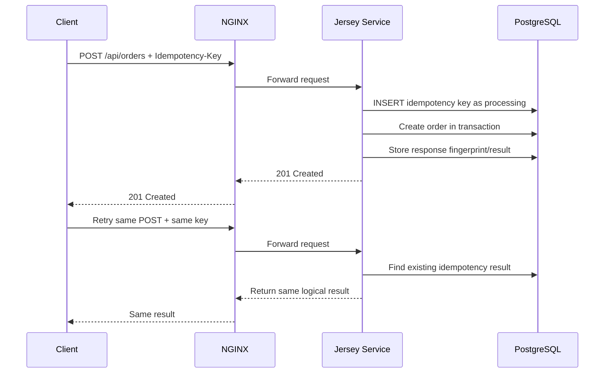

Database table konseptual:

```sql id="mu8hs9"
CREATE TABLE api_idempotency_key (
    idempotency_key       text PRIMARY KEY,
    user_id               text NOT NULL,
    request_fingerprint   text NOT NULL,
    status                text NOT NULL,
    response_status       integer,
    response_body         jsonb,
    resource_type         text,
    resource_id           text,
    created_at            timestamptz NOT NULL DEFAULT now(),
    completed_at          timestamptz
);
```

Core invariant:

```text id="km9b6g"
Same user + same idempotency key + same request fingerprint
  → return same logical result

Same idempotency key + different request fingerprint
  → reject as conflict
```

---

## 16. Java/Jersey + MyBatis Transaction Pattern

Pseudo-flow:

```java id="oywsyh"
public Response createOrder(CreateOrderRequest request, String idempotencyKey, UserContext user) {
    requireIdempotencyKey(idempotencyKey);

    return transactionTemplate.execute(tx -> {
        var existing = idempotencyMapper.findForUpdate(idempotencyKey);

        if (existing != null) {
            if (!existing.sameUser(user.id()) || !existing.sameFingerprint(request)) {
                throw new ConflictException("Idempotency key reused with different request");
            }

            if (existing.isCompleted()) {
                return rebuildResponse(existing);
            }

            throw new ConflictException("Request is still processing");
        }

        idempotencyMapper.insertProcessing(idempotencyKey, user.id(), fingerprint(request));

        var order = orderService.createOrder(request, user);

        idempotencyMapper.markCompleted(
            idempotencyKey,
            201,
            toJson(order),
            "ORDER",
            order.id()
        );

        return Response.status(201).entity(order).build();
    });
}
```

PostgreSQL locking pattern:

```sql id="m8wbu7"
SELECT *
FROM api_idempotency_key
WHERE idempotency_key = #{idempotencyKey}
FOR UPDATE;
```

Atau insert-first pattern:

```sql id="fs83sq"
INSERT INTO api_idempotency_key (
    idempotency_key,
    user_id,
    request_fingerprint,
    status
)
VALUES (
    #{key},
    #{userId},
    #{fingerprint},
    'PROCESSING'
)
ON CONFLICT (idempotency_key) DO NOTHING;
```

---

## 17. Retry Policy per Endpoint

Jangan satu policy untuk semua route. Pisahkan location berdasarkan behavior.

### Read-only API

```nginx id="dwf4rl"
location /api/catalogs/ {
    proxy_next_upstream error timeout http_502 http_503 http_504;
    proxy_next_upstream_tries 2;
    proxy_next_upstream_timeout 3s;

    proxy_pass http://jersey_api/catalogs/;
    include conf.d/proxy-common.conf;
}
```

### Mutating command API

```nginx id="q5l2vd"
location /api/orders/ {
    # Conservative retry. Do not enable non_idempotent.
    proxy_next_upstream error timeout;
    proxy_next_upstream_tries 1;

    proxy_pass http://jersey_api/orders/;
    include conf.d/proxy-common.conf;
}
```

### Job submission with idempotency

```nginx id="c8j3av"
location /api/jobs/ {
    client_max_body_size 20m;

    proxy_next_upstream error timeout http_502 http_503 http_504;
    proxy_next_upstream_tries 2;

    proxy_set_header Idempotency-Key $http_idempotency_key;

    proxy_pass http://jersey_api/jobs/;
    include conf.d/proxy-common.conf;
}
```

Better: idempotency tetap divalidasi di Java, bukan hanya forwarded oleh NGINX.

---

## 18. Health Endpoint Design

Health endpoint harus dipisahkan berdasarkan tujuan.

| Endpoint | Tujuan | Harus cek apa |
|---|---|---|
| `/live` | Apakah process masih hidup | Minimal JVM/process/container alive |
| `/ready` | Apakah siap menerima traffic | DB pool, required dependency, migration state |
| `/health` | Human/monitoring summary | Bisa gabungkan beberapa komponen |
| `/metrics` | Metrics scraping | Biasanya restricted/internal |
| `/startup` | Startup probe | App initialization selesai |

Untuk Java/Jersey:

```text id="puwx7t"
/live:
  return 200 jika process bisa menjawab

/ready:
  return 200 jika app siap handle request
  return 503 jika DB/migration/config critical belum siap

/health:
  boleh memberi summary, tapi jangan expose secret/internal detail
```

NGINX exact location:

```nginx id="cm1rlv"
location = /ready {
    access_log off;

    proxy_connect_timeout 1s;
    proxy_read_timeout    2s;

    proxy_pass http://jersey_api/ready;
    include conf.d/proxy-common.conf;
}
```

Jangan beri timeout panjang untuk health check. Health check yang lambat sering lebih buruk daripada health check yang gagal cepat.

---

## 19. Failure Semantics: 502 vs 503 vs 504

| Status | Arti praktis | Kemungkinan penyebab |
|---|---|---|
| 502 Bad Gateway | NGINX tidak bisa mendapat response valid dari upstream | connection refused, reset, invalid header, upstream crash |
| 503 Service Unavailable | Tidak ada upstream usable atau request ditolak policy tertentu | all upstream failed, rate limit, maintenance |
| 504 Gateway Timeout | Upstream tidak memberi response tepat waktu | Java lambat, DB lock, Camunda/external call lambat |

Log format minimum:

```nginx id="gpnzii"
log_format upstream_debug
    'time="$time_iso8601" '
    'request="$request" '
    'status=$status '
    'request_time=$request_time '
    'upstream_addr="$upstream_addr" '
    'upstream_status="$upstream_status" '
    'upstream_connect_time="$upstream_connect_time" '
    'upstream_header_time="$upstream_header_time" '
    'upstream_response_time="$upstream_response_time" '
    'request_id="$request_id"';

access_log /var/log/nginx/access.log upstream_debug;
```

Interpretasi cepat:

| Pattern log | Diagnosis awal |
|---|---|
| `upstream_connect_time` tinggi | Network/connect/listener problem |
| `upstream_header_time` tinggi | App menerima request tetapi lambat memberi response header |
| `upstream_response_time` tinggi | Response body lama/streaming/large payload |
| `upstream_status="502, 200"` | Request gagal di upstream pertama, berhasil setelah retry |
| `upstream_addr` berisi beberapa server | Terjadi retry/failover |
| `request_time` tinggi tapi upstream time rendah | Client lambat menerima response atau buffering/client side issue |

---

## 20. Retry Visibility

Saat retry terjadi, NGINX variables bisa berisi beberapa nilai dipisah koma:

```text id="rd0nzv"
upstream_addr="10.0.1.11:8080, 10.0.1.12:8080"
upstream_status="502, 200"
upstream_response_time="0.003, 0.120"
```

Ini sangat penting. Tanpa log upstream detail, tim backend hanya melihat “request sukses”, padahal sebenarnya ada instance yang sering gagal lalu disembunyikan oleh retry.

Tambahkan alert:

```text id="85t6wd"
- rate 502 before retry
- upstream_status contains comma
- one upstream_addr dominates failures
- upstream_connect_time spike
- 504 by route
- retry count by endpoint
```

---

## 21. DNS dan Dynamic Upstream

Static upstream:

```nginx id="njwtad"
upstream jersey_api {
    server jersey-app-1.internal:8080;
    server jersey-app-2.internal:8080;
}
```

Masalahnya: DNS resolution untuk nama di upstream static tidak selalu berperilaku seperti service discovery dinamis yang otomatis mengikuti perubahan IP. Untuk environment dinamis, pola yang lebih sering dipakai:

```text id="5c3rb6"
Kubernetes:
  NGINX Ingress/Gateway/controller watches Service/EndpointSlice

Docker Compose:
  use service name, container DNS, restart/reload when topology changes

VM:
  config management updates upstream list and reloads NGINX

NGINX Plus:
  dynamic upstream / API / resolve features, depending configuration
```

Untuk Kubernetes, jangan kelola daftar Pod manual di `upstream` static. Biarkan Service, EndpointSlice, Ingress Controller, atau Gateway Controller menangani discovery.

---

## 22. Kubernetes Context

Di Kubernetes, request path biasanya:

```text id="r95hba"
External Load Balancer
  ↓
Ingress Controller / Gateway data plane
  ↓
Kubernetes Service
  ↓
EndpointSlice
  ↓
Pod Java/Jersey
```

Jadi health dan load balancing terjadi di beberapa layer:

| Layer | Fungsi |
|---|---|
| Cloud/on-prem LB | Mengirim traffic ke node/pod ingress |
| NGINX Ingress/Gateway | HTTP routing, TLS, policy |
| Kubernetes Service | Mengarahkan ke Pod ready |
| Readiness probe | Menentukan Pod masuk endpoint atau tidak |
| Java app health | Menjawab readiness/liveness |
| App-level idempotency | Menahan retry duplicate side effect |

Dalam Kubernetes, readiness probe lebih reliable untuk menentukan apakah Pod Java boleh menerima traffic daripada mengandalkan NGINX passive health check saja.

---

## 23. Slow Start dan Deployment

NGINX Plus punya fitur seperti `slow_start` untuk menaikkan traffic ke server yang baru pulih secara bertahap; fitur ini muncul di upstream API/status docs sebagai parameter upstream server, tetapi availability-nya terkait fitur komersial/Plus. ([Nginx](https://nginx.org/en/docs/http/ngx_http_api_module.html?utm_source=chatgpt.com))

Untuk NGINX OSS/Kubernetes, alternatifnya:

```text id="ls8d53"
- readinessProbe delay sampai app benar-benar warm
- startupProbe untuk proses startup lama
- preStop hook + terminationGracePeriodSeconds
- rollingUpdate maxUnavailable=0
- warm cache sebelum ready
- JVM warmup awareness
```

Untuk Java 17+ service, jangan menandai Pod ready terlalu cepat jika:

```text id="ik0xma"
- database migration belum selesai
- connection pool belum initialized
- Camunda client belum siap
- cache/reference data belum loaded
- JIT warmup belum cukup untuk endpoint latency-sensitive
```

---

## 24. Graceful Shutdown Interaction

Failure saat rollout sering terjadi karena NGINX masih mengirim traffic ke instance yang sedang shutdown.

Ideal flow:

```text id="5qcc51"
Pod receives SIGTERM
  ↓
Readiness becomes false
  ↓
Kubernetes removes Pod from Service endpoints
  ↓
Ingress/Gateway stops routing new traffic
  ↓
Existing requests finish
  ↓
App exits before grace period ends
```

Untuk Java/Jersey:

```text id="9wxi9i"
- stop accepting new requests
- complete in-flight request
- close HTTP server gracefully
- stop background workers carefully
- close DB pool
- avoid killing Camunda/job processing mid-transaction
```

NGINX-side issue yang perlu dipantau:

```text id="mdrlnx"
- spike 502 during rollout
- upstream prematurely closed connection
- connection reset by peer
- retry hides failed old pod
- client sees intermittent 504
```

---

## 25. Circuit Breaker: Jangan Taruh Semua di NGINX

NGINX bisa membantu dengan failover, timeout, rate limit, dan passive health. Tetapi circuit breaker berbasis domain/dependency biasanya lebih tepat di aplikasi atau service mesh.

| Concern | NGINX | Java/Jersey |
|---|---:|---:|
| Connection timeout to upstream | Ya | Ya |
| Retry to another instance | Ya | Bisa |
| Retry downstream DB/external API | Tidak | Ya |
| Per-tenant throttling | Terbatas | Ya |
| Circuit breaker per dependency | Terbatas | Ya |
| Bulkhead per use case | Tidak ideal | Ya |
| Idempotency | Tidak authoritative | Ya |
| Domain compensation | Tidak | Ya |
| Audit duplicate prevention | Tidak | Ya |

Untuk service yang memanggil Camunda, PostgreSQL, Kafka/RabbitMQ, Redis, atau API eksternal, resilience logic tetap harus ada di Java/domain layer.

---

## 26. Recommended Production Baseline

```nginx id="x62w9w"
upstream jersey_api {
    least_conn;

    server jersey-app-1.internal:8080 max_fails=3 fail_timeout=10s;
    server jersey-app-2.internal:8080 max_fails=3 fail_timeout=10s;
    server jersey-app-3.internal:8080 max_fails=3 fail_timeout=10s;

    keepalive 32;
}

server {
    listen 443 ssl;
    server_name api.example.com;

    location = /ready {
        access_log off;

        proxy_connect_timeout 1s;
        proxy_read_timeout    2s;

        proxy_pass http://jersey_api/ready;
        include conf.d/proxy-common.conf;
    }

    location ^~ /api/catalogs/ {
        proxy_next_upstream error timeout http_502 http_503 http_504;
        proxy_next_upstream_tries 2;
        proxy_next_upstream_timeout 3s;

        proxy_pass http://jersey_api/catalogs/;
        include conf.d/proxy-common.conf;
    }

    location ^~ /api/orders/ {
        # Mutating command endpoint: conservative.
        proxy_next_upstream error timeout;
        proxy_next_upstream_tries 1;

        proxy_pass http://jersey_api/orders/;
        include conf.d/proxy-common.conf;
    }

    location ^~ /api/ {
        proxy_next_upstream error timeout http_502 http_503 http_504;
        proxy_next_upstream_tries 2;

        proxy_pass http://jersey_api/;
        include conf.d/proxy-common.conf;
    }
}
```

`proxy-common.conf`:

```nginx id="w0hpyr"
proxy_http_version 1.1;
proxy_set_header Connection "";

proxy_set_header Host              $host;
proxy_set_header X-Real-IP         $remote_addr;
proxy_set_header X-Forwarded-For   $proxy_add_x_forwarded_for;
proxy_set_header X-Forwarded-Proto $scheme;
proxy_set_header X-Request-ID      $request_id;

proxy_connect_timeout 3s;
proxy_send_timeout    30s;
proxy_read_timeout    30s;

proxy_buffering on;
proxy_request_buffering on;
```

---

## 27. Production Anti-Patterns

| Anti-pattern | Dampak |
|---|---|
| Retry `POST`/`PATCH` dengan `non_idempotent` tanpa idempotency key | Duplicate command/workflow/order. |
| Menganggap `max_fails` sebagai active health check | Backend baru dianggap gagal setelah request client gagal. |
| `keepalive` terlalu tinggi | Idle connection menumpuk; backend connection budget habis. |
| Tidak log `$upstream_status` dan `$upstream_addr` | Retry/failover tersembunyi. |
| Sticky session karena state di memory | Rollout dan scaling jadi rapuh. |
| Health endpoint terlalu berat | Readiness flapping dan false negative. |
| `/ready` mengecek dependency non-critical | Pod dikeluarkan dari traffic padahal masih bisa melayani sebagian fungsi. |
| Semua endpoint pakai retry policy sama | Read-only dan mutating endpoint punya risk profile berbeda. |
| NGINX dianggap pengganti app resilience | DB/external dependency failure tetap harus ditangani di Java. |
| Manual upstream Pod IP di Kubernetes | Drift, stale endpoint, dan rollout failure. |

---

## 28. Debugging Checklist

### Saat banyak 502

```text id="o1tqpf"
[ ] Apakah ada upstream yang connection refused?
[ ] Apakah Java process restart/crash?
[ ] Apakah listener port benar?
[ ] Apakah keepalive connection stale/reset?
[ ] Apakah ada rollout?
[ ] Apakah upstream_status menunjukkan retry: "502, 200"?
[ ] Apakah hanya satu upstream_addr yang sering gagal?
```

### Saat banyak 504

```text id="wgvpjr"
[ ] Apakah upstream_connect_time rendah tapi upstream_header_time tinggi?
[ ] Apakah DB slow query/lock meningkat?
[ ] Apakah Camunda/external API lambat?
[ ] Apakah Java thread pool penuh?
[ ] Apakah GC pause meningkat?
[ ] Apakah proxy_read_timeout terlalu rendah atau endpoint memang salah desain?
```

### Saat duplicate transaction

```text id="zxd3ja"
[ ] Apakah NGINX retry non-idempotent request?
[ ] Apakah client juga retry?
[ ] Apakah Idempotency-Key diwajibkan?
[ ] Apakah idempotency table punya unique constraint?
[ ] Apakah request fingerprint dicek?
[ ] Apakah workflow start/event publish ada dalam transaction boundary yang benar?
```

### Saat rollout menyebabkan error

```text id="j06aby"
[ ] Apakah readiness false sebelum shutdown?
[ ] Apakah terminationGracePeriod cukup?
[ ] Apakah app graceful shutdown benar?
[ ] Apakah NGINX/Ingress masih punya stale upstream endpoint?
[ ] Apakah retry menyembunyikan sebagian error?
```

---

## 29. PR Review Checklist

```text id="dpt0jj"
[ ] Load balancing method dipilih dengan alasan jelas
[ ] Backend stateless; tidak bergantung sticky session
[ ] max_fails/fail_timeout tidak dianggap active health check
[ ] keepalive diset sesuai kapasitas backend
[ ] max_conns digunakan hanya jika connection budget jelas
[ ] retry policy berbeda untuk read-only dan mutating endpoint
[ ] tidak ada non_idempotent retry tanpa idempotency key
[ ] Idempotency-Key divalidasi di Java/Jersey untuk command endpoint
[ ] health/readiness endpoint cepat dan exact
[ ] upstream timing/status/address dilog
[ ] retry/failover bisa terlihat di log/metric
[ ] Kubernetes readiness/liveness selaras dengan NGINX/Gateway routing
[ ] graceful shutdown diuji saat rolling deployment
```

---

## 30. Roadmap Belajar Singkat

1. Kuasai `upstream`, `server`, `weight`, `backup`, `max_fails`, `fail_timeout`.
2. Pahami perbedaan passive health check NGINX OSS dan active health check NGINX Plus.
3. Latih `round robin`, `least_conn`, dan weighted upstream.
4. Pahami `keepalive`: idle connection reuse, bukan total connection limiter.
5. Pelajari `proxy_next_upstream`, `tries`, dan `timeout`.
6. Pisahkan retry policy untuk read-only endpoint dan command endpoint.
7. Implement idempotency key untuk mutating API di Java/Jersey + PostgreSQL.
8. Observasi retry lewat `$upstream_status`, `$upstream_addr`, dan upstream timing.
9. Uji rollout, graceful shutdown, dan failure satu instance.

---

## Status seri

**Seri 4 selesai. Sisa 8 seri lagi.**

Rekomendasi berikutnya: **Seri 5 - NGINX TLS/HTTPS, mTLS, Certificates, HSTS, Cipher Policy, and Certificate Rotation**.

---

**Sources:**

- [Module ngx_http_upstream_module](https://nginx.org/en/docs/http/ngx_http_upstream_module.html?utm_source=chatgpt.com)

## Response:
7/13/2026, 4:39:34 PM

Saya lanjutkan ke Seri 5. Fokusnya TLS sebagai boundary: HTTPS termination, upstream TLS, mTLS, HSTS, cipher/protocol policy, sertifikat, dan rotasi tanpa mengganggu service Java/Jersey.

# Seri 5/12 - NGINX TLS/HTTPS, mTLS, Certificates, HSTS, Cipher Policy, and Certificate Rotation

## 1. Introduction

Di production, TLS bukan hanya “pasang HTTPS”. Untuk aplikasi **Java/Jersey** di belakang NGINX, TLS adalah **security boundary** yang menentukan:

```text id="hecnti"
Client
  ↓ HTTPS
NGINX
  - TLS termination
  - certificate selection
  - protocol/cipher policy
  - HSTS/security headers
  - optional client certificate verification
  ↓ HTTP or HTTPS
Java/Jersey Service
  - identity validation
  - authorization
  - domain audit
```

NGINX `ngx_http_ssl_module` menyediakan dukungan HTTPS, membutuhkan OpenSSL, dan directive pentingnya mencakup `ssl_certificate`, `ssl_certificate_key`, `ssl_protocols`, `ssl_ciphers`, `ssl_session_cache`, `ssl_verify_client`, `ssl_client_certificate`, dan `ssl_trusted_certificate`. NGINX docs saat ini juga menunjukkan default protocol modern sebagai `TLSv1.2 TLSv1.3`, meskipun default historis pernah berubah sehingga explicit policy tetap sering dipakai di enterprise config. ([Nginx](https://nginx.org/en/docs/http/ngx_http_ssl_module.html))

---

## 2. Diagram TLS Boundary

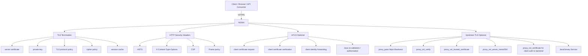

---

## 3. TLS Deployment Patterns

| Pattern | Bentuk | Kapan dipakai | Risiko utama |
|---|---|---|---|
| TLS termination at NGINX | Client HTTPS → NGINX → HTTP backend | Private network, Docker network, internal K8s cluster | Internal hop tidak encrypted |
| TLS re-encryption | Client HTTPS → NGINX → HTTPS backend | Regulated/internal zero-trust | Cert/truststore upstream harus dikelola |
| mTLS client → NGINX | Client cert diverifikasi oleh NGINX | Partner API, internal service, B2B integration | Identity header spoofing jika backend bisa diakses langsung |
| mTLS NGINX → backend | NGINX punya client cert ke Java backend | Backend hanya trust proxy tertentu | Cert rotation dua arah lebih kompleks |
| End-to-end app TLS | NGINX pass-through / stream TLS | App perlu lihat TLS langsung | HTTP routing/header manipulation terbatas |
| TLS at cloud LB + NGINX HTTP | Cloud LB terminate TLS sebelum NGINX | Managed cert di LB | NGINX tidak melihat TLS client cert; forwarded proto harus benar |

---

## 4. Basic HTTPS Server

```nginx id="sitv2q"
server {
    listen 443 ssl;
    server_name api.example.com;

    ssl_certificate     /etc/nginx/tls/api.example.com.fullchain.pem;
    ssl_certificate_key /etc/nginx/tls/api.example.com.key;

    ssl_protocols TLSv1.2 TLSv1.3;
    ssl_ciphers HIGH:!aNULL:!MD5;

    ssl_session_cache shared:SSL:10m;
    ssl_session_timeout 10m;

    location /api/ {
        proxy_pass http://jersey_api/;

        proxy_set_header Host              $host;
        proxy_set_header X-Forwarded-Proto $scheme;
        proxy_set_header X-Request-ID      $request_id;
    }
}
```

NGINX docs menyatakan `ssl_certificate` menunjuk file certificate PEM untuk virtual server, dan jika intermediate certificate dibutuhkan maka urutannya adalah primary certificate terlebih dahulu lalu intermediate certificates dalam file yang sama. Docs HTTPS NGINX juga menekankan private key bisa berada di file yang sama, tetapi permission file harus dibatasi. ([Nginx](https://nginx.org/en/docs/http/ngx_http_ssl_module.html))

---

## 5. HTTP ke HTTPS Redirect

```nginx id="82mnus"
server {
    listen 80;
    server_name api.example.com;

    return 301 https://$host$request_uri;
}
```

Gunakan `return`, bukan `rewrite`, untuk redirect sederhana. Untuk API yang dipanggil machine-to-machine, pertimbangkan apakah redirect 301 cocok. Banyak client API lebih baik langsung dikonfigurasi ke HTTPS endpoint daripada mengandalkan redirect.

| Use case | Redirect HTTP → HTTPS? |
|---|---:|
| Browser/public website | Ya |
| SPA frontend | Ya |
| Public REST API | Biasanya ya, tetapi dokumentasikan |
| Internal machine-to-machine API | Lebih baik block HTTP atau paksa HTTPS dari client config |
| Health check internal | Tergantung LB/probe design |
| Legacy integration | Hati-hati, beberapa client tidak follow redirect dengan benar |

---

## 6. TLS Protocol Policy

Baseline modern yang umum:

```nginx id="g7js4b"
ssl_protocols TLSv1.2 TLSv1.3;
```

NGINX docs saat ini menyebut default `ssl_protocols` adalah `TLSv1.2 TLSv1.3`, dan directive `ssl_protocols`/`ssl_ciphers` digunakan untuk membatasi koneksi ke versi/cipher SSL/TLS yang kuat. Karena default pernah berubah antar versi, explicit config tetap lebih mudah diaudit di enterprise environment. ([Nginx](https://nginx.org/en/docs/http/configuring_https_servers.html))

Decision table:

| Protocol | Recommendation |
|---|---|
| SSLv2 | Jangan aktifkan |
| SSLv3 | Jangan aktifkan |
| TLS 1.0 | Jangan aktifkan kecuali legacy exception sangat terkontrol |
| TLS 1.1 | Jangan aktifkan kecuali legacy exception sangat terkontrol |
| TLS 1.2 | Baseline compatibility modern |
| TLS 1.3 | Preferable untuk client modern |

Untuk regulated environment, exception legacy harus punya:

```text id="w3t7p3"
- business owner
- affected client list
- expiry date
- risk acceptance
- monitoring
- migration plan
```

Jangan mengaktifkan TLS lama secara global hanya karena satu partner/client lama.

---

## 7. Cipher Policy

Baseline sederhana:

```nginx id="v99b13"
ssl_ciphers HIGH:!aNULL:!MD5;
```

NGINX docs menjelaskan `ssl_ciphers` memakai format OpenSSL, dan daftar lengkap cipher bisa dilihat dengan command `openssl ciphers`. Untuk TLS 1.3, pengaturan cipher suite tidak sepenuhnya sama dengan TLS 1.2 karena TLS 1.3 cipher suites dikelola berbeda oleh OpenSSL/NGINX version. ([Nginx](https://nginx.org/en/docs/http/ngx_http_ssl_module.html))

Praktisnya:

| Concern | Guidance |
|---|---|
| Public API modern | TLS 1.2/1.3 + strong ciphers |
| Internal API | Sama; jangan anggap internal berarti boleh lemah |
| Legacy partner | Buat dedicated listener/domain jika butuh exception |
| Audit | Simpan hasil test TLS config dari staging/prod |
| Compatibility | Test dengan actual client, bukan asumsi browser saja |

Contoh policy yang lebih eksplisit perlu disesuaikan dengan OpenSSL/NGINX versi:

```nginx id="sluwms"
ssl_protocols TLSv1.2 TLSv1.3;
ssl_ciphers 'HIGH:!aNULL:!MD5:!3DES';
ssl_prefer_server_ciphers off;
```

Catatan: jangan copy cipher string dari internet tanpa test di versi NGINX/OpenSSL yang dipakai perusahaan.

---

## 8. TLS Session Optimization

TLS handshake mahal dibanding request HTTP biasa. NGINX docs merekomendasikan beberapa optimasi: worker process disesuaikan dengan jumlah processor, keep-alive aktif, shared SSL session cache aktif, built-in session cache dinonaktifkan, dan session lifetime bisa dinaikkan dari default 5 menit sesuai kebutuhan. Satu megabyte shared session cache kira-kira menyimpan sekitar 4.000 sessions menurut dokumentasi NGINX. ([Nginx](https://nginx.org/en/docs/http/ngx_http_ssl_module.html))

```nginx id="95p6wa"
worker_processes auto;

http {
    ssl_session_cache shared:SSL:10m;
    ssl_session_timeout 10m;

    server {
        listen 443 ssl;
        keepalive_timeout 70;
    }
}
```

| Directive | Fungsi |
|---|---|
| `ssl_session_cache shared:SSL:10m` | Cache session TLS lintas worker |
| `ssl_session_timeout 10m` | Lama session TLS bisa digunakan ulang |
| `keepalive_timeout` | Client bisa reuse connection untuk banyak request |
| `worker_processes auto` | Memakai worker sesuai CPU/core availability |

---

## 9. HSTS

HSTS membuat browser mengingat bahwa domain harus diakses via HTTPS.

```nginx id="uclh5y"
add_header Strict-Transport-Security "max-age=31536000; includeSubDomains" always;
```

Untuk domain yang benar-benar siap preload:

```nginx id="xgh98h"
add_header Strict-Transport-Security "max-age=31536000; includeSubDomains; preload" always;
```

Decision table:

| Kondisi | HSTS policy |
|---|---|
| Baru migrasi HTTP → HTTPS | Mulai dengan `max-age` kecil |
| Domain public stabil HTTPS | `max-age=31536000` |
| Semua subdomain siap HTTPS | Tambahkan `includeSubDomains` |
| Ingin browser preload list | Tambahkan `preload` hanya jika benar-benar siap |
| Ada subdomain legacy HTTP | Jangan pakai `includeSubDomains` dulu |
| Internal dev domain | Hati-hati, HSTS bisa mengganggu testing |

Jangan pasang `includeSubDomains; preload` hanya karena terlihat “lebih secure”. Kalau ada subdomain yang belum siap HTTPS, HSTS bisa membuat akses browser rusak.

---

## 10. Upstream HTTPS: NGINX ke Java/Jersey via TLS

```text id="su99wh"
Client --HTTPS--> NGINX --HTTPS--> Java/Jersey
```

Contoh:

```nginx id="qpg92l"
upstream jersey_api_tls {
    server jersey-app-1.internal:8443;
    server jersey-app-2.internal:8443;
}

location /api/ {
    proxy_pass https://jersey_api_tls/;

    proxy_ssl_server_name on;
    proxy_ssl_name jersey-api.internal;

    proxy_ssl_verify on;
    proxy_ssl_trusted_certificate /etc/nginx/trust/internal-ca.pem;
    proxy_ssl_verify_depth 2;

    proxy_set_header Host              $host;
    proxy_set_header X-Forwarded-Proto $scheme;
    proxy_set_header X-Request-ID      $request_id;
}
```

By default, `proxy_ssl_verify` adalah `off`, jadi jika NGINX melakukan `proxy_pass https://...` ke upstream, kamu perlu mengaktifkan verifikasi certificate secara eksplisit agar NGINX benar-benar memverifikasi certificate backend. `proxy_ssl_trusted_certificate` menunjuk CA PEM yang dipakai untuk memverifikasi proxied HTTPS server, sedangkan `proxy_ssl_server_name on` mengirim SNI saat koneksi TLS ke upstream. ([Nginx](https://nginx.org/en/docs/http/ngx_http_proxy_module.html))

---

## 11. mTLS Client → NGINX

mTLS berarti client harus menunjukkan certificate, dan NGINX memverifikasinya.

```nginx id="rnly8o"
server {
    listen 443 ssl;
    server_name partner-api.example.com;

    ssl_certificate     /etc/nginx/tls/partner-api.fullchain.pem;
    ssl_certificate_key /etc/nginx/tls/partner-api.key;

    ssl_client_certificate /etc/nginx/ca/partner-client-ca.pem;
    ssl_verify_client on;
    ssl_verify_depth 2;

    location /api/ {
        proxy_pass http://jersey_api/;

        proxy_set_header X-Client-Cert-Verify $ssl_client_verify;
        proxy_set_header X-Client-DN          $ssl_client_s_dn;
        proxy_set_header X-Client-Serial      $ssl_client_serial;
        proxy_set_header X-Request-ID         $request_id;
    }
}
```

`ssl_verify_client` dapat bernilai `on`, `off`, `optional`, atau `optional_no_ca`; hasil verifikasi tersedia di variable `$ssl_client_verify`. `ssl_client_certificate` menunjuk CA PEM untuk memverifikasi client certificate dan daftar CA tersebut dikirim ke client, sedangkan `ssl_trusted_certificate` dapat digunakan untuk trusted CA tanpa mengirim daftar itu ke client. ([Nginx](https://nginx.org/en/docs/http/ngx_http_ssl_module.html))

---

## 12. mTLS Identity Boundary

NGINX boleh melakukan certificate verification, tetapi **otorisasi domain tetap di Java/Jersey**.

```text id="m6nfpw"
NGINX:
  - verify certificate chain
  - reject invalid/expired/untrusted certificate
  - extract DN/serial/fingerprint
  - forward identity metadata to backend

Java/Jersey:
  - map certificate identity to partner/client account
  - check allowed API/product/tenant
  - enforce domain permission
  - write audit event
```

Jangan percaya `X-Client-DN` jika request bisa langsung masuk ke backend tanpa melalui NGINX. Backend harus dibatasi network policy/firewall, atau Java harus memverifikasi bahwa request berasal dari trusted proxy.

Rekomendasi header:

```nginx id="hd5r62"
proxy_set_header X-Client-Cert-Verify $ssl_client_verify;
proxy_set_header X-Client-DN          $ssl_client_s_dn;
proxy_set_header X-Client-Issuer-DN   $ssl_client_i_dn;
proxy_set_header X-Client-Serial      $ssl_client_serial;
```

Di Java, buat mapping table:

```sql id="50xujn"
CREATE TABLE trusted_client_certificate (
    id              bigserial PRIMARY KEY,
    partner_code    text NOT NULL,
    subject_dn      text NOT NULL,
    issuer_dn       text NOT NULL,
    serial_number   text NOT NULL,
    status          text NOT NULL,
    valid_from      timestamptz,
    valid_until     timestamptz,
    created_at      timestamptz NOT NULL DEFAULT now(),
    UNIQUE (issuer_dn, serial_number)
);
```

---

## 13. Optional Client Certificate

```nginx id="2tm7ii"
ssl_verify_client optional;
```

Artinya NGINX meminta client certificate dan memverifikasi jika certificate diberikan. Ini cocok untuk endpoint campuran, tetapi sering lebih sulit diaudit dibanding memisahkan domain/listener.

Lebih jelas:

```text id="8yb4f1"
public-api.example.com
  - no client cert
  - OAuth/JWT

partner-api.example.com
  - mTLS required
  - partner certificate mapping
```

Gunakan `optional` hanya jika benar-benar perlu. Untuk regulated/partner integration, domain/listener terpisah biasanya lebih defensible.

---

## 14. NGINX → Backend mTLS

Jika Java/Jersey backend juga ingin memverifikasi NGINX sebagai client:

```nginx id="9gbmus"
location /api/ {
    proxy_pass https://jersey_api_tls/;

    proxy_ssl_server_name on;
    proxy_ssl_name jersey-api.internal;

    proxy_ssl_verify on;
    proxy_ssl_trusted_certificate /etc/nginx/trust/backend-ca.pem;

    proxy_ssl_certificate     /etc/nginx/tls/nginx-client.crt;
    proxy_ssl_certificate_key /etc/nginx/tls/nginx-client.key;
}
```

`proxy_ssl_certificate` dan `proxy_ssl_certificate_key` dipakai untuk autentikasi NGINX ke proxied HTTPS server. NGINX proxy module juga mendukung certificate/key berbasis variable dan cache certificate untuk skenario dinamis pada versi modern, tetapi skenario enterprise biasa sebaiknya mulai dari file statis/Secret yang jelas dulu. ([Nginx](https://nginx.org/en/docs/http/ngx_http_proxy_module.html))

Di sisi Java:

```text id="3f4zt5"
- HTTP server connector 8443 with TLS
- truststore berisi CA yang menerbitkan nginx-client.crt
- client-auth required
- app tetap validasi authorization normal
```

---

## 15. Certificate File Layout

Struktur yang rapi:

```text id="80e8p4"
/etc/nginx/tls/
  api.example.com.fullchain.pem
  api.example.com.key
  partner-api.example.com.fullchain.pem
  partner-api.example.com.key
  nginx-client.crt
  nginx-client.key

/etc/nginx/ca/
  partner-client-ca.pem
  backend-ca.pem
```

Permission baseline:

```bash id="qlck6i"
chown root:root /etc/nginx/tls/*.key
chmod 600 /etc/nginx/tls/*.key

chown root:root /etc/nginx/tls/*.pem /etc/nginx/tls/*.crt
chmod 644 /etc/nginx/tls/*.pem /etc/nginx/tls/*.crt
```

Dalam container/Kubernetes, file biasanya berasal dari Secret. Jangan bake private key ke image.

---

## 16. Certificate Rotation

### VM / bare metal

```bash id="6t0byj"
nginx -t
nginx -s reload
```

Saat reload/HUP, NGINX master process mengecek syntax konfigurasi, mencoba menerapkan konfigurasi baru, dan jika gagal akan rollback tetap memakai konfigurasi lama; jika sukses, worker baru dimulai dan worker lama shutdown secara graceful setelah menyelesaikan client lama. Ini membuat rotasi certificate via reload jauh lebih aman daripada restart kasar. ([Nginx](https://nginx.org/en/docs/control.html))

Rotation runbook:

```text id="02vekv"
1. Deploy new cert/key file atomically
2. Validate ownership and permission
3. nginx -t
4. nginx -s reload
5. Verify served certificate with openssl/curl
6. Monitor error log and TLS handshake errors
7. Keep old cert backup until verification complete
```

### Kubernetes

Pola umum:

```text id="3hhe3j"
cert-manager / external secret operator
  ↓
Kubernetes Secret updated
  ↓
Ingress/Gateway controller reloads/reconfigures NGINX
  ↓
New TLS cert served
```

Untuk custom NGINX Deployment, pastikan ada mekanisme reload saat Secret berubah. Mount Secret saja tidak selalu cukup jika NGINX tidak reload membaca file baru.

---

## 17. TLS Verification Commands

Cek certificate dari client side:

```bash id="15noxy"
openssl s_client -connect api.example.com:443 -servername api.example.com -showcerts
```

Cek protocol:

```bash id="db3r4z"
openssl s_client -connect api.example.com:443 -servername api.example.com -tls1_2
openssl s_client -connect api.example.com:443 -servername api.example.com -tls1_3
```

Cek HTTP:

```bash id="b207ey"
curl -vk https://api.example.com/api/health
curl -vI https://api.example.com/
```

Cek mTLS:

```bash id="qtsm5r"
curl -vk \
  --cert client.crt \
  --key client.key \
  --cacert server-ca.pem \
  https://partner-api.example.com/api/health
```

Cek tanpa client cert harus gagal:

```bash id="do2rf3"
curl -vk https://partner-api.example.com/api/health
```

---

## 18. TLS Logging

Tambahkan informasi TLS untuk debugging:

```nginx id="khiv6b"
log_format tls_api
    'time="$time_iso8601" '
    'remote_addr="$remote_addr" '
    'host="$host" '
    'request="$request" '
    'status=$status '
    'ssl_protocol="$ssl_protocol" '
    'ssl_cipher="$ssl_cipher" '
    'ssl_client_verify="$ssl_client_verify" '
    'ssl_client_s_dn="$ssl_client_s_dn" '
    'request_id="$request_id" '
    'upstream_status="$upstream_status"';

access_log /var/log/nginx/tls-access.log tls_api;
```

Gunakan ini di environment yang tepat. Jangan log full client certificate atau data sensitif tanpa alasan audit yang jelas.

---

## 19. HSTS + Reverse Proxy Pitfalls

| Pitfall | Akibat |
|---|---|
| HSTS aktif di domain yang masih punya subdomain HTTP | Browser memaksa HTTPS dan subdomain rusak |
| `includeSubDomains` terlalu cepat | Semua subdomain terdampak |
| `preload` tanpa kesiapan governance | Sulit rollback cepat |
| TLS terminate di LB tetapi NGINX tidak menerima `X-Forwarded-Proto` benar | Backend generate redirect/cookie salah |
| Backend tidak tahu original HTTPS | Secure cookie atau callback URL salah |
| HTTP health check kena redirect HTTPS | LB/probe bisa gagal |
| mTLS optional di domain publik campuran | Policy sulit diaudit |
| Client DN dipercaya tanpa network isolation | Identity spoofing |

---

## 20. Java/Jersey Integration

Untuk TLS termination di NGINX:

```text id="37zvqg"
NGINX forwards:
  X-Forwarded-Proto: https
  X-Forwarded-Host: api.example.com
  X-Request-ID: ...
```

Java/Jersey harus:

```text id="5rcv88"
- menggunakan forwarded proto untuk generated URL bila perlu
- tidak memutuskan authorization berdasarkan Host saja
- tidak percaya X-Client-* header dari untrusted source
- menulis audit event dari identity yang sudah divalidasi
- punya timeout dan idempotency tetap walau TLS di NGINX
```

Untuk mTLS partner:

```text id="7d7g51"
NGINX verifies certificate
  ↓
Java maps issuer+serial/subject to partner account
  ↓
Java validates endpoint permission
  ↓
Java records audit:
    partner
    certificate serial
    request id
    action
    resource id
```

---

## 21. Recommended Production Baseline

```nginx id="mjzpe6"
worker_processes auto;

http {
    ssl_protocols TLSv1.2 TLSv1.3;
    ssl_ciphers HIGH:!aNULL:!MD5;
    ssl_session_cache shared:SSL:10m;
    ssl_session_timeout 10m;

    upstream jersey_api {
        server jersey-app-1.internal:8080;
        server jersey-app-2.internal:8080;
        keepalive 32;
    }

    server {
        listen 80;
        server_name api.example.com;
        return 301 https://$host$request_uri;
    }

    server {
        listen 443 ssl;
        server_name api.example.com;

        ssl_certificate     /etc/nginx/tls/api.example.com.fullchain.pem;
        ssl_certificate_key /etc/nginx/tls/api.example.com.key;

        add_header Strict-Transport-Security "max-age=31536000" always;
        add_header X-Content-Type-Options "nosniff" always;

        location ^~ /api/ {
            proxy_pass http://jersey_api/;

            proxy_http_version 1.1;
            proxy_set_header Connection "";

            proxy_set_header Host              $host;
            proxy_set_header X-Forwarded-Host  $host;
            proxy_set_header X-Forwarded-Proto $scheme;
            proxy_set_header X-Real-IP         $remote_addr;
            proxy_set_header X-Forwarded-For   $proxy_add_x_forwarded_for;
            proxy_set_header X-Request-ID      $request_id;

            proxy_connect_timeout 3s;
            proxy_send_timeout    30s;
            proxy_read_timeout    30s;
        }
    }
}
```

---

## 22. Recommended mTLS Partner Baseline

```nginx id="emgvvc"
server {
    listen 443 ssl;
    server_name partner-api.example.com;

    ssl_certificate     /etc/nginx/tls/partner-api.fullchain.pem;
    ssl_certificate_key /etc/nginx/tls/partner-api.key;

    ssl_protocols TLSv1.2 TLSv1.3;

    ssl_client_certificate /etc/nginx/ca/partner-client-ca.pem;
    ssl_verify_client on;
    ssl_verify_depth 2;

    location ^~ /api/ {
        proxy_pass http://jersey_api/;

        proxy_set_header X-Client-Cert-Verify $ssl_client_verify;
        proxy_set_header X-Client-DN          $ssl_client_s_dn;
        proxy_set_header X-Client-Issuer-DN   $ssl_client_i_dn;
        proxy_set_header X-Client-Serial      $ssl_client_serial;

        proxy_set_header X-Forwarded-Proto $scheme;
        proxy_set_header X-Request-ID      $request_id;
    }
}
```

Di Java/Jersey, request tetap harus ditolak jika:

```text id="ph4swj"
X-Client-Cert-Verify != SUCCESS
issuer+serial tidak terdaftar
certificate mapping disabled/revoked
partner tidak punya akses endpoint/resource
request tidak lolos business authorization
```

---

## 23. Anti-Patterns

| Anti-pattern | Dampak |
|---|---|
| TLS lama diaktifkan global demi satu client legacy | Semua client turun ke policy lemah |
| `proxy_pass https://...` tanpa `proxy_ssl_verify on` | Upstream TLS terenkripsi tapi identitas backend tidak diverifikasi |
| Private key dibake ke Docker image | Secret leakage dan rotasi sulit |
| HSTS preload tanpa governance | Rollback sulit jika salah domain/subdomain |
| mTLS diverifikasi di NGINX lalu Java percaya header tanpa isolasi | Identity spoofing |
| Cert rotation pakai restart kasar | Risiko connection drop/outage |
| Tidak punya monitoring expiry certificate | Outage mendadak saat sertifikat expired |
| Logging full certificate/client DN sembarangan | Risiko data sensitif di log |
| Satu certificate wildcard untuk semua concern | Blast radius besar jika key bocor |
| Tidak test chain/intermediate certificate | Sebagian client gagal validasi |

---

## 24. Debugging Checklist

### Browser/client gagal HTTPS

```text id="8aw4of"
[ ] Certificate CN/SAN cocok dengan host?
[ ] Full chain benar: leaf + intermediate?
[ ] Private key cocok dengan certificate?
[ ] TLS protocol client didukung?
[ ] Cipher compatible?
[ ] SNI benar?
[ ] Certificate belum expired?
[ ] System clock benar?
```

### Upstream HTTPS gagal

```text id="vpu1e8"
[ ] proxy_ssl_verify on/off sesuai niat?
[ ] proxy_ssl_trusted_certificate berisi CA backend?
[ ] proxy_ssl_server_name on jika backend butuh SNI?
[ ] proxy_ssl_name sesuai SAN certificate backend?
[ ] Backend certificate chain lengkap?
[ ] NGINX error log menunjukkan verify error apa?
```

### mTLS gagal

```text id="yy8y0g"
[ ] Client mengirim certificate?
[ ] Client certificate ditandatangani CA yang dipercaya?
[ ] Certificate belum expired/revoked?
[ ] ssl_verify_depth cukup?
[ ] ssl_client_certificate/ssl_trusted_certificate benar?
[ ] Java mapping issuer+serial benar?
[ ] Backend tidak bisa diakses bypass NGINX?
```

### Setelah rotasi cert

```text id="j51km4"
[ ] nginx -t sukses?
[ ] reload sukses?
[ ] openssl s_client menunjukkan cert baru?
[ ] intermediate chain benar?
[ ] error log tidak ada PEM/key mismatch?
[ ] monitoring expiry updated?
[ ] rollback cert/key tersedia?
```

---

## 25. PR Review Checklist

```text id="xppil5"
[ ] TLS protocol policy explicit dan sesuai standar internal
[ ] Cipher policy diuji di versi NGINX/OpenSSL target
[ ] Certificate fullchain dan key path benar
[ ] Private key tidak masuk image/repository
[ ] HTTP → HTTPS redirect sesuai kebutuhan client
[ ] HSTS max-age/includeSubDomains/preload dipilih dengan sadar
[ ] Upstream HTTPS memakai proxy_ssl_verify on jika security boundary mengharuskan
[ ] proxy_ssl_trusted_certificate dan proxy_ssl_name/SNI benar
[ ] mTLS domain dipisahkan dari public API jika memungkinkan
[ ] X-Client-* header hanya dipercaya dari trusted proxy
[ ] Java/Jersey tetap enforce authorization dan audit
[ ] Rotation runbook tersedia
[ ] Certificate expiry monitoring tersedia
```

---

## 26. Roadmap Belajar Singkat

1. Pahami TLS termination: `listen 443 ssl`, `ssl_certificate`, `ssl_certificate_key`.
2. Terapkan protocol policy: TLS 1.2/1.3 saja untuk baseline modern.
3. Pelajari session cache dan keepalive untuk performa handshake.
4. Pahami HSTS secara hati-hati sebelum `includeSubDomains`/`preload`.
5. Latih upstream HTTPS dengan `proxy_ssl_verify`, trusted CA, dan SNI.
6. Latih mTLS client → NGINX dan identity forwarding ke Jersey.
7. Buat runbook rotasi certificate dengan `nginx -t` + reload.
8. Tambahkan monitoring expiry dan TLS error rate.

---

## Status seri

**Seri 5 selesai. Sisa 7 seri lagi.**

Rekomendasi berikutnya: **Seri 6 - NGINX Security Hardening: Rate Limit, Request Size, Header Control, IP Allow/Deny, WAF Boundary**.

---

**Sources:**

- [Module ngx_http_ssl_module](https://nginx.org/en/docs/http/ngx_http_ssl_module.html)

## Response:
7/13/2026, 4:41:57 PM

Saya lanjutkan ke Seri 6. Fokusnya hardening yang praktis: rate limiting, request/body/header limits, IP allow/deny, header sanitization, auth/WAF boundary, dan apa yang tetap harus ditangani di Java/Jersey.

# Seri 6/12 - NGINX Security Hardening

## Rate Limit, Request Size, Header Control, IP Allow/Deny, Auth Boundary, and WAF Boundary

## 1. Introduction

Seri ini membahas **hardening NGINX sebagai security boundary** di depan aplikasi **Java/Jersey**.

Fokusnya bukan menjadikan NGINX sebagai tempat business logic, tetapi menjadikan NGINX sebagai **lapisan proteksi awal**:

```text id="g49skk"
Client / Browser / Partner / Internal System
  ↓
NGINX
  - rate limit
  - connection/request guardrail
  - body/header size control
  - IP allow/deny
  - security headers
  - header sanitization
  - optional auth_request
  - WAF/reverse proxy boundary
  ↓
Java/Jersey Service
  - authentication validation
  - authorization
  - business rules
  - idempotency
  - audit trail
  - domain-level enforcement
```

NGINX punya modul resmi untuk rate limiting request (`ngx_http_limit_req_module`), IP-based access control (`ngx_http_access_module`), header response (`ngx_http_headers_module`), auth subrequest (`ngx_http_auth_request_module`), dan proxy header forwarding (`ngx_http_proxy_module`). Rate limiting NGINX menggunakan metode **leaky bucket** berbasis key seperti IP address, dan access module bisa membatasi akses berdasarkan alamat client. ([Nginx](https://nginx.org/en/docs/http/ngx_http_limit_req_module.html?utm_source=chatgpt.com))

---

## 2. Diagram

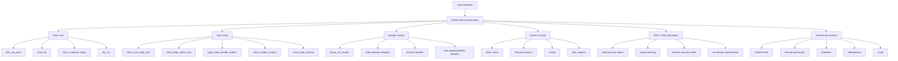

---

## 3. Decomposition Table

| Area | Skill / Item | Fungsi | Catatan untuk Java/Jersey |
|---|---|---|---|
| Rate limiting | `limit_req_zone` | Mendefinisikan shared memory zone dan rate per key | Tidak langsung membatasi request sampai dipakai oleh `limit_req`. |
| Rate limiting | `limit_req` | Menerapkan rate limit ke `server`/`location` | Cocok untuk login, search, public API, callback, expensive endpoint. |
| Rate limiting | `burst` | Memberi toleransi burst sementara | Jangan terlalu besar; burst besar bisa tetap membebani backend. |
| Rate limiting | `nodelay` / `delay` | Mengatur apakah burst ditahan/diproses segera | Pilih sesuai UX dan kapasitas backend. |
| Request size | `client_max_body_size` | Membatasi ukuran request body | Default documented adalah `1m`; jika exceed, NGINX mengembalikan 413. ([Nginx](https://nginx.org/en/docs/http/ngx_http_core_module.html?utm_source=chatgpt.com)) |
| Request buffer | `client_body_buffer_size` | Mengatur buffer body client sebelum temp file | Penting untuk upload/API besar. |
| Header size | `large_client_header_buffers` | Membatasi header/request line besar | Berguna untuk cookie/JWT terlalu besar. |
| Timeout | `client_header_timeout`, `client_body_timeout` | Melindungi dari slow client | Cocok untuk mitigasi slowloris-style behavior. |
| Header forwarding | `proxy_set_header` | Membentuk header ke upstream | Jangan percaya identity header dari public client. |
| Response headers | `add_header` | Menambahkan security headers ke response | Gunakan `always` jika ingin header juga muncul pada error response tertentu. ([Nginx](https://nginx.org/en/docs/http/ngx_http_headers_module.html?utm_source=chatgpt.com)) |
| IP control | `allow`, `deny` | Membatasi berdasarkan IP/CIDR | Berguna untuk `/internal`, `/metrics`, `/admin`. |
| Auth subrequest | `auth_request` | Delegasi auth check ke service lain | NGINX boleh jadi gate; Java tetap enforce authorization. |
| WAF boundary | WAF/managed rule | Blokir pola abuse umum | Bukan pengganti validasi domain di Java. |
| Observability | log 403/413/429/499/5xx | Bukti hardening bekerja | Harus dipantau agar tidak false positive. |

---

## 4. Rate Limiting

### Basic rate limit per IP

```nginx id="mqn2t6"
http {
    limit_req_zone $binary_remote_addr zone=api_per_ip:10m rate=10r/s;

    server {
        listen 443 ssl;
        server_name api.example.com;

        location ^~ /api/ {
            limit_req zone=api_per_ip burst=20 nodelay;

            proxy_pass http://jersey_api/;
            include conf.d/proxy-common.conf;
        }
    }
}
```

`limit_req_zone` membuat zone rate limit dan menentukan key/rate, sedangkan `limit_req` menerapkannya ke `server` atau `location`. Dokumentasi NGINX menyatakan modul ini membatasi request processing rate per key dan memakai metode leaky bucket. ([Nginx](https://nginx.org/en/docs/http/ngx_http_limit_req_module.html?utm_source=chatgpt.com))

### Rate limit per endpoint

| Endpoint | Risiko | Contoh limit awal |
|---|---|---|
| `/api/login` | brute force / credential stuffing | ketat |
| `/api/search` | expensive DB query | sedang |
| `/api/reports/export` | CPU/DB heavy | sangat ketat |
| `/api/files/upload` | bandwidth/storage abuse | limit + body size |
| `/api/orders` | command duplicate/retry storm | rate limit + idempotency |
| `/api/health` | monitoring noise | biasanya tanpa rate limit publik, tapi restrict source |
| `/api/callbacks/partner` | burst dari partner | per partner jika bisa, bukan hanya per IP |

---

## 5. `burst`, `nodelay`, dan `delay`

```nginx id="9kjw2r"
limit_req_zone $binary_remote_addr zone=login_zone:10m rate=5r/m;

location = /api/login {
    limit_req zone=login_zone burst=5 nodelay;

    proxy_pass http://jersey_api/login;
    include conf.d/proxy-common.conf;
}
```

Mental model:

```text id="7s6ef2"
rate=5r/m
  → rata-rata 5 request per menit per key

burst=5
  → toleransi antrian/burst tambahan

nodelay
  → request burst yang masih diizinkan diproses segera, bukan ditunda
```

Gunakan `nodelay` jika kamu lebih memilih request diterima/ditolak cepat. Gunakan delay jika kamu ingin NGINX memperlambat request burst, tetapi ini bisa membuat koneksi client bertahan lebih lama.

---

## 6. Dry Run untuk Rate Limit

Untuk staging atau production rollout awal:

```nginx id="p5rq87"
limit_req_zone $binary_remote_addr zone=api_per_ip:10m rate=10r/s;

server {
    location ^~ /api/ {
        limit_req zone=api_per_ip burst=20;
        limit_req_dry_run on;

        proxy_pass http://jersey_api/;
        include conf.d/proxy-common.conf;
    }
}
```

`limit_req_dry_run` memungkinkan request tidak benar-benar dibatasi, tetapi request yang “seharusnya dibatasi” tetap dicatat. Ini berguna untuk mengukur false positive sebelum enforcement penuh. ([Nginx](https://nginx.org/en/docs/http/ngx_http_limit_req_module.html?utm_source=chatgpt.com))

Praktik yang sehat:

```text id="03my7z"
1. Deploy dry run
2. Pantau log/metric calon throttled request
3. Segmentasi berdasarkan endpoint/client/tenant
4. Adjust rate/burst
5. Baru enforce
```

---

## 7. Status Code untuk Rate Limit

Default status rate limit biasanya bisa dikontrol:

```nginx id="swhd76"
limit_req_status 429;
```

Gunakan `429 Too Many Requests` untuk rate limiting API agar client paham bahwa request terlalu sering. Sertakan response body standar dari backend/API gateway jika memungkinkan.

Pola response API:

```json id="3n1zv1"
{
  "error": "RATE_LIMITED",
  "message": "Too many requests. Please retry later.",
  "requestId": "..."
}
```

NGINX bisa mengembalikan status, tetapi untuk error body yang konsisten across platform, sering lebih baik dikelola di API gateway/service layer atau custom error page internal.

---

## 8. Key Rate Limit: IP vs User vs Tenant

### Per IP

```nginx id="5062wd"
limit_req_zone $binary_remote_addr zone=per_ip:10m rate=10r/s;
```

Mudah, tetapi bermasalah jika banyak user di balik NAT/proxy.

### Per Authorization header - hati-hati

```nginx id="t0h45a"
limit_req_zone $http_authorization zone=per_token:10m rate=10r/s;
```

Ini berisiko karena:

```text id="0xhtgh"
- token panjang masuk shared memory key
- token bisa sensitif
- unsigned/random token bisa DoS key space
- privacy/logging risk
```

### Per user/tenant

Lebih baik dilakukan setelah auth valid. NGINX bisa melakukan ini jika identity sudah trusted, misalnya dari auth subrequest, tetapi authoritative quota biasanya lebih tepat di aplikasi/API gateway yang memahami user/tenant/contract.

Decision table:

| Key | Cocok untuk | Risiko |
|---|---|---|
| `$binary_remote_addr` | public/basic protection | NAT/proxy false positive |
| `$server_name` + IP | multi-domain | masih per IP |
| API key header | partner API | header sensitive; harus trusted |
| user id dari auth service | authenticated API | perlu auth boundary kuat |
| tenant id | enterprise quota | biasanya perlu app/API gateway |
| request URI | endpoint-specific | cardinality tinggi jika path ada ID |

---

## 9. Request Body Size Limit

```nginx id="a479kw"
server {
    client_max_body_size 10m;

    location ^~ /api/files/ {
        client_max_body_size 100m;
        proxy_pass http://jersey_api/files/;
    }
}
```

`client_max_body_size` dapat diletakkan pada konteks `http`, `server`, atau `location`; jika request body melebihi batas, NGINX mengembalikan 413. Dokumentasi NGINX menunjukkan default-nya `1m`. ([Nginx](https://nginx.org/en/docs/http/ngx_http_core_module.html?utm_source=chatgpt.com))

Guideline:

| Endpoint | Limit awal |
|---|---:|
| API JSON biasa | 1-10 MB |
| Upload dokumen | sesuai business rule, misal 50-100 MB |
| Batch import | lebih besar, tapi sebaiknya async |
| Report export | tidak relevan untuk request body, tapi response size perlu dipikirkan |
| Public callback | kecil dan ketat |
| Internal admin | tetap dibatasi, jangan unlimited |

Anti-pattern:

```nginx id="y8shqo"
client_max_body_size 0;
```

`0` berarti tidak membatasi ukuran body. Ini hanya boleh dipakai jika ada alasan kuat dan proteksi lain jelas.

---

## 10. Header Size Control

Header besar sering berasal dari:

```text id="2q69g0"
- cookie terlalu besar
- JWT terlalu panjang
- terlalu banyak custom headers
- reverse proxy chain menambah X-Forwarded-For panjang
- client abuse
```

Directive penting:

```nginx id="64yw5f"
large_client_header_buffers 4 8k;
client_header_timeout 10s;
```

`large_client_header_buffers` mengatur jumlah dan ukuran buffer untuk membaca header request besar, sedangkan `client_header_timeout` membatasi waktu membaca header client. Keduanya bagian dari core HTTP module NGINX. ([Nginx](https://nginx.org/en/docs/http/ngx_http_core_module.html?utm_source=chatgpt.com))

Untuk Java/Jersey, jangan hanya menaikkan header limit di NGINX. Pastikan limit di app server/HTTP container juga sesuai, karena request bisa lolos NGINX tetapi ditolak backend.

---

## 11. Client Timeout Guardrail

```nginx id="pwmbeg"
client_header_timeout 10s;
client_body_timeout   30s;
send_timeout          30s;
```

Gunanya:

| Directive | Melindungi dari |
|---|---|
| `client_header_timeout` | client lambat mengirim header |
| `client_body_timeout` | client lambat upload body |
| `send_timeout` | client lambat membaca response |

Untuk upload besar, `client_body_timeout` mungkin perlu lebih tinggi di endpoint tertentu, tetapi jangan dinaikkan global tanpa alasan.

---

## 12. IP Allow/Deny

### Internal endpoint

```nginx id="hw1se3"
location ^~ /internal/ {
    allow 10.0.0.0/8;
    allow 172.16.0.0/12;
    allow 192.168.0.0/16;
    deny all;

    proxy_pass http://jersey_api/internal/;
    include conf.d/proxy-common.conf;
}
```

`ngx_http_access_module` membatasi akses berdasarkan alamat client memakai `allow` dan `deny`; aturan dievaluasi secara berurutan sampai match pertama. ([Nginx](https://nginx.org/en/docs/http/ngx_http_access_module.html?utm_source=chatgpt.com))

Use case:

| Route | Access policy |
|---|---|
| `/internal/metrics` | only Prometheus/monitoring CIDR |
| `/internal/admin` | VPN/bastion/admin network only |
| `/camunda/` | internal/admin only unless explicitly public |
| `/actuator`/`/health/details` | internal only |
| `/debug` | ideally disabled; if exists, internal only |
| `/api/partner` | partner network + mTLS/API key |

---

## 13. Real Client IP Behind Load Balancer

Jika NGINX berada di belakang cloud/on-prem load balancer, `$remote_addr` mungkin IP load balancer, bukan IP asli client.

Pola umum:

```nginx id="6wplpk"
set_real_ip_from 10.0.0.0/8;
real_ip_header X-Forwarded-For;
real_ip_recursive on;
```

Gunakan ini hanya jika proxy sebelumnya trusted. Kalau tidak, client bisa spoof `X-Forwarded-For`.

Prinsip:

```text id="4w4zxb"
Trust forwarded client IP only from known upstream proxy/LB.
Never trust X-Forwarded-For directly from the public internet.
Overwrite/sanitize forwarded headers at the edge.
```

---

## 14. Header Sanitization

Masalah umum:

```text id="0fp7sj"
Client mengirim:
X-User-ID: admin
X-Roles: SUPERUSER
X-Forwarded-For: 127.0.0.1
X-Client-Cert-Verify: SUCCESS
```

Jika backend Java/Jersey percaya header tersebut, identity spoofing bisa terjadi.

### Baseline: overwrite trusted proxy headers

```nginx id="y9pgjf"
proxy_set_header Host              $host;
proxy_set_header X-Real-IP         $remote_addr;
proxy_set_header X-Forwarded-For   $proxy_add_x_forwarded_for;
proxy_set_header X-Forwarded-Proto $scheme;
proxy_set_header X-Request-ID      $request_id;
```

`proxy_set_header` membentuk/mengubah header yang dikirim ke upstream, dan NGINX proxy module menyediakan variable seperti `$proxy_host` dan variable lain untuk komposisi header. ([Nginx](https://nginx.org/en/docs/http/ngx_http_proxy_module.html?utm_source=chatgpt.com))

### Identity headers harus dihasilkan dari trusted auth layer

```nginx id="w2ah59"
location /api/ {
    auth_request /_auth;

    auth_request_set $auth_user_id $upstream_http_x_user_id;
    auth_request_set $auth_roles   $upstream_http_x_roles;

    proxy_set_header X-User-ID $auth_user_id;
    proxy_set_header X-Roles   $auth_roles;

    proxy_pass http://jersey_api/;
}
```

`auth_request` melakukan authorization berdasarkan hasil subrequest; 2xx mengizinkan, 401/403 menolak, dan status lain dianggap error. ([Nginx](https://nginx.org/en/docs/http/ngx_http_auth_request_module.html?utm_source=chatgpt.com))

---

## 15. Response Security Headers

Baseline:

```nginx id="w2x79g"
add_header X-Content-Type-Options "nosniff" always;
add_header X-Frame-Options "DENY" always;
add_header Referrer-Policy "no-referrer" always;
add_header Permissions-Policy "geolocation=(), microphone=(), camera=()" always;
```

Untuk HTTPS domain stabil:

```nginx id="wz65wh"
add_header Strict-Transport-Security "max-age=31536000" always;
```

Untuk frontend SPA:

```nginx id="g54ugb"
add_header Content-Security-Policy "default-src 'self'; object-src 'none'; frame-ancestors 'none'; base-uri 'self'" always;
```

`add_header` menambahkan field response header untuk status code tertentu, dan parameter `always` membuat header ditambahkan terlepas dari status code sesuai perilaku directive. ([Nginx](https://nginx.org/en/docs/http/ngx_http_headers_module.html?utm_source=chatgpt.com))

Decision table:

| Header | NGINX cocok? | Catatan |
|---|---:|---|
| HSTS | Ya | Hanya untuk HTTPS domain yang stabil |
| X-Content-Type-Options | Ya | Hampir selalu aman |
| X-Frame-Options | Ya | Jangan `DENY` jika memang butuh iframe |
| CSP | Bisa | Perlu disesuaikan dengan frontend |
| Referrer-Policy | Ya | Pilih sesuai kebutuhan analytics/security |
| Permissions-Policy | Ya | Bagus untuk membatasi browser capabilities |
| CORS | Bisa | Harus origin whitelist, jangan konflik dengan Java |

---

## 16. Upstream Header Hiding

Jika backend mengirim header yang tidak ingin diekspos:

```nginx id="klqew3"
proxy_hide_header X-Powered-By;
proxy_hide_header Server;
```

Namun tidak semua header bisa atau perlu disembunyikan dengan cara ini. Jangan mengandalkan header hiding sebagai security utama. Fokus utama tetap:

```text id="nhrbfz"
- jangan expose debug endpoint
- jangan leak stack trace
- jangan return internal hostname
- jangan return sensitive business state
- jangan expose technology detail yang tidak perlu
```

Di Java/Jersey, pastikan error mapper tidak mengirim stack trace ke client.

---

## 17. Auth Boundary dengan `auth_request`

Contoh:

```nginx id="xmhvgp"
location ^~ /api/ {
    auth_request /_auth;

    auth_request_set $user_id $upstream_http_x_user_id;
    auth_request_set $tenant_id $upstream_http_x_tenant_id;

    proxy_set_header X-Authenticated-User-ID $user_id;
    proxy_set_header X-Authenticated-Tenant-ID $tenant_id;

    proxy_pass http://jersey_api/;
    include conf.d/proxy-common.conf;
}

location = /_auth {
    internal;

    proxy_pass http://auth_service/validate;

    proxy_pass_request_body off;
    proxy_set_header Content-Length "";
    proxy_set_header Authorization $http_authorization;
    proxy_set_header X-Original-URI $request_uri;
}
```

Boundary yang benar:

| Concern | NGINX/Auth service | Java/Jersey |
|---|---:|---:|
| Token/session valid? | Ya | Sebaiknya validasi juga atau trust via controlled boundary |
| User identity extraction | Ya | Ya, consume identity context |
| Tenant membership | Bisa | Ya |
| Resource ownership | Tidak ideal | Ya |
| Workflow state permission | Tidak | Ya |
| Case/order transition authorization | Tidak | Ya |
| Audit event | Access log saja | Domain audit wajib |

Untuk sistem regulatory/case/order management, jangan pindahkan authorization berbasis state machine ke NGINX. NGINX tidak punya konteks domain yang cukup.

---

## 18. `satisfy`: Gabungan IP dan Auth

Ada kasus endpoint boleh diakses jika berasal dari IP internal **atau** lolos auth.

```nginx id="99pkm0"
location ^~ /admin/ {
    satisfy any;

    allow 10.0.0.0/8;
    deny all;

    auth_request /_auth;

    proxy_pass http://jersey_api/admin/;
}
```

Access module NGINX mendukung pembatasan berdasarkan alamat; dokumentasi juga menyebut akses dapat dibatasi secara simultan dengan password, subrequest, atau JWT, dan kombinasi pembatasan dikontrol oleh directive `satisfy`. ([Nginx](https://nginx.org/en/docs/http/ngx_http_access_module.html?utm_source=chatgpt.com))

Gunakan hati-hati. `satisfy any` bisa melemahkan security jika IP range terlalu luas.

---

## 19. WAF Boundary

NGINX sendiri bukan otomatis WAF penuh. WAF biasanya berupa:

```text id="6vtyxk"
- NGINX App Protect / commercial WAF
- ModSecurity connector/ruleset
- cloud WAF in front of NGINX
- API gateway managed WAF
- service mesh / platform policy layer
```

WAF cocok untuk:

| Use case | Cocok di WAF? |
|---|---:|
| SQL injection pattern blocking | Ya, sebagai early block |
| XSS payload pattern | Ya |
| Known CVE virtual patch | Ya |
| Geo/IP reputation block | Ya |
| Bot/basic abuse mitigation | Ya |
| Schema-aware API validation | Bisa, jika spec tersedia |
| Business authorization | Tidak |
| State transition validation | Tidak |
| Duplicate command prevention | Tidak |
| Regulatory decision rule | Tidak |

WAF adalah **negative/positive security filter**, bukan domain engine.

---

## 20. Request Method Control

Batasi method yang tidak dipakai.

```nginx id="wb7jl3"
location ^~ /api/ {
    limit_except GET POST PUT PATCH DELETE OPTIONS {
        deny all;
    }

    proxy_pass http://jersey_api/;
    include conf.d/proxy-common.conf;
}
```

Namun jangan hanya mengandalkan NGINX. Java/Jersey resource tetap harus mendeklarasikan method yang benar dan mengembalikan 405 untuk method tidak didukung.

---

## 21. Admin / Metrics / Debug Endpoint

Pola aman:

```nginx id="nz9mio"
location = /metrics {
    allow 10.20.0.0/16; # monitoring network
    deny all;

    access_log off;

    proxy_pass http://jersey_api/internal/metrics;
    include conf.d/proxy-common.conf;
}

location ^~ /debug/ {
    deny all;
}
```

Endpoint yang perlu diperlakukan khusus:

```text id="i7w8c1"
/metrics
/health/details
/ready/details
/admin
/camunda
/actuator
/debug
/swagger
/openapi
/internal
```

OpenAPI/Swagger tidak selalu boleh public. Di enterprise, dokumentasi API bisa mengungkap endpoint internal, model data, dan operasi sensitif.

---

## 22. CORS sebagai Security Boundary? Hati-hati

CORS bukan authentication dan bukan authorization. CORS hanya mekanisme browser untuk mengontrol apakah frontend dari origin tertentu boleh membaca response.

```text id="6otf4m"
CORS protects browser context.
CORS does not stop curl, Postman, backend services, or attackers from sending HTTP requests.
```

Jadi:

| Concern | CORS cukup? |
|---|---:|
| Mencegah website lain membaca response via browser | Ya |
| Mencegah request dari non-browser client | Tidak |
| Melindungi endpoint tanpa auth | Tidak |
| Membatasi partner API | Tidak |
| Domain authorization | Tidak |

---

## 23. Request Smuggling / Header Ambiguity Guardrail

NGINX hardening untuk header ambiguity biasanya melibatkan:

```text id="p412zf"
- reject malformed headers
- avoid duplicate/conflicting auth headers
- normalize trusted forwarding headers
- set clear body size/header size limits
- align NGINX and backend HTTP parser behavior
```

Prinsip penting untuk Java/Jersey:

```text id="lbxk0r"
NGINX dan Java server harus punya pemahaman konsisten tentang:
- Content-Length
- Transfer-Encoding
- Host
- forwarded headers
- max header size
- max body size
```

Jika tidak, request bisa terlihat berbeda di proxy dan backend.

---

## 24. Java/Jersey Validation Tetap Wajib

NGINX hardening tidak menggantikan:

| Concern | Harus di Java/Jersey |
|---|---:|
| JSON schema/domain validation | Ya |
| Bean Validation | Ya |
| Authorization per resource | Ya |
| State machine transition guard | Ya |
| Idempotency key | Ya |
| Tenant isolation | Ya |
| SQL injection prevention | Ya, via parameterized query/MyBatis binding |
| Audit event | Ya |
| Business rate/quota | Ya jika tenant/user contract-aware |
| Data redaction | Ya |

NGINX bisa menolak request terlalu besar, terlalu cepat, atau dari network tidak sah. Tetapi jika request sudah masuk ke service, Java tetap harus menganggap input tidak trusted.

---

## 25. Production Baseline Config

```nginx id="1jljaj"
http {
    # Rate limit zones
    limit_req_zone $binary_remote_addr zone=api_per_ip:10m rate=20r/s;
    limit_req_zone $binary_remote_addr zone=login_per_ip:10m rate=5r/m;
    limit_req_status 429;

    # Basic client guardrails
    client_header_timeout 10s;
    client_body_timeout   30s;
    send_timeout          30s;

    large_client_header_buffers 4 8k;

    server {
        listen 443 ssl;
        server_name api.example.com;

        # Default body limit
        client_max_body_size 10m;

        # Security headers
        add_header X-Content-Type-Options "nosniff" always;
        add_header X-Frame-Options "DENY" always;
        add_header Referrer-Policy "no-referrer" always;
        add_header Permissions-Policy "geolocation=(), microphone=(), camera=()" always;

        # Login: stricter
        location = /api/login {
            limit_req zone=login_per_ip burst=3 nodelay;

            proxy_pass http://jersey_api/login;
            include conf.d/proxy-common.conf;
        }

        # Upload: larger body, specific timeout
        location ^~ /api/files/ {
            client_max_body_size 100m;

            proxy_request_buffering off;
            proxy_send_timeout 120s;
            proxy_read_timeout 120s;

            limit_req zone=api_per_ip burst=10;

            proxy_pass http://jersey_api/files/;
            include conf.d/proxy-common.conf;
        }

        # Normal API
        location ^~ /api/ {
            limit_req zone=api_per_ip burst=40 nodelay;

            proxy_pass http://jersey_api/;
            include conf.d/proxy-common.conf;
        }

        # Internal only
        location ^~ /internal/ {
            allow 10.0.0.0/8;
            deny all;

            proxy_pass http://jersey_api/internal/;
            include conf.d/proxy-common.conf;
        }

        # Never expose debug
        location ^~ /debug/ {
            deny all;
        }
    }
}
```

`proxy-common.conf`:

```nginx id="ynm60y"
proxy_http_version 1.1;
proxy_set_header Connection "";

# Overwrite trusted forwarding headers
proxy_set_header Host              $host;
proxy_set_header X-Real-IP         $remote_addr;
proxy_set_header X-Forwarded-For   $proxy_add_x_forwarded_for;
proxy_set_header X-Forwarded-Proto $scheme;
proxy_set_header X-Request-ID      $request_id;

# Do not forward spoofable public identity headers unless generated by auth layer
proxy_set_header X-Authenticated-User-ID "";
proxy_set_header X-Authenticated-Tenant-ID "";

proxy_connect_timeout 3s;
proxy_send_timeout    30s;
proxy_read_timeout    30s;

proxy_buffering on;
proxy_request_buffering on;
```

---

## 26. Logging untuk Security Events

```nginx id="pql3wd"
log_format security_json escape=json
'{'
  '"time":"$time_iso8601",'
  '"remote_addr":"$remote_addr",'
  '"host":"$host",'
  '"request":"$request",'
  '"status":$status,'
  '"body_bytes_sent":$body_bytes_sent,'
  '"request_time":$request_time,'
  '"http_user_agent":"$http_user_agent",'
  '"http_referer":"$http_referer",'
  '"request_id":"$request_id",'
  '"upstream_status":"$upstream_status"'
'}';

access_log /var/log/nginx/security-access.log security_json;
```

Pantau:

```text id="8d0wwp"
- 401/403 spike
- 413 spike
- 429 spike
- 499 spike
- 502/503/504 spike after enabling rules
- request body too large
- client sent too large header
- access forbidden by rule
```

---

## 27. Failure Modes Setelah Hardening

| Gejala | Kemungkinan penyebab | Cek |
|---|---|---|
| Banyak 413 | `client_max_body_size` terlalu kecil atau client abuse | route-specific body limit |
| Banyak 429 | rate limit terlalu ketat atau attack | dry run logs, per endpoint traffic |
| Banyak 403 | allow/deny salah, real IP belum benar | `$remote_addr`, real_ip config |
| Login gagal massal | rate limit NAT false positive | key per IP terlalu kasar |
| Partner API gagal | IP allowlist berubah atau mTLS/auth config salah | partner source IP, cert, auth logs |
| Browser gagal | CORS/security header terlalu ketat | browser console, preflight response |
| Backend tidak melihat user | auth_request header mapping salah | auth subrequest response headers |
| Internal endpoint exposed | location mismatch / regex menang | `location ^~`, exact route test |
| Header spoofing | backend accessible bypass NGINX | network policy/firewall |

---

## 28. Anti-Patterns

| Anti-pattern | Dampak |
|---|---|
| `client_max_body_size 0` global | Membuka risiko resource exhaustion |
| Rate limit per IP untuk semua endpoint tanpa dry run | NAT false positive |
| Header identity dari client diteruskan langsung | Identity spoofing |
| `allow 10.0.0.0/8` tanpa memahami network | Terlalu luas |
| `/metrics` public | Informasi internal bocor |
| `/swagger` public tanpa sengaja | Endpoint dan schema internal bocor |
| NGINX dianggap cukup untuk authorization | Domain bypass |
| WAF dianggap menggantikan secure coding | Vulnerability tetap ada |
| CORS dianggap auth | Non-browser tetap bisa akses |
| Security headers hanya di 200 response | Error page bisa leak behavior |
| Tidak log 403/413/429 | Hardening tidak bisa dievaluasi |
| Hardening langsung enforce tanpa staging/dry run | Risiko outage |

---

## 29. PR Review Checklist

```text id="u8tc88"
[ ] Rate limit dipasang per endpoint berisiko, bukan global membabi buta
[ ] Rate limit diuji dry run sebelum enforcement
[ ] 429 dipakai untuk rate limited API
[ ] client_max_body_size diset sesuai endpoint
[ ] upload endpoint punya timeout/body policy sendiri
[ ] large_client_header_buffers tidak dinaikkan tanpa alasan
[ ] real client IP hanya dipercaya dari known proxy/LB
[ ] allow/deny memakai CIDR yang jelas owner-nya
[ ] internal/admin/metrics/debug route tidak public
[ ] X-Authenticated-* / X-User-* header tidak diterima mentah dari client
[ ] auth_request hanya gate; authorization domain tetap di Java
[ ] security headers muncul di response penting
[ ] CORS tidak wildcard untuk credentialed request
[ ] OpenAPI/Swagger exposure disengaja
[ ] 403/413/429 dimonitor
[ ] Java/Jersey tetap punya validation, authorization, idempotency, audit
```

---

## 30. Roadmap Belajar Singkat

1. Mulai dari `client_max_body_size`, header size, dan timeout client.
2. Terapkan rate limit pada endpoint berisiko dengan `limit_req_zone` + `limit_req`.
3. Gunakan `limit_req_dry_run` sebelum enforcement production.
4. Pisahkan route public, internal, admin, metrics, upload, dan auth.
5. Sanitasi/overwrite forwarded headers dan identity headers.
6. Terapkan security headers dasar.
7. Tambahkan IP allow/deny untuk endpoint internal.
8. Evaluasi `auth_request` jika ada auth service/gateway.
9. Letakkan WAF sebagai guardrail, bukan pengganti authorization Java.
10. Pantau 403/413/429/5xx setelah hardening.

---

## Status seri

**Seri 6 selesai. Sisa 6 seri lagi.**

Rekomendasi berikutnya: **Seri 7 - NGINX Observability: Access Log, Error Log, Metrics, Correlation ID, OpenTelemetry Integration**.

---

**Sources:**

- [Module ngx_http_limit_req_module](https://nginx.org/en/docs/http/ngx_http_limit_req_module.html?utm_source=chatgpt.com)

## Response:
7/13/2026, 4:44:06 PM

# Seri 7/12 - NGINX Observability

## Access Log, Error Log, Metrics, Correlation ID, and OpenTelemetry Integration

## 1. Introduction

Observability NGINX bertujuan menjawab pertanyaan production seperti:

```text id="7nmvdu"
Apakah error berasal dari client, NGINX, upstream Java, DB, atau network?
Endpoint mana yang lambat?
Apakah NGINX melakukan retry diam-diam?
Apakah 502/504 hanya terjadi pada satu instance backend?
Apakah request ID yang sama bisa dilacak dari NGINX ke Java/Jersey?
Apakah rate limit/security hardening menghasilkan false positive?
Apakah traffic naik, atau backend yang makin lambat?
```

Untuk aplikasi **Java/Jersey**, NGINX adalah titik observability penting karena ia melihat traffic sebelum masuk ke aplikasi dan setelah response keluar dari upstream. NGINX docs menyebut logging penting untuk troubleshooting dan memahami aliran traffic; access log bisa dikustomisasi dengan `log_format`, sedangkan error log membantu melihat masalah runtime/config/upstream. ([NGINX Documentation](https://docs.nginx.com/nginx/admin-guide/monitoring/logging/?utm_source=chatgpt.com))

---

## 2. Diagram Observability End-to-End

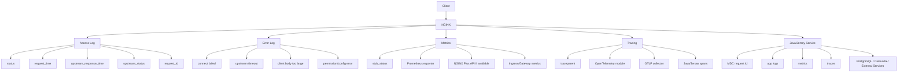

---

## 3. Observability Decomposition Table

| Area | Skill / Item | Fungsi | Catatan untuk Java/Jersey |
|---|---|---|---|
| Access log | `log_format` | Menentukan field log HTTP | Wajib mencatat request, status, latency, upstream, request ID. |
| Access log | `$request_time` | Total waktu request dari sudut pandang NGINX | Berguna membedakan client lambat vs upstream lambat. |
| Access log | `$upstream_response_time` | Waktu response upstream | Indikator latency Java/backend. |
| Access log | `$upstream_status` | Status dari upstream | Bisa berisi beberapa status jika retry terjadi. |
| Access log | `$upstream_addr` | Backend yang dipilih | Membantu menemukan instance/pod bermasalah. |
| Error log | `error_log` level | Melihat masalah NGINX/upstream | Level umum: `error`, `warn`, `notice`, `info`, `debug`. |
| Correlation | `$request_id` / `X-Request-ID` | Melacak request lintas layer | Jersey filter harus memasukkan ID ke MDC dan response. |
| Metrics | `stub_status` | Basic NGINX counters | Module ini memberi basic status dan tidak dibangun default kecuali enabled saat build. ([Nginx](https://nginx.org/en/docs/http/ngx_http_stub_status_module.html?utm_source=chatgpt.com)) |
| Metrics | Prometheus exporter | Convert NGINX/NGINX Plus metrics ke Prometheus | Exporter resmi mengambil dari `stub_status` untuk NGINX OSS atau API untuk NGINX Plus. ([GitHub](https://github.com/nginx/nginx-prometheus-exporter?utm_source=chatgpt.com)) |
| Tracing | OpenTelemetry | Trace propagation/export | `ngx_otel_module` mendukung W3C context propagation dan OTLP/gRPC export. ([Nginx](https://nginx.org/en/docs/ngx_otel_module.html?utm_source=chatgpt.com)) |
| Dashboard | RED/USE metrics | Rate, errors, duration, saturation | Gabungkan NGINX + Java + DB metrics. |
| Alerting | SLO symptoms | Alert pada user impact | Jangan alert hanya karena satu counter naik tanpa dampak. |

---

## 4. Access Log: Minimum Production Format

Gunakan JSON agar mudah diparse oleh ELK/OpenSearch/Loki/Datadog/Splunk.

```nginx id="dfl8zp"
log_format api_json escape=json
'{'
  '"time":"$time_iso8601",'
  '"remote_addr":"$remote_addr",'
  '"host":"$host",'
  '"method":"$request_method",'
  '"uri":"$uri",'
  '"request_uri":"$request_uri",'
  '"status":$status,'
  '"body_bytes_sent":$body_bytes_sent,'
  '"request_length":$request_length,'
  '"request_time":$request_time,'
  '"upstream_addr":"$upstream_addr",'
  '"upstream_status":"$upstream_status",'
  '"upstream_connect_time":"$upstream_connect_time",'
  '"upstream_header_time":"$upstream_header_time",'
  '"upstream_response_time":"$upstream_response_time",'
  '"http_referer":"$http_referer",'
  '"http_user_agent":"$http_user_agent",'
  '"request_id":"$request_id"'
'}';

access_log /var/log/nginx/api-access.log api_json;
```

NGINX `ngx_http_log_module` menulis request log dalam format yang ditentukan; dokumentasinya juga menegaskan bahwa request dicatat pada konteks location tempat processing berakhir, yang bisa berbeda dari location awal jika terjadi internal redirect. Ini penting saat memakai `try_files`, `rewrite`, atau named location. ([Nginx](https://nginx.org/en/docs/http/ngx_http_log_module.html?utm_source=chatgpt.com))

---

## 5. Access Log Field yang Wajib Dipahami

| Field | Arti | Diagnosis |
|---|---|---|
| `$status` | Status akhir ke client | Apakah client melihat 2xx/4xx/5xx |
| `$request_time` | Total durasi request dari NGINX | User-perceived latency di proxy layer |
| `$upstream_connect_time` | Waktu connect ke upstream | Network/listener/DNS/backend accept issue |
| `$upstream_header_time` | Waktu sampai header response upstream | Java mulai response lambat, DB/external call lambat |
| `$upstream_response_time` | Waktu response upstream | Backend processing/body streaming |
| `$upstream_status` | Status dari upstream | Melihat retry/failover |
| `$upstream_addr` | Upstream backend address | Menemukan instance buruk |
| `$request_length` | Ukuran request dari client | Upload/header/body anomaly |
| `$body_bytes_sent` | Bytes response ke client | Response besar/streaming |
| `$request_id` | ID unik request | Korelasi NGINX ↔ Java ↔ DB/log lainnya |
| `$request_uri` | URI asli + query | Debug route dan client input |
| `$uri` | URI normalized/current | Debug rewrite/internal route |

---

## 6. Interpretasi Latency

### Case A - Backend lambat

```json id="di0g4c"
{
  "status": 504,
  "request_time": 30.001,
  "upstream_connect_time": "0.003",
  "upstream_header_time": "30.000",
  "upstream_response_time": "30.000"
}
```

Interpretasi:

```text id="cn6tnt"
NGINX cepat connect ke Java.
Java menerima request tetapi tidak memberi response sebelum timeout.
Cek Java thread pool, DB lock, Camunda/external call, GC pause, slow query.
```

---

### Case B - Upstream connect problem

```json id="rmm3zv"
{
  "status": 502,
  "request_time": 0.004,
  "upstream_connect_time": "0.003",
  "upstream_status": "502"
}
```

Interpretasi:

```text id="xy98c8"
Masalah sangat awal.
Cek app listen port, pod/container restart, service discovery, firewall/network policy.
```

---

### Case C - Retry tersembunyi

```json id="j9yr83"
{
  "status": 200,
  "upstream_addr": "10.0.1.11:8080, 10.0.1.12:8080",
  "upstream_status": "502, 200",
  "upstream_response_time": "0.003, 0.121"
}
```

Interpretasi:

```text id="rgl072"
Client melihat sukses.
Tapi NGINX gagal ke upstream pertama lalu retry ke upstream kedua.
Alert perlu menangkap upstream_status berisi koma atau 502 sebelum sukses.
```

---

### Case D - Client lambat / client closed

```json id="wi2j3q"
{
  "status": 499,
  "request_time": 10.001,
  "upstream_response_time": "9.950"
}
```

Interpretasi:

```text id="mljaq6"
Client menutup koneksi sebelum response selesai.
Bisa karena browser timeout, mobile network, frontend timeout, load balancer timeout, atau backend terlalu lama.
```

---

## 7. Error Log

Baseline:

```nginx id="mhb6ic"
error_log /var/log/nginx/error.log warn;
```

Untuk debugging sementara:

```nginx id="9gc0he"
error_log /var/log/nginx/error.log info;
```

Debug level:

```nginx id="wij8k8"
error_log /var/log/nginx/error.log debug;
```

Gunakan `debug` hanya sementara dan pada environment/traffic terbatas, karena sangat verbose.

### Error log pattern penting

| Error log pattern | Diagnosis awal |
|---|---|
| `connect() failed ... while connecting to upstream` | Upstream down/refused/network issue |
| `upstream timed out ... while reading response header from upstream` | Java/backend lambat memberi response |
| `upstream prematurely closed connection` | Backend menutup koneksi sebelum response selesai |
| `client intended to send too large body` | Kena `client_max_body_size` |
| `client sent too large header` | Header/cookie/JWT terlalu besar |
| `no live upstreams` | Semua upstream dianggap unavailable |
| `permission denied` | File/socket/cert/log permission issue |
| `SSL_do_handshake() failed` | TLS handshake/cipher/cert/client cert issue |

---

## 8. Correlation ID Strategy

### Boundary rule

```text id="ncx1y4"
Jika client mengirim X-Request-ID:
  - boleh diterima jika format aman
  - jika tidak valid, generate baru

Jika client tidak mengirim:
  - NGINX generate $request_id

NGINX selalu forward X-Request-ID ke Java.
Java selalu log X-Request-ID.
Java selalu return X-Request-ID di response.
```

### NGINX config sederhana

```nginx id="lshn6a"
proxy_set_header X-Request-ID $request_id;
add_header X-Request-ID $request_id always;
```

Lebih baik jika ingin preserve incoming request ID dengan validasi tertentu, gunakan `map`. Namun jangan menerima string arbitrarily panjang dari client.

```nginx id="ps0rww"
map $http_x_request_id $req_id {
    default $request_id;
    "~^[A-Za-z0-9._:-]{8,128}$" $http_x_request_id;
}

server {
    location ^~ /api/ {
        proxy_set_header X-Request-ID $req_id;
        add_header X-Request-ID $req_id always;

        proxy_pass http://jersey_api/;
    }
}
```

---

## 9. Jersey Filter untuk Correlation ID

Contoh konseptual:

```java id="sn3d7t"
@Provider
@Priority(Priorities.AUTHENTICATION)
public class CorrelationIdFilter implements ContainerRequestFilter, ContainerResponseFilter {

    private static final String HEADER = "X-Request-ID";

    @Override
    public void filter(ContainerRequestContext requestContext) {
        String requestId = requestContext.getHeaderString(HEADER);

        if (requestId == null || !requestId.matches("[A-Za-z0-9._:-]{8,128}")) {
            requestId = UUID.randomUUID().toString();
        }

        requestContext.setProperty(HEADER, requestId);
        MDC.put("requestId", requestId);
    }

    @Override
    public void filter(ContainerRequestContext requestContext,
                       ContainerResponseContext responseContext) {
        Object requestId = requestContext.getProperty(HEADER);

        if (requestId != null) {
            responseContext.getHeaders().putSingle(HEADER, requestId.toString());
        }

        MDC.remove("requestId");
    }
}
```

Untuk outbound HTTP/gRPC/Kafka/RabbitMQ message, request ID juga perlu dipropagasi. Jika tidak, trace putus di service boundary.

---

## 10. Structured Logging di Java

Log Java harus bisa dicocokkan dengan NGINX:

```json id="38uxum"
{
  "timestamp": "2026-07-13T10:15:30.123+07:00",
  "level": "INFO",
  "service": "order-service",
  "requestId": "e4d909c2b8f84f19a0a1f857cc",
  "method": "POST",
  "path": "/orders",
  "userId": "u-123",
  "tenantId": "tenant-a",
  "event": "order.create.started"
}
```

Minimum field:

| Field | Kenapa penting |
|---|---|
| `requestId` | join dengan NGINX access log |
| `service` | multi-service filtering |
| `route/resource` | endpoint-level analysis |
| `userId/tenantId` | audit dan debugging tenant-specific |
| `durationMs` | app-level latency |
| `status/errorCode` | app/domain status |
| `dbDurationMs` | pisahkan app vs DB |
| `workflowInstanceId` | Camunda correlation |
| `traceId/spanId` | tracing distributed |

---

## 11. Metrics: NGINX OSS `stub_status`

Config:

```nginx id="mklppi"
server {
    listen 127.0.0.1:8080;

    location = /stub_status {
        stub_status;
        access_log off;

        allow 127.0.0.1;
        deny all;
    }
}
```

Atau untuk network monitoring internal:

```nginx id="zju0o2"
location = /stub_status {
    stub_status;
    access_log off;

    allow 10.20.0.0/16; # monitoring CIDR
    deny all;
}
```

`ngx_http_stub_status_module` menyediakan basic status information seperti active connections, accepted/handled requests, reading/writing/waiting; modul ini tidak dibangun default dan harus di-enable dengan `--with-http_stub_status_module` saat build. ([Nginx](https://nginx.org/en/docs/http/ngx_http_stub_status_module.html?utm_source=chatgpt.com))

---

## 12. Prometheus Exporter

Pola umum:

```text id="xjg1li"
NGINX /stub_status
  ↓
nginx-prometheus-exporter
  ↓
Prometheus scrape
  ↓
Grafana dashboard / alert
```

Contoh run exporter:

```bash id="6cfoz0"
nginx-prometheus-exporter \
  --nginx.scrape-uri=http://nginx:8080/stub_status
```

Exporter resmi NGINX mengambil metrics dari satu NGINX atau NGINX Plus, mengonversinya ke format Prometheus, lalu mengeksposnya lewat HTTP server untuk di-scrape Prometheus; untuk NGINX OSS ia mengambil dari `stub_status`, sedangkan untuk NGINX Plus dari API. ([GitHub](https://github.com/nginx/nginx-prometheus-exporter?utm_source=chatgpt.com))

Metrics NGINX OSS dari `stub_status` relatif basic. Untuk observability kaya seperti per-upstream detail, sering kali perlu:

```text id="bqsxs9"
- parse access logs
- NGINX Plus API jika tersedia
- Ingress/Gateway controller metrics
- service mesh metrics
- app-level Java metrics
```

---

## 13. NGINX Plus Metrics

Jika perusahaan memakai NGINX Plus, observability bisa lebih kaya melalui NGINX Plus API dan dashboard. Untuk NGINX OSS, jangan mengasumsikan fitur Plus tersedia.

Decision table:

| Capability | NGINX OSS | NGINX Plus |
|---|---:|---:|
| Access/error log | Ya | Ya |
| `stub_status` basic metrics | Ya, jika module built | Ya |
| Rich upstream metrics API | Terbatas/tidak sama | Ya |
| Active health check metrics | Tidak native OSS | Ya |
| Dynamic upstream API | Tidak seperti Plus | Ya |
| Prometheus exporter | Ya via stub_status | Ya via Plus API |

---

## 14. Metrics yang Harus Dimonitor

### RED metrics untuk HTTP

| Metric | Dari mana | Arti |
|---|---|---|
| Request rate | access log / ingress metrics | Traffic volume |
| Error rate | access log | 4xx/5xx per route |
| Duration | access log / histogram app | Latency |
| Saturation | NGINX/host/app metrics | Kapasitas mendekati limit |

### NGINX-specific

| Metric | Signal |
|---|---|
| active connections | traffic/concurrency |
| accepts/handled/requests | throughput dan connection handling |
| reading/writing/waiting | connection state |
| 499 rate | client timeout/abort |
| 413 rate | body size violation |
| 429 rate | rate limit |
| 502 rate | upstream connectivity/crash |
| 503 rate | unavailable/rate/policy/upstream exhausted |
| 504 rate | backend timeout |
| upstream retry count | hidden instability |
| request body size | abuse/upload anomaly |
| response bytes | large response/cost |

---

## 15. Dashboard Layout

Dashboard minimal:

```text id="xk5d56"
Row 1 - User impact
  - request rate by route
  - 5xx rate by route
  - p50/p95/p99 request_time
  - 499/502/504 split

Row 2 - Upstream health
  - upstream_response_time p95/p99
  - upstream_status by backend
  - upstream_addr failure distribution
  - retry/failover count

Row 3 - Security guardrails
  - 401/403
  - 413 body too large
  - 429 rate limited
  - blocked internal route attempts

Row 4 - Capacity
  - active connections
  - reading/writing/waiting
  - CPU/memory/network
  - file descriptor usage

Row 5 - Correlation drilldown
  - top slow request IDs
  - sample error request IDs
  - link to Java logs/traces
```

---

## 16. Alerting Principles

Alert pada **gejala user impact**, bukan hanya noise internal.

| Alert | Contoh trigger awal |
|---|---|
| High 5xx | 5xx rate > baseline selama 5-10 menit |
| High 504 | 504 naik di route tertentu |
| High 502 | 502 dari satu upstream instance/pod |
| Retry hidden failure | `upstream_status` mengandung `502, 200` meningkat |
| High 499 | client abort meningkat setelah release |
| High latency | p95/p99 request_time melewati SLO |
| Rate limit false positive | 429 naik setelah config change |
| Body too large spike | 413 spike dari endpoint tertentu |
| TLS/mTLS failures | handshake/verify error meningkat |
| No logs | log ingestion berhenti |

Alert bagus harus menyertakan:

```text id="x2r4fv"
- route/service
- status family
- upstream_addr
- request_time percentile
- sample request IDs
- recent deploy/config change
- runbook link
```

---

## 17. OpenTelemetry di NGINX

NGINX punya `ngx_otel_module` yang menyediakan dukungan distributed tracing OpenTelemetry, termasuk W3C context propagation dan OTLP/gRPC export protocol. Modul ini memiliki directive seperti `otel_exporter`, `otel_service_name`, `otel_trace`, `otel_trace_context`, dan `otel_span_name`. ([Nginx](https://nginx.org/en/docs/ngx_otel_module.html?utm_source=chatgpt.com))

Contoh konseptual:

```nginx id="qgvmon"
load_module modules/ngx_otel_module.so;

events {}

http {
    otel_exporter {
        endpoint otel-collector:4317;
    }

    otel_service_name nginx-edge;
    otel_trace on;
    otel_trace_context propagate;

    server {
        listen 443 ssl;
        server_name api.example.com;

        location ^~ /api/ {
            otel_span_name "$request_method $uri";
            otel_span_attr http.route "/api/*";
            otel_span_attr upstream.addr "$upstream_addr";

            proxy_set_header traceparent $otel_trace_context;
            proxy_pass http://jersey_api/;
        }
    }
}
```

Catatan penting: availability dan packaging module bisa berbeda antara NGINX OSS, NGINX Plus, distro OS, container image, dan build internal. F5/NGINX docs juga mendokumentasikan dynamic OpenTelemetry module untuk NGINX Plus yang mengirim telemetry ke OTel collector dan mendukung W3C trace context serta OTLP/gRPC. ([NGINX Documentation](https://docs.nginx.com/nginx/admin-guide/dynamic-modules/opentelemetry/?utm_source=chatgpt.com))

---

## 18. Trace Context Propagation

Target end-to-end:

```text id="t9b8w0"
Client / frontend
  ↓ traceparent
NGINX
  ↓ traceparent + X-Request-ID
Java/Jersey
  ↓ traceparent + requestId
PostgreSQL / Camunda / downstream services
```

Standar modern tracing biasanya memakai:

| Header | Fungsi |
|---|---|
| `traceparent` | W3C trace context utama |
| `tracestate` | vendor-specific trace state |
| `X-Request-ID` | correlation ID log-friendly |
| `b3` / `X-B3-*` | legacy Zipkin/B3 propagation |
| `x-datadog-*` | Datadog propagation jika dipakai |

Prinsipnya:

```text id="mzj4cv"
Trace ID untuk distributed tracing.
Request ID untuk log correlation dan user support.
Keduanya boleh sama dalam sistem tertentu, tapi tidak harus.
```

---

## 19. Java/Jersey + OpenTelemetry

Untuk Java 17+ service, pattern paling umum:

```text id="2gqnpdj"
OpenTelemetry Java Agent
  ↓
auto-instrument HTTP server/client, JDBC, executor, supported libraries

atau

Manual instrumentation
  ↓
custom spans untuk domain operation, Camunda interaction, MyBatis query boundary
```

Di Jersey service, minimal pastikan:

```text id="rfd6ty"
- incoming traceparent dibaca
- outgoing HTTP/gRPC call membawa traceparent
- logs menyertakan traceId/spanId/requestId
- database spans tidak membocorkan parameter sensitif
- domain spans diberi nama stabil, bukan high-cardinality ID
```

Contoh log Java:

```json id="kfn94r"
{
  "service": "order-service",
  "requestId": "req-01H...",
  "traceId": "4bf92f3577b34da6a3ce929d0e0e4736",
  "spanId": "00f067aa0ba902b7",
  "event": "order.submit.completed",
  "durationMs": 184,
  "status": "SUCCESS"
}
```

---

## 20. High Cardinality Pitfalls

Hindari label/metric/span name yang berisi ID unik.

Buruk:

```text id="4c0k39"
span_name = "GET /api/orders/123456"
metric label path="/api/orders/123456"
log index field userAgentRaw with unbounded cardinality
```

Lebih baik:

```text id="7jvqtm"
span_name = "GET /api/orders/{id}"
metric label route="/api/orders/{id}"
requestId/orderId hanya di log field, bukan metric label utama
```

Kenapa penting:

```text id="j57zoj"
Metrics backend bisa mahal/meledak cardinality.
Dashboard lambat.
Alert noisy.
Storage cepat penuh.
```

NGINX tidak selalu tahu route template Jersey seperti `/orders/{id}`. Jika ingin route-level metric yang benar, Java/Jersey instrumentation sering lebih akurat daripada hanya access log raw path.

---

## 21. Sampling Strategy

Untuk tracing:

| Traffic | Sampling |
|---|---|
| Normal high-volume 2xx | Sample rendah, misal 1-10% |
| 5xx | Sample tinggi/100% |
| Slow requests | Sample tinggi |
| Admin/regulatory critical command | Pertimbangkan trace lebih tinggi |
| Health check | Jangan trace semua |
| Static assets | Biasanya tidak perlu trace |

Jika sampling hanya random, incident langka bisa hilang. Lebih baik kombinasikan:

```text id="wsa0do"
- head sampling untuk traffic umum
- tail sampling di collector untuk error/slow traces
- route-based sampling untuk endpoint critical
```

---

## 22. Observability untuk Security Hardening

Tambahkan field untuk melihat policy impact:

```nginx id="1iqlx2"
log_format security_json escape=json
'{'
  '"time":"$time_iso8601",'
  '"remote_addr":"$remote_addr",'
  '"host":"$host",'
  '"request":"$request",'
  '"status":$status,'
  '"request_time":$request_time,'
  '"request_length":$request_length,'
  '"request_id":"$request_id",'
  '"http_user_agent":"$http_user_agent",'
  '"upstream_status":"$upstream_status"'
'}';
```

Pantau:

| Status | Makna |
|---|---|
| 401 | unauthenticated |
| 403 | forbidden / allow-deny / authz |
| 413 | body too large |
| 414 | URI too long |
| 429 | rate limited |
| 499 | client closed |
| 5xx | system/upstream failure |

Untuk rate limit dry run, pastikan log level/status cukup untuk melihat request yang akan terkena limit sebelum enforcement.

---

## 23. Observability di Docker

Pola container sehat:

```text id="3f3xt2"
NGINX logs to stdout/stderr
  ↓
Docker/container runtime
  ↓
log collector
  ↓
centralized log backend
```

Dalam official container pattern, jangan hanya menulis log ke file internal container yang tidak dikumpulkan.

Contoh:

```nginx id="14iwu1"
access_log /dev/stdout api_json;
error_log  /dev/stderr warn;
```

Untuk local Docker Compose:

```yaml id="121yhu"
services:
  nginx:
    image: nginx:stable
    ports:
      - "8080:80"
    volumes:
      - ./nginx.conf:/etc/nginx/nginx.conf:ro
```

Debug lokal:

```bash id="87wrpl"
docker logs -f nginx
curl -i http://localhost:8080/api/health
```

---

## 24. Observability di Kubernetes

Pola Kubernetes:

```text id="buwrua"
NGINX/Ingress/Gateway Pod logs
  ↓
stdout/stderr
  ↓
Fluent Bit / Vector / Promtail / agent
  ↓
central log backend

Metrics:
  NGINX exporter / ingress controller metrics
  ↓
Prometheus
  ↓
Grafana / Alertmanager

Traces:
  NGINX OTel / Java OTel
  ↓
OTel Collector
  ↓
Tempo/Jaeger/Datadog/New Relic/etc.
```

Untuk Kubernetes, pertanyaan utama saat debugging:

```text id="oxl9lt"
Apakah error terjadi di ingress/gateway?
Apakah Service punya endpoint ready?
Apakah hanya Pod tertentu yang gagal?
Apakah rollout baru dimulai?
Apakah readiness probe flapping?
Apakah NGINX retry menyembunyikan Pod yang gagal?
```

Command umum:

```bash id="mmgaha"
kubectl logs deploy/nginx-ingress-controller -n ingress-nginx
kubectl get endpointslice -n app
kubectl get pods -n app -o wide
kubectl describe ingress -n app
kubectl describe gateway -n app
```

---

## 25. Runbook: 502/504 Investigation

### Step 1 - Ambil sample request ID

```text id="t6l86h"
Dari alert/dashboard:
- route
- status
- request_id
- upstream_addr
- upstream_status
- upstream timing
```

### Step 2 - Bedakan connect vs backend latency

```text id="ohkdhf"
upstream_connect_time tinggi:
  network/listener/service discovery

upstream_header_time tinggi:
  Java/backend processing lambat

upstream_status multiple:
  retry/failover terjadi

request_time tinggi tapi upstream time rendah:
  client lambat atau response delivery issue
```

### Step 3 - Cocokkan ke Java log

```text id="0e9zh2"
Cari requestId yang sama di:
- Jersey access/application log
- service error log
- DB slow query log
- Camunda logs/history
- downstream service logs
```

### Step 4 - Tentukan owner failure

| Bukti | Kemungkinan owner |
|---|---|
| Tidak ada log Java | NGINX/network/routing sebelum app |
| Java log mulai tapi tidak selesai | app/DB/external dependency |
| DB slow query bersamaan | DB/query/index/lock |
| Camunda delay | workflow engine/job/external task |
| Client 499 | frontend/client/LB timeout atau backend terlalu lambat |
| Hanya satu upstream_addr | instance-specific issue |

---

## 26. Runbook: Latency Regression Setelah Release

```text id="6bm146"
1. Bandingkan p95/p99 request_time sebelum/sesudah release.
2. Pecah per route, bukan global.
3. Pecah upstream_response_time vs request_time.
4. Pecah per upstream_addr/pod.
5. Cek Java duration log per layer:
   - request handler
   - validation
   - DB/MyBatis
   - Camunda
   - external call
6. Cek retry/failover count.
7. Cek 499 naik karena client timeout.
8. Cek DB lock/slow query.
9. Rollback/canary jika user impact melewati SLO.
```

---

## 27. Production Baseline Config

```nginx id="1d5ejz"
http {
    log_format api_json escape=json
    '{'
      '"time":"$time_iso8601",'
      '"remote_addr":"$remote_addr",'
      '"host":"$host",'
      '"method":"$request_method",'
      '"uri":"$uri",'
      '"request_uri":"$request_uri",'
      '"status":$status,'
      '"request_length":$request_length,'
      '"body_bytes_sent":$body_bytes_sent,'
      '"request_time":$request_time,'
      '"upstream_addr":"$upstream_addr",'
      '"upstream_status":"$upstream_status",'
      '"upstream_connect_time":"$upstream_connect_time",'
      '"upstream_header_time":"$upstream_header_time",'
      '"upstream_response_time":"$upstream_response_time",'
      '"http_user_agent":"$http_user_agent",'
      '"request_id":"$request_id"'
    '}';

    access_log /dev/stdout api_json;
    error_log  /dev/stderr warn;

    map $http_x_request_id $req_id {
        default $request_id;
        "~^[A-Za-z0-9._:-]{8,128}$" $http_x_request_id;
    }

    server {
        listen 443 ssl;
        server_name api.example.com;

        location ^~ /api/ {
            proxy_set_header X-Request-ID $req_id;
            add_header X-Request-ID $req_id always;

            proxy_set_header Host              $host;
            proxy_set_header X-Forwarded-Proto $scheme;
            proxy_set_header X-Forwarded-For   $proxy_add_x_forwarded_for;
            proxy_set_header X-Real-IP         $remote_addr;

            proxy_pass http://jersey_api/;
        }
    }

    server {
        listen 127.0.0.1:8080;

        location = /stub_status {
            stub_status;
            access_log off;
            allow 127.0.0.1;
            deny all;
        }
    }
}
```

---

## 28. Anti-Patterns

| Anti-pattern | Dampak |
|---|---|
| Access log default terlalu minimal | Tidak bisa bedakan NGINX vs upstream issue |
| Tidak log `$upstream_addr` | Instance/pod buruk sulit ditemukan |
| Tidak log `$upstream_status` | Retry tersembunyi |
| Tidak log request ID | Korelasi NGINX ↔ Java sulit |
| Query string sensitif dilog penuh | Risiko kebocoran token/PII |
| Health check dilog semua | Noise besar |
| Metrics hanya NGINX, tanpa Java/DB | Diagnosis berhenti di proxy |
| Trace semua request high-volume | Biaya observability tinggi |
| Metric label pakai full path dengan ID | Cardinality explosion |
| Error log debug selalu aktif | Disk/storage penuh |
| Alert hanya pada CPU/connection | User impact tidak terlihat |
| Tidak monitor log ingestion | Incident terjadi tanpa data |

---

## 29. PR Review Checklist

```text id="r68ehl"
[ ] Access log JSON/structured tersedia
[ ] Log mencatat status, request_time, upstream timings
[ ] Log mencatat upstream_addr dan upstream_status
[ ] X-Request-ID dipropagasi ke Java dan dikembalikan ke client
[ ] Java/Jersey memasukkan requestId ke MDC/log
[ ] Query/token/PII tidak bocor di log
[ ] Health/static logs tidak membuat noise berlebihan
[ ] Error log level sesuai environment
[ ] stub_status/exporter diamankan, tidak public
[ ] Dashboard punya rate/error/duration per route
[ ] Alert mencakup 502/503/504/499/429/413
[ ] Retry/failover tersembunyi bisa terdeteksi
[ ] Trace context strategy jelas: traceparent + request ID
[ ] High-cardinality label dihindari
[ ] Runbook 502/504 tersedia
```

---

## 30. Roadmap Belajar Singkat

1. Mulai dari access log JSON dengan upstream timing.
2. Tambahkan request ID end-to-end dari NGINX ke Jersey.
3. Pastikan Java log memakai MDC dan structured logging.
4. Aktifkan metrics dasar via `stub_status` atau controller/exporter yang sesuai.
5. Buat dashboard RED: rate, error, duration per route.
6. Tambahkan alert untuk 502/503/504/499/413/429.
7. Evaluasi OpenTelemetry tracing jika stack observability sudah siap.
8. Hindari high cardinality dan logging data sensitif.
9. Buat runbook debugging berbasis request ID dan upstream timing.

---

## Status seri

**Seri 7 selesai. Sisa 5 seri lagi.**

Rekomendasi berikutnya: **Seri 8 - NGINX for Static Frontend + Java API Backend: SPA Routing, Cache Headers, Compression, CDN Boundary**.

---

**Sources:**

- [Configuring Logging | NGINX Documentation](https://docs.nginx.com/nginx/admin-guide/monitoring/logging/?utm_source=chatgpt.com)
- [Module ngx_http_stub_status_module](https://nginx.org/en/docs/http/ngx_http_stub_status_module.html?utm_source=chatgpt.com)
- [NGINX Prometheus Exporter for NGINX and NGINX Plus](https://github.com/nginx/nginx-prometheus-exporter?utm_source=chatgpt.com)

## Response:
7/13/2026, 4:47:08 PM

Saya lanjutkan ke Seri 8. Fokusnya pola NGINX untuk melayani static frontend/SPA sekaligus meneruskan `/api/*` ke Java/Jersey: routing, cache headers, compression, fallback, CDN boundary, dan jebakan cache untuk data sensitif.

# Seri 8/12 - NGINX for Static Frontend + Java API Backend

## SPA Routing, Cache Headers, Compression, CDN Boundary, and Java/Jersey API Separation

## 1. Introduction

Seri ini membahas pola umum ketika **NGINX melayani frontend static** seperti Vue/React/Angular SPA, sekaligus menjadi reverse proxy untuk **Java/Jersey REST API**.

Mental model-nya:

```text id="6r6t4n"
Browser
  ↓
NGINX
  - serve static frontend files
  - SPA fallback to index.html
  - cache immutable assets
  - compress text assets
  - proxy /api/* to Java/Jersey
  - avoid caching sensitive API response
  ↓
Java/Jersey API
  - auth
  - authorization
  - business validation
  - domain logic
  - audit
```

NGINX memang cocok untuk static content: dokumentasi F5/NGINX menjelaskan bahwa `root` menentukan direktori dasar, dan NGINX membentuk path file dengan menambahkan request URI ke path `root`. Untuk fallback SPA, directive `try_files` mengecek keberadaan file secara berurutan lalu menggunakan fallback terakhir seperti `/index.html` atau named location. ([NGINX Documentation](https://docs.nginx.com/nginx/admin-guide/web-server/serving-static-content/))

---

## 2. Diagram

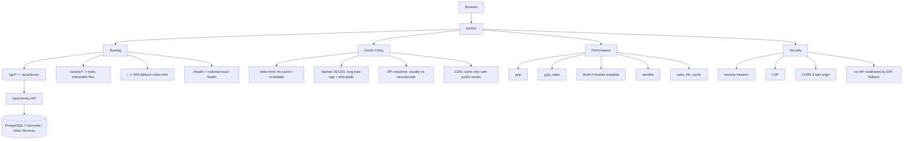

---

## 3. Decomposition Table

| Area | Skill / Item | Fungsi | Catatan praktis |
|---|---|---|---|
| Static serving | `root` | Menentukan base directory file static | `root /usr/share/nginx/html;` membuat `/assets/app.js` dicari sebagai `/usr/share/nginx/html/assets/app.js`. |
| Static serving | `try_files` | Mengecek file/directory lalu fallback | Cocok untuk SPA fallback: `try_files $uri $uri/ /index.html;`. |
| Static serving | `index` | File default untuk directory | Umumnya `index index.html;`. |
| API separation | `location ^~ /api/` | Memastikan API tidak tertelan regex/static fallback | Gunakan `^~` agar regex static tidak mengambil `/api/report.json`. |
| Cache headers | `add_header` | Menambah `Cache-Control`, security header | `add_header` punya aturan inheritance; `always` membuat header tetap ditambahkan pada response non-2xx tertentu. ([Nginx](https://nginx.org/en/docs/http/ngx_http_headers_module.html)) |
| Cache headers | `expires` | Mengatur `Expires` dan `Cache-Control` otomatis | NGINX `expires` positif menghasilkan `Cache-Control: max-age=...`; negatif menghasilkan `no-cache`. ([Nginx](https://nginx.org/en/docs/http/ngx_http_headers_module.html)) |
| Browser caching | `Cache-Control` | Mengontrol cache browser/shared cache | `private` untuk personalized content; `immutable` cocok untuk asset hashed/cache-busting. ([MDN Web Docs](https://developer.mozilla.org/en-US/docs/Web/HTTP/Reference/Headers/Cache-Control)) |
| Conditional cache | `ETag` | Validator static resource | NGINX default `etag on` dan dapat otomatis membuat ETag untuk static resources. ([Nginx](https://nginx.org/en/docs/http/ngx_http_core_module.html)) |
| Compression | `gzip` | Compress response text | NGINX gzip module compress response dan bisa mengurangi ukuran transfer, tetapi compression over TLS perlu mempertimbangkan risiko BREACH untuk response sensitif. ([Nginx](https://nginx.org/en/docs/http/ngx_http_gzip_module.html)) |
| Precompressed | `gzip_static` | Serve `.gz` file yang sudah dibuat saat build | Module `gzip_static` tidak built by default dan perlu enable saat build. ([Nginx](https://nginx.org/en/docs/http/ngx_http_gzip_static_module.html)) |
| Brotli | `ngx_brotli` | Compression lebih padat untuk static text assets | Di NGINX Plus tersedia sebagai dynamic module dari F5; di OSS tergantung build/module yang dipakai. ([NGINX Documentation](https://docs.nginx.com/nginx/admin-guide/dynamic-modules/brotli/?utm_source=chatgpt.com)) |
| File I/O | `sendfile` | Mengirim file via kernel sendfile | Default `sendfile off`; bisa diaktifkan untuk static serving. ([Nginx](https://nginx.org/en/docs/http/ngx_http_core_module.html)) |
| File metadata cache | `open_file_cache` | Cache descriptor/metadata/lookup file | Bisa menyimpan file descriptor, ukuran, modification time, directory existence, dan lookup errors jika diaktifkan. ([Nginx](https://nginx.org/en/docs/http/ngx_http_core_module.html)) |
| CDN boundary | immutable asset policy | CDN menyimpan static hashed assets | Jangan cache API personalized/sensitive response di shared cache. |
| SPA fallback | `/index.html` | Browser route seperti `/dashboard/orders` tetap membuka SPA | Jangan biarkan `/api/*` masuk ke fallback. |

---

## 4. Baseline: SPA + Java/Jersey API di Satu Domain

```nginx id="sx1uib"
server {
    listen 443 ssl;
    server_name app.example.com;

    root /usr/share/nginx/html;
    index index.html;

    # API must be matched before SPA fallback and static regex.
    location ^~ /api/ {
        proxy_pass http://jersey_api/;

        proxy_http_version 1.1;
        proxy_set_header Connection "";

        proxy_set_header Host              $host;
        proxy_set_header X-Real-IP         $remote_addr;
        proxy_set_header X-Forwarded-For   $proxy_add_x_forwarded_for;
        proxy_set_header X-Forwarded-Proto $scheme;
        proxy_set_header X-Request-ID      $request_id;

        proxy_connect_timeout 3s;
        proxy_send_timeout    30s;
        proxy_read_timeout    30s;

        # Usually do not cache API responses at NGINX unless explicitly designed.
        add_header Cache-Control "no-store" always;
    }

    # Hashed build assets: app.8f3a2c1.js, styles.91ab2.css, etc.
    location ~* \.(?:js|css|png|jpg|jpeg|gif|svg|ico|webp|woff2?)$ {
        try_files $uri =404;

        add_header Cache-Control "public, max-age=31536000, immutable" always;
        access_log off;
    }

    # SPA entrypoint: revalidate so new deployments are discovered quickly.
    location = /index.html {
        add_header Cache-Control "no-cache" always;
        try_files /index.html =404;
    }

    # SPA browser route fallback.
    location / {
        try_files $uri $uri/ /index.html;
    }
}
```

Pola utamanya: **asset yang namanya mengandung hash boleh cache panjang**, sedangkan `index.html` tidak boleh cache panjang karena file itu menunjuk ke versi asset terbaru. MDN menyebut `immutable` cocok bila resource memakai cache-busting URL seperti version/hash dan tidak dimodifikasi pada URL yang sama. ([MDN Web Docs](https://developer.mozilla.org/en-US/docs/Web/HTTP/Reference/Headers/Cache-Control))

---

## 5. Kenapa `/api/` Harus `^~`

Konfigurasi rawan:

```nginx id="z2oc2c"
location /api/ {
    proxy_pass http://jersey_api/;
}

location ~* \.(js|css|json|png)$ {
    expires 1y;
}
```

Request ini bisa bermasalah:

```text id="bc8nf0"
/api/report.json
```

Regex static bisa mengambil alih route API jika tidak dijaga.

Pola lebih aman:

```nginx id="8trz20"
location ^~ /api/ {
    proxy_pass http://jersey_api/;
    include conf.d/proxy-common.conf;
}

location ~* \.(js|css|png|jpg|jpeg|gif|svg|ico|webp|woff2?)$ {
    try_files $uri =404;
    add_header Cache-Control "public, max-age=31536000, immutable" always;
}
```

Jangan masukkan `.json` ke regex static kecuali benar-benar diperlukan, karena banyak endpoint API memakai `.json`.

---

## 6. Cache Policy Matrix

| Resource | Contoh | Cache policy | Alasan |
|---|---|---|---|
| SPA entrypoint | `/index.html` | `Cache-Control: no-cache` | Browser boleh menyimpan, tapi harus revalidate agar deployment baru cepat terdeteksi. |
| Hashed JS/CSS | `/assets/app.a1b2c3.js` | `public, max-age=31536000, immutable` | URL berubah setiap build, aman cache panjang. |
| Static image hashed | `/assets/logo.aa11.webp` | `public, max-age=31536000, immutable` | Sama seperti JS/CSS hashed. |
| Static image non-hashed | `/images/logo.png` | pendek/sedang, misal `max-age=3600` | Bisa berubah tanpa URL baru. |
| Runtime config | `/config.json` | `no-cache` atau sangat pendek | Sering berubah per environment. |
| API public readonly | `/api/public/catalogs` | tergantung desain | Bisa cache jika benar-benar public dan tidak personalized. |
| API authenticated | `/api/orders/me` | `private` atau `no-store` | Personalized/sensitive; jangan shared cache. |
| API mutation | `POST /api/orders` | `no-store` | Response command tidak perlu disimpan cache. |
| Error page static | `/50x.html` | pendek | Jangan cache error terlalu lama. |

MDN menjelaskan response cache memiliki state **fresh** dan **stale** berdasarkan age/max-age; selama masih fresh, cache dapat menggunakannya untuk memenuhi request. MDN juga menyatakan `private` berarti response hanya boleh disimpan di private cache seperti browser, cocok untuk personalized content setelah login/cookie. ([MDN Web Docs](https://developer.mozilla.org/en-US/docs/Web/HTTP/Guides/Caching))

---

## 7. `index.html` Tidak Boleh Cache Panjang

Bug deployment SPA yang umum:

```text id="5un55a"
User membuka app
  ↓
Browser memakai index.html lama dari cache
  ↓
index.html lama menunjuk /assets/app.oldhash.js
  ↓
file oldhash sudah tidak ada di server/CDN
  ↓
frontend blank page / 404 asset
```

Pola aman:

```nginx id="r0nka7"
location = /index.html {
    add_header Cache-Control "no-cache" always;
    try_files /index.html =404;
}
```

Atau lebih ketat:

```nginx id="temb7g"
location = /index.html {
    add_header Cache-Control "no-store" always;
    try_files /index.html =404;
}
```

Perbedaan praktis:

| Policy | Efek |
|---|---|
| `no-cache` | Boleh disimpan, tapi harus revalidate sebelum dipakai ulang. |
| `no-store` | Tidak boleh disimpan. Lebih ketat, tetapi bisa menambah request. |
| `max-age=0, must-revalidate` | Mirip revalidate setiap kali stale/segera. |
| Long `max-age` | Jangan untuk `index.html` SPA. |

---

## 8. Hashed Assets: Cache Panjang

Build modern biasanya menghasilkan file seperti:

```text id="3ugzpr"
app.8f3a2c1.js
vendor.19b9af3.js
styles.a71d3.css
logo.9ab81.svg
```

Konfigurasi:

```nginx id="0k7081"
location ~* \.(?:js|css|png|jpg|jpeg|gif|svg|ico|webp|woff2?)$ {
    try_files $uri =404;

    add_header Cache-Control "public, max-age=31536000, immutable" always;
    access_log off;
}
```

Invariant deployment:

```text id="igk0oc"
Jika isi file berubah, nama file juga harus berubah.
Jika nama file sama, isi file tidak boleh berubah.
```

Jika pipeline frontend tidak melakukan content hashing, jangan gunakan `immutable` satu tahun.

---

## 9. Runtime Config Pattern

Banyak SPA butuh runtime config agar image bisa sama untuk dev/staging/prod.

Contoh:

```text id="uxb7lg"
/config.json
```

NGINX:

```nginx id="a6d4oh"
location = /config.json {
    try_files /config.json =404;

    add_header Cache-Control "no-cache" always;
}
```

Kenapa tidak cache panjang?

```text id="st4oox"
config.json bisa berubah antar environment,
bisa berubah saat endpoint/API base URL berubah,
dan sering dipakai saat deployment rollback/canary.
```

Jangan taruh secret di `config.json`. File itu dikirim ke browser dan bersifat public.

---

## 10. Static Error Pages

```nginx id="ipgde9"
error_page 404 /404.html;
error_page 500 502 503 504 /50x.html;

location = /404.html {
    internal;
    root /usr/share/nginx/html;
    add_header Cache-Control "no-cache" always;
}

location = /50x.html {
    internal;
    root /usr/share/nginx/html;
    add_header Cache-Control "no-cache" always;
}
```

`internal` mencegah file error page diakses langsung sebagai route publik. Gunakan error page static yang tidak membocorkan internal host, upstream address, stack trace, atau detail config.

---

## 11. Compression: gzip

Baseline:

```nginx id="sn1k8y"
gzip on;
gzip_min_length 1000;
gzip_comp_level 5;
gzip_vary on;
gzip_types
    text/plain
    text/css
    text/javascript
    application/javascript
    application/json
    application/xml
    image/svg+xml;
```

NGINX gzip module adalah filter untuk mengompresi response dengan metode gzip dan dokumentasi NGINX menyebut ini sering membantu mengurangi ukuran data yang ditransfer secara signifikan. Namun, dokumentasi yang sama memperingatkan bahwa compressed responses di atas SSL/TLS dapat rentan terhadap BREACH, sehingga jangan sembarangan mengompresi response sensitif yang mengandung secret/reflected user input. ([Nginx](https://nginx.org/en/docs/http/ngx_http_gzip_module.html))

Decision table:

| Content | gzip? | Catatan |
|---|---:|---|
| JS/CSS/HTML | Ya | Cocok, biasanya besar dan text-based. |
| JSON public | Bisa | Aman jika tidak mengandung secret/reflected sensitive data. |
| JSON authenticated | Hati-hati | Pertimbangkan BREACH risk jika ada token/secret/reflected input. |
| SVG | Ya | Text-based. |
| PNG/JPEG/WebP | Tidak perlu | Sudah compressed. |
| ZIP/PDF | Biasanya tidak | Sudah compressed/kurang efektif. |

---

## 12. Precompressed Assets: `gzip_static`

Jika build pipeline menghasilkan:

```text id="v32e8o"
app.8f3a2c1.js
app.8f3a2c1.js.gz
styles.a71d3.css
styles.a71d3.css.gz
```

NGINX:

```nginx id="7emcy9"
gzip_static on;
```

`ngx_http_gzip_static_module` memungkinkan NGINX mengirim file `.gz` precompressed sebagai pengganti file biasa, tetapi module ini tidak built by default dan harus diaktifkan saat build dengan parameter yang sesuai. ([Nginx](https://nginx.org/en/docs/http/ngx_http_gzip_static_module.html))

Keuntungan:

```text id="z4kg8w"
- CPU runtime NGINX lebih rendah
- compression bisa dilakukan di CI/CD
- hasil compression stabil
```

Pastikan timestamp original dan `.gz` konsisten jika validasi cache bergantung pada metadata.

---

## 13. Brotli

Brotli sering lebih efisien untuk text assets, tetapi tidak selalu tersedia di NGINX OSS image default. F5 mendokumentasikan Brotli sebagai dynamic module untuk NGINX Plus; untuk NGINX OSS, availability bergantung pada build/distribution/module yang dipasang. ([NGINX Documentation](https://docs.nginx.com/nginx/admin-guide/dynamic-modules/brotli/?utm_source=chatgpt.com))

Contoh konseptual jika module tersedia:

```nginx id="cag7a4"
brotli on;
brotli_static on;
brotli_comp_level 5;
brotli_types
    text/plain
    text/css
    application/javascript
    application/json
    image/svg+xml;
```

Rule praktis:

```text id="2d1ncx"
Mulai dari gzip dulu.
Gunakan brotli jika image/build resmi perusahaan mendukung.
Untuk static frontend, precompressed .br dari CI/CD sering lebih baik daripada runtime compression.
```

---

## 14. `sendfile` dan Static File Performance

Baseline:

```nginx id="tuy8p9"
sendfile on;
tcp_nopush on;
```

`sendfile` mengaktifkan penggunaan kernel `sendfile()`, dan default NGINX untuk directive ini adalah `off`. `sendfile_max_chunk` juga membatasi jumlah data per panggilan `sendfile()` agar satu koneksi cepat tidak memonopoli worker process; default modern yang didokumentasikan adalah `2m`. ([Nginx](https://nginx.org/en/docs/http/ngx_http_core_module.html))

Untuk static frontend biasa:

```nginx id="skkfk7"
sendfile on;
```

Untuk file besar/video/download, tuning bisa lebih kompleks dan perlu benchmark sesuai OS/storage.

---

## 15. `open_file_cache`

Untuk static assets dengan banyak request:

```nginx id="nmji6f"
open_file_cache          max=1000 inactive=20s;
open_file_cache_valid    30s;
open_file_cache_min_uses 2;
open_file_cache_errors   on;
```

`open_file_cache` dapat menyimpan open file descriptor, ukuran dan modification time file, informasi directory existence, serta lookup error seperti file not found/no permission; cache overflow memakai LRU removal. ([Nginx](https://nginx.org/en/docs/http/ngx_http_core_module.html))

Gunakan hati-hati saat deployment static files berubah sangat sering. Jika ada gejala stale file metadata, sesuaikan `open_file_cache_valid` atau hindari dulu sampai pola deploy stabil.

---

## 16. CDN Boundary

Pola umum production:

```text id="c9nsm8"
Browser
  ↓
CDN
  ↓
NGINX
  ↓
Static files / Java API
```

Rekomendasi:

| Resource | CDN cache? | Catatan |
|---|---:|---|
| Hashed JS/CSS/images | Ya | `public, max-age=31536000, immutable`. |
| `index.html` | Biasanya revalidate/short TTL | Jangan long cache. |
| `/config.json` | Short/revalidate | Runtime config harus cepat berubah. |
| `/api/*` authenticated | Tidak | `no-store` atau `private`; hindari shared cache. |
| `/api/public/*` | Bisa | Hanya jika benar-benar public, deterministic, dan ada invalidation strategy. |
| Error pages | Pendek | Jangan cache 5xx lama. |

Prinsip penting: CDN dan browser cache memperbesar blast radius jika header salah. Salah cache `index.html` menyebabkan deployment lambat terlihat; salah cache API authenticated bisa menjadi incident data leakage.

---

## 17. API Cache: Default Jangan Cache

Untuk API authenticated:

```nginx id="dgy6h2"
location ^~ /api/ {
    proxy_pass http://jersey_api/;

    add_header Cache-Control "no-store" always;
}
```

Namun lebih baik jika Java/Jersey sendiri mengirim header cache sesuai resource. NGINX bisa menjadi safety net, tetapi source of truth untuk domain response sebaiknya di aplikasi.

Di Java/Jersey:

```java id="uuq4u9"
return Response.ok(payload)
    .header("Cache-Control", "no-store")
    .build();
```

Decision table:

| API response | Cache policy |
|---|---|
| Personal profile | `private, no-cache` atau `no-store` |
| Order/case details | `no-store` |
| Public catalog | `public, max-age=60` jika safe |
| Reference data | Bisa cache dengan ETag/max-age |
| Auth token/session response | `no-store` |
| File download sensitive | `private` atau `no-store` |
| Report export | biasanya `no-store` |

MDN menyatakan `public` dapat membuat response disimpan shared cache, termasuk response dengan `Authorization` jika directive itu digunakan; ini alasan `public` harus sangat hati-hati untuk API yang memakai auth. ([MDN Web Docs](https://developer.mozilla.org/en-US/docs/Web/HTTP/Reference/Headers/Cache-Control))

---

## 18. SPA Fallback Jangan Menelan API Error

Konfigurasi buruk:

```nginx id="h4plvz"
location / {
    try_files $uri $uri/ /index.html;
}
```

Jika tidak ada `location /api/`, maka:

```text id="ifrpga"
/api/orders/123
  ↓
file tidak ada
  ↓
fallback ke /index.html
  ↓
browser menerima HTML, bukan JSON error
```

Efeknya:

```text id="8shn5k"
Frontend menampilkan error aneh.
API client menerima 200 text/html.
Monitoring API tidak melihat 404/502 yang benar.
Security test salah interpretasi.
```

Pola aman:

```nginx id="kqa2d1"
location ^~ /api/ {
    proxy_pass http://jersey_api/;
    include conf.d/proxy-common.conf;
}

location / {
    try_files $uri $uri/ /index.html;
}
```

---

## 19. Frontend Route vs Backend Route

Contoh SPA routes:

```text id="e4uqox"
/dashboard
/orders/123
/cases/ABC-123
/settings/profile
```

Contoh API routes:

```text id="9fvyzv"
/api/orders/123
/api/cases/ABC-123
/api/users/me
```

Invariant:

```text id="ih0h34"
Frontend route tidak boleh memakai prefix /api.
Backend route sebaiknya konsisten di bawah /api.
Static assets sebaiknya di /assets atau path build yang jelas.
```

Jika frontend dan API sama-sama memakai `/orders`, routing menjadi ambigu.

---

## 20. CORS: Same Domain vs Split Domain

### Same domain

```text id="8r0xp0"
https://app.example.com
  /assets/*
  /api/*
```

Biasanya tidak perlu CORS karena origin sama.

### Split domain

```text id="71mdcl"
https://app.example.com
https://api.example.com
```

Maka API perlu CORS allowlist:

```nginx id="yjwp42"
map $http_origin $cors_origin {
    default "";
    "https://app.example.com" $http_origin;
}

server {
    server_name api.example.com;

    location ^~ /api/ {
        if ($request_method = OPTIONS) {
            add_header Access-Control-Allow-Origin $cors_origin always;
            add_header Access-Control-Allow-Methods "GET, POST, PUT, PATCH, DELETE, OPTIONS" always;
            add_header Access-Control-Allow-Headers "Authorization, Content-Type, X-Request-ID, Idempotency-Key" always;
            add_header Access-Control-Allow-Credentials "true" always;
            return 204;
        }

        add_header Access-Control-Allow-Origin $cors_origin always;
        add_header Access-Control-Allow-Credentials "true" always;

        proxy_pass http://jersey_api/;
    }
}
```

Jangan pakai wildcard CORS untuk credentialed browser request.

---

## 21. Security Headers untuk SPA

Baseline:

```nginx id="vk06lc"
add_header X-Content-Type-Options "nosniff" always;
add_header X-Frame-Options "DENY" always;
add_header Referrer-Policy "no-referrer" always;
add_header Permissions-Policy "geolocation=(), microphone=(), camera=()" always;
```

CSP awal:

```nginx id="z9t6m7"
add_header Content-Security-Policy "default-src 'self'; object-src 'none'; frame-ancestors 'none'; base-uri 'self'" always;
```

Untuk SPA nyata, CSP sering perlu disesuaikan:

```text id="4cfo0e"
- API domain
- CDN asset domain
- analytics domain
- font domain
- image domain
- WebSocket/SSE endpoint
```

Jangan copy CSP terlalu ketat langsung ke production tanpa test, karena bisa memblokir script/style/font/API call.

---

## 22. Docker Pattern untuk Static Frontend

Multi-stage build konseptual:

```dockerfile id="mxuuwx"
# Stage 1: build frontend
FROM node:22-alpine AS build
WORKDIR /app
COPY package*.json ./
RUN npm ci
COPY . .
RUN npm run build

# Stage 2: serve with nginx
FROM nginx:stable-alpine
COPY nginx.conf /etc/nginx/nginx.conf
COPY --from=build /app/dist /usr/share/nginx/html
```

Runtime config pattern:

```dockerfile id="y0724o"
COPY config.template.json /etc/nginx/templates/config.json.template
```

Official NGINX Docker image mendukung template envsubst di `/etc/nginx/templates/*.template` pada container startup, yang sering dipakai untuk runtime configuration. Namun jangan taruh secret di file frontend hasil template karena semua yang di-serve ke browser bisa dibaca user.

---

## 23. Kubernetes Pattern

```text id="tlgpfm"
Ingress/Gateway
  ↓
frontend NGINX Service
  ↓
NGINX Pod serves static SPA
  ↓
/api proxied to backend Service
```

Atau:

```text id="91pdzr"
Ingress/Gateway routes:
  /        -> frontend Service
  /api/    -> Java/Jersey Service
```

Decision table:

| Pattern | Kapan cocok |
|---|---|
| NGINX frontend proxies `/api` | Local/simple deployment, one container gateway for SPA+API |
| Ingress/Gateway routes `/api` directly | Kubernetes-native, cleaner service separation |
| CDN serves static, Gateway routes API | Public production scale |
| Same NGINX container contains frontend only | Frontend deployment independent |
| Backend serves SPA | Kurang ideal jika Java service tidak perlu serve static |

Untuk Kubernetes modern, sering lebih bersih jika Ingress/Gateway melakukan path routing, dan NGINX frontend hanya serve static. Tetapi untuk onboarding/local Docker Compose, satu NGINX yang serve SPA dan proxy API sangat praktis.

---

## 24. Deployment and Rollback Invariants

Frontend deployment yang aman:

```text id="lpnmbz"
1. Build assets dengan content hash.
2. Upload/deploy assets baru.
3. Deploy index.html baru yang menunjuk asset baru.
4. Jangan hapus asset lama terlalu cepat.
5. CDN/browser cache tetap bisa melayani user yang masih pegang index.html lama.
6. Rollback index.html harus masih bisa menemukan asset versi lama.
```

Anti-pattern deployment:

```text id="heymy2"
Deploy index.html baru
  ↓
Hapus semua asset lama
  ↓
User dengan tab lama refresh/chunk lazy-load
  ↓
404 JS chunk
  ↓
blank page
```

Simpan beberapa versi asset atau gunakan CDN/object storage dengan retention.

---

## 25. Observability untuk Static + API

Access log bisa dipisah:

```nginx id="ab3zlk"
location ^~ /api/ {
    access_log /dev/stdout api_json;
    proxy_pass http://jersey_api/;
}

location ~* \.(?:js|css|png|jpg|jpeg|gif|svg|ico|webp|woff2?)$ {
    access_log off;
    try_files $uri =404;
}
```

Monitoring penting:

| Signal | Kenapa |
|---|---|
| 404 static asset | Bisa tanda cache/deployment mismatch |
| 404 JS chunk | Lazy-loaded chunk versi lama hilang |
| 5xx API | Backend/proxy issue |
| 200 `text/html` untuk `/api/*` | API tertelan SPA fallback |
| Large `index.html` cache age | Deployment not visible |
| CDN hit ratio static | Efisiensi CDN |
| 304 rate | Revalidation behavior |
| gzip ratio | Compression efektif/tidak |

---

## 26. Testing Checklist dengan `curl`

```bash id="xbg5u8"
# index.html should not be long cached
curl -I https://app.example.com/index.html

# hashed asset should be long cached
curl -I https://app.example.com/assets/app.8f3a2c1.js

# SPA route should return index.html
curl -I https://app.example.com/dashboard/orders

# API should not return index.html
curl -i https://app.example.com/api/health

# missing asset should be 404, not index.html
curl -I https://app.example.com/assets/missing.js

# API JSON-looking path should not be caught by static regex
curl -i https://app.example.com/api/report.json

# Compression
curl -H "Accept-Encoding: gzip" -I https://app.example.com/assets/app.8f3a2c1.js
```

Expected:

| Request | Expected |
|---|---|
| `/index.html` | `Cache-Control: no-cache` |
| `/assets/app.hash.js` | `Cache-Control: public, max-age=31536000, immutable` |
| `/dashboard/orders` | `200 text/html` |
| `/api/health` | API response, not HTML |
| `/assets/missing.js` | `404`, not `/index.html` |
| `/api/report.json` | API response/proxy status |
| asset with gzip | `Content-Encoding: gzip` if gzip/gzip_static applies |

---

## 27. Production Baseline Config

```nginx id="w26mxf"
worker_processes auto;

events {
    worker_connections 4096;
}

http {
    include       mime.types;
    default_type  application/octet-stream;

    sendfile on;
    tcp_nopush on;

    gzip on;
    gzip_min_length 1000;
    gzip_comp_level 5;
    gzip_vary on;
    gzip_types
        text/plain
        text/css
        text/javascript
        application/javascript
        application/json
        application/xml
        image/svg+xml;

    upstream jersey_api {
        server jersey-api:8080;
        keepalive 32;
    }

    server {
        listen 443 ssl;
        server_name app.example.com;

        root /usr/share/nginx/html;
        index index.html;

        add_header X-Content-Type-Options "nosniff" always;
        add_header Referrer-Policy "no-referrer" always;
        add_header Permissions-Policy "geolocation=(), microphone=(), camera=()" always;

        location = /api {
            return 301 /api/;
        }

        location ^~ /api/ {
            proxy_pass http://jersey_api/;

            proxy_http_version 1.1;
            proxy_set_header Connection "";

            proxy_set_header Host              $host;
            proxy_set_header X-Real-IP         $remote_addr;
            proxy_set_header X-Forwarded-For   $proxy_add_x_forwarded_for;
            proxy_set_header X-Forwarded-Proto $scheme;
            proxy_set_header X-Request-ID      $request_id;

            proxy_connect_timeout 3s;
            proxy_send_timeout    30s;
            proxy_read_timeout    30s;

            add_header Cache-Control "no-store" always;
        }

        location = /index.html {
            try_files /index.html =404;
            add_header Cache-Control "no-cache" always;
        }

        location = /config.json {
            try_files /config.json =404;
            add_header Cache-Control "no-cache" always;
        }

        location ~* \.(?:js|css|png|jpg|jpeg|gif|svg|ico|webp|woff2?)$ {
            try_files $uri =404;
            add_header Cache-Control "public, max-age=31536000, immutable" always;
            access_log off;
        }

        location / {
            try_files $uri $uri/ /index.html;
        }

        error_page 500 502 503 504 /50x.html;

        location = /50x.html {
            internal;
            add_header Cache-Control "no-cache" always;
        }
    }
}
```

---

## 28. Common Anti-Patterns

| Anti-pattern | Dampak |
|---|---|
| `index.html` diberi `max-age=1y` | User lama tidak mendapat deployment baru. |
| Hashed assets tidak immutable | Browser/CDN sering revalidate padahal tidak perlu. |
| File tidak hashed tapi diberi immutable | User bisa stuck di asset lama. |
| SPA fallback berlaku untuk `/api/*` | API error berubah jadi HTML 200. |
| Regex static memasukkan `.json` lalu mengambil `/api/*.json` | API route tertelan static location. |
| API authenticated diberi `public` cache | Risiko data leakage di shared cache/CDN. |
| Runtime config berisi secret | Secret bocor ke browser. |
| Hapus asset lama saat deploy | User dengan index lama mendapat 404 chunk. |
| Compression semua response sensitif | Risiko BREACH pada TLS jika ada secret/reflected data. |
| `/swagger`/source map public tanpa sadar | Informasi internal bocor. |
| Tidak test cache headers dengan `curl -I` | Cache bug baru terlihat setelah release. |
| CDN cache API tanpa invalidation strategy | Data stale atau bocor. |

---

## 29. PR Review Checklist

```text id="5oy6r7"
[ ] /api/ memakai location ^~ dan tidak bisa tertelan SPA fallback
[ ] /api dan /api/ behavior jelas
[ ] index.html tidak long-cache
[ ] hashed JS/CSS/images long-cache + immutable
[ ] non-hashed/runtime config tidak immutable
[ ] missing static asset return 404, bukan index.html
[ ] /api/*.json tetap masuk API, bukan static regex
[ ] API authenticated tidak public-cache
[ ] Cache-Control dari Java/Jersey tidak ditimpa sembarangan
[ ] gzip/Brotli hanya untuk tipe yang tepat
[ ] source map exposure disengaja atau diblokir
[ ] security headers diuji untuk HTML dan error page
[ ] deployment menyimpan asset lama cukup lama
[ ] CDN policy selaras dengan NGINX header
[ ] curl -I test ditambahkan ke smoke test
```

---

## 30. Roadmap Belajar Singkat

1. Kuasai `root`, `try_files`, `index`, dan SPA fallback.
2. Pisahkan route `/api/` dengan `location ^~ /api/`.
3. Terapkan cache policy: `index.html` revalidate, hashed assets immutable.
4. Pahami `Cache-Control`, `ETag`, `Expires`, dan CDN behavior.
5. Aktifkan gzip untuk static text assets; evaluasi `gzip_static`/Brotli jika tersedia.
6. Tambahkan security headers dan CSP bertahap.
7. Uji deployment/rollback dengan asset hash dan retention.
8. Validasi semua header memakai `curl -I`.
9. Pantau 404 static asset dan API yang tidak sengaja return HTML.

---

## Status seri

**Seri 8 selesai. Sisa 4 seri lagi.**

Rekomendasi berikutnya: **Seri 9 - NGINX in Docker: Image Strategy, Config Template, Envsubst, Compose, Non-root, Read-only Runtime**.

---

**Sources:**

- [Serve Static Content | NGINX Documentation](https://docs.nginx.com/nginx/admin-guide/web-server/serving-static-content/)
- [Module ngx_http_headers_module](https://nginx.org/en/docs/http/ngx_http_headers_module.html)
- [Cache-Control header - HTTP | MDN](https://developer.mozilla.org/en-US/docs/Web/HTTP/Reference/Headers/Cache-Control)

## Response:
7/13/2026, 4:49:35 PM

# Seri 9/12 - NGINX in Docker

## Image Strategy, Config Template, Envsubst, Compose, Non-root, and Read-only Runtime

## 1. Introduction

Seri ini membahas cara menjalankan NGINX di Docker untuk konteks:

```text id="wjsi8d"
Browser / API Client
  ↓
NGINX Container
  - serve static frontend
  - reverse proxy /api/*
  - TLS termination, optional
  - config template per environment
  - structured logs to stdout/stderr
  ↓
Java/Jersey Container
  ↓
PostgreSQL / Camunda / Redis / Kafka / etc.
```

Tujuan utamanya bukan sekadar “NGINX bisa jalan di container”, tetapi membuat setup yang:

```text id="k6lmgm"
- reproducible
- mudah dipakai local onboarding
- aman untuk CI/CD
- tidak menyimpan secret di image
- bisa dikonfigurasi per environment
- observable
- bisa dijalankan non-root/read-only jika memungkinkan
```

Official Docker image NGINX mendukung mekanisme templating: file `/etc/nginx/templates/*.template` akan diproses dengan `envsubst` dan hasilnya ditulis ke `/etc/nginx/conf.d`. Ini berguna untuk membuat image yang sama tetapi konfigurasi upstream/domain/port bisa berubah lewat environment variable. ([Docker Hub](https://hub.docker.com/_/nginx?utm_source=chatgpt.com))

---

## 2. Diagram

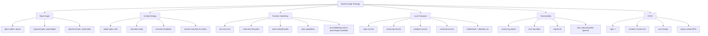

---

## 3. Decomposition Table

| Area | Skill / Item | Fungsi | Catatan praktis |
|---|---|---|---|
| Base image | `nginx:stable` | Official NGINX image stabil | Hindari `latest`; pin versi minor/patch sesuai policy perusahaan. |
| Base image | `nginx:stable-alpine` | Image lebih kecil | Alpine berbeda libc/tooling; test module/behavior jika ada native dependency. |
| Base image | `nginxinc/nginx-unprivileged` | NGINX non-root | Repo ini menyediakan image NGINX yang berjalan sebagai non-root/unprivileged user. ([GitHub](https://github.com/nginx/docker-nginx-unprivileged?utm_source=chatgpt.com)) |
| Build strategy | Multi-stage build | Build frontend di stage Node, serve hasilnya dengan NGINX | Docker docs menyebut multi-stage build membantu memisahkan build dan runtime agar final image hanya berisi file yang dibutuhkan. ([Docker Documentation](https://docs.docker.com/build/building/best-practices/?utm_source=chatgpt.com)) |
| Config strategy | Baked config | Config masuk image | Reproducible, tapi kurang fleksibel antar environment. |
| Config strategy | Mounted config | Config dari volume/ConfigMap | Fleksibel, tapi bisa drift kalau tidak dikelola IaC. |
| Config strategy | Template + envsubst | Runtime config dari env var | Cocok untuk Docker/Compose; jangan pakai untuk secret frontend. |
| Runtime | Non-root | Mengurangi blast radius | Pakai port unprivileged seperti 8080, atau capability khusus jika perlu bind 80. |
| Runtime | Read-only filesystem | Mencegah write tidak perlu | Butuh writable tmp/cache/run path untuk NGINX temp files. |
| Runtime | Logs stdout/stderr | Container-native logging | Gunakan `/dev/stdout` dan `/dev/stderr`. |
| Compose | Service network | DNS antar service pakai nama service | Compose mendefinisikan service sebagai unit compute yang didukung container. ([Docker Documentation](https://docs.docker.com/reference/compose-file/services/?utm_source=chatgpt.com)) |
| Compose | `healthcheck` | Deteksi container healthy | Berguna untuk local dependency orchestration. |
| Compose | `depends_on` | Order startup | Jangan anggap app langsung ready; tetap butuh health check/retry. |
| Security | Secrets runtime | Sertifikat/key jangan masuk image | Mount via Docker secret, bind mount, Kubernetes Secret, atau secret manager. |
| CI/CD | `nginx -t` | Validasi config | Jalankan sebelum build/deploy. |
| CI/CD | Smoke test | Validasi route/cache/header | Pakai `curl -I` dan endpoint API dummy. |

---

## 4. Image Strategy

### A. Static frontend + NGINX

```dockerfile id="u3n4gh"
# Stage 1: build frontend
FROM node:22-alpine AS frontend-build

WORKDIR /app
COPY package*.json ./
RUN npm ci

COPY . .
RUN npm run build

# Stage 2: runtime
FROM nginx:stable-alpine

COPY nginx.conf /etc/nginx/nginx.conf
COPY --from=frontend-build /app/dist /usr/share/nginx/html
```

Kelebihan:

```text id="fd8qf3"
- final image tidak membawa Node/npm/source code
- attack surface lebih kecil
- ukuran image lebih kecil
- build artifact jelas
```

Docker docs menyatakan multi-stage build memungkinkan pemisahan stage build dan final runtime sehingga image akhir hanya berisi file yang dibutuhkan untuk menjalankan aplikasi. ([Docker Documentation](https://docs.docker.com/build/building/best-practices/?utm_source=chatgpt.com))

---

### B. NGINX reverse proxy only

```dockerfile id="j1bj6l"
FROM nginx:stable-alpine

COPY nginx.conf /etc/nginx/nginx.conf
COPY conf.d/ /etc/nginx/conf.d/
```

Cocok jika NGINX hanya bertugas sebagai reverse proxy dan tidak membawa static frontend.

---

### C. Template-based config

```dockerfile id="ta9f7u"
FROM nginx:stable-alpine

COPY nginx.conf /etc/nginx/nginx.conf
COPY default.conf.template /etc/nginx/templates/default.conf.template
COPY html/ /usr/share/nginx/html/
```

`default.conf.template`:

```nginx id="zp6mib"
server {
    listen ${NGINX_PORT};

    server_name ${SERVER_NAME};

    location ^~ /api/ {
        proxy_pass http://${API_HOST}:${API_PORT}/;

        proxy_set_header Host              $host;
        proxy_set_header X-Forwarded-Proto $scheme;
        proxy_set_header X-Forwarded-For   $proxy_add_x_forwarded_for;
        proxy_set_header X-Request-ID      $request_id;
    }

    location / {
        root /usr/share/nginx/html;
        try_files $uri $uri/ /index.html;
    }
}
```

Run:

```bash id="jxk4yl"
docker run --rm \
  -e NGINX_PORT=8080 \
  -e SERVER_NAME=localhost \
  -e API_HOST=jersey-api \
  -e API_PORT=8080 \
  -p 8080:8080 \
  my-nginx:dev
```

Official image memproses file template dari `/etc/nginx/templates/*.template` menggunakan `envsubst`, lalu menulis hasilnya ke `/etc/nginx/conf.d`. ([Docker Hub](https://hub.docker.com/_/nginx?utm_source=chatgpt.com))

---

## 5. Config Strategy Decision Table

| Strategy | Kapan cocok | Kelebihan | Risiko |
|---|---|---|---|
| Config baked in image | Production config fixed per artifact | Reproducible, mudah scan/review | Per environment butuh image berbeda |
| Config mounted | Local/dev/staging cepat berubah | Fleksibel | Drift, permission issue, tidak immutable |
| Template + env var | Same image, beda env | Cocok CI/CD dan Compose | Env var kosong menghasilkan config invalid |
| Config dari secret/config manager | Enterprise controlled runtime | Centralized governance | Butuh integration/reload mechanism |
| Generated by Ingress/Gateway | Kubernetes-native | Controller manage config | Perlu pahami abstraction controller |

Rule praktis:

```text id="pl62ci"
Local onboarding:
  Compose + mounted/template config

CI/staging:
  template + explicit env var + nginx -t

Production:
  IaC-managed config, pinned image, secret mounted, nginx -t/smoke test, controlled rollout
```

---

## 6. NGINX Template Pitfalls

### Pitfall A - Env var kosong

Template:

```nginx id="vh8iwm"
proxy_pass http://${API_HOST}:${API_PORT}/;
```

Jika `API_HOST` kosong:

```nginx id="7qrqtd"
proxy_pass http://:8080/;
```

Hasilnya config invalid atau runtime failure.

Mitigasi:

```bash id="gxgg9x"
: "${API_HOST:?API_HOST is required}"
: "${API_PORT:?API_PORT is required}"
```

Dalam official image default entrypoint, envsubst berjalan otomatis, tetapi validasi env var yang lebih ketat sering perlu entrypoint wrapper sendiri.

---

### Pitfall B - Variabel NGINX vs envsubst

NGINX config punya variable seperti:

```nginx id="orc1tg"
$host
$scheme
$proxy_add_x_forwarded_for
$request_id
```

Sedangkan envsubst mengganti `${ENV_VAR}` atau `$ENV_VAR`. Official NGINX Docker template handling didesain untuk template use case, tetapi tetap lebih aman menulis env var dengan bentuk `${API_HOST}` dan membiarkan NGINX variable tetap `$host`, `$scheme`, dan sejenisnya.

---

### Pitfall C - Secret di template frontend

Jangan membuat:

```json id="f2co8j"
{
  "clientSecret": "${OAUTH_CLIENT_SECRET}"
}
```

Semua file yang di-serve ke browser adalah public. Runtime config frontend boleh berisi:

```text id="1ih1x0"
- API base URL
- environment name
- feature flag public
- public OAuth client ID
```

Tidak boleh berisi:

```text id="o41rm9"
- password
- private key
- OAuth client secret
- database URL dengan credential
- internal service token
```

---

## 7. Local Docker Compose Pattern

```yaml id="p4zjal"
services:
  nginx:
    build:
      context: ./nginx
    ports:
      - "8080:8080"
    environment:
      NGINX_PORT: "8080"
      SERVER_NAME: "localhost"
      API_HOST: "jersey-api"
      API_PORT: "8080"
    depends_on:
      jersey-api:
        condition: service_healthy
    networks:
      - app-net

  jersey-api:
    build:
      context: ./jersey-api
    environment:
      DB_HOST: postgres
      DB_PORT: "5432"
      DB_NAME: appdb
      DB_USER: app
      DB_PASSWORD: app
    healthcheck:
      test: ["CMD", "curl", "-fsS", "http://localhost:8080/ready"]
      interval: 10s
      timeout: 3s
      retries: 10
    networks:
      - app-net

  postgres:
    image: postgres:16
    environment:
      POSTGRES_DB: appdb
      POSTGRES_USER: app
      POSTGRES_PASSWORD: app
    ports:
      - "5432:5432"
    networks:
      - app-net

networks:
  app-net:
```

Compose mendefinisikan `services` sebagai unit compute yang dapat diganti/di-scale dan berjalan sebagai container dengan image serta argumen runtime yang sama. ([Docker Documentation](https://docs.docker.com/reference/compose-file/services/?utm_source=chatgpt.com))

Catatan penting:

```text id="ngpuma"
depends_on membantu urutan startup,
tetapi readiness aplikasi tetap perlu healthcheck/retry.
```

---

## 8. Compose untuk SPA + API + Camunda + PostgreSQL

```yaml id="btyjve"
services:
  nginx:
    image: my-platform-nginx:dev
    ports:
      - "8080:8080"
    environment:
      NGINX_PORT: "8080"
      SERVER_NAME: "localhost"
      API_HOST: "api"
      API_PORT: "8080"
      CAMUNDA_HOST: "camunda"
      CAMUNDA_PORT: "8080"
    depends_on:
      api:
        condition: service_healthy
      camunda:
        condition: service_started

  api:
    image: my-jersey-api:dev
    environment:
      JDBC_URL: "jdbc:postgresql://postgres:5432/appdb"
      JDBC_USER: "app"
      JDBC_PASSWORD: "app"
      CAMUNDA_BASE_URL: "http://camunda:8080/engine-rest"
    healthcheck:
      test: ["CMD", "curl", "-fsS", "http://localhost:8080/ready"]
      interval: 10s
      timeout: 3s
      retries: 20

  camunda:
    image: camunda/camunda-bpm-platform:run-latest
    ports:
      - "8088:8080"

  postgres:
    image: postgres:16
    environment:
      POSTGRES_DB: appdb
      POSTGRES_USER: app
      POSTGRES_PASSWORD: app
```

NGINX template:

```nginx id="xuzrfc"
server {
    listen ${NGINX_PORT};

    location ^~ /api/ {
        proxy_pass http://${API_HOST}:${API_PORT}/;
        include /etc/nginx/conf.d/proxy-common.conf;
    }

    location ^~ /camunda/ {
        proxy_pass http://${CAMUNDA_HOST}:${CAMUNDA_PORT}/;
        include /etc/nginx/conf.d/proxy-common.conf;
    }

    location / {
        root /usr/share/nginx/html;
        try_files $uri $uri/ /index.html;
    }
}
```

Untuk onboarding lokal, ini sangat berguna. Untuk production, expose Camunda UI/API harus dikaji ulang; jangan otomatis public.

---

## 9. Logging Container-native

NGINX config:

```nginx id="deii0c"
access_log /dev/stdout api_json;
error_log  /dev/stderr warn;
```

Docker:

```bash id="xcs5jk"
docker logs -f nginx
```

Compose:

```bash id="utxb85"
docker compose logs -f nginx
```

Kubernetes nanti akan membaca stdout/stderr dari container. Jadi biasakan log ke stdout/stderr sejak Docker lokal agar behavior konsisten.

---

## 10. Running Non-root

Default official NGINX image sering menjalankan master process sebagai root agar bisa bind port privileged seperti 80 dan mengatur worker user. Untuk hardening container, lebih mudah memakai unprivileged image atau listen pada port 8080.

### Option A - Unprivileged image

```dockerfile id="smv4ml"
FROM nginxinc/nginx-unprivileged:stable-alpine

COPY default.conf.template /etc/nginx/templates/default.conf.template
COPY html/ /usr/share/nginx/html/
```

Konfigurasi:

```nginx id="j21sje"
server {
    listen 8080;

    location / {
        root /usr/share/nginx/html;
        try_files $uri $uri/ /index.html;
    }
}
```

Repo `nginxinc/docker-nginx-unprivileged` menyatakan image tersebut menjalankan NGINX sebagai non-root/unprivileged user. ([GitHub](https://github.com/nginx/docker-nginx-unprivileged?utm_source=chatgpt.com))

### Option B - Official image + custom user

Ini bisa dilakukan, tetapi lebih sering menimbulkan masalah permission pada:

```text id="qa3j5e"
/var/cache/nginx
/var/run
/var/log/nginx
/etc/nginx/conf.d generated templates
```

Untuk onboarding dan production hardening, unprivileged image biasanya lebih sederhana.

---

## 11. Port 80 vs 8080

| Port | Butuh root/capability? | Rekomendasi container |
|---:|---:|---|
| 80 | Biasanya privileged port | Hindari di container non-root, atau gunakan capability khusus |
| 443 | Biasanya privileged port | Terminate TLS di LB/Ingress atau gunakan capability |
| 8080 | Tidak privileged | Cocok untuk non-root container |
| 8443 | Tidak privileged | Cocok untuk TLS internal non-root |

Pola umum:

```text id="lak4m1"
Host/LB/Ingress exposes 80/443
  ↓
Container listens 8080/8443
```

---

## 12. Read-only Runtime

Docker Compose example:

```yaml id="rz3v93"
services:
  nginx:
    image: my-nginx:secure
    read_only: true
    tmpfs:
      - /var/cache/nginx
      - /var/run
      - /tmp
    ports:
      - "8080:8080"
```

NGINX butuh beberapa path writable untuk:

```text id="4xsct3"
- pid file
- temp files untuk proxy/client body/fastcgi/etc.
- cache/temp
- generated config jika envsubst output saat startup
```

Jika menggunakan template envsubst, output default ke `/etc/nginx/conf.d`, sehingga read-only filesystem bisa gagal kecuali config sudah di-generate saat build atau path tersebut writable saat startup. Official image templating berguna, tetapi harus diselaraskan dengan read-only hardening. ([Docker Hub](https://hub.docker.com/_/nginx?utm_source=chatgpt.com))

Praktisnya:

| Mode | Cocok |
|---|---|
| Template envsubst at startup | Butuh writable config output path saat startup |
| Baked config | Lebih mudah untuk read-only |
| Mounted config read-only | Cocok jika config sudah final |
| NGINX cache/proxy temp aktif | Butuh writable temp/cache |
| Pure static serving tanpa temp besar | Lebih mudah read-only |

---

## 13. Minimal Read-only Friendly Config

```nginx id="agfvo4"
pid /tmp/nginx.pid;

events {
    worker_connections 1024;
}

http {
    client_body_temp_path /tmp/client_temp;
    proxy_temp_path       /tmp/proxy_temp;
    fastcgi_temp_path     /tmp/fastcgi_temp;
    uwsgi_temp_path       /tmp/uwsgi_temp;
    scgi_temp_path        /tmp/scgi_temp;

    access_log /dev/stdout;
    error_log  /dev/stderr warn;

    server {
        listen 8080;

        location / {
            root /usr/share/nginx/html;
            try_files $uri $uri/ /index.html;
        }
    }
}
```

Compose:

```yaml id="uhbm4h"
services:
  nginx:
    image: my-nginx:readonly
    read_only: true
    tmpfs:
      - /tmp
    ports:
      - "8080:8080"
```

Jangan langsung memaksa read-only tanpa smoke test upload/proxy buffering, karena request body/temp file bisa gagal ketika traffic nyata datang.

---

## 14. Capability dan Security Options

Compose hardening contoh:

```yaml id="18u1hd"
services:
  nginx:
    image: my-nginx:secure
    ports:
      - "8080:8080"
    read_only: true
    tmpfs:
      - /tmp
    cap_drop:
      - ALL
    security_opt:
      - no-new-privileges:true
```

Jika butuh bind port 80 sebagai non-root, kadang ditambahkan:

```yaml id="x03i3p"
cap_add:
  - NET_BIND_SERVICE
```

Namun lebih bersih:

```text id="6tleec"
container listen 8080,
host/LB/Ingress map 80/443 ke 8080.
```

---

## 15. Secrets dan TLS Certificates

Jangan:

```dockerfile id="mp15n8"
COPY api.example.com.key /etc/nginx/tls/api.example.com.key
```

Lebih baik runtime mount:

```bash id="xzh6sh"
docker run \
  -v ./certs/api.crt:/etc/nginx/tls/api.crt:ro \
  -v ./certs/api.key:/etc/nginx/tls/api.key:ro \
  my-nginx
```

Compose:

```yaml id="t2bica"
services:
  nginx:
    image: my-nginx
    volumes:
      - ./certs/api.crt:/etc/nginx/tls/api.crt:ro
      - ./certs/api.key:/etc/nginx/tls/api.key:ro
```

Production sebaiknya pakai secret manager, Docker/Kubernetes secrets, atau platform certificate management. Private key tidak boleh masuk Git, image, atau build artifact.

---

## 16. Healthcheck untuk NGINX Container

Dockerfile:

```dockerfile id="kqboso"
HEALTHCHECK --interval=30s --timeout=3s --retries=3 \
  CMD wget -qO- http://127.0.0.1:8080/health || exit 1
```

NGINX config:

```nginx id="7drz7c"
location = /health {
    access_log off;
    return 200 "ok\n";
}
```

Untuk reverse proxy readiness yang lebih nyata:

```nginx id="wg8u3d"
location = /ready {
    access_log off;
    proxy_connect_timeout 1s;
    proxy_read_timeout 2s;
    proxy_pass http://jersey_api/ready;
}
```

Decision table:

| Endpoint | Arti |
|---|---|
| `/health` di NGINX return 200 | NGINX process hidup |
| `/ready` proxy ke Java | NGINX + upstream reachable |
| Java `/ready` | App siap menerima traffic |
| DB readiness | Harus dievaluasi oleh Java, bukan NGINX langsung |

---

## 17. CI/CD Validation

Minimal pipeline:

```text id="53enyl"
1. Build image
2. Run nginx -t
3. Start container
4. Smoke test:
   - /health
   - /index.html cache header
   - /assets/app.js cache header
   - /api/health proxy
   - /api/report.json not swallowed by static regex
5. Scan image
6. Push with immutable tag
```

Command:

```bash id="ei3v9d"
docker build -t my-nginx:${GIT_SHA} .

docker run --rm my-nginx:${GIT_SHA} nginx -t

docker run -d --name my-nginx-test -p 18080:8080 my-nginx:${GIT_SHA}

curl -fsS http://localhost:18080/health
curl -I  http://localhost:18080/index.html
curl -i  http://localhost:18080/api/health

docker rm -f my-nginx-test
```

Docker docs menekankan multi-stage build untuk memisahkan build/runtime dan menjaga final image hanya berisi kebutuhan runtime. ([Docker Documentation](https://docs.docker.com/build/building/best-practices/?utm_source=chatgpt.com))

---

## 18. Tagging Strategy

Jangan:

```text id="5txx84"
nginx:latest
my-nginx:latest
```

Lebih baik:

```text id="v4yo17"
my-nginx:1.4.2
my-nginx:1.4.2-20260713
my-nginx:git-a1b2c3d
my-nginx:1.4.2-a1b2c3d
```

Prinsip:

```text id="nr4o0z"
Image tag harus bisa ditelusuri ke:
- source commit
- nginx config version
- frontend build version
- base image version
- CI pipeline run
```

Catatan: Docker membantu packaging konsisten, tetapi reproducibility tetap bisa rusak karena floating versions, cache, timestamp, dan dependency yang berubah. Karena itu pin versi base image dan dependency jika auditability penting.

---

## 19. Local Development Workflow

```bash id="tx39x8"
docker compose up --build
```

Test:

```bash id="qfwcvu"
curl -i http://localhost:8080/health
curl -i http://localhost:8080/api/health
curl -I http://localhost:8080/index.html
curl -I http://localhost:8080/assets/app.js
```

Debug config yang sudah di-render:

```bash id="9czqym"
docker compose exec nginx nginx -T
```

Reload config:

```bash id="2v5t4n"
docker compose exec nginx nginx -s reload
```

Lihat logs:

```bash id="ek0j1a"
docker compose logs -f nginx
```

Masuk shell:

```bash id="s9fo2m"
docker compose exec nginx sh
```

Untuk image production minimal, shell mungkin tidak tersedia. Jangan bergantung pada shell/debug tools di production image.

---

## 20. Common Docker Networking Pitfalls

| Pitfall | Gejala | Fix |
|---|---|---|
| `proxy_pass http://localhost:8080` dari NGINX container | NGINX mencoba connect ke dirinya sendiri | Gunakan service name Compose: `http://api:8080` |
| API expose ke host tapi tidak ke network Compose | NGINX tidak bisa reach API | Pastikan service satu network |
| Port host vs container tertukar | `curl localhost` works, NGINX fails | Gunakan container port antar service |
| `depends_on` dianggap readiness | NGINX start sebelum API ready | Tambahkan healthcheck/retry |
| Env var tidak ada | Config hasil envsubst invalid | Validasi env var dan `nginx -t` |
| Bind mount path salah | 404/403 static file | Cek container path dan permission |
| File permission root-only | NGINX non-root 403 | `chown`/permission benar saat build |
| Container read-only tanpa tmpfs | NGINX gagal menulis pid/temp | Mount `/tmp`/cache/run writable |
| Cert path tidak mounted | TLS startup gagal | Mount secret/cert dengan path benar |

---

## 21. Java/Jersey Integration di Compose

Untuk local onboarding, pattern yang enak:

```text id="edj8ka"
nginx:
  http://localhost:8080
  /api/* -> api:8080

api:
  http://api:8080 inside compose network
  /ready
  /health
  /orders
  /customers

postgres:
  postgres:5432 inside compose network
```

Jersey app env:

```yaml id="kg9y53"
environment:
  JDBC_URL: "jdbc:postgresql://postgres:5432/appdb"
  JDBC_USER: "app"
  JDBC_PASSWORD: "app"
  SERVER_PORT: "8080"
```

NGINX env:

```yaml id="peayeh"
environment:
  API_HOST: "api"
  API_PORT: "8080"
```

Jangan memakai host-mapped port antar container. Antar container di Compose gunakan nama service + container port.

---

## 22. NGINX Config untuk Compose Local

`default.conf.template`:

```nginx id="7hnq9k"
server {
    listen ${NGINX_PORT};
    server_name ${SERVER_NAME};

    access_log /dev/stdout api_json;
    error_log  /dev/stderr warn;

    location = /health {
        access_log off;
        return 200 "nginx ok\n";
    }

    location = /ready {
        access_log off;
        proxy_connect_timeout 1s;
        proxy_read_timeout 2s;
        proxy_pass http://${API_HOST}:${API_PORT}/ready;
    }

    location = /api {
        return 301 /api/;
    }

    location ^~ /api/ {
        proxy_pass http://${API_HOST}:${API_PORT}/;

        proxy_http_version 1.1;
        proxy_set_header Connection "";

        proxy_set_header Host              $host;
        proxy_set_header X-Real-IP         $remote_addr;
        proxy_set_header X-Forwarded-For   $proxy_add_x_forwarded_for;
        proxy_set_header X-Forwarded-Proto $scheme;
        proxy_set_header X-Request-ID      $request_id;

        proxy_connect_timeout 3s;
        proxy_send_timeout    30s;
        proxy_read_timeout    30s;
    }

    location = /index.html {
        root /usr/share/nginx/html;
        add_header Cache-Control "no-cache" always;
        try_files /index.html =404;
    }

    location / {
        root /usr/share/nginx/html;
        try_files $uri $uri/ /index.html;
    }
}
```

---

## 23. Production Hardening Baseline Dockerfile

```dockerfile id="7wenp0"
FROM nginxinc/nginx-unprivileged:stable-alpine

COPY nginx.conf /etc/nginx/nginx.conf
COPY conf.d/ /etc/nginx/conf.d/
COPY html/ /usr/share/nginx/html/

EXPOSE 8080

HEALTHCHECK --interval=30s --timeout=3s --retries=3 \
  CMD wget -qO- http://127.0.0.1:8080/health || exit 1
```

Jika memakai template envsubst, pastikan image unprivileged dan path output template compatible dengan permission image.

---

## 24. Production Hardening Baseline Compose

```yaml id="qjs20h"
services:
  nginx:
    image: registry.example.com/platform/nginx:1.4.2-a1b2c3d
    ports:
      - "8080:8080"
    environment:
      NGINX_PORT: "8080"
      SERVER_NAME: "app.example.local"
      API_HOST: "api"
      API_PORT: "8080"
    read_only: true
    tmpfs:
      - /tmp
    cap_drop:
      - ALL
    security_opt:
      - no-new-privileges:true
    healthcheck:
      test: ["CMD", "wget", "-qO-", "http://127.0.0.1:8080/health"]
      interval: 30s
      timeout: 3s
      retries: 3
```

Catatan: Jika NGINX butuh proxy temp/body temp di luar `/tmp`, sesuaikan `nginx.conf` agar temp path mengarah ke `/tmp`.

---

## 25. Anti-Patterns

| Anti-pattern | Dampak |
|---|---|
| Pakai `nginx:latest` | Build/deploy tidak reproducible. |
| Private key/cert dimasukkan ke image | Secret bocor dan rotasi sulit. |
| Config production hanya bind mount manual | Drift dan sulit diaudit. |
| `proxy_pass localhost` antar container | Salah target; localhost adalah container sendiri. |
| `depends_on` dianggap cukup untuk readiness | Race condition saat startup. |
| Log hanya ke file dalam container | Hilang/tidak terkumpul di platform log. |
| Menjalankan NGINX root tanpa kebutuhan | Blast radius lebih besar. |
| Read-only filesystem tanpa writable temp path | Runtime gagal saat traffic/upload/proxy buffering. |
| Envsubst tanpa validasi env var | Config invalid diam-diam. |
| Menyimpan secret di SPA runtime config | Secret bocor ke browser. |
| Tidak menjalankan `nginx -t` di CI | Config error baru ketahuan saat deploy. |
| Tidak smoke test `/api/*.json` | API bisa tertelan static regex. |
| Tidak pin base image | Supply chain dan audit melemah. |

---

## 26. Debugging Checklist

### Container tidak start

```text id="suygb0"
[ ] docker logs nginx
[ ] nginx -t error apa?
[ ] env var template lengkap?
[ ] cert/key path ada?
[ ] permission config/cert benar?
[ ] listen port privileged tapi container non-root?
[ ] read-only FS menghalangi pid/temp/config generation?
```

### 502 ke API

```text id="4fi3f1"
[ ] proxy_pass pakai service name, bukan localhost?
[ ] API container satu network dengan NGINX?
[ ] API listen pada 0.0.0.0, bukan 127.0.0.1?
[ ] API container healthy?
[ ] Port container benar?
[ ] NGINX error log connect refused / host not found?
```

### Static file 403/404

```text id="nufoj2"
[ ] file ada di /usr/share/nginx/html?
[ ] permission readable oleh user NGINX?
[ ] root/alias benar?
[ ] SPA fallback benar?
[ ] asset path sesuai build base path?
```

### Read-only error

```text id="wkkjsb"
[ ] pid path mengarah ke writable path?
[ ] client_body_temp_path/proxy_temp_path writable?
[ ] envsubst mencoba write ke /etc/nginx/conf.d?
[ ] access/error log ke stdout/stderr?
```

---

## 27. PR Review Checklist

```text id="gcglxs"
[ ] Base image pinned, bukan latest
[ ] Multi-stage build dipakai jika ada frontend build
[ ] Final image tidak membawa source/build tools yang tidak perlu
[ ] NGINX config direview sebagai artifact versioned
[ ] Template env var punya validasi/default strategy
[ ] Secret/cert tidak masuk image
[ ] Log ke stdout/stderr
[ ] Container listen port non-privileged jika non-root
[ ] Non-root/unprivileged image dipertimbangkan
[ ] Read-only runtime diuji dengan writable tmp/temp path
[ ] docker compose memakai service name, bukan localhost
[ ] Healthcheck tersedia
[ ] nginx -t masuk CI
[ ] Smoke test route/cache/header/API tersedia
[ ] Image tag traceable ke commit/build
```

---

## 28. Roadmap Belajar Singkat

1. Jalankan official NGINX image dengan static file sederhana.
2. Buat Dockerfile static frontend multi-stage.
3. Tambahkan reverse proxy `/api/` ke Java/Jersey container.
4. Gunakan Compose network dan service name.
5. Tambahkan template envsubst untuk `API_HOST`, `API_PORT`, `SERVER_NAME`.
6. Pindahkan log ke stdout/stderr.
7. Tambahkan healthcheck dan smoke test.
8. Coba unprivileged image di port 8080.
9. Coba read-only runtime dengan `/tmp` writable.
10. Masukkan `nginx -t` dan curl smoke test ke CI.

---

## Status seri

**Seri 9 selesai. Sisa 3 seri lagi.**

Rekomendasi berikutnya: **Seri 10 - NGINX in Kubernetes: Ingress, ingress-nginx, NGINX Ingress Controller, ConfigMap, Annotation, cert-manager**.

---

**Sources:**

- [nginx - Official Image](https://hub.docker.com/_/nginx?utm_source=chatgpt.com)
- [NGINX Unprivileged Docker Image](https://github.com/nginx/docker-nginx-unprivileged?utm_source=chatgpt.com)
- [Building best practices](https://docs.docker.com/build/building/best-practices/?utm_source=chatgpt.com)

## Response:
7/13/2026, 4:52:03 PM

Saya lanjutkan ke Seri 10. Fokusnya Kubernetes-specific: perbedaan Ingress resource vs controller, `ingress-nginx` komunitas vs F5 NGINX Ingress Controller, ConfigMap/annotation, cert-manager, dan catatan migrasi karena status Ingress/Gateway API terbaru.

# Seri 10/12 - NGINX in Kubernetes

## Ingress, ingress-nginx, F5 NGINX Ingress Controller, ConfigMap, Annotation, TLS, and cert-manager Boundary

## 1. Introduction

Di Kubernetes, NGINX bisa muncul dalam beberapa bentuk berbeda. Ini yang sering bikin rancu:

```text id="34zcow"
1. NGINX container biasa
   - Deployment sendiri
   - Service sendiri
   - dipakai sebagai reverse proxy/static server internal

2. NGINX as Ingress Controller
   - controller membaca resource Ingress
   - controller generate config NGINX
   - NGINX menjadi data plane traffic masuk cluster

3. NGINX as Gateway API implementation
   - controller membaca Gateway/HTTPRoute
   - lebih modern dibanding Ingress
   - separation of concerns lebih kuat
```

Untuk konteks 2026, ada dua fakta penting yang perlu diingat. Pertama, Kubernetes project merekomendasikan **Gateway API** dibanding Ingress untuk desain baru; Ingress API tetap GA tetapi frozen dan tidak akan dikembangkan lagi. Kedua, proyek komunitas **Ingress NGINX / ingress-nginx** diumumkan pensiun pada Maret 2026: tidak ada release, bugfix, atau security update baru setelah retirement, walaupun deployment existing tidak langsung rusak dan artifact lama tetap tersedia. ([Kubernetes](https://kubernetes.io/docs/concepts/services-networking/ingress/?utm_source=chatgpt.com))

Jadi skill yang perlu dipelajari bukan hanya “cara bikin Ingress YAML”, tetapi juga:

```text id="3sn22l"
- bedakan Ingress resource vs Ingress Controller
- bedakan ingress-nginx komunitas vs F5 NGINX Ingress Controller
- pahami ConfigMap/annotation/controller-specific behavior
- pahami TLS Secret dan cert-manager integration
- siapkan migration path ke Gateway API
```

---

## 2. Diagram

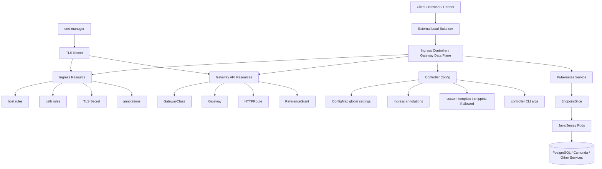

---

## 3. Core Terms

| Istilah | Arti | Catatan |
|---|---|---|
| Ingress | Kubernetes API object untuk routing HTTP/HTTPS external ke Service | Resource saja; tidak bekerja tanpa controller. |
| Ingress Controller | Komponen yang membaca Ingress dan mengonfigurasi load balancer/proxy | Bisa NGINX, HAProxy, Traefik, cloud LB controller, dan lain-lain. |
| ingress-nginx | Ingress Controller komunitas Kubernetes berbasis NGINX | Diumumkan retired setelah Maret 2026. ([Kubernetes](https://kubernetes.io/blog/2025/11/11/ingress-nginx-retirement/?utm_source=chatgpt.com)) |
| F5 NGINX Ingress Controller | Controller dari F5/NGINX, berbeda dari komunitas ingress-nginx | Mendukung standard Ingress, TLS termination, TCP/UDP, WebSocket, gRPC, plus extension via annotation/ConfigMap. ([NGINX Documentation](https://docs.nginx.com/nginx-ingress-controller/?utm_source=chatgpt.com)) |
| NGINX Gateway Fabric | Implementasi Gateway API dengan NGINX sebagai data plane | Relevan untuk desain baru berbasis Gateway API. |
| Gateway API | API Kubernetes add-on untuk dynamic infrastructure provisioning dan advanced traffic routing | Kubernetes docs menyebut Gateway API sebagai keluarga API kinds untuk routing yang extensible, role-oriented, dan protocol-aware. ([Kubernetes](https://kubernetes.io/docs/concepts/services-networking/gateway/?utm_source=chatgpt.com)) |
| ConfigMap | Global controller configuration | Untuk ingress-nginx, ConfigMap dipakai untuk global NGINX controller config. ([Kubernetes Documentation](https://kubernetes.github.io/ingress-nginx/user-guide/nginx-configuration/configmap/?utm_source=chatgpt.com)) |
| Annotation | Per-Ingress customization | Controller-specific; tidak portable antar controller. |
| TLS Secret | Secret Kubernetes berisi certificate/key TLS | Dipakai oleh Ingress/Gateway/controller untuk HTTPS. |
| cert-manager | Controller untuk menerbitkan dan memperbarui certificate otomatis | Biasanya mengisi TLS Secret. |

---

## 4. Ingress Resource vs Controller

Ingress YAML tidak otomatis membuat traffic masuk cluster. Harus ada controller yang merekonsiliasi resource itu.

```text id="o7iyqf"
Ingress resource:
  declarative desired routing

Ingress controller:
  watches resource
  configures NGINX/load balancer
  handles actual traffic
```

Contoh Ingress minimal:

```yaml id="2p76fw"
apiVersion: networking.k8s.io/v1
kind: Ingress
metadata:
  name: order-api
  namespace: app
spec:
  ingressClassName: nginx
  rules:
    - host: api.example.com
      http:
        paths:
          - path: /api/orders
            pathType: Prefix
            backend:
              service:
                name: order-api
                port:
                  number: 8080
```

Kubernetes docs menjelaskan bahwa Ingress mengekspos HTTP/HTTPS routes dari luar cluster ke Services di dalam cluster, dan traffic routing dikontrol oleh rules yang didefinisikan pada resource Ingress. ([Kubernetes](https://kubernetes.io/docs/concepts/services-networking/ingress/?utm_source=chatgpt.com))

---

## 5. Path Routing: Ingress vs NGINX Native

Ingress path punya `pathType`.

| `pathType` | Makna | Catatan |
|---|---|---|
| `Exact` | Match path persis | Cocok untuk `/health`, `/ready`. |
| `Prefix` | Match berbasis prefix path element | Umum untuk `/api`, `/orders`. |
| `ImplementationSpecific` | Controller-specific | Hindari kecuali paham behavior controller. |

Contoh:

```yaml id="p0n6tg"
paths:
  - path: /api
    pathType: Prefix
    backend:
      service:
        name: jersey-api
        port:
          number: 8080
```

Perbedaan penting dari native NGINX:

```text id="beob0s"
Native NGINX:
  location matching punya exact/prefix/^~/regex order yang detail

Kubernetes Ingress:
  routing diekspresikan lewat path + pathType
  detail implementasi bisa dipengaruhi controller
  rewrite/regex biasanya controller-specific via annotation
```

---

## 6. Contoh Ingress untuk Java/Jersey API

```yaml id="txg7h5"
apiVersion: networking.k8s.io/v1
kind: Ingress
metadata:
  name: jersey-api
  namespace: app
spec:
  ingressClassName: nginx
  rules:
    - host: api.example.com
      http:
        paths:
          - path: /api
            pathType: Prefix
            backend:
              service:
                name: jersey-api
                port:
                  number: 8080
```

Service:

```yaml id="z8o1ta"
apiVersion: v1
kind: Service
metadata:
  name: jersey-api
  namespace: app
spec:
  selector:
    app: jersey-api
  ports:
    - name: http
      port: 8080
      targetPort: 8080
```

Deployment readiness:

```yaml id="a0a53o"
readinessProbe:
  httpGet:
    path: /ready
    port: 8080
  periodSeconds: 10
  timeoutSeconds: 2
  failureThreshold: 3
```

Kubernetes Service akan mengirim traffic ke endpoint Pod yang tersedia/ready. Untuk aplikasi Java/Jersey, readiness probe adalah gate penting agar Pod yang belum siap DB/migration/config tidak menerima traffic.

---

## 7. TLS via Ingress Secret

```yaml id="nwibhz"
apiVersion: networking.k8s.io/v1
kind: Ingress
metadata:
  name: jersey-api
  namespace: app
spec:
  ingressClassName: nginx
  tls:
    - hosts:
        - api.example.com
      secretName: api-example-com-tls
  rules:
    - host: api.example.com
      http:
        paths:
          - path: /api
            pathType: Prefix
            backend:
              service:
                name: jersey-api
                port:
                  number: 8080
```

TLS Secret bentuk umum:

```yaml id="gz9h7r"
apiVersion: v1
kind: Secret
metadata:
  name: api-example-com-tls
  namespace: app
type: kubernetes.io/tls
data:
  tls.crt: ...
  tls.key: ...
```

Dalam praktik production, Secret ini biasanya diisi oleh cert-manager atau platform certificate automation, bukan manual copy-paste private key.

---

## 8. cert-manager Pattern

cert-manager biasanya bekerja dengan object seperti `Certificate`, `Issuer`, atau `ClusterIssuer`, lalu menghasilkan TLS Secret.

```yaml id="9dx27h"
apiVersion: cert-manager.io/v1
kind: Certificate
metadata:
  name: api-example-com
  namespace: app
spec:
  secretName: api-example-com-tls
  dnsNames:
    - api.example.com
  issuerRef:
    name: letsencrypt-prod
    kind: ClusterIssuer
```

Flow:

```text id="anvmko"
Certificate resource
  ↓
cert-manager requests/renews certificate
  ↓
TLS Secret updated
  ↓
Ingress Controller picks up Secret
  ↓
NGINX serves new certificate
```

Catatan untuk enterprise/on-prem:

```text id="6fp5dq"
- Issuer bisa ACME public, internal CA, Vault, Venafi, atau platform CA
- DNS-01 challenge sering lebih cocok untuk private/internal domain
- Certificate rotation harus dimonitor
- Ingress/controller harus benar-benar reload/refresh cert saat Secret berubah
```

---

## 9. ingress-nginx Community Controller

`ingress-nginx` adalah controller komunitas yang sangat populer dan berbasis NGINX. Namun statusnya sekarang harus diperlakukan sebagai **legacy/existing footprint**, bukan default untuk desain baru, karena Kubernetes mengumumkan maintenance dihentikan setelah Maret 2026, tidak ada release/bugfix/security update baru, dan GitHub repository akan read-only; existing deployment tidak langsung rusak dan artifact lama tetap tersedia. ([Kubernetes](https://kubernetes.io/blog/2025/11/11/ingress-nginx-retirement/?utm_source=chatgpt.com))

Untuk existing cluster yang masih memakai `ingress-nginx`, skill yang perlu dikuasai:

```text id="0zxtg9"
- cara baca generated NGINX config
- ConfigMap global config
- annotation per Ingress
- controller logs
- metrics
- risk dari annotation/snippet
- migration assessment
```

`ingress-nginx` documentation menyebut ada tiga cara kustomisasi NGINX: ConfigMap untuk global configuration, annotations untuk konfigurasi specific Ingress rule, dan custom template untuk setting yang tidak bisa diubah via ConfigMap. ([Kubernetes Documentation](https://kubernetes.github.io/ingress-nginx/user-guide/nginx-configuration/?utm_source=chatgpt.com))

---

## 10. ingress-nginx ConfigMap

Contoh:

```yaml id="u103gg"
apiVersion: v1
kind: ConfigMap
metadata:
  name: ingress-nginx-controller
  namespace: ingress-nginx
data:
  proxy-connect-timeout: "3"
  proxy-send-timeout: "30"
  proxy-read-timeout: "30"
  proxy-body-size: "10m"
  use-forwarded-headers: "true"
  enable-real-ip: "true"
```

ConfigMap ini bersifat controller-level/global. Artinya perubahan bisa memengaruhi banyak Ingress sekaligus.

Guideline:

| Setting | Scope ideal |
|---|---|
| default timeout umum | ConfigMap |
| body size default | ConfigMap |
| forwarded headers behavior | ConfigMap |
| route-specific timeout | annotation |
| upload route body size | annotation |
| one-off rewrite | annotation |
| global security baseline | ConfigMap/controller policy |
| risky snippets | hindari/default disable |

---

## 11. ingress-nginx Annotation

Contoh annotation umum:

```yaml id="503u71"
apiVersion: networking.k8s.io/v1
kind: Ingress
metadata:
  name: jersey-api
  namespace: app
  annotations:
    nginx.ingress.kubernetes.io/proxy-connect-timeout: "3"
    nginx.ingress.kubernetes.io/proxy-send-timeout: "30"
    nginx.ingress.kubernetes.io/proxy-read-timeout: "30"
    nginx.ingress.kubernetes.io/proxy-body-size: "10m"
spec:
  ingressClassName: nginx
  rules:
    - host: api.example.com
      http:
        paths:
          - path: /api
            pathType: Prefix
            backend:
              service:
                name: jersey-api
                port:
                  number: 8080
```

Annotation adalah **controller-specific**. Annotation `nginx.ingress.kubernetes.io/*` milik `ingress-nginx` tidak otomatis bekerja di F5 NGINX Ingress Controller atau controller lain.

Decision table:

| Perlu customisasi | Lebih cocok |
|---|---|
| Semua route default timeout sama | ConfigMap |
| Endpoint upload butuh body size besar | Annotation spesifik Ingress |
| Endpoint streaming butuh read timeout panjang | Annotation spesifik Ingress |
| Security policy global | Controller config/policy |
| Business-specific routing kompleks | Pertimbangkan Gateway/API gateway, bukan annotation liar |
| Per-service one-off config | Annotation, tapi review ketat |

---

## 12. F5 NGINX Ingress Controller

F5 NGINX Ingress Controller adalah implementasi Ingress Controller untuk NGINX/NGINX Plus. Dokumentasinya menyebut controller ini dapat load balance aplikasi WebSocket, gRPC, TCP, dan UDP; mendukung fitur standard Ingress seperti content-based routing dan TLS/SSL termination; serta menyediakan extension ke Ingress resources melalui annotations dan ConfigMap. ([NGINX Documentation](https://docs.nginx.com/nginx-ingress-controller/?utm_source=chatgpt.com))

Contoh annotation F5 NGINX Ingress Controller berbeda namespace key-nya:

```yaml id="16xjib"
metadata:
  annotations:
    nginx.org/proxy-connect-timeout: "3s"
    nginx.org/proxy-read-timeout: "30s"
    nginx.org/client-max-body-size: "10m"
```

F5 docs menyatakan ConfigMap berlaku global untuk semua Ingress resource, sedangkan annotations berlaku pada Ingress tertentu; beberapa annotation dapat override key ConfigMap, misalnya `nginx.org/proxy-connect-timeout` mengoverride `proxy-connect-timeout` ConfigMap. ([NGINX Documentation](https://docs.nginx.com/nginx-ingress-controller/configuration/global-configuration/configmap-resource/?utm_source=chatgpt.com))

---

## 13. ingress-nginx vs F5 NGINX Ingress Controller

| Area | ingress-nginx komunitas | F5 NGINX Ingress Controller |
|---|---|---|
| Ownership | Kubernetes community project | F5/NGINX |
| Status 2026 | Retired after March 2026 per Kubernetes announcement | Product/project terpisah dari ingress-nginx |
| Annotation prefix | `nginx.ingress.kubernetes.io/*` | `nginx.org/*`, `nginx.com/*` untuk beberapa Plus feature |
| ConfigMap behavior | Global controller config | Global controller config |
| NGINX OSS/Plus | Berbasis NGINX OSS | Mendukung NGINX OSS dan NGINX Plus feature set |
| Migration | Perlu rencana keluar untuk long-term support | Bisa jadi salah satu target migration |
| Compatibility | Banyak existing manifest memakai annotation ingress-nginx | Tidak semua annotation sama; perlu mapping |

F5 NGINX blog juga menyebut setelah pengumuman retirement `ingress-nginx`, F5 menambahkan dukungan untuk beberapa annotation populer ingress-nginx agar migrasi ke F5 NGINX Ingress Controller lebih mudah, tetapi tetap perlu verifikasi compatibility per annotation dan versi controller. ([NGINX Community Blog](https://blog.nginx.org/blog/whats-new-in-f5-nginx-ingress-controller-5-3-0?utm_source=chatgpt.com))

---

## 14. Ingress Class

Gunakan `ingressClassName`, bukan bergantung pada default implisit.

```yaml id="7fkkfp"
spec:
  ingressClassName: nginx
```

IngressClass:

```yaml id="a6juwm"
apiVersion: networking.k8s.io/v1
kind: IngressClass
metadata:
  name: nginx
spec:
  controller: k8s.io/ingress-nginx
```

Atau untuk controller lain, nilai `spec.controller` akan berbeda. Tujuan utamanya:

```text id="kvrm4z"
- cluster bisa punya lebih dari satu controller
- app team tahu Ingress ini diproses controller mana
- menghindari route diproses controller yang salah
```

---

## 15. Path Rewrite di Ingress

Contoh pada ingress-nginx biasanya memakai annotation seperti rewrite target. Ini controller-specific.

```yaml id="x0vuau"
metadata:
  annotations:
    nginx.ingress.kubernetes.io/rewrite-target: /$2
spec:
  rules:
    - host: api.example.com
      http:
        paths:
          - path: /api(/|$)(.*)
            pathType: ImplementationSpecific
            backend:
              service:
                name: jersey-api
                port:
                  number: 8080
```

Masalah:

```text id="w5a31x"
- regex dan rewrite behavior controller-specific
- pathType ImplementationSpecific mengurangi portability
- migrasi controller/Gateway bisa lebih sulit
- salah rewrite menyebabkan @ApplicationPath Jersey mismatch
```

Rekomendasi untuk Java/Jersey:

| Jersey setup | Ingress strategy |
|---|---|
| App expose `/api/*` | Preserve path, no rewrite |
| App expose resource root `/orders`, public ingin `/api/orders` | Rewrite boleh, tapi dokumentasikan dan test |
| Banyak rewrite legacy | Pertimbangkan app-level compatibility atau API gateway |
| Target migration Gateway API | Kurangi annotation/rewrite controller-specific |

---

## 16. Timeout dan Body Size

Untuk ingress-nginx:

```yaml id="d1xl7k"
metadata:
  annotations:
    nginx.ingress.kubernetes.io/proxy-connect-timeout: "3"
    nginx.ingress.kubernetes.io/proxy-send-timeout: "30"
    nginx.ingress.kubernetes.io/proxy-read-timeout: "30"
    nginx.ingress.kubernetes.io/proxy-body-size: "10m"
```

Untuk F5 NGINX Ingress Controller:

```yaml id="9g0xz7"
metadata:
  annotations:
    nginx.org/proxy-connect-timeout: "3s"
    nginx.org/proxy-send-timeout: "30s"
    nginx.org/proxy-read-timeout: "30s"
    nginx.org/client-max-body-size: "10m"
```

Controller-specific syntax dan unit bisa berbeda. Jangan copy annotation antar controller tanpa cek dokumentasi controller target.

---

## 17. Streaming, SSE, WebSocket, gRPC

Pola endpoint berbeda perlu profile berbeda.

| Use case | Concern |
|---|---|
| REST API biasa | timeout pendek/sedang, buffering default |
| Upload file | body size besar, request buffering policy |
| SSE/streaming | read timeout panjang, buffering off jika tersedia |
| WebSocket | upgrade headers/controller support |
| gRPC | HTTP/2 upstream/backend config controller-specific |
| Camunda REST | timeout sesuai workflow API; hindari long-running synchronous command |

Untuk Kubernetes controller, konfigurasi detail bisa via annotation, ConfigMap, CRD extension, atau Gateway API depending implementation. Jangan asumsikan semua native NGINX directive tersedia langsung.

---

## 18. Forwarded Headers dan Real Client IP

Kubernetes traffic path sering seperti ini:

```text id="nxcp1f"
Client
  ↓
Cloud/on-prem Load Balancer
  ↓
Ingress Controller Pod
  ↓
Service
  ↓
Java/Jersey Pod
```

Masalah umum:

```text id="ogkyef"
Java melihat IP Ingress Pod, bukan client asli
X-Forwarded-For chain salah
X-Forwarded-Proto tidak https
secure cookie / redirect salah
audit IP tidak akurat
```

Guideline:

```text id="x5jaca"
- tentukan siapa trusted proxy/LB di depan controller
- aktifkan forwarded headers/real IP sesuai controller docs
- jangan percaya X-Forwarded-For langsung dari public internet
- Java hanya trust forwarded header dari ingress/proxy tepercaya
```

Untuk Java/Jersey, tetap log:

```text id="gf8v7i"
- requestId
- X-Forwarded-For
- X-Real-IP
- authenticated user/tenant
- source system/partner
```

Tetapi authorization jangan bergantung hanya pada IP jika domain security membutuhkan identity kuat.

---

## 19. Source IP Preservation

Di Kubernetes, source IP bisa hilang tergantung Service type dan traffic policy.

Konsep yang perlu dicek:

```yaml id="oy7az8"
apiVersion: v1
kind: Service
metadata:
  name: ingress-nginx-controller
  namespace: ingress-nginx
spec:
  type: LoadBalancer
  externalTrafficPolicy: Local
```

`externalTrafficPolicy: Local` sering dipakai untuk preserve source IP pada Service LoadBalancer/NodePort, tetapi trade-off-nya bisa memengaruhi traffic distribution dan health check node. Ini harus diputuskan platform team, bukan hanya app team.

---

## 20. TLS Termination di Ingress

Ada beberapa model:

| Model | Bentuk | Catatan |
|---|---|---|
| TLS terminate di cloud LB | LB HTTPS → Ingress HTTP | Simpel, tetapi Ingress tidak melihat TLS client cert. |
| TLS terminate di Ingress NGINX | Client HTTPS → Ingress NGINX → Service HTTP | Umum dan fleksibel. |
| TLS re-encrypt ke backend | Client HTTPS → Ingress HTTPS → Service HTTPS | Butuh backend cert/trust. |
| mTLS client → Ingress | Partner/internal client cert diverifikasi di ingress | Mapping identity tetap harus di Java. |
| TLS pass-through | TLS diteruskan ke backend | HTTP routing/L7 visibility terbatas. |

Untuk Java/Jersey, jika TLS terminate di Ingress, pastikan:

```text id="bd5mkl"
X-Forwarded-Proto = https
X-Forwarded-Host benar
redirect/cookie secure behavior benar
backend tidak bisa diakses bypass untuk endpoint sensitif
```

---

## 21. mTLS di Ingress

mTLS via Ingress adalah controller-specific. Secara prinsip:

```text id="xt73dz"
Ingress controller verifies client certificate
  ↓
Ingress forwards certificate metadata/header to backend
  ↓
Java maps certificate identity to partner/client
  ↓
Java enforces authorization and audit
```

Jangan berhenti pada certificate verification. Untuk sistem partner/regulatory:

```text id="tovd8f"
- issuer + serial harus terdaftar
- certificate status bisa revoked/disabled
- partner harus punya entitlement endpoint
- request harus lolos domain permission
- audit harus mencatat certificate identity
```

---

## 22. ConfigMap vs Annotation Governance

Masalah production yang sering terjadi:

```text id="m8yako"
App team menambahkan annotation untuk timeout/body-size/snippet
  ↓
Controller generate NGINX config berbeda
  ↓
Behavior satu service beda dari baseline platform
  ↓
Incident/debugging sulit
```

Governance yang sehat:

| Item | Owner |
|---|---|
| Controller deployment | Platform team |
| Global ConfigMap | Platform team |
| IngressClass | Platform team |
| TLS issuer/cluster issuer | Platform/security team |
| App Ingress host/path | App team with review |
| Risky annotation | Platform approval |
| Snippet/custom template | Normally disabled or tightly controlled |
| Gateway API migration | Platform + app team |

---

## 23. Snippet Risk

Beberapa NGINX ingress controller mendukung snippet/custom template untuk menyuntikkan raw NGINX config. Ini powerful, tetapi berisiko:

```text id="9ncqu9"
- bypass policy
- expose internal route
- alter headers/security
- break generated config
- create cross-namespace/security issue
- make migration harder
```

Prinsip:

```text id="9q4847"
Disable snippets by default unless platform has strong governance.
Prefer supported annotations/CRDs/Gateway policies.
Every snippet must be security-reviewed.
```

---

## 24. Observability di Ingress Controller

Minimal observability:

```text id="p45byd"
- controller pod logs
- NGINX access logs with upstream status/address
- Prometheus metrics
- request ID propagation
- status code split: 4xx/5xx/499/502/503/504
- latency p95/p99 by host/path/service
- certificate expiry
```

Debug commands:

```bash id="7wzz34"
kubectl get ingress -A
kubectl describe ingress -n app jersey-api
kubectl get ingressclass
kubectl get svc -n ingress-nginx
kubectl get pods -n ingress-nginx -o wide
kubectl logs -n ingress-nginx deploy/ingress-nginx-controller
kubectl get endpointslice -n app -l kubernetes.io/service-name=jersey-api
```

Untuk generated NGINX config pada ingress-nginx, biasanya bisa masuk ke controller pod lalu inspeksi config:

```bash id="c2qbwi"
kubectl exec -n ingress-nginx deploy/ingress-nginx-controller -- nginx -T
```

Gunakan sesuai izin/security policy cluster.

---

## 25. Failure Modes

| Gejala | Kemungkinan penyebab | Cek |
|---|---|---|
| 404 dari Ingress | Host/path tidak match, wrong ingressClass, controller tidak process resource | `kubectl describe ingress`, rules, ingressClass |
| 502 | Service endpoint ada tapi Pod menutup/reset, port salah, app crash | controller logs, Service targetPort, Pod logs |
| 503 | Tidak ada endpoint ready atau upstream unavailable | EndpointSlice, readiness probe |
| 504 | Java/Jersey lambat, DB/Camunda/external call lambat, timeout annotation | upstream timing, app logs |
| TLS cert salah | Secret salah namespace, cert-manager gagal, host mismatch | Secret, Certificate, events |
| Redirect HTTP/HTTPS loop | X-Forwarded-Proto salah, app redirect policy salah | headers, app config |
| Client IP salah | real IP/forwarded header config salah | LB + controller config |
| API route jadi frontend HTML | Ingress path salah atau frontend fallback menang | rules/pathType |
| Upload 413 | body size annotation/config terlalu kecil | controller annotation/ConfigMap |
| SSE/WebSocket putus | timeout/buffering/upgrade config | annotation/controller support |
| CORS gagal | preflight routed salah atau CORS owner ganda | browser console, curl OPTIONS |

---

## 26. Kubernetes-Native Deployment Pattern untuk Java/Jersey

```yaml id="zac7a5"
apiVersion: apps/v1
kind: Deployment
metadata:
  name: jersey-api
  namespace: app
spec:
  replicas: 3
  selector:
    matchLabels:
      app: jersey-api
  template:
    metadata:
      labels:
        app: jersey-api
    spec:
      containers:
        - name: jersey-api
          image: registry.example.com/app/jersey-api:1.2.3
          ports:
            - containerPort: 8080
          readinessProbe:
            httpGet:
              path: /ready
              port: 8080
            timeoutSeconds: 2
            periodSeconds: 10
          livenessProbe:
            httpGet:
              path: /live
              port: 8080
            timeoutSeconds: 2
            periodSeconds: 20
```

Service:

```yaml id="ovtaw2"
apiVersion: v1
kind: Service
metadata:
  name: jersey-api
  namespace: app
spec:
  selector:
    app: jersey-api
  ports:
    - name: http
      port: 8080
      targetPort: 8080
```

Ingress:

```yaml id="hcxqh0"
apiVersion: networking.k8s.io/v1
kind: Ingress
metadata:
  name: jersey-api
  namespace: app
  annotations:
    nginx.ingress.kubernetes.io/proxy-connect-timeout: "3"
    nginx.ingress.kubernetes.io/proxy-send-timeout: "30"
    nginx.ingress.kubernetes.io/proxy-read-timeout: "30"
    nginx.ingress.kubernetes.io/proxy-body-size: "10m"
spec:
  ingressClassName: nginx
  tls:
    - hosts:
        - api.example.com
      secretName: api-example-com-tls
  rules:
    - host: api.example.com
      http:
        paths:
          - path: /api
            pathType: Prefix
            backend:
              service:
                name: jersey-api
                port:
                  number: 8080
```

---

## 27. Migration Thinking: Ingress → Gateway API

Karena Kubernetes merekomendasikan Gateway API untuk desain baru dan Ingress API frozen, roadmap skill sebaiknya masuk ke Gateway API setelah memahami Ingress. ([Kubernetes](https://kubernetes.io/docs/concepts/services-networking/ingress/?utm_source=chatgpt.com))

Mapping mental:

| Ingress world | Gateway API world |
|---|---|
| IngressClass | GatewayClass |
| Ingress | Gateway + HTTPRoute |
| host/path rules | HTTPRoute rules |
| TLS block | Gateway listener TLS |
| annotations | typed fields / implementation-specific policy |
| one object mixes infra + app routing | separation: infra Gateway, app HTTPRoute |
| controller-specific hacks | lebih structured, walau implementation-specific extension tetap ada |

Gateway API docs menyebut Gateway API adalah add-on berisi API kinds untuk dynamic infrastructure provisioning dan advanced traffic routing, dengan mekanisme yang extensible, role-oriented, dan protocol-aware. ([Kubernetes](https://kubernetes.io/docs/concepts/services-networking/gateway/?utm_source=chatgpt.com))

---

## 28. Example Gateway API Equivalent

Gateway:

```yaml id="idg6wy"
apiVersion: gateway.networking.k8s.io/v1
kind: Gateway
metadata:
  name: public-gateway
  namespace: platform
spec:
  gatewayClassName: nginx
  listeners:
    - name: https
      protocol: HTTPS
      port: 443
      hostname: api.example.com
      tls:
        mode: Terminate
        certificateRefs:
          - name: api-example-com-tls
```

HTTPRoute:

```yaml id="fnw9zg"
apiVersion: gateway.networking.k8s.io/v1
kind: HTTPRoute
metadata:
  name: jersey-api-route
  namespace: app
spec:
  parentRefs:
    - name: public-gateway
      namespace: platform
  hostnames:
    - api.example.com
  rules:
    - matches:
        - path:
            type: PathPrefix
            value: /api
      backendRefs:
        - name: jersey-api
          port: 8080
```

Keuntungan desain:

```text id="f6yydu"
Platform team owns Gateway.
App team owns HTTPRoute.
Policy boundary lebih jelas.
```

Ini akan dibahas lebih dalam di Seri 11.

---

## 29. Production Baseline Checklist

```text id="x6dhbz"
[ ] ingressClassName eksplisit
[ ] host/path/pathType jelas
[ ] Service targetPort benar
[ ] readinessProbe menentukan endpoint ready
[ ] TLS Secret dikelola otomatis / rotation jelas
[ ] cert expiry dimonitor
[ ] forwarded headers/real IP strategy jelas
[ ] timeout/body size diset per endpoint bila perlu
[ ] upload/streaming punya annotation/profile sendiri
[ ] annotations tidak liar dan direview
[ ] snippet/custom template disabled atau governance kuat
[ ] controller logs/metrics tersedia
[ ] request ID dipropagasi ke Java/Jersey
[ ] 502/503/504 runbook tersedia
[ ] ingress-nginx retirement/migration risk dicatat jika masih dipakai
[ ] Gateway API dievaluasi untuk desain baru
```

---

## 30. Anti-Patterns

| Anti-pattern | Dampak |
|---|---|
| Mengira Ingress resource bekerja tanpa controller | Route tidak pernah aktif |
| Tidak set `ingressClassName` | Diproses controller salah atau tidak diproses |
| Copy annotation ingress-nginx ke F5/controller lain | Tidak bekerja atau behavior berbeda |
| Semua custom config via annotation tanpa governance | Config drift dan debugging sulit |
| Snippet raw NGINX dibuka bebas | Risiko security/policy bypass |
| Manual TLS Secret tanpa rotation | Cert expired menyebabkan outage |
| Readiness probe terlalu dangkal | Pod belum siap tapi menerima traffic |
| Readiness probe terlalu berat | Pod flapping, 503 meningkat |
| Timeout global terlalu panjang | Long-running request menutupi desain API buruk |
| Retry non-idempotent command | Duplicate order/workflow/action |
| API route tertelan frontend fallback | Client mendapat HTML, bukan JSON |
| Tetap memilih ingress-nginx untuk greenfield 2026 tanpa migration plan | Long-term security/support risk |

---

## 31. Roadmap Belajar Singkat

1. Pahami Ingress resource, IngressClass, Service, EndpointSlice, dan readiness probe.
2. Buat Ingress sederhana untuk Java/Jersey API.
3. Tambahkan TLS Secret dan cert-manager `Certificate`.
4. Pelajari annotation timeout/body-size sesuai controller yang dipakai.
5. Bedakan `ingress-nginx` komunitas vs F5 NGINX Ingress Controller.
6. Tambahkan observability: logs, metrics, request ID, upstream status.
7. Latih debugging 404/502/503/504 dari Ingress ke Pod.
8. Review governance annotation/snippet.
9. Audit apakah cluster masih memakai `ingress-nginx`.
10. Mulai mapping Ingress ke Gateway API untuk desain baru.

---

## Status seri

**Seri 10 selesai. Sisa 2 seri lagi.**

Rekomendasi berikutnya: **Seri 11 - Gateway API and NGINX Gateway Fabric: GatewayClass, Gateway, HTTPRoute, Migration from Ingress**.

---

**Sources:**

- [Ingress](https://kubernetes.io/docs/concepts/services-networking/ingress/?utm_source=chatgpt.com)
- [F5 NGINX Ingress Controller](https://docs.nginx.com/nginx-ingress-controller/?utm_source=chatgpt.com)
- [ConfigMap - Ingress-Nginx Controller](https://kubernetes.github.io/ingress-nginx/user-guide/nginx-configuration/configmap/?utm_source=chatgpt.com)
- [What's New in F5 NGINX Ingress Controller 5.3.0](https://blog.nginx.org/blog/whats-new-in-f5-nginx-ingress-controller-5-3-0?utm_source=chatgpt.com)

## Response:
7/13/2026, 4:54:19 PM

Saya lanjutkan ke Seri 11. Fokusnya Gateway API sebagai arah modern Kubernetes ingress: pemisahan peran platform vs app team, `GatewayClass`, `Gateway`, `HTTPRoute`, NGINX Gateway Fabric, dan strategi migrasi dari Ingress.

# Seri 11/12 - Gateway API and NGINX Gateway Fabric

## GatewayClass, Gateway, HTTPRoute, Policy Boundary, and Migration from Ingress

## 1. Introduction

Seri ini membahas **Gateway API** sebagai model modern untuk traffic management Kubernetes. Dibanding Ingress, Gateway API lebih eksplisit memisahkan tanggung jawab antara **platform/network team** dan **application team**.

Mental model-nya:

```text id="ezqyrb"
Ingress model lama:
  Ingress = host/path routing + TLS + controller-specific annotations
  Banyak hal bercampur dalam satu object

Gateway API model:
  GatewayClass = jenis/controller gateway
  Gateway      = listener/infrastructure entry point
  HTTPRoute    = app-level routing rules
  Policy       = attachable config/security/traffic behavior
```

Kubernetes sekarang merekomendasikan **Gateway API** dibanding Ingress untuk desain baru. Ingress tetap GA dan tidak direncanakan dihapus, tetapi API-nya sudah **frozen** dan tidak lagi dikembangkan. Gateway API sendiri diposisikan sebagai successor dari Ingress, dengan model yang lebih extensible, role-oriented, dan protocol-aware. ([Kubernetes](https://kubernetes.io/docs/concepts/services-networking/ingress/?utm_source=chatgpt.com))

Untuk NGINX, implementasi Gateway API yang relevan adalah **NGINX Gateway Fabric**, yaitu implementasi Gateway API dengan NGINX sebagai data plane untuk HTTP/TCP/UDP load balancer, reverse proxy, atau API gateway di Kubernetes. ([NGINX Documentation](https://docs.nginx.com/nginx-gateway-fabric/?utm_source=chatgpt.com))

---

## 2. Diagram Mental Model

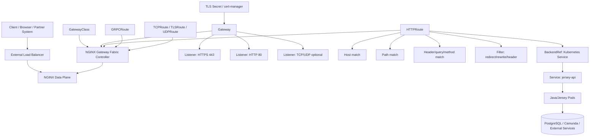

---

## 3. Core Objects

| Object | Owner umum | Fungsi | Analogi di Ingress world |
|---|---|---|---|
| `GatewayClass` | Platform team | Menentukan jenis/controller gateway yang akan menangani Gateway | Mirip `IngressClass`, tetapi lebih eksplisit untuk Gateway API |
| `Gateway` | Platform/network team | Mendefinisikan listener, hostname, port, protocol, TLS boundary | Sebagian fungsi Ingress + LoadBalancer exposure |
| `HTTPRoute` | App/service team | Mendefinisikan host/path/header/method routing ke Service | Sebagian besar rule routing pada Ingress |
| `GRPCRoute` | App/service team | Routing untuk gRPC | Biasanya controller-specific di Ingress lama |
| `TCPRoute` / `UDPRoute` | Platform/app tergantung use case | Routing L4 | Di Ingress sering tidak standar atau via custom config |
| `TLSRoute` | Platform/app tergantung use case | Routing TLS-level | Tidak sejelas di Ingress |
| `ReferenceGrant` | Resource owner namespace | Mengizinkan cross-namespace reference | Tidak ada padanan kuat di Ingress |
| Policy objects | Platform/security/app | Attach behavior seperti TLS/backend/security/traffic policy | Dulu sering annotation controller-specific |

Gateway API documentation menyebut Gateway API sebagai official Kubernetes project untuk L4/L7 routing dan “next generation of Kubernetes Ingress”. Kubernetes docs juga menyebut Gateway API sebagai family of API kinds untuk dynamic infrastructure provisioning dan advanced traffic routing. ([Gateway API](https://gateway-api.sigs.k8s.io/?utm_source=chatgpt.com))

---

## 4. Kenapa Gateway API Lebih Baik untuk Organisasi Besar

Ingress sering menjadi object “semua hal masuk sini”:

```yaml id="goexzf"
kind: Ingress
metadata:
  annotations:
    nginx.ingress.kubernetes.io/proxy-read-timeout: "60"
    nginx.ingress.kubernetes.io/rewrite-target: /$2
    nginx.ingress.kubernetes.io/configuration-snippet: ...
spec:
  tls:
  rules:
```

Masalahnya:

```text id="vzfi47"
- terlalu banyak controller-specific annotation
- platform policy bercampur dengan app routing
- security review sulit
- migration antar controller sulit
- raw NGINX snippet bisa menjadi bypass policy
```

Gateway API memperbaiki ini dengan memisahkan layer:

```text id="g5gmzd"
Platform team:
  owns GatewayClass + Gateway + shared policies

App team:
  owns HTTPRoute to Service

Security/network team:
  controls cross-namespace permission, TLS policy, allowed routes
```

Gateway API migration guide secara eksplisit menyebut Gateway API sebagai successor Ingress dan menyediakan mapping konsep dari Ingress ke Gateway API. ([Gateway API](https://gateway-api.sigs.k8s.io/guides/getting-started/migrating-from-ingress/?utm_source=chatgpt.com))

---

## 5. Basic GatewayClass

```yaml id="21dnwc"
apiVersion: gateway.networking.k8s.io/v1
kind: GatewayClass
metadata:
  name: nginx
spec:
  controllerName: gateway.nginx.org/nginx-gateway-controller
```

Makna:

```text id="nr1bka"
GatewayClass nginx
  → ditangani oleh controller tertentu
  → misalnya NGINX Gateway Fabric
```

Dalam cluster enterprise, bisa ada beberapa `GatewayClass`:

| GatewayClass | Tujuan |
|---|---|
| `nginx-public` | Internet-facing public gateway |
| `nginx-internal` | Internal corporate network |
| `nginx-partner-mtls` | Partner/B2B mTLS boundary |
| `cloud-lb` | Cloud provider load balancer |
| `service-mesh` | Mesh/internal east-west routing |

Prinsipnya: app team tidak perlu tahu detail semua infrastructure. Mereka cukup attach `HTTPRoute` ke `Gateway` yang disediakan platform.

---

## 6. Basic Gateway

```yaml id="0h0aj8"
apiVersion: gateway.networking.k8s.io/v1
kind: Gateway
metadata:
  name: public-gateway
  namespace: platform
spec:
  gatewayClassName: nginx
  listeners:
    - name: https
      protocol: HTTPS
      port: 443
      hostname: "*.example.com"
      tls:
        mode: Terminate
        certificateRefs:
          - name: wildcard-example-com-tls
      allowedRoutes:
        namespaces:
          from: Selector
          selector:
            matchLabels:
              expose: public
```

Makna:

```text id="y1f7s7"
Gateway public-gateway:
  - memakai GatewayClass nginx
  - membuka listener HTTPS 443
  - terminate TLS
  - hanya menerima route dari namespace yang punya label expose=public
```

`Gateway` adalah boundary infrastructure. Di sinilah platform menentukan:

```text id="8g0s85"
- port/protocol listener
- hostname scope
- TLS termination
- namespace mana yang boleh attach route
- public/internal exposure
```

Gateway API dirancang role-oriented, sehingga boundary ini lebih natural daripada semua app team mengelola Ingress dengan annotation masing-masing. ([Kubernetes](https://kubernetes.io/docs/concepts/services-networking/gateway/?utm_source=chatgpt.com))

---

## 7. Basic HTTPRoute untuk Java/Jersey API

```yaml id="d2xk1v"
apiVersion: gateway.networking.k8s.io/v1
kind: HTTPRoute
metadata:
  name: jersey-api-route
  namespace: app
spec:
  parentRefs:
    - name: public-gateway
      namespace: platform
  hostnames:
    - api.example.com
  rules:
    - matches:
        - path:
            type: PathPrefix
            value: /api
      backendRefs:
        - name: jersey-api
          port: 8080
```

Service:

```yaml id="c0dfxv"
apiVersion: v1
kind: Service
metadata:
  name: jersey-api
  namespace: app
spec:
  selector:
    app: jersey-api
  ports:
    - name: http
      port: 8080
      targetPort: 8080
```

Flow:

```text id="513hrv"
Client https://api.example.com/api/orders
  ↓
Gateway listener HTTPS 443
  ↓
HTTPRoute host api.example.com + path /api
  ↓
Service jersey-api:8080
  ↓
Java/Jersey Pods
```

---

## 8. Ingress vs Gateway API Mapping

| Ingress | Gateway API | Catatan |
|---|---|---|
| `IngressClass` | `GatewayClass` | Keduanya memilih controller, tetapi GatewayClass bagian dari model yang lebih luas |
| `Ingress.spec.tls` | `Gateway.listener.tls` | TLS lebih dekat ke infrastructure boundary |
| `Ingress.spec.rules.host` | `HTTPRoute.hostnames` atau Gateway listener hostname | Hostname bisa dibatasi di Gateway dan Route |
| `Ingress path rules` | `HTTPRoute.rules.matches.path` | Lebih typed dan explicit |
| `Service backend` | `backendRefs` | Bisa punya weight untuk traffic split |
| Annotation rewrite | HTTPRoute filters / implementation-specific extension | Lebih baik typed filter jika tersedia |
| Annotation timeout | Policy/implementation-specific | Masih tergantung controller |
| Cross-namespace backend | `ReferenceGrant` | Lebih controlled |
| Multiple teams modifying one Ingress | Platform Gateway + app HTTPRoute | Ownership lebih jelas |

Gateway API migration guide menyediakan general overview untuk migrasi dari Ingress ke Gateway API, termasuk core concepts, differences, feature mappings, dan contoh manual conversion. ([Gateway API](https://gateway-api.sigs.k8s.io/guides/getting-started/migrating-from-ingress/?utm_source=chatgpt.com))

---

## 9. HTTPRoute Matching

Gateway API `HTTPRoute` dapat mengekspresikan routing lebih kaya daripada Ingress dasar.

Contoh path + method match:

```yaml id="da8q9t"
apiVersion: gateway.networking.k8s.io/v1
kind: HTTPRoute
metadata:
  name: order-api-route
  namespace: app
spec:
  parentRefs:
    - name: public-gateway
      namespace: platform
  hostnames:
    - api.example.com
  rules:
    - matches:
        - method: GET
          path:
            type: PathPrefix
            value: /api/orders
      backendRefs:
        - name: order-query-api
          port: 8080

    - matches:
        - method: POST
          path:
            type: PathPrefix
            value: /api/orders
      backendRefs:
        - name: order-command-api
          port: 8080
```

Use case:

```text id="d6sfg1"
GET /api/orders     → query/read service
POST /api/orders    → command/write service
```

Catatan arsitektural: routing berdasarkan method bisa berguna, tetapi jangan berlebihan. Kalau service ownership menjadi sulit dipahami, lebih baik pisahkan route path secara eksplisit.

---

## 10. Traffic Splitting / Canary

Contoh split traffic:

```yaml id="79wso8"
apiVersion: gateway.networking.k8s.io/v1
kind: HTTPRoute
metadata:
  name: jersey-api-canary
  namespace: app
spec:
  parentRefs:
    - name: public-gateway
      namespace: platform
  hostnames:
    - api.example.com
  rules:
    - matches:
        - path:
            type: PathPrefix
            value: /api
      backendRefs:
        - name: jersey-api-v1
          port: 8080
          weight: 90
        - name: jersey-api-v2
          port: 8080
          weight: 10
```

Use case:

```text id="dxi0st"
- canary release
- blue/green
- gradual migration
- A/B infrastructure routing
```

Untuk Java/Jersey/Camunda/PostgreSQL system, traffic split harus mempertimbangkan:

```text id="d6v1s9"
- database schema compatibility
- backward/forward compatible API contract
- idempotency
- event compatibility
- Camunda process definition versioning
- cache compatibility
```

Jangan hanya split traffic jika backend v1/v2 tidak kompatibel terhadap data/schema/workflow yang sama.

---

## 11. Redirect Filter

Contoh HTTP → HTTPS redirect biasanya lebih cocok di Gateway listener, tetapi HTTPRoute juga punya filter untuk redirect dalam model Gateway API.

```yaml id="dbhz1l"
apiVersion: gateway.networking.k8s.io/v1
kind: HTTPRoute
metadata:
  name: redirect-http
  namespace: app
spec:
  parentRefs:
    - name: public-gateway
      namespace: platform
      sectionName: http
  hostnames:
    - api.example.com
  rules:
    - filters:
        - type: RequestRedirect
          requestRedirect:
            scheme: https
            statusCode: 301
```

Prinsip:

```text id="il1xpe"
- redirect sederhana sebaiknya typed, bukan raw NGINX snippet
- canonicalization harus jelas
- jangan redirect API machine-to-machine tanpa memahami client behavior
```

---

## 12. URL Rewrite Filter

Contoh path rewrite:

```yaml id="0gho3m"
apiVersion: gateway.networking.k8s.io/v1
kind: HTTPRoute
metadata:
  name: rewrite-api
  namespace: app
spec:
  parentRefs:
    - name: public-gateway
      namespace: platform
  hostnames:
    - api.example.com
  rules:
    - matches:
        - path:
            type: PathPrefix
            value: /public-api
      filters:
        - type: URLRewrite
          urlRewrite:
            path:
              type: ReplacePrefixMatch
              replacePrefixMatch: /api
      backendRefs:
        - name: jersey-api
          port: 8080
```

Flow:

```text id="v20w9p"
/public-api/orders
  ↓
rewrite prefix /public-api → /api
  ↓
backend receives /api/orders
```

Untuk Jersey:

| Jersey setup | Gateway rewrite |
|---|---|
| `@ApplicationPath("/api")` | Preserve `/api` atau rewrite ke `/api` |
| Resource root `/orders` | Rewrite `/api` → `/` bisa dipakai, tapi dokumentasikan |
| Legacy public path | Typed rewrite lebih baik daripada annotation/snippet |
| Banyak rewrite kompleks | Pertimbangkan app-level compatibility atau API gateway dedicated |

---

## 13. Header Modification

Contoh tambah request header:

```yaml id="5gncqw"
filters:
  - type: RequestHeaderModifier
    requestHeaderModifier:
      set:
        - name: X-Forwarded-Proto
          value: https
      add:
        - name: X-Gateway
          value: public-gateway
```

Contoh response header:

```yaml id="4d2384"
filters:
  - type: ResponseHeaderModifier
    responseHeaderModifier:
      set:
        - name: X-Content-Type-Options
          value: nosniff
```

Namun untuk security header global seperti HSTS/CSP, sering lebih tepat dikelola di shared gateway policy/platform layer agar konsisten, bukan tiap app team menambahkan sendiri.

---

## 14. Cross-Namespace Routing dan ReferenceGrant

Salah satu improvement penting Gateway API adalah cross-namespace reference lebih controlled.

Contoh scenario:

```text id="j9sp1k"
Gateway berada di namespace platform.
HTTPRoute berada di namespace app.
Backend Service berada di namespace app.
TLS Secret mungkin berada di namespace platform.
```

Untuk reference tertentu lintas namespace, `ReferenceGrant` bisa diperlukan agar namespace pemilik resource memberi izin. Gateway API repository mencantumkan `ReferenceGrant` sebagai salah satu resource dengan dukungan GA pada versi API yang didukung. ([GitHub](https://github.com/kubernetes-sigs/gateway-api?utm_source=chatgpt.com))

Contoh konseptual:

```yaml id="72zgjb"
apiVersion: gateway.networking.k8s.io/v1
kind: ReferenceGrant
metadata:
  name: allow-platform-gateway
  namespace: app
spec:
  from:
    - group: gateway.networking.k8s.io
      kind: HTTPRoute
      namespace: platform
  to:
    - group: ""
      kind: Service
```

Prinsip:

```text id="e28dlg"
Resource owner namespace harus punya kontrol siapa yang boleh mereferensikan resource-nya.
```

Ini jauh lebih defensible daripada reference lintas namespace yang longgar.

---

## 15. AllowedRoutes: Guardrail dari Gateway

Gateway bisa membatasi route mana yang boleh attach.

```yaml id="di9jrz"
allowedRoutes:
  namespaces:
    from: Selector
    selector:
      matchLabels:
        expose: public
```

Atau hanya same namespace:

```yaml id="7si51v"
allowedRoutes:
  namespaces:
    from: Same
```

Use case:

| Policy | Makna |
|---|---|
| `Same` | Hanya route di namespace yang sama dengan Gateway |
| `All` | Semua namespace boleh attach; perlu hati-hati |
| `Selector` | Hanya namespace dengan label tertentu |

Untuk enterprise, `Selector` biasanya lebih baik:

```text id="fsu9v2"
namespace app-a label expose=public
namespace app-b label expose=internal
namespace experimental tidak punya label expose
```

---

## 16. NGINX Gateway Fabric

NGINX Gateway Fabric adalah implementasi Gateway API yang menggunakan NGINX sebagai data plane. Dokumentasi F5/NGINX menyebut tujuannya adalah mengimplementasikan core Gateway APIs untuk mengonfigurasi HTTP/TCP/UDP load balancer, reverse proxy, atau API gateway untuk aplikasi Kubernetes. ([NGINX Documentation](https://docs.nginx.com/nginx-gateway-fabric/?utm_source=chatgpt.com))

GitHub project-nya juga menyebut NGINX Gateway Fabric sebagai open-source project yang mengimplementasikan Gateway API dengan NGINX sebagai data plane, termasuk resource seperti `Gateway`, `GatewayClass`, `HTTPRoute`, `GRPCRoute`, `TCPRoute`, `TLSRoute`, dan `UDPRoute`. ([GitHub](https://github.com/nginx/nginx-gateway-fabric?utm_source=chatgpt.com))

Mental model:

```text id="jbbq1q"
Gateway API resources
  ↓
NGINX Gateway Fabric controller watches them
  ↓
controller translates desired state
  ↓
NGINX data plane config/runtime updated
  ↓
traffic flows to Kubernetes Services
```

---

## 17. NGINX Gateway Fabric Architecture Boundary

| Layer | Tanggung jawab |
|---|---|
| Gateway API CRDs | Kubernetes API schema untuk Gateway/Route |
| NGINX Gateway Fabric controller | Watches resources, reconciles desired state |
| NGINX data plane | Handles actual traffic |
| Kubernetes Service/EndpointSlice | Backend discovery to Pods |
| App Java/Jersey | Business logic, authz, validation, audit |
| Platform policy | TLS, allowed namespaces, shared traffic/security policy |

NGINX Gateway Fabric architecture docs menjelaskan desainnya sebagai Kubernetes Gateway API implementation dengan NGINX sebagai data plane. ([NGINX Documentation](https://docs.nginx.com/nginx-gateway-fabric/overview/gateway-architecture/?utm_source=chatgpt.com))

---

## 18. Example: Java/Jersey API via NGINX Gateway Fabric

GatewayClass:

```yaml id="c736tf"
apiVersion: gateway.networking.k8s.io/v1
kind: GatewayClass
metadata:
  name: nginx
spec:
  controllerName: gateway.nginx.org/nginx-gateway-controller
```

Gateway:

```yaml id="9r94r7"
apiVersion: gateway.networking.k8s.io/v1
kind: Gateway
metadata:
  name: public-gateway
  namespace: platform
spec:
  gatewayClassName: nginx
  listeners:
    - name: https-api
      protocol: HTTPS
      port: 443
      hostname: api.example.com
      tls:
        mode: Terminate
        certificateRefs:
          - name: api-example-com-tls
      allowedRoutes:
        namespaces:
          from: Selector
          selector:
            matchLabels:
              expose: public
```

HTTPRoute:

```yaml id="rn6zb1"
apiVersion: gateway.networking.k8s.io/v1
kind: HTTPRoute
metadata:
  name: jersey-api
  namespace: app
spec:
  parentRefs:
    - name: public-gateway
      namespace: platform
      sectionName: https-api
  hostnames:
    - api.example.com
  rules:
    - matches:
        - path:
            type: PathPrefix
            value: /api
      backendRefs:
        - name: jersey-api
          port: 8080
```

Service:

```yaml id="16s6j2"
apiVersion: v1
kind: Service
metadata:
  name: jersey-api
  namespace: app
spec:
  selector:
    app: jersey-api
  ports:
    - name: http
      port: 8080
      targetPort: 8080
```

---

## 19. HTTPRoute untuk Multiple Services

```yaml id="i5z88o"
apiVersion: gateway.networking.k8s.io/v1
kind: HTTPRoute
metadata:
  name: platform-api
  namespace: app
spec:
  parentRefs:
    - name: public-gateway
      namespace: platform
  hostnames:
    - api.example.com
  rules:
    - matches:
        - path:
            type: PathPrefix
            value: /api/orders
      backendRefs:
        - name: order-api
          port: 8080

    - matches:
        - path:
            type: PathPrefix
            value: /api/customers
      backendRefs:
        - name: customer-api
          port: 8080

    - matches:
        - path:
            type: PathPrefix
            value: /api/cases
      backendRefs:
        - name: case-api
          port: 8080
```

Ini lebih bersih daripada banyak Ingress dengan annotation berbeda jika ownership route jelas.

Namun hati-hati:

```text id="15yarn"
- jangan membuat satu HTTPRoute raksasa tanpa ownership jelas
- pisahkan route per bounded context/service jika tim berbeda
- dokumentasikan route ownership
- pastikan OpenAPI contract cocok dengan routing
```

---

## 20. gRPC Route

Jika ada Java gRPC service:

```yaml id="l54ay6"
apiVersion: gateway.networking.k8s.io/v1
kind: GRPCRoute
metadata:
  name: order-grpc-route
  namespace: app
spec:
  parentRefs:
    - name: internal-gateway
      namespace: platform
  hostnames:
    - grpc.example.internal
  rules:
    - backendRefs:
        - name: order-grpc
          port: 9090
```

NGINX Gateway Fabric project menyebut core Gateway APIs yang ditargetkan termasuk `GRPCRoute`, sehingga gRPC tidak perlu dimodelkan sebagai hack HTTP annotation jika implementasi dan versi yang dipakai mendukungnya. ([GitHub](https://github.com/nginx/nginx-gateway-fabric?utm_source=chatgpt.com))

---

## 21. TCP/UDP Route

Untuk non-HTTP traffic seperti PostgreSQL direct exposure sebaiknya sangat hati-hati. Gateway API punya model TCP/UDP route, dan NGINX Gateway Fabric menargetkan HTTP/TCP/UDP load balancer/reverse proxy use case. ([NGINX Documentation](https://docs.nginx.com/nginx-gateway-fabric/?utm_source=chatgpt.com))

Namun untuk stack kamu:

| Traffic | Expose via Gateway? | Catatan |
|---|---:|---|
| Public REST API | Ya |
| Internal REST API | Bisa, via internal Gateway |
| gRPC internal | Bisa |
| PostgreSQL | Biasanya tidak public; internal network only |
| Camunda REST/UI | Hati-hati; biasanya internal/admin only |
| Redis/Kafka/RabbitMQ | Biasanya tidak lewat public Gateway |
| Partner mTLS API | Ya, dengan dedicated Gateway/listener |

---

## 22. Policy Attachment: Konsep Penting

Gateway API ecosystem mendorong policy attachment: policy bisa ditempel ke Gateway/Route/Service/backend secara typed, bukan annotation liar.

Contoh policy concept:

```text id="l6wgsx"
Gateway:
  - TLS policy
  - listener policy
  - allowed routes

HTTPRoute:
  - retry policy
  - timeout policy
  - header policy
  - auth policy

Backend:
  - backend TLS policy
  - health policy
```

Catatan: availability policy spesifik tergantung Gateway API version dan implementation. Jangan asumsikan semua controller mendukung semua policy. Selalu cek dokumentasi NGINX Gateway Fabric versi yang dipakai.

Gateway API’s core value tetap: typed resources dan role separation; tapi extension/policy support masih harus diverifikasi per controller. ([Gateway API](https://gateway-api.sigs.k8s.io/?utm_source=chatgpt.com))

---

## 23. Backend TLS Policy

Untuk NGINX → Java/Jersey HTTPS backend:

```text id="u9yd3t"
Client HTTPS
  ↓
Gateway terminate TLS
  ↓
Gateway re-encrypt to backend HTTPS
  ↓
Java/Jersey verifies request normally
```

Gateway API repository status saat ini mencantumkan `BackendTLSPolicy` sebagai salah satu v1 resource dengan GA-level support pada latest supported version yang tercantum. ([GitHub](https://github.com/kubernetes-sigs/gateway-api?utm_source=chatgpt.com))

Secara arsitektural, ini penting untuk:

```text id="zcevz5"
- internal zero-trust
- regulated systems
- service identity
- avoiding plaintext east-west traffic
```

Namun implementasi detail backend TLS tetap perlu dicek di controller yang dipakai.

---

## 24. Migrasi dari Ingress ke Gateway API

### Langkah 1 - Inventory

Ambil semua Ingress:

```bash id="yul68a"
kubectl get ingress -A
```

Export:

```bash id="a5wfwg"
kubectl get ingress -A -o yaml > ingress-inventory.yaml
```

Klasifikasikan:

| Kategori | Contoh |
|---|---|
| Simple host/path | Mudah migrasi |
| TLS only | Gateway listener TLS |
| Rewrite annotation | Perlu HTTPRoute filter atau redesign |
| Timeout/body annotation | Perlu policy/controller-specific mapping |
| Snippet/custom NGINX | Risiko tinggi |
| Auth/mTLS annotation | Perlu dedicated Gateway/policy |
| WebSocket/gRPC | Perlu route/protocol support |
| Internal-only | Pisahkan internal Gateway |
| Public API | Public Gateway |
| Frontend SPA | Static/service route + cache policy |

Gateway API migration guide menyarankan general migration dari Ingress implementation ke Gateway API dengan fokus pada concept mapping dan manual conversion. ([Gateway API](https://gateway-api.sigs.k8s.io/guides/getting-started/migrating-from-ingress/?utm_source=chatgpt.com))

---

### Langkah 2 - Buat GatewayClass dan Gateway

Platform team membuat:

```text id="3lm06s"
GatewayClass:
  nginx-public

Gateway:
  public-gateway
  internal-gateway
  partner-mtls-gateway
```

Tujuannya bukan langsung migrasi semua route, tetapi menyediakan landing zone.

---

### Langkah 3 - Convert Ingress Rules ke HTTPRoute

Ingress lama:

```yaml id="sl5d84"
apiVersion: networking.k8s.io/v1
kind: Ingress
metadata:
  name: jersey-api
spec:
  ingressClassName: nginx
  tls:
    - hosts:
        - api.example.com
      secretName: api-example-com-tls
  rules:
    - host: api.example.com
      http:
        paths:
          - path: /api
            pathType: Prefix
            backend:
              service:
                name: jersey-api
                port:
                  number: 8080
```

Gateway API:

```yaml id="lr9rph"
apiVersion: gateway.networking.k8s.io/v1
kind: HTTPRoute
metadata:
  name: jersey-api
  namespace: app
spec:
  parentRefs:
    - name: public-gateway
      namespace: platform
  hostnames:
    - api.example.com
  rules:
    - matches:
        - path:
            type: PathPrefix
            value: /api
      backendRefs:
        - name: jersey-api
          port: 8080
```

TLS pindah dari Ingress ke Gateway listener.

---

### Langkah 4 - Jalankan Parallel / Shadow

Strategi aman:

```text id="bf90ca"
1. Deploy Gateway API resources paralel dengan Ingress lama.
2. Gunakan hostname staging/canary.
3. Test path, headers, TLS, CORS, auth, timeout, body size.
4. Compare logs/metrics.
5. Gradually switch DNS/LB/traffic.
6. Keep rollback path.
```

Jangan langsung replace route production jika Ingress lama memakai banyak annotation/snippet.

---

### Langkah 5 - Retire Ingress

Setelah route stabil:

```text id="7zqx62"
- update DNS/LB
- freeze Ingress changes
- remove old Ingress object
- remove annotation-specific configs
- update runbook
- update dashboard/alerts
- document Gateway ownership
```

---

## 25. Migration Risk Matrix

| Ingress feature lama | Risiko migrasi | Mitigasi |
|---|---|---|
| Simple host/path | Rendah | Convert langsung ke HTTPRoute |
| TLS termination | Rendah-sedang | Pindahkan TLS ke Gateway listener |
| Rewrite target | Sedang | Gunakan URLRewrite filter jika supported |
| Regex path | Sedang-tinggi | Hindari regex jika bisa; redesign path |
| Body size annotation | Sedang | Cari policy/implementation mapping |
| Timeout annotation | Sedang | Cari policy/implementation mapping |
| CORS annotation | Sedang | Putuskan owner: gateway vs app |
| Auth annotation | Tinggi | Dedicated auth policy/gateway or app-level |
| mTLS client cert | Tinggi | Dedicated listener/Gateway; validate Java mapping |
| Configuration snippet | Sangat tinggi | Manual review; typed policy replacement |
| Custom NGINX template | Sangat tinggi | Redesign; jangan port blindly |
| ingress-nginx-specific behavior | Tinggi | Test dengan controller target |

---

## 26. Gateway API untuk Java/Jersey: Design Rules

| Concern | Gateway API | Java/Jersey |
|---|---|---|
| Host/path routing | Ya | App path harus konsisten |
| TLS termination | Ya | App harus tahu `X-Forwarded-Proto`/scheme |
| CORS | Bisa | Jangan konflik dengan app CORS |
| Security headers | Bisa | App boleh tambah domain-specific headers |
| Auth gate | Bisa via policy/controller integration | Tetap verify identity/authorization |
| Domain permission | Tidak | Wajib di app |
| Idempotency | Tidak | Wajib di app |
| Workflow state transition | Tidak | Wajib di app/Camunda/domain layer |
| Audit event | Access log saja | Domain audit wajib |
| Retry/timeout | Bisa | App tetap punya timeout/bulkhead/resilience |
| Canary | Bisa via weighted backendRefs | App/data compatibility wajib |

---

## 27. Production Pattern: Public + Internal Gateways

```text id="u5nka1"
platform namespace:
  Gateway public-gateway
    listener HTTPS 443
    hostname *.example.com
    allowedRoutes expose=public

  Gateway internal-gateway
    listener HTTPS 443
    hostname *.internal.example.com
    allowedRoutes expose=internal
```

Namespace labels:

```yaml id="o32s4c"
apiVersion: v1
kind: Namespace
metadata:
  name: app
  labels:
    expose: public
```

Route:

```yaml id="s6fu5z"
apiVersion: gateway.networking.k8s.io/v1
kind: HTTPRoute
metadata:
  name: order-api
  namespace: app
spec:
  parentRefs:
    - name: public-gateway
      namespace: platform
  hostnames:
    - api.example.com
  rules:
    - matches:
        - path:
            type: PathPrefix
            value: /api/orders
      backendRefs:
        - name: order-api
          port: 8080
```

Ini membuat boundary lebih defensible:

```text id="slvxbe"
- app team tidak bisa sembarang expose route jika namespace tidak allowed
- platform mengontrol listener dan TLS
- route ownership tetap di app namespace
```

---

## 28. Observability

Minimal yang harus dipantau:

```text id="0d7m1p"
Gateway/API layer:
  - requests by Gateway/HTTPRoute/host/path
  - 4xx/5xx split
  - 502/503/504
  - p95/p99 latency
  - backendRef/service failure
  - TLS/certificate errors
  - route attachment status

Java/Jersey:
  - request ID
  - trace ID
  - endpoint latency
  - DB/MyBatis latency
  - Camunda latency
  - domain error rate
```

Debug commands:

```bash id="lz4b0e"
kubectl get gatewayclass
kubectl get gateway -A
kubectl get httproute -A
kubectl describe gateway -n platform public-gateway
kubectl describe httproute -n app jersey-api-route
kubectl get svc,endpointslice -n app
kubectl logs -n nginx-gateway deploy/nginx-gateway
```

Exact namespace/deployment name tergantung instalasi NGINX Gateway Fabric di cluster.

---

## 29. Status dan Conditions

Gateway API resources punya status/conditions yang penting untuk debugging.

Cek:

```bash id="xsvi3x"
kubectl describe gateway -n platform public-gateway
kubectl describe httproute -n app jersey-api-route
```

Cari hal seperti:

```text id="osxcdn"
- Gateway accepted?
- Listener programmed?
- HTTPRoute accepted?
- HTTPRoute attached to parent?
- BackendRef resolved?
- Cross-namespace reference allowed?
- Hostname allowed by listener?
```

Ini improvement besar dibanding debugging Ingress yang sering tersembunyi di annotation/controller-generated config.

---

## 30. Failure Modes

| Gejala | Kemungkinan penyebab | Cek |
|---|---|---|
| Route tidak aktif | HTTPRoute tidak accepted/attached | `kubectl describe httproute` |
| 404 | Host/path tidak match | hostnames, path match, listener hostname |
| 503 | backend Service tidak punya endpoint ready | Service, EndpointSlice, readiness |
| 502 | backend reset/refused/port salah | Service targetPort, Pod logs |
| TLS cert salah | Gateway listener certRef salah | Secret namespace, cert-manager, Gateway status |
| Route cross-namespace gagal | ReferenceGrant/allowedRoutes tidak ada | `allowedRoutes`, `ReferenceGrant` |
| Canary tidak sesuai bobot | implementation behavior/traffic low volume | metrics per backendRef |
| Rewrite tidak bekerja | filter tidak didukung/konfigurasi salah | Route status, controller docs |
| Timeout/body size tidak sesuai | policy belum dimigrasi dari annotation | implementation-specific policy mapping |
| mTLS tidak berjalan | listener/policy/cert trust salah | Gateway status, controller logs |

---

## 31. Gateway API vs Service Mesh vs API Gateway

| Capability | Gateway API + NGINX | Service Mesh | Full API Gateway |
|---|---:|---:|---:|
| North-south ingress | Sangat cocok | Bisa | Sangat cocok |
| East-west mTLS | Terbatas, tergantung setup | Sangat cocok | Tidak fokus |
| HTTP routing | Ya | Ya | Ya |
| Weighted routing | Ya | Ya | Ya |
| AuthN/AuthZ central | Bisa via extension/policy | Bisa | Sangat kuat |
| API key/quota/developer portal | Terbatas | Tidak fokus | Sangat kuat |
| Domain authorization | Tidak | Tidak | Tidak cukup; tetap app |
| Observability L7 | Ya | Ya | Ya |
| Retry/circuit breaker | Tergantung implementation | Kuat | Kuat |
| Workflow/domain semantics | Tidak | Tidak | Tidak; tetap service/domain |

Untuk stack Java/Jersey/Camunda/regulatory/order management, Gateway API bagus untuk routing dan platform traffic policy. Tetapi domain guardrail tetap di service.

---

## 32. Anti-Patterns

| Anti-pattern | Dampak |
|---|---|
| Menganggap Gateway API otomatis menggantikan semua annotation lama | Banyak feature perlu mapping/policy/controller support |
| Migrasi Ingress kompleks langsung big-bang | Risiko outage |
| App team mengelola Gateway public sendiri tanpa governance | Boundary security melemah |
| `allowedRoutes: All` tanpa kontrol namespace | Semua namespace bisa attach route |
| Cross-namespace reference longgar | Resource exposure tidak terkendali |
| Weighted canary tanpa schema compatibility | Data/workflow rusak |
| Rewrite kompleks tetap dipertahankan | Routing sulit dipahami |
| Menganggap Gateway API melakukan authorization domain | Privilege/domain bypass |
| Tidak mengecek status/conditions | Debugging buta |
| Memilih implementation tanpa cek support matrix | Feature hilang saat production |
| Tidak membuat migration inventory annotation/snippet | Migration underestimates risk |
| Tetap menambah Ingress baru untuk greenfield | Menambah technical debt karena Ingress frozen |

---

## 33. PR Review Checklist

```text id="gscgmb"
[ ] GatewayClass/controllerName sesuai implementation target
[ ] Gateway dimiliki namespace/platform yang tepat
[ ] Listener protocol/port/hostname jelas
[ ] TLS certificateRefs benar dan rotation jelas
[ ] allowedRoutes tidak terlalu longgar
[ ] HTTPRoute parentRefs benar
[ ] HTTPRoute hostnames sesuai listener hostname
[ ] Path match tidak ambigu
[ ] BackendRefs mengarah ke Service dan port benar
[ ] Service punya readinessProbe yang benar
[ ] Cross-namespace reference memakai ReferenceGrant jika diperlukan
[ ] Rewrite/redirect/header filter didukung implementation
[ ] Timeout/body-size/retry policy sudah dimapping dari Ingress lama
[ ] Canary weight aman terhadap schema/workflow compatibility
[ ] Request ID/trace/header forwarding tetap berjalan
[ ] Status/conditions Gateway dan HTTPRoute accepted/programmed
[ ] Rollback path ke Ingress lama atau previous Gateway config tersedia
```

---

## 34. Roadmap Belajar Singkat

1. Pahami object: `GatewayClass`, `Gateway`, `HTTPRoute`, `ReferenceGrant`.
2. Buat Gateway public sederhana dengan HTTPS listener.
3. Attach HTTPRoute Java/Jersey `/api` ke Gateway.
4. Test host/path routing, TLS, forwarded headers, request ID.
5. Tambahkan route split/canary sederhana.
6. Latih redirect/rewrite typed filter.
7. Audit Ingress lama: annotation, snippet, timeout, body size, rewrite, auth.
8. Migrasi route sederhana dulu.
9. Untuk route kompleks, mapping policy satu per satu dan test paralel.
10. Gunakan status/conditions sebagai first-class debugging source.

---

## Status seri

**Seri 11 selesai. Sisa 1 seri lagi.**

Rekomendasi berikutnya: **Seri 12 - Production Runbook: Debugging 400/413/499/502/503/504, Rollout, Canary, Rollback, Incident Checklist**.

---

**Sources:**

- [Ingress](https://kubernetes.io/docs/concepts/services-networking/ingress/?utm_source=chatgpt.com)
- [F5 NGINX Gateway Fabric | NGINX Documentation](https://docs.nginx.com/nginx-gateway-fabric/?utm_source=chatgpt.com)
- [Gateway API - Kubernetes](https://gateway-api.sigs.k8s.io/?utm_source=chatgpt.com)
- [kubernetes-sigs/gateway-api](https://github.com/kubernetes-sigs/gateway-api?utm_source=chatgpt.com)

## Response:
7/13/2026, 4:56:58 PM

# Seri 12/12 - Production Runbook NGINX

## Debugging 400/413/499/502/503/504, Rollout, Canary, Rollback, and Incident Checklist

## 1. Introduction

Seri terakhir ini adalah **runbook operasional**. Tujuannya supaya saat incident terjadi, kita tidak menebak-nebak:

```text id="2i0q32"
Apakah masalahnya di client?
NGINX?
Ingress/Gateway?
Service Kubernetes?
Java/Jersey?
PostgreSQL?
Camunda?
Network?
TLS?
Config rollout?
```

NGINX penting karena ia melihat traffic dari dua sisi:

```text id="uqgnjl"
Client → NGINX
NGINX → Upstream Java/Jersey
```

Jadi runbook yang baik harus selalu memisahkan:

```text id="d9is32"
client-side symptom
proxy-side behavior
upstream-side behavior
application-side behavior
database/workflow-side behavior
```

Untuk konteks Kubernetes 2026, ingat juga bahwa `ingress-nginx` komunitas sudah masuk fase retirement setelah Maret 2026, dan Kubernetes sendiri mendorong migrasi ke Gateway API atau controller lain yang masih didukung. Ini memengaruhi runbook jangka panjang: jangan hanya debug incident, tapi juga catat migration risk jika controller yang dipakai sudah tidak maintained. ([Kubernetes](https://kubernetes.io/blog/2025/11/11/ingress-nginx-retirement/?utm_source=chatgpt.com))

---

## 2. Diagram Incident Triage

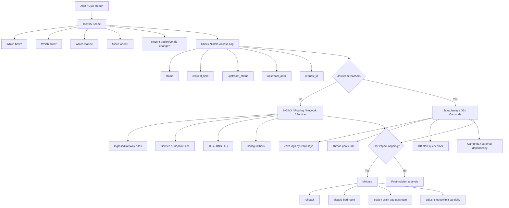

---

## 3. Minimum Data to Capture First

Saat incident, ambil data ini sebelum mengubah apa pun:

```text id="6fyyov"
[ ] Timestamp awal incident
[ ] Host/domain terdampak
[ ] Path/endpoint terdampak
[ ] Status code dominan
[ ] Request ID sample
[ ] NGINX upstream_addr
[ ] NGINX upstream_status
[ ] request_time
[ ] upstream_connect_time
[ ] upstream_header_time
[ ] upstream_response_time
[ ] Recent deploy/config/cert/DNS/LB change
[ ] Kubernetes namespace/service/pod terkait
```

Log format yang mendukung runbook ini:

```nginx id="qpreom"
log_format incident_json escape=json
'{'
  '"time":"$time_iso8601",'
  '"host":"$host",'
  '"request":"$request",'
  '"status":$status,'
  '"request_time":$request_time,'
  '"upstream_addr":"$upstream_addr",'
  '"upstream_status":"$upstream_status",'
  '"upstream_connect_time":"$upstream_connect_time",'
  '"upstream_header_time":"$upstream_header_time",'
  '"upstream_response_time":"$upstream_response_time",'
  '"request_id":"$request_id",'
  '"remote_addr":"$remote_addr",'
  '"http_user_agent":"$http_user_agent"'
'}';
```

NGINX log module memang mendukung custom `log_format`, dan request dicatat pada konteks location tempat processing berakhir. Ini penting saat ada rewrite, `try_files`, atau internal redirect. ([Nginx](https://nginx.org/en/docs/http/ngx_http_log_module.html?utm_source=chatgpt.com))

---

## 4. Status Code Triage Matrix

| Status | Layer awal yang dicurigai | Makna praktis | First checks |
|---|---|---|---|
| 400 | Client/proxy parsing | Malformed request, header invalid, bad request line | error log, header size, duplicate/conflicting headers |
| 401 | Auth | Unauthenticated | auth service, token expiry, CORS preflight |
| 403 | Authz/IP/security policy | Forbidden, allow/deny, WAF, authz failure | NGINX allow/deny, auth_request, Java authz |
| 404 | Routing | Host/path tidak match, SPA fallback, missing route | Ingress/Gateway/NGINX location, Jersey `@Path` |
| 408 | Client slow | Client lambat kirim header/body | `client_header_timeout`, `client_body_timeout` |
| 413 | NGINX/body size | Request body terlalu besar | `client_max_body_size`, ingress annotation, app multipart limit |
| 414 | URI too long | Query/path terlalu panjang | client bug, token/query payload |
| 429 | Rate limit | Terlalu banyak request | `limit_req`, WAF/API gateway, app quota |
| 499 | Client closed | Client/LB menutup koneksi sebelum response selesai | client timeout, frontend timeout, backend slow |
| 500 | App/proxy internal | Bisa NGINX atau Java | `$upstream_status`, Java logs |
| 502 | Bad Gateway | Upstream invalid/down/reset/refused | service/pod/port/network/crash |
| 503 | Unavailable | No ready endpoint, no live upstream, rate/policy | EndpointSlice, readiness, controller |
| 504 | Gateway timeout | Upstream lambat tidak memberi response tepat waktu | Java/DB/Camunda/external call latency |

NGINX upstream module dipakai untuk mendefinisikan grup server upstream yang direferensikan oleh `proxy_pass` dan mekanisme sejenis, sehingga status 502/503/504 hampir selalu perlu dibaca bersama data upstream address/status/timing, bukan status code saja. ([Nginx](https://nginx.org/en/docs/http/ngx_http_upstream_module.html?utm_source=chatgpt.com))

---

## 5. Runbook 400 - Bad Request

### Gejala

```text id="jqihc2"
Client mendapat 400 dari NGINX.
Java/Jersey tidak melihat request.
```

### Kemungkinan penyebab

```text id="s1ey44"
- request line malformed
- header terlalu besar atau invalid
- duplicate Host header
- invalid chunked encoding
- bad TLS-to-HTTP mismatch
- proxy sebelumnya mengirim request tidak valid
```

### Check

```bash id="mffnqk"
grep ' 400 ' /var/log/nginx/access.log | tail -50
grep -i 'client sent' /var/log/nginx/error.log | tail -50
```

Kubernetes:

```bash id="i99lcx"
kubectl logs -n ingress-nginx deploy/ingress-nginx-controller | grep ' 400 '
kubectl describe ingress -n app
```

### Decision

| Bukti | Aksi |
|---|---|
| Header/cookie terlalu besar | Kurangi cookie/JWT size, cek `large_client_header_buffers` |
| Client malformed | Fix client/request builder |
| Hanya dari satu proxy/LB | Cek proxy chain |
| Setelah deploy frontend | Cek frontend auth/cookie/header changes |
| Setelah WAF/policy change | Review policy false positive |

---

## 6. Runbook 413 - Request Entity Too Large

### Gejala

```text id="97wh5a"
Upload/import gagal.
Access log status 413.
Java/Jersey tidak menerima request.
```

### Penyebab utama

```text id="5r9yrg"
client_max_body_size terlalu kecil
Ingress annotation body size terlalu kecil
LB/CDN di depan NGINX punya limit lebih kecil
Java/Jersey multipart/app server limit lebih kecil
```

`client_max_body_size` bisa diletakkan di `http`, `server`, atau `location`; jika request melebihi batas, NGINX mengembalikan 413. Default NGINX yang terdokumentasi adalah `1m`. ([Stack Overflow](https://stackoverflow.com/questions/44741514/nginx-error-client-intended-to-send-too-large-body?utm_source=chatgpt.com))

### Check

NGINX native:

```bash id="x44cz8"
nginx -T | grep -n "client_max_body_size"
grep -i "too large body" /var/log/nginx/error.log | tail -50
```

Kubernetes ingress-nginx:

```bash id="qyes5l"
kubectl describe ingress -n app <ingress-name>
kubectl get ingress -n app <ingress-name> -o yaml | grep -i body
```

### Fix pattern

```nginx id="45yve5"
location ^~ /api/files/ {
    client_max_body_size 100m;
    proxy_request_buffering off;
    proxy_send_timeout 120s;
    proxy_read_timeout 120s;

    proxy_pass http://jersey_api/files/;
}
```

### Guardrail

Jangan menaikkan limit global tanpa batas.

```text id="f4ow1f"
API JSON biasa:
  kecil/sedang

Upload endpoint:
  route-specific larger limit

Batch/import:
  lebih baik async job + object storage
```

---

## 7. Runbook 499 - Client Closed Request

### Gejala

```text id="jzivlc"
Access log status 499.
Client menutup koneksi sebelum NGINX selesai mengirim response.
```

### Makna praktis

499 adalah status non-standard NGINX yang menunjukkan client menutup koneksi. Biasanya penyebabnya bukan “NGINX error” murni, melainkan client/frontend/LB timeout atau backend terlalu lambat sehingga client menyerah.

### Check

```text id="4se2ex"
request_time tinggi?
upstream_response_time tinggi?
upstream_status ada?
apakah Java memproses request sampai selesai?
apakah frontend timeout lebih pendek dari backend timeout?
apakah LB idle timeout lebih pendek dari NGINX/app?
```

### Interpretasi

| Pattern | Diagnosis |
|---|---|
| `499`, `upstream_response_time` tinggi | Backend lambat, client timeout duluan |
| `499`, upstream kosong | Client putus sebelum NGINX kirim ke upstream |
| 499 naik setelah frontend release | Frontend timeout/cancellation berubah |
| 499 naik di mobile traffic | Network/client instability |
| 499 naik di report/export | Endpoint terlalu long-running |

### Aksi

```text id="cp1it9"
- Jangan langsung menaikkan timeout.
- Cek apakah endpoint seharusnya async.
- Samakan timeout budget client → LB → NGINX → Java.
- Untuk report/export/workflow, gunakan 202 + job polling/callback.
```

---

## 8. Runbook 502 - Bad Gateway

### Gejala

```text id="su62og"
Client mendapat 502.
NGINX tidak mendapat response valid dari upstream.
```

### Kemungkinan penyebab

```text id="hpjf15"
- upstream service down
- connection refused
- pod crash/restart
- wrong Service targetPort
- app listen hanya di 127.0.0.1
- upstream closes connection prematurely
- invalid response header dari app
- stale keepalive connection
- TLS upstream verification failure
```

### First command

VM/Docker:

```bash id="bthwct"
grep ' 502 ' /var/log/nginx/access.log | tail -50
grep -i "connect() failed\|upstream prematurely closed\|invalid header\|connection reset" /var/log/nginx/error.log | tail -100
curl -v http://jersey-api:8080/ready
```

Kubernetes:

```bash id="s6pr6t"
kubectl get pods -n app -o wide
kubectl get svc -n app jersey-api -o yaml
kubectl get endpointslice -n app -l kubernetes.io/service-name=jersey-api
kubectl logs -n app deploy/jersey-api --tail=100
kubectl describe pod -n app -l app=jersey-api
```

### Decision table

| Bukti | Diagnosis | Aksi |
|---|---|---|
| `connect() failed (111: Connection refused)` | App tidak listen/crash/port salah | Cek container port, Service targetPort, app startup |
| `host not found in upstream` | DNS/service name salah | Cek upstream name, Compose/K8s service |
| `upstream prematurely closed connection` | Java app menutup koneksi | Cek app crash, exception, server thread/connection |
| `invalid header from upstream` | Backend response tidak valid | Cek app/proxy chain |
| Hanya satu `upstream_addr` gagal | Instance/pod tertentu buruk | Drain/delete pod, cek logs |
| Terjadi saat rollout | Graceful shutdown/readiness buruk | Fix termination/readiness/preStop |
| Upstream HTTPS error | TLS verify/SNI/trust CA salah | Cek `proxy_ssl_*` config |

---

## 9. Runbook 503 - Service Unavailable

### Gejala

```text id="tsqj1r"
Client mendapat 503.
```

### Kemungkinan penyebab

```text id="kb8w5k"
- no ready endpoints
- all upstreams marked failed
- rate limit / policy returns 503
- maintenance mode
- controller cannot route to backend
- Service selector salah
```

### Kubernetes check

```bash id="d2o8ly"
kubectl get deploy -n app jersey-api
kubectl get pods -n app -l app=jersey-api
kubectl get endpointslice -n app -l kubernetes.io/service-name=jersey-api
kubectl describe svc -n app jersey-api
kubectl describe ingress -n app
kubectl describe httproute -n app
```

### Decision table

| Bukti | Diagnosis | Aksi |
|---|---|---|
| EndpointSlice kosong | Tidak ada Pod ready | Cek readiness probe/app startup |
| Pod running tapi not ready | `/ready` gagal | Cek DB/migration/config dependency |
| Service selector tidak match label Pod | Misconfig YAML | Fix selector/labels |
| 503 setelah hardening | rate limit/policy | Cek 429/503 config |
| Semua upstream failed | passive health marked failed | Cek upstream availability |
| Gateway/HTTPRoute not accepted | route attach gagal | Cek status/conditions |

### Java/Jersey readiness rule

```text id="ot664a"
/live:
  process alive

/ready:
  app siap menerima traffic
  DB critical dependency siap
  migration state valid
  required config loaded
```

Jangan memasukkan dependency non-critical ke readiness, karena bisa membuat semua Pod keluar dari traffic saat sebagian fitur saja bermasalah.

---

## 10. Runbook 504 - Gateway Timeout

### Gejala

```text id="feq68n"
Client mendapat 504.
NGINX berhasil connect ke upstream, tapi response tidak datang tepat waktu.
```

### First interpretation

```text id="lbto12"
upstream_connect_time rendah
upstream_header_time mendekati proxy_read_timeout
  → Java/Jersey menerima request tapi lambat memberi response header
```

### Check

```bash id="la6e7u"
grep ' 504 ' /var/log/nginx/access.log | tail -50
grep -i "upstream timed out" /var/log/nginx/error.log | tail -50
```

Kubernetes/app:

```bash id="3w778a"
kubectl logs -n app deploy/jersey-api --since=30m | grep '<request-id>'
kubectl top pod -n app
kubectl describe pod -n app -l app=jersey-api
```

Database:

```sql id="na60gf"
SELECT pid, state, wait_event_type, wait_event, query
FROM pg_stat_activity
WHERE state <> 'idle';
```

Slow/lock check:

```sql id="78602l"
SELECT blocked_locks.pid AS blocked_pid,
       blocking_locks.pid AS blocking_pid,
       blocked_activity.query AS blocked_query,
       blocking_activity.query AS blocking_query
FROM pg_catalog.pg_locks blocked_locks
JOIN pg_catalog.pg_stat_activity blocked_activity
  ON blocked_activity.pid = blocked_locks.pid
JOIN pg_catalog.pg_locks blocking_locks
  ON blocking_locks.locktype = blocked_locks.locktype
 AND blocking_locks.database IS NOT DISTINCT FROM blocked_locks.database
 AND blocking_locks.relation IS NOT DISTINCT FROM blocked_locks.relation
 AND blocking_locks.page IS NOT DISTINCT FROM blocked_locks.page
 AND blocking_locks.tuple IS NOT DISTINCT FROM blocked_locks.tuple
 AND blocking_locks.virtualxid IS NOT DISTINCT FROM blocked_locks.virtualxid
 AND blocking_locks.transactionid IS NOT DISTINCT FROM blocked_locks.transactionid
 AND blocking_locks.classid IS NOT DISTINCT FROM blocked_locks.classid
 AND blocking_locks.objid IS NOT DISTINCT FROM blocked_locks.objid
 AND blocking_locks.objsubid IS NOT DISTINCT FROM blocked_locks.objsubid
 AND blocking_locks.pid != blocked_locks.pid
JOIN pg_catalog.pg_stat_activity blocking_activity
  ON blocking_activity.pid = blocking_locks.pid
WHERE NOT blocked_locks.granted;
```

### Decision table

| Bukti | Diagnosis | Aksi |
|---|---|---|
| DB slow query/lock | PostgreSQL bottleneck | Kill blocker jika aman, optimize query/index |
| Java thread pool penuh | App saturation | Scale, reduce concurrency, inspect blocking calls |
| GC pause tinggi | JVM memory/GC issue | Heap/thread dump, tune memory, rollback |
| Camunda call lambat | Workflow engine dependency | Check Camunda DB/job executor/API |
| External API lambat | Downstream dependency | Circuit breaker/fallback/timeout |
| Hanya report/export endpoint | API design issue | Convert to async job |
| Semua endpoint lambat | Infra/capacity issue | Scale, rollback, resource check |

`proxy_read_timeout` mengatur timeout saat membaca response dari upstream; menaikkannya bisa mengurangi 504, tetapi tidak memperbaiki penyebab utama jika backend memang lambat. Gunakan sebagai mitigasi terbatas, bukan solusi default. ([Nginx](https://nginx.org/en/docs/http/ngx_http_proxy_module.html?utm_source=chatgpt.com))

---

## 11. Rollout Incident Runbook

### Gejala

```text id="1e4pvv"
Error meningkat tepat setelah deployment.
502/503/504 naik.
Sebagian request sukses, sebagian gagal.
```

### Suspect utama

```text id="77l6xq"
- readiness terlalu cepat true
- app belum warm
- DB migration belum compatible
- old/new version tidak backward compatible
- pod shutdown tidak graceful
- stale connection/keepalive
- config NGINX/Ingress/Gateway berubah
```

### Kubernetes checks

```bash id="3mabts"
kubectl rollout status deploy/jersey-api -n app
kubectl rollout history deploy/jersey-api -n app
kubectl get rs -n app -l app=jersey-api
kubectl get pods -n app -l app=jersey-api -o wide
kubectl describe pod -n app <pod>
```

### Fast mitigation

```bash id="v8ab43"
kubectl rollout undo deploy/jersey-api -n app
```

Atau scale down bad canary:

```bash id="xrpz1n"
kubectl scale deploy jersey-api-v2 -n app --replicas=0
```

### Rollout invariant

```text id="l4klhq"
New pod should become Ready only when:
  - HTTP server listening
  - DB pool initialized
  - required config loaded
  - migration compatibility satisfied
  - critical downstream reachable if truly required
```

---

## 12. Graceful Shutdown Runbook

### Symptom

```text id="t2io3z"
502 spike during rolling deployment.
Error log: upstream prematurely closed connection.
```

### Ideal sequence

```text id="2cfsl7"
Pod receives SIGTERM
  ↓
Readiness becomes false
  ↓
Kubernetes removes Pod from endpoints
  ↓
Ingress/Gateway stops sending new requests
  ↓
In-flight requests finish
  ↓
App exits
```

### Kubernetes config pattern

```yaml id="xbr6cl"
lifecycle:
  preStop:
    exec:
      command: ["sh", "-c", "sleep 10"]

terminationGracePeriodSeconds: 60
```

### Java/Jersey requirements

```text id="c2yttu"
- stop accepting new requests
- let in-flight requests finish
- close HTTP server gracefully
- stop background workers safely
- avoid killing Camunda/job execution mid-transaction
- close DB pool after request completion
```

### Checklist

```text id="f46m4t"
[ ] Does readiness become false before shutdown?
[ ] Is terminationGracePeriodSeconds long enough?
[ ] Does app handle SIGTERM?
[ ] Are long requests allowed to complete or rejected cleanly?
[ ] Does ingress/controller remove endpoint quickly enough?
[ ] Are retries hiding shutdown errors?
```

---

## 13. Canary Runbook

### Good canary criteria

```text id="1f776q"
Canary is safe only if:
  - DB schema is backward/forward compatible
  - API contract is compatible
  - event schema is compatible
  - Camunda process versioning is safe
  - idempotency is implemented for commands
  - rollback does not corrupt state
```

### Gateway API / NGINX weighted example

```yaml id="bf4i7t"
backendRefs:
  - name: jersey-api-v1
    port: 8080
    weight: 95
  - name: jersey-api-v2
    port: 8080
    weight: 5
```

### Monitor during canary

```text id="t90axq"
- 5xx by version/backend
- p95/p99 latency by version/backend
- domain error code
- DB error/lock
- duplicate command rate
- Camunda incident count
- queue/event publish failures
- rollback safety signal
```

### Stop canary if

```text id="y9ib6l"
- 5xx above threshold
- p99 latency regression significant
- domain validation error spikes
- duplicate orders/workflows appear
- DB lock or migration issue appears
- customer-facing impact appears
```

---

## 14. Rollback Runbook

### App rollback

```bash id="dkr2ga"
kubectl rollout undo deploy/jersey-api -n app
```

### Ingress/Gateway rollback

```bash id="6c0c2q"
kubectl apply -f previous-ingress.yaml
kubectl apply -f previous-gateway-route.yaml
```

### NGINX VM/container rollback

```bash id="sqsn9t"
nginx -t
nginx -s reload
```

NGINX reload via HUP checks syntax first, tries to apply new config, and rolls back to the old config if the new one cannot be applied; if successful, it starts new workers and gracefully shuts down old workers. ([Nginx](https://nginx.org/en/docs/control.html?utm_source=chatgpt.com))

### Critical rollback rule

```text id="ffeg9z"
Rollback app binary is not enough if:
  - DB migration is not backward compatible
  - Camunda process definition changed incompatibly
  - cache/event schema changed incompatibly
  - route rewrite changed public contract
```

Rollback readiness checklist:

```text id="iedhuv"
[ ] Previous image still available
[ ] Previous NGINX/Ingress/Gateway manifest available
[ ] DB migration backward compatible or reversible
[ ] Camunda process version compatibility understood
[ ] Feature flag can disable new path
[ ] Observability can compare before/after
```

---

## 15. NGINX Config Change Runbook

### Before change

```bash id="j5i624"
nginx -t
nginx -T > nginx-effective-config-before.txt
```

### Deploy change

```bash id="c2oq6p"
nginx -s reload
```

### After change smoke test

```bash id="g1h9dx"
curl -I https://app.example.com/index.html
curl -i https://app.example.com/api/health
curl -i https://app.example.com/api/report.json
curl -I https://app.example.com/assets/app.js
```

### Watch

```bash id="jx82fd"
tail -f /var/log/nginx/error.log
tail -f /var/log/nginx/access.log
```

### Rollback

```bash id="qhotgq"
cp nginx.conf.previous nginx.conf
nginx -t
nginx -s reload
```

---

## 16. Ingress/Gateway Change Runbook

### Before

```bash id="3u2392"
kubectl get ingress -n app <name> -o yaml > ingress-before.yaml
kubectl get gateway -A
kubectl get httproute -A
kubectl describe httproute -n app <route>
```

### Apply

```bash id="pecbup"
kubectl apply -f route.yaml
```

### Verify

```bash id="lk7lpy"
kubectl describe httproute -n app <route>
kubectl describe gateway -n platform <gateway>
curl -i https://api.example.com/api/health
```

### Rollback

```bash id="d68w0i"
kubectl apply -f ingress-before.yaml
```

### Watch

```bash id="9g0fxi"
kubectl logs -n <controller-ns> deploy/<controller-deploy> --tail=200 -f
```

---

## 17. TLS / Certificate Incident Runbook

### Gejala

```text id="71ncpc"
Browser certificate error
API client TLS handshake fails
mTLS partner cannot connect
Cert expired
Wrong certificate served
```

### Check

```bash id="94pkx2"
openssl s_client -connect api.example.com:443 -servername api.example.com -showcerts
```

Kubernetes:

```bash id="knl7vj"
kubectl get secret -n app api-example-com-tls -o yaml
kubectl describe certificate -n app api-example-com
kubectl describe ingress -n app
kubectl describe gateway -n platform
```

### Decision table

| Bukti | Diagnosis | Aksi |
|---|---|---|
| Expired cert | Rotation failed | Reissue cert, inspect cert-manager |
| Wrong SAN | Wrong cert/secret | Fix certificate DNS names |
| Wrong cert served | Host/SNI/listener mismatch | Check Gateway/Ingress TLS host |
| Missing intermediate | Chain incomplete | Fix fullchain |
| mTLS fail | client cert CA/trust/verify depth | Check client CA and mTLS policy |
| Backend HTTPS fail | upstream trust/SNI | Check `proxy_ssl_verify`, CA, `proxy_ssl_name` |

---

## 18. CORS Incident Runbook

### Gejala

```text id="zdx3yt"
Browser console CORS error.
API works with curl/Postman.
Frontend cannot call backend.
```

### Check preflight

```bash id="fc5bd2"
curl -i -X OPTIONS https://api.example.com/api/orders \
  -H "Origin: https://app.example.com" \
  -H "Access-Control-Request-Method: POST" \
  -H "Access-Control-Request-Headers: Authorization, Content-Type, X-Request-ID"
```

### Check

```text id="7040iy"
[ ] Does OPTIONS route to API or NGINX CORS handler?
[ ] Is Access-Control-Allow-Origin exact, not wildcard with credentials?
[ ] Are requested headers allowed?
[ ] Is method allowed?
[ ] Are credentials expected?
[ ] Is CORS configured in both NGINX and Java causing conflict?
```

### Rule

```text id="knxa3g"
CORS is browser policy, not authentication.
If curl works and browser fails, start with preflight/headers.
```

---

## 19. Static Frontend Incident Runbook

### Gejala

```text id="sp4bia"
Blank page after deploy.
JS chunk 404.
API returns HTML.
New feature not visible after deployment.
```

### Checks

```bash id="nynex4"
curl -I https://app.example.com/index.html
curl -I https://app.example.com/assets/app.<hash>.js
curl -i https://app.example.com/api/health
curl -i https://app.example.com/api/report.json
```

### Decision table

| Bukti | Diagnosis | Aksi |
|---|---|---|
| `index.html` long cache | Browser stuck on old entrypoint | Change cache header, purge CDN if needed |
| Hashed chunk 404 | Old assets deleted too early | Restore old assets, fix retention |
| `/api/health` returns HTML | SPA fallback swallowed API | Fix `location ^~ /api/` / Ingress path |
| Static asset no compression | gzip/static compression config | Check gzip/gzip_static |
| Source map public | Info leakage risk | Remove or restrict source maps |

---

## 20. Database / MyBatis / PostgreSQL Linkage

504/slow API often originates from DB, not NGINX.

### Check DB pool symptoms in Java

```text id="jg931u"
- HikariCP pool exhausted
- threads waiting for connection
- slow query logs
- transaction timeout
- lock wait
- deadlock
```

### PostgreSQL checks

```sql id="qumdb8"
SELECT state, wait_event_type, wait_event, count(*)
FROM pg_stat_activity
GROUP BY state, wait_event_type, wait_event
ORDER BY count(*) DESC;
```

Long-running queries:

```sql id="vv4dvg"
SELECT now() - query_start AS duration,
       state,
       wait_event_type,
       wait_event,
       query
FROM pg_stat_activity
WHERE state <> 'idle'
ORDER BY duration DESC
LIMIT 20;
```

### MyBatis-specific checks

```text id="0pa0gg"
[ ] N+1 query introduced?
[ ] Missing index for new filter?
[ ] Large result mapped into memory?
[ ] Transaction scope too broad?
[ ] Batch operation not chunked?
[ ] Mapper XML changed dynamic SQL unexpectedly?
```

---

## 21. Camunda / Workflow Linkage

Jika endpoint memulai proses, complete task, correlate message, atau query workflow:

```text id="no8qj2"
NGINX 504 may mean:
  - Camunda REST slow
  - engine DB contention
  - job executor backlog
  - external task worker delay
  - process instance lock/contention
  - synchronous workflow design too heavy
```

### Checks

```text id="gg54oa"
[ ] Is API waiting synchronously for workflow completion?
[ ] Is process start duplicated by retry?
[ ] Is message correlation idempotent?
[ ] Are incidents increasing?
[ ] Is Camunda DB under lock/slow query pressure?
[ ] Are external task workers healthy?
```

### Rule

```text id="ilq32m"
Do not fix long workflow latency by only increasing proxy_read_timeout.
Prefer async job/process pattern:
  POST command → 202 Accepted + tracking id
  GET status → current process state
```

---

## 22. Retry / Duplicate Command Incident Runbook

### Gejala

```text id="b039v5"
Duplicate order
Duplicate workflow instance
Duplicate notification
Duplicate audit/event
```

### Suspects

```text id="4xi1qz"
- NGINX retry non-idempotent request
- client retry after timeout
- frontend double submit
- queue consumer reprocessing
- DB transaction partial commit + response timeout
```

### Check NGINX

```text id="ovxg13"
upstream_status="504, 201"
upstream_addr has multiple backends
request repeated with same body but no Idempotency-Key
```

### Check app

```sql id="ufaybf"
SELECT *
FROM api_idempotency_key
WHERE idempotency_key = '<key>';
```

### Mitigation

```text id="f19jqm"
- Disable non-idempotent retry at NGINX/Gateway
- Require Idempotency-Key for command endpoint
- Add unique business constraint
- Return same result for same key/fingerprint
- Audit duplicate prevention
```

---

## 23. Incident Communication Template

Use this structure internally:

```text id="u407sj"
Impact:
  Which users/routes are affected?

Start time:
  Exact timestamp and timezone.

Current symptom:
  Status code, latency, error message.

Scope:
  Host/path/service/namespace/version.

Evidence:
  Sample request IDs.
  NGINX status/upstream_status/upstream_addr.
  App logs.
  DB/Camunda signal.

Current hypothesis:
  Most likely layer and reason.

Mitigation:
  Rollback/scale/drain/config change.

Risk:
  Data consistency?
  Duplicate commands?
  Security exposure?

Next update:
  What will be checked next.
```

---

## 24. Incident Timeline Template

```text id="5znfj6"
T0:
  Alert fired / user report received.

T1:
  First responder acknowledged.

T2:
  Scope identified:
    host/path/status/service/version.

T3:
  Mitigation applied:
    rollback / scale / route disable / config revert.

T4:
  User impact recovered.

T5:
  Root cause isolated.

T6:
  Preventive action identified.

T7:
  Follow-up tasks created.
```

For regulatory/case/order systems, timeline must also include data integrity checks:

```text id="quu96j"
- Were duplicate commands created?
- Were workflow instances duplicated?
- Were audit events missing or repeated?
- Were external notifications sent incorrectly?
- Were SLAs breached?
```

---

## 25. Post-Incident Review Checklist

```text id="e6gaz3"
[ ] What failed?
[ ] Why did it fail?
[ ] Why was it not caught earlier?
[ ] Why did existing guardrails not prevent impact?
[ ] How was it detected?
[ ] Was detection fast enough?
[ ] Was rollback safe?
[ ] Did retry cause duplicates?
[ ] Did timeout mismatch worsen impact?
[ ] Was observability sufficient?
[ ] Did runbook work?
[ ] What invariant should be added?
[ ] What automated test/smoke test should be added?
[ ] What alert should be added/changed?
[ ] What ownership/process gap existed?
```

---

## 26. Preventive Controls

| Incident type | Preventive control |
|---|---|
| 413 upload failure | Endpoint-specific body limit smoke test |
| 502 during rollout | Graceful shutdown + readiness + rollout test |
| 504 long workflow | Async command/status pattern |
| Duplicate command | Idempotency key + unique constraints |
| API swallowed by SPA | `/api/*` route smoke test |
| TLS expiry | Certificate expiry alert |
| Wrong cert | SNI/TLS smoke test |
| CORS break | OPTIONS preflight smoke test |
| Bad NGINX config | `nginx -t` in CI |
| Bad Gateway route | `kubectl describe httproute` status check |
| Hidden retry | Alert on upstream_status containing comma |
| ingress-nginx legacy risk | Migration plan to Gateway API or maintained controller |

---

## 27. CI/CD Smoke Test Pack

Minimal smoke test after deploy:

```bash id="4l8gzj"
set -euo pipefail

BASE_URL="https://api.example.com"

curl -fsS "$BASE_URL/api/health" > /dev/null

curl -i "$BASE_URL/api/health" | grep -i "x-request-id"

curl -i "$BASE_URL/api/report.json" | grep -v "text/html"

curl -I "$BASE_URL/index.html" | grep -i "cache-control"

curl -i -X OPTIONS "$BASE_URL/api/health" \
  -H "Origin: https://app.example.com" \
  -H "Access-Control-Request-Method: GET"
```

Kubernetes route status check:

```bash id="yichcs"
kubectl wait --for=condition=Available deploy/jersey-api -n app --timeout=120s
kubectl get endpointslice -n app -l kubernetes.io/service-name=jersey-api
kubectl describe httproute -n app jersey-api-route
```

---

## 28. Production Dashboard Minimum

```text id="1itvaz"
NGINX/Gateway:
  - request rate by host/path
  - status code split
  - 499/502/503/504
  - p95/p99 request_time
  - upstream_response_time
  - upstream_status retry patterns
  - upstream_addr failure distribution

Java/Jersey:
  - request count/error/duration by endpoint
  - request ID/trace ID
  - thread pool
  - DB pool
  - GC pause
  - domain error codes

PostgreSQL:
  - active sessions
  - locks
  - slow queries
  - connection pool wait
  - transaction age

Camunda:
  - incidents
  - job backlog
  - external task backlog
  - process start/error rate

Kubernetes:
  - pod readiness
  - restarts
  - rollout status
  - EndpointSlice availability
  - ingress/gateway controller errors
```

---

## 29. Final Production Runbook Cheat Table

| Symptom | First signal | Likely layer | Fast mitigation |
|---|---|---|---|
| 400 spike | error log `client sent...` | client/proxy/header | inspect client/proxy release |
| 413 | `client intended to send too large body` | NGINX/body limit | route-specific body limit |
| 429 | rate limit logs | NGINX/WAF/API gateway | adjust/dry-run/allowlist |
| 499 | client closed | client/LB/backend slow | compare client timeout and upstream time |
| 502 | connect/reset/invalid header | upstream/app/network | drain bad pod, rollback, fix Service/port |
| 503 | no endpoints/no live upstream | readiness/service/controller | fix readiness/service, scale healthy pods |
| 504 | upstream timed out | Java/DB/Camunda/downstream | rollback/scale/fix slow dependency |
| TLS fail | handshake/cert error | cert/SNI/trust | reissue/reload cert |
| CORS fail | browser only | CORS/preflight/routing | fix OPTIONS/header owner |
| API returns HTML | content-type text/html | SPA fallback/routing | fix `/api` route priority |
| Duplicate order | repeated command | retry/idempotency | disable retry, enforce idempotency |
| Rollout 5xx | spike after deploy | readiness/shutdown/config | rollback, fix graceful shutdown |

---

## 30. Final Learning Roadmap Recap

Urutan belajar NGINX yang sudah selesai:

| Seri | Materi | Status |
|---:|---|---|
| 1 | Core config, reverse proxy, upstream, timeout, buffering, failure modes | Selesai |
| 2 | Reverse proxy patterns, headers, TLS, CORS, security boundary | Selesai |
| 3 | Location matching, rewrite, redirect, URI normalization, `proxy_pass` pitfalls | Selesai |
| 4 | Upstream, load balancing, keepalive, retry, health check, idempotency | Selesai |
| 5 | TLS/HTTPS, mTLS, certificates, HSTS, cipher policy, rotation | Selesai |
| 6 | Security hardening, rate limit, body/header control, IP allow/deny, WAF boundary | Selesai |
| 7 | Observability, logs, metrics, correlation ID, OpenTelemetry | Selesai |
| 8 | Static frontend + Java API backend, SPA routing, cache, compression, CDN | Selesai |
| 9 | NGINX in Docker, image strategy, templates, Compose, non-root, read-only | Selesai |
| 10 | NGINX in Kubernetes, Ingress, controller differences, cert-manager | Selesai |
| 11 | Gateway API, NGINX Gateway Fabric, migration from Ingress | Selesai |
| 12 | Production runbook, debugging, rollout, canary, rollback, incident checklist | **Selesai** |

---

## Status seri

**Seri 12 selesai. Seluruh seri NGINX selesai.**

Rekomendasi materi selanjutnya: **HAProxy / Envoy / API Gateway comparison for Java/Jersey microservices**, supaya kamu bisa membandingkan kapan cukup pakai NGINX, kapan perlu Gateway API, kapan masuk service mesh, dan kapan butuh API gateway enterprise.

---

**Sources:**

- [Ingress NGINX Retirement: What You Need to Know](https://kubernetes.io/blog/2025/11/11/ingress-nginx-retirement/?utm_source=chatgpt.com)
- [Module ngx_http_log_module](https://nginx.org/en/docs/http/ngx_http_log_module.html?utm_source=chatgpt.com)
- [Nginx error: client intended to send too large body](https://stackoverflow.com/questions/44741514/nginx-error-client-intended-to-send-too-large-body?utm_source=chatgpt.com)


---
Powered by [ChatGPT Exporter](https://www.chatgptexporter.com)