# ☑ integration pattern

**User:** Anonymous  
**Created:** 7/14/2026 21:42:03  
**Updated:** 7/14/2026 22:32:41  
**Exported:** 7/14/2026 22:34:07  
**Link:** [https://chatgpt.com/g/g-p-6a539ddc858881919467b6da20df4567-cheatsheet/c/6a564ab8-442c-83ec-9384-07912accfe79](https://chatgpt.com/g/g-p-6a539ddc858881919467b6da20df4567-cheatsheet/c/6a564ab8-442c-83ec-9384-07912accfe79)  

## Response:
7/14/2026, 9:47:54 PM

Saya akan susun ini sebagai peta onboarding praktis, bukan teori EIP murni: fokus ke pilihan integrasi, failure mode, kontrak, keamanan, observability, dan operasional di Java/Jersey microservice. Saya akan cek rujukan resmi/terkini dulu agar versi dan istilahnya tidak ngawur.

Saya sudah konfirmasi beberapa rujukan kunci: Jakarta REST saat ini mencantumkan 4.0 untuk Jakarta EE 11 dan 5.0 masih under development; MicroProfile REST Client 4.0 adalah final 2024; EIP tetap relevan sebagai vocabulary pola integrasi. Sekarang saya susun peta dengan penekanan implementasi di Jersey/JAX-RS, bukan sekadar daftar pattern.

## Introduction

Topik **Integration Pattern with External Systems/Services/Applications/Platforms** di Java Jersey/JAX-RS microservice bukan cuma soal “panggil API luar”. Intinya adalah mendesain **boundary antar sistem** supaya kontrak jelas, failure bisa dikendalikan, data tetap konsisten, audit defensible, dan operasionalnya aman di environment on-prem/AWS/Azure.

Untuk konteks tech stack Anda, basisnya adalah:

- **Jakarta RESTful Web Services / JAX-RS / Jersey** untuk inbound dan outbound REST API. Jakarta REST 4.0 tercatat sebagai release untuk Jakarta EE 11, sementara 5.0 masih under development untuk Jakarta EE 12. ([jakarta.ee](https://jakarta.ee/specifications/restful-ws/))
- **MicroProfile REST Client** bisa menjadi opsi typed outbound client bila runtime mendukung; versi 4.0 dirilis 1 Agustus 2024 dan memakai pendekatan interface berbasis anotasi JAX-RS. ([MicroProfile](https://microprofile.io/specifications/rest-client/))
- **OpenAPI** menjadi standar formal untuk mendeskripsikan HTTP API agar manusia, tooling, client generation, testing, dan governance bisa bekerja dari kontrak yang sama. ([openapis.org](https://www.openapis.org/))
- **Enterprise Integration Patterns** tetap berguna sebagai vocabulary pola integrasi lintas aplikasi; katalog resminya memuat 65 pola integrasi teknologi-independen. ([Enterprise Integration Patterns](https://www.enterpriseintegrationpatterns.com/?utm_source=chatgpt.com))
- Untuk integrasi asynchronous, **AsyncAPI** mendeskripsikan message-driven API secara machine-readable dan protocol-agnostic, termasuk AMQP, MQTT, WebSocket, Kafka, STOMP, dan HTTP. ([AsyncAPI](https://www.asyncapi.com/docs/reference/specification/latest?utm_source=chatgpt.com))

---

## Diagram

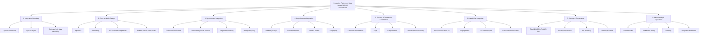

---

## Decomposition Map - Practical Categories / Domains / Skills

| No | Area | Practical skill yang perlu dikuasai | Implementasi di Java Jersey/JAX-RS Microservice | Risiko / failure mode yang harus dimodelkan |
|---:|---|---|---|---|
| 1 | **Integration Boundary Analysis** | Mengidentifikasi apakah sistem eksternal adalah upstream, downstream, peer service, vendor platform, legacy app, atau regulatory system. | Buat integration inventory: owner, endpoint, protocol, auth, SLA, data sensitivity, retry policy, contact support. | Salah memahami ownership menyebabkan escalation salah, contract mismatch, dan sulit incident response. |
| 2 | **Sync vs Async Decision** | Memilih antara REST synchronous call, async message, webhook, batch file, polling, atau orchestration. | REST untuk query/command cepat; RabbitMQ/event untuk decoupling; Camunda untuk long-running workflow; file/batch untuk legacy/bulk exchange. | Synchronous chain terlalu panjang → cascading failure; async tanpa idempotency → duplicate processing. |
| 3 | **REST API Integration** | Mendesain inbound/outbound REST API, HTTP method semantics, status code, content negotiation, DTO boundary. | Jersey Resource untuk inbound; Jersey Client / Java `HttpClient` / MicroProfile REST Client untuk outbound. | Timeout default tidak eksplisit, response schema berubah, error dari vendor tidak dipetakan. |
| 4 | **Typed REST Client** | Membuat client library internal yang typed, testable, observable, dan configurable. | Buat adapter class: `ExternalXClient`, DTO khusus eksternal, mapper ke domain model, retry wrapper, metrics tags. | Business service langsung panggil HTTP client → coupling tinggi dan susah mock/test. |
| 5 | **OpenAPI & API Contract** | API-first, schema ownership, client generation, example payload, deprecation policy. | Simpan OpenAPI spec di repo; validasi request/response; gunakan contract test di CI. | Contract drift antara spec dan implementasi; breaking change tidak terdeteksi. |
| 6 | **Error Contract** | Standarisasi error response agar machine-readable. | Gunakan format konsisten seperti Problem Details untuk HTTP APIs; RFC 9457 mendefinisikan problem detail dan menggantikan RFC 7807. ([RFC Editor](https://www.rfc-editor.org/info/rfc9457/?utm_source=chatgpt.com)) | Error eksternal dianggap sama semua; retry pada error non-retryable; user mendapat pesan ambigu. |
| 7 | **Timeout Strategy** | Menentukan connect timeout, read timeout, total deadline, per-hop timeout budget. | Set timeout eksplisit di client; propagate request deadline; jangan biarkan thread request menunggu indefinite. | Thread pool exhaustion, slow dependency membuat service ikut down. |
| 8 | **Retry & Backoff** | Retry hanya untuk error transient, dengan exponential backoff dan jitter. | Bungkus outbound call dengan retry policy; batasi max attempt; bedakan HTTP 429/503/timeout vs 400/401/403/409. | Retry storm, duplicate command, vendor rate limit makin parah. |
| 9 | **Circuit Breaker / Bulkhead / Fallback** | Mengisolasi dependency yang bermasalah. | MicroProfile Fault Tolerance 4.1 mendefinisikan strategi seperti timeout, retry, fallback, circuit breaker, bulkhead, dan asynchronous execution. ([MicroProfile](https://microprofile.io/specifications/fault-tolerance/4-1/)) | Semua traffic habis menunggu satu dependency; fallback mengembalikan data stale tanpa label. |
| 10 | **Rate Limit & Quota Handling** | Mematuhi limit vendor/platform dan melindungi service sendiri. | Client-side throttling, queueing, token bucket, backpressure, respect `Retry-After`. | Terblokir vendor, biaya cloud naik, integrasi dianggap abusive. |
| 11 | **Idempotency** | Membuat command aman diulang. | Gunakan idempotency key, request hash, unique constraint, de-dup table di PostgreSQL, status replay response. | Payment/order/case/action tercatat dua kali akibat retry atau redelivery. |
| 12 | **Correlation & Causality** | Menjaga jejak request lintas service. | Propagate `X-Correlation-ID`, trace ID, causation ID, actor ID, tenant ID, business key. | Sulit audit, sulit root-cause, sulit membuktikan urutan kejadian. |
| 13 | **Authentication to External Systems** | OAuth2 client credentials, OIDC, API key, mTLS, signed request, basic auth legacy. | Token provider terpisah, token caching, refresh, secret rotation, truststore/keystore management. RFC 9700 adalah Best Current Practice untuk keamanan OAuth 2.0. ([IETF Datatracker](https://datatracker.ietf.org/doc/rfc9700/?utm_source=chatgpt.com)) | Token bocor, scope terlalu luas, cert expired, API key hardcoded. |
| 14 | **Authorization & Data Scope** | Memastikan service hanya mengakses data sesuai tenant, role, scope, consent, atau contract. | Scope mapping, tenant isolation, outbound claim propagation, policy check sebelum external call. | Broken object authorization dan excessive exposure termasuk risiko utama API menurut OWASP API Security Top 10 2023. ([OWASP](https://owasp.org/www-project-api-security/?utm_source=chatgpt.com)) |
| 15 | **Webhook / Callback Integration** | Menerima event dari sistem eksternal secara aman dan idempotent. | Endpoint Jersey khusus webhook; signature verification; timestamp tolerance; replay protection; delivery log. | Spoofed webhook, duplicate delivery, event datang out-of-order. |
| 16 | **Polling Pattern** | Mengambil status dari sistem eksternal ketika callback tidak tersedia. | Scheduled job, incremental cursor, `updated_since`, ETag/If-None-Match, checkpoint table. | Polling terlalu agresif, missed updates, duplicate reads. |
| 17 | **Async Messaging** | Producer/consumer, queue, exchange, routing key, ack/nack, redelivery, DLQ. | RabbitMQ client atau abstraction internal; manual ack; retry queue; dead-letter exchange; message schema version. RabbitMQ documents consumer acknowledgements dan publisher confirms sebagai fitur data safety. ([RabbitMQ](https://www.rabbitmq.com/docs/confirms?utm_source=chatgpt.com)) |
| 18 | **Publisher Confirm & Consumer Ack** | Mengetahui kapan message benar-benar diterima broker dan kapan consumer selesai proses. | Aktifkan publisher confirms untuk producer penting; ack setelah DB commit sukses. | Message hilang, message diproses tapi ack gagal, redelivery tanpa idempotency. |
| 19 | **Dead Letter Queue & Replay** | Menyimpan event gagal untuk diagnosis dan reprocessing terkendali. | DLQ dengan reason, retry count, original payload, correlation ID; admin replay endpoint/job. | Poison message looping, replay menyebabkan side effect ganda. |
| 20 | **Transactional Outbox** | Menjembatani DB transaction dan publish message tanpa distributed transaction. | Tulis business state + outbox row dalam satu PostgreSQL transaction; relay publish ke RabbitMQ; consumer tetap idempotent. Pattern ini menekankan bahwa relay bisa publish lebih dari sekali sehingga consumer harus idempotent. ([microservices.io](https://microservices.io/patterns/data/transactional-outbox.html?utm_source=chatgpt.com)) |
| 21 | **Saga / Distributed Transaction** | Mengelola transaksi bisnis lintas service tanpa 2PC. | Camunda orchestration, BPMN compensation, state machine, retry task, manual intervention. Saga adalah sequence local transactions dengan compensating transactions saat gagal. ([microservices.io](https://microservices.io/patterns/data/saga.html?utm_source=chatgpt.com)) |
| 22 | **Camunda External System Orchestration** | Memodelkan step integrasi sebagai workflow yang observable dan recoverable. | Service task untuk external call, timer boundary event, retry cycle, incident handling, compensation task. | Workflow stuck, duplicate task execution, compensation tidak lengkap. |
| 23 | **Enterprise Integration Patterns** | Memakai vocabulary seperti message channel, content-based router, splitter, aggregator, recipient list, claim check, canonical data model. | Implement ringan di Java code, RabbitMQ routing, Camunda flow, atau integration service. | Logic routing tersebar tanpa pola; susah trace dan susah test. |
| 24 | **Data Mapping & Canonical Model** | Memisahkan external DTO dari internal domain model. | External DTO → mapper → command/domain object; validasi dan normalization sebelum masuk business logic. | External schema bocor ke domain; perubahan vendor merusak core model. |
| 25 | **Schema Evolution** | Backward/forward compatibility untuk JSON/XML/message/file. | Tambah field secara additive, jangan ubah meaning field lama, gunakan version field untuk message. | Consumer lama crash karena field wajib baru atau enum baru. |
| 26 | **File-Based Integration** | CSV, Excel, XML, JSON, ZIP, PDF, SFTP, object storage, manifest file. | Import pipeline: upload → virus scan → checksum → parse → validate → staging → commit → report. | Partial import, file corrupt, duplicate file, encoding issue, timezone issue. |
| 27 | **Batch & Bulk API** | Mengirim/menerima banyak record efisien. | Pagination, chunking, batch status endpoint, partial success model, resumable processing. | Memory spike, transaction terlalu besar, failure satu record menggagalkan semua. |
| 28 | **Database-Mediated Integration** | Integrasi via staging table, view, materialized view, CDC, stored procedure. | MyBatis mapper untuk staging/outbox/idempotency; PostgreSQL function hanya bila logic dekat data memang dibutuhkan. | Shared database menjadi tight coupling; schema change merusak banyak aplikasi. |
| 29 | **CDC / Event from Database** | Mengubah perubahan DB menjadi event. | Outbox polling sederhana atau CDC tooling bila platform mendukung; event harus punya schema dan ordering expectation. | Event tidak merepresentasikan business intent, hanya row mutation mentah. |
| 30 | **API Gateway / Edge Integration** | Routing, auth enforcement, TLS termination, rate limit, request size limit, API catalog. | Gateway di depan Jersey services; service tetap melakukan authorization penting di dalam. | Terlalu percaya gateway; internal bypass membuka celah keamanan. |
| 31 | **Cloud / On-Prem Connectivity** | VPN, private link, proxy, firewall, DNS, NAT, certificate trust. | Config per environment; outbound allowlist; keystore/truststore; health check dependency. | Prod bisa akses vendor tapi staging tidak; cert chain beda; DNS split-horizon. |
| 32 | **Secrets & Certificate Management** | Mengelola API key, OAuth secret, private key, certificate, truststore. | Kubernetes Secret, cloud secret manager, Vault, mounted cert, rotation playbook. | Secret expired atau bocor; service restart massal saat rotation. |
| 33 | **Observability** | Metrics, logs, traces, spans, dependency health, error budget. | Log structured dengan correlation ID; metric per dependency: latency, timeout, status code, retry count, DLQ depth. MicroProfile Telemetry mengadopsi OpenTelemetry untuk tracing/telemetry di aplikasi MicroProfile. ([MicroProfile](https://microprofile.io/specifications/telemetry/2-0/?utm_source=chatgpt.com)) |
| 34 | **Audit & Regulatory Defensibility** | Membuktikan siapa melakukan apa, kapan, ke sistem mana, dengan hasil apa. | Audit table: actor, request ID, external reference, payload hash, decision result, failure reason. | Tidak bisa rekonstruksi enforcement lifecycle atau dispute eksternal. |
| 35 | **Testing External Integration** | Unit test adapter, contract test, sandbox test, mock server, failure injection. | WireMock/mock HTTP server, testcontainer PostgreSQL/RabbitMQ, replay sample payload, CI contract validation. | Test hanya happy path; bug baru muncul saat vendor timeout, 429, malformed response. |
| 36 | **Operational Runbook** | Membuat prosedur incident untuk dependency eksternal. | Runbook: detect, isolate, disable feature flag, replay DLQ, contact owner, reconcile data. | Tim tahu error tapi tidak tahu tindakan aman berikutnya. |
| 37 | **Governance & API Inventory** | Menjaga daftar semua integrasi, data yang lewat, SLA, owner, lifecycle, compliance. | Catalog di repo/wiki/internal portal; tag service dependency di dashboard. | Shadow integration, endpoint deprecated tanpa diketahui. |
| 38 | **Cost & Performance Optimization** | Mengendalikan latency, payload size, egress cost, connection usage. | HTTP pooling, compression, pagination, caching, batch request, async queue, avoid chatty API. | Biaya egress tinggi, vendor throttling, p95 latency naik. |
| 39 | **Feature Flag & Degradation Mode** | Mematikan integrasi tertentu tanpa deploy. | Toggle untuk vendor call, fallback read-only mode, queue-only mode, manual review mode. | Dependency down membuat seluruh user journey down. |
| 40 | **Reconciliation Pattern** | Memastikan state internal dan eksternal tetap selaras. | Scheduled reconciliation job, external reference matching, diff report, repair command. | Event hilang tidak pernah terdeteksi; state divergen lama. |

---

## Pola Keputusan Praktis

| Kondisi | Pattern yang biasanya cocok | Catatan engineering |
|---|---|---|
| Butuh jawaban langsung dari sistem eksternal | **Synchronous REST call** | Wajib timeout, retry terbatas, circuit breaker, fallback strategy. |
| External action bisa diproses belakangan | **Async message / command queue** | Wajib idempotency, DLQ, retry policy, correlation ID. |
| Transaksi bisnis lintas banyak service | **Saga / orchestration with Camunda** | Cocok untuk long-running process, compensation, manual recovery. |
| DB update harus disertai event | **Transactional outbox** | Hindari dual-write langsung DB + broker tanpa mekanisme recovery. |
| Vendor mengirim update ke kita | **Webhook callback** | Wajib signature verification, replay protection, idempotency. |
| Vendor tidak punya webhook | **Polling with checkpoint** | Gunakan cursor/checkpoint, jangan polling agresif. |
| Integrasi legacy/bulk | **File/batch integration** | Wajib manifest, checksum, staging, validation report, reconciliation. |
| Banyak variasi format/protokol | **Integration adapter layer** | Jangan biarkan domain service berisi detail vendor/protocol. |
| Sistem sering gagal/tidak stabil | **Bulkhead + circuit breaker + queue fallback** | Prioritaskan isolasi agar service utama tetap hidup. |
| Butuh audit kuat | **Correlation + immutable audit log + payload hash** | Simpan metadata cukup, jangan sembarang simpan PII penuh. |

---

## Invariant Penting untuk Senior Engineer

Untuk integrasi eksternal, desain yang sehat biasanya memegang invariant berikut:

1. **No external DTO leaks into domain model.**  
   Semua payload eksternal harus masuk lewat adapter/mapper.

2. **Every external command must be idempotent or explicitly non-retryable.**  
   Kalau retry bisa terjadi, duplicate juga harus diasumsikan bisa terjadi.

3. **Timeout is a business decision, not a library default.**  
   Setiap outbound dependency harus punya budget waktu eksplisit.

4. **Every integration must have an owner and escalation path.**  
   Tanpa owner, incident akan berubah jadi investigasi liar.

5. **Async does not remove consistency problems; it moves them.**  
   Async perlu DLQ, replay, ordering assumption, dan reconciliation.

6. **Audit trail must capture intent, not only technical logs.**  
   Untuk regulatory/case-management system, yang penting bukan hanya “HTTP 200”, tapi “aksi bisnis apa yang dikirim, atas dasar apa, dan hasilnya apa”.

---

## Roadmap Alur Belajar yang Direkomendasikan

| Tahap | Fokus | Target hasil |
|---:|---|---|
| 1 | **Integration boundary & decision model** | Bisa memilih REST vs async vs file vs orchestration dengan alasan jelas. |
| 2 | **Outbound REST client engineering** | Bisa membuat client adapter yang aman: timeout, retry, auth, mapping, metrics. |
| 3 | **API contract & error model** | Bisa memakai OpenAPI, versioning, DTO compatibility, dan Problem Details. |
| 4 | **Resilience pattern** | Bisa menerapkan timeout, retry, circuit breaker, bulkhead, fallback, rate limit. |
| 5 | **Idempotency & consistency** | Bisa mendesain idempotency key, outbox, de-dup, reconciliation. |
| 6 | **Async messaging & event design** | Bisa memakai RabbitMQ dengan ack, confirms, DLQ, retry, replay. |
| 7 | **Camunda orchestration & Saga** | Bisa memodelkan long-running integration flow dengan compensation dan incident handling. |
| 8 | **Security & governance** | Bisa mengelola OAuth2/OIDC/mTLS/API key, secrets, API inventory, OWASP API risks. |
| 9 | **Observability & audit** | Bisa membuat integration dashboard, trace, audit log, dan operational runbook. |
| 10 | **Advanced integration operations** | Bisa menangani multi-cloud/on-prem connectivity, certificate rotation, failover, dan vendor incident. |

---

## Rekomendasi Materi Selanjutnya

Materi berikutnya yang paling strategis adalah:

**“Outbound REST Client Engineering in Java Jersey/JAX-RS Microservice: timeout, retry, circuit breaker, OAuth2, DTO mapping, error handling, observability, and testing.”**

Ini fondasi paling sering dipakai sebelum masuk ke RabbitMQ, Saga/Camunda, webhook, outbox, atau file/batch integration.

---

**Sources:**

- [Jakarta RESTful Web Services | Jakarta EE | The Eclipse Foundation](https://jakarta.ee/specifications/restful-ws/)
- [Rest Client - MicroProfile](https://microprofile.io/specifications/rest-client/)
- [OpenAPI Initiative – The OpenAPI Initiative provides an open source, technical community, within which industry participants may easily contribute to building a vendor-neutral, portable and an open specification for providing technical metadata for REST APIs – the “OpenAPI Specification” (OAS).](https://www.openapis.org/)
- [Enterprise Integration Patterns: Home](https://www.enterpriseintegrationpatterns.com/?utm_source=chatgpt.com)
- [3.1.0 | AsyncAPI Initiative for event-driven APIs](https://www.asyncapi.com/docs/reference/specification/latest?utm_source=chatgpt.com)
- [RFC 9457: Problem Details for HTTP APIs](https://www.rfc-editor.org/info/rfc9457/?utm_source=chatgpt.com)
- [RFC 9700 - Best Current Practice for OAuth 2.0 Security](https://datatracker.ietf.org/doc/rfc9700/?utm_source=chatgpt.com)
- [OWASP API Security Project](https://owasp.org/www-project-api-security/?utm_source=chatgpt.com)
- [Consumer Acknowledgements and Publisher Confirms](https://www.rabbitmq.com/docs/confirms?utm_source=chatgpt.com)
- [Pattern: Transactional outbox](https://microservices.io/patterns/data/transactional-outbox.html?utm_source=chatgpt.com)

## Response:
7/14/2026, 9:50:20 PM

Total saya rekomendasikan **12 seri** untuk topik **Integration Pattern with External Systems/Services/Applications/Platforms**.

Urutan seri yang paling efektif:

| Seri | Topik |
|---:|---|
| 1 | **Integration Boundary & Decision Model** |
| 2 | **Outbound REST Client Engineering in Jersey/JAX-RS** |
| 3 | **API Contract, OpenAPI, Versioning & Error Model** |
| 4 | **Timeout, Retry, Circuit Breaker, Bulkhead & Fallback** |
| 5 | **Authentication, Authorization, mTLS, OAuth2, API Key & Secrets** |
| 6 | **Idempotency, Duplicate Handling & Safe Retry Design** |
| 7 | **Webhook, Callback, Polling & External Event Intake** |
| 8 | **Async Integration with RabbitMQ / AMQP / Event Messaging** |
| 9 | **Transactional Outbox, Saga & Consistency Across Systems** |
| 10 | **Camunda-Based External System Orchestration** |
| 11 | **File-Based, Batch, Database-Mediated & Legacy Integration** |
| 12 | **Observability, Audit, Reconciliation, Runbook & Governance** |

Jadi: **12 seri total**.

Rekomendasi mulai dari **Seri 1 — Integration Boundary & Decision Model**, karena itu menentukan kapan pakai REST, async messaging, webhook, file batch, database integration, atau Camunda orchestration.

## Response:
7/14/2026, 9:51:36 PM

Saya mulai dari **Seri 1/12 — Integration Boundary & Decision Model**. Fokusnya saya buat praktis: cara mengklasifikasi integrasi, memilih pattern, menentukan kontrak operasional, dan menghasilkan artefak yang bisa langsung dipakai saat onboarding/design review.

# Seri 1/12 - Integration Boundary & Decision Model

## 1. Tujuan Seri Ini

Seri ini membahas **cara menentukan bentuk integrasi yang benar** sebelum menulis kode.

Dalam microservice Java Jersey/JAX-RS, kesalahan besar biasanya bukan pada syntax HTTP client, RabbitMQ client, atau Camunda delegate. Kesalahan terbesar sering terjadi lebih awal:

> Salah memilih bentuk integrasi.

Contoh:

- Harusnya async, tapi dibuat REST synchronous.
- Harusnya ada idempotency, tapi langsung retry.
- Harusnya pakai Camunda orchestration, tapi logic tersebar di beberapa service.
- Harusnya file batch dengan reconciliation, tapi dipaksakan API realtime.
- Harusnya external DTO diisolasi, tapi bocor ke domain model.

Seri ini menjadi fondasi untuk seluruh seri integrasi berikutnya.

---

## 2. Posisi Seri dalam Roadmap

| Seri | Topik | Status |
|---:|---|---|
| 1 | **Integration Boundary & Decision Model** | **Sedang dibahas** |
| 2 | Outbound REST Client Engineering in Jersey/JAX-RS | Berikutnya |
| 3 | API Contract, OpenAPI, Versioning & Error Model | Berikutnya |
| 4 | Timeout, Retry, Circuit Breaker, Bulkhead & Fallback | Berikutnya |
| 5 | Authentication, Authorization, mTLS, OAuth2, API Key & Secrets | Berikutnya |
| 6 | Idempotency, Duplicate Handling & Safe Retry Design | Berikutnya |
| 7 | Webhook, Callback, Polling & External Event Intake | Berikutnya |
| 8 | Async Integration with RabbitMQ / AMQP / Event Messaging | Berikutnya |
| 9 | Transactional Outbox, Saga & Consistency Across Systems | Berikutnya |
| 10 | Camunda-Based External System Orchestration | Berikutnya |
| 11 | File-Based, Batch, Database-Mediated & Legacy Integration | Berikutnya |
| 12 | Observability, Audit, Reconciliation, Runbook & Governance | Berikutnya |

---

## 3. Core Mental Model

Integration boundary adalah **garis kontrak** antara microservice Anda dan sistem lain.

Dalam praktiknya, boundary bukan hanya soal endpoint. Boundary mencakup:

```text
Integration Boundary =
    Protocol
  + Contract
  + Ownership
  + Data mapping
  + Authentication
  + Consistency model
  + Failure handling
  + Observability
  + Auditability
  + Operational runbook
```

Untuk REST API, Jakarta RESTful Web Services menyediakan API dasar untuk membangun web services berbasis REST, dan Jakarta REST 4.0 adalah bagian dari Jakarta EE 11. Ini relevan untuk service berbasis Jersey/JAX-RS modern. ([jakarta.ee](https://jakarta.ee/specifications/restful-ws/4.0/?utm_source=chatgpt.com))

Untuk kontrak HTTP API, OpenAPI adalah standar formal untuk mendeskripsikan HTTP APIs agar dapat dipahami manusia dan tooling, termasuk untuk client generation, testing, dan design governance. ([openapis.org](https://www.openapis.org/?utm_source=chatgpt.com))

Untuk asynchronous/event-driven API, AsyncAPI menyediakan specification dan tooling untuk mendefinisikan asynchronous APIs serta bersifat protocol-agnostic. ([AsyncAPI](https://www.asyncapi.com/?utm_source=chatgpt.com))

---

## 4. Diagram Besar Integration Boundary

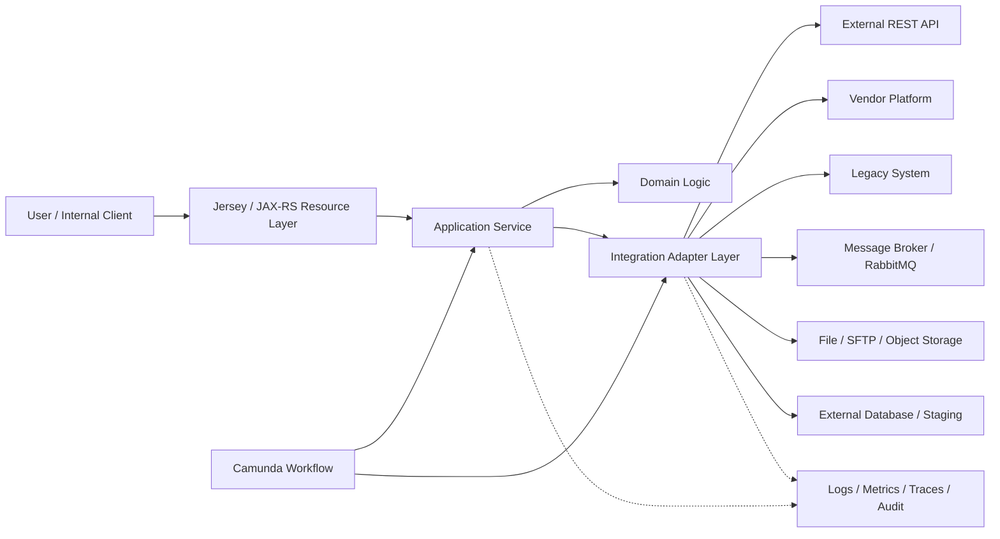

Prinsip penting:

```text
Resource Layer tidak boleh langsung tahu detail vendor.
Domain Logic tidak boleh tergantung external DTO.
Application Service boleh memanggil integration adapter.
Integration Adapter bertanggung jawab atas protocol, auth, mapping, timeout, retry, dan error translation.
```

---

## 5. Practical Decomposition Map

| No | Domain / Skill | Fokus Praktis | Output yang Harus Ada |
|---:|---|---|---|
| 1 | **Integration Identification** | Mengidentifikasi semua sistem eksternal yang dipanggil/dipanggil balik. | Integration inventory. |
| 2 | **Ownership Mapping** | Menentukan siapa pemilik sistem, kontak support, SLA, escalation path. | Owner matrix. |
| 3 | **Business Criticality** | Menentukan apakah integrasi critical, optional, blocking, atau background. | Criticality classification. |
| 4 | **Protocol Selection** | Memilih REST, message queue, webhook, polling, file batch, DB staging, atau Camunda orchestration. | Integration decision record. |
| 5 | **Synchronous vs Asynchronous Decision** | Menentukan apakah caller harus menunggu hasil saat itu juga. | Sync/async decision table. |
| 6 | **Contract Model** | Menentukan schema, OpenAPI, AsyncAPI, DTO, event schema, atau file layout. | Contract artifact. |
| 7 | **Data Ownership** | Menentukan siapa source of truth untuk data. | Data ownership matrix. |
| 8 | **Consistency Model** | Strong consistency, eventual consistency, manual reconciliation, or compensation. | Consistency decision. |
| 9 | **Failure Model** | Timeout, retry, duplicate, partial failure, external outage, bad payload. | Failure mode table. |
| 10 | **Security Boundary** | OAuth2, mTLS, API key, signed webhook, network allowlist, secret rotation. | Security integration notes. |
| 11 | **Idempotency Model** | Menentukan apakah request/event/file bisa diproses ulang dengan aman. | Idempotency key strategy. |
| 12 | **Observability Model** | Correlation ID, external reference, latency, retry count, error code, DLQ depth. | Dashboard/logging spec. |
| 13 | **Audit Model** | Merekam actor, business intent, request hash, response result, timestamp. | Audit event design. |
| 14 | **Operational Model** | Runbook ketika dependency down, data mismatch, DLQ penuh, vendor delay. | Runbook skeleton. |
| 15 | **Testing Strategy** | Contract test, sandbox test, mock server, failure injection, replay test. | Integration test plan. |

---

## 6. Pattern Selection Matrix

### 6.1 Kapan Pakai REST Synchronous?

Gunakan REST synchronous jika:

| Kondisi | Cocok? |
|---|---|
| Caller butuh response langsung | Ya |
| Operasi cepat, biasanya < 1-3 detik | Ya |
| External system cukup reliable | Ya |
| Failure bisa langsung dikembalikan ke user/caller | Ya |
| Tidak butuh workflow panjang | Ya |

Contoh:

```text
GET customer profile from external CRM
POST validate identity
GET product eligibility
POST calculate quotation
```

Implementation shape:

```text
Jersey Resource
  -> Application Service
      -> ExternalSystemClient Adapter
          -> HTTP Client
              -> External API
```

Contoh package structure:

```text
com.company.caseapp.integration.crm
  CrmClient.java
  CrmClientConfig.java
  CrmAuthProvider.java
  CrmRequestMapper.java
  CrmResponseMapper.java
  CrmExceptionMapper.java
  dto/
    CrmCustomerResponse.java
    CrmErrorResponse.java
```

Jangan begini:

```text
CaseResource langsung memanggil HTTP endpoint vendor.
```

Lebih baik begini:

```text
CaseResource
  -> CaseApplicationService
      -> CustomerProfileGateway
          -> CrmClient
```

---

### 6.2 Kapan Pakai Async Message?

Gunakan async message jika:

| Kondisi | Cocok? |
|---|---|
| Caller tidak harus menunggu hasil akhir | Ya |
| Proses bisa berjalan background | Ya |
| External system bisa lambat/tidak stabil | Ya |
| Perlu retry aman | Ya |
| Throughput tinggi | Ya |
| Butuh decoupling antar service | Ya |

Contoh:

```text
Publish case-created event
Send notification request
Start downstream provisioning
Trigger document generation
Process media/OCR job
```

Implementation shape:

```text
Application Service
  -> persist business state
  -> write outbox event
  -> outbox relay publishes to RabbitMQ
  -> downstream consumer processes event
```

Async bukan berarti bebas masalah. Async memindahkan masalah dari request latency ke:

```text
ordering
duplication
idempotency
DLQ
replay
event schema evolution
reconciliation
```

---

### 6.3 Kapan Pakai Webhook?

Gunakan webhook jika:

| Kondisi | Cocok? |
|---|---|
| External system ingin push status ke kita | Ya |
| Kita tidak ingin polling terus-menerus | Ya |
| External system mendukung callback URL | Ya |
| Event eksternal penting untuk melanjutkan workflow | Ya |

Contoh:

```text
Payment status changed
KYC verification completed
Document signing completed
Vendor risk score updated
External case status changed
```

Implementation shape:

```text
External Platform
  -> POST /webhooks/vendor-x/status
      -> verify signature
      -> validate timestamp
      -> check idempotency
      -> persist event
      -> trigger workflow/message
```

Wajib ada:

```text
signature verification
timestamp tolerance
idempotency key
event log
dead-letter handling
manual replay
```

---

### 6.4 Kapan Pakai Polling?

Gunakan polling jika:

| Kondisi | Cocok? |
|---|---|
| External system tidak punya webhook | Ya |
| Data berubah periodik | Ya |
| Near-real-time tidak wajib | Ya |
| Ada cursor, timestamp, atau pagination | Ya |

Contoh:

```text
Poll vendor status every 5 minutes
Pull updated cases since last checkpoint
Fetch completed batch result
```

Implementation shape:

```text
Scheduled Job
  -> read checkpoint
  -> call external API with updated_since/cursor
  -> process page by page
  -> persist checkpoint only after success
```

Hati-hati:

```text
Jangan update checkpoint sebelum data benar-benar berhasil diproses.
```

---

### 6.5 Kapan Pakai File / Batch Integration?

Gunakan file/batch jika:

| Kondisi | Cocok? |
|---|---|
| Legacy system hanya support file | Ya |
| Data volume besar | Ya |
| Proses tidak realtime | Ya |
| Perlu laporan hasil import/export | Ya |
| Ada regulatory/reporting batch | Ya |

Contoh:

```text
Daily customer export
Monthly regulatory report
Bulk order import
CSV reconciliation file
SFTP settlement file
```

Implementation shape:

```text
File received
  -> checksum validation
  -> virus scan if needed
  -> parse
  -> validate rows
  -> load to staging table
  -> process in chunks
  -> produce success/error report
  -> archive original file
```

Wajib ada:

```text
manifest
checksum
file idempotency
staging table
row-level error
reconciliation report
archive policy
```

---

### 6.6 Kapan Pakai Database-Mediated Integration?

Gunakan dengan hati-hati jika:

| Kondisi | Cocok? |
|---|---|
| Legacy integration sudah bergantung DB | Mungkin |
| Butuh staging table | Ya |
| Butuh reporting/materialized view | Ya |
| Tidak cocok untuk domain service coupling | Hati-hati |

Contoh yang masih masuk akal:

```text
staging table untuk import
materialized view untuk reporting
outbox table untuk event relay
audit table untuk external exchange
```

Contoh yang berbahaya:

```text
Service A langsung update tabel domain milik Service B.
```

Prinsip:

```text
Database boleh jadi medium integrasi teknis,
tetapi jangan menjadikannya shared mutable domain model antar service.
```

---

### 6.7 Kapan Pakai Camunda Orchestration?

Gunakan Camunda jika:

| Kondisi | Cocok? |
|---|---|
| Proses lintas banyak sistem | Ya |
| Ada long-running workflow | Ya |
| Ada human task/manual review | Ya |
| Ada compensation/retry/escalation | Ya |
| Perlu visibility state proses | Ya |

Contoh:

```text
Case intake
  -> validate customer
  -> check external risk score
  -> request document
  -> wait for signature
  -> send to regulator
  -> wait for response
  -> close case
```

Implementation shape:

```text
BPMN Process
  -> Service Task: call external system
  -> Boundary Timer: timeout handling
  -> Error Boundary Event: business failure
  -> Compensation Task: rollback/reversal
  -> User Task: manual resolution
```

Camunda cocok saat integrasi adalah **business process**, bukan hanya satu technical call.

---

## 7. Decision Tree Praktis

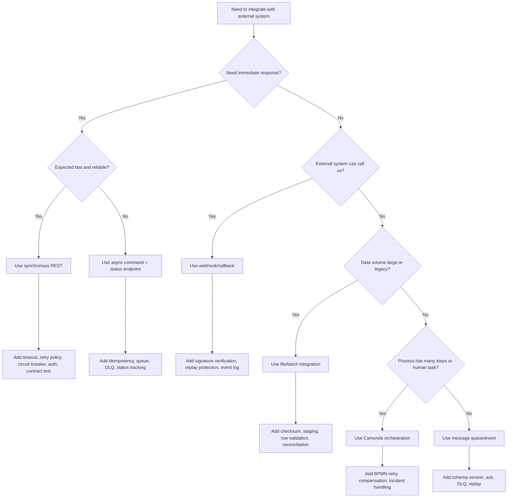

---

## 8. Practical Integration Decision Record

Setiap integrasi penting sebaiknya punya dokumen kecil seperti ini.

```text
Integration Decision Record

1. Integration Name
   Example: CRM Customer Profile Lookup

2. Business Purpose
   Example: Retrieve customer profile before case creation.

3. Direction
   Inbound / Outbound / Bidirectional

4. External System
   Name:
   Owner:
   Support contact:
   Environment:
   SLA:

5. Integration Type
   REST synchronous / Async message / Webhook / Polling / File batch / DB staging / Camunda orchestration

6. Why this pattern?
   Reason:
   Alternatives rejected:

7. Contract
   OpenAPI / AsyncAPI / File layout / DB schema / Vendor documentation:
   Version:
   Backward compatibility rule:

8. Authentication
   OAuth2 / mTLS / API key / Basic / Signed request:
   Secret location:
   Rotation process:

9. Data Mapping
   External DTO:
   Internal domain model:
   Mapper:
   Validation:

10. Consistency Model
   Strong / eventual / manual reconciliation:
   Source of truth:
   External reference key:

11. Failure Handling
   Timeout:
   Retry:
   Circuit breaker:
   Fallback:
   DLQ:
   Manual recovery:

12. Idempotency
   Idempotency key:
   Duplicate detection:
   Replay behavior:

13. Observability
   Correlation ID:
   Metrics:
   Logs:
   Trace:
   Dashboard:

14. Audit
   What is recorded:
   Payload hash:
   Actor:
   Business event:

15. Testing
   Unit test:
   Contract test:
   Sandbox test:
   Failure test:
   Replay test:

16. Operational Runbook
   How to detect failure:
   How to pause:
   How to replay:
   Who to contact:
```

---

## 9. Practical Example - External Risk Scoring Integration

### Scenario

Microservice Anda perlu meminta risk score dari external platform sebelum case bisa lanjut.

Pertanyaan pertama bukan “pakai library HTTP apa?”, tapi:

```text
Apakah case creation harus menunggu risk score?
```

### Option A - Synchronous REST

Cocok jika:

```text
risk score harus langsung tersedia
response cepat
vendor reliable
kalau gagal user boleh diminta retry
```

Flow:

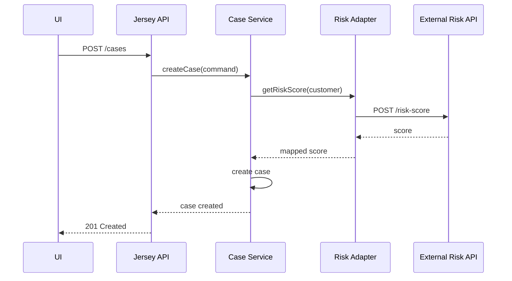

Risiko:

```text
vendor lambat -> user request lambat
vendor down -> case creation gagal
retry bisa membuat duplicate request
```

Mitigasi:

```text
timeout pendek
retry terbatas
idempotency key
circuit breaker
fallback/manual review
```

---

### Option B - Async Workflow

Cocok jika:

```text
case boleh dibuat dulu
risk score bisa menyusul
ada status pending
proses perlu retry/manual handling
```

Flow:

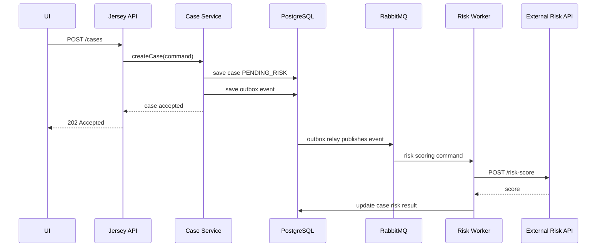

Risiko:

```text
event duplicate
worker gagal
score terlambat
case stuck di PENDING_RISK
```

Mitigasi:

```text
idempotency
DLQ
replay
status dashboard
timeout escalation
Camunda if long-running process
```

---

## 10. Java/Jersey Implementation Boundary

### 10.1 Bad Shape

Contoh buruk:

```java
@Path("/cases")
public class CaseResource {

    @POST
    public Response createCase(CreateCaseRequest request) {
        // BAD: resource layer knows external URL, auth, payload, and parsing
        Client client = ClientBuilder.newClient();

        Response riskResponse = client
            .target("https://vendor.example.com/risk")
            .request()
            .header("Authorization", "Bearer hardcoded-token")
            .post(Entity.json(request));

        if (riskResponse.getStatus() != 200) {
            return Response.serverError().build();
        }

        // business logic mixed with integration logic
        return Response.status(201).build();
    }
}
```

Masalah:

```text
hardcoded endpoint
resource layer terlalu pintar
external DTO bocor
tidak ada timeout eksplisit
tidak ada error translation
tidak ada audit
tidak ada testable adapter
```

---

### 10.2 Better Shape

```java
@Path("/cases")
@Consumes(MediaType.APPLICATION_JSON)
@Produces(MediaType.APPLICATION_JSON)
public class CaseResource {

    private final CaseApplicationService caseService;

    public CaseResource(CaseApplicationService caseService) {
        this.caseService = caseService;
    }

    @POST
    public Response createCase(CreateCaseRequest request) {
        CreateCaseResult result = caseService.createCase(request);
        return Response.status(Response.Status.CREATED)
                .entity(result)
                .build();
    }
}
```

```java
public class CaseApplicationService {

    private final RiskScoringGateway riskScoringGateway;
    private final CaseRepository caseRepository;

    public CaseApplicationService(
            RiskScoringGateway riskScoringGateway,
            CaseRepository caseRepository
    ) {
        this.riskScoringGateway = riskScoringGateway;
        this.caseRepository = caseRepository;
    }

    public CreateCaseResult createCase(CreateCaseRequest request) {
        RiskScore riskScore = riskScoringGateway.scoreCustomer(
                new RiskScoreCommand(
                        request.customerId(),
                        request.caseType()
                )
        );

        CaseEntity caseEntity = CaseEntity.create(
                request.customerId(),
                request.caseType(),
                riskScore.level()
        );

        caseRepository.insert(caseEntity);

        return new CreateCaseResult(caseEntity.id(), caseEntity.status());
    }
}
```

```java
public interface RiskScoringGateway {
    RiskScore scoreCustomer(RiskScoreCommand command);
}
```

```java
public class VendorRiskScoringClient implements RiskScoringGateway {

    private final Client httpClient;
    private final URI baseUri;
    private final RiskRequestMapper requestMapper;
    private final RiskResponseMapper responseMapper;

    public VendorRiskScoringClient(
            Client httpClient,
            URI baseUri,
            RiskRequestMapper requestMapper,
            RiskResponseMapper responseMapper
    ) {
        this.httpClient = httpClient;
        this.baseUri = baseUri;
        this.requestMapper = requestMapper;
        this.responseMapper = responseMapper;
    }

    @Override
    public RiskScore scoreCustomer(RiskScoreCommand command) {
        VendorRiskRequest vendorRequest = requestMapper.toVendorRequest(command);

        Response response = httpClient
                .target(baseUri)
                .path("/risk-score")
                .request(MediaType.APPLICATION_JSON_TYPE)
                .post(Entity.json(vendorRequest));

        if (response.getStatus() == 200) {
            VendorRiskResponse vendorResponse = response.readEntity(VendorRiskResponse.class);
            return responseMapper.toDomain(vendorResponse);
        }

        throw VendorRiskException.fromHttpStatus(response.getStatus());
    }
}
```

Catatan: contoh di atas sengaja belum membahas detail timeout/retry/circuit breaker karena itu akan menjadi seri khusus. Namun secara boundary sudah benar:

```text
Resource Layer -> Application Service -> Gateway Interface -> Vendor Adapter
```

---

## 11. Package Structure yang Direkomendasikan

```text
src/main/java/com/company/caseapp

  casecore/
    application/
      CaseApplicationService.java
      command/
      result/
    domain/
      Case.java
      RiskScore.java
      CaseStatus.java
    repository/
      CaseRepository.java

  integration/
    riskscore/
      RiskScoringGateway.java

      vendorx/
        VendorRiskScoringClient.java
        VendorRiskClientConfig.java
        VendorRiskAuthProvider.java
        VendorRiskRequestMapper.java
        VendorRiskResponseMapper.java
        VendorRiskExceptionMapper.java
        dto/
          VendorRiskRequest.java
          VendorRiskResponse.java
          VendorRiskErrorResponse.java

  api/
    resource/
      CaseResource.java
    dto/
      CreateCaseRequest.java
      CreateCaseResponse.java

  infrastructure/
    http/
      HttpClientFactory.java
    config/
      AppConfig.java
    observability/
      CorrelationIdFilter.java
      AuditLogger.java
```

Prinsip struktur:

| Layer | Boleh tahu apa? | Tidak boleh tahu apa? |
|---|---|---|
| `api/resource` | HTTP inbound, request/response API | Detail vendor |
| `application` | Use case, transaction boundary, orchestration ringan | HTTP endpoint vendor |
| `domain` | Business rule | JSON vendor, HTTP status, RabbitMQ |
| `integration` | Contract eksternal, adapter, mapping | Internal DB implementation detail yang tidak perlu |
| `infrastructure` | Client factory, config, tracing, secrets | Business decision |

---

## 12. Decision Checklist Sebelum Implementasi

Sebelum membuat integrasi baru, jawab pertanyaan ini:

| Pertanyaan | Kenapa penting |
|---|---|
| Siapa owner sistem eksternal? | Untuk incident dan escalation. |
| Apa business purpose integrasi ini? | Mencegah integrasi teknis tanpa nilai bisnis jelas. |
| Apakah caller harus menunggu hasil? | Menentukan sync vs async. |
| Apa source of truth untuk data ini? | Menghindari konflik state. |
| Apa external reference ID? | Dibutuhkan untuk audit, replay, reconciliation. |
| Apa contract formalnya? | OpenAPI, AsyncAPI, file layout, DB schema, vendor doc. |
| Apa timeout budget? | Mencegah thread/request menggantung. |
| Error mana yang retryable? | Mencegah retry pada bad request atau auth failure. |
| Apakah operasi idempotent? | Aman terhadap duplicate/retry/redelivery. |
| Bagaimana jika external system down? | Harus ada fallback, queue, manual mode, atau error jelas. |
| Bagaimana mendeteksi data mismatch? | Perlu reconciliation. |
| Apa yang harus diaudit? | Penting untuk regulatory/case-management domain. |
| Bagaimana test failure mode? | Jangan hanya test happy path. |
| Bagaimana cara replay? | Penting untuk DLQ, outbox, webhook, batch. |

---

## 13. Failure Mode Table

| Failure Mode | Contoh | Dampak | Mitigasi Praktis |
|---|---|---|---|
| Timeout | Vendor lambat merespons | Thread/request menunggu terlalu lama | Explicit timeout, circuit breaker |
| Connection failure | DNS, firewall, TLS, proxy issue | Integrasi tidak bisa jalan | Health check, runbook, network validation |
| 400 Bad Request | Payload tidak sesuai contract | Request gagal permanen | Contract test, validation before call |
| 401/403 | Token salah/scope kurang | Semua request gagal | Secret rotation, auth monitoring |
| 409 Conflict | Duplicate atau state conflict | Retry buta makin buruk | Idempotency key, state check |
| 429 Rate limited | Vendor quota habis | Request ditolak sementara | Backoff, throttling, queue |
| 500/503 | Vendor error | Transient failure | Retry terbatas, circuit breaker |
| Duplicate delivery | Message/webhook dikirim ulang | Side effect ganda | Idempotency table |
| Out-of-order event | Status `COMPLETED` datang sebelum `PROCESSING` | State kacau | State machine guard |
| Partial batch failure | Beberapa row gagal | Data tidak lengkap | Row-level status, report |
| Schema drift | Field berubah | Parsing error | Contract test, tolerant reader |
| Lost event | Event tidak terkirim/terproses | State divergen | Outbox, reconciliation |
| Poison message | Message selalu gagal | DLQ penuh/retry loop | DLQ, max retry, manual repair |
| Audit gap | Tidak ada external reference | Sulit investigasi | Audit log with correlation ID |

---

## 14. Integration Criticality Classification

Gunakan klasifikasi ini agar desain tidak over-engineered atau under-engineered.

| Class | Deskripsi | Contoh | Pattern Umum |
|---|---|---|---|
| **Critical Blocking** | Tanpa integrasi ini, transaksi utama tidak boleh lanjut. | Identity validation, payment authorization, regulatory eligibility check. | REST sync dengan timeout ketat, atau Camunda dengan manual fallback. |
| **Critical Async** | Harus selesai, tapi tidak harus saat request user. | Document generation, case submission to regulator. | Queue, outbox, Camunda, DLQ, reconciliation. |
| **Important Non-blocking** | Penting untuk enrichment, tapi core transaction bisa lanjut. | CRM enrichment, risk metadata enrichment. | Async event, retry, eventual update. |
| **Optional Enhancement** | Jika gagal, user journey tetap boleh jalan. | Recommendation, analytics tagging. | Fire-and-forget dengan observability minimal tapi tetap aman. |
| **Batch/Regulatory** | Diproses periodik dan harus akurat. | Daily/monthly report, settlement, reconciliation. | File/batch, staging, checksum, audit report. |

---

## 15. Sync vs Async - Practical Rule of Thumb

| Pertanyaan | Jika jawabannya “Ya” | Rekomendasi |
|---|---|---|
| Apakah user/caller butuh hasil sekarang? | Ya | REST sync |
| Apakah proses > 3-5 detik? | Ya | Async atau workflow |
| Apakah external dependency sering lambat/down? | Ya | Async/queue atau fallback |
| Apakah ada human approval/manual review? | Ya | Camunda |
| Apakah butuh compensation? | Ya | Saga/Camunda |
| Apakah data volume besar? | Ya | Batch/file/chunking |
| Apakah external system hanya memberi callback? | Ya | Webhook |
| Apakah external system tidak bisa callback? | Ya | Polling |
| Apakah perlu audit kuat? | Ya | Simpan correlation ID, external reference, request/response hash |
| Apakah operasi bisa terkirim dua kali? | Hampir selalu ya | Desain idempotency |

---

## 16. Artefak Minimal untuk Setiap Integrasi

Untuk onboarding senior engineer, minimal cari atau buat artefak berikut:

```text
1. Integration inventory
2. Integration decision record
3. Contract file or documentation
4. Sequence diagram
5. Failure mode table
6. Retry/idempotency policy
7. Security/auth notes
8. Observability and audit fields
9. Test plan
10. Runbook
```

Jika 10 artefak ini tidak ada, berarti integrasi tersebut kemungkinan besar hanya “jalan di kode”, tapi belum benar-benar siap secara engineering dan operasional.

---

## 17. Mini Template - Integration Inventory

| Field | Example |
|---|---|
| Integration name | Vendor Risk Score |
| Direction | Outbound |
| Protocol | REST |
| Owner internal | Case Platform Team |
| Owner external | Vendor X Support |
| Business purpose | Risk scoring before case approval |
| Criticality | Critical Blocking |
| Auth | OAuth2 client credentials |
| Contract | OpenAPI vendor spec |
| Timeout | 2s connect, 5s read |
| Retry | 2 attempts only for timeout/503 |
| Idempotency | `caseId + customerId + requestType` |
| External reference | `vendorRequestId` |
| Audit required | Yes |
| Reconciliation | Daily mismatch report |
| Runbook | Vendor outage playbook |

---

## 18. Design Review Questions

Gunakan ini saat membaca kode atau ikut design review.

### Boundary

```text
Apakah external system dipanggil lewat adapter/gateway?
Apakah domain model bersih dari DTO vendor?
Apakah package integration dipisah dari application/domain?
```

### Contract

```text
Apakah ada OpenAPI/AsyncAPI/file layout?
Apakah schema version jelas?
Apakah breaking change policy jelas?
```

### Failure

```text
Apa yang terjadi kalau external system timeout?
Apa yang terjadi kalau response 500?
Apa yang terjadi kalau duplicate request/event?
Apa yang terjadi kalau event datang terlambat?
Apa yang terjadi kalau data internal dan eksternal tidak sinkron?
```

### Security

```text
Di mana secret disimpan?
Bagaimana token/cert dirotasi?
Apakah scope terlalu luas?
Apakah webhook diverifikasi?
```

### Operations

```text
Metric apa yang menunjukkan integrasi bermasalah?
Dashboard mana yang dipakai?
Bagaimana replay DLQ?
Bagaimana reconciliation dilakukan?
Siapa yang dihubungi saat vendor down?
```

---

## 19. Anti-Patterns yang Harus Dihindari

| Anti-Pattern | Kenapa Buruk | Alternatif |
|---|---|---|
| Resource class langsung call vendor | Coupling tinggi, susah test | Adapter/gateway layer |
| External DTO dipakai sebagai domain object | Vendor schema bocor ke core | Mapper ke internal model |
| Retry semua error | Bisa memperparah failure | Retry hanya transient error |
| Tidak ada idempotency | Duplicate side effect | Idempotency key + de-dup table |
| Async tanpa DLQ | Failure hilang atau stuck | DLQ + replay tool |
| Webhook tanpa signature verification | Bisa dipalsukan | HMAC/signature verification |
| Polling tanpa checkpoint | Missed/duplicate data | Cursor/checkpoint table |
| Batch tanpa staging | Partial failure sulit dikontrol | Staging + row-level status |
| Tidak ada external reference ID | Sulit audit/reconciliation | Simpan external correlation/reference |
| Tidak ada runbook | Incident chaos | Runbook per integration |

---

## 20. Practical Deliverable untuk Seri Ini

Setelah menyelesaikan Seri 1, Anda seharusnya bisa membuat satu dokumen singkat seperti ini untuk setiap integrasi:

```text
Integration: Vendor Risk Score

Pattern:
  Outbound synchronous REST for initial score lookup.
  Async reconciliation job for mismatch detection.

Reason:
  Case approval needs immediate score, but external mismatch can be repaired asynchronously.

Boundary:
  CaseApplicationService depends on RiskScoringGateway.
  Vendor implementation lives under integration/riskscore/vendorx.

Contract:
  Vendor OpenAPI spec v2.1.
  Internal DTO separated from vendor DTO.

Failure:
  Timeout after 5 seconds.
  Retry only for timeout/503.
  No retry for 400/401/403/409.

Idempotency:
  Use caseId as idempotency key for score request.

Security:
  OAuth2 client credentials.
  Secret stored in secret manager/Kubernetes Secret.
  Scope limited to risk:score:write.

Observability:
  Metrics by vendor, operation, status, error category.
  Log correlationId, caseId, externalRequestId.
  Audit request hash and decision result.

Operations:
  If vendor is down, case enters MANUAL_REVIEW_REQUIRED.
  Daily reconciliation compares internal score result with vendor report.
```

---

## 21. Ringkasan Seri 1

Inti dari **Integration Boundary & Decision Model**:

```text
Jangan mulai dari library.
Mulai dari sifat bisnis integrasinya.
```

Urutan berpikir yang benar:

```text
1. Apa tujuan bisnis integrasi?
2. Siapa owner dan source of truth?
3. Apakah caller harus menunggu?
4. Apa consistency model?
5. Apa failure mode?
6. Apa security boundary?
7. Apa contract artifact?
8. Apa idempotency strategy?
9. Apa observability dan audit requirement?
10. Apa runbook ketika gagal?
```

Setelah itu baru pilih implementasi:

```text
REST
Message queue
Webhook
Polling
File batch
DB staging
Camunda workflow
```

---

# Status

**Seri 1/12 - Integration Boundary & Decision Model selesai.**

Rekomendasi materi selanjutnya:

**Seri 2/12 - Outbound REST Client Engineering in Jersey/JAX-RS**

Fokus berikutnya: struktur client adapter, Jersey Client / Java HttpClient / MicroProfile REST Client, timeout, config, DTO mapping, auth injection, error translation, testing, dan observability.

---

**Sources:**

- [Jakarta RESTful Web Services 4.0](https://jakarta.ee/specifications/restful-ws/4.0/?utm_source=chatgpt.com)
- [OpenAPI Initiative – The OpenAPI Initiative provides an open ...](https://www.openapis.org/?utm_source=chatgpt.com)
- [AsyncAPI Initiative for event-driven APIs | AsyncAPI Initiative ...](https://www.asyncapi.com/?utm_source=chatgpt.com)

## Response:
7/14/2026, 9:57:05 PM

Saya lanjut ke **Seri 2/12 — Outbound REST Client Engineering in Jersey/JAX-RS**. Saya akan fokus ke praktik implementasi: struktur adapter, konfigurasi client, timeout, auth, DTO mapping, error translation, testing, dan observability.

# Seri 2/12 - Outbound REST Client Engineering in Jersey/JAX-RS

## 1. Tujuan Seri Ini

Seri ini membahas cara membuat **outbound REST client** yang production-grade untuk microservice berbasis **Java 17+ dan Jersey/JAX-RS**.

Fokusnya bukan sekadar:

```java
ClientBuilder.newClient().target(url).request().get()
```

Tetapi bagaimana membangun client yang:

```text
configurable
testable
observable
secure
resilient
tidak membocorkan DTO vendor ke domain
aman terhadap timeout dan failure
mudah dioperasikan saat incident
```

Untuk stack modern Jakarta, Jersey 4.0.x adalah jalur yang kompatibel dengan Jakarta EE 11 / Jakarta REST 4.0, sedangkan Jersey 3.1.x adalah jalur Jakarta EE 10 / Jakarta REST 3.1. Jakarta REST 4.0 sendiri adalah release untuk Jakarta EE 11. ([projects.eclipse.org](https://projects.eclipse.org/projects/ee4j.jersey/releases/4.0.0-0?utm_source=chatgpt.com))

---

## 2. Posisi dalam Roadmap

| Seri | Topik | Status |
|---:|---|---|
| 1 | Integration Boundary & Decision Model | Selesai |
| 2 | **Outbound REST Client Engineering in Jersey/JAX-RS** | **Sedang dibahas** |
| 3 | API Contract, OpenAPI, Versioning & Error Model | Berikutnya |
| 4 | Timeout, Retry, Circuit Breaker, Bulkhead & Fallback | Berikutnya |
| 5 | Authentication, Authorization, mTLS, OAuth2, API Key & Secrets | Berikutnya |
| 6 | Idempotency, Duplicate Handling & Safe Retry Design | Berikutnya |
| 7 | Webhook, Callback, Polling & External Event Intake | Berikutnya |
| 8 | Async Integration with RabbitMQ / AMQP / Event Messaging | Berikutnya |
| 9 | Transactional Outbox, Saga & Consistency Across Systems | Berikutnya |
| 10 | Camunda-Based External System Orchestration | Berikutnya |
| 11 | File-Based, Batch, Database-Mediated & Legacy Integration | Berikutnya |
| 12 | Observability, Audit, Reconciliation, Runbook & Governance | Berikutnya |

---

## 3. Core Mental Model

Outbound REST client sebaiknya diperlakukan sebagai **integration adapter**, bukan sekadar utility HTTP.

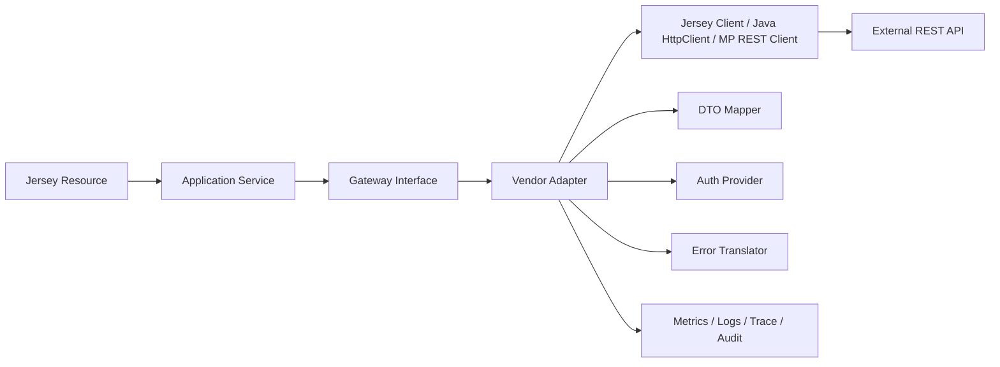

Prinsipnya:

```text
Application Service bicara dalam bahasa domain.
Integration Adapter bicara dalam bahasa external system.
HTTP client hanya detail transport.
```

---

## 4. Pilihan Client Library

Di Java/Jakarta ecosystem, ada beberapa pilihan umum.

| Pilihan | Cocok untuk | Kelebihan | Catatan |
|---|---|---|---|
| **Jersey Client** | Aplikasi Jersey/JAX-RS yang ingin konsisten dengan Jakarta REST API | Natural untuk JAX-RS, fluent API, provider/filter sama dengan server side | Butuh konfigurasi timeout/connector secara eksplisit |
| **Java `java.net.http.HttpClient`** | Java SE 11+ tanpa dependency besar | Native JDK, immutable, HTTP/2 support, async support | Mapping JSON/error handling harus dirakit sendiri |
| **MicroProfile REST Client** | Runtime mendukung MicroProfile | Type-safe interface berbasis anotasi JAX-RS | Sangat cocok bila service berjalan di runtime MP-compatible |

Jakarta REST Client API memang menyediakan programmatic API untuk mengakses REST resource dari Java application. Jersey sendiri menyediakan implementasi client API dan dokumentasi client API di user guide. ([jakarta.ee](https://jakarta.ee/learn/docs/jakartaee-tutorial/current/websvcs/rest-client/rest-client.html?utm_source=chatgpt.com))

MicroProfile REST Client adalah pendekatan type-safe untuk memanggil RESTful service melalui HTTP dan berusaha memakai API Jakarta REST untuk konsistensi. Versi 4.0 dirilis 1 Agustus 2024. ([MicroProfile](https://microprofile.io/specifications/rest-client/4-0/?utm_source=chatgpt.com))

Untuk seri ini, fokus utama kita: **Jersey Client**, karena konteks Anda adalah Jersey/JAX-RS based microservice.

---

## 5. Rule of Thumb Pemilihan Client

| Situasi | Rekomendasi |
|---|---|
| Service Anda sudah Jersey/JAX-RS | Pakai **Jersey Client** agar model provider/filter/DTO konsisten |
| Butuh dependency minimal, plain Java service | Pakai **Java `HttpClient`** |
| Runtime Anda MicroProfile-ready | Pertimbangkan **MicroProfile REST Client** |
| Butuh connection pooling advanced | Pakai Jersey connector yang sesuai, misalnya Apache connector / Java HttpClient connector |
| Butuh code generated dari OpenAPI | Bisa generate typed client, tapi tetap bungkus dengan gateway adapter |
| API eksternal sangat critical | Jangan panggil generated client langsung dari application service; tetap bungkus di adapter |

---

## 6. Package Structure yang Direkomendasikan

Contoh integrasi ke external **Customer Registry API**.

```text
com.company.caseapp.integration.customerregistry

  CustomerRegistryGateway.java

  customerregistry/
    CustomerRegistryClient.java
    CustomerRegistryClientConfig.java
    CustomerRegistryAuthProvider.java
    CustomerRegistryRequestMapper.java
    CustomerRegistryResponseMapper.java
    CustomerRegistryErrorTranslator.java
    CustomerRegistryHeaders.java

    dto/
      CustomerLookupRequest.java
      CustomerLookupResponse.java
      CustomerRegistryErrorResponse.java

    exception/
      CustomerRegistryException.java
      CustomerRegistryTimeoutException.java
      CustomerRegistryUnauthorizedException.java
      CustomerRegistryRateLimitedException.java
      CustomerRegistryUnavailableException.java
```

Boundary yang diinginkan:

```text
application service
  -> CustomerRegistryGateway interface
      -> CustomerRegistryClient implementation
          -> Jersey Client
              -> external API
```

---

## 7. Maven Dependency Dasar

Gunakan version yang selaras dengan runtime Anda.

Untuk Jersey 4.x / Jakarta EE 11:

```xml
<properties>
    <jersey.version>4.0.0</jersey.version>
</properties>

<dependencies>
    <dependency>
        <groupId>org.glassfish.jersey.core</groupId>
        <artifactId>jersey-client</artifactId>
        <version>${jersey.version}</version>
    </dependency>

    <dependency>
        <groupId>org.glassfish.jersey.inject</groupId>
        <artifactId>jersey-hk2</artifactId>
        <version>${jersey.version}</version>
    </dependency>

    <dependency>
        <groupId>org.glassfish.jersey.media</groupId>
        <artifactId>jersey-media-json-jackson</artifactId>
        <version>${jersey.version}</version>
    </dependency>
</dependencies>
```

Untuk Jersey 3.1.x / Jakarta EE 10, gunakan version 3.1.x yang dipakai organisasi Anda. Jangan mencampur `javax.ws.rs.*` dan `jakarta.ws.rs.*`.

---

## 8. Konfigurasi Client

Konfigurasi jangan hardcoded di class client.

Contoh config object:

```java
public record CustomerRegistryClientConfig(
        URI baseUri,
        int connectTimeoutMillis,
        int readTimeoutMillis,
        String clientId,
        String tokenUrl,
        String scope,
        int maxResponseBytes,
        boolean enablePayloadLogging
) {}
```

Contoh config properties:

```properties
integration.customer-registry.base-uri=https://customer-registry.example.com
integration.customer-registry.connect-timeout-ms=1000
integration.customer-registry.read-timeout-ms=3000
integration.customer-registry.scope=customer:read
integration.customer-registry.max-response-bytes=1048576
integration.customer-registry.enable-payload-logging=false
```

Prinsip praktis:

```text
base URL per environment
timeout eksplisit
auth config eksplisit
payload logging default false
secret tidak pernah masuk property file biasa
```

---

## 9. Membuat Jersey Client Factory

Jangan buat `ClientBuilder.newClient()` setiap request. Buat client sebagai reusable component.

Jersey Client API punya konsep `Client`, `WebTarget`, dan request invocation. Jersey User Guide mencakup pembuatan/configuration client instance dan targeting web resource. ([Eclipse EE4J](https://eclipse-ee4j.github.io/jersey.github.io/documentation/latest3x/index.html?utm_source=chatgpt.com))

```java
import jakarta.ws.rs.client.Client;
import jakarta.ws.rs.client.ClientBuilder;

import org.glassfish.jersey.client.ClientConfig;
import org.glassfish.jersey.client.ClientProperties;
import org.glassfish.jersey.jackson.JacksonFeature;

public final class JerseyClientFactory {

    private JerseyClientFactory() {}

    public static Client createCustomerRegistryClient(
            CustomerRegistryClientConfig config,
            CustomerRegistryAuthFilter authFilter,
            CorrelationIdClientFilter correlationIdFilter
    ) {
        ClientConfig clientConfig = new ClientConfig();

        clientConfig.property(
                ClientProperties.CONNECT_TIMEOUT,
                config.connectTimeoutMillis()
        );

        clientConfig.property(
                ClientProperties.READ_TIMEOUT,
                config.readTimeoutMillis()
        );

        clientConfig.register(JacksonFeature.class);
        clientConfig.register(authFilter);
        clientConfig.register(correlationIdFilter);

        return ClientBuilder.newClient(clientConfig);
    }
}
```

Penting: timeout Jersey memakai properti implementasi Jersey seperti `ClientProperties.CONNECT_TIMEOUT` dan `ClientProperties.READ_TIMEOUT`. Dokumentasi `ClientProperties` menyebut nilai timeout dalam milidetik, dan nilai `0` berarti interval infinity; jadi jangan biarkan timeout tidak jelas. ([Javadoc](https://javadoc.io/doc/org.glassfish.jersey.core/jersey-client/2.2/org/glassfish/jersey/client/ClientProperties.html?utm_source=chatgpt.com))

---

## 10. Gateway Interface

Application layer bergantung ke interface yang bermakna domain, bukan HTTP.

```java
public interface CustomerRegistryGateway {

    CustomerProfile findCustomerByNationalId(String nationalId);

    CustomerProfile findCustomerByExternalId(String externalCustomerId);
}
```

Contoh domain result:

```java
public record CustomerProfile(
        String customerId,
        String fullName,
        String status,
        boolean politicallyExposedPerson,
        boolean active
) {}
```

---

## 11. Vendor DTO

DTO vendor diletakkan di package integration, bukan domain.

```java
public record CustomerLookupResponse(
        String id,
        String name,
        String status,
        Boolean pep,
        String updatedAt
) {}
```

```java
public record CustomerRegistryErrorResponse(
        String code,
        String message,
        String traceId
) {}
```

---

## 12. Response Mapper

Mapper bertugas mengubah bahasa vendor menjadi bahasa internal.

```java
public class CustomerRegistryResponseMapper {

    public CustomerProfile toDomain(CustomerLookupResponse response) {
        return new CustomerProfile(
                response.id(),
                normalizeName(response.name()),
                mapStatus(response.status()),
                Boolean.TRUE.equals(response.pep()),
                "ACTIVE".equalsIgnoreCase(response.status())
        );
    }

    private String normalizeName(String name) {
        return name == null ? "" : name.trim();
    }

    private String mapStatus(String vendorStatus) {
        if (vendorStatus == null) {
            return "UNKNOWN";
        }

        return switch (vendorStatus.toUpperCase()) {
            case "ACTIVE", "A" -> "ACTIVE";
            case "SUSPENDED", "S" -> "SUSPENDED";
            case "CLOSED", "C" -> "CLOSED";
            default -> "UNKNOWN";
        };
    }
}
```

Prinsip:

```text
External enum tidak boleh langsung dipercaya.
External nullability tidak boleh langsung bocor.
External timestamp/timezone harus dinormalisasi.
External status harus dipetakan ke internal state.
```

---

## 13. Client Implementation

Contoh outbound GET sederhana:

```java
import jakarta.ws.rs.ProcessingException;
import jakarta.ws.rs.client.Client;
import jakarta.ws.rs.core.MediaType;
import jakarta.ws.rs.core.Response;

public class CustomerRegistryClient implements CustomerRegistryGateway {

    private final Client client;
    private final CustomerRegistryClientConfig config;
    private final CustomerRegistryResponseMapper mapper;
    private final CustomerRegistryErrorTranslator errorTranslator;

    public CustomerRegistryClient(
            Client client,
            CustomerRegistryClientConfig config,
            CustomerRegistryResponseMapper mapper,
            CustomerRegistryErrorTranslator errorTranslator
    ) {
        this.client = client;
        this.config = config;
        this.mapper = mapper;
        this.errorTranslator = errorTranslator;
    }

    @Override
    public CustomerProfile findCustomerByNationalId(String nationalId) {
        try {
            Response response = client
                    .target(config.baseUri())
                    .path("/v1/customers")
                    .queryParam("nationalId", nationalId)
                    .request(MediaType.APPLICATION_JSON_TYPE)
                    .header("X-Idempotency-Key", "lookup-national-id-" + nationalId)
                    .get();

            return handleCustomerLookupResponse(response);

        } catch (ProcessingException ex) {
            throw errorTranslator.translateTransportException(ex);
        }
    }

    @Override
    public CustomerProfile findCustomerByExternalId(String externalCustomerId) {
        try {
            Response response = client
                    .target(config.baseUri())
                    .path("/v1/customers/{customerId}")
                    .resolveTemplate("customerId", externalCustomerId)
                    .request(MediaType.APPLICATION_JSON_TYPE)
                    .get();

            return handleCustomerLookupResponse(response);

        } catch (ProcessingException ex) {
            throw errorTranslator.translateTransportException(ex);
        }
    }

    private CustomerProfile handleCustomerLookupResponse(Response response) {
        try (response) {
            int status = response.getStatus();

            if (status == 200) {
                CustomerLookupResponse body =
                        response.readEntity(CustomerLookupResponse.class);
                return mapper.toDomain(body);
            }

            throw errorTranslator.translateHttpResponse(response);
        }
    }
}
```

Catatan praktis:

```text
Selalu close Response.
Jangan parse body sukses sebelum cek status.
Jangan return Response mentah ke application service.
Jangan expose status code vendor sebagai domain exception mentah.
```

---

## 14. Error Translation

Error translator mengubah HTTP/transport error menjadi exception internal yang bermakna.

```java
public class CustomerRegistryErrorTranslator {

    public RuntimeException translateHttpResponse(Response response) {
        int status = response.getStatus();

        CustomerRegistryErrorResponse errorBody = safeReadError(response);

        return switch (status) {
            case 400 -> new CustomerRegistryException(
                    "CUSTOMER_REGISTRY_BAD_REQUEST",
                    "Invalid request sent to Customer Registry",
                    status,
                    errorBody
            );
            case 401, 403 -> new CustomerRegistryUnauthorizedException(
                    "Customer Registry authentication/authorization failed",
                    status,
                    errorBody
            );
            case 404 -> new CustomerRegistryException(
                    "CUSTOMER_NOT_FOUND",
                    "Customer not found in Customer Registry",
                    status,
                    errorBody
            );
            case 409 -> new CustomerRegistryException(
                    "CUSTOMER_REGISTRY_CONFLICT",
                    "Customer Registry returned conflict",
                    status,
                    errorBody
            );
            case 429 -> new CustomerRegistryRateLimitedException(
                    "Customer Registry rate limit exceeded",
                    status,
                    errorBody
            );
            case 500, 502, 503, 504 -> new CustomerRegistryUnavailableException(
                    "Customer Registry is unavailable",
                    status,
                    errorBody
            );
            default -> new CustomerRegistryException(
                    "CUSTOMER_REGISTRY_UNEXPECTED_RESPONSE",
                    "Unexpected response from Customer Registry",
                    status,
                    errorBody
            );
        };
    }

    public RuntimeException translateTransportException(ProcessingException ex) {
        return new CustomerRegistryUnavailableException(
                "Customer Registry transport failure",
                ex
        );
    }

    private CustomerRegistryErrorResponse safeReadError(Response response) {
        try {
            if (response.hasEntity()) {
                return response.readEntity(CustomerRegistryErrorResponse.class);
            }
        } catch (Exception ignored) {
            // Avoid masking original HTTP error with parsing failure.
        }

        return new CustomerRegistryErrorResponse(
                "UNKNOWN",
                "No parseable error body",
                null
        );
    }
}
```

Mapping praktis:

| HTTP / Error | Kategori | Retry? | Perlakuan |
|---|---|---:|---|
| 400 | Client/request error | Tidak | Perbaiki mapping/validation |
| 401 | Auth failure | Tidak langsung | Refresh token bila applicable, lalu fail fast |
| 403 | Scope/permission error | Tidak | Escalate config/security |
| 404 | Not found | Tergantung use case | Bisa jadi business result |
| 409 | Conflict | Tergantung | Perlu state/idempotency handling |
| 429 | Rate limited | Ya, dengan backoff | Respect `Retry-After` jika ada |
| 500 | Server error | Ya, terbatas | Retry terbatas/circuit breaker |
| 502/503/504 | Upstream unavailable | Ya, terbatas | Retry terbatas/circuit breaker |
| Timeout | Transient | Ya, terbatas | Retry hanya bila operasi aman |
| DNS/TLS/connection refused | Transport | Biasanya ya | Tapi bisa jadi misconfiguration |

---

## 15. Auth Filter

Jangan menaruh token logic di method bisnis.

```java
import jakarta.ws.rs.client.ClientRequestContext;
import jakarta.ws.rs.client.ClientRequestFilter;
import java.io.IOException;

public class CustomerRegistryAuthFilter implements ClientRequestFilter {

    private final AccessTokenProvider tokenProvider;

    public CustomerRegistryAuthFilter(AccessTokenProvider tokenProvider) {
        this.tokenProvider = tokenProvider;
    }

    @Override
    public void filter(ClientRequestContext requestContext) throws IOException {
        String token = tokenProvider.getAccessToken();

        requestContext.getHeaders().putSingle(
                "Authorization",
                "Bearer " + token
        );
    }
}
```

Token provider:

```java
public interface AccessTokenProvider {
    String getAccessToken();
}
```

Production implementation biasanya punya:

```text
token caching
expiry awareness
refresh lock
secret manager integration
metrics token refresh failure
no token value in logs
```

---

## 16. Correlation ID Filter

Outbound call harus membawa correlation ID.

```java
import jakarta.ws.rs.client.ClientRequestContext;
import jakarta.ws.rs.client.ClientRequestFilter;
import java.io.IOException;

public class CorrelationIdClientFilter implements ClientRequestFilter {

    private final CorrelationIdProvider correlationIdProvider;

    public CorrelationIdClientFilter(CorrelationIdProvider correlationIdProvider) {
        this.correlationIdProvider = correlationIdProvider;
    }

    @Override
    public void filter(ClientRequestContext requestContext) throws IOException {
        requestContext.getHeaders().putSingle(
                "X-Correlation-ID",
                correlationIdProvider.currentCorrelationId()
        );
    }
}
```

Minimal outbound headers:

| Header | Fungsi |
|---|---|
| `Authorization` | Auth ke external system |
| `X-Correlation-ID` | Trace lintas service |
| `X-Request-ID` | Request instance unique |
| `X-Idempotency-Key` | Aman terhadap retry command |
| `Accept` | Response media type |
| `Content-Type` | Request body media type |
| `User-Agent` | Identitas service caller |
| `X-Tenant-ID` | Jika multi-tenant dan diizinkan contract |

---

## 17. Logging Filter - Hati-Hati PII dan Secret

Logging outbound request sangat berguna, tapi berbahaya.

Jangan log:

```text
Authorization header
API key
cookie/session
access token
refresh token
password
full NIK/KTP/passport
full customer payload
full document payload
```

Log yang aman:

```text
dependency name
operation name
method
path template, bukan full sensitive URL
status code
latency
error category
correlation ID
external trace ID
external reference ID
payload hash, bukan full payload
```

Contoh log event:

```json
{
  "event": "external_http_call_completed",
  "dependency": "customer-registry",
  "operation": "findCustomerByNationalId",
  "method": "GET",
  "path": "/v1/customers",
  "status": 200,
  "latencyMs": 184,
  "correlationId": "corr-123",
  "externalTraceId": "vendor-trace-789"
}
```

---

## 18. Timeout Design

Outbound REST client minimal punya:

```text
connect timeout
read timeout
overall request deadline
business timeout budget
```

Java `HttpRequest.Builder.timeout(Duration)` menetapkan timeout request; jika response tidak diterima dalam durasi tersebut, `HttpTimeoutException` dilempar atau async call selesai exceptionally. Tanpa timeout, efeknya sama seperti durasi infinite. ([Oracle Docs](https://docs.oracle.com/en/java/javase/21/docs/api/java.net.http/java/net/http/HttpRequest.Builder.html?utm_source=chatgpt.com))

Untuk Jersey Client, minimal:

```java
clientConfig.property(ClientProperties.CONNECT_TIMEOUT, 1000);
clientConfig.property(ClientProperties.READ_TIMEOUT, 3000);
```

Rule of thumb awal:

| Jenis call | Connect timeout | Read timeout |
|---|---:|---:|
| Internal service same cluster | 200-500 ms | 500-1500 ms |
| External API same region/private link | 500-1000 ms | 2-5 s |
| Vendor public internet | 1-2 s | 3-10 s |
| Long-running operation | Jangan sync | Pakai async/status polling |
| File/download besar | Khusus | Streaming + deadline khusus |

Jangan anggap angka ini universal. Tetapkan berdasarkan:

```text
SLA external system
user journey budget
thread pool capacity
retry policy
p95/p99 latency observasi
business criticality
```

---

## 19. Idempotency untuk Outbound REST

Untuk `GET`, idempotency biasanya natural. Untuk `POST`, `PUT`, `PATCH`, dan command-like operation, pikirkan explicit idempotency.

Contoh:

```java
String idempotencyKey = "case-" + caseId + "-risk-score-v1";

Response response = client
        .target(config.baseUri())
        .path("/v1/risk-score")
        .request(MediaType.APPLICATION_JSON_TYPE)
        .header("X-Idempotency-Key", idempotencyKey)
        .post(Entity.json(request));
```

Idempotency key harus:

```text
stabil untuk command yang sama
berbeda untuk command berbeda
tidak mengandung secret
bisa ditelusuri ke business entity
disimpan di audit/external exchange log
```

---

## 20. External Exchange Log

Untuk integrasi penting, simpan metadata call ke DB.

Contoh table:

```sql
CREATE TABLE external_http_exchange_log (
    id BIGSERIAL PRIMARY KEY,
    dependency_name TEXT NOT NULL,
    operation_name TEXT NOT NULL,
    business_key TEXT,
    idempotency_key TEXT,
    correlation_id TEXT NOT NULL,
    request_hash TEXT,
    response_hash TEXT,
    http_method TEXT NOT NULL,
    path_template TEXT NOT NULL,
    status_code INTEGER,
    error_category TEXT,
    external_reference TEXT,
    started_at TIMESTAMPTZ NOT NULL,
    completed_at TIMESTAMPTZ,
    duration_ms INTEGER
);
```

Jangan otomatis menyimpan full payload. Untuk domain regulatory/case management, biasanya lebih aman menyimpan:

```text
payload hash
business key
external reference
status
error category
timestamp
actor/system identity
```

Full payload hanya jika:

```text
legal/compliance membolehkan
retention jelas
masking jelas
encryption jelas
akses dibatasi
```

---

## 21. Request Mapper

Contoh command internal:

```java
public record RiskScoreCommand(
        String caseId,
        String customerId,
        String caseType,
        String requestedBy
) {}
```

Vendor request:

```java
public record VendorRiskScoreRequest(
        String customerReference,
        String productCode,
        String requester
) {}
```

Mapper:

```java
public class VendorRiskScoreRequestMapper {

    public VendorRiskScoreRequest toVendorRequest(RiskScoreCommand command) {
        return new VendorRiskScoreRequest(
                command.customerId(),
                mapCaseTypeToProductCode(command.caseType()),
                command.requestedBy()
        );
    }

    private String mapCaseTypeToProductCode(String caseType) {
        return switch (caseType) {
            case "ENFORCEMENT" -> "ENF";
            case "INVESTIGATION" -> "INV";
            case "REVIEW" -> "REV";
            default -> "UNK";
        };
    }
}
```

Prinsip:

```text
validasi internal sebelum mapping
mapping eksplisit
jangan pakai Map<String, Object> kecuali benar-benar dynamic
jangan biarkan vendor enum masuk ke business rule
```

---

## 22. POST Client Example

```java
public class VendorRiskScoreClient implements RiskScoreGateway {

    private final Client client;
    private final RiskClientConfig config;
    private final VendorRiskScoreRequestMapper requestMapper;
    private final VendorRiskScoreResponseMapper responseMapper;
    private final RiskClientErrorTranslator errorTranslator;

    public VendorRiskScoreClient(
            Client client,
            RiskClientConfig config,
            VendorRiskScoreRequestMapper requestMapper,
            VendorRiskScoreResponseMapper responseMapper,
            RiskClientErrorTranslator errorTranslator
    ) {
        this.client = client;
        this.config = config;
        this.requestMapper = requestMapper;
        this.responseMapper = responseMapper;
        this.errorTranslator = errorTranslator;
    }

    @Override
    public RiskScore requestScore(RiskScoreCommand command) {
        VendorRiskScoreRequest request = requestMapper.toVendorRequest(command);
        String idempotencyKey = "risk-score:" + command.caseId();

        try {
            Response response = client
                    .target(config.baseUri())
                    .path("/v1/risk-score")
                    .request(MediaType.APPLICATION_JSON_TYPE)
                    .header("X-Idempotency-Key", idempotencyKey)
                    .post(Entity.json(request));

            return handleResponse(response);

        } catch (ProcessingException ex) {
            throw errorTranslator.translateTransportException(ex);
        }
    }

    private RiskScore handleResponse(Response response) {
        try (response) {
            if (response.getStatus() == 200 || response.getStatus() == 201) {
                VendorRiskScoreResponse body =
                        response.readEntity(VendorRiskScoreResponse.class);

                return responseMapper.toDomain(body);
            }

            throw errorTranslator.translateHttpResponse(response);
        }
    }
}
```

---

## 23. Configurable WebTarget

Untuk client yang sering memanggil endpoint sama, buat `WebTarget` sekali.

```java
import jakarta.ws.rs.client.WebTarget;

public class CustomerRegistryClient implements CustomerRegistryGateway {

    private final WebTarget customerTarget;

    public CustomerRegistryClient(Client client, CustomerRegistryClientConfig config) {
        this.customerTarget = client
                .target(config.baseUri())
                .path("/v1/customers");
    }
}
```

Jangan simpan request-specific data di field. `WebTarget` boleh reusable, tapi `Invocation.Builder` sebaiknya dibuat per request.

---

## 24. Handling Query Param, Path Param, dan Encoding

Benar:

```java
client.target(config.baseUri())
        .path("/v1/customers/{customerId}")
        .resolveTemplate("customerId", customerId)
        .request(MediaType.APPLICATION_JSON_TYPE)
        .get();
```

Hindari:

```java
client.target(config.baseUri() + "/v1/customers/" + customerId)
        .request()
        .get();
```

Kenapa?

```text
raw string concat rawan encoding bug
path traversal edge case
query param escaping salah
log URL bisa bocor data
```

---

## 25. Response Size Guard

Untuk endpoint yang bisa mengembalikan payload besar, desain guard.

Pattern:

```text
prefer pagination
limit query
max response size
streaming untuk file besar
jangan readEntity(String.class) untuk response besar
```

Praktik:

```java
Response response = target
        .queryParam("limit", 100)
        .request(MediaType.APPLICATION_JSON_TYPE)
        .get();
```

Jika endpoint vendor tidak punya pagination, catat sebagai risk di integration decision record.

---

## 26. Pagination Client Pattern

```java
public List<CustomerProfile> searchCustomers(CustomerSearchCriteria criteria) {
    List<CustomerProfile> results = new ArrayList<>();
    String cursor = null;

    do {
        CustomerSearchPage page = fetchPage(criteria, cursor);
        results.addAll(page.items().stream()
                .map(mapper::toDomain)
                .toList());

        cursor = page.nextCursor();

    } while (cursor != null && results.size() < criteria.maxResults());

    return results;
}
```

Hal yang harus dicek:

```text
max page size
max total result
cursor expiry
duplicate item antar page
partial page failure
rate limit
```

---

## 27. Retry Tidak Ditaruh Sembarangan

Retry tidak dibahas penuh di seri ini, tapi desain client harus siap.

Jangan begini:

```java
try {
    callVendor();
} catch (Exception e) {
    callVendor();
}
```

Lebih baik:

```text
Application Service / Resilience Wrapper
  -> RiskScoreGateway
      -> VendorRiskScoreClient
```

Atau:

```text
VendorRiskScoreClient
  -> RetryPolicy.execute(() -> actualHttpCall())
```

Tapi retry harus tahu:

```text
method aman atau tidak
idempotency key ada atau tidak
status retryable atau tidak
max attempt
backoff
jitter
deadline total
```

Detailnya akan masuk **Seri 4 - Timeout, Retry, Circuit Breaker, Bulkhead & Fallback**.

---

## 28. Metrics yang Wajib Ada

Minimal metric per external dependency:

| Metric | Label | Tujuan |
|---|---|---|
| `external_http_client_requests_total` | dependency, operation, method, status_class | Volume dan error rate |
| `external_http_client_duration_ms` | dependency, operation | Latency p50/p95/p99 |
| `external_http_client_failures_total` | dependency, operation, error_category | Failure classification |
| `external_http_client_timeouts_total` | dependency, operation | Timeout monitoring |
| `external_http_client_retries_total` | dependency, operation | Retry pressure |
| `external_http_client_rate_limited_total` | dependency | Vendor quota pressure |

Contoh tagging:

```text
dependency=customer-registry
operation=findCustomerByNationalId
method=GET
status_class=2xx
error_category=none
```

Jangan label metric dengan high-cardinality value seperti:

```text
customerId
caseId
nationalId
full URL with query
raw error message
```

---

## 29. Health Check untuk External Dependency

Hati-hati: health check jangan membuat dependency eksternal ikut menentukan pod/service selalu unhealthy kecuali memang service tidak boleh hidup tanpa dependency itu.

Model:

| Jenis health | Isi |
|---|---|
| **Liveness** | Apakah service process hidup |
| **Readiness** | Apakah service siap menerima traffic |
| **Dependency health** | Status external dependency untuk dashboard |
| **Startup check** | Config/secrets/cert valid saat boot |

Untuk external API:

```text
jangan ping vendor terlalu sering
gunakan lightweight endpoint jika ada
cache health result sebentar
bedakan dependency optional vs critical
```

---

## 30. Testing Strategy

### 30.1 Unit Test Mapper

```java
class CustomerRegistryResponseMapperTest {

    @Test
    void shouldMapActiveCustomer() {
        CustomerLookupResponse response = new CustomerLookupResponse(
                "C-123",
                " Jane Doe ",
                "A",
                true,
                "2026-07-14T10:00:00Z"
        );

        CustomerProfile profile = new CustomerRegistryResponseMapper()
                .toDomain(response);

        assertEquals("C-123", profile.customerId());
        assertEquals("Jane Doe", profile.fullName());
        assertEquals("ACTIVE", profile.status());
        assertTrue(profile.politicallyExposedPerson());
    }
}
```

### 30.2 Unit Test Error Translator

```java
@Test
void shouldTranslateRateLimit() {
    Response response = Response.status(429)
            .entity(new CustomerRegistryErrorResponse(
                    "RATE_LIMIT",
                    "Too many requests",
                    "trace-1"
            ))
            .build();

    RuntimeException ex = new CustomerRegistryErrorTranslator()
            .translateHttpResponse(response);

    assertInstanceOf(CustomerRegistryRateLimitedException.class, ex);
}
```

### 30.3 Integration Test dengan Mock Server

Yang harus dites:

```text
200 success
400 bad request
401 auth failure
404 not found
409 conflict
429 rate limit
500/503 vendor error
timeout
malformed JSON
empty body
unexpected enum
large response
```

### 30.4 Contract Test

Jika punya OpenAPI:

```text
validate request schema
validate response schema
test generated sample payload
fail CI jika breaking change
```

---

## 31. Practical Checklist Sebelum Merge

| Checklist | Status |
|---|---|
| Client dibuat sebagai reusable bean/component | ☐ |
| Base URL dari config per environment | ☐ |
| Connect timeout eksplisit | ☐ |
| Read timeout eksplisit | ☐ |
| Auth tidak hardcoded | ☐ |
| Token/secret tidak pernah masuk log | ☐ |
| Correlation ID dipropagate | ☐ |
| DTO vendor dipisah dari domain | ☐ |
| Mapper punya unit test | ☐ |
| Error translator punya unit test | ☐ |
| HTTP status dipetakan jelas | ☐ |
| Response selalu di-close | ☐ |
| Request pakai path/query builder, bukan string concat | ☐ |
| Payload logging default mati | ☐ |
| Metric latency/error tersedia | ☐ |
| External reference disimpan jika ada | ☐ |
| Idempotency key dipakai untuk command | ☐ |
| Timeout/failure test tersedia | ☐ |
| Runbook minimal tersedia | ☐ |

---

## 32. Anti-Patterns

| Anti-pattern | Masalah | Solusi |
|---|---|---|
| `ClientBuilder.newClient()` per request | Resource overhead, connection reuse buruk | Buat reusable client |
| Hardcoded base URL | Susah deploy multi-env | Config per environment |
| Hardcoded token | Security risk | Token provider + secret manager |
| Domain memakai vendor DTO | Coupling tinggi | Mapper + domain DTO |
| Semua error jadi `RuntimeException` umum | Caller tidak bisa ambil keputusan | Error translator |
| Tidak ada timeout | Thread bisa menggantung | Explicit timeout |
| Retry tanpa idempotency | Duplicate side effect | Idempotency key |
| Log full payload | PII/secret leakage | Redaction + hash |
| String concat URL | Encoding bug | `path`, `queryParam`, `resolveTemplate` |
| Tidak close `Response` | Resource leak | `try (response)` |
| Test hanya happy path | Failure muncul di production | Failure-mode tests |

---

## 33. Minimal Production Template

Kalau Anda harus membuat outbound client baru, minimal bentuknya seperti ini:

```text
CustomerRegistryGateway.java
CustomerRegistryClient.java
CustomerRegistryClientConfig.java
CustomerRegistryAuthFilter.java
CorrelationIdClientFilter.java
CustomerRegistryRequestMapper.java
CustomerRegistryResponseMapper.java
CustomerRegistryErrorTranslator.java
dto/*
exception/*
tests/*
```

Dengan flow:

```text
Application Service
  -> Gateway Interface
      -> Client Adapter
          -> Request Mapper
          -> Auth Filter
          -> Jersey Client
          -> Error Translator
          -> Response Mapper
```

---

## 34. Contoh Final Skeleton

```java
public class CustomerLookupService {

    private final CustomerRegistryGateway customerRegistryGateway;

    public CustomerLookupService(CustomerRegistryGateway customerRegistryGateway) {
        this.customerRegistryGateway = customerRegistryGateway;
    }

    public CustomerProfile lookupForCaseCreation(String nationalId) {
        CustomerProfile profile =
                customerRegistryGateway.findCustomerByNationalId(nationalId);

        if (!profile.active()) {
            throw new IllegalStateException("Customer is not active");
        }

        return profile;
    }
}
```

Application service tetap bersih:

```text
tidak tahu URL vendor
tidak tahu HTTP status vendor
tidak tahu token
tidak tahu JSON vendor
tidak tahu retry transport
```

Itulah tanda boundary outbound REST client sudah sehat.

---

## 35. Ringkasan Seri 2

Outbound REST client yang baik bukan “helper HTTP”, tapi **adapter boundary**.

Urutan desain yang benar:

```text
1. Definisikan gateway interface berbasis domain.
2. Pisahkan DTO vendor dari domain DTO.
3. Buat mapper request dan response.
4. Buat client config per environment.
5. Buat reusable Jersey Client.
6. Set timeout eksplisit.
7. Tambahkan auth filter.
8. Propagate correlation ID.
9. Terjemahkan error vendor.
10. Tambahkan metric/log/audit.
11. Test success dan failure mode.
```

---

# Status

**Seri 2/12 - Outbound REST Client Engineering in Jersey/JAX-RS selesai.**

Rekomendasi berikutnya:

**Seri 3/12 - API Contract, OpenAPI, Versioning & Error Model**

Fokus berikutnya: cara mendesain kontrak REST yang tidak rapuh, OpenAPI governance, DTO compatibility, versioning strategy, error response standard, backward compatibility, dan contract testing.

---

**Sources:**

- [Eclipse Jersey 4.0.0 | projects.eclipse.org](https://projects.eclipse.org/projects/ee4j.jersey/releases/4.0.0-0?utm_source=chatgpt.com)
- [Accessing REST Resources with the Jakarta REST Client API](https://jakarta.ee/learn/docs/jakartaee-tutorial/current/websvcs/rest-client/rest-client.html?utm_source=chatgpt.com)
- [MicroProfile Rest Client 4.0](https://microprofile.io/specifications/rest-client/4-0/?utm_source=chatgpt.com)
- [Jersey 3.1.1 User Guide](https://eclipse-ee4j.github.io/jersey.github.io/documentation/latest3x/index.html?utm_source=chatgpt.com)
- [ClientProperties (Jersey 2.2 API)](https://javadoc.io/doc/org.glassfish.jersey.core/jersey-client/2.2/org/glassfish/jersey/client/ClientProperties.html?utm_source=chatgpt.com)
- [HttpRequest.Builder (Java SE 21 & JDK 21)](https://docs.oracle.com/en/java/javase/21/docs/api/java.net.http/java/net/http/HttpRequest.Builder.html?utm_source=chatgpt.com)

## Response:
7/14/2026, 9:59:45 PM

Saya lanjut ke **Seri 3/12 — API Contract, OpenAPI, Versioning & Error Model**. Fokus praktisnya: bagaimana kontrak REST dibuat, dijaga kompatibilitasnya, divalidasi di CI, dan diterjemahkan menjadi error model yang konsisten.

# Seri 3/12 - API Contract, OpenAPI, Versioning & Error Model

## 1. Tujuan Seri Ini

Seri ini membahas cara mendesain dan menjaga **API contract** untuk Java Jersey/JAX-RS microservice agar integrasi tidak rapuh.

Di integration project, bug besar sering muncul bukan karena endpoint tidak bisa dipanggil, tetapi karena:

```text
contract berubah tanpa koordinasi
field mandatory berubah diam-diam
enum baru tidak dikenali
error response tidak konsisten
HTTP status tidak punya makna operasional
client dan server punya asumsi berbeda
versioning tidak jelas
OpenAPI hanya dibuat setelah kode selesai, bukan jadi contract
```

Untuk microservice yang berintegrasi dengan external systems/services/platforms, API contract harus diperlakukan sebagai **interface bisnis dan operasional**, bukan sekadar dokumentasi teknis.

OpenAPI Specification mendefinisikan interface description yang language-agnostic untuk HTTP APIs sehingga manusia dan tooling bisa memahami kemampuan service tanpa membaca source code atau melakukan traffic inspection. Versi OpenAPI Specification 3.1.1 diterbitkan pada 24 Oktober 2024. ([OpenAPI Initiative Publications](https://spec.openapis.org/oas/v3.1.1.html?utm_source=chatgpt.com))

---

## 2. Posisi dalam Roadmap

| Seri | Topik | Status |
|---:|---|---|
| 1 | Integration Boundary & Decision Model | Selesai |
| 2 | Outbound REST Client Engineering in Jersey/JAX-RS | Selesai |
| 3 | **API Contract, OpenAPI, Versioning & Error Model** | **Sedang dibahas** |
| 4 | Timeout, Retry, Circuit Breaker, Bulkhead & Fallback | Berikutnya |
| 5 | Authentication, Authorization, mTLS, OAuth2, API Key & Secrets | Berikutnya |
| 6 | Idempotency, Duplicate Handling & Safe Retry Design | Berikutnya |
| 7 | Webhook, Callback, Polling & External Event Intake | Berikutnya |
| 8 | Async Integration with RabbitMQ / AMQP / Event Messaging | Berikutnya |
| 9 | Transactional Outbox, Saga & Consistency Across Systems | Berikutnya |
| 10 | Camunda-Based External System Orchestration | Berikutnya |
| 11 | File-Based, Batch, Database-Mediated & Legacy Integration | Berikutnya |
| 12 | Observability, Audit, Reconciliation, Runbook & Governance | Berikutnya |

---

## 3. Core Mental Model

API contract bukan hanya daftar endpoint.

```text
API Contract =
    resource model
  + operation semantics
  + request schema
  + response schema
  + error schema
  + status code semantics
  + authentication requirement
  + authorization scope
  + idempotency rule
  + versioning rule
  + backward compatibility rule
  + deprecation rule
  + examples
  + testable expectations
```

Dalam Jersey/JAX-RS microservice, contract harus menjadi penghubung antara:

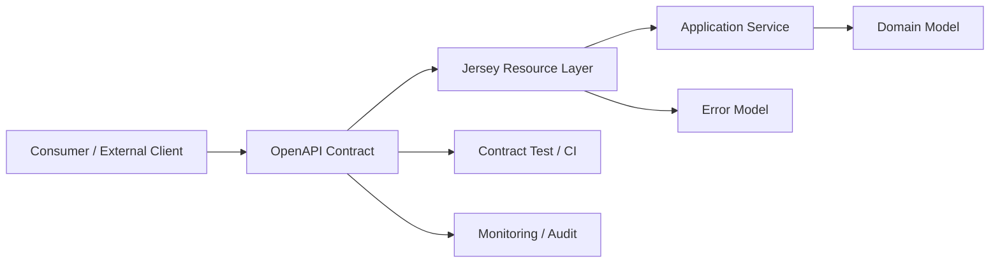

Prinsip penting:

```text
Contract harus lebih stabil daripada implementasi.
DTO API harus lebih stabil daripada domain internal.
Error model harus machine-readable.
Breaking change harus disengaja, bukan efek samping refactor.
```

---

## 4. Decomposition Map - Practical Categories / Skills

| No | Area | Fokus Praktis | Output yang Harus Ada |
|---:|---|---|---|
| 1 | **API Resource Modeling** | Menentukan resource, identifier, sub-resource, collection, action-like operation. | Resource map. |
| 2 | **HTTP Semantics** | Memilih `GET`, `POST`, `PUT`, `PATCH`, `DELETE` secara konsisten. | Method semantics table. |
| 3 | **Request DTO Design** | Mendesain payload inbound yang stabil, validatable, dan tidak bocor ke domain. | Request schema + validation rule. |
| 4 | **Response DTO Design** | Mendesain response yang konsisten, extensible, dan aman dari overexposure. | Response schema + examples. |
| 5 | **OpenAPI Authoring** | Menulis atau menghasilkan OpenAPI spec yang akurat. | `openapi.yaml`. |
| 6 | **Schema Compatibility** | Menentukan additive vs breaking changes. | Compatibility policy. |
| 7 | **Versioning Strategy** | Menentukan path/header/media type versioning dan lifecycle. | Versioning policy. |
| 8 | **Error Model** | Membuat error response standard dan machine-readable. | Problem Details/error schema. |
| 9 | **Validation Contract** | Menyelaraskan Jakarta Bean Validation dengan OpenAPI schema. | Constraint mapping. |
| 10 | **Pagination Contract** | Standardisasi pagination, sorting, filtering. | Pagination schema. |
| 11 | **Idempotency Contract** | Menentukan kapan client wajib mengirim idempotency key. | Idempotency header rule. |
| 12 | **Security Contract** | Menjelaskan auth scheme, scopes, permissions, tenant constraints. | OpenAPI security section. |
| 13 | **Deprecation Contract** | Menentukan cara menandai endpoint/field deprecated dan removal timeline. | Deprecation notes. |
| 14 | **Contract Testing** | Memastikan implementation sesuai spec dan consumer tidak rusak. | CI contract test. |
| 15 | **API Governance** | Review, linting, naming convention, error convention, ownership. | API review checklist. |

---

## 5. API Contract Layering

Untuk service Java/Jersey, pisahkan minimal 4 model:

```text
External API DTO
Application Command / Query
Domain Model
Persistence Model
```

Contoh:

```text
CreateCaseRequest          -> DTO inbound HTTP
CreateCaseCommand          -> application command
Case                       -> domain aggregate/entity
CaseRecord / MyBatis POJO  -> persistence model
```

Jangan begini:

```text
JAX-RS request DTO = domain model = MyBatis entity = external vendor DTO
```

Itu membuat setiap perubahan API, DB, atau vendor schema berpotensi merusak semua layer.

---

## 6. Resource Modeling

### 6.1 Resource-Oriented Shape

Contoh domain case management:

```text
/cases
/cases/{caseId}
/cases/{caseId}/documents
/cases/{caseId}/assignments
/cases/{caseId}/events
/cases/{caseId}/decisions
/cases/{caseId}/external-submissions
```

Google API Improvement Proposals menjelaskan resource-oriented design sebagai pola untuk menspesifikasikan API berdasarkan prinsip high-level yang umum dalam HTTP APIs modern. ([google.aip.dev](https://google.aip.dev/121?utm_source=chatgpt.com))

### 6.2 Practical Resource Table

| Business Concept | Resource | Notes |
|---|---|---|
| Case | `/cases/{caseId}` | Main aggregate. |
| Document under case | `/cases/{caseId}/documents/{documentId}` | Sub-resource karena lifecycle terkait case. |
| External submission | `/cases/{caseId}/external-submissions/{submissionId}` | Cocok untuk tracking integration result. |
| Assignment | `/cases/{caseId}/assignments/{assignmentId}` | Bisa punya history/audit. |
| Decision | `/cases/{caseId}/decisions/{decisionId}` | Biasanya immutable atau append-only. |
| Case event | `/cases/{caseId}/events` | Audit/event timeline. |

### 6.3 Action-Like Operation

Tidak semua operasi nyaman dimodelkan sebagai CRUD murni.

Contoh:

```text
POST /cases/{caseId}:submit
POST /cases/{caseId}:approve
POST /cases/{caseId}:reject
POST /cases/{caseId}:reopen
```

Atau style yang lebih resource-based:

```text
POST /cases/{caseId}/submissions
POST /cases/{caseId}/approvals
POST /cases/{caseId}/rejections
```

Untuk sistem regulatory/workflow, style kedua sering lebih audit-friendly karena action menjadi resource yang bisa punya ID, status, timestamp, actor, dan reason.

---

## 7. HTTP Method Semantics

| Method | Semantics | Safe? | Idempotent? | Contoh |
|---|---|---:|---:|---|
| `GET` | Membaca resource | Ya | Ya | `GET /cases/{caseId}` |
| `POST` | Membuat resource atau menjalankan command | Tidak | Tidak secara default | `POST /cases` |
| `PUT` | Replace resource secara penuh | Tidak | Ya secara konsep | `PUT /cases/{caseId}/assignment` |
| `PATCH` | Partial update | Tidak | Tergantung desain | `PATCH /cases/{caseId}` |
| `DELETE` | Menghapus resource | Tidak | Ya secara konsep | `DELETE /cases/{caseId}/documents/{documentId}` |

Practical rule:

```text
Jangan memakai GET untuk operasi yang punya side effect.
Jangan memakai POST tanpa idempotency untuk command critical.
Jangan memakai PATCH jika semantic patch-nya tidak jelas.
Jangan memakai DELETE untuk regulatory record yang harus audit-retained; gunakan status transition.
```

---

## 8. Status Code Semantics

| Status | Gunakan untuk | Catatan Praktis |
|---:|---|---|
| `200 OK` | Request sukses dan response body tersedia | Umum untuk read/update result. |
| `201 Created` | Resource baru dibuat | Sertakan `Location` bila relevan. |
| `202 Accepted` | Request diterima tapi proses belum selesai | Cocok untuk async workflow/job. |
| `204 No Content` | Sukses tanpa body | Cocok untuk delete/update tanpa response body. |
| `400 Bad Request` | Request malformed atau invalid secara umum | Jangan pakai untuk semua business error. |
| `401 Unauthorized` | Auth tidak ada/tidak valid | Authentication problem. |
| `403 Forbidden` | Auth valid tapi tidak punya akses | Authorization problem. |
| `404 Not Found` | Resource tidak ditemukan atau disembunyikan | Hati-hati info leakage. |
| `409 Conflict` | State conflict, duplicate, optimistic lock, invalid transition | Cocok untuk workflow state guard. |
| `412 Precondition Failed` | ETag/precondition gagal | Cocok untuk concurrency control. |
| `422 Unprocessable Content` | Payload valid secara syntax tapi semantic validation gagal | Berguna untuk validation detail. |
| `429 Too Many Requests` | Rate limit | Sertakan retry guidance jika memungkinkan. |
| `500 Internal Server Error` | Bug/server failure tidak terduga | Jangan bocorkan detail internal. |
| `502 Bad Gateway` | Upstream dependency invalid response | Untuk gateway/integration layer. |
| `503 Service Unavailable` | Service/dependency sementara unavailable | Bisa paired dengan `Retry-After`. |
| `504 Gateway Timeout` | Timeout saat menunggu upstream | Cocok untuk external dependency timeout. |

Microsoft Azure REST API design guidance menekankan bahwa perubahan seperti penghapusan/rename field atau perubahan relasi resource dapat menjadi breaking changes yang membuat client lama tidak lagi berfungsi. ([Microsoft Learn](https://learn.microsoft.com/en-us/azure/architecture/best-practices/api-design?utm_source=chatgpt.com))

---

## 9. Request DTO Design

### 9.1 Contoh Request DTO

```java
import jakarta.validation.constraints.NotBlank;
import jakarta.validation.constraints.NotNull;
import jakarta.validation.constraints.Size;

public record CreateCaseRequest(
        @NotBlank
        @Size(max = 64)
        String customerId,

        @NotBlank
        @Size(max = 40)
        String caseType,

        @NotNull
        CasePriority priority,

        @Size(max = 1000)
        String description
) {}
```

### 9.2 Practical Rules

```text
Request DTO jangan langsung menjadi domain entity.
Gunakan field eksplisit, bukan Map<String, Object> untuk contract stabil.
Batasi length field di API layer.
Jangan expose internal enum tanpa compatibility plan.
Gunakan validation annotation, tetapi jangan bergantung hanya pada annotation.
```

### 9.3 API DTO ke Command

```java
public class CaseRequestMapper {

    public CreateCaseCommand toCommand(CreateCaseRequest request, RequestContext context) {
        return new CreateCaseCommand(
                request.customerId(),
                request.caseType(),
                request.priority(),
                request.description(),
                context.actorId(),
                context.correlationId(),
                context.tenantId()
        );
    }
}
```

---

## 10. Response DTO Design

### 10.1 Contoh Response DTO

```java
public record CaseResponse(
        String caseId,
        String customerId,
        String caseType,
        String status,
        String priority,
        String createdAt,
        String updatedAt,
        LinkSet links
) {}
```

```java
public record LinkSet(
        String self,
        String events,
        String documents
) {}
```

### 10.2 Practical Rules

```text
Response DTO harus stabil.
Jangan expose semua kolom DB.
Jangan expose internal workflow variable mentah.
Jangan expose field sensitif tanpa masking.
Tambahan field biasanya aman jika client tolerant.
Penghapusan/rename field biasanya breaking.
```

---

## 11. OpenAPI Practical Structure

Minimal file:

```yaml
openapi: 3.1.1
info:
  title: Case Management API
  version: 1.0.0
  description: API for case lifecycle operations.
servers:
  - url: https://api.example.com
paths:
  /cases:
    post:
      operationId: createCase
      summary: Create a case
      tags:
        - Cases
      security:
        - oauth2:
            - case:create
      parameters:
        - $ref: '#/components/parameters/CorrelationId'
        - $ref: '#/components/parameters/IdempotencyKey'
      requestBody:
        required: true
        content:
          application/json:
            schema:
              $ref: '#/components/schemas/CreateCaseRequest'
      responses:
        '201':
          description: Case created
          content:
            application/json:
              schema:
                $ref: '#/components/schemas/CaseResponse'
        '400':
          $ref: '#/components/responses/BadRequest'
        '409':
          $ref: '#/components/responses/Conflict'
        '422':
          $ref: '#/components/responses/ValidationFailed'
components:
  parameters:
    CorrelationId:
      name: X-Correlation-ID
      in: header
      required: false
      schema:
        type: string
        maxLength: 128
    IdempotencyKey:
      name: X-Idempotency-Key
      in: header
      required: true
      schema:
        type: string
        maxLength: 128
  schemas:
    CreateCaseRequest:
      type: object
      required:
        - customerId
        - caseType
        - priority
      properties:
        customerId:
          type: string
          maxLength: 64
        caseType:
          type: string
          maxLength: 40
        priority:
          type: string
          enum:
            - LOW
            - MEDIUM
            - HIGH
            - URGENT
        description:
          type:
            - string
            - 'null'
          maxLength: 1000
    CaseResponse:
      type: object
      required:
        - caseId
        - customerId
        - caseType
        - status
        - priority
        - createdAt
      properties:
        caseId:
          type: string
        customerId:
          type: string
        caseType:
          type: string
        status:
          type: string
        priority:
          type: string
        createdAt:
          type: string
          format: date-time
        updatedAt:
          type:
            - string
            - 'null'
          format: date-time
```

Catatan: OpenAPI 3.1 memakai alignment yang lebih kuat dengan JSON Schema dibanding 3.0; OpenAPI Initiative juga menjelaskan migrasi 3.0 ke 3.1 membawa kompatibilitas dengan modern JSON Schema. ([openapis.org](https://www.openapis.org/blog/2021/02/16/migrating-from-openapi-3-0-to-3-1-0?utm_source=chatgpt.com))

---

## 12. OpenAPI dalam Maven / CI

Practical workflow:

```text
1. Simpan openapi.yaml di repo.
2. Lint OpenAPI saat pull request.
3. Validate backward compatibility terhadap versi main branch.
4. Generate API docs.
5. Optional: generate client/server stubs.
6. Jalankan contract test terhadap implementation.
7. Publish spec ke API catalog/internal portal.
```

Contoh struktur repo:

```text
src/main/java/...
src/test/java/...
api/
  openapi.yaml
  examples/
    create-case-request.json
    create-case-response.json
    validation-error-response.json
docs/
  api-change-log.md
```

Minimal PR gate:

| Check | Tujuan |
|---|---|
| OpenAPI syntax validation | Spec valid. |
| API linting | Naming/status/error/security konsisten. |
| Breaking change check | Client lama tidak rusak diam-diam. |
| Example validation | Example sesuai schema. |
| Implementation contract test | Jersey resource sesuai spec. |

---

## 13. Contract-First vs Code-First

| Approach | Kelebihan | Risiko |
|---|---|---|
| **Contract-first** | Bagus untuk integrasi lintas tim/vendor, review lebih awal, client bisa mulai paralel | Perlu disiplin menjaga spec dan implementation |
| **Code-first** | Cepat untuk internal API kecil | Spec sering jadi output sekunder dan bisa drift |
| **Hybrid** | Praktis: design contract dulu untuk endpoint penting, generate/validate dari kode untuk detail | Butuh governance agar tidak kacau |

Rekomendasi untuk senior engineer:

```text
Untuk public/external/critical API: contract-first.
Untuk internal non-critical API: hybrid masih OK.
Untuk regulatory/case lifecycle API: contract-first lebih aman.
```

---

## 14. Schema Compatibility

### 14.1 Biasakan Additive Change

Umumnya aman:

```text
menambah optional response field
menambah optional request field
menambah endpoint baru
menambah enum hanya jika consumer tolerant
menambah response link
menambah metadata optional
```

Berisiko / breaking:

```text
menghapus field
rename field
mengubah type field
mengubah required optionality
mengubah semantics field lama
menghapus enum value
menambah required request field
mengubah status code utama
mengubah authentication requirement
mengubah pagination behavior
mengubah sort default yang memengaruhi business result
```

### 14.2 Compatibility Table

| Change | Request Compatibility | Response Compatibility | Notes |
|---|---|---|---|
| Add optional request field | Safe | N/A | Server harus tetap menerima client lama. |
| Add required request field | Breaking | N/A | Client lama gagal. |
| Add optional response field | N/A | Usually safe | Client harus ignore unknown field. |
| Remove response field | N/A | Breaking | Client lama bisa gagal. |
| Rename field | Breaking | Breaking | Treat as remove + add. |
| Change type string → number | Breaking | Breaking | Parser client bisa gagal. |
| Add enum value | Potentially breaking | Potentially breaking | Client switch-case bisa gagal. |
| Narrow validation rule | Breaking | N/A | Request lama bisa ditolak. |
| Loosen validation rule | Usually safe | N/A | Tetap cek business invariant. |
| Change error code | Breaking for automation | Breaking | Client mungkin bergantung ke code. |

---

## 15. Tolerant Reader Pattern

Client sebaiknya:

```text
ignore unknown response fields
handle unknown enum gracefully
not rely on field order
not parse date with local timezone assumption
not rely on error message text
use stable error code/type instead
```

Server sebaiknya:

```text
reject unknown critical field jika bisa menyebabkan salah interpretasi
accept missing optional fields
provide default behavior secara eksplisit
return validation detail untuk bad request
```

---

## 16. Versioning Strategy

### 16.1 Pilihan Versioning

| Strategy | Contoh | Kelebihan | Kekurangan |
|---|---|---|---|
| URI path version | `/v1/cases` | Jelas, mudah routing, mudah docs | Versi masuk URL |
| Header version | `X-API-Version: 1` | URL bersih | Kurang terlihat, tooling perlu setup |
| Media type version | `application/vnd.company.case.v1+json` | Formal via content negotiation | Lebih kompleks |
| Query version | `/cases?api-version=1` | Mudah untuk beberapa platform | Bisa dianggap kurang clean |
| No explicit version | `/cases` | Simple | Berbahaya jika API banyak consumer |

Untuk enterprise microservice, path version sering paling praktis:

```text
/v1/cases
/v2/cases
```

### 16.2 Kapan Perlu Versi Baru?

Buat versi baru jika:

```text
contract breaking
semantics operation berubah
resource model berubah besar
auth model berubah besar
error model berubah signifikan
workflow/business state berubah sehingga client lama tidak valid
```

Tidak perlu versi baru jika:

```text
menambah endpoint baru
menambah optional response field
menambah optional request field dengan default
memperbaiki typo di description docs
menambah example
```

---

## 17. Deprecation Policy

API versioning tanpa deprecation policy hanya menunda masalah.

Minimal policy:

```text
1. Tandai endpoint/field sebagai deprecated di OpenAPI.
2. Sediakan replacement.
3. Umumkan tanggal deprecation.
4. Monitor consumer yang masih memakai versi lama.
5. Beri warning header bila cocok.
6. Hapus hanya setelah removal window selesai.
```

Contoh OpenAPI:

```yaml
/cases/{caseId}/legacy-status:
  get:
    deprecated: true
    summary: Get legacy case status
    description: Deprecated. Use GET /v2/cases/{caseId}/status instead.
```

Contoh response header:

```text
Deprecation: true
Sunset: Wed, 31 Dec 2027 23:59:59 GMT
Link: </v2/cases/{caseId}/status>; rel="successor-version"
```

Penelitian empiris tentang REST API deprecation menemukan bahwa informasi deprecation seperti alternatif pengganti penting untuk membantu developer menghindari dampak saat API lama dihapus. ([arXiv](https://arxiv.org/abs/2008.12808?utm_source=chatgpt.com))

---

## 18. Error Model

### 18.1 Gunakan Error yang Machine-Readable

Jangan hanya:

```json
{
  "message": "Something went wrong"
}
```

Lebih baik:

```json
{
  "type": "https://api.example.com/problems/validation-failed",
  "title": "Validation failed",
  "status": 422,
  "detail": "One or more fields are invalid.",
  "instance": "/cases",
  "code": "CASE_VALIDATION_FAILED",
  "correlationId": "corr-123",
  "violations": [
    {
      "field": "customerId",
      "reason": "must not be blank"
    }
  ]
}
```

RFC 9457 mendefinisikan Problem Details untuk membawa detail error yang machine-readable dalam HTTP response dan RFC ini menggantikan RFC 7807. ([RFC Editor](https://www.rfc-editor.org/info/rfc9457/?utm_source=chatgpt.com))

### 18.2 Standard Fields

| Field | Fungsi |
|---|---|
| `type` | Stable identifier untuk jenis problem. |
| `title` | Ringkasan human-readable. |
| `status` | HTTP status code. |
| `detail` | Penjelasan spesifik instance error. |
| `instance` | URI/resource/request instance terkait. |
| `code` | Internal stable error code. |
| `correlationId` | Untuk tracing. |
| `violations` | Detail validation error. |
| `externalReference` | Jika error berasal dari external system. |
| `retryable` | Optional, membantu client automation. |

---

## 19. Error Taxonomy untuk Microservice Integration

| Error Category | HTTP Status | Retryable? | Contoh |
|---|---:|---:|---|
| `VALIDATION_FAILED` | 422 | Tidak | Field mandatory kosong. |
| `MALFORMED_REQUEST` | 400 | Tidak | JSON invalid. |
| `UNAUTHENTICATED` | 401 | Tidak langsung | Token missing/expired. |
| `FORBIDDEN` | 403 | Tidak | Scope tidak cukup. |
| `RESOURCE_NOT_FOUND` | 404 | Tidak | Case ID tidak ada. |
| `STATE_CONFLICT` | 409 | Tidak otomatis | Case sudah closed. |
| `IDEMPOTENCY_CONFLICT` | 409 | Tidak | Same key beda payload. |
| `PRECONDITION_FAILED` | 412 | Tidak | ETag mismatch. |
| `RATE_LIMITED` | 429 | Ya, dengan backoff | Quota terlampaui. |
| `DEPENDENCY_TIMEOUT` | 504 | Ya, terbatas | Vendor timeout. |
| `DEPENDENCY_UNAVAILABLE` | 503 | Ya, terbatas | External API down. |
| `INTERNAL_ERROR` | 500 | Tidak pasti | Bug internal. |

---

## 20. Jersey Exception Mapping

### 20.1 Problem Details DTO

```java
import java.util.List;
import java.util.Map;

public record ApiProblem(
        String type,
        String title,
        int status,
        String detail,
        String instance,
        String code,
        String correlationId,
        Boolean retryable,
        List<FieldViolation> violations,
        Map<String, Object> extensions
) {}
```

```java
public record FieldViolation(
        String field,
        String reason,
        String rejectedValue
) {}
```

Catatan praktis:

```text
Untuk rejectedValue, hindari menampilkan data sensitif.
Untuk PII, tampilkan masked value atau null.
```

### 20.2 Domain Exception

```java
public class CaseStateConflictException extends RuntimeException {

    private final String caseId;
    private final String currentStatus;
    private final String attemptedAction;

    public CaseStateConflictException(
            String caseId,
            String currentStatus,
            String attemptedAction
    ) {
        super("Case state conflict");
        this.caseId = caseId;
        this.currentStatus = currentStatus;
        this.attemptedAction = attemptedAction;
    }

    public String caseId() {
        return caseId;
    }

    public String currentStatus() {
        return currentStatus;
    }

    public String attemptedAction() {
        return attemptedAction;
    }
}
```

### 20.3 Exception Mapper

```java
import jakarta.ws.rs.core.Context;
import jakarta.ws.rs.core.MediaType;
import jakarta.ws.rs.core.Response;
import jakarta.ws.rs.core.UriInfo;
import jakarta.ws.rs.ext.ExceptionMapper;
import jakarta.ws.rs.ext.Provider;

import java.util.List;
import java.util.Map;

@Provider
public class CaseStateConflictExceptionMapper
        implements ExceptionMapper<CaseStateConflictException> {

    private final CorrelationIdProvider correlationIdProvider;

    public CaseStateConflictExceptionMapper(CorrelationIdProvider correlationIdProvider) {
        this.correlationIdProvider = correlationIdProvider;
    }

    @Context
    UriInfo uriInfo;

    @Override
    public Response toResponse(CaseStateConflictException ex) {
        ApiProblem problem = new ApiProblem(
                "https://api.example.com/problems/case-state-conflict",
                "Case state conflict",
                409,
                "The requested action is not allowed for the current case state.",
                uriInfo.getRequestUri().getPath(),
                "CASE_STATE_CONFLICT",
                correlationIdProvider.currentCorrelationId(),
                false,
                List.of(),
                Map.of(
                        "caseId", ex.caseId(),
                        "currentStatus", ex.currentStatus(),
                        "attemptedAction", ex.attemptedAction()
                )
        );

        return Response.status(Response.Status.CONFLICT)
                .type(MediaType.APPLICATION_JSON_TYPE)
                .entity(problem)
                .build();
    }
}
```

---

## 21. Bean Validation Error Mapper

```java
import jakarta.validation.ConstraintViolation;
import jakarta.validation.ConstraintViolationException;
import jakarta.ws.rs.core.MediaType;
import jakarta.ws.rs.core.Response;
import jakarta.ws.rs.ext.ExceptionMapper;
import jakarta.ws.rs.ext.Provider;

import java.util.List;

@Provider
public class ConstraintViolationExceptionMapper
        implements ExceptionMapper<ConstraintViolationException> {

    private final CorrelationIdProvider correlationIdProvider;

    public ConstraintViolationExceptionMapper(CorrelationIdProvider correlationIdProvider) {
        this.correlationIdProvider = correlationIdProvider;
    }

    @Override
    public Response toResponse(ConstraintViolationException ex) {
        List<FieldViolation> violations = ex.getConstraintViolations()
                .stream()
                .map(this::toViolation)
                .toList();

        ApiProblem problem = new ApiProblem(
                "https://api.example.com/problems/validation-failed",
                "Validation failed",
                422,
                "One or more request fields are invalid.",
                null,
                "VALIDATION_FAILED",
                correlationIdProvider.currentCorrelationId(),
                false,
                violations,
                null
        );

        return Response.status(422)
                .type(MediaType.APPLICATION_JSON_TYPE)
                .entity(problem)
                .build();
    }

    private FieldViolation toViolation(ConstraintViolation<?> violation) {
        return new FieldViolation(
                violation.getPropertyPath().toString(),
                violation.getMessage(),
                null
        );
    }
}
```

Practical rule:

```text
Validation error harus jelas untuk client.
Tetapi jangan echo raw sensitive value.
```

---

## 22. OpenAPI Error Schema

```yaml
components:
  schemas:
    ApiProblem:
      type: object
      required:
        - type
        - title
        - status
        - code
        - correlationId
      properties:
        type:
          type: string
          format: uri
        title:
          type: string
        status:
          type: integer
        detail:
          type:
            - string
            - 'null'
        instance:
          type:
            - string
            - 'null'
        code:
          type: string
        correlationId:
          type: string
        retryable:
          type:
            - boolean
            - 'null'
        violations:
          type: array
          items:
            $ref: '#/components/schemas/FieldViolation'
        extensions:
          type:
            - object
            - 'null'
          additionalProperties: true

    FieldViolation:
      type: object
      required:
        - field
        - reason
      properties:
        field:
          type: string
        reason:
          type: string
        rejectedValue:
          type:
            - string
            - 'null'
```

Reusable responses:

```yaml
components:
  responses:
    ValidationFailed:
      description: Validation failed
      content:
        application/problem+json:
          schema:
            $ref: '#/components/schemas/ApiProblem'

    Conflict:
      description: State conflict
      content:
        application/problem+json:
          schema:
            $ref: '#/components/schemas/ApiProblem'

    Unauthorized:
      description: Authentication failed
      content:
        application/problem+json:
          schema:
            $ref: '#/components/schemas/ApiProblem'

    Forbidden:
      description: Access denied
      content:
        application/problem+json:
          schema:
            $ref: '#/components/schemas/ApiProblem'
```

---

## 23. Error Handling untuk External Dependency

Jika service Anda memanggil external system lalu gagal, jangan bocorkan error vendor mentah ke client.

### Vendor Error

```json
{
  "error": "E991",
  "msg": "Backend service ABC timeout stacktrace..."
}
```

### Internal API Response

```json
{
  "type": "https://api.example.com/problems/dependency-timeout",
  "title": "Dependency timeout",
  "status": 504,
  "detail": "A required external service did not respond in time.",
  "code": "CUSTOMER_REGISTRY_TIMEOUT",
  "correlationId": "corr-123",
  "retryable": true,
  "extensions": {
    "dependency": "customer-registry",
    "operation": "lookupCustomer"
  }
}
```

Rule:

```text
Log detail vendor secara aman di internal logs.
Return error yang stabil dan aman ke client.
Jangan expose internal hostname, stack trace, token, SQL, vendor raw payload.
```

---

## 24. Pagination, Sorting, Filtering Contract

### 24.1 Offset Pagination

```text
GET /cases?limit=50&offset=100
```

Cocok untuk dataset kecil/menengah, tetapi tidak ideal untuk data yang berubah cepat.

### 24.2 Cursor Pagination

```text
GET /cases?limit=50&pageToken=eyJjcmVhdGVkQXQiOi...
```

Lebih cocok untuk data besar atau berubah cepat.

### 24.3 Response

```json
{
  "items": [
    {
      "caseId": "CASE-123",
      "status": "OPEN"
    }
  ],
  "nextPageToken": "abc",
  "hasMore": true
}
```

### 24.4 Practical Rules

```text
Batasi max limit.
Tetapkan default sort.
Jangan membuat pagination tanpa stable ordering.
Filter harus terdokumentasi di OpenAPI.
Jangan mengubah default ordering diam-diam.
```

---

## 25. Idempotency Contract

Untuk command critical:

```text
POST /cases
X-Idempotency-Key: case-create-123
```

OpenAPI parameter:

```yaml
components:
  parameters:
    IdempotencyKey:
      name: X-Idempotency-Key
      in: header
      required: true
      description: Stable key used to safely retry the same command.
      schema:
        type: string
        minLength: 16
        maxLength: 128
```

Server behavior:

| Kondisi | Response |
|---|---|
| First request with key | Process normally, store result |
| Same key + same payload | Return same result |
| Same key + different payload | `409 IDEMPOTENCY_CONFLICT` |
| Key expired | Treat according to retention policy |
| Missing key for critical command | `400` or `422` |

---

## 26. ETag / Optimistic Concurrency Contract

Untuk update resource yang rawan conflict:

```text
GET /cases/CASE-123
ETag: "case-version-7"

PATCH /cases/CASE-123
If-Match: "case-version-7"
```

Jika versi berubah:

```text
412 Precondition Failed
```

Cocok untuk:

```text
case assignment update
case metadata update
manual review decision
document metadata update
```

---

## 27. Security Contract dalam OpenAPI

Contoh OAuth2:

```yaml
components:
  securitySchemes:
    oauth2:
      type: oauth2
      flows:
        clientCredentials:
          tokenUrl: https://auth.example.com/oauth2/token
          scopes:
            case:read: Read cases
            case:create: Create cases
            case:update: Update cases
            case:approve: Approve cases

security:
  - oauth2:
      - case:read
```

Per operation:

```yaml
paths:
  /cases:
    post:
      security:
        - oauth2:
            - case:create
```

Practical rule:

```text
OpenAPI harus menjelaskan auth scheme.
Scope harus granular.
Jangan dokumentasikan secret.
Jangan mengandalkan dokumentasi saja; enforcement tetap di code.
```

---

## 28. Example Payloads

Setiap endpoint penting perlu example:

```yaml
examples:
  CreateCaseRequestExample:
    value:
      customerId: "CUST-123"
      caseType: "ENFORCEMENT"
      priority: "HIGH"
      description: "Potential violation detected."

  ValidationErrorExample:
    value:
      type: "https://api.example.com/problems/validation-failed"
      title: "Validation failed"
      status: 422
      detail: "One or more request fields are invalid."
      code: "VALIDATION_FAILED"
      correlationId: "corr-123"
      retryable: false
      violations:
        - field: "customerId"
          reason: "must not be blank"
```

Example bukan kosmetik. Example membantu:

```text
consumer onboarding
contract test
mock server
documentation
QA scenario
incident reproduction
```

---

## 29. Contract Testing Strategy

### 29.1 Provider Contract Test

Memastikan Jersey implementation sesuai OpenAPI.

Test scenarios:

```text
request valid -> response sesuai schema
request invalid -> error schema sesuai
missing auth -> 401 schema sesuai
forbidden scope -> 403 schema sesuai
state conflict -> 409 schema sesuai
unknown route -> 404 schema sesuai
```

### 29.2 Consumer Contract Test

Memastikan client expectation tidak rusak.

Consumer test memeriksa:

```text
field yang dipakai client masih ada
type field tidak berubah
enum yang digunakan masih valid
error code yang di-handle masih ada
pagination shape tidak berubah
```

### 29.3 Breaking Change Detection

CI sebaiknya membandingkan:

```text
openapi.yaml di branch PR
vs
openapi.yaml di main/release
```

Fail PR jika:

```text
required request field bertambah
response field yang required hilang
field type berubah
endpoint dihapus
status code sukses berubah tanpa versi baru
security requirement berubah
error code dihapus
```

---

## 30. Jersey Resource Example dengan Contract-Friendly DTO

```java
import jakarta.validation.Valid;
import jakarta.ws.rs.Consumes;
import jakarta.ws.rs.HeaderParam;
import jakarta.ws.rs.POST;
import jakarta.ws.rs.Path;
import jakarta.ws.rs.Produces;
import jakarta.ws.rs.core.MediaType;
import jakarta.ws.rs.core.Response;

@Path("/v1/cases")
@Consumes(MediaType.APPLICATION_JSON)
@Produces(MediaType.APPLICATION_JSON)
public class CaseResource {

    private final CaseApplicationService caseService;
    private final CaseRequestMapper requestMapper;

    public CaseResource(
            CaseApplicationService caseService,
            CaseRequestMapper requestMapper
    ) {
        this.caseService = caseService;
        this.requestMapper = requestMapper;
    }

    @POST
    public Response createCase(
            @HeaderParam("X-Correlation-ID") String correlationId,
            @HeaderParam("X-Idempotency-Key") String idempotencyKey,
            @Valid CreateCaseRequest request
    ) {
        RequestContext context = RequestContext.from(
                correlationId,
                idempotencyKey
        );

        CreateCaseCommand command = requestMapper.toCommand(request, context);

        CreateCaseResult result = caseService.createCase(command);

        CaseResponse response = CaseResponse.from(result);

        return Response.status(Response.Status.CREATED)
                .entity(response)
                .build();
    }
}
```

Practical improvement:

```text
Header validation bisa dibuat filter.
Idempotency validation bisa dibuat interceptor/service.
Correlation ID generation bisa dibuat request filter.
```

---

## 31. API DTO Versioning dalam Java Package

Untuk major version berbeda:

```text
com.company.caseapp.api.v1.resource
com.company.caseapp.api.v1.dto

com.company.caseapp.api.v2.resource
com.company.caseapp.api.v2.dto
```

Application service tetap bisa sama jika business use case sama:

```text
api.v1.dto.CreateCaseRequest -> CreateCaseCommand
api.v2.dto.CreateCaseRequest -> CreateCaseCommand
```

Jangan memaksa satu DTO untuk semua versi jika bentuk contract sudah berbeda.

---

## 32. Internal vs External Contract

| API Type | Governance |
|---|---|
| Public/external API | Strict OpenAPI, versioning, deprecation, security review |
| Partner/vendor API | Strict contract, sandbox, examples, backward compatibility |
| Internal service API | Tetap perlu contract, tapi bisa lebih ringan |
| Admin/internal ops API | Auth ketat, audit, tidak harus public docs |
| Webhook endpoint | Contract inbound + signature + replay behavior |
| Async event | AsyncAPI/event schema, bukan OpenAPI saja |

AsyncAPI adalah specification untuk mendefinisikan asynchronous APIs secara machine-readable dan protocol-agnostic, termasuk protocol seperti AMQP, MQTT, WebSocket, Kafka, STOMP, dan HTTP. ([google.aip.dev](https://google.aip.dev/193?utm_source=chatgpt.com))

---

## 33. API Governance Checklist

| Checklist | Status |
|---|---|
| Endpoint punya owner | ☐ |
| OpenAPI tersedia di repo | ☐ |
| OperationId stabil dan unik | ☐ |
| Request/response schema lengkap | ☐ |
| Error responses terdokumentasi | ☐ |
| Auth/security scheme jelas | ☐ |
| Scope per operation jelas | ☐ |
| Pagination/filtering jelas | ☐ |
| Idempotency rule jelas | ☐ |
| Examples tersedia | ☐ |
| Breaking change policy jelas | ☐ |
| Deprecation policy jelas | ☐ |
| Contract test ada di CI | ☐ |
| Generated docs dipublish | ☐ |
| Consumer impact dianalisis sebelum merge | ☐ |

---

## 34. API Design Anti-Patterns

| Anti-Pattern | Dampak | Alternatif |
|---|---|---|
| OpenAPI dibuat belakangan dan tidak divalidasi | Spec drift | Contract-first/hybrid + CI validation |
| Semua error `500` | Client tidak bisa recovery | Error taxonomy + Problem Details |
| Error hanya message text | Automation rapuh | Stable `code` / `type` |
| DTO API sama dengan DB entity | Data leakage dan breaking change | Dedicated API DTO |
| Enum internal diekspos mentah | Client rusak saat enum berubah | Public enum contract + unknown handling |
| Required field ditambah tanpa versi baru | Client lama gagal | Add optional + default, atau v2 |
| Response field dihapus diam-diam | Consumer rusak | Deprecate dulu |
| Pagination tanpa stable sort | Duplicate/missed data | Stable ordering + cursor |
| Query filter tidak terdokumentasi | Consumer salah pakai | OpenAPI parameters |
| Auth scope tidak ditulis di contract | Security ambiguity | OpenAPI security per operation |
| Vendor error dibocorkan ke client | Info leakage | Error translation |
| Contract test tidak ada | Breaking change lolos | CI contract compatibility check |

---

## 35. Practical Deliverable untuk Seri Ini

Untuk setiap API penting, hasil minimal yang perlu ada:

```text
1. openapi.yaml
2. DTO request/response terpisah dari domain dan persistence
3. reusable error schema
4. HTTP status code matrix
5. versioning policy
6. deprecation policy
7. compatibility checklist
8. example payloads
9. contract test
10. API review checklist
```

Contoh ringkas:

```text
API: Case Creation API

Endpoint:
  POST /v1/cases

Contract:
  OpenAPI 3.1.1
  Request: CreateCaseRequest
  Response: CaseResponse
  Error: ApiProblem

Required headers:
  X-Correlation-ID optional, generated if missing
  X-Idempotency-Key required

Success:
  201 Created

Errors:
  400 malformed JSON
  401 unauthenticated
  403 forbidden
  409 idempotency conflict / state conflict
  422 validation failed
  500 internal error
  503 dependency unavailable

Compatibility:
  optional response fields may be added
  required request fields may not be added in v1
  field removal requires v2 or deprecation window
```

---

## 36. Ringkasan Seri 3

Inti dari API contract yang sehat:

```text
Contract adalah boundary.
DTO adalah public commitment.
Error code adalah machine contract.
Versioning adalah compatibility management.
OpenAPI adalah executable documentation.
```

Urutan praktik yang benar:

```text
1. Desain resource dan operation semantics.
2. Definisikan request/response DTO.
3. Definisikan status code dan error taxonomy.
4. Tulis OpenAPI.
5. Tambahkan examples.
6. Implementasikan Jersey resource.
7. Buat exception mapper.
8. Validasi Bean Validation dan OpenAPI schema.
9. Tambahkan contract test di CI.
10. Terapkan breaking change dan deprecation policy.
```

---

# Status

**Seri 3/12 - API Contract, OpenAPI, Versioning & Error Model selesai.**

Rekomendasi berikutnya:

**Seri 4/12 - Timeout, Retry, Circuit Breaker, Bulkhead & Fallback**

Fokus berikutnya: bagaimana mencegah external dependency yang lambat/down menjatuhkan Jersey microservice, termasuk retry yang aman, timeout budget, circuit breaker, fallback mode, dan failure isolation.

---

**Sources:**

- [OpenAPI Specification v3.1.1](https://spec.openapis.org/oas/v3.1.1.html?utm_source=chatgpt.com)
- [AIP-121: Resource-oriented design](https://google.aip.dev/121?utm_source=chatgpt.com)
- [Best practices for RESTful web API design - Azure](https://learn.microsoft.com/en-us/azure/architecture/best-practices/api-design?utm_source=chatgpt.com)
- [Migrating from OpenAPI 3.0 to 3.1.0](https://www.openapis.org/blog/2021/02/16/migrating-from-openapi-3-0-to-3-1-0?utm_source=chatgpt.com)
- [A First Look at the Deprecation of RESTful APIs: An Empirical Study](https://arxiv.org/abs/2008.12808?utm_source=chatgpt.com)
- [RFC 9457: Problem Details for HTTP APIs](https://www.rfc-editor.org/info/rfc9457/?utm_source=chatgpt.com)

## Response:
7/14/2026, 10:02:51 PM

Saya lanjut ke **Seri 4/12 — Timeout, Retry, Circuit Breaker, Bulkhead & Fallback**. Fokusnya saya buat sangat praktis: timeout budget, retry aman, isolasi dependency, mapping failure, dan contoh implementasi yang masuk akal untuk Jersey/JAX-RS microservice.

# Seri 4/12 - Timeout, Retry, Circuit Breaker, Bulkhead & Fallback

## 1. Tujuan Seri Ini

Seri ini membahas cara membuat integrasi eksternal **tidak menjatuhkan Java Jersey/JAX-RS microservice** ketika dependency lambat, error, rate limited, atau down.

Dalam praktik production, integrasi eksternal gagal bukan hanya karena HTTP `500`. Failure bisa berupa:

```text id="a70y2p"
DNS lambat
TLS handshake gagal
connection pool habis
external API lambat
response 429
response 503
read timeout
retry storm
thread pool exhaustion
queue menumpuk
circuit breaker terlalu agresif
fallback mengembalikan data stale tanpa label
```

Target akhir seri ini:

```text id="lqlrjp"
Setiap outbound integration punya timeout eksplisit,
retry aman,
circuit breaker,
bulkhead,
fallback yang sadar business context,
dan observability yang cukup untuk incident response.
```

MicroProfile Fault Tolerance 4.1 menyediakan policy seperti `@Timeout`, `@Retry`, `@Fallback`, `@CircuitBreaker`, `@Bulkhead`, dan `@Asynchronous`; annotation tersebut adalah interceptor bindings. Ini relevan bila runtime Anda mendukung MicroProfile. ([Eclipse Downloads](https://download.eclipse.org/microprofile/microprofile-fault-tolerance-4.1/microprofile-fault-tolerance-spec-4.1.html?utm_source=chatgpt.com))

Untuk aplikasi plain Jersey/JAX-RS tanpa MicroProfile runtime, opsi praktis yang umum adalah library seperti Resilience4j, yang menyediakan decorator untuk Circuit Breaker, Rate Limiter, Retry, dan Bulkhead. ([resilience4j](https://resilience4j.readme.io/docs/getting-started?utm_source=chatgpt.com))

---

## 2. Posisi dalam Roadmap

| Seri | Topik | Status |
|---:|---|---|
| 1 | Integration Boundary & Decision Model | Selesai |
| 2 | Outbound REST Client Engineering in Jersey/JAX-RS | Selesai |
| 3 | API Contract, OpenAPI, Versioning & Error Model | Selesai |
| 4 | **Timeout, Retry, Circuit Breaker, Bulkhead & Fallback** | **Sedang dibahas** |
| 5 | Authentication, Authorization, mTLS, OAuth2, API Key & Secrets | Berikutnya |
| 6 | Idempotency, Duplicate Handling & Safe Retry Design | Berikutnya |
| 7 | Webhook, Callback, Polling & External Event Intake | Berikutnya |
| 8 | Async Integration with RabbitMQ / AMQP / Event Messaging | Berikutnya |
| 9 | Transactional Outbox, Saga & Consistency Across Systems | Berikutnya |
| 10 | Camunda-Based External System Orchestration | Berikutnya |
| 11 | File-Based, Batch, Database-Mediated & Legacy Integration | Berikutnya |
| 12 | Observability, Audit, Reconciliation, Runbook & Governance | Berikutnya |

---

## 3. Core Mental Model

Resilience pattern bukan dekorasi tambahan. Ini adalah **control layer** antara application service dan external system.

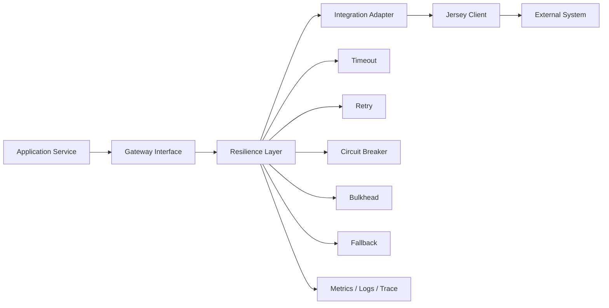

Urutan berpikir yang benar:

```text id="92ugyd"
1. Berapa lama caller boleh menunggu?
2. Error mana yang transient?
3. Apakah operasi aman diulang?
4. Berapa banyak concurrent call yang boleh masuk ke dependency ini?
5. Kapan kita berhenti mencoba?
6. Apa fallback yang benar secara bisnis?
7. Bagaimana operator tahu dependency sedang bermasalah?
```

---

## 4. Decomposition Map - Practical Categories / Skills

| No | Area | Fokus Praktis | Output yang Harus Ada |
|---:|---|---|---|
| 1 | **Timeout Budgeting** | Menentukan batas waktu per call dan total request journey. | Timeout matrix per dependency. |
| 2 | **Connect vs Read Timeout** | Membedakan timeout saat koneksi dan saat menunggu response. | Client config eksplisit. |
| 3 | **Deadline Propagation** | Mencegah downstream call melebihi waktu request upstream. | Request deadline/correlation context. |
| 4 | **Retry Classification** | Menentukan error mana yang boleh retry. | Retryability matrix. |
| 5 | **Backoff & Jitter** | Menghindari retry storm. | Retry policy config. |
| 6 | **Idempotency-Aware Retry** | Retry hanya aman jika operation idempotent atau punya idempotency key. | Idempotency rule per operation. |
| 7 | **Circuit Breaker** | Menghentikan call ke dependency yang sedang rusak. | Circuit breaker config. |
| 8 | **Bulkhead** | Membatasi resource yang boleh dipakai satu dependency. | Concurrency limit / thread pool isolation. |
| 9 | **Fallback** | Menentukan respons alternatif saat dependency gagal. | Fallback decision table. |
| 10 | **Rate Limit Handling** | Merespons `429` dan quota vendor. | Throttling/backoff strategy. |
| 11 | **Failure Translation** | Mengubah failure teknis menjadi error domain/API yang stabil. | Error translator. |
| 12 | **Observability** | Metrics, logs, traces untuk semua policy. | Dashboard + alert. |
| 13 | **Testing Failure Mode** | Simulasi timeout, 503, slow response, retry, circuit open. | Failure-mode test suite. |
| 14 | **Operational Runbook** | Apa yang dilakukan saat dependency down. | Runbook dependency outage. |
| 15 | **Config Governance** | Policy bisa diubah per environment tanpa deploy besar. | Externalized resilience config. |

---

## 5. Diagram Failure Propagation

Tanpa resilience:

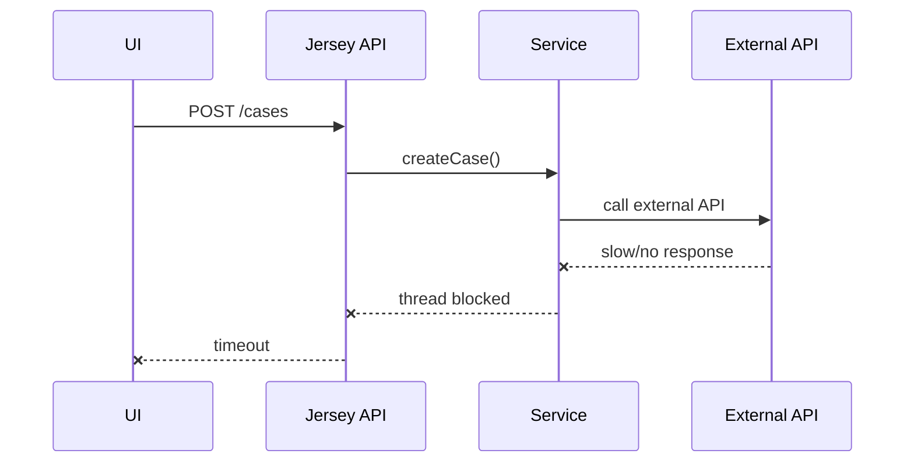

Dengan resilience:

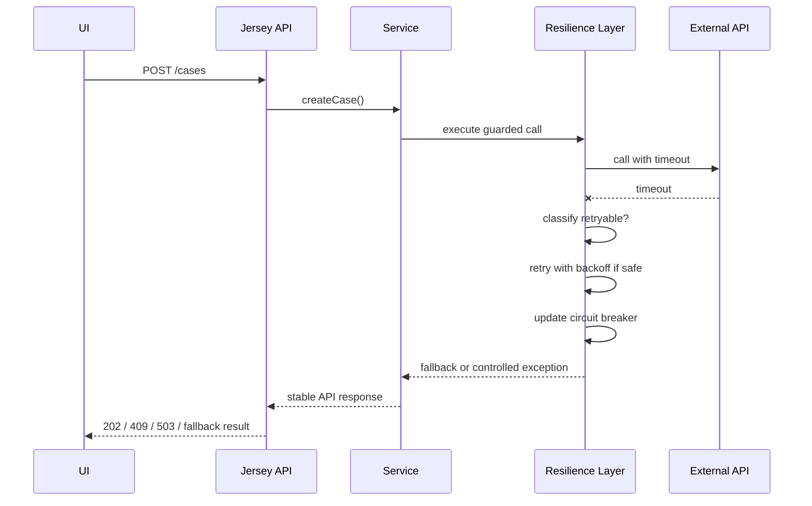

---

## 6. Timeout

## 6.1 Apa Itu Timeout?

Timeout adalah batas waktu eksplisit agar request tidak menunggu dependency terlalu lama.

Minimal ada:

```text id="d582c6"
connect timeout
read timeout
overall request timeout / deadline
operation timeout
workflow timeout
```

Untuk Jersey Client, `ClientProperties.CONNECT_TIMEOUT` dan `ClientProperties.READ_TIMEOUT` memakai milidetik, dan nilai `0` berarti infinity. Ini penting: jangan biarkan timeout tidak sengaja infinite. ([Eclipse EE4J](https://eclipse-ee4j.github.io/jersey.github.io/apidocs/2.29.1/jersey/org/glassfish/jersey/client/ClientProperties.html?utm_source=chatgpt.com))

Untuk Java `HttpClient`, request timeout bisa diatur via `HttpRequest.Builder.timeout(Duration)`; bila response tidak diterima dalam durasi itu, request akan gagal timeout. ([Oracle Docs](https://docs.oracle.com/en/java/javase/21/docs/api/java.net.http/module-summary.html?utm_source=chatgpt.com))

---

## 6.2 Timeout Matrix Praktis

| Jenis Dependency | Connect Timeout | Read Timeout | Catatan |
|---|---:|---:|---|
| Internal service same cluster | 200-500 ms | 500-1500 ms | Cocok untuk dependency cepat dan dekat. |
| Internal service beda network/VPC | 500-1000 ms | 1-3 s | Perhatikan network latency. |
| Vendor API public internet | 1-2 s | 3-10 s | Jangan terlalu agresif tanpa data latency. |
| External regulatory platform | 1-3 s | 5-15 s | Biasanya perlu business-specific timeout. |
| Long-running operation | Jangan sync | Gunakan async/status endpoint | REST sync bukan tempat job panjang. |
| File download/upload besar | Khusus | Streaming + deadline | Jangan pakai default read timeout pendek. |

Rule penting:

```text id="flvve8"
Timeout harus lebih pendek dari timeout caller.
Timeout retry total harus tetap masuk dalam request budget.
Timeout bukan angka teknis murni; timeout adalah keputusan business journey.
```

---

## 6.3 Timeout Budget Example

Misalnya API Anda punya target response maksimal 5 detik.

```text id="u1k4cg"
Total API budget: 5000 ms

Inbound overhead:         300 ms
DB read/write:            700 ms
External API budget:     3000 ms
Response mapping/logging: 300 ms
Safety margin:            700 ms
```

Kalau external API diberi read timeout 10 detik, itu sudah salah karena melebihi total API budget.

```text id="tx77za"
Total caller budget harus membatasi semua downstream operation.
```

---

## 6.4 Jersey Timeout Config

```java id="6bzs0h"
import org.glassfish.jersey.client.ClientConfig;
import org.glassfish.jersey.client.ClientProperties;

public final class CustomerRegistryJerseyClientFactory {

    public static ClientConfig clientConfig(CustomerRegistryClientConfig config) {
        ClientConfig clientConfig = new ClientConfig();

        clientConfig.property(
                ClientProperties.CONNECT_TIMEOUT,
                config.connectTimeoutMillis()
        );

        clientConfig.property(
                ClientProperties.READ_TIMEOUT,
                config.readTimeoutMillis()
        );

        return clientConfig;
    }
}
```

Config object:

```java id="wfr29r"
public record CustomerRegistryClientConfig(
        URI baseUri,
        int connectTimeoutMillis,
        int readTimeoutMillis,
        int maxAttempts,
        long retryInitialDelayMillis,
        long retryMaxDelayMillis,
        int bulkheadMaxConcurrentCalls,
        int circuitBreakerFailureRateThreshold,
        int circuitBreakerMinimumCalls
) {}
```

Properties:

```properties id="t5mbqx"
integration.customer-registry.base-uri=https://customer-registry.example.com
integration.customer-registry.connect-timeout-ms=1000
integration.customer-registry.read-timeout-ms=3000
integration.customer-registry.max-attempts=2
integration.customer-registry.retry-initial-delay-ms=200
integration.customer-registry.retry-max-delay-ms=1000
integration.customer-registry.bulkhead-max-concurrent-calls=25
integration.customer-registry.circuit-breaker-failure-rate-threshold=50
integration.customer-registry.circuit-breaker-minimum-calls=20
```

---

## 7. Retry

## 7.1 Retry Bukan “Coba Lagi Semua”

Retry hanya masuk akal untuk failure yang kemungkinan transient.

```text id="2d3e9d"
Retry benar:
  timeout sesekali
  503 transient
  502 gateway error
  429 dengan backoff
  connection reset sementara

Retry salah:
  400 bad request
  401 invalid credential
  403 forbidden
  404 untuk resource yang memang tidak ada
  validation error
  business rule conflict
```

---

## 7.2 Retryability Matrix

| Failure | Retry? | Alasan |
|---|---:|---|
| Connect timeout | Ya, terbatas | Bisa transient network. |
| Read timeout | Ya, jika idempotent | Server mungkin tetap memproses request. |
| DNS failure | Tergantung | Bisa transient, bisa misconfiguration. |
| TLS certificate error | Tidak | Biasanya config/cert issue. |
| HTTP 400 | Tidak | Request salah. |
| HTTP 401 | Tidak langsung | Refresh token mungkin boleh sekali. |
| HTTP 403 | Tidak | Scope/permission salah. |
| HTTP 404 | Tergantung | Untuk lookup bisa business result. |
| HTTP 409 | Tidak otomatis | Perlu state/idempotency handling. |
| HTTP 429 | Ya, dengan backoff | Respect rate limit. |
| HTTP 500 | Ya, terbatas | Bisa transient. |
| HTTP 502/503/504 | Ya, terbatas | Upstream bermasalah. |
| Malformed JSON response | Tidak otomatis | Bisa contract drift. |
| Unknown enum | Tidak | Compatibility issue. |

---

## 7.3 Retry Harus Idempotency-Aware

Masalah besar:

```text id="ri3y7b"
Client timeout bukan berarti server tidak memproses request.
```

Contoh:

```text id="cupmd1"
POST /payments
server berhasil charge payment
response timeout
client retry
payment double charge
```

Untuk command critical:

```text id="54z54c"
Retry hanya boleh jika:
  operation idempotent
  atau ada idempotency key
  atau ada external reference yang bisa dicek
  atau side effect bisa dideduplikasi
```

---

## 7.4 Retry Policy Praktis

| Operation Type | Retry? | Syarat |
|---|---:|---|
| `GET` lookup | Biasanya ya | Tetap batasi attempt dan timeout. |
| `POST` create command | Hati-hati | Wajib idempotency key. |
| `POST` submit external case | Ya, jika idempotent | Simpan external reference. |
| `PATCH` update state | Hati-hati | Perlu version/idempotency. |
| File upload | Hati-hati | Perlu checksum/idempotency. |
| Payment/financial command | Sangat hati-hati | Perlu provider idempotency guarantee. |
| Notification send | Bisa | Tapi duplicate notification harus diterima/ditangani. |

---

## 7.5 Backoff dan Jitter

Jangan retry langsung:

```text id="p1yyys"
attempt 1 failed
attempt 2 immediately
attempt 3 immediately
```

Lebih baik:

```text id="a6od3l"
attempt 1
wait 200ms + jitter
attempt 2
wait 500ms + jitter
attempt 3
fail controlled
```

Kenapa perlu jitter?

```text id="9flk5d"
Kalau banyak instance retry bersamaan tanpa jitter,
external system yang sedang pulih bisa dihantam traffic serentak.
```

---

## 8. Circuit Breaker

## 8.1 Tujuan Circuit Breaker

Circuit breaker mencegah service terus memanggil dependency yang sedang gagal.

State umum:

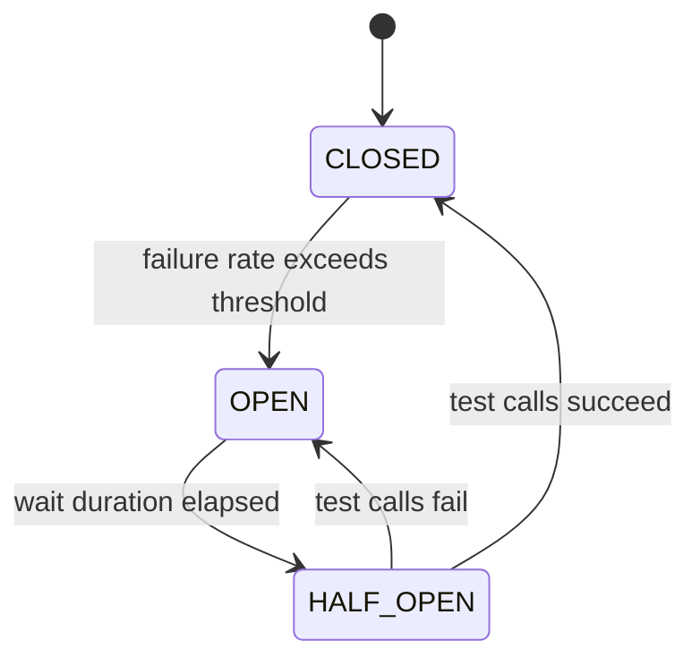

Maknanya:

| State | Perilaku |
|---|---|
| `CLOSED` | Call normal. |
| `OPEN` | Call langsung ditolak/fallback, tidak menghantam dependency. |
| `HALF_OPEN` | Sedikit test call diizinkan untuk cek recovery. |

---

## 8.2 Kapan Circuit Breaker Berguna?

Circuit breaker berguna jika:

```text id="o7ukto"
external dependency down
latency tinggi menyebabkan timeout massal
error rate naik tajam
retry memperburuk beban
thread pool mulai penuh
```

Tidak berguna jika:

```text id="vjt3oz"
error disebabkan request invalid dari kita
auth config salah
bug mapping internal
```

Untuk error permanen seperti 400/403, jangan ikut dihitung sebagai dependency failure kecuali memang perlu.

---

## 8.3 Circuit Breaker Config Awal

Contoh baseline:

```properties id="gum37l"
integration.customer-registry.circuit-breaker.failure-rate-threshold=50
integration.customer-registry.circuit-breaker.slow-call-rate-threshold=50
integration.customer-registry.circuit-breaker.slow-call-duration-ms=3000
integration.customer-registry.circuit-breaker.minimum-number-of-calls=20
integration.customer-registry.circuit-breaker.sliding-window-size=50
integration.customer-registry.circuit-breaker.open-state-wait-ms=30000
integration.customer-registry.circuit-breaker.half-open-permitted-calls=5
```

Interpretasi:

```text id="0a1yrp"
Jika minimal 20 call sudah terkumpul,
dan failure rate >= 50%,
circuit bisa open.

Saat open, call tidak diteruskan selama 30 detik.
Setelah itu masuk half-open dan mengizinkan 5 test call.
```

---

## 8.4 Failure Classification untuk Circuit Breaker

| Error | Count sebagai failure? |
|---|---:|
| Timeout | Ya |
| Connection refused | Ya |
| 500/502/503/504 | Ya |
| 429 | Tergantung, biasanya ya untuk availability pressure |
| 400 | Tidak |
| 401 | Tidak, kecuali token provider dependency down |
| 403 | Tidak |
| 404 | Tidak |
| 409 | Tidak |
| Validation error | Tidak |
| Business conflict | Tidak |

---

## 9. Bulkhead

## 9.1 Tujuan Bulkhead

Bulkhead membatasi agar satu dependency tidak menghabiskan semua resource service.

Tanpa bulkhead:

```text id="cg6lg9"
Customer Registry lambat
-> semua request thread menunggu
-> Case API ikut lambat
-> endpoint lain ikut terdampak
```

Dengan bulkhead:

```text id="w2hlmt"
Customer Registry hanya boleh memakai 25 concurrent call
Jika penuh, call baru gagal cepat/fallback
Endpoint lain tetap punya resource
```

---

## 9.2 Jenis Bulkhead

| Jenis | Bentuk | Cocok untuk |
|---|---|---|
| Semaphore bulkhead | Batasi concurrent call | Blocking HTTP client sederhana |
| Thread pool bulkhead | Isolasi worker thread | Call lambat/berisiko blocking |
| Connection pool limit | Batasi connection ke dependency | HTTP client pooling |
| Queue limit | Batasi backlog | Async worker |
| Kubernetes resource limit | Batasi CPU/memory pod | Infrastruktur |
| Rate limiter | Batasi request per waktu | Vendor quota |

---

## 9.3 Bulkhead Config Awal

```properties id="ko44ku"
integration.customer-registry.bulkhead.max-concurrent-calls=25
integration.customer-registry.bulkhead.max-wait-ms=50
```

Prinsip:

```text id="e6aoa4"
Jika bulkhead penuh, lebih baik fail fast daripada membuat request menunggu lama.
```

---

## 9.4 Bulkhead Sizing

Pertimbangkan:

```text id="cakujc"
total request threads
p95 latency dependency
expected throughput
criticality dependency
connection pool size
database pool size
container CPU/memory
```

Contoh sederhana:

```text id="e3fovs"
Service punya 100 request threads.
Customer Registry adalah optional enrichment.
Jangan izinkan 100 thread habis untuk Customer Registry.
Set bulkhead misalnya 15-25 concurrent call.
```

---

## 10. Fallback

## 10.1 Fallback Bukan Selalu Return Default

Fallback adalah keputusan bisnis, bukan sekadar teknik.

Jenis fallback:

| Fallback Type | Contoh | Cocok untuk |
|---|---|---|
| Return cached data | Customer profile cache | Read-only lookup dengan toleransi stale. |
| Return partial response | Case dibuat tanpa enrichment | Non-critical enrichment. |
| Queue for later | External submission diproses async | Command yang bisa ditunda. |
| Manual review | Case masuk status `MANUAL_REVIEW_REQUIRED` | Regulatory/high-risk decision. |
| Fail fast controlled | Return `503` stable error | Critical dependency tanpa fallback aman. |
| Use alternative provider | Secondary vendor | Jika contract setara dan legal/compliance approve. |

---

## 10.2 Fallback Decision Table

| Scenario | Fallback yang Aman | Fallback yang Berbahaya |
|---|---|---|
| Customer enrichment gagal | Lanjut dengan `ENRICHMENT_PENDING` | Mengisi data palsu/default. |
| Risk score gagal | Manual review / pending risk | Auto-approve. |
| Payment authorization gagal | Fail controlled | Anggap sukses. |
| Notification gagal | Queue retry | Block core transaction terlalu lama. |
| Document generation gagal | Status `DOCUMENT_PENDING` | Tandai dokumen sudah dibuat. |
| Regulatory submission gagal | Queue/Camunda retry + incident | Hilangkan submission. |
| Search service down | Return empty dengan warning | Return empty seolah data memang tidak ada. |

---

## 10.3 Fallback Harus Transparan

Jika mengembalikan data fallback:

```json id="yrrz4x"
{
  "caseId": "CASE-123",
  "status": "OPEN",
  "customerProfile": {
    "source": "CACHE",
    "stale": true,
    "lastUpdatedAt": "2026-07-14T09:00:00Z"
  }
}
```

Jangan membuat client mengira data fallback adalah data fresh.

---

## 11. Rate Limit Handling

Jika external system mengembalikan `429 Too Many Requests`:

```text id="4wqv54"
jangan retry agresif
respect Retry-After jika tersedia
turunkan concurrency
aktifkan backoff
catat metric rate limited
mungkin queue request jika business mengizinkan
```

Policy:

| Kondisi | Tindakan |
|---|---|
| `429` dengan `Retry-After` | Tunggu sesuai nilai jika masih dalam budget. |
| `429` tanpa `Retry-After` | Exponential backoff pendek dan terbatas. |
| Rate limit terus-menerus | Open circuit / throttle internal. |
| Operation critical | Queue atau manual pending. |
| Operation optional | Drop/fallback dengan logging. |

---

## 12. Pattern Combination

## 12.1 Common Stack

Untuk outbound call critical:

```text id="5earpw"
Bulkhead
  -> Circuit Breaker
      -> Retry
          -> Timeout
              -> HTTP call
```

Namun urutan implementasi bergantung library/framework. Yang penting secara desain:

```text id="rw0r1e"
timeout membatasi attempt
retry tidak melebihi total deadline
circuit breaker melihat classified failure
bulkhead membatasi concurrent execution
fallback adalah keputusan terakhir
```

---

## 12.2 Recommended Policy by Integration Type

| Integration Type | Timeout | Retry | Circuit Breaker | Bulkhead | Fallback |
|---|---:|---:|---:|---:|---|
| Critical REST lookup | Ya | Ya, terbatas | Ya | Ya | Manual/controlled error |
| Optional enrichment | Ya | Minimal | Ya | Ya | Partial response/cache |
| Command POST | Ya | Hanya idempotent | Ya | Ya | Queue/manual |
| Webhook intake | Ya | N/A inbound | N/A | Ya | Persist then process async |
| Polling job | Ya | Ya | Ya | Worker limit | Continue next cycle |
| File transfer | Ya | Ya, chunk-aware | Tergantung | Ya | Resume/manual |
| Camunda service task | Ya | BPMN retry | Ya | Ya | Incident/compensation |

---

## 13. Implementasi Praktis: Policy Wrapper

Agar tidak mengikat application service ke library tertentu, buat gateway tetap bersih.

```java id="8i01sm"
public interface RiskScoreGateway {
    RiskScore requestScore(RiskScoreCommand command);
}
```

Implementation dengan resilience wrapper:

```text id="5p0ggm"
RiskScoreGateway
  -> ResilientRiskScoreGateway
      -> VendorRiskScoreClient
```

---

## 13.1 Base Client Tanpa Policy

```java id="f3zqik"
public class VendorRiskScoreClient {

    private final Client client;
    private final RiskClientConfig config;
    private final VendorRiskScoreRequestMapper requestMapper;
    private final VendorRiskScoreResponseMapper responseMapper;
    private final RiskClientErrorTranslator errorTranslator;

    public VendorRiskScoreClient(
            Client client,
            RiskClientConfig config,
            VendorRiskScoreRequestMapper requestMapper,
            VendorRiskScoreResponseMapper responseMapper,
            RiskClientErrorTranslator errorTranslator
    ) {
        this.client = client;
        this.config = config;
        this.requestMapper = requestMapper;
        this.responseMapper = responseMapper;
        this.errorTranslator = errorTranslator;
    }

    public RiskScore callVendor(RiskScoreCommand command) {
        VendorRiskScoreRequest request = requestMapper.toVendorRequest(command);

        try {
            Response response = client
                    .target(config.baseUri())
                    .path("/v1/risk-score")
                    .request(MediaType.APPLICATION_JSON_TYPE)
                    .header("X-Idempotency-Key", command.idempotencyKey())
                    .post(Entity.json(request));

            return handleResponse(response);

        } catch (ProcessingException ex) {
            throw errorTranslator.translateTransportException(ex);
        }
    }

    private RiskScore handleResponse(Response response) {
        try (response) {
            if (response.getStatus() == 200 || response.getStatus() == 201) {
                VendorRiskScoreResponse body =
                        response.readEntity(VendorRiskScoreResponse.class);

                return responseMapper.toDomain(body);
            }

            throw errorTranslator.translateHttpResponse(response);
        }
    }
}
```

---

## 13.2 Resilient Gateway Wrapper

```java id="x9kxaj"
public class ResilientRiskScoreGateway implements RiskScoreGateway {

    private final VendorRiskScoreClient client;
    private final ResiliencePolicyExecutor policyExecutor;
    private final RiskScoreFallback fallback;

    public ResilientRiskScoreGateway(
            VendorRiskScoreClient client,
            ResiliencePolicyExecutor policyExecutor,
            RiskScoreFallback fallback
    ) {
        this.client = client;
        this.policyExecutor = policyExecutor;
        this.fallback = fallback;
    }

    @Override
    public RiskScore requestScore(RiskScoreCommand command) {
        return policyExecutor.execute(
                "vendor-risk-score",
                "requestScore",
                () -> client.callVendor(command),
                failure -> fallback.handle(command, failure)
        );
    }
}
```

Policy executor abstraction:

```java id="kdxjd2"
@FunctionalInterface
public interface CheckedSupplier<T> {
    T get() throws Exception;
}
```

```java id="vb50zb"
@FunctionalInterface
public interface FailureFallback<T> {
    T apply(Throwable failure);
}
```

```java id="dr3zga"
public interface ResiliencePolicyExecutor {

    <T> T execute(
            String dependencyName,
            String operationName,
            CheckedSupplier<T> supplier,
            FailureFallback<T> fallback
    );
}
```

Keuntungan:

```text id="9dqkq7"
Application service tetap tidak tahu Resilience4j/MicroProfile.
Policy bisa diganti.
Testing lebih mudah.
Fallback eksplisit per operation.
```

---

## 14. Implementasi dengan Resilience4j - Conceptual Skeleton

Resilience4j menyediakan decorator untuk fault tolerance seperti Circuit Breaker, Retry, Rate Limiter, dan Bulkhead. ([resilience4j](https://resilience4j.readme.io/docs/getting-started?utm_source=chatgpt.com))

Contoh konseptual:

```java id="aoj0tn"
public class Resilience4jPolicyExecutor implements ResiliencePolicyExecutor {

    private final CircuitBreakerRegistry circuitBreakerRegistry;
    private final RetryRegistry retryRegistry;
    private final BulkheadRegistry bulkheadRegistry;
    private final TimerRegistry timerRegistry;

    public Resilience4jPolicyExecutor(
            CircuitBreakerRegistry circuitBreakerRegistry,
            RetryRegistry retryRegistry,
            BulkheadRegistry bulkheadRegistry,
            TimerRegistry timerRegistry
    ) {
        this.circuitBreakerRegistry = circuitBreakerRegistry;
        this.retryRegistry = retryRegistry;
        this.bulkheadRegistry = bulkheadRegistry;
        this.timerRegistry = timerRegistry;
    }

    @Override
    public <T> T execute(
            String dependencyName,
            String operationName,
            CheckedSupplier<T> supplier,
            FailureFallback<T> fallback
    ) {
        String policyName = dependencyName + "." + operationName;

        CircuitBreaker circuitBreaker =
                circuitBreakerRegistry.circuitBreaker(policyName);

        Retry retry =
                retryRegistry.retry(policyName);

        Bulkhead bulkhead =
                bulkheadRegistry.bulkhead(policyName);

        Supplier<T> decorated = () -> {
            try {
                return supplier.get();
            } catch (Exception ex) {
                throw new RuntimeException(ex);
            }
        };

        decorated = CircuitBreaker.decorateSupplier(circuitBreaker, decorated);
        decorated = Retry.decorateSupplier(retry, decorated);
        decorated = Bulkhead.decorateSupplier(bulkhead, decorated);

        try {
            long started = System.nanoTime();
            T result = decorated.get();
            timerRegistry.recordSuccess(policyName, started);
            return result;

        } catch (RuntimeException ex) {
            timerRegistry.recordFailure(policyName, ex);
            return fallback.apply(unwrap(ex));
        }
    }

    private Throwable unwrap(RuntimeException ex) {
        return ex.getCause() != null ? ex.getCause() : ex;
    }
}
```

Catatan:

```text id="smgq3s"
Kode ini skeleton konseptual.
Di implementation nyata, pakai exception classification yang rapi.
Jangan semua RuntimeException dianggap retryable.
Jangan fallback semua failure secara membabi buta.
```

---

## 15. Implementasi dengan MicroProfile Fault Tolerance

Jika runtime Anda mendukung MicroProfile Fault Tolerance, style-nya bisa declarative.

```java id="1obp02"
import org.eclipse.microprofile.faulttolerance.Timeout;
import org.eclipse.microprofile.faulttolerance.Retry;
import org.eclipse.microprofile.faulttolerance.CircuitBreaker;
import org.eclipse.microprofile.faulttolerance.Bulkhead;
import org.eclipse.microprofile.faulttolerance.Fallback;

import jakarta.enterprise.context.ApplicationScoped;

@ApplicationScoped
public class RiskScoreGatewayMp implements RiskScoreGateway {

    private final VendorRiskScoreClient client;

    public RiskScoreGatewayMp(VendorRiskScoreClient client) {
        this.client = client;
    }

    @Override
    @Timeout(3000)
    @Retry(
            maxRetries = 2,
            delay = 200
    )
    @CircuitBreaker(
            requestVolumeThreshold = 20,
            failureRatio = 0.5,
            delay = 30000
    )
    @Bulkhead(25)
    @Fallback(RiskScoreFallbackHandler.class)
    public RiskScore requestScore(RiskScoreCommand command) {
        return client.callVendor(command);
    }
}
```

MicroProfile Fault Tolerance memisahkan execution logic dari execution dengan policy seperti retry, fallback, bulkhead, dan circuit breaker. ([MicroProfile](https://microprofile.io/specifications/fault-tolerance/4-1/?utm_source=chatgpt.com))

Catatan penting:

```text id="xk8089"
Gunakan ini hanya jika runtime Anda benar-benar mendukung MicroProfile FT.
Di plain Jersey servlet container, annotation ini tidak otomatis bekerja.
```

---

## 16. Exception Classification

Buat classifier agar retry/circuit breaker tidak salah menghitung.

```java id="7rqole"
public enum FailureCategory {
    TRANSIENT,
    RATE_LIMITED,
    TIMEOUT,
    DEPENDENCY_UNAVAILABLE,
    AUTHENTICATION,
    AUTHORIZATION,
    VALIDATION,
    BUSINESS_CONFLICT,
    NOT_FOUND,
    CONTRACT_ERROR,
    UNKNOWN
}
```

```java id="ou5pcz"
public class IntegrationFailureClassifier {

    public FailureCategory classify(Throwable failure) {
        if (failure instanceof ExternalTimeoutException) {
            return FailureCategory.TIMEOUT;
        }

        if (failure instanceof ExternalRateLimitedException) {
            return FailureCategory.RATE_LIMITED;
        }

        if (failure instanceof ExternalUnavailableException) {
            return FailureCategory.DEPENDENCY_UNAVAILABLE;
        }

        if (failure instanceof ExternalUnauthorizedException) {
            return FailureCategory.AUTHENTICATION;
        }

        if (failure instanceof ExternalForbiddenException) {
            return FailureCategory.AUTHORIZATION;
        }

        if (failure instanceof ExternalValidationException) {
            return FailureCategory.VALIDATION;
        }

        if (failure instanceof ExternalConflictException) {
            return FailureCategory.BUSINESS_CONFLICT;
        }

        return FailureCategory.UNKNOWN;
    }

    public boolean isRetryable(Throwable failure) {
        FailureCategory category = classify(failure);

        return switch (category) {
            case TIMEOUT, RATE_LIMITED, DEPENDENCY_UNAVAILABLE, TRANSIENT -> true;
            default -> false;
        };
    }

    public boolean countsAsCircuitBreakerFailure(Throwable failure) {
        FailureCategory category = classify(failure);

        return switch (category) {
            case TIMEOUT, DEPENDENCY_UNAVAILABLE, RATE_LIMITED, TRANSIENT -> true;
            default -> false;
        };
    }
}
```

---

## 17. Fallback Implementation

Contoh fallback untuk risk score.

```java id="1bo5eb"
public class RiskScoreFallback {

    private final ManualReviewService manualReviewService;
    private final IntegrationFailureClassifier failureClassifier;

    public RiskScoreFallback(
            ManualReviewService manualReviewService,
            IntegrationFailureClassifier failureClassifier
    ) {
        this.manualReviewService = manualReviewService;
        this.failureClassifier = failureClassifier;
    }

    public RiskScore handle(RiskScoreCommand command, Throwable failure) {
        FailureCategory category = failureClassifier.classify(failure);

        return switch (category) {
            case TIMEOUT, DEPENDENCY_UNAVAILABLE, RATE_LIMITED -> {
                manualReviewService.markRiskReviewRequired(
                        command.caseId(),
                        category.name()
                );

                yield RiskScore.pendingManualReview(
                        command.caseId(),
                        "External risk score unavailable"
                );
            }

            case AUTHENTICATION, AUTHORIZATION -> {
                throw new IntegrationConfigurationException(
                        "Risk score integration authentication failed",
                        failure
                );
            }

            case VALIDATION, BUSINESS_CONFLICT, CONTRACT_ERROR -> {
                throw new IntegrationContractException(
                        "Risk score integration contract failure",
                        failure
                );
            }

            default -> throw new IntegrationUnavailableException(
                    "Risk score integration failed",
                    failure
            );
        };
    }
}
```

Prinsip:

```text id="6c655d"
Fallback harus tahu konteks bisnis.
Fallback untuk risk scoring tidak boleh auto-approve.
Fallback untuk optional enrichment boleh pending.
Fallback untuk payment authorization biasanya fail controlled.
```

---

## 18. Failure Translation ke API Response

Jika dependency critical gagal:

```json id="rujyh6"
{
  "type": "https://api.example.com/problems/dependency-unavailable",
  "title": "Dependency unavailable",
  "status": 503,
  "detail": "A required external service is temporarily unavailable.",
  "code": "CUSTOMER_REGISTRY_UNAVAILABLE",
  "correlationId": "corr-123",
  "retryable": true,
  "extensions": {
    "dependency": "customer-registry",
    "operation": "lookupCustomer"
  }
}
```

Jika fallback async/manual dipakai:

```json id="85q0gz"
{
  "caseId": "CASE-123",
  "status": "PENDING_MANUAL_RISK_REVIEW",
  "riskScore": {
    "status": "UNAVAILABLE",
    "fallbackApplied": true,
    "reason": "External risk score unavailable"
  }
}
```

Jangan return `200 OK` tanpa menandai bahwa fallback terjadi.

---

## 19. Observability

## 19.1 Metrics

Minimal metric:

| Metric | Label | Tujuan |
|---|---|---|
| `external_call_total` | dependency, operation, result | Volume. |
| `external_call_duration_ms` | dependency, operation | Latency. |
| `external_call_timeout_total` | dependency, operation | Timeout trend. |
| `external_call_retry_total` | dependency, operation, attempt | Retry pressure. |
| `external_call_circuit_open_total` | dependency, operation | Circuit breaker open. |
| `external_call_bulkhead_rejected_total` | dependency, operation | Resource saturation. |
| `external_call_fallback_total` | dependency, operation, fallback_type | Fallback usage. |
| `external_call_rate_limited_total` | dependency, operation | Vendor quota pressure. |

Jangan pakai high-cardinality labels:

```text id="5r0my4"
caseId
customerId
nationalId
raw URL
raw error message
token/client id
```

---

## 19.2 Structured Log

```json id="g5a0zv"
{
  "event": "external_call_failed",
  "dependency": "customer-registry",
  "operation": "lookupCustomer",
  "failureCategory": "TIMEOUT",
  "retryAttempt": 2,
  "circuitState": "CLOSED",
  "fallbackApplied": true,
  "durationMs": 3000,
  "correlationId": "corr-123",
  "businessKey": "CASE-123"
}
```

---

## 19.3 Alert Rules

| Condition | Severity | Meaning |
|---|---|---|
| Timeout rate > 5% for 5 min | Warning | Dependency latency rising. |
| Timeout rate > 20% for 5 min | Critical | User journey likely impacted. |
| Circuit breaker open | Warning/Critical | Dependency failing. |
| Bulkhead rejection > 0 sustained | Warning | Saturation; callers being rejected. |
| Fallback rate rising | Warning | Silent degradation risk. |
| 429 rate limit sustained | Warning | Quota/concurrency issue. |
| Retry attempts spike | Warning | External instability or bad policy. |

---

## 20. Testing Failure Mode

## 20.1 Test Matrix

| Scenario | Expected |
|---|---|
| External returns 200 | Success, no retry, metric success. |
| External times out once then succeeds | Retry once, success. |
| External times out repeatedly | Controlled fallback/error. |
| External returns 400 | No retry, validation/contract error. |
| External returns 401 | No repeated retry loop. |
| External returns 429 | Backoff/retry if budget allows. |
| External returns 503 | Retry then fallback/error. |
| Circuit breaker open | No HTTP call made. |
| Bulkhead full | Fast rejection/fallback. |
| Fallback applied | Response marks fallback/pending/manual. |

---

## 20.2 Fake Slow Server Test

Pseudo-test:

```java id="417n3m"
@Test
void shouldFallbackWhenExternalApiTimesOut() {
    mockExternalApi.stubRiskScoreWithDelay(5000);

    RiskScore result = riskScoreGateway.requestScore(
            new RiskScoreCommand(
                    "CASE-123",
                    "CUST-456",
                    "risk-score:CASE-123"
            )
    );

    assertEquals("PENDING_MANUAL_REVIEW", result.status());
    assertTrue(result.fallbackApplied());

    verify(metrics).incrementTimeout(
            "vendor-risk-score",
            "requestScore"
    );
}
```

---

## 20.3 Retry Test

```java id="6qrkay"
@Test
void shouldRetryOnlyForTransientFailure() {
    mockExternalApi
            .thenReturnStatus(503)
            .thenReturnSuccess(riskScoreResponse());

    RiskScore result = riskScoreGateway.requestScore(command);

    assertEquals("LOW", result.level());
    mockExternalApi.verifyCallCount(2);
}
```

---

## 20.4 No Retry for Bad Request

```java id="nxzxkn"
@Test
void shouldNotRetryBadRequest() {
    mockExternalApi.thenReturnStatus(400);

    assertThrows(
            IntegrationContractException.class,
            () -> riskScoreGateway.requestScore(command)
    );

    mockExternalApi.verifyCallCount(1);
}
```

---

## 21. Operational Runbook

Untuk setiap external dependency, buat runbook minimal.

```text id="2i8zz9"
Dependency:
  Customer Registry

Symptoms:
  timeout rate > 20%
  circuit breaker open
  fallback rate rising
  user journey pending manual review

Immediate Actions:
  1. Check dashboard dependency latency/error.
  2. Check recent deployment/config changes.
  3. Check token/cert expiry.
  4. Check network/DNS/proxy.
  5. Check vendor status page/contact.
  6. If optional, enable degraded mode.
  7. If critical, route cases to manual review or queue.
  8. Pause high-volume batch jobs if needed.

Recovery:
  1. Wait circuit half-open.
  2. Run synthetic test call.
  3. Replay queued/DLQ items carefully.
  4. Run reconciliation.
  5. Record incident timeline.
```

---

## 22. Config Governance

Jangan hardcode policy di class.

Contoh:

```yaml id="c1p7f7"
integrations:
  customerRegistry:
    timeout:
      connectMs: 1000
      readMs: 3000
    retry:
      maxAttempts: 2
      initialDelayMs: 200
      maxDelayMs: 1000
      jitter: true
    circuitBreaker:
      failureRateThreshold: 50
      minimumCalls: 20
      slidingWindowSize: 50
      openStateWaitMs: 30000
      halfOpenPermittedCalls: 5
    bulkhead:
      maxConcurrentCalls: 25
      maxWaitMs: 50
    fallback:
      mode: MANUAL_REVIEW
```

Config harus:

```text id="sl0j2o"
per dependency
per operation jika perlu
bisa berbeda antar environment
tervalidasi saat startup
punya default aman
tercatat di runbook
```

---

## 23. Anti-Patterns

| Anti-Pattern | Kenapa Buruk | Alternatif |
|---|---|---|
| Tidak ada timeout | Thread bisa menggantung | Explicit timeout. |
| Timeout lebih panjang dari caller budget | Request tetap gagal di caller | Budget-based timeout. |
| Retry semua error | Memperparah masalah | Retryability matrix. |
| Retry POST tanpa idempotency | Duplicate side effect | Idempotency key. |
| Retry tanpa jitter | Retry storm | Exponential backoff + jitter. |
| Circuit breaker menghitung 400 sebagai failure | Circuit open karena bug client | Failure classification. |
| Bulkhead tidak ada | Satu dependency menghabiskan semua thread | Concurrency limit. |
| Fallback return default palsu | Keputusan bisnis salah | Pending/manual/controlled error. |
| Fallback tidak terlihat | Data stale dianggap fresh | Mark fallback/stale. |
| Circuit breaker global untuk semua operation | Satu operation rusak memblokir semua | Breaker per dependency/operation. |
| Policy hardcoded | Susah tuning saat incident | Externalized config. |
| Tidak ada metric retry/circuit | Incident buta | Metrics/logs/traces. |

---

## 24. Practical Checklist Sebelum Merge

| Checklist | Status |
|---|---|
| Connect timeout eksplisit | ☐ |
| Read timeout eksplisit | ☐ |
| Total request budget dihitung | ☐ |
| Retry hanya untuk transient failure | ☐ |
| Retry dibatasi max attempt | ☐ |
| Backoff + jitter tersedia | ☐ |
| Command retry punya idempotency key | ☐ |
| Circuit breaker per dependency/operation | ☐ |
| Failure classification jelas | ☐ |
| Bulkhead/concurrency limit tersedia | ☐ |
| Fallback sesuai business context | ☐ |
| Fallback terlihat di response/log | ☐ |
| 429 ditangani khusus | ☐ |
| Metrics retry/timeout/circuit/fallback tersedia | ☐ |
| Failure-mode tests tersedia | ☐ |
| Config externalized | ☐ |
| Runbook dependency outage tersedia | ☐ |

---

## 25. Practical Deliverable untuk Seri Ini

Untuk setiap dependency eksternal, minimal punya dokumen seperti ini:

```text id="rv6uqd"
Dependency:
  Customer Registry

Operation:
  lookupCustomer

Timeout:
  connectTimeoutMs = 1000
  readTimeoutMs = 3000
  totalBudgetMs = 4000

Retry:
  maxAttempts = 2
  retryable = timeout, 502, 503, 504, 429
  nonRetryable = 400, 401, 403, 404, 409, 422
  backoff = exponential with jitter

Idempotency:
  GET lookup is naturally idempotent.
  POST commands require X-Idempotency-Key.

Circuit Breaker:
  failureRateThreshold = 50%
  minimumCalls = 20
  slidingWindow = 50
  openWait = 30s
  halfOpenCalls = 5

Bulkhead:
  maxConcurrentCalls = 25
  maxWaitMs = 50

Fallback:
  If lookup fails during case creation:
    - if customer profile is required, return controlled 503
    - if enrichment only, mark ENRICHMENT_PENDING

Observability:
  metrics for timeout, retry, circuit open, fallback
  logs include dependency, operation, failure category, correlationId

Runbook:
  Check vendor, network, auth, cert, recent deploy, replay/reconciliation.
```

---

## 26. Ringkasan Seri 4

Inti dari resilience untuk outbound integration:

```text id="4a878j"
Timeout mencegah menunggu tanpa batas.
Retry memperbaiki transient failure, tapi bisa berbahaya.
Circuit breaker mencegah dependency rusak dihantam terus.
Bulkhead mencegah satu dependency menghabiskan semua resource.
Fallback harus benar secara bisnis, bukan sekadar default value.
```

Urutan desain yang benar:

```text id="jnwbr6"
1. Tentukan caller timeout budget.
2. Tentukan timeout per dependency.
3. Klasifikasikan error retryable vs non-retryable.
4. Pastikan retry aman terhadap idempotency.
5. Tambahkan backoff dan jitter.
6. Tambahkan circuit breaker.
7. Tambahkan bulkhead/concurrency limit.
8. Tentukan fallback per business scenario.
9. Tambahkan metrics/logs/traces.
10. Test failure mode, bukan hanya happy path.
```

---

# Status

**Seri 4/12 - Timeout, Retry, Circuit Breaker, Bulkhead & Fallback selesai.**

Rekomendasi berikutnya:

**Seri 5/12 - Authentication, Authorization, mTLS, OAuth2, API Key & Secrets**

Fokus berikutnya: cara mengamankan integrasi eksternal dari sisi outbound dan inbound, termasuk OAuth2 client credentials, token caching, API key, mTLS, signed request/webhook, secret rotation, truststore/keystore, dan failure mode auth di Jersey/JAX-RS microservice.

---

**Sources:**

- [Microprofile Fault Tolerance - Eclipse download page](https://download.eclipse.org/microprofile/microprofile-fault-tolerance-4.1/microprofile-fault-tolerance-spec-4.1.html?utm_source=chatgpt.com)
- [Introduction - resilience4j - ReadMe](https://resilience4j.readme.io/docs/getting-started?utm_source=chatgpt.com)
- [ClientProperties (Jersey 2.29.1 API)](https://eclipse-ee4j.github.io/jersey.github.io/apidocs/2.29.1/jersey/org/glassfish/jersey/client/ClientProperties.html?utm_source=chatgpt.com)
- [Module java.net.http](https://docs.oracle.com/en/java/javase/21/docs/api/java.net.http/module-summary.html?utm_source=chatgpt.com)
- [MicroProfile Fault Tolerance 4.1](https://microprofile.io/specifications/fault-tolerance/4-1/?utm_source=chatgpt.com)

## Response:
7/14/2026, 10:05:49 PM

Saya lanjut ke **Seri 5/12 — Authentication, Authorization, mTLS, OAuth2, API Key & Secrets**. Fokusnya practical security boundary untuk integrasi: outbound ke vendor/platform, inbound webhook/API, token lifecycle, certificate, secret rotation, dan failure mode auth.

# Seri 5/12 - Authentication, Authorization, mTLS, OAuth2, API Key & Secrets

## 1. Tujuan Seri Ini

Seri ini membahas cara mengamankan integrasi external systems/services/platforms pada **Java Jersey/JAX-RS microservice**, baik untuk:

```text
Outbound integration:
  service kita memanggil vendor/platform/service eksternal

Inbound integration:
  sistem eksternal memanggil API/webhook kita

Cross-service integration:
  service internal saling memanggil dalam on-prem/AWS/Azure/Kubernetes
```

Fokusnya praktis:

```text
OAuth2 client credentials
Bearer token handling
token caching
API key
mTLS
signed request
signed webhook
secret management
certificate rotation
authorization scope
tenant boundary
Jersey filter
outbound auth injection
inbound auth validation
failure mode auth
```

OAuth 2.0 sekarang punya **Best Current Practice** resmi melalui RFC 9700, yang memperbarui dan memperluas security advice dari OAuth 2.0 core dan bearer token RFC sebelumnya. ([IETF Datatracker](https://datatracker.ietf.org/doc/rfc9700/?utm_source=chatgpt.com))

Untuk mTLS dalam konteks OAuth2, RFC 8705 mendefinisikan OAuth client authentication dan certificate-bound tokens menggunakan mutual TLS dengan X.509 certificates. ([IETF Datatracker](https://datatracker.ietf.org/doc/html/rfc8705?utm_source=chatgpt.com))

OWASP API Security Top 10 2023 menempatkan **Broken Object Level Authorization** dan **Broken Authentication** sebagai risiko utama API, sehingga authn/authz tidak boleh dipandang hanya sebagai “cek token valid”. ([OWASP](https://owasp.org/www-project-api-security/?utm_source=chatgpt.com))

---

## 2. Posisi dalam Roadmap

| Seri | Topik | Status |
|---:|---|---|
| 1 | Integration Boundary & Decision Model | Selesai |
| 2 | Outbound REST Client Engineering in Jersey/JAX-RS | Selesai |
| 3 | API Contract, OpenAPI, Versioning & Error Model | Selesai |
| 4 | Timeout, Retry, Circuit Breaker, Bulkhead & Fallback | Selesai |
| 5 | **Authentication, Authorization, mTLS, OAuth2, API Key & Secrets** | **Sedang dibahas** |
| 6 | Idempotency, Duplicate Handling & Safe Retry Design | Berikutnya |
| 7 | Webhook, Callback, Polling & External Event Intake | Berikutnya |
| 8 | Async Integration with RabbitMQ / AMQP / Event Messaging | Berikutnya |
| 9 | Transactional Outbox, Saga & Consistency Across Systems | Berikutnya |
| 10 | Camunda-Based External System Orchestration | Berikutnya |
| 11 | File-Based, Batch, Database-Mediated & Legacy Integration | Berikutnya |
| 12 | Observability, Audit, Reconciliation, Runbook & Governance | Berikutnya |

---

## 3. Core Mental Model

Security integration bukan hanya “punya token”.

```text
Secure Integration Boundary =
    identity of caller/callee
  + credential type
  + credential lifecycle
  + transport security
  + authorization scope
  + tenant/object boundary
  + replay protection
  + secret storage
  + rotation mechanism
  + auditability
  + failure behavior
```

Diagram praktis:

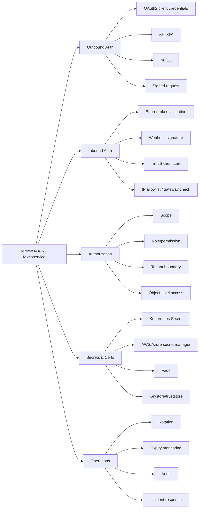

Prinsip utama:

```text
Authentication answers:
  "Who is calling?"

Authorization answers:
  "What is this caller allowed to do?"

Object-level authorization answers:
  "Is this caller allowed to access this specific case/customer/document?"

Secret management answers:
  "How do we protect, rotate, and audit credentials?"

mTLS answers:
  "Can both parties cryptographically prove identity at transport layer?"
```

---

## 4. Decomposition Map - Practical Categories / Skills

| No | Area | Fokus Praktis | Output yang Harus Ada |
|---:|---|---|---|
| 1 | **Outbound Authentication** | Cara service kita authenticate ke vendor/platform. | Auth strategy per dependency. |
| 2 | **Inbound Authentication** | Cara API/webhook kita memvalidasi caller eksternal. | Inbound auth filter. |
| 3 | **OAuth2 Client Credentials** | Token request, token caching, refresh, expiry handling. | Token provider. |
| 4 | **Bearer Token Injection** | Menambahkan token ke outbound request secara aman. | Jersey client request filter. |
| 5 | **JWT Validation** | Validasi issuer, audience, expiry, signature, scopes. | Token validation filter. |
| 6 | **API Key Integration** | API key header/query, storage, rotation, masking. | API key provider/filter. |
| 7 | **mTLS** | Keystore/truststore, client certificate, certificate-bound identity. | TLS config + rotation plan. |
| 8 | **Signed Request** | HMAC/JWS request signing untuk integritas dan replay protection. | Signing filter. |
| 9 | **Webhook Signature Verification** | Validasi signature, timestamp, nonce/event ID. | Webhook verification filter. |
| 10 | **Authorization Scope** | Mapping scope/permission ke operation. | Authorization matrix. |
| 11 | **Tenant Boundary** | Memastikan request hanya akses tenant yang benar. | Tenant resolver + guard. |
| 12 | **Object-Level Authorization** | Validasi akses terhadap resource ID spesifik. | Object access check. |
| 13 | **Secrets Management** | Menyimpan secret di tempat aman, bukan source code/config biasa. | Secret inventory. |
| 14 | **Credential Rotation** | Rotasi API key, client secret, certificate tanpa downtime besar. | Rotation runbook. |
| 15 | **Auth Failure Handling** | Mapping 401/403/token expired/cert expired/scope issue. | Auth failure taxonomy. |
| 16 | **Audit & Observability** | Merekam caller, client ID, scope, tenant, decision, failure reason. | Security audit event. |

---

## 5. Auth Pattern Selection Matrix

| Kondisi | Pattern yang Cocok | Catatan Praktis |
|---|---|---|
| Service-to-service modern | OAuth2 client credentials | Cocok untuk machine-to-machine. |
| Vendor hanya support static credential | API key | Simpan aman, batasi scope, rotasi berkala. |
| Integrasi high-trust / regulated / private network | mTLS | Baik untuk mutual identity dan certificate-based access. |
| Webhook dari vendor | HMAC/JWS signature + timestamp | Jangan hanya percaya IP source. |
| Internal Kubernetes service | mTLS/service mesh atau OAuth2 internal token | Jangan mengandalkan network trust saja. |
| Partner API external | OAuth2 + mTLS jika memungkinkan | Kombinasi kuat untuk B2B. |
| Legacy system | Basic auth/API key/mTLS | Bungkus di adapter dan perkuat network boundary. |
| Public API | OAuth2/OIDC + rate limit + object auth | Gateway saja tidak cukup. |

---

## 6. Outbound OAuth2 Client Credentials

### 6.1 Flow

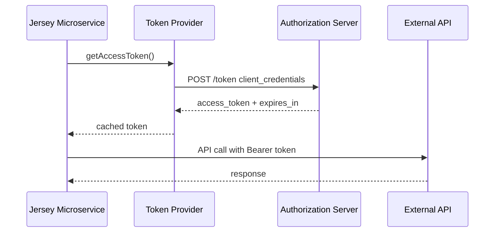

Client credentials cocok saat **microservice bertindak sebagai machine client**, bukan atas nama user langsung.

---

## 6.2 Token Provider Interface

```java
public interface AccessTokenProvider {
    String getAccessToken();
}
```

Config:

```java
public record OAuth2ClientCredentialsConfig(
        URI tokenEndpoint,
        String clientId,
        String clientSecretRef,
        String scope,
        int connectTimeoutMillis,
        int readTimeoutMillis,
        int refreshSkewSeconds
) {}
```

Catatan penting:

```text
clientSecretRef = reference ke secret manager, bukan isi secret
refreshSkewSeconds = refresh sebelum token benar-benar expired
```

---

## 6.3 Token Cache Implementation Skeleton

```java
import java.time.Clock;
import java.time.Instant;
import java.util.concurrent.locks.ReentrantLock;

public class CachingClientCredentialsTokenProvider implements AccessTokenProvider {

    private final OAuth2TokenClient tokenClient;
    private final OAuth2ClientCredentialsConfig config;
    private final Clock clock;
    private final ReentrantLock refreshLock = new ReentrantLock();

    private volatile CachedToken cachedToken;

    public CachingClientCredentialsTokenProvider(
            OAuth2TokenClient tokenClient,
            OAuth2ClientCredentialsConfig config,
            Clock clock
    ) {
        this.tokenClient = tokenClient;
        this.config = config;
        this.clock = clock;
    }

    @Override
    public String getAccessToken() {
        CachedToken token = cachedToken;

        if (token != null && !token.isExpiringSoon(clock.instant(), config.refreshSkewSeconds())) {
            return token.accessToken();
        }

        refreshLock.lock();
        try {
            token = cachedToken;

            if (token != null && !token.isExpiringSoon(clock.instant(), config.refreshSkewSeconds())) {
                return token.accessToken();
            }

            OAuth2TokenResponse response = tokenClient.requestToken(
                    config.clientId(),
                    resolveSecret(config.clientSecretRef()),
                    config.scope()
            );

            cachedToken = CachedToken.from(response, clock.instant());
            return cachedToken.accessToken();

        } finally {
            refreshLock.unlock();
        }
    }

    private String resolveSecret(String secretRef) {
        // Fetch from secret manager / mounted secret / vault abstraction.
        throw new UnsupportedOperationException("Implement secret resolution");
    }
}
```

```java
public record CachedToken(
        String accessToken,
        Instant expiresAt
) {
    public static CachedToken from(OAuth2TokenResponse response, Instant now) {
        return new CachedToken(
                response.accessToken(),
                now.plusSeconds(response.expiresIn())
        );
    }

    public boolean isExpiringSoon(Instant now, int skewSeconds) {
        return now.plusSeconds(skewSeconds).isAfter(expiresAt);
    }
}
```

---

## 6.4 Token Client Skeleton

```java
import jakarta.ws.rs.client.Client;
import jakarta.ws.rs.client.Entity;
import jakarta.ws.rs.core.Form;
import jakarta.ws.rs.core.MediaType;
import jakarta.ws.rs.core.Response;

public class OAuth2TokenClient {

    private final Client client;
    private final URI tokenEndpoint;

    public OAuth2TokenClient(Client client, URI tokenEndpoint) {
        this.client = client;
        this.tokenEndpoint = tokenEndpoint;
    }

    public OAuth2TokenResponse requestToken(
            String clientId,
            String clientSecret,
            String scope
    ) {
        Form form = new Form()
                .param("grant_type", "client_credentials")
                .param("client_id", clientId)
                .param("client_secret", clientSecret)
                .param("scope", scope);

        Response response = client
                .target(tokenEndpoint)
                .request(MediaType.APPLICATION_JSON_TYPE)
                .post(Entity.entity(form, MediaType.APPLICATION_FORM_URLENCODED_TYPE));

        try (response) {
            if (response.getStatus() == 200) {
                return response.readEntity(OAuth2TokenResponse.class);
            }

            throw new OAuth2TokenRequestException(
                    "Failed to obtain OAuth2 access token. status=" + response.getStatus()
            );
        }
    }
}
```

```java
public record OAuth2TokenResponse(
        String accessToken,
        String tokenType,
        long expiresIn,
        String scope
) {}
```

Practical notes:

```text
Jangan log access token.
Jangan log client secret.
Jangan refresh token untuk setiap request.
Gunakan refresh lock agar tidak terjadi token refresh stampede.
Token endpoint sendiri juga perlu timeout dan retry terbatas.
```

---

## 7. Outbound Bearer Token Injection

Gunakan Jersey `ClientRequestFilter`.

```java
import jakarta.ws.rs.client.ClientRequestContext;
import jakarta.ws.rs.client.ClientRequestFilter;
import java.io.IOException;

public class BearerTokenClientFilter implements ClientRequestFilter {

    private final AccessTokenProvider accessTokenProvider;

    public BearerTokenClientFilter(AccessTokenProvider accessTokenProvider) {
        this.accessTokenProvider = accessTokenProvider;
    }

    @Override
    public void filter(ClientRequestContext requestContext) throws IOException {
        String token = accessTokenProvider.getAccessToken();

        requestContext.getHeaders().putSingle(
                "Authorization",
                "Bearer " + token
        );
    }
}
```

Register ke Jersey Client:

```java
ClientConfig clientConfig = new ClientConfig();
clientConfig.register(new BearerTokenClientFilter(accessTokenProvider));
clientConfig.register(new CorrelationIdClientFilter(correlationIdProvider));

Client client = ClientBuilder.newClient(clientConfig);
```

Anti-pattern:

```text
Business method membuat token sendiri.
Token di-pass sebagai parameter domain service.
Token disimpan di static variable tanpa expiry.
Token ditulis ke log saat debug.
```

---

## 8. API Key Integration

API key masih sering dipakai vendor/legacy platform.

### 8.1 Outbound API Key Filter

```java
import jakarta.ws.rs.client.ClientRequestContext;
import jakarta.ws.rs.client.ClientRequestFilter;
import java.io.IOException;

public class ApiKeyClientFilter implements ClientRequestFilter {

    private final ApiKeyProvider apiKeyProvider;
    private final String headerName;

    public ApiKeyClientFilter(ApiKeyProvider apiKeyProvider, String headerName) {
        this.apiKeyProvider = apiKeyProvider;
        this.headerName = headerName;
    }

    @Override
    public void filter(ClientRequestContext requestContext) throws IOException {
        requestContext.getHeaders().putSingle(
                headerName,
                apiKeyProvider.currentApiKey()
        );
    }
}
```

```java
public interface ApiKeyProvider {
    String currentApiKey();
}
```

### 8.2 API Key Practical Rules

| Rule | Alasan |
|---|---|
| Simpan API key di secret manager/Kubernetes Secret/Vault | Jangan di repo/config biasa. |
| Jangan kirim API key di query parameter jika bisa dihindari | Query sering masuk log/proxy/history. |
| Gunakan header khusus, misalnya `X-API-Key` | Lebih mudah dimasking di log. |
| Rotasi berkala | Mengurangi blast radius. |
| Batasi permission/scope API key | Jangan one key untuk semua operasi. |
| Masking di log wajib | Mencegah secret leakage. |
| Monitor penggunaan per key | Deteksi misuse. |

---

## 9. mTLS

mTLS memberikan mutual authentication di level TLS:

```text
Server membuktikan identitas ke client.
Client juga membuktikan identitas ke server menggunakan client certificate.
```

RFC 8705 menjelaskan penggunaan mTLS untuk OAuth client authentication dan certificate-bound token, dengan mekanisme berbasis PKI maupun self-signed certificate. ([RFC Editor](https://www.rfc-editor.org/info/rfc8705/?utm_source=chatgpt.com))

### 9.1 Kapan Pakai mTLS?

| Kondisi | mTLS Cocok? |
|---|---:|
| B2B/partner integration high-trust | Ya |
| Regulatory/financial-grade integration | Ya |
| Private link/on-prem integration | Ya |
| Vendor mensyaratkan client certificate | Ya |
| Public browser client | Tidak cocok langsung |
| Mobile app public | Tidak ideal sebagai satu-satunya proteksi |
| Internal service mesh | Ya, biasanya dikelola mesh |

---

## 9.2 Keystore / Truststore Model

```text
Keystore:
  private key + client certificate milik service kita

Truststore:
  CA/certificate yang kita percaya untuk memvalidasi server/peer
```

Diagram:

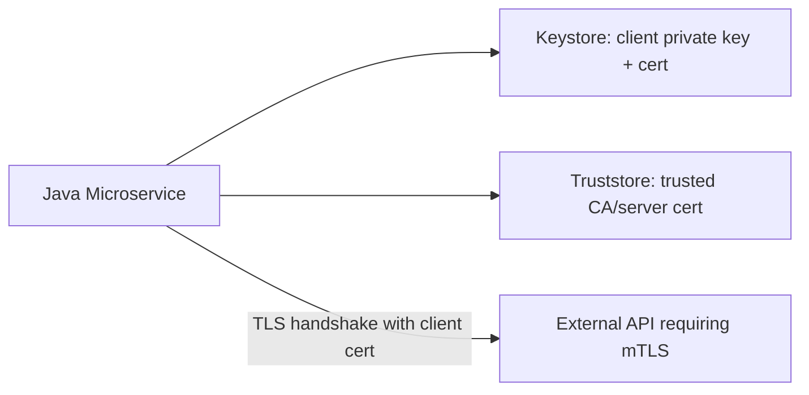

---

## 9.3 SSLContext Skeleton

```java
import javax.net.ssl.KeyManagerFactory;
import javax.net.ssl.SSLContext;
import javax.net.ssl.TrustManagerFactory;
import java.io.InputStream;
import java.security.KeyStore;

public class MtlsSslContextFactory {

    public SSLContext create(
            InputStream keyStoreInputStream,
            char[] keyStorePassword,
            InputStream trustStoreInputStream,
            char[] trustStorePassword
    ) {
        try {
            KeyStore keyStore = KeyStore.getInstance("PKCS12");
            keyStore.load(keyStoreInputStream, keyStorePassword);

            KeyManagerFactory keyManagerFactory =
                    KeyManagerFactory.getInstance(KeyManagerFactory.getDefaultAlgorithm());
            keyManagerFactory.init(keyStore, keyStorePassword);

            KeyStore trustStore = KeyStore.getInstance("PKCS12");
            trustStore.load(trustStoreInputStream, trustStorePassword);

            TrustManagerFactory trustManagerFactory =
                    TrustManagerFactory.getInstance(TrustManagerFactory.getDefaultAlgorithm());
            trustManagerFactory.init(trustStore);

            SSLContext sslContext = SSLContext.getInstance("TLS");
            sslContext.init(
                    keyManagerFactory.getKeyManagers(),
                    trustManagerFactory.getTrustManagers(),
                    null
            );

            return sslContext;

        } catch (Exception ex) {
            throw new MtlsConfigurationException("Failed to initialize mTLS SSLContext", ex);
        }
    }
}
```

Register ke Jersey Client:

```java
SSLContext sslContext = mtlsSslContextFactory.create(
        keyStoreInputStream,
        keyStorePassword,
        trustStoreInputStream,
        trustStorePassword
);

Client client = ClientBuilder.newBuilder()
        .sslContext(sslContext)
        .build();
```

---

## 9.4 mTLS Operational Checklist

| Checklist | Kenapa Penting |
|---|---|
| Certificate expiry monitored | Cert expired = outage. |
| Keystore password disimpan aman | Password juga secret. |
| Private key tidak masuk image/container layer | Hindari leak dari artifact. |
| Truststore update process jelas | CA rotation bisa break integration. |
| Rotation diuji di staging | Hindari surprise di production. |
| Peer certificate identity diverifikasi | Jangan hanya “TLS berhasil”. |
| SAN/CN expectation jelas | Mencegah salah certificate. |
| Rollback certificate tersedia | Mengurangi downtime saat rotasi gagal. |

---

## 10. Signed Request

Signed request berguna saat:

```text
vendor meminta HMAC signature
request harus tahan tampering
ingin replay protection
API key saja tidak cukup
```

Typical signature input:

```text
HTTP method
path
query string
timestamp
nonce
body hash
client id
```

Contoh canonical string:

```text
POST
/v1/cases/CASE-123/submissions
timestamp=2026-07-14T15:30:00Z
nonce=abc-123
sha256(body)=...
```

### 10.1 HMAC Signing Filter Skeleton

```java
import jakarta.ws.rs.client.ClientRequestContext;
import jakarta.ws.rs.client.ClientRequestFilter;
import java.io.IOException;
import java.time.Clock;
import java.time.Instant;
import java.util.UUID;

public class HmacSigningClientFilter implements ClientRequestFilter {

    private final HmacSigner signer;
    private final SigningSecretProvider secretProvider;
    private final Clock clock;

    public HmacSigningClientFilter(
            HmacSigner signer,
            SigningSecretProvider secretProvider,
            Clock clock
    ) {
        this.signer = signer;
        this.secretProvider = secretProvider;
        this.clock = clock;
    }

    @Override
    public void filter(ClientRequestContext requestContext) throws IOException {
        String timestamp = Instant.now(clock).toString();
        String nonce = UUID.randomUUID().toString();

        String canonical = CanonicalRequestBuilder.from(requestContext, timestamp, nonce);

        String signature = signer.sign(
                canonical,
                secretProvider.currentSigningSecret()
        );

        requestContext.getHeaders().putSingle("X-Timestamp", timestamp);
        requestContext.getHeaders().putSingle("X-Nonce", nonce);
        requestContext.getHeaders().putSingle("X-Signature", signature);
    }
}
```

Practical rules:

```text
Gunakan timestamp tolerance.
Gunakan nonce/request ID untuk replay detection.
Sign body hash, bukan raw body log.
Jangan membuat canonicalization ambigu.
Dokumentasikan urutan field signature.
```

---

## 11. Inbound Bearer Token Validation

Untuk API yang dipanggil external/internal client, validasi token harus mencakup:

```text
signature valid
issuer valid
audience valid
expiry valid
not-before valid
scope/permission valid
tenant claim valid
client/user identity tercatat
```

Jangan hanya decode JWT tanpa verifikasi signature.

OWASP API Security Top 10 2023 menyoroti Broken Authentication sebagai risiko ketika mekanisme authentication salah implementasi sehingga attacker bisa mengambil alih identitas user/client. ([OWASP](https://owasp.org/API-Security/editions/2023/en/0x11-t10/?utm_source=chatgpt.com))

### 11.1 Jersey ContainerRequestFilter Skeleton

```java
import jakarta.annotation.Priority;
import jakarta.ws.rs.Priorities;
import jakarta.ws.rs.container.ContainerRequestContext;
import jakarta.ws.rs.container.ContainerRequestFilter;
import jakarta.ws.rs.core.HttpHeaders;
import jakarta.ws.rs.core.Response;
import jakarta.ws.rs.ext.Provider;

@Provider
@Priority(Priorities.AUTHENTICATION)
public class BearerTokenAuthenticationFilter implements ContainerRequestFilter {

    private final TokenValidator tokenValidator;
    private final SecurityContextFactory securityContextFactory;

    public BearerTokenAuthenticationFilter(
            TokenValidator tokenValidator,
            SecurityContextFactory securityContextFactory
    ) {
        this.tokenValidator = tokenValidator;
        this.securityContextFactory = securityContextFactory;
    }

    @Override
    public void filter(ContainerRequestContext requestContext) {
        String authorization = requestContext.getHeaderString(HttpHeaders.AUTHORIZATION);

        if (authorization == null || !authorization.startsWith("Bearer ")) {
            requestContext.abortWith(Response.status(Response.Status.UNAUTHORIZED).build());
            return;
        }

        String token = authorization.substring("Bearer ".length());

        TokenClaims claims = tokenValidator.validate(token);

        requestContext.setSecurityContext(
                securityContextFactory.fromClaims(claims, requestContext)
        );
    }
}
```

Token validator interface:

```java
public interface TokenValidator {
    TokenClaims validate(String token);
}
```

Claims:

```java
public record TokenClaims(
        String subject,
        String clientId,
        String issuer,
        String audience,
        String tenantId,
        Set<String> scopes,
        Instant expiresAt
) {}
```

---

## 12. Authorization Scope

Authentication sukses belum cukup.

```text
Token valid bukan berarti boleh akses semua resource.
```

Contoh scope matrix:

| Operation | Required Scope |
|---|---|
| `GET /v1/cases/{caseId}` | `case:read` |
| `POST /v1/cases` | `case:create` |
| `PATCH /v1/cases/{caseId}` | `case:update` |
| `POST /v1/cases/{caseId}/approvals` | `case:approve` |
| `POST /v1/cases/{caseId}/external-submissions` | `case:submit_external` |
| `GET /v1/cases/{caseId}/audit-events` | `case:audit:read` |

Authorization guard:

```java
public class AuthorizationService {

    public void requireScope(TokenClaims claims, String requiredScope) {
        if (!claims.scopes().contains(requiredScope)) {
            throw new ForbiddenException("Missing required scope: " + requiredScope);
        }
    }
}
```

---

## 13. Object-Level Authorization

OWASP API Security Top 10 2023 menempatkan **Broken Object Level Authorization** sebagai API1; API yang menerima object identifier harus mempertimbangkan object-level authorization di setiap function yang mengakses data source dengan ID dari user. ([OWASP](https://owasp.org/www-project-api-security/?utm_source=chatgpt.com))

Contoh masalah:

```text
User/client punya token valid.
User/client mengganti /cases/CASE-123 menjadi /cases/CASE-999.
API hanya cek token valid.
API tidak cek apakah caller boleh akses CASE-999.
```

### 13.1 Object Access Check

```java
public class CaseAuthorizationService {

    private final CaseRepository caseRepository;

    public CaseAuthorizationService(CaseRepository caseRepository) {
        this.caseRepository = caseRepository;
    }

    public void requireCanReadCase(TokenClaims claims, String caseId) {
        CaseAccessRecord access = caseRepository.findAccessRecord(caseId)
                .orElseThrow(() -> new NotFoundException("Case not found"));

        if (!access.tenantId().equals(claims.tenantId())) {
            throw new NotFoundException("Case not found");
        }

        if (!claims.scopes().contains("case:read")) {
            throw new ForbiddenException("Missing case:read scope");
        }
    }
}
```

Catatan:

```text
Untuk mencegah information leakage, cross-tenant access sering dikembalikan sebagai 404, bukan 403.
Tapi internal audit tetap mencatat forbidden/cross-tenant attempt.
```

---

## 14. Tenant Boundary

Multi-tenant integration harus jelas dari mana tenant berasal:

```text
JWT claim
mTLS client certificate mapping
API key mapping
request header dari trusted gateway
path parameter
database mapping
```

Jangan percaya header tenant dari public client tanpa validasi.

Bad:

```text
X-Tenant-ID: tenant-a
Authorization: token milik tenant-b
```

Better:

```text
Tenant dari token/cert/API key adalah source of truth.
Header tenant hanya boleh dipakai jika gateway terpercaya dan signed/internal.
```

Tenant resolver:

```java
public class TenantResolver {

    public String resolveTenant(TokenClaims claims, String requestedTenantId) {
        if (requestedTenantId == null) {
            return claims.tenantId();
        }

        if (!requestedTenantId.equals(claims.tenantId())) {
            throw new ForbiddenException("Tenant mismatch");
        }

        return requestedTenantId;
    }
}
```

---

## 15. Webhook Signature Verification

Webhook inbound tidak cukup diamankan dengan “endpoint URL rahasia”.

Minimal validasi:

```text
signature valid
timestamp masih dalam tolerance
event ID belum pernah diproses
body hash sesuai
vendor/source dikenali
payload schema valid
```

Flow:

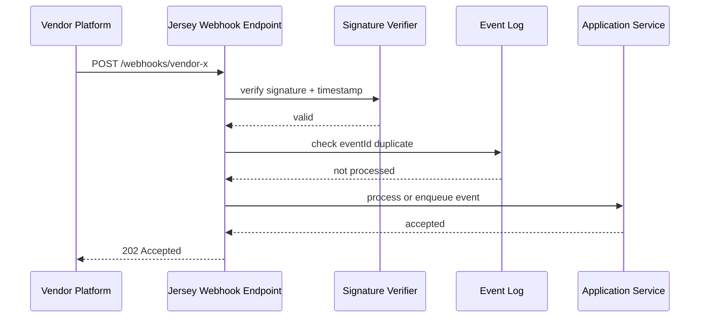

### 15.1 Webhook Filter Skeleton

```java
import jakarta.ws.rs.container.ContainerRequestContext;
import jakarta.ws.rs.container.ContainerRequestFilter;
import jakarta.ws.rs.ext.Provider;

@Provider
public class WebhookSignatureFilter implements ContainerRequestFilter {

    private final WebhookSignatureVerifier verifier;

    public WebhookSignatureFilter(WebhookSignatureVerifier verifier) {
        this.verifier = verifier;
    }

    @Override
    public void filter(ContainerRequestContext requestContext) {
        // In real implementation, body buffering is needed carefully.
        // Many teams verify signature in the resource method where raw body is available.
    }
}
```

Resource-method style sering lebih praktis karena butuh raw body:

```java
@Path("/webhooks/vendor-x")
@Consumes(MediaType.APPLICATION_JSON)
public class VendorWebhookResource {

    private final WebhookSignatureVerifier verifier;
    private final VendorWebhookService webhookService;

    @POST
    public Response receive(
            String rawBody,
            @HeaderParam("X-Vendor-Signature") String signature,
            @HeaderParam("X-Vendor-Timestamp") String timestamp,
            @HeaderParam("X-Vendor-Event-ID") String eventId
    ) {
        verifier.verify(rawBody, signature, timestamp);

        webhookService.accept(eventId, rawBody);

        return Response.accepted().build();
    }
}
```

Verifier skeleton:

```java
public class WebhookSignatureVerifier {

    private final WebhookSecretProvider secretProvider;
    private final Clock clock;

    public WebhookSignatureVerifier(
            WebhookSecretProvider secretProvider,
            Clock clock
    ) {
        this.secretProvider = secretProvider;
        this.clock = clock;
    }

    public void verify(String rawBody, String signature, String timestamp) {
        requirePresent(signature, "signature");
        requirePresent(timestamp, "timestamp");

        Instant requestTime = Instant.parse(timestamp);
        Instant now = Instant.now(clock);

        if (requestTime.isBefore(now.minusSeconds(300)) ||
            requestTime.isAfter(now.plusSeconds(60))) {
            throw new UnauthorizedWebhookException("Webhook timestamp outside tolerance");
        }

        String expected = Hmac.sha256Hex(
                timestamp + "." + rawBody,
                secretProvider.currentSecret()
        );

        if (!ConstantTime.equals(expected, signature)) {
            throw new UnauthorizedWebhookException("Invalid webhook signature");
        }
    }

    private void requirePresent(String value, String name) {
        if (value == null || value.isBlank()) {
            throw new UnauthorizedWebhookException("Missing webhook " + name);
        }
    }
}
```

Practical rules:

```text
Gunakan constant-time comparison.
Jangan log raw signature/secret.
Simpan event ID untuk idempotency.
Return 2xx hanya jika event sudah diterima aman.
Proses berat sebaiknya enqueue, bukan langsung di request thread.
```

---

## 16. Secrets Management

Secret mencakup:

```text
OAuth client secret
API key
HMAC signing secret
JWT private key
mTLS private key
keystore password
database password
RabbitMQ password
cloud credential
encryption key
```

### 16.1 Secret Storage Options

| Tempat | Cocok untuk | Catatan |
|---|---|---|
| Kubernetes Secret | Basic container deployment | Perlu encryption at rest dan RBAC benar. |
| AWS Secrets Manager / Parameter Store | AWS workload | Integrasi IAM dan rotation. |
| Azure Key Vault | Azure workload | Integrasi managed identity. |
| HashiCorp Vault | Multi-cloud/on-prem | Kuat, tapi operational overhead lebih tinggi. |
| Mounted secret file | Cert/keystore | Pastikan permission dan rotation. |
| Environment variable | Umum tapi rawan leak | Bisa muncul di dump/process metadata. |
| Plain config file | Tidak | Hindari untuk secret. |
| Git repository | Tidak pernah | Termasuk private repo. |

### 16.2 Secret Inventory

| Field | Example |
|---|---|
| Secret name | `customer-registry-oauth-client-secret` |
| Used by | `case-service` |
| Purpose | OAuth2 client credentials |
| Owner | Platform Security |
| Rotation frequency | 90 days |
| Last rotated | 2026-06-01 |
| Expiry | 2026-09-01 |
| Environment | prod |
| Blast radius | Customer Registry lookup |
| Runbook | `runbooks/customer-registry-secret-rotation.md` |

---

## 17. Credential Rotation

Rotation harus didesain, bukan manual heroic action.

### 17.1 API Key Rotation Pattern

```text
1. Generate new API key.
2. Add new key to secret manager.
3. Deploy/reload service to use new key.
4. Verify calls succeed.
5. Revoke old key.
6. Monitor error rate.
```

Lebih baik jika vendor mendukung dual-key overlap:

```text
old key valid
new key valid
switch service
verify
revoke old
```

### 17.2 OAuth Client Secret Rotation

```text
1. Create secondary client secret.
2. Update secret manager.
3. Force token provider refresh or wait short TTL.
4. Verify token endpoint success.
5. Revoke old secret.
6. Watch 401/token failure metrics.
```

### 17.3 mTLS Certificate Rotation

```text
1. Generate new keypair/certificate.
2. Register new certificate with peer/vendor.
3. Add new cert to keystore.
4. Ensure truststore accepts peer chain.
5. Deploy/reload.
6. Test TLS handshake.
7. Remove old certificate after overlap window.
```

Anti-pattern:

```text
cert expires tomorrow
no one owns renewal
keystore password unknown
vendor needs 5 business days to register cert
production outage
```

---

## 18. Auth Failure Taxonomy

| Failure | HTTP / Signal | Likely Cause | Retry? | Action |
|---|---:|---|---:|---|
| Missing token | 401 | Client bug/config | Tidak | Fix caller. |
| Token expired | 401 | Cache/refresh issue | Sekali refresh | Refresh token/cache. |
| Invalid signature | 401 | Wrong issuer/key/token tampered | Tidak | Reject, audit. |
| Invalid audience | 401 | Token for wrong API | Tidak | Fix client config. |
| Missing scope | 403 | Permission config | Tidak | Update scope/policy. |
| Tenant mismatch | 403/404 | Cross-tenant attempt | Tidak | Audit security event. |
| Object access denied | 403/404 | BOLA attempt/missing access | Tidak | Audit security event. |
| API key invalid | 401/403 | Rotated/revoked/wrong key | Tidak | Check secret. |
| mTLS handshake fail | TLS failure | Cert expired/truststore mismatch | Tidak | Cert/runbook. |
| Webhook signature invalid | 401/403 | Spoof/replay/wrong secret | Tidak | Reject, audit. |
| Token endpoint timeout | 503/timeout | Auth server down | Ya, terbatas | Cache old token until safe? depends policy. |

---

## 19. Auth Observability

### 19.1 Metrics

| Metric | Label | Tujuan |
|---|---|---|
| `auth_token_request_total` | provider, result | Token endpoint health. |
| `auth_token_cache_hit_total` | provider | Cache effectiveness. |
| `auth_token_refresh_failure_total` | provider, reason | Detect token issue. |
| `api_auth_failure_total` | reason, endpoint | Inbound auth failure. |
| `api_authorization_denied_total` | reason, operation | Scope/object denial. |
| `webhook_signature_failure_total` | vendor | Spoof/replay detection. |
| `mtls_handshake_failure_total` | dependency | Cert/truststore issue. |
| `secret_rotation_event_total` | secret, result | Rotation audit. |

Jangan label metric dengan:

```text
raw token
API key
signature
client secret
full subject jika high-cardinality
raw customer/case ID
```

### 19.2 Security Audit Event

```json
{
  "event": "authorization_denied",
  "operation": "readCase",
  "reason": "TENANT_MISMATCH",
  "clientId": "partner-app-1",
  "subject": "system:partner-app-1",
  "tenantId": "tenant-a",
  "requestedTenantId": "tenant-b",
  "resourceType": "case",
  "resourceIdHash": "sha256:...",
  "correlationId": "corr-123",
  "timestamp": "2026-07-14T15:00:00Z"
}
```

Prinsip:

```text
Audit enough to investigate.
Do not leak raw PII unnecessarily.
Hash/mask sensitive identifiers where appropriate.
```

---

## 20. Jersey/JAX-RS Security Layers

Jakarta Security 4.0 adalah release untuk Jakarta EE 11 dan mendefinisikan standard untuk membuat secure Jakarta EE applications, termasuk evolusi API untuk authentication mechanisms. ([Jakarta EE](https://jakarta.ee/specifications/security/4.0/?utm_source=chatgpt.com))

Dalam praktik Jersey/JAX-RS microservice, security bisa berada di beberapa layer:

| Layer | Fungsi |
|---|---|
| API Gateway | TLS termination, WAF, rate limit, coarse auth. |
| Service mesh / ingress | mTLS, identity, network policy. |
| Jersey filter | Bearer token/webhook signature validation. |
| Application service | Scope/permission/business authorization. |
| Repository query | Tenant/object-level data isolation. |
| Audit service | Security event trail. |

Prinsip:

```text
Gateway boleh membantu, tetapi service tetap harus enforce authorization penting.
Jangan mengandalkan gateway saja untuk object-level authorization.
```

---

## 21. OpenAPI Security Contract

Contoh OAuth2 client-facing API:

```yaml
components:
  securitySchemes:
    oauth2:
      type: oauth2
      flows:
        clientCredentials:
          tokenUrl: https://auth.example.com/oauth2/token
          scopes:
            case:read: Read cases
            case:create: Create cases
            case:update: Update cases
            case:approve: Approve cases

paths:
  /v1/cases/{caseId}:
    get:
      security:
        - oauth2:
            - case:read
      responses:
        '200':
          description: Case found
        '401':
          description: Missing or invalid token
        '403':
          description: Token valid but insufficient permission
```

Untuk API key:

```yaml
components:
  securitySchemes:
    partnerApiKey:
      type: apiKey
      in: header
      name: X-API-Key
```

Untuk mTLS, OpenAPI bisa mendokumentasikan requirement, tetapi TLS enforcement biasanya dilakukan di gateway/service mesh/server config.

---

## 22. Practical Implementation Shape

Package structure:

```text
com.company.caseapp.security
  authentication/
    BearerTokenAuthenticationFilter.java
    TokenValidator.java
    TokenClaims.java
    SecurityContextFactory.java

  authorization/
    AuthorizationService.java
    CaseAuthorizationService.java
    TenantResolver.java

  outbound/
    AccessTokenProvider.java
    CachingClientCredentialsTokenProvider.java
    BearerTokenClientFilter.java
    ApiKeyClientFilter.java
    HmacSigningClientFilter.java

  mtls/
    MtlsSslContextFactory.java
    CertificateExpiryMonitor.java

  webhook/
    WebhookSignatureVerifier.java
    WebhookSecretProvider.java
    WebhookReplayGuard.java

  secrets/
    SecretProvider.java
    SecretReference.java
    SecretRotationMetadata.java

  audit/
    SecurityAuditLogger.java
    SecurityAuditEvent.java
```

Integration package memakai abstraction:

```text
integration.customerregistry
  CustomerRegistryClient.java
  CustomerRegistryGateway.java
  CustomerRegistryClientConfig.java
```

Security implementation tidak dicampur ke business logic.

---

## 23. Secure Outbound Client Example

```java
public class CustomerRegistryClientFactory {

    public Client create(
            CustomerRegistryClientConfig config,
            AccessTokenProvider tokenProvider,
            CorrelationIdProvider correlationIdProvider
    ) {
        ClientConfig clientConfig = new ClientConfig();

        clientConfig.property(ClientProperties.CONNECT_TIMEOUT, config.connectTimeoutMillis());
        clientConfig.property(ClientProperties.READ_TIMEOUT, config.readTimeoutMillis());

        clientConfig.register(new BearerTokenClientFilter(tokenProvider));
        clientConfig.register(new CorrelationIdClientFilter(correlationIdProvider));
        clientConfig.register(new SafeOutboundLoggingFilter());

        return ClientBuilder.newClient(clientConfig);
    }
}
```

Safe logging filter rule:

```text
Log:
  dependency
  operation
  method
  path template
  status
  latency
  correlation ID

Never log:
  Authorization
  X-API-Key
  X-Signature
  cookies
  raw token
  client secret
  full PII payload
```

---

## 24. Practical Security Checklist Sebelum Merge

| Checklist | Status |
|---|---|
| Auth pattern dipilih per dependency | ☐ |
| Token/API key/cert tidak hardcoded | ☐ |
| Secret disimpan di secret manager/Kubernetes Secret/Vault | ☐ |
| Outbound auth injection via filter/provider | ☐ |
| Token caching + refresh skew tersedia | ☐ |
| Token refresh stampede dicegah | ☐ |
| 401/403 ditangani berbeda | ☐ |
| Scope per operation jelas | ☐ |
| Tenant boundary divalidasi | ☐ |
| Object-level authorization ada | ☐ |
| Webhook signature diverifikasi | ☐ |
| Webhook replay protection ada | ☐ |
| mTLS cert expiry dimonitor | ☐ |
| Keystore/truststore rotation plan ada | ☐ |
| Secret masking di logs aktif | ☐ |
| Security audit event tersedia | ☐ |
| OpenAPI security scheme terdokumentasi | ☐ |
| Auth failure test tersedia | ☐ |
| Rotation runbook tersedia | ☐ |

---

## 25. Testing Strategy

### 25.1 Test Matrix

| Scenario | Expected |
|---|---|
| Missing bearer token | 401 |
| Invalid JWT signature | 401 |
| Expired token | 401 |
| Wrong audience | 401 |
| Missing scope | 403 |
| Tenant mismatch | 403/404 + audit |
| Object access denied | 403/404 + audit |
| Valid token + valid scope + valid object access | Success |
| API key missing | 401 |
| API key invalid | 401/403 |
| Webhook signature invalid | 401/403 |
| Webhook timestamp expired | 401/403 |
| Webhook duplicate event ID | Idempotent response/no duplicate processing |
| mTLS cert expired | TLS/auth failure + alert |
| OAuth token endpoint timeout | Controlled dependency failure |
| Token cache hit | No token endpoint call |

### 25.2 Example Unit Test - Scope Denied

```java
@Test
void shouldDenyWhenScopeMissing() {
    TokenClaims claims = new TokenClaims(
            "system:partner-a",
            "partner-a",
            "https://issuer.example.com",
            "case-api",
            "tenant-a",
            Set.of("case:read"),
            Instant.now().plusSeconds(3600)
    );

    AuthorizationService authorizationService = new AuthorizationService();

    assertThrows(
            ForbiddenException.class,
            () -> authorizationService.requireScope(claims, "case:approve")
    );
}
```

### 25.3 Example Unit Test - Tenant Mismatch

```java
@Test
void shouldDenyTenantMismatch() {
    TokenClaims claims = new TokenClaims(
            "system:partner-a",
            "partner-a",
            "https://issuer.example.com",
            "case-api",
            "tenant-a",
            Set.of("case:read"),
            Instant.now().plusSeconds(3600)
    );

    TenantResolver resolver = new TenantResolver();

    assertThrows(
            ForbiddenException.class,
            () -> resolver.resolveTenant(claims, "tenant-b")
    );
}
```

---

## 26. Anti-Patterns

| Anti-Pattern | Dampak | Alternatif |
|---|---|---|
| Token hanya di-decode, tidak diverifikasi | Token palsu diterima | Verify signature, issuer, audience, expiry. |
| Scope tidak dicek | Token valid bisa akses semua API | Scope/permission matrix. |
| Object-level authorization tidak ada | BOLA vulnerability | Check access per resource ID. |
| API key di source code | Secret leakage | Secret manager. |
| API key di query param | Bocor di logs/proxy | Header + masking. |
| Token di-log saat debug | Credential compromise | Redaction. |
| Refresh token tiap request | Auth server overload | Token cache. |
| Tidak ada refresh lock | Token refresh stampede | Lock/single-flight refresh. |
| mTLS cert tidak dimonitor | Outage saat expired | Expiry alert. |
| Webhook tanpa signature | Spoofed event | HMAC/JWS verification. |
| Webhook tanpa replay guard | Duplicate side effect | Event ID/idempotency table. |
| Gateway-only authz | Bypass/internal risk | Enforce authz di service juga. |
| 401 dan 403 disamakan | Diagnosis buruk | Error taxonomy jelas. |
| Secret rotation manual tanpa runbook | Outage saat rotasi | Rotation playbook. |

---

## 27. Practical Deliverable untuk Seri Ini

Untuk setiap integrasi, buat security notes seperti ini:

```text
Integration:
  Customer Registry API

Direction:
  Outbound

Authentication:
  OAuth2 client credentials

Authorization:
  Scope required: customer:read

Secret:
  customer-registry-oauth-client-secret
  stored in: AWS Secrets Manager / Azure Key Vault / Kubernetes Secret
  owner: Platform Security
  rotation: every 90 days

Token Handling:
  cached until expires_in - 60s
  refresh lock enabled
  token endpoint timeout: connect 1s, read 3s

Transport:
  TLS required
  mTLS: no

Headers:
  Authorization: Bearer <token>
  X-Correlation-ID
  User-Agent: case-service/<version>

Failure:
  401 -> refresh token once, then fail
  403 -> no retry, security/config escalation
  token endpoint timeout -> controlled 503/fallback
  secret missing -> startup failure

Logging:
  never log token/client secret
  log clientId, dependency, operation, status, correlationId

Audit:
  outbound call records dependency, operation, scope, clientId, business key

Runbook:
  token failure
  secret rotation
  vendor auth outage
```

Untuk webhook:

```text
Integration:
  Vendor Case Status Webhook

Direction:
  Inbound

Authentication:
  HMAC SHA-256 signature

Required Headers:
  X-Vendor-Signature
  X-Vendor-Timestamp
  X-Vendor-Event-ID

Verification:
  signature over timestamp + raw body
  timestamp tolerance: 5 minutes
  constant-time signature comparison
  event ID de-duplication

Failure:
  invalid signature -> 401/403
  expired timestamp -> 401/403
  duplicate event ID -> return 202 without reprocessing

Audit:
  vendor, eventId, signatureValid, duplicate, correlationId

Runbook:
  secret rotation
  webhook replay
  vendor delivery issue
```

---

## 28. Ringkasan Seri 5

Inti dari security integration:

```text
Authentication membuktikan identitas.
Authorization membatasi aksi.
Object-level authorization membatasi resource spesifik.
mTLS memperkuat transport identity.
Webhook signature mencegah spoofing dan tampering.
Secret management menjaga credential lifecycle.
Rotation runbook mencegah outage.
Audit membuat keputusan security bisa ditelusuri.
```

Urutan desain yang benar:

```text
1. Identifikasi arah integrasi: inbound, outbound, bidirectional.
2. Pilih auth pattern: OAuth2, API key, mTLS, signed request/webhook.
3. Definisikan scope/permission per operation.
4. Definisikan tenant dan object-level boundary.
5. Buat provider/filter agar auth tidak bocor ke business logic.
6. Simpan secret di secret manager, bukan source/config biasa.
7. Buat token/cache/rotation strategy.
8. Tambahkan auth failure taxonomy.
9. Tambahkan metrics, logs, audit.
10. Test missing/invalid/expired/forbidden/replay scenarios.
```

---

# Status

**Seri 5/12 - Authentication, Authorization, mTLS, OAuth2, API Key & Secrets selesai.**

Rekomendasi berikutnya:

**Seri 6/12 - Idempotency, Duplicate Handling & Safe Retry Design**

Fokus berikutnya: cara membuat external command aman terhadap retry, timeout ambiguity, duplicate webhook, duplicate message, double submit, outbox relay duplicate, dan race condition dengan PostgreSQL/MyBatis.

---

**Sources:**

- [RFC 9700 - Best Current Practice for OAuth 2.0 Security](https://datatracker.ietf.org/doc/rfc9700/?utm_source=chatgpt.com)
- [OWASP API Security Project](https://owasp.org/www-project-api-security/?utm_source=chatgpt.com)
- [RFC 8705: OAuth 2.0 Mutual-TLS Client Authentication ...](https://www.rfc-editor.org/info/rfc8705/?utm_source=chatgpt.com)
- [Jakarta Security 4.0 | Jakarta EE | The Eclipse Foundation](https://jakarta.ee/specifications/security/4.0/?utm_source=chatgpt.com)

## Response:
7/14/2026, 10:08:31 PM

Saya lanjut ke **Seri 6/12 — Idempotency, Duplicate Handling & Safe Retry Design**. Fokus praktisnya: retry aman, duplicate webhook/message, timeout ambiguity, double submit, PostgreSQL unique constraint, MyBatis transaction, dan idempotency store.

# Seri 6/12 - Idempotency, Duplicate Handling & Safe Retry Design

## 1. Tujuan Seri Ini

Seri ini membahas cara membuat integrasi eksternal aman terhadap:

```text
retry
timeout ambiguity
double submit
duplicate webhook
duplicate message
outbox relay duplicate
consumer redelivery
race condition
partial failure
replay operation
```

Dalam sistem Java Jersey/JAX-RS microservice, idempotency bukan sekadar “pakai UUID”. Idempotency adalah **jaminan bahwa command yang sama tidak menimbulkan side effect ganda**, walaupun request/event/message/file diterima lebih dari sekali.

HTTP sendiri mendefinisikan beberapa method sebagai idempotent: RFC 9110 menyebut `PUT`, `DELETE`, dan safe methods sebagai idempotent; tetapi `POST` dan `PATCH` tidak otomatis idempotent sehingga perlu desain tambahan bila ingin aman untuk retry. ([IETF Datatracker](https://datatracker.ietf.org/doc/html/rfc9110?utm_source=chatgpt.com))

Untuk HTTP command seperti `POST` atau `PATCH`, draft IETF **Idempotency-Key HTTP Header Field** menjelaskan bahwa header `Idempotency-Key` dapat dipakai untuk membuat method non-idempotent menjadi lebih fault-tolerant. Status dokumennya masih berupa Internet-Draft, bukan RFC final, jadi perlakukan sebagai praktik umum yang sedang distandarkan, bukan standar final. ([IETF Datatracker](https://datatracker.ietf.org/doc/html/draft-ietf-httpapi-idempotency-key-header?utm_source=chatgpt.com))

---

## 2. Posisi dalam Roadmap

| Seri | Topik | Status |
|---:|---|---|
| 1 | Integration Boundary & Decision Model | Selesai |
| 2 | Outbound REST Client Engineering in Jersey/JAX-RS | Selesai |
| 3 | API Contract, OpenAPI, Versioning & Error Model | Selesai |
| 4 | Timeout, Retry, Circuit Breaker, Bulkhead & Fallback | Selesai |
| 5 | Authentication, Authorization, mTLS, OAuth2, API Key & Secrets | Selesai |
| 6 | **Idempotency, Duplicate Handling & Safe Retry Design** | **Sedang dibahas** |
| 7 | Webhook, Callback, Polling & External Event Intake | Berikutnya |
| 8 | Async Integration with RabbitMQ / AMQP / Event Messaging | Berikutnya |
| 9 | Transactional Outbox, Saga & Consistency Across Systems | Berikutnya |
| 10 | Camunda-Based External System Orchestration | Berikutnya |
| 11 | File-Based, Batch, Database-Mediated & Legacy Integration | Berikutnya |
| 12 | Observability, Audit, Reconciliation, Runbook & Governance | Berikutnya |

---

## 3. Core Mental Model

Masalah utama yang ingin diselesaikan:

```text
Client mengirim command.
Server memproses command.
Response hilang / timeout / connection reset.
Client tidak tahu apakah command sudah berhasil.
Client retry.
Server menerima command yang sama lagi.
```

Tanpa idempotency:

```text
1 request bisa menjadi 2 side effects.
```

Dengan idempotency:

```text
request yang sama dikenali,
hasil lama dikembalikan,
side effect tidak dieksekusi ulang.
```

Diagram:

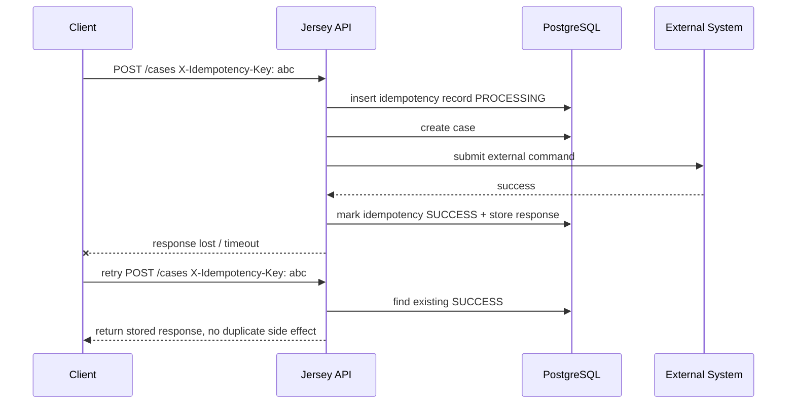

---

## 4. Istilah Penting

| Istilah | Makna Praktis |
|---|---|
| **Idempotent operation** | Operasi yang bila dijalankan berkali-kali dengan input sama menghasilkan efek akhir yang sama. |
| **Idempotency key** | Key unik dari client untuk menandai command yang sama. |
| **Request fingerprint/hash** | Hash dari payload penting untuk memastikan key yang sama tidak dipakai untuk payload berbeda. |
| **Duplicate request** | Request yang sama diterima lagi. Bisa karena retry, double-click, network issue, atau replay. |
| **Timeout ambiguity** | Client timeout, tetapi server mungkin sudah memproses request. |
| **At-least-once delivery** | Message broker dapat mengirim message lebih dari sekali, sehingga consumer harus siap duplicate. |
| **Deduplication store** | Tabel/storage untuk mencatat key/message/event yang sudah diproses. |
| **Replay** | Memproses ulang request/event/message secara sengaja untuk recovery. |
| **Idempotent consumer** | Consumer yang aman menerima message sama lebih dari sekali. |

Microservices.io menjelaskan bahwa dengan at-least-once delivery, consumer bisa dipanggil berulang untuk message yang sama, sehingga consumer harus idempotent: hasil memproses message berulang harus sama dengan memproses sekali. ([microservices.io](https://microservices.io/patterns/communication-style/idempotent-consumer.html?utm_source=chatgpt.com))

---

## 5. Decomposition Map - Practical Categories / Skills

| No | Area | Fokus Praktis | Output yang Harus Ada |
|---:|---|---|---|
| 1 | **Idempotency Requirement Analysis** | Menentukan operasi mana yang wajib idempotent. | Idempotency matrix. |
| 2 | **Idempotency Key Design** | Membuat key stabil, unik, dan aman. | Key convention. |
| 3 | **Request Fingerprint** | Mendeteksi key sama tetapi payload berbeda. | Payload hash rule. |
| 4 | **Idempotency Store** | Menyimpan status request, response, error, expiry. | PostgreSQL table. |
| 5 | **Atomic Claiming** | Mengklaim key secara atomic untuk menghindari race. | Unique constraint / insert-first pattern. |
| 6 | **Processing State Machine** | `PROCESSING`, `SUCCESS`, `FAILED_RETRYABLE`, `FAILED_FINAL`. | Status model. |
| 7 | **Response Replay** | Mengembalikan response lama untuk duplicate success. | Stored response policy. |
| 8 | **Conflict Handling** | Key sama payload beda → conflict. | `409 IDEMPOTENCY_CONFLICT`. |
| 9 | **Safe Retry Design** | Retry hanya untuk operasi aman. | Retryability + idempotency policy. |
| 10 | **Outbound Command Idempotency** | Mengirim idempotency key ke vendor. | External reference mapping. |
| 11 | **Webhook Deduplication** | Event ID/vendor delivery ID tidak diproses dua kali. | Webhook event log. |
| 12 | **Message Consumer Idempotency** | RabbitMQ consumer aman terhadap redelivery. | Processed message table. |
| 13 | **Outbox Duplicate Handling** | Outbox relay bisa publish lebih dari sekali. | Idempotent downstream consumer. |
| 14 | **Batch/File Deduplication** | File yang sama tidak di-import dua kali. | File checksum/import log. |
| 15 | **TTL & Retention** | Berapa lama idempotency key disimpan. | Retention policy. |
| 16 | **Observability & Audit** | Mencatat duplicate, conflict, replay, processing time. | Metrics + audit event. |
| 17 | **Testing Race Condition** | Simulasi concurrent duplicate request. | Concurrency test. |

---

## 6. Kapan Wajib Idempotency?

| Operation | Wajib Idempotency? | Alasan |
|---|---:|---|
| `GET /cases/{id}` | Tidak wajib eksplisit | GET sudah idempotent secara HTTP semantics. |
| `POST /cases` | Ya | Create command bisa double submit. |
| `POST /cases/{id}/submissions` | Ya | External submission tidak boleh dobel. |
| `POST /payments` | Sangat wajib | Risiko double charge. |
| `POST /documents/generate` | Ya | Dokumen bisa terbuat ganda. |
| `POST /notifications/send` | Sebaiknya | Duplicate notification buruk. |
| `PATCH /cases/{id}` | Tergantung | Jika patch command stateful, perlu guard. |
| Webhook event intake | Ya | Vendor bisa retry delivery. |
| RabbitMQ consumer | Ya | Message bisa redelivered. |
| Outbox relay consumer | Ya | Relay bisa publish duplicate. |
| File import | Ya | File bisa di-upload ulang. |
| Camunda service task external call | Ya | Job retry bisa menjalankan task lagi. |

Transactional outbox juga tidak menghilangkan duplicate. Microservices.io menyatakan message relay pada transactional outbox bisa publish message lebih dari sekali sehingga consumer harus idempotent, misalnya dengan melacak message ID yang sudah diproses. ([microservices.io](https://microservices.io/patterns/data/transactional-outbox.html?utm_source=chatgpt.com))

---

## 7. Idempotency Decision Matrix

| Pertanyaan | Jika Ya | Desain |
|---|---|---|
| Apakah operasi punya side effect? | Ya | Perlu idempotency. |
| Apakah client bisa retry? | Ya | Perlu idempotency key. |
| Apakah timeout bisa terjadi? | Ya | Simpan status dan response. |
| Apakah external system bisa menerima command yang sama dua kali? | Ya | Kirim external idempotency key atau simpan external reference. |
| Apakah broker menjamin at-least-once? | Ya | Consumer idempotent. |
| Apakah webhook vendor bisa retry? | Ya | Dedup event ID. |
| Apakah user bisa double-click submit? | Ya | Client-side disable saja tidak cukup; server tetap perlu idempotency. |
| Apakah batch/file bisa dikirim ulang? | Ya | Dedup berdasarkan checksum/file ID. |

---

## 8. Idempotency Key Design

### 8.1 Key dari Client

Untuk public/partner API:

```http
POST /v1/cases
X-Idempotency-Key: 6fd70e9b-5e14-4b63-b67e-3f92a4c0b2a1
```

Prinsip:

```text
client menghasilkan key unik per logical command
server menyimpan key
retry memakai key yang sama
command berbeda memakai key berbeda
```

### 8.2 Key dari Server / Domain

Untuk internal flow:

```text
case-create:{clientRequestId}
risk-score:{caseId}:v1
external-submit:{caseId}:{submissionType}
document-generate:{caseId}:{templateId}:v1
notification:{caseId}:{recipient}:{templateId}
```

### 8.3 Key yang Baik

| Rule | Penjelasan |
|---|---|
| Stabil untuk command yang sama | Retry harus memakai key yang sama. |
| Berbeda untuk command berbeda | Jangan satu key dipakai banyak command. |
| Tidak mengandung secret | Jangan isi token/password/data sensitif. |
| Bisa dikaitkan ke business key | Memudahkan audit dan troubleshooting. |
| Punya namespace | Hindari collision antar operation. |
| Punya panjang maksimum | Hindari abuse payload/header besar. |
| Disimpan bersama payload hash | Deteksi key reuse salah. |

### 8.4 Contoh Convention

```text
{operation}:{businessKey}:{semanticVersion}

case-create:client-req-abc:v1
case-submit:CASE-123:regulator-x:v1
risk-score:CASE-123:v1
document-generate:CASE-123:notice-template-v3:v1
```

---

## 9. Request Fingerprint / Payload Hash

Idempotency key saja tidak cukup.

Masalah:

```text
Request 1:
  X-Idempotency-Key: abc
  payload: create case for customer A

Request 2:
  X-Idempotency-Key: abc
  payload: create case for customer B
```

Server harus mendeteksi ini sebagai conflict, bukan mengembalikan response lama.

Solusi:

```text
canonicalize relevant payload
hash payload
simpan hash bersama idempotency key
saat duplicate datang, bandingkan hash
jika beda -> 409 IDEMPOTENCY_CONFLICT
```

Contoh:

```java
public class RequestFingerprint {

    private final ObjectMapper objectMapper;

    public RequestFingerprint(ObjectMapper objectMapper) {
        this.objectMapper = objectMapper;
    }

    public String hashCanonicalJson(Object payload) {
        try {
            byte[] canonicalJson = objectMapper
                    .writer()
                    .with(SerializationFeature.ORDER_MAP_ENTRIES_BY_KEYS)
                    .writeValueAsBytes(payload);

            MessageDigest digest = MessageDigest.getInstance("SHA-256");
            byte[] hash = digest.digest(canonicalJson);

            return HexFormat.of().formatHex(hash);

        } catch (Exception ex) {
            throw new IllegalStateException("Failed to calculate request fingerprint", ex);
        }
    }
}
```

Catatan praktis:

```text
Hash hanya field yang semantically penting.
Jangan hash timestamp request jika timestamp tidak memengaruhi command.
Jangan hash correlation ID.
Jangan hash signature/header transient.
```

---

## 10. PostgreSQL Idempotency Store

### 10.1 Table Design

```sql
CREATE TABLE idempotency_record (
    id BIGSERIAL PRIMARY KEY,

    operation_name TEXT NOT NULL,
    idempotency_key TEXT NOT NULL,
    request_hash TEXT NOT NULL,

    status TEXT NOT NULL,
    business_key TEXT,

    http_status INTEGER,
    response_body JSONB,
    error_code TEXT,

    locked_until TIMESTAMPTZ,
    created_at TIMESTAMPTZ NOT NULL DEFAULT now(),
    updated_at TIMESTAMPTZ NOT NULL DEFAULT now(),
    completed_at TIMESTAMPTZ,
    expires_at TIMESTAMPTZ NOT NULL,

    UNIQUE (operation_name, idempotency_key)
);

CREATE INDEX idx_idempotency_record_expires_at
    ON idempotency_record (expires_at);

CREATE INDEX idx_idempotency_record_business_key
    ON idempotency_record (business_key);
```

### 10.2 Status Model

| Status | Makna | Duplicate Behavior |
|---|---|---|
| `PROCESSING` | Request sedang diproses | Return `409/425/202` atau wait pendek. |
| `SUCCESS` | Request selesai sukses | Return stored response. |
| `FAILED_RETRYABLE` | Gagal tapi boleh dicoba ulang | Retry policy khusus. |
| `FAILED_FINAL` | Gagal permanen | Return stored error atau allow new key. |
| `EXPIRED` | Key tidak berlaku lagi | Treat as new only sesuai policy. |

---

## 11. Atomic Claiming Pattern

Tujuan: hanya satu request yang boleh memproses key tertentu.

### 11.1 Insert-First Pattern

```sql
INSERT INTO idempotency_record (
    operation_name,
    idempotency_key,
    request_hash,
    status,
    business_key,
    expires_at
)
VALUES (
    #{operationName},
    #{idempotencyKey},
    #{requestHash},
    'PROCESSING',
    #{businessKey},
    now() + interval '24 hours'
)
ON CONFLICT (operation_name, idempotency_key)
DO NOTHING;
```

Jika `rowsInserted == 1`:

```text
request ini pemilik processing
lanjut proses command
```

Jika `rowsInserted == 0`:

```text
key sudah ada
load existing record
bandingkan request_hash
tentukan duplicate/conflict/processing
```

---

## 12. MyBatis Mapper

```java
public interface IdempotencyRecordMapper {

    int insertProcessing(IdempotencyRecord record);

    Optional<IdempotencyRecord> findByOperationAndKey(
            @Param("operationName") String operationName,
            @Param("idempotencyKey") String idempotencyKey
    );

    int markSuccess(
            @Param("operationName") String operationName,
            @Param("idempotencyKey") String idempotencyKey,
            @Param("httpStatus") int httpStatus,
            @Param("responseBody") String responseBody,
            @Param("businessKey") String businessKey
    );

    int markFailedFinal(
            @Param("operationName") String operationName,
            @Param("idempotencyKey") String idempotencyKey,
            @Param("errorCode") String errorCode,
            @Param("httpStatus") int httpStatus,
            @Param("responseBody") String responseBody
    );

    int markFailedRetryable(
            @Param("operationName") String operationName,
            @Param("idempotencyKey") String idempotencyKey,
            @Param("errorCode") String errorCode
    );
}
```

MyBatis XML skeleton:

```xml
<insert id="insertProcessing">
    INSERT INTO idempotency_record (
        operation_name,
        idempotency_key,
        request_hash,
        status,
        business_key,
        expires_at
    )
    VALUES (
        #{operationName},
        #{idempotencyKey},
        #{requestHash},
        'PROCESSING',
        #{businessKey},
        #{expiresAt}
    )
    ON CONFLICT (operation_name, idempotency_key)
    DO NOTHING
</insert>

<select id="findByOperationAndKey" resultType="IdempotencyRecord">
    SELECT
        id,
        operation_name,
        idempotency_key,
        request_hash,
        status,
        business_key,
        http_status,
        response_body,
        error_code,
        locked_until,
        created_at,
        updated_at,
        completed_at,
        expires_at
    FROM idempotency_record
    WHERE operation_name = #{operationName}
      AND idempotency_key = #{idempotencyKey}
</select>

<update id="markSuccess">
    UPDATE idempotency_record
    SET status = 'SUCCESS',
        http_status = #{httpStatus},
        response_body = #{responseBody}::jsonb,
        business_key = #{businessKey},
        completed_at = now(),
        updated_at = now()
    WHERE operation_name = #{operationName}
      AND idempotency_key = #{idempotencyKey}
</update>
```

---

## 13. Idempotency Service

```java
public class IdempotencyService {

    private final IdempotencyRecordMapper mapper;
    private final ObjectMapper objectMapper;

    public IdempotencyService(
            IdempotencyRecordMapper mapper,
            ObjectMapper objectMapper
    ) {
        this.mapper = mapper;
        this.objectMapper = objectMapper;
    }

    public IdempotencyDecision claimOrResolve(
            String operationName,
            String idempotencyKey,
            String requestHash,
            String businessKey
    ) {
        IdempotencyRecord newRecord = IdempotencyRecord.processing(
                operationName,
                idempotencyKey,
                requestHash,
                businessKey,
                OffsetDateTime.now().plusHours(24)
        );

        int inserted = mapper.insertProcessing(newRecord);

        if (inserted == 1) {
            return IdempotencyDecision.processNow();
        }

        IdempotencyRecord existing = mapper
                .findByOperationAndKey(operationName, idempotencyKey)
                .orElseThrow(() -> new IllegalStateException("Idempotency record disappeared"));

        if (!existing.requestHash().equals(requestHash)) {
            return IdempotencyDecision.conflict(existing);
        }

        return switch (existing.status()) {
            case "SUCCESS" -> IdempotencyDecision.replaySuccess(existing);
            case "PROCESSING" -> IdempotencyDecision.alreadyProcessing(existing);
            case "FAILED_FINAL" -> IdempotencyDecision.replayFailure(existing);
            case "FAILED_RETRYABLE" -> IdempotencyDecision.retryAllowed(existing);
            default -> IdempotencyDecision.unknown(existing);
        };
    }

    public void markSuccess(
            String operationName,
            String idempotencyKey,
            int httpStatus,
            Object responseBody,
            String businessKey
    ) {
        mapper.markSuccess(
                operationName,
                idempotencyKey,
                httpStatus,
                toJson(responseBody),
                businessKey
        );
    }

    private String toJson(Object value) {
        try {
            return objectMapper.writeValueAsString(value);
        } catch (Exception ex) {
            throw new IllegalStateException("Failed to serialize idempotency response", ex);
        }
    }
}
```

---

## 14. Jersey Resource dengan Idempotency

```java
@Path("/v1/cases")
@Consumes(MediaType.APPLICATION_JSON)
@Produces(MediaType.APPLICATION_JSON)
public class CaseResource {

    private final CaseApplicationService caseService;
    private final IdempotencyService idempotencyService;
    private final RequestFingerprint requestFingerprint;

    public CaseResource(
            CaseApplicationService caseService,
            IdempotencyService idempotencyService,
            RequestFingerprint requestFingerprint
    ) {
        this.caseService = caseService;
        this.idempotencyService = idempotencyService;
        this.requestFingerprint = requestFingerprint;
    }

    @POST
    public Response createCase(
            @HeaderParam("X-Idempotency-Key") String idempotencyKey,
            @Valid CreateCaseRequest request
    ) {
        requireIdempotencyKey(idempotencyKey);

        String operationName = "case.create";
        String requestHash = requestFingerprint.hashCanonicalJson(request);
        String businessKey = request.customerId();

        IdempotencyDecision decision = idempotencyService.claimOrResolve(
                operationName,
                idempotencyKey,
                requestHash,
                businessKey
        );

        if (decision.isReplaySuccess()) {
            return Response.status(decision.httpStatus())
                    .entity(decision.responseBody())
                    .build();
        }

        if (decision.isConflict()) {
            throw new IdempotencyConflictException(
                    operationName,
                    idempotencyKey
            );
        }

        if (decision.isAlreadyProcessing()) {
            return Response.status(409)
                    .entity(ApiProblem.processingConflict(idempotencyKey))
                    .build();
        }

        CreateCaseResponse response = caseService.createCase(request);

        idempotencyService.markSuccess(
                operationName,
                idempotencyKey,
                201,
                response,
                response.caseId()
        );

        return Response.status(Response.Status.CREATED)
                .entity(response)
                .build();
    }

    private void requireIdempotencyKey(String idempotencyKey) {
        if (idempotencyKey == null || idempotencyKey.isBlank()) {
            throw new MissingIdempotencyKeyException();
        }

        if (idempotencyKey.length() > 128) {
            throw new InvalidIdempotencyKeyException();
        }
    }
}
```

---

## 15. Response Behavior

| Kondisi | Response |
|---|---|
| First request | Process command, return normal response. |
| Same key + same payload + success completed | Return stored success response. |
| Same key + different payload | `409 IDEMPOTENCY_CONFLICT`. |
| Same key sedang processing | `409`, `202`, atau wait pendek; pilih satu policy. |
| Same key failed final | Return stored error, atau require new key. |
| Missing idempotency key | `400` atau `422`. |
| Key expired | Reject sebagai expired atau treat as new sesuai policy. |

Contoh conflict:

```json
{
  "type": "https://api.example.com/problems/idempotency-conflict",
  "title": "Idempotency conflict",
  "status": 409,
  "detail": "The same idempotency key was used with a different request payload.",
  "code": "IDEMPOTENCY_CONFLICT",
  "correlationId": "corr-123",
  "retryable": false
}
```

---

## 16. Transaction Boundary yang Aman

### 16.1 Masalah Klasik

```text
1. Insert idempotency PROCESSING commit.
2. Create case commit.
3. Mark idempotency SUCCESS gagal.
4. Retry datang.
5. Record masih PROCESSING.
6. Case sudah terlanjur dibuat.
```

Solusi tergantung criticality:

| Pattern | Cocok Untuk | Catatan |
|---|---|---|
| Single DB transaction untuk idempotency + business state | Create/update internal state | Paling sederhana jika semua di DB yang sama. |
| Idempotency record menyimpan business key sejak awal | Recovery lookup | Bisa repair saat retry. |
| External side effect setelah DB commit | Perlu outbox/saga | Jangan campur sembarangan. |
| External command critical | Simpan external reference/idempotency key | Untuk recovery ambiguity. |

### 16.2 Recommended untuk Internal Create

```text
BEGIN
  insert idempotency PROCESSING
  create case
  mark idempotency SUCCESS with response
COMMIT
```

Jika ada external call, lebih aman:

```text
BEGIN
  insert idempotency PROCESSING
  create case PENDING_EXTERNAL_SUBMISSION
  write outbox command
  mark idempotency SUCCESS / 202 ACCEPTED
COMMIT

outbox worker:
  call external system with external idempotency key
  update case submission status
```

---

## 17. Safe Retry untuk Outbound External Command

Saat service kita memanggil external API:

```http
POST /vendor/submissions
X-Idempotency-Key: case-submit:CASE-123:regulator-x:v1
```

Simpan mapping:

```sql
CREATE TABLE external_command_log (
    id BIGSERIAL PRIMARY KEY,
    dependency_name TEXT NOT NULL,
    operation_name TEXT NOT NULL,
    business_key TEXT NOT NULL,
    external_idempotency_key TEXT NOT NULL,
    request_hash TEXT NOT NULL,
    status TEXT NOT NULL,
    external_reference TEXT,
    http_status INTEGER,
    error_code TEXT,
    created_at TIMESTAMPTZ NOT NULL DEFAULT now(),
    updated_at TIMESTAMPTZ NOT NULL DEFAULT now(),

    UNIQUE (dependency_name, operation_name, external_idempotency_key)
);
```

Rules:

```text
Jika timeout setelah POST ke vendor:
  jangan langsung membuat command baru dengan key baru.
  retry dengan idempotency key yang sama.
  jika vendor punya status endpoint, cek status by external idempotency key/reference.
```

---

## 18. Timeout Ambiguity

Timeout adalah kondisi paling berbahaya.

```text
Client timeout:
  server mungkin belum menerima request
  server mungkin menerima tapi belum proses
  server mungkin sudah proses sukses
  server mungkin proses sukses tapi response hilang
```

Karena itu:

```text
Retry timeout untuk POST hanya aman jika:
  idempotency key sama
  request hash sama
  external system menghormati idempotency key
  atau kita punya reconciliation/status check
```

Decision table:

| Timeout terjadi di mana | Risiko | Tindakan Aman |
|---|---|---|
| Sebelum request terkirim | Tidak ada side effect | Retry aman. |
| Setelah request terkirim, sebelum response | Ambiguous | Retry dengan key sama. |
| Saat external processing | Ambiguous | Check status/retry same key. |
| Saat response mapping | External sukses mungkin sudah terjadi | Jangan kirim command baru. |
| Saat DB mark success | Internal state mungkin partial | Recovery by business key. |

---

## 19. Webhook Deduplication

Vendor webhook biasanya bisa dikirim ulang jika vendor tidak menerima response `2xx`.

Tabel:

```sql
CREATE TABLE webhook_event_log (
    id BIGSERIAL PRIMARY KEY,
    vendor_name TEXT NOT NULL,
    event_id TEXT NOT NULL,
    event_type TEXT NOT NULL,
    payload_hash TEXT NOT NULL,
    status TEXT NOT NULL,
    received_at TIMESTAMPTZ NOT NULL DEFAULT now(),
    processed_at TIMESTAMPTZ,
    error_code TEXT,

    UNIQUE (vendor_name, event_id)
);
```

Flow:

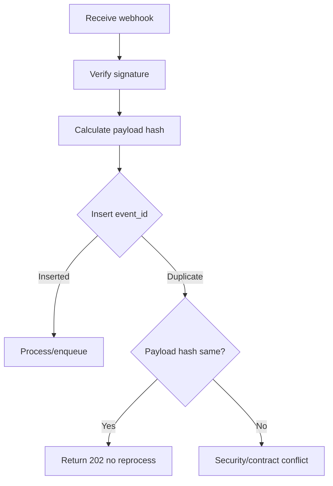

Policy:

| Kondisi | Response |
|---|---|
| First event | `202 Accepted` setelah disimpan/enqueued. |
| Duplicate same payload | `202 Accepted`, no reprocess. |
| Same event ID different payload | `409`/`400` internal alert; possible spoof/contract issue. |
| Invalid signature | `401/403`. |
| Old timestamp/replay | `401/403`. |

---

## 20. RabbitMQ Consumer Idempotency

Consumer harus aman terhadap redelivery.

Tabel:

```sql
CREATE TABLE processed_message (
    id BIGSERIAL PRIMARY KEY,
    consumer_name TEXT NOT NULL,
    message_id TEXT NOT NULL,
    message_hash TEXT NOT NULL,
    business_key TEXT,
    processed_at TIMESTAMPTZ NOT NULL DEFAULT now(),

    UNIQUE (consumer_name, message_id)
);
```

Consumer flow:

```text
receive message
validate schema
begin transaction
  insert processed_message
  if duplicate:
      ack message
      return
  apply business change
commit
ack message
```

Pseudo-code:

```java
public class CaseCreatedConsumer {

    private final ProcessedMessageMapper processedMessageMapper;
    private final CaseProjectionService projectionService;

    public void handle(MessageEnvelope<CaseCreatedEvent> envelope) {
        try {
            transactionTemplate.execute(() -> {
                int inserted = processedMessageMapper.insert(
                        "case-projection-consumer",
                        envelope.messageId(),
                        envelope.payloadHash(),
                        envelope.businessKey()
                );

                if (inserted == 0) {
                    return null;
                }

                projectionService.apply(envelope.payload());
                return null;
            });

            envelope.ack();

        } catch (RetryableException ex) {
            envelope.nackRequeue();

        } catch (Exception ex) {
            envelope.nackToDlq();
        }
    }
}
```

Important invariant:

```text
ACK hanya setelah DB transaction commit sukses.
```

---

## 21. Outbox Relay Duplicate

Transactional outbox menjamin business DB update dan outbox row tersimpan dalam satu transaksi. Tetapi relay bisa crash setelah publish sebelum mark published.

```text
publish message to RabbitMQ
crash before mark outbox published
relay restart
publish same message again
```

Karena itu downstream consumer tetap harus idempotent. Ini sejalan dengan catatan transactional outbox bahwa message relay dapat publish message lebih dari sekali sehingga consumer harus melacak message ID yang sudah diproses. ([microservices.io](https://microservices.io/patterns/data/transactional-outbox.html?utm_source=chatgpt.com))

Outbox message harus punya stable `messageId`:

```json
{
  "messageId": "case-created:CASE-123:v1",
  "eventType": "CaseCreated",
  "aggregateType": "Case",
  "aggregateId": "CASE-123",
  "occurredAt": "2026-07-14T15:00:00Z",
  "payload": {
    "caseId": "CASE-123",
    "customerId": "CUST-456"
  }
}
```

---

## 22. File / Batch Deduplication

Untuk file integration:

```sql
CREATE TABLE file_import_log (
    id BIGSERIAL PRIMARY KEY,
    source_system TEXT NOT NULL,
    file_name TEXT NOT NULL,
    file_checksum TEXT NOT NULL,
    file_size BIGINT NOT NULL,
    status TEXT NOT NULL,
    received_at TIMESTAMPTZ NOT NULL DEFAULT now(),
    processed_at TIMESTAMPTZ,
    row_count INTEGER,
    error_count INTEGER,

    UNIQUE (source_system, file_checksum)
);
```

Rules:

| Kondisi | Tindakan |
|---|---|
| Same checksum sudah success | Jangan import ulang. |
| Same filename beda checksum | Treat as new version atau reject, sesuai contract. |
| Same checksum processing | Return already processing. |
| Partial failure | Simpan row-level status. |
| Replay sengaja | Harus explicit admin operation dan audit. |

---

## 23. Camunda Service Task Idempotency

Camunda job retry bisa menjalankan service task lebih dari sekali.

Contoh task:

```text
Submit case to external regulator
```

Jangan desain task seperti ini:

```text
setiap execution langsung POST baru ke regulator
```

Lebih aman:

```text
external idempotency key = regulator-submit:{processBusinessKey}:{caseId}:v1
cek external_command_log
jika success -> return existing external reference
jika processing/retryable -> retry with same key
jika belum ada -> create command log + call external
```

Camunda variable yang berguna:

```text
businessKey
caseId
externalCommandKey
externalReference
submissionStatus
lastFailureCategory
```

---

## 24. Concurrency Race Condition

### 24.1 Double Submit

Dua request identik masuk bersamaan:

```text
request A insert key
request B insert key
```

PostgreSQL unique constraint memastikan hanya satu menang.

### 24.2 Same Business Command Different Key

User/client bisa mengirim command sama dengan idempotency key berbeda.

Contoh:

```text
POST /cases
X-Idempotency-Key: key-1
customerId: CUST-1
caseType: ENFORCEMENT

POST /cases
X-Idempotency-Key: key-2
customerId: CUST-1
caseType: ENFORCEMENT
```

Idempotency key tidak cukup. Perlu business uniqueness jika domain memang melarang duplicate.

Contoh constraint:

```sql
CREATE UNIQUE INDEX uq_open_case_per_customer_type
ON case_record (customer_id, case_type)
WHERE status IN ('OPEN', 'PENDING_REVIEW', 'PENDING_EXTERNAL_SUBMISSION');
```

Rule:

```text
Idempotency mencegah duplicate retry command.
Business uniqueness mencegah duplicate business object.
Keduanya berbeda dan sering sama-sama diperlukan.
```

---

## 25. Idempotency vs Optimistic Locking vs Deduplication

| Mechanism | Menjawab Masalah | Contoh |
|---|---|---|
| Idempotency key | Retry command yang sama | `POST /cases` dengan key sama. |
| Business unique constraint | Duplicate business object | Satu open case per customer/type. |
| Optimistic locking | Concurrent update ke resource sama | `If-Match`, version column. |
| Message deduplication | Message/event redelivery | `processed_message`. |
| Webhook deduplication | Vendor event retry | `webhook_event_log`. |
| File checksum | File import ulang | `file_import_log`. |
| Outbox message ID | Duplicate publish | Stable `messageId`. |

---

## 26. Error Model

### 26.1 Missing Key

```json
{
  "type": "https://api.example.com/problems/missing-idempotency-key",
  "title": "Missing idempotency key",
  "status": 400,
  "detail": "This operation requires X-Idempotency-Key.",
  "code": "MISSING_IDEMPOTENCY_KEY",
  "retryable": false
}
```

### 26.2 Key Conflict

```json
{
  "type": "https://api.example.com/problems/idempotency-conflict",
  "title": "Idempotency conflict",
  "status": 409,
  "detail": "The same idempotency key was used with a different request payload.",
  "code": "IDEMPOTENCY_CONFLICT",
  "retryable": false
}
```

### 26.3 Already Processing

```json
{
  "type": "https://api.example.com/problems/idempotency-processing",
  "title": "Request already processing",
  "status": 409,
  "detail": "A request with the same idempotency key is still being processed.",
  "code": "IDEMPOTENCY_PROCESSING",
  "retryable": true
}
```

---

## 27. TTL dan Retention Policy

Idempotency key tidak harus disimpan selamanya, tetapi retention harus jelas.

| Operation Type | Suggested Retention |
|---|---:|
| Simple create request | 24-72 jam |
| Payment/financial command | Lebih lama, sesuai compliance/business |
| Regulatory submission | Lebih lama, bisa bulan/tahun untuk audit |
| Webhook event ID | Minimal sesuai vendor retry window |
| Message consumer dedup | Sesuai retention message/replay window |
| File import checksum | Lama, terutama batch/reporting |
| Camunda external command | Sepanjang process aktif + audit retention |

Practical rule:

```text
Idempotency retention harus lebih panjang dari retry window.
```

Jika client boleh retry selama 24 jam, key jangan expired dalam 1 jam.

---

## 28. Cleanup Job

```sql
DELETE FROM idempotency_record
WHERE expires_at < now()
  AND status IN ('SUCCESS', 'FAILED_FINAL')
LIMIT 1000;
```

Lebih aman gunakan batch job:

```text
delete per chunk
hindari long transaction
monitor row count
jangan delete record yang masih PROCESSING
archive dulu jika audit perlu
```

Untuk PostgreSQL besar:

```text
partition by created_at/expires_at
drop partition untuk cleanup cepat
atau archive ke cold storage
```

---

## 29. Observability

### 29.1 Metrics

| Metric | Label | Tujuan |
|---|---|---|
| `idempotency_claim_total` | operation, result | New vs duplicate vs conflict. |
| `idempotency_replay_total` | operation | Berapa kali response direplay. |
| `idempotency_conflict_total` | operation | Key reuse salah atau abuse. |
| `idempotency_processing_total` | operation | Duplicate saat request masih berjalan. |
| `idempotency_record_duration_ms` | operation | Lama processing. |
| `webhook_duplicate_total` | vendor, eventType | Vendor retry/duplicate trend. |
| `message_duplicate_total` | consumer | Broker redelivery/duplicate. |
| `external_command_duplicate_total` | dependency, operation | Outbound retry duplicate. |

### 29.2 Structured Log

```json
{
  "event": "idempotency_duplicate_replayed",
  "operation": "case.create",
  "idempotencyKeyHash": "sha256:...",
  "businessKey": "CASE-123",
  "status": "SUCCESS",
  "correlationId": "corr-123"
}
```

Jangan log raw idempotency key jika key bisa mengandung data sensitif dari client. Lebih aman log hash.

---

## 30. Audit Event

Untuk command penting:

```json
{
  "event": "idempotency_claimed",
  "operation": "case.create",
  "idempotencyKeyHash": "sha256:...",
  "requestHash": "sha256:...",
  "businessKey": "CASE-123",
  "actor": "system:partner-a",
  "tenantId": "tenant-a",
  "status": "PROCESSING",
  "correlationId": "corr-123",
  "timestamp": "2026-07-14T15:00:00Z"
}
```

Untuk conflict:

```json
{
  "event": "idempotency_conflict_detected",
  "operation": "case.create",
  "idempotencyKeyHash": "sha256:...",
  "existingRequestHash": "sha256:old",
  "incomingRequestHash": "sha256:new",
  "actor": "system:partner-a",
  "correlationId": "corr-456",
  "timestamp": "2026-07-14T15:01:00Z"
}
```

---

## 31. Testing Strategy

### 31.1 Test Matrix

| Scenario | Expected |
|---|---|
| First request with new key | Process normally. |
| Retry same key same payload after success | Return stored response. |
| Same key different payload | `409 IDEMPOTENCY_CONFLICT`. |
| Two concurrent requests same key | One processes, one gets processing/replay. |
| Timeout then retry same key | No duplicate business object. |
| DB failure before success mark | Recovery behavior clear. |
| Webhook duplicate same event ID | No reprocess. |
| Message redelivery same message ID | No duplicate state update. |
| Outbox duplicate publish | Consumer ignores duplicate. |
| Same business command different key | Business unique constraint catches if required. |
| Expired key retry | Policy enforced. |

### 31.2 Concurrent Request Test

```java
@Test
void shouldAllowOnlyOneProcessorForSameIdempotencyKey() throws Exception {
    String key = "test-key-123";
    CreateCaseRequest request = new CreateCaseRequest("CUST-1", "ENFORCEMENT");

    ExecutorService executor = Executors.newFixedThreadPool(2);

    Future<Response> first = executor.submit(() -> api.createCase(key, request));
    Future<Response> second = executor.submit(() -> api.createCase(key, request));

    List<Integer> statuses = List.of(
            first.get().getStatus(),
            second.get().getStatus()
    );

    assertTrue(statuses.contains(201));
    assertTrue(statuses.contains(201) || statuses.contains(409) || statuses.contains(202));

    assertEquals(1, caseRepository.countByCustomerAndType("CUST-1", "ENFORCEMENT"));
}
```

### 31.3 Conflict Test

```java
@Test
void shouldRejectSameKeyWithDifferentPayload() {
    String key = "same-key";

    CreateCaseRequest first = new CreateCaseRequest("CUST-1", "ENFORCEMENT");
    CreateCaseRequest second = new CreateCaseRequest("CUST-2", "ENFORCEMENT");

    api.createCase(key, first);

    assertThrows(
            IdempotencyConflictException.class,
            () -> api.createCase(key, second)
    );
}
```

### 31.4 Message Consumer Dedup Test

```java
@Test
void shouldProcessMessageOnlyOnce() {
    CaseCreatedEvent event = new CaseCreatedEvent("CASE-123", "CUST-456");

    MessageEnvelope<CaseCreatedEvent> envelope = new MessageEnvelope<>(
            "case-created:CASE-123:v1",
            "CASE-123",
            event
    );

    consumer.handle(envelope);
    consumer.handle(envelope);

    assertEquals(1, projectionRepository.countByCaseId("CASE-123"));
}
```

---

## 32. Common Anti-Patterns

| Anti-Pattern | Dampak | Alternatif |
|---|---|---|
| Retry POST tanpa idempotency key | Duplicate side effect | Require `X-Idempotency-Key`. |
| Idempotency key tidak dibandingkan dengan payload hash | Key reuse salah dianggap duplicate valid | Store request hash. |
| Key dibuat random di server untuk setiap retry | Retry tidak bisa dikenali | Client/logical command harus reuse key. |
| Idempotency hanya di memory | Hilang saat restart/multi-pod tidak konsisten | PostgreSQL/Redis/shared store. |
| Tidak ada unique constraint | Race condition tetap bisa double process | Unique `(operation, key)`. |
| ACK message sebelum DB commit | Message hilang saat crash | ACK setelah commit. |
| Webhook duplicate diproses ulang | State/notification dobel | Event ID dedup. |
| Outbox dianggap exactly-once | Consumer duplicate | Idempotent consumer. |
| Same business command beda key tidak dijaga | Duplicate object tetap muncul | Business unique constraint. |
| Cleanup key terlalu cepat | Retry lama dianggap request baru | Retention > retry window. |
| Full response sensitif disimpan di idempotency table | PII leakage | Store minimal response/hash atau encrypt. |
| Semua duplicate dianggap error | Retry normal jadi gagal | Replay success response. |

---

## 33. Practical Checklist Sebelum Merge

| Checklist | Status |
|---|---|
| Operation yang butuh idempotency sudah diidentifikasi | ☐ |
| `X-Idempotency-Key` wajib untuk command critical | ☐ |
| Key length/format divalidasi | ☐ |
| Request fingerprint/hash disimpan | ☐ |
| Same key different payload menghasilkan `409` | ☐ |
| Idempotency table punya unique constraint | ☐ |
| Claiming key atomic | ☐ |
| Response replay policy jelas | ☐ |
| `PROCESSING` duplicate behavior jelas | ☐ |
| Idempotency dan business write berada dalam transaction aman | ☐ |
| Business uniqueness constraint ditambahkan bila perlu | ☐ |
| Outbound external command memakai stable idempotency key | ☐ |
| Webhook event ID dedup tersedia | ☐ |
| RabbitMQ consumer dedup tersedia | ☐ |
| Outbox consumer idempotent | ☐ |
| TTL/retention policy jelas | ☐ |
| Cleanup job aman | ☐ |
| Metrics duplicate/conflict/replay tersedia | ☐ |
| Concurrency test tersedia | ☐ |
| Audit event tersedia untuk command critical | ☐ |

---

## 34. Practical Deliverable untuk Seri Ini

Untuk setiap command penting, buat catatan seperti ini:

```text
Operation:
  POST /v1/cases

Idempotency Required:
  Yes

Header:
  X-Idempotency-Key required
  max length 128

Operation Name:
  case.create

Request Fingerprint:
  SHA-256 over canonical JSON:
    customerId
    caseType
    priority
    description

Store:
  PostgreSQL idempotency_record

Unique Constraint:
  (operation_name, idempotency_key)

Status:
  PROCESSING
  SUCCESS
  FAILED_FINAL
  FAILED_RETRYABLE

Duplicate Behavior:
  SUCCESS + same hash -> return stored response
  PROCESSING + same hash -> return 409 IDEMPOTENCY_PROCESSING
  same key + different hash -> return 409 IDEMPOTENCY_CONFLICT

Retention:
  72 hours

Business Duplicate Guard:
  unique open case per customerId + caseType

Observability:
  idempotency_claim_total
  idempotency_replay_total
  idempotency_conflict_total

Audit:
  store actor, tenant, key hash, request hash, business key
```

Untuk RabbitMQ consumer:

```text
Consumer:
  case-projection-consumer

Message ID:
  event.messageId

Dedup Store:
  processed_message

Unique Constraint:
  (consumer_name, message_id)

Processing Rule:
  insert processed_message and apply business change in same DB transaction

ACK Rule:
  ACK only after transaction commit

Duplicate Behavior:
  duplicate message -> ACK without reprocessing

Retention:
  based on replay window
```

---

## 35. Ringkasan Seri 6

Inti idempotency:

```text
Retry tanpa idempotency adalah sumber duplicate side effect.
Timeout tidak memberi tahu apakah command berhasil atau gagal.
Message broker at-least-once berarti consumer harus siap menerima duplicate.
Outbox mengurangi dual-write problem, tetapi tidak menghilangkan duplicate publish.
Webhook vendor hampir selalu perlu deduplication.
```

Urutan desain yang benar:

```text
1. Identifikasi operation yang punya side effect.
2. Wajibkan idempotency key untuk command critical.
3. Simpan key dengan operation namespace.
4. Simpan request fingerprint/hash.
5. Gunakan unique constraint untuk atomic claiming.
6. Simpan status processing/success/failure.
7. Replay response untuk duplicate success.
8. Return conflict untuk key sama payload beda.
9. Tambahkan business uniqueness constraint bila domain melarang duplicate.
10. Buat consumer, webhook, outbox, dan file import idempotent.
11. Tambahkan retention, cleanup, metrics, audit, dan concurrency test.
```

---

# Status

**Seri 6/12 - Idempotency, Duplicate Handling & Safe Retry Design selesai.**

Rekomendasi berikutnya:

**Seri 7/12 - Webhook, Callback, Polling & External Event Intake**

Fokus berikutnya: menerima event dari external platform secara aman dan reliable, signature verification, replay protection, event log, asynchronous processing, polling checkpoint, cursor, reconciliation, dan failure handling untuk inbound external updates.

---

**Sources:**

- [RFC 9110 - HTTP Semantics](https://datatracker.ietf.org/doc/html/rfc9110?utm_source=chatgpt.com)
- [Pattern: Idempotent Consumer](https://microservices.io/patterns/communication-style/idempotent-consumer.html?utm_source=chatgpt.com)

## Response:
7/14/2026, 10:11:34 PM

Saya lanjut ke **Seri 7/12 — Webhook, Callback, Polling & External Event Intake**. Fokusnya: inbound event dari platform eksternal, signature verification, dedup, event log, async processing, polling checkpoint/cursor, dan reconciliation saat event hilang/terlambat.

# Seri 7/12 - Webhook, Callback, Polling & External Event Intake

## 1. Tujuan Seri Ini

Seri ini membahas cara menerima dan mengambil **event/update dari sistem eksternal** secara aman, reliable, dan operasional.

Dalam integrasi eksternal, data tidak selalu masuk lewat synchronous REST call. Sering kali pola sebenarnya adalah:

```text
Vendor / external platform mengirim callback ke kita.
Vendor mengirim webhook saat status berubah.
Kita polling endpoint vendor karena webhook tidak tersedia.
Kita menerima status update yang bisa duplicate, terlambat, atau out-of-order.
Kita harus menyimpan event dulu sebelum memproses agar tidak hilang.
Kita perlu reconciliation karena event bisa gagal terkirim.
```

Topik ini penting untuk sistem case management, regulatory lifecycle, order management, document signing, payment, provisioning, KYC, risk scoring, OCR/media job, dan workflow Camunda.

Rujukan praktis yang relevan:

- **CloudEvents** membantu menstandardisasi metadata event seperti `id`, `source`, `type`, dan `time`, sehingga event lebih mudah diidentifikasi dan dirouting; CloudEvents v1.0.2 adalah release stabil yang diumumkan pada 5 Februari 2022. ([CloudEvents](https://cloudevents.io/?utm_source=chatgpt.com))
- **AsyncAPI** dapat dipakai untuk mendeskripsikan asynchronous/message-driven APIs secara machine-readable dan protocol-agnostic; dokumentasi latest saat ini menunjukkan AsyncAPI Specification **3.1.0**. ([AsyncAPI](https://www.asyncapi.com/docs/reference/specification/latest?utm_source=chatgpt.com))
- **HTTP Message Signatures RFC 9421** mendefinisikan mekanisme untuk membuat dan memverifikasi signature atau MAC terhadap komponen HTTP message; ini relevan untuk signed callback/webhook yang lebih formal. ([IETF Datatracker](https://datatracker.ietf.org/doc/html/rfc9421?utm_source=chatgpt.com))
- **Retry-After** dalam HTTP dapat berupa HTTP-date atau jumlah detik delay, dan berguna untuk polling/backoff ketika external system memberi sinyal kapan client boleh mencoba lagi. ([IETF Datatracker](https://datatracker.ietf.org/doc/html/rfc9110?utm_source=chatgpt.com))

---

## 2. Posisi dalam Roadmap

| Seri | Topik | Status |
|---:|---|---|
| 1 | Integration Boundary & Decision Model | Selesai |
| 2 | Outbound REST Client Engineering in Jersey/JAX-RS | Selesai |
| 3 | API Contract, OpenAPI, Versioning & Error Model | Selesai |
| 4 | Timeout, Retry, Circuit Breaker, Bulkhead & Fallback | Selesai |
| 5 | Authentication, Authorization, mTLS, OAuth2, API Key & Secrets | Selesai |
| 6 | Idempotency, Duplicate Handling & Safe Retry Design | Selesai |
| 7 | **Webhook, Callback, Polling & External Event Intake** | **Sedang dibahas** |
| 8 | Async Integration with RabbitMQ / AMQP / Event Messaging | Berikutnya |
| 9 | Transactional Outbox, Saga & Consistency Across Systems | Berikutnya |
| 10 | Camunda-Based External System Orchestration | Berikutnya |
| 11 | File-Based, Batch, Database-Mediated & Legacy Integration | Berikutnya |
| 12 | Observability, Audit, Reconciliation, Runbook & Governance | Berikutnya |

---

## 3. Core Mental Model

External event intake sebaiknya tidak langsung menjalankan business logic berat di request thread webhook.

Model yang lebih sehat:

```text
Receive
  -> authenticate / verify signature
  -> validate schema
  -> deduplicate
  -> persist raw/minimal event envelope
  -> acknowledge quickly
  -> process asynchronously
  -> update domain/workflow
  -> reconcile later
```

Diagram:

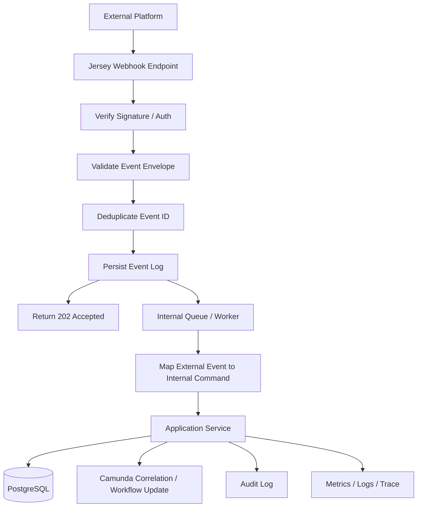

Prinsip penting:

```text
Webhook endpoint menerima dan menyimpan event.
Worker memproses event.
Domain service tidak bergantung langsung ke payload vendor.
Duplicate event tidak boleh menghasilkan side effect ganda.
Event yang gagal diproses harus bisa diretry/replay.
Polling harus punya checkpoint.
Reconciliation harus ada karena webhook/polling tidak menjamin dunia sempurna.
```

---

## 4. Decomposition Map - Practical Categories / Skills

| No | Area | Fokus Praktis | Output yang Harus Ada |
|---:|---|---|---|
| 1 | **Webhook Intake Endpoint** | Membuat endpoint inbound khusus vendor/platform. | Jersey resource `/webhooks/{vendor}`. |
| 2 | **Callback Contract** | Mendefinisikan event type, schema, header, signature, response behavior. | Webhook contract / AsyncAPI. |
| 3 | **Signature Verification** | Validasi HMAC/JWS/HTTP signature, timestamp, body hash. | Signature verifier. |
| 4 | **Replay Protection** | Cegah event lama/dikirim ulang secara berbahaya. | Timestamp tolerance + event ID store. |
| 5 | **Event Envelope** | Pisahkan metadata event dari payload bisnis. | Event envelope DTO. |
| 6 | **Event Deduplication** | Vendor event ID/message ID tidak diproses dua kali. | `webhook_event_log` unique constraint. |
| 7 | **Raw Event Persistence** | Simpan event sebelum processing agar tidak hilang. | Event inbox table. |
| 8 | **Async Processing** | Jangan proses berat di request thread. | Worker/internal queue. |
| 9 | **Event Mapping** | Payload vendor → internal command/domain event. | Mapper + validation. |
| 10 | **Ordering Handling** | Event bisa terlambat/out-of-order. | State guard + version/timestamp check. |
| 11 | **Failure Handling** | Retry, DLQ/inbox error, manual replay. | Retry policy + replay tool. |
| 12 | **Polling Checkpoint** | Ambil update dari vendor dengan cursor/checkpoint. | Polling state table. |
| 13 | **Backoff & Rate Limit** | Handle `429`, `Retry-After`, vendor quota. | Polling backoff policy. |
| 14 | **Reconciliation** | Deteksi event hilang atau state mismatch. | Reconciliation job/report. |
| 15 | **Camunda Correlation** | Event eksternal melanjutkan process instance. | Business key/message correlation. |
| 16 | **Observability** | Metrics event received, duplicate, failed, lag. | Dashboard + alert. |
| 17 | **Auditability** | Catat event ID, source, signature status, business impact. | Audit event log. |
| 18 | **Operational Runbook** | Cara replay, pause, troubleshoot vendor delivery. | Webhook/polling runbook. |

---

## 5. Webhook vs Callback vs Polling

| Pattern | Makna Praktis | Cocok Ketika |
|---|---|---|
| **Webhook** | External system mengirim HTTP request ke endpoint kita saat event terjadi. | Vendor/platform support push event. |
| **Callback** | Mirip webhook, sering terkait request sebelumnya; external system “memanggil balik” saat proses selesai. | Submit async job/order lalu vendor callback hasilnya. |
| **Polling** | Service kita secara periodik mengambil update dari external system. | Vendor tidak punya webhook/callback atau webhook tidak reliable. |
| **Hybrid** | Webhook untuk near-real-time, polling/reconciliation untuk safety net. | Integrasi critical yang tidak boleh kehilangan update. |

Rule praktis:

```text
Webhook bagus untuk latency rendah.
Polling bagus untuk kontrol dan recovery.
Hybrid bagus untuk reliability.
Webhook saja tanpa reconciliation sering rapuh.
Polling saja tanpa cursor/checkpoint sering mahal dan rawan duplicate.
```

---

## 6. Kapan Memilih Webhook?

Gunakan webhook/callback jika:

| Kondisi | Cocok? |
|---|---:|
| External system bisa push event ke kita | Ya |
| Update harus cepat diterima | Ya |
| Event volume tidak ekstrem atau bisa diskalakan | Ya |
| Vendor menyediakan event ID/signature | Ya |
| Kita bisa membuka endpoint inbound aman | Ya |
| Proses berat bisa dipindahkan ke async worker | Ya |

Contoh:

```text
document.signed
payment.authorized
payment.failed
kyc.completed
risk_score.ready
order.provisioned
external_case.status_changed
ocr_job.completed
regulator_submission.accepted
```

---

## 7. Kapan Memilih Polling?

Gunakan polling jika:

| Kondisi | Cocok? |
|---|---:|
| Vendor tidak support webhook | Ya |
| Vendor webhook sering gagal/tidak lengkap | Ya |
| Perlu reconciliation berkala | Ya |
| Data berubah periodik | Ya |
| Ada cursor, `updated_since`, page token, atau status endpoint | Ya |
| Near-real-time bukan requirement utama | Ya |

Contoh:

```text
poll external submissions every 5 minutes
pull updated customer risk statuses
fetch completed OCR jobs
sync regulatory case status once per hour
download daily settlement result
reconcile signed document status nightly
```

---

## 8. Recommended Hybrid Pattern

Untuk integrasi critical, pola terbaik sering:

```text
Webhook for fast event intake
+
Polling/reconciliation for correctness
```

Diagram:

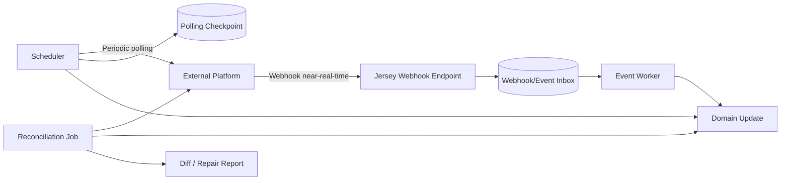

Makna praktis:

```text
Webhook mempercepat update.
Polling menangkap event yang hilang.
Reconciliation membuktikan state internal dan eksternal tetap selaras.
```

---

## 9. Event Envelope Design

Jangan langsung memproses payload vendor mentah sebagai domain event.

Buat envelope:

```java
public record ExternalEventEnvelope(
        String vendorName,
        String eventId,
        String eventType,
        String eventVersion,
        String source,
        String subject,
        Instant occurredAt,
        Instant receivedAt,
        String correlationId,
        String payloadHash,
        JsonNode payload
) {}
```

Jika menggunakan konsep seperti CloudEvents, metadata yang umum adalah event ID, source, type, subject, time, dan data. CloudEvents memang dibuat untuk menstandardisasi metadata event dan lokasinya agar event lebih mudah diidentifikasi dan dirouting. ([CNCF](https://www.cncf.io/projects/cloudevents/?utm_source=chatgpt.com))

Contoh JSON envelope:

```json
{
  "id": "evt-789",
  "source": "vendor-x/document-platform",
  "type": "document.signed",
  "specversion": "1.0",
  "subject": "document:DOC-123",
  "time": "2026-07-14T10:15:00Z",
  "data": {
    "documentId": "DOC-123",
    "caseId": "CASE-456",
    "signedAt": "2026-07-14T10:14:59Z",
    "status": "SIGNED"
  }
}
```

---

## 10. Webhook Endpoint Shape di Jersey

### 10.1 Endpoint Minimal

```java
@Path("/webhooks/vendor-x")
@Consumes(MediaType.APPLICATION_JSON)
@Produces(MediaType.APPLICATION_JSON)
public class VendorXWebhookResource {

    private final VendorXWebhookService webhookService;

    public VendorXWebhookResource(VendorXWebhookService webhookService) {
        this.webhookService = webhookService;
    }

    @POST
    public Response receive(
            String rawBody,
            @HeaderParam("X-Vendor-Signature") String signature,
            @HeaderParam("X-Vendor-Timestamp") String timestamp,
            @HeaderParam("X-Vendor-Event-ID") String eventId,
            @HeaderParam("X-Correlation-ID") String correlationId
    ) {
        webhookService.accept(
                new IncomingWebhookRequest(
                        rawBody,
                        signature,
                        timestamp,
                        eventId,
                        correlationId
                )
        );

        return Response.accepted().build();
    }
}
```

Return `202 Accepted` biasanya cocok jika event sudah diterima aman dan akan diproses async.

Jangan lakukan ini di endpoint:

```text
call banyak downstream service
menjalankan workflow panjang
menulis banyak aggregate kompleks tanpa queue
melakukan retry lama
menunggu external system lain
```

---

## 11. Incoming Webhook Service

```java
public class VendorXWebhookService {

    private final WebhookSignatureVerifier signatureVerifier;
    private final WebhookEventMapper eventMapper;
    private final WebhookEventInboxRepository inboxRepository;
    private final EventProcessingPublisher processingPublisher;
    private final Clock clock;

    public VendorXWebhookService(
            WebhookSignatureVerifier signatureVerifier,
            WebhookEventMapper eventMapper,
            WebhookEventInboxRepository inboxRepository,
            EventProcessingPublisher processingPublisher,
            Clock clock
    ) {
        this.signatureVerifier = signatureVerifier;
        this.eventMapper = eventMapper;
        this.inboxRepository = inboxRepository;
        this.processingPublisher = processingPublisher;
        this.clock = clock;
    }

    public void accept(IncomingWebhookRequest request) {
        signatureVerifier.verify(
                request.rawBody(),
                request.signature(),
                request.timestamp()
        );

        ExternalEventEnvelope envelope = eventMapper.toEnvelope(
                "vendor-x",
                request,
                Instant.now(clock)
        );

        WebhookInsertResult result = inboxRepository.insertIfAbsent(envelope);

        if (result == WebhookInsertResult.DUPLICATE_SAME_PAYLOAD) {
            return;
        }

        if (result == WebhookInsertResult.DUPLICATE_DIFFERENT_PAYLOAD) {
            throw new WebhookEventConflictException(envelope.eventId());
        }

        processingPublisher.publish(envelope.eventId());
    }
}
```

Prinsip:

```text
verify signature dulu
baru parse/accept
insert event secara idempotent
return cepat
processing belakangan
```

---

## 12. Signature Verification

Minimal verification:

```text
signature ada
timestamp ada
timestamp dalam tolerance
body hash/signature valid
comparison constant-time
secret/key dari secret manager
```

Jika vendor mendukung HTTP Message Signatures, RFC 9421 menyediakan mekanisme standar untuk signature atau MAC terhadap komponen HTTP message. Jika vendor memakai HMAC custom, pastikan canonical string didokumentasikan dan tidak ambigu. ([IETF Datatracker](https://datatracker.ietf.org/doc/html/rfc9421?utm_source=chatgpt.com))

Skeleton:

```java
public class WebhookSignatureVerifier {

    private final WebhookSecretProvider secretProvider;
    private final Clock clock;
    private final Duration tolerance = Duration.ofMinutes(5);

    public void verify(String rawBody, String signature, String timestamp) {
        if (signature == null || signature.isBlank()) {
            throw new UnauthorizedWebhookException("Missing signature");
        }

        if (timestamp == null || timestamp.isBlank()) {
            throw new UnauthorizedWebhookException("Missing timestamp");
        }

        Instant requestTime = Instant.parse(timestamp);
        Instant now = Instant.now(clock);

        if (requestTime.isBefore(now.minus(tolerance)) ||
            requestTime.isAfter(now.plus(Duration.ofMinutes(1)))) {
            throw new UnauthorizedWebhookException("Webhook timestamp outside allowed tolerance");
        }

        String expected = Hmac.sha256Hex(
                timestamp + "." + rawBody,
                secretProvider.currentSecret()
        );

        if (!ConstantTime.equals(expected, signature)) {
            throw new UnauthorizedWebhookException("Invalid webhook signature");
        }
    }
}
```

Anti-pattern:

```text
endpoint rahasia dianggap cukup
signature diverifikasi setelah side effect
timestamp tidak dicek
event ID tidak disimpan
raw body berubah sebelum signature verification
secret hardcoded
```

---

## 13. Webhook Event Inbox Table

Tujuan inbox table: event tidak hilang, duplicate bisa dikenali, replay bisa dilakukan.

```sql
CREATE TABLE webhook_event_inbox (
    id BIGSERIAL PRIMARY KEY,

    vendor_name TEXT NOT NULL,
    event_id TEXT NOT NULL,
    event_type TEXT NOT NULL,
    event_version TEXT,
    source TEXT,
    subject TEXT,

    occurred_at TIMESTAMPTZ,
    received_at TIMESTAMPTZ NOT NULL DEFAULT now(),

    payload_hash TEXT NOT NULL,
    payload JSONB NOT NULL,

    status TEXT NOT NULL,
    processing_attempts INTEGER NOT NULL DEFAULT 0,
    last_error_code TEXT,
    last_error_message TEXT,

    processed_at TIMESTAMPTZ,
    next_retry_at TIMESTAMPTZ,

    correlation_id TEXT,
    business_key TEXT,

    UNIQUE (vendor_name, event_id)
);

CREATE INDEX idx_webhook_inbox_status_next_retry
    ON webhook_event_inbox (status, next_retry_at);

CREATE INDEX idx_webhook_inbox_business_key
    ON webhook_event_inbox (business_key);

CREATE INDEX idx_webhook_inbox_event_type
    ON webhook_event_inbox (vendor_name, event_type);
```

Status yang disarankan:

| Status | Makna |
|---|---|
| `RECEIVED` | Event sudah diterima dan disimpan. |
| `PROCESSING` | Worker sedang memproses. |
| `PROCESSED` | Event sukses diproses. |
| `FAILED_RETRYABLE` | Gagal sementara, bisa retry. |
| `FAILED_FINAL` | Gagal permanen, perlu manual action atau ignore. |
| `IGNORED_DUPLICATE` | Duplicate yang aman diabaikan. |
| `QUARANTINED` | Payload mencurigakan/invalid, jangan auto-retry. |

---

## 14. Insert If Absent dengan MyBatis

```xml
<insert id="insertWebhookEvent">
    INSERT INTO webhook_event_inbox (
        vendor_name,
        event_id,
        event_type,
        event_version,
        source,
        subject,
        occurred_at,
        received_at,
        payload_hash,
        payload,
        status,
        correlation_id,
        business_key
    )
    VALUES (
        #{vendorName},
        #{eventId},
        #{eventType},
        #{eventVersion},
        #{source},
        #{subject},
        #{occurredAt},
        #{receivedAt},
        #{payloadHash},
        #{payload}::jsonb,
        'RECEIVED',
        #{correlationId},
        #{businessKey}
    )
    ON CONFLICT (vendor_name, event_id)
    DO NOTHING
</insert>
```

Jika insert gagal karena conflict:

```sql
SELECT payload_hash, status
FROM webhook_event_inbox
WHERE vendor_name = #{vendorName}
  AND event_id = #{eventId};
```

Decision:

| Kondisi | Tindakan |
|---|---|
| Existing hash sama | Duplicate normal, return `202`. |
| Existing hash beda | Contract/security conflict, alert. |
| Existing status `PROCESSED` | Return `202`, no reprocess. |
| Existing status `FAILED_RETRYABLE` | Biarkan worker retry atau schedule ulang. |

---

## 15. Worker Processing Pattern

```java
public class WebhookEventWorker {

    private final WebhookEventInboxRepository inboxRepository;
    private final ExternalEventHandlerRegistry handlerRegistry;
    private final TransactionTemplate transactionTemplate;

    public void processNextBatch() {
        List<WebhookEventRecord> events =
                inboxRepository.claimNextEvents(100);

        for (WebhookEventRecord event : events) {
            processOne(event);
        }
    }

    private void processOne(WebhookEventRecord event) {
        try {
            transactionTemplate.execute(() -> {
                ExternalEventHandler handler =
                        handlerRegistry.handlerFor(event.vendorName(), event.eventType());

                handler.handle(event);

                inboxRepository.markProcessed(event.id());
                return null;
            });

        } catch (RetryableEventProcessingException ex) {
            inboxRepository.markFailedRetryable(
                    event.id(),
                    ex.errorCode(),
                    ex.getMessage(),
                    nextRetryTime(event.processingAttempts())
            );

        } catch (Exception ex) {
            inboxRepository.markFailedFinal(
                    event.id(),
                    "EVENT_PROCESSING_FAILED",
                    sanitize(ex.getMessage())
            );
        }
    }
}
```

Claim query pattern:

```sql
UPDATE webhook_event_inbox
SET status = 'PROCESSING',
    processing_attempts = processing_attempts + 1
WHERE id IN (
    SELECT id
    FROM webhook_event_inbox
    WHERE status IN ('RECEIVED', 'FAILED_RETRYABLE')
      AND (next_retry_at IS NULL OR next_retry_at <= now())
    ORDER BY received_at
    FOR UPDATE SKIP LOCKED
    LIMIT #{limit}
)
RETURNING *;
```

`FOR UPDATE SKIP LOCKED` berguna untuk banyak worker agar tidak memproses row yang sama.

---

## 16. Event Handler Registry

```java
public interface ExternalEventHandler {
    void handle(WebhookEventRecord event);
}
```

```java
public class ExternalEventHandlerRegistry {

    private final Map<String, ExternalEventHandler> handlers;

    public ExternalEventHandlerRegistry(List<ExternalEventHandlerBinding> bindings) {
        this.handlers = bindings.stream()
                .collect(Collectors.toMap(
                        binding -> key(binding.vendorName(), binding.eventType()),
                        ExternalEventHandlerBinding::handler
                ));
    }

    public ExternalEventHandler handlerFor(String vendorName, String eventType) {
        ExternalEventHandler handler = handlers.get(key(vendorName, eventType));

        if (handler == null) {
            throw new UnknownExternalEventTypeException(vendorName, eventType);
        }

        return handler;
    }

    private String key(String vendorName, String eventType) {
        return vendorName + ":" + eventType;
    }
}
```

Keuntungan:

```text
event type baru mudah ditambahkan
handler bisa dites terpisah
mapping vendor tidak menyebar ke resource layer
```

---

## 17. Mapping Event Vendor ke Internal Command

Contoh event vendor:

```json
{
  "eventId": "evt-123",
  "eventType": "document.signed",
  "data": {
    "externalDocumentId": "VDOC-777",
    "caseReference": "CASE-123",
    "signedAt": "2026-07-14T10:14:59Z"
  }
}
```

Internal command:

```java
public record MarkDocumentSignedCommand(
        String caseId,
        String externalDocumentId,
        Instant signedAt,
        String sourceEventId,
        String correlationId
) {}
```

Mapper:

```java
public class VendorDocumentSignedMapper {

    public MarkDocumentSignedCommand toCommand(WebhookEventRecord event) {
        JsonNode data = event.payload().path("data");

        return new MarkDocumentSignedCommand(
                data.path("caseReference").asText(),
                data.path("externalDocumentId").asText(),
                Instant.parse(data.path("signedAt").asText()),
                event.eventId(),
                event.correlationId()
        );
    }
}
```

Handler:

```java
public class DocumentSignedEventHandler implements ExternalEventHandler {

    private final VendorDocumentSignedMapper mapper;
    private final DocumentApplicationService documentService;

    public void handle(WebhookEventRecord event) {
        MarkDocumentSignedCommand command = mapper.toCommand(event);
        documentService.markSigned(command);
    }
}
```

Prinsip:

```text
handler menerima event record
mapper mengubah payload vendor menjadi command internal
application service menjalankan business rule
event ID disimpan untuk audit/idempotency
```

---

## 18. Ordering dan Out-of-Order Events

External event bisa datang tidak berurutan.

Contoh:

```text
event 1: document.completed
event 2: document.processing

Karena network/retry, completed datang dulu.
```

Jangan hanya update status secara buta.

State guard:

```java
public class DocumentStateMachine {

    public DocumentStatus applyExternalStatus(
            DocumentStatus current,
            String externalStatus
    ) {
        DocumentStatus incoming = mapExternalStatus(externalStatus);

        if (current == DocumentStatus.SIGNED &&
            incoming == DocumentStatus.PROCESSING) {
            return current;
        }

        if (current == DocumentStatus.REJECTED &&
            incoming == DocumentStatus.PROCESSING) {
            return current;
        }

        return incoming;
    }
}
```

Better jika vendor menyediakan version/sequence:

```text
externalVersion
eventSequence
statusUpdatedAt
occurredAt
```

Rule:

| Data Tersedia | Strategy |
|---|---|
| Sequence number | Apply hanya jika sequence lebih baru. |
| External version | Optimistic update by version. |
| Status timestamp | Apply jika timestamp lebih baru, dengan hati-hati clock skew. |
| Tidak ada ordering metadata | Pakai state machine guard + reconciliation. |

---

## 19. Event Processing Idempotency

Webhook event ID mencegah event yang sama diproses dua kali, tapi business handler juga harus idempotent.

Contoh command:

```java
public void markSigned(MarkDocumentSignedCommand command) {
    DocumentRecord document = documentRepository
            .findByExternalDocumentId(command.externalDocumentId())
            .orElseThrow();

    if (document.status() == DocumentStatus.SIGNED) {
        return;
    }

    documentRepository.markSigned(
            document.documentId(),
            command.signedAt(),
            command.sourceEventId()
    );

    auditLogger.documentSigned(
            document.documentId(),
            command.sourceEventId()
    );
}
```

Invariant:

```text
Duplicate event aman.
Late event aman.
State regression dicegah.
Audit tidak dobel untuk event sama.
```

---

## 20. Response Semantics untuk Webhook

| Kondisi | Response | Catatan |
|---|---:|---|
| Signature valid, event disimpan | `202 Accepted` | Processing async. |
| Duplicate event sama | `202 Accepted` | Jangan paksa vendor retry. |
| Invalid signature | `401` atau `403` | Jangan proses. |
| Missing required header | `400` | Contract error. |
| Payload invalid | `400` atau `202 + quarantine` | Tergantung vendor retry behavior. |
| Duplicate event ID beda payload | `409` atau `400` + alert | Kemungkinan spoof/bug vendor. |
| Internal worker down tapi inbox insert sukses | `202` | Worker bisa memproses nanti. |
| DB down sehingga event tidak bisa disimpan | `500/503` | Vendor sebaiknya retry. |

Poin penting:

```text
Return 2xx hanya jika kita sudah aman menerima event.
Jika event belum tersimpan, jangan return 2xx.
```

---

## 21. Polling Pattern

Polling dipakai saat kita harus mengambil update dari external system.

Flow:

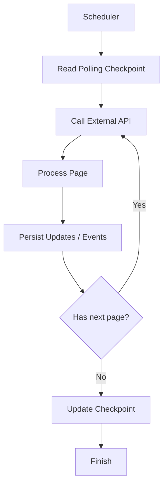

Golden rule:

```text
Checkpoint hanya boleh maju setelah data berhasil diproses.
```

---

## 22. Polling State Table

```sql
CREATE TABLE polling_checkpoint (
    id BIGSERIAL PRIMARY KEY,

    integration_name TEXT NOT NULL,
    poller_name TEXT NOT NULL,

    checkpoint_type TEXT NOT NULL,
    checkpoint_value TEXT,

    last_success_at TIMESTAMPTZ,
    last_attempt_at TIMESTAMPTZ,
    next_run_at TIMESTAMPTZ,

    status TEXT NOT NULL,
    failure_count INTEGER NOT NULL DEFAULT 0,
    last_error_code TEXT,
    last_error_message TEXT,

    updated_at TIMESTAMPTZ NOT NULL DEFAULT now(),

    UNIQUE (integration_name, poller_name)
);
```

Checkpoint type:

| Type | Contoh |
|---|---|
| `UPDATED_SINCE_TIMESTAMP` | `2026-07-14T10:00:00Z` |
| `CURSOR` | `eyJwYWdlIjoxMjN9...` |
| `SEQUENCE` | `1849292` |
| `PAGE_TOKEN` | vendor page token |
| `WATERMARK` | combined timestamp + ID |

---

## 23. Polling dengan `updated_since`

```java
public class VendorStatusPoller {

    private final PollingCheckpointRepository checkpointRepository;
    private final VendorStatusClient vendorClient;
    private final ExternalStatusEventService eventService;

    public void poll() {
        PollingCheckpoint checkpoint =
                checkpointRepository.findForUpdate("vendor-x", "status-poller");

        Instant updatedSince = checkpoint.asInstant();

        VendorStatusPage page;
        String pageToken = null;
        Instant maxSeenUpdatedAt = updatedSince;

        do {
            page = vendorClient.fetchUpdatedStatuses(updatedSince, pageToken);

            for (VendorStatusItem item : page.items()) {
                eventService.acceptPolledStatus(item);

                if (item.updatedAt().isAfter(maxSeenUpdatedAt)) {
                    maxSeenUpdatedAt = item.updatedAt();
                }
            }

            pageToken = page.nextPageToken();

        } while (pageToken != null);

        checkpointRepository.markSuccess(
                "vendor-x",
                "status-poller",
                maxSeenUpdatedAt.toString()
        );
    }
}
```

Masalah timestamp-only checkpoint:

```text
Jika dua update punya timestamp sama,
checkpoint bisa melewati salah satu update.
```

Lebih aman:

```text
watermark = updatedAt + externalId
sort by updatedAt, externalId
checkpoint menyimpan keduanya
query vendor harus mendukung stable ordering
```

---

## 24. Cursor-Based Polling

Jika vendor menyediakan cursor/page token:

```java
public void pollByCursor() {
    PollingCheckpoint checkpoint =
            checkpointRepository.findForUpdate("vendor-x", "cursor-poller");

    String cursor = checkpoint.checkpointValue();

    while (true) {
        VendorCursorPage page = vendorClient.fetchByCursor(cursor);

        for (VendorEvent event : page.events()) {
            eventInbox.acceptPolledEvent(event);
        }

        cursor = page.nextCursor();

        checkpointRepository.updateIntermediateCursor(
                "vendor-x",
                "cursor-poller",
                cursor
        );

        if (!page.hasMore()) {
            break;
        }
    }

    checkpointRepository.markSuccess(
            "vendor-x",
            "cursor-poller",
            cursor
    );
}
```

Catatan:

```text
Cursor lebih aman daripada timestamp jika vendor menjamin ordering.
Tetap perlu dedup event ID.
Update intermediate cursor perlu hati-hati: jangan maju melewati event yang belum diproses.
```

---

## 25. Polling Lock agar Tidak Double Run

Jika service punya banyak pod, scheduler bisa jalan di lebih dari satu instance.

Gunakan lock DB:

```sql
CREATE TABLE scheduler_lock (
    lock_name TEXT PRIMARY KEY,
    locked_until TIMESTAMPTZ NOT NULL,
    locked_by TEXT NOT NULL,
    updated_at TIMESTAMPTZ NOT NULL DEFAULT now()
);
```

Acquire lock pattern:

```sql
INSERT INTO scheduler_lock (
    lock_name,
    locked_until,
    locked_by
)
VALUES (
    #{lockName},
    now() + interval '5 minutes',
    #{instanceId}
)
ON CONFLICT (lock_name)
DO UPDATE
SET locked_until = EXCLUDED.locked_until,
    locked_by = EXCLUDED.locked_by,
    updated_at = now()
WHERE scheduler_lock.locked_until < now();
```

Jika row affected = 1, instance mendapat lock.

Prinsip:

```text
polling job harus single active runner per integration
atau harus didesain partitioned secara eksplisit
```

---

## 26. Polling Backoff dan `Retry-After`

Saat vendor mengembalikan `429` atau `503`, jangan terus polling agresif.

Jika ada `Retry-After`, RFC 9110 mendefinisikan nilainya bisa berupa HTTP-date atau delay seconds. Gunakan itu sebagai sinyal kapan mencoba lagi jika masih sesuai policy. ([IETF Datatracker](https://datatracker.ietf.org/doc/html/rfc9110?utm_source=chatgpt.com))

Policy:

| Response | Tindakan |
|---|---|
| `200` | Process data, update checkpoint. |
| `204` | No data, schedule next normal run. |
| `400` | Contract/config error, stop and alert. |
| `401/403` | Auth/config error, stop and alert. |
| `429` | Backoff; respect `Retry-After`. |
| `500/502/503/504` | Retry limited/backoff. |
| Timeout | Retry limited/backoff; do not update checkpoint. |

---

## 27. Polling Anti-Duplicate Strategy

Polling sering mengambil data yang sama beberapa kali. Itu normal.

Karena itu:

```text
Polled item harus masuk event inbox juga.
Dedup berdasarkan vendor event ID atau external object ID + status/version.
Processing harus idempotent.
```

Contoh unique key:

| Data Tersedia | Dedup Key |
|---|---|
| Vendor event ID | `(vendor, eventId)` |
| External object status version | `(vendor, objectId, version)` |
| External object + status + timestamp | `(vendor, objectId, status, statusUpdatedAt)` |
| File report row | `(vendor, fileChecksum, rowNumber)` |

---

## 28. Webhook + Polling Unified Inbox

Agar pipeline sama, webhook dan polling bisa masuk ke tabel event inbox yang sama.

Tambahkan field `ingestion_method`:

```sql
ALTER TABLE webhook_event_inbox
ADD COLUMN ingestion_method TEXT NOT NULL DEFAULT 'WEBHOOK';
```

Value:

```text
WEBHOOK
POLLING
REPLAY
MANUAL_IMPORT
```

Keuntungan:

```text
dedup sama
worker sama
handler sama
audit sama
dashboard sama
replay sama
```

---

## 29. Reconciliation Pattern

Webhook/polling tetap bisa gagal. Reconciliation adalah safety net.

Tujuan:

```text
Bandingkan state internal dengan external source of truth.
Temukan missing event, mismatch status, stale pending item.
Buat repair action atau manual report.
```

Flow:

```mermaid
flowchart TD
    R[Reconciliation Job] --> I[Read internal records needing check]
    I --> E[Fetch external current state]
    E --> C{State matches?}
    C -->|Yes| OK[Mark reconciled]
    C -->|No| D[Create discrepancy record]
    D --> A{Auto repair allowed?}
    A -->|Yes| FIX[Apply repair command]
    A -->|No| MAN[Manual review queue]
```

---

## 30. Reconciliation Table

```sql
CREATE TABLE integration_reconciliation_result (
    id BIGSERIAL PRIMARY KEY,

    integration_name TEXT NOT NULL,
    business_key TEXT NOT NULL,
    external_reference TEXT,

    internal_status TEXT,
    external_status TEXT,

    discrepancy_type TEXT NOT NULL,
    severity TEXT NOT NULL,

    auto_repair_allowed BOOLEAN NOT NULL DEFAULT false,
    repair_status TEXT,

    detected_at TIMESTAMPTZ NOT NULL DEFAULT now(),
    resolved_at TIMESTAMPTZ,

    details JSONB
);
```

Discrepancy types:

| Type | Meaning |
|---|---|
| `MISSING_INTERNAL_UPDATE` | External sudah berubah, internal belum. |
| `MISSING_EXTERNAL_RECORD` | Internal punya reference, external tidak ada. |
| `STATUS_MISMATCH` | Status berbeda. |
| `TIMESTAMP_REGRESSION` | External event lebih lama dari internal state. |
| `DUPLICATE_EXTERNAL_RECORD` | External punya duplicate untuk business key. |
| `STALE_PENDING` | Internal terlalu lama pending. |

---

## 31. Camunda Correlation

Webhook/callback sering dipakai untuk melanjutkan workflow.

Contoh:

```text
Case process menunggu document.signed.
Vendor mengirim webhook document.signed.
Service menerima event.
Service correlate ke Camunda process by businessKey.
```

Pattern:

```mermaid
sequenceDiagram
    participant V as Vendor
    participant API as Webhook API
    participant INBOX as Event Inbox
    participant W as Worker
    participant CAM as Camunda
    participant DB as PostgreSQL

    V->>API: document.signed webhook
    API->>INBOX: persist event
    API-->>V: 202
    W->>INBOX: claim event
    W->>DB: update document status
    W->>CAM: correlate message DocumentSigned by caseId
    CAM-->>W: process continued
    W->>INBOX: mark processed
```

Camunda correlation key:

```text
businessKey = caseId
messageName = DocumentSigned
correlation variables:
  caseId
  documentId
  externalDocumentId
  vendorEventId
```

Prinsip:

```text
Jangan correlate sebelum event/state disimpan.
Correlation harus idempotent atau guarded.
Jika process instance belum siap menerima message, event jangan hilang; simpan dan retry.
```

---

## 32. Handling Unknown Event Type

Vendor bisa menambah event baru.

Policy:

| Kondisi | Tindakan |
|---|---|
| Event type unknown tapi signature valid | Simpan sebagai `QUARANTINED` atau `IGNORED_UNKNOWN`. |
| Event type critical tapi belum didukung | Alert. |
| Event schema version lebih baru | Tolerant parse + quarantine jika field wajib tidak cocok. |
| Event type deprecated | Proses jika masih didukung, log deprecation. |

Jangan langsung drop tanpa record.

---

## 33. Schema Validation

Untuk event intake, validasi minimal:

```text
event ID ada
event type ada
timestamp valid
payload valid JSON
business key bisa diekstrak
required data fields ada
event version didukung
```

Jika AsyncAPI digunakan, event contract bisa didokumentasikan sebagai message-driven API secara machine-readable dan protocol-agnostic. Ini berguna untuk webhook/event docs, schema review, dan tooling linting. ([AsyncAPI](https://www.asyncapi.com/docs/reference/specification/latest?utm_source=chatgpt.com))

Example validation result:

```json
{
  "event": "external_event_quarantined",
  "vendor": "vendor-x",
  "eventId": "evt-123",
  "eventType": "document.signed",
  "reason": "MISSING_REQUIRED_FIELD",
  "field": "data.caseId",
  "correlationId": "corr-123"
}
```

---

## 34. AsyncAPI Mini Example untuk Webhook/Event

```yaml
asyncapi: 3.1.0
info:
  title: Vendor X Callback Events
  version: 1.0.0
channels:
  vendorXDocumentEvents:
    address: /webhooks/vendor-x
    messages:
      documentSigned:
        $ref: '#/components/messages/DocumentSigned'
operations:
  receiveDocumentSigned:
    action: receive
    channel:
      $ref: '#/channels/vendorXDocumentEvents'
    messages:
      - $ref: '#/components/messages/DocumentSigned'
components:
  messages:
    DocumentSigned:
      name: DocumentSigned
      title: Document signed event
      contentType: application/json
      headers:
        type: object
        properties:
          X-Vendor-Event-ID:
            type: string
          X-Vendor-Signature:
            type: string
          X-Vendor-Timestamp:
            type: string
      payload:
        type: object
        required:
          - eventId
          - eventType
          - data
        properties:
          eventId:
            type: string
          eventType:
            const: document.signed
          occurredAt:
            type: string
            format: date-time
          data:
            type: object
            required:
              - caseId
              - externalDocumentId
              - signedAt
            properties:
              caseId:
                type: string
              externalDocumentId:
                type: string
              signedAt:
                type: string
                format: date-time
```

---

## 35. Security Notes untuk External Event Intake

Minimal:

```text
TLS wajib
signature verification
timestamp tolerance
event ID dedup
payload size limit
JSON parser safe config
rate limit per vendor/source
IP allowlist optional, bukan satu-satunya security
secret rotation
audit invalid signature
```

Jangan percaya:

```text
source IP saja
URL rahasia saja
event payload tanpa signature
header tenant dari vendor tanpa contract
timestamp dari vendor tanpa tolerance
```

---

## 36. Observability

### 36.1 Metrics

| Metric | Label | Tujuan |
|---|---|---|
| `webhook_events_received_total` | vendor, event_type | Volume inbound. |
| `webhook_events_duplicate_total` | vendor, event_type | Duplicate/retry vendor. |
| `webhook_signature_failed_total` | vendor | Security anomaly. |
| `webhook_events_quarantined_total` | vendor, reason | Schema/contract issue. |
| `webhook_processing_failed_total` | vendor, event_type, error_category | Processing failure. |
| `webhook_processing_lag_seconds` | vendor, event_type | Delay received → processed. |
| `polling_runs_total` | integration, result | Poller health. |
| `polling_items_fetched_total` | integration | Volume sync. |
| `polling_checkpoint_lag_seconds` | integration | Staleness. |
| `reconciliation_discrepancy_total` | integration, type | State mismatch. |

### 36.2 Structured Log

```json
{
  "event": "external_event_received",
  "vendor": "vendor-x",
  "eventId": "evt-123",
  "eventType": "document.signed",
  "ingestionMethod": "WEBHOOK",
  "signatureValid": true,
  "duplicate": false,
  "payloadHash": "sha256:...",
  "businessKey": "CASE-123",
  "correlationId": "corr-123",
  "receivedAt": "2026-07-14T15:00:00Z"
}
```

---

## 37. Alerting

| Condition | Severity | Meaning |
|---|---|---|
| Signature failures spike | Critical/Security | Possible spoof, secret mismatch, vendor change. |
| Event processing lag > threshold | Warning/Critical | Worker stuck or backlog. |
| Duplicate rate suddenly high | Warning | Vendor retry storm or our endpoint slow. |
| Quarantine count > 0 | Warning | Contract/schema mismatch. |
| Polling checkpoint lag growing | Warning | Poller failing or vendor unavailable. |
| Reconciliation mismatch high | Critical | Internal/external state diverging. |
| Webhook received = 0 unexpectedly | Warning | Vendor delivery stopped or route broken. |
| Inbox `FAILED_RETRYABLE` growing | Warning | Downstream processing issue. |

---

## 38. Operational Runbook

```text
Webhook Delivery Issue Runbook

Symptoms:
  - vendor says webhook delivery failing
  - webhook_events_received_total drops to zero
  - signature failures spike
  - duplicate event rate increases
  - processing lag grows

Immediate Checks:
  1. Check ingress/API gateway route.
  2. Check TLS certificate expiry.
  3. Check webhook secret rotation history.
  4. Check signature canonicalization changes.
  5. Check payload size limit / 413 errors.
  6. Check DB connectivity for event inbox insert.
  7. Check worker backlog and failed events.
  8. Check vendor status/support logs.

Safe Actions:
  1. Do not manually mark event processed unless verified.
  2. Pause worker if event mapping bug causes bad state.
  3. Quarantine unknown/invalid events.
  4. Replay from event inbox after fix.
  5. Run reconciliation after incident.

Recovery:
  1. Re-enable worker.
  2. Replay failed/quarantined events selectively.
  3. Run reconciliation.
  4. Produce incident timeline and impacted business keys.
```

---

## 39. Testing Strategy

### 39.1 Webhook Test Matrix

| Scenario | Expected |
|---|---|
| Valid signature + new event | Stored, returns `202`. |
| Valid duplicate same payload | Returns `202`, no reprocess. |
| Same event ID different payload | Conflict/quarantine + alert. |
| Missing signature | `401/403`. |
| Invalid signature | `401/403`. |
| Expired timestamp | `401/403`. |
| Missing event ID | `400` or quarantine. |
| Unknown event type | Stored quarantine/ignored with audit. |
| Worker fails transiently | Mark `FAILED_RETRYABLE`. |
| Worker fails permanently | Mark `FAILED_FINAL`. |
| Event out-of-order | State machine prevents regression. |
| Camunda instance not waiting yet | Retry later, event not lost. |

### 39.2 Polling Test Matrix

| Scenario | Expected |
|---|---|
| No updates | Checkpoint unchanged or updated safely. |
| One page updates | Process items, update checkpoint. |
| Multi-page updates | Process all pages. |
| Failure mid-page | Do not skip unprocessed data. |
| Duplicate polled item | Dedup works. |
| `429 Retry-After` | Backoff schedule. |
| `401/403` | Stop and alert. |
| Two pods run poller | Lock prevents double run. |
| Timestamp tie | Watermark prevents missing item. |

---

## 40. Anti-Patterns

| Anti-Pattern | Dampak | Alternatif |
|---|---|---|
| Webhook langsung menjalankan proses berat | Timeout ke vendor, duplicate retry | Persist + async worker. |
| Return `200` sebelum event disimpan | Event bisa hilang | Return 2xx setelah durable insert. |
| Tidak verifikasi signature | Spoofed event | HMAC/JWS/HTTP signature verification. |
| Tidak ada replay protection | Replay attack/duplicate side effect | Timestamp + event ID dedup. |
| Event ID tidak disimpan | Duplicate tidak terdeteksi | Unique `(vendor, event_id)`. |
| Payload vendor masuk domain langsung | Coupling tinggi | Mapper ke internal command. |
| State update tanpa guard | Out-of-order merusak status | State machine/version check. |
| Polling tanpa checkpoint | Duplicate/missed data | Checkpoint/cursor/watermark. |
| Checkpoint maju sebelum process sukses | Data hilang | Update checkpoint setelah commit. |
| Multi-pod poller tanpa lock | Double processing | DB/distributed lock. |
| Webhook tanpa reconciliation | Missing event tidak terdeteksi | Periodic reconciliation. |
| Unknown event langsung dibuang | Hilang bukti contract drift | Quarantine/audit. |
| Log full payload sensitif | PII leakage | Hash/masking/redaction. |

---

## 41. Practical Checklist Sebelum Merge

| Checklist | Status |
|---|---|
| Endpoint webhook khusus vendor tersedia | ☐ |
| Signature verification tersedia | ☐ |
| Timestamp tolerance dicek | ☐ |
| Event ID wajib dan disimpan | ☐ |
| Duplicate same payload aman | ☐ |
| Duplicate different payload jadi conflict/quarantine | ☐ |
| Event inbox table durable | ☐ |
| Return 2xx hanya setelah event tersimpan | ☐ |
| Processing async via worker | ☐ |
| Handler per event type jelas | ☐ |
| Vendor payload dimapping ke internal command | ☐ |
| State transition guard tersedia | ☐ |
| Retry/replay event tersedia | ☐ |
| Unknown event type tidak hilang diam-diam | ☐ |
| Polling checkpoint tersedia jika polling | ☐ |
| Poller lock tersedia untuk multi-pod | ☐ |
| Backoff dan `Retry-After` ditangani | ☐ |
| Reconciliation job tersedia untuk critical integration | ☐ |
| Metrics/log/audit tersedia | ☐ |
| Runbook tersedia | ☐ |

---

## 42. Practical Deliverable untuk Seri Ini

Untuk setiap webhook/callback integration, buat catatan seperti ini:

```text
Integration:
  Vendor X Document Status Webhook

Endpoint:
  POST /webhooks/vendor-x

Security:
  HMAC SHA-256 over timestamp + raw body
  timestamp tolerance: 5 minutes
  secret stored in secret manager
  constant-time signature comparison

Required Headers:
  X-Vendor-Signature
  X-Vendor-Timestamp
  X-Vendor-Event-ID
  X-Correlation-ID optional

Event Envelope:
  vendorName
  eventId
  eventType
  eventVersion
  occurredAt
  receivedAt
  payloadHash
  payload
  businessKey

Dedup:
  UNIQUE (vendor_name, event_id)
  same event ID + same hash -> return 202
  same event ID + different hash -> quarantine + alert

Storage:
  webhook_event_inbox

Processing:
  async worker
  handler by eventType
  map vendor payload to internal command
  state machine prevents regression

Response:
  202 after durable insert
  401/403 invalid signature
  400 missing required headers
  409/quarantine duplicate conflicting payload

Reconciliation:
  nightly job compares external document status with internal status

Observability:
  received count
  duplicate count
  signature failure count
  processing lag
  failed/quarantined count

Runbook:
  webhook delivery issue
  replay event
  secret rotation
  reconciliation repair
```

Untuk polling:

```text
Integration:
  Vendor X Status Poller

Schedule:
  every 5 minutes

Checkpoint:
  type = cursor
  table = polling_checkpoint
  update only after successful processing

Concurrency:
  scheduler_lock prevents multiple active pollers

Fetch:
  call vendor /status-updates?cursor={cursor}
  process page by page
  respect Retry-After for 429/503

Dedup:
  polled event also inserted into event inbox
  unique vendor event ID

Failure:
  401/403 -> stop and alert
  429 -> backoff
  timeout/503 -> retry limited
  mid-page failure -> checkpoint not advanced past unprocessed data

Reconciliation:
  daily full status diff for open/pending cases
```

---

## 43. Ringkasan Seri 7

Inti dari webhook/callback/polling:

```text
Webhook adalah push event dari external system.
Polling adalah pull update dari external system.
Hybrid webhook + polling/reconciliation sering paling aman untuk critical integration.
Event harus disimpan dulu sebelum diproses.
Duplicate event adalah kondisi normal, bukan exception langka.
Out-of-order event harus diasumsikan bisa terjadi.
Checkpoint polling hanya boleh maju setelah data aman diproses.
Reconciliation adalah safety net untuk event hilang, lambat, atau mismatch.
```

Urutan desain yang benar:

```text
1. Definisikan event contract.
2. Buat endpoint webhook/callback.
3. Verifikasi signature/auth.
4. Validasi event envelope.
5. Deduplicate event ID.
6. Persist event ke inbox table.
7. Return 202 setelah durable insert.
8. Proses event async via worker.
9. Map vendor payload ke internal command.
10. Guard state transition terhadap duplicate/out-of-order.
11. Tambahkan polling checkpoint bila perlu.
12. Tambahkan reconciliation untuk critical state.
13. Tambahkan metrics, audit, alert, dan replay runbook.
```

---

# Status

**Seri 7/12 - Webhook, Callback, Polling & External Event Intake selesai.**

Rekomendasi berikutnya:

**Seri 8/12 - Async Integration with RabbitMQ / AMQP / Event Messaging**

Fokus berikutnya: producer/consumer design, exchange/queue/routing key, ack/nack, publisher confirms, DLQ, retry queue, message schema, consumer idempotency, backpressure, dan operational monitoring RabbitMQ dalam Java Jersey/JAX-RS microservice.

---

**Sources:**

- [CloudEvents specification](https://cloudevents.io/?utm_source=chatgpt.com)
- [3.1.0 | AsyncAPI Initiative for event-driven APIs](https://www.asyncapi.com/docs/reference/specification/latest?utm_source=chatgpt.com)
- [RFC 9421 - HTTP Message Signatures](https://datatracker.ietf.org/doc/html/rfc9421?utm_source=chatgpt.com)
- [CloudEvents | CNCF](https://www.cncf.io/projects/cloudevents/?utm_source=chatgpt.com)

## Response:
7/14/2026, 10:14:29 PM

Saya lanjut ke **Seri 8/12 — Async Integration with RabbitMQ / AMQP / Event Messaging**. Fokusnya practical: desain producer/consumer, exchange/queue/routing key, ack/nack, publisher confirm, retry/DLQ, schema message, idempotent consumer, backpressure, dan monitoring operasional.

# Seri 8/12 - Async Integration with RabbitMQ / AMQP / Event Messaging

## 1. Tujuan Seri Ini

Seri ini membahas cara menggunakan **RabbitMQ / AMQP / event messaging** secara praktis di microservice Java Jersey/JAX-RS.

Fokusnya bukan sekadar:

```java
channel.basicPublish("", "queue", null, body);
```

Tetapi bagaimana mendesain messaging yang:

```text
durable
observable
idempotent
aman terhadap retry
aman terhadap duplicate delivery
punya DLQ/replay
tidak kehilangan message saat producer/broker/consumer crash
tidak membuat consumer overload
tidak mencampur domain logic dengan RabbitMQ API
```

RabbitMQ sendiri adalah broker messaging dan streaming yang mendukung beberapa protocol terbuka, termasuk AMQP 1.0, MQTT 5.0, dan RabbitMQ Stream Protocol. Untuk data safety, RabbitMQ membedakan **consumer acknowledgements** dan **publisher confirms**; acknowledgement/confirm menandakan bahwa message telah diterima dan tanggung jawab kepemilikannya berpindah ke peer terkait. ([RabbitMQ](https://www.rabbitmq.com/?utm_source=chatgpt.com))

---

## 2. Posisi dalam Roadmap

| Seri | Topik | Status |
|---:|---|---|
| 1 | Integration Boundary & Decision Model | Selesai |
| 2 | Outbound REST Client Engineering in Jersey/JAX-RS | Selesai |
| 3 | API Contract, OpenAPI, Versioning & Error Model | Selesai |
| 4 | Timeout, Retry, Circuit Breaker, Bulkhead & Fallback | Selesai |
| 5 | Authentication, Authorization, mTLS, OAuth2, API Key & Secrets | Selesai |
| 6 | Idempotency, Duplicate Handling & Safe Retry Design | Selesai |
| 7 | Webhook, Callback, Polling & External Event Intake | Selesai |
| 8 | **Async Integration with RabbitMQ / AMQP / Event Messaging** | **Sedang dibahas** |
| 9 | Transactional Outbox, Saga & Consistency Across Systems | Berikutnya |
| 10 | Camunda-Based External System Orchestration | Berikutnya |
| 11 | File-Based, Batch, Database-Mediated & Legacy Integration | Berikutnya |
| 12 | Observability, Audit, Reconciliation, Runbook & Governance | Berikutnya |

---

## 3. Core Mental Model

Messaging bukan sekadar “mengirim data ke queue”. Messaging adalah **asynchronous contract boundary**.

```text
Producer
  -> membuat message envelope
  -> publish ke exchange
  -> broker routing ke queue
  -> consumer menerima message
  -> consumer proses secara idempotent
  -> consumer ACK setelah side effect aman
```

Diagram:

```mermaid
flowchart LR
    API[Jersey Resource / Application Service]
    OUTBOX[(Outbox Table)]
    PUB[Message Publisher]
    EX[Exchange]
    Q[Queue]
    CON[Consumer Worker]
    DB[(PostgreSQL)]
    DLQ[Dead Letter Queue]
    OBS[Metrics / Logs / Traces]

    API --> OUTBOX
    OUTBOX --> PUB
    PUB --> EX
    EX --> Q
    Q --> CON
    CON --> DB
    Q --> DLQ

    PUB --> OBS
    CON --> OBS
    DLQ --> OBS
```

Prinsip penting:

```text
Producer tidak boleh menganggap publish sukses hanya karena method publish tidak throw exception.
Consumer tidak boleh ACK sebelum business transaction commit.
Consumer harus idempotent.
Message harus punya stable messageId.
DLQ bukan tempat sampah permanen; DLQ adalah operational recovery queue.
```

---

## 4. Decomposition Map - Practical Categories / Skills

| No | Area | Fokus Praktis | Output yang Harus Ada |
|---:|---|---|---|
| 1 | **Messaging Use Case Analysis** | Menentukan kapan pakai async message vs REST sync vs Camunda. | Async decision record. |
| 2 | **Exchange Design** | Direct/topic/fanout exchange, routing key, event taxonomy. | Exchange/routing design. |
| 3 | **Queue Design** | Queue per consumer/use case, durable queue, DLQ, retry queue. | Queue topology. |
| 4 | **Message Envelope** | Metadata standar: messageId, eventType, schemaVersion, correlationId. | Envelope schema. |
| 5 | **Producer Design** | Publisher abstraction, confirm handling, mandatory publish. | MessagePublisher component. |
| 6 | **Publisher Confirms** | Mengetahui message sudah diterima broker. | Confirm-enabled publisher. |
| 7 | **Transactional Outbox** | Menyatukan DB state dan publish intent. | Outbox table + relay. |
| 8 | **Consumer Design** | Worker, handler registry, manual ACK, transaction boundary. | Consumer framework. |
| 9 | **Consumer Acknowledgement** | ACK/NACK/reject setelah proses aman. | Ack policy. |
| 10 | **Consumer Idempotency** | Dedup berdasarkan messageId. | `processed_message` table. |
| 11 | **Retry Strategy** | Retry transient failure tanpa requeue loop. | Retry queue / delayed retry. |
| 12 | **Dead Letter Queue** | Menangkap poison message dan exhausted retry. | DLX/DLQ topology. |
| 13 | **Backpressure** | Prefetch, concurrency limit, queue depth monitoring. | Consumer capacity policy. |
| 14 | **Schema Evolution** | Message compatibility, versioning, tolerant reader. | Event schema policy. |
| 15 | **Ordering** | Menentukan apakah ordering penting dan per key. | Ordering assumption doc. |
| 16 | **Security** | TLS, credentials, vhost, permission, secret rotation. | RabbitMQ security notes. |
| 17 | **Monitoring** | Queue depth, unacked, publish rate, consume rate, DLQ count. | RabbitMQ dashboard. |
| 18 | **Replay Operations** | Cara replay DLQ/message gagal secara aman. | Replay runbook. |
| 19 | **RabbitMQ Stream** | Memilih stream jika butuh log-style retention/replay. | Stream decision notes. |

---

## 5. Kapan Pakai RabbitMQ?

Gunakan RabbitMQ/event messaging jika:

| Kondisi | Cocok? | Contoh |
|---|---:|---|
| Caller tidak harus menunggu hasil akhir | Ya | Generate document, send notification. |
| Proses bisa berjalan background | Ya | OCR/media processing. |
| Downstream lambat/tidak stabil | Ya | Submit ke external platform. |
| Butuh retry dan DLQ | Ya | External submission worker. |
| Butuh decoupling antar service | Ya | `case.created` event. |
| Throughput bursty | Ya | Queue menyerap lonjakan. |
| Proses long-running | Sering ya | Tapi orchestration mungkin butuh Camunda. |
| Harus request/response langsung | Tidak ideal | Gunakan REST sync. |
| Butuh event log replay panjang | Pertimbangkan RabbitMQ Stream/Kafka-style log | RabbitMQ Streams berbeda dari queue biasa dalam cara penyimpanan dan konsumsi. ([RabbitMQ](https://www.rabbitmq.com/docs/streams?utm_source=chatgpt.com)) |

---

## 6. Queue vs Stream

RabbitMQ tradisional menggunakan queue untuk work distribution. RabbitMQ Streams adalah persistent replicated data structure yang bisa buffer message untuk producer/consumer, tetapi berbeda dari queue terutama dalam cara message disimpan dan dikonsumsi; stream bersifat log-like dan consuming tidak menghapus message seperti queue tradisional. ([RabbitMQ](https://www.rabbitmq.com/docs/streams?utm_source=chatgpt.com))

| Kebutuhan | Queue | Stream |
|---|---:|---:|
| Work queue / task distribution | Sangat cocok | Bisa, tapi bukan default pilihan |
| Satu message diproses oleh satu consumer dalam group | Cocok | Perlu model stream consumer |
| DLQ/retry task processing | Cocok | Bisa, tapi desain berbeda |
| Retention event untuk replay | Terbatas | Lebih cocok |
| High-throughput append-only event log | Bisa sampai batas tertentu | Lebih cocok |
| Consumer perlu membaca dari offset lama | Tidak natural | Natural |
| Integrasi microservice command/event biasa | Queue cukup | Stream jika ada kebutuhan replay/log |

Rule praktis:

```text
Untuk command/task async biasa: mulai dari queue.
Untuk event log dengan retention/replay/offset: evaluasi RabbitMQ Streams atau platform streaming khusus.
```

---

## 7. Exchange, Queue, Routing Key

### 7.1 Exchange

Exchange menerima message dari producer dan merouting ke queue.

| Exchange Type | Cocok Untuk | Contoh |
|---|---|---|
| `direct` | Routing exact key | `case.created` ke queue tertentu |
| `topic` | Routing pattern | `case.*`, `document.signed`, `order.#` |
| `fanout` | Broadcast ke semua binding queue | Invalidate cache, broadcast event |
| `headers` | Routing berdasarkan headers | Jarang dipakai; lebih kompleks |

### 7.2 Queue

Queue adalah buffer message untuk consumer.

Queue sebaiknya dibuat berdasarkan **consumer responsibility**, bukan hanya event type.

Contoh:

```text
Exchange:
  case.events

Routing keys:
  case.created
  case.closed
  case.assigned
  case.external-submission.requested

Queues:
  case-audit-consumer.q
  case-notification-consumer.q
  case-external-submission-worker.q
  case-search-indexer.q
```

Kenapa queue per consumer?

```text
Setiap consumer punya retry, DLQ, rate, dan processing lifecycle berbeda.
Kalau semua consumer share satu queue, satu message hanya diproses satu consumer.
Untuk publish-subscribe, masing-masing consumer group perlu queue sendiri.
```

---

## 8. Naming Convention

Gunakan naming yang konsisten.

```text
Exchange:
  {domain}.events
  {domain}.commands
  {integration}.dlx

Queue:
  {service}.{purpose}.q
  {service}.{purpose}.retry.10s.q
  {service}.{purpose}.retry.1m.q
  {service}.{purpose}.dlq

Routing key:
  {aggregate}.{event}
  {aggregate}.{command}
```

Contoh:

```text
case.events
case.commands

case-service.external-submission.q
case-service.external-submission.retry.30s.q
case-service.external-submission.retry.5m.q
case-service.external-submission.dlq

case.created
case.closed
case.external-submission.requested
document.generated
document.signed
```

---

## 9. Topology Pattern

### 9.1 Event Publish-Subscribe

```mermaid
flowchart LR
    P[Case Service Producer] --> EX[case.events topic exchange]

    EX -->|case.created| Q1[case-audit.q]
    EX -->|case.created| Q2[case-notification.q]
    EX -->|case.created| Q3[case-search-indexer.q]

    Q1 --> C1[Audit Consumer]
    Q2 --> C2[Notification Consumer]
    Q3 --> C3[Search Indexer]
```

### 9.2 Command Queue

```mermaid
flowchart LR
    SVC[Case Service] --> EX[case.commands direct exchange]
    EX -->|external-submission.requested| Q[external-submission-worker.q]
    Q --> W[External Submission Worker]
    Q --> DLQ[external-submission.dlq]
```

Bedanya:

| Event | Command |
|---|---|
| “Sesuatu sudah terjadi.” | “Tolong lakukan sesuatu.” |
| Past tense: `case.created` | Imperative: `submit.case.to.regulator` |
| Banyak consumer boleh tertarik | Biasanya satu responsibility consumer |
| Producer tidak tahu siapa consumer | Producer tahu intent command |

---

## 10. Message Envelope

Jangan kirim payload telanjang.

Bad:

```json
{
  "caseId": "CASE-123"
}
```

Better:

```json
{
  "messageId": "case-created:CASE-123:v1",
  "messageType": "case.created",
  "messageVersion": "1.0",
  "producer": "case-service",
  "occurredAt": "2026-07-14T10:15:00Z",
  "correlationId": "corr-123",
  "causationId": "cmd-789",
  "businessKey": "CASE-123",
  "tenantId": "tenant-a",
  "payload": {
    "caseId": "CASE-123",
    "customerId": "CUST-456",
    "caseType": "ENFORCEMENT",
    "status": "OPEN"
  }
}
```

### 10.1 Envelope Fields

| Field | Fungsi |
|---|---|
| `messageId` | Stable ID untuk dedup/idempotency. |
| `messageType` | Event/command type. |
| `messageVersion` | Schema version. |
| `producer` | Service yang menerbitkan. |
| `occurredAt` | Kapan event bisnis terjadi. |
| `publishedAt` | Kapan message dipublish. |
| `correlationId` | Trace lintas request/service. |
| `causationId` | Command/event penyebab message ini. |
| `businessKey` | Case/order/document ID. |
| `tenantId` | Multi-tenant boundary. |
| `payload` | Data bisnis. |
| `headers` | Metadata teknis tambahan. |

---

## 11. Java Model untuk Message Envelope

```java
public record MessageEnvelope<T>(
        String messageId,
        String messageType,
        String messageVersion,
        String producer,
        Instant occurredAt,
        Instant publishedAt,
        String correlationId,
        String causationId,
        String businessKey,
        String tenantId,
        T payload
) {}
```

Contoh event:

```java
public record CaseCreatedPayload(
        String caseId,
        String customerId,
        String caseType,
        String status
) {}
```

Factory:

```java
public class CaseEventFactory {

    private final Clock clock;
    private final CorrelationIdProvider correlationIdProvider;

    public MessageEnvelope<CaseCreatedPayload> caseCreated(Case caseEntity) {
        Instant now = Instant.now(clock);

        return new MessageEnvelope<>(
                "case-created:" + caseEntity.caseId() + ":v1",
                "case.created",
                "1.0",
                "case-service",
                caseEntity.createdAt(),
                now,
                correlationIdProvider.currentCorrelationId(),
                "case-create:" + caseEntity.caseId(),
                caseEntity.caseId(),
                caseEntity.tenantId(),
                new CaseCreatedPayload(
                        caseEntity.caseId(),
                        caseEntity.customerId(),
                        caseEntity.caseType(),
                        caseEntity.status()
                )
        );
    }
}
```

---

## 12. Maven Dependency

Gunakan version sesuai dependency management organisasi Anda.

```xml
<dependency>
    <groupId>com.rabbitmq</groupId>
    <artifactId>amqp-client</artifactId>
    <version>${rabbitmq.client.version}</version>
</dependency>
```

Catatan penting untuk Java client: RabbitMQ Java API Guide menyatakan bahwa `Channel` tidak sebaiknya dibagi antar thread; aplikasi sebaiknya memakai satu `Channel` per thread karena sharing channel dapat menyebabkan frame interleaving, double acknowledgement, dan gangguan pada publisher confirms. ([RabbitMQ](https://www.rabbitmq.com/client-libraries/java-api-guide?utm_source=chatgpt.com))

---

## 13. Connection dan Channel Management

### 13.1 Connection Factory

```java
import com.rabbitmq.client.ConnectionFactory;

public class RabbitMqConnectionFactoryProvider {

    public ConnectionFactory create(RabbitMqConfig config) {
        ConnectionFactory factory = new ConnectionFactory();

        factory.setHost(config.host());
        factory.setPort(config.port());
        factory.setVirtualHost(config.virtualHost());
        factory.setUsername(config.username());
        factory.setPassword(config.password());

        factory.setConnectionTimeout(config.connectionTimeoutMillis());
        factory.setHandshakeTimeout(config.handshakeTimeoutMillis());
        factory.setRequestedHeartbeat(config.requestedHeartbeatSeconds());

        factory.setAutomaticRecoveryEnabled(true);
        factory.setTopologyRecoveryEnabled(true);

        if (config.tlsEnabled()) {
            // Configure SSLContext / truststore / keystore as required.
            // factory.useSslProtocol(sslContext);
        }

        return factory;
    }
}
```

Config:

```java
public record RabbitMqConfig(
        String host,
        int port,
        String virtualHost,
        String username,
        String password,
        int connectionTimeoutMillis,
        int handshakeTimeoutMillis,
        int requestedHeartbeatSeconds,
        boolean tlsEnabled
) {}
```

### 13.2 Connection Lifecycle

```java
import com.rabbitmq.client.Connection;
import com.rabbitmq.client.ConnectionFactory;

public class RabbitMqConnectionProvider implements AutoCloseable {

    private final Connection connection;

    public RabbitMqConnectionProvider(ConnectionFactory factory) {
        try {
            this.connection = factory.newConnection("case-service");
        } catch (Exception ex) {
            throw new RabbitMqConnectionException("Failed to connect to RabbitMQ", ex);
        }
    }

    public Connection connection() {
        return connection;
    }

    @Override
    public void close() throws Exception {
        connection.close();
    }
}
```

Practical rule:

```text
Connection biasanya long-lived.
Channel lebih ringan, tetapi jangan share Channel antar thread.
Producer concurrent sebaiknya punya channel pool atau channel per publisher thread.
Consumer biasanya punya channel sendiri.
```

RabbitMQ consumer docs juga menjelaskan bahwa client dapat kehilangan koneksi; beberapa client library termasuk Java mendukung automatic connection recovery, namun recovery tidak menutupi 100% skenario dan tetap perlu desain idempotent/retry yang benar. ([RabbitMQ](https://www.rabbitmq.com/docs/consumers?utm_source=chatgpt.com))

---

## 14. Producer Design

Producer sebaiknya berupa abstraction, bukan RabbitMQ API tersebar di application service.

```java
public interface DomainMessagePublisher {
    <T> void publish(String exchange, String routingKey, MessageEnvelope<T> envelope);
}
```

Application service:

```java
public class CaseApplicationService {

    private final CaseRepository caseRepository;
    private final DomainMessagePublisher publisher;
    private final CaseEventFactory eventFactory;

    public CreateCaseResult createCase(CreateCaseCommand command) {
        Case caseEntity = Case.create(command);

        caseRepository.insert(caseEntity);

        MessageEnvelope<CaseCreatedPayload> event =
                eventFactory.caseCreated(caseEntity);

        publisher.publish("case.events", "case.created", event);

        return new CreateCaseResult(caseEntity.caseId(), caseEntity.status());
    }
}
```

Catatan penting:

```text
Contoh di atas masih punya risiko dual-write:
DB insert sukses, publish gagal.
Solusi production-grade adalah transactional outbox.
Itu akan dibahas lebih dalam di Seri 9.
```

---

## 15. Publisher dengan Persistent Message

```java
import com.fasterxml.jackson.databind.ObjectMapper;
import com.rabbitmq.client.AMQP;
import com.rabbitmq.client.Channel;
import com.rabbitmq.client.Connection;

import java.nio.charset.StandardCharsets;
import java.time.Instant;
import java.util.Date;
import java.util.Map;

public class RabbitMqDomainMessagePublisher implements DomainMessagePublisher {

    private final Connection connection;
    private final ObjectMapper objectMapper;

    public RabbitMqDomainMessagePublisher(
            Connection connection,
            ObjectMapper objectMapper
    ) {
        this.connection = connection;
        this.objectMapper = objectMapper;
    }

    @Override
    public <T> void publish(
            String exchange,
            String routingKey,
            MessageEnvelope<T> envelope
    ) {
        try (Channel channel = connection.createChannel()) {
            byte[] body = objectMapper.writeValueAsBytes(envelope);

            AMQP.BasicProperties properties = new AMQP.BasicProperties.Builder()
                    .messageId(envelope.messageId())
                    .contentType("application/json")
                    .contentEncoding(StandardCharsets.UTF_8.name())
                    .deliveryMode(2)
                    .timestamp(Date.from(Instant.now()))
                    .correlationId(envelope.correlationId())
                    .type(envelope.messageType())
                    .headers(Map.of(
                            "messageVersion", envelope.messageVersion(),
                            "producer", envelope.producer(),
                            "businessKey", envelope.businessKey(),
                            "tenantId", envelope.tenantId()
                    ))
                    .build();

            channel.basicPublish(
                    exchange,
                    routingKey,
                    true,
                    properties,
                    body
            );

        } catch (Exception ex) {
            throw new MessagePublishException(
                    "Failed to publish message to RabbitMQ",
                    ex
            );
        }
    }
}
```

Key points:

```text
deliveryMode(2) = persistent message.
mandatory=true membantu mendeteksi unroutable message via return listener.
messageId harus stabil untuk dedup.
correlationId harus dipropagate.
```

Persistent message saja tidak cukup jika queue/exchange tidak durable atau publish tidak dikonfirmasi broker.

---

## 16. Publisher Confirms

Publisher confirms memastikan producer tahu apakah broker sudah menerima message dengan aman. RabbitMQ tutorial resmi menjelaskan publisher confirms digunakan untuk memastikan message publish telah sampai ke broker dengan aman; untuk quorum queues, confirm diterbitkan setelah message berhasil direplikasi ke quorum dan dianggap safe. ([RabbitMQ](https://www.rabbitmq.com/tutorials/tutorial-seven-java?utm_source=chatgpt.com))

### 16.1 Synchronous Confirm Skeleton

```java
public class ConfirmingRabbitMqPublisher implements DomainMessagePublisher {

    private final Connection connection;
    private final ObjectMapper objectMapper;

    public ConfirmingRabbitMqPublisher(
            Connection connection,
            ObjectMapper objectMapper
    ) {
        this.connection = connection;
        this.objectMapper = objectMapper;
    }

    @Override
    public <T> void publish(
            String exchange,
            String routingKey,
            MessageEnvelope<T> envelope
    ) {
        try (Channel channel = connection.createChannel()) {
            channel.confirmSelect();

            byte[] body = objectMapper.writeValueAsBytes(envelope);

            AMQP.BasicProperties properties = new AMQP.BasicProperties.Builder()
                    .messageId(envelope.messageId())
                    .contentType("application/json")
                    .deliveryMode(2)
                    .correlationId(envelope.correlationId())
                    .type(envelope.messageType())
                    .build();

            channel.basicPublish(
                    exchange,
                    routingKey,
                    true,
                    properties,
                    body
            );

            channel.waitForConfirmsOrDie(5_000);

        } catch (Exception ex) {
            throw new MessagePublishException(
                    "RabbitMQ publish was not confirmed",
                    ex
            );
        }
    }
}
```

Synchronous confirm sederhana tapi bisa lambat untuk high throughput.

### 16.2 Practical Publisher Confirm Options

| Strategy | Kelebihan | Kekurangan |
|---|---|---|
| Publish individual + wait confirm | Sederhana, aman | Throughput rendah |
| Batch publish + wait confirms | Lebih cepat | Jika batch gagal, perlu republish batch |
| Async confirm callback | Throughput tinggi | Implementasi lebih kompleks |
| Transactional outbox + relay confirm | Paling robust untuk DB + message | Perlu outbox table dan relay |

Untuk enterprise microservice, pattern terbaik biasanya:

```text
Business transaction writes outbox row.
Outbox relay publishes with publisher confirms.
Outbox row marked PUBLISHED only after confirm.
Consumer remains idempotent.
```

---

## 17. Mandatory Publish dan Unroutable Message

Jika `mandatory=true`, broker bisa mengembalikan message yang tidak bisa diroute ke queue mana pun.

```java
channel.addReturnListener(returnMessage -> {
    String messageId = returnMessage.getProperties().getMessageId();
    String replyText = returnMessage.getReplyText();

    // record metric + mark publish failed
    // do not silently ignore
});
```

Prinsip:

```text
Unroutable message adalah deployment/topology/config problem.
Jangan silent success.
Alert harus muncul jika message returned.
```

---

## 18. Consumer Design

Consumer sebaiknya:

```text
manual ACK
prefetch dibatasi
handler terpisah per messageType
transaction DB jelas
idempotent
ACK setelah commit
NACK/DLQ untuk failure yang tepat
```

Diagram:

```mermaid
flowchart TD
    Q[Queue] --> C[Consumer]
    C --> DES[Deserialize Envelope]
    DES --> DEDUP[Insert processed_message]
    DEDUP -->|Duplicate| ACK1[ACK]
    DEDUP -->|New| HANDLER[Run Handler]
    HANDLER --> DB[(DB Transaction)]
    DB --> ACK2[ACK]
    HANDLER -->|Retryable Failure| RETRY[Retry / NACK]
    HANDLER -->|Final Failure| DLQ[DLQ]
```

---

## 19. Consumer Manual ACK Skeleton

```java
import com.fasterxml.jackson.databind.JavaType;
import com.fasterxml.jackson.databind.ObjectMapper;
import com.rabbitmq.client.*;

import java.nio.charset.StandardCharsets;

public class RabbitMqConsumerWorker {

    private final Connection connection;
    private final ObjectMapper objectMapper;
    private final MessageHandlerRegistry handlerRegistry;
    private final ProcessedMessageService processedMessageService;

    public void start(String queueName, int prefetchCount) {
        try {
            Channel channel = connection.createChannel();
            channel.basicQos(prefetchCount);

            DeliverCallback deliverCallback = (consumerTag, delivery) -> {
                long deliveryTag = delivery.getEnvelope().getDeliveryTag();

                try {
                    MessageEnvelope<?> envelope = deserialize(delivery);

                    boolean processed = processedMessageService.processOnce(
                            "case-service-consumer",
                            envelope.messageId(),
                            envelope.businessKey(),
                            () -> {
                                MessageHandler handler =
                                        handlerRegistry.handlerFor(envelope.messageType());
                                handler.handle(envelope);
                            }
                    );

                    channel.basicAck(deliveryTag, false);

                } catch (RetryableMessageException ex) {
                    channel.basicNack(deliveryTag, false, false);

                } catch (Exception ex) {
                    channel.basicNack(deliveryTag, false, false);
                }
            };

            CancelCallback cancelCallback = consumerTag -> {
                // log cancellation and alert if needed
            };

            boolean autoAck = false;

            channel.basicConsume(
                    queueName,
                    autoAck,
                    deliverCallback,
                    cancelCallback
            );

        } catch (Exception ex) {
            throw new RabbitMqConsumerException("Failed to start consumer", ex);
        }
    }

    private MessageEnvelope<?> deserialize(Delivery delivery) throws Exception {
        String json = new String(delivery.getBody(), StandardCharsets.UTF_8);

        JavaType type = objectMapper.getTypeFactory()
                .constructParametricType(MessageEnvelope.class, Object.class);

        return objectMapper.readValue(json, type);
    }
}
```

Poin penting:

```text
autoAck=false untuk message critical.
basicAck setelah processOnce sukses.
basicNack(..., requeue=false) agar message bisa masuk DLQ sesuai policy.
Jangan requeue=true tanpa batas; itu bisa membuat poison message loop.
```

---

## 20. ACK, NACK, Reject

RabbitMQ docs menjelaskan consumer acknowledgements dan publisher confirms sebagai fitur terkait data safety. Consumer acknowledgement adalah sinyal bahwa consumer telah menerima dan mengambil tanggung jawab atas delivery. ([RabbitMQ](https://www.rabbitmq.com/docs/confirms?utm_source=chatgpt.com))

| Operation | Makna | Kapan Dipakai |
|---|---|---|
| `basicAck` | Message sukses diproses | Setelah DB commit / side effect aman |
| `basicNack(requeue=true)` | Gagal, masukkan kembali ke queue | Jarang; hanya untuk transient singkat dan terkontrol |
| `basicNack(requeue=false)` | Gagal, jangan requeue langsung | Agar masuk DLQ jika DLX configured |
| `basicReject` | Reject single message | Mirip nack single, lebih terbatas |

Golden rule:

```text
ACK after commit.
Do not ACK before business state is durable.
Do not requeue poison messages indefinitely.
```

---

## 21. Consumer Idempotency

Message bisa dikirim lebih dari sekali. Consumer harus idempotent.

Table:

```sql
CREATE TABLE processed_message (
    id BIGSERIAL PRIMARY KEY,
    consumer_name TEXT NOT NULL,
    message_id TEXT NOT NULL,
    message_type TEXT NOT NULL,
    business_key TEXT,
    payload_hash TEXT,
    processed_at TIMESTAMPTZ NOT NULL DEFAULT now(),

    UNIQUE (consumer_name, message_id)
);
```

Service:

```java
public class ProcessedMessageService {

    private final ProcessedMessageMapper mapper;
    private final TransactionTemplate transactionTemplate;

    public boolean processOnce(
            String consumerName,
            String messageId,
            String businessKey,
            Runnable handler
    ) {
        return transactionTemplate.execute(() -> {
            int inserted = mapper.insert(
                    consumerName,
                    messageId,
                    businessKey
            );

            if (inserted == 0) {
                return false;
            }

            handler.run();
            return true;
        });
    }
}
```

Invariant:

```text
processed_message insert dan business update harus dalam transaction yang sama.
Jika duplicate message datang, ACK tanpa menjalankan handler lagi.
```

---

## 22. Retry Strategy

### 22.1 Jangan Requeue Loop

Anti-pattern:

```java
channel.basicNack(deliveryTag, false, true);
```

Jika error permanen, message akan diproses ulang terus menerus dan menghabiskan CPU/thread.

Lebih baik:

```text
main queue
  -> consumer gagal
  -> nack requeue=false
  -> DLX route ke retry queue
  -> retry queue TTL habis
  -> dead-letter balik ke main queue
  -> setelah max attempt, masuk final DLQ
```

RabbitMQ Dead Letter Exchange docs menjelaskan message dapat di-dead-letter ketika message ditolak/nack dengan requeue false, TTL expired, queue melebihi limit, atau delivery limit quorum queue terlampaui. ([RabbitMQ](https://www.rabbitmq.com/docs/dlx?utm_source=chatgpt.com))

---

## 22.2 Retry Queue Topology

```mermaid
flowchart LR
    EX[case.commands] --> Q[external-submission.q]
    Q --> C[Consumer]

    C -->|nack requeue=false| DLX[external-submission.dlx]
    DLX --> R1[retry.30s.q]
    R1 -->|TTL expired| EX

    DLX --> R2[retry.5m.q]
    R2 -->|TTL expired| EX

    DLX --> F[external-submission.dlq]
```

Retry level:

| Attempt | Queue | Delay |
|---:|---|---:|
| 1 | main queue | immediate |
| 2 | retry.30s.q | 30 sec |
| 3 | retry.5m.q | 5 min |
| Final | DLQ | manual/replay |

Attempt count bisa disimpan di header:

```text
x-retry-count: 0
x-first-failure-at: 2026-07-14T10:00:00Z
x-last-error-code: DEPENDENCY_TIMEOUT
```

---

## 23. DLQ Design

DLQ harus membantu investigasi.

DLQ message minimal punya:

```text
original exchange
original routing key
messageId
messageType
businessKey
correlationId
error category
failure reason
attempt count
first failed at
last failed at
payload hash
```

Jangan jadikan DLQ sebagai kuburan permanen.

Operational flow:

```text
DLQ detected
  -> inspect message metadata
  -> classify failure
  -> fix code/config/data/external dependency
  -> replay selected messages
  -> monitor result
  -> close incident/reconciliation
```

---

## 24. Error Classification Consumer

```java
public enum MessageFailureCategory {
    RETRYABLE_DEPENDENCY_FAILURE,
    RATE_LIMITED,
    TIMEOUT,
    VALIDATION_ERROR,
    SCHEMA_ERROR,
    BUSINESS_CONFLICT,
    AUTH_FAILURE,
    POISON_MESSAGE,
    UNKNOWN
}
```

Policy:

| Failure | Retry? | Action |
|---|---:|---|
| External timeout | Ya | Retry queue |
| External 503 | Ya | Retry queue |
| External 429 | Ya, delayed | Retry with longer delay |
| DB deadlock | Ya | Retry |
| JSON schema invalid | Tidak | DLQ/quarantine |
| Unknown message type | Tidak otomatis | DLQ/quarantine |
| Business conflict final | Tidak | Mark final/DLQ/manual |
| Auth config error | Tidak per-message | Pause consumer/alert |
| Null pointer/bug | Tidak otomatis | DLQ + fix code |

---

## 25. Prefetch dan Backpressure

`basicQos(prefetchCount)` membatasi jumlah unacked message yang dikirim broker ke consumer.

Contoh:

```java
channel.basicQos(20);
```

Makna:

```text
Consumer ini maksimal punya 20 unacked messages.
Jika belum ACK, broker tidak terus membanjiri consumer.
```

Rule of thumb:

| Workload | Prefetch Awal |
|---|---:|
| Fast CPU-light processing | 50-300 |
| DB write moderate | 10-50 |
| External API call lambat | 1-20 |
| Long-running task | 1-5 |
| Strict ordering per consumer | 1 |

Backpressure signals:

```text
queue depth naik
unacked tinggi
consumer utilization rendah/tinggi tidak wajar
processing latency naik
DLQ/retry naik
external dependency error naik
```

---

## 26. Ordering

RabbitMQ queue memberikan ordering delivery dalam kondisi sederhana, tetapi ordering mudah rusak karena:

```text
multiple consumers
retry
nack/requeue
parallel processing
DLQ/replay
consumer crash
```

Jika ordering penting:

| Strategy | Catatan |
|---|---|
| Single consumer + prefetch 1 | Sederhana, throughput rendah |
| Partition by business key ke queue berbeda | Lebih scalable |
| State machine guard | Wajib untuk out-of-order |
| Sequence number/version | Lebih aman |
| Idempotent update | Wajib |
| Reconciliation | Safety net |

Untuk case management/regulatory lifecycle, lebih aman:

```text
Jangan bergantung penuh pada queue ordering.
Gunakan state transition guard dan version check.
```

---

## 27. Message Schema Evolution

Message adalah contract.

Compatibility rules:

```text
Adding optional field: usually safe.
Removing field: breaking.
Renaming field: breaking.
Changing type: breaking.
Adding enum value: potentially breaking.
Changing meaning of field: breaking.
```

Message versioning:

```json
{
  "messageType": "case.created",
  "messageVersion": "1.0",
  "payload": {
    "caseId": "CASE-123"
  }
}
```

Consumer harus tolerant:

```text
ignore unknown fields
handle unknown enum safely
validate required fields
route unknown version to quarantine/DLQ
```

---

## 28. Event vs Command Schema

### Event Example

```json
{
  "messageId": "case-created:CASE-123:v1",
  "messageType": "case.created",
  "messageVersion": "1.0",
  "businessKey": "CASE-123",
  "payload": {
    "caseId": "CASE-123",
    "customerId": "CUST-456",
    "status": "OPEN"
  }
}
```

### Command Example

```json
{
  "messageId": "submit-case-to-regulator:CASE-123:v1",
  "messageType": "submit-case-to-regulator",
  "messageVersion": "1.0",
  "businessKey": "CASE-123",
  "payload": {
    "caseId": "CASE-123",
    "regulator": "REG-X",
    "submissionType": "INITIAL"
  }
}
```

Rule:

```text
Event payload menggambarkan fakta yang sudah terjadi.
Command payload menggambarkan instruksi yang harus dilakukan.
```

---

## 29. Message Handler Registry

```java
public interface MessageHandler<T> {
    String messageType();
    Class<T> payloadType();
    void handle(MessageEnvelope<T> envelope);
}
```

```java
public class MessageHandlerRegistry {

    private final Map<String, MessageHandler<?>> handlers;

    public MessageHandlerRegistry(List<MessageHandler<?>> handlerList) {
        this.handlers = handlerList.stream()
                .collect(Collectors.toMap(
                        MessageHandler::messageType,
                        Function.identity()
                ));
    }

    public MessageHandler<?> handlerFor(String messageType) {
        MessageHandler<?> handler = handlers.get(messageType);

        if (handler == null) {
            throw new UnknownMessageTypeException(messageType);
        }

        return handler;
    }
}
```

Example handler:

```java
public class CaseCreatedNotificationHandler
        implements MessageHandler<CaseCreatedPayload> {

    private final NotificationService notificationService;

    @Override
    public String messageType() {
        return "case.created";
    }

    @Override
    public Class<CaseCreatedPayload> payloadType() {
        return CaseCreatedPayload.class;
    }

    @Override
    public void handle(MessageEnvelope<CaseCreatedPayload> envelope) {
        notificationService.sendCaseCreatedNotification(
                envelope.payload().caseId(),
                envelope.payload().customerId(),
                envelope.correlationId()
        );
    }
}
```

---

## 30. RabbitMQ Topology Declaration

Di production, topology sebaiknya dikelola oleh IaC/deployment script/operator, bukan selalu auto-declare dari aplikasi. Namun untuk local/dev, declarer bisa membantu.

```java
public class RabbitMqTopologyDeclarer {

    public void declare(Channel channel) throws IOException {
        channel.exchangeDeclare(
                "case.events",
                BuiltinExchangeType.TOPIC,
                true
        );

        channel.exchangeDeclare(
                "case.commands",
                BuiltinExchangeType.DIRECT,
                true
        );

        channel.exchangeDeclare(
                "case.dlx",
                BuiltinExchangeType.TOPIC,
                true
        );

        Map<String, Object> queueArgs = Map.of(
                "x-dead-letter-exchange", "case.dlx",
                "x-dead-letter-routing-key", "external-submission.failed"
        );

        channel.queueDeclare(
                "case-service.external-submission.q",
                true,
                false,
                false,
                queueArgs
        );

        channel.queueBind(
                "case-service.external-submission.q",
                "case.commands",
                "external-submission.requested"
        );
    }
}
```

Caution:

```text
Aplikasi yang auto-declare topology bisa gagal start jika argumen queue berubah.
Perubahan queue argument sering memerlukan delete/recreate queue.
Untuk production, koordinasikan topology migration.
```

---

## 31. Classic Queue vs Quorum Queue

Untuk workload critical yang butuh replicated durable queue, quorum queues sering lebih relevan daripada classic mirrored queue model lama. RabbitMQ quorum queue docs menyebut publisher confirms pada quorum queue diterbitkan setelah message berhasil direplikasi ke quorum members dan dianggap safe. ([RabbitMQ](https://www.rabbitmq.com/docs/quorum-queues?utm_source=chatgpt.com))

| Aspek | Classic Queue | Quorum Queue |
|---|---|---|
| Use case | General purpose | Replicated durable queue |
| Data safety | Bergantung konfigurasi | Dirancang untuk replicated safety |
| Poison handling | DLX/retry biasa | Ada delivery limit support |
| Throughput | Bisa tinggi untuk banyak workload | Tradeoff karena replication |
| Critical command queue | Bisa | Sering lebih cocok quorum |

Rule praktis:

```text
Untuk command/event critical: evaluasi quorum queue.
Untuk transient/high-throughput non-critical: classic queue mungkin cukup.
Ukur dengan workload nyata.
```

---

## 32. Security

Minimal RabbitMQ security:

```text
TLS untuk koneksi lintas network tidak trusted
vhost per environment/domain
user per service
permission minimum per exchange/queue
password/credential di secret manager
no guest user in production
credential rotation runbook
management UI protected
network policy/firewall
```

Permission example:

| Service | Permission |
|---|---|
| `case-service` | write `case.events`, write `case.commands` |
| `notification-service` | read `notification.q` |
| `audit-service` | read `case-audit.q` |
| `external-submission-worker` | read `external-submission.q`, write retry/DLX if needed |

Prinsip:

```text
Producer tidak perlu read queue.
Consumer tidak perlu write semua exchange.
Service tidak perlu configure topology jika topology dikelola infra.
```

---

## 33. Observability

### 33.1 Metrics yang Wajib

| Metric | Tujuan |
|---|---|
| Queue depth / ready messages | Backlog |
| Unacked messages | Consumer sedang memegang message |
| Publish rate | Producer throughput |
| Deliver/consume rate | Consumer throughput |
| Ack rate | Processing success |
| Redelivery rate | Retry/consumer failure |
| DLQ depth | Poison/exhausted failures |
| Retry queue depth | Transient failure pressure |
| Consumer count | Worker availability |
| Connection/channel count | Resource usage/leak |
| Publisher confirm latency | Broker pressure |
| Message processing latency | Consumer performance |
| Oldest message age | SLA breach indicator |

### 33.2 Application Logs

Producer log:

```json
{
  "event": "message_published",
  "exchange": "case.events",
  "routingKey": "case.created",
  "messageId": "case-created:CASE-123:v1",
  "messageType": "case.created",
  "businessKey": "CASE-123",
  "correlationId": "corr-123"
}
```

Consumer log:

```json
{
  "event": "message_processed",
  "queue": "case-service.external-submission.q",
  "messageId": "submit-case-to-regulator:CASE-123:v1",
  "messageType": "submit-case-to-regulator",
  "businessKey": "CASE-123",
  "durationMs": 842,
  "ack": true,
  "correlationId": "corr-123"
}
```

Failure log:

```json
{
  "event": "message_processing_failed",
  "queue": "case-service.external-submission.q",
  "messageId": "submit-case-to-regulator:CASE-123:v1",
  "messageType": "submit-case-to-regulator",
  "businessKey": "CASE-123",
  "failureCategory": "DEPENDENCY_TIMEOUT",
  "retryable": true,
  "attempt": 2,
  "correlationId": "corr-123"
}
```

---

## 34. Alerting

| Condition | Severity | Meaning |
|---|---|---|
| Queue depth growing for 10-15 min | Warning | Consumer slower than producer |
| Oldest message age > SLA | Critical | Business delay |
| Unacked messages high and stable | Warning | Consumer stuck/slow |
| Consumer count = 0 | Critical | No worker |
| DLQ depth > 0 for critical queue | Warning/Critical | Poison/exhausted message |
| Redelivery spike | Warning | Consumer failure/requeue loop |
| Publisher confirm latency high | Warning | Broker pressure |
| Connection churn high | Warning | Network/client issue |
| Retry queue depth growing | Warning | Downstream dependency failing |

---

## 35. Operational Runbook

```text
RabbitMQ Queue Backlog Runbook

Symptoms:
  - queue ready messages increasing
  - oldest message age above SLA
  - consumer lag high
  - retry queue growing
  - DLQ messages increasing

Immediate Checks:
  1. Check consumer count.
  2. Check recent deployment.
  3. Check DB latency.
  4. Check external dependency latency/error.
  5. Check consumer logs by messageType.
  6. Check unacked messages.
  7. Check DLQ reason and sample payload metadata.
  8. Check broker memory/disk alarms.

Safe Actions:
  1. Scale consumers if bottleneck is consumer capacity.
  2. Pause producers if downstream is failing.
  3. Disable problematic handler if poison message loop.
  4. Move bad messages to quarantine/DLQ.
  5. Replay only after fix and with idempotency verified.

Recovery:
  1. Drain retry queues.
  2. Replay DLQ selectively.
  3. Run reconciliation for impacted business keys.
  4. Document incident timeline.
```

---

## 36. Testing Strategy

### 36.1 Producer Test Matrix

| Scenario | Expected |
|---|---|
| Publish success confirmed | Outbox/message marked published |
| Broker unavailable | Publish failure surfaced |
| Exchange missing/unroutable | Return/failure recorded |
| Confirm timeout | Not marked published |
| Duplicate publish | Consumer handles duplicate |
| Invalid payload serialization | Publish fails before broker |
| Correlation ID missing | Generated or rejected according to policy |

### 36.2 Consumer Test Matrix

| Scenario | Expected |
|---|---|
| Valid message | Handler runs, DB commit, ACK |
| Duplicate messageId | No handler side effect, ACK |
| Invalid JSON | NACK/DLQ |
| Unknown messageType | DLQ/quarantine |
| Retryable external timeout | Retry queue |
| Final business error | DLQ/manual |
| DB failure before commit | No ACK / retry |
| Consumer crash before ACK | Message redelivered |
| Handler slow | Prefetch/backpressure works |
| Poison message | Does not loop forever |

---

## 37. Local Development dengan Docker Compose

Contoh minimal untuk local dev:

```yaml
services:
  rabbitmq:
    image: rabbitmq:management
    container_name: local-rabbitmq
    ports:
      - "5672:5672"
      - "15672:15672"
    environment:
      RABBITMQ_DEFAULT_USER: app
      RABBITMQ_DEFAULT_PASS: app
      RABBITMQ_DEFAULT_VHOST: app
```

Catatan:

```text
Ini hanya untuk local/dev.
Production perlu TLS, credential aman, vhost/permission, monitoring, backup/HA sesuai platform.
```

---

## 38. Practical Integration Shape di Java/Jersey

Package structure:

```text
com.company.caseapp.messaging

  config/
    RabbitMqConfig.java
    RabbitMqConnectionFactoryProvider.java
    RabbitMqConnectionProvider.java

  envelope/
    MessageEnvelope.java
    MessageMetadata.java

  publisher/
    DomainMessagePublisher.java
    RabbitMqDomainMessagePublisher.java
    ConfirmingRabbitMqPublisher.java
    PublishResult.java

  consumer/
    RabbitMqConsumerWorker.java
    MessageHandler.java
    MessageHandlerRegistry.java
    ProcessedMessageService.java

  topology/
    RabbitMqTopologyDeclarer.java

  retry/
    RetryPolicy.java
    MessageFailureClassifier.java

  observability/
    MessageMetrics.java
    MessageAuditLogger.java

  dlq/
    DlqReplayService.java
    DlqInspector.java
```

Application code tidak langsung memanggil `Channel`.

---

## 39. Practical Checklist Sebelum Merge

| Checklist | Status |
|---|---|
| Exchange/queue/routing topology terdokumentasi | ☐ |
| Message envelope standar tersedia | ☐ |
| `messageId` stable dan unik | ☐ |
| `messageType` dan `messageVersion` jelas | ☐ |
| Correlation ID dipropagate | ☐ |
| Publisher memakai persistent message | ☐ |
| Publisher confirms tersedia untuk message critical | ☐ |
| Unroutable message ditangani | ☐ |
| Channel tidak di-share antar thread | ☐ |
| Consumer memakai manual ACK | ☐ |
| ACK setelah DB commit | ☐ |
| Consumer idempotent dengan `processed_message` | ☐ |
| Prefetch dikonfigurasi | ☐ |
| Retry tidak memakai infinite requeue | ☐ |
| DLX/DLQ tersedia | ☐ |
| Retry queue/delay policy jelas | ☐ |
| Unknown message type masuk DLQ/quarantine | ☐ |
| Schema compatibility policy tersedia | ☐ |
| Metrics queue/consumer/publisher tersedia | ☐ |
| DLQ replay runbook tersedia | ☐ |
| Security/vhost/permission/TLS jelas | ☐ |

---

## 40. Anti-Patterns

| Anti-Pattern | Dampak | Alternatif |
|---|---|---|
| `autoAck=true` untuk message critical | Message hilang saat consumer crash | Manual ACK |
| ACK sebelum DB commit | Data hilang saat crash | ACK after commit |
| Retry dengan `requeue=true` tanpa batas | Poison message loop | Retry queue + DLQ |
| Message tanpa `messageId` | Tidak bisa dedup | Stable message ID |
| Consumer tidak idempotent | Duplicate side effect | `processed_message` table |
| Semua event masuk satu queue | Consumer saling mengganggu | Queue per consumer responsibility |
| Producer menganggap publish sukses tanpa confirm | Message bisa hilang tanpa terdeteksi | Publisher confirms |
| Channel dibagi antar thread | Race/frame interleaving/double ack | Channel per thread |
| Payload vendor/domain telanjang | Contract rapuh | Message envelope |
| Tidak ada DLQ | Failure hilang atau loop | DLX/DLQ |
| DLQ tidak dimonitor | Failure tersembunyi | Alert DLQ depth |
| Replay tanpa idempotency | Duplicate side effect | Idempotent replay |
| Queue ordering dianggap mutlak | State rusak saat retry/parallel | State guard/versioning |
| RabbitMQ API tersebar di service layer | Coupling tinggi | Publisher/consumer abstraction |

---

## 41. Practical Deliverable untuk Seri Ini

Untuk setiap async integration, buat dokumen seperti ini:

```text
Async Integration:
  Case External Submission

Purpose:
  Submit case to regulator asynchronously.

Message Type:
  submit-case-to-regulator

Exchange:
  case.commands

Routing Key:
  external-submission.requested

Queue:
  case-service.external-submission.q

Retry Queues:
  case-service.external-submission.retry.30s.q
  case-service.external-submission.retry.5m.q

DLQ:
  case-service.external-submission.dlq

Message ID:
  submit-case-to-regulator:{caseId}:v1

Envelope:
  messageId
  messageType
  messageVersion
  producer
  occurredAt
  publishedAt
  correlationId
  causationId
  businessKey
  tenantId
  payload

Producer:
  outbox relay
  persistent message
  publisher confirms
  mandatory publish

Consumer:
  manual ACK
  prefetch = 10
  ACK after DB transaction commit
  idempotency via processed_message

Retry:
  timeout/503/429 -> retry queue
  validation/schema error -> DLQ
  business conflict final -> DLQ/manual

Ordering:
  no global ordering guarantee
  state machine guard by case status

Observability:
  queue depth
  oldest message age
  consumer count
  processing latency
  retry count
  DLQ depth

Runbook:
  inspect DLQ
  fix root cause
  replay selected messages
  run reconciliation
```

---

## 42. Ringkasan Seri 8

Inti RabbitMQ/event messaging:

```text
RabbitMQ membuat processing asynchronous dan decoupled,
tetapi tidak otomatis membuat sistem reliable.

Reliability datang dari:
  durable topology
  persistent message
  publisher confirms
  manual ACK
  idempotent consumer
  retry queue
  DLQ
  observability
  replay runbook
```

Urutan desain yang benar:

```text
1. Tentukan event vs command.
2. Desain exchange, routing key, dan queue per consumer responsibility.
3. Buat message envelope standar.
4. Pastikan messageId stable.
5. Publish dengan persistent message dan publisher confirms.
6. Gunakan transactional outbox untuk menghindari dual-write.
7. Consumer pakai manual ACK.
8. ACK hanya setelah business transaction commit.
9. Consumer harus idempotent.
10. Gunakan retry queue, bukan infinite requeue.
11. Gunakan DLQ untuk poison/exhausted message.
12. Monitor queue depth, unacked, retry, DLQ, lag.
13. Sediakan replay dan reconciliation runbook.
```

---

# Status

**Seri 8/12 - Async Integration with RabbitMQ / AMQP / Event Messaging selesai.**

Rekomendasi berikutnya:

**Seri 9/12 - Transactional Outbox, Saga & Consistency Across Systems**

Fokus berikutnya: menghindari dual-write problem antara PostgreSQL dan RabbitMQ, desain outbox table, outbox relay, publisher confirms, idempotent consumer, saga orchestration/choreography, compensation, dan consistency model lintas sistem.

---

**Sources:**

- [RabbitMQ: One broker to queue them all | RabbitMQ](https://www.rabbitmq.com/?utm_source=chatgpt.com)

## Response:
7/14/2026, 10:18:16 PM

Saya lanjut ke **Seri 9/12 — Transactional Outbox, Saga & Consistency Across Systems**. Fokusnya: menghindari dual-write PostgreSQL + RabbitMQ, desain outbox relay, publisher confirm, idempotent consumer, saga orchestration/choreography, compensation, dan model konsistensi lintas service.

# Seri 9/12 - Transactional Outbox, Saga & Consistency Across Systems

## 1. Tujuan Seri Ini

Seri ini membahas cara menjaga **konsistensi antar sistem** ketika satu business transaction harus menyentuh:

```text
PostgreSQL
RabbitMQ
external REST API
Camunda workflow
service lain
vendor platform
regulatory system
```

Masalah besarnya adalah **dual-write problem**:

```text
Service update database berhasil,
tetapi publish message gagal.

Atau:

Service publish message berhasil,
tetapi update database gagal.
```

Dalam microservice modern, distributed transaction / 2PC jarang ideal karena banyak broker, NoSQL, service eksternal, dan vendor platform tidak mendukung transaksi terdistribusi yang sama. Pola yang umum dipakai adalah **Transactional Outbox**, **Idempotent Consumer**, dan **Saga**. Transactional Outbox menyimpan update business state dan message/outbox row dalam satu local DB transaction; message relay kemudian mem-publish message tersebut. Namun relay bisa publish lebih dari sekali, jadi consumer tetap harus idempotent. ([microservices.io](https://microservices.io/patterns/data/transactional-outbox.html?utm_source=chatgpt.com))

Saga adalah sequence local transactions; tiap local transaction mengubah database lokal dan memicu transaction berikutnya, lalu jika ada business failure, saga menjalankan compensating transactions untuk membatalkan efek transaksi sebelumnya. ([microservices.io](https://microservices.io/patterns/data/saga.html?utm_source=chatgpt.com))

---

## 2. Posisi dalam Roadmap

| Seri | Topik | Status |
|---:|---|---|
| 1 | Integration Boundary & Decision Model | Selesai |
| 2 | Outbound REST Client Engineering in Jersey/JAX-RS | Selesai |
| 3 | API Contract, OpenAPI, Versioning & Error Model | Selesai |
| 4 | Timeout, Retry, Circuit Breaker, Bulkhead & Fallback | Selesai |
| 5 | Authentication, Authorization, mTLS, OAuth2, API Key & Secrets | Selesai |
| 6 | Idempotency, Duplicate Handling & Safe Retry Design | Selesai |
| 7 | Webhook, Callback, Polling & External Event Intake | Selesai |
| 8 | Async Integration with RabbitMQ / AMQP / Event Messaging | Selesai |
| 9 | **Transactional Outbox, Saga & Consistency Across Systems** | **Sedang dibahas** |
| 10 | Camunda-Based External System Orchestration | Berikutnya |
| 11 | File-Based, Batch, Database-Mediated & Legacy Integration | Berikutnya |
| 12 | Observability, Audit, Reconciliation, Runbook & Governance | Berikutnya |

---

## 3. Core Mental Model

Untuk distributed system, biasanya jangan berpikir:

```text
"Saya ingin satu transaksi atomic lintas semua sistem."
```

Lebih realistis:

```text
"Saya ingin local transaction aman,
message/event tidak hilang,
duplicate bisa ditoleransi,
state transition guarded,
failure bisa diretry,
dan mismatch bisa direkonsiliasi."
```

Model utamanya:

```mermaid
flowchart LR
    API[Jersey Resource]
    APP[Application Service]
    DB[(PostgreSQL)]
    OUTBOX[(Outbox Table)]
    RELAY[Outbox Relay]
    MQ[RabbitMQ]
    CONSUMER[Consumer]
    EXT[External System]
    INBOX[(Inbox / Processed Message)]
    RECON[Reconciliation Job]

    API --> APP
    APP -->|single DB transaction| DB
    APP -->|same transaction| OUTBOX

    OUTBOX --> RELAY
    RELAY -->|publisher confirm| MQ
    MQ --> CONSUMER
    CONSUMER --> INBOX
    CONSUMER --> DB
    CONSUMER --> EXT

    RECON --> DB
    RECON --> EXT
```

Prinsip utama:

```text
Transactional Outbox:
  DB change + message intent disimpan dalam satu transaksi lokal.

Outbox Relay:
  membaca outbox row dan publish ke broker.

Publisher Confirm:
  relay baru menandai PUBLISHED setelah broker confirm.

Idempotent Consumer:
  consumer aman menerima message yang sama lebih dari sekali.

Saga:
  long-running distributed transaction dipecah menjadi local transactions + compensation.

Reconciliation:
  safety net ketika event, callback, atau external state mismatch.
```

RabbitMQ publisher confirms berguna untuk memastikan broker sudah menerima publish; untuk quorum queue, confirm baru diterbitkan setelah message berhasil direplikasi ke quorum dan dianggap aman. ([RabbitMQ](https://www.rabbitmq.com/docs/quorum-queues?utm_source=chatgpt.com))

---

## 4. Decomposition Map - Practical Categories / Skills

| No | Area | Fokus Praktis | Output yang Harus Ada |
|---:|---|---|---|
| 1 | **Dual-Write Problem Analysis** | Mengenali risiko DB update + publish/call eksternal. | Failure scenario table. |
| 2 | **Transactional Outbox Design** | Simpan event/command dalam DB transaction yang sama dengan business state. | `outbox_message` table. |
| 3 | **Outbox Relay** | Worker yang mengambil outbox row dan publish ke RabbitMQ. | Relay service/job. |
| 4 | **Publisher Confirm Handling** | Mark `PUBLISHED` hanya setelah broker confirm. | Confirm-aware publisher. |
| 5 | **Outbox Claiming** | Multi-worker aman memakai `FOR UPDATE SKIP LOCKED`. | Claim query. |
| 6 | **Outbox Retry Policy** | Retry publish transient failure, final failure untuk poison message. | Retry/backoff config. |
| 7 | **Outbox Ordering** | Menjaga ordering per aggregate/business key bila perlu. | Ordering rule. |
| 8 | **Idempotent Consumer** | Consumer dedup dengan `processed_message`. | Inbox/dedup table. |
| 9 | **Inbox Pattern** | Simpan inbound message/event sebelum processing. | Inbox table. |
| 10 | **Saga Design** | Pecah business transaction lintas sistem menjadi local steps. | Saga step map. |
| 11 | **Orchestration vs Choreography** | Pilih Camunda/orchestrator atau event-driven peer-to-peer. | Saga decision record. |
| 12 | **Compensation Design** | Membalik efek transaksi yang sudah commit dengan aksi bisnis baru. | Compensation matrix. |
| 13 | **Consistency Model** | Strong/local consistency vs eventual consistency vs manual repair. | Consistency statement. |
| 14 | **External Command Log** | Mencatat command ke external system dan reference-nya. | `external_command_log`. |
| 15 | **Reconciliation** | Mendeteksi mismatch internal vs external. | Reconciliation job/report. |
| 16 | **Observability** | Monitor outbox lag, stuck row, saga stuck, compensation failure. | Dashboard + alert. |
| 17 | **Operational Recovery** | Replay, retry, repair, compensate, manual intervention. | Runbook. |
| 18 | **Testing Failure Mode** | Simulasi crash sebelum/after publish, duplicate, compensation failure. | Failure test suite. |

---

## 5. Dual-Write Problem

### 5.1 Bentuk Masalah

Contoh buruk:

```java
public void createCase(CreateCaseCommand command) {
    caseRepository.insert(caseEntity);

    rabbitPublisher.publish("case.events", "case.created", event);
}
```

Failure mode:

| Step | Failure | Dampak |
|---|---|---|
| DB insert sukses, publish gagal | Event tidak pernah keluar | Downstream tidak tahu case dibuat |
| Publish sukses, DB commit gagal | Consumer menerima event untuk data yang tidak ada | Ghost event |
| Publish timeout | Tidak tahu broker menerima atau tidak | Bisa duplicate saat retry |
| Service crash setelah DB commit sebelum publish | Event hilang | State internal dan downstream divergen |
| Service crash setelah publish sebelum audit | Sulit investigasi | Audit gap |

### 5.2 Solusi: Jangan Publish Langsung dari Business Transaction

Lebih baik:

```text
BEGIN TRANSACTION
  insert/update business table
  insert outbox_message
COMMIT

Outbox relay:
  claim outbox row
  publish message
  wait publisher confirm
  mark PUBLISHED
```

Transactional Outbox menjaga agar database update dan message intent berada dalam satu local transaction; message relay yang terpisah kemudian menerbitkan message ke broker. ([microservices.io](https://microservices.io/patterns/data/transactional-outbox.html?utm_source=chatgpt.com))

---

## 6. Transactional Outbox Pattern

### 6.1 Flow

```mermaid
sequenceDiagram
    participant API as Jersey API
    participant APP as Application Service
    participant DB as PostgreSQL
    participant RELAY as Outbox Relay
    participant MQ as RabbitMQ
    participant CON as Consumer

    API->>APP: POST /cases
    APP->>DB: BEGIN
    APP->>DB: INSERT case
    APP->>DB: INSERT outbox_message(case.created)
    APP->>DB: COMMIT
    APP-->>API: 201 Created

    RELAY->>DB: claim unpublished outbox rows
    RELAY->>MQ: publish message
    MQ-->>RELAY: publisher confirm
    RELAY->>DB: mark PUBLISHED

    MQ->>CON: deliver message
    CON->>DB: insert processed_message + apply change
    CON-->>MQ: ACK
```

### 6.2 Apa yang Dijamin?

Transactional Outbox menjamin:

```text
Jika business transaction commit,
maka outbox row juga commit.

Jika business transaction rollback,
maka outbox row juga rollback.
```

Tapi tidak menjamin:

```text
message hanya dipublish sekali
consumer hanya menerima sekali
downstream sukses semua
external system tidak duplicate
global atomic transaction
```

Karena relay bisa publish duplicate, consumer tetap harus idempotent. ([microservices.io](https://microservices.io/patterns/data/transactional-outbox.html?utm_source=chatgpt.com))

---

## 7. Outbox Table Design PostgreSQL

```sql
CREATE TABLE outbox_message (
    id BIGSERIAL PRIMARY KEY,

    message_id TEXT NOT NULL,
    aggregate_type TEXT NOT NULL,
    aggregate_id TEXT NOT NULL,

    message_type TEXT NOT NULL,
    message_version TEXT NOT NULL,

    exchange_name TEXT NOT NULL,
    routing_key TEXT NOT NULL,

    payload JSONB NOT NULL,
    headers JSONB,

    status TEXT NOT NULL,
    priority INTEGER NOT NULL DEFAULT 0,

    created_at TIMESTAMPTZ NOT NULL DEFAULT now(),
    available_at TIMESTAMPTZ NOT NULL DEFAULT now(),

    claimed_at TIMESTAMPTZ,
    claimed_by TEXT,

    published_at TIMESTAMPTZ,
    publish_attempts INTEGER NOT NULL DEFAULT 0,

    last_error_code TEXT,
    last_error_message TEXT,

    correlation_id TEXT,
    causation_id TEXT,
    business_key TEXT,
    tenant_id TEXT,

    UNIQUE (message_id)
);

CREATE INDEX idx_outbox_status_available
    ON outbox_message (status, available_at, priority, id);

CREATE INDEX idx_outbox_aggregate
    ON outbox_message (aggregate_type, aggregate_id, id);

CREATE INDEX idx_outbox_created_at
    ON outbox_message (created_at);
```

Status:

| Status | Makna |
|---|---|
| `PENDING` | Siap dipublish. |
| `CLAIMED` | Sedang diambil relay worker. |
| `PUBLISHED` | Sudah publish dan broker confirm. |
| `FAILED_RETRYABLE` | Gagal publish sementara, akan dicoba lagi. |
| `FAILED_FINAL` | Gagal permanen, perlu manual action. |
| `CANCELLED` | Tidak perlu publish karena business decision. |

---

## 8. Insert Outbox dalam Business Transaction

Contoh service:

```java
public class CaseApplicationService {

    private final CaseRepository caseRepository;
    private final OutboxMessageRepository outboxRepository;
    private final CaseEventFactory eventFactory;
    private final TransactionTemplate transactionTemplate;

    public CreateCaseResult createCase(CreateCaseCommand command) {
        return transactionTemplate.execute(() -> {
            Case caseEntity = Case.create(command);

            caseRepository.insert(caseEntity);

            OutboxMessage event = eventFactory.caseCreated(caseEntity);

            outboxRepository.insert(event);

            return new CreateCaseResult(
                    caseEntity.caseId(),
                    caseEntity.status()
            );
        });
    }
}
```

Event factory:

```java
public class CaseEventFactory {

    private final ObjectMapper objectMapper;
    private final Clock clock;
    private final CorrelationIdProvider correlationIdProvider;

    public OutboxMessage caseCreated(Case caseEntity) {
        CaseCreatedPayload payload = new CaseCreatedPayload(
                caseEntity.caseId(),
                caseEntity.customerId(),
                caseEntity.caseType(),
                caseEntity.status()
        );

        return OutboxMessage.pending(
                "case-created:" + caseEntity.caseId() + ":v1",
                "Case",
                caseEntity.caseId(),
                "case.created",
                "1.0",
                "case.events",
                "case.created",
                toJson(payload),
                Map.of(
                        "producer", "case-service",
                        "schema", "case.created.v1"
                ),
                correlationIdProvider.currentCorrelationId(),
                caseEntity.caseId(),
                caseEntity.tenantId(),
                Instant.now(clock)
        );
    }

    private JsonNode toJson(Object value) {
        return objectMapper.valueToTree(value);
    }
}
```

Invariant:

```text
Business state dan outbox message harus commit bersama.
Application service tidak memanggil RabbitMQ langsung.
```

---

## 9. MyBatis Mapper untuk Outbox

```java
public interface OutboxMessageMapper {

    int insert(OutboxMessageRecord record);

    List<OutboxMessageRecord> claimPendingMessages(
            @Param("workerId") String workerId,
            @Param("limit") int limit
    );

    int markPublished(
            @Param("id") long id,
            @Param("workerId") String workerId
    );

    int markFailedRetryable(
            @Param("id") long id,
            @Param("workerId") String workerId,
            @Param("errorCode") String errorCode,
            @Param("errorMessage") String errorMessage,
            @Param("nextAvailableAt") OffsetDateTime nextAvailableAt
    );

    int markFailedFinal(
            @Param("id") long id,
            @Param("workerId") String workerId,
            @Param("errorCode") String errorCode,
            @Param("errorMessage") String errorMessage
    );
}
```

XML insert:

```xml
<insert id="insert">
    INSERT INTO outbox_message (
        message_id,
        aggregate_type,
        aggregate_id,
        message_type,
        message_version,
        exchange_name,
        routing_key,
        payload,
        headers,
        status,
        created_at,
        available_at,
        correlation_id,
        causation_id,
        business_key,
        tenant_id
    )
    VALUES (
        #{messageId},
        #{aggregateType},
        #{aggregateId},
        #{messageType},
        #{messageVersion},
        #{exchangeName},
        #{routingKey},
        #{payload}::jsonb,
        #{headers}::jsonb,
        'PENDING',
        now(),
        now(),
        #{correlationId},
        #{causationId},
        #{businessKey},
        #{tenantId}
    )
</insert>
```

---

## 10. Claim Outbox Rows dengan `FOR UPDATE SKIP LOCKED`

Jika ada banyak relay worker/pod, jangan sampai row yang sama dipublish bersamaan.

PostgreSQL mendukung `SKIP LOCKED`; dokumentasi PostgreSQL menjelaskan bahwa `SKIP LOCKED` dapat dipakai untuk menghindari beberapa command meng-update row yang sama saat ada lock contention. ([PostgreSQL](https://www.postgresql.org/docs/current/sql-update.html?utm_source=chatgpt.com))

Claim query:

```sql
WITH candidate AS (
    SELECT id
    FROM outbox_message
    WHERE status IN ('PENDING', 'FAILED_RETRYABLE')
      AND available_at <= now()
    ORDER BY priority DESC, id ASC
    FOR UPDATE SKIP LOCKED
    LIMIT #{limit}
)
UPDATE outbox_message om
SET status = 'CLAIMED',
    claimed_at = now(),
    claimed_by = #{workerId},
    publish_attempts = publish_attempts + 1
FROM candidate
WHERE om.id = candidate.id
RETURNING om.*;
```

Prinsip:

```text
FOR UPDATE mengunci row yang dipilih.
SKIP LOCKED membuat worker lain melewati row yang sedang dikunci.
ORDER BY menjaga fairness/prioritas.
LIMIT membatasi batch.
```

---

## 11. Outbox Relay

### 11.1 Relay Flow

```text
loop:
  claim batch
  for each message:
    publish to RabbitMQ
    wait confirm
    mark PUBLISHED
    if transient failure:
      mark FAILED_RETRYABLE with backoff
    if final failure:
      mark FAILED_FINAL
```

### 11.2 Java Skeleton

```java
public class OutboxRelayWorker {

    private final String workerId;
    private final OutboxMessageRepository outboxRepository;
    private final RabbitMqOutboxPublisher publisher;
    private final OutboxFailureClassifier failureClassifier;
    private final BackoffPolicy backoffPolicy;

    public void runOnce() {
        List<OutboxMessageRecord> messages =
                outboxRepository.claimPending(workerId, 100);

        for (OutboxMessageRecord message : messages) {
            publishOne(message);
        }
    }

    private void publishOne(OutboxMessageRecord message) {
        try {
            publisher.publish(message);
            outboxRepository.markPublished(message.id(), workerId);

        } catch (Exception ex) {
            OutboxFailureCategory category = failureClassifier.classify(ex);

            if (category.retryable()) {
                OffsetDateTime nextAttempt =
                        backoffPolicy.nextAttemptAt(message.publishAttempts());

                outboxRepository.markFailedRetryable(
                        message.id(),
                        workerId,
                        category.code(),
                        sanitize(ex.getMessage()),
                        nextAttempt
                );
            } else {
                outboxRepository.markFailedFinal(
                        message.id(),
                        workerId,
                        category.code(),
                        sanitize(ex.getMessage())
                );
            }
        }
    }
}
```

---

## 12. RabbitMQ Publisher untuk Outbox

```java
public class RabbitMqOutboxPublisher {

    private final Connection connection;
    private final ObjectMapper objectMapper;

    public void publish(OutboxMessageRecord message) {
        try (Channel channel = connection.createChannel()) {
            channel.confirmSelect();

            AMQP.BasicProperties properties =
                    new AMQP.BasicProperties.Builder()
                            .messageId(message.messageId())
                            .type(message.messageType())
                            .contentType("application/json")
                            .deliveryMode(2)
                            .correlationId(message.correlationId())
                            .headers(toHeaders(message))
                            .build();

            byte[] body = objectMapper.writeValueAsBytes(
                    toEnvelope(message)
            );

            channel.basicPublish(
                    message.exchangeName(),
                    message.routingKey(),
                    true,
                    properties,
                    body
            );

            channel.waitForConfirmsOrDie(5_000);

        } catch (Exception ex) {
            throw new OutboxPublishException(
                    "Failed to publish outbox message " + message.messageId(),
                    ex
            );
        }
    }

    private Map<String, Object> toHeaders(OutboxMessageRecord message) {
        return Map.of(
                "messageVersion", message.messageVersion(),
                "aggregateType", message.aggregateType(),
                "aggregateId", message.aggregateId(),
                "businessKey", message.businessKey(),
                "tenantId", message.tenantId()
        );
    }

    private MessageEnvelope<JsonNode> toEnvelope(OutboxMessageRecord message) {
        return new MessageEnvelope<>(
                message.messageId(),
                message.messageType(),
                message.messageVersion(),
                "case-service",
                message.createdAt().toInstant(),
                Instant.now(),
                message.correlationId(),
                message.causationId(),
                message.businessKey(),
                message.tenantId(),
                message.payload()
        );
    }
}
```

RabbitMQ publisher confirm harus diperlakukan sebagai bukti publish diterima broker; untuk queue yang direplikasi seperti quorum queue, confirm baru muncul setelah message direplikasi ke quorum. ([RabbitMQ](https://www.rabbitmq.com/docs/quorum-queues?utm_source=chatgpt.com))

---

## 13. Failure Mode Outbox Relay

| Failure | Dampak | Mitigasi |
|---|---|---|
| Relay crash sebelum publish | Row tetap `PENDING/CLAIMED` | Reclaim stale claimed row. |
| Relay crash setelah publish sebelum mark `PUBLISHED` | Message bisa dipublish lagi | Consumer idempotent. |
| Broker down | Row `FAILED_RETRYABLE` | Backoff + alert. |
| Exchange/routing salah | Unroutable / returned message | `FAILED_FINAL` atau config alert. |
| Confirm timeout | Ambiguous publish | Retry same `messageId`; consumer idempotent. |
| Payload serialization gagal | Poison outbox row | `FAILED_FINAL`, fix data/code. |
| DB mark published gagal setelah confirm | Message duplicate nanti | Consumer idempotent. |

Key point:

```text
Outbox memberikan at-least-once publish,
bukan exactly-once end-to-end.
```

---

## 14. Reclaim Stale Claimed Rows

Jika relay crash setelah claim, row bisa stuck `CLAIMED`.

```sql
UPDATE outbox_message
SET status = 'FAILED_RETRYABLE',
    available_at = now(),
    claimed_by = NULL,
    claimed_at = NULL,
    last_error_code = 'CLAIM_EXPIRED',
    last_error_message = 'Outbox claim expired and was released'
WHERE status = 'CLAIMED'
  AND claimed_at < now() - interval '5 minutes';
```

Atau langsung balik ke `PENDING`, tergantung observability preference.

Rule:

```text
CLAIMED harus punya timeout.
Stuck outbox row harus terlihat di dashboard.
```

---

## 15. Outbox Ordering

Ordering global biasanya sulit dan mahal. Yang lebih realistis:

```text
Ordering per aggregate_id / business_key
```

Contoh:

```text
case.created
case.assigned
case.closed
```

Untuk case yang sama, event sebaiknya keluar sesuai urutan state.

Strategi:

| Strategy | Kelebihan | Kekurangan |
|---|---|---|
| Order by outbox `id` | Simple | Global bottleneck jika strict |
| Partition relay by aggregate hash | Scalable | Lebih kompleks |
| Consumer state guard | Robust terhadap out-of-order | Harus desain state machine |
| Version per aggregate | Kuat | Butuh versioning domain |
| Reconciliation | Safety net | Bukan real-time prevention |

Praktis untuk case management:

```text
Jangan hanya bergantung pada ordering broker.
Tambahkan aggregate version dan state transition guard di consumer.
```

Payload event:

```json
{
  "messageId": "case-status-changed:CASE-123:version-7",
  "messageType": "case.status_changed",
  "aggregateId": "CASE-123",
  "aggregateVersion": 7,
  "payload": {
    "caseId": "CASE-123",
    "previousStatus": "OPEN",
    "newStatus": "CLOSED"
  }
}
```

Consumer check:

```java
if (event.aggregateVersion() <= projection.currentVersion()) {
    return; // duplicate or old event
}
```

---

## 16. Idempotent Consumer / Inbox Pattern

Consumer harus bisa menerima message yang sama berkali-kali. Idempotent consumer pattern memastikan hasil pemrosesan message berulang sama dengan sekali proses. ([microservices.io](https://microservices.io/patterns/communication-style/idempotent-consumer.html?utm_source=chatgpt.com))

Table:

```sql
CREATE TABLE processed_message (
    id BIGSERIAL PRIMARY KEY,
    consumer_name TEXT NOT NULL,
    message_id TEXT NOT NULL,
    message_type TEXT NOT NULL,
    aggregate_id TEXT,
    business_key TEXT,
    payload_hash TEXT,
    processed_at TIMESTAMPTZ NOT NULL DEFAULT now(),

    UNIQUE (consumer_name, message_id)
);
```

Consumer transaction:

```text
BEGIN
  insert processed_message
  if duplicate:
    COMMIT
    ACK
    return

  apply business update
COMMIT
ACK
```

Java skeleton:

```java
public class IdempotentMessageProcessor {

    private final ProcessedMessageMapper mapper;
    private final TransactionTemplate transactionTemplate;

    public void process(
            String consumerName,
            MessageEnvelope<?> envelope,
            Runnable handler
    ) {
        transactionTemplate.execute(() -> {
            int inserted = mapper.insert(
                    consumerName,
                    envelope.messageId(),
                    envelope.messageType(),
                    envelope.businessKey()
            );

            if (inserted == 0) {
                return null;
            }

            handler.run();
            return null;
        });
    }
}
```

Invariant:

```text
processed_message insert dan business update harus satu DB transaction.
ACK setelah commit.
```

---

## 17. Inbox Table untuk Inbound Events

Jika menerima event dari RabbitMQ/webhook/external platform, Anda bisa memakai **Inbox Pattern**.

```sql
CREATE TABLE inbox_message (
    id BIGSERIAL PRIMARY KEY,

    source TEXT NOT NULL,
    message_id TEXT NOT NULL,
    message_type TEXT NOT NULL,
    message_version TEXT,

    payload JSONB NOT NULL,
    headers JSONB,

    status TEXT NOT NULL,
    received_at TIMESTAMPTZ NOT NULL DEFAULT now(),
    processed_at TIMESTAMPTZ,

    processing_attempts INTEGER NOT NULL DEFAULT 0,
    next_retry_at TIMESTAMPTZ,

    last_error_code TEXT,
    last_error_message TEXT,

    correlation_id TEXT,
    business_key TEXT,

    UNIQUE (source, message_id)
);
```

Kapan pakai inbox?

| Kondisi | Inbox Cocok? |
|---|---:|
| Inbound webhook critical | Ya |
| RabbitMQ consumer perlu durable buffer internal | Kadang |
| Processing butuh replay/manual repair | Ya |
| Consumer processing cepat dan idempotent cukup | Bisa cukup processed_message saja |
| Integrasi regulatory/case lifecycle | Ya, karena audit/replay penting |

---

## 18. Saga Pattern

Saga dipakai saat satu business transaction melibatkan beberapa local transactions lintas service/sistem.

Contoh:

```text
Create case
Reserve document slot
Submit to external regulator
Wait for regulator acknowledgement
Notify stakeholder
Close intake step
```

Saga bukan rollback database global. Saga adalah:

```text
Step 1 local transaction
Step 2 local transaction
Step 3 local transaction
...
Jika gagal:
  jalankan compensation untuk step yang sudah sukses
```

Microservices.io mendefinisikan saga sebagai sequence local transactions; jika local transaction gagal karena business rule, saga mengeksekusi compensating transactions untuk undo perubahan transaksi sebelumnya. ([microservices.io](https://microservices.io/patterns/data/saga.html?utm_source=chatgpt.com))

---

## 19. Saga Example - External Case Submission

### 19.1 Happy Path

```mermaid
sequenceDiagram
    participant API as Case API
    participant CASE as Case Service
    participant DOC as Document Service
    participant EXT as Regulator API
    participant NOTIF as Notification Service

    API->>CASE: create case
    CASE->>CASE: save case PENDING_DOCUMENT
    CASE->>DOC: request document package
    DOC-->>CASE: document ready
    CASE->>EXT: submit case
    EXT-->>CASE: submission accepted
    CASE->>NOTIF: notify submitted
    CASE->>CASE: mark SUBMITTED
```

### 19.2 Failure Path dengan Compensation

```mermaid
sequenceDiagram
    participant CASE as Case Service
    participant DOC as Document Service
    participant EXT as Regulator API
    participant NOTIF as Notification Service

    CASE->>DOC: reserve document package
    DOC-->>CASE: reserved
    CASE->>EXT: submit case
    EXT--xCASE: rejected
    CASE->>DOC: release/cancel document package
    CASE->>NOTIF: notify manual review
    CASE->>CASE: mark SUBMISSION_FAILED
```

---

## 20. Saga Step Map

| Step | Local Transaction | Success Event | Failure | Compensation |
|---|---|---|---|---|
| 1. Create case | Insert case `PENDING_DOCUMENT` | `case.created` | DB failure | None |
| 2. Prepare document | Create document package | `document.package_ready` | Document generation failed | Mark case `DOCUMENT_FAILED` |
| 3. Submit regulator | Save submission + call external | `regulator.submission_accepted` | Timeout/rejected | Cancel/retract if possible |
| 4. Notify | Save notification request | `notification.sent` | Notification failed | Retry/ignore based on criticality |
| 5. Finalize | Mark case `SUBMITTED` | `case.submitted` | DB conflict | Manual repair |

Compensation bukan selalu “delete”. Untuk regulatory systems, compensation sering berupa **business reversal**:

```text
mark cancelled
send cancellation request
create corrective event
open manual review
submit amendment
void document
release reservation
```

---

## 21. Orchestration vs Choreography

### 21.1 Choreography

Setiap service publish event dan service lain bereaksi.

```mermaid
flowchart LR
    CASE[Case Service] -->|case.created| MQ[RabbitMQ]
    MQ --> DOC[Document Service]
    DOC -->|document.ready| MQ
    MQ --> SUB[Submission Service]
    SUB -->|submission.accepted| MQ
    MQ --> NOTIF[Notification Service]
```

Kelebihan:

```text
decoupled
tidak ada central coordinator
bagus untuk event propagation sederhana
```

Kekurangan:

```text
flow tersebar
sulit melihat end-to-end state
compensation rumit
debug sulit
risk of cyclic event chains
```

### 21.2 Orchestration

Satu orchestrator, misalnya Camunda, mengontrol step.

```mermaid
flowchart TD
    CAM[Camunda Process]
    CAM --> CASE[Create Case]
    CAM --> DOC[Prepare Document]
    CAM --> SUB[Submit Regulator]
    CAM --> NOTIF[Notify]
    CAM --> COMP[Compensation / Manual Review]
```

Kelebihan:

```text
flow terlihat jelas
cocok untuk long-running process
cocok untuk human task
cocok untuk compensation
cocok untuk SLA/escalation
```

Kekurangan:

```text
orchestrator menjadi komponen penting
perlu modeling discipline
service task harus idempotent
workflow state dan domain state harus dijaga konsisten
```

Camunda documentation/blog material menggambarkan compensation dalam BPMN sebagai cara untuk memodelkan undo/compensating actions dalam saga-style workflow; Camunda 8 docs juga mencatat compensation handlers bisa dipanggil tanpa urutan spesifik kecuali compensation ditargetkan ke activity tertentu. ([Camunda](https://camunda.com/blog/2018/08/bpmn-microservices-orchestration-part-2-graphical-models/?utm_source=chatgpt.com))

---

## 22. Kapan Pakai Saga Orchestration?

Gunakan orchestration jika:

| Kondisi | Orchestration Cocok? |
|---|---:|
| Banyak step lintas sistem | Ya |
| Ada human/manual review | Ya |
| Ada SLA/timer/escalation | Ya |
| Ada compensation yang perlu urutan jelas | Ya |
| Butuh visibility end-to-end | Ya |
| Regulatory/case lifecycle panjang | Ya |
| Hanya publish event sederhana | Tidak selalu |
| Satu async task sederhana | Tidak perlu Camunda |

Rule praktis:

```text
Untuk process lifecycle yang harus dijelaskan ke manusia/auditor:
  orchestration biasanya lebih defensible.

Untuk event propagation teknis:
  choreography cukup.
```

---

## 23. Consistency Model

Tidak semua data harus strong consistent secara global.

| Consistency Model | Makna | Contoh |
|---|---|---|
| **Local Strong Consistency** | Satu service DB transaction atomic | Create case + outbox row |
| **Eventual Consistency** | Service lain update belakangan via event | Search index, notification |
| **Read-Your-Writes Local** | User melihat state di service utama langsung | Case status |
| **Pending State** | State sementara menunggu external result | `PENDING_REGULATOR_ACK` |
| **Compensated Consistency** | Failure dibalik dengan business action | Cancel document reservation |
| **Manual Consistency** | Butuh human review/repair | Regulator mismatch |
| **Reconciled Consistency** | Periodic job menyelaraskan state | Submission status reconciliation |

Untuk external systems, sering desain state seperti:

```text
PENDING_SUBMISSION
SUBMISSION_SENT
SUBMISSION_ACCEPTED
SUBMISSION_REJECTED
SUBMISSION_UNKNOWN
SUBMISSION_RECONCILIATION_REQUIRED
```

Jangan paksa `SUBMITTED` sebelum external acceptance jelas.

---

## 24. External Command Log

Untuk command ke external system, outbox saja belum cukup. Simpan command log.

```sql
CREATE TABLE external_command_log (
    id BIGSERIAL PRIMARY KEY,

    dependency_name TEXT NOT NULL,
    operation_name TEXT NOT NULL,
    business_key TEXT NOT NULL,

    external_idempotency_key TEXT NOT NULL,
    request_hash TEXT NOT NULL,

    status TEXT NOT NULL,

    external_reference TEXT,
    http_status INTEGER,
    response_body JSONB,

    created_at TIMESTAMPTZ NOT NULL DEFAULT now(),
    updated_at TIMESTAMPTZ NOT NULL DEFAULT now(),
    completed_at TIMESTAMPTZ,

    last_error_code TEXT,
    last_error_message TEXT,

    correlation_id TEXT,

    UNIQUE (dependency_name, operation_name, external_idempotency_key)
);
```

Status:

| Status | Meaning |
|---|---|
| `PENDING` | Belum dikirim. |
| `SENT` | Request sudah dikirim, result belum final. |
| `ACCEPTED` | External menerima. |
| `REJECTED` | External menolak. |
| `UNKNOWN` | Timeout/ambiguous. |
| `FAILED_RETRYABLE` | Bisa retry dengan key sama. |
| `FAILED_FINAL` | Gagal permanen. |
| `COMPENSATED` | Sudah dikompensasi. |

---

## 25. External Timeout Ambiguity

Saat POST ke external system timeout:

```text
Tidak tahu apakah external system:
  belum menerima request,
  sudah menerima tapi belum proses,
  sudah proses sukses tapi response hilang,
  sudah proses gagal tapi response hilang.
```

Aksi aman:

```text
1. Jangan buat command baru dengan idempotency key baru.
2. Retry dengan external_idempotency_key yang sama.
3. Jika vendor punya status endpoint, query by external reference/idempotency key.
4. Jika tetap unknown, mark UNKNOWN dan masuk reconciliation/manual review.
```

Decision table:

| Kondisi | Tindakan |
|---|---|
| Timeout sebelum connect | Retry same key |
| Timeout setelah request sent | Retry same key / status check |
| 202 Accepted dari vendor | Save external reference, wait callback/poll |
| 409 duplicate dari vendor | Treat as possible prior success; status check |
| 400 validation | Final failure, no retry |
| 401/403 | Config/security issue, no per-message retry |
| 503 | Retry with backoff |
| Unknown for too long | Reconciliation/manual review |

---

## 26. Compensation Design

Compensation harus didesain per step.

| Original Action | Compensation | Notes |
|---|---|---|
| Create case draft | Mark cancelled | Jangan hard-delete jika audit diperlukan |
| Reserve resource | Release reservation | Idempotent |
| Generate document | Void/supersede document | Jangan hapus evidence |
| Submit to regulator | Send cancellation/amendment if supported | Bisa tidak selalu mungkin |
| Send notification | Send correction notification | Tidak bisa “unsend” |
| Create external order | Cancel external order | Perlu external reference |
| Assign case | Unassign / reassign | Audit required |
| Charge payment | Refund/void | Financial controls |

Prinsip:

```text
Compensation bukan rollback teknis.
Compensation adalah aksi bisnis baru yang memperbaiki efek aksi sebelumnya.
```

---

## 27. Compensation Matrix

Buat matrix sebelum implementasi saga.

```text
Saga:
  External Case Submission

Step:
  Submit case to regulator

Forward Action:
  POST /regulator/submissions

Success State:
  SUBMISSION_SENT
  externalReference stored

Failure After Success:
  Later business validation fails

Compensation:
  POST /regulator/submissions/{externalReference}/cancel
  or create manual review if cancellation not supported

Compensation Idempotency Key:
  regulator-cancel:{caseId}:{externalReference}:v1

Compensation Failure:
  Mark COMPENSATION_FAILED
  Raise incident
  Add manual task
```

---

## 28. Saga State Table

Untuk orchestration di application layer tanpa Camunda, Anda bisa punya saga table.

```sql
CREATE TABLE saga_instance (
    id BIGSERIAL PRIMARY KEY,

    saga_type TEXT NOT NULL,
    saga_id TEXT NOT NULL,
    business_key TEXT NOT NULL,

    status TEXT NOT NULL,
    current_step TEXT,

    started_at TIMESTAMPTZ NOT NULL DEFAULT now(),
    updated_at TIMESTAMPTZ NOT NULL DEFAULT now(),
    completed_at TIMESTAMPTZ,

    correlation_id TEXT,
    state JSONB,

    UNIQUE (saga_type, saga_id)
);

CREATE TABLE saga_step (
    id BIGSERIAL PRIMARY KEY,

    saga_id TEXT NOT NULL,
    step_name TEXT NOT NULL,
    status TEXT NOT NULL,

    started_at TIMESTAMPTZ,
    completed_at TIMESTAMPTZ,

    compensation_status TEXT,
    compensation_completed_at TIMESTAMPTZ,

    external_reference TEXT,
    error_code TEXT,
    error_message TEXT,

    UNIQUE (saga_id, step_name)
);
```

Namun jika proses sudah long-running, banyak timer/human task/escalation, Camunda lebih cocok daripada membuat workflow engine sendiri.

---

## 29. Camunda + Outbox + Saga

Pattern yang sehat:

```text
Camunda mengontrol process flow.
Service task memanggil application service.
Application service melakukan local DB transaction + outbox.
Worker/outbox relay publish event/command.
External callback/webhook dikorelasikan balik ke Camunda.
```

Diagram:

```mermaid
flowchart TD
    CAM[Camunda Process]
    TASK[Service Task]
    APP[Application Service]
    DB[(PostgreSQL)]
    OUTBOX[(Outbox)]
    RELAY[Outbox Relay]
    MQ[RabbitMQ]
    EXT[External System]
    WH[Webhook Intake]
    CORR[Camunda Message Correlation]

    CAM --> TASK
    TASK --> APP
    APP --> DB
    APP --> OUTBOX
    OUTBOX --> RELAY
    RELAY --> MQ
    MQ --> EXT
    EXT --> WH
    WH --> CORR
    CORR --> CAM
```

Prinsip:

```text
Camunda job retry bisa menjalankan service task lebih dari sekali.
Maka service task harus idempotent.
External command harus punya stable idempotency key.
```

---

## 30. Choreography + Outbox

Jika tidak memakai Camunda:

```text
Service A local transaction + outbox event
Service B consumes event, local transaction + outbox event
Service C consumes event, local transaction
```

Contoh:

```mermaid
flowchart LR
    CASE[Case Service]
    DOC[Document Service]
    SUB[Submission Service]
    NOTIF[Notification Service]

    CASE -->|case.created| DOC
    DOC -->|document.ready| SUB
    SUB -->|submission.accepted| NOTIF
```

Kelemahan:

```text
End-to-end process tersebar.
Untuk tahu "case ini sampai mana", harus kumpulkan state dari banyak service.
Compensation chain lebih sulit dilihat.
```

Gunakan choreography jika flow sederhana dan tidak banyak compensation.

---

## 31. PostgreSQL Isolation & Locking Practical Notes

Untuk outbox/inbox queue-like table:

```text
READ COMMITTED biasanya cukup.
Gunakan FOR UPDATE SKIP LOCKED untuk multi-worker claim.
Jangan transaksi terlalu panjang.
Claim batch kecil-menengah.
Index status + available_at + priority.
```

Hindari:

```text
SELECT row lalu UPDATE tanpa lock
batch terlalu besar
transaction relay terlalu lama sambil publish network call di dalam transaksi
```

Pola yang lebih aman:

```text
Transaction 1:
  claim rows cepat
  commit

Network publish:
  publish messages

Transaction 2:
  mark published / failed
```

Tradeoff:

```text
Jika crash setelah publish sebelum mark published,
message bisa duplicate.

Itu diterima,
karena consumer idempotent.
```

---

## 32. Transaction Boundary: Jangan Publish di Dalam DB Transaction

Anti-pattern:

```text
BEGIN
  insert case
  insert outbox
  publish RabbitMQ while transaction open
  update outbox published
COMMIT
```

Masalah:

```text
DB transaction menunggu network call.
Lock lebih lama.
Jika publish sukses tapi commit rollback, ghost message.
Jika commit sukses tapi publish ambiguity, tetap rumit.
```

Lebih baik:

```text
BEGIN
  insert case
  insert outbox PENDING
COMMIT

Relay publish setelah commit.
```

---

## 33. Outbox Relay Deployment Model

| Model | Cocok Untuk | Catatan |
|---|---|---|
| Same service background thread | Simple deployment | Hati-hati lifecycle dan scaling |
| Separate worker process | Lebih bersih | Scaling dan monitoring lebih jelas |
| Kubernetes CronJob | Batch periodic | Latency lebih tinggi |
| Debezium/CDC relay | High throughput/event streaming | Operational complexity lebih tinggi |
| Database trigger NOTIFY | Lightweight wake-up | Tetap perlu durable poll fallback |

Untuk onboarding praktis, mulai dari:

```text
separate worker atau scheduled background worker
claim dengan SKIP LOCKED
publisher confirms
metrics outbox lag
```

---

## 34. Outbox Polling Frequency

| Use Case | Frequency |
|---|---|
| User-facing async command | 1-5 detik |
| Background notification | 5-30 detik |
| Batch/reporting event | 1-5 menit |
| High-throughput event stream | Continuous relay / CDC |
| Regulatory submission | Tergantung SLA, biasanya cepat + monitored |

Jangan hanya lihat frequency. Lihat juga:

```text
outbox oldest pending age
publish throughput
failure rate
backoff state
business SLA
```

---

## 35. Reconciliation

Outbox + saga + idempotency tetap butuh reconciliation.

Kenapa?

```text
external system bisa menerima command tapi callback hilang
consumer bisa gagal final
manual action bisa mengubah external state
vendor bisa memperbaiki state tanpa event
operator bisa replay salah
```

Reconciliation job:

```text
1. Cari case/submission yang pending terlalu lama.
2. Query external system by externalReference/idempotencyKey.
3. Bandingkan status internal vs external.
4. Jika mismatch aman diperbaiki, apply repair command.
5. Jika tidak aman, buat manual review item.
```

Table:

```sql
CREATE TABLE consistency_reconciliation_result (
    id BIGSERIAL PRIMARY KEY,

    integration_name TEXT NOT NULL,
    business_key TEXT NOT NULL,
    external_reference TEXT,

    internal_state TEXT,
    external_state TEXT,

    discrepancy_type TEXT NOT NULL,
    severity TEXT NOT NULL,

    repair_action TEXT,
    repair_status TEXT,

    detected_at TIMESTAMPTZ NOT NULL DEFAULT now(),
    resolved_at TIMESTAMPTZ,

    details JSONB
);
```

---

## 36. Practical Example - Case Submission to Regulator

### 36.1 State Machine

```text
DRAFT
READY_FOR_SUBMISSION
SUBMISSION_PENDING
SUBMISSION_SENT
SUBMISSION_ACCEPTED
SUBMISSION_REJECTED
SUBMISSION_UNKNOWN
SUBMISSION_RECONCILIATION_REQUIRED
SUBMISSION_CANCELLED
```

### 36.2 Flow dengan Outbox

```text
POST /cases/{caseId}/submissions
  -> transaction:
       validate case state
       insert submission record SUBMISSION_PENDING
       insert outbox command submit-case-to-regulator
       update case status SUBMISSION_PENDING
  -> return 202 Accepted

Outbox relay:
  -> publish submit-case-to-regulator command

Consumer:
  -> dedup messageId
  -> create external_command_log
  -> call regulator with idempotency key
  -> update submission SENT/ACCEPTED/UNKNOWN
  -> insert outbox event submission.status_changed

Webhook/polling:
  -> receive regulator final status
  -> update submission ACCEPTED/REJECTED
  -> correlate Camunda / notify
```

### 36.3 Message

```json
{
  "messageId": "submit-case-to-regulator:CASE-123:v1",
  "messageType": "submit-case-to-regulator",
  "messageVersion": "1.0",
  "producer": "case-service",
  "correlationId": "corr-123",
  "businessKey": "CASE-123",
  "payload": {
    "caseId": "CASE-123",
    "submissionId": "SUB-456",
    "regulator": "REG-X",
    "idempotencyKey": "regulator-submit:CASE-123:SUB-456:v1"
  }
}
```

---

## 37. Observability

### 37.1 Outbox Metrics

| Metric | Tujuan |
|---|---|
| `outbox_pending_total` | Berapa row belum publish |
| `outbox_oldest_pending_age_seconds` | Lag terburuk |
| `outbox_publish_attempt_total` | Publish pressure |
| `outbox_publish_success_total` | Success count |
| `outbox_publish_failure_total` | Failure count |
| `outbox_claimed_stale_total` | Relay crash/stuck |
| `outbox_failed_final_total` | Poison/config issue |
| `outbox_publisher_confirm_latency_ms` | Broker pressure |

### 37.2 Saga Metrics

| Metric | Tujuan |
|---|---|
| `saga_started_total` | Volume process |
| `saga_completed_total` | Success |
| `saga_failed_total` | Failure |
| `saga_compensation_started_total` | Compensation pressure |
| `saga_compensation_failed_total` | Serious incident |
| `saga_step_duration_ms` | Bottleneck |
| `saga_stuck_total` | Timeout/escalation |

### 37.3 Reconciliation Metrics

| Metric | Tujuan |
|---|---|
| `reconciliation_checked_total` | Coverage |
| `reconciliation_mismatch_total` | Consistency risk |
| `reconciliation_auto_repaired_total` | Auto repair |
| `reconciliation_manual_required_total` | Human workload |
| `reconciliation_stale_pending_total` | External callback missing |

---

## 38. Structured Logs

Outbox publish:

```json
{
  "event": "outbox_message_published",
  "messageId": "case-created:CASE-123:v1",
  "messageType": "case.created",
  "exchange": "case.events",
  "routingKey": "case.created",
  "attempt": 1,
  "durationMs": 31,
  "correlationId": "corr-123",
  "businessKey": "CASE-123"
}
```

Outbox failure:

```json
{
  "event": "outbox_publish_failed",
  "messageId": "submit-case-to-regulator:CASE-123:v1",
  "messageType": "submit-case-to-regulator",
  "failureCategory": "BROKER_UNAVAILABLE",
  "retryable": true,
  "nextAttemptAt": "2026-07-14T10:05:00Z",
  "correlationId": "corr-123"
}
```

Saga compensation:

```json
{
  "event": "saga_compensation_started",
  "sagaType": "external-case-submission",
  "sagaId": "CASE-123",
  "failedStep": "submit-regulator",
  "compensationStep": "release-document-package",
  "businessKey": "CASE-123",
  "correlationId": "corr-123"
}
```

---

## 39. Alerting

| Condition | Severity | Meaning |
|---|---|---|
| Outbox oldest pending age > SLA | Critical | Event/command not being published |
| Outbox failed final > 0 | Warning/Critical | Poison/config issue |
| Outbox claimed stale rows | Warning | Relay crash/stuck |
| Publisher confirm latency high | Warning | Broker pressure |
| Consumer duplicate spike | Warning | Relay retry/crash or broker redelivery |
| Saga stuck in same step > threshold | Warning/Critical | External/system failure |
| Compensation failure > 0 | Critical | Business inconsistency risk |
| Reconciliation mismatch spike | Critical | Internal/external divergence |
| External command UNKNOWN too long | Warning/Critical | Timeout ambiguity unresolved |

---

## 40. Testing Strategy

### 40.1 Outbox Test Matrix

| Scenario | Expected |
|---|---|
| Business transaction commit | Outbox row exists |
| Business transaction rollback | Outbox row absent |
| Relay publishes and confirm succeeds | Row marked `PUBLISHED` |
| Broker down | Row `FAILED_RETRYABLE` |
| Publish succeeds, mark published fails | Message may duplicate; consumer dedup handles |
| Relay crash after claim | Stale claim released |
| Two relay workers | Same row not claimed twice |
| Payload serialization error | `FAILED_FINAL` |
| Unroutable message | Failure/alert |
| Outbox backlog grows | Metric/alert fires |

### 40.2 Consumer Test Matrix

| Scenario | Expected |
|---|---|
| First message | Business update + processed_message |
| Duplicate message ID | No duplicate side effect |
| Handler fails before commit | No ACK / retry |
| ACK lost / redelivery | Dedup catches duplicate |
| Out-of-order aggregate version | Old event ignored |
| Schema unknown | DLQ/quarantine |

### 40.3 Saga Test Matrix

| Scenario | Expected |
|---|---|
| All steps success | Saga completed |
| Middle step business failure | Compensation previous steps |
| Compensation success | Saga compensated |
| Compensation failure | Manual incident |
| External timeout | Unknown/retry/reconcile |
| Callback missing | Reconciliation detects stale pending |
| Duplicate callback | No duplicate transition |
| Camunda job retry | Idempotent service task |

---

## 41. Failure Injection Scenarios

Untuk benar-benar yakin, test crash points:

```text
1. Crash after business DB insert before outbox insert.
   Expected: transaction rollback or no partial state.

2. Crash after outbox insert before commit.
   Expected: rollback all.

3. Crash after commit before relay sees row.
   Expected: relay later publishes.

4. Crash after relay claim before publish.
   Expected: stale claim release.

5. Crash after publish before mark PUBLISHED.
   Expected: duplicate possible; consumer dedup.

6. Crash after consumer DB commit before ACK.
   Expected: redelivery; consumer dedup.

7. External POST timeout after request sent.
   Expected: retry same idempotency key or status check.

8. Compensation action fails.
   Expected: manual incident and no silent success.
```

---

## 42. Anti-Patterns

| Anti-Pattern | Dampak | Alternatif |
|---|---|---|
| DB update lalu publish langsung | Dual-write event loss | Transactional outbox |
| Publish lalu DB commit | Ghost event | DB transaction + outbox |
| Mark outbox published tanpa broker confirm | Message bisa hilang | Publisher confirms |
| Consumer tidak idempotent | Duplicate side effect | `processed_message` |
| ACK sebelum DB commit | Message hilang saat crash | ACK after commit |
| Outbox row diproses multi-worker tanpa lock | Duplicate publish berlebihan | `FOR UPDATE SKIP LOCKED` |
| Outbox relay publish dalam DB transaction panjang | Lock lama, ghost complexity | Claim-commit, publish, mark |
| Saga dianggap rollback teknis | Salah model | Business compensation |
| Compensation tidak idempotent | Double compensation | Compensation idempotency key |
| State `SUBMITTED` sebelum external accepted | False state | Pending/unknown state |
| No reconciliation | Missing callback tidak terdeteksi | Reconciliation job |
| Choreography untuk process kompleks | Flow sulit diaudit | Orchestration/Camunda |
| Semua mismatch auto-repair | Bisa merusak data | Manual review untuk ambiguous case |

---

## 43. Practical Checklist Sebelum Merge

| Checklist | Status |
|---|---|
| Dual-write risk sudah diidentifikasi | ☐ |
| Business transaction menulis outbox row | ☐ |
| Outbox row punya stable `message_id` | ☐ |
| Outbox table punya unique constraint | ☐ |
| Relay claim memakai lock/`SKIP LOCKED` | ☐ |
| Relay memakai publisher confirms | ☐ |
| `PUBLISHED` hanya setelah confirm | ☐ |
| Stale `CLAIMED` bisa direlease | ☐ |
| Retry/backoff outbox tersedia | ☐ |
| `FAILED_FINAL` terlihat dan di-alert | ☐ |
| Consumer idempotent | ☐ |
| ACK setelah DB commit | ☐ |
| Ordering assumption terdokumentasi | ☐ |
| Aggregate version/state guard tersedia bila perlu | ☐ |
| Saga step map tersedia | ☐ |
| Compensation matrix tersedia | ☐ |
| External command log tersedia untuk external side effect | ☐ |
| Timeout ambiguity ditangani | ☐ |
| Reconciliation job tersedia untuk critical flow | ☐ |
| Metrics/logs/alerts tersedia | ☐ |
| Failure injection tests tersedia | ☐ |
| Replay/repair/compensation runbook tersedia | ☐ |

---

## 44. Practical Deliverable untuk Seri Ini

Untuk setiap distributed workflow penting, buat dokumen seperti ini:

```text
Workflow:
  Case Submission to Regulator

Consistency Model:
  Local strong consistency in case-service DB.
  Eventual consistency with regulator and downstream consumers.
  Reconciliation required for regulator status.

Dual-Write Strategy:
  Transactional outbox.

Business Transaction:
  - insert submission record
  - update case status to SUBMISSION_PENDING
  - insert outbox message submit-case-to-regulator
  all in one PostgreSQL transaction

Outbox:
  table: outbox_message
  messageId: submit-case-to-regulator:{caseId}:{submissionId}:v1
  exchange: case.commands
  routingKey: external-submission.requested
  relay: publisher confirm required

Consumer:
  external-submission-worker
  manual ACK
  idempotent via processed_message
  external_command_log records regulator call

External Idempotency:
  regulator-submit:{caseId}:{submissionId}:v1

Saga:
  Step 1: create submission
  Step 2: prepare document package
  Step 3: submit regulator
  Step 4: wait callback/poll result
  Step 5: notify stakeholders

Compensation:
  document package -> void/release
  regulator submission -> cancel/amend if supported
  notification -> correction notification if needed

Timeout Ambiguity:
  timeout after regulator POST -> status check using idempotency key/external reference
  unresolved -> SUBMISSION_UNKNOWN + reconciliation

Reconciliation:
  every 15 minutes for SUBMISSION_SENT/UNKNOWN older than threshold
  compare internal submission status with regulator status

Observability:
  outbox lag
  outbox failed final
  consumer duplicate
  external command unknown
  saga stuck
  reconciliation mismatch

Runbook:
  release stale outbox claims
  replay outbox
  replay DLQ
  run reconciliation
  trigger manual compensation
```

---

## 45. Ringkasan Seri 9

Inti dari Transactional Outbox, Saga, dan consistency:

```text
Transactional Outbox menyelesaikan masalah DB update + message publish intent
dengan menyimpan keduanya dalam satu local transaction.

Outbox Relay mem-publish message setelah commit,
dan memakai publisher confirms sebelum mark PUBLISHED.

Karena relay bisa publish duplicate,
consumer tetap harus idempotent.

Saga memecah distributed transaction menjadi local transactions,
dan memakai compensation saat step berikutnya gagal.

Consistency lintas sistem biasanya eventual,
bukan global atomic.

Reconciliation adalah safety net untuk timeout ambiguity,
missing callback, duplicate event, dan external mismatch.
```

Urutan desain yang benar:

```text
1. Identifikasi dual-write points.
2. Jangan publish langsung dari business transaction.
3. Simpan outbox row bersama business state.
4. Jalankan outbox relay dengan claim locking.
5. Publish ke RabbitMQ dengan publisher confirms.
6. Mark PUBLISHED hanya setelah confirm.
7. Buat consumer idempotent.
8. ACK setelah DB commit.
9. Modelkan saga step dan compensation.
10. Gunakan pending/unknown state untuk external ambiguity.
11. Tambahkan external command log.
12. Tambahkan reconciliation job.
13. Test crash/failure points, bukan hanya happy path.
```

---

# Status

**Seri 9/12 - Transactional Outbox, Saga & Consistency Across Systems selesai.**

Rekomendasi berikutnya:

**Seri 10/12 - Camunda-Based External System Orchestration**

Fokus berikutnya: bagaimana memakai Camunda untuk mengorkestrasi integrasi eksternal, service task idempotent, BPMN timer/retry/error boundary, message correlation, compensation, incident handling, external task/job worker, dan auditability untuk long-running business process.

---

**Sources:**

- [Pattern: Transactional outbox](https://microservices.io/patterns/data/transactional-outbox.html?utm_source=chatgpt.com)
- [Quorum Queues](https://www.rabbitmq.com/docs/quorum-queues?utm_source=chatgpt.com)
- [PostgreSQL: Documentation: 18: UPDATE](https://www.postgresql.org/docs/current/sql-update.html?utm_source=chatgpt.com)
- [BPMN and Microservices Orchestration, Part 2 of 2](https://camunda.com/blog/2018/08/bpmn-microservices-orchestration-part-2-graphical-models/?utm_source=chatgpt.com)

## Response:
7/14/2026, 10:21:26 PM

Saya lanjut ke **Seri 10/12 — Camunda-Based External System Orchestration**. Fokusnya practical: BPMN untuk integrasi eksternal, service task/job worker, retry/timer/error boundary, message correlation, compensation, incident handling, dan idempotency di service task.

# Seri 10/12 - Camunda-Based External System Orchestration

## 1. Tujuan Seri Ini

Seri ini membahas cara memakai **Camunda** untuk mengorkestrasi integrasi eksternal dalam Java Jersey/JAX-RS microservice application.

Fokusnya practical:

```text
external REST call orchestration
long-running workflow
service task / job worker
external task worker
message correlation
timer boundary event
retry
incident
BPMN error
compensation
manual recovery
idempotent worker
auditability
integration state tracking
```

Camunda cocok ketika integrasi bukan hanya “panggil API”, tetapi sudah menjadi **business process**:

```text
create case
validate customer
generate document
submit to external regulator
wait for callback
handle timeout
manual review
compensate if rejected
notify stakeholder
close process
```

Untuk Camunda 8, dokumentasi saat ini menampilkan versi **8.9** dan menjelaskan bahwa **job worker** adalah service yang melakukan task dalam process; job punya type, key, variables, headers, dan worker mengambil job berdasarkan type. Job yang gagal bisa di-*fail* dengan remaining retries; jika retry habis, incident dibuat. Dokumentasi yang sama juga menekankan bahwa job delivery bersifat **at-least-once**, sehingga worker code harus idempotent. ([Camunda 8 Docs](https://docs.camunda.io/docs/components/concepts/job-workers/))

Untuk Camunda 7, dokumentasi latest mengarah ke **7.24** dan menampilkan notice bahwa Camunda 7 sedang menuju End of Life. Camunda 7 mendukung **external task pattern**, yaitu process engine membuat external task, lalu worker melakukan fetch-and-lock dan complete task tersebut. ([docs.camunda.org](https://docs.camunda.org/manual/latest/user-guide/process-engine/external-tasks/))

---

## 2. Posisi dalam Roadmap

| Seri | Topik | Status |
|---:|---|---|
| 1 | Integration Boundary & Decision Model | Selesai |
| 2 | Outbound REST Client Engineering in Jersey/JAX-RS | Selesai |
| 3 | API Contract, OpenAPI, Versioning & Error Model | Selesai |
| 4 | Timeout, Retry, Circuit Breaker, Bulkhead & Fallback | Selesai |
| 5 | Authentication, Authorization, mTLS, OAuth2, API Key & Secrets | Selesai |
| 6 | Idempotency, Duplicate Handling & Safe Retry Design | Selesai |
| 7 | Webhook, Callback, Polling & External Event Intake | Selesai |
| 8 | Async Integration with RabbitMQ / AMQP / Event Messaging | Selesai |
| 9 | Transactional Outbox, Saga & Consistency Across Systems | Selesai |
| 10 | **Camunda-Based External System Orchestration** | **Sedang dibahas** |
| 11 | File-Based, Batch, Database-Mediated & Legacy Integration | Berikutnya |
| 12 | Observability, Audit, Reconciliation, Runbook & Governance | Berikutnya |

---

## 3. Core Mental Model

Camunda jangan diperlakukan sebagai tempat menaruh semua business logic.

Model yang sehat:

```text
Camunda:
  mengatur flow, state process, wait state, timer, retry, incident, human task, compensation.

Application Service:
  menjalankan business command dan menjaga transaction boundary.

Integration Adapter:
  memanggil external system dengan timeout, retry, auth, idempotency, observability.

Database:
  menyimpan business state, outbox, inbox, external command log, audit.

RabbitMQ:
  menjalankan async command/event jika dibutuhkan.

Webhook/Polling:
  menerima external callback dan mengorelasikan hasil ke process instance.
```

Diagram:

```mermaid
flowchart TD
    CAM[Camunda Process]
    TASK[Service Task / Job Worker]
    APP[Application Service]
    DB[(PostgreSQL)]
    OUTBOX[(Outbox)]
    MQ[RabbitMQ]
    ADP[Integration Adapter]
    EXT[External System]
    WH[Webhook / Polling Intake]
    CORR[Message Correlation]
    USER[User Task / Manual Review]
    AUD[Audit / Observability]

    CAM --> TASK
    TASK --> APP
    APP --> DB
    APP --> OUTBOX
    OUTBOX --> MQ
    APP --> ADP
    ADP --> EXT

    EXT --> WH
    WH --> CORR
    CORR --> CAM

    CAM --> USER
    APP --> AUD
    TASK --> AUD
    WH --> AUD
```

Prinsip penting:

```text
BPMN mengatur proses.
Java service menjalankan aksi.
External call harus idempotent.
Worker bisa dieksekusi lebih dari sekali.
Callback eksternal harus dikorelasikan dengan business key.
Incident bukan error log biasa; incident adalah state operasional yang perlu recovery.
```

---

## 4. Decomposition Map - Practical Categories / Skills

| No | Area | Fokus Praktis | Output yang Harus Ada |
|---:|---|---|---|
| 1 | **Process Boundary Design** | Menentukan proses mana yang layak masuk Camunda. | Process boundary decision. |
| 2 | **BPMN Modeling for Integration** | Service task, receive task, message event, timer, error boundary, compensation. | BPMN model. |
| 3 | **Camunda 8 Job Worker** | Worker mengambil job berdasarkan type, complete/fail/throw error. | Worker implementation. |
| 4 | **Camunda 7 External Task Worker** | Fetch-and-lock, complete, handle failure, BPMN error. | External task worker. |
| 5 | **Worker Idempotency** | Worker aman dieksekusi ulang. | Idempotency key + command log. |
| 6 | **Variable Contract** | Menentukan variable input/output per task. | Variable schema. |
| 7 | **Service Task Design** | Memisahkan workflow step dari business logic. | Task handler + application service. |
| 8 | **Retry Strategy** | Technical retry vs business retry. | Retry matrix. |
| 9 | **BPMN Error Handling** | Business error ditangani di BPMN. | Error boundary event. |
| 10 | **Timer Boundary Event** | Timeout, SLA, escalation, polling wait. | Timer model. |
| 11 | **Message Correlation** | Callback/webhook melanjutkan process instance. | Correlation key design. |
| 12 | **Incident Handling** | Job retry habis → incident → manual/ops action. | Incident runbook. |
| 13 | **Compensation** | Undo/reversal untuk step sukses yang perlu dibatalkan. | Compensation matrix. |
| 14 | **Human Task / Manual Review** | Manual resolution saat external ambiguity. | User task design. |
| 15 | **Outbox + Camunda Integration** | Hindari dual-write antara process state, DB, dan message. | Outbox pattern. |
| 16 | **Auditability** | Trace process instance, business key, external reference, actor. | Audit event model. |
| 17 | **Testing Workflow** | Test happy path, retry, error, timeout, callback, compensation. | BPMN test suite. |
| 18 | **Operational Monitoring** | Monitor stuck process, incidents, worker lag, external failures. | Dashboard + alert. |

---

## 5. Kapan Camunda Cocok?

Gunakan Camunda jika proses integrasi punya karakter seperti ini:

| Kondisi | Camunda Cocok? | Contoh |
|---|---:|---|
| Banyak step lintas sistem | Ya | case intake → validation → submission → callback |
| Ada wait state | Ya | tunggu webhook document signed |
| Ada timeout/SLA | Ya | regulator tidak merespons 2 jam |
| Ada human task | Ya | manual review ketika risk score gagal |
| Ada compensation | Ya | cancel external submission, void document |
| Perlu audit proses end-to-end | Ya | enforcement lifecycle |
| Perlu visibility process state | Ya | ops perlu tahu case stuck di step mana |
| Hanya satu REST call cepat | Tidak perlu | langsung adapter cukup |
| Hanya async task sederhana | Belum tentu | RabbitMQ worker cukup |
| Event propagation sederhana | Belum tentu | outbox + RabbitMQ cukup |

Rule praktis:

```text
Jika integrasi punya "lifecycle", pakai Camunda.
Jika integrasi hanya "transport", jangan paksa Camunda.
```

---

## 6. BPMN Building Blocks untuk External Integration

| BPMN Element | Fungsi Praktis | Contoh |
|---|---|---|
| **Service Task** | Menjalankan aksi otomatis via worker/delegate. | call risk scoring API |
| **Send Task** | Mengirim message/command. | send submission command |
| **Receive Task** | Menunggu message dari luar. | wait regulator callback |
| **Message Catch Event** | Menunggu event tertentu. | document signed |
| **Timer Boundary Event** | Timeout/SLA pada task/subprocess. | wait max 2 hours |
| **Error Boundary Event** | Menangkap business error. | KYC rejected |
| **Escalation Event** | Mengangkat kondisi ke manual/ops path. | external delay |
| **User Task** | Manual review/decision. | analyst review |
| **Call Activity** | Memanggil reusable subprocess. | document package subprocess |
| **Compensation Event** | Reversal step yang sudah sukses. | cancel reservation |
| **Event Subprocess** | Global handler dalam process scope. | cancellation received |
| **Exclusive Gateway** | Branch berdasarkan result. | approved vs rejected |
| **Event-Based Gateway** | Menunggu salah satu event. | callback vs timeout |

---

## 7. Camunda 8 Job Worker - Practical Model

Dalam Camunda 8, **job worker** melakukan pekerjaan untuk task tertentu. Job worker meminta job berdasarkan **job type**; job punya key, variables, custom headers, dan worker mengirim command untuk complete atau fail job. Jika job gagal dengan remaining retries lebih dari nol, job akan diretry; jika retries habis, incident dibuat. Retry backoff bisa diberikan saat fail job, misalnya ketika external system sedang down. ([Camunda 8 Docs](https://docs.camunda.io/docs/components/concepts/job-workers/))

### 7.1 BPMN Task Type Convention

Gunakan naming yang stabil:

```text
validate-customer
generate-document-package
submit-case-to-regulator
wait-for-regulator-callback
notify-case-submitted
cancel-regulator-submission
```

Jangan gunakan nama terlalu teknis seperti:

```text
CallRestApiTask
HttpPostTask
JavaDelegate1
```

Lebih baik task type menggambarkan business capability.

---

## 8. Camunda 8 Worker Skeleton

Contoh konseptual worker Java:

```java
public class SubmitCaseToRegulatorWorker {

    private final RegulatorSubmissionService submissionService;
    private final CamundaFailureMapper failureMapper;

    @JobWorker(type = "submit-case-to-regulator", autoComplete = false)
    public void handle(
            JobClient client,
            ActivatedJob job
    ) {
        SubmitCaseCommand command = SubmitCaseCommand.from(job.getVariablesAsMap());

        try {
            SubmitCaseResult result = submissionService.submit(command);

            client.newCompleteCommand(job.getKey())
                    .variables(Map.of(
                            "submissionStatus", result.status(),
                            "externalReference", result.externalReference(),
                            "submittedAt", result.submittedAt().toString()
                    ))
                    .send();

        } catch (BusinessRejectionException ex) {
            client.newThrowErrorCommand(job.getKey())
                    .errorCode("REGULATOR_REJECTED")
                    .errorMessage(ex.getMessage())
                    .variables(Map.of(
                            "rejectionReason", ex.reasonCode()
                    ))
                    .send();

        } catch (Exception ex) {
            int remainingRetries = Math.max(job.getRetries() - 1, 0);

            client.newFailCommand(job.getKey())
                    .retries(remainingRetries)
                    .retryBackoff(Duration.ofMinutes(2))
                    .errorMessage(failureMapper.safeMessage(ex))
                    .variables(Map.of(
                            "lastFailureCategory", failureMapper.category(ex),
                            "lastFailureAt", Instant.now().toString()
                    ))
                    .send();
        }
    }
}
```

Makna praktis:

```text
complete job:
  task sukses, process lanjut.

throw BPMN error:
  business error yang memang dimodelkan dalam BPMN.

fail job:
  technical/transient failure; engine boleh retry atau buat incident.
```

Camunda best practices menjelaskan perbedaan ini: worker bisa mengirim `CompleteJob`, `FailJob`, atau `ThrowError`; `FailJob` dipakai untuk retry/incident, sedangkan `ThrowError` dipakai untuk BPMN error yang ditangani di process level. Dokumentasi yang sama juga menekankan tidak ada ACID transaction teknis yang mencakup worker dan workflow engine sekaligus, sehingga idempotency dan failure handling harus didesain eksplisit. ([Camunda 8 Docs](https://docs.camunda.io/docs/components/best-practices/development/dealing-with-problems-and-exceptions/))

---

## 9. Camunda 7 External Task Worker - Practical Model

Untuk Camunda 7, external task pattern bekerja dengan cara engine membuat external task, worker melakukan **fetch and lock**, lalu worker melakukan complete/failure terhadap task. Dokumentasi Camunda 7 menjelaskan bahwa external service task dibuat sebagai unit of work dengan topic, lalu external worker mengambil task untuk topic tertentu dan menguncinya sebelum menyelesaikan task tersebut. ([docs.camunda.org](https://docs.camunda.org/manual/latest/user-guide/process-engine/external-tasks/))

### 9.1 External Task Topic Convention

```text
validate-customer
submit-case-to-regulator
generate-document-package
notify-stakeholder
```

### 9.2 Worker Skeleton Konseptual

```java
public class SubmitCaseExternalTaskHandler implements ExternalTaskHandler {

    private final RegulatorSubmissionService submissionService;

    @Override
    public void execute(
            ExternalTask externalTask,
            ExternalTaskService externalTaskService
    ) {
        String caseId = externalTask.getVariable("caseId");
        String submissionId = externalTask.getVariable("submissionId");

        try {
            SubmitCaseResult result = submissionService.submit(
                    new SubmitCaseCommand(caseId, submissionId)
            );

            Map<String, Object> variables = Map.of(
                    "submissionStatus", result.status(),
                    "externalReference", result.externalReference()
            );

            externalTaskService.complete(externalTask, variables);

        } catch (BusinessRejectionException ex) {
            externalTaskService.handleBpmnError(
                    externalTask,
                    "REGULATOR_REJECTED",
                    ex.getMessage(),
                    Map.of("rejectionReason", ex.reasonCode())
            );

        } catch (Exception ex) {
            Integer retries = externalTask.getRetries();

            int remainingRetries =
                    retries == null ? 2 : Math.max(retries - 1, 0);

            externalTaskService.handleFailure(
                    externalTask,
                    safeMessage(ex),
                    stackTraceForOps(ex),
                    remainingRetries,
                    120_000L
            );
        }
    }
}
```

Prinsip sama seperti Camunda 8:

```text
business rejection -> BPMN error
technical failure -> retry/failure
success -> complete
```

---

## 10. Worker Idempotency

Worker bisa dieksekusi lebih dari sekali. Di Camunda 8, dokumentasi job worker menyebut job delivery bersifat **at-least-once**, sehingga worker code harus idempotent. ([Camunda 8 Docs](https://docs.camunda.io/docs/components/concepts/job-workers/))

Masalah klasik:

```text
Worker submit case ke regulator.
Regulator menerima dan membuat submission.
Worker crash sebelum complete job ke Camunda.
Camunda retry job.
Worker submit ulang.
Regulator menerima duplicate submission.
```

Solusi:

```text
Gunakan stable external idempotency key.
Simpan external_command_log.
Cek status command sebelum call external.
Retry dengan key yang sama.
Complete job berdasarkan existing external reference jika sudah sukses.
```

---

## 11. External Command Log untuk Worker

```sql
CREATE TABLE camunda_external_command_log (
    id BIGSERIAL PRIMARY KEY,

    process_instance_key TEXT NOT NULL,
    bpmn_process_id TEXT NOT NULL,
    activity_id TEXT NOT NULL,
    job_key TEXT,
    business_key TEXT NOT NULL,

    command_name TEXT NOT NULL,
    command_key TEXT NOT NULL,

    status TEXT NOT NULL,
    request_hash TEXT NOT NULL,

    external_reference TEXT,
    external_status TEXT,

    created_at TIMESTAMPTZ NOT NULL DEFAULT now(),
    updated_at TIMESTAMPTZ NOT NULL DEFAULT now(),
    completed_at TIMESTAMPTZ,

    last_error_code TEXT,
    last_error_message TEXT,

    correlation_id TEXT,

    UNIQUE (command_name, command_key)
);
```

Contoh command key:

```text
regulator-submit:CASE-123:SUB-456:v1
document-generate:CASE-123:TEMPLATE-9:v1
risk-score:CASE-123:v1
```

Worker flow:

```text
1. derive command_key dari business key dan activity.
2. insert/claim command log.
3. jika command sudah SUCCESS, return existing result.
4. jika PROCESSING/UNKNOWN, cek status external jika memungkinkan.
5. call external dengan idempotency key yang sama.
6. simpan external reference.
7. complete job.
```

---

## 12. Worker Transaction Boundary

Jangan menganggap complete job ke Camunda dan DB commit Anda satu transaksi.

Contoh risiko:

```text
DB update success.
Complete job ke Camunda gagal/timeout.
Camunda retry job.
DB update bisa terjadi lagi.
```

Atau:

```text
Complete job ke Camunda success.
DB update gagal.
Process lanjut tapi business state belum benar.
```

Pattern yang lebih aman:

```text
Worker:
  1. jalankan application service secara idempotent.
  2. commit DB state.
  3. complete job.
  4. jika complete job gagal, retry worker aman karena application service idempotent.
```

Invariant:

```text
Worker side effect harus aman jika dipanggil ulang.
Complete job ke engine bukan pengganti transaction log bisnis.
```

---

## 13. Variable Contract

Process variable jangan dibiarkan liar.

Definisikan kontrak per task:

```text
Task:
  submit-case-to-regulator

Input variables:
  caseId: string, required
  submissionId: string, required
  regulatorCode: string, required
  tenantId: string, required
  correlationId: string, required

Output variables:
  submissionStatus: string
  externalReference: string
  submittedAt: string ISO-8601
  lastFailureCategory: string optional
```

### 13.1 Variable Rules

| Rule | Alasan |
|---|---|
| Jangan simpan payload besar di process variable | Membebani engine/storage dan sulit audit/cleanup |
| Jangan simpan secret/token | Security risk |
| Simpan reference, bukan full document | Gunakan documentId/object storage key |
| Gunakan variable minimal per task | Mengurangi coupling |
| Version-kan struktur variable kompleks | Menghindari migration issue |
| Jangan expose vendor DTO penuh | Mapping ke internal command/result |

Bad:

```json
{
  "fullCustomerPayloadFromVendor": "{ huge json... }",
  "accessToken": "eyJhbGciOi..."
}
```

Better:

```json
{
  "caseId": "CASE-123",
  "customerId": "CUST-456",
  "customerProfileStatus": "VERIFIED",
  "customerProfileRef": "profile-snapshot-789"
}
```

---

## 14. BPMN Error vs Technical Failure

Ini distinction penting.

| Jenis Failure | Contoh | Camunda Handling |
|---|---|---|
| **Business error** | regulator rejects submission | BPMN error boundary |
| **Validation business failure** | customer not eligible | BPMN error / gateway |
| **Manual review needed** | risk score inconclusive | BPMN path to user task |
| **Technical timeout** | external API timeout | fail job + retry |
| **Dependency unavailable** | vendor 503 | fail job + retry/backoff |
| **Auth/config error** | 401/403 from vendor | incident / ops escalation |
| **Code bug** | NullPointerException | incident |
| **Unknown state** | timeout after external POST | mark unknown + reconciliation/manual |

Rule:

```text
Business error harus terlihat di BPMN.
Technical failure harus masuk retry/incident.
Ambiguous external state harus masuk UNKNOWN/reconciliation path.
```

---

## 15. Error Boundary Event

Contoh model:

```mermaid
flowchart TD
    A[Submit Case to Regulator] --> B[Wait for Regulator Ack]
    A -->|BPMN Error: REGULATOR_REJECTED| C[Manual Review]
    A -->|Technical Failure Retry Exhausted| I[Incident / Ops]
```

Jika external system mengembalikan business rejection:

```java
client.newThrowErrorCommand(job.getKey())
        .errorCode("REGULATOR_REJECTED")
        .errorMessage("Regulator rejected the submission")
        .variables(Map.of(
                "rejectionReason", "INVALID_CASE_TYPE"
        ))
        .send();
```

Jangan modelkan business rejection sebagai infinite retry.

---

## 16. Timer Boundary Event

Timer boundary event dipakai untuk timeout/SLA.

Contoh:

```text
Wait for document signed callback max 48 hours.
Jika timeout:
  create manual follow-up task.
```

Diagram:

```mermaid
flowchart TD
    A[Submit Document for Signing] --> B[Wait Document Signed Message]
    B --> C[Continue Case]
    B -->|Timer: PT48H| D[Manual Follow-Up Task]
```

Practical uses:

| Timer | Fungsi |
|---|---|
| `PT10M` | retry/polling wait pendek |
| `PT2H` | external callback SLA |
| `P1D` | daily escalation |
| `P7D` | long-running compliance deadline |

Rule:

```text
Timer bukan pengganti retry teknis.
Timer adalah business/SLA timeout.
```

---

## 17. Message Correlation

Webhook/callback dari external system harus mengorelasikan event ke process instance yang benar.

Correlation key umum:

```text
caseId
submissionId
externalReference
documentId
businessKey
```

### 17.1 Flow

```mermaid
sequenceDiagram
    participant EXT as External System
    participant WH as Webhook API
    participant DB as PostgreSQL
    participant CAM as Camunda
    participant PROC as Process Instance

    EXT->>WH: submission.accepted callback
    WH->>DB: persist event inbox
    WH-->>EXT: 202 Accepted
    DB->>CAM: correlate message SubmissionAccepted by caseId/submissionId
    CAM->>PROC: continue process
```

### 17.2 Correlation Guard

Sebelum correlate:

```text
event signature valid
event deduplicated
business key resolved
process instance exists or event stored for retry
state transition valid
event not older than current state
```

Jika process instance belum menunggu message:

```text
jangan buang event.
simpan event sebagai inbox record.
retry correlation nanti.
atau korelasikan via application-level state jika process sudah move on.
```

---

## 18. Webhook to Camunda Correlation Skeleton

```java
public class RegulatorCallbackHandler {

    private final WebhookEventRepository eventRepository;
    private final SubmissionRepository submissionRepository;
    private final CamundaCorrelationClient camundaClient;

    public void handle(RegulatorSubmissionAcceptedEvent event) {
        transactionTemplate.execute(() -> {
            boolean inserted = eventRepository.insertIfAbsent(event);

            if (!inserted) {
                return null;
            }

            submissionRepository.markAccepted(
                    event.submissionId(),
                    event.externalReference(),
                    event.acceptedAt()
            );

            return null;
        });

        camundaClient.correlateMessage(
                "RegulatorSubmissionAccepted",
                event.caseId(),
                Map.of(
                        "submissionId", event.submissionId(),
                        "externalReference", event.externalReference(),
                        "submissionStatus", "ACCEPTED"
                )
        );
    }
}
```

Caution:

```text
Jika DB update sukses tapi correlation gagal,
event harus bisa diretry.

Karena itu correlation attempt sebaiknya juga dicatat,
atau event inbox status tetap PENDING_CORRELATION.
```

---

## 19. Inbox untuk Camunda Correlation

```sql
CREATE TABLE camunda_correlation_inbox (
    id BIGSERIAL PRIMARY KEY,

    event_source TEXT NOT NULL,
    event_id TEXT NOT NULL,
    message_name TEXT NOT NULL,
    correlation_key TEXT NOT NULL,

    variables JSONB NOT NULL,

    status TEXT NOT NULL,
    attempts INTEGER NOT NULL DEFAULT 0,

    received_at TIMESTAMPTZ NOT NULL DEFAULT now(),
    correlated_at TIMESTAMPTZ,

    next_retry_at TIMESTAMPTZ,
    last_error_code TEXT,
    last_error_message TEXT,

    UNIQUE (event_source, event_id)
);
```

Status:

```text
RECEIVED
PENDING_CORRELATION
CORRELATED
FAILED_RETRYABLE
FAILED_FINAL
IGNORED_DUPLICATE
```

Worker:

```text
claim PENDING_CORRELATION
try correlate
if success -> CORRELATED
if process not ready -> retry later
if no process and expired -> manual review
```

---

## 20. Compensation

Camunda 8 docs menjelaskan compensation event sebagai mekanisme untuk membalik efek activity yang sudah sukses ketika hasilnya tidak lagi diinginkan dan perlu dibalik. Compensation boundary event ditempelkan ke activity, lalu dihubungkan ke compensation handler yang bertugas melakukan reversal. Dokumentasi juga mencatat bahwa saat compensation throw event aktif, compensation handler untuk activity yang sudah selesai dipanggil; jika ordering compensation penting, compensation dapat ditargetkan ke activity tertentu. ([Camunda 8 Docs](https://docs.camunda.io/docs/components/modeler/bpmn/compensation-events/))

### 20.1 Compensation Example

```mermaid
flowchart TD
    A[Reserve Document Package] --> B[Submit Case to Regulator]
    B --> C{Accepted?}
    C -->|Yes| D[Continue]
    C -->|No| E[Throw Compensation]
    A -. compensation .-> F[Release Document Package]
```

### 20.2 Compensation Matrix

| Forward Step | Compensation | Idempotency Key |
|---|---|---|
| Reserve document package | Release reservation | `release-doc-reservation:{caseId}:{reservationId}:v1` |
| Submit external case | Cancel/amend submission | `cancel-submission:{caseId}:{externalRef}:v1` |
| Generate official notice | Void/supersede notice | `void-notice:{noticeId}:v1` |
| Assign case | Unassign/reassign | `unassign-case:{caseId}:{assignee}:v1` |
| Send notification | Send correction notification | `correction-notification:{caseId}:v1` |

Rule:

```text
Compensation harus idempotent.
Compensation harus diaudit.
Compensation bukan delete; sering berupa business reversal.
```

---

## 21. Incident Handling

Incident adalah sinyal bahwa process tidak bisa lanjut tanpa intervensi.

Typical cause:

```text
job retries exhausted
worker bug
external system unavailable terlalu lama
BPMN expression error
message correlation gagal
auth/config error
data invalid
```

Camunda 8 best practices menjelaskan bahwa jika job gagal dengan retry count `0`, incident dibuat dan membutuhkan human intervention, biasanya melalui Operate. ([Camunda 8 Docs](https://docs.camunda.io/docs/components/best-practices/development/dealing-with-problems-and-exceptions/))

### 21.1 Incident Runbook Template

```text
Incident:
  submit-case-to-regulator failed

Immediate checks:
  1. Check process instance business key.
  2. Check worker logs by job key/correlation ID.
  3. Check external_command_log.
  4. Check vendor status/API response.
  5. Check auth/token/cert.
  6. Check whether external submission already succeeded.
  7. Check outbox/inbox/correlation status.

Safe recovery:
  - If external command succeeded, update variables and complete/retry safely.
  - If external command not sent, retry job.
  - If external state unknown, move to reconciliation/manual review.
  - If data invalid, use BPMN error/manual correction path.
  - If code bug, deploy fix then resolve incident.
```

---

## 22. Camunda + Outbox Integration

Camunda service task sering perlu publish event/command.

Jangan:

```text
worker updates DB
worker publishes RabbitMQ
worker completes Camunda
```

tanpa outbox/idempotency, karena crash point terlalu banyak.

Lebih aman:

```text
worker calls application service
application service:
  transaction:
    update business state
    insert outbox message
    update external command log
worker completes Camunda
outbox relay publishes event/command
```

Flow:

```mermaid
sequenceDiagram
    participant CAM as Camunda
    participant W as Worker
    participant APP as App Service
    participant DB as PostgreSQL
    participant OUT as Outbox Relay
    participant MQ as RabbitMQ

    CAM->>W: activate job
    W->>APP: execute command
    APP->>DB: update business state + insert outbox
    APP-->>W: result
    W->>CAM: complete job
    OUT->>MQ: publish outbox message
```

Jika complete job gagal setelah DB commit:

```text
Camunda retry job.
Application service sees command already completed.
Worker completes job again using stored result.
```

---

## 23. Process State vs Domain State

Jangan membuat Camunda menjadi satu-satunya source of truth untuk business state.

| State | Tempat Utama |
|---|---|
| Process execution state | Camunda |
| Business case state | PostgreSQL domain table |
| External command status | external_command_log |
| Message/event publish state | outbox_message |
| Webhook/callback state | event inbox |
| Audit evidence | audit tables/logs |

Contoh:

```text
Camunda token berada di "Wait for Regulator Callback".
Domain case status = SUBMISSION_SENT.
external_command_log = ACCEPTED with externalReference.
```

Keduanya saling melengkapi, bukan saling menggantikan.

---

## 24. BPMN Modeling Pattern - External Submission

```mermaid
flowchart TD
    START([Start]) --> A[Validate Case]
    A --> B[Prepare Submission Package]
    B --> C[Submit to Regulator]
    C --> D[Wait Regulator Callback]

    C -->|BPMN Error: REGULATOR_REJECTED| R[Manual Review]
    D -->|Message: Accepted| E[Mark Submission Accepted]
    D -->|Message: Rejected| R
    D -->|Timer: PT2H| T[Check Status by Polling]

    T --> G{Status Found?}
    G -->|Accepted| E
    G -->|Rejected| R
    G -->|Unknown| U[Manual Investigation]

    E --> N[Notify Stakeholder]
    N --> END([End])

    R --> M[Analyst Decision]
    M --> END
    U --> M
```

Pattern penting:

```text
Submit task:
  external command idempotent.

Wait state:
  receive callback or message event.

Timer:
  polling/status check if callback missing.

Manual task:
  ambiguity resolution.

Error boundary:
  business rejection path.

Incident:
  technical failure path.
```

---

## 25. BPMN Modeling Pattern - Event-Based Gateway

Gunakan event-based gateway ketika process menunggu salah satu dari beberapa event.

```mermaid
flowchart TD
    A[Submit Document for Signing] --> G{Wait for event}
    G -->|Message: signed| S[Continue]
    G -->|Message: rejected| R[Manual Review]
    G -->|Timer: 48h| T[Escalate]
```

Cocok untuk:

```text
signed vs rejected vs timeout
payment success vs failure vs timeout
regulator accepted vs rejected vs no response
```

---

## 26. BPMN Modeling Pattern - Manual Review

Manual review bukan failure; manual review adalah explicit business path.

```mermaid
flowchart TD
    A[Risk Score Request] --> B{Score Available?}
    B -->|Low/Medium| C[Continue]
    B -->|High| D[Enhanced Review]
    B -->|Unavailable| E[Manual Risk Review]
    E --> F{Analyst Decision}
    F -->|Approve| C
    F -->|Reject| R[Reject Case]
```

Manual task harus punya:

```text
assignee/candidate group
due date
priority
business context
audit reason
decision options
allowed state transitions
escalation timer
```

---

## 27. Worker Implementation Layering

Package structure:

```text
com.company.caseapp.workflow
  camunda/
    CamundaClientConfig.java
    CamundaCorrelationClient.java
    CamundaVariableMapper.java

  worker/
    SubmitCaseToRegulatorWorker.java
    GenerateDocumentPackageWorker.java
    NotifyStakeholderWorker.java
    WorkerFailureMapper.java

  process/
    CaseSubmissionProcessVariables.java
    ProcessBusinessKey.java

  incident/
    IncidentRunbookLinkResolver.java
    WorkflowFailureClassifier.java

com.company.caseapp.application
  CaseSubmissionApplicationService.java

com.company.caseapp.integration
  regulator/
    RegulatorClient.java
    RegulatorSubmissionGateway.java
```

Worker hanya glue code:

```text
read variables
map to command
call application service
map result to variables
complete/fail/throw error
```

Application service yang memegang business transaction.

---

## 28. Worker Failure Classification

```java
public enum WorkflowFailureType {
    TECHNICAL_RETRYABLE,
    TECHNICAL_FINAL,
    BUSINESS_ERROR,
    AUTH_CONFIGURATION_ERROR,
    EXTERNAL_UNKNOWN,
    VALIDATION_ERROR
}
```

Classifier:

```java
public class WorkflowFailureClassifier {

    public WorkflowFailureType classify(Throwable ex) {
        if (ex instanceof ExternalTimeoutException) {
            return WorkflowFailureType.TECHNICAL_RETRYABLE;
        }

        if (ex instanceof ExternalUnavailableException) {
            return WorkflowFailureType.TECHNICAL_RETRYABLE;
        }

        if (ex instanceof ExternalRejectedException) {
            return WorkflowFailureType.BUSINESS_ERROR;
        }

        if (ex instanceof ExternalUnauthorizedException ||
            ex instanceof ExternalForbiddenException) {
            return WorkflowFailureType.AUTH_CONFIGURATION_ERROR;
        }

        if (ex instanceof ExternalUnknownStateException) {
            return WorkflowFailureType.EXTERNAL_UNKNOWN;
        }

        if (ex instanceof ValidationException) {
            return WorkflowFailureType.VALIDATION_ERROR;
        }

        return WorkflowFailureType.TECHNICAL_FINAL;
    }
}
```

Mapping:

| Failure Type | Camunda Action |
|---|---|
| `TECHNICAL_RETRYABLE` | fail job with remaining retries + backoff |
| `TECHNICAL_FINAL` | fail job to incident |
| `BUSINESS_ERROR` | throw BPMN error |
| `AUTH_CONFIGURATION_ERROR` | fail job / incident, alert ops |
| `EXTERNAL_UNKNOWN` | complete to `UNKNOWN` path or BPMN error to reconciliation |
| `VALIDATION_ERROR` | BPMN error or incident depending source |

---

## 29. Retry Strategy di Camunda

### 29.1 Technical Retry

Cocok untuk:

```text
external 503
timeout
connection reset
temporary DB deadlock
broker unavailable
```

### 29.2 Jangan Retry untuk Business Error

Jangan retry:

```text
customer not eligible
regulator rejected
invalid document
case already closed
missing required business data
```

### 29.3 Retry Matrix

| Error | Retry? | BPMN Path |
|---|---:|---|
| Vendor timeout | Ya | fail job + backoff |
| Vendor 503 | Ya | fail job + backoff |
| Vendor 429 | Ya | fail job + longer backoff |
| Vendor 400 | Tidak | BPMN error / incident |
| Vendor 401/403 | Tidak per job | incident + ops |
| Business rejection | Tidak | BPMN error |
| Unknown after POST timeout | Tidak buta | status check / reconciliation |
| Worker code bug | Tidak otomatis | incident |
| Camunda correlation not ready | Ya | retry correlation inbox |

---

## 30. Retry Backoff Practical Guideline

| Attempt | Delay |
|---:|---:|
| 1 | immediate |
| 2 | 1 minute |
| 3 | 5 minutes |
| 4 | 15 minutes |
| 5 | incident/manual |

Untuk external system outage:

```text
Gunakan backoff.
Jangan immediate retry berkali-kali.
Jangan buat storm ke vendor.
```

---

## 31. Long-Running Job Handling

Untuk job yang lama:

```text
document generation
large file processing
OCR/media processing
external batch submission
```

Jangan biarkan worker lock/job timeout terlalu pendek. Camunda 8 docs menjelaskan job timeout bisa di-update ketika worker tidak bisa memperkirakan durasi kerja dari awal; worker sebaiknya tidak menunggu detik terakhir untuk update timeout. ([Camunda 8 Docs](https://docs.camunda.io/docs/components/concepts/job-workers/))

Pattern:

```text
start job
create internal async task
complete Camunda task only when task accepted?
or wait using receive task/callback?
```

Rekomendasi:

| Scenario | Pattern |
|---|---|
| Kerja selesai cepat | Worker lakukan langsung lalu complete |
| Kerja lama tapi synchronous internal | Update timeout carefully |
| Kerja lama dan async | Start job → create task → wait for callback/message |
| Kerja external batch | Submit batch → wait status callback/polling |
| Human/manual | User task |

---

## 32. Avoid “Worker Does Everything”

Anti-pattern:

```text
Worker:
  read variables
  call 5 external APIs
  update 8 tables
  publish 3 RabbitMQ messages
  complete job
```

Masalah:

```text
susah idempotent
susah test
susah recover
transaction boundary tidak jelas
incident tidak bisa dipahami
BPMN terlihat sederhana tapi real process tersembunyi di Java code
```

Better:

```text
BPMN:
  explicit steps

Worker:
  one task = one business capability

Application Service:
  transaction boundary

Outbox:
  async side effects
```

---

## 33. Process Versioning

BPMN process akan berubah.

Practical rules:

```text
Jangan ubah semantic task type sembarangan.
Jangan hapus variable yang masih dipakai process instance lama.
Version-kan process definition.
Pahami process instance lama masih berjalan di definition lama.
Buat migration plan jika perlu.
```

Version impact table:

| Change | Risk |
|---|---|
| Add new path for new process instances | Low |
| Rename job type | Existing workers bisa tidak mengambil job |
| Rename variable | Worker lama/baru bisa rusak |
| Remove message catch event | Callback lama gagal correlate |
| Change business key format | Correlation gagal |
| Change compensation path | Recovery behavior berubah |
| Change task retries | Operational behavior berubah |

---

## 34. Business Key Design

Business key harus stabil dan meaningful.

Contoh:

```text
caseId = CASE-123
submissionId = SUB-456
documentId = DOC-789
```

Process business key:

```text
CASE-123
```

Correlation keys:

```text
caseId
submissionId
externalReference
```

Jangan gunakan random process instance ID sebagai satu-satunya key untuk integrasi eksternal.

Rule:

```text
External callback biasanya tidak tahu processInstanceKey.
External callback tahu business reference.
Maka correlation harus berbasis business key/reference.
```

---

## 35. Audit Model

Audit minimal per workflow step:

```json
{
  "event": "workflow_step_completed",
  "processDefinitionId": "case-submission",
  "processInstanceKey": "2251799813685251",
  "businessKey": "CASE-123",
  "activityId": "submit-case-to-regulator",
  "activityName": "Submit Case to Regulator",
  "workerType": "submit-case-to-regulator",
  "externalReference": "REG-9988",
  "result": "SUBMITTED",
  "correlationId": "corr-123",
  "timestamp": "2026-07-14T10:00:00Z"
}
```

Untuk regulatory/case management, audit harus menjawab:

```text
case ini berada di step mana?
siapa/apa yang memindahkan step?
external system mana yang dipanggil?
external reference apa yang diterima?
error apa yang terjadi?
apakah manual override dilakukan?
compensation apa yang dijalankan?
```

---

## 36. Observability

### 36.1 Metrics

| Metric | Tujuan |
|---|---|
| `camunda_worker_jobs_activated_total` | Volume worker |
| `camunda_worker_jobs_completed_total` | Success |
| `camunda_worker_jobs_failed_total` | Technical failure |
| `camunda_worker_bpmn_errors_total` | Business error |
| `camunda_worker_duration_ms` | Latency per job type |
| `camunda_incidents_total` | Incident count |
| `camunda_incident_age_seconds` | Stale incident |
| `workflow_step_retry_total` | Retry pressure |
| `workflow_message_correlation_failed_total` | Callback/correlation issue |
| `workflow_compensation_started_total` | Compensation pressure |
| `workflow_compensation_failed_total` | Critical inconsistency |
| `workflow_manual_task_age_seconds` | Manual queue SLA |

### 36.2 Dashboard

Dashboard minimal:

```text
active process instances by process id
incidents by activity id
oldest incident age
worker success/failure rate
job duration p95/p99 by job type
message correlation failures
manual tasks overdue
external dependency failures by workflow step
compensation count
stuck process count
```

---

## 37. Testing Strategy

### 37.1 BPMN Test Matrix

| Scenario | Expected |
|---|---|
| Happy path | Process ends successfully |
| External business rejection | BPMN error path to manual review |
| External timeout | Job retry/backoff |
| Retries exhausted | Incident created |
| Callback accepted | Message correlation continues process |
| Callback duplicate | No duplicate transition |
| Callback before wait state | Stored/retried, not lost |
| Timer fires before callback | Escalation/manual path |
| Compensation triggered | Compensation handler runs |
| Compensation fails | Incident/manual escalation |
| Worker crash after DB commit before complete | Retry safe due idempotency |
| Worker receives same job twice | No duplicate external side effect |

### 37.2 Worker Unit Test

```java
@Test
void shouldThrowBpmnErrorWhenRegulatorRejects() {
    ActivatedJob job = jobWithVariables(Map.of(
            "caseId", "CASE-123",
            "submissionId", "SUB-456"
    ));

    when(submissionService.submit(any()))
            .thenThrow(new BusinessRejectionException("INVALID_CASE"));

    worker.handle(jobClient, job);

    verify(jobClient).newThrowErrorCommand(job.getKey());
}
```

### 37.3 Idempotency Test

```java
@Test
void shouldNotSubmitTwiceWhenWorkerRetriesSameCommand() {
    SubmitCaseCommand command = new SubmitCaseCommand(
            "CASE-123",
            "SUB-456",
            "regulator-submit:CASE-123:SUB-456:v1"
    );

    submissionService.submit(command);
    submissionService.submit(command);

    assertEquals(
            1,
            externalCommandLog.countByCommandKey(command.idempotencyKey())
    );

    verify(regulatorClient, times(1)).submit(any());
}
```

---

## 38. Operational Runbook

```text
Workflow Incident Runbook

Symptoms:
  - Camunda incident created
  - process instance stuck
  - external callback not correlated
  - manual review queue growing
  - compensation failed

Immediate Checks:
  1. Identify business key / caseId.
  2. Check process instance and activity ID.
  3. Check worker logs by correlationId/jobKey.
  4. Check external_command_log.
  5. Check webhook/callback inbox.
  6. Check outbox/DLQ if RabbitMQ involved.
  7. Check external system status.
  8. Check auth/cert/secret expiry.

Decision:
  - If technical dependency recovered: retry/resolve incident.
  - If business data invalid: route to manual correction.
  - If external state unknown: run reconciliation/status check.
  - If external command succeeded but workflow not advanced: correlate/complete safely.
  - If duplicate risk exists: verify idempotency record before retry.
  - If compensation required: trigger compensation with audit.

Recovery:
  1. Fix root cause.
  2. Retry or resolve incident.
  3. Replay inbox/outbox if needed.
  4. Run reconciliation.
  5. Record incident timeline.
```

---

## 39. Common Anti-Patterns

| Anti-Pattern | Dampak | Alternatif |
|---|---|---|
| Worker tidak idempotent | Duplicate external submission | External command log + idempotency key |
| Semua error jadi retry | Business rejection di-retry sia-sia | BPMN error untuk business error |
| Semua error jadi BPMN error | Technical outage jadi business path | Fail job + retry/incident |
| Complete job sebelum DB commit | Process lanjut tapi state belum aman | Commit DB dulu, complete job setelahnya |
| Simpan payload besar di variable | Engine berat, audit/cleanup sulit | Simpan reference |
| Simpan secret di variable | Security incident | Secret manager |
| Callback langsung correlate tanpa persist | Event hilang jika correlation gagal | Inbox + retry correlation |
| Business key tidak stabil | Correlation gagal | caseId/submissionId/externalReference |
| BPMN terlalu abstrak | Real process tersembunyi di Java | Model step penting secara eksplisit |
| BPMN terlalu detail teknis | Model sulit dibaca | Worker encapsulate technical detail |
| Compensation dianggap delete | Audit hilang | Business reversal |
| Tidak ada runbook incident | Recovery kacau | Incident playbook |
| Tidak ada reconciliation | Unknown external state tidak terdeteksi | Reconciliation job |

---

## 40. Practical Checklist Sebelum Merge

| Checklist | Status |
|---|---|
| Proses memang layak diorkestrasi Camunda | ☐ |
| BPMN punya business key jelas | ☐ |
| Service task type stabil dan meaningful | ☐ |
| Variable contract per task terdokumentasi | ☐ |
| Worker hanya glue code, bukan tempat semua logic | ☐ |
| Application service memegang transaction boundary | ☐ |
| Worker idempotent | ☐ |
| External command punya stable idempotency key | ☐ |
| External command log tersedia | ☐ |
| Technical error → fail job/retry | ☐ |
| Business error → BPMN error path | ☐ |
| Timer boundary untuk SLA/wait timeout | ☐ |
| Callback/message correlation memakai business key | ☐ |
| Callback disimpan di inbox sebelum correlation | ☐ |
| Compensation matrix tersedia | ☐ |
| Compensation action idempotent | ☐ |
| Incident runbook tersedia | ☐ |
| Metrics worker/incident/correlation tersedia | ☐ |
| Workflow tests mencakup retry/error/timer/compensation | ☐ |
| Reconciliation tersedia untuk external unknown state | ☐ |

---

## 41. Practical Deliverable untuk Seri Ini

Untuk setiap Camunda integration process, buat dokumen seperti ini:

```text
Process:
  Case Submission to Regulator

Business Key:
  caseId

Main BPMN Flow:
  1. Validate Case
  2. Prepare Submission Package
  3. Submit Case to Regulator
  4. Wait for Regulator Callback
  5. Mark Accepted / Rejected
  6. Notify Stakeholder

Service Tasks:
  validate-case
  prepare-submission-package
  submit-case-to-regulator
  notify-stakeholder

Message Events:
  RegulatorSubmissionAccepted
  RegulatorSubmissionRejected

Timers:
  Wait callback max PT2H
  Escalate manual investigation after timeout

Business Errors:
  REGULATOR_REJECTED
  CASE_NOT_ELIGIBLE
  DOCUMENT_INVALID

Technical Failures:
  timeout
  503
  auth failure
  connection failure
  worker bug

Retry Policy:
  timeout/503 -> retry with backoff
  401/403 -> incident
  business rejection -> BPMN error

Idempotency:
  command key = regulator-submit:{caseId}:{submissionId}:v1
  external_command_log unique by command key

Correlation:
  messageName = RegulatorSubmissionAccepted / Rejected
  correlationKey = caseId or submissionId
  callback stored in inbox before correlation

Compensation:
  release document package
  cancel/amend regulator submission if supported
  create manual review if compensation unavailable

Audit:
  processInstanceKey
  businessKey
  activityId
  workerType
  externalReference
  decision/result
  actor/system
  correlationId

Runbook:
  incident retry
  callback not correlated
  external unknown state
  compensation failed
  manual repair
```

---

## 42. Ringkasan Seri 10

Inti Camunda-based orchestration:

```text
Camunda cocok untuk long-running business process,
bukan untuk menggantikan semua integration code.

Worker harus idempotent,
karena job/task bisa dieksekusi lebih dari sekali.

Business error harus dimodelkan di BPMN.
Technical failure harus masuk retry/incident.
Callback harus dipersist sebelum correlation.
External command harus punya idempotency key dan command log.
Compensation adalah business reversal, bukan delete.
Incident perlu runbook, bukan sekadar log error.
```

Urutan desain yang benar:

```text
1. Tentukan apakah proses memang layak masuk Camunda.
2. Modelkan BPMN pada level business process, bukan detail teknis berlebihan.
3. Definisikan business key dan variable contract.
4. Buat worker sebagai glue code.
5. Jalankan business logic di application service.
6. Buat worker idempotent.
7. Gunakan external command log untuk external side effect.
8. Pisahkan business error dan technical failure.
9. Gunakan timer untuk SLA/wait timeout.
10. Simpan webhook/callback di inbox sebelum message correlation.
11. Desain compensation dan manual recovery.
12. Monitor incident, worker failure, correlation failure, dan stuck process.
```

---

# Status

**Seri 10/12 - Camunda-Based External System Orchestration selesai.**

Rekomendasi berikutnya:

**Seri 11/12 - File-Based, Batch, Database-Mediated & Legacy Integration**

Fokus berikutnya: integrasi via CSV/Excel/XML/JSON/file batch, SFTP/object storage, staging table, checksum, manifest, row-level validation, import/export pipeline, materialized view, database-mediated integration, dan reconciliation untuk legacy/external systems.

---

**Sources:**

- [Job workers | Camunda 8 Docs](https://docs.camunda.io/docs/components/concepts/job-workers/)
- [External Tasks | docs.camunda.org](https://docs.camunda.org/manual/latest/user-guide/process-engine/external-tasks/)

## Response:
7/14/2026, 10:25:18 PM

# Seri 11/12 - File-Based, Batch, Database-Mediated & Legacy Integration

## 1. Tujuan Seri Ini

Seri ini membahas integrasi yang tidak selalu “modern REST/event-driven”, tetapi sangat sering muncul di enterprise:

```text id="gkoq0h"
CSV / Excel / XML / JSON batch file
SFTP / shared folder / object storage
daily export / monthly import
staging table
bulk validation
row-level error
checksum / manifest
database-mediated integration
foreign table / FDW
view / materialized view
legacy system bridge
reconciliation report
```

Dalam Java Jersey/JAX-RS microservice, file/batch/legacy integration biasanya terlihat sederhana di awal, tetapi banyak failure mode:

```text id="0wenmy"
file dikirim dua kali
file belum selesai di-upload tapi sudah diproses
CSV delimiter beda
Excel cell type kacau
timezone salah
encoding salah
row sebagian valid sebagian invalid
import setengah jalan lalu crash
staging table tidak dibersihkan
legacy DB berubah tanpa contract
materialized view stale
report sukses padahal banyak row gagal
```

Apache Commons CSV menyediakan API untuk membaca/menulis variasi format CSV dan memiliki predefined common CSV formats lewat `CSVFormat`; Apache POI menyediakan API Java untuk membaca/menulis format Microsoft Office, termasuk Excel XLS/XLSX, dan SXSSF untuk penulisan XLSX besar secara lebih hemat memori. ([Apache Commons](https://commons.apache.org/proper/commons-csv/apidocs/index.html?utm_source=chatgpt.com))

Untuk PostgreSQL, `COPY` dapat membaca/menulis data dari file yang dapat diakses server atau melalui koneksi client; PostgreSQL juga menyediakan Foreign Data Wrapper untuk mengakses external data source, termasuk `postgres_fdw` untuk external PostgreSQL server dan `file_fdw` untuk file data di filesystem server. ([PostgreSQL](https://www.postgresql.org/docs/current/sql-copy.html?utm_source=chatgpt.com))

---

## 2. Posisi dalam Roadmap

| Seri | Topik | Status |
|---:|---|---|
| 1 | Integration Boundary & Decision Model | Selesai |
| 2 | Outbound REST Client Engineering in Jersey/JAX-RS | Selesai |
| 3 | API Contract, OpenAPI, Versioning & Error Model | Selesai |
| 4 | Timeout, Retry, Circuit Breaker, Bulkhead & Fallback | Selesai |
| 5 | Authentication, Authorization, mTLS, OAuth2, API Key & Secrets | Selesai |
| 6 | Idempotency, Duplicate Handling & Safe Retry Design | Selesai |
| 7 | Webhook, Callback, Polling & External Event Intake | Selesai |
| 8 | Async Integration with RabbitMQ / AMQP / Event Messaging | Selesai |
| 9 | Transactional Outbox, Saga & Consistency Across Systems | Selesai |
| 10 | Camunda-Based External System Orchestration | Selesai |
| 11 | **File-Based, Batch, Database-Mediated & Legacy Integration** | **Sedang dibahas** |
| 12 | Observability, Audit, Reconciliation, Runbook & Governance | Berikutnya |

---

## 3. Core Mental Model

File/batch integration jangan dianggap “sekadar parse file”.

Model yang sehat:

```text id="nt5kw8"
File received
  -> register file
  -> validate manifest/checksum
  -> quarantine if invalid
  -> parse safely
  -> load to staging
  -> validate rows
  -> transform to canonical model
  -> apply business transaction in chunks
  -> produce row-level result
  -> archive original file
  -> reconcile totals
  -> publish event/audit/report
```

Diagram:

```mermaid id="ui1pqn"
flowchart TD
    EXT[External / Legacy System] --> F[File Drop / SFTP / Object Storage]
    F --> REG[File Registration]
    REG --> CHK[Checksum / Manifest Validation]
    CHK --> PARSE[Parser CSV Excel XML JSON]
    PARSE --> STG[(Staging Tables)]
    STG --> VAL[Row Validation]
    VAL --> MAP[Canonical Mapping]
    MAP --> APPLY[Business Apply / Chunk Processor]
    APPLY --> DB[(Domain Tables)]
    APPLY --> ERR[(Row Error Table)]
    APPLY --> REP[Import Result Report]
    DB --> OUTBOX[(Outbox Event)]
    REP --> ARCH[Archive Original + Result]
    APPLY --> REC[Reconciliation]
```

Prinsip:

```text id="qvqa84"
Original file harus bisa diaudit.
Staging table adalah boundary antara raw external data dan domain.
Row-level validation harus eksplisit.
Partial success harus jelas.
File duplicate harus dideteksi.
Import harus restartable.
Apply ke domain harus chunked dan idempotent.
```

---

## 4. Decomposition Map - Practical Categories / Skills

| No | Area | Fokus Praktis | Output yang Harus Ada |
|---:|---|---|---|
| 1 | **File Contract Design** | Menentukan layout, delimiter, encoding, header, version, required columns. | File specification. |
| 2 | **Transport Design** | SFTP, object storage, shared folder, API upload, email attachment jika legacy. | Transport decision. |
| 3 | **File Registration** | Mendaftarkan file sebelum parsing. | `file_import_log`. |
| 4 | **Manifest & Checksum** | Memastikan file lengkap dan tidak berubah. | Manifest/checksum policy. |
| 5 | **Duplicate File Detection** | Cegah file sama diproses ulang. | Unique checksum/file ID. |
| 6 | **Safe Parsing** | CSV/Excel/XML/JSON parser dengan limit. | Parser component. |
| 7 | **Staging Table** | Simpan raw row dan parse result sebelum domain apply. | Staging schema. |
| 8 | **Row-Level Validation** | Validasi required field, format, FK, business rule dasar. | Row error table. |
| 9 | **Canonical Mapping** | External row → internal canonical command. | Mapper layer. |
| 10 | **Chunk Processing** | Proses ribuan/jutaan row secara batch aman. | Chunk processor. |
| 11 | **Restartability** | Bisa lanjut setelah crash tanpa double apply. | Row status model. |
| 12 | **Partial Success Policy** | Semua-or-nothing vs partial accepted. | Import policy. |
| 13 | **Bulk Load Optimization** | PostgreSQL `COPY`, temp table, staging indexes. | Bulk load strategy. |
| 14 | **Export Pipeline** | Generate file/report untuk external system. | Export job. |
| 15 | **Result Report** | Beri feedback row sukses/gagal. | Error/success report. |
| 16 | **Archive & Retention** | Simpan original, manifest, result, metadata. | Archive policy. |
| 17 | **Database-Mediated Integration** | View/materialized view/FDW/staging DB. | DB integration design. |
| 18 | **Legacy System Adapter** | Isolasi protocol/format legacy. | Legacy adapter. |
| 19 | **Reconciliation** | Bandingkan totals, statuses, counts, control sum. | Reconciliation report. |
| 20 | **Operational Runbook** | Replay, quarantine, reprocess, rollback/compensate. | Runbook. |

---

## 5. Kapan Pakai File-Based / Batch Integration?

| Kondisi | File/Batch Cocok? | Contoh |
|---|---:|---|
| External system legacy tidak punya API | Ya | CSV via SFTP |
| Volume data besar dan tidak perlu realtime | Ya | nightly customer export |
| Regulatory/reporting periodik | Ya | monthly compliance report |
| Settlement/reconciliation | Ya | payment settlement file |
| Bulk import master data | Ya | product catalog import |
| Human-readable exchange dibutuhkan | Kadang | Excel template |
| Butuh near-real-time | Tidak ideal | gunakan API/event |
| Butuh transactional immediate response | Tidak ideal | REST sync |
| Butuh process lifecycle/human task | Bisa, tapi orkestrasi pakai Camunda |

Rule praktis:

```text id="xox7sn"
File/batch cocok untuk volume, legacy, dan periodic exchange.
File/batch buruk jika dipakai untuk proses yang sebenarnya butuh realtime feedback.
```

---

## 6. File Contract Design

File contract harus jelas seperti API contract.

Minimal harus mendefinisikan:

```text id="l9ludg"
file name pattern
file type
encoding
delimiter
quote/escape rule
header required or not
column order
column names
data type
date/timezone
decimal separator
null representation
record count
checksum
version
error handling expectation
delivery frequency
retry/resend policy
```

Contoh file contract:

```text id="1zj2g4"
File:
  customer_status_YYYYMMDD.csv

Encoding:
  UTF-8

Delimiter:
  comma

Header:
  required

Columns:
  customer_id: required, string max 64
  status: required, enum ACTIVE/SUSPENDED/CLOSED
  effective_at: required, ISO-8601 UTC
  reason_code: optional, string max 40

Manifest:
  customer_status_YYYYMMDD.manifest.json

Checksum:
  SHA-256 of CSV file

Delivery:
  daily before 02:00 UTC

Duplicate:
  same checksum must not be imported twice

Result:
  produce customer_status_YYYYMMDD.result.csv
```

---

## 7. Manifest File

Untuk integrasi critical, jangan hanya menerima file data. Minta manifest.

Contoh manifest:

```json id="r7hsld"
{
  "fileName": "customer_status_20260714.csv",
  "fileType": "CUSTOMER_STATUS",
  "fileVersion": "1.0",
  "sourceSystem": "legacy-crm",
  "businessDate": "2026-07-14",
  "recordCount": 250000,
  "sha256": "3b1e0f...",
  "createdAt": "2026-07-14T01:30:00Z",
  "sequence": 1842
}
```

Manfaat:

```text id="m6e6td"
mendeteksi incomplete transfer
mendeteksi file berubah
mendeteksi duplicate
mendeteksi missing sequence
mendeteksi count mismatch
memudahkan audit
```

---

## 8. File Registration Table

```sql id="d7hlot"
CREATE TABLE file_import_log (
    id BIGSERIAL PRIMARY KEY,

    source_system TEXT NOT NULL,
    file_type TEXT NOT NULL,
    file_name TEXT NOT NULL,
    file_version TEXT,

    business_date DATE,
    sequence_number BIGINT,

    file_size_bytes BIGINT NOT NULL,
    checksum_sha256 TEXT NOT NULL,

    expected_record_count INTEGER,
    actual_record_count INTEGER,

    status TEXT NOT NULL,

    received_at TIMESTAMPTZ NOT NULL DEFAULT now(),
    started_at TIMESTAMPTZ,
    completed_at TIMESTAMPTZ,

    archive_location TEXT,
    result_location TEXT,

    error_code TEXT,
    error_message TEXT,

    correlation_id TEXT,

    UNIQUE (source_system, checksum_sha256),
    UNIQUE (source_system, file_type, business_date, sequence_number)
);

CREATE INDEX idx_file_import_status
    ON file_import_log (status, received_at);

CREATE INDEX idx_file_import_business_date
    ON file_import_log (source_system, file_type, business_date);
```

Status:

| Status | Makna |
|---|---|
| `RECEIVED` | File terdeteksi/di-upload. |
| `REGISTERED` | Metadata tersimpan, belum diproses. |
| `VALIDATING` | Manifest/checksum/format sedang dicek. |
| `STAGING` | Row sedang dimuat ke staging. |
| `VALIDATED` | Semua row selesai divalidasi. |
| `APPLYING` | Row valid sedang diterapkan ke domain. |
| `COMPLETED` | Import selesai. |
| `COMPLETED_WITH_ERRORS` | Ada row gagal. |
| `FAILED` | Import gagal secara file-level. |
| `QUARANTINED` | File invalid/mencurigakan. |
| `CANCELLED` | Dibatalkan manual. |

---

## 9. Duplicate File Detection

Duplicate detection minimal:

```text id="mzj00m"
source_system + checksum_sha256
```

Untuk batch periodik:

```text id="lh947i"
source_system + file_type + business_date + sequence_number
```

Decision table:

| Kondisi | Tindakan |
|---|---|
| Same checksum already completed | Jangan proses ulang, return/report duplicate. |
| Same filename different checksum | Treat as suspicious atau versioned resend sesuai contract. |
| Same sequence different checksum | Quarantine/manual review. |
| Same checksum still processing | Return already processing. |
| Manual replay requested | Require admin action + audit. |

Prinsip:

```text id="acbu5w"
File replay harus eksplisit.
Jangan otomatis reprocess completed file tanpa reason dan audit.
```

---

## 10. CSV Parsing dengan Apache Commons CSV

Apache Commons CSV menyediakan parser/writer untuk berbagai variasi format CSV; `CSVFormat` menyediakan predefined common formats. ([Apache Commons](https://commons.apache.org/proper/commons-csv/apidocs/index.html?utm_source=chatgpt.com))

Maven:

```xml id="xafsmo"
<dependency>
    <groupId>org.apache.commons</groupId>
    <artifactId>commons-csv</artifactId>
    <version>${commons-csv.version}</version>
</dependency>
```

Parser skeleton:

```java id="4ih5ic"
public class CustomerStatusCsvParser {

    public Stream<CustomerStatusRawRow> parse(
            Reader reader,
            long fileImportId
    ) throws IOException {
        CSVFormat format = CSVFormat.DEFAULT.builder()
                .setHeader()
                .setSkipHeaderRecord(true)
                .setTrim(true)
                .setIgnoreEmptyLines(true)
                .build();

        CSVParser parser = format.parse(reader);

        return parser.stream()
                .map(record -> toRawRow(fileImportId, record))
                .onClose(() -> {
                    try {
                        parser.close();
                    } catch (IOException ignored) {
                    }
                });
    }

    private CustomerStatusRawRow toRawRow(
            long fileImportId,
            CSVRecord record
    ) {
        return new CustomerStatusRawRow(
                fileImportId,
                record.getRecordNumber(),
                record.toMap()
        );
    }
}
```

Practical rules:

```text id="5ho7iv"
Gunakan streaming, jangan load seluruh file ke memory.
Validasi header sebelum parse row.
Batasi ukuran file.
Batasi panjang field.
Catat row number.
Jangan langsung apply ke domain saat parsing.
```

---

## 11. Excel Parsing dengan Apache POI

Apache POI menyediakan API untuk format Office; untuk Excel, HSSF dipakai untuk XLS, XSSF untuk XLSX, dan SXSSF untuk menulis file XLSX besar dengan mode memory-optimized. ([Apache POI](https://poi.apache.org/?utm_source=chatgpt.com))

Maven:

```xml id="niq2yq"
<dependency>
    <groupId>org.apache.poi</groupId>
    <artifactId>poi-ooxml</artifactId>
    <version>${apache-poi.version}</version>
</dependency>
```

Parser skeleton:

```java id="dbtqls"
public class CustomerStatusExcelParser {

    public List<CustomerStatusRawRow> parse(
            InputStream inputStream,
            long fileImportId
    ) {
        try (Workbook workbook = WorkbookFactory.create(inputStream)) {
            Sheet sheet = workbook.getSheetAt(0);

            Row headerRow = sheet.getRow(0);
            Map<Integer, String> headers = extractHeaders(headerRow);

            List<CustomerStatusRawRow> rows = new ArrayList<>();

            for (int rowIndex = 1; rowIndex <= sheet.getLastRowNum(); rowIndex++) {
                Row row = sheet.getRow(rowIndex);

                if (row == null || isEmpty(row)) {
                    continue;
                }

                Map<String, String> values = extractValues(row, headers);

                rows.add(new CustomerStatusRawRow(
                        fileImportId,
                        rowIndex + 1L,
                        values
                ));
            }

            return rows;

        } catch (Exception ex) {
            throw new FileParsingException("Failed to parse Excel file", ex);
        }
    }
}
```

Excel-specific risks:

```text id="hdow3t"
cell type bisa numeric/string/date/formula
leading zero bisa hilang
timezone/date serial bisa salah
hidden rows/columns
merged cells
formula injection
file besar bisa boros memory
```

Rule praktis:

```text id="vb02z2"
Untuk integration contract yang serius, CSV lebih predictable daripada Excel.
Excel cocok untuk human-facing template, bukan high-volume machine contract.
```

---

## 12. XML / JSON Batch

Untuk XML/JSON batch:

| Format | Cocok Untuk | Risiko |
|---|---|---|
| JSON Lines | Streaming large records | Perlu schema validation |
| JSON array besar | Simple tapi bisa memory-heavy | Jangan load semua |
| XML | Legacy/B2B | XXE/security/parser config |
| NDJSON | Event-like batch | Good for line-by-line processing |
| Parquet | Analytics/big data | Lebih kompleks untuk service transactional |

Apache Parquet adalah format file kolumnar; dokumentasi Apache Parquet menempatkan spesifikasi format di repository `parquet-format` dan menyediakan dokumentasi fitur/konsep. ([Parquet](https://parquet.apache.org/docs/?utm_source=chatgpt.com))

Rule praktis:

```text id="iazn1s"
Transactional import ke domain: CSV/JSON Lines sering cukup.
Analytics/export besar: Parquet bisa lebih cocok.
Legacy B2B: XML masih sering muncul.
```

---

## 13. Safe File Intake API di Jersey

Untuk upload via API:

```java id="cdw1hp"
@Path("/v1/imports/customer-status")
public class CustomerStatusImportResource {

    private final FileImportService fileImportService;

    @POST
    @Consumes(MediaType.MULTIPART_FORM_DATA)
    public Response upload(
            @FormDataParam("file") InputStream fileInputStream,
            @FormDataParam("file") FormDataContentDisposition fileMeta,
            @FormDataParam("manifest") String manifestJson
    ) {
        FileImportAccepted result = fileImportService.acceptUpload(
                fileInputStream,
                fileMeta.getFileName(),
                manifestJson
        );

        return Response.accepted(result).build();
    }
}
```

Practical rules:

```text id="ezp4e2"
API upload hanya menerima file dan mendaftarkan job.
Processing berat dilakukan async.
Limit ukuran request.
Scan/validate file jika domain butuh.
Jangan parse file besar di request thread.
Return 202 Accepted dengan importId.
```

Response:

```json id="5fpbsh"
{
  "importId": "IMP-20260714-0001",
  "status": "REGISTERED",
  "statusUrl": "/v1/imports/IMP-20260714-0001"
}
```

---

## 14. Import Status API

```text id="r4ydfg"
GET /v1/imports/{importId}
```

Response:

```json id="dzyeoh"
{
  "importId": "IMP-20260714-0001",
  "fileName": "customer_status_20260714.csv",
  "status": "COMPLETED_WITH_ERRORS",
  "receivedAt": "2026-07-14T02:01:00Z",
  "completedAt": "2026-07-14T02:08:00Z",
  "totalRows": 250000,
  "validRows": 249900,
  "failedRows": 100,
  "resultUrl": "/v1/imports/IMP-20260714-0001/result"
}
```

---

## 15. Staging Table Design

Jangan langsung insert/update domain table dari parser.

Gunakan staging:

```sql id="4a9yf1"
CREATE TABLE customer_status_import_staging (
    id BIGSERIAL PRIMARY KEY,

    file_import_id BIGINT NOT NULL REFERENCES file_import_log(id),
    row_number BIGINT NOT NULL,

    raw_data JSONB NOT NULL,

    customer_id TEXT,
    external_status TEXT,
    effective_at_text TEXT,
    reason_code TEXT,

    parsed_effective_at TIMESTAMPTZ,
    canonical_status TEXT,

    row_status TEXT NOT NULL,
    error_code TEXT,
    error_message TEXT,

    applied_at TIMESTAMPTZ,
    domain_reference TEXT,

    created_at TIMESTAMPTZ NOT NULL DEFAULT now(),

    UNIQUE (file_import_id, row_number)
);

CREATE INDEX idx_customer_status_staging_file_status
    ON customer_status_import_staging (file_import_id, row_status);

CREATE INDEX idx_customer_status_staging_customer
    ON customer_status_import_staging (customer_id);
```

Row status:

| Status | Makna |
|---|---|
| `RAW` | Baru dimuat. |
| `PARSED` | Field dasar berhasil diparse. |
| `INVALID` | Row gagal validasi. |
| `VALID` | Siap apply. |
| `APPLYING` | Sedang diproses. |
| `APPLIED` | Sukses apply ke domain. |
| `FAILED_RETRYABLE` | Gagal sementara. |
| `FAILED_FINAL` | Gagal permanen. |
| `SKIPPED_DUPLICATE` | Row duplicate. |

---

## 16. Row-Level Error Table

Untuk error yang lebih detail:

```sql id="eo1x8v"
CREATE TABLE file_import_row_error (
    id BIGSERIAL PRIMARY KEY,

    file_import_id BIGINT NOT NULL REFERENCES file_import_log(id),
    staging_row_id BIGINT,
    row_number BIGINT NOT NULL,

    column_name TEXT,
    error_code TEXT NOT NULL,
    error_message TEXT NOT NULL,
    raw_value TEXT,

    severity TEXT NOT NULL,

    created_at TIMESTAMPTZ NOT NULL DEFAULT now()
);

CREATE INDEX idx_file_import_row_error_file
    ON file_import_row_error (file_import_id, row_number);
```

Contoh error:

| Error Code | Meaning |
|---|---|
| `MISSING_REQUIRED_FIELD` | Kolom required kosong. |
| `INVALID_DATE_FORMAT` | Tanggal tidak sesuai contract. |
| `UNKNOWN_STATUS` | Enum tidak dikenal. |
| `CUSTOMER_NOT_FOUND` | Reference tidak ada. |
| `DUPLICATE_ROW` | Row duplicate dalam file. |
| `BUSINESS_RULE_FAILED` | Melanggar rule domain. |

---

## 17. Validation Pipeline

Pisahkan validation menjadi beberapa level.

```mermaid id="hmm2g6"
flowchart TD
    A[Raw Row] --> B[Structural Validation]
    B --> C[Type Parsing]
    C --> D[Reference Validation]
    D --> E[Business Validation]
    E --> F[Canonical Row]
```

| Level | Contoh |
|---|---|
| Structural | header ada, column count benar |
| Type | date parse, number parse, enum parse |
| Reference | customer exists, product code valid |
| Business | status transition allowed, effective date not before allowed threshold |
| Cross-row | duplicate customer ID in same file |
| File-level | record count matches manifest |

Java skeleton:

```java id="7qzf33"
public class CustomerStatusRowValidator {

    public RowValidationResult validate(CustomerStatusStagingRow row) {
        List<RowError> errors = new ArrayList<>();

        require(row.customerId(), "customer_id", errors);
        require(row.externalStatus(), "status", errors);
        require(row.effectiveAtText(), "effective_at", errors);

        parseStatus(row.externalStatus(), errors)
                .ifPresent(row::setCanonicalStatus);

        parseInstant(row.effectiveAtText(), errors)
                .ifPresent(row::setParsedEffectiveAt);

        if (!errors.isEmpty()) {
            return RowValidationResult.invalid(errors);
        }

        return RowValidationResult.valid(row);
    }
}
```

---

## 18. Bulk Load ke PostgreSQL

Untuk file besar, insert row satu per satu lambat. Opsi:

| Strategy | Cocok Untuk |
|---|---|
| Batch insert MyBatis | Simple, volume sedang |
| PostgreSQL `COPY` | Volume besar |
| Temp table + merge | Transform/validate bulk |
| Partition staging | File sangat besar |
| Chunk insert | Memory/control lebih baik |

PostgreSQL `COPY` memindahkan data antara tabel dan file; dengan `COPY FROM`, data ditambahkan ke tabel, dan dengan `COPY TO`, isi tabel dapat ditulis ke file. `COPY` juga bisa memakai `STDIN`/`STDOUT` melalui koneksi client. ([PostgreSQL](https://www.postgresql.org/docs/current/sql-copy.html?utm_source=chatgpt.com))

Contoh SQL:

```sql id="ifpqbo"
COPY customer_status_import_staging (
    file_import_id,
    row_number,
    customer_id,
    external_status,
    effective_at_text,
    reason_code,
    raw_data,
    row_status
)
FROM STDIN
WITH (
    FORMAT csv,
    HEADER true,
    DELIMITER ',',
    QUOTE '"',
    ESCAPE '"'
);
```

Dalam Java JDBC, PostgreSQL driver menyediakan `CopyManager` via PGConnection.

Skeleton:

```java id="kzpt5i"
public class PostgreSqlCopyLoader {

    private final DataSource dataSource;

    public void copyCsvToStaging(InputStream csvStream) {
        try (Connection connection = dataSource.getConnection()) {
            PGConnection pgConnection = connection.unwrap(PGConnection.class);

            CopyManager copyManager = pgConnection.getCopyAPI();

            String sql = """
                COPY customer_status_import_staging (
                    file_import_id,
                    row_number,
                    customer_id,
                    external_status,
                    effective_at_text,
                    reason_code,
                    raw_data,
                    row_status
                )
                FROM STDIN WITH (FORMAT csv, HEADER true)
                """;

            copyManager.copyIn(sql, csvStream);

        } catch (Exception ex) {
            throw new BulkLoadException("Failed to COPY CSV to staging", ex);
        }
    }
}
```

Caution:

```text id="cl2e5f"
COPY langsung ke domain table jarang aman.
Lebih baik COPY ke staging table,
lalu validate dan merge/apply secara controlled.
```

---

## 19. Chunk Processing

Untuk apply staging ke domain:

```text id="f4neue"
claim N valid rows
process in transaction
mark applied/failed
repeat
```

Query claim:

```sql id="s886px"
WITH candidate AS (
    SELECT id
    FROM customer_status_import_staging
    WHERE file_import_id = #{fileImportId}
      AND row_status = 'VALID'
    ORDER BY id
    FOR UPDATE SKIP LOCKED
    LIMIT #{limit}
)
UPDATE customer_status_import_staging s
SET row_status = 'APPLYING'
FROM candidate
WHERE s.id = candidate.id
RETURNING s.*;
```

Worker:

```java id="6irc3s"
public class CustomerStatusApplyWorker {

    public void applyBatch(long fileImportId) {
        while (true) {
            List<CustomerStatusStagingRow> rows =
                    stagingRepository.claimValidRows(fileImportId, 500);

            if (rows.isEmpty()) {
                break;
            }

            transactionTemplate.execute(() -> {
                for (CustomerStatusStagingRow row : rows) {
                    applyOne(row);
                }
                return null;
            });
        }
    }

    private void applyOne(CustomerStatusStagingRow row) {
        try {
            customerStatusService.applyImportedStatus(
                    new ApplyCustomerStatusCommand(
                            row.customerId(),
                            row.canonicalStatus(),
                            row.parsedEffectiveAt(),
                            row.fileImportId(),
                            row.rowNumber()
                    )
            );

            stagingRepository.markApplied(row.id());

        } catch (BusinessValidationException ex) {
            stagingRepository.markFailedFinal(
                    row.id(),
                    ex.code(),
                    ex.getMessage()
            );
        }
    }
}
```

---

## 20. Restartability

Import harus bisa dilanjutkan setelah crash.

Design requirement:

```text id="xvc3vq"
file_import_log status
staging row status
unique constraints
chunk claim
row-level applied marker
idempotent domain apply
```

Crash scenarios:

| Crash Point | Recovery |
|---|---|
| Setelah file registered | Continue validation/staging. |
| Saat parsing | Reset `STAGING` ke resumable state atau reload staging after cleanup. |
| Setelah sebagian staging loaded | Use row uniqueness or reload after truncate staging for file. |
| Saat row validation | Resume rows `RAW/PARSED`. |
| Saat applying chunk | Rows `APPLYING` older than timeout reset to `VALID` or inspect. |
| Setelah domain apply before row mark applied | Domain apply must be idempotent or checked by business key. |
| Saat result report generation | Regenerate from staging/error tables. |

---

## 21. Idempotent Domain Apply

Import row harus aman jika dieksekusi ulang.

Contoh table domain history:

```sql id="1x5x2j"
CREATE TABLE customer_status_history (
    id BIGSERIAL PRIMARY KEY,

    customer_id TEXT NOT NULL,
    status TEXT NOT NULL,
    effective_at TIMESTAMPTZ NOT NULL,
    source_file_import_id BIGINT NOT NULL,
    source_row_number BIGINT NOT NULL,

    created_at TIMESTAMPTZ NOT NULL DEFAULT now(),

    UNIQUE (source_file_import_id, source_row_number),
    UNIQUE (customer_id, effective_at, status)
);
```

Apply:

```sql id="ys92yg"
INSERT INTO customer_status_history (
    customer_id,
    status,
    effective_at,
    source_file_import_id,
    source_row_number
)
VALUES (
    #{customerId},
    #{status},
    #{effectiveAt},
    #{fileImportId},
    #{rowNumber}
)
ON CONFLICT (source_file_import_id, source_row_number)
DO NOTHING;
```

Prinsip:

```text id="2f90rr"
Row replay tidak boleh membuat history duplicate.
Source file + row number adalah idempotency key internal.
Business key constraint bisa tambahan.
```

---

## 22. Partial Success vs All-or-Nothing

| Policy | Cocok Untuk | Dampak |
|---|---|---|
| All-or-nothing | Financial/regulatory file yang harus konsisten penuh | Satu row error menggagalkan seluruh file |
| Partial success | Master data/enrichment/status update | Row valid tetap diproses |
| Threshold-based | Jika error > X%, stop | Mencegah data buruk massal |
| Manual approval | File critical dengan banyak warning | Human decision |

Decision contoh:

```text id="h6n6z4"
If file_type = PAYMENT_SETTLEMENT:
  all-or-nothing

If file_type = CUSTOMER_ENRICHMENT:
  partial success allowed

If invalid rows > 5%:
  stop import and require manual review
```

---

## 23. Result Report

Untuk partial success, hasil harus jelas.

Contoh result CSV:

```csv id="t74cog"
row_number,customer_id,status,result,error_code,error_message
1,CUST-001,ACTIVE,SUCCESS,,
2,,ACTIVE,FAILED,MISSING_REQUIRED_FIELD,customer_id is required
3,CUST-003,UNKNOWN,FAILED,UNKNOWN_STATUS,status is not recognized
```

Result summary:

```json id="syhz9y"
{
  "importId": "IMP-20260714-0001",
  "fileName": "customer_status_20260714.csv",
  "status": "COMPLETED_WITH_ERRORS",
  "totalRows": 250000,
  "successRows": 249900,
  "failedRows": 100,
  "duplicateRows": 0,
  "startedAt": "2026-07-14T02:01:00Z",
  "completedAt": "2026-07-14T02:08:00Z"
}
```

---

## 24. Export Pipeline

Export juga perlu pipeline, bukan SELECT lalu tulis file sembarangan.

```mermaid id="mpm78c"
flowchart TD
    REQ[Export Request / Schedule] --> SNAP[Create Snapshot]
    SNAP --> QUERY[Query Source Data]
    QUERY --> GEN[Generate File]
    GEN --> CHK[Checksum + Manifest]
    CHK --> STORE[Store/Upload File]
    STORE --> LOG[Export Log]
    LOG --> NOTIFY[Notify External / Publish Event]
```

Export table:

```sql id="lmm7v4"
CREATE TABLE file_export_log (
    id BIGSERIAL PRIMARY KEY,

    target_system TEXT NOT NULL,
    file_type TEXT NOT NULL,
    file_name TEXT NOT NULL,
    file_version TEXT,

    business_date DATE,
    record_count INTEGER,

    checksum_sha256 TEXT,
    file_size_bytes BIGINT,

    status TEXT NOT NULL,

    created_at TIMESTAMPTZ NOT NULL DEFAULT now(),
    started_at TIMESTAMPTZ,
    completed_at TIMESTAMPTZ,

    storage_location TEXT,
    manifest_location TEXT,

    error_code TEXT,
    error_message TEXT,

    correlation_id TEXT,

    UNIQUE (target_system, file_type, business_date)
);
```

Export rules:

```text id="tw7s1j"
Gunakan snapshot/watermark agar data konsisten.
Jangan query live data berubah-ubah tanpa boundary.
Generate manifest.
Upload atomically jika bisa.
Archive generated file.
Catat checksum.
```

---

## 25. Atomic File Delivery

Masalah:

```text id="d9dj1o"
Consumer membaca file sebelum upload selesai.
```

Solusi:

```text id="ykg6zy"
upload temporary name
verify size/checksum
rename/move ke final name
atau upload data file lalu manifest terakhir
consumer hanya proses jika manifest ada
```

Pattern:

```text id="0ngfc4"
customer_status_20260714.csv.tmp
customer_status_20260714.csv
customer_status_20260714.manifest.json
```

Rule:

```text id="hkzmbe"
Manifest-last pattern:
  data file boleh muncul dulu,
  tapi consumer mulai processing hanya setelah manifest valid tersedia.
```

---

## 26. Archive & Retention

Archive minimal:

```text id="r5xcy3"
original file
manifest
result report
checksum
import/export metadata
row error summary
processing logs/audit reference
```

Retention tergantung compliance/domain:

| Artifact | Retention |
|---|---|
| Original regulatory file | Long retention sesuai policy |
| Manifest/checksum | Sama dengan original |
| Result report | Sama atau minimal audit window |
| Staging raw rows | Bisa lebih pendek jika original archived |
| Row errors | Sesuai audit/troubleshooting |
| Temporary files | Pendek, cleanup otomatis |

Practical rule:

```text id="85cyz6"
Jangan hapus original file sebelum yakin audit dan replay requirement terpenuhi.
```

---

## 27. Database-Mediated Integration

Database-mediated integration adalah ketika DB menjadi boundary integrasi:

```text id="e01d88"
staging table
shared reporting view
materialized view
foreign table
database link/FDW
stored procedure interface
legacy export table
```

Gunakan dengan hati-hati.

Cocok:

| Pattern | Cocok Untuk |
|---|---|
| Staging table | Import/export batch |
| View | Read-only reporting/compatibility |
| Materialized view | Reporting/snapshot/performance |
| FDW | Controlled read from external DB |
| Stored procedure | Legacy DB interface dengan contract jelas |
| NOTIFY/LISTEN | Lightweight signal, bukan durable event bus |

Tidak cocok:

```text id="v0z78x"
Service A langsung update table domain milik Service B.
Multiple services share mutable schema tanpa owner.
External system diberi write access ke core table.
```

---

## 28. PostgreSQL View

View cocok untuk:

```text id="i6ir88"
read-only compatibility layer
reporting query abstraction
legacy schema facade
masking columns
stable projection untuk external reader
```

Contoh:

```sql id="oetkbq"
CREATE VIEW external_case_status_v1 AS
SELECT
    c.case_id,
    c.customer_id,
    c.status,
    c.updated_at
FROM case_record c
WHERE c.deleted_at IS NULL;
```

Rules:

```text id="f58hvc"
Version view jika external consumer bergantung padanya.
Jangan expose semua internal column.
Jangan berikan write access kecuali memang designed.
```

---

## 29. PostgreSQL Materialized View

Materialized view menyimpan hasil query secara fisik. PostgreSQL docs menjelaskan `CREATE MATERIALIZED VIEW` menjalankan query dan menyimpan hasilnya saat dibuat, lalu hasil dapat diperbarui dengan `REFRESH MATERIALIZED VIEW`; `REFRESH MATERIALIZED VIEW` mengganti isi materialized view dengan hasil query baru. ([PostgreSQL](https://www.postgresql.org/docs/current/sql-creatematerializedview.html?utm_source=chatgpt.com))

Cocok untuk:

```text id="86yh76"
reporting snapshot
expensive aggregation
legacy read integration
daily export source
dashboard yang tidak harus realtime
```

Contoh:

```sql id="i7axke"
CREATE MATERIALIZED VIEW external_case_daily_summary_mv AS
SELECT
    date_trunc('day', created_at)::date AS business_date,
    status,
    count(*) AS case_count
FROM case_record
GROUP BY 1, 2
WITH DATA;

CREATE UNIQUE INDEX uq_external_case_daily_summary_mv
    ON external_case_daily_summary_mv (business_date, status);
```

Refresh:

```sql id="qmed67"
REFRESH MATERIALIZED VIEW external_case_daily_summary_mv;
```

Untuk refresh concurrent:

```sql id="wsb4rd"
REFRESH MATERIALIZED VIEW CONCURRENTLY external_case_daily_summary_mv;
```

Practical rules:

```text id="s84pie"
Materialized view bisa stale.
Refresh schedule harus terdokumentasi.
Consumer harus tahu freshness/SLA.
Tambahkan last_refreshed_at metadata jika perlu.
```

---

## 30. FDW / Foreign Table

PostgreSQL foreign data wrapper adalah library untuk berkomunikasi dengan external data source dan menyembunyikan detail koneksi/akses data; `postgres_fdw` khusus untuk mengakses data yang tersimpan di external PostgreSQL server. ([PostgreSQL](https://www.postgresql.org/docs/current/ddl-foreign-data.html?utm_source=chatgpt.com))

Cocok:

```text id="pjdsvk"
read-only lookup dari legacy PostgreSQL
controlled reporting join
temporary migration bridge
low-volume integration
```

Tidak cocok:

```text id="u34hzn"
high-volume transactional join lintas DB
critical write path
menghindari API contract
membuat coupling langsung ke schema legacy yang sering berubah
```

Example:

```sql id="y5osr1"
CREATE EXTENSION IF NOT EXISTS postgres_fdw;

CREATE SERVER legacy_crm_server
FOREIGN DATA WRAPPER postgres_fdw
OPTIONS (
    host 'legacy-crm-db.internal',
    dbname 'crm',
    port '5432'
);

CREATE USER MAPPING FOR app_user
SERVER legacy_crm_server
OPTIONS (
    user 'readonly_user',
    password 'secret-from-secure-config'
);

CREATE FOREIGN TABLE legacy_customer_status_ft (
    customer_id TEXT,
    status TEXT,
    updated_at TIMESTAMPTZ
)
SERVER legacy_crm_server
OPTIONS (
    schema_name 'public',
    table_name 'customer_status'
);
```

Better pattern:

```text id="ap6ogk"
FDW read -> staging snapshot -> validate/map -> domain apply
```

Jangan:

```text id="zgay4a"
domain service join langsung ke FDW table di setiap user request critical.
```

---

## 31. file_fdw

`file_fdw` dapat digunakan untuk membuat foreign table dari file di filesystem server PostgreSQL; dokumentasi PostgreSQL memberi contoh penggunaan `file_fdw` untuk membuat PostgreSQL CSV logs dapat di-query sebagai table. ([PostgreSQL](https://www.postgresql.org/docs/current/file-fdw.html?utm_source=chatgpt.com))

Cocok untuk:

```text id="sg8hw9"
controlled server-side CSV read
admin/reporting use
temporary import helper
```

Risiko:

```text id="6uxq3d"
file harus accessible oleh server PostgreSQL
security permission harus ketat
bukan solusi umum untuk object storage/SFTP
perubahan file eksternal bisa memengaruhi query
```

---

## 32. Legacy Adapter Pattern

Legacy integration harus diisolasi.

Package:

```text id="cbt8k6"
integration/
  legacycrm/
    LegacyCrmGateway.java
    LegacyCrmFileImportAdapter.java
    LegacyCrmFdwRepository.java
    LegacyCrmStatusMapper.java
    LegacyCrmFileContract.java
    LegacyCrmImportService.java
```

Application service bergantung ke gateway/canonical command, bukan detail legacy.

```java id="u1pgkr"
public interface CustomerStatusImportGateway {
    FileImportAccepted accept(CustomerStatusImportFile file);
}
```

Mapper:

```java id="d0lgrn"
public class LegacyCrmStatusMapper {

    public CustomerStatus mapStatus(String legacyStatus) {
        return switch (legacyStatus) {
            case "A", "ACTIVE" -> CustomerStatus.ACTIVE;
            case "S", "SUSP" -> CustomerStatus.SUSPENDED;
            case "C", "CLOSED" -> CustomerStatus.CLOSED;
            default -> CustomerStatus.UNKNOWN;
        };
    }
}
```

Prinsip:

```text id="pj0m2v"
Legacy code mapping harus terkonsentrasi.
Jangan sebar if legacyStatus = "A" di domain service.
```

---

## 33. Database Procedure as Integration Contract

Kadang legacy system hanya bisa memanggil stored procedure.

Contoh:

```sql id="ufd8xl"
CREATE TABLE legacy_case_submission_request (
    id BIGSERIAL PRIMARY KEY,
    request_id TEXT NOT NULL UNIQUE,
    case_id TEXT NOT NULL,
    payload JSONB NOT NULL,
    status TEXT NOT NULL DEFAULT 'RECEIVED',
    received_at TIMESTAMPTZ NOT NULL DEFAULT now(),
    processed_at TIMESTAMPTZ,
    error_code TEXT,
    error_message TEXT
);
```

Procedure:

```sql id="k3c3oj"
CREATE OR REPLACE PROCEDURE submit_case_from_legacy(
    p_request_id TEXT,
    p_case_id TEXT,
    p_payload JSONB
)
LANGUAGE plpgsql
AS $$
BEGIN
    INSERT INTO legacy_case_submission_request (
        request_id,
        case_id,
        payload,
        status
    )
    VALUES (
        p_request_id,
        p_case_id,
        p_payload,
        'RECEIVED'
    )
    ON CONFLICT (request_id)
    DO NOTHING;
END;
$$;
```

Worker application:

```text id="10v3yq"
poll RECEIVED rows
validate/map
apply domain command
mark processed/failed
```

Rule:

```text id="q8jdrq"
Stored procedure boleh menjadi intake boundary,
tetapi business processing tetap di application service bila memungkinkan.
```

---

## 34. NOTIFY/LISTEN

PostgreSQL `LISTEN/NOTIFY` bisa memberi signal ringan.

Cocok:

```text id="qzo5v8"
wake up worker
notify new staging row/request
low-criticality signal
```

Tidak cocok:

```text id="lnvznm"
durable event delivery
exactly-once messaging
critical integration event bus
large payload
```

Pattern aman:

```text id="if27gy"
DB table menyimpan durable work item.
NOTIFY hanya signal agar worker segera bangun.
Jika NOTIFY hilang, polling tetap mengambil work item.
```

---

## 35. Reconciliation untuk File/Batch

Reconciliation wajib untuk file critical.

Level reconciliation:

| Level | Contoh |
|---|---|
| File-level | checksum, file size, record count |
| Row-level | total valid/invalid/applied |
| Business-level | sum amount, count by status, count by tenant |
| External-level | compare imported result with external control report |
| Time-level | missing sequence/date |
| Domain-level | internal state vs external final state |

Example control totals:

```json id="9zkbrh"
{
  "recordCount": 250000,
  "activeCount": 180000,
  "suspendedCount": 50000,
  "closedCount": 20000,
  "amountTotal": "92838182.25"
}
```

Reconciliation result table:

```sql id="lvhr3c"
CREATE TABLE file_reconciliation_result (
    id BIGSERIAL PRIMARY KEY,

    file_import_id BIGINT NOT NULL REFERENCES file_import_log(id),

    check_name TEXT NOT NULL,
    expected_value TEXT,
    actual_value TEXT,

    status TEXT NOT NULL,
    severity TEXT NOT NULL,

    created_at TIMESTAMPTZ NOT NULL DEFAULT now()
);
```

---

## 36. Security

File/batch integration security checklist:

```text id="0pvmbo"
TLS/SFTP/secure transport
restricted service account
least privilege folder/bucket access
file size limit
allowed extension/content type
malware scan if required
checksum verification
signature verification if supported
archive encryption
PII masking in logs
no secrets in file
retention policy
access audit
```

For Excel/CSV:

```text id="huosay"
watch formula injection
do not blindly execute macros
treat spreadsheet as untrusted input
sanitize cells if exporting for human spreadsheet tools
```

CSV/Excel formula injection examples:

```text id="z6n8ux"
=HYPERLINK(...)
+cmd|...
@SUM(...)
```

If exporting user-controlled values to CSV/Excel, prefix/sanitize dangerous leading characters according to your security policy.

---

## 37. Observability

### 37.1 Metrics

| Metric | Label | Tujuan |
|---|---|---|
| `file_import_received_total` | source, file_type | Volume file diterima |
| `file_import_completed_total` | source, file_type, status | Success/failure |
| `file_import_rows_total` | file_type, row_status | Row-level outcome |
| `file_import_duration_seconds` | file_type | Processing time |
| `file_import_duplicate_total` | source, file_type | Duplicate delivery |
| `file_import_quarantined_total` | source, reason | Invalid/suspicious file |
| `file_import_oldest_processing_age_seconds` | file_type | Stuck import |
| `file_export_completed_total` | target, file_type, status | Export health |
| `batch_reconciliation_mismatch_total` | integration, check | Data mismatch |
| `staging_rows_pending_total` | file_type | Backlog |

### 37.2 Structured Log

```json id="pt0fqa"
{
  "event": "file_import_completed",
  "importId": "IMP-20260714-0001",
  "sourceSystem": "legacy-crm",
  "fileType": "CUSTOMER_STATUS",
  "fileName": "customer_status_20260714.csv",
  "checksum": "sha256:...",
  "totalRows": 250000,
  "successRows": 249900,
  "failedRows": 100,
  "status": "COMPLETED_WITH_ERRORS",
  "durationMs": 420000,
  "correlationId": "corr-123"
}
```

---

## 38. Alerting

| Condition | Severity | Meaning |
|---|---|---|
| Expected file missing after SLA | Critical | External delivery problem |
| File quarantined | Warning/Critical | Contract/security issue |
| Invalid row rate > threshold | Warning | Data quality issue |
| Import stuck `APPLYING` too long | Critical | Worker failure |
| Duplicate sequence detected | Warning/Critical | Resend/version issue |
| Reconciliation mismatch | Critical | Internal/external divergence |
| Export failed | Warning/Critical | Downstream dependency impacted |
| Materialized view stale > SLA | Warning | Reporting/export stale |
| FDW query latency high | Warning | Legacy DB dependency issue |

---

## 39. Operational Runbook

```text id="pcpezk"
File Import Incident Runbook

Symptoms:
  - expected file not received
  - file quarantined
  - import stuck
  - invalid row rate high
  - reconciliation mismatch
  - result report not generated

Immediate Checks:
  1. Check file_import_log by business_date and file_type.
  2. Check manifest/checksum mismatch.
  3. Check file size and record count.
  4. Check parser error sample.
  5. Check row error distribution.
  6. Check staging row statuses.
  7. Check domain apply failures.
  8. Check DB locks/performance.
  9. Check source system delivery status.
  10. Check archive/result locations.

Safe Actions:
  1. Do not delete original file.
  2. Quarantine suspicious file.
  3. Pause apply worker if mapping bug detected.
  4. Reprocess only with explicit replay command and audit.
  5. If partial success allowed, generate result report.
  6. If all-or-nothing, mark file failed and request corrected file.

Recovery:
  1. Fix parser/mapping/config/data issue.
  2. Reset stuck rows if safe.
  3. Replay file/rows with idempotency guards.
  4. Regenerate result report.
  5. Run reconciliation.
  6. Publish incident summary.
```

---

## 40. Testing Strategy

### 40.1 File Contract Test Matrix

| Scenario | Expected |
|---|---|
| Valid file | Import completed |
| Missing header | File failed/quarantined |
| Extra unknown column | Accept or warn according to contract |
| Missing required column | File failed |
| Missing required cell | Row failed |
| Invalid date | Row failed |
| Unknown enum | Row failed |
| Duplicate row | Row skipped/failed |
| Same file resent | Duplicate detected |
| Same sequence different checksum | Quarantine |
| Record count mismatch | File failed/quarantine |
| Checksum mismatch | File failed/quarantine |
| Partial valid rows | Completed with errors if policy allows |
| Crash during apply | Restart resumes safely |
| Large file | Memory stable |
| Formula injection value | Sanitized in export/report |

### 40.2 Database-Mediated Test Matrix

| Scenario | Expected |
|---|---|
| View contract unchanged | Consumer query works |
| Materialized view stale | Alert/staleness shown |
| Refresh fails | Error visible |
| FDW source unavailable | Controlled failure |
| Legacy schema changes | Contract test fails |
| Stored procedure duplicate request | Idempotent `ON CONFLICT` |
| NOTIFY missed | Poller still processes durable row |

---

## 41. Anti-Patterns

| Anti-Pattern | Dampak | Alternatif |
|---|---|---|
| Parser langsung update domain table | Partial/corrupt state | Staging + validation + apply |
| Tidak ada checksum | File berubah tidak terdeteksi | SHA-256 manifest |
| Tidak ada duplicate detection | File diproses dua kali | Unique checksum/sequence |
| Tidak ada row-level error | Sulit feedback ke source | Row error table |
| Import all-or-nothing tanpa alasan | Satu row kecil gagalkan semua | Policy per file type |
| Partial success tanpa result report | Source tidak tahu row gagal | Result report |
| File besar dibaca semua ke memory | OOM | Streaming/chunking/COPY |
| Excel dipakai untuk high-volume machine exchange | Format ambigu/memory heavy | CSV/JSONL/Parquet |
| Staging tidak punya status | Tidak restartable | Row state machine |
| Checkpoint/sequence tidak dicek | Missing file tidak terdeteksi | Sequence/business date control |
| External diberi write access ke core table | Data integrity risk | Staging/procedure boundary |
| Service join langsung ke FDW untuk critical request | Runtime coupling/latency | Snapshot/staging/cache |
| Materialized view dipakai seolah realtime | Data stale | Freshness metadata/SLA |
| Original file tidak diarchive | Audit/replay hilang | Archive policy |
| Replay tanpa audit | Sulit investigasi | Explicit replay command + audit |

---

## 42. Practical Checklist Sebelum Merge

| Checklist | Status |
|---|---|
| File contract terdokumentasi | ☐ |
| Manifest/checksum policy tersedia | ☐ |
| File registration table tersedia | ☐ |
| Duplicate detection tersedia | ☐ |
| Parser streaming atau memory-safe | ☐ |
| Header/encoding/delimiter divalidasi | ☐ |
| Staging table tersedia | ☐ |
| Row-level validation tersedia | ☐ |
| Row error table tersedia | ☐ |
| Canonical mapper tersedia | ☐ |
| Chunk processing tersedia | ☐ |
| Restartability dirancang | ☐ |
| Idempotent domain apply tersedia | ☐ |
| Partial success/all-or-nothing policy jelas | ☐ |
| Result report tersedia | ☐ |
| Original file archived | ☐ |
| Reconciliation tersedia | ☐ |
| DB-mediated integration read/write boundary jelas | ☐ |
| Materialized view freshness terdokumentasi jika dipakai | ☐ |
| FDW/stored procedure access least privilege | ☐ |
| Metrics/logs/alerts tersedia | ☐ |
| Replay/runbook tersedia | ☐ |

---

## 43. Practical Deliverable untuk Seri Ini

Untuk setiap file/batch integration, buat dokumen seperti ini:

```text id="s19jnm"
Integration:
  Legacy CRM Customer Status Daily Import

Transport:
  SFTP / object storage
  manifest-last pattern

File:
  customer_status_YYYYMMDD.csv

Manifest:
  customer_status_YYYYMMDD.manifest.json
  contains fileName, businessDate, recordCount, sha256, sequence

Contract:
  UTF-8 CSV
  header required
  delimiter comma
  date format ISO-8601 UTC

Columns:
  customer_id required string max 64
  status required enum ACTIVE/SUSPENDED/CLOSED
  effective_at required timestamp
  reason_code optional string max 40

Registration:
  file_import_log
  unique source_system + checksum
  unique source_system + file_type + business_date + sequence

Staging:
  customer_status_import_staging
  row_status RAW/PARSED/VALID/INVALID/APPLYING/APPLIED/FAILED_FINAL

Validation:
  structural
  type parsing
  reference check
  business status transition check
  duplicate row check

Apply:
  chunk size 500
  idempotent by file_import_id + row_number
  domain history unique by source row

Policy:
  partial success allowed
  invalid row threshold 5%
  result report generated

Archive:
  original file
  manifest
  result report
  checksum metadata

Reconciliation:
  verify record count
  verify status totals
  compare imported counts vs source manifest

Observability:
  import duration
  failed row count
  duplicate file count
  reconciliation mismatch count

Runbook:
  missing file
  checksum mismatch
  high invalid row rate
  replay file
  reset stuck rows
```

Untuk database-mediated integration:

```text id="a2tzvy"
Integration:
  Legacy CRM Read-Only Customer Status Bridge

Pattern:
  postgres_fdw read-only foreign table
  periodic snapshot to staging
  domain apply from staging

Access:
  read-only DB user
  restricted schema/table
  no writes to legacy DB

Runtime:
  not used directly in user-facing request path
  snapshot job every 15 minutes

Failure:
  FDW unavailable -> snapshot failure alert
  stale snapshot -> dashboard warning
  schema mismatch -> contract test failure

Reconciliation:
  compare latest snapshot count/status distribution with imported domain state
```

---

## 44. Ringkasan Seri 11

Inti file/batch/legacy integration:

```text id="clkg9c"
File integration adalah contract, bukan sekadar parsing.
Original file harus durable dan auditable.
Manifest/checksum mencegah incomplete/changed file.
Staging table melindungi domain dari raw external data.
Row-level validation memberi feedback yang bisa diperbaiki.
Chunk processing membuat import scalable dan restartable.
Idempotent apply mencegah duplicate saat replay/crash.
Result report membuat partial success transparan.
Database-mediated integration harus read-only/controlled, bukan shared mutable schema.
Reconciliation adalah safety net untuk batch correctness.
```

Urutan desain yang benar:

```text id="7h6j62"
1. Definisikan file/batch contract.
2. Pilih transport dan atomic delivery pattern.
3. Register file dan validasi manifest/checksum.
4. Detect duplicate.
5. Parse secara memory-safe.
6. Load ke staging.
7. Validate row-level dan file-level.
8. Map ke canonical command.
9. Apply ke domain dalam chunk.
10. Buat domain apply idempotent.
11. Generate result report.
12. Archive original/result.
13. Run reconciliation.
14. Monitor dan siapkan replay/runbook.
```

---

# Status

**Seri 11/12 - File-Based, Batch, Database-Mediated & Legacy Integration selesai.**

Rekomendasi berikutnya:

**Seri 12/12 - Observability, Audit, Reconciliation, Runbook & Governance**

Fokus terakhir: observability end-to-end untuk integrasi eksternal, correlation/causation ID, metrics, tracing, audit evidence, reconciliation framework, operational dashboard, incident runbook, integration inventory, ownership, SLA/SLO, dan governance agar semua pattern sebelumnya bisa dioperasikan di production.

---

**Sources:**

- [Overview (Apache Commons CSV 1.14.2-SNAPSHOT API)](https://commons.apache.org/proper/commons-csv/apidocs/index.html?utm_source=chatgpt.com)
- [Documentation: 18: COPY](https://www.postgresql.org/docs/current/sql-copy.html?utm_source=chatgpt.com)
- [Apache POI™ - the Java API for Microsoft Documents](https://poi.apache.org/?utm_source=chatgpt.com)
- [Documentation - Apache Parquet](https://parquet.apache.org/docs/?utm_source=chatgpt.com)

## Response:
7/14/2026, 10:29:57 PM

Saya lanjut ke **Seri 12/12 — Observability, Audit, Reconciliation, Runbook & Governance**. Ini seri penutup yang menyatukan semua pattern sebelumnya agar integrasi eksternal bisa dimonitor, diaudit, direkonsiliasi, dan dioperasikan di production.

# Seri 12/12 - Observability, Audit, Reconciliation, Runbook & Governance

## 1. Tujuan Seri Ini

Seri terakhir ini menyatukan semua pattern sebelumnya agar integrasi eksternal bisa **dioperasikan di production**, bukan hanya “jalan di development”.

Targetnya:

```text
Setiap integrasi eksternal punya:
  observability
  audit trail
  reconciliation
  runbook
  ownership
  SLA/SLO
  dashboard
  alert
  replay/recovery path
  governance
```

Tanpa ini, pattern bagus seperti retry, outbox, webhook, Camunda, RabbitMQ, atau batch import tetap akan rapuh karena saat incident terjadi tim tidak tahu:

```text
integration mana yang rusak
business key mana yang terdampak
event mana yang hilang
message mana yang stuck
file mana yang gagal
external command mana yang ambiguous
siapa owner-nya
apa langkah recovery yang aman
```

OpenTelemetry menekankan **context propagation** sebagai mekanisme agar traces, metrics, dan logs bisa dikorelasikan lintas service/process/network boundary. Ini sangat penting untuk external integration karena satu business flow bisa melewati Jersey API, DB, RabbitMQ, Camunda, webhook, dan vendor API. ([OpenTelemetry](https://opentelemetry.io/docs/concepts/context-propagation/?utm_source=chatgpt.com))

Prometheus mendukung model data dimensional berbasis metric name dan key-value labels, PromQL, serta alerting rules. Untuk alerting, praktik Prometheus menekankan alert yang sederhana, berbasis symptom, punya console/dashboard untuk investigasi, dan tidak membuat page kalau tidak ada aksi yang jelas. ([Prometheus](https://prometheus.io/?utm_source=chatgpt.com))

---

## 2. Posisi dalam Roadmap

| Seri | Topik | Status |
|---:|---|---|
| 1 | Integration Boundary & Decision Model | Selesai |
| 2 | Outbound REST Client Engineering in Jersey/JAX-RS | Selesai |
| 3 | API Contract, OpenAPI, Versioning & Error Model | Selesai |
| 4 | Timeout, Retry, Circuit Breaker, Bulkhead & Fallback | Selesai |
| 5 | Authentication, Authorization, mTLS, OAuth2, API Key & Secrets | Selesai |
| 6 | Idempotency, Duplicate Handling & Safe Retry Design | Selesai |
| 7 | Webhook, Callback, Polling & External Event Intake | Selesai |
| 8 | Async Integration with RabbitMQ / AMQP / Event Messaging | Selesai |
| 9 | Transactional Outbox, Saga & Consistency Across Systems | Selesai |
| 10 | Camunda-Based External System Orchestration | Selesai |
| 11 | File-Based, Batch, Database-Mediated & Legacy Integration | Selesai |
| 12 | **Observability, Audit, Reconciliation, Runbook & Governance** | **Sedang dibahas** |

---

## 3. Core Mental Model

Production-grade integration harus menjawab 6 pertanyaan operasional:

```text
1. What happened?
2. Where did it fail?
3. Which business entity is impacted?
4. Can we retry safely?
5. Can we reconcile the final state?
6. Who owns the fix?
```

Diagram end-to-end:

```mermaid
flowchart TD
    API[Jersey API]
    APP[Application Service]
    DB[(PostgreSQL)]
    OUTBOX[(Outbox)]
    MQ[RabbitMQ]
    CAM[Camunda]
    EXT[External System]
    WH[Webhook / Polling]
    FILE[File / Batch]
    OBS[Observability]
    AUD[Audit Trail]
    REC[Reconciliation]
    RB[Runbook]
    GOV[Governance]

    API --> APP
    APP --> DB
    APP --> OUTBOX
    OUTBOX --> MQ
    MQ --> CAM
    APP --> EXT
    EXT --> WH
    FILE --> APP

    API --> OBS
    APP --> OBS
    DB --> OBS
    OUTBOX --> OBS
    MQ --> OBS
    CAM --> OBS
    EXT --> OBS
    WH --> OBS
    FILE --> OBS

    APP --> AUD
    WH --> AUD
    FILE --> AUD
    CAM --> AUD

    DB --> REC
    EXT --> REC
    FILE --> REC

    OBS --> RB
    AUD --> RB
    REC --> RB

    GOV --> API
    GOV --> EXT
    GOV --> FILE
```

Prinsip utama:

```text
Logs menjawab detail kejadian.
Metrics menjawab tren dan alert.
Traces menjawab perjalanan request/event.
Audit menjawab bukti bisnis dan compliance.
Reconciliation menjawab apakah state internal dan eksternal cocok.
Runbook menjawab apa yang harus dilakukan saat rusak.
Governance menjawab siapa owner, contract, SLA, dan lifecycle.
```

---

## 4. Decomposition Map - Practical Categories / Skills

| No | Area | Fokus Praktis | Output yang Harus Ada |
|---:|---|---|---|
| 1 | **Correlation & Causation ID** | Melacak request/event/message/file lintas sistem. | Correlation standard. |
| 2 | **Structured Logging** | Log JSON dengan field konsisten dan aman dari PII/secret. | Logging schema. |
| 3 | **Metrics** | Latency, error rate, backlog, retry, DLQ, reconciliation mismatch. | Metric catalog. |
| 4 | **Distributed Tracing** | Trace inbound API → DB → external call → RabbitMQ/Camunda. | Trace instrumentation. |
| 5 | **Audit Trail** | Bukti business action, actor, decision, external reference. | Audit event model. |
| 6 | **External Exchange Log** | Catatan outbound/inbound interaction. | `external_exchange_log`. |
| 7 | **Integration Health Dashboard** | Dashboard per dependency/integration. | Grafana/dashboard. |
| 8 | **Alerting** | Alert actionable berbasis symptom dan SLA. | Alert rules. |
| 9 | **Reconciliation Framework** | Compare internal vs external state secara periodik. | Reconciliation job/table. |
| 10 | **Replay & Recovery** | Replay outbox, DLQ, webhook inbox, file import, Camunda correlation. | Recovery tools. |
| 11 | **Runbook** | Langkah incident handling yang aman. | Runbook per integration. |
| 12 | **Integration Inventory** | Catalog semua integrasi, owner, contract, criticality. | Integration registry. |
| 13 | **Ownership & Escalation** | Owner teknis/bisnis/vendor. | RACI/escalation matrix. |
| 14 | **SLA/SLO/SLO Error Budget** | Target availability/latency/freshness. | SLO document. |
| 15 | **API/Event/File Governance** | Contract, versioning, deprecation, schema evolution. | Governance checklist. |
| 16 | **Security Observability** | Auth failure, signature failure, secret/cert expiry. | Security dashboard. |
| 17 | **Compliance Evidence** | Retention, audit hash, immutable event, access log. | Evidence pack. |
| 18 | **Production Readiness Review** | Checklist sebelum go-live. | PRR checklist. |

---

## 5. Correlation ID dan Causation ID

### 5.1 Definisi

| ID | Fungsi |
|---|---|
| `correlationId` | Mengikat semua operasi dalam satu business/request journey. |
| `causationId` | Menjelaskan event/command mana yang menyebabkan event/command berikutnya. |
| `requestId` | ID unik per HTTP request instance. |
| `messageId` | ID unik dan stabil per message/event. |
| `businessKey` | ID business entity: `caseId`, `submissionId`, `orderId`. |
| `externalReference` | ID dari vendor/platform eksternal. |
| `processInstanceKey` | ID instance workflow Camunda. |
| `fileImportId` | ID import file/batch. |

OpenTelemetry context propagation memungkinkan correlation lintas traces, metrics, dan logs walaupun sinyal tersebut dibuat di service berbeda. Untuk integration flow, ini berarti `traceId`, `correlationId`, dan business metadata perlu dipropagate secara konsisten. ([OpenTelemetry](https://opentelemetry.io/docs/concepts/context-propagation/?utm_source=chatgpt.com))

---

### 5.2 Standard Header

Untuk HTTP inbound/outbound:

```text
X-Correlation-ID
X-Request-ID
X-Idempotency-Key
X-Tenant-ID        hanya jika trusted/validated
traceparent        W3C/OpenTelemetry tracing
baggage            hati-hati, jangan isi PII/secret
```

Untuk message envelope:

```json
{
  "messageId": "case-created:CASE-123:v1",
  "messageType": "case.created",
  "correlationId": "corr-123",
  "causationId": "cmd-create-case-789",
  "businessKey": "CASE-123",
  "tenantId": "tenant-a"
}
```

OpenTelemetry baggage dapat dipropagate lintas service dan tersedia untuk ditambahkan ke spans, metrics, atau logs, tetapi karena baggage ikut dibawa lintas boundary, jangan menaruh PII, token, secret, atau data high-cardinality yang tidak perlu. ([OpenTelemetry](https://opentelemetry.io/docs/concepts/signals/baggage/?utm_source=chatgpt.com))

---

## 6. Structured Logging

Log harus bisa di-query, dikorelasikan, dan aman.

### 6.1 Log Event Standard

```json
{
  "timestamp": "2026-07-14T10:00:00Z",
  "level": "INFO",
  "service": "case-service",
  "environment": "prod",
  "event": "external_call_completed",
  "correlationId": "corr-123",
  "requestId": "req-456",
  "businessKey": "CASE-123",
  "tenantId": "tenant-a",
  "dependency": "customer-registry",
  "operation": "lookupCustomer",
  "result": "SUCCESS",
  "durationMs": 184,
  "httpStatus": 200,
  "externalReference": "EXT-789"
}
```

### 6.2 Field Wajib per Area

| Area | Field Minimum |
|---|---|
| HTTP inbound | method, path template, status, duration, requestId, correlationId |
| HTTP outbound | dependency, operation, method, path template, status, duration |
| RabbitMQ producer | exchange, routingKey, messageId, messageType, businessKey |
| RabbitMQ consumer | queue, messageId, messageType, ack/nack, duration |
| Outbox relay | outboxId, messageId, status, publish attempt, confirm latency |
| Webhook | vendor, eventId, eventType, signatureValid, duplicate |
| File import | importId, fileName, checksum, totalRows, failedRows, status |
| Camunda worker | processId, activityId, jobType, jobKey, retries, result |
| Reconciliation | integration, businessKey, internalState, externalState, mismatchType |
| Security | clientId, authScheme, failureReason, scope, tenant, decision |

---

## 7. Logging Anti-PII / Anti-Secret Rules

Jangan log:

```text
Authorization header
Bearer token
API key
client secret
password
private key
raw signature
full customer identity number
full document content
full payment/card data
raw payload berisi PII
```

Lebih aman:

```text
hash identifier
masked identifier
payload hash
business reference
external reference
error code
status code
operation name
```

Contoh:

```json
{
  "customerIdHash": "sha256:...",
  "payloadHash": "sha256:...",
  "errorCode": "CUSTOMER_REGISTRY_TIMEOUT"
}
```

---

## 8. Log Label / Cardinality Awareness

Jika memakai Loki atau log platform berbasis label, jangan membuat label dari value yang tidak bounded seperti `caseId`, `customerId`, `requestId`, `messageId`, atau raw URL. Grafana Loki best practices menyarankan static labels itu baik, dynamic labels dipakai hemat, dan label values harus bounded. ([Grafana Labs](https://grafana.com/docs/loki/latest/get-started/labels/bp-labels/?utm_source=chatgpt.com))

| Cocok sebagai label | Jangan jadi label |
|---|---|
| `service` | `caseId` |
| `environment` | `customerId` |
| `region` | `requestId` |
| `dependency` | `messageId` |
| `operation` | raw URL |
| `status_class` | raw error message |
| `error_category` | idempotency key |

---

## 9. Metrics Catalog

Prometheus memakai time series yang diidentifikasi oleh metric name dan key-value labels. Ini kuat untuk dashboard dan alert, tetapi label yang terlalu granular bisa meledakkan cardinality. ([Prometheus](https://prometheus.io/?utm_source=chatgpt.com))

### 9.1 External REST Metrics

| Metric | Labels | Fungsi |
|---|---|---|
| `external_http_requests_total` | dependency, operation, method, status_class, result | Volume dan error rate |
| `external_http_duration_seconds` | dependency, operation | Latency |
| `external_http_timeouts_total` | dependency, operation | Timeout trend |
| `external_http_retries_total` | dependency, operation | Retry pressure |
| `external_http_circuit_open_total` | dependency, operation | Circuit breaker |
| `external_http_fallback_total` | dependency, operation, fallback_type | Degraded mode |
| `external_http_rate_limited_total` | dependency, operation | Vendor quota pressure |

### 9.2 RabbitMQ / Messaging Metrics

| Metric | Labels | Fungsi |
|---|---|---|
| `message_published_total` | exchange, routing_key, message_type, result | Publish health |
| `message_consumed_total` | queue, message_type, result | Consumer health |
| `message_processing_duration_seconds` | queue, message_type | Consumer latency |
| `message_duplicate_total` | consumer, message_type | Duplicate/redelivery |
| `message_dlq_total` | queue, error_category | Poison/exhausted |
| `message_retry_total` | queue, error_category | Retry pressure |
| `queue_oldest_message_age_seconds` | queue | SLA/lag |

### 9.3 Outbox Metrics

| Metric | Labels | Fungsi |
|---|---|---|
| `outbox_pending_total` | message_type | Backlog |
| `outbox_oldest_pending_age_seconds` | message_type | Publish lag |
| `outbox_publish_success_total` | message_type | Success |
| `outbox_publish_failure_total` | message_type, error_category | Failure |
| `outbox_stale_claim_total` | worker | Relay crash/stuck |
| `outbox_publisher_confirm_duration_seconds` | exchange | Broker confirm latency |

### 9.4 Camunda Metrics

| Metric | Labels | Fungsi |
|---|---|---|
| `workflow_worker_jobs_completed_total` | process_id, job_type | Worker success |
| `workflow_worker_jobs_failed_total` | process_id, job_type, error_category | Worker failure |
| `workflow_bpmn_errors_total` | process_id, error_code | Business error |
| `workflow_incidents_total` | process_id, activity_id | Incident |
| `workflow_message_correlation_failed_total` | message_name, reason | Callback issue |
| `workflow_compensation_failed_total` | process_id, activity_id | Critical inconsistency |
| `workflow_manual_task_age_seconds` | task_type | Manual SLA |

### 9.5 File/Batch Metrics

| Metric | Labels | Fungsi |
|---|---|---|
| `file_import_received_total` | source, file_type | Volume |
| `file_import_completed_total` | source, file_type, status | Outcome |
| `file_import_rows_total` | file_type, row_status | Row result |
| `file_import_duration_seconds` | file_type | Processing time |
| `file_import_quarantined_total` | source, reason | Suspicious/invalid file |
| `file_import_duplicate_total` | source, file_type | Duplicate |
| `file_import_oldest_processing_age_seconds` | file_type | Stuck import |

### 9.6 Reconciliation Metrics

| Metric | Labels | Fungsi |
|---|---|---|
| `reconciliation_runs_total` | integration, result | Job health |
| `reconciliation_checked_total` | integration | Coverage |
| `reconciliation_mismatch_total` | integration, mismatch_type, severity | Divergence |
| `reconciliation_auto_repaired_total` | integration, repair_type | Auto repair |
| `reconciliation_manual_required_total` | integration, reason | Manual load |
| `reconciliation_stale_pending_total` | integration | Missing callback/status |

---

## 10. Metric Label Rules

Good labels:

```text
dependency=customer-registry
operation=lookupCustomer
status_class=5xx
error_category=TIMEOUT
environment=prod
```

Bad labels:

```text
caseId=CASE-123
customerId=CUST-456
requestId=req-abc
rawUrl=/cases/CASE-123/documents/DOC-999
errorMessage=Connection timeout to 10.0.1.23...
```

Prometheus recording rules dapat dipakai untuk precompute expression yang sering dibutuhkan atau mahal agar dashboard lebih cepat dan query tidak berat. Ini berguna untuk integration dashboards yang sering menampilkan error rate, p95 latency, backlog age, dan SLO burn-rate. ([Prometheus](https://prometheus.io/docs/prometheus/latest/configuration/recording_rules/?utm_source=chatgpt.com))

---

## 11. Distributed Tracing

### 11.1 Trace yang Diinginkan

```mermaid
sequenceDiagram
    participant C as Client
    participant API as Jersey API
    participant APP as App Service
    participant DB as PostgreSQL
    participant EXT as External API
    participant MQ as RabbitMQ
    participant W as Worker
    participant CAM as Camunda

    C->>API: POST /cases
    API->>APP: createCase
    APP->>DB: insert case + outbox
    APP->>EXT: lookup customer
    APP->>MQ: publish outbox event
    MQ->>W: consume message
    W->>CAM: correlate process
```

Trace span ideal:

| Span | Attributes |
|---|---|
| HTTP inbound | method, route, status |
| Application service | use case, businessKey |
| DB query | table/logical operation, not raw PII |
| External HTTP | dependency, operation, status |
| RabbitMQ publish | exchange, routingKey, messageType |
| RabbitMQ consume | queue, messageId, messageType |
| Camunda worker | processId, activityId, jobType |
| Webhook intake | vendor, eventType, duplicate |
| File import | importId, fileType, stage |

OpenTelemetry traces menggunakan context propagation agar spans dari service berbeda dapat dikorelasikan menjadi satu trace lintas distributed system. ([OpenTelemetry](https://opentelemetry.io/docs/concepts/signals/traces/?utm_source=chatgpt.com))

---

## 12. Audit Trail

Observability menjawab operational health. Audit menjawab **business evidence**.

### 12.1 Audit Event Model

```json
{
  "auditEventId": "audit-001",
  "eventType": "CASE_SUBMITTED_TO_REGULATOR",
  "businessKey": "CASE-123",
  "tenantId": "tenant-a",
  "actorType": "SYSTEM",
  "actorId": "case-service",
  "sourceSystem": "case-service",
  "targetSystem": "regulator-x",
  "action": "SUBMIT_CASE",
  "decision": "SUBMITTED",
  "reasonCode": null,
  "externalReference": "REG-9988",
  "correlationId": "corr-123",
  "causationId": "submit-case-to-regulator:CASE-123:v1",
  "occurredAt": "2026-07-14T10:00:00Z",
  "payloadHash": "sha256:...",
  "metadata": {
    "processInstanceKey": "2251799813685251",
    "activityId": "submit-case-to-regulator"
  }
}
```

### 12.2 Audit vs Log

| Aspect | Log | Audit |
|---|---|---|
| Tujuan | Debug/operations | Evidence/compliance/business history |
| Retention | Biasanya lebih pendek | Biasanya lebih panjang |
| Format | Operational | Domain/business oriented |
| Mutability | Bisa rotate/delete sesuai policy | Harus lebih controlled |
| Isi | Error, latency, technical detail | Actor, action, decision, reason |
| Query | Incident troubleshooting | Investigation/audit/regulatory proof |

---

## 13. Audit Table Design

```sql
CREATE TABLE integration_audit_event (
    id BIGSERIAL PRIMARY KEY,

    audit_event_id TEXT NOT NULL UNIQUE,
    event_type TEXT NOT NULL,

    business_key TEXT NOT NULL,
    tenant_id TEXT,

    actor_type TEXT NOT NULL,
    actor_id TEXT NOT NULL,

    source_system TEXT NOT NULL,
    target_system TEXT,

    action TEXT NOT NULL,
    decision TEXT,
    reason_code TEXT,

    external_reference TEXT,

    correlation_id TEXT,
    causation_id TEXT,

    payload_hash TEXT,
    metadata JSONB,

    occurred_at TIMESTAMPTZ NOT NULL,
    recorded_at TIMESTAMPTZ NOT NULL DEFAULT now()
);

CREATE INDEX idx_integration_audit_business_key
    ON integration_audit_event (business_key, occurred_at);

CREATE INDEX idx_integration_audit_event_type
    ON integration_audit_event (event_type, occurred_at);

CREATE INDEX idx_integration_audit_external_reference
    ON integration_audit_event (target_system, external_reference);
```

Practical rules:

```text
Audit event harus append-only secara logis.
Jangan update audit event kecuali ada correction event baru.
Jangan simpan secret/token.
PII harus diminimalkan, dimasking, atau direferensikan.
Payload hash membantu membuktikan payload tanpa menyimpan full payload.
```

---

## 14. External Exchange Log

Audit berorientasi business. Exchange log berorientasi interaction.

```sql
CREATE TABLE external_exchange_log (
    id BIGSERIAL PRIMARY KEY,

    direction TEXT NOT NULL, -- OUTBOUND / INBOUND
    integration_name TEXT NOT NULL,
    dependency_name TEXT NOT NULL,
    operation_name TEXT NOT NULL,

    protocol TEXT NOT NULL, -- HTTP / AMQP / SFTP / DB / CAMUNDA
    method TEXT,
    endpoint_template TEXT,

    business_key TEXT,
    external_reference TEXT,

    correlation_id TEXT NOT NULL,
    idempotency_key_hash TEXT,
    request_hash TEXT,
    response_hash TEXT,

    status TEXT NOT NULL,
    http_status INTEGER,
    error_code TEXT,
    error_category TEXT,

    started_at TIMESTAMPTZ NOT NULL,
    completed_at TIMESTAMPTZ,
    duration_ms INTEGER,

    metadata JSONB
);

CREATE INDEX idx_external_exchange_integration_time
    ON external_exchange_log (integration_name, started_at);

CREATE INDEX idx_external_exchange_business_key
    ON external_exchange_log (business_key, started_at);

CREATE INDEX idx_external_exchange_correlation
    ON external_exchange_log (correlation_id);
```

Gunakan untuk menjawab:

```text
kapan call ke vendor terjadi?
berapa lama?
status apa?
external reference apa?
request hash apa?
retry attempt berapa?
error category apa?
business key mana terdampak?
```

---

## 15. Reconciliation Framework

Reconciliation adalah safety net untuk memastikan state internal dan eksternal selaras.

### 15.1 Reconciliation Flow

```mermaid
flowchart TD
    S[Schedule / Trigger] --> C[Select Candidates]
    C --> I[Read Internal State]
    I --> E[Fetch External State]
    E --> CMP{Match?}
    CMP -->|Yes| OK[Mark Reconciled]
    CMP -->|No| D[Create Discrepancy]
    D --> R{Auto Repair Safe?}
    R -->|Yes| FIX[Apply Repair Command]
    R -->|No| MAN[Manual Review / Incident]
    FIX --> AUD[Audit Repair]
    MAN --> AUD
```

### 15.2 Candidate Selection

| Integration | Candidate |
|---|---|
| External submission | `SUBMISSION_SENT/UNKNOWN` older than threshold |
| Webhook | event inbox `FAILED_RETRYABLE/FAILED_FINAL` |
| RabbitMQ | DLQ messages, stuck outbox, old pending |
| File import | completed with errors, count mismatch |
| Camunda | process stuck at wait state beyond SLA |
| Payment | internal payment pending vs provider final status |
| Document signing | document pending signed callback too long |

---

## 16. Reconciliation Table

```sql
CREATE TABLE integration_reconciliation_run (
    id BIGSERIAL PRIMARY KEY,

    integration_name TEXT NOT NULL,
    run_type TEXT NOT NULL, -- SCHEDULED / MANUAL / INCIDENT
    status TEXT NOT NULL,

    started_at TIMESTAMPTZ NOT NULL DEFAULT now(),
    completed_at TIMESTAMPTZ,

    checked_count INTEGER NOT NULL DEFAULT 0,
    mismatch_count INTEGER NOT NULL DEFAULT 0,
    repaired_count INTEGER NOT NULL DEFAULT 0,
    manual_required_count INTEGER NOT NULL DEFAULT 0,

    triggered_by TEXT,
    correlation_id TEXT
);

CREATE TABLE integration_reconciliation_item (
    id BIGSERIAL PRIMARY KEY,

    run_id BIGINT NOT NULL REFERENCES integration_reconciliation_run(id),

    integration_name TEXT NOT NULL,
    business_key TEXT NOT NULL,
    external_reference TEXT,

    internal_state TEXT,
    external_state TEXT,

    mismatch_type TEXT,
    severity TEXT NOT NULL,

    repair_action TEXT,
    repair_status TEXT,

    details JSONB,

    detected_at TIMESTAMPTZ NOT NULL DEFAULT now(),
    resolved_at TIMESTAMPTZ
);
```

---

## 17. Mismatch Types

| Mismatch Type | Contoh | Action |
|---|---|---|
| `MISSING_INTERNAL_UPDATE` | External accepted, internal masih pending | Auto update jika safe |
| `MISSING_EXTERNAL_RECORD` | Internal punya external reference, vendor tidak | Manual review |
| `STATUS_MISMATCH` | Internal `SENT`, external `REJECTED` | Apply correction/manual |
| `DUPLICATE_EXTERNAL_RECORD` | Vendor punya dua submission | Manual incident |
| `STALE_PENDING` | Pending terlalu lama | Poll/status check/escalate |
| `MISSING_WEBHOOK` | Vendor state berubah tapi event tidak masuk | Insert synthetic event/audit |
| `OUTBOX_STUCK` | Outbox pending terlalu lama | Restart relay/replay |
| `DLQ_UNRESOLVED` | Message critical stuck di DLQ | Fix + replay |
| `FILE_COUNT_MISMATCH` | Manifest count beda actual | Quarantine/request resend |
| `CAMUNDA_STUCK` | Process wait state terlalu lama | Correlate/retry/manual |

---

## 18. Auto Repair vs Manual Repair

Jangan semua mismatch auto-repair.

| Mismatch | Auto Repair? | Catatan |
|---|---:|---|
| External accepted, internal pending, external reference valid | Bisa | Update internal + audit |
| Missing webhook but external final state clear | Bisa | Create synthetic event |
| Internal pending terlalu lama, external still processing | Tidak | Keep pending / extend SLA |
| Internal accepted, external rejected | Hati-hati | Manual review |
| Duplicate external record | Tidak | Manual incident |
| Payment/financial mismatch | Biasanya manual/controlled | High-risk |
| Regulatory submission mismatch | Sering manual/approval | Audit critical |
| File row validation failure | Tidak | Source correction needed |

Rule:

```text
Auto repair hanya untuk deterministic, reversible, dan low-risk mismatch.
Ambiguous/high-risk mismatch harus masuk manual review.
```

---

## 19. Replay & Recovery Patterns

| Source | Replay Target | Safety Requirement |
|---|---|---|
| Outbox | republish message | stable `messageId`, idempotent consumer |
| RabbitMQ DLQ | requeue/replay selected message | root cause fixed, consumer idempotent |
| Webhook inbox | reprocess event | event dedup, state guard |
| File import | replay file/rows | duplicate detection, row idempotency |
| Camunda correlation inbox | retry correlation | business key/process readiness |
| External command | retry same command | same idempotency key |
| Reconciliation | apply repair command | audit + approval if needed |

Replay command harus punya audit:

```json
{
  "event": "manual_replay_requested",
  "replayType": "DLQ_MESSAGE",
  "businessKey": "CASE-123",
  "requestedBy": "ops-user-1",
  "reason": "Fixed schema mapping bug",
  "correlationId": "corr-replay-001",
  "timestamp": "2026-07-14T10:00:00Z"
}
```

---

## 20. Runbook Standard

Runbook harus singkat, actionable, dan aman.

### 20.1 Template Runbook

```text
Runbook:
  <Integration Name> Incident

Scope:
  What this runbook covers.

Symptoms:
  - alerts
  - dashboard signals
  - logs
  - user-visible symptoms

Immediate Checks:
  1. dashboard
  2. logs by correlationId/businessKey
  3. DB status tables
  4. external dependency health
  5. recent deployments/config changes
  6. auth/cert/secret expiry

Decision Tree:
  - transient dependency failure?
  - data/contract failure?
  - auth/security failure?
  - duplicate/replay issue?
  - unknown external state?
  - compensation required?

Safe Actions:
  - pause worker
  - enable degraded mode
  - retry selected item
  - replay DLQ
  - run reconciliation
  - route to manual review

Unsafe Actions:
  - delete rows
  - replay all blindly
  - change status manually without audit
  - create new external command with new idempotency key
  - ignore mismatch

Recovery:
  1. fix root cause
  2. retry/replay safely
  3. reconcile
  4. verify dashboard
  5. write incident summary

Escalation:
  owner
  vendor contact
  security contact
  business owner
```

---

## 21. Example Runbook - External REST Vendor Down

```text
Runbook:
  Customer Registry API Outage

Symptoms:
  - external_http_timeouts_total{dependency="customer-registry"} rising
  - circuit breaker open
  - case creation failures or enrichment pending
  - fallback rate rising

Immediate Checks:
  1. Check customer-registry dashboard.
  2. Check timeout, 5xx, 429 rate.
  3. Check token endpoint metrics.
  4. Check recent deployment/config.
  5. Check network/proxy/TLS/cert.
  6. Check vendor status/contact.

Decision:
  - If optional enrichment: enable degraded mode / mark ENRICHMENT_PENDING.
  - If critical lookup: fail controlled with 503.
  - If auth failure: escalate security/platform.
  - If rate limit: reduce concurrency and pause batch jobs.

Recovery:
  1. Wait for dependency recovery.
  2. Half-open circuit test.
  3. Replay pending enrichment commands.
  4. Run reconciliation for stale pending cases.
  5. Close incident with impacted business keys.
```

---

## 22. Integration Inventory

Governance dimulai dari inventory. Jangan sampai integrasi production tidak punya owner.

```sql
CREATE TABLE integration_registry (
    id BIGSERIAL PRIMARY KEY,

    integration_name TEXT NOT NULL UNIQUE,
    description TEXT,

    direction TEXT NOT NULL, -- INBOUND / OUTBOUND / BIDIRECTIONAL
    integration_type TEXT NOT NULL, -- REST / WEBHOOK / RABBITMQ / FILE / DB / CAMUNDA

    source_system TEXT,
    target_system TEXT,

    business_owner TEXT NOT NULL,
    technical_owner TEXT NOT NULL,
    support_team TEXT,
    vendor_contact TEXT,

    criticality TEXT NOT NULL, -- CRITICAL / HIGH / MEDIUM / LOW
    data_classification TEXT,
    contains_pii BOOLEAN NOT NULL DEFAULT false,

    contract_location TEXT,
    runbook_location TEXT,
    dashboard_location TEXT,

    auth_scheme TEXT,
    sla_description TEXT,
    rto_minutes INTEGER,
    rpo_minutes INTEGER,

    created_at TIMESTAMPTZ NOT NULL DEFAULT now(),
    updated_at TIMESTAMPTZ NOT NULL DEFAULT now()
);
```

Inventory fields:

| Field | Contoh |
|---|---|
| integration name | `customer-registry-lookup` |
| type | REST outbound |
| criticality | CRITICAL |
| owner | Case Platform Team |
| business owner | Compliance Ops |
| contract | OpenAPI / AsyncAPI / file spec |
| runbook | runbook URL |
| dashboard | dashboard URL |
| auth | OAuth2 client credentials + mTLS |
| PII | yes |
| RTO/RPO | 30 min / 15 min |

OpenAPI menyediakan standar formal untuk mendeskripsikan HTTP APIs, mendukung pemahaman API, code generation, testing, dan design standards. Untuk governance, lokasi contract seperti OpenAPI/AsyncAPI/file spec harus menjadi bagian dari inventory. ([openapis.org](https://www.openapis.org/?utm_source=chatgpt.com))

---

## 23. Ownership & Escalation Matrix

| Role | Tanggung Jawab |
|---|---|
| Technical Owner | Code, integration design, runbook, dashboard |
| Business Owner | Business decision, manual repair approval |
| Platform Owner | Network, secrets, certificates, infrastructure |
| Security Owner | Auth, mTLS, API key, secret rotation |
| Vendor Owner | Vendor contact, SLA escalation |
| On-call Engineer | First response |
| Data Owner | Data quality, reconciliation approval |
| Compliance Owner | Audit/evidence requirement |

RACI contoh:

| Activity | Tech Owner | Business Owner | Platform | Security | Vendor |
|---|---|---|---|---|---|
| Retry DLQ | R | C | C | I | I |
| Manual status correction | C | A/R | I | I | C |
| Secret rotation | C | I | R | A/R | C |
| Contract change approval | R | A | I | C | C |
| Reconciliation mismatch closure | R | A/R | I | I | C |
| Disable integration temporarily | R | A | C | C | C |

---

## 24. SLA / SLO untuk Integration

### 24.1 SLO Examples

| Integration | SLO |
|---|---|
| Customer Registry Lookup | 99.9% requests under 2s, excluding vendor-approved maintenance |
| Regulator Submission | 99% commands published to outbox within 1 min |
| Webhook Intake | 99.9% valid webhooks persisted under 500ms |
| RabbitMQ Consumer | 99% messages processed within 5 min |
| File Import | Daily file processed before 04:00 UTC |
| Reconciliation | 100% critical pending submissions checked every 15 min |
| Camunda Workflow | 99% cases not stuck beyond SLA timer without incident |

### 24.2 Technical vs Business SLO

| Type | Example |
|---|---|
| Technical latency | external API p95 < 2s |
| Technical availability | successful call rate > 99.5% |
| Queue freshness | oldest message age < 5 min |
| Outbox freshness | oldest pending outbox < 60s |
| Business freshness | external submission status updated within 15 min |
| File timeliness | expected file received by 02:00 |
| Reconciliation coverage | all critical pending items checked within 15 min |

---

## 25. Alerting Strategy

Prometheus alerting rules berbasis PromQL dan bisa menambahkan labels/annotations pada alert. Praktik yang baik adalah alert berbasis symptom dan actionability, bukan sekadar setiap error kecil. ([Prometheus](https://prometheus.io/docs/prometheus/latest/configuration/alerting_rules/?utm_source=chatgpt.com))

### 25.1 Alert Rules Practical Catalog

| Alert | Severity | Condition |
|---|---|---|
| `ExternalDependencyDown` | Critical | 5xx/timeout rate high + critical dependency |
| `CircuitBreakerOpen` | Warning/Critical | Circuit open sustained |
| `OutboxStuck` | Critical | oldest pending outbox > SLA |
| `RabbitMqDlqNotEmpty` | Warning/Critical | critical DLQ > 0 |
| `WebhookSignatureFailureSpike` | Security/Critical | signature failure spike |
| `WebhookProcessingLagHigh` | Warning | inbox lag > threshold |
| `CamundaIncidentCreated` | Warning/Critical | incident count > 0 |
| `FileExpectedButMissing` | Critical | file not received by SLA |
| `ReconciliationMismatchHigh` | Critical | mismatch count above threshold |
| `SecretOrCertificateExpiringSoon` | Critical | expiry within threshold |
| `ManualTaskOverdue` | Warning/Critical | user task past SLA |

### 25.2 Example Alert Definition

```yaml
groups:
  - name: integration-alerts
    rules:
      - alert: OutboxStuck
        expr: outbox_oldest_pending_age_seconds{environment="prod"} > 300
        for: 10m
        labels:
          severity: critical
          team: case-platform
        annotations:
          summary: "Outbox is stuck for {{ $labels.message_type }}"
          description: "Oldest pending outbox message is older than 5 minutes."
          runbook: "runbooks/outbox-stuck"
```

---

## 26. Dashboard Design

### 26.1 Integration Overview Dashboard

Sections:

```text
1. Critical integration health
2. External dependency latency/error
3. Outbox pending/lag
4. RabbitMQ queue depth/DLQ
5. Webhook received/failed/lag
6. Camunda incidents/stuck process
7. File import/export status
8. Reconciliation mismatch
9. Security/auth failure
10. Recent deployments/config changes
```

### 26.2 Per-Integration Dashboard

Untuk `regulator-submission`:

| Panel | Isi |
|---|---|
| Health summary | green/yellow/red |
| Command volume | submissions requested/sent/accepted/rejected |
| External API latency | p50/p95/p99 |
| External API errors | 4xx/5xx/timeout/rate limit |
| Outbox lag | pending count, oldest age |
| Consumer lag | queue depth, oldest message |
| Unknown status | count and age |
| Webhook intake | received, duplicate, invalid signature |
| Camunda | incidents, stuck activity |
| Reconciliation | mismatch by type |
| DLQ | count and oldest |
| Manual review | queue age |

---

## 27. Governance: Contract Lifecycle

Setiap integrasi harus punya contract dan lifecycle.

| Integration Type | Contract Artifact |
|---|---|
| REST API | OpenAPI |
| Async event/message | AsyncAPI / schema registry / JSON Schema |
| Webhook | OpenAPI/AsyncAPI + signature spec |
| File/batch | File spec + manifest schema |
| DB-mediated | View/staging/procedure schema contract |
| Camunda process | BPMN + variable contract |
| External vendor | Vendor API docs + internal adapter contract |

Governance checklist:

```text
contract exists
owner exists
versioning policy exists
backward compatibility rules exist
deprecation policy exists
security model documented
test examples exist
contract validation in CI
consumer impact reviewed
runbook/dashboard linked
```

---

## 28. API/Event Governance in CI

OpenAPI specification adalah standar formal untuk mendeskripsikan HTTP APIs; ini memungkinkan tooling untuk testing, design standards, dan client code generation. Dalam CI, spec sebaiknya divalidasi agar API tidak berubah secara tidak sengaja. ([openapis.org](https://www.openapis.org/?utm_source=chatgpt.com))

CI gates:

| Gate | Tujuan |
|---|---|
| OpenAPI lint | Naming, security, error schema |
| Breaking change check | Field removal/type change/status change |
| JSON schema validation | Event/message payload |
| AsyncAPI lint | Event contract quality |
| Example validation | Example sesuai schema |
| File spec validation | Header/columns/sample file |
| BPMN validation | Required task type/variable contract |
| Security scan | Secret/token leakage |
| Runbook/dashboard link check | Operational readiness |

---

## 29. Production Readiness Review

Sebelum integrasi go-live:

| Area | Checklist |
|---|---|
| Boundary | Sync/async/file/webhook/Camunda pattern benar |
| Contract | OpenAPI/AsyncAPI/file spec tersedia |
| Security | Auth, mTLS/API key/signature, secret rotation |
| Resilience | Timeout, retry, circuit breaker, bulkhead |
| Idempotency | Key/dedup/processed message/event/file |
| Consistency | Outbox/inbox/saga/reconciliation |
| Observability | Logs/metrics/traces/dashboard |
| Audit | Business audit event tersedia |
| Alerting | Actionable alerts + severity |
| Runbook | Recovery safe steps |
| Ownership | Tech/business/vendor owner |
| Testing | Failure injection, contract, retry, duplicate |
| Data | PII handling, retention, masking |
| Operations | Replay tool, DLQ handling, manual repair |
| Compliance | Evidence retention and access control |

---

## 30. Practical Code Shape - Observability Context

```java
public record IntegrationContext(
        String correlationId,
        String causationId,
        String businessKey,
        String tenantId,
        String actorId,
        String traceId
) {}
```

Provider:

```java
public interface IntegrationContextProvider {
    IntegrationContext current();
}
```

Usage:

```java
public class CustomerRegistryClient {

    private final IntegrationContextProvider contextProvider;
    private final ExternalExchangeLogger exchangeLogger;

    public CustomerProfile lookupCustomer(String customerId) {
        IntegrationContext context = contextProvider.current();
        Instant startedAt = Instant.now();

        try {
            CustomerProfile result = callExternal(customerId, context);

            exchangeLogger.success(
                    "customer-registry",
                    "lookupCustomer",
                    context,
                    startedAt,
                    Instant.now(),
                    result.externalReference()
            );

            return result;

        } catch (Exception ex) {
            exchangeLogger.failure(
                    "customer-registry",
                    "lookupCustomer",
                    context,
                    startedAt,
                    Instant.now(),
                    classify(ex),
                    safeMessage(ex)
            );

            throw ex;
        }
    }
}
```

---

## 31. Practical Code Shape - Audit Logger

```java
public interface IntegrationAuditLogger {

    void record(IntegrationAuditEvent event);
}
```

```java
public record IntegrationAuditEvent(
        String eventType,
        String businessKey,
        String tenantId,
        String actorType,
        String actorId,
        String sourceSystem,
        String targetSystem,
        String action,
        String decision,
        String reasonCode,
        String externalReference,
        String correlationId,
        String causationId,
        String payloadHash,
        Instant occurredAt,
        Map<String, Object> metadata
) {}
```

Usage:

```java
auditLogger.record(new IntegrationAuditEvent(
        "REGULATOR_SUBMISSION_ACCEPTED",
        command.caseId(),
        command.tenantId(),
        "SYSTEM",
        "case-service",
        "case-service",
        "regulator-x",
        "SUBMIT_CASE",
        "ACCEPTED",
        null,
        result.externalReference(),
        context.correlationId(),
        command.commandId(),
        requestHash,
        Instant.now(),
        Map.of("submissionId", command.submissionId())
));
```

---

## 32. Practical Code Shape - Reconciliation Job

```java
public class RegulatorSubmissionReconciliationJob {

    private final SubmissionRepository submissionRepository;
    private final RegulatorClient regulatorClient;
    private final ReconciliationRepository reconciliationRepository;
    private final SubmissionRepairService repairService;

    public void runOnce() {
        ReconciliationRun run =
                reconciliationRepository.startRun("regulator-submission", "SCHEDULED");

        List<SubmissionRecord> candidates =
                submissionRepository.findStalePendingSubmissions();

        for (SubmissionRecord submission : candidates) {
            reconcileOne(run.id(), submission);
        }

        reconciliationRepository.completeRun(run.id());
    }

    private void reconcileOne(long runId, SubmissionRecord submission) {
        ExternalSubmissionStatus external =
                regulatorClient.getStatus(submission.externalReference());

        if (matches(submission, external)) {
            reconciliationRepository.markMatched(runId, submission.caseId());
            return;
        }

        ReconciliationItem item = reconciliationRepository.recordMismatch(
                runId,
                submission.caseId(),
                submission.externalReference(),
                submission.status(),
                external.status(),
                classifyMismatch(submission, external)
        );

        if (isAutoRepairSafe(item)) {
            repairService.applyRepair(item);
            reconciliationRepository.markRepaired(item.id());
        } else {
            reconciliationRepository.markManualRequired(item.id());
        }
    }
}
```

---

## 33. Security Observability

Security signals yang wajib terlihat:

| Signal | Meaning |
|---|---|
| inbound `401/403` spike | auth/client issue or attack |
| OAuth token refresh failure | auth server/secret issue |
| API key invalid | rotation/config issue |
| webhook signature failure | spoof, secret mismatch, canonicalization change |
| mTLS handshake failure | cert/truststore expiry/mismatch |
| tenant mismatch | possible broken object authorization attempt |
| missing scope | permission config issue |
| secret/cert expiring soon | upcoming outage risk |

Dashboard fields:

```text
auth failure by reason
auth failure by clientId
webhook signature failure by vendor
token refresh failure by provider
mTLS failure by dependency
certificate expiry days
secret rotation last date
tenant mismatch count
```

---

## 34. Compliance Evidence Pack

Untuk integrasi critical, siapkan evidence pack:

```text
integration inventory entry
contract version
security model
data classification
DPIA/privacy notes jika relevan
audit event schema
retention policy
access control
runbook
incident history
reconciliation reports
manual override records
secret/cert rotation records
SLA/SLO reports
change approval records
```

Untuk sistem regulatory/case management, evidence penting bukan hanya “API sukses”, tetapi:

```text
siapa/apa yang mengambil keputusan
berdasarkan input apa
kapan external system dipanggil
response external apa
apakah ada manual override
apakah compensation/reconciliation dilakukan
```

---

## 35. Integration Governance Board / Review

Untuk organisasi besar, minimal perlu review ringan untuk integrasi baru atau perubahan besar.

Review questions:

```text
1. Apa business purpose integrasi ini?
2. Apakah sync/async/file/webhook pilihan yang benar?
3. Apa source of truth?
4. Apa consistency model?
5. Apa failure mode paling berbahaya?
6. Apakah retry aman?
7. Apakah idempotency ada?
8. Apakah contract/versioning jelas?
9. Apakah security/auth/secret rotation jelas?
10. Apakah observability dan runbook tersedia?
11. Siapa owner teknis/bisnis/vendor?
12. Bagaimana reconciliation dilakukan?
```

---

## 36. End-to-End Integration Maturity Model

| Level | Ciri |
|---:|---|
| 0 | Ad-hoc call/file/message, tanpa owner/runbook |
| 1 | Basic integration jalan, ada log minimal |
| 2 | Timeout/retry/idempotency dasar, contract ada |
| 3 | Dashboard, alert, DLQ/outbox/inbox, audit event |
| 4 | Reconciliation, replay tools, runbook, ownership jelas |
| 5 | SLO/error budget, governance CI, automated recovery, compliance evidence |

Target minimal untuk production critical integration:

```text
Level 4
```

Target untuk high-compliance/regulatory integration:

```text
Level 5
```

---

## 37. Final Integration Checklist

| Checklist | Status |
|---|---|
| Integration registry entry tersedia | ☐ |
| Owner teknis dan bisnis jelas | ☐ |
| Contract artifact tersedia | ☐ |
| Security model terdokumentasi | ☐ |
| Timeout/retry/circuit/bulkhead tersedia | ☐ |
| Idempotency/dedup tersedia | ☐ |
| Outbox/inbox/DLQ/replay tersedia jika async | ☐ |
| Webhook signature/dedup tersedia jika inbound event | ☐ |
| File manifest/checksum/staging tersedia jika batch | ☐ |
| Camunda worker idempotent jika workflow | ☐ |
| Structured logs standar | ☐ |
| Metrics catalog diterapkan | ☐ |
| Trace propagation tersedia | ☐ |
| Audit trail tersedia | ☐ |
| Dashboard tersedia | ☐ |
| Alerts actionable tersedia | ☐ |
| Reconciliation job tersedia | ☐ |
| Runbook tersedia | ☐ |
| Replay/manual repair diaudit | ☐ |
| Security observability tersedia | ☐ |
| Production readiness review selesai | ☐ |

---

## 38. Practical Deliverable untuk Seri Ini

Untuk setiap integration, buat dokumen akhir seperti ini:

```text
Integration:
  Regulator Submission Platform

Type:
  REST outbound + webhook inbound + Camunda orchestration + RabbitMQ outbox

Business Purpose:
  Submit enforcement case to regulator and track final acknowledgement.

Criticality:
  Critical

Owners:
  Technical: Case Platform Team
  Business: Compliance Operations
  Vendor: Regulator Support Desk

Contracts:
  REST OpenAPI: regulator-submission-openapi.yaml
  Webhook schema: regulator-callback-asyncapi.yaml
  BPMN: case-submission.bpmn

Security:
  OAuth2 client credentials
  mTLS
  webhook HMAC signature
  secrets in secret manager
  cert expiry alert 30 days before expiry

Identifiers:
  correlationId
  caseId as businessKey
  submissionId
  externalReference
  idempotencyKey = regulator-submit:{caseId}:{submissionId}:v1

Observability:
  external_http_requests_total
  external_http_duration_seconds
  outbox_oldest_pending_age_seconds
  webhook_events_received_total
  workflow_incidents_total
  reconciliation_mismatch_total

Logs:
  structured JSON
  no tokens/PII payload
  payload hash only

Audit:
  CASE_SUBMISSION_REQUESTED
  CASE_SUBMITTED_TO_REGULATOR
  REGULATOR_SUBMISSION_ACCEPTED
  REGULATOR_SUBMISSION_REJECTED
  MANUAL_REPAIR_APPLIED

Reconciliation:
  every 15 minutes for SUBMISSION_SENT/UNKNOWN older than 10 minutes
  compare internal status with regulator status endpoint
  auto repair accepted/rejected if external state deterministic
  manual review for duplicate/missing external record

Runbooks:
  vendor outage
  webhook delivery failure
  outbox stuck
  DLQ replay
  Camunda incident
  external unknown state
  cert/secret rotation

SLO:
  99% accepted/rejected status reflected internally within 15 minutes
  99.9% valid webhook persisted under 500ms
  outbox publish lag under 60 seconds p95

Production Readiness:
  failure tests complete
  duplicate tests complete
  replay tested
  reconciliation tested
  dashboard linked
  alerts routed to on-call
```

---

## 39. Ringkasan Seri 12

Inti observability, audit, reconciliation, runbook, dan governance:

```text
Observability membuat failure terlihat.
Audit membuat keputusan bisnis bisa dibuktikan.
Reconciliation memastikan state internal dan eksternal tidak divergen diam-diam.
Runbook membuat recovery aman dan repeatable.
Governance memastikan integrasi punya owner, contract, SLA, dan lifecycle.
```

Urutan desain yang benar:

```text
1. Tetapkan correlation/business identifiers.
2. Standardisasi structured logs.
3. Definisikan metrics per integration pattern.
4. Propagate trace context.
5. Buat audit event untuk business action.
6. Simpan external exchange log.
7. Bangun dashboard per critical integration.
8. Buat alert actionable berbasis symptom/SLO.
9. Buat reconciliation job untuk critical state.
10. Sediakan replay/recovery path yang idempotent.
11. Buat runbook per integration.
12. Daftarkan integration ke registry dengan owner dan contract.
13. Terapkan production readiness review sebelum go-live.
```

---

# Status

**Seri 12/12 - Observability, Audit, Reconciliation, Runbook & Governance selesai.**

Dengan ini, seluruh seri **Integration Pattern with External Systems/Services/Applications/Platforms in Java Jersey/JAX-RS Microservice** sudah selesai: **12/12 seri selesai**.

Rekomendasi lanjutan setelah seri ini:

```text
1. Capstone: desain end-to-end integration architecture untuk satu use case nyata.
2. Production readiness checklist gabungan 12 seri.
3. Reference implementation skeleton Java/Jersey + MyBatis + PostgreSQL + RabbitMQ + Camunda.
4. Incident simulation: vendor down, duplicate webhook, outbox stuck, DLQ replay, Camunda incident.
5. Integration governance template: registry, runbook, dashboard, reconciliation, audit evidence.
```

---

**Sources:**

- [Context propagation](https://opentelemetry.io/docs/concepts/context-propagation/?utm_source=chatgpt.com)
- [Prometheus - Monitoring system & time series database](https://prometheus.io/?utm_source=chatgpt.com)
- [Label best practices | Grafana Loki documentation](https://grafana.com/docs/loki/latest/get-started/labels/bp-labels/?utm_source=chatgpt.com)
- [OpenAPI Initiative – The OpenAPI Initiative provides an open ...](https://www.openapis.org/?utm_source=chatgpt.com)


---
Powered by [ChatGPT Exporter](https://www.chatgptexporter.com)